算

速鼻

materializes

褚鳳儀著

商務印書館

褚 鳳 儀 著

## 商務印書館

速算

楮 鳳 儀 著

★版權所有★

商 务 印 書 館 出 版

上海河南中路二一一号

(上海市書刊出版業營業許可證出字第○二五号)

新華書店总經售

上海洪兴印刷厂印刷

(13017.110)

1950 ÷ 12月本館第 1 版闲本 850×1168 1/32

1956 : 5 月本馆第 4版(合訂本) 印張12 13/16

1957 : 1 月上海第 2 次印刷印數 7, 501-11, 500

定价 (10) 羊 1.90

序

余於各大學教授統計學與投資數學時，間有應用速算方法以便計算，學者見計算之簡捷，每有請求附帶教授者，余亦屢擇其簡要者而授之，惟屢教屢忘，鮮有能應用自如者，推其故，教者未嘗作有系統之講授而學者亦未嘗作充分之練習使然也。本書之編，雖未敢謂已為有系統之著作，然習題之慎選，自信已能予學者以充分練習之機會矣。

書中所舉速算方法，均加證明，蓋練習速算，證明雖非必要 ，然苟能明速算之理，則必易憶速算之法，故證明亦可助方法之記憶。

附錄中之半方表與倒數倍數表，專為是書編製，半方表可供三方面之應用，即可備乘法，求平方，開平方時之應用，倒數倍數表專為除法而作，蓋所以便統計機關中價比之計算也。

本書共設三十八習題，若能每週教授一小時，則一年內可教完是書。

本書蒙同學沈君致和，朱君愛廬，胡君珍楷，奚君紹濂，馬君富泉，匡君裕臣，或助編計算表，或代任抄寫覆核之勞，均使編者心感，特誌數語，以示謝忱

褚 鳳 儀

一九三九年三月十五日

## 1469317

本書原分上、下兩冊，現合訂一冊，因係利用舊紙型印刷， 頁碼仍各自起訖。

## 目 次

上册

第一章 檢誤法 1

第 二 章 不用計算表之速算 12

第一 節 加減法之速算 12

第二節 乘法與平方之速算 20

第 三 節 除法之速算 200

第 四 節 開平方之速算 231

下 册

第 三 章 應用計算表之速算 1

第一節 乘法與平方之速算 1

第二節除法之速算 13

第 三 節 開平方之速算 19

附錄

半方表 24

倒數倍數表 124

## 第一章 檢誤法

1. 以 9 除某數所得之餘數，與以 9 除某數中各數字之和所得之餘數相同。

(證) 設 a +10b +100c +1000d +10000e +

為某數，a，b，c，d，e，....... я в 最小爲 0 最大爲 9 之整數

$$
\frac{a + {10b} + {100c} + {1000d} + {10000e} + \ldots \ldots }{9}
$$

$$
= \frac{a + {9b} + b + {99c} + c + {999d} + d + {9999e} + e + \ldots \ldots }{9}
$$

$$
= \left( {b + {11c} + {111d} + {1111e} + \ldots \ldots }\right)  + \frac{a + b + c + d + e + \ldots \ldots }{9}
$$

括弧中之數為一整數，故以 9 除 a +10b +100c +1000d +10000e +……所得之餘數，與以 9 除 a + b + c + d + e 十___、___、所得之餘數相同。

例一 求以 9 除 438572 所得之餘數

$$
4 + 3 + 8 + 5 + 7 + 2 = {29}
$$

以 9 除 438572 所得之餘數，與以 9 除 29 所得之餘數相同 , 即得 2 .

2. 各数字中若有數個數字之和為 9 或其倍數 > 則在相加前可先約去，以便計算。

例二 求以 9 除 4753812 所得之餘數

$$
{4753812} = 3
$$

3 即爲所求之餘數

3. 某數為 9 之倍數時，其數字之和必為 9 之倍數，反之若某數中各數字之和為 9 之倍數時，某數亦必為 9 之倍數

(證) 設 a +10b +100c +1000d +10000e + .... 爲某數, a, b, c, d, e,....... 為最小為零最大為 9 之整數。

由第一段中證明得:

$$
\frac{a + {10b} + {100c} + {1000d} + {10000e} + \ldots \ldots }{9}
$$

$$
= \left( {b + {11c} + {111d} + {1111e}\ldots \ldots }\right)  + \frac{a + b + c + d + e + \ldots \ldots }{9}
$$

若某數為 9 之倍數，則上式中左邊為一整數，因括弧中之數爲一整數，故 $\underline{a + b + c + d + e\ldots \ldots }$ 亦爲一整數

即 $a + b + c + d + e + \ldots \ldots$ 爲 9 之倍數,反之,若某數

中各數字之和為 9 之倍數，則 a + b + c + d + e + ....... 為

一整數，因括弧中之數為一整數，故上式中左邊亦為一整數

, 即某數亦為 9 之倍數。

例三 試證 438561 為 9 之倍數

$$
\text{ 4.38581 } = 0
$$

各數字之和為 9 之倍數，故 438561 亦為 9 之倍數

4. 若干数相加後, 以 9 除得之餘數 2 與以 9 分别除各數所得名

餘數之和，相差之數，必為 9 之倍數。

( ii ) 设 $\mathrm{N} = {\mathrm{N}}_{1} + {\mathrm{N}}_{2} + {\mathrm{N}}_{3} + \ldots \ldots {\mathrm{N}}_{\mathrm{t}}$

又設 $Q,{Q}_{1},{Q}_{2},{Q}_{3}\ldots \ldots {Q}_{t}$ 爲以9除 $\mathrm{N},{\mathrm{N}}_{1},{\mathrm{\;N}}_{2}$ , ${\mathrm{N}}_{3},\ldots \ldots {\mathrm{N}}_{\mathrm{t}}$ 所得之商數,而 $\mathrm{R},{\mathrm{R}}_{1},{\mathrm{R}}_{2},{\mathrm{R}}_{3},\ldots \ldots {\mathrm{R}}_{\mathrm{t}}$ ,爲除得之餘數

$$
N = {9Q} + R
$$

$$
{N}_{1} = 9{Q}_{1} + {R}_{1}
$$

$$
{N}_{2} = 9{Q}_{2} + {R}_{2}
$$

$$
{N}_{3} = 9{Q}_{3} + {R}_{3}
$$

$$
{\mathrm{N}}_{\mathrm{t}} = 9{\mathrm{Q}}_{\mathrm{t}} + {\mathrm{R}}_{\mathrm{t}}
$$

以之代入上式，得:

$$
{9Q} + R = 9{Q}_{1} + {R}_{1} + 9{Q}_{2} + {R}_{2} + 9{Q}_{3} + {R}_{3} + \ldots \ldots
$$

$+ 9{\mathrm{Q}}_{\mathrm{t}} + {\mathrm{R}}_{\mathrm{t}}$

即 $\left( {{\mathrm{R}}_{1} + {\mathrm{R}}_{2} + {\mathrm{R}}_{3} + \ldots \ldots  + {\mathrm{R}}_{\mathrm{t}}}\right)  - \mathrm{R} = 9\left( {\mathrm{Q} - {\mathrm{Q}}_{1}}\right. \; \left. {-{Q}_{2} - {Q}_{3} - \ldots \ldots  - {Q}_{t}}\right)$

上式之右邊爲 9 之倍數，故左邊亦為 9 之倍數

例四

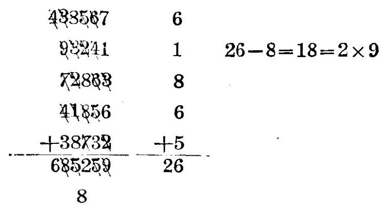

5. 若干數相加後, 以 9 除得之餘數，與以 9 分別除各數所得各餘數之和，相差之數，若非 9 之倍數，則加法時計算必有錯

誤，此法名曰加法之檢誤法(但若相差之數爲 9 之倍數時， 不可卽以之斷定計算之必無錯誤，故此法祗能檢舉錯誤，以下各檢誤法均然)

例五

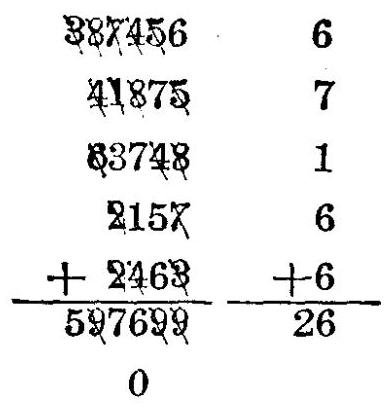

${26} - 0 = {26}$ 非9之倍數,

故知以上計算必有錯誤

6. 以 9 除被減數所得之餘數，與以 9 除減數與餘數所得二餘數之和，相差之數，若非 9 之倍數，則減法時計算必有錯誤， 此法名曰減法之檢誤法。

(證)設Ａ爲被減數，Ｂ為減數，Ｃ為餘數，即

$$
A - B = C
$$

$$
A = B + C
$$

若以 9 除A所得之餘數，與以 9 除 B 與 C 所得二餘數之和相差之數，非 9 之倍數，則第二式中之加法必有錯誤，或即第一式中之減法必有錯誤。

例六

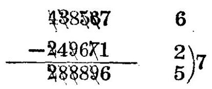

$7 - 6 = 1\;$ 非 9 之倍數，故知以上計算必有錯誤

7. 以 9 除被乘數與乘數所得二餘數之積，與以 9 除乘積所得之餘數, 相差之數, 必為 9 之倍數。

(證) 設 AB = C

又設 $\mathrm{{Q}_{a},{Q}_{b},{Q}_{c}}$ ,爲以 9 除 $\mathrm{A, B, C,}$ 所得之商數,而 $\mathrm{{R}_{a}}$ , ${\mathrm{R}}_{\mathrm{b}},{\mathrm{R}}_{\mathrm{c}}$ 爲除得之餘數

$$
\mathrm{A} = 9{\mathrm{Q}}_{\mathrm{a}} + {\mathrm{R}}_{\mathrm{a}}
$$

$$
B = 9{Q}_{b} + {R}_{b}
$$

$$
C = 9{Q}_{c} + {R}_{o}
$$

以之代入上式，得:

$$
\left( {9{\mathrm{Q}}_{\mathrm{a}} + {\mathrm{R}}_{\mathrm{a}}}\right) \left( {9{\mathrm{Q}}_{\mathrm{b}} + {\mathrm{R}}_{\mathrm{b}}}\right)  = 9{\mathrm{Q}}_{\mathrm{c}} + {\mathrm{R}}_{\mathrm{c}}
$$

$9\left( {9{\mathrm{Q}}_{\mathrm{a}}{\mathrm{Q}}_{\mathrm{b}} + {\mathrm{Q}}_{\mathrm{a}}{\mathrm{R}}_{\mathrm{b}} + {\mathrm{Q}}_{\mathrm{b}}{\mathrm{R}}_{\mathrm{a}}}\right)  + {\mathrm{R}}_{\mathrm{a}}{\mathrm{R}}_{\mathrm{b}} = 9{\mathrm{Q}}_{\mathrm{c}} + {\mathrm{R}}_{\mathrm{c}}$

即 ${R}_{a}{R}_{b} - {R}_{c} = 9\left( {{Q}_{c} - 9{Q}_{a}{Q}_{b} - {Q}_{a}{R}_{b} - {Q}_{b}{R}_{a}}\right)$

上式中右邊為 9 之倍數，故左邊亦為 9 之倍數

例七

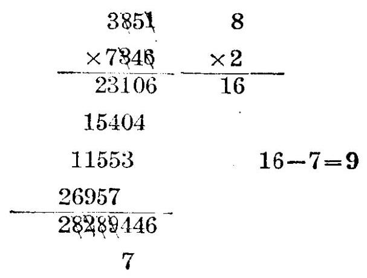

8. 以 9 除被乘數與乘數所得二餘數之積，與以 9 除乘積所得之餘數，相差之數，若非 9 之倍數，則乘法時計算必有錯誤 ， 此法名曰乘法之檢誤法。

例八

352 1

$\times  {743} \; \times  5$

5

1408 $5 - 4 = 1$ 非 9 之倍數,

2364 故知以上計算必有錯誤

251536

4

9. 骰以除數 $D$ 除被除數 $P$ 而得商数 $Q$ 與餘數 $R$ ,則以 9 除 $D$ 與 $\mathrm{Q}$ 所得二餘數之積,與以 9 除 $\mathrm{R}$ 所得之餘數相加後,再與以 9 除 P 所得之餘數相減，兩者之差必為 9 之倍數

(蹬) $\mathrm{P} = \mathrm{D}Q + \mathrm{R}$

設 ${q}_{1},{q}_{2},{q}_{3},{q}_{4}$ 爲以 9 除 $P, D, Q, R$ 所得之商數,

而 ${r}_{1},{r}_{2},{r}_{3},{r}_{4}$ 爲除得之餘數

$$
P = 9{q}_{1} + {r}_{1}
$$

$$
D = 9{q}_{2} + {r}_{2}
$$

$$
Q = 9{q}_{3} + {r}_{3}
$$

$$
R = 9{q}_{4} + {r}_{4}
$$

以之代入上式，得:

$$
9{q}_{1} + {r}_{1} = \left( {9{q}_{2} + {r}_{2}}\right) \left( {9{q}_{3} + {r}_{3}}\right)  + 9{q}_{1} + {r}_{4}
$$

$9{q}_{1} + {r}_{1} = 9\left( {9{q}_{2}{q}_{3} + {q}_{2}{r}_{3} + {q}_{3}{r}_{2} + {q}_{4}}\right)  + {r}_{2}{r}_{3} + {r}_{4}$ 即 $\left( {{r}_{2}{r}_{3} + {r}_{4}}\right)  - {r}_{1} = 9\left( {{q}_{1} - 9{q}_{2}{q}_{3} - {q}_{2}{r}_{3} - {q}_{3}{r}_{2} - {q}_{4}}\right)$

上式之右邊為 9 之倍數, 故左邊亦為 9 之倍數

速

例九 385_J43567_113

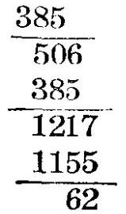

385

113

62

${43} - 7 = {36} = 4 \times  9$

48587 7

10. 設以除數 D 除被除數 P 而得商數 Q 與餘數 R, 若以 9 除 D 與 Q 所得二餘數之積與以 9 除 R 所得之餘數相加後，再與以 9 除 P 所得之餘數相減，兩者之差非為 9 之倍數，則除法時計算必有錯誤 ，此法名曰除法之檢誤法。

例十

364 73851 202

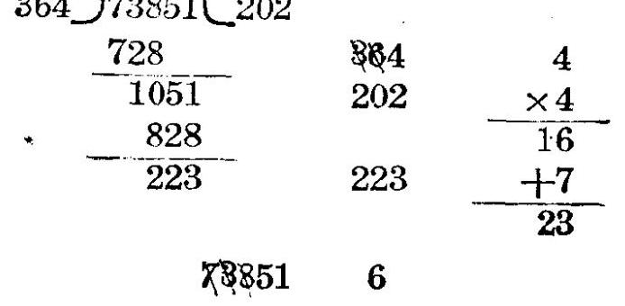

${23} - 6 = {17}$ 非 9 之倍數，故知以上計算必有錯誤

11. 設將 $\mathrm{A}$ 開方後而得方根 $\mathrm{B}$ 與餘數 $\mathrm{C}$ ,則以 9 除 $\mathrm{B}$ 所得餘數之平方與以 9 除C所得之餘數相加後，再與以 9 除 $\mathrm{A}$ 所得之餘數相減，兩者之差必為 9 之倍數

( ii ) $\mathrm{A} = {\mathrm{B}}^{2} + \mathrm{C}$

設 ${Q}_{a}$ ， ${Q}_{b}$ ， ${Q}_{c}$ ，爲以 9 除 $A$ ， $B$ ， ${C}_{2}$ ，所得之商數，而 ${R}_{a}$ ， ${R}_{b},{R}_{c}$ 爲除得之餘數

$$
A = 9{Q}_{a} + {R}_{a}
$$

$$
B = 9{Q}_{b} + {R}_{b}
$$

$$
C = 9{Q}_{c} + {R}_{c}
$$

以之代入上式，得:

$9{\mathrm{Q}}_{\mathrm{a}} + {\mathrm{R}}_{\mathrm{a}} = {\left( 9{\mathrm{Q}}_{\mathrm{b}} + {\mathrm{R}}_{\mathrm{b}}\right) }^{2} + 9{\mathrm{Q}}_{\mathrm{c}} + {\mathrm{R}}_{\mathrm{c}}$

$9{\mathrm{Q}}_{\mathrm{a}} + {\mathrm{R}}_{\mathrm{a}} = 9\left( {9{\mathrm{Q}}_{\mathrm{b}}{}^{2} + 2{\mathrm{Q}}_{\mathrm{b}}{\mathrm{R}}_{\mathrm{b}} + {\mathrm{Q}}_{\mathrm{c}}}\right)  + {\mathrm{R}}_{\mathrm{b}}{}^{2} + {\mathrm{R}}_{\mathrm{c}}$

即 $\left( {{\mathrm{{Rb}}}^{2} + {\mathrm{R}}_{\mathrm{C}}}\right)  - {\mathrm{R}}_{\mathrm{a}} = 9\left( {{\mathrm{Q}}_{\mathrm{a}} - 9{\mathrm{Q}}_{\mathrm{b}}{}^{2} - 2{\mathrm{Q}}_{\mathrm{b}}{\mathrm{R}}_{\mathrm{b}} - {\mathrm{Q}}_{\mathrm{c}}}\right)$

上式之右邊爲 9 之倍數，故左邊亦為 9 之倍數。

例十一

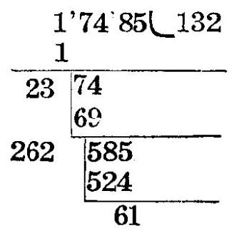

132 ${6}^{2} = {36}$

61

17485 7

${43} - 7 = {36} = 4 \times  9$

12. 設將 $\mathbf{A}$ 開方後而得方根 $\mathbf{B}$ 與餘數 $\mathbf{C}$ ,若以 9 除 $\mathbf{B}$ 所得餘數之平方, 與以 9 除 C 所得之餘數相加後, 再與以 9 除 A 所得之餘數相減 )兩者之差，非為 9 之倍數 ，則開方時計算必有錯誤，此法名曰開方之檢誤法

例十二 ${10} - 2 = 8$ 非 9 之倍數 ) 故知以上計算必有錯誤

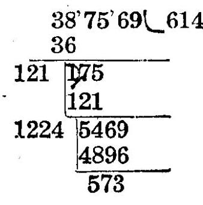

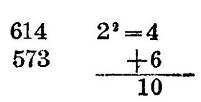

S87589 2

## 習 題 一

1. 求以 9 除下列各數所得之餘數

a. 43857 b. 637524 c. 8164903 d. 637428

e. 63954

2. 就下列各加法憸舉錯誤，如發現錯誤，將演算改正後再依檢誤法檢誤。

a. 438567 + 134862 + 31486 + 43752 = 648677

b. 637524 + 314724 + 147325 + 387463 = 1387036

c. 817524 + 324356 + 143752 + 86314 = 1371947

d. ${639} + {437} + {512} + {456} + {387} = {2231}$

e. ${324316} + {187543} + {216374} + {311825} = {1039958}$

3. 就下列各减法檢舉錯誤，如發現錯誤，將演算改正後，再依檢誤法檢誤。

a. 432587 - 213694 = 318893

b. 637456 - 324187 = 313286

c. 3193425 - 1081725 = 2111600

d. 3815426 - 2093173 = 2822253

e. ${63754} - {31256} = {32508}$

4. 就下列各乘法檢舉錯誤，如發現錯誤，將演算改正後，再依檢誤法檢誤。

算

a. ${38} \times  {73} = {3774}$

b. ${46} \times  {84} = {3964}$

c. ${324} \times  {436} = {131264}$

d. ${487} \times  {712} = {346644}$

e. ${546} \times  {618} = {337418}$

f. ${35}^{2} = {1125}$

g. ${75}^{2} = {5635}$

h. ${105}^{2} = {11125}$

i. ${98}^{2} = {9704}$

${j}_{.9}{94}^{2} = {988136}$

5. 就下列各除法檢舉錯誤，如發現錯誤，將演算改正後，再依檢誤法檢誤。

<table><tr><td>被除數</td><td>除數</td><td>商數</td><td>餘數</td></tr><tr><td>a. 43867</td><td>341</td><td>128</td><td>119</td></tr><tr><td>b. 35742</td><td>182</td><td>190</td><td>162</td></tr><tr><td>c. 63714</td><td>367</td><td>173</td><td>123</td></tr><tr><td>d. 83456</td><td>4124</td><td>20</td><td>876</td></tr><tr><td>e. 38712</td><td>3876</td><td>9</td><td>3826</td></tr></table>

6. 就下列各開方檢舉錯誤, 如發見錯誤, 將演算改正後, 再依檢誤法檢誤。

<table><tr><td></td><td>被開方之數</td><td>方根</td><td>餘數</td></tr><tr><td>a.</td><td>38756</td><td>169</td><td>195</td></tr></table>

<table><tr><td></td><td></td><td>速</td><td>算</td><td></td><td>11</td></tr><tr><td></td><td>b.</td><td>56487</td><td>237</td><td>218</td><td></td></tr><tr><td></td><td>c.</td><td>8649</td><td>93</td><td>100</td><td></td></tr><tr><td rowspan="3">文</td><td>d.</td><td>71643</td><td>267</td><td>344</td><td></td></tr><tr><td>e.</td><td>94815</td><td>307</td><td>655</td><td></td></tr><tr><td></td><td></td><td></td><td></td><td></td></tr></table>

## 第二章 不用計算表之速算

## 第一節 加減法之速算

## 13. 加法時可將其和為 10 之諸數字先加 9 例如 3 與 7,2 與 8 或

1 與 4 與 5 諸數字可先加，以便計算

例一

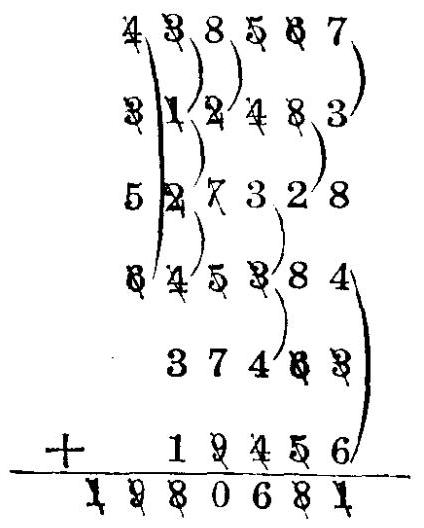

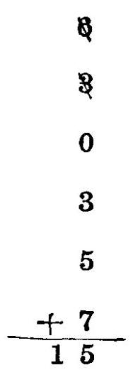

6

${15} - 6 = 9$

14. 位數甚多之數相加時，可將各數分成左右二部，分別相加 ，然後再求二者之和，以便檢誤。

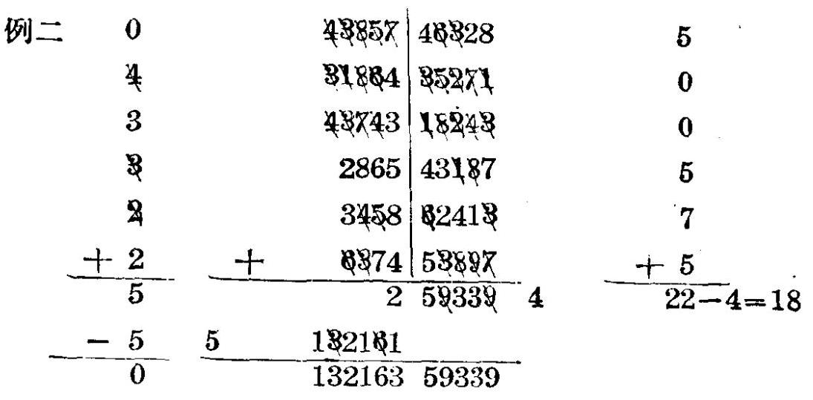

15. 相加諸數中若有若干數之右端，須由數字 9，8，7，所組成 - 例如 219887 则可先将此数改為 220000-113，然後正負各自相加，再自前部之和減去後部之和

例三 432135 +319978 + 432897 +618799 +217789+

$$
\text{ 215421 + 2799897 }
$$

$$
\text{ 432135 }
$$

0

$$
\text{ 320000 - 22 }
$$

$$
\text{ 433000 - 103 }
$$

$$
\text{ 620000 - 1201 }
$$

$$
\text{ 220000 - 2211 }
$$

$$
\text{ 215421 }
$$

$$
- \frac{{5000000} - {200103}}{5240556}
$$

$$
\begin{array}{l} {203640} \\  {5038916} \\  \end{array}
$$

$$
{12} - 3 = 9
$$

16. 相加諸數若係連續之數，則可將最大數與最小數相加後，再以項數之半乘之。

(證) 設 a 爲最小數， l 爲最大數， n 爲項數， S 爲諸數之 - 和，則

$$
S = a + \left( {a + 1}\right)  + \left( {l + 2}\right)  + \ldots \ldots  + \left( {l - 2}\right)  + \left( {l - 1}\right)  + l
$$

若將上式之右邊前後倒置，則得:

$$
S = l + \left( {l - 1}\right)  + \left( {l - 2}\right)  + \ldots \ldots  + \left( {a + 2}\right)  + \left( {a + 1}\right)  + a
$$

两式相加得

$$
{2S} = n\left( {a + l}\right) \;\therefore S = \frac{n}{2}\left( {a + l}\right)
$$

例四 ${895} + {896} + {897} + {898} + {899} + {900} + {901}$

$+ \frac{895}{1796}$

$$
\begin{array}{l} {898} \\  {1798} \times  \frac{7}{2} = {6286} \end{array}
$$

17. 相加諸數 ，若數值甚大而相差不多，則可先將最小數與各數之差相加 ，再以項數與最小數相乘，兩者之和即為所求之和

(證) 設 ${\mathrm{N}}_{1}$ 爲最小數, ${\mathrm{N}}_{2},{\mathrm{\;N}}_{3}\ldots \ldots \mathrm{N}\mathrm{n}$ 爲其他各數, $\mathrm{S}$ 爲諧數之和, n 爲項數, 又設

$$
{\mathrm{N}}_{2} = {\mathrm{N}}_{1} + {\mathrm{d}}_{2}
$$

$$
{\mathrm{N}}_{3} = {\mathrm{N}}_{1} + {\mathrm{d}}_{3}
$$

$$
\mathrm{{Nn}} = {\mathrm{N}}_{1} + \mathrm{{dn}}
$$

$$
S = {N}_{1} + \left( {{N}_{1} + {d}_{2}}\right)  + \left( {{N}_{1} + {d}_{3}}\right)  + \ldots \ldots  + \left( {{N}_{1} + {dn}}\right)
$$

$$
= n{N}_{1} + \left( {{d}_{2} + {d}_{3} + \ldots \ldots  + {d}_{n}}\right)
$$

例五 89543 + 89545 + 89546 + 89548 + 89551 + 89553

$$
+ {89558} + {89561} + {89562} + {89564}
$$

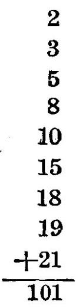

檢誤

又

1

3

8

2

3

+5

$$
{13} - 4 = 9
$$

錬 15

18. 减法有英美法與意大利法之別，例如求 8 與 3 之差，依英美法之定義，乃自 8 個中拿去 3 個，得 5 個，依意大利法之定義，則因減法係加法之還原，故可問: 3 個加幾個為 8 個， 得 5 個。自一數減若干數之和，依英美法須先求若干數之和 ，然後自被減數中減去，但依意大利法則可自被減數中直接减去諸數。

例六 43857 $- \left( {\text{ 3865 } + \text{ 4387 } + \text{ 6354 } + \text{ 3812 }}\right)$

(英美法) 3865

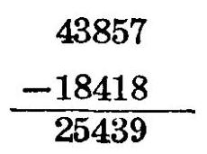

4387

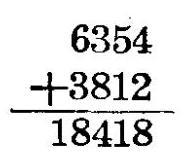

$5 + 7 + 4 + 2 = {18}$

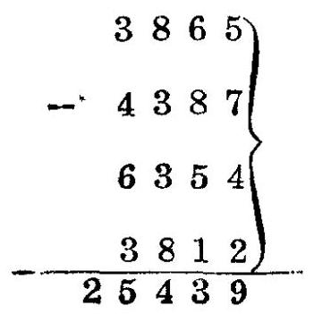

${18} + ? = {27}$ 得 9 進 2

$2 + 6 + 8 + 5 + 1 = {22}$

${22} + ? = {25}$ 得 3 進 2

$2 + 8 + 3 + 3 + 8 = {24}$

${24} + ? = {28}$ 得 4 進 2

$2 + 3 + 4 + 6 + 3 = {18}$

${18} + ? = {43}\;{\text{ 得 }25}$

例七 應用意大利法求:

$$
{548326} - \left( {{38752} + {43186} + {31452} + {83546} + {73529}}\right)
$$

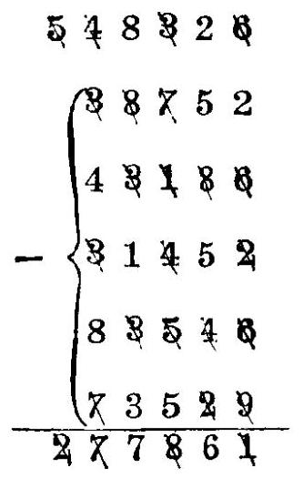

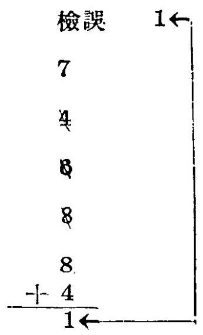

19. 10, 100, 1000, 10000, 10000. .... 為 10 之正整數幕，大於某數之最小整數冪，與某數之差，名曰某數之補數，例如 4375 之補數為 5625 , 蓋 5625 為 4375 與 10000 之差 9 又如 1000 之補數為 9000 , 蓋 9000 為 1000 與 10000 之差故也 , 將某數變為其補數而以丁置於其左端，所成之數名曰某數之反數 ，例如 4358 之補數為 5642，而其反數為 7 5642，蓋丁 ${5642} =  - {10000} + {5642} =  - {4358}$ ,即爲與 4358 絕對值相同而符號相反之數也。

20. 减法除英美法與意大利法外，尚有反數法，反數法者，以減數之反數與被減數相加之法也。例如減數為 4563 則可以 1 5437 與被減數相加

例八 (43857 + 38643 + 43251 + 38756)

$$
- \left( {{38754} + {23154} + {26487} + {16934}}\right)
$$

<table><tr><td></td><td>293</td><td>算</td><td></td><td>17</td></tr><tr><td>(英美法)</td><td>43857</td><td>38754</td><td>164507</td><td></td></tr><tr><td></td><td>38643</td><td>23154</td><td>-105329</td><td></td></tr><tr><td></td><td>43251</td><td>26487</td><td>59178</td><td></td></tr><tr><td></td><td>$+ {38756}$</td><td>$+ {16934}$</td><td></td><td></td></tr><tr><td></td><td>164507</td><td>105329</td><td></td><td></td></tr></table>

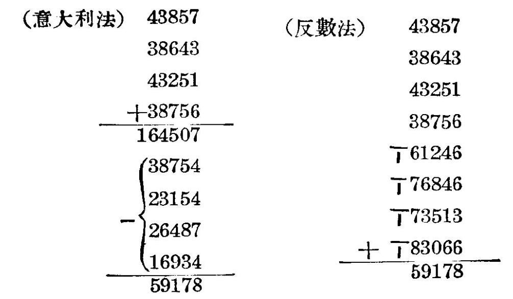

例九 應用反數法求:

$$
\left( {{48754} + {38752} + {6345}}\right)  - \left( {{3872} + {2356} + {4817}}\right)
$$

48754 檢誤

38752 2

6345 X 1

T6128 2 7

7 7644 6 +0

+ T5183

8 3.8

82806

## 習題二

1. 求下列各數之補數

a. 4385 b. 73428 c. 63904 d. 10000 e. 7351

## 2. 求下列各數之反數

a. 63751 b. 42830 c. 1000 d. 438592 e. 389

3. 求下列諸數之和

a. 43857462 + 38694371 + 31438574 + 63978432 + 63548712

b. 36947385 + 148769543 + 38714564 + 63947185 + 31258792

c. 3894648756 + 4139875462 + 3875649364 + 4154839462 $+ {375438569} + {437586494}$

d. 3154637528 + 314573948 + 432757498 + 718596374 $+ {6374983752}$

e. 4371563971 + 3875141524 + 6397481549 + 387514375 + 418754639

## 4. 求下列諸數之和

a. 41987 + 52897 + 14999 + 12897 + 10989

b. 30997 +19988 +20879 + 11998 +19998

c. 31999 + 10997 + 89979 + 79889 + 12979

d. 41989 + 121989 + 199897 + 198979 + 298999

$$
\text{ e. }{13899} + {10877} + {11987} + {14988} + {22888}
$$

5. 求下列諸數之和

$$
\text{ a. }{388} + {389} + {390} + {391} + {392}
$$

$$
\text{ b. 4375 + 4376 + 4377 + 4378 + 4379 + 4380 }
$$

$$
\text{ c. 5169 + 5170 + 5171 + 5172 + 5173 + 5174 + 5175 }
$$

$$
+ {5176} + {5177} + {5178} + {5179}
$$

$$
\text{ d. 8194 + 8195 + 8196 + 8197 + 8198 + 8199 }
$$

$$
\text{ e. 3456 + 3457 + 3458 + 3459 + 3460 + 3461 + 3462 }
$$

$$
+ {3463} + {3464}
$$

6. 求下列諸數之和

$$
\text{ a. }{3897} + {3895} + {3899} + {3900} + {3901}
$$

$$
\text{ b. 4875 + 4873 + 4870 + 4874 + 4881 + 4883 }
$$

c. 8975 + 8978 + 8980 + 8981 + 8983 + 8984 + 8985

d. 71548 + 71546 + 71549 + 71550 + 71556 + 71558

$$
\text{ e. 6394 + 6395 + 6397 + 6398 + 6400 + 6401 + 6403 + 6404 + 6405 }
$$

7. 求

a. ${38752} - \left( {{4385} + {6374} + {8154} + {487}}\right)$

b. 41584 - (12387 + 3194 + 8874 + 6395)

c. 38752 - (4875 + 6199 + 4875 + 8199)

d. 41769 - (23545 + 1876 + 4333 + 7154 + 3875)

e. ${387549} - \left( {{4358} + {8175} + {6394} + {4387} + {3876} + {6375}}\right)$

8. 求

a. $\left( {{3875} + {6354} + {4385}}\right)  - \left( {{3875} + {4184} + {2876}}\right)$

b. $\left( {{4318} + {3875} + {2486}}\right)  - \left( {{1474} + {3129} + {1674}}\right)$

c. $\left( {{3825} + {4194} + {7488}}\right)  - \left( {{1444} + {2229} + {1875} + {6329}}\right)$

d. $\left( {{4188} + {8694} + {3875} + {6394}}\right)  - \left( {{3875} + {4259} + {3877}}\right)$

e. $\left( {{3875} + {5463} + {61594} + {43286}}\right)  - ({38751} + {2458} + {18754} \; + {2194})$

## 第二節 乘法與平方之速算

21. 乘數為10之正整數冪之倍數時，可將乘數右端之零除去而以 10 之正整數冪乘被乘數 ，例如 438756 × 73000 即等於 438756000×73，乘數含有小數時，可將乘數之小數點除去而將被乘數之小數點向左移動若干位，移動之位數須與乘數中所含之小數位數相等, 例如 837454×3.186 即等於 837.454 ×3186故吾人可假定乘數均為單位數非為零之整數，被乘數若為整數而於右端有若干零時，乘時可將零略去而於乘積之右端添列略去之零，被乘數若含有小數，乘時可將小數點略去，而於乘積中添列小數點，其小數位數與被乘數中小數之

## 位數相等

$$
{38754} \times  {43000} = {38754000} \times  {43}
$$

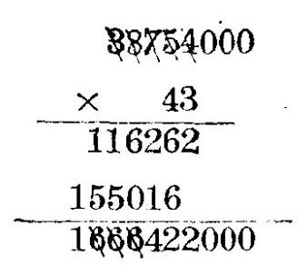

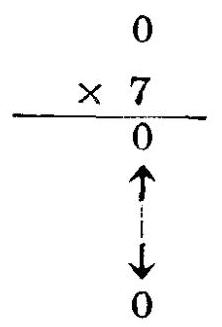

例二 求 ${4385.274} \times  {7.12}$

$$
{4385.274} \times  {7.12} = {43.85274} \times  {712}
$$

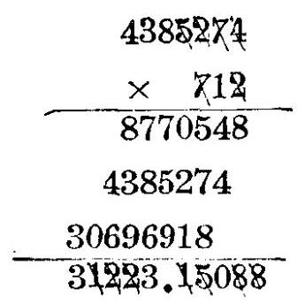

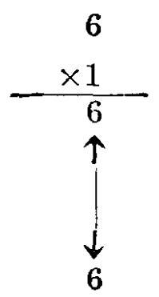

22. 乘數為 11 時，乘積之單位數即為被乘數之單位數，乘積之十位數卽爲被乘數之單位數與十位數之和 (兩者之和滿十時以 1 進於乘積之百位數)乘積之百位數即爲被乘數之十位數與百位數(若有進位再加 1)之和(兩者之和滿十時以 1 進於乘積之千位數)乘積之千位數，萬位數，……可依次求得， 乘積第 $\mathrm{n} + 1$ 位 (由低位數至高位) ( $\mathrm{n}$ 爲被乘數之位數) 之數即為被乘數第 n 位之數(若有進位再加1)(滿十時進位)例如 ${438761} \times  {11}$ 依普通法,得:

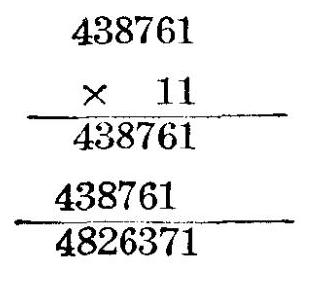

$$
\text{ 1 = 1 }
$$

$$
7 = 1 + 6
$$

$$
3 = 6 + 7 - {10}
$$

$$
6 = 7 + 8 + 1 - {10}
$$

$$
2 = 8 + 3 + 1 - {10}
$$

$$
8 = 3 + 4 + 1
$$

$$
\mathbf{4} = \mathbf{4}
$$

例三 求 ${4385742} \times  {11}$

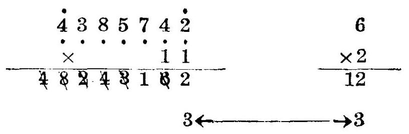

23. 乘數為 22 時(乘數為 33,44,55,66,77,88 時與此相仿) 乘積之單位數即為被乘數之單位數之二倍 (滿十時進於乘積之十位數)乘積之十位數即為被乘數之單位數與十位數之和之二倍(若有進位再加進位) (滿十時進於乘積之百位數)乘積之百位數即為被乘數之十位數與百位數之和之二倍(若有進位再加進位)(滿十時進於乘積之千位數)，乘積之千位數， 萬位數，……可依次求得，乘積第 n +1位(由低位數至高位) (n 爲被乘數之位數)之數即為被乘數第 n 位之數之二倍 (若有進位再加進位) (滿十時進位) 例如 ${478562} \times  {22}$ 依普通乘法得:

<table><tr><td>速 293</td><td>23</td></tr><tr><td>478562</td><td>$4 = 2 \times  2$</td></tr><tr><td>957124   957124   10528364</td><td>$6 = \left( {2 + 6}\right)  \times  2 - {10}$   $3 = \left( {5 + 6}\right)  \times  2 + 1 - {20}$   $8 = \left( {8 + 5}\right)  \times  2 + 2 - {20}$   $2 = \left( {7 + 8}\right)  \times  2 + 2 - {30}$   $5 = \left( {4 + 7}\right)  \times  2 + 3 - {20}$   ${10} = 4 \times  2 + 2$</td></tr></table>

例四 求 ${567584} \times  {22}$

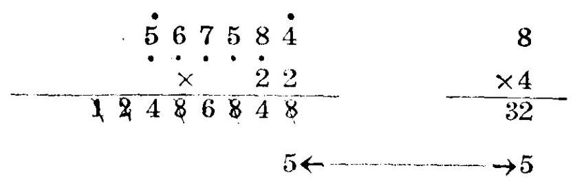

例五 求 ${456732} \times  {44}$

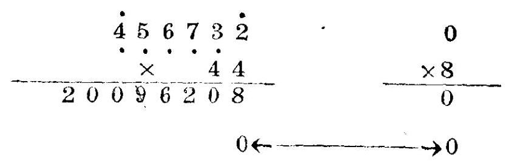

例六 求 76548 $\times  {266}$

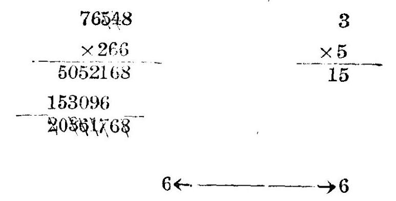

例七 求 765482

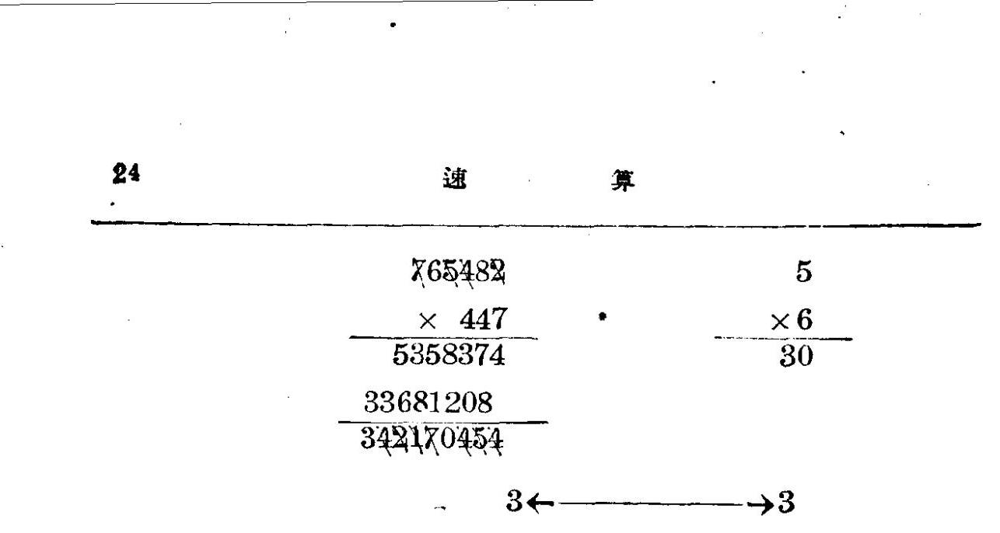

例八 求 ${35842} \times  {3077}$

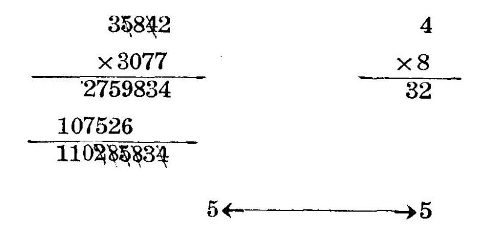

例九 求 ${31743} \times  {4406}$

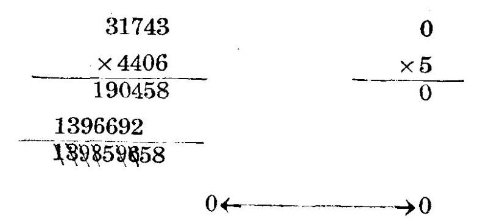

例十 求 ${413562} \times  {2238}$

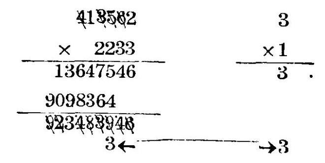

## 習題 三

求下列各題中之乘積

<table><tr><td rowspan="2">題次</td><td rowspan="2">破乘數</td><td colspan="5">乘</td><td colspan="5">數</td></tr><tr><td>a</td><td>b</td><td>C</td><td>d</td><td>e</td><td>f</td><td>g</td><td>h</td><td>i</td><td>j</td></tr><tr><td>1</td><td>43859</td><td>11</td><td>266</td><td>553</td><td>773</td><td>5508</td><td>6603</td><td>7703</td><td>22</td><td>277</td><td>557</td></tr><tr><td>2</td><td>73862</td><td>774</td><td>2203</td><td>3302</td><td>4402</td><td>5522</td><td>6604</td><td>7704</td><td>33</td><td>311</td><td>558</td></tr><tr><td>3</td><td>38941</td><td>811</td><td>2204</td><td>3304</td><td>4403</td><td>5533</td><td>6607</td><td>7706</td><td>44</td><td>336</td><td>622</td></tr><tr><td>4</td><td>435263</td><td>822</td><td>2206</td><td>3306</td><td>4406</td><td>5544</td><td>6608</td><td>7708</td><td>55</td><td>337</td><td>633</td></tr><tr><td>5</td><td>187542</td><td>855</td><td>2207</td><td>3307</td><td>4407</td><td>5566</td><td>6644</td><td>7722</td><td>66</td><td>377</td><td>644</td></tr><tr><td>6</td><td>387456</td><td>866</td><td>2208</td><td>3344</td><td>4408</td><td>5577</td><td>6655</td><td>7733</td><td>77</td><td>411</td><td>662</td></tr><tr><td>7</td><td>631425</td><td>2233</td><td>3355</td><td>4433</td><td>5588</td><td>6677</td><td>7744</td><td>88</td><td>422</td><td>663</td><td>2255</td></tr><tr><td>8</td><td>318357</td><td>3377</td><td>4455</td><td>6011</td><td>6688</td><td>7755</td><td>113</td><td>442</td><td>644</td><td>2277</td><td>3388</td></tr><tr><td>9</td><td>418359</td><td>4466</td><td>6022</td><td>7022</td><td>7766</td><td>114</td><td>446</td><td>668</td><td>2011</td><td>3011</td><td>4011</td></tr><tr><td>10</td><td>617354</td><td>4477</td><td>6033</td><td>7033</td><td>7788</td><td>117</td><td>447</td><td>2033</td><td>3022</td><td>4022</td><td>5502</td></tr><tr><td>11</td><td>735482</td><td>6044</td><td>7044</td><td>8011</td><td>118</td><td>448</td><td>711</td><td>2044</td><td>3044</td><td>4033</td><td>5503</td></tr><tr><td>12</td><td>438594</td><td>6055</td><td>7055</td><td>8022</td><td>224</td><td>466</td><td>733</td><td>2055</td><td>3055</td><td>4055</td><td>5504</td></tr><tr><td>13</td><td>382175</td><td>6077</td><td>7066</td><td>8033</td><td>226</td><td>477</td><td>744</td><td>2066</td><td>3066</td><td>4066</td><td>5506</td></tr><tr><td>14</td><td>413264</td><td>8044</td><td>228</td><td>552</td><td>755</td><td>2077</td><td>3077</td><td>4077</td><td>5507</td><td>6602</td><td>7702</td></tr><tr><td>15</td><td>453829</td><td>8055</td><td>8066</td><td>8077</td><td>8833</td><td>8855</td><td>8866</td><td>8877</td><td>3322</td><td>1108</td><td>1107</td></tr><tr><td>16</td><td>389143</td><td>1106</td><td>1104</td><td>1103</td><td>1102</td><td>7011</td><td>3308</td><td>338</td><td>611</td><td>6.33</td><td>55.44</td></tr><tr><td>17</td><td>398768</td><td>722</td><td>772</td><td>833</td><td>883</td><td>116</td><td>227</td><td>22033</td><td>44033</td><td>33055</td><td>66077</td></tr></table>

24. 乘數為 111 時，(乘數為 1111, 11111, ……時，可依次類推) 乘積之單位數即為被乘數之單位數，乘積之十位數即為被乘數之單位數與十位數之和 (滿十時進於乘積之百位數) 乘積之百位數即為被乘數之單位數，十位數與百位數(若有進位再加進位)之和(滿十時進於乘積之千位數)，乘積之千位數即爲被乘數之十位數，百位數與千位數(若有進位再加進位)之和 (滿十時進於乘積之萬位數) 乘積之萬位數，十萬位數， 一······可依次求得，乘積第ｎ＋1位(由低位數至高位)(n 爲被乘數之位數)之數，即為被乘數左端第一第二兩數之和(若有進位再加進位) (滿十時進位)，乘積第 n +2 位之數即為被乘數最左端之數(若有進位再加進位)(滿十時進位)例如 43852 × 111 依普通乘法得:

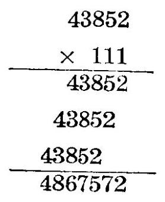

$$
2 = 2
$$

$$
7 = 5 + 2
$$

$$
5 = 8 + 5 + 2 - {10}
$$

$$
7 = 3 + 8 + 5 + 1 - {10}
$$

$$
6 = 4 + 3 + 8 + 1 - {10}
$$

$$
8 = 4 + 3 + 1
$$

$$
4 = 4
$$

例一 求 ${738524} \times  {111}$

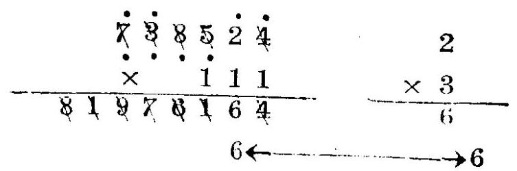

例二 求 435762 × 1114

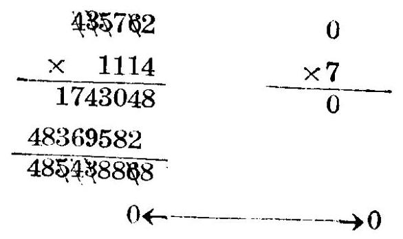

例三 求 ${738542} \times  {3111}$

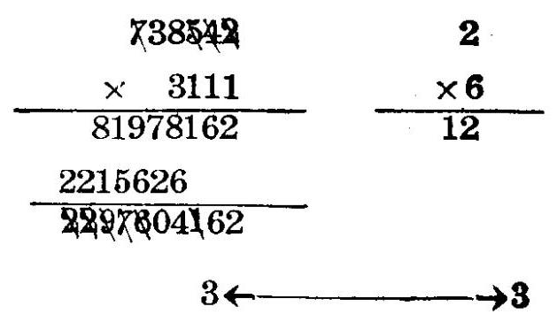

例四 求 ${837562} \times  {1111}$

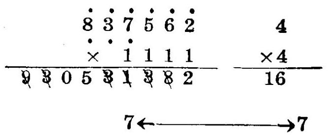

25. 乘數為 222 時(乘數為 333,444,555,666,777,888,3333 ······時，可依此類推)，乘積之單位數，即為被乘數之單位數之二倍(滿十時進於乘積之十位數)乘積之十位數即爲被乘數之單位數與十位數之和之二倍(若有進位再加進位)(滿十時進於乘積之百位數)，乘積之百位數即為被乘數之單位數 ，十位數，與百位數之和之二倍(若有進位再加進位)(滿十時進於乘積之千位數)乘積之千位數即為被乘數之十位數， 百位數與千位數之和之二倍 (若有進位再加進位) (滿十時進於乘積之萬位數)乘積之萬位數，十萬位數……可依次求得 ，乘積第 $\mathrm{n} + 1$ 位(由低位数至高位)( $\mathrm{n}$ 爲被乘數之位數) 之數，即為被乘數左端第一第二兩數之和之二倍(若有進位

再加進位)(滿十時進位)，乘積第 n +2 位之數，即為被乘數最左端之數之二倍(若有進位再加進位)(滿十時進位) 例如 43852 × 222,依普通乘法,得:

$$
4 = 2 \times  2
$$

$$
4 = \left( {5 + 2}\right)  \times  2 - {10}
$$

$$
1 = \left( {8 + 5 + 2}\right)  \times  2 + 1 - {30}
$$

$$
5 = \left( {3 + 8 + 5}\right)  \times  2 + 3 - {30}
$$

$$
3 = \left( {4 + 3 + 8}\right)  \times  2 + 3 - {30}
$$

$$
7 = \left( {4 + 3}\right)  \times  2 + 3 - {10}
$$

$$
9 = 4 \times  2 + 1
$$

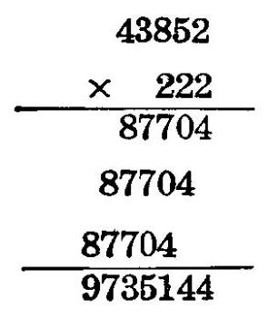

例五 求 ${458627} \times  {333}$

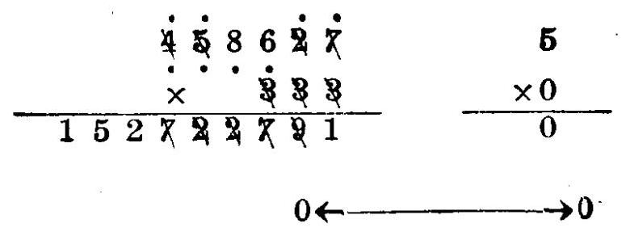

例六. 求 ${387524} \times  {2444}$

387524 2

$\times  {2444}$ ×5

172060656 10

775048

947101656

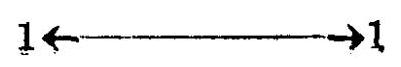

例七 求 ${835461} \times  {5553}$

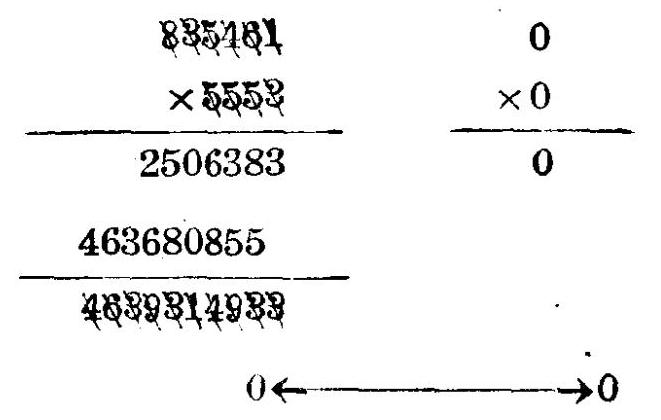

例八 求 ${738564} \times  {3333}$

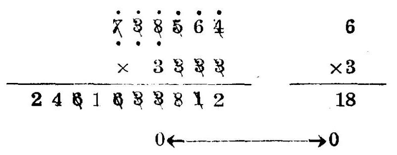

例九 求 ${875468} \times  {5555}$

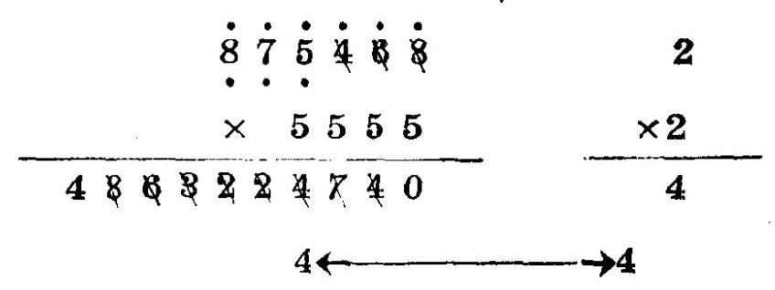

例十 求 ${735462} \times  {8888}$

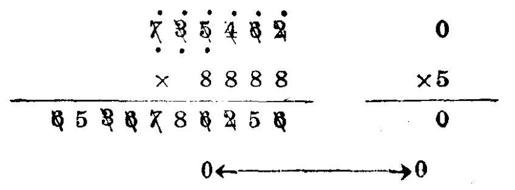

## 習 題 四

## 求下列各題中之乘積

<table><tr><td rowspan="2">題次</td><td rowspan="2">被乘數</td><td colspan="10">乘數</td></tr><tr><td>a</td><td>b</td><td>c</td><td>d</td><td>e</td><td>f</td><td>g</td><td>h</td><td>i</td><td>$j$</td></tr><tr><td>1</td><td>735486</td><td>111</td><td>2226</td><td>4442</td><td>6662</td><td>8555</td><td>222</td><td>2228</td><td>4444</td><td>6663</td><td>8666</td></tr><tr><td>2</td><td>367149</td><td>333</td><td>2444</td><td>4446</td><td>6664</td><td>8882</td><td>444</td><td>2555</td><td>4447</td><td>6666</td><td>8884</td></tr><tr><td>3</td><td>382417</td><td>555</td><td>2666</td><td>4448</td><td>6668</td><td>8886</td><td>666</td><td>2888</td><td>4666</td><td>6888</td><td>8888</td></tr><tr><td>4</td><td>43562</td><td>777</td><td>3111</td><td>4777</td><td>7111</td><td>888</td><td>3333</td><td>5552</td><td>7333</td><td>1111</td><td>3336</td></tr><tr><td>5</td><td>318275</td><td>5553</td><td>7444</td><td>1113</td><td>3337</td><td>5555</td><td>7555</td><td>1114</td><td>3555</td><td>5557</td><td>7773</td></tr><tr><td>6</td><td>43941</td><td>1117</td><td>3666</td><td>5558</td><td>7774</td><td>1118</td><td>3777</td><td>6222</td><td>7777</td><td>2222</td><td>4111</td></tr><tr><td>7</td><td>267354</td><td>6333</td><td>8111</td><td>2224</td><td>4222</td><td>6444</td><td>8444</td><td>7772</td><td>8883</td><td>2227</td><td>3338</td></tr><tr><td>8</td><td>785698</td><td>1116</td><td>8333</td><td>2777</td><td>3888</td><td>6111</td><td>7222</td><td>4888</td><td>8222</td><td>22233</td><td>44455</td></tr></table>

26. 乘數為 101 時(乘數為 1001, 10001 .... 時 ，可依此類推) ，乘積之單位數與十位數，即為被乘數之單位數與十位數， 乘積之百位數，即為被乘數之單位數與百位數之和(滿十時進位)→乘積之千位數即為被乘數之十位數與千位數之和(若有進位再加進位) (滿十時進位) ，乘積之萬位數，十萬位數一 ······可依次求得 > 乘積第 $\mathrm{n}$ 十 2 位(由低位數至高位) ( $\mathrm{n}$ 為被乘數之位數)與第 $\mathrm{n} + 1$ 位即為被乘數左端第一第二兩位數(若有進位再加進位)(滿十時進位)例如 ${74385} \times  {101}$ 依普通乘法, 得:

速算 31

74385 $5 = 5$

× 101 $8 = 8$

74385 8 = 3 + 5

87485 $2 = 4 + 8 - {10}$

7512885 $1 = 3 + 7 + 1 - {10}$

$$
5 = 4 + 1
$$

$$
7 = 7
$$

例一 求 835624 × 101

1

0 1 对 2

8 23 4 2

2 2

例二 458357 1001

5

0 1 $\times  2$

又 10

1 31

例三 求 835462 ✘ 1013

835462 1

✘ 1013 ✘ 5

2506386 5

84381662

848323008

5← 5

例四 求 $\;{718492} \times  {4101}$

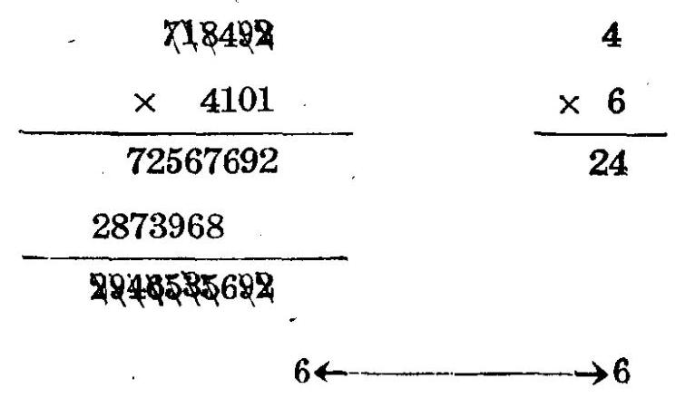

27. 乘數為 202 時(乘數為 303, 404, 505, 606, 707, 808, 2002, 3003, ……時，可依此類推)，乘積之單位數即為被乘數之單位數之二倍(滿十時進位)，乘積之十位數即為被乘數之十位數之二倍(若有進位再加進位)(滿十時進位)， 乘積之百位數即為被乘數之單位數與百位數之和之二倍 (若有進位再加進位) (滿十時進位) ， 乘積之千位數即為被乘數之十位數與千位數之和之二倍(若有進位再加進位)(滿十時進位)，乘積之萬位數，十萬位數，……可依次求得， 乘積之第 $\mathrm{n} + 1$ 位 (由低位數至高位) ( $\mathrm{n}$ 爲被乘數之位數)之數，即為被乘數左端第二位數之二倍(若有進位再加進位)(滿十時進位)乘積第 n +2 位之數即為被乘數左端第一位數之二倍(若有進位再加進位)(滿十時進位)例如 ${72845} \times  {202}$ 依普通乘法,得:

<table><tr><td></td><td></td><td>24 38</td></tr><tr><td></td><td>72845</td><td>$0 = 5 \times  2 - {10}$</td></tr><tr><td></td><td>$\times  {202}$</td><td>$9 = 4 \times  2 + 1$</td></tr><tr><td></td><td>145690</td><td>$6 = \left( {8 + 5}\right)  \times  2 - {20}$</td></tr><tr><td></td><td>145690</td><td>$4 = \left( {2 + 4}\right)  \times  2 + 2 - {10}$</td></tr><tr><td></td><td>14714690</td><td>$1 = \left( {7 + 8}\right)  \times  2 + 1 - {30}$</td></tr><tr><td></td><td></td><td>$7 = 2 \times  2 + 3$</td></tr><tr><td></td><td></td><td>$4 = 7 \times  2 - {10}$</td></tr><tr><td></td><td></td><td>$1 =  + 1$</td></tr></table>

例五 求 857483 × 404

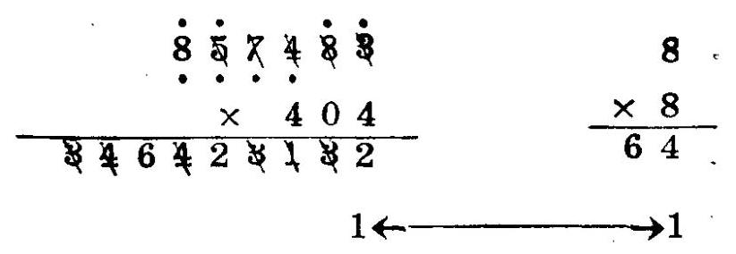

例六 求 715486 × 5057

715486 4

✘ 5057

5008402

361320430

8618212702

54 5

例七 求 ${437528} \times  {7606}$

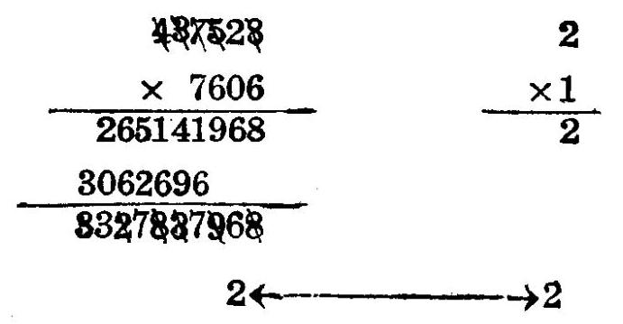

算

例八 求 ${875304} \times  {2002}$

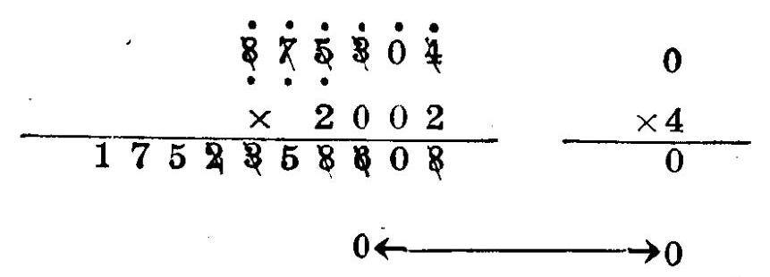

例九 求 ${837562} \times  {6006}$

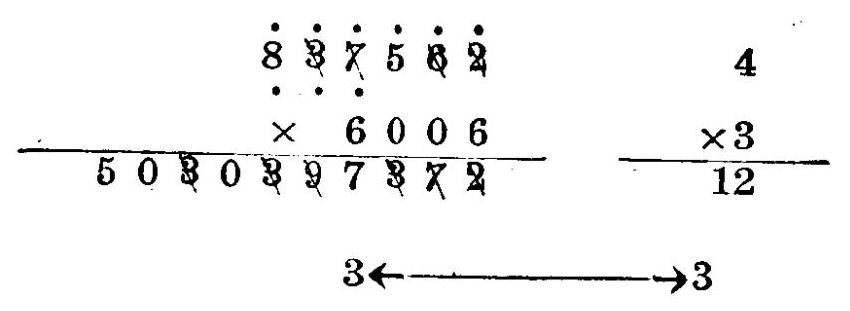

7

例十 求 435296 × 8008

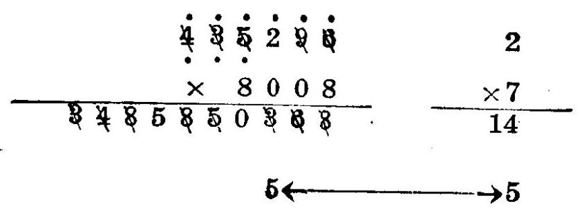

錬 35

## 智 题 五

求下列各题中之乘積

<table><tr><td rowspan="2">題次</td><td rowspan="2">被乘數</td><td colspan="10">乘數</td></tr><tr><td>$\mathbf{a}$</td><td>b</td><td>c</td><td>d</td><td>e</td><td>f</td><td>g</td><td>h</td><td>i</td><td>j</td></tr><tr><td>1</td><td>738594</td><td>101</td><td>3003</td><td>4046</td><td>6101</td><td>7303</td><td>8606</td><td>202</td><td>3032</td><td>4047</td><td>6202</td></tr><tr><td>2</td><td>637184</td><td>7404</td><td>8707</td><td>303</td><td>3034</td><td>4048</td><td>6303</td><td>7606</td><td>2024</td><td>404</td><td>3036</td></tr><tr><td>3</td><td>328345</td><td>4101</td><td>6404</td><td>7808</td><td>505</td><td>3037</td><td>4202</td><td>6505</td><td>8008</td><td>606</td><td>3038</td></tr><tr><td>4</td><td>43714</td><td>4303</td><td>6707</td><td>8082</td><td>707</td><td>3101</td><td>4606</td><td>6808</td><td>8083</td><td>808</td><td>3202</td></tr><tr><td>5</td><td>635284</td><td>4707</td><td>7007</td><td>8084</td><td>2023</td><td>1001</td><td>3404</td><td>5005</td><td>7072</td><td>8086</td><td>2026</td></tr><tr><td>6</td><td>387639</td><td>2002</td><td>3505</td><td>6006</td><td>7073</td><td>8087</td><td>1018</td><td>2101</td><td>3707</td><td>6062</td><td>7074</td></tr><tr><td>7</td><td>314283</td><td>8101</td><td>1017</td><td>2303</td><td>3808</td><td>6063</td><td>7076</td><td>8202</td><td>1016</td><td>2606</td><td>4004</td></tr><tr><td>8</td><td>576415</td><td>6064</td><td>7078</td><td>8303</td><td>1014</td><td>2707</td><td>4042</td><td>6067</td><td>7101</td><td>8404</td><td>1013</td></tr><tr><td>9</td><td>387968</td><td>2808</td><td>4043</td><td>6068</td><td>7202</td><td>8505</td><td>1012</td><td>2028</td><td>5052</td><td>5053</td><td>5054</td></tr><tr><td>10</td><td>827694</td><td>5056</td><td>5057</td><td>5058</td><td>7505</td><td>2027</td><td>10122</td><td>20255</td><td>300344</td><td>404303</td><td>50511</td></tr></table>

## 28. 乘數中有一位數字為 1 時, 此位數字與被乘數之乘積, 即可 借用被乘數

例一 求 ${4871543} \times  {122}$

例二 求 ${817493} \times  {3331}$

例三 求 ${637542} \times  {3301}$

例四 求 ${387154} \times  {1404}$

29. 乘數之補數為一簡單數時，例如乘數 89 之補數為 11 則可以

100 奥 11 分别乘被乘數，而求兩者之差。

例五 求 ${4356738} \times  {89}$

$$
{89} = {100} - {11}
$$

例六 求 8871492 × 899

$$
{899} = {1000} - {101}
$$

3871492 7

$\times  8$

56

2

例七 求 4356238 × 8999

$$
{8999} = {10000} - {1001}
$$

4856238 4

8827690987

32

5 5

例八 求 ${4873562} \times  {98}$

$$
{98} = {100} - 2
$$

4873562 8

$\times  \frac{88}{64}$

$$
1 \leftarrow  1 \leftarrow  1
$$

例九 求 ${4375842} \times  {667}$

$$
{667} = {1000} - {333}
$$

4375842 6

1457155386

triggeretts

$$
6 \leftarrow
$$

例十 求 ${3871452} \times  {6997}$

$$
{6997} = {10000} - {3003}
$$

8871452 3

$\times  {41685970356} -  \times  4$

## 智 题 六

求下列各題中之乘積

<table><tr><td rowspan="2">題次</td><td rowspan="2">被乘數</td><td colspan="10">乘數</td></tr><tr><td>a</td><td>b</td><td>C</td><td>d</td><td>e</td><td>f</td><td>g</td><td>h</td><td>i</td><td>j</td></tr><tr><td>1</td><td>438594</td><td>133</td><td>551</td><td>1404</td><td>2221</td><td>144</td><td>3881</td><td>166</td><td>1077</td><td>1888</td><td>3331</td></tr><tr><td>2</td><td>318763</td><td>177</td><td>1666</td><td>661</td><td>1011</td><td>1101</td><td>1444</td><td>1022</td><td>1202</td><td>2021</td><td>3031</td></tr><tr><td>3</td><td>428764</td><td>221</td><td>1033</td><td>1222</td><td>1707</td><td>1044</td><td>1303</td><td>331</td><td>771</td><td>4041</td><td>1055</td></tr><tr><td>4</td><td>41875</td><td>1333</td><td>1555</td><td>1066</td><td>2201</td><td>3301</td><td>441</td><td>1606</td><td>1777</td><td>122</td><td>1808</td></tr><tr><td>5</td><td>438263</td><td>5501</td><td>6061</td><td>4401</td><td>4441</td><td>5051</td><td>5551</td><td>6601</td><td>6661</td><td>7071</td><td>7701</td></tr><tr><td>6</td><td>385247</td><td>7771</td><td>8081</td><td>89</td><td>94</td><td>78</td><td>97</td><td>9994</td><td>67</td><td>98</td><td>899</td></tr><tr><td>7</td><td>4874563</td><td>945</td><td>889</td><td>998</td><td>9996</td><td>798</td><td>9945</td><td>778</td><td>697</td><td>9997</td><td>8999</td></tr><tr><td>8</td><td>386472</td><td>667</td><td>8889</td><td>997</td><td>9998</td><td>7998</td><td>9912</td><td>6997</td><td>92</td><td>996</td><td>93</td></tr><tr><td>9</td><td>387496</td><td>989</td><td>993</td><td>994</td><td>9923</td><td>9934</td><td>9956</td><td>9967</td><td>9978</td><td>9989</td><td>978</td></tr><tr><td>10</td><td>875469</td><td>967</td><td>956</td><td>934</td><td>923</td><td>912</td><td>9899</td><td>9798</td><td>9697</td><td>9596</td><td>9495</td></tr><tr><td>11</td><td>387542</td><td>9394</td><td>9293</td><td>9192</td><td>9889</td><td>9778</td><td>9667</td><td>9556</td><td>9445</td><td>9334</td><td>9223</td></tr><tr><td>12</td><td>245783</td><td>9112</td><td>9992</td><td>9993</td><td>992</td><td>7778</td><td>6667</td><td>96</td><td>99</td><td>999</td><td>9999</td></tr></table>

80 . 乘數中之任何一位數字加 1 或減 1 後，變為簡單數時，例如乘數 1211 之百位數減 1 後，變爲 1111 ，則可以 1111 與 100 分別乘被乘數，而求兩者之和。

例一 求 ${438564} \times  {69}$

速算 39

例二 438756 × 121

${121} = {111} + {10}$

48701916 6

438756 ×4

68089476 24

6 6

例三 求 ${3875642} \times  {91}$

${91} = {101} - {10}$

391439842 1

3875642 ✘ 8

8526883422 8

8 98

例四 求 ${838574} \times  {219}$

${219} = {220} - 1$

18448628 3

838574 $\times  8$

183847706 24

6← 6

例五 求 ${877452} \times  {399}$

${399} = {400} - 1$

3509808 6

877452 $\times  3$

350103848 18

0← >0

例六 求 ${817352} \times  {9901}$

${9901} = {10001} - {100}$

8174337352 8

817352 ✘ 1

8092602152 8

98

例七 求 ${837456} \times  {313}$

$$
{313} = {303} + {10}
$$

例八 求 ${837452} \times  {665}$

$$
{665} = {666} - 1
$$

$$
\begin{matrix} {557743032} & & & 8 \\  {837452} & & &  \times  2 \\  {556905580} & & &  \times  2 \end{matrix}
$$

7 7

例九 求 ${3875467} \times  {1121}$

$$
{1121} = {1111} + {10}
$$

4305643837

5

×4

20

3875467

4344398507

2 2

例十 求 8173524 × 4399

$$
{4399} = {4400} - 1
$$

359635056 7

8173524 ×3

35955332078 21

今 33

速

## 習題 七

求下列各題中之乘積

<table><tr><td rowspan="2">題次</td><td rowspan="2">破乘數</td><td colspan="10">乘數</td></tr><tr><td>a</td><td>b</td><td>C</td><td>d</td><td>e</td><td>f</td><td>g</td><td>h</td><td>i</td><td>j</td></tr><tr><td>1</td><td>387654</td><td>908</td><td>121</td><td>434</td><td>699</td><td>9991</td><td>2322</td><td>4014</td><td>5549</td><td>6676</td><td>3343</td></tr><tr><td>2</td><td>532187</td><td>19</td><td>199</td><td>439</td><td>1009</td><td>2903</td><td>4039</td><td>5565</td><td>6766</td><td>8018</td><td>29</td></tr><tr><td>3</td><td>387453</td><td>454</td><td>1099</td><td>2999</td><td>4104</td><td>5655</td><td>6907</td><td>8079</td><td>39</td><td>219</td><td>717</td></tr><tr><td>4</td><td>41876</td><td>1109</td><td>4399</td><td>5666</td><td>6999</td><td>8108</td><td>59</td><td>232</td><td>769</td><td>1121</td><td>4439</td></tr><tr><td>5</td><td>382159</td><td>5906</td><td>69</td><td>299</td><td>515</td><td>787</td><td>1211</td><td>3013</td><td>4454</td><td>5999</td><td>8799</td></tr><tr><td>6</td><td>187654</td><td>79</td><td>544</td><td>799</td><td>1902</td><td>3103</td><td>4544</td><td>7017</td><td>8879</td><td>565</td><td>1999</td></tr><tr><td>7</td><td>432167</td><td>3233</td><td>4905</td><td>7069</td><td>329</td><td>566</td><td>7107</td><td>3299</td><td>6016</td><td>7677</td><td>343</td></tr><tr><td>8</td><td>387453</td><td>599</td><td>818</td><td>2012</td><td>3329</td><td>6059</td><td>7699</td><td>9001</td><td>399</td><td>2019</td><td>3433</td></tr><tr><td>9</td><td>214873</td><td>5049</td><td>6106</td><td>7769</td><td>4344</td><td>3029</td><td>879</td><td>2122</td><td>3904</td><td>5105</td><td>6566</td></tr><tr><td>10</td><td>287654</td><td>7877</td><td>91</td><td>616</td><td>2102</td><td>2199</td><td>3999</td><td>5444</td><td>6599</td><td>7908</td><td>9901</td></tr><tr><td>11</td><td>214359</td><td>1992</td><td>313</td><td>665</td><td>901</td><td>2219</td><td>5455</td><td>6659</td><td>7999</td><td>2993</td><td>109</td></tr><tr><td>12</td><td>324174</td><td>414</td><td>676</td><td>991</td><td>2232</td><td>5499</td><td>6665</td><td>556</td><td>656</td><td>4333</td><td>4434</td></tr><tr><td>13</td><td>54831</td><td>2212</td><td>223</td><td>344</td><td>655</td><td>445</td><td>545</td><td>7776</td><td>3334</td><td>4443</td><td>4445</td></tr><tr><td>14</td><td>62743</td><td>7888</td><td>233</td><td>433</td><td>677</td><td>323</td><td>2223</td><td>6656</td><td>5556</td><td>6555</td><td>8777</td></tr><tr><td>15</td><td>71874</td><td>322</td><td>443</td><td>766</td><td>212</td><td>3222</td><td>3444</td><td>5554</td><td>3323</td><td>112</td><td>332</td></tr><tr><td>16</td><td>837564</td><td>455</td><td>776</td><td>767</td><td>192</td><td>3332</td><td>5996</td><td>5545</td><td>7666</td><td>211</td><td>334</td></tr><tr><td>17</td><td>817869</td><td>554</td><td>788</td><td>877</td><td>887</td><td>1112</td><td>2111</td><td>2333</td><td>4555</td><td>6777</td><td>8887</td></tr><tr><td>18</td><td>728356</td><td>549</td><td>659</td><td>394</td><td>596</td><td>293</td><td>3994</td><td>99991</td><td>19992</td><td>29903</td><td>39004</td></tr></table>

31. 乘數為 21 時，(乘數為 31，41，51，61，71，81，91 與此相仿)乘積之單位數即為被乘數之單位數，乘積之十位數即為被乘數之單位數之二倍與被乘數之十位數之和 (滿十時進於乘積之百位數)，乘積之百位數即為被乘數之十位數之二倍與被乘數百位數之和 (若有進位再加進位) (滿十時進於乘積之千位數)，乘積之千位數，萬位數，……可依次求得， 乘積之第 n 十 1 位(由低位數至高位)(n 為被乘數之位數)之數 ，即爲被乘數第 n 位數之二倍(若有進位再加進位)(滿十時進位)例如 738562 ×21，依普通乘法，得:

$$
2 = 2
$$

$$
0 = 2 \times  2 + 6 - {10}
$$

$$
8 = 2 \times  6 + 1 + 5 - {10}
$$

$$
9 = 2 \times  5 + 1 + 8 - {10}
$$

$$
0 = 2 \times  8 + 1 + 3 - {20}
$$

$$
5 = 2 \times  3 + 2 + 7 - {10}
$$

$$
5 = 2 \times  7 + 1 - {10}
$$

$$
1 =  + 1
$$

例一 求 ${835648} \times  {21}$

7

×3

21

$3 \leftarrow$ 3

例二 求 ${837586} \times  {51}$

例三 求 ${786954} \times  {3071}$

例四 求 ${475382} \times  {417}$

例五 求 ${675483} \times  {9969}$

$$
{9969} = {10000} - {31}
$$

32. 乘數為 12 時(13,14,15,16,17,18,19 時與此相仿)，乘積之單位數即為乘數之單位數之二倍 (滿十時進於乘積之十位數)，乘數之十位數，即為被乘數之十位數之二倍與被乘數之單位數之和(若有進位再加進位)(滿十時進於乘積之百位數)，乘積之百位數即為被乘數之百位數之二倍與被乘數十

位數之和(若有進位再加進位)(滿十時進於乘積之千位數)， 乘積之千位數, 萬位數, ……可依次求得。乘積第 n+1 位 (由低位數至高位)(n 爲被乘數之位數)之數，即為被乘數之第 $\mathrm{n}$ 位數(若有進位再加進位)(滿十時進位)。例如 ${387456} \times$ 12 依普通法, 得:

$$
2 = 6 \times  2 - {10}
$$

$$
7 = 5 \times  2 + 1 + 6 - {10}
$$

$$
4 = 4 \times  2 + 5 + 1 - {10}
$$

$$
9 = 7 \times  2 + 4 + 1 - {10}
$$

$$
4 = 8 \times  2 + 7 + 1 - {20}
$$

$$
6 = 3 \times  2 + 8 + 2 - {10}
$$

$$
4 = 3 + 1
$$

例六 求 816459 × 12

例七 求 ${738542} \times  {16}$

錬 45

例八 求 847564 × 2017

)

例九 求 746532 × 137

745532 0

$\times  {137} \; \times  2$

5225724 0

9704916

7 102274884

0← 0

例 $1/{178564} \times  {1231}$ .

478584 7

×1231 ×7

14835484 49

5742768

589112284

-4

46 速算

## 智 题 八

求下列各题中之乘積

<table><tr><td rowspan="2">题次</td><td rowspan="2">被乘數</td><td colspan="5">乘</td><td colspan="5">數</td></tr><tr><td>a</td><td>$\mathbf{b}$</td><td>C</td><td>d</td><td>e</td><td>f</td><td>g</td><td>h</td><td>i</td><td>j</td></tr><tr><td>1</td><td>387652</td><td>5133</td><td>6651</td><td>7751</td><td>7761</td><td>7718</td><td>8871</td><td>8815</td><td>8851</td><td>3321</td><td>4431</td></tr><tr><td>2</td><td>876954</td><td>5541</td><td>5144</td><td>5122</td><td>3121</td><td>6612</td><td>4412</td><td>3312</td><td>7721</td><td>8816</td><td>2177</td></tr><tr><td>3</td><td>769483</td><td>2271</td><td>1566</td><td>1522</td><td>1533</td><td>1588</td><td>1455</td><td>1344</td><td>2213</td><td>3315</td><td>3351</td></tr><tr><td>4</td><td>768154</td><td>3122</td><td>3381</td><td>12</td><td>159</td><td>179</td><td>163</td><td>174</td><td>241</td><td>271</td><td>741</td></tr><tr><td>5</td><td>648375</td><td>8031</td><td>8015</td><td>1508</td><td>8051</td><td>4107</td><td>812</td><td>5102</td><td>7104</td><td>5103</td><td>8103</td></tr><tr><td>6</td><td>765483</td><td>5108</td><td>3108</td><td>2051</td><td>3107</td><td>3051</td><td>381</td><td>613</td><td>982</td><td>984</td><td>987</td></tr><tr><td>7</td><td>458763</td><td>1208</td><td>1231</td><td>1233</td><td>1241</td><td>1271</td><td>1281</td><td>1299</td><td>1306</td><td>1314</td><td>1315</td></tr><tr><td>8</td><td>756482</td><td>1317</td><td>1318</td><td>1321</td><td>1341</td><td>1381</td><td>1399</td><td>1415</td><td>1417</td><td>1418</td><td>1421</td></tr><tr><td>9</td><td>358764</td><td>1431</td><td>1451</td><td>1461</td><td>1481</td><td>1512</td><td>1516</td><td>1517</td><td>1518</td><td>1521</td><td>1531</td></tr><tr><td>10</td><td>847356</td><td>1541</td><td>1561</td><td>1571</td><td>1581</td><td>1599</td><td>1603</td><td>1613</td><td>1617</td><td>1631</td><td>1644</td></tr><tr><td>11</td><td>438765</td><td>1651</td><td>1671</td><td>1677</td><td>1712</td><td>1713</td><td>1718</td><td>1731</td><td>1741</td><td>1761</td><td>1781</td></tr><tr><td>12</td><td>824387</td><td>1799</td><td>1804</td><td>1812</td><td>1814</td><td>1815</td><td>1821</td><td>1833</td><td>1841</td><td>1851</td><td>1866</td></tr><tr><td>13</td><td>748563</td><td>1871</td><td>2061</td><td>2071</td><td>2081</td><td>2106</td><td>2114</td><td>2116</td><td>2117</td><td>2118</td><td>2133</td></tr><tr><td>14</td><td>865478</td><td>2151</td><td>2181</td><td>3016</td><td>3017</td><td>3061</td><td>3081</td><td>3161</td><td>3171</td><td>2141</td><td>4021</td></tr><tr><td>15</td><td>768184</td><td>4099</td><td>4102</td><td>4118</td><td>4121</td><td>4131</td><td>4161</td><td>4171</td><td>4181</td><td>13</td><td>14</td></tr><tr><td>16</td><td>847356</td><td>16</td><td>17</td><td>21</td><td>31</td><td>41</td><td>71</td><td>81</td><td>317</td><td>8861</td><td>8831</td></tr><tr><td>17</td><td>765482</td><td>681</td><td>8817</td><td>831</td><td>8812</td><td>3841</td><td>8813</td><td>1633</td><td>1703</td><td>1704</td><td>1733</td></tr><tr><td>18</td><td>768454</td><td>1744</td><td>1844</td><td>1855</td><td>8821</td><td>2041</td><td>2104</td><td>2144</td><td>2155</td><td>2166</td><td>2241</td></tr><tr><td>19</td><td>438579</td><td>2261</td><td>2281</td><td>3071</td><td>3144</td><td>3177</td><td>3188</td><td>3317</td><td>3318</td><td>3361</td><td>3371</td></tr><tr><td>20</td><td>854176</td><td>4017</td><td>4061</td><td>4071</td><td>4155</td><td>4177</td><td>6613</td><td>7741</td><td>471</td><td>4413</td><td>4417</td></tr><tr><td>21</td><td>768493</td><td>6614</td><td>7031</td><td>7188</td><td>4421</td><td>4461</td><td>4471</td><td>4481</td><td>6617</td><td>7041</td><td>6621</td></tr><tr><td>22</td><td>928765</td><td>8061</td><td>5512</td><td>5513</td><td>5514</td><td>5516</td><td>6631</td><td>7102</td><td>5518</td><td>5521</td><td>5531</td></tr></table>

速

## 習題 八

求下列各题中之乘積

<table><tr><td rowspan="2">題次</td><td rowspan="2">破乘數</td><td></td><td></td><td></td><td>乘</td><td></td><td colspan="5">數</td></tr><tr><td>a</td><td>b</td><td>c</td><td>d</td><td>e</td><td>f</td><td>$\mathbf{g}$</td><td>$\mathbf{h}$</td><td>i</td><td>j</td></tr><tr><td>23</td><td>587342</td><td>5571</td><td>5581</td><td>8155</td><td>6041</td><td>6681</td><td>8106</td><td>6081</td><td>6108</td><td>6122</td><td>7122</td></tr><tr><td>24</td><td>819387</td><td>8122</td><td>3314</td><td>3316</td><td>6133</td><td>6144</td><td>8166</td><td>6177</td><td>6188</td><td>7133</td><td>4122</td></tr><tr><td>25</td><td>873918</td><td>7144</td><td>7731</td><td>4416</td><td>5113</td><td>5117</td><td>5121</td><td>5131</td><td>5141</td><td>5166</td><td>5171</td></tr><tr><td>26</td><td>738564</td><td>5181</td><td>5188</td><td>6013</td><td>6021</td><td>6099</td><td>6102</td><td>6103</td><td>6113</td><td>6114</td><td>6118</td></tr><tr><td>27</td><td>328654</td><td>6121</td><td>6141</td><td>6151</td><td>6181</td><td>6618</td><td>7099</td><td>7113</td><td>7115</td><td>7121</td><td>7131</td></tr><tr><td>28</td><td>738263</td><td>7141</td><td>7151</td><td>7161</td><td>7712</td><td>7713</td><td>7716</td><td>8021</td><td>8099</td><td>8114</td><td>8116</td></tr><tr><td>29</td><td>437185</td><td>8121</td><td>8131</td><td>8141</td><td>8151</td><td>8161</td><td>8171</td><td>51</td><td>15</td><td>209</td><td>314</td></tr><tr><td>30</td><td>763824</td><td>516</td><td>617</td><td>718</td><td>1433</td><td>1655</td><td>1766</td><td>1877</td><td>1221</td><td>1403</td><td>1706</td></tr><tr><td>31</td><td>817569</td><td>1807</td><td>2031</td><td>3041</td><td>4051</td><td>184</td><td>988</td><td>979</td><td>809</td><td>431</td><td>841</td></tr><tr><td>32</td><td>438756</td><td>1218</td><td>821</td><td>621</td><td>7081</td><td>3102</td><td>3113</td><td>4103</td><td>4114</td><td>3014</td><td>5104</td></tr><tr><td>33</td><td>387462</td><td>1771</td><td>173</td><td>871</td><td>1881</td><td>421</td><td>5115</td><td>6017</td><td>6116</td><td>761</td><td>7106</td></tr><tr><td>34</td><td>324367</td><td>7018</td><td>7117</td><td>148</td><td>1214</td><td>1213</td><td>1551</td><td>9114</td><td>1331</td><td>134</td><td>7103</td></tr><tr><td>35</td><td>786493</td><td>371</td><td>4188</td><td>5517</td><td>7155</td><td>8814</td><td>4106</td><td>1322</td><td>8107</td><td>8118</td><td>4108</td></tr><tr><td>36</td><td>318762</td><td>418</td><td>4018</td><td>8113</td><td>4418</td><td>281</td><td>1217</td><td>461</td><td>6104</td><td>7051</td><td>1216</td></tr><tr><td>37</td><td>287654</td><td>8104</td><td>4117</td><td>4081</td><td>2112</td><td>1441</td><td>651</td><td>5177</td><td>7114</td><td>8041</td><td>167</td></tr><tr><td>38</td><td>387169</td><td>178</td><td>417</td><td>1302</td><td>413</td><td>817</td><td>2013</td><td>451</td><td>3341</td><td>2231</td><td>1544</td></tr><tr><td>39</td><td>438762</td><td>1504</td><td>8102</td><td>7781</td><td>6671</td><td>5561</td><td>4451</td><td>7715</td><td>1661</td><td>1215</td><td>8144</td></tr><tr><td>40</td><td>387461</td><td>2108</td><td>3118</td><td>709</td><td>119</td><td>509</td><td>609</td><td>3099</td><td>5099</td><td>2218</td><td>131</td></tr><tr><td>41</td><td>438765</td><td>1131</td><td>1311</td><td>3313</td><td>3133</td><td>18</td><td>6014</td><td>1021</td><td>9131</td><td>9117</td><td>1201</td></tr><tr><td>42</td><td>418769</td><td>1081</td><td>1141</td><td>141</td><td>1411</td><td>4414</td><td>4144</td><td>1031</td><td>1702</td><td>2017</td><td>1071</td></tr><tr><td>43</td><td>945387</td><td>1041</td><td>1401</td><td>8012</td><td>1406</td><td>1822</td><td>9116</td><td>1151</td><td>1511</td><td>2216</td><td>614</td></tr><tr><td>44</td><td>726581</td><td>5515</td><td>5155</td><td>8177</td><td>171</td><td>1488</td><td>1171</td><td>7717</td><td>7177</td><td>1244</td><td>814</td></tr></table>

## 習題 八

求下列各題中之乘積

<table><tr><td rowspan="2">题次</td><td rowspan="2">被乘數</td><td colspan="10">乘數</td></tr><tr><td>a</td><td>b</td><td>c</td><td>d</td><td>e</td><td>f</td><td>g</td><td>h</td><td>i</td><td>j</td></tr><tr><td>45</td><td>817469</td><td>1408</td><td>1601</td><td>8014</td><td>1711</td><td>4133</td><td>1422</td><td>1266</td><td>1377</td><td>2214</td><td>1622</td></tr><tr><td>46</td><td>438762</td><td>1577</td><td>6155</td><td>1466</td><td>713</td><td>1307</td><td>7013</td><td>181</td><td>1366</td><td>1477</td><td>1181</td></tr><tr><td>47</td><td>387543</td><td>1811</td><td>8188</td><td>146</td><td>1701</td><td>8818</td><td>1355</td><td>1688</td><td>1301</td><td>1801</td><td>6071</td></tr><tr><td>48</td><td>538674</td><td>9979</td><td>149</td><td>2099</td><td>5161</td><td>1615</td><td>1304</td><td>1413</td><td>137</td><td>3141</td><td>1514</td></tr><tr><td>49</td><td>438176</td><td>1312</td><td>2131</td><td>1715</td><td>8071</td><td>1708</td><td>6107</td><td>7108</td><td>8017</td><td>7016</td><td>6171</td></tr><tr><td>50</td><td>387465</td><td>4031</td><td>6615</td><td>1699</td><td>1607</td><td>7181</td><td>1716</td><td>7061</td><td>1817</td><td>4151</td><td>7714</td></tr><tr><td>51</td><td>387654</td><td>6117</td><td>7116</td><td>5116</td><td>7118</td><td>4113</td><td>6115</td><td>2113</td><td>8117</td><td>4115</td><td>139</td></tr><tr><td>52</td><td>436894</td><td>3114</td><td>5114</td><td>3112</td><td>1499</td><td>1199</td><td>2171</td><td>3181</td><td>3151</td><td>4112</td><td>6112</td></tr><tr><td>53</td><td>765386</td><td>4116</td><td>1416</td><td>1471</td><td>1513</td><td>1612</td><td>1614</td><td>1618</td><td>1641</td><td>1681</td><td>1714</td></tr><tr><td>54</td><td>487564</td><td>1721</td><td>1813</td><td>1816</td><td>1831</td><td>1861</td><td>8115</td><td>1412</td><td>1621</td><td>2161</td><td>3116</td></tr><tr><td>55</td><td>678693</td><td>3115</td><td>7112</td><td>5112</td><td>2115</td><td>5118</td><td>1371</td><td>3117</td><td>969</td><td>949</td><td>929</td></tr><tr><td>56</td><td>648175</td><td>959</td><td>939</td><td>9969</td><td>316</td><td>1316</td><td>261</td><td>2251</td><td>61</td><td>712</td><td>138</td></tr><tr><td>57</td><td>728654</td><td>1207</td><td>85</td><td>1611</td><td>7012</td><td>151</td><td>2215</td><td>2217</td><td>7166</td><td>152</td><td>1261</td></tr><tr><td>58</td><td>847356</td><td>6166</td><td>127</td><td>6616</td><td>128</td><td>4415</td><td>6641</td><td>129</td><td>136</td><td>169</td><td>86</td></tr><tr><td>59</td><td>417854</td><td>1361</td><td>1755</td><td>172</td><td>3166</td><td>1161</td><td>985</td><td>1388</td><td>1061</td><td>731</td><td>9985</td></tr><tr><td>60</td><td>387562</td><td>8133</td><td>716</td><td>1277</td><td>861</td><td>8133</td><td>161</td><td>641</td><td>4166</td><td>361</td><td>1308</td></tr><tr><td>61</td><td>437564</td><td>986</td><td>1722</td><td>481</td><td>4419</td><td>1351</td><td>813</td><td>3155</td><td>409</td><td>631</td><td>6031</td></tr><tr><td>62</td><td>418567</td><td>6131</td><td>1291</td><td>719</td><td>1904</td><td>1906</td><td>1907</td><td>1933</td><td>1955</td><td>2091</td><td>9102</td></tr><tr><td>63</td><td>728453</td><td>914</td><td>4019</td><td>1091</td><td>1922</td><td>1191</td><td>1911</td><td>9188</td><td>619</td><td>9133</td><td>819</td></tr><tr><td>64</td><td>438169</td><td>1908</td><td>1912</td><td>1903</td><td>3019</td><td>8091</td><td>9108</td><td>8019</td><td>319</td><td>1914</td><td>3091</td></tr><tr><td>65</td><td>418762</td><td>9121</td><td>1917</td><td>1921</td><td>1219</td><td>9119</td><td>911</td><td>1119</td><td>9101</td><td>9111</td><td>9155</td></tr><tr><td>66</td><td>378564</td><td>9177</td><td>9122</td><td>3191</td><td>3391</td><td>1319</td><td>917</td><td>8119</td><td>9118</td><td>6119</td><td>9113</td></tr></table>

## 習題 八

求下列各題中之乘積

<table><tr><td rowspan="2">題次</td><td rowspan="2">被乘數</td><td colspan="10">乘數 -</td></tr><tr><td>$\mathbf{a}$</td><td>b</td><td>C</td><td>d</td><td>e</td><td>f</td><td>$\mathbf{g}$</td><td>$\mathbf{h}$</td><td>i</td><td>j</td></tr><tr><td>67</td><td>218768</td><td>3119</td><td>419</td><td>6691</td><td>1944</td><td>916</td><td>9115</td><td>9166</td><td>1916</td><td>1913</td><td>913</td></tr><tr><td>68</td><td>786594</td><td>1419</td><td>1491</td><td>1519</td><td>1591</td><td>1619</td><td>2291</td><td>2191</td><td>1691</td><td>1791</td><td>1719</td></tr><tr><td>69</td><td>827687</td><td>1788</td><td>1819</td><td>9103</td><td>8191</td><td>2119</td><td>1918</td><td>4091</td><td>4119</td><td>4191</td><td>4491</td></tr><tr><td>70</td><td>638986</td><td>5119</td><td>5191</td><td>5519</td><td>5591</td><td>6091</td><td>6191</td><td>6619</td><td>7019</td><td>7091</td><td>7119</td></tr><tr><td>71</td><td>768584</td><td>7191</td><td>7719</td><td>9929</td><td>9919</td><td>9939</td><td>9959</td><td>9982</td><td>9983</td><td>9984</td><td>9986</td></tr><tr><td>72</td><td>387569</td><td>9987</td><td>9988</td><td>9141</td><td>9144</td><td>9151</td><td>9161</td><td>9171</td><td>9181</td><td>6019</td><td>8819</td></tr><tr><td>73</td><td>875638</td><td>9104</td><td>9106</td><td>9107</td><td>351</td><td>193</td><td>3319</td><td>8112</td><td>87</td><td>83</td><td>33317</td></tr></table>

33. 乘數為 201 時(乘數為 301,401,501,601,701,801,901, 2001, 3001, ... 時可依此類推)，乘積之單位數與十位數， 即為被乘數之單位數與十位數，乘積之百位數即為被乘數之單位數之二倍與被乘數之百位數之和(滿十時進於乘積之千位數)，乘積之千位數即為被乘數之十位數之二倍與被乘數之千位數之和(若有進位再加進位) (滿十時進於乘積之萬位數)，乘積之萬位數，十萬位數，……可依次求得，乘積之第 $\mathrm{n} + 1$ 位 (由低位數至高位) ( $\mathrm{n}$ 爲被乘數之位數) 之數,即爲被乘數左端第二位數之二倍(若有進位再加進位)(滿十時進位)，乘積之第 n+2 位之數即為被乘數左端第一位數之二倍(若有進位再加進位)(滿十時進位)，例如 ${586794} \times  {201}$ 依普通法，得:

586794

$$
4 = 4
$$

$\times  {201}$

$$
\mathbf{9} = 9
$$

586794

$5 = 4 \times  2 + 7 - {10}$

$$
5 = 9 \times  2 + 6 + 1 - {20}
$$

1173588

117945594

$4 = 7 \times  2 + 8 + 2 - {20}$

$$
9 = 6 \times  2 + 5 + 2 - {10}
$$

$$
7 = 8 \times  2 + 1 - {10}
$$

$$
1 = 5 \times  2 + 1 - {10}
$$

$$
1 =  + 1
$$

例一 求 ${738594} \times  {201}$

$$
\begin{matrix}  \times  {385594} \\   \times  {201} \\  {14845334} \\  0 \\  0 \\  \end{matrix}
$$

例二 求 ${879546} \times  {401}$

$$
\begin{array}{l} {879548} \\   \times  \;{401} \\  {3523897346} \\  6 \leftarrow  \\  6 \leftarrow  \\  \end{array}
$$

例三 求 ${769483} \times  {2001}$

$$
\begin{matrix} {769483} & & 1 \\   \times  {2001} & &  \times  3 \\  {1539735483} & & 3 \\   & & 3 \end{matrix}
$$

例四 求 ${765643} \times  {9499}$

例五 求 ${786358} \times  {4701}$

34. 乘數為 102 時，(乘數為 103, 104, 105, 106, 107, 108, 109, 1002, 1003,……時可依此類推)，乘積之單位數即為被乘數之單位數之二倍(滿十時進位)，乘積之十位數即為被乘數之十位數之二倍(若有進位再加進位)(滿十時進位)乘積之百位數即為被乘數之百位數之二倍與被乘數之單位數之和(若有進位再加進位) (滿十時進位)，乘積之千位數即為被乘數之千位數之二倍與被乘數之十位數之和(若有進位再加進位) (滿十時進位) 乘積之萬位數，十萬位數，……可依次求得 ，乘積第 n+2位(由低位數至高位)(n 爲被乘數之位數)與第 n+1 位之數即為被乘數左端第一第二兩位數(若有進位再加進位)(滿十時進位)例如 ${738654} \times  {102}$ ，依普通法，得:

738654

808ZZT -

802768g

$8 = 4 \times  2$

$$
0 = 5 \times  2 - {10}
$$

$$
7 = 6 \times  2 + 4 + 1 - {10}
$$

$$
2 = 8 \times  2 + 5 + 1 - {20}
$$

$$
4 = 3 \times  2 + 6 + 2 - {10}
$$

$$
5 = 3 + 2 + 8 + 1 - {20}
$$

$$
5 = 3 + 2
$$

$$
7 = 7
$$

算

例六 求 476583×102

例七 求 ${837564} \times  {104}$

例八 求 ${648572} \times  {1002}$

例九 求 ${837659} \times  {1063}$

837859 2

$\times  {1083}$ ×1

2512977 2

88791854

890431517

2 2

例十 求 ${487569} \times  {9898}$

${9898} = {10000} - {102}$

487569 3

49732038 ×7

4325957962 21

$3 \leftarrow$ 3

速算 53

## 智 题 九

求下列各題中之乘積

<table><tr><td rowspan="2">題次</td><td rowspan="2">被乘數</td><td colspan="10">乘數</td></tr><tr><td>a</td><td>b</td><td>C</td><td>d</td><td>e</td><td>f</td><td>g</td><td>h</td><td>i</td><td>j</td></tr><tr><td>1</td><td>387564</td><td>894</td><td>9895</td><td>906</td><td>6009</td><td>5009</td><td>191</td><td>905</td><td>907</td><td>9003</td><td>9006</td></tr><tr><td>2</td><td>817659</td><td>9007</td><td>9902</td><td>9903</td><td>9904</td><td>9905</td><td>9906</td><td>9907</td><td>9908</td><td>1046</td><td>291</td></tr><tr><td>3</td><td>487562</td><td>1064</td><td>1037</td><td>1073</td><td>1028</td><td>491</td><td>591</td><td>1024</td><td>1029</td><td>1036</td><td>1038</td></tr><tr><td>4</td><td>287654</td><td>1039</td><td>1042</td><td>1049</td><td>1059</td><td>1062</td><td>1063</td><td>1069</td><td>1079</td><td>1082</td><td>1083</td></tr><tr><td>5</td><td>387652</td><td>1084</td><td>2401</td><td>2701</td><td>2901</td><td>2991</td><td>3601</td><td>3801</td><td>3991</td><td>4201</td><td>103</td></tr><tr><td>6</td><td>287469</td><td>104</td><td>201</td><td>301</td><td>401</td><td>501</td><td>701</td><td>801</td><td>1004</td><td>1006</td><td>1007</td></tr><tr><td>7</td><td>817643</td><td>1008</td><td>1047</td><td>1074</td><td>2001</td><td>3001</td><td>4001</td><td>107</td><td>108</td><td>8301</td><td>1002</td></tr><tr><td>8</td><td>328567</td><td>1003</td><td>7201</td><td>8001</td><td>1068</td><td>1072</td><td>4701</td><td>8601</td><td>6001</td><td>7401</td><td>6801</td></tr><tr><td>9</td><td>764183</td><td>7001</td><td>8995</td><td>895</td><td>902</td><td>2009</td><td>1078</td><td>1067</td><td>391</td><td>9002</td><td>1043</td></tr><tr><td>10</td><td>386457</td><td>1032</td><td>1034</td><td>4301</td><td>2301</td><td>7801</td><td>1087</td><td>8701</td><td>6701</td><td>3401</td><td>3201</td></tr><tr><td>11</td><td>647358</td><td>1991</td><td>1023</td><td>1076</td><td>7601</td><td>2801</td><td>3104</td><td>4013</td><td>4601</td><td>9898</td><td>1901</td></tr><tr><td>12</td><td>567294</td><td>1048</td><td>6401</td><td>3701</td><td>7301</td><td>1019</td><td>9005</td><td>102</td><td>8997</td><td>9499</td><td>8996</td></tr><tr><td>13</td><td>317643</td><td>8994</td><td>8993</td><td>8992</td><td>897</td><td>896</td><td>105</td><td>501</td><td>1005</td><td>5001</td><td>893</td></tr><tr><td>14</td><td>487564</td><td>1086</td><td>691</td><td>1027</td><td>791</td><td>2601</td><td>3106</td><td>904</td><td>1026</td><td>9004</td><td>4009</td></tr><tr><td>15</td><td>837286</td><td>8013</td><td>3109</td><td>3901</td><td>1093</td><td>1092</td><td>9799</td><td>898</td><td>8991</td><td>2103</td><td>9011</td></tr><tr><td>16</td><td>938756</td><td>2109</td><td>9013</td><td>8109</td><td>4109</td><td>4801</td><td>6109</td><td>6201</td><td>6301</td><td>7109</td><td>8998</td></tr><tr><td>17</td><td>487654</td><td>9892</td><td>9893</td><td>9894</td><td>9896</td><td>9897</td><td>8201</td><td>9399</td><td>9299</td><td>9599</td><td>9012</td></tr><tr><td>18</td><td>387669</td><td>9014</td><td>9016</td><td>9017</td><td>8401</td><td>7009</td><td>7901</td><td>7991</td><td>6991</td><td>6901</td><td>5991</td></tr><tr><td>19</td><td>387482</td><td>5901</td><td>908</td><td>4991</td><td>4901</td><td>9008</td><td>8009</td><td>1058</td><td>1051</td><td>10007</td><td>40001</td></tr></table>

## 35. 乘数為 5 時，可以 2 除被乘數之 10 倍

例一 求 ${3876946} \times  5$

例二 求 ${387542} \times  {5303}$

例三 求 4785648 × 1105

36. 乘数為 25 時，可以 4 除被乘數之 100 倍

例四求 738548

738548

8

7

56

✘ 25

18483700

$2 \leftarrow$ 2

例五 求 3875487 × 2533

3875487 6

2533

96887175 24

127891071

9816608571

6← 6

例六 求 437586 × 1425

437586 6

× 1425

10939650 18

6126204

623580050

叶 0

56 遁黄

37. 乘數為 125 時，可以 8 除被乘數之 1000 倍

例七 求 4387694 × 125

例八 求 3781496 × 5125

例九 求 4375869 $\times  {1125}$

例十 求 ${4375648} \times  {185}$

## 習 題 十

求下列各题中之乘積

<table><tr><td rowspan="2">領次</td><td rowspan="2">被乘數</td><td colspan="10">乘數</td></tr><tr><td>a</td><td>b</td><td>C</td><td>d</td><td>e</td><td>f</td><td>g</td><td>h</td><td>i</td><td>j</td></tr><tr><td>1</td><td>3874538</td><td>5</td><td>249</td><td>1105</td><td>2502</td><td>3025</td><td>5011</td><td>6025</td><td>8125</td><td>251</td><td>511</td></tr><tr><td>2</td><td>6194852</td><td>1115</td><td>2503</td><td>3035</td><td>5022</td><td>6065</td><td>8805</td><td>25</td><td>252</td><td>522</td><td>1125</td></tr><tr><td>3</td><td>3875439</td><td>2504</td><td>3125</td><td>6125</td><td>8825</td><td>253</td><td>1251</td><td>2506</td><td>3305</td><td>5033</td><td>6605</td></tr><tr><td>4</td><td>386345</td><td>8885</td><td>49</td><td>254</td><td>533</td><td>1252</td><td>2507</td><td>3325</td><td>5055</td><td>6625</td><td>257</td></tr><tr><td>5</td><td>692874</td><td>577</td><td>1253</td><td>2508</td><td>4025</td><td>5101</td><td>335</td><td>258</td><td>588</td><td>1255</td><td>2511</td></tr><tr><td>6</td><td>3148756</td><td>4045</td><td>5111</td><td>7025</td><td>1256</td><td>2522</td><td>4125</td><td>5125</td><td>7075</td><td>425</td><td>725</td></tr><tr><td>7</td><td>6470856</td><td>1257</td><td>5808</td><td>4405</td><td>5202</td><td>7125</td><td>325</td><td>1258</td><td>2533</td><td>4425</td><td>5222</td></tr><tr><td>8</td><td>387546</td><td>7705</td><td>499</td><td>825</td><td>2544</td><td>5303</td><td>7725</td><td>115</td><td>885</td><td>2025</td><td>2566</td></tr><tr><td>9</td><td>3871694</td><td>5333</td><td>7775</td><td>3335</td><td>125</td><td>2205</td><td>2577</td><td>5404</td><td>4999</td><td>135</td><td>1015</td></tr><tr><td>10</td><td>3871649</td><td>2225</td><td>2588</td><td>5525</td><td>8025</td><td>5606</td><td>1025</td><td>2501</td><td>5888</td><td>8085</td><td>5707</td></tr><tr><td>11</td><td>3872651</td><td>2125</td><td>2499</td><td>5077</td><td>5777</td><td>1249</td><td>1425</td><td>1725</td><td>2512</td><td>2513</td><td>2514</td></tr><tr><td>12</td><td>765483</td><td>2515</td><td>2516</td><td>2517</td><td>2518</td><td>2521</td><td>253i</td><td>2541</td><td>2561</td><td>2571</td><td>2581</td></tr><tr><td>13</td><td>826745</td><td>2551</td><td>5801</td><td>1205</td><td>3105</td><td>5012</td><td>5021</td><td>5031</td><td>5201</td><td>815</td><td>5301</td></tr><tr><td>14</td><td>389467</td><td>2105</td><td>5701</td><td>531</td><td>1625</td><td>1805</td><td>1825</td><td>9975</td><td>775</td><td>75</td><td>9875</td></tr><tr><td>15</td><td>487369</td><td>145</td><td>875</td><td>95</td><td>215</td><td>415</td><td>995</td><td>9995</td><td>581</td><td>975</td><td>1085</td></tr><tr><td>16</td><td>476583</td><td>185</td><td>8105</td><td>4015</td><td>1035</td><td>2015</td><td>519</td><td>1905</td><td>915</td><td>5013</td><td>7015</td></tr><tr><td>17</td><td>876698</td><td>513</td><td>1305</td><td>715</td><td>517</td><td>5601</td><td>256</td><td>541</td><td>518</td><td>5061</td><td>1605</td></tr><tr><td>18</td><td>387654</td><td>512</td><td>6105</td><td>5016</td><td>1705</td><td>1925</td><td>5071</td><td>7105</td><td>571</td><td>5107</td><td>9125</td></tr><tr><td>19</td><td>987569</td><td>1525</td><td>2519</td><td>2591</td><td>615</td><td>514</td><td>1045</td><td>5401</td><td>5017</td><td>521</td><td>1065</td></tr><tr><td>20</td><td>823875</td><td>4105</td><td>1405</td><td>5041</td><td>6015</td><td>5014</td><td>5016</td><td>5018</td><td>5019</td><td>5044</td><td>5066</td></tr><tr><td>21</td><td>487567</td><td>5081</td><td>5088</td><td>5091</td><td>5109</td><td>9015</td><td>9105</td><td>625</td><td>55125</td><td>25333</td><td>25101</td></tr></table>

38 . 乘數之任何一位數字加 5 或減 5 後，變為簡單數時，例如乘數 1995 之單位數加5 後變為 2000 , 則可以 2000 與 5 分別乘被乘數，而求兩者之差。

例一 求 ${4385746} \times  {695}$

例二 求 ${837654} \times  {9501}$

$$
{9501} = {10001} - {500}
$$

39. 乘數之任何相鄰二位加 25 或減 25 後，變為簡單數時，例如乘数 985 加 25 後變爲 1010 , 則可以 1010 與 25 分別乘被乘數而求兩者之差。

例三 求 4387623 × 2252

$$
{2252} = {2002} + {250}
$$

例四 求 ${8374862} \times  {1977}$

$$
{1977} = {2002} - {25}
$$

例五 求 ${438752} \times  {452}$

$$
{452} = {202} + {250}
$$

88627904 2

109688 ✘ 2

198315904 4

44 24

例六 求 387626 $\times  {3251}$

$$
{3251} = {3001} + {250}
$$

1163265626 5

969065 $\times  2$

1260172128 10

>1

40. 乘數之任何相鄰三位加 125 或減 125 後，變爲簡單數時， 例如乘數 3458-125 後, 變為 3333 , 則可以 3333 與 125 分別乘被乘數 > 而求兩者之和。

例七 求 387684 × 4569

$$
{4569} = {4444} + {125}
$$

1722867696 0

484605 $\times  6$

1771828198 0

0

例八 求 ${387453} \times  {8751}$

例九 求 ${387654} \times  {878}$

例十 求 ${387564} \times  {5876}$

## 習題十一

求下列各題中之乘積

<table><tr><td rowspan="2">须題次</td><td rowspan="2">被乘數</td><td colspan="10">乘數</td></tr><tr><td>$\mathbf{a}$</td><td>b</td><td>C</td><td>d</td><td>e</td><td>f</td><td>$\mathbf{g}$</td><td>h</td><td>i</td><td>j</td></tr><tr><td>1</td><td>3875649</td><td>745</td><td>9501</td><td>295</td><td>1995</td><td>45</td><td>951</td><td>475</td><td>1095</td><td>7995</td><td>1875</td></tr><tr><td>2</td><td>238464</td><td>495</td><td>9951</td><td>175</td><td>2195</td><td>876</td><td>1327</td><td>245</td><td>9885</td><td>275</td><td>3295</td></tr><tr><td>3</td><td>367345</td><td>9876</td><td>375</td><td>4395</td><td>976</td><td>7745</td><td>1075</td><td>6595</td><td>6995</td><td>9976</td><td>235</td></tr><tr><td>4</td><td>3174821</td><td>1975</td><td>7695</td><td>6875</td><td>5495</td><td>2975</td><td>8795</td><td>6685</td><td>9035</td><td>4995</td><td>595</td></tr><tr><td>5</td><td>4375828</td><td>795</td><td>3975</td><td>2175</td><td>5875</td><td>465</td><td>435</td><td>225</td><td>4975</td><td>3275</td><td>2495</td></tr><tr><td>6</td><td>537184</td><td>395</td><td>751</td><td>5975</td><td>4375</td><td>5575</td><td>158</td><td>2245</td><td>5995</td><td>9751</td><td>6975</td></tr><tr><td>7</td><td>238567</td><td>5475</td><td>4875</td><td>283</td><td>635</td><td>4435</td><td>575</td><td>7975</td><td>6575</td><td>3875</td><td>1283</td></tr><tr><td>8</td><td>418456</td><td>3995</td><td>695</td><td>7675</td><td>2995</td><td>675</td><td>195</td><td>8775</td><td>2875</td><td>765</td><td>9758</td></tr><tr><td>9</td><td>387542</td><td>6725</td><td>5425</td><td>8755</td><td>6475</td><td>1235</td><td>6635</td><td>2325</td><td>7825</td><td>4225</td><td>2345</td></tr><tr><td>10</td><td>546194</td><td>6785</td><td>2075</td><td>2722</td><td>2095</td><td>6535</td><td>3425</td><td>9075</td><td>3455</td><td>7765</td><td>3175</td></tr><tr><td>11</td><td>387542</td><td>8675</td><td>1472</td><td>752</td><td>8754</td><td>4525</td><td>8752</td><td>4465</td><td>4275</td><td>358</td><td>9757</td></tr><tr><td>12</td><td>637542</td><td>5625</td><td>8759</td><td>1856</td><td>3277</td><td>4315</td><td>2361</td><td>5375</td><td>3126</td><td>2878</td><td>1135</td></tr><tr><td>13</td><td>614782</td><td>5675</td><td>2272</td><td>4583</td><td>7875</td><td>2475</td><td>3383</td><td>2375</td><td>3358</td><td>9251</td><td>9756</td></tr><tr><td>14</td><td>387148</td><td>452</td><td>2247</td><td>3583</td><td>4569</td><td>2472</td><td>8751</td><td>3833</td><td>5694</td><td>1245</td><td>1452</td></tr><tr><td>15</td><td>816475</td><td>4722</td><td>8758</td><td>8757</td><td>2347</td><td>5833</td><td>4469</td><td>353</td><td>3472</td><td>1502</td><td>4694</td></tr><tr><td>16</td><td>382469</td><td>878</td><td>1275</td><td>1895</td><td>356</td><td>8753</td><td>2953</td><td>4054</td><td>4129</td><td>757</td><td>858</td></tr><tr><td>17</td><td>326314</td><td>6085</td><td>7955</td><td>3503</td><td>3954</td><td>3879</td><td>354</td><td>9051</td><td>758</td><td>4035</td><td>6035</td></tr><tr><td>18</td><td>537481</td><td>5876</td><td>1977</td><td>4504</td><td>5254</td><td>4065</td><td>6185</td><td>1501</td><td>2252</td><td>3028</td><td>3504</td></tr><tr><td>19</td><td>647329</td><td>2754</td><td>957</td><td>7501</td><td>5935</td><td>1752</td><td>3253</td><td>5255</td><td>654</td><td>457</td><td>9755</td></tr><tr><td>20</td><td>286537</td><td>4165</td><td>3501</td><td>4502</td><td>2753</td><td>4029</td><td>4755</td><td>2904</td><td>6225</td><td>3915</td><td>7095</td></tr><tr><td>21</td><td>432185</td><td>1126</td><td>2127</td><td>3128</td><td>6255</td><td>6758</td><td>9126</td><td>7045</td><td>7883</td><td>3252</td><td>4253</td></tr><tr><td>22</td><td>718396</td><td>4254</td><td>3755</td><td>1654</td><td>2045</td><td>5075</td><td>7195</td><td>2052</td><td>1753</td><td>3754</td><td>6056</td></tr></table>

## 習題十一

求下列各题中之乘積

<table><tr><td rowspan="2">題次</td><td rowspan="2">破乘數</td><td colspan="10">乘數</td></tr><tr><td>a</td><td>b</td><td>C</td><td>d</td><td>e</td><td>f</td><td>g</td><td>h</td><td>i</td><td>$j$</td></tr><tr><td>23</td><td>637185</td><td>6876</td><td>2145</td><td>5175</td><td>8075</td><td>1952</td><td>3053</td><td>6504</td><td>6506</td><td>6256</td><td>5756</td></tr><tr><td>24</td><td>432875</td><td>7126</td><td>3506</td><td>7256</td><td>4756</td><td>7057</td><td>6957</td><td>7507</td><td>6507</td><td>9135</td><td>7257</td></tr><tr><td>25</td><td>617493</td><td>6757</td><td>9507</td><td>4507</td><td>7132</td><td>8257</td><td>9258</td><td>8058</td><td>7958</td><td>8508</td><td>7508</td></tr><tr><td>26</td><td>318264</td><td>8258</td><td>7758</td><td>1175</td><td>1265</td><td>1267</td><td>1268</td><td>1352</td><td>1356</td><td>1357</td><td>1395</td></tr><tr><td>27</td><td>786549</td><td>1509</td><td>1775</td><td>1795</td><td>1951</td><td>2259</td><td>2751</td><td>6251</td><td>5251</td><td>1263</td><td>1262</td></tr><tr><td>28</td><td>386745</td><td>1264</td><td>1475</td><td>3251</td><td>3075</td><td>1057</td><td>1052</td><td>1053</td><td>3095</td><td>1235</td><td>4075</td></tr><tr><td>29</td><td>874386</td><td>4135</td><td>8876</td><td>958</td><td>157</td><td>1507</td><td>4501</td><td>1054</td><td>1056</td><td>156</td><td>276</td></tr><tr><td>30</td><td>387654</td><td>754</td><td>954</td><td>753</td><td>1325</td><td>2976</td><td>476</td><td>8976</td><td>1675</td><td>5095</td><td>2885</td></tr><tr><td>31</td><td>876894</td><td>785</td><td>9754</td><td>2611</td><td>1876</td><td>851</td><td>8501</td><td>9753</td><td>1976</td><td>4095</td><td>8135</td></tr><tr><td>32</td><td>386754</td><td>7502</td><td>9504</td><td>5951</td><td>1195</td><td>1358</td><td>1695</td><td>6095</td><td>1495</td><td>4951</td><td>1506</td></tr><tr><td>33</td><td>487659</td><td>7503</td><td>6051</td><td>9505</td><td>3751</td><td>3951</td><td>3976</td><td>4251</td><td>4751</td><td>4976</td><td>5126</td></tr><tr><td>34</td><td>387867</td><td>6075</td><td>6135</td><td>6751</td><td>6951</td><td>7251</td><td>7504</td><td>7506</td><td>7509</td><td>9952</td><td>9953</td></tr><tr><td>35</td><td>478654</td><td>9958</td><td>7951</td><td>8035</td><td>8095</td><td>8126</td><td>8251</td><td>9502</td><td>9503</td><td>9506</td><td>9508</td></tr><tr><td>36</td><td>387656</td><td>9752</td><td>1354</td><td>9954</td><td>3876</td><td>18751</td><td>19876</td><td>18752</td><td>19877</td><td>28751</td><td>28753</td></tr></table>

41. 乘数中之任何一位數加 2 (或 3,4,6,7,8,) 或減 2 (或 3,4,6, 7,8,)後，變為簡單數時，例如乘數 2198 之單位數加 2 後， 變為 2200 ，則可以 2200 與 2 分別乘被乘數，而求兩者之差。

例一 求 438574 × 5498

例二 求 ${839764} \times  {6026}$

例三 求 ${871456} \times  {3533}$

例四 求 ${438276} \times  {971}$

${971} = {1001} - {30}$

438273 3

$\times  {971} \; \times  8$

438714276 24

1314828

425585996

6 6

例五 求 837184 × 1996

1996-2000-4

887184

4

×7

28

0.1096

工

1674368

3348736

16X1019264

1 >1

例六 求 ${867452} \times  {9601}$

${9601} = {10001} - {400}$

867452

7

×5

35

X 9601

8675387452

3469808

8328408652

84 98

例七 求 817468 × 1942

${1942} = {2002} - {60}$

817468

7

49

$\times  {1942}$

1636570936

4904808

1587522858

4-

例八 求 936458 $\times  {8794}$

8794=8800-6

938458 8

$\times  {8794}$

82408304 8

5618748

8285211852

8 98

例九 求 ${387543} \times  {4992}$

4992=5000-8

887543

3

$\times  6$

18

$\times  {4992}$

1937715

3100344

1934814656

0 50

例十 求 ${735482} \times  {9941}$

## 習題十二

求下列各题中之乘積

<table><tr><td rowspan="2">題次</td><td rowspan="2">被乘數</td><td colspan="10">乘數</td></tr><tr><td>$\mathbf{a}$</td><td>b</td><td>C</td><td>d</td><td>e</td><td>f</td><td>$\mathbf{g}$</td><td>$\mathbf{h}$</td><td>i</td><td>j</td></tr><tr><td>1</td><td>387546</td><td>1196</td><td>1197</td><td>1193</td><td>1209</td><td>1297</td><td>1309</td><td>1398</td><td>1409</td><td>1492</td><td>1592</td></tr><tr><td>2</td><td>817493</td><td>1597</td><td>1609</td><td>1693</td><td>1698</td><td>1709</td><td>1792</td><td>1794</td><td>1797</td><td>1931</td><td>1941</td></tr><tr><td>3</td><td>867385</td><td>1961</td><td>1971</td><td>1981</td><td>2093</td><td>2094</td><td>2098</td><td>2941</td><td>2951</td><td>1593</td><td>1397</td></tr><tr><td>4</td><td>827683</td><td>1496</td><td>1595</td><td>2961</td><td>2971</td><td>3092</td><td>3094</td><td>3097</td><td>3981</td><td>4093</td><td>4096</td></tr><tr><td>5</td><td>387562</td><td>4098</td><td>438</td><td>7768</td><td>828</td><td>485</td><td>4437</td><td>7697</td><td>3083</td><td>8038</td><td>928</td></tr><tr><td>6</td><td>438765</td><td>548</td><td>4038</td><td>981</td><td>586</td><td>5547</td><td>5805</td><td>737</td><td>8308</td><td>3326</td><td>658</td></tr><tr><td>7</td><td>587654</td><td>3328</td><td>687</td><td>6657</td><td>4925</td><td>3027</td><td>9971</td><td>4436</td><td>1098</td><td>4037</td><td>9701</td></tr><tr><td>8</td><td>498376</td><td>2198</td><td>1982</td><td>5047</td><td>27</td><td>3298</td><td>3023</td><td>2983</td><td>6057</td><td>4398</td><td>2242</td></tr><tr><td>9</td><td>675481</td><td>198</td><td>3203</td><td>3984</td><td>4997</td><td>2262</td><td>5498</td><td>2422</td><td>1998</td><td>4985</td><td>5986</td></tr><tr><td>10</td><td>817682</td><td>3363</td><td>971</td><td>597</td><td>2622</td><td>6598</td><td>3353</td><td>2998</td><td>4805</td><td>6987</td><td>3633</td></tr><tr><td>11</td><td>387586</td><td>5997</td><td>3373</td><td>7698</td><td>3533</td><td>396</td><td>5048</td><td>626</td><td>4474</td><td>327</td><td>2032</td></tr><tr><td>12</td><td>875493</td><td>197</td><td>2933</td><td>3804</td><td>4424</td><td>3996</td><td>5205</td><td>727</td><td>4744</td><td>1997</td><td>3733</td></tr><tr><td>13</td><td>968752</td><td>768</td><td>4464</td><td>498</td><td>6026</td><td>7988</td><td>5585</td><td>297</td><td>2302</td><td>4844</td><td>4244</td></tr><tr><td>14</td><td>287456</td><td>598</td><td>5806</td><td>437</td><td>5855</td><td>2997</td><td>2973</td><td>5305</td><td>6626</td><td>242</td><td>4644</td></tr><tr><td>15</td><td>567481</td><td>5998</td><td>6058</td><td>547</td><td>397</td><td>2703</td><td>6706</td><td>4204</td><td>2498</td><td>6206</td><td>1097</td></tr><tr><td>16</td><td>823876</td><td>3997</td><td>3964</td><td>326</td><td>464</td><td>5355</td><td>7027</td><td>3297</td><td>497</td><td>4034</td><td>436</td></tr><tr><td>17</td><td>758694</td><td>646</td><td>5755</td><td>6807</td><td>4397</td><td>247</td><td>3704</td><td>1096</td><td>36</td><td>7207</td><td>5497</td></tr><tr><td>18</td><td>938257</td><td>2497</td><td>4304</td><td>2196</td><td>7068</td><td>6597</td><td>1247</td><td>5035</td><td>3296</td><td>4998</td><td>273</td></tr><tr><td>19</td><td>543281</td><td>4705</td><td>4396</td><td>4438</td><td>698</td><td>8208</td><td>363</td><td>374</td><td>2923</td><td>5496</td><td>5548</td></tr><tr><td>20</td><td>867493</td><td>474</td><td>5976</td><td>7696</td><td>6658</td><td>9801</td><td>2197</td><td>5706</td><td>8796</td><td>196</td><td>298</td></tr><tr><td>21</td><td>328765</td><td>9981</td><td>747</td><td>657</td><td>576</td><td>6306</td><td>262</td><td>1996</td><td>384</td><td>3327</td><td>636</td></tr><tr><td>22</td><td>547329</td><td>6977</td><td>373</td><td>296</td><td>2996</td><td>5966</td><td>948</td><td>3603</td><td>3073</td><td>796</td><td>6046</td></tr></table>

## 習題十二

求下列各題中之乘積

<table><tr><td rowspan="2">题次</td><td rowspan="2">被乘數</td><td colspan="10">乘數</td></tr><tr><td>a</td><td>b</td><td>c</td><td>d</td><td>e</td><td>f</td><td>$\mathbf{g}$</td><td>h</td><td>$\mathbf{i}$</td><td>j</td></tr><tr><td>23</td><td>287654</td><td>4484</td><td>4064</td><td>3703</td><td>7996</td><td>6406</td><td>6654</td><td>194</td><td>4604</td><td>4074</td><td>4704</td></tr><tr><td>24</td><td>567328</td><td>2496</td><td>7047</td><td>7764</td><td>1994</td><td>5065</td><td>1246</td><td>7407</td><td>594</td><td>5946</td><td>4935</td></tr><tr><td>25</td><td>817493</td><td>263</td><td>5994</td><td>5406</td><td>3324</td><td>5705</td><td>1294</td><td>7968</td><td>6994</td><td>6947</td><td>5936</td></tr><tr><td>26</td><td>387546</td><td>3026</td><td>7608</td><td>2282</td><td>6076</td><td>9308</td><td>8408</td><td>2822</td><td>7994</td><td>7607</td><td>5046</td></tr><tr><td>27</td><td>876983</td><td>9961</td><td>9031</td><td>2494</td><td>694</td><td>5543</td><td>593</td><td>6937</td><td>8076</td><td>9601</td><td>398</td></tr><tr><td>28</td><td>768548</td><td>9071</td><td>7948</td><td>6653</td><td>9605</td><td>961</td><td>6596</td><td>3998</td><td>647</td><td>8068</td><td>7763</td></tr><tr><td>29</td><td>876982</td><td>793</td><td>7938</td><td>3293</td><td>9604</td><td>7408</td><td>931</td><td>7308</td><td>1094</td><td>748</td><td>5993</td></tr><tr><td>30</td><td>837658</td><td>1962</td><td>2194</td><td>4955</td><td>9941</td><td>543</td><td>6993</td><td>9931</td><td>2042</td><td>3294</td><td>9708</td></tr><tr><td>31</td><td>4756182</td><td>9401</td><td>653</td><td>7993</td><td>9301</td><td>2402</td><td>9302</td><td>5494</td><td>7064</td><td>2493</td><td>4993</td></tr><tr><td>32</td><td>376954</td><td>2963</td><td>496</td><td>6594</td><td>8074</td><td>9307</td><td>3263</td><td>1243</td><td>3043</td><td>7694</td><td>941</td></tr><tr><td>33</td><td>438267</td><td>72</td><td>2193</td><td>2633</td><td>5043</td><td>4992</td><td>2603</td><td>6996</td><td>8794</td><td>4393</td><td>4374</td></tr><tr><td>34</td><td>765843</td><td>6053</td><td>9021</td><td>3403</td><td>5546</td><td>1942</td><td>5493</td><td>9407</td><td>9402</td><td>9206</td><td>4996</td></tr><tr><td>35</td><td>387169</td><td>9061</td><td>2062</td><td>6593</td><td>3744</td><td>8073</td><td>5405</td><td>2602</td><td>7693</td><td>9205</td><td>4965</td></tr><tr><td>36</td><td>748256</td><td>8793</td><td>2072</td><td>4994</td><td>3993</td><td>4605</td><td>3063</td><td>2994</td><td>1932</td><td>1993</td><td>9921</td></tr><tr><td>37</td><td>376187</td><td>3934</td><td>3292</td><td>8792</td><td>6652</td><td>5244</td><td>9408</td><td>4392</td><td>7762</td><td>9201</td><td>5492</td></tr><tr><td>38</td><td>428375</td><td>9401</td><td>9607</td><td>5635</td><td>6592</td><td>9304</td><td>4524</td><td>6355</td><td>7692</td><td>5542</td><td>9706</td></tr><tr><td>39</td><td>567382</td><td>392</td><td>492</td><td>592</td><td>692</td><td>792</td><td>921</td><td>3992</td><td>5992</td><td>6992</td><td>7992</td></tr><tr><td>40</td><td>817569</td><td>2492</td><td>2082</td><td>2802</td><td>3803</td><td>3924</td><td>4084</td><td>4804</td><td>5085</td><td>5926</td><td>6806</td></tr><tr><td>41</td><td>748157</td><td>6927</td><td>7928</td><td>693</td><td>2943</td><td>932</td><td>935</td><td>9403</td><td>9208</td><td>9203</td><td>4961</td></tr><tr><td>42</td><td>438754</td><td>9405</td><td>1198</td><td>943</td><td>8921</td><td>6941</td><td>9603</td><td>9702</td><td>9935</td><td>6093</td><td>7037</td></tr><tr><td>43</td><td>867382</td><td>924</td><td>972</td><td>5093</td><td>3096</td><td>3974</td><td>2097</td><td>6094</td><td>4092</td><td>8096</td><td>9808</td></tr><tr><td>44</td><td>387564</td><td>1596</td><td>5961</td><td>5096</td><td>8093</td><td>9707</td><td>6971</td><td>1894</td><td>1594</td><td>1396</td><td>1493</td></tr></table>

## 習題十二

求下列各題中之乘積

<table><tr><td rowspan="2">题次</td><td rowspan="2">被乘數</td><td colspan="10">乘數</td></tr><tr><td>a</td><td>b</td><td>C</td><td>d</td><td>e</td><td>f</td><td>g</td><td>h</td><td>i</td><td>j</td></tr><tr><td>45</td><td>867482</td><td>1295</td><td>7094</td><td>947</td><td>1192</td><td>4094</td><td>3093</td><td>2092</td><td>1298</td><td>9922</td><td>933</td></tr><tr><td>46</td><td>818567</td><td>922</td><td>925</td><td>9202</td><td>9303</td><td>9925</td><td>1896</td><td>8098</td><td>7097</td><td>6096</td><td>292</td></tr><tr><td>47</td><td>387562</td><td>1972</td><td>3944</td><td>965</td><td>9602</td><td>272</td><td>9965</td><td>4394</td><td>5605</td><td>1694</td><td>938</td></tr><tr><td>48</td><td>287569</td><td>2702</td><td>838</td><td>944</td><td>5981</td><td>493</td><td>3844</td><td>9974</td><td>955</td><td>2941</td><td>926</td></tr><tr><td>49</td><td>947183</td><td>937</td><td>942</td><td>952</td><td>953</td><td>962</td><td>964</td><td>973</td><td>2981</td><td>5094</td><td>9306</td></tr><tr><td>50</td><td>387564</td><td>920</td><td>7092</td><td>3971</td><td>9924</td><td>9305</td><td>7931</td><td>9608</td><td>9946</td><td>9204</td><td>9406</td></tr><tr><td>51</td><td>387564</td><td>983</td><td>974</td><td>3098</td><td>9606</td><td>2096</td><td>4097</td><td>9404</td><td>1497</td><td>1598</td><td>9081</td></tr><tr><td>52</td><td>876594</td><td>2931</td><td>1798</td><td>1293</td><td>1697</td><td>1692</td><td>1793</td><td>1394</td><td>1194</td><td>3921</td><td>3961</td></tr><tr><td>53</td><td>768574</td><td>4921</td><td>4931</td><td>4971</td><td>4981</td><td>5092</td><td>5097</td><td>5098</td><td>5921</td><td>5931</td><td>5941</td></tr><tr><td>54</td><td>875698</td><td>5971</td><td>6092</td><td>6097</td><td>6098</td><td>6921</td><td>6931</td><td>6961</td><td>6981</td><td>7093</td><td>7096</td></tr><tr><td>55</td><td>987569</td><td>7098</td><td>7307</td><td>968</td><td>7921</td><td>9932</td><td>9942</td><td>9943</td><td>9962</td><td>9964</td><td>9973</td></tr><tr><td>56</td><td>865837</td><td>7941</td><td>7961</td><td>7971</td><td>8092</td><td>8094</td><td>8097</td><td>9802</td><td>9803</td><td>9804</td><td>9805</td></tr><tr><td>57</td><td>487654</td><td>9806</td><td>9807</td><td>9703</td><td>9704</td><td>9705</td><td>294</td><td>1796</td><td>1494</td><td>6998</td><td>1392</td></tr><tr><td>58</td><td>386594</td><td>9963</td><td>9947</td><td>9972</td><td>9948</td><td>9936</td><td>9938</td><td>19981</td><td>19982</td><td>29971</td><td>29973</td></tr></table>

42. 乘数之任何相鄰二位加11(或22，33，44，55，66，77，88) 或減 11 (或 22，33，44，55，66，77，88，)後，變爲簡單数時，例如乘数 1089 加11 後，變為 1100 則可以 1100 與 11 分別乘被乘數，而求兩者之差。

例一 求 ${387549} \times  {2489}$

$$
{2489} = {2500} - {11}
$$

鑲 筆則 69

387549 0

$\times  {2489}$ ✘ 5

9688725 0

4263039

984609481

0 0

例二 求 ${735467} \times  {3781}$

$$
{3781} = {4001} - {220}
$$

735467 5

$\times  {3781}$ 1

2942603467 5

16180274

2780800727

5 5

例三 求 387546 × 8902

$$
{8902} = {10002} - {1100}
$$

387546 6

$\times  {8902}$ ✘ 1

3876235092 6

4263006

3449934492

6← 6

例四 求 ${817487} \times  {2978}$

90 鑲 實

817487 8

$\times  {2978} \; \times  8$

2452461 64

17984714

2434476268

1 31

例五 求 ${438754} \times  {2806}$

${2806} = {2200} + {606}$

488754 4

$\times  {2806} \; \times  7$

9652588 28

265884924 1

1281143724

仁 31

例六 求 ${387549} \times  {3956}$

3956=4000-44

387549 0

× 3956

1550196

17052156

1538143844

0← →0

例七 求 ${387192} \times  {7568}$

${7568} = {8008} - {440}$

速算 71

387192 3

1.7568 ✘ 8

3100633536 24

17036448

2930289056

6← 56

例八 求 ${387862} \times  {3454}$

${3454} = {4004} - {550}$

387882

7

✘ 7

49

$\times  {3454}$

1552999448

21332410

1333875348

$4 \leftarrow$ 4

例九 求 ${837154} \times  {3663}$

${3663} = {3003} + {660}$

88X184 0

个

$\times  {8888}$

2513973462

55252164

8086495102

0← >0

例十 求 837542 × 7989

${7989} = {8000} - {11}$

837542 2

$\times  {7989} \; \times  6$

6700336 12

9212962

8891128038

3 3

## 習題十三

求下列各题中之乘積

<table><tr><td rowspan="2">題次</td><td rowspan="2">被乘數</td><td colspan="10">乘數</td></tr><tr><td>a</td><td>b</td><td>c</td><td>d</td><td>e</td><td>f</td><td>g</td><td>h</td><td>i</td><td>j</td></tr><tr><td>1</td><td>387546</td><td>1229</td><td>1189</td><td>1234</td><td>1278</td><td>1289</td><td>1345</td><td>9065</td><td>9043</td><td>1467</td><td>1489</td></tr><tr><td>2</td><td>618794</td><td>1523</td><td>1589</td><td>1656</td><td>1678</td><td>1689</td><td>1734</td><td>1745</td><td>1767</td><td>1789</td><td>9089</td></tr><tr><td>3</td><td>487352</td><td>3207</td><td>1957</td><td>2067</td><td>2076</td><td>2078</td><td>2304</td><td>2306</td><td>2307</td><td>2891</td><td>5221</td></tr><tr><td>4</td><td>587694</td><td>5331</td><td>5771</td><td>1226</td><td>1478</td><td>1567</td><td>1623</td><td>2441</td><td>8908</td><td>2661</td><td>2771</td></tr><tr><td>5</td><td>473852</td><td>7032</td><td>8023</td><td>1335</td><td>1167</td><td>9127</td><td>1885</td><td>1227</td><td>1878</td><td>6078</td><td>2065</td></tr><tr><td>6</td><td>287456</td><td>1389</td><td>342</td><td>346</td><td>365</td><td>376</td><td>9123</td><td>9056</td><td>3056</td><td>3067</td><td>3076</td></tr><tr><td>7</td><td>687493</td><td>3089</td><td>3402</td><td>3405</td><td>3406</td><td>3551</td><td>3661</td><td>3881</td><td>4023</td><td>9032</td><td>4078</td></tr><tr><td>8</td><td>386475</td><td>4089</td><td>3406</td><td>1336</td><td>8451</td><td>1446</td><td>1447</td><td>1448</td><td>1552</td><td>1557</td><td>1662</td></tr><tr><td>9</td><td>569482</td><td>1663</td><td>1668</td><td>1772</td><td>1773</td><td>4661</td><td>4771</td><td>7221</td><td>1337</td><td>3771</td><td>1558</td></tr><tr><td>10</td><td>867483</td><td>8551</td><td>7331</td><td>1774</td><td>3781</td><td>8331</td><td>8221</td><td>8661</td><td>8441</td><td>7441</td><td>6221</td></tr><tr><td>11</td><td>817658</td><td>6331</td><td>6441</td><td>7067</td><td>6966</td><td>7978</td><td>7807</td><td>8078</td><td>7977</td><td>68</td><td>652</td></tr><tr><td>12</td><td>748265</td><td>562</td><td>673</td><td>6922</td><td>3933</td><td>9124</td><td>9078</td><td>5955</td><td>429</td><td>542</td><td>762</td></tr><tr><td>13</td><td>687394</td><td>563</td><td>674</td><td>393</td><td>494</td><td>836</td><td>9076</td><td>1956</td><td>5456</td><td>368</td><td>3956</td></tr><tr><td>14</td><td>467354</td><td>456</td><td>539</td><td>352</td><td>473</td><td>7059</td><td>2956</td><td>1945</td><td>649</td><td>6049</td><td>3945</td></tr><tr><td>15</td><td>487656</td><td>2156</td><td>234</td><td>759</td><td>8146</td><td>743</td><td>2945</td><td>4345</td><td>869</td><td>572</td><td>532</td></tr><tr><td>16</td><td>697684</td><td>7945</td><td>237</td><td>634</td><td>2275</td><td>1089</td><td>2332</td><td>538</td><td>6945</td><td>7956</td><td>3443</td></tr><tr><td>17</td><td>847538</td><td>4565</td><td>835</td><td>6956</td><td>5423</td><td>2143</td><td>4554</td><td>843</td><td>632</td><td>6523</td><td>3912</td></tr><tr><td>18</td><td>817659</td><td>5665</td><td>639</td><td>7923</td><td>5956</td><td>7623</td><td>7922</td><td>4363</td><td>239</td><td>6776</td><td>6923</td></tr><tr><td>19</td><td>987654</td><td>4945</td><td>8723</td><td>8671</td><td>5923</td><td>5945</td><td>2489</td><td>628</td><td>2882</td><td>1239</td><td>826</td></tr><tr><td>20</td><td>487156</td><td>623</td><td>732</td><td>7912</td><td>9128</td><td>4312</td><td>9067</td><td>2167</td><td>6912</td><td>1923</td><td>643</td></tr><tr><td>21</td><td>647382</td><td>5412</td><td>2308</td><td>3267</td><td>5912</td><td>6512</td><td>2189</td><td>4367</td><td>9034</td><td>7612</td><td>3289</td></tr><tr><td>22</td><td>821874</td><td>5467</td><td>4389</td><td>2755</td><td>5528</td><td>5489</td><td>3411</td><td>8069</td><td>3905</td><td>2866</td><td>5572</td></tr></table>

## 習題十三

求下列各題中之乘積

<table><tr><td rowspan="2">題次</td><td rowspan="2">被乘數</td><td colspan="10">乘數</td></tr><tr><td>a</td><td>b</td><td>c</td><td>d</td><td>e</td><td>f</td><td>g</td><td>h</td><td>i</td><td>j</td></tr><tr><td>23</td><td>743625</td><td>6589</td><td>2178</td><td>3522</td><td>2977</td><td>6638</td><td>7689</td><td>3278</td><td>3855</td><td>6578</td><td>1132</td></tr><tr><td>24</td><td>547394</td><td>7748</td><td>2209</td><td>4378</td><td>3966</td><td>2311</td><td>3352</td><td>8902</td><td>5039</td><td>5478</td><td>2893</td></tr><tr><td>25</td><td>418756</td><td>4906</td><td>2644</td><td>4462</td><td>4528</td><td>5907</td><td>6908</td><td>7989</td><td>2442</td><td>789</td><td>1143</td></tr><tr><td>26</td><td>879586</td><td>3553</td><td>689</td><td>5627</td><td>5638</td><td>9891</td><td>6989</td><td>4224</td><td>589</td><td>2253</td><td>289</td></tr><tr><td>27</td><td>786497</td><td>6649</td><td>4664</td><td>389</td><td>4473</td><td>6748</td><td>189</td><td>4989</td><td>5335</td><td>1578</td><td>3502</td></tr><tr><td>28</td><td>827658</td><td>8228</td><td>5989</td><td>5775</td><td>7803</td><td>3805</td><td>6682</td><td>3989</td><td>8906</td><td>3906</td><td>1165</td></tr><tr><td>29</td><td>387562</td><td>2983</td><td>7557</td><td>5962</td><td>3385</td><td>2552</td><td>6446</td><td>2978</td><td>3663</td><td>7447</td><td>6715</td></tr><tr><td>30</td><td>487169</td><td>678</td><td>4774</td><td>5127</td><td>7964</td><td>4912</td><td>8338</td><td>4923</td><td>578</td><td>5885</td><td>6137</td></tr><tr><td>31</td><td>387265</td><td>9023</td><td>6534</td><td>2423</td><td>378</td><td>6336</td><td>7568</td><td>6967</td><td>5967</td><td>7634</td><td>1978</td></tr><tr><td>32</td><td>538765</td><td>8157</td><td>9957</td><td>5346</td><td>7678</td><td>9561</td><td>459</td><td>5583</td><td>7934</td><td>6347</td><td>2478</td></tr><tr><td>33</td><td>487654</td><td>4073</td><td>478</td><td>6934</td><td>7942</td><td>2604</td><td>5083</td><td>946</td><td>5934</td><td>3256</td><td>7348</td></tr><tr><td>34</td><td>827869</td><td>2705</td><td>3245</td><td>2053</td><td>2467</td><td>4356</td><td>2806</td><td>6545</td><td>7656</td><td>9341</td><td>2907</td></tr><tr><td>35</td><td>327654</td><td>5611</td><td>2934</td><td>8756</td><td>1989</td><td>8047</td><td>8907</td><td>5722</td><td>534</td><td>4711</td><td>1228</td></tr><tr><td>36</td><td>437185</td><td>6963</td><td>5944</td><td>1934</td><td>4622</td><td>3052</td><td>523</td><td>4235</td><td>3234</td><td>4733</td><td>6277</td></tr><tr><td>37</td><td>867294</td><td>5434</td><td>2134</td><td>2434</td><td>3923</td><td>7158</td><td>3124</td><td>6802</td><td>1367</td><td>723</td><td>4128</td></tr><tr><td>38</td><td>387546</td><td>1468</td><td>1954</td><td>2086</td><td>8448</td><td>1936</td><td>2068</td><td>1342</td><td>268</td><td>6148</td><td>7128</td></tr><tr><td>39</td><td>427389</td><td>9913</td><td>3712</td><td>2662</td><td>2805</td><td>7806</td><td>2305</td><td>5032</td><td>4307</td><td>7034</td><td>6704</td></tr><tr><td>40</td><td>876543</td><td>4076</td><td>1339</td><td>3409</td><td>2056</td><td>4067</td><td>1443</td><td>3221</td><td>6551</td><td>1223</td><td>2781</td></tr><tr><td>41</td><td>387162</td><td>1867</td><td>1645</td><td>1665</td><td>1334</td><td>4781</td><td>6045</td><td>8341</td><td>5671</td><td>1445</td><td>3078</td></tr><tr><td>42</td><td>287653</td><td>5441</td><td>9455</td><td>6341</td><td>1834</td><td>4561</td><td>1534</td><td>4331</td><td>7451</td><td>2089</td><td>1556</td></tr><tr><td>43</td><td>387154</td><td>9566</td><td>9344</td><td>3671</td><td>3891</td><td>892</td><td>1756</td><td>1823</td><td>977</td><td>6944</td><td>3205</td></tr><tr><td>44</td><td>428765</td><td>1338</td><td>638</td><td>8745</td><td>7802</td><td>527</td><td>7645</td><td>1225</td><td>458</td><td>1553</td><td>782</td></tr></table>

## 習題十三

求下列各題中之乘積

<table><tr><td rowspan="2">題次</td><td rowspan="2">被乘數</td><td colspan="10">乘數</td></tr><tr><td>3</td><td>b</td><td>c</td><td>d</td><td>e</td><td>f</td><td>g</td><td>h</td><td>i</td><td>j</td></tr><tr><td>45</td><td>567318</td><td>8905</td><td>9675</td><td>347</td><td>2043</td><td>2054</td><td>4323</td><td>4352</td><td>783</td><td>5462</td><td>573</td></tr><tr><td>46</td><td>817281</td><td>7065</td><td>7737</td><td>1376</td><td>6572</td><td>6627</td><td>1178</td><td>786</td><td>1449</td><td>1559</td><td>1779</td></tr><tr><td>47</td><td>828174</td><td>966</td><td>9977</td><td>9966</td><td>9955</td><td>9944</td><td>9221</td><td>1845</td><td>-1968</td><td>1979</td><td>2946</td></tr><tr><td>48</td><td>428176</td><td>1924</td><td>1935</td><td>1946</td><td>2341</td><td>2451</td><td>2671</td><td>2955</td><td>2957</td><td>2966</td><td>2968</td></tr><tr><td>49</td><td>698172</td><td>3065</td><td>3206</td><td>3209</td><td>1965</td><td>5208</td><td>734</td><td>4675</td><td>6028</td><td>5445</td><td>2064</td></tr><tr><td>50</td><td>287159</td><td>3085</td><td>8909</td><td>8305</td><td>5786</td><td>1782</td><td>8901</td><td>8789</td><td>367</td><td>5973</td><td>6226</td></tr><tr><td>51</td><td>786543</td><td>2992</td><td>1892</td><td>1967</td><td>6039</td><td>8206</td><td>2783</td><td>489</td><td>3074</td><td>5676</td><td>5539</td></tr><tr><td>52</td><td>876594</td><td>6567</td><td>7029</td><td>3982</td><td>4429</td><td>4062</td><td>6501</td><td>6787</td><td>4026</td><td>5896</td><td>7759</td></tr><tr><td>53</td><td>837562</td><td>5028</td><td>1947</td><td>467</td><td>6974</td><td>7227</td><td>3784</td><td>6935</td><td>4895</td><td>5072</td><td>2057</td></tr><tr><td>54</td><td>879684</td><td>8036</td><td>8558</td><td>7337</td><td>6204</td><td>6038</td><td>8124</td><td>8836</td><td>4983</td><td>3223</td><td>3894</td></tr><tr><td>55</td><td>387654</td><td>6082</td><td>2948</td><td>5027</td><td>4334</td><td>3058</td><td>3773</td><td>9968</td><td>9781</td><td>4785</td><td>6556</td></tr><tr><td>56</td><td>867483</td><td>2453</td><td>1958</td><td>4884</td><td>9671</td><td>278</td><td>5225</td><td>1672</td><td>2046</td><td>267</td><td>7205</td></tr><tr><td>57</td><td>387659</td><td>5288</td><td>1562</td><td>6978</td><td>5984</td><td>2673</td><td>2176</td><td>2165</td><td>6402</td><td>7967</td><td>4978</td></tr><tr><td>58</td><td>827684</td><td>2264</td><td>3454</td><td>4956</td><td>5978</td><td>3674</td><td>2772</td><td>8734</td><td>2563</td><td>2456</td><td>4967</td></tr><tr><td>59</td><td>487569</td><td>3978</td><td>3374</td><td>3883</td><td>8781</td><td>4602</td><td>3967</td><td>4972</td><td>6822</td><td>6952</td><td>3564</td></tr><tr><td>60</td><td>987182</td><td>2967</td><td>5038</td><td>7726</td><td>2445</td><td>6933</td><td>6457</td><td>9451</td><td>583</td><td>5803</td><td>5236</td></tr><tr><td>61</td><td>387564</td><td>7953</td><td>3264</td><td>8904</td><td>5702</td><td>9231</td><td>7836</td><td>4506</td><td>2154</td><td>6237</td><td>7458</td></tr><tr><td>62</td><td>487562</td><td>2286</td><td>1486</td><td>8903</td><td>7238</td><td>265</td><td>1966</td><td>238</td><td>7604</td><td>348</td><td>3968</td></tr><tr><td>63</td><td>387654</td><td>4509</td><td>3407</td><td>7043</td><td>5409</td><td>6502</td><td>9045</td><td>5602</td><td>5023</td><td>3561</td><td>3806</td></tr><tr><td>64</td><td>437658</td><td>2309</td><td>3922</td><td>3952</td><td>3927</td><td>4302</td><td>4305</td><td>4306</td><td>4308</td><td>4309</td><td>4503</td></tr><tr><td>65</td><td>867543</td><td>4508</td><td>4671</td><td>4891</td><td>4922</td><td>4977</td><td>5034</td><td>5067</td><td>5076</td><td>5078</td><td>5087</td></tr><tr><td>66</td><td>387569</td><td>5089</td><td>5231</td><td>5341</td><td>5402</td><td>5403</td><td>5407</td><td>5408</td><td>5603</td><td>5604</td><td>9458</td></tr></table>

## 智 題 十三

求下列各題中之乘積

<table><tr><td rowspan="2">題次</td><td rowspan="2">被乘數</td><td colspan="10">乘數</td></tr><tr><td>a</td><td>b</td><td>c</td><td>d</td><td>e</td><td>f</td><td>g</td><td>h</td><td>i</td><td>$j$</td></tr><tr><td>67</td><td>987564</td><td>5608</td><td>5609</td><td>5781</td><td>5891</td><td>5922</td><td>5933</td><td>6023</td><td>6032</td><td>6034</td><td>6043</td></tr><tr><td>68</td><td>476587</td><td>6089</td><td>6451</td><td>6127</td><td>6503</td><td>6508</td><td>6509</td><td>6702</td><td>6703</td><td>6705</td><td>6708</td></tr><tr><td>69</td><td>765482</td><td>6709</td><td>6781</td><td>6891</td><td>7023</td><td>7054</td><td>7089</td><td>7341</td><td>823</td><td>7551</td><td>7561</td></tr><tr><td>70</td><td>387569</td><td>7602</td><td>7603</td><td>7609</td><td>7671</td><td>7804</td><td>7805</td><td>7809</td><td>7891</td><td>7924</td><td>7933</td></tr><tr><td>71</td><td>987564</td><td>7935</td><td>7944</td><td>7946</td><td>7966</td><td>8034</td><td>8043</td><td>8045</td><td>8054</td><td>8065</td><td>8067</td></tr><tr><td>72</td><td>687186</td><td>8089</td><td>8231</td><td>9789</td><td>9661</td><td>9771</td><td>9782</td><td>9783</td><td>9784</td><td>9785</td><td>9786</td></tr><tr><td>73</td><td>875483</td><td>9787</td><td>9672</td><td>9673</td><td>9674</td><td>9676</td><td>9678</td><td>9679</td><td>9342</td><td>9343</td><td>9345</td></tr><tr><td>74</td><td>867284</td><td>9346</td><td>9347</td><td>9348</td><td>9349</td><td>9233</td><td>9234</td><td>9235</td><td>9236</td><td>9237</td><td>9238</td></tr><tr><td>75</td><td>437582</td><td>9221</td><td>9331</td><td>9441</td><td>9551</td><td>9562</td><td>9563</td><td>9564</td><td>9565</td><td>9567</td><td>9568</td></tr><tr><td>76</td><td>387654</td><td>9452</td><td>9453</td><td>9454</td><td>9456</td><td>3977</td><td>7661</td><td>8771</td><td>3957</td><td>9457</td><td>4968</td></tr><tr><td>77</td><td>869487</td><td>3608</td><td>4928</td><td>6924</td><td>19781</td><td>19782</td><td>17801</td><td>17802</td><td>29671</td><td>29673</td><td>26701</td></tr></table>

43. 乘數之任何相鄰三位加 101(或 202，303，404，505，606， 707,808) 或減101(或 202，303，404，505，606，707， 808)後變為簡單數時，例如乘數9434加606後變為10040，則可以 10040 奥 606 分别乘破乘數，而求兩者之差。

例一 求 ${876584} \times  {9444}$

$$
{9444} = {10050} - {606}
$$

6← 6

例二 求 738656 × 9696

${9696} = {10100} - {404}$

738858

￥ 9696

74604256

298417024

K162008578

8

3

24

6

例三 求 ${387659} \times  {8681}$

${8681} = {8080} + {601}$

387659

$\times  {8681}$

313228472

232983059

3385267779

七

2

5

10

1 31

例四 求 ${786587} \times  {1434}$

1434=1030+404

786587

5

✘ 3

15

$\times  {1434}$

81018461

317781148

1127965758

6← 6

例五 求 ${786952} \times  {5203}$

788952

1

1

1

$\times  {5203}$

3935546952

158964304

4094511258

1 31

例六 求 ${887658} \times  {9909}$

例七 求 ${786536} \times  {7979}$

例八 求 ${875364} \times  {7986}$

例九 求 ${387567} \times  {8595}$

人

例十 求 738267 × 7909

## 習題十四

求下列各題中之乘積

<table><tr><td rowspan="2">題次</td><td rowspan="2">破乘數</td><td colspan="5">乘</td><td colspan="5">數</td></tr><tr><td>a</td><td>$\mathbf{b}$</td><td>c</td><td>d</td><td>e</td><td>f</td><td>$\mathbf{g}$</td><td>$\mathbf{h}$</td><td>$\mathbf{i}$</td><td>j</td></tr><tr><td>1</td><td>483756</td><td>2414</td><td>1424</td><td>1535</td><td>1626</td><td>1646</td><td>6515</td><td>5451</td><td>7414</td><td>6561</td><td>1373</td></tr><tr><td>2</td><td>867482</td><td>1383</td><td>1363</td><td>1585</td><td>1282</td><td>536</td><td>738</td><td>9353</td><td>9383</td><td>9484</td><td>9585</td></tr><tr><td>3</td><td>837184</td><td>9444</td><td>8605</td><td>8494</td><td>3046</td><td>3132</td><td>3134</td><td>3135</td><td>3136</td><td>3137</td><td>3138</td></tr><tr><td>4</td><td>875683</td><td>3231</td><td>3414</td><td>3515</td><td>3531</td><td>3605</td><td>3607</td><td>3616</td><td>3631</td><td>3706</td><td>3708</td></tr><tr><td>5</td><td>817286</td><td>3717</td><td>3731</td><td>8481</td><td>3831</td><td>8381</td><td>3909</td><td>9313</td><td>4053</td><td>4057</td><td>4142</td></tr><tr><td>6</td><td>387452</td><td>4143</td><td>4145</td><td>4146</td><td>4147</td><td>4148</td><td>8281</td><td>4212</td><td>4241</td><td>7797</td><td>6696</td></tr><tr><td>7</td><td>637186</td><td>868</td><td>8797</td><td>696</td><td>736</td><td>5595</td><td>9373</td><td>837</td><td>746</td><td>9535</td><td>857</td></tr><tr><td>8</td><td>675842</td><td>526</td><td>627</td><td>1242</td><td>5042</td><td>6052</td><td>7062</td><td>9282</td><td>637</td><td>483</td><td>584</td></tr><tr><td>9</td><td>437681</td><td>3212</td><td>2123</td><td>8405</td><td>5399</td><td>6868</td><td>9363</td><td>5757</td><td>9424</td><td>5853</td><td>9636</td></tr><tr><td>10</td><td>438275</td><td>8686</td><td>8026</td><td>9797</td><td>5247</td><td>7373</td><td>5703</td><td>9272</td><td>7596</td><td>2596</td><td>6357</td></tr><tr><td>11</td><td>748725</td><td>8383</td><td>9909</td><td>2727</td><td>4596</td><td>6282</td><td>4743</td><td>4747</td><td>3838</td><td>3596</td><td>6393</td></tr><tr><td>12</td><td>476543</td><td>8717</td><td>4137</td><td>7474</td><td>4949</td><td>5252</td><td>8585</td><td>9474</td><td>5959</td><td>5596</td><td>9626</td></tr><tr><td>13</td><td>387169</td><td>9696</td><td>7878</td><td>5207</td><td>8403</td><td>8274</td><td>3737</td><td>7192</td><td>6767</td><td>9525</td><td>7296</td></tr><tr><td>14</td><td>327456</td><td>8581</td><td>7292</td><td>6192</td><td>6208</td><td>8396</td><td>2694</td><td>2608</td><td>1948</td><td>5712</td><td>5308</td></tr><tr><td>15</td><td>576341</td><td>3535</td><td>3977</td><td>4702</td><td>8302</td><td>5353</td><td>4262</td><td>2321</td><td>8062</td><td>6713</td><td>4646</td></tr><tr><td>16</td><td>387245</td><td>8681</td><td>8715</td><td>8635</td><td>6464</td><td>8313</td><td>8194</td><td>4793</td><td>6358</td><td>3632</td><td>4138</td></tr><tr><td>17</td><td>567483</td><td>4742</td><td>7468</td><td>5852</td><td>4192</td><td>3431</td><td>4692</td><td>9242</td><td>4058</td><td>5068</td><td>5797</td></tr><tr><td>18</td><td>387156</td><td>3139</td><td>1909</td><td>5616</td><td>4717</td><td>9434</td><td>9323</td><td>3818</td><td>1474</td><td>1636</td><td>1848</td></tr><tr><td>19</td><td>437264</td><td>1626</td><td>7498</td><td>7979</td><td>1272</td><td>8304</td><td>7983</td><td>9575</td><td>7494</td><td>827</td><td>1353</td></tr><tr><td>20</td><td>387561</td><td>1434</td><td>1464</td><td>1727</td><td>1737</td><td>1747</td><td>1757</td><td>1828</td><td>1838</td><td>1858</td><td>1868</td></tr><tr><td>21</td><td>698754</td><td>8616</td><td>8515</td><td>2037</td><td>2313</td><td>2405</td><td>2421</td><td>2605</td><td>2607</td><td>2126</td><td>2128</td></tr><tr><td>22</td><td>567854</td><td>2708</td><td>2717</td><td>2721</td><td>2818</td><td>2821</td><td>2909</td><td>2407</td><td>4124</td><td>2616</td><td>2621</td></tr></table>

## 習題 十四

求下列各题中之乘積

<table><tr><td rowspan="2">題次</td><td rowspan="2">被乘數</td><td colspan="5">乘</td><td colspan="5">數   -</td></tr><tr><td>a</td><td>b</td><td>c</td><td>d</td><td>e</td><td>f</td><td>g</td><td>h</td><td>i</td><td>j</td></tr><tr><td>23</td><td>647189</td><td>1323</td><td>3494</td><td>463</td><td>8393</td><td>8292</td><td>372</td><td>574</td><td>9464</td><td>2129</td><td>9555</td></tr><tr><td>24</td><td>897654</td><td>9666</td><td>9777</td><td>9212</td><td>2921</td><td>2936</td><td>1926</td><td>1927</td><td>1928</td><td>2595</td><td>2696</td></tr><tr><td>25</td><td>438271</td><td>5203</td><td>2706</td><td>7986</td><td>4708</td><td>2035</td><td>5302</td><td>3047</td><td>7304</td><td>7403</td><td>5616</td></tr><tr><td>26</td><td>875643</td><td>9727</td><td>7394</td><td>5383</td><td>2926</td><td>797</td><td>909</td><td>4299</td><td>7899</td><td>2826</td><td>5716</td></tr><tr><td>27</td><td>987564</td><td>5146</td><td>1343</td><td>4899</td><td>5293</td><td>5827</td><td>2795</td><td>1565</td><td>6899</td><td>1393</td><td>9284</td></tr><tr><td>28</td><td>876596</td><td>1787</td><td>2899</td><td>5899</td><td>919</td><td>8476</td><td>1899</td><td>3899</td><td>9414</td><td>8295</td><td>9595</td></tr><tr><td>29</td><td>387564</td><td>4198</td><td>1232</td><td>2323</td><td>5938</td><td>3941</td><td>2825</td><td>7495</td><td>5298</td><td>7798</td><td>3434</td></tr><tr><td>30</td><td>367895</td><td>2958</td><td>6394</td><td>5272</td><td>6495</td><td>5197</td><td>6398</td><td>4798</td><td>2929</td><td>4495</td><td>2724</td></tr><tr><td>31</td><td>487564</td><td>3495</td><td>6297</td><td>6798</td><td>5798</td><td>3199</td><td>6257</td><td>8053</td><td>9587</td><td>8497</td><td>2353</td></tr><tr><td>32</td><td>387654</td><td>3798</td><td>2464</td><td>2798</td><td>5192</td><td>3474</td><td>2686</td><td>2298</td><td>2725</td><td>4293</td><td>8375</td></tr><tr><td>33</td><td>648756</td><td>9494</td><td>7512</td><td>7165</td><td>3585</td><td>2797</td><td>3394</td><td>3696</td><td>4697</td><td>7981</td><td>9818</td></tr><tr><td>34</td><td>876985</td><td>6499</td><td>3807</td><td>6697</td><td>7293</td><td>4843</td><td>7599</td><td>8699</td><td>2523</td><td>2697</td><td>9292</td></tr><tr><td>35</td><td>765483</td><td>2394</td><td>3229</td><td>4339</td><td>5449</td><td>3592</td><td>4373</td><td>6559</td><td>9515</td><td>1454</td><td>5394</td></tr><tr><td>36</td><td>789569</td><td>4695</td><td>5697</td><td>3532</td><td>4642</td><td>4238</td><td>5752</td><td>4706</td><td>3697</td><td>3508</td><td>5348</td></tr><tr><td>37</td><td>387564</td><td>6862</td><td>6458</td><td>5858</td><td>7272</td><td>7052</td><td>2399</td><td>4545</td><td>1292</td><td>4904</td><td>6906</td></tr><tr><td></td><td>418756</td><td>2902</td><td>9747</td><td>7676</td><td>6565</td><td>5656</td><td>5454</td><td>4343</td><td>3232</td><td>1898</td><td>2624</td></tr><tr><td></td><td>387567</td><td>1676</td><td>3903</td><td>3734</td><td>3835</td><td>5905</td><td>2935</td><td>8513</td><td>9717</td><td>7265</td><td>8173</td></tr><tr><td>40</td><td>487562</td><td>8376</td><td>8275</td><td>7815</td><td>5813</td><td>5792</td><td>4817</td><td>6814</td><td>6293</td><td>7164</td><td>2937</td></tr><tr><td>41</td><td>367854</td><td>3595</td><td>2797</td><td>3931</td><td>3942</td><td>3946</td><td>3947</td><td>3948</td><td>4149</td><td>4313</td><td>4341</td></tr><tr><td>42</td><td>438765</td><td>4515</td><td>4541</td><td>4607</td><td>4616</td><td>4641</td><td>4696</td><td>4741</td><td>4797</td><td>4807</td><td>4818</td></tr><tr><td>43</td><td>369487</td><td>4841</td><td>4909</td><td>4941</td><td>4952</td><td>4953</td><td>4954</td><td>4957</td><td>4958</td><td>5062</td><td>5063</td></tr><tr><td>44</td><td>876594</td><td>5064</td><td>9737</td><td>5152</td><td>5153</td><td>5154</td><td>5156</td><td>5157</td><td>5158</td><td>5159</td><td>5212</td></tr></table>

速 81

## 智 题 十 四

求下列各題中之乘積

<table><tr><td rowspan="2">題次</td><td rowspan="2">被乘數</td><td colspan="10">乘數</td></tr><tr><td>a</td><td>$\mathbf{b}$</td><td>C</td><td>d</td><td>e</td><td>f</td><td>$\mathbf{g}$</td><td>h</td><td>$\mathbf{i}$</td><td>j</td></tr><tr><td>45</td><td>769875</td><td>5292</td><td>5304</td><td>5313</td><td>5351</td><td>2938</td><td>5414</td><td>5651</td><td>5696</td><td>5708</td><td>5717</td></tr><tr><td>46</td><td>687594</td><td>5751</td><td>5807</td><td>5818</td><td>5851</td><td>5909</td><td>5963</td><td>5964</td><td>5965</td><td>5968</td><td>8212</td></tr><tr><td>47</td><td>875694</td><td>6073</td><td>6074</td><td>6162</td><td>6163</td><td>6164</td><td>6165</td><td>6167</td><td>6168</td><td>6169</td><td>6203</td></tr><tr><td>48</td><td>765876</td><td>6212</td><td>6261</td><td>6292</td><td>6302</td><td>6304</td><td>6313</td><td>6361</td><td>6403</td><td>6405</td><td>6414</td></tr><tr><td>49</td><td>387656</td><td>6461</td><td>6494</td><td>6717</td><td>6761</td><td>6797</td><td>6818</td><td>6861</td><td>6909</td><td>6972</td><td>6973</td></tr><tr><td>50</td><td>687586</td><td>6976</td><td>7082</td><td>7083</td><td>7085</td><td>7086</td><td>7172</td><td>7173</td><td>7175</td><td>7176</td><td>7178</td></tr><tr><td>51</td><td>387654</td><td>7179</td><td>7203</td><td>8203</td><td>7271</td><td>7302</td><td>7313</td><td>7371</td><td>7393</td><td>7405</td><td>8595</td></tr><tr><td>52</td><td>487569</td><td>7471</td><td>7571</td><td>7605</td><td>7616</td><td>7818</td><td>7871</td><td>7909</td><td>8182</td><td>8183</td><td>8184</td></tr><tr><td>53</td><td>875486</td><td>8185</td><td>8186</td><td>8187</td><td>8189</td><td>2932</td><td>9333</td><td>9222</td><td>4698</td><td>9262</td><td>9646</td></tr><tr><td>54</td><td>786987</td><td>9686</td><td>9252</td><td>13035</td><td>14046</td><td>28991</td><td>28993</td><td>33941</td><td>33944</td><td>18087</td><td>17075</td></tr></table>

44. 乘数之任何相鄰三位加 111 (或 222, 333, 444, 555, 666, 777, 888)或減 111 (或 222, 333, 444, 555, 666, 777, 888)後變為簡單數時，例如乘數 3779 加 222 後變為 4001， 則可以 4001 與 222 分別乘破乘數，而求二者之差。

例一 求 ${387658} \times  {3878}$

387658

$\times  {8878}$

15893978

86060076

1503337724

8← 8

例二 求 ${487567} \times  {6673}$

$$
{6673} = {10003} - {3330}
$$

例三 求 387564 × 8898

$$
{8898} = {10008} - {1110}
$$

例四 求 ${369487} \times  {3437}$

$$
{3437} = {3330} + {107}
$$

45. 乘數之任何相鄰四位加 1001 (或 2002, 3003, 4004, 5005, 6006, 7007 8008) 或減 1001(或 2002, 3003, 4004, 5005，

6006,7007,8008)後變為簡單數時，例如乘數5695加5005 後變為 10700，則可以 10700 與 5005 分別乘被乘數，而求兩者之差

例五 求 ${837564} \times  {2299}$

837564

$\times  {2299}$

27639612

838401564

1925559836

6← 6

例六 求 ${786594} \times  {3413}$

$$
{3413} = {3003} + {410}
$$

$$
\text{ 788594 }
$$

$\times  {3413}$

2362141782

32250354

2684845322

6← 6

例七 求 837598 × 9099

$$
{9099} = {10100} - {1001}
$$

$$
\text{ 837598 }
$$

$\times  {9099}$

84597398

838435598

7821304202

例八 求 ${837594} \times  {5195}$

46. 乘數之任何相鄰四位加 1111 (或2222,3333,4444,5555, 6666,7777,8888)或減 1111(或2222,3333,4444,5555, 6666, 7777, 8838)後變為簡單數時，例如 7858 加 2222 後變為 10080，則可以 10080 與 2222 分別乘被乘數，而求兩者之差。

例九 求 ${487567} \times  {8899}$

8899=10010-1111

487567

$\times  {8899}$

488054567

541686937

4338858733

例十 求 ${387564} \times  {3364}$

${3364} = {3333} + {31}$

387564

3384

1291750812

12014484

1303765298

$\rightarrow  6$

## 習題十五

求下列各题中之乘積

<table><tr><td rowspan="2">題次</td><td rowspan="2">破乘數</td><td colspan="5">乘</td><td colspan="5">數</td></tr><tr><td>$\mathbf{a}$</td><td>b</td><td>c</td><td>d</td><td>e</td><td>f</td><td>$\mathbf{g}$</td><td>h</td><td>i</td><td>j</td></tr><tr><td>1</td><td>786594</td><td>2612</td><td>3213</td><td>5765</td><td>2324</td><td>3153</td><td>2812</td><td>2312</td><td>3183</td><td>2655</td><td>9199</td></tr><tr><td>2</td><td>867354</td><td>6216</td><td>4878</td><td>2236</td><td>2237</td><td>2238</td><td>2766</td><td>2712</td><td>3143</td><td>3163</td><td>3173</td></tr><tr><td>3</td><td>786954</td><td>6878</td><td>5877</td><td>3766</td><td>3544</td><td>5878</td><td>3432</td><td>3435</td><td>8766</td><td>3436</td><td>3437</td></tr><tr><td>4</td><td>823786</td><td>3438</td><td>3513</td><td>3613</td><td>3713</td><td>3813</td><td>4063</td><td>4124</td><td>4134</td><td>4154</td><td>8656</td></tr><tr><td>5</td><td>746389</td><td>4174</td><td>4184</td><td>3566</td><td>4232</td><td>3422</td><td>3453</td><td>3463</td><td>3473</td><td>3483</td><td>2132</td></tr><tr><td>6</td><td>817684</td><td>7767</td><td>2192</td><td>2182</td><td>7997</td><td>7817</td><td>8892</td><td>8028</td><td>8918</td><td>8677</td><td>3242</td></tr><tr><td>7</td><td>387652</td><td>8878</td><td>6673</td><td>2162</td><td>6407</td><td>5306</td><td>5615</td><td>6672</td><td>2152</td><td>7785</td><td>7783</td></tr><tr><td>8</td><td>437482</td><td>4514</td><td>5562</td><td>3413</td><td>4452</td><td>5563</td><td>6674</td><td>4205</td><td>5206</td><td>6207</td><td>8655</td></tr><tr><td>9</td><td>765483</td><td>2912</td><td>8767</td><td>8668</td><td>7147</td><td>2343</td><td>6027</td><td>5474</td><td>8718</td><td>8676</td><td>8678</td></tr><tr><td>10</td><td>387656</td><td>2623</td><td>2299</td><td>4499</td><td>5599</td><td>6699</td><td>7799</td><td>2329</td><td>3439</td><td>4549</td><td>5659</td></tr><tr><td>11</td><td>437256</td><td>6769</td><td>3498</td><td>4598</td><td>5698</td><td>2438</td><td>3548</td><td>4658</td><td>5768</td><td>3597</td><td>1437</td></tr><tr><td>12</td><td>587659</td><td>2547</td><td>3657</td><td>4767</td><td>2047</td><td>3057</td><td>4796</td><td>1546</td><td>2656</td><td>4876</td><td>2695</td></tr><tr><td>13</td><td>418274</td><td>3795</td><td>2765</td><td>2794</td><td>1764</td><td>9099</td><td>8898</td><td>3262</td><td>3349</td><td>1129</td><td>4456</td></tr><tr><td>14</td><td>765483</td><td>5804</td><td>7889</td><td>5889</td><td>1667</td><td>8335</td><td>2334</td><td>4559</td><td>5389</td><td>4889</td><td>2889</td></tr><tr><td>15</td><td>785689</td><td>4672</td><td>1576</td><td>3669</td><td>1348</td><td>1465</td><td>6889</td><td>4329</td><td>7334</td><td>6334</td><td>5334</td></tr><tr><td>16</td><td>769432</td><td>9336</td><td>2779</td><td>9446</td><td>3485</td><td>5439</td><td>6224</td><td>6549</td><td>7636</td><td>9335</td><td>3889</td></tr><tr><td>17</td><td>324967</td><td>7223</td><td>7552</td><td>5223</td><td>779</td><td>1778</td><td>8578</td><td>9772</td><td>4289</td><td>3558</td><td>5223</td></tr><tr><td>18</td><td>769324</td><td>4226</td><td>3782</td><td>5673</td><td>9554</td><td>9656</td><td>8553</td><td>2745</td><td>8467</td><td>7367</td><td>4178</td></tr><tr><td>19</td><td>387562</td><td>9663</td><td>7445</td><td>2856</td><td>3845</td><td>3677</td><td>6339</td><td>5227</td><td>6445</td><td>8356</td><td>2919</td></tr><tr><td></td><td>20 218756</td><td>3929</td><td>2586</td><td>5167</td><td>3445</td><td>6442</td><td>4678</td><td>6267</td><td>4783</td><td>2389</td><td>2676</td></tr><tr><td></td><td>21 387542</td><td>7786</td><td>3447</td><td>9688</td><td>3774</td><td>7225</td><td>2557</td><td>5788</td><td>2559</td><td>9677</td><td>3885</td></tr><tr><td></td><td>22 437289</td><td>2785</td><td>6223</td><td>9779</td><td>7443</td><td>9767</td><td>4773</td><td>6228</td><td>9545</td><td>1889</td><td>6452</td></tr></table>

## 習題十五

求下列各题中之乘積

<table><tr><td rowspan="2">題次</td><td rowspan="2">被乘數</td><td colspan="10">乘數</td></tr><tr><td>$\mathbf{\mathit{a}}$</td><td>b</td><td>c</td><td>d</td><td>e</td><td>f</td><td>$\mathbf{g}$</td><td>$\mathbf{h}$</td><td>i</td><td>j</td></tr><tr><td>23</td><td>317685</td><td>5727</td><td>9788</td><td>3556</td><td>5883</td><td>5784</td><td>6233</td><td>3189</td><td>9878</td><td>7556</td><td>5217</td></tr><tr><td>24</td><td>437586</td><td>8226</td><td>2634</td><td>2364</td><td>2335</td><td>4667</td><td>6563</td><td>2556</td><td>6327</td><td>3786</td><td>4834</td></tr><tr><td>25</td><td>487681</td><td>6196</td><td>3625</td><td>5667</td><td>7437</td><td>7229</td><td>8134</td><td>2668</td><td>4723</td><td>4223</td><td>5332</td></tr><tr><td>26</td><td>875486</td><td>3667</td><td>9557</td><td>4556</td><td>7667</td><td>9227</td><td>8662</td><td>5823</td><td>1723</td><td>4337</td><td>2667</td></tr><tr><td>27</td><td>387654</td><td>2446</td><td>4787</td><td>5288</td><td>8565</td><td>9224</td><td>5338</td><td>6489</td><td>7589</td><td>8689</td><td>3219</td></tr><tr><td>28</td><td>837286</td><td>5949</td><td>6959</td><td>8566</td><td>3893</td><td>2894</td><td>4894</td><td>3895</td><td>1891</td><td>2892</td><td>1893</td></tr><tr><td>29</td><td>687543</td><td>5895</td><td>4939</td><td>8891</td><td>4778</td><td>6778</td><td>5778</td><td>3778</td><td>2778</td><td>2278</td><td>5278</td></tr><tr><td>30</td><td>838654</td><td>6378</td><td>2553</td><td>2775</td><td>3552</td><td>5772</td><td>5328</td><td>7548</td><td>4828</td><td>5838</td><td>6848</td></tr><tr><td>81</td><td>467382</td><td>7858</td><td>3225</td><td>2668</td><td>9009</td><td>9189</td><td>5567</td><td>2454</td><td>7215</td><td>8325</td><td>3779</td></tr><tr><td>82</td><td>867384</td><td>2239</td><td>2328</td><td>8378</td><td>2243</td><td>8434</td><td>3878</td><td>2432</td><td>2263</td><td>1123</td><td>3211</td></tr><tr><td>33</td><td>487654</td><td>8618</td><td>3342</td><td>3348</td><td>3224</td><td>3228</td><td>2283</td><td>2732</td><td>2788</td><td>2832</td><td>3346</td></tr><tr><td>84</td><td>687389</td><td>3347</td><td>3364</td><td>8798</td><td>7478</td><td>2083</td><td>8544</td><td>7782</td><td>9412</td><td>8556</td><td>8778</td></tr><tr><td>35</td><td>867482</td><td>8779</td><td>6416</td><td>9489</td><td>6716</td><td>6678</td><td>8334</td><td>8989</td><td>6916</td><td>7434</td><td>9423</td></tr><tr><td>86</td><td>387654</td><td>3345</td><td>8899</td><td>7779</td><td>2172</td><td>4194</td><td>8027</td><td>6805</td><td>8223</td><td>8667</td><td>8893</td></tr><tr><td>37</td><td>467382</td><td>7497</td><td>6438</td><td>6737</td><td>7784</td><td>8545</td><td>2063</td><td>6675</td><td>4475</td><td>2234</td><td>2235</td></tr><tr><td>38</td><td>817654</td><td>2352</td><td>2344</td><td>2355</td><td>2366</td><td>2377</td><td>2388</td><td>2532</td><td>2545</td><td>2565</td><td>8894</td></tr><tr><td>39</td><td>387656</td><td>2567</td><td>2792</td><td>1457</td><td>2073</td><td>2326</td><td>2327</td><td>2342</td><td>2767</td><td>3062</td><td>3064</td></tr><tr><td>40</td><td>847287</td><td>3072</td><td>7026</td><td>7048</td><td>4703</td><td>5621</td><td>8598</td><td>7397</td><td>6156</td><td>8498</td><td>2723</td></tr><tr><td>41</td><td>678493</td><td>3534</td><td>3545</td><td>3565</td><td>3593</td><td>3622</td><td>3634</td><td>3655</td><td>3656</td><td>3668</td><td>3676</td></tr><tr><td>42</td><td>387654</td><td>3702</td><td>3722</td><td>3743</td><td>3787</td><td>3788</td><td>3793</td><td>3822</td><td>3877</td><td>4314</td><td>4322</td></tr><tr><td>43</td><td>647382</td><td>4332</td><td>4335</td><td>4336</td><td>4453</td><td>4457</td><td>4458</td><td>4459</td><td>4338</td><td>4533</td><td>4542</td></tr><tr><td>44</td><td>367453</td><td>4543</td><td>4546</td><td>4547</td><td>4548</td><td>4566</td><td>4594</td><td>4603</td><td>4614</td><td>4633</td><td>4645</td></tr></table>

## 習題十五

求下列各题中之乘積

<table><tr><td rowspan="2">題次</td><td rowspan="2">被乘數</td><td colspan="10">乘數</td></tr><tr><td>a</td><td>b</td><td>C</td><td>d</td><td>e</td><td>f</td><td>$\mathbf{g}$</td><td>$\mathbf{h}$</td><td>i</td><td>j</td></tr><tr><td>45</td><td>387654</td><td>4654</td><td>4655</td><td>4676</td><td>4677</td><td>4714</td><td>4745</td><td>4766</td><td>4779</td><td>4788</td><td>4794</td></tr><tr><td>46</td><td>487562</td><td>4668</td><td>4814</td><td>4833</td><td>4877</td><td>4914</td><td>4933</td><td>5024</td><td>5026</td><td>5036</td><td>5074</td></tr><tr><td>47</td><td>387187</td><td>5084</td><td>5086</td><td>5135</td><td>5145</td><td>5165</td><td>5185</td><td>5195</td><td>8518</td><td>5215</td><td>8455</td></tr><tr><td>48</td><td>765482</td><td>5232</td><td>5233</td><td>5295</td><td>5315</td><td>5322</td><td>5395</td><td>5415</td><td>5442</td><td>5443</td><td>5446</td></tr><tr><td>49</td><td>327483</td><td>5447</td><td>5448</td><td>5464</td><td>5564</td><td>5568</td><td>5569</td><td>5576</td><td>5586</td><td>5652</td><td>5653</td></tr><tr><td>50</td><td>647182</td><td>5654</td><td>5657</td><td>5658</td><td>5668</td><td>5695</td><td>5704</td><td>5715</td><td>5744</td><td>5766</td><td>5767</td></tr><tr><td>51</td><td>387654</td><td>5779</td><td>5787</td><td>5795</td><td>5815</td><td>5844</td><td>5856</td><td>5915</td><td>6037</td><td>6047</td><td>6136</td></tr><tr><td>52</td><td>786576</td><td>6146</td><td>6176</td><td>6205</td><td>6232</td><td>6305</td><td>6316</td><td>6322</td><td>6343</td><td>8454</td><td>6396</td></tr><tr><td>53</td><td>387694</td><td>6433</td><td>6454</td><td>6455</td><td>6516</td><td>6544</td><td>6552</td><td>6553</td><td>6554</td><td>6557</td><td>6558</td></tr><tr><td>54</td><td>837568</td><td>6679</td><td>6755</td><td>6762</td><td>6763</td><td>6764</td><td>6765</td><td>6768</td><td>6779</td><td>6788</td><td>6796</td></tr><tr><td>55</td><td>876542</td><td>6816</td><td>6855</td><td>6867</td><td>6877</td><td>6955</td><td>7036</td><td>7038</td><td>7046</td><td>7058</td><td>7127</td></tr><tr><td>56</td><td>438756</td><td>7137</td><td>7157</td><td>7167</td><td>7187</td><td>7197</td><td>7232</td><td>7297</td><td>7306</td><td>7317</td><td>7322</td></tr><tr><td>57</td><td>687194</td><td>7343</td><td>7344</td><td>7406</td><td>7417</td><td>8446</td><td>7433</td><td>4845</td><td>4485</td><td>2273</td><td>2455</td></tr><tr><td>58</td><td>387656</td><td>2372</td><td>2382</td><td>2632</td><td>3272</td><td>3843</td><td>4574</td><td>3226</td><td>3227</td><td>8445</td><td>7454</td></tr><tr><td>59</td><td>438756</td><td>7455</td><td>7517</td><td>7544</td><td>7545</td><td>7617</td><td>7655</td><td>7662</td><td>7663</td><td>7664</td><td>7665</td></tr><tr><td>60</td><td>786374</td><td>7668</td><td>7872</td><td>7873</td><td>7874</td><td>7876</td><td>7917</td><td>3354</td><td>8037</td><td>8039</td><td>8057</td></tr><tr><td>61</td><td>317869</td><td>8059</td><td>8138</td><td>8148</td><td>8158</td><td>3178</td><td>8198</td><td>8207</td><td>8209</td><td>8218</td><td>8232</td></tr><tr><td>62</td><td>875643</td><td>3233</td><td>9766</td><td>9745</td><td>9723</td><td>9645</td><td>9655</td><td>9623</td><td>9634</td><td>9558</td><td>9576</td></tr><tr><td>63</td><td>876473</td><td>9523</td><td>9534</td><td>9544</td><td>9448</td><td>9465</td><td>9433</td><td>9447</td><td>9225</td><td>9226</td><td>9228</td></tr><tr><td>64</td><td>387658</td><td>9232</td><td>9243</td><td>9253</td><td>9263</td><td>9322</td><td>9354</td><td>2823</td><td>3282</td><td>5484</td><td>3543</td></tr><tr><td>65</td><td>487164</td><td>3913</td><td>4353</td><td>5343</td><td>6296</td><td>2677</td><td>2592</td><td>8772</td><td>8773</td><td>8774</td><td>9019</td></tr><tr><td>66</td><td>639487</td><td>9029</td><td>9039</td><td>9059</td><td>9069</td><td>9079</td><td>9049</td><td>8547</td><td>8309</td><td>8318</td><td>8322</td></tr></table>

## 智 题 十 五

求下列各题中之乘積

<table><tr><td rowspan="2">題次</td><td rowspan="2">被乘數</td><td colspan="6">乘</td><td colspan="4">數</td></tr><tr><td>a</td><td>b</td><td>C</td><td>d</td><td>e</td><td>f</td><td>$\mathbf{g}$</td><td>h</td><td>i</td><td>j</td></tr><tr><td>67</td><td>587649</td><td>8323</td><td>8343</td><td>8344</td><td>8398</td><td>8409</td><td>8418</td><td>8433</td><td>3449</td><td>2477</td><td>2787</td></tr><tr><td>68</td><td>387564</td><td>8895</td><td>5229</td><td>8245</td><td>9475</td><td>6669</td><td>8788</td><td>7446</td><td>7789</td><td>7565</td><td>7566</td></tr><tr><td>69</td><td>847356</td><td>8896</td><td>5559</td><td>8298</td><td>9337</td><td>8897</td><td>9338</td><td>3493</td><td>6335</td><td>3767</td><td>3446</td></tr><tr><td>70</td><td>847382</td><td>4557</td><td>5344</td><td>2362</td><td>7335</td><td>6434</td><td>16668</td><td>25552</td><td>17773</td><td>24441</td><td>32221</td></tr></table>

47. 乘數之一部為他部之簡單倍數時，例如乘數 672 中之 72 爲 6 之 12 倍, 則可以12乘被乘數之 6 倍, 即得被乘數之 72 倍。

例一 求 ${837568} \times  {4404}$

例二 求 ${786594} \times  {4072}$

速

例三 837658×4277

837658

1

$\times  2$

42.77

5863606

357679966 5863606×61

8582888268

${2\leftarrow }$ 2

例四 求 ${875483} \times  {6132}$

例五 求 ${387548} \times  {4866}$

例六 求 ${378564} \times  {7154}$

例七 求 ${837564} \times  {5688}$

例八 求 ${837247} \times  {9183}$

887247

4

$\times  3$

12

9183

2511741

7535223.............2511741 $\times  3$

15070446.

7888439201 $A$

$3 \leftarrow$ 3

例九 求 387564 × 3145

${387564} \times  {3145}$ 6

1162692 $\times  4$

17440380 24

1218888780

6← 6

例十 求 ${387547} \times  {4156}$

387547×4156 7

1550188 7

21702632 49

18100345882

$4 \leftarrow$ -4

## 習題十六

求下列各题中之乘積

<table><tr><td rowspan="2">題次</td><td rowspan="2">被乘數</td><td colspan="10">乘數</td></tr><tr><td>a</td><td>b</td><td>C</td><td>d</td><td>e</td><td>f</td><td>$\mathbf{g}$</td><td>h</td><td>i</td><td>j</td></tr><tr><td>1</td><td>387546</td><td>2735</td><td>5505</td><td>2022</td><td>2202</td><td>5204</td><td>2357</td><td>2463</td><td>3033</td><td>3303</td><td>4044</td></tr><tr><td>2</td><td>946387</td><td>4404</td><td>6606</td><td>6066</td><td>7707</td><td>7077</td><td>8088</td><td>8808</td><td>8524</td><td>5248</td><td>2648</td></tr><tr><td>3</td><td>587654</td><td>3246</td><td>9183</td><td>8563</td><td>4273</td><td>1328</td><td>1864</td><td>1742</td><td>1735</td><td>1728</td><td>1642</td></tr><tr><td>4</td><td>817269</td><td>8156</td><td>1568</td><td>1427</td><td>1426</td><td>2431</td><td>3241</td><td>3218</td><td>2416</td><td>3214</td><td>2461</td></tr><tr><td>5</td><td>738487</td><td>2413</td><td>1432</td><td>1824</td><td>3426</td><td>3427</td><td>3428</td><td>2418</td><td>1453</td><td>1524</td><td>1724</td></tr><tr><td>6</td><td>769482</td><td>1726</td><td>1847</td><td>3421</td><td>5214</td><td>1324</td><td>4213</td><td>1573</td><td>2564</td><td>2573</td><td>2136</td></tr><tr><td>7</td><td>387654</td><td>2435</td><td>2436</td><td>2437</td><td>2458</td><td>6636</td><td>2473</td><td>6366</td><td>2476</td><td>5473</td><td>6266</td></tr><tr><td>8</td><td>637284</td><td>7847</td><td>6866</td><td>6726</td><td>7266</td><td>4973</td><td>2684</td><td>3247</td><td>3142</td><td>3268</td><td>3274</td></tr><tr><td>9</td><td>817654</td><td>3482</td><td>3693</td><td>2874</td><td>2786</td><td>3456</td><td>3157</td><td>2568</td><td>2756</td><td>2846</td><td>2876</td></tr><tr><td>10</td><td>637289</td><td>2847</td><td>3145</td><td>2465</td><td>3148</td><td>3451</td><td>3452</td><td>3457</td><td>2468</td><td>6721</td><td>2854</td></tr><tr><td>11</td><td>876481</td><td>8327</td><td>3517</td><td>7843</td><td>2857</td><td>2834</td><td>2864</td><td>4856</td><td>4749</td><td>3749</td><td>2837</td></tr><tr><td>12</td><td>837264</td><td>3524</td><td>8256</td><td>3459</td><td>3486</td><td>7856</td><td>7832</td><td>3856</td><td>2867</td><td>7216</td><td>1846</td></tr><tr><td>13</td><td>658729</td><td>3248</td><td>3497</td><td>7564</td><td>3568</td><td>7562</td><td>7342</td><td>2784</td><td>2466</td><td>3527</td><td>3537</td></tr><tr><td>14</td><td>387652</td><td>3541</td><td>3542</td><td>3546</td><td>3547</td><td>3549</td><td>3557</td><td>3567</td><td>3571</td><td>3572</td><td>3573</td></tr><tr><td>15</td><td>287149</td><td>3574</td><td>3575</td><td>3576</td><td>3577</td><td>3578</td><td>3579</td><td>3587</td><td>3619</td><td>3624</td><td>3627</td></tr><tr><td>16</td><td>387652</td><td>3628</td><td>3802</td><td>3638</td><td>3639</td><td>3641</td><td>3642</td><td>3643</td><td>3645</td><td>3647</td><td>3648</td></tr><tr><td>17</td><td>647382</td><td>6348</td><td>3652</td><td>3654</td><td>3659</td><td>3665</td><td>3621</td><td>3678</td><td>3682</td><td>3683</td><td>3684</td></tr><tr><td>18</td><td>287654</td><td>3686</td><td>3692</td><td>3694</td><td>3695</td><td>3698</td><td>3724</td><td>3726</td><td>3728</td><td>3729</td><td>3735</td></tr><tr><td>19</td><td>678284</td><td>3739</td><td>3742</td><td>3745</td><td>3748</td><td>3752</td><td>3756</td><td>3757</td><td>3758</td><td>3764</td><td>3775</td></tr><tr><td>20</td><td>837186</td><td>3826</td><td>3827</td><td>2348</td><td>2368</td><td>2638</td><td>3462</td><td>3476</td><td>3528</td><td>3832</td><td>3836</td></tr><tr><td>21</td><td>693754</td><td>3842</td><td>3846</td><td>3847</td><td>3852</td><td>3857</td><td>3862</td><td>3863</td><td>3872</td><td>4068</td><td>2877</td></tr><tr><td>22</td><td>587643</td><td>4072</td><td>4132</td><td>4136</td><td>4152</td><td>4156</td><td>4168</td><td>4172</td><td>4176</td><td>4216</td><td>4217</td></tr></table>

速算

## 習題十六

求下列各題中之乘積

<table><tr><td rowspan="2">題次</td><td rowspan="2">被乘數</td><td colspan="10">乘數</td></tr><tr><td>a</td><td>b</td><td>C</td><td>d</td><td>e</td><td>f</td><td>$\mathbf{g}$</td><td>h</td><td>i</td><td>j</td></tr><tr><td>23</td><td>387562</td><td>4227</td><td>4231</td><td>4233</td><td>4234</td><td>4236</td><td>4237</td><td>4245</td><td>4246</td><td>4247</td><td>4248</td></tr><tr><td>24</td><td>287564</td><td>4257</td><td>4261</td><td>4263</td><td>4264</td><td>4265</td><td>4266</td><td>4267</td><td>4268</td><td>4271</td><td>4272</td></tr><tr><td>25</td><td>638752</td><td>4274</td><td>4276</td><td>4277</td><td>4278</td><td>4281</td><td>4282</td><td>4283</td><td>4284</td><td>4285</td><td>4286</td></tr><tr><td>26</td><td>387568</td><td>4287</td><td>4813</td><td>4321</td><td>4324</td><td>4325</td><td>4326</td><td>4327</td><td>4328</td><td>4836</td><td>4357</td></tr><tr><td>27</td><td>638754</td><td>4361</td><td>4362</td><td>4365</td><td>4368</td><td>4372</td><td>4376</td><td>4837</td><td>4872</td><td>4428</td><td>4468</td></tr><tr><td>28</td><td>875689</td><td>4472</td><td>4476</td><td>4513</td><td>4523</td><td>4526</td><td>4527</td><td>4531</td><td>4536</td><td>4917</td><td>4538</td></tr><tr><td>29</td><td>387463</td><td>4539</td><td>4873</td><td>4927</td><td>4562</td><td>4563</td><td>2433</td><td>4567</td><td>4568</td><td>4572</td><td>4573</td></tr><tr><td>30</td><td>718267</td><td>5234</td><td>5246</td><td>5264</td><td>4593</td><td>4937</td><td>4626</td><td>4627</td><td>4628</td><td>4632</td><td>4637</td></tr><tr><td>31</td><td>387654</td><td>5243</td><td>5273</td><td>4652</td><td>5274</td><td>4681</td><td>4683</td><td>4682</td><td>4684</td><td>4685</td><td>5275</td></tr><tr><td>32</td><td>486372</td><td>4687</td><td>5284</td><td>4721</td><td>4724</td><td>4726</td><td>4728</td><td>4732</td><td>4735</td><td>4736</td><td>4752</td></tr><tr><td>33</td><td>387654</td><td>4761</td><td>4762</td><td>4763</td><td>4764</td><td>4765</td><td>4768</td><td>4786</td><td>4823</td><td>4826</td><td>4832</td></tr><tr><td>34</td><td>487657</td><td>4852</td><td>4853</td><td>4862</td><td>4863</td><td>4866</td><td>5287</td><td>5324</td><td>5327</td><td>5342</td><td>5362</td></tr><tr><td>35</td><td>639871</td><td>5364</td><td>5382</td><td>5385</td><td>5426</td><td>5427</td><td>5428</td><td>5431</td><td>5432</td><td>5436</td><td>5437</td></tr><tr><td>36</td><td>748752</td><td>5438</td><td>5461</td><td>5466</td><td>5468</td><td>5476</td><td>5617</td><td>5618</td><td>5624</td><td>5634</td><td>5636</td></tr><tr><td>37</td><td>387643</td><td>5637</td><td>5641</td><td>5642</td><td>5643</td><td>5647</td><td>5648</td><td>5672</td><td>5674</td><td>5677</td><td>5678</td></tr><tr><td>38</td><td>367182</td><td>5681</td><td>5682</td><td>5683</td><td>5684</td><td>5687</td><td>5688</td><td>5713</td><td>5724</td><td>5726</td><td>5728</td></tr><tr><td>39</td><td>847563</td><td>5731</td><td>5732</td><td>5733</td><td>5734</td><td>5736</td><td>5738</td><td>5742</td><td>5743</td><td>5749</td><td>5763</td></tr><tr><td>40</td><td>386197</td><td>5764</td><td>5783</td><td>5793</td><td>5824</td><td>5832</td><td>5864</td><td>5872</td><td>5847</td><td>6084</td><td>6124</td></tr><tr><td>41</td><td>764382</td><td>6132</td><td>6142</td><td>6154</td><td>6172</td><td>6178</td><td>6184</td><td>6186</td><td>6198</td><td>6241</td><td>6243</td></tr><tr><td>42</td><td>387659</td><td>6245</td><td>6246</td><td>6247</td><td>6248</td><td>6254</td><td>6264</td><td>6273</td><td>6278</td><td>6284</td><td>6287</td></tr><tr><td>43</td><td>987654</td><td>6324</td><td>6328</td><td>6342</td><td>6354</td><td>6372</td><td>6374</td><td>6375</td><td>6377</td><td>6384</td><td>6418</td></tr><tr><td>44</td><td>487567</td><td>6421</td><td>6423</td><td>6424</td><td>6425</td><td>6426</td><td>6427</td><td>6428</td><td>6453</td><td>6462</td><td>6783</td></tr></table>

## 習題十六

求下列各題中之乘積

<table><tr><td rowspan="2">題次</td><td rowspan="2">被乘數</td><td colspan="10">乘數</td></tr><tr><td>a</td><td>b</td><td>c</td><td>d</td><td>e</td><td>f</td><td>g</td><td>h</td><td>i</td><td>j</td></tr><tr><td>45</td><td>768174</td><td>6472</td><td>6478</td><td>6481</td><td>6482</td><td>6483</td><td>6485</td><td>6486</td><td>6487</td><td>6488</td><td>6524</td></tr><tr><td>46</td><td>387159</td><td>6542</td><td>6543</td><td>6546</td><td>6547</td><td>6548</td><td>6573</td><td>6624</td><td>6642</td><td>6648</td><td>6723</td></tr><tr><td>47</td><td>435767</td><td>6724</td><td>6728</td><td>6735</td><td>6742</td><td>6749</td><td>7654</td><td>6782</td><td>6786</td><td>6804</td><td>6824</td></tr><tr><td>48</td><td>738287</td><td>6832</td><td>6842</td><td>6843</td><td>6844</td><td>6846</td><td>6847</td><td>6854</td><td>6872</td><td>6874</td><td>7453</td></tr><tr><td>49</td><td>387654</td><td>7436</td><td>7135</td><td>7142</td><td>7149</td><td>7154</td><td>7156</td><td>7163</td><td>7184</td><td>4164</td><td>7204</td></tr><tr><td>50</td><td>638174</td><td>7214</td><td>7217</td><td>7234</td><td>7235</td><td>7241</td><td>7243</td><td>7244</td><td>7245</td><td>7246</td><td>7248</td></tr><tr><td>51</td><td>387659</td><td>7249</td><td>7254</td><td>7261</td><td>7263</td><td>7264</td><td>7268</td><td>7281</td><td>7283</td><td>7284</td><td>7285</td></tr><tr><td>52</td><td>738657</td><td>7286</td><td>7287</td><td>7288</td><td>7324</td><td>7328</td><td>7349</td><td>7351</td><td>7352</td><td>7354</td><td>7356</td></tr><tr><td>53</td><td>639487</td><td>7357</td><td>7358</td><td>7362</td><td>7364</td><td>7382</td><td>7384</td><td>7385</td><td>7421</td><td>7426</td><td>7427</td></tr><tr><td>54</td><td>382657</td><td>7428</td><td>7432</td><td>7435</td><td>2844</td><td>3458</td><td>1368</td><td>2381</td><td>3423</td><td>3614</td><td>3825</td></tr><tr><td>55</td><td>438269</td><td>7452</td><td>7462</td><td>7463</td><td>7483</td><td>7486</td><td>7524</td><td>7528</td><td>7531</td><td>7538</td><td>7542</td></tr><tr><td>56</td><td>387658</td><td>7543</td><td>7546</td><td>7549</td><td>7563</td><td>7567</td><td>7583</td><td>7584</td><td>7614</td><td>7624</td><td>7628</td></tr><tr><td>57</td><td>437187</td><td>7631</td><td>7635</td><td>7637</td><td>7641</td><td>7642</td><td>7643</td><td>7644</td><td>7648</td><td>7654</td><td>7728</td></tr><tr><td>58</td><td>738457</td><td>7735</td><td>7742</td><td>7749</td><td>7756</td><td>7816</td><td>7824</td><td>7835</td><td>7842</td><td>7846</td><td>7862</td></tr><tr><td>59</td><td>687453</td><td>7863</td><td>7864</td><td>7865</td><td>847</td><td>8848</td><td>8488</td><td>8477</td><td>8128</td><td>8132</td><td>8136</td></tr><tr><td>60</td><td>387657</td><td>8164</td><td>8172</td><td>8176</td><td>8196</td><td>8241</td><td>8243</td><td>8246</td><td>8247</td><td>8248</td><td>2739</td></tr><tr><td>61</td><td>398174</td><td>2769</td><td>2845</td><td>9681</td><td>9618</td><td>9628</td><td>9137</td><td>9147</td><td>9273</td><td>9327</td><td>2749</td></tr><tr><td>62</td><td>867358</td><td>3812</td><td>3154</td><td>1423</td><td>3243</td><td>3244</td><td>3254</td><td>9372</td><td>8824</td><td>8832</td><td>8856</td></tr><tr><td>63</td><td>867329</td><td>8864</td><td>8264</td><td>8452</td><td>8437</td><td>8321</td><td>8324</td><td>8273</td><td>8326</td><td>8328</td><td>8342</td></tr><tr><td>64</td><td>948374</td><td>8352</td><td>8354</td><td>8357</td><td>8362</td><td>8364</td><td>8372</td><td>8406</td><td>8416</td><td>3417</td><td>8423</td></tr><tr><td>65</td><td>487657</td><td>8426</td><td>8427</td><td>8432</td><td>d   8436</td><td>8456</td><td>8457</td><td>8461</td><td>8462</td><td>8463</td><td>8466</td></tr><tr><td>66</td><td>617483</td><td>8471</td><td>8472</td><td>8473</td><td>8496</td><td>8532</td><td>8546</td><td>8561</td><td>8562</td><td>8564</td><td>8567</td></tr></table>

算

## 習題十六

求下列各题中之乘積

<table><tr><td rowspan="2">題次</td><td rowspan="2">被乘數</td><td colspan="10">乘數</td></tr><tr><td>$\mathbf{a}$</td><td>b</td><td>C</td><td>d</td><td>-e</td><td>f</td><td>g</td><td>h</td><td>i</td><td>j</td></tr><tr><td>67</td><td>387567</td><td>8568</td><td>8572</td><td>8573</td><td>8543</td><td>8624</td><td>8453</td><td>8632</td><td>8637</td><td>8641</td><td>8642</td></tr><tr><td>68</td><td>875463</td><td>8643</td><td>8647</td><td>8648</td><td>8654</td><td>8672</td><td>8721</td><td>8724</td><td>8726</td><td>8728</td><td>8725</td></tr><tr><td>69</td><td>387654</td><td>8732</td><td>8735</td><td>8764</td><td>4725</td><td>5472</td><td>6834</td><td>2713</td><td>2731</td><td>3271</td><td>3481</td></tr><tr><td>70</td><td>487569</td><td>2738</td><td>2736</td><td>2764</td><td>4256</td><td>3972</td><td>6387</td><td>5413</td><td>6784</td><td>6845</td><td>345</td></tr><tr><td>71</td><td>386473</td><td>236</td><td>472</td><td>2733</td><td>282</td><td>8872</td><td>3273</td><td>4364</td><td>764</td><td>4432</td><td>3644</td></tr><tr><td>72</td><td>456789</td><td>784</td><td>672</td><td>453</td><td>468</td><td>564</td><td>423</td><td>4056</td><td>2034</td><td>3042</td><td>2036</td></tr><tr><td>73</td><td>387567</td><td>3045</td><td>6072</td><td>382</td><td>362</td><td>4203</td><td>726</td><td>2038</td><td>724</td><td>4052</td><td>3048</td></tr><tr><td>74</td><td>438259</td><td>524</td><td>4803</td><td>7084</td><td>3123</td><td>3054</td><td>7206</td><td>3602</td><td>8168</td><td>6126</td><td>8407</td></tr><tr><td>75</td><td>837456</td><td>3129</td><td>8296</td><td>2367</td><td>6684</td><td>7423</td><td>7632</td><td>7845</td><td>2637</td><td>2743</td><td>2643</td></tr><tr><td>76</td><td>938754</td><td>2817</td><td>1543</td><td>8236</td><td>1564</td><td>2365</td><td>1637</td><td>9682</td><td>2138</td><td>3487</td><td>6541</td></tr><tr><td>77</td><td>889576</td><td>9136</td><td>5416</td><td>9726</td><td>1476</td><td>8763</td><td>7638</td><td>3629</td><td>3649</td><td>6238</td><td>7239</td></tr></table>

48. 乘數之任何相鄰二位加 12 (或 13, 14, 15, 16, 17, 18, 19)或減 12(或 13，14，15，16，17，18，19)後變爲簡單数時，例如乘數 1987 加 13 後變為 2000 ，則可以 2000 與 13 分别乘被乘數 9 而求兩者之差。

95

例一 求 ${387567} \times  {1154}$

$$
{1154} = {1004} + {150}
$$

387567

$\times  {1154}$ 0

389117268

5813505

447252318

口人口

例二 求 437562 $\times  {3986}$

${3986} = {4000} - {14}$

例三 求 ${387542} \times  {8802}$

${8802} = {10002} - {1200}$

例四 求 ${835462} \times  {1862}$

$$
{1862} = {2002} - {140}
$$

8 8

例五 求 ${437485} \times  {1287}$

$$
{1287} = {1300} - {13}
$$

49. 乘數之任何相鄰二位加 21 (或 31, 41, 51, 61, 71, 81, 91)或減 21 (或 31，41，51，61，71，81，91)後變為簡單數時，例如乘數 8769 加 31 後變爲 8800，則可以 8800 與 31 分別乘被乘數，而求兩者之差。

例六 求 387567 $\times  {6903}$

$$
{6903} = {10003} - {3100}
$$

例七 求 ${387456} \times  {4711}$

例八 求 ${487157} \times  {3259}$

$$
{3259} = {3300} - {41}
$$

487157 5

$\times  {3253}$ ✘ 1

16076181 5

19973437

1557844883

5← 5

例九 求 ${387543} \times  {2593}$

注

${2593} = {3003} - {410}$

387543 3

$\times  {2593}$ ✘ 1

1163791629 3

15889263

10048988999

$3 \leftarrow$ 3

✓

例十 求 ${837548} \times  {9491}$

${9491} = {10001} - {510}$

837548 8

$\times  {9491} \; \times  5$

8376317548 40

42714948

7949188068

4← 4

## 習題十七

求下列各題中之乘積

<table><tr><td rowspan="2">題次</td><td rowspan="2">被乘數</td><td colspan="10">乘數</td></tr><tr><td>$\mathbf{a}$</td><td>b</td><td>c</td><td>d</td><td>e</td><td>f</td><td>g</td><td>$\mathbf{h}$</td><td>$i$</td><td>$j$</td></tr><tr><td>1</td><td>387564</td><td>8306</td><td>6583</td><td>7198</td><td>3963</td><td>1987</td><td>853</td><td>1162</td><td>1173</td><td>349</td><td>1174</td></tr><tr><td>2</td><td>875649</td><td>1154</td><td>2079</td><td>386</td><td>852</td><td>2959</td><td>5082</td><td>6083</td><td>4934</td><td>5983</td><td>1184</td></tr><tr><td>3</td><td>387649</td><td>6903</td><td>1183</td><td>4984</td><td>5929</td><td>2942</td><td>8602</td><td>3069</td><td>6919</td><td>4987</td><td>2985</td></tr><tr><td>4</td><td>438254</td><td>3986</td><td>5988</td><td>8311</td><td>1984</td><td>9082</td><td>3794</td><td>9395</td><td>846</td><td>274</td><td>2593</td></tr><tr><td>5</td><td>487657</td><td>4711</td><td>9849</td><td>2029</td><td>3039</td><td>4049</td><td>5059</td><td>6069</td><td>7079</td><td>259</td><td>2987</td></tr><tr><td>6</td><td>639487</td><td>2988</td><td>3049</td><td>3059</td><td>3079</td><td>3082</td><td>3084</td><td>3086</td><td>3087</td><td>3239</td><td>3249</td></tr><tr><td>7</td><td>387554</td><td>3269</td><td>3285</td><td>3291</td><td>2139</td><td>3284</td><td>2183</td><td>3287</td><td>2487</td><td>2486</td><td>2488</td></tr><tr><td>8</td><td>837656</td><td>3259</td><td>8785</td><td>269</td><td>359</td><td>387</td><td>479</td><td>482</td><td>579</td><td>587</td><td>629</td></tr></table>

## 習題十七

求下列各題中之乘積

<table><tr><td rowspan="2">題次</td><td rowspan="2">被乘數</td><td colspan="10">乘數</td></tr><tr><td>$\mathbf{a}$</td><td>b</td><td>c</td><td>d</td><td>e</td><td>f</td><td>g</td><td>$\mathbf{h}$</td><td>i</td><td>j</td></tr><tr><td>9</td><td>817649</td><td>679</td><td>684</td><td>1159</td><td>1169</td><td>1179</td><td>1269</td><td>1279</td><td>1285</td><td>1286</td><td>1287</td></tr><tr><td>10</td><td>382547</td><td>1329</td><td>2088</td><td>3088</td><td>4088</td><td>882.</td><td>884</td><td>886</td><td>688</td><td>6088</td><td>7088</td></tr><tr><td>11</td><td>387647</td><td>8802</td><td>8803</td><td>8804</td><td>8806</td><td>8807</td><td>388</td><td>288</td><td>3491</td><td>188</td><td>1088</td></tr><tr><td>12</td><td>612387</td><td>1288</td><td>2188</td><td>881</td><td>8801</td><td>6881</td><td>867</td><td>7311</td><td>9888</td><td>1784</td><td>8769</td></tr><tr><td>13</td><td>768239</td><td>7659</td><td>1139</td><td>1669</td><td>1687</td><td>9881</td><td>6639</td><td>7739</td><td>2873</td><td>2843</td><td>2186</td></tr><tr><td>14</td><td>438756</td><td>2841</td><td>2482</td><td>4881</td><td>1682</td><td>1683</td><td>1684</td><td>1685</td><td>1686</td><td>1749</td><td>1839</td></tr><tr><td>15</td><td>786493</td><td>1862</td><td>1869</td><td>2483</td><td>2841</td><td>2871</td><td>3279</td><td>5811</td><td>2187</td><td>1259</td><td>1237</td></tr><tr><td>16</td><td>387657</td><td>1238</td><td>2484</td><td>2485</td><td>1832</td><td>3281</td><td>6645</td><td>7969</td><td>5969</td><td>4027</td><td>4208</td></tr><tr><td>17</td><td>438752</td><td>5534</td><td>2411</td><td>339</td><td>229</td><td>2811</td><td>1152</td><td>1153</td><td>1156</td><td>1134</td><td>2711</td></tr><tr><td>18</td><td>637187</td><td>863</td><td>1138</td><td>683</td><td>834</td><td>669</td><td>3611</td><td>3194</td><td>569</td><td>6969</td><td>685</td></tr><tr><td>19</td><td>387684</td><td>9865</td><td>1583</td><td>7752</td><td>449</td><td>5881</td><td>749</td><td>3283</td><td>6791</td><td>845</td><td>4944</td></tr><tr><td>20</td><td>867587</td><td>4319</td><td>469</td><td>1136</td><td>8863</td><td>529</td><td>1172</td><td>7511</td><td>7491</td><td>7591</td><td>7611</td></tr><tr><td>21</td><td>769487</td><td>7619</td><td>7629</td><td>7639</td><td>7649</td><td>7679</td><td>7681</td><td>7683</td><td>7684</td><td>7685</td><td>7686</td></tr><tr><td>22</td><td>365287</td><td>7687</td><td>7688</td><td>7691</td><td>7729</td><td>7753</td><td>7754</td><td>7791</td><td>7831</td><td>7841</td><td>7851</td></tr><tr><td>23</td><td>437186</td><td>7861</td><td>7903</td><td>7904</td><td>7905</td><td>7906</td><td>7911</td><td>7919</td><td>7929</td><td>7939</td><td>9884</td></tr><tr><td>24</td><td>875483</td><td>9886</td><td>9887</td><td>862</td><td>874</td><td>5485</td><td>2905</td><td>4855</td><td>6586</td><td>379</td><td>3979</td></tr><tr><td>25</td><td>387657</td><td>279</td><td>686</td><td>854</td><td>582</td><td>6646</td><td>285</td><td>794</td><td>6982</td><td>7902</td><td>1124</td></tr><tr><td>26</td><td>387654</td><td>4384</td><td>6086</td><td>1127</td><td>7087</td><td>1128</td><td>369</td><td>1182</td><td>8608</td><td>1185</td><td>8708</td></tr><tr><td>27</td><td>438752</td><td>385</td><td>1186</td><td>2087</td><td>4211</td><td>873</td><td>1988</td><td>585</td><td>1187</td><td>8911</td><td>5535</td></tr><tr><td>28</td><td>738694</td><td>7811</td><td>5866</td><td>1882</td><td>1929</td><td>7682</td><td>7757</td><td>7947</td><td>7949</td><td>7957</td><td>7959</td></tr><tr><td>29</td><td>487567</td><td>7982</td><td>7984</td><td>7985</td><td>7987</td><td>8029</td><td>8049</td><td>8204</td><td>8211</td><td>9851</td><td>9852</td></tr><tr><td>30</td><td>817487</td><td>9853</td><td>9854</td><td>9855</td><td>9856</td><td>9857</td><td>9858</td><td>9861</td><td>9862</td><td>9863</td><td>9864</td></tr></table>

100

## 習 題 十 七

求下列各題中之乘積

<table><tr><td rowspan="2">題次</td><td rowspan="2">被乘數</td><td colspan="10">乘數</td><td></td><td>人</td></tr><tr><td>a</td><td>b</td><td>c</td><td>d</td><td>e</td><td>f</td><td>$\mathbf{g}$</td><td>h</td><td>i</td><td>j</td><td></td><td></td></tr><tr><td>31</td><td>697483</td><td>9866</td><td>9867</td><td>9868</td><td>9871</td><td>9872</td><td>9873</td><td>9877</td><td>9882</td><td>9883</td><td>9822</td><td></td><td></td></tr><tr><td>32</td><td>387567</td><td>9823</td><td>9824</td><td>9825</td><td>9826</td><td>9827</td><td>9828</td><td>9831</td><td>9832</td><td>9833</td><td>9834</td><td></td><td></td></tr><tr><td>33</td><td>487287</td><td>9835</td><td>9836</td><td>9837</td><td>9838</td><td>9841</td><td>9842</td><td>9843</td><td>9844</td><td>9845</td><td>9846</td><td></td><td></td></tr><tr><td>34</td><td>387659</td><td>9847</td><td>9848</td><td>9791</td><td>9792</td><td>9793</td><td>9794</td><td>9796</td><td>9811</td><td>9812</td><td>9813</td><td></td><td></td></tr><tr><td>35</td><td>847384</td><td>9814</td><td>9815</td><td>9816</td><td>9817</td><td>9821</td><td>9711</td><td>9511</td><td>9491</td><td>9211</td><td>9492</td><td></td><td></td></tr><tr><td>86</td><td>387657</td><td>9493</td><td>9497</td><td>9498</td><td>9396</td><td>9397</td><td>9411</td><td>9311</td><td>9291</td><td>537</td><td>739</td><td>1</td><td></td></tr><tr><td>37</td><td>687249</td><td>842</td><td>1349</td><td>1359</td><td>1369</td><td>1379</td><td>1382</td><td>1384</td><td>1386</td><td>1387</td><td>1429</td><td></td><td>乙</td></tr><tr><td>38</td><td>387658</td><td>1439</td><td>1459</td><td>1469</td><td>1479</td><td>1482</td><td>1483</td><td>1485</td><td>1487</td><td>1529</td><td>1539</td><td></td><td></td></tr><tr><td>39</td><td>438756</td><td>1549</td><td>1569</td><td>1579</td><td>1582</td><td>1584</td><td>1586</td><td>1629</td><td>1639</td><td>1649</td><td>1659</td><td></td><td></td></tr><tr><td>40</td><td>875684</td><td>1679</td><td>1729</td><td>1739</td><td>1759</td><td>1769</td><td>1783</td><td>1786</td><td>1829</td><td>1849</td><td>1859</td><td></td><td></td></tr><tr><td>41</td><td>387657</td><td>1879</td><td>1939</td><td>1949</td><td>1959</td><td>1985</td><td>1986</td><td>2049</td><td>2059</td><td>2069</td><td>2084</td><td></td><td></td></tr><tr><td>42</td><td>639486</td><td>2085</td><td>2149</td><td>2159</td><td>2169</td><td>2179</td><td>2185</td><td>865</td><td>9874</td><td>559</td><td>2391</td><td></td><td></td></tr><tr><td>43</td><td>875684</td><td>2393</td><td>2429</td><td>2439</td><td>2449</td><td>2459</td><td>2469</td><td>2479</td><td>2491</td><td>1691</td><td>2693</td><td></td><td></td></tr><tr><td>44</td><td>487658</td><td>2791</td><td>2793</td><td>2861</td><td>2863</td><td>2911</td><td>2939</td><td>2969</td><td>2979</td><td>2982</td><td>1137</td><td></td><td></td></tr><tr><td>45</td><td>387654</td><td>1142</td><td>1146</td><td>1156</td><td>1157</td><td>1158</td><td>1163</td><td>1164</td><td>1168</td><td>1842</td><td>1852</td><td></td><td></td></tr><tr><td>46</td><td>367483</td><td>9691</td><td>9692</td><td>9693</td><td>9694</td><td>9611</td><td>9591</td><td>9592</td><td>9593</td><td>9594</td><td>9391</td><td></td><td></td></tr><tr><td>47</td><td>867487</td><td>9392</td><td>2704</td><td>2831</td><td>2851</td><td>2906</td><td>2952</td><td>2962</td><td>2972</td><td>3511</td><td>2986</td><td></td><td>一</td></tr><tr><td>48</td><td>387654</td><td>6985</td><td>1969</td><td>8503</td><td>7821</td><td>3949</td><td>4059</td><td>4385</td><td>3286</td><td>1147</td><td>5904</td><td></td><td></td></tr><tr><td>49</td><td>468768</td><td>8063</td><td>7411</td><td>1149</td><td>3811</td><td>6837</td><td>2293</td><td>7669</td><td>6511</td><td>3834</td><td>3591</td><td></td><td></td></tr><tr><td>50</td><td>387654</td><td>3594</td><td>3691</td><td>3705</td><td>3711</td><td>3791</td><td>3814</td><td>3821</td><td>3824</td><td>2419</td><td>2853</td><td></td><td></td></tr><tr><td>51</td><td>387654</td><td>3851</td><td>3854</td><td>3861</td><td>3867</td><td>3871</td><td>3874</td><td>3902</td><td>3907</td><td>3911</td><td>3919</td><td></td><td></td></tr><tr><td>52</td><td>869782</td><td>3943</td><td>3953</td><td>3959</td><td>3969</td><td>3973</td><td>3983</td><td>3987</td><td>3988</td><td>4069</td><td>4079</td><td></td><td></td></tr></table>

## 習題十七

求下列各題中之乘積

<table><tr><td rowspan="2">題次</td><td rowspan="2">被乘數</td><td colspan="10">乘數</td></tr><tr><td>a</td><td>b</td><td>c</td><td>d</td><td>e</td><td>f</td><td>$\mathbf{g}$</td><td>h</td><td>i</td><td>j</td></tr><tr><td>53</td><td>769487</td><td>4082</td><td>4083</td><td>4085</td><td>4086</td><td>4087</td><td>4195</td><td>4291</td><td>4311</td><td>4349</td><td>4359</td></tr><tr><td>54</td><td>876874</td><td>4369</td><td>4379</td><td>4381</td><td>4382</td><td>4383</td><td>4386</td><td>4387</td><td>4388</td><td>4391</td><td>4591</td></tr><tr><td>55</td><td>769487</td><td>4611</td><td>4691</td><td>4695</td><td>4791</td><td>4795</td><td>4811</td><td>4815</td><td>4821</td><td>4831</td><td>4835</td></tr><tr><td>56</td><td>948753</td><td>4851</td><td>4861</td><td>4871</td><td>4902</td><td>4903</td><td>4908</td><td>4911</td><td>4919</td><td>4924</td><td>4865</td></tr><tr><td>57</td><td>438726</td><td>4929</td><td>4959</td><td>4964</td><td>4969</td><td>4974</td><td>4979</td><td>4982</td><td>4986</td><td>4988</td><td>5029</td></tr><tr><td>58</td><td>748326</td><td>5037</td><td>5079</td><td>5196</td><td>5211</td><td>5291</td><td>5296</td><td>5307</td><td>5311</td><td>5391</td><td>5396</td></tr><tr><td>59</td><td>878659</td><td>5411</td><td>5419</td><td>5429</td><td>5459</td><td>5469</td><td>5479</td><td>5481</td><td>5482</td><td>5483</td><td>5486</td></tr><tr><td>60</td><td>618238</td><td>5487</td><td>5488</td><td>5491</td><td>5529</td><td>5532</td><td>5536</td><td>5537</td><td>5538</td><td>5691</td><td>5711</td></tr><tr><td>61</td><td>387564</td><td>5791</td><td>5796</td><td>5821</td><td>5826</td><td>5831</td><td>5836</td><td>5841</td><td>5846</td><td>5861</td><td>5871</td></tr><tr><td>62</td><td>869387</td><td>6936</td><td>5902</td><td>5903</td><td>5911</td><td>5925</td><td>5939</td><td>5979</td><td>5985</td><td>5982</td><td>5987</td></tr><tr><td>63</td><td>748217</td><td>6029</td><td>6079</td><td>6087</td><td>6197</td><td>6211</td><td>6291</td><td>6311</td><td>6391</td><td>6397</td><td>6411</td></tr><tr><td>64</td><td>847528</td><td>6491</td><td>6519</td><td>6529</td><td>6539</td><td>6569</td><td>6379</td><td>6581</td><td>6582</td><td>6584</td><td>6585</td></tr><tr><td>65</td><td>372584</td><td>6587</td><td>6588</td><td>6591</td><td>6629</td><td>6811</td><td>6821</td><td>6827</td><td>6831</td><td>6841</td><td>6851</td></tr><tr><td>66</td><td>769487</td><td>6857</td><td>6871</td><td>6902</td><td>6904</td><td>6905</td><td>6911</td><td>6926</td><td>6929</td><td>6939</td><td>6946</td></tr><tr><td>67</td><td>875486</td><td>6949</td><td>6979</td><td>6983</td><td>6984</td><td>6986</td><td>6988</td><td>7053</td><td>7211</td><td>7391</td><td>7398</td></tr><tr><td>68</td><td>845386</td><td>8782</td><td>8783</td><td>8784</td><td>8786</td><td>8791</td><td>8862</td><td>8865</td><td>9083</td><td>9084</td><td>9085</td></tr><tr><td>69</td><td>875683</td><td>9086</td><td>9087</td><td>8291</td><td>8307</td><td>8391</td><td>8402</td><td>8411</td><td>8491</td><td>8502</td><td>8504</td></tr><tr><td>70</td><td>387184</td><td>8507</td><td>8511</td><td>8591</td><td>8603</td><td>8604</td><td>8609</td><td>8611</td><td>8691</td><td>8702</td><td>8703</td></tr><tr><td>71</td><td>876958</td><td>8704</td><td>8705</td><td>8706</td><td>8709</td><td>8711</td><td>8729</td><td>8739</td><td>4825</td><td>6647</td><td>7291</td></tr><tr><td>72</td><td>738567</td><td>7298</td><td>1886</td><td>2833</td><td>8506</td><td>8205</td><td>645</td><td>383</td><td>2922</td><td>1884</td><td>2881</td></tr><tr><td>73</td><td>845876</td><td>1145</td><td>487</td><td>1883</td><td>1176</td><td>1385</td><td>6711</td><td>8607</td><td>2039</td><td>8787</td><td>5069</td></tr><tr><td>74</td><td>786593</td><td>7927</td><td>6308</td><td>7903</td><td>6791</td><td>19871</td><td>19872</td><td>19691</td><td>19692</td><td>25903</td><td>39291</td></tr></table>

速

50. 乘數之任何相鄰三位加 102(或 103，104，105，106，107， 108,109) 或減 102 (或 103,104,105,106,107,108, 109)後變為簡單數時，例如乘數 4294 加 106 後變為 4400 , 則可以 4400 與 106 分別乘被乘數，而求兩者之差

例一 求 ${387564} \times  {4947}$

${4947} = {5050} - {103}$

0← $\rightarrow  0$

例二 求 ${438756} \times  {8974}$

${8974} = {10004} - {1030}$

438756

$\times  {8974}$

4389315024

45191868

3937336844

例三 求 ${837564} \times  {8981}$

${8981} = {10001} - {1020}$

837564

$\times  {8981}$

8376477564

85435128

7522182284

3← 3

51. 乘数之任何相鄰三位加 201 (或 301, 401, 501, 601, 701, 801, 901) 或減 201 (或 301, 401, 501, 601, 701, 801, 901)後變為簡單數時，例如乘數 4809 加 201 後變為 5010 , 則可以 5010 奥 201 分别乘被乘數，而求兩者之差。

例四 求 ${387547} \times  {8399}$

$$
{8399} = {8800} - {401}
$$

387547

8399

34104136

$$
\begin{array}{r} {155406347} \\  {3255001253} \end{array}
$$

例五 求 ${837654} \times  {3799}$

$$
{3799} = {4000} - {201}
$$

例六 求 738658 $\times  {9579}$

$$
{9579} = {10080} - {501}
$$

738658

$\times  {9579}$

744567264

370067658

7075604982

3

52、乘數之任何相鄰四位加 1002 , (或 1003, 1004, 1005,1006, 1007, 1008, 1009)或減 1002 (或1003, 1004, 1005,1006, 1007, 1008, 1009) 後變爲簡單數時，例如乘數 9047 加1003 後變為 10050，則可以10050 與 1003 分別乘破乘數，而求兩者之差。

例七 求 ${387358} \times  {6695}$

$$
{6695} = {7700} - {1005}
$$

例八 求 ${378563} \times  {9054}$

$$
{9054} = {10060} - {1006}
$$

53. 乘數之任何相鄰四位加 2001 (或 3001, 4001, 5001, 6001, 7001, 8001, 9001) 或減 2001 (或 3001, 4001, 5001, 6001, 7001, 8001, 9001)後變爲簡單數時，例如乘數 8199加2001

速

後變為 10200A，則可以 10200 與 2001 分別乘被乘數，而求兩者之差。

例九 求 ${387567} \times  {7499}$

$$
{7499} = {10500} - {3001}
$$

例 $\vdash$ 求 437564 $\times  {8599}$

$$
{8599} = {10600} - {2001}
$$

84 -38

## 習題十八

求下列各题中之乘積

<table><tr><td rowspan="2">題次</td><td rowspan="2">破乘數</td><td></td><td></td><td></td><td>乘</td><td></td><td colspan="5">數</td></tr><tr><td>$\mathbf{a}$</td><td>$\mathbf{b}$</td><td>c</td><td>d</td><td>e</td><td>f</td><td>$\mathbf{g}$</td><td>$\mathbf{h}$</td><td>i</td><td>j</td></tr><tr><td>1</td><td>387564</td><td>8957</td><td>7898</td><td>1943</td><td>8965</td><td>8935</td><td>8932</td><td>3396</td><td>3938</td><td>8954</td><td>2964</td></tr><tr><td>2</td><td>875689</td><td>3398</td><td>5893</td><td>2896</td><td>2296</td><td>3192</td><td>4298</td><td>5299</td><td>3609</td><td>2397</td><td>9294</td></tr><tr><td>3</td><td>867326</td><td>6199</td><td>9193</td><td>2392</td><td>2398</td><td>2074</td><td>2599</td><td>4409</td><td>6609</td><td>5509</td><td>2509</td></tr><tr><td>4</td><td>876453</td><td>3309</td><td>9698</td><td>8695</td><td>3509</td><td>3395</td><td>5598</td><td>3397</td><td>8934</td><td>8988</td><td>5897</td></tr><tr><td>5</td><td>387654</td><td>4896</td><td>6896</td><td>7897</td><td>6898</td><td>3936</td><td>3892</td><td>9918</td><td>9927</td><td>5954</td><td>829</td></tr><tr><td>6</td><td>876273</td><td>7907</td><td>849</td><td>2925</td><td>6968</td><td>6962</td><td>8956</td><td>5597</td><td>6692</td><td>3392</td><td>8978</td></tr><tr><td>7</td><td>387647</td><td>7794</td><td>2294</td><td>9195</td><td>8923</td><td>8938</td><td>9695</td><td>4496</td><td>3935</td><td>8985</td><td>5952</td></tr><tr><td>8</td><td>768267</td><td>2295</td><td>5958</td><td>4494</td><td>7895</td><td>5593</td><td>6964</td><td>3937</td><td>8945</td><td>8967</td><td>7793</td></tr><tr><td>9</td><td>387654</td><td>8912</td><td>9295</td><td>4493</td><td>7499</td><td>2924</td><td>9229</td><td>5957</td><td>9339</td><td>8697</td><td>4498</td></tr><tr><td>10</td><td>437286</td><td>3932</td><td>9449</td><td>9559</td><td>9669</td><td>6695</td><td>6694</td><td>4492</td><td>7796</td><td>4497</td><td>2928</td></tr><tr><td>11</td><td>876493</td><td>8913</td><td>7592</td><td>7594</td><td>7595</td><td>7597</td><td>7598</td><td>7709</td><td>7892</td><td>7593</td><td>7893</td></tr><tr><td>12</td><td>387654</td><td>7894</td><td>7896</td><td>9914</td><td>9915</td><td>9916</td><td>9917</td><td>9937</td><td>9926</td><td>9928</td><td>9597</td></tr><tr><td>13</td><td>487657</td><td>5393</td><td>839</td><td>8948</td><td>8958</td><td>8968</td><td>8928</td><td>2809</td><td>7973</td><td>7974</td><td>7976</td></tr><tr><td>14</td><td>639482</td><td>8199</td><td>9859</td><td>9869</td><td>9879</td><td>9829</td><td>9839</td><td>9809</td><td>9819</td><td>9699</td><td>9709</td></tr><tr><td>15</td><td>827657</td><td>9729</td><td>9739</td><td>9759</td><td>9769</td><td>9239</td><td>9209</td><td>9509</td><td>9398</td><td>9409</td><td>9309</td></tr><tr><td>16</td><td>765481</td><td>9296</td><td>9297</td><td>9298</td><td>9198</td><td>9194</td><td>9196</td><td>9197</td><td>1963</td><td>9749</td><td>7879</td></tr><tr><td>17</td><td>816756</td><td>2529</td><td>2609</td><td>2729</td><td>2799</td><td>2829</td><td>2895</td><td>2897</td><td>2898</td><td>2925</td><td>2984</td></tr><tr><td>18</td><td>687247</td><td>1953</td><td>1973</td><td>1983</td><td>2395</td><td>2396</td><td>9719</td><td>9689</td><td>9639</td><td>9649</td><td>9659</td></tr><tr><td>19</td><td>786327</td><td>9609</td><td>9619</td><td>9629</td><td>9579</td><td>9589</td><td>9598</td><td>9549</td><td>9569</td><td>9519</td><td>9529</td></tr><tr><td>20</td><td>764364</td><td>9539</td><td>9459</td><td>9469</td><td>9479</td><td>9419</td><td>9429</td><td>9439</td><td>9389</td><td>9139</td><td>9149</td></tr><tr><td>21</td><td>637158</td><td>9159</td><td>9169</td><td>9179</td><td>9219</td><td>9249</td><td>9259</td><td>9269</td><td>9279</td><td>9289</td><td>9319</td></tr><tr><td>22</td><td>869325</td><td>9329</td><td>2699</td><td>2954</td><td>2974</td><td>3195</td><td>3197</td><td>3198</td><td>9795</td><td>3985</td><td>6897</td></tr><tr><td>23</td><td>438728</td><td>8924</td><td>918</td><td>8943</td><td>8946</td><td>5953</td><td>6892</td><td>1897</td><td>2709</td><td>3499</td><td>9051</td></tr></table>

## 習題十八

求下列各題中之乘積

<table><tr><td rowspan="2">題次</td><td rowspan="2">被乗數</td><td colspan="5">乘</td><td colspan="5">數</td></tr><tr><td>$\mathbf{a}$</td><td>$\mathbf{b}$</td><td>c</td><td>d</td><td>e</td><td>f</td><td>$\mathbf{g}$</td><td>h</td><td>i</td><td>j</td></tr><tr><td>24</td><td>817394</td><td>3196</td><td>9496</td><td>2908</td><td>6948</td><td>2927</td><td>3539</td><td>3599</td><td>3699</td><td>3709</td><td>3799</td></tr><tr><td>25</td><td>438765</td><td>2409</td><td>3839</td><td>3897</td><td>3898</td><td>3955</td><td>3896</td><td>3965</td><td>4199</td><td>4209</td><td>4292</td></tr><tr><td>26</td><td>487654</td><td>4294</td><td>4295</td><td>4296</td><td>4297</td><td>4599</td><td>4609</td><td>4649</td><td>4699</td><td>4709</td><td>4799</td></tr><tr><td>27</td><td>837694</td><td>4809</td><td>4849</td><td>4893</td><td>4897</td><td>4898</td><td>4926</td><td>4936</td><td>4942</td><td>4943</td><td>4946</td></tr><tr><td>28</td><td>847658</td><td>4947</td><td>4948</td><td>4966</td><td>5199</td><td>5209</td><td>5309</td><td>5397</td><td>5398</td><td>5592</td><td>5699</td></tr><tr><td>29</td><td>387156</td><td>5709</td><td>5759</td><td>5799</td><td>5809</td><td>5859</td><td>5894</td><td>5898</td><td>5908</td><td>5927</td><td>5947</td></tr><tr><td>30</td><td>437657</td><td>5977</td><td>6209</td><td>6299</td><td>6399</td><td>6409</td><td>6492</td><td>6493</td><td>6496</td><td>6497</td><td>6498</td></tr><tr><td>31</td><td>386493</td><td>6698</td><td>6799</td><td>6809</td><td>6893</td><td>6895</td><td>6918</td><td>6928</td><td>6938</td><td>6958</td><td>7039</td></tr><tr><td>32</td><td>418765</td><td>7199</td><td>7399</td><td>7409</td><td>9359</td><td>9369</td><td>9379</td><td>8809</td><td>8914</td><td>8915</td><td>8916</td></tr><tr><td>33</td><td>839286</td><td>8917</td><td>8919</td><td>8922</td><td>8926</td><td>8927</td><td>8929</td><td>8931</td><td>8933</td><td>8936</td><td>8937</td></tr><tr><td>34</td><td>867493</td><td>8939</td><td>8941</td><td>8942</td><td>8944</td><td>8947</td><td>8949</td><td>8951</td><td>8952</td><td>8953</td><td>8955</td></tr><tr><td>35</td><td>387657</td><td>8959</td><td>8961</td><td>8962</td><td>8963</td><td>8964</td><td>8966</td><td>8969</td><td>8971</td><td>8972</td><td>8973</td></tr><tr><td>36</td><td>438756</td><td>8974</td><td>8977</td><td>8979</td><td>8981</td><td>8982</td><td>8983</td><td>8984</td><td>8986</td><td>8987</td><td>9024</td></tr><tr><td>37</td><td>637495</td><td>9026</td><td>9028</td><td>9037</td><td>9038</td><td>9042</td><td>9046</td><td>9047</td><td>9048</td><td>9052</td><td>9053</td></tr><tr><td>38</td><td>867156</td><td>9057</td><td>9058</td><td>9062</td><td>9064</td><td>9068</td><td>9073</td><td>9074</td><td>9091</td><td>9092</td><td>9093</td></tr><tr><td>39</td><td>876584</td><td>9094</td><td>9095</td><td>9096</td><td>9097</td><td>9098</td><td>9109</td><td>9129</td><td>8299</td><td>8399</td><td>8499</td></tr><tr><td>40</td><td>438756</td><td>8509</td><td>8599</td><td>8692</td><td>8693</td><td>8694</td><td>8696</td><td>8698</td><td>5392</td><td>5937</td><td>3925</td></tr><tr><td>41</td><td>637482</td><td>5349</td><td>6259</td><td>6359</td><td>7299</td><td>7309</td><td>7169</td><td>7795</td><td>2944</td><td>8925</td><td>4449</td></tr><tr><td>42</td><td>876594</td><td>8975</td><td>2292</td><td>3393</td><td>2297</td><td>5594</td><td>6693</td><td>7792</td><td>859</td><td>3809</td><td>3908</td></tr><tr><td>43</td><td>876473</td><td>7972</td><td>9044</td><td>7402</td><td>7024</td><td>9055</td><td>9066</td><td>9077</td><td>9088</td><td>7379</td><td>2058</td></tr><tr><td>44</td><td>765487</td><td>8975</td><td>9022</td><td>4892</td><td>3339</td><td>6894</td><td>2229</td><td>9025</td><td>9033</td><td>7279</td><td>6869</td></tr><tr><td>45</td><td>876594</td><td>8052</td><td>7579</td><td>2629</td><td>2048</td><td>7479</td><td>8042</td><td>6965</td><td>4802</td><td>5259</td><td>6369</td></tr><tr><td>46</td><td>873862</td><td>6469</td><td>5892</td><td>29964</td><td>19963</td><td>39965</td><td>29974</td><td>89961</td><td>20057</td><td>20074</td><td>49936</td></tr></table>

54. 乘數為若干簡單數之代數和時，例如乘數 2539 = 2500 + 40-1, 則可以 2500, 40 與 1 分別乘被乘數, 而求其代數和。

例一 求 387564 $\times  {5582}$

$$
{5582} = {5500} + {81} + 1
$$

例二 求 ${847563} \times  {6623}$

$$
{6623} = {6600} + {22} + 1
$$

例三 求 387547 × 5972

$$
{5972} = {10000} - {4028}
$$

3875475.5972

7

X 5

35

1550188

10851316

2314430884

8 8

例四 求 ${837564} \times  {1274}$

$$
{1274} = {1000} + {170} + {104}
$$

887564×1274

6

$\times  5$

30

14238588

87106656

1067058536

3← 3

例五 求 ${826347} \times  {3732}$

$$
{3732} = {3030} + {701} + 1
$$

828347×3732

579269247

250383141

3083927004

0← 0

例六 求 ${567483} \times  {6686}$

${6686} = {10000} - {3300} - {14}$

567483×6686

6

$\times  8$

48

18726939

7944762

8794191838

34 3

例七 求 ${754362} \times  {6839}$

$$
{6839} = {10000} - {3100} - {61}
$$

754382 × 6839

0

个

0 ← 0

23385222

46016082

5159081718

例八 求 ${756437} \times  {8688}$

$$
{8688} = {10000} - {1300} - {12}
$$

例九 求 837564 × 9641

$$
{9641} = {10000} + {41} - {400}
$$

837564×9641

6

$+ {34340124}$

8409980124

-3350256 山

8074954524

3

例十 求 ${875429} \times  {9368}$

$$
{9368} = {10000} - {610} - {22}
$$

8754290×9388 8

$\times  8$ 53401169

19259438

8201018872

31

## 習題十九

求下列各题中之乘積

<table><tr><td rowspan="2">題次</td><td rowspan="2">被乘數</td><td colspan="10">乘數</td></tr><tr><td>a</td><td>$\mathbf{b}$</td><td>C</td><td>d</td><td>e</td><td>f</td><td>g</td><td>h</td><td>$\mathbf{i}$</td><td>j</td></tr><tr><td>1</td><td>387654</td><td>9548</td><td>2915</td><td>5972</td><td>5354</td><td>6849</td><td>7413</td><td>7129</td><td>6756</td><td>6533</td><td>7372</td></tr><tr><td>2</td><td>872489</td><td>2539</td><td>6886</td><td>7887</td><td>7415</td><td>7321</td><td>7374</td><td>7316</td><td>9332</td><td>4867</td><td>6531</td></tr><tr><td>3</td><td>785634</td><td>7418</td><td>9546</td><td>8554</td><td>9768</td><td>6823</td><td>7318</td><td>7168</td><td>9443</td><td>3559</td><td>5587</td></tr><tr><td>4</td><td>872586</td><td>5582</td><td>5578</td><td>7213</td><td>6683</td><td>6227</td><td>7448</td><td>8663</td><td>8552</td><td>8337</td><td>8297</td></tr><tr><td>5</td><td>764387</td><td>5216</td><td>8267</td><td>8227</td><td>8575</td><td>8489</td><td>8478</td><td>8475</td><td>8145</td><td>4423</td><td>4487</td></tr><tr><td>6</td><td>387569</td><td>4486</td><td>4483</td><td>4482</td><td>4748</td><td>2584</td><td>6856</td><td>7429</td><td>2842</td><td>8622</td><td>7419</td></tr><tr><td>7</td><td>875483</td><td>2524</td><td>8332</td><td>3359</td><td>1274</td><td>1863</td><td>5845</td><td>2336</td><td>2665</td><td>2363</td><td>3369</td></tr><tr><td>8</td><td>387659</td><td>5527</td><td>2148</td><td>5835</td><td>8368</td><td>2447</td><td>2774</td><td>3379</td><td>3489</td><td>3159</td><td>6883</td></tr><tr><td>9</td><td>487387</td><td>8744</td><td>2338</td><td>7278</td><td>7276</td><td>7275</td><td>7274</td><td>2542</td><td>7267</td><td>2776</td><td>7255</td></tr><tr><td>10</td><td>765482</td><td>2824</td><td>2337</td><td>7247</td><td>2174</td><td>6628</td><td>8422</td><td>7233</td><td>7152</td><td>7124</td><td>3368</td></tr><tr><td>11</td><td>286376</td><td>4197</td><td>6623</td><td>2852</td><td>2585</td><td>6954</td><td>6953</td><td>6943</td><td>5524</td><td>2582</td><td>2258</td></tr><tr><td>12</td><td>438753</td><td>2147</td><td>7289</td><td>7424</td><td>2714</td><td>2257</td><td>2528</td><td>7323</td><td>3186</td><td>7252</td><td>2554</td></tr><tr><td>13</td><td>369497</td><td>2855</td><td>2614</td><td>3179</td><td>2558</td><td>6332</td><td>2848</td><td>2862</td><td>3469</td><td>7332</td><td>2474</td></tr><tr><td>14</td><td>786987</td><td>3523</td><td>4218</td><td>2415</td><td>2868</td><td>3372</td><td>8214</td><td>2417</td><td>2572</td><td>9388</td><td>7363</td></tr><tr><td>15</td><td>769382</td><td>2317</td><td>2527</td><td>2741</td><td>2744</td><td>6775</td><td>2158</td><td>2757</td><td>8388</td><td>3238</td><td>3236</td></tr><tr><td>16</td><td>286574</td><td>5198</td><td>5277</td><td>2318</td><td>7827</td><td>2747</td><td>3237</td><td>2373</td><td>3235</td><td>7527</td><td>1528</td></tr><tr><td>17</td><td>487693</td><td>3496</td><td>2646</td><td>7857</td><td>2378</td><td>2674</td><td>2796</td><td>7727</td><td>8277</td><td>2815</td><td>7277</td></tr><tr><td>18</td><td>872587</td><td>2383</td><td>2698</td><td>2858</td><td>3586</td><td>3615</td><td>3617</td><td>3675</td><td>3712</td><td>3687</td><td>3714</td></tr><tr><td>19</td><td>786473</td><td>3716</td><td>3718</td><td>3723</td><td>3732</td><td>3785</td><td>3823</td><td>3853</td><td>3917</td><td>4127</td><td>4157</td></tr><tr><td>20</td><td>718765</td><td>4219</td><td>4269</td><td>4279</td><td>4371</td><td>4571</td><td>4582</td><td>4586</td><td>6819</td><td>2284</td><td>2425</td></tr><tr><td>21</td><td>487567</td><td>8664</td><td>2443</td><td>2887</td><td>7182</td><td>3382</td><td>3384</td><td>2663</td><td>2773</td><td>2883</td><td>8665</td></tr><tr><td>22</td><td>387654</td><td>8443</td><td>2285</td><td>3386</td><td>8857</td><td>2583</td><td>2752</td><td>8293</td><td>7475</td><td>8749</td><td>4478</td></tr></table>

速

## 智 题 十 九

求下列各题中之乘積

<table><tr><td rowspan="2">題次</td><td rowspan="2">被乘數</td><td colspan="10">乘數</td></tr><tr><td>a</td><td>b</td><td>C</td><td>d</td><td>e</td><td>f</td><td>g</td><td>h</td><td>i</td><td>j</td></tr><tr><td>23</td><td>647382</td><td>7456</td><td>7467</td><td>8394</td><td>8742</td><td>9467</td><td>7282</td><td>3356</td><td>8748</td><td>8192</td><td>8838</td></tr><tr><td>24</td><td>287567</td><td>4467</td><td>2267</td><td>7496</td><td>7134</td><td>7412</td><td>7493</td><td>7492</td><td>8875</td><td>6689</td><td>8743</td></tr><tr><td>25</td><td>849387</td><td>7489</td><td>9478</td><td>8747</td><td>7723</td><td>6712</td><td>8596</td><td>9175</td><td>6744</td><td>8746</td><td>2269</td></tr><tr><td>26</td><td>387548</td><td>6686</td><td>7442</td><td>6865</td><td>7449</td><td>7457</td><td>7459</td><td>7461</td><td>7464</td><td>7469</td><td>7472</td></tr><tr><td>27</td><td>867493</td><td>7473</td><td>7162</td><td>7481</td><td>7482</td><td>7485</td><td>7487</td><td>7615</td><td>7513</td><td>7516</td><td>7518</td></tr><tr><td>28</td><td>987658</td><td>7519</td><td>7521</td><td>7522</td><td>7523</td><td>7526</td><td>7529</td><td>7533</td><td>7534</td><td>7535</td><td>7539</td></tr><tr><td>29</td><td>486532</td><td>7541</td><td>7547</td><td>7558</td><td>7559</td><td>7159</td><td>6864</td><td>7569</td><td>7572</td><td>7574</td><td>7576</td></tr><tr><td>30</td><td>286473</td><td>7314</td><td>7581</td><td>7582</td><td>7585</td><td>7586</td><td>7587</td><td>7588</td><td>7618</td><td>7621</td><td>7622</td></tr><tr><td>31</td><td>387654</td><td>7626</td><td>7627</td><td>6839</td><td>7633</td><td>7651</td><td>7657</td><td>7658</td><td>7672</td><td>7724</td><td>7732</td></tr><tr><td>32</td><td>648754</td><td>7734</td><td>7743</td><td>7787</td><td>7312</td><td>7812</td><td>7819</td><td>7822</td><td>7823</td><td>7828</td><td>7829</td></tr><tr><td>33</td><td>387654</td><td>7834</td><td>7839</td><td>6741</td><td>7848</td><td>7849</td><td>7853</td><td>7855</td><td>7859</td><td>7866</td><td>7867</td></tr><tr><td>34</td><td>847327</td><td>7868</td><td>7869</td><td>7882</td><td>7884</td><td>7885</td><td>7886</td><td>7913</td><td>7914</td><td>7915</td><td>7918</td></tr><tr><td>35</td><td>265482</td><td>7925</td><td>7123</td><td>7932</td><td>7937</td><td>8288</td><td>8828</td><td>9355</td><td>2279</td><td>9488</td><td>8869</td></tr><tr><td>36</td><td>387643</td><td>9466</td><td>9688</td><td>9577</td><td>8858</td><td>8873</td><td>8688</td><td>8847</td><td>8588</td><td>9244</td><td>7577</td></tr><tr><td>37</td><td>487564</td><td>9288</td><td>8366</td><td>9658</td><td>2249</td><td>8868</td><td>8377</td><td>8577</td><td>6643</td><td>9588</td><td>8874</td></tr><tr><td>38</td><td>875386</td><td>8255</td><td>7837</td><td>2256</td><td>5523</td><td>3375</td><td>3387</td><td>2265</td><td>2452</td><td>2534</td><td>2535</td></tr><tr><td>39</td><td>847267</td><td>2543</td><td>2576</td><td>2578</td><td>2587</td><td>2652</td><td>2672</td><td>3255</td><td>3266</td><td>3288</td><td>7943</td></tr><tr><td>40</td><td>769483</td><td>7954</td><td>7962</td><td>7963</td><td>7965</td><td>7136</td><td>8123</td><td>8127</td><td>8129</td><td>8137</td><td>8139</td></tr><tr><td>41</td><td>387157</td><td>8142</td><td>8143</td><td>8147</td><td>8149</td><td>8152</td><td>8153</td><td>8154</td><td>8159</td><td>8162</td><td>8165</td></tr><tr><td>42</td><td>649387</td><td>8167</td><td>8169</td><td>8175</td><td>8179</td><td>8193</td><td>8193</td><td>8197</td><td>8213</td><td>8215</td><td>8216</td></tr><tr><td>43</td><td>765482</td><td>8219</td><td>8224</td><td>8225</td><td>8229</td><td>8234</td><td>8235</td><td>6733</td><td>8237</td><td>8238</td><td>8239</td></tr><tr><td>4.4</td><td>287436</td><td>8244</td><td>8249</td><td>3365</td><td>3367</td><td>3376</td><td>3378</td><td>1964</td><td>6522</td><td>9665</td><td>9657</td></tr></table>

速 113

## 習題十九

求下列各題中之乘積

<table><tr><td rowspan="2">題次</td><td rowspan="2">被乘數</td><td colspan="5">乘</td><td colspan="5">數</td></tr><tr><td>a</td><td>$\mathbf{b}$</td><td>c</td><td>d</td><td>e</td><td>f</td><td>$\mathbf{g}$</td><td>h</td><td>i</td><td>j</td></tr><tr><td>45</td><td>647325</td><td>9776</td><td>9324</td><td>2319</td><td>2339</td><td>2349</td><td>2384</td><td>2358</td><td>2359</td><td>7258</td><td>2379</td></tr><tr><td>46</td><td>567483</td><td>2385</td><td>2386</td><td>2387</td><td>2457</td><td>2549</td><td>2569</td><td>2579</td><td>2589</td><td>2619</td><td>2627</td></tr><tr><td>47</td><td>387654</td><td>7273</td><td>2635</td><td>6687</td><td>7262</td><td>2653</td><td>2669</td><td>2683</td><td>2685</td><td>2687</td><td>2692</td></tr><tr><td>48</td><td>487362</td><td>2719</td><td>2726</td><td>7361</td><td>7194</td><td>2838</td><td>2839</td><td>2849</td><td>2859</td><td>2865</td><td>2369</td></tr><tr><td>49</td><td>287564</td><td>2879</td><td>2913</td><td>2914</td><td>2916</td><td>2917</td><td>2918</td><td>2947</td><td>1462</td><td>1937</td><td>1974</td></tr><tr><td>50</td><td>487653</td><td>7196</td><td>8658</td><td>2351</td><td>2356</td><td>2371</td><td>6838</td><td>1563</td><td>7347</td><td>1652</td><td>1653</td></tr><tr><td>51</td><td>387654</td><td>1673</td><td>1732</td><td>1743</td><td>1754</td><td>1762</td><td>1763</td><td>1765</td><td>1827</td><td>1853</td><td>1854</td></tr><tr><td>52</td><td>837696</td><td>1857</td><td>1874</td><td>1758</td><td>1748</td><td>1746</td><td>1738</td><td>1736</td><td>1572</td><td>1574</td><td>1635</td></tr><tr><td>53</td><td>875683</td><td>7193</td><td>1542</td><td>1538</td><td>1536</td><td>1532</td><td>1527</td><td>1526</td><td>1463</td><td>1458</td><td>1374</td></tr><tr><td>54</td><td>847659</td><td>1372</td><td>1364</td><td>1362</td><td>1347</td><td>1346</td><td>6836</td><td>9138</td><td>6521</td><td>7389</td><td>7916</td></tr><tr><td>55</td><td>817694</td><td>9218</td><td>1658</td><td>4517</td><td>1435</td><td>1436</td><td>1657</td><td>3419</td><td>3418</td><td>1547</td><td>1873</td></tr><tr><td>56</td><td>387656</td><td>2526</td><td>3149</td><td>3165</td><td>3169</td><td>3172</td><td>3466</td><td>6634</td><td>3488</td><td>7231</td><td>5172</td></tr><tr><td>57</td><td>876594</td><td>2315</td><td>2153</td><td>2872</td><td>3156</td><td>3187</td><td>3918</td><td>5147</td><td>9761</td><td>9762</td><td>9763</td></tr><tr><td>58</td><td>487656</td><td>9764</td><td>9765</td><td>9773</td><td>9774</td><td>9775</td><td>9731</td><td>9732</td><td>9733</td><td>9734</td><td>9735</td></tr><tr><td>59</td><td>698374</td><td>9736</td><td>9738</td><td>9741</td><td>9742</td><td>9743</td><td>9744</td><td>9746</td><td>9748</td><td>9712</td><td>9713</td></tr><tr><td>60</td><td>487656</td><td>9714</td><td>9715</td><td>9716</td><td>9718</td><td>9721</td><td>9722</td><td>9724</td><td>9725</td><td>7339</td><td>9728</td></tr><tr><td>61</td><td>679483</td><td>7148</td><td>9683</td><td>9684</td><td>9685</td><td>6863</td><td>9687</td><td>9637</td><td>6938</td><td>9641</td><td>9642</td></tr><tr><td>62</td><td>867497</td><td>9643</td><td>9614</td><td>6925</td><td>9647</td><td>9651</td><td>9652</td><td>9653</td><td>9654</td><td>9662</td><td>9664</td></tr><tr><td>63</td><td>387656</td><td>9613</td><td>9614</td><td>9615</td><td>9617</td><td>9621</td><td>9622</td><td>9625</td><td>9627</td><td>9631</td><td>9633</td></tr><tr><td>64</td><td>438475</td><td>9635</td><td>9578</td><td>9581</td><td>9582</td><td>9583</td><td>9584</td><td>9586</td><td>9547</td><td>9552</td><td>9553</td></tr><tr><td>65</td><td>687389</td><td>9571</td><td>9572</td><td>9573</td><td>9517</td><td>9518</td><td>9521</td><td>9522</td><td>9524</td><td>9526</td><td>9527</td></tr><tr><td>66</td><td>876594</td><td>9528</td><td>9531</td><td>9532</td><td>9533</td><td>9536</td><td>9537</td><td>9538</td><td>9541</td><td>9542</td><td>9543</td></tr></table>

## 習題十九

求下列各題中之乘積

<table><tr><td rowspan="2">題次</td><td rowspan="2">被乘數</td><td colspan="10">乘數</td></tr><tr><td>a</td><td>b</td><td>c</td><td>d</td><td>e</td><td>f</td><td>$\mathbf{g}$</td><td>h</td><td>i</td><td>j</td></tr><tr><td>67</td><td>487657</td><td>9482</td><td>9483</td><td>9485</td><td>9487</td><td>9512</td><td>9513</td><td>9514</td><td>9516</td><td>9461</td><td>9462</td></tr><tr><td>68</td><td>786597</td><td>9463</td><td>9468</td><td>9471</td><td>9472</td><td>9473</td><td>9476</td><td>9477</td><td>9481</td><td>9416</td><td>9417</td></tr><tr><td>69</td><td>786493</td><td>9418</td><td>9421</td><td>9422</td><td>9425</td><td>9426</td><td>9428</td><td>9431</td><td>9432</td><td>9435</td><td>9436</td></tr><tr><td>70</td><td>387656</td><td>9437</td><td>9442</td><td>9384</td><td>9386</td><td>9387</td><td>9413</td><td>9415</td><td>7439</td><td>9142</td><td>9143</td></tr><tr><td>71</td><td>587656</td><td>9145</td><td>9146</td><td>9148</td><td>9152</td><td>9153</td><td>9154</td><td>9156</td><td>9157</td><td>9158</td><td>9162</td></tr><tr><td>72</td><td>887463</td><td>9163</td><td>9164</td><td>9165</td><td>9167</td><td>9168</td><td>9172</td><td>9173</td><td>9174</td><td>9176</td><td>9178</td></tr><tr><td>73</td><td>387656</td><td>9182</td><td>9184</td><td>9185</td><td>9186</td><td>9187</td><td>9213</td><td>9214</td><td>9215</td><td>9216</td><td>9217</td></tr><tr><td>74</td><td>568473</td><td>9241</td><td>9245</td><td>9246</td><td>9247</td><td>9248</td><td>6731</td><td>9254</td><td>9255</td><td>9256</td><td>9257</td></tr><tr><td>75</td><td>387654</td><td>9261</td><td>7625</td><td>9264</td><td>9265</td><td>9266</td><td>9267</td><td>9268</td><td>9271</td><td>9274</td><td>9275</td></tr><tr><td>76</td><td>387569</td><td>9276</td><td>9277</td><td>9278</td><td>9281</td><td>9283</td><td>9285</td><td>9286</td><td>9287</td><td>9312</td><td>9314</td></tr><tr><td>77</td><td>879486</td><td>9315</td><td>9316</td><td>9317</td><td>9318</td><td>9321</td><td>9325</td><td>9326</td><td>7189</td><td>7613</td><td>9351</td></tr><tr><td>78</td><td>638794</td><td>9352</td><td>9356</td><td>2316</td><td>2164</td><td>3158</td><td>3215</td><td>7514</td><td>2173</td><td>1273</td><td>2618</td></tr><tr><td>79</td><td>849678</td><td>2816</td><td>3164</td><td>3127</td><td>3217</td><td>3147</td><td>1276</td><td>2137</td><td>3182</td><td>2289</td><td>2157</td></tr><tr><td>80</td><td>847563</td><td>2287</td><td>3412</td><td>2716</td><td>3152</td><td>3184</td><td>8612</td><td>3415</td><td>3416</td><td>1473</td><td>6887</td></tr><tr><td>81</td><td>678654</td><td>6812</td><td>1627</td><td>1628</td><td>1634</td><td>1643</td><td>1647</td><td>1674</td><td>3185</td><td>1826</td><td>1835</td></tr><tr><td>82</td><td>687587</td><td>1837</td><td>1843</td><td>1865</td><td>2168</td><td>2314</td><td>4162</td><td>6182</td><td>7145</td><td>3512</td><td>4612</td></tr><tr><td>83</td><td>768493</td><td>2728</td><td>2827</td><td>5868</td><td>7484</td><td>7844</td><td>7833</td><td>2254</td><td>2146</td><td>2562</td><td>2688</td></tr><tr><td>84</td><td>387647</td><td>2276</td><td>2471</td><td>2594</td><td>2597</td><td>2598</td><td>2615</td><td>2617</td><td>2631</td><td>2636</td><td>2641</td></tr><tr><td>85</td><td>787654</td><td>2651</td><td>9357</td><td>9358</td><td>9361</td><td>9364</td><td>9365</td><td>9366</td><td>9367</td><td>9368</td><td>9371</td></tr><tr><td>86</td><td>876983</td><td>9374</td><td>9375</td><td>9376</td><td>9377</td><td>9378</td><td>9381</td><td>9382</td><td>8768</td><td>8776</td><td>8823</td></tr><tr><td>87</td><td>876954</td><td>8826</td><td>8827</td><td>8829</td><td>8834</td><td>8835</td><td>8837</td><td>8839</td><td>8842</td><td>8843</td><td>8845</td></tr><tr><td>88</td><td>876982</td><td>8846</td><td>8849</td><td>8852</td><td>8853</td><td>8854</td><td>8859</td><td>8867</td><td>7146</td><td>9132</td><td>9134</td></tr></table>

## 習題十九

求下列各題中之乘積

<table><tr><td rowspan="2">題次</td><td rowspan="2">被乘數</td><td colspan="10">乘數</td></tr><tr><td>$\mathbf{a}$</td><td>$\mathbf{b}$</td><td>C</td><td>d</td><td>e</td><td>f</td><td>$\mathbf{g}$</td><td>h</td><td>$\mathbf{i}$</td><td>j</td></tr><tr><td>89</td><td>824387</td><td>8252</td><td>8253</td><td>8259</td><td>8261</td><td>8263</td><td>8413</td><td>8674</td><td>8266</td><td>8268</td><td>8269</td></tr><tr><td>90</td><td>768543</td><td>8271</td><td>8272</td><td>8278</td><td>8279</td><td>8283</td><td>8285</td><td>8286</td><td>8287</td><td>8289</td><td>8294</td></tr><tr><td>91</td><td>476893</td><td>7237</td><td>8312</td><td>8314</td><td>8315</td><td>8316</td><td>8317</td><td>8319</td><td>8329</td><td>8336</td><td>8339</td></tr><tr><td>92</td><td>817695</td><td>8345</td><td>8348</td><td>8349</td><td>8351</td><td>8355</td><td>8358</td><td>8359</td><td>8361</td><td>8367</td><td>8369</td></tr><tr><td>93</td><td>548764</td><td>8371</td><td>8373</td><td>8374</td><td>8379</td><td>8382</td><td>8384</td><td>8385</td><td>8386</td><td>8387</td><td>8389</td></tr><tr><td>94</td><td>387657</td><td>8392</td><td>8395</td><td>8397</td><td>8415</td><td>8419</td><td>8424</td><td>8425</td><td>8429</td><td>8431</td><td>8435</td></tr><tr><td>95</td><td>768327</td><td>8438</td><td>8439</td><td>8447</td><td>8449</td><td>8458</td><td>8459</td><td>8465</td><td>8469</td><td>8474</td><td>8479</td></tr><tr><td>96</td><td>768493</td><td>8482</td><td>8483</td><td>8485</td><td>8486</td><td>8487</td><td>8492</td><td>8493</td><td>8495</td><td>8512</td><td>8514</td></tr><tr><td>97</td><td>856794</td><td>8516</td><td>8517</td><td>8519</td><td>8521</td><td>8522</td><td>8523</td><td>8525</td><td>8526</td><td>8528</td><td>8529</td></tr><tr><td>98</td><td>387657</td><td>8531</td><td>8533</td><td>8534</td><td>8536</td><td>8539</td><td>8541</td><td>8548</td><td>8549</td><td>8557</td><td>8559</td></tr><tr><td>99</td><td>648395</td><td>8569</td><td>8571</td><td>8576</td><td>8579</td><td>8582</td><td>8583</td><td>8584</td><td>8586</td><td>8587</td><td>8589</td></tr><tr><td>100</td><td>876194</td><td>8592</td><td>8593</td><td>8594</td><td>8597</td><td>8613</td><td>8615</td><td>8617</td><td>8619</td><td>8621</td><td>8623</td></tr><tr><td>101</td><td>786457</td><td>8625</td><td>8627</td><td>8628</td><td>8629</td><td>8631</td><td>8633</td><td>8634</td><td>8639</td><td>8644</td><td>8645</td></tr><tr><td>102</td><td>839486</td><td>8649</td><td>8651</td><td>8657</td><td>8659</td><td>8669</td><td>8679</td><td>8682</td><td>8683</td><td>8684</td><td>8685</td></tr><tr><td>103</td><td>764387</td><td>8687</td><td>8713</td><td>8714</td><td>8716</td><td>8719</td><td>8722</td><td>8727</td><td>8731</td><td>8733</td><td>8736</td></tr><tr><td>104</td><td>786493</td><td>8738</td><td>8741</td><td>8761</td><td>6722</td><td>6149</td><td>6139</td><td>2689</td><td>2715</td><td>2718</td><td>2737</td></tr><tr><td>105</td><td>387657</td><td>2761</td><td>2762</td><td>2782</td><td>2789</td><td>2813</td><td>2965</td><td>3146</td><td>3167</td><td>3174</td><td>3176</td></tr><tr><td>106</td><td>639487</td><td>3178</td><td>3261</td><td>3389</td><td>3424</td><td>3442</td><td>3461</td><td>3471</td><td>3477</td><td>3484</td><td>6632</td></tr><tr><td>107</td><td>786493</td><td>1438</td><td>8217</td><td>9328</td><td>9438</td><td>7814</td><td>6215</td><td>1587</td><td>1548</td><td>7488</td><td>8174</td></tr><tr><td>108</td><td>367284</td><td>9486</td><td>9385</td><td>3514</td><td>3516</td><td>3518</td><td>3519</td><td>3521</td><td>3525</td><td>2536</td><td>3536</td></tr><tr><td>109</td><td>467385</td><td>3554</td><td>3563</td><td>3581</td><td>3584</td><td>3588</td><td>3589</td><td>3625</td><td>3626</td><td>3635</td><td>3637</td></tr><tr><td>110</td><td>647382</td><td>3646</td><td>3651</td><td>3653</td><td>3662</td><td>3664</td><td>3673</td><td>3679</td><td>3689</td><td>3721</td><td>3725</td></tr></table>

## 習題 十九

求下列各題中之乘積

<table><tr><td rowspan="2">题次</td><td rowspan="2">被乘數</td><td colspan="10">乘數</td></tr><tr><td>a</td><td>b</td><td>c</td><td>d</td><td>e</td><td>f</td><td>g</td><td>h</td><td>i</td><td>j</td></tr><tr><td>111</td><td>786594</td><td>3727</td><td>3736</td><td>3738</td><td>3741</td><td>3747</td><td>3753</td><td>3761</td><td>3763</td><td>3769</td><td>3772</td></tr><tr><td>112</td><td>467382</td><td>3783</td><td>3789</td><td>3815</td><td>3837</td><td>3867</td><td>3928</td><td>4173</td><td>4196</td><td>4317</td><td>4479</td></tr><tr><td>113</td><td>286475</td><td>4581</td><td>4617</td><td>4669</td><td>4737</td><td>4564</td><td>4838</td><td>4918</td><td>5149</td><td>3817</td><td>3869</td></tr><tr><td>114</td><td>567387</td><td>4123</td><td>4175</td><td>4259</td><td>4318</td><td>4377</td><td>4489</td><td>4588</td><td>4621</td><td>4674</td><td>4746</td></tr><tr><td>115</td><td>386453</td><td>6859</td><td>4839</td><td>4869</td><td>5162</td><td>3841</td><td>4126</td><td>4179</td><td>4342</td><td>4512</td><td>4589</td></tr><tr><td>116</td><td>568743</td><td>4631</td><td>4689</td><td>4754</td><td>4847</td><td>5163</td><td>3848</td><td>3873</td><td>4139</td><td>4183</td><td>4215</td></tr><tr><td>117</td><td>387564</td><td>4516</td><td>4636</td><td>4757</td><td>1874</td><td>5123</td><td>5164</td><td>3849</td><td>4153</td><td>4185</td><td>4351</td></tr><tr><td>118</td><td>638756</td><td>4518</td><td>4597</td><td>4647</td><td>4775</td><td>4879</td><td>5124</td><td>5168</td><td>3882</td><td>3914</td><td>3958</td></tr><tr><td>119</td><td>487169</td><td>4158</td><td>4186</td><td>4229</td><td>4519</td><td>4784</td><td>4819</td><td>4854</td><td>4882</td><td>5132</td><td>5169</td></tr><tr><td>120</td><td>873586</td><td>2819</td><td>3884</td><td>4159</td><td>4187</td><td>4243</td><td>4354</td><td>4522</td><td>4651</td><td>4789</td><td>4858</td></tr><tr><td>121</td><td>438759</td><td>4883</td><td>5134</td><td>5176</td><td>3859</td><td>3886</td><td>3916</td><td>4163</td><td>4189</td><td>4249</td><td>4355</td></tr><tr><td>122</td><td>867382</td><td>4535</td><td>4656</td><td>4713</td><td>4829</td><td>4859</td><td>4885</td><td>4913</td><td>5136</td><td>5178</td><td>3828</td></tr><tr><td>123</td><td>847357</td><td>3887</td><td>4167</td><td>4193</td><td>4252</td><td>4553</td><td>4613</td><td>1663</td><td>4715</td><td>4886</td><td>4915</td></tr><tr><td>124</td><td>764285</td><td>5142</td><td>5179</td><td>5182</td><td>514</td><td>4916</td><td>4887</td><td>4864</td><td>4731</td><td>4665</td><td>4615</td></tr><tr><td>125</td><td>587643</td><td>4577</td><td>4366</td><td>4316</td><td>4255</td><td>4169</td><td>3926</td><td>3829</td><td>5183</td><td>5213</td><td>5289</td></tr><tr><td>126</td><td>837567</td><td>7838</td><td>8234</td><td>8428</td><td>8626</td><td>8737</td><td>6276</td><td>4712</td><td>4716</td><td>4718</td><td>5913</td></tr><tr><td>127</td><td>387159</td><td>5325</td><td>5381</td><td>5477</td><td>5613</td><td>5138</td><td>5839</td><td>5867</td><td>6145</td><td>6187</td><td>6272</td></tr><tr><td>128</td><td>876594</td><td>6326</td><td>6577</td><td>6413</td><td>7431</td><td>5184</td><td>5224</td><td>5336</td><td>5386</td><td>5421</td><td>5619</td></tr><tr><td>129</td><td>986356</td><td>5918</td><td>5869</td><td>5928</td><td>6147</td><td>6189</td><td>6229</td><td>6281</td><td>7387</td><td>6371</td><td>6415</td></tr><tr><td>130</td><td>768354</td><td>6471</td><td>5186</td><td>5226</td><td>5339</td><td>5422</td><td>5622</td><td>5774</td><td>5732</td><td>6152</td><td>6193</td></tr><tr><td>131</td><td>875462</td><td>6283</td><td>6337</td><td>6373</td><td>6417</td><td>6474</td><td>5187</td><td>5235</td><td>5631</td><td>5776</td><td>5816</td></tr><tr><td>132</td><td>837482</td><td>5848</td><td>6153</td><td>6194</td><td>6236</td><td>6289</td><td>6346</td><td>6431</td><td>5189</td><td>5241</td><td>5345</td></tr></table>

## 習題 十九

求下列各題中之乘積

<table><tr><td rowspan="2">題次</td><td rowspan="2">被乘數</td><td colspan="10">乘數</td></tr><tr><td>a</td><td>b</td><td>C</td><td>d</td><td>e</td><td>f</td><td>g</td><td>h</td><td>i</td><td>j</td></tr><tr><td>133</td><td>768327</td><td>5433</td><td>5633</td><td>5714</td><td>5785</td><td>5819</td><td>5849</td><td>5879</td><td>6157</td><td>6195</td><td>6351</td></tr><tr><td>134</td><td>748326</td><td>6389</td><td>6436</td><td>5194</td><td>5242</td><td>5435</td><td>5579</td><td>5644</td><td>5718</td><td>5789</td><td>5854</td></tr><tr><td>135</td><td>768395</td><td>5882</td><td>5948</td><td>6159</td><td>6252</td><td>6353</td><td>6447</td><td>5253</td><td>5314</td><td>5352</td><td>5453</td></tr><tr><td>136</td><td>487568</td><td>5584</td><td>5646</td><td>5721</td><td>5857</td><td>5884</td><td>5914</td><td>5974</td><td>6123</td><td>6173</td><td>6356</td></tr><tr><td>137</td><td>867854</td><td>6449</td><td>5256</td><td>5316</td><td>5359</td><td>5589</td><td>5664</td><td>5741</td><td>5794</td><td>5886</td><td>5916</td></tr><tr><td>138</td><td>732656</td><td>6128</td><td>6174</td><td>6263</td><td>6456</td><td>5261</td><td>5318</td><td>5361</td><td>5417</td><td>5669</td><td>5747</td></tr><tr><td>139</td><td>487563</td><td>5834</td><td>5887</td><td>5924</td><td>6134</td><td>6175</td><td>6213</td><td>6269</td><td>6315</td><td>6362</td><td>6463</td></tr><tr><td>140</td><td>875683</td><td>5262</td><td>5321</td><td>5363</td><td>5418</td><td>5471</td><td>5526</td><td>£612</td><td>5689</td><td>5758</td><td>5865</td></tr><tr><td>141</td><td>763827</td><td>7338</td><td>6143</td><td>6179</td><td>6217</td><td>6271</td><td>6317</td><td>6364</td><td>6465</td><td>6513</td><td>6514</td></tr><tr><td>142</td><td>832895</td><td>6564</td><td>6714</td><td>6789</td><td>6792</td><td>6826</td><td>6879</td><td>6915</td><td>7138</td><td>7183</td><td>7219</td></tr><tr><td>143</td><td>369423</td><td>7327</td><td>7381</td><td>7416</td><td>6517</td><td>6718</td><td>6884</td><td>6917</td><td>7139</td><td>7185</td><td>7226</td></tr><tr><td>144</td><td>846457</td><td>7336</td><td>7383</td><td>7425</td><td>6518</td><td>6571</td><td>6719</td><td>6829</td><td>6858</td><td>6885</td><td>7143</td></tr><tr><td>145</td><td>869382</td><td>7186</td><td>7228</td><td>2681</td><td>6873</td><td>6562</td><td>3362</td><td>6319</td><td>5917</td><td>5828</td><td>5761</td></tr><tr><td>146</td><td>387654</td><td>3478</td><td>8442</td><td>2884</td><td>6412</td><td>6388</td><td>6314</td><td>5829</td><td>4938</td><td>6129</td><td>5193</td></tr><tr><td>147</td><td>768392</td><td>5257</td><td>5285</td><td>5258</td><td>5286</td><td>4427</td><td>5218</td><td>5265</td><td>6323</td><td>5662</td><td>6312</td></tr><tr><td>148</td><td>839485</td><td>6268</td><td>4552</td><td>5219</td><td>5817</td><td>5266</td><td>5384</td><td>6727</td><td>5626</td><td>5686</td><td>5825</td></tr><tr><td>149</td><td>769487</td><td>5128</td><td>5312</td><td>6265</td><td>6219</td><td>4772</td><td>5129</td><td>5814</td><td>9427</td><td>4842</td><td>5271</td></tr><tr><td>150</td><td>874623</td><td>5424</td><td>4727</td><td>4585</td><td>4846</td><td>5139</td><td>5323</td><td>6218</td><td>5452</td><td>5148</td><td>5812</td></tr></table>

118 遽算

55. 乘數為若干簡單因子之乘積時，例如乘數 165 爲 15 與 11 之乘積，則可以 15 乘被乘數，由是求得之乘積，再以 11 乘之

例一 求 ${387548} \times  {1696}$

例二 求 ${438574} \times  {7021}$

${7021} = {1003} \times  7$

488574 4

$\times  {1003} \; \times  1$

439889722

x 7

3079228054

4

例三 求 876594 $\times  {2613}$

${2613} = {201} \times  {13}$

878594 3

$\times  {201}$ ✘

176195394 9

$\times  {13}$

2290540122

叶 $\rightarrow  0$

例四 求 ${835609} \times  {1407}$

${1407} = {201} \times  7$

E35B09 4

$\times  {201} \; \times  3$

167957409 12

$\times  7$

1175701888

3← 3

例五 求 ${786493} \times  {4411}$

${4411} = {401} \times  {11}$

786498 1

$\times  {401}$ 1

315383693 1

$\times  {11}$

8489220828

1 31

例六 求 867456 × 3399

${3399} = {103} \times  {33}$

867456

$\times  {103}$ 0

89347968

$\times  {33}$

2948482044

( $\rightarrow  0$

例七 求 ${837564} \times  {9072}$

$$
{9072} = {1008} \times  9
$$

837564

例八 求 837564 $\times  {1375}$

$$
{1375} = {125} \times  {11}
$$

例九 求 ${875463} \times  {1887}$

${1887} = {111} \times  {17}$

875463 6

$\times  {111} \; \times  6$

97176393 36

× 17

1651998681

0← $\rightarrow  0$

121

例十 求 ${387564} \times  {8414}$

${8414} = {601} \times  {14}$

## 智 题二 十

求下列各题中之乘積

<table><tr><td rowspan="2">次题</td><td rowspan="2">被乘數</td><td colspan="10">乘數 -</td></tr><tr><td>a</td><td>$\mathbf{b}$</td><td>c</td><td>d</td><td>e</td><td>f</td><td>g</td><td>h</td><td>i</td><td>j</td></tr><tr><td>1</td><td>876482</td><td>165</td><td>132</td><td>143</td><td>1212</td><td>214</td><td>318</td><td>3021</td><td>216</td><td>2016</td><td>2014</td></tr><tr><td>2</td><td>387564</td><td>1402</td><td>1602</td><td>162</td><td>213</td><td>312</td><td>164</td><td>123</td><td>321</td><td>183</td><td>142</td></tr><tr><td>3</td><td>875682</td><td>1224</td><td>9616</td><td>1484</td><td>1632</td><td>1498</td><td>1378</td><td>1648</td><td>1545</td><td>1664</td><td>2142</td></tr><tr><td>4</td><td>387564</td><td>1696</td><td>4221</td><td>8412</td><td>1575</td><td>1785</td><td>1236</td><td>1836</td><td>9612</td><td>1428</td><td>1872</td></tr><tr><td>5</td><td>298756</td><td>9191</td><td>147</td><td>1122</td><td>243</td><td>1204</td><td>8032</td><td>315</td><td>9933</td><td>6024</td><td>8048</td></tr><tr><td>6</td><td>647185</td><td>1133</td><td>1206</td><td>1203</td><td>8056</td><td>355</td><td>4024</td><td>357</td><td>612</td><td>217</td><td>1144</td></tr><tr><td>7</td><td>347862</td><td>3024</td><td>1608</td><td>8064</td><td>366</td><td>328</td><td>1604</td><td>1155</td><td>4032</td><td>3208</td><td>488</td></tr><tr><td>8</td><td>758683</td><td>424</td><td>4411</td><td>1505</td><td>618</td><td>1166</td><td>2403</td><td>4012</td><td>416</td><td>568</td><td>535</td></tr><tr><td>9</td><td>345679</td><td>4422</td><td>2404</td><td>155</td><td>648</td><td>1177</td><td>6012</td><td>4016</td><td>428</td><td>624</td><td>848</td></tr><tr><td>10</td><td>948756</td><td>6611</td><td>714</td><td>1407</td><td>3399</td><td>4028</td><td>832</td><td>756</td><td>728</td><td>5511</td><td>3606</td></tr><tr><td>11</td><td>648751</td><td>70 1</td><td>735</td><td>4488</td><td>168</td><td>3204</td><td>186</td><td>642</td><td>9018</td><td>1803</td><td>2107</td></tr><tr><td>12</td><td>876543</td><td>324</td><td>824</td><td>1188</td><td>432</td><td>8016</td><td>244</td><td>246</td><td>9036</td><td>1806</td><td>2575</td></tr></table>

## 習題二十

求下列各题中之乘请

<table><tr><td rowspan="2">次題</td><td rowspan="2">被乘數</td><td colspan="10">乘數</td></tr><tr><td>a</td><td>b</td><td>C</td><td>d</td><td>e</td><td>f</td><td>g</td><td>h</td><td>i</td><td>j</td></tr><tr><td>13</td><td>847285</td><td>412</td><td>864</td><td>816</td><td>8024</td><td>284</td><td>248</td><td>1809</td><td>4206</td><td>1313</td><td>1414</td></tr><tr><td>14</td><td>875648</td><td>1515</td><td>1616</td><td>1717</td><td>2121</td><td>3939</td><td>3131</td><td>2424</td><td>4242</td><td>2626</td><td>2828</td></tr><tr><td>15</td><td>487182</td><td>4848</td><td>6262</td><td>8282</td><td>4141</td><td>3636</td><td>6363</td><td>5151</td><td>8484</td><td>8181</td><td>2406</td></tr><tr><td>16</td><td>387654</td><td>6042</td><td>6161</td><td>7171</td><td>9393</td><td>4812</td><td>2211</td><td>2244</td><td>2266</td><td>2288</td><td>2408</td></tr><tr><td>17</td><td>478562</td><td>2613</td><td>2804</td><td>2807</td><td>2814</td><td>3012</td><td>3015</td><td>3018</td><td>3162</td><td>3193</td><td>3311</td></tr><tr><td>18</td><td>638754</td><td>3366</td><td>2664</td><td>4662</td><td>1332</td><td>1776</td><td>7525</td><td>2412</td><td>2525</td><td>7575</td><td>1503</td></tr><tr><td>19</td><td>437269</td><td>1296</td><td>1751</td><td>1391</td><td>3417</td><td>9911</td><td>2184</td><td>7881</td><td>6771</td><td>5661</td><td>7326</td></tr><tr><td>20</td><td>387654</td><td>3441</td><td>4551</td><td>2331</td><td>1554</td><td>309</td><td>3009</td><td>3216</td><td>153</td><td>427</td><td>287</td></tr><tr><td>21</td><td>487186</td><td>486</td><td>3507</td><td>2886</td><td>2625</td><td>2505</td><td>5025</td><td>525</td><td>124</td><td>255</td><td>126</td></tr><tr><td>22</td><td>647283</td><td>742</td><td>187</td><td>176</td><td>154</td><td>1768</td><td>903</td><td>63</td><td>682</td><td>1248</td><td>872</td></tr><tr><td>23</td><td>387564</td><td>6882</td><td>264</td><td>286</td><td>462</td><td>2376</td><td>2354</td><td>1365</td><td>306</td><td>1938</td><td>2675</td></tr><tr><td>24</td><td>638756</td><td>891</td><td>781</td><td>671</td><td>561</td><td>231</td><td>1326</td><td>1284</td><td>1818</td><td>1919</td><td>3612</td></tr><tr><td>25</td><td>647286</td><td>3618</td><td>3819</td><td>4182</td><td>4207</td><td>4532</td><td>4576</td><td>4806</td><td>4808</td><td>4816</td><td>4907</td></tr><tr><td>26</td><td>786594</td><td>5015</td><td>5614</td><td>6018</td><td>6036</td><td>6048</td><td>6321</td><td>6408</td><td>6633</td><td>6732</td><td>7014</td></tr><tr><td>27</td><td>867382</td><td>7028</td><td>7035</td><td>7042</td><td>7049</td><td>7056</td><td>7854</td><td>7218</td><td>1887</td><td>856</td><td>7515</td></tr><tr><td>28</td><td>738567</td><td>7711</td><td>7813</td><td>484</td><td>6231</td><td>6817</td><td>2163</td><td>8811</td><td>8822</td><td>8844</td><td>1375</td></tr><tr><td>29</td><td>648564</td><td>5045</td><td>364</td><td>6414</td><td>8421</td><td>182</td><td>1802</td><td>218</td><td>2018</td><td>721</td><td>341</td></tr><tr><td>30</td><td>738567</td><td>7208</td><td>4214</td><td>6307</td><td>4036</td><td>546</td><td>763</td><td>7063</td><td>936</td><td>963</td><td>3604</td></tr><tr><td>31</td><td>678453</td><td>927</td><td>6054</td><td>426</td><td>729</td><td>1442</td><td>528</td><td>1456</td><td>567</td><td>5607</td><td>9063</td></tr><tr><td>32</td><td>768394</td><td>9072</td><td>8072</td><td>7209</td><td>9027</td><td>6309</td><td>7212</td><td>70126</td><td>80176</td><td>93003</td><td>60132</td></tr></table>

56. 乘數為二位數時，例如乘數為 47，則乘積之單位數即為被乘數之單位數之七倍 (滿十時進於乘積之十位數) 乘積之十位數即為被乘數之單位數之四倍與被乘數之十位數之七倍之和 ( 若有進位再加進位)(滿十時進於乘積之百位數)， 乘積之百位數即為被乘數之十位數之四倍與被乘數之百位數之七倍之和 (若有進位再加進位) (滿十時進於乘積之千位數)，乘積之千位數，萬位數，……可依次求得，乘積之第n十1位(由低位數至高位)(n 為被乘數之位數)之數，即為被乘數第n位之數之四倍(若有進位再加進位)(滿十時進位)，例如 47依普通乘法, 得:

<table><tr><td>875462</td><td>$4 = 2 \times  7 - {10}$</td></tr><tr><td>$\times  {47}$</td><td>$1 = 2 \times  4 + 6 \times  7 + 1 - {50}$</td></tr><tr><td>6128234</td><td>$7 = 6 \times  4 + 4 \times  7 + 5 - {50}$</td></tr><tr><td>3501848</td><td>$6 = 4 \times  4 + 5 \times  7 + 5 - {50}$</td></tr><tr><td>41146714</td><td>$4 = 5 \times  4 + 7 \times  7 + 5 - {70}$</td></tr><tr><td></td><td>$1 = 7 \times  4 + 8 \times  7 + 7 - {90}$</td></tr><tr><td></td><td>$1 = 8 \times  4 + 9 - {40}$</td></tr><tr><td></td><td>$4 =  + 4$</td></tr></table>

例一 求 ${387654} \times  {42}$

例二求 ${785346} \times  {6466}$

785346

6

24

× 8466

50262144

51832836

5078047238

C← -6

例三 求 ${837456} \times  {8638}$

${8638} = {8008} + {630}$

887456 6

$\times  {8838}$

6706347648 42

52759728

7233944928

6← 6

例四 求 ${837265} \times  {3715}$

57. 乘數為三位數而其十位數為零時，(乘數為四位數，五位數 ，……而其中間二位數，三位數，…… 爲零時可依此類推) 例如乘數為 304 則乘積之單位數即為被乘數之單位數之四倍 (滿十時進位)，乘積之十位數即為被乘數之十位數之四倍( 若有進位再加進位)(滿十時進位)，乘積之百位數即為被乘數之單位數之三倍與被乘數之百位數之四倍之和 (若有進位再加進位)(滿十時進位)，乘積之千位數即為被乘數之十位數之三倍與被乘數之千位數之四倍之和(若有進位再加進位) (满十時進位)，乘積之萬位數，十萬位數，……可依次求得 ，乘積之第n+1位(由低位數至高位)(n 爲被乘數之位數)之數即為被乘數左端第二位數之三倍 (若有進位再加進位)(滿十時進位)，乘漬之第 1:十2位之數即為被乘數左端第一位數之三倍(若有進位再加進位)(滿十時進位)，例如 487653 × 304 , 依普通乘法 , 得 :

$$
2 = 3 \times  4 - {10}
$$

$$
1 = 5 \times  4 + 1 - {20}
$$

$$
5 = 3 \times  3 + 6 \times  4 + 2 - {30}
$$

$$
6 = 5 \times  3 + 7 \times  4 + 3 - {40}
$$

$$
4 = 6 \times  3 + 8 \times  4 + 4 - {50}
$$

$$
2 = 7 \times  3 + 4 \times  4 + 5 - {40}
$$

$$
8 = 8 \times  3 + 4 - {20}
$$

$$
4 = 4 \times  3 + 2 - {10}
$$

$$
1 =  + 1
$$

<table><tr><td>487653</td></tr><tr><td>$\times  {304}$</td></tr><tr><td>1950612</td></tr><tr><td>1462959</td></tr><tr><td>148246512</td></tr></table>

例五 求 ${837546} \times  {205}$

例六 求 ${712659} \times  {2426}$

${2426} = {2020} + {406}$

X12359

$\times  {2426}$

289339554

143957118

1728910734

3

$\times  5$

15

6

T

例七 求 ${647562} \times  {4347}$

${4347} = {4040} + {307}$

647562

$\times  {4347}$ 0

198801534

261615048

2814952014

0← 0

例八 求 657168 $\times  {2008}$

例九 求 ${865471} \times  {7554}$

$$
{7554} = {7004} + {550}
$$

885471

4

$\times  3$

12

$\times  {7554}$

6061758884

47600905

8537787984

例十 求 ${762839} \times  {4962}$

762839

8

$\times  3$

24

× 4962

3815720678

3051356

3785207118

64 6

## 習題二十一

求下列各題中之乘積

<table><tr><td rowspan="2">題次</td><td rowspan="2">破乘數</td><td colspan="10">乘數</td></tr><tr><td>a</td><td>b</td><td>c</td><td>d</td><td>e</td><td>f</td><td>$\mathbf{g}$</td><td>h</td><td>i</td><td>j</td></tr><tr><td>1</td><td>387564</td><td>42</td><td>62</td><td>82</td><td>84</td><td>74</td><td>206</td><td>204</td><td>408</td><td>2006</td><td>2008</td></tr><tr><td>2</td><td>876394</td><td>603</td><td>802</td><td>804</td><td>208</td><td>402</td><td>602</td><td>4008</td><td>6468</td><td>6367</td><td>3475</td></tr><tr><td>3</td><td>387656</td><td>2426</td><td>9624</td><td>6443</td><td>2369</td><td>3479</td><td>3357</td><td>7396</td><td>7438</td><td>7736</td><td>7422</td></tr><tr><td>4</td><td>837694</td><td>9632</td><td>3468</td><td>3276</td><td>6794</td><td>7395</td><td>2268</td><td>2742</td><td>9648</td><td>5337</td><td>7378</td></tr><tr><td>5</td><td>876587</td><td>8535</td><td>7375</td><td>7392</td><td>7369</td><td>7368</td><td>7388</td><td>2428</td><td>7386</td><td>2346</td><td>7355</td></tr><tr><td>6</td><td>387656</td><td>7376</td><td>6747</td><td>7346</td><td>7345</td><td>6734</td><td>7329</td><td>7359</td><td>2274</td><td>2248</td><td>7366</td></tr><tr><td>7</td><td>812493</td><td>7353</td><td>7315</td><td>64</td><td>7305</td><td>7295</td><td>7325</td><td>7269</td><td>7259</td><td>3257</td><td>7319</td></tr><tr><td>8</td><td>387657</td><td>7253</td><td>6736</td><td>2448</td><td>3429</td><td>7294</td><td>7236</td><td>2548</td><td>3258</td><td>7652</td><td>2427</td></tr><tr><td>9</td><td>649382</td><td>7242</td><td>6477</td><td>3465</td><td>7224</td><td>2004</td><td>7153</td><td>7004</td><td>7003</td><td>6942</td><td>7554</td></tr><tr><td>10</td><td>287567</td><td>2246</td><td>6422</td><td>7673</td><td>1638</td><td>3006</td><td>2537</td><td>2642</td><td>2678</td><td>3265</td><td>2462</td></tr><tr><td>11</td><td>768394</td><td>3168</td><td>4228</td><td>2538</td><td>2546</td><td>3004</td><td>38</td><td>6527</td><td>705</td><td>7005</td><td>2005</td></tr><tr><td>12</td><td>487657</td><td>6466</td><td>7747</td><td>405</td><td>2763</td><td>604</td><td>3448</td><td>706</td><td>7006</td><td>6275</td><td>5003</td></tr><tr><td>13</td><td>648193</td><td>805</td><td>507</td><td>6007</td><td>46</td><td>2835</td><td>608</td><td>2734</td><td>3007</td><td>3464</td><td>37</td></tr><tr><td>14</td><td>387657</td><td>6803</td><td>2007</td><td>5007</td><td>207</td><td>43</td><td>7477</td><td>4003</td><td>2836</td><td>3068</td><td>3467</td></tr><tr><td>15</td><td>649382</td><td>203</td><td>54</td><td>702</td><td>4005</td><td>6537</td><td>7002</td><td>508</td><td>2649</td><td>5006</td><td>58</td></tr><tr><td>16</td><td>287657</td><td>2574</td><td>5004</td><td>703</td><td>5008</td><td>48</td><td>8005</td><td>406</td><td>73</td><td>7377</td><td>53</td></tr><tr><td>17</td><td>649387</td><td>6745</td><td>34</td><td>6279</td><td>8007</td><td>3492</td><td>8003</td><td>2645</td><td>5002</td><td>2659</td><td>504</td></tr><tr><td>18</td><td>765483</td><td>803</td><td>2628</td><td>24</td><td>2639</td><td>708</td><td>65</td><td>2758</td><td>503</td><td>704</td><td>2003</td></tr><tr><td>19</td><td>387659</td><td>302</td><td>407</td><td>3005</td><td>6325</td><td>35</td><td>308</td><td>7466</td><td>8638</td><td>56</td><td>3008</td></tr><tr><td>20</td><td>487493</td><td>305</td><td>6005</td><td>205</td><td>304</td><td>76</td><td>23</td><td>2679</td><td>806</td><td>1537</td><td>3002</td></tr><tr><td>21</td><td>386247</td><td>23</td><td>502</td><td>52</td><td>47</td><td>605</td><td>403</td><td>2682</td><td>506</td><td>7008</td><td>26</td></tr><tr><td>22</td><td>438754</td><td>32</td><td>57</td><td>807</td><td>6746</td><td>607</td><td>2759</td><td>307</td><td>6795</td><td>3529</td><td>3538</td></tr></table>

## 習題二十一

求下列各题中之乘積

<table><tr><td rowspan="2">題次</td><td rowspan="2">被乘數</td><td colspan="10">乘數</td></tr><tr><td>a</td><td>b</td><td>C</td><td>d</td><td>e</td><td>f</td><td>g</td><td>h</td><td>i</td><td>j</td></tr><tr><td>23</td><td>687567</td><td>3562</td><td>3569</td><td>3582</td><td>3598</td><td>6853</td><td>6372</td><td>3681</td><td>3685</td><td>3688</td><td>3715</td></tr><tr><td>24</td><td>835982</td><td>3719</td><td>3759</td><td>6239</td><td>3776</td><td>3792</td><td>3796</td><td>3816</td><td>3858</td><td>3865</td><td>3866</td></tr><tr><td>25</td><td>287657</td><td>3868</td><td>6376</td><td>3962</td><td>4002</td><td>4006</td><td>4007</td><td>4239</td><td>4258</td><td>4346</td><td>4347</td></tr><tr><td>26</td><td>387569</td><td>4358</td><td>4463</td><td>4529</td><td>4534</td><td>4962</td><td>6739</td><td>6538</td><td>4578</td><td>4579</td><td>4587</td></tr><tr><td>27</td><td>637489</td><td>4592</td><td>4608</td><td>4618</td><td>4619</td><td>4623</td><td>4625</td><td>4629</td><td>4634</td><td>4639</td><td>4659</td></tr><tr><td>28</td><td>864786</td><td>4673</td><td>4679</td><td>4693</td><td>7476</td><td>7537</td><td>7553</td><td>7573</td><td>7578</td><td>7636</td><td>7646</td></tr><tr><td>29</td><td>387658</td><td>7647</td><td>7653</td><td>7674</td><td>7738</td><td>7746</td><td>7826</td><td>6476</td><td>7852</td><td>7926</td><td>7936</td></tr><tr><td>30</td><td>639487</td><td>7952</td><td>8002</td><td>8004</td><td>8006</td><td>8046</td><td>8163</td><td>8242</td><td>6833</td><td>9362</td><td>8254</td></tr><tr><td>31</td><td>847563</td><td>8262</td><td>6419</td><td>8353</td><td>8363</td><td>6368</td><td>8464</td><td>8468</td><td>8538</td><td>6318</td><td>8636</td></tr><tr><td>32</td><td>768476</td><td>8646</td><td>6235</td><td>8762</td><td>8765</td><td>6138</td><td>6536</td><td>5754</td><td>4719</td><td>6385</td><td>4729</td></tr><tr><td>33</td><td>487564</td><td>4734</td><td>4739</td><td>4753</td><td>4758</td><td>4759</td><td>4769</td><td>5863</td><td>4776</td><td>4782</td><td>4792</td></tr><tr><td>34</td><td>875693</td><td>4288</td><td>4348</td><td>4426</td><td>6349</td><td>5873</td><td>4558</td><td>4575</td><td>4584</td><td>6345</td><td>624</td></tr><tr><td>35</td><td>948756</td><td>4643</td><td>4648</td><td>4686</td><td>4688</td><td>4822</td><td>4824</td><td>4827</td><td>6773</td><td>6295</td><td>4857</td></tr><tr><td>36</td><td>876394</td><td>4868</td><td>4932</td><td>5874</td><td>4963</td><td>5073</td><td>6298</td><td>5739</td><td>5137</td><td>6258</td><td>5737</td></tr><tr><td>37</td><td>763826</td><td>5173</td><td>5174</td><td>5822</td><td>6392</td><td>5745</td><td>5228</td><td>5237</td><td>5238</td><td>5239</td><td>5245</td></tr><tr><td>38</td><td>682756</td><td>5249</td><td>6835</td><td>5753</td><td>6467</td><td>6774</td><td>5267</td><td>5269</td><td>6528</td><td>5279</td><td>5281</td></tr><tr><td>39</td><td>765483</td><td>5282</td><td>6793</td><td>6729</td><td>5294</td><td>5297</td><td>6004</td><td>5317</td><td>5319</td><td>6003</td><td>5329</td></tr><tr><td>40</td><td>487286</td><td>6852</td><td>5356</td><td>5357</td><td>5358</td><td>5365</td><td>5366</td><td>5367</td><td>5369</td><td>5371</td><td>5373</td></tr><tr><td>41</td><td>786574</td><td>5376</td><td>5377</td><td>5378</td><td>5379</td><td>6532</td><td>5387</td><td>5388</td><td>6448</td><td>5862</td><td>5458</td></tr><tr><td>42</td><td>368763</td><td>5465</td><td>5573</td><td>5574</td><td>5623</td><td>6459</td><td>5628</td><td>5629</td><td>5639</td><td>5645</td><td>5649</td></tr><tr><td>43</td><td>875486</td><td>6008</td><td>5663</td><td>5679</td><td>5685</td><td>6386</td><td>5692</td><td>5693</td><td>5719</td><td>5723</td><td>5769</td></tr><tr><td>44</td><td>769384</td><td>6234</td><td>6242</td><td>6285</td><td>6365</td><td>6379</td><td>6429</td><td>6479</td><td>6568</td><td>6752</td><td>6813</td></tr></table>

## 習題二十一

求下列各題中之乘積

<table><tr><td rowspan="2">題次</td><td rowspan="2">被乘數</td><td colspan="10">乘數</td></tr><tr><td>a</td><td>b</td><td>C</td><td>d</td><td>e</td><td>f</td><td>g</td><td>h</td><td>i</td><td>j</td></tr><tr><td>45</td><td>687453</td><td>6913</td><td>5725</td><td>5773</td><td>5837</td><td>5942</td><td>6158</td><td>6244</td><td>6286</td><td>6329</td><td>6381</td></tr><tr><td>46</td><td>837456</td><td>6432</td><td>6484</td><td>6574</td><td>6753</td><td>6815</td><td>6914</td><td>5729</td><td>5802</td><td>5842</td><td>5943</td></tr><tr><td>47</td><td>763824</td><td>6183</td><td>6249</td><td>6288</td><td>6338</td><td>6382</td><td>6932</td><td>6525</td><td>6576</td><td>6759</td><td>6825</td></tr><tr><td>48</td><td>637286</td><td>6828</td><td>5735</td><td>5782</td><td>5843</td><td>6002</td><td>6214</td><td>6253</td><td>6294</td><td>6344</td><td>6383</td></tr><tr><td>49</td><td>765483</td><td>6439</td><td>6526</td><td>6637</td><td>6772</td><td>2374</td><td>2647</td><td>2654</td><td>2657</td><td>2658</td><td>3658</td></tr><tr><td>50</td><td>876594</td><td>3746</td><td></td><td>37623765</td><td>3768</td><td>4537</td><td>4635</td><td>4838</td><td>4653</td><td>4657</td><td>4738</td></tr><tr><td>51</td><td>738256</td><td>5263</td><td></td><td>52685276</td><td>5326</td><td>5347</td><td>5368</td><td>5372</td><td>5374</td><td>5632</td><td>5746</td></tr><tr><td>52</td><td>381764</td><td>5748</td><td></td><td>57626274</td><td>6352</td><td>6435</td><td>6437</td><td>6473</td><td>6738</td><td>6743</td><td>7365</td></tr><tr><td>53</td><td>728374</td><td>7465</td><td>7532</td><td>7536</td><td>8265</td><td>8276</td><td>8346</td><td>8347</td><td>8365</td><td>8527</td><td>8537</td></tr><tr><td>54</td><td>468725</td><td>8542</td><td>8574</td><td>8652</td><td>8653</td><td>8673</td><td>2746</td><td>2748</td><td>2768</td><td>3526</td><td>432211</td></tr></table>

131

58. 被乘數與乘數俱爲二位數時，除上節所舉之速算法外，尚有交叉線法與移位法二法。交叉線法之步驟如下圖所示:

(I) 口 0

O O

(II)

0

人口

(III)

移位法之步驟如下

(I) 將被乘數前後倒置而書於另一紙上

(II) 將紙置於乘數之上，使單位數與單位數相對

(III) 將被乘數向左端移過一位

(IV) 将破乘數再向左端移過一位

例一 求 ${48} \times  {76}$

(交叉線法) 48 3 $8 \times  6 = {48}$

$- \frac{76}{3848} - \frac{4}{12} \; 4 + 6 \times  4 + 7 \times  8 = {84}$

$8 + 4 \times  7 = {36}$

$3 \leftarrow  7 \rightarrow  3$

速算

(證) 設 10a+b 爲被乘數， 10c+d 爲乘數，(a 與 c 爲最小爲 1 最大爲 9 之整數，b 與 d 爲最大爲 9 之正整数) 則 $\left( {{10a} + b}\right) \left( {{10c} + d}\right)  = {100ac} + {10}\left( {{ad} + {bc}}\right) \; + \mathrm{{bd}}$

b d bc+ad a c

59. 求單位數為 5 之平方時，例如求 35 之平方，則可將 3 加 1 後與 3 相乘，得 12 ，再於其後添書 25 即得。

(證) 設 10 +5 爲單位數為 5 之任何數(a 爲最小爲 1 之整數)

$$
{\left( {10}a + 5\right) }^{2} = {100}^{2}{a}^{2} + {100a} + {25}
$$

$$
= {100a}\left( {a + 1}\right)  + {25}
$$

例二 求 ${65}^{9}$

例三 求 ${365}^{3}$

60. 被乘 数之單位數與乘數之單位數俱為 5 而其單位數以外之數之和爲偶數時，例如被乘數 35 與乘數 75 之單位數俱為5， 而 3 與 7 之和為一偶數，則可以 3 與 7 之和之半加於 3 與 7 相乘之積得 26，再於其後添書 25 即得

(證) 設 10a+5 為被乘數，10b+5 為乘數，(a與b為最小爲 1 之任何整數，但 a 與 b 之和須為偶數)

$$
\left( {{10} -  + 5}\right) \left( {{10}\mathrm{\;b} + 5}\right)  = {100}\mathrm{\;b} + {50}\left( {+\mathrm{b}}\right)  + {25}
$$

$$
= {100}\left( {{ab} + \frac{a + b}{2}}\right)  + {25}
$$

例四 求 ${65} \times  {85}$

例五 求 ${425} \times  {365}$

$$
{1512} = {42} \times  {36}
$$

$$
{39} = \frac{{42} + {36}}{2}
$$

$$
{1551} = {1512} + {39}
$$

61. 被乘數之單位數與乘數之單位數俱為 5 而其單位數以外之數之和爲奇數時，例如被乘數 45 與乘數 75 之單位數俱爲 5 而 4 與 7 之和為一奇數，則可自 4 與 7 之和減一後，將其半數加於 4 與 7 相乘之積，得 33 再於其後添書 75 即得

(證) 設 ${10a} + 5$ 爲被乘數: ${10b} + 5$ 爲乘數 $(a$ 與 $b$ 爲最小為 1 之任何整數，但 a 與 b 之和須為奇數)

$$
\left( {{10}\mathrm{a} + 5}\right) \left( {{10}\mathrm{\;b} + 5}\right)  = {100}\mathrm{{ab}} + {50}\left( {\mathrm{a} + \mathrm{b}}\right)  + {25}
$$

$$
= {100}\left( {{ab} + \frac{a + b}{2}}\right)  + {25}
$$

$$
= {100}\left( {{ab} + \frac{a + b}{2} - \frac{1}{2} + \frac{1}{2}}\right)  + {25}
$$

$$
= {100}\left( {{ab} + \frac{a + b - 1}{2}}\right)  + {75}
$$

例六 求 ${65} \times  {95}$

$$
{61} = 6 \times  9 + \frac{6 + 9 - 1}{2}
$$

例七 求 ${325} \times  {735}$

$$
{52} = \frac{{32} + {73} - 1}{2}
$$

$$
{2388} = {2336} + {52}
$$

6← 6

62. 被乘數與乘數俱爲十位數爲 5 之二位數時，例如被乘數 58 與乘數 54 之十位數俱為 5 , 則以 8 與 4 之和之半加於 25 而求其 100 倍得 3100 ,再以 8 與 4 相乘之積加之即得。

(證) 設 50 +a 爲被乘數, 50 +b 爲乘數 (a 與 b 爲最小為 0 最大為 9 之整数)

$$
\left( {{50} + a}\right) \left( {{50} + b}\right)  = {2500} + {50}\left( {a + b}\right)  + {ab}
$$

$$
= {100}\left( {{25} + \frac{a + b}{2}}\right)  + {ab}
$$

例八 求 ${57} \times  {53}$

57 3

$$
{30} = {25} + \frac{7 + 3}{2}
$$

53

$$
= {25} + 5
$$

3021 24

$$
{21} = 7 \times  3
$$

6← -16

例九 求 ${54} \times  {52}$

例十 求 ${58} \times  {57}$

$$
\begin{array}{l} 5 \\  3 \\  3 \\  3 \\  3 \\  3 \\  3 \\  3 \\  3 \\  3 \\  3 \\  3 \\  3 \\  3 \\  3 \\  3 \\  3 \\  3 \\  3 \\  3 \\  3 \\  3 \\  3 \\  3 \\  3 \\  3 \\  3 \\  3 \\  3 \\  3 \\  3 \\  3 \\  3 \\  3 \\  3 \\  3 \\  3 \\  3 \\  3 \\  3 \\  3 \\   \\  \end{array}
$$

例十一 求 ${57} \times  {56}$

$$
{3192} = {100}\left( {{25} + \frac{7 + 6}{2}}\right)  + 6 \times  7
$$

57 3

56 ✘

3192 6

6←

例十二 求 ${565}^{2}$

$$
{3192} = {100}\left( {{25} + \frac{6 + 7}{2}}\right)  + 6 \times  7
$$

$$
= {100} \times  {31} + {50} + {42}
$$

56 7

✘ 57 $\times  7$

$= {3100} + {92}$

319225 49

4← 4 63. 被乘數與乘數俱爲百位數爲 5 之三位數時，例如被乘數為 563 奥乘數為 539 之百位數俱爲 5 , 則以 63 與 39 之和之半加於 250 而求其 1000 倍得 301000 ，再以 63 與 39 相乘之積加之即得。

(證) 設500+a 爲被乘數，500+b 爲乘數(a 與 b 爲最小爲 0 最大爲 99 之整數)

$$
\left( {{500} + a}\right) \left( {{500} + b}\right)  = {250000} + {500}\left( {+b}\right)  + {ab}
$$

$$
= {1000}\left( {{250} + \frac{a + b}{2}}\right)  + {ab}
$$

例十三 求 ${572} \times  {546}$

例十四 求 ${584} \times  {517}$

5

5←

例十丘 求 ${5465}^{2}$

${296500} = {1000}\left( {{250} + \frac{{46} + {47}}{2}}\right)$ 546 2

$\times  {517} \; \times  2$

296500 4

$= {1000} \times  {296.5}$

$+ {2162}$

${2162} = {46} \times  {47}$

29886225

${298662} = {296500} + {2162}$

4

## 習題二十二

1. 求下列二十數十每二數相乘之積

$$
\begin{array}{llllllllll} {23} & {24} & {27} & {32} & {36} & {43} & {47} & {62} & {63} & {67} \\  {68} & {72} & {73} & {74} & {76} & {78} & {82} & {83} & {86} & {87} \end{array}
$$

2-9 求下列各数之平方

<table><tr><td>題次</td><td>a</td><td>b</td><td>c</td><td>d</td><td>e</td><td>f</td><td>g</td><td>h</td><td>i</td><td>j</td></tr><tr><td>2</td><td>15</td><td>25</td><td>35</td><td>45</td><td>55</td><td>65</td><td>75</td><td>85</td><td>95</td><td>105</td></tr><tr><td>3</td><td>195</td><td>205</td><td>215</td><td>225</td><td>235</td><td>245</td><td>255</td><td>265</td><td>275</td><td>285</td></tr><tr><td>4</td><td>295</td><td>305</td><td>315</td><td>325</td><td>335</td><td>345</td><td>355</td><td>365</td><td>375</td><td>385</td></tr><tr><td>5</td><td>395</td><td>405</td><td>415</td><td>425</td><td>435</td><td>445</td><td>455</td><td>465</td><td>475</td><td>485</td></tr><tr><td>6</td><td>495</td><td>505</td><td>515</td><td>525</td><td>535</td><td>545</td><td>555</td><td>565</td><td>575</td><td>585</td></tr><tr><td>7</td><td>595</td><td>605</td><td>616</td><td>625</td><td>635</td><td>645</td><td>655</td><td>665</td><td>675</td><td>685</td></tr><tr><td>8</td><td>695</td><td>705</td><td>715</td><td>725</td><td>735</td><td>745</td><td>755</td><td>765</td><td>775</td><td>785</td></tr><tr><td>9</td><td>795</td><td>805</td><td>815</td><td>£25</td><td>835</td><td>815</td><td>855</td><td>865</td><td>875</td><td>885</td></tr></table>

10. 求下列九数中的二數和乘之積

$\begin{array}{lllllllll} {15} & {25} & {35} & {45} & {55} & {65} & {75} & {85} & {95} \end{array}$

11-20 求下列各乘積

<table><tr><td rowspan="2">題次</td><td rowspan="2">破乘數</td><td colspan="10">乘數</td></tr><tr><td>a</td><td>b</td><td>c</td><td>d</td><td>e</td><td>f</td><td>g</td><td>h</td><td>i</td><td>j</td></tr><tr><td>11</td><td>235</td><td>245</td><td>275</td><td>365</td><td>395</td><td>475</td><td>625</td><td>735</td><td>785</td><td>825</td><td>845</td></tr><tr><td>12</td><td>345</td><td>285</td><td>375</td><td>425</td><td>485</td><td>635</td><td>745</td><td>795</td><td>835</td><td>865</td><td>875</td></tr><tr><td>13</td><td>435</td><td>295</td><td>385</td><td>435</td><td>495</td><td>645</td><td>755</td><td>825</td><td>875</td><td>885</td><td>945</td></tr><tr><td>14</td><td>475</td><td>325</td><td>395</td><td>465</td><td>545</td><td>675</td><td>865</td><td>845</td><td>245</td><td>185</td><td>175</td></tr><tr><td>15</td><td>625</td><td>335</td><td>415</td><td>475</td><td>565</td><td>685</td><td>875</td><td>915</td><td>925</td><td>275</td><td>345</td></tr><tr><td>16</td><td>685</td><td>425</td><td>585</td><td>575</td><td>645</td><td>935</td><td>285</td><td>275</td><td>685</td><td>135</td><td>175</td></tr><tr><td>17</td><td>735</td><td>185</td><td>285</td><td>385</td><td>485</td><td>585</td><td>685</td><td>785</td><td>885</td><td>985</td><td>435</td></tr><tr><td>18</td><td>765</td><td>165</td><td>265</td><td>365</td><td>465</td><td>565</td><td>665</td><td>765</td><td>865</td><td>875</td><td>885</td></tr><tr><td>19</td><td>825</td><td>245</td><td>285</td><td>325</td><td>365</td><td>405</td><td>445</td><td>485</td><td>525</td><td>825</td><td>875</td></tr><tr><td>20</td><td>835</td><td>325</td><td>375</td><td>425</td><td>525</td><td>475</td><td>575</td><td>625</td><td>675</td><td>725</td><td>775</td></tr></table>

21. 求下列九數中每二數相乘之積

515253545556575859

22___30 求下列各乘積

<table><tr><td rowspan="2">題次</td><td rowspan="2">被乘數</td><td colspan="10">乘數</td></tr><tr><td>a</td><td>b</td><td>c</td><td>d</td><td>e</td><td>f</td><td>$\mathbf{g}$</td><td>h</td><td>i</td><td>j</td></tr><tr><td>22</td><td>523</td><td>534</td><td>535</td><td>546</td><td>547</td><td>564</td><td>565</td><td>572</td><td>573</td><td>574</td><td>578</td></tr><tr><td>23</td><td>537</td><td>538</td><td>539</td><td>542</td><td>543</td><td>548</td><td>564</td><td>567</td><td>582</td><td>583</td><td>584</td></tr><tr><td>24</td><td>546</td><td>547</td><td>549</td><td>561</td><td>563</td><td>567</td><td>572</td><td>574</td><td>576</td><td>582</td><td>584</td></tr><tr><td>25</td><td>563</td><td>523</td><td>525</td><td>527</td><td>536</td><td>538</td><td>539</td><td>564</td><td>568</td><td>569</td><td>573</td></tr><tr><td>26</td><td>567</td><td>568</td><td>572</td><td>573</td><td>574</td><td>576</td><td>578</td><td>583</td><td>586</td><td>587</td><td>592</td></tr><tr><td>27</td><td>574</td><td>523</td><td>527</td><td>536</td><td>538</td><td>547</td><td>562</td><td>564</td><td>567</td><td>589</td><td>572</td></tr><tr><td>28</td><td>578</td><td>518</td><td>522</td><td>523</td><td>534</td><td>537</td><td>538</td><td>564</td><td>568</td><td>573</td><td>582</td></tr><tr><td>29</td><td>582</td><td>583</td><td>584</td><td>585</td><td>586</td><td>543</td><td>548</td><td>572</td><td>564</td><td>518</td><td>527</td></tr><tr><td>30</td><td>583</td><td>536</td><td>537</td><td>546</td><td>548</td><td>564</td><td>563</td><td>568</td><td>532</td><td>518</td><td>527</td></tr></table>

31——36 求下列各數之平方

<table><tr><td>題次</td><td>$\mathbf{a}$</td><td>b</td><td>C</td><td>d</td><td>e</td><td>f</td><td>$\mathbf{g}$</td><td>$\mathbf{h}$</td><td>i</td><td>j</td><td></td></tr><tr><td>31</td><td>515</td><td>525</td><td>535</td><td>545</td><td>555</td><td>565</td><td>575</td><td>585</td><td>5015</td><td>5025</td><td></td></tr><tr><td>32</td><td>5035</td><td>5045</td><td>5055</td><td>5065</td><td>5075</td><td>5085</td><td>5095</td><td>5105</td><td>5115</td><td>5125</td><td></td></tr><tr><td>33</td><td>5135</td><td>5145</td><td>5155</td><td>5165</td><td>5175</td><td>5185</td><td>5195</td><td>5205</td><td>5215</td><td>5225</td><td></td></tr><tr><td>34</td><td>5245</td><td>5255</td><td>5265</td><td>5275</td><td>5285</td><td>5295</td><td>5305</td><td>5315</td><td>5335</td><td>5345</td><td></td></tr><tr><td>35</td><td>5325</td><td>5385</td><td>5355</td><td>5365</td><td>5375</td><td>5395</td><td>5405</td><td>5415</td><td>5425</td><td>5435</td><td></td></tr><tr><td>36</td><td>5445</td><td>5455</td><td>5465</td><td>5475</td><td>5575</td><td>5035</td><td>5745</td><td>5785</td><td>5945</td><td>5955</td><td></td></tr></table>

64. 被乘數與乘數俱為三位數時，仍可應用交叉線法與移位法其步驟如下圖所示:

(交叉線法)

(I)(II) (III) (IV)

(V)

(移位法)

(I) 將被乘數前後倒置而書於另一紙上

(II) 將紙置於乘數之上，使單位數與單位數相對

(III) 將被乘數向左端移過一位

(IV) 將被乘數再向左端移過一位

(V) 將被乘數再向左端移過一位

(VI) 將被乘數再向左端移過一位

例一 求 ${326} \times  {734}$

$6 \times  4 - {24}$

$2 + 2 \times  4 + 6 \times  3 = {28}$

$2 + 3 \times  4 + 2 \times  3 + 6 \times  7 = {62}$

$6 + 3 \times  3 + 2 \times  7 = {29}$

$2 \vdash   - 3 \times  7 - {23}$

(移位法) 623

734

24

623

734

284

623

734

6284

623

734

29284

623 2

734 × 5

239284 10

十 →1

(證) 設 100a+10b+c 爲被乘數，100d+10e+f 爲乘數， (a與d為最小爲 1 最大爲 9 之整數，b, c, e, f 爲最大爲 9 之正整數)

(100a+10b+c (100d+10e+f) = 10000ad+1000

$\left( {{ae} + {bd}}\right)  + {100}\left( {{af} + {be} + {cd}}\right)  + {10}\left( {{bf} + {ce}}\right)  + {cf}$

143

65. 被乘數為三位數而乘數為二位數時，則上圖中乘數之百位數可視作為零，故交叉線法中可少去第五步驟，而第四步驟中之第二線與第三步驟中之第三線均可少去, 同理, 移位法中可少去第六步驟，而第五步驟中之第二線與第四步驟中之第三線均可少去。

例二 求 ${386} \times  {43}$

(移位法) 683

43

18

683

43

98

683

43

598

683 8

43 7

16598 56

24 2

例三 求 4365

0 30

例四 求 ${6375} \times  {4855}$

例五 求 ${4875} \times  {7345}$

66. 被乘數與乘數俱為千位數爲 5 之四位數時，例如被乘數5387 與乘數 5461 之千位數俱為 5 , 則以 387 與 461 之和之半加於 2500 而求其 10000倍得 29240000 ，再以 387 與 461 相乘之積加之即得。

(瞪) 設 5000 ＋a 為被乘數，5000 ＋b 為乘數(a 則 b 為最小

爲 0 最大爲 999 之整數)

$$
\left( {{5000} + a}\right) \left( {{5000} + b}\right)  = {25000000} + {5000}\left( {a + b}\right)  + {ab}
$$

$$
= {10000}\left( {{2500} + \frac{a + b}{2}}\right)  + {ab}
$$

例六 求 ${5486} \times  {5482}$

$$
{29840000} = {10000}\left( {{2500} + \frac{{486} + {482}}{2}}\right)
$$

5486 5

✘ 5482 ✘ 1

29840000 5

$$
= {10000}\left( {{2500} + {484}}\right)
$$

234252

$$
= {10000} \times  {2984}
$$

30074252

${234252} = {486} \times  {482}$

5

例七 求 ${5673} \times  {5264}$

$$
\begin{array}{l} 2 \\  3 \\  \end{array}
$$

例八 求 ${54835}^{2}$

5483 7 ${29835000} = {10000}({2500} +$

5484 ✘

$\frac{{483} + {484}}{2}) = {10000} \times  {2983.5}$

29885000 49

${233772} = {483} \times  {484}$

- 233772

30068772=29835000+

3008877225

$$
\text{ 233772 }
$$

例九 求 ${56725}^{2}$

5672 7 ${31725000} = {10000}({2500} +$

$\times  {5673} \; \times  7$

$\left. \frac{{672} + {673}}{2}\right)  = {10000} \times  {3172.5}$

31725000 49

${452256} = {672} \times  {673}$

452256

32177256=31725000+

3217725625 452256

4 4

例十 求 ${58745}^{2}$

5874 2 ${33745000} = {10000}({2500} +$

$\times  {5875} \; \times  2$

$\left. \frac{{874} + {875}}{2}\right)  = {10000} \times  {3374.5}$

33745000 4

${764750} = {874} \times  {875}$

$+ {764750}$

${34509750} = {33745000} +$

3450975025 764750

4

速算 147

## 習題二十三

1. 求下列二十數中每二數相乘之積

<table><tr><td>247</td><td>267</td><td>273</td><td>334</td><td>436</td><td>472</td><td>623</td><td>637</td><td>649</td><td>672</td></tr><tr><td>683</td><td>687</td><td>693</td><td>726</td><td>728</td><td>743</td><td>764</td><td>837</td><td>843</td><td>67</td></tr></table>

2-10 求下列各數之平方

<table><tr><td>題次</td><td>$\mathbf{a}$</td><td>b</td><td>C</td><td>d</td><td>e</td><td>f</td><td>g</td><td>h</td><td>i</td><td>j</td></tr><tr><td>2</td><td>2385</td><td>2475</td><td>2635</td><td>2765</td><td>2785</td><td>2685</td><td>2835</td><td>2845</td><td>2865</td><td>2875</td></tr><tr><td>3</td><td>3245</td><td>3275</td><td>3345</td><td>3375</td><td>3435</td><td>3475</td><td>3625</td><td>3875</td><td>3885</td><td>3945</td></tr><tr><td>4</td><td>4325</td><td>4345</td><td>4385</td><td>4475</td><td>4625</td><td>4675</td><td>4725</td><td>4735</td><td>4785</td><td>4825</td></tr><tr><td>5</td><td>6325</td><td>6375</td><td>6385</td><td>6435</td><td>6525</td><td>6735</td><td>6745</td><td>6785</td><td>6845</td><td>6875</td></tr><tr><td>6</td><td>7135</td><td>7185</td><td>7265</td><td>7275</td><td>7345</td><td>7365</td><td>7385</td><td>7435</td><td>7465</td><td>7485</td></tr><tr><td>7</td><td>7535</td><td>7435</td><td>7485</td><td>7635</td><td>7675</td><td>7835</td><td>7865</td><td>7365</td><td>7925</td><td>7935</td></tr><tr><td>8</td><td>8125</td><td>8135</td><td>8245</td><td>8265</td><td>8275</td><td>8285</td><td>9375</td><td>9465</td><td>9215</td><td>9345</td></tr><tr><td>9</td><td>2395</td><td>2485</td><td>2645</td><td>2695</td><td>2775</td><td>2885</td><td>3285</td><td>3465</td><td>4375</td><td>4635</td></tr><tr><td>10</td><td>4765</td><td>4845</td><td>6465</td><td>6585</td><td>6865</td><td>7235</td><td>7345</td><td>7375</td><td>7475</td><td>7645</td></tr></table>

11. 求下列十数中每二數相乘之積

<table><tr><td>4865</td><td>4935</td><td>6325</td><td>6475</td><td>6835</td></tr><tr><td>7425</td><td>7635</td><td>7845</td><td>8125</td><td>8375</td></tr></table>

12. 求下列十數中每二數相乘之積

<table><tr><td>5637</td><td>5783</td><td>5234</td><td>5462</td><td>5643</td></tr><tr><td>5374</td><td>5386</td><td>5943</td><td>5934</td><td>5726</td></tr></table>

${13} - {15}$ 求下列各数之平方

<table><tr><td>題次</td><td>a</td><td>b</td><td>C</td><td>d</td><td>e</td><td>f</td><td>g</td><td>$\mathbf{h}$</td><td>i</td><td>j</td></tr><tr><td>13   14   15</td><td>53275   55475   52335</td><td>54365   55735   32345</td><td>54725   56235   52365</td><td>54765   56345   52375</td><td>54835   56375   52435</td><td>54865   57435   52565</td><td>54875   57825   52645</td><td>55235   58435   52675</td><td>55365   59425   52865</td><td>55435   52175   52875</td></tr></table>

67. 小於某數或等於某數的 10 之最大整數冪，與某數之差，名曰某數之餘數，例如 1014 之餘數為 14, 蓋 14 為 1014 與 1000之差故也。

68. 若被乘數與乘數均較 10 之正整數冪略大，即均較 10,100 , 1000,10000,……等略大，則可依下列步驟演算:

(I) 將被乘數左端之 1 劃去，然後與乘數相加；

(II) 於求得結果之後添置若干 0 ,若與 100 比較則置二個 0，若與 1000 比較則置三個 0，餘類推。

(III) 將被乘數與乘數之餘數相乘，而與以上求得之結果相加, 即得所求之乘積。

(證) 設 A=10n+a 爲被乘數，B=10n+b 為乘數(n， a 奥b 爲任何正整數)

$$
{AB} = \left( {{10}^{n} + a}\right) \left( {{10}^{n} + b}\right)  = {10}^{n}\left( {a + {10}^{n} + b}\right)  + {ab}
$$

$$
= {10}^{n}\left\lbrack  {\left( {A - {10}^{n}}\right)  + B}\right\rbrack   + {ab}
$$

例一 求 ${14} \times  {17}$

149

例二 求 ${107} \times  {108}$

例三 求 ${10045} \times  {10075}$

學者最初練習時，可依以上三步驟演算，但演算純熟後 , 可將三步驟併合為一，例三可改作如下

例四 求 ${145}^{2}$

14 1 ${210} = {10}\left( {{14} - {10} + {15}}\right)  + 4 \times  5$

15 ✘ $= {190} + {20}$

21025 1

14 1

150 速算

例五求 10352

103 10712=100(103-100+104)

104 $+ 3 \times  4$

1071225 $= {10700} + {12}$

0← 0

例六求 13253

132 2 165=132-100+133

133 $\times  2 \; {1056} = {32} \times  {33}$

165 4

1056

1755825

$4 \leftarrow$ 4

例七求 14635

1463 1 1927=1463-1000+1464

1464 $\times  1 \; {214832} = {463} \times  {464}$

1927 1

214832

214183225

1←

例八求 156×158

156 3 214=156-100+158

✘ 158 $\times  5 \; {3248} = {56} \times  {58}$

214 15

3248

24648

6← 6

例九 求 ${100386} \times  {100432}$

$$
{100818} = {100386} - {100000}
$$

$+ {100432}$

${166752} = {386} \times  {432}$

例十 求 10005732 × 10005823

10005732 ${10011555} = {10005732}$

$$
- {10000000} + {10005823}
$$

0

$\times  {10005823}$

100115550000000 ${32775000} = {1000}({2500}$

$+ \frac{{732} + {823}}{2})$ 32775000

602436

100115583877438

$= {1000} \times  {3277.5}$

${602436} = {732} \times  {823}$

( $\leftarrow \; \rightarrow  0$

## 習題二十四

## 1-15 求下列各數之平方

<table><tr><td>題</td><td>a</td><td>b</td><td>C</td><td>d</td><td>e</td><td>f</td><td>$\mathbf{g}$</td><td>$\mathbf{h}$</td><td>i</td><td>j</td></tr><tr><td>1</td><td>11</td><td>12</td><td>13</td><td>14</td><td>15</td><td>16</td><td>17</td><td>18</td><td>19</td><td>101</td></tr><tr><td>2</td><td>102</td><td>103</td><td>104</td><td>105</td><td>106</td><td>107</td><td>108</td><td>109</td><td>111</td><td>112</td></tr><tr><td>3</td><td>113</td><td>114</td><td>115</td><td>116</td><td>117</td><td>118</td><td>119</td><td>121</td><td>122</td><td>123</td></tr><tr><td>4</td><td>124</td><td>125</td><td>126</td><td>127</td><td>128</td><td>129</td><td>131</td><td>132</td><td>133</td><td>134</td></tr><tr><td>5</td><td>135</td><td>186</td><td>137</td><td>138</td><td>139</td><td>141</td><td>142</td><td>143</td><td>144</td><td>145</td></tr><tr><td>6</td><td>146</td><td>147</td><td>148</td><td>149</td><td>151</td><td>152</td><td>153</td><td>154</td><td>155</td><td>156</td></tr><tr><td>7</td><td>157</td><td>158</td><td>159</td><td>163</td><td>172</td><td>181</td><td>193</td><td>1001</td><td>1002</td><td>1003</td></tr><tr><td>8</td><td>1004</td><td>1005</td><td>1006</td><td>1007</td><td>1008</td><td>1009</td><td>1011</td><td>1012</td><td>1013</td><td>1014</td></tr><tr><td>9</td><td>1015</td><td>1016</td><td>1017</td><td>1018</td><td>1019</td><td>1023</td><td>1037</td><td>1046</td><td>1051</td><td>1052</td></tr><tr><td>10</td><td>1053</td><td>1054</td><td>1055</td><td>1056</td><td>1057</td><td>1058</td><td>1059</td><td>1063</td><td>1074</td><td>1081</td></tr><tr><td>11</td><td>1101</td><td>1102</td><td>1103</td><td>1104</td><td>1105</td><td>1106</td><td>1107</td><td>1108</td><td>1109</td><td>1143</td></tr><tr><td>12</td><td>1501</td><td>1502</td><td>1503</td><td>1504</td><td>1505</td><td>1506</td><td>1507</td><td>1508</td><td>1509</td><td>1511</td></tr><tr><td>13</td><td>1512</td><td>1513</td><td>1514</td><td>1515</td><td>1516</td><td>1517</td><td>1518</td><td>1519</td><td>1521</td><td>1534</td></tr><tr><td>14</td><td>10001</td><td>10002</td><td>10003</td><td>10004</td><td>10005</td><td>10006</td><td>10007</td><td>10008</td><td>10009</td><td>10011</td></tr><tr><td>15</td><td>10015</td><td>10025</td><td>10345</td><td>10765</td><td>11635</td><td>11725</td><td>11835</td><td>11845</td><td>12375</td><td>13625</td></tr></table>

16-20 求下列各乘積

<table><tr><td></td><td>題次</td><td rowspan="2">被乘數</td><td colspan="10">乘數</td></tr><tr><td></td><td></td><td>$\mathbf{a}$</td><td>$\mathbf{b}$</td><td>c</td><td>d</td><td>$\mathbf{e}$</td><td>f</td><td>$\mathbf{g}$</td><td>$\mathbf{h}$</td><td>i</td><td>j</td></tr><tr><td></td><td>16</td><td>108</td><td>102</td><td>103</td><td>106</td><td>107</td><td>108</td><td>109</td><td>113</td><td>114</td><td>117</td><td>119</td></tr><tr><td></td><td>17</td><td>10085</td><td>10015.</td><td>10025</td><td>10035</td><td>10045</td><td>10055</td><td>10065</td><td>10075</td><td>10095</td><td>10135</td><td>10145</td></tr><tr><td></td><td>18</td><td>157</td><td>151</td><td>152</td><td>153</td><td>154</td><td>155</td><td>156</td><td>158</td><td>159</td><td>163</td><td>164</td></tr><tr><td>無</td><td>19</td><td>100732</td><td>100634</td><td>100542</td><td>100417</td><td>100432</td><td>100618</td><td>100723</td><td>100843</td><td>100941</td><td>100762</td><td>100318</td></tr><tr><td></td><td>20</td><td>10005432</td><td>10005183</td><td>10005194</td><td>10005237</td><td>10005364</td><td>10005382</td><td>10005174</td><td>10005328</td><td>10005182</td><td>10005237</td><td>10005437</td></tr></table>

89. 若被乘數與乘數均較 10 之正整數冪略小，即均較 100,1000 , 10000....等略小, 則可依下列步驟演算:

(1)破乘數與乘數相加，而省去其和左端之 1 ；

(II) 於求得結果之後添置若干 0,若與 100 比較則添置二個 0，若與 1000 比較則添置三個 0，餘類推；

(III) 將被乘數與乘數之補數相乘，而與以上求得之結果相加, 即得所求之乘積。

(證) 設 $A = {10n} - a$ 爲被乘數, $B = {10}^{n} - b$ 爲乘數 (n, a, b, 為任何正整數)

$$
{AB} = \left( {{10n} - a}\right) \left( {{10}^{n} - b}\right)  = {10}^{n}\left( {-a + {10}^{n} - b}\right)  + {ab}
$$

$$
= {10}^{n}\left( {A + B - {10}^{n}}\right)  + {ab}
$$

例一 求 ${96} \times  {93}$

例二 求 ${997} \times  {994}$

例三 求 995×997

學者最初練習時，可依以上三步驟演算，但演算純熟後，可將三步驟併合為一，例三可改作如下:

例四 求 ${975}^{2} \; {9506} = {100}\left( {{97} + {98} - {100}}\right)$

97 3

$+ 3 \times  2$

98 3

$= {100} \times  {95} + 6$

950625 9

$= {9500} + 6$

0 0

例五 求 ${9945}^{2}$

$$
{989030} = {1000}({994} + {995}
$$

994

$$
- {1000}) + 6 \times  5
$$

995

$$
= {1000} \times  {989} + {30}
$$

98903025

$$
= {989000} + {30}
$$

0 0

速

例六 963×948

963 37 ${911} = {963} + {948} - {1000}$

✘ 948 52 ${1924} = {37} \times  {52}$

911

$\frac{1924}{912924}$

04 0

例七 求 ${9835}^{2}$

983 17 7 ${967} = {983} + {984} - {1000}$

984 16 ✘ 7 ${272} = {17} \times  {16}$

49

例八 求 97265

9726 274 2 9453=9726+9727

9727 273 ✘ 2 -10000

4 ${74802} = {274} \times  {273}$

74802

9480480225

$4 \leftarrow   \rightarrow  4$

例九 求 ${878} \times  {868}$

878 122 5 ${746} = {878} + {868} - {1000}$

✘ 868 132 ✘ 4 ${16104} = {122} \times  {132}$

746 20

$+ \frac{16104}{x62104}$

2 2

例十 求 ${796} \times  {867}$

## 習題二十五

1-15 求下列各數之平方

<table><tr><td>題次</td><td>a</td><td>b</td><td>C</td><td>d</td><td>e</td><td>f</td><td>g</td><td>$\mathbf{h}$</td><td>i</td><td>j</td></tr><tr><td>1</td><td>91</td><td>92</td><td>93</td><td>94</td><td>95</td><td>96</td><td>97</td><td>98</td><td>99</td><td>975</td></tr><tr><td>2</td><td>976</td><td>977</td><td>978</td><td>979</td><td>981</td><td>982</td><td>983</td><td>984</td><td>985</td><td>986</td></tr><tr><td>3</td><td>987</td><td>988</td><td>989</td><td>991</td><td>992</td><td>993</td><td>994</td><td>995</td><td>996</td><td>997</td></tr><tr><td>4</td><td>998</td><td>999</td><td>897</td><td>896</td><td>894</td><td>893</td><td>892</td><td>891</td><td>888</td><td>887</td></tr><tr><td>5</td><td>886</td><td>884</td><td>876</td><td>867</td><td>9991</td><td>9992</td><td>9993</td><td>9994</td><td>9995</td><td>9996</td></tr><tr><td>6</td><td>9997</td><td>9998</td><td>9999</td><td>9988</td><td>9987</td><td>9986</td><td>9984</td><td>9983</td><td>9982</td><td>9979</td></tr><tr><td>7</td><td>9978</td><td>9977</td><td>9967</td><td>9964</td><td>9963</td><td>9962</td><td>9961</td><td>9959</td><td>9958</td><td>9957</td></tr><tr><td>8</td><td>915</td><td>925</td><td>935</td><td>945</td><td>955</td><td>965</td><td>9915</td><td>9925</td><td>9935</td><td>9945</td></tr><tr><td>9</td><td>9955</td><td>9965</td><td>9975</td><td>9985</td><td>9815</td><td>9825</td><td>9835</td><td>9845</td><td>9855</td><td>9865</td></tr><tr><td>10</td><td>9875</td><td>9885</td><td>9895</td><td>9715</td><td>9725</td><td>9735</td><td>9745</td><td>9755</td><td>9765</td><td>9775</td></tr><tr><td>11</td><td>9785</td><td>9795</td><td>9615</td><td>9625</td><td>9635</td><td>9645</td><td>9655</td><td>9665</td><td>9675</td><td>9685</td></tr><tr><td>12</td><td>9515</td><td>9525</td><td>9535</td><td>98735</td><td>98725</td><td>98695</td><td>98685</td><td>98675</td><td>98665</td><td>98655</td></tr><tr><td>13</td><td>97985</td><td>97965</td><td>97945</td><td>97935</td><td>97925</td><td>97915</td><td>96985</td><td>96985</td><td>96965</td><td>96875</td></tr><tr><td>14</td><td>96865</td><td>96855</td><td>96845</td><td>96835</td><td>96825</td><td>95985</td><td>95975</td><td>95965</td><td>95945</td><td>95935</td></tr><tr><td>15</td><td>94985</td><td>94975</td><td>94965</td><td>94875</td><td>94865</td><td>94845</td><td>94785</td><td>94765</td><td>94745</td><td>94685</td></tr></table>

求下列各乘積

<table><tr><td rowspan="2">题次</td><td rowspan="2">被乗數</td><td colspan="5">乘</td><td colspan="5">數</td></tr><tr><td>a</td><td>b</td><td>c</td><td>d</td><td>e</td><td>f</td><td>g</td><td>h</td><td>i</td><td>j</td></tr><tr><td>16</td><td>996</td><td>991</td><td>992</td><td>993</td><td>994</td><td>997</td><td>998</td><td>995</td><td>987</td><td>976</td><td>968</td></tr><tr><td>17</td><td>987</td><td>986</td><td>984</td><td>982</td><td>979</td><td>978</td><td>976</td><td>968</td><td>967</td><td>958</td><td>957</td></tr><tr><td>18</td><td>876</td><td>874</td><td>872</td><td>869</td><td>868</td><td>867</td><td>864</td><td>859</td><td>858</td><td>857</td><td>856</td></tr><tr><td>19</td><td>9867</td><td>9864</td><td>9862</td><td>9859</td><td>9857</td><td>9848</td><td>9798</td><td>9796</td><td>9794</td><td>9789</td><td>9786</td></tr><tr><td>20</td><td>9787</td><td>9867</td><td>9866</td><td>9864</td><td>9858</td><td>9849</td><td>8795</td><td>9793</td><td>9788</td><td>9787</td><td>9785</td></tr></table>

70. 若被乘數較 10 之正整數羃(即大而乘數略小，則可依下列步驟演算:

(I) 將被乘數左端之 1 劃去，然後與乘數相加；

(II) 於求得結果之後, 添置若干 0 , 若與 100 比較則添置二個 0,若與 1000 比較 > 則添置三個 0,餘類推 ;

(III) 將被乘數之餘數與乘數之補數相乘, 而自以上求得之結果減去，即得所求之乘積。

(證) 設 $\mathrm{A} = {10}^{\mathrm{n}} + \mathrm{a}$ 爲彼乘數, $\mathrm{B} = {10}^{\mathrm{n}} - \mathrm{b}$ 爲乘數 (n, a, b 爲任何正整數)

$$
{AB} = \left( {{10}^{n} + a}\right) \left( {{10}^{n} - b}\right)  = {10}^{n}\left( {a + {10}^{n} - b}\right)  - {ab}
$$

$$
= {10}^{n}\left\lbrack  {\left( {A - {10}^{n}}\right)  + B}\right\rbrack   - {ab}
$$

例一 求 ${104} \times  {97}$

例二 求 ${1007} \times  {998}$

1 1

例三 求 10006 × 9998

學者最初練習時，可依以上三步驟演算，但演算純熟後，可將三步驟併合爲一 > 例三可改作如下:

例四 求 1014

04 0

例五 求 ${10234} \times  {9867}$

71. 若被乘數為甲乙二數之和 2 乘數適爲甲乙二數之差，而甲乙二數之平方甚易計算時，則可自甲數之平方減乙數之平方即得。

(證) 設 $\mathrm{A} = \mathrm{a} + \mathrm{b}$ 爲被乘數, $\mathrm{B} = \mathrm{a} - \mathrm{b}$ 爲乘數

$$
{AB} = \left( {a + b}\right) \left( {a - b}\right)  = {a}^{2} - {b}^{2}
$$

例六 求 ${77} \times  {73}$

5625

5

5

${5625} = {75}^{2}$

- 4

$4 = {2}^{2}$

5621

5 ← 5

例七 求 ${981} \times  {969}$

${975}^{2} = {950625}$

${6}^{2} =$ 36

950589

0 0

例八 求 ${1067} \times  {1033}$

${1050}^{2} = {1102500}$ 5

${17}^{2} =$ 289 ✘ 7

1102211 35

8 8

例九 求 ${969} \times  {965}$

${967}^{2} = {935089}$ 6

${2}^{2} =$ 4 2

935083 12

3 3

例十 求 ${875} \times  {725}$

${800}^{2} = {640000}$ 2

${75}^{2} =$ 5625 ✘

634375 10

1 ← 1

速

## 習題二十六

求下列各乘積

<table><tr><td rowspan="2">題次</td><td rowspan="2">被乘數</td><td colspan="10">乘數</td></tr><tr><td>a</td><td>b</td><td>C</td><td>d</td><td>e</td><td>f</td><td>g</td><td>$\mathbf{h}$</td><td>i</td><td>j</td></tr><tr><td>1</td><td>102</td><td>98</td><td>97</td><td>96</td><td>95</td><td>94</td><td>93</td><td>92</td><td>91</td><td>87</td><td>86</td></tr><tr><td>2</td><td>103</td><td>97</td><td>96</td><td>95</td><td>94</td><td>93</td><td>92</td><td>91</td><td>87</td><td>86</td><td>84</td></tr><tr><td>3</td><td>96</td><td>104</td><td>105</td><td>106</td><td>107</td><td>108</td><td>109</td><td>112</td><td>113</td><td>114</td><td>116</td></tr><tr><td>4</td><td>1004</td><td>997</td><td>996</td><td>994</td><td>993</td><td>992</td><td>989</td><td>987</td><td>976</td><td>968</td><td>958</td></tr><tr><td>5</td><td>992</td><td>1002</td><td>1003</td><td>1005</td><td>1006</td><td>1007</td><td>1008</td><td>1013</td><td>1026</td><td>1027</td><td>1034</td></tr><tr><td>6</td><td>10007</td><td>9998</td><td>9997</td><td>9995</td><td>9994</td><td>9993</td><td>9987</td><td>9986</td><td>9984</td><td>9967</td><td>9958</td></tr><tr><td>7</td><td>9996</td><td>10002</td><td>10003</td><td>10004</td><td>10005</td><td>10008</td><td>10012</td><td>10014</td><td>10026</td><td>10037</td><td>10046</td></tr><tr><td>8</td><td>10187</td><td>9869</td><td>9867</td><td>9864</td><td>9863</td><td>9789</td><td>9787</td><td>9769</td><td>9758</td><td>9748</td><td>9746</td></tr><tr><td>9</td><td>10234</td><td>9874</td><td>9873</td><td>9872</td><td>9848</td><td>9846</td><td>9843</td><td>9789</td><td>9776</td><td>9773</td><td>9928</td></tr><tr><td>10</td><td>10381</td><td>9786</td><td>9785</td><td>9783</td><td>9689</td><td>9687</td><td>9685</td><td>9684</td><td>9683</td><td>9682</td><td>9597</td></tr><tr><td>11</td><td>1035</td><td>965</td><td>765</td><td>565</td><td>365</td><td>1165</td><td>1365</td><td>1565</td><td>1765</td><td>1965</td><td>2165</td></tr></table>

12-20 求下列各乘積

<table><tr><td>題次12</td><td>a</td><td>b</td><td>c</td><td>d</td><td>6</td></tr><tr><td></td><td>27×23</td><td>${28} \times  {22}$</td><td>${26} \times  {24}$</td><td>${37} \times  {23}$</td><td>${35} \times  {25}$</td></tr><tr><td></td><td>323×277</td><td>318×282</td><td>317×283</td><td>358×342</td><td>${357} \times  {343}$</td></tr><tr><td></td><td>6512×6488</td><td>6513×6487</td><td>6517×6483</td><td>7512×7488</td><td>7517×7483</td></tr><tr><td></td><td>36×24</td><td>34×26</td><td>48×42</td><td>47×43</td><td>${68} \times  {62}$</td></tr></table>

163

<table><tr><td>題次 16 17 18 19 20</td><td>a</td><td>b</td><td>c</td><td>d</td><td>e</td></tr><tr><td></td><td>${351} \times  {349}$</td><td>411×389</td><td>458×442</td><td>456×444</td><td>451×449</td></tr><tr><td></td><td>${8519} \times  {8481}$</td><td>8517×8483</td><td>8516×8484</td><td>8514×8486</td><td>8513×8487</td></tr><tr><td></td><td>${9518} \times  {9482}$</td><td>9517×9483</td><td>9516×9484</td><td>9513×9487</td><td>9512×9488</td></tr><tr><td></td><td>$\left\lbrack  \begin{matrix} 1 & 0 & 5 \\  1 & 8 \times  1 & 0 \\  4 & 8 & 2 \end{matrix}\right\rbrack$</td><td>10516×10484</td><td>10514×10486</td><td>10387×10413</td><td>10218×10182</td></tr><tr><td></td><td>10725×10675</td><td>10735×10665</td><td>10815×10785</td><td>10845×10755</td><td>${10865} \times  {10735}$</td></tr></table>

72. 若被乘數與乘數之位數相等，而其左端之部相同，其右端之部又互為補數時, 則可將左端之部加 1 後與左端之部相乘, 再於其後添書若干 0,0 之個數爲右端位數之二倍，再加右端之部相乘之積即得，例如被乘數 27 與乘數 23 俱為二位數其左端之部相同, 其右端之部 7 與 3 互為補數, 則可將 2 加 1 後與2 相乘，得 6，再於其後添書二個 0，而與 7 與 3 之乘積相加即得。又如被乘數 3873 與乘數 3827 俱為四位數， 其左端之部相同，其右端之部 73 與 27 互為補數，則可將 38 加 1 後與 38 相乘，得 1482 ，再於其後添書四個 0 ，而與 73 與 27 之乘積相加即得。

(蹬) 設 ${10}\mathrm{n}\mathrm{a} + \mathrm{b}$ 為被乘數 $,{10}^{\mathrm{n}}\mathrm{a} + \mathrm{c}$ 為乘數 (n, a, b, c 為最小為 1 之整數，但b+c=10 n)

$$
\left( {{10}^{n}a + b}\right) \left( {{10}^{n}a + c}\right)  = {10}^{n}{a}^{2} + {10}^{n}a\left( {b + c}\right)  + {bc}
$$

$$
= {10}^{2n}{a}^{2} + {10}^{2n}a + {bc}
$$

$$
= {10}^{2n}a\left( {a + 1}\right)  + {bc}
$$

$\begin{array}{r} {86} \\   \times  \;{84} \\  {7224} \end{array} \; {72} = 8\left( {8 + 1}\right)  = 8 \times  9$

$\times  3$

15

${24} = 6 \times  4$

$6 \leftarrow   \rightarrow  6$

例二 求 ${178} \times  {172}$

17 18

7

✘ 1

7

${306} = {17}\left( {{17} + 1}\right)  = {17} \times  {18}$

${16} = 8 \times  2$

$7 \leftarrow  \; \rightarrow  7$

例三 4239×4231

423

424 $= {423} \times  {424}$

1X935209 $9 = 9 \times  1$

例四 473×427

473 ${20} = 4\left( {4 + 1}\right)  = 4 \times  5$

$\times  {427}$ x 4 ${1971} = {73} \times  {27}$

20

$2 \leftarrow   \rightarrow  2$

例 6 8376×8324

83 76 6 ${6972} = {83}\left( {{83} + 1}\right)$

89721824 $= {83} \times  {84}$

${1824} = {76} \times  {24}$

$3 \leftarrow   \rightarrow   \rightarrow  3$

例六 求 ${3289} \times  {3211}$

${1056} = {32}\left( {{32} + 1}\right)$

× 7 $= {32} \times  {33}$

28 ${979} = {89} \times  {11}$

- 學者須注意1056 與979間之 0,蓋10560979=10560000+-979

例七 求 ${62463} \times  {62437}$

${390000} = {624}\left( {{624} + 1}\right)$

$= {624} \times  {625}$

${2331} = {63} \times  {37}$

例八 求 ${8376} \times  {8624}$

${8376}\;6\;{72} = 8\left( {8 + 1}\right)  = 8 \times  9$

$\begin{array}{l}  \times  {8624} \\   \times  {2234324} \\   \times  {12234824} \\   \end{array}$

例九 求 ${71647} \times  {71353}$

${71}\;{647}\;7\;{5112} = {71}\left( {{71} + 1}\right)  = {71} \times  {72}$

$\begin{matrix} {72} & {353} & &  \times  \;1 & {228391} &  - \;{647} \times  {353} \\  {12228391} & & 7 & & &  \end{matrix}$

166

367 278 135056=367(367+1)

368 722 $= {367} \times  {368}$

135056200716 ${200716} = {278} \times  {722}$

0← 0

例十一 求 $\;{54384625} \times  {54685375}$ 8

5463 4625 ✘ 2

5464 5375 16

29635000 248094

214832 49975

29849832 24859375

答 2984988324859375

7 7

鏢象 167

## 習題二十七

1-22 求下列各乘積

<table><tr><td></td><td>a</td><td>$\mathbf{b}$</td><td>c</td><td>d</td><td>$\mathbf{e}$</td></tr><tr><td>1</td><td>${29} \times  {21}$</td><td>${28} \times  {22}$</td><td>${27} \times  {23}$</td><td>${26} \times  {24}$</td><td>39×31</td></tr><tr><td>2</td><td>38×32</td><td>${37} \times  {33}$</td><td>${36} \times  {34}$</td><td>${49} \times  {41}$</td><td>4 8 × 4</td></tr><tr><td>3</td><td>47×43</td><td>46×44</td><td>${69} \times  {61}$</td><td>${68} \times  {62}$</td><td>67×63</td></tr><tr><td>4</td><td>66×64</td><td>79×71</td><td>78×72</td><td>77 × 73</td><td>76×74</td></tr><tr><td>5</td><td>89×81</td><td>88×82</td><td>87×83</td><td>${86} \times  {84}$</td><td>149×141</td></tr><tr><td>6</td><td>187×183</td><td>267×263</td><td>346×344</td><td>438×432</td><td>627×623</td></tr><tr><td>7</td><td>638×632</td><td>747×743</td><td>827×823</td><td>877×873</td><td>846×844</td></tr><tr><td>8</td><td>3289 × 3281</td><td>3288×3282</td><td>3289×3283</td><td>3286×3284</td><td>3679×8671</td></tr><tr><td>9</td><td>4238 × 4232</td><td>6377×6373</td><td>6428×6422</td><td>6567×6563</td><td>6827×6823</td></tr><tr><td>10</td><td>7168 × 7162</td><td>7189×7181</td><td>8327×8323</td><td>8427×8423</td><td>8638×8632</td></tr><tr><td>11</td><td>487 × 413</td><td>463×437</td><td>586×514</td><td>672×628</td><td>673×627</td></tr><tr><td>12</td><td>738 × 762</td><td>867×873</td><td>891×809</td><td>846×854</td><td>${863} \times  {837}$</td></tr><tr><td>13</td><td>3276 × 3224</td><td>3683×3617</td><td>3887×3813</td><td>4386×4314</td><td>4673×4627</td></tr><tr><td>14</td><td>4872×4828</td><td>5674×5626</td><td>6872×6828</td><td>6971×6929</td><td>7283×7217</td></tr><tr><td>15</td><td>7386×7314</td><td>7486×7414</td><td>7864×7836</td><td>8237×8263</td><td>8486×8414</td></tr><tr><td>16</td><td>23473×23427</td><td>26783×26717</td><td>$2\frac{8}{46}\hspace{0pt} \hspace{0pt} \hspace{0pt} \hspace{0pt} \hspace{0pt} \hspace{0pt} \hspace{0pt} \hspace{0pt} \hspace{0pt} \hspace{0pt} \hspace{0pt} \hspace{0pt}  \times  {28433}$</td><td>32768×32732</td><td>34386×34314</td></tr><tr><td>17</td><td>36783×36717</td><td>37428×37472</td><td>${38663} \times  {38637}$</td><td>46327</td><td>63784×63716</td></tr><tr><td>18</td><td>3786×3214</td><td>3687×3313</td><td>4786×4214</td><td>4687×4313</td><td>5784×5216</td></tr><tr><td>19</td><td>5938×5062</td><td>6387×6613</td><td>6784×6216</td><td>7386×7614</td><td>7859×7141</td></tr><tr><td>20</td><td>8328×8672</td><td>8754×8246</td><td>8369×8631</td><td>8438×8562</td><td>8187×8813</td></tr><tr><td>21</td><td>23874×23126</td><td>26738×26262</td><td>34769×34231</td><td>36768×36232</td><td>37437×37513</td></tr><tr><td>22</td><td>63724×63276</td><td>68392×68608</td><td>73827</td><td>78654×78346</td><td>84764×84236</td></tr></table>

23——30 求下列各乘積

<table><tr><td></td><td>$\mathbf{a}$</td><td>b</td><td>L</td></tr><tr><td></td><td>234687 $\times$ 234313</td><td>326748×326252</td><td>54833875×54836125</td></tr><tr><td></td><td>367286 $\times$ 367714</td><td>384674×384326</td><td>${56324865} \times  {5632513}$</td></tr><tr><td></td><td>436324×436676</td><td>465872 $\times$ 465128</td><td>)8723835</td></tr><tr><td></td><td>56722865×56727135</td><td>56833825 $\times  \frac{\text{ 5 }\text{ 6836175 }}{ }$</td><td>EXWINVINTING</td></tr><tr><td></td><td>387469 > 387531</td><td>57863865 $\times  \frac{\text{ 57866135 }}{5}$</td><td>193647 v 182953</td></tr><tr><td></td><td>624684×624316</td><td>$\frac{42}{867} \times  \frac{42}{8326}$</td><td>386289 $\times$ 386711</td></tr><tr><td></td><td>769837×769163</td><td>$\frac{2}{87}\frac{6}{64} \times  \frac{287}{436}$</td><td>634682 $\times$ 634318</td></tr><tr><td></td><td>438567×438433</td><td>${287564} \times  {287436}$</td><td>932863×932137</td></tr></table>

73. 若被乘數與乘數之位數相等，而其右端之部相同，其左端之部又互為補數 時 ， 則可將左端之部相乘後 ， 與右端之部之 10m-n倍相加(m 為左端之部之位數，n 為右端之部之位數) > 再求其 ${10}^{2n}$ 倍,而與右端之部之平方相加即得。例如被乘數 78 與乘數 38 俱為二位數，其右端之部相同，其左端之部 7 與 3 互為補數，則可將 7 與 3 相乘後，與 8 相加得 29，再於其後添書二個 0，而與 8 之平方相加即得，又如被乘數 772 與乘數 372 俱為三位數，其右端之部相同，其左端之部 7 與 3 互為補數，則可將 7 與 3 相乘後，與 72 之 ${10}^{1 - 2} = {10}^{-1} = \frac{1}{10}$ 倍相加得 28.2,再求其 ${10}^{4} = {10000}$ 倍, 而與 72 之平方相加即得。又如被乘數 543 與乘數 463 俱為三位數，其右端之部相同，其左端之部 54 與 46 互為補數,則可將 54 與 46 相乘後,與 3 之 ${10}^{-1} = {10}$ 倍相加得2514,再於其後添書二個 0 , 而與 3 之平方相加，即得。

(證) 設 ${10}^{n}a + c$ 爲被乘數, ${10}^{n}b + c$ 爲乘數 $(n, a, b, c$ 為最小為 1 之整數，但a+b=10m，m 為最小為 1 之整数)

$$
\left( {{10}^{n}a + c}\right) \left( {{10}^{n}b + c}\right)  = {10}^{2n}{ab} + {10}^{n}c\left( {a + b}\right)  + {c}^{2}
$$

$$
= {10}^{2n}\mathrm{\;{ab}} + {10}^{n + m}\mathrm{c} + {\mathrm{c}}^{2}
$$

$$
= {10}^{2n}\left( {{ab} + {10}^{m - n}c}\right)  + {c}^{2}
$$

例一 求 ${76} \times  {36}$

76

$$
{27} = 7 \times  3 + 6 = {21} + 6
$$

36 ${36} = {6}^{2}$

2736

0← 30

例二 求 ${872} \times  {132}$

872 8 ${1151} = {87} \times  {13} + {20}$

132 $\times  6$ 6 4=2

115104 48

3← 3

例三 求 ${7643} \times  {2363}$

7643 2 ${180604} = {764} \times  {236} + {300}$

2363 $\times  5 \; 9 = {3}^{ * }$

18060409 10

十 31

例 ${10} \times  {623} \times  {423}$

623

$$
{263000} = {10000}\left( {6 \times  4 + {23} \times  \frac{1}{10}}\right)
$$

423

$$
= {10000} \times  {26.3}
$$

263000

$$
{529} = {23}^{2}
$$

529

263529

叶 0

例五 求 ${7232} \times  {2832}$

7232 5 ${2048} = {72} \times  {28} + {32}$

✘ 2832 6 ${1024} = {32}^{2}$

20481024 30

3 3

人

例六 求 71832

71832 3 202796=718×282+320

28232 ✘ 8 ${1024} = {32}^{2}$

2027861024 24

例七 求 9732

9732 3 ${16320000} = {1000000}(9 \times  1$

$+ {732} \times  \frac{1}{100}) = {1000000} \times$ 1732 $\times  4$

16320000 12

535824 16.32

16855824 ${535824} = {732}^{2}$

今 -33

例八 求 ${63462} \times  {37462}$

例九 求 ${837364} \times  {163364}$

74. 若被乘數與乘數互爲補數而被乘數或乘數之平方甚易計算時 9 例如被乘數 885 與乘數 115 互為補數，則可自 885 之 1000倍减去 885 之平方, 或自 115 之 1000 倍減去 115 之平方。

(證) 設 A 爲被乘數 ，B 為乘數，A+B=10 n 爲最小為 1 之整數)。

$$
\mathrm{{AB}} = \mathrm{A}\left( {{10}^{\mathrm{n}} - \mathrm{A}}\right)  = {10}^{\mathrm{n}}\mathrm{A} - {\mathrm{A}}^{2}
$$

或 $\mathrm{{AB}} = \mathrm{B}\left( {{10}^{\mathrm{n}} - \mathrm{B}}\right)  = {10}^{\mathrm{n}}\mathrm{B} - {\mathrm{B}}^{2}$

172 速

例十 求 ${965} \times  {35}$

35000 2 ${1225} = {35}^{2}$

1225 ✘ 8

337.75 16

例十一 求 ${8996} \times  {1004}$

10040000 5 1008016 $= {1004}^{3}$

1008016 ✘ 5

3031984 25

7 7

速算 173

## 習題二十八

1-20 求下列各乘積

<table><tr><td></td><td>a</td><td>b</td><td>c</td><td>d</td><td>e</td></tr><tr><td>1</td><td>${83} \times  {23}$</td><td>84×24</td><td>${86} \times  {26}$</td><td>87×27</td><td>79×39</td></tr><tr><td>2</td><td>78×38</td><td>76×36</td><td>74×34</td><td>72×32</td><td>68×48</td></tr><tr><td>3</td><td>67×47</td><td>63×43</td><td>${382} \times  {622}$</td><td>472×532</td><td>843×163</td></tr><tr><td>4</td><td>734×274</td><td>684×324</td><td>486 $\times$ 526</td><td>516×496</td><td>716×296</td></tr><tr><td>5</td><td>268×748</td><td>478×538</td><td>378×638</td><td>768×248</td><td>438×578</td></tr><tr><td>6</td><td>2382×7622</td><td>3862×6142</td><td>6783×2323</td><td>3863×6143</td><td>5674×4334</td></tr><tr><td>7</td><td>8734×1274</td><td>6754×3254</td><td>4836×5176</td><td>2678×7338</td><td>4178×5838</td></tr><tr><td>8</td><td>376×636</td><td>383×623</td><td>473×533</td><td>457×557</td><td>871×271</td></tr><tr><td>9</td><td>8724×1324</td><td>4824×5224</td><td>7238×2838</td><td>5348×4748</td><td>6348×8748</td></tr><tr><td></td><td>7263×2863</td><td>6372 $\times$ 3772</td><td>6887×3287</td><td>3897×6297</td><td>4697×5497</td></tr><tr><td></td><td>83274×16874</td><td>64574 $\times$ 35574</td><td>47368×52768</td><td>75168×24968</td><td>83764×61364</td></tr><tr><td>12</td><td>72564×27564</td><td>38457 $\times$ 61657</td><td>82546×17546</td><td>38627×61427</td><td>78612×21412</td></tr><tr><td>13</td><td>6976×3176</td><td>4782</td><td>4387×5787</td><td>5724×4324</td><td>6387 $\times$ 3787</td></tr><tr><td></td><td>6327×7327</td><td>7148×2948</td><td>7239×2839</td><td>8374×1774</td><td>8453×1653</td></tr><tr><td>15</td><td>28437×72437</td><td>32567 × 68567</td><td>47582×53582</td><td>54371×46371</td><td>57832×43832</td></tr><tr><td>16</td><td>58714×42714</td><td>59634×41634</td><td>63786×37786</td><td>64385×36385</td><td>72473×28473</td></tr><tr><td>17</td><td>76×24</td><td>86×14</td><td>925×75</td><td>865×135</td><td>745×255</td></tr><tr><td>18</td><td>897×103</td><td>896×104</td><td>904×96</td><td>906×94</td><td>902×98</td></tr><tr><td>19</td><td>8997×1003</td><td>8994×1006</td><td>8993×1007</td><td>9835×165</td><td>9815×185</td></tr><tr><td>20</td><td>8965×1035</td><td>8935×1065</td><td>8925×1075</td><td>8915×1085</td><td>8945×1055</td></tr></table>

速算

21-25 求下列各乘情

<table><tr><td>題次</td><td>a</td><td>$\mathbf{b}$</td><td>c</td></tr><tr><td>21</td><td>457183×543183</td><td>762217</td><td>475284 $\times$ 525284</td></tr><tr><td>22</td><td>718376×282376</td><td>564417</td><td>738423 $\times$ 262423</td></tr><tr><td>23</td><td>386457×614457</td><td>738482</td><td>634547</td></tr><tr><td>24</td><td>834634×166634</td><td>723672 × 276742</td><td>864734</td></tr><tr><td>25</td><td>387754×613754</td><td>428786 × 572786</td><td>387813 $\times$ 613813</td></tr></table>

75. 被乘數與乘數俱為四位數時，仍可應用交叉線法與移位法， 其步驟如下圖所示:

(交叉線法) (I)

(II)

(III)

(IV)

0

(V)

(VI)

(VII)

(移位法)

(I) 將被乘數前後倒置而書於另一紙上

(II) 將紙置於乘數之上，使單位數與單位數相對。

(III) 將被乘數向左端移過一位

(IV) 將被乘數再向左端移過一位

(V) 將被乘數再向左端移過一位

(VI) 将被乘數再向左端移過一位

(VII) 將被乘數再向左端移過一位

(VIII) 將被乘數再向左端移過一位

求 3876×4362 $6 \times  2 = {12}$

(交叉線法) 3876 6

$1 + 7 \times  2 + 6 \times  6 = {51}$

$5 + 8 \times  2 + 7 \times  6 + 6 \times  3 = {81}$

✘ 4382 ✘ 6 $8 + 3 \times  2 + 8 \times  6 + 7 \times  3 + 6 \times  4$

16907112 36

$= {107}$

${10} + 3 \times  6 + 8 \times  3 + 7 \times  4 = {80}$

$8 + 3 \times  3 + 8 \times  4 = {49}$

0← $\rightarrow  0 \; 4 + 3 \times  4 = {16}$

(移位法) 6783

4362

${1}^{2}$

6783

4362

512

6783

4362

仁

8112

6783

4362

107112

6783

4362

877112

6783

4362 1

4907112

6783 6

4362 6

168001112 36

唯 $\rightarrow  0$

(證) 設 ${1000}\mathrm{a} + {100}\mathrm{\;b} + {10}\mathrm{c} + \mathrm{d}$ 爲被乘數, ${1000}\mathrm{e} + {100}\mathrm{f} + \; {10}\mathrm{\;g} + \mathrm{h}$ 爲乘數 (a與e爲最小爲 1 最大爲 9 之整數, b, c, d, f, g, h為最大為 9 之正整數)

$$
\left( {{1000a} + {100b} + {10c} + d}\right) \left( {{1000e} + {100f} + {10g} + h}\right)
$$

$$
= {1000000}\mathrm{{ae}} + {100000}\left( {\mathrm{{af}} + \mathrm{{be}}}\right)  + {10000}\mathrm{\;{ag}} + \mathrm{{bf}} + \mathrm{{ce}})
$$

$$
+ {1000}\left( {{ah} + {bg} + {cf} + {de}}\right)  + {100}\left( {{bh} + {cg} + {df}}\right)
$$

$$
+ {10}\left( {\mathrm{{ch}} + \mathrm{{dg}}}\right)  + \mathrm{{dh}}
$$

76. 被乘數為四位數而乘數為三位數時，則上圖中乘數之千位數可視作為零，故交叉線法中可少去第七步驟，而第六步驟中

之第二線，第五步驟中之第三線與第四步驟中之第四線均可少去, 同理, 移位法中可少去第八步驟, 而第七步驟中之第二線，第六步驟中之第三線，與第五步驟中之第四線均可少去。

例二 求 ${4387} \times  {362}$

$$
\text{ 5+3 } \times  \text{ 2+8 } \times  \text{ 6+7 } \times  \text{ 3=80 }
$$

$$
8 + 4 \times  2 + 3 \times  6 + 8 \times  3 = {58}
$$

$$
5 + 4 \times  6 + 3 \times  3 = {38}
$$

(移位法) 7834

362

14

7834

362

594

7834

362

8094

7834

362

58094

7834

362

388094

7834 4

362 ✘ 2

1588094 8

84 3

速算 179

77. 交叉線法與移位法之應用, 不僅限於二位數, 三位數, 四位數之乘法，即五位數，六位數，……等之乘法，亦靡不可依此類推，惟位數太多，錯誤甚易，故應用較為不便。

例三 求 ${8786} \times  {7896}$

8786 1214 2 6682=8786+7896-10000

7896 2104 ✘ 3 ${2554256} = {1214} \times  {2104}$

66820000 6

2554256

69374256

例四 求 ${36265}^{2}$

例五 求 ${104382} \times  {106473}$

${110855} = {104382} - {100000}$

$+ {106473}$

${28364686} = {4382} \times  {6473}$

180 速算

例六 求 98768 \$7834

98768 1232 2 ${96602} = {98768} + {97834}$

2166 ✘ 4 -100000

8 ${2668512} = {1232} \times  {2166}$

1 8682868512

$8 \leftarrow  9 \rightarrow  8$

例七 求 43685487 $\times$ 43684513

${19083792} = {4368}\left( {{4368} + 1}\right)$

24762831=5487 $\times  {4513}$

1908379224762831

$0 \leftarrow  0 \rightarrow  0$

例八 求 ${73824371} \times  {23184371}$

7382 4371 19330447=7382 $\times$ 2618

2618 +4371

1933044719105841 ${19105641} = {4371}^{2}$

$4 \leftarrow   \rightarrow  4$

例九 求 368724×648724

36 8724 3 239124000000

64 8724

12

$\left. {\times \frac{1}{100}}\right)$

${76108176} = {8724}^{2}$

例十 求 ${488764} \times  {561864}$

4387 64 5 ${24630631} = {4387} \times$

5613 64 6 5613_

248308814096 35 ${4096} = {64}^{2}$

8← 8

例十一 求 5678143875 × 56781158125

56731 43875

56732 56125

317315000024619844

45313092 499975

32184630922462484375

2

$$
{3173150000} = {100000}\left( {{25000} + \frac{{6731} + {6732}}{2}}\right)
$$

$$
= {100000} \times  {31731.5}
$$

$$
{}^{ * }{45313092} = {6731} \times  {6732}
$$

$$
{24619844} = {4387} \times  {5612}
$$

$$
{4999} = \frac{{4387} + {5612} - 1}{2}
$$

78. 檢誤法祗能檢出計算之錯誤，但不能驗計算之必無誤，在統計機關中，同一計算至少須經三人之核算，以求計算之準確 ，但若無他人為之核算，則最有效之驗算方法，莫若覆核時應用與計算時不同之方法，有時同一計算，可應用許多不同方法，下題即其例也。

182 速

例十二 求 ${65} \times  {35}$

(第一法) 65 2

✘ 35 ✘ 8

325 16

195

2275

7 7

(第二法) 65 2 $5 \times  5 = {25}$

35 8 $2 + 6 \times  5 + 5 \times  3 = {47}$

2275 16 $4 + 6 \times  3 = {22}$

十 7

(第三法) 56

35

25

56

35

75

56 2

35 ✘ 8

2275 16

仁 7

(第四法) 650 2 ${650} = {65} \times  {10}$

+ 1625 8 ${1625} = {6500} \div  4$

2375 16

7← 7

速算

(第五法) 350 2 ${350} = {35} \times  {10}$

+ 1925 ✘ 8 ${1925} = {35} \times  {55}$

2275 16

74 7

$$
\begin{array}{l} \text{ (第六法) }\;{3500}\;2\;{3500} = {35} \times  {100} \\   - {1225}\; \times  8\;{1225} = {35}^{2} \\  {2235} \\  \end{array}
$$

7+

$$
\begin{array}{l} \text{ (第七法) }\;{6500}\;2\;{6500} = {65} \times  {100} \\   - {4225}\; \times  8\;{4225} = {65}^{2} \\  {2235} \\  \end{array}
$$

7

$$
\begin{array}{l} \text{ (第八法) }\;{65}\;{22} = 6 \times  3 + \frac{6 + 3 - 1}{2} \\  {2275} \\  {2575} \\  \end{array}
$$

(第九法) 2500 2

${2500} = {\left( \frac{{65} + {35}}{2}\right) }^{2} = {50}^{2}$

${225} = {\left( \frac{{65} - {35}}{2}\right) }^{2} = {15}^{2}$

225

2275 16

7 7

鼻

習題二十九

## 1-7 求下列各乘積

<table><tr><td>題次</td><td>a</td><td>b</td><td>c</td><td>d</td><td>6</td></tr><tr><td>1</td><td>3876×4352</td><td>4675×3862</td><td>6374×3876</td><td>6324×6372</td><td>4387×3189</td></tr><tr><td>2</td><td>6374×2863</td><td>3876×6371</td><td>4852×6172</td><td>4756×5362</td><td>7492 $\times$ 8173</td></tr><tr><td>3</td><td>7683×3865</td><td>5634×6187</td><td>7653×3862</td><td>6143×3692</td><td>4863 × 7654</td></tr><tr><td>4</td><td>4756×8173</td><td>3684×8753</td><td>6493×8173</td><td>7694×8347</td><td>5871 × 6735</td></tr><tr><td>5</td><td>3694×8472</td><td>2865×6329</td><td>3864×3714</td><td>3863×7493</td><td>3629 × 4376</td></tr><tr><td>6</td><td>6753×462</td><td>3687×674</td><td>6893×473</td><td>7482×587</td><td>6437 × 567</td></tr><tr><td>7</td><td>8986×8769</td><td>9678×8785</td><td>7896×9487</td><td>8759×9478</td><td>8787 × 8698</td></tr></table>

8-10 求下列各數之平方

<table><tr><td>題次</td><td>a</td><td>$\mathbf{b}$</td><td>C</td><td>d</td><td>e</td><td>f</td><td>$\mathbf{g}$</td><td>$\mathbf{h}$</td><td>i</td><td>j</td></tr><tr><td>8</td><td>43245</td><td>38745</td><td>46715</td><td>47865</td><td>56375</td><td>41735</td><td>64535</td><td>67325</td><td>76215</td><td>87645</td></tr><tr><td>9</td><td>54735</td><td>28615</td><td>63245</td><td>57645</td><td>78625</td><td>69815</td><td>82435</td><td>84325</td><td>86235</td><td>84565</td></tr><tr><td>10</td><td>87545</td><td>83245</td><td>28615</td><td>27535</td><td>43715</td><td>46545</td><td>31815</td><td>47635</td><td>38615</td><td>68535</td></tr></table>

${11} - {15}$ 求下列各乘積

<table><tr><td>題次</td><td>$\mathbf{a}$</td><td>$\mathbf{b}$</td><td>c</td></tr><tr><td>11</td><td>107364×102864</td><td>103726 $\times$ 103814</td><td>106374×105382</td></tr><tr><td>12</td><td>106357×107182</td><td>107423 $\times$ 106473</td><td>108473×104318</td></tr><tr><td>13</td><td>98647×97868</td><td>98748 $\times$ 96787</td><td>98478×97695</td></tr><tr><td>14</td><td>98729×98387</td><td>98747 $\times$ 98679</td><td>98789×97395</td></tr><tr><td>15</td><td>98697×97896</td><td>96879 $\times$ 97895</td><td>97869×98796</td></tr></table>

速 185

16-20 求下列各乘積

<table><tr><td>題次</td><td>a</td><td>$\mathbf{b}$</td></tr><tr><td>16</td><td>47865473 $\times$ 47864527</td><td>78638473 $\times$ 78631527</td></tr><tr><td>17</td><td>47865473 $\times  \frac{\text{ 5214 }}{\text{ 5473 }}$</td><td>21378473 $\times$ 78638473</td></tr><tr><td>18</td><td>435473 $\times  \frac{\text{ 57 }}{\text{ 5473 }}$</td><td>6838473 $\times  \frac{\text{ 3178473 }}{\text{ 4 }}$</td></tr><tr><td>19</td><td>768743 $\times  \frac{\text{ 23 }}{\text{ 1343 }}$</td><td>5724863725 $\times  \frac{\text{ 57 }}{\text{ 21 }}$ 88 $\frac{\text{ 6 }}{\text{ 275 }}$</td></tr><tr><td>20</td><td>5683487635 $\times  \frac{\text{ 56834123 }}{\text{ 65 }}$</td><td>${5724863725} \times  \frac{572183627}{5}$</td></tr></table>

21-25 應用各種不同方法求下列各乘積

21

$$
{75} \times  {25}
$$

22 ${83} \times  {17}$

23 ${8778} \times  {1222}$

24 ${1248} \times  {8752}$

25 ${105} \times  {105}$

79. 被乘数奥乘数均有小數多位而其乘積僅欲保留一部位數時， 例如被乘數與乘數各有小數八位而其乘積僅欲保留二位小數 , 則乘積中之十六位小數 , 須捨棄十四位小數 , 例如 38.76534672 × 31.64738652, 依普通法, 得:

38.76534672

$\times  {31.64733652}$

7753069344

19382673360

23259203032

3 1012277376

11 629604016

271 35742704

1550 6138688

23259 208032

38765 34672

1162960 4016

1226.82 19112296542148

上例中 19112296542144 等十四位小數均須捨棄，即直線右端之乘法完全無用，欲免除此無謂之犧牲，吾人可應用省略乘法 ，以求其近似直，其步驟如下:

( I )乘法之結果，若至小數 $n$ 位爲止，則將乘數之單位數 ，置於被乘數第 $n + 1$ 位之下；

(II) 將乘數倒置而書於被乘數之下；

(III) 將乘數中各位數字，自右而左，依次與被乘數相乘， 每次相乘時，先與上端右方之一數字相乘，然後自右而左，依次與其他各數字相乘，乘積中之末一數字， 依四捨五入法進捨；

(IV) 將各列相加，而依四捨五入法，略去其和中末一數

速算 187

字。

上例中之乘法 > 依上述之步驟, 演算如下:

試以此與普通乘法中左端之數比較 ，則可見其兩兩相同 (祗有省略乘法中最後一列之 2 與普通乘法中第一列之 3 略有差異 , 此由於略去波乘數第一數字 3 右端之 8 故也)

188 速

欲將省略乘法覆核，可將破乘數與乘數互易，而演算如下:

31.64738652

276435 6783

94 9421

25 3178

2 2153

1898

158

9

1

1226.818

2

例一 求 48.76548765×0.0087649382 至小數三位爲止

48.76548765

工

2839467 8000

3901

341

29

2

0.4273

(覆核)

0.0087849382

56784 56784

3506

701

61

5

0.4273

189

例二 求 837.85948326 × 764.83748693 至小數一位成止

837.85948526

39684788467

58650164

5027156

335144

67028

2513

586

33

6

G40826.30

(覆核)

784.83748693

8238495 8738

6118 6998

229 4512

535386

61186

3824

688

30

6

640826.30

190 速

*537 可略而不書

(覆核)

<table><tr><td>3.288735</td></tr><tr><td>5874</td></tr><tr><td>13 14</td></tr><tr><td>230</td></tr><tr><td>26</td></tr><tr><td>2</td></tr><tr><td>157.2</td></tr></table>

例四 求 3.87654386 $\times  {0.04857634}$ 至小數四位爲止

<table id="cross-table-1"><tr><td>3.87854388</td></tr><tr><td>67 58400</td></tr><tr><td>15506</td></tr><tr><td>3101</td></tr><tr><td>194</td></tr><tr><td>27</td></tr><tr><td>2</td></tr><tr><td>0.18830</td></tr><tr><td>(覆    核)</td></tr><tr><td>0.04857634</td></tr><tr><td>58783</td></tr><tr><td>14573</td></tr><tr><td>3886</td></tr><tr><td>340</td></tr><tr><td>29</td></tr><tr><td>2</td></tr><tr><td>0.18830</td></tr></table>

例五 求 4.7356 $\times$ 348.27684975至小數二位為止

<table><tr><td>4.73580</td></tr><tr><td>86.72843</td></tr><tr><td>14 20680</td></tr><tr><td>1 89424</td></tr><tr><td>37885</td></tr><tr><td>947</td></tr><tr><td>331</td></tr><tr><td>28</td></tr><tr><td>3</td></tr><tr><td>1649.298   30</td></tr></table>

* 被乘數少一位，故添補一 0

<table><tr><td>(覆核)</td></tr><tr><td>348.2788497₹</td></tr><tr><td>65874</td></tr><tr><td>1393 107</td></tr><tr><td>243793</td></tr><tr><td>10448</td></tr><tr><td>1741</td></tr><tr><td>209</td></tr><tr><td>1649.298   30</td></tr></table>

例六 求 ${3.87564392} \times  {8.76493826} \times  {125}$ 至小數二位爲止

$$
{3.87564392} \times  {8.76493826} \times  {125} = {3.87564392} \times
$$

1095.6172825 *

1095.6172825

93465 783

3286852

876494

76693

5478

657

44

3

1

4246222

* 若干數相乘時，可以簡單數先乘

(覆

${3.87564392} \times  {8.76493826} \times  {125} = {8.76493826} \times  {484.45549}$

<table><tr><td>484.45549</td><td></td></tr><tr><td>8394678</td><td></td></tr><tr><td>3875643</td><td></td></tr><tr><td>339 119</td><td></td></tr><tr><td>29 067</td><td></td></tr><tr><td>1938</td><td></td></tr><tr><td>436</td><td></td></tr><tr><td>14</td><td></td></tr><tr><td>3</td><td></td></tr><tr><td>4246.220</td><td></td></tr></table>

速

例七 求 $\;{48}.{76938754} \times  {3.86734867} \times  {6.37849632}$

至小數二位爲止

* 最後結果求至小數二位為止，當第一次結果與6.37849632 相乘時，被乘數須有四位小數，故第一次結果須求至四位小數。

最後結果求至小數二位為止，當第一次結果與48.76938754 相乘時，被乘數須有五位小數，故第一次結果須求至五位小數。

例八 求 ${345.87639482} \times  {0.86435472} \times  {0.98432764}$ 至小數二位為止

<table><tr><td>345.87839482</td></tr><tr><td>7453 4680</td></tr><tr><td>2767010</td></tr><tr><td>207526</td></tr><tr><td>1 3835</td></tr><tr><td>1037</td></tr><tr><td>173</td></tr><tr><td>14</td></tr><tr><td>2</td></tr><tr><td>298.9597   60</td></tr><tr><td>298.980</td></tr><tr><td>7234.890</td></tr><tr><td>2690 64</td></tr><tr><td>239 17</td></tr><tr><td>11 96</td></tr><tr><td>89</td></tr><tr><td>6</td></tr><tr><td>1</td></tr><tr><td>294.273</td></tr><tr><td>(覆核</td></tr><tr><td>0.86435472</td></tr><tr><td>67234890</td></tr><tr><td>7 779192</td></tr><tr><td>691483</td></tr><tr><td>34574</td></tr><tr><td>2593</td></tr><tr><td>173</td></tr><tr><td>60</td></tr><tr><td>5</td></tr><tr><td>0.8508080</td></tr></table>

196 速

0.850808

678543

2 55242

34032

4254

680

60

5

294.273

例九 求 $2 \times  {3.06070923} \times  {4.87536493}$ 至小数二位爲止

$2 \times  {3.06070923} \times  {4.87536493} = {3.06070923} \times  {9.75072986}^{ * }$

- 以 2 先乘 4.87536493 皎為簡捷 ，蓋 3.06070923 含有若干 0. 較易計算，若以 2 乘之，則 0 即消失。

<table><tr><td>(覆核</td></tr><tr><td>3.06070923</td></tr><tr><td>70573</td></tr><tr><td>27546</td></tr><tr><td>2142</td></tr><tr><td>153</td></tr><tr><td>2</td></tr><tr><td>29.848</td></tr></table>

速算 197

例十 求 ${38.72634587} \times  {7.00030083} \times  {125}$ 至小數二位爲止

${38.72634587} \times  {7.00030083} \times  {125} = {7.00030083} \times$

$$
\text{ 4840.79323375 }
$$

核)

## 習題 三 十

1-5 求下列各乘積至小數三位爲止

1. ${38.75637482} \times  {43.75863472}$

2. 63.71862304 $\times  {3.48637463}$

3. 1.86453862 × 2.86438752

4. 0.86394756 × 0.48736752

5. 0.38643762 × 0.083714986

6-10 求下列各乘積至單位數為止

6. 586.73846782 × 384.86537486

7. 867.48369428×72.86498732

$$
\text{ 8. }{6374.825374} \times  {0.87649384}
$$

9. 76.38276548×3.87658326

10. 3.84968756×6.94876473

11-15 求下列各乘積至小數 位爲止

11. 48.75648326 $\times  {3.86478263}$

12. ${64.93867463} \times  {61.86938754}$

13. 7486.98728639 $\times  {0.68475486}$

14. 0.08697324 $\times$ 4875.67386274

15. 3.28647364 $\times$ 4.86387529

16-20 求下列各乘積至小數四位爲止

16. 0.89576394 $\times$ 0.86948756

17. 0.73865482 $\times$ 0.0874635486

18. 7.86938754 $\times$ 0.76847654

19. 4.86727869×2.48673829

20. 3.48657643×4.87364963

21-40 求下列各乘積至小數二位爲止

<table><tr><td></td><td>21. 3</td><td>199</td></tr><tr><td></td><td>21. 38.75486493×63.82769487</td><td></td></tr><tr><td></td><td>22. 64.96876596×3.8647286</td><td></td></tr><tr><td></td><td>23. 7.3586</td><td>7</td></tr><tr><td></td><td>24. 6.4785×4672×83765493</td><td></td></tr><tr><td></td><td>25. 5. 7.85467324×0.87643286×25</td><td>-</td></tr><tr><td></td><td>26. 6.87326497 $\times  {2.86537486} \times  {103}$</td><td></td></tr><tr><td></td><td>27. 9.84637265 $\times$ 0.89736425 $\times$ 1005</td><td></td></tr><tr><td></td><td>28. 3. 0.86938754 $\times$ 0.045673286 $\times  {33}$</td><td></td></tr><tr><td></td><td>29. 3.87432865×1.86372843×404</td><td></td></tr><tr><td></td><td>30. - 6.39487629×0.00867342×2002</td><td></td></tr><tr><td>自</td><td>31. 1. 43.87659487 $\times  {1.38647356} \times  {6.38948756}$</td><td>**</td></tr><tr><td></td><td>${32}.\;{643.87659438} \times  {1.08324576} \times  {0.98674382}$</td><td></td></tr><tr><td></td><td>33. ${3.23.67548632} \times  {1.0637482} \times  {1.28653762}$</td><td></td></tr><tr><td></td><td>34. 47.38654937 $\times  {2.73248164} \times  {1.43647243}$</td><td></td></tr><tr><td></td><td>35. 38.64728374 $\times  {1.67483862} \times  {0.08637482}$</td><td></td></tr><tr><td></td><td>36. $3 \times  {6.0708091} \times  {4.3876528}$</td><td></td></tr><tr><td></td><td>37. $4 \times  {7.00860904} \times  {753.87248634}$</td><td></td></tr><tr><td>...</td><td>38. ${125} \times  {8.00090004} \times  {654.87628693}$</td><td></td></tr><tr><td></td><td>39. ${222} \times  {7.004008007} \times  {764.23865764}$</td><td></td></tr><tr><td></td><td>40. 0. 333×6.000900704×28.63748263</td><td></td></tr></table>

## 第三節 除法之速算

80 . 除數為 10 之正整數冪之倍數時，可將除數右端之零除去， 同時將被除數中之小數點向左移動若干位，被除數中小數點向左移動之位數，須與除數中除去右端之零的個數相等，例如 43876.45÷76000即等於 43.87645÷76，又如 7423800÷ 430000 即等於 742.38 ÷ 43. 除數含有小數時 ，可將除數中之小數點除去，同時將被除數中之小數點向右移動若干位，被除數中小數點向右移動之位數，須與除數中原有小數位數相等。例如 ${87.65489} \div  {63.74}$ 即等於 8765.489 $\div  {6374}$ . 又如 ${7654} \div  {3.824}$ 即等於 7654000 + 3824 . 故吾人皆可假定除數均爲單位數非為零之整數。

81. 以除數除被除數求得商數之每一位數字後，須自被除數減去此位數字與商數相乘之積，故除法中包含減法，減法既有英美法與意大利法之別，故意大利式除法與英美式除法，亦不盡同。

例一 求 ${87689.46} \div  {387}$ 至小數二位爲止

(英美法)

算 201

(意大利法) 87689.46 $\left| {\;\begin{array}{l} {387} \\  {1228} \end{array}\;\begin{array}{l} {390} \\  {367} \end{array} = {226.59}}\right.$

2549

$$
\text{ 227 4 }
$$

33 96

300

(註) ${102} = {876} - 2 \times  {387}$

${254} = {1028} - 2 \times  {387}$

${227} = {2549} - 6 \times  {387}$

${339} = {2274} - 5 \times  {387}$

${300} = {3396} - 8 \times  {387}$

例二 應用意大利法求 78654.83÷8764 至小數二位爲止

82. 除數為 5 時，可以 0.2 乘被除數。

例三 求 7865.43÷5

7865.43

786548 83. 除數為 25 時，可以 0.04 乘被除數。

例四 求 7865.43 ÷ 25

84. 除數為 125 時，可以0.008 乘被除數。

例五 求 ${837.486} \div  {125}$

$$
\text{ 837.486 }
$$

$\times  {0.008}$

0 ←

837488

$\rightarrow  0$

85. 除數為 625 時，可以 0.0016 乘被除數。

例六 求 783547.6÷625

86. 除數之單位數為 5 時，可以 2 分別乘除數與被除數，然後求二者之商

例七 求 ${38756.4} \div  {35}$ 至小數二位爲止

$$
\frac{38756.4}{35} = \frac{77512.8}{70} = {1107.32}\frac{4}{7} = {1107.33}
$$

(檢誤) $\frac{4}{7} = \frac{20}{35}$

110732

35

87. 除數之右端二位數為 25 時，可以 4 分別乘除數與被除數， 然後求二者之商。

例八 求 84756.74÷325 至小數二位爲止

$$
\frac{84756.74}{325} - \frac{339026.96}{1300} - \frac{3390.2696}{13}
$$

$$
\begin{matrix} {3390.2696} \\  {79} \end{matrix}\left| {\;\frac{13}{260.78}\frac{12.96}{13} = {260.79}}\right.
$$

102

116

12

(检誤) $\frac{12.96}{13} = \frac{324}{325}$

26078 5

325

$\times  1$

8475874

88. 除數之右端三位數為 125 時, 可以 8 分別乘除數與被除數 ，然後求二者之商。

例九 求 7893.7564 ÷ 5125 至小數三位爲止

$$
\frac{7893.7564}{5125} = \frac{63150.0512}{41000} = \frac{63.1500512}{41}
$$

$$
{63.1500512}\left| {\;\frac{41}{{1.540}\frac{{10},{0512}}{41}} = {1.540}}\right.
$$

(检誤) 1040

5125

1540

12564 18937584

89. 除數之右端三位數為625時，可以 16 分別乘除數與被除數 ，然後求二者之商。

例 + 求 ${879385} \cdot  {432} \div  {35625}$ 至小數二位爲止

$$
\frac{879385.432}{35625} = \frac{14070166.912}{570000} = \frac{1407.0166912}{57}
$$

$$
\begin{array}{l} {1407.0166912} \\  {267} \end{array}\left| {\;\begin{array}{l} {57} \\  {24.68} \end{array}\frac{25.66912}{57} = {24.68}}\right.
$$

390

4 81

25

(検誤) $\frac{25.66912}{57} = \frac{16043.2}{35625}$

2488

160432

算 205

## 習題三十一

1. 應用英美法與意大利法求下列各商至小數三位為止

a) ${3875637} \div  {8700}$

b) ${7654.832} \div  {2340}$

c) 8493000÷768.75

d) ${4387.564} - {64.876}$

e) ${63.86547} \div  {712.8647}$

2-5 求下列各商

<table><tr><td rowspan="2">題次</td><td rowspan="2">除數</td><td colspan="5">破 除除 數</td></tr><tr><td>a</td><td>b</td><td>c</td><td>d</td><td>e</td></tr><tr><td>2</td><td>5</td><td>3873.5876</td><td>438.7564</td><td>63.7482</td><td>384.237</td><td>568,743</td></tr><tr><td>3</td><td>25</td><td>4372.8374</td><td>387.1654</td><td>386.4357</td><td>186.432</td><td>386,417</td></tr><tr><td>4</td><td>125</td><td>6372.8547</td><td>867.3876</td><td>64.7694</td><td>386.418</td><td>432,643</td></tr><tr><td>5</td><td>625</td><td>8693.812</td><td>482.3974</td><td>264.384</td><td>437.634</td><td>741,864</td></tr></table>

6-26 求下列各商至小數三位為止

<table><tr><td rowspan="2">題次</td><td rowspan="2">除數</td><td colspan="5">被數</td></tr><tr><td>a</td><td>b</td><td>c</td><td>d</td><td>e</td></tr><tr><td>6</td><td>35</td><td>438.6794</td><td>387.6394</td><td>387.6473</td><td>438756</td><td>438754</td></tr><tr><td>7</td><td>225</td><td>832.7186</td><td>824.6872</td><td>418.6437</td><td>637482</td><td>467264</td></tr><tr><td>8</td><td>5625</td><td>637.2864</td><td>286.4863</td><td>3872.643</td><td>387694</td><td>387656</td></tr><tr><td>9</td><td>10625</td><td>418.6348</td><td>3874.6187</td><td>4387.532</td><td>487386</td><td>418463</td></tr><tr><td>10</td><td>45</td><td>382.7654</td><td>4387.6471</td><td>38765</td><td>365472</td><td>387654</td></tr><tr><td>11</td><td>2125</td><td>418.6472</td><td>7386.8759</td><td>84732</td><td>438764</td><td>467284</td></tr><tr><td>12</td><td>325</td><td>463.7648</td><td>8764.9387</td><td>38764</td><td>728186</td><td>381647</td></tr><tr><td>13</td><td>55</td><td>634.6847</td><td>847.1876</td><td>43875</td><td>649384</td><td>432637</td></tr><tr><td>14</td><td>7125</td><td>387.6457</td><td>6387.5486</td><td>68743</td><td>387654</td><td>386453</td></tr></table>

<table><tr><td rowspan="2">題次</td><td rowspan="2">除數</td><td colspan="5">被除 數</td></tr><tr><td>a</td><td>$\mathbf{b}$</td><td>c</td><td>d</td><td>e</td></tr><tr><td>15</td><td>35625</td><td>4874.8756</td><td>4382.3874</td><td>48756</td><td>837486</td><td>41826</td></tr><tr><td>16</td><td>65</td><td>437.2864</td><td>3876.8329</td><td>54832</td><td>486473</td><td>38743</td></tr><tr><td>17</td><td>85</td><td>637.8473</td><td>432.8184</td><td>41876</td><td>328654</td><td>16472</td></tr><tr><td>18</td><td>425</td><td>387643</td><td>386473</td><td>4387.6594</td><td>38654</td><td>286371</td></tr><tr><td>19</td><td>725</td><td>464872</td><td>418642</td><td>3871.8463</td><td>43872</td><td>438657</td></tr><tr><td>20</td><td>925</td><td>678493</td><td>387453</td><td>4286.3841</td><td>38764</td><td>639487</td></tr><tr><td>21</td><td>3125</td><td>869287</td><td>467284</td><td>4371.8237</td><td>63872</td><td>769482</td></tr><tr><td>22</td><td>5125</td><td>384182</td><td>368743</td><td>3864.8143</td><td>72836</td><td>386472</td></tr><tr><td>23</td><td>9125</td><td>364327</td><td>718694</td><td>4687.3647</td><td>36184</td><td>286453</td></tr><tr><td>24</td><td>15625</td><td>418765</td><td>837546</td><td>4632.8139</td><td>46372</td><td>364182</td></tr><tr><td>25</td><td>25625</td><td>432864</td><td>814687</td><td>3672.8654</td><td>27634</td><td>286473</td></tr><tr><td>26</td><td>45624</td><td>386471</td><td>386254</td><td>4673.2483</td><td>36412</td><td>364759</td></tr></table>

90. 除數為若干簡單因子之乘積時，可以一因子先除被除數 9 求得之商數再以第二因子除之，如是依次相除，至最後一因子爲止，除得盡被除數之因子先除，例如 ${876543} \div  {28}$ ，除數28 爲 4 與 7 相乘之積，故可以 4 先除被除數，由是求得之商數 ，再以 7 除之即得。

例一 求 ${8375.6432} \div  {36}$ 至小數二位爲止

(检誤) $\frac{6.08}{9} = \frac{24.32}{36}$

例二 求 6374.86534÷126至小数三位為止

(檢誤) $\frac{10.67}{63} = \frac{21.34}{126}$

I26

2134

$\frac{1}{9} + \frac{3.67}{9 \times  7} = \frac{10.67}{63}$

例三 至 $\;{73865.34} \div  {525}$ 至小數三位爲止

$$
{525} = {25} \times  3 \times  7
$$

$$
\text{ 73865.34 }
$$

$$
{140.695}\frac{18.6}{21} = {140.696}
$$

(検誤) $\frac{18.6}{21} = \frac{465}{525}$

140695 7

525

465

+6

例四 求 ${387654.832} \div  {50625}$ 至小数三位為止

$$
{50625} = {625} \times  9 \times  9
$$

$$
\text{ 387654.832 }
$$

$$
\times  {0.0016}
$$

$$
\text{ 9 │ 620.2477312 }
$$

(檢誤) $\frac{30.7312}{81} = \frac{19207}{50625}$

91. 除數減去其若干分之一變為 10,100,1000,10000,……時例如除數 15 減去其三分之一變為 10，則可先求被除數之十分之一，求得之數再減去其三分之一即得。

(證) 設 $D - D \times  \frac{1}{m} = {10}^{n}$

D為除數, m 爲最小爲 2 之整數, n 爲最小爲 1 之整數。

$$
D\left( {1 - \frac{1}{m}}\right)  = {10}^{n}
$$

$$
\frac{1}{D} = \frac{1}{{10}^{n}}\left( {1 - \frac{1}{m}}\right)  = \frac{1}{{10}^{n}} - \frac{1}{{10}^{n}} \times  \frac{1}{m}
$$

例五 求 ${4387.61} \div  {15}$ 至小數三位爲止

$$
{15} - {15} \times  \frac{1}{3} = {10}
$$

$$
\text{ 438.761 }
$$

$$
- {146.253}\frac{2}{3}
$$

$$
{292.507}\frac{1}{3} = {292.507}
$$

(检查) $\frac{1}{3} = \frac{5}{15}$

例六 求 786324.637÷1125至小數三位爲止

$$
{1125} - {1125} \times  \frac{1}{9} = {1000}
$$

$$
\text{ 786.324637 }
$$

$$
- {87.369}\frac{3.637}{9}
$$

$$
{698.955}\frac{{2.096}^{ * }}{9} = {698.955}
$$

$$
- \frac{{0.637} \times  9 - {3.637}}{9} = \frac{2.096}{9}
$$

(検誤) $\frac{2.096}{9} = \frac{262}{1125}$

0

788324637

92. 除數增加其若干分之一變為 100 , 1000 , 10000 , 時，例如除數 75 增加其三分之一變為 100 , 則可光求被除數之百分之一, 求得之數增加其三分之一即得。

(證) 設 $D + D \times   - \frac{1}{m} = {10}^{n}$

D 爲除數，m 與 n 爲最小為 2 之整數，

$$
D\left( {1 + \frac{1}{m}}\right)  = {10}^{n}
$$

$$
\frac{1}{D} = \frac{1}{{10}^{n}}\left( {1 + \frac{1}{m}}\right)  = \frac{1}{{10}^{n}} + \frac{1}{{10}^{n}} \times  \frac{1}{m}
$$

例七 求 ${6487.52} \div  {75}$ 至小數三位為止

$$
{75} + {75} \times  \frac{1}{3} = {100}
$$

$$
\text{ 64.8752 }
$$

$$
+ {21.625}\frac{0.2}{3}
$$

$$
{86.500}\frac{0.8}{3} = {86.500}
$$

(檢誤) $\frac{0.8}{3} = \frac{20}{75}$

例八 求 ${6384.5463} \div  {875}$ 至小數二位為止

$$
{875} + {875} \times  \frac{1}{7} = {1000}
$$

$$
\text{ 6.3845463 }
$$

$$
+ \frac{{0.912}\frac{0.5463}{7}}{{7.296}\frac{4.3704}{7} - {7.297}}
$$

(檢誤) 4.3704 = $\frac{546.3}{77}$

$$
\text{ 7296 }
$$

6

875

12

B463

12 83845463

3← 3

93. 除數較 10 之倍數略小時，例如除數 699 較 700僅小 1 ，則可以 700-1 代 699，然後以之除被除數即得。

例九 求 876543.82÷799 平小数二位爲止

212 293

7754

5633

4082

87

6+1=7

(檢誤) 109705 4

799

87

34 87654382

7

例十 求 ${3865438.432} \div  {49998}$ 至小數三位為止

$$
{3865438.432}\sqrt{\frac{{50000} - 2}{{77.311}\frac{43054}{49998}} = {77.312}}
$$

$$
\text{ 155924 }
$$

59303

93052

$$
\text{ 43054 }
$$

$+ {43} + 2 \times  7 = {57}$

(檢誤) X331 1

49998

43054

$+ 7$

31

213

## 習題三十二

1-10 求下列各商至小数三位爲止

<table><tr><td rowspan="2">題次</td><td rowspan="2">被除數</td><td colspan="10">除數</td></tr><tr><td>a</td><td>b</td><td>c</td><td>d</td><td>e</td><td>f</td><td>g</td><td>h</td><td>i</td><td>j</td></tr><tr><td>1</td><td>786547.86</td><td>14</td><td>12</td><td>18</td><td>21</td><td>24</td><td>27</td><td>28</td><td>32</td><td>36</td><td>96</td></tr><tr><td>2</td><td>394783.65</td><td>42</td><td>48</td><td>54</td><td>66</td><td>78</td><td>224</td><td>792</td><td>324</td><td>56</td><td>63</td></tr><tr><td>3</td><td>718694.87</td><td>77</td><td>245</td><td>121</td><td>189</td><td>72</td><td>88</td><td>343</td><td>729</td><td>315</td><td>525</td></tr><tr><td>4</td><td>487654.32</td><td>825</td><td>425</td><td>6125</td><td>8125</td><td>20625</td><td>30625</td><td>40625</td><td>50625</td><td>19</td><td>29</td></tr><tr><td>5</td><td>684372.86</td><td>39</td><td>59</td><td>69</td><td>79</td><td>199</td><td>299</td><td>399</td><td>499</td><td>599</td><td>699</td></tr><tr><td>6</td><td>387438.64</td><td>799</td><td>899</td><td>1999</td><td>2999</td><td>3099</td><td>4999</td><td>5999</td><td>6999</td><td>7999</td><td>8999</td></tr><tr><td>7</td><td>43725.47</td><td>193</td><td>297</td><td>298</td><td>397</td><td>398</td><td>497</td><td>498</td><td>597</td><td>598</td><td>697</td></tr><tr><td>8</td><td>38946.35</td><td>698</td><td>797</td><td>798</td><td>897</td><td>898</td><td>1997</td><td>1998</td><td>1996</td><td>1995</td><td>2995</td></tr><tr><td>9</td><td>41876.45</td><td>2996</td><td>2997</td><td>2998</td><td>3995</td><td>3996</td><td>3997</td><td>3998</td><td>4995</td><td>4996</td><td>4997</td></tr><tr><td>10</td><td>46839.74</td><td>4998</td><td>39992</td><td>39993</td><td>39994</td><td>1999年</td><td>3999€</td><td>39997</td><td>39998</td><td>39999</td><td>49999</td></tr></table>

11-15 求下列各商至小數二位爲止

<table><tr><td rowspan="2">題次</td><td rowspan="2">除數</td><td colspan="5">破 除除 数</td></tr><tr><td>a</td><td>b</td><td>c</td><td>d</td><td>e</td></tr><tr><td>11</td><td>15</td><td>3875.63</td><td>6374.28</td><td>3872.87</td><td>3864.93</td><td>4374.875</td></tr><tr><td>12</td><td>75</td><td>4871.68</td><td>3785.49</td><td>6374.86</td><td>8756.84</td><td>7382.639</td></tr><tr><td>13</td><td>1125</td><td>3872.74</td><td>3864.23</td><td>3824.73</td><td>6371.82</td><td>3872.814</td></tr><tr><td>14</td><td>10625</td><td>838765</td><td>387654</td><td>873286</td><td>786394</td><td>867482</td></tr><tr><td>15</td><td>875</td><td>4372.34</td><td>418756</td><td>3641.87</td><td>3862.75</td><td>4381.769</td></tr></table>

94. 若除數較 10,100,1000,10000,……等略小,則可依下列步驟演算:

(I) 若比較數為 1000 , 則置一直線於被除數之百位數之左 , 若比較數為 10000 , 則置一直線於被除數之千位數之左，餘類推；

(II) 以除數之補數乘第一列直線左端之數，而書其乘積於第二列(第二列極右之一位數須任第一列單位數之下) ，以除數之補數乘第二列直線左端之數，而書其乘積於第三列 (第三列與第二列右端須對準) , 餘類推 ;

(III) 將各列相加，直線左端之數為商數，直線右端之數為餘數，若餘數尚大於除數，則以其包含除數倍數之部 ，加入商數，

(IV) 若求得之商須有小數一位，則可先將被除數之小數點向右移動二位，若求得之商須有小數三位，則可先將被除數之小數點向右移動三位，餘類推。

(證) 設 Ｄ為除數，Ｐ為破除數

又設 $\mathrm{D} = {10}^{\mathrm{n}} - \mathrm{a}$

a 爲一正整數，n 爲最小為 1 之整數

設以 ${10}^{\mathrm{n}}$ 除 $\mathrm{P}$ 得商數 ${\mathrm{Q}}_{1}$ 餘數 ${\mathrm{R}}_{\mathrm{i}}$ ，則

$$
\mathrm{P} = {10}^{\mathrm{n}}{\mathrm{Q}}_{1} + {\mathrm{R}}_{1}
$$

又 $\frac{1}{{10}^{n} - a} - \frac{1}{{10}^{n}} = \frac{a}{{10}^{n}}\frac{a}{\left( {10}^{n} - a\right) }$

$$
\therefore \frac{{10}^{n}}{D} = \frac{{10}^{n}}{{10}^{n} - a} = {10}^{n}\left\lbrack  {\frac{1}{{10}^{n}} + \frac{a}{{10}^{n}\left( {{10}^{n} - a}\right) }}\right\rbrack   = 1 + \frac{a}{D}
$$

$$
\frac{P}{D} = \frac{{10}^{n}{Q}_{1}}{D} + \frac{{R}_{1}}{D} = {Q}_{1}\left( {1 + \frac{a}{D}}\right)  + \frac{{R}_{1}}{D} = {Q}_{1} + \frac{{R}_{1}}{D} + \frac{a{Q}_{1}}{D}
$$

設以 ${\omega }^{n}$ 除 $a{Q}_{1}$ 得商數 ${Q}_{2}$ 餘數 ${R}_{2}$ ，則

$$
a{Q}_{1} = {10}^{n}{Q}_{2} + {R}_{2}
$$

$$
\frac{a{Q}_{1}}{D} = {Q}_{2}\frac{{10}^{n}}{D} + \frac{{R}_{2}}{D} = {Q}_{2}\left( {1 + \frac{a}{D}}\right)  + \frac{{R}_{2}}{D} = {Q}_{2} + \frac{{R}_{2}}{D} + \frac{a{Q}_{2}}{D}
$$

$$
\therefore \frac{P}{D} = {Q}_{1} + {Q}_{2} + \frac{{R}_{1} + {R}_{2}}{D} + \frac{a{Q}_{2}}{D}
$$

設以 ${10}^{\mathrm{n}}$ 除 $\mathrm{{aQ}}$ 得商數 ${\mathrm{Q}}_{3}$ 餘數 ${\mathrm{R}}_{3}$ ，則

$$
\mathrm{{aQ}} = {10}^{\mathrm{n}}{\mathrm{Q}}_{3} + {\mathrm{R}}_{3}
$$

$$
\frac{{\mathrm{{aQ}}}_{2}}{\mathrm{D}} = {\mathrm{Q}}_{3}\frac{{10}^{\mathrm{n}}}{\mathrm{D}} + \frac{{\mathrm{R}}_{3}}{\mathrm{D}} = {\mathrm{Q}}_{3}\left( {1 + \frac{\mathrm{a}}{\mathrm{D}}}\right)  + \frac{{\mathrm{R}}_{3}}{\mathrm{D}} = {\mathrm{Q}}_{3} + \frac{{\mathrm{R}}_{3}}{\mathrm{D}} + \frac{{\mathrm{{aQ}}}_{3}}{\mathrm{D}}
$$

$$
\therefore \frac{P}{D} = {Q}_{1} + {Q}_{2} + {Q}_{3} + \frac{{R}_{1} + {R}_{2} + {R}_{3}}{D} + \frac{a{Q}_{3}}{D}
$$

同理可證

$$
\frac{P}{D} = \left( {{Q}_{1} + {Q}_{2} + {Q}_{3} + \cdots \cdots  + {Q}_{t}}\right)  + \frac{{R}_{1} + {R}_{2} + {R}_{3} + \cdots {R}_{t}}{D}
$$

$$
+ \frac{a{Q}_{t}}{D}
$$

例一 求 ${3875648.36} \div  {998}$ 至單位数為止

216 速算

(檢誤) 3882 3

998

24

141238 $+ 8$

32 887584888

54 5

例二 求 ${78654387.638} \div  {9997}$ 至單位數

7865 4387.638

2 3595

6

7867 ¥ 7868

(檢誤) 7867 1

9997 7

7

7988838

11 78854337638

26 2

例三 求 ${6375486.34} \div  {998}$ 至小數三位爲止

6375486 340

12 750 972

25 500

50

${6388.261}\;\frac{1862}{998} = {6388.262}\frac{864}{998} = {6388.263}$

速算 217

(檢誤) G335262 8

998 ✘ 8

64

884 0

64 687548634

1 11

例四 求 ${83.75486} \div  {9997}$ 至小數四位爲止

(檢誤) 83 2

9997 ✘ 7

14

77976 +0

14

8375486

5 35

95. 若除數較 10,100,1000,10000……等略大,則可依下列步驟演算:

(I) 若比較數為 1000 , 則置一直線於被除數之百位數之左, 若比較數為 10000 , 則置一直線於被除數之千位數之左，餘類推；

(II) 以除數之餘數乘第一列直線左端之數，而書其乘積於第二列(第二列梅右之一位數須在第一列單位數之下)

以除數之餘數乘第二列直線左端之數，而書其乘積於第三列(第三列與第二列右端須對準)，餘類推；

(III) 將單數各列(即第一列，第三列，第五列……)與雙數各列(即第二列，第四列，第六列……)分别相加而求兩者之差，直線左端之數為商數，直線右端之數為餘數，若餘數尙大於除數，則以其包含除數倍數之都， 加入商數，若餘數為負數，則須自商數減去若干單位而使餘數化為正數；

(IV) 若求得之商須爲小數二位，則可先將被除數之小數點向右移動二位，若求得之商須有小數三位，則可先將被除數之小數點向右移動三位，餘類推。

(證) 設 D 為除數，P 為被除數

又設D=10°+a

a爲一正整數，n為最小為 1 之整數

設以 ${10}^{\mathrm{n}}$ 除P得商數 ${\mathrm{Q}}_{1}$ 餘數 ${\mathrm{R}}_{1}$ ,則

$$
P = {10}^{n}{Q}_{1} + {R}_{1}
$$

$$
\text{ 又 }\frac{1}{{10}^{n} + a} - \frac{1}{{10}^{n}} = \frac{-a}{{10}^{n}\left( {{10}^{n} + a}\right) }
$$

$$
\therefore \frac{{10}^{n}}{D} = \frac{{10}^{n}}{{10}^{n} + a} = {10}^{n}\left\lbrack  {\frac{1}{{10}^{n}} - \frac{a}{{10}^{n}\left( {{10}^{n} + a}\right) }}\right\rbrack   = 1 - \frac{a}{D}
$$

$$
\frac{P}{D} = {Q}_{1}\frac{{10}^{n}}{D} + \frac{{R}_{1}}{D} = {Q}_{1}\left( {1 - \frac{a}{D}}\right)  + \frac{{R}_{1}}{D} = {Q}_{1} + \frac{{R}_{1}}{D} - \frac{a{Q}_{1}}{D}
$$

設以 ${10}^{\mathrm{n}}$ 除 $\mathrm{a}{\mathrm{Q}}_{1}$ 得商數 ${\mathrm{Q}}_{2}$ 餘數 ${\mathrm{R}}_{2}$ ，則

$$
a{Q}_{1} = {10}^{n}{Q}_{2} + {R}_{2}
$$

$$
\frac{a{Q}_{1}}{D} = {Q}_{2}\frac{{10}^{n}}{D} + \frac{{R}_{2}}{D} = {Q}_{2}\left( {1 - \frac{a}{D}}\right)  + \frac{{R}_{2}}{D} = {Q}_{2} + \frac{{R}_{2}}{D} - \frac{a{Q}_{2}}{D}
$$

$$
\therefore \frac{P}{D} = {Q}_{1} - {Q}_{2} + \frac{{R}_{1} - {R}_{2}}{D} + \frac{a{Q}_{2}}{D}
$$

设以 ${10}^{\mathrm{n}}$ 除 $\mathrm{a}{\mathrm{Q}}_{2}$ 得商數 ${\mathrm{Q}}_{3}$ 餘數 ${\mathrm{R}}_{3}$ ，則

$$
a{Q}_{2} = {10}^{n}{Q}_{3} + {R}_{3}
$$

$$
\frac{{\mathrm{{aQ}}}_{2}}{\mathrm{D}} = {\mathrm{Q}}_{3}\frac{{10}^{\mathrm{n}}}{\mathrm{D}} + \frac{{\mathrm{R}}_{3}}{\mathrm{D}} = {\mathrm{Q}}_{3}\left( {1 - \frac{\mathrm{a}}{\mathrm{D}}}\right)  + \frac{{\mathrm{R}}_{3}}{\mathrm{D}} = {\mathrm{Q}}_{3} + \frac{{\mathrm{R}}_{3}}{\mathrm{D}} - \frac{{\mathrm{{aQ}}}_{3}}{\mathrm{D}}
$$

$$
\therefore \frac{P}{D} = {Q}_{1} - {Q}_{2} + {Q}_{3} + \frac{{R}_{1} - {R}_{2} + {R}_{3}}{D} - \frac{a{Q}_{8}}{D}
$$

同理可證

$$
\frac{P}{D} = \left( {{Q}_{1} + {Q}_{3} + {Q}_{5} + \cdots \cdots }\right)  - \left( {{Q}_{2} + {Q}_{4} + {Q}_{6} + \cdots \cdots }\right)
$$

$$
+ \frac{\left( {{R}_{1} + {R}_{3} + {R}_{5} + \cdots \cdots }\right)  - \left( {{R}_{2} + {R}_{4} + {R}_{6} + \cdots \cdots }\right) }{D}
$$

$$
+ {\left( -1\right) }^{t}\frac{a{Q}_{t}}{D}
$$

例五 求 3875647.38÷1004至單位數為止

3875 647.38

-15 500

60

3860

207.38

(檢誤) 3880 8

1004 5

40

20238 $+ 2$

42 387584733

6← 6

讓算

例六 求 38756872.38÷10002至單位,致為止

例七 求 387654.82÷1005至小數三位為止

387654 320

-1938 270

9 690

- 45

+387 663 1010

1 938 315

385.725

$\frac{695}{1005} = {385.726}$

(檢誤)

385725 3

1005

18

695 $+ 2$

20

88765482

2 2

221

例八 求 ${438.7869} \div  {10003}$ 至小數五位爲止

0← 50

96. 若除數之 n 倍較 100,1000,10000 ······等略小或略大，則可先以 $\mathrm{n}$ 乘被除數與除數,然後依上法求其商數。

例九 求 ${387564.38} \div  {333}$ 至小數二位爲止

$$
\frac{387564.38}{333} = \frac{1162693.14}{999}
$$

116269 314

116 269

116

1163.85

$\frac{699}{999} = {1163.85}\frac{233}{333} = {1163.86}$

(檢誤) 333

0

8 38756438

98

233

222 速算

例十 求 387654.38÷1429至小數五位為止

$$
\frac{387654.38}{1429} = \frac{2713580.66}{10003}
$$

27135806 6000

-8140 7418

2 4420

- 6

35808 10420

8140 7424

${271.27668}\frac{2996}{10003} = {271.27668}\frac{428}{1429} = {271.27668}$

(檢誤)

27127668 3

1429 7

21

428 $+ 5$

26

38785438

8 8

293 223

## 習題三十三

1-10 求下列各商至單位數為止

<table><tr><td rowspan="2">題次</td><td rowspan="2">除數</td><td colspan="5">被除除 數</td></tr><tr><td>$\mathbf{a}$</td><td>b</td><td>c</td><td>d</td><td>e</td></tr><tr><td>1</td><td>98</td><td>387543.87</td><td>3864538</td><td>3875649</td><td>4328.67</td><td>320000</td></tr><tr><td>2</td><td>1003</td><td>632487.56</td><td>2875647</td><td>4387649</td><td>6487.68</td><td>430000</td></tr><tr><td>3</td><td>999</td><td>387546.81</td><td>4386947</td><td>3875647</td><td>728654</td><td>380000</td></tr><tr><td>4</td><td>10004</td><td>348754.69</td><td>3674824</td><td>3891845</td><td>487365</td><td>7186540</td></tr><tr><td>5</td><td>9989</td><td>645386.34</td><td>4753864</td><td>487566</td><td>468756</td><td>5687490</td></tr><tr><td>6</td><td>10002</td><td>786493.28</td><td>4987654</td><td>387167</td><td>587382</td><td>3876560</td></tr><tr><td>7</td><td>39998</td><td>386471.69</td><td>4673829</td><td>687453</td><td>647187</td><td>6873940</td></tr><tr><td>8</td><td>99986</td><td>487282.67</td><td>3875647</td><td>568764</td><td>4300000</td><td>3687690</td></tr><tr><td>9</td><td>99975</td><td>367281.69</td><td>7683946</td><td>386472</td><td>3600000</td><td>6873850</td></tr><tr><td>10</td><td>100003</td><td>478563.74</td><td>4387659</td><td>648697</td><td>4100000</td><td>5687640</td></tr></table>

11-15 求下列各商至小數一位為止

<table><tr><td rowspan="2">題次</td><td rowspan="2">被除數</td><td colspan="5">除</td><td colspan="5">數</td></tr><tr><td>a</td><td>$\mathbf{b}$</td><td>c</td><td>d</td><td>e</td><td>f</td><td>g</td><td>$\mathbf{h}$</td><td>i</td><td>j</td></tr><tr><td>11</td><td>387564.76</td><td>99</td><td>1002</td><td>9999</td><td>9982</td><td>95</td><td>10003</td><td>9988</td><td>93</td><td>10005</td><td>10009</td></tr><tr><td>12</td><td>438756.39</td><td>1001</td><td>97</td><td>9981</td><td>1005</td><td>996</td><td>9997</td><td>9987</td><td>9996</td><td>994</td><td>10011</td></tr><tr><td>13</td><td>382467.43</td><td>998</td><td>1004</td><td>96</td><td>1006</td><td>1007</td><td>995</td><td>9986</td><td>993</td><td>10006</td><td>9995</td></tr><tr><td>14</td><td>468756.32</td><td>10001</td><td>991</td><td>1008</td><td>9998</td><td>9993</td><td>94</td><td>9985</td><td>9984</td><td>10007</td><td>10012</td></tr><tr><td>15</td><td>368473.56</td><td>9994</td><td>997</td><td>1009</td><td>992</td><td>9992</td><td>9991</td><td>10004</td><td>9983</td><td>10008</td><td>10013</td></tr></table>

速

16-20 求下列各商至小數二位爲止

<table><tr><td rowspan="2">題次</td><td rowspan="2">被除數</td><td colspan="5">除</td><td colspan="5">數</td></tr><tr><td>a</td><td>$\mathbf{b}$</td><td>c</td><td>d</td><td>e</td><td>f</td><td>g</td><td>h</td><td>i</td><td>j</td></tr><tr><td>16</td><td>387564.87</td><td>10014</td><td>10019</td><td>111</td><td>143</td><td>186</td><td>198</td><td>249</td><td>297</td><td>334</td><td>4999</td></tr><tr><td>17</td><td>438674.82</td><td>10015</td><td>100017</td><td>124</td><td>145</td><td>188</td><td>201</td><td>251</td><td>329</td><td>335</td><td>4998</td></tr><tr><td>18</td><td>368754.86</td><td>10016</td><td>100018</td><td>126</td><td>166</td><td>192</td><td>202</td><td>253</td><td>331</td><td>336</td><td>4997</td></tr><tr><td>19</td><td>438164.72</td><td>10017</td><td>100016</td><td>127</td><td>167</td><td>194</td><td>247</td><td>286</td><td>332</td><td>337</td><td>4996</td></tr><tr><td>20</td><td>387564.73</td><td>10018</td><td>100015</td><td>142</td><td>184</td><td>196</td><td>248</td><td>294</td><td>333</td><td>338</td><td>4994</td></tr></table>

21-25 求下列各商至小數三位為止

<table><tr><td rowspan="2">題次</td><td rowspan="2">被除數</td><td colspan="6">除</td><td colspan="4">數</td></tr><tr><td>$\mathbf{a}$</td><td>b</td><td>c</td><td>d</td><td>e</td><td>f</td><td>g</td><td>$\mathbf{h}$</td><td>i</td><td>j</td></tr><tr><td>21</td><td>438756.34</td><td>4993</td><td>3331</td><td>2499</td><td>1997</td><td>14285</td><td>142856</td><td>11109</td><td>999988</td><td>999991</td><td>999996</td></tr><tr><td>22</td><td>718693.84</td><td>4992</td><td>3329</td><td>2498</td><td>1995</td><td>14284</td><td>142855</td><td>909</td><td>999987</td><td>999992</td><td>999997</td></tr><tr><td>23</td><td>387286.53</td><td>4991</td><td>3328</td><td>2497</td><td>1667</td><td>14283</td><td>11112</td><td>90909</td><td>999986</td><td>999993</td><td>999998</td></tr><tr><td>24</td><td>748362.87</td><td>3333</td><td>3327</td><td>2496</td><td>1666</td><td>142858</td><td>11113</td><td>90908</td><td>999985</td><td>999994</td><td>999999</td></tr><tr><td>25</td><td>387564.92</td><td>3332</td><td>2501</td><td>1999</td><td>1664</td><td>142857</td><td>11111</td><td>999989</td><td>999984</td><td>999995</td><td>100003</td></tr></table>

97. 小數除法 5 亦可應用省略除法 5 計算其近似值，其步驟如下:

(I)先確定求得商數之位數 $n$ ；

(II) 除數之位數較商數之位數多取二位，即八十 2 位；

(III) 若被除數之前 $\lambda  + 2$ 位等於或大於除數之前 $\lambda  + 2$ 位, 則取九十2位，否則多取一位，即几十3位；

(IV) 每次相除後，除數中之位數減去一位(四捨五入)，再以之除多餘之數，至商數已有几位為止；

(V) 餘數等於或大於除數之半時，將商數中之第九位加一 ，否則不加。

例一 求 ${438764} \div  {3875.63}$ 至單位數為止

商數有三位整數而無小數，故僅有三位。

除數取五位，43876大於38756，故被除數亦取五位

88

38758.1438761 113

5120

1244

80

${43876} - 1 \times  {38756} = {5120}$

${5120} - 1 \times  {3876} = {1244}$

$$
{1244} - 3 \times  {388} = {80}
$$

80小於388之半，故113即為所求之商數

例二 求 ${3875.678963} \div  {5.78654732}$ 至單位數為止

商數有三位整數而無小數，故僅有三位

除數取五位, 38756小於57865, 故被除數取六位

9x

57885_1387568_669

40378

5656

445

445大於579之半，故商數669須改為670

速

例三 求 4385.67348693 $+ {32.86738495}$ 至小數二位爲止商數有三位整數，二位小數，故共有五位。

例四 求 6.375849372 $\div  {36.73824864}$ 至小數四位爲止

$$
\text{ 367882 637585 0.1735 }
$$

$$
\text{ 270203 }
$$

$$
\text{ 13037 }
$$

$$
\text{ 2015 }
$$

$$
\text{ 180 }
$$

例五 求 ${0.63748654} \div  {386.73856743}$ 至小数五位爲止

例六 求 ${0.087659487} \div  {0.0073869487}$ 至小數二位爲止

970

738895.1876595 11.88

$$
\text{ 137900 ✘ }
$$

$$
\text{ 64030 }
$$

$$
\text{ 4934 }
$$

$$
\text{ 500 }
$$

例七 求 $\frac{{83.74865487} \times  {3.87564873}}{48.36748765}$ 至小数二位爲止

商數有一位整數，二位小數，故共有三位。

除數取五位，被除數取六位，而被除數有三位整數 , 故須有三位小數。

<table><tr><td>83.748654 87</td></tr><tr><td>848 5783</td></tr><tr><td>251 2460</td></tr><tr><td>66 9989</td></tr><tr><td>5 8624</td></tr><tr><td>4187</td></tr><tr><td>502</td></tr><tr><td>33</td></tr><tr><td>6</td></tr><tr><td>324.5801</td></tr></table>

1 求 $\frac{{64.56879483} \times  {71.86948756}}{3864.73864387}$ 至小数二位爲止

商數有一位整數，二位小數，故共有三位。

除數與被除數各取五位, 而被除數有四位整數, 故須有一位小數。

64.5 6879483

4968 17

451981

6457

5165

3 87

58

2

4640.50

975

38547.146405 1.20

7758 1

28

例九 求 438.78645392

商數有一位整數，二位小數，故共有三位。

除數取五位，而除數有三位整數，故須有二位小數。

<table><tr><td>38.76438754</td></tr><tr><td>238 476</td></tr><tr><td>232 586</td></tr><tr><td>27 135</td></tr><tr><td>1 550</td></tr><tr><td>310</td></tr><tr><td>11</td></tr><tr><td>1</td></tr><tr><td>261.593</td></tr></table>

26

26159_t43879.168

17720 8

2024

190

例十 求

商數有三位整數，二位小數，故共有五位。

除數取七位，而除數第一位小數為零，故須有八位小數 0 、

<table><tr><td>0.068748758</td></tr><tr><td>78496837</td></tr><tr><td>44624129</td></tr><tr><td>1912463</td></tr><tr><td>509990</td></tr><tr><td>38249</td></tr><tr><td>5737</td></tr><tr><td>255</td></tr><tr><td>50</td></tr><tr><td>4</td></tr><tr><td>0.0470908双   Q</td></tr></table>

119

4709088_j10387655_220.53

969479 9

27661

4116

348

習題三十四

1-5 求下列各商至單位數為止

${13874.856743} \div  {43.87567483}$

${287659400} \div  {75876.73824857}$

${86324.85679483} \div  {72.86748392}$

${463.28657483} \div  {3.86379483}$

5 4.63875486

6-10 求下列各商至小數三位為止

6 38.75698754 ÷ 28.93876594

${76.37856493} \div  {41.76847356}$

8 2.38674836 $\div  {0.76893861}$

9 487.56748286 $\div  {98.71846356}$

${1043.74856728} - {386.74832459}$

11-20 求下列各商至小數二位為止

11

38.75638794×76.87648329

186.74865487

34.87569487 ×28.93875694

785.86748735

435.73869487 ×0.087659483

3.87649382

46.93876428 ×0.76548762

1.876938754

15

${36.93876456} \times  {28.74869387}$

3487.63948765

遽 231

## 第 四 節 開平方之速算

98. 開平方包含減法之計算, 故亦有英美法與意大利法之別。

例一 求 $\sqrt{38754.386}$ 至小数二位爲止

$$
2 = 1 \times  2
$$

$$
{38} = {19} \times  2
$$

$$
{392} = {196} \times  2
$$

$$
{3936} = {1968} \times  2
$$

$$
2 = 3 - {1}^{2}
$$

$$
{26} = {287} - 9 \times  {29}
$$

$$
{338} = {2654} - 6 \times  {386}
$$

$$
{2414} = {33838} - 8 \times  {3928}
$$

$$
{5264} = {241460} - 6 \times  {39366}
$$

3'87'54.'38'60 196.86

287 2

2654 38

338383 │ 392

24 1460 3936

5264

例二 應用意大利法求√46.875 至小數三位為止

下一位小數滿 5 故改 6 爲 7

(檢誤) 8846

6

$\frac{56}{36}$

+ 39

7284

48875

8 3

99. 求某數之平方根至 ${2p}$ 位小數時,可先求其平方根至 $\mathrm{p}$ 位小數，得方根之一部 a，以 2a 除剩餘之數至 2p位小數爲止，得方根之又一部 b，a +b 即爲某數之平方根之近似數。

(證) 設 A 為某數, a 為某數之平方根至p位小數為止之部 , b為其另一部

$$
\sqrt{A} = a + b
$$

$$
A = {a}^{2} + {2ab} + {b}^{2}
$$

b 爲小數 p 位後之數，故b°之值甚小，求方根之近似值時，可略而不計，

$$
A = {a}^{2} + {2ab}
$$

$$
b = \frac{A - {a}^{2}}{2a}
$$

$$
\therefore \sqrt{A} = a + \frac{A - {a}^{2}}{2a}
$$

例三 求 $\sqrt{3}$ 至小數六位爲止先求 $\sqrt{3}$ 至小數三位爲止

(檢誤) 1732 4

$\frac{0.000176}{2 \times  {1.732}} = \frac{0.17600}{3464}$ 3← 3

234 算

0.17600 3464

3464 8

50 ✘

280 0.000050 40

1 280

${1.732} + {0.000051} = {1.732051}$ 41 17600

5

例四 求 $\sqrt{32}$ 至小數八位爲止

先求 $\sqrt{32}$ 至小數四位爲止

32 5.6568

700 10

6400 112

77500 1130

966400 11312

61376

(檢誤)

56568 3

✘ 3

9

G1376

14 82

5 5

0.00061376 3.0688

$2 \times  {5.6568}$

3.06880 56568

240400

0.00005424 $\frac{55168}{56568} = {0.00005425}$

141280

281440

55168

<table><tr><td></td><td>遽</td><td>算</td><td>235</td></tr><tr><td>(檢誤)</td><td>56568</td><td>3</td><td></td></tr><tr><td></td><td>5424</td><td>- $\frac{76}{18}$</td><td></td></tr><tr><td>1</td><td>55168</td><td>+7</td><td>BCB880</td></tr><tr><td>1</td><td></td><td></td><td></td></tr></table>

${5.6568} + {0.00005425} = {5.65685425}$

例五 求 $\sqrt{46}$ 至小數十二位爲止

先求 $\sqrt{46}$ 至小數三位爲止

${6.782} + {0.000329} = {6.782329}$

${6.782329} + {0.000000983125} = {6.782329983125}$

100. 設 R 為 A 之平方根，而 A 又為 B C 相乘之積，則 R 必介於 B C 之間,若 $\mathrm{B}$ 與 $\mathrm{C}$ 相差甚少,則其和之半即可作為 $\mathrm{R}$ 之第一近似值 ${R}_{1}$ ，以 ${R}_{1}$ 除 $A$ 得 ${Q}_{1}$ ，則 $R$ 又必介於 ${R}_{1}$ 與 ${Q}_{1}$ 之間，再求其和之半,即得 $\mathrm{R}$ 之第二近似值 ${\mathrm{R}}_{2}$ ,依此類推,即可求得 $\mathrm{R}$ 之

任何近似值。

例六 求 $\sqrt{30}$ 至小數四位爲止

$$
{R}_{1} = \frac{5 + 6}{2} = {5.5}
$$

$$
\frac{30}{5.5} = \frac{60}{11} = {5.454}
$$

$$
R = \frac{{5.5} + {5.454}}{2} = {5.477}
$$

$$
{R}_{3} = \frac{{5.477} + {5.4774}}{2} = {5.4772}
$$

例七 求 $\sqrt{24}$ 至小數四位爲止

$$
{\mathrm{R}}_{1} = \frac{4 + 6}{2} = 5
$$

$$
\frac{24}{5} = {4.8}
$$

$$
{R}_{2} = \frac{5 - {4.8}}{2} = {4.9}
$$

$$
{R}_{3} = \frac{{4.9} - {4.898}}{2} = {4.899}
$$

$$
{\mathrm{R}}_{4} = \frac{{4.899} + {4.89896}}{2} = {4.8990}
$$

4.898

无

238 速

24000 4 899

44040 4.89896

48480

43890

46980

2889

例八 求 $\sqrt{132}$ 至小數三位爲止

$$
\sqrt{132} = {11.489}
$$

$$
\text{ 132 }\frac{132}{170}\frac{11.5}{1550}
$$

900

$$
\begin{matrix} {1320} \\  {1710} \\  {5610} \end{matrix}\left| {\;\begin{matrix} {11.49} \\  {11.488} \end{matrix}}\right.
$$

$$
\text{ 10140 }
$$

948

例九 求 $\sqrt{80}$ 至小数三位為止

$$
\frac{80}{9} = {8.888} +
$$

$$
\sqrt{80} = {8.944}
$$

$$
\begin{array}{l} {80000} \\  {84480} \\  {39840} \\  {4064} \end{array}
$$

例十 求 $\sqrt{4376}$ 至小數二位爲止

## 智題三十五

1-5 求下列各數之平方根至單位數爲止

<table><tr><td>题 次</td><td>a</td><td>$\mathbf{b}$</td><td>c</td><td>d</td><td>e</td></tr><tr><td>1</td><td>3875640</td><td>381754</td><td>368756</td><td>436493</td><td>386374</td></tr><tr><td>2</td><td>8736983</td><td>637824</td><td>4386940</td><td>32875</td><td>468756</td></tr><tr><td>3</td><td>4375672</td><td>567843</td><td>3876540</td><td>48637</td><td>398764</td></tr><tr><td>4</td><td>8673845</td><td>639487</td><td>6374820</td><td>69871</td><td>648756</td></tr><tr><td>5</td><td>4876392</td><td>467894</td><td>3875670</td><td>48657</td><td>387658</td></tr></table>

240 速算

6-10 求下列各數之平方根至小數二位爲止

<table><tr><td>题 次</td><td>$\mathbf{a}$</td><td>$\mathbf{b}$</td><td>C</td><td>d</td><td>e</td></tr><tr><td>6</td><td>3865.742</td><td>43.8756</td><td>3864.3756</td><td>38.243</td><td>47.864</td></tr><tr><td>7</td><td>6397.864</td><td>32.8473</td><td>4328.76543</td><td>41.736</td><td>63.726</td></tr><tr><td>8</td><td>4186.534</td><td>63.7486</td><td>4387.63742</td><td>83.947</td><td>38.934</td></tr><tr><td>9</td><td>473.826</td><td>38.7283</td><td>3876.43728</td><td>64.932</td><td>47.613</td></tr><tr><td>10</td><td>314.763</td><td>43.8762</td><td>6394.8754</td><td>38.765</td><td>38.649</td></tr></table>

11-13 求下列各數之平方根至小數八位爲止

<table><tr><td>題 次</td><td>a</td><td>b</td><td>c</td><td>d</td><td>e</td></tr><tr><td>11</td><td>2</td><td>7</td><td>19</td><td>31</td><td>41</td></tr><tr><td>12</td><td>3</td><td>11</td><td>23</td><td>33</td><td>45</td></tr><tr><td>13</td><td>5</td><td>17</td><td>26</td><td>37</td><td>46</td></tr></table>

14-15 求下列各數之平方根至小數十二位為止

<table><tr><td>題 次</td><td>a</td><td>$b$</td><td>c</td><td>d</td><td>e</td></tr><tr><td>14</td><td>47</td><td>52</td><td>58</td><td>67</td><td>69</td></tr><tr><td>15</td><td>51</td><td>53</td><td>61</td><td>68</td><td>71</td></tr></table>

16-20 求下列各數之平方根至小數三位為止

<table><tr><td>題 次</td><td>a</td><td>$\mathbf{b}$</td><td>C</td><td>d</td><td>e</td></tr><tr><td>16</td><td>6</td><td>21</td><td>56</td><td>82</td><td>4123</td></tr><tr><td>17</td><td>8</td><td>27</td><td>72</td><td>65</td><td>4327</td></tr><tr><td>18</td><td>12</td><td>28</td><td>156</td><td>148</td><td>5674</td></tr><tr><td>19</td><td>15</td><td>30</td><td>272</td><td>267</td><td>6328</td></tr><tr><td>20</td><td>18</td><td>42</td><td>210</td><td>364</td><td>7346</td></tr></table>

## 第三章 應用計算表之速算

## 第一節 乘法與平方之速算

101. 甲乙二數相乘之積，等於甲乙相加後半數之平方，減去甲乙相减後半數之平方。

(證)設A，B為甲乙二數

$$
{\left( \frac{A + B}{2}\right) }^{2} = \frac{{A}^{2} + {B}^{2} + {2AB}}{4}
$$

$$
{\left( \frac{A - B}{2}\right) }^{2} = \frac{{A}^{2} + {B}^{2} - {2AB}}{4}
$$

$$
{\left( \frac{A + B}{2}\right) }^{2} - {\left( \frac{A - B}{2}\right) }^{2} = \frac{{A}^{2} + {B}^{2} + {2AB} - {A}^{2} - {B}^{2} + {2AB}}{4} = \frac{4AB}{4}
$$

$$
\therefore {AB} = {\left( \frac{A + B}{2}\right) }^{2} - {\left( \frac{A - B}{2}\right) }^{2}
$$

附錄中之半方表即為此而編製，凡四位數以下之乘法，均可檢查牢方表直接求得。

例一 求 ${876} \times  {784}$

例二 求 ${8937} \times  {7246}$ 8937

8937 0

7246

+16183 65472372.25

1691 714870.25

64757502

0← 0

102．五位數至八位數之乘法，可依下列步驟，應用半方表間接求得:

(I)將被乘數之右端四位數與乘數之右端四位數相乘；

(II)將被乘數之左端各位數(右端四位數以外之數)與乘數之右端四位數相乘；

將乘數之左端各位數(右端四位數以外之數)與被乘數之右端四位數相乘；

(III)將被乘數之左端各位數與乘數之左端各位數相乘；

(IV) 將以上三步驟中所得各數相加, (II) 之單位數置於 (I) 之右端第五位數之下(III)之單位數置於(II)之右端第五位數之下。

( 證)設10000a+b爲被乘數，10000c+d爲乘數，b與d為最大為9999之正整數，a與c爲最小為1，最大為9999之整數。 $\left( {{10000}\mathrm{a} + \mathrm{b}}\right) \left( {{10000}\mathrm{c} + \mathrm{d}}\right)  = {100000000}\mathrm{{ac}} + {10000}\left( {\mathrm{{ad}} + }\right)$ bc)+bd 103.九位數至十二位數之乘法，可依下列步驟，應用半方表間接

算

例三求 4875698×3928754

8754

5698

$+ {14452}$ 52215076

-3056 2334784

49880292

8754

487

$+ {9241}$ 21349020.25

-8267 17085822.25

4263198

5698

392

+6090 9272025

-5306 7038409

2233616

487

392

$+ {879}$ 193160.25

-95 2256.25

190904

49880292

4263198 4875698 2

2233616 3528754 ✘ 2

190901 4

19155418020292

4← 4

BOW

錬

例四求 48765387×72489374

9374

5387

✓ $+ {14761}$ 54471780.25

3987 3974042.25

50497738

9374

4876

$+ {14250}$ 50765625

4498 5058001

45707624

7248

5387

$+ {12635}$ 39910806.25

1861 865830.25

39044976

7248

4876

$+ {12124}$ 36747844

-2372 1406596

35341248

50497738

45707624 48785357 3

39044976 72455574 ✘ 8

35341248 24

3534972376497738

6← -6

諌算

求得:

(I)將被乘數與乘數中各位數字分為右端數字，中部數字與左端數字三部, 自右而左, 每四位一分;

(II)將被乘數之右端數字與乘數之右端數字相乘；

(III) 將被乘數之中部數字與乘數之右端數字相乘；

將被乘數之右端數字與乘數之中部數字相乘；

(IV) 將被乘數之左端數字與乘數之右端數字相乘；

將被乘數之中部數字與乘數之中部數字相乘；

將被乘數之右端數字與乘數之左端數字相乘；

(V) 將被乘數之左端數字與乘數之中部數字相乘；

將被乘數之中部數字與乘數之左端數字相乘；

(VI) 將被乘數之左端數字與乘數之左端數字相乘；

(VII) 將(II) 至 (VI) 五步驟中所得各數相加，後一步驟中各數之單位數置於前一步驟中各數右端第五位數之下 。

(證)設100000000a＋10000b＋c 爲被乘數，100000000d＋10 000e+f 爲乘數, b, c, e, f 為最大為9999 之正整數，a與d

為最小為1最大為9999之整數

$$
\left( {{100000000} - {10000}\mathrm{\;b} + \mathrm{c}}\right) \left( {{100000000}\mathrm{\;d} + {10000}\mathrm{\;e} + \mathrm{f}}\right)
$$

$$
= {10}^{16}\mathrm{\;{ad}} + {10}^{12}\left( {\mathrm{{ae}} + \mathrm{{bd}}}\right)  + {10}^{8}\left( {\mathrm{{af}} + \mathrm{{be}} + \mathrm{{cd}}}\right)
$$

$$
+ {10}^{1}\left( {\mathrm{{bf}} + \mathrm{{ce}}}\right)  + \mathrm{{cf}}
$$

104. 四位數以下之平方，可檢查半方表直接求得。

<table><tr><td>6 20. 算</td><td></td></tr><tr><td>例五 求 ${8394}\left| {8756}\right| {4386} \times  {3873}\left| {6794}\right| {8172}$</td><td></td></tr><tr><td>8172</td><td></td></tr><tr><td>4386   r</td><td></td></tr><tr><td>$+ {12558}$ 39425841</td><td></td></tr><tr><td>-3786 3583449</td><td></td></tr><tr><td>35842392</td><td></td></tr><tr><td>8756</td><td></td></tr><tr><td>8172</td><td></td></tr><tr><td>$+ {16928}$ 71639296</td><td></td></tr><tr><td>- 584 85264</td><td></td></tr><tr><td>71554032</td><td></td></tr><tr><td>6794</td><td>也</td></tr><tr><td>4386</td><td></td></tr><tr><td>$+ {11180}$ 81248100</td><td></td></tr><tr><td>2408 1449616</td><td></td></tr><tr><td>29798484</td><td></td></tr><tr><td>8394</td><td></td></tr><tr><td>8172</td><td></td></tr><tr><td>$+ {16566}$ 68608089</td><td></td></tr><tr><td>- 222 12321</td><td></td></tr><tr><td>68595768</td><td></td></tr><tr><td>8756</td><td></td></tr><tr><td>6794</td><td></td></tr><tr><td>+15550 60450625</td><td></td></tr><tr><td>- 1962 962361</td><td></td></tr><tr><td>59488264</td><td></td></tr></table>

速算

4386

3873

+8259 17052770.25

-513 65792.25

16986978

8394

6794

+15188 57668836

- 1600 640000

57028836

8756

3873

/ +12629 39872910.25

-4883 5960922.25

33911988

8394

3873

1.12267 37619822.25

4521 5109860.25

32509962

35842392

71554032

29798484

68595768

59488264 839487514388 8

16986978 387567948172 ✘ 2

57028836 16

33911988

32509962

825190575332114561002392

7← 7

例六 求 ${8374}^{2}$

$$
{4}^{2} = {16}
$$

${8374} \times  2 = {16748}$ 查半方表得70123878 $\;7 \leftarrow   \rightarrow  7$

105. 單位數為 5 之五位數之平方, 可依下列步驟, 應用半方表間

接求得:

( I ) 將單位數以外之數二倍後加一；

(I1)根據此數檢查半方表，並將表中數字之小數點移去。

(證)設10a＋5爲單位數爲5之任何五位數，a為最小為1000最大爲9999之整數。

$$
{\left( {10}a + 5\right) }^{2} = {100a}\left( {a + 1}\right)  + {25} = {100}\left\lbrack  {{\left( \frac{a + a + 1}{2}\right) }^{2} - {\left( \frac{a + 1 - a}{2}\right) }^{2}}\right\rbrack
$$

$$
+ {25} = {100}\left\lbrack  {{\left( \frac{{2a} + 1}{2}\right) }^{2} - {\left( \frac{1}{2}\right) }^{2}}\right\rbrack   + {25} = {100}{\left( \frac{{2a} + 1}{2}\right) }^{2}
$$

例七 求 76385

${7638} \times  2 + 1 = {15277}$ 查表去小數點得

$$
\text{ 5884668225 }
$$

$$
{2}^{2} = 4
$$

$4 \leftarrow$

106. 五位數至八位數之平方，可依下列步驟，應用半方表間接求得:

(1)求右端四位數之平方；

(II)求右端四位數與左端各位數相乘之積之二倍；

(III) 求左端各位數之平方,

(IV) 將以上三步驟中所得各數相加，(II) 之單位數置於 (I)之右端第五位數之下，(III)之單位數置於(II)之右端第五位數之下。

速 9

例八 求 8745687 ${}^{2}$

${5687} \times  2 = {11374}$ 查表得32341969

5687

874

+6561 查表得 10761680.25

-4813 5791242.25

4970438

$\times  2$

9940876

${874} \times  2 = {1748}$ 查表得 763876

32341969

9940876

763876

8745687 0

↑

0← 0

76487041101969

例九 求 76548793 ${}^{2}$

${8793} \times  2 = {17586}$ 查表得 77316849

8793

7654

+16447 查表得 67625952.25

-1139 查表得 324330.25

67301622

×2

134603244

${7654} \times  2 = {15308}$ 查表得 58583716

77316849

134603244

58583716 76548798 4

5559717709758849 ×4

仁 37 16

速算 107. 九位數至十二位數之平方，可依下列步驟，應用半方表間接

求得:

(1)分各位數字為右端數字，中部數字與左端數字三部， 自右而左，每四位一分；

( II ) 求右端數字之平方；

(III) 求中部數字與右端數字相乘積之二倍；

(IV) 求中部數字之平方；

求左端數字與右端數字相乘積之二倍；

( V ) 求左端數字與中部數字相乘積之二倍；

(VI) 求左端数字之平方

(VII) 将(II) 至(VI) 左步驟中所得各數相加，後一步驟中各數之單位數置於前一步驟中右端第五位數之下。

例十 求438765948728

${4387}\;{6594} \mid  {8728}$

## 習題三十六

1-25 應用半方表求下列各乘積:

$2\;{487} \times  {927}$

${38756} \times  {8947}$

${46789} \times  {7854}$

${56787} \times  {8326}$

${64678} \times  {7254}$

${73374} \times  {8674}$

${87186} \times  {4382}$

<table><tr><td>12</td><td></td><td>速算</td><td></td></tr><tr><td></td><td>9</td><td>6394×6187</td><td></td></tr><tr><td></td><td>10</td><td>4672×7384</td><td></td></tr><tr><td></td><td>11</td><td>43875643×3764832</td><td></td></tr><tr><td></td><td>12</td><td>7694857 $\times$ 6328471</td><td></td></tr><tr><td></td><td>13</td><td>4867543 $\times$ 8631782</td><td></td></tr><tr><td></td><td>14</td><td>3785.6438 $\times$ 27.86943</td><td></td></tr><tr><td></td><td>15</td><td>43.72865 $\times$ 3.8769487</td><td></td></tr><tr><td></td><td>16</td><td>37826487 $\times$ 7 $\left( \begin{aligned} {12} \\  4 \end{aligned}\right) \left( \begin{aligned} 8 \\  7 \end{aligned}\right) \left( \begin{aligned} 6 \\  4 \end{aligned}\right)$</td><td></td></tr><tr><td></td><td>17</td><td>43768294 $\times$ 38726754</td><td></td></tr><tr><td></td><td>18</td><td>6789 372 $\times$ 43718674</td><td></td></tr><tr><td></td><td>19</td><td>46738274 $\times$ 61728656</td><td></td></tr><tr><td>-</td><td>20</td><td>64732476 $\times$ 36718493</td><td></td></tr><tr><td></td><td>21</td><td>4378657486 $\times  \frac{74875}{69487}$</td><td></td></tr><tr><td></td><td>22</td><td>387569879845 $\times  \frac{43875869738}{4}$</td><td></td></tr><tr><td></td><td>23</td><td>36875483286 $\times  \frac{617}{48756638}$</td><td></td></tr><tr><td></td><td>24</td><td>38728694872 $\times$ 43727654487</td><td></td></tr><tr><td></td><td>25</td><td>63748732864 $\times$ 63748738429</td><td></td></tr><tr><td></td><td></td><td>26——30應用半方表求下列各數之平方</td><td></td></tr></table>

<table><tr><td>題次</td><td>a</td><td>$\mathbf{b}$</td><td>C</td><td>d</td><td>e</td></tr><tr><td>26</td><td>387</td><td>486</td><td>7286</td><td>5387</td><td>6473</td></tr><tr><td>27</td><td>4694</td><td>8716</td><td>3867</td><td>7592</td><td>8438</td></tr><tr><td>28</td><td>43875</td><td>52865</td><td>53745</td><td>58645</td><td>58725</td></tr><tr><td>29</td><td>58765</td><td>58785</td><td>58815</td><td>58925</td><td>58945</td></tr><tr><td>30</td><td>3786437</td><td>6394872</td><td>48765487</td><td>6374867</td><td>8374886</td></tr></table>

一

速算 13

31——35應用半方表求下列各數之平方

<table><tr><td>題次</td><td>a</td><td>b</td><td>c</td></tr><tr><td>81</td><td>387567.89</td><td>4387693</td><td>487567869482</td></tr><tr><td>32</td><td>438672.86</td><td>3867894</td><td>387643828753</td></tr><tr><td>33</td><td>387467.53</td><td>4386937</td><td>38724387654</td></tr><tr><td>34</td><td>869784.73</td><td>3875643</td><td>68718753862</td></tr><tr><td>35</td><td>328756.74</td><td>4387682</td><td>38724386286</td></tr></table>

## 第二節 除法之速算

108. 除數為三位數以下之除法，可應用倒數倍數表，化除法為加法。

例一 求 $\frac{243}{37}$ 至小數三位爲止

$$
\frac{200}{37} = {5.405405}
$$

$$
\frac{40}{37} = {1.081081}
$$

$- \frac{3}{37} = \frac{0.081081}{6.568}$

例二 求 $- \frac{37}{483}$ 至小數四位爲止

$$
\frac{30}{483} = {0.0621118}
$$

$\frac{7}{483} = {0.0144928}$

例三 求 $\frac{432}{768}$ 至小数四位為止

$$
\frac{400}{768} = {0.520833}
$$

$$
\frac{30}{768} = {0.039063}
$$

$$
\begin{aligned} \frac{2}{768} = & {0.002604} \\   & {0.5625} \end{aligned}
$$

例四 求 $\frac{32.27}{476}$ 至小數四位爲止

$$
\frac{30}{476} = {0.0630252}
$$

$$
\frac{2}{476} = {0.0042017}
$$

$$
\frac{0.2}{476} = {0.0004202}
$$

109、除數為四位數或四位數以上之除法, 可應用倒數倍數表與比例法而求商數之近似值。

例五 求 $\frac{5380}{3876}$ 至小数四位爲止

1.390181

-0.0021492

1.3880

例六 求 $\frac{8679}{7383}$ 至小数四位為止

$$
\frac{8679}{7383} = \frac{867.9}{738.3}
$$

739

800 1.084011 6 1.082544 6

60 0.081301 4 0.081191 2

7 0.009485 8 0.009473 4

0.9 0.001220 0.001218 3

1.176017 1.174426 6

-1.174425 6

0.001592 8

×0.3 ×3

0.004776 24

6← 6

1.176017

-0.0004776

1.1755

例七 求 $\frac{387}{48693}$ 至小数六位為止

$$
\frac{387}{48693} = \frac{3.87}{486.93}
$$

4 86 487

3 0.00817284 1 0.00316018 2

0.8 0.00164607 0.00164231

0.07 0.00014403 0.00014374

0.00796296

-0.00794661

0.00001835

$\xrightarrow[{0.0000011445}]{\times {0.07}^{ * }}\frac{7}{42}$

+0.00794661*

0.007948

- 與 $\frac{1}{487}$ 比較,故改一爲十

例八 求 $\frac{8374}{78614}$ 至小数五位爲止

$$
\frac{8374}{78614} = \frac{83.74}{786.14}
$$

1

786

80 0.1017818 2 0.1016518 4

3 0.0038188 8 0.0038119 4

0.7 0.0008906 5 0.0008895 3

0.04 0.0000509 5 0.0000508 4

0.1085395 2 0.1064040 6

0.1064040 6

0.0001355 5

0.0001355 5

×0.14 5

0.000018970 25

0.1065395

-0.00001897

0.10652

例九 求 $\frac{4876}{847658}$ 至小数六位為止

$$
\frac{4876}{847658} = \frac{4.876}{847.658}
$$

速典 17

1 1

847 848

4 6.00472255 7 0.00471898 8

0.8 0.00094451 5 0.00094340 2

0.07 0.00008284 兄 0.00008255 2

0.006 0.00000708 6 0.00000708 6

0.00575678 2 0.00575001 0

-0.00575001 0

0.00000677 2

×0.342 ×0

0.00000231534 0

$+ {0.00575001}$

0.005752

例十 求 $\frac{7380009}{638748}$ 至小数四位為止

$$
- \frac{7380009}{638748} = \frac{7380.009}{638.748}
$$

1 639 1

638

7000 10.97179 7 10.95462 -0

300 0.47022 6 - 0.48948 4

80 0.12539 2 0.12520 1

0.009 0.00001 1 0.00001 1

11.58741 7 11.54931 6

-11.54931 6

£ 0.01810 1

×0.252 ×0

0.0045612 0

$+ {11.54931}$

11.5539

## 習題三十七

1——10應用倒數倍數表，求下列各商數至小數三位為止

<table><tr><td rowspan="2">題次</td><td rowspan="2">除 數</td><td colspan="5">被 除 數</td></tr><tr><td>a</td><td>b</td><td>c</td><td>d</td><td>e</td></tr><tr><td>1</td><td>69</td><td>78</td><td>31</td><td>6.7</td><td>431</td><td>32.4</td></tr><tr><td>2</td><td>73</td><td>10.07</td><td>402</td><td>3002</td><td>40.07</td><td>5.008</td></tr><tr><td>3</td><td>237</td><td>704</td><td>803</td><td>607</td><td>403</td><td>1007</td></tr><tr><td>4</td><td>319</td><td>417</td><td>532</td><td>673</td><td>387</td><td>429</td></tr><tr><td>5</td><td>473</td><td>1287</td><td>1382</td><td>14.71</td><td>603</td><td>7683</td></tr><tr><td>6</td><td>562</td><td>6803</td><td>5008</td><td>5049</td><td>7013</td><td>6023</td></tr><tr><td>7</td><td>647</td><td>70084</td><td>80047</td><td>40708</td><td>36204</td><td>100081</td></tr><tr><td>8</td><td>731</td><td>8003</td><td>8403</td><td>2222</td><td>3333</td><td>4455</td></tr><tr><td>9</td><td>769</td><td>7088</td><td>6033</td><td>5044</td><td>4055</td><td>3077</td></tr><tr><td>10</td><td>817</td><td>2374</td><td>6275</td><td>48003</td><td>6007</td><td>2009</td></tr></table>

11——15 應用倒數倍數表求下列各商數至小數六位爲止

<table><tr><td rowspan="2">題次</td><td rowspan="2">被除數</td><td colspan="5">除數</td></tr><tr><td>a</td><td>b</td><td>c</td><td>d</td><td>e</td></tr><tr><td>11</td><td>400.8</td><td>7382</td><td>6749</td><td>7858»</td><td>4763</td><td>3821</td></tr><tr><td>12</td><td>4017</td><td>63879</td><td>78621</td><td>48703</td><td>74898</td><td>69786</td></tr><tr><td>13</td><td>56043</td><td>438756</td><td>786437</td><td>286473</td><td>386471</td><td>487658</td></tr><tr><td>14</td><td>637</td><td>7283.74</td><td>4867.53</td><td>2862.71</td><td>4863.71</td><td>8754.86</td></tr><tr><td>15</td><td>768</td><td>637.4865</td><td>537.4826</td><td>637.4864</td><td>647.8329</td><td>368.4372</td></tr></table>

## 第三節 開平方之速算

110靠平方亦可應用半方表，例如求35之平方根，可於半方表中 ${\left( \frac{\mathrm{n}}{2}\right) }^{2}$ 一行檢查35000000(因由半方表可查四位數之平方， 故於35之後添置六個0)，得n介於11832與11833之間，若求得之方根祇取四位數，則取 n 之為偶數者而求其半數，得59 16，將小數點向左移過三位，(因查表時曾於35之右端添置六個0)，即得 $\sqrt{35}$ 之平方根，若求得之方根，不止取四法，則可由 T1832 與 11833 之半方，應用比例法，求得方根之近似值。

例一 求 $\sqrt{29}$ 至小數三位爲止

查 29000000 得 ${10770} < \mathrm{n} < {10771}$

$$
\frac{10770}{2} = {5385}
$$

$$
\therefore \sqrt{29} = {5.385}
$$

例二 求 $\sqrt{7.3}$ 至小數三位爲止

查 7300000 得 ${5403} < \mathrm{n} < {5404}$

$$
\frac{5404}{2} = {2702}
$$

$$
\therefore \sqrt{7.3} = {2.702}
$$

例三 求 $\sqrt{387.563}$ 至小数二位爲止

查 8875630 得 3937</203

$$
\frac{3938}{2} = {1969}
$$

$$
\therefore \sqrt{387.563} = {19.69}
$$

例四 求 $\sqrt{8786.5}$ 至小数二位爲止

查 87865000 得 18747<n<18748

$$
\frac{18748}{2} = {9374}
$$

$$
\therefore \sqrt{8786.5} = {93.74}
$$

例五 求 $\sqrt{0.038}$ 至小數四位爲止

查 3800000 得 3893<n<3890

$$
\frac{3898}{2} -  = {1949}
$$

$$
\therefore \sqrt{0.08} = {0.1919}
$$

例六 求 $\sqrt{373}$ 至小數三位

查表得 $\mathrm{n} = {3863}{\left( \frac{\mathrm{n}}{2}\right) }^{2} = {3730692.25}$

$$
\mathrm{n} = {3862}\;{\left( \frac{\mathrm{n}}{2}\right) }^{2} = {3728761}
$$

3730000

$$
\text{ 3728761 }
$$

1239

$$
- \frac{1239}{1931.25} = {0.64}
$$

$$
\frac{{3862} + {0.64}}{2} = {1931.32}
$$

$$
\therefore \sqrt{373} = {19.313}
$$

例七 求 $\sqrt{87569.3871}$ 至小數二位僞止

查表得 $\mathrm{I} = {5919}{\left( \frac{\mathrm{n}}{2}\right) }^{2} = {8758640.25}$

$$
\mathrm{n} = {5918}\;{\left( \frac{\mathrm{n}}{2}\right) }^{2} = {8755681}
$$

8756938.71

8755681

1257.71

$$
\frac{1257.71}{2959.25} = {0.43}
$$

$$
\frac{{5918} + {0.43}}{2} = {2959.2}
$$

$$
\therefore \sqrt{87569.3871} = {295.92}
$$

例八 求 $\sqrt{437286.731}$ 至小數二位為止

查表得 $\mathrm{n} = {13226}{\left( -\frac{\mathrm{n}}{2}\right) }^{2} = {43731769}$

$$
\mathrm{n} = {13225}{\left( \frac{\mathrm{n}}{2}\right) }^{2} = {43725156.25}
$$

6612.75

43728673.1

3516.85

$$
\text{ 3516.85 }
$$

$$
- \frac{{13225} + {0.53}}{2} = {6612.8}
$$

$$
\therefore \sqrt{437286.731} = {661.28}
$$

例九 求 $\sqrt{3.754}$ 至小數五位爲止

查表得 $\mathrm{n} = {3876}{\left( \frac{\mathrm{n}}{2}\right) }^{2} = {3755844}$

$$
n = {3875}{\left( \frac{n}{2}\right) }^{2} = {3753906.25}
$$

$$
\text{ 1937.75 }
$$

$$
\frac{93.75}{1937.75} = {0.048}
$$

$$
\frac{{3875} + {0.048}}{2} = {1937.524}
$$

$$
\therefore \sqrt{3.754} = {1.93752}
$$

例十 求 $\sqrt{6374.691}$ 至小數四位爲止

查表得 $n = {15969}{\left( \frac{n}{2}\right) }^{2} = {63752240.25}$

$n = {15968}{\left( \frac{n}{2}\right) }^{2} = {63744256}$

7984.25

63746910

63744256

2654

$= {0.332}$

7984.25

=7984.166

15968+0.332

2

$$
\therefore \sqrt{6374.691} = {79.8417}
$$

## 習題三十八

1——5應用半方表求下列各數之平方根至小數三位為止

<table><tr><td>題次</td><td>a</td><td>$\mathbf{b}$</td><td>c *</td><td>d</td><td>e</td></tr><tr><td>1</td><td>3</td><td>5</td><td>7.2</td><td>8.3</td><td>9.67814</td></tr><tr><td>2</td><td>43</td><td>56</td><td>74</td><td>83.27</td><td>84.731</td></tr><tr><td>3</td><td>67</td><td>683.45</td><td>786.93</td><td>871.82</td><td>437.18</td></tr><tr><td>4</td><td>839.4</td><td>732.86</td><td>415.72</td><td>463.81</td><td>718.69</td></tr><tr><td>5</td><td>647.2</td><td>763.81</td><td>691.87</td><td>486.3871</td><td>673.8741</td></tr></table>

速

C——10應用半方表求下列各數之平方根至小數四位為止

<table><tr><td>題次</td><td>$\mathbf{a}$</td><td>b</td><td>c</td><td>d</td><td>e</td></tr><tr><td>6</td><td>7.86945</td><td>6.89485</td><td>4.869</td><td>7.182</td><td>6.7184</td></tr><tr><td>7</td><td>489.38</td><td>637.285</td><td>0.81</td><td>0.081</td><td>0.008173</td></tr><tr><td>8</td><td>6724.8</td><td>7856.39</td><td>4871</td><td>5673</td><td>6972</td></tr><tr><td>9</td><td>4832</td><td>5637</td><td>3825</td><td>43.718</td><td>67.14</td></tr><tr><td>10</td><td>8769</td><td>8937</td><td>7482</td><td>5731</td><td>6147</td></tr></table>

11——15 應用半方表求下列各數之平方根至小數二位為止

<table><tr><td>題次</td><td>a</td><td>b</td><td>c</td><td>d</td><td>e</td></tr><tr><td>2411 12</td><td>4387</td><td>5694</td><td>7826</td><td>8579</td><td>8937</td></tr><tr><td></td><td>73825</td><td>48673</td><td>38269</td><td>47386</td><td>76943</td></tr><tr><td></td><td>384756</td><td>639487</td><td>768281</td><td>718387</td><td>467384</td></tr><tr><td></td><td>312387.654</td><td>486473.271</td><td>867487.543</td><td>712382.432</td><td>671482.387</td></tr><tr><td></td><td>437284.7182</td><td>387164.7386</td><td>637486.5472</td><td>438761.7948</td><td>469387.6327</td></tr></table>

<table><tr><td>24</td><td></td><td></td><td>甲 方 表</td><td></td><td></td><td></td><td></td></tr><tr><td>n</td><td>n 2   12</td><td>n</td><td>1 2   ___2</td><td>n</td><td>$\left| \begin{array}{l} n \\  2 \end{array}\right|$   ___2</td><td>n</td><td>1 2   12</td></tr><tr><td>1</td><td>0.25</td><td>51</td><td>650.25</td><td>101</td><td>2550.25</td><td>151</td><td>5700.25</td></tr><tr><td>2</td><td>1</td><td>52</td><td>676</td><td>102</td><td>2601</td><td>152</td><td>5776</td></tr><tr><td>3   4</td><td>2.25   4</td><td>53   54</td><td>702.25   729</td><td>103   104</td><td>2652.25</td><td>153</td><td>5852.25</td></tr><tr><td>5</td><td>6.25</td><td>55</td><td>756.25</td><td>105</td><td>2704   2756.25</td><td>154   155</td><td>5929   6006.25</td></tr><tr><td>6</td><td>9</td><td>56</td><td>784</td><td>106</td><td>2809</td><td>156</td><td>6084</td></tr><tr><td>7</td><td>12.25</td><td>57</td><td>812.25</td><td>107</td><td>2862.25</td><td>157</td><td>6162.25</td></tr><tr><td>8</td><td>16</td><td>58</td><td>841</td><td>108</td><td>2916</td><td>158</td><td>6241</td></tr><tr><td>9</td><td>20.25</td><td>59</td><td>870.25</td><td>109</td><td>2970.25</td><td>159</td><td>6320.25</td></tr><tr><td>10</td><td>25</td><td>60</td><td>900</td><td>110</td><td>3025</td><td>160</td><td>6400</td></tr><tr><td>11</td><td>30.25</td><td>61</td><td>930.25</td><td>111</td><td>3080.25</td><td>161</td><td>6480.25</td></tr><tr><td>12</td><td>36</td><td>62</td><td>961</td><td>112</td><td>3136</td><td>162</td><td>6561</td></tr><tr><td>13</td><td>42.25</td><td>63</td><td>992.25</td><td>113</td><td>3192.25</td><td>163</td><td>6642.25</td></tr><tr><td>14</td><td>49</td><td>64</td><td>1024</td><td>114</td><td>3249</td><td>164</td><td>6724</td></tr><tr><td>15</td><td>56.25</td><td>65</td><td>1056.25</td><td>115</td><td>3306.25</td><td>165</td><td>6806.25</td></tr><tr><td>16</td><td>64</td><td>66</td><td>1089</td><td>116</td><td>3364</td><td>166</td><td>6889</td></tr><tr><td>17</td><td>72.25</td><td>67</td><td>1122.25</td><td>117</td><td>3422.25</td><td>167</td><td>6972.25</td></tr><tr><td>18</td><td>81</td><td>68</td><td>1156</td><td>118</td><td>3481</td><td>168</td><td>7056</td></tr><tr><td>19</td><td>90.25</td><td>69</td><td>1190.25</td><td>119</td><td>3540.25</td><td>169</td><td>7140.25</td></tr><tr><td>20</td><td>100</td><td>70</td><td>1225</td><td>120</td><td>3600</td><td>170</td><td>7225</td></tr><tr><td>21</td><td>110.25</td><td>71</td><td>1260.25</td><td>121</td><td>3660.25</td><td>171</td><td>7310.25</td></tr><tr><td>22</td><td>121</td><td>72</td><td>1296</td><td>122</td><td>3721</td><td>172</td><td>7396</td></tr><tr><td>23</td><td>182.25</td><td>73</td><td>1332.25</td><td>123</td><td>3782.25</td><td>173</td><td>7482.25</td></tr><tr><td>24</td><td>144</td><td>74</td><td>1369</td><td>124</td><td>3844</td><td>174</td><td>7569</td></tr><tr><td>25</td><td>156.25</td><td>75</td><td>1406.25</td><td>125</td><td>3906.25</td><td>175</td><td>7656.25</td></tr><tr><td>26</td><td>169</td><td>76</td><td>1444</td><td>126</td><td>3969</td><td>176</td><td>7744</td></tr><tr><td>27</td><td>182.25</td><td>77</td><td>1482.25</td><td>127</td><td>4032.25</td><td>177</td><td>7832.25</td></tr><tr><td>28</td><td>196</td><td>78</td><td>1521</td><td>128</td><td>4096</td><td>178</td><td>7921</td></tr><tr><td>29</td><td>210.25</td><td>79</td><td>1560.25</td><td>129</td><td>4160.25</td><td>179</td><td>8010.25</td></tr><tr><td>30</td><td>225</td><td>80</td><td>1600</td><td>130</td><td>4225</td><td>180</td><td>8100</td></tr><tr><td>31   32</td><td>240.25   256</td><td>81   82</td><td>1640.25   1681</td><td>131   132</td><td>4290.25</td><td>181</td><td>8190.25</td></tr><tr><td>33</td><td>272.25</td><td>83</td><td>1722.25</td><td>133</td><td>4356   4422.25</td><td>182   183</td><td>8281   8372.25</td></tr><tr><td>34</td><td>289</td><td>84</td><td>1764</td><td>134</td><td>4489</td><td>184</td><td>8464</td></tr><tr><td>35</td><td>806.25</td><td>85</td><td>1806.25</td><td>135</td><td>4556.25</td><td>185</td><td>8556.25</td></tr><tr><td>36</td><td>324</td><td>86</td><td>1849</td><td>136</td><td>4624</td><td>186</td><td>8649</td></tr><tr><td>37</td><td>342.25</td><td>87</td><td>1892.25</td><td>137</td><td>4692.25</td><td>187</td><td>8742.25</td></tr><tr><td>38</td><td>361</td><td>88</td><td>1936</td><td>138</td><td>4761</td><td>188</td><td>8836</td></tr><tr><td>39</td><td>380.25</td><td>89</td><td>1980.25</td><td>139</td><td>4830.25</td><td>189</td><td>8930.25</td></tr><tr><td>40</td><td>400</td><td>90</td><td>2025</td><td>140</td><td>4900</td><td>190</td><td>9025</td></tr><tr><td>41   42</td><td>420.25   441</td><td>91</td><td>2070.25</td><td>141</td><td>4970.25</td><td>191</td><td>9120.25</td></tr><tr><td></td><td></td><td>92</td><td>2116</td><td>142</td><td>5041</td><td>192</td><td>9216</td></tr><tr><td>43   44</td><td>462.25   484</td><td>93   94</td><td>2162.25   2209</td><td>143   144</td><td>5112.25</td><td>193</td><td>9312.25</td></tr><tr><td>45</td><td>506.25</td><td>95</td><td>2256.25</td><td>145</td><td>5184   5256.25</td><td>194   195</td><td>9409   9506.25</td></tr><tr><td>46   47</td><td>529   552.25</td><td>96</td><td>2304</td><td>146</td><td>5329</td><td>196</td><td>9604</td></tr><tr><td>48</td><td>576</td><td>97</td><td>2352.25</td><td>147</td><td>5402.25</td><td>197</td><td>9702.25</td></tr><tr><td>49</td><td></td><td>98</td><td>2401</td><td>148</td><td>5476</td><td>198</td><td>9801</td></tr><tr><td></td><td>600.25</td><td>99</td><td>2450.25</td><td>149</td><td>5550.25</td><td>199</td><td>9900.25</td></tr><tr><td>to</td><td>625</td><td>100</td><td>2500</td><td>150</td><td>5625</td><td>200</td><td>10000</td></tr></table>

<table><tr><td colspan="8">千方表 25</td></tr><tr><td>n</td><td>n 2   \\ 2 /</td><td>n</td><td>${\left( \frac{\mathrm{n}}{2}\right) }^{2}$</td><td>n</td><td>1 2   ___</td><td>n</td><td>n 2   ___</td></tr><tr><td>201</td><td>10100.25</td><td>251</td><td>15750.25</td><td>301</td><td>22650.25</td><td>351</td><td>30800.25</td></tr><tr><td>202</td><td>10201</td><td>252</td><td>15876</td><td>302</td><td>22801</td><td>352</td><td>30976</td></tr><tr><td>203</td><td>10302.25</td><td>253</td><td>16002.25</td><td>303</td><td>22952.25</td><td>353</td><td>31152.25</td></tr><tr><td>204</td><td>10404</td><td>254</td><td>16129</td><td>304</td><td>23104</td><td>354</td><td>31329</td></tr><tr><td>205</td><td>10506.25</td><td>255</td><td>16256.25</td><td>305</td><td>23256.25</td><td>355</td><td>31506.25</td></tr><tr><td>206</td><td>10609</td><td>256</td><td>16384</td><td>306</td><td>23409</td><td>356</td><td>31684</td></tr><tr><td>207</td><td>10712.25</td><td>257</td><td>16512.25</td><td>307</td><td>23562.25</td><td>357</td><td>31862.25</td></tr><tr><td>208</td><td>10816</td><td>258</td><td>16641</td><td>308</td><td>23716</td><td>358</td><td>32041</td></tr><tr><td>209</td><td>10920.25</td><td>259</td><td>16770.25</td><td>309</td><td>23870.25</td><td>359</td><td>32220.25</td></tr><tr><td>210</td><td>11025</td><td>260</td><td>16900</td><td>310</td><td>24025</td><td>360</td><td>32400</td></tr><tr><td>211</td><td>11130.25</td><td>261</td><td>17030.25</td><td>311</td><td>24180.25</td><td>361</td><td>32580.25</td></tr><tr><td>212</td><td>11236</td><td>262</td><td>17161</td><td>312</td><td>24336</td><td>362</td><td>32761</td></tr><tr><td>213</td><td>11342.25</td><td>263</td><td>17292.25</td><td>313</td><td>24492.25</td><td>363</td><td>32942.25</td></tr><tr><td>214</td><td>11449</td><td>264</td><td>17424</td><td>314</td><td>24649</td><td>364</td><td>33124</td></tr><tr><td>215</td><td>11556.25</td><td>265</td><td>17556.25</td><td>315</td><td>24806.25</td><td>365</td><td>33306.25</td></tr><tr><td>216</td><td>11664</td><td>266</td><td>17689</td><td>316</td><td>24964</td><td>366</td><td>33489</td></tr><tr><td>217</td><td>11772.25</td><td>267</td><td>17822.25</td><td>317</td><td>25122.25</td><td>367</td><td>33672.25</td></tr><tr><td>218</td><td>11881</td><td>268</td><td>17956</td><td>318</td><td>25281</td><td>368</td><td>33856</td></tr><tr><td>219</td><td>11990.25</td><td>269</td><td>18090.25</td><td>319</td><td>25440.25</td><td>369</td><td>34040.25</td></tr><tr><td>220</td><td>12100</td><td>270</td><td>18225</td><td>320</td><td>25600</td><td>370</td><td>34225</td></tr><tr><td>221</td><td>12210.25</td><td>271</td><td>18360.25</td><td>321</td><td>25760.25</td><td>371</td><td>34410.25</td></tr><tr><td>222</td><td>12321</td><td>272</td><td>18496</td><td>322</td><td>25921</td><td>372</td><td>34596</td></tr><tr><td>223</td><td>12432.25</td><td>273</td><td>18632.25</td><td>323</td><td>26082.25</td><td>373</td><td>34782.25</td></tr><tr><td>224</td><td>12544</td><td>274</td><td>18769</td><td>324</td><td>26244</td><td>374</td><td>34969</td></tr><tr><td>225</td><td>12656.25</td><td>275</td><td>18906.25</td><td>325</td><td>26406.25</td><td>375</td><td>35156.25</td></tr><tr><td>226</td><td>12769</td><td>276</td><td>19044</td><td>326</td><td>26569</td><td>376</td><td>35344</td></tr><tr><td>227</td><td>12882.25</td><td>277</td><td>19182.25</td><td>327</td><td>26732.25</td><td>377</td><td>35532.25</td></tr><tr><td>228</td><td>12996</td><td>278</td><td>19321</td><td>328</td><td>26896</td><td>378</td><td>35721</td></tr><tr><td>229</td><td>13110.25</td><td>279</td><td>19460.25</td><td>329</td><td>27060.25</td><td>379</td><td>35910.25</td></tr><tr><td>230</td><td>13225</td><td>280</td><td>↘ 19600</td><td>330</td><td>27225</td><td>380</td><td>36100</td></tr><tr><td>231</td><td>13340.25</td><td>281</td><td>19740.25</td><td>331</td><td>27390.25</td><td>381</td><td>36290.25</td></tr><tr><td>232</td><td>13456</td><td>282</td><td>19881</td><td>332</td><td>27556</td><td>382</td><td>36481</td></tr><tr><td>233</td><td>13572.25</td><td>283</td><td>20022.25</td><td>333</td><td>27722.25</td><td>383</td><td>36672.25</td></tr><tr><td>234</td><td>13689</td><td>284</td><td>20164</td><td>334</td><td>27889</td><td>384</td><td>36864</td></tr><tr><td>235</td><td>13806.25</td><td>285</td><td>20306.25</td><td>335</td><td>28056.25</td><td>385</td><td>37056.25</td></tr><tr><td>236</td><td>13924</td><td>286</td><td>20449</td><td>336</td><td>28224</td><td>386</td><td>37249</td></tr><tr><td>237</td><td>14042.25</td><td>287</td><td>20592.25</td><td>337</td><td>28392.25</td><td>387</td><td>37442.25</td></tr><tr><td>238</td><td>14161</td><td>288</td><td>20736</td><td>338</td><td>28561</td><td>388</td><td>37636</td></tr><tr><td>239</td><td>14280.25</td><td>289</td><td>20880.25</td><td>339</td><td>28730.25</td><td>389</td><td>37830.25</td></tr><tr><td>240</td><td>14400</td><td>290</td><td>21025</td><td>340</td><td>28900</td><td>390</td><td>38025</td></tr><tr><td>241</td><td>14520.25</td><td>291</td><td>21170.25</td><td>341</td><td>29070.25</td><td>391</td><td>38220.25</td></tr><tr><td>242</td><td>14641</td><td>292</td><td>21316</td><td>342</td><td>29241</td><td>392</td><td>38416</td></tr><tr><td>243</td><td>14762.25</td><td>293</td><td>21462.25</td><td>343</td><td>29412.25</td><td>393</td><td>38612.25</td></tr><tr><td>244</td><td>14884</td><td>294</td><td>21609</td><td>344</td><td>29584</td><td>394</td><td>38809</td></tr><tr><td>245</td><td>15006.25</td><td>295</td><td>21756.25</td><td>345</td><td>29756.25</td><td>395</td><td>39006.25</td></tr><tr><td>246</td><td>15129</td><td>296</td><td>21904</td><td>346</td><td>29929</td><td>396</td><td>39204</td></tr><tr><td>247</td><td>15252.25</td><td>297</td><td>22052.25</td><td>347</td><td>30102.25</td><td>397</td><td>39402.25</td></tr><tr><td>248</td><td>15376</td><td>298</td><td>22201</td><td>348</td><td>30276</td><td>398</td><td>39601</td></tr><tr><td>249   250</td><td>15500.25   15625</td><td>299   300</td><td>22350.25   22500</td><td>349   350</td><td>30450.25   30625</td><td>399   400</td><td>39800.25   40000</td></tr></table>

<table><tr><td colspan="8">26 子 表</td></tr><tr><td>n</td><td>${\left( \frac{n}{2}\right) }^{2}$</td><td>n</td><td></td><td>n</td><td></td><td>n</td><td>${\left( \frac{n}{2}\right) }^{2}$</td></tr><tr><td>401</td><td>40200.25</td><td>451</td><td>50850.25</td><td>501</td><td>62750.25</td><td>551</td><td>75900.25</td></tr><tr><td>402</td><td>40401</td><td>452</td><td>51076</td><td>502</td><td>63001</td><td>552</td><td>76176</td></tr><tr><td>403</td><td>40602.25</td><td>453</td><td>51302.25</td><td>503</td><td>63252.25</td><td>553</td><td>76452.25</td></tr><tr><td>404</td><td>40804</td><td>454</td><td>51529</td><td>501</td><td>63504</td><td>554</td><td>76729</td></tr><tr><td>405</td><td>41006.25</td><td>455</td><td>51756.25</td><td>505</td><td>63756.25</td><td>555</td><td>77006.25</td></tr><tr><td>406</td><td>41209</td><td>456</td><td>51984</td><td>506</td><td>64009</td><td>556</td><td>77284</td></tr><tr><td>407</td><td>41412.25</td><td>457</td><td>52212.25</td><td>507</td><td>64262.25</td><td>557</td><td>77562.25</td></tr><tr><td>408</td><td>41616</td><td>458</td><td>52441</td><td>508</td><td>64516</td><td>558</td><td>77841</td></tr><tr><td>409</td><td>41820.25</td><td>459</td><td>52670.25</td><td>509</td><td>64770.25</td><td>559</td><td>78120.25</td></tr><tr><td>410</td><td>42025</td><td>460</td><td>52900</td><td>510</td><td>65025</td><td>560</td><td>78400</td></tr><tr><td>411</td><td>42230.25</td><td>461</td><td>53130.25</td><td>511</td><td>65280.25</td><td>561</td><td>78680.25</td></tr><tr><td>412</td><td>42486</td><td>462</td><td>53361</td><td>512</td><td>65536</td><td>562</td><td>78961</td></tr><tr><td>413</td><td>42642.25</td><td>463</td><td>53592.25</td><td>513</td><td>65792.25</td><td>563</td><td>79242.25</td></tr><tr><td>414</td><td>42849</td><td>464</td><td>53824</td><td>514</td><td>66049</td><td>564</td><td>79524</td></tr><tr><td>415</td><td>48056.25</td><td>465</td><td>54056.25</td><td>515</td><td>66306.25</td><td>565</td><td>79806.25</td></tr><tr><td>416</td><td>43264</td><td>466</td><td>54289</td><td>516</td><td>66564</td><td>566</td><td>80089</td></tr><tr><td>417</td><td>43472.25</td><td>467</td><td>54522.25</td><td>517</td><td>66822.25</td><td>567</td><td>80372.25</td></tr><tr><td>418</td><td>43681</td><td>468</td><td>54756</td><td>518</td><td>67081</td><td>568</td><td>80656</td></tr><tr><td>419</td><td>43890.25</td><td>469</td><td>54990.25</td><td>519</td><td>67340.25</td><td>569</td><td>80940.25</td></tr><tr><td>420</td><td>44100</td><td>470</td><td>55225</td><td>520</td><td>67600</td><td>570</td><td>81225</td></tr><tr><td>421</td><td>44810.25</td><td>471</td><td>55460.25</td><td>521</td><td>67860.25</td><td>571</td><td>81510.25</td></tr><tr><td>422</td><td>44521</td><td>472</td><td>55696</td><td>522</td><td>68121</td><td>572</td><td>81796</td></tr><tr><td>423</td><td>44732.25</td><td>473</td><td>55932.25</td><td>523</td><td>68382.25</td><td>573</td><td>82082.25</td></tr><tr><td>424</td><td>44944</td><td>474</td><td>56169</td><td>524</td><td>68644</td><td>574</td><td>82369</td></tr><tr><td>425</td><td>45156.25</td><td>475</td><td>56406.25</td><td>525</td><td>68906.25</td><td>575</td><td>82656.25</td></tr><tr><td>426</td><td>45369</td><td>476</td><td>56644</td><td>526</td><td>69169</td><td>576</td><td>82944</td></tr><tr><td>427</td><td>45582.25</td><td>477</td><td>56882.25</td><td>527</td><td>69432.25</td><td>577</td><td>83232.25</td></tr><tr><td>428</td><td>45796</td><td>478</td><td>57121</td><td>528</td><td>69696</td><td>578</td><td>83521</td></tr><tr><td>429</td><td>46010.25</td><td>479</td><td>57860.25</td><td>529</td><td>69960.25</td><td>579</td><td>83810.25</td></tr><tr><td>430</td><td>46225</td><td>480</td><td>57600</td><td>530</td><td>70225</td><td>580</td><td>84100</td></tr><tr><td>431</td><td>46440.25</td><td>481</td><td>57840.25</td><td>531</td><td>70490.25</td><td>581</td><td>84390.25</td></tr><tr><td>432</td><td>46656</td><td>482</td><td>58081</td><td>532</td><td>70756</td><td>582</td><td>84681</td></tr><tr><td>483</td><td>46872.25</td><td>483</td><td>58322.25</td><td>533</td><td>71022.25</td><td>583</td><td>84972.25</td></tr><tr><td>434</td><td>47089</td><td>484</td><td>58564</td><td>534</td><td>71289</td><td>584</td><td>85264</td></tr><tr><td>435</td><td>47306.25</td><td>485</td><td>58806.25</td><td>535</td><td>71556.25</td><td>585</td><td>85556.25</td></tr><tr><td>486</td><td>47524</td><td>486</td><td>59049</td><td>536</td><td>71824</td><td>586</td><td>85849</td></tr><tr><td>487</td><td>47742.25</td><td>487</td><td>59292.25</td><td>537</td><td>72092.25</td><td>587</td><td>86142.25</td></tr><tr><td>438</td><td>47961</td><td>488</td><td>59536</td><td>538</td><td>72361</td><td>588</td><td>86436</td></tr><tr><td>439</td><td>48180.25</td><td>489</td><td>59780.25</td><td>589</td><td>72630.25</td><td>589</td><td>86730.25</td></tr><tr><td>440</td><td>48400</td><td>490</td><td>60025</td><td>540</td><td>72900</td><td>590</td><td>87025</td></tr><tr><td>441</td><td>48620.25</td><td>491</td><td>60270.25</td><td>541</td><td>73170.25</td><td>591</td><td>87320.25</td></tr><tr><td>442</td><td>48841</td><td>492</td><td>60516</td><td>542</td><td>73411</td><td>592</td><td>87616</td></tr><tr><td>448</td><td>49062.25</td><td>493</td><td>60762.25</td><td>548</td><td>73712.25</td><td>593</td><td>87912.25</td></tr><tr><td>444</td><td>49284</td><td>494</td><td>61009</td><td>544</td><td>73984</td><td>594</td><td>88209</td></tr><tr><td>445</td><td>49506.25</td><td>495</td><td>61256.25</td><td>545</td><td>74256.25</td><td>595</td><td>88506.25</td></tr><tr><td>446</td><td>49729</td><td>496</td><td>61504</td><td>546</td><td>74529</td><td>596</td><td>88801</td></tr><tr><td>447</td><td>49952.25</td><td>497</td><td>61752.25</td><td>547</td><td>74802.25</td><td>597</td><td>89102.25</td></tr><tr><td>448</td><td>50176</td><td>498</td><td>62001</td><td>548</td><td>75076</td><td>598</td><td>89401</td></tr><tr><td>449</td><td>50400.25</td><td>499</td><td>62250.25</td><td>549</td><td>75360.25</td><td>599</td><td>89700.25</td></tr><tr><td>450</td><td>50625</td><td>500</td><td>62500</td><td>550</td><td>75625</td><td>600</td><td>90000</td></tr></table>

<table id="cross-table-2"><tr><td></td><td></td><td></td><td>+ 方 表</td><td></td><td></td><td></td><td colspan="2">妨</td></tr><tr><td>n</td><td>(2)</td><td>$\mathbf{n}$</td><td>${\left( \frac{n}{2}\right) }^{2}$</td><td>n</td><td>2</td><td>$\mathbf{n}$</td><td colspan="2"></td></tr><tr><td>601</td><td>90300.25</td><td>651</td><td>105950.25</td><td>701</td><td>122850.25</td><td>751</td><td colspan="2">141000.25</td></tr><tr><td>602</td><td>90601</td><td>652</td><td>106276</td><td>702</td><td>123201</td><td>752</td><td colspan="2">141376</td></tr><tr><td>608</td><td>90902.25</td><td>653</td><td>106602.25</td><td>703</td><td>128552.25</td><td>753</td><td colspan="2">141752.25</td></tr><tr><td>604</td><td>91204</td><td>654</td><td>106929</td><td>704</td><td>123904</td><td>754</td><td colspan="2">142129</td></tr><tr><td>606</td><td>91506.25</td><td>655</td><td>107256.25</td><td>705</td><td>124256.25</td><td>755</td><td colspan="2">142506.25</td></tr><tr><td>606</td><td>91809</td><td>656</td><td>107584</td><td>706</td><td>124609</td><td>756</td><td colspan="2">142884</td></tr><tr><td>607</td><td>92112.25</td><td>657</td><td>107912.25</td><td>707</td><td>124962.25</td><td>757</td><td colspan="2">148262.25</td></tr><tr><td>608</td><td>92416</td><td>658</td><td>108241</td><td>708</td><td>125316</td><td>758</td><td colspan="2">148641</td></tr><tr><td>609</td><td>92720.25</td><td>659</td><td>108570.25</td><td>709</td><td>125670.25</td><td>750</td><td colspan="2">144020.25</td></tr><tr><td>610</td><td>93025</td><td>660</td><td>108900</td><td>710</td><td>126025</td><td>760</td><td colspan="2">144400</td></tr><tr><td>611</td><td>93330.25</td><td>661</td><td>109230.25</td><td>711</td><td>126380.25</td><td>761</td><td colspan="2">144780.25</td></tr><tr><td>612</td><td>98686</td><td>662</td><td>109561</td><td>712</td><td>126786</td><td>762</td><td colspan="2">146161</td></tr><tr><td>618</td><td>93942.25</td><td>663</td><td>169892.25</td><td>713</td><td>127092.25</td><td>763</td><td colspan="2">145542.25</td></tr><tr><td>614</td><td>94249</td><td>664</td><td>110224</td><td>714</td><td>127449</td><td>764</td><td colspan="2">145924</td></tr><tr><td>615</td><td>94556.25</td><td>665</td><td>110556.25</td><td>715</td><td>127806.25</td><td>765</td><td colspan="2">146306.25</td></tr><tr><td>616</td><td>94864</td><td>666</td><td>110889</td><td>716</td><td>128164</td><td>766</td><td colspan="2">146689</td></tr><tr><td>617</td><td>95172.25</td><td>667</td><td>111222.25</td><td>717</td><td>128522.25</td><td>767</td><td colspan="2">147072.25</td></tr><tr><td>618</td><td>95481</td><td>668</td><td>111556</td><td>718</td><td>128881</td><td>768</td><td colspan="2">147466</td></tr><tr><td>619</td><td>95790.25</td><td>669</td><td>111890.25</td><td>719</td><td>129240.25</td><td>769</td><td colspan="2">147840.25</td></tr><tr><td>620</td><td>96100</td><td>670</td><td>112225</td><td>720</td><td>1296CD</td><td>770</td><td colspan="2">148225</td></tr><tr><td>621</td><td>96410.25</td><td>671</td><td>112560.25</td><td>721</td><td>129960.25</td><td>771</td><td colspan="2">148610.25</td></tr><tr><td>622</td><td>96721</td><td>672</td><td>112896</td><td>722</td><td>180821</td><td>772</td><td colspan="2">148996</td></tr><tr><td>623</td><td>97032.25</td><td>673</td><td>113582.25</td><td>723</td><td>130682.25</td><td>773</td><td colspan="2">149882.25 .</td></tr><tr><td>624</td><td>97844</td><td>674</td><td>118569</td><td>724</td><td>131044</td><td>774</td><td colspan="2">149769</td></tr><tr><td>625</td><td>97666.25</td><td>675</td><td>118903.25</td><td>725</td><td>131406.25</td><td>775</td><td colspan="2">150156.25</td></tr><tr><td>626</td><td>97969</td><td>676</td><td>114244</td><td>726</td><td>131769</td><td>776</td><td colspan="2">150544</td></tr><tr><td>627</td><td>98282.25</td><td>677</td><td>114582.25</td><td>727</td><td>132132.25</td><td>777</td><td colspan="2">150332.25</td></tr><tr><td>628</td><td>98586</td><td>678</td><td>114921</td><td>728</td><td>182496</td><td>778</td><td colspan="2">151321</td></tr><tr><td>629</td><td>98910.25</td><td>679</td><td>115260.25</td><td>729</td><td>182860.25</td><td>779</td><td colspan="2">151710.25</td></tr><tr><td>680</td><td>99225</td><td>680</td><td>115600</td><td>780</td><td>188225</td><td>780</td><td colspan="2">152100</td></tr><tr><td>631</td><td>99540.25</td><td>681</td><td>115940.25</td><td>731</td><td>183590.25</td><td>781</td><td colspan="2">152490.25</td></tr><tr><td>682</td><td>99856</td><td>682</td><td>116281</td><td>782</td><td>183956</td><td>782</td><td colspan="2">152881</td></tr><tr><td>683</td><td>100172.25</td><td>683</td><td>116622.25</td><td>783</td><td>184322.25</td><td>788</td><td colspan="2">153272.25</td></tr><tr><td>634</td><td>100489</td><td>684</td><td>116984</td><td>784</td><td>134689</td><td>784</td><td colspan="2">158664</td></tr><tr><td>685</td><td>100806.25</td><td>685</td><td>117306.25</td><td>735</td><td>185056.25</td><td>785</td><td colspan="2">154066.25</td></tr><tr><td>636</td><td>101124</td><td>686</td><td>117649</td><td>786</td><td>135424</td><td>786</td><td colspan="2">154449</td></tr><tr><td>637</td><td>101442.25</td><td>687</td><td>117992.25</td><td>787</td><td>135792.25</td><td>787</td><td colspan="2">154842.25</td></tr><tr><td>688</td><td>101761</td><td>688</td><td>118886</td><td>788</td><td>186161</td><td>788</td><td colspan="2">155236</td></tr><tr><td>689</td><td>102080.25</td><td>689</td><td>118680.25</td><td>739</td><td>136580.25</td><td>789</td><td colspan="2">155630.25</td></tr><tr><td>640</td><td>102400</td><td>690</td><td>119025</td><td>740</td><td>136900</td><td>790</td><td colspan="2">156025</td></tr><tr><td>641</td><td>102720.25</td><td>691</td><td>119370.25</td><td>741</td><td>137270.25</td><td>791</td><td colspan="2">156420.25</td></tr><tr><td>642</td><td>108041</td><td>692</td><td>119716</td><td>742</td><td>137641</td><td>792</td><td colspan="2">156816</td></tr><tr><td>643</td><td>108862.25</td><td>693</td><td>120062.25</td><td>743</td><td>138012.25</td><td>793</td><td colspan="2">157212.25</td></tr><tr><td>644</td><td>103684</td><td>694</td><td>120409</td><td>744</td><td>188384</td><td>794</td><td colspan="2">157609</td></tr><tr><td>645</td><td>104006.25</td><td>695</td><td>120756.25</td><td>746</td><td>138756.25</td><td>795</td><td colspan="2">158006.25</td></tr><tr><td>646</td><td>104329</td><td>696</td><td>121104</td><td>746</td><td>139129</td><td>796</td><td colspan="2">158404</td></tr><tr><td>647</td><td>104652.25</td><td>697</td><td>121452.25</td><td>747</td><td>139502.25</td><td>797</td><td colspan="2">158802.25</td></tr><tr><td>648</td><td>104976</td><td>698</td><td>121801</td><td>748</td><td>139876</td><td>798</td><td colspan="2">159201</td></tr><tr><td>649</td><td>105300.25</td><td>699</td><td>122150.25</td><td>749</td><td>140250.25</td><td>799</td><td colspan="2">159600.25</td></tr><tr><td>650</td><td>105625</td><td>700</td><td>122500</td><td>750</td><td>140625</td><td>800</td><td colspan="2">160000</td></tr><tr><td colspan="9">Z0    千力</td></tr><tr></tr><tr><td>801</td><td>160400.25</td><td>851</td><td>181050.25</td><td>901</td><td>202959.25</td><td colspan="2">951</td><td>226100.25</td></tr><tr><td>802</td><td>160801</td><td>852</td><td>181476</td><td>902</td><td>203401</td><td colspan="2">952</td><td>226576</td></tr><tr><td>803</td><td>161202.25</td><td>853</td><td>181902.25</td><td>903</td><td>203852.25</td><td colspan="2">953</td><td>227052.25</td></tr><tr><td>804</td><td>161604</td><td>854</td><td>182329</td><td>904</td><td>204304</td><td colspan="2">954</td><td>227529</td></tr><tr><td>805</td><td>162006.25</td><td>855</td><td>182756.25</td><td>905</td><td>204756.25</td><td colspan="2">955</td><td>228006.25</td></tr><tr><td>806</td><td>162409</td><td>856</td><td>183184</td><td>906</td><td>205209</td><td colspan="2">956</td><td>228484</td></tr><tr><td>807</td><td>162812.25</td><td>857</td><td>183612.25</td><td>907</td><td>205662.25</td><td colspan="2">957</td><td>228962.25</td></tr><tr><td>808</td><td>163216</td><td>858</td><td>184041</td><td>908</td><td>206116</td><td colspan="2">958</td><td>229441</td></tr><tr><td>809</td><td>163620.25</td><td>859</td><td>184470.25</td><td>909</td><td>206570.25</td><td colspan="2">959</td><td>229920.25</td></tr><tr><td>810</td><td>164025</td><td>860</td><td>184900</td><td>910</td><td>207025</td><td colspan="2">960</td><td>230400</td></tr><tr><td>811</td><td>164430.25</td><td>861</td><td>185330.25</td><td>911</td><td>207480.25</td><td colspan="2">961</td><td>230880.25</td></tr><tr><td>812</td><td>164836</td><td>862</td><td>185761</td><td>912</td><td>207936</td><td colspan="2">962</td><td>231861</td></tr><tr><td>813</td><td>165242.25</td><td>863</td><td>186192.25</td><td>913</td><td>208892.25</td><td colspan="2">963</td><td>231842.25</td></tr><tr><td>814</td><td>165649</td><td>864</td><td>186624</td><td>914</td><td>208849</td><td colspan="2">964</td><td>232324</td></tr><tr><td>815</td><td>166056.25</td><td>865</td><td>187056.25</td><td>915</td><td>209306.25</td><td colspan="2">965</td><td>232806.25</td></tr><tr><td>816</td><td>166464</td><td>866</td><td>187489</td><td>916</td><td>209764</td><td colspan="2">966</td><td>233289</td></tr><tr><td>817</td><td>166872.25</td><td>867</td><td>187922.25</td><td>917</td><td>210222.25</td><td colspan="2">967</td><td>233772.25</td></tr><tr><td>818</td><td>167281</td><td>868</td><td>188356</td><td>918</td><td>210681</td><td colspan="2">968</td><td>234256</td></tr><tr><td>819</td><td>167690.25</td><td>869</td><td>188790.25</td><td>919</td><td>211140.25</td><td colspan="2">969</td><td>234740.25</td></tr><tr><td>820</td><td>168100</td><td>870</td><td>189225</td><td>920</td><td>211600</td><td colspan="2">970</td><td>235225</td></tr><tr><td>821</td><td>168510.25</td><td>871</td><td>189660.25</td><td>921</td><td>212060.25</td><td colspan="2">971</td><td>235710.25</td></tr><tr><td>822</td><td>168921</td><td>872</td><td>190096</td><td>922</td><td>212521</td><td colspan="2">972</td><td>236196</td></tr><tr><td>823</td><td>169332.25</td><td>873</td><td>190532.25</td><td>923</td><td>212982.25</td><td colspan="2">973</td><td>236682.25</td></tr><tr><td>824</td><td>169744</td><td>874</td><td>190969</td><td>924</td><td>213444</td><td colspan="2">974</td><td>237169</td></tr><tr><td>825</td><td>170156.25</td><td>875</td><td>191406.25</td><td>925</td><td>213906.25</td><td colspan="2">975</td><td>237656.25</td></tr><tr><td>826</td><td>170589</td><td>876</td><td>191844</td><td>926</td><td>214369</td><td colspan="2">976</td><td>238144</td></tr><tr><td>827</td><td>170982.25</td><td>877</td><td>192282.25</td><td>927</td><td>214832.25</td><td colspan="2">977</td><td>238632.25</td></tr><tr><td>828</td><td>171396</td><td>878</td><td>192721</td><td>928</td><td>215296</td><td colspan="2">978</td><td>239121</td></tr><tr><td>829</td><td>171810.25</td><td>879</td><td>193160.25</td><td>929</td><td>215760.25</td><td colspan="2">979</td><td>239610.25</td></tr><tr><td>830</td><td>172225</td><td>880</td><td>193600</td><td>930</td><td>216225</td><td colspan="2">980</td><td>240100</td></tr><tr><td>831</td><td>172640.25</td><td>881</td><td>194040.25</td><td>931</td><td>216690.25</td><td colspan="2">981</td><td>240590.25</td></tr><tr><td>832</td><td>173056</td><td>882</td><td>194481</td><td>932</td><td>217156</td><td colspan="2">982</td><td>241081</td></tr><tr><td>833</td><td>173472.25</td><td>883</td><td>194922.25</td><td>933</td><td>217622.25</td><td colspan="2">983</td><td>241572.25</td></tr><tr><td>834</td><td>173889</td><td>884</td><td>195364</td><td>934</td><td>218089</td><td colspan="2">984</td><td>242064</td></tr><tr><td>835</td><td>174306.25</td><td>885</td><td>195806.25</td><td>935</td><td>218556.25</td><td colspan="2">985</td><td>242556.25</td></tr><tr><td>836</td><td>174724</td><td>886</td><td>196249</td><td>936</td><td>219024</td><td colspan="2">986</td><td>243049</td></tr><tr><td>837</td><td>175142.25</td><td>887</td><td>196692.25</td><td>937</td><td>219492.25</td><td colspan="2">987</td><td>243542.25</td></tr><tr><td>838</td><td>175561</td><td>888</td><td>197136</td><td>938</td><td>219961</td><td colspan="2">988</td><td>244036</td></tr><tr><td>839</td><td>175980.25</td><td>889</td><td>197580.25</td><td>939</td><td>220430.25</td><td colspan="2">989</td><td>244530.25</td></tr><tr><td>840</td><td>176400</td><td>890</td><td>198025</td><td>940</td><td>220900</td><td colspan="2">990</td><td>245025</td></tr><tr><td>841</td><td>176820.25</td><td>891</td><td>198470.25</td><td>941</td><td>221370.25</td><td colspan="2">991</td><td>245520.25</td></tr><tr><td>842</td><td>177241</td><td>892</td><td>198916</td><td>942</td><td>221841</td><td colspan="2">992</td><td>246016</td></tr><tr><td>843</td><td>177662.25</td><td>893</td><td>199362.25</td><td>943</td><td>222312.25</td><td colspan="2">993</td><td>246512.25</td></tr><tr><td>844</td><td>178084</td><td>894</td><td>199809</td><td>944</td><td>222784</td><td colspan="2">994</td><td>247009</td></tr><tr><td>845</td><td>178506.25</td><td>895</td><td>200256.25</td><td>945</td><td>223256.25</td><td colspan="2">995</td><td>247503.25</td></tr><tr><td>846</td><td>178929</td><td>896</td><td>200704</td><td>946</td><td>223729</td><td colspan="2">996</td><td>248004</td></tr><tr><td>847</td><td>179352.25</td><td>897</td><td>201152.25</td><td>947</td><td>224202.25</td><td colspan="2">997</td><td>248502.25</td></tr><tr><td>848</td><td>179776</td><td>898</td><td>201601</td><td>948</td><td>224676</td><td colspan="2">998</td><td>249001</td></tr><tr><td>849</td><td>180200.25</td><td>899</td><td>202050.25</td><td>949</td><td>225150.25</td><td colspan="2">999</td><td>249500.25</td></tr><tr><td>850</td><td>180625</td><td>900</td><td>202500</td><td>9.0</td><td>225625</td><td colspan="2">1000</td><td>2ECON</td></tr><tr><td></td><td></td><td></td><td></td><td></td><td></td><td colspan="2"></td><td>29</td></tr><tr></tr><tr><td>1001</td><td>250500.25</td><td>1051</td><td>276150.25</td><td>1101</td><td>303050.25</td><td colspan="2">1151</td><td>331200.25</td></tr><tr><td>1002</td><td>251001</td><td>1052</td><td>276676</td><td>1102</td><td>303601</td><td colspan="2">1152</td><td>331776</td></tr><tr><td>1003</td><td>251502.25</td><td>1053</td><td>277202.25</td><td>1103</td><td>304152.25</td><td colspan="2">1153</td><td>332352.25</td></tr><tr><td>1004</td><td>252004</td><td>1054</td><td>277729</td><td>1104</td><td>304704</td><td colspan="2">1154</td><td>332929</td></tr><tr><td>1005</td><td>25:50*62</td><td>1055</td><td>278256.25</td><td>1105</td><td>305256.25</td><td colspan="2">1155</td><td>333506.25</td></tr><tr><td>1006</td><td>253009</td><td>1056</td><td>278784</td><td>1106</td><td>305809</td><td colspan="2">1156</td><td>334084</td></tr><tr><td>1007</td><td>253512.25</td><td>1057</td><td>279312.25</td><td>1107</td><td>306362.25</td><td colspan="2">1157</td><td>334662.25</td></tr><tr><td>1008</td><td>254016</td><td>1058</td><td>279841</td><td>1109</td><td>306916</td><td colspan="2">1159</td><td>335241</td></tr><tr><td>1009</td><td>254520.25</td><td>1059</td><td>280370.25</td><td>1110</td><td>307470.25</td><td colspan="2">1159</td><td>335820.25</td></tr><tr><td>1010</td><td>255025</td><td>1060</td><td>280900</td><td>1110</td><td>308025</td><td colspan="2">1160</td><td>336100</td></tr><tr><td>1011</td><td>255580.25</td><td>1061</td><td>281430.25</td><td>1111</td><td>308580.25</td><td colspan="2">1161</td><td>336980.25</td></tr><tr><td>1012</td><td>256036</td><td>1062</td><td>281961</td><td>1112</td><td>309136</td><td colspan="2">1162</td><td>337561</td></tr><tr><td>1013</td><td>256542.25</td><td>1063</td><td>282492.25</td><td>1113</td><td>309692.25</td><td colspan="2">1163</td><td>338142.25</td></tr><tr><td>1014</td><td>257049</td><td>1064</td><td>283024</td><td>1114</td><td>310249</td><td colspan="2">1165</td><td>338724</td></tr><tr><td>1015</td><td>257556.25</td><td>1065</td><td>283556.25</td><td>1116</td><td>310806.25</td><td colspan="2">1165</td><td>339306.25</td></tr><tr><td>1016</td><td>258064</td><td>1066</td><td>284089</td><td>1116</td><td>311364</td><td colspan="2">1166</td><td>339889</td></tr><tr><td>1017</td><td>258572.25</td><td>1067</td><td>284622.25</td><td>1117</td><td>311922.25</td><td colspan="2">1167</td><td>340472.25</td></tr><tr><td>1018</td><td>259081</td><td>1068</td><td>285156</td><td>1118</td><td>312481</td><td colspan="2">1168</td><td>341056</td></tr><tr><td>1019</td><td>259590.25</td><td>1069</td><td>285690.25</td><td>1119</td><td>313040.25</td><td colspan="2">1169</td><td>341640.25</td></tr><tr><td>1020</td><td>260100</td><td>1070</td><td>286225</td><td>1120</td><td>313600</td><td colspan="2">1170</td><td>342225</td></tr><tr><td>1021</td><td>260610.25</td><td>1071</td><td>286760.25</td><td>1121</td><td>314160.25</td><td colspan="2">1171</td><td>342810.25</td></tr><tr><td>1022</td><td>261121</td><td>1072</td><td>287296</td><td>1122</td><td>314721</td><td colspan="2">1172</td><td>343396</td></tr><tr><td>1023</td><td>261632.25</td><td>1073</td><td>287832.25</td><td>1123</td><td>315282.25</td><td colspan="2">1173</td><td>343982.25</td></tr><tr><td>1024</td><td>262144</td><td>1074</td><td>288369</td><td>1124</td><td>315844</td><td colspan="2">1174</td><td>344569</td></tr><tr><td>1025</td><td>262656.25</td><td>1075</td><td>288906.25</td><td>1125</td><td>316406.25</td><td colspan="2">1175</td><td>345156.25</td></tr><tr><td>1026</td><td>263169</td><td>1076</td><td>289444</td><td>1126</td><td>316969</td><td colspan="2">1176</td><td>345744</td></tr><tr><td>1027</td><td>263682.25</td><td>1077</td><td>289982.25</td><td>1128</td><td>317532.25</td><td colspan="2">1177</td><td>346332.25</td></tr><tr><td>1028</td><td>264196</td><td>1078</td><td>290521</td><td>1128</td><td>318096</td><td colspan="2">1178</td><td>346921</td></tr><tr><td>1029</td><td>264710.25</td><td>1079</td><td>291060.25</td><td>1129</td><td>318660.25</td><td colspan="2">1179</td><td>347510.25</td></tr><tr><td>1030</td><td>265225</td><td>1080</td><td>291600</td><td>1130</td><td>319225</td><td colspan="2">1180</td><td>348100</td></tr><tr><td>1031</td><td>265740.25</td><td>1081</td><td>292140.25</td><td>1131</td><td>319790.25</td><td colspan="2">1181</td><td>348690.25</td></tr><tr><td>1032</td><td>266256</td><td>1082</td><td>292681</td><td>1132</td><td>320356</td><td colspan="2">1182</td><td>349281</td></tr><tr><td>1033</td><td>266772.25</td><td>1083</td><td>293222.25</td><td>1133</td><td>320922.25</td><td colspan="2">1183</td><td>349872.25</td></tr><tr><td>1034</td><td>267289</td><td>1084</td><td>293764</td><td>1134</td><td>321489</td><td colspan="2">1184</td><td>350464</td></tr><tr><td>1035</td><td>267806.25</td><td>1085</td><td>294306.25</td><td>1135</td><td>322056.25</td><td colspan="2">1185</td><td>351056.25</td></tr><tr><td>1036</td><td>268324</td><td>1086</td><td>294849</td><td>1136</td><td>322624</td><td colspan="2">1186</td><td>351649</td></tr><tr><td>1037</td><td>268842.25</td><td>1087</td><td>295392.25</td><td>1137</td><td>323192.25</td><td colspan="2">1187</td><td>352242.25</td></tr><tr><td>1038</td><td>269361</td><td>1088</td><td>295936</td><td>1138</td><td>323761</td><td colspan="2">1189</td><td>352836</td></tr><tr><td>1039</td><td>269880.25</td><td>1089</td><td>296480.25</td><td>1139</td><td>324330.25</td><td colspan="2">1189</td><td>353430.25</td></tr><tr><td>1040</td><td>270400</td><td>1090</td><td>297025</td><td>1140</td><td>324900</td><td colspan="2">1190</td><td>354025</td></tr><tr><td>1041</td><td>270920.25</td><td>1091</td><td>297570.25</td><td>1141</td><td>325470.25</td><td colspan="2">1191</td><td>354620.25</td></tr><tr><td>1042</td><td>271441</td><td>1092</td><td>298116</td><td>1142</td><td>326041</td><td colspan="2">1192</td><td>355216</td></tr><tr><td>1043</td><td>271962.25</td><td>1093</td><td>298662.25</td><td>1143</td><td>326612.25</td><td colspan="2">1193</td><td>355812.25</td></tr><tr><td>1044</td><td>272484</td><td>1094</td><td>299209</td><td>1144</td><td>327184</td><td colspan="2">1194</td><td>356409</td></tr><tr><td>1045</td><td>273006.25</td><td>1095</td><td>299756.25</td><td>1146</td><td>327756.25</td><td colspan="2">1195</td><td>357006.25</td></tr><tr><td>1046</td><td>273529</td><td>1096</td><td>300304</td><td>1146</td><td>328329</td><td colspan="2">1196</td><td>357604</td></tr><tr><td>1047</td><td>274052.25</td><td>1097</td><td>300852.25</td><td>1147</td><td>328902.25</td><td colspan="2">1197</td><td>358202.25</td></tr><tr><td>1048</td><td>274576</td><td>1098</td><td>301401</td><td>1148</td><td>329476</td><td colspan="2">1198</td><td>358801</td></tr><tr><td>1049</td><td>275160.25</td><td>1099</td><td>301950.25</td><td>1149</td><td>330050.25</td><td colspan="2">1199</td><td>359400.25</td></tr><tr><td>1050</td><td>275625</td><td>1100</td><td>302500</td><td>1150</td><td>330625</td><td colspan="2">1200</td><td>360000</td></tr></table>

中方 表

<table id="cross-table-3"><tr><td colspan="8">86    毕 方</td></tr><tr><td>n</td><td>2)</td><td>n</td><td>2-</td><td>n</td><td>2</td><td>$\mathbf{n}$</td><td>${\left( \frac{\mathrm{n}}{2}\right) }^{2}$</td></tr><tr><td>1201</td><td>360600.25</td><td>1251</td><td>391250.25</td><td>1301</td><td>423150.25</td><td>1351</td><td>456300.25</td></tr><tr><td>1202</td><td>361201</td><td>1252</td><td>391876</td><td>1302</td><td>423801</td><td>1352</td><td>456976</td></tr><tr><td>1203</td><td>361802.25</td><td>1253</td><td>392502.25</td><td>1303</td><td>424452.25</td><td>1353</td><td>457652.25</td></tr><tr><td>1204</td><td>362404</td><td>1254</td><td>393129</td><td>1304</td><td>425104</td><td>1354</td><td>458329</td></tr><tr><td>1205</td><td>363006.25</td><td>1255</td><td>393756.25</td><td>1305</td><td>425756.25</td><td>1355</td><td>459006.25</td></tr><tr><td>1206</td><td>363609</td><td>1256</td><td>394384</td><td>1306</td><td>426409</td><td>1356</td><td>459684</td></tr><tr><td>1207</td><td>364212.25</td><td>1257</td><td>395012.25</td><td>1307</td><td>427062.25</td><td>1357</td><td>460362.25</td></tr><tr><td>1208</td><td>364816</td><td>1258</td><td>395641</td><td>1308</td><td>427716</td><td>1358</td><td>461041</td></tr><tr><td>1209</td><td>365420.25</td><td>1259</td><td>396270.25</td><td>1309</td><td>428370.25</td><td>1359</td><td>461720.25</td></tr><tr><td>1210</td><td>366025</td><td>1260</td><td>396900</td><td>1310</td><td>429025</td><td>1360</td><td>462400</td></tr><tr><td>1211</td><td>366630.25</td><td>1261</td><td>397530.25</td><td>1311</td><td>429680.25</td><td>1361</td><td>463080.25</td></tr><tr><td>1212</td><td>367236</td><td>1262</td><td>398161</td><td>1312</td><td>430336</td><td>1362</td><td>463761</td></tr><tr><td>1213</td><td>367842.25</td><td>1263</td><td>898792.25</td><td>1313</td><td>430992.25</td><td>1363</td><td>464442.25</td></tr><tr><td>1214</td><td>368449</td><td>1264</td><td>399424</td><td>1314</td><td>431649</td><td>1364</td><td>465124</td></tr><tr><td>1215</td><td>369056.25</td><td>1265</td><td>400056.25</td><td>1315</td><td>432306.25</td><td>1365</td><td>465803.25</td></tr><tr><td>1216</td><td>369664</td><td>1266</td><td>400689</td><td>1316</td><td>432964</td><td>1366</td><td>466489</td></tr><tr><td>1217</td><td>370272.25</td><td>1267</td><td>401322.25</td><td>1317</td><td>433622.25</td><td>1367</td><td>467172.25</td></tr><tr><td>1218</td><td>370881</td><td>1268</td><td>401956</td><td>1318</td><td>434281</td><td>1368</td><td>467856</td></tr><tr><td>1219</td><td>371490.25</td><td>1269</td><td>402590.25</td><td>1319</td><td>434940.25</td><td>1369</td><td>468540.25</td></tr><tr><td>1220</td><td>372100</td><td>1270</td><td>403225</td><td>1320</td><td>435600</td><td>1370</td><td>469225</td></tr><tr><td>1221</td><td>372710.25</td><td>1271</td><td>403860.25</td><td>1321</td><td>436260.25</td><td>1371</td><td>469910.25</td></tr><tr><td>1222</td><td>373321</td><td>1272</td><td>404496</td><td>1322</td><td>436921</td><td>1372</td><td>470596</td></tr><tr><td>1223</td><td>373932.25</td><td>1273</td><td>405132.25</td><td>1323</td><td>437582.25</td><td>1373</td><td>471282.25</td></tr><tr><td>1224</td><td>374544</td><td>1274</td><td>405769</td><td>1324</td><td>438244</td><td>1374</td><td>471969</td></tr><tr><td>1225</td><td>375156.25</td><td>1275</td><td>406406.25</td><td>1325</td><td>438906.25</td><td>1375</td><td>472656.25</td></tr><tr><td>1226</td><td>375769</td><td>1276</td><td>407044</td><td>1326</td><td>439569</td><td>1376</td><td>473344</td></tr><tr><td>1227</td><td>376382.25</td><td>1277</td><td>407682.25</td><td>1327</td><td>440232.25</td><td>1377</td><td>474032.25</td></tr><tr><td>1228</td><td>876996</td><td>1278</td><td>408321</td><td>1328</td><td>440896</td><td>1378</td><td>474721</td></tr><tr><td>1229</td><td>377610.25</td><td>1279</td><td>408960.25</td><td>1329</td><td>441560.25</td><td>1379</td><td>475410.25</td></tr><tr><td>1230</td><td>378225</td><td>1280</td><td>409600</td><td>1330</td><td>442225</td><td>1380</td><td>476100</td></tr><tr><td>1231</td><td>378840.25</td><td>1281</td><td>410240.25</td><td>1331</td><td>442890.25</td><td>1381</td><td>476790.25</td></tr><tr><td>1232</td><td>379456</td><td>1282</td><td>410881</td><td>1332</td><td>443556</td><td>1382</td><td>477481</td></tr><tr><td>1233</td><td>380072.25</td><td>1283</td><td>411522.25</td><td>1333</td><td>444222.25</td><td>1383</td><td>478172.25</td></tr><tr><td>1234</td><td>380689</td><td>1284</td><td>412164</td><td>1334</td><td>444889</td><td>1384</td><td>478864</td></tr><tr><td>1235</td><td>381306.25</td><td>1285</td><td>412806.25</td><td>1335</td><td>445556.25</td><td>1385</td><td>479556.25</td></tr><tr><td>1236</td><td>381924</td><td>1286</td><td>413449</td><td>1336</td><td>446224</td><td>1386</td><td>480249</td></tr><tr><td>1237</td><td>382542.25</td><td>1287</td><td>414092.25</td><td>1337</td><td>446892.25</td><td>1387</td><td>480942.25</td></tr><tr><td>1238</td><td>383161</td><td>1288</td><td>414736</td><td>1338</td><td>447561</td><td>1388</td><td>481636</td></tr><tr><td>1239</td><td>383780.25</td><td>1289</td><td>415380.25</td><td>1339</td><td>448230.25</td><td>1389</td><td>482330.25</td></tr><tr><td>1240</td><td>384400</td><td>1290</td><td>416025</td><td>1340</td><td>448900</td><td>1390</td><td>483025</td></tr><tr><td>1241</td><td>385020.25</td><td>1291</td><td>416670.25</td><td>1341</td><td>449570.25</td><td>1391</td><td>483720.25</td></tr><tr><td>1242</td><td>385641</td><td>1292</td><td>417316</td><td>1342</td><td>450241</td><td>1392</td><td>484416</td></tr><tr><td>1243</td><td>386262.25</td><td>1293</td><td>417962.25</td><td>1343</td><td>450912.25</td><td>1393</td><td>485112.25</td></tr><tr><td>1244</td><td>386884</td><td>1294</td><td>418609</td><td>1344</td><td>451584</td><td>1394</td><td>485809</td></tr><tr><td>1245</td><td>387506.25</td><td>1295</td><td>419256.25</td><td>1345</td><td>452256.25</td><td>1395</td><td>486506.25</td></tr><tr><td>1246</td><td>388129</td><td>1296</td><td>419904</td><td>1346</td><td>452929</td><td>1396</td><td>487204</td></tr><tr><td>1247</td><td>338752.25</td><td>1297</td><td>420552.25</td><td>1347</td><td>453602.25</td><td>1397</td><td>487902.25</td></tr><tr><td>1248</td><td>389376</td><td>1298</td><td>421201</td><td>1348</td><td>454276</td><td>1398</td><td>488601</td></tr><tr><td>1249</td><td>390000.25</td><td>1299</td><td>421850.25</td><td>1349</td><td>454950.25</td><td>1399</td><td>489300.25</td></tr><tr><td>1250</td><td>390625</td><td>1300</td><td>422500</td><td>1350</td><td>455625</td><td>1400</td><td>490000</td></tr><tr><td colspan="7">失 去</td><td>31</td></tr><tr></tr><tr><td>1401</td><td>490700.25</td><td>1451</td><td>526350.25</td><td>1501</td><td>563250.25</td><td>1551</td><td>601400.25</td></tr><tr><td>1402</td><td>491401</td><td>1452</td><td>527076</td><td>1502</td><td>564001</td><td>1552</td><td>602176</td></tr><tr><td>1403</td><td>492102.25</td><td>1453</td><td>527802.25</td><td>1503</td><td>564752.25</td><td>1553</td><td>602952.25</td></tr><tr><td>1404</td><td>492804</td><td>1454</td><td>528529</td><td>1504</td><td>565504</td><td>1554</td><td>603729</td></tr><tr><td>1405</td><td>493506.25</td><td>1455</td><td>529256.25</td><td>1505</td><td>566256.25</td><td>1555</td><td>604506.25</td></tr><tr><td>1406</td><td>494209</td><td>1456</td><td>529984</td><td>1506</td><td>567009</td><td>1556</td><td>605284</td></tr><tr><td>1407</td><td>494912.25</td><td>1457</td><td>530712.25</td><td>1507</td><td>567762.25</td><td>1557</td><td>606062.25</td></tr><tr><td>1408</td><td>495616</td><td>1458</td><td>531441</td><td>1508</td><td>568516</td><td>1558</td><td>606841</td></tr><tr><td>1409</td><td>496320.25</td><td>1459</td><td>532170.25</td><td>1509</td><td>569270.25</td><td>1559</td><td>607620.25</td></tr><tr><td>1410</td><td>497025</td><td>1460</td><td>532900</td><td>1510</td><td>570025</td><td>1560</td><td>608400</td></tr><tr><td>1411</td><td>497730.25</td><td>1461</td><td>533630.25</td><td>1511</td><td>570780.25</td><td>1561</td><td>609180.25</td></tr><tr><td>1412</td><td>498436</td><td>1462</td><td>534361</td><td>1512</td><td>571536</td><td>1562</td><td>609961</td></tr><tr><td>1413</td><td>499142.25</td><td>1463</td><td>535092.25</td><td>1513</td><td>572292.25</td><td>1563</td><td>610742.25</td></tr><tr><td>1414</td><td>499849</td><td>1464</td><td>535824</td><td>1514</td><td>573049</td><td>1564</td><td>611524</td></tr><tr><td>1415</td><td>500556.25</td><td>1465</td><td>536556.25</td><td>1515</td><td>573806.25</td><td>1565</td><td>612306.25</td></tr><tr><td>1416</td><td>501264</td><td>1466</td><td>537289</td><td>1516</td><td>574564</td><td>1566</td><td>613089</td></tr><tr><td>1417</td><td>501972.25</td><td>1467</td><td>538022.25</td><td>1517</td><td>575322.25</td><td>1567</td><td>613657</td></tr><tr><td>1418</td><td>502681</td><td>1468</td><td>538756</td><td>1518</td><td>576081</td><td>1568</td><td>614656</td></tr><tr><td>1419</td><td>503390.25</td><td>1469</td><td>539490.25</td><td>1519</td><td>576840.25</td><td>1569</td><td>615440.25</td></tr><tr><td>1420</td><td>504100</td><td>1470</td><td>540225</td><td>1520</td><td>577600</td><td>1570</td><td>616225</td></tr><tr><td>1421</td><td>504810.25</td><td>1471</td><td>540960.25</td><td>1521</td><td>578360.25</td><td>1571</td><td>617010.25</td></tr><tr><td>1422</td><td>505521</td><td>1472</td><td>541696</td><td>1522</td><td>579121</td><td>1572</td><td>617796</td></tr><tr><td>1423</td><td>506232.25</td><td>1473</td><td>542432.25</td><td>1523</td><td>579882.25</td><td>1573</td><td>618582.25</td></tr><tr><td>1424</td><td>506944</td><td>1474</td><td>543169</td><td>1524</td><td>580644</td><td>1574</td><td>619369</td></tr><tr><td>1425</td><td>507656.25</td><td>1475</td><td>543906.25</td><td>1525</td><td>581406.25</td><td>1575</td><td>620156.25</td></tr><tr><td>1426</td><td>508369</td><td>1476</td><td>544644</td><td>1526</td><td>582169</td><td>1576</td><td>620944</td></tr><tr><td>1427</td><td>509082.25</td><td>1477</td><td>545382.25</td><td>1527</td><td>582932.25</td><td>1577</td><td>621732.25</td></tr><tr><td>1428</td><td>509796</td><td>1478</td><td>546121</td><td>1528</td><td>583696</td><td>1578</td><td>622521</td></tr><tr><td>1429</td><td>510510.25</td><td>1479</td><td>546860.25</td><td>1529</td><td>584460.25</td><td>1579</td><td>623310.25</td></tr><tr><td>1430</td><td>511225</td><td>1480</td><td>547600</td><td>1530</td><td>585225</td><td>1580</td><td>624100</td></tr><tr><td>1431</td><td>511940.25</td><td>1481</td><td>548340.25</td><td>1531</td><td>585990.25</td><td>1581</td><td>624890.25</td></tr><tr><td>1432</td><td>512656</td><td>1482</td><td>549081</td><td>1532</td><td>586756</td><td>1582</td><td>625681</td></tr><tr><td>1433</td><td>513372.25</td><td>1483</td><td>549822.25</td><td>1533</td><td>587522.25</td><td>1583</td><td>626472.25</td></tr><tr><td>1434</td><td>514089</td><td>1484</td><td>550564</td><td>1534</td><td>588289</td><td>1584</td><td>627264</td></tr><tr><td>1435</td><td>514806.25</td><td>1485</td><td>551306.25</td><td>1535</td><td>589056.25</td><td>1585</td><td>628056.25</td></tr><tr><td>1436</td><td>515524</td><td>1486</td><td>552049</td><td>1536</td><td>589824</td><td>1586</td><td>628849</td></tr><tr><td>1437</td><td>516242.25</td><td>1487</td><td>552792.25</td><td>1537</td><td>590592.25</td><td>1587</td><td>629642.25</td></tr><tr><td>1438</td><td>516961</td><td>1488</td><td>553536</td><td>1538</td><td>591361</td><td>1588</td><td>630436</td></tr><tr><td>1439</td><td>517680.25</td><td>1489</td><td>554280.25</td><td>1539</td><td>592130.25</td><td>1589</td><td>631230.25</td></tr><tr><td>1440</td><td>518400</td><td>1490</td><td>555025</td><td>1540</td><td>592900</td><td>1590</td><td>632025</td></tr><tr><td>1441</td><td>519120.25</td><td>1491</td><td>555770.25</td><td>1541</td><td>593670.25</td><td>1591</td><td>632820.25</td></tr><tr><td>1442</td><td>519841</td><td>1492</td><td>556516</td><td>1542</td><td>594441</td><td>1592</td><td>633616</td></tr><tr><td>1443</td><td>520562.25</td><td>1493</td><td>557262.25</td><td>1543</td><td>595212.25</td><td>1593</td><td>634412.25</td></tr><tr><td>1444</td><td>521284</td><td>1494</td><td>558009</td><td>1544</td><td>595984</td><td>1594</td><td>635209</td></tr><tr><td>1445</td><td>522006.25</td><td>1495</td><td>558756.25</td><td>1545</td><td>596756.25</td><td>1595</td><td>636006.25</td></tr><tr><td>1446</td><td>522729</td><td>1496</td><td>559504</td><td>1546</td><td>597529</td><td>1596</td><td>636804</td></tr><tr><td>1447</td><td>523452.25</td><td>1497</td><td>560252.25</td><td>1547</td><td>598302.25</td><td>1597</td><td>687602.25</td></tr><tr><td>1448</td><td>524176</td><td>1498</td><td>561001</td><td>1548</td><td>599076</td><td>1598</td><td>638401</td></tr><tr><td>1449</td><td>524900.25</td><td>1499</td><td>561750.25</td><td>1549</td><td>599850.25</td><td>1599</td><td>639200.25</td></tr><tr><td>1450</td><td>525625</td><td>1500</td><td>562500</td><td>1550</td><td>600625</td><td>1600</td><td>640000</td></tr><tr><td colspan="8">32    中 方 表 、</td></tr><tr></tr><tr><td>1601</td><td>640800.25</td><td>1651</td><td>681450.25</td><td>1701</td><td>728350.25</td><td>1751</td><td>766500.25</td></tr><tr><td>1602</td><td>641601</td><td>1652</td><td>682276</td><td>1702</td><td>724201</td><td>1752</td><td>767376</td></tr><tr><td>1603</td><td>642402.25</td><td>1653</td><td>683102.25</td><td>1703</td><td>725052.25</td><td>1753</td><td>768252.25</td></tr><tr><td>1604</td><td>643204</td><td>1654</td><td>683929</td><td>1704</td><td>725904</td><td>1754</td><td>769129</td></tr><tr><td>1605</td><td>644006.25</td><td>1655</td><td>684756.25</td><td>1705</td><td>726756.25</td><td>1755</td><td>770006.25</td></tr><tr><td>1606</td><td>644809</td><td>1656</td><td>685584</td><td>1706</td><td>727609</td><td>1756</td><td>770884</td></tr><tr><td>1607</td><td>645612.25</td><td>1657</td><td>686412.25</td><td>1707</td><td>728462.25</td><td>1757</td><td>771762.25</td></tr><tr><td>1608</td><td>646416</td><td>1658</td><td>687241</td><td>1709</td><td>729316</td><td>1758</td><td>772641</td></tr><tr><td>1609</td><td>647220.25</td><td>1659</td><td>688070.25</td><td>1709</td><td>730170.25</td><td>1759</td><td>773520.25</td></tr><tr><td>1610</td><td>648025</td><td>1660</td><td>688900</td><td>1710</td><td>731025</td><td>1760</td><td>774400</td></tr><tr><td>1611</td><td>648830.25</td><td>1661</td><td>689730.25</td><td>1711</td><td>731880.25</td><td>1761</td><td>775280.25</td></tr><tr><td>1612</td><td>649636</td><td>1662</td><td>690561</td><td>1712</td><td>732736</td><td>1762</td><td>776161</td></tr><tr><td>1613</td><td>650442.25</td><td>1663</td><td>691392.25</td><td>1713</td><td>733592.25</td><td>1763</td><td>777042.25</td></tr><tr><td>1614</td><td>651249</td><td>1664</td><td>692224</td><td>1714</td><td>734449</td><td>1764</td><td>777924</td></tr><tr><td>1615</td><td>652056.25</td><td>1665</td><td>693056.25</td><td>1715</td><td>735306.25</td><td>1765</td><td>778806.25</td></tr><tr><td>1616</td><td>652864</td><td>1666</td><td>693889</td><td>1716</td><td>736164</td><td>1766</td><td>779689</td></tr><tr><td>1617</td><td>653672.25</td><td>1667</td><td>694722.25</td><td>1717</td><td>737022.25</td><td>1767</td><td>780572.25</td></tr><tr><td>1618</td><td>654481</td><td>1668</td><td>695556</td><td>1718</td><td>737881</td><td>1768</td><td>781456</td></tr><tr><td>1619</td><td>655290.25</td><td>1669</td><td>696390.25</td><td>1719</td><td>738740.25</td><td>1769</td><td>782340.25</td></tr><tr><td>1620</td><td>656100</td><td>1670</td><td>697225</td><td>1720</td><td>739600</td><td>1770</td><td>783225</td></tr><tr><td>1621</td><td>656910.25</td><td>1671</td><td>698060.25</td><td>1721</td><td>740460.25</td><td>1771</td><td>784110.25</td></tr><tr><td>1622</td><td>657721</td><td>1672</td><td>698896</td><td>1722</td><td>741321</td><td>1772</td><td>784996</td></tr><tr><td>1623</td><td>658532.25</td><td>1673</td><td>699732.25</td><td>1723</td><td>742182.25</td><td>1773</td><td>785882.25</td></tr><tr><td>1624</td><td>659344</td><td>1674</td><td>700569</td><td>1724</td><td>743044</td><td>1774</td><td>786769</td></tr><tr><td>1625</td><td>660156.25</td><td>1675</td><td>701406.25</td><td>1725</td><td>743906.25</td><td>1775</td><td>787656.25</td></tr><tr><td>1626</td><td>660969</td><td>1676</td><td>702244</td><td>1726</td><td>744769</td><td>1776</td><td>788544</td></tr><tr><td>1627</td><td>661782.25</td><td>1677</td><td>703082.25</td><td>1727</td><td>745632.25</td><td>1777</td><td>789432.25</td></tr><tr><td>1628</td><td>662596</td><td>1678</td><td>703921</td><td>1728</td><td>746496</td><td>1778</td><td>790321</td></tr><tr><td>1629</td><td>663410.25</td><td>1679</td><td>704760.25</td><td>1729</td><td>747360.25</td><td>1779</td><td>791210.25</td></tr><tr><td>1630</td><td>664225</td><td>1680</td><td>705600</td><td>1730</td><td>748225</td><td>1780</td><td>792100</td></tr><tr><td>1631</td><td>665040.25</td><td>1681</td><td>706440.25</td><td>1731</td><td>749090.25</td><td>1781</td><td>792990.25</td></tr><tr><td>1632</td><td>665856</td><td>1682</td><td>707281</td><td>1732</td><td>749956</td><td>1782</td><td>793881</td></tr><tr><td>1633</td><td>666672.25</td><td>1683</td><td>708122.25</td><td>1733</td><td>750822.25</td><td>1783</td><td>794772.25</td></tr><tr><td>1634</td><td>667489</td><td>1684</td><td>708964</td><td>1734</td><td>751689</td><td>1784</td><td>795664</td></tr><tr><td>1635</td><td>668306.25</td><td>1685</td><td>709806.25</td><td>1735</td><td>752556.25</td><td>1785</td><td>796556.25</td></tr><tr><td>1636</td><td>669124</td><td>1686</td><td>710649</td><td>1736</td><td>753424</td><td>1786</td><td>797449</td></tr><tr><td>1637</td><td>669942.25</td><td>1687</td><td>711492.25</td><td>1737</td><td>754292.25</td><td>1787</td><td>798342.25</td></tr><tr><td>1638</td><td>670761</td><td>1688</td><td>712336</td><td>1738</td><td>755161</td><td>1788</td><td>799236</td></tr><tr><td>1639</td><td>671580.25</td><td>1689</td><td>713180.25</td><td>1739</td><td>756030.25</td><td>1789</td><td>800130.25</td></tr><tr><td>1640</td><td>672400</td><td>1690</td><td>714025</td><td>1740</td><td>756900</td><td>1790</td><td>801025</td></tr><tr><td>1641</td><td>673220.25</td><td>1691</td><td>714870.25</td><td>1741</td><td>757770.25</td><td>1791</td><td>801920.25</td></tr><tr><td>1642</td><td>674041</td><td>1692</td><td>715716</td><td>1742</td><td>758641</td><td>1792</td><td>802816</td></tr><tr><td>1643</td><td>674862.25</td><td>1693</td><td>716562.25</td><td>1743</td><td>759512.25</td><td>1793</td><td>803712.25</td></tr><tr><td>1644</td><td>675684</td><td>1694</td><td>717409</td><td>1744</td><td>760384</td><td>1794</td><td>804609</td></tr><tr><td>1645</td><td>676506.25</td><td>1695</td><td>718256.25</td><td>1745</td><td>761256.25</td><td>1795</td><td>805506.25</td></tr><tr><td>1646</td><td>677329</td><td>1696</td><td>719104</td><td>1746</td><td>762129</td><td>1796</td><td>806404</td></tr><tr><td>1647</td><td>678152.25</td><td>1697</td><td>719952.25</td><td>1747</td><td>763002.25</td><td>1797</td><td>807302.25</td></tr><tr><td>1648</td><td>678976</td><td>1698</td><td>720801</td><td>1748</td><td>763876</td><td>1798</td><td>808201</td></tr><tr><td>1649</td><td>679800.25</td><td>1699</td><td>721650.25</td><td>1749</td><td>764750.25</td><td>1799</td><td>809100.25</td></tr><tr><td>1650</td><td>680625</td><td>1700</td><td>722500</td><td>1750</td><td>765625</td><td>1800</td><td>810000</td></tr><tr><td></td><td></td><td></td><td>半</td><td></td><td>表</td><td>-</td><td>83</td></tr><tr></tr><tr><td>1801</td><td>810900.25</td><td>1851</td><td>856510.25</td><td>1901</td><td>903450.25</td><td>1951</td><td>951600.25</td></tr><tr><td>1802</td><td>811801</td><td>1852</td><td>857476</td><td>1902</td><td>904401</td><td>1952</td><td>952576</td></tr><tr><td>1803</td><td>812702.25</td><td>1853</td><td>858402.25</td><td>1903</td><td>905352,25</td><td>1953</td><td>953552.25</td></tr><tr><td>1804</td><td>813604</td><td>1854</td><td>859329</td><td>1904</td><td>906304</td><td>1954</td><td>954529</td></tr><tr><td>1805</td><td>814506.25</td><td>1855</td><td>860256.25</td><td>1905</td><td>907256.25</td><td>1955</td><td>955506.25</td></tr><tr><td>1806</td><td>815409</td><td>1856</td><td>861184</td><td>1906</td><td>908209</td><td>1956</td><td>956484</td></tr><tr><td>1807</td><td>816312.25</td><td>1857</td><td>862112.25</td><td>1907</td><td>909162.25</td><td>1957</td><td>957462.25</td></tr><tr><td>1808</td><td>817216</td><td>1858</td><td>863041</td><td>1908</td><td>910116</td><td>1958</td><td>958441</td></tr><tr><td>1809</td><td>818120.25</td><td>1859</td><td>863970.25</td><td>1909</td><td>911070.25</td><td>1959</td><td>959420.25</td></tr><tr><td>1810</td><td>819025</td><td>1860</td><td>864900</td><td>1910</td><td>912025</td><td>1960</td><td>960400</td></tr><tr><td>1811</td><td>819930.25</td><td>1861</td><td>865830.25</td><td>1911</td><td>912980.25</td><td>1961</td><td>961380.25</td></tr><tr><td>1812</td><td>820836</td><td>1862</td><td>866761</td><td>1912</td><td>913936</td><td>1962</td><td>962361</td></tr><tr><td>1813</td><td>821742.25</td><td>1863</td><td>867692.25</td><td>1918</td><td>914892.25</td><td>1963</td><td>968342.2</td></tr><tr><td>1814</td><td>822649</td><td>1864</td><td>868624</td><td>1914</td><td>915849</td><td>1964</td><td>964324</td></tr><tr><td>1815</td><td>823556.25</td><td>1865</td><td>869556.25</td><td>1915</td><td>916806.25</td><td>1965</td><td>965306.25</td></tr><tr><td>1816</td><td>824464</td><td>1866</td><td>870489</td><td>1916</td><td>917764</td><td>1966</td><td>966289</td></tr><tr><td>1817</td><td>825372.25</td><td>1867</td><td>871422.25</td><td>1917</td><td>918722.25</td><td>1967</td><td>967272.25</td></tr><tr><td>1818</td><td>826281</td><td>1868</td><td>872356</td><td>1918</td><td>919681</td><td>1968</td><td>968256</td></tr><tr><td>1819</td><td>827190.25</td><td>1869</td><td>873290.25</td><td>1919</td><td>920340.25</td><td>1969</td><td>969240.25</td></tr><tr><td>1820</td><td>828100</td><td>1870</td><td>874225</td><td>1920</td><td>921600</td><td>1970</td><td>970225</td></tr><tr><td>1821</td><td>829010.25</td><td>1871</td><td>875160.25</td><td>-    1921</td><td>922560.25</td><td>1971</td><td>971210.25</td></tr><tr><td>1822</td><td>829921</td><td>1872</td><td>876096</td><td>1922</td><td>923521</td><td>1972</td><td>972196</td></tr><tr><td>1823</td><td>880832.25</td><td>1873</td><td>877032.25</td><td>1923</td><td>924482.25</td><td>1973</td><td>973182.25</td></tr><tr><td>1824</td><td>881744</td><td>1874</td><td>877969</td><td>1924</td><td>925444</td><td>1974</td><td>974169</td></tr><tr><td>1825</td><td>832656.25</td><td>1875</td><td>878906.25</td><td>1925</td><td>926406.25</td><td>1975</td><td>975156.25</td></tr><tr><td>1826</td><td>833569</td><td>1876</td><td>879844</td><td>1926</td><td>927369</td><td>1976</td><td>976144</td></tr><tr><td>1827</td><td>S34482.25</td><td>1877</td><td>880782.25</td><td>1927</td><td>928332.25</td><td>1977</td><td>977132.25</td></tr><tr><td>1828</td><td>835896</td><td>1878</td><td>881721</td><td>1928</td><td>929293</td><td>1978</td><td>978121</td></tr><tr><td>1829</td><td>886810.25</td><td>1879</td><td>882660.25</td><td>1929</td><td>930260.25</td><td>1979</td><td>979110.25</td></tr><tr><td>1830</td><td>837225</td><td>1880</td><td>883600</td><td>1930</td><td>931225</td><td>1980</td><td>980100</td></tr><tr><td>1831</td><td>888140.25</td><td>1881</td><td>884540.25</td><td>1931</td><td>932190.25</td><td>1981</td><td>981090.25</td></tr><tr><td>1832</td><td>889056</td><td>1882</td><td>885481</td><td>1982</td><td>933156</td><td>1982</td><td>982081</td></tr><tr><td>1833</td><td>839972.25</td><td>1883</td><td>886422.25</td><td>1988</td><td>934122.25</td><td>1983</td><td>988072.25</td></tr><tr><td>1835</td><td>840889</td><td>1884</td><td>887364</td><td>1934</td><td>985089</td><td>1984</td><td>984064</td></tr><tr><td>1835</td><td>841806.25</td><td>1885</td><td>888306.25</td><td>1935</td><td>986056.25</td><td>1985</td><td>985056.25</td></tr><tr><td>1836</td><td>842724</td><td>1886</td><td>889249</td><td>1936</td><td>987024</td><td>1986</td><td>986049</td></tr><tr><td>1837</td><td>848642.25</td><td>1887</td><td>890192.25</td><td>1987</td><td>937992.25</td><td>1987</td><td>987042.25</td></tr><tr><td>1838</td><td>844561</td><td>1888</td><td>891136</td><td>1938</td><td>938981</td><td>1988</td><td>988036</td></tr><tr><td>1839</td><td>845480.25</td><td>1889</td><td>892080.25</td><td>1939</td><td>989930.25</td><td>1989</td><td>989030.25</td></tr><tr><td>1840</td><td>846400</td><td>1890</td><td>893025</td><td>1940</td><td>940900</td><td>1990</td><td>990025</td></tr><tr><td>1841</td><td>847320.25</td><td>1891</td><td>893970.25</td><td>1941</td><td>941870.25</td><td>1991</td><td>991020.25</td></tr><tr><td>1842</td><td>848241</td><td>1892</td><td>894916</td><td>1942</td><td>942841</td><td>1992</td><td>992016</td></tr><tr><td>1843</td><td>849162.25</td><td>1893</td><td>895862.25</td><td>1943</td><td>948812.25</td><td>1993</td><td>993012.25</td></tr><tr><td>1841</td><td>850084</td><td>1894</td><td>896809</td><td>1944</td><td>944784</td><td>1994</td><td>994009</td></tr><tr><td>1845</td><td>851003.25</td><td>1895</td><td>897756.25</td><td>1945</td><td>945756.25</td><td>1995</td><td>995006.25</td></tr><tr><td>1846</td><td>851929</td><td>1896</td><td>898704</td><td>1946</td><td>946729</td><td>1993</td><td>996004</td></tr><tr><td>1847</td><td>852852.25</td><td>1897</td><td>899552.25</td><td>1947</td><td>947702.25</td><td>1997</td><td>997002.25</td></tr><tr><td>1848</td><td>858776</td><td>1898</td><td>900601</td><td>1948</td><td>948676</td><td>1998</td><td>998001</td></tr><tr><td>1849</td><td>854700.25</td><td>1899</td><td>901550.25</td><td>1949</td><td>949350.25</td><td>1999</td><td>999000.25</td></tr><tr><td>1850</td><td>855625</td><td>1900</td><td>902500</td><td>1950</td><td>950625</td><td>2000</td><td>1000000</td></tr><tr><td colspan="8">34</td></tr><tr></tr><tr><td>2001</td><td>1001000.25</td><td>2051</td><td>1051650.25</td><td>2101</td><td>1103550.25</td><td>2151</td><td>1156700.25</td></tr><tr><td>2002</td><td>1002001</td><td>2052</td><td>1052676</td><td>2102</td><td>1104601</td><td>2152</td><td>1157776</td></tr><tr><td>2003</td><td>1003002.25</td><td>2053</td><td>1053702.25</td><td>2103</td><td>1105652.25</td><td>2158</td><td>1158852.25</td></tr><tr><td>2004</td><td>1004004</td><td>2054</td><td>1054729</td><td>2104</td><td>1106704</td><td>2154</td><td>1159929</td></tr><tr><td>2005</td><td>1005006.25</td><td>2055</td><td>1055756.25</td><td>2105</td><td>1107756.25</td><td>2155</td><td>1162084</td></tr><tr><td>2006</td><td>1006009</td><td>2056</td><td>1056784</td><td>2106</td><td>1108809</td><td>2156</td><td>1162084</td></tr><tr><td>2007</td><td>1007012.25</td><td>2057</td><td>1057812.25</td><td>2107</td><td>1109862.25</td><td>2157</td><td>1168162.25</td></tr><tr><td>2008</td><td>1008016</td><td>2058</td><td>1058841</td><td>2109</td><td>1110916</td><td>2158</td><td>1164241</td></tr><tr><td>2009</td><td>1009020.25</td><td>2059</td><td>1059870.25</td><td>2110</td><td>1111970.25</td><td>2159</td><td>1165320.25</td></tr><tr><td>2010</td><td>1010025</td><td>2060</td><td>1060900</td><td>2110</td><td>1113025</td><td>2160</td><td>1166400</td></tr><tr><td>2011</td><td>1011030.25</td><td>2061</td><td>1061930.25</td><td>2111</td><td>1114080.25</td><td>2161</td><td>1167480.25</td></tr><tr><td>2012</td><td>1012036</td><td>2062</td><td>1062961</td><td>2112</td><td>1115136</td><td>2162</td><td>1168561</td></tr><tr><td>2013</td><td>1013042.25</td><td>2063</td><td>1063992.25</td><td>2113</td><td>1116192.25</td><td>2163</td><td>1169642.25</td></tr><tr><td>2014</td><td>1014049</td><td>2064</td><td>1065024</td><td>2114</td><td>1117249</td><td>2164</td><td>1170724</td></tr><tr><td>2015</td><td>1015056.25</td><td>2065</td><td>1066056.25</td><td>2115</td><td>1118306.25</td><td>2166</td><td>1171806.25</td></tr><tr><td>2016</td><td>1016084</td><td>2066</td><td>1067089</td><td>2116</td><td>1119364</td><td>2166</td><td>1172889</td></tr><tr><td>2017</td><td>1017072.25</td><td>2067</td><td>1068122.25</td><td>2117</td><td>1120422.25</td><td>2167</td><td>1173972.25</td></tr><tr><td>2018</td><td>1018081</td><td>2068</td><td>1069156</td><td>2118</td><td>1121481</td><td>2168</td><td>1175056</td></tr><tr><td>2019</td><td>1019090.25</td><td>2069</td><td>1070190.25</td><td>2119</td><td>1122540.25</td><td>2169</td><td>1176140.25</td></tr><tr><td>2020</td><td>1020100</td><td>2070</td><td>1071225</td><td>2120</td><td>1123600</td><td>2170</td><td>1177225</td></tr><tr><td>2021</td><td>1021110.25</td><td>2071</td><td>1072260.25</td><td>2121</td><td>1124660.25</td><td>2171</td><td>1178310.25</td></tr><tr><td>2022</td><td>1022121</td><td>2072</td><td>1073296</td><td>2122</td><td>1125721</td><td>2172</td><td>1179396</td></tr><tr><td>2023</td><td>1023132.25</td><td>2073</td><td>1074332.25</td><td>2123</td><td>1126782.25</td><td>2173</td><td>1180482.25</td></tr><tr><td>2024</td><td>1024144</td><td>2074</td><td>1075369</td><td>2124</td><td>1127844</td><td>2174</td><td>1181569</td></tr><tr><td>2025</td><td>1025156.25</td><td>2075</td><td>1076408.25</td><td>2125</td><td>1128906.25</td><td>2175</td><td>1182656.25</td></tr><tr><td>2026</td><td>1026169</td><td>2076</td><td>1077444</td><td>2126</td><td>1129969</td><td>2176</td><td>1188744</td></tr><tr><td>2027</td><td>1027182.25</td><td>2077</td><td>1078482.25</td><td>2127</td><td>1131032.25</td><td>2177</td><td>1184832.25</td></tr><tr><td>2028</td><td>1028196</td><td>2078</td><td>1079521</td><td>2128</td><td>1132093</td><td>2178</td><td>1185921</td></tr><tr><td>2029</td><td>1029210.25</td><td>2079</td><td>1080560.25</td><td>2129</td><td>1138160.25</td><td>2179</td><td>1187010.25</td></tr><tr><td>2030</td><td>1030225</td><td>2080</td><td>1081600</td><td>2130</td><td>1134225</td><td>2180</td><td>1188100</td></tr><tr><td>2031</td><td>1031240.25</td><td>2081</td><td>1032640.25</td><td>2131</td><td>1135290.25</td><td>2181</td><td>1189190.25</td></tr><tr><td>2032</td><td>1032256</td><td>2082</td><td>1083681</td><td>2132</td><td>1136356</td><td>2182</td><td>1190281</td></tr><tr><td>2033</td><td>1033272.25</td><td>2083</td><td>1084722.25</td><td>2133</td><td>1137422.25</td><td>2183</td><td>1191372.25</td></tr><tr><td>2034</td><td>1034289</td><td>2084</td><td>1085764</td><td>2134</td><td>1138489</td><td>2184</td><td>1192464</td></tr><tr><td>2035</td><td>1035806.25</td><td>2085</td><td>1086806.25</td><td>2135</td><td>1139556.25</td><td>2185</td><td>1193556.25</td></tr><tr><td>2036</td><td>1036324</td><td>2086</td><td>1087849</td><td>2136</td><td>1140624</td><td>2186</td><td>1194649</td></tr><tr><td>2037</td><td>1037842.25</td><td>2087</td><td>1088892.25</td><td>2137</td><td>1141692.25</td><td>2187</td><td>1195742.25</td></tr><tr><td>2038</td><td>1038361</td><td>2088</td><td>1089936</td><td>2138</td><td>1142761</td><td>2188</td><td>1196836</td></tr><tr><td>2039</td><td>1039380.25</td><td>2089</td><td>1090980.25</td><td>2139</td><td>1143830.25</td><td>2189</td><td>1197930.25</td></tr><tr><td>2040</td><td>1040400</td><td>2090</td><td>1092025</td><td>2140</td><td>1144900</td><td>2190</td><td>1199025</td></tr><tr><td>2041</td><td>1041420.25</td><td>2091</td><td>1093070.25</td><td>2141</td><td>1145970.25</td><td>2191</td><td>1200120.25</td></tr><tr><td>2042</td><td>1042441</td><td>2092</td><td>1094116</td><td>2142</td><td>1147041</td><td>2192</td><td>1201216</td></tr><tr><td>2043</td><td>1043462.25</td><td>2093</td><td>1095162.25</td><td>2143</td><td>1148112.25</td><td>2193</td><td>1202312.25</td></tr><tr><td>2044</td><td>1044484</td><td>2094</td><td>1093209</td><td>2144</td><td>1149184</td><td>2194</td><td>1203409</td></tr><tr><td>2045</td><td>1045503.25</td><td>2095</td><td>1097256.25</td><td>2145</td><td>1150256.25</td><td>2195</td><td>1204506.25</td></tr><tr><td>2046</td><td>1046529</td><td>2096</td><td>1098304</td><td>2146</td><td>1151329</td><td>2195</td><td>1205601</td></tr><tr><td>2047</td><td>1047552.25</td><td>2097</td><td>1099352.25</td><td>2147</td><td>1152402.25</td><td>2197</td><td>1206702.25</td></tr><tr><td>2043</td><td>1048576</td><td>2098</td><td>1100401</td><td>2148</td><td>1153476</td><td>2198</td><td>1207801</td></tr><tr><td>2049</td><td>1049600.25</td><td>2099</td><td>1101450.25</td><td>2149</td><td>1154550.25</td><td>2199</td><td>1208900.25</td></tr><tr><td>2050</td><td>1050625</td><td>2100</td><td>1102500</td><td>2150</td><td>1155625</td><td>2200</td><td>1210000</td></tr><tr><td></td><td></td><td></td><td>治毕 方</td><td></td><td></td><td></td><td>35</td></tr><tr></tr><tr><td>2201</td><td>181100.25</td><td>2251</td><td>1266750.25</td><td>2301</td><td>1323650.25</td><td>2351</td><td>1381800.25</td></tr><tr><td>2202</td><td>1212201</td><td>2252</td><td>1267876</td><td>2302</td><td>1324801</td><td>2352</td><td>1882976</td></tr><tr><td>2203</td><td>1213302.25</td><td>2253</td><td>1269002.25</td><td>2303</td><td>1325952.25</td><td>2353</td><td>1384152.25</td></tr><tr><td>2204</td><td>1214404</td><td>2254</td><td>1270129</td><td>2304</td><td>1327104</td><td>2354</td><td>1385329</td></tr><tr><td>2205</td><td>1215506.25</td><td>2255</td><td>1271256.25</td><td>2305</td><td>1328256.25</td><td>2355</td><td>1386506.25</td></tr><tr><td>2206</td><td>1216609</td><td>2256</td><td>1272384</td><td>2306</td><td>1329409</td><td>2356</td><td>1387684</td></tr><tr><td>2207</td><td>1217712.25</td><td>2257</td><td>1273512.25</td><td>2307</td><td>1330562.25</td><td>2357</td><td>1388862.25</td></tr><tr><td>2208</td><td>1218816</td><td>2258</td><td>1274641</td><td>2308</td><td>1331716</td><td>2358</td><td>1390041</td></tr><tr><td>2209</td><td>1219920.25</td><td>2259</td><td>1275770.25</td><td>2309</td><td>1332870.25</td><td>2359</td><td>1391220.25</td></tr><tr><td>2210</td><td>1221025</td><td>2260</td><td>1276900</td><td>2310</td><td>1334025</td><td>2360</td><td>1392400</td></tr><tr><td>2211</td><td>1222130.25</td><td>2261</td><td>1278030.25</td><td>2311</td><td>1335180.25</td><td>2361</td><td>1398580.25</td></tr><tr><td>2212</td><td>1223236</td><td>2262</td><td>1279161</td><td>2312</td><td>1336336</td><td>2362</td><td>1394761</td></tr><tr><td>2213</td><td>1224342.25</td><td>2263</td><td>1280292.25</td><td>2313</td><td>1337492.25</td><td>2363</td><td>1395942.25</td></tr><tr><td>2214</td><td>1225449</td><td>2264</td><td>1281424</td><td>2314</td><td>1338649</td><td>2364</td><td>1397124</td></tr><tr><td>2215</td><td>1226556.25</td><td>2265</td><td>1282556.25</td><td>2315</td><td>1339806.25</td><td>2365</td><td>1398306.25</td></tr><tr><td>2216</td><td>1227664</td><td>2266</td><td>1283689</td><td>2316</td><td>1340964</td><td>2366</td><td>1399489</td></tr><tr><td>2217</td><td>1228772.25</td><td>2267</td><td>1284822.25</td><td>2317</td><td>1342122.25</td><td>2367</td><td>1400672.25</td></tr><tr><td>2218</td><td>1229881</td><td>2268</td><td>1285956</td><td>2318</td><td>1343281</td><td>2368</td><td>1401856</td></tr><tr><td>2219</td><td>1230990.25</td><td>2269</td><td>1287090.25</td><td>2319</td><td>1344440.25</td><td>2369</td><td>1403040.25</td></tr><tr><td>2220</td><td>1232100</td><td>2270</td><td>1288225</td><td>2320</td><td>1345600</td><td>2370</td><td>1404225</td></tr><tr><td>2221</td><td>1233210.25</td><td>2271</td><td>1289360.25</td><td>2321</td><td>1346760.25</td><td>2371</td><td>1405410.25</td></tr><tr><td>2222</td><td>1234321</td><td>2272</td><td>1290496</td><td>2322</td><td>1347921</td><td>2372</td><td>1406596</td></tr><tr><td>2223</td><td>1235432.25</td><td>2273</td><td>1291632.25</td><td>2323</td><td>1349082.25</td><td>2373</td><td>1407782.25</td></tr><tr><td>2224</td><td>1236544</td><td>2274</td><td>1292769</td><td>2324</td><td>1350244</td><td>2374</td><td>1408969</td></tr><tr><td>2225</td><td>1237656.25</td><td>2275</td><td>1293906.25</td><td>2325</td><td>1351406.25</td><td>2375</td><td>1410156.25</td></tr><tr><td>2226</td><td>1238769</td><td>2276</td><td>1295044</td><td>2326</td><td>1352569</td><td>2376</td><td>1411344</td></tr><tr><td>2227</td><td>1239882.25</td><td>2277</td><td>1296182.25</td><td>2327</td><td>1353732.25</td><td>2377</td><td>1412532.25</td></tr><tr><td>2228</td><td>1240996</td><td>2278</td><td>1297321</td><td>2328</td><td>1354896</td><td>2378</td><td>1413721</td></tr><tr><td>2229</td><td>1242110.25</td><td>2279</td><td>1298460.25</td><td>2329</td><td>1356060.25</td><td>2379</td><td>1414910.25</td></tr><tr><td>2230</td><td>1243225</td><td>2280</td><td>1299600</td><td>2330</td><td>1357225</td><td>2380</td><td>1416100</td></tr><tr><td>2231</td><td>1244340.25</td><td>2281</td><td>1300740.25</td><td>2331</td><td>1358390.25</td><td>2381</td><td>1417290.25</td></tr><tr><td>2232</td><td>1245456</td><td>2282</td><td>1301881</td><td>2332</td><td>1359556</td><td>2382</td><td>1418481</td></tr><tr><td>2233</td><td>1246572.25</td><td>2283</td><td>1303022.25</td><td>2333</td><td>1360722.25</td><td>2383</td><td>1419672.25</td></tr><tr><td>2234</td><td>1247689</td><td>2284</td><td>1304164</td><td>2334</td><td>1361889</td><td>2384</td><td>1420864</td></tr><tr><td>2235</td><td>1248806.25</td><td>2285</td><td>1305306.25</td><td>2335</td><td>1363056.25</td><td>2385</td><td>1422056.25</td></tr><tr><td>2236</td><td>1249924</td><td>2286</td><td>1306449</td><td>2336</td><td>1364224</td><td>2386</td><td>1423249</td></tr><tr><td>2237</td><td>1251042.25</td><td>2287</td><td>1307592.25</td><td>2337</td><td>1365392.25</td><td>2387</td><td>1424442.25</td></tr><tr><td>2238</td><td>1252161</td><td>2288</td><td>1308736</td><td>2338</td><td>1366561</td><td>2388</td><td>1425636</td></tr><tr><td>2239</td><td>1253280.25</td><td>2289</td><td>1309880.25</td><td>2339</td><td>1367730.25</td><td>2389</td><td>1426830.25</td></tr><tr><td>2240</td><td>1254400</td><td>2290</td><td>1311025</td><td>2340</td><td>1368900</td><td>2390</td><td>1428025</td></tr><tr><td>2241</td><td>1255520.25</td><td>2291</td><td>1312170.25</td><td>2341</td><td>1370070.25</td><td>2391</td><td>1429220.25</td></tr><tr><td>2242</td><td>1256641</td><td>2292</td><td>1313316</td><td>2342</td><td>1371241</td><td>2392</td><td>1430416</td></tr><tr><td>2243</td><td>1257762.25</td><td>2293</td><td>1314462.25</td><td>2343</td><td>1372412.25</td><td>2393</td><td>1431612.25</td></tr><tr><td>2244</td><td>1258884</td><td>2294</td><td>1315609</td><td>2344</td><td>1373584</td><td>2394</td><td>1432809</td></tr><tr><td>2245</td><td>1260006.25</td><td>2295</td><td>1316756.25</td><td>2345</td><td>1374756.25</td><td>2395</td><td>1434006.25</td></tr><tr><td>2246</td><td>1261129</td><td>2296</td><td>1317904</td><td>2346</td><td>1375929</td><td>2396</td><td>1435204</td></tr><tr><td>2247</td><td>1262252.25</td><td>2297</td><td>1319052.25</td><td>2347</td><td>1377102.25</td><td>2397</td><td>1436402.25</td></tr><tr><td>2243</td><td>1263376</td><td>2298</td><td>1320201</td><td>2348</td><td>1378276</td><td>2398</td><td>1437601</td></tr><tr><td>2249</td><td>1264500.25</td><td>2299</td><td>1321350.25</td><td>2349</td><td>1379450.25</td><td>2399</td><td>1438800.25</td></tr><tr><td>2250</td><td>1265625</td><td>2300</td><td>1322500</td><td>2350</td><td>1380625</td><td>2460</td><td>1440000</td></tr></table>

<table id="cross-table-4"><tr><td colspan="8">36</td></tr><tr><td>n</td><td>2</td><td>$\mathbf{n}$</td><td>2</td><td>n</td><td>2</td><td>n</td><td></td></tr><tr><td>2401</td><td>1441200.25</td><td>2451</td><td>1501850.25</td><td>2501</td><td>1563750.25</td><td>2551</td><td>1626900.25</td></tr><tr><td>2402</td><td>1442401</td><td>2452</td><td>1503076</td><td>2502</td><td>1565001</td><td>2552</td><td>1628176</td></tr><tr><td>2403</td><td>1443602.25</td><td>2453</td><td>1504302.25</td><td>2503</td><td>1566252.25</td><td>2553</td><td>1629452.25</td></tr><tr><td>2404</td><td>1444804</td><td>2454</td><td>1505529</td><td>2504</td><td>1567504</td><td>2554</td><td>1630729</td></tr><tr><td>2405</td><td>1446006.25</td><td>2455</td><td>1506756.25</td><td>2505</td><td>1568756.25</td><td>2555</td><td>1632006.25</td></tr><tr><td>2406</td><td>1447209</td><td>2456</td><td>1507984</td><td>2506</td><td>1570009</td><td>2556</td><td>1633284</td></tr><tr><td>2407</td><td>1448412.25</td><td>2457</td><td>1509212.25</td><td>2507</td><td>1571262.25</td><td>2557</td><td>1634562.25</td></tr><tr><td>2408</td><td>1449616</td><td>2458</td><td>1510441</td><td>2508</td><td>1572516</td><td>2558</td><td>1635841</td></tr><tr><td>2409</td><td>1450820.25</td><td>2459</td><td>1511670.25</td><td>2509</td><td>1573770.25</td><td>2559</td><td>1637120.25</td></tr><tr><td>2410</td><td>1452025</td><td>2460</td><td>1512900</td><td>2510</td><td>1575025</td><td>2560</td><td>1638400</td></tr><tr><td>2411</td><td>1453230.25</td><td>2461</td><td>1514130.25</td><td>2511</td><td>1576280.25</td><td>2561</td><td>1639680.25</td></tr><tr><td>2412</td><td>1454436</td><td>2462</td><td>1515361</td><td>2512</td><td>1577536</td><td>2562</td><td>1640961</td></tr><tr><td>2413</td><td>1455642.25</td><td>2463</td><td>1516592.25</td><td>2513</td><td>1578792.25</td><td>2563</td><td>1642242.25</td></tr><tr><td>2414</td><td>1456849</td><td>2464</td><td>1517824</td><td>2514</td><td>1580049</td><td>2564</td><td>1643524</td></tr><tr><td>2415</td><td>1458056.25</td><td>2465</td><td>1519056.25</td><td>2515</td><td>1581306.25</td><td>2565</td><td>1644806.25</td></tr><tr><td>2416</td><td>1459264</td><td>2466</td><td>1520289</td><td>2516</td><td>1582564</td><td>2566</td><td>1646089</td></tr><tr><td>2417</td><td>1460472.25</td><td>2467</td><td>1521522.25</td><td>2517</td><td>1583822.25</td><td>2567</td><td>1647372.25</td></tr><tr><td>2418</td><td>1461681</td><td>2468</td><td>1522756</td><td>2518</td><td>1585081</td><td>2568</td><td>1648656</td></tr><tr><td>2419</td><td>1462890.25</td><td>2469</td><td>1523990.25</td><td>2519</td><td>1586340.25</td><td>2569</td><td>1649940.25</td></tr><tr><td>2420</td><td>1464100</td><td>2470</td><td>1525225</td><td>2520</td><td>1587600</td><td>2570</td><td>1651225</td></tr><tr><td>2421</td><td>1465310.25</td><td>2471</td><td>1526460.25</td><td>2521</td><td>1588860.25</td><td>2571</td><td>1652510.25</td></tr><tr><td>2422</td><td>1466521</td><td>2472</td><td>1527696</td><td>2522</td><td>1590121</td><td>2572</td><td>1653796</td></tr><tr><td>2423</td><td>1467732.25</td><td>2473</td><td>1528932.25</td><td>2523</td><td>1591382.25</td><td>2573</td><td>1655082.25</td></tr><tr><td>2424</td><td>1468944</td><td>2474</td><td>1530169</td><td>2524</td><td>1592644</td><td>2574</td><td>1656389</td></tr><tr><td>2425</td><td>1470156.25</td><td>2475</td><td>1531406.25</td><td>2525</td><td>1593906.25</td><td>2575</td><td>1657656.25</td></tr><tr><td>2426</td><td>1471369</td><td>2476</td><td>1532644</td><td>2526</td><td>1595169</td><td>2576</td><td>1658944</td></tr><tr><td>2427</td><td>1472582.25</td><td>2477</td><td>15338882.25</td><td>2527</td><td>1596432.25</td><td>2577</td><td>1660232,25</td></tr><tr><td>2428</td><td>1473796</td><td>2478</td><td>1535121</td><td>2528</td><td>1597696</td><td>2578</td><td>1661521</td></tr><tr><td>2429</td><td>1475010.25</td><td>2479</td><td>1536360.25</td><td>2529</td><td>1598960.25</td><td>2579</td><td>1662810.25</td></tr><tr><td>2430</td><td>1476225</td><td>2480</td><td>1537600</td><td>2530</td><td>1600225</td><td>2580</td><td>1664100</td></tr><tr><td>2431</td><td>1477440.25</td><td>2481</td><td>1538840.25</td><td>2531</td><td>1601490.25</td><td>2581</td><td>1665390.25</td></tr><tr><td>2432</td><td>1478656</td><td>2482</td><td>1540081</td><td>2532</td><td>1602756</td><td>2582</td><td>1666681</td></tr><tr><td>2433</td><td>1479872.25</td><td>2483</td><td>1541322.25</td><td>2533</td><td>1604022.25</td><td>2583</td><td>1667972.25</td></tr><tr><td>2434</td><td>1481089</td><td>2484</td><td>1542564</td><td>2534</td><td>1605289</td><td>2584</td><td>1669264</td></tr><tr><td>2435</td><td>1482306.25</td><td>2485</td><td>1543806.25</td><td>2535</td><td>1606556.25</td><td>2585</td><td>1670556.25</td></tr><tr><td>2436</td><td>1483524</td><td>2486</td><td>1545049</td><td>2536</td><td>1607824</td><td>2586</td><td>1671849</td></tr><tr><td>2437</td><td>1484742.25</td><td>2487</td><td>1546292.25</td><td>2537</td><td>1609092.25</td><td>2587</td><td>1673142.25</td></tr><tr><td>2438</td><td>1485961</td><td>2488</td><td>1547536</td><td>2538</td><td>1610361</td><td>2588</td><td>1674436</td></tr><tr><td>2439</td><td>1487180.25</td><td>2489</td><td>1548780.25</td><td>2539</td><td>1611630.25</td><td>2589</td><td>1675730.25</td></tr><tr><td>2440</td><td>1488400</td><td>2490</td><td>1550025</td><td>2540</td><td>1612900</td><td>2590</td><td>1677025</td></tr><tr><td>2441</td><td>1489620.25</td><td>2491</td><td>1551270.25</td><td>2541</td><td>1614170.25</td><td>2591</td><td>1678320.25</td></tr><tr><td>2442</td><td>1490841</td><td>2492</td><td>1552516</td><td>2542</td><td>1615441</td><td>2592</td><td>1679616</td></tr><tr><td>2443</td><td>1492062.25</td><td>2493</td><td>1553762.25</td><td>2543</td><td>1616712.25</td><td>2593</td><td>1680912.25</td></tr><tr><td>2444</td><td>1493284</td><td>2494</td><td>1555009</td><td>2544</td><td>1617984</td><td>2594</td><td>1682209</td></tr><tr><td>2445</td><td>1494506.25</td><td>2495</td><td>1556256.25</td><td>2545</td><td>1619256.25</td><td>2595</td><td>1683506.25</td></tr><tr><td>2446</td><td>1495729</td><td>2496</td><td>1557504</td><td>2546</td><td>1620529</td><td>2596</td><td>1684804</td></tr><tr><td>2447</td><td>1493952.25</td><td>2497</td><td>1558752.25</td><td>2547</td><td>1621802.25</td><td>2597</td><td>1686102.25</td></tr><tr><td>2448</td><td>1498176</td><td>2498</td><td>1560001</td><td>2548</td><td>1623076</td><td>2598</td><td>1687401</td></tr><tr><td>2449</td><td>1499400.25</td><td>2499</td><td>1561250.25</td><td>2549</td><td>1624350.25</td><td>2599</td><td>1688700.25</td></tr><tr><td>2450</td><td>1500625</td><td>2500</td><td>1552500</td><td>2550</td><td>1625625</td><td>2600</td><td>1690000</td></tr><tr><td colspan="8">01</td></tr><tr></tr><tr><td>2601</td><td>1691300.25</td><td>2651</td><td>1756950.25</td><td>2701</td><td>1823850.25</td><td>2751</td><td>1892000.25</td></tr><tr><td>2602</td><td>1692601</td><td>2652</td><td>1758276</td><td>2702</td><td>1825201</td><td>2752</td><td>1893376</td></tr><tr><td>2603</td><td>1693902.25</td><td>2653</td><td>1759602.25</td><td>2703</td><td>1826552.25</td><td>2753</td><td>1894752.25</td></tr><tr><td>2604</td><td>1695204</td><td>2654</td><td>1760929</td><td>2704</td><td>1827904</td><td>2754</td><td>1896129</td></tr><tr><td>2605</td><td>1696506.25</td><td>2655</td><td>1762256.25</td><td>2705</td><td>1829256.25</td><td>2755</td><td>1897506.25</td></tr><tr><td>2606</td><td>1697809</td><td>2656</td><td>1763584</td><td>2706</td><td>1830609</td><td>2756</td><td>1898884</td></tr><tr><td>2607</td><td>1699112.25</td><td>2657</td><td>1764912.25</td><td>2707</td><td>1831962.25</td><td>2757</td><td>1900262.25</td></tr><tr><td>2608</td><td>1700416</td><td>2658</td><td>1766241</td><td>2708</td><td>1833316</td><td>2758</td><td>1901641</td></tr><tr><td>2609</td><td>1701720.25</td><td>2659</td><td>1767570.25</td><td>2709</td><td>1834670.25</td><td>2759</td><td>1903020.25</td></tr><tr><td>2610</td><td>1703025</td><td>2660</td><td>1768900</td><td>2710</td><td>1836025</td><td>2760</td><td>1904400</td></tr><tr><td>2611</td><td>1704330.25</td><td>2661</td><td>1770230.25</td><td>2711</td><td>1837380.25</td><td>2761</td><td>1905780.25</td></tr><tr><td>2612</td><td>1705636</td><td>2662</td><td>1771561</td><td>2712</td><td>1838736</td><td>2762</td><td>1907161</td></tr><tr><td>2613</td><td>1706942.25</td><td>2663</td><td>1772892.25</td><td>2713</td><td>1840092.25</td><td>2763</td><td>1908542.25</td></tr><tr><td>2614</td><td>1708249</td><td>2664</td><td>1774224</td><td>2714</td><td>1841449</td><td>2764</td><td>1909924</td></tr><tr><td>2615</td><td>1709556.25</td><td>2665</td><td>1775556.25</td><td>2715</td><td>1842806.25</td><td>2765</td><td>1911306.25</td></tr><tr><td>2616</td><td>1710864</td><td>2666</td><td>1776889</td><td>2716</td><td>1844164</td><td>2766</td><td>1912689</td></tr><tr><td>2617</td><td>1712172.25</td><td>2667</td><td>1778222.25</td><td>2717</td><td>1845522.25</td><td>2767</td><td>1914072.25</td></tr><tr><td>2618</td><td>1713481</td><td>2668</td><td>1779556</td><td>2718</td><td>1846881</td><td>2768</td><td>1915456</td></tr><tr><td>2619</td><td>1714790.25</td><td>2669</td><td>1780890.25</td><td>2719</td><td>1848240.25</td><td>2769</td><td>1916840.25</td></tr><tr><td>2620</td><td>1716100</td><td>2670</td><td>1782225</td><td>2720</td><td>1849600</td><td>2770</td><td>1918225</td></tr><tr><td>2621</td><td>1717410.25</td><td>2671</td><td>1783560.25</td><td>2721</td><td>1850960.25</td><td>2771</td><td>1919610.25</td></tr><tr><td>2622</td><td>1718721</td><td>2672</td><td>1784896</td><td>2722</td><td>1852321</td><td>2772</td><td>1920996</td></tr><tr><td>2623</td><td>1720032.25</td><td>2673</td><td>1786232.25</td><td>2723</td><td>1853682.25</td><td>2773</td><td>1922382.25</td></tr><tr><td>2624</td><td>1721344</td><td>2674</td><td>1787569</td><td>2724</td><td>1855044</td><td>2774</td><td>1923769</td></tr><tr><td>2625</td><td>1722656.25</td><td>2675</td><td>1788906.25</td><td>2725</td><td>1856408.25</td><td>2775</td><td>1925156.25</td></tr><tr><td>2626</td><td>1723969</td><td>2676</td><td>1790244</td><td>2726</td><td>1857769</td><td>2776</td><td>1926544</td></tr><tr><td>2627</td><td>1725282.25</td><td>2677</td><td>1791582.25</td><td>2727</td><td>1859132.25</td><td>2777</td><td>1927932.25</td></tr><tr><td>2628</td><td>1726596</td><td>2678</td><td>1792921</td><td>2728</td><td>1860496</td><td>2778</td><td>1929321</td></tr><tr><td>2629</td><td>1727910.25</td><td>2679</td><td>1794260.25</td><td>2729</td><td>1861860.25</td><td>2779</td><td>1930710.25</td></tr><tr><td>2630</td><td>1729225</td><td>2680</td><td>1795600</td><td>2730</td><td>1863225</td><td>2780</td><td>1932100</td></tr><tr><td>2631</td><td>1730540.25</td><td>2681</td><td>1796940.25</td><td>2731</td><td>1864590.25</td><td>2781</td><td>1933490.25</td></tr><tr><td>2632</td><td>1731856</td><td>2682</td><td>1798281</td><td>2732</td><td>1865956</td><td>2782</td><td>1934881</td></tr><tr><td>2633</td><td>1733172.25</td><td>2683</td><td>1799622.25</td><td>2733</td><td>1867322.25</td><td>2783</td><td>1936272.25</td></tr><tr><td>2634</td><td>1734489</td><td>2684</td><td>1800964</td><td>2734</td><td>1868689</td><td>2784</td><td>1937664</td></tr><tr><td>2635</td><td>1735806.25</td><td>2685</td><td>1802306.25</td><td>2735</td><td>1870056.25</td><td>2785</td><td>1939056.25</td></tr><tr><td>2636</td><td>1737124</td><td>2686</td><td>1803649</td><td>2736</td><td>1871424</td><td>2786</td><td>1940449</td></tr><tr><td>2637</td><td>1738442.25</td><td>2687</td><td>1804992.25</td><td>2737</td><td>1872792.25</td><td>2787</td><td>1941842.25</td></tr><tr><td>2638</td><td>1739761</td><td>2688</td><td>1806336</td><td>2738</td><td>1874161</td><td>2788</td><td>1943236</td></tr><tr><td>2639</td><td>1741080.25</td><td>2689</td><td>1807680.25</td><td>2739</td><td>1875530.25</td><td>2789</td><td>1944630.25</td></tr><tr><td>2640</td><td>1742400</td><td>2690</td><td>1809025</td><td>2740</td><td>1876900</td><td>2790</td><td>1946025</td></tr><tr><td>2641</td><td>1743720.25</td><td>2691</td><td>1810370.25</td><td>2741</td><td>1878270.25</td><td>2791</td><td>1947420.25</td></tr><tr><td>2642</td><td>1745041</td><td>2692</td><td>1811716</td><td>2742</td><td>1879641</td><td>2792</td><td>1948816</td></tr><tr><td>2643</td><td>1746362.25</td><td>2693</td><td>1813062.25</td><td>2743</td><td>1881012.25</td><td>2793</td><td>1950212.25</td></tr><tr><td>2644</td><td>1747684</td><td>2694</td><td>1814409</td><td>2744</td><td>1882384</td><td>2794</td><td>1951609</td></tr><tr><td>2645</td><td>1749006.25</td><td>2695</td><td>1815756.25</td><td>2745</td><td>1883756.25</td><td>2795</td><td>1953006.25</td></tr><tr><td>2646</td><td>1750329</td><td>2696</td><td>1817104</td><td>2746</td><td>1885129</td><td>2796</td><td>1954404</td></tr><tr><td>2647</td><td>1751652.25</td><td>2697</td><td>1818452.25</td><td>2747</td><td>1886502*25</td><td>2797</td><td>1955802.25</td></tr><tr><td>2648</td><td>1752976</td><td>2698</td><td>1819801</td><td>2748</td><td>1887876</td><td>2798</td><td>1957201</td></tr><tr><td>2649</td><td>1754300.25</td><td>2699</td><td>1821150.25</td><td>2749</td><td>1889250.25</td><td>2799</td><td>1958600.25</td></tr><tr><td>2650</td><td>1755625</td><td>2700</td><td>1822500</td><td>2750</td><td>1890625</td><td>2800</td><td>1960000</td></tr><tr><td colspan="8">38    牛 方 表</td></tr><tr></tr><tr><td>2801</td><td>1961400.25</td><td>2851</td><td>2032050.25</td><td>2901</td><td>2103950.25</td><td>2951</td><td>2177100.25</td></tr><tr><td>2802</td><td>1962801</td><td>2852</td><td>2033476</td><td>2902</td><td>2105401</td><td>2952</td><td>2178576</td></tr><tr><td>2803</td><td>1964202.25</td><td>2853</td><td>2034902.25</td><td>2903</td><td>2106852.25</td><td>2953</td><td>2180052.25</td></tr><tr><td>2804</td><td>1965604</td><td>2854</td><td>2036329</td><td>2904</td><td>2108304</td><td>2954</td><td>2181529</td></tr><tr><td>2805</td><td>1967006.25</td><td>2855</td><td>2037756.25</td><td>2905</td><td>2109756.25</td><td>2955</td><td>2183006.25</td></tr><tr><td>2806</td><td>1968409</td><td>2856</td><td>2039184</td><td>2906</td><td>2111209</td><td>2956</td><td>2184484</td></tr><tr><td>2807</td><td>1969812.25</td><td>2857</td><td>2040612.25</td><td>2907</td><td>2112662.25</td><td>2957</td><td>2185962.25</td></tr><tr><td>2808</td><td>1971216</td><td>2858</td><td>2042041</td><td>2908</td><td>2114116</td><td>2958</td><td>2187441</td></tr><tr><td>2809</td><td>1972620.25</td><td>2859</td><td>2043470.25</td><td>2909</td><td>2115570.25</td><td>2959</td><td>2188920.25</td></tr><tr><td>2810</td><td>1974025</td><td>2860</td><td>2044900</td><td>2910</td><td>2117025</td><td>2960</td><td>2190400</td></tr><tr><td>2811</td><td>1975430.25</td><td>2861</td><td>2046330.25</td><td>2911</td><td>2118480.25</td><td>2961</td><td>2191880.25</td></tr><tr><td>2812</td><td>1976836</td><td>2862</td><td>2047761</td><td>2912</td><td>2119936</td><td>2962</td><td>2193361</td></tr><tr><td>2813</td><td>1978242.25</td><td>2863</td><td>2049192.25</td><td>2913</td><td>2121392.25</td><td>2963</td><td>2194842.25</td></tr><tr><td>2814</td><td>1979649</td><td>2864</td><td>2050624</td><td>2914</td><td>2122849</td><td>2964</td><td>2196324</td></tr><tr><td>2815</td><td>1981056.25</td><td>2865</td><td>2052056.25</td><td>2915</td><td>2124306.25</td><td>2965</td><td>2197806.25</td></tr><tr><td>2816</td><td>1982464</td><td>2866</td><td>2053489</td><td>2916</td><td>2125764</td><td>2966</td><td>2199289</td></tr><tr><td>2817</td><td>1983872.25</td><td>2867</td><td>2054922.25</td><td>2917</td><td>2127222.25</td><td>2967</td><td>2200772.25</td></tr><tr><td>2818</td><td>1985281</td><td>2868</td><td>2056356</td><td>2918</td><td>2128681</td><td>2968</td><td>2202256</td></tr><tr><td>2819</td><td>1986690.25</td><td>2869</td><td>2057790.25</td><td>2919</td><td>2136140.25</td><td>2969</td><td>2203740.25</td></tr><tr><td>2820</td><td>1988100</td><td>2873</td><td>2059225</td><td>2920</td><td>2131600</td><td>2970</td><td>2205225</td></tr><tr><td>2821</td><td>1989510.25</td><td>2871</td><td>2060660.25</td><td>2921</td><td>2133060.25</td><td>2971</td><td>2206710.25</td></tr><tr><td>2822</td><td>1990921</td><td>2872</td><td>2062096</td><td>2922</td><td>2134521</td><td>2972</td><td>2208196</td></tr><tr><td>2823</td><td>1992332.25</td><td>2873</td><td>2063532.25</td><td>2923</td><td>2135982.25</td><td>2973</td><td>2209682.25</td></tr><tr><td>2824</td><td>1993744</td><td>2874</td><td>2064969</td><td>2924</td><td>2137444</td><td>2974</td><td>2211169</td></tr><tr><td>2825</td><td>1995156.25</td><td>2875</td><td>2066406.25</td><td>2925</td><td>2138906.25</td><td>2975</td><td>2212656.25</td></tr><tr><td>2826</td><td>1996569</td><td>2876</td><td>2067844</td><td>2926</td><td>2140369</td><td>2976</td><td>2214144</td></tr><tr><td>2827</td><td>1997982.25</td><td>2877</td><td>2069282.25</td><td>2927</td><td>2141832.25</td><td>2977</td><td>2215632.25</td></tr><tr><td>2828</td><td>1999396</td><td>2878</td><td>2070721</td><td>2928</td><td>2143296</td><td>2978</td><td>2217121</td></tr><tr><td>2829</td><td>2000810.25</td><td>2879</td><td>2072160.25</td><td>2929</td><td>2144760.25</td><td>2979</td><td>2218610.25</td></tr><tr><td>2830</td><td>2002225</td><td>2880</td><td>2073600</td><td>2930</td><td>2146225</td><td>2980</td><td>2220100</td></tr><tr><td>2831</td><td>2003640.25</td><td>2881</td><td>2075040.25</td><td>2931</td><td>2147690.25</td><td>2981</td><td>2221590.25</td></tr><tr><td>2832</td><td>2005056</td><td>2882</td><td>2076481</td><td>2932</td><td>2149156</td><td>2982</td><td>2223081</td></tr><tr><td>2833</td><td>2006472.25</td><td>2883</td><td>2077922.25</td><td>2933</td><td>2150622.25</td><td>2983</td><td>2224572.25</td></tr><tr><td>2834</td><td>2007889</td><td>2884</td><td>2079364</td><td>2934</td><td>2152089</td><td>2984</td><td>2226064</td></tr><tr><td>2835</td><td>2009306.25</td><td>2885</td><td>2080806.25</td><td>2935</td><td>2153556.25</td><td>2985</td><td>2227556.25</td></tr><tr><td>2836</td><td>2010724</td><td>2886</td><td>2082249</td><td>2936</td><td>2155024</td><td>2986</td><td>2229049</td></tr><tr><td>2837</td><td>2012142.25</td><td>2887</td><td>2083692.25</td><td>2937</td><td>2156492.25</td><td>2987</td><td>2230542.25</td></tr><tr><td>2838</td><td>2013561</td><td>2888</td><td>2085136</td><td>2938</td><td>2157951</td><td>2938</td><td>2232036</td></tr><tr><td>2839</td><td>2014980.25</td><td>2889</td><td>2086580.25</td><td>2939</td><td>2159430.25</td><td>2939</td><td>2233530.25</td></tr><tr><td>2840</td><td>2016400</td><td>2890</td><td>2088025</td><td>2940</td><td>2160900</td><td>2990</td><td>2235025</td></tr><tr><td>2841</td><td>2017820.25</td><td>2891</td><td>2089470.25</td><td>2941</td><td>2162370.25</td><td>2991</td><td>2236520.25</td></tr><tr><td>2842</td><td>2019241</td><td>2892</td><td>2090916</td><td>2942</td><td>2163341</td><td>2992</td><td>2238016</td></tr><tr><td>2843</td><td>2020662.25</td><td>2893</td><td>2092362.25</td><td>2943</td><td>2165312.25</td><td>2993</td><td>2239512.25</td></tr><tr><td>2844</td><td>2022084</td><td>2894</td><td>2093809</td><td>2944</td><td>2166784</td><td>2994</td><td>2241009</td></tr><tr><td>2845</td><td>2023506.25</td><td>2895</td><td>2095256.25</td><td>2945</td><td>2168256.25</td><td>2995</td><td>2242506.25</td></tr><tr><td>2846</td><td>2024929</td><td>2896</td><td>2096704</td><td>2946</td><td>2169729</td><td>2996</td><td>2244004</td></tr><tr><td>2847</td><td>2026352.25</td><td>2897</td><td>2098152.25</td><td>2947</td><td>2171202.25</td><td>2997</td><td>2245502.25</td></tr><tr><td>2848</td><td>2027776</td><td>2898</td><td>2099601</td><td>2948</td><td>2172676</td><td>2998</td><td>2247001</td></tr><tr><td>2849</td><td>2029200.25</td><td>2899</td><td>2101050.25</td><td>2949</td><td>2174150.25</td><td>2999</td><td>2248500.25</td></tr><tr><td>2850</td><td>2036625</td><td>2900</td><td>2102500</td><td>2950</td><td>2175625</td><td>3000</td><td>2250000</td></tr></table>

半 方 表

牛 方 表

<table><tr><td colspan="8">甲 万 衣 55</td></tr><tr><td>n</td><td>12</td><td>n</td><td>${\left( \frac{\mathrm{n}}{2}\right) }^{2}$</td><td>n</td><td>${\left( \frac{\mathrm{n}}{2}\right) }^{2}$</td><td>n</td><td>\\ 2 /</td></tr><tr><td>3001</td><td>2251500.25</td><td>3051</td><td>2327150.25</td><td>3101</td><td>2404050.25</td><td>3151</td><td>2482260.25</td></tr><tr><td>3002</td><td>2253001</td><td>3052</td><td>2328676</td><td>3102</td><td>2405601</td><td>3152</td><td>2483776</td></tr><tr><td>3003</td><td>2254502.25</td><td>3053</td><td>2330202.25</td><td>3103</td><td>2407152.25</td><td>3153</td><td>2485352.25</td></tr><tr><td>3004</td><td>2256004</td><td>3054</td><td>2331729</td><td>3104</td><td>2408704</td><td>3154</td><td>2486929</td></tr><tr><td>3005</td><td>2257506.25</td><td>3055</td><td>2333256.25</td><td>3105</td><td>2410256.25</td><td>3155</td><td>2488506.25</td></tr><tr><td>3006</td><td>2259009</td><td>3056</td><td>2334784</td><td>3106</td><td>2411809</td><td>3156</td><td>2490084</td></tr><tr><td>3007</td><td>2260512.25</td><td>3057</td><td>2336312.25</td><td>3107</td><td>2413362.25</td><td>3157</td><td>2491662.25</td></tr><tr><td>3008</td><td>2262016</td><td>3058</td><td>2337841</td><td>3109</td><td>2414916</td><td>3158</td><td>2493241</td></tr><tr><td>3009</td><td>2263520.25</td><td>3059</td><td>2339370.25</td><td>3109</td><td>2416470.25</td><td>3159</td><td>2494820.25</td></tr><tr><td>3010</td><td>2265025</td><td>3060</td><td>2340900</td><td>3110</td><td>2418025</td><td>3160</td><td>2496400</td></tr><tr><td>3011</td><td>2266530.25</td><td>3061</td><td>2342430.25</td><td>3111</td><td>2419580.25</td><td>3161</td><td>2497980.25</td></tr><tr><td>3012</td><td>2268036</td><td>3062</td><td>2343961</td><td>3112</td><td>2421136</td><td>3162</td><td>2499561</td></tr><tr><td>3013</td><td>2269542.25</td><td>3063</td><td>2345492.25</td><td>3113</td><td>2422692.25</td><td>3163</td><td>2501142.25</td></tr><tr><td>3014</td><td>2271049</td><td>3065</td><td>2347024</td><td>3115</td><td>2424249</td><td>3164</td><td>2502724</td></tr><tr><td>3015</td><td>2272556.25</td><td>3065</td><td>2348556.25</td><td>3115</td><td>2425806.25</td><td>3165</td><td>2504306.25</td></tr><tr><td>3016</td><td>2274064</td><td>3066</td><td>2350089</td><td>3116</td><td>2427364</td><td>3166</td><td>2505889</td></tr><tr><td>3017</td><td>2275572.25</td><td>3067</td><td>2351622.25</td><td>3117</td><td>2428922.25</td><td>3167</td><td>2507472.25</td></tr><tr><td>3018</td><td>2277081</td><td>3068</td><td>2353156</td><td>3118</td><td>2430481</td><td>3168</td><td>2509056</td></tr><tr><td>3019</td><td>2278590.25</td><td>3069</td><td>2354690.25</td><td>3119</td><td>2432040.25</td><td>3170</td><td>2510640.25</td></tr><tr><td>3020</td><td>2280100</td><td>3070</td><td>2356225</td><td>3120</td><td>2433600</td><td>3170</td><td>2512225   -</td></tr><tr><td>3021</td><td>2281610.25</td><td>3071</td><td>2357760.25</td><td>3121</td><td>2435160.25</td><td>3171</td><td>2513810.25</td></tr><tr><td>3022</td><td>2283121</td><td>3072</td><td>2359296</td><td>3122</td><td>2436721</td><td>3172</td><td>2515396</td></tr><tr><td>3023</td><td>2284632.25</td><td>3073</td><td>2360832.25</td><td>3123</td><td>2438282.25</td><td>3173</td><td>2516982.25</td></tr><tr><td>3024</td><td>2286144</td><td>3074</td><td>2362369</td><td>3124</td><td>2439844</td><td>3175</td><td>2518569</td></tr><tr><td>3025</td><td>2287656.25</td><td>3675</td><td>2363906.25</td><td>3125</td><td>2441406.25</td><td>3175</td><td>2520156.25</td></tr><tr><td>3026</td><td>2289169</td><td>3076</td><td>2365444</td><td>3126</td><td>2442969 、</td><td>3176</td><td>2521744</td></tr><tr><td>3027</td><td>2290682.25</td><td>3077</td><td>2366982.25</td><td>3127</td><td>2444532.25</td><td>3177</td><td>2523332.25</td></tr><tr><td>3028</td><td>2292196</td><td>3078</td><td>2368521</td><td>3128</td><td>2446096</td><td>3178</td><td>2524921</td></tr><tr><td>3029</td><td>2293710.25</td><td>3079</td><td>2370060.25</td><td>3129</td><td>2447660.25</td><td>3179</td><td>2526510.25</td></tr><tr><td>3030</td><td>2295225</td><td>3080</td><td>2371600</td><td>3130   -</td><td>2449225</td><td>3180</td><td>2528160</td></tr><tr><td>3031</td><td>2296740.25</td><td>3081</td><td>2373140.25</td><td>3131</td><td>2450790.25</td><td>3181</td><td>2529690.25</td></tr><tr><td>3032</td><td>2298256</td><td>3082</td><td>2374681</td><td>3132</td><td>2452356</td><td>3182</td><td>2531281</td></tr><tr><td>3033</td><td>2299772.25</td><td>3083</td><td>2376222.25</td><td>3133</td><td>2453922.25</td><td>3183</td><td>2532872.25</td></tr><tr><td>3034</td><td>2301289</td><td>3084</td><td>2377764</td><td>3134</td><td>2455489</td><td>3184</td><td>2534464</td></tr><tr><td>3035</td><td>2302806.25</td><td>3085</td><td>2379306.25</td><td>3135</td><td>2457056.25</td><td>3185</td><td>2536056.25</td></tr><tr><td>3036</td><td>2304324</td><td>3086</td><td>2380849</td><td>3136</td><td>2458624</td><td>3186</td><td>2537649</td></tr><tr><td>3037</td><td>2305842.25</td><td>3087</td><td>2382392.25</td><td>3137</td><td>2460192.25</td><td>3187</td><td>2539242.25</td></tr><tr><td>3038</td><td>2307361</td><td>3088</td><td>2383936</td><td>3138</td><td>2461761</td><td>3188</td><td>2540836</td></tr><tr><td>3039</td><td>2308880.25</td><td>3089</td><td>2385480.25</td><td>3139</td><td>2463330.25</td><td>3189</td><td>2542430.25</td></tr><tr><td>3040</td><td>2310400</td><td>3090</td><td>2387025</td><td>3140</td><td>2464900</td><td>3190</td><td>2544025</td></tr><tr><td>3041</td><td>2311920.25</td><td>3091</td><td>2388570.25</td><td>3141</td><td>2466470.25</td><td>3191</td><td>2545620.25</td></tr><tr><td>3042</td><td>2313441</td><td>3092</td><td>2390116</td><td>3142</td><td>2468041</td><td>3192</td><td>2547216</td></tr><tr><td>3043</td><td>2314962.25</td><td>3093</td><td>2391662.25</td><td>3143</td><td>2469612.25</td><td>3193</td><td>2548812.25</td></tr><tr><td>3045</td><td>2316484</td><td>3094</td><td>2393209</td><td>3144</td><td>2471184</td><td>3194</td><td>2550409</td></tr><tr><td>3045</td><td>2318006.25</td><td>3095</td><td>2394756.25</td><td>3145</td><td>2472756.25</td><td>3195</td><td>2552006.25</td></tr><tr><td>3046</td><td>2319529</td><td>3096</td><td>2396304</td><td>3146</td><td>2474329</td><td>3196</td><td>2553604</td></tr><tr><td>3047</td><td>2321052.25</td><td>3097</td><td>2397852.25</td><td>3147</td><td>2475902.25</td><td>3197</td><td>2555202.25</td></tr><tr><td>3048</td><td>2322576</td><td>3098</td><td>2399401</td><td>3148</td><td>2477476</td><td>3198</td><td>2556801</td></tr><tr><td>3049</td><td>2324100.25</td><td>3099</td><td>2400950.25</td><td>3149</td><td>2479050.25</td><td>3199</td><td>2558400.25</td></tr><tr><td>3050</td><td>2325625</td><td>3100</td><td>2402500</td><td>3150</td><td>2480625</td><td>3200</td><td>2560000</td></tr></table>

<table><tr><td>40</td><td>-</td><td></td><td>今 》 去</td><td></td><td></td><td></td><td></td><td></td></tr><tr><td>n</td><td></td><td>n</td><td>2 *</td><td>n</td><td></td><td>n</td><td></td><td></td></tr><tr><td>3201</td><td>2561600.25</td><td>3251</td><td>2642250.25</td><td>3301</td><td>2724150.25</td><td>3351</td><td>2807300.25</td><td></td></tr><tr><td>3202</td><td>2563201</td><td>3252</td><td>2643876</td><td>3302</td><td>2725801</td><td>3352</td><td>2808976</td><td></td></tr><tr><td>3203</td><td>2564802.25</td><td>3253</td><td>2645502.25</td><td>3303</td><td>2727452.25</td><td>3353</td><td>2810652.25</td><td></td></tr><tr><td>3204</td><td>2566404</td><td>3254</td><td>2647129</td><td>3304</td><td>2729104</td><td>3354</td><td>2812329</td><td></td></tr><tr><td>3205</td><td>2568006.25</td><td>3255</td><td>2648756.25</td><td>3305</td><td>2730756.25</td><td>3355</td><td>2814006.25</td><td></td></tr><tr><td>3206</td><td>2569609</td><td>3256</td><td>2650384</td><td>3306</td><td>2732409</td><td>3356</td><td>2815684</td><td></td></tr><tr><td>3207</td><td>2571212.25</td><td>3257</td><td>2652012.25</td><td>3307</td><td>2734062.25</td><td>3357</td><td>2817362.25</td><td></td></tr><tr><td>3208</td><td>2572816</td><td>3258</td><td>2653641</td><td>3308</td><td>2735716</td><td>3358</td><td>2819041</td><td></td></tr><tr><td>3209</td><td>2574420.25</td><td>3259</td><td>2655270.25</td><td>3309</td><td>2737370.25</td><td>3359</td><td>2920720.25</td><td></td></tr><tr><td>3210</td><td>2576025</td><td>3260</td><td>2656900</td><td>3310</td><td>2739025</td><td>3360</td><td>2822400</td><td></td></tr><tr><td>3211</td><td>2577630.25</td><td>3261</td><td>2658530.25</td><td>3311</td><td>2740680.25</td><td>3361</td><td>2824080.25</td><td>一</td></tr><tr><td>3212</td><td>2579236</td><td>3262</td><td>2660161</td><td>3312</td><td>2742336</td><td>3362</td><td>2825761</td><td></td></tr><tr><td>3213</td><td>2580842.25</td><td>3263</td><td>2661792.25</td><td>3313</td><td>2743992.25</td><td>3363</td><td>2927442.25</td><td></td></tr><tr><td>3214</td><td>2582449</td><td>3264</td><td>2663424</td><td>3314</td><td>2745649</td><td>3364</td><td>2829124</td><td></td></tr><tr><td>3215</td><td>2584056.25</td><td>3265</td><td>2665056.25</td><td>3315</td><td>2747306.25</td><td>3365</td><td>2830806.25</td><td></td></tr><tr><td>3216</td><td>2585664</td><td>3266</td><td>2666689</td><td>3316</td><td>2748964</td><td>3366</td><td>2832489</td><td></td></tr><tr><td>3217</td><td>2587272.25</td><td>3267</td><td>2668322.25</td><td>3317</td><td>2750622.25</td><td>3367</td><td>2834172.25</td><td></td></tr><tr><td>3218</td><td>2588881</td><td>3268</td><td>2669956</td><td>3318</td><td>2752281</td><td>3368</td><td>2835856</td><td></td></tr><tr><td>3219</td><td>2590490.25</td><td>3269</td><td>2671590.25</td><td>3319</td><td>2753940.25</td><td>3369</td><td>2837540.25</td><td></td></tr><tr><td>3220</td><td>2592100</td><td>3270</td><td>2673225</td><td>3320</td><td>2755600</td><td>3370</td><td>2839225</td><td></td></tr><tr><td>3221</td><td>2593710.25</td><td>3271</td><td>2674860.25</td><td>3321</td><td>2757260.25</td><td>3371</td><td>2840910.25</td><td rowspan="5">[失效外部图片：bo_d6sedcs91nqc73ejl1o0_285.jpg]</td></tr><tr><td>3222</td><td>2595321</td><td>3272</td><td>2676496</td><td>3322</td><td>2758921</td><td>3372</td><td>2842596</td></tr><tr><td>3223</td><td>2596932.25</td><td>3273</td><td>2678132.25</td><td>3323</td><td>2760582.25</td><td>3373</td><td>2844282.25</td></tr><tr><td>3224</td><td>2598544</td><td>3274</td><td>2679769</td><td>3324</td><td>2762244</td><td>3374</td><td>2845969</td></tr><tr><td>3225</td><td>2600156.25</td><td>3275</td><td>2681406.25</td><td>3325</td><td>2763906.25</td><td>3375</td><td>2847656.25</td></tr><tr><td>3226</td><td>2601769</td><td>3276</td><td>2683044</td><td>3326</td><td>2765569</td><td>3376</td><td>2849344</td><td rowspan="5">-</td></tr><tr><td>3227</td><td>2603382.25</td><td>3277</td><td>2684682.25</td><td>3327</td><td>2767232.25</td><td>3377</td><td>2851032.25</td></tr><tr><td>3228</td><td>2604996</td><td>3278</td><td>2686321</td><td>3328</td><td>2768896</td><td>3378</td><td>2852721</td></tr><tr><td>3229</td><td>2606610.25</td><td>3279</td><td>2687960.25</td><td>3329</td><td>2770560.25</td><td>3379</td><td>2854410.25</td></tr><tr><td>3230</td><td>2608225</td><td>3280</td><td>2689600</td><td>3330</td><td>2772225</td><td>3380</td><td>2856100</td></tr><tr><td>3231</td><td>2609840.25</td><td>3281</td><td>2691240.25</td><td>3331</td><td>2773890.25</td><td>3381</td><td>2857790.25</td><td rowspan="5"></td></tr><tr><td>3232</td><td>2611456</td><td>3282</td><td>2692881</td><td>3332</td><td>2775556</td><td>3382</td><td>2859481</td></tr><tr><td>3233</td><td>2613072.25</td><td>3283</td><td>2694522.25</td><td>3333</td><td>2777222.25</td><td>3383</td><td>2861172.25</td></tr><tr><td>3234</td><td>2614689</td><td>3284</td><td>2696164</td><td>3334</td><td>2778889</td><td>3384</td><td>2862864</td></tr><tr><td>3235</td><td>2616306.25</td><td>3285</td><td>2697806.25</td><td>3335</td><td>2780556.25</td><td>3385</td><td>2864556.25</td></tr><tr><td>3236</td><td>2617924</td><td>3286</td><td>2699449</td><td>3336</td><td>2782224</td><td>3386</td><td>2866249</td><td rowspan="5">一   5</td></tr><tr><td>3237</td><td>2619542.25</td><td>3287</td><td>2701092.25</td><td>3337</td><td>2783892.25</td><td>3387</td><td>2867942.25</td></tr><tr><td>3238</td><td>2621161</td><td>3288</td><td>2702736</td><td>3338</td><td>2785561</td><td>3388</td><td>2869636</td></tr><tr><td>3239</td><td>2622780.25</td><td>3289</td><td>2704380.25</td><td>3339</td><td>2787230.25</td><td>3389</td><td>2871330.25</td></tr><tr><td>3240</td><td>2624400</td><td>3290</td><td>2706025</td><td>3340</td><td>2788900</td><td>3390</td><td>2873025</td></tr><tr><td>3241</td><td>2626020.25</td><td>3291</td><td>2707670.25</td><td>3341</td><td>2790570.25</td><td>3391</td><td>2874720.25</td><td></td></tr><tr><td>3242</td><td>2627641</td><td>3292</td><td>2709316</td><td>3342</td><td>2792241</td><td>3392</td><td>2876416</td><td></td></tr><tr><td>3243</td><td>2629262.25</td><td>3293</td><td>2710962.25</td><td>3343</td><td>2793912.25</td><td>3393</td><td>2878112.25</td><td></td></tr><tr><td>3244</td><td>2630884</td><td>3294</td><td>2712609</td><td>3344</td><td>2795584</td><td>3394</td><td>2879809</td><td></td></tr><tr><td>3245</td><td>2632506.25</td><td>3295</td><td>2714256.25</td><td>3345</td><td>2797256.25</td><td>3395</td><td>2881506.25</td><td></td></tr><tr><td>3246</td><td>2634129</td><td>3296</td><td>2715904</td><td>3346</td><td>2798929</td><td>3396</td><td>2883204</td><td></td></tr><tr><td>3247</td><td>2635752.25</td><td>3297</td><td>2717552.25</td><td>3347</td><td>2800602.25</td><td>3397</td><td>2884902.25</td><td></td></tr><tr><td>3248</td><td>2637376</td><td>3298</td><td>2719201</td><td>3348</td><td>2802276</td><td>3398</td><td>2886601</td><td></td></tr><tr><td>3249</td><td>2639000.25</td><td>3299</td><td>2720850.25</td><td>3349</td><td>2803950.25</td><td>3399</td><td>2888300.25</td><td></td></tr><tr><td>3250</td><td>2640625</td><td>3300</td><td>2722500</td><td>3350</td><td>2805625 *</td><td>3400</td><td>2890000</td><td></td></tr></table>

<table><tr><td></td><td></td><td></td><td>今 》</td><td></td><td></td><td></td><td>41</td></tr><tr><td>$\mathbf{n}$</td><td>${\left( \frac{\mathrm{n}}{2}\right) }^{2}$</td><td>$\mathbf{n}$</td><td>2</td><td>$\mathbf{n}$</td><td></td><td>n</td><td>${\left( \frac{\mathrm{n}}{2}\right) }^{2}$</td></tr><tr><td>3401</td><td>2891700.25</td><td>3451</td><td>2977350.25</td><td>3501</td><td>3064250.25</td><td>3551</td><td>3152400.25</td></tr><tr><td>3402</td><td>2893401</td><td>3452</td><td>2979076</td><td>3502</td><td>3066001</td><td>3552</td><td>3154176</td></tr><tr><td>3403</td><td>2895102.25</td><td>3453</td><td>2980802.25</td><td>3503</td><td>3067752.25</td><td>3553</td><td>3155952.25</td></tr><tr><td>3404</td><td>2896804</td><td>3454</td><td>2982529</td><td>3504</td><td>3069504</td><td>3554</td><td>3157729</td></tr><tr><td>3405</td><td>2898506.25</td><td>3455</td><td>2984256.25</td><td>3505   $\mathbf{s}$</td><td>3071256.25</td><td>3555</td><td>3159506.25</td></tr><tr><td>3406</td><td>2900209</td><td>3456</td><td>2985984</td><td>3506</td><td>3073009</td><td>3556</td><td>3161284</td></tr><tr><td>3407</td><td>2901912.25</td><td>3457</td><td>2987712.25</td><td>8507</td><td>3074762.25</td><td>3557</td><td>3163062.25</td></tr><tr><td>3408</td><td>2903616</td><td>3458</td><td>2989441</td><td>3508</td><td>8076516</td><td>3558</td><td>3164841</td></tr><tr><td>3409</td><td>2905320.25</td><td>3459</td><td>2991170.25</td><td>3509</td><td>3078270.25</td><td>3559</td><td>3166620.25</td></tr><tr><td>3410</td><td>2907025</td><td>3460</td><td>2992900</td><td>3510</td><td>3080025</td><td>3560</td><td>3168400</td></tr><tr><td>3411</td><td>2908730.25</td><td>3461</td><td>2994630.25</td><td>3511</td><td>3081780.25</td><td>3561</td><td>3170180.25</td></tr><tr><td>3412</td><td>2910436</td><td>3462</td><td>2996361</td><td>3512</td><td>3083536</td><td>3562</td><td>3171961</td></tr><tr><td>3413</td><td>2912142.25</td><td>3463</td><td>2998092.25</td><td>3513</td><td>3085292.25</td><td>3563</td><td>3173742.25</td></tr><tr><td>3414</td><td>2913849</td><td>3464</td><td>2999824</td><td>3514</td><td>3087049</td><td>3564</td><td>3175524</td></tr><tr><td>3415</td><td>2915556.25</td><td>3465</td><td>3001556.25</td><td>3515</td><td>3088806.25</td><td>3565</td><td>3177306.25</td></tr><tr><td>3416</td><td>2917264</td><td>3466</td><td>3003289</td><td>3516</td><td>3090564</td><td>3566</td><td>3179089</td></tr><tr><td>3417</td><td>2918972.25</td><td>3467</td><td>3005022.25</td><td>3517</td><td>3092322.25</td><td>3567</td><td>3180872.25</td></tr><tr><td>3418</td><td>2920681</td><td>3468</td><td>3006756</td><td>3518</td><td>3094081</td><td>3568</td><td>3182656</td></tr><tr><td>3419</td><td>2922390.25</td><td>3469</td><td>3008490.25</td><td>3519</td><td>3095840.25</td><td>3569</td><td>3184440.25</td></tr><tr><td>3420</td><td>2924100</td><td>3470</td><td>3010225</td><td>3520</td><td>3097600</td><td>3570</td><td>3186225</td></tr><tr><td>3421</td><td>2925810.25</td><td>3471</td><td>3011960.25</td><td>3521</td><td>3099360.25</td><td>3571</td><td>3188010.25</td></tr><tr><td>3422</td><td>2927521</td><td>8472</td><td>3013696</td><td>8522</td><td>3101121</td><td>8572</td><td>3189796</td></tr><tr><td>3423</td><td>2929232.25</td><td>3473</td><td>3015432.25</td><td>3523</td><td>3102882.25</td><td>3573</td><td>3191582.25</td></tr><tr><td>3424</td><td>2930944</td><td>3474</td><td>3017169</td><td>3524</td><td>3104644</td><td>3574</td><td>3193369</td></tr><tr><td>3425</td><td>2932656.25</td><td>3475</td><td>3018906.25</td><td>3525</td><td>3106406.25</td><td>3575</td><td>3195156.25</td></tr><tr><td>3426</td><td>2934369</td><td>3476</td><td>3020644</td><td>3526</td><td>3108169</td><td>3576</td><td>3196944</td></tr><tr><td>3427</td><td>2936082.25</td><td>3477</td><td>3022382.25</td><td>3527</td><td>3109932.25</td><td>3577</td><td>3198732.25</td></tr><tr><td>3428</td><td>2937796</td><td>3478</td><td>3024121</td><td>3528</td><td>3111696</td><td>3578</td><td>3200521</td></tr><tr><td>3429</td><td>2939510.25</td><td>3479</td><td>3025860.25</td><td>3529</td><td>3113460.25</td><td>3579</td><td>3202310.25</td></tr><tr><td>3430</td><td>2941225</td><td>3480</td><td>3027600</td><td>3530</td><td>3115225</td><td>3580</td><td>3204100</td></tr><tr><td>3431</td><td>2942940.25</td><td>3481</td><td>3029840.25</td><td>3531</td><td>3116990.25</td><td>3581</td><td>3205890.25</td></tr><tr><td>3432</td><td>2944656</td><td>3482</td><td>3031081</td><td>3532</td><td>3118756</td><td>3582</td><td>3207681</td></tr><tr><td>3433</td><td>2946372.25</td><td>3483</td><td>3032822.25</td><td>3533</td><td>3120522.25</td><td>3583</td><td>3209472.25</td></tr><tr><td>3434</td><td>2948089</td><td>3484</td><td>3034564</td><td>3534</td><td>3122289</td><td>3584</td><td>3211264</td></tr><tr><td>3435</td><td>2949806.25</td><td>3485</td><td>8036306.25</td><td>3535</td><td>3124056.25</td><td>3585</td><td>3213056.25</td></tr><tr><td>3436</td><td>2951524</td><td>3486</td><td>3038049</td><td>3536</td><td>3125824</td><td>3586</td><td>3214849</td></tr><tr><td>3437</td><td>2953242.25</td><td>3487</td><td>3039792.25</td><td>3537</td><td>3127592.25</td><td>3587</td><td>3216642.25</td></tr><tr><td>3438</td><td>2954961</td><td>3488</td><td>3041536</td><td>3538</td><td>3129361</td><td>3588</td><td>3218436</td></tr><tr><td>3439</td><td>2956680.25</td><td>3489</td><td>3043280.25</td><td>3539</td><td>3131130.25</td><td>3589</td><td>3220230.25</td></tr><tr><td>3440</td><td>2958400</td><td>3490</td><td>3045025</td><td>3540</td><td>3132900</td><td>3590</td><td>3222025</td></tr><tr><td>3441</td><td>2960120.25</td><td>3491</td><td>3046770.25</td><td>3541</td><td>3134670.25</td><td>3591</td><td>3223820.25</td></tr><tr><td>3442</td><td>2961841</td><td>3492</td><td>3048516</td><td>3542</td><td>3136441</td><td>3592</td><td>3225616</td></tr><tr><td>3443</td><td>2963562.25</td><td>3493</td><td>3050262.25</td><td>3543</td><td>3138212.25</td><td>3593</td><td>3227412.25</td></tr><tr><td>3444</td><td>2965284</td><td>3494</td><td>3052009</td><td>3544</td><td>3139984</td><td>3594</td><td>3229209</td></tr><tr><td>3445</td><td>2967006.25</td><td>3495</td><td>3053756.25</td><td>3545</td><td>3141756.25</td><td>3595</td><td>3231006.25</td></tr><tr><td>3446</td><td>2968729</td><td>3496</td><td>3055504</td><td>3546</td><td>3143529</td><td>3596</td><td>3232804</td></tr><tr><td>3447</td><td>2970452.25</td><td>3497</td><td>3057252.25</td><td>3547</td><td>3145302.25</td><td>3597</td><td>3234602.25</td></tr><tr><td>3448</td><td>2972176</td><td>3498</td><td>3059001</td><td>3548</td><td>3147076</td><td>3598</td><td>3236401</td></tr><tr><td>3449</td><td>2973900.25</td><td>3499</td><td>3060750.25</td><td>3549</td><td>3148850.25</td><td>3599</td><td>3238200.25</td></tr><tr><td>3450</td><td>2975625</td><td>3500</td><td>3062500</td><td>3550</td><td>3150625</td><td>3600</td><td>3240000</td></tr></table>

<table><tr><td colspan="8">42 半 方 表</td><td>-</td></tr><tr><td>n</td><td>2</td><td>n</td><td>2</td><td>n</td><td>${\left( \frac{\mathrm{n}}{2}\right) }^{2}$</td><td>n</td><td>1 2   82</td><td></td></tr><tr><td>3601</td><td>3241800.25</td><td>3651</td><td>3332450.25</td><td>3701</td><td>3424350.25</td><td>3751</td><td>3517500.25</td><td></td></tr><tr><td>3602</td><td>3243601</td><td>3652</td><td>3334276</td><td>3702</td><td>3426201</td><td>3752</td><td>3519376</td><td></td></tr><tr><td>3603</td><td>3245402.25</td><td>3653</td><td>3336102.25</td><td>3703</td><td>3428052.25</td><td>3753</td><td>3521252.25</td><td></td></tr><tr><td>3604</td><td>3247204</td><td>3654</td><td>3337929</td><td>3704</td><td>3429904</td><td>3754</td><td>3523129</td><td></td></tr><tr><td>3605</td><td>3249006.25</td><td>3655</td><td>3339756.25</td><td>3705</td><td>34336569</td><td>3755</td><td>3525006.25</td><td></td></tr><tr><td>3606</td><td>3250809</td><td>3656</td><td>3341584</td><td>3706</td><td>3433609</td><td>3756</td><td>3526884</td><td></td></tr><tr><td>3607</td><td>3252612.25</td><td>3657</td><td>3343412.25</td><td>3707</td><td>3435462.25</td><td>3757</td><td>3528762.25</td><td></td></tr><tr><td>3608</td><td>3254416</td><td>3658</td><td>3345241</td><td>3708</td><td>3437316</td><td>3758</td><td>3530641</td><td></td></tr><tr><td>3609</td><td>3256220.25</td><td>3659</td><td>3347070.25</td><td>3709</td><td>3439170.25</td><td>8759</td><td>3532520.25</td><td></td></tr><tr><td>3610</td><td>3258025</td><td>3660</td><td>3348900</td><td>3710</td><td>3441025</td><td>3760</td><td>3534400</td><td>-</td></tr><tr><td>3611</td><td>3259830.25</td><td>3661</td><td>3350730.25</td><td>3711</td><td>3442880.25</td><td>3761</td><td>3536280.25</td><td></td></tr><tr><td>3612</td><td>3261636</td><td>3662</td><td>3352561</td><td>3712</td><td>3444736</td><td>3762</td><td>3538161</td><td></td></tr><tr><td>3613</td><td>3263442.25</td><td>3663</td><td>3354392.25</td><td>3713</td><td>3446592.25</td><td>3763</td><td>3540042.25</td><td></td></tr><tr><td>3614</td><td>3265249</td><td>3664</td><td>3356224</td><td>3714</td><td>3448449</td><td>3764</td><td>3541924</td><td></td></tr><tr><td>3615</td><td>3267056.25</td><td>3665</td><td>3358056.25</td><td>3715</td><td>3450306.25</td><td>3765</td><td>3543806.25</td><td></td></tr><tr><td>3616</td><td>3268864</td><td>3666</td><td>3359889</td><td>3716</td><td>3452164</td><td>3766</td><td>3545689</td><td>-</td></tr><tr><td>3617</td><td>3270672.25</td><td>3667</td><td>3361722.25</td><td>3717</td><td>3454022.25</td><td>3767</td><td>3547572.25</td><td></td></tr><tr><td>3618</td><td>3272481</td><td>3668</td><td>3363556</td><td>3718</td><td>3455881</td><td>3768</td><td>3549456</td><td></td></tr><tr><td>3619</td><td>3274290.25</td><td>3669</td><td>3365390.25</td><td>3719</td><td>3457740.25</td><td>3769</td><td>3551340.25</td><td></td></tr><tr><td>3620</td><td>3276100</td><td>3670</td><td>3367225</td><td>3720</td><td>3459600</td><td>3770</td><td>3553225</td><td></td></tr><tr><td>3621</td><td>3277910.25</td><td>3671</td><td>3369060.25</td><td>3721</td><td>3461460.25</td><td>3771</td><td>3555110.25</td><td></td></tr><tr><td>3622</td><td>3279721</td><td>3672</td><td>3370896</td><td>3722</td><td>3463321</td><td>3772</td><td>3556996</td><td></td></tr><tr><td>3623</td><td>3281532.25</td><td>3673</td><td>3372732.25</td><td>3723</td><td>3465182.25</td><td>3773</td><td>3558882.25</td><td></td></tr><tr><td>3624</td><td>3283344</td><td>3674</td><td>3374569</td><td>3724</td><td>3467044</td><td>3774</td><td>3560769</td><td></td></tr><tr><td>3625</td><td>3285156.25</td><td>3675</td><td>3376406.25</td><td>3725</td><td>3468906.25</td><td>3775</td><td>3562656.25</td><td>-</td></tr><tr><td>3626</td><td>3286969</td><td>3676</td><td>3378244</td><td>3726</td><td>3470769</td><td>3776</td><td>3564544</td><td></td></tr><tr><td>3627</td><td>3288782.25</td><td>3677</td><td>3380082.25</td><td>3727</td><td>3472632.25</td><td>3777</td><td>3566432.25</td><td></td></tr><tr><td>3628</td><td>3290696</td><td>3678</td><td>3381921</td><td>3728</td><td>3474496</td><td>3778</td><td>3568321</td><td></td></tr><tr><td>3629</td><td>3292410.25</td><td>3679</td><td>3383760.25</td><td>3729</td><td>3476360.25</td><td>3779</td><td>3570210.25</td><td></td></tr><tr><td>3630</td><td>3294225</td><td>3680</td><td>3385600</td><td>3730</td><td>3478225</td><td>3780</td><td>3572100 .</td><td></td></tr><tr><td>3631</td><td>3296040.25</td><td>3681</td><td>3387440.25</td><td>3731</td><td>3480090.25</td><td>3781</td><td>3573990.25</td><td></td></tr><tr><td>3632</td><td>3297856</td><td>3682</td><td>3389281</td><td>3732</td><td>3481956</td><td>3782</td><td>3575881</td><td></td></tr><tr><td>3633</td><td>3299672.25</td><td>3683</td><td>3391122.25</td><td>3733</td><td>3483822.25</td><td>3783</td><td>3577772.25</td><td></td></tr><tr><td>3634</td><td>3301489</td><td>3684</td><td>3392964</td><td>3734</td><td>3485689</td><td>3784</td><td>3579664</td><td></td></tr><tr><td>3635</td><td>3303306.25</td><td>3685</td><td>3394806.25</td><td>3735</td><td>3487556.25</td><td>3785</td><td>3581556.25</td><td></td></tr><tr><td>3636</td><td>3305124</td><td>3686</td><td>3396649</td><td>3736</td><td>3489424</td><td>3786</td><td>3583449</td><td></td></tr><tr><td>3637</td><td>3306942.25</td><td>3687</td><td>3398492.25</td><td>3737</td><td>3491292.25</td><td>3787</td><td>3585342.25</td><td>一</td></tr><tr><td>3638</td><td>3308761</td><td>3688</td><td>3400336</td><td>3738</td><td>3493161</td><td>3788</td><td>3587236</td><td></td></tr><tr><td>3639</td><td>3310580.25</td><td>3689</td><td>3402180.25</td><td>3739</td><td>3495030.25</td><td>3789</td><td>3589130.25</td><td></td></tr><tr><td>3640</td><td>3312400</td><td>3690</td><td>3404025</td><td>3740</td><td>3495900</td><td>3790</td><td>3591025</td><td></td></tr><tr><td>3641</td><td>3314220.25</td><td>3691</td><td>3405870.25</td><td>3741</td><td>3498770.25</td><td>3791</td><td>3592920.25</td><td></td></tr><tr><td>3642</td><td>3316041</td><td>3692</td><td>3407716</td><td>3742</td><td>3500641</td><td>3792</td><td>3594816</td><td></td></tr><tr><td>3643</td><td>3317862.25</td><td>3693</td><td>3409562.25</td><td>3743</td><td>3502512.25</td><td>3793</td><td>3596712.25</td><td></td></tr><tr><td>3644</td><td>3319684</td><td>3694</td><td>3411409</td><td>3744</td><td>3504384</td><td>3794</td><td>3598609</td><td></td></tr><tr><td>3645</td><td>S321506.25</td><td>3695</td><td>3413256.25</td><td>3745</td><td>3506256.25</td><td>3795</td><td>3600506.25</td><td></td></tr><tr><td>3646</td><td>3323329</td><td>3696</td><td>3415104</td><td>3746</td><td>3508129</td><td>3796</td><td>3602404</td><td></td></tr><tr><td>3647</td><td>3325152.25</td><td>3697</td><td>3416952.25</td><td>3747</td><td>3510002.25</td><td>3797</td><td>3604302.25</td><td></td></tr><tr><td>3648</td><td>8326976</td><td>3698</td><td>3118801</td><td>3748</td><td>3511876</td><td>3798</td><td>3606201</td><td></td></tr><tr><td>3649   3650</td><td>3328800.25   3330625</td><td>3699   3700</td><td>3120650.25   3422500</td><td>3749   3750</td><td>3513750.25   3515625</td><td>3793   3800</td><td>3608100.25   3610000</td><td></td></tr></table>

<table><tr><td colspan="8">甲治 46</td></tr><tr><td>$\mathbf{n}$</td><td>n 2   \\ 2 )</td><td>n</td><td>3)   ___</td><td>$n$</td><td>1 2   10</td><td>n</td><td>(n)2   12</td></tr><tr><td>3801</td><td>3611900.25</td><td>3851</td><td>3707550.25</td><td>3901</td><td>3804450.25</td><td>3951</td><td>3902600.25</td></tr><tr><td>3802</td><td>3613801</td><td>3852</td><td>3709476</td><td>3902</td><td>3806401</td><td>3952</td><td>3904576</td></tr><tr><td>3803</td><td>3615702.25</td><td>3853</td><td>3711402.25</td><td>3903</td><td>3808352.25</td><td>3953</td><td>3906552.25</td></tr><tr><td>.3804</td><td>3617604</td><td>3854</td><td>3713329</td><td>3904</td><td>3810304</td><td>3954</td><td>3908529</td></tr><tr><td>3805</td><td>3619506.25</td><td>3855</td><td>3715256.25</td><td>3905</td><td>3812256.25</td><td>3955</td><td>3910506.25</td></tr><tr><td>3806</td><td>3621409</td><td>3856</td><td>3717184</td><td>3906</td><td>3814209</td><td>3956</td><td>3912484</td></tr><tr><td>3807</td><td>3623312.25</td><td>3857</td><td>3719112.25</td><td>3907</td><td>3816162.25</td><td>3957</td><td>3914462.25</td></tr><tr><td>3808</td><td>3625216</td><td>3858</td><td>3721041</td><td>3908</td><td>3818116</td><td>3958</td><td>3916441</td></tr><tr><td>3809</td><td>3627120.25</td><td>3859</td><td>3722970.25</td><td>3909</td><td>3820070.25</td><td>3959</td><td>3918420.25</td></tr><tr><td>3810</td><td>3629025</td><td>3860</td><td>3724900</td><td>3910</td><td>3822025</td><td>3930</td><td>3920400</td></tr><tr><td>3811</td><td>3630930.25</td><td>3861</td><td>3726830.25</td><td>3911</td><td>3823980.25</td><td>3961</td><td>3922380.25</td></tr><tr><td>3812</td><td>3632836</td><td>3862</td><td>3728761</td><td>3912</td><td>3825936 .</td><td>3962</td><td>3924361</td></tr><tr><td>3813</td><td>3634742.25</td><td>3863</td><td>3730692.25</td><td>3913</td><td>3827892.25</td><td>3963</td><td>3926342.25</td></tr><tr><td>3814</td><td>3636649</td><td>3864</td><td>3732624</td><td>3914</td><td>3829849</td><td>3964</td><td>3928324</td></tr><tr><td>3815</td><td>3638556.25</td><td>3865</td><td>3734556.25</td><td>3915</td><td>3831806.25</td><td>3965</td><td>3930306.25</td></tr><tr><td>3816</td><td>3640464</td><td>3866</td><td>3736489</td><td>3916</td><td>3833764</td><td>3966</td><td>3932289</td></tr><tr><td>3817</td><td>3642372.25</td><td>3867</td><td>3738422.25</td><td>3917</td><td>3835722.25</td><td>3967</td><td>3934272.25</td></tr><tr><td>3818</td><td>3644281</td><td>3868</td><td>3740356</td><td>3918</td><td>3837681</td><td>3968</td><td>3936256</td></tr><tr><td>3819</td><td>3646190.25</td><td>3869</td><td>3742290.25</td><td>3919</td><td>3839640.25</td><td>3969</td><td>3938240.25</td></tr><tr><td>3820</td><td>3648100</td><td>3870</td><td>3744225</td><td>3920</td><td>3841600</td><td>3970</td><td>3940225</td></tr><tr><td>3821</td><td>3650010.25</td><td>3871</td><td>3746160.25</td><td>3921</td><td>3843560.25</td><td>3971</td><td>3942210.25</td></tr><tr><td>3822</td><td>3651921</td><td>3872</td><td>3748096</td><td>3922</td><td>3845521</td><td>3972</td><td>3944196</td></tr><tr><td>3823</td><td>3653832.25</td><td>3873</td><td>3750032.25</td><td>3923</td><td>3847482.25</td><td>3973</td><td>3946182.25</td></tr><tr><td>3824</td><td>3655744</td><td>3874</td><td>3751959</td><td>3924</td><td>3849444</td><td>3974</td><td>3948169</td></tr><tr><td>3825</td><td>3657656.25</td><td>3875</td><td>3753906.25</td><td>3925</td><td>3851406.25</td><td>3975</td><td>3950156.25</td></tr><tr><td>3826</td><td>3659569</td><td>3876</td><td>3755844</td><td>3926</td><td>3853369</td><td>3976</td><td>3952144</td></tr><tr><td>3827</td><td>3661482.25</td><td>3877</td><td>3757782.25</td><td>3927</td><td>3855332.25</td><td>3977</td><td>3954132.25</td></tr><tr><td>3828</td><td>3663396</td><td>3878</td><td>3759721</td><td>3928</td><td>3857296</td><td>3978</td><td>3956121</td></tr><tr><td>3829</td><td>3665310.25</td><td>3879</td><td>3761660.25</td><td>3929</td><td>3859260.25</td><td>3979</td><td>3958110.25</td></tr><tr><td>3830</td><td>3667225</td><td>3880</td><td>3763600</td><td>3930</td><td>3861225</td><td>3980</td><td>3960100</td></tr><tr><td>3831</td><td>3669140.25</td><td>3881</td><td>3765540.25</td><td>3931</td><td>3863190.25</td><td>3981</td><td>3962090.25</td></tr><tr><td>3832</td><td>3671056</td><td>3882</td><td>3767481</td><td>3932</td><td>3865156</td><td>3982</td><td>3964081</td></tr><tr><td>3833</td><td>3672972.25</td><td>3883</td><td>3769422.25</td><td>3933</td><td>3867122.25</td><td>3983</td><td>3966072.25</td></tr><tr><td>3834</td><td>3674889</td><td>3884</td><td>3771364</td><td>3934</td><td>3869089</td><td>3984</td><td>3368064</td></tr><tr><td>3835</td><td>3676806.25</td><td>3885</td><td>3773306.25</td><td>3935</td><td>3871056.25</td><td>3985</td><td>3970056.25</td></tr><tr><td>3836</td><td>3678724</td><td>3886</td><td>3775249</td><td>3936</td><td>3873024</td><td>3986</td><td>3972049</td></tr><tr><td>3837</td><td>3680642.25</td><td>3887</td><td>3777192.25</td><td>3937</td><td>3874992.25</td><td>3987</td><td>3974042.25</td></tr><tr><td>3838</td><td>3682561</td><td>3888</td><td>3779136</td><td>3938</td><td>3876961</td><td>3988</td><td>3976036</td></tr><tr><td>3839</td><td>3684480.25</td><td>3889</td><td>3781080.25</td><td>3939</td><td>3878930.25</td><td>3989</td><td>3978030.25</td></tr><tr><td>3840</td><td>3686400</td><td>3890</td><td>3783025</td><td>3940</td><td>3880900</td><td>3990</td><td>3980025</td></tr><tr><td>3841</td><td>3688320.25</td><td>3891</td><td>3784970.25</td><td>3941</td><td>3882870.25</td><td>3991</td><td>3982020.25</td></tr><tr><td>3842</td><td>3690241</td><td>3892</td><td>3786916</td><td>3942</td><td>3884841</td><td>3992</td><td>3984016</td></tr><tr><td>3843</td><td>3692162.25</td><td>3893</td><td>3788862.25</td><td>3943</td><td>3886812.25</td><td>3993</td><td>3986012.25</td></tr><tr><td>3844</td><td>3694084</td><td>3894</td><td>3790809</td><td>3944</td><td>3888784</td><td>3994</td><td>3988009</td></tr><tr><td>3845</td><td>3696006.25</td><td>3895</td><td>3792756.25</td><td>3945</td><td>3890756.25</td><td>3995</td><td>3990003.25</td></tr><tr><td>3846</td><td>/   3697929</td><td>-   3896</td><td>3794704</td><td>3946</td><td>3892729</td><td>3996</td><td>3992004</td></tr><tr><td>3847</td><td>3699852.25</td><td>3897</td><td>3796652.25</td><td>3947</td><td>3894702.25</td><td>3997</td><td>3994002.25</td></tr><tr><td>3848</td><td>3701776</td><td>3898</td><td>3798601</td><td>3048</td><td>3896676</td><td>3998</td><td>3996001</td></tr><tr><td>3849</td><td>3703700.25</td><td>3899</td><td>3800550.25</td><td>3949</td><td>3898650.25</td><td>3999</td><td>3998000.25</td></tr><tr><td>3850</td><td>3705625</td><td>3900</td><td>3302500</td><td>3950</td><td>3900625</td><td>4000</td><td>4000000</td></tr></table>

<table><tr><td></td><td>14</td><td></td><td></td><td></td><td></td><td></td><td></td><td></td><td></td></tr><tr><td></td><td>n</td><td>n 2   (2)</td><td>$\mathbf{n}$</td><td></td><td>n</td><td>1 n 2 (2)</td><td>n</td><td>1 2   12</td><td></td></tr><tr><td></td><td>4001</td><td>4002000.25</td><td>4051</td><td>4102650.25</td><td>4101</td><td>4204550.25</td><td>4151</td><td>4307700.25</td><td></td></tr><tr><td></td><td>4002</td><td>4004001</td><td>4052</td><td>4104676</td><td>4102</td><td>4206601</td><td>4152</td><td>4309776</td><td></td></tr><tr><td></td><td>4003</td><td>4006002.25</td><td>4053</td><td>4106702.25</td><td>4103</td><td>4208652.25</td><td>4153</td><td>4311852.25</td><td></td></tr><tr><td></td><td>4004</td><td>4008004</td><td>4054</td><td>4108729</td><td>4104</td><td>4210704</td><td>4154</td><td>4313929</td><td></td></tr><tr><td></td><td>4005</td><td>4010006.25</td><td>4055</td><td>4110756.25</td><td>4105</td><td>4212756.25</td><td>4155</td><td>4316006.25</td><td></td></tr><tr><td></td><td>4006</td><td>4012009</td><td>4056</td><td>4112784</td><td>4106</td><td>4214809</td><td>4156</td><td>4318084</td><td></td></tr><tr><td></td><td>4007</td><td>4014012.25</td><td>4057</td><td>4114812.25</td><td>4107</td><td>4216862.25</td><td>4157</td><td>4320162.25</td><td></td></tr><tr><td></td><td>4008</td><td>4016016</td><td>4058</td><td>4116841</td><td>4108</td><td>4218916</td><td>4158</td><td>4322241</td><td></td></tr><tr><td></td><td>4009</td><td>4018020.25</td><td>4059</td><td>4118870.25</td><td>4109</td><td>4220970.25</td><td>4159</td><td>4324320.25</td><td></td></tr><tr><td></td><td>4010</td><td>4020025</td><td>4060</td><td>4120900</td><td>4110</td><td>4223025</td><td>4160</td><td>4326400</td><td></td></tr><tr><td></td><td>4011</td><td>4022030.25</td><td>4061</td><td>4122930.25</td><td>4111</td><td>4225080.25</td><td>4161</td><td>-   4328480.25</td><td></td></tr><tr><td></td><td>4012</td><td>4024036</td><td>4062</td><td>4124961</td><td>4112</td><td>4227136</td><td>4162</td><td>4330561</td><td></td></tr><tr><td></td><td>4013</td><td>4026042.25</td><td>4063</td><td>4126992.25</td><td>4113</td><td>4229192.25</td><td>4163</td><td>4332642.25</td><td></td></tr><tr><td></td><td>4014</td><td>4028049</td><td>4064</td><td>4129024</td><td>4114</td><td>4231249</td><td>4164</td><td>4334724</td><td></td></tr><tr><td></td><td>4015</td><td>4030056.25</td><td>4065</td><td>4131056.25</td><td>4115</td><td>4233306.25</td><td>4165</td><td>4336806.25</td><td></td></tr><tr><td></td><td>4016</td><td>4032064</td><td>4066</td><td>4133089</td><td>4116</td><td>4235364</td><td>4166</td><td>4338889</td><td></td></tr><tr><td></td><td>4017</td><td>4034072.25</td><td>4067</td><td>4135122.25</td><td>4117</td><td>4237422.25</td><td>4167</td><td>4340972.25</td><td></td></tr><tr><td></td><td>4018</td><td>4036081</td><td>4068</td><td>4137156</td><td>4118</td><td>4239481</td><td>4168</td><td>4343056</td><td></td></tr><tr><td></td><td>4019</td><td>4088090.25</td><td>4069</td><td>4139190.25</td><td>4119</td><td>4241540.25</td><td>4169</td><td>4345140.25</td><td></td></tr><tr><td></td><td>4020</td><td>4040100</td><td>4070</td><td>4141225</td><td>4120</td><td>4243600</td><td>4170</td><td>4347225</td><td></td></tr><tr><td></td><td>4021</td><td>4042110.25</td><td>4071</td><td>4143260.25</td><td>4121</td><td>4245660.25</td><td>4171</td><td>4349310.25</td><td></td></tr><tr><td></td><td>4022</td><td>4044121</td><td>4072</td><td>4145296</td><td>4122</td><td>4247721</td><td>4172</td><td>4351396</td><td></td></tr><tr><td></td><td>4023</td><td>4046132.25</td><td>4073</td><td>4147332.25</td><td>4123</td><td>4249782.25</td><td>4173</td><td>4353482.25</td><td></td></tr><tr><td></td><td>4024</td><td>4048144</td><td>4074</td><td>4149369</td><td>4124</td><td>4251844</td><td>4174</td><td>4355569</td><td></td></tr><tr><td></td><td>4025</td><td>4050156.25</td><td>4075</td><td>4151406.25</td><td>4125</td><td>4253906.25</td><td>4175</td><td>4357656.25</td><td>-</td></tr><tr><td></td><td>4026</td><td>4052169</td><td>4076</td><td>4153444</td><td>4126</td><td>4255969</td><td>4176</td><td>4359744</td><td></td></tr><tr><td>7</td><td>4027</td><td>4054182.25</td><td>4077</td><td>4155482.25</td><td>4127</td><td>4258032.25</td><td>4177</td><td>4361832.25</td><td></td></tr><tr><td></td><td>4028</td><td>4056196</td><td>4078</td><td>4157521</td><td>4128</td><td>4260096</td><td>4178</td><td>4363921</td><td></td></tr><tr><td></td><td>4029</td><td>4058210.25</td><td>4079</td><td>4159560.25</td><td>4129</td><td>4262160.25</td><td>4179</td><td>4366010.25</td><td></td></tr><tr><td></td><td>4030</td><td>4060225</td><td>4080</td><td>4161600</td><td>4130</td><td>4264225</td><td>4180</td><td>4368100</td><td></td></tr><tr><td></td><td>4031</td><td>4062240.25</td><td>4081</td><td>4163640.25</td><td>4131</td><td>4266290.25</td><td>4181</td><td>4370190.25</td><td></td></tr><tr><td></td><td>4032</td><td>4064256</td><td>4082</td><td>4165681</td><td>4132</td><td>4268356</td><td>4182</td><td>4372281</td><td></td></tr><tr><td></td><td>4033</td><td>4066272.25</td><td>4083</td><td>4167722.25</td><td>4133</td><td>4270422.25</td><td>4183</td><td>4374372.25</td><td></td></tr><tr><td></td><td>4034</td><td>4068289</td><td>4084</td><td>4169764</td><td>4134</td><td>4272489</td><td>4184</td><td>4376464</td><td></td></tr><tr><td></td><td>4035</td><td>4070306.25</td><td>4085</td><td>4171806.25</td><td>4135</td><td>4274556.25</td><td>4185</td><td>4378556.25</td><td></td></tr><tr><td></td><td>4036</td><td>4072324</td><td>4086</td><td>4173849</td><td>4136</td><td>4276624</td><td>4186</td><td>4380649</td><td>-</td></tr><tr><td></td><td>4037</td><td>4074342.25</td><td>4087</td><td>4175892.25</td><td>4137</td><td>4278692.25</td><td>4187</td><td>4382742.25</td><td></td></tr><tr><td></td><td>4038</td><td>4076361</td><td>4088</td><td>4177936</td><td>4138</td><td>4280761</td><td>4188</td><td>4384836</td><td></td></tr><tr><td></td><td>4039</td><td>4078380.25</td><td>4089</td><td>4179980.25</td><td>4139</td><td>4282830.25</td><td>4189</td><td>4386930.25</td><td></td></tr><tr><td></td><td>4040</td><td>4080400</td><td>4090</td><td>4182025</td><td>4140</td><td>4284900</td><td>4190</td><td>4389025</td><td>.</td></tr><tr><td></td><td>4041</td><td>4082420.25</td><td>4091</td><td>4184070.25</td><td>4141</td><td>4286970.25</td><td>4191</td><td>4391120.25</td><td></td></tr><tr><td></td><td>4042</td><td>4084441</td><td>4092</td><td>4186116</td><td>4142</td><td>4289041</td><td>4192</td><td>4393216</td><td></td></tr><tr><td></td><td>4043</td><td>4086462.25</td><td>4093</td><td>4188162.25</td><td>4143</td><td>4291112.25</td><td>4193</td><td>4395312.25</td><td></td></tr><tr><td></td><td>4044</td><td>4088484</td><td>4094</td><td>4199209</td><td>4145</td><td>4293184</td><td>4194</td><td>4397409</td><td></td></tr><tr><td></td><td>4045</td><td>4090506.25</td><td>4095</td><td>4192256.25</td><td>4145</td><td>4295256.25</td><td>4195</td><td>4399506.25</td><td></td></tr><tr><td></td><td>4046</td><td>4092529</td><td>4096</td><td>4194304</td><td>4146</td><td>4297329</td><td>4196</td><td>4401604</td><td></td></tr><tr><td></td><td>4047</td><td>4094552.25</td><td>4097</td><td>4196352.25</td><td>4147</td><td>4299402.25</td><td>4197</td><td>4403702.25</td><td></td></tr><tr><td></td><td>4048</td><td>4093573</td><td>4098</td><td>4198401</td><td>4148</td><td>4301478</td><td>4199</td><td>4405801</td><td></td></tr><tr><td></td><td>4049   4050</td><td>4098600.25   4100625</td><td>4099   4100</td><td>4200450.25   4202500</td><td>4149   4150</td><td>4303550.25   4305625</td><td>4199   4200</td><td>4407900.25   4410000</td><td></td></tr></table>

牛 方 赛

<table><tr><td colspan="6"></td><td colspan="2">40</td></tr><tr><td>n</td><td>n 2   12</td><td>n</td><td></td><td>n</td><td>1 2 22</td><td>n</td><td>1 2   ___(2)</td></tr><tr><td>4201</td><td>4412100.25</td><td>4251</td><td>4517750.25</td><td>4301</td><td>4624650.25</td><td>4351</td><td>4732800.25</td></tr><tr><td>4202</td><td>4414201</td><td>4252</td><td>4519876</td><td>4302</td><td>4626801</td><td>4352</td><td>4734976</td></tr><tr><td>4203</td><td>4416302.25</td><td>4253</td><td>4522002.25</td><td>4303</td><td>4628952.25</td><td>4353</td><td>4737152.25</td></tr><tr><td>4204</td><td>4418404</td><td>4254</td><td>4524129</td><td>4304</td><td>4631104</td><td>4354</td><td>4739329</td></tr><tr><td>4205</td><td>4420506.25</td><td>4255</td><td>4526256.25</td><td>4305</td><td>4633256.25</td><td>4355</td><td>4741506.25</td></tr><tr><td>4203</td><td>4422609</td><td>4256</td><td>4528384</td><td>4306</td><td>4635409</td><td>4356</td><td>4743684</td></tr><tr><td>4207</td><td>4424712.25</td><td>4257</td><td>4530512.25</td><td>4307</td><td>4637562.25</td><td>4357</td><td>4745862.25</td></tr><tr><td>4208</td><td>4426816</td><td>4258</td><td>4532641</td><td>4308</td><td>4639716</td><td>4358</td><td>4748041</td></tr><tr><td>4209</td><td>4428920.25</td><td>4259</td><td>4534770.25</td><td>4309</td><td>4641870.25</td><td>4359</td><td>4750220.25</td></tr><tr><td>4210</td><td>4431025</td><td>4260</td><td>4536900</td><td>4310</td><td>4644025</td><td>4360</td><td>4752400</td></tr><tr><td>4211</td><td>4433130.25</td><td>4261</td><td>4539030.25</td><td>4311</td><td>4646180.25</td><td>4361</td><td>4754580.25</td></tr><tr><td>4212</td><td>4435236</td><td>4262</td><td>4541161</td><td>4312</td><td>4648336</td><td>4362</td><td>4756761</td></tr><tr><td>4213</td><td>4437342.25</td><td>4263</td><td>4543292.25</td><td>4313</td><td>4650492.25</td><td>4363</td><td>4758942.25</td></tr><tr><td>4214</td><td>4439449</td><td>4264</td><td>4545424</td><td>4314</td><td>4652649</td><td>4364</td><td>4761124</td></tr><tr><td>4215</td><td>4441556.25</td><td>4265</td><td>4547556.25</td><td>4315</td><td>4654806.25</td><td>4365</td><td>4763306.25</td></tr><tr><td>4216</td><td>4443664</td><td>4266</td><td>4549689</td><td>4316</td><td>4656934</td><td>4366</td><td>4765489</td></tr><tr><td>4217</td><td>4445772.25</td><td>4267</td><td>4551822.25</td><td>4317</td><td>4659122.25</td><td>4367</td><td>4767672.25 卜</td></tr><tr><td>4218</td><td>4447881</td><td>4268</td><td>4553956</td><td>4318</td><td>4661281</td><td>4368</td><td>4769856</td></tr><tr><td>4219</td><td>4449990.25</td><td>4269</td><td>4556090.25</td><td>4319</td><td>4663440.25</td><td>4369</td><td>4772040.25</td></tr><tr><td>4220</td><td>4452100</td><td>4270</td><td>4558225</td><td>4320</td><td>4665600</td><td>4370</td><td>4774225</td></tr><tr><td>4221</td><td>4454210.25</td><td>4271</td><td>4560360.25</td><td>4321</td><td>4667760.25</td><td>4371</td><td>4776410.25</td></tr><tr><td>4222</td><td>4456321</td><td>4272</td><td>4562496</td><td>4322</td><td>4669921</td><td>4372</td><td>4778596</td></tr><tr><td>4223</td><td>4458432.25</td><td>4273</td><td>4564632.25</td><td>4323</td><td>4672082.25</td><td>4373</td><td>4780782.25</td></tr><tr><td>4224</td><td>4460544</td><td>4274</td><td>4566769</td><td>4324</td><td>4674244</td><td>4374</td><td>4782969</td></tr><tr><td>4225</td><td>4462656.25</td><td>4275</td><td>4568906.25</td><td>4325</td><td>4676406.25</td><td>4375</td><td>4785156.25</td></tr><tr><td>4226</td><td>4464769</td><td>4276</td><td>4571044</td><td>4326</td><td>4678569</td><td>4376</td><td>4787344</td></tr><tr><td>4227</td><td>4466882.25</td><td>4277</td><td>4573182.25</td><td>4327</td><td>4680732.25</td><td>4377</td><td>4789532.25</td></tr><tr><td>422</td><td>4468996</td><td>4278</td><td>4575321</td><td>4328</td><td>4682896</td><td>4378</td><td>4791721</td></tr><tr><td>4229</td><td>4471110.25</td><td>4279</td><td>4577460.25</td><td>4329</td><td>4685060.25</td><td>4379</td><td>4793910.25</td></tr><tr><td>4230</td><td>4473225</td><td>4280</td><td>4579600</td><td>4330</td><td>4687225</td><td>4380</td><td>4796100</td></tr><tr><td>4231</td><td>4475340.25</td><td>4281</td><td>4581740.25</td><td>4331</td><td>4689390.25</td><td>4381</td><td>4798290.25</td></tr><tr><td>4232</td><td>4477456</td><td>4282</td><td>4583881</td><td>4332</td><td>4691556</td><td>4382</td><td>4800481</td></tr><tr><td>4233</td><td>4479572.25</td><td>4283</td><td>4586022.25</td><td>4333</td><td>4693722.25</td><td>4383</td><td>4802672.25</td></tr><tr><td>4234</td><td>4481689</td><td>4284</td><td>4588164</td><td>4334</td><td>4695889</td><td>4384</td><td>4804864</td></tr><tr><td>4235</td><td>4483806.25</td><td>4285</td><td>4590806.25</td><td>4335</td><td>4698056.25</td><td>4385</td><td>4807056.25</td></tr><tr><td>4236</td><td>4485924</td><td>4286</td><td>4592449</td><td>4336</td><td>4700224</td><td>4386</td><td>4809249</td></tr><tr><td>4237</td><td>4488042.25</td><td>4287</td><td>4594592.25</td><td>4337</td><td>4702392.25</td><td>4387</td><td>4811442.25</td></tr><tr><td>4238</td><td>4490161</td><td>4288</td><td>4596736</td><td>4338</td><td>4704561</td><td>4388</td><td>4813636</td></tr><tr><td>4239</td><td>4492280.25</td><td>4289</td><td>4598880.25</td><td>4339</td><td>4706730.25</td><td>4389</td><td>4815830.25</td></tr><tr><td>4240</td><td>4494400</td><td>4290</td><td>4601025</td><td>4340</td><td>4708900</td><td>4390</td><td>4818025</td></tr><tr><td>4241</td><td>4495520.25</td><td>4291</td><td>4603170.25</td><td>4341</td><td>4711070.25</td><td>4391</td><td>4820220.25</td></tr><tr><td>4242</td><td>4498641</td><td>4292</td><td>4605316</td><td>4342</td><td>4713241</td><td>4392</td><td>4822416</td></tr><tr><td>4243</td><td>4500762.25</td><td>4293</td><td>4607462.25</td><td>4343</td><td>4715412.25</td><td>4393</td><td>4824612.25</td></tr><tr><td>4244</td><td>4502884</td><td>4294</td><td>4609609</td><td>4344</td><td>4717584</td><td>4394</td><td>4826809</td></tr><tr><td>4245</td><td>4505006.25   (%)</td><td>4295</td><td>4611756.25</td><td>4345</td><td>4719756.25</td><td>4395</td><td>4829006.25</td></tr><tr><td>4246</td><td>4507129</td><td>4296</td><td>4613904</td><td>4346</td><td>4721929</td><td>4396</td><td>4831204</td></tr><tr><td>4247</td><td>4509252.25</td><td>4297</td><td>4616052.25</td><td>4347</td><td>4724102.25</td><td>4397</td><td>4833402.25</td></tr><tr><td>4248</td><td>4511376</td><td>4298</td><td>4618201</td><td>4348</td><td>4726276</td><td>4398</td><td>4835601</td></tr><tr><td>4249   4250</td><td>4513500.25   4515625</td><td>4299   4300</td><td>4620350.25   4622500</td><td>4349   4350</td><td>4728450.25   4730625</td><td>4399   4400</td><td>4837800.25   4840000</td></tr></table>

<table><tr><td colspan="8">46 中 方 表</td></tr><tr><td>n</td><td>${\left( \frac{n}{2}\right) }^{2}$</td><td>n</td><td>${\left( \frac{\mathrm{n}}{2}\right) }^{2}$</td><td>n</td><td>1 2   2</td><td>n</td><td>n 2   12</td></tr><tr><td>4401</td><td>4842200.25</td><td>4451</td><td>4952850.25</td><td>4501</td><td>5064750.25</td><td>4551</td><td>5177900.25</td></tr><tr><td>4402</td><td>4844401</td><td>4452</td><td>4955076</td><td>4502</td><td>5067001</td><td>4552</td><td>5180176</td></tr><tr><td>4403</td><td>4846602.25</td><td>4453</td><td>4957302.25</td><td>4503</td><td>5069252.25</td><td>4553</td><td>5182452.25</td></tr><tr><td>4404</td><td>4848804</td><td>4454</td><td>4959529</td><td>4504</td><td>5071504</td><td>4554</td><td>5184729</td></tr><tr><td>4405</td><td>4851006.25</td><td>4455</td><td>4961756.25</td><td>4505</td><td>5073756.25</td><td>4555</td><td>5187006.25</td></tr><tr><td>4405</td><td>4853203</td><td>4456</td><td>4963984</td><td>4506</td><td>5076009</td><td>4556</td><td>5189284</td></tr><tr><td>4407</td><td>4855412.25</td><td>4457</td><td>4966212.25</td><td>4509</td><td>5078262.25</td><td>4557</td><td>5191562.25</td></tr><tr><td>4409</td><td>4857616</td><td>4458</td><td>4968441</td><td>4508</td><td>5080516</td><td>4558</td><td>5193841</td></tr><tr><td>4409</td><td>4859820.25</td><td>4459</td><td>4970670.25</td><td>4509</td><td>5082770.25</td><td>4559</td><td>5196120.25</td></tr><tr><td>4410</td><td>4862025</td><td>4460</td><td>4972900</td><td>4510</td><td>5085025</td><td>4560</td><td>5198400</td></tr><tr><td>4411</td><td>4864230.25</td><td>4461</td><td>4975130.25</td><td>4511</td><td>5087280.25</td><td>4561</td><td>5200680.25</td></tr><tr><td>4412</td><td>4866436</td><td>4462</td><td>4977361</td><td>4512</td><td>5089536</td><td>4562</td><td>5202961</td></tr><tr><td>4413</td><td>4868642.25</td><td>4463</td><td>4979592.25</td><td>4513</td><td>5091792.25</td><td>4563</td><td>5205242.25</td></tr><tr><td>4415</td><td>4870849</td><td>4464</td><td>4981824</td><td>4514</td><td>5094049</td><td>4564</td><td>5207524</td></tr><tr><td>4415</td><td>4873056.25</td><td>4465</td><td>4984056.25</td><td>4515</td><td>5096306.25</td><td>4565</td><td>5209806.25</td></tr><tr><td>4416</td><td>4875264</td><td>4466</td><td>4986289</td><td>4516</td><td>5098564</td><td>4566</td><td>5212089</td></tr><tr><td>4417</td><td>4877472.25</td><td>4467</td><td>4988522.25</td><td>4517</td><td>5100822.25</td><td>4567</td><td>5214372.25</td></tr><tr><td>4418</td><td>4879681</td><td>4468</td><td>4990756</td><td>4518</td><td>5103081</td><td>4568</td><td>5216656</td></tr><tr><td>4419</td><td>4881890.25</td><td>4469</td><td>4992990.25</td><td>4519</td><td>5105340.25</td><td>4569</td><td>5218940.25</td></tr><tr><td>4420</td><td>4884100</td><td>4470</td><td>4995225</td><td>4520</td><td>5107600</td><td>4570</td><td>5221225</td></tr><tr><td>4421</td><td>4886310.25</td><td>4471</td><td>4997460.25</td><td>4521</td><td>5109860.25</td><td>4571</td><td>5223510.25</td></tr><tr><td>4422</td><td>4888521</td><td>4472</td><td>4999696</td><td>4522</td><td>5112121</td><td>4572</td><td>5225796</td></tr><tr><td>4423</td><td>4890732.25</td><td>4473</td><td>5001932.25</td><td>4523</td><td>5114382.25</td><td>4573</td><td>5228082.25</td></tr><tr><td>4424</td><td>4892944</td><td>4474</td><td>5004169</td><td>4524</td><td>5116644</td><td>4574</td><td>5230369</td></tr><tr><td>4425</td><td>4895156.25</td><td>4475</td><td>5006406.25</td><td>4525</td><td>5118906.25</td><td>4575</td><td>5232656.25</td></tr><tr><td>4426</td><td>4897369</td><td>4476</td><td>5008644</td><td>4526</td><td>5121169</td><td>4576</td><td>5234944</td></tr><tr><td>4427</td><td>4899582.25</td><td>4477</td><td>5010882.25</td><td>4527</td><td>5123432.25</td><td>4577</td><td>5237232.25</td></tr><tr><td>4428</td><td>4901796</td><td>4478</td><td>5013121</td><td>4528</td><td>5125696</td><td>4578</td><td>5239521</td></tr><tr><td>4429</td><td>4904010.25</td><td>4479</td><td>5015360.25</td><td>4529</td><td>5127960.25</td><td>4579</td><td>5241810.25</td></tr><tr><td>4430</td><td>4906225   -</td><td>4480</td><td>5017600</td><td>4530</td><td>5130225</td><td>4580</td><td>4244100</td></tr><tr><td>4431</td><td>4908440.25</td><td>4481</td><td>5019840.25</td><td>4531</td><td>5132490.25</td><td>4581</td><td>5246390.25</td></tr><tr><td>4432</td><td>4910656</td><td>4482</td><td>5022081</td><td>4532</td><td>5134756</td><td>4582</td><td>5248681</td></tr><tr><td>4433</td><td>4912872.25</td><td>4483</td><td>5024322.25</td><td>4533</td><td>5137022.25</td><td>4583</td><td>5250972.25</td></tr><tr><td>4434</td><td>4915089</td><td>4484</td><td>5026564</td><td>4534</td><td>5139289</td><td>4584</td><td>5253264</td></tr><tr><td>4435</td><td>4917306.25</td><td>4485</td><td>5028806.25</td><td>4535</td><td>5141556.25</td><td>4585</td><td>5255556.25</td></tr><tr><td>4436</td><td>4919524</td><td>4486</td><td>5031049</td><td>4536</td><td>5143824</td><td>4586</td><td>5257849</td></tr><tr><td>4437</td><td>4921742.25</td><td>4487</td><td>5033292.25</td><td>4537</td><td>5146092.25</td><td>4587</td><td>5260142.25</td></tr><tr><td>4439</td><td>4923961</td><td>4488</td><td>5035536</td><td>4538</td><td>5148361</td><td>4588</td><td>5262436</td></tr><tr><td>4439</td><td>4926180.25</td><td>4489</td><td>5037780.25</td><td>4539</td><td>5150630.25</td><td>4589</td><td>5264730.25</td></tr><tr><td>4440</td><td>4928400</td><td>4490</td><td>5040025</td><td>4540</td><td>5152900</td><td>4590</td><td>5267025</td></tr><tr><td>4441</td><td>4930620.25</td><td>4491</td><td>5042270.25</td><td>4541</td><td>5155170.25</td><td>4591</td><td>5269320.25</td></tr><tr><td>4442</td><td>4932841</td><td>4492</td><td>5044516</td><td>4542</td><td>5157441</td><td>4592</td><td>5271616</td></tr><tr><td>4443</td><td>4935062.25</td><td>4493</td><td>5046762.25</td><td>4543</td><td>5159712.25</td><td>4593</td><td>5273912.25</td></tr><tr><td>4445</td><td>4937284</td><td>4494</td><td>5049009</td><td>4544</td><td>5161984</td><td>4594</td><td>5276203</td></tr><tr><td>4445</td><td>4939506.25</td><td>4495</td><td>5051256.25</td><td>4545</td><td>5164256.25</td><td>4595</td><td>5278506.25</td></tr><tr><td>4446</td><td>4941729</td><td>4493</td><td>5053504</td><td>4546</td><td>5166529</td><td>4596</td><td>5280804</td></tr><tr><td>4447</td><td>4943952.25</td><td>4497</td><td>5055752.25</td><td>4547</td><td>5168862.25</td><td>4597</td><td>5283102.25</td></tr><tr><td>4449</td><td>4946176</td><td>4498</td><td>5058001</td><td>4548</td><td>5171076</td><td>4598</td><td>5285401</td></tr><tr><td>4450</td><td>4948400.25</td><td>4499</td><td>5060250.25</td><td>4549</td><td>5173350.25</td><td>41.9</td><td>5287700.25</td></tr><tr><td>4450</td><td>4950625</td><td>4500</td><td>5062500</td><td>4550</td><td>5175625</td><td>4600</td><td>5290000</td></tr></table>

<table><tr><td colspan="8">力 表 47</td></tr><tr><td>n</td><td>1 n 2   D</td><td>n</td><td>1 11 12   12</td><td>n   -</td><td>1 n 2   12</td><td>n.</td><td>12</td></tr><tr><td>4601</td><td>5292300.25</td><td>4651</td><td>5407950.25</td><td>4701</td><td>5524850.25</td><td>4751</td><td>5643000.25</td></tr><tr><td>4602</td><td>5294601</td><td>4652</td><td>5410276</td><td>4702</td><td>5527201</td><td>4752</td><td>5645376</td></tr><tr><td>4603</td><td>5293902.25</td><td>4653</td><td>5412602.25</td><td>4703</td><td>5529552.25</td><td>4753</td><td>5847752.25</td></tr><tr><td>4604</td><td>5299204</td><td>4654</td><td>5414929</td><td>4704</td><td>5531904</td><td>4754</td><td>5650129</td></tr><tr><td>4605</td><td>5301506.25</td><td>4655</td><td>5417256.25</td><td>4706</td><td>5534256.25</td><td>4755</td><td>5652506.25</td></tr><tr><td>4606</td><td>5303809</td><td>4656</td><td>5419584</td><td>4706</td><td>5536609</td><td>4756</td><td>5654884</td></tr><tr><td>4607</td><td>5306112.25</td><td>4657</td><td>5421912.25</td><td>4707</td><td>5538962.25</td><td>4757</td><td>5657262.25</td></tr><tr><td>4609</td><td>5308416</td><td>4658</td><td>5424241</td><td>4708</td><td>5541316</td><td>4758</td><td>5659641</td></tr><tr><td>4609</td><td>5310720.25</td><td>4659</td><td>5428570.25</td><td>4709</td><td>5543670.25</td><td>4759</td><td>5662020.25</td></tr><tr><td>4610</td><td>5313025</td><td>4660</td><td>5428900</td><td>4710</td><td>5546025</td><td>4760</td><td>5664400</td></tr><tr><td>4611</td><td>5315330.25</td><td>4661</td><td>5431230.25</td><td>4711</td><td>5548380.25</td><td>4761</td><td>5666780.25</td></tr><tr><td>4612</td><td>5317636</td><td>4662</td><td>5433561</td><td>4712</td><td>5550736</td><td>4762</td><td>5669161</td></tr><tr><td>4613</td><td>5319942.25</td><td>4663</td><td>5435892.25</td><td>4713</td><td>5553092.25</td><td>4763</td><td>5671542.25</td></tr><tr><td>4614</td><td>5322249</td><td>4664</td><td>5438224</td><td>4714</td><td>5555449</td><td>4764</td><td>5673924</td></tr><tr><td>4615</td><td>5324556.25</td><td>4665</td><td>5440556.25</td><td>4715</td><td>5557800.25</td><td>4766</td><td>5676306.25</td></tr><tr><td>4616</td><td>5326864</td><td>4666</td><td>5442889</td><td>4716</td><td>5560164</td><td>4766</td><td>5678689</td></tr><tr><td>4617</td><td>5329172.25</td><td>4667</td><td>5445222.25</td><td>4717</td><td>5562522.25</td><td>4767</td><td>5681072.25</td></tr><tr><td>4618</td><td>5331481</td><td>4668</td><td>5447556</td><td>4718</td><td>5564881</td><td>4768</td><td>5683456</td></tr><tr><td>4619</td><td>5333790.25</td><td>4669</td><td>5449890.25</td><td>4719</td><td>5567240.25</td><td>4769</td><td>5685840.25</td></tr><tr><td>4620</td><td>5336100</td><td>4670</td><td>5452225</td><td>4720</td><td>5569600</td><td>4770</td><td>5688225</td></tr><tr><td>4621</td><td>5338410.25</td><td>4671</td><td>5454660.25</td><td>4721</td><td>5571900.25</td><td>4771</td><td>5690610.25</td></tr><tr><td>4622</td><td>5340721</td><td>4672</td><td>5456896</td><td>4722</td><td>5574321</td><td>4772</td><td>5692996</td></tr><tr><td>4623</td><td>5343032.25</td><td>4673</td><td>5459232.25</td><td>4723</td><td>5576082.25</td><td>4773</td><td>5895382.25</td></tr><tr><td>4626</td><td>5345344</td><td>4674</td><td>5461569</td><td>4724</td><td>5579044</td><td>4774</td><td>5697769</td></tr><tr><td>4626</td><td>5347656.25</td><td>4676</td><td>5463906.25</td><td>4725</td><td>5581406.25</td><td>4775</td><td>5700166.25</td></tr><tr><td>4627</td><td>5349969</td><td>4676</td><td>5466244</td><td>4726</td><td>5583769</td><td>-   4776</td><td>5702544</td></tr><tr><td>4627</td><td>5352282.25</td><td>4677</td><td>5468582.25</td><td>4727</td><td>5586132.25</td><td>4777</td><td>5704932.25</td></tr><tr><td>4628</td><td>5354596</td><td>4678</td><td>5470921</td><td>4728</td><td>5588496</td><td>4778</td><td>5707321</td></tr><tr><td>4629</td><td>5356910.25</td><td>4679</td><td>5473260.25</td><td>4729</td><td>5590860.25</td><td>4779</td><td>5709710.25</td></tr><tr><td>4630</td><td>5359225</td><td>4680</td><td>5475600</td><td>4730</td><td>5593225</td><td>4780</td><td>5712100</td></tr><tr><td>4631</td><td>5361540.25</td><td>4681</td><td>5477940.25</td><td>4731</td><td>5595590.25</td><td>4781</td><td>5714490.25</td></tr><tr><td>4632</td><td>5363856</td><td>4682</td><td>5480281</td><td>4732</td><td>5597956</td><td>4782</td><td>5716881</td></tr><tr><td>4633</td><td>5366172.25</td><td>4683</td><td>5482622.25</td><td>4733</td><td>5600322.25</td><td>4783</td><td>5719272.25</td></tr><tr><td>4634</td><td>5368489</td><td>4684</td><td>5484964</td><td>4734</td><td>5602689</td><td>4784</td><td>5721664</td></tr><tr><td>4635</td><td>5370806.25</td><td>4685</td><td>5487306.25</td><td>4735</td><td>560156.25</td><td>4785</td><td>5724056.25</td></tr><tr><td>4636</td><td>5373124</td><td>4686</td><td>5489649</td><td>4736</td><td>5607424</td><td>4786</td><td>5726449</td></tr><tr><td>4637</td><td>5375442.25</td><td>4687</td><td>5491992.25</td><td>4737</td><td>5609792.25</td><td>4787</td><td>5728842.25</td></tr><tr><td>4638</td><td>5377761</td><td>4688</td><td>5494336</td><td>4738</td><td>5612161</td><td>4788</td><td>5731236</td></tr><tr><td>4639</td><td>5380080.25</td><td>4689</td><td>5496680.25</td><td>4739</td><td>5614530.25</td><td>4789</td><td>5733630.25</td></tr><tr><td>4640</td><td>5382400</td><td>4690</td><td>5499025</td><td>4740</td><td>5616900</td><td>4790</td><td>5736025</td></tr><tr><td>4641</td><td>5384720.25</td><td>4691</td><td>5501370.25</td><td>4741</td><td>5619270.25</td><td>4791</td><td>5738420.25</td></tr><tr><td>4642</td><td>5387041</td><td>4692</td><td>5503716</td><td>4742</td><td>5621641</td><td>4792</td><td>5740816</td></tr><tr><td>4643</td><td>5389362.25</td><td>4693</td><td>5506062.25</td><td>4743</td><td>5624012.25</td><td>4793</td><td>5743212.25</td></tr><tr><td>4644</td><td>5391684</td><td>4694</td><td>5508409</td><td>4744</td><td>5626384</td><td>4794</td><td>5745609</td></tr><tr><td>4645</td><td>5394006.25</td><td>4695</td><td>5510756.25</td><td>4745</td><td>5028756.25</td><td>4795</td><td>5748006.25</td></tr><tr><td>4646</td><td>5396329</td><td>4696</td><td>5513104</td><td>4746</td><td>5631129</td><td>4796</td><td>5750404</td></tr><tr><td>4647</td><td>5398652.25</td><td>4697</td><td>5515452.25</td><td>4747</td><td>5635002.25</td><td>4797</td><td>5752802.25</td></tr><tr><td>4648</td><td>5400976</td><td>4698</td><td>5517801</td><td>4748</td><td>5635876</td><td>4798</td><td>5755201</td></tr><tr><td>4659</td><td>5403300.25</td><td>4699</td><td>5520150.25</td><td>4749</td><td>5638250.25</td><td>4799</td><td>5757600.25</td></tr><tr><td>4650</td><td>5405625</td><td>4700</td><td>5522500</td><td>4750</td><td>5640625</td><td>4800</td><td>5760000</td></tr></table>

牛 方 表

<table><tr><td colspan="8">12</td></tr><tr><td>$\mathbf{n}$</td><td>${\left( \frac{\mathrm{n}}{2}\right) }^{2}$</td><td>$\mathbf{n}$</td><td></td><td>n</td><td></td><td>n</td><td>${\left( \frac{\mathrm{n}}{2}\right) }^{2}$</td></tr><tr><td>4801</td><td>5762400.25</td><td>4851</td><td>5883050.25</td><td>4901</td><td>6004950.25</td><td>4951</td><td>6128100.25</td></tr><tr><td>4802</td><td>5764801</td><td>4852</td><td>5885476</td><td>4902</td><td>6007401</td><td>4952</td><td>6130576</td></tr><tr><td>4803</td><td>5767202.25</td><td>4853</td><td>5887902.25</td><td>4903</td><td>6009852.25</td><td>4953</td><td>6133052.25</td></tr><tr><td>4804</td><td>5769604</td><td>4854</td><td>5890329</td><td>4904</td><td>6012304</td><td>4954</td><td>6135529</td></tr><tr><td>4805</td><td>5772006.25</td><td>4855</td><td>5892756.25</td><td>4905</td><td>6014756.25</td><td>4955</td><td>6138006.25</td></tr><tr><td>4806</td><td>5774409</td><td>4856</td><td>5895184</td><td>4906</td><td>6017209</td><td>4956</td><td>6140484</td></tr><tr><td>4807</td><td>5776812.25</td><td>4857</td><td>5897612.25</td><td>4907</td><td>6019662.25</td><td>4957</td><td>6142962.25</td></tr><tr><td>4808</td><td>5779216</td><td>4858</td><td>5900041</td><td>4908</td><td>6022116</td><td>4958</td><td>6145441</td></tr><tr><td>4809</td><td>5781620.25</td><td>4859</td><td>5902470.25</td><td>4909</td><td>6024570.25</td><td>4959</td><td>6147920.25</td></tr><tr><td>4810</td><td>5784025</td><td>4860</td><td>5904900</td><td>4910</td><td>6027925</td><td>4960</td><td>6150400</td></tr><tr><td>4811</td><td>5786430.25</td><td>4861</td><td>5907330.25</td><td>4911</td><td>6029480.25</td><td>4961</td><td>6152880.25</td></tr><tr><td>4812</td><td>57888836</td><td>4862</td><td>5909761</td><td>4912</td><td>6031936</td><td>4962</td><td>6155361</td></tr><tr><td>4813</td><td>5791242.25</td><td>4863</td><td>5912192.25</td><td>4913</td><td>6034392.25</td><td>4963</td><td>6157842.25</td></tr><tr><td>4814</td><td>5793649</td><td>4864</td><td>5914624</td><td>4914</td><td>6036849</td><td>4964</td><td>6160324</td></tr><tr><td>4815</td><td>5796056.25</td><td>4865</td><td>5917056.25</td><td>4915</td><td>6039306.25</td><td>4965</td><td>6162806.25</td></tr><tr><td>4816</td><td>5798464</td><td>4866</td><td>5919489</td><td>4916</td><td>6041764</td><td>4966</td><td>6165289</td></tr><tr><td>4817</td><td>5800872.25</td><td>4867</td><td>5921922.25</td><td>4917</td><td>6044222.25</td><td>4967</td><td>6167772.25</td></tr><tr><td>4818</td><td>5803281</td><td>4868</td><td>5924356</td><td>4918</td><td>6046681</td><td>4968</td><td>6170256</td></tr><tr><td>4819</td><td>5805690.25</td><td>4869</td><td>5926790.25</td><td>4919</td><td>6049140.25</td><td>4969</td><td>6172740.25</td></tr><tr><td>4820</td><td>5808100</td><td>4870</td><td>5929225</td><td>4920</td><td>6051600</td><td>4970</td><td>6175225</td></tr><tr><td>4821</td><td>5810510.25</td><td>4871</td><td>5931660.25</td><td>4921</td><td>6054060.25</td><td>4971</td><td>6177710.25</td></tr><tr><td>4822</td><td>5812921</td><td>4872</td><td>5934096</td><td>4922</td><td>6056521</td><td>4972</td><td>6180196</td></tr><tr><td>4823</td><td>5815332.25</td><td>4873</td><td>5936532.25</td><td>4923</td><td>6058982.25</td><td>4973</td><td>6182682.25</td></tr><tr><td>4824</td><td>5817744</td><td>4874</td><td>5938969</td><td>4924</td><td>6061444</td><td>4974</td><td>6185169</td></tr><tr><td>4825</td><td>5820156.25</td><td>4875</td><td>5941406.25</td><td>4925</td><td>6063906.25</td><td>4975</td><td>6187656.25</td></tr><tr><td>4826</td><td>5822569</td><td>4876</td><td>5943844</td><td>4926</td><td>6066369</td><td>4976</td><td>6190144</td></tr><tr><td>4827</td><td>5824982.25</td><td>4877</td><td>5946282.25</td><td>4927</td><td>6068832.25</td><td>4977</td><td>6192632.25</td></tr><tr><td>4828</td><td>5827396</td><td>4878</td><td>5948721</td><td>4928</td><td>6071296</td><td>4978</td><td>6195121</td></tr><tr><td>4829</td><td>5829810.25</td><td>4879</td><td>5951160.25</td><td>4929</td><td>6073760.25</td><td>4979</td><td>6197610.25</td></tr><tr><td>4830</td><td>5832225</td><td>4880</td><td>5953600</td><td>4930</td><td>6076225</td><td>4980</td><td>6200100</td></tr><tr><td>4831</td><td>5834640.25</td><td>4881</td><td>5956040.25</td><td>4931</td><td>6078690.25</td><td>4981</td><td>6202590.25</td></tr><tr><td>4832</td><td>5837056</td><td>4882</td><td>5958481</td><td>4932</td><td>6081156</td><td>4982</td><td>6205081</td></tr><tr><td>4833</td><td>5839472.25</td><td>4883</td><td>5960922.25</td><td>4933</td><td>6083622.25</td><td>4983</td><td>6207572.25</td></tr><tr><td>4834</td><td>5841889</td><td>4884</td><td>5963364</td><td>4934</td><td>6086089</td><td>4984</td><td>6210064</td></tr><tr><td>4835</td><td>5844806.25</td><td>4885</td><td>5965806.25</td><td>4935</td><td>6088556.25</td><td>4985</td><td>6212556.25</td></tr><tr><td>4836</td><td>5846724</td><td>4886</td><td>5968249</td><td>4936</td><td>6091024</td><td>4986</td><td>6215049</td></tr><tr><td>4837</td><td>5849142.25</td><td>4887</td><td>5970692.25</td><td>4937</td><td>6093492.25</td><td>4987</td><td>6217542.25</td></tr><tr><td>4838</td><td>5851561</td><td>4888</td><td>5973136</td><td>4938</td><td>6095961</td><td>4988</td><td>6220036</td></tr><tr><td>4839</td><td>5853980.25</td><td>4889</td><td>5975580.25</td><td>4939</td><td>6098430.25</td><td>4989</td><td>6222530.25</td></tr><tr><td>4840</td><td>5856400</td><td>4890</td><td>5978025</td><td>4940</td><td>6100900</td><td>4990</td><td>6225025</td></tr><tr><td>4841</td><td>5858820.25</td><td>4891</td><td>5980470.25</td><td>4941</td><td>6103370.25</td><td>4991</td><td>6227520.25</td></tr><tr><td>4842</td><td>5861241</td><td>4892</td><td>5982916</td><td>4942</td><td>6105841</td><td>4992</td><td>6230016</td></tr><tr><td>4843</td><td>5863662.25</td><td>4893</td><td>5985362.25</td><td>4943</td><td>6108812.25</td><td>4993</td><td>6232512.25</td></tr><tr><td>4844</td><td>5866084</td><td>4894</td><td>5987809</td><td>4944</td><td>6110784</td><td>4994</td><td>6235009</td></tr><tr><td>4845</td><td>5868506.25</td><td>4895</td><td>5990256.25</td><td>4945</td><td>6113256.25</td><td>4995</td><td>6237506.25</td></tr><tr><td>4846</td><td>5870929</td><td>4896</td><td>5992704</td><td>4946</td><td>6115729</td><td>4996</td><td>6240004</td></tr><tr><td>4847</td><td>5873352.25</td><td>4897</td><td>5995152.25</td><td>4947</td><td>6118202.25</td><td>4997</td><td>6242502.25</td></tr><tr><td>4848</td><td>5875776</td><td>4898</td><td>5997601</td><td>4948</td><td>6120676</td><td>4998</td><td>6245001</td></tr><tr><td>4849</td><td>5878200.25</td><td>4899</td><td>6000050.25</td><td>4949</td><td>6123150.25</td><td>4999</td><td>6247500.25</td></tr><tr><td>4850</td><td>5880625</td><td>4900</td><td>6002800</td><td>4950</td><td>6125625</td><td>5000</td><td>6250000</td></tr></table>

甲 方 表

<table><tr><td colspan="8">平 万 表 137</td></tr><tr><td>n</td><td></td><td>n</td><td>P 2   \\\\ 2 )</td><td>n</td><td>n 2   \\ 2 )</td><td>$\mathbf{n}$</td><td>n 2   〈2)</td></tr><tr><td>5001</td><td>6252500.25</td><td>5051</td><td>6378150.25</td><td>5101</td><td>6505050.25</td><td>5151</td><td>6633200.25</td></tr><tr><td>E002</td><td>6255001</td><td>5052</td><td>6380676</td><td>5102</td><td>6507601</td><td>5152</td><td>6635776</td></tr><tr><td>E003</td><td>6257502.25</td><td>5053</td><td>6383202.25</td><td>5103</td><td>6510152.25</td><td>5153</td><td>6638352.25</td></tr><tr><td>5004</td><td>6260004</td><td>5054</td><td>6385729</td><td>5104</td><td>6512704</td><td>5154</td><td>6640929</td></tr><tr><td>5005</td><td>6262506.25</td><td>5055</td><td>6388256.25</td><td>5105</td><td>6515256.25</td><td>5155</td><td>6643506.25</td></tr><tr><td>5006</td><td>6265009</td><td>5056</td><td>6390784</td><td>5106</td><td>6517809</td><td>5156</td><td>6646084</td></tr><tr><td>5007</td><td>6267512.25</td><td>5057</td><td>6393312.25</td><td>5107</td><td>6520362.25</td><td>5157</td><td>6648662.25</td></tr><tr><td>5008</td><td>6270016</td><td>5058</td><td>6395841</td><td>5108</td><td>6522916</td><td>5158</td><td>6651241</td></tr><tr><td>5009</td><td>6272520.25</td><td>5059</td><td>6398370.25</td><td>5109</td><td>6525470.25</td><td>5159</td><td>6653820.25</td></tr><tr><td>5010</td><td>6275025</td><td>5060</td><td>6400900</td><td>5110</td><td>6528025</td><td>5160</td><td>6656400</td></tr><tr><td>5011</td><td>6277530.25</td><td>5061</td><td>6403430.25</td><td>5111</td><td>6530580.25</td><td>5161</td><td>6658980.25</td></tr><tr><td>5012</td><td>6280036</td><td>5062</td><td>6405961</td><td>5112</td><td>6533136</td><td>5162</td><td>6661561</td></tr><tr><td>5013</td><td>6282542.25</td><td>5063</td><td>6408492.25</td><td>5113</td><td>6535692.25</td><td>5163</td><td>6664142.25</td></tr><tr><td>5015</td><td>6285049</td><td>5064</td><td>6411024</td><td>5114</td><td>6538249</td><td>5164</td><td>6666724</td></tr><tr><td>5015</td><td>6287556.25</td><td>5065</td><td>6413556.25</td><td>5115</td><td>6540806.25</td><td>5165</td><td>6669306.25</td></tr><tr><td>5016</td><td>6290064</td><td>5066</td><td>6416089</td><td>5116</td><td>6543364</td><td>5166</td><td>6671889</td></tr><tr><td>5017</td><td>6292572.25</td><td>50.7</td><td>6418622.25</td><td>5117</td><td>6545922.25</td><td>5167</td><td>6674472.25</td></tr><tr><td>5018</td><td>6295081</td><td>5068</td><td>6421156</td><td>5118</td><td>6548481</td><td>5168</td><td>6677056</td></tr><tr><td>5019</td><td>6297590.25</td><td>5069</td><td>6423690.25</td><td>5119</td><td>6551040.25</td><td>5169</td><td>6679640.25</td></tr><tr><td>5020</td><td>6300100</td><td>5070</td><td>6426225</td><td>5120</td><td>6553860</td><td>5170</td><td>6682225</td></tr><tr><td>5021</td><td>6302610.25</td><td>5071</td><td>6428760.25</td><td>5121</td><td>6556160.25</td><td>5171</td><td>6684810.25</td></tr><tr><td>5022</td><td>6305121</td><td>5072</td><td>6431296</td><td>5122</td><td>6558721</td><td>5172</td><td>6687396</td></tr><tr><td>5023</td><td>6307632.25</td><td>5073</td><td>6433832.25</td><td>5123</td><td>6561282.25</td><td>5173</td><td>6689982.25</td></tr><tr><td>5024</td><td>6310144</td><td>5074</td><td>6436369</td><td>5124</td><td>6563844</td><td>5174</td><td>6692569</td></tr><tr><td>5025</td><td>6312656.25</td><td>5075</td><td>6438906.25</td><td>5125</td><td>6566406.25</td><td>5175</td><td>6695156.25</td></tr><tr><td>5026</td><td>6315169</td><td>5076</td><td>6441444</td><td>5126</td><td>6568969</td><td>细   5176</td><td>6697744</td></tr><tr><td>5027</td><td>6317682.25</td><td>5077</td><td>6443982.25</td><td>5127</td><td>6571532.25</td><td>5177</td><td>6700332.25</td></tr><tr><td>5028</td><td>6320196</td><td>5078</td><td>6446521</td><td>5128</td><td>6574096</td><td>5178</td><td>6702921</td></tr><tr><td>5029</td><td>6322710.25</td><td>5079</td><td>6449060.25</td><td>5129</td><td>6576660.25</td><td>5179</td><td>6705510.25</td></tr><tr><td>5030</td><td>6325225</td><td>5080</td><td>6451600</td><td>5130</td><td>6579225</td><td>5180</td><td>6708100</td></tr><tr><td>5031</td><td>6327740.25</td><td>5081</td><td>6454140.25</td><td>5131</td><td>6581790.25</td><td>5181</td><td>6710690.25</td></tr><tr><td>5032</td><td>6330256</td><td>5082</td><td>6456681</td><td>5132</td><td>6584356</td><td>5182</td><td>6713281</td></tr><tr><td>5033</td><td>6332772.25</td><td>5083</td><td>6459222.25</td><td>5133</td><td>6586922.25</td><td>5183</td><td>6715872.25</td></tr><tr><td>5034</td><td>6335289</td><td>5084</td><td>6461764</td><td>5134</td><td>6589489</td><td>5184</td><td>6718464</td></tr><tr><td>5035</td><td>6337806.25</td><td>5085</td><td>6464306.25</td><td>5135</td><td>6592056.25</td><td>5185</td><td>6721056.25</td></tr><tr><td>5036</td><td>6340324</td><td>5086</td><td>6466849</td><td>5136</td><td>6594624</td><td>5186</td><td>6723649</td></tr><tr><td>5037</td><td>6342842.25</td><td>5087</td><td>6469392.25</td><td>5137</td><td>6597192.25</td><td>5187</td><td>6726242.25</td></tr><tr><td>5038</td><td>6345361</td><td>5088</td><td>6471936</td><td>5138</td><td>6599761</td><td>5188</td><td>6728836</td></tr><tr><td>5039</td><td>6347880.25</td><td>5089</td><td>6474480.25</td><td>5139</td><td>6602330.25</td><td>5189</td><td>6731430.25</td></tr><tr><td>5040</td><td>6350400</td><td>5090</td><td>6477025</td><td>5140</td><td>6604900</td><td>5190</td><td>6734025</td></tr><tr><td>5041</td><td>6352920.25</td><td>5091</td><td>6479570.25</td><td>5141</td><td>6607470.25</td><td>5191</td><td>6736620.25</td></tr><tr><td>5042</td><td>6355441</td><td>5092</td><td>6482116</td><td>5142</td><td>6610041</td><td>5192</td><td>6739216</td></tr><tr><td>5043</td><td>6357962.25</td><td>5093</td><td>6484662.25</td><td>5143</td><td>6612612.25</td><td>5193</td><td>6741812.25</td></tr><tr><td>5044</td><td>6360484</td><td>5094</td><td>6487209</td><td>5144</td><td>6615184</td><td>5194</td><td>6744409</td></tr><tr><td>5045</td><td>6363006.25</td><td>5095</td><td>6489756.25</td><td>5145</td><td>6617756.25</td><td>5195</td><td>6747006.25</td></tr><tr><td>5046</td><td>6365529</td><td>5096</td><td>6492304</td><td>5146</td><td>6620329</td><td>5196</td><td>6749604</td></tr><tr><td>5047</td><td>6368052.25</td><td>5097</td><td>6494852.25</td><td>5147</td><td>6622902.25</td><td>5197</td><td>6752202.25</td></tr><tr><td>5048</td><td>6370576</td><td>5098</td><td>6497401</td><td>5148</td><td>6625476</td><td>5198</td><td>6754801</td></tr><tr><td>5049   5050</td><td>6373100.25   6375625</td><td>5099   5100</td><td>6499950.25   6502500</td><td>5149   5150</td><td>6628050.25   6630625</td><td>5199   5200</td><td>6757400.25   6760000</td></tr></table>

<table><tr><td colspan="8">50  [失效外部图片：bo_d6sedcs91nqc73ejl1o0_295.jpg]</td></tr><tr><td>n</td><td>2)</td><td>n</td><td>12</td><td>n</td><td>12</td><td>n</td><td>12</td></tr><tr><td>5201</td><td>6762600.25</td><td>5251</td><td>6893250.25</td><td>5301</td><td>7025150.25</td><td>5351</td><td>7158300.25</td></tr><tr><td>5202</td><td>6765201</td><td>5252</td><td>6895876</td><td>5302</td><td>7027801</td><td>5352</td><td>7160576</td></tr><tr><td>5203</td><td>6767802.25</td><td>5253</td><td>6898502.25</td><td>5303</td><td>7030452.25</td><td>5353</td><td>7163652.25</td></tr><tr><td>5204</td><td>6770404</td><td>5254</td><td>6901129</td><td>5304</td><td>7033104</td><td>5354</td><td>7166329</td></tr><tr><td>5205</td><td>6773006.25</td><td>5255</td><td>6903756.25</td><td>5305</td><td>7035756.25</td><td>5355</td><td>7169006.25</td></tr><tr><td>5205</td><td>6775609</td><td>5256</td><td>6905384</td><td>5306</td><td>7038409</td><td>5356</td><td>7171684</td></tr><tr><td>5207</td><td>6778212.25</td><td>5257</td><td>6909012.25</td><td>5307</td><td>7041062.25</td><td>5357</td><td>7174332.25</td></tr><tr><td>5208</td><td>6780816</td><td>5258</td><td>6911641</td><td>5308</td><td>7043716</td><td>5358</td><td>7177041</td></tr><tr><td>5209</td><td>6783420.25</td><td>5259</td><td>6914270.25</td><td>5309</td><td>7046370.25</td><td>5359</td><td>7179720.25</td></tr><tr><td>5210</td><td>6786025</td><td>5260</td><td>6916900</td><td>5310</td><td>7049025</td><td>5360</td><td>7182400</td></tr><tr><td>5211</td><td>6788630.25</td><td>5261</td><td>6919530.25</td><td>5311</td><td>7051680.25</td><td>5361</td><td>7185080.25</td></tr><tr><td>5212</td><td>6791236</td><td>5262</td><td>6922161</td><td>5312</td><td>7054336</td><td>5362</td><td>7187761</td></tr><tr><td>5213</td><td>6793842.25</td><td>5263</td><td>6924792.25</td><td>5313</td><td>7056992.25</td><td>5363</td><td>7190442.25</td></tr><tr><td>5214</td><td>6796449</td><td>5264</td><td>6927424</td><td>5314</td><td>7059649</td><td>5364</td><td>7193124</td></tr><tr><td>5215</td><td>6799056.25</td><td>5265</td><td>6930056.25</td><td>5315</td><td>7062306.25</td><td>5365</td><td>7195806.25</td></tr><tr><td>5216</td><td>6801664</td><td>5266</td><td>6932689</td><td>5316</td><td>7064964</td><td>5366</td><td>7198489</td></tr><tr><td>5217</td><td>6804272.25</td><td>5267</td><td>6935322.25</td><td>5317</td><td>7067622.25</td><td>5367</td><td>7201172.25</td></tr><tr><td>5218</td><td>6806881</td><td>5268</td><td>6937956</td><td>5318</td><td>7070281</td><td>5368</td><td>7203856</td></tr><tr><td>5219</td><td>6809490.25</td><td>5269</td><td>6940590.25</td><td>5319</td><td>7072940.25</td><td>5369</td><td>7206540.25</td></tr><tr><td>5220</td><td>6812100</td><td>5270</td><td>6943225</td><td>5320</td><td>7075600</td><td>5370</td><td>7209225</td></tr><tr><td>5221</td><td>6814710.25</td><td>5271</td><td>6945860.25</td><td>5321</td><td>7078260.25</td><td>5371</td><td>7211910.25</td></tr><tr><td>灣 5222</td><td>6817321</td><td>5272</td><td>6948496</td><td>5322</td><td>7080921</td><td>5372</td><td>7z14595</td></tr><tr><td>5223</td><td>6819932.25</td><td>5273</td><td>6951132.25</td><td>5323</td><td>7083582.25</td><td>5373</td><td>7217282.25</td></tr><tr><td>5224</td><td>6822544</td><td>5274</td><td>6953769</td><td>5324</td><td>7086244</td><td>5374</td><td>7219969</td></tr><tr><td>5225</td><td>6825156.25</td><td>5275</td><td>6956406.25</td><td>5325</td><td>7088906.25</td><td>5375</td><td>7222656.25</td></tr><tr><td>5226</td><td>6827769</td><td>5276</td><td>695044</td><td>5326</td><td>7091569</td><td>5376</td><td>7225344</td></tr><tr><td>5227</td><td>6830382.25</td><td>5277</td><td>6961682.25</td><td>5327</td><td>7094232.25</td><td>5377</td><td>7228032.25</td></tr><tr><td>5228</td><td>6832996</td><td>5278</td><td>6964321</td><td>5328</td><td>7096896</td><td>5378</td><td>7230721</td></tr><tr><td>5229</td><td>6835610.25</td><td>5279</td><td>6966960.25</td><td>5329</td><td>7099660.25</td><td>5379</td><td>7233410.25</td></tr><tr><td>5230</td><td>6838225</td><td>5280</td><td>6969600</td><td>5330</td><td>7102225</td><td>5380</td><td>7236100</td></tr><tr><td>5231</td><td>6840840.25</td><td>5281</td><td>6972240.25</td><td>5331</td><td>7104890.25</td><td>5381</td><td>7238790.25</td></tr><tr><td>5232</td><td>6843456</td><td>5282</td><td>6974881</td><td>5332</td><td>7107556</td><td>5382</td><td>7241481</td></tr><tr><td>5233</td><td>6846072.25</td><td>5283</td><td>6977522.25</td><td>5333</td><td>7110222.25</td><td>5383</td><td>7244172.25</td></tr><tr><td>5234</td><td>6848689</td><td>5284</td><td>6980164</td><td>5334</td><td>7112889</td><td>5384</td><td>7246864</td></tr><tr><td>5235</td><td>6851306.25</td><td>5285</td><td>6982806.25</td><td>5335</td><td>7115556.25</td><td>5385</td><td>7249556.25</td></tr><tr><td>5236</td><td>6853921</td><td>5286</td><td>6985449</td><td>5336</td><td>7118224</td><td>5386</td><td>7252249</td></tr><tr><td>5237</td><td>685€542.25</td><td>5287</td><td>6988092.25</td><td>5337</td><td>7120892.25</td><td>5387</td><td>7254942.25</td></tr><tr><td>5238</td><td>6859161</td><td>5288</td><td>6990736</td><td>5338</td><td>7123561</td><td>5388</td><td>7257636</td></tr><tr><td>5239</td><td>6861780.25</td><td>5289</td><td>6993380.25</td><td>5339</td><td>7126230.25</td><td>5389</td><td>7260330.25</td></tr><tr><td>5240</td><td>6864400</td><td>5290</td><td>6996025</td><td>5340</td><td>7128900</td><td>5390</td><td>7263025</td></tr><tr><td>5241</td><td>6867020.25</td><td>5291</td><td>6998670.25</td><td>5841</td><td>7131570.25</td><td>5391</td><td>7265720.25</td></tr><tr><td>5242</td><td>6869641</td><td>5292</td><td>7001316</td><td>5342</td><td>7134241</td><td>5392</td><td>7268416</td></tr><tr><td>5243</td><td>6872262.25</td><td>5293</td><td>7003962.25</td><td>5343</td><td>7136912.25</td><td>5393</td><td>7271112.25</td></tr><tr><td>5244</td><td>6874884</td><td>5294</td><td>7005609</td><td>5344</td><td>7139584</td><td>5394</td><td>7273809</td></tr><tr><td>5245</td><td>6877506.25</td><td>5295</td><td>7009256.25</td><td>5345</td><td>7142256.25</td><td>5395</td><td>7276506.25</td></tr><tr><td>5246</td><td>6880129</td><td>5296</td><td>7011904</td><td>5346</td><td>7144929</td><td>5396</td><td>7279204</td></tr><tr><td>5247</td><td>6882752.25</td><td>5297</td><td>7011552.25</td><td>5347</td><td>7147602.25</td><td>5397</td><td>7281902.25</td></tr><tr><td>5248</td><td>6885376</td><td>5298</td><td>7017201</td><td>5348</td><td>7150276</td><td>5398</td><td>7284601</td></tr><tr><td>5249</td><td>6888000.25</td><td>5299</td><td>7019850.25</td><td>5349</td><td>7152950.25</td><td>5399</td><td>7287300.25</td></tr><tr><td>5250</td><td>6890625</td><td>5300</td><td>7022500</td><td>5350</td><td>7155625</td><td>5400</td><td>7290000</td></tr></table>

<table><tr><td colspan="8">ol   -</td></tr><tr><td>n</td><td>1 n 2   \\ 2 )</td><td>n</td><td>${\left( \frac{n}{2}\right) }^{2}$</td><td>$\mathbf{n}$</td><td></td><td>n</td><td></td></tr><tr><td>5401</td><td>7292700.25</td><td>5451</td><td>7428350.25</td><td>5501</td><td>7565250.25</td><td>5551</td><td>7703400.25</td></tr><tr><td>5402</td><td>7295401</td><td>5452</td><td>7431076</td><td>5502</td><td>7568001</td><td>5552</td><td>7706176</td></tr><tr><td>5403</td><td>7298102.25</td><td>5453</td><td>7433802.25</td><td>5503</td><td>7570752.25</td><td>5553</td><td>7708952.25</td></tr><tr><td>5404</td><td>7300804</td><td>5454</td><td>7436529</td><td>5504</td><td>7573504</td><td>5554</td><td>7711729</td></tr><tr><td>5405</td><td>7303506.25</td><td>5455</td><td>7439256.25</td><td>5505</td><td>7576256.25</td><td>5555</td><td>7714506.25</td></tr><tr><td>5406</td><td>7306209</td><td>5456</td><td>7441984</td><td>5506</td><td>7579009</td><td>5556</td><td>7717284</td></tr><tr><td>5407</td><td>7308912.25</td><td>5457</td><td>7444712.25</td><td>5507</td><td>7581762.25</td><td>5557</td><td>7720062.25</td></tr><tr><td>5408</td><td>7311616</td><td>5458</td><td>7447441</td><td>5508</td><td>7584516</td><td>5558</td><td>7722841</td></tr><tr><td>5409</td><td>7314320.25</td><td>5459</td><td>7450170.25</td><td>5509</td><td>7587270.25</td><td>5559</td><td>7725620.25</td></tr><tr><td>5410</td><td>7317025</td><td>5460</td><td>7452900</td><td>5510</td><td>7590025</td><td>5560</td><td>7728400</td></tr><tr><td>5411</td><td>7319730.25</td><td>5461</td><td>7455630.25</td><td>5511</td><td>7592780.25</td><td>5561</td><td>7731180.25</td></tr><tr><td>5412</td><td>7322436</td><td>5462</td><td>7458361</td><td>5512</td><td>7595536</td><td>5562</td><td>7733961</td></tr><tr><td>5413</td><td>7325142.25</td><td>5463</td><td>7461092.25</td><td>5513</td><td>7598292.25</td><td>5563</td><td>7736742.25</td></tr><tr><td>5414</td><td>7327849</td><td>5464</td><td>7463824</td><td>5514</td><td>7601049</td><td>5564</td><td>7739524</td></tr><tr><td>5415</td><td>7330556.25</td><td>5465</td><td>7466556.25</td><td>5515</td><td>7603806.25</td><td>5565</td><td>7742306.25</td></tr><tr><td>5416</td><td>7333264</td><td>5466</td><td>7469289</td><td>5516</td><td>7606564</td><td>5566</td><td>7745089</td></tr><tr><td>5417</td><td>7335972.25</td><td>5467</td><td>7472022.25</td><td>5517</td><td>7609322.25</td><td>5567</td><td>7747872.25</td></tr><tr><td>5418</td><td>7338681</td><td>5468</td><td>7474756</td><td>5518</td><td>7612081</td><td>5568</td><td>7750656</td></tr><tr><td>5419</td><td>7341390.25</td><td>5469</td><td>7477490.25</td><td>5519</td><td>7614840.25</td><td>5569</td><td>7753440.25</td></tr><tr><td>5421</td><td>7344100</td><td>5470</td><td>7480225</td><td>5520</td><td>7617600</td><td>5570</td><td>7756225</td></tr><tr><td>5421</td><td>7346810.25</td><td>5471</td><td>7482960.25</td><td>5521</td><td>7620360.25</td><td>5571</td><td>7759010.25</td></tr><tr><td>5422</td><td>7349521</td><td>5472</td><td>7485696</td><td>5522</td><td>7623121</td><td>5572</td><td>7761798</td></tr><tr><td>5423</td><td>7352232.25</td><td>5473</td><td>7488432.25</td><td>5523</td><td>7625882.25</td><td>5573</td><td>7764582.25</td></tr><tr><td>5424</td><td>7354944</td><td>5474</td><td>7491169</td><td>5525</td><td>7628644</td><td>5574</td><td>7767369</td></tr><tr><td>5425</td><td>7357656.25</td><td>5475</td><td>7493906.25</td><td>5525</td><td>7631408.25</td><td>5575</td><td>7770156.25</td></tr><tr><td>5426</td><td>7360369</td><td>5476</td><td>7496644</td><td>5526</td><td>7634169</td><td>5576</td><td>7772944</td></tr><tr><td>5427</td><td>7363082.25</td><td>5477</td><td>7499382.25</td><td>5527</td><td>7636932.25</td><td>5577</td><td>7775732.25</td></tr><tr><td>5428</td><td>7365796</td><td>5478</td><td>7502121</td><td>5528</td><td>7639696</td><td>5578</td><td>7778521</td></tr><tr><td>5429</td><td>7368510.25</td><td>5479</td><td>7504860.25</td><td>5529</td><td>7642460.25</td><td>5579</td><td>7781310.25</td></tr><tr><td>5430</td><td>7371225</td><td>5480</td><td>7507600</td><td>5530</td><td>7645225</td><td>5580</td><td>7784100</td></tr><tr><td>5431</td><td>7373940.25</td><td>5481</td><td>7510340.25</td><td>5531</td><td>7647990.25</td><td>5581</td><td>7786890.25</td></tr><tr><td>5432</td><td>7376656</td><td>5482</td><td>7513081</td><td>5532</td><td>7650756</td><td>5582</td><td>7789681</td></tr><tr><td>5433</td><td>7379372.25</td><td>5483</td><td>7515822.25</td><td>5533</td><td>7653522.25</td><td>5583</td><td>7792472.25</td></tr><tr><td>5434</td><td>7382089</td><td>5484</td><td>7518564</td><td>5534</td><td>7656289</td><td>5584</td><td>7795264</td></tr><tr><td>5435</td><td>7384806.25</td><td>5485</td><td>7521306.25</td><td>5535</td><td>7659056.25</td><td>5585</td><td>7798056.25</td></tr><tr><td>5436</td><td>7387524</td><td>5486</td><td>7524049</td><td>5536</td><td>7661824</td><td>5586</td><td>7800849</td></tr><tr><td>5437</td><td>7390242.25</td><td>5487</td><td>7526792.25</td><td>5537</td><td>7664592.25</td><td>5587</td><td>7803642.25</td></tr><tr><td>5438</td><td>7392961</td><td>5488</td><td>7529536</td><td>5538</td><td>7667361</td><td>5589</td><td>7806436</td></tr><tr><td>5439</td><td>7395680.25</td><td>5489</td><td>7532280.25</td><td>5539</td><td>7670130.25</td><td>5589</td><td>7809230.25</td></tr><tr><td>5440</td><td>7398400</td><td>5490</td><td>7535025</td><td>5540</td><td>7672900</td><td>5590</td><td>7812025</td></tr><tr><td>5441</td><td>7401120.25</td><td>5491</td><td>7537770.25</td><td>5541</td><td>7675670.25</td><td>5591</td><td>7814820.25</td></tr><tr><td>5442</td><td>7403841</td><td>5492</td><td>7540516</td><td>5542</td><td>7678441</td><td>5592</td><td>7817616</td></tr><tr><td>5443</td><td>7406562.25</td><td>5493</td><td>7543262.25</td><td>5543</td><td>7681212.25</td><td>5593</td><td>7820412.25</td></tr><tr><td>5445</td><td>7409284</td><td>5494</td><td>7546009</td><td>5544</td><td>7683984</td><td>5594</td><td>7823209</td></tr><tr><td>5445</td><td>7412006.25</td><td>5495</td><td>7548756.25</td><td>5545</td><td>7686756.25</td><td>5595</td><td>7826006.25</td></tr><tr><td>5446</td><td>7414729</td><td>5496</td><td>7551504</td><td>5546</td><td>7689529</td><td>5596</td><td>7828804</td></tr><tr><td>5447</td><td>7417452.25</td><td>5497</td><td>7554252.25</td><td>5547</td><td>7692302.25</td><td>5597</td><td>7831602.25</td></tr><tr><td>5448</td><td>7420176</td><td>5498</td><td>7557001</td><td>5548</td><td>7695076</td><td>5598</td><td>7834401</td></tr><tr><td>5449</td><td>7422900.25</td><td>5499</td><td>7559750.25</td><td>5549</td><td>7697850.25</td><td>5599</td><td>7837200.25</td></tr><tr><td>5450</td><td>7425625</td><td>5500</td><td>7562500</td><td>5550</td><td>7700625</td><td>5600</td><td>7840000</td></tr></table>

<table><tr><td colspan="8">52 。</td></tr><tr><td>n</td><td>n \\2   12</td><td>n</td><td>1 2   ___</td><td>n</td><td>( n %   12</td><td>n</td><td>n 2   12</td></tr><tr><td>5651</td><td>7842800.25</td><td>5651</td><td>7983450.25</td><td>5701</td><td>8125350.25</td><td>5751</td><td>8268500.25</td></tr><tr><td>5602</td><td>7845601</td><td>5652</td><td>7986276</td><td>5702</td><td>8128201</td><td>5752</td><td>8271376</td></tr><tr><td>5603</td><td>7848402.25</td><td>5653</td><td>7989102.25</td><td>5703</td><td>8131052.25</td><td>5753</td><td>8274252.25</td></tr><tr><td>5604</td><td>7851204</td><td>5654</td><td>7991929</td><td>5704</td><td>8133904</td><td>5754</td><td>8277129</td></tr><tr><td>5605</td><td>7854006.25</td><td>5655</td><td>7994756.25</td><td>5705</td><td>8136756.25</td><td>5755</td><td>8280006.25</td></tr><tr><td>5606</td><td>7856809</td><td>5656</td><td>7997584</td><td>5705</td><td>8139609</td><td>5756</td><td>8282884</td></tr><tr><td>5607</td><td>7859612.25</td><td>5657</td><td>8090412.25</td><td>5707</td><td>8142462.25</td><td>5757</td><td>8285762.25</td></tr><tr><td>2608</td><td>7862416</td><td>5658</td><td>8003241</td><td>5708</td><td>8145316</td><td>5758</td><td>8288641</td></tr><tr><td>5609</td><td>7865220.25</td><td>5659</td><td>8003070.25</td><td>5709</td><td>8148170.25</td><td>5759</td><td>8291520.25</td></tr><tr><td>5610</td><td>7868025</td><td>5660</td><td>8008900</td><td>5710</td><td>8151025</td><td>5760</td><td>8294400</td></tr><tr><td>5611</td><td>7870830.25</td><td>5661</td><td>8011730.25</td><td>5711</td><td>8153880.25</td><td>5761</td><td>8297280.25</td></tr><tr><td>5612</td><td>7873636</td><td>5662</td><td>8014561</td><td>5712</td><td>8156736</td><td>5762</td><td>8300161</td></tr><tr><td>5613</td><td>7876442.25</td><td>5663</td><td>8017392.25</td><td>5713</td><td>8159592.25</td><td>5763</td><td>8303042.25</td></tr><tr><td>5614</td><td>7879249</td><td>5664</td><td>8020224</td><td>5714</td><td>8162449</td><td>5764</td><td>8305924</td></tr><tr><td>5615</td><td>7882056.25</td><td>5665</td><td>8023056.25</td><td>5715</td><td>8165306.25</td><td>5765</td><td>8308806.25</td></tr><tr><td>5616</td><td>7884864</td><td>5666</td><td>8025889</td><td>5716</td><td>8168164</td><td>5766</td><td>8311689</td></tr><tr><td>5617</td><td>7887672.25</td><td>5667</td><td>8028722.25</td><td>5717</td><td>8171022.25</td><td>5767</td><td>8314572.25</td></tr><tr><td>5618</td><td>7890481</td><td>5668</td><td>£031556</td><td>5718</td><td>8173881</td><td>5768</td><td>8317456</td></tr><tr><td>5619</td><td>7893290.25</td><td>5669</td><td>8034390.25</td><td>5719</td><td>8176740.25</td><td>5769</td><td>8320340.25</td></tr><tr><td>5620</td><td>7896100</td><td>5670</td><td>8037225</td><td>5720</td><td>8179600</td><td>5770</td><td>8323225</td></tr><tr><td>5621</td><td>7898910.25</td><td>5671</td><td>804060.25</td><td>5721</td><td>8182460.25</td><td>5771</td><td>8326110.25</td></tr><tr><td>5622</td><td>7901721</td><td>5672</td><td>8042896</td><td>5722</td><td>8185321</td><td>5772</td><td>8328996</td></tr><tr><td>5623</td><td>7904532.25</td><td>5673</td><td>8045732,25</td><td>5723</td><td>8188182.25</td><td>5773</td><td>8331882.25</td></tr><tr><td>5624</td><td>7907344</td><td>5674</td><td>8048569</td><td>5724</td><td>8191044</td><td>5774</td><td>8334769</td></tr><tr><td>5625</td><td>7910156.25</td><td>5675</td><td>8051406.25</td><td>5725</td><td>8193906.25</td><td>5775</td><td>8337656.25</td></tr><tr><td>5626</td><td>7912969</td><td>5676</td><td>8054244</td><td>5726</td><td>8196769</td><td>5776</td><td>8340544</td></tr><tr><td>5627</td><td>7915782.25</td><td>5677</td><td>8057082.25</td><td>5727</td><td>8199632.25</td><td>5777</td><td>8343432.25</td></tr><tr><td>5628</td><td>7918596</td><td>5678</td><td>8059921</td><td>5728</td><td>8202496</td><td>5778</td><td>8346321</td></tr><tr><td>5629</td><td>7921410.25</td><td>5679</td><td>8062760.25</td><td>5729</td><td>8205360.25</td><td>5779</td><td>8349210.25</td></tr><tr><td>5630</td><td>7924225</td><td>5680</td><td>8065600</td><td>5730</td><td>8208225</td><td>5780</td><td>8352100</td></tr><tr><td>5631</td><td>7927040.25</td><td>5681</td><td>8068440.25</td><td>5731</td><td>8211090.25</td><td>5781</td><td>8354990.25</td></tr><tr><td>5632</td><td>7929856</td><td>5682</td><td>8071281</td><td>5732</td><td>8213956</td><td>5782</td><td>8357881</td></tr><tr><td>5633</td><td>7932672.25</td><td>5683</td><td>8074122.25</td><td>5733</td><td>8216822.25</td><td>5783</td><td>8360772.25</td></tr><tr><td>5634</td><td>7935489</td><td>5684</td><td>8076964</td><td>5734</td><td>8219689</td><td>5784</td><td>8363664</td></tr><tr><td>5635</td><td>7938306.25</td><td>5685</td><td>8079806.25</td><td>5735</td><td>8222556.25</td><td>5785</td><td>8366556.25</td></tr><tr><td>5636</td><td>7941124</td><td>5686</td><td>8082649</td><td>5736</td><td>8225424</td><td>5786</td><td>8369449</td></tr><tr><td>5637</td><td>7943942.25</td><td>5687</td><td>8085492.25</td><td>5737</td><td>8228292.25</td><td>5787</td><td>8372342.25</td></tr><tr><td>5638</td><td>7946761</td><td>5688</td><td>8088336</td><td>5738</td><td>8231161</td><td>5788</td><td>8375236</td></tr><tr><td>5639</td><td>7949580.25</td><td>5689</td><td>8091180.25</td><td>5739</td><td>8234030.25</td><td>5789</td><td>8378130.25</td></tr><tr><td>5640</td><td>7952400</td><td>5690</td><td>8034025</td><td>5740</td><td>8236900</td><td>5790</td><td>8381025</td></tr><tr><td>5641</td><td>7955220.25</td><td>5691</td><td>8096870.25</td><td>5741</td><td>8239770.25</td><td>5791</td><td>8383920.25</td></tr><tr><td>5642</td><td>7958041</td><td>5692</td><td>8099716</td><td>5742</td><td>8242641</td><td>5792</td><td>8386816</td></tr><tr><td>5643</td><td>7960862.25</td><td>5693</td><td>8102562.25</td><td>5743</td><td>8245512.25</td><td>5793</td><td>8389712.25</td></tr><tr><td>5644</td><td>7963684</td><td>5694</td><td>8105409</td><td>5744</td><td>8248384</td><td>5794</td><td>8392609</td></tr><tr><td>5645</td><td>7966506.25</td><td>5695</td><td>8108256.25</td><td>5745</td><td>8251256.25</td><td>5795</td><td>8395506.25</td></tr><tr><td>5646</td><td>7309329</td><td>5696</td><td>8111104</td><td>5746</td><td>8254129</td><td>5796</td><td>8398404</td></tr><tr><td>5647</td><td>7972152.25</td><td>5637</td><td>8113952.25</td><td>5747</td><td>8257002.25</td><td>5797</td><td>8401302.25</td></tr><tr><td>5648</td><td>7974976</td><td>5698</td><td>8116801</td><td>5748</td><td>8259876</td><td>5738</td><td>8404201</td></tr><tr><td>5649</td><td>7977800.25</td><td>5699</td><td>8119650.25</td><td>5749</td><td>8262750.25</td><td>5799</td><td>8407100.25</td></tr><tr><td>5650</td><td>7980625</td><td>5700</td><td>8122500</td><td>5750</td><td>8265625</td><td>5800</td><td>84100C0</td></tr></table>

毕 方 表

<table><tr><td colspan="9">- 消力池。数 .</td></tr><tr><td>n.</td><td>n\\2</td><td>n</td><td>${\left( \frac{\mathrm{n}}{2}\right) }^{2}$</td><td>n</td><td>1 2   \$ 2</td><td>n</td><td>n 2   12</td><td></td></tr><tr><td>5801</td><td>8412900.25</td><td>5851</td><td>8558550.25</td><td>5901</td><td>8705450.25</td><td>5951</td><td>8853600.25</td><td></td></tr><tr><td>5802</td><td>8415801</td><td>5852</td><td>8561476</td><td>5902</td><td>8708401</td><td>5952</td><td>8856576</td><td></td></tr><tr><td>5803</td><td>8418702.25</td><td>5853</td><td>8564402.25</td><td>5903</td><td>8711352.25</td><td>5953</td><td>8859552.25</td><td></td></tr><tr><td>5804</td><td>8421604</td><td>5854</td><td>8567329</td><td>5904</td><td>8714304</td><td>5954</td><td>8862529</td><td></td></tr><tr><td>5805</td><td>8424506.25</td><td>5855</td><td>8570256.25</td><td>5905</td><td>8717256.25</td><td>5955</td><td>8865506.25</td><td></td></tr><tr><td>5806</td><td>8427409</td><td>5856</td><td>8573184</td><td>5903</td><td>8720209</td><td>5956</td><td>8868484</td><td></td></tr><tr><td>5807</td><td>8430312.25</td><td>5857</td><td>8576112.25</td><td>5907</td><td>8723162.25</td><td>5957</td><td>8871462.25</td><td></td></tr><tr><td>5808</td><td>8433216</td><td>5858</td><td>8579041</td><td>5908</td><td>8726116</td><td>5958</td><td>8874441</td><td></td></tr><tr><td>5809</td><td>8436120.25</td><td>5859</td><td>8581970.25</td><td>5909</td><td>8729070.25</td><td>5959</td><td>8877420.25</td><td></td></tr><tr><td>5810</td><td>8439025</td><td>5860</td><td>8584900</td><td>5910</td><td>8732025</td><td>5960</td><td>8880400</td><td></td></tr><tr><td>5811</td><td>8441930.25</td><td>5861</td><td>8587830.25</td><td>5911</td><td>8734980.25</td><td>5961</td><td>8883380.25</td><td></td></tr><tr><td>5812</td><td>8444836</td><td>5862</td><td>8590761</td><td>5912</td><td>8737936</td><td>5962</td><td>8886361</td><td></td></tr><tr><td>5813</td><td>8447742.25</td><td>5863</td><td>8593692.25</td><td>5913</td><td>8740892.25</td><td>5963</td><td>8889342.25</td><td></td></tr><tr><td>5814</td><td>8450649</td><td>5864</td><td>8596624</td><td>5914</td><td>8743849</td><td>5964</td><td>8892324</td><td></td></tr><tr><td>5815</td><td>8453556.25</td><td>5865</td><td>8599556.25</td><td>5915</td><td>8746806.25</td><td>5965</td><td>8895306.25</td><td></td></tr><tr><td>5816</td><td>8456464</td><td>5866</td><td>8602489</td><td>5916</td><td>8749764</td><td>5966</td><td>8898289</td><td></td></tr><tr><td>5817</td><td>8459372.25</td><td>5867</td><td>8605422.25</td><td>5917</td><td>8752722.25</td><td>5937</td><td>8901272.25</td><td></td></tr><tr><td>5818</td><td>8462281</td><td>5868</td><td>8608356</td><td>5918</td><td>8755681</td><td>5938</td><td>8904256</td><td></td></tr><tr><td>5819</td><td>8465190.25</td><td>5869</td><td>8611290.25</td><td>5919</td><td>8758640.25</td><td>5969</td><td>8907240.25</td><td></td></tr><tr><td>5820</td><td>8468100</td><td>5870</td><td>8614225</td><td>5920</td><td>8761600</td><td>5970</td><td>8910225</td><td></td></tr><tr><td>5821</td><td>8471010.25</td><td>5871</td><td>8617160.25</td><td>5921</td><td>8764560.25</td><td>5971</td><td>8913210.25</td><td></td></tr><tr><td>5822</td><td>8473921</td><td>5872</td><td>8620096</td><td>5922</td><td>8767521</td><td>5972</td><td>8916196</td><td></td></tr><tr><td>5823</td><td>8476832.25</td><td>5873</td><td>8623032.25</td><td>5923</td><td>8770482.25</td><td>5973</td><td>8919182.25</td><td></td></tr><tr><td>5824</td><td>8479744</td><td>5874</td><td>8625969</td><td>5924</td><td>8773444</td><td>5974</td><td>8922169</td><td>✓</td></tr><tr><td>5825</td><td>8482656.25</td><td>5875</td><td>8628906.25</td><td>5925</td><td>8776406.25</td><td>5975</td><td>8925156.25</td><td></td></tr><tr><td>5826</td><td>8485569</td><td>5876</td><td>8631844</td><td>5926</td><td>8779369</td><td>5976</td><td>8928144</td><td></td></tr><tr><td>5827</td><td>8488432.25</td><td>5877</td><td>8634782.25</td><td>5927</td><td>8782332.25</td><td>5977</td><td>8931132.25</td><td></td></tr><tr><td>5828</td><td>8491306</td><td>5878</td><td>8637721</td><td>5928</td><td>8785296</td><td>5978</td><td>8934121</td><td></td></tr><tr><td>5829</td><td>8494310.25</td><td>5879</td><td>8640660.25</td><td>5929</td><td>8788260.25</td><td>5979</td><td>8937110.25</td><td></td></tr><tr><td>5830</td><td>8497225</td><td>5880</td><td>8643600</td><td>5930</td><td>8791225</td><td>5980</td><td>8940100</td><td></td></tr><tr><td>5831</td><td>8500140.25</td><td>5881</td><td>8646540.25</td><td>5931</td><td>8794190.25</td><td>5981</td><td>8943090.25</td><td>-</td></tr><tr><td>5832</td><td>8503056</td><td>5882</td><td>8649481</td><td>5932</td><td>8797156</td><td>5982</td><td>8946081</td><td></td></tr><tr><td>5833</td><td>8505972.25</td><td>5883</td><td>8652422.25</td><td>5933</td><td>8800122.25</td><td>5983</td><td>8949072.25</td><td></td></tr><tr><td>5834</td><td>8508889</td><td>5884</td><td>8655364</td><td>5934</td><td>8803089</td><td>5984</td><td>8952064</td><td></td></tr><tr><td>5835</td><td>8511806.25</td><td>5885</td><td>8658306.25</td><td>5935</td><td>8806056.25</td><td>5985</td><td>8955056.25</td><td></td></tr><tr><td>5836</td><td>8514724</td><td>5886</td><td>8661249</td><td>5936</td><td>8809024</td><td>5986</td><td>8958049</td><td></td></tr><tr><td>5837</td><td>8517642.25</td><td>5887</td><td>8664192.25</td><td>5937</td><td>8811992.25</td><td>5987</td><td>8961042.25</td><td></td></tr><tr><td>5838</td><td>8520561</td><td>5888</td><td>8667136</td><td>5938</td><td>8814961</td><td>5988</td><td>8964036</td><td></td></tr><tr><td>5839</td><td>8523480.25</td><td>5889</td><td>8670080.25</td><td>5939</td><td>8817930.25</td><td>5989</td><td>8967030.25</td><td></td></tr><tr><td>5840</td><td>8526400</td><td>5890</td><td>8673025</td><td>5940</td><td>8820900</td><td>5990</td><td>8970025</td><td></td></tr><tr><td>5841</td><td>8529320.25</td><td>5891</td><td>8675970.25</td><td>5941</td><td>8823870.25</td><td>5991</td><td>8973020.25</td><td></td></tr><tr><td>5842</td><td>8532241</td><td>5892</td><td>8678916</td><td>5942</td><td>8826841</td><td>5992</td><td>8976016</td><td></td></tr><tr><td>5843</td><td>8535162.25</td><td>5893</td><td>8681862.25</td><td>5943</td><td>8829812.25</td><td>5993</td><td>8979012.25</td><td></td></tr><tr><td>5844</td><td>8538084</td><td>5894</td><td>8684809</td><td>5944</td><td>8832784</td><td>5994</td><td>8982009</td><td></td></tr><tr><td>5845   -</td><td>8541006.25</td><td>5895</td><td>8687756.25</td><td>5945</td><td>8835756.25</td><td>5993</td><td>8985006.25</td><td></td></tr><tr><td>5846</td><td>8543929</td><td>5896</td><td>8690704</td><td>5946</td><td>8838729</td><td>5995</td><td>8988004</td><td></td></tr><tr><td>5847</td><td>8546852.25</td><td>5897</td><td>8693652.25</td><td>5947</td><td>S841702.25</td><td>5997</td><td>8991002.25</td><td></td></tr><tr><td>5848</td><td>8549776</td><td>5898</td><td>8696601</td><td>5948</td><td>8844676</td><td>5998</td><td>8994001</td><td></td></tr><tr><td>5849</td><td>8552700.25</td><td>5899</td><td>8699550.25</td><td>5949</td><td>8847650.25</td><td>5999</td><td>8997000.25</td><td></td></tr><tr><td>5850</td><td>8555625</td><td>5900</td><td>8702500</td><td>5950</td><td>8850625</td><td>6000</td><td>9000000</td><td></td></tr></table>

<table id="cross-table-5"><tr><td colspan="2"></td><td>54</td><td></td><td></td><td></td><td></td><td></td><td></td><td colspan="2"></td></tr><tr><td colspan="2"></td><td>n</td><td>【2】</td><td>n</td><td></td><td>n</td><td></td><td>n</td><td colspan="2">1 2    12</td></tr><tr><td colspan="2"></td><td>6001</td><td>9003000.25</td><td>6051</td><td>9153650.25</td><td>6101</td><td>9305550.25</td><td>6151</td><td colspan="2">9458700.25</td></tr><tr><td colspan="2"></td><td>6002</td><td>9006001</td><td>6052</td><td>9156676</td><td>6102</td><td>9308601</td><td>6152</td><td colspan="2">9461776</td></tr><tr><td colspan="2"></td><td>6003</td><td>3009002.25</td><td>6053</td><td>9159702.25</td><td>6103</td><td>9311652.25</td><td>6153</td><td colspan="2">9464852.25</td></tr><tr><td colspan="2"></td><td>6004</td><td>9012004</td><td>6054</td><td>9162729</td><td>6104</td><td>9314704</td><td>6154</td><td colspan="2">9467929</td></tr><tr><td colspan="2"></td><td>6005</td><td>9015006.25</td><td>6055</td><td>9165756.25</td><td>6105</td><td>9317756.25</td><td>6155</td><td colspan="2">9471006.25</td></tr><tr><td colspan="2"></td><td>6006</td><td>9018009</td><td>6056</td><td>9168784</td><td>6106</td><td>9320809</td><td>6156</td><td colspan="2">9474084</td></tr><tr><td colspan="2"></td><td>6007</td><td>9021012.25</td><td>6057</td><td>9171812.25</td><td>6107</td><td>9323862.25</td><td>6157</td><td colspan="2">9477162.25</td></tr><tr><td colspan="2"></td><td>6008</td><td>9024016</td><td>6058</td><td>9174841</td><td>6109</td><td>9326916</td><td>6158</td><td colspan="2">9480241</td></tr><tr><td colspan="2"></td><td>6009</td><td>9027020.25</td><td>6059</td><td>9177870.25</td><td>6109</td><td>9329970.25</td><td>6159</td><td colspan="2">9483320.25</td></tr><tr><td colspan="2"></td><td>6010</td><td>9030025</td><td>6060</td><td>9180900</td><td>6110</td><td>9333025</td><td>6160</td><td colspan="2">9486400</td></tr><tr><td colspan="2"></td><td>6011</td><td>9033030.25</td><td>6061</td><td>9183930.25</td><td>6111</td><td>9336080.25</td><td>6161</td><td colspan="2">9489480.25</td></tr><tr><td colspan="2"></td><td>6012</td><td>9036036</td><td>6062</td><td>9186961</td><td>6112</td><td>9339136</td><td>6162</td><td colspan="2">9492561</td></tr><tr><td colspan="2"></td><td>6013</td><td>9039042.25</td><td>6063</td><td>9189992.25</td><td>6113</td><td>9342192.25</td><td>6163</td><td colspan="2">9495642.25</td></tr><tr><td colspan="2"></td><td>6014</td><td>9042049</td><td>6064</td><td>9193024</td><td>6114</td><td>9345249</td><td>6164</td><td colspan="2">9498724</td></tr><tr><td colspan="2"></td><td>6015</td><td>9045056.25</td><td>6065</td><td>9196056.25</td><td>6115</td><td>9348306.25</td><td>6165</td><td colspan="2">9501806.25</td></tr><tr><td colspan="2"></td><td>6016</td><td>9048064</td><td>6066</td><td>9199089</td><td>6116</td><td>9351364</td><td>6166</td><td colspan="2">9504889</td></tr><tr><td colspan="2"></td><td>6017</td><td>9051072.25</td><td>6067</td><td>9202122.25</td><td>6117</td><td>9354422.25</td><td>6167</td><td colspan="2">9507972.25</td></tr><tr><td colspan="2"></td><td>6018</td><td>9054081</td><td>6068</td><td>9205156</td><td>6118</td><td>9357481</td><td>6168</td><td colspan="2">9511056</td></tr><tr><td colspan="2"></td><td>6019</td><td>9057090.25</td><td>6069</td><td>9208190.25</td><td>6119</td><td>9360540.25</td><td>6169</td><td colspan="2">9514140.25</td></tr><tr><td colspan="2"></td><td>6020</td><td>9060100</td><td>6070</td><td>9211225</td><td>6120</td><td>9363600</td><td>6170</td><td colspan="2">9517225</td></tr><tr><td colspan="2"></td><td>6021</td><td>9063110.25</td><td>6071</td><td>9214260.25</td><td>6121</td><td>9366660.25</td><td>6171</td><td colspan="2">9520310.25</td></tr><tr><td colspan="2"></td><td>6022</td><td>9066121</td><td>6072</td><td>9217296</td><td>6122</td><td>9369721</td><td>6172</td><td colspan="2">9523396</td></tr><tr><td colspan="2"></td><td>6023</td><td>9069132.25</td><td>6073</td><td>9220382.25</td><td>6123</td><td>9372782.25</td><td>6173</td><td colspan="2">9526482.25</td></tr><tr><td colspan="2">-</td><td>6024</td><td>9072144</td><td>6074</td><td>9223369</td><td>6124</td><td>9375844</td><td>6174</td><td colspan="2">9529569</td></tr><tr><td colspan="2"></td><td>6025</td><td>9075156.25</td><td>6075</td><td>9226406.25</td><td>6125</td><td>9378906.25</td><td>6175</td><td colspan="2">9532656.25</td></tr><tr><td colspan="2"></td><td>6026</td><td>9078169</td><td>6076</td><td>9229444</td><td>6126</td><td>9381969</td><td>6176</td><td colspan="2">9535744</td></tr><tr><td colspan="2"></td><td>6027</td><td>9081182.25</td><td>6077</td><td>9232482.25</td><td>6127</td><td>9385032.25</td><td>6177</td><td colspan="2">9538832.25</td></tr><tr><td colspan="2"></td><td>6028</td><td>9084196</td><td>6078</td><td>9235521</td><td>6128</td><td>9338096</td><td>6178</td><td colspan="2">9541921</td></tr><tr><td colspan="2"></td><td>6029</td><td>9087210.25</td><td>6079</td><td>9238560.25</td><td>6129</td><td>9391160.25</td><td>6179</td><td colspan="2">9545010.25</td></tr><tr><td colspan="2"></td><td>6030</td><td>9090225</td><td>6080</td><td>9241600</td><td>6130</td><td>9394225</td><td>6180</td><td colspan="2">9548100</td></tr><tr><td colspan="2"></td><td>6031</td><td>9093240.25</td><td>6081</td><td>9244640.25</td><td>6131</td><td>9397290.25</td><td>6181</td><td colspan="2">9551190.25</td></tr><tr><td colspan="2"></td><td>6032</td><td>9096256</td><td>6082</td><td>9247681</td><td>6132</td><td>9400356</td><td>6182</td><td colspan="2">9554281</td></tr><tr><td colspan="2"></td><td>6033</td><td>9099272.25</td><td>6083</td><td>9250722.25</td><td>6133</td><td>9403422.25</td><td>6183</td><td colspan="2">9557372.25</td></tr><tr><td colspan="2"></td><td>6034</td><td>9102289</td><td>6084</td><td>9253764</td><td>6134</td><td>9406489</td><td>6184</td><td colspan="2">9560464</td></tr><tr><td colspan="2"></td><td>6035</td><td>9105306.25</td><td>6085</td><td>9256806.25</td><td>6135</td><td>9409556.25</td><td>6185</td><td colspan="2">9563556.25</td></tr><tr><td colspan="2"></td><td>6036</td><td>9108324</td><td>6086</td><td>9259849</td><td>6136</td><td>9412624</td><td>6186</td><td colspan="2">9566649</td></tr><tr><td colspan="2"></td><td>6037</td><td>9111342.25</td><td>6087</td><td>9262892.25</td><td>6137</td><td>9415692.25</td><td>6187</td><td colspan="2">9569742.25</td></tr><tr><td colspan="2"></td><td>6038</td><td>9114361</td><td>6088</td><td>9265936</td><td>6138</td><td>9418761</td><td>6188</td><td colspan="2">9572836</td></tr><tr><td colspan="2"></td><td>6039</td><td>9117380.25</td><td>6089</td><td>9268980.25</td><td>6139</td><td>9421830.25</td><td>6189</td><td colspan="2">9575930.25</td></tr><tr><td colspan="2"></td><td>6040</td><td>9120400</td><td>6090</td><td>9272025</td><td>6140</td><td>9424900</td><td>6196</td><td colspan="2">9579025</td></tr><tr><td colspan="2"></td><td>6041</td><td>9123420.25</td><td>6091</td><td>9275070.25</td><td>6141</td><td>9427970.25</td><td>6191</td><td colspan="2">9582120.25</td></tr><tr><td colspan="2"></td><td>6042</td><td>9126441</td><td>6092</td><td>9278116</td><td>6142</td><td>9431041</td><td>6192</td><td colspan="2">9585216</td></tr><tr><td colspan="2"></td><td>6043</td><td>9129462.25</td><td>6093</td><td>9281162.25</td><td>6143</td><td>9434112.25</td><td>6193</td><td colspan="2">9588312.25</td></tr><tr><td colspan="2"></td><td>6044</td><td>9132484</td><td>6094</td><td>9284209</td><td>6144</td><td>9437184</td><td>6194</td><td colspan="2">9591409</td></tr><tr><td colspan="2"></td><td>6045</td><td>9135506.25</td><td>6095</td><td>9287256.25</td><td>6145</td><td>9440256.25</td><td>6195</td><td colspan="2">9594506.25</td></tr><tr><td colspan="2"></td><td>6046</td><td>9138529</td><td>6096</td><td>9290304</td><td>6146</td><td>9443329</td><td>6196</td><td colspan="2">9597604</td></tr><tr><td colspan="2"></td><td>6047</td><td>9141552.25</td><td>6097</td><td>9293352.25</td><td>6147</td><td>9446402.25</td><td>6197</td><td colspan="2">9600702.25</td></tr><tr><td colspan="2"></td><td>6048</td><td>9144576</td><td>6098</td><td>9296401</td><td>6148</td><td>9449476</td><td>6198</td><td colspan="2">9603801</td></tr><tr><td colspan="2"></td><td>6049</td><td>9147600.25</td><td>6099</td><td>9299450.25</td><td>6149</td><td>9452550.25</td><td>6199</td><td colspan="2">9606900.25</td></tr><tr><td colspan="2"></td><td>6050</td><td>9150625</td><td>6100</td><td>9302500</td><td>6150</td><td>9455625</td><td>6200</td><td colspan="2">9610000</td></tr><tr><td></td><td colspan="2"></td><td></td><td></td><td>半 方 表</td><td></td><td></td><td></td><td>55</td><td></td></tr><tr></tr><tr><td></td><td colspan="2">6201</td><td>9613100.25</td><td>6251</td><td>9768750.25</td><td>6301</td><td>9925650.25</td><td>6351</td><td>10083800.2</td><td></td></tr><tr><td></td><td colspan="2">6203</td><td>9616201</td><td>6252</td><td>9771876</td><td>6302</td><td>9928801</td><td>6352</td><td>10086976</td><td></td></tr><tr><td></td><td colspan="2">6203</td><td>9619302.25</td><td>6253</td><td>9775002.25</td><td>6303</td><td>9931952.25</td><td>6353</td><td>10090152.2</td><td></td></tr><tr><td></td><td colspan="2">6204</td><td>9622404</td><td>6254</td><td>9778129</td><td>6304</td><td>9935104</td><td>6854</td><td>10093329</td><td></td></tr><tr><td></td><td colspan="2">6205</td><td>9625506.25</td><td>6255</td><td>9781256.25</td><td>6305</td><td>9938256.25</td><td>6355</td><td>10096506.25</td><td></td></tr><tr><td></td><td colspan="2">6206</td><td>9628609</td><td>6256</td><td>9784384</td><td>6306</td><td>9941409</td><td>6356</td><td>10099684</td><td></td></tr><tr><td></td><td colspan="2">6207</td><td>9631712.25</td><td>6257</td><td>9787512.25</td><td>6307</td><td>9944562.25</td><td>6357</td><td>10102862.25</td><td></td></tr><tr><td></td><td colspan="2">6208</td><td>9634816</td><td>6258</td><td>9790641</td><td>6308</td><td>9947716</td><td>6358</td><td>10106041</td><td></td></tr><tr><td></td><td colspan="2">6209</td><td>9637920.25</td><td>6259</td><td>9793770.25</td><td>6309</td><td>9950870.25</td><td>6359</td><td>10109220.2</td><td></td></tr><tr><td></td><td colspan="2">6210    -</td><td>9641025</td><td>6260</td><td>9796900</td><td>6310</td><td>9954025</td><td>6360</td><td>10112400</td><td></td></tr><tr><td></td><td colspan="2">6211</td><td>9644130.25</td><td>6261</td><td>9800630.25</td><td>6311</td><td>9957180.25</td><td>6361</td><td>10115580.28</td><td></td></tr><tr><td></td><td colspan="2">6212</td><td>9647236</td><td>6262</td><td>9803161</td><td>6312</td><td>9960336</td><td>6362</td><td>10118761</td><td></td></tr><tr><td></td><td colspan="2">6213</td><td>9650342.25</td><td>6263</td><td>9806292.25</td><td>6313</td><td>9963492.25</td><td>6363</td><td>10121942.2</td><td></td></tr><tr><td></td><td colspan="2">6214</td><td>9653449</td><td>6264</td><td>9809424</td><td>6314</td><td>9966649</td><td>6364</td><td>10125124</td><td></td></tr><tr><td></td><td colspan="2">6215</td><td>9556556.25</td><td>6265</td><td>9812556.25</td><td>6315</td><td>9969806.25</td><td>6365</td><td>10128306.24</td><td></td></tr><tr><td></td><td colspan="2">6216</td><td>9659664</td><td>6266</td><td>9815689</td><td>6316</td><td>9972964</td><td>6366</td><td>10131489</td><td></td></tr><tr><td></td><td colspan="2">6217</td><td>9662772.25</td><td>6267</td><td>9818822.25</td><td>6317</td><td>9976122_25</td><td>6367</td><td>10134672.25</td><td></td></tr><tr><td></td><td colspan="2">6218</td><td>9665881</td><td>6268</td><td>9821956</td><td>6318</td><td>9979281</td><td>6368</td><td>10137856</td><td></td></tr><tr><td></td><td colspan="2">6219</td><td>9668990.25</td><td>6269</td><td>9825090.25</td><td>6319</td><td>9982440.25</td><td>6369</td><td>10141040.25</td><td></td></tr><tr><td></td><td colspan="2">6220</td><td>9672100</td><td>6270</td><td>9828225</td><td>6320</td><td>9985600</td><td>6370</td><td>10144225</td><td></td></tr><tr><td></td><td colspan="2">6221</td><td>9675210.25</td><td>6271</td><td>9831360.25</td><td>6321</td><td>9988760.25</td><td>6371</td><td>10147410.25</td><td></td></tr><tr><td></td><td colspan="2">6222</td><td>9678321</td><td>6272</td><td>9834496</td><td>6322</td><td>9991921</td><td>6372</td><td>10150596 .</td><td></td></tr><tr><td></td><td colspan="2">6223</td><td>9681432.25</td><td>6273</td><td>9837632.25</td><td>6323</td><td>9995082.25</td><td>6373</td><td>10153782.2</td><td></td></tr><tr><td></td><td colspan="2">6224</td><td>9684544</td><td>6274</td><td>9840769</td><td>6324</td><td>9998244</td><td>6374</td><td>10156969</td><td></td></tr><tr><td></td><td colspan="2">6225</td><td>9687656.25</td><td>6275</td><td>9843906.25</td><td>6325</td><td>10001406.25</td><td>6375</td><td>10160156.25</td><td></td></tr><tr><td></td><td colspan="2">6226</td><td>9690769</td><td>6276</td><td>9847044</td><td>6326</td><td>10004569</td><td>6376</td><td>10163344</td><td></td></tr><tr><td></td><td colspan="2">6227</td><td>96938882.25</td><td>6277</td><td>9850182.25</td><td>6327</td><td>10007732.25</td><td>6377</td><td>10166532.25</td><td></td></tr><tr><td></td><td colspan="2">6228</td><td>9096996</td><td>6278</td><td>9853321</td><td>6328</td><td>10010896</td><td>6378</td><td>10169721</td><td></td></tr><tr><td></td><td colspan="2">6229</td><td>9700110.25</td><td>6279</td><td>9856460.25</td><td>6329</td><td>10014060.25</td><td>6379</td><td>10172910.25</td><td></td></tr><tr><td></td><td colspan="2">6230</td><td>9703225</td><td>6280</td><td>9859600</td><td>6330</td><td>10017225</td><td>6380</td><td>10176100    -</td><td></td></tr><tr><td></td><td colspan="2">6231</td><td>9706340.25</td><td>6281</td><td>9862740.25</td><td>6331</td><td>10020390.25</td><td>6381</td><td>10179290.25</td><td></td></tr><tr><td></td><td colspan="2">6232</td><td>9709456</td><td>6282</td><td>9865881</td><td>6332</td><td>10023556</td><td>6382</td><td>10182481</td><td></td></tr><tr><td></td><td colspan="2">6233</td><td>9712572.25</td><td>6283</td><td>9869022.25</td><td>6333</td><td>10026722.25</td><td>6383</td><td>10185672.28</td><td></td></tr><tr><td></td><td colspan="2">6234</td><td>9715689</td><td>6284</td><td>9872164</td><td>6334</td><td>10029889</td><td>6384</td><td>10188864</td><td></td></tr><tr><td></td><td colspan="2">6235</td><td>9718806.25</td><td>6285</td><td>9875306.25</td><td>6335</td><td>10033056.25</td><td>6385</td><td>10192056.26</td><td></td></tr><tr><td></td><td colspan="2">6236</td><td>9721924</td><td>6286</td><td>9878449</td><td>6336</td><td>10036224</td><td>6386</td><td>10195249</td><td></td></tr><tr><td></td><td colspan="2">6237</td><td>9725042.25</td><td>6287</td><td>9881592.25</td><td>6337</td><td>10039392.25</td><td>6387</td><td>10198442.25</td><td></td></tr><tr><td></td><td colspan="2">6238</td><td>9728161</td><td>6288</td><td>9884736</td><td>6338</td><td>10042561</td><td>6388</td><td>10201636</td><td></td></tr><tr><td></td><td colspan="2">6239</td><td>9731280.25</td><td>6289</td><td>9887880.25</td><td>6339</td><td>10045730.25</td><td>6389</td><td>10204830.25</td><td></td></tr><tr><td></td><td colspan="2">6240</td><td>9734400</td><td>6290</td><td>9891025</td><td>6340</td><td>10048900</td><td>6390</td><td>10208025</td><td></td></tr><tr><td></td><td colspan="2">6241    6242</td><td>9737520.25    9740641</td><td>6291    6292</td><td>9894170.25    9897316</td><td>6341</td><td>10052070.25    10055241</td><td>6391</td><td>10211220.25</td><td></td></tr><tr><td></td><td colspan="2">6243</td><td>9743762.25</td><td>6293</td><td>9900462.25</td><td>6342    6343</td><td>10058412.25</td><td>6392    6393</td><td>10214416    10217612.25</td><td></td></tr><tr><td></td><td colspan="2">6244</td><td>9746884</td><td>6294</td><td>9903609</td><td>6344</td><td>10061584</td><td>6394</td><td>10220809</td><td></td></tr><tr><td></td><td colspan="2">6245</td><td>9750006.25</td><td>6295</td><td>9906756.25</td><td>6345</td><td>10064756.25</td><td>6395</td><td>10224006.28</td><td></td></tr><tr><td></td><td colspan="2">6246</td><td>9753129</td><td>6296</td><td>9909904</td><td>6346</td><td>10067929</td><td>6396</td><td>10227204</td><td></td></tr><tr><td></td><td colspan="2">6247</td><td>9756252.25</td><td>6297</td><td>9913052.25</td><td>6347</td><td>10071102.25</td><td>6397</td><td>10230402.28</td><td></td></tr><tr><td></td><td colspan="2">6248</td><td>9759376</td><td>6298</td><td>9916201</td><td>6348</td><td>10074276</td><td>6398</td><td>10233601</td><td></td></tr><tr><td></td><td colspan="2">6249</td><td>9762500.25</td><td>629Q</td><td>9919350.25</td><td>6349</td><td>10077450.25</td><td>6399</td><td>10235800.98</td><td></td></tr><tr><td></td><td colspan="2">6250</td><td>9765625</td><td>630</td><td>9922500</td><td>6350</td><td>10080625</td><td>6400</td><td>10240000</td><td></td></tr></table>

<table><tr><td colspan="8">68 甲 方 表</td></tr><tr><td>n</td><td>1 2   12</td><td>n</td><td>1 2   〈2)</td><td>n</td><td>1 2   12</td><td>n</td><td>12</td></tr><tr><td>6401</td><td>10243200.25</td><td>6451</td><td>10403850.25</td><td>6501</td><td>10565750.25</td><td>6551</td><td>10728900.21</td></tr><tr><td>6402</td><td>10246401</td><td>6452</td><td>10407076</td><td>6502</td><td>10569001</td><td>6552</td><td>10732176</td></tr><tr><td>6403</td><td>10249602.25</td><td>6453</td><td>10410302.25</td><td>6503</td><td>10572252.25</td><td>6553</td><td>10735452.25</td></tr><tr><td>6404</td><td>10252804</td><td>6455</td><td>10413529</td><td>6504</td><td>10575504</td><td>6554</td><td>10738729</td></tr><tr><td>6405</td><td>10256006.21</td><td>6455</td><td>10416756.25</td><td>6505</td><td>10578756.25</td><td>6555</td><td>10742006.25</td></tr><tr><td>6406</td><td>10259209</td><td>6456</td><td>10419984</td><td>6506</td><td>10582009</td><td>6556</td><td>10745284</td></tr><tr><td>6407</td><td>10262412.21</td><td>6457</td><td>10423212.25</td><td>6507</td><td>10585262.25</td><td>6557</td><td>10748562.25</td></tr><tr><td>6409</td><td>10265616</td><td>6458</td><td>10426441</td><td>6509</td><td>10588516</td><td>6558</td><td>10751841</td></tr><tr><td>6409</td><td>10268820.25</td><td>6459</td><td>10429670.25</td><td>6509</td><td>10591770.25</td><td>6559</td><td>10755120.25</td></tr><tr><td>6410</td><td>10272025</td><td>6460</td><td>10432900</td><td>6510</td><td>10595025</td><td>6560</td><td>10758400</td></tr><tr><td>6411</td><td>10275230.2£</td><td>6461</td><td>10436130.25</td><td>6511</td><td>10598280.25</td><td>-   6561</td><td>10761680.25</td></tr><tr><td>6412</td><td>10278436</td><td>6462</td><td>10439361</td><td>6512</td><td>10601536</td><td>6562</td><td>10764961</td></tr><tr><td>6413</td><td>10281642.2£</td><td>6463</td><td>10442592.25</td><td>6513</td><td>10604792.25</td><td>6563</td><td>10768242.28</td></tr><tr><td>6415</td><td>10284849</td><td>6464</td><td>10445824</td><td>6514</td><td>10608049</td><td>6564</td><td>10771524</td></tr><tr><td>6415</td><td>10288056.2k</td><td>6465</td><td>10449056.25</td><td>6515</td><td>10611306.25</td><td>6565</td><td>10774806.25</td></tr><tr><td>6416</td><td>10291264</td><td>6466</td><td>10452289</td><td>6516</td><td>10614564</td><td>6566</td><td>10778089</td></tr><tr><td>6417</td><td>10294472.25</td><td>6467</td><td>10455522.25</td><td>6517</td><td>10617822.25</td><td>6567</td><td>10781372.25</td></tr><tr><td>6418</td><td>10297681</td><td>6468</td><td>10458756</td><td>6518</td><td>10621081</td><td>6568</td><td>10784656</td></tr><tr><td>6419</td><td>10300890.25</td><td>6469</td><td>10461990.25</td><td>6519</td><td>10624340.25</td><td>6569</td><td>10787940.25</td></tr><tr><td>6420</td><td>10304100</td><td>6470</td><td>10465225</td><td>6520</td><td>10627600</td><td>6570</td><td>10791225</td></tr><tr><td>6421</td><td>10307310.25</td><td>6471</td><td>10468460.25</td><td>6521</td><td>10630860.25</td><td>6571</td><td>10794510.25</td></tr><tr><td>6422</td><td>10310521</td><td>6472</td><td>10471690</td><td>6522</td><td>10634121</td><td>6572</td><td>10797796</td></tr><tr><td>6423</td><td>10313732.2£</td><td>6473</td><td>10474932.25</td><td>6523</td><td>10637382.25</td><td>6573</td><td>10801082.25</td></tr><tr><td>6424</td><td>10316944</td><td>6474</td><td>10478169</td><td>6524</td><td>10640644</td><td>6574</td><td>10804369</td></tr><tr><td>6425</td><td>10320156.2£</td><td>6475</td><td>10481406.25</td><td>6525</td><td>10643906.25</td><td>6575</td><td>10807656.25</td></tr><tr><td>6426</td><td>10323369</td><td>6476</td><td>10484644</td><td>6526</td><td>10647169</td><td>6576</td><td>10810944</td></tr><tr><td>6427</td><td>10326582.25</td><td>6477</td><td>10487882.25</td><td>6527</td><td>10650432.25</td><td>6577</td><td>10814232.25</td></tr><tr><td>6428</td><td>10329796</td><td>6478</td><td>10491121</td><td>6528</td><td>10853696</td><td>6578</td><td>10817521</td></tr><tr><td>6429</td><td>10333010.25</td><td>6479</td><td>10494360.25</td><td>6529</td><td>10656960.25</td><td>6579</td><td>10820810.25</td></tr><tr><td>6430</td><td>10336225</td><td>6480</td><td>10497600</td><td>6530</td><td>10660225</td><td>6580</td><td>10824100</td></tr><tr><td>-   6431</td><td>10339440.25</td><td>6481</td><td>10500840.25</td><td>6531</td><td>10663490.25</td><td>6581</td><td>10827390.25</td></tr><tr><td>6432</td><td>10342656</td><td>6482</td><td>10504081</td><td>6532</td><td>10666756</td><td>6582</td><td>10830681</td></tr><tr><td>6433</td><td>10345872.25</td><td>6483</td><td>10507322.25</td><td>6533</td><td>10670022.25</td><td>6583</td><td>10833972.25</td></tr><tr><td>6434</td><td>10349089</td><td>6484</td><td>10510564</td><td>6534</td><td>10673289</td><td>6584</td><td>10837264</td></tr><tr><td>6435</td><td>10352306.21</td><td>6485</td><td>10513806.25</td><td>6535</td><td>10676556.25</td><td>6585</td><td>10840556.25</td></tr><tr><td>6436</td><td>10355524</td><td>6486</td><td>10517049</td><td>6536</td><td>10679824</td><td>6586</td><td>10843849</td></tr><tr><td>6437</td><td>10358742.25</td><td>6487</td><td>10520292.25</td><td>6537</td><td>10683092.25</td><td>6587</td><td>10847142.25</td></tr><tr><td>6438</td><td>10361961</td><td>6488</td><td>10523536</td><td>6538</td><td>10686361</td><td>6588</td><td>10850436</td></tr><tr><td>6439</td><td>10365180.25</td><td>6489</td><td>10526780.25</td><td>6539</td><td>10589330.25</td><td>6589</td><td>10853730.25</td></tr><tr><td>6440</td><td>10368400</td><td>6490</td><td>10530025</td><td>6540</td><td>10692900</td><td>6590</td><td>10857025</td></tr><tr><td>6441</td><td>10371620.25</td><td>6491</td><td>10533270.25</td><td>6541</td><td>10696170.28</td><td>6591</td><td>10860320.25</td></tr><tr><td>6442</td><td>10374841</td><td>6492</td><td>10536516</td><td>6542</td><td>10699441</td><td>6592</td><td>10863616</td></tr><tr><td>6443</td><td>10378062.25</td><td>6493</td><td>10539762.25</td><td>6543</td><td>10702712.2£</td><td>6593</td><td>10866912.25</td></tr><tr><td>6444</td><td>10381284</td><td>6494</td><td>10543009</td><td>6545</td><td>10705984</td><td>6594</td><td>10870209</td></tr><tr><td>6445</td><td>10384506.25   $t$</td><td>6495</td><td>10546256.26</td><td>6546</td><td>10709256.25</td><td>6595</td><td>10873506.25</td></tr><tr><td>6446</td><td>10387729</td><td>6496</td><td>10549504</td><td>6546</td><td>10712529</td><td>6596</td><td>10876804</td></tr><tr><td>6447</td><td>10390952.28</td><td>6497</td><td>10552752.25</td><td>6547</td><td>10715802.2£</td><td>6597</td><td>10880102.25</td></tr><tr><td>6448</td><td>10394176</td><td>6498</td><td>10556250.25</td><td>6548</td><td>10719576</td><td>6598</td><td>10883401</td></tr><tr><td>6449</td><td>10397400.25</td><td>6499</td><td>10559250.25</td><td>6549</td><td>10722350.28</td><td>6599</td><td>10886700.25</td></tr><tr><td>6450</td><td>10406325</td><td>6500</td><td>10562500</td><td>6550</td><td>10725625</td><td>6600</td><td>10890000</td></tr></table>

<table><tr><td colspan="8">申 方 表 57</td></tr><tr><td>$\mathbf{n}$</td><td></td><td>$\mathbf{n}$</td><td>-1.2   D</td><td>n</td><td>$\overline{{\left( \frac{\mathrm{n}}{2}\right) }^{2}}$</td><td>n</td><td>2</td></tr><tr><td>6601</td><td>10893300.25</td><td>6651</td><td>11058950.25</td><td>6701</td><td>11225850.25</td><td>6751</td><td>11394000.25</td></tr><tr><td>6602</td><td>10896601</td><td>6652</td><td>11062276</td><td>6702</td><td>11229201</td><td>6752</td><td>11397376</td></tr><tr><td>6603</td><td>10899902.2£</td><td>6653</td><td>11065602.25</td><td>6703</td><td>11232552.25</td><td>6753</td><td>114007222</td></tr><tr><td>6604</td><td>10903204</td><td>6654</td><td>11068929</td><td>6704</td><td>11235904</td><td>6754</td><td>11404129</td></tr><tr><td>6605</td><td>10906506.25</td><td>6655</td><td>11072256.21</td><td>6705</td><td>11239250.25</td><td>6755</td><td>11407506.25</td></tr><tr><td>6606</td><td>10909809</td><td>6656</td><td>11075584</td><td>6705</td><td>11242609</td><td>6756</td><td>11410884</td></tr><tr><td>6607</td><td>10913112.28</td><td>6657</td><td>11078912.25</td><td>6707</td><td>11245962.25</td><td>6757</td><td>11414262.25</td></tr><tr><td>6608</td><td>10916416</td><td>6658</td><td>11082241</td><td>6708</td><td>11249316</td><td>6758</td><td>11417641</td></tr><tr><td>6609</td><td>10919720.25</td><td>6659</td><td>11085570.25</td><td>6709</td><td>11252670.25</td><td>6759</td><td>11421020.25</td></tr><tr><td>6610</td><td>10923025</td><td>6660</td><td>11088900</td><td>6710</td><td>11256025</td><td>6760</td><td>11424400</td></tr><tr><td>6611</td><td>10926330.25</td><td>6661</td><td>11092230.25</td><td>6711</td><td>11259380.25</td><td>6761</td><td>11427780.25</td></tr><tr><td>6612</td><td>10929636</td><td>6662</td><td>11095561</td><td>6712</td><td>11262736</td><td>6762</td><td>11431161</td></tr><tr><td>6613</td><td>10932942.26</td><td>6663</td><td>11098892.25</td><td>6713</td><td>11266092.25</td><td>6763</td><td>11434542.25</td></tr><tr><td>6615</td><td>10936249</td><td>6664</td><td>11102224</td><td>6714</td><td>11269449</td><td>6764</td><td>11437924</td></tr><tr><td>6615</td><td>10939556.25</td><td>6666</td><td>11105556.25</td><td>6715</td><td>11272806.25</td><td>6765</td><td>11441306.25</td></tr><tr><td>6616</td><td>10942864</td><td>6666</td><td>11108889</td><td>6716</td><td>11276164</td><td>6766</td><td>11444689</td></tr><tr><td>6617</td><td>10946172.25</td><td>6667</td><td>11112222.25</td><td>6717</td><td>11279522.25</td><td>6767</td><td>11448072.25</td></tr><tr><td>6618</td><td>10949481</td><td>6668</td><td>11115556</td><td>6718</td><td>11282881</td><td>6768</td><td>11451456</td></tr><tr><td>6619</td><td>10952790.25</td><td>6669</td><td>11118890.25</td><td>6719</td><td>11286240.25</td><td>6769</td><td>11454840.25</td></tr><tr><td>6620</td><td>10956100</td><td>6670</td><td>11122225</td><td>6720</td><td>11289600</td><td>6770</td><td>11458225</td></tr><tr><td>6621</td><td>10959410.25</td><td>6671</td><td>11125560.25</td><td>6721</td><td>11292960.25</td><td>6771</td><td>11461610.25</td></tr><tr><td>6622</td><td>10962721</td><td>6672</td><td>11128896</td><td>6722</td><td>11296321</td><td>6772</td><td>11464996</td></tr><tr><td>6623</td><td>10966032.25</td><td>6673</td><td>11132232.25</td><td>6723</td><td>11299682.25</td><td>6773</td><td>11468382.25</td></tr><tr><td>6624</td><td>10969344</td><td>6674</td><td>11135569</td><td>6724</td><td>11303044</td><td>6774</td><td>11471769</td></tr><tr><td>6625</td><td>10972656.26</td><td>6675</td><td>11138906.26</td><td>6725</td><td>11306406.25</td><td>6775</td><td>11475156.25</td></tr><tr><td>6626</td><td>10975969</td><td>6676</td><td>11142244</td><td>6726</td><td>11309769</td><td>6776</td><td>11478544</td></tr><tr><td>6627</td><td>10979282.25</td><td>6677</td><td>11145582.25</td><td>6727</td><td>11313132.25</td><td>6777</td><td>11481932.25</td></tr><tr><td>6628</td><td>10982596</td><td>6678</td><td>11148921</td><td>6728</td><td>11316493</td><td>6778</td><td>11485321</td></tr><tr><td>6629</td><td>10985910.25</td><td>6679</td><td>11152260.25</td><td>6729</td><td>11319860.25</td><td>6779</td><td>11488710.25</td></tr><tr><td>6630</td><td>10989225</td><td>6680</td><td>11155600</td><td>6730</td><td>11328225</td><td>6780</td><td>11492100</td></tr><tr><td>6631</td><td>10992540.28</td><td>6681</td><td>11158940.26</td><td>6731</td><td>11326590.25</td><td>6781</td><td>11495490.25</td></tr><tr><td>6632</td><td>10995856</td><td>6682</td><td>11162281</td><td>6732</td><td>11329956</td><td>6782</td><td>11498881</td></tr><tr><td>6633</td><td>10999172.2</td><td>6683</td><td>11165622.2£</td><td>6733</td><td>11333322.25</td><td>6783</td><td>11502272.25</td></tr><tr><td>6634</td><td>11002489</td><td>6684</td><td>11168964</td><td>6734</td><td>11336689</td><td>6784</td><td>11505664</td></tr><tr><td>6635</td><td>11005806.24</td><td>6685</td><td>11172306.2£</td><td>6735</td><td>11340056.25</td><td>6785</td><td>11509056.25</td></tr><tr><td>6636</td><td>11009124</td><td>-   6686</td><td>11175649</td><td>6736</td><td>11343424</td><td>6786</td><td>11512449</td></tr><tr><td>6637</td><td>11012442.2</td><td>6687</td><td>11178992.21</td><td>6737</td><td>11346792.25</td><td>6787</td><td>11515842.25</td></tr><tr><td>6638</td><td>11015761</td><td>6688</td><td>11182336</td><td>6738</td><td>11350161</td><td>6788</td><td>11519236</td></tr><tr><td>6639</td><td>11019080.2</td><td>6689</td><td>11185680.21</td><td>6739</td><td>11353530.25</td><td>6789</td><td>11522630.25</td></tr><tr><td>6640</td><td>11022400</td><td>6690</td><td>11189025.</td><td>6740</td><td>11356900</td><td>6790</td><td>11526025</td></tr><tr><td>6641</td><td>11025720.2</td><td>6691</td><td>11192370.25</td><td>6741</td><td>11360270.25</td><td>6791</td><td>11529420.25</td></tr><tr><td>6642</td><td>11029041</td><td>6692</td><td>11195716</td><td>6742</td><td>11363641</td><td>6792</td><td>11532816</td></tr><tr><td>6643</td><td>11032362.21</td><td>6693</td><td>11199062.25</td><td>6743</td><td>11367012.25</td><td>6793</td><td>11536212.25</td></tr><tr><td>6644</td><td>1103568</td><td>6695</td><td>11202409</td><td>6744</td><td>11370384</td><td>6794</td><td>11539609</td></tr><tr><td>6645</td><td>11039003.21</td><td>6695</td><td>11205756.2£</td><td>6745</td><td>11373756.25</td><td>6795</td><td>11543006.25</td></tr><tr><td>6646</td><td>11042329</td><td>6693</td><td>11209104</td><td>6746</td><td>11377129</td><td>6796</td><td>11546404</td></tr><tr><td>6647</td><td>11045652.21</td><td>6697</td><td>11212452.2£</td><td>6747</td><td>11380502.25</td><td>6797</td><td>11549802.25</td></tr><tr><td>6648</td><td>11048976</td><td>6698</td><td>11215801</td><td>6748</td><td>11383876</td><td>6798</td><td>11553201</td></tr><tr><td>6349   6650</td><td>11052300.21   11055625</td><td>6699   6700</td><td>11219150.25   11222500</td><td>6749   6750</td><td>11387250.25   11390325</td><td>6793   6800</td><td>11556600.25   11560000</td></tr></table>

<table><tr><td></td><td></td><td>b</td><td>.</td><td></td><td></td><td></td><td></td><td></td></tr><tr><td>58</td><td></td><td></td><td>串方</td><td></td><td>表</td><td></td><td></td><td></td></tr><tr><td>n</td><td>12</td><td>n</td><td></td><td>n</td><td></td><td>n</td><td></td><td></td></tr><tr><td>6801</td><td>11563400.25</td><td>6851</td><td>11734050.25</td><td>6901</td><td>11905950.25</td><td>6951</td><td>12079100.25</td><td></td></tr><tr><td>6802</td><td>11566801</td><td>5852</td><td>11737476</td><td>6902</td><td>11909401</td><td>6952</td><td>12082576</td><td></td></tr><tr><td>6803</td><td>11570202.25</td><td>6853</td><td>11740902.25</td><td>6903</td><td>11912852.25</td><td>6953</td><td>12086052.25</td><td></td></tr><tr><td>6804</td><td>11573604</td><td>6854</td><td>11744329</td><td>6904</td><td>11916304</td><td>6954</td><td>12089529</td><td></td></tr><tr><td>6805</td><td>11577006.25</td><td>6855</td><td>11747756.25</td><td>6905</td><td>11919756.25</td><td>6955</td><td>12093006.25</td><td></td></tr><tr><td>6806</td><td>11580409</td><td>6856</td><td>11751184</td><td>6905</td><td>11923209</td><td>6956</td><td>12096484</td><td></td></tr><tr><td>6807</td><td>11583812.25</td><td>6857</td><td>11754612.25</td><td>6907</td><td>11926662.25</td><td>6957</td><td>12099962.25</td><td></td></tr><tr><td>6808</td><td>11587216</td><td>6858</td><td>11758041</td><td>6908</td><td>11930116</td><td>6958</td><td>12103441</td><td></td></tr><tr><td>6809</td><td>11590620.25</td><td>6859</td><td>11761470.25</td><td>6909</td><td>11933570.25</td><td>6959</td><td>1210692025</td><td></td></tr><tr><td>6810</td><td>11594025</td><td>6860</td><td>11764900</td><td>6910</td><td>11937025</td><td>6960</td><td>12110400</td><td></td></tr><tr><td>6811</td><td>11597430.25</td><td>6861</td><td>11768330.25</td><td>6911</td><td>11940480.25</td><td>6961</td><td>12113880.25</td><td></td></tr><tr><td>6812</td><td>11600836</td><td>6862</td><td>11771761 .</td><td>6912</td><td>11943936</td><td>6962</td><td>12117361</td><td></td></tr><tr><td>6813</td><td>11604242.25</td><td>6863</td><td>11775192.25</td><td>6913</td><td>11947392.25</td><td>6963</td><td>12120842.25</td><td></td></tr><tr><td>6814</td><td>11607649</td><td>6864</td><td>11778624</td><td>6914</td><td>11950849</td><td>6964</td><td>12124324</td><td></td></tr><tr><td>6815</td><td>11611056.25</td><td>6865</td><td>11782056.25</td><td>6915</td><td>11954306.25</td><td>6965</td><td>12127806.25</td><td></td></tr><tr><td>6816</td><td>11614464</td><td>6866</td><td>11785489</td><td>6916</td><td>11957764</td><td>6966</td><td>12131289</td><td></td></tr><tr><td>6817</td><td>11617872.25</td><td>6867</td><td>11788922.25</td><td>6917</td><td>11961222.25</td><td>6967</td><td>12134772.25</td><td></td></tr><tr><td>6818</td><td>11621281</td><td>6868</td><td>11792356</td><td>6918</td><td>11964681</td><td>6968</td><td>12138256</td><td></td></tr><tr><td>6819</td><td>11624690.25</td><td>6869</td><td>11795790.25</td><td>6919</td><td>11958140.25</td><td>6969</td><td>12141740.25</td><td></td></tr><tr><td>6820</td><td>11628100</td><td>6870</td><td>11799225</td><td>6920</td><td>11971600</td><td>6970</td><td>12145225</td><td></td></tr><tr><td>6821</td><td>11681510.25</td><td>6871</td><td>11802660.25</td><td>6921</td><td>11975060.25</td><td>6971</td><td>12148710.25</td><td></td></tr><tr><td>6822</td><td>11634921</td><td>6872</td><td>11806096</td><td>6922</td><td>11978521</td><td>6972</td><td>12152196</td><td></td></tr><tr><td>6823</td><td>11638332.25</td><td>6873</td><td>11809532.25</td><td>6923</td><td>11981982.25</td><td>6973</td><td>12155682.25</td><td></td></tr><tr><td>6824</td><td>11641744</td><td>6874</td><td>11812969</td><td>6924</td><td>11985444</td><td>6974</td><td>12159169</td><td></td></tr><tr><td>6825</td><td>11645156.25</td><td>6875</td><td>11816406.25</td><td>6925</td><td>11988906.25</td><td>6975</td><td>12162656.25</td><td></td></tr><tr><td>6826</td><td>11648569</td><td>6876</td><td>11819844</td><td>6926</td><td>11992369</td><td>6976</td><td>12166144</td><td></td></tr><tr><td>6827</td><td>11651982.25</td><td>6877</td><td>11823282.25</td><td>6927</td><td>11995832.25</td><td>6977</td><td>12169632.25</td><td></td></tr><tr><td>6828</td><td>11655396</td><td>6878</td><td>11826721</td><td>6928</td><td>11999296</td><td>6978</td><td>12173121</td><td></td></tr><tr><td>6829</td><td>11658810.25</td><td>6879</td><td>11830160.25</td><td>6929</td><td>12002760.25</td><td>6979</td><td>12176610.25</td><td></td></tr><tr><td>6830</td><td>11662225</td><td>6880</td><td>11833600</td><td>6930</td><td>12006225</td><td>6980</td><td>12180100</td><td></td></tr><tr><td>6831</td><td>11665640.25</td><td>6881</td><td>11837040.25</td><td>6931</td><td>12009690.25</td><td>6981</td><td>12183590.25</td><td>-</td></tr><tr><td>6832</td><td>11669056</td><td>6882</td><td>11840481</td><td>6932</td><td>12013156</td><td>6982</td><td>12187081</td><td></td></tr><tr><td>6833</td><td>11672472.25</td><td>6883</td><td>11843922.25</td><td>6933</td><td>12016622.25</td><td>6983</td><td>12190572.25</td><td></td></tr><tr><td>6834</td><td>11675889</td><td>6884</td><td>11847364</td><td>6934</td><td>12020089</td><td>6984</td><td>12194064</td><td></td></tr><tr><td>6835</td><td>11679306.25</td><td>6885</td><td>11856806.25</td><td>6985</td><td>12023556.25</td><td>6985</td><td>12197556.25</td><td></td></tr><tr><td>6836</td><td>11682724</td><td>6886</td><td>11854249</td><td>6936</td><td>12027024</td><td>6986</td><td>12201049</td><td></td></tr><tr><td>6837</td><td>11686142.25</td><td>6887</td><td>11857692.25</td><td>6937</td><td>12030492.25</td><td>6987</td><td>12204542.25</td><td></td></tr><tr><td>6838</td><td>11689561</td><td>6888</td><td>11861136</td><td>6938</td><td>12033961</td><td>6988</td><td>12208036</td><td></td></tr><tr><td>6839</td><td>11692980.25</td><td>6889</td><td>11864580.25</td><td>6939</td><td>12037430.25</td><td>6989</td><td>12211530.25</td><td></td></tr><tr><td>6840</td><td>11696400</td><td>6890</td><td>11868025</td><td>6940</td><td>12040900</td><td>6990</td><td>12215025</td><td></td></tr><tr><td>6841</td><td>11699820.25</td><td>6891</td><td>11871470.25</td><td>6941</td><td>12044370.25</td><td>6991</td><td>12218520.25</td><td></td></tr><tr><td>6842</td><td>11703241</td><td>6892</td><td>11874916</td><td>6942</td><td>12047841</td><td>6992</td><td>12222016</td><td></td></tr><tr><td>6843</td><td>11706662.25</td><td>6893</td><td>11878362.25</td><td>6943</td><td>12051312.25</td><td>6993</td><td>12225512.25</td><td></td></tr><tr><td>6844</td><td>11710084</td><td>6894</td><td>11881809</td><td>6944</td><td>12054784</td><td>6994</td><td>12229009</td><td></td></tr><tr><td>6845</td><td>11713506.25</td><td>6895</td><td>11885256.25</td><td>6945</td><td>12058256.25</td><td>6995</td><td>12232506.25</td><td></td></tr><tr><td>6846</td><td>11716929</td><td>6896</td><td>11888704</td><td>6946</td><td>12061729</td><td>6996</td><td>12236004</td><td></td></tr><tr><td>6847</td><td>11720352.25</td><td>6897</td><td>11892152.25</td><td>6947</td><td>12065202.25</td><td>6997</td><td>12239502.25</td><td></td></tr><tr><td>6848</td><td>11723776</td><td>6898</td><td>11895601</td><td>6948</td><td>12068676</td><td>6998</td><td>12243001</td><td></td></tr><tr><td>6849   6850</td><td>11727200.25   11730525</td><td>6899   6900</td><td>11899050.25   11902500</td><td>6949   6950</td><td>12072150.25   12075625</td><td>6999   7000</td><td>12246500.25   12250000</td><td></td></tr></table>

していたと思います。今後は、今後には、

<table><tr><td colspan="8">今 表 69</td></tr><tr><td>n</td><td></td><td>n</td><td>${\left( \frac{n}{2}\right) }^{2}$</td><td>n</td><td></td><td>n</td><td>${\left( \frac{n}{2}\right) }^{2}$</td></tr><tr><td>7001</td><td>12253500.25</td><td>7051</td><td>12429150.25</td><td>7101</td><td>12606050.25</td><td>7151</td><td>12784200.25</td></tr><tr><td>7002</td><td>12257001</td><td>7052</td><td>12432676</td><td>7102</td><td>12609601</td><td>7152</td><td>12787776</td></tr><tr><td>7003</td><td>12260502.25</td><td>7053</td><td>12436202.25</td><td>7103</td><td>12613152.25</td><td>7153</td><td>12791352.25</td></tr><tr><td>7004</td><td>12264004</td><td>7054</td><td>12439729</td><td>7104</td><td>12616704</td><td>7154</td><td>12794929</td></tr><tr><td>7005</td><td>12267506.25</td><td>7055</td><td>12443256.25</td><td>7105</td><td>12620256.25</td><td>7155</td><td>12798506.25</td></tr><tr><td>7003</td><td>12271009</td><td>7056</td><td>12446784</td><td>7106</td><td>12623809</td><td>7156</td><td>12802084</td></tr><tr><td>7007</td><td>12274512.25</td><td>7057</td><td>12450312.25</td><td>7.07</td><td>12627362.25</td><td>7157</td><td>12805662.25</td></tr><tr><td>7008</td><td>12278016</td><td>7058</td><td>12453841</td><td>7108</td><td>12630916</td><td>7158</td><td>12809241</td></tr><tr><td>7009</td><td>12281520.25</td><td>7059</td><td>12457370.25</td><td>7109</td><td>12634470.25</td><td>7159</td><td>12812820.25</td></tr><tr><td>7010</td><td>12285025</td><td>7060</td><td>12460900</td><td>7110</td><td>12638025</td><td>7160</td><td>12816400</td></tr><tr><td>7011</td><td>12288530.25</td><td>7061</td><td>12464430.25</td><td>7111</td><td>12641580.25</td><td>7161</td><td>12819980.25</td></tr><tr><td>7012</td><td>12292036</td><td>7062</td><td>12467961</td><td>7112</td><td>12645136</td><td>7162</td><td>12823561</td></tr><tr><td>7013</td><td>12295542.25</td><td>7063</td><td>12471492.25</td><td>7113</td><td>12648692.25</td><td>7163</td><td>12827142.25</td></tr><tr><td>7014</td><td>12299049</td><td>7064</td><td>12475024</td><td>7114</td><td>12652249</td><td>7164</td><td>12830724</td></tr><tr><td>7015</td><td>12302556.25</td><td>7065</td><td>12478556.25</td><td>7115</td><td>12655806.25</td><td>7165</td><td>12834306.25</td></tr><tr><td>7016</td><td>12306064</td><td>7066</td><td>12482089</td><td>7116</td><td>12659364</td><td>7166</td><td>12837889</td></tr><tr><td>7017</td><td>12309572.25</td><td>7067</td><td>12485622.25</td><td>7117</td><td>12662922.25</td><td>7167</td><td>12841472.25</td></tr><tr><td>7018</td><td>12313081</td><td>7068</td><td>12489156</td><td>7118</td><td>12666481</td><td>7168</td><td>12845056</td></tr><tr><td>7019</td><td>12316590.25</td><td>7069</td><td>12492690.25</td><td>7119</td><td>12670040.25</td><td>7169</td><td>12848640.25</td></tr><tr><td>7020</td><td>12320100</td><td>7070</td><td>12496225</td><td>7120</td><td>12673600</td><td>7170</td><td>12852225</td></tr><tr><td>7021</td><td>12323610.25</td><td>7071</td><td>12499760.25</td><td>7121</td><td>12677160.25</td><td>7171</td><td>12855810.25</td></tr><tr><td>7022</td><td>12327121</td><td>7072</td><td>12503296</td><td>7122</td><td>12680721</td><td>7172</td><td>12859396</td></tr><tr><td>7023</td><td>12330632.25</td><td>7073</td><td>12506832.25</td><td>7123</td><td>12684282.25</td><td>7173</td><td>12862982.25</td></tr><tr><td>7024</td><td>12334144</td><td>7074</td><td>12510369</td><td>7124</td><td>12687844</td><td>7174</td><td>12866569</td></tr><tr><td>7025</td><td>12337656.25</td><td>7075</td><td>12513906.25</td><td>7125</td><td>12691406.25</td><td>7175</td><td>12870156.25</td></tr><tr><td>7026</td><td>12341169</td><td>7076</td><td>12517444</td><td>7126</td><td>12694969</td><td>7176</td><td>12873744</td></tr><tr><td>7027</td><td>12344682.25</td><td>7077</td><td>12520982.25</td><td>7127</td><td>12698532.25</td><td>7177</td><td>12877332.25</td></tr><tr><td>7028</td><td>12348196</td><td>7078</td><td>12524521</td><td>7128</td><td>12702096</td><td>7178</td><td>12880921</td></tr><tr><td>7029</td><td>12351710.25</td><td>7079</td><td>12528060.25</td><td>7129</td><td>12705660.25</td><td>7179</td><td>12884510.25</td></tr><tr><td>7030</td><td>12355225</td><td>7080</td><td>12531600</td><td>7130</td><td>12709225</td><td>7180</td><td>12888100</td></tr><tr><td>7031</td><td>12358740.25</td><td>7081</td><td>12535140.25</td><td>7131</td><td>12712790.25</td><td>7181</td><td>12891690.25</td></tr><tr><td>7032</td><td>12362256</td><td>7082</td><td>12538681</td><td>7132</td><td>12716356</td><td>7182</td><td>12895281</td></tr><tr><td>7033</td><td>12365772.25</td><td>7083</td><td>12542222.25</td><td>7183</td><td>12719922.25</td><td>7183</td><td>12898872.25</td></tr><tr><td>7034</td><td>12369289</td><td>7084</td><td>12545764</td><td>7184</td><td>12723489</td><td>7184</td><td>12902464</td></tr><tr><td>7035</td><td>12372806.25</td><td>7085</td><td>12549306.25</td><td>7135</td><td>12727056.25</td><td>7185</td><td>12906056.25</td></tr><tr><td>7036</td><td>12376324</td><td>7086</td><td>12552849</td><td>7136</td><td>12730624</td><td>7186</td><td>12909649</td></tr><tr><td>7037</td><td>12379842.25</td><td>7087</td><td>12556392.25</td><td>7137</td><td>12734192.25</td><td>7187</td><td>12913242.25</td></tr><tr><td>7038</td><td>123883861</td><td>7088</td><td>12559986</td><td>7138</td><td>12737761</td><td>7188</td><td>12916836</td></tr><tr><td>7039</td><td>12386880.25</td><td>7089</td><td>12563480.25</td><td>7139</td><td>12741330.25</td><td>7189</td><td>12920430.25</td></tr><tr><td>7040</td><td>12390400</td><td>7090</td><td>12567025</td><td>7140</td><td>127.44900</td><td>7190</td><td>12924025</td></tr><tr><td>7041</td><td>12393920.25</td><td>7091</td><td>12570570.25</td><td>7141</td><td>12748470.25</td><td>7191</td><td>12927620.25</td></tr><tr><td>7042</td><td>12397441</td><td>7092</td><td>12574116</td><td>7142</td><td>12752041</td><td>7192</td><td>12931216</td></tr><tr><td>7043</td><td>12400962.25</td><td>7098</td><td>12577662.25</td><td>7143</td><td>12755612.25</td><td>7193</td><td>12934812.25</td></tr><tr><td>7044</td><td>12404484</td><td>7094</td><td>12581209</td><td>7144</td><td>12759184</td><td>7194</td><td>12938400</td></tr><tr><td>7045</td><td>12408006.25</td><td>7095</td><td>12584756.25</td><td>7145</td><td>12762756.25</td><td>7195</td><td>12942006.25</td></tr><tr><td>7046</td><td>12411529</td><td>7096</td><td>12588304</td><td>7146</td><td>-   12766329</td><td>7196</td><td>12945604</td></tr><tr><td>7047</td><td>12415052.25</td><td>7097</td><td>12591852.25</td><td>7147</td><td>12769902.25</td><td>7197</td><td>12949202.25</td></tr><tr><td>7048</td><td>12418576</td><td>7098</td><td>12595401</td><td>7148</td><td>12773476</td><td>7198</td><td>12952801</td></tr><tr><td>7049</td><td>12422100.25</td><td>7099</td><td>12598950.25</td><td>7149</td><td>12777050.25</td><td>7199</td><td>12956400.25</td></tr><tr><td>7050</td><td>12425625</td><td>7100</td><td>12602500</td><td>7150</td><td>12780625</td><td>7200</td><td>12960000</td></tr></table>

<table><tr><td>60</td><td></td><td></td><td>中 为</td><td></td><td></td><td></td><td></td></tr><tr><td>n</td><td>1 2   12</td><td>n</td><td>\\ 2 )</td><td>n</td><td>1 2   12</td><td>n</td><td>${\left( \frac{\mathrm{n}}{2}\right) }^{2}$</td></tr><tr><td>7201</td><td>12963500.25</td><td>7251</td><td>13144250.23</td><td>7301</td><td>13326150.25</td><td>7351</td><td>13509300.25</td></tr><tr><td>7202</td><td>12967201</td><td>7252</td><td>13147876</td><td>7302</td><td>13329801</td><td>7352</td><td>13512976</td></tr><tr><td>72.3</td><td>12970802.25</td><td>7253</td><td>13151502.2</td><td>7303</td><td>13333452.25</td><td>7353</td><td>13516552.25</td></tr><tr><td>7204</td><td>12974404</td><td>7254</td><td>13155129</td><td>7304</td><td>13337104</td><td>7354</td><td>13520329</td></tr><tr><td>7205</td><td>12978006.2</td><td>7255</td><td>13158756.25</td><td>7305</td><td>13340756.25</td><td>7355</td><td>13524006.25</td></tr><tr><td>7206</td><td>12981609</td><td>7256</td><td>13162384</td><td>7305</td><td>13344409</td><td>7356</td><td>13527684</td></tr><tr><td>7207</td><td>12985212.2</td><td>7257</td><td>13166012.25</td><td>7307</td><td>13348062.25</td><td>7357</td><td>13531362.25</td></tr><tr><td>7203</td><td>12988816</td><td>7258</td><td>13169641</td><td>7308</td><td>13351716</td><td>7358</td><td>13535041</td></tr><tr><td>7209</td><td>12992420.2%</td><td>7259</td><td>13173270.26</td><td>7309</td><td>13355370.25</td><td>7359</td><td>13538720.25</td></tr><tr><td>7210</td><td>12996025</td><td>7260</td><td>13176900</td><td>7310</td><td>13359025</td><td>7360</td><td>13542400</td></tr><tr><td>7211</td><td>12999630.25</td><td>7261</td><td>13180530.25</td><td>7311</td><td>13362680.25</td><td>7361</td><td>13546080.25</td></tr><tr><td>7212</td><td>13003236</td><td>7262</td><td>13184161</td><td>7312</td><td>13366336</td><td>7362</td><td>13549761</td></tr><tr><td>7213</td><td>13006842.25</td><td>7263</td><td>13187792.25</td><td>7313</td><td>13369992.25</td><td>7363</td><td>13553442.25</td></tr><tr><td>7214</td><td>13010449</td><td>7264</td><td>13191424</td><td>7314</td><td>13373649</td><td>7864</td><td>13557124</td></tr><tr><td>7215</td><td>13014056.25</td><td>7265</td><td>13195056.25</td><td>7315</td><td>13377306.25</td><td>7365</td><td>13560806.25</td></tr><tr><td>7216</td><td>13017664</td><td>7266</td><td>13198689</td><td>7316</td><td>13380964</td><td>7366</td><td>13564489</td></tr><tr><td>7217</td><td>13021272.25</td><td>7267</td><td>13202322.25</td><td>7317</td><td>13384622.25</td><td>7367</td><td>13568172.25</td></tr><tr><td>7218</td><td>13024881</td><td>7268</td><td>13205956</td><td>7318</td><td>13388281</td><td>7368</td><td>13571856</td></tr><tr><td>7219</td><td>13028490.25</td><td>7269</td><td>13209590.25</td><td>7319</td><td>13391940.25</td><td>7339</td><td>13575540.25</td></tr><tr><td>7220</td><td>13032100</td><td>7270</td><td>13213225</td><td>7320</td><td>13395600</td><td>7370</td><td>13579225</td></tr><tr><td>7221</td><td>13035710.25</td><td>7271</td><td>13216860.25</td><td>7321</td><td>13399260.25</td><td>7371</td><td>13582910.25</td></tr><tr><td>7222</td><td>13039321</td><td>7272</td><td>13220496</td><td>7322</td><td>13402921</td><td>7372</td><td>13586596</td></tr><tr><td>7223</td><td>13042932.25</td><td>7273</td><td>13224132.25</td><td>7323</td><td>1340658225</td><td>7373</td><td>13590282.25</td></tr><tr><td>7224</td><td>13046544</td><td>7274</td><td>13227769</td><td>7325</td><td>13410244</td><td>7374</td><td>13593969</td></tr><tr><td>7225</td><td>13050156.25</td><td>7275</td><td>13231406.25</td><td>7325</td><td>13413906.25</td><td>7375</td><td>13597656.25</td></tr><tr><td>7226</td><td>13053769</td><td>7276</td><td>13235044</td><td>7326</td><td>13417569</td><td>7376</td><td>13601344</td></tr><tr><td>7227</td><td>13057382.25</td><td>7277</td><td>13238682.25</td><td>7327</td><td>13421232.25</td><td>7377</td><td>13605032.25</td></tr><tr><td>7228</td><td>13060996</td><td>7278</td><td>13242321</td><td>7328</td><td>13424896</td><td>7378</td><td>13608721</td></tr><tr><td>7229</td><td>13064610.25</td><td>7279</td><td>13245960.25</td><td>7329</td><td>13428560.25</td><td>7379</td><td>13612410.25</td></tr><tr><td>7230</td><td>13068225</td><td>7280</td><td>13249600</td><td>7330</td><td>13432225</td><td>7380</td><td>13616100</td></tr><tr><td>7231</td><td>13071840.25</td><td>7281</td><td>13253240.25</td><td>7331</td><td>13435890.25</td><td>7381</td><td>13619790.25</td></tr><tr><td>7232</td><td>13075456</td><td>7282</td><td>13256881</td><td>7332</td><td>13439556</td><td>7382</td><td>13623481</td></tr><tr><td>7233</td><td>13079072.25</td><td>7283</td><td>13260522.25</td><td>7333</td><td>13443222.25</td><td>7383</td><td>13627172.25</td></tr><tr><td>7234</td><td>13082689</td><td>7284</td><td>13264164</td><td>7334</td><td>13446889</td><td>7384</td><td>13630864</td></tr><tr><td>7235</td><td>13086306.25</td><td>7285</td><td>13267806.25</td><td>7335</td><td>13450556.25</td><td>7385</td><td>13634556.25</td></tr><tr><td>7236</td><td>13089924</td><td>7286</td><td>13271449</td><td>7336</td><td>13454224</td><td>7386</td><td>13638249</td></tr><tr><td>7237</td><td>13093542.25</td><td>7287</td><td>13275092.25</td><td>7338</td><td>13457892.25</td><td>7887</td><td>13641942.25</td></tr><tr><td>7238</td><td>13097161</td><td>7288</td><td>13278736</td><td>7338</td><td>13461561</td><td>7388</td><td>13645636</td></tr><tr><td>7239</td><td>13100780.2£</td><td>7289</td><td>13282380.25</td><td>7339</td><td>13465230.2%</td><td>7389</td><td>13649330.25</td></tr><tr><td>7240</td><td>13104040</td><td>7290</td><td>13286025</td><td>7340</td><td>13468900</td><td>7390</td><td>13653025</td></tr><tr><td>7241</td><td>13108020.2%</td><td>7291</td><td>13289670.25</td><td>7341</td><td>13472570.26</td><td>7391</td><td>13656720.25</td></tr><tr><td>7242</td><td>13111641</td><td>7292</td><td>13293316</td><td>7343</td><td>13476241</td><td>7392</td><td>13666416</td></tr><tr><td>7243</td><td>13115262.25</td><td>7293</td><td>13296962.25</td><td>7344</td><td>13479912.2£</td><td>7393</td><td>13664112.25</td></tr><tr><td>7244</td><td>13118884</td><td>7294</td><td>13300609</td><td>7344</td><td>13483584</td><td>7394</td><td>13667809</td></tr><tr><td>7245</td><td>13122506.21</td><td>7295</td><td>13304256.25</td><td>7345</td><td>13487256.25</td><td>7395</td><td>13671506.25</td></tr><tr><td>7246</td><td>13126129</td><td>7296</td><td>13307904</td><td>7346</td><td>13490329</td><td>7396</td><td>13675204</td></tr><tr><td>7247</td><td>13129752.2%</td><td>7297</td><td>13311552.25</td><td>7347</td><td>13494602.25</td><td>7397</td><td>13678902.25</td></tr><tr><td>7248</td><td>13133376</td><td>7298</td><td>13315201</td><td>7348</td><td>13498276</td><td>7398</td><td>13682601</td></tr><tr><td>7249</td><td>13137000.2</td><td>7299</td><td>13318850.25</td><td>7350</td><td>13501950.25</td><td>7399</td><td>13586300.25</td></tr><tr><td>7250</td><td>13140625</td><td>7300</td><td>13322500</td><td>7350</td><td>13505625</td><td>7400</td><td>13690000</td></tr></table>

中 方自

<table><tr><td>n</td><td></td><td>$\mathbf{n}$</td><td></td><td>n</td><td></td><td>n</td><td></td></tr><tr><td>7401</td><td>13693700.25</td><td>7451</td><td>13879350.25</td><td>7501</td><td>14056250.25</td><td>7551</td><td>14254400.25</td></tr><tr><td>7402</td><td>13697401</td><td>7452</td><td>13883076</td><td>7502</td><td>14070001</td><td>7552</td><td>14258176</td></tr><tr><td>7403</td><td>13701102.25</td><td>7453</td><td>13886802.25</td><td>7503</td><td>14073752.25</td><td>7553</td><td>14261952.25</td></tr><tr><td>7405</td><td>13704804</td><td>7455</td><td>13890529</td><td>7504</td><td>14077504</td><td>7554</td><td>14265729</td></tr><tr><td>7405</td><td>13708506.25</td><td>7456</td><td>13894256.25</td><td>7505</td><td>14081256.25</td><td>7555</td><td>14269506.25</td></tr><tr><td>7406</td><td>13712209</td><td>7456</td><td>13897984</td><td>7506</td><td>14085009</td><td>7556</td><td>14273284</td></tr><tr><td>7407</td><td>13715912.28</td><td>7457</td><td>13901712.25</td><td>7507</td><td>14088762.25</td><td>7557</td><td>14277062.25</td></tr><tr><td>7408</td><td>13719616</td><td>7458</td><td>13905441</td><td>7508</td><td>14092516</td><td>7558</td><td>14280841</td></tr><tr><td>7409</td><td>13723320.25</td><td>7459</td><td>13909170.25</td><td>7509</td><td>14096270.25</td><td>7559</td><td>14284620.25</td></tr><tr><td>7411</td><td>13727025</td><td>7460</td><td>13912900</td><td>7510</td><td>14100025</td><td>7560</td><td>14288400</td></tr><tr><td>7411</td><td>13730730.25</td><td>7461</td><td>13916630.25</td><td>7511</td><td>14103780.25</td><td>7561</td><td>14292180.25</td></tr><tr><td>7412</td><td>13734436</td><td>7462</td><td>13920361</td><td>7512</td><td>14107536</td><td>7562</td><td>14295961</td></tr><tr><td>7413</td><td>13738142.25</td><td>7463</td><td>13924092.25</td><td>7513</td><td>14111292.25</td><td>7563</td><td>14299742.25</td></tr><tr><td>7414</td><td>13741849</td><td>7464</td><td>13927824</td><td>7514</td><td>14115049</td><td>7564</td><td>14303524</td></tr><tr><td>7415</td><td>13745556.25</td><td>7465</td><td>13931556.25</td><td>7515</td><td>14118806.25</td><td>7565</td><td>14307306.25</td></tr><tr><td>7416</td><td>13749264</td><td>7466</td><td>13935289</td><td>7516</td><td>14122564</td><td>7566</td><td>14311089</td></tr><tr><td>7417</td><td>13752972.25</td><td>7467</td><td>13939022.25</td><td>7517</td><td>14126322.25</td><td>7567</td><td>14314872.25</td></tr><tr><td>7418</td><td>13756681</td><td>7468</td><td>13942756</td><td>7518</td><td>14130081</td><td>7568</td><td>14318656</td></tr><tr><td>7419</td><td>13760390.25</td><td>7469</td><td>13946490.25</td><td>7519</td><td>14133840.25</td><td>7569</td><td>14322440.25</td></tr><tr><td>7420</td><td>13764100</td><td>7470</td><td>13950225</td><td>7520</td><td>14137600</td><td>7570</td><td>14326225</td></tr><tr><td>7421</td><td>13767810.25</td><td>7471</td><td>13953960.25</td><td>7521</td><td>14141360.25</td><td>7571</td><td>14330010.25</td></tr><tr><td>7422</td><td>13771521</td><td>7472</td><td>13957696</td><td>7522</td><td>14145121</td><td>7572</td><td>14333796</td></tr><tr><td>7423</td><td>13775232.25</td><td>7473</td><td>13961432.25</td><td>7523</td><td>14148882.25</td><td>7573</td><td>14337582.25</td></tr><tr><td>7424</td><td>13778944</td><td>7474</td><td>13965169</td><td>7524</td><td>14152644</td><td>7574</td><td>14341369</td></tr><tr><td>7425</td><td>13782656.25</td><td>7475</td><td>13968903.25</td><td>7525</td><td>14156406.25</td><td>7575</td><td>14345156.25</td></tr><tr><td>7426</td><td>13786369</td><td>7476</td><td>13972644</td><td>7526</td><td>14160169</td><td>7576</td><td>14348944</td></tr><tr><td>7427</td><td>13790082.25</td><td>7477</td><td>13976382.25</td><td>7527</td><td>14163932.25</td><td>7577</td><td>14352732.25</td></tr><tr><td>7428</td><td>13793796</td><td>7478</td><td>13980121</td><td>7528</td><td>14167696</td><td>7578</td><td>14356521</td></tr><tr><td>7429</td><td>13797510.25</td><td>7480</td><td>13983860.23</td><td>7529</td><td>14171460.25</td><td>7579</td><td>14360310.25</td></tr><tr><td>7430</td><td>13801225</td><td>7480</td><td>13987600</td><td>7530</td><td>14175225</td><td>7580</td><td>14364100</td></tr><tr><td>7431</td><td>13804940.25</td><td>7481</td><td>13991340.25</td><td>7531</td><td>14178990.25</td><td>7581</td><td>14367890.25</td></tr><tr><td>7432</td><td>13808656</td><td>7482</td><td>13995081</td><td>7532</td><td>14182756</td><td>7582</td><td>14371681</td></tr><tr><td>7433</td><td>13812372.25</td><td>7483</td><td>13998822.25</td><td>7533</td><td>14186522.25</td><td>7583</td><td>14375472.25</td></tr><tr><td>7435</td><td>13816089</td><td>7484</td><td>14002564</td><td>7534</td><td>14190289</td><td>7584</td><td>14379264</td></tr><tr><td>7435</td><td>13819806.25</td><td>7486</td><td>14006305.25</td><td>7535</td><td>14194056.25</td><td>7585</td><td>14383056.25</td></tr><tr><td>7436</td><td>13823524</td><td>7486</td><td>14010049</td><td>7536</td><td>14197824</td><td>7586</td><td>14386849</td></tr><tr><td>7437</td><td>13827242.25</td><td>7487</td><td>14013792.25</td><td>7537</td><td>14201592.25</td><td>7587</td><td>14390642.26</td></tr><tr><td>7438</td><td>13830961</td><td>7488</td><td>14017536</td><td>7538</td><td>14205361</td><td>7588</td><td>14394436</td></tr><tr><td>7439</td><td>13834680.25</td><td>7489</td><td>14021280.25</td><td>7539</td><td>14209130.25</td><td>7589</td><td>14398230.25</td></tr><tr><td>7440</td><td>13838400</td><td>7490</td><td>14025025</td><td>7540</td><td>14212900</td><td>7590</td><td>14402025</td></tr><tr><td>7441</td><td>13842120.25</td><td>7492</td><td>14028770.25</td><td>7541</td><td>14216670.25</td><td>7591</td><td>14405820.25</td></tr><tr><td>7442</td><td>13845841</td><td>7492</td><td>14032516</td><td>7542</td><td>14220441</td><td>7592</td><td>14409616</td></tr><tr><td>7443</td><td>13849562.25</td><td>7493</td><td>14036262.25</td><td>7543</td><td>14224212.25</td><td>7593</td><td>14413412.25</td></tr><tr><td>7444</td><td>13853284</td><td>7494</td><td>14040009</td><td>75.4</td><td>14227984</td><td>7594</td><td>14417209</td></tr><tr><td>7445</td><td>13857006.25</td><td>7496</td><td>14043756.25</td><td>7545</td><td>14231756.25</td><td>7595</td><td>14421005.25</td></tr><tr><td>7447</td><td>13860729</td><td>7496</td><td>14047504</td><td>7546</td><td>14235529</td><td>7596</td><td>14424804</td></tr><tr><td>7447</td><td>13864452.25</td><td>7498</td><td>14051252.25</td><td>7547</td><td>14239302.25</td><td>7597</td><td>14428602.25</td></tr><tr><td>7448</td><td>13868176</td><td>7498</td><td>14055001</td><td>7548</td><td>14243076</td><td>7598</td><td>14432401</td></tr><tr><td>7449</td><td>13871900.25</td><td>7499</td><td>14058750.25</td><td>7549</td><td>14246850.25</td><td>7599</td><td>14436200.25</td></tr><tr><td>7450</td><td>13875625</td><td>7500</td><td>14062500</td><td>7550</td><td>14250625</td><td>7600</td><td>14440000</td></tr></table>

<table id="cross-table-6"><tr><td colspan="8">62    中 方</td></tr><tr><td>n</td><td>${\left( \frac{\mathrm{n}}{2}\right) }^{2}$</td><td>n</td><td>n 2    12</td><td>n</td><td>${\left( \frac{\mathrm{n}}{2}\right) }^{2}$</td><td>n</td><td>(2)</td></tr><tr><td>7601</td><td>14443800.25</td><td>7651</td><td>14634450.25</td><td>7701</td><td>14826350.23</td><td>7751</td><td>15019500.25</td></tr><tr><td>7602</td><td>14447601</td><td>7652</td><td>14638276</td><td>7702</td><td>14830201</td><td>7752</td><td>15023376</td></tr><tr><td>7603</td><td>14451402.25</td><td>7653</td><td>14642102.25</td><td>7703</td><td>14834052.C</td><td>7753</td><td>15027262.25</td></tr><tr><td>7604</td><td>14455204</td><td>7654</td><td>14645929</td><td>7704</td><td>14837904</td><td>7754</td><td>15031029</td></tr><tr><td>7605</td><td>14459006.25</td><td>7655</td><td>14649756.25</td><td>7705</td><td>14841756.25</td><td>7755</td><td>15035006.25</td></tr><tr><td>7603</td><td>14462809</td><td>7656</td><td>14653584</td><td>7703</td><td>14845603</td><td>7756</td><td>15038884</td></tr><tr><td>7607</td><td>14466612.25</td><td>7657</td><td>14657412.25</td><td>7707</td><td>14849462.2</td><td>7757</td><td>15042762.25</td></tr><tr><td>7608</td><td>14470416</td><td>7658</td><td>14661241</td><td>7708</td><td>14853316</td><td>7758</td><td>15046641</td></tr><tr><td>7609</td><td>14474220.25</td><td>7659</td><td>14665070.25</td><td>7709</td><td>14857170.21</td><td>7759</td><td>15050520.25</td></tr><tr><td>7610</td><td>14478025</td><td>7660</td><td>14668900</td><td>7710</td><td>14861025</td><td>7760</td><td>15054400    十</td></tr><tr><td>7611</td><td>14481830.25</td><td>7661</td><td>14672730.25</td><td>7711</td><td>14864880.21</td><td>7761</td><td>15058280.25</td></tr><tr><td>7612</td><td>14485636</td><td>7662</td><td>14676561</td><td>7712</td><td>14868736</td><td>7762</td><td>15062161</td></tr><tr><td>7613</td><td>14489442.25</td><td>7663</td><td>14680392.25</td><td>7713</td><td>14872592.21</td><td>7763</td><td>15066042.25</td></tr><tr><td>7614</td><td>14493249</td><td>7664</td><td>14684224</td><td>7714</td><td>14876449</td><td>7764</td><td>15069924</td></tr><tr><td>7615</td><td>14497056.25</td><td>7665</td><td>14688056.25</td><td>7715</td><td>14880306.21</td><td>7765</td><td>15073805.25</td></tr><tr><td>7616</td><td>14500864</td><td>7666</td><td>14691889</td><td>7716</td><td>14884164</td><td>7766</td><td>15077689</td></tr><tr><td>7617</td><td>14504672.25</td><td>7667</td><td>14695722.25</td><td>7717</td><td>14888022.21</td><td>7767</td><td>15081572.25</td></tr><tr><td>7618</td><td>14508481</td><td>7668</td><td>14699556</td><td>7718</td><td>14891881</td><td>7768</td><td>15085456</td></tr><tr><td>7619</td><td>14512290.25</td><td>7669</td><td>14703390.25</td><td>7719</td><td>14895740.25</td><td>7769</td><td>15089340.25</td></tr><tr><td>7620</td><td>14516100</td><td>7670</td><td>14707225</td><td>7720</td><td>14899600</td><td>7770</td><td>15093225</td></tr><tr><td>7621</td><td>14519910.25</td><td>7671</td><td>14711060.25</td><td>7721</td><td>14903460.21</td><td>7771</td><td>15097110.25</td></tr><tr><td>7622</td><td>14523721</td><td>7672</td><td>14714896</td><td>7722</td><td>14907321</td><td>7772</td><td>15100993</td></tr><tr><td>7623</td><td>14527532.25</td><td>7673</td><td>14718732.25</td><td>7723</td><td>14911182.25</td><td>7773</td><td>15104882.25</td></tr><tr><td>7624</td><td>14531344</td><td>7674</td><td>14722569</td><td>7725</td><td>14915044</td><td>7774</td><td>15108769</td></tr><tr><td>7625</td><td>14535156.25</td><td>7675</td><td>14726406.25</td><td>7725</td><td>14918906.25</td><td>7775</td><td>15112656.21</td></tr><tr><td>7626</td><td>14538969</td><td>7676</td><td>14730244</td><td>7726</td><td>14922769</td><td>7776</td><td>15116544</td></tr><tr><td>7627</td><td>14542782.25</td><td>7677</td><td>14734082.25</td><td>7727</td><td>14926632.25</td><td>7777</td><td>15120432.25</td></tr><tr><td>7628</td><td>14546596</td><td>7678</td><td>14737921</td><td>7728</td><td>14930496</td><td>7778</td><td>15124321</td></tr><tr><td>7629</td><td>14550410.25</td><td>7679</td><td>14741760.25</td><td>7729</td><td>14934360.2</td><td>7779</td><td>15128210.25</td></tr><tr><td>7630</td><td>14554225</td><td>7680</td><td>14745600</td><td>7730</td><td>14938225</td><td>7780</td><td>15132100</td></tr><tr><td>7631</td><td>14558040.25</td><td>7681</td><td>14749440.25</td><td>7731</td><td>14942090.25</td><td>7781</td><td>15135990.25</td></tr><tr><td>7632</td><td>14561856</td><td>7682</td><td>14753281</td><td>7732</td><td>14945956</td><td>7782</td><td>15139881</td></tr><tr><td>7633</td><td>14565672.25</td><td>7683</td><td>14757122.25</td><td>7733</td><td>14949822.25</td><td>7783</td><td>15143772.25</td></tr><tr><td>7634</td><td>14569489</td><td>7684</td><td>14760964</td><td>7734</td><td>14953689</td><td>7784</td><td>15147664</td></tr><tr><td>7635</td><td>14573306.25</td><td>7685</td><td>14764806.25</td><td>7735</td><td>14957556.21</td><td>7785</td><td>15151556.25</td></tr><tr><td>7636</td><td>14577124</td><td>7686</td><td>14768649</td><td>7736</td><td>14961424</td><td>7786</td><td>15155449</td></tr><tr><td>7637</td><td>14580942.25</td><td>7687</td><td>14772492.25</td><td>7737</td><td>14965292.25</td><td>7787</td><td>15159342.25</td></tr><tr><td>7638</td><td>14584761</td><td>7688</td><td>14776336</td><td>7738</td><td>14969161</td><td>7788</td><td>15163236</td></tr><tr><td>7639</td><td>14588580.25</td><td>7689</td><td>14780180.25</td><td>7739</td><td>14973030.25</td><td>7789</td><td>15167130.25</td></tr><tr><td>7640</td><td>14592400</td><td>7690</td><td>14784025</td><td>7740</td><td>14976900</td><td>7790</td><td>15171025</td></tr><tr><td>7641</td><td>14596220.2</td><td>7691</td><td>14787870.25</td><td>7741</td><td>14980770.25</td><td>7791</td><td>15174920.25</td></tr><tr><td>7642</td><td>14600041</td><td>7692</td><td>14791716</td><td>7742</td><td>14984641</td><td>7792</td><td>15178816</td></tr><tr><td>7643</td><td>14603862.25</td><td>7693</td><td>14795562.25</td><td>7743</td><td>14988512.25</td><td>7793</td><td>15182712.25</td></tr><tr><td>7344</td><td>14607684</td><td>7694</td><td>14799409</td><td>7744</td><td>14992384</td><td>7794</td><td>15186609</td></tr><tr><td>7645</td><td>14611505.25</td><td>7695</td><td>14803256.25</td><td>7745</td><td>14996256.25</td><td>7795</td><td>15190506.25</td></tr><tr><td>7646</td><td>14615329</td><td>7696</td><td>14807104</td><td>7746</td><td>15000129</td><td>7796</td><td>15194404</td></tr><tr><td>7617</td><td>14619152.25</td><td>7697</td><td>14810952.21</td><td>7747</td><td>15004002.25</td><td>7797</td><td>15198302.25</td></tr><tr><td>7648</td><td>14622976</td><td>7698</td><td>14814801</td><td>7743</td><td>15007876</td><td>7798</td><td>15202201</td></tr><tr><td>7649    7650</td><td>14626800.25    14630625</td><td>7699    7700</td><td>14818650.28    14822500</td><td>7749    7750</td><td>15011750.25    15015625</td><td>7799    7806</td><td>15206100.2    15210000</td></tr><tr><td></td><td></td><td></td><td>毕 方</td><td></td><td></td><td></td><td>63</td></tr><tr></tr><tr><td>7801</td><td>15213900.25</td><td>7851</td><td>15409550.25</td><td>7901</td><td>15606450.25</td><td>7951</td><td>15804600.25</td></tr><tr><td>7802</td><td>15217801</td><td>7852</td><td>15413476</td><td>7902</td><td>15610401</td><td>7952</td><td>15808576</td></tr><tr><td>7803</td><td>15221702.28</td><td>7853</td><td>15417402.25</td><td>7903</td><td>15614352.25</td><td>7953</td><td>15812552.25</td></tr><tr><td>7804</td><td>15225604</td><td>7854</td><td>15421329</td><td>7904</td><td>15618304</td><td>7954</td><td>15816529</td></tr><tr><td>7805    6</td><td>15229506.25</td><td>7855</td><td>15425256.25</td><td>7905</td><td>15622256.25</td><td>7955</td><td>15820506.25</td></tr><tr><td>7806</td><td>15233409</td><td>7856</td><td>15429184</td><td>7906</td><td>15626209</td><td>7956</td><td>15824484</td></tr><tr><td>7807</td><td>15237312.25</td><td>7857</td><td>15433112.25</td><td>7907</td><td>15630162.25</td><td>7957</td><td>15828462.25</td></tr><tr><td>7808</td><td>15241216</td><td>7858</td><td>15437041</td><td>7908</td><td>15634116</td><td>7958</td><td>15832441</td></tr><tr><td>7809</td><td>15245120.25</td><td>7859</td><td>15440970.25</td><td>7909</td><td>15638070.25</td><td>7959</td><td>15836420.25</td></tr><tr><td>7810</td><td>15249025</td><td>7860</td><td>15444900</td><td>7910</td><td>15642025</td><td>7960</td><td>15840400</td></tr><tr><td>7811</td><td>15252930.25</td><td>7861</td><td>15448830.25</td><td>7911</td><td>15645980.25</td><td>7961</td><td>15844380.25</td></tr><tr><td>7812</td><td>15256836</td><td>7862</td><td>15452761</td><td>7912</td><td>15649936</td><td>7962</td><td>15848361</td></tr><tr><td>7813</td><td>15260742.25</td><td>7863</td><td>15456692.25</td><td>7913</td><td>15653892.25</td><td>7963</td><td>15852342.25</td></tr><tr><td>7814</td><td>15264649</td><td>7864</td><td>15460624</td><td>7914</td><td>15657849</td><td>7964</td><td>15856324</td></tr><tr><td>7815</td><td>15268556.25</td><td>7865</td><td>15464556.25</td><td>7915</td><td>15661806.25</td><td>7965</td><td>15860306.25</td></tr><tr><td>7816</td><td>15272464</td><td>7866</td><td>15468489</td><td>7916</td><td>15665764</td><td>7966</td><td>15864289</td></tr><tr><td>7817</td><td>15276372.25</td><td>7867</td><td>15472422.25</td><td>7917</td><td>15669722.25</td><td>7967</td><td>15868272.25</td></tr><tr><td>7818</td><td>15280281</td><td>7868</td><td>15476356</td><td>7918</td><td>15673681</td><td>7968</td><td>15872256</td></tr><tr><td>7819</td><td>15284190.25</td><td>7869</td><td>15480290.25</td><td>7919</td><td>15677640.25</td><td>7969</td><td>15876240.25</td></tr><tr><td>7820</td><td>15288100</td><td>7870</td><td>15484225</td><td>7920</td><td>15681600</td><td>7970</td><td>15880225</td></tr><tr><td>7821</td><td>15292010.25</td><td>7871</td><td>15488160.25</td><td>7921</td><td>15685560.25</td><td>7971</td><td>15884210.25</td></tr><tr><td>7822</td><td>15295921</td><td>7872</td><td>15492096</td><td>7922</td><td>15689521</td><td>7972</td><td>15888196</td></tr><tr><td>7823</td><td>15299832.25</td><td>7873</td><td>15496032.25</td><td>7923</td><td>15693482.25</td><td>7973</td><td>15892182.25</td></tr><tr><td>7824</td><td>15303744</td><td>7874</td><td>15499989</td><td>7924</td><td>15697444</td><td>7974</td><td>15896169</td></tr><tr><td>7825</td><td>15307656.25</td><td>7875</td><td>15503906.25</td><td>7925</td><td>15701406.25</td><td>7975</td><td>15900156.25</td></tr><tr><td>7826</td><td>15311569</td><td>7876</td><td>15507844</td><td>7926</td><td>15705369</td><td>7976</td><td>15904144</td></tr><tr><td>7827</td><td>15315482.25</td><td>7877</td><td>15511782.25</td><td>7927</td><td>15709332.25</td><td>7977</td><td>15908132.25</td></tr><tr><td>7828</td><td>15319396</td><td>7878</td><td>15515721</td><td>7928</td><td>15713296</td><td>7978</td><td>15912121</td></tr><tr><td>7829</td><td>15323310.25</td><td>7879</td><td>15519660.25</td><td>7929</td><td>15717260.25</td><td>7979</td><td>15916110.25</td></tr><tr><td>7830</td><td>15327225</td><td>7880</td><td>15523600</td><td>7930</td><td>15721225</td><td>7980</td><td>15920100</td></tr><tr><td>7831</td><td>15331140.25</td><td>7881</td><td>15527540.25</td><td>7931</td><td>15725190.25</td><td>7981</td><td>15924090.25</td></tr><tr><td>7832</td><td>15335056</td><td>7882</td><td>15531481</td><td>7932</td><td>15729156</td><td>7982</td><td>15928081</td></tr><tr><td>7833</td><td>15338972.25</td><td>7883</td><td>15535422.25</td><td>7933</td><td>15733122.25</td><td>7983</td><td>15932072.25</td></tr><tr><td>7834</td><td>15342889</td><td>7884</td><td>15539364</td><td>7934</td><td>15737089</td><td>7984</td><td>15936064</td></tr><tr><td>7835</td><td>15346806.25</td><td>7885</td><td>15543306.25</td><td>7935</td><td>15741056.25</td><td>7985</td><td>15940056.25</td></tr><tr><td>7836</td><td>15350724</td><td>7886</td><td>15547249</td><td>7936</td><td>15745024</td><td>7986</td><td>15944049</td></tr><tr><td>7837</td><td>15354642.25</td><td>7887</td><td>15551192.25</td><td>7937</td><td>15748992.25</td><td>7987</td><td>15948042.25</td></tr><tr><td>7838</td><td>15358561</td><td>7888</td><td>15555136</td><td>7938</td><td>15752961</td><td>7988</td><td>15952036</td></tr><tr><td>7839</td><td>15362480.25</td><td>7889</td><td>15559080.25</td><td>7939</td><td>15756930.25</td><td>7989</td><td>15956030.25</td></tr><tr><td>7840</td><td>15366400</td><td>7890</td><td>15563025</td><td>7940</td><td>15760900</td><td>7990</td><td>15960025</td></tr><tr><td>7841</td><td>15370320.25</td><td>7891</td><td>15566970.25</td><td>7941</td><td>15764870.25</td><td>7991</td><td>15964020.25</td></tr><tr><td>7842</td><td>15374241</td><td>7892</td><td>15570916</td><td>7942</td><td>15768841</td><td>7992</td><td>15968016</td></tr><tr><td>7843</td><td>15378162.25</td><td>7893</td><td>15574862.25</td><td>7943</td><td>15772812.25</td><td>7993</td><td>15972012.25</td></tr><tr><td>7844</td><td>15382084</td><td>7894</td><td>15578809</td><td>7944</td><td>15776784</td><td>7994</td><td>15976009</td></tr><tr><td>7845</td><td>15386006.25</td><td>7895</td><td>15582756.25</td><td>7945</td><td>15780756.25</td><td>7995</td><td>15980006.25</td></tr><tr><td>7846</td><td>15389929</td><td>7896</td><td>15586704</td><td>7946</td><td>15784729</td><td>7996</td><td>15984004</td></tr><tr><td>7847</td><td>15393852.25</td><td>7897</td><td>15590652.25</td><td>7947</td><td>15788702.25</td><td>7997</td><td>15988002.25</td></tr><tr><td>7848</td><td>15397776</td><td>7898</td><td>15594601</td><td>7948</td><td>15792676</td><td>7998</td><td>15992001</td></tr><tr><td>7849</td><td>15401700.25</td><td>7893</td><td>15598550.25</td><td>7949</td><td>15736650.25</td><td>7999</td><td>15996000.25</td></tr><tr><td>7850</td><td>15405625</td><td>7900</td><td>15602500</td><td>7950</td><td>15800625</td><td>8000</td><td>16000000</td></tr></table>

<table id="cross-table-7"><tr><td colspan="2">64</td><td></td><td>半 方 表</td><td></td><td></td><td></td><td></td><td></td></tr><tr><td>n</td><td></td><td>n</td><td>${\left( \frac{\mathrm{n}}{2}\right) }^{2}$</td><td>n</td><td>2</td><td>n</td><td></td><td></td></tr><tr><td>8001</td><td>16004000.25</td><td>8051</td><td>16204650.25</td><td>8101</td><td>16406550.25</td><td>8151</td><td>16609700.25</td><td></td></tr><tr><td>8002</td><td>16008001</td><td>8052</td><td>16208676</td><td>8102</td><td>16410601</td><td>8152</td><td>16613776</td><td></td></tr><tr><td>8003</td><td>16012002.25</td><td>8053</td><td>16212702.25</td><td>8103</td><td>16414652.25</td><td>8153</td><td>16617852.25</td><td></td></tr><tr><td>8004</td><td>16016004</td><td>8054</td><td>16216729</td><td>8104</td><td>16418704</td><td>8154</td><td>16621929</td><td></td></tr><tr><td>8005</td><td>16020006.25</td><td>8055</td><td>16220756.25</td><td>8105</td><td>16422756.25</td><td>8155</td><td>16626006.25</td><td></td></tr><tr><td>8006</td><td>16024009</td><td>8056</td><td>16224784</td><td>8106</td><td>16426809</td><td>8156</td><td>16630084</td><td></td></tr><tr><td>8007</td><td>16028012.25</td><td>8057</td><td>16228812.25</td><td>8107</td><td>16430862.25</td><td>8157</td><td>16634162.25</td><td></td></tr><tr><td>8008</td><td>16032016</td><td>8058</td><td>16232841</td><td>8108</td><td>16434916</td><td>8158</td><td>16638241</td><td></td></tr><tr><td>8009</td><td>16036020.25</td><td>8059</td><td>16236870.25</td><td>8109</td><td>16438970.25</td><td>8159</td><td>16642320.25</td><td></td></tr><tr><td>8010</td><td>16040025</td><td>8060</td><td>16240900</td><td>8110</td><td>16443025</td><td>8160</td><td>16646400</td><td></td></tr><tr><td>8011</td><td>16044030.25</td><td>8061</td><td>16244930.25</td><td>8111</td><td>16447080.25</td><td>8161</td><td>16650480.25</td><td></td></tr><tr><td>8012</td><td>16048036</td><td>8062</td><td>16248961</td><td>8112</td><td>16451136</td><td>8162</td><td>16654561</td><td></td></tr><tr><td>8013</td><td>16052042.25</td><td>8063</td><td>16252992.25</td><td>8113</td><td>16455192.25</td><td>8163</td><td>16658642.25</td><td></td></tr><tr><td>8014</td><td>16056049</td><td>8064</td><td>16257024</td><td>8114</td><td>16459249</td><td>8164</td><td>16662724</td><td></td></tr><tr><td>8015</td><td>16060056.25</td><td>8065</td><td>16261056.25</td><td>8115</td><td>16463306.25</td><td>8165</td><td>16666806.25</td><td></td></tr><tr><td>8016</td><td>16064064</td><td>8066</td><td>16265089</td><td>8116</td><td>16467364</td><td>8166</td><td>16670889</td><td></td></tr><tr><td>8017</td><td>16068072.25</td><td>8067</td><td>16269122.25</td><td>8117</td><td>16471422.25</td><td>8167</td><td>16674972.25</td><td></td></tr><tr><td>8018</td><td>16072081</td><td>8068</td><td>16273156</td><td>8118</td><td>16475481</td><td>8168</td><td>16679056</td><td></td></tr><tr><td>8019</td><td>16076090.25</td><td>8069</td><td>16277190.25</td><td>8119</td><td>16479540.25</td><td>8169</td><td>16683140.25</td><td></td></tr><tr><td>8020</td><td>16080100</td><td>8070</td><td>16281225</td><td>8120</td><td>16483600</td><td>8170</td><td>16687225</td><td></td></tr><tr><td>8021</td><td>16084110.25</td><td>8071</td><td>16285260.25</td><td>8121</td><td>16487660.25</td><td>8171</td><td>16691310.25</td><td></td></tr><tr><td>8022</td><td>16088121</td><td>8072</td><td>16289296</td><td>8122</td><td>16491721</td><td>8172</td><td>16695396</td><td></td></tr><tr><td>8023</td><td>16092132.25</td><td>8073</td><td>16293332.25</td><td>8123</td><td>16495782.25</td><td>8173</td><td>16699482.25</td><td>↘</td></tr><tr><td>8024</td><td>16096144</td><td>8074</td><td>16297369</td><td>8124</td><td>16499844</td><td>8174</td><td>16703569</td><td></td></tr><tr><td>8025</td><td>16100156.25</td><td>8075</td><td>16301406.25</td><td>8125</td><td>16503906.25</td><td>8175</td><td>16707656.25</td><td></td></tr><tr><td>8026</td><td>16104169</td><td>8076</td><td>16305444</td><td>8126</td><td>16507969</td><td>8176</td><td>16711744</td><td></td></tr><tr><td>8027</td><td>16108182.25</td><td>8077</td><td>16309482.25</td><td>8127</td><td>16512032.25</td><td>8177</td><td>16715832.25</td><td></td></tr><tr><td>8028</td><td>16112196</td><td>8078</td><td>16313521</td><td>8128</td><td>16516096</td><td>8178</td><td>16719921</td><td></td></tr><tr><td>8029</td><td>16116210.25</td><td>8079</td><td>16317560.25</td><td>8129</td><td>16520160.25</td><td>8179</td><td>16724010.25</td><td></td></tr><tr><td>8030</td><td>16120225</td><td>8080</td><td>16321600</td><td>8130</td><td>16524225</td><td>8180</td><td>16728100</td><td></td></tr><tr><td>8031</td><td>16124240.25</td><td>8081</td><td>16325640.25</td><td>8131</td><td>16528290.25</td><td>8181</td><td>16732190.25</td><td></td></tr><tr><td>8032</td><td>16128256</td><td>8082</td><td>16329681</td><td>8132</td><td>16532356</td><td>8182</td><td>16736281</td><td></td></tr><tr><td>8033</td><td>16132272.25</td><td>8083</td><td>16333722.25</td><td>8133</td><td>16536422.25</td><td>8183</td><td>16740372.25</td><td></td></tr><tr><td>8034</td><td>16136289</td><td>8084</td><td>16337764</td><td>8134</td><td>16540489</td><td>8184</td><td>16744464</td><td></td></tr><tr><td>8035</td><td>16140306.25</td><td>8085</td><td>16341806.25</td><td>8135</td><td>16544556.25</td><td>8185</td><td>16748556.25</td><td></td></tr><tr><td>8036</td><td>16144324</td><td>8086</td><td>16345849</td><td>8136</td><td>16548624</td><td>8186</td><td>16752649</td><td></td></tr><tr><td>8037</td><td>16148342.25</td><td>8087</td><td>16349892.25</td><td>8137</td><td>16552692.25</td><td>8187</td><td>16756742.25</td><td></td></tr><tr><td>8038</td><td>16152361</td><td>8088</td><td>16353936</td><td>8138</td><td>16556761</td><td>8188</td><td>16760836</td><td>↘</td></tr><tr><td>8039</td><td>16156380.25</td><td>8089</td><td>16357980.25</td><td>8139</td><td>16560830.25</td><td>8189</td><td>16764930.25</td><td></td></tr><tr><td>8040</td><td>16160400</td><td>8090</td><td>16362025</td><td>8140</td><td>16564900</td><td>8190</td><td>16769025</td><td></td></tr><tr><td>8041</td><td>16164420.25</td><td>8091</td><td>16366070.25</td><td>8141</td><td>16568970.25</td><td>8191</td><td>16773120.25</td><td></td></tr><tr><td>8042</td><td>16168441</td><td>8092</td><td>16370116</td><td>8142</td><td>16573041</td><td>8192</td><td>16777216</td><td></td></tr><tr><td>8043</td><td>16172462.25</td><td>8093</td><td>16374162.25</td><td>8143</td><td>16577112.25</td><td>8193</td><td>16781312.25</td><td></td></tr><tr><td>8044</td><td>16176484</td><td>8094</td><td>16378209</td><td>8144</td><td>16581184</td><td>8194</td><td>16785409</td><td></td></tr><tr><td>8045</td><td>16180506.25</td><td>8095</td><td>16382256.25</td><td>8145</td><td>16585256.25</td><td>8195</td><td>16789506.25</td><td></td></tr><tr><td>8046</td><td>16184529</td><td>8096</td><td>16386304</td><td>8146</td><td>16589329</td><td>8196</td><td>16793604</td><td></td></tr><tr><td>8047</td><td>16188552.25</td><td>8097</td><td>16390352.25</td><td>8147</td><td>16593402.25</td><td>8197</td><td>16797702.25</td><td></td></tr><tr><td>8048</td><td>16192576</td><td>8098</td><td>16394401</td><td>8148</td><td>16597476</td><td>8198</td><td>16801801</td><td></td></tr><tr><td>8049    8050</td><td>16196600.25    16200625</td><td>8099    8100</td><td>16398450.25    16402500</td><td>8149    8150</td><td>16601550.25    16605625</td><td>8199    8200</td><td>16805900.25    16810000</td><td></td></tr><tr></tr><tr><td>8201</td><td>16814100.25</td><td>8251</td><td>17019750.25</td><td>8301</td><td>17226650.25</td><td>8351</td><td colspan="2">17434800.25</td></tr><tr><td>8202</td><td>16818201</td><td>8252</td><td>17023876</td><td>8302</td><td>17230801</td><td>8352</td><td colspan="2">17438976</td></tr><tr><td>8203</td><td>16822302.25</td><td>8253</td><td>17028002.25</td><td>8303</td><td>17234952.25</td><td>8353</td><td colspan="2">17443152.25</td></tr><tr><td>8204</td><td>16826404</td><td>8254</td><td>17032129</td><td>8304</td><td>17239104</td><td>8354</td><td colspan="2">17447329</td></tr><tr><td>8205</td><td>16830506.25</td><td>8255</td><td>17036256.25</td><td>8305</td><td>17243256.25</td><td>8355</td><td colspan="2">17451506.25</td></tr><tr><td>8203</td><td>16834609</td><td>8256</td><td>17040384</td><td>8306</td><td>17247409</td><td>8356</td><td colspan="2">17455684</td></tr><tr><td>8207</td><td>16838712.25</td><td>8257</td><td>17044512.25</td><td>8307</td><td>17251562.25</td><td>8357</td><td colspan="2">17459862.25</td></tr><tr><td>8208</td><td>16842816</td><td>8258</td><td>17048641</td><td>8308</td><td>17255716</td><td>8358</td><td colspan="2">17464041</td></tr><tr><td>8209</td><td>16846920.25</td><td>8259</td><td>17052770.25</td><td>8309</td><td>17259870.25</td><td>8359</td><td colspan="2">17468220.25</td></tr><tr><td>8210</td><td>16851025</td><td>8260</td><td>17056900</td><td>8310</td><td>17264025</td><td>8360</td><td colspan="2">17472400</td></tr><tr><td>8211</td><td>16855130.25</td><td>8261</td><td>17061030.25</td><td>8311</td><td>17268180.25</td><td>8361</td><td colspan="2">17476580.25</td></tr><tr><td>8212</td><td>16859236</td><td>8262</td><td>17065161</td><td>8312</td><td>17272336</td><td>8362</td><td colspan="2">17480761</td></tr><tr><td>8213</td><td>16863342.25</td><td>8263</td><td>17069292.25</td><td>8313</td><td>17276492.25</td><td>8363</td><td colspan="2">17484942.25</td></tr><tr><td>8214</td><td>16867449</td><td>8264</td><td>17073424</td><td>8314</td><td>17280649</td><td>8364</td><td colspan="2">17489124</td></tr><tr><td>8215</td><td>16871556.25</td><td>8265</td><td>17077556.25</td><td>8315</td><td>17284806.25</td><td>8365</td><td colspan="2">17493306.25</td></tr><tr><td>8216</td><td>16875664</td><td>8266</td><td>17081689</td><td>8316</td><td>17288964</td><td>8366</td><td colspan="2">17497489</td></tr><tr><td>8217</td><td>16879772.25</td><td>8267</td><td>17085822.25</td><td>8317</td><td>17293122.25</td><td>8367</td><td colspan="2">17501672.25</td></tr><tr><td>8218</td><td>16883881</td><td>8268</td><td>17089956</td><td>8318</td><td>17297281</td><td>8368</td><td colspan="2">17505856</td></tr><tr><td>8219</td><td>16887990.25</td><td>8269</td><td>17094090.25</td><td>8319</td><td>17301440.25</td><td>8369</td><td colspan="2">17510040.25</td></tr><tr><td>8220</td><td>16892100</td><td>8270</td><td>17098225</td><td>8320</td><td>17305600</td><td>8370</td><td colspan="2">17514225</td></tr><tr><td>8221</td><td>16896210.25</td><td>8271</td><td>17102360.25</td><td>8321</td><td>17309760.25</td><td>8371</td><td colspan="2">17518410.25</td></tr><tr><td>8222</td><td>16900321</td><td>8272</td><td>17106496</td><td>8322</td><td>17313921</td><td>8372</td><td colspan="2">17522596</td></tr><tr><td>8223</td><td>16904432.25</td><td>8273</td><td>17110632.25</td><td>8323</td><td>17318082.25</td><td>8373</td><td colspan="2">17526782.25</td></tr><tr><td>8224</td><td>16908544</td><td>8274</td><td>17114769</td><td>8324</td><td>17322244</td><td>8874</td><td colspan="2">17530969</td></tr><tr><td>8225</td><td>16912656.25</td><td>8275</td><td>17118906.25</td><td>8325</td><td>17326406.25</td><td>8375</td><td colspan="2">17535156.25</td></tr><tr><td>8226</td><td>16916769</td><td>8276</td><td>17123044</td><td>8326</td><td>17330569</td><td>8376</td><td colspan="2">17539344</td></tr><tr><td>8227</td><td>16920882.25</td><td>8277</td><td>17127182.25</td><td>8327</td><td>17334732.25</td><td>8377</td><td colspan="2">17543532.25</td></tr><tr><td>8228</td><td>16924996</td><td>8278</td><td>17131321</td><td>8328</td><td>17338896</td><td>8378</td><td colspan="2">17547721</td></tr><tr><td>8229</td><td>16929110.25</td><td>8279</td><td>17135460.25</td><td>8329</td><td>17343060.25</td><td>8879</td><td colspan="2">17551910.25</td></tr><tr><td>8230</td><td>16933225</td><td>8280</td><td>17139600</td><td>8330</td><td>17347225</td><td>8380</td><td colspan="2">17556100</td></tr><tr><td>8231</td><td>16937340.25</td><td>8281</td><td>17143740.25</td><td>8331</td><td>17351390.25</td><td>8381</td><td colspan="2">17560290.25</td></tr><tr><td>8232</td><td>16941456</td><td>8282</td><td>17147881</td><td>8332</td><td>17355556</td><td>8382</td><td colspan="2">17564481</td></tr><tr><td>8233</td><td>16945572.25</td><td>8283</td><td>17152022.25</td><td>8333</td><td>17359722.25</td><td>8383</td><td colspan="2">17568672.25</td></tr><tr><td>8234</td><td>16949689</td><td>8284</td><td>17156164</td><td>8334</td><td>17363889</td><td>8384</td><td colspan="2">17572864</td></tr><tr><td>8235</td><td>16953806.25</td><td>8285</td><td>17160306.25</td><td>8335</td><td>17368056.25</td><td>8385</td><td colspan="2">17577056.25</td></tr><tr><td>8236</td><td>16957924</td><td>8286</td><td>17164449</td><td>8336</td><td>17372224</td><td>8386</td><td colspan="2">17581249</td></tr><tr><td>8237</td><td>16962042.25</td><td>8287</td><td>17168592.25</td><td>8337</td><td>17376392.25</td><td>8387</td><td colspan="2">17585442.25</td></tr><tr><td>8238</td><td>16966161</td><td>8288</td><td>17172736</td><td>8338</td><td>17380561</td><td>8388</td><td colspan="2">17589636</td></tr><tr><td>8239</td><td>16970280.25</td><td>8289</td><td>17176880.25</td><td>8339</td><td>17384730.25</td><td>8389</td><td colspan="2">17593830.25</td></tr><tr><td>8240</td><td>16974400</td><td>8290</td><td>17181025</td><td>8340</td><td>17388900</td><td>8390</td><td colspan="2">17598025</td></tr><tr><td>8241</td><td>16978520.25</td><td>8291</td><td>17185170.25</td><td>8341</td><td>17393070.25</td><td>8391</td><td colspan="2">17602220.25</td></tr><tr><td>8242</td><td>16982641</td><td>8292</td><td>17189316</td><td>8342</td><td>17397241</td><td>8392</td><td colspan="2">17606416</td></tr><tr><td>8243</td><td>16986762.25</td><td>8293</td><td>17193462.25</td><td>8343</td><td>17401412.25</td><td>8393</td><td colspan="2">17610612.25</td></tr><tr><td>8244</td><td>16990884</td><td>8294</td><td>17197609</td><td>8344</td><td>17405584</td><td>8394</td><td colspan="2">17614809</td></tr><tr><td>8245</td><td>16995006.25</td><td>8295</td><td>17201756.25</td><td>8345</td><td>17409756.25</td><td>8395</td><td colspan="2">17619006.25</td></tr><tr><td>8246</td><td>16999129</td><td>8296</td><td>17205904</td><td>8346</td><td>17413929</td><td>8396</td><td colspan="2">17623204</td></tr><tr><td>8247</td><td>17003252.25</td><td>8297</td><td>17210052.25</td><td>8347</td><td>17418102.25</td><td>8397</td><td colspan="2">17627402.25</td></tr><tr><td>8248</td><td>17007376</td><td>8298</td><td>17214201</td><td>8348</td><td>17422276</td><td>8398</td><td colspan="2">17631601</td></tr><tr><td>8249</td><td>17011500.25</td><td>8299</td><td>17218350.25</td><td>8349</td><td>17426450.2E</td><td>8399</td><td colspan="2">17635800.25</td></tr><tr><td>8250</td><td>17015625</td><td>8300</td><td>17222500</td><td>.8350</td><td>17430625</td><td>8400</td><td colspan="2">17640000</td></tr></table>

半 方 表

<table id="cross-table-8"><tr><td colspan="8">60</td></tr><tr><td>$n$</td><td></td><td>n</td><td>${\left( \frac{\mathrm{n}}{2}\right) }^{2}$</td><td>n</td><td></td><td>n</td><td></td></tr><tr><td>8401</td><td>17644200.25</td><td>8451</td><td>17854850.25</td><td>8501</td><td>18066750.25</td><td>8551</td><td>18279900.25</td></tr><tr><td>8402</td><td>17648401</td><td>8452</td><td>17859076</td><td>8502</td><td>18071001</td><td>8552</td><td>18284176</td></tr><tr><td>8403</td><td>17652602.25</td><td>8453</td><td>17863302.25</td><td>8503</td><td>18075252.25</td><td>8553</td><td>18288452.25</td></tr><tr><td>8404</td><td>17656804</td><td>8454</td><td>17867529</td><td>8804</td><td>18079504</td><td>8554</td><td>18292729</td></tr><tr><td>8405</td><td>17661006.25</td><td>8455</td><td>17871756.25</td><td>8505</td><td>18083756.25</td><td>8555</td><td>18297006.25</td></tr><tr><td>8406</td><td>17665209</td><td>8456</td><td>17875984</td><td>8506</td><td>18088009</td><td>8556</td><td>18301284</td></tr><tr><td>8407</td><td>17669412.25</td><td>8457</td><td>17880212.25</td><td>8507</td><td>18092262.25</td><td>8557</td><td>18305562.25</td></tr><tr><td>8409</td><td>17673616</td><td>8458</td><td>17884441</td><td>8508</td><td>18096516</td><td>8558</td><td>18309841</td></tr><tr><td>8409</td><td>17677820.25</td><td>8459</td><td>17888670.25</td><td>8503</td><td>18100770.25</td><td>9559</td><td>18314120.25</td></tr><tr><td>8410</td><td>17682025</td><td>8460</td><td>17892900</td><td>8510</td><td>18105025</td><td>8560</td><td>18318400</td></tr><tr><td>8411</td><td>17686230.25</td><td>8461</td><td>17897130.25</td><td>8511</td><td>18109280,25</td><td>8561</td><td>18322680.25</td></tr><tr><td>8412</td><td>17690436</td><td>8462</td><td>17901361</td><td>8512</td><td>18113536</td><td>8562</td><td>18326961</td></tr><tr><td>8413</td><td>17694642.25</td><td>8463</td><td>17905592.25</td><td>8513</td><td>18117792.25</td><td>8563</td><td>18331242.25</td></tr><tr><td>8414</td><td>17698849</td><td>8464</td><td>17909824</td><td>8514</td><td>18122049</td><td>8564</td><td>18335524</td></tr><tr><td>8415</td><td>17703056.25</td><td>8465</td><td>17914056.25</td><td>8515</td><td>18126306.25</td><td>8565</td><td>18339806.25</td></tr><tr><td>8416</td><td>17707264</td><td>8466</td><td>17918289</td><td>8516</td><td>18130564</td><td>8566</td><td>18344089</td></tr><tr><td>8417</td><td>17711472.25</td><td>8467</td><td>17922522.25</td><td>8517</td><td>18134822.25</td><td>8567</td><td>18348872.25</td></tr><tr><td>8418</td><td>17715681</td><td>8468</td><td>17926756</td><td>8518</td><td>18139081</td><td>8568</td><td>18352656</td></tr><tr><td>8419</td><td>17719890.25</td><td>8469</td><td>17930990.25</td><td>8519</td><td>18143340.25</td><td>8569</td><td>18356940.25</td></tr><tr><td>8420</td><td>17724100</td><td>8470</td><td>17935225</td><td>8520</td><td>18147600</td><td>8570</td><td>18361225</td></tr><tr><td>8421</td><td>17728310.25</td><td>8471</td><td>17939460.25</td><td>8521</td><td>18151860.25</td><td>8571</td><td>18365510.25</td></tr><tr><td>8422</td><td>17732521</td><td>8472</td><td>17943696</td><td>8522</td><td>18156121</td><td>8572</td><td>18369796</td></tr><tr><td>8423</td><td>17736732.25</td><td>8473</td><td>17947932.25</td><td>8523</td><td>18160382.25</td><td>8573</td><td>18374082.25</td></tr><tr><td>8424</td><td>17740944</td><td>8474</td><td>17952169</td><td>8524</td><td>18164644</td><td>8574</td><td>18378369</td></tr><tr><td>8425</td><td>17745156.25</td><td>8475</td><td>17956406.25</td><td>8525</td><td>18168906.25</td><td>8575</td><td>18382656.25</td></tr><tr><td>8426</td><td>17749369</td><td>8476</td><td>17960644</td><td>8526</td><td>18173169</td><td>8576</td><td>18385944</td></tr><tr><td>8427</td><td>17753582.25</td><td>8477</td><td>17964882.25</td><td>8527</td><td>18177432.25</td><td>8577</td><td>18391232.25</td></tr><tr><td>8428</td><td>17757796</td><td>8478</td><td>17969121</td><td>8528</td><td>18181696</td><td>8578</td><td>18395521</td></tr><tr><td>8429</td><td>17762010.25</td><td>8479</td><td>17973360.25</td><td>8529</td><td>18185960.25</td><td>8579</td><td>18399810.25</td></tr><tr><td>8430</td><td>17766225</td><td>8480</td><td>17977600</td><td>8530</td><td>18190225</td><td>8580</td><td>18404100</td></tr><tr><td>8431</td><td>17770440.25</td><td>8481</td><td>17981840.25</td><td>8531</td><td>18194490.25</td><td>8581</td><td>18408390.25</td></tr><tr><td>8432</td><td>17774656</td><td>8482</td><td>17986081</td><td>8532</td><td>18198756</td><td>8582</td><td>18412681</td></tr><tr><td>8433</td><td>17778872.25</td><td>8483</td><td>17990322.25</td><td>8533</td><td>18203022.25</td><td>8583</td><td>18416972.25</td></tr><tr><td>8434</td><td>17783089</td><td>8484</td><td>17994564</td><td>8534</td><td>18207289</td><td>8584</td><td>18421264</td></tr><tr><td>8435</td><td>17787306.25</td><td>8485</td><td>17998806.25</td><td>8535</td><td>18211556.25</td><td>8585</td><td>18425556.25</td></tr><tr><td>8436</td><td>17791524</td><td>8486</td><td>18003049</td><td>8536</td><td>18215824</td><td>8586</td><td>18429849</td></tr><tr><td>8437</td><td>17795742.25</td><td>8487</td><td>18007292.25</td><td>8537</td><td>18220092.25</td><td>8587</td><td>18434142.25</td></tr><tr><td>8438</td><td>17799961</td><td>8488</td><td>18011536</td><td>8538</td><td>18224361</td><td>8588</td><td>18438436</td></tr><tr><td>8439</td><td>17804180.25</td><td>8489</td><td>18015780.25</td><td>8539</td><td>18228630.25</td><td>8589</td><td>18442730.25</td></tr><tr><td>8440</td><td>17808400</td><td>8490</td><td>18020025</td><td>8540</td><td>18232900</td><td>8590</td><td>18447025</td></tr><tr><td>8441</td><td>17812620.25</td><td>8491</td><td>18024270.25</td><td>8541</td><td>18237170.25</td><td>8591</td><td>18451320.25</td></tr><tr><td>8442</td><td>17816841</td><td>8492</td><td>18028516</td><td>8542</td><td>18241441</td><td>8592</td><td>18455616</td></tr><tr><td>8443</td><td>17821062.25</td><td>8493</td><td>18032762.25</td><td>8543</td><td>18245712.25</td><td>8593</td><td>18459912.25</td></tr><tr><td>8444</td><td>17825284</td><td>8494</td><td>18037009</td><td>8544</td><td>18249984</td><td>8594</td><td>18464209</td></tr><tr><td>8445</td><td>17829506.25</td><td>8495</td><td>18041256.25</td><td>8545</td><td>18254256.25</td><td>8595</td><td>18468506.25</td></tr><tr><td>8446</td><td>17833729</td><td>8496</td><td>18045504</td><td>8546</td><td>18258529</td><td>8596</td><td>18472804</td></tr><tr><td>8447</td><td>17837952.25</td><td>8497</td><td>18049752.25</td><td>8547</td><td>18262802.25</td><td>8597</td><td>18477102.25</td></tr><tr><td>8448</td><td>17842176</td><td>8498</td><td>18054001</td><td>8548</td><td>18267076</td><td>8598</td><td>18481401</td></tr><tr><td>8449</td><td>17846400.25</td><td>8499</td><td>18058250.25</td><td>8549</td><td>18271350.25</td><td>8593</td><td>18485700.25</td></tr><tr><td>8450</td><td>17850625</td><td>8500</td><td>18062500</td><td>8550</td><td>18275625</td><td>8600</td><td>18490000</td></tr><tr><td></td><td></td><td></td><td></td><td></td><td>表</td><td></td><td>67</td></tr><tr></tr><tr><td>8601</td><td>18494300.25</td><td>8651</td><td>18709950.25</td><td>8701</td><td>18926880.25</td><td>8751</td><td>19145000.25</td></tr><tr><td>8602</td><td>18498601</td><td>8652</td><td>18714276</td><td>8702</td><td>18981201</td><td>8752</td><td>19149376</td></tr><tr><td>8603</td><td>18502902.25</td><td>8653</td><td>18718602.25</td><td>8703</td><td>18935552.25</td><td>8753</td><td>19153752.25</td></tr><tr><td>8604</td><td>18507201 *</td><td>8654</td><td>18722929</td><td>8701</td><td>18939901</td><td>8754</td><td>19158129</td></tr><tr><td>8605</td><td>18511568.25</td><td>8665</td><td>18727256.25</td><td>8705</td><td>18944256.25</td><td>8755</td><td>19162506.25</td></tr><tr><td>8606</td><td>18515809</td><td>8656</td><td>18731584</td><td>8706</td><td>18948609</td><td>8756</td><td>19166884</td></tr><tr><td>8607</td><td>18520112.25</td><td>8657</td><td>18735912.25</td><td>8707</td><td>18952962.25</td><td>8757</td><td>19171262.25</td></tr><tr><td>8608</td><td>18524416</td><td>8658</td><td>18740241</td><td>8708</td><td>18957316</td><td>8758</td><td>19175641</td></tr><tr><td>8609</td><td>18523720.25</td><td>8659</td><td>18744570.25</td><td>8709</td><td>18961670.25</td><td>.8759</td><td>19180020.25</td></tr><tr><td>8610</td><td>18533025</td><td>8660</td><td>18748900</td><td>3710</td><td>18966025</td><td>8760</td><td>19184400</td></tr><tr><td>8611</td><td>18537330.25</td><td>8661</td><td>18753230.25</td><td>8711</td><td>18970380.25</td><td>8761</td><td>19188780.25</td></tr><tr><td>8612</td><td>18541636</td><td>8662</td><td>18757561</td><td>8712</td><td>18974786</td><td>8762</td><td>19193161</td></tr><tr><td>8613</td><td>18545942.25</td><td>8663</td><td>18761892.25</td><td>8713</td><td>18979092.25</td><td>8763</td><td>19197542.25</td></tr><tr><td>8614</td><td>18550249</td><td>8664</td><td>18766224</td><td>8714</td><td>18983449</td><td>8764</td><td>19201924</td></tr><tr><td>8615</td><td>18554556.25</td><td>8665</td><td>18770556.25</td><td>8715</td><td>18987806.25</td><td>8765</td><td>19206306.25</td></tr><tr><td>8616</td><td>18558864</td><td>8666</td><td>18774889</td><td>8716</td><td>18992164</td><td>8766</td><td>19210689</td></tr><tr><td>8617</td><td>18563172.25</td><td>8667</td><td>18779222.25</td><td>8717</td><td>18996522.25</td><td>8767</td><td>19215072.25</td></tr><tr><td>8618</td><td>18567481</td><td>8668</td><td>18783556</td><td>8718</td><td>19000881</td><td>8768</td><td>19219456</td></tr><tr><td>8619</td><td>18571790.25</td><td>8669</td><td>18787890.25</td><td>8719</td><td>19005240.25</td><td>8769</td><td>19228840.25</td></tr><tr><td>8620</td><td>18576100</td><td>8670</td><td>18792225</td><td>8720</td><td>19009600</td><td>8770</td><td>19228225</td></tr><tr><td>8621</td><td>18580410.25</td><td>8671</td><td>18796560.25</td><td>8721</td><td>19013960.25</td><td>8771</td><td>19232610.25</td></tr><tr><td>8622</td><td>18584721</td><td>8672</td><td>18800896</td><td>8722</td><td>19018321</td><td>8772</td><td>19286996</td></tr><tr><td>8623</td><td>18589032.25</td><td>8673</td><td>18805232.25</td><td>8723</td><td>19022682.25</td><td>8778</td><td>19241882.25</td></tr><tr><td>8624</td><td>18593344</td><td>8674</td><td>18809569</td><td>8724</td><td>19027044</td><td>8774</td><td>19245769</td></tr><tr><td>8625</td><td>18597656.25</td><td>8675</td><td>18818906.25</td><td>8725</td><td>19031406.25</td><td>8775</td><td>19250156.25</td></tr><tr><td>8626</td><td>18601969</td><td>6676</td><td>18818244</td><td>8726</td><td>19035769</td><td>8776</td><td>19254544</td></tr><tr><td>8627</td><td>18606282.25</td><td>8677</td><td>18822582.25</td><td>8727</td><td>19040132.25</td><td>8777</td><td>19258932.25</td></tr><tr><td>8628</td><td>18610596</td><td>8678</td><td>18826921</td><td>8728</td><td>19044496</td><td>8778</td><td>19263321</td></tr><tr><td>8629</td><td>18614910.25</td><td>8679</td><td>18831260.25</td><td>8729</td><td>19048860.25</td><td>8779</td><td>19267710.25</td></tr><tr><td>8630</td><td>18619225</td><td>8680</td><td>18835600</td><td>8730</td><td>19058225</td><td>8780</td><td>19272100</td></tr><tr><td>8631</td><td>18623540.25</td><td>8681</td><td>18839940.25</td><td>8731</td><td>19057590.25</td><td>8781</td><td>19276490.25</td></tr><tr><td>8632</td><td>18627856</td><td>8682</td><td>18844281</td><td>8732</td><td>19061956</td><td>8782</td><td>19280881</td></tr><tr><td>8633</td><td>18632172.25</td><td>8683</td><td>18848622.25</td><td>8733</td><td>19066322.25</td><td>8783</td><td>19285272.25</td></tr><tr><td>8684</td><td>18686489</td><td>8684</td><td>18852964</td><td>8734</td><td>19070689</td><td>8784</td><td>19289664</td></tr><tr><td>8685</td><td>18640806.25</td><td>8685</td><td>18857306.25</td><td>8735</td><td>19075056.25</td><td>8785</td><td>19294056.25</td></tr><tr><td>8636</td><td>18645124</td><td>8686</td><td>18861649</td><td>8736</td><td>19079424</td><td>8786</td><td>19298449</td></tr><tr><td>8637</td><td>18649442.25</td><td>8687</td><td>18865992.25</td><td>8737</td><td>19083792.25</td><td>8787</td><td>19302842.25</td></tr><tr><td>8638</td><td>18653761</td><td>8688</td><td>18870336</td><td>8738</td><td>19088161</td><td>8788</td><td>19307236</td></tr><tr><td>8639</td><td>18658080.25</td><td>8689</td><td>18874680.25</td><td>8739</td><td>19092530.25</td><td>8789</td><td>19311630.25</td></tr><tr><td>8640</td><td>18662400</td><td>8690</td><td>18879025</td><td>8740</td><td>19096900</td><td>8790</td><td>19316025</td></tr><tr><td>8641</td><td>18666720.25</td><td>8691</td><td>18888370.25</td><td>8741</td><td>19101270.25</td><td>8791</td><td>19320420.25</td></tr><tr><td>8642</td><td>18671041</td><td>8692</td><td>18887716</td><td>8742</td><td>19105641</td><td>8792</td><td>19324816</td></tr><tr><td>8643</td><td>18675362.25</td><td>8693</td><td>18892062.25</td><td>8743</td><td>19110012.25</td><td>8793</td><td>19329212.25</td></tr><tr><td>8644</td><td>18679684</td><td>8694</td><td>18896409</td><td>8744</td><td>19114884</td><td>8794</td><td>19333609</td></tr><tr><td>8645</td><td>18684006.25</td><td>8695</td><td>18900756.25</td><td>8745</td><td>19118756.25</td><td>8795</td><td>19338006.25</td></tr><tr><td>8646</td><td>18688329</td><td>8696</td><td>18905104</td><td>8746</td><td>19123129</td><td>8796</td><td>19342404</td></tr><tr><td>8647</td><td>18692652.25</td><td>8697</td><td>18909452.25</td><td>8747</td><td>19127502.25</td><td>8797</td><td>19346802.25</td></tr><tr><td>8648</td><td>18696976</td><td>8698</td><td>18913801</td><td>8748</td><td>19131876</td><td>8798</td><td>19351201</td></tr><tr><td>8649</td><td>18701300.25</td><td>8699</td><td>18918150.25</td><td>8749</td><td>19136250.25</td><td>8799</td><td>19355600.25</td></tr><tr><td>8650</td><td>18705625</td><td>8700</td><td>18922500</td><td>8750</td><td>19140625</td><td>8800</td><td>19360000</td></tr></table>

中、方 表

<table id="cross-table-9"><tr><td colspan="8">0</td></tr><tr><td>n</td><td></td><td>n</td><td></td><td>n</td><td></td><td>n</td><td>$\left( \frac{\mathrm{n}}{2}\right)$</td></tr><tr><td>8801</td><td>19364400.25</td><td>8851</td><td>19585050.26</td><td>8901</td><td>19806950.25</td><td>8951</td><td>20030100.25</td></tr><tr><td>8802</td><td>19368801</td><td>8852</td><td>19589476</td><td>8902</td><td>19811401</td><td>8952</td><td>200340576</td></tr><tr><td>8803</td><td>19373202.25</td><td>8853</td><td>19593902.25</td><td>8903</td><td>19815852.25</td><td>8953</td><td>20039052.25</td></tr><tr><td>8804</td><td>19377604</td><td>8854</td><td>19598329</td><td>8904</td><td>19820304</td><td>8954</td><td>20043529</td></tr><tr><td>8805</td><td>19382006.25</td><td>8855</td><td>19602756.25</td><td>8905</td><td>19824756.2t</td><td>8955</td><td>20048006.25</td></tr><tr><td>8806</td><td>19388409</td><td>8856</td><td>19607184</td><td>8906</td><td>19829209</td><td>8956</td><td>20052484</td></tr><tr><td>8807</td><td>19390812.25</td><td>8857</td><td>19611612.25</td><td>8907</td><td>19833662.25</td><td>8957</td><td>20056962.25</td></tr><tr><td>8808</td><td>19395216</td><td>8858</td><td>19616041</td><td>8938</td><td>19838116</td><td>8958</td><td>200619241</td></tr><tr><td>8809</td><td>19399820.25</td><td>8859</td><td>19620470.25</td><td>8909</td><td>19842570.25</td><td>8959</td><td>20065920.25</td></tr><tr><td>8810</td><td>19404025</td><td>8860</td><td>19624900</td><td>8910</td><td>19847025</td><td>8960</td><td>20070400</td></tr><tr><td>8811</td><td>19408430.25</td><td>8861</td><td>19629330.25</td><td>8911</td><td>19851480.25</td><td>8961</td><td>20074880.25</td></tr><tr><td>8812</td><td>19412836</td><td>8862</td><td>19633761</td><td>8912</td><td>19855936</td><td>8962</td><td>20079361</td></tr><tr><td>8813</td><td>19417242.25</td><td>8863</td><td>19638192.25</td><td>8913</td><td>19860392.25</td><td>8963</td><td>20083842.25</td></tr><tr><td>8814</td><td>19421649</td><td>8864</td><td>19642624</td><td>8914</td><td>19864849</td><td>8984</td><td>20088324</td></tr><tr><td>8815</td><td>19426056.25</td><td>8865</td><td>19647056.25</td><td>8915</td><td>19869306.25</td><td>8965</td><td>20092806.25</td></tr><tr><td>8816</td><td>19430464</td><td>8866</td><td>19651489</td><td>8916</td><td>19873764</td><td>8966</td><td>20097289</td></tr><tr><td>8817</td><td>19434872.25</td><td>8867</td><td>19655922.25</td><td>8917</td><td>19878222.25</td><td>8967</td><td>20101772.25</td></tr><tr><td>8818</td><td>19439281</td><td>8868</td><td>19660356</td><td>8918</td><td>19882681</td><td>8968</td><td>20106256</td></tr><tr><td>8819</td><td>19443690.25</td><td>8869</td><td>19664790.25</td><td>8919</td><td>19887140.25</td><td>8939</td><td>20110740.25</td></tr><tr><td>8820</td><td>19448100</td><td>8870</td><td>19669225</td><td>8920</td><td>19891600</td><td>8970</td><td>20115225</td></tr><tr><td>8821</td><td>19452510.25</td><td>8871</td><td>19673660.25</td><td>8921</td><td>19896060.25</td><td>8971</td><td>20119710.25</td></tr><tr><td>8822</td><td>19456921</td><td>8872</td><td>19678096</td><td>8922</td><td>19900521</td><td>8972</td><td>20124196</td></tr><tr><td>8823</td><td>19461332.25</td><td>8873</td><td>19682532.25</td><td>8923</td><td>19904982.25</td><td>8973</td><td>20128682.25</td></tr><tr><td>8824</td><td>19465744</td><td>8874</td><td>19686969</td><td>8924</td><td>19909444</td><td>8974</td><td>20133169</td></tr><tr><td>8825</td><td>19470156.25</td><td>8875</td><td>19691406.25</td><td>8925</td><td>19913906.25</td><td>8975</td><td>20137656.25</td></tr><tr><td>8823</td><td>19474569</td><td>8876</td><td>19695844</td><td>8926</td><td>19918369</td><td>8976</td><td>20142144</td></tr><tr><td>8827</td><td>19478982.25</td><td>8877</td><td>19700282.25</td><td>8927</td><td>19922832.25</td><td>8977</td><td>20146632.25</td></tr><tr><td>8828</td><td>19483396</td><td>8878</td><td>19704721</td><td>8928</td><td>19927296</td><td>8978</td><td>20151121</td></tr><tr><td>8829</td><td>19487810.25</td><td>8879</td><td>19709160.25</td><td>8929</td><td>19931760.25</td><td>8979</td><td>20155610.25</td></tr><tr><td>8830</td><td>19492225</td><td>8880</td><td>19713600</td><td>8930</td><td>19936225</td><td>8980</td><td>20160100</td></tr><tr><td>8831</td><td>19496640.25</td><td>8881</td><td>19718040.25</td><td>8931</td><td>19946890.25</td><td>8981</td><td>20164590.25</td></tr><tr><td>8832</td><td>19501056</td><td>8882</td><td>19722481</td><td>8932</td><td>19945156</td><td>8982</td><td>20169081</td></tr><tr><td>8833</td><td>19505472.25</td><td>8883</td><td>19726922.25</td><td>8933</td><td>19949622.25</td><td>8983</td><td>20173572.25</td></tr><tr><td>8834</td><td>19509889</td><td>8884</td><td>19731364</td><td>8934</td><td>19954089</td><td>8984</td><td>20178064</td></tr><tr><td>8835</td><td>19514306.25</td><td>8885</td><td>19735806.25</td><td>8935</td><td>19958556.25</td><td>8985</td><td>20182556.25</td></tr><tr><td>8836</td><td>19518724</td><td>8886</td><td>19740249</td><td>8936</td><td>19963024</td><td>8986</td><td>20187049</td></tr><tr><td>8837</td><td>19523142.25</td><td>8887</td><td>19744692.25</td><td>8937</td><td>19967492.25</td><td>8987</td><td>20191542.25</td></tr><tr><td>8838</td><td>19527561</td><td>8888</td><td>19749136</td><td>8938</td><td>19971961</td><td>8988</td><td>20196036</td></tr><tr><td>8839</td><td>19531980.25</td><td>8889</td><td>19753580.25</td><td>8939</td><td>19976480.25</td><td>8989</td><td>20200530.25</td></tr><tr><td>8840</td><td>19536400</td><td>8890</td><td>19758025</td><td>8940</td><td>19980900</td><td>8990</td><td>20205025</td></tr><tr><td>8841</td><td>19540820.25</td><td>8891</td><td>19762470.25</td><td>8941</td><td>19985370.25</td><td>8991</td><td>1    20209520.25</td></tr><tr><td>8842</td><td>19545241</td><td>8892</td><td>19766916</td><td>8942</td><td>19989841</td><td>8992</td><td>20214016</td></tr><tr><td>8843</td><td>19549662.25</td><td>8893</td><td>19771362.25</td><td>8943</td><td>19994312.25</td><td>8993</td><td>20218512.28</td></tr><tr><td>8844</td><td>19554084</td><td>8894</td><td>19775809</td><td>8944</td><td>19998784</td><td>8994</td><td>20223009</td></tr><tr><td>8845</td><td>19558506.25</td><td>8895</td><td>19780256.25</td><td>8945</td><td>20003256.25</td><td>8995</td><td>20227506.25</td></tr><tr><td>8846</td><td>19562929</td><td>8896</td><td>19784704</td><td>8946</td><td>20007729</td><td>8996</td><td>20232004</td></tr><tr><td>8847</td><td>19567352.25</td><td>8897</td><td>19789152.25</td><td>8947</td><td>20012202.25</td><td>8997</td><td>20236502.25</td></tr><tr><td>8848</td><td>19571776</td><td>8898</td><td>19793601</td><td>8948</td><td>20016676</td><td>8998</td><td>20241001</td></tr><tr><td>8849</td><td>19576200.25</td><td>8899</td><td>19798050.25</td><td>8949</td><td>20021150.25</td><td>8999</td><td>20245500.25</td></tr><tr><td>8850</td><td>19580625</td><td>8900</td><td>19802500</td><td>8950</td><td>20025625</td><td>9000</td><td>20250000</td></tr><tr><td></td><td></td><td></td><td></td><td></td><td></td><td></td><td>69</td></tr><tr></tr><tr><td>9001</td><td>20254500.25</td><td>9051</td><td>20480150.25</td><td>9101</td><td>20707050.25</td><td>9151</td><td>20935200.25</td></tr><tr><td>9002</td><td>20259001</td><td>9052</td><td>20484676</td><td>9102</td><td>20711601</td><td>9152</td><td>20939776</td></tr><tr><td>9003</td><td>20263502.25</td><td>9953</td><td>20489202.25</td><td>9103</td><td>20716152.25</td><td>9153</td><td>20944352.25</td></tr><tr><td>9004</td><td>20268004</td><td>9054</td><td>20493729</td><td>9104</td><td>20720704</td><td>9154</td><td>20948929</td></tr><tr><td>9005</td><td>20272506.25</td><td>9055</td><td>20498256.25</td><td>9105</td><td>20725256.25</td><td>9155</td><td>20953506.25</td></tr><tr><td>9006</td><td>20277009</td><td>9056</td><td>20502784</td><td>9106</td><td>20729809</td><td>9156</td><td>20958084</td></tr><tr><td>9007</td><td>20281512.25</td><td>9057</td><td>20507312.25</td><td>9107</td><td>20734362.25</td><td>9157</td><td>20962662.25</td></tr><tr><td>9008</td><td>20286016</td><td>9058</td><td>20511841</td><td>9109</td><td>20738916</td><td>9158</td><td>20967241</td></tr><tr><td>9009</td><td>20290520.25</td><td>9059</td><td>20516370.25</td><td>9109</td><td>20743470.25</td><td>9159</td><td>20971820.25</td></tr><tr><td>9010</td><td>20295025</td><td>9060</td><td>20520900</td><td>9110</td><td>20748025</td><td>9160</td><td>20976400</td></tr><tr><td>9011</td><td>20299530.25</td><td>9061</td><td>20525430.25</td><td>9111</td><td>20752580.25</td><td>9161</td><td>20980980.25</td></tr><tr><td>9012</td><td>20304036</td><td>9062</td><td>20529961</td><td>9112</td><td>20757136</td><td>9162</td><td>20985561</td></tr><tr><td>9013</td><td>20308542.25</td><td>9063</td><td>20534492.25</td><td>9113</td><td>20761692.25</td><td>9163</td><td>20990142.25</td></tr><tr><td>9014</td><td>20313049</td><td>9064</td><td>20539024</td><td>9114</td><td>20766249</td><td>9164</td><td>20994724</td></tr><tr><td>9015</td><td>20317556.25</td><td>9065</td><td>20543556.25</td><td>9115</td><td>20770806.25</td><td>9166</td><td>20999306.25</td></tr><tr><td>9016</td><td>20322064</td><td>9066</td><td>20548089</td><td>9116</td><td>20775364</td><td>9166</td><td>21003889</td></tr><tr><td>9017</td><td>20326572.25</td><td>9067</td><td>20552622.25</td><td>9117</td><td>20779922.25</td><td>9167</td><td>21008472.25</td></tr><tr><td>9018</td><td>20331081</td><td>9068</td><td>20557156</td><td>9118</td><td>20784481</td><td>9168</td><td>21013056</td></tr><tr><td>9019</td><td>20335590.25</td><td>9069</td><td>20561690.25</td><td>9119</td><td>20789040.25</td><td>9169</td><td>21017640.25</td></tr><tr><td>9020</td><td>20340100</td><td>9070</td><td>20566225</td><td>9120</td><td>20793600</td><td>9170</td><td>21022225</td></tr><tr><td>9021</td><td>20344610.25</td><td>9071</td><td>20570760.25</td><td>9121</td><td>20798160.25</td><td>9171</td><td>21026810.25</td></tr><tr><td>9022</td><td>20349121</td><td>9072</td><td>20575296</td><td>9122</td><td>20802721</td><td>9172</td><td>21031396</td></tr><tr><td>9023</td><td>20353632.25</td><td>9073</td><td>20579832.25</td><td>9123</td><td>20807282.25</td><td>9173</td><td>21035982.25</td></tr><tr><td>9024</td><td>20358144</td><td>9074</td><td>20584369</td><td>9124</td><td>20811844</td><td>9174</td><td>2104056)</td></tr><tr><td>9025</td><td>20362656.25</td><td>9075</td><td>20588906.25</td><td>9125</td><td>20816406.25</td><td>9175</td><td>21045156.25</td></tr><tr><td>9026</td><td>20367169</td><td>9076</td><td>20593444</td><td>9126</td><td>20820969</td><td>9176</td><td>21049744</td></tr><tr><td>9027</td><td>20371682.25</td><td>9077</td><td>20597982.25</td><td>9127</td><td>20825532.25</td><td>9177</td><td>21054332.25</td></tr><tr><td>9028</td><td>20376196</td><td>\$078</td><td>20602521</td><td>9128</td><td>20836096</td><td>9178</td><td>21058921</td></tr><tr><td>9029</td><td>20380710.25</td><td>9079</td><td>20607060.25</td><td>9129</td><td>20834660.25</td><td>9179</td><td>21063510.25</td></tr><tr><td>9030</td><td>20385225</td><td>9080</td><td>20611600</td><td>9130</td><td>20839225</td><td>9180</td><td>21068100</td></tr><tr><td>9031</td><td>20389740.25</td><td>9081</td><td>20616140.25</td><td>9131</td><td>20843790.25</td><td>9181</td><td>21072690.25</td></tr><tr><td>9032</td><td>20394256</td><td>9082</td><td>20620681</td><td>9132</td><td>20848356</td><td>9182</td><td>21077281</td></tr><tr><td>9033</td><td>20398772.25</td><td>9083</td><td>20325222.25</td><td>9133</td><td>20852922.25</td><td>9183</td><td>21081872.25</td></tr><tr><td>9034</td><td>20403289</td><td>9084</td><td>20629764</td><td>9134</td><td>20857489</td><td>9184</td><td>21086464</td></tr><tr><td>9035</td><td>20407806.25</td><td>9085</td><td>20634306.25</td><td>9135</td><td>20862056.25</td><td>9185</td><td>21091056.25</td></tr><tr><td>9036</td><td>20412824</td><td>9086</td><td>20638849</td><td>9136</td><td>20866624</td><td>9186</td><td>21095649</td></tr><tr><td>9037</td><td>20416842.25</td><td>9087</td><td>20543392.25</td><td>9137</td><td>20871192.25</td><td>9187</td><td>21100242.25</td></tr><tr><td>9038</td><td>20421361</td><td>9088</td><td>20647936</td><td>9138</td><td>20875761</td><td>9188</td><td>21104836</td></tr><tr><td>9039</td><td>20425880.25</td><td>9089</td><td>20652480.25</td><td>9139</td><td>20880330.25</td><td>9189</td><td>21109430.25</td></tr><tr><td>9040</td><td>20430400</td><td>9090</td><td>20657025</td><td>9140</td><td>20884900</td><td>9190</td><td>21114025</td></tr><tr><td>9041</td><td>20434920.25</td><td>9091</td><td>20661570.25</td><td>9141</td><td>20889470.25</td><td>9191</td><td>21118620.25</td></tr><tr><td>9042</td><td>20439441</td><td>9092</td><td>20666116</td><td>9142</td><td>20894041</td><td>9192</td><td>21123216</td></tr><tr><td>9043</td><td>20443962.25</td><td>9093</td><td>20670662.25</td><td>9143</td><td>20898612.25</td><td>9193</td><td>21127812.25</td></tr><tr><td>9044</td><td>20448484</td><td>9094</td><td>20375209</td><td>9144</td><td>20903184</td><td>9194</td><td>21132409</td></tr><tr><td>9045</td><td>20453006.25</td><td>9095</td><td>20679756.25</td><td>9146</td><td>20907756.25</td><td>9195</td><td>21137006.25</td></tr><tr><td>9046</td><td>20457529</td><td>9096</td><td>20384304</td><td>9146</td><td>20912329</td><td>9196</td><td>21141604</td></tr><tr><td>9047</td><td>20462052.25</td><td>9097</td><td>20388852.25</td><td>9147</td><td>20916902.25</td><td>9197</td><td>21146202.25</td></tr><tr><td>9048</td><td>20466576</td><td>9098</td><td>20393401</td><td>9148</td><td>20921476</td><td>9198</td><td>21.150801</td></tr><tr><td>9049</td><td>20471100.25</td><td>9099</td><td>20397950.25</td><td>9149</td><td>20926050.25</td><td>9199</td><td>21155400.25</td></tr><tr><td>9050</td><td>20475625</td><td>9100</td><td>20702100</td><td>9150</td><td>20930625</td><td>9200</td><td>21160000</td></tr></table>

<table id="cross-table-10"><tr><td colspan="2">70</td><td></td><td>半 方 表</td><td></td><td></td><td></td><td></td></tr><tr><td>n</td><td>2</td><td>n</td><td>${\left( \frac{\mathrm{n}}{2}\right) }^{2}$</td><td>n</td><td>2)</td><td>n</td><td>10</td></tr><tr><td>9201</td><td>21164600.25</td><td>9251</td><td>21395250.28</td><td>9301</td><td>21627150.25</td><td>9351</td><td>21860300.25</td></tr><tr><td>9202</td><td>21169201</td><td>9252</td><td>21399876</td><td>9302</td><td>21631801</td><td>9352</td><td>21864976</td></tr><tr><td>9203</td><td>21173802.25</td><td>9253</td><td>21404502.25</td><td>9803</td><td>21636452.25</td><td>9353</td><td>21869652.24</td></tr><tr><td>9204</td><td>21178404</td><td>9254</td><td>21409129</td><td>9301</td><td>21641101</td><td>9354</td><td>21874329</td></tr><tr><td>9205</td><td>21183606.25</td><td>9255</td><td>21413756.25</td><td>9305</td><td>21659109</td><td>9355</td><td>21879006.2</td></tr><tr><td>9203</td><td>21187609</td><td>9256</td><td>21418384</td><td>9305</td><td>21650109</td><td>2    9356</td><td>21888684</td></tr><tr><td>9207</td><td>21192212.25</td><td>9257</td><td>21423012.25</td><td>9307</td><td>21655062.25</td><td>9357</td><td>21888362.21</td></tr><tr><td>9208</td><td>21196816</td><td>9258</td><td>21427641</td><td>9308</td><td>21659716</td><td>9358</td><td>21893041</td></tr><tr><td>9209</td><td>21201420.25</td><td>9259</td><td>21432270.25</td><td>9309</td><td>21664370.25</td><td>9359</td><td>21897720.21</td></tr><tr><td>9210</td><td>21206025</td><td>9260</td><td>21436900</td><td>9310</td><td>21669025</td><td>9360</td><td>21902400</td></tr><tr><td>9211</td><td>21210630.25</td><td>9261</td><td>21441630.25</td><td>9311</td><td>21673680.25</td><td>9361</td><td>21907080.25</td></tr><tr><td>9212</td><td>21215236</td><td>9262</td><td>21446161</td><td>9312</td><td>21678336</td><td>9362</td><td>21911761</td></tr><tr><td>9213</td><td>21219842.25</td><td>9263</td><td>21450792.25</td><td>9313</td><td>21682992.2</td><td>9363</td><td>21916442.25</td></tr><tr><td>9214</td><td>21224449</td><td>9264</td><td>21455424</td><td>9314</td><td>21687649</td><td>9364</td><td>21921124</td></tr><tr><td>9215</td><td>21229056.25</td><td>9265</td><td>21460056.25</td><td>9315</td><td>21692306.25</td><td>9365</td><td>21925806.25</td></tr><tr><td>9216</td><td>21233664</td><td>9266</td><td>21464689</td><td>9316</td><td>21696964</td><td>9366</td><td>21930489</td></tr><tr><td>9217</td><td>21238272.25</td><td>9267</td><td>21469322.25</td><td>9317</td><td>21701622.25</td><td>9367</td><td>21935172.25</td></tr><tr><td>9218</td><td>21242881</td><td>9268</td><td>21473956</td><td>9318</td><td>21703281</td><td>9368</td><td>21939856</td></tr><tr><td>9219</td><td>21247490.25</td><td>9269</td><td>21478590.25</td><td>9319</td><td>21710940.25</td><td>9369</td><td>21944540.2£</td></tr><tr><td>9220</td><td>21252100</td><td>9270</td><td>21483225</td><td>9320</td><td>21715600</td><td>9370</td><td>21949225</td></tr><tr><td>9221</td><td>21256710.25</td><td>9271</td><td>21487860.25</td><td>9321</td><td>21720260.25</td><td>9371</td><td>21953910.25</td></tr><tr><td>9222</td><td>21261321</td><td>9272</td><td>21492496</td><td>9322</td><td>21724921</td><td>9372</td><td>21958596</td></tr><tr><td>9223</td><td>21265932.25</td><td>9273</td><td>21497132.25</td><td>9323</td><td>21729582.25</td><td>9373</td><td>21963282.21</td></tr><tr><td>9224</td><td>21270544</td><td>9274</td><td>21501769</td><td>9324</td><td>21734244</td><td>9374</td><td>21967969</td></tr><tr><td>9225</td><td>21275156.25</td><td>9275</td><td>21506403.25</td><td>9325</td><td>21738906.2</td><td>9375</td><td>21972656.25</td></tr><tr><td>9226</td><td>21279769</td><td>9276</td><td>21511044</td><td>9326</td><td>21743569</td><td>9376</td><td>21977344</td></tr><tr><td>9227</td><td>21284382.25</td><td>9277</td><td>21515682.25</td><td>9327</td><td>21748232.25</td><td>9377</td><td>21982032.25</td></tr><tr><td>9228</td><td>21288996</td><td>9278</td><td>21520321</td><td>9328</td><td>21752896</td><td>9378</td><td>21986721</td></tr><tr><td>9229</td><td>21293610.25</td><td>9279</td><td>21524960.25</td><td>9329</td><td>21757560.25</td><td>9379</td><td>21991410.25</td></tr><tr><td>9230</td><td>21298225</td><td>9280</td><td>21529609</td><td>9330</td><td>21762225</td><td>9380</td><td>21996100</td></tr><tr><td>9231</td><td>21302840.25</td><td>9281</td><td>21534240.25</td><td>9331</td><td>21766890.25</td><td>9381</td><td>22000790.25</td></tr><tr><td>9232</td><td>21307456</td><td>9282</td><td>21538881</td><td>9332</td><td>21771556</td><td>9382</td><td>22005481</td></tr><tr><td>9233</td><td>21312072.25</td><td>9283</td><td>21543522.25</td><td>9333</td><td>21776222.25</td><td>9383</td><td>22010172.28</td></tr><tr><td>9234</td><td>21316689</td><td>9284</td><td>21548164</td><td>9334</td><td>21780889</td><td>9384</td><td>22014864</td></tr><tr><td>9235</td><td>21321306.25</td><td>9285</td><td>21552806.25</td><td>9335</td><td>21785556.25</td><td>9385</td><td>22019556.25</td></tr><tr><td>9236</td><td>21325924</td><td>9286</td><td>21557449</td><td>9336</td><td>21790224</td><td>9386</td><td>22024249</td></tr><tr><td>9237</td><td>21330542.25</td><td>9287</td><td>21562092.25</td><td>9337</td><td>21794892.25</td><td>9387</td><td>22028942.25</td></tr><tr><td>9238</td><td>21335161</td><td>9288</td><td>21566736</td><td>9338</td><td>21799561</td><td>9388</td><td>22033636</td></tr><tr><td>9239</td><td>21339780.25</td><td>9289</td><td>21571380.25</td><td>9339</td><td>21804230.25</td><td>9389</td><td>22038330.21</td></tr><tr><td>9240</td><td>21344400</td><td>9290</td><td>21576025</td><td>9340</td><td>21808900</td><td>9390</td><td>22043025</td></tr><tr><td>9241</td><td>21349020.25</td><td>9291</td><td>21580670.25</td><td>9341</td><td>21813570.25</td><td>9391</td><td>22047720.25</td></tr><tr><td>9242</td><td>21353641</td><td>9292</td><td>21585316</td><td>9342</td><td>21818241</td><td>9392</td><td>22052416</td></tr><tr><td>9243</td><td>21358262.25</td><td>9293</td><td>21589962.25</td><td>9343</td><td>21822912.25</td><td>9393</td><td>22057112.26</td></tr><tr><td>9244</td><td>21362884</td><td>9294</td><td>21594609</td><td>9344</td><td>21827584</td><td>9394</td><td>22061809</td></tr><tr><td>9245</td><td>21367506.25</td><td>9295</td><td>21599256.25</td><td>9345</td><td>21832256.25</td><td>9395</td><td>22066506.25</td></tr><tr><td>9246</td><td>21372129</td><td>9296</td><td>21603904</td><td>9346</td><td>21836929</td><td>9396</td><td>22071204</td></tr><tr><td>9247</td><td>21376752.25</td><td>9297</td><td>21608552.25</td><td>9347</td><td>21841602.25</td><td>9397</td><td>22075902.24</td></tr><tr><td>9248</td><td>21381376</td><td>9298</td><td>21613201</td><td>9348</td><td>21846276</td><td>9393</td><td>22080601</td></tr><tr><td>9249</td><td>21386000.25</td><td>9299</td><td>21617850.25</td><td>9349</td><td>21850950.25</td><td>9339</td><td>22085300.2</td></tr><tr><td>9250</td><td>21390625</td><td>9300</td><td>21622500</td><td>9350</td><td>21855625</td><td>9400</td><td>22090000</td></tr><tr><td></td><td>-</td><td></td><td></td><td></td><td></td><td></td><td>71</td></tr><tr></tr><tr><td>9401</td><td>22094700.25</td><td>9451</td><td>22330350.25</td><td>9501</td><td>22567250.25</td><td>9551</td><td>22805400.25</td></tr><tr><td>9402</td><td>22099401</td><td>9452</td><td>22335076</td><td>9502</td><td>22572001</td><td>9552</td><td>22810176</td></tr><tr><td>9403</td><td>22104102.25</td><td>9453</td><td>22339802.25</td><td>9503</td><td>22576752.25</td><td>9553</td><td>22814952.25</td></tr><tr><td>9404</td><td>22108804</td><td>9454</td><td>22344529</td><td>9504</td><td>22581504</td><td>9554</td><td>22819729</td></tr><tr><td>9405</td><td>22113506.25</td><td>9455</td><td>22349256.25</td><td>9505</td><td>22586256.25</td><td>9555</td><td>22824506.25</td></tr><tr><td>9406</td><td>22118209</td><td>9456</td><td>22353984</td><td>9506</td><td>22591009</td><td>9556</td><td>22829284</td></tr><tr><td>9407</td><td>22122912.25</td><td>9457</td><td>22358712.25</td><td>9507</td><td>22595762.25</td><td>9557</td><td>22834062.25</td></tr><tr><td>9408</td><td>22127616</td><td>9458</td><td>22363441</td><td>9508</td><td>22600516</td><td>9558</td><td>22838841</td></tr><tr><td>9409</td><td>22132320.25</td><td>9459</td><td>22368170.25</td><td>9509</td><td>22605270.25</td><td>9559</td><td>22843620.25</td></tr><tr><td>9410</td><td>22137025</td><td>9460</td><td>22372900</td><td>9510</td><td>22610025</td><td>9561</td><td>22848400</td></tr><tr><td>9411</td><td>22141730.25</td><td>9461</td><td>22377630.25</td><td>9511</td><td>22614780.25</td><td>9561</td><td>22853180.25</td></tr><tr><td>9412</td><td>22146436</td><td>9462</td><td>22382361</td><td>9512</td><td>22619536</td><td>9562</td><td>22857961</td></tr><tr><td>9413</td><td>22151142.25</td><td>9463</td><td>22387092.25</td><td>9513</td><td>22624292.25</td><td>9563</td><td>22862742.25</td></tr><tr><td>9414</td><td>22155849</td><td>9464</td><td>22391824</td><td>9514</td><td>22629049</td><td>9564</td><td>22867524</td></tr><tr><td>9415</td><td>22160556.25</td><td>9465</td><td>22396556.25</td><td>9515</td><td>22638806.25</td><td>9565</td><td>22872806.25</td></tr><tr><td>9416</td><td>22165264</td><td>9466</td><td>22401289</td><td>9516</td><td>22638564</td><td>9566</td><td>22877089</td></tr><tr><td>9417</td><td>22169972.25</td><td>9467</td><td>22406022.25</td><td>9617</td><td>22643822.25</td><td>9567</td><td>22881872.25</td></tr><tr><td>9418</td><td>22174681</td><td>9468</td><td>22410756</td><td>9518</td><td>22648081</td><td>9568</td><td>22886656</td></tr><tr><td>9419</td><td>22179390.25</td><td>9469</td><td>22415490.25</td><td>9519</td><td>22652840.25</td><td>9569</td><td>22891440.25</td></tr><tr><td>9420</td><td>22184100</td><td>9470</td><td>22420225</td><td>9520</td><td>22657600</td><td>9570</td><td>22896225</td></tr><tr><td>9421</td><td>22188810.25</td><td>9471</td><td>22424960.25</td><td>9521</td><td>22662360.25</td><td>9571</td><td>22901010.25</td></tr><tr><td>9423</td><td>22193521</td><td>9472</td><td>22429696</td><td>9522</td><td>22667121</td><td>9573</td><td>22905796</td></tr><tr><td>9423</td><td>22198232.25</td><td>9473</td><td>22434432.25</td><td>9523</td><td>22671882.25</td><td>9573</td><td>22910582.25</td></tr><tr><td>9424</td><td>22202944</td><td>9474</td><td>22439169</td><td>9524</td><td>22676644</td><td>9574</td><td>22915869</td></tr><tr><td>9425</td><td>22207656.25</td><td>9475</td><td>22448906.25</td><td>9525</td><td>22681406.25</td><td>9575</td><td>22920156.25</td></tr><tr><td>9426</td><td>22212369</td><td>9476</td><td>22448644</td><td>9526</td><td>22686169</td><td>9576</td><td>22924944</td></tr><tr><td>9427</td><td>22217082.25</td><td>94.77</td><td>22453382.25</td><td>9527</td><td>22690932.25</td><td>9577</td><td>22929732.25</td></tr><tr><td>9428</td><td>22221796</td><td>9478</td><td>22458121</td><td>9529</td><td>22695696</td><td>9578</td><td>22934521</td></tr><tr><td>9429</td><td>22226510.25</td><td>9479</td><td>22462860.25</td><td>9529</td><td>22700460.25</td><td>9579</td><td>22939310.25</td></tr><tr><td>9430</td><td>22231225</td><td>9480</td><td>22467600</td><td>9530</td><td>22705225</td><td>9580</td><td>22944100</td></tr><tr><td>9431</td><td>22235940.25</td><td>9481</td><td>22472340.25</td><td>9531</td><td>22709990.25</td><td>9581</td><td>22048890.25</td></tr><tr><td>9432</td><td>22240656</td><td>9482</td><td>22477081</td><td>9532</td><td>22714756</td><td>9582</td><td>22953681</td></tr><tr><td>9433</td><td>22245372.25</td><td>9483</td><td>22481822.25</td><td>9533</td><td>22719522.25</td><td>9583</td><td>22958472.25</td></tr><tr><td>9434</td><td>22250089</td><td>9485</td><td>22486564</td><td>9534</td><td>22724289</td><td>9584</td><td>22963264</td></tr><tr><td>9435</td><td>22254806.25</td><td>9485</td><td>22491306.25</td><td>9585</td><td>22729056.25</td><td>9585</td><td>22968056.25</td></tr><tr><td>9436</td><td>22259524</td><td>9486</td><td>22496049</td><td>9536</td><td>22733824</td><td>9586</td><td>22972849</td></tr><tr><td>9437</td><td>22264242.25</td><td>9487</td><td>22500792.25</td><td>9537</td><td>22738592.25</td><td>9587</td><td>22977642.25</td></tr><tr><td>9438</td><td>22268961</td><td>9488</td><td>22505536</td><td>9538</td><td>22743361</td><td>9588</td><td>22982436</td></tr><tr><td>9489</td><td>22273680.25</td><td>9489</td><td>22510280.25</td><td>9539</td><td>22748130.25</td><td>9589</td><td>22987230.25</td></tr><tr><td>9441</td><td>22278400</td><td>9491</td><td>22515625</td><td>9540</td><td>22752900</td><td>9591</td><td>22992025</td></tr><tr><td>9441</td><td>22283120.25</td><td>9491</td><td>22519770.25</td><td>9541</td><td>22757670.25</td><td>9591</td><td>22996820.25</td></tr><tr><td>9442</td><td>22287841</td><td>9492</td><td>22524516</td><td>9542</td><td>22762441</td><td>9592</td><td>23001616</td></tr><tr><td>9443</td><td>22292562.25</td><td>9493</td><td>22529262.25</td><td>9543</td><td>22767212.25</td><td>9593</td><td>23006412.25</td></tr><tr><td>9444</td><td>22297284</td><td>9494</td><td>22534009</td><td>9544</td><td>22771984</td><td>9594</td><td>23011209</td></tr><tr><td>9445</td><td>22302006.25</td><td>9495</td><td>22538756.25</td><td>9545</td><td>22776756.25</td><td>9595</td><td>23016006.25</td></tr><tr><td>9446</td><td>22306729</td><td>9496</td><td>22543504</td><td>9546</td><td>22781529</td><td>9596</td><td>23020804</td></tr><tr><td>9447</td><td>22311462.25</td><td>9497</td><td>22548252.25</td><td>9547</td><td>22786302.25</td><td>9597</td><td>23025602.25</td></tr><tr><td>9448</td><td>22316176</td><td>9498</td><td>22553001</td><td>9548</td><td>22791076</td><td>9598</td><td>23030401</td></tr><tr><td>9449</td><td>22320900.25</td><td>9499</td><td>22557750.25</td><td>9549</td><td>22795850.25</td><td>9599</td><td>23035200.25</td></tr><tr><td>9450</td><td>22325625</td><td>9500</td><td>22562500</td><td>9550</td><td>22800625</td><td>9600</td><td>23040000</td></tr></table>

申方裘

<table id="cross-table-11"><tr><td colspan="8">12    十 力</td></tr><tr><td>$\mathbf{n}$</td><td></td><td>n</td><td>$\overline{{\left( \frac{\mathrm{n}}{2}\right) }^{2}}$</td><td>n</td><td></td><td>n</td><td></td></tr><tr><td>9601</td><td>23044800.25</td><td>9651</td><td>23285450.25</td><td>9701</td><td>23527350.25</td><td>9751</td><td>23770500.21</td></tr><tr><td>9602</td><td>23049601</td><td>9352</td><td>23290276</td><td>9702</td><td>23532201</td><td>9752</td><td>23775376</td></tr><tr><td>9603</td><td>23054402.25</td><td>9653</td><td>23295102.25</td><td>9703</td><td>23537052.25</td><td>9753</td><td>23780252.26</td></tr><tr><td>9304</td><td>23059204</td><td>9654</td><td>23299929</td><td>9704</td><td>23541904</td><td>9754</td><td>23785129</td></tr><tr><td>9605</td><td>23064006.25</td><td>9355</td><td>23304756.25</td><td>9705</td><td>23546756.25</td><td>9755</td><td>23790006.25</td></tr><tr><td>9606</td><td>23068809</td><td>9356</td><td>23309584</td><td>9706</td><td>23551609</td><td>9756</td><td>23794884</td></tr><tr><td>9607</td><td>23073612.25</td><td>9657</td><td>23314412.25</td><td>9707</td><td>23556462.25</td><td>9757</td><td>23799762.26</td></tr><tr><td>9608</td><td>23078416</td><td>9658</td><td>23319241</td><td>9708</td><td>23561316</td><td>9758</td><td>23804641</td></tr><tr><td>9609</td><td>23083220.25</td><td>9659</td><td>23324070.25</td><td>9709</td><td>23566170.25</td><td>9759</td><td>23809520.25</td></tr><tr><td>9610</td><td>23088025</td><td>9660</td><td>23328900</td><td>9710</td><td>23571025</td><td>9760</td><td>23814400</td></tr><tr><td>9611</td><td>23092830.25</td><td>9651</td><td>23333730.25</td><td>9711</td><td>23575880.25</td><td>9761</td><td>23819280.25</td></tr><tr><td>9612</td><td>23097636</td><td>9662</td><td>23338561</td><td>9712</td><td>23580736</td><td>9762</td><td>23824161</td></tr><tr><td>9613</td><td>23102442.25</td><td>9663</td><td>23343392.25</td><td>9713</td><td>23585592.25</td><td>9763</td><td>23829042.25</td></tr><tr><td>9614</td><td>23107249</td><td>9664</td><td>23348224</td><td>9714</td><td>23590449</td><td>9764</td><td>23833924</td></tr><tr><td>9615</td><td>23112056.25</td><td>9665</td><td>23353056.25</td><td>9715</td><td>23595306.25</td><td>9765</td><td>23838806.25</td></tr><tr><td>9616</td><td>23116864</td><td>9666</td><td>23357889</td><td>9716</td><td>23600164</td><td>9766</td><td>23843689</td></tr><tr><td>9617</td><td>23121672.25</td><td>9667</td><td>23362722.25</td><td>9717</td><td>23605022.25</td><td>9767</td><td>23848572.25</td></tr><tr><td>9618</td><td>23126481</td><td>9668</td><td>23367556</td><td>9718</td><td>23609881</td><td>9768</td><td>23853456</td></tr><tr><td>9619</td><td>23131290.25</td><td>9669</td><td>23372390.25</td><td>9719</td><td>23614740.25</td><td>9769</td><td>23858340.25</td></tr><tr><td>9620</td><td>23136100</td><td>9670</td><td>23377225</td><td>9720</td><td>23619600</td><td>9770</td><td>23863225</td></tr><tr><td>9621</td><td>23140910.25</td><td>9671</td><td>23382060.25</td><td>9721</td><td>23624460.25</td><td>9771</td><td>23868110.25</td></tr><tr><td>9622</td><td>23145721</td><td>9672</td><td>23386896</td><td>9722</td><td>23629321</td><td>9772</td><td>23872996</td></tr><tr><td>9623</td><td>23150532.25</td><td>9673</td><td>23391732.25</td><td>9723</td><td>23634182.25</td><td>9773</td><td>23877882.25</td></tr><tr><td>9624</td><td>23155344</td><td>9674</td><td>23396569</td><td>9724</td><td>23639044</td><td>9774</td><td>23882769</td></tr><tr><td>9625</td><td>23160156.25</td><td>9675</td><td>23401406.25</td><td>9725</td><td>23643906.25</td><td>9775</td><td>23887656.25</td></tr><tr><td>9626</td><td>23164969</td><td>9676</td><td>23406244</td><td>9726</td><td>23648769</td><td>9776</td><td>23892544</td></tr><tr><td>9627</td><td>23169782.25</td><td>9677</td><td>23411082.25</td><td>9727</td><td>23653632.25</td><td>9777</td><td>23897432.25</td></tr><tr><td>9628</td><td>23174596</td><td>9678</td><td>23415921</td><td>9728</td><td>23658496</td><td>9778</td><td>23902321</td></tr><tr><td>9629</td><td>23179410.25</td><td>9679</td><td>23420760.25</td><td>9729</td><td>23663360.25</td><td>9779</td><td>23907210.25</td></tr><tr><td>9630</td><td>23184225</td><td>9680</td><td>23425600</td><td>9730</td><td>23668225</td><td>9780</td><td>23912100</td></tr><tr><td>9631</td><td>23189040.25</td><td>9681</td><td>23430440.25</td><td>9731</td><td>23673090.25</td><td>9781</td><td>23916990.25</td></tr><tr><td>9632</td><td>23193856</td><td>9682</td><td>23435281</td><td>9732</td><td>23677956</td><td>9782</td><td>23921881</td></tr><tr><td>9633</td><td>23198672.25</td><td>9683</td><td>23440122.25</td><td>9733</td><td>23682822.25</td><td>9783</td><td>23926772.25</td></tr><tr><td>9634</td><td>23203489</td><td>9684</td><td>23444964</td><td>9734</td><td>23687689</td><td>9784</td><td>23931664</td></tr><tr><td>9635</td><td>23208306.25</td><td>9685</td><td>23449806.25</td><td>9735</td><td>23692556.25</td><td>9785</td><td>23936556.25</td></tr><tr><td>9636</td><td>23213124</td><td>9686</td><td>23454649</td><td>9736</td><td>23697424</td><td>9786</td><td>23941449</td></tr><tr><td>9637</td><td>23217942.25</td><td>9687</td><td>23459492.25</td><td>9737</td><td>23702292.25</td><td>9787</td><td>23946342.25</td></tr><tr><td>9638</td><td>23222761</td><td>9688</td><td>23464336</td><td>9738</td><td>23707161</td><td>9788</td><td>23951236</td></tr><tr><td>9639</td><td>23227580.25</td><td>9689</td><td>23469180.25</td><td>9739</td><td>23712030.25</td><td>9789</td><td>23956130.25</td></tr><tr><td>9640</td><td>23232400</td><td>9690</td><td>23474025</td><td>9740</td><td>23716900</td><td>9790</td><td>23961025</td></tr><tr><td>9641</td><td>23237220.25</td><td>9691</td><td>23478870.25</td><td>9741</td><td>23721770.25</td><td>9791</td><td>23965920.25</td></tr><tr><td>9642</td><td>23242041</td><td>9692</td><td>23483716</td><td>9742</td><td>23726641</td><td>9792</td><td>23970816</td></tr><tr><td>9643</td><td>23246862.25</td><td>9693</td><td>23488562.25</td><td>9743</td><td>23731512.25</td><td>9793</td><td>23975712.25</td></tr><tr><td>9644</td><td>23251684</td><td>9694</td><td>23493409</td><td>9744</td><td>23736384</td><td>9794</td><td>23980609</td></tr><tr><td>9645</td><td>23256506.25</td><td>9695</td><td>23498256.25</td><td>9745</td><td>23741256.25</td><td>9795</td><td>23985506.28</td></tr><tr><td>9646</td><td>23231329</td><td>9696</td><td>23503104</td><td>9746</td><td>23746129</td><td>9796</td><td>23990404</td></tr><tr><td>9647</td><td>23266152.25</td><td>9697</td><td>23507952.25</td><td>9747</td><td>23751002.25</td><td>9797</td><td>23995302.25</td></tr><tr><td>9648</td><td>23270976</td><td>9698</td><td>23512801</td><td>9748</td><td>23755876</td><td>9798</td><td>24000201</td></tr><tr><td>9649</td><td>23275800.25</td><td>9699</td><td>23517650.25</td><td>9749</td><td>23760750.25</td><td>9799</td><td>24005100.2£</td></tr><tr><td>9650</td><td>23280525</td><td>9700</td><td>23522500</td><td>9750</td><td>23765625</td><td>9800</td><td>24010000</td></tr><tr><td colspan="8">失 表    93</td></tr><tr></tr><tr><td>9801</td><td>24014900.25</td><td>9851</td><td>24260550.25</td><td>9901</td><td>24507450.25</td><td>9951</td><td>24755600.25</td></tr><tr><td>9803</td><td>24019801</td><td>9852</td><td>24265476</td><td>9902</td><td>24512401</td><td>9352</td><td>24760576</td></tr><tr><td>9803</td><td>24024702.25</td><td>9853</td><td>24270402.25</td><td>9903</td><td>24517352.25</td><td>9953</td><td>24765552.25</td></tr><tr><td>9804</td><td>24029604</td><td>9854</td><td>24275329</td><td>9904</td><td>24522304</td><td>9954</td><td>24770529</td></tr><tr><td>9805</td><td>24034506.25</td><td>9855</td><td>24280256.25</td><td>9905</td><td>24527256.25</td><td>9955</td><td>24775506.25</td></tr><tr><td>9806</td><td>24039409</td><td>9856</td><td>24285184</td><td>9906</td><td>24532209</td><td>9956</td><td>24780484</td></tr><tr><td>9807</td><td>24044312.25</td><td>9857</td><td>24290112.25</td><td>9907</td><td>24537162.25</td><td>9957</td><td>24785462.25</td></tr><tr><td>9808</td><td>24049216</td><td>9858</td><td>24295041</td><td>9908</td><td>24542116</td><td>9958</td><td>24790441</td></tr><tr><td>9809</td><td>24054120.25</td><td>9859</td><td>24299970.25</td><td>9909</td><td>24547070.25</td><td>9959</td><td>24795420.25</td></tr><tr><td>9810</td><td>24059025</td><td>9860</td><td>24304900</td><td>9910</td><td>24552025</td><td>9960</td><td>24800400</td></tr><tr><td>9811</td><td>24063930.25</td><td>9861</td><td>24309830.25</td><td>9911</td><td>24556980.25</td><td>9961</td><td>24805380.25</td></tr><tr><td>9812</td><td>24058836</td><td>9862</td><td>24314761</td><td>9912</td><td>24561936</td><td>9962</td><td>24810361</td></tr><tr><td>9813</td><td>24073742.25</td><td>9863</td><td>24319692.25</td><td>9913</td><td>24566892.25</td><td>9963</td><td>24815342.25</td></tr><tr><td>9814</td><td>24078649</td><td>9864</td><td>24324624</td><td>9914</td><td>24571849</td><td>9964</td><td>24820324</td></tr><tr><td>9815</td><td>24083556.25</td><td>9865</td><td>24329556.25</td><td>9915</td><td>24576806.25</td><td>9965</td><td>24825306.25</td></tr><tr><td>9816</td><td>24088464</td><td>9866</td><td>24334489</td><td>9916</td><td>24581764</td><td>9966</td><td>24830289</td></tr><tr><td>9817</td><td>24093372.25</td><td>9867</td><td>24339422.25</td><td>9917</td><td>24586722.25</td><td>9967</td><td>24835272.25</td></tr><tr><td>9818</td><td>24098281</td><td>9868</td><td>24344356</td><td>9918</td><td>24591681</td><td>9968</td><td>24840256</td></tr><tr><td>9819</td><td>24103190.25</td><td>9869</td><td>24349290.25</td><td>9919</td><td>24596640.25</td><td>9969</td><td>24845240.25</td></tr><tr><td>9820</td><td>24108100</td><td>9870</td><td>24354225</td><td>9920</td><td>24601600</td><td>9970</td><td>24850225</td></tr><tr><td>9821</td><td>24113010.25</td><td>9871</td><td>24359160.25</td><td>9921</td><td>24606560.25</td><td>9971</td><td>24855210.25</td></tr><tr><td>9822</td><td>24117921</td><td>9872</td><td>24364096</td><td>9922</td><td>24611521</td><td>9972</td><td>24860196</td></tr><tr><td>9823</td><td>24122832.25</td><td>9873</td><td>24369032.25</td><td>9923</td><td>24616482.25</td><td>9973</td><td>24865182.25</td></tr><tr><td>9824</td><td>24127744</td><td>9874</td><td>24373969</td><td>9924</td><td>24621444</td><td>.9974</td><td>24870169</td></tr><tr><td>9825</td><td>24132656.25</td><td>9875</td><td>24378906.25</td><td>9925</td><td>24626406.25</td><td>9975</td><td>24875156.25</td></tr><tr><td>9826</td><td>24137569</td><td>9876</td><td>24383844</td><td>9926</td><td>24631369</td><td>9976</td><td>24880144</td></tr><tr><td>9827</td><td>24142482.25</td><td>9877</td><td>24388782.25</td><td>9927</td><td>24636332.25</td><td>9977</td><td>24885132.25</td></tr><tr><td>9828</td><td>24147396</td><td>9878</td><td>24393721</td><td>9928</td><td>24641296</td><td>9978</td><td>24890121</td></tr><tr><td>9829</td><td>24152310.25</td><td>9879</td><td>24398660.25</td><td>9929</td><td>24646260.25</td><td>9979</td><td>24895110.25</td></tr><tr><td>9830</td><td>24157225</td><td>9880</td><td>24403600</td><td>9930</td><td>24651225</td><td>9980</td><td>24900100</td></tr><tr><td>9831</td><td>24162140.25</td><td>9881</td><td>24408540.25</td><td>9931</td><td>24656190.25</td><td>9981</td><td>24905090.25</td></tr><tr><td>9832</td><td>24167056</td><td>9882</td><td>24413481</td><td>9932</td><td>24661156</td><td>9982</td><td>24910081</td></tr><tr><td>9833</td><td>24171972.25</td><td>9883</td><td>24418422.25</td><td>9933</td><td>24666122.25</td><td>9983</td><td>24915072.25</td></tr><tr><td>9834</td><td>24176889</td><td>9884</td><td>24423364</td><td>9934</td><td>24671089</td><td>9984</td><td>24920064</td></tr><tr><td>9835</td><td>24181806.25</td><td>9885</td><td>24428306.25</td><td>9935</td><td>24676056.25</td><td>9985</td><td>24925056.25</td></tr><tr><td>9836</td><td>24186724</td><td>9886</td><td>24433249</td><td>9936</td><td>24681024</td><td>9986</td><td>24930049</td></tr><tr><td>9837</td><td>24191642.25</td><td>9387</td><td>24438192.25</td><td>9937</td><td>24685992.25</td><td>9987</td><td>24935042.25</td></tr><tr><td>9838</td><td>24196561</td><td>9888</td><td>24443136</td><td>9938</td><td>24690961</td><td>9988</td><td>24940036</td></tr><tr><td>9839</td><td>24201480.25</td><td>9889</td><td>24448080.25</td><td>9939</td><td>24695930.25</td><td>9989</td><td>24945030.25</td></tr><tr><td>9840</td><td>24206400</td><td>9890</td><td>24453025</td><td>9940</td><td>24700900</td><td>9990</td><td>24950025</td></tr><tr><td>9841</td><td>24211320.21</td><td>9891</td><td>24457970.25</td><td>9941</td><td>24705870.25</td><td>5991</td><td>24955020.28</td></tr><tr><td>9842</td><td>24216241</td><td>9892</td><td>24462916</td><td>9942</td><td>24710841</td><td>9992</td><td>24960016</td></tr><tr><td>9843</td><td>24221162.25</td><td>9893</td><td>24467862.25</td><td>9943</td><td>24715812.25</td><td>9993</td><td>24965012.25</td></tr><tr><td>9844</td><td>24226084</td><td>9894</td><td>24472809</td><td>9944</td><td>24720784</td><td>9994</td><td>24970009</td></tr><tr><td>9845</td><td>24231006.25</td><td>9895</td><td>24477756.25</td><td>9945</td><td>24725756.25</td><td>9995</td><td>24975006.25</td></tr><tr><td>9846</td><td>24235929</td><td>9896</td><td>24482704</td><td>9946</td><td>24730729</td><td>9996</td><td>24980004</td></tr><tr><td>9847</td><td>24240852.25</td><td>9897</td><td>24487652.25</td><td>9947</td><td>24735702.25</td><td>9997</td><td>24985002.25</td></tr><tr><td>9848</td><td>24245776</td><td>9898</td><td>24492601</td><td>9948</td><td>24740676</td><td>9998</td><td>24990001</td></tr><tr><td>9849    9850</td><td>24250700.25    24255625</td><td>9899    9900</td><td>24497550.25    24502500</td><td>9949    9950</td><td>24745650.25    24750625</td><td>9999    10000</td><td>24995000.25    25000000</td></tr></table>

<table><tr><td colspan="8">71 表</td></tr><tr><td>n</td><td>${\left( \frac{\mathrm{n}}{2}\right) }^{2}$</td><td>n</td><td>${\left( \frac{\mathrm{n}}{2}\right) }^{2}$</td><td>n</td><td>2</td><td>1</td><td>${\left( \frac{\mathrm{n}}{2}\right) }^{2}$</td></tr><tr><td>10001</td><td>25005000.25</td><td>10051</td><td>25255650.25</td><td>10101</td><td>25507550.25</td><td>10151</td><td>25760700.25</td></tr><tr><td>10002</td><td>25010001</td><td>10052</td><td>25260676</td><td>10102</td><td>25512601</td><td>10152</td><td>25765776</td></tr><tr><td>10003</td><td>25015002.25</td><td>10053</td><td>25265702.25</td><td>10103</td><td>25517652.25</td><td>10153</td><td>25770852.25</td></tr><tr><td>10004</td><td>25020004</td><td>10054</td><td>25270729</td><td>10104</td><td>25522704</td><td>10154</td><td>25775929</td></tr><tr><td>10005</td><td>25025006.25</td><td>10055</td><td>25275756.25</td><td>10105</td><td>25527756.25</td><td>10155</td><td>25781006.25</td></tr><tr><td>10006</td><td>25030009</td><td>10056</td><td>25280784</td><td>10106</td><td>25532809</td><td>10156</td><td>25786084</td></tr><tr><td>10007</td><td>25035012.25</td><td>10057</td><td>25285812.25</td><td>10107</td><td>25537862.25</td><td>10157</td><td>25791162.25</td></tr><tr><td>10008</td><td>25040016</td><td>10058</td><td>25290841</td><td>10108</td><td>25542916</td><td>10158</td><td>25796241</td></tr><tr><td>10009</td><td>25045020.25</td><td>10059</td><td>25295870.25</td><td>10109</td><td>25547970.25</td><td>10159</td><td>25801320.25</td></tr><tr><td>10010</td><td>25050025</td><td>10060</td><td>25300900</td><td>10110</td><td>25553025</td><td>10160</td><td>25806400</td></tr><tr><td>10011</td><td>25055030.25</td><td>10061</td><td>25305930.25</td><td>10111</td><td>25558080.25</td><td>10161</td><td>25811480.25</td></tr><tr><td>10012</td><td>25060036</td><td>10062</td><td>25310961</td><td>10112</td><td>25563136</td><td>10162</td><td>25816561</td></tr><tr><td>10013</td><td>25065042.25</td><td>10063</td><td>25315992.25</td><td>10113</td><td>25568192.25</td><td>10163</td><td>25821642.25</td></tr><tr><td>10014</td><td>25070049</td><td>10064</td><td>25321024</td><td>10114</td><td>25573249</td><td>10164</td><td>25826724</td></tr><tr><td>10015</td><td>25075056.25</td><td>10065</td><td>25326056.25</td><td>10115</td><td>25578306.25</td><td>10165</td><td>25831806.25</td></tr><tr><td>10016</td><td>25080064</td><td>10066</td><td>25331089</td><td>10116</td><td>25588364</td><td>10166</td><td>25836889</td></tr><tr><td>10017</td><td>25085072.25</td><td>10067</td><td>25336122.25</td><td>10117</td><td>25588422.25</td><td>10167</td><td>25841972.25</td></tr><tr><td>10018</td><td>25090081</td><td>10068</td><td>25341156</td><td>10118</td><td>25593481</td><td>10168</td><td>25847056</td></tr><tr><td>10019</td><td>25095090.25</td><td>10069</td><td>25346190.25</td><td>10119</td><td>25598540.25</td><td>10169</td><td>25852140.25</td></tr><tr><td>10020</td><td>25100160</td><td>10070</td><td>25351225</td><td>10120</td><td>25603600</td><td>10170</td><td>25857225</td></tr><tr><td>10021</td><td>25105110.25</td><td>10071</td><td>25356260.25</td><td>10121</td><td>25608660.25</td><td>10171</td><td>25862310.25</td></tr><tr><td>10022</td><td>25110121</td><td>10072</td><td>25361296</td><td>10122</td><td>25613721</td><td>10172</td><td>25867396</td></tr><tr><td>10023</td><td>25115132.25</td><td>10073</td><td>25366332.25</td><td>10123</td><td>25618782.25</td><td>10173</td><td>25872482.25</td></tr><tr><td>10024</td><td>25120144</td><td>10074</td><td>25371369</td><td>10124</td><td>25623844</td><td>10174</td><td>25877569</td></tr><tr><td>10025</td><td>25125156.25</td><td>10075</td><td>25376406.25</td><td>10125</td><td>25628906.25</td><td>10175</td><td>25882656.25</td></tr><tr><td>10026</td><td>25130169</td><td>10076</td><td>25381444</td><td>10126</td><td>25633969</td><td>10176</td><td>25887744</td></tr><tr><td>10027</td><td>25135182.25</td><td>10077</td><td>25386482.25</td><td>10127</td><td>25639032.25</td><td>10177</td><td>25892832.25</td></tr><tr><td>10028</td><td>25140196</td><td>10078</td><td>25391521</td><td>10128</td><td>25644096</td><td>10178</td><td>25897921</td></tr><tr><td>10029</td><td>25145210.25</td><td>10079</td><td>25396560.25</td><td>10129</td><td>25649160.25</td><td>10179</td><td>25903010.25</td></tr><tr><td>10030</td><td>25150225</td><td>10080</td><td>25401600</td><td>10130</td><td>25654225</td><td>10180</td><td>25908100</td></tr><tr><td>10031</td><td>25155240.25</td><td>10081</td><td>25406640.25</td><td>10131</td><td>25659290.25</td><td>10181</td><td>25913190.25</td></tr><tr><td>10032</td><td>25160256</td><td>10082</td><td>25411681</td><td>10132</td><td>25664356</td><td>10182</td><td>25918281</td></tr><tr><td>10033</td><td>25165272.25</td><td>10083</td><td>25416722.25</td><td>10133</td><td>25669422.25</td><td>10183</td><td>25923372.25</td></tr><tr><td>10034</td><td>25170289</td><td>10084</td><td>25421764</td><td>10134</td><td>25674489</td><td>10184</td><td>25928464</td></tr><tr><td>10035</td><td>25175306.25</td><td>10085</td><td>25426806.25</td><td>10135</td><td>25679556.25</td><td>10185</td><td>25933556.25</td></tr><tr><td>10036</td><td>25180324</td><td>10086</td><td>25431849</td><td>10136</td><td>25684624</td><td>10186</td><td>25938649</td></tr><tr><td>10037</td><td>25185342.23</td><td>10087</td><td>25436892.25</td><td>10137</td><td>25689692.25</td><td>10187</td><td>25943742.25</td></tr><tr><td>10038</td><td>25190361</td><td>10088</td><td>25441936</td><td>10138</td><td>25694761</td><td>10188</td><td>25948836</td></tr><tr><td>10039</td><td>25195380.2</td><td>10089</td><td>25446980.25</td><td>10139</td><td>25699830.25</td><td>10189</td><td>25953930.25</td></tr><tr><td>10040</td><td>25200400</td><td>10090</td><td>25452025</td><td>10140</td><td>25704900</td><td>10190</td><td>25959025</td></tr><tr><td>19041</td><td>25205420.25</td><td>10091</td><td>25457070.25</td><td>10141</td><td>25709970.25</td><td>10191</td><td>25964120.25</td></tr><tr><td>10042</td><td>25210441</td><td>10095</td><td>25462116</td><td>10142</td><td>25715041</td><td>10192</td><td>25969216</td></tr><tr><td>10043</td><td>25215462.2</td><td>10093</td><td>25467162.25</td><td>10143</td><td>25720112.25</td><td>10193</td><td>25974312.25</td></tr><tr><td>10044</td><td>25220484</td><td>10094</td><td>25472209</td><td>10144</td><td>25725184</td><td>10194</td><td>25979409</td></tr><tr><td>10045</td><td>25225506.25</td><td>10095</td><td>25477256.25</td><td>10145</td><td>25730256.25</td><td>10195</td><td>25984506.25</td></tr><tr><td>10046</td><td>25230529</td><td>10096</td><td>25482304</td><td>10146</td><td>25735329</td><td>10196</td><td>25989604</td></tr><tr><td>10047</td><td>25235552.25</td><td>10097</td><td>25487352.25</td><td>10147</td><td>25740402.25</td><td>10197</td><td>25994702.2£</td></tr><tr><td>10048</td><td>25240576</td><td>10098</td><td>25492401</td><td>10148</td><td>25745476</td><td>10198</td><td>25999801</td></tr><tr><td>10049</td><td>25245600.25</td><td>10099</td><td>25497450.25</td><td>10149</td><td>25750550.25</td><td>10199</td><td>26004900.28</td></tr><tr><td>10050</td><td>25250625</td><td>10100</td><td>25502500</td><td>10150</td><td>25755625</td><td>10200</td><td>26010000</td></tr></table>

<table><tr><td colspan="8">母 方 表 ❖</td></tr><tr><td>$\mathbf{n}$</td><td>${\left( \frac{\mathrm{n}}{2}\right) }^{2}$</td><td>n</td><td>2</td><td>n</td><td>${\left( \frac{\mathrm{n}}{2}\right) }^{2}$</td><td>n</td><td></td></tr><tr><td>10201</td><td>26015100.25</td><td>10251</td><td>26270750.25</td><td>10301</td><td>26527650.25</td><td>10351</td><td>26785800.25</td></tr><tr><td>10202</td><td>26020201</td><td>10252</td><td>26275876</td><td>10302</td><td>26532801</td><td>10352</td><td>26790976</td></tr><tr><td>10203</td><td>26025302.25</td><td>10253</td><td>26281002.25</td><td>10303</td><td>26537952.25</td><td>10353</td><td>26796152.25</td></tr><tr><td>10204</td><td>26030404</td><td>10254</td><td>26286129</td><td>10304</td><td>26543104</td><td>10354</td><td>26801329</td></tr><tr><td>10205</td><td>26035506.25</td><td>10255</td><td>26291256.25</td><td>1030t</td><td>26548256.25</td><td>10355</td><td>26806506.25</td></tr><tr><td>10206</td><td>26040609</td><td>10256</td><td>26296384</td><td>1000</td><td>26553409</td><td>10356</td><td>26811684</td></tr><tr><td>10207</td><td>26045712.25</td><td>10257</td><td>26301512.25</td><td>10307</td><td>26558562.2</td><td>10357</td><td>26816862.25</td></tr><tr><td>10208</td><td>26050816</td><td>10258</td><td>26306641</td><td>10308</td><td>26563716</td><td>10358</td><td>26822041</td></tr><tr><td>10209</td><td>26055920.25</td><td>10259</td><td>26311770.25</td><td>10309</td><td>26568870.24</td><td>10359</td><td>26827220.25</td></tr><tr><td>10210</td><td>26061025</td><td>10260</td><td>26316900</td><td>10310</td><td>26574025</td><td>10360</td><td>26832400</td></tr><tr><td>10211</td><td>26066130.25</td><td>10261</td><td>26322030.25</td><td>10311</td><td>26579180.25</td><td>10361</td><td>26837580.25</td></tr><tr><td>10212</td><td>26071236</td><td>10262</td><td>26327161</td><td>10312</td><td>26584336</td><td>10362</td><td>26842761</td></tr><tr><td>10213</td><td>26076342.25</td><td>10263</td><td>26332292.25</td><td>10315</td><td>26589492.26</td><td>10863</td><td>26847942.25</td></tr><tr><td>10214</td><td>26081449</td><td>10264</td><td>26337424</td><td>10314</td><td>26594649</td><td>10364</td><td>26853124</td></tr><tr><td>10215</td><td>26086556.25</td><td>10265</td><td>26342556.25</td><td>10315</td><td>26599806.25</td><td>10365</td><td>26858306.25</td></tr><tr><td>10216</td><td>26091664</td><td>10266</td><td>26347689</td><td>1031€</td><td>26604964</td><td>10366</td><td>26868489</td></tr><tr><td>10217</td><td>26096772.25</td><td>10267</td><td>26352822.25</td><td>10317</td><td>26610122.26</td><td>10367</td><td>26868672.25</td></tr><tr><td>10218</td><td>26101881</td><td>10268</td><td>26357956</td><td>10318</td><td>26615281</td><td>10368</td><td>26873856</td></tr><tr><td>10219</td><td>26106990.25</td><td>10269</td><td>26363090.25</td><td>10319</td><td>26620440.24</td><td>10369</td><td>26879040.25</td></tr><tr><td>10220</td><td>26112100</td><td>10270</td><td>26368225</td><td>10320</td><td>26625600</td><td>10870</td><td>26884225</td></tr><tr><td>10221</td><td>26117210.25</td><td>10271</td><td>26373360.25</td><td>10321</td><td>26630760.25</td><td>10371</td><td>26889410.2£</td></tr><tr><td>10222</td><td>26122321</td><td>10272</td><td>26378496</td><td>10322</td><td>26635921</td><td>10872</td><td>26894596</td></tr><tr><td>10223</td><td>26127432.25</td><td>10273</td><td>26383632.25</td><td>10323</td><td>26641082.25</td><td>10373</td><td>26899782.26</td></tr><tr><td>10224</td><td>26132544</td><td>10274</td><td>26388769</td><td>10324</td><td>26646244</td><td>10374</td><td>26904969</td></tr><tr><td>10225</td><td>26137656.25</td><td>10275</td><td>26393906.25</td><td>10325</td><td>26651406.25</td><td>10875</td><td>26910156.25</td></tr><tr><td>10226</td><td>26142769</td><td>10276</td><td>26399044</td><td>10326</td><td>26656569</td><td>10376</td><td>26915344</td></tr><tr><td>10227</td><td>26147882.25</td><td>10277</td><td>26404182.25</td><td>10327</td><td>26661732.25</td><td>10377</td><td>26920532.25</td></tr><tr><td>10228</td><td>26152996</td><td>10278</td><td>26409321</td><td>10328</td><td>26666896</td><td>10378</td><td>26925721</td></tr><tr><td>10229</td><td>26158110.25</td><td>10279</td><td>26414460.25</td><td>10329</td><td>26672060.25</td><td>10379</td><td>26930910.25</td></tr><tr><td>10230</td><td>26163225</td><td>10280</td><td>26419600</td><td>10330</td><td>26677225</td><td>10380</td><td>26936100</td></tr><tr><td>10231</td><td>26168340.25</td><td>10281</td><td>26424740.25</td><td>10331</td><td>26682390.2%</td><td>10381</td><td>26941290.2£</td></tr><tr><td>10232</td><td>26173456</td><td>10282</td><td>26429881</td><td>10333</td><td>26687556</td><td>10383</td><td>26946481</td></tr><tr><td>10233</td><td>26178572.25</td><td>10283</td><td>26435022.25</td><td>10333</td><td>26692722.25</td><td>10383</td><td>26951672.25</td></tr><tr><td>10234</td><td>26188689</td><td>10284</td><td>26440164</td><td>10334</td><td>26697889</td><td>10384</td><td>26956864</td></tr><tr><td>10235</td><td>26188806.25</td><td>10285</td><td>26445306.25</td><td>10335</td><td>26703056.26</td><td>1038€</td><td>26962056.25</td></tr><tr><td>10236</td><td>26193924</td><td>10286</td><td>26450449</td><td>10336</td><td>26708224</td><td>10386</td><td>26967249</td></tr><tr><td>10237</td><td>26199042.25</td><td>10287</td><td>26455592.25</td><td>10337</td><td>26713392.28</td><td>10387</td><td>26972442.25</td></tr><tr><td>10238</td><td>26204161</td><td>10288</td><td>26460736</td><td>10338</td><td>26718561</td><td>10388</td><td>26977636</td></tr><tr><td>10239</td><td>26209280.25</td><td>10289</td><td>26465880.25</td><td>10339</td><td>26723730.25</td><td>10389</td><td>26982830.26</td></tr><tr><td>10240</td><td>26214400</td><td>10290</td><td>26471025</td><td>10340</td><td>26728900</td><td>10390</td><td>26988025</td></tr><tr><td>10241</td><td>26219520.25</td><td>10291</td><td>26476170.25</td><td>10341</td><td>26734070.25</td><td>10391</td><td>26993220.28</td></tr><tr><td>10242</td><td>26224641</td><td>10292</td><td>26481316</td><td>10342</td><td>26739241</td><td>10392</td><td>26998416</td></tr><tr><td>10243</td><td>26229762.25</td><td>10293</td><td>26486462.25</td><td>10343</td><td>26744412.25</td><td>10393</td><td>27003612.25</td></tr><tr><td>10244</td><td>26234884</td><td>10294</td><td>26491609</td><td>10344</td><td>26749584</td><td>10394</td><td>27008809</td></tr><tr><td>10245</td><td>26240006.25</td><td>10295</td><td>26496756.25</td><td>10345</td><td>26754756.25</td><td>10395</td><td>27014006.2t</td></tr><tr><td>10246</td><td>26245129</td><td>10296</td><td>26501904</td><td>10346</td><td>26759929</td><td>10396</td><td>27019204</td></tr><tr><td>10247</td><td>26250252.25</td><td>10297</td><td>26507052.25</td><td>10347</td><td>26765102.25</td><td>10397</td><td>27024402.25</td></tr><tr><td>10248</td><td>26255376</td><td>10298</td><td>26512201</td><td>10348</td><td>26770276</td><td>10398</td><td>27029601</td></tr><tr><td>10249</td><td>26260500.25</td><td>10299</td><td>26517350.25</td><td>10349</td><td>26775450.25</td><td>10399</td><td>27034800.25</td></tr><tr><td>10250</td><td>26265625</td><td>10300</td><td>26522500</td><td>10850</td><td>26780625</td><td>10100</td><td>27040000</td></tr></table>

<table><tr><td>76</td><td></td><td></td><td>+ 去</td><td></td><td></td><td></td><td></td></tr><tr><td>n</td><td>${\left( \frac{\mathrm{n}}{2}\right) }^{2}$</td><td>n</td><td>${\left( \frac{\mathrm{n}}{2}\right) }^{2}$</td><td>$\mathbf{n}$</td><td>${\left( \frac{\mathrm{n}}{2}\right) }^{2}$</td><td>$\mathbf{n}$</td><td></td></tr><tr><td>10401</td><td>27045200.25</td><td>10451</td><td>27305850.25</td><td>10501</td><td>27567750.25</td><td>10551</td><td>27830900.25</td></tr><tr><td>10402</td><td>27050401</td><td>10452</td><td>27311076</td><td>10502</td><td>27573001</td><td>10552</td><td>27836176</td></tr><tr><td>10403</td><td>27055602.25</td><td>10453</td><td>27316302.25</td><td>10503</td><td>27578252.25</td><td>10553</td><td>27841452.25</td></tr><tr><td>10404</td><td>27060804</td><td>10454</td><td>27321529</td><td>10504</td><td>27588504</td><td>10554</td><td>27846729</td></tr><tr><td>10405</td><td>27066006.25</td><td>10455</td><td>27326756.25</td><td>10505</td><td>27588756.25</td><td>10555</td><td>27852006.25</td></tr><tr><td>10406</td><td>27071209</td><td>10456</td><td>27331984</td><td>10506</td><td>27594009</td><td>10556</td><td>27857284</td></tr><tr><td>10407</td><td>27076412.25</td><td>10457</td><td>27337212.25</td><td>10507</td><td>27599262.25</td><td>10557</td><td>27862562.25</td></tr><tr><td>10408</td><td>27081616</td><td>10458</td><td>27342441</td><td>10508</td><td>27604516</td><td>10558</td><td>27867841</td></tr><tr><td>10409</td><td>27086820.25</td><td>10459</td><td>27347670.25</td><td>10509</td><td>27609770.25</td><td>10559</td><td>27873120.25</td></tr><tr><td>10410</td><td>27092025</td><td>10460</td><td>27352900</td><td>10510</td><td>27615025</td><td>10560</td><td>27878400</td></tr><tr><td>10411</td><td>27097230.25</td><td>10461</td><td>27358130.25</td><td>10511</td><td>27620280.25</td><td>10561</td><td>27888680.25</td></tr><tr><td>10412</td><td>27102436</td><td>10462</td><td>27363361</td><td>10512</td><td>27625536</td><td>10562</td><td>27888961</td></tr><tr><td>10413</td><td>27107642.25</td><td>10463</td><td>27368592.25</td><td>10513</td><td>27630792.25</td><td>10563</td><td>27894242.25</td></tr><tr><td>10414</td><td>27112849</td><td>10464</td><td>27373824</td><td>10514</td><td>27636049</td><td>10564</td><td>27899524</td></tr><tr><td>10415</td><td>27118056.25</td><td>10465</td><td>27379056.25</td><td>10515</td><td>27641306.25</td><td>10565</td><td>27904806.25</td></tr><tr><td>10416</td><td>27123264</td><td>10466</td><td>27384289</td><td>10516</td><td>27646564</td><td>10566</td><td>27910089</td></tr><tr><td>10417</td><td>27128472.25</td><td>10467</td><td>27389522.25</td><td>10517</td><td>27651822.25</td><td>10567</td><td>27915372.25</td></tr><tr><td>10418</td><td>27133681</td><td>10468</td><td>27394756</td><td>10518</td><td>27657081</td><td>10568</td><td>27920656</td></tr><tr><td>10419</td><td>27138890.25</td><td>10469</td><td>27399990.25</td><td>10519</td><td>27662340.25</td><td>10569</td><td>27925940.25</td></tr><tr><td>10420</td><td>27144100</td><td>10470</td><td>27405225</td><td>10520</td><td>27667600</td><td>10570</td><td>27931225</td></tr><tr><td>10421</td><td>27149310.25</td><td>10471</td><td>27410460.25</td><td>10521</td><td>27672860.25</td><td>10571</td><td>27936510.25</td></tr><tr><td>10422</td><td>27154521</td><td>10472</td><td>27415696</td><td>10522</td><td>27678121</td><td>10572</td><td>27941796</td></tr><tr><td>10423</td><td>27159732.25</td><td>10473</td><td>27420932.25</td><td>10523</td><td>27683382.25</td><td>10573</td><td>27947082.28</td></tr><tr><td>10424</td><td>27164944</td><td>10474</td><td>27426169</td><td>10524</td><td>27688644</td><td>10574</td><td>27952369</td></tr><tr><td>10425</td><td>27170156.25</td><td>10475</td><td>27431406.25</td><td>10525</td><td>27693906.25</td><td>10575</td><td>27957656.25</td></tr><tr><td>10426</td><td>27175369</td><td>10476</td><td>27436644</td><td>10526</td><td>27699169</td><td>10576</td><td>27962944</td></tr><tr><td>10427</td><td>27180582.25</td><td>10477</td><td>27441882.25</td><td>10527</td><td>27704432.25</td><td>10577</td><td>27968232.25</td></tr><tr><td>10428</td><td>27185796</td><td>10478</td><td>27447121</td><td>10528</td><td>27709696</td><td>10578</td><td>27973521</td></tr><tr><td>10429</td><td>27191010.25</td><td>10479</td><td>27452360.25</td><td>10529</td><td>27714960.25</td><td>10579</td><td>27978810.2</td></tr><tr><td>10430</td><td>27196225</td><td>10480</td><td>27457600</td><td>10530</td><td>27720225</td><td>10580</td><td>27984100</td></tr><tr><td>10431</td><td>27201440.25</td><td>10481</td><td>27462840.25</td><td>10531</td><td>27725490.25</td><td>10581</td><td>27989390.28</td></tr><tr><td>10432</td><td>27206656</td><td>10482</td><td>27468081</td><td>10532</td><td>27730756</td><td>10582</td><td>27994681</td></tr><tr><td>10433</td><td>27211872.25</td><td>10483</td><td>27473322.25</td><td>10533</td><td>27736022.25</td><td>10583</td><td>27999972.28</td></tr><tr><td>10484</td><td>27217089</td><td>10484</td><td>27478564</td><td>10534</td><td>27741289</td><td>10584</td><td>28005264</td></tr><tr><td>10435</td><td>27222306.25</td><td>10485</td><td>27483806.25</td><td>10535</td><td>27746556.25</td><td>10585</td><td>28010556.25</td></tr><tr><td>10436</td><td>27227524</td><td>10486</td><td>27489049</td><td>10536</td><td>27751824</td><td>10586</td><td>28015849</td></tr><tr><td>10437</td><td>27232742.25</td><td>10487</td><td>27494292.25</td><td>10537</td><td>27757092.25</td><td>10587</td><td>28021142.2</td></tr><tr><td>10438</td><td>27237961</td><td>10488</td><td>27499536</td><td>10538</td><td>27762361</td><td>10588</td><td>28026436</td></tr><tr><td>10439</td><td>27243180.25</td><td>10489</td><td>27504780.25</td><td>10539</td><td>27767630.25</td><td>10589</td><td>28031730.2£</td></tr><tr><td>10440</td><td>27248400</td><td>10490</td><td>27510025</td><td>10540</td><td>27772900</td><td>10590</td><td>28037025</td></tr><tr><td>10441</td><td>27253620.25</td><td>10491</td><td>27515270.25</td><td>10541</td><td>27778170.25</td><td>10591</td><td>28042320.26</td></tr><tr><td>10442</td><td>27258841</td><td>10492</td><td>27520516</td><td>10542</td><td>27783441</td><td>10592</td><td>28047616</td></tr><tr><td>10443</td><td>27264062.25</td><td>10493</td><td>27525762.25</td><td>10543</td><td>27788712.25</td><td>10593</td><td>28052912.28</td></tr><tr><td>10444</td><td>27269284</td><td>10494</td><td>27531009</td><td>10544</td><td>27793984</td><td>10594</td><td>28058209</td></tr><tr><td>10445</td><td>27274506.25</td><td>10498</td><td>27536256.25</td><td>10545</td><td>27799256.25</td><td>10595</td><td>28063506.21</td></tr><tr><td>10446</td><td>27279729</td><td>10493</td><td>27541504</td><td>10546</td><td>27804529</td><td>10596</td><td>28038804</td></tr><tr><td>10447</td><td>27284952.25</td><td>10497</td><td>27546752.25</td><td>10547</td><td>27809802.25</td><td>10597</td><td>28074102.2</td></tr><tr><td>10448</td><td>27290176</td><td>10498</td><td>27552001</td><td>10548</td><td>27815076</td><td>10598</td><td>28079401</td></tr><tr><td>10449</td><td>27295400.25</td><td>10499</td><td>27557250.25</td><td>10549</td><td>27820350.25</td><td>10599</td><td>28084700.25</td></tr><tr><td>10450</td><td>27300625</td><td>10500</td><td>27562500   _______________</td><td>10550</td><td>27825625</td><td>10600</td><td>28090000</td></tr></table>

<table><tr><td></td><td></td><td></td><td></td><td></td><td></td><td>表</td><td></td><td>-   分</td></tr><tr><td></td><td>n</td><td>n 2   12</td><td>n</td><td>(n)2   12</td><td>n</td><td>${\left( \frac{\mathrm{n}}{2}\right) }^{2}$</td><td>n</td><td></td></tr><tr><td></td><td>10601</td><td>28095300.25</td><td>10651   10652</td><td>28360950.25</td><td>10701   10702</td><td>28627850.25   28633201</td><td>10751   10752</td><td>28896000.25   28901376</td></tr><tr><td></td><td>10602   10603   10604</td><td>28100601   28105902.25   28111204</td><td>10653   10654</td><td>28366276   28371602.23   28376229</td><td>10703   10704</td><td>28638552.25   28643904</td><td>10753   10754</td><td>28906752.25   28912129</td></tr><tr><td></td><td>10605   10606   10607</td><td>28116506.25   28121809   28127112.25</td><td>10655   10656   10657   10658</td><td>28382266.25   28387584   28392912.25</td><td>10705   10706   10707   10708</td><td>28649256.25   28654609   28659962.25   28665316</td><td>10755   10756   10757   10758</td><td>28917506.25   28922884   28928262.25   28933641</td></tr><tr><td></td><td>10608   10609   10610</td><td>28132416   28137720.25   28143025</td><td>10659   10660</td><td>28398241   28403570.25   28408900</td><td>10709   10710</td><td>28670670.25   28676025</td><td>10759   10760</td><td>28939020.25   2894 4400</td></tr><tr><td></td><td>10611</td><td>28148330.25</td><td>10661</td><td>28414230.25</td><td>10711</td><td>28681380.25</td><td>10761</td><td>28949780.25</td></tr><tr><td></td><td>10612</td><td>28153686</td><td>10662</td><td>28419561</td><td>10712</td><td>28686736</td><td>10762</td><td>28955161</td></tr><tr><td></td><td>10613</td><td>28158942.25</td><td>10663   10664</td><td>28424892.25   28430224</td><td>10713   10714</td><td>28692092.25   28697449</td><td>10763   10764</td><td>28960542.25   28965924</td></tr><tr><td></td><td>10614   10615</td><td>28164249   28169556.25</td><td>10665</td><td>28435556.25</td><td>10715</td><td>28702806.25</td><td>10766</td><td>28971806.25</td></tr><tr><td></td><td>10316</td><td>28174864</td><td>10666</td><td>28446889</td><td>10716</td><td>28708164</td><td>10766</td><td>28976689</td></tr><tr><td></td><td>10617</td><td>28180172.25</td><td>10667</td><td>-28446222.25</td><td>10717</td><td>28713522.25</td><td>10767</td><td>28982072.25</td></tr><tr><td></td><td>10618   10619</td><td>28185481   28190790.25</td><td>10668   10669</td><td>28451566   28456890.25</td><td>10718   10719</td><td>28718881   28724240.25</td><td>10768   10769</td><td>28987456   28992840.25</td></tr><tr><td>名   2</td><td>10620   10621   10622   10623</td><td>28196100   28201410.25   28206721   28212032.25</td><td>10670   10671   10672   10673</td><td>28462225   28467560.25   28472896   28478232.25</td><td>10720   10721   10722   10723</td><td>28729600   28734960.25   28740321   28745682.25</td><td>10770   10771   10772   10773</td><td>28998225   29003610.25   29008996   29014382.25</td></tr><tr><td>-</td><td>10624   10625   10326   10627</td><td>28217344   28222656.25   28227969   28233282.25</td><td>10674   10575   10676   10677</td><td>28483569   28488906.25   28494244   28499582.25</td><td>10724   10725   10726   10727</td><td>28751044   28756406.25   28761769   28767132.25   28772496</td><td>10774   10775   10776   10777   10778</td><td>29019769   29025156.25   29030544   29035932.25   29041321</td></tr><tr><td></td><td>10628   10629   10630</td><td>28238596   28243910.26   28249225</td><td>10678   10679   10680</td><td>28504921   28510260.25   28515600</td><td>10728   10729   10730</td><td>28777860.25   28783225</td><td>10779   10780</td><td>29046710.25   29052100</td></tr><tr><td></td><td>10631   10632   10633</td><td>28254540.25   28259856   28265172.25</td><td>10681   10688   10683</td><td>28520940.25   28526281   28531622.25</td><td>10731   10732   10733</td><td>28788590.25   23793956   28799322.25</td><td>10781   10782   10783</td><td>29057490.25   29062881   29068272.25</td></tr><tr><td>- -   一</td><td>10634   10635   10636</td><td>28270489   28275806.25   28281124</td><td>10684   16685   10686   10687</td><td>28536964   28542306.25   28547649   28552992.25</td><td>10734   10735   10736   10737</td><td>28804689   28310056.25   28815424   28820792.25</td><td>10784   10785   10786   10787</td><td>29073664   29079056.25   29084449   29089842.25</td></tr><tr><td></td><td>10637   10638</td><td>28286442.25   28291761</td><td>10688   10689</td><td>28558336   28563680.25</td><td>10738   10739</td><td>28826161   28831530.25</td><td>10788   10789</td><td>29095236   29100630.25</td></tr><tr><td></td><td>10639   10640</td><td>28297080.25   28302400</td><td>10690</td><td>285690_5</td><td>10740</td><td>28836900</td><td>10790</td><td>29106025</td></tr><tr><td></td><td>10641</td><td>28307720.25</td><td>10691</td><td>28574370.25</td><td>10741</td><td>28842270.25</td><td>10791</td><td>29111420.25</td></tr><tr><td></td><td>10642</td><td>28313041</td><td>10692</td><td>28579716</td><td>10742</td><td>28847641</td><td>10792</td><td>29116816</td></tr><tr><td></td><td>10643</td><td>28318362.25   28323684</td><td>10693   10394</td><td>28585062.25   28590109</td><td>10743   10744</td><td>28853012.25   28858384</td><td>10793   10794</td><td>29122212 25   29127609</td></tr><tr><td></td><td>10644   10645</td><td>28329006.25</td><td>10695</td><td>28595756.25</td><td>10745</td><td>28863756.25</td><td>10795</td><td>29133006.25</td></tr><tr><td></td><td>106.6</td><td>28334329</td><td>10596</td><td>28601104</td><td>10746</td><td>28869129</td><td>10796</td><td>29138404</td></tr><tr><td></td><td>10617</td><td>28339652.25</td><td>10637</td><td>28606452.25</td><td>10747</td><td>28874502.25</td><td>10797</td><td>29143802.25</td></tr><tr><td></td><td>10648</td><td>28344976</td><td>10698</td><td>28611801</td><td>10748</td><td>28879876</td><td>10798</td><td>29149201</td></tr><tr><td></td><td>10649   10650</td><td>28350300.25   28355625</td><td>10699   10700</td><td>28617150.25   28622500</td><td>10749   10750</td><td>28885250.25   28890625</td><td>10799   10800</td><td>29154600.25   29160000</td></tr></table>

<table><tr><td>73</td><td></td><td></td><td></td><td></td><td>-   表</td><td></td><td></td></tr><tr><td>n   10801   10802   10803   10804   10805   10806   10807   10808</td><td>1 2   12   29165400.25   29170801   29176202.25   29181604   29187006.25   29192409   29197812.25   29203216</td><td>n   10851   10852   10853   10854   10555   10856   10857   10858</td><td>${\left( \frac{\mathrm{n}}{2}\right) }^{2}$   294360.0,25   29441476   29446902.2   29452329   29457756.25   29463184   29468612.25   29474041</td><td>n   10931   10902   10903   10904   10.305   10006   10907   10908</td><td>n 2 12   29707950.25   29713401   29718852.25   29724304   29729756.25   29735209   29740662.25   29746116</td><td>n 12   10951 29961100.26   10952 29986576   10953 29992052.25   10954 29997529   10955 30003006.25   10956 36008484   10957 30013962.25   10958 30019441</td><td>-</td></tr><tr><td>10809   10510   10811   10812   10813   10814   10815   10816   10817   10818   10819   10820   10821   10822   10823   10824   10825</td><td>29208620.25   29214025   29219430.25   29224836   29230242.25   29235649   29241058.25   29246464   29251872.25   29257281   29262690.2   29268100   29273510.25   29278921   29284332.25   29289744   29295156.25</td><td>10859   10860   10861   10862   10863   10864   10865   10866   10867   10868   10869   10870   10871   10872   10873   10874   10875</td><td>29479470.25   29484900   29490330.25   2919576I   29501192.25   29506624   29512056.25   29517489   29522922.25   29528356   29533790.25   29539225   29544660.25   29550096   29555532.25   29560969   29566406.25</td><td>10909   10910   10911   10912   1091   10914   10915   10916   10917   10918   10919   10320   10921   10922   10923   10924   10925</td><td>29751570.25   29757025   29762480.25   29767936   29773392.25   29778849   29784303.25   29789764   29795222.25   29800681   29806140.25   29811600   29817060.25   29822521   29827982.25   29833444   29838906.25</td><td>10959 30024920.25   10960 30030400   10961 30035880.25   10962 30041361   10963 30046842.21   10964 30052324   10965 30057803.25   10966 30063289   10967 30068772.25   10968 30074256   10959 30079740.25   10970 30085225   10971 30090710.25   10972 30096196   10973 30101682.25   10974 30107169   10975 30112656.25</td><td>\{</td></tr><tr><td>10326   10827   10828   10829   10880   10831   10832   10833   10834   10835   10836   10837   10838</td><td>29300569   29305982.25   29311896   29316310.25   29322225   29327640.25   29333056   29338472.25   29343889   29349306.25   29354724   29360142.25   29365561</td><td>10876   10877   10878   10879   10880   10881   10882   10883   10884   10885   10886   10887   10888</td><td>29571844   29577282.25   29582721   29588160.23   29598600   29599040.25   29604481   29609922.25   29615364   29620806.25   29626249   29331692.25   29637136</td><td>10926   10927   10928   10929   10930   10931   10932   10933   10934   10935   10936   10937   10938</td><td>29844369   29849832.25   29855296   29860760.25   29866225   29871690.25   29877156   29882622.25   29888089   29893556.25   29899024   29904492.25   29909961</td><td>10976 30118144   10977 30123632.2   10978 30129121   10979 30134610.25   10980 30140100   10981 30145590.25   10982 30151081   10983 30156572.25   10984 80162064   10985 30167556.25   10986 30173049   10987 30178542.25   10988 30184036</td><td>-</td></tr><tr><td>10839   10340   10841   10842   10843</td><td>29370980.25   29376400   29381820.25   29387241   29392662.25</td><td>10889   10890   10891   10892   10893</td><td>29342580.25   29348025   29353470.25   29658916   29664362.25</td><td>10939   10940   10941   10942   10943</td><td>29915430.25   29920900   29926370.25   29931841   29937312.25</td><td>10989 30189530.23   10990 30195025   10991 30200520.25   10992 30206016   10993 30211512.25</td><td></td></tr><tr><td>10844   10845   10846   10847</td><td>29398084   29403506.25   29108929   29114352.25</td><td>10894   10895   10896   10897</td><td>29369809   29675256.25   29680704   29686152.25</td><td>10944   10945   10946   10947</td><td>29942784   29948256.25   29953729   29959202.25</td><td>10994 30217009   10995 3022506.25   10996 30228004   10997 30233502.25</td><td></td></tr><tr><td>10848</td><td>29419776</td><td>10898</td><td>29691601</td><td>10948</td><td>29964676</td><td>10998 30233091</td><td>0</td></tr><tr><td>10849</td><td>29425200.25</td><td>10899</td><td>29697050.25</td><td>10949</td><td>29970150.25</td><td>10999 30244500.25</td><td>/</td></tr><tr><td>10850</td><td>29430625</td><td>in 900</td><td>29702500</td><td>10950</td><td>29975625</td><td>11000 30250000</td><td></td></tr></table>

<table><tr><td></td><td></td><td></td><td></td><td>方</td><td>表</td><td></td><td>79</td><td>一</td></tr><tr><td></td><td>n</td><td>n</td><td>2)</td><td>n</td><td>n 2   【2】</td><td>n</td><td></td><td></td></tr><tr><td></td><td>11001 30255500.25   11002 30261001   11003 30266502.26</td><td>11051   11052   11053</td><td>30531150.21   30536676   30542202.28</td><td>11101   11102   11103</td><td>30808050.25   80813601   30819152.25</td><td>11151   11152   11153</td><td>31086200.24   31091776   31097352.25</td><td>-</td></tr><tr><td></td><td>11004 S0272004   11005 30277E06.25   11006 30283009   11007 80288512.25   11008 30294016</td><td>11054   11055   11056   11057   11058</td><td>30547729   30553256.21   S0558784   30664312.2t   30569841</td><td>11104   11105   1106   11107   11108</td><td>80824704   80830256.25   80885809   30841362.2   30846916</td><td>11154   11155   11156   11167</td><td>31102929   31108506.25   81114084   31119662.25</td><td></td></tr><tr><td></td><td>11009 30299520.25   11010 30305025</td><td>110E9   11060</td><td>30575370.25   30580900</td><td>11109   11110</td><td>30852470.25   30858025</td><td>11158   11169   11166</td><td>31125241   31130820.25   31136400</td><td>二</td></tr><tr><td rowspan="3">-</td><td>11011 30310530.26</td><td>11061</td><td>30££8430.21</td><td>11111</td><td>30863580.25</td><td>11161</td><td>31141980.2%</td><td>-</td></tr><tr><td>11012 30316036   11013 30321542.2£</td><td>11062   11063</td><td>80£91961   80£97492.28</td><td>11112   11113</td><td>30869136   30874692.25</td><td>11162</td><td>31147561</td><td></td></tr><tr><td>11014 30327049   11015 S0332556.26   11016 30338064   11017 30343572.28</td><td>11065   11065   11066   11067</td><td>30608024   30608556.21   30614089   80619322.28</td><td>11114   11115   11116   11117</td><td>30888249   30885806.25   80691364   3089692225</td><td>11163   11164   11165   11166</td><td>31153142.25   31158724   31164806.25   311C9889</td><td>-   一</td></tr><tr><td rowspan="2">一   ✓</td><td>11018 30349081   11019 30354E90.26   11020 80360100   11021 80365610.25   11022 30371121   11023 30376632.25   11024 30382144   11025 80387656.25</td><td>11068   11069   11070   11072   11072   11073   11074   1107F</td><td>30625156   S0630690.26   80636225   30641760.25   80647296   30652832.21   80658369   30663906.26</td><td>11118   11119   11120   11121   11122   11128   11124   11125</td><td>30902481   SC-908040.25   30913600   36919160.25   30924721   80930282.28   30935844   30941406.25</td><td>11167   11168   11169   11170   11171   1117s   11178   11174   11175</td><td>31175472.28   31181056   31186640.25   81192225   81197810.25   81203396   3120E982.25   31214569   31220166.27</td><td></td></tr><tr><td>11026 30393169   11027 SUB98682.25   11028 30404196   11029 30409710.25   11030 30415225   11031 30420740.25   11032 30426256   11033 30431772.26</td><td>11076   11077   11078   11079   11080   11081   11082   11088</td><td>30669444   30674982.25   30680521   30686060.25   30691600   30697140.25   30702681   30708222.25</td><td>11126   11127   11128   11129   11130   11131   11133   11133</td><td>30946969   30952582.21   80958096   30963660.26   30969225   80974790.21   30980356   30985922.25</td><td>11176   11177   1117€   11179   11180   11181   11182</td><td>31225744   51231332.25   31236921   31242510.21   31248100   31253690.25   31259281</td><td></td></tr><tr><td rowspan="3">一   -   11039   1104\$   11044   11045</td><td>11034 30437289   11035 30442806.25   11036 30448324   11037 30453842.25   11038 30459361</td><td>11084   11085   11086   11087   11088</td><td>30713764   80719306.25   30724849   30730392.25   30735936</td><td>11134   11135   11136   11137   11138</td><td>30991489   36997056.26   31002624   81008192.21   31013761</td><td>11183   11184   11186   11186   11187   11188</td><td>31264872.26   31270461   31276056.26   81281649   31287242.26   31292836</td><td></td></tr><tr><td>30464880.25   11040 30470400   11041 30475920.21   11042 30481441</td><td>11099   11090   11091   11092</td><td>30741480.21   30747025   30752570.25   30758116</td><td>11139   11140   11141   11142</td><td>31024900   31024900   31030470.25   31036041</td><td>11189   11190   11191   11192</td><td>31298430.25   31304025   31509820.25   31315216</td><td></td></tr><tr><td>30486962.26   30492484   30498006.26</td><td>11093   11093   11093</td><td>30763662.28   30769209   30774756.21</td><td>11143   11144   11146</td><td>31041612.25   31047184   31052736.26</td><td>11193   11194   11195</td><td>31320812.25   31326409   31332006.25</td><td></td></tr><tr><td>11046</td><td>30503529   11047 305C9052.24</td><td>11096   11097</td><td>80780304   30786862.21</td><td>11146   11147</td><td>31058329   3.065902.25</td><td>11197</td><td>31337604</td><td>也是經之屬國</td></tr><tr><td>.</td><td>11048 30514576   11049 30520100.21</td><td>11098   11099</td><td>30791401   30796950.26</td><td>11145   11169</td><td>31049476</td><td>11197   11199</td><td>31343202.25   31348801</td><td></td></tr><tr><td>以   暂</td><td>11050 30625625</td><td>11100</td><td>30802500</td><td>11150</td><td>31050020.28   31080625</td><td>11199   11200</td><td>31354400.15   31360000</td><td></td></tr></table>

<table><tr><td>80</td><td></td><td></td><td>半</td><td>-</td><td>表</td><td></td><td>,</td></tr><tr><td>n</td><td>12   12</td><td>n</td><td>${\left( \frac{\mathrm{n}}{2}\right) }^{2}$</td><td>n</td><td>1 2   12</td><td>n</td><td>12</td></tr><tr><td>11201   11202   11203   11204   1120E   11206   11207   11208</td><td>31365600.28   31371201   31376802.25   31382404   31393609   31393609   31399212.25   S1404816</td><td>11251   11253   11253   11254   11255   11256   11257   11258</td><td>31646250.25   31651876   31657502.25   31663129   31668756.25   31674384   81680012.25   31685641</td><td>11301   11302   11303   11304   11305   11306   11307   11308</td><td>31928150.25   31933801   31939452.25   31945104   31950756.25   31956409   31952062.25</td><td>11351   11352   11353   11854   11355   11356   11357</td><td>32211300.25   32216976   32222652.25   32228329   32284006.25   32239684   32245362.25</td></tr><tr><td>11209   11210   11211   11212   11213   11214   11215   11216   11217   11218   11219   11220   11221   1122z   11223   11224   1122t   11226   11227   11228   11229   11230</td><td>31410420.25   31416025   31421630.25   31427236   31432842.25   81488449   31444056.25   31445664   31465272.25   31460881   31468490.25   81472100   31477710.25   31488321   31488932.2£   31494544   31500156.25   31505769   31511382.25   31516995   31522610.25   31528225</td><td>11259   11260   11261   11262   11263   11264   11265   11266   11267   11268   11269   11270   11271   11272   11273   11274   11275   11276   11277   11278   11279   11280</td><td>31691270.25   31693900   31702530.25   31708161   31713792.25   31719424   31725056.25   31730689   31736822.25   31741956   31747590.25   31753225   31758830.25   31764493   31770132.25   31775769   31781406.25   31787044   31792682.25   31793321   31803960.25   31809600</td><td>11309   11310   11811   11312   11313   11314   11315   11316   11317   11318   11319   11320   11321   11322   11323   11324   11325   11326   11327   11328   11339   11330</td><td>31967716   31973370.25   31979025   31934680.25   31990336   31995992.25   32001649   32007303.25   32012934   3201862225   32024981   32029940.25   32035600   32041260.25   32046921   32052582.25   32058244   32033906.25   32069569   32075232.25   32080896   32086560.25   32092225</td><td>11358   11359   11360   11361   11362   11363   11364   11365   11366   11367   11368   11369   11370   11371   11372   11373   11374   11375   11376   11377   11378   11379   11380</td><td>32251041   32256720.25   32262400   32263080.25   32273761   32279442.25   32285124   32290806.25   32296489   32302172.25   32307856   32313540.25   32319225   32324910.25   32330596   32336282.25   32341969   32347656.25   32355344   32359032.25   32364721   32370410.25   32376100</td></tr><tr><td>11231   11232   11233   11234   11235   11236   11237   11238   11239   11240   11241   11242   11243   11244   11246   11246   11247   11248   11260   11260</td><td>31533840.26   31539456   31545072.25   31550689   31556306.25   31561924   31567542.21   31573161   31578780.25   31584400   31590620.28   31595641   31601262.26   31606884   31612506.25   31623752.25   31623752.25   81629376   31635000.25   31640625</td><td>11281   11282   11283   11.84   11285   11286   11287   11288   11289   11290   11291   11292   11293   11294   11295   11296   11297   11298   11209   11800</td><td>31815240.25   31820881   31826522.25   31832164   31837806.25   31843449   31849092.25   31854736   31860380.25   \$1866025   31871570.25   31887316   31882952.25   31888609   31894256.25   3189901   31905552.25   81911201   31916850.25   31922500</td><td>11331   11332   11333   11334   11335   11336   11337   11338   11339   11340   11341   11342   11343   11344   11345   11346   11317   11348   11349   11350</td><td>32097890.25   32103556   32109222.25   32114889   32120556.25   32126224   32131892.25   32137561   32143230.25   32148900   32154570.25   32160241   32165912.25   32171584   32177256.25   32182929   32188602.25   32194276   32199950.25   32205625</td><td>11381   11382   11383   11384   11385   11386   11387   11388   11389   11390   11391   11392   11393   11394   11395   11396   11397   11398   11399   11400</td><td>32381790.25   32387481   32393172.25   32398864   32404556.25   32410249   32415942.25   32421636   32427330.25   32433025   32438720.25   32444416   32450112.25   32455809   82461506.25   32467204   32472902.25   32478601   32484300.25   32490000</td></tr></table>

<table id="cross-table-12"><tr><td colspan="2"></td><td colspan="8">甲 方 表    81</td></tr><tr><td colspan="2"></td><td>n</td><td>${\left( \frac{\mathrm{n}}{2}\right) }^{2}$</td><td>n</td><td>${\left( \frac{\mathrm{n}}{2}\right) }^{2}$</td><td>n</td><td>${\left( \frac{\mathrm{n}}{2}\right) }^{2}$</td><td>n</td><td></td></tr><tr><td colspan="2"></td><td>11401</td><td>32495700.25</td><td>11451</td><td>32781350.25</td><td>11501</td><td>33068250.25</td><td>11551</td><td>33356400.2</td></tr><tr><td colspan="2"></td><td>11402</td><td>32501401</td><td>11452</td><td>32787076</td><td>11502</td><td>33074001</td><td>11552</td><td>33362176</td></tr><tr><td colspan="2"></td><td>11408</td><td>32507102.25</td><td>11453</td><td>32792802.25</td><td>11503</td><td>33079752.25</td><td>11553</td><td>33367952.25</td></tr><tr><td colspan="2"></td><td>11409</td><td>32512804</td><td>11454</td><td>32798529</td><td>11504</td><td>33085504</td><td>11554</td><td>33373729</td></tr><tr><td colspan="2"></td><td>11408</td><td>32518506.25</td><td>11455</td><td>32804256.25</td><td>11505</td><td>33091256.25</td><td>11555</td><td>33379506.25</td></tr><tr><td colspan="2"></td><td>11406</td><td>32524209</td><td>11456</td><td>32809984</td><td>11506</td><td>33097009</td><td>11556</td><td>33385284</td></tr><tr><td colspan="2"></td><td>11407    11408</td><td>32529912.25    32535616</td><td>11457    11458</td><td>32815712.25    32821441</td><td>11507    11508</td><td>33102762.25    33108516</td><td>11557    11558</td><td>33391662.25    33396841</td></tr><tr><td colspan="2"></td><td>11409    11410</td><td>32541320.25    32547025</td><td>11459    11460</td><td>32827170.25    32832900</td><td>11509    11510</td><td>33114270.25    33120025</td><td>11559    11560</td><td>33402620.25    33408400</td></tr><tr><td colspan="2"></td><td>11411</td><td>32552730.25</td><td>11461</td><td>32838630.25</td><td>11511</td><td>33125780.25</td><td>11561</td><td>33414180.25</td></tr><tr><td colspan="2"></td><td>11412</td><td>32558436</td><td>11462</td><td>32844361</td><td>11512</td><td>33131536</td><td>11562</td><td>33419961</td></tr><tr><td colspan="2"></td><td>11413</td><td>32564142.25</td><td>11463</td><td>32850092.25</td><td>11513</td><td>33137292.25</td><td>11563</td><td>33425742.25</td></tr><tr><td colspan="2"></td><td>11414</td><td>32569849</td><td>11464</td><td>32855824</td><td>11514</td><td>33143049</td><td>11564</td><td>33431524</td></tr><tr><td colspan="2"></td><td>11415</td><td>32575556.25</td><td>11465</td><td>32861556.25</td><td>11515</td><td>33148806.25</td><td>11565</td><td>33437306.28</td></tr><tr><td colspan="2"></td><td>11416</td><td>32581264</td><td>11466</td><td>32867289</td><td>11516</td><td>33154564</td><td>11566</td><td>33443089</td></tr><tr><td colspan="2"></td><td>11417</td><td>32586972.25</td><td>11467</td><td>32873022.25</td><td>11517</td><td>33160322.25</td><td>11567</td><td>33448872.25</td></tr><tr><td colspan="2"></td><td>11418</td><td>32592681</td><td>11468</td><td>32878756</td><td>11518</td><td>33166081</td><td>11568</td><td>38454656</td></tr><tr><td colspan="2"></td><td>11419</td><td>32598390.25</td><td>11469</td><td>32884490.25</td><td>11519</td><td>33171840.25</td><td>11569</td><td>33460440.25</td></tr><tr><td colspan="2"></td><td>11426</td><td>32604100</td><td>11470</td><td>32890225</td><td>11520</td><td>33177600</td><td>11570</td><td>33466225</td></tr><tr><td colspan="2"></td><td>11422</td><td>32609810.25</td><td>11471</td><td>32895960.25</td><td>11521</td><td>33183360.25</td><td>11571</td><td>33472010.23</td></tr><tr><td colspan="2"></td><td>11422</td><td>32615521</td><td>11472</td><td>32901696</td><td>11522</td><td>33189121</td><td>11572</td><td>33477796</td></tr><tr><td colspan="2"></td><td>11423</td><td>32621232.25</td><td>11473</td><td>32907432.25</td><td>11523</td><td>33194882.25</td><td>11573</td><td>33483582.2£</td></tr><tr><td colspan="2"></td><td>11424</td><td>32626944</td><td>11474</td><td>32913169</td><td>11524</td><td>33200644</td><td>11574</td><td>33489369</td></tr><tr><td colspan="2"></td><td>11425</td><td>32632656.25</td><td>11475</td><td>32918906.25</td><td>11525</td><td>33206406.25</td><td>11575</td><td>33495156.2£</td></tr><tr><td colspan="2"></td><td>11426</td><td>32638369</td><td>11476</td><td>32924644</td><td>11526</td><td>33212169</td><td>11576</td><td>33500944</td></tr><tr><td colspan="2"></td><td>11427</td><td>32644082.25</td><td>11477</td><td>32930382.25</td><td>11527</td><td>33217932.25</td><td>11577</td><td>33506732.25</td></tr><tr><td colspan="2"></td><td>11428</td><td>32649796</td><td>11478</td><td>32936121</td><td>11528    11529</td><td>33223696    33229460.25</td><td>11578    11579</td><td>33512521    33518310.25</td></tr><tr><td colspan="2"></td><td>11429    11430</td><td>32655510.25    32661225</td><td>11479    11486</td><td>32941860.25    32947600</td><td>11530</td><td>33235225</td><td>11580</td><td>33524100</td></tr><tr><td colspan="2" rowspan="10">一</td><td>11431</td><td>32666940.25</td><td>11481</td><td>32953340.25</td><td>11531</td><td>33240990.25</td><td>11581</td><td>33529890.25</td></tr><tr><td>11432</td><td>32672656</td><td>11482</td><td>32959081</td><td>11532</td><td>33246756</td><td>11582</td><td>33535681</td></tr><tr><td>11433</td><td>32678372.25</td><td>11483</td><td>32964822.25</td><td>11533</td><td>33252522.25</td><td>11583</td><td>33541472.25</td></tr><tr><td>11434</td><td>32684089</td><td>11484</td><td>32970564</td><td>11534</td><td>33258289</td><td>11584</td><td>33547264</td></tr><tr><td>11435</td><td>32689806.25</td><td>11485</td><td>32976306.25</td><td>11535</td><td>33264056.25</td><td>11585</td><td>33553056.25</td></tr><tr><td>11436</td><td>32695524</td><td>11486</td><td>32982049</td><td>11536</td><td>33269824</td><td>11586</td><td>33558849</td></tr><tr><td>11437</td><td>32701242.25</td><td>11487</td><td>32987792.25</td><td>11537</td><td>33275592.25</td><td>11587</td><td>33564642.25</td></tr><tr><td>11438</td><td>32706961</td><td>11488</td><td>32993536</td><td>11538</td><td>33281361</td><td>11588</td><td>33570436</td></tr><tr><td>11439</td><td>32712680.25</td><td>11489</td><td>32999280.25</td><td>11539</td><td>33287130.25</td><td>11589</td><td>33576230.25</td></tr><tr><td>11440</td><td>32718400</td><td>11490</td><td>33005025</td><td>11540</td><td>33292900</td><td>11590</td><td>33582025</td></tr><tr><td colspan="2"></td><td>11441</td><td>32724120.25</td><td>11491</td><td>33010770.25</td><td>11541</td><td>33298670.25</td><td>11591</td><td>33587820.25</td></tr><tr><td colspan="2"></td><td>11442</td><td>32729841</td><td>11492</td><td>33016516</td><td>11542</td><td>33304441</td><td>11592</td><td>33593616</td></tr><tr><td colspan="2"></td><td>11443</td><td>32735562.25</td><td>11493</td><td>33022262.25</td><td>11543</td><td>33310212.25</td><td>11593</td><td>33599412.25</td></tr><tr><td colspan="2"></td><td>11444</td><td>32741284</td><td>11494</td><td>33028009</td><td>11544</td><td>33315984</td><td>11594</td><td>33605209</td></tr><tr><td colspan="2"></td><td>11445</td><td>32747006.25</td><td>11495</td><td>33033756.25</td><td>11545</td><td>33321756.25</td><td>11595</td><td>33611006.25</td></tr><tr><td colspan="2">-</td><td>11446</td><td>32752729</td><td>11496</td><td>33039504</td><td>11546</td><td>33327529</td><td>11596</td><td>33616804</td></tr><tr><td colspan="2"></td><td>11447</td><td>32758452.25</td><td>11497</td><td>33045252.25</td><td>11547</td><td>33333302.25</td><td>11597</td><td>33622602.25</td></tr><tr><td colspan="2"></td><td>11448</td><td>32764176</td><td>11498</td><td>33051001</td><td>11548</td><td>33339076</td><td>11598</td><td>33628401</td></tr><tr><td colspan="2"></td><td>11449</td><td>32769900.25</td><td>11499</td><td>33056750.25</td><td>11549</td><td>33344850.25</td><td>11599</td><td>33634200.25</td></tr><tr><td colspan="2">1    :</td><td>11450</td><td>32775625</td><td>11500</td><td>33062500</td><td>11550</td><td>33350625</td><td>11600</td><td>33640000</td></tr><tr><td>82</td><td colspan="2"></td><td></td><td>今 表</td><td></td><td></td><td colspan="3">-    .</td></tr><tr></tr><tr><td>11601    11602    11603    11604    11605    11606    11607    11608</td><td colspan="2">33645800.25    33651601    33657402.25    33663204    33669006.25    33674809    33680612.25    33686416</td><td>11651    11652    11653    11654    11655    11656    11657    11658</td><td>33936450.25    33942276    33948102.25    33953929    33959756.25    33965584    33971412.25    33977241</td><td>11701    11702    11703    11704    11705    11706    11707    11708</td><td>34228350.25    11751    34234201    11752    34240052.25    11753    34245904    11754    34251756.25    11755    34257609    11756    34263462.25    11757    34269316    11758</td><td colspan="3">34521500.25    34527376    34533252.25    34539129    34545006.25    34550884    应    34556762.25</td></tr><tr><td>11609    11610    11611    11612    11613    11614    11615</td><td colspan="2">33692220.25    33698025    33703830.25    33709636    33715442.25    33721249    33727056.25</td><td>11659    11660    11661    11662    11663    11664    11666</td><td>33983070.25    33988900    33994730.25    34000561    34006392.25    34012224    34018056.25</td><td>11709    11710    11711    11712    11713    11714    11715</td><td>34275170.25    11759    34281025    11760    34286880.25    11761    34292736    11762    34298592.25    11763    34304449    11764    34310306.25    11765</td><td colspan="3">34562641    $\therefore$    34568520.25    34574400    34580280.25    34586161    34592042.25    34597924    34603806.25</td></tr><tr><td>11616    11617    11618    11619    11620</td><td colspan="2">33732864    33738672.25    33744481    33750290.25    33756100</td><td>11666    11667    11668    11669    11670</td><td>34023889    34029722.25    34035556    34041390.25    34047225</td><td>11716    11717    11718    11719    11720</td><td>34316164    11766    34322022.25    11767    34327881    11768    34333740.25    11769    34339600    11770</td><td colspan="3">34609689    34615572.25    34621456    34627340.25    34633225</td></tr><tr><td>11621    11622    11623    11624    11625    11626    11627    11628</td><td colspan="2">33761910.25    33767721    33773532.25    33779344    33785156.25    33790969    33796782.25    33802596</td><td>11671    11672    11673    11674    11675    11676    11677    11678</td><td>34053060.25    34058896    34064732.25    34070569    34076406.25    34082244    34088082.25    34093921</td><td>11721    11722    11723    11724    11725    11726    11727    11728</td><td>34345460.25    11771    34351321    11772    34357182.25    11773    34363044    11774    34368906.25    11775    34374769    11776    34380632.25    11777    34386496    11778</td><td colspan="3">34639110.25    34644996    34650882.25    34656769    34662656.25    34668544    34674432.25</td></tr><tr><td>11629    11630</td><td colspan="2">33808410.25    33814225</td><td>11679    11680</td><td>34099760.25    34105600</td><td>11729    11730</td><td>34392360.25    11779    34398225    11780</td><td colspan="3">34680321    34686210.25    34692100</td></tr><tr><td>11631    11632    11633</td><td colspan="2">33820040.25    33825856    33831672.25    33837489</td><td>11681    11682    11683</td><td>34111440.25    34117281    34123122.25</td><td>11731    11732    11733</td><td>34404090.25    11781    34409956    11782    34415822.25    11783</td><td colspan="3">34697999.25    34703881    34709772.25</td></tr><tr><td>11634    11635    11636    11637</td><td colspan="2">33843306.25    33849124    33854942.25</td><td>11684    11685    11686    11687</td><td>34128964    34134806.25    34140649    34146492.25</td><td>11734    11735    11736    11737</td><td>34421689    11784    34427556.25    11785    34433424    11786    34439292.25    11787</td><td colspan="3">34715664    34721556.25    34727449    34733342.25    一</td></tr><tr><td>11638    11640</td><td colspan="2">33860761    33866580.25</td><td>11688    11689</td><td>34152336    34158180.25</td><td>11738    11739</td><td>34445161    11788    34451030.25    11789</td><td colspan="3">34739236    34745130.25</td></tr><tr><td>11640</td><td colspan="2">33872400</td><td>11690</td><td>34164025</td><td>11740</td><td>34456900    11790</td><td colspan="3">34751025</td></tr><tr><td>11641</td><td colspan="2">33878220.25</td><td>11691</td><td>34169870.25</td><td>11741</td><td>34462770.25    11791</td><td colspan="3">31756920.25</td></tr><tr><td>11642    11643</td><td colspan="2">33884041    33889862.25</td><td>11692    11693</td><td>34175716    34181562.25</td><td>11742    11743</td><td>34468641    11792    34474512.25    11793</td><td colspan="3">34762816    1</td></tr><tr><td>11644    11645</td><td colspan="2">33895684    33901506.25</td><td>11694    11695</td><td>34187409    34193256.25</td><td>11744    11745</td><td>34480384    11794    34486256.25    11795</td><td colspan="3">34768712.25    34774609    34780506.25</td></tr><tr><td>11646    11647</td><td colspan="2">33907329    33913152.25</td><td>11696    11697</td><td>34199104    34204952.25</td><td>11746    11747</td><td>34492129    11796    34498002.25    11797</td><td colspan="3">34786404    34792302.25</td></tr><tr><td>11648</td><td colspan="2">33918976</td><td>11698</td><td>34210801</td><td>11748</td><td>34503876    11798</td><td colspan="3">34798201</td></tr><tr><td>11649    11650</td><td colspan="2">33924800.25    33930325</td><td>11699    11700</td><td>34216650.25    34222500</td><td>11749    11780</td><td>34509750.25    11799    31515625    11800</td><td colspan="3">84804100.25    34810000    ...</td></tr></table>

<table><tr><td colspan="8">牛 方 表 83</td></tr><tr><td>n</td><td>2</td><td>n</td><td>${\left( \frac{\mathrm{n}}{2}\right) }^{2}$</td><td>n</td><td></td><td>0</td><td></td></tr><tr><td>11801</td><td>34815900.25</td><td>11851</td><td>35111550.25</td><td>11901</td><td>35408450.25</td><td>11951</td><td>35706600.25</td></tr><tr><td>11802</td><td>34821801</td><td>11852</td><td>35117476</td><td>11902</td><td>35414401</td><td>11952</td><td>35712576</td></tr><tr><td>11803</td><td>34827702.25</td><td>11853</td><td>35123402.25</td><td>11903</td><td>35420352.25</td><td>11953</td><td>35718552.25</td></tr><tr><td>11804</td><td>34833604</td><td>11854</td><td>35129329</td><td>11904</td><td>35426304</td><td>11954</td><td>35724529</td></tr><tr><td>11805</td><td>34839506.25</td><td>11855</td><td>35135256.25</td><td>11905</td><td>35432256.25</td><td>11955</td><td>35730506.2£</td></tr><tr><td>11806</td><td>84845409</td><td>11856</td><td>35141184</td><td>11906</td><td>35438209</td><td>11956</td><td>35736484</td></tr><tr><td>11807</td><td>34851312.25</td><td>11857</td><td>35147112.25</td><td>11907</td><td>35444162,25</td><td>11957</td><td>35742462.25</td></tr><tr><td>11808</td><td>34857216</td><td>11858</td><td>35153041</td><td>11908</td><td>35450116</td><td>11958</td><td>35748441</td></tr><tr><td>11809</td><td>34863120.25</td><td>11859</td><td>35158970.25</td><td>11909</td><td>35456070.25</td><td>11959</td><td>35754420.25</td></tr><tr><td>11810</td><td>34869025</td><td>11860</td><td>35164900</td><td>11910</td><td>35462025</td><td>11930</td><td>35760400</td></tr><tr><td>11811</td><td>34874930.25</td><td>11861</td><td>35170830.25</td><td>11911</td><td>35467980.25</td><td>11961</td><td>35766380.25</td></tr><tr><td>11812</td><td>34880836</td><td>11862</td><td>35176761</td><td>11912</td><td>35473936</td><td>11962</td><td>35772361</td></tr><tr><td>11813</td><td>34886742.25</td><td>11863</td><td>35182692.25</td><td>11913</td><td>35479892.25</td><td>11963</td><td>35778342.25</td></tr><tr><td>11814</td><td>34892649</td><td>11864</td><td>35188624</td><td>11914</td><td>35485849</td><td>11964</td><td>35784324</td></tr><tr><td>11815</td><td>34898556.25</td><td>11865</td><td>35194556.25</td><td>11915</td><td>35491806.25</td><td>11965</td><td>35790306.25</td></tr><tr><td>11816</td><td>34904464</td><td>11866</td><td>35200489</td><td>11916</td><td>35497764</td><td>11966</td><td>35796289</td></tr><tr><td>11817</td><td>34910372.25</td><td>11867</td><td>35206422.25</td><td>11917</td><td>35503722.25</td><td>11967</td><td>35802272.25</td></tr><tr><td>11818</td><td>34916281</td><td>11868</td><td>35212356</td><td>11918</td><td>35509681</td><td>11968</td><td>85808256</td></tr><tr><td>11819</td><td>34922190.25</td><td>11869</td><td>35218290.25</td><td>11919</td><td>35515640.25</td><td>11969</td><td>35814240.25</td></tr><tr><td>11820</td><td>34928100</td><td>11870</td><td>35224225</td><td>11920</td><td>35521600</td><td>11976</td><td>35820225</td></tr><tr><td>11821</td><td>34934010.25</td><td>11871</td><td>35230160.25</td><td>11921</td><td>35527560.25</td><td>11971</td><td>35826210.25</td></tr><tr><td>11822</td><td>34939921</td><td>11872</td><td>35236096</td><td>11922</td><td>35533521</td><td>11972</td><td>35832196</td></tr><tr><td>11823</td><td>34945832.25</td><td>11873</td><td>35242032.25</td><td>11923</td><td>35539482.25</td><td>11973</td><td>35838182.25</td></tr><tr><td>11824</td><td>34951744</td><td>11874</td><td>35247969</td><td>11924</td><td>35545444</td><td>11974</td><td>85844169</td></tr><tr><td>11825</td><td>34957656.25</td><td>11875</td><td>35253906.25</td><td>11925</td><td>35551406.25</td><td>11975</td><td>35850156.25</td></tr><tr><td>11826</td><td>34963569</td><td>11876</td><td>35259844</td><td>11926</td><td>35557369</td><td>11976</td><td>35856144</td></tr><tr><td>11827</td><td>34969482.25</td><td>11877</td><td>35265782.25</td><td>11927</td><td>85563332.25</td><td>11977</td><td>35862132.25</td></tr><tr><td>11828</td><td>34975396</td><td>11878</td><td>35271721</td><td>11928</td><td>85569296</td><td>11978</td><td>35868121</td></tr><tr><td>11829</td><td>34981310.25</td><td>11879</td><td>35277660.25</td><td>11929</td><td>35575260.25</td><td>11979</td><td>35874110.25</td></tr><tr><td>11830</td><td>34987225</td><td>11880</td><td>35283600</td><td>11930</td><td>35581225</td><td>11980</td><td>85880100</td></tr><tr><td>11831</td><td>34993140.25</td><td>11881</td><td>35289540.25</td><td>11931</td><td>35587190.25</td><td>11981</td><td>35886090.25</td></tr><tr><td>11832</td><td>34999056</td><td>11882</td><td>35295481</td><td>11932</td><td>35593156</td><td>11982</td><td>35892081</td></tr><tr><td>11833</td><td>35004972.25</td><td>11883</td><td>35301422.25</td><td>11933</td><td>35599122.25</td><td>11983</td><td>35898072.25</td></tr><tr><td>11834</td><td>35010889</td><td>11884</td><td>35307364</td><td>11934</td><td>35605089</td><td>11984</td><td>35904064</td></tr><tr><td>11835</td><td>35016806.25</td><td>11885</td><td>35313306.25</td><td>11935</td><td>35611056.25</td><td>11985</td><td>35910056.25</td></tr><tr><td>11836</td><td>35022724</td><td>11886</td><td>35319249</td><td>11936</td><td>35617024</td><td>11986</td><td>35916049</td></tr><tr><td>11837</td><td>35028642.25</td><td>11887</td><td>35325192.25</td><td>11937</td><td>35622992.25</td><td>11987</td><td>35922042.25</td></tr><tr><td>11838</td><td>35034561</td><td>11888</td><td>35331136</td><td>11938</td><td>35628961</td><td>11988</td><td>35928036</td></tr><tr><td>11839</td><td>35040480.25</td><td>11889</td><td>35337080.25</td><td>11933</td><td>35634930.25</td><td>11999</td><td>35934030.25</td></tr><tr><td>11840</td><td>35046400</td><td>11890</td><td>35343025</td><td>11940</td><td>35640900</td><td>11990</td><td>35940025</td></tr><tr><td>11841</td><td>35052320.25</td><td>11891</td><td>35348970.25</td><td>11941</td><td>35646870.25</td><td>11991</td><td>35946020.25</td></tr><tr><td>11842</td><td>35058241</td><td>11892</td><td>35354916</td><td>11942</td><td>35652841</td><td>11992</td><td>35952016</td></tr><tr><td>11843</td><td>35064162.25</td><td>11893</td><td>35360862.25</td><td>11943</td><td>35658812.25</td><td>11993</td><td>35958012.25</td></tr><tr><td>11844</td><td>35070084</td><td>11894</td><td>S5366809</td><td>11944</td><td>35664784</td><td>11994</td><td>35964009</td></tr><tr><td>11845</td><td>35076006.25</td><td>11895</td><td>35372756.25</td><td>11945</td><td>35670756.25</td><td>11995</td><td>35970006.25</td></tr><tr><td>11846</td><td>35081929</td><td>11896</td><td>35378704</td><td>11946</td><td>35676729</td><td>11996</td><td>35976004</td></tr><tr><td>11847</td><td>35087852.25</td><td>11897</td><td>35384652.25</td><td>11947</td><td>35682702.25</td><td>11997</td><td>35982002.25</td></tr><tr><td>11848</td><td>35093776</td><td>11898</td><td>35390601</td><td>11948</td><td>35688676</td><td>11998</td><td>35988001</td></tr><tr><td>11849   11850</td><td>35099700.25   35105625</td><td>11899   11900</td><td>35393550.25   35402500</td><td>11949   11950</td><td>35694650.25   35700625</td><td>11999   12000</td><td>35994000.25   36000000</td></tr></table>

<table id="cross-table-13"><tr><td colspan="8">04</td></tr><tr><td>n</td><td>1 2    12</td><td>n</td><td>$\overline{{\left( \frac{\text{ n }}{\text{ 2 }}\right) }^{2}}$</td><td>n</td><td>${\left( \frac{\mathrm{n}}{2}\right) }^{2}$</td><td>$\mathbf{n}$</td><td>10</td></tr><tr><td>12001</td><td>36006000.25</td><td>12051</td><td>36306650.25</td><td>12101</td><td>36608550.25</td><td>12151</td><td>36911700.25</td></tr><tr><td>12002</td><td>36012001</td><td>12052</td><td>36312676</td><td>12102</td><td>36614501</td><td>12152</td><td>36917776</td></tr><tr><td>12003</td><td>36018002.25</td><td>12053</td><td>36318702.2</td><td>12103</td><td>36620652.25</td><td>12153</td><td>36923852.25</td></tr><tr><td>12004</td><td>36024004</td><td>12054</td><td>36324729</td><td>12104</td><td>36626704</td><td>12154</td><td>36929929</td></tr><tr><td>12005</td><td>36030006.25</td><td>12055</td><td>36330756.25</td><td>12105</td><td>36632756.25</td><td>12155</td><td>36936006.25</td></tr><tr><td>12006</td><td>36036009</td><td>12056</td><td>36336784</td><td>12106</td><td>36638809</td><td>12156</td><td>36942084</td></tr><tr><td>12007</td><td>36042012.25</td><td>12057</td><td>36342812.2</td><td>12107</td><td>36644862.25</td><td>12157</td><td>36948162.25</td></tr><tr><td>12008</td><td>36048016</td><td>12058</td><td>36348841</td><td>12108</td><td>36650916</td><td>12158</td><td>36954241</td></tr><tr><td>12009</td><td>36054020.25</td><td>12059</td><td>36354870.2£</td><td>12109</td><td>36656970.25</td><td>12159</td><td>36966320.25</td></tr><tr><td>12010</td><td>36050025</td><td>12060</td><td>36360900</td><td>12110</td><td>36663025</td><td>12160</td><td>36966400</td></tr><tr><td>12011</td><td>36036030.26</td><td>12061</td><td>36356930.2</td><td>12111</td><td>36669080.25</td><td>12161</td><td>36972480.25</td></tr><tr><td>12012</td><td>36572036</td><td>12052</td><td>36372961</td><td>12112</td><td>36675136</td><td>12168</td><td>36978561</td></tr><tr><td>12013</td><td>36078042.2£</td><td>12063</td><td>36378992.28</td><td>12113</td><td>36681192.25</td><td>12166</td><td>36984642.25</td></tr><tr><td>12014</td><td>36084049</td><td>12034</td><td>36385024</td><td>12114</td><td>36687249</td><td>12166</td><td>36990724</td></tr><tr><td>12015</td><td>36090056.25</td><td>12065</td><td>36391056.2</td><td>1211:</td><td>36693306.25</td><td>12165</td><td>36996806.25</td></tr><tr><td>12016</td><td>36096034</td><td>12066</td><td>36397089</td><td>12116</td><td>36699364</td><td>12168</td><td>37002889</td></tr><tr><td>12017</td><td>36102072.26</td><td>12067</td><td>36403122.2</td><td>12117</td><td>36705422.25</td><td>12167</td><td>37008972.25</td></tr><tr><td>12018</td><td>36108081</td><td>12038</td><td>36409156</td><td>12118</td><td>36711481</td><td>12168</td><td>37015056</td></tr><tr><td>12019</td><td>36114090.25</td><td>12069</td><td>36415190.25</td><td>12119</td><td>36717540.25</td><td>12169</td><td>37021140.25</td></tr><tr><td>12020</td><td>36120100</td><td>12070</td><td>36421225</td><td>12120</td><td>36723600</td><td>12170</td><td>37027225</td></tr><tr><td>12021</td><td>36126110.25</td><td>12071</td><td>36427260.26</td><td>12121</td><td>-    36729660.25</td><td>12171</td><td>37033310.25</td></tr><tr><td>12022</td><td>36132121</td><td>12072</td><td>36433296</td><td>12122</td><td>36735721</td><td>12172</td><td>37039396</td></tr><tr><td>12023</td><td>36138132.2%</td><td>12073</td><td>36439332.25</td><td>12123</td><td>36741782.25</td><td>12173</td><td>37045482.2£</td></tr><tr><td>12024</td><td>36144144</td><td>12074</td><td>36445369</td><td>12124</td><td>36747844</td><td>12174</td><td>37051569</td></tr><tr><td>12025</td><td>36150156.25</td><td>12075</td><td>36451406.25</td><td>12125</td><td>36753906.25</td><td>12175</td><td>37057656.25</td></tr><tr><td>12026</td><td>36156169</td><td>12076</td><td>36457444</td><td>12126</td><td>36759969</td><td>12176</td><td>37063744</td></tr><tr><td>12027</td><td>36162182.25</td><td>12077</td><td>36463482.25</td><td>12127</td><td>36766032.25</td><td>12177</td><td>37069832.25</td></tr><tr><td>12028</td><td>36168196</td><td>12078</td><td>36469521</td><td>12128</td><td>36772096</td><td>12178</td><td>37075921</td></tr><tr><td>12029</td><td>36174210.25</td><td>12079</td><td>36475560.25</td><td>12129</td><td>36778160.25</td><td>12179</td><td>37082010.25</td></tr><tr><td>12030</td><td>36180225</td><td>12080</td><td>36481600</td><td>12130</td><td>36784225</td><td>12180</td><td>37088100</td></tr><tr><td>12031</td><td>36186240.25</td><td>12081</td><td>36487640.25</td><td>12131</td><td>36790290.25</td><td>12181</td><td>37094190.25</td></tr><tr><td>12032</td><td>36192256</td><td>12082</td><td>36493681</td><td>12132</td><td>36796356</td><td>12182</td><td>37100281</td></tr><tr><td>12033</td><td>36198272.25</td><td>12083</td><td>36499722.25</td><td>12133</td><td>36802422.25</td><td>12183</td><td>37106372.28</td></tr><tr><td>12034</td><td>36204289</td><td>12084</td><td>36505764</td><td>12134</td><td>36808489</td><td>12184</td><td>37112464</td></tr><tr><td>12035</td><td>36210306.25</td><td>12085</td><td>36511806.25</td><td>12135</td><td>36814556.25</td><td>12185</td><td>37118556.26</td></tr><tr><td>12036</td><td>36216324</td><td>12686</td><td>36517849</td><td>12136</td><td>36820624</td><td>12186</td><td>37124649</td></tr><tr><td>12037</td><td>36222342.25</td><td>12087</td><td>36523892.25</td><td>12137</td><td>36826692.25</td><td>12188</td><td>37130742.25</td></tr><tr><td>12038</td><td>36228361</td><td>12088</td><td>36529936</td><td>12138</td><td>36832761</td><td>12188</td><td>37136836</td></tr><tr><td>12039</td><td>36234380.25</td><td>12089</td><td>36535980.25</td><td>12139</td><td>36838830.25</td><td>12189</td><td>37142930.25</td></tr><tr><td>12040</td><td>36240400</td><td>12090</td><td>36542025</td><td>12140</td><td>36844900</td><td>12190</td><td>37149025</td></tr><tr><td>12041</td><td>36246420.25</td><td>12091</td><td>36548070.25</td><td>12141</td><td>36850970.25</td><td>12191</td><td>37155120.25</td></tr><tr><td>12042</td><td>36252441</td><td>12092</td><td>36554116</td><td>12142</td><td>36857041</td><td>12192</td><td>37161216</td></tr><tr><td>12043</td><td>36258462.25</td><td>12093</td><td>365660162.25</td><td>12143</td><td>36863112.25</td><td>12193</td><td>37167312.25</td></tr><tr><td>12044</td><td>36264484</td><td>12094</td><td>36566209</td><td>12144</td><td>36869184</td><td>12194</td><td>37173409</td></tr><tr><td>12045</td><td>36270506.25</td><td>12095</td><td>36572256.25</td><td>12145</td><td>36875256.25</td><td>12195</td><td>37179506.25</td></tr><tr><td>12046</td><td>36276529</td><td>12096</td><td>36578304</td><td>12146</td><td>36881329</td><td>12196</td><td>37185604</td></tr><tr><td>12047</td><td>36282552.25</td><td>12097</td><td>36584352.25</td><td>12147</td><td>36887402.25</td><td>12197</td><td>37191702.25</td></tr><tr><td>12048</td><td>36288576</td><td>12099</td><td>36590401</td><td>12148</td><td>36893476</td><td>12198</td><td>37197801</td></tr><tr><td>12049</td><td>36294600.25</td><td>12099</td><td>36596450.25</td><td>12140</td><td>36899550.26</td><td>12199</td><td>37203900.25</td></tr><tr><td>12050</td><td>36300625</td><td>12100</td><td>36602500</td><td>121.0</td><td>36905625</td><td>12200</td><td>37210000</td></tr><tr><td colspan="8">甲 方 表    85</td></tr><tr></tr><tr><td>12201</td><td>37216100.25</td><td>12251</td><td>37521750.25</td><td>12301</td><td>37828650.25</td><td>12351</td><td>38135800.25</td></tr><tr><td>12202</td><td>37222201</td><td>12252</td><td>37527876</td><td>12302</td><td>37834801</td><td>12352</td><td>38142976</td></tr><tr><td>12203</td><td>37228302.25</td><td>12253</td><td>37534002.25</td><td>12303</td><td>37840952.21</td><td>12353</td><td>38149152.25</td></tr><tr><td>12204</td><td>87234404</td><td>12254</td><td>37540129</td><td>12304</td><td>37847104</td><td>12354</td><td>38155329</td></tr><tr><td>12205</td><td>37240506.25</td><td>12255</td><td>37546256.25</td><td>12305</td><td>37853256.25</td><td>12355</td><td>38161506.25</td></tr><tr><td>12206</td><td>37246609</td><td>12256</td><td>37552384</td><td>12306</td><td>37859409</td><td>12356</td><td>38167684</td></tr><tr><td>12207</td><td>37252712.25</td><td>12257</td><td>37558512.25</td><td>12307</td><td>37865562.25</td><td>12357</td><td>38173862.25</td></tr><tr><td>12208</td><td>37258816</td><td>12258</td><td>37564641</td><td>12308</td><td>37871716</td><td>12358</td><td>38180041</td></tr><tr><td>12209</td><td>37264920.25</td><td>12259</td><td>37570770.25</td><td>12309</td><td>37877870.25</td><td>12359</td><td>38186220.25</td></tr><tr><td>12210</td><td>37271025</td><td>12260</td><td>37576900</td><td>12310</td><td>37884025</td><td>12360</td><td>38192460</td></tr><tr><td>12211</td><td>37277130.25</td><td>12261</td><td>37£83030.25</td><td>12311</td><td>37890180.25</td><td>12361</td><td>38198580.25</td></tr><tr><td>12212</td><td>37283236</td><td>12262</td><td>37589161</td><td>12312</td><td>37896336</td><td>12362</td><td>38204761</td></tr><tr><td>12213</td><td>37289342.25</td><td>12263</td><td>37595292.25</td><td>12313</td><td>37902492.25</td><td>12363</td><td>38210942.25</td></tr><tr><td>12214</td><td>37295449</td><td>12264</td><td>37601424</td><td>12314</td><td>37908649</td><td>12364</td><td>38217124</td></tr><tr><td>12215</td><td>37301556.25</td><td>12265</td><td>37607556.25</td><td>12315</td><td>37914806.25</td><td>12365</td><td>38223306.25</td></tr><tr><td>12216</td><td>37307664</td><td>12266</td><td>37613689</td><td>12316</td><td>37920964</td><td>12366</td><td>38229489</td></tr><tr><td>12217</td><td>37313772.25</td><td>12267</td><td>37619822.25</td><td>12317</td><td>37927122.25</td><td>12367</td><td>38235672.25</td></tr><tr><td>12218</td><td>37319881</td><td>12268</td><td>37625956</td><td>12318</td><td>37933281</td><td>12368</td><td>38241856</td></tr><tr><td>12219</td><td>37325990.25</td><td>12269</td><td>37632090.25</td><td>12319</td><td>37939440.25</td><td>12369</td><td>38248040.25</td></tr><tr><td>12220</td><td>37332100</td><td>12270</td><td>37638225</td><td>12320</td><td>37945600</td><td>12370</td><td>38254225</td></tr><tr><td>12221</td><td>37338210.25</td><td>12271</td><td>37644360.25</td><td>12321</td><td>37951760.25</td><td>12371</td><td>38260410.25</td></tr><tr><td>12222</td><td>37344321</td><td>12272</td><td>37650496</td><td>12322</td><td>37957921</td><td>12372</td><td>38266596</td></tr><tr><td>12223</td><td>37350432.25</td><td>12273</td><td>37656632.25</td><td>12323</td><td>37964082.25</td><td>12373</td><td>38272782.25</td></tr><tr><td>12224</td><td>37356544</td><td>12274</td><td>37662769</td><td>12324</td><td>37970244</td><td>12374</td><td>38278969</td></tr><tr><td>12225</td><td>37362656.25</td><td>12275</td><td>37668906.25</td><td>12325</td><td>37976406.25</td><td>12375</td><td>38285156.25</td></tr><tr><td>12226</td><td>37368769</td><td>12276</td><td>37675044</td><td>12326</td><td>37982569</td><td>12376</td><td>38291344</td></tr><tr><td>12227</td><td>37374882.25</td><td>12277</td><td>37681182.25</td><td>12327</td><td>37988732.25</td><td>12377</td><td>38297532.25</td></tr><tr><td>12228</td><td>37380996</td><td>12278</td><td>37687321</td><td>12328</td><td>37994896</td><td>12378</td><td>38303721</td></tr><tr><td>12229</td><td>37387110.25</td><td>12279</td><td>37699460.25</td><td>12329</td><td>38001060.25</td><td>12379</td><td>38309910.25</td></tr><tr><td>12230</td><td>37393225</td><td>12280</td><td>37699600</td><td>12330</td><td>38007225</td><td>12380</td><td>38316100</td></tr><tr><td>12231</td><td>37399340.25</td><td>12281</td><td>37705740.25</td><td>12331</td><td>38013390.25</td><td>12381</td><td>38322290.25</td></tr><tr><td>12232</td><td>37405456</td><td>12282</td><td>37711881</td><td>12332</td><td>38019556</td><td>12382</td><td>38328481</td></tr><tr><td>12233</td><td>37411572.25</td><td>12283</td><td>37718022.25</td><td>12333</td><td>38025722.25</td><td>12383</td><td>38334672.25</td></tr><tr><td>12234</td><td>37417689</td><td>12284</td><td>37724164</td><td>12334</td><td>38031889</td><td>12384</td><td>38340864</td></tr><tr><td>12235</td><td>37423806.26</td><td>12285</td><td>37730306.25</td><td>12335</td><td>38038056.25</td><td>12385</td><td>38347056.25</td></tr><tr><td>12236</td><td>37429924</td><td>12286</td><td>37736449</td><td>12336</td><td>38044224</td><td>12386</td><td>38353249</td></tr><tr><td>12237</td><td>37436042.25</td><td>12287</td><td>37742592.25</td><td>12337</td><td>38050392.25</td><td>12387</td><td>38359442.21</td></tr><tr><td>12238</td><td>37442161</td><td>12288</td><td>37748736</td><td>12338</td><td>38056561</td><td>12388</td><td>38365636</td></tr><tr><td>12239</td><td>37448280.25</td><td>12289</td><td>37754880.25</td><td>12339</td><td>38062730.25</td><td>12389</td><td>38371830.24</td></tr><tr><td>12240</td><td>37454400</td><td>12290</td><td>37761025</td><td>12340</td><td>38068900</td><td>12390</td><td>38378025</td></tr><tr><td>12241</td><td>37460520.25</td><td>12291</td><td>37767170.25</td><td>12341</td><td>38075070.25</td><td>12391</td><td>38384220.2£</td></tr><tr><td>12242</td><td>37466641</td><td>12292</td><td>37773316</td><td>12342</td><td>38081241</td><td>12392</td><td>38390416</td></tr><tr><td>12243</td><td>37472762.25</td><td>12293</td><td>37779462.25</td><td>12343</td><td>38087412.25</td><td>12393</td><td>38396612.25</td></tr><tr><td>12244</td><td>37478884</td><td>12294</td><td>37785609</td><td>12344</td><td>38093584</td><td>12394</td><td>38402809</td></tr><tr><td>12245</td><td>37485006.25</td><td>12295</td><td>37791756.25</td><td>12345</td><td>38099756.25</td><td>12395</td><td>38409008.25</td></tr><tr><td>12246</td><td>37491129</td><td>12296</td><td>37797904</td><td>12346</td><td>...    38105929</td><td>12396</td><td>38415204</td></tr><tr><td>12247</td><td>37497252.25</td><td>12297</td><td>37804052.25</td><td>12347</td><td>38112102.25</td><td>12397</td><td>38421402.25</td></tr><tr><td>12248</td><td>37503376</td><td>12298</td><td>37810201</td><td>12348</td><td>38118276</td><td>12398</td><td>38427601    -</td></tr><tr><td>12249</td><td>37509500.25</td><td>12299</td><td>37816350.25</td><td>12349</td><td>38124450.25</td><td>12399</td><td>38433800.25</td></tr><tr><td>12250</td><td>37515625</td><td>12300</td><td>37822500</td><td>12350</td><td>38130625</td><td>124C0</td><td>38440000</td></tr></table>

甲 方 表

86 甲

<table><tr><td>CO</td><td colspan="6">战</td></tr><tr><td>$\mathbf{n}$</td><td>${\left( \frac{\mathrm{n}}{2}\right) }^{2}$</td><td>n</td><td>${\left( \frac{\mathrm{n}}{2}\right) }^{2}$</td><td>n</td><td>${\left( \frac{\mathrm{n}}{2}\right) }^{2}$ n</td><td></td></tr><tr><td>12401</td><td>38446200.25</td><td>12451</td><td>38756850.25</td><td>12501</td><td>39068750.25 12551</td><td>39381900.25</td></tr><tr><td>12402</td><td>38452401</td><td>12452</td><td>38763076</td><td>12502</td><td>39075001 12552</td><td>39388176</td></tr><tr><td>12403</td><td>38458602.25</td><td>12453</td><td>38769302.25</td><td>12503</td><td>39081252.25 12553</td><td>39394452.25</td></tr><tr><td>12404</td><td>38464804</td><td>12454</td><td>38775529</td><td>12504</td><td>39087504 12554</td><td>39400729</td></tr><tr><td>12405</td><td>38471006.25</td><td>12455</td><td>38781756.25</td><td>12505</td><td>39093756.25 12555</td><td>39407006.25</td></tr><tr><td>12406</td><td>38477209</td><td>12456</td><td>38787984</td><td>12506</td><td>39100009 12556</td><td>39413284</td></tr><tr><td>12407</td><td>38483412.25</td><td>12457</td><td>38794212.26</td><td>12507</td><td>39106262.25 12557</td><td>39419562.25</td></tr><tr><td>12408</td><td>38489616</td><td>12458</td><td>38800441</td><td>12508</td><td>39112516 12558</td><td>39425841</td></tr><tr><td>12409</td><td>38495820.25</td><td>12459</td><td>38806670.25</td><td>12509</td><td>39118770.25 12559</td><td>39432120.25</td></tr><tr><td>12410</td><td>38502025</td><td>12460</td><td>38812900</td><td>12510</td><td>39125025 12560</td><td>39438400</td></tr><tr><td>12411</td><td>38508230.25</td><td>12461</td><td>38819130.25</td><td>12511</td><td>39131280.25 12561</td><td>39444680.25</td></tr><tr><td>12412</td><td>38514436</td><td>12462</td><td>38825361</td><td>12512</td><td>39137536 12562</td><td>39450961</td></tr><tr><td>12413</td><td>38520642.25</td><td>12463</td><td>38831592.25</td><td>12513</td><td>39143792.25 12563</td><td>39457242.25</td></tr><tr><td>12414</td><td>38526849</td><td>12464</td><td>38837824</td><td>12514</td><td>39150049 12564</td><td>39463524</td></tr><tr><td>12415</td><td>38533056.25</td><td>12465</td><td>38844056.25</td><td>12515</td><td>39156396.25 12565</td><td>39469806.25</td></tr><tr><td>12416</td><td>38539264</td><td>12466</td><td>38856289</td><td>12516</td><td>39162564 12566</td><td>39476039</td></tr><tr><td>12417</td><td>38545472.25</td><td>12467</td><td>38856522.25</td><td>12517</td><td>39168822.25 12567</td><td>39482372.25</td></tr><tr><td>12418</td><td>38551681</td><td>12468</td><td>38862756</td><td>12518</td><td>39175031 12568</td><td>39488656</td></tr><tr><td>12419</td><td>38557890.25</td><td>12469</td><td>38868990.25</td><td>12519</td><td>39181340.25 12569</td><td>32494940.25</td></tr><tr><td>12420</td><td>38564100</td><td>12470</td><td>38875225</td><td>12520</td><td>39187600 12570</td><td>39501225</td></tr><tr><td>12421</td><td>38570310.25</td><td>12471</td><td>38881460.25</td><td>12521</td><td>39193860.25 12571</td><td>39507510.25</td></tr><tr><td>12422</td><td>38576521</td><td>12472</td><td>38887696</td><td>12522</td><td>39200121 12572</td><td>39513796</td></tr><tr><td>12423</td><td>38582732.25</td><td>12473</td><td>38893932.25</td><td>12523</td><td>39206382.25 12573</td><td>89520082.25</td></tr><tr><td>12424</td><td>38588944</td><td>12474</td><td>38900169</td><td>12524</td><td>39212644 12574</td><td>39526369</td></tr><tr><td>12425</td><td>38595156.25</td><td>12475</td><td>38906406.25</td><td>12525</td><td>39218906.25 12575</td><td>39532656.25</td></tr><tr><td>12426</td><td>38601369</td><td>12476</td><td>38912644</td><td>12526</td><td>39225169 12576</td><td>39538944</td></tr><tr><td>12427</td><td>38607582.25</td><td>12477</td><td>38918882.25</td><td>12527</td><td>39231432.25 12577</td><td>39545232.25</td></tr><tr><td>12428</td><td>38613796</td><td>12478</td><td>38925121</td><td>12528</td><td>39237696 12578</td><td>39551521</td></tr><tr><td>12429</td><td>38626010.25</td><td>12479</td><td>38931360.25</td><td>12529</td><td>39243960.25 12579</td><td>39557810.25</td></tr><tr><td>12430</td><td>38626225</td><td>12480</td><td>38937600</td><td>12530</td><td>39250225 12580</td><td>39564100</td></tr><tr><td>12431</td><td>38632440.25</td><td>12481</td><td>38943840.25</td><td>12531</td><td>39256490.25 12581</td><td>39570390.25</td></tr><tr><td>12432</td><td>38638656</td><td>12482</td><td>38950081</td><td>12532</td><td>39262756 12582</td><td>89576681</td></tr><tr><td>12433</td><td>38644872.25</td><td>12483</td><td>38956322.25</td><td>12533</td><td>39269022.25 12583</td><td>39582972.25</td></tr><tr><td>12434</td><td>38651089</td><td>12484</td><td>38962564</td><td>12534</td><td>33275289 12584</td><td>39589264</td></tr><tr><td>12435</td><td>38657306.25</td><td>12485</td><td>38968806.25</td><td>12535</td><td>39281556.25 12585</td><td>39595556.25</td></tr><tr><td>12436</td><td>38663524</td><td>12486</td><td>38975049</td><td>12536</td><td>39287824 12586</td><td>39601849</td></tr><tr><td>12437</td><td>38669742.25</td><td>12487</td><td>38981292.25</td><td>12537</td><td>39294092.25 12587</td><td>39608142.25</td></tr><tr><td>12438</td><td>38675961</td><td>12488</td><td>38987536</td><td>12538</td><td>39300361 12588</td><td>39614436</td></tr><tr><td>12439</td><td>38682180.25</td><td>12489</td><td>38993780.25</td><td>12539</td><td>39306530.25 12589</td><td>39620730.25</td></tr><tr><td>12440</td><td>38688400</td><td>12490</td><td>39000025</td><td>12540</td><td>39312900 12590</td><td>39627025</td></tr><tr><td>12441</td><td>38694620.25</td><td>12491</td><td>39006270.25</td><td>12541</td><td>39319170.25 12591</td><td>39633320.25</td></tr><tr><td>12442</td><td>38700841</td><td>12492</td><td>39012516</td><td>12542</td><td>39325441 12592</td><td>39339616</td></tr><tr><td>12443</td><td>38707062.25</td><td>12493</td><td>39018762.25</td><td>12543</td><td>39331712.25 12593</td><td>39645912.28</td></tr><tr><td>12444</td><td>38713284</td><td>12494</td><td>39025009</td><td>12544</td><td>39337984 12594</td><td>39652209</td></tr><tr><td>12445</td><td>38719506.25</td><td>12495</td><td>39031256.25</td><td>12545</td><td>39344256.25 12593</td><td>39658503.25</td></tr><tr><td>12446</td><td>38725729</td><td>12496</td><td>39037504</td><td>12546</td><td>39350529 12596</td><td>39664804</td></tr><tr><td>12447</td><td>38731952.25</td><td>12497</td><td>39043752,25</td><td>12547</td><td>39356802.25 12597</td><td>39571102.25</td></tr><tr><td>12448</td><td>38738176</td><td>12498</td><td>0050001</td><td>12548</td><td>39363076 12598</td><td>39677401</td></tr><tr><td>12449</td><td>38744100.25</td><td>12499</td><td>89056250.25</td><td>12549</td><td>33369350.25 12599</td><td>39683700.25</td></tr><tr><td>12450</td><td>38750625</td><td>12500</td><td>39052500</td><td>12550</td><td>39375625 12600</td><td>39690000</td></tr></table>

<table><tr><td></td><td></td><td></td><td></td><td>今 表</td><td></td><td></td><td>87</td><td>-</td></tr><tr><td></td><td>n</td><td>${\left( \frac{\mathrm{n}}{2}\right) }^{2}$</td><td>n</td><td>[失效外部图片：bo_d6sedcs91nqc73ejl1o0_332.jpg]</td><td>n</td><td>${\left( \frac{\mathrm{n}}{2}\right) }^{2}$</td><td>n $\left( \frac{\mathrm{n}}{2}\right)$</td><td></td></tr><tr><td></td><td>12601</td><td>39396300.25</td><td>12651</td><td>40011950.25</td><td>12701</td><td>40328850.25</td><td>12751 40647000.25</td><td></td></tr><tr><td></td><td>12602</td><td>39702601   39708902.25</td><td>12652   12653</td><td>40018276   40024602.25</td><td>12702   12703</td><td>40335201</td><td>12752 40653376   12753 40659752.25</td><td></td></tr><tr><td></td><td>12608   12604   12605</td><td>39715204   39721506.25</td><td>12654   12655</td><td>40030929   40037256.25</td><td>12704   12705</td><td>40341552.25   40347904   40354256.25</td><td>12754 40666129   12755 40672506.25</td><td></td></tr><tr><td></td><td>12605   12607   12608</td><td>39727809   39734112.25   39740416</td><td>12656   12657   12658</td><td>40943584   40040912.25   40056241</td><td>12703   12707   12703</td><td>40360609   40366962.25   40373316</td><td>12756 40678884   12757 40685262.25   12758 40691641</td><td>-</td></tr><tr><td></td><td>12603   12610</td><td>39746720.25   39753025</td><td>12659   12660</td><td>40962570.25   40038900</td><td>12709   12710</td><td>40379670.25   40386025</td><td>12759 40698020.25   12760 40704400</td><td></td></tr><tr><td></td><td>12611</td><td>39759330.25</td><td>12661</td><td>40075230.25</td><td>12711</td><td>40392380.25</td><td>12761 40710780.25</td><td>-</td></tr><tr><td>-</td><td>12612</td><td>39765636</td><td>12662</td><td>40081561</td><td>12712</td><td>40398736</td><td>12762 40717161</td><td></td></tr><tr><td></td><td>12613   12614</td><td>39771942.25   39778249</td><td>12663   12664</td><td>40087892.25   40094224</td><td>12713   12714</td><td>40405092.25   40411449</td><td>12763 40723542.25   12764 40729924</td><td></td></tr><tr><td></td><td>12615</td><td>39784556.25</td><td>12665</td><td>40100556.25</td><td>12715</td><td>40417806.25</td><td>12765 40736306.25</td><td></td></tr><tr><td>-</td><td>12616   12617</td><td>39790864   39797172.25</td><td>12666   12667</td><td>40106889   40113526</td><td>12716   12717</td><td>40424164   40430522.25</td><td>12766 40742689   12767 40749072.25</td><td></td></tr><tr><td></td><td>12618   12619</td><td>39803481   39809790.25</td><td>12668   12669</td><td>40119556   40125890.25</td><td>12718   12719</td><td>40486881   40443240.25</td><td>12768 40755456   12769 40761840.25</td><td></td></tr><tr><td></td><td>12620</td><td>39816100</td><td>12670</td><td>40132225</td><td>12720</td><td>40449600</td><td>12770 40768225</td><td>-</td></tr><tr><td></td><td>12621</td><td>39822410.25</td><td>12671</td><td>40138560.25</td><td>12721</td><td>40455960.25</td><td>12771 40774610.25</td><td></td></tr><tr><td>1</td><td>12622</td><td>39828721</td><td>12672</td><td>40144896</td><td>12722</td><td>40462321</td><td>12772 40780995</td><td></td></tr><tr><td></td><td>12623</td><td>89835032.25</td><td>12673</td><td>40151232.25</td><td>12723</td><td>40468682.25</td><td>12773 40787382.25</td><td></td></tr><tr><td></td><td>12624</td><td>39841344</td><td>12674</td><td>40157569</td><td>12724</td><td>40475044</td><td>12774 40793769.</td><td></td></tr><tr><td></td><td>12625</td><td>39847656.25</td><td>12675</td><td>40163906.25</td><td>12725</td><td>40481406.25</td><td>12775 40800156.25</td><td></td></tr><tr><td></td><td>12626</td><td>39853.969</td><td>12676</td><td>40170244</td><td>12726</td><td>40487769</td><td>-   12776 40806544</td><td>+</td></tr><tr><td></td><td>12627</td><td>39860282.25</td><td>12677</td><td>40176582.25</td><td>12727</td><td>40494132.25</td><td>12777 40812932.25</td><td></td></tr><tr><td></td><td>12628</td><td>39866596</td><td>12678</td><td>40182921</td><td>12728</td><td>40500496</td><td>12778 40819321</td><td></td></tr><tr><td></td><td>12629</td><td>39872910.25</td><td>12679</td><td>40189260.25</td><td>12729</td><td>40506860.25</td><td>12779 40825710.25</td><td></td></tr><tr><td></td><td>12630</td><td>39879225</td><td>12680</td><td>40195600</td><td>12730</td><td>40513225</td><td>12780 40832100</td><td>.. 4</td></tr><tr><td></td><td>12631</td><td>39885540.25</td><td>12681</td><td>40201940.25</td><td>12731</td><td>40519590.25</td><td>12781 40838490.26</td><td></td></tr><tr><td></td><td>12632</td><td>39891856</td><td>12682</td><td>40208281</td><td>12732</td><td>40525956</td><td>12782 40844881</td><td></td></tr><tr><td></td><td>12633</td><td>39898172.25</td><td>12683</td><td>40214622.25</td><td>12733</td><td>40532322.25</td><td>12783 40851272.25</td><td>'</td></tr><tr><td></td><td>12634</td><td>39904489</td><td>12684</td><td>40220964</td><td>12734</td><td>40538689</td><td>12784 40857664</td><td></td></tr><tr><td></td><td>12635</td><td>39910806.25</td><td>12685</td><td>40227306.25</td><td>12735</td><td>40545056.25</td><td>12785 40864056.25</td><td></td></tr><tr><td></td><td>12636</td><td>39917124</td><td>12686</td><td>40233649</td><td>12736</td><td>40551424</td><td>12786 40870449</td><td></td></tr><tr><td>一</td><td>12637</td><td>39923442.25</td><td>12687</td><td>40239992.25</td><td>12737</td><td>40557792.25</td><td>12787 40876842.25</td><td></td></tr><tr><td></td><td>12638</td><td>39929761</td><td>12688</td><td>40246336</td><td>12738</td><td>40564161</td><td>12788 40883236</td><td></td></tr><tr><td></td><td>12639</td><td>39936080.25</td><td>12689</td><td>40252680.25</td><td>12739</td><td>40570550.25</td><td>12789 40889630.25</td><td></td></tr><tr><td>-</td><td>12640</td><td>39942400</td><td>12690</td><td>40259025</td><td>12740</td><td>40576900</td><td>12790 40896025</td><td></td></tr><tr><td></td><td>12641</td><td>39948720.25</td><td>12691</td><td>40265370.25</td><td>12741</td><td>40583270.25</td><td>12791 40902420.28</td><td></td></tr><tr><td></td><td>12642</td><td>39955041</td><td>12692</td><td>40271716</td><td>12742</td><td>40589641</td><td>12792 40908816</td><td>二</td></tr><tr><td></td><td>12643</td><td>39961362.25</td><td>12693</td><td>40278062.25</td><td>12743</td><td>40596012.25</td><td>12793 40915212.28</td><td></td></tr><tr><td></td><td>12644</td><td>89967684</td><td>12694</td><td>40284409</td><td>12744</td><td>40602384</td><td>12794 40921609</td><td></td></tr><tr><td></td><td>12645</td><td>39974006.25</td><td>12695</td><td>40290756.25</td><td>12745</td><td>40608756.25</td><td>12795 40928006.25</td><td>...</td></tr><tr><td></td><td>12646</td><td>39980329</td><td>12696</td><td>40297104</td><td>12746</td><td>40615129</td><td>12796 40934404</td><td></td></tr><tr><td></td><td>12647</td><td>39986652.25</td><td>12697</td><td>40303452.25</td><td>12747</td><td>40621502.25</td><td>12797 40940802.25</td><td></td></tr><tr><td>-</td><td>12618</td><td>39992976</td><td>12698</td><td>40309801</td><td>12748</td><td>40627876</td><td>12798 40947201</td><td></td></tr><tr><td></td><td>12649</td><td>39999300.25</td><td>12699</td><td>40316150.25</td><td>12749</td><td>40634250.25</td><td>12799 40953600.25</td><td>$\vdots$</td></tr><tr><td>+   ✓</td><td>126:0</td><td>40005625</td><td>12700</td><td>40322500</td><td>12750</td><td>40640325</td><td>12800 40930000</td><td></td></tr></table>

<table id="cross-table-14"><tr><td>88</td><td></td><td></td><td>+ 方</td><td></td><td></td><td></td><td></td></tr><tr><td>$\mathbf{n}$</td><td>$\overline{{\left( \frac{\mathrm{n}}{2}\right) }^{2}}$</td><td>n</td><td>${\left( \frac{\mathrm{n}}{2}\right) }^{2}$</td><td>n</td><td>${\left( \frac{\mathrm{n}}{2}\right) }^{2}$</td><td>n</td><td></td></tr><tr><td>12801</td><td>40966400.25</td><td>12851</td><td>41287050.25</td><td>12901</td><td>41608950.25</td><td>12951    41932100.25</td><td></td></tr><tr><td>12802</td><td>40972801</td><td>12852</td><td>41293476</td><td>12902</td><td>41615401</td><td>12952    41938576</td><td></td></tr><tr><td>12803    12804</td><td>40979202.25    40985604</td><td>12853    12854</td><td>41299902.25    41306329</td><td>12903    12904</td><td>41621852.25    41628304</td><td>12953    41945052.25    12954    41951529</td><td></td></tr><tr><td>12805</td><td>40992006.25</td><td>12855</td><td>41312756.25</td><td>12905</td><td>41634756.25</td><td>12955    41958006.25</td><td></td></tr><tr><td>12806</td><td>40998409</td><td>12856</td><td>41319184</td><td>12906</td><td>41641209</td><td>12956    41964484</td><td></td></tr><tr><td>12807</td><td>41004812.25</td><td>12857</td><td>41325612.25</td><td>12907</td><td>41647662.25</td><td>12957    41970962.25</td><td>+</td></tr><tr><td>12808</td><td>41011216</td><td>12858</td><td>41332041</td><td>12908</td><td>41654116</td><td>12958    41977441</td><td></td></tr><tr><td>12809</td><td>41017620.25</td><td>12859</td><td>41338470.25</td><td>12909</td><td>41660570.25</td><td>12959    41983920.25</td><td></td></tr><tr><td>12810</td><td>41024025</td><td>12860</td><td>41344900</td><td>12910</td><td>41667025</td><td>12960    41990400</td><td></td></tr><tr><td>12811    1%512</td><td>41030430.25    41036836</td><td>12861    12862</td><td>41351330.25    41357761</td><td>12911    12912</td><td>41673480.25    41679936</td><td>12961    41996880.25    12962    42003361</td><td></td></tr><tr><td>12813    12814</td><td>41043242.25    41049649</td><td>12863    12864</td><td>41364192.25    41370624</td><td>12913    12914</td><td>41686392.25    41692849</td><td>12963    12964    42016324</td><td>42009842.25</td></tr><tr><td>12815</td><td>41056056.25</td><td>12865</td><td>41377056.25</td><td>12915</td><td>41699306.25</td><td>12965</td><td>42022806.25    +</td></tr><tr><td>12816    12817</td><td>41062464    41068872.25</td><td>12866    12867</td><td>41383489    41389922.25</td><td>12916    12917</td><td>41705764    41712222.25</td><td>12966    42029289    12967</td><td>42035772.25</td></tr><tr><td>12818    12819</td><td>41075281    41081690.25</td><td>12868    12869</td><td>41396356    41402790.25</td><td>12918    12919</td><td>41718681    41725140.25</td><td>12968    42042256    12969</td><td>42048740.25</td></tr><tr><td>12820</td><td>41088100</td><td>12870</td><td>41409225</td><td>12920</td><td>41731600</td><td>12970    42055225</td><td></td></tr><tr><td>12821</td><td>41094510.25</td><td>12871</td><td>41415660.25</td><td>12921</td><td>41738060.25</td><td>12971</td><td>42061710.25</td></tr><tr><td>12822    12823</td><td>41100921    41107332.25</td><td>12872    12873</td><td>41422096    41428532.25</td><td>12922    12923</td><td>41744521    41750982.25</td><td>12972    42068196    12973</td><td>42074682.25    \{</td></tr><tr><td>12824    12825</td><td>41113744    41120156.25</td><td>12874    12875</td><td>41434969    41441406.25</td><td>12924    12925</td><td>41757444    41763905.25</td><td>12974    42081169    12975</td><td>42087656.25</td></tr><tr><td>12826    12827</td><td>41126569    41132982.25</td><td>12876    12877</td><td>41447844    41454282.25</td><td>12926    12927</td><td>41770369    41776832.25</td><td>12976    42094144    12977</td><td>42100632.25</td></tr><tr><td>12828</td><td>41189396</td><td>12878</td><td>41460721</td><td>12928</td><td>41783296</td><td>12978    42107121</td><td></td></tr><tr><td>12829</td><td>41145810.25</td><td>12879</td><td>41467160.25</td><td>12929</td><td>41789760.25</td><td>12979</td><td>42113610.25</td></tr><tr><td>12830</td><td>41152225</td><td>12880</td><td>41473600</td><td>12930</td><td>41796225</td><td>12986    42120100</td><td></td></tr><tr><td>12831    12832</td><td>41158640.25    41165056</td><td>12881    12882</td><td>41480040.25    41486481</td><td>12931    12932</td><td>41802690.25    41809156</td><td>12981    12982    42133081</td><td>42126590.25</td></tr><tr><td>12833</td><td>41171472.25</td><td>12883</td><td>41492922.25</td><td>12933</td><td>41815622.25</td><td>12983</td><td>42139572.25</td></tr><tr><td>12834</td><td>41177889</td><td>12884</td><td>41499364</td><td>12934</td><td>41822089</td><td>12984    42146064</td><td></td></tr><tr><td>12835</td><td>41184306.25</td><td>12885</td><td>41505806.25</td><td>12935</td><td>41828556.25</td><td>12985</td><td>42152556.25</td></tr><tr><td>12836</td><td>41190724</td><td>12886</td><td>41512249</td><td>12936</td><td>41835024</td><td>12986    42159049</td><td></td></tr><tr><td>12837</td><td>41197142.25</td><td>12887</td><td>41518692.25</td><td>12937</td><td>41841492.25</td><td>12987</td><td>42165542.25    一</td></tr><tr><td>12838</td><td>41203561</td><td>12888</td><td>41525136</td><td>12938</td><td>41847961</td><td>12988    42172036</td><td></td></tr><tr><td>12839</td><td>41209980.25</td><td>12889</td><td>41531580.25</td><td>12939</td><td>41854430.25</td><td>12989</td><td>42178530.25</td></tr><tr><td>12840</td><td>41216400</td><td>12890</td><td>41538025</td><td>12940</td><td>41860900</td><td>12990    42185025</td><td></td></tr><tr><td>12841</td><td>41222820.25</td><td>12891</td><td>41544470.25</td><td>12941</td><td>41867370.25</td><td>12991</td><td>42191520.25</td></tr><tr><td>12842</td><td>41229241</td><td>12892</td><td>41556916</td><td>12942</td><td>41873841</td><td>12992    42198016</td><td></td></tr><tr><td>12843</td><td>41235662.25</td><td>12893</td><td>41557362.25</td><td>12943</td><td>41880312.25</td><td>12993</td><td>42204512.25</td></tr><tr><td>12844</td><td>41242084</td><td>12894</td><td>41563809</td><td>12944</td><td>41886784</td><td>12994    42211009</td><td></td></tr><tr><td>12845</td><td>41248506.25</td><td>12895</td><td>41570256.25</td><td>12945</td><td>41893256.25</td><td>12995</td><td>42217506.25</td></tr><tr><td>12846</td><td>41254929</td><td>12896</td><td>41576704</td><td>12946</td><td>41899729</td><td>12996    42224004</td><td>-</td></tr><tr><td>12847</td><td>41261352.25</td><td>12897</td><td>41583652.25</td><td>12947</td><td>41906202.25</td><td>12997</td><td>42230502.25</td></tr><tr><td>12848</td><td>41267776</td><td>12828</td><td>41589601</td><td>12948</td><td>41912676</td><td>12998    42237001</td><td>$\because$</td></tr><tr><td>12849    12850</td><td>41274200.25    41280625</td><td>12899    12900</td><td>41596050.25    41602500</td><td>12949    12950</td><td>41919150.25    41925625</td><td>12999    13000    42250000</td><td>42243500.26    $\xi$    16</td></tr><tr><td colspan="6">半 方 表</td><td colspan="2">89</td></tr><tr></tr><tr><td>13001</td><td>42256500.25</td><td>13051</td><td>42582150.25</td><td>13101</td><td>42909050.25</td><td>13151</td><td>43237200.25</td></tr><tr><td>13002</td><td>42263001</td><td>13052</td><td>42588676</td><td>13102</td><td>42915601 *</td><td>13152</td><td>43243776</td></tr><tr><td>13003</td><td>42269502.25</td><td>13053</td><td>42595202.25</td><td>13103</td><td>42922152.25</td><td>13155</td><td>43250352.25</td></tr><tr><td>13004</td><td>42276004</td><td>13054</td><td>42601729</td><td>13104</td><td>42928704</td><td>13154</td><td>43256929</td></tr><tr><td>13005</td><td>42282506.25</td><td>13055</td><td>42608256.25</td><td>13105</td><td>42935256.25</td><td>13155</td><td>43263506.25</td></tr><tr><td>1300\$</td><td>42289009</td><td>13056</td><td>42614784</td><td>13106</td><td>42941809</td><td>13156</td><td>43270084</td></tr><tr><td>13007</td><td>42295512.25</td><td>13057</td><td>42621312.25</td><td>13107</td><td>42948362.26</td><td>13157</td><td>43276662.25</td></tr><tr><td>13008</td><td>42302016</td><td>13058</td><td>42627841</td><td>13108</td><td>42954916</td><td>13158</td><td>43283241</td></tr><tr><td>13009</td><td>42308520.25</td><td>13059</td><td>42634370.25</td><td>13109</td><td>42961470.25</td><td>13159</td><td>43289820.25</td></tr><tr><td>13016</td><td>42315025</td><td>13060</td><td>42640900</td><td>13110</td><td>42968025</td><td>13160</td><td>43296400</td></tr><tr><td>13011</td><td>42321530.25</td><td>13061</td><td>42647430.25</td><td>13111</td><td>42974580.25</td><td>13161</td><td>43302980.25</td></tr><tr><td>13013</td><td>42328036</td><td>13062</td><td>42653961</td><td>13112</td><td>42981136</td><td>13162</td><td>43309561</td></tr><tr><td>13013</td><td>42334542.26</td><td>13063</td><td>42660492.25</td><td>13113</td><td>42987692.25</td><td>13163</td><td>43316142.25</td></tr><tr><td>13014</td><td>42341049</td><td>13064</td><td>42667024</td><td>13114</td><td>42994249</td><td>13164</td><td>43322724</td></tr><tr><td>13015</td><td>42347556.26</td><td>13065</td><td>42673556.25</td><td>13115</td><td>43000806.25</td><td>13165</td><td>43329306.25</td></tr><tr><td>13016</td><td>42354064</td><td>13066</td><td>42680089</td><td>13116</td><td>43007364</td><td>13166</td><td>48835889</td></tr><tr><td>13017</td><td>42360572.25</td><td>13067</td><td>42686622.25</td><td>13117</td><td>43013922.25</td><td>13167</td><td>43842472.25</td></tr><tr><td>13018</td><td>42367081</td><td>13068</td><td>42693156</td><td>13118</td><td>43020481</td><td>13168</td><td>43349056</td></tr><tr><td>13019</td><td>42373590.25</td><td>13069</td><td>42699690.25</td><td>13119</td><td>43027040.25</td><td>13169</td><td>43355640.25</td></tr><tr><td>13026</td><td>42380100</td><td>13076</td><td>42706225</td><td>13120</td><td>43033600</td><td>13176</td><td>43362225</td></tr><tr><td>13021</td><td>42386610.25</td><td>13071</td><td>42712760.25</td><td>13121</td><td>43040160.25</td><td>13171</td><td>43368810.25</td></tr><tr><td>13022</td><td>42393121</td><td>13072</td><td>42719296</td><td>13122</td><td>43046721</td><td>18172</td><td>43375396</td></tr><tr><td>13023</td><td>42399632.25</td><td>13073</td><td>42725832.25</td><td>13123</td><td>43053282.25</td><td>13173</td><td>43381982.25</td></tr><tr><td>13024</td><td>42406144</td><td>13074</td><td>42732369</td><td>13124</td><td>43059844</td><td>13174</td><td>43388569</td></tr><tr><td>13025</td><td>42412656.25</td><td>13075</td><td>42738996.25</td><td>13125</td><td>43066406.25</td><td>13175</td><td>43395156.26</td></tr><tr><td>13026</td><td>42419169</td><td>13076</td><td>42745444</td><td>13126</td><td>43072969</td><td>13176</td><td>43401744</td></tr><tr><td>13027</td><td>42425682.25</td><td>13077</td><td>42751982.25</td><td>13127</td><td>43079532.28</td><td>13177</td><td>43408332.25</td></tr><tr><td>13028</td><td>42432196</td><td>13078</td><td>42758521</td><td>13128</td><td>43086096</td><td>13178</td><td>48414921</td></tr><tr><td>13029</td><td>42438710.25</td><td>13079</td><td>42765060.25</td><td>13129</td><td>43092660.25</td><td>13179</td><td>43421510.25</td></tr><tr><td>13030</td><td>42445225</td><td>13080</td><td>42771600</td><td>13130</td><td>43099225</td><td>13180</td><td>43428100</td></tr><tr><td>13031</td><td>42451740.25</td><td>13081</td><td>42778140.25</td><td>13131</td><td>43105790.25</td><td>13181</td><td>43434690.25</td></tr><tr><td>13032</td><td>42458256</td><td>13082</td><td>42784681</td><td>13132</td><td>43112356</td><td>13182</td><td>43441281</td></tr><tr><td>13033</td><td>42464772.25</td><td>13083</td><td>42791222.25</td><td>13133</td><td>43118922.25</td><td>13183</td><td>43447872.26</td></tr><tr><td>13034</td><td>42471289</td><td>13084</td><td>42797764</td><td>13134</td><td>43125489</td><td>13184</td><td>43454464</td></tr><tr><td>13035</td><td>42477806.25</td><td>13085</td><td>42804306.25</td><td>13135</td><td>43132056.25</td><td>13185</td><td>43461056.25</td></tr><tr><td>13036</td><td>42484324</td><td>13086</td><td>42810849</td><td>13136</td><td>43138624</td><td>13186</td><td>43467649</td></tr><tr><td>13037</td><td>42490842.25</td><td>13087</td><td>42817392.25</td><td>13137</td><td>43145192.25</td><td>13187</td><td>43474242.25</td></tr><tr><td>13038</td><td>42497361</td><td>13088</td><td>42823936</td><td>13138</td><td>43151761</td><td>13188</td><td>43480836</td></tr><tr><td>13039</td><td>42503880.25</td><td>13089</td><td>42830480.25</td><td>13139</td><td>43158330.25</td><td>13189</td><td>43487430.25</td></tr><tr><td>13040</td><td>42510400</td><td>13090</td><td>42837025</td><td>13140</td><td>43164900</td><td>13190</td><td>43494025</td></tr><tr><td>13041</td><td>42516920.25</td><td>13091</td><td>42843570.25</td><td>13141</td><td>43171470.25</td><td>13191</td><td>43500620.25</td></tr><tr><td>13042</td><td>42523441</td><td>13092</td><td>42850116</td><td>13142</td><td>43178041</td><td>13192</td><td>43507216</td></tr><tr><td>13043</td><td>42529962.25</td><td>13093</td><td>42856662.25</td><td>13143</td><td>43184612.25</td><td>13193</td><td>43513812.25</td></tr><tr><td>13044</td><td>42536484</td><td>13094</td><td>42863209</td><td>13144</td><td>43191184</td><td>13194</td><td>43520409</td></tr><tr><td>13045</td><td>42543006.25</td><td>13095</td><td>42869756.25</td><td>13145</td><td>43197756.25</td><td>13195</td><td>43527006.25</td></tr><tr><td>13046</td><td>42549529</td><td>13096</td><td>42876304</td><td>13146</td><td>43204329</td><td>13196</td><td>43533604</td></tr><tr><td>13047</td><td>42556052.25</td><td>13097</td><td>42882852.25</td><td>13147</td><td>43210902.25</td><td>13197</td><td>43540202.25</td></tr><tr><td>13048</td><td>42562576</td><td>13098</td><td>42889401</td><td>13148</td><td>43217476</td><td>13198</td><td>43546801</td></tr><tr><td>13049</td><td>42569100.25</td><td>13099</td><td>42895950.25</td><td>13149</td><td>43224050.25</td><td>13199</td><td>43553400.25</td></tr><tr><td>13050</td><td>42575625</td><td>13100    TARO</td><td>42902500</td><td>13150</td><td>43230625</td><td>13200</td><td>43560000</td></tr></table>

<table><tr><td>90</td><td></td><td></td><td>+ 方表</td><td></td><td></td><td></td><td></td></tr><tr><td>-   n</td><td>${\left( \frac{\mathrm{n}}{2}\right) }^{2}$</td><td>n</td><td>${\left( \frac{\mathrm{n}}{2}\right) }^{2}$</td><td>n</td><td>1 2   ___(2)</td><td>n</td><td></td></tr><tr><td>13201</td><td>43566690.25</td><td>13251</td><td>43897250.25</td><td>13301</td><td>44229150.25</td><td>13351</td><td>44562300.25</td></tr><tr><td>13202   13203</td><td>43573201   43579802.25</td><td>13252   13253</td><td>43903875   43910502.25</td><td>13302   13303</td><td>44235801   44242462.25</td><td>13852   13355</td><td>44568976</td></tr><tr><td>13204</td><td>43586404</td><td>13254</td><td>43917129</td><td>13304</td><td>44249104</td><td>13354</td><td>44575652.25   445820309</td></tr><tr><td>13205</td><td>43593006.25</td><td>13255</td><td>43923756.25</td><td>13305</td><td>44255756.25</td><td>13355</td><td>44589006.25</td></tr><tr><td>13206</td><td>43599609</td><td>13256</td><td>43930384</td><td>13306</td><td>44262409</td><td>13356</td><td>44595684</td></tr><tr><td>13207</td><td>43606212.25</td><td>13257</td><td>43937012.25</td><td>13307</td><td>44269062.25</td><td>13357</td><td>44602362.25</td></tr><tr><td>13208   13209</td><td>43612816   43619420.2£</td><td>13258   13259</td><td>43943611   43950270.26</td><td>13308   13309</td><td>44275716   44282370.25</td><td>13358   13359</td><td>44609041</td></tr><tr><td>13210</td><td>43626025</td><td>13260</td><td>43956900</td><td>13310</td><td>44289025</td><td>13360</td><td>44615720.25   44622400</td></tr><tr><td>13211</td><td>43632630.25</td><td>13261</td><td>43963530.25</td><td>13311</td><td>44295680.25</td><td>13361</td><td>44629080.25</td></tr><tr><td>13212</td><td>43639236</td><td>13262</td><td>43970161</td><td>13312</td><td>44302336</td><td>13362</td><td>44635761</td></tr><tr><td>13213</td><td>43645842.25</td><td>13263</td><td>43976792.25</td><td>13313</td><td>44308992.25</td><td>13363</td><td>44642442.25</td></tr><tr><td>13214</td><td>43652449</td><td>13264</td><td>43983424</td><td>13314</td><td>44315649</td><td>13364</td><td>44649124</td></tr><tr><td>13215</td><td>43659056.25</td><td>13265</td><td>43990056.25</td><td>13315</td><td>44322306.25</td><td>13365</td><td>44655806.25</td></tr><tr><td>13216</td><td>43665664</td><td>13266</td><td>43996689</td><td>13316</td><td>44328964</td><td>13366</td><td>44662489</td></tr><tr><td>13217</td><td>43672272.28</td><td>13267</td><td>44003322.2</td><td>13317</td><td>44335622.25</td><td>13367</td><td>44669172.25</td></tr><tr><td>13218</td><td>43678881</td><td>13268</td><td>44009956</td><td>13318</td><td>44342281</td><td>13368</td><td>44675856</td></tr><tr><td>13219</td><td>43685490.25</td><td>13269</td><td>44016590.25</td><td>13319</td><td>44348940.25</td><td>13369</td><td>44682540.25</td></tr><tr><td>13220</td><td>43692100</td><td>13270</td><td>44023225</td><td>13320</td><td>44355600</td><td>13370</td><td>44689225</td></tr><tr><td>18221</td><td>43698710.25</td><td>13271</td><td>44029860.21</td><td>13321</td><td>44362260.25</td><td>13371</td><td>44695910.25</td></tr><tr><td>13222   13223</td><td>43705321   43711932.25</td><td>13272   13273</td><td>44036496   44043132.25</td><td>13322   13323</td><td>44368921   44355582.25</td><td>13372   13373</td><td>44702596   44709282.25</td></tr><tr><td>13224   13225</td><td>43718544   43725156.25</td><td>13274   13275</td><td>44049769   44056406.25</td><td>13324   13325</td><td>44382244   44388906.25</td><td>13374   13375</td><td>44715969   44722656.2£</td></tr><tr><td>13226   18227</td><td>43731769   43738382.25</td><td>13276   13277</td><td>44063014</td><td>13326   13327</td><td>44395569</td><td>13376   13377</td><td>44729344</td></tr><tr><td>13228   13229</td><td>43744996   43751610.25</td><td>13278   13279</td><td>44039682.25   44076321   44082960.25</td><td>13328   13329</td><td>44402232.25   44408896   44415560.2£</td><td>13378   13379</td><td>44736032.25   44742721   44749410.28</td></tr><tr><td>13230   13231</td><td>43758225   43764840.25</td><td>13280   13281</td><td>44089600   44093240.2₩</td><td>13330   13331</td><td>44422225   44428890.23</td><td>13380   13381</td><td>44756100   44762790.26</td></tr><tr><td>18232</td><td>43771456</td><td>13282</td><td>44102881</td><td>13332</td><td>44435556</td><td>13382</td><td>44769481</td></tr><tr><td>13233   13234</td><td>43778072.25   43784689</td><td>13283   13284</td><td>44109522.25</td><td>13333</td><td>44442822.25</td><td>13383</td><td>44776172.26</td></tr><tr><td>13235</td><td>43791306.25</td><td>13285</td><td>44116164   44122805.25</td><td>13334   13335</td><td>44448889   44455556.25</td><td>13384   13385</td><td>44782564   44789556.28</td></tr><tr><td>13236</td><td>43797924</td><td>13286</td><td>44129449</td><td>13336</td><td>44462224</td><td>13386</td><td>44796249</td></tr><tr><td>13237</td><td>43804542.25</td><td>13287</td><td>44136092.28</td><td>13337</td><td>44468892.25</td><td>13387</td><td>44802942.25</td></tr><tr><td>13238</td><td>43811161</td><td>13288</td><td>44142736</td><td>13338</td><td>44475561</td><td>13388</td><td>44809636</td></tr><tr><td>13239</td><td>43817780.25</td><td>13289</td><td>44149380.25</td><td>13339</td><td>44488230.25</td><td>13389</td><td>44816330.25</td></tr><tr><td>13240</td><td>43824400</td><td>13290</td><td>44156025</td><td>13340</td><td>44488900</td><td>13390</td><td>44823025</td></tr><tr><td>13241</td><td>43831020.25</td><td>13291</td><td>44162670.2F</td><td>13341</td><td>44495570.25</td><td>13391</td><td>44829720.25</td></tr><tr><td>13242</td><td>43837641</td><td>13292</td><td>44169316</td><td>13342</td><td>44502241</td><td>13392</td><td>44836416</td></tr><tr><td>13243</td><td>43844262.25</td><td>13293</td><td>44175962.2£</td><td>13343</td><td>44508912.25</td><td>13393</td><td>44843112.25</td></tr><tr><td>13244</td><td>43850884</td><td>13294</td><td>44182609</td><td>13314</td><td>44515584</td><td>13394</td><td>44849809</td></tr><tr><td>13245</td><td>43857506.25</td><td>13295</td><td>44189256.25</td><td>13345</td><td>44522256.25</td><td>13395</td><td>44856506.25</td></tr><tr><td>13246</td><td>43864129</td><td>13296</td><td>44195904</td><td>13346</td><td>44528929</td><td>13396</td><td>44863204</td></tr><tr><td>13247</td><td>43870752.25</td><td>13297</td><td>44202552.25</td><td>13347</td><td>44535602.25</td><td>13397</td><td>44869902.26</td></tr><tr><td>13248</td><td>43877376</td><td>13298</td><td>44209201</td><td>13348</td><td>44542276</td><td>13398</td><td>44886301</td></tr><tr><td>13249</td><td>43884000.25</td><td>13299</td><td>44215850.25</td><td>13849</td><td>44548950.25</td><td>13399</td><td>44883300.2£</td></tr><tr><td>13250</td><td>43890625</td><td>13300</td><td>44222500</td><td>13350</td><td>44555625</td><td>13400</td><td>44890000</td></tr></table>

<table id="cross-table-15"><tr><td colspan="3"></td><td colspan="2"></td><td colspan="2"></td><td>今 表</td><td></td><td></td><td></td><td colspan="3">91</td></tr><tr><td colspan="3">$\mathbf{n}$</td><td colspan="2">1 n 2    12</td><td colspan="2">n</td><td>2</td><td>n</td><td>${\left( \frac{\mathrm{n}}{2}\right) }^{2}$</td><td>n</td><td colspan="3">${\left( \frac{\mathrm{n}}{2}\right) }^{2}$</td></tr><tr><td colspan="3">13401    13402    13408</td><td colspan="2">44896700.25    44903401    44910102.25</td><td colspan="2">13451    13452    13453</td><td>45232359.21    45239076    45245802.25</td><td>13501    13502    13505</td><td>45569250.24    45576001    45582752.25</td><td>13551    13552    13555</td><td colspan="3">45907400.2£    45914176    45920952.25</td></tr><tr><td colspan="3">13404    13405    13406    13407    13408</td><td colspan="2">44916804    44923506.2£    44930209    44936912.25    44943616</td><td colspan="2">13454    13455    13456    13457    13458</td><td>45252529    45259256.25    45265984    45272712.25    45279441</td><td>13504    13505    13506    13507    13508</td><td>45589504    45596256.25    45603009    45609762.25    45616516</td><td>13554    13555    13556    13557    13558</td><td colspan="3">45927729    45934506.25    3    45941284    45948062.25    45954841</td></tr><tr><td colspan="3">13409    13410    13411</td><td colspan="2">44950320.25    44957025    44963730.25</td><td colspan="2">13459    13460    13461</td><td>45286170.25    45292900    45299630.25</td><td>13509    13510    13511</td><td>45623270.25    45630025    45636780.25</td><td>13559    13560    13561</td><td colspan="3">45961620.25    45968400    45975180.25</td></tr><tr><td colspan="3">13412    13413</td><td colspan="2">44970436    44977142.25</td><td colspan="2">13462    13463</td><td>45306361    45313092.25</td><td>13512    13513</td><td>45643536    45650292.25</td><td>13562    13563</td><td colspan="3">45981961    45988742.25</td></tr><tr><td colspan="3">13414    13415</td><td colspan="2">44983849    44990556.2b</td><td colspan="2">13464    13465</td><td>45319824    45326556.25</td><td>13514    13515</td><td>45657049    45663806.25</td><td>13564    13565</td><td colspan="3">45995524    46002306.25</td></tr><tr><td colspan="3">13416</td><td colspan="2">44997264</td><td colspan="2">13466</td><td>45333289</td><td>13516</td><td>45670564</td><td>13566</td><td colspan="3">46009089</td></tr><tr><td colspan="3">13417</td><td colspan="2">45003972.25</td><td colspan="2">13467</td><td>45340022.25</td><td>13517</td><td>45677322.25</td><td>13567</td><td colspan="3">46015872.25</td></tr><tr><td colspan="3">13418    1341\$</td><td colspan="2">45010681    45017390.2£</td><td colspan="2">13468    13469</td><td>45346756    45358490.25</td><td>13518</td><td>45884081    45690840.25</td><td>13568</td><td colspan="3">46022656</td></tr><tr><td colspan="3">13420</td><td colspan="2">45024100</td><td colspan="2">13470</td><td>45360225</td><td>13519    13520</td><td>45697600</td><td>13569    13570</td><td colspan="3">46029440.25    46036225</td></tr><tr><td colspan="3">13421</td><td colspan="2">45030810.25</td><td colspan="2">13471</td><td>45366960.25</td><td>13521</td><td>45704360.25</td><td>13571</td><td colspan="3">46043010.25</td></tr><tr><td colspan="3">13422</td><td colspan="2">45037521</td><td colspan="2">13472</td><td>45373696</td><td>13522</td><td>45711121</td><td>13572</td><td colspan="3">46049796</td></tr><tr><td colspan="3">13423</td><td colspan="2">45044232.25</td><td colspan="2">13473</td><td>45380432.25</td><td>13523</td><td>45717882.25</td><td>13573</td><td colspan="3">46056582.25</td></tr><tr><td colspan="3">13424    13425</td><td colspan="2">450570544    45057656.25</td><td colspan="2">13474    13475</td><td>45387169    45393906.25</td><td>13524    13525</td><td>45724644    45731406.25</td><td>13574    13575</td><td colspan="3">46063369    46070156.25</td></tr><tr><td colspan="3">13426</td><td colspan="2">45064369</td><td colspan="2">13476</td><td>45400644</td><td>13526</td><td>45738169</td><td>13576</td><td colspan="3">46076944</td></tr><tr><td colspan="3">13427</td><td colspan="2">45071082.21</td><td colspan="2">13477</td><td>45407382.25</td><td>13527</td><td>45744932.25</td><td>13577</td><td colspan="3">46083732.25</td></tr><tr><td colspan="3">13428</td><td colspan="2">45077796</td><td colspan="2">13478</td><td>45414121</td><td>13528</td><td>45751696</td><td>13578</td><td colspan="3">46090521</td></tr><tr><td colspan="3">13429</td><td colspan="2">45084510.24</td><td colspan="2">13479</td><td>45420860.25</td><td>13529</td><td>45758460.25</td><td>13579</td><td colspan="3">46097310.25</td></tr><tr><td colspan="3">13436</td><td colspan="2">45091225</td><td colspan="2">13480</td><td>45427600</td><td>13530</td><td>45765225</td><td>13580</td><td colspan="3">46104100</td></tr><tr><td colspan="3">13431</td><td colspan="2">45097940.25</td><td colspan="2">13481</td><td>45434340.25</td><td>13531</td><td>45771990.25</td><td>13581</td><td colspan="3">46110890.25</td></tr><tr><td colspan="3">13432</td><td colspan="2">45104656</td><td colspan="2">13482</td><td>45441081</td><td>13532</td><td>45778756</td><td>13582</td><td colspan="3">46117681</td></tr><tr><td colspan="3">13433</td><td colspan="2">45111372.25</td><td colspan="2">13483</td><td>45447822.25</td><td>13533</td><td>45785522.26</td><td>13583</td><td colspan="3">46124472.25</td></tr><tr><td colspan="3">13434</td><td colspan="2">45118089</td><td colspan="2">13484</td><td>45454564</td><td>13534</td><td>45792289</td><td>13584</td><td colspan="3">46131264</td></tr><tr><td colspan="3">13435</td><td colspan="2">45124806.25</td><td colspan="2">13485</td><td>45461306.25</td><td>13535</td><td>45799056.26</td><td>13585</td><td colspan="3">46138056.25</td></tr><tr><td colspan="3">13436</td><td colspan="2">45131524</td><td colspan="2">13486</td><td>45468049</td><td>13536</td><td>45805824</td><td>13586</td><td colspan="3">46144849</td></tr><tr><td colspan="3">13437</td><td colspan="2">45138242.25</td><td colspan="2">13487</td><td>45474792.25</td><td>13537</td><td>45812592.25</td><td>13587</td><td colspan="3">46151642.25</td></tr><tr><td colspan="3">13438    13439</td><td colspan="2">45144961    45151680.25</td><td colspan="2">13488    13489</td><td>45481536    45488280.25</td><td>13538    13539</td><td>45819361    45826130.26</td><td>13588    13589</td><td colspan="3">46158436    46165230.25</td></tr><tr><td colspan="3">13440</td><td colspan="2">45158400</td><td colspan="2">13490</td><td>45495025</td><td>13540</td><td>45832900</td><td>13590</td><td colspan="3">46172025</td></tr><tr><td colspan="3">13441</td><td colspan="2">45165120.25</td><td colspan="2">13491</td><td>45501770.25</td><td>13541</td><td>45839670.26</td><td>13591</td><td colspan="3">46178820.25</td></tr><tr><td colspan="3">13448</td><td colspan="2">45171841</td><td colspan="2">13492</td><td>45508516</td><td>13542</td><td>45846441</td><td>13592</td><td colspan="3">46185616</td></tr><tr><td colspan="3">13443</td><td colspan="2">45178562.25</td><td colspan="2">13493</td><td>45515262.25</td><td>13543</td><td>45853212.25</td><td>13593</td><td colspan="3">46192412.25</td></tr><tr><td colspan="3">13444</td><td colspan="2">45185284</td><td colspan="2">13494</td><td>45522009</td><td>13544</td><td>45859984</td><td>13594</td><td colspan="3">46199209</td></tr><tr><td colspan="3">1844E</td><td colspan="2">45192006.25</td><td colspan="2">13495</td><td>45528756.25</td><td>13545</td><td>45866756.25</td><td>1359;</td><td colspan="3">46203005.25</td></tr><tr><td colspan="3">13446</td><td colspan="2">45198729</td><td colspan="2">13496</td><td>45535504</td><td>13546</td><td>45873529</td><td>13598</td><td colspan="3">46212804</td></tr><tr><td colspan="3">13447</td><td colspan="2">45205452.25</td><td colspan="2">13497</td><td>45542252.25</td><td>13547</td><td>45880302.25</td><td>13597</td><td colspan="3">46219602.25</td></tr><tr><td colspan="3">13448</td><td colspan="2">45212176</td><td colspan="2">13498</td><td>45549001</td><td>13548</td><td>45887076</td><td>13598</td><td colspan="3">46226401</td></tr><tr><td colspan="3">13449</td><td colspan="2">45218900.21</td><td colspan="2">13499</td><td>45555750.25</td><td>13549</td><td>45893850.25</td><td>13599</td><td colspan="3">46233200.25</td></tr><tr><td colspan="3">13450</td><td colspan="2">45225625</td><td colspan="2">13500</td><td>45562500</td><td>13550</td><td>45900625</td><td>13500</td><td colspan="3">46240000</td></tr><tr><td colspan="2">92</td><td colspan="2"></td><td colspan="2"></td><td colspan="2">43</td><td>方</td><td>表</td><td colspan="2"></td><td colspan="2"></td></tr><tr></tr><tr><td colspan="2">13601</td><td colspan="2">46246800.25</td><td colspan="2">13651</td><td colspan="2">46587450.25</td><td>13701</td><td>46929350.25</td><td colspan="2">13751</td><td colspan="2">47272500.25</td></tr><tr><td colspan="2">13602</td><td colspan="2">46253601</td><td colspan="2">13652</td><td colspan="2">46594276</td><td>13702</td><td>46936201</td><td colspan="2">13752</td><td colspan="2">47279376</td></tr><tr><td colspan="2">13603    13604    13605</td><td colspan="2">46263402.25    46267204    46274006.25</td><td colspan="2">13653    13654    13655</td><td colspan="2">46601102.25    46607929    46614756.25    1</td><td>13703    13704    13705</td><td>46943052.25    46949904    46956756.25</td><td colspan="2">13753    13754    13755    $\#$</td><td colspan="2">47286252.25    47293129    47300006.25</td></tr><tr><td colspan="2">13306    13607    13608    13609    13610</td><td colspan="2">46280809    46287612.25    46294416    46301220.25    46308025</td><td colspan="2">13656    13657    13658    13659    13660</td><td colspan="2">46621584    46628412.25    46635241    46642070.25    46648900</td><td>13706    13707    13708    13709    13710</td><td>46963609    46970462.25    46977316    46984170.25    46991025</td><td colspan="2">13756    13757    13758    13759    13760</td><td colspan="2">47306884    47313762.25    47320641    47327520.25    47334400</td></tr><tr><td colspan="2">13611</td><td colspan="2">46314830.25</td><td colspan="2">13661</td><td colspan="2">46655730.25</td><td>13711</td><td>46997880.25</td><td colspan="2">13761</td><td colspan="2">47341280.25</td></tr><tr><td colspan="2">13612</td><td colspan="2">46321636</td><td colspan="2">13662</td><td colspan="2">46662561</td><td>13712</td><td>47004736</td><td colspan="2">13762</td><td colspan="2">47348161</td></tr><tr><td colspan="2">13613</td><td colspan="2">46328442.25</td><td colspan="2">13663</td><td colspan="2">46669392.25</td><td>13713</td><td>47011592.25</td><td colspan="2">13763</td><td colspan="2">47355042.25</td></tr><tr><td colspan="2">13614</td><td colspan="2">46335249</td><td colspan="2">13664</td><td colspan="2">46676224</td><td>13714</td><td>47018449</td><td colspan="2">13764</td><td colspan="2">47361924</td></tr><tr><td colspan="2">13615</td><td colspan="2">46342056.25</td><td colspan="2">13665</td><td colspan="2">46683056.25</td><td>13715</td><td>47025306.25</td><td colspan="2">13765</td><td colspan="2">47368806.25</td></tr><tr><td colspan="2">13616</td><td colspan="2">46348864</td><td colspan="2">13666</td><td colspan="2">46689889</td><td>13716</td><td>47032164</td><td colspan="2">13766</td><td colspan="2">47375689</td></tr><tr><td colspan="2">13617</td><td colspan="2">46355672.25</td><td colspan="2">13667</td><td colspan="2">46696722.25</td><td>13717</td><td>47039022.25</td><td colspan="2">13767</td><td colspan="2">47382572.25</td></tr><tr><td colspan="2">13618    13619    13620    13621</td><td colspan="2">46362481    46369290.25    46376100    46382910.25</td><td colspan="2">13668    13669    13670    13671</td><td colspan="2">46703556    46710390.25    46717225    46724060.25</td><td>13718    13719    13720    13721</td><td>47045881    47052740.25    47059600    47066460.25</td><td colspan="2">13768    13769    13770    18771</td><td colspan="2">47389456    47396340.25    47403225    47410110.25</td></tr><tr><td colspan="2">13622    13623    13624    13625    13626    13627    13628</td><td colspan="2">46389721    46396532.25    46403344    46410156.25    46416969    46423782.25    46430596</td><td colspan="2">13672    13673    13674    13675    13676    13677    13678</td><td colspan="2">46730896    46737732.25    46744569    46751406.25    46758244    46765082.25    46771921</td><td>13722    13723    13724    13725    13726    13727    13728</td><td>47073321    47080182.25    47087044    47093906.25    47100769    47107632.25</td><td colspan="2">13772    13773    13774    13775    13776    13777</td><td colspan="2">47416996    47423882.25    47430769    47437656.25    47444544    47451432.25</td></tr><tr><td colspan="2">13629    13630</td><td colspan="2">46437410.25    46444225</td><td colspan="2">13679    13680</td><td colspan="2">46778760.25    46785600</td><td>13729    13730</td><td>47114496    47121360.25    47128225</td><td colspan="2">13778    13779    13780</td><td colspan="2">47458321    47465210.25    47472100</td></tr><tr><td colspan="2">13631    13632    13633    13634    13635</td><td colspan="2">46451040.2%    46457856    46464672.25    46471489    46478306.25</td><td colspan="2">13681    13688    13683    13684    13535</td><td colspan="2">46792440.25    46799281    46806122.25    46812964    46819806.25</td><td>13731    13738    13733    13734    13735</td><td>47135090.25    47141956    47148822.25    47155689    47162556.25</td><td colspan="2">13781    13782    13783    13784    13785</td><td colspan="2">47478990.25    47485881    47492772.25    47499664    47506556.25</td></tr><tr><td colspan="2">13636    13637    13638    13639    13640    13641    13642    13643    13644</td><td colspan="2">46485124    46491942.25    46498761    46505580.26    46512400    46519220.26    46526041    46532862.25</td><td colspan="2">13686    13687    13688    13689    13690    13691    13692    13693</td><td colspan="2">46826649    46833492.25    46840336    46847180.25    46854025    46860870.25    46867716    46874562.25</td><td>13736    13737    13738    13739    13740    13741    13742    13743</td><td>47169424    47176292.25    47183161    47190030.25    47196900    47203770.25    47210641    47217512.25</td><td colspan="2">13786    13787    13788    13789    13790    13791    13792    13793</td><td colspan="2">47513449    47520342.25    47527236    47534130.25    47541025    47547920.25    47554816    47561712.25</td></tr><tr><td colspan="2">13646    13646    13647</td><td colspan="2">46539684    46546506.25    46553329    46560152.25</td><td colspan="2">13694    13695    13693    13697</td><td colspan="2">46881409    46888256.25    43895104    46901952.25</td><td>13744    13745    13746    13747</td><td>47224384    47231256.25    47238129    47245002.25</td><td colspan="2">13794    13795    13796    13797</td><td colspan="2">47568609    47575506.25    47582404    47589302.25</td></tr><tr><td colspan="2">13648</td><td colspan="2">46566976</td><td colspan="2">13698</td><td colspan="2">46908801</td><td>13748</td><td>47251876</td><td colspan="2">13798</td><td colspan="2">47596201</td></tr><tr><td colspan="2">13649</td><td colspan="2">46573800.25</td><td colspan="2">13699</td><td colspan="2">46915650.25</td><td>13749</td><td>47255750.25</td><td colspan="2">13799</td><td colspan="2">47603100.25</td></tr><tr><td colspan="2">13650</td><td colspan="2">46580625</td><td colspan="2">13700</td><td colspan="2">43922500</td><td>13750</td><td>47265625</td><td colspan="2">13800</td><td colspan="2">47610000</td></tr><tr><td></td><td colspan="13">甲 方 表    93</td></tr><tr></tr><tr><td></td><td>13801</td><td colspan="2">47616900.25</td><td colspan="2">13851</td><td colspan="2">47962550.25</td><td>13901</td><td>48309450.25</td><td colspan="2">13951</td><td>48657600.25</td><td></td></tr><tr><td></td><td>13802</td><td colspan="2">47623801</td><td colspan="2">13852</td><td colspan="2">47969476</td><td>13902</td><td>48316401</td><td colspan="2">13952</td><td>48664576</td><td></td></tr><tr><td></td><td>13803    13804</td><td colspan="2">47630702.25    47637604</td><td colspan="2">13853    13854</td><td colspan="2">47976402.25    47983329</td><td>13903    13904</td><td>48323352.25    48330304</td><td colspan="2">13953    13954</td><td>48671552.25    48678529</td><td></td></tr><tr><td></td><td>13805</td><td colspan="2">47644506.25</td><td colspan="2">13855</td><td colspan="2">47990256.25</td><td>13905</td><td>48337256.25</td><td colspan="2">13955</td><td>48685506.25</td><td>-</td></tr><tr><td>人    人</td><td>13806    15807    13808</td><td colspan="2">47651409    47658312.2£    47665216</td><td colspan="2">93856    13857    13858</td><td colspan="2">47997184    48004112.25    48011041</td><td>13906    13907    13908</td><td>48344209    48351162.25    48358116</td><td colspan="2">13956    13957    13958</td><td>48692484    48699462.25    48706441</td><td></td></tr><tr><td></td><td>13809    13810</td><td colspan="2">47672120.28    47679025</td><td colspan="2">13859    13860</td><td colspan="2">48017970.25    48024900</td><td>13909    13910</td><td>48365070.2£    48372025</td><td colspan="2">13959    13960</td><td>48713420.25    48720400</td><td></td></tr><tr><td></td><td>13811</td><td colspan="2">47685930.25</td><td colspan="2">13861</td><td colspan="2">48031830.25</td><td>13911</td><td>48378980.25</td><td colspan="2">13961</td><td>48727380.25</td><td></td></tr><tr><td></td><td>13812</td><td colspan="2">47692836</td><td colspan="2">13862</td><td colspan="2">48038761</td><td>13912</td><td>48385936</td><td colspan="2">13962</td><td>48734361</td><td></td></tr><tr><td></td><td>13813</td><td colspan="2">47699742.25</td><td colspan="2">13863</td><td colspan="2">48045692.25</td><td>13913</td><td>48392892.25</td><td colspan="2">13963</td><td>48741342.25</td><td></td></tr><tr><td>...</td><td>13814</td><td colspan="2">47706649</td><td colspan="2">13864</td><td colspan="2">48052624</td><td>13914</td><td>48399849</td><td colspan="2">13964</td><td>48748324</td><td></td></tr><tr><td></td><td>13815</td><td colspan="2">47713556.25</td><td colspan="2">13865</td><td colspan="2">48059556.25</td><td>13915</td><td>48406806.25</td><td colspan="2">13965</td><td>48755306.25</td><td></td></tr><tr><td></td><td>13816</td><td colspan="2">47720464</td><td colspan="2">13866</td><td colspan="2">48066489</td><td>13916</td><td>48413764</td><td colspan="2">13966</td><td>48762289</td><td></td></tr><tr><td></td><td>13817</td><td colspan="2">47727372.25</td><td colspan="2">13867</td><td colspan="2">48073422.25</td><td>13917</td><td>48420722.25</td><td colspan="2">13967</td><td>48769272.25</td><td></td></tr><tr><td></td><td>13818    13819</td><td colspan="2">47734281    47741190.25</td><td colspan="2">13868    13869</td><td colspan="2">48080356    48087290.25</td><td>13918    13919</td><td>48427681    48434640.25</td><td colspan="2">13968    13969</td><td>48776256    48783240.25</td><td></td></tr><tr><td></td><td>13820</td><td colspan="2">47748100</td><td colspan="2">13870</td><td colspan="2">48094225</td><td>13920</td><td>48441600</td><td colspan="2">13970</td><td>48790225</td><td></td></tr><tr><td></td><td>13821</td><td colspan="2">47755010.25</td><td colspan="2">13871</td><td colspan="2">48101160.25</td><td>13921</td><td>48448560.25</td><td colspan="2">13971</td><td>48797210.25</td><td></td></tr><tr><td></td><td>13822    13823</td><td colspan="2">47761921    47768832.25</td><td colspan="2">13872    13873</td><td colspan="2">48108096    48115032.25</td><td>13922</td><td>48455521    48462482.25</td><td colspan="2">13972    13973</td><td>48804196    48811182.25</td><td></td></tr><tr><td></td><td>13824    13825</td><td colspan="2">47775744    47782656.25</td><td colspan="2">13874    13875</td><td colspan="2">48121969    48128996.25</td><td>13923    13924    13925</td><td>48469444    48476406.25</td><td colspan="2">13974    13975</td><td>48818169    48825156.25</td><td></td></tr><tr><td></td><td>13826</td><td colspan="2">47789569</td><td colspan="2">13876</td><td colspan="2">48135844</td><td>13926</td><td>48483369</td><td colspan="2">13976</td><td>48832144</td><td>-    -</td></tr><tr><td></td><td>13827</td><td colspan="2">47796482.25</td><td colspan="2">13877</td><td colspan="2">48142782.25</td><td>13927</td><td>48490332.25</td><td colspan="2">13977</td><td>48839132.25</td><td></td></tr><tr><td>-</td><td>13828</td><td colspan="2">47803396</td><td colspan="2">13878</td><td colspan="2">48149721</td><td>13928</td><td>48497296</td><td colspan="2">13978</td><td>48846121</td><td></td></tr><tr><td></td><td>13829</td><td colspan="2">47810310.2£</td><td colspan="2">13879</td><td colspan="2">48156660.25</td><td>13929</td><td>48504260.25</td><td colspan="2">13979</td><td>48853110.26</td><td></td></tr><tr><td></td><td>13836</td><td colspan="2">47817225</td><td colspan="2">13880</td><td colspan="2">48163600</td><td>13930</td><td>48511225</td><td colspan="2">13980</td><td>48860100</td><td></td></tr><tr><td></td><td>13831</td><td colspan="2">47824140.21</td><td colspan="2">13881</td><td colspan="2">48170540.25</td><td>13931</td><td>48518190.25</td><td colspan="2">13981</td><td>48867090.2£</td><td></td></tr><tr><td></td><td>13832</td><td colspan="2">47831056</td><td colspan="2">13888</td><td colspan="2">48177481</td><td>13932</td><td>48525156</td><td colspan="2">13982</td><td>48874081</td><td></td></tr><tr><td></td><td>13833</td><td colspan="2">47837972.25</td><td colspan="2">13883</td><td colspan="2">48184422.25</td><td>13933</td><td>48532122.25</td><td colspan="2">13983</td><td>48881072.25</td><td></td></tr><tr><td></td><td>13834</td><td colspan="2">47844889</td><td colspan="2">18884</td><td colspan="2">48191364</td><td>13934</td><td>48589089</td><td colspan="2">13984</td><td>48888064</td><td></td></tr><tr><td></td><td>13835</td><td colspan="2">47851806.25</td><td colspan="2">13885</td><td colspan="2">48198306.25</td><td>13935</td><td>48546056.25</td><td colspan="2">13985</td><td>48895056.25</td><td></td></tr><tr><td>一</td><td>13836</td><td colspan="2">47858724</td><td colspan="2">13886</td><td colspan="2">48205249</td><td>13936</td><td>48553024</td><td colspan="2">13986</td><td>48902049</td><td></td></tr><tr><td></td><td>13837</td><td colspan="2">47865642.26</td><td colspan="2">13887</td><td colspan="2">48212192.25</td><td>13937</td><td>48559992.25</td><td colspan="2">13987</td><td>48909042.25</td><td></td></tr><tr><td></td><td>13838</td><td colspan="2">47872561</td><td colspan="2">18888</td><td colspan="2">48219136</td><td>13938</td><td>48566961</td><td colspan="2">13988</td><td>48916036</td><td></td></tr><tr><td></td><td>13839</td><td colspan="2">47879480.25</td><td colspan="2">13889</td><td colspan="2">48226080.25</td><td>13939</td><td>48573930.25</td><td colspan="2">13989</td><td>48923030.2</td><td></td></tr><tr><td></td><td>13840</td><td colspan="2">47886400</td><td colspan="2">13890</td><td colspan="2">48233025</td><td>13946</td><td>48580900</td><td colspan="2">13990</td><td>48930025</td><td></td></tr><tr><td>片</td><td>13841</td><td colspan="2">47898320.25</td><td colspan="2">13891</td><td colspan="2">48239970.25</td><td>13941</td><td>48587870.26</td><td colspan="2">13991</td><td>48937020.28</td><td></td></tr><tr><td></td><td>13842</td><td colspan="2">47900241</td><td colspan="2">13892</td><td colspan="2">48246916</td><td>13942</td><td>48594841</td><td colspan="2">1399%</td><td>48944016</td><td></td></tr><tr><td></td><td>13843</td><td colspan="2">47907162.2£</td><td colspan="2">13893</td><td colspan="2">48253862.25</td><td>13943</td><td>48601812.25</td><td colspan="2">13993</td><td>48951012.25</td><td></td></tr><tr><td></td><td>13844</td><td colspan="2">47914084</td><td colspan="2">13894</td><td colspan="2">48260809</td><td>13944</td><td>48608784</td><td colspan="2">13994</td><td>48958003</td><td></td></tr><tr><td></td><td>13845</td><td colspan="2">47921006.24</td><td colspan="2">13895</td><td colspan="2">48267756.25</td><td>13945</td><td>48615756.25</td><td colspan="2">13995</td><td>48965063.25</td><td></td></tr><tr><td>-</td><td>13846</td><td colspan="2">47927929</td><td colspan="2">13896</td><td colspan="2">48274704</td><td>13946</td><td>48622729</td><td colspan="2">13996</td><td>48972004</td><td></td></tr><tr><td></td><td>13847</td><td colspan="2">47934852.25</td><td colspan="2">13897</td><td colspan="2">48281652.25</td><td>13947</td><td>48629702.25</td><td colspan="2">13997</td><td>48979002.25</td><td></td></tr><tr><td></td><td>13848</td><td colspan="2">47941776</td><td colspan="2">13898</td><td colspan="2">48288601</td><td>13948</td><td>48636676</td><td colspan="2">13998</td><td>48986001</td><td></td></tr><tr><td></td><td>13849</td><td colspan="2">47948700.25</td><td colspan="2">13899</td><td colspan="2">48295550.25</td><td>13949</td><td>48643650.25</td><td colspan="2">13999</td><td>48993000.25</td><td></td></tr><tr><td>1    5</td><td>13850</td><td colspan="2">47955625</td><td colspan="2">13900</td><td colspan="2">48302500</td><td>13950</td><td>48610625</td><td colspan="2">14000</td><td>49000000</td><td></td></tr></table>

<table><tr><td>94</td><td></td><td></td><td>中 方</td><td></td><td></td><td></td><td></td></tr><tr><td>n</td><td>${\left( \frac{\mathrm{n}}{2}\right) }^{2}$</td><td>n</td><td>2</td><td>n</td><td>${\left( \frac{n}{2}\right) }^{2}$</td><td>n ${\left( \frac{\mathrm{n}}{2}\right) }^{2}$</td><td>.</td></tr><tr><td>14001</td><td>49007000.25</td><td>14051</td><td>49357650.25</td><td>14101</td><td>49709550.25</td><td>14151 50062700.2</td><td></td></tr><tr><td>14002</td><td>49014001</td><td>14052</td><td>49364676</td><td>14102</td><td>49716601</td><td>14152 50039778</td><td></td></tr><tr><td>14003</td><td>49021002.25</td><td>14053</td><td>49371702.25</td><td>14103</td><td>49723652.25</td><td>14153 50076852.21</td><td></td></tr><tr><td>14004   14005</td><td>49028004   49035006.25</td><td>14054   14055</td><td>49378729   49385756.25</td><td>14104   14105</td><td>49730704   49731756.25</td><td>14154 50083929   14155 50091006.25</td><td></td></tr><tr><td>14006</td><td>49042009</td><td>14056</td><td>49392784</td><td>14106</td><td>49744809 *</td><td>14156 50698084</td><td></td></tr><tr><td>14007</td><td>49049012.25</td><td>14057</td><td>49399812.25</td><td>14107</td><td>49751862.25</td><td>14157 50105162.21</td><td></td></tr><tr><td>14008</td><td>49056016</td><td>14058</td><td>49406841</td><td>14108</td><td>49758916</td><td>14158 50112241</td><td></td></tr><tr><td>11009</td><td>49063020.28</td><td>14059</td><td>49413870.25</td><td>14109</td><td>49765970.25</td><td>14159 50119320.21</td><td></td></tr><tr><td>14010</td><td>49070025</td><td>14060</td><td>49420900</td><td>14110</td><td>49773025</td><td>14166 50126400</td><td></td></tr><tr><td>14011</td><td>49077030.25</td><td>14061</td><td>49427930.25</td><td>14111</td><td>49780080.25</td><td>14161 50133480.24</td><td></td></tr><tr><td>14012</td><td>49084036</td><td>14035</td><td>49434961</td><td>14112</td><td>49787136</td><td>14162 50140561</td><td></td></tr><tr><td>14015</td><td>49091042.25</td><td>14033</td><td>49441992.25</td><td>14113</td><td>49794192.25</td><td>14163 50147642.21</td><td></td></tr><tr><td>14015</td><td>49098049</td><td>14065</td><td>49449024</td><td>14114</td><td>49801249</td><td>1416 50154724</td><td></td></tr><tr><td>14015</td><td>49102056.25</td><td>14065</td><td>49456056.25</td><td>14115</td><td>49808306.25</td><td>14165 50161806.21</td><td></td></tr><tr><td>14016</td><td>49112034</td><td>14066</td><td>49463089</td><td>14116</td><td>49815364</td><td>14166 50168889</td><td></td></tr><tr><td>14017</td><td>49119072.25</td><td>14067</td><td>49470122.25</td><td>14117</td><td>49822422.2</td><td>14167 50175972.2</td><td></td></tr><tr><td>14018</td><td>49123081</td><td>14068</td><td>49477156</td><td>14118</td><td>49829481</td><td>14168 50183056</td><td></td></tr><tr><td>14019</td><td>49133090.26</td><td>14069</td><td>49484190.25</td><td>14119</td><td>49836540.25</td><td>1416e 50190140.2</td><td></td></tr><tr><td>14020</td><td>49140100</td><td>14070</td><td>49491225</td><td>14120</td><td>49843600</td><td>14170 50197225</td><td></td></tr><tr><td>14022</td><td>49147110.25</td><td>14071</td><td>49498260.25</td><td>14121</td><td>49850660.25</td><td>14171 50204310.23</td><td></td></tr><tr><td>14022</td><td>49154121</td><td>14072</td><td>49505296</td><td>14122</td><td>49857721</td><td>14178 50211396</td><td></td></tr><tr><td>14023</td><td>49161132.25</td><td>14073</td><td>49512332.25</td><td>14128</td><td>49864782.25</td><td>14173 50218482.21</td><td></td></tr><tr><td>14024</td><td>49168144</td><td>14074</td><td>49519369</td><td>14124</td><td>49871844</td><td>14174 50225569</td><td></td></tr><tr><td>14025</td><td>49175156.2t</td><td>14075</td><td>49526406.25</td><td>14128</td><td>49878906.25</td><td>1417t 50232656.24</td><td></td></tr><tr><td>14026</td><td>49182169</td><td>14076</td><td>49533444</td><td>14126</td><td>49885969</td><td>14176 50239744</td><td></td></tr><tr><td>14028</td><td>49189182.25</td><td>14077</td><td>49540482.25</td><td>14127</td><td>49893032.25</td><td>14177 50246832.2</td><td></td></tr><tr><td>14028</td><td>49196196</td><td>14078</td><td>49547521</td><td>14128</td><td>49900096</td><td>14178 50253921</td><td>-</td></tr><tr><td>14029</td><td>49203210.25</td><td>14079</td><td>49554560.25</td><td>14129</td><td>49907160.25</td><td>14179 50261010.2</td><td></td></tr><tr><td>14030</td><td>49210225</td><td>14080</td><td>49561600</td><td>14130</td><td>49914225</td><td>14180 50268100</td><td></td></tr><tr><td>14031</td><td>49217240.25</td><td>14081</td><td>49568640.25</td><td>14131</td><td>49921290.25</td><td>14181 50275190.21</td><td></td></tr><tr><td>14033</td><td>49224256</td><td>14082</td><td>49575681</td><td>14132</td><td>49928356</td><td>14182 50282281</td><td></td></tr><tr><td>14033</td><td>49231272.25</td><td>14083</td><td>49582722.25</td><td>14133</td><td>49935422.25</td><td>14183 50289372.24</td><td></td></tr><tr><td>14034</td><td>49238289</td><td>14084</td><td>49589764</td><td>14134</td><td>49942489</td><td>14184 50296464</td><td></td></tr><tr><td>14035</td><td>49245306.25</td><td>14085</td><td>49596806.25</td><td>14135</td><td>49949556.25</td><td>14185 50303556.25</td><td></td></tr><tr><td>14036</td><td>49252324</td><td>14086</td><td>49603849</td><td>14136</td><td>49956624</td><td>14186 50310649</td><td></td></tr><tr><td>14037</td><td>49259342.25</td><td>14087</td><td>49610892.25</td><td>14137</td><td>49963692.25</td><td>14187 50317742.28</td><td>一</td></tr><tr><td>14038</td><td>49266361</td><td>14088</td><td>49617936</td><td>14138</td><td>49970761</td><td>14188 50324836</td><td></td></tr><tr><td>14039</td><td>49273380.26</td><td>14089</td><td>49624980.25</td><td>14139</td><td>49977830.25</td><td>14189 50331930.25</td><td></td></tr><tr><td>14040</td><td>49280400</td><td>14090</td><td>49632025</td><td>14140</td><td>49984900</td><td>14190 50339025</td><td></td></tr><tr><td>14041</td><td>49287420.25</td><td>14091</td><td>49639070.25</td><td>14141</td><td>49991970.25</td><td>14191 50346120.25</td><td></td></tr><tr><td>14042</td><td>49294441</td><td>14092</td><td>49646116</td><td>14142</td><td>49999041</td><td>14192 50353216</td><td></td></tr><tr><td>14043</td><td>49301462.25</td><td>14093</td><td>49653162.25</td><td>14143</td><td>50006112.25</td><td>14193 50360312.25</td><td></td></tr><tr><td>14044</td><td>49308484</td><td>14094</td><td>49660209</td><td>14144</td><td>50013184</td><td>14194 £0367409</td><td></td></tr><tr><td>14045</td><td>49315506.2t</td><td>14095</td><td>49667256.25</td><td>14145</td><td>50020256.25</td><td>14195 50374506.25</td><td></td></tr><tr><td>14046</td><td>49322529</td><td>14096</td><td>49674801</td><td>14146</td><td>50027329</td><td>14196 50381604</td><td></td></tr><tr><td>14047</td><td>49329552.25</td><td>14097</td><td>49681352.25</td><td>14147</td><td>50034402.25</td><td>14197 50388702.25</td><td></td></tr><tr><td>14048</td><td>49336576</td><td>14098</td><td>49688401</td><td>14148</td><td>50041476</td><td>14198 50395801</td><td></td></tr><tr><td>14049</td><td>49343600.25</td><td>14099</td><td>49695450.25</td><td>14149</td><td>50048550.25</td><td>14199 50402900.25</td><td></td></tr><tr><td>14050</td><td>49350625</td><td>14100</td><td>49702500</td><td>14150</td><td>50055625</td><td>14200 50410000</td><td></td></tr></table>

<table id="cross-table-16"><tr><td></td><td></td><td></td><td></td><td></td><td></td><td></td><td>追</td></tr><tr><td>n</td><td></td><td>n</td><td>${\left( \frac{\mathrm{n}}{2}\right) }^{2}$</td><td>n</td><td>${\left( \frac{\mathrm{n}}{2}\right) }^{2}$</td><td>n</td><td></td></tr><tr><td>14201</td><td>50417100.25</td><td>14251</td><td>50772750.25</td><td>14301</td><td>51129650.21</td><td>14351</td><td>51487800.25</td></tr><tr><td>14202</td><td>50424201</td><td>14252</td><td>£0779876</td><td>14302</td><td>51136801</td><td>14352</td><td>51494976</td></tr><tr><td>14203</td><td>50431302.25</td><td>14253</td><td>50787002.25</td><td>14303</td><td>51143952.25</td><td>14353</td><td>51502152.25</td></tr><tr><td>14204</td><td>50438404</td><td>14254</td><td>50794129</td><td>14304</td><td>51151104</td><td>14354</td><td>51509329</td></tr><tr><td>14205</td><td>50445505.25</td><td>14255</td><td>£0801256.25</td><td>14305</td><td>51158256.25</td><td>14355</td><td>51516506.25</td></tr><tr><td>14206    14207    14208    14209    14210</td><td>50452609    50459712.25    50466816    50473920.25    50481025</td><td>14256    14257    14258    14259    14260</td><td>50808384    50815512.25    50822641    50829770.25    50836900</td><td>14303    14307    14308    14309    14310</td><td>51165409    51172562.25    51179716    51186870.25    51194025</td><td>14356    14357    14358    14359    14366</td><td>51523684    51530862.25    51538041    51545220.25    51552400</td></tr><tr><td>14211</td><td>50488130.25</td><td>14261</td><td>50844030.2£</td><td>14311</td><td>51201180.25</td><td>14361</td><td>51559580.25</td></tr><tr><td>14212</td><td>50495236</td><td>14262</td><td>50851161</td><td>14312</td><td>51208335</td><td>14362</td><td>51566761</td></tr><tr><td>14213</td><td>50502342.25</td><td>14263</td><td>50858292.25</td><td>14313</td><td>51215492.25</td><td>14363</td><td>51573942.25</td></tr><tr><td>14214</td><td>50509449</td><td>14264</td><td>50865424</td><td>14314</td><td>51222649</td><td>14364</td><td>51581124</td></tr><tr><td>14215</td><td>50516556.25</td><td>14265    -</td><td>50872556.25</td><td>14315</td><td>51229806.25</td><td>14365</td><td>51588303.25</td></tr><tr><td>14216</td><td>£0523664</td><td>14266</td><td>50879689</td><td>14316</td><td>51236964</td><td>14366</td><td>51595489</td></tr><tr><td>14217</td><td>50530772.25</td><td>14267</td><td>50886822.25</td><td>14317</td><td>51244122.25</td><td>14367</td><td>51602672.25</td></tr><tr><td>14218</td><td>50537881</td><td>14268</td><td>50893956</td><td>14318</td><td>51251281</td><td>14368</td><td>51609856</td></tr><tr><td>14219</td><td>50544990.25</td><td>14269</td><td>£0901090.25</td><td>14319</td><td>51258440.25</td><td>14369</td><td>51617040.25</td></tr><tr><td>14220</td><td>50552100</td><td>14270</td><td>£0908225</td><td>14320</td><td>51265600</td><td>14370</td><td>51624225</td></tr><tr><td>14221</td><td>E0559210.25</td><td>14271</td><td>50915360.25</td><td>14621</td><td>51272760-25</td><td>14371</td><td>51631410.25</td></tr><tr><td>14222</td><td>50566321</td><td>14272</td><td>50922496</td><td>14322</td><td>51279921</td><td>14372</td><td>51638596</td></tr><tr><td>14223</td><td>50573432.25</td><td>14273</td><td>50929632.25</td><td>14323</td><td>51287082.25</td><td>14373</td><td>51645782.25</td></tr><tr><td>14224</td><td>50580544</td><td>14274</td><td>50936769</td><td>14324</td><td>51294244</td><td>14374</td><td>51652969</td></tr><tr><td>14225</td><td>50587656.25</td><td>14275</td><td>50943906.25</td><td>14325</td><td>51301403.25</td><td>14375</td><td>51660156.25</td></tr><tr><td>14226</td><td>50594769</td><td>14276</td><td>50951044</td><td>14326</td><td>51308569</td><td>14376</td><td>51667344</td></tr><tr><td>14227</td><td>50601882.25</td><td>11277</td><td>50958182.25</td><td>14327</td><td>51315732.25</td><td>14377</td><td>51674532.25</td></tr><tr><td>14228</td><td>50608996</td><td>14278</td><td>50965321</td><td>14328</td><td>51322896</td><td>14378</td><td>51681721</td></tr><tr><td>14229</td><td>50616110.25</td><td>14279</td><td>50972460.25</td><td>14329</td><td>51330060.25</td><td>14379</td><td>51688910.25</td></tr><tr><td>14230</td><td>50623225</td><td>14280</td><td>50979600</td><td>14330</td><td>51337225</td><td>14380</td><td>51696100</td></tr><tr><td>14231</td><td>50630340.25</td><td>14281</td><td>50986740.25</td><td>14331</td><td>51344390.25</td><td>14381</td><td>51703290.25</td></tr><tr><td>14232</td><td>50637456</td><td>14282</td><td>50993881</td><td>14332</td><td>51351556</td><td>14382</td><td>51710481</td></tr><tr><td>14233</td><td>50644572.25</td><td>14283</td><td>51001022.25</td><td>14333</td><td>51358722.25</td><td>14383</td><td>51717672.25</td></tr><tr><td>14234</td><td>50651689</td><td>14284</td><td>51008164</td><td>14334</td><td>51365889</td><td>14384</td><td>51724864</td></tr><tr><td>14235</td><td>50658806.25</td><td>14285</td><td>51015306.25</td><td>14335</td><td>51373056.25</td><td>14385</td><td>51732056.25</td></tr><tr><td>11236</td><td>50665924</td><td>14286</td><td>51022449</td><td>14336</td><td>51380224</td><td>14386</td><td>51739249</td></tr><tr><td>14237</td><td>50673042.25</td><td>14287</td><td>51029592.25</td><td>14337</td><td>51387392.25</td><td>14387</td><td>51746442.25</td></tr><tr><td>14238</td><td>50680161</td><td>14288</td><td>51036736</td><td>14338</td><td>51394561</td><td>14388</td><td>51753636</td></tr><tr><td>14239</td><td>506S7280.25</td><td>14289</td><td>51043880.25</td><td>14339</td><td>51401730.25</td><td>14389</td><td>51760880.25</td></tr><tr><td>14240</td><td>50694400</td><td>14290</td><td>51051025</td><td>14340</td><td>51408900</td><td>14390</td><td>51768025</td></tr><tr><td>14241</td><td>50701520.25</td><td>14291</td><td>51058170.25</td><td>14341</td><td>51416070.25</td><td>14391</td><td>51775225.25</td></tr><tr><td>14242</td><td>50708641</td><td>14292</td><td>51065316</td><td>14342</td><td>51423241</td><td>14392</td><td>51782416</td></tr><tr><td>14243</td><td>50715762.25</td><td>14293</td><td>51072462.25</td><td>14343</td><td>51430412.25</td><td>14393</td><td>51789612.25</td></tr><tr><td>14244</td><td>50722884</td><td>14294</td><td>51079609</td><td>14344</td><td>51437584</td><td>14394</td><td>51796809</td></tr><tr><td>14245</td><td>50730006.25</td><td>14295</td><td>51086756.25</td><td>14345</td><td>51444756.25</td><td>14395</td><td>51804006.25</td></tr><tr><td>14246</td><td>50737129</td><td>14296</td><td>51093904</td><td>14346</td><td>51451929</td><td>14396</td><td>51811204</td></tr><tr><td>14247</td><td>50744252.25</td><td>14297</td><td>51101052.25</td><td>14347</td><td>51459102.25</td><td>14397</td><td>51818402.25</td></tr><tr><td>14248</td><td>50751376</td><td>14298</td><td>51108201</td><td>14348</td><td>51466276</td><td>14398</td><td>51825601</td></tr><tr><td>14249</td><td>50758500.25</td><td>14299</td><td>51115350.25</td><td>14349</td><td>51473450.25</td><td>14399</td><td>51832800.25</td></tr><tr><td>14250</td><td>50765625</td><td>14300</td><td>51122500</td><td>14380</td><td>51480625</td><td>14400</td><td>51840000</td></tr><tr><td>多</td><td></td><td></td><td></td><td></td><td></td><td></td><td></td></tr><tr></tr><tr><td>14401</td><td>51847200.25</td><td>14451</td><td>52207850.25</td><td>14501</td><td>52569750.25</td><td>14551</td><td>52932900.25</td></tr><tr><td>14402</td><td>51854401</td><td>14452</td><td>52215076</td><td>14502</td><td>52577001</td><td>14552</td><td>52940176</td></tr><tr><td>14403</td><td>51861602.25</td><td>14453</td><td>52222302.25</td><td>14503</td><td>52584252.25</td><td>14553</td><td>52947452.25</td></tr><tr><td>14404</td><td>51868804</td><td>14454</td><td>52229529</td><td>14504</td><td>52591504</td><td>14554</td><td>52954729</td></tr><tr><td>14405</td><td>51876006.25</td><td>14455</td><td>52236756.25</td><td>14505</td><td>52598756.25</td><td>14555</td><td>52962006.25</td></tr><tr><td>14406</td><td>51883209</td><td>14456</td><td>52243984</td><td>14506</td><td>52606009</td><td>14556</td><td>52969284</td></tr><tr><td>14407</td><td>51890412.25</td><td>14457</td><td>52251212.25</td><td>14507</td><td>52613262.25</td><td>14557</td><td>52976562.25</td></tr><tr><td>14408</td><td>51897616</td><td>14458</td><td>52258441</td><td>14508</td><td>52620516</td><td>14558</td><td>52983841</td></tr><tr><td>14409</td><td>51904820.25</td><td>14459</td><td>52265670.25</td><td>14509</td><td>52627770.25</td><td>14559</td><td>52991120.25</td></tr><tr><td>14410</td><td>51912025</td><td>14460</td><td>52272900</td><td>14510</td><td>52635025</td><td>14560</td><td>52998400</td></tr><tr><td>14411</td><td>51919230.25</td><td>14461</td><td>52280130.25</td><td>14511</td><td>52642280.25</td><td>14561</td><td>53005680.25</td></tr><tr><td>14412</td><td>51926436</td><td>14462</td><td>52287361</td><td>14512</td><td>52649536</td><td>14562</td><td>53012961</td></tr><tr><td>14413</td><td>51933642.25</td><td>14463</td><td>52294592.25</td><td>14513</td><td>52656792.25</td><td>14563</td><td>53020242.25</td></tr><tr><td>14414</td><td>51940849</td><td>14464</td><td>52301824</td><td>14514</td><td>52664049</td><td>14564</td><td>53027524</td></tr><tr><td>14415</td><td>51948056.25</td><td>14465</td><td>52309056.25</td><td>14515</td><td>52671306.25</td><td>14565</td><td>53034806.25</td></tr><tr><td>14416</td><td>51955264</td><td>14466</td><td>52316289</td><td>14516</td><td>52678564</td><td>14566</td><td>53042089</td></tr><tr><td>14417</td><td>51962472.25</td><td>14467</td><td>52323522.25</td><td>14517</td><td>52685822.25</td><td>14567</td><td>53049372.25</td></tr><tr><td>14418</td><td>51969681</td><td>14468</td><td>52330756</td><td>14518</td><td>52693081</td><td>14568</td><td>53056656</td></tr><tr><td>14419</td><td>51976890.25</td><td>14469</td><td>52337990.2£</td><td>14519</td><td>52700340.25</td><td>14569</td><td>53063940.25</td></tr><tr><td>14420</td><td>51984100</td><td>14470</td><td>52345225</td><td>14520</td><td>52707600</td><td>14570</td><td>53071225</td></tr><tr><td>14421</td><td>51991310.25</td><td>14471</td><td>52352460.25</td><td>14521</td><td>52714860.25</td><td>14571</td><td>53078510.25</td></tr><tr><td>14422    14423</td><td>51998521    52005732.25</td><td>14472    14473</td><td>52359696    52366932.25</td><td>14522    14523</td><td>52722121    52729382.25</td><td>14572    14573</td><td>53085796    53093082.25</td></tr><tr><td>14424    14425</td><td>52012944    52020156.25</td><td>14474    14475</td><td>52374169    52381406.25</td><td>14524    14525</td><td>52736644    52743906.25</td><td>14574    14575</td><td>53100369    53107656.25</td></tr><tr><td>14426    14427</td><td>52027369    52034582.25</td><td>14476</td><td>52388644    52395882.25</td><td>14526    14527</td><td>52751169    52758432.25</td><td>14576    14577</td><td>53114944    53122232.25</td></tr><tr><td>14428    14429</td><td>52041796    52049010.25</td><td>14477    14478</td><td>52403121    52410360.25</td><td>14528    14529</td><td>52765696    52772960.25</td><td>14578    14579</td><td>53129521</td></tr><tr><td>14430</td><td>52056225</td><td>14479    14480</td><td>52417600</td><td>14530</td><td>52780225</td><td>14580</td><td>53136810.25    53144100</td></tr><tr><td>14431</td><td>52063440.25</td><td>14481</td><td>52424840.25</td><td>14531</td><td>52787490.25</td><td>14581</td><td>53151390.25</td></tr><tr><td>14432</td><td>52070656</td><td>14482</td><td>52432081</td><td>14532</td><td>52794756</td><td>14582</td><td>53158681</td></tr><tr><td>14433</td><td>52077872.25</td><td>14483</td><td>52439322.25</td><td>14533</td><td>52802022.25</td><td>14583</td><td>53165972.25</td></tr><tr><td>14434</td><td>52085089</td><td>14484</td><td>52446564</td><td>14534</td><td>52809289</td><td>14584</td><td>53173264</td></tr><tr><td>14435</td><td>52092306.25</td><td>14485</td><td>52453806.25</td><td>14535</td><td>52816556.25</td><td>14585</td><td>53180556.25</td></tr><tr><td>14436</td><td>52099524</td><td>14486</td><td>52461049</td><td>14536</td><td>52823824</td><td>14586</td><td>53187849</td></tr><tr><td>14437</td><td>52106742.25</td><td>14487</td><td>52468292.25</td><td>14537</td><td>52831092.25</td><td>14587</td><td>53195142.25</td></tr><tr><td>14438</td><td>52113961</td><td>14488</td><td>52475536</td><td>14538</td><td>52838361</td><td>14588</td><td>53202436</td></tr><tr><td>14439</td><td>52121180.25</td><td>14489</td><td>52482780.25</td><td>14539</td><td>52845630.25</td><td>14589</td><td>53209730.25</td></tr><tr><td>14440</td><td>52128400</td><td>14490</td><td>52490025</td><td>14540</td><td>52852900</td><td>14590</td><td>53217025</td></tr><tr><td>14441    14442</td><td>52135620.25    52142841</td><td>14491</td><td>52497270.25    52504516</td><td>14541    14542</td><td>52860170.25</td><td>14591</td><td>53224320.25</td></tr><tr><td>14443</td><td>52150062.25</td><td>14492    14493</td><td>52511762.25</td><td>14543</td><td>52867441    52874712.25</td><td>14592    14593</td><td>53231616    53238912.25</td></tr><tr><td>14444</td><td>52157284</td><td>14494</td><td>52519009</td><td>14544</td><td>52881984</td><td>14594</td><td>53246209</td></tr><tr><td>14445    14446</td><td>52164506.25    52171729</td><td>14495</td><td>52526256.25</td><td>14545</td><td>52889256.25</td><td>14595</td><td>53253506.25    -</td></tr><tr><td>14447</td><td>52178952.25</td><td>14496    14497</td><td>52533504    52540752.25</td><td>14546    14547</td><td>52895529    52903802.25</td><td>14593    14597</td><td>53260804    53268102.25</td></tr><tr><td>14448</td><td>52186176</td><td>14498</td><td>52548001</td><td>14548</td><td>52911076</td><td>14598</td><td>53275401</td></tr><tr><td>14449</td><td>52193400.25</td><td>14499</td><td>52555250.25</td><td>14549</td><td>52918350.25</td><td>14599</td><td>53282700.25</td></tr><tr><td>14450</td><td>52200625</td><td>14500</td><td>52562500</td><td>14550</td><td>52925625</td><td>14600</td><td>53290000</td></tr></table>

<table id="cross-table-17"><tr><td></td><td></td><td></td><td></td><td>方</td><td></td><td></td><td></td><td colspan="2">97</td></tr><tr><td></td><td>n</td><td></td><td>n</td><td>${\left( \frac{\mathrm{n}}{2}\right) }^{2}$</td><td>n</td><td>${\left( \frac{\mathrm{n}}{2}\right) }^{2}$</td><td>n</td><td colspan="2">${\left( \frac{n}{2}\right) }^{2}$</td></tr><tr><td></td><td>14601</td><td>53297300.25</td><td>14651</td><td>53662950.25</td><td>14701</td><td>54029850.28</td><td>14751</td><td colspan="2">54398000.25</td></tr><tr><td></td><td>14602</td><td>53304601</td><td>14652</td><td>53570276</td><td>14702</td><td>54037201</td><td>14752</td><td colspan="2">54405376</td></tr><tr><td></td><td>14603</td><td>53311902.25</td><td>14653</td><td>53677602.25</td><td>14703</td><td>54044552.25</td><td>14755</td><td colspan="2">54412752.2</td></tr><tr><td></td><td>14604    14608</td><td>53319204    53326506.25</td><td>14654    14655</td><td>53684929    53692256.25</td><td>14704    14705</td><td>54051904    E4059256.25</td><td>14754    14755</td><td colspan="2">54420129    54427506.2</td></tr><tr><td></td><td>14606</td><td>53333809</td><td>14656</td><td>53699584</td><td>14706</td><td>54066609</td><td>14756</td><td colspan="2">54434884</td></tr><tr><td></td><td>14607</td><td>53341112.25</td><td>14657</td><td>53706912.25</td><td>14707</td><td>54073962.25</td><td>14757</td><td colspan="2">54442262.25</td></tr><tr><td></td><td>14608</td><td>53348416</td><td>14658</td><td>53714241</td><td>14708</td><td>54031316</td><td>14758</td><td colspan="2">54449641</td></tr><tr><td></td><td>14609</td><td>53355720.25</td><td>14659</td><td>53721570.26</td><td>14709</td><td>54088670.25</td><td>14759</td><td colspan="2">54457020.25</td></tr><tr><td></td><td>14610</td><td>53363025</td><td>14630</td><td>53728900</td><td>14710</td><td>54093025</td><td>14766</td><td colspan="2">54464400</td></tr><tr><td></td><td>14611</td><td>53370330.25</td><td>14661</td><td>53736230.25</td><td>14711</td><td>54103380.25</td><td>14761</td><td colspan="2">54471780.25</td></tr><tr><td></td><td>14612</td><td>53377636</td><td>14662</td><td>53743561</td><td>14712</td><td>54110736</td><td>14762</td><td colspan="2">54479161</td></tr><tr><td></td><td>14613</td><td>53384942.25</td><td>14663</td><td>53750892.25</td><td>14713</td><td>54118092.25</td><td>14763</td><td colspan="2">54486542.25</td></tr><tr><td></td><td>14614</td><td>53392249</td><td>14664</td><td>53758224</td><td>14714</td><td>54125449</td><td>14764</td><td colspan="2">£4493924</td></tr><tr><td></td><td>14615</td><td>53399556.25</td><td>14665</td><td>53765556.25</td><td>14715</td><td>54132806.25</td><td>14765</td><td colspan="2">54501306.25</td></tr><tr><td></td><td>14616</td><td>53406864</td><td>14666</td><td>53772889</td><td>14716</td><td>54140164</td><td>14766</td><td colspan="2">54508689</td></tr><tr><td></td><td>14617</td><td>53414172.25</td><td>14637</td><td>53780222.25</td><td>14717</td><td>54147522.25</td><td>14767</td><td colspan="2">54516072.25</td></tr><tr><td></td><td>14618</td><td>53421481</td><td>14668</td><td>53787556</td><td>14718</td><td>54154881</td><td>14768</td><td colspan="2">54523456</td></tr><tr><td></td><td>14619</td><td>53428790.25</td><td>14669</td><td>53794890.25</td><td>14719</td><td>54162240.25</td><td>14769</td><td colspan="2">54530840.25</td></tr><tr><td></td><td>14620</td><td>53436100</td><td>14670</td><td>53802225</td><td>14720</td><td>54169600</td><td>14770</td><td colspan="2">54538225</td></tr><tr><td></td><td>14621</td><td>53443410.25</td><td>14671</td><td>53809560.25</td><td>14721</td><td>54176960.25</td><td>14771</td><td colspan="2">54545610.25</td></tr><tr><td></td><td>14622</td><td>53450721</td><td>14672</td><td>53816896</td><td>14722</td><td>54184321</td><td>14772</td><td colspan="2">54552996</td></tr><tr><td></td><td>14628</td><td>53458032.25</td><td>14673</td><td>53824232.25</td><td>14723</td><td>54191682.25</td><td>14773</td><td colspan="2">54560382.25</td></tr><tr><td></td><td>14624</td><td>53465344</td><td>14674</td><td>53831569</td><td>14724</td><td>54199044</td><td>14774</td><td colspan="2">54567769</td></tr><tr><td></td><td>14625</td><td>53472656.25</td><td>14675</td><td>53838906.25</td><td>14725</td><td>54205406.25</td><td>14775</td><td colspan="2">54575156.25</td></tr><tr><td></td><td>14626</td><td>53479969</td><td>14676</td><td>53846244</td><td>14726</td><td>54213769</td><td>14776</td><td colspan="2">54582544</td></tr><tr><td></td><td>14627</td><td>53487282.25</td><td>14677</td><td>53853582.25</td><td>14727</td><td>54221132.25</td><td>14777</td><td colspan="2">54589932.25</td></tr><tr><td></td><td>14628</td><td>53494596</td><td>14678</td><td>53860921</td><td>14728</td><td>54228496</td><td>14778</td><td colspan="2">54597321</td></tr><tr><td></td><td>14629</td><td>53501910.25</td><td>14679</td><td>53868260.25</td><td>14729</td><td>54235860.25</td><td>14779</td><td colspan="2">54604710.25</td></tr><tr><td></td><td>14630</td><td>53509225</td><td>14680</td><td>53855600</td><td>14730</td><td>54243225</td><td>14780</td><td colspan="2">54612100</td></tr><tr><td></td><td>14631</td><td>53516540.25</td><td>14681</td><td>53882940.25</td><td>14731</td><td>54250590.25</td><td>14781</td><td colspan="2">54619490 2</td></tr><tr><td></td><td>14632</td><td>53523856</td><td>14682</td><td>53890281</td><td>14732</td><td>54257956</td><td>14782</td><td colspan="2">54626381</td></tr><tr><td></td><td>14633</td><td>53531172.25</td><td>14683</td><td>53897622.25</td><td>14733</td><td>54265322.25</td><td>14783</td><td colspan="2">54634272.25</td></tr><tr><td></td><td>14634</td><td>53538489</td><td>14685</td><td>53904964</td><td>14734</td><td>54272689</td><td>14784</td><td colspan="2">54641664</td></tr><tr><td></td><td>14635</td><td>53545806.25</td><td>14685</td><td>53912306.25</td><td>14735</td><td>54280056.25</td><td>14785</td><td colspan="2">54649056.25</td></tr><tr><td></td><td>14636</td><td>53553124</td><td>14686</td><td>53919649</td><td>14736</td><td>54287424</td><td>14786</td><td colspan="2">54656449</td></tr><tr><td></td><td>14637</td><td>53560442.25</td><td>14687</td><td>53926992.25</td><td>14737</td><td>54294792.25</td><td>14787</td><td colspan="2">54663842.25</td></tr><tr><td></td><td>14638</td><td>53567761</td><td>14688</td><td>53934336</td><td>14738</td><td>54302161</td><td>14788</td><td colspan="2">54671236</td></tr><tr><td></td><td>14639</td><td>53575080.25</td><td>14689</td><td>53941680.25</td><td>14739</td><td>54309530.25</td><td>14789</td><td colspan="2">54678630.2£</td></tr><tr><td>.</td><td>14640</td><td>53582400</td><td>14690</td><td>53949025</td><td>14740</td><td>54316900</td><td>14790</td><td colspan="2">54686025</td></tr><tr><td></td><td>14641</td><td>53589720.25</td><td>14691</td><td>53956370.25</td><td>14741</td><td>54324270.25</td><td>14791</td><td colspan="2">5469640.24</td></tr><tr><td></td><td>14642</td><td>53597041</td><td>14692</td><td>53963716</td><td>14742</td><td>54331641</td><td>14792</td><td colspan="2">54700816</td></tr><tr><td></td><td>14643</td><td>53604362.25</td><td>14693</td><td>53971062.25</td><td>14743</td><td>54339012.25</td><td>14793</td><td colspan="2">54708212.21</td></tr><tr><td></td><td>14644</td><td>53611684</td><td>14694</td><td>53978409</td><td>14744</td><td>54346384</td><td>14794</td><td colspan="2">54715609</td></tr><tr><td></td><td>14645</td><td>53619006.25</td><td>14695</td><td>53985756.25</td><td>14745</td><td>54353756.25</td><td>14795</td><td colspan="2">54723006.23</td></tr><tr><td></td><td>14646</td><td>53626329</td><td>14696</td><td>53993104</td><td>14746</td><td>54361129</td><td>14796</td><td colspan="2">54730404</td></tr><tr><td></td><td>14647</td><td>53633652.25</td><td>14697</td><td>54000452.25</td><td>14747</td><td>54368502.25</td><td>14797</td><td colspan="2">54737802.24</td></tr><tr><td></td><td>14648</td><td>53640976</td><td>14698</td><td>54007801</td><td>14748</td><td>54375876</td><td>14798</td><td colspan="2">54755201</td></tr><tr><td></td><td>14649    14650</td><td>53648300.25    53555625</td><td>14699    14700</td><td>54015150.25    54022500</td><td>14749    14750</td><td>54383250.25    54390325</td><td>14799    14800</td><td colspan="2">54752600.24    54760000  </td></tr><tr><td colspan="9">-    Ora    表    98</td><td>...    \{    -</td></tr><tr></tr><tr><td colspan="2">14801</td><td>54767400.25</td><td>14851</td><td>55138050.25</td><td>14901</td><td>55509950.25</td><td colspan="2">14951    55883100.25</td><td></td></tr><tr><td colspan="2">14802</td><td>54774801</td><td>14852</td><td>55145476</td><td>1490%</td><td>55517401</td><td colspan="2">14952    55890576</td><td></td></tr><tr><td colspan="2">14803    14804    14805</td><td>54782202.25    54789604    54797006.25</td><td>14853    14854    14855</td><td>55152902.25    55160329    55167756.25</td><td>14903    14904    14905</td><td>55524852.25    55532304    55539756.25</td><td colspan="2">14953    55898052.25    14954    55905529    14955    55913006.25</td><td></td></tr><tr><td colspan="2">14806    14807    14808    14809    14810</td><td>54804409    54811812.25    54819216    54826620.25    54834025</td><td>14856    14857    14858    14859    14860</td><td>55175184    55182612.25    55190041    55197470.25    55204900</td><td>14906    14997    14908    14909    14910</td><td>55547209    55554662.25    55562116    55569570.25    55577025</td><td colspan="2">14956    55920484    14957    55927962.25    14958    55935441    14959    55942920.25    14960    55950400</td><td></td></tr><tr><td colspan="2">14811</td><td>54841430.25</td><td>14861</td><td>55212330.25</td><td>14911</td><td>55584480.25</td><td colspan="2">14961    55957880.25</td><td></td></tr><tr><td colspan="2">14812</td><td>54848836</td><td>14862</td><td>55219761</td><td>14912</td><td>55591936</td><td colspan="2">14962    55965361</td><td></td></tr><tr><td colspan="2">14813</td><td>54856242.25</td><td>14863</td><td>55227192.25</td><td>14913</td><td>55599392.25</td><td colspan="2">14963    55972842.25</td><td></td></tr><tr><td colspan="2">14814</td><td>54863649</td><td>14864</td><td>55234624</td><td>14914</td><td>55606849</td><td colspan="2">14964    55980324</td><td></td></tr><tr><td colspan="2">14815</td><td>54871056.25</td><td>14865</td><td>55242056.25</td><td>14915</td><td>55614306.25</td><td colspan="2">14965    55987806.25</td><td></td></tr><tr><td colspan="2">14816</td><td>54878464</td><td>14866</td><td>55249489</td><td>14916</td><td>55621764</td><td colspan="2">14966    55995289</td><td></td></tr><tr><td colspan="2">14817</td><td>54885872.25</td><td>14867</td><td>55256922.25</td><td>14917</td><td>55629222.25</td><td colspan="2">14967    56002772.25</td><td>く</td></tr><tr><td colspan="2">14818</td><td>54893281</td><td>14868</td><td>55264356</td><td>14918</td><td>55636681</td><td colspan="2">14968    56010256</td><td></td></tr><tr><td colspan="2">14819</td><td>54900890.25</td><td>14869</td><td>55271790.25</td><td>14919</td><td>55644140.25</td><td colspan="2">14969    56017740.25</td><td></td></tr><tr><td colspan="2">14820</td><td>54908100</td><td>14870</td><td>55279225</td><td>14920</td><td>55651600</td><td colspan="2">14970    56025225</td><td></td></tr><tr><td colspan="2">14821</td><td>54915510.25</td><td>14871</td><td>55286660.25</td><td>14921</td><td>55659060.25</td><td colspan="2">14971    56032710.25</td><td></td></tr><tr><td colspan="2">14822</td><td>54922921</td><td>14872</td><td>55294096</td><td>14922</td><td>55666521</td><td colspan="2">14972    56040196</td><td></td></tr><tr><td colspan="2">14823</td><td>54930332.25</td><td>14873</td><td>55301532.25</td><td>14923</td><td>55673982.25</td><td colspan="2">14973    56047682.25</td><td></td></tr><tr><td colspan="2">14824</td><td>54937744</td><td>14874</td><td>55308969</td><td>14924</td><td>55631444</td><td colspan="2">14974    56055169</td><td></td></tr><tr><td colspan="2">14825</td><td>54945156.25</td><td>14875</td><td>55316406.25</td><td>14925</td><td>55638906.25</td><td colspan="2">14975    56062656.25</td><td></td></tr><tr><td colspan="2">14826</td><td>54952569</td><td>14876</td><td>55323844</td><td>14926</td><td>55693369</td><td colspan="2">14976    56070144</td><td></td></tr><tr><td colspan="2">14827</td><td>54959982.25</td><td>14877</td><td>55331282.25</td><td>14927</td><td>55703832.25</td><td colspan="2">14977    56077632.25</td><td></td></tr><tr><td colspan="2">14828</td><td>54987396</td><td>14878</td><td>55338721</td><td>14928</td><td>55711296</td><td colspan="2">14978    56085121</td><td></td></tr><tr><td colspan="2">14829</td><td>54974810.25</td><td>14879</td><td>55346160.25</td><td>14929</td><td>55718760.25</td><td colspan="2">14979    56092610.25</td><td></td></tr><tr><td colspan="2">14830</td><td>54982225</td><td>14880</td><td>55353600</td><td>14930</td><td>55726225</td><td colspan="2">14980    56100100</td><td></td></tr><tr><td colspan="2">14831</td><td>54989640.25</td><td>14881</td><td>55361040.25</td><td>14931</td><td>55733690.25</td><td colspan="2">14981    56107590.25</td><td></td></tr><tr><td colspan="2">14832</td><td>54997056</td><td>14882</td><td>55368481</td><td>14932</td><td>55741156</td><td colspan="2">14982    56115081</td><td>⍻</td></tr><tr><td colspan="2">14833</td><td>55004472.25</td><td>14883</td><td>55375922.25</td><td>14933</td><td>55748622.25</td><td colspan="2">14983    56122572.25</td><td></td></tr><tr><td colspan="2">14834</td><td>55011889</td><td>14884</td><td>55383364</td><td>14934</td><td>55756089</td><td colspan="2">14984    56130064</td><td></td></tr><tr><td colspan="2">14835</td><td>55019306.25</td><td>14885</td><td>55390806.25</td><td>14935</td><td>55763556.25</td><td colspan="2">14985    56137556.25</td><td></td></tr><tr><td colspan="2">14836</td><td>55026724</td><td>14886</td><td>55398249</td><td>14936</td><td>55771024</td><td colspan="2">14986    56145049</td><td></td></tr><tr><td colspan="2">14837</td><td>55034142.25</td><td>14887</td><td>55405692.25</td><td>14937</td><td>55778492.25</td><td colspan="2">14987    56152542.25</td><td>一</td></tr><tr><td colspan="2">14838</td><td>55041561</td><td>14888</td><td>55413136</td><td>14938</td><td>55785961</td><td colspan="2">14988    56160036</td><td></td></tr><tr><td colspan="2">14839</td><td>55048980.25</td><td>14889</td><td>55420580.25</td><td>14939</td><td>55793430.25</td><td colspan="2">14989    56167530.2£</td><td></td></tr><tr><td colspan="2">14840</td><td>55056400</td><td>14890</td><td>55428025</td><td>14940</td><td>55800900</td><td colspan="2">14990    56175025</td><td></td></tr><tr><td colspan="2">14841</td><td>55063820.25</td><td>14891</td><td>55435470.25</td><td>14941</td><td>55808370.25</td><td colspan="2">14991    56182520.25</td><td>I</td></tr><tr><td colspan="2">14842</td><td>55071241</td><td>14892</td><td>55442916</td><td>14942</td><td>55815841</td><td colspan="2">14992    56190316</td><td></td></tr><tr><td colspan="2">14843</td><td>55078662.25</td><td>14893</td><td>55450362.25</td><td>14943</td><td>55823312.25</td><td colspan="2">14993    56197512.25</td><td></td></tr><tr><td colspan="2">14844</td><td>55086084</td><td>14894</td><td>55457809</td><td>14944</td><td>55830784</td><td colspan="2">14994    56205009</td><td></td></tr><tr><td colspan="2">14845</td><td>55093506.25</td><td>14895</td><td>55465256.25    .</td><td>14945</td><td>55838256.25</td><td colspan="2">14995    56212506.25</td><td></td></tr><tr><td colspan="2">14846</td><td>55100929</td><td>14896</td><td>55472704</td><td>14946</td><td>55845729</td><td colspan="2">14996    56220004</td><td></td></tr><tr><td colspan="2">14847</td><td>55108352.25</td><td>14897</td><td>55480152.25</td><td>14947</td><td>55853202.25</td><td colspan="2">14997    56227502.25</td><td></td></tr><tr><td colspan="2">14848</td><td>55115776</td><td>14898</td><td>55487601</td><td>14948</td><td>55860676</td><td colspan="2">14998    56235001</td><td></td></tr><tr><td colspan="2">14849    14850</td><td>55123200.25    55130625</td><td>14899    14900</td><td>55495050.25    55502500</td><td>14049    14950</td><td>55868150.25    55875625</td><td colspan="2">14999    56624250.25    15000    525000000</td><td>4</td></tr></table>

<table id="cross-table-18"><tr><td colspan="8">99</td></tr><tr><td>n</td><td></td><td>n</td><td>${\left( \frac{\mathrm{n}}{2}\right) }^{2}$</td><td>n</td><td></td><td>n</td><td></td></tr><tr><td>15001</td><td>56257500.25</td><td>15051</td><td>56633150.25</td><td>15101</td><td>57010050.25</td><td>15151</td><td>57388200.25</td></tr><tr><td>15002</td><td>56265001</td><td>15052</td><td>56640676</td><td>15102</td><td>57017601</td><td>15152</td><td>57395776</td></tr><tr><td>15003</td><td>56272502.25</td><td>15053</td><td>56648202.25</td><td>15103</td><td>57025152.25</td><td>15153</td><td>57408352.25</td></tr><tr><td>15004</td><td>56280004</td><td>15054</td><td>56655729</td><td>15104</td><td>57032704</td><td>15154</td><td>57410929</td></tr><tr><td>15005</td><td>56287506.25</td><td>15055</td><td>56663256.25</td><td>15105</td><td>57040256.25</td><td>15155</td><td>57418506.25</td></tr><tr><td>15006</td><td>56295009</td><td>15056</td><td>56670784</td><td>15106</td><td>57047809</td><td>15156</td><td>57426084</td></tr><tr><td>15007</td><td>56302512.25</td><td>15057</td><td>56678312.25</td><td>15107</td><td>57055362.25</td><td>15157</td><td>57433662.25</td></tr><tr><td>15008</td><td>56310016</td><td>15058</td><td>56685841</td><td>15108</td><td>57062916</td><td>15158</td><td>57441241</td></tr><tr><td>15009</td><td>56317520.25</td><td>15059</td><td>56693370.25</td><td>15109</td><td>57070470.25</td><td>15159</td><td>57448820.25</td></tr><tr><td>15010</td><td>56325025</td><td>15060</td><td>56700900</td><td>15110</td><td>57078025</td><td>15160</td><td>57456400</td></tr><tr><td>15011</td><td>56332530.25</td><td>15061</td><td>56708430.25</td><td>15111</td><td>57085580.25</td><td>15161</td><td>57463980.25</td></tr><tr><td>15012</td><td>56340036</td><td>15062</td><td>56715961</td><td>15112</td><td>57093136</td><td>15162</td><td>57471561</td></tr><tr><td>15013</td><td>56347542.25</td><td>15063</td><td>56723492.25</td><td>15113</td><td>57100692.25</td><td>15163</td><td>57479142.25</td></tr><tr><td>15014</td><td>56355049</td><td>15064</td><td>56731024</td><td>15114</td><td>57108249</td><td>15164</td><td>57486724</td></tr><tr><td>15015</td><td>56362556.25</td><td>15065</td><td>56738556.25</td><td>15115</td><td>57115806.25</td><td>15165</td><td>57494306.25</td></tr><tr><td>15016</td><td>56370064</td><td>15066</td><td>56746089</td><td>15116</td><td>57123364</td><td>15166</td><td>57501889</td></tr><tr><td>15017</td><td>56377572.25</td><td>15067</td><td>56753622.25</td><td>15117</td><td>57130922.25</td><td>15167</td><td>57509472.25</td></tr><tr><td>15018</td><td>56385081</td><td>15068</td><td>56761156</td><td>15118</td><td>57138481</td><td>15168</td><td>57817056</td></tr><tr><td>15019</td><td>56392590.25</td><td>15069</td><td>56768690.25</td><td>15119</td><td>57146040.25</td><td>15169</td><td>57524640.25</td></tr><tr><td>15020</td><td>56400100</td><td>15070</td><td>56776225</td><td>15120</td><td>57158600</td><td>15170</td><td>57532225</td></tr><tr><td>15021</td><td>56407610.25</td><td>15071</td><td>56783760.25</td><td>15121</td><td>57161160.25</td><td>15171</td><td>57539810.25</td></tr><tr><td>15022</td><td>56415121</td><td>15072</td><td>56791296</td><td>15122</td><td>57168721</td><td>15172</td><td>57547396</td></tr><tr><td>15023</td><td>56422632.25</td><td>15073</td><td>56798832.25</td><td>15123</td><td>57176282.25</td><td>15173</td><td>57554982.25</td></tr><tr><td>15024</td><td>56430144</td><td>15074</td><td>56806369</td><td>15124</td><td>57183844</td><td>15174</td><td>57562569</td></tr><tr><td>15025</td><td>56437656.25</td><td>15075</td><td>56813906.25</td><td>15125</td><td>57191406.25</td><td>15175</td><td>57570156.25</td></tr><tr><td>15026</td><td>56445169</td><td>15076</td><td>56821444</td><td>15126</td><td>57198969</td><td>15176</td><td>57577744</td></tr><tr><td>15027</td><td>56452682.25</td><td>15077</td><td>56828982.25</td><td>15127</td><td>57206532.25</td><td>15177</td><td>57585832.25</td></tr><tr><td>15028</td><td>56460196</td><td>15078</td><td>56836521</td><td>15128</td><td>57214096</td><td>15178</td><td>57592921</td></tr><tr><td>15029</td><td>56467710.25</td><td>15079</td><td>56844060.25</td><td>15129</td><td>57221660.25</td><td>15179</td><td>57600510.25</td></tr><tr><td>15030</td><td>56475225</td><td>15080</td><td>56851600</td><td>15130</td><td>57229225</td><td>15180</td><td>57608100</td></tr><tr><td>15031</td><td>56482740.25</td><td>15081</td><td>56859140.25</td><td>15131</td><td>57236790.25</td><td>15181</td><td>57615690.25</td></tr><tr><td>15032</td><td>56490256</td><td>15082</td><td>56866681</td><td>15132</td><td>57244356</td><td>15182</td><td>57623281</td></tr><tr><td>15033</td><td>56497772.25</td><td>15083</td><td>56874222.25</td><td>15133</td><td>57251922.25</td><td>15183</td><td>57630872.25</td></tr><tr><td>15034</td><td>56505289</td><td>15084</td><td>56881764</td><td>15134</td><td>57259489</td><td>15185</td><td>57638464</td></tr><tr><td>15035</td><td>56512806.25</td><td>15085</td><td>56889306.25</td><td>15135</td><td>57267056.25</td><td>15185</td><td>57646056.25</td></tr><tr><td>15036</td><td>56520324</td><td>15086</td><td>56896849</td><td>15136</td><td>57274624</td><td>15186</td><td>57658649</td></tr><tr><td>15037</td><td>56527842.25</td><td>15087</td><td>56904392.25</td><td>15137</td><td>57282192.25</td><td>15187</td><td>57661242.25</td></tr><tr><td>15038</td><td>56535361</td><td>15088</td><td>56911936</td><td>15138</td><td>57289761</td><td>15188</td><td>57668836</td></tr><tr><td>15039</td><td>56542880.26</td><td>15089</td><td>56919480.25</td><td>15139</td><td>57297330.25</td><td>15189</td><td>57664630.25</td></tr><tr><td>15040</td><td>56550400</td><td>15090</td><td>56927025</td><td>15140</td><td>57304900</td><td>15196</td><td>57684025</td></tr><tr><td>15041</td><td>56557920.25</td><td>15091</td><td>56934570.25</td><td>15141</td><td>57312470.25</td><td>15191</td><td>57691620.25</td></tr><tr><td>15042</td><td>56565441</td><td>15092</td><td>56942116</td><td>15148</td><td>57320041</td><td>1519</td><td>57699216</td></tr><tr><td>15043</td><td>56572962.25</td><td>15093</td><td>56949662.25</td><td>15143</td><td>57327612.25</td><td>1519\$</td><td>57706812.25</td></tr><tr><td>15044</td><td>56580484</td><td>15094</td><td>56957209</td><td>15144</td><td>57335184</td><td>15194</td><td>57714409</td></tr><tr><td>15045</td><td>56588006.28</td><td>15095</td><td>56964756.25</td><td>15145</td><td>57342756.25</td><td>15195</td><td>57722006.25</td></tr><tr><td>15046</td><td>56595529</td><td>15096</td><td>56972304</td><td>15146</td><td>57350329</td><td>15196</td><td>57729604</td></tr><tr><td>15047</td><td>56603052.25</td><td>15097</td><td>56979852.25</td><td>15147</td><td>57357902.25</td><td>15197</td><td>57737202.25</td></tr><tr><td>15048</td><td>56610576</td><td>15098</td><td>56987401</td><td>15148</td><td>57365476</td><td>15198</td><td>57744801</td></tr><tr><td>15049    15050</td><td>56618100.2    56625625</td><td>15099    15100</td><td>56994950.25    57002500</td><td>15149    1 5150</td><td>57373050.25    57380625</td><td>15199    15200</td><td>57752400.25    57760000</td></tr></table>

<table id="cross-table-19"><tr><td colspan="6"></td><td colspan="2">101</td></tr><tr><td>n</td><td>${\left( \frac{\mathrm{n}}{2}\right) }^{2}$</td><td>$\mathbf{n}$</td><td>${\left( \frac{\mathrm{n}}{2}\right) }^{2}$</td><td>$\mathbf{n}$</td><td>${\left( \frac{\mathrm{n}}{2}\right) }^{2}$</td><td>n</td><td></td></tr><tr><td>15401</td><td>59297700.25</td><td>15451</td><td>59683350.25</td><td>15501</td><td>60070250.25</td><td>15551</td><td>60458400.25</td></tr><tr><td>15402</td><td>59305401</td><td>15452</td><td>59691076</td><td>15502</td><td>60078001</td><td>15552</td><td>60466176</td></tr><tr><td>15403</td><td>59313102.25</td><td>15453</td><td>59698802.25</td><td>15503</td><td>60085752.25</td><td>15553</td><td>60473952.25</td></tr><tr><td>15404</td><td>59320804</td><td>15454</td><td>59706529</td><td>15504</td><td>60093504</td><td>15554</td><td>60481729</td></tr><tr><td>15405</td><td>59328506.25</td><td>15455</td><td>59714256.2%</td><td>15505</td><td>60101253.25</td><td>15555</td><td>60489506.25</td></tr><tr><td>15406</td><td>59336209</td><td>15456</td><td>59721984</td><td>15506</td><td>69109009</td><td>15556</td><td>60497284</td></tr><tr><td>15407</td><td>59343912.25</td><td>15457</td><td>59729712.2</td><td>15507</td><td>60116762.25</td><td>15557</td><td>60505062.25</td></tr><tr><td>15408</td><td>59351616</td><td>15458</td><td>59737441</td><td>15508</td><td>60124516</td><td>15558</td><td>60512841</td></tr><tr><td>15409</td><td>59359320.25</td><td>15459</td><td>59745170.25</td><td>15509</td><td>60132270.25</td><td>15559</td><td>60520620.25</td></tr><tr><td>15410</td><td>59367025</td><td>15466</td><td>59752900</td><td>15510</td><td>60140025</td><td>15560</td><td>60528400</td></tr><tr><td>15411</td><td>59374730.25</td><td>15461</td><td>59760630.25</td><td>15511</td><td>60147780.25</td><td>15561</td><td>60536180.25</td></tr><tr><td>15412</td><td>59382436</td><td>15462</td><td>59768361</td><td>15512</td><td>60155535</td><td>15562</td><td>60543961</td></tr><tr><td>15413</td><td>59390142.25</td><td>15463</td><td>59776092.25</td><td>15513</td><td>60163292.25</td><td>15563</td><td>60551742.25</td></tr><tr><td>15414</td><td>59397849</td><td>15464</td><td>59783824</td><td>15514</td><td>60171049</td><td>15564</td><td>60559524</td></tr><tr><td>15415</td><td>59405556.25</td><td>15465</td><td>59791556.25</td><td>15515</td><td>60178803.25</td><td>15555</td><td>60567306.25</td></tr><tr><td>15416</td><td>59413264</td><td>15466</td><td>59799289</td><td>15516</td><td>60186564</td><td>15566</td><td>60575089</td></tr><tr><td>15417</td><td>59420972.25</td><td>15467</td><td>59807022.25</td><td>15517</td><td>60194322.25</td><td>15567</td><td>60582872.25</td></tr><tr><td>15418</td><td>59428681</td><td>15468</td><td>59814756</td><td>15518</td><td>60202081</td><td>15568</td><td>60590656</td></tr><tr><td>15419</td><td>59436390.25</td><td>15469</td><td>59822490.25</td><td>15519</td><td>60209840.25</td><td>15569</td><td>60598440.25</td></tr><tr><td>15420</td><td>59444100</td><td>15470</td><td>59830225</td><td>15520</td><td>60217600</td><td>15570</td><td>60606225</td></tr><tr><td>15421</td><td>59451810.25</td><td>15471</td><td>59837960.25</td><td>15521</td><td>60225360.25</td><td>15571</td><td>60614010.25</td></tr><tr><td>15422</td><td>59459521</td><td>15472</td><td>50845696</td><td>15522</td><td>60233121</td><td>15572</td><td>60621796</td></tr><tr><td>15423</td><td>59467232.25</td><td>15473</td><td>59853432.25</td><td>15523</td><td>60240882.25</td><td>15573</td><td>60629582.25</td></tr><tr><td>15424</td><td>59474944</td><td>15474</td><td>59861169</td><td>15524</td><td>60248644</td><td>15574</td><td>60637369</td></tr><tr><td>15425</td><td>59482656.25</td><td>15475</td><td>59868906.25</td><td>15525</td><td>60256406.25</td><td>15575</td><td>60645156.25</td></tr><tr><td>15426</td><td>59490369</td><td>15476</td><td>59876644</td><td>15526</td><td>60264169</td><td>15576</td><td>60652944</td></tr><tr><td>15427</td><td>59498082.25</td><td>15477</td><td>59884382.25</td><td>15527</td><td>60271932.25</td><td>15577</td><td>60660732.25</td></tr><tr><td>15428</td><td>59505796</td><td>15478</td><td>59892121</td><td>15528</td><td>60279696</td><td>15578</td><td>60668521</td></tr><tr><td>15429</td><td>59513510.25</td><td>15479</td><td>59899860.25</td><td>15529</td><td>60287460.25</td><td>15579</td><td>60676310.25</td></tr><tr><td>15430</td><td>59521225</td><td>15480</td><td>59907600</td><td>15530</td><td>60295225</td><td>15580</td><td>60684100</td></tr><tr><td>15431</td><td>59528940.25</td><td>15481</td><td>59915340.25</td><td>15531</td><td>60302990.25</td><td>15581</td><td>60691890.25</td></tr><tr><td>15432</td><td>59536656</td><td>15482</td><td>59923081</td><td>15582</td><td>60310756</td><td>15582</td><td>60699681</td></tr><tr><td>15433</td><td>59544372.25</td><td>15483</td><td>59930822.25</td><td>15533</td><td>60318522.25</td><td>15583</td><td>60707472.25</td></tr><tr><td>15434</td><td>59552089</td><td>15484</td><td>59938564</td><td>15534</td><td>60326289</td><td>15584</td><td>60715264</td></tr><tr><td>15435</td><td>59559806.25</td><td>15485</td><td>59946306.25</td><td>15535</td><td>60334056.25</td><td>15585</td><td>60723056.25</td></tr><tr><td>15436</td><td>59567524</td><td>15486</td><td>59354049</td><td>15536</td><td>60341824</td><td>15586</td><td>60730849</td></tr><tr><td>15437</td><td>59575242.25</td><td>15487</td><td>59961792.25</td><td>15537</td><td>60349592.25</td><td>15587</td><td>60738642.25</td></tr><tr><td>15438</td><td>59582961</td><td>15488</td><td>59969536</td><td>15538</td><td>60357361</td><td>15588</td><td>60746436</td></tr><tr><td>15439</td><td>59590680.25</td><td>15489</td><td>59977280.25</td><td>15539</td><td>60365130.25</td><td>15589</td><td>60754230.25</td></tr><tr><td>15440</td><td>59598400</td><td>15490</td><td>59985025</td><td>15540</td><td>60372900</td><td>15590</td><td>60762025</td></tr><tr><td>15441</td><td>59606120.25</td><td>15491</td><td>59992770.25</td><td>15541</td><td>60380670.25</td><td>15591</td><td>60769820.25</td></tr><tr><td>15442</td><td>59613841</td><td>15492</td><td>60000516</td><td>15542</td><td>60388441</td><td>15592</td><td>60777616</td></tr><tr><td>15443</td><td>59621562.25</td><td>15493</td><td>60308262.25</td><td>15543</td><td>60393212.25</td><td>15593</td><td>60785412.25</td></tr><tr><td>15444</td><td>59629284</td><td>15194</td><td>60016009</td><td>15844</td><td>69403984</td><td>15594</td><td>60793209 -</td></tr><tr><td>15445</td><td>59637006.25</td><td>15495</td><td>60023756.25</td><td>15545</td><td>C0411736.25</td><td>15593</td><td>60801006.25</td></tr><tr><td>15446</td><td>59644729</td><td>15496</td><td>60031504</td><td>15546</td><td>60419529</td><td>15593</td><td>60808804</td></tr><tr><td>15447</td><td>59652452.25</td><td>15497</td><td>60039252.25</td><td>15547</td><td>60427302.25</td><td>15597</td><td>60816602.25</td></tr><tr><td>15448</td><td>5966076</td><td>1549S</td><td>60047001</td><td>15548</td><td>63435076</td><td>15598</td><td>60824401</td></tr><tr><td>15449</td><td>59657900.25</td><td>15499</td><td>60054750.25</td><td>15549</td><td>60142850.25</td><td>15599</td><td>60232200.25</td></tr><tr><td>15450</td><td>59675625</td><td>15500</td><td>60062500</td><td>15550</td><td>60150625</td><td>15600</td><td>60340000</td></tr><tr><td>102</td><td></td><td></td><td></td><td></td><td></td><td></td><td></td></tr><tr></tr><tr><td>15601</td><td>60847800.25</td><td>15651</td><td>61238450.25</td><td>15701</td><td>61630350.25</td><td>15751</td><td>62023500.25</td></tr><tr><td>15602</td><td>60855601    60863402.25</td><td>15652    15653</td><td>61246276    61254102.25</td><td>15702    15703</td><td>61638201    61646052.25</td><td>15752    15753</td><td>62031376    62039252.25</td></tr><tr><td>15603    15604    15005    15603    15607</td><td>60871204    60879006.25    60886809    60894612.25</td><td>15654    15655    15656    15657</td><td>61261929    61269756.21    61277584    61285412.25</td><td>15704    15705    15706    15707</td><td>61653904    61661756.25    61669609    61677462.25</td><td>15754    15755    15756    15757</td><td>62047129    62055006.25    62062884    62070762.25</td></tr><tr><td>15608    15609    15610    15611</td><td>60902416    60910220.25    60918025    60925830.25</td><td>15658    15659    15660    15661</td><td>61293241    61301070.25    61308900    61316730.25</td><td>15708    15709    15710    15711</td><td>61685316    61693170.25    61701025    61708880.25</td><td>15758    15759    15760    15761</td><td>62078641    62086520.25    62094400    62102280.25</td></tr><tr><td>15612</td><td>60933636</td><td>15662</td><td>61324561</td><td>15712</td><td>61716736</td><td>15762</td><td>62110161</td></tr><tr><td>15613    15614</td><td>60941442.25    60949249</td><td>15663    15664</td><td>61332392.25    61340224</td><td>15713    15714</td><td>61724592.25    61732449</td><td>15763    15764</td><td>62118042.25    62125924</td></tr><tr><td>15615    15616</td><td>60957056.25    60964864</td><td>15665    15666</td><td>61848056.25    61355889</td><td>15715    15716</td><td>61740306.25    61748164</td><td>15765    15766</td><td>62133806.28    62141689</td></tr><tr><td>15617</td><td>60972672.25</td><td>15667</td><td>61363722.25</td><td>15717</td><td>61756022.28</td><td>15767</td><td>62149572.28</td></tr><tr><td>15618    15619</td><td>60980481    60988290.25</td><td>15668    15669</td><td>61371556    61379390.25</td><td>15718    15719</td><td>61763881    61771740.25</td><td>15768    15769</td><td>62157456    62165340.25</td></tr><tr><td>15620    15621    15622    15623</td><td>60996100    61003910.25    61011721    61019532.25</td><td>15670    15671    15672    15673</td><td>61387225    61395060.25    61402896    61410732.25</td><td>15720    15721    157.2    15723</td><td>61779600    61787460.25    61795321    61803182.21</td><td>15770    15771    15772    15773</td><td>62173225    62181110.25    62188993    62196882.25</td></tr><tr><td>15624    15625    15626</td><td>61027344    61035156.25    61042969</td><td>15674    15675    15676</td><td>61418569    61426406.25    61434244</td><td>15724    15725    15726</td><td>61811044    61818906.25    61826769</td><td>15774    15775    15776</td><td>62204769    62212656.25    62220544</td></tr><tr><td>15627    15628    15629</td><td>61050782.25    61058596    61066410.25</td><td>15677    15678    15679</td><td>61442082.25    61449921    6145760.25</td><td>15725    15728    15723</td><td>61834632.25    61842496    61850360.25</td><td>15777    15778    15779</td><td>62228432.25    62236321    62244210.25</td></tr><tr><td>15630    15631    15632</td><td>61074225    61082040.25    61089856</td><td>15680    15681    15682</td><td>61465600    61473440.25    61481281</td><td>15730    15731    15732</td><td>61858225    -    61866090.25    61873956</td><td>15780    15781    15782</td><td>62252100    62259990.25    62267881</td></tr><tr><td>15633    15634</td><td>61097672.25    61105489</td><td>15683    15684</td><td>61489122.25    61496964</td><td>15733    15734</td><td>61881822.25    61889689</td><td>15783    15784</td><td>62275772.25    62283664</td></tr><tr><td>15635</td><td>61113306.25</td><td>15685</td><td>61504806.25</td><td>15735</td><td>61897556.25</td><td>15785</td><td>62291556.25</td></tr><tr><td>15636    15637</td><td>61121124    61128942.25</td><td>15686    15687</td><td>61512649    61520492.25</td><td>15736    15737</td><td>61905424</td><td>15786</td><td>62299449</td></tr><tr><td>15638    15639</td><td>61136761    61144580.25</td><td>15688    15689</td><td>61528336    61536180.25</td><td>15738    15739</td><td>61913292.25    61921161</td><td>15787    15788</td><td>62307342.25    62315236</td></tr><tr><td>15640</td><td>61152400</td><td>15690</td><td>61544025</td><td>15740</td><td>61929030.25    61936900</td><td>15789    15790</td><td>62323130.25    62331025</td></tr><tr><td>15641    15642</td><td>61160220.25    61168041</td><td>15691    15692</td><td>61551870.25    61559716</td><td>15741    15742</td><td>61944770.25    61952641</td><td>15791</td><td>62338920.25</td></tr><tr><td>15643    15644</td><td>61175862.25    61183684</td><td>15693    15694</td><td>61567562.25    61575409</td><td>15743    15744</td><td>61960512.25</td><td>15792    15793</td><td>62346816    62354712.25</td></tr><tr><td>15645</td><td>61191506.25</td><td>15695</td><td>61583256.25</td><td>15745</td><td>61968384    61976256.25</td><td>15794    15795</td><td>62362609    62370506.25</td></tr><tr><td>15646</td><td>61199329</td><td>15696</td><td>61591104</td><td>15746</td><td>61984129</td><td>15796</td><td>62378404</td></tr><tr><td>15617</td><td>61207152.25</td><td>15697</td><td>61598952.2£</td><td>15747</td><td>61992002.25</td><td>15797</td><td>62386302.25</td></tr><tr><td>15648</td><td>61214976</td><td>15698</td><td>61605801</td><td>15748</td><td>61999876</td><td>15798</td><td>62394201</td></tr><tr><td>15649</td><td>61222800.25</td><td>15699</td><td>61614650.28</td><td>15749</td><td>62007750.25</td><td>15799</td><td>62402100.25</td></tr><tr><td>15650</td><td>61230625</td><td>15700</td><td>61622500</td><td>15750</td><td>62015625</td><td>15800</td><td>62410000</td></tr></table>

<table><tr><td></td><td></td><td></td><td>甲 方 表</td><td></td><td></td><td></td><td>103</td></tr><tr><td>n</td><td>${\left( \frac{\mathrm{n}}{2}\right) }^{2}$</td><td>$\mathbf{n}$</td><td>${\left( \frac{\mathrm{\pi }}{2}\right) }^{2}$</td><td>n</td><td></td><td>n</td><td></td></tr><tr><td>15801</td><td>62417900.25</td><td>15851</td><td>62813550.25</td><td>15901</td><td>63210450.25</td><td>15951</td><td>63608600.2£</td></tr><tr><td>15802   15803   15804</td><td>62425801   62433702.2   62441604   62449506.25</td><td>15852   15853   15854   15855</td><td>62821476   62829402.25   62837329   62845256.25</td><td>15902   15903   15904   15905</td><td>63218401   63226352.25   63234304   63242256.25</td><td>15952   15953   15954   15955</td><td>63616576   63624552.2E   63632529</td></tr><tr><td>15805   15806   15807   15808</td><td>62457409   62465312.25   62473216</td><td>15856   15857   15858</td><td>62853184   62861112.25   62869041</td><td>15906   15907   15908</td><td>63250209   63258162.25   63266116</td><td>15956   15957   15958</td><td>63640506.21   63648484   63656462.2£   63664441</td></tr><tr><td>15809   15810</td><td>62481120.25   62489025</td><td>15859   15860</td><td>62876970.25   62884900</td><td>15909   15910</td><td>63274070.25   63282025</td><td>15959   15960</td><td>63672420.25   63680400</td></tr><tr><td>15811</td><td>62496930.25</td><td>15861</td><td>62892830.21</td><td>15911</td><td>63289980.25</td><td>15961</td><td>63688380.25</td></tr><tr><td>15818</td><td>62504836</td><td>15862</td><td>62900761</td><td>15912</td><td>63297936</td><td>15962</td><td>63696361</td></tr><tr><td>15815</td><td>62512742.25</td><td>15863</td><td>62908692.24</td><td>15913</td><td>63305892.25</td><td>15963</td><td>63704342.2</td></tr><tr><td>15814</td><td>62520649</td><td>15864</td><td>62916624</td><td>15914</td><td>63313849</td><td>15964</td><td>63712324</td></tr><tr><td>15815</td><td>62528556.25</td><td>15865</td><td>62924556.21</td><td>15915</td><td>63321806.25</td><td>15965</td><td>68720306.21</td></tr><tr><td>15816</td><td>62536464</td><td>15866</td><td>62932489</td><td>15916</td><td>63329764</td><td>15966</td><td>63728289</td></tr><tr><td>15817</td><td>62544372.25</td><td>15867</td><td>62940422.2</td><td>15917</td><td>63337722.25</td><td>15967</td><td>63736272.25</td></tr><tr><td>15818</td><td>62552281</td><td>15868</td><td>62948356</td><td>15918</td><td>63345681</td><td>15968</td><td>63744256</td></tr><tr><td>15819</td><td>62560190.25</td><td>15869</td><td>62956290.2k</td><td>15919</td><td>63353640.25</td><td>15969</td><td>63752240.21</td></tr><tr><td>15820</td><td>62568100</td><td>15870</td><td>62964225</td><td>15920</td><td>63361600</td><td>16970</td><td>63760225</td></tr><tr><td>15821</td><td>62578010.26</td><td>15871</td><td>62972160.21</td><td>15921</td><td>63369560.25</td><td>15971</td><td>63768210.26</td></tr><tr><td>15822</td><td>62583921</td><td>15872</td><td>62980096</td><td>15922</td><td>63377521</td><td>15972</td><td>63776196</td></tr><tr><td>15823</td><td>62591832.25</td><td>15878</td><td>62988032.2</td><td>15923</td><td>63385482.25</td><td>15973</td><td>63784182.2£</td></tr><tr><td>15824</td><td>62599744</td><td>15874</td><td>62995969</td><td>15924</td><td>63393444</td><td>15974</td><td>63792169</td></tr><tr><td>15828</td><td>62607656.25</td><td>15875</td><td>63003906.25</td><td>1592£</td><td>63401406.25</td><td>15975</td><td>63800156.25</td></tr><tr><td>15826</td><td>62615569</td><td>15876</td><td>63011844</td><td>15926</td><td>63409369</td><td>15976</td><td>63808144</td></tr><tr><td>15827</td><td>62623482.25</td><td>15877</td><td>63019732.25</td><td>15927</td><td>63417332.25</td><td>15977</td><td>63816132.25</td></tr><tr><td>15828</td><td>62631396</td><td>15878</td><td>63027721</td><td>15928</td><td>63425296</td><td>15978</td><td>63824121</td></tr><tr><td>15829</td><td>62639310.25</td><td>15879</td><td>63035660.25</td><td>15929</td><td>63433260.25</td><td>15979</td><td>63832110.23</td></tr><tr><td>15830</td><td>62647225</td><td>15880</td><td>63043600</td><td>15930</td><td>63441225</td><td>15980</td><td>63840100</td></tr><tr><td>15831</td><td>62655140.25</td><td>15881</td><td>63051540.25</td><td>18931</td><td>63449190.25</td><td>15981</td><td>63848090.25</td></tr><tr><td>15832</td><td>62663056</td><td>15882</td><td>63059481</td><td>15932</td><td>63457156</td><td>15982</td><td>63856081</td></tr><tr><td>15833   15834</td><td>62670972.25   62678889</td><td>15883   15884</td><td>63067422.25   63075364</td><td>15933   15934</td><td>63465122.25   63473089</td><td>15983   15984</td><td>63864072.25   63872064</td></tr><tr><td>15835   15836</td><td>626686806.25   62694724</td><td>15885   15886</td><td>63083306.25   63091249</td><td>18935   15936</td><td>63481056.25   63489024</td><td>15985   15986</td><td>63880056.25   63888049</td></tr><tr><td>15837</td><td>62702642.25</td><td>15887</td><td>63099192.25</td><td>15937</td><td>63496992.25</td><td>15987</td><td>63893042.25</td></tr><tr><td>15838</td><td>62710561</td><td>15888</td><td>63107136</td><td>15938</td><td>63504961</td><td>15988</td><td>63901036</td></tr><tr><td>15839</td><td>62718480.25</td><td>15889</td><td>63115080.25</td><td>15939</td><td>63512930.25</td><td>15989</td><td>63912030.25</td></tr><tr><td>15840</td><td>62726400</td><td>15890</td><td>63123025</td><td>15940</td><td>63520900</td><td>15990</td><td>63920025</td></tr><tr><td>15841</td><td>62734320.25</td><td>15891</td><td>63130970.25</td><td>15941</td><td>63528870.25</td><td>15991</td><td>63928020.25</td></tr><tr><td>15842</td><td>62742241</td><td>15892</td><td>63138916</td><td>15942</td><td>63536841</td><td>15992</td><td>63936015</td></tr><tr><td>15843</td><td>62750162.25</td><td>15893</td><td>63146862.25</td><td>15943</td><td>63544812.25</td><td>15993</td><td>63944012.25</td></tr><tr><td>15844</td><td>62758084</td><td>15894</td><td>63154809</td><td>15944</td><td>63552784</td><td>15994</td><td>63952009</td></tr><tr><td>15845</td><td>62766006.25</td><td>15895</td><td>63162756.25</td><td>15945</td><td>63560756.25</td><td>15995</td><td>63960006.25</td></tr><tr><td>15846</td><td>62773929</td><td>15896</td><td>63170704</td><td>15946</td><td>63568729</td><td>15996</td><td>63968004</td></tr><tr><td>15847</td><td>62781852.25</td><td>16897</td><td>63178652.25</td><td>15947</td><td>63576702.25</td><td>15997</td><td>63976002.25</td></tr><tr><td>15848</td><td>62789776</td><td>15898</td><td>63186601</td><td>15948</td><td>63584676</td><td>15998</td><td>63984001</td></tr><tr><td>15849</td><td>62797700.25</td><td>15899</td><td>63194550.21</td><td>15949</td><td>63592650.25</td><td>15999</td><td>63992000.25</td></tr><tr><td>15850</td><td>62805625</td><td>15900</td><td>63202500</td><td>15950</td><td>63300525</td><td>16000</td><td>64609000</td></tr></table>

<table id="cross-table-20"><tr><td colspan="2">104</td><td></td><td></td><td></td><td></td><td></td><td></td><td colspan="2"></td></tr><tr><td colspan="2">$\mathbf{n}$</td><td>${\left( \frac{\mathrm{n}}{2}\right) }^{2}$</td><td>n</td><td></td><td>n</td><td></td><td>n</td><td colspan="2"></td></tr><tr><td colspan="2">16001</td><td>64008000.25</td><td>16051</td><td>64408650.25</td><td>16101</td><td>64810550.25</td><td>16151</td><td colspan="2">65213700.25</td></tr><tr><td colspan="2">16002</td><td>64016001</td><td>16052</td><td>64416676</td><td>16102</td><td>64818601</td><td>16152</td><td colspan="2">65221776</td></tr><tr><td colspan="2">春    16003</td><td>64024002.25</td><td>16053</td><td>64424702.25</td><td>16103</td><td>64826552.25</td><td>16153</td><td colspan="2">65229852.25</td></tr><tr><td colspan="2">16004</td><td>64032004</td><td>16054</td><td>64432729</td><td>16104</td><td>64834704</td><td>16154</td><td colspan="2">65237929</td></tr><tr><td colspan="2">16005</td><td>64040006.25</td><td>16055</td><td>64440756.25</td><td>16105</td><td>64842756.25</td><td>16155</td><td colspan="2">65246006.25</td></tr><tr><td colspan="2">16006</td><td>64048009</td><td>16056</td><td>64448784</td><td>16103</td><td>64850809</td><td>16156</td><td colspan="2">65254084</td></tr><tr><td colspan="2">16007</td><td>64056012.25</td><td>16057</td><td>64456812.25</td><td>16107</td><td>64858862.25</td><td>16157</td><td colspan="2">65262162.25</td></tr><tr><td colspan="2">16008</td><td>64064016</td><td>16058</td><td>64464841</td><td>16108</td><td>64866916</td><td>16158</td><td colspan="2">65270241</td></tr><tr><td colspan="2">16009</td><td>64072020.25</td><td>16059</td><td>64472870.25</td><td>16109</td><td>64874970.25</td><td>16159</td><td colspan="2">65278320.25</td></tr><tr><td colspan="2">16010</td><td>64080025</td><td>16060</td><td>64480900</td><td>16110</td><td>64883025</td><td>16160</td><td colspan="2">65286400</td></tr><tr><td colspan="2">16011</td><td>64088030.25</td><td>16061</td><td>64488930.25</td><td>16111</td><td>64891080.25</td><td>16161</td><td colspan="2">65294480.25</td></tr><tr><td colspan="2">16012</td><td>64096036</td><td>16062</td><td>64496961</td><td>16112</td><td>64899136</td><td>16162</td><td colspan="2">65302561</td></tr><tr><td colspan="2">16013</td><td>64104042.25</td><td>16063</td><td>64504992.25</td><td>16113</td><td>64907192.25</td><td>16163</td><td colspan="2">65310642.25</td></tr><tr><td colspan="2">16014</td><td>64112049</td><td>16064</td><td>64513024</td><td>16114</td><td>64915249</td><td>16164</td><td colspan="2">65318724</td></tr><tr><td colspan="2">16015</td><td>64120056.25</td><td>16065</td><td>64521056.25</td><td>16115</td><td>64923306.25</td><td>16165</td><td colspan="2">65326806.25</td></tr><tr><td colspan="2">16016</td><td>64128064</td><td>16086</td><td>64529089</td><td>16116</td><td>64931364</td><td>16166</td><td colspan="2">65334889</td></tr><tr><td colspan="2">16017</td><td>64136072.25</td><td>16067</td><td>64537122.25</td><td>16117</td><td>64939422.25</td><td>16167</td><td colspan="2">65342972.25</td></tr><tr><td colspan="2">16018</td><td>64144081</td><td>16068</td><td>64551516</td><td>16118</td><td>64947481</td><td>16168</td><td colspan="2">65351056</td></tr><tr><td colspan="2">16020</td><td>64152090.25</td><td>16069</td><td>64553190.25</td><td>16119</td><td>64955540.25</td><td>16169</td><td colspan="2">65359140.25</td></tr><tr><td colspan="2">16020</td><td>64160100</td><td>16070</td><td>64561225</td><td>16120</td><td>64963600</td><td>16170</td><td colspan="2">65367225</td></tr><tr><td colspan="2">16021</td><td>64168110.25</td><td>16071</td><td>64569260.25</td><td>16121</td><td>64971660.25</td><td>16171</td><td colspan="2">65375310.25</td></tr><tr><td colspan="2">16022</td><td>64176121</td><td>16072</td><td>64577296</td><td>16122</td><td>64979721</td><td>16172</td><td colspan="2">65383396</td></tr><tr><td colspan="2">i    16023</td><td>64184132.25</td><td>16073</td><td>64585332.25</td><td>16123</td><td>64987782.25</td><td>16173</td><td colspan="2">65391482.25</td></tr><tr><td colspan="2">16024</td><td>64192144</td><td>16074</td><td>64593369</td><td>16124</td><td>64995844</td><td>16174</td><td colspan="2">65399569</td></tr><tr><td colspan="2">16025</td><td>64200156.25</td><td>16075</td><td>64601406.25</td><td>16125</td><td>65003906.25</td><td>16175</td><td colspan="2">65407656.25</td></tr><tr><td colspan="2">16026</td><td>64208169</td><td>16076</td><td>64609444</td><td>16126</td><td>65011969</td><td>16176</td><td colspan="2">65415744</td></tr><tr><td colspan="2">16027</td><td>64216182.25</td><td>16077</td><td>64617482.25</td><td>16127</td><td>65020032.25</td><td>16177</td><td colspan="2">65423832.25</td></tr><tr><td colspan="2">16028</td><td>64224196</td><td>16078</td><td>64625521</td><td>16128</td><td>65028096</td><td>16178</td><td colspan="2">65431921</td></tr><tr><td colspan="2">16029</td><td>64232210.25</td><td>16079</td><td>64633560.25</td><td>16129</td><td>65036160.25</td><td>16179</td><td colspan="2">65440010.25</td></tr><tr><td colspan="2">16030</td><td>64240225</td><td>16080</td><td>64641600</td><td>16130</td><td>65044225</td><td>16180</td><td colspan="2">65448100</td></tr><tr><td colspan="2">16031</td><td>64248240.25</td><td>16081</td><td>64649640.25</td><td>16131</td><td>65052290.25</td><td>16181</td><td colspan="2">65456190.25</td></tr><tr><td colspan="2">16032</td><td>64256256</td><td>16082</td><td>64657681</td><td>16132</td><td>65060356</td><td>16182</td><td colspan="2">65464281</td></tr><tr><td colspan="2">16033</td><td>64264272.25</td><td>16083</td><td>64665722.25</td><td>16133</td><td>65068422.25</td><td>16183</td><td colspan="2">65472372.25</td></tr><tr><td colspan="2">16034</td><td>64272289</td><td>16084</td><td>64673764</td><td>16134</td><td>65076489</td><td>16184</td><td colspan="2">65480464</td></tr><tr><td colspan="2">16035</td><td>64280306.25</td><td>16085</td><td>64681806.25</td><td>16135</td><td>65084556.25</td><td>16185</td><td colspan="2">65488556.25</td></tr><tr><td colspan="2">16036</td><td>64288324</td><td>16086</td><td>64689849</td><td>16136</td><td>65092624</td><td>16186</td><td colspan="2">65496649</td></tr><tr><td colspan="2">16038</td><td>61296342.25</td><td>16087</td><td>64697892.25</td><td>16137</td><td>65100692.25</td><td>16187</td><td colspan="2">65504742.25</td></tr><tr><td colspan="2">16038</td><td>64304361</td><td>16088</td><td>64705936</td><td>16138</td><td>65108761</td><td>16188</td><td colspan="2">65512836</td></tr><tr><td colspan="2">16039</td><td>64312380.25</td><td>16089</td><td>64713980.25</td><td>16139</td><td>65116830.25</td><td>16189</td><td colspan="2">65520930.25</td></tr><tr><td colspan="2">16040</td><td>64320400</td><td>16090</td><td>64722025</td><td>16140</td><td>65124900</td><td>16190</td><td colspan="2">65529025</td></tr><tr><td colspan="2">16041</td><td>64328420.25</td><td>16091</td><td>64730070.25</td><td>16141</td><td>65132970.25</td><td>16191</td><td colspan="2">65537120.25</td></tr><tr><td colspan="2">16042</td><td>64336441</td><td>16092</td><td>64738116</td><td>16142</td><td>65141041</td><td>16192</td><td colspan="2">65545216</td></tr><tr><td colspan="2">16043</td><td>64344462.25</td><td>16093</td><td>64746162.25</td><td>16143</td><td>65149112.25</td><td>16193</td><td colspan="2">65553312.25</td></tr><tr><td colspan="2">16044</td><td>64352484</td><td>16094</td><td>64754209</td><td>16144</td><td>65157184</td><td>16194</td><td colspan="2">65561409</td></tr><tr><td colspan="2">16045    -</td><td>64360106.25</td><td>1609£</td><td>64762256.25</td><td>16145</td><td>65165256.25</td><td>16195</td><td colspan="2">65569506.25</td></tr><tr><td colspan="2">16046</td><td>64368529</td><td>16096</td><td>64770304</td><td>16146</td><td>65173329</td><td>16196</td><td colspan="2">65577604</td></tr><tr><td colspan="2">16047</td><td>64376552.25</td><td>16097</td><td>64778352.25</td><td>16147</td><td>65181402.25</td><td>16197</td><td colspan="2">65585702.25</td></tr><tr><td colspan="2">16048</td><td>64384576</td><td>16098</td><td>64786401</td><td>16148</td><td>65189476</td><td>16198</td><td colspan="2">65593801</td></tr><tr><td colspan="2">16019</td><td>64392600.25</td><td>16099</td><td>64794450.25</td><td>16149</td><td>65197550.25</td><td>16199</td><td colspan="2">6£601900.25</td></tr><tr><td colspan="2">16050</td><td>64400525</td><td>16100</td><td>64802500</td><td>16150</td><td>65205625</td><td>16200</td><td colspan="2">65610010</td></tr><tr><td></td><td></td><td></td><td>..</td><td>甲 方 衷</td><td></td><td></td><td></td><td>105</td><td></td></tr><tr></tr><tr><td></td><td>16201</td><td>65618100.26</td><td>16251</td><td>66023750.25</td><td>16301</td><td>66430650.25</td><td>16351</td><td>66838800.25</td><td></td></tr><tr><td></td><td>16202</td><td>65626201</td><td>16252</td><td>66031876</td><td>16302</td><td>66438801</td><td>16352</td><td>66846976</td><td></td></tr><tr><td></td><td>16203</td><td>65634302.26</td><td>16253</td><td>66040002.25</td><td>16303</td><td>66446952.25</td><td>16353</td><td>66855152.25</td><td></td></tr><tr><td></td><td>16204</td><td>65642404</td><td>16254</td><td>66048129</td><td>16304</td><td>66455104</td><td>16354</td><td>66863329</td><td></td></tr><tr><td></td><td>16205</td><td>656550506.25</td><td>16255</td><td>66056256.25</td><td>16305</td><td>66463256.25</td><td>16355</td><td>66871506.25</td><td></td></tr><tr><td>人</td><td>16206</td><td>65658609</td><td>16256</td><td>66064384</td><td>16306</td><td>66471409</td><td>16356</td><td>66879884</td><td></td></tr><tr><td>-</td><td>16207</td><td>65666712.25</td><td>16257</td><td>66072512.25</td><td>16307</td><td>66479562.25</td><td>16357</td><td>66887862.25</td><td></td></tr><tr><td></td><td>16208</td><td>65674816</td><td>16258</td><td>66080641</td><td>16308</td><td>66487716</td><td>16358</td><td>66896041</td><td></td></tr><tr><td></td><td>16209</td><td>65682920.25</td><td>16259</td><td>66088770.25</td><td>16309</td><td>66495870.25</td><td>16359</td><td>66904220.25</td><td></td></tr><tr><td></td><td>16210</td><td>65691025</td><td>16260</td><td>63095900</td><td>16310</td><td>66504025</td><td>16360</td><td>66912400</td><td></td></tr><tr><td></td><td>16211</td><td>65699130.25</td><td>16261</td><td>66105030.25</td><td>16311</td><td>66512180.25</td><td>16361</td><td>66920580.25</td><td></td></tr><tr><td></td><td>16212</td><td>65707236</td><td>16262</td><td>66113161</td><td>16312</td><td>66520336</td><td>16362</td><td>66928761</td><td></td></tr><tr><td></td><td>16213</td><td>65715342.25</td><td>16263</td><td>66121292.25</td><td>16313</td><td>66528492.25</td><td>16363</td><td>66936942.25</td><td></td></tr><tr><td></td><td>16214</td><td>65723449</td><td>16264</td><td>66129424</td><td>16314</td><td>66536649</td><td>16364</td><td>66945124</td><td></td></tr><tr><td></td><td>16215</td><td>65731556.25</td><td>16265</td><td>66137556.25</td><td>16315</td><td>66544806.25</td><td>16365</td><td>66953306.25</td><td></td></tr><tr><td></td><td>16216</td><td>65739664</td><td>16266</td><td>66145689</td><td>16316</td><td>66552964</td><td>16366</td><td>66961489</td><td></td></tr><tr><td></td><td>16217</td><td>65747772.25</td><td>16267</td><td>66153822.25</td><td>16317</td><td>66561122.25</td><td>16367</td><td>66969672.25</td><td></td></tr><tr><td></td><td>16218</td><td>65755881</td><td>16268</td><td>66161956</td><td>16318</td><td>66569281</td><td>16368</td><td>66977856</td><td></td></tr><tr><td></td><td>16219</td><td>65763990.25</td><td>10269</td><td>66170090.25</td><td>16319</td><td>66577440.25</td><td>16369</td><td>66986040.25</td><td></td></tr><tr><td></td><td>16220</td><td>65772100</td><td>16270</td><td>66178225</td><td>16320</td><td>66585600</td><td>16370</td><td>66994225</td><td></td></tr><tr><td></td><td>16221</td><td>65780210.25</td><td>16271</td><td>66186360.25</td><td>16321</td><td>66593760.25</td><td>16371</td><td>67002410.25</td><td></td></tr><tr><td>了</td><td>16222</td><td>65788321</td><td>16272</td><td>66194496</td><td>16322</td><td>66601921</td><td>16372</td><td>67010596</td><td></td></tr><tr><td></td><td>16223</td><td>65796432.25</td><td>16273</td><td>66202632.25</td><td>16323</td><td>66610082.25</td><td>16373</td><td>67018782.25</td><td></td></tr><tr><td></td><td>16224</td><td>65804544</td><td>16274</td><td>66210769</td><td>16324</td><td>66618244</td><td>16374</td><td>67026969</td><td></td></tr><tr><td></td><td>16225</td><td>65812656.25</td><td>16275</td><td>66218906.25</td><td>16325</td><td>66626406.25</td><td>16375</td><td>67035156.25</td><td></td></tr><tr><td></td><td>16226</td><td>65820769</td><td>16276</td><td>66227044</td><td>16326</td><td>66634569</td><td>16376</td><td>67043344</td><td></td></tr><tr><td></td><td>16227</td><td>65828882.25</td><td>16277</td><td>66235182.25</td><td>16327</td><td>66642732.25</td><td>16377</td><td>67051532.25</td><td></td></tr><tr><td></td><td>16228</td><td>65836996</td><td>16278</td><td>66243321</td><td>16328</td><td>66650896</td><td>16378</td><td>67059721</td><td></td></tr><tr><td></td><td>16229</td><td>65845110.25</td><td>16279</td><td>66251460.25</td><td>16329</td><td>66659060.25</td><td>16379</td><td>67067910.25</td><td></td></tr><tr><td></td><td>16230</td><td>65853225</td><td>16280</td><td>66259600</td><td>16330</td><td>66667225</td><td>16380</td><td>67076100</td><td></td></tr><tr><td></td><td>16231</td><td>65861340.25</td><td>16281</td><td>66267740.25</td><td>16331</td><td>66675390.25</td><td>16381</td><td>67084290.25</td><td></td></tr><tr><td></td><td>16232</td><td>65869456</td><td>16282</td><td>66275881</td><td>16332</td><td>66683556</td><td>16882</td><td>67092481</td><td></td></tr><tr><td></td><td>16233</td><td>65877572.25</td><td>16283</td><td>66284022.25</td><td>16333</td><td>66691722.25</td><td>16383</td><td>67100672.25</td><td></td></tr><tr><td></td><td>16234</td><td>65885689</td><td>16284</td><td>66292164</td><td>16334</td><td>66699889</td><td>16384</td><td>67108864</td><td></td></tr><tr><td></td><td>16235</td><td>65893806.25</td><td>16285</td><td>66300306.25</td><td>16335</td><td>66708056.25</td><td>16385</td><td>67117056.25</td><td></td></tr><tr><td></td><td>16236</td><td>65901924</td><td>16286</td><td>66308449</td><td>16336</td><td>66716224</td><td>16386</td><td>67125249</td><td></td></tr><tr><td>一</td><td>16237</td><td>65910042.25</td><td>16287</td><td>66316592.25</td><td>16337</td><td>66724392.25</td><td>16387</td><td>67133442.25</td><td></td></tr><tr><td>-</td><td>16238</td><td>65918161</td><td>16288</td><td>66324736</td><td>16338</td><td>66732561</td><td>16388</td><td>67141636</td><td></td></tr><tr><td></td><td>16239</td><td>65926280.25</td><td>16289</td><td>66332880.25</td><td>16339</td><td>66740730.25</td><td>16389</td><td>67149830.25</td><td></td></tr><tr><td></td><td>16240</td><td>65934400</td><td>16290</td><td>66341025</td><td>16340</td><td>66748900</td><td>16390</td><td>67158025</td><td></td></tr><tr><td>-</td><td>16241</td><td>65942520.25</td><td>16291</td><td>66349170.25</td><td>16341</td><td>66757070.25</td><td>16391</td><td>67166220.25</td><td></td></tr><tr><td></td><td>16242</td><td>65950641</td><td>16292</td><td>66357316</td><td>16342</td><td>66765241</td><td>16392</td><td>67174416</td><td></td></tr><tr><td></td><td>16243</td><td>65958762.25</td><td>16293</td><td>63365462.25</td><td>16343</td><td>66773412.25</td><td>16393</td><td>67182612.25</td><td></td></tr><tr><td></td><td>16244</td><td>65966884</td><td>16294</td><td>66373609</td><td>16344</td><td>66781584</td><td>16394</td><td>67190809</td><td></td></tr><tr><td></td><td>16245</td><td>65975006.2£</td><td>16295</td><td>66381756.25</td><td>16345</td><td>66789756.25</td><td>16395</td><td>67199006.25</td><td></td></tr><tr><td>-</td><td>16246</td><td>65983129</td><td>16296</td><td>66389904</td><td>16346</td><td>66797929</td><td>16396</td><td>67207204</td><td></td></tr><tr><td></td><td>16247</td><td>65991252.2</td><td>16297</td><td>66398052.25</td><td>16347</td><td>66806102.25</td><td>16397</td><td>67215402.25</td><td></td></tr><tr><td></td><td>16248</td><td>65999376</td><td>16298</td><td>66403201</td><td>16348</td><td>66814276</td><td>16398</td><td>67223601</td><td></td></tr><tr><td></td><td>16249</td><td>66007500.2£</td><td>16299</td><td>66414350.25</td><td>16349</td><td>66822450.25</td><td>16399</td><td>67:31800.25</td><td></td></tr><tr><td>-</td><td>16250</td><td>66015625</td><td>16300</td><td>66422500</td><td>16350</td><td>66830625</td><td>16400</td><td>67240000</td><td></td></tr></table>

<table id="cross-table-21"><tr><td colspan="2">108</td><td></td><td>申 方 表</td><td colspan="3"></td><td></td><td colspan="2"></td></tr><tr><td colspan="2">-    n</td><td>${\left( \frac{\mathrm{n}}{2}\right) }^{2}$    n</td><td>[失效外部图片：bo_d6sedcs91nqc73ejl1o0_351.jpg]</td><td colspan="3">n</td><td>${\left( \frac{\mathrm{n}}{2}\right) }^{2}$</td><td colspan="2">n     [失效外部图片：bo_d6sedcs91nqc73ejl1o0_351.jpg]</td></tr><tr><td colspan="2">16401</td><td>67248200.25    16451    16452</td><td>67658850.25    67667076</td><td colspan="3">16501    16502</td><td>68070750.25    68079001</td><td colspan="2">16551    68483900.25    16552    68492176</td></tr><tr><td colspan="2">16402    -    16403    16404    16405    16406    16407</td><td>67256401    67264602.25    16453    67272804    16454    67281006.25    16455    67289209    16456    67297412.25    16457</td><td>67673302.25    67683529    67691756.25    67699984    67708212.25</td><td colspan="3">16503    16504    16505    16506    16507    16508</td><td>68087252.25    68095504    68103756.25    68112009    68120262.25    68128516</td><td colspan="2">16553    68500452.25    16554    68508729    16555    68517006.25    16556    68525284    16557    68533562.25    16558    68541841</td></tr><tr><td colspan="2">16408    16409    16410    16411    16412    16413</td><td>67305616    16458    67313820.25    16459    67322025    16460    67330230.25    16461    67338436    16462    67346642.25    16463</td><td>67716441    67724670.25    67732900    -    67741130.25    67749361    67757592.25</td><td colspan="3">16509    16510    16511    16512    16513</td><td>68136770.25    68145025    68153280.25    68161536    68169792.25</td><td colspan="2">16559    68550120.25    16560    68558400    16561    68566680.25    16562    68574961    16563    68583242.25</td></tr><tr><td colspan="2">16414    16415    16416</td><td>67354849    16464    67363056.25    16465    67371264    16466</td><td>67765824    67774056.25    67782289</td><td colspan="3">16514    16515    16516</td><td>68178049    68186306.25    68194564</td><td colspan="2">16564    68591524    16565    68599306.25    16566    68608089</td></tr><tr><td colspan="2">-    16417</td><td>67379472.25    16467</td><td>67790522.25</td><td colspan="3">16517</td><td>68202822.25</td><td colspan="2">16567    68616372.25</td></tr><tr><td colspan="2">16418</td><td>67387681    16468</td><td>67798756</td><td colspan="3">16518</td><td>68211081</td><td colspan="2">16568    68624656</td></tr><tr><td colspan="2">16419</td><td>67395890.25    16469</td><td>67806990.25</td><td colspan="3">16519</td><td>68219340.25</td><td colspan="2">16569    68632940.25</td></tr><tr><td colspan="2">16420</td><td>67404100    16470</td><td>67815225</td><td colspan="3">16520</td><td>68227600</td><td colspan="2">16570    68641225</td></tr><tr><td colspan="2">16121    16422</td><td>67412310.25    16471    16472</td><td>67823460.25    67831696</td><td colspan="3">16521    16522</td><td>68235860.25    68244121</td><td colspan="2">16571    68649510.25    16572    68657796</td></tr><tr><td colspan="2">16423</td><td>67420521    67428732.25    16473</td><td>67839932.15</td><td colspan="3">16523</td><td>68252382.25</td><td colspan="2">16573    68666082.25</td></tr><tr><td colspan="2">16424</td><td>67436944    16474</td><td>67848169</td><td colspan="3">16524</td><td>68260644</td><td colspan="2">15574    68674369</td></tr><tr><td colspan="2">-    16425</td><td>67445156.25    16475</td><td>67856406.25</td><td colspan="3">16525</td><td>68268906.25</td><td colspan="2">16575    68682656.25</td></tr><tr><td colspan="2">-    16426    16427</td><td>67453369    16476    16477</td><td>67864644    67872882.25</td><td colspan="3">16526    16527</td><td>68277169    68285432.25</td><td colspan="2">16576    68690944    16577    68699232.25</td></tr><tr><td colspan="2">16428</td><td>67461582.25    67469796    16478</td><td>67881121</td><td colspan="3">16528</td><td>68293696</td><td colspan="2">16578    68707521</td></tr><tr><td colspan="2">16429</td><td>67478010.25    16479</td><td>67889360.25</td><td colspan="3">16529</td><td>68301960.25</td><td colspan="2">16579    68715810.25</td></tr><tr><td colspan="2">16430</td><td>67486225    16480</td><td>67897600</td><td colspan="3">16530</td><td>68310225</td><td colspan="2">16580    68724100</td></tr><tr><td colspan="2">16431</td><td>67494440.25    16481</td><td>67905840.25</td><td colspan="3">16531</td><td>68318490.25</td><td colspan="2">16581    68732390.25</td></tr><tr><td colspan="2">16432</td><td>67502656    16482</td><td>67914081</td><td colspan="3">16532</td><td>68326756</td><td colspan="2">16582    68740681</td></tr><tr><td colspan="2">16433</td><td>67510872.25    16483</td><td>67922322.25</td><td colspan="3">16533</td><td>68335022.25</td><td colspan="2">16583    68748972.25</td></tr><tr><td colspan="2">16434</td><td>67519089    16484</td><td>67930564</td><td colspan="3">16534</td><td>68343289</td><td colspan="2">16584    68757264</td></tr><tr><td colspan="2">16435</td><td>67527306.25    16485</td><td>67938806.25</td><td colspan="3">16535</td><td>68351556.25</td><td colspan="2">16585    68765556.25</td></tr><tr><td colspan="2">16436    -</td><td>67535524    16486</td><td>67947049</td><td colspan="3">16536</td><td>68359824</td><td colspan="2">16586    68773849</td></tr><tr><td colspan="2">...    16437</td><td>67543742.25    16487</td><td>67955292.25</td><td colspan="3">16537</td><td>68368092.25</td><td colspan="2">16587    68782142.25</td></tr><tr><td colspan="2">16438</td><td>67551961    16488</td><td>67963536</td><td colspan="3">16538</td><td>68376361</td><td colspan="2">16588    68790436</td></tr><tr><td colspan="2">16439</td><td>67560180.25    16489</td><td>67971780.25</td><td colspan="3">16539</td><td>68384630.25</td><td colspan="2">16589    68798730.25</td></tr><tr><td colspan="2">16440</td><td>67568400    16490</td><td>67980025</td><td colspan="3">16540</td><td>68392900</td><td colspan="2">16590    68807025</td></tr><tr><td colspan="2">16441</td><td>67576620.25    16491</td><td>67988270.25</td><td colspan="3">16541</td><td>68401170.25</td><td colspan="2">16591    68815320.25</td></tr><tr><td colspan="2">16442</td><td>67584841    16492</td><td>67996516</td><td colspan="3">16542</td><td>68409441</td><td colspan="2">16592    68823616</td></tr><tr><td colspan="2">16443</td><td>67593062.25    16493</td><td>68004762.25</td><td colspan="3">16543</td><td>68417712.25</td><td colspan="2">16593    68831912.25</td></tr><tr><td colspan="2">16444</td><td>67601284    16494</td><td>68013009</td><td colspan="3">16544</td><td>68425984</td><td colspan="2">16594    68840209</td></tr><tr><td colspan="2">16445</td><td>67609506.25    16495</td><td>68021256.25</td><td colspan="3">16545</td><td>68434256.25</td><td colspan="2">16595    68848506.25</td></tr><tr><td colspan="2">5    16446</td><td>67617729    16496</td><td>68029504</td><td colspan="3">16546</td><td>68442529</td><td colspan="2">16596    68856804</td></tr><tr><td colspan="2">16447</td><td>67625952.25    16497</td><td>68037752.25</td><td colspan="3">16547</td><td>68450802.25</td><td colspan="2">16597    68865102.25</td></tr><tr><td colspan="2">16448</td><td>67634176    16498</td><td>68046001</td><td colspan="3">16548</td><td>68459076</td><td colspan="2">16598    68873401</td></tr><tr><td colspan="2">16449</td><td>67642400.25    16499</td><td>68054250.25</td><td colspan="3">16549</td><td>68467350.25</td><td colspan="2">16599    68881700.25</td></tr><tr><td colspan="2">16450</td><td>67650625    16500</td><td>68062500</td><td colspan="3">16650</td><td>68475625</td><td colspan="2">16600    68890000</td></tr><tr></tr><tr><td>16601</td><td>68898300.25</td><td>16651</td><td colspan="2">69313950.25</td><td>16701</td><td colspan="2">69730850.25</td><td>16751</td><td>70149000.25</td></tr><tr><td>16602</td><td>68906601</td><td>16652</td><td colspan="2">69322276</td><td>16702</td><td colspan="2">69739201</td><td>16752</td><td>70157376</td></tr><tr><td>16603</td><td>68914902.25</td><td>16653</td><td colspan="2">69330602.25</td><td>16703</td><td colspan="2">69747552.25</td><td>16753</td><td>70165752.25</td></tr><tr><td>16604</td><td>68923204</td><td>16654</td><td colspan="2">69338929</td><td>16704</td><td colspan="2">69755904</td><td>16754</td><td>70174129</td></tr><tr><td>1660</td><td>68931506.25</td><td>16655</td><td colspan="2">69347256.25</td><td>16705</td><td colspan="2">69764256.25</td><td>16755</td><td>70182506.25</td></tr><tr><td>16606</td><td>68939809</td><td>16656</td><td colspan="2">69355584</td><td>16706</td><td colspan="2">69772609</td><td>16756</td><td>70190884</td></tr><tr><td>16607</td><td>68948112.25</td><td>16657</td><td colspan="2">69363912.25</td><td>16707</td><td colspan="2">69780962.25</td><td>16757</td><td>70199262.25</td></tr><tr><td>16608</td><td>68956416</td><td>16658</td><td colspan="2">69372241</td><td>16708</td><td colspan="2">69789316</td><td>16758</td><td>70207641</td></tr><tr><td>16609</td><td>68964720.25</td><td>16659</td><td colspan="2">69380570.25</td><td>16709</td><td colspan="2">69797670.25</td><td>16759</td><td>70216020.25</td></tr><tr><td>16610</td><td>68973025</td><td>16660</td><td colspan="2">69388900</td><td>16710</td><td colspan="2">69806025</td><td>16760</td><td>70224400</td></tr><tr><td>16611</td><td>68981330.25</td><td>16661</td><td colspan="2">69397230.25</td><td>16711</td><td colspan="2">69814380.25</td><td>16761</td><td>70232780.25</td></tr><tr><td>16612</td><td>68989636</td><td>16662</td><td colspan="2">69405561</td><td>16712</td><td colspan="2">69822736</td><td>16762</td><td>70241161</td></tr><tr><td>16613</td><td>68997942.25</td><td>16663</td><td colspan="2">69413892.25</td><td>16713</td><td colspan="2">69831092.26</td><td>16763</td><td>70249542.25</td></tr><tr><td>16614</td><td>69006249</td><td>16664</td><td colspan="2">69422224</td><td>16714</td><td colspan="2">69839449</td><td>16764</td><td>70257924</td></tr><tr><td>16616</td><td>69014556.25</td><td>16665</td><td colspan="2">69430556.25</td><td>16715</td><td colspan="2">69847806.25</td><td>16765</td><td>70286306.25</td></tr><tr><td>16616</td><td>69022864</td><td>16666</td><td colspan="2">69438889</td><td>16716</td><td colspan="2">69856164</td><td>16766</td><td>70274689</td></tr><tr><td>16617</td><td>69031172.25</td><td>16667</td><td colspan="2">69447222.25</td><td>16717</td><td colspan="2">69864522.25</td><td>16767</td><td>70283072.25</td></tr><tr><td>16618</td><td>69039481</td><td>16668</td><td colspan="2">69455556</td><td>16718</td><td colspan="2">69872881</td><td>16768</td><td>70291456</td></tr><tr><td>16619</td><td>69047790.25</td><td>16669</td><td colspan="2">69463890.25</td><td>16719</td><td colspan="2">69881240.25</td><td>16769</td><td>70299840.25</td></tr><tr><td>16620</td><td>69056100</td><td>16670</td><td colspan="2">69472225</td><td>16720</td><td colspan="2">69889600</td><td>16770</td><td>70308225    4</td></tr><tr><td>16621</td><td>69064410.25</td><td>16671</td><td colspan="2">69480560.25</td><td>16721</td><td colspan="2">69897960.25</td><td>16771</td><td>70316610.25</td></tr><tr><td>16622</td><td>69072721</td><td>16672</td><td colspan="2">69488896</td><td>16722</td><td colspan="2">69906821</td><td>16772</td><td>70324996</td></tr><tr><td>16623</td><td>69081032.25</td><td>16673</td><td colspan="2">69497232.25</td><td>16723</td><td colspan="2">69914682.25</td><td>16773</td><td>70333382.25</td></tr><tr><td>16624</td><td>69089344</td><td>16674</td><td colspan="2">69505569</td><td>16724</td><td colspan="2">69923044</td><td>16774</td><td>70341769</td></tr><tr><td>16625</td><td>69097656.25</td><td>16675</td><td colspan="2">69513906.25</td><td>16725</td><td colspan="2">69931406.25    -</td><td>16775</td><td>70350156.25</td></tr><tr><td>16626</td><td>69105969</td><td>16676</td><td colspan="2">69522244</td><td>16726</td><td colspan="2">69939769</td><td>16776</td><td>70358544</td></tr><tr><td>16627</td><td>69114282.25</td><td>16677</td><td colspan="2">69530582.25</td><td>16727</td><td colspan="2">69948132.25</td><td>16777</td><td>70366932.25</td></tr><tr><td>16628</td><td>69122596</td><td>16678</td><td colspan="2">69538921</td><td>16728</td><td colspan="2">69956496</td><td>16778</td><td>70375321</td></tr><tr><td>16629</td><td>69130910.25</td><td>16679</td><td colspan="2">69547260.25</td><td>16729</td><td colspan="2">69964860.25</td><td>16779</td><td>703883710.25</td></tr><tr><td>16680</td><td>69139225</td><td>16680</td><td colspan="2">69555600</td><td>16730</td><td colspan="2">69973225</td><td>16780</td><td>70392100</td></tr><tr><td>16681</td><td>69147540.25</td><td>16681</td><td colspan="2">69563940.25</td><td>16731</td><td colspan="2">69981590.25</td><td>16781</td><td>70400493.25</td></tr><tr><td>16632</td><td>69155856</td><td>16682</td><td colspan="2">69572281</td><td>16732</td><td colspan="2">69989956</td><td>16782</td><td>70408881</td></tr><tr><td>16633</td><td>69164172.25</td><td>16683</td><td colspan="2">69580622.25</td><td>16733</td><td colspan="2">69998322.25</td><td>16783</td><td>70417272.25</td></tr><tr><td>16684</td><td>69172489</td><td>16684</td><td colspan="2">69588964</td><td>16734</td><td colspan="2">70006689</td><td>16784</td><td>70425664</td></tr><tr><td>16635</td><td>69180806.25</td><td>16685</td><td colspan="2">69597306.25</td><td>16735</td><td colspan="2">70015056.25</td><td>16785</td><td>70434056.25</td></tr><tr><td>16636</td><td>69189124</td><td>16686</td><td colspan="2">69605649</td><td>16736</td><td colspan="2">70023424</td><td>16786</td><td>70442449</td></tr><tr><td>16637</td><td>69197442.25</td><td>16687</td><td colspan="2">69613992.25</td><td>16737</td><td colspan="2">70031792.25</td><td>16787</td><td>70450842.25</td></tr><tr><td>16638</td><td>69205761</td><td>16688</td><td colspan="2">69622336</td><td>16738</td><td colspan="2">70040161</td><td>16788</td><td>70459236</td></tr><tr><td>16639</td><td>69214080.25</td><td>16689</td><td colspan="2">69630680.25</td><td>16739</td><td colspan="2">70048530.25</td><td>16789</td><td>70467630.25</td></tr><tr><td>16640</td><td>69222400</td><td>16690</td><td colspan="2">69639025</td><td>16740</td><td colspan="2">70056900</td><td>16790</td><td>70476025</td></tr><tr><td>16641</td><td>69230720.25</td><td>16691</td><td colspan="2">69647370.25</td><td>16741</td><td colspan="2">70065270.25</td><td>16791</td><td>70484420.25</td></tr><tr><td>16642</td><td>69239041</td><td>16692</td><td colspan="2">69655716</td><td>16742</td><td colspan="2">70073641</td><td>16792</td><td>70492816</td></tr><tr><td>16643</td><td>69247362.25</td><td>16693</td><td colspan="2">69664062.25</td><td>16743</td><td colspan="2">70082012.25</td><td>16793</td><td>70501212.25</td></tr><tr><td>16644</td><td>69255684</td><td>16694</td><td colspan="2">69672409</td><td>16744</td><td colspan="2">70090384</td><td>16794</td><td>70509609</td></tr><tr><td>16645</td><td>69264006.25</td><td>16695</td><td colspan="2">69680756.25</td><td>16745</td><td colspan="2">70098756.25</td><td>16795</td><td>70518006.25</td></tr><tr><td>16646</td><td>69272329</td><td>16696</td><td colspan="2">69689104</td><td>16746</td><td colspan="2">70107129</td><td>16796</td><td>70526404</td></tr><tr><td>16647</td><td>69280652.25</td><td>16697</td><td colspan="2">69697452.25</td><td>16747</td><td colspan="2">70115502.25</td><td>16797</td><td>70534802.25</td></tr><tr><td>16648</td><td>69288976</td><td>16698</td><td colspan="2">69705801</td><td>16748</td><td colspan="2">70123876</td><td>16798</td><td>70543201</td></tr><tr><td>16649</td><td>69297300.25</td><td>16699</td><td colspan="2">69714150.25</td><td>16749</td><td colspan="2">70132250.25</td><td>16799</td><td>70551600.25</td></tr><tr><td>16650</td><td>69305625</td><td>16700</td><td colspan="2">69722500</td><td>16750</td><td colspan="2">70140625</td><td>16860</td><td>70560000</td></tr></table>

甲 方 表

<table><tr><td>108</td><td></td><td></td><td>甲 为 表</td><td></td><td></td><td></td><td></td></tr><tr><td>n</td><td>1 2   12</td><td>n</td><td>${\left( \frac{\mathrm{\pi }}{2}\right) }^{2}$</td><td>n</td><td>-1 2   ___</td><td>D</td><td>1 2 12</td></tr><tr><td>16801</td><td>70568400.25</td><td>16\$51</td><td>70989050.25</td><td>16901</td><td>71410950.2£</td><td>16951</td><td>71834100.25</td></tr><tr><td>16802</td><td>70576801</td><td>16852</td><td>70997476</td><td>16902</td><td>71419401</td><td>16952</td><td>71842576</td></tr><tr><td>16803</td><td>70585202.25</td><td>16853</td><td>71005902.25</td><td>16903</td><td>71427852.25</td><td>16953</td><td>71851052.2£</td></tr><tr><td>16804</td><td>70593604</td><td>16854</td><td>71014329</td><td>16904</td><td>71436304</td><td>16954</td><td>71859529</td></tr><tr><td>16805</td><td>70602005.25</td><td>16855</td><td>71022758.25</td><td>16905</td><td>71444756.25</td><td>16955</td><td>71868003.2%</td></tr><tr><td>16806</td><td>70610409</td><td>16856</td><td>71031184</td><td>16906</td><td>71453209</td><td>16956</td><td>71876484</td></tr><tr><td>16807</td><td>70618812.25</td><td>16857</td><td>71039612.25</td><td>16907</td><td>71461662.25</td><td>16957</td><td>71884962.25</td></tr><tr><td>16808</td><td>70627216</td><td>16858</td><td>71048041</td><td>16908</td><td>71470116</td><td>16958</td><td>71898441</td></tr><tr><td>16809</td><td>70635620.25</td><td>16859</td><td>71056470.25</td><td>16909</td><td>71478570.25</td><td>16959</td><td>71901920.25</td></tr><tr><td>16810</td><td>70644025</td><td>16860</td><td>71064900</td><td>16910</td><td>71487025 .</td><td>16960</td><td>71910400</td></tr><tr><td>16811</td><td>70652430.25</td><td>16861</td><td>71073330.25</td><td>16911</td><td>71495480.25</td><td>16961</td><td>71918880.25</td></tr><tr><td>16812</td><td>70660886</td><td>16862</td><td>71081761</td><td>16912</td><td>71503936</td><td>16962</td><td>71927361</td></tr><tr><td>16813</td><td>70669242.25</td><td>16863</td><td>71090192.25</td><td>16913</td><td>71512392.25</td><td>16963</td><td>71935842.25</td></tr><tr><td>16814</td><td>70677649</td><td>16864</td><td>71098624</td><td>16914</td><td>71520849</td><td>16964</td><td>71944324</td></tr><tr><td>16815</td><td>70886056.25</td><td>16865</td><td>71107056.25</td><td>16915</td><td>71529306.25</td><td>16965</td><td>71952806.25</td></tr><tr><td>16816</td><td>70694464</td><td>16866</td><td>71115489</td><td>16916</td><td>71537764</td><td>16966</td><td>71961289</td></tr><tr><td>16817</td><td>70702872.25</td><td>16867</td><td>71123922.25</td><td>16917</td><td>71546222.25</td><td>16967</td><td>71969772.25</td></tr><tr><td>16818</td><td>70711281</td><td>16868</td><td>71132356</td><td>16918</td><td>71554681</td><td>16968</td><td>71978256</td></tr><tr><td>16819</td><td>70719690.25</td><td>16869</td><td>71140790.25</td><td>16919</td><td>71568140.25</td><td>16969</td><td>71986740.25</td></tr><tr><td>16820</td><td>70728100   -</td><td>16870</td><td>71149225</td><td>16920</td><td>71571600</td><td>16970</td><td>71995225</td></tr><tr><td>16821</td><td>70786510.25</td><td>16871</td><td>71157660.25</td><td>16921</td><td>71580060.25</td><td>16971</td><td>72003710.25</td></tr><tr><td>16822</td><td>70744921</td><td>16872</td><td>71166096</td><td>16922</td><td>71588521</td><td>16972</td><td>72012196</td></tr><tr><td>16823</td><td>70753382.25</td><td>16873</td><td>71174532.25</td><td>16923</td><td>71596982.25</td><td>16973</td><td>72020682.25</td></tr><tr><td>16824</td><td>70761744</td><td>16874</td><td>71182969</td><td>16924</td><td>71605444</td><td>16974</td><td>72029169</td></tr><tr><td>16825</td><td>70776156.25</td><td>16875</td><td>71191406.25</td><td>16925</td><td>71613906.25</td><td>16975</td><td>72037656.25</td></tr><tr><td>16826</td><td>70778569</td><td>16876</td><td>71199844</td><td>16926</td><td>71622369</td><td>16976</td><td>72046144</td></tr><tr><td>16827</td><td>70786982.25</td><td>16877</td><td>71208282.25</td><td>16927</td><td>71630832.25</td><td>16977</td><td>72054632.25</td></tr><tr><td>16828</td><td>70795396</td><td>16878</td><td>71216721</td><td>16928</td><td>71639296</td><td>16978</td><td>72063121</td></tr><tr><td>16829</td><td>70803810.25</td><td>16879</td><td>71225160.25</td><td>16929</td><td>71647760.25</td><td>16979</td><td>72071610.25</td></tr><tr><td>16880</td><td>70812225</td><td>16880</td><td>71238600</td><td>16930</td><td>71656225</td><td>16980</td><td>72080100</td></tr><tr><td>16831</td><td>70820640.25</td><td>16881</td><td>71242040.25</td><td>16931</td><td>71664690.25</td><td>16981</td><td>72088590.26</td></tr><tr><td>16832</td><td>70829056</td><td>16882</td><td>71250481</td><td>16932</td><td>71673156</td><td>16982</td><td>72097081</td></tr><tr><td>16833</td><td>70837472.25</td><td>16883</td><td>71258922.25</td><td>16933</td><td>71681622.25</td><td>16983</td><td>72105572.25</td></tr><tr><td>16834</td><td>70845889</td><td>16884</td><td>71267364</td><td>16934</td><td>71690089</td><td>16984</td><td>72114064</td></tr><tr><td>16835</td><td>70854306.25</td><td>16885</td><td>71275806.25</td><td>16935</td><td>71698556.25</td><td>16985</td><td>72122556.25</td></tr><tr><td>16836</td><td>70862724</td><td>16886</td><td>71284249</td><td>16936</td><td>71707024</td><td>16986</td><td>72131049</td></tr><tr><td>16837</td><td>70871142.25</td><td>16887</td><td>71292692.25</td><td>16937</td><td>71715492.25</td><td>16987</td><td>72139542.25</td></tr><tr><td>16888</td><td>70879561</td><td>16888</td><td>71301136</td><td>16938</td><td>71723961</td><td>16988</td><td>72148036</td></tr><tr><td>16889</td><td>70887980.25</td><td>16889</td><td>71309580.25</td><td>1693\$</td><td>71732430.25</td><td>16989</td><td>72156530.25</td></tr><tr><td>16840</td><td>70896400</td><td>16890</td><td>71318025</td><td>16940</td><td>71740900</td><td>16990</td><td>72165025</td></tr><tr><td>16841</td><td>70904820.25</td><td>16891</td><td>71326470.25</td><td>16941</td><td>71749370.25</td><td>16991</td><td>72178520.25</td></tr><tr><td>16842</td><td>70913241</td><td>16892</td><td>71334916</td><td>16942</td><td>71757841</td><td>16992</td><td>72182016</td></tr><tr><td>16843</td><td>70921662.26</td><td>16893</td><td>71343362.25</td><td>16943</td><td>71766312.25</td><td>16993</td><td>72190512.25</td></tr><tr><td>16844</td><td>70930084</td><td>16894</td><td>71351809</td><td>16944</td><td>71774784</td><td>16994</td><td>72199009</td></tr><tr><td>16845</td><td>70938506.25</td><td>16895</td><td>71360256.25</td><td>16945</td><td>71783256.25</td><td>16995</td><td>72207506.25</td></tr><tr><td>16846</td><td>70946929</td><td>16896</td><td>71368704</td><td>16946</td><td>71791729</td><td>16993</td><td>72216004</td></tr><tr><td>16847</td><td>70955352.25</td><td>16897</td><td>71377152.25</td><td>16947</td><td>71800202.25</td><td>16997</td><td>72224502.25</td></tr><tr><td>16848</td><td>70963775</td><td>16898</td><td>71385601</td><td>16948</td><td>71808676</td><td>16998</td><td>72233001</td></tr><tr><td>16849</td><td>70972260.25</td><td>16899</td><td>71394050.25</td><td>16949</td><td>71817150.25</td><td>16999</td><td>72241500.25</td></tr><tr><td>6850</td><td>70980625</td><td>16900</td><td>71402500</td><td>16950</td><td>71825625</td><td>17000</td><td>72250000</td></tr></table>

<table><tr><td></td><td></td><td></td><td></td><td></td><td></td><td>表</td><td></td><td>109</td></tr><tr><td></td><td>n</td><td>1 ~ 2</td><td>n</td><td>n 2   \\ 2 )</td><td>n</td><td></td><td>n</td><td>12</td></tr><tr><td></td><td>17001</td><td>72258500.26</td><td>17051</td><td>72684150.25</td><td>17101</td><td>73111050.25</td><td>17151</td><td>73539200.25</td></tr><tr><td></td><td>17002   17003   17004</td><td>72267001   72275502.2t   72284004</td><td>17052   17053   17054</td><td>72692676   72701202.25   72709729</td><td>17102   17103   17104</td><td>73119301   73128152.25   73136704</td><td>17152   17153   17154</td><td>73547776   73556352.23   73564929</td></tr><tr><td></td><td>17005   17008</td><td>72292503.25   72801009</td><td>17055   17056</td><td>72718256.25   72726784</td><td>17105   17100</td><td>73145256.25   73153809</td><td>17155   17156</td><td>73573506.26   73582084</td></tr><tr><td></td><td>17007</td><td>72809512.25</td><td>17057</td><td>72735312.25</td><td>17107</td><td>73162362.25</td><td>17157</td><td>73590662.25</td></tr><tr><td></td><td>17008</td><td>72318016</td><td>17058</td><td>72743841</td><td>17108</td><td>73170916</td><td>17158</td><td>73599241</td></tr><tr><td></td><td>17009</td><td>72326520.25</td><td>17059</td><td>72752370.25</td><td>17109</td><td>73179470.25</td><td>17159</td><td>73607820.25</td></tr><tr><td></td><td>17010</td><td>72335025</td><td>17080</td><td>72760900</td><td>17110</td><td>73188025</td><td>17160</td><td>73616400</td></tr><tr><td></td><td>17011</td><td>72343530.25</td><td>17031</td><td>72769430.25</td><td>17111</td><td>73198580,25</td><td>17161</td><td>73624980.25</td></tr><tr><td></td><td>17012</td><td>72352036</td><td>17062</td><td>72777931</td><td>17112</td><td>73205136</td><td>17162</td><td>73633561</td></tr><tr><td></td><td>17013</td><td>72360542.25</td><td>17035</td><td>72786492.25</td><td>17113</td><td>73213692.25</td><td>17163</td><td>73642142.25</td></tr><tr><td></td><td>17014</td><td>72369049</td><td>17066</td><td>72795024</td><td>17114</td><td>73222249</td><td>17164</td><td>73650724</td></tr><tr><td></td><td>17015</td><td>72377556.25</td><td>17066</td><td>72803556.25</td><td>17115</td><td>73230806.25</td><td>17165</td><td>73659306.25</td></tr><tr><td></td><td>17016</td><td>72386064</td><td>17066</td><td>72812089</td><td>17116</td><td>73239364</td><td>17166</td><td>78667889</td></tr><tr><td></td><td>17017</td><td>72394572.25</td><td>17067</td><td>72820622.26</td><td>17117</td><td>73247922.2£</td><td>17167</td><td>738676472.25</td></tr><tr><td></td><td>17018</td><td>72403081</td><td>17068</td><td>72829156</td><td>17118</td><td>73256481</td><td>17168</td><td>73685056</td></tr><tr><td></td><td>17019</td><td>72411590.25</td><td>17059</td><td>72837690.26</td><td>17119</td><td>73265040.25</td><td>17169</td><td>73693640.25</td></tr><tr><td></td><td>17020</td><td>72420100</td><td>17070</td><td>72846225</td><td>17120</td><td>73273600</td><td>17170</td><td>73702225</td></tr><tr><td></td><td>17021</td><td>72428610.25</td><td>17071</td><td>72854760.25</td><td>17121</td><td>73282160.25</td><td>17171</td><td>+   73710810.25</td></tr><tr><td></td><td>17022</td><td>72437121</td><td>17072</td><td>72863296</td><td>17122</td><td>73290721</td><td>17172</td><td>73719396</td></tr><tr><td></td><td>17023</td><td>72445632.25</td><td>17073</td><td>72871832.26</td><td>17123</td><td>73299282.25</td><td>17173</td><td>73727932.25</td></tr><tr><td></td><td>17024</td><td>72454144</td><td>17074</td><td>72880369</td><td>17124</td><td>73307844</td><td>17174</td><td>73736569</td></tr><tr><td>-</td><td>17025</td><td>72462656.25</td><td>17075</td><td>72888905.25</td><td>1712t</td><td>73316406.25</td><td>17175</td><td>73745156.25</td></tr><tr><td></td><td>17026</td><td>72471169</td><td>17076</td><td>72897444</td><td>17126</td><td>73324939</td><td>17176</td><td>73753744</td></tr><tr><td></td><td>17027</td><td>72479682.25</td><td>17077</td><td>72905982.2£</td><td>17127</td><td>73338532.25</td><td>17177</td><td>73762332.25</td></tr><tr><td></td><td>17028</td><td>72488196</td><td>17078</td><td>72914521</td><td>17128</td><td>73842096</td><td>17178</td><td>73770921</td></tr><tr><td></td><td>17029</td><td>72496710_25</td><td>17079</td><td>72923030.28</td><td>17129</td><td>73350660.25</td><td>17179</td><td>73779510.25</td></tr><tr><td></td><td>17030</td><td>72505225</td><td>17080</td><td>72931600</td><td>17130</td><td>73859225</td><td>17180</td><td>73788100</td></tr><tr><td></td><td>17031</td><td>72513740.25</td><td>17081</td><td>72910140.25</td><td>17131</td><td>73367790.25</td><td>17181</td><td>73793690.25</td></tr><tr><td></td><td>17032</td><td>72522256</td><td>17082</td><td>72948681</td><td>17132</td><td>73376356</td><td>17182</td><td>73805281</td></tr><tr><td></td><td>17033</td><td>72530772.25</td><td>17083</td><td>72957222.25</td><td>17133</td><td>73384922.25</td><td>17183</td><td>73813872.25</td></tr><tr><td></td><td>17034</td><td>72539289</td><td>17084</td><td>72965764</td><td>17134</td><td>73393489</td><td>17184</td><td>73822464</td></tr><tr><td></td><td>17035</td><td>72547806.25</td><td>17085</td><td>72974306.25</td><td>17135</td><td>73402056.25</td><td>17186</td><td>73831056.25</td></tr><tr><td></td><td>17036</td><td>72556324</td><td>17086</td><td>72982849</td><td>17136</td><td>73410324</td><td>17186</td><td>73839649</td></tr><tr><td>.</td><td>17037</td><td>72564842.25</td><td>17037</td><td>72991392.25</td><td>17137</td><td>73419192.25</td><td>17187</td><td>73848242.25</td></tr><tr><td></td><td>17038</td><td>72573361</td><td>17088</td><td>72999936</td><td>17138</td><td>73427761</td><td>17188</td><td>73856836</td></tr><tr><td></td><td>17039</td><td>72581880.25</td><td>17089</td><td>73008480.25</td><td>17139</td><td>73436380.25</td><td>17189</td><td>73865430.25</td></tr><tr><td></td><td>17040</td><td>72590400</td><td>17090</td><td>75017025</td><td>17140</td><td>73444900</td><td>17190</td><td>73874025</td></tr><tr><td></td><td>17041</td><td>72508920.25</td><td>17091</td><td>73025570.25</td><td>17141</td><td>73453470.25</td><td>17191</td><td>73882620.25</td></tr><tr><td></td><td>17042</td><td>72607411</td><td>17092</td><td>73034116</td><td>17142</td><td>73462041</td><td>17192</td><td>73891216</td></tr><tr><td></td><td>17043</td><td>72615962.25</td><td>17093</td><td>73042662.25</td><td>17143</td><td>73470512.25</td><td>17193</td><td>73899812.25</td></tr><tr><td></td><td>17044</td><td>72624484</td><td>17094</td><td>73051209</td><td>17144</td><td>73479184</td><td>17194</td><td>73908409</td></tr><tr><td></td><td>17046</td><td>72683006.25</td><td>17095</td><td>73059566.25</td><td>17145</td><td>73487756.25</td><td>17195</td><td>7:317003.25</td></tr><tr><td></td><td>17046</td><td>72641529</td><td>17093</td><td>73065504</td><td>17146</td><td>73493329</td><td>17196</td><td>75925604</td></tr><tr><td></td><td>17047</td><td>72650052.25</td><td>17097</td><td>73076852.26</td><td>17147</td><td>73504902.25</td><td>17.97</td><td>73934202.26</td></tr><tr><td></td><td>17048</td><td>72688576</td><td>17098</td><td>73035401</td><td>17148</td><td>73518476</td><td>17193</td><td>73942801</td></tr><tr><td></td><td>17049   17050</td><td>72637100.25   72675625</td><td>17099   17100</td><td>7809.950.26   73102500</td><td>17149   17150</td><td>73522050.2£   78530325</td><td>17199   17200</td><td>73951400.25   73960000</td></tr></table>

<table><tr><td colspan="8">110</td></tr><tr><td>n</td><td></td><td>n</td><td>n 2   12</td><td>n</td><td>1 n 2   12</td><td>n</td><td></td></tr><tr><td>17201</td><td>72938300.25</td><td>17251</td><td>74399250.25</td><td>17301</td><td>74831150.25</td><td>17351</td><td>75264800.25</td></tr><tr><td>17202</td><td>73977201</td><td>17252</td><td>74407876</td><td>17302</td><td>74839801</td><td>17352</td><td>75272976</td></tr><tr><td>17203</td><td>73985802.25</td><td>17253</td><td>74416502.25</td><td>17303</td><td>74848152.25</td><td>17353</td><td>75281652.25</td></tr><tr><td>17204</td><td>73994404</td><td>17254</td><td>74425129</td><td>17304</td><td>74857104</td><td>17354</td><td>75290329</td></tr><tr><td>17205</td><td>74003008.25</td><td>17255</td><td>74433756.25</td><td>17305</td><td>74835756.25</td><td>17355</td><td>75299003.25</td></tr><tr><td>17206</td><td>74011600</td><td>17256</td><td>74442384</td><td>17306</td><td>74874409</td><td>17356</td><td>75.07684</td></tr><tr><td>17207</td><td>74028212.25</td><td>17257</td><td>74451012.25</td><td>17807</td><td>74883062.25</td><td>17857</td><td>75316362.25</td></tr><tr><td>17208</td><td>74028816</td><td>17258</td><td>74459641</td><td>17308</td><td>74891716</td><td>17858</td><td>75325011</td></tr><tr><td>17209</td><td>74037420.25</td><td>17259</td><td>74468270.25</td><td>17309</td><td>74900370.25</td><td>17359</td><td>75333720.25</td></tr><tr><td>17210</td><td>74046025</td><td>17260</td><td>74476900   -</td><td>17310</td><td>74909025</td><td>17360</td><td>75342400</td></tr><tr><td>17211</td><td>74054630.25</td><td>17281</td><td>74485530.25</td><td>17811</td><td>74917680.25</td><td>17361</td><td>75351080.25</td></tr><tr><td>17212</td><td>74063236</td><td>17262</td><td>74494161</td><td>17312</td><td>74926336</td><td>17362</td><td>75359761</td></tr><tr><td>17213</td><td>74071812.25</td><td>17263</td><td>74502792.25</td><td>17313</td><td>74934992.25</td><td>17353</td><td>75368142.25</td></tr><tr><td>17214</td><td>74080449</td><td>17264</td><td>74511424</td><td>17314</td><td>74943649</td><td>17364</td><td>75377124</td></tr><tr><td>17215</td><td>74089056.25</td><td>17265</td><td>74520056.25</td><td>17315</td><td>74952306.25</td><td>17365</td><td>75385803.25</td></tr><tr><td>17216</td><td>74097664</td><td>17266</td><td>74528389</td><td>17316</td><td>74980964</td><td>17366</td><td>75394489</td></tr><tr><td>17217</td><td>74106272.25</td><td>17267</td><td>74537322.25</td><td>17817</td><td>74969622.25</td><td>17867</td><td>75403172.25</td></tr><tr><td>17218</td><td>74114881</td><td>17268</td><td>74545956</td><td>17318</td><td>74978281</td><td>17838</td><td>75411856</td></tr><tr><td>17219</td><td>74123490.25</td><td>17269</td><td>74554590.25</td><td>17319</td><td>74986940.25</td><td>17369</td><td>75420540.25</td></tr><tr><td>17220</td><td>74132100</td><td>17270</td><td>74563225</td><td>17320</td><td>74995600</td><td>17370</td><td>75429225</td></tr><tr><td>17221</td><td>74140710.25</td><td>17271</td><td>74571860.25</td><td>17321</td><td>75004260.25</td><td>17871</td><td>75437910.25</td></tr><tr><td>17222</td><td>74149321</td><td>17272</td><td>74589193</td><td>17322</td><td>75012921</td><td>17372</td><td>75446596</td></tr><tr><td>17223</td><td>74157932.25</td><td>17273</td><td>74589132.25</td><td>17323</td><td>75021582.25</td><td>17373</td><td>75455282.25</td></tr><tr><td>17224</td><td>74166544</td><td>17274</td><td>74597769</td><td>17324</td><td>75030244</td><td>17374</td><td>75463969</td></tr><tr><td>17226</td><td>74175156.25</td><td>17275</td><td>74605408.25</td><td>17825</td><td>75038906.25</td><td>17375</td><td>75472656.25</td></tr><tr><td>17226</td><td>74183769</td><td>17276</td><td>74615044</td><td>17326</td><td>75017569</td><td>17376</td><td>75481344</td></tr><tr><td>17227</td><td>74192382.25</td><td>17277</td><td>74623682.25</td><td>17327</td><td>75056232.25</td><td>17377</td><td>75490032.25</td></tr><tr><td>17228</td><td>74200996</td><td>17278</td><td>74632321</td><td>17328</td><td>75064896</td><td>17378</td><td>75498721</td></tr><tr><td>17229</td><td>74209610.25</td><td>17279</td><td>74640960.25</td><td>17329</td><td>75073560.25</td><td>17879</td><td>75507410.25</td></tr><tr><td>17230</td><td>74218225</td><td>17280</td><td>74649600</td><td>17830</td><td>75082225</td><td>17380</td><td>75516100</td></tr><tr><td>17281</td><td>74226840.25</td><td>17281</td><td>74658240.25</td><td>17831</td><td>75090890.25</td><td>17381</td><td>75524790.25</td></tr><tr><td>17282</td><td>74235456</td><td>17282</td><td>74666881</td><td>17332</td><td>75099556</td><td>17882</td><td>75533481</td></tr><tr><td>17233</td><td>74244072.25</td><td>17283</td><td>74675522.25</td><td>17333</td><td>75108222.25</td><td>17383</td><td>75542172.25</td></tr><tr><td>17234</td><td>74252689</td><td>17284</td><td>74684164</td><td>17334</td><td>75116889</td><td>1738g</td><td>75550861</td></tr><tr><td>17235</td><td>74261306.25</td><td>17285</td><td>74692806.25</td><td>17335</td><td>75125556.25</td><td>17385</td><td>75559556.25</td></tr><tr><td>17236</td><td>74269924</td><td>17283</td><td>74701449</td><td>17336</td><td>75134224</td><td>17386</td><td>75568249</td></tr><tr><td>17237</td><td>74278542.25</td><td>17287</td><td>74710092.25</td><td>17333</td><td>75142892.25</td><td>17387</td><td>75576942.25</td></tr><tr><td>17238</td><td>74287161</td><td>17283</td><td>74718736</td><td>17338</td><td>75151561</td><td>17388</td><td>75585636</td></tr><tr><td>17239</td><td>74295780.25</td><td>17289</td><td>74727380.25</td><td>17339</td><td>75160230.25</td><td>17389</td><td>75594330.25</td></tr><tr><td>17240</td><td>74304400</td><td>17290</td><td>74736025</td><td>17340</td><td>75168900</td><td>17890</td><td>75603025</td></tr><tr><td>17241</td><td>74313020.25</td><td>17291</td><td>74744670.25</td><td>17841</td><td>75177570.25</td><td>17891</td><td>75611720.25</td></tr><tr><td>17242</td><td>74321841</td><td>17292</td><td>74753316</td><td>17842</td><td>75186241</td><td>17892</td><td>75620416</td></tr><tr><td>17243</td><td>74330262.25</td><td>17293</td><td>74761962.25</td><td>17818</td><td>75194912.25</td><td>17893</td><td>75629112.25</td></tr><tr><td>17244</td><td>74838834</td><td>17294</td><td>74770609</td><td>17814</td><td>75203584</td><td>17894</td><td>75637809</td></tr><tr><td>17245</td><td>74347506.25</td><td>17295</td><td>74779256.25</td><td>17845</td><td>75212256.25</td><td>17395</td><td>75646503.25</td></tr><tr><td>17246</td><td>74356129</td><td>17296</td><td>74787904</td><td>17846</td><td>75220929</td><td>17396</td><td>75655204</td></tr><tr><td>17247</td><td>74384752.25</td><td>17297</td><td>74796552.25</td><td>17847</td><td>75229602.25</td><td>17897</td><td>756689902.25</td></tr><tr><td>17248</td><td>74383060</td><td>17298</td><td>74805201</td><td>17848</td><td>75238276</td><td>17898</td><td>75672601</td></tr><tr><td>17249</td><td>74:88.000.25</td><td>17299</td><td>74813850.25</td><td>17849</td><td>75246950.25</td><td>17899</td><td>75681300.25</td></tr><tr><td>17250</td><td>74890325</td><td>17300</td><td>822500</td><td>17850</td><td>16255625</td><td>17400</td><td>75690000   Interestituation</td></tr></table>

<table><tr><td></td><td></td><td></td><td>步一方</td><td></td><td></td><td></td><td>111</td></tr><tr><td>$\mathbf{n}$</td><td>${\left( \frac{\mathrm{n}}{2}\right) }^{2}$</td><td>n</td><td>$\overline{{\left( \frac{\mathrm{n}}{2}\right) }^{2}}$</td><td>n</td><td>$\overline{{\left( \frac{\mathrm{n}}{2}\right) }^{2}}$</td><td>$\mathbf{n}$</td><td></td></tr><tr><td>17401</td><td>75698700.25</td><td>17451</td><td>76134350.25</td><td>17501</td><td>76571250.25</td><td>17551</td><td>77609400.25</td></tr><tr><td>17402</td><td>75707401</td><td>17452</td><td>76143076</td><td>17502</td><td>76580001</td><td>17552</td><td>77018176</td></tr><tr><td>17403</td><td>75716102.25</td><td>17453</td><td>76151802.25</td><td>17503</td><td>76588752.25</td><td>17553</td><td>77026952.25</td></tr><tr><td>17404</td><td>75724804</td><td>17454</td><td>76160529</td><td>17504</td><td>76597504</td><td>17554</td><td>77035729</td></tr><tr><td>17405</td><td>75733506.25</td><td>17455</td><td>76169256.25</td><td>17505</td><td>76606256.25</td><td>17555</td><td>77044506.25</td></tr><tr><td>17406</td><td>75742209</td><td>17456</td><td>76177984</td><td>17506</td><td>76615009</td><td>17556</td><td>77053284</td></tr><tr><td>17407</td><td>75750912.25</td><td>17457</td><td>76186712.25</td><td>17507</td><td>76623762.25</td><td>17557</td><td>77062062.25</td></tr><tr><td>17408   17409</td><td>75759616   75768320.25</td><td>17458   17459</td><td>76195441   76204170.25</td><td>17508   17509</td><td>76682516   76641270.25</td><td>17558   17559</td><td>77070841</td></tr><tr><td>17410</td><td>75777025</td><td>17460</td><td>76212900</td><td>17510</td><td>76650025</td><td>17560</td><td>77079620.25   77088400</td></tr><tr><td>17411</td><td>75785730.25</td><td>17461</td><td>76221630.25</td><td>17511</td><td>76658780.25</td><td>17561</td><td>77097180.25</td></tr><tr><td>17412</td><td>75794436</td><td>17462</td><td>76230361</td><td>17512</td><td>76667536</td><td>17562</td><td>77105961</td></tr><tr><td>17413</td><td>75803142.25</td><td>17463</td><td>76239092.25</td><td>17513</td><td>76676292.25</td><td>17563</td><td>77114742.25</td></tr><tr><td>17414</td><td>75811849</td><td>17464</td><td>76247824</td><td>17514</td><td>76685049</td><td>17564</td><td>77123524</td></tr><tr><td>17415</td><td>75820556.25</td><td>17465</td><td>76256556.25</td><td>17515</td><td>76693806.25</td><td>17565</td><td>77132306.25</td></tr><tr><td>17416</td><td>75829264</td><td>17466</td><td>76265289</td><td>17516</td><td>76702564</td><td>17566</td><td>77141089</td></tr><tr><td>17417</td><td>75837972.25</td><td>17467</td><td>76274022.25</td><td>17517</td><td>76711322.25</td><td>17567</td><td>77149872.25</td></tr><tr><td>17418</td><td>75846681</td><td>17468</td><td>76282756</td><td>17518</td><td>76720081</td><td>17568</td><td>77158656</td></tr><tr><td>17419</td><td>75855390.25</td><td>17469</td><td>76291490.25</td><td>17519</td><td>76728840.25</td><td>17569</td><td>77167440.25</td></tr><tr><td>17420</td><td>75864100</td><td>17470</td><td>76300225</td><td>17520</td><td>76737600</td><td>17570</td><td>77176225</td></tr><tr><td>17421</td><td>75872810.25</td><td>17471</td><td>76308960.25</td><td>17521</td><td>76746360.25</td><td>17571</td><td>77185010.25</td></tr><tr><td>17422</td><td>75881521</td><td>17472</td><td>76317696</td><td>17522</td><td>76755121</td><td>17572</td><td>77193796</td></tr><tr><td>17423</td><td>75890232.25</td><td>17473</td><td>76326432.25</td><td>17528</td><td>76763882.25</td><td>17573</td><td>77202582.25</td></tr><tr><td>17424</td><td>75898944</td><td>17474</td><td>76335169</td><td>17524</td><td>76772644</td><td>17574</td><td>77211369</td></tr><tr><td>17425</td><td>75907656.25</td><td>17475</td><td>76343906.25</td><td>17525</td><td>76781406.25</td><td>17575</td><td>77220156.25</td></tr><tr><td>17426</td><td>75916369</td><td>17476</td><td>76352644</td><td>17526</td><td>76790169</td><td>17576</td><td>77228944</td></tr><tr><td>17427</td><td>75925082.25</td><td>17477</td><td>76361382.25</td><td>17527</td><td>76798932.25</td><td>17577</td><td>77237732.25</td></tr><tr><td>17428</td><td>75933796</td><td>17478</td><td>76370121</td><td>17528</td><td>76807696</td><td>17578</td><td>77246521</td></tr><tr><td>17429</td><td>75942510.25</td><td>17479</td><td>76378860.25</td><td>17529</td><td>76816460.25</td><td>17579</td><td>77255310.25</td></tr><tr><td>17430</td><td>75951225</td><td>17480</td><td>76387600</td><td>17530</td><td>76825225</td><td>17580</td><td>77264100</td></tr><tr><td>17431</td><td>75959940.25</td><td>17481</td><td>76396340.25</td><td>17531</td><td>76833990.25</td><td>17581</td><td>77272890.25</td></tr><tr><td>17432</td><td>75968656</td><td>17482</td><td>76405081</td><td>17532</td><td>76842756</td><td>17582</td><td>77281681</td></tr><tr><td>17433</td><td>75977372.25</td><td>17483</td><td>76413822.25</td><td>17533</td><td>76851522.25</td><td>17583</td><td>77290472.25</td></tr><tr><td>17434</td><td>75986089</td><td>17484</td><td>76422564</td><td>17534</td><td>76860289</td><td>17584</td><td>77299264</td></tr><tr><td>17435</td><td>75994806.25</td><td>17485</td><td>76431306.25</td><td>17535</td><td>76869056.25</td><td>17585</td><td>77308056.25</td></tr><tr><td>17436</td><td>76003524</td><td>17486</td><td>76446049</td><td>17536</td><td>76877824</td><td>17586</td><td>77316849</td></tr><tr><td>17437</td><td>76012242.25</td><td>17487</td><td>76448792.25</td><td>17537</td><td>76886592.25</td><td>17587</td><td>77325642.25</td></tr><tr><td>17438</td><td>76020961</td><td>17488</td><td>76457536</td><td>17538</td><td>76895361</td><td>17588</td><td>77334436</td></tr><tr><td>17439</td><td>76029680.25</td><td>17489</td><td>76466280.25</td><td>17539</td><td>76904130.25</td><td>17589</td><td>77343230.25</td></tr><tr><td>17440</td><td>76038400</td><td>17490</td><td>76475025</td><td>17540</td><td>76912900</td><td>17590</td><td>77352025</td></tr><tr><td>17441</td><td>76047120.25</td><td>17491</td><td>76483770.25</td><td>17541</td><td>76921670.25</td><td>17591</td><td>77360820.25</td></tr><tr><td>17442</td><td>76055841</td><td>17492</td><td>76492516</td><td>17542</td><td>76930441</td><td>17592</td><td>77369616</td></tr><tr><td>17443</td><td>76064562.25</td><td>17493</td><td>76501262.25</td><td>17543</td><td>76939212.25</td><td>17593</td><td>77378412.25</td></tr><tr><td>17444</td><td>76073284</td><td>17494</td><td>76510009</td><td>17544</td><td>76947984</td><td>17594</td><td>77387209</td></tr><tr><td>17445</td><td>76082006.25</td><td>17495</td><td>76518756.25</td><td>17545</td><td>76956756.25</td><td>17595</td><td>77396006.25</td></tr><tr><td>17446</td><td>76090729</td><td>17496</td><td>76527504</td><td>17546</td><td>76965529</td><td>17596</td><td>77404804</td></tr><tr><td>17447</td><td>76099452.25</td><td>17497</td><td>76536252.25</td><td>17547</td><td>76974302.25</td><td>17597</td><td>77413602.25</td></tr><tr><td>1744S</td><td>76108176</td><td>17498</td><td>76545001</td><td>17548</td><td>76983076</td><td>17598</td><td>77422401</td></tr><tr><td>17449</td><td>76116900.25</td><td>17499</td><td>76553750.25</td><td>17549</td><td>76991850.25</td><td>17599</td><td>77431200.25</td></tr><tr><td>17450</td><td>76125625</td><td>17500</td><td>76562500</td><td>17550</td><td>77000625</td><td>17600</td><td>77440000</td></tr></table>

<table><tr><td>112   n</td><td>12</td><td>$\mathbf{n}$</td><td></td><td>$\mathbf{n}$</td><td>表   10</td><td>n</td><td></td></tr><tr><td>17601</td><td>77448800.25</td><td>17651</td><td>778E9450.25</td><td>17701</td><td>78331350.25</td><td>17751</td><td>78774500.25</td></tr><tr><td>17602   17603</td><td>77457601   77466402.25</td><td>17652   17653</td><td>77898276   77907102.25</td><td>17702   17703</td><td>78340201   78349052.25</td><td>17752   17753</td><td>78783376   78792252.25</td></tr><tr><td>17604   17605</td><td>77475204   77484006.25</td><td>17664   17655</td><td>77915929   77924756.25</td><td>17704   17705</td><td>78357904   78368766.25</td><td>17754   17755</td><td>78801129   78810003.25</td></tr><tr><td>17606   17607   17608</td><td>77492809   77501612.25   77510416</td><td>17656   17657   17658</td><td>77933684   77942412.25   77951241</td><td>17706   17707   17708</td><td>78375609   78384462.25   78393316</td><td>17756   17757   17758</td><td>78818884   78827762.25   78836641</td></tr><tr><td>17609   17610</td><td>77519220.25   77528025</td><td>17659   17660</td><td>77960070.25   77968900</td><td>17709   17710</td><td>78402170.25   78411025</td><td>17759   17760</td><td>78845520.25   78854400</td></tr><tr><td>17611</td><td>77536880.25</td><td>17661</td><td>77977780.25</td><td>17711</td><td>78419880,25</td><td>17761</td><td>78863280.25</td></tr><tr><td>17612</td><td>77545636</td><td>17662</td><td>77986561</td><td>17712</td><td>78428736</td><td>17762</td><td>78872161</td></tr><tr><td>17613</td><td>77554442.25</td><td>17668</td><td>77995392.25</td><td>17713</td><td>78437592.25</td><td>17768</td><td>78881042.25</td></tr><tr><td>17614</td><td>77568249</td><td>17664</td><td>78004224</td><td>17714</td><td>78446449</td><td>17764</td><td>78889924</td></tr><tr><td>17615</td><td>77572056.25</td><td>17666</td><td>78013056.25</td><td>17715</td><td>78455306.25</td><td>17765</td><td>78898806.25</td></tr><tr><td>17616</td><td>77580864</td><td>17666</td><td>78021889</td><td>17716</td><td>78464164</td><td>17766</td><td>78907689</td></tr><tr><td>17617</td><td>77589672.25</td><td>17667</td><td>78030722.25</td><td>17717</td><td>78473022.25</td><td>17767</td><td>78916572.25</td></tr><tr><td>17618</td><td>77598481</td><td>17668</td><td>78039556</td><td>17718</td><td>78481881</td><td>17768</td><td>78925456</td></tr><tr><td>17619</td><td>77607290.25</td><td>17669</td><td>78048390.25</td><td>17719</td><td>78490740.25</td><td>17769</td><td>78934340.26</td></tr><tr><td>17620</td><td>77616100</td><td>17670</td><td>78057225</td><td>17720</td><td>78499600</td><td>17770</td><td>78943225</td></tr><tr><td>17621</td><td>77624910.25</td><td>17671</td><td>78066060.25</td><td>17721</td><td>78608460.25</td><td>17771</td><td>78952110.25</td></tr><tr><td>17622</td><td>77633721</td><td>17672</td><td>78074893</td><td>17722</td><td>78517321</td><td>17772</td><td>78980993</td></tr><tr><td>17623</td><td>77642532.25</td><td>17673</td><td>78083732.25</td><td>17723</td><td>78526182.25</td><td>17773</td><td>78969882.25</td></tr><tr><td>17624</td><td>77651344</td><td>17674</td><td>78092569</td><td>17724</td><td>78535044</td><td>17774</td><td>78978769</td></tr><tr><td>17625</td><td>77660156.25</td><td>17675</td><td>78101406.25</td><td>17725</td><td>78543906.25</td><td>1777€</td><td>78987656.25</td></tr><tr><td>17626</td><td>77668969</td><td>17676</td><td>78110244</td><td>17726</td><td>78552769</td><td>1777€</td><td>78993544</td></tr><tr><td>17627</td><td>77677782.25</td><td>17677</td><td>78119082.25</td><td>17727</td><td>78561632.25</td><td>17777</td><td>79005432.25</td></tr><tr><td>17628</td><td>77686593</td><td>17678</td><td>78127921</td><td>17728</td><td>78570496</td><td>1777c</td><td>79014321</td></tr><tr><td>17629</td><td>77695410.25</td><td>17679</td><td>78133760.25</td><td>17729</td><td>78579360.25</td><td>17779</td><td>79023210.25</td></tr><tr><td>17680</td><td>77704225</td><td>17680</td><td>78145600</td><td>17730</td><td>78588225</td><td>17780</td><td>79032100</td></tr><tr><td>17631</td><td>77713040.25</td><td>17681</td><td>78154440.25</td><td>17731</td><td>78597090.25</td><td>17781</td><td>79040990.25</td></tr><tr><td>17682</td><td>77721856</td><td>17682</td><td>78163281</td><td>17732</td><td>78606956</td><td>17782</td><td>79049881</td></tr><tr><td>17633</td><td>77730672.26</td><td>17683</td><td>78172122.25</td><td>17738</td><td>78614822.25</td><td>17783</td><td>79058772.25</td></tr><tr><td>17634</td><td>77739489</td><td>17684</td><td>78180964</td><td>17734</td><td>78628689</td><td>17784</td><td>79067664</td></tr><tr><td>17635</td><td>77748806.26</td><td>17685</td><td>78189806.25</td><td>17735</td><td>78682556.25</td><td>17785</td><td>79076556.25</td></tr><tr><td>17686</td><td>77757124</td><td>17686</td><td>78198649</td><td>17736</td><td>78641424</td><td>17786</td><td>79085449</td></tr><tr><td>17687</td><td>77765942.25</td><td>17687</td><td>78207492.25</td><td>17737</td><td>78650292.25</td><td>17787</td><td>79094342.25</td></tr><tr><td>17638</td><td>77774761</td><td>17688</td><td>78216836</td><td>17738</td><td>78659161</td><td>17788</td><td>79103236</td></tr><tr><td>17639</td><td>77783580.26</td><td>17689</td><td>78225180.25</td><td>17739</td><td>78668030.25</td><td>17789</td><td>79112130.25</td></tr><tr><td>17640</td><td>77792400</td><td>17690</td><td>78234025</td><td>17740</td><td>78676900</td><td>17790</td><td>79121025</td></tr><tr><td>17641</td><td>77801220.25</td><td>17691</td><td>78242870.25</td><td>17741</td><td>78685770.25</td><td>17791</td><td>79129920.25</td></tr><tr><td>17642</td><td>77810041</td><td>17692</td><td>78251716</td><td>17742</td><td>78694641</td><td>17792</td><td>79138816</td></tr><tr><td>17643</td><td>77.818862.25</td><td>17693</td><td>78260562.25</td><td>17748</td><td>78703512.25</td><td>17793</td><td>79147712.25</td></tr><tr><td>17644</td><td>77827684</td><td>17694</td><td>78269409</td><td>17744</td><td>78712384</td><td>17794</td><td>79156609</td></tr><tr><td>17645</td><td>77836506.26</td><td>17695</td><td>78278256.26</td><td>17746</td><td>78721256.25</td><td>17795</td><td>79165506.28</td></tr><tr><td>17646</td><td>77845829</td><td>17696</td><td>78287104</td><td>17746</td><td>78730129</td><td>17796</td><td>79174404</td></tr><tr><td>17647</td><td>77854152.25</td><td>17697</td><td>78295952.25</td><td>17747</td><td>78789002.25</td><td>17797</td><td>79183302.2£</td></tr><tr><td>17648</td><td>77862976</td><td>17692</td><td>78804801</td><td>17748</td><td>78747876</td><td>17798</td><td>79192201</td></tr><tr><td>17849   17650</td><td>77871800.25   77880825</td><td>17699   17700</td><td>78818650.25   78822500</td><td>17749   17750</td><td>78756750.25   78765625</td><td>17799   17800</td><td>79201100.28   79210000</td></tr></table>

<table><tr><td></td><td></td><td>-</td><td></td><td>甲 方 表</td><td></td><td></td><td></td><td>113</td></tr><tr><td>-</td><td>n</td><td>1 2   3</td><td>n</td><td></td><td>n</td><td></td><td>$\mathbf{n}$</td><td>_n 2 1</td></tr><tr><td></td><td>17801</td><td>79218900.25</td><td>17851</td><td>79664550.25</td><td>17901</td><td>80111450.25</td><td>17951</td><td>80559600.25</td></tr><tr><td></td><td>17802</td><td>79227801</td><td>17852</td><td>79673476</td><td>17902</td><td>80120401</td><td>17952</td><td>80568576</td></tr><tr><td></td><td>17803</td><td>79236702.25</td><td>17853</td><td>79682402.25</td><td>17903</td><td>80129352.25</td><td>17953</td><td>80577552.25</td></tr><tr><td></td><td>17804</td><td>79245604</td><td>17854</td><td>79691329</td><td>17904</td><td>80138304</td><td>17954</td><td>80586529</td></tr><tr><td></td><td>17805</td><td>79254506.25</td><td>17855</td><td>79700256.25</td><td>17995   -</td><td>80147256.25</td><td>17955</td><td>80595506.25</td></tr><tr><td></td><td>17806</td><td>79268409</td><td>17856</td><td>79709184</td><td>17906</td><td>80156209</td><td>17956</td><td>80604484</td></tr><tr><td>13</td><td>17807</td><td>79272312.25</td><td>17857</td><td>79718112.25</td><td>17907</td><td>80165162.25</td><td>17957</td><td>80613462.25</td></tr><tr><td>":</td><td>17808</td><td>79281216</td><td>17858</td><td>79727041</td><td>17908</td><td>80174116</td><td>17958</td><td>80622441</td></tr><tr><td></td><td>17809</td><td>79290120.25</td><td>17859</td><td>79735970.25</td><td>17909</td><td>80188070.25</td><td>17959</td><td>80681420.25</td></tr><tr><td></td><td>17810</td><td>79299025</td><td>17860</td><td>79744900</td><td>17910</td><td>80192025</td><td>17980</td><td>80640400</td></tr><tr><td>-</td><td>17811</td><td>79807980.25</td><td>17861</td><td>79753830.25</td><td>17911</td><td>80209980.26</td><td>17961</td><td>80649380.26</td></tr><tr><td></td><td>17812</td><td>79316836</td><td>17862</td><td>79762761</td><td>17915</td><td>80209986</td><td>17962</td><td>80658361</td></tr><tr><td></td><td>17813</td><td>79325742.25</td><td>17863</td><td>79771692.25</td><td>17913</td><td>80218892.25</td><td>17963</td><td>80667342.25</td></tr><tr><td>↘</td><td>17814</td><td>79334649</td><td>17864</td><td>79780624</td><td>17914</td><td>80227849</td><td>17964</td><td>80676324</td></tr><tr><td></td><td>17815</td><td>79843566.25</td><td>17865</td><td>79789556.25</td><td>17915</td><td>80236806.24</td><td>17965</td><td>80685306.2£</td></tr><tr><td></td><td>17816</td><td>79352464</td><td>17866</td><td>79798489</td><td>17916</td><td>80245764</td><td>17966</td><td>80694289</td></tr><tr><td></td><td>17817</td><td>79361372.25</td><td>17867</td><td>79807422.25</td><td>17917</td><td>80254722.25</td><td>17967</td><td>80703272.2t</td></tr><tr><td>-</td><td>17818</td><td>79370281</td><td>17868</td><td>79816856</td><td>17918</td><td>80263681</td><td>17968</td><td>80712256</td></tr><tr><td></td><td>17819</td><td>79379190.25</td><td>17869</td><td>79825290.25</td><td>17919</td><td>80272640.2£</td><td>17969</td><td>80721240.25</td></tr><tr><td></td><td>17820</td><td>79388100</td><td>17870</td><td>79884225</td><td>1792C</td><td>80281600</td><td>17976</td><td>80730225</td></tr><tr><td></td><td>17821</td><td>79397010.25</td><td>17871</td><td>79843160.25</td><td>17921</td><td>80299560.25</td><td>17971</td><td>80739210.2%</td></tr><tr><td></td><td>17822</td><td>79405921</td><td>17872</td><td>79852096</td><td>17922</td><td>80299521</td><td>17972</td><td>80748196</td></tr><tr><td>人</td><td>17823</td><td>79414832.25</td><td>17873</td><td>79861082.25</td><td>17923</td><td>80308482.25</td><td>17978</td><td>80757182.2t</td></tr><tr><td></td><td>17824</td><td>79423744</td><td>17874</td><td>79869969</td><td>17924</td><td>80317444</td><td>17974</td><td>80766169</td></tr><tr><td>-</td><td>17825</td><td>79432658.25</td><td>17875</td><td>79878906.25</td><td>1792£</td><td>80328406.25</td><td>17975</td><td>80775156.2t</td></tr><tr><td></td><td>17826</td><td>79441569</td><td>17876</td><td>79887844</td><td>17926</td><td>80335369</td><td>17976</td><td>80784144</td></tr><tr><td></td><td>17827</td><td>79450482.25</td><td>17877</td><td>79896782.25</td><td>17927</td><td>80344332.25</td><td>17977</td><td>80793132.25</td></tr><tr><td>...</td><td>17828</td><td>79459396</td><td>17878</td><td>79905721</td><td>17928</td><td>80353296</td><td>1797€</td><td>80802121</td></tr><tr><td></td><td>17829</td><td>79468310.25</td><td>17879</td><td>79914660.25</td><td>17929</td><td>80362260.25</td><td>17979</td><td>80811110.2</td></tr><tr><td>-</td><td>17830</td><td>79477225</td><td>17880</td><td>79923600</td><td>17980</td><td>80371225</td><td>17980</td><td>80820100</td></tr><tr><td></td><td>17831</td><td>79488140.25</td><td>17881</td><td>79932540.25</td><td>17931</td><td>80380190.25</td><td>17981</td><td>80829090.21</td></tr><tr><td></td><td>17882</td><td>79495056</td><td>17882</td><td>79941481</td><td>17982</td><td>80389156</td><td>17982</td><td>80838081</td></tr><tr><td>-</td><td>17833</td><td>79508972.25</td><td>17888</td><td>79950422.25</td><td>17983</td><td>80398122.25</td><td>17983</td><td>80847972.26</td></tr><tr><td>↓</td><td>17834</td><td>79512889</td><td>17884</td><td>79959364</td><td>17984</td><td>80407089</td><td>17984</td><td>80856064</td></tr><tr><td></td><td>17885</td><td>79521806.25</td><td>17885</td><td>79968306.25</td><td>1798£</td><td>80416056.25</td><td>17985</td><td>80865056.25</td></tr><tr><td></td><td>17886</td><td>79530724</td><td>17886</td><td>79977249</td><td>17986</td><td>80425024</td><td>17986</td><td>80874049</td></tr><tr><td>一</td><td>17837</td><td>79539642.25</td><td>17887</td><td>79986192.25</td><td>17987</td><td>80433992.25</td><td>17987</td><td>80883042.25</td></tr><tr><td></td><td>17833</td><td>79548561</td><td>17888</td><td>79995136</td><td>17938</td><td>80442961</td><td>17988</td><td>80892036</td></tr><tr><td></td><td>17839</td><td>79557480.25</td><td>17889</td><td>80004080.25</td><td>17939</td><td>80451930.25</td><td>17989</td><td>80901030.25</td></tr><tr><td></td><td>17840</td><td>79566400</td><td>17880</td><td>80013025</td><td>17940</td><td>80460900</td><td>17990</td><td>80910025</td></tr><tr><td>.</td><td>17841</td><td>79575320.25</td><td>17891</td><td>80021970.25</td><td>17941</td><td>80469870.25</td><td>17991</td><td>80919020.25</td></tr><tr><td></td><td>17842</td><td>79584241</td><td>17892</td><td>80030916</td><td>17942</td><td>80478841</td><td>17992</td><td>80928016</td></tr><tr><td></td><td>17843</td><td>79593162.25</td><td>17893</td><td>80039862.25</td><td>17943</td><td>80487812.25</td><td>17993</td><td>80937012.25</td></tr><tr><td>- ,</td><td>17844</td><td>79602084</td><td>17894</td><td>80048809</td><td>17944</td><td>80496784</td><td>17994</td><td>80946009</td></tr><tr><td></td><td>17845</td><td>79611008.25</td><td>17895</td><td>80057756.25</td><td>17945</td><td>80505756.25</td><td>17996</td><td>80955006.25</td></tr><tr><td rowspan="4">/</td><td>17846</td><td>79619929</td><td>17896</td><td>80066704</td><td>17946</td><td>80514729</td><td>17996</td><td>80964004</td></tr><tr><td>17847</td><td>79628852.25</td><td>17897</td><td>80075652.25</td><td>17947</td><td>80523702.25</td><td>17997</td><td>80978002.25</td></tr><tr><td>17848</td><td>79637778</td><td>17898</td><td>80084601</td><td>17948</td><td>80532676</td><td>17998</td><td>80982001</td></tr><tr><td>17849   17850</td><td>79646700.25   79855625</td><td>17899   17900</td><td>80093550.25   80102560</td><td>17949   17950</td><td>80541650.25   80550625</td><td>17999   18000</td><td>80991000.25   81000000</td></tr></table>

<table><tr><td></td><td>114</td><td></td><td></td><td></td><td></td><td>喪</td><td></td><td>一</td><td></td></tr><tr><td></td><td>n</td><td></td><td>n</td><td></td><td>n</td><td>(2)</td><td>n</td><td>n 2   12</td><td></td></tr><tr><td></td><td>18001</td><td>81009000.25</td><td>18051</td><td>81459650.25</td><td>18101</td><td>81911550.25</td><td>18151</td><td>82364700.2</td><td></td></tr><tr><td></td><td>18002</td><td>81018001</td><td>18052</td><td>81468676</td><td>18102</td><td>81920601</td><td>18152</td><td>82373776</td><td></td></tr><tr><td></td><td>18003</td><td>81027002.25</td><td>18053</td><td>81477702.25</td><td>18103</td><td>8193.235225</td><td>18153</td><td>82382852.25</td><td></td></tr><tr><td></td><td>18004</td><td>81036004</td><td>18054</td><td>81486729</td><td>18104</td><td>81938704</td><td>18154</td><td>82391929</td><td></td></tr><tr><td></td><td>18005</td><td>81045006.25</td><td>18055</td><td>81495756.25</td><td>18105</td><td>81947756.25</td><td>18155</td><td>82401003.25</td><td></td></tr><tr><td></td><td>18006</td><td>81054009</td><td>18058</td><td>81504784</td><td>18106</td><td>81956809</td><td>18156</td><td>82410084</td><td></td></tr><tr><td></td><td>18007</td><td>81063012.25</td><td>18057</td><td>81513812.25</td><td>18107</td><td>81965862.25</td><td>18157</td><td>82419162.25</td><td></td></tr><tr><td></td><td>18008</td><td>81072016</td><td>18058</td><td>81522841</td><td>18108</td><td>81974916</td><td>18158</td><td>82428241</td><td></td></tr><tr><td></td><td>18009</td><td>81081020.25</td><td>18059</td><td>81531870.25</td><td>18109</td><td>81983970.25</td><td>18159</td><td>E2437320.25</td><td></td></tr><tr><td></td><td>18010</td><td>81090025</td><td>18060</td><td>81540900</td><td>18110</td><td>81993025</td><td>18160</td><td>82446400</td><td></td></tr><tr><td></td><td>18011</td><td>81099030.25</td><td>18061</td><td>81549930.25</td><td>18111</td><td>82002080.25</td><td>18161</td><td>82455480.25</td><td></td></tr><tr><td></td><td>18012</td><td>81108036</td><td>18062</td><td>81558931</td><td>18112</td><td>82011136</td><td>18162</td><td>82464561</td><td></td></tr><tr><td></td><td>18013</td><td>81117042.25</td><td>18063</td><td>81567992.25</td><td>18113</td><td>82020192.25</td><td>18163</td><td>82473642.25</td><td></td></tr><tr><td></td><td>18014</td><td>81126049</td><td>18064</td><td>81577024</td><td>18114</td><td>82029249</td><td>18164</td><td>82482724</td><td></td></tr><tr><td></td><td>18015</td><td>81135058.25</td><td>18065</td><td>81586056.25</td><td>18115</td><td>82038306.25</td><td>18165</td><td>82491806.25</td><td></td></tr><tr><td></td><td>18016</td><td>81144084</td><td>18066</td><td>81595089</td><td>18116</td><td>82047364</td><td>18166</td><td>82500389</td><td></td></tr><tr><td></td><td>18017</td><td>81153072.25</td><td>18067</td><td>81604122.25</td><td>18117</td><td>82056422.25</td><td>18167</td><td>82509972.25</td><td></td></tr><tr><td></td><td>18018</td><td>81162081</td><td>18068</td><td>81613156</td><td>18118</td><td>82065481</td><td>18168</td><td>82519056</td><td></td></tr><tr><td></td><td>18019</td><td>81171090.25</td><td>18069</td><td>81622190.25</td><td>18119</td><td>82074540.25</td><td>18169</td><td>82528140.25</td><td></td></tr><tr><td></td><td>18020</td><td>81180100   四</td><td>18070</td><td>81631225</td><td>18120</td><td>82083600</td><td>18170</td><td>82537225</td><td></td></tr><tr><td></td><td>18021</td><td>81189110.25</td><td>18071</td><td>81640260.25</td><td>18121</td><td>82092660.25</td><td>18171</td><td>82546310.25</td><td></td></tr><tr><td></td><td>18022</td><td>81198121</td><td>18072</td><td>81649293</td><td>18122</td><td>82101721</td><td>18172</td><td>82555396</td><td></td></tr><tr><td></td><td>18023</td><td>81207132.25</td><td>18078</td><td>81658332.25</td><td>18128</td><td>82110782.25</td><td>18178</td><td>82564482.25</td><td></td></tr><tr><td></td><td>18024</td><td>81216144</td><td>18074</td><td>81667369</td><td>18124</td><td>82119844</td><td>18174</td><td>82573569</td><td></td></tr><tr><td></td><td>18025</td><td>81225156.25</td><td>18076</td><td>81676406.25</td><td>18125</td><td>82128906.25</td><td>18175</td><td>82582656.25</td><td></td></tr><tr><td></td><td>18026</td><td>81234169</td><td>18076</td><td>81685444</td><td>18126</td><td>82137969</td><td>18176</td><td>82591744</td><td></td></tr><tr><td></td><td>18027</td><td>81243182.25</td><td>18077</td><td>81694482.25</td><td>18127</td><td>82147032.25</td><td>18177</td><td>82600882.25</td><td></td></tr><tr><td></td><td>18028</td><td>81252196</td><td>18078</td><td>81703521</td><td>18128</td><td>82156096</td><td>18178</td><td>82609921</td><td></td></tr><tr><td></td><td>18029</td><td>81261210.25</td><td>18079</td><td>81712560.25</td><td>18129</td><td>82165160.25</td><td>18179</td><td>82619010.25</td><td></td></tr><tr><td></td><td>18030</td><td>81270225</td><td>18080</td><td>81721600</td><td>18130</td><td>82174225</td><td>18180</td><td>82628100</td><td></td></tr><tr><td></td><td>18031</td><td>81279240.25</td><td>18081</td><td>81730340.25</td><td>18131</td><td>82183290.25</td><td>18181</td><td>82637190.21</td><td></td></tr><tr><td></td><td>18032</td><td>81288256</td><td>18082</td><td>81739381</td><td>18132</td><td>82192356</td><td>18182</td><td>82646281</td><td></td></tr><tr><td></td><td>18033</td><td>81297272.25</td><td>18083</td><td>81748722.25</td><td>18133</td><td>82201422.25</td><td>18183</td><td>82655372.25</td><td></td></tr><tr><td></td><td>18034</td><td>81306289</td><td>18084</td><td>81757761</td><td>18134</td><td>82210489</td><td>18184</td><td>82664464</td><td></td></tr><tr><td></td><td>18035</td><td>81315306.25</td><td>18085</td><td>81766803.25</td><td>18135</td><td>82219556.25</td><td>18185</td><td>82673556.25</td><td></td></tr><tr><td></td><td>18036</td><td>81324824</td><td>18086</td><td>81775849</td><td>18136</td><td>82228624</td><td>18186</td><td>82682649</td><td></td></tr><tr><td></td><td>18037</td><td>81333342.25</td><td>18087</td><td>81784892.25</td><td>18137</td><td>82237692.25</td><td>18187</td><td>82691742.25</td><td></td></tr><tr><td></td><td>18038</td><td>81342361</td><td>18088</td><td>81793936</td><td>18138</td><td>82246761</td><td>18188</td><td>82700836</td><td></td></tr><tr><td></td><td>18039</td><td>81351380.25</td><td>18099</td><td>81802930.25</td><td>18139</td><td>82255830.25</td><td>18199</td><td>82709930.25</td><td></td></tr><tr><td></td><td>18040</td><td>81360400</td><td>18090</td><td>81812025</td><td>18140</td><td>82261900</td><td>18190</td><td>82719025</td><td></td></tr><tr><td></td><td>18041</td><td>£1369420.25</td><td>18091</td><td>81821070.25</td><td>18141</td><td>82273970.25</td><td>18191</td><td>82728120.26</td><td></td></tr><tr><td></td><td>18042</td><td>81378441</td><td>18092</td><td>81830116</td><td>18142</td><td>82283041</td><td>18192</td><td>82737216</td><td></td></tr><tr><td></td><td>18043</td><td>81387462.25</td><td>18093</td><td>81839162.25</td><td>18143</td><td>82292112.25</td><td>18193</td><td>82746312.25</td><td></td></tr><tr><td></td><td>18044</td><td>81393684</td><td>18093</td><td>81848209</td><td>18144</td><td>82301184</td><td>18194</td><td>82755409</td><td></td></tr><tr><td></td><td>18045</td><td>81405506.25</td><td>18095</td><td>81857256.25</td><td>18145</td><td>82310256.25</td><td>18195</td><td>82764506.25</td><td></td></tr><tr><td></td><td>18046</td><td>81414529</td><td>18093</td><td>81866304</td><td>18146</td><td>82319329</td><td>18193</td><td>82773604</td><td></td></tr><tr><td></td><td>18047</td><td>\$1423552.25</td><td>18097</td><td>81875352.25</td><td>18147</td><td>82328402.25</td><td>18197</td><td>82782702.25</td><td></td></tr><tr><td></td><td>18048</td><td>81432576</td><td>18093</td><td>81884401</td><td>18148</td><td>82337476</td><td>18198</td><td>82791801</td><td></td></tr><tr><td></td><td>18049</td><td>81441600.25</td><td>18099</td><td>81893450.25</td><td>18149</td><td>82346550.25</td><td>18199</td><td>82800900.25</td><td></td></tr><tr><td></td><td>180LO</td><td>81450625</td><td>18100</td><td>81902600</td><td>18150</td><td>82355625</td><td>18200</td><td>82810000</td><td></td></tr></table>

<table><tr><td colspan="8">中 力 115</td></tr><tr><td>n</td><td></td><td>$\mathbf{n}$</td><td></td><td>n</td><td>12</td><td>n</td><td></td></tr><tr><td>18201</td><td>62819100.25</td><td>18251</td><td>83274750.25</td><td>18301</td><td>83731650.25</td><td>18351</td><td>84189800.25</td></tr><tr><td>18202</td><td>82828201</td><td>18252</td><td>83288876</td><td>18302</td><td>83740801</td><td>18352</td><td>84198976</td></tr><tr><td>18203</td><td>82837302.25</td><td>18253</td><td>83293002.25</td><td>18303</td><td>83749952.25</td><td>18353</td><td>84208152.25</td></tr><tr><td>18204</td><td>82846404</td><td>18254</td><td>83302129</td><td>18304</td><td>83759104</td><td>18354</td><td>84217329</td></tr><tr><td>18205</td><td>82855506.25</td><td>18255</td><td>83311256.25</td><td>18305</td><td>83768256.25</td><td>18355</td><td>84226505.25</td></tr><tr><td>18206</td><td>82864609</td><td>18256</td><td>83320384</td><td>18306</td><td>83777409</td><td>18356</td><td>84235684</td></tr><tr><td>18207</td><td>82873712.25</td><td>18257</td><td>83329512.25</td><td>18307</td><td>83786562.25</td><td>18357</td><td>84244862.25</td></tr><tr><td>18208</td><td>82882816</td><td>18258</td><td>83338641</td><td>18308</td><td>83795716</td><td>18358</td><td>84254041</td></tr><tr><td>18209</td><td>82891720.25</td><td>18259</td><td>83347770.25</td><td>18309</td><td>83804870.25</td><td>18359</td><td>84263220.25</td></tr><tr><td>18210</td><td>82901~25</td><td>18260</td><td>83356900</td><td>18310</td><td>83814025</td><td>18360</td><td>84272400</td></tr><tr><td>18211</td><td>82910~30.25</td><td>18261</td><td>83366030.25</td><td>18311</td><td>83823180.25</td><td>18361</td><td>84281580.25</td></tr><tr><td>18212</td><td>8291936</td><td>18262</td><td>83375161</td><td>18312</td><td>83832336</td><td>18362</td><td>84290761</td></tr><tr><td>18213</td><td>82928\$42.25</td><td>18263</td><td>83384292.25</td><td>18313</td><td>83841492.25</td><td>18363</td><td>84299942.25</td></tr><tr><td>18214</td><td>82937149</td><td>18264</td><td>83393424</td><td>18314</td><td>83850649</td><td>18364</td><td>84309124</td></tr><tr><td>18215</td><td>82946556.25</td><td>18265</td><td>83402556.25</td><td>18315</td><td>83859806.25</td><td>18365</td><td>84318306.25</td></tr><tr><td>18216</td><td>82955884</td><td>18266</td><td>83411689</td><td>18316</td><td>83868964</td><td>18366</td><td>84327489</td></tr><tr><td>18217</td><td>82964772.25</td><td>18267</td><td>83420822.25</td><td>18317</td><td>83878122.25</td><td>18367</td><td>84336672.25</td></tr><tr><td>18218</td><td>82973881</td><td>18268</td><td>83429956</td><td>18318</td><td>83887281</td><td>18368</td><td>84345856</td></tr><tr><td>18219</td><td>82982990.25</td><td>18269</td><td>83439090.25</td><td>18319</td><td>83896440.25</td><td>18369</td><td>84355040.25</td></tr><tr><td>18220</td><td>82992100</td><td>18270</td><td>83448225</td><td>18320</td><td>83905600</td><td>18370</td><td>84364225</td></tr><tr><td>18221</td><td>83001210.25</td><td>18271</td><td>83457350.25</td><td>18321</td><td>83914760.25</td><td>18371</td><td>84373410.25</td></tr><tr><td>18222</td><td>83010321</td><td>18272</td><td>83466496</td><td>18322</td><td>83923921</td><td>18372</td><td>84382596</td></tr><tr><td>18223</td><td>83019432.25</td><td>18273</td><td>83475632.25</td><td>18323</td><td>83933082.25</td><td>13373</td><td>84391782.25</td></tr><tr><td>18224</td><td>83028544</td><td>18274</td><td>83484769</td><td>18324</td><td>83942244</td><td>18374</td><td>84400969</td></tr><tr><td>18225</td><td>83037656.25</td><td>18275</td><td>83493906.25</td><td>18325</td><td>83951406.25</td><td>18375</td><td>84410156.25</td></tr><tr><td>18226</td><td>83046739</td><td>18276</td><td>83503044</td><td>18326</td><td>83960569</td><td>18376</td><td>84419344</td></tr><tr><td>18227</td><td>83055832.25</td><td>18277</td><td>83512182.25</td><td>18327</td><td>83969732.25</td><td>18377</td><td>84428532.25</td></tr><tr><td>18228</td><td>83064996</td><td>18278</td><td>83521321</td><td>18328</td><td>83978896</td><td>18378</td><td>84437721</td></tr><tr><td>18229</td><td>83074]10.25</td><td>18279</td><td>83530460.25</td><td>18329</td><td>83988060.25</td><td>18379</td><td>84446910.25</td></tr><tr><td>18230</td><td>83083€25</td><td>18280</td><td>S3539600</td><td>18330</td><td>83997225</td><td>18380</td><td>84456100</td></tr><tr><td>18231</td><td>83092240.25</td><td>18281</td><td>83548740.25</td><td>18331</td><td>84006390.25</td><td>18381</td><td>84465290.25</td></tr><tr><td>18232</td><td>83101156</td><td>18282</td><td>83557881</td><td>18332</td><td>84015556</td><td>18382</td><td>84474481</td></tr><tr><td>18233</td><td>83110372.25</td><td>18283</td><td>83567022.25</td><td>18333</td><td>84024722.25</td><td>18383</td><td>84483672.25</td></tr><tr><td>18234</td><td>83119389</td><td>18284</td><td>83576164</td><td>18334</td><td>84033889</td><td>18384</td><td>84492864</td></tr><tr><td>18235</td><td>83128896.25</td><td>18285</td><td>83585306.25</td><td>18335</td><td>84043056.25</td><td>18385</td><td>84502056.25</td></tr><tr><td>18236</td><td>83137924</td><td>18286</td><td>83594449</td><td>18336</td><td>84052224</td><td>18386</td><td>84511249</td></tr><tr><td>18237</td><td>83147042.25</td><td>18287</td><td>83603592.25</td><td>18837</td><td>84061392.25</td><td>18387</td><td>84520442.25</td></tr><tr><td>18238</td><td>83156161</td><td>18288</td><td>83612736</td><td>18338</td><td>84070561</td><td>18388</td><td>84529636</td></tr><tr><td>18239</td><td>88165280.25</td><td>18289</td><td>83621880.25</td><td>18839</td><td>84079730.25</td><td>18389</td><td>84538830.25</td></tr><tr><td>18240</td><td>83174400</td><td>18290</td><td>83631025</td><td>18340</td><td>84088900</td><td>18390</td><td>84548025</td></tr><tr><td>18241</td><td>83183520.25</td><td>18291</td><td>83640170.25</td><td>18341</td><td>84098070.25</td><td>18391</td><td>84557220.25</td></tr><tr><td>18242</td><td>83192641</td><td>18292</td><td>83649316</td><td>18342</td><td>84107241</td><td>18892</td><td>84566416</td></tr><tr><td>18243</td><td>83201752.25</td><td>18293</td><td>83658462.25</td><td>18343</td><td>84116412.25</td><td>18393</td><td>84575612.25</td></tr><tr><td>18244</td><td>83210834</td><td>18294</td><td>83667609</td><td>18344</td><td>84125584</td><td>18394</td><td>84584809</td></tr><tr><td>18245</td><td>83220076.25</td><td>18295</td><td>83676756.25</td><td>18345</td><td>84134756.28</td><td>18395</td><td>84594006.26</td></tr><tr><td>18246</td><td>83229129</td><td>18296</td><td>83685904</td><td>18346</td><td>84143929</td><td>18396</td><td>84603204</td></tr><tr><td>18247</td><td>83238152.25</td><td>18297</td><td>83695052.25</td><td>18347</td><td>84153102.2</td><td>18397</td><td>84612402.25</td></tr><tr><td>18248</td><td>83247.76</td><td>18298</td><td>83704201</td><td>18348</td><td>84162276</td><td>18398</td><td>84621601</td></tr><tr><td>18249</td><td>83256.00.26</td><td>18299</td><td>83713350.25</td><td>18349</td><td>84171450.25</td><td>18399</td><td>84630800.25</td></tr><tr><td>18250</td><td>83265725</td><td>18300</td><td>83722500</td><td>18350</td><td>84180625</td><td>18400</td><td>84640000</td></tr></table>

<table><tr><td>110</td><td></td><td></td><td></td><td></td><td></td><td></td><td></td></tr><tr><td>n</td><td></td><td>n</td><td>[失效外部图片：bo_d6sedcs91nqc73ejl1o0_361.jpg]</td><td>n</td><td></td><td>U</td><td></td></tr><tr><td>18401</td><td>84649200.25</td><td>18451</td><td>85109850.25</td><td>18501</td><td>85571750.25</td><td>18551</td><td>86034900.25</td></tr><tr><td>18402</td><td>84658401</td><td>18452</td><td>85119076</td><td>18502</td><td>85581001</td><td>18552</td><td>86044176</td></tr><tr><td>18403   18404</td><td>84667602.25   84676804</td><td>18453   18455</td><td>85128302.25   85137529</td><td>18503   18504</td><td>85590252.26   85599504</td><td>18553   18554</td><td>86053452.25   86062729</td></tr><tr><td>18405   18406   18407   18408   18409   18410</td><td>84686006.25   84695209   84704412.25   84713616   84722820.25   84732025</td><td>18455   18456   18457   18458   18459   18460</td><td>85146756.25   85155984   85165212.26   85174441   85183670.21   85192900</td><td>18505   18506   18507   18508   18509   18510</td><td>85608756.2£   85618009   85627262.21   85636516   85645770.2k   85655025</td><td>18555   18556   18557   18558   18559   18560</td><td>86072006.25   86081284   86090562.25   86099841   86109120.25   86118400</td></tr><tr><td>18411</td><td>84741230.25</td><td>18461</td><td>85202130.25</td><td>18511</td><td>85664280.24</td><td>18561</td><td>86127680.25</td></tr><tr><td>18412</td><td>84750436</td><td>18462</td><td>85211361</td><td>18515</td><td>85673536</td><td>18562</td><td>86136961</td></tr><tr><td>18413</td><td>84759642.25</td><td>18463</td><td>85220592.26</td><td>18513</td><td>85682792.21</td><td>18563</td><td>86146242.25</td></tr><tr><td>18414</td><td>84768849</td><td>18464</td><td>85229824</td><td>18514</td><td>85692049</td><td>18564</td><td>86155524</td></tr><tr><td>1841E</td><td>84778056.25</td><td>18465</td><td>85239056.28</td><td>18515</td><td>85701306.2i</td><td>18565</td><td>86164806.25</td></tr><tr><td>18416</td><td>84787264</td><td>18466</td><td>85248289</td><td>18516</td><td>85710564</td><td>18566</td><td>86174089</td></tr><tr><td>18417</td><td>84796472.26</td><td>18467</td><td>85257522.2t</td><td>18517</td><td>85719822.2</td><td>18567</td><td>86183372.25</td></tr><tr><td>18418</td><td>84805681</td><td>18468</td><td>85266756</td><td>18518</td><td>85729081</td><td>18568</td><td>86192656</td></tr><tr><td>18419</td><td>84814890.26</td><td>18469</td><td>85275990.24</td><td>18519</td><td>85738340.2%</td><td>18569</td><td>86201940.25</td></tr><tr><td>18420</td><td>84824100</td><td>18470</td><td>85285225</td><td>18520</td><td>85747600</td><td>18570</td><td>86211225</td></tr><tr><td>18421</td><td>84833310.25</td><td>18471</td><td>85294460.21</td><td>18521</td><td>85756860.25</td><td>18571</td><td>86220510.25</td></tr><tr><td>18422</td><td>84842521</td><td>18472</td><td>85308696</td><td>18524</td><td>85766121</td><td>18572</td><td>86229796</td></tr><tr><td>18423</td><td>84851732.25</td><td>18473</td><td>85312932.26</td><td>18524</td><td>85775382.25</td><td>18573</td><td>86239082.25</td></tr><tr><td>18424</td><td>84860944</td><td>18474</td><td>85322169</td><td>18524</td><td>85784644</td><td>18574</td><td>86248369</td></tr><tr><td>18426</td><td>84870156.25</td><td>18475</td><td>85331406.21</td><td>18528</td><td>85793906.25</td><td>18575</td><td>86257656.2%</td></tr><tr><td>18426</td><td>84879869</td><td>18476</td><td>85340644</td><td>18526</td><td>85803169</td><td>18576</td><td>86266944</td></tr><tr><td>18427</td><td>84888582.25</td><td>18477</td><td>85349882.21</td><td>18527</td><td>85812432.26</td><td>18577</td><td>86276232.23</td></tr><tr><td>18428</td><td>84897796</td><td>18478</td><td>85359121</td><td>18525</td><td>85821696</td><td>18578</td><td>86285521</td></tr><tr><td>18429</td><td>84907010.25</td><td>18479</td><td>85368360.21</td><td>18530</td><td>85830960.2£</td><td>18579</td><td>86294810.25</td></tr><tr><td>18430</td><td>84916225</td><td>18480</td><td>85377600</td><td>18530</td><td>85840225</td><td>18580</td><td>86304100</td></tr><tr><td>18431</td><td>84925440.25</td><td>18481</td><td>85386840.2%</td><td>18531</td><td>85849490.2£</td><td>18581</td><td>86313390.25</td></tr><tr><td>18432</td><td>84934656</td><td>18482</td><td>85396081</td><td>18532</td><td>85858756</td><td>18582</td><td>86322681</td></tr><tr><td>18433</td><td>84943872.25</td><td>18483</td><td>85405322.2£</td><td>18533</td><td>85868022.2£</td><td>18583</td><td>86331972.25</td></tr><tr><td>18434</td><td>84953089</td><td>18484</td><td>85414564</td><td>18534</td><td>85877289</td><td>18584</td><td>86341264</td></tr><tr><td>18435</td><td>84962306.25</td><td>18485</td><td>85423806.25</td><td>18535</td><td>85886556.25</td><td>18585</td><td>86350556.25</td></tr><tr><td>18436</td><td>84971524</td><td>18486</td><td>85433049</td><td>18536</td><td>85895824</td><td>18586</td><td>86359849</td></tr><tr><td>18437</td><td>84980742.25</td><td>18487</td><td>85442292.2t</td><td>18537</td><td>85905092.25</td><td>18587</td><td>86369142.25</td></tr><tr><td>18438</td><td>84989961</td><td>18488</td><td>85451536</td><td>18538</td><td>85914361</td><td>18588</td><td>86378436</td></tr><tr><td>18439</td><td>84999180.25</td><td>18489</td><td>85460780.25</td><td>18539</td><td>85923630.25</td><td>18589</td><td>86387730.25</td></tr><tr><td>18440</td><td>85008400</td><td>18490</td><td>85470025</td><td>18540</td><td>85932900</td><td>18590</td><td>86397025</td></tr><tr><td>18441</td><td>85017620.25</td><td>18491</td><td>85479270.25</td><td>18541</td><td>85942170.25</td><td>18591</td><td>86406320.25</td></tr><tr><td>18442</td><td>85026841</td><td>18492</td><td>85488516</td><td>18542</td><td>85951441</td><td>18592</td><td>86415616</td></tr><tr><td>18443</td><td>85036062.25</td><td>18493</td><td>85497762.25</td><td>18543</td><td>85960712.25</td><td>18593</td><td>86424912.25</td></tr><tr><td>18444</td><td>85045284</td><td>18494</td><td>85507009</td><td>18544</td><td>85969984</td><td>18594</td><td>86434209</td></tr><tr><td>18445</td><td>85054506.25</td><td>18495</td><td>85516256.25</td><td>18545</td><td>85979256.25</td><td>18595</td><td>86443506.25</td></tr><tr><td>18446</td><td>85063729</td><td>18496</td><td>85525504</td><td>18546</td><td>85988529</td><td>18596</td><td>86452804</td></tr><tr><td>18447</td><td>85072952.25</td><td>18497</td><td>85534752.25</td><td>18547</td><td>85997802.25</td><td>18597</td><td>86462102.25</td></tr><tr><td>18448</td><td>85082176</td><td>18498</td><td>85544001</td><td>18548</td><td>86007076</td><td>18598</td><td>86471401</td></tr><tr><td>18449</td><td>86091400.25</td><td>18499</td><td>85553250.25</td><td>18549</td><td>86016350.25</td><td>18599</td><td>86480700.25</td></tr><tr><td>18450</td><td>85106625</td><td>18500</td><td>85562500</td><td>18550</td><td>88025625</td><td>18600</td><td>86490000</td></tr></table>

<table><tr><td>-   -</td><td>-</td><td></td><td></td><td>方</td><td></td><td>二</td><td></td><td>117</td></tr><tr><td></td><td>n</td><td></td><td>n</td><td></td><td>n</td><td></td><td>n</td><td>[失效外部图片：bo_d6sedcs91nqc73ejl1o0_362.jpg]</td></tr><tr><td></td><td>18601</td><td>86499000.25</td><td>18651</td><td>86964950.25</td><td>18701</td><td>87431850.25</td><td>18751</td><td>87900000.25</td></tr><tr><td></td><td>18602</td><td>86508601</td><td>18852</td><td>86974276</td><td>18702</td><td>87441201</td><td>18752</td><td>87909376</td></tr><tr><td>[失效外部图片：bo_d6sedcs91nqc73ejl1o0_362.jpg]</td><td>18603</td><td>86517902.25</td><td>18653</td><td>86988602.25</td><td>18708</td><td>87450552.25</td><td>18758</td><td>87918752.25</td></tr><tr><td></td><td>18604</td><td>86527204</td><td>18654</td><td>86992929</td><td>18704</td><td>87459304</td><td>18754</td><td>87928129</td></tr><tr><td></td><td>18605</td><td>86536508.25</td><td>18655</td><td>87002256.25</td><td>18705</td><td>87469258.25</td><td>18755</td><td>87937508.25</td></tr><tr><td>-</td><td>18606   18607   18608   18609   18610</td><td>86545800   86555112.25   86564416   86578720.25   86588025</td><td>18656   18657   18658   18859   18660</td><td>87011584   87020912.25   87030241   87039570.25   87048900</td><td>18706   18707   18708   18709   18710</td><td>87478609   87487962.25   87497316   87506670.25   87516025</td><td>18756   18757   18758   18759   18760</td><td>87946884   87956262.25   87965641   87975020.25   87984400</td></tr><tr><td>-</td><td>18611</td><td>56592830.25</td><td>18661</td><td>87058230.25</td><td>18711</td><td>87525380.25</td><td>18761</td><td>87993780.25</td></tr><tr><td></td><td>18612</td><td>86601686</td><td>18662</td><td>87067561</td><td>18712</td><td>87534736</td><td>18762</td><td>88003161</td></tr><tr><td></td><td>18618</td><td>86810942.25</td><td>18663</td><td>87076892.25</td><td>18718</td><td>87544092.25</td><td>18763</td><td>88012542.25</td></tr><tr><td></td><td>18614</td><td>86620249</td><td>18664</td><td>87086224</td><td>18714</td><td>87558449</td><td>18764</td><td>88021924</td></tr><tr><td></td><td>18615</td><td>86629558.25</td><td>18665</td><td>87095556.25</td><td>18715</td><td>87562806.25</td><td>18765</td><td>88031306.25</td></tr><tr><td></td><td>18616</td><td>86638864</td><td>18666</td><td>7   87104839</td><td>18716</td><td>87572164</td><td>18766</td><td>88040689</td></tr><tr><td></td><td>18617</td><td>86648172.25</td><td>18667</td><td>87114222.25</td><td>18717</td><td>87581522.25</td><td>18767</td><td>88050072.25</td></tr><tr><td></td><td>18818</td><td>86657481</td><td>18668</td><td>87128656</td><td>18718</td><td>87500881</td><td>18768</td><td>88059456</td></tr><tr><td></td><td>18619</td><td>86666790.25</td><td>18669</td><td>87182880.25</td><td>18719</td><td>87600240.25</td><td>18769</td><td>88068840.26</td></tr><tr><td></td><td>18620</td><td>86676100</td><td>18670</td><td>87142225</td><td>18720</td><td>87609600</td><td>18770</td><td>88078225</td></tr><tr><td></td><td>18622</td><td>86685410.25</td><td>18671</td><td>87161660.25</td><td>18721</td><td>87618930.25</td><td>18771</td><td>88087610.25</td></tr><tr><td></td><td>18622</td><td>86694721</td><td>18672</td><td>87160896</td><td>18722</td><td>87688321</td><td>18772</td><td>88096996</td></tr><tr><td></td><td>1882\$</td><td>86704032.25</td><td>18673</td><td>87170569</td><td>18723</td><td>87687682.25</td><td>18773</td><td>88106382.25</td></tr><tr><td></td><td>18824</td><td>86718844</td><td>18674</td><td>87179569</td><td>18724</td><td>87647044</td><td>18776</td><td>88116769</td></tr><tr><td></td><td>18325</td><td>86722856.25</td><td>18675</td><td>87188906,25</td><td>18725</td><td>82858408.25</td><td>18775</td><td>88125156.25</td></tr><tr><td></td><td>18625</td><td>86781969</td><td>18676</td><td>87198244</td><td>18726</td><td>87665769</td><td>18776</td><td>88134544</td></tr><tr><td></td><td>18327</td><td>86741282.25</td><td>18677</td><td>87207582.25</td><td>18727</td><td>87875182.25</td><td>18777</td><td>88148932.25</td></tr><tr><td></td><td>18628</td><td>86750593</td><td>18678</td><td>87216921</td><td>18728</td><td>87684498</td><td>18778</td><td>88158321</td></tr><tr><td></td><td>18629</td><td>86769910.25</td><td>18679</td><td>87226260.26</td><td>18729</td><td>87698830.25</td><td>18779</td><td>88162710.26</td></tr><tr><td></td><td>18630</td><td>86769225</td><td>18680</td><td>87285600</td><td>18730</td><td>87703225</td><td>18780</td><td>88172100</td></tr><tr><td></td><td>18631</td><td>86775540.25</td><td>18681</td><td>87244940.2t</td><td>18731</td><td>87712690.25</td><td>18781</td><td>88181490.25</td></tr><tr><td></td><td>18633</td><td>86787856</td><td>18682</td><td>87254281</td><td>18782</td><td>87721953</td><td>18782</td><td>88190881</td></tr><tr><td></td><td>18635</td><td>86797172.25</td><td>18888</td><td>87268622.25</td><td>18733</td><td>87781322.25</td><td>18788</td><td>88200272.26</td></tr><tr><td></td><td>18634   18685</td><td>86806489   86815806.25</td><td>18684   18685</td><td>87272964   87282306.25</td><td>18734   18735</td><td>87740689   87750056.25</td><td>18784   18785</td><td>88209664   88219056.26</td></tr><tr><td></td><td>18636</td><td>86825124</td><td>18686</td><td>87291649</td><td>18736</td><td>87759424</td><td>18786</td><td>88228449</td></tr><tr><td>-</td><td>18637</td><td>86834442.25</td><td>18687</td><td>87300992.26</td><td>18737</td><td>87768792.25</td><td>18787</td><td>88287842.25</td></tr><tr><td></td><td>18638</td><td>86848781</td><td>18688</td><td>87810336</td><td>18738</td><td>87778161</td><td>18788</td><td>88247236</td></tr><tr><td></td><td>18689</td><td>86853080.25</td><td>18689</td><td>87319680.25</td><td>18739</td><td>87787530.25</td><td>18789</td><td>88256630.25</td></tr><tr><td>-</td><td>18640</td><td>86862400</td><td>18690</td><td>87329025</td><td>18740</td><td>87795800   2</td><td>18790</td><td>88266025</td></tr><tr><td></td><td>18641</td><td>86871720.25</td><td>18691</td><td>87338370.26</td><td>18741</td><td>87806270.25</td><td>18791</td><td>88275420.25</td></tr><tr><td></td><td>18842</td><td>86881041</td><td>18692</td><td>87347716</td><td>18742</td><td>87816641</td><td>18792</td><td>88284816</td></tr><tr><td></td><td>18648</td><td>86890362.25</td><td>18693</td><td>87357062.25</td><td>18743</td><td>8782£012.25</td><td>18793</td><td>88294212.25</td></tr><tr><td></td><td>18644   18645</td><td>86899684   86909006.25</td><td>18694   18695</td><td>87866409   87375756.25</td><td>18744   18745</td><td>87834384   87843756.25</td><td>18794   18795</td><td>88308609   88313006.25</td></tr><tr><td></td><td>18646</td><td>86018329</td><td>18696</td><td>87385104</td><td>18746</td><td>87853129</td><td>18798</td><td>88822404</td></tr><tr><td></td><td>18647</td><td>86927652.25</td><td>18697</td><td>87394452.25</td><td>18747</td><td>87862502.25</td><td>18797</td><td>88381802.25</td></tr><tr><td></td><td>18648</td><td>86936976</td><td>18693</td><td>81403601</td><td>18748</td><td>87871876</td><td>18798</td><td>88841201</td></tr><tr><td></td><td>18649</td><td>86946800.25</td><td>18699</td><td>87418150.25</td><td>18749</td><td>87881250.26</td><td>18799</td><td>88350600.25</td></tr><tr><td></td><td>18850</td><td>86955625</td><td>18700</td><td>87422500</td><td>18750</td><td>87890625</td><td>18800</td><td>88360000</td></tr></table>

<table><tr><td></td><td>118</td><td></td><td></td><td></td><td></td><td>囊</td><td></td><td></td><td></td></tr><tr><td></td><td>n</td><td></td><td>n</td><td></td><td>n</td><td>【2】</td><td>11</td><td></td><td></td></tr><tr><td></td><td>18801   18802   18803   18804   18805</td><td>88369400.25   88378801   88388202.25   88397604   88407065.25</td><td>18851   18852   18853   18854   18855</td><td>88840050.25   88849476   88858902.25   88868329   88877756.25</td><td>18901   18902   18903   18904   18905</td><td>89311950.25   89321401   89330852.25   89340304   89349756.25</td><td>18951   18952   18953   16954   18955</td><td>89785100.25   89794576   89304052.25   E9813529   89823003.2t</td><td>薄</td></tr><tr><td></td><td>18806   18807   18808   18809   18810</td><td>88416409   88425812.25   88435216   88444620.25   88454025</td><td>18856   18857   18858   18669   18860</td><td>88887184   88896612.25   88906041   88915470.25   88924900</td><td>18903   18907   18908   18909   18910</td><td>89359209   89368662.25   89378116   E9387570.25   E9397025</td><td>1E956   18957   18958   18959   18960   ✓</td><td>89832484   89841982.2t   89851441   E9360920*25   89870400</td><td>傳</td></tr><tr><td></td><td>18811</td><td>88463430.25</td><td>18861</td><td>88934330.25</td><td>18911</td><td>E9406480.25</td><td>18961</td><td>89879880.25</td><td></td></tr><tr><td></td><td>18812</td><td>88472836</td><td>18862</td><td>88943761</td><td>18912</td><td>89415936</td><td>18962</td><td>89389361</td><td></td></tr><tr><td></td><td>18813</td><td>88482242.25</td><td>18863</td><td>88953192.25</td><td>18913</td><td>89425892.25</td><td>18933</td><td>89988324</td><td></td></tr><tr><td></td><td>18814</td><td>88491649</td><td>18864</td><td>88962624</td><td>18914</td><td>89434849</td><td>18935</td><td>89908324</td><td></td></tr><tr><td></td><td>1881E</td><td>88501056.25</td><td>18865</td><td>88972056.25</td><td>18915</td><td>89444306.25</td><td>18935</td><td>89917803.26</td><td></td></tr><tr><td></td><td>18816   18817</td><td>88510464   88519372.26</td><td>18866   18867</td><td>88981489   88990922.25</td><td>18916   18917   18918</td><td>89453761   89463222.25   89472681</td><td>18936   18967   18968</td><td>89927289   89936772.25   89956740.28</td><td></td></tr><tr><td></td><td>18818   18819   18820</td><td>88529281   88538690.25   88548100</td><td>18868   18869   18870</td><td>89000356   89009790.25   89019225</td><td>18919   1E920</td><td>89482140.25   89491600</td><td>18969   18970</td><td>89955740.28   89965225</td><td></td></tr><tr><td></td><td>18821</td><td>88557510.25</td><td>18871</td><td>89023660.25</td><td>18921</td><td>89501050.25</td><td>18971</td><td>89974710.25</td><td></td></tr><tr><td></td><td>18822   18823   18824</td><td>88566921   88576332.25   88585744</td><td>18872   18873   18874</td><td>89038093   89047532.25   89056969</td><td>18922   18923   18924</td><td>89510521   89519982.25   89529444</td><td>18972   18973   18974</td><td>89984193   8993682.25   90003169</td><td></td></tr><tr><td></td><td>18825   18826   18827   18828</td><td>88£95156.2£   88604569   88618982.25   88623395</td><td>18875   18876   18877   18878</td><td>88066406.25   89075844   89085282.25   89094721</td><td>18925   18926   18927   18928</td><td>89538906.25   89548869   89557832.25   89567293</td><td>18975   18976   18977   18978</td><td>90012656.24   90022144   90031632.2£   90041121</td><td></td></tr><tr><td></td><td>18829   18830   18831   18832   18833</td><td>88632810.25   88642225   88651640.25   88661058   88670472.28</td><td>18879   18880   18881   18882   18888</td><td>89104160.25   89113600   89123040.25   89132481   89141922.26</td><td>18939   18930   18931   18932   18933</td><td>89576760.25   89586225   89595690.26   69605156   89314622.26</td><td>18979   18930   18931   18982   18983</td><td>90050610.25   90030100   90069590.28   90079081   90088572.25</td><td></td></tr><tr><td></td><td>18834   18835   18836</td><td>88679889   88689306.25   88698724</td><td>18884   18885   18886</td><td>89151364   E9160806,25   £9170249</td><td>18934   18935   18936</td><td>89624089   89633556.25   89643024</td><td>18984   18985   18986</td><td>90098064   90107556.28   90117049</td><td></td></tr><tr><td></td><td>18837   18838</td><td>88708142.25   88717661</td><td>18887   18888</td><td>£9179692.25   £9189136</td><td>18937   12938</td><td>89652492.2E   89661961</td><td>18987   18988</td><td>90126542.26   90136036</td><td></td></tr><tr><td></td><td>18889   18840</td><td>88726980.25   88736400</td><td>18889   18890</td><td>49198580.25   80208025</td><td>18939   18940</td><td>89571430.25   49680000</td><td>18989   18990</td><td>90145530.26   90155025</td><td></td></tr><tr><td></td><td>18841</td><td>88745820.25</td><td>18891</td><td>89217470.25</td><td>18941</td><td>89690370.25</td><td>18991</td><td>90164520.25</td><td></td></tr><tr><td></td><td>18842   18843   18844</td><td>88755241   88764662.25   88774084</td><td>18892   18893   18894</td><td>89226916   89233362.25   89245809</td><td>18942   18943   18944</td><td>E9699341   89709312.26   89718784</td><td>18992   18993   18994</td><td>90174016   90183512.28   90193009</td><td></td></tr><tr><td></td><td>18846   18846</td><td>88783506.25   88792929</td><td>18895   18896</td><td>89255256.25   89264704</td><td>18945   18948</td><td>89728256.26   89737729</td><td>18995   18996</td><td>90_0250325   90212004</td><td></td></tr><tr><td></td><td>18847</td><td>88802362.25</td><td>18897</td><td>89274152.25</td><td>18917</td><td>89747202.25</td><td>18997</td><td>90221502.28</td><td></td></tr><tr><td></td><td>18848</td><td>88811776</td><td>18898</td><td>89283601</td><td>18948</td><td>89766676</td><td>18998</td><td>90231001</td><td></td></tr><tr><td></td><td>18849   18850</td><td>88821200.25   88830625</td><td>18899   18900</td><td>80293050.25   £9802200</td><td>1E9.9   18950</td><td>89766160.26   89775625</td><td>18999   19000</td><td>90240500.25   90250000</td><td></td></tr></table>

<table><tr><td>.</td><td></td><td></td><td></td><td></td><td></td><td>裘</td><td></td><td>119</td></tr><tr><td></td><td>n</td><td></td><td>$\mathbf{n}$</td><td></td><td>n</td><td>${\left( \frac{\mathrm{n}}{2}\right) }^{2}$</td><td>n</td><td></td></tr><tr><td></td><td>19001</td><td>90259500.25</td><td>19051</td><td>90735150.25</td><td>19101</td><td>91212050.25</td><td>19151</td><td>91690200.25</td></tr><tr><td>卿</td><td>19002</td><td>90269001</td><td>19052</td><td>90744676</td><td>19102</td><td>91221601</td><td>19152</td><td>91699776</td></tr><tr><td></td><td>19003</td><td>90278502.25</td><td>19053</td><td>90754202.25</td><td>19103</td><td>91231152.25</td><td>19153</td><td>91709352.25</td></tr><tr><td></td><td>19004</td><td>90288004</td><td>19054</td><td>90763729</td><td>19104</td><td>91240704</td><td>19154</td><td>91718929</td></tr><tr><td></td><td>19005</td><td>90297606.25</td><td>19055</td><td>90773256.25</td><td>19105</td><td>91250256.25</td><td>19155</td><td>91728506.25</td></tr><tr><td>4</td><td>19006</td><td>90307009</td><td>19056</td><td>90782784</td><td>19106</td><td>91259809</td><td>19156</td><td>91738084</td></tr><tr><td></td><td>19007</td><td>90316512.25</td><td>19057</td><td>90792312.25</td><td>19107</td><td>91269362.25</td><td>19157</td><td>91747662.25</td></tr><tr><td></td><td>19008</td><td>90326016</td><td>19058</td><td>90801841</td><td>19108</td><td>91278916</td><td>19158</td><td>91757241</td></tr><tr><td></td><td>19009</td><td>90335520.25</td><td>19059</td><td>90811370.25</td><td>19109</td><td>91288470.25</td><td>191[9</td><td>91766820.25</td></tr><tr><td></td><td>19010</td><td>903450.25</td><td>19060</td><td>90820900</td><td>19110</td><td>91298025</td><td>19160</td><td>91776400</td></tr><tr><td>獻</td><td>19011</td><td>90354530.25</td><td>19061</td><td>90880430.25</td><td>19111</td><td>91307580.25</td><td>19161</td><td>91785980.26</td></tr><tr><td></td><td>19012</td><td>90364036</td><td>19062</td><td>90839361</td><td>19112</td><td>91317136</td><td>19162</td><td>91795561</td></tr><tr><td></td><td>19013</td><td>90373542.25</td><td>19063</td><td>90849492.2£</td><td>19113</td><td>91326692.25</td><td>19163</td><td>91805142.25</td></tr><tr><td></td><td>19014</td><td>90383049</td><td>19084</td><td>90869024</td><td>19114</td><td>91336249</td><td>19164</td><td>91814724</td></tr><tr><td>.</td><td>19015</td><td>90392556.25</td><td>19065</td><td>90868556.25</td><td>19115</td><td>91345806.25</td><td>19165</td><td>91824306.26</td></tr><tr><td></td><td>19016</td><td>90402034</td><td>19066</td><td>90878089</td><td>19116</td><td>91355364</td><td>19166</td><td>91838889</td></tr><tr><td></td><td>19017</td><td>90411572.25</td><td>19067</td><td>90887622.21</td><td>19117</td><td>91364922.25</td><td>19167</td><td>91843472.25</td></tr><tr><td></td><td>19018</td><td>90421081</td><td>19068</td><td>90897156</td><td>19118</td><td>91374481</td><td>19168</td><td>91853056</td></tr><tr><td></td><td>19019</td><td>90430590.25</td><td>19069</td><td>90906690.25</td><td>19119</td><td>91384040.25</td><td>19169</td><td>91862640.25</td></tr><tr><td></td><td>19020</td><td>90440100</td><td>19070</td><td>90916225   -</td><td>19120</td><td>91\$93600</td><td>19170</td><td>91872225</td></tr><tr><td></td><td>19021</td><td>90449610.25</td><td>19071</td><td>90925760.25</td><td>19121</td><td>91403160.25</td><td>19171</td><td>91881810.25</td></tr><tr><td></td><td>19022</td><td>90459121</td><td>19072</td><td>90935296</td><td>19122</td><td>91412721</td><td>19172</td><td>91891396</td></tr><tr><td></td><td>19023</td><td>90468632.26</td><td>19073</td><td>90944832.25</td><td>19123</td><td>91422282.25</td><td>19173</td><td>91900982.25</td></tr><tr><td></td><td>19024</td><td>90478144</td><td>19074</td><td>90954369</td><td>19124</td><td>91431844</td><td>19174</td><td>91910569</td></tr><tr><td>- 7</td><td>19025</td><td>90487656.25</td><td>19075</td><td>90963906.25</td><td>19125</td><td>91441403.25</td><td>19175</td><td>91920156.25</td></tr><tr><td></td><td>19026</td><td>90497169</td><td>19076</td><td>90973444</td><td>19126</td><td>91450969</td><td>19176</td><td>91929744</td></tr><tr><td></td><td>19027</td><td>90506682.25</td><td>19077</td><td>90982982.25</td><td>19127</td><td>91460532.25</td><td>19177</td><td>91939332.25</td></tr><tr><td>二</td><td>19028</td><td>90516196</td><td>19078</td><td>90992521</td><td>19128</td><td>91470096</td><td>19178</td><td>91948921</td></tr><tr><td></td><td>19029</td><td>90525710.2£</td><td>19079</td><td>91002060.25</td><td>19129</td><td>91479660.25</td><td>19179</td><td>91958510.26</td></tr><tr><td></td><td>19050</td><td>90585225</td><td>19080</td><td>91011600</td><td>19150</td><td>91489225</td><td>19180</td><td>91988100</td></tr><tr><td></td><td>19031</td><td>90544740.25</td><td>19081</td><td>91021140.25</td><td>19131</td><td>91498790.25</td><td>19181</td><td>91977690.25</td></tr><tr><td></td><td>19032</td><td>90554256</td><td>19082</td><td>91030681</td><td>19132</td><td>91508356</td><td>19182</td><td>91987281</td></tr><tr><td></td><td>19033</td><td>90563772.25</td><td>19083</td><td>91040222.25</td><td>19133</td><td>91517922.25</td><td>19183</td><td>91996572.25</td></tr><tr><td>... -</td><td>19034</td><td>90573289</td><td>19084</td><td>91049764</td><td>19134</td><td>91527489</td><td>19184</td><td>92006464</td></tr><tr><td>-</td><td>19035</td><td>90582806.25</td><td>1908E</td><td>91059803.25</td><td>19135</td><td>91537056.25</td><td>19185</td><td>92016056.25</td></tr><tr><td></td><td>190~6</td><td>90592324</td><td>1908E</td><td>91088849</td><td>19136</td><td>91546624</td><td>19186</td><td>92025649</td></tr><tr><td></td><td>19039</td><td>90601842.26</td><td>19087</td><td>91078392.25</td><td>19137</td><td>91556192.25</td><td>19187</td><td>92035242.25</td></tr><tr><td></td><td>19038</td><td>90611361</td><td>19088</td><td>91087936</td><td>19138</td><td>91565761</td><td>19188</td><td>92044836</td></tr><tr><td></td><td>19039</td><td>90620880.21</td><td>19089</td><td>91097480.25</td><td>19189</td><td>91575830.25</td><td>19189</td><td>92054430.25</td></tr><tr><td></td><td>19040</td><td>90630400</td><td>19090</td><td>91107025</td><td>19140</td><td>91584600</td><td>19190</td><td>92064025</td></tr><tr><td></td><td>19041</td><td>90639920.25</td><td>1909</td><td>91116570.25</td><td>19141</td><td>91594470.25</td><td>19191</td><td>92073620.25</td></tr><tr><td>- -</td><td>19042</td><td>90649441</td><td>1909</td><td>91126116</td><td>19142</td><td>91604041</td><td>19192</td><td>92088216</td></tr><tr><td></td><td>19043</td><td>90658962.26</td><td>19093</td><td>91135662.25</td><td>19143</td><td>91613612.25</td><td>19193</td><td>92092812.25</td></tr><tr><td>.</td><td>19044</td><td>90668484</td><td>19094</td><td>91145209</td><td>19144</td><td>91623184</td><td>19194</td><td>92102409</td></tr><tr><td></td><td>19045</td><td>90678006.25</td><td>19096</td><td>91154756.25</td><td>1914E</td><td>91632756.25</td><td>19195</td><td>92112003.25</td></tr><tr><td></td><td>19046</td><td>90687529</td><td>19096</td><td>91164304</td><td>19146</td><td>91642829</td><td>19196</td><td>92121604</td></tr><tr><td></td><td>19047</td><td>90597052.26</td><td>19097</td><td>91173852.25</td><td>19147</td><td>91651902.25</td><td>19197</td><td>92131202.25</td></tr><tr><td></td><td>19048</td><td>90706576</td><td>1909</td><td>91183401</td><td>19148</td><td>91661476</td><td>19193</td><td>92140801</td></tr><tr><td></td><td>19019</td><td>90716100.25</td><td>19099</td><td>91192950.25</td><td>1914c</td><td>91671050.25</td><td>19199</td><td>92150400.25</td></tr><tr><td>-</td><td>19050</td><td>90725625</td><td>19100</td><td>91202500</td><td>19150</td><td>91680325</td><td>19200</td><td>92160000</td></tr></table>

<table><tr><td>120</td><td></td><td></td><td>今 表</td><td></td><td></td><td></td><td></td><td></td></tr><tr><td>$\mathbf{n}$</td><td>${\left( \frac{\mathrm{n}}{2}\right) }^{2}$</td><td>$\mathbf{n}$</td><td></td><td>n</td><td>n 2   12</td><td>n</td><td>1</td><td></td></tr><tr><td>19201</td><td>92169600.25</td><td>19251</td><td>92650250.25</td><td>19301</td><td>93132150.25</td><td>19351</td><td>93615300.25</td><td></td></tr><tr><td>19202</td><td>92179201</td><td>19252</td><td>92659876</td><td>19302</td><td>93141801</td><td>19352</td><td>93624976</td><td></td></tr><tr><td>19203</td><td>92188802.25</td><td>19253</td><td>92669502.25</td><td>19303</td><td>93151452.25</td><td>19353</td><td>93634652.25</td><td></td></tr><tr><td>19204</td><td>92198404</td><td>19254</td><td>92679129</td><td>19304</td><td>93161104</td><td>19354</td><td>93644329</td><td></td></tr><tr><td>19205</td><td>92208006.25</td><td>19255</td><td>92688756.25</td><td>19305</td><td>93170756.25</td><td>19355</td><td>93654006.25</td><td></td></tr><tr><td>19206</td><td>92217609</td><td>19256</td><td>92698384</td><td>19306</td><td>93180409</td><td>19356</td><td>93663684</td><td></td></tr><tr><td>19207</td><td>92227212.25</td><td>19257</td><td>92708012.25</td><td>19307</td><td>93190062.25</td><td>19357</td><td>93673362.25</td><td></td></tr><tr><td>19208</td><td>92236816</td><td>19258</td><td>92717641</td><td>19308</td><td>93199716</td><td>19358</td><td>93683041</td><td></td></tr><tr><td>19209</td><td>92246420.25</td><td>19259</td><td>92727270.25</td><td>19309</td><td>93209370.25</td><td>19359</td><td>93692720.25</td><td></td></tr><tr><td>19210</td><td>92256025</td><td>19260</td><td>92736900</td><td>19310</td><td>93219025</td><td>19360</td><td>93702400</td><td>以</td></tr><tr><td>19211</td><td>92265630.2£</td><td>19261</td><td>92746530.25</td><td>19311</td><td>93228680.25</td><td>19361</td><td>93712080.25</td><td></td></tr><tr><td>19212</td><td>92275236</td><td>19262</td><td>92756161</td><td>19312</td><td>93238336</td><td>19362</td><td>93721761</td><td></td></tr><tr><td>19213</td><td>92284842.25</td><td>19263</td><td>92765792.25</td><td>19313</td><td>93247992.25</td><td>19363</td><td>93731442.25</td><td></td></tr><tr><td>19214</td><td>92294449</td><td>19264</td><td>92775424</td><td>19314</td><td>93257649</td><td>19364</td><td>93741124</td><td></td></tr><tr><td>19215</td><td>92304056.26</td><td>19265</td><td>92785056.25</td><td>19315</td><td>93267306.25</td><td>19365</td><td>93750806.25</td><td></td></tr><tr><td>19216</td><td>92313664</td><td>19266</td><td>92794589</td><td>19316</td><td>93276964</td><td>19366</td><td>93760489</td><td></td></tr><tr><td>19217</td><td>92323272.25</td><td>19267</td><td>92804322.25</td><td>19317</td><td>93286622.25</td><td>19367</td><td>93770172.25</td><td></td></tr><tr><td>19218</td><td>92382881</td><td>19268</td><td>92813956</td><td>19318</td><td>93296281</td><td>19368</td><td>93779856</td><td></td></tr><tr><td>19219</td><td>92342490.26</td><td>19269</td><td>92823590.25</td><td>19319</td><td>93305940.25</td><td>19369</td><td>93789540.25</td><td></td></tr><tr><td>19220</td><td>92352100</td><td>19270</td><td>92833225</td><td>19320</td><td>93315600   4</td><td>19370</td><td>93799225</td><td></td></tr><tr><td>19221</td><td>92361710.2£</td><td>19271</td><td>92842860.25</td><td>19321</td><td>93325260.25</td><td>19371</td><td>93808910.25</td><td></td></tr><tr><td>19222</td><td>92371321</td><td>19272</td><td>92852496</td><td>19322</td><td>93334921</td><td>19372</td><td>93818596</td><td></td></tr><tr><td>19223</td><td>92380932.25</td><td>19273</td><td>92862132.25</td><td>19323</td><td>93344582.25</td><td>19373</td><td>93828282.25</td><td></td></tr><tr><td>19224</td><td>92390544</td><td>19274</td><td>92871769</td><td>19324</td><td>93354244</td><td>19374</td><td>93837969</td><td></td></tr><tr><td>19225</td><td>92400158.25</td><td>19275</td><td>92881408.25</td><td>19825</td><td>93363906.25</td><td>19875</td><td>93847656.25</td><td></td></tr><tr><td>19226</td><td>92409769</td><td>19276</td><td>92391044</td><td>19826</td><td>93373569</td><td>19376</td><td>93857344</td><td></td></tr><tr><td>19227</td><td>92419832.2%</td><td>19277</td><td>92900682.25</td><td>19327</td><td>93383232.25</td><td>19377</td><td>93867032.25</td><td></td></tr><tr><td>1922</td><td>92428996</td><td>19278</td><td>92910321</td><td>19828</td><td>93392896</td><td>19378</td><td>93876721</td><td></td></tr><tr><td>19229</td><td>92438610.21</td><td>19279</td><td>92919960.25</td><td>19329</td><td>93402560.25</td><td>19379</td><td>93886410.25</td><td></td></tr><tr><td>19230</td><td>92448225</td><td>19280</td><td>92929600</td><td>19330</td><td>93412225</td><td>19386</td><td>93896100</td><td></td></tr><tr><td>19231</td><td>92457840.25</td><td>19281</td><td>92939240.25</td><td>19831</td><td>93421890.25</td><td>19381</td><td>93905790.25</td><td></td></tr><tr><td>19282</td><td>92467456</td><td>19282</td><td>92948881</td><td>19332</td><td>93431556</td><td>19382</td><td>93915481</td><td></td></tr><tr><td>19233</td><td>92477072.21</td><td>19283</td><td>92958522.25</td><td>19333</td><td>93441222.25</td><td>19383</td><td>93925172.25</td><td></td></tr><tr><td>19234</td><td>92486689</td><td>19284</td><td>92968164</td><td>19334</td><td>93450889</td><td>19384</td><td>93934864</td><td></td></tr><tr><td>19235</td><td>92496306.21</td><td>19285</td><td>92977805.25</td><td>19335</td><td>98460556.25</td><td>19385</td><td>93944556.25</td><td></td></tr><tr><td>19236</td><td>92505924</td><td>19286</td><td>92987449</td><td>19336</td><td>93470224</td><td>19386</td><td>93954249</td><td></td></tr><tr><td>19237</td><td>92515542.21</td><td>19287</td><td>92997092.25</td><td>19337</td><td>93479892.25</td><td>19387</td><td>93968942.25</td><td></td></tr><tr><td>19238</td><td>92525161</td><td>19288</td><td>93006736</td><td>19338</td><td>93489561</td><td>19388</td><td>93973636</td><td></td></tr><tr><td>19239</td><td>92534780.25</td><td>19289</td><td>93016380.25</td><td>19339</td><td>93499230.25</td><td>19389</td><td>93983330.25</td><td></td></tr><tr><td>19240</td><td>92544400</td><td>19290</td><td>93026025</td><td>19340</td><td>93508900</td><td>19390</td><td>93993025</td><td></td></tr><tr><td>19241</td><td>92554020.26</td><td>19291</td><td>93085670.25</td><td>19341</td><td>93518570.25</td><td>19391</td><td>94002720.25</td><td></td></tr><tr><td>19242</td><td>92563641</td><td>19292</td><td>93045316</td><td>19342</td><td>93528241</td><td>19392</td><td>94012416</td><td></td></tr><tr><td>19243</td><td>92573262.26</td><td>19293</td><td>93054962.25</td><td>19343</td><td>93537912.25</td><td>19393</td><td>94032112.25</td><td></td></tr><tr><td>19244</td><td>92582884</td><td>19294</td><td>93064609</td><td>19344</td><td>93547584</td><td>19394</td><td>94031809</td><td></td></tr><tr><td>19245</td><td>92592506.25</td><td>19295</td><td>93074256.25</td><td>19345</td><td>93557256.25</td><td>19395</td><td>94041506.25</td><td></td></tr><tr><td>19246</td><td>92602129</td><td>19296</td><td>93083904</td><td>19346</td><td>93566929</td><td>19396</td><td>94051204</td><td></td></tr><tr><td>19247</td><td>92611752.21</td><td>19297</td><td>93093552.25</td><td>19347</td><td>93576602.25</td><td>19397</td><td>94060302.25</td><td></td></tr><tr><td>19248</td><td>92621376</td><td>19298</td><td>93103201</td><td>19348</td><td>93586276</td><td>19398</td><td>94070301</td><td></td></tr><tr><td>19249</td><td>92631000.25</td><td>19299</td><td>93112850.25</td><td>19349</td><td>93595950.25</td><td>19399</td><td>94080300.25</td><td></td></tr><tr><td>19250</td><td>92640625</td><td>19300</td><td>93122500</td><td>19350</td><td>93605625</td><td>19460</td><td>94090000</td><td></td></tr></table>

<table><tr><td></td><td></td><td></td><td></td><td>SINGERS</td><td></td><td>战</td><td colspan="2">ABL</td></tr><tr><td></td><td>n</td><td></td><td>n</td><td></td><td>n</td><td></td><td>n</td><td>[失效外部图片：bo_d6sedcs91nqc73ejl1o0_366.jpg]</td></tr><tr><td></td><td>19401</td><td>94099700.25</td><td>19451</td><td>94585350.25</td><td>19501</td><td>95072250.25</td><td>19551</td><td>95880400.25</td></tr><tr><td>-</td><td>19402</td><td>94109401</td><td>19452</td><td>94695076</td><td>19602</td><td>£5082001</td><td>19552</td><td>95570176</td></tr><tr><td></td><td>19403</td><td>94119102.25</td><td>19453</td><td>94604802.26</td><td>19503</td><td>95091752.25</td><td>19558</td><td>95579952.25</td></tr><tr><td></td><td>19404</td><td>94128804</td><td>19454</td><td>94614529</td><td>19504</td><td>95101604</td><td>19554</td><td>95589729</td></tr><tr><td></td><td>19405</td><td>94138506.25</td><td>19455</td><td>94624256.25</td><td>19505</td><td>95111200.25</td><td>19556</td><td>95599508.25</td></tr><tr><td></td><td>19406</td><td>94148209</td><td>19456</td><td>94633984</td><td>19506</td><td>95121009</td><td>19556</td><td>95609284</td></tr><tr><td></td><td>19407</td><td>94157912.25</td><td>19467</td><td>94643712.25</td><td>19507</td><td>95130762.25</td><td>19557</td><td>95319062.26</td></tr><tr><td></td><td>19408</td><td>94167616</td><td>19458</td><td>94663441</td><td>19508</td><td>95140516</td><td>19558</td><td>95628841</td></tr><tr><td></td><td>19409</td><td>94177320.25</td><td>19459</td><td>94663170.25</td><td>19509</td><td>95160270.25</td><td>19559</td><td>95638820.25</td></tr><tr><td>✘</td><td>19410</td><td>94187025</td><td>19460</td><td>94672000</td><td>19510</td><td>95160025</td><td>19580</td><td>95648400</td></tr><tr><td></td><td>19411</td><td>94198730.25</td><td>19461</td><td>94682680.25</td><td>19511</td><td>95169780.25</td><td>19561</td><td>95868180.26</td></tr><tr><td></td><td>19412</td><td>94206486</td><td>19462</td><td>94692331</td><td>19512</td><td>95179536</td><td>19562</td><td>95667981</td></tr><tr><td></td><td>19413</td><td>94216142.25</td><td>19463</td><td>94702092.25</td><td>19513</td><td>95189292.25</td><td>19583</td><td>95677742.25</td></tr><tr><td></td><td>19414</td><td>94226849</td><td>19464</td><td>94711824</td><td>19514</td><td>95199049</td><td>19664</td><td>95687524</td></tr><tr><td></td><td>19415</td><td>94235558.25</td><td>19485</td><td>94721556.25</td><td>19515</td><td>95208806.25</td><td>19685</td><td>95697303.25</td></tr><tr><td></td><td>19416</td><td>94245284</td><td>19466</td><td>94781289</td><td>19516</td><td>95218564</td><td>19636</td><td>95707089</td></tr><tr><td></td><td>19417</td><td>94254972.25</td><td>19467</td><td>94741022.25</td><td>19517</td><td>95228822.25</td><td>19637</td><td>95716872.25</td></tr><tr><td></td><td>19418</td><td>94264681</td><td>19468</td><td>94760756</td><td>19518</td><td>95238081</td><td>19688</td><td>95736656</td></tr><tr><td></td><td>19419</td><td>94274390.26</td><td>19469</td><td>94760490.25</td><td>19519</td><td>95247840.25</td><td>19589</td><td>95736440.25</td></tr><tr><td></td><td>19420</td><td>94284100</td><td>19470</td><td>94770225</td><td>19520</td><td>95257600</td><td>19570</td><td>95748225</td></tr><tr><td></td><td>19421</td><td>94293810.25</td><td>19471</td><td>94779360.25</td><td>19521</td><td>95267860.25</td><td>19571</td><td>95768010.25</td></tr><tr><td></td><td>19422</td><td>94303621</td><td>19472</td><td>94789886</td><td>19522</td><td>96277121</td><td>19572</td><td>95765729</td></tr><tr><td></td><td>19423</td><td>94313232.25</td><td>19473</td><td>94799432.25</td><td>19528</td><td>05286882.26</td><td>19578</td><td>95775589.25</td></tr><tr><td></td><td>19424</td><td>94322944</td><td>19474</td><td>94809169</td><td>19524</td><td>95296644</td><td>19574</td><td>95785369</td></tr><tr><td></td><td>19425</td><td>94332656.25</td><td>19476</td><td>94818906.25</td><td>19525</td><td>95308406.25</td><td>19676</td><td>96795158.25</td></tr><tr><td></td><td>19426</td><td>94342369</td><td>19476</td><td>94828644</td><td>19526</td><td>95316169</td><td>19676</td><td>95804944</td></tr><tr><td></td><td>19427</td><td>94352082.25</td><td>19477</td><td>94888882.25</td><td>19527</td><td>95856332.25</td><td>19577</td><td>96814789.25</td></tr><tr><td></td><td>19428</td><td>94361796</td><td>19478</td><td>94848181</td><td>19528</td><td>95836696</td><td>19578</td><td>95824521</td></tr><tr><td></td><td>19429</td><td>94371610.25</td><td>19479</td><td>94857860.25</td><td>19529</td><td>95364660.25</td><td>19579</td><td>95834810.25</td></tr><tr><td></td><td>19430</td><td>94381225</td><td>19480</td><td>94867600</td><td>19530</td><td>95356225</td><td>19580</td><td>95844100</td></tr><tr><td></td><td>19431</td><td>94390940.25</td><td>19481</td><td>94877840.26</td><td>19531</td><td>95364990.25</td><td>19681</td><td>95858890.25</td></tr><tr><td></td><td>19432</td><td>94400656</td><td>19482</td><td>94887081</td><td>19532</td><td>98874768</td><td>19682</td><td>95868881</td></tr><tr><td></td><td>19483</td><td>94410372.25</td><td>19483</td><td>94896822.25</td><td>19538</td><td>95384522.25</td><td>19588</td><td>95873472.26</td></tr><tr><td></td><td>19434</td><td>94420889</td><td>19484</td><td>94908564</td><td>19534</td><td>96894889</td><td>19584</td><td>95883264</td></tr><tr><td></td><td>19435</td><td>94429806.25</td><td>19485</td><td>94916806.25</td><td>19536</td><td>96404058.25</td><td>19685</td><td>95893068.25</td></tr><tr><td></td><td>19436</td><td>94439524</td><td>19486</td><td>94926049</td><td>19536</td><td>95413824</td><td>19586</td><td>95902849</td></tr><tr><td></td><td>19437</td><td>94449242.25</td><td>19487</td><td>94936792.25</td><td>19537</td><td>95423592.25</td><td>19587</td><td>95912842.25</td></tr><tr><td>+</td><td>19438</td><td>94458961</td><td>19488</td><td>94945536</td><td>19538</td><td>95433381</td><td>19588</td><td>95922436</td></tr><tr><td></td><td>19439</td><td>94468680.25</td><td>19489</td><td>94955280.25</td><td>19539</td><td>95443130.25</td><td>19589</td><td>95932230.26</td></tr><tr><td></td><td>19440</td><td>94478400</td><td>19490   -</td><td>94968025</td><td>19540</td><td>95452900</td><td>19590</td><td>95942025</td></tr><tr><td></td><td>19441</td><td>94488120.25</td><td>19491</td><td>94974770.25</td><td>19541</td><td>95462670.25</td><td>19691</td><td>95961820.26</td></tr><tr><td></td><td>19442</td><td>94497841</td><td>19492</td><td>94984516</td><td>19542</td><td>95472441</td><td>19692</td><td>95961616</td></tr><tr><td>、</td><td>19443</td><td>94507562.25</td><td>19493</td><td>94994282.25</td><td>19543</td><td>95482212.25</td><td>19593</td><td>95971412.25</td></tr><tr><td></td><td>19444</td><td>94517284</td><td>19494</td><td>95004009</td><td>19544</td><td>95491984</td><td>19594</td><td>95981209</td></tr><tr><td></td><td>19445</td><td>94527003.25</td><td>19495</td><td>95013766.25</td><td>19545</td><td>95501768.25</td><td>19685</td><td>95991003.25</td></tr><tr><td></td><td>19446</td><td>94536729</td><td>19496</td><td>95023504</td><td>19546</td><td>95811529</td><td>19596</td><td>96000804</td></tr><tr><td></td><td>19447</td><td>94546452.25</td><td>19497</td><td>95033252.25</td><td>19847</td><td>96521302.25</td><td>19597</td><td>96010602.25</td></tr><tr><td></td><td>19448</td><td>94556176</td><td>19498</td><td>95043001</td><td>19548</td><td>95831076</td><td>19598</td><td>96020401</td></tr><tr><td></td><td>19449</td><td>94585900.25</td><td>19499</td><td>95052750.25</td><td>19549</td><td>95540850.25</td><td>19599</td><td>96030200.26</td></tr><tr><td></td><td>19450</td><td>94575625</td><td>19500</td><td>95062600</td><td>19550</td><td>95550625</td><td>19600</td><td>98040000</td></tr></table>

牛 方 麦

<table><tr><td></td><td></td><td></td><td>9</td><td></td><td></td><td></td><td>-</td><td></td></tr><tr><td>122</td><td></td><td></td><td>甲</td><td>方</td><td>表</td><td></td><td></td><td></td></tr><tr><td>n</td><td></td><td>n</td><td>1 -1 2   12</td><td>n</td><td>1 2   12</td><td>$\mathbf{n}$</td><td>n 2 2   (2)</td><td></td></tr><tr><td>19601</td><td>96049800.25</td><td>19851</td><td>96540450.25</td><td>19701</td><td>97032350.25</td><td>19751</td><td>97525500.25</td><td></td></tr><tr><td>19602   19603   19604   19305   19606</td><td>96059601   96039402.25   96079204   96089005.26   93098809</td><td>19652   19653   19654   19655   19656</td><td>96550276   96560102.25   96569929   96579756.25   98589584</td><td>19702   19703   19704   19705   19706</td><td>97042201   97052052.25   97061904   97071756.25   97081609</td><td>19752   19753   19754   19755   19756</td><td>97535376   97545252.25   97555129   97565003.25   97574881</td><td></td></tr><tr><td>19607   19608   19609   19310   19611</td><td>96108612.25   96118416   96128220.25   96138025   96147830.26</td><td>19657   19658   19659   19660   19861</td><td>96599412.26   96609241   96619070.25   96628900   96688730.25</td><td>19707   19708   19709   19710   19711   19712</td><td>97091462.25   97101316   97111170.25   97121025   97130880.25   97140736</td><td>19757   19758   19759   19760   19761   19762</td><td>97584762.26   97594641   97604520.25   97614400   97624280.25   97634161</td><td>無</td></tr><tr><td>19612   19613</td><td>96157636   96167442.25</td><td>19662   19663</td><td>96648561   96658392.25</td><td>19713   19714</td><td>97150592.25   97160449</td><td>19763   19764</td><td>97644042.25   97653924</td><td></td></tr><tr><td>19614   19615</td><td>96177249   96187056.25</td><td>19664   19665</td><td>96668224   96678056.25</td><td>19715</td><td>97170306.25</td><td>19765</td><td>97663806.25</td><td></td></tr><tr><td>19616</td><td>96196864</td><td>19666</td><td>96687889   96697722.26</td><td>19716   19717</td><td>97180164   97190022.25</td><td>19766   19767</td><td>97673689   97683572.25</td><td></td></tr><tr><td>19617   19618   19619</td><td>96206672.26   96216481   96226290.25</td><td>19667   19668   19669</td><td>96707556   96717390.25</td><td>19718   19719</td><td>97199881   97209740.25</td><td>19768   19769</td><td>97693456   97703840.25</td><td></td></tr><tr><td>19620   19621   19622   10623   19624   19625</td><td>93236100   96245910.25   96255721   96265582.25   96275344   96285156.25</td><td>19670   19671   19672   19678   19674   19675</td><td>96727225   96737080.25   96746893   96756732.25   98766569   96776405.25</td><td>19720   19721   19722   19728   19724   19725</td><td>97219600   97229460.25   97239321   97249182.25   97259044   97268906.26</td><td>19770   19771   19779   19773   19774   19775</td><td>97713225   97728110.25   97732996   97742882.25   97752769   97762656.25</td><td></td></tr><tr><td>19626   19627   19628   19629   19830   19681   19682   19633</td><td>93294989   93304782.25   93814596   96324410.25   98334225   98344040.25   96358856   96363672.25</td><td>19676   19677   19678   19679   19680   19381   19682   19383</td><td>96786244   96796082.25   93805921   98815760.25   96825600   98835410.25   96845281   96855122.25</td><td>19726   19727   19728   19729   19730   19731   19732   19733</td><td>97278769   97288632.25   97298496   97308360.25   97318225   97328090.25   97337956   97347822.25</td><td>19778   19777   19778   19779   19780   19781   19782   19783</td><td>9772544   97782432.25   97792321   97802210.26   97812100   97821990.25   97831881   9781772.26</td><td></td></tr><tr><td>19634   19685   19688   19687   19688</td><td>96873489   96383306.25   96393124   96402942.25   96412761</td><td>19684   19685   19386   19687   19688</td><td>96864964   96874803.25   96884649   96894492.25   96904386</td><td>19784   19735   19736   19737   19738</td><td>97357689   97367556.25   97877424   97387292.25   97397161</td><td>19781   19785   19783   19787   19788</td><td>97851664   97831556.25   97871649   97881342.25   97891236   97901130.25</td><td></td></tr><tr><td>19389   19340   19841   19642   19843</td><td>96422580.25   96432400   96442220.25   96452041   96461862.25   96471684</td><td>19689   19690   19691   19692   19693</td><td>96914180.25   96924025   96933870.25   96943716   96953562.25   96963409</td><td>19739   19740   19741   19742   19743</td><td>97407030.25   97416900   97426770.25   97436641   97446512.25   97456381</td><td>19789   19790   19791   19792   19793   19794</td><td>97911025   97920920.25   97930816   97940712.25   97950609</td><td></td></tr><tr><td>19644   19645   19646</td><td>96481503.25   98491329</td><td>19694   19695   19398</td><td>96973256.25   96983104</td><td>19744   19745   19746</td><td>97466256.25   97476129</td><td>19795   19793</td><td>97960506.25   97970404</td><td></td></tr><tr><td>19547</td><td>96501152.25</td><td>19697</td><td>96992952.25</td><td>19747</td><td>9748002.25</td><td>19797</td><td>97980302.25</td><td></td></tr><tr><td>19648</td><td>96510976</td><td>19693</td><td>97002801</td><td>19748</td><td>97495876</td><td>19798</td><td>97990201</td><td></td></tr><tr><td>19649</td><td>96520800.25</td><td>19899</td><td>97012650.25</td><td>19749</td><td>97505750.25</td><td>19799</td><td>98000100 25</td><td></td></tr><tr><td>19650</td><td>96530825</td><td>19700</td><td>97022500</td><td>19750</td><td>97515625</td><td>19800</td><td>98010000</td><td></td></tr></table>

<table><tr><td></td><td></td><td></td><td></td><td></td><td>寰</td><td></td><td>128</td><td></td></tr><tr><td>$\mathbf{n}$</td><td>-1.2   12</td><td>$\mathbf{n}$</td><td>1 2   12</td><td>D</td><td>/ " \\2</td><td>14</td><td></td><td></td></tr><tr><td>19801</td><td>98019900.2£</td><td>19851</td><td>98515550.25</td><td>19901</td><td>99012450.25</td><td>19951</td><td>98516600.25</td><td></td></tr><tr><td>19802</td><td>98029801</td><td>19852</td><td>98525476</td><td>19902</td><td>99022401</td><td>19952</td><td>99520576</td><td></td></tr><tr><td>19803</td><td>98039702.2£</td><td>19853</td><td>98535402.25</td><td>19903</td><td>99032352.25</td><td>19953</td><td>99530552.25</td><td></td></tr><tr><td>19804</td><td>98049604</td><td>19854</td><td>98545329</td><td>19904</td><td>99042304</td><td>19954</td><td>99540529</td><td></td></tr><tr><td>1980E</td><td>98059506.2%</td><td>19855</td><td>98555256.25</td><td>19905</td><td>99052256.25</td><td>19955</td><td>99550506.25</td><td></td></tr><tr><td>1980€</td><td>98069409</td><td>19856</td><td>98565184</td><td>19906</td><td>99062209</td><td>19956</td><td>99560484</td><td></td></tr><tr><td>19807</td><td>98079312.2£</td><td>19857</td><td>98575112.25</td><td>19907</td><td>99072162.25</td><td>19957</td><td>99570462.25</td><td></td></tr><tr><td>1980E</td><td>98089216</td><td>19858</td><td>98585041</td><td>19908</td><td>99082116</td><td>19958</td><td>99580441</td><td></td></tr><tr><td>19809</td><td>98099120.25</td><td>19859</td><td>98594970.25</td><td>19909</td><td>99092070.25</td><td>19959</td><td>99590420.25</td><td></td></tr><tr><td>19810</td><td>98109025</td><td>19860</td><td>98604900</td><td>19910</td><td>99102025</td><td>19960</td><td>99600100</td><td></td></tr><tr><td>19811</td><td>98118930.25</td><td>19861</td><td>98614830.25</td><td>19911</td><td>99111980.25</td><td>19961</td><td>99610880.25</td><td></td></tr><tr><td>19812</td><td>98128836</td><td>19862</td><td>98624761</td><td>19912</td><td>99121936</td><td>19962</td><td>99620361</td><td></td></tr><tr><td>19813</td><td>98138742.25</td><td>19863</td><td>98634692.25</td><td>19913</td><td>99131892.25</td><td>19963</td><td>99630342.2</td><td></td></tr><tr><td>19814</td><td>98148649</td><td>19864</td><td>98644624</td><td>19914</td><td>99141849</td><td>19984</td><td>99640324</td><td></td></tr><tr><td>19815</td><td>98158556.25</td><td>19865</td><td>98654556.25</td><td>19915</td><td>99151806.25</td><td>19965</td><td>99650306.25</td><td></td></tr><tr><td>19816</td><td>98168464 *</td><td>19866</td><td>98664489</td><td>19916</td><td>99161764</td><td>19966</td><td>99660289</td><td></td></tr><tr><td>19817</td><td>98178372.25</td><td>19867</td><td>98674422.25</td><td>19917</td><td>99171722.25</td><td>19967</td><td>99670272.25</td><td></td></tr><tr><td>19818</td><td>98188281</td><td>19868</td><td>98684356</td><td>19918</td><td>99181681</td><td>19968</td><td>99680256</td><td></td></tr><tr><td>19819</td><td>98198190.25</td><td>19869</td><td>98694290.25</td><td>19919</td><td>99191640.25</td><td>19969</td><td>99680240.25</td><td></td></tr><tr><td>19820</td><td>98208100</td><td>19870</td><td>98704225</td><td>19920</td><td>99201600</td><td>19970</td><td>99700225</td><td></td></tr><tr><td>19821</td><td>98218010.25</td><td>19871</td><td>98714160.25</td><td>19921</td><td>99211560.25</td><td>19971</td><td>99710210.2%</td><td></td></tr><tr><td>19822</td><td>98227921</td><td>19872</td><td>98724096</td><td>19922</td><td>99221521</td><td>19972</td><td>99720196</td><td></td></tr><tr><td>19828</td><td>98237832.25</td><td>19873</td><td>98734032.25</td><td>19923</td><td>99231482.25</td><td>19973</td><td>99780182.24</td><td></td></tr><tr><td>19824</td><td>98247744</td><td>19874</td><td>98743969</td><td>19924</td><td>99241444</td><td>19974</td><td>99740169</td><td></td></tr><tr><td>1982£</td><td>98257656.25</td><td>19875</td><td>98753906.25</td><td>19925</td><td>99251406.25</td><td>19975</td><td>99750156.2</td><td></td></tr><tr><td>19826</td><td>98267569</td><td>19876</td><td>98763844</td><td>19926</td><td>99261369</td><td>19976</td><td>/   99760144</td><td></td></tr><tr><td>19827</td><td>98277482.25</td><td>19877</td><td>98773782.25</td><td>19927</td><td>99271332.25</td><td>19977</td><td>99770132.24</td><td></td></tr><tr><td>1982£</td><td>98287396</td><td>19878</td><td>98783721</td><td>19928</td><td>99281296</td><td>19978</td><td>99780121</td><td></td></tr><tr><td>19829</td><td>98297310.25</td><td>19879</td><td>98793860.25</td><td>19929</td><td>99291260.25</td><td>19979</td><td>99790110.2</td><td></td></tr><tr><td>19830</td><td>98307225</td><td>19880</td><td>98803600</td><td>19980</td><td>99301225</td><td>19980</td><td>99800100</td><td></td></tr><tr><td>19831</td><td>98317140.25</td><td>19881</td><td>98813540.25</td><td>19931</td><td>99311190.25</td><td>19981</td><td>99810090.24</td><td></td></tr><tr><td>19832</td><td>98327056</td><td>19882</td><td>98823481</td><td>19932</td><td>99321156</td><td>19982</td><td>99820381</td><td></td></tr><tr><td>19833</td><td>98336972.25</td><td>19883</td><td>98833422.25</td><td>19933</td><td>99331122.25</td><td>19983</td><td>99830072.24</td><td></td></tr><tr><td>19834</td><td>98346889</td><td>19884</td><td>98843364</td><td>19934</td><td>99341089</td><td>19984</td><td>99840034</td><td></td></tr><tr><td>19835</td><td>98356806.25</td><td>19885</td><td>98853306.25</td><td>19935</td><td>99351056.25</td><td>19985</td><td>99850956.24</td><td></td></tr><tr><td>19836</td><td>98366724</td><td>19886</td><td>98863249</td><td>19936</td><td>99361024</td><td>19986</td><td>99860049</td><td></td></tr><tr><td>19837</td><td>98376642.25</td><td>19887</td><td>98873192.25</td><td>19937</td><td>99370992.25</td><td>19987</td><td>99870042.24</td><td></td></tr><tr><td>1983\$</td><td>98386561</td><td>19888</td><td>98883136</td><td>19938</td><td>99380961</td><td>19988</td><td>99880036</td><td></td></tr><tr><td>19839</td><td>98896480.25</td><td>19889</td><td>98893080.25</td><td>19939</td><td>99390930.25</td><td>19989</td><td>99890030.2%</td><td></td></tr><tr><td>19840</td><td>98406400</td><td>19890</td><td>98903025</td><td>19940</td><td>99400909</td><td>19990</td><td>99900025</td><td></td></tr><tr><td>19841</td><td>98416320.25</td><td>19891</td><td>98912970.25</td><td>19941</td><td>99410870.25</td><td>19991</td><td>99910020.2</td><td></td></tr><tr><td>19842</td><td>98426241</td><td>19892</td><td>98922916</td><td>19942</td><td>99420841</td><td>19992</td><td>99920016</td><td></td></tr><tr><td>19843</td><td>98436162.25</td><td>19893</td><td>98932862.25</td><td>19943</td><td>99430812.25</td><td>19993</td><td>99980012.2</td><td></td></tr><tr><td>19844</td><td>98446084</td><td>19894</td><td>98942809</td><td>19944</td><td>99440784</td><td>19994</td><td>99940009</td><td></td></tr><tr><td>19845</td><td>98456006.25</td><td>19895</td><td>98952756.25</td><td>19945</td><td>99450756.25</td><td>19995</td><td>99950006.2</td><td></td></tr><tr><td>19846</td><td>98465929</td><td>19896</td><td>98962704</td><td>19946</td><td>99460729</td><td>19996</td><td>99960004</td><td></td></tr><tr><td>19847</td><td>98475852.25</td><td>19897</td><td>98972652.25</td><td>19947</td><td>99470702.2£</td><td>19997</td><td>99970002.2£</td><td></td></tr><tr><td>19848</td><td>98485776</td><td>19898</td><td>98982601</td><td>19948</td><td>99480676</td><td>19998</td><td>99980001</td><td></td></tr><tr><td>19849</td><td>98495700.25</td><td>19899</td><td>98992550.25</td><td>19949</td><td>99490650.25</td><td>19999</td><td>99990000.2£</td><td></td></tr><tr><td>19850</td><td>98505625</td><td>19900</td><td>99002500</td><td>19950</td><td>99500625</td><td>20000</td><td>100000000</td><td></td></tr></table>

台级 台

晋

<table id="cross-table-22"><tr><td>m    n</td><td>1</td><td>2</td><td>3</td><td>4</td><td></td></tr><tr><td>11</td><td>0.09090909</td><td>0.1818    1818</td><td>0.2727 2727</td><td>0.3636 3636</td><td></td></tr><tr><td>12</td><td>0.0838</td><td>0.1666</td><td>0.25000000</td><td>0.8633 3333</td><td></td></tr><tr><td>15</td><td>0.07692808</td><td>0.15884615</td><td>0.23076923</td><td>0.80769231</td><td></td></tr><tr><td>14</td><td>0.07142857</td><td>0.14285714</td><td>0.21428571</td><td>0.2857 1429</td><td></td></tr><tr><td>15</td><td>0.0666 6667</td><td>0.1883 8388</td><td>0.20000000</td><td>0.26666667</td><td></td></tr><tr><td>16</td><td>0.0625 0000</td><td>0.1250 0000</td><td>0.18750000</td><td>0.2E000000</td><td>4</td></tr><tr><td>17</td><td>0.0585 2558</td><td>0.11764706</td><td>0.17647059</td><td>0.28529412</td><td></td></tr><tr><td>18</td><td>0.0555 5556</td><td>0.1111 1111</td><td>0.1666    6667</td><td>0.2222222</td><td></td></tr><tr><td>19</td><td>0.0526 8158</td><td>0.10526816</td><td>0.1578    8 9474</td><td>0.21052632</td><td></td></tr><tr><td>20</td><td>0.0500 0000</td><td>0.1000000</td><td>0.16000000</td><td>0.2000 0000</td><td></td></tr><tr><td>國    21</td><td>0.0476 1905</td><td>0.09523810</td><td>0.142857M</td><td>0.19047619</td><td></td></tr><tr><td>22</td><td>0.0454 5455</td><td>0.09090909</td><td>0.13636864</td><td>0.1818 1818</td><td></td></tr><tr><td>29</td><td>0.0484 7823</td><td>0.0869 5852</td><td>0.1804 3478</td><td>0.1739 1304</td><td></td></tr><tr><td>24</td><td>0.0416 6667</td><td>0.088833</td><td>0.1250 0000</td><td>0.16666667</td><td></td></tr><tr><td>25</td><td>0.0400 0000</td><td>0.08000000</td><td>0.1200 0000</td><td>0.16000000</td><td></td></tr><tr><td>23</td><td>0.08846154</td><td>0.07692808</td><td>0.1153 8462</td><td>0.15384615</td><td></td></tr><tr><td>27</td><td>0.0870 8704</td><td>0.07407407</td><td>0.1111 1111</td><td>0.14814815</td><td></td></tr><tr><td>23</td><td>0.0857 1429</td><td>0.07142857</td><td>0.10714283</td><td>0.14285714</td><td></td></tr><tr><td>29</td><td>0.0844 8276</td><td>0.0689 6562</td><td>0.10344828</td><td>0.1379 3103</td><td></td></tr><tr><td>80</td><td>Q.0885 8888</td><td>0.0666 6667</td><td>0.1000000</td><td>0.13333333</td><td></td></tr><tr><td>81</td><td>0.0822 5808</td><td>0.0645 1613</td><td>0.09677419</td><td>0.1290 3226</td><td></td></tr><tr><td>32</td><td>0.0812 5000</td><td>0.0625 0000</td><td>0.0937 5000</td><td>0.12500000</td><td></td></tr><tr><td>33</td><td>0.0308 0803</td><td>0.0606 0506</td><td>0.0909 0909</td><td>0.12121212</td><td></td></tr><tr><td>34</td><td>0.0294 1176</td><td>0.05882853</td><td>0.0882 3529</td><td>0.11764706</td><td></td></tr><tr><td>35</td><td>0.02857143</td><td>0.05714286</td><td>0.0857 1429</td><td>0.11428571</td><td></td></tr><tr><td>36</td><td>0.0277778</td><td>0.0555 5556</td><td>0.0883 8888</td><td>0.1111 1111</td><td></td></tr><tr><td>37</td><td>0.02702703</td><td>0.0540 5405</td><td>0.08108108</td><td>0.10810811</td><td></td></tr><tr><td>38</td><td>0.0268 1579</td><td>0.0526 8158</td><td>0.07894737</td><td>0.10526316</td><td></td></tr><tr><td>39</td><td>0.0256 4108</td><td>0.05128205</td><td>0.07692808</td><td>0.10256410</td><td></td></tr><tr><td>40</td><td>0.0260 0000</td><td>0.0600 0000</td><td>0.0750 0000</td><td>0.10000000</td><td></td></tr><tr><td>41</td><td>0.0248 9024</td><td>0.0487 8049</td><td>0.07817073</td><td>0.0975 6093</td><td></td></tr><tr><td>42</td><td>0.0288 0952</td><td>0.0476 1905</td><td>0.07142857</td><td>0.0952 3810</td><td></td></tr><tr><td>48</td><td>0.0232 5581</td><td>0.0465 1163</td><td>0.06976744</td><td>0.0930 2326</td><td></td></tr><tr><td>44</td><td>0.0227 2727</td><td>0.04545455</td><td>0.0681 8182</td><td>0.0909 0909</td><td></td></tr><tr><td>45</td><td>0.0222222</td><td>0.0444444</td><td>0.06666667</td><td>0.0888889</td><td></td></tr><tr><td>46</td><td>0.0217 8913</td><td>0.04347826</td><td>0.0652 1789</td><td>0.0869 5652</td><td></td></tr><tr><td>47</td><td>0.0812 7660</td><td>0.0125 5819</td><td>0.0688 2979</td><td>0.0851 0633</td><td></td></tr><tr><td>48</td><td>0.0208 8833</td><td>0.0416 6667</td><td>0.0625 0000</td><td>0.0833 8333</td><td></td></tr><tr><td>49</td><td>0.0204 0816</td><td>0.040816338</td><td>0.06122449</td><td>0.08183265</td><td></td></tr><tr><td>50</td><td>0.0200 0000</td><td>0.04000000</td><td>0.0600 000</td><td>0.0800 0000</td><td></td></tr></table>

代数 120

$\frac{\mathrm{m}}{\mathrm{n}}$

用 参消 数

巴

<table id="cross-table-23"><tr><td colspan="2">in    n</td><td>1</td><td>2</td><td>3</td><td>4</td><td></td></tr><tr><td colspan="2">51</td><td>0.0196    0784</td><td>0.0392 1569</td><td>0.05882353</td><td>0.07843137</td><td></td></tr><tr><td colspan="2">52</td><td>0.0192    3077</td><td>0.0384 6154</td><td>0.05769231</td><td>0.67892308</td><td></td></tr><tr><td colspan="2">53</td><td>0.0188    6792</td><td>0.0377 3585</td><td>0.0566 0377</td><td>0.07547170</td><td></td></tr><tr><td colspan="2">54</td><td>0.0185    1852</td><td>0.0370 3704</td><td>0.0555 5556</td><td>0.07407407</td><td></td></tr><tr><td colspan="2">55</td><td>0.0181    8182</td><td>0.0383 6364</td><td>0.05454545</td><td>0.0727 2727</td><td></td></tr><tr><td colspan="2">56</td><td>0.0178    5714</td><td>0.0357 1429</td><td>0.05357143</td><td>0.07142857</td><td></td></tr><tr><td colspan="2">57</td><td>0.0175    4386</td><td>0.6350 8772</td><td>0.0526 3158</td><td>0.07017544</td><td></td></tr><tr><td colspan="2">58</td><td>0.0172    4138</td><td>0.0344 8276</td><td>0.0517 2414</td><td>0.0689 6552</td><td></td></tr><tr><td colspan="2">59</td><td>0.0169    4915</td><td>0.0338 9831</td><td>0.0508 4746</td><td>0.0677 9661</td><td></td></tr><tr><td colspan="2">60</td><td>0.0166    6667</td><td>0.03333333</td><td>0.0500 0000</td><td>0.0666 6657</td><td></td></tr><tr><td colspan="2">61</td><td>0.01639344</td><td>0.0327 8689</td><td>0.04918033</td><td>0.0655 7377</td><td></td></tr><tr><td colspan="2">62</td><td>0.0161 2903</td><td>0.03225806</td><td>0.0483 8710</td><td>0.0645 1613</td><td></td></tr><tr><td colspan="2">63</td><td>0.0158    7302</td><td>0.0317 4603</td><td>0.0476 1905</td><td>0.0634 9206</td><td></td></tr><tr><td colspan="2">64</td><td>0.0156    2500</td><td>0.0312 5000</td><td>0.0468 7500</td><td>0.0625 0000</td><td></td></tr><tr><td colspan="2">65</td><td>0.0153    8462</td><td>0.0307 6923</td><td>0.04615385</td><td>0.06153846</td><td></td></tr><tr><td colspan="2">66</td><td>0.0151    5152</td><td>0.0303 0303</td><td>0.04545455</td><td>0.0606</td><td></td></tr><tr><td colspan="2">67</td><td>0.0149    2537</td><td>0.02985075</td><td>0.0447 7612</td><td>0.0597 €</td><td></td></tr><tr><td colspan="2">68</td><td>0.0147    0588</td><td>0.0294 1176</td><td>0.0441 1765</td><td>0.05882353</td><td></td></tr><tr><td colspan="2">69</td><td>0.0144    9275</td><td>0.0289 8551</td><td>0.0434 7826</td><td>0.05797101</td><td></td></tr><tr><td colspan="2">70</td><td>0.0142    8571</td><td>0.0285 7143</td><td>0.04285714</td><td>0.05714286</td><td></td></tr><tr><td colspan="2">71</td><td>0.0140    8451</td><td>0.02816901</td><td>0.04225352</td><td>0.0553 3803</td><td></td></tr><tr><td colspan="2">72</td><td>0.0138    8889</td><td>0.0277 7778</td><td>0.04166667</td><td>0.0555 5556</td><td></td></tr><tr><td colspan="2">73</td><td>0.0136    9863</td><td>0.02739726</td><td>0.0410 9589</td><td>0.05479452</td><td></td></tr><tr><td colspan="2">74</td><td>0.0135    1351</td><td>0.02702703</td><td>0.0405 4054</td><td>0.05405405</td><td></td></tr><tr><td colspan="2">75</td><td>0.0133    3833</td><td>0.02666667</td><td>0.04000000</td><td>0.05333333</td><td></td></tr><tr><td colspan="2">76</td><td>0.01315789</td><td>0.0263 1579</td><td>0.03947368</td><td>0.0526 3158</td><td></td></tr><tr><td colspan="2">77</td><td>0.01298701</td><td>0.0259 7403</td><td>0.0389 6104</td><td>0.0519 4805</td><td></td></tr><tr><td colspan="2">78</td><td>0.01282051</td><td>0.0256 4103</td><td>0.0384 6154</td><td>0.0512 8205</td><td></td></tr><tr><td colspan="2">79</td><td>0.0126</td><td>0.0253 1646</td><td>0.0379 7468</td><td>0.05063291</td><td></td></tr><tr><td colspan="2">80</td><td>0.01250000</td><td>0.0250 0000</td><td>0.03750000</td><td>0.0500 0000</td><td></td></tr><tr><td colspan="2">81</td><td>0.01234568</td><td>0.0246 9136</td><td>0.03703704</td><td>0.04938272</td><td></td></tr><tr><td colspan="2">82</td><td>0.01219512</td><td>0.0243 9024</td><td>0.03658537</td><td>0.0487 8049</td><td></td></tr><tr><td colspan="2">83</td><td>0.0120 4819</td><td>0.0240 9639</td><td>0.0361 4458</td><td>0.0481 9277</td><td></td></tr><tr><td colspan="2">84</td><td>0.0119 0476</td><td>0.0238 0952</td><td>0.0357 1429</td><td>0.0476 1905</td><td></td></tr><tr><td colspan="2">85</td><td>0.0117 6471</td><td>0.0235 2941</td><td>0.0352 9412</td><td>0.0470 5882</td><td></td></tr><tr><td colspan="2">86</td><td>0.0116 2791</td><td>0.02325581</td><td>0.08488372</td><td>0.0465 1163</td><td></td></tr><tr><td colspan="2">87</td><td>0.01149425</td><td>0.0229 8851</td><td>0.08448276</td><td>0.0459 7701</td><td></td></tr><tr><td colspan="2">88</td><td>0.0113 6364</td><td>0.0227 2727</td><td>0.0340 9091</td><td>0.0454 5455</td><td></td></tr><tr><td colspan="2">89</td><td>0.0112 3596</td><td>0.02247191</td><td>0.0337 0787</td><td>0.0449 4382</td><td></td></tr><tr><td colspan="2">90</td><td>0.0111 1111</td><td>0.0222222</td><td>0.03333333</td><td>0.04444444</td><td></td></tr><tr><td colspan="2">91</td><td>0.01098901</td><td>0.0219.7802</td><td>0.03296703</td><td>0.0439 E6)4</td><td></td></tr><tr><td colspan="2">92</td><td>0.01086957</td><td>0.02173913</td><td>0.0326 0870</td><td>0.04347826</td><td></td></tr><tr><td colspan="2">93</td><td>0.01075269</td><td>0.02150538</td><td>0.03225806</td><td>0.0430 1075</td><td></td></tr><tr><td colspan="2">94</td><td>0.01063830</td><td>0.02127660</td><td>0.0319 1489</td><td>0.0425 5319</td><td></td></tr><tr><td colspan="2">95</td><td>0.0105 2632</td><td>0.02105263</td><td>0.03157895</td><td>0.0421 0526</td><td></td></tr><tr><td colspan="2">96</td><td>0.0104 1667</td><td>0.02083333</td><td>0.03125000</td><td>0.0416 6667</td><td></td></tr><tr><td colspan="2">97</td><td>0.0103 0928</td><td>0.02061856</td><td>0.03092784</td><td>0.0412 3711</td><td></td></tr><tr><td colspan="2">98</td><td>0.0102 0408</td><td>0.02040816</td><td>0.03061224</td><td>0.04081633</td><td></td></tr><tr><td colspan="2">99</td><td>0.0101 0101</td><td>0.02020202</td><td>0.03030303</td><td>0.0404 0404</td><td></td></tr><tr><td colspan="2">100</td><td>0.0100 0000</td><td>0.02000000</td><td>0.03000000</td><td>0.0400000</td><td></td></tr><tr></tr><tr><td></td><td>0.0980 3922</td><td>0.11764706</td><td>0.13725490</td><td>0.1568    6275</td><td colspan="2">0.1764    7059</td></tr><tr><td></td><td>0.0961 5385</td><td>0.1153 8462</td><td>0.1346 1588</td><td>0.15384615</td><td colspan="2">0.1730</td></tr><tr><td></td><td>0.0943 3962</td><td>0.11320755</td><td>0.1820 7547</td><td>0.15094340</td><td colspan="2">0.1698 11</td></tr><tr><td></td><td>0.0925 9259</td><td>0.1111 1111</td><td>0.1296 2963</td><td>0.1481 4815</td><td colspan="2">0.1666 6667</td></tr><tr><td></td><td>0.0909 0909</td><td>0.1090 9091</td><td>0.12727273</td><td>0.1454 5455</td><td colspan="2">0.1636 3636</td></tr><tr><td></td><td>0.08928571</td><td>0.10724286</td><td>0.1250 0000</td><td>1428 5714</td><td colspan="2">0.1607</td></tr><tr><td></td><td>0.0877 1980</td><td>0.1052 6316</td><td>0.1228 0702</td><td>0.1403 5088</td><td colspan="2">0.1578</td></tr><tr><td></td><td>0.0862 0890</td><td>0.1084 4828</td><td>0.12068966</td><td>0.1879 3103</td><td colspan="2">0.1551</td></tr><tr><td></td><td>0.0847 4576</td><td>0.1016 9492</td><td>0.1186 4407</td><td>0.1855    9822</td><td colspan="2">0.1525    4237</td></tr><tr><td></td><td>0.0833 3333</td><td>0.1000 0000</td><td>0.1166 6667</td><td>0.1333    3 8888</td><td colspan="2">0.1500</td></tr><tr><td></td><td>0.08196721</td><td>0.0983 6066</td><td>0.11475410</td><td>0.1311 4754</td><td colspan="2">0.14754098</td></tr><tr><td></td><td>0.0806 4516</td><td>0.0967 7419</td><td>0.1129 0323</td><td>0.12908226</td><td colspan="2">0.1451 6129</td></tr><tr><td></td><td>0.0793 6508</td><td>0.0952 8810</td><td>0.1111 1111</td><td>0.1269    8413</td><td colspan="2">0.14285714</td></tr><tr><td></td><td>0.0781 2500</td><td>0.0937 5000</td><td>0.1093 7500</td><td>0.1250    0000</td><td colspan="2">0.1406    2500</td></tr><tr><td></td><td>0.07692308</td><td>0.0928 0769</td><td>0.10769281</td><td>0.1230    7692</td><td colspan="2">0.1384    1 6154</td></tr><tr><td></td><td>0.0757 5758</td><td>0.0909 0909</td><td>0.1060 6061</td><td>0.1212    1212</td><td colspan="2">0.1363</td></tr><tr><td></td><td>0.0746 2687</td><td>0.08955224</td><td>0.10447761</td><td>0.1194    0299</td><td colspan="2">0.1343    2836</td></tr><tr><td></td><td>0.0735 2041</td><td>0.08828529</td><td>0.10294118</td><td>0.1176    4706</td><td colspan="2">0.1323    5294</td></tr><tr><td></td><td>0.0724 6377</td><td>0.0869 5652</td><td>0.1014 4928</td><td>0.1159    4203</td><td colspan="2">0.1304    3478</td></tr><tr><td></td><td>0.0714 2857</td><td>0.0857 1429</td><td>0.1000 0000</td><td>0.1142    8571</td><td colspan="2">0.1285    7148</td></tr><tr><td></td><td>0.0704 2254</td><td>0.08450704</td><td>0.0985 9155</td><td>0.1126    7606</td><td colspan="2">0.1267    6056</td></tr><tr><td></td><td>0.06944444</td><td>0.0883 8888</td><td>0.0972 2222</td><td>0.1111    1111</td><td colspan="2">0.1250    0000</td></tr><tr><td></td><td>0.0684 9315</td><td>0.0821 8178</td><td>0.0958 9041</td><td>0.1095    8904</td><td colspan="2">0.1232    8767</td></tr><tr><td></td><td>0.06756757</td><td>0.08108108</td><td>0.09459459</td><td>0.1031    0811</td><td colspan="2">0.1216</td></tr><tr><td></td><td>0.0686 6667</td><td>0.0800 0000</td><td>0.0983 8888</td><td>0.1066    6667</td><td colspan="2">0.1200    0000</td></tr><tr><td></td><td>0.0857 8947</td><td>0.07894737</td><td>0.0921 0526</td><td>0.1052    6816</td><td colspan="2">0.1184    2105</td></tr><tr><td></td><td>0.0649 3506</td><td>0.07792208</td><td>0.0909 0909</td><td>0.1038    9610</td><td colspan="2">0.1168    8312</td></tr><tr><td></td><td>0.0841 0256</td><td>0.0769 2308</td><td>0.0897 4859</td><td>0.1025    6410</td><td colspan="2">0.1153    .8462</td></tr><tr><td></td><td>0.0682 9114</td><td>0.0759 4937</td><td>0.088670759</td><td>0.1012    6582</td><td colspan="2">0.1189    2405</td></tr><tr><td></td><td>0.0625 0000</td><td>0.0750 0000</td><td>0.08750000</td><td>0.1000    0000</td><td colspan="2">0.1125    25 0000</td></tr><tr><td></td><td>0.06172840</td><td>0.07407407</td><td>0.0864 1975</td><td>0.0987    6543</td><td colspan="2">0.1111</td></tr><tr><td></td><td>0.0609 7561</td><td>0.07317073</td><td>0.0853 6585</td><td>0.0975    6098</td><td colspan="2">0.1097</td></tr><tr><td></td><td>0.0602 4006</td><td>0.07228916</td><td>0.0843 3735</td><td>0.0983    63 8554</td><td colspan="2">0.1084    337</td></tr><tr><td></td><td>0.05952381</td><td>0.07142857</td><td>0.0833 3333</td><td>0.0952    3810</td><td colspan="2">0.1071    42</td></tr><tr><td></td><td>0.0588 2353</td><td>0.07058824</td><td>0.08285294</td><td>0.0941    1765</td><td colspan="2">0.10588235</td></tr><tr><td></td><td>0.05813953</td><td>0.06976744</td><td>0.08139535</td><td>0.0930    2326</td><td colspan="2">0.1046 5116</td></tr><tr><td></td><td>0.05747126</td><td>0.0689 6552</td><td>0.08045977</td><td>0.0919    5402</td><td colspan="2">0.1034 4828</td></tr><tr><td></td><td>0.05681818</td><td>0.0681 8182</td><td>0.07954545</td><td>0.0909    0909</td><td colspan="2">0.1022 7273</td></tr><tr><td></td><td>0.0561 7978</td><td>0.0674 1573</td><td>0.0786 5169</td><td>0.0898    8764</td><td colspan="2">0.1011 2360</td></tr><tr><td></td><td>0.0555 5556</td><td>0.0666 6667</td><td>0.0777 7778</td><td>0.0888    8889</td><td colspan="2">0.10000000</td></tr><tr><td></td><td>0.05494505</td><td>0.0659 3407</td><td>0.07692308</td><td>0.08791209</td><td colspan="2">0.0989 0110</td></tr><tr><td></td><td>0.05434783</td><td>0.0652 1739</td><td>0.0760 8696</td><td>0.0869 5652</td><td colspan="2">0.09782609</td></tr><tr><td></td><td>0.05376344</td><td>0.0645 1613</td><td>0.07526882</td><td>0.0860 2151</td><td colspan="2">0.0967 7419</td></tr><tr><td></td><td>0.05819149</td><td>0.0688 2979</td><td>0.07446809</td><td>0.0851    0638</td><td colspan="2">0.0957 4468</td></tr><tr><td></td><td>0.0526 3158</td><td>0.0631 5789</td><td>0.0736 8421</td><td>0.0842    1053</td><td colspan="2">0.0947    3684</td></tr><tr><td></td><td>0.0520 8333</td><td>0.0625 0000</td><td>0.0729 1667</td><td>0.0833833</td><td colspan="2">0.0937 5000</td></tr><tr><td></td><td>0.0515 4639</td><td>0.0618 5567</td><td>0.0721 6495</td><td>0.08247423</td><td colspan="2">0.0927 8351</td></tr><tr><td></td><td>0.0510 2041</td><td>0.0612 2449</td><td>0.0714 2857</td><td>0.0816 8265</td><td colspan="2">0.0918.3673</td></tr><tr><td></td><td>0.0505 0505</td><td>0.0606 0306</td><td>0.0707 0707</td><td>0.0808 0808</td><td colspan="2">0.0909</td></tr><tr><td></td><td>0.0500 0000</td><td>0.0600 0000</td><td>0.0700 0000</td><td>0.0800    0000</td><td colspan="2">0.0900    0000</td></tr></table>

禽食以以曰以

128 截 倍 数 表

巴

<table><tr><td>m   n</td><td>1</td><td>2</td><td>3</td><td>4   4</td><td></td></tr><tr><td>101</td><td>0.0099 0099</td><td>0.01980198</td><td>0.02970297</td><td>0.03960396</td><td></td></tr><tr><td>102</td><td>0.0098 0392</td><td>0.01960784</td><td>0.0294 1176</td><td>0.0392 1569</td><td></td></tr><tr><td>103</td><td>0.0097 0874</td><td>0.01941748</td><td>0.0291 2621</td><td>0.0388 3495</td><td></td></tr><tr><td>104</td><td>0.0096 1538</td><td>0.01923077</td><td>0.0288 4615</td><td>0.0384 6154</td><td></td></tr><tr><td>105</td><td>0.0095 2381</td><td>0.01904762</td><td>0.0285 7143</td><td>0.0380 9524</td><td></td></tr><tr><td>106</td><td>0.0094 3396</td><td>0.01886792</td><td>0.0283 0189</td><td>0.0377 3585</td><td></td></tr><tr><td>107</td><td>0.0093 4579</td><td>0.0186 9159</td><td>0.0280 3738</td><td>0.0373 8318</td><td></td></tr><tr><td>108</td><td>0.0092 5926</td><td>0.0185 1852</td><td>0.0277 7778</td><td>0.03703704</td><td></td></tr><tr><td>109</td><td>0.0091 7431</td><td>0.01884862</td><td>0.0275 2294</td><td>0.0366 9725</td><td></td></tr><tr><td>110</td><td>0.0090 9091</td><td>0.01818182</td><td>0.0272 7273</td><td>0.0363 6364</td><td></td></tr><tr><td>111</td><td>0.0090 0901</td><td>0.01801802</td><td>0.0270 2703</td><td>0.0360 3604</td><td></td></tr><tr><td>112</td><td>0.6089 2857</td><td>0.01785714</td><td>0.0267 8571</td><td>0.0357 1429</td><td></td></tr><tr><td>113</td><td>0.0088 4956</td><td>0.01769912</td><td>0.0265 4867</td><td>0.0353 9823</td><td></td></tr><tr><td>114</td><td>0.0087 7193</td><td>0.01754386</td><td>0.0263 1579</td><td>0.0350 8772</td><td></td></tr><tr><td>115</td><td>0.0086 9565</td><td>0.01739130</td><td>0.0260 8696</td><td>0.0347 8261</td><td></td></tr><tr><td>116</td><td>0.0086 2069</td><td>6.01724138</td><td>0.02586207</td><td>0.0344 8276</td><td></td></tr><tr><td>117</td><td>0.0085 4701</td><td>0.01709402</td><td>0.02564103</td><td>0.0348 9803</td><td>c</td></tr><tr><td>118</td><td>0.0084 7458</td><td>0.01894915</td><td>0.02542373</td><td>0.0338 9831</td><td></td></tr><tr><td>119</td><td>0.0084 0336</td><td>0.01680672</td><td>0.0252 1008</td><td>0.0336 1345</td><td></td></tr><tr><td>120</td><td>0.0083 3333</td><td>0.01666667</td><td>0.0250 0000</td><td>0.03333333</td><td></td></tr><tr><td>121</td><td>0.0082 6446</td><td>0.0165 2893</td><td>0.0247 9339</td><td>0.03305785</td><td></td></tr><tr><td>122</td><td>0.0081 9672</td><td>0.0163 9344</td><td>0.0245 9016</td><td>0.03278689</td><td></td></tr><tr><td>123</td><td>0.0081 3008</td><td>0.01626016</td><td>0.0243 9024</td><td>0.0325 2033</td><td></td></tr><tr><td>124</td><td>0.0080 6452</td><td>0.01612903</td><td>0.0241 9355</td><td>0.03225806</td><td></td></tr><tr><td>125</td><td>0.0080 0000</td><td>0.0160 0000</td><td>0.02400000</td><td>0.0320 0000</td><td></td></tr><tr><td>126</td><td>0.0079 3651</td><td>0.01587302</td><td>0.0238 0952</td><td>0.0317 4603</td><td></td></tr><tr><td>128</td><td>0.0078 7402</td><td>0.0157 4803</td><td>0.0236 2205</td><td>0.0314 9606</td><td></td></tr><tr><td>128</td><td>0.0078 1250</td><td>0.01562500</td><td>0.0234 3750</td><td>0.0312 5000</td><td></td></tr><tr><td>129</td><td>0.0077 5194</td><td>0.0155 0388</td><td>0.0232 5581</td><td>0.0310 0775</td><td></td></tr><tr><td>130</td><td>0.0076 9231</td><td>0.0158 8462</td><td>0.02307692</td><td>0.03076923</td><td></td></tr><tr><td>131</td><td>0.0076 3359</td><td>0.01526718</td><td>0.0229 0076</td><td>0.03053435</td><td></td></tr><tr><td>132</td><td>0.0075 7576</td><td>0.0151 5152</td><td>0.0227 2727</td><td>0.0303 0303</td><td></td></tr><tr><td>133</td><td>0.0075 1880</td><td>0.0150 8759</td><td>0.0225 5639</td><td>0.0300 7519</td><td></td></tr><tr><td>134</td><td>0.0074 6269</td><td>0.01492537</td><td>0.0223 8806</td><td>0.0298 5075</td><td></td></tr><tr><td>135</td><td>0.0074 0741</td><td>0.0148 1481</td><td>0.0222 2222</td><td>0.0296 2963</td><td></td></tr><tr><td>136</td><td>0.0073 5294</td><td>0.01470588</td><td>0.02205882</td><td>0.0294 1176</td><td></td></tr><tr><td>137</td><td>0.0072 9927</td><td>0.01459854</td><td>0.02189781</td><td>0.02919708</td><td></td></tr><tr><td>138</td><td>0.0072 4638</td><td>0.01449275</td><td>0.0217 3913</td><td>0.0289 8551</td><td>熟</td></tr><tr><td>139</td><td>0.0071 9424</td><td>0.01438849</td><td>0.0215 8273</td><td>0.0287 7698</td><td></td></tr><tr><td>140</td><td>0.0071 4286</td><td>0.01428571</td><td>0.0214 2857</td><td>0.0285 7143</td><td></td></tr><tr><td>141</td><td>0.0070 9220</td><td>0.01418440</td><td>0.0212 7660</td><td>0.0283 6879</td><td></td></tr><tr><td>142</td><td>0.0070 4225</td><td>0.01408451</td><td>0.0211 2676</td><td>0.0281 6901</td><td></td></tr><tr><td>143</td><td>0.0069 9301</td><td>0.01398601</td><td>0.0209 7902</td><td>0.02797203</td><td></td></tr><tr><td>144</td><td>0.0069 4444</td><td>0.01388889</td><td>0.02088333</td><td>0.02777778</td><td></td></tr><tr><td>145</td><td>0.0068 9655</td><td>0.01379310</td><td>0.02068966</td><td>0.02758621</td><td></td></tr><tr><td>146</td><td>0.0068 4932</td><td>0.0136 9863</td><td>0.02054795</td><td>0.02739726</td><td></td></tr><tr><td>147</td><td>0.0068 0272</td><td>0.0136 0544</td><td>0.02040816</td><td>0.02721088</td><td></td></tr><tr><td>148</td><td>0.0667 5676</td><td>0.01351351</td><td>0.02027027</td><td>0.02702703</td><td></td></tr><tr><td>149</td><td>0.0067 1141</td><td>0.01342282</td><td>0.02013423</td><td>0.02684564</td><td></td></tr><tr><td>160</td><td>0.0066 6687</td><td>0.01333333</td><td>0.02000000</td><td>0.02686687</td><td></td></tr></table>

$\frac{\mathrm{m}}{\mathrm{n}}$

<table id="cross-table-24"><tr><td></td><td>5</td><td>6</td><td>7</td><td>8</td><td colspan="2">9</td></tr><tr><td></td><td>0.0495    0495</td><td>0.05940594</td><td>0.0693    0693</td><td>0.0792    0792</td><td colspan="2">0.0891    0891</td></tr><tr><td></td><td>0.0490    1961</td><td>0.05882353</td><td>0.0686 2745</td><td>0.0784    3137</td><td colspan="2">0.0882    3529</td></tr><tr><td></td><td>0.04854369</td><td>0.05825243</td><td>0.0679 6117</td><td>0.07766990</td><td colspan="2">0.0873    7864</td></tr><tr><td></td><td>0.0480 7692</td><td>0.05769231</td><td>0.0673 0769</td><td>0.0769    89 2808</td><td colspan="2">0.0865    3846</td></tr><tr><td></td><td>0.0476 1905</td><td>0.05714286</td><td>0.0666 6667</td><td>0.0761    1. 9048</td><td colspan="2">0.0857    1429</td></tr><tr><td></td><td>0.0471    6981</td><td>0.0566 0377</td><td>0.0660 3774</td><td>0.0754    7170</td><td colspan="2">0.0849</td></tr><tr><td></td><td>0.0467    2897</td><td>0.0560 7477</td><td>0.0654 2056</td><td>0.0747    6636</td><td colspan="2">0.0841    1215</td></tr><tr><td></td><td>0.0462    9630</td><td>0.0555 5556</td><td>0.0648 1481</td><td>0.0740    7407</td><td colspan="2">0.0833    3333</td></tr><tr><td></td><td>0.0458    7156</td><td>0.0550 4587</td><td>0.0642 2018</td><td>0.0733    9450</td><td colspan="2">0.0825    6881</td></tr><tr><td></td><td>0.0454    5455</td><td>0.0545 4545</td><td>0.0636 3636</td><td>0.0727    2727</td><td colspan="2">0.0818    1818</td></tr><tr><td></td><td>0.0450 4505</td><td>0.0540 5405</td><td>0.0630 6306</td><td>0.0720    7207</td><td colspan="2">0.0810    8108</td></tr><tr><td></td><td>0.04464286</td><td>0.0535 7143</td><td>0.0625 0000</td><td>0.0714    2857</td><td colspan="2">0.0803    5714</td></tr><tr><td></td><td>0.0442</td><td>0.0530 9735</td><td>0.0619 4690</td><td>0.0707    9646</td><td colspan="2">0.0796    4602</td></tr><tr><td></td><td>0.0438 5965</td><td>0.0526 8158</td><td>0.08140351</td><td>0.0701    7544</td><td colspan="2">0.0789    4737</td></tr><tr><td></td><td>0.0434 7826</td><td>0.0521 7391</td><td>0.06086957</td><td>0.0695    6522</td><td colspan="2">0.0782    6087</td></tr><tr><td></td><td>0.0431 0345</td><td>0.0517 2414</td><td>0.0503 4483</td><td>0.0689    6552</td><td colspan="2">0.0775    8621</td></tr><tr><td></td><td>0.0427 3504</td><td>0.0512 8205.</td><td>0.05982906</td><td>0.0683    7607</td><td colspan="2">0.0769    2808</td></tr><tr><td></td><td>0.0423 7288</td><td>0.05084746</td><td>0.0593 2203</td><td>0.0677    9661</td><td colspan="2">0.0782    7119</td></tr><tr><td></td><td>0.0420 1681</td><td>0.0504 2017</td><td>0.0588 2353</td><td>0.0672    2889</td><td colspan="2">0.0756    3025</td></tr><tr><td></td><td>0.04166667</td><td>0.0500 0000</td><td>0.0588 3333</td><td>0.0666    6667</td><td colspan="2">0.0750    0000</td></tr><tr><td></td><td>0.04132281</td><td>0.04958678</td><td>0.0578 5124</td><td>0.0661    1570</td><td colspan="2">0.0743    8017</td></tr><tr><td></td><td>0.04098361</td><td>0.0491 8033</td><td>0.05737705</td><td>0.0865    7877</td><td colspan="2">0.0737    7049</td></tr><tr><td></td><td>0.0406 5041</td><td>0.0487 8049</td><td>0.0569 1057</td><td>0.0850    4085</td><td colspan="2">0.0731    7073</td></tr><tr><td></td><td>0.04032258</td><td>0.0483 8710</td><td>0.0564 5161</td><td>0.0645    1613</td><td colspan="2">0.0725    8085</td></tr><tr><td></td><td>0.0400 0000</td><td>0.0480 0000</td><td>0.0560 0000</td><td>0.0640    0000</td><td colspan="2">0.0720    0000</td></tr><tr><td></td><td>0.03968254</td><td>0.0476 1905</td><td>0.0555    5 5556</td><td>0.0684    9203</td><td colspan="2">0.0714    2857</td></tr><tr><td></td><td>0.0393 7008</td><td>0.0472 4409</td><td>0.0551    1811</td><td>0.0629    9213</td><td colspan="2">0.0703</td></tr><tr><td></td><td>0.03906250</td><td>0.0468 7500</td><td>0.0546    8750</td><td>0.0625    0000</td><td colspan="2">0.0703</td></tr><tr><td></td><td>0.0387</td><td>0.0465 1163</td><td>0.0542    6857</td><td>0.0620    1560</td><td colspan="2">0.0697    6744    ✓</td></tr><tr><td></td><td>0.0384 6154</td><td>0.0461 5385</td><td>0.05384615</td><td>0.0615    8846</td><td colspan="2">0.0692    8077</td></tr><tr><td rowspan="5"></td><td>.0381 6794</td><td>0.0458 0153</td><td>0.0584    8511</td><td>0.0610    6870</td><td colspan="2">0.0687    0229</td></tr><tr><td>0.0378 7879</td><td>0.04545455</td><td>0.0580    8030</td><td>0.0606    0606</td><td colspan="2">0.0581    8182</td></tr><tr><td>0.03759398</td><td>0.0451 1278</td><td>0.0526    3158*</td><td>0.0601    5038</td><td colspan="2">0.0676    6917</td></tr><tr><td>0.0373 1343</td><td>0.0447 7612</td><td>0.0522    8831*</td><td>0.0597    0149</td><td colspan="2">0.0671    6418</td></tr><tr><td>0.0370 3704</td><td>0.04444444</td><td>0.0518    5185</td><td>0.0592    5926</td><td colspan="2">0.0866    6667</td></tr><tr><td rowspan="5"></td><td>0.0367 6471</td><td>0.0441 1765</td><td>0.0514    7059</td><td>0.05882353</td><td colspan="2">0.0661    7647</td></tr><tr><td>0.0364 9635</td><td>0.0437 9562</td><td>0.0510    9489</td><td>0.0583 9416</td><td colspan="2">0.0658    9343</td></tr><tr><td>0.0362 3188</td><td>0.0434 7826</td><td>0.0507    2484</td><td>0.05797101</td><td colspan="2">0.0652    1789</td></tr><tr><td>0.0359 7122</td><td>0.04316547</td><td>0.0503    5971</td><td>0.05755396</td><td colspan="2">0.0647    4820</td></tr><tr><td>0.0357 1429</td><td>0.04285714</td><td>0.0500    0000</td><td>0.05714286</td><td colspan="2">0.0642    8571</td></tr><tr><td></td><td>0.03546099</td><td>0.04255319</td><td>0.0496    4539</td><td>0.0567 8759</td><td colspan="2">0.0638    2979</td></tr><tr><td></td><td>0.0352 1127</td><td>0.04225352</td><td>0.0492    9577</td><td>0.0563 3803</td><td colspan="2">0.0633    8028</td></tr><tr><td></td><td>0.03496503</td><td>0.0419 5804</td><td>0.0489    5105</td><td>0.0559 4406</td><td colspan="2">0.0629    8708</td></tr><tr><td></td><td>0.0347 2222</td><td>0.04166667</td><td>0.0486    1111</td><td>0.0555 5556</td><td colspan="2">0.0625    0000</td></tr><tr><td></td><td>0.0344 8276</td><td>0.04137931</td><td>0.0482    7586</td><td>0.0551.7241</td><td colspan="2">0.0620    6897</td></tr><tr><td></td><td>0.03424658</td><td>0.0410 9589</td><td>0.0479    4521</td><td>0.0547 9452</td><td colspan="2">0.0616    4384</td></tr><tr><td></td><td>0.0840 1361</td><td>0.0468 1633</td><td>0.0476    1905</td><td>0.0544 2177</td><td colspan="2">0.0612 2449</td></tr><tr><td></td><td>0.0837 8378</td><td>0.0405 4054</td><td>0.0472    9730</td><td>0.05405405</td><td colspan="2">0.0608 1081</td></tr><tr><td></td><td>0.03355705</td><td>0.04026846</td><td>0.0469    7987</td><td>0.0536 9128</td><td colspan="2">0.0604    0268</td></tr><tr><td></td><td>0_0333 3333</td><td>0.04000000</td><td>0.0466    6667</td><td>0.0533 3333</td><td colspan="2">0.0600    0000</td></tr><tr></tr><tr><td colspan="2">151</td><td>0.0066    2252</td><td colspan="2">0.01324503    0.01986755</td><td>0.0264 9007</td><td></td></tr><tr><td colspan="2">152</td><td>0.0065 7895</td><td colspan="2">0.01315789    0.01973684</td><td>0.0263 1579</td><td></td></tr><tr><td colspan="2">153</td><td>0.0065 3595    0.01307190</td><td colspan="2">0.01960784</td><td>0.0261 4379</td><td></td></tr><tr><td colspan="2">154</td><td>0.6064 9351    0.01298701</td><td colspan="2">0.01948052</td><td>0.0259 7403</td><td></td></tr><tr><td colspan="2">155</td><td>0.0034 5161    0.01290323</td><td colspan="2">0.0193 5484</td><td>0.0258 0645</td><td></td></tr><tr><td colspan="2">156</td><td>0.0064 1026    0.0128 2051</td><td colspan="2">0.0192 3077</td><td>0.0256 4103</td><td></td></tr><tr><td colspan="2">157</td><td>0.0063 6943    0.0127 3885</td><td colspan="2">0.0191 0828</td><td>0.02547771</td><td></td></tr><tr><td colspan="2">158</td><td>0.0063 2911    0.01265823</td><td colspan="2">0.0189 8734</td><td>0.0253 1646</td><td></td></tr><tr><td colspan="2">159</td><td>0.00628931    0.0125 7862</td><td colspan="2">0.0188 6792</td><td>0.0251 5723</td><td></td></tr><tr><td colspan="2">160</td><td>0.0062 5000    0.0125 0000</td><td colspan="2">0.0187 5000</td><td>0.0250 0000</td><td></td></tr><tr><td colspan="2">161</td><td>0.0062 1118    0.01242236</td><td colspan="2">0.0186 3354</td><td>0.02484472</td><td></td></tr><tr><td colspan="2">162</td><td>0.0061 7284    0.0123 4568</td><td colspan="2">0.0185 1852</td><td>0.0246 9136</td><td></td></tr><tr><td colspan="2">163</td><td>0.0061 3497    0.01226994</td><td colspan="2">0.0184 0491</td><td>0.0245 3988</td><td></td></tr><tr><td colspan="2">164</td><td>0.0060 9756    0.0121 9512</td><td colspan="2">0.01829268</td><td>0.0243 9024</td><td></td></tr><tr><td colspan="2">165</td><td>0.0060 6061    0.01212121</td><td colspan="2">0.01818182</td><td>0.02424242</td><td></td></tr><tr><td colspan="2">166</td><td>0.0060 2410</td><td colspan="2">0.0120 4819    0.01807229</td><td>0.0240 9639</td><td></td></tr><tr><td colspan="2">167</td><td>0.00598802    0.0119 7605</td><td colspan="2">0.01796407</td><td>0.0239 £210</td><td></td></tr><tr><td colspan="2">168</td><td>0.0059 5238    0.0119 0476</td><td colspan="2">0.01785714</td><td>0.0238 0952</td><td></td></tr><tr><td colspan="2">169</td><td>0.0059 ]    1716    0.01188432</td><td colspan="2">0.01775148</td><td>0.0236 6864</td><td></td></tr><tr><td colspan="2">170</td><td>0.00588235    0.0117.6471</td><td colspan="2">0.01764703</td><td>0.0235 2941</td><td></td></tr><tr><td colspan="2">171</td><td>0.00584795    0.0116 9591</td><td colspan="2">0.01754386</td><td>0.0233 9181</td><td></td></tr><tr><td colspan="2">172</td><td>0.0058    1395    0.0116 2791</td><td colspan="2">0.01744186</td><td>0.0232 5581</td><td></td></tr><tr><td colspan="2">173</td><td>0.0057 80    8035    0.01156069</td><td colspan="2">0.01734104</td><td>0.0231 2139</td><td></td></tr><tr><td colspan="2">174</td><td>0.0057 4    4713    0.0114 9425</td><td colspan="2">0.01724138</td><td>0.0229 8851</td><td></td></tr><tr><td colspan="2">175</td><td>0.0057 1429    0.0114 2857</td><td colspan="2">0.01714286</td><td>0.02285714</td><td></td></tr><tr><td colspan="2">176</td><td>0.6056 8182    0.0113 6364</td><td colspan="2">0.0170 4545</td><td>0.0227277</td><td></td></tr><tr><td colspan="2">177</td><td>0.0056 4972    0.0112 9944</td><td colspan="2">0.0169 4915</td><td>0.0225 9887</td><td></td></tr><tr><td colspan="2">178</td><td>0.0056 1798    0.0112 3596</td><td colspan="2">0.01685393</td><td>0.0224 7191</td><td></td></tr><tr><td colspan="2">179</td><td>0.0055    8659    0.0111 7318</td><td colspan="2">0.0167 5978</td><td>0.02234637</td><td></td></tr><tr><td colspan="2">180</td><td>0.0055    5556    0.0111 1111</td><td colspan="2">0.0166 6667</td><td>0.02222222</td><td></td></tr><tr><td colspan="2">181</td><td>0.0055 2486    0.0110 4972</td><td colspan="2">0.0165 7459</td><td>0.0220 9945</td><td></td></tr><tr><td colspan="2">182</td><td>0.0054    9451    0.0109 8801</td><td colspan="2">0.0164 8352</td><td>0.0219 7802</td><td></td></tr><tr><td colspan="2">183</td><td>0.0054    6448    0.01092896</td><td colspan="2">0.0163 9344</td><td>0.0218 5792</td><td></td></tr><tr><td colspan="2">184</td><td>0.0054    3478    0.01086957</td><td colspan="2">0.0163 0435</td><td>0.0217 3913</td><td></td></tr><tr><td colspan="2">185</td><td>0.0054    0541    0.0108 1081</td><td colspan="2">0.01621622</td><td>0.0216 2162</td><td></td></tr><tr><td colspan="2">186</td><td>0.0053    7684    0.0107 5269</td><td colspan="2">0.016042703</td><td>0.0215 0533</td><td></td></tr><tr><td colspan="2">187</td><td>0.0053    4759    0.0106 9519</td><td colspan="2">0.01604278</td><td>0.0213 9037</td><td></td></tr><tr><td colspan="2">188</td><td>0.0053    1915    0.01053830</td><td colspan="2">0.01595745</td><td>0.0212 7660</td><td></td></tr><tr><td colspan="2">189</td><td>0.0052    9101    0.01058201</td><td colspan="2">0.01587302</td><td>0.0211 6402</td><td></td></tr><tr><td colspan="2">190</td><td>0.0052    6316    0.01052632</td><td colspan="2">0.01578947</td><td>0.02105263</td><td></td></tr><tr><td colspan="2">191</td><td>0.0052    3560    0.01047120</td><td colspan="2">0.0157 0681</td><td>0.02094241</td><td></td></tr><tr><td colspan="2">192</td><td>0.0052    0833    0.0104 1667</td><td colspan="2">0.01562500</td><td>0.02083333</td><td></td></tr><tr><td colspan="2">193</td><td>0.6051    8135    0.01036269</td><td colspan="2">0.0155 4404</td><td>0.0207 2539</td><td></td></tr><tr><td colspan="2">194</td><td>0.0051    5464    0.0103 0928</td><td colspan="2">0.01546392</td><td>0.0206 1856</td><td></td></tr><tr><td colspan="2">195</td><td>0.0051    2821    0.01025641</td><td colspan="2">0.0153 8462</td><td>0.0205 1282</td><td></td></tr><tr><td colspan="2">196</td><td>0.0051    0204    0.0102 0408</td><td colspan="2">0 0153 0612</td><td>0.02010816</td><td></td></tr><tr><td colspan="2">197</td><td>0.0050 7614    0.01015228</td><td colspan="2">0.0152 2843</td><td>0.0203 0457</td><td></td></tr><tr><td colspan="2">198</td><td>0.00505051    0.0101 0101</td><td colspan="2">0.0151 5152</td><td>0.0202 0202</td><td></td></tr><tr><td colspan="2">199</td><td>0.6060    2513    0.0100 5025</td><td colspan="2">0.0160 7538</td><td>0.0201 6050</td><td></td></tr><tr><td colspan="2">200</td><td>0.0050    0000    0.0100 0000</td><td colspan="2">0.0150 0000</td><td>0.0200 0000</td><td></td></tr></table>

$\frac{m}{n}$

$\frac{\mathrm{m}}{\mathrm{n}}$

<table><tr><td></td><td></td><td></td><td>Conferral</td><td></td><td></td></tr><tr><td rowspan="8"></td><td>5</td><td>6</td><td>7 -</td><td>8</td><td>9</td></tr><tr><td>0.0331 1258</td><td>0.0397 3510</td><td>-0.0463 5762</td><td>0.0529 8013</td><td>0.0596 0265</td></tr><tr><td>0.0328 9474</td><td>0.0394 7368</td><td>0.0460 5263</td><td>0.0526 3158</td><td>0.0592 1053</td></tr><tr><td>0.0326 7974</td><td>0.0392 1569</td><td>0.0457 5163</td><td>0.0522 8758</td><td>0.0588 2353</td></tr><tr><td>0.0324 6753</td><td>0.0389 6104</td><td>0.0454 5455</td><td>0.0519 4805</td><td>0.0584 4156</td></tr><tr><td>0.03225806</td><td>0.0387 0968</td><td>0.0451 6129</td><td>0.0516 1290</td><td>0.0580 6452</td></tr><tr><td>0.03205128</td><td>0.0384 6154</td><td>0.0448 7179</td><td>0.0512 8205</td><td>0.0576 9231</td></tr><tr><td>0.0318 4713</td><td>0.0382 2 1656</td><td>0.0445 58599</td><td>0.0509 5541</td><td>0.0573 2484</td></tr><tr><td rowspan="3"></td><td>0.0316 4557</td><td>0.0379 7468</td><td>0.0443</td><td>0.0506 3291</td><td>0.0569 6203</td></tr><tr><td>0.0314 4654</td><td>0.0377 3585</td><td>0.0440</td><td>0.0503 1447</td><td>0.0566 0377</td></tr><tr><td>0.0312 5000</td><td>0.0375 0000</td><td>0.0437</td><td>0.0500 0000</td><td>0.0562 5000</td></tr><tr><td></td><td>0.0310 5590</td><td>0.0372 6708</td><td>0.0434</td><td>0.0496 8944</td><td>0.0559 0032</td></tr><tr><td></td><td>0.0308 6420</td><td>0.0370</td><td>0.0432 0988</td><td>0.0493 8272</td><td>0.0555 5556</td></tr><tr><td></td><td>0.0306 7485</td><td>0.0363 0982</td><td>0.0429 4479</td><td>0.0490 7975</td><td>0.0552 1472</td></tr><tr><td></td><td>0.0304 8780</td><td>0.0365 8537</td><td>0.04268293</td><td>0.0487 8049</td><td>0.0548 7805</td></tr><tr><td></td><td>0.0303 0303</td><td>0.0363 6364</td><td>0.0424 2424</td><td>0.0484 8485</td><td>0.0545 4545</td></tr><tr><td rowspan="5"></td><td>0.0301 2048</td><td>0.0361 4458</td><td>0.0421</td><td>0.0481 9277</td><td>0.0542 1687</td></tr><tr><td>0.0299 4012</td><td>0.0859 2814</td><td>0.0419</td><td>0.0479 0419</td><td>0.0538 9222</td></tr><tr><td>0.0297 6190</td><td>0.0357 1429</td><td>0.0416 6 6667</td><td>0.0478 1905</td><td>0.0535 7143</td></tr><tr><td>0.0295 8580</td><td>0.0355 0296</td><td>0.0414 2012</td><td>0.0473 3728</td><td>0.0532 5444</td></tr><tr><td>0.0294 1176</td><td>0.0352 9412</td><td>0.0411 7647</td><td>0.0470 5882</td><td>0.0529 4118</td></tr><tr><td rowspan="5"></td><td>0.0292 3977</td><td>0.0350 8772</td><td>0.0409 3567</td><td>0.0467 8363</td><td>0.0526 3158</td></tr><tr><td>0.0290 6977</td><td>0.0348 8372 、</td><td>0.0406 9767</td><td>0.0465 1163</td><td>0.0523 2558</td></tr><tr><td>0.0289 0173</td><td>0.0346 8208</td><td>0.0404 6243</td><td>0.0462 4277</td><td>0.0520 2312</td></tr><tr><td>0.0287 3563</td><td>0.0344 8276</td><td>0.0402 2989</td><td>0.0459 7701</td><td>0.0517 2414</td></tr><tr><td>0.0285 7143</td><td>0.0342 8571</td><td>0.0400 0000</td><td>0.0457 1429</td><td>0.0514 2857</td></tr><tr><td rowspan="5"></td><td>0.0284 0909</td><td>0.0340 9091</td><td>0.0397</td><td>0.0454 5455</td><td>0.0511 3636</td></tr><tr><td>0.0282 4859</td><td>0.0338 9831</td><td>0.0395</td><td>0.0451 9774</td><td>0.0508 4746</td></tr><tr><td>0.0280 8989</td><td>0.0337 0787</td><td>0.0393</td><td>0.0449 4382</td><td>0.0505 6180</td></tr><tr><td>0.02793296</td><td>0.0335 1955</td><td>0.0391 0615</td><td>0.0446 9274</td><td>0.0502 7933</td></tr><tr><td>0.02777773</td><td>0.0333 3333</td><td>0.0388</td><td>0.0444 4444</td><td>0.0500 0000</td></tr><tr><td rowspan="5"></td><td>0.0276 2431</td><td>0.0331 4917</td><td>0.0386 7403</td><td>0.0441 9890</td><td>0.0497 2376</td></tr><tr><td>0.0274 7253</td><td>0.0329 6703</td><td>0.0384 6154</td><td>0.0439 5604</td><td>0.0494 5055</td></tr><tr><td>0.0273 2240</td><td>0.0327 8689</td><td>0.0382 5137</td><td>0.0437 1585</td><td>0.0491 8033</td></tr><tr><td>0.02717391</td><td>0.0826</td><td>0.0380 4348</td><td>0.0434 7826</td><td>0.0489 1304</td></tr><tr><td>0.02702703</td><td>0.0324</td><td>0.0378</td><td>0.0432 4324</td><td>0.0486 4865</td></tr><tr><td>5</td><td>0.02688172</td><td>0.0322</td><td>0.0376</td><td>0.0430 1075</td><td>0.0483 8710</td></tr><tr><td></td><td>0.0267 3797</td><td>0.0320</td><td>0.0374 3316</td><td>0.0427 8075</td><td>0.0481 2834</td></tr><tr><td></td><td>0.0265 9574</td><td>0.0319</td><td>0.0372 3404</td><td>0.0425 5319</td><td>0.0478 7234</td></tr><tr><td></td><td>0.0264 5503</td><td>0.0317 4603</td><td>0.0370 3704</td><td>0.0423 2804</td><td>0.0476 1905</td></tr><tr><td></td><td>0.0263 1579</td><td>0.0315 7895</td><td>0.0368 4211</td><td>0.0421 0526</td><td>0.0473 6842</td></tr><tr><td></td><td>0.02617801</td><td>9.0314 1361</td><td>0.0366</td><td>0.0418 8482</td><td>0.0471 2042</td></tr><tr><td></td><td>0.0260 4167</td><td>0.0312 5000</td><td>0.0364</td><td>0.0416 6667</td><td>0.0468 7500</td></tr><tr><td></td><td>0.0259 0674</td><td>0.0310</td><td>0.0362</td><td>0.0414 5078</td><td>0.0466 3212</td></tr><tr><td></td><td>0.0257 7320</td><td>0.03092784</td><td>0.0360 8247</td><td>0.0412 3711</td><td>0.0463 9175</td></tr><tr><td></td><td>0.0256 4103</td><td>0.03076923</td><td>0.0358</td><td>0.0410 2564</td><td>0.0461 5335</td></tr><tr><td></td><td>0.0255 1020</td><td>0.0306 1224</td><td>0.0357</td><td>0.0408 1633</td><td>0.0459 1837</td></tr><tr><td></td><td>0.0253 8071</td><td>0.0304 5685</td><td>0.0355</td><td>0.0406</td><td>0.0456 8528</td></tr><tr><td></td><td>0.02525253</td><td>0.0303 0303</td><td>0.0353</td><td>0.0404</td><td>0.0454 5455</td></tr><tr><td></td><td>0.0251 2563</td><td>0.0301</td><td>0.0351 7588</td><td>0.0402 0101</td><td>0.0452 2313</td></tr><tr><td></td><td>0.0250 0000</td><td>0.0300 0000</td><td>0.6350 9000</td><td>0.0400 0800</td><td>0.0450 0000</td></tr></table>

禽 倍 多

<table><tr><td colspan="6">20 11 ✘</td></tr><tr><td>m   n</td><td>1</td><td>2</td><td>3</td><td>4</td><td></td></tr><tr><td>201</td><td>0.0049 7512</td><td>0.00995025</td><td>0.01492537</td><td>0.01990050</td><td></td></tr><tr><td>202</td><td>0.0049 5050</td><td>0.0099 0099</td><td>0.01485149</td><td>0.0198 0198</td><td></td></tr><tr><td>203</td><td>0.0049 2611</td><td>0.00985222</td><td>0.0147 7833</td><td>0.01970443</td><td></td></tr><tr><td>204</td><td>0.0049 0196</td><td>0.00980392</td><td>0.01470588</td><td>0.01960784</td><td></td></tr><tr><td>205</td><td>0.0048 7805</td><td>0.00975610</td><td>0.01463415</td><td>0.01951220</td><td></td></tr><tr><td>206</td><td>0.0048 5437</td><td>0.00976874</td><td>0.01456311</td><td>0.01941748</td><td></td></tr><tr><td>207</td><td>0.0048 3092</td><td>0.0096 1684</td><td>0.0144 9275</td><td>0.01982367</td><td></td></tr><tr><td>208</td><td>0.0048 0769</td><td>0.0096 1538</td><td>0.0144 2308</td><td>0.0192 3077</td><td></td></tr><tr><td>209</td><td>0.0047 8469</td><td>0.0095 6938</td><td>0.0143 5407</td><td>0.01913876</td><td></td></tr><tr><td>210</td><td>0.0047 6190</td><td>0.00952381</td><td>0.01428571</td><td>0.01904762</td><td></td></tr><tr><td>211</td><td>0.0047 3934</td><td>0.0094 7867</td><td>0.0142 1801</td><td>0.01895735</td><td></td></tr><tr><td>212</td><td>0.0047 1698</td><td>0.00943396</td><td>0.0141 5094</td><td>0.01886792</td><td></td></tr><tr><td>213</td><td>0.0046 9484</td><td>0.6093 8967</td><td>0.0140 8451</td><td>0.0187 7934</td><td></td></tr><tr><td>214</td><td>0.0046 7290</td><td>0.6093 4579</td><td>0.0140 1869</td><td>0.0186 9159</td><td></td></tr><tr><td>215</td><td>0.0046 5116</td><td>0.0093 0233</td><td>0.0139 5349</td><td>0.0186 0465</td><td></td></tr><tr><td>216</td><td>0.0046 2963</td><td>0.0092 5926</td><td>0.01388889</td><td>0.0185 1852</td><td></td></tr><tr><td>217</td><td>0.0046 0829</td><td>0.0092 1659</td><td>0.0138 2488</td><td>0.0184 8318</td><td></td></tr><tr><td>218</td><td>0.0045 8716</td><td>0.0091 7431</td><td>0.0137 6147</td><td>0.0183 4862</td><td></td></tr><tr><td>219</td><td>0.0045 6621</td><td>0.00913242</td><td>0.0136 9863</td><td>0.01826484</td><td></td></tr><tr><td>220</td><td>0.6045 4545</td><td>0.0090 9091</td><td>0.0136 3836</td><td>0.01818182</td><td></td></tr><tr><td>221</td><td>0.0045 2489</td><td>0.0090 4977</td><td>0.01357466</td><td>0.0180 9955</td><td></td></tr><tr><td>222</td><td>0.0045 0450</td><td>0.00900901</td><td>0.0135 1351</td><td>0.0180 1802</td><td></td></tr><tr><td>223</td><td>0.0044 8430</td><td>0.00896861</td><td>0.01345291</td><td>0.01793722</td><td></td></tr><tr><td>224</td><td>0.0044 6429</td><td>0.0089 2857</td><td>0.0133 9286</td><td>0.01785714</td><td></td></tr><tr><td>225</td><td>0.0044 4444</td><td>0.00888889</td><td>0.01333333</td><td>0.0177 7778</td><td></td></tr><tr><td>226</td><td>0.0044 2478</td><td>0.0088 4956</td><td>0.01327434</td><td>0.0176 9912</td><td></td></tr><tr><td>227</td><td>0.0044 0529</td><td>0.0088 1057</td><td>0.0132 1586</td><td>0.0176 2115</td><td></td></tr><tr><td>228</td><td>0.0043 8596</td><td>0.0087 7193</td><td>0.01315789</td><td>0.01754383</td><td></td></tr><tr><td>229</td><td>0.0043 6681</td><td>0.0087 3362</td><td>0.0131 0044</td><td>0.01746725</td><td></td></tr><tr><td>230</td><td>0.0043 4783</td><td>0.0086 9565</td><td>0.0130 4348</td><td>0.01739130</td><td></td></tr><tr><td>231</td><td>0.0043 2900</td><td>0.0086 5801</td><td>0.0129 8701</td><td>0.01731602</td><td></td></tr><tr><td>232</td><td>0.0043 1034</td><td>0.0086 2069</td><td>0.0129 3103</td><td>0.01724138</td><td></td></tr><tr><td>233</td><td>0.0042 9185</td><td>-0.0085 8369</td><td>0.0128 7554</td><td>0.01716738</td><td></td></tr><tr><td>234</td><td>0.0042 7350</td><td>0.0085 4701</td><td>0.0128 2051</td><td>0.0170 9402</td><td></td></tr><tr><td>235</td><td>0.0042 5532</td><td>0.0085 1064</td><td>0.0127 6596</td><td>0.01702128</td><td></td></tr><tr><td>236</td><td>0.0342 3729</td><td>0.0084 7458</td><td>0.0127 1186</td><td>0.01694915</td><td></td></tr><tr><td>237</td><td>0.0042 1941</td><td>0.00843882</td><td>0.0126 5823</td><td>0.01687764</td><td></td></tr><tr><td>238</td><td>0.0042 0168</td><td>0.00840336</td><td>0.01260504</td><td>0.0168 0672</td><td></td></tr><tr><td>239</td><td>0.0041 8410</td><td>0.00836320</td><td>0.01255230</td><td>0.0167 3640</td><td></td></tr><tr><td>240</td><td>0.0041 6667</td><td>0.00833333</td><td>0.01250000</td><td>0.0166 6667</td><td></td></tr><tr><td>241</td><td>0.0041 4938</td><td>0.00829876</td><td>0.01244813</td><td>0.0165 9751</td><td></td></tr><tr><td>242</td><td>0.0041 3223</td><td>0.00826446</td><td>0.0123 9669</td><td>0.0165 2893</td><td></td></tr><tr><td>243</td><td>0.0041 1523</td><td>0.0082 3045</td><td>0.0123 4568</td><td>0.01646091</td><td></td></tr><tr><td>244</td><td>0.0040 9836</td><td>0.0081 9672</td><td>0.0122 9108</td><td>0.01639344</td><td></td></tr><tr><td>245</td><td>0.0040 8163</td><td>0.0081 6327</td><td>0.0122 4490</td><td>0.01632653</td><td>-</td></tr><tr><td>246</td><td>0.0040 6504</td><td>0.0081 8008</td><td>0.01219512</td><td>0.01626016</td><td></td></tr><tr><td>247</td><td>0.0040 4858</td><td>0.0080 9717</td><td>0.0121 4575</td><td>0.0161 9433</td><td></td></tr><tr><td>248</td><td>0.0040 3226</td><td>0.0080 6452</td><td>0.0120 9677</td><td>0.0161 2903</td><td></td></tr><tr><td>249</td><td>0.0040 1606</td><td>0.00803213</td><td>0.0120 4819</td><td>0.0160 6426</td><td></td></tr><tr><td>250</td><td>0.0040 0000</td><td>0.6080 0000</td><td>0.0120000</td><td>6.0160 0000</td><td>-</td></tr></table>

禽管 炎 188

$\frac{\mathrm{m}}{\mathrm{n}}$

<table id="cross-table-25"><tr><td>5</td><td>6</td><td>7</td><td>8</td><td>9</td></tr><tr><td>0.0248 7562</td><td>0.02985075</td><td>0.0348    2587</td><td>0.0398    0.100</td><td>0.0447    7612</td></tr><tr><td>0.0247 5248</td><td>0.02970297</td><td>0.0346    5347</td><td>0.0396 0396</td><td>0.0145    5446</td></tr><tr><td>0.0246 8054</td><td>0.02955665</td><td>0.0344 8276</td><td>0.03940887</td><td>0.0143    8498</td></tr><tr><td>0.0245 0980</td><td>0.0294 1176</td><td>0.0343 1373</td><td>0.0392 1569</td><td>0.0441    1765</td></tr><tr><td>0.0243 9024</td><td>0.02926829</td><td>0.0341 4634</td><td>0.0390 2489</td><td>0.0439    0244</td></tr><tr><td>0.02427184</td><td>0.02912621</td><td>0.0339 8058</td><td>0.0388 3495</td><td>0.0436    8932</td></tr><tr><td>0.02415459</td><td>0.0289 8551</td><td>0.0338 1643</td><td>0.0386 4734</td><td>0.0434    7826</td></tr><tr><td>0.0240 3846</td><td>0.0288 4615</td><td>0.03365385</td><td>0.0384 6154</td><td>0.0432    6923</td></tr><tr><td>0.02392344</td><td>0.0287 0813</td><td>0.0334 9282</td><td>0.0382 7751</td><td>0.0430    6220</td></tr><tr><td>0.0288 0952</td><td>0.02857143</td><td>0.0383 3333</td><td>0.0380 9524</td><td>0.0428    5714</td></tr><tr><td>0.0236 9668</td><td>0.0284 \$602</td><td>0.0331 7536</td><td>0.0379 1469</td><td>0.0426    5403</td></tr><tr><td>0.02358491</td><td>0.0288 0189</td><td>0.0380 1887</td><td>0.0377 8585</td><td>0.0124    5283</td></tr><tr><td>0.02847418</td><td>0.0281 6901</td><td>0.0328 6385</td><td>0.0375 5869</td><td>0.0422    5352</td></tr><tr><td>0.0233 6449</td><td>0.0280 3738</td><td>0.0327 1028</td><td>0:0373</td><td>0.0420    5607</td></tr><tr><td>0.0232 5581</td><td>0.0279 0698</td><td>0.0325 5814</td><td>0.0372    0930</td><td>0.0418    6047</td></tr><tr><td>0.0231 4815</td><td>0.0277 7778</td><td>0.0324 0741</td><td>0.0370</td><td>0.0416    6667</td></tr><tr><td>0.0230 4147</td><td>0.0276 4977</td><td>0.0322 5806</td><td>0.0368    6686</td><td>0.0414    7465</td></tr><tr><td>0.0229 3578</td><td>0.0275 2294</td><td>0.0321 1009</td><td>0.0366    9725</td><td>0.0112    8440</td></tr><tr><td>0.0228 3105</td><td>0.02739726</td><td>0.0319 6347</td><td>0.0365    2968</td><td>0.0410    9589</td></tr><tr><td>0.0227 2727</td><td>0.0272773</td><td>0.0318 1818</td><td>0.0363    6364</td><td>0.0409    0909</td></tr><tr><td>0.0226 2443</td><td>0.02714932</td><td>0.0316 7421</td><td>0.0361    9910</td><td>0.0407    2398</td></tr><tr><td>0.0225 2252</td><td>0.0270</td><td>0.0315 3153</td><td>0.0360    3604</td><td>0.0405    4054</td></tr><tr><td>0.0224 2152</td><td>0.0269</td><td>0.0313 9013</td><td>0.0858    7444</td><td>0.0103    5874</td></tr><tr><td>0.0223 2148</td><td>0.0267 8571</td><td>0.0312 5000</td><td>0.0857    1429</td><td>0.0401    7857</td></tr><tr><td>0.0222 2222</td><td>0.02666667</td><td>0.0311 1111</td><td>0.0355    5556</td><td>0.0400    0000</td></tr><tr><td>0.0221 2389</td><td>0.02654867</td><td>0.03097845</td><td>0.0353    9823</td><td>0.0398    2301</td></tr><tr><td>0.0220 2643</td><td>0.0264 3172</td><td>0.0308 3700</td><td>0.0352    4229</td><td>0.0396    4758</td></tr><tr><td>0.0219 2982</td><td>0.0263 1579</td><td>0.0307 0175</td><td>0.0350    8772</td><td>0.0394    7368</td></tr><tr><td>0.0218 3406</td><td>0.0262 0087</td><td>0.0305 6769</td><td>0.0349    8450</td><td>0.0393    0131</td></tr><tr><td>0.02173913</td><td>0.0260    2608696</td><td>0.0304 8478</td><td>0.0347    8261</td><td>0.0391    3043</td></tr><tr><td>0.0216 4502</td><td>0.02597403</td><td>0.0303 0303</td><td>0.0346    8203</td><td>0.0389    6104</td></tr><tr><td>0.0215 5172</td><td>0.02586207</td><td>0.03017241</td><td>0.0344</td><td>0.0387    9310</td></tr><tr><td>0.0214 5923</td><td>0.02575107</td><td>0 0300 4292</td><td>0.0343</td><td>0.0286    2661</td></tr><tr><td>0.0218 6752</td><td>0.02564103</td><td>0.0299 1453</td><td>0.0341    8803</td><td>0.0384    6154</td></tr><tr><td>0.0212 7660</td><td>0.0255 3191</td><td>0.02978723</td><td>0.0340    4255</td><td>0.0382    9787</td></tr><tr><td>0.0211 8644</td><td>0.0254 2373</td><td>0.0296 6102</td><td>0.0338    9831</td><td>0.0381    3559</td></tr><tr><td>0.0210 9705</td><td>0.0253 1646</td><td>0.0295 3586</td><td>0.0337    5527</td><td>0.0379    7468</td></tr><tr><td>0.0210 0840</td><td>0.0252 1008</td><td>0.0294 1176</td><td>0.0336    1345</td><td>0.0378    1513</td></tr><tr><td>0.0209 2050</td><td>0.0261 0460</td><td>0.0292 8870</td><td>0.0334    7280</td><td>0.0376    5690</td></tr><tr><td>0.0208 3333</td><td>0.0250 0000</td><td>0.0291 6667</td><td>0.0333    3333</td><td>0.0375    0000</td></tr><tr><td>0.0207 4689</td><td>0.0248 9627</td><td>0.0290 4564</td><td>0.0331    9502</td><td>0.0373    4140</td></tr><tr><td>0.0206 6116</td><td>0.0247 9339</td><td>0.0289 2562</td><td>0.0330    5785</td><td>0.0371    9008</td></tr><tr><td>0.0205 7613</td><td>0.0246 9136</td><td>0.0288 0658</td><td>0.0329    2181</td><td>0.0370    3701</td></tr><tr><td>0.0204 9180</td><td>0.0245 9016</td><td>0.0286 8852</td><td>0.0327    8689</td><td>0.0368    8525</td></tr><tr><td>0.0204 0816</td><td>0.0244 8980</td><td>0.0285 7143</td><td>0.0826    5306</td><td>0.0367    3469</td></tr><tr><td>0.0203 2526</td><td>0.0243 9024</td><td>0.0284 5528</td><td>0.0325    2033</td><td>0.0365</td></tr><tr><td>0.0202 4291</td><td>0.0242 9150</td><td>0.0288 4008</td><td>0.0323 8866</td><td>0.0364 3725</td></tr><tr><td>0.0201 6129</td><td>0.0241 9355</td><td>0.0282 2581</td><td>0.0322</td><td>0.0362</td></tr><tr><td>0.0200 8032</td><td>0240 9639</td><td>0.0281 1245</td><td>0.0321    2851</td><td>0.0361    4458</td></tr><tr><td>0.020) (00)</td><td>0.0240    0000</td><td>0.0280</td><td>0.0320    COOO</td><td>0.0360    0000</td></tr><tr></tr><tr><td>251</td><td>0.0089    8406</td><td>0.00796818</td><td>0.01195219</td><td>0.01593625</td></tr><tr><td>252</td><td>0.0039    6825</td><td>0.0079 3851</td><td>0.0119 0476</td><td>0.01587802</td></tr><tr><td>253</td><td>0.0039 5257</td><td>0.0079 0514</td><td>0.0118 5771</td><td>0.0158 1028</td></tr><tr><td>254</td><td>0.0039 3701</td><td>0.00787402</td><td>0.0118 1102</td><td>0.01574803</td></tr><tr><td>255</td><td>0.0039 2157</td><td>0.0078 4314</td><td>0.0117 8471</td><td>0.0156 8627</td></tr><tr><td>256</td><td>0.0039 0625</td><td>0.00781250</td><td>0.0117 1875</td><td>0.0156 2500</td></tr><tr><td>257</td><td>0.0038 9105</td><td>0.0077 8210</td><td>0.0116 7315</td><td>0.0155 6420</td></tr><tr><td>258</td><td>0.0038 759</td><td>0.0077 5194</td><td>0.0116 2791</td><td>0.0155    0388</td></tr><tr><td>259</td><td>0.0038    6100</td><td>0.0077 2201</td><td>0.01158301</td><td>0.0154    4402</td></tr><tr><td>260</td><td>0.00384615</td><td>0.00769231</td><td>0.01153846</td><td>0.0153    8462</td></tr><tr><td>261</td><td>0.0038 3142</td><td>0.00766284</td><td>0.01149425</td><td>0.0153    2567</td></tr><tr><td>262</td><td>0.0038 1679</td><td>0.0076 3359</td><td>0.0114 5038</td><td>0.0152    6719</td></tr><tr><td>263</td><td>0.0038 0228</td><td>0.00760456</td><td>0.0114 0684</td><td>0.0152    0913</td></tr><tr><td>264</td><td>0.0037 8788</td><td>0.00755756</td><td>0.0113 6364</td><td>0.0151    5152</td></tr><tr><td>265</td><td>0.0037 7358</td><td>0.00754717</td><td>0.0113 2075</td><td>0.0150    9434</td></tr><tr><td>266</td><td>0.0037 5940</td><td>0.00751880</td><td>0.0112    7820</td><td>0.0150    3759</td></tr><tr><td>267</td><td>0.0037 4532</td><td>0.0074 9064</td><td>0.0112    3596</td><td>0.0149    8127</td></tr><tr><td>268</td><td>0.0037 3134</td><td>0.00746269</td><td>0.0111    9403</td><td>0.0149    2537</td></tr><tr><td>269</td><td>0.0037 1747</td><td>0.00743494</td><td>0.0111    5242</td><td>0.0148    6989</td></tr><tr><td>270</td><td>0.0037 0370</td><td>0.0074 0741</td><td>0.0111    1111</td><td>0.0148    1481</td></tr><tr><td>271</td><td>0.0036 9004</td><td>0.0073 8007</td><td>0.0110    7011</td><td>0.0147    6015</td></tr><tr><td>272</td><td>0.0036 7647</td><td>0.00735294</td><td>0.0110    2941</td><td>0.0147    0588</td></tr><tr><td>273</td><td>0.0036 6300</td><td>0.00732601</td><td>0.0109    8901</td><td>0.0146    5201</td></tr><tr><td>274</td><td>0.0036    4964</td><td>0.00729927</td><td>0.0109    4891</td><td>0.0145    9854</td></tr><tr><td>275</td><td>0.0086    3636</td><td>0.00727273</td><td>0.0109    0909</td><td>0.0145    4545</td></tr><tr><td>276</td><td>0.0036    2319</td><td>0.00724638</td><td>0.01086957</td><td>0.0144    9275</td></tr><tr><td>277</td><td>0.0036    1011</td><td>0.0072 2022</td><td>0.0108 3032</td><td>0.0144    4043</td></tr><tr><td>278</td><td>0.0035    9712</td><td>0.0071 9424</td><td>0.0107    9137</td><td>0.0143    8849</td></tr><tr><td>279</td><td>0.0035    8423</td><td>0.0071 6846</td><td>0.0107    5269</td><td>0.0143    3692</td></tr><tr><td>280</td><td>0.0035    7143</td><td>0.0071 4286</td><td>0.0107    1429</td><td>0.0142    8571</td></tr><tr><td>281</td><td>0.0085    5872</td><td>0.00711744</td><td>0.0106 7616</td><td>0.0142    3488</td></tr><tr><td>282</td><td>0.0035    4610</td><td>0.00709220</td><td>0.0106 8830</td><td>0.0141    8440</td></tr><tr><td>283</td><td>0.0085    3357</td><td>0.00706714</td><td>0.0106 0071</td><td>0.0141    3428</td></tr><tr><td>284</td><td>0.0035    2113</td><td>0.00704225</td><td>0.0105 6333</td><td>0.0140    8451</td></tr><tr><td>285</td><td>0.0035    0877</td><td>0.0070 1754</td><td>0.0105 2682</td><td>0.0140    3509</td></tr><tr><td>286</td><td>0.0034    9650</td><td>0.0069</td><td>0.0104    8951</td><td>0.0139    8601</td></tr><tr><td>287</td><td>0.0034    9432</td><td>0.0069    6864</td><td>0.0104 5296</td><td>0.0139    3728</td></tr><tr><td>288</td><td>0.0034    7222</td><td>0.0069    4444</td><td>0.0104 1667</td><td>0.0138    8889</td></tr><tr><td>289</td><td>0.0034    6021</td><td>0.0069    2042</td><td>0.01038062</td><td>0.0138    4083</td></tr><tr><td>290</td><td>0.0034    4828</td><td>0.0068    9655</td><td>0.0103 4483</td><td>0.0137    9310</td></tr><tr><td>291</td><td>0.0034</td><td>0.0068    7285</td><td>0.0103 0928</td><td>0.0137    4570</td></tr><tr><td>292</td><td>0.0034 2466</td><td>0.0068    4932</td><td>0.0102 7397</td><td>0.0136    9863</td></tr><tr><td>293</td><td>0.0034 1297</td><td>0.0068    2594</td><td>0.0102 3891</td><td>0.0136    5188</td></tr><tr><td>294</td><td>0.0034</td><td>0.0068    0272</td><td>0.0102 0108</td><td>0.0136    0544</td></tr><tr><td>295</td><td>0.0033</td><td>0.0067    7966</td><td>0.01016949</td><td>0.0135    5932</td></tr><tr><td>296</td><td>0.0033 7838</td><td>0.0067 5676</td><td>0.01013514</td><td>0.01351351</td></tr><tr><td>297</td><td>0.0033 6700</td><td>0.0067 3401</td><td>0.0101 0101</td><td>0.01346801</td></tr><tr><td>298</td><td>0.0033 5570</td><td>0.0067 1141</td><td>0.0100 6711</td><td>0.01342282</td></tr><tr><td>299</td><td>0.0033    4448</td><td>0.0066    8896</td><td>0.0100    3344</td><td>0.0133    7793</td></tr><tr><td>800</td><td>0.0033    3333</td><td>0.0066    6667</td><td>0.0100    0000</td><td>0.0133    3333</td></tr><tr></tr><tr><td>0.0199    2032</td><td>0.0239 0438</td><td>0.0278 8    8845</td><td>0.03187251</td><td>0.0858    5657</td></tr><tr><td>0.0198    4127</td><td>0.0238 0952</td><td>0.02777778</td><td>0.0317</td><td>0.0357    1429</td></tr><tr><td>0.0197    6285</td><td>0.0237 1542</td><td>0.02766798</td><td>0.0316 2055</td><td>0.0355    7312</td></tr><tr><td>0.0196    8504</td><td>0.0236 2205</td><td>0.0275    5906</td><td>0.0314 9606</td><td>0.0354    3307</td></tr><tr><td>0.0196    0784</td><td>0.0235 2941</td><td>0.0274    5098</td><td>0.08187255</td><td>0.0352    9412</td></tr><tr><td>0.0195    3125</td><td>0.0234 3750</td><td>0.0273    4375</td><td>0.0312 5000</td><td>0.0351    5625</td></tr><tr><td>0.0194    5525</td><td>0.0233 4630</td><td>0.0272    3735</td><td>0.0311 2840</td><td>0.0350    1946</td></tr><tr><td>0.0193    7984</td><td>0.0232 5581</td><td>0.0271    3178</td><td>0.0310 0775</td><td>0.0348    8372</td></tr><tr><td>0.0193    0502</td><td>0.0231 6602</td><td>0.0270    2703</td><td>0.03088803</td><td>0.0347    4903</td></tr><tr><td>0.0192    3077</td><td>0.0230 7692</td><td>0.0269    2308</td><td>0.0307 6923</td><td>0.0346    1538</td></tr><tr><td>0.0191    5709</td><td>0.0229 8851</td><td>0.0268    1992</td><td>0.0306 5184</td><td>0.0344    8276</td></tr><tr><td>0.0190    8897</td><td>0.0229 0076</td><td>0.0267    1756</td><td>0.0305 3435</td><td>0.0343    5115</td></tr><tr><td>0.0190    1141</td><td>0.0228 1369</td><td>0.0266    1697</td><td>0.0304 1825</td><td>0.0342    2053</td></tr><tr><td>0.0189    3939</td><td>0.0227 2727</td><td>0.0265    1515</td><td>0.0303 0303</td><td>0.0340    9091</td></tr><tr><td>0.0188    6792</td><td>0.0226 4151</td><td>0.0264    1509</td><td>0.0301 8868</td><td>0.0339    6226</td></tr><tr><td>0.0187    9699</td><td>0.0225 5639</td><td>0.0263    1579</td><td>0.0300 7519</td><td>0.0338    3459</td></tr><tr><td>0.0187    2659</td><td>0.0224 7191</td><td>0.0262    1723</td><td>0.02996255</td><td>0.0337    0787</td></tr><tr><td>0.0186    5672</td><td>0.0223 8806</td><td>0.0261    1940</td><td>0.02985075</td><td>0.0335    8209</td></tr><tr><td>0.0185    8736</td><td>0.0223 0483</td><td>0.0260    2230</td><td>0.02973978</td><td>0.0334    5725</td></tr><tr><td>0.0185    1852</td><td>0.0222 2222</td><td>0.0259    2593</td><td>0.0296 2963</td><td>0.0333    3333</td></tr><tr><td>0.0184    5018</td><td>0.0221 4022</td><td>0.0258    3026</td><td>0.0295 2030</td><td>0.0332    1033</td></tr><tr><td>0.0183    8235</td><td>0.0220 5882</td><td>0.0257    8529</td><td>0.0294 1176</td><td>0.0330    8824</td></tr><tr><td>0.0183    1502</td><td>0.0219 7802</td><td>0.0256    4103</td><td>0.0293 0403</td><td>0.0329    6703</td></tr><tr><td>0.0182    4818</td><td>0.0218    9781</td><td>0.0255    4745</td><td>0.0291</td><td>0.0328    4672</td></tr><tr><td>0.0181    8182</td><td>0218 1818</td><td>0.0254    5455</td><td>0.0290 9091</td><td>0.0327    2727</td></tr><tr><td>0.0181    1594</td><td>0.0217 3913</td><td>0.0253    6232</td><td>0.0289 8551</td><td>0.0326    0870</td></tr><tr><td>0.0180    5054</td><td>0.0216 6065</td><td>0.0252    7076</td><td>0.0288 8087</td><td>0.0324    9097</td></tr><tr><td>0.0179    8561</td><td>0.0215 8273</td><td>0.0251    7986</td><td>0.0287 7698</td><td>0.0323    7410</td></tr><tr><td>0.0179    2115</td><td>0.0215</td><td>0.0250    8961</td><td>0.0286    86 7384</td><td>0.0322    5806</td></tr><tr><td>0.0178    5714</td><td>0.0214 2857</td><td>0.0250    0000</td><td>0.0285</td><td>0.0321    4286</td></tr><tr><td>0.0177    9359</td><td>0.0213 5231</td><td>0.0249    1103</td><td>0.02846975</td><td>0.0320    2847</td></tr><tr><td>0.0177    8050</td><td>0.0212 7660</td><td>0.0248    2270</td><td>0.0283 6879</td><td>0.0319    1489</td></tr><tr><td>0.0176    6784</td><td>0.0212 0141</td><td>0.0247    3498</td><td>0.0282 6855</td><td>0.0318    0212</td></tr><tr><td>0.0176    0563</td><td>0.0211 2676</td><td>0.0246    4789</td><td>0.02816901</td><td>0.0816    9014</td></tr><tr><td>0.0175    4386</td><td>0.02105263</td><td>0.0245    6140</td><td>0.02807018</td><td>0.0315    7895</td></tr><tr><td>0.0174    8252</td><td>0.0209 7902</td><td>0.0244    7552</td><td>0.0279    7203</td><td>0.0314    6858</td></tr><tr><td>0.0174    2160</td><td>0.0209 0592</td><td>0.0243    9024</td><td>0.0278    78 7456</td><td>0.0313    5889</td></tr><tr><td>0.0173    6111</td><td>0.0208 3333</td><td>0.0243    0556</td><td>0.0277</td><td>0.0312    5000</td></tr><tr><td>0.0173    0104</td><td>0.0207 6125</td><td>0.0242    2145</td><td>0.02768166</td><td>0.0311    4187</td></tr><tr><td>0.0172    4138</td><td>0.02068966</td><td>0.0241    3793</td><td>0.02758621</td><td>0.0310    3448</td></tr><tr><td>0.0171    8213</td><td>0.0206 1856</td><td>0.0240    5498</td><td>0.0274</td><td>0.0309    2784</td></tr><tr><td>0.0171    2329</td><td>0.02054795</td><td>0.0239    7260</td><td>0.02739726</td><td>0.0308    2192</td></tr><tr><td>0.0170    6485</td><td>0.02047782</td><td>0.0238    9078</td><td>0.0273</td><td>0.0307    1672</td></tr><tr><td>0.0170    0680</td><td>0.0204 0816</td><td>0.0238    0952</td><td>0.0272</td><td>0.0306    1224</td></tr><tr><td>0.0169    4915</td><td>0.02038398</td><td>0.0237    2881</td><td>0.0271    1864</td><td>0.0305    0847</td></tr><tr><td>0.0168    9189</td><td>0.02027027</td><td>0.0236    4865</td><td>0.02702703</td><td>0.0304    0541</td></tr><tr><td>0.0168    3502</td><td>0.02020202</td><td>0.0235    6902</td><td>0.0269 3603</td><td>0.0303</td></tr><tr><td>0.0167    7852</td><td>0.0201 3423</td><td>0.0234    8993</td><td>0.0268 4564</td><td>0.0302</td></tr><tr><td>0.0167    2241</td><td>0.0200 6689</td><td>0.0234    1137</td><td>0.0267</td><td>0.0301    0033</td></tr><tr><td>0.0166    6667</td><td>0.0200    200 0000</td><td>0.0233    3333</td><td>0.0266    6667</td><td>0.0300    0000</td></tr><tr></tr><tr><td>301</td><td>0.00332226</td><td>0.0066 4452</td><td>0.00996678</td><td>0.01328904</td></tr><tr><td>302</td><td>0.0033 1126</td><td>0.0066 2252</td><td>0.0099 3377</td><td>0.01324503</td></tr><tr><td>303</td><td>0.0033 0033</td><td>0.0066 0066</td><td>0.0099 0099</td><td>0.01320132</td></tr><tr><td>304</td><td>0.00328947</td><td>0.0065 7895</td><td>0.00986842</td><td>0.01315789</td></tr><tr><td>305</td><td>0.0032 7869</td><td>0.0065 5738</td><td>0.00983607</td><td>0.0131 14</td></tr><tr><td>306</td><td>0.0032 6797</td><td>0.0065 3595</td><td>0.00980392</td><td>0.0130 7190</td></tr><tr><td>307</td><td>0.0032 5733</td><td>0.0065 1466</td><td>0.0097 7199</td><td>0.0130 2932</td></tr><tr><td>308</td><td>0.00324675</td><td>0.0064 9351</td><td>0.0097 4026</td><td>0.0129 8</td></tr><tr><td>309</td><td>0.0032 3625</td><td>0.0064 7249</td><td>0.0097 0874</td><td>0.0129    4498</td></tr><tr><td>310</td><td>0.0032 2581</td><td>0.0064 5161</td><td>0.00967742</td><td>0.0129    0323</td></tr><tr><td>311</td><td>0.0032 1543</td><td>0.0064 3087</td><td>0.00964630</td><td>0.0128    6174</td></tr><tr><td>312</td><td>0.0032 0513</td><td>0.0064 1026</td><td>0.0096 1538</td><td>0.0128    2051</td></tr><tr><td>313</td><td>0.0031 9489</td><td>0.0063 8978</td><td>0.0095 8466</td><td>0.0127    7955</td></tr><tr><td>314</td><td>0.0031 8471</td><td>0.00636943</td><td>0.00955414</td><td>0.0127    3885</td></tr><tr><td>315</td><td>0.0031 7460</td><td>0.0063 4921</td><td>0.0095 2381</td><td>0.0126    9841</td></tr><tr><td>816</td><td>0.0031 6456</td><td>0.0063 2911</td><td>0.00949367</td><td>0.01265823</td></tr><tr><td>317</td><td>0.0031 5457</td><td>0.0063 0915</td><td>0.00946372</td><td>0.0126    1830</td></tr><tr><td>318</td><td>0.0031 4465</td><td>0.0062 8931</td><td>0.00948396</td><td>0.0125 7862</td></tr><tr><td>319</td><td>0.0031</td><td>0.00626959</td><td>0.00940439</td><td>0.0125    8918</td></tr><tr><td>320</td><td>0.00312500</td><td>0.0062 5000</td><td>0.0093 7500</td><td>0.0125    0000</td></tr><tr><td>321</td><td>0.0031 1526</td><td>0.0062 3053</td><td>0.0093 4579</td><td>0.01246103</td></tr><tr><td>322</td><td>0.0031</td><td>0.0062 1118</td><td>0.0093 1677</td><td>0.01242236</td></tr><tr><td>323</td><td>0.0030</td><td>0.0061 9195</td><td>0.00928793</td><td>0.0123 8390</td></tr><tr><td>324</td><td>0.0030 8642</td><td>0.0061 7284</td><td>0.00925926</td><td>0.0123 4568</td></tr><tr><td>325</td><td>0.0030 7692</td><td>0.0061 5385</td><td>0.00923077</td><td>0.0123 0769</td></tr><tr><td>326</td><td>0.00306748</td><td>0.0061 3497</td><td>0.00920245</td><td>0.0122 6994</td></tr><tr><td>327</td><td>0.00305810</td><td>0.0061 1621</td><td>0.00917431</td><td>0.0122</td></tr><tr><td>328</td><td>0.0030 4878</td><td>0.0060 9756</td><td>0.0091 4634</td><td>0.01219512</td></tr><tr><td>329</td><td>0.0030    3951</td><td>0.0060 7003</td><td>0.0091 1854</td><td>0.01215805</td></tr><tr><td>330</td><td>0.0030    3030</td><td>0.0060 6061</td><td>0.0090 9091</td><td>0.01212121</td></tr><tr><td>331</td><td>0.0030</td><td>0.00604230</td><td>0.0090 6344</td><td>0.0120</td></tr><tr><td>332</td><td>0.0030    1205</td><td>0.0060 2410</td><td>0.0090 3614</td><td>0.0120    4819</td></tr><tr><td>333</td><td>0.0030    0.300</td><td>0.0060 0601</td><td>0.0090 0901</td><td>0.0120</td></tr><tr><td>334</td><td>0.0029    9401</td><td>0.0059 8802</td><td>0.0089 8204</td><td>0.01197605</td></tr><tr><td>335</td><td>0.0029    98507</td><td>0.0059 7015</td><td>0.00895522</td><td>0.0119 4030</td></tr><tr><td>336</td><td>0.0029 7619</td><td>0.00595238</td><td>0.0089 2857</td><td>0.0119 0476</td></tr><tr><td>337</td><td>0.0029    6736</td><td>0.0059 3472</td><td>0.0089 0208</td><td>0.01186944</td></tr><tr><td>338</td><td>0.00295858</td><td>0.00591716</td><td>0.0088 7574</td><td>0.0118</td></tr><tr><td>339</td><td>0.0029</td><td>0.0058 9971</td><td>0.0088 4956</td><td>0.0117 9941</td></tr><tr><td>340</td><td>0.0029 4118</td><td>0.0058 8285</td><td>0.0088 2353</td><td>0.0117 6471</td></tr><tr><td>341</td><td>0.0029    3255</td><td>0.0058 6510</td><td>0.00879765</td><td>0.0117 3021</td></tr><tr><td>342</td><td>0.0029 2398</td><td>0.0058 4795</td><td>0.0087 7193</td><td>0.0116 9591</td></tr><tr><td>343</td><td>0.0029 1545</td><td>0.0058 3090</td><td>0.0087 4636</td><td>0.0116 6181</td></tr><tr><td>344</td><td>0.0029 0698</td><td>0.0058 1895</td><td>0.0087 2093</td><td>0.0116 2791</td></tr><tr><td>345</td><td>0.0028 9855</td><td>0.00579710</td><td>0.0086 9565</td><td>0.0115 9420</td></tr><tr><td>846</td><td>0.0028 9017</td><td>0.0057 8035</td><td>0.0086 7052</td><td>0.0115 6069</td></tr><tr><td>347</td><td>0.00288184</td><td>0.0057 6869</td><td>0.0086 4553</td><td>0.0115 2738</td></tr><tr><td>348</td><td>0.0028 7356</td><td>0.00574713</td><td>0.0086 2069</td><td>0.0114 9425</td></tr><tr><td>349</td><td>0.00286583</td><td>0.0057 3066</td><td>0.0085 9599</td><td>0.0114 6132</td></tr><tr><td>350</td><td>0.0028    5714</td><td>0.0057</td><td>0.0085714</td><td>0.0114 2857</td></tr></table>

184

四四

科 数 估 数

西 n

$\frac{\mathrm{m}}{\mathrm{n}}$

$\frac{\mathrm{m}}{\mathrm{n}}$

<table><tr><td>5</td><td>6 -</td><td>7</td><td>8</td><td>9</td></tr><tr><td>0.0166 1130</td><td>0.0199</td><td>0.0232 5581</td><td>0.0265 7807</td><td>0.02990033</td></tr><tr><td>0.0165 5629</td><td>0.01986755</td><td>0.0231 7881</td><td>0.0264 9007</td><td>0.02980132</td></tr><tr><td>0.0165 0165</td><td>0.0198 0198</td><td>0.0231 0231</td><td>0.0264 0264</td><td>0.02970297</td></tr><tr><td>0.0164 4737</td><td>0.0197 3684</td><td>0.0230 2632</td><td>0.0263 1579</td><td>0.02960526</td></tr><tr><td>0.0163 9344</td><td>0.01967213</td><td>0.0229 5082</td><td>0.0262 2951</td><td>0.02950820</td></tr><tr><td>0.0163</td><td>0.01960784</td><td>0.0228 7582</td><td>0.0261 4379</td><td>0.0294 1176</td></tr><tr><td>0.0162 8664</td><td>0.01954397</td><td>0.0228 0130</td><td>0.0260 5863</td><td>0.0293 1596</td></tr><tr><td>0.0162 3377</td><td>0.01948052</td><td>0.0227 2727</td><td>0.02597403</td><td>0.0292 2078</td></tr><tr><td>0.0161 8123</td><td>0.01941748</td><td>0.0226 5372</td><td>0.0258 8997</td><td>0.0291 2621</td></tr><tr><td>0.0161 2903</td><td>0.01935484</td><td>0.0225 8065</td><td>0.0258 0645</td><td>0.0290 3226</td></tr><tr><td>0.0160 7717</td><td>0.01929260</td><td>0.0225 0804</td><td>0.0257 2347</td><td>0.0289 3891</td></tr><tr><td>0.0160 2564</td><td>0.0192 3077</td><td>0.02243590</td><td>0.0256 4103</td><td>0.02884615</td></tr><tr><td>0.0159 7444</td><td>0.01916933</td><td>0.02236422</td><td>0.0255 5911</td><td>0.02875399</td></tr><tr><td>0.0159 2357</td><td>0.0191 0828</td><td>0.02229299</td><td>0.0254</td><td>0.0286 6 6242</td></tr><tr><td>0.0158 7302</td><td>0.01904762</td><td>0.0222222</td><td>0.0253 9683</td><td>0.0285 7143</td></tr><tr><td>0.0158 2278</td><td>0.01898734</td><td>0.02215190</td><td>0.0253</td><td>0.0284</td></tr><tr><td>0.0157 7287</td><td>0.0189 2744</td><td>0.02208202</td><td>0.0252</td><td>0.0283</td></tr><tr><td>0.0157 2327</td><td>0.0188 6792</td><td>0.0220 1258</td><td>0.0251 5723</td><td>0.0283 0189</td></tr><tr><td>0.0156 7398</td><td>0.0188 0878</td><td>0.0219 4357</td><td>0.0250 7837</td><td>0.0282 1317</td></tr><tr><td>0.0156 2500</td><td>0.0187 5000</td><td>0.0218 7500</td><td>0.0250 0000</td><td>0.0281 2500</td></tr><tr><td>0.0155 7632</td><td>0.0186 9159</td><td>0.0218 0685</td><td>0.0249 2212</td><td>0.0280 3738</td></tr><tr><td>0.0155 2795</td><td>0.0186 3354</td><td>0.0217 3913</td><td>0.0248 4472</td><td>0.0279 5031</td></tr><tr><td>0.0154 7988</td><td>0.0185</td><td>0.0216</td><td>0.0247 6780</td><td>0.0278 6378</td></tr><tr><td>0.0154 3210</td><td>0.0185</td><td>0.0216</td><td>0.0246 9135</td><td>0.0277 7778</td></tr><tr><td>0.0153 8462</td><td>0.0184 6154</td><td>0.02153846</td><td>0.0246 1538</td><td>0.02769231</td></tr><tr><td>0.0153 3742</td><td>0.0184 0491</td><td>0.0214 7239</td><td>0.0245 3988</td><td>0.0276</td></tr><tr><td>0.0152 9052</td><td>0.0183</td><td>0.0214 0673</td><td>0.0244 6483</td><td>0.0275 2294</td></tr><tr><td>0.0152 4390</td><td>0.0182</td><td>0.0213</td><td>0.0243 9024</td><td>0.0274 3902</td></tr><tr><td>0.0151 9757</td><td>0.01823708</td><td>0.02127660</td><td>0.0243 1611</td><td>0.0273 5562</td></tr><tr><td>0.0151 5152</td><td>0.0181 8182</td><td>0.02121212</td><td>0.0242 4242</td><td>0.0272 7273</td></tr><tr><td>0.0151 0574</td><td>0.0181 2689</td><td>0.0211</td><td>0.02416918</td><td>0.02719083</td></tr><tr><td>0.0150 6024</td><td>0.0180 7229</td><td>0.0210</td><td>0.0240 9639</td><td>0.02710843</td></tr><tr><td>0.0150 1502</td><td>0.0180 1802</td><td>0.0210</td><td>0.0240 2402</td><td>0.0270</td></tr><tr><td>0.0149 7006</td><td>0.01796407</td><td>0.0209 5808</td><td>0.0239 £210</td><td>0.0269 4611</td></tr><tr><td>0.0149 2537</td><td>0.01791045</td><td>0.0208</td><td>0.0238 8060</td><td>0.0268 6567</td></tr><tr><td>0.0148 8095</td><td>0.01785714</td><td>0.020833</td><td>0.0238 0952</td><td>0.0267 8571</td></tr><tr><td>0.0148 3680</td><td>0.0178 0415</td><td>0.02077151</td><td>0.0237 3887</td><td>0.0267 0623</td></tr><tr><td>0.0147 9290</td><td>0.01775148</td><td>0.0207</td><td>0.0236 66664</td><td>0.0266 2722</td></tr><tr><td>0.0147 4926</td><td>0.01769912</td><td>0.0206 4897</td><td>0.0235 9882</td><td>0.0265 4867</td></tr><tr><td>0.0147 0588</td><td>0.01764706</td><td>0.0205</td><td>0.02352941</td><td>.0.0264</td></tr><tr><td>0.0146 6276</td><td>0.0175953</td><td>0.0205</td><td>0.0234 6041</td><td>0.0263</td></tr><tr><td>0.0146 1988</td><td>0.01754386</td><td>0.0204</td><td>0.0233 9 9181</td><td>0.0263 1579</td></tr><tr><td>0.0145 7726</td><td>0.01749271</td><td>0.0204</td><td>0.02332 2362</td><td>0.0262</td></tr><tr><td>0.0145 3488</td><td>0.01744186</td><td>0.0203 4884</td><td>0.0232 5581</td><td>0.0261</td></tr><tr><td>0.0144 9275</td><td>0.01739130</td><td>0.0202</td><td>0.02318841</td><td>0.0260 1156</td></tr><tr><td>0.0144 5087</td><td>0.01734104</td><td>0.0202</td><td>0.02312139</td><td>0.0260 1156</td></tr><tr><td>0.0144 0922</td><td>0.01729107</td><td>0.0201</td><td>0.02305476</td><td>0.0259 3660</td></tr><tr><td>0.0143 6782</td><td>0.01724138</td><td>0.02011494</td><td>0.0229 8851</td><td>0.02586207</td></tr><tr><td>0.0143 2665</td><td>0.0171 9198</td><td>0.0200 5731</td><td>0.0229 2264</td><td>0.0257</td></tr><tr><td>0.0142 8571</td><td>0.0171 4286</td><td>0.0200 0060</td><td>0.0228 5714</td><td>0.0257 1429</td></tr></table>

$\frac{\mathrm{m}}{\mathrm{n}}$

<table><tr><td>m   n</td><td>1</td><td>2</td><td>3</td><td>4</td></tr><tr><td>351</td><td>0.0028 4900</td><td>0.0056 9801</td><td>0.00854701</td><td>0.01139601</td></tr><tr><td>352</td><td>0.0028 4091</td><td>0.0056 8182</td><td>0.0085 2273</td><td>0.0113 6354</td></tr><tr><td>353</td><td>0.0028 3286</td><td>0.0056 6572</td><td>0.0084 9858</td><td>0.0113 3144</td></tr><tr><td>354</td><td>0.0028 2486</td><td>0.0056 4972</td><td>0.0034 7458</td><td>0.0112 9944</td></tr><tr><td>355</td><td>0.0028 1690</td><td>0.0056 3320</td><td>0.0084 5070</td><td>0.0112 6761</td></tr><tr><td>356</td><td>0.0028 0899</td><td>0.0056 1798</td><td>0.0084 2697</td><td>0.0112 3595</td></tr><tr><td>357</td><td>0.0028 0112</td><td>0.0056 0224</td><td>0.00840336</td><td>0.0112 0448</td></tr><tr><td>358</td><td>0.0027 9330</td><td>0.0055 8659</td><td>0.0083 7989</td><td>0.0111 7318</td></tr><tr><td>359</td><td>0.0027 8552</td><td>0.0055 7103</td><td>0.0053 £655</td><td>0.0111 4206</td></tr><tr><td>360</td><td>0.0027 7778</td><td>0.0055556</td><td>0.0083 3333</td><td>0.0111 1111</td></tr><tr><td>361</td><td>0.0027 7008</td><td>0.0055 4017</td><td>0.0083 1025</td><td>0.01108033</td></tr><tr><td>362</td><td>0.0027 6243</td><td>0.0055 2486</td><td>0.0082 8729</td><td>0.01104972</td></tr><tr><td>363</td><td>0.0027 5482</td><td>0.0055 0364</td><td>0.0082 6446</td><td>0.0110 1928</td></tr><tr><td>364</td><td>0.0027 4725</td><td>0.0054 9451</td><td>0.0082 4176</td><td>0.0109 8901</td></tr><tr><td>365</td><td>0.0027 3973</td><td>0.0054 7945</td><td>0.0082 1918</td><td>0.0109 ! 5890</td></tr><tr><td>366</td><td>0.0027 3224</td><td>0.00546448</td><td>0.0081 9672</td><td>0.01092896</td></tr><tr><td>367</td><td>0.0027 2480</td><td>0.00544959</td><td>0.0081 7439</td><td>0.0108 9918</td></tr><tr><td>368</td><td>0.0027 1739</td><td>0.00543478</td><td>0.0081 5217</td><td>0.0108 6957</td></tr><tr><td>369</td><td>0.0027 1003</td><td>0.0054 2005</td><td>0.00813008</td><td>0.0108 4 4011</td></tr><tr><td>370</td><td>0.0027 0270</td><td>0.00540541</td><td>0.0081 0811</td><td>0.0108 1081</td></tr><tr><td>371</td><td>0.0026 9542</td><td>0.00539084</td><td>0.0030 8625</td><td>0.0107 8167</td></tr><tr><td>372</td><td>0.0026 8817</td><td>0.0053 7634</td><td>0.0080 6452</td><td>0.0107 5269</td></tr><tr><td>373</td><td>0.0026 8097</td><td>0.0933 6193</td><td>0.0080 4290</td><td>0.0107 2386</td></tr><tr><td>374</td><td>0.0026 7380</td><td>0.0053 4759</td><td>0.0080 2139</td><td>0.0106 9519</td></tr><tr><td>375</td><td>0.0026 6667</td><td>0.0053 3333</td><td>0.0080 0000</td><td>0.0106 6667</td></tr><tr><td>376</td><td>0.0026 5957</td><td>0.0053 1915</td><td>0.00797872</td><td>0.0106 3830</td></tr><tr><td>377</td><td>0.0026 5252</td><td>0.0033 0504</td><td>0.607 3556</td><td>0.0105 1008</td></tr><tr><td>378</td><td>0.0026 4550</td><td>0.0052 9101</td><td>0.0079 3651</td><td>0.0105 8201</td></tr><tr><td>379</td><td>0.0026 3852</td><td>0.0052 7704</td><td>0.0079 1557</td><td>0.0105 5409</td></tr><tr><td>380</td><td>0.0026 3158</td><td>0.0052 6316</td><td>0.0078 9174</td><td>0.0105 2632</td></tr><tr><td>381</td><td>0.00262467</td><td>0.0052 4934</td><td>0.0078 7402</td><td>0.0104 9869</td></tr><tr><td>382</td><td>0.0026 1780</td><td>0.0052 3560</td><td>0.00785340</td><td>0.0104 7120</td></tr><tr><td>383</td><td>0.0026 1097</td><td>0.0052 2193</td><td>0.00785290</td><td>0.0104 4386</td></tr><tr><td>384</td><td>0.0026 0417</td><td>0.0052 0833</td><td>0.00781250</td><td>0.0104 1667</td></tr><tr><td>385</td><td>0.0025 9740</td><td>0.0051 9181</td><td>0.00779221</td><td>0.0103 8961</td></tr><tr><td>386</td><td>0.0025 9067</td><td>0.0051 8135</td><td>0.00777202</td><td>0.0103 6269</td></tr><tr><td>387</td><td>0.0025 8398</td><td>0.0051 6796</td><td>0.00775194</td><td>0.0103 3592</td></tr><tr><td>388</td><td>0.00157732</td><td>0.0051 5464</td><td>0.0077 3196</td><td>0.0103 0928</td></tr><tr><td>389</td><td>0.00257067</td><td>0.0051 4139</td><td>0.0077 1208</td><td>0.0102 8278</td></tr><tr><td>390</td><td>0.00256410</td><td>0.0051 2821</td><td>0.0076 9231</td><td>0.0102 5641</td></tr><tr><td>391</td><td>0.00255754</td><td>0.0051 1509</td><td>0.0076 7263</td><td>0.0102 3018</td></tr><tr><td>392</td><td>0.0025 5102</td><td>0.0051 0204</td><td>0.0076 5306</td><td>0.0102 0408</td></tr><tr><td>393</td><td>0.6025 4453</td><td>0.0050 8903</td><td>0.0076 3359</td><td>0.0101 7812</td></tr><tr><td>394</td><td>0.0025 3S07</td><td>0.0050 7614</td><td>0.0076 1421</td><td>0.0101 5228</td></tr><tr><td>395</td><td>6.0325 3165</td><td>0.0350 6329</td><td>0.0075 9494</td><td>0.0101 2658</td></tr><tr><td>396</td><td>0.0025 2525</td><td>0.005051</td><td>0.0075 7576</td><td>0.0101</td></tr><tr><td>397</td><td>0.0025 1889</td><td>0.0050 3778</td><td>0.0075 5668</td><td>0.0100 7557</td></tr><tr><td>398</td><td>0.0025 1256</td><td>0.0050 2513</td><td>0.00753769</td><td>0.0100 £025</td></tr><tr><td>399</td><td>0.0025 0527</td><td>0.0050 1253</td><td>0.00751880</td><td>0.0100 2506</td></tr><tr><td>400</td><td>0.0025 0000</td><td>0.0050 0000</td><td>0.00750000</td><td>0.0100 0000</td></tr></table>

御 � 缺 表

$\frac{\mathrm{m}}{\mathrm{n}}$

<table id="cross-table-26"><tr><td>5</td><td>6</td><td>7</td><td>8</td><td>9</td></tr><tr><td>0.0142    4501</td><td>0.0170    9402</td><td>0.0199</td><td>0.0227    9202</td><td>0.02584103</td></tr><tr><td>0.0142</td><td>0.01704545</td><td>0.01988636</td><td>0.02272727</td><td>0.0255 6818</td></tr><tr><td>0.0141    6431</td><td>0.0169 9717</td><td>0.0198 3003</td><td>0.02266289</td><td>0.0254 9575</td></tr><tr><td>0.0141    2429</td><td>0.0169 4915</td><td>0.0197 7401</td><td>0.0225 9887</td><td>0.0254 2373</td></tr><tr><td>0.0140</td><td>0.0169 0141</td><td>0.0196 6292</td><td>0.0225 3521</td><td>0.0253 5211</td></tr><tr><td>0.0140</td><td>0.0168 5393</td><td>0.01966292</td><td>0.02247191</td><td>0.0252 8090</td></tr><tr><td>0.0140</td><td>0.0168 0672</td><td>0.0196 0784</td><td>0.0224 0896</td><td>0.0252 1008</td></tr><tr><td>0.0139</td><td>0.0167 5978</td><td>0.01955307</td><td>0.02234637</td><td>0.0251 3966</td></tr><tr><td>0.0139    2758</td><td>0.0167 1309</td><td>0.01949861</td><td>0.02228412</td><td>0.0250 6964</td></tr><tr><td>0.0138    8889</td><td>0.01666667</td><td>0.01944444</td><td>0.0222222</td><td>0.0250 0000</td></tr><tr><td>0.0138    5042</td><td>0.0166 2050</td><td>0.0193 9058</td><td>0.02216066</td><td>0.0249    3075</td></tr><tr><td>0.0138    1215</td><td>0.0165 7459</td><td>0.0193    93 3702</td><td>0.0220 9945</td><td>0.0248    6188</td></tr><tr><td>0.0137    7410</td><td>0.0165 2893</td><td>0.01928375</td><td>70.0220 3857</td><td>0.0247    9339</td></tr><tr><td>0.0137    3626</td><td>0.01648352</td><td>0.0192 3077</td><td>0.02197802</td><td>0.0247    2527</td></tr><tr><td>0.0136    9863</td><td>0.01643836</td><td>0.0191 7803</td><td>0.0219 1781</td><td>0.0246    5753</td></tr><tr><td>0.0136    6120</td><td>0.0163 9344</td><td>0.0191    2568</td><td>0.0218</td><td>0.0245    9016</td></tr><tr><td>0.0136    2398</td><td>0.0163 4877</td><td>0.0190    7357</td><td>0.0217    9837</td><td>0.0245    2316</td></tr><tr><td>0.0135    8693</td><td>0.0163 0435</td><td>0.0190    2174</td><td>0.0217    3913</td><td>0.0244    5652</td></tr><tr><td>0.0135    5014</td><td>0.0162 6016</td><td>0.0189    7019</td><td>0.0216    8022</td><td>0.0243    9024</td></tr><tr><td>0.0135    1351</td><td>0.0162 1622</td><td>0.0189    1892</td><td>0.0216    2162</td><td>0.0243    2432</td></tr><tr><td>0.0134    7709</td><td>0.0161 7251</td><td>0.0188    6792</td><td>0.0215    6334</td><td>0.0242    5876</td></tr><tr><td>0.0184    4086</td><td>0.01612903</td><td>0.0188    1720</td><td>0.0215    0538</td><td>0.0241    9355</td></tr><tr><td>0.0134    0183</td><td>0.0160 8579</td><td>0.0187    6676</td><td>0.0214    4772</td><td>0.0241    2869</td></tr><tr><td>0.0139    6898</td><td>0.0160 4278</td><td>0.0187    1658</td><td>0.0213    9037</td><td>0.0240    6417</td></tr><tr><td>0.0133    3333</td><td>0.0169 0500</td><td>0.0186    6667</td><td>0.0213    3333</td><td>0.0240    0000</td></tr><tr><td>0.0132    9787</td><td>0.01595745</td><td>0.0186    1702</td><td>0.0212    7660</td><td>0.0239    3617</td></tr><tr><td>0.0132    6260</td><td>0.0159 1512</td><td>0.0185    6764</td><td>0.0212    2016</td><td>0.0238    7268</td></tr><tr><td>0.0132    2751</td><td>0.01587302</td><td>0.0185    1852</td><td>0.0211    6402</td><td>0.0238    0952</td></tr><tr><td>0.0131    9261</td><td>0.0158 3113</td><td>0.0184    6966</td><td>0.0211    0818</td><td>0.0237    4670</td></tr><tr><td>0.0131    5789</td><td>0.0157 8917</td><td>0.0184    2105</td><td>0.0210    5263</td><td>0.0236    8421</td></tr><tr><td>0.0131    2336</td><td>0.0157 4803</td><td>0.0183    7270</td><td>0.0209    9738</td><td>0.0236    2205</td></tr><tr><td>0.0130    8991</td><td>0.01570381</td><td>0.0183    2461</td><td>0.0209    4241</td><td>0.0235    6021</td></tr><tr><td>0.0130    5483</td><td>0.01566580</td><td>0.01827676</td><td>0.0208    8773</td><td>0.0234    9869</td></tr><tr><td>0.0130    2083</td><td>0.0156 2500</td><td>0.0182 2917</td><td>0.0_08    3333</td><td>0.0234    3750</td></tr><tr><td>0.0129    8701</td><td>0.0155 8442</td><td>0.0181 8182</td><td>0.0207    7922</td><td>0.0233    7662</td></tr><tr><td>0.0129    5337</td><td>0.0155 4404</td><td>0.0181 3472</td><td>0.0207    2539</td><td>0.0233    1606</td></tr><tr><td>0.0129    1990</td><td>0.0155 0388</td><td>0.01808786</td><td>0.0203    7183</td><td>0.0232    5581</td></tr><tr><td>0.0128    8660</td><td>0.0154 6392</td><td>0.01804124</td><td>0.0203    1856</td><td>0.0231    31 9588</td></tr><tr><td>0.0128    5347</td><td>0.01542416</td><td>0.0179</td><td>0.0205    6555</td><td>0.0231    3625</td></tr><tr><td>0.0128    2051</td><td>0.0153 8462</td><td>0.01790281</td><td>0.0205    1282</td><td>0.0230</td></tr><tr><td>0.0127    8772</td><td>0.0153 4527</td><td>0.01790281</td><td>0.0204    6036</td><td>0.0230    1790</td></tr><tr><td>0.0127    5510</td><td>0.0153 0612</td><td>0.01785714</td><td>0.0204    0816</td><td>0.0229</td></tr><tr><td>0.0127    2265</td><td>0.01526718</td><td>0.0178 1170</td><td>0.0203 5</td><td>0.0229</td></tr><tr><td>0.0126    9036</td><td>0.0152 2843</td><td>0.0177</td><td>0.0203</td><td>0.0228</td></tr><tr><td>0.01265823</td><td>0.01518937</td><td>0.0177 2152</td><td>0.02025316</td><td>0.0227    8481</td></tr><tr><td>0.01232626</td><td>0.0151 5152</td><td>0.0176</td><td>0.02020202</td><td>0.0227</td></tr><tr><td>0.0125 9446</td><td>0.0151 1335</td><td>0.01763224</td><td>0.02015113</td><td>0.0226 7003</td></tr><tr><td>0.0125 6281</td><td>0.0150 7538</td><td>0.01758794</td><td>0.0201 0950</td><td>0.0226 1307</td></tr><tr><td>0.0125 3133</td><td>0.0150 3759</td><td>0.01754386</td><td>0.0200 .5    0.5013</td><td>0.0225    5639</td></tr><tr><td>0.0125    ↘</td><td>0.0150</td><td>0.0175    0000</td><td>0.0200    0000</td><td>0.0225    0000</td></tr><tr></tr><tr><td>401</td><td>0.00249377</td><td>0.0049 8753</td><td>0.00748130</td><td>0.0099 7505</td></tr><tr><td>402</td><td>0.0024 8756</td><td>0.0949 7512</td><td>0.00746269</td><td>0.00995025</td></tr><tr><td>403</td><td>0.0024 8139</td><td>0.0049 6278</td><td>0.0074 4417</td><td>0.00992556</td></tr><tr><td>404</td><td>0.0024 7525</td><td>0.00195050</td><td>0.0074 2574</td><td>0.00990099</td></tr><tr><td>405</td><td>0.0024 6914</td><td>0.00493827</td><td>0.0074 0741</td><td>0.00987554</td></tr><tr><td>403</td><td>0.00246305</td><td>0.0049 2611</td><td>0.00738916</td><td>0.00985222</td></tr><tr><td>407</td><td>0.00245700</td><td>0.0149 1400</td><td>0.00737101</td><td>0.00982801</td></tr><tr><td>408</td><td>0.0024 5098</td><td>0.0049 0193</td><td>0.00735294</td><td>0.00980392</td></tr><tr><td>409</td><td>0.0024 4499</td><td>0.00488998</td><td>0.0073 3496</td><td>0.0097 7995</td></tr><tr><td>410</td><td>0.0024 3302</td><td>0.0048 7805</td><td>0.0073 1707</td><td>0.00975610</td></tr><tr><td>411</td><td>0.0024 3303</td><td>0.0048 6518</td><td>0.0072 9927</td><td>0.00973236</td></tr><tr><td>412</td><td>0.0024 2718</td><td>0.0048 5437</td><td>0.00728155</td><td>0.0097 0874</td></tr><tr><td>413</td><td>0.0024 2131</td><td>0.0048 4262</td><td>0.00726392</td><td>0.0095 8523</td></tr><tr><td>414</td><td>0.0024 1545</td><td>0.0048 3092</td><td>0.00724638</td><td>0.0096 6184</td></tr><tr><td>415</td><td>0.0024 0934</td><td>0.0048 1928</td><td>0.0072 2892</td><td>0.0093 3855</td></tr><tr><td>416</td><td>0.0024 0385</td><td>0.0048 0769</td><td>0.0072 1154</td><td>0.0096 1538</td></tr><tr><td>417</td><td>0.0023 9808</td><td>0.0047 9316</td><td>0.00719424</td><td>0.0095 9233</td></tr><tr><td>418</td><td>0.0023 9231</td><td>0.0047 8469</td><td>0.00717703</td><td>0.0095 6938</td></tr><tr><td>419</td><td>0.0023 8633</td><td>0.0047 7327</td><td>0.00715990</td><td>0.0095    4654</td></tr><tr><td>420</td><td>0.0023 8095</td><td>0.0047 6190</td><td>0.00714286</td><td>0.0095    2381</td></tr><tr><td>421</td><td>0.0023 7530</td><td>0.0047 5059</td><td>0.00712589</td><td>0.0095 0119</td></tr><tr><td>422</td><td>0.0023 6957</td><td>0.0047 3934</td><td>0.00710900</td><td>0.00947867</td></tr><tr><td>423</td><td>0.0023 6407</td><td>0.00472813</td><td>0.00709220</td><td>0.0094    5626</td></tr><tr><td>424</td><td>0.0023 5849</td><td>0.0047 1698</td><td>0.0070 7547</td><td>0.0094    3396</td></tr><tr><td>425</td><td>0.0023 5294</td><td>0.0017 0588</td><td>0.00705882</td><td>0.0094    1176</td></tr><tr><td>426</td><td>0.00234742</td><td>0.0046 9484</td><td>0.00704225</td><td>0.0093    8967</td></tr><tr><td>427</td><td>0.0023 4192</td><td>0.00468384</td><td>0.0070 2576</td><td>0.0093    6768</td></tr><tr><td>428</td><td>0.0023 3645</td><td>0.00467290</td><td>0.0070 0335</td><td>0.0093    4579</td></tr><tr><td>429</td><td>0.0023 3100</td><td>0.00466200</td><td>0.00599301</td><td>0.0093 %    2401</td></tr><tr><td>430</td><td>0.0023 2558</td><td>0.00465116</td><td>0.00697674</td><td>0.00930233</td></tr><tr><td>431</td><td>0.0023 2019</td><td>0.0046 4037</td><td>0.00696056</td><td>0.0092    8074</td></tr><tr><td>432</td><td>0.0023 1481</td><td>0.0046 2983</td><td>0.0039 4444</td><td>0.00925    5926</td></tr><tr><td>433</td><td>0.0023</td><td>0.0016 1894</td><td>0.0039 2841</td><td>0.00923788</td></tr><tr><td>434</td><td>0.0023</td><td>0.0046 0829</td><td>0.0039 1244</td><td>0.00921659</td></tr><tr><td>435</td><td>0.0022 9885</td><td>0.0045 9770</td><td>0.0038 9355</td><td>0.00919540</td></tr><tr><td>435</td><td>0.00229358</td><td>0.0045 8716</td><td>0.0038 8073</td><td>0.00917431</td></tr><tr><td>437</td><td>0.0022</td><td>0.0045 7666</td><td>0.00686499</td><td>0.00915332</td></tr><tr><td>433</td><td>0.00228311</td><td>0.0015 6321</td><td>0.00384932</td><td>0.00913242</td></tr><tr><td>439</td><td>0.00227790</td><td>0.00155581</td><td>0.0038 3371</td><td>0.0091 1162</td></tr><tr><td>440</td><td>0.0022 7273</td><td>0.00454545</td><td>0.0068 1818</td><td>0.0090 9091</td></tr><tr><td>441</td><td>0.0022    2 6757</td><td>0.00453515</td><td>0.00580272</td><td>0.00907029</td></tr><tr><td>442</td><td>0.0022</td><td>0.0045 2489</td><td>0.0057 8733</td><td>0.0090 4977</td></tr><tr><td>443</td><td>0.00225734</td><td>0.0045 1467</td><td>0.0067 7201</td><td>0.0090 2935</td></tr><tr><td>444</td><td>0.00225225</td><td>0.00450450</td><td>0.0057 5676</td><td>0.00900901</td></tr><tr><td>446</td><td>0.00224719</td><td>0.0044 9438</td><td>0.0057 4157</td><td>0.00898876</td></tr><tr><td>446</td><td>0.00224215</td><td>0.00448430</td><td>0.0057 2646</td><td>0.00896861</td></tr><tr><td>447</td><td>0.09223714</td><td>0.0044 7427</td><td>0.0057 1141</td><td>0.0089 4855</td></tr><tr><td>448</td><td>0.00223214</td><td>0.0044 6429</td><td>0.0036 9643</td><td>0.0089 2857</td></tr><tr><td>449</td><td>0.0022 2717</td><td>0.0044 5434</td><td>0.0056 8151</td><td>0.0089 0869</td></tr><tr><td>450</td><td>0.00222222</td><td>0.00444444</td><td>0.0056 6667</td><td>0.0688 8889</td></tr><tr></tr><tr><td>0.01246583</td><td>0.01496259</td><td>0.0174    5636</td><td>0.0199    5012</td><td>0.0223    4389</td></tr><tr><td>0.0124 3781</td><td>0.0149 2537</td><td>0.0174    1294</td><td>0.0199    0050</td><td>0.0224</td></tr><tr><td>0.0124 0395</td><td>0.0148 8834</td><td>0.0173    6973</td><td>0.0198    5112</td><td>0.0223 3251</td></tr><tr><td>0.0123 7624</td><td>0.0148 5149</td><td>0.0173    2673</td><td>0.0198    0198</td><td>0.0222 7223</td></tr><tr><td>0.0123 4568</td><td>0.0148 1481</td><td>0.0172    8395</td><td>0.0197    5309</td><td>0.0222 2222</td></tr><tr><td>0.0123 1527</td><td>0.0147 7333</td><td>0.0172    4138</td><td>0.0197    0443</td><td>0.0221 6749</td></tr><tr><td>0.0122 850</td><td>0.0147 4201</td><td>0.0171    9902</td><td>0.0196    5602</td><td>0.0221 1302</td></tr><tr><td>0.0122    5490</td><td>0.0147 0588</td><td>0.0171    5686</td><td>0.0196    0784</td><td>0.0220 5882</td></tr><tr><td>0.0122    2494</td><td>0.01466993</td><td>0.0171    1491</td><td>0.0195    5990</td><td>0.0220 0489</td></tr><tr><td>0.0121    9512</td><td>0.01463415</td><td>0.0170    7317</td><td>0.0195    1220</td><td>0.0219 5122</td></tr><tr><td>0.0121    6545</td><td>0.01459854</td><td>0.0170    3163</td><td>0.0194    6472</td><td>0.0218 9781</td></tr><tr><td>0.0121    3592</td><td>0.0145 6311</td><td>0.0169    9029</td><td>0.0194    1748</td><td>0.0218 4466</td></tr><tr><td>0.0121    0654</td><td>0.0145 2785</td><td>0.0169</td><td>0.0193    7046</td><td>0.0217 9177</td></tr><tr><td>0.0120    7729</td><td>0.0144 9275</td><td>0.0169    0821</td><td>0.0193    2367</td><td>0.02173913</td></tr><tr><td>0.0120    4819</td><td>0.0144 5783</td><td>0.0168 €</td><td>0.0192    7711</td><td>0.0216 8675</td></tr><tr><td>0.0120    1923</td><td>0.0144 2308</td><td>0.0168    2692</td><td>0.0192    3077</td><td>0.0216    3462</td></tr><tr><td>0.0119    9041</td><td>0.0143 8849</td><td>0.0167    8657</td><td>0.0191    8465</td><td>0.0215    8273</td></tr><tr><td>0.0119    6172</td><td>0.0143 5407</td><td>0.0167    4641</td><td>0.0191    3876</td><td>0.0215    3110</td></tr><tr><td>0.0119    3317</td><td>0.0143 1981</td><td>0.0167    0644</td><td>0.0190    9308</td><td>0.0214    7971</td></tr><tr><td>0.0119    6476</td><td>0.0142 8571</td><td>0.0163    6667</td><td>0.0190    4762</td><td>0.0214    2857</td></tr><tr><td>0.0118    7648</td><td>0.0142 5178</td><td>0.0166 2708</td><td>0.0190    0238</td><td>0.0213    7767</td></tr><tr><td>0.0118    4834</td><td>0.0142 1801</td><td>0.0165 8768</td><td>0.0189    5735</td><td>0.0213    2701</td></tr><tr><td>0.0118    2033</td><td>0.0141 8440</td><td>0.0165 4846</td><td>0.0189    1253</td><td>0.0212    7660</td></tr><tr><td>0.0117    9245</td><td>0.0141 5094</td><td>0.0165 0943</td><td>0.0188    6792</td><td>0.0212    2642</td></tr><tr><td>0.0117    6471</td><td>0.0141 1765</td><td>0.0164 7059</td><td>0.0188    2353</td><td>0.0211    7647</td></tr><tr><td>0.0117    3709</td><td>0.0140 8451</td><td>0.0164 3192</td><td>0.0187    7934</td><td>0.0211    2676</td></tr><tr><td>0.0117    0960</td><td>0.0140 5152</td><td>0.0163 9344</td><td>0.0187 35</td><td>0.0210    7728</td></tr><tr><td>0.0116    8224</td><td>0.0140 1869</td><td>0.0163 5514</td><td>0.0186 9</td><td>0.0210    2804</td></tr><tr><td>0.0116    5501</td><td>6.0139 8601</td><td>0.0163 1702</td><td>0.0186 4802</td><td>0.0209    7902</td></tr><tr><td>0.0116    2791</td><td>0.0139 5349</td><td>0.0162 7907</td><td>0.0186 0465</td><td>0.0209    3023</td></tr><tr><td>0.0116    0093</td><td>0.0139 2111</td><td>0.01624130</td><td>0.0185</td><td>0.0208    8167</td></tr><tr><td>0.0115    7407</td><td>0.0138 8889</td><td>0.01620370</td><td>0.0185 1852</td><td>0.0208    3333</td></tr><tr><td>0.0115    4734</td><td>0.0138 5681</td><td>0.0161 6628</td><td>0.0184 7575</td><td>0.0207    8522</td></tr><tr><td>0.0115    2074</td><td>0.0138 2488</td><td>0.0161 2903</td><td>0.0184    3318</td><td>0.0207    3733</td></tr><tr><td>0.0114    9425</td><td>0.01379310</td><td>0.0160 9195</td><td>0.0183 4862</td><td>0.0206    8966</td></tr><tr><td>0.0114    6789</td><td>0.0137 6147</td><td>0.0160 5505</td><td>0.0183 4862</td><td>0.0206    4220</td></tr><tr><td>0.0114    4165</td><td>0.0137 2993</td><td>0.0160 1831</td><td>0.0183 0664</td><td>0.0205    9497</td></tr><tr><td>0.0114    1553</td><td>0.01359363</td><td>0.01598174</td><td>0.0182</td><td>0.0205    4795</td></tr><tr><td>0.0113    8952</td><td>0.01366743</td><td>0.0159    4533</td><td>0.0182    2323</td><td>0.0205    0114</td></tr><tr><td>0.0113    6364</td><td>0.01363636</td><td>0.0159 0909</td><td>0.0181    8182</td><td>0.0204    5455</td></tr><tr><td>0.0113    3787</td><td>0.0136 0544</td><td>0.0158    7302</td><td>0.0181</td><td>0.0204    0816</td></tr><tr><td>0.0113    1222</td><td>0.01357465</td><td>0.01583710</td><td>0.0180 9955</td><td>0.0203    6199</td></tr><tr><td>0.0112    8668</td><td>0.0135 4402</td><td>0.0158 0135</td><td>0.0180 5869</td><td>0.0203    1603</td></tr><tr><td>0.0112    6126</td><td>0.0135 1351</td><td>0.0157 6577</td><td>0.0180 1802</td><td>0.0202    7027</td></tr><tr><td>0.0112    3596</td><td>0.01348315</td><td>0.0157    3034</td><td>0.01797753</td><td>0.0202    2472</td></tr><tr><td>0.0112</td><td>0.01345291</td><td>0.0156 9507</td><td>0.01793722</td><td>0.0201</td></tr><tr><td>0.0111 8568</td><td>0.01342282</td><td>0.0156 5996</td><td>0.01789709</td><td>0.02013423</td></tr><tr><td>0.0111    1 6071</td><td>0.0133 9286</td><td>0.0156 2500</td><td>0.01785714</td><td>0.0200 8929</td></tr><tr><td>0.0111    3586</td><td>0.0133 6303</td><td>0.0155</td><td>0.01781737</td><td>0.0200</td></tr><tr><td>6.0111    1111</td><td>0.0133 3333</td><td>0.0155    5556</td><td>0.0177    7778</td><td>0.0200    oono</td></tr><tr></tr><tr><td>451</td><td>0.0022 1729</td><td>0.00143459</td><td>0.0036 5188</td><td>0.00886918</td></tr><tr><td>452</td><td>0.0022 1239</td><td>0.0014 2478</td><td>0.0066 3717</td><td>0.0088 4956</td></tr><tr><td>453</td><td>0.0022 0751</td><td>0.0014 1501</td><td>0.0066 2252</td><td>0.0088 3002</td></tr><tr><td>454</td><td>0.0022 0264</td><td>0.0044 0529</td><td>0.0066 0793</td><td>0.0088 1057</td></tr><tr><td>455</td><td>0.0021 9780</td><td>0.0043 9560</td><td>0.0035 9341</td><td>0.0087 9121</td></tr><tr><td>456</td><td>0.0021 9298</td><td>0.0043 8596</td><td>0.0035 7895</td><td>0.0387 7193</td></tr><tr><td>457</td><td>0.0021 8818</td><td>0.0043 7637</td><td>0.0065 6455</td><td>0.0087 5274</td></tr><tr><td>458</td><td>0.00218341</td><td>0.0043 6381</td><td>0.0065 5022</td><td>0.0087 3362</td></tr><tr><td>459</td><td>0.00217865</td><td>0.0043 5730</td><td>0.0035 3595</td><td>0.0087 1460</td></tr><tr><td>460</td><td>0.00217391</td><td>0.0013 4783</td><td>0.0035 2171</td><td>0.0386 9565</td></tr><tr><td>461</td><td>0.00216920</td><td>0.0043 3839</td><td>0.0035 0759</td><td>0.0086 7379</td></tr><tr><td>462</td><td>0.0021 610</td><td>0.0013 2900</td><td>0.0064 9351</td><td>0.0086 5801</td></tr><tr><td>463</td><td>0.00215983</td><td>0.0013 1965</td><td>0.0064 7948</td><td>0.0086 3931</td></tr><tr><td>464</td><td>0.00215517</td><td>0.0013 1034</td><td>0.00546552</td><td>0.0086 2069</td></tr><tr><td>465</td><td>0.0021 5054</td><td>0.0043 0108</td><td>0.0064 5161</td><td>0.0086 0215</td></tr><tr><td>466</td><td>0.0021 4592</td><td>0.00229185</td><td>0.0034 3777</td><td>0.0085 8369</td></tr><tr><td>467</td><td>0.0021 4133</td><td>0.00428263</td><td>0.0064 2398</td><td>0.0085 6531</td></tr><tr><td>468</td><td>0.0021 3675</td><td>0.60427350</td><td>0.0034 1026</td><td>0.0985    985471</td></tr><tr><td>469</td><td>0.0121320</td><td>0.00426439</td><td>0.0033 9659</td><td>0.0085    2878</td></tr><tr><td>470</td><td>0.00212763</td><td>0.0012 5532</td><td>0.00538298</td><td>0.0385</td></tr><tr><td>471</td><td>0.00212314</td><td>0.0012 4638</td><td>0.00636913</td><td>0.0084    9257</td></tr><tr><td>472</td><td>0.0021 1864</td><td>0.0012 37_9</td><td>0.0063 5593</td><td>0.0084</td></tr><tr><td>473</td><td>0.0021 1416</td><td>0.00422833</td><td>0.0063 4249</td><td>0.0084    5666</td></tr><tr><td>474</td><td>0.0021 0970</td><td>0.0042 1941</td><td>0.0063 2911</td><td>0.0084    5882</td></tr><tr><td>475</td><td>0.0021 0526</td><td>0.0042 1053</td><td>0.0063 1579</td><td>0.0084</td></tr><tr><td>476</td><td>0.00210084</td><td>0.0042 0168</td><td>0.00030252</td><td>0.0084</td></tr><tr><td>477</td><td>0.00109644</td><td>0.0041 9.87</td><td>0.03628931</td><td>0.0083 6820</td></tr><tr><td>478</td><td>0.00209205</td><td>0.0041 8410</td><td>0.00627615</td><td>0.0083 6820</td></tr><tr><td>479</td><td>0.0020 8768</td><td>0.0011 7637</td><td>0.0032600</td><td>0.0083 5073</td></tr><tr><td>480</td><td>0.0020 8333</td><td>0.0341 6667</td><td>0.00625000</td><td>0.0083 3333</td></tr><tr><td>481</td><td>0.0020 7900</td><td>0.0041 5800</td><td>0.00623701</td><td>0.0083 1601</td></tr><tr><td>482</td><td>0.0020 7469</td><td>0.0341 4938</td><td>0.0032 2407</td><td>0.0082 9876</td></tr><tr><td>483</td><td>0.0020 7039</td><td>0.0941 4079</td><td>0.0032 1118</td><td>0.00828157</td></tr><tr><td>484</td><td>0.0020 6612</td><td>0.0041 3223</td><td>0.0031 9835</td><td>0.00826446</td></tr><tr><td>485</td><td>0.0020 6186</td><td>0.6041 2571</td><td>0.0051 8557</td><td>0.00824742</td></tr><tr><td>486</td><td>0.0020 5761</td><td>0.0041 1523</td><td>0.0051 7284</td><td>0.00823045</td></tr><tr><td>487</td><td>0.00_05339</td><td>0.0041 0578</td><td>0.0031 6016</td><td>0.00821355</td></tr><tr><td>488</td><td>0.0020 4918</td><td>0.0340 9336</td><td>0.00614754</td><td>0.0081 9672</td></tr><tr><td>489</td><td>0.0020 4499</td><td>0.0040 8998</td><td>0.0051 329</td><td>0.0081 7996</td></tr><tr><td>490</td><td>0.0020 4082</td><td>0.0040 8163</td><td>0.0061 2245</td><td>0.0031 6327</td></tr><tr><td>491</td><td>0.0020 3656</td><td>0.0040 7332</td><td>0.0051    0998</td><td>0.0081 4664</td></tr><tr><td>492</td><td>0.6020 3252</td><td>0.0040 604</td><td>0.006)    96) 9756</td><td>0.0081 3008</td></tr><tr><td>493</td><td>0.0020 2840</td><td>0.0040 5680</td><td>0.0060 8519</td><td>0.0081 1359</td></tr><tr><td>494</td><td>0.0020 2429</td><td>0.0040 4858</td><td>0.0060 7287</td><td>0.0080 9717</td></tr><tr><td>495</td><td>0.0020 2020</td><td>0.00104010</td><td>0.00506061</td><td>0.0380 8081</td></tr><tr><td>496</td><td>0.0020 1613</td><td>0.0040 3226</td><td>0.0060 4839</td><td>0.0380 6452</td></tr><tr><td>497</td><td>0.0020 1807</td><td>0.0340 2414</td><td>0.0050 3622</td><td>0.005048-9</td></tr><tr><td>498</td><td>0.0020 0803</td><td>0.0140 1603</td><td>0.00602410</td><td>0.0803213</td></tr><tr><td>499</td><td>0.0020 0401</td><td>0.0040 000</td><td>0.060 1202</td><td>0.0080 1603</td></tr><tr><td>500</td><td>0.0020 0000</td><td>0.0040 000</td><td>0.0050    0000</td><td>0.0080    0000</td></tr><tr></tr><tr><td>0.01108647</td><td>0.01330377</td><td>0.0155 2106</td><td>0.0177    3836</td><td>0.0199</td></tr><tr><td>0.0110 6195</td><td>0.01327434</td><td>0.01548673</td><td>0.01769912</td><td>0.0199 1150</td></tr><tr><td>0.01103753</td><td>0.01324503</td><td>0.01545254</td><td>0.01766004</td><td>0.01986755</td></tr><tr><td>0.0110 1322</td><td>0.0132 1586</td><td>0.01541850</td><td>0.0176 2115</td><td>0.0198 2379</td></tr><tr><td>0.01098901</td><td>0.0131 8681</td><td>0.0153 8462</td><td>0.01758242</td><td>0.0197 8022</td></tr><tr><td>0.01096491</td><td>0.0131 5789</td><td>0.0153 5088</td><td>0.01754386</td><td>0.0197 3684</td></tr><tr><td>0.0109 4092</td><td>0.0131 2910</td><td>0.0153 1729</td><td>0.01750547</td><td>0.01969365</td></tr><tr><td>0.0109 1703</td><td>0.0131 0044</td><td>0.01528384</td><td>0.01746725</td><td>0.01965065</td></tr><tr><td>0.0108 9325</td><td>0.01307190</td><td>0.01525054</td><td>0.01742919</td><td>0.01960784</td></tr><tr><td>0.0108 6957</td><td>0.0130 4348</td><td>0.0152 1739</td><td>0.01739130</td><td>0.01956522</td></tr><tr><td>0.0108 4599</td><td>0.0130 1518</td><td>0.0151 8438</td><td>0.0173538</td><td>0.01952278</td></tr><tr><td>0.0108 2251</td><td>0.0129 8701</td><td>0.0151 5152</td><td>0.0173 1602</td><td>0.01948052</td></tr><tr><td>0.0107 9914</td><td>0.0129 5896</td><td>0.0151 1879</td><td>0.01727852</td><td>0.01943844</td></tr><tr><td>0.0107 7586</td><td>0.0129 3103</td><td>0.0150 8621</td><td>0.01724138</td><td>0.0193 9655</td></tr><tr><td>0.0107 5269</td><td>0.01290323</td><td>0.0150 5376</td><td>0.01720430</td><td>0.0193 5484</td></tr><tr><td>0.0107 2961</td><td>0.0128 7554</td><td>0.0150 2146</td><td>0.01716738</td><td>0.0193 1330</td></tr><tr><td>0.0107 0664</td><td>0.0128 4797</td><td>0.01498929</td><td>0.0171 S062</td><td>0.0192 7195</td></tr><tr><td>0.01068376</td><td>0.0128 2051</td><td>0.01495726</td><td>0.0170 9402</td><td>0.0192 3077</td></tr><tr><td>0.01066098</td><td>0.01279318</td><td>0.0149 2537</td><td>0.0170 5757</td><td>0.01918977</td></tr><tr><td>0.0106 3830</td><td>0.01276596</td><td>0.0148 9362</td><td>0.01702128</td><td>0.0191 4894</td></tr><tr><td>0.0106 1571</td><td>0.01273885</td><td>0.0148 6200</td><td>0.01698514</td><td>0.0191 0828</td></tr><tr><td>0.0105 9322</td><td>0.0127 1186</td><td>0.0148 3051    0.01479915</td><td>0.01694915    0.0169 1332</td><td>0.01906780    0.0190 2748</td></tr><tr><td>0.0105 7082    0.0105 4852</td><td>0.0126 8499    0.0126 5823</td><td>0.01476793</td><td>0.0168 7764</td><td>0.0189 8734</td></tr><tr><td>0.0105 2632</td><td>0.0126 3158</td><td>0.01473684</td><td>0.0168 4211</td><td>0.0189 4737</td></tr><tr><td>0.01050420</td><td>0.01260504</td><td>0.0147 0588</td><td>0.0168 0672</td><td>0.01890756    0.0188 6792</td></tr><tr><td>0.01048218</td><td>0.0125 7862</td><td>0.0146 7505</td><td>0.0167 7149</td><td>0.0188 2845</td></tr><tr><td>0.01046025</td><td>0.0125 5230</td><td>0.01464435    0.0146 1378</td><td>0.0167 3640    0.0167 0146</td><td>0.0187 8914</td></tr><tr><td>0.01043841    0.01041667</td><td>0.0125 2610    0.0125 0000</td><td>0.01458333</td><td>0.0166 6667</td><td>0.0187 5000</td></tr><tr><td>0.01039501    0.0103 7344</td><td>0.01247401    0.0124 4813</td><td>0.01455301    0.01452282    0.0144 9275</td><td>0.0166 3202    0.0165 9751    0.0165 6315</td><td>0.0187 1102    0.0186 7220    0.0186 3354</td></tr><tr><td>0.0103 5197    0.0103 3058    0.0103 0928</td><td>0.0124 2236    0.0123 9669    0.0123 7113</td><td>0.0144 6281    0.0144 3299</td><td>0.0165 2893    0.0164 9485</td><td>0.0185 9504    0.0185 5670</td></tr><tr><td>0.01028807</td><td>0.0123 4568</td><td>0.0144 0329</td><td>0.0164 6091    0.0164 2710</td><td>0.0185 1852    0.0184 8049</td></tr><tr><td>0.01026694    0.0102 4590</td><td>0.0123 2033    0.0122 9508</td><td>0.0143 7372    0.0143 4426    0.0143 1493</td><td>0.0163 9344    0.0163 5992</td><td>0.01844262    0.0184 0491</td></tr><tr><td>0.0102 2495    0.0102 0408</td><td>0.0122 6994    0.0122 4490</td><td>0.01428571</td><td>0.0163 2653</td><td>0.0183 6735</td></tr><tr><td>0.01018330</td><td>0.0122 1996</td><td>0.01425662</td><td>0.01629328</td><td>0.0183 2994    0.0182 9268</td></tr><tr><td>0.01016260</td><td>0.0121 9512</td><td>0.01422764</td><td>0.01626016</td><td>0.0182 5558</td></tr><tr><td>0.01014199</td><td>0.0121 7039</td><td>0.0141 9878    0.0141</td><td>0.01622718    0.01619433</td><td>0.0182 1862</td></tr><tr><td>0.0101 2146    0.0101 0101</td><td>0.01214575    0.01212121</td><td>0.0141 4141</td><td>0.0161 6162</td><td>0.0181 8182</td></tr><tr><td>0.0100 8035</td><td>0.0120 9677</td><td>0.0141 1290</td><td>0.0161 2903</td><td>0.0181 4516.    0.0181 0865</td></tr><tr><td>0.0100 6036</td><td>0.0120 7243    0.0120 4819</td><td>0.0140 8451    0.0140 5622</td><td>0.0160 9558    0.0160 6426</td><td>0.0180 7229</td></tr><tr><td>0.0100 4016    0.0100 2004</td><td>0.0120 2405</td><td>0.0140    2806</td><td>0.0160 3206</td><td>0.0180 3607</td></tr><tr><td>0.01000000    4</td><td>0.0120000</td><td>0.0140    0000</td><td>0.0160 0000</td><td>0.0180 0030</td></tr></table>

140 倒 数 倍 数 表

$\frac{\mathrm{m}}{\mathrm{n}}$

倒 数 倍

曰

-

十

六

$\frac{\mathrm{m}}{\mathrm{n}}$

幽 龄 老 28

$\frac{\mathrm{m}}{\mathrm{n}}$

144 倒 数 倍

$\frac{\mathrm{m}}{\mathrm{n}}$

<table><tr><td>m   n</td><td>1</td><td>2</td><td>3</td><td>4</td></tr><tr><td>501</td><td>0.0019</td><td>0.0039 9202</td><td>0.00598802</td><td>0.00798403</td></tr><tr><td>502</td><td>0.0919 9203</td><td>0.0039 8406</td><td>0.00597610</td><td>0.00796813</td></tr><tr><td>503</td><td>0.0019 8807</td><td>0.0039 7614</td><td>0.00596421</td><td>0.00795229</td></tr><tr><td>504</td><td>0.0019 8413</td><td>0.0039 6825</td><td>0.00595238</td><td>0.00793651</td></tr><tr><td>505</td><td>0.0019 8020</td><td>0.0039 6040</td><td>0.0059 4059</td><td>0.00792079</td></tr><tr><td>506</td><td>0.00197628</td><td>0.0039 5257</td><td>0.00592885</td><td>0.00790514</td></tr><tr><td>507</td><td>0.00197239</td><td>0.0039 4477</td><td>0.00591716</td><td>0.00788955</td></tr><tr><td>508</td><td>0.00196850</td><td>0.0039 3701</td><td>0.00590551</td><td>0.00787402</td></tr><tr><td>509</td><td>0.00196464</td><td>0.0039 2927</td><td>0.00589391</td><td>0.00785855</td></tr><tr><td>510</td><td>0.0019 678</td><td>0.0039 2157</td><td>0.0058 8235</td><td>0.00784314</td></tr><tr><td>511</td><td>0.0019 5695</td><td>0.0039 1389</td><td>0.0058 7084</td><td>0.00782779</td></tr><tr><td>512</td><td>0.00195313</td><td>0.0039 0625</td><td>0.0058 5938</td><td>0.00781250</td></tr><tr><td>513</td><td>0.0319 4932</td><td>0.0038 9864</td><td>0.0058 4795</td><td>0.00779727</td></tr><tr><td>514</td><td>0.0619 4553</td><td>0.0038 9350</td><td>0.00583658</td><td>0.0077 8210</td></tr><tr><td>515</td><td>0.0019 4175</td><td>0.0038 8350</td><td>0.00585254</td><td>0.0077 6699</td></tr><tr><td>516</td><td>0.0019 3798</td><td>0.0038 7597</td><td>0.0058 1395</td><td>0.00775194</td></tr><tr><td>517</td><td>0.0019 3424</td><td>0.0038 6847</td><td>0.0058 0271</td><td>0.0077 3694</td></tr><tr><td>518</td><td>0.0019 3050</td><td>0.0038 6100</td><td>0.0057 9151</td><td>0.0077 2201</td></tr><tr><td>519</td><td>0.00192678</td><td>0.0038 5356</td><td>0.0057 8035</td><td>0.00770713</td></tr><tr><td>520</td><td>0.0019 2308</td><td>0.00384615</td><td>0.00576923</td><td>0.00769231</td></tr><tr><td>521</td><td>0.0019 1933</td><td>0.0038 3877</td><td>0.00575816</td><td>0.00767754</td></tr><tr><td>522</td><td>0.0019 1571</td><td>0.0038 3142</td><td>0.00574713</td><td>0.00766284</td></tr><tr><td>523</td><td>0.0019 1205</td><td>0.0038 2409</td><td>0.00573614</td><td>0.00764818</td></tr><tr><td>524</td><td>0.0019 0840</td><td>0.0038 1679</td><td>0.0057 2519</td><td>0.0076 3359</td></tr><tr><td>525</td><td>0.0019 0473</td><td>0.0038 0952</td><td>0.0057 1429</td><td>0.0076 1905</td></tr><tr><td>526</td><td>0.0019 0114</td><td>0.0038 0228</td><td>0.00570342</td><td>0.0076 0456</td></tr><tr><td>527</td><td>0.0018 9753</td><td>0.0037 9507</td><td>0.0056 9260</td><td>0.0075 9013</td></tr><tr><td>528</td><td>0.0018 9394</td><td>0.0037 8788</td><td>0.0056 8182</td><td>0.0075 7576</td></tr><tr><td>529</td><td>0.0018 9036</td><td>0.0037 S072</td><td>0.0056 7108</td><td>0.00756144</td></tr><tr><td>530</td><td>0.0018 8679</td><td>0.0337 7358</td><td>0.0056 6038</td><td>0.00754717</td></tr><tr><td>531</td><td>0.0018 8324</td><td>0.0037 6648</td><td>0.0056 4972</td><td>0.0075 3296</td></tr><tr><td>532</td><td>0.0018 7970</td><td>0.0037 5910</td><td>0.0056 3910</td><td>0.0075 1880</td></tr><tr><td>533</td><td>0.0018 7617</td><td>0.0037 5235</td><td>0.0056 2852</td><td>0.00750469</td></tr><tr><td>534</td><td>0.0018 7266</td><td>0.0037 4532</td><td>0.0056 1793</td><td>0.0074 9064</td></tr><tr><td>585</td><td>0.0018 6916</td><td>0.00373832</td><td>0.0056 0748</td><td>0.00747664</td></tr><tr><td>E36</td><td>0.0018 6567</td><td>0.0037 3134</td><td>0.0055 9701</td><td>0.00746269</td></tr><tr><td>537</td><td>0.0018 6220</td><td>0.0037 2439</td><td>0.0055 8659</td><td>0.0074 4879</td></tr><tr><td>538</td><td>0.00185874</td><td>0.0037 1747</td><td>0.0055 7621</td><td>0.0074 3494</td></tr><tr><td>539</td><td>0.00185529</td><td>0.0037 1058</td><td>0.0055 6586</td><td>0.0074 2115</td></tr><tr><td>540</td><td>0.0018 5185</td><td>0.0037 0370</td><td>0.0055 5556</td><td>0.0074 0741</td></tr><tr><td>541</td><td>0.0018 4843</td><td>0.0036 9386</td><td>0.0055 4529</td><td>0.00739372</td></tr><tr><td>542</td><td>0.0018 4502</td><td>0.0036 9004</td><td>0.6055 3506</td><td>0.00738007</td></tr><tr><td>543</td><td>0.0018 4162</td><td>0.0036 8324</td><td>0.0055 2486</td><td>0.00736648</td></tr><tr><td>544</td><td>0.00183824</td><td>0.0036 7617</td><td>0.0055 1471</td><td>0.00735294</td></tr><tr><td>545</td><td>0.00183486</td><td>0.0036 6972</td><td>0.0055 0459</td><td>0.0073 3945</td></tr><tr><td>546</td><td>0.00183150</td><td>0.0036 6500</td><td>0.00549451</td><td>0.00732661</td></tr><tr><td>547</td><td>0.0018 2815</td><td>0.0036 5631</td><td>0.00548446</td><td>0.00731261</td></tr><tr><td>548</td><td>0.0018 2482</td><td>0.0036 4964</td><td>0.03547445</td><td>0.00729927</td></tr><tr><td>549</td><td>0.0018 2149</td><td>0.0036 4299</td><td>0.00546448</td><td>0.00728597</td></tr><tr><td>550</td><td>0.6018 1818</td><td>0.0036 3636</td><td>0.00545455</td><td>0.00727273</td></tr></table>

$\frac{\mathrm{m}}{\mathrm{n}}$

<table><tr><td>5</td><td>6</td><td>7</td><td>8</td><td>9</td></tr><tr><td>0.00998004</td><td>0.01197605</td><td>0.0139720</td><td>0.01596806</td><td>0.01796407</td></tr><tr><td>0.00996016</td><td>0.01195219</td><td>${0.0139442}^{2}$</td><td>0.01593525</td><td>0.01792829</td></tr><tr><td>0.00994036</td><td>0.01192843</td><td>0.0139 1650</td><td>0.0159 0457</td><td>0.01789264</td></tr><tr><td>0.0099 2033</td><td>0.0119 0476</td><td>0.01388889</td><td>0.01587302</td><td>0.01785714</td></tr><tr><td>0.0099 0099</td><td>0.0118 8119</td><td>0.0138 \$139</td><td>0.01584158</td><td>0.01782178</td></tr><tr><td>0.00988142</td><td>0.0118 5771</td><td>0.0138 0399</td><td>0.0158 1028</td><td>0.0177 8656</td></tr><tr><td>0.00986193</td><td>0.0118 3132</td><td>0.0138 0671</td><td>0.0157 7909</td><td>0.01775148</td></tr><tr><td>0.00984252</td><td>0.0118 1102</td><td>0.01377953</td><td>0.0157 4803</td><td>0.0177 1651</td></tr><tr><td>0.00982318</td><td>0.0117 8782</td><td>0.01375246</td><td>0.0157 1709</td><td>0.01768173</td></tr><tr><td>0.00980392</td><td>0.0117 6471</td><td>0.0137 2549</td><td>0.01568327</td><td>0.01764703</td></tr><tr><td>0.00978474</td><td>0.01174168</td><td>0.0136 9863</td><td>0.01565558</td><td>0.01761252</td></tr><tr><td>0.00976563</td><td>0.0117 1875</td><td>0.0135 7188</td><td>0.01562500</td><td>0.01757813</td></tr><tr><td>0.00974659</td><td>0.0116 9591</td><td>0.0136 4522</td><td>0.01555454</td><td>0.01754336</td></tr><tr><td>0.00972763</td><td>0.0116 7315</td><td>0.0135 1868</td><td>0.0155 6420</td><td>0.01750973</td></tr><tr><td>0.00970874</td><td>0.0116 5049</td><td>0.0135 9223</td><td>0.0155 3398</td><td>0.01747573</td></tr><tr><td>0.0093 8992</td><td>0.0116 2791</td><td>0.01356589</td><td>0.0155 0388</td><td>0.01744186</td></tr><tr><td>0.00957118</td><td>0.01160542</td><td>0.0135 3965</td><td>0.01547389</td><td>0.01740812</td></tr><tr><td>0.00955251</td><td>0.01158301</td><td>0.0135 1351</td><td>0.01544402</td><td>0.0173 7452</td></tr><tr><td>0.0696 3 3391</td><td>0.0115 6069</td><td>0.01348748</td><td>0.01541426</td><td>0.0173 4104</td></tr><tr><td>0.0093 ] 1538</td><td>0.01153846</td><td>0.01346154</td><td>0.0153 8462</td><td>0.0173 0769</td></tr><tr><td>0.0095 9593</td><td>0.0115 1631</td><td>0.0134 3570</td><td>0.0153 5509</td><td>0.0172 7447</td></tr><tr><td>0.0095 7 7854</td><td>0.0114 9425</td><td>0.0134 0993</td><td>0.0153 2567</td><td>0.0172 4138</td></tr><tr><td>0.0095 6023</td><td>0.01147228</td><td>0.0133 8132</td><td>0.0152</td><td>0.0172 0811</td></tr><tr><td>0.0095 4193</td><td>0.01145038</td><td>0.0133 5878</td><td>0.0152</td><td>0.0171 7557</td></tr><tr><td>0.0095 2381</td><td>0.01142857</td><td>0.0133 3333</td><td>0.0152</td><td>0.0171</td></tr><tr><td>0.0095 0570</td><td>0.01140681</td><td>0.01330798</td><td>0.0152 0913</td><td>0.0171 1027</td></tr><tr><td>0.00948767</td><td>0.0113 8520</td><td>0.01328273</td><td>0.0151 80</td><td>0.0170 7780</td></tr><tr><td>0.00946970</td><td>0.0113 6334</td><td>0.01325758</td><td>0.0151 1 5152</td><td>0.0170 4545</td></tr><tr><td>0.00945180</td><td>0.01134210</td><td>0.0132 3251</td><td>0.0151</td><td>0.0170 1328</td></tr><tr><td>0.0094 8393</td><td>0.0113 2075</td><td>0.01320755</td><td>0.01509434</td><td>0.0169 8113</td></tr><tr><td>0.0094 1620</td><td>0.0112 9914</td><td>0.01318267</td><td>0.0150 6591</td><td>0.0169</td></tr><tr><td>0.00939850</td><td>0.0112 7820</td><td>0.01315789</td><td>0.01503759</td><td>0.0169 1729</td></tr><tr><td>0.00938383</td><td>0.0112 5704</td><td>0.01313321</td><td>0.0150 0938</td><td>0.0168 8555</td></tr><tr><td>0.0093 6330</td><td>0.0112 3596</td><td>0.0131 0831</td><td>0.01498127</td><td>0.0168 6893</td></tr><tr><td>0.0093 4579</td><td>0.0112 1495</td><td>0.0130 8111</td><td>0.0149 5327</td><td>0.0168 2248</td></tr><tr><td>0.0093 2886</td><td>0.0111 9403</td><td>0.01305970</td><td>0.01492537</td><td>0.01679104</td></tr><tr><td>0.0093 1099</td><td>0.0111 7318</td><td>0.013)3538</td><td>0.0148 9758</td><td>0.0167 5978</td></tr><tr><td>0.0092 9368</td><td>0.0111 5242</td><td>0.0130 1115</td><td>0.0148 6989</td><td>0.0167 2852</td></tr><tr><td>0.0092 7614</td><td>0.0111 3173</td><td>0.0129 8701</td><td>0.0148 4230</td><td>0.0166 9759</td></tr><tr><td>0.0092 5926</td><td>0.0111 1111</td><td>0.0129 6293</td><td>0.0148 1481</td><td>0.0166 6667</td></tr><tr><td>0.00924214</td><td>0.0110 9057</td><td>0.0129 3900</td><td>0.0147 8743</td><td>0.0166 3586</td></tr><tr><td>0.0092 2509</td><td>0.0110 7011</td><td>0.0129 1513</td><td>0.0147 6015</td><td>0.0166 0517</td></tr><tr><td>0.00920810</td><td>0.0110 4972</td><td>0.01289134</td><td>0.0147 8297</td><td>0.01657459</td></tr><tr><td>0.0091 9118</td><td>0.0110 2941</td><td>0.01286765</td><td>0.0147 0588</td><td>0.01654412</td></tr><tr><td>0.00917481</td><td>0.0110 0917</td><td>0.0128 4404</td><td>0.0146789(</td><td>0.0165 1376</td></tr><tr><td>0.00915751</td><td>0.01098901</td><td>0.0128 2051</td><td>0.01465201</td><td>0.0164 8352</td></tr><tr><td>0.0391 4077</td><td>0.01096892</td><td>0.01279707</td><td>0.01462523</td><td>0.0164 5333</td></tr><tr><td>0.0091 2409</td><td>0.01094891</td><td>0.0127 7372</td><td>0.0145 9854</td><td>0.0164 2333</td></tr><tr><td>0.0091 0747</td><td>0.0109 2898</td><td>0.0127 5046</td><td>0.0145 7195</td><td>0.01639314</td></tr><tr><td>0.0090 8091   C.</td><td>0.0109 C909</td><td>0.0127277</td><td>0.01454545</td><td>0.01636334</td></tr></table>

倒 ” 敢 倍 敢 类

$\frac{\mathrm{m}}{\mathrm{n}}$

<table><tr><td>m   n</td><td>1</td><td>2</td><td>3</td><td>4</td></tr><tr><td>551</td><td>0.0018 1488</td><td>0.003629 2976</td><td>0.0054465</td><td>0.00725953</td></tr><tr><td>552</td><td>0.0018 1159</td><td>0.0036 2319</td><td>0.00543478</td><td>0.00724638</td></tr><tr><td>553</td><td>0.0018 0832</td><td>0.0036 1664</td><td>0.00542495</td><td>0.0072327</td></tr><tr><td>554</td><td>0.0018 0505</td><td>0.0036 1011</td><td>0.0054 1516</td><td>0.0072 2022</td></tr><tr><td>555</td><td>0.0018 0180</td><td>0.0036 0350</td><td>0,0054 0541</td><td>0.00720721</td></tr><tr><td>556</td><td>0.0017 9856</td><td>0.00359712</td><td>0.0053 9568</td><td>0.00719424</td></tr><tr><td>557</td><td>0.0017 9533</td><td>0.0035 9066</td><td>0.0053 8600</td><td>0.0071 8133</td></tr><tr><td>558</td><td>0.0017 9211</td><td>0.0035 8423</td><td>0.0053 7634</td><td>0.0071 6846</td></tr><tr><td>559</td><td>0.0017</td><td>0.0035 7782</td><td>0.0053 6673</td><td>0.0071 5564</td></tr><tr><td>560</td><td>0.00178571</td><td>0.0035 7143</td><td>0.0053 5714</td><td>0.00714286</td></tr><tr><td>561</td><td>0.0917 8253</td><td>0.00356506</td><td>0.0053 4759</td><td>0.00713012</td></tr><tr><td>562</td><td>0.0017 7936</td><td>0.00355872</td><td>0.0053 3808</td><td>0.00711744</td></tr><tr><td>563</td><td>0.0017 7620</td><td>0.00355240</td><td>0.00532860</td><td>0.0071 0480</td></tr><tr><td>564</td><td>0.0017 7305</td><td>0.00354610</td><td>0.0053 1915</td><td>0.00709220</td></tr><tr><td>565</td><td>0.0017 6991</td><td>0.0035 3982</td><td>0.0053 0973</td><td>0.0070 7965</td></tr><tr><td>566</td><td>0.00176578</td><td>0.0035 3357</td><td>0.0053 0035</td><td>0.00706714</td></tr><tr><td>567</td><td>0.00176367</td><td>0.0035 2734</td><td>0.0052 9101</td><td>0.00705467</td></tr><tr><td>568</td><td>0.0017 6056</td><td>0.0035 2113</td><td>0.0052 8169</td><td>0.00704225</td></tr><tr><td>569</td><td>0.00175747</td><td>0.0035 1494</td><td>0.0052 7241</td><td>0.0070 2938</td></tr><tr><td>570</td><td>0.00175439</td><td>0.0035 0877</td><td>0.00526316</td><td>0.0070 1754</td></tr><tr><td>571</td><td>0.00175131</td><td>0.0035 0263</td><td>0.00525394</td><td>0.0070</td></tr><tr><td>572</td><td>0.00174825</td><td>0.0034 9650</td><td>0.00524176</td><td>0.0069 9301</td></tr><tr><td>573</td><td>0.00174520</td><td>0.0034 9040</td><td>0.00523560</td><td>0.0069 8080</td></tr><tr><td>574</td><td>0.00174216</td><td>0.0034 8432</td><td>0.00522648</td><td>0.0089 6864</td></tr><tr><td>⺀ 575</td><td>0.0017 3913</td><td>0.0034 7826</td><td>0.0052 1739</td><td>0.0069 5652</td></tr><tr><td>576</td><td>0.0017 3611</td><td>0.0034 7222</td><td>0.0052 0833</td><td>0.0069</td></tr><tr><td>577</td><td>0.00173310</td><td>0.0034 6520</td><td>0.0051 9931</td><td>0.0069 3241</td></tr><tr><td>578</td><td>0.00173010</td><td>0.0034 6021</td><td>0.0051 9031</td><td>0.0069 2042</td></tr><tr><td>579</td><td>0.0017 2712</td><td>0.00345423</td><td>0.0051 8135</td><td>0.0069 0846</td></tr><tr><td>580</td><td>0.0017 2414</td><td>0.00344828</td><td>0.0051 7241</td><td>0.0068</td></tr><tr><td>581</td><td>0.0017 2117</td><td>0.0034 4234</td><td>0.0051 6351</td><td>0.0068 8 8468</td></tr><tr><td>582</td><td>0.0017 1821</td><td>0.0034 3643</td><td>0.00515464</td><td>0.0068</td></tr><tr><td>583</td><td>0.0017 1527</td><td>0.0034 3053</td><td>0.0051 4580</td><td>0.0068 6106</td></tr><tr><td>584</td><td>0.0017 1233</td><td>0.0034 2466</td><td>0.0051 3699</td><td>0.0068 4932</td></tr><tr><td>585</td><td>0.00170940</td><td>0.0034 1880</td><td>0.0051 2821</td><td>0.00683761</td></tr><tr><td>586</td><td>0.0017 0648</td><td>0.0034 1297</td><td>0.0051 1945</td><td>0.0068-2594</td></tr><tr><td>587</td><td>0.0017 0358</td><td>0.0034 0716</td><td>0.0051 1073</td><td>0.0068 1431</td></tr><tr><td>588</td><td>0.0017 0068</td><td>0.0034 0136</td><td>0.0051 0204</td><td>0.0068 0272</td></tr><tr><td>589</td><td>0.0016 9779</td><td>0.0033 9559</td><td>0.0050 9338</td><td>0.0067 9117</td></tr><tr><td>4 590</td><td>0.0016 9492</td><td>0.0033 8983</td><td>0.0050 8475</td><td>0.0067 7965</td></tr><tr><td>591</td><td>0.0016 9205</td><td>0.0033 8409</td><td>0.0050 7614</td><td>0.0067 6819</td></tr><tr><td>592</td><td>0.0016 8919</td><td>0.0033 7833</td><td>0.0050 6757</td><td>0.0057 5676</td></tr><tr><td>593</td><td>0.0016 8634</td><td>0.0033 7268</td><td>0.0050 5902</td><td>0.0067 4536</td></tr><tr><td>594</td><td>0.0016 8650</td><td>0.0033 6700</td><td>0.0050 5051</td><td>0.0067 3401</td></tr><tr><td>$+ {595}$</td><td>0.0016 8067</td><td>0.0033 6134</td><td>0.0050 4202</td><td>0.0067 2269</td></tr><tr><td>593</td><td>0.0016 7785</td><td>0.0033 5570</td><td>0.0050 3356</td><td>0.0057 1141</td></tr><tr><td>597</td><td>0.0016 7504</td><td>0.0033 5008</td><td>0.0050 2513</td><td>0.0067 0017</td></tr><tr><td>598</td><td>0.0016 7224</td><td>0.0033 4448</td><td>0.0050 1672</td><td>0.0065 8896</td></tr><tr><td>599</td><td>0.0016 6945</td><td>0.0033 3890</td><td>0.0050 0835</td><td>0.0036 7780</td></tr><tr><td>600</td><td>0.0016 6667</td><td>0.0033</td><td>0.0050 0000</td><td>0.00666367</td></tr></table>

四數倍數表 19

晋

<table><tr><td>5</td><td>6</td><td>7</td><td>8</td><td>9</td></tr><tr><td>0.0090 7441</td><td>0.01088929</td><td>0.0127 0417</td><td>0.0145 1906</td><td>0.0163 3394</td></tr><tr><td>0.6090 5797</td><td>0.01086957</td><td>0.01268116</td><td>0.0144 92</td><td>0.0163 0435</td></tr><tr><td>0.0090 4159</td><td>0.0108 4991</td><td>0.01265823</td><td>0.0144 6655</td><td>0.01627486</td></tr><tr><td>0.0090 2527</td><td>0.0108 3032</td><td>0.0126 3538</td><td>0.0144 4043</td><td>0.01624549</td></tr><tr><td>0.0090 0901</td><td>0.0108 1081</td><td>0.0126 1261</td><td>0.0144 1 14 1441</td><td>0.0162 1622</td></tr><tr><td>0.00899281</td><td>0.0107 9137</td><td>0.01258993</td><td>0.0143 8849</td><td>0.0161 8705</td></tr><tr><td>0.0039 7 7668</td><td>0.0107 7199</td><td>0.01256732</td><td>0.0143 6266</td><td>0.0161 5799</td></tr><tr><td>0.0089 6057</td><td>0.0107 5269</td><td>0.01285480</td><td>0.0143 3692</td><td>0.0161 2903</td></tr><tr><td>0.0089 4454</td><td>0.0107 3345</td><td>0.0125 2236</td><td>0.0148 1</td><td>0.01610018</td></tr><tr><td>0.0089 2857</td><td>0.0107 1429</td><td>0.0125 0000</td><td>0.0142 8571</td><td>0.01607143</td></tr><tr><td>0.0089 1266</td><td>0.0106 9519</td><td>0.01247772</td><td>0.0142 6025</td><td>0.01604278</td></tr><tr><td>0.0088 9680</td><td>0.0106 7616</td><td>0.01245552</td><td>0.014234</td><td>0.0160 1423</td></tr><tr><td>0.0088 8099</td><td>0.0106 5719</td><td>0.01243339</td><td>0.0142 0</td><td>0.0159 8579</td></tr><tr><td>0.0088 6525</td><td>0.0106 3830</td><td>0.0124 1135</td><td>0.0141</td><td>0.01595745</td></tr><tr><td>0.0088 4956</td><td>0.0106 1947</td><td>0.0123 8938</td><td>0.0141</td><td>0.0159</td></tr><tr><td>0.0088 8392</td><td>0.0106 0071</td><td>0.01236749</td><td>0.0141</td><td>0.0159 0106</td></tr><tr><td>0.0088 1834</td><td>0.0105 8201</td><td>0.0123 4568</td><td>0.0141</td><td>0.0158 7302</td></tr><tr><td>0.0088 0.282</td><td>0.0105 6338</td><td>0.01232394</td><td>0.0140 8451</td><td>0.0158 4507</td></tr><tr><td>0.0087 8735</td><td>0.0105 4482</td><td>0.01230228</td><td>0.0140 5975</td><td>0.0158 1722</td></tr><tr><td>0.0087 7193</td><td>0.0105 2632</td><td>0.01228070</td><td>0.0140 3509</td><td>0.0157 8947</td></tr><tr><td>0.0057 7 5657</td><td>0.0105 0788</td><td>0.01225919</td><td>0.0140 1051</td><td>0.0157 6182</td></tr><tr><td>0.0087 4126</td><td>0.0104 8951</td><td>0.01223776</td><td>0.0139 8601</td><td>0.0157 3427</td></tr><tr><td>0.0087 2600</td><td>0.0104 7120</td><td>0.01221640</td><td>0.0139 6161</td><td>0.0157 0681</td></tr><tr><td>0.0087 1080</td><td>0.0104 5296</td><td>0.01219512</td><td>0.0139 3728</td><td>0.0156 7944</td></tr><tr><td>0.0086 9565</td><td>0.0104 3478</td><td>0.01217391</td><td>0.0139 1304</td><td>0.0156 5217</td></tr><tr><td>0.0086 8056</td><td>0.0103 9861</td><td>0.01215278</td><td>0.0138 8889</td><td>0.0156 2500</td></tr><tr><td>0.0086 651</td><td>0.0103 9\$61</td><td>0.0121 3172</td><td>0.0138 6482</td><td>0.0155 9792</td></tr><tr><td>0.0086 5052</td><td>0.0103 8062</td><td>0.0121 1073</td><td>0.0138</td><td>0.0155 7093</td></tr><tr><td>0.0086 3558</td><td>0.0103 6269</td><td>0.0120 8981</td><td>0.0138 1693</td><td>0.0155 4404</td></tr><tr><td>0.0086 2039</td><td>0.0103 4483</td><td>0.0120 6897</td><td>0.01379310</td><td>0.0155 1724</td></tr><tr><td>0.0086 0585</td><td>0.0103 2702</td><td>0.0120 4819</td><td>0.01376936</td><td>0.0154 9053</td></tr><tr><td>0.0035 5 9107</td><td>0.0103 0928</td><td>0.0120 2749</td><td>0.0137 4570</td><td>0.0154 6392</td></tr><tr><td>0.0085 7633</td><td>0.0102 9160</td><td>0.0120 0686</td><td>0.0137 2213</td><td>0.0154 3739</td></tr><tr><td>0.6085 6164</td><td>0.0102 7397</td><td>0.0119 8630</td><td>0.0136 9863</td><td>0.0154 1096</td></tr><tr><td>0.0085 4701</td><td>0.0102 5641</td><td>0.0119 6581</td><td>0.0136 7521</td><td>0.0153 8462</td></tr><tr><td>0.0085 3242</td><td>0.0102 3891</td><td>0.01194539</td><td>0.01365188</td><td>0.0153</td></tr><tr><td>0.6085 1789</td><td>0.0102 2147</td><td>0.0119 2504</td><td>6.0136 2862</td><td>0.0153</td></tr><tr><td>0.00850340</td><td>0.01020408</td><td>0.0119 0476</td><td>0.0136 0544</td><td>0.0153 0612</td></tr><tr><td>0.0084 8896</td><td>0.01018676</td><td>0.0118 8455</td><td>0.0135 8234</td><td>0.6152 8014</td></tr><tr><td>0.0084 4 7458</td><td>0.01016949</td><td>0.0118 6441</td><td>0.0135 5932</td><td>0.0152 5424</td></tr><tr><td>0.0084 6024</td><td>0.01015228</td><td>0.01182432</td><td>0.0135</td><td>0.0152 2843</td></tr><tr><td>0.0384 4595</td><td>0.0101 3514</td><td>0.01182432</td><td>0.01351351</td><td>0.0152 0270</td></tr><tr><td>0.0084 3 34 3170</td><td>0.0101 1804</td><td>0.0118 0438</td><td>0.0134 9073</td><td>0.0151 7707</td></tr><tr><td>0.0384 175</td><td>0.0101 0101</td><td>0.0117 8451</td><td>0.0134 6801</td><td>0.0151 5152</td></tr><tr><td>0.0084 0336</td><td>0.01008403</td><td>0.0117 6471</td><td>0.0134 4538</td><td>0.0151</td></tr><tr><td>0.0083 8926</td><td>0.0100 6711</td><td>0.0117 4497</td><td>0.0134 2282</td><td>0.01510067</td></tr><tr><td>0.0083 7521</td><td>0.0100 5025</td><td>0.0117 2529</td><td>0.0134 0034</td><td>0.0150 7538</td></tr><tr><td>0.0083 6120</td><td>0.0100 3344</td><td>0.01170569</td><td>0.0133 7793</td><td>0.0150 £017</td></tr><tr><td>C. 6083 4725</td><td>0.0100 1669</td><td>0.0116 8614</td><td>0.0133 5559</td><td>0.0150</td></tr><tr><td>0.00833333</td><td>0.01000000</td><td>0.0116 6667</td><td>0.0133</td><td>0.0150 0000</td></tr></table>

$\frac{\mathrm{m}}{\mathrm{n}}$

<table><tr><td>m   n</td><td>1</td><td>2</td><td>3</td><td>4</td></tr><tr><td>601</td><td>0.0016 6389</td><td>0.0033 2779</td><td>0.0049 9168</td><td>0.0086 5557</td></tr><tr><td>602</td><td>0.0016 6113</td><td>0.0033 2226</td><td>0.0049 8339</td><td>0.0056 4452</td></tr><tr><td>603</td><td>0.0016 5837</td><td>0.0033 1675</td><td>0.0049 7512</td><td>0.0066 8350</td></tr><tr><td>604</td><td>0.0016 5563</td><td>0.0033 1126</td><td>0.0049 6689</td><td>0.0066 2252</td></tr><tr><td>605</td><td>0.0016 5289</td><td>0.0033 0579</td><td>0.0049 5868</td><td>0.0066 1157</td></tr><tr><td>605</td><td>0.0016 5017</td><td>0.0033 0033</td><td>0.0049 5050</td><td>0.0066 0066</td></tr><tr><td>607</td><td>0.0016 4745</td><td>0.0032 9489</td><td>0.0049 4234</td><td>0.0065 8979</td></tr><tr><td>608</td><td>0.0016 4474</td><td>0.00328947</td><td>0.0049 3421</td><td>0.0065 7895</td></tr><tr><td>603</td><td>0.0016 4204</td><td>0.00328407</td><td>0.0049 2611</td><td>0.0065 6814</td></tr><tr><td>610</td><td>0.0016 3934</td><td>0.00327869</td><td>0.0049 1803</td><td>0.0065 5738</td></tr><tr><td>611</td><td>0.0016 3665</td><td>0.0032 7332</td><td>0.0049 0338</td><td>0.0065 4664</td></tr><tr><td>612</td><td>0.0016 3399</td><td>0.0032 6797</td><td>0.0049 0195</td><td>0.0065 3595</td></tr><tr><td>613</td><td>0.0016 3132</td><td>0.0032 6264</td><td>0.0048 9396</td><td>0.0065 2529</td></tr><tr><td>614</td><td>0.0016 2856</td><td>0.00325733</td><td>0.0048 8599</td><td>0.0065 1466</td></tr><tr><td>615</td><td>0.0016 2602</td><td>0.0032 5203</td><td>0.0048 7805</td><td>0.0065 5 0407</td></tr><tr><td>616</td><td>0.0016 2338</td><td>0.00324675</td><td>0.0048 7013</td><td>0.0064 9351</td></tr><tr><td>617</td><td>0.0016 2075</td><td>0.0032 4149</td><td>0.00486224</td><td>0.0064 8298</td></tr><tr><td>618</td><td>0.0016 1812</td><td>0.0032 3625</td><td>0.00485437</td><td>0.0064 7249</td></tr><tr><td>619</td><td>0.0016 1551</td><td>0.0032 3102</td><td>0.0048 4653</td><td>0.0034 6204</td></tr><tr><td>620</td><td>0.0016 1290</td><td>0.0032 2581</td><td>0.0048 3871</td><td>0.0064 5161</td></tr><tr><td>621</td><td>0.0016 1031</td><td>0.0032 2061</td><td>0.0048 3092</td><td>0.00544122</td></tr><tr><td>622</td><td>0.0016 0772</td><td>0.0032 1543</td><td>0.0048 2315</td><td>0.0064 3087</td></tr><tr><td>623</td><td>0.00160514</td><td>0.0032 1027</td><td>0.0048 1541</td><td>0.0064 2055</td></tr><tr><td>624</td><td>0.0016 0256</td><td>0.0032 0513</td><td>0.0048 0763</td><td>0.0064 1026</td></tr><tr><td>625</td><td>0.0016 0000</td><td>0.0032 0000</td><td>0.0048 0000</td><td>0.0054 0000</td></tr><tr><td>626</td><td>0.00159744</td><td>0.0031 9489</td><td>0.0047 9233</td><td>0.0963 3 8978</td></tr><tr><td>627</td><td>0.0015 9490</td><td>0.0031 8979</td><td>0.0047 8469</td><td>0.0033</td></tr><tr><td>628</td><td>0.0015 9236</td><td>0.0931 8471</td><td>0.0047 7707</td><td>0.0063.6943</td></tr><tr><td>629</td><td>0.00158983</td><td>0.0031 7965</td><td>0.0047 6948</td><td>0.0033</td></tr><tr><td>630</td><td>0.00158730</td><td>0.0031 7460</td><td>0.0047 6190</td><td>0.0063</td></tr><tr><td>631</td><td>0.00158479</td><td>0.0031 6957</td><td>0.0047 5436</td><td>0.0053 3914</td></tr><tr><td>632</td><td>0.00158228</td><td>0.0031 6156</td><td>0.0047 4684</td><td>0.0033 2911</td></tr><tr><td>633</td><td>0.0015 7978</td><td>0.0031 5956</td><td>0.0047 3931</td><td>0.0063 1912</td></tr><tr><td>634</td><td>0.0015 7729</td><td>0.0031 5457</td><td>0.0047 3186</td><td>0.0063 0915</td></tr><tr><td>635</td><td>0.0015 7480</td><td>0.0031 4961</td><td>0.0047 2441</td><td>0.0062 2 9921</td></tr><tr><td>636</td><td>0.0015 7233</td><td>0.0031 4465</td><td>0.0047 1698</td><td>0.0032</td></tr><tr><td>637</td><td>0.0015 6985</td><td>0.0031 3972</td><td>0.0047 0958</td><td>0.0032 7943</td></tr><tr><td>638</td><td>0.0015 6740</td><td>0.0031 3480</td><td>0.0047 0219</td><td>0.0062 6959</td></tr><tr><td>639</td><td>0.0015 6495</td><td>0.0031 2989</td><td>0.0046 9484</td><td>0.0062 25978</td></tr><tr><td>610</td><td>0.00156250</td><td>0.0031 2500</td><td>0.00468750</td><td>0.0062</td></tr><tr><td>641</td><td>0.00156006</td><td>0.0031 2012</td><td>0.0046 8019</td><td>0.0062 4025</td></tr><tr><td>642</td><td>0.00155753</td><td>0.0031 1526</td><td>0.0046 7290</td><td>0.0062 3033</td></tr><tr><td>643</td><td>0.0015 5521</td><td>0.0031 1022</td><td>0.0046 6563</td><td>0.0062 2084</td></tr><tr><td>644</td><td>0.00155280</td><td>0.0031 0559</td><td>0.0016 5839</td><td>0.0062 1118</td></tr><tr><td>羊 645</td><td>0.00155039</td><td>0.0031 0078</td><td>0.0046 5116</td><td>0.0062 0155</td></tr><tr><td>646</td><td>0.00154799</td><td>0.0050 9508</td><td>0.00164396</td><td>0.0061 9195</td></tr><tr><td>647</td><td>0.00154560</td><td>0.0009119</td><td>0.00463679</td><td>0.00318238</td></tr><tr><td>648</td><td>0.00154321</td><td>0.0030 8612</td><td>0.0046 2963</td><td>0.0061 7284</td></tr><tr><td>649</td><td>0.0015 4083</td><td>0.00508165</td><td>0.0046 2250</td><td>0.0961 - 6333</td></tr><tr><td>650</td><td>0.00153846</td><td>0.0030</td><td>0.0046 1538</td><td>0.0061 5385</td></tr></table>

台數 台數

$\frac{\mathrm{m}}{\mathrm{n}}$

<table id="cross-table-27"><tr><td></td><td>5</td><td>6</td><td>7</td><td>8</td><td>9</td><td></td></tr><tr><td></td><td>0.0083    1947</td><td>0.0039    8336</td><td>0.0116    4725</td><td>0.0133    1115</td><td>0.0149    7504</td><td></td></tr><tr><td></td><td>0.0083    0535</td><td>0.0099    6678</td><td>0.0116    2791</td><td>0.0132    8904</td><td>0.0149    5017</td><td></td></tr><tr><td></td><td>0.0082    9187</td><td>0.0099    5025</td><td>0.0116    0862</td><td>0.0132    6700</td><td>0.0149    2537</td><td></td></tr><tr><td></td><td>0.0082    7815</td><td>0.0099    3377</td><td>0.0115    8940</td><td>0.0132    4503</td><td>0.0149    0066</td><td></td></tr><tr><td></td><td>0.0082    6446</td><td>0.0039    1736</td><td>0.0115    7025</td><td>0.0132    2314</td><td>0.0148    7603</td><td></td></tr><tr><td></td><td>0.0082    5083</td><td>0.0099    0099</td><td>0.0115    5116</td><td>0.0132    0132</td><td>0.0148    5149</td><td></td></tr><tr><td></td><td>0.0082    3723</td><td>0.0098    8468</td><td>0.0115    3213</td><td>0.0131    7957</td><td>0.0148    2702</td><td></td></tr><tr><td></td><td>0.0082    2368</td><td>0.0098    6842</td><td>.0115    1316</td><td>0.0131    5789</td><td>0.0148    0263</td><td></td></tr><tr><td></td><td>0.0082    1018</td><td>0.0098    5222</td><td>0.0114    9425</td><td>0.0131    3629</td><td>0.0147    7833</td><td></td></tr><tr><td></td><td>0.0081    9672</td><td>0.0098    3607</td><td>0.0114    7541</td><td>0.0131    1475</td><td>0.0147    5410</td><td></td></tr><tr><td></td><td>0.0081    8331</td><td>0.0098    1997</td><td>0.0114    5663</td><td>0.0130    9329</td><td>0.0147    2995</td><td></td></tr><tr><td></td><td>0.0081    6993</td><td>0.0098    0392</td><td>0.0114    3791</td><td>0.0130    7190</td><td>0.0147    0588</td><td></td></tr><tr><td></td><td>0.0081    5661</td><td>0.0097    8793</td><td>0.0114    1925</td><td>0.0130    5057</td><td>0.0146    8189</td><td></td></tr><tr><td></td><td>0.0081    4332</td><td>0.0097    7199</td><td>0.0114    6035</td><td>0.0130    2932</td><td>0.0146    5798</td><td></td></tr><tr><td></td><td>0.0081    3008</td><td>0.0097    5610</td><td>0.0113    8211</td><td>0.0130    0813</td><td>0.0146    3415</td><td></td></tr><tr><td></td><td>0.0081    1688</td><td>0.0097    4026</td><td>0.0113    6364</td><td>0.0129    8701</td><td>0.0146    1039</td><td></td></tr><tr><td></td><td>0.0081    0373</td><td>0.0097    2447</td><td>0.0113    4522</td><td>0.0129    6593</td><td>0.0145    8671</td><td></td></tr><tr><td></td><td>0.0080    9061</td><td>0.0097    0874</td><td>0.0113    2686</td><td>0.0129    4498</td><td>0.0145    6311</td><td></td></tr><tr><td></td><td>0.0080    7754</td><td>0.0096    9305</td><td>0.0113    0856</td><td>0.0129    2407</td><td>0.0145    3958</td><td></td></tr><tr><td></td><td>0.0080    6452</td><td>0.0096    7742</td><td>0.0112    9032</td><td>0.0129    0323</td><td>0.0145    1613</td><td></td></tr><tr><td></td><td>0.0080    5153</td><td>0.0096    6184</td><td>0.0112    7214</td><td>0.0128    8245</td><td>0.0144    9275</td><td></td></tr><tr><td></td><td>0.0080    3859</td><td>0.0096    4630</td><td>0.0112    5402</td><td>0.0128    6174</td><td>0.0144    6945</td><td></td></tr><tr><td></td><td>0.0080    2568</td><td>0.0096    3082</td><td>0.0112    3596</td><td>0.9128    4109</td><td>0.0144    4623</td><td></td></tr><tr><td></td><td>0.0080    1282</td><td>0.0096    1528</td><td>0.0112    1795</td><td>0.0128    2051</td><td>0.0144    2308</td><td></td></tr><tr><td></td><td>0.0080    0000</td><td>0.6096    0000</td><td>0.0112    odoo</td><td>0.0128    0000</td><td>0.0144    0000</td><td></td></tr><tr><td></td><td>0.0079    8722</td><td>0.0095    8466</td><td>0.0111    8211</td><td>0.0127    7955</td><td>0.0143</td><td></td></tr><tr><td></td><td>0.0079    7448</td><td>0.00956933</td><td>0.0111    6427</td><td>0.0127    6917</td><td>0.0143 5407</td><td></td></tr><tr><td></td><td>0.0079    6178</td><td>0.00955414</td><td>0.0111    4650</td><td>0.0127 SOD</td><td>0.0143 8121</td><td></td></tr><tr><td></td><td>0.0079    4913</td><td>0.0095 3895</td><td>0.0111    2878</td><td>0.0127    1860</td><td>0.0143 6843</td><td></td></tr><tr><td></td><td>0.0079    3651</td><td>0.0095 2381</td><td>0.0111    1111</td><td>0.0126 9841</td><td>0.0142 8571</td><td></td></tr><tr><td></td><td>0.0079    2393</td><td>0.0095 0872</td><td>0.01109350</td><td>0.01267829</td><td>0.01426307</td><td></td></tr><tr><td></td><td>0.0079    1139</td><td>0.00949367</td><td>0.0110 7595</td><td>0.0126 5823</td><td>0.0142 4051</td><td></td></tr><tr><td></td><td>0.0078    9889</td><td>0.00947867</td><td>0.01105845</td><td>0.0126 3823</td><td>0.0142 1801</td><td></td></tr><tr><td></td><td>0.0078    8644</td><td>0.00946872</td><td>0.0110 4101</td><td>0.0126 1830</td><td>0.0141 9558</td><td></td></tr><tr><td></td><td>0.0078    7402</td><td>0.00944882</td><td>0.0110 2332</td><td>0.0125 9843</td><td>0.0141 7323</td><td></td></tr><tr><td></td><td>0.0078    6164</td><td>0.00943396</td><td>0.0110 0629</td><td>0.0125 7862</td><td>0.0141 5094</td><td></td></tr><tr><td>3</td><td>0.0078    4929</td><td>0.0034*1915</td><td>0.0109    8901</td><td>0.0125 5887</td><td>0.0141 2873</td><td></td></tr><tr><td></td><td>0.0078    3699</td><td>0.00940439</td><td>0.0109    7179</td><td>0.0125 3918</td><td>0.0141 0658</td><td></td></tr><tr><td></td><td>0.0078    2473</td><td>0.00938967</td><td>0.0109    5462</td><td>0.0125 1956</td><td>0.0140 8451</td><td></td></tr><tr><td></td><td>0.0078 1250</td><td>0.0033 7500</td><td>0.0109    3750</td><td>0.0125 0000</td><td>0.01406250</td><td></td></tr><tr><td></td><td>0.0078 0031</td><td>0.0093 6037</td><td>0.0109    2044</td><td>0.01248050</td><td>0.0140 4    0 4056</td><td></td></tr><tr><td></td><td>0.0077 8816</td><td>0.0093 4579</td><td>0.0109    0343</td><td>0.01246106</td><td>0.0140 18</td><td></td></tr><tr><td></td><td>0.00777605</td><td>0.0093 3126</td><td>0.0108    8647</td><td>0.01244168</td><td>9689</td><td></td></tr><tr><td></td><td>0.0077 6398</td><td>0.0093 1677</td><td>0.0108    6957</td><td>0.01242236</td><td>0.0139    7516</td><td></td></tr><tr><td></td><td>0.0077 5194</td><td>0.0093 0233</td><td>0.0108    5271</td><td>0.01240310</td><td>0.0139    5349</td><td></td></tr><tr><td></td><td>0.0977 3994</td><td>0.6092 8793</td><td>0.0108    3591</td><td>0.0123 8390</td><td>0.0139 3189</td><td></td></tr><tr><td></td><td>0.0077 2798</td><td>0.0032 7357</td><td>0.0108</td><td>0.0123 6473</td><td>0.0139 1036</td><td></td></tr><tr><td></td><td>0.00771605</td><td>0.0092 5926</td><td>0.0108    0247</td><td>0.0123453</td><td>0.0188 8889</td><td></td></tr><tr><td></td><td>0.0077 0416</td><td>0.0092    4499</td><td>0.0107    8582</td><td>0.0123    2686</td><td>0.0138 6749</td><td></td></tr><tr><td></td><td>0.6076    9231</td><td>0.6092    3077</td><td>0.0107    6923</td><td>0.0123    0769</td><td>0.0138    4615</td><td></td></tr><tr></tr><tr><td colspan="2">651</td><td>0.00158610</td><td>0.00307220</td><td>0.0046 0829</td><td colspan="2">0.0061 4439</td></tr><tr><td colspan="2">652</td><td>0.00153374</td><td>0.00306748</td><td>0.0046 0123</td><td colspan="2">0.0061 3497</td></tr><tr><td colspan="2">653</td><td>0.0015 3139</td><td>0.00806279</td><td>0.0045 9418</td><td colspan="2">0.0061 2557</td></tr><tr><td colspan="2">654</td><td>0.0015 2905</td><td>0.00805810</td><td>0.0015 8716</td><td colspan="2">0.0061 1621</td></tr><tr><td colspan="2">655</td><td>0.0015 2672</td><td>0.00805844</td><td>0.0045 8015</td><td colspan="2">0.0061 0687</td></tr><tr><td colspan="2">656</td><td>0.0015 2439</td><td>0.0030 4878</td><td>0.0045 7317</td><td colspan="2">0.0060 9756</td></tr><tr><td colspan="2">657</td><td>0.0015 2207</td><td>0.0030 4414</td><td>0.0045 6621</td><td colspan="2">0.0060 8828</td></tr><tr><td colspan="2">658</td><td>0.0015 1976</td><td>0.0030 3851</td><td>0.00455927</td><td colspan="2">0.0060 7903</td></tr><tr><td colspan="2">659</td><td>0.0015 1745</td><td>0.0030 3490</td><td>0.00455235</td><td colspan="2">0.0060 6980</td></tr><tr><td colspan="2">660</td><td>0.0015 1515</td><td>0.0030 3030</td><td>0.0045456</td><td colspan="2">0.0060 6061</td></tr><tr><td colspan="2">661</td><td>0.0015 1286</td><td>0.00802572</td><td>0.0045 3858</td><td colspan="2">0.0060 5144</td></tr><tr><td colspan="2">662</td><td>0.0015 1057</td><td>0.0030 2115</td><td>0.0045 3172</td><td colspan="2">0.0060 4230</td></tr><tr><td colspan="2">663</td><td>0.0015.0830</td><td>0.0080 1659</td><td>0.0045 2489</td><td colspan="2">0.0060 3318</td></tr><tr><td colspan="2">664</td><td>0.00150602</td><td>0.0030 1205</td><td>0.0045 1807</td><td colspan="2">0.0060 2410</td></tr><tr><td colspan="2">665</td><td>0.00150376</td><td>0.0030 0752</td><td>0.0045 1128</td><td colspan="2">0.0060 1504</td></tr><tr><td colspan="2">666</td><td>0.0015 0150</td><td>0.0030 0300</td><td>0.0045 0450</td><td colspan="2">0.0060 0601</td></tr><tr><td colspan="2">667</td><td>0.0014 9925</td><td>0.0029 9850</td><td>0.0044 9775</td><td colspan="2">0.0059 9700</td></tr><tr><td colspan="2">668</td><td>0.0014 9701</td><td>0.0029 9401</td><td>0.0044 9102</td><td colspan="2">0.0059 8802</td></tr><tr><td colspan="2">669</td><td>0.0014 9477</td><td>0.0029 8954</td><td>0.0044 8430</td><td colspan="2">0.0059 7907</td></tr><tr><td colspan="2">670</td><td>0.0014.9254</td><td>0.0029 8507</td><td>0.00447761</td><td colspan="2">0.0059 7015</td></tr><tr><td colspan="2">671</td><td>0.0014.9081</td><td>0.0029 8063</td><td>0.0044 7094</td><td colspan="2">0.00596125</td></tr><tr><td colspan="2">672</td><td>0.00148810</td><td>0.0029 7619</td><td>0.0044 6429</td><td colspan="2">0.00595238</td></tr><tr><td colspan="2">673</td><td>0.00148588</td><td>0.0029 7177</td><td>0.0044 5765</td><td colspan="2">0.0059 4854</td></tr><tr><td colspan="2">674</td><td>0.0014 8368</td><td>0.0029 6736</td><td>0.0044 5104</td><td colspan="2">0.0059 8472</td></tr><tr><td colspan="2">675</td><td>0.0014 8148</td><td>0.0029 6296</td><td>0.0044 4444</td><td colspan="2">0.0059 2593</td></tr><tr><td colspan="2">676</td><td>0.0014.7929</td><td>0.0029 5858</td><td>0.0044 3787</td><td colspan="2">0.0059 1716</td></tr><tr><td colspan="2">677</td><td>0.00147710</td><td>0.0029 5421</td><td>0.0044 3131</td><td colspan="2">0.0059 0842</td></tr><tr><td colspan="2">678</td><td>0.0014 7493</td><td>0.0029 4985</td><td>0.0044 2478</td><td colspan="2">0.0058 9971</td></tr><tr><td colspan="2">679</td><td>0.0014 7275</td><td>0.0029 4551</td><td>0.0044 1826</td><td colspan="2">0.0058 9102</td></tr><tr><td colspan="2">680</td><td>0.0014 7059</td><td>0.0029 4118</td><td>0.0044 1176</td><td colspan="2">0.0058 8235</td></tr><tr><td colspan="2">681</td><td>0.0014 6843</td><td>0.0029 3686</td><td>0.0044 0529</td><td colspan="2">0.0058 7372</td></tr><tr><td colspan="2">682</td><td>0.00146628</td><td>0.0029 3255</td><td>0.0043 9883</td><td colspan="2">0.0058 6510</td></tr><tr><td colspan="2">683</td><td>0.00146413</td><td>0.0029 2826</td><td>0.0043 9239</td><td colspan="2">0.0058 5652</td></tr><tr><td colspan="2">684</td><td>0.0014 6199</td><td>0.0029 2398</td><td>0.0043 8596</td><td colspan="2">0.00584795</td></tr><tr><td colspan="2">685</td><td>0.0014 5985</td><td>0.0029 1971</td><td>0.0043 7956</td><td colspan="2">0.0058 8942</td></tr><tr><td colspan="2">686</td><td>0.0014 633</td><td>0.0029 1545</td><td>0.0043 7318</td><td colspan="2">0.0058 3090</td></tr><tr><td colspan="2">687</td><td>0.0014 5830</td><td>0.0029 1121</td><td>0.0043 6681</td><td colspan="2">0.0058 2242</td></tr><tr><td colspan="2">688</td><td>0.00145349</td><td>0.0029 0698</td><td>0.0043 6047</td><td colspan="2">0.0058</td></tr><tr><td colspan="2">689</td><td>0.0014 5138</td><td>0.0029 0276</td><td>0.0043 5414</td><td colspan="2">0.0058 0552</td></tr><tr><td colspan="2">690</td><td>0.0014 4928</td><td>0.0028 9855</td><td>0.0043 4783</td><td colspan="2">0.00579710</td></tr><tr><td colspan="2">691</td><td>0.0014 4718</td><td>0.00289436</td><td>0.0043 4153</td><td colspan="2">0.0057 8871</td></tr><tr><td colspan="2">692</td><td>0.0014 4509</td><td>0.0028 9017</td><td>0.0043 3526</td><td colspan="2">0.0057 8035</td></tr><tr><td colspan="2">693</td><td>0.0014 4300</td><td>0.0028 8600</td><td>0.0043 2900</td><td colspan="2">0.0057 7201</td></tr><tr><td colspan="2">694</td><td>0.0014 4092</td><td>0.0028 8184</td><td>0.0043 2277</td><td colspan="2">0.0057 6369</td></tr><tr><td colspan="2">695</td><td>0.0014 3885</td><td>0.0028 7770</td><td>0.0043 1655</td><td colspan="2">0.0057 5540</td></tr><tr><td colspan="2">696</td><td>0.0014 3678</td><td>0.0028 7856</td><td>0.0043 1034</td><td colspan="2">0.00574713</td></tr><tr><td colspan="2">697</td><td>0.0014 3472</td><td>0.00286944</td><td>0.0043 0416</td><td colspan="2">0.0057 3888</td></tr><tr><td colspan="2">698</td><td>0.0014 3266</td><td>0.00286583</td><td>0.0042 9799</td><td colspan="2">0.0057 3066</td></tr><tr><td colspan="2">699</td><td>0.0014 8062</td><td>0.00286123</td><td>0.0042 9185</td><td colspan="2">0.0057</td></tr><tr><td colspan="2">700</td><td>0.00142857</td><td>0.00285714</td><td>0.00428571</td><td colspan="2">0.0057</td></tr></table>

$\frac{\mathrm{m}}{\mathrm{n}}$

倒 数 倍

$\frac{\mathrm{m}}{\mathrm{n}}$

<table><tr><td>5</td><td>6</td><td>7</td><td>8</td><td>9</td><td></td></tr><tr><td>0.0076 8049</td><td>0.0092 1659</td><td>0.01075269</td><td>0.0122 8879</td><td>0.0138 2488</td><td></td></tr><tr><td>0.00766871</td><td>0.0092 0245</td><td>0.0107 3620</td><td>0.0122 6994</td><td>0.0138 0368</td><td></td></tr><tr><td>0.00765697</td><td>0.0091 8836</td><td>0.0107 1975</td><td>0.01225115</td><td>0.0137 8254</td><td></td></tr><tr><td>0.00764526</td><td>0.0091 7481</td><td>0.0107 0336</td><td>0.01223242</td><td>0.0137 6147</td><td></td></tr><tr><td>0.00763359</td><td>0.0031 6031</td><td>0.01668702</td><td>0.0122 1374</td><td>0.0137 4046</td><td></td></tr><tr><td>0.00762195</td><td>0.0091 4634</td><td>0.0106 7073</td><td>0.01219512</td><td>0.0137 1951</td><td></td></tr><tr><td>0.00761035</td><td>0.0091 3242</td><td>0.01065449</td><td>0.0121 7656</td><td>0.0136 9863</td><td></td></tr><tr><td>0.00759378</td><td>0.0091 1854</td><td>0.0106 3830</td><td>0.01215805</td><td>0.0136 7781</td><td></td></tr><tr><td>0.00758725</td><td>0.0091 0470</td><td>0.0106 2215</td><td>0.01213961</td><td>0.0136 5706</td><td></td></tr><tr><td>0.00757576</td><td>0.0090 9091</td><td>0.01060306</td><td>0.01212121</td><td>0.0136 3636</td><td></td></tr><tr><td>0.00756430</td><td>0.00907716</td><td>0.0105 9002</td><td>0.0121 0287</td><td>0.0136 1573</td><td></td></tr><tr><td>0.00755287</td><td>0.0090 6344</td><td>0.0105 7402</td><td>0.0120 8459</td><td>0.01359517</td><td></td></tr><tr><td>0.0075 4148</td><td>0.0090 4977</td><td>0.0105 5807</td><td>0.0120 6637</td><td>0.01357466</td><td></td></tr><tr><td>0.0075 3012</td><td>0.0090 3614</td><td>0.0105 4217</td><td>0.0120 4819</td><td>0.01355422</td><td></td></tr><tr><td>0.0075 1880</td><td>0.0090 2256</td><td>0.0105 2632</td><td>0.0120 3008</td><td>0.01353383</td><td></td></tr><tr><td>0.00750751</td><td>0.0390 0901</td><td>0.0105 1051</td><td>0.0120 1201</td><td>0.01351351</td><td></td></tr><tr><td>0.0074 9625</td><td>0.0089 9550</td><td>0.0104 9475</td><td>0.0119 9400</td><td>0.01349325</td><td></td></tr><tr><td>0.0074 8503</td><td>0.0089 8204</td><td>0.01047904</td><td>0.0119 7605</td><td>0.01347305</td><td></td></tr><tr><td>0.00747384</td><td>0.0089 6861</td><td>0.01046338</td><td>0.0119 5815</td><td>0.01345291</td><td></td></tr><tr><td>0.00746269</td><td>0.0089 £522</td><td>0.01044776</td><td>0.0119 4030</td><td>0.01343284</td><td></td></tr><tr><td>0.00745156</td><td>0.0089 4188</td><td>0.0104 3219</td><td>0.01192250</td><td>0.0134 1282</td><td></td></tr><tr><td>0.0074 4048</td><td>0.0089 2857</td><td>0.0104 1667</td><td>0.0119 0476</td><td>0.0133 9286</td><td></td></tr><tr><td>0.0074 2942</td><td>0.0089 1530</td><td>0.0104 0119</td><td>0.0118 8707</td><td>0.0133.7296</td><td></td></tr><tr><td>0.00741840</td><td>0.0089 0203</td><td>0.0103 8576</td><td>0.0118 6944</td><td>0.01335312</td><td></td></tr><tr><td>0.00740741</td><td>0.0088 8889</td><td>0.0103 7037</td><td>0.0118 5185</td><td>0.01333333</td><td></td></tr><tr><td>0.0073 9645</td><td>0.0088 7574</td><td>0.0103 5503</td><td>0.0118 3432</td><td>0.0133 1361</td><td></td></tr><tr><td>0.0073 8552</td><td>0.00886263</td><td>0.0103 3973</td><td>0.01181684</td><td>0.01329334</td><td></td></tr><tr><td>0.0073 7463</td><td>0.00884956</td><td>0.0103 2448</td><td>0.01179941</td><td>0.01327434</td><td></td></tr><tr><td>0.0073 6377</td><td>0.0388 3652</td><td>0.0103 0928</td><td>0.0117 8203</td><td>0.01325479</td><td></td></tr><tr><td>0.00735294</td><td>0.0088 2353</td><td>0.01029412</td><td>0.0117 6471</td><td>0.01323529</td><td></td></tr><tr><td>0.00734214</td><td>0.0088 1057</td><td>0.01027900</td><td>0.01174743</td><td>0.0132 1586</td><td></td></tr><tr><td>0.00733138</td><td>0.0087 9765</td><td>0.01026393</td><td>0.0117 3021</td><td>0.0131 9648</td><td></td></tr><tr><td>0.0073 2054</td><td>0.0387 8477</td><td>0.01024890</td><td>0.0117 1303</td><td>0.0131 7716</td><td></td></tr><tr><td>0.0073 0994</td><td>0.0387 7193</td><td>0.01023392</td><td>0.0116 9591</td><td>0.0131 5789</td><td></td></tr><tr><td>0.0072 9927</td><td>0.0875912</td><td>0.01021898</td><td>0.0116 7883</td><td>0.0131 3869</td><td></td></tr><tr><td>0.00728863</td><td>0.0087 4636</td><td>0.01020408</td><td>0116 6181</td><td>0.0131 1953</td><td></td></tr><tr><td>0.00727802</td><td>0.0087 3362</td><td>0.01018923</td><td>0.0116 4483</td><td>0.013100</td><td></td></tr><tr><td>0.00726744</td><td>0.0087 2093</td><td>0.01017442</td><td>0.0116 2791</td><td>0.0130814</td><td></td></tr><tr><td>0.00725689</td><td>0.0087 0827</td><td>0.01015965</td><td>0.0116 1103</td><td>0.01306241</td><td></td></tr><tr><td>0.00723589</td><td>0.0086 9565</td><td>0.0101493</td><td>0.01159420</td><td>0.01304348</td><td></td></tr><tr><td>0.00723589</td><td>0.0086 8307</td><td>0.0101 3025</td><td>0.01157742</td><td>0.01302460</td><td></td></tr><tr><td>0.00722543</td><td>0.0036 7052</td><td>0.0101 1561</td><td>0.0115 6069</td><td>0.01300578</td><td></td></tr><tr><td>0.00721501</td><td>0.0086 5801</td><td>0.0101 0101</td><td>0.0115 4401</td><td>0.01298701</td><td></td></tr><tr><td>0.00720461</td><td>0.0036 4553</td><td>0.0100 8646</td><td>0.0115 2738</td><td>0.01296830</td><td></td></tr><tr><td>0.00719424</td><td>0.0036 3309</td><td>0.0100 7194</td><td>0.0115 1079</td><td>0.0129 4964</td><td></td></tr><tr><td>0.00718391</td><td>0.0086 2039</td><td>0.0100 5747</td><td>0.01149425</td><td>0.0129 3103</td><td></td></tr><tr><td>0.00717830</td><td>0.0036 0832</td><td>0.0100 4304</td><td>0.01147776</td><td>0.0129 1248</td><td></td></tr><tr><td>0.00716332</td><td>0.0035 9593</td><td>0.0100 2865</td><td>0.01146432</td><td>0.01289398</td><td></td></tr><tr><td>0.00715303</td><td>0.00358369</td><td>0.0100 1431</td><td>0.01144492</td><td>0.01287564</td><td></td></tr><tr><td>0.00714286</td><td>0.00357143</td><td>0.0100 0000</td><td>0.01142857</td><td>0.01285714</td><td></td></tr></table>

*

<table><tr><td>m   n</td><td>1</td><td>2</td><td>3</td><td>4</td></tr><tr><td>701</td><td>0.0014 2653</td><td>0.0028 5307</td><td>0.0042 7960</td><td>0.0057</td></tr><tr><td>702</td><td>0.0014 2450</td><td>0.0028 4900</td><td>0.0042 7350</td><td>0.0056 9801</td></tr><tr><td>703</td><td>0.0014 2248</td><td>0.0028 4495</td><td>0.00426743</td><td>0.0056 8990</td></tr><tr><td>704</td><td>0.0014 2045</td><td>0.0028 4091</td><td>0.00426136</td><td>0.0056 8182</td></tr><tr><td>705</td><td>0.0014 1844</td><td>0.0028 3688</td><td>0.00425532</td><td>0.0056 7376</td></tr><tr><td>706</td><td>0.0014 1643</td><td>0.0028 3286</td><td>0.0042 4929</td><td>0.0056 6572</td></tr><tr><td>707</td><td>0.0014 1443</td><td>0.00282885</td><td>0.0042 4328</td><td>0.0056 5771</td></tr><tr><td>708</td><td>0.0014 1243</td><td>0.0028 2486</td><td>0.0042 3729</td><td>0.0056 4972</td></tr><tr><td>709</td><td>0.0014 1044</td><td>0.0028 2087</td><td>0.00423131</td><td>0.0056</td></tr><tr><td>710</td><td>0.0014 0845</td><td>0.0028 1690</td><td>0.00422535</td><td>0.0056 3380</td></tr><tr><td>711</td><td>0.00140647</td><td>0.0028 1294</td><td>0.0042 1941</td><td>0.0056 2588</td></tr><tr><td>712</td><td>0.0014 0449</td><td>0.00280399</td><td>0.0042 1348</td><td>0.0056</td></tr><tr><td>713</td><td>0.0014 0252</td><td>0.00280505</td><td>0.0012 0757</td><td>0.0056</td></tr><tr><td>714</td><td>0.0014 0056</td><td>0.0923 0112</td><td>0.0042 0168</td><td>0.0055</td></tr><tr><td>715</td><td>0.0013 9860</td><td>0.0027 9720</td><td>0.0041 9380</td><td>0.0055</td></tr><tr><td>716</td><td>0.00139665</td><td>0.0027 9330</td><td>0.0041 8994</td><td>0.0055</td></tr><tr><td>717</td><td>0.00139470</td><td>0.00278940</td><td>0.0041 8410</td><td>0.0055 7880</td></tr><tr><td>718</td><td>0.0013 9276</td><td>0.0027 8552</td><td>0.0041 7827</td><td>0.0055 7103</td></tr><tr><td>719</td><td>0.0013 9082</td><td>0.0027 8164</td><td>0.0041 7246</td><td>0.0055 6328</td></tr><tr><td>720</td><td>0.0013 8889</td><td>0.0027 7778</td><td>0.0041669</td><td>0.0055 556</td></tr><tr><td>721</td><td>0.00138696</td><td>0.0027 7333</td><td>0.0041 6089</td><td>0.0055 4785</td></tr><tr><td>722</td><td>0.00138504</td><td>0.0027 7008</td><td>0.0041 5512</td><td>0.0055 4017</td></tr><tr><td>723</td><td>0.00138313</td><td>0.00276625</td><td>0.0041 4355</td><td>0.0055 3250</td></tr><tr><td>724</td><td>0.0013 8122</td><td>0.00276243</td><td>0.0041 4355</td><td>0.0055 2486</td></tr><tr><td>725</td><td>0.0013 7931</td><td>0.00275862</td><td>0.0041 3793</td><td>0.0055 1724</td></tr><tr><td>726</td><td>0.0013 7741</td><td>0.00275482</td><td>0.0041 3223</td><td>0.0055 0964</td></tr><tr><td>727</td><td>0.0013 7552</td><td>0.00275103</td><td>0.0041 2655</td><td>0.0055 0205</td></tr><tr><td>728</td><td>0.00137363</td><td>0.00274725</td><td>0.0041 2088</td><td>0.0054 9451</td></tr><tr><td>729</td><td>0.00137174</td><td>0.0027 4348</td><td>0.0041 1523</td><td>0.0054 8397</td></tr><tr><td>730</td><td>0.00136986</td><td>0.60273973</td><td>0.0041 0959</td><td>0.0054 7945</td></tr><tr><td>731</td><td>0.00136799</td><td>0.00273598</td><td>0.0041 0397</td><td>0.0054 7196</td></tr><tr><td>732</td><td>0.0013 6612</td><td>0.0027 3224</td><td>0.0040 9836</td><td>0.0054 6448</td></tr><tr><td>733</td><td>0.0013.6426</td><td>0.0027 2851</td><td>0.0040 9277</td><td>0.0054 5703</td></tr><tr><td>734</td><td>0.0013 6.10</td><td>0.0027 2480</td><td>0.0040 8719</td><td>0.0054 4959</td></tr><tr><td>735</td><td>0.00136054</td><td>0.6027 2109</td><td>0.0040 8163</td><td>0.0054 4218</td></tr><tr><td>736</td><td>0.0013 5.0</td><td>0.0027 1739</td><td>0.0040 7609</td><td>0.0054 3478</td></tr><tr><td>737</td><td>0.0013 505</td><td>0.0027 1370</td><td>0.0040 7056</td><td>0.0054 2741</td></tr><tr><td>738</td><td>0.0013 5501</td><td>0.0027 1003</td><td>0.00406504</td><td>0.0054 2005</td></tr><tr><td>739</td><td>0.0013 5318</td><td>0.0027 0536</td><td>0.0040 5954</td><td>0.0054 1272</td></tr><tr><td>740</td><td>0.0013 5135</td><td>0.0027 0270</td><td>0.0040 5405</td><td>0.0054 0541</td></tr><tr><td>741</td><td>0.00134953</td><td>0.0026 9906</td><td>0.0040 4858</td><td>0.0353</td></tr><tr><td>742</td><td>0.0013 4771</td><td>0.00269542</td><td>0.0040 4313</td><td>0.0053 9084</td></tr><tr><td>743</td><td>0.0013 4590</td><td>0.00269179</td><td>0.0040 3789</td><td>0.0053 8358</td></tr><tr><td>744</td><td>0.0013 4409</td><td>0.0026 8817</td><td>0.0040 3226</td><td>0.0053 7634</td></tr><tr><td>746</td><td>0.00134228</td><td>0.0026 8456</td><td>0.0040 2685</td><td>0.0053 6913</td></tr><tr><td>746</td><td>0.00134048</td><td>0.0026 8097</td><td>0.0040 2145</td><td>0.0053</td></tr><tr><td>747</td><td>0.0053869</td><td>0.0026 7738</td><td>0.0040 1603</td><td>0.05535475</td></tr><tr><td>748</td><td>0.083350</td><td>0.00267380</td><td>0.0040 1070</td><td>0.0053</td></tr><tr><td>749</td><td>0.00133511</td><td>0.00267023</td><td>0.0340 0534</td><td>0.0053</td></tr><tr><td>750</td><td>0.09133333</td><td>0.00266667</td><td>0.0340 0000</td><td>0.0053 3333</td></tr></table>

晋

<table><tr><td>5</td><td>6</td><td>7</td><td>8</td><td>9</td><td></td></tr><tr><td>0.0071 3267</td><td>0.0085 5920</td><td>0.0093 8573</td><td>0.0114 1227</td><td>0.0128 3880</td><td></td></tr><tr><td>0.0071 2251</td><td>0.0085 4701</td><td>0.0099 7151</td><td>0.0113 9 9601</td><td>0.01282051</td><td></td></tr><tr><td>0.0071 1238</td><td>0.0085 3485</td><td>0.00995733</td><td>0.0113 7980</td><td>0.01280228</td><td></td></tr><tr><td>0.0071 0227</td><td>0.0085 85 2273</td><td>0.0099 4 4318</td><td>0.0113 6364</td><td>0.0127 8409</td><td></td></tr><tr><td>0.0070 9220</td><td>0.6085 1064</td><td>0.0099 2 2908</td><td>0.0113 4752</td><td>0.0127 6596</td><td></td></tr><tr><td>0.0070 8215</td><td>0.0084 9858</td><td>0.0099 1501</td><td>0.0113 3144</td><td>0.01274788</td><td></td></tr><tr><td>0.0070 7214</td><td>0.6084 8656</td><td>0.0099 0099</td><td>0.0113 1542</td><td>0.0127 2984</td><td></td></tr><tr><td>0.0070 6215</td><td>0.0084 7458</td><td>0.0098 8701</td><td>0.0112 9944</td><td>0.0127 1186</td><td></td></tr><tr><td>0.0070 5219</td><td>0.0084 6262</td><td>0.0098 7306</td><td>0.01128350</td><td>0.01269 9394</td><td></td></tr><tr><td>0.0070 4225</td><td>0.0084 5070</td><td>0.0098 5915</td><td>0.0116761</td><td>0.01267606</td><td></td></tr><tr><td>0.0070 3235</td><td>0.0084 3882</td><td>0.0098 4529</td><td>0.0112 5176</td><td>0.0126 5823</td><td></td></tr><tr><td>0.0070 2247</td><td>0.0084 2697</td><td>0.0098 3146</td><td>0.0112 3596</td><td>0.0126 4045</td><td></td></tr><tr><td>0.0070 1262</td><td>0.0084 1515</td><td>0.0098 1767</td><td>0.0112 2020</td><td>0.0126 2272</td><td></td></tr><tr><td>0.0070 0280</td><td>0.0084 0336</td><td>0.0098 0392</td><td>0.0112 0448</td><td>0.0126 0504</td><td></td></tr><tr><td>0.0069 9301</td><td>0.0083 9161</td><td>0.0097 9021</td><td>0.0111 8881</td><td>0.0125 8741</td><td></td></tr><tr><td>0.0069 8324</td><td>0.0083 7989</td><td>0.0097 7654</td><td>0.0111</td><td>0.0125 6983</td><td></td></tr><tr><td>0.0069 7350</td><td>0.00886820</td><td>0.0097 6290</td><td>0.0111 5760</td><td>0.0125 5230</td><td></td></tr><tr><td>0.0069 6379</td><td>CHOOSS E3 5655</td><td>0.0097 4930</td><td>0.0111 4206</td><td>0.0125 3482</td><td></td></tr><tr><td>0.0069 5410</td><td>0.0083 4492</td><td>0.0097 3574</td><td>0.0111 2656</td><td>0.0125 1739</td><td></td></tr><tr><td>0.0069 4444</td><td>0.00833333</td><td>0.0097 2222</td><td>0.0111 1111</td><td>0.0125 0000</td><td></td></tr><tr><td>0.0069 3481</td><td>0.00832178</td><td>0.0097 0874</td><td>0.0110 9570</td><td>0.0124 8266</td><td></td></tr><tr><td>0.0069 2521</td><td>0.0083 1025</td><td>0.0096 9529</td><td>0.0110 8033</td><td>0.0124 6537</td><td></td></tr><tr><td>0.0069 1563</td><td>0.0082</td><td>0.0096 8188</td><td>0.0110 6501</td><td>0.0124 4813</td><td></td></tr><tr><td>0.0069 0608</td><td>0.00828729</td><td>0.0096 6851</td><td>0.0110 4972</td><td>0.0124 3094</td><td></td></tr><tr><td>0.0068 9655</td><td>0.0082 7586</td><td>0.0096 5517</td><td>0.0110 3448</td><td>0.0124 1379</td><td></td></tr><tr><td>0.0068 8705</td><td>0.0082 6446</td><td>0.0096 4187</td><td>0.0110</td><td>0.01239669</td><td></td></tr><tr><td>0.0068 7758</td><td>0.00825309</td><td>0.0096 2861</td><td>0.0110</td><td>0.0123 7964</td><td></td></tr><tr><td>0.0068 6813</td><td>0.00824176</td><td>0.0096 1538</td><td>0.01098901</td><td>0.0123 6264</td><td></td></tr><tr><td>0.0068 5871</td><td>0.0082 3045</td><td>0.0096 0219</td><td>0.01097394</td><td>0.0123 4568</td><td></td></tr><tr><td>0.0068 4932</td><td>0.0082 1918</td><td>0.0095 89.4</td><td>0.01095890</td><td>0.0123 2877</td><td></td></tr><tr><td>0.0068 3995</td><td>0.0082 0793</td><td>0.0095</td><td>0.0109 4391</td><td>0.0123 1190</td><td></td></tr><tr><td>0.0068 3060</td><td>0.0081 9672</td><td>0.00956284</td><td>0.01092896</td><td>0.0122 9508</td><td></td></tr><tr><td>0.0068 2128</td><td>0.0081 8554</td><td>0.03954</td><td>0.0109 1405</td><td>0.0122 7831</td><td></td></tr><tr><td>0.0068 1199</td><td>0.0081 7439</td><td>0.00953678</td><td>0.0108 9918</td><td>0.0122 6158</td><td></td></tr><tr><td>0.0068 0272</td><td>0.0081 6327</td><td>0.00952881</td><td>0.0108 8435</td><td>0.0122 4490</td><td></td></tr><tr><td>0.0067 9348</td><td>0.00815127</td><td>0.0395 1087</td><td>601086957</td><td>0.0122 2326</td><td></td></tr><tr><td>0.0067 8426</td><td>0.00814111</td><td>0.0094 9796</td><td>0.01085482</td><td>0.0122 11 5</td><td></td></tr><tr><td>0.0067 7507</td><td>0.0081 3008</td><td>0.0094 8509</td><td>0.0108 4011</td><td>0.0121 % 2</td><td></td></tr><tr><td>0.0067 6590</td><td>0.0081 1903</td><td>0.0094 7226</td><td>0.0108 2544</td><td>0.0121 7868</td><td></td></tr><tr><td>0.0067 56.6</td><td>0.0081 0811</td><td>0.0094 5946</td><td>0.0108 1081</td><td>0.01216216</td><td></td></tr><tr><td>0.0067 4764</td><td>0.0080 9717</td><td>0.0094 4669</td><td>0.0107 9622</td><td>0.0121 4575</td><td></td></tr><tr><td>0.0067 3854</td><td>0.0080 8625</td><td>0.00943396</td><td>0.0107 8167</td><td>0.0121 2938</td><td></td></tr><tr><td>0.0967 2948</td><td>0.0030 7537</td><td>0.0094 2127</td><td>0.0107 6716</td><td>0.0121 1306</td><td></td></tr><tr><td>0.0067 2043</td><td>0.0080 6452</td><td>0.0394 0360</td><td>0.01075269</td><td>0.0120 9677</td><td></td></tr><tr><td>0.0067 1141</td><td>0.0080 5369</td><td>0.0093 9597</td><td>0.01073826</td><td>0.0120 8054</td><td></td></tr><tr><td>0.00570241</td><td>0.0080 4290</td><td>0.00938338</td><td>0.0107 2386</td><td>0.0120 6434</td><td></td></tr><tr><td>0.0066 9344</td><td>0.0080 3213</td><td>0.0093 7082</td><td>0.0107 0950</td><td>0.0120 4819</td><td></td></tr><tr><td>0.0066 8449</td><td>0.0080 2139</td><td>0.0093 5829</td><td>0.0106 9519</td><td>0.0120 3209</td><td></td></tr><tr><td>0.0066 7557</td><td>0.0080 1068</td><td>0.0093</td><td>0.0106 8091</td><td>0.0120 1602</td><td></td></tr><tr><td>0.0066 6667   1</td><td>0.0080 0000</td><td>0.0093 3333</td><td>0.0106 6667</td><td>0.0120 0000</td><td>-</td></tr></table>

154 倒 数 倍 数 表

<table><tr><td>m   n</td><td>1</td><td>2</td><td>3</td><td>4</td></tr><tr><td>751</td><td>0.0013 3156</td><td>0.0026 6312</td><td>0.00399467</td><td>0.0053 2623</td></tr><tr><td>752</td><td>0.0013 2979</td><td>0.0926 5057</td><td>0.0339 8936</td><td>0.0053 1915</td></tr><tr><td>753</td><td>0.0013</td><td>0.0016 5604</td><td>0.0039 8405</td><td>0.0053 1208</td></tr><tr><td>754</td><td>0.0013 2</td><td>0.00265252</td><td>0.0039 7878</td><td>0.0053 0504</td></tr><tr><td>755</td><td>0.0013 2450</td><td>0.00264550</td><td>0.0039 7351</td><td>0.0352 9801</td></tr><tr><td>756</td><td>0.0013 2275</td><td>0.00264550</td><td>0.0039 6825</td><td>0.0052 9101</td></tr><tr><td>757</td><td>0.0013 2100</td><td>0.00264201</td><td>0.0339 6301</td><td>0.0052 8402</td></tr><tr><td>758</td><td>0.0013 1926</td><td>0.6026 3852</td><td>0.0039 5778</td><td>0.0052 7701</td></tr><tr><td>759</td><td>0.0013 1752</td><td>0.0026 3505</td><td>0.0039 5257</td><td>0.0052 7009</td></tr><tr><td>760</td><td>0.0013 1579</td><td>0.0026 3158</td><td>0.0039 4757</td><td>0.60526316</td></tr><tr><td>761</td><td>0.0013 1406</td><td>0.0026 2812</td><td>0.00394218</td><td>0.0052 5621</td></tr><tr><td>762</td><td>0.0013 1234</td><td>0.0026 2467</td><td>0.0039 3701</td><td>0.0052 4934</td></tr><tr><td>763</td><td>0.0013 1062</td><td>0.0026 2123</td><td>0.0039 3185</td><td>0.0052 4246</td></tr><tr><td>764</td><td>0.0013 0890</td><td>0.0026 1780</td><td>0.0039 2670</td><td>0.0052 3560</td></tr><tr><td>765</td><td>0.0013 0719</td><td>0.0026 1458</td><td>0.0039 2157</td><td>0.0052 2876</td></tr><tr><td>766</td><td>0.0013 0548</td><td>0.0026 1097</td><td>0.0339 1645</td><td>0.0052 2193</td></tr><tr><td>767</td><td>0.0013 0378</td><td>0.0025 0756</td><td>0.0039 1134</td><td>0.0052 1512</td></tr><tr><td>768</td><td>0.0013 0208</td><td>0.0026 0417</td><td>0.0339 035</td><td>0.0052 0833</td></tr><tr><td>769</td><td>0.0013 0039</td><td>0.0026 0078</td><td>0.0039 9 0117</td><td>0.0052</td></tr><tr><td>770</td><td>0.00129370</td><td>0.0025 9740</td><td>0.0038 38 9610</td><td>0.0051</td></tr><tr><td>771</td><td>0.00129702</td><td>0.0025 9403</td><td>0.0038 9105</td><td>0.0051 8807</td></tr><tr><td>772</td><td>0.0012 9534</td><td>0.0025 9067</td><td>0.0038 8601</td><td>0.0051 8135</td></tr><tr><td>773</td><td>0.0012 9366</td><td>0.0025 8732</td><td>0.0038 38 8098</td><td>0.0051</td></tr><tr><td>774</td><td>0.0012 9199</td><td>0.6025 8398</td><td>0.0038 38 7597</td><td>0.0351</td></tr><tr><td>775</td><td>0.0012 9032</td><td>0.0025 8065</td><td>0.0038</td><td>0.0051 6129</td></tr><tr><td>776</td><td>0.00128866</td><td>0.00257732</td><td>0.0038 6598</td><td>0.0351 5464</td></tr><tr><td>777</td><td>0.00128700</td><td>0.0025 7400</td><td>0.0038 5100</td><td>0.0051 4801</td></tr><tr><td>778</td><td>0.00128535</td><td>0.0025 7039</td><td>0.0038 5604</td><td>0.0051 4139</td></tr><tr><td>779</td><td>0.00128370</td><td>0.0025 6739</td><td>0.0038 5109</td><td>0.0051 3479</td></tr><tr><td>780</td><td>0.00128205</td><td>0.0025 6410</td><td>0.0038 4615</td><td>0.0051 23 21</td></tr><tr><td>781</td><td>0.00128041</td><td>0.0025 6082</td><td>0.00384128</td><td>0.0051 2164</td></tr><tr><td>782</td><td>0.00127877</td><td>0.00255754</td><td>0.0038 3632</td><td>0.0051 1509</td></tr><tr><td>783</td><td>0.0012 7714</td><td>0.00255428</td><td>0.0038 3142</td><td>0.0051 0856</td></tr><tr><td>784</td><td>0.0012 7551</td><td>0.0025 5102</td><td>0.0038 2653</td><td>0.0051</td></tr><tr><td>785</td><td>0.0012 7389</td><td>0.0025 4777</td><td>0.0038 2166</td><td>0.0050 9554</td></tr><tr><td>786</td><td>0.0012723</td><td>0.0025 4453</td><td>040038 1679</td><td>0.0050 8906</td></tr><tr><td>787</td><td>0.0012 7065</td><td>0.0025 4130</td><td>0.0038 1194</td><td>0.0050</td></tr><tr><td>788</td><td>0.0012 6904</td><td>0.00253807</td><td>0.0038 0711</td><td>0.0050</td></tr><tr><td>789</td><td>0.0012 6743</td><td>0.0025 3485</td><td>0.0038 0228</td><td>0.0050 6971</td></tr><tr><td>790</td><td>0.0012 6582</td><td>0.0025 3165</td><td>0.0037 9747</td><td>0.0050 6329</td></tr><tr><td>791</td><td>0.00126422</td><td>0.0025 2845</td><td>0.0037 9267</td><td>0.0050</td></tr><tr><td>792</td><td>0.00126263</td><td>0.0025 2525</td><td>0.0057 8788</td><td>0.005051</td></tr><tr><td>793</td><td>0.0012 6103</td><td>0.0025 2207</td><td>0.00378310</td><td>0.0050 4414</td></tr><tr><td>794</td><td>0.0012 5945</td><td>0.0025 1889</td><td>0.0037 7834</td><td>0.0050 3778</td></tr><tr><td>795</td><td>0.0012 5786</td><td>0.0025 1572</td><td>0.0037 7358</td><td>0.0050</td></tr><tr><td>796</td><td>0.0012 5628</td><td>0.0025 1256</td><td>0.0037 6884</td><td>0.0050 2513</td></tr><tr><td>797</td><td>0.00125471</td><td>0.0025 0917</td><td>0.0037 6412</td><td>0.0050 1882</td></tr><tr><td>798</td><td>0.00125313</td><td>0.0025 0323</td><td>0.0037 5940</td><td>0.0350 1253</td></tr><tr><td>799</td><td>0.00125156</td><td>0.0025 0313</td><td>0.0037 5469</td><td>0.0050 05</td></tr><tr><td>800</td><td>0.00125000</td><td>0.00250000</td><td>0.0037 5000</td><td>0.0050</td></tr></table>

$\frac{\mathrm{m}}{\mathrm{n}}$

<table><tr><td>5</td><td>6</td><td>7</td><td>8</td><td>9</td></tr><tr><td>0.0066 5779</td><td>0.00798935</td><td>0.009 2091</td><td>0.01055246</td><td>0.01198402</td></tr><tr><td>0.0066 4894</td><td>0.00797872</td><td>0.0093 0851</td><td>0.0106_3830</td><td>0.0119.6809</td></tr><tr><td>0.0066 4011</td><td>0.00796813</td><td>0.0092 9615</td><td>0.0106 2417</td><td>0.01195219</td></tr><tr><td>0.0065 3130</td><td>0.00795756</td><td>0.0092 8382</td><td>0.0106 1008</td><td>0.0119 3634</td></tr><tr><td>0.0036 2252</td><td>0.00794702</td><td>0.0092 7152</td><td>0.0105 9693</td><td>0.0119 2053</td></tr><tr><td>0.0066 1376</td><td>0.00793651</td><td>0.0092 5926</td><td>0.01058201</td><td>0.0119 0476</td></tr><tr><td>0.0065 0502</td><td>0.00792602</td><td>0.0092 4703</td><td>0.01056803</td><td>0.01188904</td></tr><tr><td>0.0065 9631</td><td>0.00791557</td><td>0.0032 3483</td><td>0.0105 5409</td><td>0.01187305</td></tr><tr><td>0.0055 8762</td><td>0.03790514</td><td>0.6032 2266</td><td>0.0105 4018</td><td>0.01185771</td></tr><tr><td>0.0035 7895</td><td>0.00789474</td><td>0.0032 1053</td><td>0.0105 2632</td><td>0.01184211</td></tr><tr><td>0.0065 7030</td><td>0.00783436</td><td>0.00919842</td><td>0.0105 1248</td><td>0.0118 2654</td></tr><tr><td>0.0065 6168</td><td>0.03787402</td><td>0.0091 8635</td><td>0.0104 9869</td><td>0.0118 1102</td></tr><tr><td>0.0065 5308</td><td>0.00786370</td><td>0.0091 7431</td><td>0.01048403</td><td>0.0117 \$554</td></tr><tr><td>0.0065 4450</td><td>0.00785340</td><td>0.0091 6230</td><td>0.0101</td><td>0.0117 8010</td></tr><tr><td>0.0065 3595</td><td>0.00784314</td><td>0.0091 £033</td><td>0.0104 5752</td><td>0.0117 6471</td></tr><tr><td>0.0065 2742</td><td>0.00783290</td><td>0.6091 3838</td><td>0.01044386</td><td>0.0117 4935</td></tr><tr><td>0.0035 1890</td><td>0.00782269</td><td>0.0091 2647</td><td>0.0104 \$025</td><td>0.0117 3403</td></tr><tr><td>0.0035 1042</td><td>6.00781250</td><td>0.0091 1458</td><td>0.0104 1657</td><td>0.0117 1875</td></tr><tr><td>- 0.0365 0195</td><td>0.05780234</td><td>0.00010273</td><td>0.0104 0312</td><td>0.01170351</td></tr><tr><td>0.0364 9351</td><td>0.00779221</td><td>0.0090 9091</td><td>0.0103 8951</td><td>0.0116 8831</td></tr><tr><td>0.0034 8508</td><td>0.00778210</td><td>0.0090 7912</td><td>0.0103 7613</td><td>0.0116 7315</td></tr><tr><td>0.0054 7658</td><td>0.00777202</td><td>0.00906736</td><td>0.0103 6269</td><td>0.0116 5803</td></tr><tr><td>0.03646831</td><td>0.0077 6197</td><td>0.6030 5563</td><td>0.01034929</td><td>0.0116 4295</td></tr><tr><td>0.0034 5995</td><td>0.00775194</td><td>0.0090 4393</td><td>0.0103 3592</td><td>0.0116 2791</td></tr><tr><td>0.0034 5161</td><td>0.00774194</td><td>0.0030 3226</td><td>0.0103 2258</td><td>0.0116 1290</td></tr><tr><td>0.0034 4330</td><td>0.0077 3196</td><td>0.0090 2062</td><td>0.0103 0228</td><td>0.0115 9794</td></tr><tr><td>0.0034 3501</td><td>0.0077 2201</td><td>0.0090 0901</td><td>0.0102 9 9601</td><td>0.0115 8301</td></tr><tr><td>0.0034 2674</td><td>0.0777 1208</td><td>0.0089 9743</td><td>0.01028278</td><td>0.0115 6812</td></tr><tr><td>0.00641849</td><td>0.0077 0218</td><td>0.0089 8588</td><td>0.01026958</td><td>0.0115.5327</td></tr><tr><td>0.0064 1026</td><td>0.00769231</td><td>0.0089 7436</td><td>0.01025341</td><td>0.0115 3846</td></tr><tr><td>0.0034 0205</td><td>0.00768246</td><td>0.0089 6287</td><td>0.01024328</td><td>0.0115 2369</td></tr><tr><td>0.0963 9386</td><td>0.00767263</td><td>0.0089 5141</td><td>0.01023018</td><td>0.0115 0895</td></tr><tr><td>0.0033 8570</td><td>0.00766284</td><td>0.0089 3897</td><td>0.0102 1711</td><td>0.0114 9425</td></tr><tr><td>0.0063 7755</td><td>0.00765305</td><td>0.0089 2857</td><td>0.0102 0408</td><td>0.0114 7959</td></tr><tr><td>0.00636943</td><td>0.00764331</td><td>0.0039 1720</td><td>0.01019108</td><td>0.0114 6497</td></tr><tr><td>0.0063 6132</td><td>0.0076 3359</td><td>0.00890585</td><td>0.01017812</td><td>0.0114 5038</td></tr><tr><td>0.0033 ξ 324</td><td>0.0076 2389</td><td>0.0088 9454</td><td>0.01016518</td><td>0.0114353</td></tr><tr><td>0.0063 4518</td><td>0.0076 1421</td><td>0.0088 8325</td><td>0.01015228</td><td>0.0114 \$ 32</td></tr><tr><td>0.0063 3714</td><td>0.0076 0456</td><td>0.0388 7199</td><td>0.01013942</td><td>0.0114 0884</td></tr><tr><td>0.0063 2911</td><td>0.0075 9494</td><td>0.0088 6076</td><td>0.01012658</td><td>0.0113 9241</td></tr><tr><td>0.0063 2111</td><td>0.00758534</td><td>0.0088 4956</td><td>0.0101 1378</td><td>0.0113 7800</td></tr><tr><td>0.0033 1313</td><td>0.0075 7576</td><td>0.0088 3838</td><td>0.0101 0101</td><td>0.0113 6364</td></tr><tr><td>0.0033 0517</td><td>0.00756620</td><td>0.0088 2714</td><td>0.01008827</td><td>0.0113 4931</td></tr><tr><td>0.0032 9723</td><td>0.00755668</td><td>0.0088 1612</td><td>0.000757</td><td>0.0113 3501</td></tr><tr><td>0.0362 8931</td><td>0.00754717</td><td>0.0088 0163</td><td>0.01006289</td><td>0.0113 2075</td></tr><tr><td>0.00628141</td><td>0.0075 3769</td><td>0.00879397</td><td>0.01005025</td><td>0.0113 0353</td></tr><tr><td>0.0062 7353</td><td>0.0075 2823</td><td>0.0687 8204</td><td>0.01003764</td><td>0.0112 9235</td></tr><tr><td>0.0032 6566</td><td>0.0075 1880</td><td>0.0887 7193</td><td>0.01002506</td><td>0.6112 7820</td></tr><tr><td>0.0032 5782</td><td>0.0075 0939</td><td>0.0087 6695</td><td>0.0100 1252</td><td>0.01126408</td></tr><tr><td>0.0062 5000</td><td>0.00750000</td><td>0.0087 5000</td><td>0.0100 0300</td><td>0.0112</td></tr></table>

人

六

入

<table><tr><td>m   n</td><td>1</td><td>2</td><td>3</td><td>4</td><td rowspan="51">-   $\vdots$   ❖   日   ↘   言   -   ...   1.</td></tr><tr><td>801</td><td>0.0012 4844</td><td>0.0024 9688</td><td>0.00374532</td><td>0.0049 9876</td></tr><tr><td>862</td><td>0.0012 4688</td><td>0.0024 9377</td><td>0.0037 4035</td><td>0.0049 8753</td></tr><tr><td>803</td><td>0.0012 4533</td><td>0.0024 9066</td><td>0.0037 3599</td><td>0.0049 8132</td></tr><tr><td>804</td><td>0.0012 4378</td><td>0.0024 8756</td><td>0.0037 3134</td><td>0.0049 7512</td></tr><tr><td>805</td><td>0.0012 4224</td><td>0.0024 8447</td><td>0.0037 2671</td><td>0.0049 6894</td></tr><tr><td>806</td><td>0.0012 4069</td><td>0.0024 8139</td><td>0.0037 2208</td><td>0.00496278</td></tr><tr><td>807</td><td>0.0012 3916</td><td>0.00247831</td><td>0.0037 1747</td><td>0.0049 5663</td></tr><tr><td>- 808</td><td>0.0012 3762</td><td>0.0024 7525</td><td>0.0037 1287</td><td>0.0049 50°0</td></tr><tr><td>809</td><td>0.0012 3609</td><td>0.0024 7219</td><td>0.0037 0828</td><td>0.0049 4433</td></tr><tr><td>810</td><td>0.0012 3157</td><td>0.0024 6914</td><td>0.0037 0370</td><td>0.0049 3217</td></tr><tr><td>811</td><td>0.0012 3305</td><td>0.00246609</td><td>0.0036 9914</td><td>0.00493218</td></tr><tr><td>812</td><td>0.0012 3153</td><td>0.0024 6505</td><td>0.0036 9158</td><td>0.0049 2611</td></tr><tr><td>813</td><td>0.0012 3001</td><td>0.0024 602</td><td>0.0036 9004</td><td>0.0049 2005</td></tr><tr><td>814</td><td>0.0012 2850</td><td>0.00245700</td><td>0.0036 8550</td><td>0.0049 1409</td></tr><tr><td>815</td><td>0.0012 2699</td><td>0.00245399</td><td>0.0036 8098</td><td>0.0019 0798</td></tr><tr><td>816</td><td>0.0012 2549</td><td>0.0024 5098</td><td>0.0036 7647</td><td>0.0049 0193</td></tr><tr><td>817</td><td>0.0012 2399</td><td>0.0024 4798</td><td>0.0036 7197</td><td>0.0048 9593</td></tr><tr><td>818</td><td>0.0012 2249</td><td>0.0024 4499</td><td>0.0036 6748</td><td>0.00488998</td></tr><tr><td>819</td><td>0.0012 2100</td><td>0.0024 4200</td><td>0.0036 6300</td><td>0.00488400</td></tr><tr><td>820</td><td>0.0012 1951</td><td>0.0024 3902</td><td>0.0036 5854</td><td>0.0048 7805</td></tr><tr><td>821</td><td>0.0012 1803</td><td>0.0024 3605</td><td>0.00365408</td><td>0.0048 7211</td></tr><tr><td>822</td><td>0.0012 1655</td><td>0.0024 3809</td><td>0.0036 4964</td><td>0.00486618</td></tr><tr><td>823</td><td>0.0012 1507</td><td>0.0024 3013</td><td>0.0036 4520</td><td>0.0048 6027</td></tr><tr><td>824</td><td>0.0012 1359</td><td>0.0024 2718</td><td>0.0036 4078</td><td>0.0048 5437</td></tr><tr><td>825</td><td>0.0012 1212</td><td>0.0024244</td><td>0.0036 3636</td><td>0.0048 4848</td></tr><tr><td>8 13</td><td>0.0012 1065</td><td>0.0924 2131</td><td>0.0036 3193</td><td>0.0048 4272</td></tr><tr><td>827</td><td>0.0012 0919</td><td>0.0324 1838</td><td>0.0036 2757</td><td>0.0048 3673</td></tr><tr><td>828</td><td>0.0012 0773</td><td>0.0024 1546</td><td>0.0036 2319</td><td>0.0048 8092</td></tr><tr><td>829</td><td>0.0012 0627</td><td>0.0024 1255</td><td>0.0036 1882</td><td>0.0048 2509</td></tr><tr><td>830</td><td>0.0012 0482</td><td>0.0024 0964</td><td>0.0036 1446</td><td>0.0048 1923</td></tr><tr><td>831</td><td>0.0312 0337</td><td>0.0024 0674</td><td>0.0036 1011</td><td>0.0048 1348</td></tr><tr><td>832</td><td>0.0312 0192</td><td>0.0024 0385</td><td>0.0036 0577</td><td>0.0048 0769</td></tr><tr><td>833</td><td>0.0012 0048</td><td>0.0024 0093</td><td>0.0036 0144</td><td>0.0048 0192</td></tr><tr><td>834</td><td>0.00119904</td><td>0.0023 9303</td><td>0.0035 9712</td><td>0.0017 9616</td></tr><tr><td>835</td><td>0.0011 9760</td><td>0.0023 9521</td><td>0.0035 9281</td><td>0.0047 9042</td></tr><tr><td>896</td><td>0.0011 9317</td><td>0.0023 9234</td><td>0.6035 8852</td><td>0.0047 8469</td></tr><tr><td>BST</td><td>0.0011 9474</td><td>0.00238949</td><td>0.0035 8423</td><td>0.0047 7897</td></tr><tr><td>-833</td><td>0.0011 9332</td><td>0.0023 8663</td><td>0.0035 7995</td><td>0.0047 7327</td></tr><tr><td>839</td><td>0.0011 9190</td><td>0.0023 8379</td><td>0.0935 7569</td><td>0.0047 6758</td></tr><tr><td>840</td><td>0.0011 9348</td><td>0.0023 8095</td><td>0.0035 7143</td><td>0.0047 6190</td></tr><tr><td>841</td><td>0.00118906</td><td>0.0023 7812</td><td>0.0035 6718</td><td>0.00575624</td></tr><tr><td>842</td><td>0.0011 8765</td><td>0.0023 7530</td><td>0.0035 6295</td><td>0.0047 5059</td></tr><tr><td>843</td><td>0.0011 8324</td><td>0.0023 7248</td><td>0.0035 5872</td><td>0.0047 4496</td></tr><tr><td>844</td><td>0.0011 L 8483</td><td>0.0023 6967</td><td>0.0035 5450</td><td>0.0047 3334</td></tr><tr><td>845</td><td>0.0011 8343</td><td>0.0023 6686</td><td>0.00355030</td><td>0.0047 3373</td></tr><tr><td>846</td><td>0.0011 8203</td><td>0.0023 6407</td><td>0.00354610</td><td>0.0047 2813</td></tr><tr><td>847</td><td>0.0011 8064</td><td>0.0023 6128</td><td>0.0035 4191</td><td>0.0047 2255</td></tr><tr><td>848</td><td>0.0011 1 7925</td><td>0.0023 5849</td><td>0.0035 3774</td><td>0.0047 1698</td></tr><tr><td>849</td><td>0.0011 7786</td><td>0.0023</td><td>0.0035 3357</td><td>0.0047 1143</td></tr><tr><td>850</td><td>0.0011 7647</td><td>0.0023 5294</td><td>0.0035 29</td><td>0.0047 0588</td></tr></table>

斜 转 表 表 157

四四

<table><tr><td></td><td>5</td><td>6</td><td>7</td><td>8</td><td>9</td><td></td></tr><tr><td></td><td>0.00062420</td><td>0.0074 9064</td><td>0.0087 3908</td><td>0.0099 8752</td><td>0.01128596</td><td></td></tr><tr><td></td><td>0.000523441</td><td>0.60748130</td><td>0.0087 2818</td><td>0.0099 7506</td><td>0.0112 2195</td><td></td></tr><tr><td></td><td>0.000522665</td><td>0.0074 7198</td><td>0.0087 1731</td><td>0.0039 6264</td><td>0.0112 0797</td><td></td></tr><tr><td></td><td>0.00032 1891</td><td>0.0074626)</td><td>0.0087 0647</td><td>0.0039 5025</td><td>0.0111 9403</td><td></td></tr><tr><td></td><td>0.000321118</td><td>0.00745442</td><td>0.0086 9565</td><td>0.009) 3789</td><td>0.6111 8012</td><td></td></tr><tr><td></td><td>0.000620347</td><td>0.0074 4417</td><td>0.0086 8486</td><td>0.0093 2556</td><td>0.0111 6625</td><td></td></tr><tr><td></td><td>0.006319579</td><td>0.00743494</td><td>0.0086 7410</td><td>0.0099 1326</td><td>0.0111 5242</td><td></td></tr><tr><td></td><td>0.000618812</td><td>0.00742574</td><td>0.0086 6337</td><td>0.0099 0099</td><td>0.0111 3861</td><td></td></tr><tr><td></td><td>0.000318047</td><td>0.00741656</td><td>0.0086 5266</td><td>0.0098 8875</td><td>0.0111 2485</td><td></td></tr><tr><td></td><td>0.10617284</td><td>0.00740741</td><td>0.0086 4198</td><td>0.00987654</td><td>0.0111 1111</td><td></td></tr><tr><td></td><td>0.0031 6523</td><td>0.00739827</td><td>0.0086 3132</td><td>0.00986436</td><td>0.0110 9741</td><td></td></tr><tr><td></td><td>0.0061 5764</td><td>0.00738916</td><td>0.6086 2069</td><td>0.6098 5222</td><td>0.0110 8374</td><td></td></tr><tr><td></td><td>0.0061 5015</td><td>0.0373 8007</td><td>0.0086 1039</td><td>0.0093 4010</td><td>0.0110 7011</td><td></td></tr><tr><td></td><td>0.0061 4251</td><td>0.0373 7101</td><td>0.0085 9951</td><td>0.0098 2801</td><td>0.0110 5651</td><td></td></tr><tr><td></td><td>0.0031 8497</td><td>0.0073 6193</td><td>0.0035 8836</td><td>0.0093 1595</td><td>0.0110 4294</td><td></td></tr><tr><td rowspan="15"></td><td>0.0031 2745</td><td>0.6073 5291</td><td>0.0085 7843</td><td>0.0698 0.392</td><td>0.0110 2941</td><td></td></tr><tr><td>0.6061 1995</td><td>0.00734394</td><td>0.6085 6733</td><td>0.0097 9192</td><td>0.0110 1591</td><td></td></tr><tr><td>0.6061 1247</td><td>0.00733495</td><td>0.6085 5746</td><td>0.0097 7995</td><td>0.0110 0244</td><td></td></tr><tr><td>0.0061 0501</td><td>0.6073 2601</td><td>0.0085 4701</td><td>0.0097 6SO1</td><td>0.0109 8901</td><td></td></tr><tr><td>0.0060 9756</td><td>0.0073 1707</td><td>0.6085 3639</td><td>0.0097 5610</td><td>0.0109 7561</td><td></td></tr><tr><td>0.6050 9013</td><td>0.0073 0816</td><td>0.0085 2619</td><td>0.0097 4421</td><td>0.0109 6224</td><td></td></tr><tr><td>0.0060 £273</td><td>0.6072 9927</td><td>0.6035 1582</td><td>0.0037 3236</td><td>0.0109 4891</td><td></td></tr><tr><td>0.0060 7533</td><td>0.6072 9040</td><td>0.0035 0547</td><td>0.6097 2053</td><td>0.0109 3560</td><td></td></tr><tr><td>C. 0060 6796</td><td>0.6072 8155</td><td>0.0084 9515</td><td>0.0097 0874</td><td>0.0109 2233</td><td></td></tr><tr><td>0.6030 6031</td><td>0.0072 7273</td><td>0.0084 8485</td><td>0.0093 9397</td><td>0.0109 0999</td><td></td></tr><tr><td>0.6050 5327</td><td>0.00726392</td><td>0.0084 7458</td><td>0.0096 8523</td><td>0.0108 9588</td><td></td></tr><tr><td>0.6060 4595</td><td>0.0072 5514</td><td>0.0084 6433</td><td>0.0093 7352</td><td>0.0108 8271</td><td></td></tr><tr><td>0.0360 3865</td><td>0.00724638</td><td>0.0084 5411</td><td>0.0093 6184</td><td>0.0103 6957</td><td></td></tr><tr><td>0.6060 3136</td><td>0.0072 3764</td><td>0.6084 4391</td><td>0.0093 5018</td><td>0.0103 5645</td><td>-</td></tr><tr><td>0.0030 2410</td><td>0.0072 2892</td><td>0.6084 3373</td><td>0.0096 3855</td><td>0.0108 4337</td><td></td></tr><tr><td></td><td>0.0060 1696</td><td>0.0072 2022</td><td>0.0084 2339</td><td>0.0093 2693</td><td>0.01083032</td><td></td></tr><tr><td></td><td>0.0060 0962</td><td>0.00721154</td><td>0.0084 1346</td><td>0.0095 1533</td><td>0.01081731</td><td></td></tr><tr><td></td><td>0.0050 0240</td><td>0.00720288</td><td>0.0034 0336</td><td>0.0096 0384</td><td>0.01080432</td><td></td></tr><tr><td></td><td>0.0059 95.0</td><td>0.0071</td><td>0.0083 9329</td><td>0.0095 9233</td><td>0.0107 9137</td><td></td></tr><tr><td></td><td>0.0059 8E02</td><td>0.0071 8563</td><td>0.0083 8323</td><td>0.0035</td><td>0.0107 7844</td><td></td></tr><tr><td>5</td><td>0.0059 8086</td><td>0.00717703</td><td>0.0083 7321</td><td>0.0095 5795</td><td>0.0107 6555</td><td></td></tr><tr><td></td><td>0.0059 7372</td><td>0.0071 6846</td><td>0.0083 6320</td><td>0.0095 5795</td><td>0.01075269</td><td></td></tr><tr><td></td><td>0.0059 5659</td><td>0.0071 5990</td><td>0.0083 5322</td><td>0.00954654</td><td>0.0107 % \$6</td><td></td></tr><tr><td></td><td>0.0059 5948</td><td>0.00715137</td><td>0.0083 4327</td><td>0.0095 3516</td><td>0.0107 2703</td><td></td></tr><tr><td></td><td>0.00595238</td><td>0.00714286</td><td>0.0083 3333</td><td>0.0095 2381</td><td>0.0107 1429</td><td></td></tr><tr><td></td><td>0.0059 4530</td><td>0.00713436</td><td>0.0083 2342</td><td>0.0095 1249</td><td>0.0107 0155</td><td></td></tr><tr><td></td><td>0.0059 3824</td><td>0.00712589</td><td>0.0083 1354</td><td>0.0095 0119</td><td>0.01068884</td><td></td></tr><tr><td></td><td>0.0059 3120</td><td>0.00711744</td><td>0.0083 0368</td><td>0.00948992</td><td>0.01067616</td><td></td></tr><tr><td></td><td>0.0059 2417</td><td>0.0071 C900</td><td>0.0082 9384</td><td>0.00947867</td><td>0.01066351</td><td></td></tr><tr><td></td><td>0.6059 1716</td><td>0.00710059</td><td>0.0032 8402</td><td>0.00946746</td><td>0.0106 5039</td><td></td></tr><tr><td></td><td>0.0059 1017</td><td>0.00709220</td><td>0.0082 7423</td><td>0.0094 5626</td><td>0.01083830</td><td></td></tr><tr><td></td><td>0.0059 0819</td><td>0.0070 8383</td><td>0.002 6446</td><td>0.00945350</td><td>0.0106 2574</td><td></td></tr><tr><td></td><td>0.0058 9623</td><td>0.0070 7547</td><td>0.0082 5472</td><td>0.0094 3395</td><td>0.0106 1321</td><td></td></tr><tr><td></td><td>0.0058 8928</td><td>0.0070</td><td>0.0082 4499</td><td>0.0094.2285</td><td>0.01060071</td><td></td></tr><tr><td></td><td>0.0058 8235</td><td>0.0070 5882</td><td>0.0082 3529</td><td>0.00941176</td><td>0.01058824</td><td></td></tr></table>

<table><tr><td colspan="5">___. .</td><td></td></tr><tr><td>m   n</td><td>1</td><td>2</td><td>3</td><td>4</td><td></td></tr><tr><td>851</td><td>0.0011 7509</td><td>0.0023 5018</td><td>0.00352526</td><td>0.00470035</td><td></td></tr><tr><td>852</td><td>0.0011 7371</td><td>0.0023 4742</td><td>0.0035 2113</td><td>0.0046 9184</td><td></td></tr><tr><td>853</td><td>0.0011 7233</td><td>0.0023 4167</td><td>0.0035 1700</td><td>0.00468933</td><td></td></tr><tr><td>854</td><td>0.0011 7093</td><td>0.0023 4192</td><td>0.0035 1288</td><td>0.0046 8384</td><td></td></tr><tr><td>855</td><td>0.0011 6959</td><td>0.00233918</td><td>0.0035 0877</td><td>0.0046 7836</td><td></td></tr><tr><td>856</td><td>0.0011 6822</td><td>0.00233645</td><td>0.0035 0167</td><td>0.0046 7290</td><td></td></tr><tr><td>857</td><td>0.0011 6686</td><td>0.0023 3372</td><td>0.0035 0058</td><td>0.0046 6744</td><td></td></tr><tr><td>858</td><td>0.0011 6550</td><td>0.0023 3100</td><td>0.0034 9350</td><td>0.0046 6200</td><td></td></tr><tr><td>859</td><td>0.0011 6414</td><td>0.0023 2829</td><td>0.0034 9243</td><td>0.0046 5658</td><td></td></tr><tr><td>860</td><td>0.0011 6279</td><td>0.0023 2558</td><td>0.00348837</td><td>0.00465116</td><td></td></tr><tr><td>861</td><td>0.0011 6144</td><td>0.00232288</td><td>0.00348432</td><td>0.00464576</td><td></td></tr><tr><td>862</td><td>0.0011 6000</td><td>0.0023 2019</td><td>0.00348028</td><td>0.0046 4037</td><td></td></tr><tr><td>863</td><td>0.0011 5875</td><td>0.0023 1750</td><td>0.0034 7625</td><td>0.0046 3499</td><td></td></tr><tr><td>864</td><td>0.0011 5741</td><td>0.0023 1481</td><td>0.0034 7222</td><td>0.0346 2963</td><td></td></tr><tr><td>865</td><td>0.0011 5607</td><td>0.0023 1214</td><td>0.0034 6821</td><td>0.0046 2428</td><td rowspan="16"></td></tr><tr><td>866</td><td>0.0011 5473</td><td>0.0023 0947</td><td>0.00346480</td><td>0.0046 1894</td></tr><tr><td>867</td><td>0.0011 5340</td><td>0.0023</td><td>0.00346021</td><td>0.0046 1361</td></tr><tr><td>868</td><td>0.0011 5207</td><td>0.0023 0415</td><td>0.0034 \$222</td><td>0.0046 0329</td></tr><tr><td>869</td><td>0.0011 5075</td><td>0.0023 0150</td><td>0.0034 5824</td><td>0.0016 0299</td></tr><tr><td>870</td><td>0.0011 4943</td><td>0.0022 9885</td><td>0.0034 4828</td><td>0.00159770</td></tr><tr><td>871</td><td>0.0011 4811</td><td>0.0022 9621</td><td>0.00244432</td><td>0.00159242</td></tr><tr><td>872</td><td>0.0011 4679</td><td>0.0022 9358</td><td>0.00344037</td><td>0.00458716</td></tr><tr><td>873</td><td>0.0011 4548</td><td>0.0022 9095</td><td>0.00343643</td><td>0.00458190</td></tr><tr><td>874</td><td>0.0011 4416</td><td>0.0022 8833</td><td>0.00343249</td><td>0.0045 7666</td></tr><tr><td>875</td><td>0.0011 4286</td><td>0.0022 8571</td><td>0.0034 2857</td><td>0.0345 7143</td></tr><tr><td>876</td><td>0.0011 4155</td><td>0.0022 8311</td><td>0.00342463</td><td>0.0045 6621</td></tr><tr><td>877</td><td>0.0011 4025</td><td>0.0022 8050</td><td>0.0034 2075</td><td>0.0045 6103</td></tr><tr><td>878</td><td>0.0011 3895</td><td>0.0022 7790</td><td>0.0034 1686</td><td>0.00455581</td></tr><tr><td>879</td><td>0.0011 3766</td><td>0.0022 7531</td><td>0.0034 1297</td><td>0.0045 5033</td></tr><tr><td>880</td><td>0.0011 3636</td><td>0.0022 7273</td><td>0.0034 0303</td><td>0.0045 4545</td></tr><tr><td>881</td><td>0.0011 3507</td><td>0.0022 7015</td><td>0.0034 0522</td><td>0.0045 4030</td><td rowspan="20">3   ↘</td></tr><tr><td>882</td><td>0.0011 3379</td><td>0.0022 6757</td><td>0.0034 0136</td><td>0.0045 3515</td></tr><tr><td>883</td><td>0.0011 3250</td><td>0.0022 6501</td><td>0.0333 9751</td><td>0.0015 3001</td></tr><tr><td>884</td><td>0.0011 3122</td><td>0.0022 6244</td><td>0.0033 9867</td><td>0.0045 2489</td></tr><tr><td>885</td><td>0.0011 2994</td><td>0.0022 5989</td><td>0.0033 8983</td><td>0.0045 1977</td></tr><tr><td>883</td><td>0.0011 2867</td><td>0.00225734</td><td>0.0033 8600</td><td>0.0045 1467</td></tr><tr><td>-</td><td>0.0011 2740</td><td>0.0022 5479</td><td>0.0033 8219</td><td>0.00150958</td></tr><tr><td>888</td><td>0.0011 2613</td><td>0.0022 5225</td><td>0.0033 7838</td><td>0.00450450</td></tr><tr><td>889</td><td>0.0011 2486</td><td>0.0022 4972</td><td>0.0033 7458</td><td>0.0044 9944</td></tr><tr><td>890</td><td>0.0011 2360</td><td>0.00224719</td><td>0.0033 7079</td><td>0.0014938</td></tr><tr><td>891</td><td>0.0011 2233</td><td>0.00224467</td><td>0.0033 6709</td><td>0.00448934</td></tr><tr><td>892</td><td>0.0011 2108</td><td>0.0022 4</td><td>0.0033 6323</td><td>0.0014 8430</td></tr><tr><td>893</td><td>0.0011 1982</td><td>0.0022 3964</td><td>0.0033 5946</td><td>0.0014 7928</td></tr><tr><td>894</td><td>0.0011 1857</td><td>0.0022 3714</td><td>0.0033 5570</td><td>0.0014 7427</td></tr><tr><td>895</td><td>0.0011 1732</td><td>0.0022 3464</td><td>0.0033 5195</td><td>0.0014 6927</td></tr><tr><td>896</td><td>0.0011 1607</td><td>0.0022 3214</td><td>0.0033 48-1</td><td>0.00446429</td></tr><tr><td>897</td><td>0.0011 1483</td><td>0.0022 2965</td><td>0.0033</td><td>0.00445931</td></tr><tr><td>898</td><td>0.0011 1359</td><td>0.0022 2717</td><td>0.0333 4073</td><td>0.00145434</td></tr><tr><td>899</td><td>0.0011 1235</td><td>0.0022 2469</td><td>0.0033 3704</td><td>0.0044 4939</td></tr><tr><td>300</td><td>0.0011 1111</td><td>0.0022 2222</td><td>0.0033 3333</td><td>0.00444444</td></tr></table>

四数 决

巴

<table><tr><td rowspan="51">[失效外部图片：bo_d6sedcs91nqc73ejl1o0_404.jpg]   3   以   $i$</td><td>5</td><td>6</td><td>7</td><td>8</td><td>9</td><td></td></tr><tr><td>0.0058 7544</td><td>0.00705053</td><td>0.0082 2562</td><td>0.0094 0071</td><td>0.0105 7579</td><td></td></tr><tr><td>0.0058</td><td>0.00704225</td><td>0.0082 1593</td><td>0.0093 8957</td><td>0.0105 6338</td><td></td></tr><tr><td>0.0058 6166</td><td>0.0070 3400</td><td>0.0082 0333</td><td>0.0033 7863</td><td>0.0105 5100</td><td></td></tr><tr><td>0.0058 58 5480</td><td>2576</td><td>0.0081 9672</td><td>0.0093 6768</td><td>0.0105 3864</td><td></td></tr><tr><td>0.0058 4795</td><td>0.0070 1754</td><td>0.0081 8713</td><td>0.0093 5673</td><td>0.0105 2632</td><td></td></tr><tr><td>0.0058 4112</td><td>0.0070 0.035</td><td>0.0081 7757</td><td>0.0093 4579</td><td>0.0105 1402</td><td></td></tr><tr><td>0.0058 3431</td><td>0.0070 0117</td><td>0.0081 6S03</td><td>0.0093 3489</td><td>0.0105 0175</td><td></td></tr><tr><td>0.0058 2751</td><td>0.00699301</td><td>0.0081 5851</td><td>0.0093 2401</td><td>0.0104 8951</td><td></td></tr><tr><td>0.0058 2072</td><td>0.0039 8487</td><td>0.0081 4901</td><td>0.0093 1315</td><td>0.0104 7730</td><td></td></tr><tr><td>0.0058 1395</td><td>0.00697674</td><td>0.0081 3953</td><td>0.0093 0233</td><td>0.0104 6512</td><td></td></tr><tr><td>0.00580720</td><td>0.0069 6864</td><td>0.0081 3008</td><td>0.0092 9152</td><td>0.0104 5296</td><td></td></tr><tr><td>0.0058 0046</td><td>0.0069 6056</td><td>0.0081 2065</td><td>0.0992 8074</td><td>0.0104 4084</td><td></td></tr><tr><td>0.0057 9374</td><td>0.0069 5249</td><td>0.0081 1124</td><td>0.0092 6999</td><td>0.0104 2874</td><td></td></tr><tr><td>0.0057 8704</td><td>0.0069 4444</td><td>0.0081 0185</td><td>0.0092 5926</td><td>0.0104 1667</td><td></td></tr><tr><td>0.0057 8035</td><td>0.0069 3642</td><td>0.0080 9249</td><td>0.0092 4855</td><td>0.0104 0462</td><td></td></tr><tr><td>0.0057 7367</td><td>0.0069 2841</td><td>0.0080 8314</td><td>0.0092 3788</td><td>0.0103 9231</td><td></td></tr><tr><td>0.00576701</td><td>0.0069 2042</td><td>0.0080 7382</td><td>0.0092 2722</td><td>0.0103 8962</td><td></td></tr><tr><td>0.0057 6037</td><td>0.0069 1244</td><td>0.0080 6452</td><td>0.0092 1659</td><td>0.0103 6866</td><td></td></tr><tr><td>0.0057 5374</td><td>0.0069 0449</td><td>0.0080 5524</td><td>0.0092 0598</td><td>0.0103 5673</td><td></td></tr><tr><td>0.00574713</td><td>0.0068 9655</td><td>0.0080 4598</td><td>0.0091 9540</td><td>0.0103 4483</td><td></td></tr><tr><td>0.0057 4053</td><td>0.0068 8863</td><td>0.0080 3674</td><td>0.0091 8485</td><td>0.0103 3295</td><td></td></tr><tr><td>0.0057 3394</td><td>0.0068 8073</td><td>0.0080 2752</td><td>0.0091 7431</td><td>0.0103 2110</td><td></td></tr><tr><td>0.00572738</td><td>0.0068 7285</td><td>0.0080 1833</td><td>0.0091 6380</td><td>0.0103 0928</td><td></td></tr><tr><td>0.0057 2082</td><td>0.0068 6499</td><td>0.0080 0915</td><td>0.0091 5332</td><td>0.0102 9748</td><td></td></tr><tr><td>0.0057 1429</td><td>0.0068 5714</td><td>0.0080 0900</td><td>0.0091 4286</td><td>0.C102 8571</td><td></td></tr><tr><td>0.0057 0776</td><td>0.0068 4932</td><td>0.0079 9987</td><td>0.0091 3242</td><td>0.0102 7397</td><td></td></tr><tr><td>0.0057 0125</td><td>0.0068 4151</td><td>0.0079 8176</td><td>0.0091 2201</td><td>0.0102 6226</td><td></td></tr><tr><td>0.0056 9476</td><td>0.0068 8371</td><td>0.0079 7267</td><td>0.0091 1162</td><td>0.0102 5057</td><td></td></tr><tr><td>0.0056 8828</td><td>0.0068 2594</td><td>0.0079 6359</td><td>0.0091 0125</td><td>0.0102 3891</td><td></td></tr><tr><td>0.0056 8182</td><td>0.0068 1818</td><td>0.0079 5455</td><td>0.0090 9091</td><td>0.0102 2727</td><td></td></tr><tr><td>0.0056 7537</td><td>0.0068 1044</td><td>0.0079 4552</td><td>0.0090 8059</td><td>0.0102 1566</td><td></td></tr><tr><td>0.0056 6893</td><td>0.0068 0272</td><td>0.0079 3651</td><td>0.0030 7029</td><td>0.0102 0408</td><td></td></tr><tr><td>0.0056 6251</td><td>0.0067 9502</td><td>0.0079 2752</td><td>0.0090 6002</td><td>0.0101 9253</td><td></td></tr><tr><td>0.0056 5611</td><td>0.0067 8733</td><td>0.6079 1855</td><td>0.0090 4977</td><td>0.0101 8100</td><td></td></tr><tr><td>0.00564972</td><td>0.0067 7966</td><td>0.0079 0960</td><td>0.0090 3955</td><td>0.01016949</td><td></td></tr><tr><td>0.0056 4334</td><td>0.0067 7201</td><td>0.0079 0068</td><td>0.0030 2935</td><td>0.01015801</td><td></td></tr><tr><td>0.0056 3698</td><td>0.0067 6437</td><td>0.0078 9177</td><td>0.0030 1917</td><td>0.0101 11.456</td><td></td></tr><tr><td>0.0056 3053</td><td>0.0067 5676</td><td>0.0078 8288</td><td>0.0090 0901</td><td>0.0158</td><td></td></tr><tr><td>0.6056</td><td>0.0067 4916</td><td>0.0078 7402</td><td>0.0089 9888</td><td>0.01012873</td><td></td></tr><tr><td>0.0056</td><td>0.0067 4157</td><td>0.0078 6517</td><td>0.0089</td><td>0.01011236</td><td></td></tr><tr><td>0.0056</td><td>0.0067 3401</td><td>0.0078 5634</td><td>0.0089 7868</td><td>0.0101 0101</td><td></td></tr><tr><td>0.0056 0.38</td><td>0.0067 2646</td><td>0.0078 4753</td><td>0.0089 6861</td><td>0.0100 8969</td><td></td></tr><tr><td>0.0055</td><td>0.0067 1892</td><td>0.0078 3875</td><td>0.0089 5857</td><td>0.0100 7839</td><td></td></tr><tr><td>0.0055 9284</td><td>0.0037 1141</td><td>0.0078 2998</td><td>0.0089</td><td>0.0100 6711</td><td>Proof.</td></tr><tr><td>0.0055 8659</td><td>0.0037 0391</td><td>0.0178 2123</td><td>0.0089 3855</td><td>0.0100 5587</td><td>-   -</td></tr><tr><td>0.0055 E036</td><td>0.0036 9643</td><td>0.0078 1250</td><td>0.0089 2857</td><td>0.0100 4464</td><td></td></tr><tr><td>0.0055 7414</td><td>0.0066 8896</td><td>0.0078 0379</td><td>0.0089 1862</td><td>0.0100 3344</td><td></td></tr><tr><td>0.0055</td><td>0.0066 8151</td><td>0.0077 9510</td><td>0.0089 0869</td><td>0.0160 2227</td><td>-</td></tr><tr><td>0.0055 6174</td><td>0.0066 7.08</td><td>0.0077 8643</td><td>0.0088 9878</td><td>0.0100 1112</td><td></td></tr><tr><td>0.0055 5556</td><td>0.0066 6667</td><td>0.0077 7778</td><td>0.0088 8889</td><td>0.0110000</td><td>...   ___。</td></tr></table>

-

<table><tr><td></td><td></td><td>m   11</td><td></td><td></td><td></td></tr><tr><td>m   n</td><td>1</td><td>2</td><td>3</td><td>4</td><td></td></tr><tr><td>901</td><td>0.0011 0988</td><td>0.0022 191</td><td>0.0033 2963</td><td>0.0044 8951</td><td></td></tr><tr><td>902</td><td>0.0011 0865</td><td>0.0022 1729</td><td>0.0033 2594</td><td>0.0044 8459</td><td></td></tr><tr><td>903</td><td>0.0011 0742</td><td>0.0022 1484</td><td>0.0033 2226</td><td>0.0044 2008</td><td></td></tr><tr><td>904</td><td>0.0011 0319</td><td>0.0022 1239</td><td>0.0033 1858</td><td>0.0044 2478</td><td></td></tr><tr><td>905</td><td>0.0011 0497</td><td>0.00220994</td><td>0.0033 1492</td><td>0.0044 1989</td><td></td></tr><tr><td>906</td><td>0.0011 0375</td><td>0.00220751</td><td>0.9033 1126</td><td>0.0044 1501</td><td></td></tr><tr><td>907</td><td>0.0011 0254</td><td>0.0022 0507</td><td>0.0033 0761</td><td>0.0044 1014</td><td></td></tr><tr><td>908</td><td>0.0011 0132</td><td>0.0022 0264</td><td>0.0033 0396</td><td>0.0044 0529</td><td></td></tr><tr><td>909</td><td>0.0011 0011</td><td>0.0022 0022</td><td>0.0033 0033</td><td>0.0044 0044</td><td></td></tr><tr><td>910</td><td>0.0010 9890</td><td>0.00219780</td><td>0.0032 9670</td><td>0.00439560</td><td></td></tr><tr><td>911</td><td>0.0010 9769</td><td>0.00219539</td><td>0.00329308</td><td>0.0043 9078</td><td></td></tr><tr><td>912</td><td>0.0010 9649</td><td>0.00219298</td><td>0.00328947</td><td>0.0043 8593</td><td></td></tr><tr><td>913</td><td>0.0010 9529</td><td>0.0021 9058</td><td>0.00328587</td><td>0.0043 8116</td><td></td></tr><tr><td>914</td><td>0.00109409</td><td>0.0021 8818</td><td>0.00328228</td><td>0.0043 7637</td><td></td></tr><tr><td>915</td><td>0.00109290</td><td>0.0021 8579</td><td>0.00327869</td><td>0.0043 7158</td><td></td></tr><tr><td>916</td><td>0.00109170</td><td>0.00218341</td><td>0.0032 7511</td><td>0.0043 6881</td><td></td></tr><tr><td>917</td><td>0.0010 9051</td><td>0.0021 8103</td><td>0.0032 7154</td><td>0.0043 6205</td><td></td></tr><tr><td>918</td><td>0.0010 8932</td><td>0.0021 7865</td><td>0.00326797</td><td>0.0043 5730</td><td></td></tr><tr><td>919</td><td>0.0010 8814</td><td>0.0021 7628</td><td>0.00326442</td><td>0.0043 5253</td><td></td></tr><tr><td>920</td><td>0.00108696</td><td>0.0021 7391</td><td>0.00326807</td><td>0.0043 4783</td><td></td></tr><tr><td>921</td><td>0.00108578</td><td>0.0021 7155</td><td>0.00325733</td><td>0.6043 4811</td><td></td></tr><tr><td>922</td><td>0.0010 8460</td><td>0.00216920</td><td>0.00325380</td><td>0.6043 8889</td><td></td></tr><tr><td>923</td><td>0.0010 8342</td><td>0.00216685</td><td>0.00325027</td><td>0.0043 3869</td><td></td></tr><tr><td>924</td><td>0.0010 8225</td><td>0.00216 6450</td><td>0.00324675</td><td>0.0048 2900</td><td></td></tr><tr><td>925</td><td>0.0010 8108</td><td>0.00216216</td><td>0.00324324</td><td>0.0048 2482</td><td></td></tr><tr><td>926</td><td>0.0010 7991</td><td>0.00215983</td><td>0.00328974</td><td>0.0043 1965</td><td></td></tr><tr><td>927</td><td>0.0010 '</td><td>0.00215750</td><td>0.0032 3625</td><td>0.0043 1499</td><td></td></tr><tr><td>928</td><td>0.0010 -0.7759</td><td>0.002155</td><td>0.0032 3276</td><td>0.0043 1034</td><td></td></tr><tr><td>929</td><td>0.0010 7643</td><td>.0021 5285</td><td>0.0032 2928</td><td>0.0043 0571</td><td></td></tr><tr><td>930</td><td>0.0010 7527</td><td>0.0021 5054</td><td>0.0032 2581</td><td>0.0043 0108</td><td></td></tr><tr><td>931</td><td>0.0010 7411</td><td>0.0021 48</td><td>0.0032 2234</td><td>0.0042 9646</td><td></td></tr><tr><td>932</td><td>0.6010 7296</td><td>0.0021 4592</td><td>0.0032 1888</td><td>0.0042 9185</td><td></td></tr><tr><td>933</td><td>0.0010 7181</td><td>0.0021 4</td><td>0.0032 1543</td><td>0.00428725</td><td></td></tr><tr><td>934</td><td>0.6010 7066</td><td>0.0021 4 4133</td><td>0.0032 1199</td><td>0.00428266</td><td></td></tr><tr><td>935</td><td>0.0010 6952</td><td>0.0021 0213904</td><td>0.0032 0856</td><td>0.00427807</td><td></td></tr><tr><td>933</td><td>0.0010 6838</td><td>0.002136</td><td>0.00320513</td><td>0.00427850</td><td></td></tr><tr><td>27</td><td>0.00106724</td><td>0.0021</td><td>0.0032 0171</td><td>0.00426894</td><td></td></tr><tr><td></td><td>0.00106610</td><td>0.0021 32</td><td>0.0031 9829</td><td>0.00426439</td><td></td></tr><tr><td>935</td><td>0.00106496</td><td>0.0021 2993</td><td>0.0031 9489</td><td>0.0042 5985</td><td></td></tr><tr><td>940</td><td>0.0010 6383</td><td>0.0021 27 2766</td><td>0.0031 9149</td><td>0.00425532</td><td></td></tr><tr><td>941</td><td>0.00106270</td><td>0.0021254</td><td>0.0031 8810</td><td>0.00426080</td><td></td></tr><tr><td>942</td><td>0.00106157</td><td>0.00212314</td><td>0.0031 8471</td><td>0.00424628</td><td></td></tr><tr><td>913</td><td>0.0010 6045</td><td>0.0021 2089</td><td>0.0031 8134</td><td>0.00424173</td><td></td></tr><tr><td>944</td><td>0.0010 5932</td><td>0.0021 1864</td><td>0.0031 7797</td><td>0.0042 3729</td><td></td></tr><tr><td>945</td><td>0.0010 5820</td><td>0.0021 1640</td><td>0.0031 7460</td><td>0.0042 3280</td><td></td></tr><tr><td>916</td><td>0.0010 5708</td><td>0.0021 1416</td><td>0.0031 7125</td><td>0.0042 2833</td><td></td></tr><tr><td>947</td><td>0.0010 5597</td><td>0.0021 1193</td><td>0.0031 6790</td><td>0.0042 2386</td><td></td></tr><tr><td>918</td><td>0.00105485</td><td>0.0021 0970</td><td>0.00316456</td><td>0.0042 1941</td><td></td></tr><tr><td>949</td><td>0.00105374</td><td>0.0021 0748</td><td>0.0031 6122</td><td>0.0642 1496</td><td></td></tr><tr><td>950</td><td>0.00105 10 5263</td><td>0.0021 05</td><td>0.0031 5789</td><td>0.00421053</td><td></td></tr></table>

数 估 数

$\frac{\mathrm{m}}{\mathrm{n}}$

<table><tr><td>5</td><td>6</td><td>7</td><td>8</td><td>9</td><td></td></tr><tr><td>0.0055 4989</td><td>0.0066 5927</td><td>0.6077 6915</td><td>0.0088 7902</td><td>0.0039 8890</td><td></td></tr><tr><td>0.0055 4324</td><td>0.0066 5188</td><td>0.0077 6053</td><td>0.00886918</td><td>0.0099 7783</td><td></td></tr><tr><td>0.0055 3710</td><td>0.0066 4452</td><td>0.0077 5194</td><td>0.0088 5936</td><td>0.00996678</td><td></td></tr><tr><td>0.0055 3097</td><td>0.0066 \$ 3717</td><td>0.0077 4336</td><td>0.0088 4956</td><td>0.0099</td><td></td></tr><tr><td>0.0055 2486</td><td>0.0066 2983</td><td>0.0077 3481</td><td>0.0088 3978</td><td>0.0099</td><td></td></tr><tr><td>0.0055 1876</td><td>0.0066 2252</td><td>0.0077 2627</td><td>0.0088 3002</td><td>0.00998377</td><td></td></tr><tr><td>0.0055 1263</td><td>0.0066 1521</td><td>0.6077 1775</td><td>0.0088 2029</td><td>0.0099 2282</td><td></td></tr><tr><td>0.0055 0661</td><td>0.0066</td><td>0.0077 0925</td><td>0.0088 1057</td><td>0.0099 1189</td><td></td></tr><tr><td>0.0055 0055</td><td>0.0066</td><td>0.0077 0077</td><td>0.0088</td><td>0.0099 0099</td><td></td></tr><tr><td>0.0054 9451</td><td>0.0065 9341</td><td>0.0076 9231</td><td>0.0087 9121</td><td>0.0098 9011</td><td></td></tr><tr><td>0.0054 8847</td><td>0.0065 8617</td><td>0.0076 8386</td><td>0.0087 8156</td><td>0.00987925</td><td></td></tr><tr><td>0.0054 8246</td><td>0.0065</td><td>0.0076 7544</td><td>0.00877193</td><td>0.00986842</td><td></td></tr><tr><td>0.0054 7645</td><td>0.0065 7174</td><td>0.0076 6703</td><td>0.0087 6232</td><td>0.00985761</td><td></td></tr><tr><td>0.0054 7046</td><td>0.0635 6455</td><td>0.0076 5864</td><td>0.0087 5274</td><td>0.00934683</td><td></td></tr><tr><td>0.0054 6448</td><td>0.0065 5738</td><td>0.0076 5027</td><td>0.0087 4317</td><td>0.00988307</td><td></td></tr><tr><td>0.0054 5852</td><td>0.0065 5022</td><td>0.0076 4192</td><td>0.0027 3362</td><td>0.00982533</td><td></td></tr><tr><td>0.0054 5256</td><td>0.0065 4308</td><td>0.0076 3359</td><td>0,0087 2410</td><td>0.0098 1461</td><td></td></tr><tr><td>0.0054 4662</td><td>0.0065 3595</td><td>0.0076 2527</td><td>0.0087 1460</td><td>0.00980392</td><td></td></tr><tr><td>0.0054 4070</td><td>0.0065 2884</td><td>0.0076 1697</td><td>0.0087 0511</td><td>0.00979325</td><td></td></tr><tr><td>0.0054 3478</td><td>0.0065 2174</td><td>0.0076 0870</td><td>0.0086 9565</td><td>0.00978261</td><td></td></tr><tr><td>0.0054 2888</td><td>0.0065 1466</td><td>0.0076 0043</td><td>0.0086 8621</td><td>0.00977199</td><td></td></tr><tr><td>0.0054 2299</td><td>0.0065 0759</td><td>0.0075 9219</td><td>0.0086 7679</td><td>0.0097 6139</td><td></td></tr><tr><td>0.0054 1712</td><td>0.0065 0054</td><td>0.0075 8397</td><td>0.0386 6739</td><td>0.0097 5081</td><td></td></tr><tr><td>0.0054 1126</td><td>0.0064 9351</td><td>0.0075 7576</td><td>0.0086 5E01</td><td>0.0097 4026</td><td></td></tr><tr><td>0.0054 0541</td><td>0.0064 8649</td><td>0.0075 6757</td><td>0.0086 4E65</td><td>0.0097 2973</td><td></td></tr><tr><td>0.0053 9957</td><td>0.064 7948</td><td>0.0075 5940</td><td>0.0086 3931</td><td>0.0097 1922</td><td></td></tr><tr><td>0.0053 9374</td><td>0.0064 7249</td><td>0.0075 5124</td><td>0.0086 2999</td><td>0.0097 0874</td><td></td></tr><tr><td>0.0053 8793</td><td>0.0064 6552</td><td>0.0075 4310</td><td>0.0086 2069</td><td>0.0096 9828</td><td></td></tr><tr><td>0.0053 8213</td><td>0.0064 5856</td><td>0.0075 3498</td><td>0.0086 1141</td><td>0.0096 8784</td><td></td></tr><tr><td>0.0053 7634</td><td>0.0064</td><td>0.0075 2688</td><td>0.0086 0215</td><td>0.0096 7742</td><td></td></tr><tr><td>0.0053 7057</td><td>0.0064 4468</td><td>0.0075 1880</td><td>0.605 9291</td><td>0.0096 6702</td><td></td></tr><tr><td>0.0053 6481</td><td>0.0064 3777</td><td>0.0075 1073</td><td>0.0085 8369</td><td>0.0093 5665</td><td>-</td></tr><tr><td>0.0053 5906</td><td>0.0064 3087</td><td>0.0075 0268</td><td>0.0085 7449</td><td>0.00964630</td><td></td></tr><tr><td>0.0053 5332</td><td>0.0054 2398</td><td>0.0074 9465</td><td>0.0085 6331</td><td>0.0096 3597</td><td></td></tr><tr><td>0.0053 4759</td><td>0.0064</td><td>0.0074 8663</td><td>0.0085 5615</td><td>0.0096 2567</td><td></td></tr><tr><td>0.0053 4188</td><td>0.00640342</td><td>0.0074 7863</td><td>0,0085 4701</td><td>0.0096 1538</td><td>-</td></tr><tr><td>0.0053 8618</td><td>0.00640342</td><td>0.0074 7065</td><td>0.0085 37。</td><td>0.0096 0512</td><td></td></tr><tr><td>0.0053 3049</td><td>0.0063 9359</td><td>0.0074 6269</td><td>0.0085 2878</td><td>0.0095 8458</td><td></td></tr><tr><td>0.0053 2481</td><td>0.0063 8 8978</td><td>0.0074 5474</td><td>0.0085 1970</td><td>0.0095 8466</td><td></td></tr><tr><td>0.0053 1915</td><td>0.0063 83 8298</td><td>0.0074 4 4681</td><td>0.0085 10 55 1064</td><td>0.00957447</td><td></td></tr><tr><td>0.0053 1350 1</td><td>0.0063</td><td>0.0074</td><td>0.0085 0159</td><td>0.00956429</td><td></td></tr><tr><td>0.0053 0786</td><td>0.00636943</td><td>0.0074</td><td>0.0084 9257</td><td>0.00955414</td><td></td></tr><tr><td>0.0053 0223</td><td>0.0053 0536267</td><td>0.0074 2312</td><td>0.0084 8356</td><td>0.0095 4401</td><td>✘</td></tr><tr><td>0.0052 9661</td><td>0.0063 5593</td><td>0.0074 1525</td><td>0.0084 7458</td><td>0.00953390</td><td>✓</td></tr><tr><td>0.0052</td><td>0.0063 4921</td><td>0.0074 0741</td><td>0.0084 6561</td><td>0.00952381</td><td></td></tr><tr><td>0.0052 8541</td><td>0.0053 4249</td><td>0.0073</td><td>0.0084 5655</td><td>0.00951374</td><td></td></tr><tr><td>0.0052 7983</td><td>0.0063 3580</td><td>0.0073</td><td>0.0084 4773</td><td>0.00950370</td><td></td></tr><tr><td>0.0052 7426</td><td>0.0063 2911</td><td>0.0073</td><td>0.0084 3882</td><td>0.00949367</td><td></td></tr><tr><td>0.00526870</td><td>0.0063 2244</td><td>0.0073 7619</td><td>0.0084 2993</td><td>0.0094 8367</td><td></td></tr><tr><td>0.0052</td><td>0.0063 1579</td><td>0.0073 6842</td><td>0.0084 2105</td><td>0.0094 7868</td><td></td></tr></table>

銘创龄 发表

$\frac{\mathrm{m}}{\mathrm{n}}$

<table><tr><td>m   n</td><td>1</td><td>2</td><td>3</td><td>4</td><td></td></tr><tr><td>951</td><td>0.00105152</td><td>0.0021 0.05</td><td>0.0031 5457</td><td>0.0042 C610</td><td></td></tr><tr><td>952</td><td>0.00105042</td><td>0.0021 0084</td><td>0.0031 5126</td><td>0.0012 0168</td><td></td></tr><tr><td>953</td><td>0.0010 4932</td><td>0.0020 9864</td><td>0.00314795</td><td>0.0041 9727</td><td></td></tr><tr><td>954</td><td>0.0010 4822</td><td>0.0020 9344</td><td>0.0031 4465</td><td>0.0041 9287</td><td></td></tr><tr><td>955</td><td>0.0010 4712</td><td>0.0320 9424</td><td>0.0031 4136</td><td>0.0041 8848</td><td></td></tr><tr><td>956</td><td>0.0010 4603</td><td>0.0020 9205</td><td>0.0031 3808</td><td>0.0041 8410</td><td></td></tr><tr><td>957</td><td>0.0010 4493</td><td>0.0320 8986</td><td>0.0031 3480</td><td>0.0041 7973</td><td></td></tr><tr><td>958</td><td>0.0910 4384</td><td>0.0020 8768</td><td>0.0031 3152</td><td>0.0041 7537</td><td></td></tr><tr><td>959</td><td>0.00104275</td><td>0.0020 8551</td><td>0.0031 2826</td><td>0.0041 7601</td><td></td></tr><tr><td>960</td><td>0.0010 4167</td><td>0.0020 8333</td><td>0.0031 2500</td><td>0.0041 6667</td><td></td></tr><tr><td>931</td><td>0.0010 4058</td><td>0.0020 8117</td><td>0.0031 2175</td><td>0.0041.6233</td><td rowspan="5"></td></tr><tr><td>962</td><td>0.0010 3950</td><td>0.0020 7900</td><td>0.0031 1850</td><td>0.0041 5800</td></tr><tr><td>963</td><td>0.0010 3842</td><td>0.0020 7384</td><td>0.0031 1526</td><td>0.0041 5369</td></tr><tr><td>964</td><td>0.0010 3734</td><td>0.0020 7469</td><td>0.0031 1203</td><td>0.0041 4938</td></tr><tr><td>965</td><td>0.0010 3627</td><td>0.0020 7254</td><td>0.0031 0881</td><td>0.0041 4508</td></tr><tr><td>966</td><td>0.0010 3520</td><td>0.0020 7039</td><td>0.0031 0559</td><td>0.0041 4079</td><td></td></tr><tr><td>963</td><td>0.0010 3413</td><td>0.0020 6825</td><td>0.0031 0238</td><td>0.0041 3650</td><td></td></tr><tr><td>963</td><td>0.6010 3306</td><td>0.0020 6612</td><td>0.0030 9917</td><td>0.0941 3223</td><td></td></tr><tr><td>939</td><td>0.0010 3199</td><td>0.0020 20 6328</td><td>0.0030 9598</td><td>0.0041 2797</td><td></td></tr><tr><td>970</td><td>0.0010 3093</td><td>0.0020</td><td>0.0030 9278</td><td>0.0041 2371</td><td></td></tr><tr><td>971</td><td>0.0010 2987</td><td>0.00205973</td><td>0.0050 8960</td><td>0.0041 1946</td><td rowspan="5"></td></tr><tr><td>972</td><td>0.0010 2881</td><td>0.0020 5761</td><td>0.0030 8642</td><td>0.0041 1523</td></tr><tr><td>973</td><td>0.0010 2775</td><td>0.0020 5550</td><td>0.0030 8325</td><td>0.0041 1100</td></tr><tr><td>974</td><td>0.0010 2659</td><td>0.00205128</td><td>0.0030 8008</td><td>0.0041 0678</td></tr><tr><td>975</td><td>0.0010 2564</td><td>0.00205128</td><td>0.0030 7692</td><td>0.0041 0256</td></tr><tr><td>976</td><td>0.0010 2459</td><td>0.0020 4918</td><td>0.0030 7377</td><td>0.0040 9836</td><td rowspan="5"></td></tr><tr><td>977</td><td>0.0010 2354</td><td>0.0020 4703</td><td>0.0030 7062</td><td>0.0040 9417</td></tr><tr><td>978</td><td>0.0010 2249</td><td>0.0020 4499</td><td>0.0030 6748</td><td>0.0040 8998</td></tr><tr><td>979</td><td>0.0010 2145</td><td>0.00204290</td><td>0.0030 6435</td><td>0.0040 8580</td></tr><tr><td>980</td><td>0.0010 2041</td><td>0.0020 4082</td><td>0.0030 6122</td><td>0.00408163</td></tr><tr><td>981</td><td>0.0010 1937</td><td>0.0020 3874</td><td>0.0030 5810</td><td>0.00407747</td><td rowspan="5"></td></tr><tr><td>982</td><td>0.0010 1833</td><td>0.0020 3666</td><td>0.0030 5499</td><td>0.00407332</td></tr><tr><td>983</td><td>0.0010 1729</td><td>0.0020 3459</td><td>0.0030 5188</td><td>0.0040 6918</td></tr><tr><td>984</td><td>0.0010 1626</td><td>0.0920 3252</td><td>0.0030 4878</td><td>0.0040 6504</td></tr><tr><td>985</td><td>0.0010 1523</td><td>0.6020 3046</td><td>0.0030 4569</td><td>0.0040 6091</td></tr><tr><td>986</td><td>0.0010 1420</td><td>0.00202840</td><td>0.00304260</td><td>0.00405680</td><td rowspan="5"></td></tr><tr><td>987</td><td>0.0010 1317</td><td>0.00202634</td><td>0.0030 3951</td><td>0.00405268</td></tr><tr><td>988</td><td>0.0010 1215</td><td>0.0020 2429</td><td>0.0030 3644</td><td>0.0040 4858</td></tr><tr><td>989</td><td>0.0010 1112</td><td>0.0020 2224</td><td>0.00303337</td><td>0.0040 4449</td></tr><tr><td>990</td><td>0.0010 1010</td><td>0.0020 2020</td><td>0.0030 3030</td><td>0.0040 4040</td></tr><tr><td>991</td><td>0.0010 0908</td><td>0.0020 1816</td><td>0.0030 2725</td><td>0.0040 3633</td><td></td></tr><tr><td>992</td><td>0.0010 0806</td><td>0.00201613</td><td>0.0030 2419</td><td>0.0040 3226</td><td></td></tr><tr><td>993</td><td>0.0010 0705</td><td>0.0020 1410</td><td>0.0030 2115</td><td>0.0040 2820</td><td></td></tr><tr><td>994</td><td>0.00100604</td><td>0.0020 1207</td><td>0.0030 1811</td><td>0.0040 2414</td><td></td></tr><tr><td>995</td><td>0.00100503</td><td>0.0020 1005</td><td>0.0030 1508</td><td>0.0040 2010</td><td></td></tr><tr><td>996</td><td>0.0010 0402</td><td>0.0020 0803</td><td>0.0030 1205</td><td>0.0040 1606</td><td></td></tr><tr><td>997</td><td>0.0010 0301</td><td>0.0020 0502</td><td>0.0030 0303</td><td>0.0040 1204</td><td></td></tr><tr><td>998</td><td>0.0010 0.00</td><td>0.0020 0101</td><td>0.0030 0601</td><td>0.0040 0802</td><td></td></tr><tr><td>939</td><td>0.00100100</td><td>0.0020 0200</td><td>0.0030 0300</td><td>0.0040 0400</td><td></td></tr><tr><td>1000</td><td>0.00100600</td><td>0.0020</td><td>0.0030 0000</td><td>0.0040 0000</td><td></td></tr></table>

-

制 数 倍

$\frac{\mathrm{m}}{\mathrm{n}}$

<table><tr><td>5</td><td>6</td><td>7</td><td>8</td><td>9</td></tr><tr><td>0.00525762</td><td>0.0063 0915</td><td>0.0073 6067</td><td>0.0084 1220</td><td>0.00946372</td></tr><tr><td>0.00525210</td><td>0.0063 0252</td><td>0.00735294</td><td>0.0084 0336</td><td>0.00945378</td></tr><tr><td>0.00524659</td><td>0.0062 9591</td><td>0.00734523</td><td>0.0083 9454</td><td>0.00944386</td></tr><tr><td>0.0052 4109</td><td>0.6062 8931</td><td>0.00733753</td><td>0.0083 8574</td><td>0.00943396</td></tr><tr><td>0.0052 3560</td><td>0.00628272</td><td>0.0073 2984</td><td>0.0083 7696</td><td>0.0094 2408</td></tr><tr><td>C. 0052 3013</td><td>0.00627615</td><td>0.0073 2218</td><td>0.0083 6820</td><td>0.00941423</td></tr><tr><td>0.0052 2466</td><td>0.0062 6959</td><td>0.0073 1452</td><td>0.00835946</td><td>0.00940439</td></tr><tr><td>0.0052 1921</td><td>0.0062 6305</td><td>0.0073 0689</td><td>0.0083 £073</td><td>0.0093 9457</td></tr><tr><td>0.0052 1376</td><td>0.0062 5652</td><td>0.6072 9927</td><td>0.0083 4202</td><td>0.0093 8478</td></tr><tr><td>0.0052 0833</td><td>0.0062 5000</td><td>0.60729167</td><td>0.0083 3333</td><td>0.0093 7500</td></tr><tr><td>0.0052 0291</td><td>0.00624350</td><td>0.00728408</td><td>0.0083 2466</td><td>0.0093 6524</td></tr><tr><td>0.0051 9751</td><td>0.00623701</td><td>0.00727651</td><td>0.0083 1601</td><td>0.0093 5551</td></tr><tr><td>0 0351 9211</td><td>0.0062 3053</td><td>0.00726895</td><td>0.0083 0737</td><td>0.0093 4579</td></tr><tr><td>0.0051 8672</td><td>0.0062 2407</td><td>0.00726141</td><td>0.0082 9876</td><td>0.0093 3610</td></tr><tr><td>.0051 8135</td><td>0.0062 1762</td><td>0.60725389</td><td>0.0082 9016</td><td>0.0093</td></tr><tr><td>0.0051 7598</td><td>0.0062 1118</td><td>0.00724638</td><td>0.0082 8157</td><td>0.0093 1677</td></tr><tr><td>0.0051 7063</td><td>0.0062 0476</td><td>0.00723888</td><td>0.0082 7301</td><td>0.0093 0714</td></tr><tr><td>0.0051 6529</td><td>0.0061 9835</td><td>0.00723140</td><td>0.0082 6446</td><td>0.0092 2 9752</td></tr><tr><td>0.0051 5996</td><td>0.0061 9195</td><td>0.0072 2394</td><td>0.0082 5593</td><td>0.0092 8793</td></tr><tr><td>0.0051 5464</td><td>0.0061 8557</td><td>0.0072 1649</td><td>0.0082</td><td>0.0092</td></tr><tr><td>0.6051 4933</td><td>0.0061 7920</td><td>0.00720906</td><td>0.0082 3893</td><td>0.00926880</td></tr><tr><td>0.0051 4403</td><td>0.0061 7684</td><td>0.60720165</td><td>0.0082 3045</td><td>0.00925926</td></tr><tr><td>0.0051 3875</td><td>0.0061 6650</td><td>0.00719124</td><td>0.0082 2199</td><td>0.00924974</td></tr><tr><td>0.0051 3347</td><td>0.0051 6016</td><td>0.0071 8686</td><td>0.0082 1355</td><td>0.0092</td></tr><tr><td>0.0051 2821</td><td>0.0061 5585</td><td>0.0071 7949</td><td>0.00820513</td><td>0.00923077</td></tr><tr><td>0.0051 2295</td><td>0.0061 4754</td><td>0.0071 7213</td><td>0.00819672</td><td>0.0092 2131</td></tr><tr><td>0.0051 1771</td><td>C.CO51 4125</td><td>0.0071 6479</td><td>0.008188</td><td>0.0092 1187</td></tr><tr><td>0.0051 1247</td><td>0.0051 3497</td><td>0.00715746</td><td>0.0081 7996</td><td>0.0092 0245</td></tr><tr><td>0.0051 6725</td><td>0.0061 2870</td><td>0.0071 £015</td><td>0.0081 7160</td><td>0.0091</td></tr><tr><td>0.0051 0204</td><td>0.0061 2245</td><td>0.0071 4286</td><td>0.0081 6327</td><td>0.0091</td></tr><tr><td>0.0080 9684</td><td>0.0061 1621</td><td>0.0071 3558</td><td>0.00815494</td><td>0.0091 7431</td></tr><tr><td>0.0050 9165</td><td>0.0061 0998</td><td>0.0071 2831</td><td>0.00814664</td><td>0.60916497</td></tr><tr><td>0.0050 8647</td><td>0.0061 0376</td><td>0.0071 2106</td><td>0.00813835</td><td>0.0091 5565</td></tr><tr><td>0.0350 8130</td><td>0.0060 9756</td><td>0.0071 1382</td><td>0.0081 3008</td><td>0.0091 4634</td></tr><tr><td>0.000 7614</td><td>0.0060 9137</td><td>0.0071 0660</td><td>0.0081 2183</td><td>0.0091 3706</td></tr><tr><td>0.0050 7099</td><td>0.0060 8519</td><td>0.0070 9939</td><td>0.0081 1359</td><td>0.0091 2779</td></tr><tr><td>0.0050 6586</td><td>0.0060 7203</td><td>0.0070 9220</td><td>0.00810537</td><td>0.0091 1854</td></tr><tr><td>0.0050 6073</td><td>0.0060 7287</td><td>0.0070 8802</td><td>0.0080 9717</td><td>0.0091 0931</td></tr><tr><td>0.0050 5561</td><td>0.00306673</td><td>0.0070 7786</td><td>0.0050 8898</td><td>0.0091 0010</td></tr><tr><td>0.0050 5051</td><td>0.00506061</td><td>0.00707071</td><td>0.0080 8081</td><td>0.0090 9091</td></tr><tr><td>0.0050 4541</td><td>0.00605449</td><td>0.0070 6357</td><td>0.0080 7265</td><td>0.00908174</td></tr><tr><td>0.0050 4032</td><td>0.0060 4839</td><td>0.0070 5645</td><td>0.0806452</td><td>0.00305258</td></tr><tr><td>0.0050 3525</td><td>0.0060 4230</td><td>0.0070 4935</td><td>0.0060 8659</td><td>0.00306344</td></tr><tr><td>0.0050 3018</td><td>0.0060 3622</td><td>0.0070 4125</td><td>0.0080 4829</td><td>0.00905433</td></tr><tr><td>0.0050 2513</td><td>0.0060 3015</td><td>0.0070 3518</td><td>0.0080 4020</td><td>0.60904523</td></tr><tr><td>0.0050 2008</td><td>0.0060 2410</td><td>0.0070 2811</td><td>0.0080 3213</td><td>0.00303614</td></tr><tr><td>0.6050 1505</td><td>0.0060 1805</td><td>0.0070 2106</td><td>0.0080 2407</td><td>0.0090 2708</td></tr><tr><td>0.0050 1002</td><td>0.0060 1202</td><td>0.0070 1403</td><td>0.0080 1603</td><td>0.0090 1804</td></tr><tr><td>0.0050 000</td><td>0.0060 0601</td><td>0.0070 0701</td><td>0.0080 0801</td><td>0.0090 0901</td></tr><tr><td>6.0950 0000</td><td>0.0060 0000</td><td>0.0070 0060</td><td>0.0080</td><td>0.00900</td></tr></table>

创龄 发

$\frac{\mathrm{m}}{\mathrm{n}}$

<table><tr><td>m   n</td><td>1</td><td>2</td><td>3</td><td>4</td><td></td></tr><tr><td>951</td><td>0.0010 5152</td><td>0.0021</td><td>0.00315457</td><td>0.0042 C610</td><td></td></tr><tr><td>952</td><td>0.0010 5042</td><td>0.00210084</td><td>0.0031 5126</td><td>0.0012 0168</td><td></td></tr><tr><td>953</td><td>0.0010 4932</td><td>0.0020 9864</td><td>0.0031 4795</td><td>0.0041 9727</td><td></td></tr><tr><td>954</td><td>0.0010 4822</td><td>0.0020 9344</td><td>0.0031 4465</td><td>0.0041 9287</td><td></td></tr><tr><td>955</td><td>0.0010 4712</td><td>0.0320 9424</td><td>0.0031 4136</td><td>0.0041 8848</td><td></td></tr><tr><td>956</td><td>0.0010 4603</td><td>0.0020 9205</td><td>0.0031 3808</td><td>0.0041 8410</td><td></td></tr><tr><td>957</td><td>0.0010 4493</td><td>0.0020 8986</td><td>0.0031 3480</td><td>0.0041 7973</td><td></td></tr><tr><td>958</td><td>0.0010 4384</td><td>0.0020 8768</td><td>0.0031 3152</td><td>0.0041 7537</td><td></td></tr><tr><td>959</td><td>0.0010 4275</td><td>0.0020 8551</td><td>0.0031 2826</td><td>0.0041 7101</td><td></td></tr><tr><td>960</td><td>0.0010 4167</td><td>0.0020 8333</td><td>0.0031 2500</td><td>0.0041 6667</td><td></td></tr><tr><td>931</td><td>0.0010 4058</td><td>0.00208117</td><td>0.0031 2175</td><td>0.0041.6233</td><td></td></tr><tr><td>962</td><td>0.0010 3950</td><td>0.00207900</td><td>0.0031 1550</td><td>0.0041 5800</td><td></td></tr><tr><td>963</td><td>0.0010 3842</td><td>0.00207684</td><td>0.0031 1526</td><td>0.0041 5369</td><td></td></tr><tr><td>964</td><td>0.00103734</td><td>0.0020 7469</td><td>0.0031 1203</td><td>0.0041 4938</td><td></td></tr><tr><td>965</td><td>0.0010 3627</td><td>0.0020 7254</td><td>0.0031 0881</td><td>0.0041 4508</td><td></td></tr><tr><td>966</td><td>0.0010 3520</td><td>0.0020 7039</td><td>0.0031 0559</td><td>0.0041 4079</td><td></td></tr><tr><td>963</td><td>0.0010 3413</td><td>0.0020 6825</td><td>0.0031 0238</td><td>0.0041 3650</td><td></td></tr><tr><td>963</td><td>0.6010 3306</td><td>0.0020 6612</td><td>0.0030 9917</td><td>0.0341 3223</td><td></td></tr><tr><td>939</td><td>0.0010 3199</td><td>0.0020 63.8</td><td>0.0030 9598</td><td>0.0041 2797</td><td></td></tr><tr><td>970</td><td>0.0010 3093</td><td>0.0020 6186</td><td>0.0030 9278</td><td>0.0041 2371</td><td></td></tr><tr><td>971</td><td>0.0010 2987</td><td>0.0020 5973</td><td>0.0030 8960</td><td>0.0041 1946</td><td></td></tr><tr><td>972</td><td>0.0010 2881</td><td>0.0020 5761</td><td>0.0030 8642</td><td>0.0041 1523</td><td></td></tr><tr><td>973</td><td>0.0010 2775</td><td>0.0020 5550</td><td>0.0030 8325</td><td>0.0041 1100</td><td></td></tr><tr><td>974</td><td>0.0010 2639</td><td>0.00205339</td><td>0.0030 8008</td><td>0.0041 0678</td><td></td></tr><tr><td>975</td><td>0.0010 2564</td><td>0.0020 5128</td><td>0.0030 7692</td><td>0.0041 0256</td><td></td></tr><tr><td>976</td><td>0.0010 2459</td><td>0.0020 4918</td><td>0.0030 7377</td><td>0.0040 9836</td><td></td></tr><tr><td>977</td><td>0.0010 2354</td><td>0.0020 4703</td><td>0.0030 7062</td><td>0.0040 9417</td><td></td></tr><tr><td>978</td><td>0.0010 2249</td><td>0.0020 4493</td><td>0.0030 6748</td><td>0.0040 8998</td><td></td></tr><tr><td>979</td><td>0.0010 2145</td><td>0.00204290</td><td>0.0030 6435</td><td>0.0040 8580</td><td></td></tr><tr><td>980</td><td>0.0010 2041</td><td>0.0020 4082</td><td>0.0030 6122</td><td>0.0040 8163</td><td></td></tr><tr><td>981</td><td>0.0010 1937</td><td>0.0020 3874</td><td>0.0030 5810</td><td>0.0040 7747</td><td></td></tr><tr><td>982</td><td>0.0010 1833</td><td>0.0020 3666</td><td>0.00305499</td><td>0.0040 7332</td><td></td></tr><tr><td>983</td><td>0.0010 1729</td><td>0.0020 3459</td><td>0.0030 5188</td><td>0.0040 6918</td><td></td></tr><tr><td>934</td><td>0.0010 1626</td><td>0.0020 3252</td><td>0.0030 4878</td><td>0.0040 6504</td><td></td></tr><tr><td>985</td><td>0.0010 1523</td><td>0.6020 3046</td><td>0.0030 4569</td><td>0.0040 6091</td><td></td></tr><tr><td>986</td><td>0.0010 1420</td><td>0.0020 2840</td><td>0.0030 4260</td><td>0.0040 5680</td><td></td></tr><tr><td>987</td><td>0.0010 1317</td><td>0.0020 2634</td><td>0.0030 3951</td><td>0.0040 5268</td><td></td></tr><tr><td>988</td><td>0.0010 1215</td><td>0.0020 2429</td><td>0.0030 3644</td><td>0.0040 4858</td><td></td></tr><tr><td>989</td><td>0.0010 1112</td><td>0.0020 2224</td><td>0.0030 3337</td><td>0.0040 4449</td><td></td></tr><tr><td>990</td><td>0.0010 1010</td><td>0.00_0 2020</td><td>0.0330 3030</td><td>0.0040 4040</td><td></td></tr><tr><td>931</td><td>0.0010 0908</td><td>0.0020 1816</td><td>0.0030 2725</td><td>0.0040 3633</td><td></td></tr><tr><td>992</td><td>0.6010 0806</td><td>0.0020 1613</td><td>0.0330 2419</td><td>0.0040 3226</td><td></td></tr><tr><td>993</td><td>0.0010 0705</td><td>0.0020 1410</td><td>0.0030 2115</td><td>0.0040 2820</td><td></td></tr><tr><td>994</td><td>0.0010 0504</td><td>0.0020 1207</td><td>0.0030 1811</td><td>0.0040 2414</td><td></td></tr><tr><td>995</td><td>0.0010 0503</td><td>0.0020 1005</td><td>0.0030 1508</td><td>0.0040 2010</td><td></td></tr><tr><td>996</td><td>0.0010 01C2</td><td>0.0020 0803</td><td>0.0030 1205</td><td>0.0040 1606</td><td></td></tr><tr><td>997</td><td>0.0010 0301</td><td>0.00_0002</td><td>0.0030 0303</td><td>0.0040 1204</td><td></td></tr><tr><td>998</td><td>0.0010 0100</td><td>0.0620 0101</td><td>0.0030 0601</td><td>0.0040 0802</td><td></td></tr><tr><td>939</td><td>0.00100100</td><td>0.0020 0200</td><td>0.0030 0300</td><td>0.0040 0400</td><td></td></tr><tr><td>1000</td><td>0.0010000</td><td>0.0020 0000</td><td>0.0030 0000</td><td>0.0040 0000</td><td></td></tr></table>
