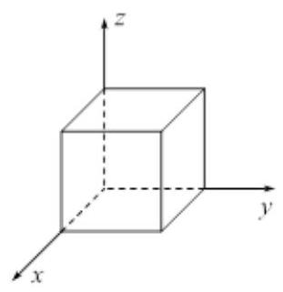
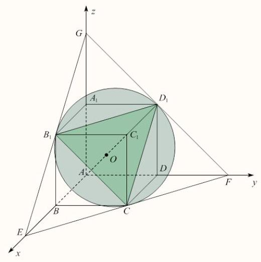
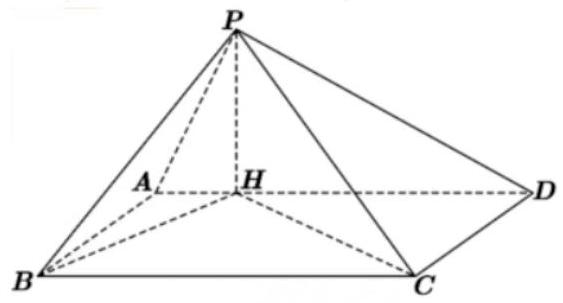

## 2026上海市高考数学试卷

一、填空题(1-6题每题4分，7-12每题5分，共54分)

1 较易 填空题

若集合 $A = \{ 2, a + 1\}$ ，且 $- 1 \in  A$ ，则 $a =$

答案

-2

解析

解析:

已知集合 $A = 2, a + 1$ ，且 $- 1 \in  A$ ，则 -1 是集合 $A$ 中的元素。集合 $A$ 仅有两个元素 2 和 $a + 1$ 。

由于 $- 1 \neq  2$ ,因此必有 $- 1 = a + 1$ 。

解方程 $- 1 = a + 1$ ,移项得 $a =  - 1 - 1 =  - 2$ 。

所以 $a =  - 2$ 。

2 一般 填空题

已知等比数列 $\left\{  {a}_{n}\right\}$ ，且 ${a}_{1} = 2,{a}_{2} = 6$ ，则 ${a}_{4} =$

---

## 答案

54

	解析

$\because$ 等比数列 ${a}_{n}$ 中, ${a}_{1} = 2,{a}_{2} = 6$ ,

$\therefore$ 公比 $q = \frac{{a}_{2}}{{a}_{1}} = \frac{6}{2} = 3$ 。

$\therefore {a}_{4} = {a}_{1} \cdot  {q}^{4 - 1} = 2 \times  {3}^{3} = 2 \times  {27} = {54}$ 。

故 ${a}_{4} = {54}$ 。

---

3 较易 填空题

3. 已知 $\sin \alpha  = \frac{1}{5}$ ，则 $\cos {2\alpha } =$

$\frac{23}{25}$

解析

答案: $\frac{23}{25}$

解析:由二倍角公式 $\cos {2\alpha } = 1 - 2{\sin }^{2}\alpha$ ，代入 $\sin \alpha  = \frac{1}{5}$ ，得 $\cos {2\alpha } = 1 - 2 \times  {\left( \frac{1}{5}\right) }^{2} = 1 - \frac{2}{25} = \frac{23}{25}$ 。

4 较易 填空题

4. 已知事件 $\mathrm{A}$ 和事件 $\mathrm{B}$ 互斥，且 $P\left( A\right)  = {0.2}, P\left( B\right)  = {0.5}$ ，则 $P\left( {A \cup  B}\right)  =$ ___。

② 答案

0.7

解析

因为事件 $A$ 与事件 $B$ 互斥,根据概率的加法公式,有

$P\left( {A \cup  B}\right)  = P\left( A\right)  + P\left( B\right)  = {0.2} + {0.5} = {0.7}$  。

5 较易 填空题

函数 $f\left( x\right)$ 是偶函数，当 $x \geq  0$ 时， $f\left( x\right)  = \sqrt{x} - a$ ，若 $f\left( {-4}\right)  = 3$ ，则 $a =$ ___.

---

	答案

-1

	解析

$\because f\left( x\right)$ 是偶函数,

$\therefore f\left( {-x}\right)  = f\left( x\right)$ 。

由 $f\left( {-4}\right)  = 3$ ,

得 $f\left( 4\right)  = f\left( {-4}\right)  = 3$ 。

当 $x \geq  0$ 时， $f\left( x\right)  = \sqrt{x} - a$ ，

$f\left( 4\right)  = \sqrt{4} - a = 2 - {a}_{ \circ  }$

$\therefore 2 - a = 3$ ,

解得 $a =  - 1$ 。

---

6 较易 填空题

在 ${\left( {x}^{2} + x\right) }^{5}$ 的二项展开式中， ${x}^{7}$ 项的系数为

答案

10

解析

${T}_{r + 1} = {C}_{5}^{r}{\left( {x}^{2}\right) }^{5 - r}{x}^{r} = {C}_{5}^{r}{x}^{{10} - r}$

要求 ${x}^{7}$ 的系数,另 ${10} - r = 7$ ,即 $r = 3$

${C}_{5}^{3} = {10}$

7 较易 填空题

7. 已知 ${a}^{2} + 4{b}^{2} = 1,{\left( ab\right) }_{\max } =$

## 答案

$\frac{1}{4}$

解析

已知 ${a}^{2} + 4{b}^{2} = 1$ ，求 ${ab}$ 的最大值。

由基本不等式,对任意实数 $a, b$ ,有 ${a}^{2} + 4{b}^{2} \geq  2 \cdot  a \cdot  \left( {2b}\right)  = 4\left| {ab}\right|$ ,当且仅当 $a = {2b}$ 时等号成立。

将条件代入得 $1 \geq  4\left| {ab}\right|$ ，即 $\left| {ab}\right|  \leq  \frac{1}{4}$ ，故 ${ab} \leq  \frac{1}{4}$ 。

当 $a = {2b}$ 且 ${a}^{2} + 4{b}^{2} = 1$ 时，解得 $b =  \pm  \frac{1}{2\sqrt{2}}, a =  \pm  \frac{1}{\sqrt{2}}$ (同号)，此时 ${ab} = \frac{1}{4}$ 。

因此 ${\left( ab\right) }_{\max } = \frac{1}{4}$ 。

8 容易 填空题

已知 $\mathrm{X}$ 分布为 $\left( \begin{array}{lll}  - 1 & 0 & 1 \\  a & {0.3} & b \end{array}\right) , E\left\lbrack  X\right\rbrack   = {0.5}$ ，则 $b =$ ___.

---

0.6

---

由概率分布性质, 所有概率之和为 1 :

$a + {0.3} + b = 1$ ,即 $a + b = {0.7}$ (1)

期望值公式为:

$E\left\lbrack  X\right\rbrack   = \sum x \cdot  P\left( {X = x}\right)  = \left( {-1}\right)  \cdot  a + 0 \cdot  {0.3} + 1 \cdot  b =  - a + b$

给定 $E\left\lbrack  X\right\rbrack   = {0.5}$ ,因此:

$- a + b = {0.5}$ (2)

由 (1) 和 (2) 得

故 $b = {0.6}$

9 一般 填空题

已知等差数列 ${a}_{1} = 0, d$ 为公差， ${S}_{n}$ 为前 $\mathrm{n}$ 项和，且 ${S}_{n}$ 中至少两项介于 $\left( {0,1}\right)$ ，则 $d$ 的取值范围为___。

答案

$\left( {0,\frac{1}{3}}\right)$

解析

答案: $\left( {0,\frac{1}{3}}\right)$

解析:

已知等差数列首项 ${a}_{1} = 0$ ，公差 $d$ ，前 $n$ 项和 ${S}_{n} = \frac{n\left( {n - 1}\right) d}{2}$ 。

条件要求至少存在两个不同的正整数 $n \geq  2$ ,使得 $0 < {S}_{n} < 1$ 。

$\because d > 0$ (若 $d \leq  0$ ,则 ${S}_{n} \leq  0$ ,不满足 ${S}_{n} > 0$ ),

$\therefore {S}_{n}$ 严格递增 (因 $n\left( {n - 1}\right)$ 随 $n$ 增大而增大)。

设 $N$ 为最小正整数使得 ${S}_{N} \geq  1$ ,则当 $n = 2,3,\ldots , N - 1$ 时, ${S}_{n} < 1$ 且 ${S}_{n} > 0$ (因 $n \geq  2$ )。

需要至少两个 $n$ 满足条件，即 $n$ 的个数 $N - 2 \geq  2$ ， $\therefore N \geq  4$ 。

$N \geq  4$ 等价于 ${S}_{3} < 1$ (若 ${S}_{3} < 1$ ,则 $N > 3$ ,即 $N \geq  4$ )。

计算 ${S}_{3} = \frac{3 \times  2 \times  d}{2} = {3d}$ ,

$\therefore {3d} < 1$ ,即 $d < \frac{1}{3}$ 。

当 $0 < d < \frac{1}{3}$ 时, ${S}_{2} = d \in  \left( {0,1}\right)$ 且 ${S}_{3} = {3d} < 1,\therefore {S}_{2}$ 和 ${S}_{3}$ 均在 $\left( {0,1}\right)$ 内,满足条件。

当 $d \geq  \frac{1}{3}$ 时， ${S}_{3} \geq  1$ ，则 $N \leq  3$ ，此时至多有一个 $n$ (如 $n = 2$ )满足 ${S}_{n} < 1$ ，不满足至少两项的要综上， $d$ 的取值范围为 $\left( {0,\frac{1}{3}}\right)$ 。

已知 $k \in  R,\overrightarrow{a},\overrightarrow{b},\overrightarrow{c}$ 两两不平行，已知 $\overrightarrow{a} + 3\overrightarrow{b}\parallel \overrightarrow{b} + \overrightarrow{c},2\overrightarrow{a} + k\overrightarrow{c}\parallel \overrightarrow{b} + \overrightarrow{c}, k =$ ___。

---

	答案

-6

	解析

由 $\overrightarrow{a} + 3\overrightarrow{b}\parallel \overrightarrow{b} + \overrightarrow{c}$ 知存在实数 $\lambda$ ,使

$\overrightarrow{a} + 3\overrightarrow{b} = \lambda \left( {\overrightarrow{b} + \overrightarrow{c}}\right)$

整理得

$\overrightarrow{a} = \left( {\lambda  - 3}\right) \overrightarrow{b} + \lambda \overrightarrow{c}$

代入第二个平行条件 $2\overrightarrow{a} + k\overrightarrow{c}\parallel \overrightarrow{b} + \overrightarrow{c}$ ,得

$2\left\lbrack  {\left( {\lambda  - 3}\right) \overrightarrow{b} + \lambda \overrightarrow{c}}\right\rbrack   + k\overrightarrow{c} = 2\left( {\lambda  - 3}\right) \overrightarrow{b} + \left( {{2\lambda } + k}\right) \overrightarrow{c}$

该向量与 $\overrightarrow{b} + \overrightarrow{c}$ 平行,故存在实数 $\mu$ 使

$2\left( {\lambda  - 3}\right) \overrightarrow{b} + \left( {{2\lambda } + k}\right) \overrightarrow{c} = \mu \left( {\overrightarrow{b} + \overrightarrow{c}}\right)$

因为 $\overrightarrow{b}$ 与 $\overrightarrow{c}$ 不平行,对应系数相等:

$\left\{  {2\left( {\lambda  - 3}\right)  = {\mu 2\lambda } + k = \mu }\right.$

两式相减得 $2\left( {\lambda  - 3}\right)  - \left( {{2\lambda } + k}\right)  = 0$ ,即 $- 6 - k = 0$ ,解得 $k =  - 6$ 。

---

11 一般 填空题

已知三角函数 $f\left( t\right)  = A\sin \left( {{\omega t} + \varphi }\right)  + B\left( {A > 0, B \in  R,\omega  > 0,0 \leq  \varphi  < {2\pi }}\right)$ ，若 $v = f\left( t\right)$ ，当 $v = 0$ 或 $v = 4$ 时其导数为 0,初始速度为 0,且速度第一次达到 4 时用时为 0.1 秒，求 $f\left( t\right)  =$

答案

$- 2\cos \left( {10\pi t}\right)  + 2$

解析

答案: $f\left( t\right)  =  - 2\cos \left( {10\pi t}\right)  + 2$

解析:

由题意,当速度 $v = 0$ 或 $v = 4$ 时,导数 ${v}^{\prime } = 0$ ,因此 $v = 0$ 和 $v = 4$ 是函数 $v = f\left( t\right)$ 的极值点。

$\because v = A\sin \left( {{\omega t} + \varphi }\right)  + B$ 的极值点为 $B - A$ 和 $B + A$ ,

$\therefore B - A, B + A = 0,4$ 。

由于 $A > 0$ ,故 $B - A < B + A$ ,

$\therefore B - A = 0$ 且 $B + A = 4$ 。

解方程组: $A = B = 2$

初始速度 $v\left( 0\right)  = 0$ :

$v\left( 0\right)  = A\sin \left( {\omega  \cdot  0 + \varphi }\right)  + B = 2\sin \varphi  + 2 = 0,$

$\therefore 2\sin \varphi  + 2 = 0$ ,

$\therefore \sin \varphi  =  - 1$ 。

$\because \varphi  \in  \lbrack 0,{2\pi })$ ,

$\therefore \varphi  = \frac{3\pi }{2}$ 。

于是, $v\left( t\right)  = 2\sin \left( {{\omega t} + \frac{3\pi }{2}}\right)  + 2$ 。

利用恒等式: $\sin \left( {\theta  + \frac{3\pi }{2}}\right)  =  - \cos \theta$ ,

$\therefore v\left( t\right)  = 2 \cdot  \left\lbrack  {-\cos \left( {\omega t}\right) }\right\rbrack   + 2 =  - 2\cos \left( {\omega t}\right)  + 2$ 。

速度第一次达到 4 时用时 0.1 秒:

设 $v\left( t\right)  = 4$ ,

即 $- 2\cos \left( {\omega t}\right)  + 2 = 4$ ,

$\therefore  - 2\cos \left( {\omega t}\right)  = 2$ ,

$\therefore \cos \left( {\omega t}\right)  =  - 1$ 。

解为 ${\omega t} = \pi  + {2k\pi }, k \in  {\mathbb{Z}}_{ \circ  }$

第一次达到，取最小正 $t$ ，故 $k = 0,{\omega t} = {\pi }_{ \circ  }$

用时 $t = {0.1}$ 秒,

$\therefore \omega  \cdot  {0.1} = \pi$ ,

$\therefore \omega  = \frac{\pi }{0.1} = {10}{\pi }_{ \circ  }$

因此, $f\left( t\right)  =  - 2\cos \left( {10\pi t}\right)  + 2$ 。

12 一般 填空题

已知 $A, B, C$ 为一椭圆 4 个顶点和 2 个焦点中任意三个， ${AB} = 3,{BC} = \sqrt{14},{AC} = 5$ ，则该椭圆的离心率为 ___。

答案

$\frac{2}{3}$

解析

答案: $\frac{2}{3}$

解析:

设椭圆的长半轴长为 $a$ ,短半轴长为 $b$ ,焦距为 $c$ ,满足 ${c}^{2} = {a}^{2} - {b}^{2}$ ,离心率 $e = \frac{c}{a}$ 。椭圆的四个顶点分别为 $\left( {\pm a,0}\right)$ 和 $\left( {0, \pm  b}\right)$ ,两个焦点为 $\left( {\pm c,0}\right)$ 。

从这六个点中任选三个点，它们之间的距离可能构成三角形。由已知边长3、 $\sqrt{14}$ 、5，它们互不相等，因此排除等腰或退化情形。唯一可能的非等腰非退化三角形是由一个焦点、一个长轴顶点和一个短轴顶点构成。由对称性,不妨设焦点 $F\left( {c,0}\right)$ ,长轴顶点 $A\left( {a,0}\right)$ ,短轴顶点 $B\left( {0, b}\right)$ 。计算距离:

${FA} = \left| {a - c}\right|$ (若 $A$ 与 $F$ 同侧,则 ${FA} = a - c$ ; 若异侧,则 ${FA} = a + c$ ),

${FB} = \sqrt{{c}^{2} + {b}^{2}} = a,$

${AB} = \sqrt{{a}^{2} + {b}^{2}}$ 。

考虑两种情形:

情形1: ${FA} = a - c$ ,则三边为 $a - c\text{ 、 }a\text{ 、 }\sqrt{{a}^{2} + {b}^{2}}$ 。由于 $\sqrt{{a}^{2} + {b}^{2}} > a > a - c$ ,所以最小边为 $a - c$ ,中间边为 $a$ ，最大边为 $\sqrt{{a}^{2} + {b}^{2}}$ 。因此 $a - c$ 、 $a$ 、 $\sqrt{{a}^{2} + {b}^{2}}$ 应分别等于3、 $\sqrt{14}$ 、5或它们的排列。但 $a$ 是中间值，而 $\sqrt{14} \approx  {3.74},5 > {3.74}$ ,所以 $a$ 只能是 $\sqrt{14}$ 或3。若 $a = \sqrt{14}$ ,则 $a - c = 3$ 得 $c = \sqrt{14} - 3 \approx  {0.74}$ ,此时 $\sqrt{{a}^{2} + {b}^{2}} = \sqrt{{14} + {b}^{2}} = 5$ ，得 ${b}^{2} = {25} - {14} = {11}$ ，但 ${c}^{2} = {a}^{2} - {b}^{2} = {14} - {11} = 3$ ，与 $c \approx  {0.74}$ 矛盾。若 $a = 5$ ， 则 $a - c = 3$ 得 $c = 2$ ，此时 $\sqrt{{a}^{2} + {b}^{2}} = \sqrt{{25} + {b}^{2}}$ 应等于 $\sqrt{14}$ 或3，但 $\sqrt{{25} + {b}^{2}} > 5$ ，不可能。故情形1不成立。 情形2: ${FA} = a + c$ ,则三边为 $a + c\text{ 、 }a\text{ 、 }\sqrt{{a}^{2} + {b}^{2}}$ 。此时 $a + c > a$ ,但 $\sqrt{{a}^{2} + {b}^{2}}$ 与 $a + c$ 大小不定。尝试令 $a + c = 5$ (最大边)， $a = 3$ ，则 $c = 2$ ，且 $\sqrt{{a}^{2} + {b}^{2}} = \sqrt{9 + {b}^{2}} = \sqrt{14}$ ，解得 ${b}^{2} = 5$ 。检查

${a}^{2} - {b}^{2} = 9 - 5 = 4 = {c}^{2}$ ，符合椭圆关系。三边 $3\text{ 、 }\sqrt{14}\text{ 、 }5$ 恰好对应 $a\text{ 、 }\sqrt{{a}^{2} + {b}^{2}}\text{ 、 }a + c$ ，且 $3 < \sqrt{14} < 5$ ，成立。若令 $a + c = 5, a = \sqrt{14}$ ，则 $c = 5 - \sqrt{14}$ ，此时 $\sqrt{{a}^{2} + {b}^{2}}$ 应为3，但 $\sqrt{{a}^{2} + {b}^{2}} > a = \sqrt{14} > 3$ ，矛盾。若令 $a + c = \sqrt{14}$ ，则由于 $\sqrt{14} < 5$ ，不可能为最大边，排除。故只有 $a = 3$ ， $c = 2$ ， $b = \sqrt{5}$ 满足条件。

因此离心率 $e = \frac{c}{a} = \frac{2}{3}$ 。

## 二、选择题(13、14每题4分，15、16每题5分，共18分)

13 容易 单选题

$a$ 为不为 1 的任意实数，则 $a \cdot  \sqrt[3]{a} = \left( \right)$ .

A. ${a}^{\frac{3}{2}}$

B. ${a}^{\frac{4}{3}}$

C. ${a}^{\frac{5}{2}}$

D. ${a}^{\frac{5}{3}}$

答案

B

解析

解析: 根据根式与分数指数幂的互化, $\sqrt[3]{a} = {a}^{\frac{1}{3}}$ 。则原式 $a \cdot  \sqrt[3]{a} = a \cdot  {a}^{\frac{1}{3}} = {a}^{1 + \frac{1}{3}} = {a}^{\frac{4}{3}}$ 。因此正确选项为B。

14 较易 单选题

已知事件 $A$ 、事件 $B$ 为独立随机事件，事件 $C$ 表示为事件 $A$ 、 $B$ 至少有一件发生，则 $\bar{C} =$ .

A. $A \cap  B$

B. $A \cup  B$

C. $\bar{A} \cap  \bar{B}$

D. $\bar{A} \cup  \bar{B}$

答案

C

解析

事件 $C$ 表示 $A$ 与 $B$ 至少有一件发生,即 $C = A \cup  B$ 。

根据德摩根定律,对 $C$ 取补集: $\bar{C} = \overline{A \cup  B} = \bar{A} \cap  \bar{B}$ 。

因此，正确选项为 C。

15 较难 单选题

已知任意两个复数 $z$ 、 $w$ ，当 $w - z \in  \mathbf{R}$ 或 $w - \bar{z} \in  \mathbf{R}$ 时，称 $z$ 与 $w$ 互相伴随. 则当 $z$ 与 $w$ 互相伴随时， $w - \mathrm{i}$ 与 $z + \mathrm{i}$ 互相伴随的充要条件是().

A. $\operatorname{Re}z + \operatorname{Re}w = 0$

B. $\operatorname{Re}z - \operatorname{Re}w = 0$

C. $\operatorname{Im}z + \operatorname{Im}w = 0$

D. $\operatorname{Im}z - \operatorname{Im}w = 0$

答案

C

解析

【解析】设 $z = a + b\mathrm{i}, w = c + d\mathrm{i}$ . 因为 $z$ 和 $w$ 相互伴随,则 $b - d = 0$ 或 $b + d = 0$ . 若 $w - \mathrm{i}$ 与 $z + \mathrm{i}$ 互相伴随,则 $b + d = 0$ 或 $b - d + 2 = 0$ ,故选 C.

16 一般 单选题

如图,在一个空间直角坐标系中,存在一个正方体 ${ABCD} - {A}_{1}{B}_{1}{C}_{1}{D}_{1}$ ,其中, $A$ 为坐标原点,将该正方体绕体对角线 $A{C}_{1}$ 为旋转轴旋转一周,点 $C$ 将经过 () 个卦限.

A. 1

B. 3

C. 4

D. 7

答案

A

解析

【解析】 $C$ 的轨迹为 $\bigtriangleup {B}_{1}C{D}_{1}$ 的外接圆. 设正方体边长为 1,则 $E\left( {2,0,0}\right) \text{ 、 }F\left( {0,2,0}\right) \text{ 、 }G\left( {0,0,2}\right)$ ,连接 $E\text{ 、 }F\text{ 、 }G$ ,易证: ${AC} \bot  {EF}, C{C}_{1} \bot  {EF}$ ,故 ${EF}$ 为圆的切线. 同理, ${EG}\text{ 、 }{FG}$ 也为圆的切线,故 $C$ 的轨迹又为 $\bigtriangleup {EFG}$ 的内切圆. 所有的点均在第一卦限,故选 A.

## 三、解答题

17 一般解答题

17. 某工厂为进行环境保护与改善，对九年间空气中某颗粒物密度与二氧化硫密度进行了监测与记录，数据如下:

<table><tr><td>某颗粒物密度</td><td>101.02</td><td>87.02</td><td>57.46</td><td>21.85</td><td>11.76</td><td>8.86</td><td>5.03</td><td>4.63</td><td>3.86</td></tr><tr><td>二氧化硫密度</td><td>119.47</td><td>51.84</td><td>53.2</td><td>9.16</td><td>6.6</td><td>4.4</td><td>3.31</td><td>3.35</td><td>3.86</td></tr></table>

(1)(1)为进一步研究，从这 9 年间随机抽取一年，该年份颗粒物的密度大于二氧化硫密度的概率是多少？

(2)(2)为研究颗粒物密度与二氧化硫密度的相关性，该工厂应选取茎叶图、扇形图、散点图中的哪一种进行分析,并请你判断相关系数在 $\left( {-1,0}\right) ,\left( {0,1}\right) ,\left( {1,2}\right)$ 哪个区间内? (直接写结论)

(3)(3)2023年前 9 年的年份(x)的平均数为 2018，y，(颗粒物密度)关于 $x$ (年份)的回归方程拟采用

$y = {106.544}{\mathrm{e}}^{-{0.461}\left( {x - {2014}}\right) }$ ,或 $y = a\left( {x - {2014}}\right)  + {83.743}$ 。已知 2023年实际颗粒物浓度为 3.88 , 则哪个回归方程对于 2023 年的预测值与实际值的差值绝对值更小

## 答案

(1) $\frac{7}{9}$

(2) $\left( {0,1}\right)$

(3) $y = {106.544}{\mathrm{e}}^{-{0.461}\left( {x - {2014}}\right) }$

解析

(1)(1)9 年间共有 7 年颗粒物密度大于二氧化硫密度，故概率为 $\frac{{\mathrm{C}}_{7}^{1}}{{\mathrm{C}}_{9}^{1}} = \frac{7}{9}$ .

(2)(2)统计图表需要呈现出随着二氧化硫密度变化时，颗粒物密度的变化趋势，故需要散点图进行呈现. 随着二氧化硫密度增加，颗粒物密度呈现增加趋势，故二者正相关，相关系数为正，又因为相关系数 $\left| r\right|  \leq  1$ ,故相关系数在 $\left( {0,1}\right)$ 区间上

(3) (3) 采用方程 $y = {106.544}{\mathrm{e}}^{-{0.461}\left( {x - {2014}}\right) }$ 时,2023年预测值为 ${106.544}{\mathrm{e}}^{-{0.461}\left( {{2023} - {2014}}\right) } \approx  {1.681}$ , 预测值与实际值差值绝对值为 2.199 ;

$\because \bar{x} = {2018},\bar{y} = \frac{{101.02} + {87.02} + {57.47} + {21.85} + {11.76} + {8.86} + {5.03} + {4.63} + {3.86}}{9} \approx  {33.499}$ ,

故 33.499 $= a\left( {{2018} - {2014}}\right)  + {83.743}$ ,可得 $a \approx   - {12.561}$ .

故采用方程 $y = a\left( {x - {2014}}\right)  + {83.743}$ 时昌立中学生, 2023年预测值为

$y =  - {12.561}\left( {{2023} - {2014}}\right)  + {83.743} \approx   - {29.306}$ ,预测值与实际值差值绝对值为 33.186 ;

2.199 <33.186,故方程 $y = {106.544}{\mathrm{e}}^{-{0.461}\left( {x - {2014}}\right) }$ 对于 2023 年的预测值与实际值的差值绝对值更小.

如图,四棱雉 $P - {ABCD}$ ,底面 ${ABCD}$ 为矩形, ${PH} \bot$ 底面 ${ABCD},{AH} = 1,{HD} = 4,{AB} = 2$ .

(1) (1)证明: ${HC} \bot  {PB}$

(2)若四棱雉体积 ${V}_{P - {ABCD}} = \frac{{10}\sqrt{5}}{3}$ ，求二面角 $C - {PB} - H$ 的大小.

## 答案

(1)详细见解析

(2) $\arctan 2\sqrt{2}/\arcsin \frac{2\sqrt{2}}{3}/\arccos \frac{1}{3}$

解析

(1)证明:因为 ${PH} \bot$ 底面 ${ABCD},{HC}$ 在底面 ${ABCD}$ 上，所以 ${PH} \bot  {HC}$

在矩形 ${ABCD}$ 中,因为 ${AH} = 1,{HD} = 4,{AB} = 2$

故 ${BH} = \sqrt{5},{HC} = 2\sqrt{5},{BC} = 5$ ; 所以 ${HC} \bot  {HB}$

又 ${PH}\text{ 、 }{HB} \subset$ 平面 ${PBH},{PH} \cap  {HB} = H$

故 ${HC} \bot$ 平面 ${PBH}$

有因为 ${PB}$ 在平面 ${PBH}$ 上,所以 ${HC} \bot  {PB}$

(2) ${V}_{P - {ABCD}} = \frac{1}{3}{PH} \times  {S}_{ABCD} = \frac{10}{3}{PH} = \frac{{10}\sqrt{5}}{3} \Rightarrow  {PH} = \sqrt{5}$ ;

作 ${HQ} \bot  {PB}$ 于点 $Q$ ,连接 ${QC}$

由 ${HC} \bot$ 平面 ${PHB} \Rightarrow  {QH}$ 为 ${QC}$ 在平面 ${PHB}$ 上的投影;

${HQ} \bot  {PB} \Rightarrow  {CQ} \bot  {PB}$ (三垂线定理);

$\angle {CQH}$ 为所求二面角的平面角;

由 ${PH} = \sqrt{5},{BH} = \sqrt{5},{PH} \bot  {BH} \Rightarrow  {QH} = \frac{\sqrt{10}}{2}$ ;

在 Rt $\bigtriangleup {CHQ}$ 中, $\tan \angle {CQH} = \frac{HC}{QH} = 2\sqrt{2}$ ;

故二面角的大小为 $\arctan 2\sqrt{2}$

19 一般 解答题

19. 已知 $a \in  R$ ,函数 $f\left( x\right)  = {x}^{2} + {ax} + 3, g\left( x\right)  = {4x} + \frac{1}{{x}^{2}}$

(1)(1)已知 $f\left( 1\right)  = 4$ ，求 $f\left( x\right)  + \frac{1}{{x}^{2}} > g\left( x\right)$ 的解集

(2)(2) $a \neq  0,{l}_{1}$ 是 $f\left( x\right)$ 在点(0,3)处的切线， ${l}_{2}$ 是过点(0,3)且垂直于 ${l}_{1}$ 的直线， $g\left( x\right)$ 与 ${l}_{1},{l}_{2}$ 在第一象限内均无公共点，求 $a$ 的取值范围。

## 答案

(1) $\left( {-\infty ,0}\right)  \cup  \left( {0,1}\right)  \cup  \left( {3, + \infty }\right)$

(2) $a \in  \left( {-\infty , - \frac{1}{2}}\right)  \cup  \left( {0,2}\right)$

解析

(1)(1)由 $f\left( 1\right)  = 1 + a + 3 = 4 + a = 4$ ，则 $a = 0$ ，因此 $f\left( x\right)  = {x}^{2} + 3$

则不等式转化为 $f\left( x\right)  + \frac{1}{{x}^{2}} = {x}^{2} + 3 + \frac{1}{{x}^{2}} > {4x} + \frac{1}{{x}^{2}}$

即 ${x}^{2} - {4x} + 3 > 0$ 且 $x \neq  0,\left( {x - 1}\right) \left( {x - 3}\right)  > 0$ ,得 $x < 1$ 或 $x > 3$ 且 $x \neq  0$

故所求不等式的解集为: $\left( {-\infty ,0}\right)  \cup  \left( {0,1}\right)  \cup  \left( {3, + \infty }\right)$

(2)(2) ${f}^{\prime }\left( x\right)  = {2x} + a,{f}^{\prime }\left( 0\right)  = a$ ；故直线 ${l}_{1}$ 的方程为: $y = {ax} + 3$ ，直线 ${l}_{2}$ 的方程为: $y =  - \frac{1}{a}x + 3$ ，

由题意可知: $g\left( x\right)  = {4x} + \frac{1}{{x}^{2}} = {ax} + 3$ 无正实数解,且 $g\left( x\right)  = {4x} + \frac{1}{{x}^{2}} =  - \frac{1}{a}x + 3$ 无正实数解参变分离可得: $a = 4 + \frac{1}{{x}^{3}} - \frac{3}{x}, - \frac{1}{a} = 4 + \frac{1}{{x}^{3}} - \frac{3}{x}$

即直线 $y = a$ 与及 $y =  - \frac{1}{a}$ 与曲线 $y = 4 + \frac{1}{{x}^{3}} - \frac{3}{x}$ 在 $\left( {0, + \infty }\right)$ 内均无交点;

设函数 $h\left( x\right)  = 4 + \frac{1}{{x}^{3}} - \frac{3}{x},{h}^{\prime }\left( x\right)  = \frac{3}{{x}^{2}} - \frac{3}{{x}^{4}} = \frac{3{x}^{2} - 3}{{x}^{4}} = \frac{3\left( {x + 1}\right) \left( {x - 1}\right) }{{x}^{4}}$ ,令 ${h}^{\prime }\left( x\right)  = 0$ ,得 $x = 1$

故函数 $h\left( x\right)$ 在 $\left( {0,1}\right)$ 严格减,在 $\left( {1, + \infty }\right)$ 严格增,极小值 $h\left( 1\right)  = 2$

当 $x \rightarrow  0$ 时, $h\left( x\right)  \rightarrow   + \infty , x \rightarrow   + \infty$ 时 $h\left( x\right)  \rightarrow   + \infty$

可得: $a < 2$ 且 $- \frac{1}{a} < 2$ ,解得: $a <  - \frac{1}{2}$ 或 $0 < a < 2$ ,所以 $a \in  \left( {-\infty , - \frac{1}{2}}\right)  \cup  \left( {0,2}\right)$

20 蛟难 解答题

20. 定义 $\Gamma  : {x}^{2} - {y}^{2} = 1,{F}_{1}\text{ 、 }{F}_{2}$ 为 $\Gamma$ 的左右焦点

(1) (1)求点 $\left( {2,0}\right)$ 到 $\Gamma$ 渐近线的距离；

) (2)P 为 $\Gamma$ 上一点， $\overrightarrow{P{F}_{1}} \cdot  \overrightarrow{P{F}_{2}} = 1$ ，求 $\bigtriangleup  P{F}_{1}{F}_{2}$ 的面积；

(3) (3)设 $\Omega  : {x}^{2} - {y}^{2} = 1$ ，其中 $\left\{  \begin{array}{l} x < 0 \\  y \leq   - 1 \end{array}\right.$ 或 $\left\{  \begin{array}{l} x > 0 \\  y \geq   - 1 \end{array}\right.$ ，过点 ${F}_{2}$ 的直线 $l$ 交 $\Omega$ 于 $P$ 、 $Q$ 两点(分别位于一、 四象限),过点 ${F}_{2}$ 直线 $m$ 交 $\Omega$ 于 $M\text{ 、 }N$ 两点 (分别位于三、四象限),是否存在正数 $\lambda$ ,对于任意的 $l$ ,都存在唯一的 $m$ ,使 $\left| {MN}\right|  = \lambda \left| {PQ}\right|$ 成立,若存在,求出所有的 $\lambda$ ,若不存在,请说明理由

答案

(1) $\sqrt{2}$

(2) $\sqrt{2}$

(3) $\lambda  \geq  \frac{9}{7}$

解析

(1)点 $A\left( {0,2}\right)$ 到渐近线 $x - y = 0$ 的距离: $d = \frac{\left| 0 - 2\right| }{\sqrt{{1}^{2} + {\left( -1\right) }^{2}}} = \frac{2}{\sqrt{2}} = \sqrt{2}$

(2) 由 ${c}^{2} = 2$ 得 ${F1}\left( {-\sqrt{2},0}\right) ,{F2}\left( {\sqrt{2},0}\right)$ 。由 $\overrightarrow{P{F}_{1}} \cdot  \overrightarrow{P{F}_{2}} = 1$ 得:

$\overrightarrow{P{F}_{1}} \cdot  \overrightarrow{P{F}_{2}} = \left( {\overrightarrow{PO} + \overrightarrow{O{F}_{1}}}\right)  \cdot  \left( {\overrightarrow{PO} + \overrightarrow{O{F}_{2}}}\right)  = {\overrightarrow{PO}}^{2} - {\overrightarrow{O{F}_{1}}}^{2} = {\overrightarrow{PO}}^{2} - 2 = 1$ ,解得 $P{O}^{2} = 3$

设 $P\left( {{x}_{0},{y}_{0}}\right)$ 在双曲线上: $\left\{  {\begin{array}{l} {x}_{0}^{2} - {y}_{0}^{2} = 1 \\  {x}_{0}^{2} + {y}_{0}^{2} = 3 \end{array} \Rightarrow  {y}_{0} =  \pm  1}\right.$ 解得 ${y}_{0} =  \pm  1$ ,故面积:

${S}_{\bigtriangleup P{F}_{1}{F}_{2}} = \frac{1}{2}\left| {y}_{0}\right|  \cdot  \left| {{F}_{1}{F}_{2}}\right|  = \frac{1}{2} \cdot  1 \cdot  2\sqrt{2} = \sqrt{2}$

(3) 设直线 ${PQ} : x = {my} + \sqrt{2}$ ,代入双曲线得: $\left( {{m}^{2} - 1}\right) {y}^{2} + 2\sqrt{2}{my} + 1 = 0$ ,由 $P, Q$ 在第一、四象限得 $m \in  \lbrack 0,1)$ ,弦长: $\left| {PQ}\right|  = \sqrt{{m}^{2} + 1} \cdot  \left| {{y}_{1} - {y}_{2}}\right|  = \frac{2\left( {{m}^{2} + 1}\right) }{1 - {m}^{2}}$

设直线 ${MN} : x = {ny} + \sqrt{2}$ ,代入得: $\left( {{n}^{2} - 1}\right) {y}^{2} + 2\sqrt{2}{ny} + 1 = 0$

由 $M, N$ 在第三、四象限得 $n \in  (1,2\sqrt{2}\rbrack$ ,弦长: $\left| {MN}\right|  = \frac{2\left( {{n}^{2} + 1}\right) }{{n}^{2} - 1}$

恒成立条件: $\frac{{n}^{2} + 1}{{n}^{2} - 1} = \lambda  \cdot  \frac{{m}^{2} + 1}{1 - {m}^{2}}$ 令: $f\left( m\right)  = \frac{{m}^{2} + 1}{1 - {m}^{2}} = 1 + \frac{2}{1 - {m}^{2}},\;m \in  \lbrack 0,1) \Rightarrow  f\left( m\right)  \in  \lbrack 1, + \infty )$ ,要使对任意 $m$ 存在 $n$ 满足需: $g\left( n\right)  = \frac{{n}^{2} + 1}{{n}^{2} - 1} = 1 + \frac{2}{{n}^{2} - 1},\;n \in  (1,2\sqrt{2}\rbrack  \Rightarrow  g\left( n\right)  \in  \left\lbrack  {\frac{9}{7}, + \infty }\right)$ ，故所有 $\lambda$ 的值为

$\lambda  \geq  \frac{9}{7}$ 。

21 较难 解答题

21. 已知函数 ${f}_{1}\left( x\right) ,{f}_{2}\left( x\right) ,{f}_{3}\left( x\right)$ 得定义域为 $I,\left( {i, j, k}\right)$ 是1,2,3的一个排列,对于任意 $x \in  I$ ,都有 ${f}_{1}\left( x\right)  \leq  {f}_{i}\left( x\right)$ 且 ${f}_{1}\left( x\right)  + {f}_{2}\left( x\right)  \leq  {f}_{i}\left( x\right)  + {f}_{j}\left( x\right)$ 成立，则称 $\left( {i, j, k}\right)$ 是关于 ${f}_{1}\left( x\right) ,{f}_{2}\left( x\right) ,{f}_{3}\left( x\right)$ 的一个 $I$ 排列, $I$ 排列的个数记作 ${n}_{I}$ 0

(1)(1)对 $I = \lbrack 3, + \infty ),{f}_{1}\left( x\right)  = x,{f}_{2}\left( x\right)  = 0,{f}_{3}\left( x\right)  = {x}^{2} + 1$ ，判断 $\left( {3,1,2}\right)$ 是否是 $I$ 排列？

(2)(2)对 $I = \lbrack 0, + \infty )$ 上的函数 ${f}_{1}\left( x\right)  = x - 1,{f}_{2}\left( x\right)  = x + m,{f}_{3}\left( x\right)  = {x}^{2}$ 满足条件的 ${n}_{I} = 6$ ，求 $m$ 的取值范围？

(3)(引)区知函数 $F\left( x\right)$ 定义域为 $I = \lbrack 0, + \infty )$ ，且对任意 $I = \lbrack 0, + \infty )$ ，都有 $0 < F\left( x\right)  < 1$ ，若

$a > 0,\;I = \lbrack a, + \infty ),\;{f}_{1}\left( x\right)  = F\left( x\right) ,\;{f}_{2}\left( x\right)  = \frac{1}{2}\left\lbrack  {F\left( {x + a}\right)  + F\left( {x - a}\right) }\right\rbrack  ,{f}_{3}\left( x\right)  = 1 - {e}^{-x}$

证明: 若 $F\left( x\right)$ 严格减,则存在 $a > 0$ ,使得 ${n}_{I} \geq  4$ ; 若 $F\left( x\right)$ 严格增,则存在 $a \in  \left( {0,1}\right) ,{n}_{I} \neq  2$ 。

---

## 答案

(1) 是

(2) $m \in  \left\lbrack  {-1, - \frac{1}{4}}\right\rbrack$

(3) 详细见解析

		解析

(1)若 $\left( {3,1,2}\right)$ 是 $I$ 排列，则 $i = 3, j = 1, k = 2$

	当 $x \in  \lbrack 3, + \infty ),{f}_{3}\left( x\right)  - {f}_{1}\left( x\right)  = {x}^{2} - x + 1 = {\left( x - \frac{1}{2}\right) }^{2} + \frac{3}{4} \geq  0$ 在 $x \in  \lbrack 3, + \infty )$ 上,恒成立

	所以， ${f}_{1}\left( x\right)  \leq  {f}_{3}\left( x\right)$

	若 ${f}_{1}\left( x\right)  + {f}_{2}\left( x\right)  \leq  {f}_{3}\left( x\right)  + {f}_{1}\left( x\right)  \Rightarrow  {f}_{2}\left( x\right)  \leq  {f}_{3}\left( x\right)  \Rightarrow  0 \leq  {x}^{2} + 1$ 在 $x \in  \lbrack 3, + \infty )$ 上,恒成立

	所以, $\left( {3,1,2}\right)$ 是否是 $I$ 排列

(2)由题意可知，满足条件的 ${n}_{I} = 6$ ，则是1,2,3的所有排列均满足条件，

$$
\left\{  {\begin{array}{l} {f}_{1}\left( x\right)  \leq  {f}_{1}\left( x\right) \\  {f}_{1}\left( x\right)  \leq  {f}_{2}\left( x\right) \\  {f}_{1}\left( x\right)  \leq  {f}_{3}\left( x\right)  \end{array} \Rightarrow  \left\{  {\begin{array}{l} x - 1 \leq  x - 1 \\  x - 1 \leq  x + m \\  x - 1 \leq  {x}^{2} \end{array} \Rightarrow  \left\{  \begin{array}{l} m \geq   - 1 \\  {x}^{2} - x + 1 \geq  0 \end{array}\right. }\right. }\right.
$$

	${x}^{2} - x + 1 = {\left( x - \frac{1}{2}\right) }^{2} + \frac{3}{4} \geq  0$ 在 $x \in  \lbrack 0, + \infty )$ 上，恒成立

$$
\left\{  {\begin{array}{l} {f}_{1}\left( x\right)  + {f}_{2}\left( x\right)  \leq  {f}_{1}\left( x\right)  + {f}_{3}\left( x\right) \\  {f}_{1}\left( x\right)  + {f}_{2}\left( x\right)  \leq  {f}_{2}\left( x\right)  + {f}_{3}\left( x\right)  \end{array} \Rightarrow  \left\{  {\begin{array}{l} {f}_{2}\left( x\right)  \leq  {f}_{3}\left( x\right) \\  {f}_{1}\left( x\right)  \leq  {f}_{3}\left( x\right)  \end{array} \Rightarrow  \left\{  \begin{array}{l} x + m \leq  {x}^{2} \\  {x}^{2} - x + 1 \geq  0 \end{array}\right. }\right. }\right.
$$

$$
x + m \leq  {x}^{2} \Rightarrow  m \leq  {x}^{2} - x\text{ 在 }x \in  \lbrack 0, + \infty )\text{ 上,恒成立 }
$$

$$
\Rightarrow  m \leq  {\left( {x}^{2} - x\right) }_{\min } =  - \frac{1}{4}
$$

---

所以, $m \in  \left\lbrack  {-1, - \frac{1}{4}}\right\rbrack$

(3) 第 1 部分证明

若 $F\left( x\right)$ 在 $I = \lbrack 0, + \infty )$ 上严格减, ${f}_{1}\left( x\right)  = F\left( x\right)$ ,都有 $0 < {f}_{1}\left( x\right)  \leq  {f}_{1}\left( 0\right)  = F\left( 0\right)  < 1$

${f}_{3}\left( x\right)  = 1 - {e}^{-x}$ 在 $I = \lbrack 0, + \infty )$ 严格增

${f}_{3}\left( x\right)  - {f}_{1}\left( x\right)  = 1 - {e}^{-x} - F\left( x\right)$ 在 $I = \lbrack 0, + \infty )$ 严格增,

当 $x \rightarrow   + \infty ,{f}_{3}\left( x\right)  - {f}_{1}\left( x\right)  \rightarrow  1 - F\left( x\right)  > 0$

所以,当 $a$ 非常大时候,必有 ${f}_{3}\left( x\right)  \geq  F\left( 0\right)  = {f}_{1}\left( 0\right)  \geq  {f}_{1}\left( x\right)$

若 $F\left( x\right)$ 在 $I = \lbrack 0, + \infty )$ 上严格减, ${f}_{1}\left( x\right)  = F\left( x\right)$ ,

当 $x \geq  a$ ,都有 $0 < {f}_{1}\left( x\right)  = F\left( x\right)  \leq  F\left( a\right)  \leq  F\left( 0\right)  < 1$

${f}_{2}\left( x\right)  = \frac{1}{2}\left\lbrack  {F\left( {x + a}\right)  + F\left( {x - a}\right) }\right\rbrack   < \frac{1}{2}\left\lbrack  {F\left( 0\right)  + F\left( 0\right) }\right\rbrack   < F\left( 0\right)  < 1$

所以 ${f}_{3}\left( x\right)  \geq  {f}_{2}\left( x\right)$

综上: 若 $F\left( x\right)$ 严格减,则存在 $a > 0,\left( {i, j, k}\right)$ 可以取 $\left( {1,2,3}\right) ,\left( {3,2,1}\right) ,\left( {1,3,2}\right) ,\left( {3,1,2}\right)$ 使得 ${n}_{I} \geq  4$ ;

第 2 部分证明

反证法: 假设对于任意的 $a \in  \left( {0,1}\right)$ ,都有 ${n}_{I} = 2,\left( {1,2,3}\right)$ 必成立,说明剩下的 5 的排列中有且仅有 1 个成立

若 $\left( {3,1,2}\right)$ 成立,则 ${f}_{3}\left( x\right)  \geq  {f}_{2}\left( x\right) ,{f}_{3}\left( x\right)  \geq  {f}_{1}\left( x\right)$ ,则 $\left( {3,2,1}\right) ,\left( {1,3,2}\right)$ 也成立,则 ${n}_{I} \geq  4$ ,

若 $\left( {2,3,1}\right)$ 成立,则 ${f}_{1}\left( x\right)  \geq  {f}_{2}\left( x\right) ,{f}_{1}\left( x\right)  \geq  {f}_{3}\left( x\right)$ ,则 $\left( {3,2,1}\right) ,\left( {2,1,3}\right)$ 也成立,则 ${n}_{I} \geq  4$ ,

若 $\left( {1,3,2}\right)$ 成立 (即 ${f}_{3}\left( x\right)  \geq  {f}_{2}\left( x\right)$ 恒成立),要保证 ${n}_{I} = 2$ ,则 $\left( {3,2,1}\right)$ 不能成立 $\left( {{f}_{3}\left( x\right)  \geq  {f}_{1}\left( x\right) }\right.$ 不恒成立),则比存在 ${x}_{0}$ 使得 ${f}_{1}\left( {x}_{0}\right)  > {f}_{2}\left( {x}_{0}\right)$

但是函数若 $F\left( x\right)$ 严格增,在 $a \in  \left( {0,1}\right)$ 中,函数 ${f}_{1}\left( x\right) ,{f}_{2}\left( x\right) ,{f}_{3}\left( x\right)$ 的大小关系交替出现,故假设错误。 所以,若 $\mid  F\left( x\right)$ 严格增,则存在 $a \in  \left( {0,1}\right) ,{n}_{I} \neq  2$ 。
