参考答案

## 第一篇 重点知识梳理

## 第一讲 集合与逻辑

1. $\lbrack 2,3)\;$ 2. $\{ 1,2,3,4\} \;$ 3.24. $a + b =  - 1$

5. $a \geq  2$ 或 $a <  - 3$ 6. $\left\lbrack  {2,\frac{5}{2}}\right\rbrack$

7. B 8. A 9. D

10. ( 1 )当 $a = 1$ 时， $\left| {x - 2}\right|  < 1$ ，解得 $1 < x < 3$ ，则 $A = \{ x \mid  1 < x < 3\}$ . 由 $\frac{{2x} - 2}{x + 3} < 1$ ,得 $- 3 < x <$ 5,则 $B = \{ x \mid   - 3 < x < 5\}$ . 所以 $A \cap  B = \{ x \mid \; 1 < x < 3\}$ ;

(2) 由 $\left| {x - 2}\right|  < a\left( {a > 0}\right)$ ,得 $2 - a < x < 2 + a$ . 若 $A \subset  B$ ,则 $\left\{  \begin{array}{l} 2 - a \geq   - 3 \\  2 + a \leq  5 \\  a > 0 \end{array}\right.$ . 解得 $0 < a \leq  3$ ,所以实数 $a$ 的取值范围是 $\{ a \mid  0 < a \leq  3\}$ .

11. (1) ${M}_{a} = \left\{  \begin{array}{l} \frac{\sqrt{2}}{2}\left( {1 + i}\right) ,\frac{\sqrt{2}}{2}\left( {-1 + i}\right) , \\  2 \end{array}\right. \; \left. {-\frac{\sqrt{2}}{2}\left( {1 + i}\right) ,\frac{\sqrt{2}}{2}\left( {1 - i}\right) }\right\}  , P = \frac{1}{3};$

(2)设 $x \in  {M}_{\omega }$ ，则 $x = {\omega }^{{2n} - 1}, n$ 为正整数，又因为 $\omega  \in  {M}_{z},\omega  = {z}^{{2k} - 1}, k$ 为正整数,所以 $x = \; {\omega }^{{2n} - 1} = {\left( {z}^{{2k} - 1}\right) }^{{2n} - 1} = {z}^{\left( {{2k} - 1}\right) \left\lbrack  {{2n} - 1}\right\rbrack  }$ ,因为 $n, k \in \; {\mathbf{N}}^{ * }$ ,所以 $\left( {{2k} - 1}\right) \left( {{2n} - 1}\right)$ 是正奇数,所以 $x \in  {M}_{z}$ , 所以 ${M}_{\omega } \subseteq  {M}_{z}$ .

12.(1)集合 $\{ 0,1,2,3\}$ 不具有性质 $P,\{  - 1,2,3\}$ 具有性质 $P$ ,其相应的集合 $T = \{ \left( {2, - 1}\right) ,\left( {2,3}\right) \}$ ; ( 2 )首先由 $A$ 中的元素构成的有序实数对共有 ${k}^{2}$ 个,因为集合 $A$ 具有性质 $P$ ,所以 $0 \notin  A$ , $\left( {{a}_{i},{a}_{i}}\right)  \notin  T\left( {i = 1,2,\cdots , k}\right)$ ,又因为当 $a \in  A$ 时, $- a \notin  A$ ,所以当 $\left( {{a}_{i},{a}_{j}}\right)  \in  T$ 时, $\left( {{a}_{j},{a}_{i}}\right)  \notin \; T\left( {i, j = 1,2,\cdots , k, i \neq  j}\right)$ ,于是集合 $T$ 中的元素的个数最多为 $n = {\mathrm{C}}_{k}^{2} = \frac{1}{2}k\left( {k - 1}\right)$ ,即 $n \leq  \frac{k\left( {k - 1}\right) }{2}.$

## 第二讲 等式与不等式

1. $- 1\;2.x \in  \left( {-1,2}\right) \;3.\left( {-\infty ,\frac{3}{2}\rbrack \cup \lbrack 2, + \infty }\right)$

4. $4\sqrt{2} - 2$ 5. $( - \infty ,{16}\rbrack$ 6. ${10}\sqrt{\frac{a}{a + 1}}$

7. C 8. A 9. B

10. ( 1 )当 $x = 0$ 时， $\frac{k}{100} = {24}$ ，所以 $k = {2400}$ ， $y = \; \frac{2400}{{20x} + {100}} \cdot  {15} + \frac{x}{2} = \frac{1800}{x + 5} + \frac{x}{2}\left( {x \geq  0}\right) ;$

(2) $y = \frac{1800}{x + 5} + \frac{x + 5}{2} - \frac{5}{2} \geq  \frac{115}{2}$ ，当且仅当 $\frac{1800}{x + 5} = \frac{x + 5}{2}$ ,即 $x = {55}$ 时等号成立,答: $y$ 的最小值为 $\frac{115}{2}$ 万元,此时所安装太阳能板的面积为 55 平方米.

11. ( 1 )假设存在实数 $k$ ，使 $\left( {2{x}_{1} - {x}_{2}}\right) \left( {{x}_{1} - 2{x}_{2}}\right)  = \; - \frac{3}{2}$ 成立. 因为一元二次方程 ${4k}{x}^{2} - {4kx} + k + \; 1 = 0$ 有两个实数根,所以 $k \neq  0$ ,且 $\Delta  = {16}{k}^{2} - \; {16k}\left( {k + 1}\right)  =  - {16k} \geq  0$ ,解得 $k < 0$ . 又因为 ${x}_{1} + \; {x}_{2} = 1,{x}_{1}{x}_{2} = \frac{k + 1}{4k}$ ,所以 $\left( {2{x}_{1} - {x}_{2}}\right) \left( {{x}_{1} - }\right. \; \left. {2{x}_{2}}\right)  = 2{x}_{1}^{2} - 5{x}_{1}{x}_{2} + 2{x}_{2}^{2} = 2{\left( {x}_{1} + {x}_{2}\right) }^{2} - \; 9{x}_{1}{x}_{2}$ ,代入韦达定理,解得 $k = \frac{9}{5}$ ,与 $k < 0$ 矛盾. 所以,不存在实数 $k$ 符合题意;

(2)因为 $\frac{{x}_{1}}{{x}_{2}} + \frac{{x}_{2}}{{x}_{1}} - 2 = \frac{{x}_{1}^{2} + {x}_{2}^{2}}{{x}_{1}{x}_{2}} - 2 = \; \frac{{\left( {x}_{1} + {x}_{2}\right) }^{2} - 2{x}_{1}{x}_{2}}{{x}_{1}{x}_{2}} - 2 = \frac{{\left( {x}_{1} + {x}_{2}\right) }^{2}}{{x}_{1}{x}_{2}} - 4$ ,代入韦达定理,化简得 $\frac{{x}_{1}}{{x}_{2}} + \frac{{x}_{2}}{{x}_{1}} - 2 =  - \frac{4}{k + 1} \in  \mathbf{Z}$ ,所以 $k + 1$ 只能取 $\pm  1, \pm  2, \pm  4$ ,又由 (1) 知 $k < 0$ , 所以 $k =  - 2, - 3, - 5$ .

12.(1)对于函数 ${f}_{1}\left( x\right)  = {x}^{2}$ ，当 $t > 0, s > 0$ 时， ${f}_{1}\left( t\right)  = {t}^{2} > 0,{f}_{1}\left( s\right)  = {s}^{2} > 0$ ,又 ${f}_{1}\left( t\right)  + \; {f}_{1}\left( s\right)  - {f}_{1}\left( {t + s}\right)  = {t}^{2} + {s}^{2} - {\left( t + s\right) }^{2} =  - {2ts} <$ 0,所以 ${f}_{1}\left( s\right)  + {f}_{1}\left( t\right)  < {f}_{1}\left( {s + t}\right)$ ,故 ${f}_{1}\left( x\right)  = \; {x}^{2}$ 是 “ $L$ 函数”. 对于函数 ${f}_{2}\left( x\right)  = \sqrt{x}$ ,当 $t = \; s = 1$ 时, ${f}_{2}\left( t\right)  + {f}_{2}\left( s\right)  = 2 > \sqrt{2} = {f}_{2}\left( {t + s}\right)$ ,故 ${f}_{2}\left( x\right)  = \sqrt{x}$ 不是 “ $L$ 函数”; (2)当 $t > 0, s > 0$ 时，由 $g\left( x\right)  = {3}^{x} - 1 + a\left( {3}^{-x}\right.$ -1)是“ $L$ 函数”,可知 $g\left( t\right)  = {3}^{t} - 1 + a\left( {{3}^{-t} - }\right. \; 1) > 0$ ,即 $\left( {{3}^{t} - 1}\right) \left( {{3}^{t} - a}\right)  > 0$ 对一切正数 $t$ 恒成立,又 ${3}^{t} - 1 > 0$ ,可得 $a < {3}^{t}$ 对一切正数 $t$ 恒成立,所以 $a \leq  1$ . 由 $g\left( t\right)  + g\left( s\right)  < g\left( {t + s}\right)$ , 可得 ${3}^{s + t} - {3}^{s} - {3}^{t} + 1 + a\left( {{3}^{-s - t} - {3}^{-s} - {3}^{-t} + }\right. \; 1) > 0$ ,故 $\left( {{3}^{s} - 1}\right) \left( {{3}^{t} - 1}\right) \left( {{3}^{s + t} + a}\right)  > 0$ ,又 $\left( {3}^{t}\right. \; - 1)\left( {{3}^{s} - 1}\right)  > 0$ ,故 ${3}^{s + t} + a > 0$ ,由 ${3}^{s + t} + a > 0$ 对一切正数 $s, t$ 恒成立,可得 $a + 1 \geq  0$ ,即 $a \geq$ -1 . 综上可知, $a$ 的取值范围是 $\left\lbrack  {-1,1}\right\rbrack$ ;

(3)由函数 $f\left( x\right)$ 为“ $L$ 函数”，可知对于任意正数 $s, t$ ,都有 $f\left( s\right)  > 0, f\left( t\right)  > 0$ ,且 $f\left( s\right)  + \; f\left( t\right)  < f\left( {s + t}\right)$ ,令 $s = t$ ,可知 $f\left( {2s}\right)  > {2f}\left( s\right)$ , 故对于正整数 $k$ 与正数 $s$ ,都有 $\frac{f\left( {{2}^{k}s}\right) }{f\left( s\right) } = \; \frac{f\left( {{2}^{k}s}\right) }{f\left( {{2}^{k - 1}s}\right) } \cdot  \frac{f\left( {{2}^{k - 1}s}\right) }{f\left( {{2}^{k - 2}s}\right) }\cdots \cdots \frac{f\left( {2s}\right) }{f\left( s\right) } > {2}^{k}$ ,对任意 $x \in  \left( {{2}^{k - 1},{2}^{k}}\right) \left( {k \in  \mathbf{N}, k \geq  1}\right)$ ,可得 $\frac{1}{x} \in  \left( {2}^{-k}\right.$ , $\left. {2}^{1 - k}\right)$ ,又 $f\left( 1\right)  = 1$ ,所以 $f\left( x\right)  > f\left( {x - {2}^{k - 1}}\right)  + \; f\left( {2}^{k - 1}\right)  > f\left( {2}^{k - 1}\right)  \geq  {2}^{k - 1}f\left( 1\right)  = \frac{{2}^{k}}{2} > \frac{x}{2}$ ,同理 $f\left( \frac{1}{x}\right)  < f\left( {2}^{1 - k}\right)  - f\left( {{2}^{1 - k} - \frac{1}{x}}\right)  < f\left( {2}^{1 - k}\right)  \leq \; {2}^{1 - k}f\left( 1\right)  = {2}^{1 - k} < \frac{2}{x}$ ,故 $f\left( x\right)  - f\left( \frac{1}{x}\right)  > \frac{x}{2} \; - \frac{2}{x}.$

## 第三讲 函数的概念和性质

1. $- 1\;2.( - \infty ,4\rbrack \;3. - 1\;4.\left( {0,2}\right)$

5. $\left( {1, + \infty }\right) \;$ 6. $\left( {-\infty ,0}\right)  \cup  \left( {0,1}\right)  \cup  \left( {1, + \infty }\right)$

7. A 8. B 9. A

10. (1) 任取 ${x}_{1},{x}_{2} \in  \mathbf{R}$ ,且 ${x}_{1} < {x}_{2}$ ,则 ${2}^{{x}_{1}} < {2}^{{x}_{2}}$ , $1 + {2}^{{x}_{1}} > 0,1 + {2}^{{x}_{2}} > 0$ ,于是 $f\left( {x}_{1}\right)  - f\left( {x}_{2}\right)  = \; \frac{1 - {2}^{{x}_{1}}}{1 + {2}^{{x}_{1}}} - \frac{1 - {2}^{{x}_{2}}}{1 + {2}^{{x}_{2}}} = \frac{2\left( {{2}^{{x}_{2}} - {2}^{{x}_{1}}}\right) }{\left( {1 + {2}^{{x}_{1}}}\right) \left( {1 + {2}^{{x}_{2}}}\right) } > 0$ ,即 $f\left( {x}_{1}\right)  > f\left( {x}_{2}\right)$ ,故函数 $f\left( x\right)  = \frac{1 - {2}^{x}}{1 + {2}^{x}}$ 在 $\mathbf{R}$ 上严格减;

(2)任取 $x \in  \mathbf{R}$ ，则 $f\left( {-x}\right)  = \frac{1 - {2}^{-x}}{1 + {2}^{-x}} = \frac{{2}^{x} - 1}{{2}^{x} + 1} = \; - f\left( x\right)$ ,故 $f\left( x\right)  = \frac{1 - {2}^{x}}{1 + {2}^{x}}$ 为奇函数,从而 $f\left( {{t}^{2} - {2t}}\right)  <  - f\left( {{t}^{2} - k}\right)  = f\left( {k - {t}^{2}}\right)$ ,由 (1) 知, 函数 $f\left( x\right)$ 在 $\mathbf{R}$ 上严格减，故 ${t}^{2} - {2t} > k - {t}^{2}$ ，即 $2{t}^{2} - {2t} - k > 0$ 对于任意 $t \in  \mathbf{R}$ 恒成立,由 $\Delta  = \; 4 + {8k} < 0$ ,得 $k <  - \frac{1}{2}$ ,即实数 $k$ 的取值范围是 $\left( {-\infty , - \frac{1}{2}}\right)$ .

11. (1) 当 $a = 0$ 时, $f\left( x\right)  = {x}^{3} - {2x}, f\left( {-x}\right)  =  - {x}^{3} \; + {2x}$ ,所以 $f\left( x\right)  =  - f\left( {-x}\right) , y = f\left( x\right)$ 为奇函数. 当 $a \neq  0$ 时, $f\left( 1\right)  = a - 1, f\left( {-1}\right)  = a + 1$ ,因为 $f\left( {-1}\right)  \neq   \pm  f\left( 1\right)$ ,所以 $f\left( x\right)$ 既不是奇函数也不是偶函数;

( 2 )原问题可化为 $a > \frac{1}{2}x + \frac{2}{x}$ 在区间 $\left\lbrack  {\frac{1}{2},1}\right\rbrack$ 有解,函数 $y = \frac{1}{2}x + \frac{2}{x}$ 在区间 $\left\lbrack  {\frac{1}{2},1}\right\rbrack$ 单调递减,所以 ${y}_{\min } = \frac{5}{2}$ ,所以 $a$ 的取值范围是 $\left( {\frac{5}{2}, + \infty }\right)$ ;

(3)假设存在对称中心 $\left( {m, n}\right)$ ，则 ${x}^{3} + a{x}^{2} - \; {2x} + {\left( 2m - x\right) }^{3} + a{\left( 2m - x\right) }^{2} - 2\left( {{2m} - x}\right)  = \; {2n}$ 恒成立,得 $\left( {{6m} + {2a}}\right) {x}^{2} - \left( {{12}{m}^{2} + {4a}}\right) x + \; 8{m}^{3} + {4a}{m}^{2} - {4m} = {2n}$ 恒成立,

所以 $\left\{  \begin{array}{l} {6m} + {2a} = 0 \\  {12}{m}^{2} + {4am} = 0 \\  8{m}^{3} + {4a}{m}^{2} - {4m} = {2n} \end{array}\right.$ ,得 $m =  - \frac{a}{3}$ , $n = \frac{2{a}^{3}}{27} + \frac{2a}{3}$ ,所以函数 $y = f\left( x\right)$ 有对称中心 $\left( {-\frac{a}{3},\frac{2{a}^{3}}{27} + \frac{2a}{3}}\right)$ .

12. ( 1 )对任意 $0 < {x}_{1} < {x}_{2}$ ，因为

$\frac{1}{{x}_{2}^{2}} < \frac{f\left( {x}_{1}\right)  - f\left( {x}_{2}\right) }{{x}_{1} - {x}_{2}} = \frac{-\frac{1}{{x}_{1}} + \frac{1}{{x}_{2}}}{{x}_{1} - {x}_{2}} = \frac{1}{{x}_{1}{x}_{2}} < \frac{1}{{x}_{1}^{2}},$ 所以, $f\left( x\right)$ 在 $D = \left( {0, + \infty }\right)$ 上的限制函数为 $g\left( x\right)  = \frac{1}{{x}^{2}};$

(2)对于任意的 ${x}_{1},{x}_{2} \in  {D}_{1} \subseteq  D$ ,当 ${x}_{1} < {x}_{2}$ 时,因为 $g\left( x\right)$ 在区间 ${D}_{1} \subseteq  D$ 上恒为正值,所以 $g\left( {x}_{1}\right)  > 0, g\left( {x}_{2}\right)  > 0$ ,由于

$g\left( {x}_{1}\right)  \leq  \frac{f\left( {x}_{1}\right)  - f\left( {x}_{2}\right) }{{x}_{1} - {x}_{2}} \leq  g\left( {x}_{2}\right)$ 或

$g\left( {x}_{2}\right)  \leq  \frac{f\left( {x}_{1}\right)  - f\left( {x}_{2}\right) }{{x}_{1} - {x}_{2}} \leq  g\left( {x}_{1}\right)$ 成立,

所以 $0 < \frac{f\left( {x}_{1}\right)  - f\left( {x}_{2}\right) }{{x}_{1} - {x}_{2}}$ ,即 $f\left( {x}_{1}\right)  < f\left( {x}_{2}\right)$ , 所以 $f\left( x\right)$ 在 ${D}_{1}$ 上是严格增函数;

(3)设 $0 < {x}_{1} < {x}_{2}$ ，则 $\frac{f\left( {x}_{1}\right)  - f\left( {x}_{2}\right) }{{x}_{1} - {x}_{2}} = \frac{{x}_{1}^{2} - {x}_{2}^{2}}{{x}_{1} - {x}_{2}} - \; \frac{2\sqrt{{x}_{1}} - 2\sqrt{{x}_{2}}}{{x}_{1} - {x}_{2}} = {x}_{1} + {x}_{2} - \frac{2}{\sqrt{{x}_{1}} + \sqrt{{x}_{2}}},$

所以 $2{x}_{1} - \frac{1}{\sqrt{{x}_{1}}} < \frac{f\left( {x}_{1}\right)  - f\left( {x}_{2}\right) }{{x}_{1} - {x}_{2}} < 2{x}_{2} - \frac{1}{\sqrt{{x}_{2}}}$ , 即 $g\left( x\right)  = {2x} - \frac{1}{\sqrt{x}}$ ,由 $g\left( x\right)  = {2x} - \frac{1}{\sqrt{x}} > 0$ , 解得 $x > \frac{1}{\sqrt[3]{4}}$ ,因而,当 $x \in  \left( {\frac{1}{\sqrt[3]{4}}, + \infty }\right)$ 时, $g\left( x\right)  > 0, f\left( x\right)$ 严格增,即 $f\left( x\right)$ 的单调增区间是 $\left( {\frac{1}{\sqrt[3]{4}}, + \infty }\right)$ ; 当 $x \in  \left( {0,\frac{1}{\sqrt[3]{4}}}\right)$ 时, $g\left( x\right)  < 0, f\left( x\right)$ 严格减,即 $f\left( x\right)$ 的单调减区间是 $\left\lbrack  {0,\frac{1}{\sqrt[3]{4}}}\right\rbrack$ .

## 第四讲 导数及其应用

1. $\frac{9}{2}\;2.\frac{\pi }{4}\;3.a =  \pm  1\;4.\left( {0, + \infty }\right)$

5. -4 或 $\frac{1}{4}$ 6. $\left( {-\infty , - 4}\right)  \cup  \left( {0, + \infty }\right)$

7. C 8. D 9. A

10. 由题意,利润 $W\left( q\right)  = {pq} - C =  - \frac{1}{5}{q}^{3} + {24000q} \; - {50000}, q > 0$ . 求导,得 ${W}^{\prime }\left( q\right)  =  - \frac{3}{5}{q}^{2} +$ 24000,令 ${W}^{\prime }\left( q\right)  = 0$ ,且 $q > 0$ ,解得 $q = {200}$ ,从而 $q = {200}$ 为函数 $y = W\left( q\right)$ 的驻点. 当 $0 < q <$ 200 时, ${W}^{\prime }\left( q\right)  > 0$ ,函数 $y = W\left( q\right)$ 严格增; 而当 $q > {200}$ 时, ${W}^{\prime }\left( q\right)  < 0$ ,函数 $y = W\left( q\right)$ 严格减. 因此,当产量 $q = {200}$ 时,利润最大.

11. (1) 由已知得 $f\left( x\right)$ 的定义域为 $\left( {-\infty , + \infty }\right)$ , ${f}^{\prime }\left( x\right)  = {2x}{e}^{-x} - {x}^{2}{e}^{-x} = x{e}^{-x}\left( {2 - x}\right)$ . 当 $x <$ 0 或 $x > 2$ 时, ${f}^{\prime }\left( x\right)  < 0$ ; 当 $0 < x < 2$ 时, ${f}^{\prime }\left( x\right) \; > 0$ . 于是 $f\left( x\right)$ 在 $\left( {-\infty ,0}\right)$ 上严格减,在 $\left( {0,2}\right)$ 上严格增,在 $\left( {2, + \infty }\right)$ 上严格减. 所以,当 $x = 0$ 时, $f\left( x\right)$ 取得极小值,极小值为 $f\left( 0\right)  = 0$ ; 当 $x = 2$ 时, $f\left( x\right)$ 取得极大值,极大值为 $f\left( 2\right) \; = 4{e}^{-2}$ ;

(2)设切点为 $\left( {{x}_{0},{y}_{0}}\right)$ ，则 ${y}_{0} = f\left( {x}_{0}\right)  = \; {x}_{0}^{2}{e}^{-{x}_{0}},{f}^{\prime }\left( {x}_{0}\right)  = {x}_{0}{e}^{-{x}_{0}}\left( {2 - {x}_{0}}\right)$ ,于是切线 $l$ 的方程为 $y - {x}_{0}^{2}{e}^{-{x}_{0}} = {x}_{0}{e}^{-{x}_{0}}\left( {2 - {x}_{0}}\right) (x - \; \left. {x}_{0}\right)$ . 令 $y = 0$ ,得 $l$ 在 $x$ 轴上的截距 $a = {x}_{0} + \; \frac{{x}_{0}}{{x}_{0} - 2} = \frac{2}{{x}_{0} - 2} + {x}_{0} - 2 + 3$ . 由题知 ${f}^{\prime }\left( {x}_{0}\right)  <$ 0,得 ${x}_{0} < 0$ 或 ${x}_{0} > 2$ . 当 ${x}_{0} > 2$ 时, $a = \frac{2}{{x}_{0} - 2} \; + {x}_{0} - 2 + 3 \geq  2\sqrt{\frac{2}{{x}_{0} - 2} \times  \left( {{x}_{0} - 2}\right) } + 3 = 2\sqrt{2}$ +3，当且仅当 $\frac{2}{{x}_{0} - 2} = {x}_{0} - 2$ ，即 ${x}_{0} = 2 + \sqrt{2}$ 时取等号; 当 ${x}_{0} < 0$ 时,设 $g\left( {x}_{0}\right)  = \frac{2}{{x}_{0} - 2} + {x}_{0} + 1$ , 则 ${g}^{\prime }\left( {x}_{0}\right)  =  - \frac{2}{{\left( {x}_{0} - 2\right) }^{2}} + 1 = \frac{{x}_{0}^{2} - 4{x}_{0} + 2}{{\left( {x}_{0} - 2\right) }^{2}} > 0$ , 得 $g\left( {x}_{0}\right)$ 在 $\left( {-\infty ,0}\right)$ 严格增, 于是 $g\left( {x}_{0}\right)  < g\left( 0\right)  = 0$ ,即 $a < 0$ . 综上所述, $l$ 在 $x$ 轴上的截距 $a$ 的取值范围为 $\left( {-\infty ,0}\right)  \cup  \lbrack 2\sqrt{2} + 3, + \infty )$ .

12. (1) $f\left( x\right)$ 定义域为 $\left( {0, + \infty }\right)$ ,

${f}^{\prime }\left( x\right)  = \frac{{e}^{x}\left( {x - 1}\right) }{{x}^{2}} - \frac{1}{x} + 1 = \frac{\left( {{e}^{x} + x}\right) \left( {x - 1}\right) }{{x}^{2}},$ 令 ${f}^{\prime }\left( x\right)  = 0$ ,解得 $x = 1$ ,所以当 $0 < x < 1$ 时, ${f}^{\prime }\left( x\right)  < 0, f\left( x\right)$ 严格减; 当 $x > 1$ 时, ${f}^{\prime }\left( x\right)  > 0, f\left( x\right)$ 严格增;

(2)由(1)可知 $f{\left( x\right) }_{\min } = f\left( 1\right)  = e + 1 - a$ ，

要使得 $f\left( x\right)  \geq  0$ 恒成立，即满足

$f{\left( x\right) }_{\min } = f\left( 1\right)  = e + 1 - a \geq  0$ ,所以 $a \leq  e + 1$ .

(3)要使 $f\left( x\right)$ 有两个零点，则 $f{\left( x\right) }_{\min } = \; f\left( 1\right)  = e + 1 - a < 0$ ,所以 $e + 1 < a$ ,而 $f\left( x\right)  = \; \frac{{e}^{x}}{x} - \ln x + x - a = {e}^{x - \ln x} + x - \ln x - a$ ,令 $t = \; x - \ln x$ ,则 $f\left( x\right)  = {e}^{t} + t - a$ 有两个零点 ${x}_{1}$ , ${x}_{2}$ 等价于关于 $x$ 的方程 $x - \ln x = {t}_{0}$ 有两个不相等的实根,再令 $h\left( x\right)  = x - \ln x$ ,易知 $h\left( x\right)$ 在 $\left( {0,1}\right)$ 上严格减,在 $\left( {1, + \infty }\right)$ 上严格增,不妨设 $0 < {x}_{1} < 1 < {x}_{2}$ ,要证明 ${x}_{1}{x}_{2} < 1$ ,即证明 $1 < {x}_{2} < \frac{1}{{x}_{1}}$ ,又由于 $h\left( x\right)$ 在 $\left( {1, + \infty }\right)$ 严格增, 即证明 $h\left( {x}_{2}\right)  < h\left( \frac{1}{{x}_{1}}\right)$ ,即 $h\left( {x}_{1}\right)  < h\left( \frac{1}{{x}_{1}}\right)$ 在 $\left( {0,1}\right)$ 上成立. 下面构造函数 $F\left( x\right)  = h\left( x\right)  - h \; \left( \frac{1}{x}\right) ,\left( {0 < x < 1}\right)$ ,则 ${F}^{\prime }\left( x\right)  = {h}^{\prime }\left( x\right)  + {h}^{\prime } \; \left( \frac{1}{x}\right)  \cdot  \frac{1}{{x}^{2}} = \frac{{\left( x - 1\right) }^{2}}{{x}^{2}} > 0$ 恒成立, $F\left( x\right)$ 在 $(0$ , 1) 严格增,而 $F\left( 1\right)  = f\left( 1\right)  - f\left( 1\right)  = 0$ ,所以 $F \; \left( x\right)  < F\left( 1\right)  = 0$ ,即 $h\left( x\right)  < h\left( \frac{1}{x}\right)$ 得证.

## 第五讲 平面向量与复数

1. $\frac{1}{4} + \frac{1}{2}\mathrm{i}\;$ 2. $\frac{5}{12}\;$ 3.24. ${2a}$

5. $\frac{3}{4}\pi \;$ 6. $\frac{\sqrt{6}}{3}$

7. A 8. B 9. B

10. 因为 $\overrightarrow{a} \bot  \overrightarrow{b}$ ,设 $\overrightarrow{a} = \left( {1,0}\right) ,\overrightarrow{b} = \left( {0,2}\right) ,\overrightarrow{c} = \; \left( {3\cos \theta ,3\sin \theta }\right) ,\theta  \in  \lbrack 0,{2\pi })$ ,所以 $\overrightarrow{a} + \overrightarrow{b} + \overrightarrow{c} = \; \left( {1 + 3\cos \theta ,2 + 3\sin \theta }\right)$ ,所以 ${\left| \overrightarrow{a} + \overrightarrow{b} + \overrightarrow{c}\right| }^{2} = (1 + \; 3\cos \theta {)}^{2} + {\left( 2 + 3\sin \theta \right) }^{2} = {14} + 6\sqrt{5}\sin \left( {\theta  + \varphi }\right) ,$ 其中 $\sin \varphi  = \frac{6}{6\sqrt{5}} = \frac{\sqrt{5}}{5}$ ,所以当 $\sin \left( {\theta  + \varphi }\right)  = 1$ 时, $\left| {\overrightarrow{a} + \overrightarrow{b} + \overrightarrow{c}}\right|$ 取得最大值,即 $\sqrt{{14} + 6\sqrt{5}} = 3 + \sqrt{5}$ .

11. (1) 设 ${t}_{1} = x + y\mathrm{i}\left( {x, y \in  \mathbf{R}}\right)$ ,则 ${t}_{2} = x - y\mathrm{i}$ ; $\Delta  = 4 - {4a} < 0 \Rightarrow  a > 1,{t}_{1} + {t}_{2} = {2x} = 2 \Rightarrow  x = 1$ ; $\left| {{t}_{1} - {t}_{2}}\right|  = 2\left| y\right|  = 2\sqrt{3}$ ; 所以两根分别为 $1 + \; \sqrt{3}\mathrm{i},1 - \sqrt{3}\mathrm{i}, a = \left( {1 + \sqrt{3}\mathrm{i}}\right) \left( {1 - \sqrt{3}\mathrm{i}}\right)  = 4$ ;

(2) ${\log }_{4}\left( {{x}^{2} + 4}\right)  \geq  {\log }_{4}4 = 1$ ，所以不等式

$- {k}^{2} + {2mk} - {2k} \leq  1$ 对任意 $k \in  \left\lbrack  {2,3}\right\rbrack$ 恒成立, $\left( {{2m} - 2}\right) k \leq  {k}^{2} + 1 \Rightarrow  {2m} - 2 \leq  k + \frac{1}{k}, k + \frac{1}{k} \geq  2$ 当且仅当 $k = 1$ 的时候等号成立,所以 $k + \frac{1}{k}$ 在 $k \in  \left\lbrack  {2,3}\right\rbrack$ 上严格增,所以 $k + \frac{1}{k} \geq  \frac{5}{2}$ ,所以 ${2m} - 2 \leq  \frac{5}{2} \Rightarrow  m \leq  \frac{9}{4}.$

12. (1) 因为 ${a}_{n} = \frac{1}{n}$ ,

所以 ${b}_{n} = \frac{1}{n + 1} - \frac{1}{n} = \frac{-1}{n\left( {n + 1}\right) }$ ,

显然有 ${b}_{n + 1} > {b}_{n}$ ,所以 $\left\{  {A}_{n}\right\}$ 是 $T$ 点列;

(2)在 $\bigtriangleup {A}_{k}{A}_{k + 1}{A}_{k + 2}$ 中,

$\overrightarrow{{A}_{k + 1}{A}_{k}} = \left( {-1,{a}_{k} - {a}_{k + 1}}\right) ,\overrightarrow{{A}_{k + 1}{A}_{k + 2}}$

$= \left( {1,{a}_{k + 2} - {a}_{k + 1}}\right) ,$

$\overrightarrow{{A}_{k + 1}{A}_{k}} \bullet  \overrightarrow{{A}_{k + 1}{A}_{k + 2}}$

$=  - 1 + \left( {{a}_{k + 2} - {a}_{k + 1}}\right) \left( {{a}_{k} - {a}_{k + 1}}\right)$ .

因为点 ${A}_{2}$ 在点 ${A}_{1}$ 的右上方,

所以 ${b}_{1} = {a}_{2} - {a}_{1} > 0$ ,又 $\left\{  {A}_{n}\right\}$ 为 $T$ 点列,

所以 ${b}_{n} \geq  {b}_{1} > 0$ ,所以

$\left( {{a}_{k + 2} - {a}_{k + 1}}\right) \left( {{a}_{k} - {a}_{k + 1}}\right)  =  - {b}_{k + 1}{b}_{k} < 0,$ 则 $\overrightarrow{{A}_{k + 1}{A}_{k}} \cdot  \overrightarrow{{A}_{k + 1}{A}_{k + 2}} < 0$ .

所以 $\angle {A}_{k}{A}_{k + 1}{A}_{k + 2}$ 为钝角,

所以 $\bigtriangleup {A}_{k}{A}_{k + 1}{A}_{k + 2}$ 为钝角三角形.

(3)因为 $1 \leq  m < n < p < q, m + q = n + p$ ， 所以 $q - p = n - m > 0$ . ①

${a}_{q} - {a}_{p} = {a}_{q} - {a}_{q - 1} + {a}_{q - 1} - {a}_{q - 2} + \cdots  + {a}_{p + 1}$

$- {a}_{p} = {b}_{q - 1} + {b}_{q - 2} + \cdots  + {b}_{p} \geq  \left( {q - p}\right) {b}_{p}$

同理 ${a}_{n} - {a}_{m} = {b}_{n - 1} + {b}_{n - 2} + \cdots  + {b}_{m} \leq$

$\left( {n - m}\right) {b}_{n - 1}$ . ③

由于 $\left\{  {A}_{n}\right\}$ 为 $T$ 点列,于是 ${b}_{p} > {b}_{n - 1}$ ,④

由①、②、③、④可推得 ${a}_{q} - {a}_{p} > {a}_{n} - {a}_{m}$ ,

所以 ${a}_{q} - {a}_{n} > {a}_{p} - {a}_{m}$ ,

即 $\overrightarrow{{A}_{n}{A}_{q}} \cdot  \overrightarrow{j} > \overrightarrow{{A}_{m}{A}_{p}} \cdot  \overrightarrow{j}$ .

第六讲 三角与三角函数

1. $\left\{  \frac{11\pi }{6}\right\}  \;$ 2. $\left\lbrack  {-\frac{\sqrt{3}}{2},1}\right\rbrack  \;$ 3. $\frac{5}{4}\;$ 4. ${3\pi }$

5. $\frac{\sqrt{2}}{2}\;$ 6. $\frac{\sqrt{2}}{2}$

7. C 8. B 9. B

10. (1) $\omega  = \frac{1}{2}, x \in  \left\{  {x\left| {\;x = \frac{\pi }{3} + {4k\pi }}\right. }\right.$ 或 $x = \frac{5\pi }{3} + \; \left. {{4k\pi }, k \in  \mathbf{Z}}\right\}$ ;

(2) $\left\lbrack  {-\frac{1}{2},0}\right\rbrack$ .

11. (1) $\sin A = 2\sin B \Rightarrow  a = {2b}, b = 1$ ,

$\cos C = \frac{{2}^{2} + {1}^{2} - {c}^{2}}{2 \times  2 \times  1} =  - \frac{1}{4} \Rightarrow  c = \sqrt{6}$ ;

(2) $\cos \left( {A - \frac{\pi }{4}}\right)  = \frac{4}{5} \Rightarrow  \cos A = \frac{7\sqrt{2}}{10}$ ,

$\sin A = \frac{\sqrt{2}}{10}$ ,因为 $\cos C =  - \frac{1}{4} \Rightarrow  \sin C = \frac{\sqrt{15}}{4}$ ,

由正弦定理, $\frac{2}{\sin A} = \frac{c}{\sin C} \Rightarrow  c = \frac{5\sqrt{30}}{2}$ .

12.(1)设 $\overset{\text{ ⏜ }}{BC}$ 所在圆的半径为 $r$ ，因为 $\angle {BDC} = {22}^{ \circ  }$ ， $\angle {CBD} = {68}^{ \circ  }$ ,所以 $\angle {DCB} = {90}^{ \circ  }$ ,所以 ${BC} = \; {BD}\sin {22}^{ \circ  } = {39.2}\sin {22}^{ \circ  }$ ,所以 $r = \frac{\sqrt{2}}{2}{BC} = \frac{\sqrt{2}}{2}$ . 39. $2\sin {22}^{ \circ  }$ ,所以 $\overset{\text{ ⏜ }}{BC}$ 的长为 $\frac{\pi }{2}r = \frac{\pi }{2} \cdot  \frac{\sqrt{2}}{2}$ . 39. $2\sin {22}^{ \circ  } = {16.310}\left( \mathrm{\;{km}}\right)$ ;

(2)在 $\bigtriangleup {ABD}$ 中， ${BD} = {39.2},{AB} = {40}$ ，

$\angle {BDA} = {58}^{ \circ  }$ ,所以 $\frac{BD}{\sin \angle {BAD}} = \frac{AB}{\sin {58}^{ \circ  }}$ ,

即 $\frac{39.2}{\sin \angle {BAD}} = \frac{40}{\sin {58}^{ \circ  }}$ ,

$\sin \angle {BAD} = \frac{{39.2}\sin {58}^{ \circ  }}{40} = {0.8311},$

$\angle {BAD} = {56.21}^{ \circ  }$ ,

由 $\angle {ABD} = {180}^{ \circ  } - {56.21}^{ \circ  } - {58}^{ \circ  } = {65.79}^{ \circ  }$ ,

则 $D$ 到直线 ${AB}$ 的距离为

$d = {AD} \cdot  \sin {65.79}^{ \circ  } = {39.2} \cdot  \sin {65.79}^{ \circ  } =$ 35.752(km),

又点 $D$ 到 $\overset{\text{ ⏜ }}{BC}$ 的最短距离为

${DC} = \sqrt{B{D}^{2} - B{C}^{2}} = \sqrt{{39.2}^{2} - {\left( {39.2}\sin {22}^{ \circ  }\right) }^{2}} =$ 36. ${346}\left( \mathrm{\;{km}}\right)$ ,

所以点 $D$ 到海岸线 $A - B - C$ 的最短距离为 35.752 km.

## 第七讲 数列与数学归纳法

$\begin{array}{llllllll} 1. & {25} & 2. & 2 & 3. & 2 & 4. &  - {12} \end{array}$

5. ${a}_{n} = \left\{  \begin{array}{l} 1, n = 1 \\  3 \cdot  {4}^{n - 2}, n \geq  2 \end{array}\right.$

7. $\frac{13}{12}$ 8. 128

9. C 10. C 11. D 12. C

13. (1) ${k}_{1} =  - 1$ 、 ${k}_{2} =  - 2$ (答案不唯一)；

(2)由题设， ${b}_{n} = \frac{{a}_{n}}{n} = n + \frac{{k}_{2}}{n} - \left( {1 + {k}_{2}}\right)$ . 当 ${k}_{2} =$ 1,2 时, $f\left( n\right)  = n + \frac{{k}_{2}}{n}$ 均严格增,不合题意,因此, ${k}_{2} \geq  3$ . 当 ${k}_{2} \geq  3$ 时,对于 $f\left( n\right)  = n + \frac{{k}_{2}}{n}$ ,当 $n \leq \; \sqrt{{k}_{2}}$ 时, $f\left( n\right)$ 严格减; 当 $n \geq  \sqrt{{k}_{2}}$ 时, $f\left( n\right)$ 严格增. 由题设,有 ${b}_{1} > {b}_{2} > {b}_{3},{b}_{3} < {b}_{4} < \cdots$ . 于是由 ${b}_{2} > {b}_{3}$ 及 ${b}_{4} > {b}_{3}$ ,可解得 $6 < {k}_{2} < {12}$ . 因此, ${k}_{2}$ 的值为7,8,9,10,11. (也可用分离参数法)

14.(1)设等差数列 $\left\{  {a}_{n}\right\}$ 的公差为 $d$ ，由 ${a}_{1} + {a}_{2} =$ 10, ${a}_{3} + {a}_{4} + {a}_{5} = {30}$ ,可得 $\left\{  \begin{array}{l} 2{a}_{1} + d = {10} \\  3{a}_{1} + {9d} = {30} \end{array}\right.$ ,解得 $\left\{  {\begin{array}{l} {a}_{1} = 4 \\  d = 2 \end{array}\text{ ,所以 }{a}_{n} = 4 + 2\left( {n - 1}\right)  = {2n} + 2}\right.$ ;

(2)因为数列 $\left\{  {{a}_{n} + {b}_{n}}\right\}$ 是首项为 1，公比为 3 的等比数列,所以 ${a}_{n} + {b}_{n} = {3}^{n - 1}$ ,又 ${a}_{n} = {2n} +$ 2,可得 ${b}_{n} = {3}^{n - 1} - {2n} - 2$ ,所以 ${S}_{n} = (1 + 3 + \; 9 + \cdots  + {3}^{n - 1}) - \left( {4 + 6 + \cdots  + {2n} + 2}\right)  = \frac{1 - {3}^{n}}{1 - 3} \; - \left\lbrack  {{4n} + \frac{n\left( {n - 1}\right) }{2} \cdot  2}\right\rbrack   = \frac{{3}^{n}}{2} - {n}^{2} - {3n} - \frac{1}{2}.$

15. (1) 由题意得 ${a}_{1} + {a}_{4} = 2{a}_{2}$ ,即 $\frac{1}{1 + a} + \frac{4}{4 + a} = \; \frac{4}{2 + a}, a$ 为正整数,解得 $a = 2$ ;

(2)由题意得 ${a}_{1}{a}_{k} = {a}_{3}^{2}$ ,即 $\frac{1}{1 + a} \times  \frac{k}{k + a} = \; {\left( \frac{3}{3 + a}\right) }^{2}$ ,化简得 $k\left( {{a}^{2} + {6a} + 9}\right)  = 9\left( {{a}^{2} + {ka} + }\right. \; a + k)$ ,得 $a = \frac{{3k} + 9}{k - 9} = 3 + \frac{36}{k - 9}, k \geq  {10}$ 且 $k \in  \mathbf{N}, a$ 为正整数,可得 $k$ 的取值集合为 $\{ {10}$ , 11,12,13,15,18,21,27,45 $\}$ ;

(3)对任意正整数 $n,{a}_{n} = \frac{n}{n + a} = \frac{2n}{{2n} + {2a}} = \; \frac{2n}{{2n} + a} \times  \frac{{2n} + a}{{2n} + {2a}}$ ,即 ${a}_{n} = {a}_{2n} \cdot  {a}_{{2n} + a}$ ,故数列 $\left\{  {a}_{n}\right\}$ 中任意一项 ${a}_{n}$ 总可以表示成数列 $\left\{  {a}_{n}\right\}$ 中其它两项之积.

## 第八讲 解析几何基本问题

1. $x - y + 3 = 0\;$ 2. $\left( {-\infty , - \frac{7}{2}}\right\rbrack   \cup  \lbrack 1, + \infty )$

3. $\left( {-1,3}\right) \;$ 4.405. $\sqrt{3} - 1\;$ 6. $\left\lbrack  {4 - 2\sqrt{2},4}\right)$

7. C 8. B 9. B

10. (1)因为点 $\left( {2,1}\right)$ 在双曲线上，所以 ${a}^{2} = 2$ ，所以 $\Gamma$ 的焦点坐标为 $\left( {\pm \sqrt{3},0}\right)$ ;

(2)当 $a = 1$ 时,双曲线 $\Gamma$ 的方程为 ${x}^{2} - {y}^{2} =$ 1,把 $y = {kx} + 1$ 代入 ${x}^{2} - {y}^{2} = 1$ 得 ${x}^{2} - ({kx} + \; 1{)}^{2} = 1,\left( {1 - {k}^{2}}\right) {x}^{2} - {2kx} - 2 = 0$ ,设 $A\left( {{x}_{1},{y}_{1}}\right)$ , $B\left( {{x}_{2},{y}_{2}}\right)$ ,则 ${x}_{1} + {x}_{2} = 2,\frac{2k}{1 - {k}^{2}} = 2$ ,解之得 $k = \frac{-1 \pm  \sqrt{5}}{2}$ ,又 $\Delta  = 4{k}^{2} + 8\left( {1 - {k}^{2}}\right)  \geq  0,{k}^{2} \leq  2$ , 所以 $k = \frac{-1 + \sqrt{5}}{2}$ .

11. (1) 设动圆的圆心坐标为 $\left( {x, y}\right)$ ,根据题意有: $\left| {x + \frac{1}{2}}\right|  = \sqrt{{\left( x - \frac{1}{2}\right) }^{2} + {y}^{2}}$ ,化简得曲线 $K$ 方程为 ${y}^{2} = {2x}$ ;

(2)令 $B\left( {{x}_{1},{y}_{1}}\right) , C\left( {{x}_{2},{y}_{2}}\right)$ ，由题意令直线 $l$ : $y = k\left( {x - \frac{1}{2}}\right)$ . 由 $\left\{  \begin{array}{l} {y}^{2} = {2x}, \\  y = k\left( {x - \frac{1}{2}}\right) , \end{array}\right.$ 得 ${k}^{2}{x}^{2} - \; \left( {{k}^{2} + 2}\right) x + \frac{{k}^{2}}{4} = 0.\left| {AB}\right|  \cdot  \left| {AC}\right|  = \sqrt{1 + {k}^{2}} \; \left| {{x}_{1} - \frac{1}{2}}\right|  \cdot  \sqrt{1 + {k}^{2}}\left| {{x}_{2} - \frac{1}{2}}\right|  = \left( {1 + {k}^{2}}\right) \; \left| {{x}_{1}{x}_{2} - \frac{1}{2}\left( {{x}_{1} + {x}_{2}}\right)  + \frac{1}{4}}\right|  = \left( {1 + {k}^{2}}\right) \; \left| {\frac{1}{2} - \frac{{k}^{2} + 2}{2{k}^{2}}}\right|  = \left( {1 + {k}^{2}}\right) \left| \frac{1}{{k}^{2}}\right|$ . 因为 $l//{OP}$ , 所以直线 ${OP}$ 方程为: $y = {kx}$ . 由 $\left\{  \begin{array}{l} y = {kx}, \\  x = 1, \end{array}\right.$ 得 $Q\left( {1, k}\right)$ ,进而 $\left| {OQ}\right|  = \sqrt{{1}^{2} + {k}^{2}}$ .

由 $\left\{  \begin{array}{l} y = {kx}, \\  {y}^{2} = {2x}, \end{array}\right.$ 得 $P\left( {\frac{2}{{k}^{2}},\frac{2}{k}}\right)$ ,进一步有 $\left| {OP}\right|  = \; \sqrt{{\left( \frac{2}{{k}^{2}}\right) }^{2} + {\left( \frac{2}{k}\right) }^{2}}$ . 因此: $\frac{\left| {AB}\right|  \cdot  \left| {AC}\right| }{\left| {OP}\right|  \cdot  \left| {OQ}\right| } = \; \frac{\left( {1 + {k}^{2}}\right) \left| \frac{1}{{k}^{2}}\right| }{\sqrt{{1}^{2} + {k}^{2}} \cdot  \sqrt{{\left( \frac{2}{{k}^{2}}\right) }^{2} + {\left( \frac{2}{k}\right) }^{2}}} = \frac{1}{2}.$

12. ( 1 )由题意 $m = 2$ ，椭圆 $\Gamma  : \frac{{x}^{2}}{4} + {y}^{2} = 1$ . 由 $\sqrt{4 - 1} \; = \sqrt{3}$ ,得 $\Gamma$ 的焦点坐标为 $\left( {-\sqrt{3},0}\right) ,\left( {\sqrt{3},0}\right)$ ;

(2) 当 $m = 3$ 时,椭圆 $\Gamma  : \frac{{x}^{2}}{9} + {y}^{2} = 1$ . 设 $P(x$ , $y)$ ,于是 ${\left| PA\right| }^{2} = {\left( x - 2\right) }^{2} + {y}^{2}$ ,将 ${y}^{2} = 1 - \frac{{x}^{2}}{9}$ 代入上式,得 ${\left| PA\right| }^{2} = {\left( x - 2\right) }^{2} + 1 - \frac{{x}^{2}}{9} = \; \frac{8}{9}{\left( x - \frac{9}{4}\right) }^{2} + \frac{1}{2}\left( {-3 \leq  x \leq  3}\right)$ . 因此,当 $x = \; \frac{9}{4}$ 时, $\left| {PA}\right|$ 取到最小值,最小值为 $\frac{\sqrt{2}}{2}$ ; 当 $x =$ -3 时, $\left| {PA}\right|$ 取到最大值,最大值为 5 .

(3)当 $m = \frac{1}{2}$ 时，椭圆 $\Gamma  : 4{x}^{2} + {y}^{2} = 1$ .

① 当直线 ${OP}$ 垂直于 $x$ 轴时, $\left| {OP}\right|  = 1$ , $\left| {OQ}\right|  = \frac{1}{2}$ ,则 $O$ 到直线 ${PQ}$ 的距离为 $\frac{\sqrt{5}}{5}$ .

② 当直线 ${OP}$ 不垂直于 $x$ 轴时,设直线 ${OP}$ 的方程为 $y = {kx}$ ,于是直线 ${OQ}$ 的方程为 $y = \; - \frac{1}{k}x$ . 由 $\left\{  \begin{array}{l} y = {kx}, \\  4{x}^{2} + {y}^{2} = 1, \end{array}\right.$ 得 $\left\{  \begin{array}{l} {x}^{2} = \frac{1}{4 + {k}^{2}}, \\  {y}^{2} = \frac{{k}^{2}}{4 + {k}^{2}}, \end{array}\right.$ 所以 ${\left| OP\right| }^{2} = \frac{1 + {k}^{2}}{4 + {k}^{2}}$ . 同理可得 ${\left| OQ\right| }^{2} = \frac{1 + {k}^{2}}{4{k}^{2} + 1}$ . 设 $O$ 到直线 ${PQ}$ 的距离为 $d$ ,因为 $\left( {{\left| OQ\right| }^{2} + }\right. \; {\left| OP\right| }^{2}){d}^{2} = {\left| OQ\right| }^{2}{\left| OP\right| }^{2}$ ,所以 $\frac{1}{{d}^{2}} = \frac{1}{{\left| OP\right| }^{2}} + \; \frac{1}{{\left| OQ\right| }^{2}} = \frac{5{k}^{2} + 5}{{k}^{2} + 1} = 5$ ,即 $d = \frac{\sqrt{5}}{5}$ . 综上, $O$ 到直线 ${PQ}$ 的距离是定值 $\frac{\sqrt{5}}{5}$ .

## 第九讲 直线与圆锥曲线

1. $y =  - x + 1\;$ 2. $\frac{1}{4}$ 或 $- \frac{1}{2}$ 或 $0\;3.\frac{\sqrt{5}}{2}$

4. $\lbrack 1, + \infty )\;$ 5.106. $\left( {3,0}\right)$

7. B 8. C 9. C

10. (1) 易得 ${F}_{1}\left( {-2,0}\right) ,{F}_{2}\left( {2,0}\right) ,\Gamma$ 的渐近线方程为 $y =  \pm  \frac{\sqrt{3}}{3}x$ ,由对称性,不妨设 $l : y = \; \frac{\sqrt{3}}{3}\left( {x - 2}\right)$ ,即 $x - \sqrt{3}y - 2 = 0$ ,所以, ${F}_{1}\left( {-2,0}\right)$ 到 $l$ 的距离 $d = \frac{\left| -2 - 2\right| }{\sqrt{1 + 3}} = 2$ ;

(2)当直线 $l$ 的斜率为 1 时， $l$ 的方程为 $y = x -$ 2,因此, $Q\left( {0, - 2}\right)$ ,又 ${F}_{1}\left( {-2,0}\right)$ ,故 $\overrightarrow{{F}_{1}Q} = \; \left( {2, - 2}\right)$ ,设 $\Gamma$ 右支上的点 $P$ 的坐标为 $\left( {x, y}\right)$ , $\left( {x > 0}\right)$ ,则 $\overrightarrow{{F}_{1}P} = \left( {x + 2, y}\right)$ ,由 $\overrightarrow{{F}_{1}P} \cdot  \overrightarrow{{F}_{1}Q} =$ 0,得 $2\left( {x + 2}\right)  - {2y} = 0$ ,又 $\frac{{x}^{2}}{3} - {y}^{2} = 1$ ,联立消去 $y$ 得 $2{x}^{2} + {12x} + {15} = 0$ ,由根与系数的关系知, 此方程无正根,因此,在双曲线 $\Gamma$ 的右支上不存在点 $P$ ,满足 $\overrightarrow{{F}_{1}P} \cdot  \overrightarrow{{F}_{1}Q} = 0$ .

11. (1) 由 $\Gamma$ 方程知 ${F}_{1}\left( {-1,0}\right) ,{F}_{2}\left( {1,0}\right) , A\left( 0\right)$ , 1),所以 $\angle {OA}{F}_{2} = {45}^{ \circ  }$ . 所以 $\angle {F}_{1}A{F}_{2} = {90}^{ \circ  }$ ;

( 2 )若 $b = 3$ ，设 $C$ ， $D$ 两点的坐标为 $C\left( {x}_{1}\right.$ ， $\left. {y}_{1}\right)$ 、 $D\left( {{x}_{2},{y}_{2}}\right)$ . 因为 $\overrightarrow{PD} = \frac{3}{2}\overrightarrow{PC}$ ,

所以 $\left( {{x}_{2},{y}_{2} - 3}\right)  = \frac{3}{2}\left( {{x}_{1},{y}_{1} - 3}\right)$ ,

即 ${x}_{2} = \frac{3}{2}{x}_{1},{y}_{2} = \frac{3}{2}{y}_{1} - \frac{3}{2}$ ,而 $C\left( {{x}_{1},{y}_{1}}\right)$ 、 $D\left( {{x}_{2},{y}_{2}}\right)$ 均在椭圆 $\frac{{x}^{2}}{2} + {y}^{2} = 1$ 上,代入得 $\left\{  \begin{array}{l} {x}_{1}^{2} + 2{y}_{1}^{2} = 2, \\  \frac{9}{4}{x}_{1}^{2} + \frac{9}{2}{\left( {y}_{1} - 1\right) }^{2} = 2, \end{array}\right.$ 解得 ${y}_{1} = \frac{7}{9}$ ,所以 ${y}_{2} =  - \frac{1}{3}$ ,分别代入 $\Gamma$ 解得: ${x}_{1} = \frac{8}{9},{x}_{2} = \; \frac{4}{3}$ . 所以直线 ${BC}$ 方程为: $y = {2x} - 1$ ,直线 ${AD}$ 方程为: $y =  - x + 1$ ,联立 $\left\{  \begin{array}{l} y = {2x} - 1 \\  y =  - x + 1 \end{array}\right.$ ,得 $x = \frac{2}{3}$ . 因此点 $Q$ 的横坐标为 $\frac{2}{3}$ ;

(3)假设存在这样的点 $P$ ，设直线 $l$ 的方程为 $y = {kx} + b\left( {k < 0, b > 1}\right)$ ，点 $C$ ， $D$ 的坐标为 $C\left( {{x}_{1},{y}_{1}}\right) \text{ 、 }D\left( {{x}_{2},{y}_{2}}\right)$ . 联立 $\left\{  \begin{array}{l} y = {kx} + b \\  {x}^{2} + 2{y}^{2} = 2 \end{array}\right.$ , 得 $\left( {2{k}^{2} + 1}\right) {x}^{2} + {4kbx} + 2{b}^{2} - 2 = 0$ , 由 $\Delta  = {16}{k}^{2}{b}^{2} - 8\left( {2{k}^{2} + 1}\right) \left( {{b}^{2} - 1}\right)  > 0$ , 得 ${k}^{2} > \frac{{b}^{2} - 1}{2}$ ,由 $\left\{  \begin{array}{l} {x}_{1} + {x}_{2} =  - \frac{4kb}{2{k}^{2} + 1} \\  {x}_{1}{x}_{2} = \frac{2{b}^{2} - 2}{2{k}^{2} + 1} \end{array}\right.$ , 可得 $k{x}_{1}{x}_{2} = \frac{1 - {b}^{2}}{2b}\left( {{x}_{1} + {x}_{2}}\right)$ ,直线 ${BC}$ 方程: $y = \frac{{y}_{1} + 1}{{x}_{1}}x - 1$ ,直线 ${AD}$ 方程: $y = \frac{{y}_{2} - 1}{{x}_{2}}x +$ 1,而 ${x}_{1}{y}_{2} = k{x}_{1}{x}_{2} + b{x}_{1},{x}_{2}{y}_{1} = k{x}_{1}{x}_{2} + \; b{x}_{2}$ ,联立 $\left\{  \begin{array}{l} y = \frac{{y}_{1} + 1}{{x}_{1}}x - 1 \\  y = \frac{{y}_{2} - 1}{{x}_{2}}x + 1 \end{array}\right.$ ,消去 $x$ ,得 $y = \frac{\left( {{x}_{1}{y}_{2} + {x}_{2}{y}_{1}}\right)  + \left( {{x}_{2} - {x}_{1}}\right) }{\left( {{x}_{2}{y}_{1} - {x}_{1}{y}_{2}}\right)  + \left( {{x}_{1} + {x}_{2}}\right) } \; = \frac{{2k}{x}_{1}{x}_{2} + b\left( {{x}_{1} + {x}_{2}}\right)  + \left( {{x}_{2} - {x}_{1}}\right) }{b\left( {{x}_{2} - {x}_{1}}\right)  + \left( {{x}_{1} + {x}_{2}}\right) }$

$= \frac{\left( {{x}_{1} + {x}_{2}}\right)  + b\left( {{x}_{2} - {x}_{1}}\right) }{{b}^{2}\left( {{x}_{2} - {x}_{1}}\right)  + b\left( {{x}_{1} + {x}_{2}}\right) }$

$$
= \frac{1}{b} = \frac{1}{3},
$$

则 $b = 3 > 1$ ,因此,存在点 $P\left( {0,3}\right)$ ,使得点 $Q$ 的纵坐标恒为 $\frac{1}{3}$ .

12.(1)根据抛物线定义， $\left| {AF}\right|  = \frac{3}{2}$ ， $\left| {BF}\right|  = 3$ ，所以 $\left| {AB}\right|  = \frac{9}{2}$ ;

(2)直线 $l$ 的方程为 $y = k\left( {x - 1}\right)$ ，

$\left\{  {\begin{array}{l} y = k\left( {x - 1}\right) \;\left( 1\right) , \\  {y}^{2} = {4x}\;\left( 2\right) . \end{array} \Rightarrow  }\right.$

${k}^{2}{x}^{2} - \left( {2{k}^{2} + 4}\right) x + {k}^{2} = 0\;\left( 3\right) ,$

$\Delta  > 0, \Rightarrow  \left\{  \begin{array}{l} {x}_{1} + {x}_{2} = 2 + \frac{4}{{k}^{2}}\;\left( 4\right) , \\  {x}_{1} \cdot  {x}_{2} = 1\;\left( 5\right) . \end{array}\right.$

$\left| {AF}\right|  = {x}_{1} + 1,\left| {BF}\right|  = {x}_{2} + 1,$

$\left| {AB}\right|  = {x}_{1} + {x}_{2} + 2,\left| {AF}\right|  + \left| {AB}\right|  = 2\left| {BF}\right| ,$

$\Rightarrow  \left( {{x}_{1} + 1}\right)  + \left( {{x}_{1} + {x}_{2} + 2}\right)  = 2\left( {{x}_{2} + 1}\right)$ ,

$\Rightarrow  {x}_{2} - 2{x}_{1} = 1,\left( 6\right)$

$\Rightarrow  {x}_{1} = \frac{{k}^{2} + 4}{3{k}^{2}},{x}_{2} = \frac{5{k}^{2} + 8}{3{k}^{2}}$ ,代入 (5) 得:

$\frac{{k}^{2} + 4}{3{k}^{2}} \cdot  \frac{5{k}^{2} + 8}{3{k}^{2}} = 1 \Rightarrow  {k}^{4} - 7{k}^{2} - 8 = 0,$

$\Rightarrow  {k}^{2} =  - 1$ (舍) 或 ${k}^{2} = 8$ ,所以 $k =  \pm  2\sqrt{2}$ ;

(3)因为 $\bigtriangleup  {AMB}$ 是以 ${AB}$ 为斜边的直角三角形,所以 ${MA} \bot  {MB},\overrightarrow{MA} \cdot  \overrightarrow{MB} = 0$ ,

$\left( {{x}_{1} - t,{y}_{1}}\right)  \cdot  \left( {{x}_{2} - t,{y}_{2}}\right)  = 0,$

$\left( {{x}_{1} - t}\right)  \cdot  \left( {{x}_{2} - t}\right)  + {y}_{1}{y}_{2} = 0,$

即 ${x}_{1}{x}_{2} - t\left( {{x}_{1} + {x}_{2}}\right)  + {t}^{2} + {y}_{1}{y}_{2} = 0$ ,

${y}_{1}{y}_{2} = {k}^{2}\left( {{x}_{1} - 1}\right) \left( {{x}_{2} - 1}\right) \; = {k}^{2}\left( {{x}_{1}{x}_{2} - {x}_{1} - {x}_{2} + 1}\right) \; =  - 4$ ,

(或者 ${y}_{1}^{2}{y}_{2}^{2} = 4{x}_{1} \cdot  4{x}_{2} = {16},{y}_{1}{y}_{2} =  - 4$ ),所以 $1 - t\left( {2 + \frac{4}{{k}^{2}}}\right)  + {t}^{2} - 4 = 0$ ,

${t}^{2} - \left( {2 + \frac{4}{{k}^{2}}}\right) t - 3 = 0,\Delta  = {\left( 2 + \frac{4}{{k}^{2}}\right) }^{2} + {12} > 0,$

${t}_{1} \cdot  {t}_{2} < 0$ ,方程仅有一个正实数解,存在一个满足条件的点 $M$ .

## 第十讲 空间直线与平面

1. $2\sqrt{2}$ 2. $\arccos \frac{1}{5}$ 3. $\arctan \frac{\sqrt{5}}{2}$ 4. ① ④

5. ② $6.\frac{3\sqrt{3}}{4}$

7. A 8. A 9. B

10. ( 1 )用反证法，假设 ${BE} \bot$ 平面 ${SCD}$ ，因为 ${CD} \subset$ 平面 ${SCD}$ ,所以 ${BE} \bot  {CD}$ ,因为 ${AB}//{CD}$ ,所以 ${AB} \bot  {BE}$ ,又 ${AB} \bot  {BC},{BE} \subset$ 平面 ${SCB},{BC} \subset$ 平面 ${SCB},{BE} \cap  {BC} = B,{AB} \bot$ 平面 ${SCB},{SB} \subset$ 平面 ${SCB}$ ,所以 ${AB} \bot  {SB}$ ,这与 $\mathrm{{Rt}}\bigtriangleup {SAB}$ 中 $\angle {SAB}$ 为锐角矛盾,所以 ${BE}$ 不可能垂直于平面 ${SCD}$ ;

(2)作 ${AH} \bot  {SD}$ ，垂足为 $H$ ，由于 ${CD} \bot$ 平面 ${SAD}$ ,所以 ${CD} \bot  {AH}$ ,所以 ${AH} \bot$ 平面 ${SCD}$ ,则 $\angle {ACH}$ 是直线 ${AC}$ 与平面 ${SCD}$ 所成的角, ${CA} = \; \sqrt{13},{AH} = \frac{6}{\sqrt{13}},\sin \angle {ACH} = \frac{6}{13}$ ,所以直线 ${AC}$ 与平面 ${SCD}$ 所成的角的大小为 $\arcsin \frac{6}{13}$ .

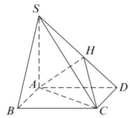

11. (1) 取 ${PD}$ 的中点 $H$ ,连接 ${AH} \Rightarrow  {NH}//{DC}$ , ${NH} = \frac{1}{2}{DC} \Rightarrow  {NH}//{AM},{NH} = {AM} \Rightarrow \; {AMNH}$ 为平行四边形 $\Rightarrow  {MN}//{AH}$ , ${MN} \text{ ⊄ } {PAD},{AH} \subset  {PAD} \Rightarrow  {MN}//{PAD}$ ;

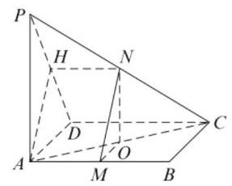

(2)连接 ${AC}$ 并取其中点为 $O$ ，连接 ${OM}$ 、 ${ON}$ ， 则 ${OM}$ 平行且等于 ${BC}$ 的一半， ${ON}$ 平行且等于 ${PA}$ 的一半,所以 $\angle {ONM}$ 就是异面直线 ${PA}$ 与 ${MN}$ 所成的角,由 ${MN} = {BC} = 4,{PA} = 4\sqrt{3}$ 得: ${OM} = 2,{ON} = 2\sqrt{3}$ ,所以 $\angle {ONM} = {30}^{ \circ  }$ ,所以异面直线 ${PA}$ 与 ${MN}$ 所成的角的大小 ${30}^{ \circ  }$ .

12.(1)略；

(2)由题意，把底面为直角三角形而有一侧棱垂直于底面的三棱锥为鳖臑补成一个长方体, 其中在鳖臑 ${ABCD}$ 中，侧棱 ${AB} \bot$ 底面 ${BCD}$ ， ${AB} = 1,{BC} = 2,{CD} = 1$ ,当底面直角 $\bigtriangleup {BCD}$ 中, $\angle C = {90}^{ \circ  }$ 时,如图 (1) 所示:

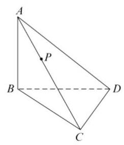

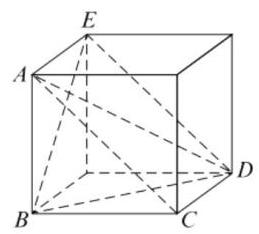

图(1)

在长方体中 ${AC}//{DE}$ ,所以异面直线 ${AC}$ 与 ${BD}$ 所成的角即为直线 ${DE}$ 与 ${BD}$ 所成的角,因为 ${AB} = 1,{BC} = 2,{CD} = 1$ ,可得 ${BD} = \; \sqrt{B{C}^{2} + C{D}^{2}} = \sqrt{5},{AE} = \sqrt{{1}^{2} + {1}^{2}} = \sqrt{2},{AC} = \; {DE} = \sqrt{{1}^{2} + {2}^{2}} = \sqrt{5}$ ,在 $\bigtriangleup {BDE}$ 中,由余弦定理可得 $\cos \angle {BDE} = \frac{{\left( \sqrt{5}\right) }^{2} + {\left( \sqrt{5}\right) }^{2} - {\left( \sqrt{2}\right) }^{2}}{2 \times  \sqrt{5} \times  \sqrt{5}} = \frac{4}{5}$ , 所以异面直线 ${AC}$ 与 ${BD}$ 所成的角的余弦为 $\frac{4}{5}$ ; 当底面直角 $\bigtriangleup {BCD}$ 中, $\angle D = {90}^{ \circ  }$ 时,如图(2)所示:

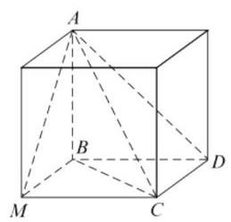

图(2)

在长方体中 ${BD}//{CM}$ ,所以异面直线 ${AC}$ 与 ${BD}$ 所成的角即为直线 ${DE}$ 与 ${CM}$ 所成的角, 因为 ${AB} = 1,{BC} = 2,{CD} = 1$ ,则 ${BD} = \; \sqrt{B{C}^{2} - C{D}^{2}} = \sqrt{3}$ ,可得 ${AM} = \sqrt{{1}^{2} + {1}^{2}} = \; \sqrt{2},{CM} = {BD} = \sqrt{3},{AC} = \sqrt{{1}^{2} + {1}^{2} + {\left( \sqrt{3}\right) }^{2}} = \; \sqrt{5}$ ,在 $\bigtriangleup {ACM}$ 中,由余弦定理可得 $\cos \angle {ACM} \; = \frac{{\left( \sqrt{5}\right) }^{2} + {\left( \sqrt{3}\right) }^{2} - {\left( \sqrt{2}\right) }^{2}}{2 \times  \sqrt{3} \times  \sqrt{5}} = \frac{\sqrt{15}}{5}$ ,所以异面直线 ${AC}$ 与 ${BD}$ 所成的角余弦为 $\frac{\sqrt{15}}{5}$ . 当底面直角 $\bigtriangleup {BCD}$ 中, $\angle B = {90}^{ \circ  }$ 时,因为 ${AB} = 1,{BC} =$ 2,此时 ${AB} < {BC}$ ,所以不成立. 所以异面直线 ${AC}$ 与 ${BD}$ 所成角的余弦 $\frac{4}{5}$ 或 $\frac{\sqrt{15}}{5}$ ;

(3)如图，作 ${PQ} \bot  {BC}$ 于点 $Q$ ，作 ${QM} \bot  {BD}$ ，交 ${BD}$ 于点 $M$ ,连接 ${PM}$ . 得到 ${PQ}//{AB},{QM}// \; {CD},{PQ} \bot$ 平面 ${BCD},{PQ} \bot  {BD}$ ,又 ${QM} \bot  {BD}$ , ${QM} \cap  {PQ} = Q$ ,所以 ${BD} \bot$ 平面 ${PQM}$ ,所以 ${PM} \bot  {BD}$ . 设 ${CQ} = x,{CB} = 2\sqrt{2}$ ,由 $\frac{PQ}{AB} = \frac{CQ}{CB} \; \Rightarrow  \frac{PQ}{2} = \frac{x}{2\sqrt{2}}$ ,得到 ${PQ} = \frac{x}{\sqrt{2}},0 \leq  x \leq  2\sqrt{2}$ ,

在 $\bigtriangleup {BCD}$ 中, $\frac{BQ}{BC} = \frac{QM}{CD} \Rightarrow  \frac{2\sqrt{2} - x}{2\sqrt{2}} = \frac{QM}{2}$ ,得到, ${QM} = \frac{2\sqrt{2} - x}{\sqrt{2}},{PM} = \sqrt{P{Q}^{2} + Q{M}^{2}} = \; \sqrt{\frac{{x}^{2}}{2} + \frac{\left( 8 - 4\sqrt{2}x + {x}^{2}\right) }{2}} = \sqrt{{x}^{2} - 2\sqrt{2}x + 4} = \; \sqrt{{\left( x - \sqrt{2}\right) }^{2} + 2} \geq  \sqrt{2}$ ,当且仅当 $x = \sqrt{2}$ 时,等号成立. ${S}_{\bigtriangleup {PBD}} = \frac{1}{2}{BD} \cdot  {PM} \geq  \frac{1}{2} \times  2 \times  \sqrt{2} = \sqrt{2}$ .

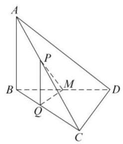

第十一讲 简单几何体

1. $\pi \;{2.16}\sqrt{2}\;{3.32}\;4.\frac{\sqrt{3}\pi }{3}\;5.\frac{{a}^{3}}{24}\;6.\frac{5\pi }{6}$

7. A 8. D 9. C

10. (1) $\arccos \frac{\sqrt{3}}{6}$ ;

(2)设圆柱的底面半径为 $r$ ,母线长度为 $h$ ,当点 $C$ 是弧 ${AB}$ 的中点时, ${AC} = {BC} = \sqrt{2}r$ , ${V}_{{A}_{1} - {BC}{C}_{1}{B}_{1}} = \frac{1}{3} \cdot  \left( {\sqrt{2}r}\right)  \cdot  \left( {\sqrt{2}r}\right)  \cdot  h = \frac{2}{3}{r}^{2}h, \; {V}_{\text{ 圆柱 }} = \pi {r}^{2}h,{V}_{{A}_{1} - {BC}{C}_{1}{B}_{1}} : {V}_{\text{ 圆柱 }} = 2 : {3\pi }$ .

11. (1) ${PB} = 4,{OB} = 2$ ,所以 ${PO} = 2\sqrt{3}$ ,底面积 $S = {4\pi }$ ,所以体积 $V = \frac{1}{3} \times  {4\pi } \times  2\sqrt{3} = \frac{8\sqrt{3}}{3}\pi$ ;

(2)取 ${OA}$ 中点 $N$ ，所以 ${MN}//{OB}$ ，所以异面直线 ${PM}$ 与 ${OB}$ 所成角大小即 $\angle {PMN}$ ， ${MN} = \; 1,{PO} = 4,{ON} = 1,{PO} \bot  {ON}$ ,所以 ${PN} = \; \sqrt{17}$ ,所以 $\tan \angle {PMN} = \frac{PN}{MN} = \sqrt{17}$ ,即 $\angle {PMN} = \arctan \sqrt{17}$ ,所以异面直线 ${PM}$ 与 ${OB}$ 所成角大小为 $\arctan \sqrt{17}$ ;

法二: 以 $O$ 为原点, ${OA}$ 为 $x$ 轴, ${OB}$ 为 $y$ 轴, ${OP}$ 为 $z$ 轴,建立空间直角坐标系,所以 $\overrightarrow{OB} = \; \left( {0,2,0}\right) , M\left( {1,1,0}\right) , P\left( {0,0,4}\right)$ ,所以 $\overrightarrow{PM} = \; \left( {1,1, - 4}\right)$ ,所以 $\cos \theta  = \frac{\overrightarrow{OB} \cdot  \overrightarrow{PM}}{\left| \overrightarrow{OB}\right|  \cdot  \left| \overrightarrow{PM}\right| } = \; \frac{2}{2 \times  3\sqrt{2}} = \frac{\sqrt{2}}{6}$ ,所以 $\theta  = \arccos \frac{\sqrt{2}}{6}$ ,所以异面直线 ${PM}$ 与 ${OB}$ 所成角大小为 $\arccos \frac{\sqrt{2}}{6}$ .

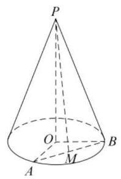

12.(1)证:因为 ${PA} \bot$ 平面 ${ABC}$ ，所以 ${AC}$ 为 ${PC}$ 在平面 ${ABC}$ 上的射影， $\angle {PCA}$ 为直线 ${PC}$ 与平面 ${ABC}$ 所成的角, $\tan \angle {PCA} = \frac{\sqrt{2}}{2}$ ,在 $\mathrm{{Rt}}\bigtriangleup {PAC}$ 中,又 ${PA} = 2,{AC} = 2\sqrt{2},\bigtriangleup {ABC}$ 中, $A{B}^{2} + B{C}^{2} = A{C}^{2}$ ,即: ${BC} \bot  {AB}$ ,又由 ${PA} \bot$ 平面 ${ABC}$ 得 ${PA} \bot  {BC}$ ,且 ${PA} \cap  {AB} = \; A,{BC} \bot$ 平面 ${ABC}$ ;

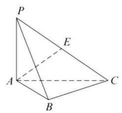

(2)取 ${PB}$ 中点 $D$ ，联结 ${AD},{DE}, D$ 为 ${PB}$ 中点， $E$ 为 ${PC}$ 中点，所以 ${DE}//{BC}$ ，所以 $\angle {AED}$ 就是异面直线 ${AE}$ 与 ${BC}$ 所成的角或其补角， $\bigtriangleup {AED}$ 中, ${AD} = \sqrt{2},{AE} = \sqrt{3},{DE} = 1$ , $\cos \angle {AED} = \frac{\sqrt{3}}{3}$ ,所以异面直线 ${AE}$ 与 ${BC}$ 所成角的大小为 $\arccos \frac{\sqrt{3}}{3}$ ;

(3)如图，点 $M$ 所形成的几何体是球体的一部分，其中 $\angle {NAG} = \angle {MAG} = \frac{\pi }{2},\angle {MAN} = \frac{\pi }{4}$ ， $S = \frac{1}{4} \cdot  \pi  \cdot  {\left( \sqrt{2}\right) }^{2} + \frac{1}{4} \cdot  \pi  \cdot  {\left( \sqrt{2}\right) }^{2} + \frac{1}{8} \cdot  \pi  \cdot \; {\left( \sqrt{2}\right) }^{2} + {4\pi } \cdot  {\left( \sqrt{2}\right) }^{2} \cdot  \frac{\frac{\pi }{4}}{2\pi } \cdot  \frac{1}{2} = \frac{5\pi }{4} + \frac{\pi }{2} = \frac{7\pi }{4}.$

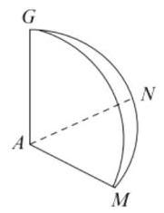

第十二讲 空间向量及其应用

1. $\arccos \frac{2}{5}$ 2. $\arccos \frac{3}{10}$ 或 $\pi  - \arccos \frac{3}{10}$ 3. 2

4. (1) $\arccos \frac{\sqrt{30}}{10}\;\left( 2\right) \arcsin \frac{\sqrt{10}}{10}$

(4) $\arccos \frac{1}{3}$

5. $\left\lbrack  {2,\sqrt{5}}\right\rbrack$ 6. $\frac{2}{3}\sqrt{3}$

7. A 8. C 9. B

10. ( 1 )因为正方形 ${ABCD}$ 边长为 $4,\bigtriangleup {PAB}$ 为等边三角形, $E$ 为 ${AB}$ 中点,所以 ${PE} = 2\sqrt{3}$ , ${V}_{P - {ABCD}} = \frac{1}{3} \times  {4}^{2} \times  2\sqrt{3} = \frac{{32}\sqrt{3}}{3};$

(2) 如图建系, $P\left( {0,0,4}\right) , D\left( {-2,4,0}\right)$ , $A\left( {-2,0,0}\right) , C\left( {2,4,0}\right)$ ,所以 $\overrightarrow{PD} = ( - 2,4$ , $- 4),\overrightarrow{AC} = \left( {4,4,0}\right)$ ,所以 $\cos \theta  = \frac{\overrightarrow{PD} \cdot  \overrightarrow{AC}}{\left| \overrightarrow{PD}\right|  \cdot  \left| \overrightarrow{AC}\right| } \; = \frac{8}{6 \times  4\sqrt{2}} = \frac{\sqrt{2}}{6}$ ,即 ${PD}$ 与 ${AC}$ 所成角的大小为 $\arccos \frac{\sqrt{2}}{6}$ .

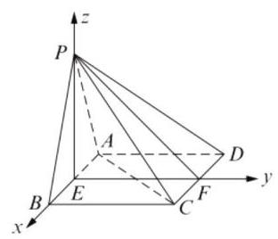

11.( 1 )如图所示建立直角坐标系，则 $\overrightarrow{A{C}_{1}} = (1,0$ ， 1), $\overrightarrow{AM} = \left( {0,1,\frac{1}{2}}\right)$ . 设平面 ${MA}{C}_{1}$ 的法向量为 $\overrightarrow{n} = \left( {x, y, z}\right)$ ,由 $\left\{  \begin{array}{l} \overrightarrow{A{C}_{1}} \cdot  \overrightarrow{n} = x + z = 0 \\  \overrightarrow{AM} \cdot  \overrightarrow{n} = y + \frac{z}{2} = 0 \end{array}\right.$ ,取 $z = 2$ ,则 $\overrightarrow{n} = \left( {-2, - 1,2}\right)$ . 又 $\overrightarrow{AC} = \left( {1,0,0}\right) , C$ 到平面 ${MA}{C}_{1}$ 的距离 $d = \frac{\left| \overrightarrow{AC} \cdot  \overrightarrow{n}\right| }{\left| \overrightarrow{n}\right| } = \frac{2}{3}$ ;

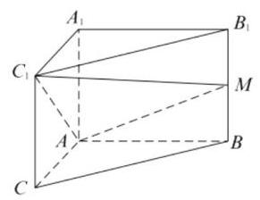

(2)设 $M\left( {0,1, t}\right) \left( {0 \leq  t \leq  1}\right)$ ，则 $\overrightarrow{AM} = \left( {0,1}\right.$ , $t)$ ,设平面 ${MA}{C}_{1}$ 的法向量为 $\overrightarrow{{n}_{1}} = \left( {x, y, z}\right)$ , 由 $\left\{  \begin{array}{l} \overrightarrow{A{C}_{1}} \cdot  \overrightarrow{{n}_{1}} = x + z = 0 \\  \overrightarrow{AM} \cdot  \overrightarrow{n} = y + {tz} = 0 \end{array}\right.$ ,取 $z = 1 \Rightarrow  \overrightarrow{{n}_{1}} = ( - 1$ , $\left. {-t,1}\right)$ . 平面 $A{A}_{1}{C}_{1}$ 的一个法向量为 $\overrightarrow{{n}_{2}} = (0$ , $1,0)$ . 设二面角 $M - A{C}_{1} = {A}_{1}$ 的大小为 $\theta$ ,显然 $\theta$ 不为钝角,所以 $\cos \theta  = \frac{\left| \overrightarrow{{n}_{1}} \cdot  \overrightarrow{{n}_{2}}\right| }{\left| \overrightarrow{{n}_{1}}\right|  \cdot  \left| \overrightarrow{{n}_{2}}\right| } = \frac{t}{\sqrt{{t}^{2} + 2}}$ . $0 \leq  t \leq  1,\cos \theta  \in  \left\lbrack  {0,\frac{\sqrt{3}}{3}}\right\rbrack$ ,故二面角 $M - A{C}_{1} - \; {A}_{1}$ 的大小的取值范围是 $\left\lbrack  {\arccos \frac{\sqrt{3}}{3},\frac{\pi }{2}}\right\rbrack$ .

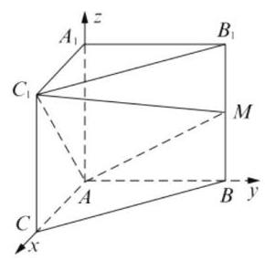

12. (1) 证明: ${OP} \bot$ 平面 ${ABC},{OA} = {OC},{AB} = \; {BC},{OA} \bot  {OB},{OA} \bot  {OP},{OB} \bot  {OP}$ . 以 $O$ 为原点,建立如图所示空间直角坐标系 $O - {xyz}$ . 设 ${AB} = a$ ,则 $A\left( {\frac{\sqrt{2}}{2}a,0,0}\right) , B\left( {0,\frac{\sqrt{2}}{2}a,0}\right)$ , $C\left( {-\frac{\sqrt{2}}{2}a,0,0}\right)$ . 设 ${OP} = h$ ,则 $P\left( {0,0, h}\right) .D$ 为 ${PC}$ 的中点, $\overrightarrow{OD} = \left( {-\frac{\sqrt{2}}{4}a,0,\frac{1}{2}h}\right) .\overrightarrow{PA} = \; \left( {\frac{\sqrt{2}}{2}a,0, - h}\right) ,\overrightarrow{OD} =  - \frac{1}{2}\overrightarrow{PA}.\overrightarrow{OD}//\overrightarrow{PA},{OD}// \; {PA}$ ,又 ${OD}$ 不在平面 ${PAB}$ 上, ${AP} \subset$ 平面 ${PAB}$ ,所以 ${OD}//$ 平面 ${PAB}$ ;

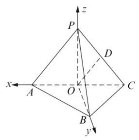

(2) $k = \frac{1}{2}$ ，即 ${PA} = {2a}, h = \sqrt{\frac{7}{2}}a$ ，所以 $\overrightarrow{PA} = \; \left( {\frac{\sqrt{2}}{2}a,0, - \sqrt{\frac{7}{2}}a}\right)$ ,可求得平面 ${PBC}$ 的法向量 $\overrightarrow{n} = \left( {1, - 1, - \sqrt{\frac{1}{7}}}\right) .\cos \varphi  = \frac{\overrightarrow{PA} \cdot  \overrightarrow{n}}{\left| \overrightarrow{PA}\right|  \cdot  \left| \overrightarrow{n}\right| } = \; \frac{\sqrt{210}}{30}$ . 设 ${PA}$ 与平面 ${PBC}$ 所成的角为 $\theta$ ,则 $\sin \theta  = \left| {\cos \varphi }\right|  = \frac{\sqrt{210}}{30}.{PA}$ 与平面 ${PBC}$ 所成的角为 $\arcsin \frac{\sqrt{210}}{30}$ ;

(3) $\bigtriangleup {PBC}$ 的重心 $G\left( {-\frac{\sqrt{2}}{6}a,\frac{\sqrt{2}}{6}a,\frac{1}{3}h}\right)$ , $\overrightarrow{OG} = \left( {-\frac{\sqrt{2}}{6}a,\frac{\sqrt{2}}{6}a,\frac{1}{3}h}\right) ,{OG} \bot$ 平面 ${PBC}$ , $\overrightarrow{OG} \bot  \overrightarrow{PB}$ . 又 $\overrightarrow{PB} = \left( {0,\frac{\sqrt{2}}{2}a, - h}\right) ,\overrightarrow{OG} \cdot  \overrightarrow{PB} = \; \frac{1}{6}{a}^{2} - \frac{1}{3}{h}^{2} = 0.h = \frac{\sqrt{2}}{2}a.{PA} = \sqrt{O{A}^{2} + {h}^{2}} = \; a$ ,即 $k = 1$ . 所以,当 $k = 1$ 时,三棱锥 $O - {PBC}$ 为正三棱锥, $O$ 在平面 ${PBC}$ 内的射影为 $\bigtriangleup {PBC}$ 的重心.

## 第十三讲 计数原理与二项式定理

$\begin{array}{llllll} {1.48} & {2.}\frac{1}{9} & {3.}\frac{20}{29} & {4.}\frac{7}{30} & {5.n} = 7 & {6.a} = 2 \end{array}$ 7. A 8. B 9. C

10. 分类讨论: 若有 2 人从事司机工作, 则方案有 ${\mathrm{C}}_{3}^{2} \times  {\mathrm{P}}_{3}^{3} = {18}$ ; 若有 1 人从事司机工作,则方案有 ${\mathrm{C}}_{3}^{1} \times  {\mathrm{C}}_{4}^{2} \times  {\mathrm{P}}_{3}^{3} = {108}$ 种,所以共有 ${18} + {108} =$ 126 种.

11. (1) $P = \frac{1}{2};\left( 2\right) P = \frac{3}{8}$ .

12. $a =  \pm  \sqrt{3}$ .

## 第十四讲 概率与统计

1. $\frac{3}{10}$ 2. $\frac{2}{3}$ 3. $\frac{2}{5}$ 4. $\frac{6}{35}$ 5. 72 6.1

7. C 8. B 9. B

10. (1) 由茎叶图得测试成绩为52,63,67,68,72, 76,76,76,82,88,93,94 第 50 百分位数为 76 . 所抽取的 12 人中, 70 分以下的有 4 人, 70 分以上的有 8 人，则样本中 70 分以上所在比例为 $\frac{8}{12} = \frac{2}{3}$ ,估计该校测试成绩在 70 分以上的人数为 ${3000} \times  \frac{2}{3} = {2000}$ 人;

(2)从测试成绩为 $\left\lbrack  {{70},{90}}\right\rbrack$ 的学生中随机抽取 2 人，共有 ${\mathrm{C}}_{6}^{2} = {15},\left\lbrack  {{70},{80}}\right\rbrack$ 中的任取 2 人，共有 ${\mathrm{C}}_{4}^{2} = 6$ ，成绩均落在两位学生的测试成绩均落在 $\left\lbrack  {{70},{80}}\right\rbrack$ 的概率 $\frac{6}{15} = \frac{2}{5}$ .

11. (1) 由频率分布直方图得第七组的频率为: $1 - ({0.004} + {0.012} + {0.016} + {0.030} + {0.020} +$

${0.006} + {0.004}) \times  {10} = {0.08}$ . 完成频率分布直方图如下:

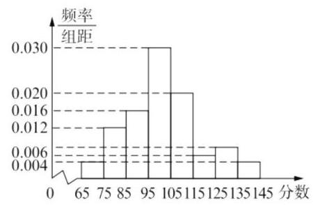

(2)用样本数据估计该校的 2000 名学生这次考试成绩的平均分为: ${70} \times  {0.004} \times  {10} + {80} \times \; {0.012} \times  {10} + {90} \times  {0.016} \times  {10} + {100} \times  {0.030} \times \; {10} + {110} \times  {0.020} \times  {10} + {120} \times  {0.006} \times  {10} + \; {130} \times  {0.008} \times  {10} + {140} \times  {0.004} \times  {10} = {102};$

(3)样本成绩属于第六组的有 ${0.006} \times  {10} \times  {50} = 3$ 人，样本成绩属于第八组的有 ${0.004} \times  {10} \times  {50} = 2$ 人，从样本成绩属于第六组和第八组的所有学生中随机抽取 2 名,基本事件总数 $n = {\mathrm{C}}_{5}^{2} = {10}$ ,他们的分差的绝对值小于 10 分包含的基本事件个数 $m = {\mathrm{C}}_{3}^{2} + {\mathrm{C}}_{2}^{2} = 4$ ,所以他们的分差的绝对值小于 10 分的概率 $P = \frac{m}{n} = \frac{4}{10} = \frac{2}{5}$ .

12. ( 1 )记事件 $M$ :甲连胜四场，则 $P\left( M\right)  = \; {\left( \frac{1}{2}\right) }^{4} = \frac{1}{16}$

(2)记事件 $A$ 为甲输，事件 $B$ 为乙输，事件 $C$ 为丙输,则四局内结束比赛的概率为 ${P}^{\prime } = \; P\left( {ABAB}\right)  + P\left( {ACAC}\right)  + P\left( {BCBC}\right)  + \; P\left( {BABA}\right)  = 4 \times  {\left( \frac{1}{2}\right) }^{4} = \frac{1}{4}$ ,所以,需要进行第五场比赛的概率为 $P = 1 - {P}^{\prime } = \frac{3}{4}$ ;

(3)记事件 $A$ 为甲输，事件 $B$ 为乙输，事件 $C$ 为丙输,记事件 $M$ : 甲赢,记事件 $N$ : 丙赢,则甲赢的基本事件包括: BCBC、ABCBC、 ${ACBCB}\text{ 、 }{BABCC}\text{ 、 }{BACBC}\text{ 、 }{BCACB}\text{ 、 }{BCABC}$ 、 ${BCBAC}$ ,所以,甲赢的概率为 $P\left( M\right)  = {\left( \frac{1}{2}\right) }^{4} + \; 7 \times  {\left( \frac{1}{2}\right) }^{5} = \frac{9}{32}$ . 由对称性可知,乙赢的概率和甲赢的概率相等,所以丙赢的概率为 $P\left( N\right)  = \; 1 - 2 \times  \frac{9}{32} = \frac{7}{16}.$

## 第十五讲 概率初步 (续)

1. $\frac{3}{5}\;$ 2. $\frac{2}{3},\left\lbrack  {-\frac{1}{3},\frac{1}{3}}\right\rbrack  \;$ 3. 1.96 4. $\frac{nM}{N}$

5.0.146. $\frac{2}{5}$

7. A 8. D 9. A

10. ( 1 )由题设知 $X$ 的可能取值为0,1,2,3，

$$
P\left( {X = 0}\right)  = \left( {1 - \frac{3}{4}}\right) \left( {1 - \frac{2}{3}}\right) \left( {1 - \frac{1}{2}}\right)  = \frac{1}{24},
$$

$$
P\left( {X = 1}\right)  = \frac{3}{4}\left( {1 - \frac{2}{3}}\right) \left( {1 - \frac{1}{2}}\right)  +
$$

$$
\left( {1 - \frac{3}{4}}\right)  \times  \frac{2}{3} \times  \left( {1 - \frac{1}{2}}\right)  +
$$

$$
\left( {1 - \frac{3}{4}}\right) \left( {1 - \frac{2}{3}}\right)  \times  \frac{1}{2} = \frac{1}{4},
$$

$P\left( {X = 2}\right)  = \frac{3}{4} \times  \frac{2}{3} \times  \left( {1 - \frac{1}{2}}\right)  +$

$\frac{3}{4} \times  \left( {1 - \frac{2}{3}}\right)  \times  \frac{1}{2} +$

$\left( {1 - \frac{3}{4}}\right)  \times  \frac{2}{3} \times  \frac{1}{2} = \frac{11}{24}$

$P\left( {X = 3}\right)  = \frac{3}{4} \times  \frac{2}{3} \times  \frac{1}{2} = \frac{1}{4},$

所以随机变量 $X$ 的分布列为:

<table><tr><td>$X$</td><td>0</td><td>1</td><td>2</td><td>3</td></tr><tr><td>$P$</td><td>1 24</td><td>$\frac{1}{4}$</td><td>$\frac{11}{24}$</td><td>$\frac{1}{4}$</td></tr></table>

数学期望 $E\left\lbrack  X\right\rbrack   = 0 \times  \frac{1}{24} + 1 \times  \frac{1}{4} + 2 \times  \frac{11}{24} + 3 \times \; \frac{1}{4} = \frac{23}{12}$

(2)设“甲队和乙队得分之和为 4”为事件 $A$ ， “甲队比乙队得分高”为事件 $B$ ,

则 $P\left( A\right)  = \frac{1}{4} \times  {\mathrm{C}}_{3}^{3} \times  {\left( \frac{2}{3}\right) }^{3} + \frac{11}{24} \times  {\mathrm{C}}_{3}^{2} \times  {\left( \frac{2}{3}\right) }^{2}$

$\times  \left( {1 - \frac{2}{3}}\right)  + \frac{1}{4} \times  {\mathrm{C}}_{3}^{1} \times  \frac{2}{3} \times  {\left( 1 - \frac{2}{3}\right) }^{2} = \frac{1}{3},$

$P\left( {A \cap  B}\right)  = \frac{1}{4} \times  {\mathrm{C}}_{3}^{1} \times  \frac{2}{3} \times  {\left( 1 - \frac{2}{3}\right) }^{2} = \frac{1}{18},$

$P\left( {B \mid  A}\right)  = \frac{P\left( {A \cap  B}\right) }{P\left( A\right) } = \frac{\frac{1}{18}}{\frac{1}{3}} = \frac{1}{6}.$

11. (1)设甲在三个项目中获胜的事件依次记为 $A$ ， $B, C$ ,所以甲学校获得冠军的概率为

$P = P\left( {ABC}\right)  + P\left( {\bar{A}{BC}}\right)  + P\left( {A\bar{B}C}\right)  + P\left( {{AB}\bar{C}}\right) \; = {0.5} \times  {0.4} \times  {0.8} + {0.5} \times  {0.4} \times  {0.8} + {0.5} \times \; {0.6} \times  {0.8} + {0.5} \times  {0.4} \times  {0.2} \; = {0.16} + {0.16} + {0.24} + {0.04} = {0.6}$ ;

(2)依题可知， $X$ 的可能取值为0,10,20,30， 所以，

$P\left( {X = 0}\right)  = {0.5} \times  {0.4} \times  {0.8} = {0.16},$

$P\left( {X = {10}}\right)  = {0.5} \times  {0.4} \times  {0.8} + {0.5} \times  {0.6} \times  {0.8} \; + {0.5} \times  {0.4} \times  {0.2} = {0.44},$

$P\left( {X = {20}}\right)  = {0.5} \times  {0.6} \times  {0.8} + {0.5} \times  {0.4} \times  {0.2} \; + {0.5} \times  {0.6} \times  {0.2} = {0.34},$

$P\left( {X = {30}}\right)  = {0.5} \times  {0.6} \times  {0.2} = {0.06}.$

即 $X$ 的分布列为

<table><tr><td>$X$</td><td>0</td><td>10</td><td>20</td><td>30</td></tr><tr><td>$P$</td><td>0.16</td><td>0.44</td><td>0.34</td><td>0.06</td></tr></table>

期望 $E\left( X\right)  = 0 \times  {0.16} + {10} \times  {0.44} + {20} \times  {0.34} \; + {30} \times  {0.06} = {13}.$

12. ( 1 )平均年龄 $\bar{x} = \left( {5 \times  {0.001} + {15} \times  {0.002} + {25}}\right. \; \times  {0.012} + {35} \times  {0.017} + {45} \times  {0.023} + {55} \times \; {0.020} + {65} \times  {0.012} + {75} \times  {0.006} + {85} \times  {0.002}) \; \times  {10} = {44.65}$ (岁);

(2)设 $A = \{  -$ 人患这种疾病的年龄在区间 $\lbrack {20},{70})\}$ ,所以 $P\left( A\right)  = 1 - P\left( \bar{A}\right)  = 1 - \; \left( {{0.001} + {0.002} + {0.006} + {0.002}}\right)  \times  {10} = 1 - \; {0.11} = {0.89}$ ；

(3)设 $B = \{$ 任选一人年龄位于区间 $\lbrack {40},{50})\}$ ， $C = \{$ 任选一人患这种疾病 $\}$ ,

则由条件概率公式可得

$P\left( {C \mid  B}\right)  = \frac{P\left( {B \cap  C}\right) }{P\left( B\right) } = \frac{{0.1}\%  \times  {0.023} \times  {10}}{{16}\% }$

$$
= \frac{{0.001} \times  {0.23}}{0.16} = {0.0014375}
$$

$\approx  {0.0014}$ .

## 第十六讲 成对数据的统计分析

1. ① 2. -1 3.0.5 4. ①③④ 5. 不可以 6. ②④

7. A 8. C 9. C

10. ( 1 )利用模型①，该地区 2018 年的环境基础设施投资额的预测值为

$\widehat{y} =  - {30.4} + {13.5} \times  {19} = {226.1}$ (亿元).

利用模型②，该地区 2018 年的环境基础设施投资额的预测值为

$\widehat{y} = {99} + {17.5} \times  9 = {256.5}$ (亿元);

(2) 利用模型②得到的预测值更可靠.

理由如下:

( i ) 从折线图可以看出, 2000 年至 2016 年的数据对应的点没有随机散布在直线 $y =  - {30.4}$ +13.5t上下，这说明利用 2000 年至 2016 年的数据建立的线性模型 ① 不能很好地描述环境基础设施投资额的变化趋势. 2010 年相对 2009 年的环境基础设施投资额有明显增加, 2010 年至 2016 年的数据对应的点位于一条直线的附近, 这说明从 2010 年开始环境基础设施投资额的变化规律呈线性增长趋势，利用 2010 年至 2016 年的数据建立的线性模型 $\widehat{y} = \; {99} + {17.5t}$ 可以较好地描述 2010 年以后的环境基础设施投资额的变化趋势, 因此利用模型 ②得到的预测值更可靠.

( ii ) 从计算结果看, 相对于 2016 年的环境基础设施投资额 220 亿元，由模型①得到的预测值 226.1 亿元的增幅明显偏低, 而利用模型 ② 得到的预测值的增幅比较合理, 说明利用模型 ②得到的预测值更可靠.

小结: 若已知回归直线方程, 则可以直接将数值代入求得特定要求下的预测值; 若回归直线方程有待定参数, 则根据回归直线方程恒过点 $\left( {\bar{x},\bar{y}}\right)$ 求参数.

11. (1) 由表中所给数据可得:

$\bar{x} = \frac{9 + {10} + {12} + {11} + 8}{5} = {10}, \; \bar{y} = \frac{{25} + {26} + {31} + {27} + {21}}{5} = {26},$

代入公式得: $\widehat{a} = \frac{\mathop{\sum }\limits_{{i = 1}}^{5}\left( {{x}_{i} - \bar{x}}\right) \left( {{y}_{i} - \bar{y}}\right) }{\mathop{\sum }\limits_{{i = 1}}^{{l - 1}}{\left( {x}_{i} - \bar{x}\right) }^{2}}$ ,

解得 $\widehat{a} = {2.2}$ ,所以 $\widehat{b} = \bar{y} - \widehat{a}\bar{x} = 4$ ,故所求的 $y$ 关于 $x$ 的线性回归直线方程为 $\widehat{y} = {2.2x} + 4$ ;

(2)由题意，将 $x = 7$ 代入回归方程 $\widehat{y} = {2.2x}$ +4,可得 $\widehat{y} = {19.4}$ ,所以预测 2022 年该地区的粮食产量大约为 19.4 万亿吨.

12. (1)甲机床生产的产品中的一级品的频率为 $\frac{150}{200} = {75}\%$ ,乙机床生产的产品中的一级品的频率为 $\frac{120}{200} = {60}\%$ ;

(2) ${\chi }^{2} = \frac{{400}{\left( {150} \times  {80} - {120} \times  {50}\right) }^{2}}{{270} \times  {130} \times  {200} \times  {200}} = \frac{400}{39} >$ 10>6.635,故能有 ${99}\%$ 的把握认为甲机床的产品与乙机床的产品质量有差异.

## 第二篇 数学思想方法与精典问题

## 第十七讲 数形结合

1. $\left( {-\infty ,3}\right)  \cup  \left( {7, + \infty }\right) \;$ 2. $\sqrt{5}\;$ 3. $- 4\;$ 4. 10

5. $k = \sqrt{2}$ 或 $k \in  \lbrack  - 1,1)\;6.b - a$

7. D 8. B 9. D

10. 因为实数 $x, y$ 满足 $\frac{x\left| x\right| }{4} - y\left| y\right|  = 1$ ,

当 $x > 0, y > 0$ 时,方程为 $\frac{{x}^{2}}{4} - {y}^{2} = 1$ 的图像为双曲线在第一象限的部分;

当 $x > 0, y < 0$ 时,方程为 $\frac{{x}^{2}}{4} + {y}^{2} = 1$ 的图像为椭圆在第四象限的部分;

当 $x < 0, y > 0$ 时,方程为 $- \frac{{x}^{2}}{4} - {y}^{2} = 1$ 的图像不存在;

当 $x < 0, y < 0$ 时,方程为 $- \frac{{x}^{2}}{4} + {y}^{2} = 1$ 的图像为双曲线在第三象限的部分;

在同一坐标系中作出函数的图像如图所示,

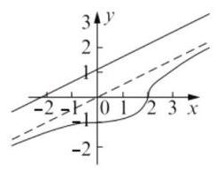

$\left| {x - {2y} + \sqrt{5}}\right|$ 表示点 $\left( {x, y}\right)$ 到直线 $x - {2y} + \; \sqrt{5} = 0$ 的距离的 $\sqrt{5}$ 倍,根据双曲线的方程可得,两条双曲线的渐近线均为 $y =  \pm  \frac{1}{2}x$ ,

令 $z = x - {2y} + \sqrt{5}$ ,即 $y = \frac{1}{2}x - \frac{z}{2} + \frac{\sqrt{5}}{2}$ ,

与双曲线渐近线平行, 观察图像可得,

当过点 $\left( {x, y}\right)$ 且斜率为 $\frac{1}{2}$ 的直线与椭圆相切时,点 $\left( {x, y}\right)$ 到直线 $x - {2y} + \sqrt{5} = 0$ 的距离最大,即当直线 $z = x - {2y} + \sqrt{5}$ 与椭圆相切时,

$z$ 最大,联立方程组 $\left\{  \begin{array}{l} \frac{{x}^{2}}{4} + {y}^{2} = 1 \\  y = \frac{1}{2}x - \frac{z}{2} + \frac{\sqrt{5}}{2} \end{array}\right.$ ,得 $2{x}^{2} - \left( {{2z} - 2\sqrt{5}}\right) x + {z}^{2} - 2\sqrt{5}z + 1 = 0,$

$\Delta  = {\left( 2z - 2\sqrt{5}\right) }^{2} - 4 \times  2 \times  \left( {{z}^{2} - 2\sqrt{5}z + 1}\right)  = 0,$

解得 $z = \sqrt{5} \pm  2\sqrt{2}$ ,又因为椭圆的图像只有第

四象限的部分,所以 $z = \sqrt{5} + 2\sqrt{2}$ ,

又直线 $x - {2y} + \sqrt{5} = 0$ 与 $x - {2y} = 0$ 的距离为 1,

故曲线上的点到直线的距离大于 1 ,

所以 $z > \sqrt{5}$ ,综上所述, $\sqrt{5} < z \leq  \sqrt{5} + 2\sqrt{2}$ ,

所以 $\sqrt{5} < \left| z\right|  \leq  \sqrt{5} + 2\sqrt{2}$ ,

即 $\left| {x + {2y} - 4}\right|  \in  \left( {\sqrt{5},\sqrt{5} + 2\sqrt{2}}\right\rbrack$ .

11. (1) $g\left( x\right)  = a{x}^{2} - {2ax} + 1 + b$ ，由题意得:

${1}^{ \circ  }\left\{  {\begin{array}{l} a > 0 \\  g\left( 2\right)  = 1 + b = 1 \\  g\left( 3\right)  = {3a} + b + 1 = 4 \end{array}\text{ 得 }\left\{  {\begin{array}{l} a = 1 \\  b = 0 \end{array},}\right. }\right.$

或 ${2}^{ \circ  }\left\{  \begin{array}{l} a < 0 \\  g\left( 2\right)  = 1 + b = 4 \\  g\left( 3\right)  = {3a} + b + 1 = 1 \end{array}\right.$ 得 $\left\{  \begin{array}{l} a =  - 1 \\  b = 3 > 1 \end{array}\right.$ (舍去),

所以 $a = 1, b = 0, g\left( x\right)  = {x}^{2} - {2x} + 1$ ,

$f\left( x\right)  = x + \frac{1}{x} - 2;$

(2)不等式 $f\left( {2}^{x}\right)  - k \cdot  {2}^{x} \geq  0$ ，

即 ${2}^{x} + \frac{1}{{2}^{x}} - 2 \geq  k \cdot  {2}^{x}$ ,

所以 $k \leq  {\left( \frac{1}{{2}^{x}}\right) }^{2} - 2 \cdot  \left( \frac{1}{{2}^{x}}\right)  + 1$ ,

设 $t = \frac{1}{{2}^{x}} \in  \left\lbrack  {\frac{1}{2},2}\right\rbrack  , k \leq  {\left( t - 1\right) }^{2}$ ,

因为 ${\left( t - 1\right) }_{\min }^{2} = 0$ ,所以 $k \leq  0$ ;

(3) $f\left( \left| {{2}^{x} - 1}\right| \right)  + t \cdot  \left( {\frac{4}{\left| {2}^{x} - 1\right| } - 3}\right)  = 0$ ,

即 $\left| {{2}^{x} - 1}\right|  + \frac{1}{\left| {2}^{x} - 1\right| } + \frac{4t}{\left| {2}^{x} - 1\right| } - {3t} - 2 = 0$ .

令 $u = \left| {{2}^{x} - 1}\right|  > 0$ ,

则 ${u}^{2} - \left( {{3t} + 2}\right) u + \left( {{4t} + 1}\right)  = 0\left( *\right)$ ,

记方程 $\left( *\right)$ 的根为 ${u}_{1}\text{ 、 }{u}_{2}$ ,

当 $0 < {u}_{1} < 1 \leq  {u}_{2}$ 时,原方程有三个相异实根,

记 $\varphi \left( u\right)  = {u}^{2} - \left( {{3t} + 2}\right) u + \left( {{4t} + 1}\right)$ ,由题可知,

$\left\{  {\begin{array}{l} \varphi \left( 0\right)  = {4t} + 1 > 0 \\  \varphi \left( 1\right)  = t < 0 \end{array}\text{ 或 }\left\{  {\begin{array}{l} \varphi \left( 0\right)  = {4t} + 1 > 0 \\  \varphi \left( 1\right)  = t = 0 \\  0 < \frac{{3t} + 2}{2} < 1 \end{array}.}\right. }\right.$

所以 $- \frac{1}{4} < t < 0$ 时满足题设.

12. ( 1 ) $\left\{  {\begin{array}{l} y = \frac{2x}{x + 1}\left( {x > 0}\right) \\  y = \frac{1}{3x}\left( {x > 0}\right)  \end{array} \Rightarrow  \left\{  \begin{array}{l} x = \frac{1}{2} \\  y = \frac{2}{3} \end{array}\right. }\right.$ ，

即曲线 ${C}_{1}$ 和曲线 ${C}_{2}$ 的交点坐标是 $\left( {\frac{1}{2},\frac{2}{3}}\right)$ ;

(2)设 ${P}_{n}\left( {{a}_{n},{y}_{{P}_{n}}}\right)$ ， ${Q}_{n}\left( {{x}_{{Q}_{n}},{y}_{{Q}_{n}}}\right)$ ，

由已知 ${y}_{{P}_{n}} = \frac{2{a}_{n}}{{a}_{n} + 1}$ ,

又 ${y}_{{Q}_{n}} = {y}_{{P}_{n}}$ ,

又 ${x}_{{Q}_{n}} = \frac{1}{3{y}_{{Q}_{n}}} = \frac{1}{3 \cdot  \frac{2{a}_{n}}{{a}_{n} + 1}} = \frac{{a}_{n} + 1}{6{a}_{n}}$

$= {x}_{{P}_{n + 1}} = {a}_{n + 1},$

${a}_{n + 1} = \frac{{a}_{n} + 1}{6{a}_{n}};$

(3)因为 ${a}_{n} > 0$ ,由 ${a}_{n + 1} = \frac{{a}_{n} + 1}{6{a}_{n}}$ ,

${a}_{n + 1} - \frac{1}{2} = \frac{-2\left( {{a}_{n} - \frac{1}{2}}\right) }{6{a}_{n}},$

可得 ${a}_{n + 1} - \frac{1}{2}$ 与 ${a}_{n} - \frac{1}{2}$ 异号, $0 < {a}_{1} < \frac{1}{2}$ ,

${a}_{1} - \frac{1}{2} < 0,{a}_{{2n} - 1} - \frac{1}{2} < 0,{a}_{2n} - \frac{1}{2} > 0,$

即 ${a}_{{2n} - 1} < \frac{1}{2} < {a}_{2n}$ .

## 第十八讲 分类讨论

1. $a = 0$ 或 $a =  \pm  1\;2.c = \sqrt{61}$ 或 $\sqrt{21}\;3.3$ 或 7

4. ${a}_{n} = \left\{  {\begin{array}{l} 5, n = 1 \\  2 \cdot  {3}^{n - 1}, n \geq  2 \end{array}\text{ 5. }\left( {6,\frac{{41}\sqrt{5}}{10}}\right) }\right.$

6. ${\left| PA\right| }_{\min } = \left\{  \begin{array}{l} \sqrt{{2a} - 1}, a \geq  1 \\  \left| a\right| , a < 1 \end{array}\right.$

7. A 8. D 9. C

10. 由 $f\left( x\right)  - {\log }_{2}\left\lbrack  {\left( {a - 4}\right) x + {2a} - 5}\right\rbrack   = 0$ ,

$\frac{1}{x} + a = \left( {a - 4}\right) x + {2a} - 5,$

$\left( {a - 4}\right) {x}^{2} + \left( {a - 5}\right) x - 1 = 0,$

当 $a = 4$ 时, $x =  - 1$ ,经检验,满足题意.

当 $a = 3$ 时, ${x}_{1} = {x}_{2} =  - 1$ ,经检验,满足题意.

当 $a \neq  3$ 且 $a \neq  4$ 时, ${x}_{1} = \frac{1}{a - 4},{x}_{2} =  - 1$ ,

${x}_{1} \neq  {x}_{2}.{x}_{1}$ 是原方程的解当且仅当 $\frac{1}{{x}_{1}} + a > 0$ ,

即 $a > 2;{x}_{2}$ 是原方程的解当且仅当 $\frac{1}{{x}_{2}} + a > 0$ ,

即 $a > 1$ . 于是满足题意的 $a \in  (1,2\rbrack$ .

综上, $a$ 的取值范围为 $(1,2\rbrack  \cup  \{ 3,4\}$ .

11. ${f}^{\prime }\left( x\right)  = \left\lbrack  {a{x}^{2} - \left( {a + 1}\right) x + 1}\right\rbrack  {e}^{x}$

$= \left( {{ax} - 1}\right) \left( {x - 1}\right) {e}^{x},$

令 ${f}^{\prime }\left( x\right)  = 0$ ,得 ${x}_{1} = \frac{1}{a},{x}_{2} = 1$ ,

若 $a > 1$ ,则当 $x \in  \left( {\frac{1}{a},1}\right)$ 时, ${f}^{\prime }\left( x\right)  < 0$ ;

当 $x \in  \left( {1, + \infty }\right)$ 时, ${f}^{\prime }\left( x\right)  > 0$ .

所以 $f\left( x\right)$ 在 $x = 1$ 处取得极小值.

若 $a \leq  1$ ,则当 $x \in  \left( {0,1}\right)$ 时,

${ax} - 1 \leq  x - 1 < 0$ ,所以 ${f}^{\prime }\left( x\right)  > 0$ .

所以 1 不是 $f\left( x\right)$ 的极小值点. 综上可知,

$a$ 的取值范围是 $\left( {1, + \infty }\right)$ .

12. (1)设 $M\left( {x, y}\right)$ ，由题意

$\sqrt{{x}^{2} + {\left( y - 1\right) }^{2}} + \left| {y - 3}\right|  = 4$ :

当 $y \leq  3$ 时,有 $\sqrt{{x}^{2} + {\left( y - 1\right) }^{2}} = y + 1$ ,

化简得 ${x}^{2} = {4y}$ ,当 $y > 3$ 时,

有 $\sqrt{{x}^{2} + {\left( y - 1\right) }^{2}} = 7 - y$ ,

化简得 ${x}^{2} =  - {12}\left( {y - 4}\right)$ (二次函数),

综上所述: 点 $M$ 的轨迹方程为

${x}^{2} = \left\{  \begin{array}{l} {4y}, y \leq  3 \\   - {12}\left( {y - 4}\right) , y > 3 \end{array}\right.$ (如图);

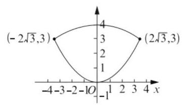

(2)当 $t \leq  0$ 或 $t \geq  4$ 显然不存在符合题意的对称点,当 $0 < t < 4$ 时,注意到曲线 $C$ 关于 $y$ 轴对称,至少存在一对 (关于 $y$ 轴对称的) 对称点. 下面研究曲线 $C$ 上关于 $B\left( {0, t}\right)$ 对称但不关于 $y$ 轴对称的对称点: 设 $P\left( {{x}_{0},{y}_{0}}\right)$ 是轨迹 ${x}^{2} = {4y} \; \left( {y \leq  3}\right)$ 上任意一点,则 ${x}_{0}^{2} = 4{y}_{0}\left( {{y}_{0} \leq  3}\right)$ ,

它关于 $B\left( {0, t}\right)$ 的对称点为 $Q\left( {-{x}_{0},{2t} - {y}_{0}}\right)$ , 由于点 $Q$ 在轨迹 ${x}^{2} =  - {12}\left( {y - 4}\right)$ 上,

所以 ${\left( -{x}_{0}\right) }^{2} =  - {12}\left( {{2t} - {y}_{0} - 4}\right)$ ,

联立方程组 $\left\{  \begin{array}{l} {x}_{0}^{2} = 4{y}_{0} \\  {x}_{0}^{2} =  - {12}\left( {{2t} - {y}_{0} - 4}\right)  \end{array}\right.$ (*),

得 $4{y}_{0} =  - {12}\left( {{2t} - {y}_{0} - 4}\right)$ ,

化简得 $t = \frac{{y}_{0} + 6}{3}\left( {0 \leq  {y}_{0} \leq  3}\right)$ .

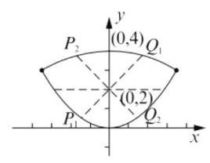

① 当 ${y}_{0} \in  \left( {0,3}\right)$ 时， $t \in  \left( {2,3}\right)$ ，此时方程组 (*) 有两解,即增加两组对称点.

② 当 ${y}_{0} = 0$ 时， $t = 2$ ，此时方程组(*)只有一组解, 即增加一组对称点. (注: 对称点为 $P\left( {0,0}\right) Q\left( {0,4}\right) )$ .

③ 当 ${y}_{0} = 3$ 时， $t = 3$ ，此时方程组(*)有两解为 $P\left( {2\sqrt{3},3}\right) , Q\left( {-2\sqrt{3},3}\right)$ ,没有增加新的对称点.

综上所述: $\left\{  \begin{array}{l} t \leq  0, t \geq  4,\text{ 不存在 } \\  t \in  \left( {0,2}\right) ,1\text{ 对 } \\  t = 2,2\text{ 对 } \\  t \in  \left( {2,3}\right) ,3\text{ 对 } \\  t \in  \lbrack 3,4),1\text{ 对 } \end{array}\right.$

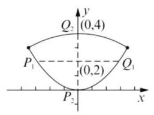

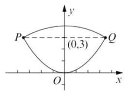

第十九讲 特殊与一般的思想及整体思维方法

1. $\frac{1}{4}$ 2.23.164. 3 5.1

6. $\left\{  {\frac{1 - 2\sqrt{2}}{2},\frac{1 + 2\sqrt{2}}{2},2}\right\}$

7. D 8. C 9. C

10. 不妨设 ${x}_{1} < {x}_{2} < {x}_{3} < {x}_{4}$ ,

则 $\left\{  \begin{array}{l} {x}_{1} + {x}_{2} + {x}_{3} + {x}_{4} = {16} \\  \frac{1}{4}\left( {{x}_{1}^{2} + {x}_{2}^{2} + {x}_{3}^{2} + {x}_{4}^{2}}\right)  - {16} = 5 \end{array}\right.$ ,

$\left\{  \begin{array}{l} {x}_{1} + {x}_{2} + {x}_{3} + {x}_{4} = {16}\;\left( 1\right) \\  {x}_{1}^{2} + {x}_{2}^{2} + {x}_{3}^{2} + {x}_{4}^{2} = {84}\;\left( 2\right)  \end{array}\right.$ ,

因为 ${x}_{1},{x}_{2},{x}_{3},{x}_{4}$ 的每个数据都是自然数, 由( 1 )可知 ${x}_{4} \geq  6$ ，由( 2 )得 ${x}_{4} \leq  8$ ，

当 ${x}_{4} = 6$ 时， ${x}_{1},{x}_{2},{x}_{3},{x}_{4} \in  \{ 0,1,2,3,4,5\}$ ，

且 ${x}_{1} + {x}_{2} + {x}_{3} = {10}$ ,所以 $\left\{  \begin{array}{l} {x}_{1} = 2 \\  {x}_{2} = 3 \\  {x}_{3} = 5 \end{array}\right.$ ,

这时 (2) 不成立; 当 ${x}_{4} = 7$ 时,

${x}_{1},{x}_{2},{x}_{3},{x}_{4} \in  \{ 0,1,2,3,4,5,6\} ,$

且 $\left\{  \begin{array}{l} {x}_{1} + {x}_{2} + {x}_{3} = 9 \\  {x}_{1}^{2} + {x}_{2}^{2} + {x}_{3}^{2} = {35} \end{array}\right.$ ,所以 $\left\{  \begin{array}{l} {x}_{1} = 1 \\  {x}_{2} = 3 \\  {x}_{3} = 5 \end{array}\right.$

当 ${x}_{4} = 8$ 时, ${x}_{1},{x}_{2},{x}_{3},{x}_{4} \in  \{ 0,1,2,3,4,5,6,7\}$ ,

且 $\left\{  \begin{array}{l} {x}_{1} + {x}_{2} + {x}_{3} = 8 \\  {x}_{1}^{2} + {x}_{2}^{2} + {x}_{3}^{2} = {20} \end{array}\right.$ ,结论不成立;

综上可得样本数据中的最大值是 7 .

11. (1) 不难求得轨迹 $E$ 的方程为 $m{x}^{2} + {y}^{2} = 1$ . (讨论略)

(2)问题的关键是确定一个圆心在原点的圆, 即求出圆的半径 $R$ ,使得该圆的任意一条切线与曲线 $E$ 交于 $A, B$ ,且 ${OA} \bot  {OB}$ ,如何求出圆的半径呢? 从特殊位置入手是处理这类问题的有效方法. 当 $m = \frac{1}{4}$ 时,曲线 $E$ 的方程为 ${x}^{2} + 4{y}^{2} = 4$ ,取切线 $l : x = R$ ,

由 $\left\{  {\begin{array}{l} x = R \\  {x}^{2} + 4{y}^{2} = 4 \end{array} \Leftrightarrow  \left\{  \begin{array}{l} x = R \\  y =  \pm  \sqrt{1 - \frac{{R}^{2}}{4}} \end{array}\right. }\right.$ ,

所以 $A\left( {R,\sqrt{1 - \frac{{R}^{2}}{4}}}\right) , B\left( {R, - \sqrt{1 - \frac{{R}^{2}}{4}}}\right)$ ,

又 ${OA} \bot  {OB}$ ,所以 $\overrightarrow{OA} \cdot  \overrightarrow{OB} = 0 \Leftrightarrow  {R}^{2} = \frac{4}{5}$ .

下面只要证明圆 ${x}^{2} + {y}^{2} = \frac{4}{5}$ 的任意一条切线都与椭圆相交于不同两点,且 ${OA} \bot  {OB}$ .

1) 当圆 ${x}^{2} + {y}^{2} = \frac{4}{5}$ 的一条切线的斜率存在时, 可设其方程为为 $y = {kx} + t$ ,

则 $\frac{\left| t\right| }{\sqrt{{k}^{2} + 1}} = \frac{2}{\sqrt{5}} \Leftrightarrow  {t}^{2} = \frac{4}{5}\left( {{k}^{2} + 1}\right)$ ,

由方程组 $\left\{  \begin{array}{l} y = {kx} + t \\  {x}^{2} + 4{y}^{2} = 4 \end{array}\right.$ 得 ${x}^{2} + 4{\left( kx + t\right) }^{2} = 4$ ,

即 $\left( {1 + 4{k}^{2}}\right) {x}^{2} + {8ktx} + 4{t}^{2} - 4 = 0$ ,则

$\Delta  = {64}{k}^{2}{t}^{2} - {16}\left( {1 + 4{k}^{2}}\right) \left( {{t}^{2} - 1}\right)$

$$
= {16}\left( {4{k}^{2} - {t}^{2} + 1}\right)  = \frac{16}{5}\left( {{16}{k}^{2} + 1}\right)  > 0,
$$

设 $A\left( {{x}_{1},{y}_{1}}\right) , B\left( {{x}_{2},{y}_{2}}\right)$ ,则

${x}_{1}{x}_{2} + {y}_{1}{y}_{2} = {x}_{1}{x}_{2} + \left( {k{x}_{1} + t}\right) \left( {k{x}_{2} + t}\right)$

$$
= \left( {1 + {k}^{2}}\right) {x}_{1}{x}_{2} + {kt}\left( {{x}_{1} + {x}_{2}}\right)  + {t}^{2}
$$

$= \left( {1 + {k}^{2}}\right)  \cdot  \frac{4{t}^{2} - 4}{1 + 4{k}^{2}} + {kt} \cdot  \frac{-{8kt}}{1 + 4{k}^{2}} + {t}^{2} \; = \frac{5{t}^{2} - 4{k}^{2} - 4}{1 + 4{k}^{2}} = 0,$

所以 ${OA} \bot  {OB}$ ;

2) 当切线的斜率不存在时,切线为 $x =  \pm  \frac{2}{5}\sqrt{5}$ ,

与 $\frac{{x}^{2}}{4} + {y}^{2} = 1$ 交于点 $\left( {\frac{2}{5}\sqrt{5}, \pm  \frac{2}{5}\sqrt{5}}\right)$ 或

$\left( {-\frac{2}{5}\sqrt{5}, \pm  \frac{2}{5}\sqrt{5}}\right)$ 也满足 ${OA} \bot  {OB}$ .

综上,存在圆心在原点的圆 ${x}^{2} + {y}^{2} = \frac{4}{5}$ ,

使得该圆的任意一条切线与椭圆 $E$ 恒有两个交点 $A, B$ ,且 $\overrightarrow{OA} \bot  \overrightarrow{OB}$ .

15. ( 1 )设 $\left\{  {b}_{n}\right\}$ 的公差为 $d$ ，则 ${a}_{n + 1} - {a}_{n} = \lambda \left( {{b}_{n + 1} - }\right. \; \left. {b}_{n}\right)  = {\lambda d}\left( {n \in  \mathbf{N}, n \geq  1}\right)$ ,故数列 $\left\{  {a}_{n}\right\}$ 是等差数列; (2)由 ${b}_{n} = \sin \frac{n\pi }{2}$ ，可知 $\left\{  {b}_{n}\right\}$ 是周期为 4 的数列， 即 ${b}_{n + 4} = {b}_{n}$ ; 由 ${a}_{n + 4} - {a}_{n} = \left( {{a}_{n + 4} - {a}_{n + 3}}\right)  + \; \left( {{a}_{n + 3} - {a}_{n + 2}}\right)  + \left( {{a}_{n + 2} - {a}_{n + 1}}\right)  + \left( {{a}_{n + 1} - {a}_{n}}\right)  = \; \lambda \left( {{b}_{n + 4} - {b}_{n + 3}}\right)  + \lambda \left( {{b}_{n + 3} - {b}_{n + 2}}\right)  + \lambda \left( {{b}_{n + 2} - }\right. \; \left. {b}_{n + 1}\right)  + \lambda \left( {{b}_{n + 1} - {b}_{n}}\right)  = \lambda \left( {{b}_{n + 4} - {b}_{n}}\right)  = 0$ ,

即 $\left\{  {a}_{n}\right\}$ 也是周期为 4 的数列.

又由 ${a}_{1} = 2,{b}_{n} = \sin \frac{n\pi }{2}$ ,

${a}_{n + 1} - {a}_{n} = 3\left( {{b}_{n + 1} - {b}_{n}}\right)$ 可求:

${a}_{2} =  - 1,{a}_{3} =  - 4,{a}_{4} =  - 1,$

${S}_{4} = {a}_{1} + {a}_{2} + {a}_{3} + {a}_{4} =  - 4,$

所以 ${S}_{2021} = {a}_{1} + \left( {{a}_{2} + {a}_{3} + {a}_{4} + {a}_{5}}\right)  + \cdots  + \left( {a}_{2018}\right. \; \left. {+{a}_{2019} + {a}_{2020} + {a}_{2021}}\right)  = {a}_{1} + {505}{S}_{4} =  - {2018};$

(3) 由 ${b}_{n} = \frac{{b}_{n - 1} + {b}_{n - 2}}{2}\left( {n \geq  3, n \in  \mathbf{N}}\right)$ 得

${b}_{n + 1} - {b}_{n} =  - \frac{1}{2}\left( {{b}_{n} - {b}_{n - 1}}\right) \left( {n \geq  2, n \in  \mathbf{N}}\right) ,$

即 $\left\{  {{b}_{n + 1} - {b}_{n}}\right\}$ 是以 ${b}_{2} - {b}_{1} =  - \frac{\lambda }{2}$ 为首项,

$- \frac{1}{2}$ 为公比的等比数列,则

${b}_{n + 1} - {b}_{n} =  - \frac{\lambda }{2} \cdot  {\left( -\frac{1}{2}\right) }^{n - 1} \; = \lambda  \cdot  {\left( -\frac{1}{2}\right) }^{n}$ ,

所以 ${b}_{n} = \left( {{b}_{n} - {b}_{n - 1}}\right)  + \left( {{b}_{n - 1} - {b}_{n - 2}}\right)  + \cdots  + \; \left( {{b}_{2} - {b}_{1}}\right)  + {b}_{1} \; = \lambda  \cdot  {\left( -\frac{1}{2}\right) }^{n - 1} + \lambda  \cdot  {\left( -\frac{1}{2}\right) }^{n - 2} + \cdots \; + \lambda  \cdot  \left( {-\frac{1}{2}}\right)  + \lambda \; = \lambda  \cdot  \frac{1 \cdot  \left\lbrack  {1 - {\left( -\frac{1}{2}\right) }^{n}}\right\rbrack  }{1 - \left( {-\frac{1}{2}}\right) } \; = \frac{2\lambda }{3} + \frac{\lambda }{3}{\left( -\frac{1}{2}\right) }^{n - 1}.$

则 ${a}_{n} = \lambda {b}_{n} + {a}_{1} - \lambda {b}_{1} = \frac{{\lambda }^{2}}{3}{\left( -\frac{1}{2}\right) }^{n - 1} + \lambda  - \frac{{\lambda }^{2}}{3}$ .

当 $n$ 为奇数时, ${a}_{n} = \frac{{\lambda }^{2}}{3}{\left( \frac{1}{2}\right) }^{n - 1} + \lambda  - \frac{{\lambda }^{2}}{3}$ 严格

减，且 $\lambda  - \frac{{\lambda }^{2}}{3} < {a}_{n} \leq  \lambda$ ；当 $n$ 为偶数时，

${a}_{n} =  - \frac{{\lambda }^{2}}{3}{\left( \frac{1}{2}\right) }^{n - 1} + \lambda  - \frac{{\lambda }^{2}}{3}$ 严格增,

且 $\lambda  - \frac{{\lambda }^{2}}{2} \leq  {a}_{n} < \lambda  - \frac{{\lambda }^{2}}{3}$ ; 因为 $\lambda  \neq  0$ ,

故 $\lambda  - \frac{{\lambda }^{2}}{2} < \lambda  - \frac{{\lambda }^{2}}{3} < \lambda$ ,

所以 $\left\{  {a}_{n}\right\}$ 的最大值为 ${a}_{1} = \lambda$ ,

最小值为 ${a}_{2} = \lambda  - \frac{{\lambda }^{2}}{2}$ ,

因为对 $\left\{  {a}_{n}\right\}$ 中的任意两项 ${a}_{i},{a}_{j}, i, j$ 均为正整数, $\left| {{a}_{i} - {a}_{j}}\right|  < 2$ 都成立,所以 ${a}_{1} - {a}_{2} < 2$ , 解得 $\lambda  \in  \left( {-2,0}\right)  \cup  \left( {0,2}\right)$ ,综上, $\lambda$ 的取值范围是 $\left( {-2,0}\right)  \cup  \left( {0,2}\right)$ .

## 第二十讲 代数证明问题选讲

1. $a > 1$ 2. 直角三角形 $3.n$ 4. ${2}^{n}$ 等

5. 1 个 6.0

7. C 8. C 9. A

10. (1)证明:因为 $a$ 、 $b$ 都是正数，

故要证原不等式成立，

只需要证明 $\frac{{a}^{2}}{b} + \frac{{b}^{2}}{a} + 2\sqrt{ab} > a + b + 2\sqrt{ab}$ ,

即只需要证明 $\frac{{a}^{2}}{b} + \frac{{b}^{2}}{a} > a + b$ ,

即 ${a}^{3} + {b}^{3} > {a}^{2}b + a{b}^{2}$ ,

即证 $\left( {a + b}\right) \left( {{a}^{2} - {ab} + {b}^{2}}\right)  > {ab}\left( {a + b}\right)$ ,

即需要证 ${a}^{2} - {ab} + {b}^{2} > {ab}$ ,即证 ${\left( a - b\right) }^{2} > 0$ ,

因为 $a \neq  b$ ,所以 ${\left( a - b\right) }^{2} > 0$ 恒成立,

所以 $\frac{a}{\sqrt{b}} + \frac{b}{\sqrt{a}} > \sqrt{a} + \sqrt{b}$ ;

(2)要证明原命题，只需要证明 $f\left( x\right)  \geq  x + c$ 对任意 $x \in  \mathbf{R}$ 都成立,

$f\left( x\right)  \geq  x + c \Leftrightarrow  2\left| {x + c + 4}\right|  - \left| {x + c}\right|  \geq  x + c,$ 即只需要证明 $2\left| {x + c + 4}\right|  \geq  x + c + \left| {x + c}\right|$ , 下面证明此不等式成立,

若 $x + c \leq  0$ ,则 $x + c + \left| {x + c}\right|  = 0$ ,

所以 $2\left| {x + c + 4}\right|  \geq  x + c + \left| {x + c}\right|$ 成立,

若 $x + c > 0,2\left| {x + c + 4}\right|  \geq  x + c + \left| {x + c}\right|  \Leftrightarrow$

$2\left( {x + c + 4}\right)  \geq  2\left( {x + c}\right)  \Leftrightarrow  x + c + 4 > x + c,$

结论显然成立,

综上, $f\left( x\right)  \geq  x + c$ 对任意 $x \in  \mathbf{R}$ 都成立,

所以对任意正整数数 $n, f\left( {a}_{n}\right)  \geq  {a}_{n} + c$ ,

即 ${a}_{n + 1} - {a}_{n} \geq  c$ .

11. ( 1 )设 ${x}_{1},{x}_{2} \in  \mathbf{R}$ ，且 ${x}_{1} < {x}_{2}$ ，

则 $f\left( {x}_{1}\right)  \leq  f\left( {x}_{2}\right)$ 恒成立，

$\left( {a{x}_{1}^{3} + 1}\right)  - \left( {a{x}_{2}^{3} + 1}\right)$

$= a\left( {{x}_{1} - {x}_{2}}\right) \left( {{x}_{1}^{2} + {x}_{1}{x}_{2} + {x}_{2}^{2}}\right)  \leq  0,$

因为 ${x}_{1} < {x}_{2}$ ,所以 ${x}_{1} - {x}_{2} < 0$ ,

而 ${x}_{1}^{2} + {x}_{1}{x}_{2} + {x}_{2}^{2} = {\left( {x}_{1} + \frac{1}{2}{x}_{2}\right) }^{2} + \frac{1}{4}{x}_{2}^{2}$ ,

如果 ${x}_{2} \neq  0$ ,则 ${x}_{1}^{2} + {x}_{1}{x}_{2} + {x}_{2}^{2} > 0$ ,

如果 ${x}_{2} = 0$ ,则 ${x}_{1}^{2} + {x}_{1}{x}_{2} + {x}_{2}^{2} = {x}_{1}^{2}$ ,

又 ${x}_{1} < {x}_{2}$ ,所以 ${x}_{1}^{2} + {x}_{1}{x}_{2} + {x}_{2}^{2} = {x}_{1}^{2} > 0$ ,

所以 ${x}_{1}^{2} + {x}_{1}{x}_{2} + {x}_{2}^{2} > 0$ ,所以 $a \geq  0$ ;

另法: $\left( {a{x}_{1}^{3} + 1}\right)  - \left( {a{x}_{2}^{3} + 1}\right)  = a\left( {{x}_{1}^{3} - {x}_{2}^{3}}\right)  \leq  0$ ,

因为 ${x}_{1} < {x}_{2}$ ,所以 ${x}_{1}^{3} < {x}_{2}^{3},{x}_{1}^{3} - {x}_{2}^{3} < 0$ ,所以 $a \geq  0$ ;

(2)方法 1 : 因为 $f\left( x\right)$ 是周期函数，设周期为

$T$ ,则 $f\left( {x + T}\right)  = f\left( x\right)$ 对一切 $x \in  \mathbf{R}$ 都成立,

设 $x \in  \left\lbrack  {0, T}\right\rbrack$ ,由已知可得 $f\left( 0\right)  \leq  f\left( x\right)  \leq$

$f\left( T\right)$ ,而 $f\left( 0\right)  = f\left( T\right)$ ,所以当 $x \in  \left\lbrack  {0, T}\right\rbrack$ 时

$f\left( x\right)  = f\left( 0\right)$ ,设 $x \in  \left\lbrack  {{kT},\left( {k + 1}\right) T}\right\rbrack  \left( {k \in  \mathbf{Z}}\right)$ ,

由已知可得 $f\left( {kT}\right)  \leq  f\left( x\right)  \leq  f\left( {\left( {k + 1}\right) T}\right)$ ,

而 $f\left( {kT}\right)  = f\left( {\left( {k + 1}\right) T}\right)$ ,

所以 $f\left( x\right)  = f\left( {kT}\right)  = f\left( 0\right)$ ,

所以 $f\left( x\right)$ 为常值函数.

方法 2: 假设 $f\left( x\right)$ 不是常值函数,则存在两个不相等的实数 ${x}_{1},{x}_{2}$ ,使得 $f\left( {x}_{1}\right)  \neq  f\left( {x}_{2}\right)$ ,不妨设 ${x}_{1} < {x}_{2}$ ,由已知可得 $f\left( {x}_{1}\right)  < f\left( {x}_{2}\right)$ ,又因为 $f\left( x\right)$ 是周期函数,设其一个正周期为 $T$ , 取 ${x}_{3} = {x}_{1} + {kT}$ ,其中 $k$ 是大于 $\frac{{x}_{2} - {x}_{1}}{T}$ 的一个正整数,于是 ${x}_{2} < {x}_{3}$ ,所以 $f\left( {x}_{2}\right)  \leq  f\left( {x}_{3}\right)$ ,但 $f\left( {x}_{3}\right)  = f\left( {{x}_{1} + {kT}}\right)  = f\left( {x}_{1}\right)$ ,所以 $f\left( {x}_{2}\right)  \leq \; f\left( {x}_{1}\right)$ ,这与 $f\left( {x}_{1}\right)  < f\left( {x}_{2}\right)$ 矛盾,所以假设不成立,即 $f\left( x\right)$ 是常值函数.

12. (1) 当 $a = 2, x \in  \left\lbrack  {0,3}\right\rbrack$ 时,

$$
f\left( x\right)  = x \cdot  \left| {x - 2}\right|  + {2x}
$$

$$
= \left\{  \begin{array}{l} {x}^{2}, x \geq  2; \\   - {x}^{2} + {4x},0 \leq  x < 2. \end{array}\right.
$$

因为函数 $y =  - {x}^{2} + {4x}$ 在区间 $\left\lbrack  {0,2}\right\rbrack$ 上严格增，函数 ${x}^{2}$ 在区间 $\left\lbrack  {2,3}\right\rbrack$ 上严格增，且函数图像连续不断,所以函数 $f\left( x\right)$ 在区间 $\left\lbrack  {0,3}\right\rbrack$ 上严格增,所以 $f\left( x\right)$ 的最大值为 $f\left( 3\right)  = 9$ ;

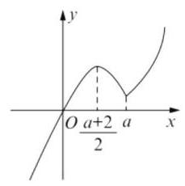

(2) $f\left( x\right)  = \left\{  \begin{array}{l} {x}^{2} + \left( {2 - a}\right) x, x \geq  a, \\   - {x}^{2} + \left( {2 + a}\right) x, x < a \end{array}\right.$

① 当 $x \geq  a$ 时,

$f\left( x\right)  = {\left( x - \frac{a - 2}{2}\right) }^{2} - \frac{{\left( a - 2\right) }^{2}}{4},$

因为 $a > 2$ ,所以 $\frac{a - 2}{2} < a$ ,

所以 $f\left( x\right)$ 在 $\lbrack a, + \infty )$ 上严格增.

② 当 $x < a$ 时,

$f\left( x\right)  =  - {\left( x - \frac{a + 2}{2}\right) }^{2} + \frac{{\left( a + 2\right) }^{2}}{4},$

因为 $a > 2$ ,所以 $\frac{a + 2}{2} < a$ ,

所以 $f\left( x\right)$ 在 $\left( {-\infty ,\frac{a + 2}{2}}\right\rbrack$ 上严格增,

在 $\left\lbrack  {\frac{a + 2}{2}, a}\right\rbrack$ 上严格减. 综上,函数 $f\left( x\right)$ 的单

调增区间是 $\left( {-\infty ,\frac{a + 2}{2}}\right\rbrack$ 和 $\lbrack a, + \infty )$ ,

单调减区间是 $\left\lbrack  {\frac{a + 2}{2}, a}\right\rbrack$ ;

(3)① 当 $- 2 \leq  a \leq  2$ 时， $\frac{a - 2}{2} \leq  0$ ， $\frac{a + 2}{2} \geq  0$ ，

所以 $f\left( x\right)$ 在 $\left( {-\infty , + \infty }\right)$ 上是严格增函数,

关于 $x$ 的方程 $f\left( x\right)  = t \cdot  f\left( a\right)$ 不可能有三个不相等的实数解;

② 当 $2 < a \leq  4$ 时，由 (1) 知 $f\left( x\right)$ 在

$\left( {-\infty ,\frac{a + 2}{2}}\right\rbrack$ 和 $\lbrack a, + \infty )$ 上分别是严格增函数,

在 $\left\lbrack  {\frac{a + 2}{2}, a}\right\rbrack$ 上是严格减函数,

当且仅当 ${2a} < t \cdot  f\left( a\right)  < \frac{{\left( a + 2\right) }^{2}}{4}$ 时,

方程 $f\left( x\right)  = t \cdot  f\left( a\right)$ 有三个不相等的实数解.

即 $1 < t < \frac{{\left( a + 2\right) }^{2}}{8a} = \frac{1}{8}\left( {a + \frac{4}{a} + 4}\right)$ .

令 $g\left( a\right)  = a + \frac{4}{a}$ ,则 ${g}^{\prime }\left( a\right)  = 1 - \frac{4}{{a}^{2}}$ ,

由 $1 - \frac{4}{{a}^{2}} = 0,2 < a \leq  4$ ,得 $a = 2$ ,

当 $a \in  (2,4\rbrack$ 时, ${g}^{\prime }\left( a\right)  = 1 - \frac{4}{{a}^{2}} > 0$ ,

所以 $g\left( a\right)$ 在 $a \in  (2,4\rbrack$ 时是严格增函数,

故 $g{\left( a\right) }_{\max } = g\left( 4\right)  = 5$ . 所以,

实数 $t$ 的取值范围是 $\left( {1,\frac{9}{8}}\right)$ .

## 第二十一讲 合理化归 准确表达

1. $\left\lbrack  {0,5}\right\rbrack  2.\left( {-\infty , - 3}\right)  \cup  \left( {1, + \infty }\right)$

3. $\left( {3, + \infty }\right) \;4.\frac{7}{8}\;{5.12}\;6.\sqrt{3} + \sqrt{2}$

7. D 8. C 9. A

10. 设 $\overrightarrow{a} = \left( {{x}_{1},{y}_{1}}\right) ,\overrightarrow{b} = \left( {{x}_{2},{y}_{2}}\right)$ ,

则 $\overrightarrow{a} \cdot  \overrightarrow{b} = {x}_{1}{x}_{2} + {y}_{1}{y}_{2}$ ,所以

$$
{\left( {x}_{1}{x}_{2} + {y}_{1}{y}_{2}\right) }^{2} = {\left\lbrack  \left| \overrightarrow{a}\right|  \cdot  \left| \overrightarrow{b}\right| \cos \langle \overrightarrow{a},\overrightarrow{b}\rangle \right\rbrack  }^{2}
$$

$$
= {\left| \overrightarrow{a}\right| }^{2} \cdot  {\left| \overrightarrow{b}\right| }^{2}{\cos }^{2}\langle \overrightarrow{a},\overrightarrow{b}\rangle
$$

$$
\leq  \left( {{x}_{1}^{2} + {y}_{1}^{2}}\right) \left( {{x}_{2}^{2} + {y}_{2}^{2}}\right) ,
$$

当且仅当 $\cos \langle \overrightarrow{a},\overrightarrow{b}\rangle  = 0$ ,即向量 $\overrightarrow{a},\overrightarrow{b}$ 同方向, 即 ${x}_{1}{y}_{2} = {x}_{2}{y}_{1}$ 时,等号成立.

11. 我们可以从平行四边形面积的算法下手.

方法 1: ${S}_{\text{ 四边形 }{ACBD}} = 2{S}_{\bigtriangleup {ABC}} = {AB} \cdot  d$ ,

其中 $d$ 为点 $C$ 到直线 ${AB}$ 的距离.

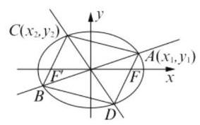

在计算点 $C$ 到直线 ${AB}$ 的距离的时候,需要直线 ${AB}$ 的方程,我们可以选择点斜式方程或点

法向式方程. 当直线 ${l}_{1}$ 和 ${l}_{2}$ 的斜率都存在时, ${l}_{1} : y = {k}_{1}x;{l}_{2} : y = {k}_{2}x$ ,点 $C$ 到 ${l}_{1}$ 的距离

$d = \frac{\left| {k}_{1}{x}_{2} - {y}_{2}\right| }{\sqrt{1 + {k}_{1}^{2}}}$ ,其中 ${x}_{1} = \frac{1}{\sqrt{1 + 2{k}_{1}^{2}}}$ ,

${y}_{1} = \frac{{k}_{1}}{\sqrt{1 + 2{k}_{1}^{2}}},{x}_{2} = \frac{1}{\sqrt{1 + 2{k}_{2}^{2}}},$

${y}_{2} = \frac{{k}_{2}}{\sqrt{1 + 2{k}_{2}^{2}}},{k}_{1} = \frac{{y}_{1}}{{x}_{1}},$

所以 $d = \frac{\left| \frac{{y}_{1}}{{x}_{1}} \cdot  {x}_{2} - {y}_{2}\right| }{\sqrt{1 + {\left( \frac{{y}_{1}}{{x}_{1}}\right) }^{2}}} = \frac{\left| {y}_{1}{x}_{2} - {x}_{1}{y}_{2}\right| }{\sqrt{{x}_{1}^{2} + {y}_{1}^{2}}}$ ,

$S = 2 \cdot  \frac{1}{2}{AB} \cdot  d$

$= 2\sqrt{{x}_{1}^{2} + {y}_{1}^{2}} \cdot  \frac{\left| {y}_{1}{x}_{2} - {x}_{1}{y}_{2}\right| }{\sqrt{{x}_{1}^{2} + {y}_{1}^{2}}}$

$= 2\left| {{y}_{1}{x}_{2} - {x}_{1}{y}_{2}}\right|$ .

当直线 ${l}_{1}$ 和 ${l}_{2}$ 中有一条直线的斜率不存在时,结论还成立.

* 方法 2: ${S}_{\text{ 四边形 }{ACBD}} = 4{S}_{\bigtriangleup {AOC}}$ ,而 $\bigtriangleup {AOC}$ 的三点坐标是已知的, 于是用行列式计算三角形的面积简单许多.

${S}_{\text{ 四边形 }{ACBD}} = 4{S}_{\bigtriangleup {AOC}} = 4 \cdot  \frac{1}{2}\begin{Vmatrix} {x}_{1} & {y}_{1} & 1 \\  {x}_{2} & {y}_{2} & 1 \\  0 & 0 & 1 \end{Vmatrix} = \; 2\begin{Vmatrix} {x}_{1} & {y}_{1} \\  {x}_{2} & {y}_{2} \end{Vmatrix} = 2\left| {{x}_{1}{y}_{2} - {x}_{2}{y}_{1}}\right|$ . (知识的力量)

对于第 (2) 小题, 我们可以从已知信息入手;

(2) ${k}_{1}{k}_{2} =  - \frac{1}{2} \Leftrightarrow  \frac{{y}_{1}{y}_{2}}{{x}_{1}{x}_{2}} \; =  - \frac{1}{2} \Leftrightarrow  {x}_{1}{x}_{2} + 2{y}_{1}{y}_{2} = 0$ ,

$A, C$ 是椭圆上的点 $\Leftrightarrow  \left\{  {\begin{array}{l} {x}_{1}^{2} + 2{y}_{1}{}^{2} = 1 \\  {x}_{2}^{2} + 2{y}_{2}^{2} = 1 \end{array} \Leftrightarrow  }\right.$

$\left\{  {\begin{array}{l} {x}_{1}^{2} = 1 - 2{y}_{1}^{2} \\  {x}_{2}^{2} = 1 - 2{y}_{2}^{2} \end{array}, S = 2\left| {{x}_{1}{y}_{2} - {x}_{2}{y}_{1}}\right|  \Rightarrow  }\right.$

${S}^{2} = 4{\left| {y}_{1}{x}_{2} - {x}_{1}{y}_{2}\right| }^{2}$

$= 4\left( {{y}_{1}^{2}{x}_{2}^{2} + {x}_{1}^{2}{y}_{2}^{2} - 2{x}_{1}{x}_{2}{y}_{1}{y}_{2}}\right)$

$= 4\left\lbrack  {{y}_{1}^{2}\left( {1 - 2{y}_{2}^{2}}\right)  + \left( {1 - 2{y}_{1}^{2}}\right) {y}_{2}^{2} + 4{y}_{1}^{2}{y}_{2}^{2}}\right\rbrack$

$= 4\left( {{y}_{1}^{2} + {y}_{2}^{2}}\right)$ ,

又由 ${x}_{1}^{2} = 1 - 2{y}_{1}^{2},{x}_{2}^{2} = 1 - 2{y}_{2}^{2}$ ,得

${x}_{1}^{2}{x}_{2}^{2} = \left( {1 - 2{y}_{1}^{2}}\right) \left( {1 - 2{y}_{2}^{2}}\right) \; = 1 - 2\left( {{y}_{1}^{2} + {y}_{2}^{2}}\right)  + 4{y}_{1}^{2}{y}_{2}^{2}$ ,

所以 $1 - 2\left( {{y}_{1}^{2} + {y}_{2}^{2}}\right)  = 0,{y}_{1}^{2} + {y}_{2}^{2} = \frac{1}{2}$ ,

所以 ${S}^{2} = 2, S = \sqrt{2}$ .

12. (1) 由 $f\left( x\right)  = 1$ ,得 ${\log }_{2}\frac{1 + x}{1 - x} = 1$ ,得 $x = \frac{1}{3}$ ;

( 2 )当 $x \in  \left( {-1,1}\right) , a > 1$ 时，

${\left( \frac{{ax} - 1}{a - x}\right) }^{2} - 1 \; = \frac{{a}^{2}{x}^{2} - {2ax} + 1 - \left( {{a}^{2} - {2ax} + {x}^{2}}\right) }{{\left( a - x\right) }^{2}} \; = \frac{{a}^{2}\left( {{x}^{2} - 1}\right)  + 1 - {x}^{2}}{{\left( a - x\right) }^{2}} \; = \frac{\left( {{a}^{2} - 1}\right) \left( {{x}^{2} - 1}\right) }{{\left( a - x\right) }^{2}} < 0,$

所以 ${\left( \frac{{ax} - 1}{a - x}\right) }^{2} - 1 < 0$ ,即 $\frac{{ax} - 1}{a - x} \in  \left( {-1,1}\right)$ ;

$f\left( \frac{{ax} - 1}{a - x}\right)  - f\left( x\right)$

$= {\log }_{2}\frac{1 + \frac{{ax} - 1}{a - x}}{1 - \frac{{ax} - 1}{a - x}} - {\log }_{2}\frac{1 + x}{1 - x}$

$= {\log }_{2}\frac{a - x + {ax} - 1}{a - x - {ax} + 1} - {\log }_{2}\frac{1 + x}{1 - x}$

$= {\log }_{2}\frac{\left( {a - 1}\right) \left( {1 + x}\right) }{\left( {a + 1}\right) \left( {1 - x}\right) } - {\log }_{2}\frac{1 + x}{1 - x}$

$= {\log }_{2}\frac{a - 1}{a + 1}$ ,

$f\left( \frac{1}{a}\right)  = {\log }_{2}\frac{1 + \frac{1}{a}}{1 - \frac{1}{a}} = {\log }_{2}\frac{a + 1}{a - 1}$

$=  - {\log }_{2}\frac{a - 1}{a + 1}$ ,

所以 $f\left( \frac{{ax} - 1}{a - x}\right)  - f\left( x\right)  =  - f\left( \frac{1}{a}\right)$ ;

(3)由(2)可得 $f\left( \frac{{3x} - 1}{3 - x}\right)  - f\left( x\right)  =  - 1$ ，

当 $n = {2k} - 1, k \in  \mathbf{N}$ 时, ${x}_{2k} = \frac{3{x}_{{2k} - 1} - 1}{3 - {x}_{{2k} - 1}}$ ,

所以 $f\left( {x}_{2k}\right)  - f\left( {x}_{{2k} - 1}\right)  =  - 1$ ① ，

当 $n = {2k}, k \in  \mathbf{N}, n \geq  2$ 时,

${x}_{{2k} + 1} =  - \frac{3{x}_{2k} - 1}{3 - {x}_{2k}}$ ,又 $f\left( x\right)$ 是奇函数,

所以 $f\left( {x}_{{2k} + 1}\right)  + f\left( {x}_{2k}\right)  = 1$ ②,

②-①得 $f\left( {x}_{{2k} + 1}\right)  + f\left( {x}_{{2k} - 1}\right)  = 2$ ，

所以当 $k\left( {k \geq  2}\right)$ 为奇数时, $f\left( {x}_{{2k} - 1}\right)  = f\left( {x}_{1}\right)$ ;

当 $k\left( {k \geq  1}\right)$ 为偶数时, $f\left( {x}_{{2k} - 1}\right)  = 2 - f\left( {x}_{1}\right)$ ;

又 $f\left( x\right)$ 是 $\left( {-1,1}\right)$ 上的严格增函数,

所以 ${x}_{{2k} - 1} \leq  {x}_{3}\left( {k \geq  2}\right)  \Leftrightarrow  f\left( {x}_{{2k} - 1}\right)  \leq  f\left( {x}_{3}\right)$

$\Leftrightarrow  f\left( {x}_{1}\right)  \leq  2 - f\left( {x}_{1}\right)$

$\Leftrightarrow  f\left( {x}_{1}\right)  \leq  1$ ,

又 $f\left( {x}_{2k}\right)  = f\left( {x}_{{2k} - 1}\right)  - 1$ ,

所以 $f\left( {x}_{2k}\right)  =  - 1 + \left\lbrack  {2 - f\left( {x}_{1}\right) }\right\rbrack   = 1 - f\left( {x}_{1}\right)$ 或 $f\left( {x}_{2k}\right)  =  - 1 + f\left( {x}_{1}\right)$ ,

由 $f\left( {x}_{3}\right)  \geq  1 - f\left( {x}_{1}\right)  \Leftrightarrow  f\left( {x}_{1}\right)  \leq  \frac{3}{2}$ ,

由 $f\left( {x}_{3}\right)  \geq   - 1 + f\left( {x}_{1}\right)  \Leftrightarrow  f\left( x\right)  \leq  \frac{3}{2}$ ,

综上可得 $f\left( {x}_{1}\right)  \leq  1 \Leftrightarrow  \frac{1}{3} \leq  x < 1$ .

## 第二十二讲 数学创新问题

1. $- \frac{1}{2}$

2. $\frac{{a}_{1} + {a}_{2} + \cdots  + {a}_{m}}{m} \leq  \frac{{a}_{1} + {a}_{2} + \cdots  + {a}_{n}}{n}\left( {1 \leq  m < n}\right)$ 和 $\frac{{a}_{m + 1} + {a}_{m + 2} + \cdots  + {a}_{n}}{n - m} \geq  \frac{{a}_{1} + {a}_{2} + \cdots  + {a}_{n}}{n} \; \left( {1 \leq  m < n}\right)$

3. 1 4. 3 5. $b > 2\sqrt{10}$ 6. ②③

7. D 8. B 9. D

10. (1) 作 $A{E}^{\prime }//{CE}$ 交 ${CD}$ 于 ${E}^{\prime }$ ,因为 ${AD} = A{A}_{1} = \; D{E}^{\prime } = 1$ ,所以 $A{E}^{\prime } = {D}_{1}{E}^{\prime } = \sqrt{2}$ ,故 $\bigtriangleup A{D}_{1}{E}^{\prime }$ 为正三角形,异面直线 $A{D}_{1}$ 与 ${EC}$ 所成角为 ${60}^{ \circ  }$ ; (2) $E$ 是棱 ${AB}$ 上的中点，则 $\bigtriangleup  {ADE}$ 、 ${\bigtriangleup {CBE}}$ 均为等腰直角三角形，故 $\angle {DEC} = {90}^{ \circ  }$ ，所以三角形 ${DEC}$ 为直角三角形. 由 $D{D}_{1} \bot$ 平面 ${ABCD},{DE} \bot  {CE}$ ,知 ${CE} \bot$ 平面 $D{D}_{1}E$ ,所以 $\bigtriangleup {D}_{1}{EC}$ 为直角三角形. 显然 $\bigtriangleup D{D}_{1}E$ 、 $\bigtriangleup D{D}_{1}C$ 均为直角三角形,故四面体 ${D}_{1}{CDE}$ 四个面均为直角三角形.

11. (1) 由题意可知, ${A}_{1}\left( {8,4}\right) ,{A}_{2}\left( {{18},6}\right) ,{A}_{3}\left( {{32},8}\right)$ ,

所以 ${k}_{{A}_{1}{A}_{2}} = \frac{6 - 4}{{18} - 8} = \frac{1}{5},{k}_{{A}_{2}{A}_{3}} = \frac{8 - 6}{{32} - {18}} = \frac{1}{7}$ .

因为 ${k}_{{A}_{1}{A}_{2}} \neq  {k}_{{A}_{2}{A}_{3}}$ ,所以顶点 ${A}_{1},{A}_{2},{A}_{3}$ 不在同一条直线上;

(2)由题意可知，顶点 ${A}_{n}$ 的横坐标 ${x}_{n} = d + \; {a}_{1} + {a}_{2} + \cdots  + {a}_{n - 1} + \frac{1}{2}{a}_{n} = 2{\left( n + 1\right) }^{2}$ ,顶点 ${A}_{n}$ 的纵坐标 ${y}_{n} = \frac{1}{2}{a}_{n} = 2\left( {n + 1}\right)$ . 所以对任意正整数 $n$ ,点 ${A}_{n}\left( {{x}_{n},{y}_{n}}\right)$ 的坐标满足方程 ${y}^{2} = \; {2x}$ ,所以所有顶点 ${A}_{n}$ 均落在抛物线 ${y}^{2} = {2x}$ 上;

(3)由题意可知，顶点 ${A}_{n}$ 的横、纵坐标分别是

${x}_{n} = d + \frac{1}{2}a + \left( {n - 1}\right) a + \frac{1}{2}{\left( n - 1\right) }^{2}d,$

${y}_{n} = \frac{1}{2}\left\lbrack  {a + \left( {n - 1}\right) d}\right\rbrack  ,$

消去 $n - 1$ ,可得 ${x}_{n} = \frac{2}{d}{y}_{n}^{2} + d + \frac{a\left( {d - a}\right) }{2d}$ .

为使得所有顶点 ${A}_{n}$ 均落在抛物线

${y}^{2} = {2px}\left( {p > 0}\right)$ 上，

则有 $\left\{  \begin{array}{l} \frac{d}{2} = {2p}, \\  d + \frac{a\left( {d - a}\right) }{2d} = 0. \end{array}\right.$ 解之,得 $d = {4p}, a = {8p}$ . 所以 $a\text{ 、 }d$ 所应满足的关系式是: $a = {2d}$ .

12. (1) ${B}_{1} = q,{B}_{2} = 1 + q,{B}_{3} = 1 + \left( {1 + q}\right)  = \; 2 + q,\cdots ,{B}_{n} = \left( {n - 1}\right)  + q,$

所以 ${B}_{1} + {B}_{2} + \cdots  + {B}_{n} = 1 + 2 + \cdots  + \left( {n - 1}\right)  + \; {nq} = \frac{n\left( {n - 1}\right) }{2} + {nq};$

(2) ${c}_{1} = 1,{c}_{2} = 1 + \left( {1 + q}\right)  = 2 + q$ ,

${c}_{3} = \left( {2 + q}\right)  + \left( {1 + q + {q}^{2}}\right)  = 3 + {2q} + {q}^{2},$

由 ${c}_{1} + {c}_{3} - 2{c}_{2} = 1 + 3 + {2q} + {q}^{2} - 2\left( {2 + q}\right)  = {q}^{2} > 0$ , 得 ${c}_{1} + {c}_{3} > 2{c}_{2}$ ;

(3)① 先设 ${c}_{1},{c}_{2},{c}_{3}$ 成等比数列,由 ${c}_{1}{c}_{3} = {c}_{2}^{2}$ , 得 $3 + {2q} + {q}^{2} = {\left( 2 + q\right) }^{2}, q =  - \frac{1}{2}$ . 此时 ${c}_{1} = 1$ , ${c}_{2} = \frac{3}{2},{c}_{3} = \frac{9}{4}$ ,所以 ${c}_{1},{c}_{2},{c}_{3}$ 是一个公比为 $\frac{3}{2}$ 的等比数列. 如果 $m \geq  4,{c}_{1},{c}_{2},\cdots ,{c}_{m}$ 为等比数列,那么 ${c}_{1},{c}_{2},{c}_{3}$ 一定是等比数列. 由上所述, 此时 $q =  - \frac{1}{2},{c}_{1} = 1,{c}_{2} = \frac{3}{2},{c}_{3} = \frac{9}{4},{c}_{4} = \frac{23}{8}$ ,由于 $\frac{{c}_{4}}{{c}_{3}} \neq  \frac{3}{2}$ ,因此,对于任意 $m \geq  4,{c}_{1},{c}_{2},\cdots ,{c}_{m} -$ 定不是等比数列. 综上所述,当且仅当 $m = 3$ 且 $q =  - \frac{1}{2}$ 时,数列 ${c}_{1},{c}_{2},\cdots ,{c}_{m}$ 是等比数列.

② 设 ${x}_{1},{x}_{2},{x}_{3}$ 和 ${y}_{1},{y}_{2},{y}_{3}$ 分别为第 $k + 1$

列和第 $m + 1$ 列的前三项, $1 \leq  k < m \leq  n - 1$ , 则 ${x}_{1} = 1,{x}_{2} = k + q,{x}_{3} = \left( {1 + 2 + 3 + \cdots  + k}\right) \; + {kq} + {q}^{2} = \frac{k\left( {k + 1}\right) }{2} + {kq} + {q}^{2}$ ,若第 $k + 1$ 列的前三项 ${x}_{1},{x}_{2},{x}_{3}$ 是等比数列,则由 ${x}_{1}{x}_{3} = \; {x}_{2}^{2}$ ,得 $\frac{k\left( {k + 1}\right) }{2} + {kq} + {q}^{2} = {\left( k + q\right) }^{2},\frac{{k}^{2} - k}{2} + \; {kq} = 0, q = \frac{1 - k}{2}$ ,同理,若第 $m + 1$ 列的前三项 ${y}_{1},{y}_{2},{y}_{3}$ 是等比数列,则 $q = \frac{1 - m}{2}$ . 当 $k \neq  m$ 时, $\frac{1 - k}{2} \neq  \frac{1 - m}{2}$ . 所以,无论怎样的 $q$ ,都不能同时找到两列数(除第 1 列外), 使它们的前三项都成等比数列.

## 第二十三讲 应用题的解法

1. $\frac{3}{4}\;$ 2.9.63.104. 500

5.246. $\frac{2a\lambda }{\left| 1 - {\lambda }^{2}\right| }$

7. C 8. A 9. B

10. (1) 由 $f\left( x\right)  > {40}$ ,得 ${2x} + \frac{1800}{x} - {90} > {40}$ ,

即 $2{x}^{2} - {130x} + {1800} > 0$ ,

所以 ${45} < x < {100}$ ;

(2)设上班族 $S$ 的总人数为 $m$ ，则

$$
g\left( x\right)  = \frac{1}{S}\left\lbrack  {x\%  \cdot  S \cdot  f\left( x\right)  + \left( {1 - x\% }\right)  \cdot  S \cdot  {40}}\right\rbrack
$$

$$
= x\%  \cdot  f\left( x\right)  + \left( {1 - x\% }\right)  \cdot  {40}
$$

$$
= \left\{  \begin{array}{l} {40} - \frac{1}{40}x,0 < x \leq  {30} \\  \frac{1}{50}{x}^{2} - \frac{13}{10}x + {58},{30} < x < {100} \end{array}\right. \text{ , }
$$

因为 $g\left( x\right)$ 在 $\left( {0,{30}\rbrack \text{ 和 }\left\lbrack  {{30},{32.5}}\right\rbrack  }\right)$ 上均严格减, 在区间 $\lbrack {32.5},{100})$ 上严格增,且图像是连续不断的，所以 $g\left( x\right)$ 在 $(0,{32.5}\rbrack$ 上严格减，在区间 [32.5,100) 上严格增,这说明当该地上班族 $S$ 的自驾群体不超过 32.5% 时，人均通勤时间呈下降趋势，而当自驾群体超过 32.5% 时，人均通勤时间不断上升.

11. (1) $d = 6\mathrm{\;{cm}}, R = 3\mathrm{\;{cm}}$ ,

${V}_{\text{ 球 }} = \frac{4}{3}\pi {R}^{3} = \frac{4}{3}\pi  \cdot  {27} = {36\pi }{\mathrm{{cm}}}^{3};$

$h = 2,{V}_{\text{ 圆柱 }} = \pi {R}^{2} \cdot  h = \pi  \times  9 \times  2 = {18\pi }{\mathrm{{cm}}}^{3};$

$V = {V}_{\text{ 球 }} + {V}_{\text{ 圆柱 }} = {36\pi } + {18\pi } = {54\pi } \approx  {169.6}{\mathrm{\;{cm}}}^{3};$

(2) ${S}_{\text{ 球表 }} = {4\pi }{R}^{2} = 4 \times  \pi  \times  9 = {36\pi }{\mathrm{{cm}}}^{2}$ ；

${S}_{\text{ 圆柱侧 }} = {2\pi Rh} = 2 \times  \pi  \times  3 \times  2 = {12\pi }{\mathrm{{cm}}}^{2};$

1 个“浮球”的表面积

${S}_{1} = \frac{{36\pi } + {12\pi }}{{10}^{4}} = \frac{48}{{10}^{4}}\pi {\mathrm{m}}^{2}$

2500 个“浮球”的表面积的和 ${S}_{2500} = {2500} \times  \frac{48}{{10}^{4}}\pi  = {12\pi }{\mathrm{m}}^{2}$ . 所用胶的质量为 ${100} \times  {12\pi } = {1200\pi }$ (克).

12. (1) 依题意,以 ${AB}$ 的中点 $O$ 为原点建立直角坐标系 $O - {xy}$ (如图),则点 $C$ 的横坐标为 $x$ .

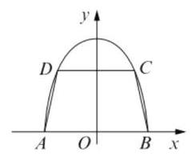

点 $C$ 的纵坐标 $y$ 满足方程 $\frac{{x}^{2}}{{r}^{2}} + \frac{{y}^{2}}{4{r}^{2}} = 1\left( {y \geq  0}\right)$ ,

解得 $y = 2\sqrt{{r}^{2} - {x}^{2}}\left( {0 < x < r}\right)$ ,

$S = \frac{1}{2}\left( {{2x} + {2r}}\right)  \cdot  2\sqrt{{r}^{2} - {x}^{2}}$

$= 2\left( {x + r}\right)  \cdot  \sqrt{{r}^{2} - {x}^{2}}$ ,

其定义域为 $\{ x \mid  0 < x < r\}$ ;

(2)记 $f\left( x\right)  = 4{\left( x + r\right) }^{2}\left( {{r}^{2} - {x}^{2}}\right) ,0 < x < r$ ，

则 ${f}^{\prime }\left( x\right)  = 8{\left( x + r\right) }^{2}\left( {r - {2x}}\right)$ .

令 ${f}^{\prime }\left( x\right)  = 0$ ,得 $x = \frac{1}{2}r$ .

因为当 $0 < x < \frac{r}{2}$ 时, ${f}^{\prime }\left( x\right)  > 0$ ;

当 $\frac{r}{2} < x < r$ 时, ${f}^{\prime }\left( x\right)  < 0$ ,

所以 $f\left( {\frac{1}{2}r}\right)$ 是 $f\left( x\right)$ 的最大值.

因此,当 $x = \frac{1}{2}r$ 时, $S$ 也取得最大值,

最大值为 $\sqrt{f\left( {\frac{1}{2}r}\right) } = \frac{3\sqrt{3}}{2}{r}^{2}$ .

即梯形面积 $S$ 的最大值为 $\frac{3\sqrt{3}}{2}{r}^{2}$ .

# 第三篇 高中数学知识点再现能力训练

## 高中数学知识点再现填漏补缺小题训练 1

## 一、填空题

1. $y = {8x} - 4$ 2. $\left( {0,1}\right)  \cup  \left( {1, + \infty }\right)$ 3. 7

4. $y =  \pm  \frac{4}{3}\left( {x - 5}\right)$ 5.-96.5407.-7

8. $\left| \overrightarrow{b}\right| \cos \langle \overrightarrow{a},\overrightarrow{b}\rangle  \cdot  \frac{\overrightarrow{a}}{\left| \overrightarrow{a}\right| } = \left( {1,0}\right)$ 9. $\frac{\sqrt{3}\pi }{3}$

10. $\left( {1, + \infty }\right)$ 11. $\left\lbrack  {-3,1}\right\rbrack$ 12. ${2x} - 3$

## 二、选择题

13. A 14. D 15. B 16. A

## 三、解答题

17. (1) 因为 $f\left( x\right)  = \frac{{bx} - 5}{x + a} = b - \frac{{ab} + 5}{x + a}\left( {{ab} \neq   - 5}\right)$ , $f\left( {3 + x}\right)  + f\left( {3 - x}\right)  = 4$ ,所以

$b - \frac{{ab} + 5}{3 + a + x} + b - \frac{{ab} + 5}{3 + a - x} = 4$ ,即

$\left( {{2b} - 4}\right)  - \left( {{ab} + 5}\right) \frac{{2a} + b}{\left( {3 + a + x}\right) \left( {3 + a - x}\right) } = 0$ 对使等式有意义的任务 $x$ 恒成立.

所以 $\left\{  {\begin{array}{l} {2a} + b = 0 \\  {2b} - 4 = 0 \end{array},\left\{  \begin{array}{l} a =  - 3 \\  b = 2 \end{array}\right. }\right.$ . 于是,所求函数为

$f\left( x\right)  = \frac{{2x} - 5}{x - 3}$ ,定义域为 $\left( {-\infty ,3}\right)  \cup  \left( {3, + \infty }\right)$ ;

(2)因为 $f\left( x\right)  = \frac{{2x} - 5}{x - 3} = 2 + \frac{1}{x - 3}\left( {x \neq  3}\right)$ ，

$f\left( x\right)  \in  \left\lbrack  {0,2)\cup (2,4}\right\rbrack  ,$

所以 $0 \leq  f\left( x\right)  < 2$ 或 $2 < f\left( x\right)  \leq  4$ ,

即 $0 \leq  2 + \frac{1}{x - 3} < 2$ 或 $2 < 2 + \frac{1}{x - 3} \leq  4$ .

解不等式 $0 \leq  2 + \frac{1}{x - 3} < 2$ ,得 $x \leq  \frac{5}{2}$ ;

解不等式 $2 < 2 + \frac{1}{x - 3} \leq  4$ ,得 $x \geq  \frac{7}{2}$ .

所以当 $x \in  \left( {-\infty ,\frac{5}{2}}\right)  \cup  \left\lbrack  {\frac{7}{2}, + \infty }\right)$ 时,

$f\left( x\right)  \in  \left\lbrack  {0,2)\cup (2,4}\right\rbrack  .$

18.(1)由题意，创新数列为3,5,5,5,5的所有数列 $\left\{  {c}_{n}\right\}$ 有 6 个， $3,5,1,2,4;3,5,1,4,2;3,5,2$ ， $1,4;3,5,2,4,1;3,5,4,1,2;3,5,4,2,1;$

(2)存在数列 $\left\{  {c}_{n}\right\}$ 的创新数列为等比数列. 设数列 $\left\{  {c}_{n}\right\}$ 的创新数列为 $\left\{  {e}_{n}\right\}$ ,因为 ${e}_{m}$ 为前 $m$ 个自然数中最大的一个,所以 ${e}_{m} = m$ . 若 $\left\{  {e}_{n}\right\}$ 为等比数列,设公比为 $q$ ,因为 ${e}_{k + 1} \geq  {e}_{k}(k = 1$ , $2,\cdots , m - 1)$ ,所以 $q \geq  1$ . 当 $q = 1$ 时, $\left\{  {e}_{n}\right\}$ 为常数列满足条件,即为数列 $m, m,\cdots , m$ ,当 $q > 1$ 时, $\left\{  {e}_{n}\right\}$ 为增数列,符合条件的数列只能是 1, $2,\cdots , m$ ,又 $1,2,\cdots , m$ 不满足等比数列. 综上符合条件的创新数列只有一个.

## 高中数学知识点再现填漏补缺小题训练 2

## 一、填空题

1. $\left\lbrack  {0,1}\right\rbrack  \;2.\frac{{x}^{2}}{4} - {y}^{2} = 1$

3. $\frac{1}{{2n} + 1} + \frac{1}{{2n} + 2} - \frac{1}{n + 1}$ 4. 1 或35. $\sqrt{3}$

6. ${444}{\mathrm{\;{cm}}}^{2}$ 7. $\frac{14}{33}$ 8. 5 9. $\frac{3}{4}$ 10. ②

11. ${S}_{n} = \frac{3}{2}{n}^{2} + \frac{1}{2}n$ 12. (1)(2)(3)

## 二、选择题

13. D 14. B 15. B 16. D

## 三、解答题

17. (1) $f\left( x\right)  = \min \left\{  {3 + {\log }_{\frac{1}{4}}x,{\log }_{2}x}\right\}$

$= \left\{  {\begin{array}{l} 3 + {\log }_{\frac{1}{4}}x,3 + {\log }_{\frac{1}{4}}x \leq  {\log }_{2}x \\  {\log }_{2}x,3 + {\log }_{\frac{1}{4}}x > {\log }_{2}x \end{array},}\right.$

$3 + {\log }_{\frac{1}{4}}x = {\log }_{2}x$ 得 $x = 4$ ,

又函数 ${y}_{1} = 3 + {\log }_{\frac{1}{4}}x$ 在 $\left( {0, + \infty }\right)$ 内递减,

${y}_{2} = {\log }_{2}x$ 在 $\left( {0, + \infty }\right)$ 内递增,

所以当 $0 < x < 4$ 时, $3 + {\log }_{\frac{1}{4}}x > {\log }_{2}x$ ;

当 $x \geq  4$ 时, $3 + {\log }_{\frac{1}{4}}x \leq  {\log }_{2}x$ ,

所以 $f\left( x\right)  = \left\{  \begin{array}{l} {\log }_{2}x,0 < x < 4 \\  3 + {\log }_{\frac{1}{4}}x, x \geq  4 \end{array}\right.$ ;

(2)由 $f\left( x\right)  < 2$ ，得 $\left\{  \begin{array}{l} 0 < x < 4, \\  {\log }_{2}x < 2 \end{array}\right.$ ①或

$\left\{  {\begin{array}{l} x \geq  4, \\  3 + {\log }_{\frac{1}{4}}x < 2 \end{array}\text{ ②,解得 }0 < x < 4}\right.$ 或 $x > 4$ ,

即 $f\left( x\right)  < 2$ 的解集为 $\left( {0,4}\right)  \cup  \left( {4, + \infty }\right)$ .

18.(1)因翻折后 $B, C, D$ 重合,所以 ${MN}$ 应是 $\bigtriangleup {ABF}$ 的一条中位线,如图所示. 则 ${MN}//$ 平

面 ${AEF}$ ，证明如下: $\left. \begin{array}{l} {MN}//{AF} \\  {MN} \text{ ⊄ } \text{ 平面 }{AEF} \\  {AF} \subset  \text{ 平面 }{AEF} \end{array}\right\}   \Rightarrow$

${MN}//$ 平面 ${AEF}$ ;

(2) 存在 $G$ 点使得 ${AB} \bot$ 面 ${EGF}$ ,此时 $\lambda  = 1$ , $\left. \begin{matrix} {AB} \bot  {BE} \\  \text{ 因为 }{AB} \bot  {BF} \\  {BE} \cap  {BF} = B \end{matrix}\right\}   \Rightarrow  {AB} \bot$ 面 ${EBF}$ ,

又 $G$ 是线段 ${AB}$ 上一点,且 $\overrightarrow{AG} = \lambda  \cdot  \overrightarrow{AB}$ ,

当点 $G$ 与点 $B$ 重合时 ${AB} \bot$ 面 ${EGF}$ ,

此时 $\lambda  = 1$ ;

(3)因为 ${AB} \bot$ 面 ${BEF}$ ，且 ${AB} = 6,{BE} = {BF} = 3$ ，

${V}_{A - {BEF}} = \frac{\mathbf{1}}{3} \cdot  {AB} \cdot  {S}_{\bigtriangleup {BEF}} = 9,$

又 $\frac{{V}_{E - {AFMN}}}{{V}_{E - {ABF}}} = \frac{{S}_{AFMN}}{{S}_{\bigtriangleup {ABC}}} = \frac{3}{4},{V}_{E - {AFMN}} = \frac{27}{4}$ .

高中数学知识点再现填漏补缺小题训练 3

## 一、填空题

1. $\pi \;2.x = \frac{1}{2}\;3.\frac{2\sqrt{2}}{3}\;4.\frac{1}{8}\;5.\frac{\sqrt{5}}{2}$

6. $y = x - 1$ 7.108. $\frac{2}{3}$ 9. 6 10. 350

11. -1 12. $- \frac{9}{2}$

## 二、选择题

13. A 14. A 15. D 16. D

三、解答题

17.(1)由已知，

函数 $y = x + \frac{{3}^{m}}{x}\left( {x > 0}\right)$ 在 $\left( {0,\sqrt{{3}^{m}}}\right\rbrack$ 上是减函数,

在 $\left\lbrack  {\sqrt{{3}^{m}}, + \infty }\right)$ 上是增函数,

所以 ${y}_{\min } = \sqrt{{3}^{m}} + \frac{{3}^{m}}{\sqrt{{3}^{m}}} = 2\sqrt{{3}^{m}}$ ,

所以 $2\sqrt{{3}^{m}} = 6,{3}^{m} = 9$ ,因此 $m = 2$ ;

(2) 令 ${x}^{2} = t, x \in  \left\lbrack  {1,2}\right\rbrack  , t \in  \left\lbrack  {1,4}\right\rbrack  , f\left( t\right)  = t + \; \frac{a}{t}$ ,原题即求 $f\left( t\right)$ 在 $\left\lbrack  {1,4}\right\rbrack$ 上的最小值;

${1}^{ \circ  }$ 当 $\sqrt{a} > 4$ ,即 $a > {16}$ 时,

$f\left( t\right)$ 在 $\left\lbrack  {1,4}\right\rbrack$ 上是减函数,

此时 $g\left( a\right)  = f\left( 4\right)  = 4 + \frac{a}{4}$ ,

${2}^{ \circ  }$ 当 $1 \leq  \sqrt{a} \leq  4$ ,即 $1 \leq  a \leq  {16}$ 时,

$g\left( a\right)  = f\left( \sqrt{a}\right)  = 2\sqrt{a},$

${3}^{ \circ  }$ 当 $\sqrt{a} < 1$ ,即 $0 < a < 1$ 时,

$f\left( t\right)$ 在 $\left\lbrack  {1,4}\right\rbrack$ 上是增函数,

此时 $g\left( a\right)  = f\left( 1\right)  = 1 + a$ .

因此, $g\left( a\right)  = \left\{  \begin{array}{l} 1 + a\left( {0 < a < 1}\right) \\  2\sqrt{a}\left( {1 \leq  a \leq  {16}}\right) \\  4 + \frac{a}{4}\left( {a > {16}}\right)  \end{array}\right.$ .

18. (1) 直线 $l : y = {mx} + 3 - {4m}$ 可化简为 $y = m\left( {x - 4}\right)  + 3$ ,所以直线恒过定点 $T\left( {4,0}\right)$ ; (2)由题意，要使圆 $C$ 的面积最小，

定点 $T\left( {4,0}\right)$ 在圆上,

所以圆 $C$ 的方程为 ${x}^{2} + {y}^{2} = {25}$ ;

(3) $\overrightarrow{QM} \cdot  \overrightarrow{QN} \cdot  \tan \angle {MQN} =$

$\left| \overrightarrow{QM}\right| \left| \overrightarrow{QN}\right|  \cdot  \cos \angle {MQN} \cdot  \tan \angle {MQN} =$

$\left| \overrightarrow{QM}\right|  \cdot  \left| \overrightarrow{QN}\right|  \cdot  \sin \angle {MQN} = 2{S}_{\bigtriangleup {MQN}},$

由题意得直线 $l$ 与圆 $C$ 的一个交点为 $M\left( {4,3}\right)$ , 又知定点 $Q\left( {-4,3}\right)$ ,直线 ${l}_{MQ} : y = 3$ ,

$\left| {MQ}\right|  = 8$ ,

则当 $N\left( {0, - 5}\right)$ 时 ${S}_{\bigtriangleup {MQN}}$ 有最大值 32,

即 $\overrightarrow{QM} \cdot  \overrightarrow{QN} \times  \tan \angle {MQN}$ 有最大值为 64,

此时直线 $l$ 的方程为 ${2x} - y - 5 = 0$ .

# 高中数学知识点再现填漏补缺小题训练 4

## 一、填空题

1. $\frac{8}{3}\;$ 2. $- \frac{4}{5}\;$ 3. ${5x} + {3y} + 1 = 0$

4. $2\sqrt{2}\;$ 5.846. $4\sqrt{2}\pi \;$ 7. $- \frac{2}{3}$

8. $\left( {0, + \infty }\right) \;$ 9.1210. ③④11.36

12. $\frac{7}{2} - \sqrt{3}$

二、选择题

13. C 14. C 15. A 16. C

## 三、解答题

17. (1) 由 $\tan {2\alpha } = \frac{2\tan \alpha }{1 - {\tan }^{2}\alpha } = \frac{2\left( {\sqrt{2} - 1}\right) }{1 - {\left( \sqrt{2} - 1\right) }^{2}} = 1$ , $\alpha$ 是锐角,所以 ${2\alpha } = \frac{\pi }{4}$ ,

所以 $\sin \left( {{2\alpha } + \frac{\pi }{4}}\right)  = 1$ ,所以 $f\left( x\right)  = {2x} + 1$ ;

(2)因为 ${a}_{1} = 1,{a}_{n + 1} = f\left( {a}_{n}\right)$ ，

所以 ${a}_{n + 1} = 2{a}_{n} + 1$ ,所以 ${a}_{n + 1} + 1 = 2\left( {{a}_{n} + 1}\right)$ , 而 ${a}_{1} + 1 = 2 \neq  0$ ,所以 ${a}_{n} + 1 \neq  0$ ,

所以 $\frac{{a}_{n + 1} + 1}{{a}_{n} + 1} = 2,\left\{  {{a}_{n} + 1}\right\}$ 是首项为 2,

公比 $q = 2$ 的等比数列,所以 ${a}_{n} = {2}^{n} - 1$ ,

${S}_{n} = \frac{2\left( {{2}^{n} - 1}\right) }{2 - 1} - n = {2}^{n + 1} - 2 - n.$

18.(1)因为函数 $f\left( x\right) , g\left( x\right)$ 的图像都过点 $P\left( {t,0}\right)$ ，

所以 $f\left( t\right)  = 0$ ,即 ${t}^{3} + {at} = 0$ . 因为 $t \neq  0$ ,

所以 $a =  - {t}^{2} \cdot  g\left( t\right)  = 0$ ,即 $b{t}^{2} + c = 0$ ,

所以 $c = {ab}$ . 又因为 $f\left( x\right) , g\left( x\right)$ 在点 $P\left( {t,0}\right)$

处有相同的切线,所以 ${f}^{\prime }\left( t\right)  = {g}^{\prime }\left( t\right)$ .

而 ${f}^{\prime }\left( x\right)  = 3{x}^{2} + a,{g}^{\prime }\left( x\right)  = {2bx}$ ,

所以 $3{t}^{2} + a = {2bt}$ . 将 $a =  - {t}^{2}$ 代入上式得 $b = t$ .

因此 $c = {ab} =  - {t}^{3}$ . 故 $a =  - {t}^{2}, b = t, c =  - {t}^{3}$ ;

(2)解法 1:

$y = f\left( x\right)  - g\left( x\right)  = {x}^{3} - {t}^{2}x - t{x}^{2} + {t}^{3},$

${y}^{\prime } = 3{x}^{2} - {2tx} - {t}^{2} = \left( {{3x} + t}\right) \left( {x - t}\right) .$

当 ${y}^{\prime } = \left( {{3x} + t}\right) \left( {x - t}\right)  < 0$ 时,

函数 $y = f\left( x\right)  - g\left( x\right)$ 严格减.

由 ${y}^{\prime } < 0$ ,若 $t > 0$ ,则 $- \frac{t}{3} < x < t$ ;

若 $t < 0$ ,则 $t < x <  - \frac{t}{3}$ . 由题意,

函数 $y = f\left( x\right)  - g\left( x\right)$ 在 $\left( {-1,3}\right)$ 上严格减,则 $\left( {-1,3}\right)  \subset  \left( {-\frac{t}{3}, t}\right)$ 或 $\left( {-1,3}\right)  \subset  \left( {t, - \frac{t}{3}}\right)$ .

所以 $t \geq  3$ 或 $- \frac{t}{3} \geq  3$ . 即 $t \leq   - 9$ 或 $t \geq  3$ .

又当 $- 9 < t < 3$ 时,

函数 $y = f\left( x\right)  - g\left( x\right)$ 在 $\left( {-1,3}\right)$ 上严格减.

所以 $t$ 的取值范围为 $\left( {-\infty , - 9\rbrack \cup \lbrack 3, + \infty }\right)$ .

解法 2 :

$y = f\left( x\right)  - g\left( x\right)  = {x}^{3} - {t}^{2}x - t{x}^{2} + {t}^{3},$

${y}^{\prime } = 3{x}^{2} - {2tx} - {t}^{2} = \left( {{3x} + t}\right) \left( {x - t}\right) ,$

因为函数 $y = f\left( x\right)  - g\left( x\right)$ 在 $\left( {-1,3}\right)$ 上严格减，且 ${y}^{\prime } = \left( {{3x} + t}\right) \left( {x - t}\right)$ 是 $\left( {-1,3}\right)$ 上的抛物线,所以 $\left\{  \begin{array}{l} {\left. {y}^{\prime }\right| }_{x =  - 1} \leq  0, \\  {\left. {y}^{\prime }\right| }_{x = 3} \leq  0. \end{array}\right.$

即 $\left\{  \begin{array}{l} \left( {-3 + t}\right) \left( {-1 - t}\right)  \leq  0 \\  \left( {9 + t}\right) \left( {3 - t}\right)  \leq  0 \end{array}\right.$ ,解得 $t \leq   - 9$ 或 $t \geq  3$ . 所以 $t$ 的取值范围为 $\left( {-\infty , - 9\rbrack \cup \lbrack 3, + \infty }\right)$ .

## 高中数学知识点再现填漏补缺小题训练 5

## 一、填空题

1. $0 < a < 2$ . $\frac{\sqrt{2}}{2}$ 3. $\left( {3,0}\right)$ 4. ${36\pi }$ 5. 2 个

6.-17. $\frac{81}{125}$ 8. $\left( {\frac{1}{2},1}\right)$ 9. $- \frac{3}{4}$

10. ${2n} + 1\;$ 11. $k \in  \left( {-\infty , - \sqrt{3}}\right)  \cup  \left( {\sqrt{3}, + \infty }\right)$

12. ${3\pi }$

## 二、选择题

13. C 14. B 15. C 16. B

## 三、解答题

17. 原不等式化为: $\frac{{ax} - 2}{x - 1} < 0$

(1)当 $a = 1$ 时,该不等式的解集为 $\left( {1,2}\right)$ ;

(2)当 $a > 0$ 时,原不等式化为: $\frac{x - \frac{2}{a}}{x - 1} < 0$ .

当 $0 < a < 2$ 时,解集为 $\left( {1,\frac{2}{a}}\right)$ ;

当 $a = 2$ 时,解集为 $\varphi$ ;

当 $a > 2$ 时,解集为 $\left( {\frac{2}{a},1}\right)$ .

18.(1)由 ${a}_{0} = \frac{1}{3},{b}_{0} = \frac{2}{3}$ 得 ${a}_{1} = \frac{1}{4},{b}_{1} = \frac{3}{4}$ ， 得 ${P}_{1}$ 坐标为 $\left( {\frac{1}{4},\frac{3}{4}}\right)$ , 显然直线 $l$ 的方程为 $x + y = 1$ ;

(2)由 ${a}_{1} = \frac{1}{4},{b}_{1} = \frac{3}{4}$ 得 ${a}_{2} = \frac{1}{5},{b}_{2} = \frac{4}{5}$ ，

所以点 ${P}_{2} \in  l$ ,

猜想点 ${P}_{n}\left( {n \geq  2, n \in  \mathbf{N}}\right)$ 在直线 $l$ 上,

以下用数学归纳法证明:

当 $n = 2$ 时,点 ${P}_{2} \in  L$ ,当 $n = k\left( {k \geq  2}\right)$ 时,

结论成立,即点 ${P}_{k} \in  l$ ,即 ${a}_{k} + {b}_{k} = 1$ ,

则当 $n = k + 1$ 时,

${a}_{k + 1} + {b}_{k + 1} = {a}_{k}{b}_{k + 1} + {b}_{k + 1} \; = \left( {1 + {a}_{k}}\right)  \cdot  \frac{{b}_{k}}{1 - {a}_{k}^{2}} \; = \frac{{b}_{k}}{1 - {a}_{k}} = 1$ ,

所以点 ${P}_{k + 1} \in  l$ ,所以点 ${P}_{n} \in  l\left( {n \geq  2}\right)$ ;

(3) 由 ${a}_{n + 1} = {a}_{n}{b}_{n + 1},{b}_{n + 1} = \frac{{b}_{n}}{1 - {a}_{n}^{2}}$ , ${a}_{n} + {b}_{n} = 1$ ,得 ${a}_{n + 1} = {a}_{n}\frac{{b}_{n}}{1 - {a}_{n}^{2}} = {a}_{n}\frac{1 - {a}_{n}}{1 - {a}_{n}^{2}} = \; \frac{{a}_{n}}{1 + {a}_{n}}\left( {{a}_{n} \neq  0}\right)$ ,所以 $\frac{1}{{a}_{n + 1}} = \frac{1}{{a}_{n}} + 1$ ,

所以 $\left\{  \frac{1}{{a}_{n}}\right\}$ 是等差数列,所以 $\frac{1}{{a}_{n}} = \frac{1}{{a}_{0}} + n = n + 3$ , ${a}_{n} = \frac{1}{n + 3},{b}_{n} = \frac{n + 2}{n + 3}.$

## 一、填空题

1. $\frac{4\sqrt{6}}{3}$ 2. $\frac{1}{2}$ 3. 右, $\frac{\pi }{8}$ 4. 8 5. 1,-3

6. ${x}^{2} + \frac{1}{4}{y}^{2} = 1\;{7.2}\;8.\pi ;\sqrt{6}\;{9.32}$

10. $\overrightarrow{A{C}_{1}} = \left( {-4,3,2}\right)$ 11. 149.8 克

12. (2)(4)

二、选择题

13. A 14. A 15. A 16. D

## 三、解答题

17.(1) $f\left( x\right)$ 的导数 ${f}^{\prime }\left( x\right)  = {e}^{x} + {e}^{-x}$ .

由于 ${e}^{x} + {e}^{-x} \geq  2\sqrt{{e}^{x} \cdot  {e}^{-x}} = 2$ ,

故 ${f}^{\prime }\left( x\right)  \geq  2$ . (当且仅当 $x = 0$ 时,等号成立);

(2)令 $g\left( x\right)  = f\left( x\right)  - {ax}$ ，

则 ${g}^{\prime }\left( x\right)  = {f}^{\prime }\left( x\right)  - a = {e}^{x} + {e}^{-x} - a$ ,

1) 若 $a \leq  2$ ,当 $x > 0$ 时,

${g}^{\prime }\left( x\right)  = {e}^{x} + {e}^{-x} - a > 2 - a \geq  0,$

故 $g\left( x\right)$ 在 $\left( {0, + \infty }\right)$ 上为严格增函数,

所以 $x \geq  0$ 时, $g\left( x\right)  \geq  g\left( 0\right)$ ,即 $f\left( x\right)  \geq  {ax}$ ;

2) 若 $a > 2$ ,方程 ${g}^{\prime }\left( x\right)  = 0$ 的正根为

${x}_{1} = \ln \frac{a + \sqrt{{a}^{2} - 4}}{2}$ ,此时,若 $x \in  \left( {0,{x}_{1}}\right)$ ,

则 ${g}^{\prime }\left( x\right)  < 0$ ,故 $g\left( x\right)$ 在该区间为严格减函数.

所以, $x \in  \left( {0,{x}_{1}}\right)$ 时, $g\left( x\right)  < g\left( 0\right)  = 0$ ,

即 $f\left( x\right)  < {ax}$ ,与题设 $f\left( x\right)  \geq  {ax}$ 相矛盾.

综上,满足条件的 $a$ 的取值范围是 $( - \infty ,2\rbrack$ .

18.(1)由已知点 $B\left( {t,\sqrt{8t}}\right)$ ，

所以 $\left| {BF}\right|  = \sqrt{{\left( t - 2\right) }^{2} + {\left( \sqrt{8t}\right) }^{2}} = t + 2$ ;

(2)因为 $t = 3,\left| {FQ}\right|  = 2$ ，所以 $Q\left( {3,\sqrt{3}}\right)$ ，

线段 ${OQ}$ 的中点为 $\left( {\frac{3}{2},\frac{\sqrt{3}}{2}}\right)$ ,

所以 ${FP} : y =  - \sqrt{3}\left( {x - 2}\right)$ ,

由 $\left\{  \begin{array}{l} y =  - \sqrt{3}\left( {x - 2}\right) \\  {y}^{2} = {8x} \end{array}\right.$ 消去 $y$ 得 $x = \frac{2}{3}$ 或 $x = 6$

真漏补缺小题训练 6

(舍去),所以 $P\left( {\frac{2}{3},\frac{4\sqrt{3}}{3}}\right)$ ,

所以 ${S}_{\bigtriangleup {AQP}} = \frac{1}{2} \times  \sqrt{3} \times  \left( {3 - \frac{2}{3}}\right)  = \frac{7\sqrt{3}}{6}$ ;

(3)设存在以 ${FP},{FQ}$ 为邻边的矩形 ${FPEQ}$ ,

且点 $E$ 在 $\Gamma$ 上,设 $P\left( {8{m}^{2},{8m}}\right)$ ,

由已知直线 ${FQ}$ 的一个法向量为

$\overrightarrow{n} = \overrightarrow{FP} = \left( {8{m}^{2} - 2,{8m}}\right)$ ,所以直 ${FQ}$ 的方程为

$\left( {8{m}^{2} - 2}\right) \left( {x - 2}\right)  + {8my} = 0,$

代入 $x = 8, y = \frac{3\left( {1 - 4{m}^{2}}\right) }{2m}$ ,

所以 $Q\left( {8,\frac{3\left( {1 - 4{m}^{2}}\right) }{2m}}\right)$ ,

又 $\overrightarrow{FE} = \overrightarrow{FP} + \overrightarrow{FQ}$

$= \left( {8{m}^{2} - 2,{8m}}\right)  + \left( {6,\frac{3\left( {1 - 4{m}^{2}}\right) }{2m}}\right)$

$= \left( {8{m}^{2} + 4,\frac{3 + 4{m}^{2}}{2m}}\right) ,$

$\overrightarrow{OE} = \overrightarrow{OF} + \overrightarrow{FE}$

$= \left( {2,0}\right)  + \left( {8{m}^{2} + 4,\frac{3 + 4{m}^{2}}{2m}}\right) \; = \left( {8{m}^{2} + 6,\frac{3 + 4{m}^{2}}{2m}}\right) ,$

又因为 $E$ 在曲线上,

所以 ${\left( \frac{3 + 4{m}^{2}}{2m}\right) }^{2} = 8\left( {8{m}^{2} + 6}\right)$ ,所以 ${m}^{2} = \frac{1}{20}$ ,

因为 $m > 0$ ,所以 $m = \frac{\sqrt{5}}{10}$ ,

所以 $P\left( {\frac{2}{5},\frac{4\sqrt{5}}{5}}\right) , Q\left( {8,\frac{{12}\sqrt{5}}{5}}\right)$ ,

$\overrightarrow{OE} = \left( {\frac{34}{5},\frac{{16}\sqrt{5}}{5}}\right)$ ,而 $B\left( {8,8}\right)$ ,

所以 $E$ 在曲线 $\Gamma$ 上, $Q$ 在线段 ${AB}$ 上满足要求,所以存在以 ${FP},{FQ}$ 为邻边的矩形 ${FPEQ}$ , 且点 $E$ 在 $\Gamma$ 上,点 $P$ 坐标为 $\left( {\frac{2}{5},\frac{4\sqrt{5}}{5}}\right)$ .

高中数学知识点再现填漏补缺小题训练 7

## 一、填空题

1. $\{ x \mid   - 1 < x < 2\} \;$ 2. $a = {2b}$

3. $- {56}\;$ 4. $\frac{1023}{512}$

5. 2 或 0

6. $x - y + 1 = 0$

7. $\frac{1}{2}\;$ 8. $\frac{1}{2}\;$ 9. ${15}\sqrt{2},{15}\sqrt{6}$

10. $T = 2,\theta  = \frac{\pi }{2}\;$ 11. $\{ 0\} \;$ 12. 6 个

## 二、选择题

13. D 14. C 15. D 16. B

## 三、解答题

17. ( 1 )由题可得 $\left\{  \begin{array}{l} \frac{1 + x}{1 - x} \geq  0\text{ 且 }x \neq  1 \\  3 - {4x} + {x}^{2} > 0 \end{array}\right.$

可解得 $M = \lbrack  - 1,1)$ ;

(2) $f\left( x\right)  = a \cdot  {2}^{x + 2} + 3 \times  {4}^{x}$

$= 3{\left( {2}^{x} + \frac{2a}{3}\right) }^{2} - \frac{4}{3}{a}^{2}$ ,

又 $\frac{1}{2} \leq  {2}^{x} < 2, a >  - 3$ ,所以 $- \frac{2a}{3} < 2$ ,

① 若 $- \frac{2a}{3} < \frac{1}{2}$ ，即 $a >  - \frac{3}{4}$ 时，

$f{\left( x\right) }_{\min } = f\left( {-1}\right)  = {2a} + \frac{3}{4},$

② 若 $\frac{1}{2} \leq   - \frac{2a}{3} < 2$ ，即 $- 3 < a \leq   - \frac{3}{4}$ 时，

所以当 ${2}^{x} =  - \frac{2}{3}a$ ,即 $x = {\log }_{2}\left( {-\frac{2a}{3}}\right)$ 时,

$f{\left( x\right) }_{\min } =  - \frac{4}{3}{a}^{2},$

$f{\left( x\right) }_{\min } = \left\{  {\begin{array}{l} {2a} + \frac{3}{4}\left( {a >  - \frac{3}{4}}\right) \\   - \frac{4}{3}{a}^{2}\left( {-3 < a \leq   - \frac{3}{4}}\right)  \end{array}.}\right.$

18.(1)设抛物线的标准方程为 ${y}^{2} = {2px}$ ， 则 ${2p} = 8$ ,从而 $p = 4$ . 因此焦点 $F\left( {\frac{p}{2},0}\right)$ 的坐标为 $\left( {2,0}\right)$ . 又准线方程的一般式为 $x =  - \frac{p}{2}$ . 从而所求准线 $l$ 的方程为 $x =  - 2$ .

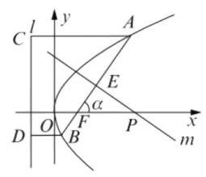

(2)解法 1:如图，作 ${AC}\bot l,{BD}\bot l$ ，

垂足为 $C$ 、 $D$ ，则由抛物线的定义知

$\left| {FA}\right|  = \left| {FC}\right| ,\left| {FB}\right|  = \left| {BD}\right| ,$

记 $A\text{ 、 }B$ 的横坐标分别为 ${x}_{1},{x}_{2}$ ,

则 $\left| {FA}\right|  = \left| {AC}\right|  = {x}_{x} + \frac{p}{2}$

$= \left| {FA}\right| \cos \alpha  + \frac{p}{2} + \frac{p}{2}$

$= \left| {FA}\right| \cos \alpha  + 4,$

解得 $\left| {FA}\right|  = \frac{4}{1 - \cos \alpha }$ ,

类似地有 $\left| {FB}\right|  = 4 - \left| {FB}\right| \cos \alpha$ ,

解得 $\left| {FB}\right|  = \frac{4}{1 + \cos \alpha }$ .

记直线 $m$ 与 ${AB}$ 的交点为 $E$ ,

则 $\left| {FE}\right|  = \left| {FA}\right|  - \left| {AE}\right| \; = \left| {FA}\right|  - \frac{\left| {FA}\right|  + \left| {FB}\right| }{2} \; = \frac{1}{2}\left( {\left| {FA}\right|  - \left| {FB}\right| }\right) \; = \frac{1}{2}\left( {\frac{4}{1 - \cos \alpha } - \frac{4}{1 + \cos \alpha }}\right)  = \frac{4\cos \alpha }{{\sin }^{2}\alpha },$

所以 $\left| {FP}\right|  = \frac{\left| FE\right| }{\cos \alpha } = \frac{4}{{\sin }^{2}\alpha }$ . 故 $\left| {FP}\right|  - \left| {FP}\right| \; \cos {2\alpha } = \frac{4}{{\sin }^{2}\alpha }\left( {1 - \cos {2\alpha }}\right)  = \frac{4 \cdot  2{\sin }^{2}\alpha }{{\sin }^{2}\alpha } = 8.$

解法 2: 设 $A\left( {{x}_{A},{y}_{A}}\right) , B\left( {{x}_{B},{y}_{B}}\right)$ ,直线 ${AB}$ 的

斜率为 $k = \tan \alpha$ ,则直线方程为 $y = k\left( {x - 2}\right)$ .

将此式代入 ${y}^{2} = {8x}$ ，

得 ${k}^{2}{x}^{2} = 4\left( {{k}^{2} + 2}\right) x + 4{k}^{2} = 0$ ,

故 ${x}_{A} + {x}_{B} = \frac{k\left( {{k}^{2} + 2}\right) }{{k}^{2}}$ .

记直线 $m$ 与 ${AB}$ 的交点为 $E\left( {{x}_{E},{y}_{E}}\right)$ ,

则 ${x}_{E} = \frac{{x}_{A} + {x}_{B}}{2} = \frac{2\left( {{k}^{2} + 2}\right) }{{k}^{2}}$ ,

${y}_{E} = k\left( {{x}_{E} - 2}\right)  = \frac{4}{k},$

故直线 $m$ 的方程为 $y - \frac{4}{k} =  - \frac{1}{k}\left( {x - \frac{2{k}^{2} + 4}{{k}^{2}}}\right)$ .

令 $y = 0$ ,得 $P$ 的横坐标 ${x}_{P} = \frac{2{k}^{2} + 4}{{k}^{2}} + 4$

故 $\left| {FP}\right|  = {x}_{P} - 2 = \frac{4\left( {{k}^{2} + 1}\right) }{{k}^{2}} = \frac{4}{{\sin }^{2}\alpha }$ .

从而 $\left| {FP}\right|  - \left| {FP}\right| \cos {2\alpha } = \frac{4}{{\sin }^{2}\alpha }\left( {1 - \cos {2\alpha }}\right)  = \; \frac{4 \cdot  2{\sin }^{2}\alpha }{{\sin }^{2}\alpha } = 8$ 为定值.

## 高中数学知识点再现填漏补缺小题训练 8

## 一、填空题

1. $\sqrt{5}\;$ 2. $\{ 1,2\} \;$ 3. $- \frac{\sqrt{10}}{10}$

4. $2\sqrt{2}\;$ 5.16.57.-3

8. $\left( {-2,0}\right) \;{9.3}\sqrt{3}\;{10.810}$

11. 0 12.2

二、选择题

13. C 14. C 15. A 16. C

## 三、解答题

17. (1) 由 $\tan {2\alpha } = \frac{2\tan \alpha }{1 - {\tan }^{2}\alpha } = \frac{2\left( {\sqrt{2} - 1}\right) }{1 - {\left( \sqrt{2} - 1\right) }^{2}} = 1$ , $\alpha$ 是锐角,所以 ${2\alpha } = \frac{\pi }{4}$ ,

所以 $\sin \left( {{2\alpha } + \frac{\pi }{4}}\right)  = 1$ ,所以 $f\left( x\right)  = {2x} + 1$ ;

(2)因为 ${a}_{1} = 1,{a}_{n + 1} = f\left( {a}_{n}\right)$ ，

所以 ${a}_{n + 1} = 2{a}_{n} + 1$ ,所以 ${a}_{n + 1} + 1 = 2\left( {{a}_{n} + 1}\right)$ , 而 ${a}_{1} + 1 = 2 \neq  0$ ,所以 ${a}_{n} + 1 \neq  0$ ,

所以 $\frac{{a}_{n + 1} + 1}{{a}_{n} + 1} = 2,\left\{  {{a}_{n} + 1}\right\}$ 是首项为 2,

公比 $q = 2$ 的等比数列,所以 ${a}_{n} = {2}^{n} - 1$ ,

${S}_{n} = \frac{2\left( {{2}^{n} - 1}\right) }{2 - 1} - n = {2}^{n + 1} - 2 - n.$

18. (1) 由题设 $c = 1,\frac{2}{{b}^{2} + 1} + \frac{3}{2{b}^{2}} = 1$ ,从而 ${b}^{2} = 3$ , ${a}^{2} = 4$ ,所以椭圆 $C$ 的方程为 $\frac{{x}^{2}}{4} + \frac{{y}^{2}}{3} = 1$ ;

(2)1)证明:由题意得 $F\left( {1,0}\right)$ 、 $N\left( {4,0}\right)$ .

设 $A\left( {m, n}\right)$ ,则 $B\left( {m, - n}\right) \left( {n \neq  0}\right)$ ,

$\frac{{m}^{2}}{4} + \frac{{n}^{2}}{3} = 1.{AF}$ 与 ${BN}$ 的方程分别为:

$n\left( {x - 1}\right)  - \left( {m - 1}\right) y = 0, n\left( {x - 4}\right)  + \left( {m - 4}\right) y = 0.$

设 $M\left( {{x}_{0},{y}_{0}}\right)$ ,则有

$\left\{  \begin{array}{l} n\left( {{x}_{0} - 1}\right)  - \left( {m - 1}\right) {y}_{0} = 0, \\  n\left( {{x}_{0} - 4}\right)  + \left( {m - 4}\right) {y}_{0} = 0 \end{array}\right.$

由上得 ${x}_{0} = \frac{{5m} - 8}{{2m} - 5},{y}_{0} = \frac{3n}{{2m} - 5}$ .

由于 $\frac{{x}_{0}^{2}}{4} + \frac{{y}_{0}^{2}}{3} = \frac{{\left( 5m - 8\right) }^{2}}{4{\left( 2m - 5\right) }^{2}} + \frac{{\left( 3n\right) }^{2}}{3{\left( 2m - 5\right) }^{2}}$

$= \frac{{\left( 5m - 8\right) }^{2} + {12}{n}^{2}}{4{\left( 2m - 5\right) }^{2}}$

$$
= \frac{{\left( 5m - 8\right) }^{2} + {36} - 9{m}^{2}}{4{\left( 2m - 5\right) }^{2}} = 1.
$$

所以点 $M$ 恒在椭圆 $C$ 上.

2) 设 ${AM}$ 的方程为 $x = {ty} + 1$ ,

代入 $\frac{{x}^{2}}{4} + \frac{{y}^{2}}{3} = 1$ ，得 $\left( {3{t}^{2} + 4}\right) {y}^{2} + {6ty} - 9 = 0$ .

设 $A\left( {{x}_{1},{y}_{1}}\right) \text{ 、 }M\left( {{x}_{2},{y}_{2}}\right)$ ,

则有 ${y}_{1} + {y}_{2} = \frac{-{6t}}{3{t}^{2} + 4},{y}_{1}{y}_{2} = \frac{-9}{3{t}^{2} + 4}$ .

$\left| {{y}_{1} - {y}_{2}}\right|  = \sqrt{{\left( {y}_{1} + {y}_{2}\right) }^{2} - 4{y}_{1}{y}_{2}}$

$= \frac{{12} \cdot  \sqrt{{t}^{2} + 1}}{3{t}^{2} + 4}$ .

令 $\sqrt{{t}^{2} + 1} = \lambda \left( {\lambda  \geq  1}\right)$ ,

则 $\left| {{y}_{1} - {y}_{2}}\right|  = \frac{12\lambda }{3{\lambda }^{2} + 1} = \frac{12}{{3\lambda } + \frac{1}{\lambda }}$ ,

设 $y = {3\lambda } + \frac{1}{\lambda }$ ,则 ${y}^{\prime } = 3 - \frac{1}{{\lambda }^{2}}$ ,

当 $\lambda  \geq  1$ 时, ${y}^{\prime } > 0$ ,

所以函数 $y = {3\lambda } + \frac{1}{\lambda }$ 在 $\lbrack 1, + \infty )$ 为严格增函

数,所以当 $\lambda  = 1$ ,即 $t = 0$ 时,

函数 $y = {3\lambda } + \frac{1}{\lambda }$ 有最小值 4,

${S}_{\bigtriangleup {AMN}} = \frac{1}{2}\left| {FN}\right|  \cdot  \left| {{y}_{1} - {y}_{2}}\right| \; = \frac{3}{2} \cdot  \frac{{12}\sqrt{{t}^{2} + 1}}{3{t}^{2} + 4} = \frac{3}{2} \cdot  \frac{12\lambda }{3{\lambda }^{2} + 1} \; = \frac{3}{2} \cdot  \frac{12}{{3\lambda } + \frac{1}{\lambda }} \leq  \frac{9}{2}$ .

$\bigtriangleup {AMN}$ 面积的最大值为 $\frac{9}{2}$ .

## 高中数学知识点再现填漏补缺小题训练 9

## 一、填空题

1. $\{ x \mid   - 1 < x < 2\} \;$ 2.23. $\frac{\sqrt{10}}{5}$

4. $\frac{3\pi }{2}\;$ 5. ${a}_{n} = {2n} - 1\;$ 6. $\frac{3}{4}$

7. $( - 1,0\rbrack  \cup  \left( {1, + \infty }\right) \;$ 8. 4 9.216

10. $\left| \overrightarrow{b}\right|  = 3\sqrt{2}$ 11. $\left( {-\infty ,\frac{9}{10}}\right\rbrack$

12. $\frac{1}{6}$

二、选择题

13. A 14. D 15. C 16. C

## 三、解答题

17. (1) 因为 ${A}_{1}{C}_{1}//{AC}$ ,

所以 ${AC}$ 与 $O{D}_{1}$ 所成的角就是所求的角;

${AC} \bot  {BD},{AC} \bot  D{D}_{1}$ ,

所以 ${AC} \bot$ 平面 ${D}_{1}{DO}$ ,所以 ${AC} \bot  O{D}_{1}$ ,

即 $O{D}_{1}$ 与 ${AC}$ 所成的角为 ${90}^{ \circ  }$ ;

(2)因为 ${A}_{1}{C}_{1}//{AC}$ ，

所以 ${AC}$ 与 ${EF}$ 所成的角就是所求的角;

又 $E, F$ 分别是 ${AB},{AD}$ 的中点, ${AC} \bot  {EF}$ ,

则 ${EF}$ 与 ${A}_{1}{C}_{1}$ 所成的角为 ${90}^{ \circ  }$ ;

(3) ${BO} \bot  {AC},{D}_{1}O \bot  {AC}$ ,

所以 $\angle {D}_{1}{OB}$ 是二面角 $B - {AC} - {D}_{1}$ 的平面角,

在 $\bigtriangleup {D}_{1}{OB}$ 中, ${BO} = \frac{\sqrt{2}}{2}a, O{D}_{1} = \sqrt{\frac{3}{2}}a$ ,

$B{D}_{1} = \sqrt{3}a$ ,由余弦定理得:

$\cos \angle {D}_{1}{OB} = \frac{\frac{1}{2}{a}^{2} + \frac{3}{2}{a}^{2} - 3{a}^{2}}{2 \times  \frac{\sqrt{2}}{2}a \times  \sqrt{\frac{3}{2}a}} =  - \frac{\sqrt{3}}{3},$

因此,所求二面角 $B - {AC} - {D}_{1}$ 的大小为 $\pi  - \arccos \frac{\sqrt{3}}{3}$ .

18. (1) $g\left( x\right)  = 3\sin \left( {x + \frac{\pi }{2}}\right)  + 4\sin x$

$= 4\sin x + 3\cos x$

其“相伴向量” $\overrightarrow{OM} = \left( {4,3}\right)$ ,所以 $g\left( x\right)  \in  S$ ;

(2) $h\left( x\right)  = \cos \left( {x + \alpha }\right)  + 2\cos x \; = \left( {\cos x\cos \alpha  - \sin x\sin \alpha }\right)  + 2\cos x \; =  - \sin \alpha \sin x + \left( {\cos \alpha  + 2}\right) \cos x,$

所以函数 $h\left( x\right)$ 的“相伴向量”

$\overrightarrow{OM} = \left( {-\sin \alpha ,\cos \alpha  + 2}\right) ,$

则 $\left| \overrightarrow{OM}\right|  = \sqrt{{\sin }^{2}\alpha  + {\left( \cos \alpha  + 2\right) }^{2}}$

$= \sqrt{5 + 4\cos \alpha }$ ;

(3) $\overrightarrow{OM}$ 的“相伴向量”

$f\left( x\right)  = a\sin x + b\cos x = \sqrt{{a}^{2} + {b}^{2}}\sin \left( {x + \varphi }\right) ,$

其中 $\cos \varphi  = \frac{a}{\sqrt{{a}^{2} + {b}^{2}}},\sin \varphi  = \frac{b}{\sqrt{{a}^{2} + {b}^{2}}}$ ,

当 $x + \varphi  = {2k\pi } + \frac{\pi }{2}, k \in  \mathbf{Z}$ 时, $f\left( x\right)$ 取得最在

值,故当 ${x}_{0} = {2k\pi } + \frac{\pi }{2} - \varphi , k \in  \mathbf{Z}$ ,

所以 $\tan {x}_{0} = \tan \left( {{2k\pi } + \frac{\pi }{2} - \varphi }\right)  = \cot \varphi  = \frac{a}{b}$ ,

所以 $\tan 2{x}_{0} = \frac{2\tan {x}_{0}}{1 - {\tan }^{2}{x}_{0}} = \frac{2 \times  \frac{a}{b}}{1 - {\left( \frac{a}{b}\right) }^{2}}$

$= \frac{2}{\frac{b}{a} - \frac{a}{b}},$

$\frac{b}{a}$ 为直线 ${OM}$ 的斜率,由几何意义知

$\frac{b}{a} \in  \left\lbrack  {-\frac{\sqrt{3}}{3},0}\right)  \cup  \left( {0,\frac{\sqrt{3}}{3}}\right\rbrack$ ,令 $m = \frac{b}{a}$ ,则所以 $\tan 2{x}_{0} = \frac{2}{m - \frac{1}{m}}, m \in  \left\lbrack  {-\frac{\sqrt{3}}{3},0}\right)  \cup  \left( {0,\frac{\sqrt{3}}{3}}\right\rbrack  ,$ 当 $- \frac{\sqrt{3}}{3} \leq  m < 0$ 时,

函数 $\tan 2{x}_{0} = \frac{2}{m - \frac{1}{m}}$ 严格减,

所以 $0 < \tan 2{x}_{0} \leq  \sqrt{3}$ ; 当 $0 < m \leq  \frac{\sqrt{3}}{3}$ 时,

函数 $\tan 2{x}_{0} = \frac{2}{m - \frac{1}{m}}$ 严格减,

所以 $- \sqrt{3} \leq  \tan 2{x}_{0} < 0$ .

综上所述, $\tan 2{x}_{0} \in  \left\lbrack  {-\sqrt{3},0)\cup (0,\sqrt{3}}\right\rbrack$ .

## 高中数学知识点再现填漏补缺小题训练 10

## 一、填空题

1.-72. $- \frac{2\sqrt{2}}{3}$ 3.-14. $\frac{9}{2}$

5. $\left( {-4,\frac{1}{2}}\right)$ 6. $m \geq  3$ 7. $\frac{1}{2}$ 8. $\frac{\pi }{4}$

9. 12 10.0.25 11. 抛物线

12. ①③

二、选择题

13. A 14. A 15. B 16. B

三、解答题

17. (1) 根据题设条件,当 $x = 0$ 时, $\frac{k}{100} = {24}$ ,

得 $k = {2400};y = \frac{x}{2} + \frac{{2400} \times  {15}}{{20x} + {100}} = \frac{x}{2} + \frac{1800}{x + 5}$ ,

即 $y = \frac{x}{2} + \frac{1800}{x + 5}\left( {x \geq  0}\right)$ ;

(2) $y = \frac{x + 5}{2} + \frac{1800}{x + 5} - \frac{5}{2}$

$\geq  2\sqrt{900} - \frac{5}{2} = \frac{115}{2}$

(当且仅当 $\frac{x + 5}{2} = \frac{1800}{x + 5}$ ,即 $x = {55}$ 时,等号成立)

18.(1)由已知， $y = x\left( {x + n}\right)  + 2\left( {{2x} - 1}\right)$

$= {x}^{2} + \left( {4 + n}\right) x - 2$ ,

而函数 $y$ 在 $x \in  \left\lbrack  {0,1}\right\rbrack$ 上是严格增函数,

所以 ${a}_{n} =  - 2 + 1 + 4 + n - 2 = n + 1$ ;

(2)因为 ${b}_{1} + {b}_{2} + \cdots  + {b}_{n} = {\left( \frac{9}{10}\right) }^{n - 1}$ ，

所以 ${b}_{1} + {b}_{2} + \cdots  + {b}_{n - 1} = {\left( \frac{9}{10}\right) }^{n - 2}\left( {n \geq  2}\right)$ ,

两式相减,得 ${b}_{n} =  - \frac{1}{10} \cdot  {\left( \frac{9}{10}\right) }^{n - 2}\left( {n \geq  2}\right)$ ,

所以，数列 $\left\{  {b}_{n}\right\}$ 的通项公式为

${b}_{n} = \left\{  \begin{array}{l} 1, n = 1, \\   - \frac{1}{10} \cdot  {\left( \frac{9}{10}\right) }^{n - 2}. \end{array}\right.$

(3)因为 ${c}_{1} =  - {a}_{1}{b}_{1} =  - 2 < 0$ ，

${c}_{n} = \frac{n + 1}{10} \cdot  {\left( \frac{9}{10}\right) }^{n - 2} > 0\left( {n \geq  2}\right) ,$

由题意, ${c}_{k}$ 为 $\left\{  {c}_{n}\right\}$ 的最大项,则 $k \geq  2$ ,

要使 ${c}_{k}$ 为最大值,则 $\left\{  \begin{array}{l} {c}_{k} \geq  {c}_{k - 1}, \\  {c}_{k} \geq  {c}_{k + 1}, \end{array}\right.$

即 $\left\{  \begin{array}{l} \frac{k + 1}{10} \cdot  {\left( \frac{9}{10}\right) }^{k - 2} \geq  \frac{k}{10} \cdot  {\left( \frac{9}{10}\right) }^{k - 3} \\  \frac{k + 1}{10} \cdot  {\left( \frac{9}{10}\right) }^{k - 2} \geq  \frac{k + 2}{10} \cdot  {\left( \frac{9}{10}\right) }^{k - 1} \end{array}\right.$ ,

解得 $k = 9$ 或 $k = 8$ . 所以存在 $k = 8$ 或 9, 使得 ${c}_{n} \leq  {c}_{k}$ 对所有的正整数成立.

## 高中数学知识点再现填漏补缺小题训练 11

## 一、填空题

1. $\left\lbrack  {\frac{\pi }{2},\pi }\right\rbrack  \;$ 2. $- b\;$ 3. $\frac{\sqrt{2}}{48}{l}^{3}\;$ 4. $\left\lbrack  {0,2}\right\rbrack$

5.06. $\frac{7}{2}\;7.\pi \;8.{22}\;9.\left\lbrack  {-1,2}\right\rbrack$

10. $\pm  \frac{\sqrt{3}}{3}$ 11. $\frac{3}{2}$ 12. $(1,3\rbrack$

## 二、选择题

13. C 14. C 15. B 16. A

## 三、解答题

17. (1) $f\left( x\right)  = \left| {{2x} - a}\right|  + a < 6$ ,

即 $\left| {{2x} - a}\right|  < 6 - a$ .

$\left\{  \begin{array}{l} 6 - a > 0, \\   - 6 + a < {2x} - a < 6 - a, \end{array}\right.$

即 $\left\{  {\begin{array}{l} a < 6, \\  a - 3 < x < 3, \end{array}\left\{  \begin{array}{l} a < 6, \\  a - 3 =  - 1,\text{ 即 }a = 2; \\  3 = 3, \end{array}\right. }\right.$

(2) $a = 2$ 时， $f\left( x\right)  = \left| {{2x} - 2}\right|  + 2$ .

若存在 ${x}_{0} \in  \mathbf{R}$ ,使 $f\left( {x}_{0}\right)  \leq  t - f\left( {-{x}_{0}}\right)$ ,

即 $t \geq  f\left( {x}_{0}\right)  + f\left( {-{x}_{0}}\right)$ ,

则 $t \geq  {\left\lbrack  f\left( x\right)  + f\left( -x\right) \right\rbrack  }_{\min }$ .

$f\left( x\right)  + f\left( {-x}\right)  = \left| {{2x} - 2}\right|  + \left| {{2x} + 2}\right|  + 4$

$\geq  \left| {\left( {{2x} - 2}\right)  - \left( {{2x} + 2}\right) }\right|  + 4$

$= 8$ ,

当 $x \in  \left\lbrack  {-1,1}\right\rbrack$ 时等号成立, $t \geq  8$ , 即 $t \in  \lbrack 8, + \infty )$ .

18.(1)设所求双曲线 $C$ 的方程为 ${x}^{2} - 2{y}^{2} = \lambda$ ， 将点 $M$ 的坐标 $\left( {3,2}\right)$ 代入得 $\lambda  = 1$ ，

所以双曲线 $C$ 的方程是 ${x}^{2} - 2{y}^{2} = 1$ ;

(2) 设 $P\left( {{x}_{1},{y}_{1}}\right) , Q\left( {{x}_{2},{y}_{2}}\right)$ ,

由 $\left\{  \begin{array}{l} {ax} - y - 1 = 0 \\  {x}^{2} - 2{y}^{2} = 1 \end{array}\right.$ ,

得 $\left( {1 - 2{a}^{2}}\right) {x}^{2} + {4ax} - 3 = 0$ ,

若 $1 - 2{a}^{2} = 0$ ,即 $a =  \pm  \frac{\sqrt{2}}{2}$ 时,

$l$ 与 $C$ 的渐近线平行, $l$ 与 $C$ 只有一个交点,

与题意不合,所以 $1 - 2{a}^{2} \neq  0$ ,

$\Delta  = {16}{a}^{2} + {12}\left( {1 - 2{a}^{2}}\right)  > 0,$

$- \frac{\sqrt{6}}{2} < a < \frac{\sqrt{6}}{2},\left\{  \begin{array}{l} {x}_{1} + {x}_{2} =  - \frac{4a}{1 - 2{a}^{2}}, \\  {x}_{1} \cdot  {x}_{2} =  - \frac{3}{1 - 2{a}^{2}} \end{array}\right.$(*)

所以 $\left| {PQ}\right|  = \sqrt{1 + {a}^{2}}\left| {{x}_{1} - {x}_{2}}\right|  = 2\sqrt{1 + {a}^{2}}$ ,

所以 ${\left( {x}_{1} - {x}_{2}\right) }^{2} = 4$ ,

所以 ${\left( {x}_{1} + {x}_{2}\right) }^{2} - 4{x}_{1}{x}_{2} = 4$ ,

所以 ${\left( -\frac{4a}{1 - 2{a}^{2}}\right) }^{2} - 4\left( \frac{-3}{1 - 2{a}^{2}}\right)  = 4$ ,

所以 $a =  \pm  1 \in  \left( {-\frac{\sqrt{6}}{2},\frac{\sqrt{6}}{2}}\right)$ ,

所以所求的实数为 $a =  \pm  1$ .

## 高中数学知识点再现填漏补缺小题训练 12

## 一、填空题

1. $\sqrt{10}$ 2.13. $\left( {-\infty , - 1\rbrack \cup \lbrack 3, + \infty }\right)$

$\begin{array}{lllll} 4.2\sqrt{2} & 5.6 & 6.5 & 7.\left\lbrack  {-1,1}\right\rbrack  & 8.\frac{14}{3} \end{array}$

9.1210. $\frac{8\sqrt{2}\pi }{3}$ 11. 0 12. 10

## 二、选择题

13. C 14. C 15. A 16. A

## 三、解答题

17. (1) 由 $\tan {2\alpha } = \frac{2\tan a}{1 - {\tan }^{2}\alpha } = \frac{2\left( {\sqrt{2} - 1}\right) }{1 - {\left( \sqrt{2} - 1\right) }^{2}} = 1$ , $\alpha$ 是锐角,所以 ${2\alpha } = \frac{\pi }{4}$ ,

所以 $\sin \left( {{2\alpha } + \frac{\pi }{4}}\right)  = 1$ ,所以 $f\left( x\right)  = {2x} + 1$ ;

(2) 因为 ${a}_{1} = 1,{a}_{n + 1} = f\left( {a}_{n}\right)$ ,

所以 ${a}_{n + 1} = 2{a}_{n} + 1$ ,所以 ${a}_{n + 1} + 1 = 2\left( {{a}_{n} + 1}\right)$ , 而 ${a}_{1} + 1 = 2 \neq  0$ ,所以 ${a}_{n} + 1 \neq  0$ ,

所以 $\frac{{a}_{n + 1} + 1}{{a}_{n} + 1} = 2,\left\{  {{a}_{n} + 1}\right\}$ 是首项为 2,

公比 $q = 2$ 的等比数列,所以 ${a}_{n} = {2}^{n} - 1$ ,

${S}_{n} = \frac{2\left( {{2}^{n} - 1}\right) }{2 - 1} - n = {2}^{n + 1} - 2 - n.$

18.(1)因为 ${C}_{1}$ 是 $B{C}_{1}$ 上的点，

且 ${C}_{1}$ 在平面 ${ABCD}$ 上的射影是 $C$ ,

即 ${BC}$ 是 $B{C}_{1}$ 在平面 ${ABCD}$ 上的射影,

于是 $\angle {C}_{1}{BC}$ 是 $B{C}_{1}$ 与底面 ${ABCD}$ 所成的角, 而 $\tan \angle {C}_{1}{BC} = \frac{C{C}_{1}}{BC} = \frac{C{C}_{1}}{2} = 2$ ,所以 $C{C}_{1} = 4$ . 如图,

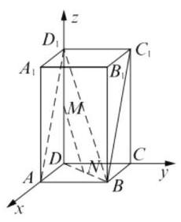

以 $D$ 为原点,直线 ${DA}$ 为 $x$ 轴,直线 ${DC}$ 为 $y$ 轴,

直线 $D{D}_{1}$ 为 $z$ 轴,建立空间直角坐标系.

连结 $B{D}_{1}$ ,因为 $M$ 是 $D{D}_{1}$ 的中点,

$N$ 是 ${BD}$ 中点,所以 ${MN}//B{D}_{1}$ ,

于是 $\overrightarrow{{MN}//B{D}_{1}}$ ,令 $\overrightarrow{MN} = t\overrightarrow{B{D}_{1}}\left( {t \in  \mathbf{R}}\right)$ .

设 $\overrightarrow{{n}_{1}}$ 是平面 ${AB}{C}_{1}{D}_{1}$ 的法向量,

则 $\overrightarrow{{n}_{1}} \bot  \overrightarrow{B{D}_{1}}$ ,于是

$\overrightarrow{{n}_{1}} \cdot  \overrightarrow{MN} = \overrightarrow{{n}_{1}} \cdot  \left( {t\overrightarrow{B{D}_{1}}}\right)  = t\overrightarrow{{n}_{1}} \cdot  \overrightarrow{B{D}_{1}} = 0,$

即 $\overrightarrow{{n}_{1}} \bot  \overrightarrow{MN}$ ,

又因为 ${MN}$ 不在平面 ${AB}{C}_{1}{D}_{1}$ 内,

所以 ${MN}$ 与平面 ${AB}{C}_{1}{D}_{1}$ 平行;

(2)由于 $B\left( {2,2,0}\right) , C\left( {0,2,0}\right) , M\left( {0,0,2}\right)$ ,

于是 $\overrightarrow{CB} = \left( {2,0,0}\right) ,\overrightarrow{CM} = \left( {0, - 2,2}\right)$ .

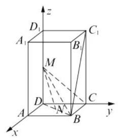

设平面 ${BCM}$ 的法向量 $\overrightarrow{{n}_{2}} = \left( {x, y, z}\right)$ ,

因为 ${\overrightarrow{n}}_{2}^{ * } \cdot  \overrightarrow{CB} = 0,{\overrightarrow{n}}_{2}^{ * } \cdot  \overrightarrow{CM} = 0$ ,

于是 $\left\{  \begin{array}{l} {2x} = 0 \\   - {2y} + {2z} = 0 \end{array}\right.$ ,取 $y = 1$ ,

则平面 ${BCM}$ 的一个法向量为 ${\overrightarrow{n}}_{2}^{ * } = \left( {0,1,1}\right)$ .

因为 $\overrightarrow{DN} = \lambda \overrightarrow{DB}\left( {0 < \lambda  < 1}\right)$ ,

于是 $N\left( {{2\lambda },{2\lambda },0}\right) \left( {0 < \lambda  < 1}\right)$ ,

则 $\overrightarrow{MN} = \left( {{2\lambda },{2\lambda }, - 2}\right)$ ,

所以点 $N$ 到平面 ${BCM}$ 的距离

$d = \left| \frac{\overrightarrow{MN} \cdot  \overrightarrow{{n}_{2}}}{\left| \overrightarrow{{n}_{2}}\right| }\right|  = \sqrt{2} - \sqrt{2}\lambda ,\lambda  \in  \left( {0,1}\right) ,$

从而 $d$ 的取值范围是 $\left( {0,\sqrt{2}}\right)$ .

## 高中数学知识点再现填漏补缺小题训练 13

## 一、填空题

$\begin{array}{lllllll} {1.16} & {2.12\pi } & {3.} & \frac{6}{5} & {4.} &  \pm  2 & {5.31} \end{array}$

6. $- \frac{3}{4} < k < \frac{3}{4}\;$ 7. $\frac{4}{5}\;$ 8.39. $\frac{2}{15}$

10. $\left( {1 - {P}_{1}}\right) \left( {1 - {P}_{2}}\right)$ 11. $\frac{9\pi }{2}$

12. -10200

二、选择题

13. B 14. B 15. D 16. D

## 三、解答题

17. ( 1 )由题意 ${S}_{\text{ 表 }} = {2\pi } \cdot  {2}^{2} + {2\pi } \cdot  2 \cdot  3 = {20\pi }$ ，

解得 ${S}_{\bigtriangleup {APB}} = 2{S}_{\bigtriangleup {APO}} = 2\sqrt{3}$ .

所以 ${V}_{{A}_{1} - {APB}} = \frac{1}{3}A{A}_{1} \times  {S}_{\bigtriangleup {APB}}$

$= \frac{1}{3} \times  3 \times  2\sqrt{3} = 2\sqrt{3};$

(2)以 $O$ 为原点,分别以 ${OB}, O{O}_{1}$ 为 $y, z$ 轴

的正向,并以 ${AB}$ 的垂直平分线为 $x$ 轴,

建立空间直角坐标系.

所以 ${A}_{1}\left( {0, - 2,3}\right) , P\left( {\sqrt{3},1,0}\right)$ ,

设平面 ${A}_{1}{PO}$ 的法向量为 $\overrightarrow{n} = \left( {u, v, w}\right)$ ,

则 $\overrightarrow{n} \bot  \overrightarrow{O{A}_{1}},\overrightarrow{n} \bot  \overrightarrow{OP}$ ,

因为 $\overrightarrow{n} \cdot  \overrightarrow{O{A}_{1}} = 0,\overrightarrow{n} \cdot  \overrightarrow{OP} = 0$ ,

所以 $\left\{  {\begin{array}{l}  - {2v} + {3w} = 0 \\  \sqrt{3}u + v = 0 \end{array} \Rightarrow  \left\{  \begin{array}{l} w = \frac{2}{3}v \\  u =  - \frac{\sqrt{3}}{3}v \end{array}\right. }\right.$ ,

取 $v = 3$ ,得平面 ${A}_{1}{PO}$ 的一个法向量为

$\overrightarrow{n} = \left( {-\sqrt{3},3,2}\right)$ ,且 $\left| \overrightarrow{n}\right|  = 4,\overrightarrow{{A}_{1}A} = \left( {0,0, - 3}\right)$ ,

所以点 $A$ 到平面 ${A}_{1}{PB}$ 的距离

$d = \frac{\left| \overrightarrow{n} \cdot  \overrightarrow{{A}_{1}A}\right| }{\left| \overrightarrow{n}\right| } = \frac{6}{4} = \frac{3}{2}.$

18. (1) ${f}^{\prime }\left( x\right)  = 6{x}^{2} - {2ax} = {2x}\left( {{3x} - a}\right)$ ,

令 ${f}^{\prime }\left( x\right)  = 0$ ,得 $x = 0$ 或 $x = \frac{a}{3}$ ,若 $a > 0$ ,

则 $x \in  \left( {-\infty ,0}\right)  \cup  \left( {\frac{a}{3}, + \infty }\right)$ 时, ${f}^{\prime }\left( x\right)  > 0$ ; $x \in  \left( {0,\frac{a}{3}}\right)$ 时, ${f}^{\prime }\left( x\right)  < 0$ ,

所以 $f\left( x\right)$ 在区间 $\left( {-\infty ,0}\right) ,\left( {\frac{a}{3}, + \infty }\right)$ 上严格增,在区间 $\left( {0,\frac{a}{3}}\right)$ 上严格减;

若 $a = 0, f\left( x\right)$ 在区间 $\left( {-\infty , + \infty }\right)$ 上严格增;

若 $a < 0$ ,则 $x \in  \left( {-\infty ,\frac{a}{3}}\right)  \cup  \left( {0, + \infty }\right)$ 时,

${f}^{\prime }\left( x\right)  > 0;x \in  \left( {\frac{a}{3},0}\right)$ 时, ${f}^{\prime }\left( x\right)  < 0$ ,

所以 $f\left( x\right)$ 在区间 $\left( {-\infty ,\frac{a}{3}}\right) ,\left( {0, + \infty }\right)$ 上严

格增,在区间 $\left( {\frac{a}{3},0}\right)$ 上严格减;

( 2 )满足条件的 $a$ ， $b$ 存在. 当 $a \leq  0$ 时，

由( 1 )知， $f\left( x\right)$ 在区间 $\left\lbrack  {0,1}\right\rbrack$ 上严格增，

所以 $f\left( x\right)$ 在区间 $\left\lbrack  {0,1}\right\rbrack$ 上的最小值为 $f\left( 0\right)  = b$ ,

最大值为 $f\left( 1\right)  = 2 - a + b$ ,

由已知 $\left\{  \begin{array}{l} b =  - 1 \\  2 - a + b = 1 \end{array}\right.$ ,即 $\left\{  \begin{array}{l} a = 0 \\  b =  - 1 \end{array}\right.$ ; 当 $a \geq  3$ 时,

由 (1) 知 $f\left( x\right)$ 在区间 $\left\lbrack  {0,1}\right\rbrack$ 上严格减，所以

$f\left( x\right)$ 在区间 $\left\lbrack  {0,1}\right\rbrack$ 上的最大值为 $f\left( 0\right)  = b$ ,

最小值为 $f\left( 1\right)  = 2 - a + b$ ,

由已知 $\left\{  \begin{array}{l} b = 1 \\  2 - a + b =  - 1 \end{array}\right.$ ,即 $\left\{  \begin{array}{l} a = 4 \\  b = 1 \end{array}\right.$ ;

当 $0 < a < 3$ 时,由 (1) 知 $f\left( x\right)$ 在区间 $\left\lbrack  {0,1}\right\rbrack$ 的

最小值为 $f\left( \frac{a}{3}\right)  =  - \frac{{a}^{3}}{27} + b$ ,

最大值为 $b$ 或 $2 - a + b$ ,若 $\left\{  \begin{array}{l}  - \frac{{a}^{3}}{27} + b =  - 1 \\  b = 1 \end{array}\right.$ ,

可得 $a = 3\sqrt[3]{2}$ (舍去); 若 $\left\{  \begin{array}{l}  - \frac{{a}^{3}}{27} + b =  - 1 \\  2 - a + b = 1 \end{array}\right.$ ,

可得 $a =  \pm  3\sqrt{3}$ 或 $a = 0$ (舍去)；

综上可得:

当且仅当 $a = 0, b =  - 1$ 或 $a = 4, b = 1$ 时 $f\left( x\right)$ 在区间 $\left\lbrack  {0,1}\right\rbrack$ 的最小值为 -1 且最大值为 1 .

# 高中数学知识点再现填漏补缺小题训练 14

## 一、填空题

1. $\frac{3}{2}\;2.y = {2x} - 1\;3.a = 1$

4. $\frac{\sqrt{5}}{2}\;$ 5. $\frac{1}{4}\;$ 6. $y =  \pm  \frac{\sqrt{2}}{2}x$

7. $\left( {-\infty , - 1}\right)  \cup  \left( {3, + \infty }\right)$

8. $- 2\;{9.8\pi }\;{10.3} \leq  t \leq  5\;{11.0.5}$

12. $a \geq  2$

二、选择题

13. A 14. A 15. A 16. B

三、解答题

17. 以 ${AN}$ 所在直线为 $x$ 轴,

${AN}$ 的中垂线为 $y$ 轴建立平面直角坐标系,

则 $A\left( {-4,0}\right) , N\left( {4,0}\right)$ ,设 $P\left( {x, y}\right)$ ,

由 $\left| {PM}\right|  : \left| {PN}\right|  = \sqrt{2},{\left| PM\right| }^{2} = {\left| PA\right| }^{2} - {\left| MA\right| }^{2}$ ,

得 $2{\left| PN\right| }^{2} = {\left| PA\right| }^{2} - 4$ ,代入坐标得:

$2\left\lbrack  {{\left( x - 4\right) }^{2} + {y}^{2}}\right\rbrack   = {\left( x + 4\right) }^{2} + {y}^{2} - 4,$

整理得: ${x}^{2} + {y}^{2} - {24x} + {20} = 0$ ,

即 ${\left( x - {12}\right) }^{2} + {y}^{2} = {124}$ ,所以动点 $P$ 的轨迹是以点 $\left( {{12},0}\right)$ 为圆心,以 $2\sqrt{31}$ 为半径的圆.

18.(1)解法 1: 因为 $f\left( {2 - x}\right)  = f\left( {2 + x}\right)$ ,

所以二次函数的对称轴方程为 $x = 2$ . 又函数在 $x$ 轴上截得的线段长为 2,所以可设二次函数

为 $y = a\left( {x - 1}\right) \left( {x - 3}\right) \left( {a \neq  0}\right)$

因为 $f\left( x\right)$ 的图像过点 $\left( {4,3}\right)$ ,

所以 $3 = a \cdot  \left( {4 - 1}\right)  \cdot  \left( {4 - 3}\right)$ ,

所以 $a = 1, f\left( x\right)  = {x}^{2} - {4x} + 3$ .

解法 2: 因为 $f\left( {2 - x}\right)  = f\left( {2 + x}\right)$ ,

所以二次函数的对称轴为 $x = 2$ .

设 $f\left( x\right)  = a{\left( x - 2\right) }^{2} + h\left( {a \neq  0}\right)$ 图像与 $x$ 轴交于点 $A\left( {{x}_{1},0}\right) , B\left( {{x}_{2},0}\right)$ 因为 $f\left( x\right)$ 的图像过点 $\left( {4,3}\right)$ ,所以 ${4a} + h = 3$ ,

所以 $f\left( x\right)  = a{x}^{2} - {4ax} + 3$ ,

所以 $\left\{  {\begin{array}{l} {x}_{1} + {x}_{2} = 4 \\  {x}_{1}{x}_{2} = \frac{3}{a} \end{array}\text{ ,又 }\left| {{x}_{1} - {x}_{2}}\right|  = 2}\right.$ ,

且 ${\left( {x}_{1} - {x}_{2}\right) }^{2} = {\left( {x}_{1} + {x}_{2}\right) }^{2} - 4{x}_{1}{x}_{2}$ ,

所以 $4 = {16} - \frac{12}{a}$ ,所以 $a = 1$ ,

所以 $f\left( x\right)  = {x}^{2} - {4x} + 3$ .

(2) $g\left( x\right)  = \frac{{x}^{2} - {4x} - 1}{x + 1} = x + 1 + \frac{4}{x + 1} - 6$ ,

令 $t = x + 1$ ,

$G\left( t\right)  = t + \frac{4}{t} - 6\left( {t \in  \left( {-3,1}\right) \text{ 且 }t \neq  0}\right) ,$

当 $- 3 < t < 0$ 时,

$- G\left( t\right)  =  - t + \frac{4}{-t} + 6 \geq  2\sqrt{4} + 6 = {10},$

所以 $G\left( t\right)  \leq   - {10}$ 当且仅当 $t =  - 2$

即 $x =  - 3$ 时 $G\left( t\right)  =  - {10}$ ,任取 $0 < {t}_{1} < {t}_{2} < 1$ ,

$$
G\left( {t}_{1}\right)  - G\left( {t}_{2}\right)  = \left( {{t}_{1} - {t}_{2}}\right)  + \left( {\frac{4}{{t}_{1}} - \frac{4}{{t}_{2}}}\right)
$$

$$
= \frac{\left( {{t}_{1} - {t}_{2}}\right) \left( {{t}_{1}{t}_{2} - 4}\right) }{{t}_{1}{t}_{2}},
$$

因为 $0 < {t}_{1} < {t}_{2} < 1$ ,所以 ${t}_{1} - {t}_{2} < 0,{t}_{1}{t}_{2} > 0$ ,

${t}_{1}{t}_{2} < 1$ ,所以 $\frac{\left( {{t}_{1} - {t}_{2}}\right) \left( {{t}_{1}{t}_{2} - 4}\right) }{{t}_{1}{t}_{2}} > 0$ ,

即 $G\left( {t}_{1}\right)  > G\left( {t}_{2}\right)$ ,

所以 $G\left( t\right)$ 在 $\left( {0,1}\right)$ 上严格减,

$G\left( t\right)  > G\left( 1\right)  >  - 1$ . 综上,

$g\left( x\right)$ 的取值范围是 $( - \infty , - {10}\rbrack  \cup  \left( {-1, + \infty }\right)$ .

# 高中数学知识点再现填漏补缺小题训练 15

## 一、填空题

1. $\bar{A} \cap  B = \{  - 2, - 1\} \;$ 2. $\frac{\pi }{2}\;$ 3. $\frac{2}{5}$

4. $z = 2 - 3\mathrm{i}\;$ 5.156. $\left( {-\infty ,1}\right) \;$ 7. 36

8. ${n}^{2} + \frac{{3}^{n} - 1}{2}\;$ 9.210. $\left\lbrack  {-3,0}\right)$

11. $x + y - 3 = 0$ 12. ②④

## 二、选择题

13. B 14. C 15. C 16. D

## 三、解答题

17. (1) 因为 ${PC} \bot$ 平面 ${ABCD}$ ,所以 ${PC} \bot  {DC}$ . 又因为 ${DC} \bot  {AC}$ ,所以 ${DC} \bot$ 平面 ${PAC}$ ;

(2)因为 ${AB}//{CD},{DC} \bot  {AC}$ ,所以 ${AB} \bot  {AC}$ ,

因为 ${PC} \bot$ 平面 ${ABCD}$ ,所以 ${PC} \bot  {AB}$ ,

所以 ${AB} \bot$ 平面 ${PAC}$ ,

所以平面 ${PAB} \bot$ 平面 ${PAC}$ ;

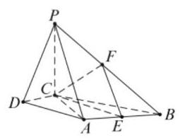

(3) 棱 ${PB}$ 上存在点 $F$ ,使得 ${PA}//$ 平面 ${CEF}$ . 证明如下: 取 ${PB}$ 中点 $F$ ,联结 ${EF},{CE},{CF}$ , 又因为 $E$ 是 ${AB}$ 中点,所以 ${EF}//{PA}$ ,

${PA} \text{ ⊄ }$ 平面 ${CEF}$ ,所以 ${PA}//$ 平面 ${CEF}$ .

18. (1) $\frac{{x}^{2}}{4} + {y}^{2} = 1, e = \frac{\sqrt{3}}{2}$ ;

(2)设 $P\left( {{x}_{0},{y}_{0}}\right) \left( {{x}_{0} < 0,{y}_{0} < 0}\right)$ ，

则 ${x}_{0}^{2} + 4{y}_{0}^{2} = 4$ . 又 $A\left( {2,0}\right) , B\left( {0,1}\right)$ ,

所以,直线 ${PA}$ 的方程为 $y = \frac{{y}_{0}}{{x}_{0} - 2}\left( {x - 2}\right)$ .

令 $x = 0$ ,得 ${y}_{M} =  - \frac{2{y}_{0}}{{x}_{0} - 2}$ ,

从而 $\left| {BM}\right|  = 1 - {y}_{M} = 1 + \frac{2{y}_{0}}{{x}_{0} - 2}$ .

直线 ${PB}$ 的方程为 $y = \frac{{y}_{0} - 1}{{x}_{0}}x + 1$ .

令 $y = 0$ ,得 ${x}_{N} =  - \frac{{x}_{0}}{{y}_{0} - 1}$ ,

从而 $\left| {AN}\right|  = 2 - {x}_{N} = 2 + \frac{{x}_{0}}{{y}_{0} - 1}$ .

所以四边形 ${ABNM}$ 的面积

$$
S = \frac{1}{2}\left| {AN}\right|  \cdot  \left| {BM}\right|
$$

$$
= \frac{1}{2}\left( {2 + \frac{{x}_{0}}{{y}_{0} - 1}}\right) \left( {1 + \frac{2{y}_{0}}{{x}_{0} - 2}}\right)
$$

$$
= \frac{{x}_{0}^{2} + 4{y}_{0}^{2} + 4{x}_{0}{y}_{0} - 4{x}_{0} - 8{y}_{0} + 4}{2\left( {{x}_{0}{y}_{0} - {x}_{0} - 2{y}_{0} + 2}\right) }
$$

$$
= \frac{2{x}_{0}{y}_{0} - 2{x}_{0} - 4{y}_{0} + 4}{{x}_{0}{y}_{0} - {x}_{0} - 2{y}_{0} + 2} = 2.
$$

所以四边形 ${ABNM}$ 的面积为定值.

# 高中数学知识点再现填漏补缺小题训练 16

## 一、填空题

1. 7 2. $\left( {-\frac{1}{2},\frac{\sqrt{3}}{2}}\right)$ 3. 2 4. ${y}^{2} =  - 4\left( {x - 4}\right)$

5. $- 1 \leq  m < 0$ 6. $\frac{3}{7}\;$ 7. $\sqrt{3}$ 或 0

8. $a <  - 1$ 9.210. $- \frac{1}{3}$ 11. $\frac{16}{3}$

12. ①③

## 二、选择题

13. B 14. C 15. A 16. B

## 三、解答题

17. (1) $\frac{8}{20} \times  {100} = {40}, C$ 班学生 40 人;

(2)在 $A$ 班中取到每个人的概率相同均为 $\frac{1}{5}$ ， 设 $A$ 班中取到第 $i$ 个人事件为 ${A}_{i}, i = 1,2,3$ ,

$4,5, C$ 班中取到第 $j$ 个人事件为 ${C}_{j}, j = 1,2$ , $3,4,5,6,7,8, A$ 班中取到 ${A}_{i} > {C}_{j}$ 的概率为 ${P}_{i}$ ,所求事件为 $D$ ,则

$$
P\left( D\right)  = \frac{1}{5}{P}_{1} + \frac{1}{5}{P}_{2} + \frac{1}{5}{P}_{3} + \frac{1}{5}{P}_{4} + \frac{1}{5}{P}_{5}
$$

$$
= \frac{1}{5} \times  \frac{2}{8} + \frac{1}{5} \times  \frac{3}{8} + \frac{1}{5} \times  \frac{3}{8} + \frac{1}{5} \times
$$

$$
\frac{3}{8} + \frac{1}{5} \times  \frac{4}{8}
$$

$$
= \frac{3}{8};
$$

(3) ${\mu }_{1} < {\mu }_{0}$ ，三组平均数分别为7,9,8.25，总均值 ${\mu }_{0} = {8.2}$ ,但 ${\mu }_{1}$ 中多加的三个数据7,9,8.25, 平均值为 8.08 , 比 ${\mu }_{0}$ 小,故拉低了平均值.

18.(1)由 $\left| {P{F}_{1}}\right|  - \left| {P{F}_{2}}\right|  = 2 < \left| {{F}_{1}{F}_{2}}\right|$ 知,

点 $P$ 的轨迹 $E$ 是以 ${F}_{1},{F}_{2}$ 为焦点的双曲线右支,由 $c = 2,{2a} = 2$ 得 ${b}^{2} = 3$ ,

故轨迹 $E$ 的方程为 ${x}^{2} - \frac{{y}^{2}}{3} = 1\left( {x \geq  1}\right)$ ;

(2)当直线 $l$ 的斜率存在时,设直线方程为

$y = k\left( {x - 2}\right) , P\left( {{x}_{1},{y}_{1}}\right) , Q\left( {{x}_{2},{y}_{2}}\right)$ 与双曲线方程联立消去 $y$ 得:

$$
\left( {{k}^{2} - 3}\right) {x}^{2} - 4{k}^{2}x + 4{k}^{2} + 3 = 0,
$$

$$
\left\{  \begin{array}{l} {k}^{2} - 3 \neq  0 \\  \Delta  > 0 \\  {x}_{1} + {x}_{2} = \frac{4{k}^{2}}{{k}^{2} - 3} > 0,\text{ 解得 }{k}^{2} > 3, \\  {x}_{1} \cdot  {x}_{2} = \frac{4{k}^{2} + 3}{{k}^{2} - 3} > 0 \end{array}\right.
$$

因为 $\overrightarrow{MP} \cdot  \overrightarrow{MQ} = \left( {{x}_{1} - m}\right) \left( {{x}_{2} - m}\right)  + {y}_{1}{y}_{2}$

$$
= \left( {{k}^{2} + 1}\right) {x}_{1}{x}_{2} - \left( {2{k}^{2} + m}\right)
$$

$\left( {{x}_{1} + {x}_{2}}\right)  + {m}^{2} + 4{k}^{2}$

$$
= \frac{3 - \left( {{4m} + 5}\right) {k}^{2}}{{k}^{2} - 3} + {m}^{2},
$$

由 ${MP} \bot  {MQ}$ ,得 $\overrightarrow{MP} \cdot  \overrightarrow{MQ} = 0$ ,

故得 $3\left( {1 - {m}^{2}}\right)  + {k}^{2}\left( {{m}^{2} - {4m} - 5}\right)  = 0$

对任意的 ${k}^{2} > 3$ 恒成立,

所以 $\left\{  \begin{array}{l} 1 - {m}^{2} = 0 \\  {m}^{2} - {4m} - 5 = 0 \end{array}\right.$ ,解得 $m =  - 1$ ,

所以当 $m =  - 1$ 时, ${MP} \bot  {MQ}$ ,

当直线 $l$ 的斜率不存在时,

由 $P\left( {2,3}\right) , Q\left( {2, - 3}\right)$ 及 $M\left( {-1,0}\right)$ 知结论也成立,综上,当 $m =  - 1$ 时, ${MP} \bot  {MQ}$ .

## 高中数学知识点再现填漏补缺小题训练 17

## 一、填空题

1. $\{ x \mid  x <  - 2\} \;$ 2. $\frac{4}{3}\;$ 3.104. 840

5. $\left\lbrack  {-\sqrt{2}, - 1}\right)  \cup  \left( {1,\sqrt{2}}\right\rbrack$ 6.-0.9

7. $\left( {-\frac{\sqrt{3}}{3},\frac{\sqrt{3}}{3}}\right)$ 8.249. $\frac{4\pi }{3}$

10. (1)(2)(3) 11.312. $\frac{1}{2}$

## 二、选择题

13. D 14. A 15. B 16. C

## 三、解答题

17.(1)由题意:当 $0 \leq  x \leq  {20}$ 时， $v\left( x\right)  = {60}$ ；

当 ${20} \leq  x \leq  {200}$ 时，设 $v\left( x\right)  = {ax} + b$ ，

显然 $v\left( x\right)  = {ax} + b$ 在 $\left\lbrack  {{20},{200}}\right\rbrack$ 是严格减函数,

由已知得 $\left\{  \begin{array}{l} {200a} + b = 0 \\  {20a} + b = {60} \end{array}\right.$ ,解得 $\left\{  \begin{array}{l} a =  - \frac{1}{3} \\  b = \frac{200}{3} \end{array}\right.$ ,

故函数 $v\left( x\right)$ 的表达式为

$v\left( x\right)  = \left\{  \begin{array}{l} {60}\;0 \leq  x < {20} \\  \frac{1}{3}\left( {{200} - x}\right) \;{20} \leq  x \leq  {200} \end{array}\right.$ ;

(2)依题意并由(1)可得

$$
f\left( x\right)  = \left\{  \begin{array}{l} {60x}\;0 \leq  x < {20} \\  \frac{1}{3}\left( {{200} - x}\right) x\;{20} \leq  x \leq  {200} \end{array}\right. \text{ , }
$$

当 $0 \leq  x \leq  {20}$ 时, $f\left( x\right)$ 为严格增函数,

故当 $x = {20}$ 时,其最大值为 1200 ;

当 ${20} \leq  x \leq  {200}$ 时,

$f\left( x\right)  = \frac{1}{3}\left( {{200} - x}\right) x \leq  \frac{1}{3}{\left\lbrack  \frac{x + \left( {{200} - x}\right) }{2}\right\rbrack  }^{2} \; = \frac{10000}{3}$ ,

当且仅当 $x = {200} - x$ ,即 $x = {100}$ 时,等号成立. 所以,当 $x = {100}$ 时,

$f\left( x\right)$ 在区间 $\left\lbrack  {{20},{200}}\right\rbrack$ 上取得最大值 $\frac{10000}{3}$ .

综上,当 $x = {100}$ 时, $f\left( x\right)$ 在区间 $0 \leq  x \leq  {200}$ 上取得最大值 $\frac{10000}{3} \approx  {3333}$ ,即当车流密度为 100 辆/千米时, 车流量可以达到最大, 最大值约为 3333 辆/小时.

18.(1)在长方体 ${ABCD} - {A}_{1}{B}_{1}{C}_{1}{D}_{1}$ 中， 因为 ${A}_{1}{B}_{1} \bot$ 面 ${A}_{1}{D}_{1}{DA}$ ,所以 ${A}_{1}{B}_{1} \bot  A{D}_{1}$ . 在矩形 ${A}_{1}{D}_{1}{DA}$ 中,因为 $A{A}_{1} = {AD} = 2$ , 所以 $A{D}_{1} \bot  {A}_{1}D$ . 所以 $A{D}_{1} \bot$ 面 ${A}_{1}{B}_{1}D$ ;

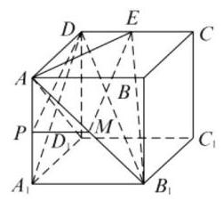

(2) ${90}^{ \circ  }$ ；

(3)当点 $P$ 是棱 $A{A}_{1}$ 的中点时,

有 ${DP}//$ 平面 ${B}_{1}{AE}$ . 理由如下:

在 $A{B}_{1}$ 上取中点 $M$ ,连接 ${PM},{ME}$ .

因为 $P$ 是棱 $A{A}_{1}$ 的中点, $M$ 是 $A{B}_{1}$ 的中点,

所以 ${PM}//{A}_{1}{B}_{1}$ ,且 ${PM} = \frac{1}{2}{A}_{1}{B}_{1}$ .

又 ${DE}//{A}_{1}{B}_{1}$ ,且 ${DE} = \frac{1}{2}{A}_{1}{B}_{1}$ .

所以 ${PM}//{DE}$ ,且 ${PM} = {DE}$ ,

所以四边形 ${PMED}$ 是平行四边形,

所以 ${DP}//{ME}$ . 又 ${DP} \subsetneqq$ 面 ${B}_{1}{AE}$ ,

${ME} \subsetneqq$ 面 ${B}_{1}{AE}$ ,所以 ${DP}//$ 平面 ${B}_{1}{AE}$ .

此时, ${AP} = \frac{1}{2}{A}_{1}A = 1$ .

(也可用向量求解)

## 高中数学知识点再现填漏补缺小题训练 18

## 一、填空题

1. $\left( {\frac{1}{2}, + \infty }\right) \;{2.2}\;{3.\varphi }$

4. $\theta  = {2k\pi } + \frac{\pi }{4}\left( {k \in  \mathbf{Z}}\right) \;$ 5. $(0,1\rbrack$

6. $\frac{2\sqrt{39}}{3}\;$ 7. $- {10.5}\;$ 8.109. $\frac{2\sqrt{5}}{5}$

10. 0.6 11. $\frac{1}{2}$ 12. 0

## 二、选择题

13. D 14. A 15. B 16. D

## 三、解答题

17. (1) 当 $x = \frac{\pi }{6}$ 时,设向量 $\overrightarrow{a}\text{ 、 }\overrightarrow{c}$ 的夹角为 $\theta$ ,

则 $\cos \theta  = \frac{\overrightarrow{a} \cdot  \overrightarrow{c}}{\left| \overrightarrow{a}\right|  \cdot  \left| \overrightarrow{c}\right| } =$

$\frac{-\cos x}{\sqrt{{\cos }^{2}x + {\sin }^{2}x} \times  \sqrt{{\left( -1\right) }^{2} + {0}^{2}}} =  - \cos x =$

$- \frac{\sqrt{3}}{2}$ ,因为 $0 \leq  \theta  \leq  \pi$ ,所以 $\theta  = \frac{5\pi }{6}$ ;

(2) $f\left( x\right)  = 2\overrightarrow{a} \cdot  \overrightarrow{b} + 1 \; = 2\left( {-{\cos }^{2}x + \sin x\cos x}\right)  + 1 \; = 2\sin x\cos x - \left( {2{\cos }^{2}x - 1}\right) \; = \sin {2x} - \cos {2x} \; = \sqrt{2}\sin \left( {{2x} - \frac{\pi }{4}}\right)$

因为 $x \in  \left\lbrack  {\frac{\pi }{2},\frac{9\pi }{8}}\right\rbrack$ ,所以 ${2x} - \frac{\pi }{4} \in  \left\lbrack  {\frac{3\pi }{4},{2\pi }}\right\rbrack$ ,

故 $\sin \left( {{2x} - \frac{\pi }{4}}\right)  \in  \left\lbrack  {-1,\frac{\sqrt{2}}{2}}\right\rbrack$ ,

当 ${2x} - \frac{\pi }{4} = \frac{3\pi }{4}$ ,即 $x = \frac{\pi }{2}$ 时, $f{\left( x\right) }_{\max } = 1$ .

18. 记“甲理论考核合格”为事件 ${A}_{1}$ ; “乙理论考核合格”为事件 ${A}_{2}$ ; “丙理论考核合格”为事件

${A}_{3}$ ; 记 $\overline{{A}_{i}}$ 为 ${A}_{i}$ 的对立事件, $i = 1,2,3$ ;

记“甲实验考核合格”为事件 ${B}_{1}$ ;

“乙实验考核合格”为事件 ${B}_{2}$ ;

“丙实验考核合格”为事件 ${B}_{3}$ ;

(1)记“理论考核中至少有两人合格”为事件 $C$ ， 记 $\bar{C}$ 为 $C$ 的对立事件.

解法 1:

$$
P\left( C\right)  = P\left( {{A}_{1}{A}_{2}\overline{{A}_{3}} + {A}_{1}\overline{{A}_{2}}{A}_{3} + \overline{{A}_{1}}{A}_{2}{A}_{3} + }\right.
$$

$$
\left. {{A}_{1}{A}_{2}{A}_{3}}\right)
$$

$$
= P\left( {{A}_{1}{A}_{2}\overline{{A}_{3}}}\right)  + P\left( {{A}_{1}\overline{{A}_{2}}{A}_{3}}\right)  +
$$

$$
P\left( {\overline{{A}_{1}}{A}_{2}{A}_{3}}\right)  + P\left( {{A}_{1}{A}_{2}{A}_{3}}\right)
$$

$$
= {0.9} \times  {0.8} \times  {0.3} + {0.9} \times  {0.2} \times  {0.7} +
$$

$$
{0.1} \times  {0.8} \times  {0.7} + {0.9} \times  {0.8} \times  {0.7}
$$

$$
= {0.902}
$$

解法 2:

$$
P\left( C\right)  = 1 - P\left( \bar{C}\right)  = 1 - P\left( {\overline{{A}_{1}}\overline{{A}_{2}}\overline{{A}_{3}} + {A}_{1}\overline{{A}_{2}}\overline{{A}_{3}}}\right.
$$

$$
\left. {+\overline{{A}_{1}}{A}_{2}\overline{{A}_{3}} + \overline{{A}_{1}}\overline{{A}_{2}}{A}_{3}}\right)
$$

$$
= 1 - \left\lbrack  {P\left( {\overline{{A}_{1}}\overline{{A}_{2}}\overline{{A}_{3}}}\right)  + P\left( {{A}_{1}\overline{{A}_{2}}\overline{{A}_{3}}}\right)  + }\right.
$$

$$
\left. {P\left( {\overline{{A}_{1}}{A}_{2}\overline{{A}_{3}}}\right)  + P\left( {\overline{{A}_{1}}\overline{{A}_{2}}{A}_{3}}\right) }\right\rbrack
$$

$$
= 1 - \left( {{0.1} \times  {0.2} \times  {0.3} + {0.9} \times  {0.2} \times  {0.3} + }\right)
$$

$$
{0.1} \times  {0.8} \times  {0.3} + {0.1} \times  {0.2} \times  {0.7})
$$

$$
= 1 - {0.098} = {0.902}
$$

所以,理论考核中至少有两人合格的概率为 0.902 ; (2)记“三人该课程考核都合格”为事件 $D$

$$
P\left( D\right)  = P\left\lbrack  {\left( {{A}_{1} \cdot  {B}_{1}}\right)  \cdot  \left( {{A}_{2} \cdot  {B}_{2}}\right)  \cdot  \left( {{A}_{3} \cdot  {B}_{3}}\right) }\right\rbrack
$$

$$
= P\left( {{A}_{1} \cdot  {B}_{1}}\right)  \cdot  P\left( {{A}_{2} \cdot  {B}_{2}}\right)  \cdot  P\left( {{A}_{3} \cdot  {B}_{3}}\right)
$$

$$
= P\left( {A}_{1}\right)  \cdot  P\left( {B}_{1}\right)  \cdot  P\left( {A}_{2}\right)  \cdot  P\left( {B}_{2}\right)  \cdot
$$

$$
P\left( {A}_{3}\right)  \cdot  P\left( {B}_{3}\right)
$$

$$
= {0.9} \times  {0.8} \times  {0.8} \times  {0.8} \times  {0.7} \times  {0.9}
$$

$$
= {0.254016}
$$

$$
\approx  {0.254}
$$

所以, 这三人该课程考核都合格的概率为 0.254 .

## 一、填空题

1. [1,2) 2.53. -35 4. 22 5. $- \frac{3}{2}$

6. $a = \frac{4}{3}\;7. - \frac{11}{10}\;\mathbf{8}.\frac{4}{5}\;\mathbf{9}.4$

10. $\left\lbrack  {-6, + \infty }\right)$ 11. $\left\lbrack  {0,\frac{3}{2}}\right\rbrack$

12. $\left\lbrack  {-\frac{47}{16},2}\right\rbrack$

## 二、选择题

13. A 14. C 15. A 16. C

## 三、解答题

17. ( 1 )如图，设矩形的另一边长为 $a$ ，

则有 ${ax} = {360}$ ,即 $a = \frac{360}{x}$ .

因此 $y = {45x} + {180}\left( {x - 2}\right)  + {180} \times  {2a} + {2360}$

$= {225x} + {360a} + {2000}$ ,

即 $y = {225x} + \frac{{360} \times  {360}}{x} + {2000}\left( {x > 2}\right)$ ;

(2) ${225x} + \frac{{360} \times  {360}}{x} \geq  2\sqrt{{225x} \cdot  \frac{{360} \times  {360}}{x}}$

$= {10800}$ ,

等号当且仅当 ${225x} = \frac{{360} \times  {360}}{x}$ ,即 $x = {24}$ 时等号成立,此时 $y$ 取最小值 12800 . 因此,当利用旧墙长度为 24 米时,修建围墙总费用 (含修建进出口的费用)最少，最少总费用为12800元.

18.(1)因点 $P\left( {2,1}\right)$ 在该椭圆上，

故 ${4m} + n = 1$ ①. 由 $\left\{  \begin{array}{l} y =  - x + 3, \\  m{x}^{2} + n{y}^{2} = 1 \end{array}\right.$

得 $\left( {m + n}\right) {x}^{2} - {6nx} + \left( {{9n} - 1}\right)  = 0$ ,

故 $\Delta  = {36}{n}^{2} - 4\left( {m + n}\right) \left( {{9n} - 1}\right)  = 0$

即 $m + n = {9mn}$ ②. 由 ①②,得 $m = \frac{1}{6}, n = \frac{1}{3}$ .

所以椭圆 $C$ 的标准方程为 $\frac{{x}^{2}}{6} + \frac{{y}^{2}}{3} = 1$ ;

(2)设点 $A\left( {{x}_{1},{y}_{1}}\right) , B\left( {{x}_{2},{y}_{2}}\right)$ ，

由 $\left\{  \begin{array}{l} y =  - x + b, \\  \frac{{x}^{2}}{6} + \frac{{y}^{2}}{3} = 1 \end{array}\right.$ ,得 $3{x}^{2} - {4bx} + 2\left( {{b}^{2} - 3}\right)  = 0$ ,

故 ${x}_{1} + {x}_{2} = \frac{4b}{3},{x}_{1}{x}_{2} = \frac{2}{3}\left( {{b}^{2} - 3}\right)$ .

由 ${PA} \bot  {PB}$ ,得 $\overline{PA} \cdot  \overline{PB} = 0$ ,

即 $\left( {{x}_{1} - 2}\right) \left( {{x}_{2} - 2}\right)  + \left( {{y}_{1} - 1}\right) \left( {{y}_{2} - 1}\right)  = 0$ ,

又 ${y}_{i} =  - {x}_{i} + b\left( {i = 1,2}\right)$ ,

即 $2{x}_{1}{x}_{2} - \left( {b + 1}\right) \left( {{x}_{1} + {x}_{2}}\right)  + {b}^{2} - {2b} + 5 = 0$ ,

$2 \cdot  \frac{2}{3}\left( {{b}^{2} - 3}\right)  - \left( {b + 1}\right)  \cdot  \frac{4b}{3} + {b}^{2} + 5 = 0,$

即 $3{b}^{2} - {10b} + 3 = 0$ ,解得 $b = \frac{1}{3}$ 或 3,

又 $b \in  \left( {-3,3}\right)$ ,故 $b = \frac{1}{3}$ .

## 高中数学知识点再现填漏补缺小题训练 20

## 一、填空题

1. $\{ 0,2\}$ 2.13. $\left( {0,\frac{\pi }{6}}\right)  \cup  \left\lbrack  {\frac{3\pi }{4},\pi }\right)$

4. $1 - \frac{3}{2}\mathrm{i}\;$ 5. $\frac{{x}^{2}}{4} + \frac{{y}^{2}}{3} = 1\;$ 6. 200 7. 2

8. $3\;9.\sqrt{5}\;{10}. - \sqrt{2}\;{11}.\left\lbrack  {0,2}\right\rbrack$

12. $\frac{2}{3}\sqrt{2}$

## 二、选择题

13. C 14. C 15. C 16. D

## 三、解答题

17. (1) 由题意，当 $v = {120}$ 时，所以

$$
\frac{1}{5}\left( {v - k + \frac{4500}{v}}\right)  = \frac{1}{5}\left( {{120} - k + \frac{4500}{120}}\right)
$$

$= {11.5}$ ,

即 $k = {100}$ ,欲使这种型号的汽车每小时的油耗

不超过 9 升,即 $\frac{1}{5}\left( {v - {100} + \frac{4500}{v}}\right)  \leq  9$ ,

解得 $v + \frac{4500}{v} \leq  {145}$ ,即 ${v}^{2} - {145v} + {4500} \leq  0$ ,

即 ${45} \leq  v \leq  {100}$ ,又 ${60} \leq  v \leq  {120}$ ,

所以 ${60} \leq  v \leq  {100}$ ;

(2)设某种型号汽车行驶 100 千米的油耗为 $y$ ，

则 $y = \frac{100}{v} \times  \frac{1}{5}\left( {v - k + \frac{4500}{v}}\right)$

$= {20} - \frac{20k}{v} + \frac{90000}{{v}^{2}}\left( {{60} \leq  v \leq  {120}}\right) ,$

$y = {90000}{\left( \frac{1}{v} - \frac{k}{9000}\right) }^{2} + {20} - \frac{{k}^{2}}{900},$

又 $\frac{1}{120} \leq  \frac{1}{v} \leq  \frac{1}{60}$ ,因为 ${60} \leq  k \leq  {120}$ ,

所以 ${60} \leq  k \leq  {120}$ 即 $\frac{1}{150} \leq  \frac{k}{9000} \leq  \frac{1}{90}$

① 若 $\frac{1}{120} \leq  \frac{k}{9000} \leq  \frac{1}{90}$ ，即 ${75} \leq  k \leq  {120}$ ，

则当 $\frac{1}{v} = \frac{k}{9000}$ ,即 $v = \frac{9000}{k}$ 时, ${y}_{\min } = {20} - \frac{{k}^{2}}{900}$ ;

② 若 $\frac{1}{150} \leq  \frac{k}{9000} < \frac{1}{120}$ ，即 ${60} \leq  k < {75}$ ，

则当 $\frac{1}{v} = \frac{1}{120}$ ，即 $v = {120}$ 时， ${y}_{\min } = \frac{105}{4} - \frac{k}{6}$ .

18.(1)因为 ${AB}//l$ ，且 ${AB}$ 边通过点 $\left( {0,0}\right)$ ，

所以 ${AB}$ 所在直线的方程为 $y = x$ .

设 $A, B$ 两点坐标分别为 $\left( {{x}_{1},{y}_{1}}\right) ,\left( {{x}_{2},{y}_{2}}\right)$ .

由 $\left\{  \begin{array}{l} {x}^{2} + 3{y}^{2} = 4, \\  y = x \end{array}\right.$ 得 $x =  \pm  1$ .

所以 $\left| {AB}\right|  = \sqrt{2}\left| {{x}_{1} - {x}_{2}}\right|  = 2\sqrt{2}$ .

又因为 ${AB}$ 边上的高 $h$ 等于原点到直线 $l$ 的距离.

所以 $h = \sqrt{2},{S}_{\bigtriangleup {ABC}} = \frac{1}{2}\left| {AB}\right|  \cdot  h = 2$ ;

(2) 设 ${AB}$ 所在直线的方程为 $y = x + m$ ,

由 $\left\{  \begin{array}{l} {x}^{2} + 3{y}^{2} = 4, \\  y = x + m \end{array}\right.$ 得 $4{x}^{2} + {6mx} + 3{m}^{2} - 4 = 0$ .

因为 $A, B$ 在椭圆上,

所以 $\Delta  =  - {12}{m}^{2} + {64} > 0$ .

设 $A, B$ 两点坐标分别为 $\left( {{x}_{1},{y}_{1}}\right) ,\left( {{x}_{2},{y}_{2}}\right)$ ,

则 ${x}_{1} + {x}_{2} =  - \frac{3m}{2},{x}_{1}{x}_{2} = \frac{3{m}^{2} - 4}{4}$ ,

所以 $\left| {AB}\right|  = \sqrt{2}\left| {{x}_{1} - {x}_{2}}\right|  = \frac{\sqrt{{32} - 6{m}^{2}}}{2}$ .

又因为 ${BC}$ 的长等于点 $\left( {0, m}\right)$ 到直线 $l$ 的距离,

即 $\left| {BC}\right|  = \frac{\left| 2 - m\right| }{\sqrt{2}}$ .

所以 ${\left| AC\right| }^{2} = {\left| AB\right| }^{2} + {\left| BC\right| }^{2}$

$=  - {m}^{2} - {2m} + {10}$

$=  - {\left( m + 1\right) }^{2} + {11}$ .

所以当 $m =  - 1$ 时, ${AC}$ 边最长,

(这时 $\Delta  =  - {12} + {64} > 0$ )

此时 ${AB}$ 所在直线的方程为 $y = x - 1$ .

## 第四篇 高考数学模拟试卷

## 上海高考数学模拟试卷一

## 一、填空题

1. $2 + \mathrm{i}$ 2. ${2.3}.\frac{1}{2}$ 4. ${36\pi }$ 5. -1

6. $\frac{7\sqrt{10}}{20}\;$ 7. $- {31}\;$ 8. $b = {18}\sqrt{3}\;$ 9. ②④

10. $0 \leq  a \leq  1$ 11. $\left( {\frac{1}{3},1}\right)$ 12. $\frac{1}{2}$

## 二、选择题

13. C 14. B 15. B 16. D

## 三、解答题

17. ( 1 )方法 1: 取 ${BC}$ 中点 $P$ ，联结 ${PN}$ ， $P{B}_{1}$ ， 因为 $M, N$ 分别为 ${A}_{1}{B}_{1},{AC}$ 的中点,

所以 ${NP}//{AB}$ 且 ${NP} = \frac{1}{2}{AB}$ ,

${B}_{1}M//{AB}$ 且 ${B}_{1}M = \frac{1}{2}{AB},$

所以 ${NP}//{B}_{1}M$ 且 ${NP} = {B}_{1}M$ ,

所以四边形 ${PNM}{B}_{1}$ 是平行四边形,

所以 ${MN}//P{B}_{1}$ ,又 $P{B}_{1} \subset$ 平面 ${BC}{C}_{1}{B}_{1}$ ,

${MN}$ 不在平面 ${BC}{C}_{1}{B}_{1}$ 上,

所以 ${MN}//$ 平面 ${BC}{C}_{1}{B}_{1}$ ;

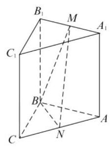

方法 2: 取 ${AB}$ 中点 $Q$ ,联结 ${MQ},{NQ}$ ,

因为 $M, N$ 分别为 ${A}_{1}{B}_{1},{AC}$ 的中点,

所以 ${NQ}//$ 平面 ${BC}{C}_{1}{B}_{1}$ ,

${MQ}//$ 平面 ${BC}{C}_{1}{B}_{1}$ ,又 ${MQ} \cap  {NQ} = Q$ ,

所以平面 ${MNQ}//$ 平面 ${BC}{C}_{1}{B}_{1}$ ,

而 ${MN} \subset$ 平面 ${BC}{C}_{1}{B}_{1}$ ,

所以 ${MN}//$ 平面 ${BC}{C}_{1}{B}_{1}$ ;

(2)由(1)知 ${AB}\bot {P{B}_{1}},{AB}\bot {B{B}_{1}}$ ，

$B{B}_{1} \cap  P{B}_{1} = {B}_{1}$ ,所以 ${AB} \bot$ 平面 ${BC}{C}_{1}{B}_{1}$ , 所以 ${AB}\underline{ \bot  }{BC}$ ，又 ${AC}//{A}_{1}{C}_{1}$ ，

所以 $\angle {MNA}$ 是异面直线 ${MN}$ 与 ${A}_{1}{C}_{1}$ 所成的

角(或其补角),联结 ${MA}$ ,在 $\bigtriangleup {MNA}$ 中,

${AM} = \sqrt{M{A}_{1}^{2} + A{A}_{1}^{2}} = \sqrt{{2}^{2} + {4}^{2}} = 2\sqrt{5},$

${MN} = {BP} = 2\sqrt{5},{AN} = 2\sqrt{2},$

所以 $\cos \angle {MNA} = \frac{M{N}^{2} + N{A}^{2} - M{A}^{2}}{2 \cdot  {MN} \cdot  {NA}}$

$$
= \frac{{20} + 8 - {20}}{2 \cdot  2\sqrt{5} \cdot  2\sqrt{2}}
$$

$$
= \frac{1}{\sqrt{5} \cdot  \sqrt{2}}
$$

$$
= \frac{\sqrt{10}}{10}\text{ . }
$$

18.(1)依题意 $T = \frac{2\pi }{\omega } = {12},\omega  = \frac{\pi }{6}, y = 4\sin \frac{\pi }{6}x$ ， 当 $x = 4$ 时, $y = 4\sin \frac{4\pi }{6} = 2\sqrt{3}$ ,所以 $M\left( {4,2\sqrt{3}}\right)$ , 又 $p\left( {{10},0}\right) ,{MP} = \sqrt{{6}^{2} + {\left( 2\sqrt{3}\right) }^{2}} = 4\sqrt{3}\left( \mathrm{\;{km}}\right)$ ;

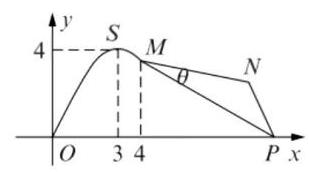

(2)在 $\bigtriangleup  {MNP}$ 中， ${\angle {MNP}} = {120}^{ \circ  }$ ， ${MP} = {4\sqrt{3}}$ ，

设 $\angle {PMN} = \theta \left( {{0}^{ \circ  } < \theta  < {60}^{ \circ  }}\right)$ ，

由正弦定理得 $\frac{MP}{\sin {120}^{ \circ  }} = \frac{NP}{\sin \theta } = \frac{MN}{\sin \left( {{60}^{ \circ  } - \theta }\right) }$ , ${NP} = 8\sin \theta ,{MN} = 8\sin \left( {{60}^{ \circ  } - \theta }\right) ,$

故 ${NP} + {MN} = 8\sin \theta  + 8\sin \left( {{60}^{ \circ  } - \theta }\right) \; = 8\left\lbrack  {\sin \theta  + \sin \left( {{60}^{ \circ  } - \theta }\right) }\right\rbrack \; = 8\left\lbrack  {\frac{1}{2}\sin \theta  + \frac{\sqrt{3}}{2}\cos \theta }\right\rbrack \; = 8\sin \left( {\theta  + {60}^{ \circ  }}\right)$ ,

因为 ${0}^{ \circ  } < \theta  < {60}^{ \circ  }$ ,所以当 $\theta  = {30}^{ \circ  }$ 时,

折线段赛道 ${MNP}$ 最长,

其最大值为 $8\mathrm{\;{km}}$ .

19.(1)由已知点 $F$ 的坐标为 $\left( {-2,0}\right)$ ，

点 $A$ 的坐标为 $\left( {0, - 2}\right)$ ，因为 $l$ 与直线 ${AF}$ 垂直，

所以 $\overrightarrow{FA} = \left( {2, - 2}\right)$ 是 $l$ 的一个法向量，

所以 $l$ 的方程为 ${2x} - 2\left( {y + 3}\right)  = 0$ ,

即 $x - y - 3 = 0$ ;

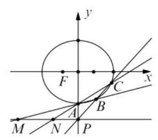

(2)由已知直线 $l$ 的方程为 $y = {kx} - 3$ ，

由 $\left\{  \begin{array}{l} y = {kx} - 3 \\  {x}^{2} + 2{y}^{2} = 8 \end{array}\right.$ 可得 ${x}^{2} + 2{\left( kx - 3\right) }^{2} = 8$ ,

即 $\left( {1 + 2{k}^{2}}\right) {x}^{2} - {12kx} + {10} = 0$ ,

设 $B\left( {{x}_{1},{y}_{1}}\right) , C\left( {{x}_{2},{y}_{2}}\right)$ ,

则 $\Delta  = {144}{k}^{2} - {40}\left( {1 + 2{k}^{2}}\right)  > 0$ ,

${k}^{2} > \frac{10}{16},\left| k\right|  > \frac{\sqrt{10}}{4},{x}_{1} + {x}_{2} = \frac{12k}{1 + 2{k}^{2}},$

${x}_{1}{x}_{2} = \frac{10}{1 + 2{k}^{2}}$ ,因为直线 ${BC}$ 的斜率存在,

故 ${x}_{1}{x}_{2} \neq  0$ ,故直线 ${AB} : y = \frac{{y}_{1} + 2}{{x}_{1}}x - 2$ ,

令 $y =  - 3$ ,则 ${x}_{M} =  - \frac{{x}_{1}}{{y}_{1} + 2}$ ,

同理 ${x}_{N} =  - \frac{{x}_{2}}{{y}_{2} + 2}$ . 又 ${x}_{1}{x}_{2} > 0$ ,

所以 ${x}_{M}{x}_{N} > 0$ ,

所以 $\left| {PM}\right|  + \left| {PN}\right|  = \left| {{x}_{M} + {x}_{N}}\right|$

$= \left| {\frac{{x}_{1}}{{y}_{1} + 2} + \frac{{x}_{2}}{{y}_{2} + 2}}\right|  = \left| {\frac{{x}_{1}}{k{x}_{1} - 1} + \frac{{x}_{2}}{k{x}_{2} - 1}}\right|$

$= \left| \frac{{2k}{x}_{1}{x}_{2} - \left( {{x}_{1} + {x}_{2}}\right) }{{k}^{2}{x}_{1}{x}_{2} - k\left( {{x}_{1} + {x}_{2}}\right)  + 1}\right|$

$= \left| \frac{\frac{20k}{1 + 2{k}^{2}} - \frac{12k}{1 + 2{k}^{2}}}{\frac{{10}{k}^{2}}{1 + 2{k}^{2}} - \frac{{12}{k}^{2}}{1 + 2{k}^{2}} + 1}\right|$

$= 8\left| k\right|$ ,

故 $8\left| k\right|  \leq  {16}$ ,即 $\left| k\right|  \leq  2$ ,

综上可得: $\frac{\sqrt{10}}{4} < \left| k\right|  \leq  2$ ,

即 $- 2 \leq  k <  - \frac{\sqrt{10}}{4}$ 或 $\frac{\sqrt{10}}{4} < k \leq  2$ .

20. (1) 由 ${3f}\left( x\right)  - f\left( {-x}\right)  - 2 = 0$ ,

得 $3 \cdot  {2}^{x} - \frac{1}{{2}^{x}} - 2 = 0$ ,

即 $3 \cdot  {\left( {2}^{x}\right) }^{2} - 2 \cdot  {2}^{x} - 1 = 0$ ,

所以 ${2}^{x} = 1$ 或 ${2}^{x} =  - \frac{1}{3}$ (舍去),

所以 $x = 0$ ,所以函数

$y = {3f}\left( x\right)  - f\left( {-x}\right)  - 2$ 的零点为 0 ;

( 2 )方法 1: $F\left( x\right)  = f\left( {2x}\right)  + {16f}\left( {-x}\right)  = {4}^{x} + \frac{a}{{2}^{x}}$ ,

设 ${x}_{1},{x}_{2} \in  \left( {1, + \infty }\right)$ 且 ${x}_{1} < {x}_{2}$ ,

${F}_{1}\left( x\right)  - {F}_{2}\left( x\right)$

$= \left( {{4}^{{x}_{1}} + \frac{a}{{2}^{{x}_{1}}}}\right)  - \left( {{4}^{{x}_{2}} + \frac{a}{{2}^{{x}_{2}}}}\right)$

$= \left( {{4}^{{x}_{1}} - {4}^{{x}_{2}}}\right)  + \frac{a\left( {{2}^{{x}_{2}} - {2}^{{x}_{1}}}\right) }{{2}^{{x}_{1}} \cdot  {2}^{{x}_{2}}}$

$= \left( {{2}^{{x}_{1}} - {2}^{{x}_{2}}}\right)  \cdot  \frac{{2}^{{x}_{1}} \cdot  {2}^{{x}_{2}} \cdot  \left( {{2}^{{x}_{1}} + {2}^{{x}_{2}}}\right)  - a}{{2}^{{x}_{1}} \cdot  {2}^{{x}_{2}}},$

又 ${x}_{1},{x}_{2} \in  \left( {1, + \infty }\right)$ 且 ${x}_{1} < {x}_{2}$ ,

所以 ${2}^{{x}_{2}} - {2}^{{x}_{1}} < 0,{2}^{{x}_{1}} \cdot  {2}^{{x}_{2}} > 0$ ,

$\left( {{2}^{{x}_{1}} + {2}^{{x}_{2}}}\right)  \cdot  {2}^{{x}_{1}} \cdot  {2}^{{x}_{2}} > {16},$

所以当 $a \leq  {16}$ 时,

$\frac{{2}^{{x}_{1}} \cdot  {2}^{{x}_{2}} \cdot  \left( {{2}^{{x}_{1}} + {2}^{{x}_{2}}}\right)  - a}{{2}^{{x}_{1}} \cdot  {2}^{{x}_{2}}} > 0,$

所以 ${F}_{1}\left( x\right)  - {F}_{2}\left( x\right)  < 0$ ,

即 ${F}_{1}\left( x\right)  < {F}_{2}\left( x\right)$ ,

所以函数 $F\left( x\right)  = f\left( {2x}\right)  + a \cdot  f\left( {-x}\right)$

是 $\left( {1, + \infty }\right)$ 上的严格增函数;

方法 2: $F\left( x\right)  = f\left( {2x}\right)  + {16f}\left( {-x}\right)  = {4}^{x} + \frac{a}{{2}^{x}}$ ,

${F}^{\prime }\left( x\right)  = {4}^{x}\ln 4 + \frac{-a \cdot  {2}^{x}\ln 2}{{\left( {2}^{x}\right) }^{2}}$

$= {4}^{x}\ln 4 - \frac{a \cdot  \ln 2}{{2}^{x}}$

$= \ln 2\left( {2 \cdot  {4}^{x} - \frac{a}{{2}^{x}}}\right) ,$

当 $x > 1$ 时, $2 \cdot  {4}^{x} > 8,{2}^{x} > 2$ ,

当 $a \leq  {16}$ 时, $\frac{a}{{2}^{x}} < 8$ ,

所以 $2 \cdot  {4}^{x} - \frac{a}{{2}^{x}} > 0$ ,又 $2\ln 2 > 0$ ,

所以 ${F}^{\prime }\left( x\right)  > 0$ 在 $\left( {1, + \infty }\right)$ 上恒成立,

所以函数 $F\left( x\right)  = f\left( {2x}\right)  + a \cdot  f\left( {-x}\right)$ 是

$\left( {1, + \infty }\right)$ 上的严格增函数;

(3) $g\left( x\right)  = \frac{1}{1 + a \cdot  f\left( x\right) } - \frac{1}{1 + a \cdot  f\left( {x - 1}\right) } \; = \frac{1}{1 + a \cdot  {2}^{x}} - \frac{1}{1 + a \cdot  {2}^{x - 1}} \; = \frac{-a \cdot  {2}^{x - 1}}{\left( {1 + a \cdot  {2}^{x}}\right) \left( {1 + a \cdot  {2}^{x - 1}}\right) },$

由 $g\left( x\right)  \geq  g\left( 0\right)$ ,得

$\frac{-a \cdot  {2}^{x - 1}}{\left( {1 + a \cdot  {2}^{x}}\right) \left( {1 + a \cdot  {2}^{x - 1}}\right) } \geq  \frac{-\frac{1}{2}a}{\left( {1 + a}\right) \left( {1 + \frac{1}{2}a}\right) },$

化简得 ${a}^{2} \cdot  {2}^{x - 1}\left( {{2}^{x} - 1}\right)  \geq  {2}^{x} - 1$ ,

因为 $x \in  ( - \infty ,0\rbrack$ ,当 $x = 0$ 时,结论成立;

当 $x < 0$ 时, ${a}^{2} \leq  \frac{1}{{2}^{x - 1}}$ ,而 $\frac{1}{{2}^{x - 1}} = {2}^{1 - x} > 2$ ,

所以 ${a}^{2} \leq  2,$ 又 $a > 0$ ,所以 $0 < a \leq  \sqrt{2}$ .

21. ( 1 )当 ${a}_{1} = {20}$ 时， $\left\{  {a}_{n}\right\}$ 的前十项依次为 20，10， 5,8,4,2,1,4,2,1,所以 ${S}_{10} = {20} + {10} + 5 + 8 + \; \left( {4 + 2 + 1}\right)  \times  2 = {57}$

(2)① 若 ${a}_{1}$ 是奇数，则 ${a}_{2} = {a}_{1} + 3$ 是偶数，

${a}_{3} = \frac{{a}_{2}}{2} = \frac{{a}_{1} + 3}{2}$ ,由 ${S}_{3} = {23}$ ,

得 ${a}_{1} + \left( {{a}_{1} + 3}\right)  + \frac{{a}_{1} + 3}{2} = {23}$ ,

解得 ${a}_{1} = \frac{37}{5}$ ,不合题意;

② 若 ${a}_{1}$ 是偶数,不妨设 ${a}_{1} = {2k}$ ( $k$ 是正整数),

则 ${a}_{2} = \frac{{a}_{1}}{2} = k$ . 如果 $k$ 是偶数,

则 ${a}_{3} = \frac{{a}_{2}}{2} = \frac{k}{2}$ ,由 ${S}_{3} = {23}$ ,

得 ${2k} + k + \frac{k}{2} = {23}$ ,此方程无整数解;

若 $k$ 是奇数,则 ${a}_{3} = k + 3$ ,由 ${S}_{3} = {23}$ ,

得 ${2k} + k + k + 3 = {23}$ ,即 $k = 5,{a}_{1} = {2k} = {10}$ .

综上可得: ${a}_{1} = {10}$ ;

(3)假设数列 $\left\{  {a}_{n}\right\}$ 中不存在项 ${a}_{i}$ ，

使得 ${a}_{i} \leq  6$ 成立,则对任意正整数 $i$ ,

都有 ${a}_{i} > 6$ ,当 ${a}_{i}$ 为奇数时,

有 ${a}_{i + 2} = \frac{{a}_{i} + 3}{2} < {a}_{i}$ ,当 ${a}_{i}$ 为偶数时,

有 ${a}_{i + 2} = \frac{{a}_{i}}{2} + 3 < {a}_{i}$ ,或 ${a}_{i + 2} = \frac{{a}_{i}}{4} < {a}_{i}$ ,

则 $\left\{  {a}_{{2n} - 1}\right\}$ 是严格减数列,又 ${a}_{n}$ 是正整数,

且 $\left\{  {a}_{n}\right\}$ 是无穷数列,所以数列 $\left\{  {a}_{{2n} - 1}\right\}$ 中必有负数项,

这是一个矛盾,所以 $\left\{  {a}_{n}\right\}$ 必定存在某项 ${a}_{i}$ ,

使得 ${a}_{i} \leq  6$ 成立. 当 ${a}_{i} = 2$ 时, ${a}_{i + 1} = 1$ ;

当 ${a}_{i} = 4$ 时, ${a}_{i + 1} = 2,{a}_{i + 2} = 1$ ;

当 ${a}_{i} = 5$ 时, ${a}_{i + 1} = 8,{a}_{i + 2} = 4,{a}_{i + 3} = 2,{a}_{i + 4} = 1$ ;

当 ${a}_{i} = 6$ 时, ${a}_{i + 1} = 3$ ,综上,1 或 3 是数列中的项.

## 上海高考数学模拟试卷二

## 一、填空题

1. $\sqrt{5}\;$ 2. $\frac{5}{3}\;$ 3. $\pi \;$ 4. $- 2\;$ 5.66.-2

$\begin{array}{llllll} {7.96\pi } & {8.1} & {9.4} & {10.2} & {11}.\left\lbrack  {4,{20}}\right\rbrack  & {12.33} \end{array}$

## 二、选择题

13. C 14. A 15. B 16. D

## 三、解答题

17. (1) 由已知函数 $f\left( x\right)$ 的定义域为 $D = \mathbf{R}$ ,

当 $a = 1$ 时,

$$
f\left( {-x}\right)  = \left| {-x + 1}\right|  - \left| {-x - 1}\right|
$$

$= \left| {-\left( {x - 1}\right) }\right|  - \left| {-\left( {x + 1}\right) }\right| \; = \left| {x - 1}\right|  - \left| {x + 1}\right| \; =  - f\left( x\right)$ ,

所以 $f\left( x\right)$ 为奇函数;

(2)当 $x \in  \left( {0,1}\right)$ 时,

$f\left( x\right)  > x$ 可以化为 $x + 1 - \left| {{ax} - 1}\right|  > x$ ,

即 $\left| {{ax} - 1}\right|  < 1, - 1 < {ax} - 1 < 1,0 < {ax} < 2$ ,

当 $a \leq  0$ 时,不等式不成立;

当 $a > 0$ 时, $0 < x < \frac{2}{a}$ ,所以 $\frac{2}{a} \geq  1$ ,

所以 $0 < a \leq  2$ .

18.(1)证明:取 ${AB}$ 的中点 $M$ ，连结 ${DM}$ ， $M{B}_{1}$ (如图)

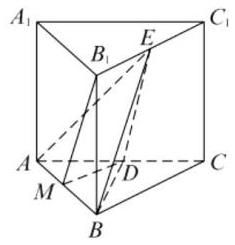

因为 ${AD} = {DC},{AM} = {MB}$ ,所以 ${DM}//{BC}$ ,

${DM} = \frac{1}{2}{BC}$ ，由棱柱的性质知 ${BC}//{B}_{1}{C}_{1}$ ，

${BC} = {B}_{1}{C}_{1}$ ,又 ${B}_{1}E = E{C}_{1},{DM}//{B}_{1}E$ ,

${DM} = {B}_{1}E$ ，所以四边形 ${DM}{B}_{1}E$ 为平行四边形，

所以 ${DE}//{M{B}_{1}}$ ，因为 $M{B}_{1} \subset$ 平面 ${AB}{B}_{1}{A}_{1}$ ，

${DE} \text{ ⊄ }$ 平面 ${AB}{B}_{1}{A}_{1}$ ,所以 ${DE}//$ 平面 ${AB}{B}_{1}{A}_{1}$ ;

(2)设点 $D$ 到平面 ${ABE}$ 的距离为 $d$ ，

因为 $D$ 是 ${AC}$ 的中点,且 ${AB} \bot  {BC},{AB} = {BC} = 2$ ,

所以 ${S}_{\bigtriangleup {ABD}} = \frac{1}{2}{S}_{\bigtriangleup {ABC}} = \frac{1}{2} \times  \frac{1}{2} \times  2 \times  2 = 1$ ,

由 $E \in$ 平面 ${A}_{1}{B}_{1}{C}_{1}$ 及直棱柱的性质知,

$E$ 到平面 ${ABD}$ 的距离为 $A{A}_{1} = 2$ ,

所以 ${V}_{E - {ABD}} = \frac{1}{3}{S}_{\bigtriangleup {ABD}} \times  2 = \frac{2}{3}$ ,

由直棱柱的性质知: $B{B}_{1} \bot  {B}_{1}E, B{B}_{1} \bot  {AB}$ ,

又 ${AB} \bot  {BC}$ ,且 ${BC} \cap  B{B}_{1} = B,{AB} \bot$ 平面

${B}_{1}{BC}{C}_{1}$ ,又 ${BE} \subset$ 平面 ${B}_{1}{BC}{C}_{1}$ 故 ${AB} \bot  {BE}$ ,

所以 ${S}_{\bigtriangleup {ABE}} = \frac{1}{2} \times  {AB} \times  {BE}$

$= \frac{1}{2} \times  2 \times  \sqrt{B{B}_{1}^{2} + {B}_{1}{E}^{2}}$

$= \sqrt{{2}^{2} + {1}^{2}} = \sqrt{5}$ ,

因为 ${V}_{E - {ABD}} = {V}_{D - {ABE}} = \frac{1}{3}d{S}_{\bigtriangleup {ABE}}$ ，

所以 $d = \frac{3{V}_{E - {ABD}}}{{S}_{\bigtriangleup {ABE}}} = \frac{2}{\sqrt{5}} = \frac{2\sqrt{5}}{5}$ . (也可用空间向量求解)

19. (1) 设 ${PO}$ 交 ${CD}$ 于 $H,{BC} = {40}\sin \theta  + {10}$ , ${AB} = 2 \times  {40}\cos \theta  = {80}\cos \theta ,{PH} = {40} - {40}\sin \theta$ , ${S}_{\text{ 矩形 }{ABCD}} = {AB} \times  {BC} = \left( {{40}\sin \theta  + {10}}\right)  \times  {80}\cos \theta , \; {PH} = {40} - {40}\sin \theta ,$

${S}_{\bigtriangleup {CDP}} = \frac{1}{2} \times  {AB} \times  {PH} \; = \frac{1}{2} \times  {80}\cos \theta  \times  \left( {{40} - {40}\sin \theta }\right) \; = {1600}\cos \theta  - {1600}\sin \theta \cos \theta$ ,

因为 $A, B$ 均在线段 ${MN}$ 上,

所以 ${10} \leq  {40}\sin \theta  < {40}$ ,即 $\frac{1}{4} \leq  \sin \theta  < 1$ ;

(2)设甲种蔬菜单位面积的年产值为 ${4k}$ ( $k > 0$ )， 则乙种蔬菜单位面积的年产值为 ${3k}$ ，

年总产值为 $y$ ,则 $y = {4k} \cdot  {S}_{\text{ 矩形ABCD }} + {3k}$ . ${S}_{\bigtriangleup {CDP}} = {8000k}\left( {\sin \theta \cos \theta  + \cos \theta }\right) ,$

设 $f\left( \theta \right)  = \sin \theta \cos \theta  + \cos \theta$ ,

${f}^{\prime }\left( \theta \right)  = {\cos }^{2}\theta  - {\sin }^{2}\theta  - \sin \theta  =  - 2{\sin }^{2}\theta  - \sin \theta  + 1,$ 令 ${f}^{\prime }\left( \theta \right)  = 0$ ,解得 $\sin \theta  =  - 1$ 或 $\frac{1}{2}$ ,

根据( 1 )舍去 -1 ，记 $\sin {\theta }_{0} = \frac{1}{4}$ ， ${\theta }_{0} \in  \left( {0\text{ ， }\frac{\pi }{2}}\right)$ .

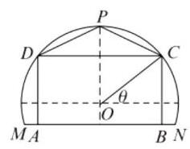

<table><tr><td>$\theta$</td><td>$\left( {{\theta }_{0},\frac{\pi }{6}}\right)$</td><td>$\frac{\pi }{6}$</td><td>$\left( {\frac{\pi }{6},\frac{\pi }{2}}\right)$</td></tr><tr><td>${f}^{\prime }\left( \theta \right)$</td><td>+</td><td>0</td><td>-</td></tr><tr><td>$f\left( \theta \right)$</td><td>严格递增</td><td>极大值</td><td>严格递减</td></tr><tr><td>$y$</td><td>严格递增</td><td>极大值</td><td>严格递减</td></tr></table>

答: 当 $\theta  = \frac{\pi }{6}$ 时,年总产值最大.

20. ( 1 )因为甲投篮一次命中的概率为 $\frac{3}{5}$ ，所以甲投篮一次没有命中的概率为 $\frac{2}{5}$ ，于是甲投篮三次恰好命中两次的概率 $P = {\mathrm{C}}_{3}^{2} \cdot  {\left( \frac{3}{5}\right) }^{2} \cdot  \frac{2}{5} = \frac{54}{125}$ ; ( 2 )甲以 $3 : 1$ 获胜的概率 ${P}_{1} = {\left( \frac{3}{5}\right) }^{2} \times \; {\left( \frac{1}{2}\right) }^{2} = \frac{9}{100}$ ,甲以 $3 : 2$ 获胜的概率 ${P}_{2} = \; {\left( \frac{3}{5}\right) }^{2} \cdot  {\mathrm{C}}_{2}^{1} \cdot  {\left( \frac{1}{2}\right) }^{2} = \frac{9}{50}$ ,甲以 $2 : 1$ 获胜的概率 ${P}_{3} = {\mathrm{C}}_{2}^{1} \cdot  \frac{3}{5} \cdot  \frac{2}{5} \cdot  {\left( \frac{1}{2}\right) }^{2} = \frac{3}{25}$ ,所以甲获胜的概率 $P = {P}_{1} + {P}_{2} + {P}_{3} = \frac{9}{100} + \frac{9}{50} + \frac{3}{25} = \frac{39}{100}$ ;

(3) 由题意可得 $X$ 的所有可能取值是0,1,2,

$P\left( {X = 0}\right)  = {\left( \frac{2}{5}\right) }^{2} \cdot  {\left( \frac{1}{2}\right) }^{2} + {\mathrm{C}}_{2}^{1} \cdot  \frac{3}{5} \cdot  \frac{2}{5}. \; {\mathrm{C}}_{2}^{1} \cdot  {\left( \frac{1}{2}\right) }^{2} + {\left( \frac{3}{5}\right) }^{2} \cdot  {\left( \frac{1}{2}\right) }^{2} = \frac{1}{25} + \frac{6}{25} + \frac{9}{100} = \; \frac{37}{100}, P\left( {X = 2}\right)  = {\left( \frac{2}{5}\right) }^{2} \cdot  {\left( \frac{1}{2}\right) }^{2} + {\left( \frac{3}{5}\right) }^{2}$ . ${\left( \frac{1}{2}\right) }^{2} = \frac{1}{25} + \frac{9}{100} = \frac{13}{100}, P\left( {X = 1}\right)  = {\left( \frac{2}{5}\right) }^{2}. \; {\mathrm{C}}_{2}^{1}{\left( \frac{1}{2}\right) }^{2} + {\mathrm{C}}_{2}^{1} \cdot  \frac{3}{5} \cdot  \frac{2}{5} \cdot  \left\lbrack  {{\left( \frac{1}{2}\right) }^{2} + {\left( \frac{1}{2}\right) }^{2}}\right\rbrack   + \; {\left( \frac{3}{5}\right) }^{2} \cdot  {\mathrm{C}}_{2}^{1}{\left( \frac{1}{2}\right) }^{2} = \frac{2}{25} + \frac{6}{25} + \frac{9}{50} = \frac{1}{2} \; \left( \right.$ 或 $P\left( {X = 1}\right)  = 1 - \frac{37}{100}\left. {-\frac{13}{100} = \frac{1}{2}}\right)$

$X$ 的分布列为

<table><tr><td>$X$</td><td>0</td><td>1</td><td>2</td></tr><tr><td>$P$</td><td>37 100</td><td>$\frac{1}{2}$</td><td>13</td></tr></table>

所以 $E\left( X\right)  = 0 \times  \frac{37}{100} + 1 \times  \frac{1}{2} + 2 \times  \frac{13}{100} = \frac{19}{25}$ .

21. (1) $G\left( A\right)  = \{ 2,3,5\}$ ;

(2)由已知数列 $A : 2,{2}^{2},5,{2}^{4},8,{2}^{6},{11}$ , ${2}^{8},\cdots ,\left( {3 \times  {99} - 1}\right) ,{2}^{100}$ ,显然 ${a}_{1} < {a}_{2} < {a}_{3} < \; {a}_{4},{a}_{4} > {a}_{5}$ ; 当 $k = 6,8,{10},\cdots ,{100}$ 时, ${a}_{k} - \; {a}_{k - 1} = {2}^{k} - \left( {{3k} - 4}\right)  = {\left( 1 + 1\right) }^{k} - \left( {{3k} - 4}\right)  = {\mathrm{C}}_{k}^{0} \; + {\mathrm{C}}_{k}^{1} + {\mathrm{C}}_{k}^{2} + \cdots {\mathrm{C}}_{k}^{k} - \left( {{3k} - 4}\right)  > 2\left( {{\mathrm{C}}_{k}^{0} + {\mathrm{C}}_{k}^{1} + {\mathrm{C}}_{k}^{2}}\right) \; - \left( {{3k} - 4}\right)  = 2 + {2k} + k\left( {k - 1}\right)  - {3k} + 4 = {k}^{2} - \; {2k} + 6 > 0$ ,又因为奇数项组成的数列和偶数项组成的数列都是严格的增数列,所以 $G\left( A\right)  = \; \{ 2,3,4,6,8,\cdots {100}\} , G\left( A\right)$ 的所有元素之和为 $2 + 3 + 4 + 6 + \cdots  + {100} = 3 + \frac{{50}\left( {2 + {100}}\right) }{2} = {2553};$

(3)设 $A$ 数列恰有 $k$ 个“ $G$ 点”为 ${i}_{1},{i}_{2},\cdots ,{i}_{k}$ ， 不妨设 ${i}_{1} < {i}_{2} < \cdots  < {i}_{k}$ ,对于第一个“ $G$ 点” ${i}_{1}$ , 有 ${a}_{{i}_{1}} > {a}_{1} \geq  {a}_{i}, i = 1,2,3,\cdots ,{i}_{1} - 1$ ,则 ${a}_{{i}_{1}} - \; {a}_{1} \leq  {a}_{{i}_{1}} - {a}_{{i}_{1} - 1} \leq  1$ . 对于第二个 “ $G$ 点” ${i}_{2} \; \left( { > {i}_{1}}\right)$ ,有 ${a}_{{i}_{2}} > {a}_{{i}_{1}} \geq  {a}_{i}\left( {i = 1,2,\cdots ,{i}_{2} - 1}\right)$ . 则 ${a}_{{i}_{2}} - {a}_{{i}_{1}} \leq  {a}_{{i}_{2}} - {a}_{{i}_{2} - 1} \leq  1$ . 类似的 ${a}_{{i}_{3}} - {a}_{{i}_{2}} \; \leq  1,\cdots ,{a}_{{i}_{k}} - {a}_{{i}_{k - 1}} \leq  1$ . 于是, $k \geq  \left( {{a}_{{i}_{k}} - {a}_{{i}_{k - 1}}}\right) \; + \left( {{a}_{{i}_{k - 1}} - {a}_{{i}_{k - 2}}}\right)  + \cdots  + \left( {{a}_{{i}_{2}} - {a}_{{i}_{1}}}\right)  + \left( {{a}_{{i}_{2}} - }\right. \; \left. {a}_{1}\right)  = {a}_{{i}_{k}} - {a}_{1}$ . 下面只要证 ${a}_{N} \leq  {a}_{{i}_{k}}$ ,对于 ${a}_{N}$ , 若 $N \in  G\left( A\right)$ ,则 ${a}_{{i}_{k}} = {a}_{N}$ ; 若 $N \notin  G\left( A\right)$ ,如果 ${a}_{N} > {a}_{{i}_{k}}$ ,设数列 $A$ 中第一个大于 ${a}_{{i}_{k}}$ 的项为 ${a}_{m}$ ,则 ${a}_{m} > {a}_{{i}_{k}} \geq  {a}_{i}$ ,其中 ${i}_{k} + 1 \leq  i \leq  m - 1$ ,所以 $m \in  G\left( A\right)$ ,即 ${a}_{{i}_{k}},{a}_{{i}_{k} + 1},\cdots ,{a}_{N}$ 中存在 “ $G$ 点”,这与数列 $A$ 恰有 $k$ 个“ $G$ 点”矛盾,所以 ${a}_{N} \leq  {a}_{{i}_{k}}$ ,从而, $k \geq  {a}_{{i}_{k}} - {a}_{1} \geq  {a}_{N} - {a}_{1}$ ,证毕.

## 上海高考数学模拟试卷三

## 一、填空题

1. $\lbrack 1, + \infty )\;$ 2. $- 2\;$ 3. $\sqrt{3}\;$ 4. $\frac{4}{5}\;$ 5. 2

6. $- 1\;7.\frac{\sqrt{2}}{4}\;$ 8. $\left( {-\infty , - 6\rbrack \cup \lbrack 6, + \infty }\right)$

9. 322 10. ①④

11. $\left( {-\infty , - 1\rbrack  \cup  \left\lbrack  {-\frac{1}{2},1}\right\rbrack  \cup \lbrack \frac{3}{2}, + \infty }\right)$

12. $\frac{3}{2}$

## 二、选择题

13. A 14. B 15. D 16. A

## 三、解答题

17. ( 1 )设数列 $\left\{  {a}_{n}\right\}$ 的公差为 $d$ ，则 ${a}_{1} + {a}_{2} + {a}_{3} = \; 3{a}_{1} + {3d} = {12}$ ,又 ${a}_{1} = 2$ ,得 $d = 2$ ,以 ${a}_{n} = {2n}$ .

(2)由(1)得， ${b}_{n} = {2}^{{a}_{n}} + 9 = {4}^{n} + 9$ ，

${S}_{n} = \mathop{\sum }\limits_{{i = 1}}^{n}{b}_{i} = \mathop{\sum }\limits_{{i = 1}}^{n}{4}^{i} + {9n} = \frac{4\left( {1 - {4}^{n}}\right) }{1 - 4} + {9n},$ 由 ${S}_{n} \geq  {2022}$ ,得 $\frac{4\left( {1 - {4}^{n}}\right) }{1 - 4} + {9n} \geq  {2022}$ ,

化简得 ${4}^{n + 1} + {27n} \geq  {6070}$ ,

令 ${c}_{n} = {4}^{n + 1} + {27n}$ ,

则数列 $\left\{  {c}_{n}\right\}$ 是严格增数列,

${c}_{6} = {4258} < {6070},{c}_{7} = {16573} > {6070}$ ,

所以正整数 $n$ 的最小值为 7 .

18. 方法 1: (1) 证明: 取 ${CD}$ 的中点 $K$ ,连结 ${MK}$ , ${NK}$ ,因为 $M, N, K$ 分别为 ${AK}, C{D}_{1},{CD}$ 的中点,则 ${MK}//{AD},{NK}//D{D}_{1}$ ,

所以 ${MK}//$ 面 ${AD}{D}_{1}{A}_{1}$ ,

${NK}//$ 面 ${AD}{D}_{1}{A}_{1}$ ,

所以面 ${MNK}//$ 面 ${AD}{D}_{1}{A}_{1}$ ,

所以 ${MN}//$ 面 ${AD}{D}_{1}{A}_{1}$ ;

(2) ${S}_{\bigtriangleup {NEP}} = \frac{1}{2}{S}_{{\text{ 矩 }\text{ 形 }EC}{D}_{1}P} = \frac{1}{4}{BC} \cdot  C{D}_{1} = \frac{1}{4}$ 。 $a \cdot  \sqrt{{a}^{2} + 4{a}^{2}} = \frac{\sqrt{5}}{4}{a}^{2}$ ,作 ${DQ} \bot  C{D}_{1}$ ,交 $C{D}_{1}$ 于 $Q$ ,由 ${A}_{1}{D}_{1} \bot$ 面 ${CD}{D}_{1}{C}_{1}$ 得 ${A}_{1}{C}_{1} \bot  {DQ}$ , 所以 ${DQ} \bot$ 面 ${BC}{D}_{1}{A}_{1}$ ,在 $\operatorname{Rt}\bigtriangleup {CD}{D}_{1}$ 中,

${DQ} = \frac{{CD} \cdot  D{D}_{1}}{C{D}_{1}} = \frac{{2a} \cdot  a}{\sqrt{5}a} = \frac{2}{\sqrt{5}}a,$

所以 ${V}_{P - {DEN}} = {V}_{D - {ENP}} = \frac{1}{3}{S}_{\bigtriangleup {NEP}} \cdot  {DQ} = \frac{1}{3}$ . $\frac{\sqrt{5}}{4}{a}^{2} \cdot  \frac{2}{\sqrt{5}}a = \frac{1}{6}{a}^{3}.$

方法 2: 以 $D$ 为原点, ${DA},{DC}, D{D}_{1}$ 所在直线分别为 $x$ 轴, $y$ 轴, $z$ 轴,建立直角坐标系,

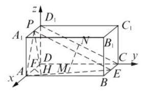

则 $A\left( {a,0,0}\right) , B\left( {a,{2a},0}\right) , C\left( {0,{2a},0}\right) ,{A}_{1}(a,0$ , $a),{D}_{1}\left( {0,0, a}\right)$ ,因为 $E, P, M, N$ 分别是 ${BC}$ , ${A}_{1}{D}_{1},{AE}, C{D}_{1}$ 的中点,所以 $E\left( {\frac{a}{2},{2a},0}\right)$ , $P\left( {\frac{a}{2},0, a}\right) , M\left( {\frac{3a}{4}, a,0}\right) , N\left( {0, a,\frac{a}{2}}\right) ,$

(1) $\overrightarrow{MN} = \left( {-\frac{3}{4}a,0,\frac{a}{2}}\right)$ ,取 $\overrightarrow{n} = \left( {0,1,0}\right)$ ,

显然 $\overrightarrow{n} \bot$ 面 ${AD}{D}_{1}{A}_{1},\overrightarrow{MN} \cdot  \overrightarrow{n} = 0$ ,

所以 $\overrightarrow{MN} \bot  \overrightarrow{n}$ ,又 ${MN} \text{ ⊄ }$ 面 ${AD}{D}_{1}{A}_{1}$ ,

所以 ${MN}//$ 面 ${AD}{D}_{1}{A}_{1}$ ;

(2)设 $\overrightarrow{{n}_{1}} = \left( {{x}_{1},{y}_{1},{z}_{1}}\right)$ 为平面 ${DEN}$ 的法向量，

则 $\overrightarrow{{n}_{1}} \bot  \overrightarrow{DE},\overrightarrow{{n}_{1}} \bot  \overrightarrow{DN}$ ,又 $\overrightarrow{DE} = \left( {\frac{a}{2},{2a},0}\right)$ ,

$\overrightarrow{DN} = \left( {0, a,\frac{a}{2}}\right) ,\overrightarrow{DP} = \left( {\frac{a}{2},0, a}\right) ,$

所以 $\left\{  \begin{array}{l} \frac{a}{2}{x}_{1} + {2a}{y}_{1} = 0 \\  2{y}_{1} + \frac{a}{2}{z}_{1} = 0 \end{array}\right.$ ,即 $\left\{  \begin{array}{l} {x}_{1} =  - 4{y}_{1} \\  {z}_{1} =  - 2{y}_{1} \end{array}\right.$ ,

所以可取 $\overrightarrow{{n}_{1}} = \left( {4, - 1,2}\right)$ ,所以 $P$ 点到平面 ${DEN}$ 的距离为 $d = \frac{\left| \overrightarrow{DP} \cdot  \overrightarrow{{n}_{1}}\right| }{\left| \overrightarrow{{n}_{1}}\right| } = \frac{\left| 2a + 2a\right| }{\sqrt{{16} + 1 + 4}} = \frac{4a}{\sqrt{21}}$ ,因为 $\cos \langle \overrightarrow{DE},\overrightarrow{DN}\rangle  = \frac{\overrightarrow{DE} \cdot  \overrightarrow{DN}}{\left| \overrightarrow{DE}\right|  \cdot  \left| \overrightarrow{DN}\right| } = \frac{8}{\sqrt{85}}$ ,

$\sin \langle \overrightarrow{DE},\overrightarrow{DN}\rangle  = \frac{\sqrt{21}}{\sqrt{85}}$ ,所以 ${S}_{\bigtriangleup {DEN}} = \frac{1}{2}\left| \overrightarrow{DE}\right|$ .

$\left| \overrightarrow{DN}\right|  \cdot  \sin \langle \overrightarrow{DE},\overrightarrow{DN}\rangle  = \frac{\sqrt{21}}{8}{a}^{2}$ ,所以 ${V}_{P - {DEN}} =$

$\frac{1}{3}{S}_{\bigtriangleup {DEN}} \cdot  d = \frac{1}{3} \times  \frac{\sqrt{21}}{8}{a}^{2} \times  \frac{4a}{\sqrt{21}} = \frac{{a}^{3}}{6}.$

19.(1)方法 1:记“该选手能正确回答第 $i$ 轮的问题”的事件为 ${A}_{i}\left( {i = 1,2,3}\right)$ ,则 $P\left( {A}_{1}\right)  = \frac{4}{5}$ , $P\left( {A}_{2}\right)  = \frac{3}{5}, P\left( {A}_{3}\right)  = \frac{2}{5},$

该选手被淘汰的概率

$$
P = P\left( {\overline{{A}_{1}} + {A}_{1}\overline{{A}_{2}} + {A}_{2}{A}_{2}\overline{{A}_{3}}}\right)
$$

$$
= P\left( \overline{{A}_{1}}\right)  + P\left( {A}_{1}\right) P\left( \overline{{A}_{2}}\right)  + P\left( {A}_{1}\right) P\left( {A}_{2}\right) P\left( \overline{{A}_{3}}\right)
$$

$= \frac{1}{5} + \frac{4}{5} \times  \frac{2}{5} + \frac{4}{5} \times  \frac{3}{5} \times  \frac{3}{5}$

$$
= \frac{101}{125}\text{ . }
$$

方法 2: 记 “该选手能正确回答第 $i$ 轮的问题” 的事件为 ${A}_{i}\left( {i = 1,2,3}\right)$ ,则 $P\left( {A}_{1}\right)  = \frac{4}{5}$ , $P\left( {A}_{2}\right)  = \frac{3}{5}, P\left( {A}_{3}\right)  = \frac{2}{5}$ . 所以该选手被淘汰的概率 $P = 1 - P\left( {{A}_{1}{A}_{2}{A}_{3}}\right)  = 1 - P\left( {A}_{1}\right) \; P\left( {A}_{2}\right) P\left( {A}_{3}\right)  = 1 - \frac{4}{5} \times  \frac{3}{5} \times  \frac{2}{5} = \frac{101}{125};$

(2)ξ的可能值为1,2,3，

$P\left( {\xi  = 1}\right)  = P\left( \overline{{A}_{1}}\right)  = \frac{1}{5},$

$$
P\left( {\xi  = 2}\right)  = P\left( {{A}_{1}\overline{{A}_{2}}}\right)  = P\left( {A}_{1}\right) P\left( \overline{{A}_{2}}\right)
$$

$$
= \frac{4}{5} \times  \frac{2}{5} = \frac{8}{25}\text{ , }
$$

$$
P\left( {\xi  = 3}\right)  = P\left( {{A}_{1}{A}_{2}}\right)  = P\left( {A}_{1}\right) P\left( {A}_{2}\right)
$$

$$
= \frac{4}{5} \times  \frac{3}{5} = \frac{12}{25}\text{ . }
$$

所以 $\xi$ 的分布列为

<table><tr><td>$\xi$</td><td>1</td><td>2</td><td>3</td></tr><tr><td>$P$</td><td>$\frac{1}{5}$</td><td>$\frac{8}{25}$</td><td>$\frac{12}{25}$</td></tr></table>

所以 ${E\xi } = 1 \times  \frac{1}{5} + 2 \times  \frac{8}{25} + 3 \times  \frac{12}{25} = \frac{57}{25}$ .

20. (1) ${f}^{\prime }\left( x\right)  = 4{x}^{3} + {3a}{x}^{2} + {4x}$

$= x\left( {4{x}^{2} + {3ax} + 4}\right)$ .

当 $a =  - \frac{10}{3}$ 时,

${f}^{\prime }\left( x\right)  = x\left( {4{x}^{2} - {10x} + 4}\right)  = {2x}\left( {{2x} - 1}\right) \left( {x - 2}\right) .$

令 ${f}^{\prime }\left( x\right)  = 0$ ,解得 ${x}_{1} = 0,{x}_{2} = \frac{1}{2},{x}_{3} = 2$ .

当 $x$ 变化时,

${f}^{\prime }\left( x\right) , f\left( x\right)$ 的变化情况如下表:

<table><tr><td>$x$</td><td>$\left( {-\infty ,0}\right)$</td><td>0</td><td>$\left( {0,\frac{1}{2}}\right)$</td><td>$\frac{1}{2}$</td><td>$\left( {\frac{1}{2},2}\right)$</td><td>2</td><td>(2, $+ \infty$ )</td></tr><tr><td>${f}^{\prime }\left( x\right)$</td><td>-</td><td>0</td><td>+</td><td>0</td><td>-</td><td>0</td><td>+</td></tr><tr><td>$f\left( x\right)$</td><td>↘</td><td>极小值</td><td>↗</td><td>极大值</td><td>↘</td><td>极小值</td><td>↗</td></tr></table>

所以 $f\left( x\right)$ 在 $\left( {0,\frac{1}{2}}\right) ,\left( {2, + \infty }\right)$ 内是严格增函数,在 $\left( {-\infty ,0}\right) ,\left( {\frac{1}{2},2}\right)$ 内是严格减函数;

(2) ${f}^{\prime }\left( x\right)  = x\left( {4{x}^{2} + {3ax} + 4}\right)$ ，显然， $x = 0$ 不是方程 $4{x}^{2} + {3ax} + 4 = 0$ 的根. 为使 $f\left( x\right)$ 仅在 $x = 0$ 处有极值,必须 $4{x}^{2} + {3ax} + 4 \geq  0$ 成立,

即有 $\Delta  = 9{a}^{2} - {64} \leq  0$ . 解此不等式,

得 $- \frac{8}{3} \leq  a \leq  \frac{8}{3}$ . 这时, $f\left( 0\right)  = b$ 是唯一极值. 因此满足条件的 $a$ 的取值范围是 $\left\lbrack  {-\frac{8}{3},\frac{8}{3}}\right\rbrack$ ;

(3)由条件 $a \in  \left\lbrack  {-2,2}\right\rbrack$ ,可知 $\Delta  = 9{a}^{2} - {64} <$ 0,从而 $4{x}^{2} + {3ax} + 4 > 0$ 恒成立. 当 $x < 0$ 时, ${f}^{\prime }\left( x\right)  < 0$ ; 当 $x > 0$ 时, ${f}^{\prime }\left( x\right)  > 0$ . 因此函数 $f\left( x\right)$ 在 $\left\lbrack  {-1,1}\right\rbrack$ 上的最大值是 $f\left( 1\right)$ 与 $f\left( {-1}\right)$ 两者中的较大者. 为使对任意的 $a \in  \left\lbrack  {-2,2}\right\rbrack$ , 不等式 $f\left( x\right)  \leq  1$ 在 $\left\lbrack  {-1,1}\right\rbrack$ 上恒成立,当且仅当 $\left\{  \begin{array}{l} f\left( 1\right)  \leq  1 \\  f\left( {-1}\right)  \leq  1 \end{array}\right.$ ,即 $\left\{  \begin{array}{l} b \leq   - 2 - a \\  b \leq   - 2 + a \end{array}\right.$ ,在 $a \in  \left\lbrack  {-2,2}\right\rbrack$

上恒成立. 所以 $b \leq   - 4$ ,因此满足条件的 $b$ 的取值范围是 $( - \infty , - 4\rbrack$ .

21. (1) 由已知得 $\frac{\sqrt{{\left( x - \sqrt{3}\right) }^{2} + {y}^{2}}}{\left| x - \frac{4}{\sqrt{3}}\right| } = \frac{\sqrt{3}}{2}$ , $\sqrt{{\left( x - \sqrt{3}\right) }^{2} + {y}^{2}} = \frac{\sqrt{3}}{2} \cdot  \left| {x - \frac{4}{\sqrt{3}}}\right| ,$

化简得 $\frac{{x}^{2}}{4} + {y}^{2} = 1$ ,

即曲线 $C$ 的方程为 $\frac{{x}^{2}}{4} + {y}^{2} = 1$ ,

$d = \sqrt{{\left( x - \sqrt{3}\right) }^{2} + {y}^{2}} \; = \sqrt{{\left( x - \sqrt{3}\right) }^{2} + 1 - \frac{{x}^{2}}{4}} \; = \sqrt{\frac{3{x}^{2}}{4} - 2\sqrt{3}x + 4} \; = \sqrt{{\left( \frac{\sqrt{3}}{2}x - 2\right) }^{2}} = \left| {\frac{\sqrt{3}}{2}x - 2}\right|$ ,

因为 $- 2 \leq  x \leq  2$ ,

所以 $2 - \sqrt{3} \leq  d \leq  2 + \sqrt{3}$ ,

即 $d \in  \left\lbrack  {2 - \sqrt{3},2 + \sqrt{3}}\right\rbrack$ ;

(2)设 $B\left( {{x}_{0},{y}_{0}}\right)$ ，则 $C\left( {-{x}_{0}, - {y}_{0}}\right)$ ，

$\frac{{x}_{0}^{2}}{4} + {y}_{0}^{2} = 1$ ,所以 ${k}_{1}{k}_{2} = \frac{{y}_{0}}{{x}_{0} - 2} \cdot  \frac{{y}_{0}}{{x}_{0} + 2} = \; \frac{{y}_{0}^{2}}{{x}_{0}^{2} - 4} = \frac{1 - \frac{1}{4}{x}_{0}^{2}}{{x}_{0}^{2} - 2} =  - \frac{1}{4};$

(3)联立 $\left\{  \begin{array}{l} y = {k}_{1}\left( {x - 2}\right) \\  {x}^{2} + {y}^{2} = 4 \end{array}\right.$ 得

$\left( {1 + {k}_{1}^{2}}\right) {x}^{2} - 4{k}_{1}^{2}x + 4\left( {{k}_{1}^{2} - 1}\right)  = 0,$

解得 ${x}_{P} = \frac{2\left( {{k}_{1}^{2} - 1}\right) }{1 + {k}_{1}^{2}}$ ,

${y}_{P} = {k}_{1}\left( {{x}_{P} - 2}\right)  = \frac{-4{k}_{1}}{1 + {k}_{1}^{2}},$

联立 $\left\{  \begin{array}{l} y = {k}_{1}\left( {x - 2}\right) \\  \frac{{x}^{2}}{4} + {y}^{2} = 1 \end{array}\right.$ 得

$\left( {1 + 4{k}_{1}^{2}}\right) {x}^{2} - {16}{k}_{1}^{2}x + 4\left( {4{k}_{1}^{2} - 1}\right)  = 0,$

解得 ${x}_{B} = \frac{2\left( {4{k}_{1}^{2} - 1}\right) }{1 + 4{k}_{1}^{2}}$ ,

${y}_{B} = {k}_{1}\left( {{x}_{B} - 2}\right)  = \frac{-4{k}_{1}}{1 + 4{k}_{1}^{2}},$

所以 ${k}_{BC} = \frac{{y}_{B}}{{x}_{B}} = \frac{-2{k}_{1}}{4{k}_{1}^{2} - 1}$ ,

${k}_{PQ} = \frac{{y}_{P}}{{x}_{P} + \frac{6}{5}} = \frac{\frac{-4{k}_{1}}{1 + {k}_{1}^{2}}}{\frac{2\left( {{k}_{1}^{2} - 1}\right) }{1 + {k}_{1}^{2}} + \frac{6}{5}} = \frac{-5{k}_{1}}{4{k}_{1}^{2} - 1}$ ,

所以 ${k}_{PQ} = \frac{5}{2}{k}_{BC}$ ,故存在常数 $\lambda  = \frac{5}{2}$ ,

使得 ${k}_{PQ} = \frac{5}{2}{k}_{BC}$ .

## 上海高考数学模拟试卷四

## 一、填空题

1. 5 2. $\left( {-1,5}\right)$ 3. $\left( {-1,2}\right)$

4. $- \frac{1}{2}$ 5. $- \frac{9}{2}$ 6. 5

7. ${a}_{1} = \frac{1981}{2001}$ 8. 1800

9. -8. 10.0.175

11. -1 或 -3 12. ①③④

## 二、选择题

13. C 14. D 15. B 16. A

## 三、解答题

17. (1) ${S}_{\bigtriangleup {A}_{1}{MB}} = \frac{1}{2} \times  \frac{1}{2} \times  2 = \frac{1}{2}$ ,

又 ${C}_{1}{B}_{1}$ 为三棱锥 ${C}_{1} - {AMB}$ 的高;

${V}_{{A}_{1} - {MB}{C}_{1}} = {V}_{{C}_{1} - {A}_{1}{MB}} = \frac{1}{3}{S}_{\bigtriangleup {A}_{1}{MB}} \cdot  {C}_{1}{B}_{1} \; = \frac{1}{3} \times  \frac{1}{2} \times  1 = \frac{1}{6};$

(2)取 ${BC}$ 中点 $N$ ，联结 ${MN}$ ，则 ${MN}//{AC}$ ， $\angle {C}_{1}{MN}$ (或其补角) 为异面直 ${AC}$ 与 $M{C}_{1}$ 所成的角. 联结 $N{C}_{1}$ ,则 $N{C}_{1} = \sqrt{{2}^{2} + {\left( \frac{1}{2}\right) }^{2}} = \; \frac{\sqrt{17}}{2},{MN} = \frac{1}{2}{AC} = \frac{\sqrt{2}}{2},{AB} \bot$ 平面 ${BC}{C}_{1}{B}_{1}$ , 所以 ${AB}\bot {B{C}_{1}}$ ，在 $\mathrm{{Rt}} \bigtriangleup  {MB}{C}_{1}$ 中，

$M{C}_{1} = \sqrt{5 + \frac{1}{4}} = \frac{\sqrt{21}}{2},$

所以 $\cos \angle {C}_{1}{MN} = \frac{\frac{1}{2} + \frac{21}{4} - \frac{17}{4}}{2 \times  \frac{\sqrt{2}}{2} \times  \frac{\sqrt{21}}{2}} = \frac{\sqrt{42}}{14}$ , $\angle {C}_{1}{MN} = \arccos \frac{\sqrt{42}}{14},$

即异面直线 ${AC}$ 与 $M{C}_{1}$ 所成角的大小为 $\arccos \frac{\sqrt{42}}{14}$ .

18.(1)当 $a = 2$ 时,不等式 $f\left( {x + 2}\right)  \leq  f\left( x\right)  + 4$

可化为 $2\left( {x + 2}\right)  + \frac{1}{x + 1} \leq  {2x} + \frac{1}{x - 1} + 4$ ,

即 $\frac{1}{x + 1} \leq  \frac{1}{x - 1}$ ,所以 $\frac{1}{x + 1} - \frac{1}{x - 1} \leq  0$ ,

$\frac{-2}{\left( {x + 1}\right) \left( {x - 1}\right) } \leq  0$ ,所以 $\left( {x + 1}\right) \left( {x - 1}\right)  > 0$ ,

所以 $x <  - 1$ 或 $x > 1$ ,

即不等式 $f\left( {x + 2}\right)  \leq  f\left( x\right)  + 4$ 的解集为

$\left( {-\infty , - 1}\right)  \cup  \left( {1, + \infty }\right)$ ;

(2)设 ${x}_{1},{x}_{2} \in  \left\lbrack  {2,5}\right\rbrack$ ，且 ${x}_{1} < {x}_{2}$ ，

因为 $f\left( x\right)  = {ax} + \frac{1}{x - 1}$ ,

$a \in  \mathbf{R}$ 在区间 $\left\lbrack  {2,5}\right\rbrack$ 上严格减,

所以 $f\left( {x}_{1}\right)  - f\left( {x}_{2}\right)  > 0$ ,

$\left( {a{x}_{1} + \frac{1}{{x}_{1} - 1}}\right)  - \left( {a{x}_{2} + \frac{1}{{x}_{2} - 1}}\right)  > 0,$

$a\left( {{x}_{1} - {x}_{2}}\right)  + \frac{1}{{x}_{1} - 1} - \frac{1}{{x}_{2} - 1} > 0,$

$a\left( {{x}_{1} - {x}_{2}}\right)  + \frac{{x}_{2} - {x}_{1}}{\left( {{x}_{1} - 1}\right) \left( {{x}_{2} - 1}\right) } > 0,$

$a - \frac{1}{\left( {{x}_{1} - 1}\right) \left( {{x}_{2} - 1}\right) } < 0,$

所以 $a < \frac{1}{\left( {{x}_{1} - 1}\right) \left( {{x}_{2} - 1}\right) }$ ,因为 ${x}_{1},{x}_{2} \in  \left\lbrack  {2,5}\right\rbrack$ ,

且 ${x}_{1} < {x}_{2}$ ,所以 $1 < \left( {{x}_{1} - 1}\right) \left( {{x}_{2} - 1}\right)  < {16}$ ,

所以 $\frac{1}{16} < \frac{1}{\left( {{x}_{1} - 1}\right) \left( {{x}_{2} - 1}\right) } < 1$ ,所以 $a \leq  \frac{1}{16}$ .

19. (1) 由已知 ${PQ} = 3 - 2\cos \theta ,{PR} = 3 - 2\sin \theta$ ，

$S = {PQ} \cdot  {PR} = \left( {3 - 2\cos \theta }\right) \left( {3 - 2\sin \theta }\right)$

$= 9 - 6\left( {\sin \theta  + \cos \theta }\right)  + 4\sin \theta \cos \theta$ ,

$\theta  \in  \left\lbrack  {0,\frac{\pi }{2}}\right\rbrack$

(2) 令 $t = \sin \theta  + \cos \theta ,\theta  \in  \left\lbrack  {0,\frac{\pi }{2}}\right\rbrack$ ,

则 ${t}^{2} = 1 + 2\sin \theta \cos \theta ,\sin \theta \cos \theta  = \frac{{t}^{2} - 1}{2}$ ,

$S = 9 - {6t} + 2\left( {{t}^{2} - 1}\right)  = 2{t}^{2} - {6t} + 7$

$= 2{\left( t - \frac{3}{2}\right) }^{2} + \frac{5}{2}$ ,

又 $t = \sin \theta  + \cos \theta  = \sqrt{2}\sin \left( {\theta  + \frac{\pi }{4}}\right)$ ,

而 $\theta  \in  \left\lbrack  {0,\frac{\pi }{2}}\right\rbrack$ ,所以 $\theta  + \frac{\pi }{4} \in  \left\lbrack  {\frac{\pi }{4},\frac{3\pi }{4}}\right\rbrack$ ,

所以 $\sin \left( {\theta  + \frac{\pi }{4}}\right)  \in  \left\lbrack  {\frac{\sqrt{2}}{2},1}\right\rbrack  , t \in  \left\lbrack  {1,\sqrt{2}}\right\rbrack$ ,

$S = 2{\left( t - \frac{3}{2}\right) }^{2} + \frac{5}{2}$ 在 $\left\lbrack  {1,\sqrt{2}}\right\rbrack$ 上是严格减函数,

所以当 $t = 1$ ，即当 $\theta  + \frac{\pi }{4} = \frac{\pi }{4}$ 或 $\theta  + \frac{\pi }{4} = \frac{3\pi }{4}$ ，

即 $\theta  = 0$ 或 $\theta  = \frac{\pi }{2}$ 时, ${S}_{\max } = 3\left( {\mathrm{\;m}}^{2}\right)$ ,

所以当 $\theta  = 0$ 或 $\theta  = \frac{\pi }{2}$ 时, $S$ 取最大值 $3{\mathrm{\;m}}^{2}$ .

20. ( 1 )由已知 $A\left( {-a,0}\right) , B\left( {a,0}\right) , G\left( {0,\sqrt{5}}\right)$ ，

则 $\overrightarrow{AG} = \left( {a,\sqrt{5}}\right) ,\overrightarrow{GB} = \left( {a, - \sqrt{5}}\right)$ ,

因为 $\overrightarrow{AG} \cdot  \overrightarrow{GB} = 4$ ,所以 ${a}^{2} - 5 = 4$ ,即 ${a}^{2} = 9$ ,

所以椭圆 $E$ 的方程为 $\frac{{x}^{2}}{9} + \frac{{y}^{2}}{5} = 1$ ,

所以右焦点 $F$ 的坐标为 $\left( {2,0}\right)$ ;

(2)将 ${x}_{1} = 2,{x}_{2} = \frac{1}{3}$ 分别代入椭圆方程，

以及 ${y}_{1} > 0,{y}_{2} < 0$ ,

得 $M\left( {2,\frac{5}{3}}\right) , N\left( {\frac{1}{3}, - \frac{20}{9}}\right)$ ,

直线 ${AM}$ 方程为 $\frac{y - 0}{\frac{5}{3} - 0} = \frac{x + 3}{2 + 3}$ , 即 $y = \frac{1}{3}x + 1$ ,

直线 ${BN}$ 方程为 $\frac{y - 0}{-\frac{20}{9} - 0} = \frac{x - 3}{\frac{1}{3} - 3}$ ,

即 $y = \frac{5}{6}x - \frac{5}{2}$ . 联立方程组,解得 $\left\{  \begin{array}{l} x = 7 \\  y = \frac{10}{3} \end{array}\right.$ ,

所以点 $T$ 的坐标为 $T\left( {7,\frac{10}{3}}\right)$ ;

(3)点由已知点 $T$ 的坐标为 $\left( {9, m}\right)$ ，

则直线 ${AT}$ 的方向向量为 $\overrightarrow{{d}_{1}} = \left( {{12}, m}\right)$ ,

一个法向量为 ${\overrightarrow{n}}_{1} = \left( {m, - {12}}\right)$ ,

所以直线 ${AT}$ 的方程为 $m\left( {x + 3}\right)  - {12y} = 0$ ,

即 $y = \frac{m}{12}\left( {x + 3}\right)$ ,

代入椭圆方程得 $5{x}^{2} + \frac{9{m}^{2}}{144}{\left( x + 3\right) }^{2} = {45}$ ,

即 $\left( {{80} + {m}^{2}}\right) {x}^{2} + 6{m}^{2}x + 9{m}^{2} - {720} = 0$ ,

$- 3 + {x}_{1} =  - \frac{6{m}^{2}}{{80} + {m}^{2}},$

所以 ${x}_{1} = \frac{3\left( {{80} - {m}^{2}}\right) }{{80} + {m}^{2}}$ 代入 $y = \frac{m}{12}\left( {x + 3}\right)$

可得 ${y}_{1} = \frac{40m}{{80} + {m}^{2}}$ ,

所以点 $M$ 的坐标为 $\left( {\frac{3\left( {{80} - {m}^{2}}\right) }{{80} + {m}^{2}},\frac{40m}{{80} + {m}^{2}}}\right)$ ,

同理可得点 $N$ 的坐标为 $\left( {\frac{3\left( {{m}^{2} - {20}}\right) }{{20} + {m}^{2}}, - \frac{20m}{{20} + {m}^{2}}}\right)$ ,

(方法一) 当 ${x}_{1} \neq  {x}_{2}$ 时,直线 ${MN}$ 方程为:

$\frac{y + \frac{20m}{{20} + {m}^{2}}}{\frac{40m}{{80} + {m}^{2}} + \frac{20m}{{20} + {m}^{2}}} = \frac{x - \frac{3\left( {{m}^{2} - {20}}\right) }{{20} + {m}^{2}}}{\frac{3\left( {{80} - {m}^{2}}\right) }{{80} + {m}^{2}} - \frac{3\left( {{m}^{2} - {20}}\right) }{{20} + {m}^{2}}},$

令 $y = 0$ ,解得 $x = 1$ . 此时必过点 $D\left( {1,0}\right)$ ;

当 ${x}_{1} = {x}_{2}$ 时,直线 ${MN}$ 方程为 $x = 1$ ,

与 $x$ 轴交点为 $D\left( {1,0}\right)$ .

所以直线 ${MN}$ 必过 $x$ 轴上的一定点 $D\left( {1,0}\right)$ .

(方法二) 若 ${x}_{1} = {x}_{2}$ ,

则由 $\frac{{240} - 3{m}^{2}}{{80} + {m}^{2}} = \frac{3{m}^{2} - {60}}{{20} + {m}^{2}}$ 及 $m > 0$ ,

得 $m = 2\sqrt{10}$ ,此时直线 ${MN}$ 的方程为 $x = 1$ ,

过点 $D\left( {1,0}\right)$ . 若 ${x}_{1} \neq  {x}_{2}$ ,则 $m \neq  2\sqrt{10}$ ,

直线 ${MD}$ 的斜率

${k}_{MD} = \frac{\frac{40m}{{80} + {m}^{2}}}{\frac{{240} - 3{m}^{2}}{{80} + {m}^{2}} - 1} = \frac{10m}{{40} - {m}^{2}},$

直线 ${ND}$ 的斜率

${k}_{ND} = \frac{\frac{-{20m}}{{20} + {m}^{2}}}{\frac{3{m}^{2} - {60}}{{20} + {m}^{2}} - 1} = \frac{10m}{{40} - {m}^{2}},$

得 ${k}_{MD} = {k}_{ND}$ ,所以直线 ${MN}$ 过 $D$ 点.

因此,直线 ${MN}$ 必过 $x$ 轴上的点 $D\left( {1,0}\right)$ .

(方法三) $\overrightarrow{{d}_{DM}} = \left( {\frac{3\left( {{80} - {m}^{2}}\right) }{{80} + {m}^{2}} - 1,\frac{40m}{{80} + {m}^{2}}}\right)  =$

$\left( {\frac{{160} - 4{m}^{2}}{{80} + {m}^{2}},\frac{40m}{{80} + {m}^{2}}}\right)  = \frac{4}{{80} + {m}^{2}}\left( {{40} - {m}^{2},{10m}}\right) ,$

$\overrightarrow{{d}_{DN}} = \left( {\frac{3\left( {{m}^{2} - {20}}\right) }{{20} + {m}^{2}} - 1, - \frac{20m}{{20} + {m}^{2}}}\right)$

$= \left( {\frac{2{m}^{2} - {80}}{{20} + {m}^{2}}, - \frac{20m}{{20} + {m}^{2}}}\right)$

$=  - \frac{2}{{20} + {m}^{2}}\left( {{40} - {m}^{2},{10m}}\right) ,$

所以 $\overrightarrow{{d}_{DN}} =  - \frac{{80} + {m}^{2}}{2\left( {{20} + {m}^{2}}\right) }\overrightarrow{{d}_{DM}}$ ,

所以 $\overrightarrow{{d}_{DN}}//\overrightarrow{{d}_{DM}}$ ,所以 $M\text{ 、 }N\text{ 、 }D$ 三点共线,

即直线 ${MN}$ 必过 $x$ 轴上的点 $D\left( {1,0}\right)$ .

21. (1) $\frac{{a}_{2}}{{a}_{1}} = 2$ 由已知 $\frac{{a}_{2}}{{a}_{1}} = 2 \in  \left\lbrack  {\frac{1}{2},2}\right\rbrack$ ，

$\frac{{a}_{3}}{{a}_{2}} = \frac{m}{2} \in  \left\lbrack  {\frac{1}{2},2}\right\rbrack  ,\frac{{a}_{4}}{{a}_{3}} = \frac{5}{m} \in  \left\lbrack  {\frac{1}{2},2}\right\rbrack  ,$

所以 $\left\{  \begin{array}{l} \frac{1}{2} \leq  \frac{m}{2} \leq  2 \\  \frac{1}{2} \leq  \frac{5}{m} \leq  2 \end{array}\right.$ ,化简得 $\left\{  \begin{array}{l} 1 \leq  m \leq  4 \\  \frac{5}{2} \leq  m \leq  {10} \end{array}\right.$ ,

所以 $\frac{5}{2} \leq  m \leq  4$ ;

(2)因为 $0 < d \leq  {a}_{1}$ ，所以 $0 < \frac{d}{{a}_{1}} \leq  1$ ，

所以 $\frac{{a}_{2}}{{a}_{1}} = \frac{{a}_{1} + d}{{a}_{1}} = 1 + \frac{d}{{a}_{1}} \in  \left\lbrack  {\frac{1}{2},2}\right\rbrack$ 成立，

$\frac{{a}_{3}}{{a}_{2}} = \frac{{a}_{2} + d}{{a}_{2}} = 1 + \frac{d}{{a}_{2}}$ ,因为 $d > 0$ ,

所以 ${a}_{2} > {a}_{1} \geq  d$ ,所以 $0 < \frac{d}{{a}_{2}} < 1$ ,

所以 $\frac{{a}_{3}}{{a}_{2}} \in  \left\lbrack  {\frac{1}{2},2}\right\rbrack$ 成立,

猜想 $\frac{{a}_{n + 1}}{{a}_{n}} \in  \left\lbrack  {\frac{1}{2},2}\right\rbrack$ 成立,下面给出证明:

方法 1: 要证 $\frac{{a}_{n + 1}}{{a}_{n}} \in  \left\lbrack  {\frac{1}{2},2}\right\rbrack$ ,

只要证 $\frac{1}{2} \leq  \frac{{a}_{1} + {nd}}{{a}_{1} + \left( {n - 1}\right) d} \leq  2$ ,

因为 $0 < d \leq  {a}_{1}$ ,所以 ${a}_{1} + \left( {n - 1}\right) d > 0$ ,

所以只要证 $\frac{1}{2}\left\lbrack  {{a}_{1} + \left( {n - 1}\right) d}\right\rbrack   \leq  {a}_{1} + {nd} \leq  2\left\lbrack  {{a}_{1} + \left( {n - 1}\right) d}\right\rbrack  , \; \frac{1}{2}\left\lbrack  {{a}_{1} + \left( {n - 1}\right) d}\right\rbrack   - \left\lbrack  {{a}_{1} + {nd}}\right\rbrack \; =  - \frac{1}{2}{a}_{1} - \frac{1}{2}\left( {n + 1}\right) d < 0,$

所以 $\frac{1}{2}\left\lbrack  {{a}_{1} + \left( {n - 1}\right) d}\right\rbrack   < \left\lbrack  {{a}_{1} + {nd}}\right\rbrack$ 成立,

$2\left\lbrack  {{a}_{1} + \left( {n - 1}\right) d}\right\rbrack   - \left\lbrack  {{a}_{1} + {nd}}\right\rbrack   = {a}_{1} + \left( {n - 2}\right) d,$

当 $n = 1$ 时, ${a}_{1} + \left( {n - 2}\right) d = {a}_{1} - d \geq  0$ ,

当 $n \geq  2$ 时, ${a}_{1} + \left( {n - 2}\right) d \geq  {a}_{1} > 0$ ,

所以 ${a}_{1} + {nd} \leq  2\left\lbrack  {{a}_{1} + \left( {n - 1}\right) d}\right\rbrack$ 成立,

所以 $\left\{  {a}_{n}\right\}$ 是 “ $M$ 型数列”.

方法 2: 因为 $\left\{  {a}_{n}\right\}$ 是等差数列,

$0 < d \leq  {a}_{1}$ 所以 ${a}_{n} = {a}_{1} + \left( {n - 1}\right) d > 0$ ,

要证 $\frac{1}{2} \leq  \frac{{a}_{n + 1}}{{a}_{n}} \leq  2\left( {n \in  {\mathbf{N}}^{ * }}\right)$ 恒成立,

只要证 $\frac{1}{2}{a}_{n} \leq  {a}_{n + 1} \leq  2{a}_{n}$ ,

① ${a}_{n + 1} - \frac{1}{2}{a}_{n} = \frac{1}{2}{a}_{n} + d > 0$ ，所以 ${a}_{n + 1} \geq  \frac{1}{2}{a}_{n}$ ；

② $2{a}_{n} - {a}_{n + 1} = {a}_{n} - d$

$= {a}_{1} + \left( {n - 2}\right) d \; \geq  d + \left( {n - 2}\right) d = \left( {n - 1}\right) d \geq  0$ ,

所以 ${a}_{n + 1} \leq  2{a}_{n}$ ,所以 $\left\{  {a}_{n}\right\}$ 是为 “ $M$ 型数列”.

方法 3: 因为 $\left\{  {a}_{n}\right\}$ 是等差数列,所以

$\frac{{a}_{n + 1}}{{a}_{n}} - 2 = \frac{{a}_{n + 1} - 2{a}_{n}}{{a}_{n}} \; = \frac{{a}_{1} + {nd} - 2\left\lbrack  {{a}_{1} + \left( {n - 1}\right) d}\right\rbrack  }{{a}_{n}} \; =  - \frac{{a}_{1} + \left( {n - 2}\right) d}{{a}_{n}},$

$0 < d \leq  {a}_{1}$ ,所以 ${a}_{n} > 0$ 且 ${a}_{1} + \left( {n - 2}\right) d \geq  0$ ,

所以 $- \frac{{a}_{1} + \left( {n - 2}\right) d}{{a}_{n}} \leq  0$ ,

所以 $\frac{{a}_{n + 1}}{{a}_{n}} \leq  2$ ,

$\frac{{a}_{n + 1}}{{a}_{n}} - \frac{1}{2} = \frac{2{a}_{n + 1} - {a}_{n}}{2{a}_{n}} \; = \frac{2\left( {{a}_{1} + {nd}}\right)  - \left\lbrack  {{a}_{1} + \left( {n - 1}\right) d}\right\rbrack  }{{a}_{n}} \; = \frac{{a}_{1} + \left( {n + 1}\right) d}{{a}_{n}} \geq  0,$

所以 $\frac{{a}_{n + 1}}{{a}_{n}} \geq  \frac{1}{2}$ ,所以 $\left\{  {a}_{n}\right\}$ 是为 “ $M$ 型数列”; (3)由数列 $\left\{  {a}_{n}\right\}$ 是公比为 $q$ 的等比数列， $q = \frac{{a}_{n + 1}}{{a}_{n}}$ ,因为 $\left\{  {a}_{n}\right\}$ 是 “ $M$ 型数列”,

所以 $\frac{1}{2} \leq  q \leq  2$ ;

① 当 $q = 1$ 时， ${S}_{n} = n{a}_{1}$ ，

所以 $\frac{{S}_{n + 1}}{{S}_{n}} = 1 + \frac{1}{n} \in  \left\lbrack  {\frac{1}{2},2}\right\rbrack$ ,所以 $q = 1$ 时,

数列 $\left\{  {S}_{n}\right\}$ 为 “ $M$ 型数列”,即 $q = 1$ 满足题意.

② 当 $q \neq  1$ 时， ${S}_{n} = \frac{{a}_{1}\left( {1 - {q}^{n}}\right) }{1 - q}$ ，

则 $\frac{{S}_{n + 1}}{{S}_{n}} = \frac{1 - {q}^{n + 1}}{1 - {q}^{n}}$ . 因为数列 $\left\{  {S}_{n}\right\}$ 为 “ $M$ 型数列”,

所以 $\frac{1}{2} \leq  \frac{{S}_{n + 1}}{{S}_{n}} \leq  2$ 对于任意正整数 $n$ 恒成立,

即 $\frac{1}{2} \leq  \frac{1 - {q}^{n + 1}}{1 - {q}^{n}} \leq  2$ 对于任意正整数 $n$ 恒成立.

(i) 当 $\frac{1}{2} \leq  q < 1$ 时,

$\frac{1}{2}\left( {1 - {q}^{n}}\right)  \leq  1 - {q}^{n + 1} \leq  2\left( {1 - {q}^{n}}\right) ,$

即 $\left\{  \begin{array}{l} {2q} - 1 \leq  \frac{1}{{q}^{n}} \\  q - 2 \geq   - \frac{1}{{q}^{n}} \end{array}\right.$ 对于任意正整数 $n$ 恒成立.

又 $\frac{1}{{q}^{n}} \geq  \frac{1}{q}, - \frac{1}{{q}^{n}} \leq   - \frac{1}{q}$ ,所以

${2q} - 1 - \frac{1}{q} = \frac{2{q}^{2} - q - 1}{q}$

$= \frac{\left( {{2q} + 1}\right) \left( {q - 1}\right) }{q} < 0,$

$q - 2 - \left( {-\frac{1}{q}}\right)  = \frac{{\left( q - 1\right) }^{2}}{q} > 0$ ,所以,

当 $\frac{1}{2} \leq  q < 1$ 时, $\left\{  \begin{array}{l} {q}^{n}\left( {{2q} - 1}\right)  \leq  1 \\  {q}^{n}\left( {q - 2}\right)  \geq   - 1 \end{array}\right.$

对于任意正整数 $n$ 恒成立.

(ii) 当 $1 < q \leq  2$ 时,

$\frac{1}{2}\left( {{q}^{n} - 1}\right)  < {q}^{n + 1} - 1 \leq  2\left( {{q}^{n} - 1}\right) ,$

即 $\left\{  \begin{array}{l} {q}^{n}\left( {{2q} - 1}\right)  \geq  1 \\  {q}^{n}\left( {q - 2}\right)  \leq   - 1 \end{array}\right.$ 对于任意正整数 $n$ 恒成立.

因为 ${q}^{n} \geq  q > 1,{2q} - 1 > 1, - 1 < q - 2 \leq  0$ ,

所以 $\left\{  \begin{array}{l} q\left( {{2q} - 1}\right)  \geq  1 \\  q\left( {q - 2}\right)  \leq   - 1 \end{array}\right.$ ,解得 $q = 1$ .

又 $1 < q \leq  2$ ,此时 $q$ 不存在. 综上所述,

$q$ 的取值范围是 $\left\lbrack  {\frac{1}{2},1}\right\rbrack$ .

## 上海高考数学模拟试卷五

## 一、填空题

1. $3 - 4\mathrm{i}$ 2. $\left( {0,{10}\rbrack \text{ 3. }\left( {-\infty , - 1}\right)  \cup  \left( {0, + \infty }\right) }\right)$

4. 5 5. 2 6. $m =  - 2$ 或 $- 1 < m \leq  0$

7. ${18\pi }$ 8.509. ③ 10. $\left\lbrack  {-\frac{5}{4}, - 1}\right\rbrack$

11.134312. $\frac{1}{4}$

## 二、选择题

13. C 14. B 15. D 16. A

## 三、解答题

17. (1) 因为 $A$ 点的坐标为 $\left( {\frac{3}{5},\frac{4}{5}}\right)$ ,

根据三角函数定义可知 $x = \frac{3}{5}, y = \frac{4}{5}, r = 1$ ,

所以 $\sin \alpha  = \frac{4}{5} \cdot  \cos \alpha  = \frac{3}{5}\left( {\text{ 或 }\tan \alpha  = \frac{4}{3}}\right)$ ,

$\frac{\cos {2\alpha }}{1 + \sin {2\alpha }} = \frac{\cos \alpha  - \sin \alpha }{\cos \alpha  + \sin \alpha } = \frac{1 - \tan \alpha }{1 + \tan \alpha } =  - \frac{1}{7};$

(2)因为 $\angle {AOB} = \frac{\pi }{3},\angle {COA} = \alpha$ ，

所以 $\angle {COB} = \alpha  + \frac{\pi }{3}$ . 由余弦定理得

$B{C}^{2} = O{C}^{2} + O{B}^{2} - {2OC} \cdot  {OB}\cos \angle {BOC} \; = 1 + 1 - 2\cos \left( {\alpha  + \frac{\pi }{3}}\right) \; = 2 - 2\cos \left( {\alpha  + \frac{\pi }{3}}\right)$ .

因为 $0 \leq  \alpha  \leq  \frac{\pi }{3}$ ,所以 $\frac{\pi }{3} \leq  \alpha  + \frac{\pi }{3} \leq  \frac{2\pi }{3}$ , $- \frac{1}{2} \leq  \cos \left( {\alpha  + \frac{\pi }{3}}\right)  \leq  \frac{1}{2}$ ,所以 $1 \leq  B{C}^{2} \leq  3$ , 所以 ${BC} \in  \left\lbrack  {1,\sqrt{3}}\right\rbrack$ .

18. ( 1 )证明:由题意知 ${AB} = {AD}$ ，而 $E$ 为 ${BD}$ 的中点,所以 ${AE} \bot  {BD}$ ,又面 ${ABD} \bot$ 面 ${BCD}$ , 面 ${ABD} \cap$ 面 ${BCD} = {BD}$ ,且 ${AE} \subset$ 平面 ${ABD}$ , 所以 ${AE} \bot$ 平面 ${BCD}$ ,又 ${CD} \subset$ 平面 ${BCD}$ , 所以 ${AE} \bot  {CD}$ ;

(2)由(1)可知， ${EB},{EF},{EA}$ 两两相互垂直， 可构建以 $E$ 为原点， $\overrightarrow{EB}$ ， $\overrightarrow{EF}$ ， $\overrightarrow{EA}$ 为 $x$ 轴、 $y$ 轴、 $z$ 轴正方向空间直角坐标系,

则 $E\left( {0,0,0}\right) , A\left( {0,0,\frac{3}{2}}\right) , F\left( {0,\frac{1}{2},0}\right)$ ,

$D\left( {-\frac{\sqrt{3}}{2},0,0}\right) , C\left( {-\sqrt{3},\frac{3}{2},0}\right) ,$

易知面 ${AEF}$ 的一个法向量为

$\overrightarrow{ED} = \left( {-\frac{\sqrt{3}}{2},0,0}\right) ,\overrightarrow{DA} = \left( {\frac{\sqrt{3}}{2},0,\frac{3}{2}}\right) ,$

$\overrightarrow{DC} = \left( {-\frac{\sqrt{3}}{2},\frac{3}{2},0}\right)$ . 设平面 ${ACD}$ 的法向量为 $\overrightarrow{n} = \left( {x, y, z}\right)$ ,则 $\left\{  \begin{array}{l} \overrightarrow{n} \cdot  \overrightarrow{DA} = 0 \\  \overrightarrow{n} \cdot  \overrightarrow{DC} = 0 \end{array}\right.$ ,

即 $\left\{  \begin{array}{l} \frac{\sqrt{3}}{2}x + \frac{3}{2}z = 0 \\   - \frac{\sqrt{3}}{2}x + \frac{3}{2}y = 0 \end{array}\right.$ ,令 $y = 1$ ,

则 $\overrightarrow{n} = \left( {\sqrt{3},1, - 1}\right)$ ,

设平面 ${AEF}$ 与平面 ${ADC}$ 所成锐二面角为 $\theta$ , 则 $\cos \theta  = \left| {\cos \langle \overrightarrow{ED},\overrightarrow{n}\rangle }\right|  = \frac{\sqrt{15}}{5}$ ,

所以其正弦值为 $\frac{\sqrt{10}}{5}$ .

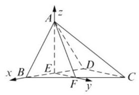

19.(1)由汽车销量图得 7 年中有 6 年汽车总销量不小于 5.5 万辆，则这一年该地区汽车总销量不小于 5.5 万辆的概率为 $\frac{6}{7}$ ;

(2)由图表得新能源汽车 2015-2021 年的销量如下表:

新能源汽车销量超过 0.5 万辆的年份有 2 个, 不超过 0.5 万辆的年份有 5 个,则随机变量 $X$ 可能的取值为 0,1,2 ,

<table><tr><td>年份</td><td>2015</td><td>2016</td><td>2017</td><td>2018</td><td>2019</td><td>2020</td><td>2021</td></tr><tr><td>新能源汽车销量</td><td>0.0625</td><td>0.112</td><td>0.168</td><td>0.275</td><td>0.456</td><td>0.54</td><td>1.16</td></tr></table>

$P\left( {X = 0}\right)  = \frac{{\mathrm{C}}_{5}^{2}}{{\mathrm{C}}_{7}^{2}} = \frac{10}{21}, P\left( {X = 1}\right)  = \frac{{\mathrm{C}}_{5}^{1}{\mathrm{C}}_{2}^{1}}{{\mathrm{C}}_{7}^{2}} = \frac{10}{21},$

$P\left( {X = 2}\right)  = \frac{{\mathrm{C}}_{2}^{2}}{{\mathrm{C}}_{7}^{2}} = \frac{1}{21}$ ,所以 $X$ 分布列为

$\left( \begin{matrix} 0 & 1 & 2 \\  \frac{10}{21} & \frac{10}{21} & \frac{1}{21} \end{matrix}\right) , E\left\lbrack  X\right\rbrack   = \frac{4}{7}.$

20. (1) 由 $f\left( x\right)  = g\left( x\right)$ 得 $x = 0$ ,又 ${f}^{\prime }\left( x\right)  = {2x} + 2$ , ${g}^{\prime }\left( x\right)  =  - {2x} + 2$ ,所以 ${f}^{\prime }\left( 0\right)  = {g}^{\prime }\left( 0\right)  = 2$ ,所以, 函数 $h\left( x\right)$ 的图象为过原点,斜率为 2 的直线, 所以 $h\left( x\right)  = {2x}$ ,经检验: $h\left( x\right)  = {2x}$ ,符合任意; (2) $h\left( x\right)  - g\left( x\right)  = k\left( {x - 1 - \ln x}\right)$ , 设 $\varphi \left( x\right)  = x - 1 - \ln x$ ,设 ${\varphi }^{\prime }\left( x\right)  = 1 - \frac{1}{x} = \frac{x - 1}{x}$ , 在 $\left( {1, + \infty }\right)$ 上, ${\varphi }^{\prime }\left( x\right)  > 0,\varphi \left( x\right)$ 严格增,

在 $\left( {0,1}\right)$ 上, ${\varphi }^{\prime }\left( x\right)  < 0,\varphi \left( x\right)$ 严格减,

所以 $\varphi \left( x\right)  \geq  \varphi \left( 1\right)  = 0$ ,所以当 $h\left( x\right)  - g\left( x\right)  \geq  0$ 时,

$k \geq  0$ ,令 $p\left( x\right)  = f\left( x\right)  - h\left( x\right)$ ,

所以 $p\left( x\right)  = {x}^{2} - x + 1 - \left( {{kx} - k}\right)$

$= {x}^{2} - \left( {k + 1}\right) x + \left( {1 + k}\right)  \geq  0$ ,

得,当 $x = k + 1 \leq  0$ 时,即 $k \leq   - 1$ 时,

$f\left( x\right)$ 在 $\left( {0, + \infty }\right)$ 上严格增,

所以 $p\left( x\right)  > p\left( 0\right)  = 1 + k \geq  0, k \geq   - 1$ ,

所以 $k =  - 1$ ,当 $k + 1 > 0$ 时,即 $k >  - 1$ 时,

$\Delta  \leq  0$ ,即 ${\left( k + 1\right) }^{2} - 4\left( {k + 1}\right)  \leq  0$ ,

解得 $- 1 < k \leq  3$ ,

综上, $k \in  \left\lbrack  {0,3}\right\rbrack$ .

(3)因为 $f\left( x\right)  = {x}^{4} - 2{x}^{2}$ ，

所以 ${f}^{\prime }\left( x\right)  = 4{x}^{3} - {4x} = {4x}\left( {x + 1}\right) \left( {x - 1}\right)$ ,

<table><tr><td>$x$</td><td>$- \sqrt{2}$</td><td>$\left( {-\sqrt{2}, - 1}\right)$</td><td>-1</td><td>(-1,0)</td><td>0</td><td>(0,1)</td><td>1</td><td>(1,2)</td><td>✓2</td></tr><tr><td>${f}^{\prime }\left( x\right)$</td><td></td><td>-</td><td>0</td><td>+</td><td>0</td><td>-</td><td>0</td><td>+</td><td></td></tr><tr><td>$f\left( x\right)$</td><td>0</td><td>↓</td><td>-1</td><td>↑</td><td>0</td><td>↓</td><td>-1</td><td>↑</td><td>0</td></tr></table>

所以函数 $y = f\left( x\right)$ 的图象在 $x = {x}_{0}$ 处的切线为: $y = \left( {4{x}_{0}^{3} - 4{x}_{0}}\right) \left( {x - {x}_{0}}\right)  + \left( {{x}_{0}^{4} - 2{x}_{0}^{2}}\right)  = \; \left( {4{x}_{0}^{3} - 4{x}_{0}}\right) x - 3{x}_{0}^{4} + 2{x}_{0}^{2}$ ,可见直线 $y = h\left( x\right)$ 为函数 $y = f\left( x\right)$ 的图象在 $x = t\left( {0 < \left| t\right|  \leq  \sqrt{2}}\right)$ 处的切线. 由函数 $y = f\left( x\right)$ 的图象可知,

当 $f\left( x\right)  \geq  h\left( x\right)$ 在区间 $D$ 上恒成立时,

$\left| t\right|  \in  \left\lbrack  {1,\sqrt{2}}\right\rbrack$ ,又由 $g\left( x\right)  - h\left( x\right)  = 0$ ,

得 $4{x}^{2} - 4\left( {{t}^{3} - 1}\right) x + 3{t}^{4} - 2{t}^{2} - 8 = 0$ ,

设方程 $g\left( x\right)  - h\left( x\right)  = 0$ 的两根为 ${x}_{1},{x}_{2}$ ,

则 ${x}_{1} + {x}_{2} = {t}^{3} - t,{x}_{1}{x}_{2} = \frac{3{t}^{4} - 2{t}^{2} - 8}{4}$ ,

所以 $\left| {{x}_{1} - {x}_{2}}\right|  = \sqrt{{\left( {x}_{1} + {x}_{2}\right) }^{2} - 4{x}_{1}{x}_{2}}$

$= \sqrt{{\left( {t}^{3} - t\right) }^{2} - \left( {3{t}^{4} - 2{t}^{2} - 8}\right) }$

$= \sqrt{{t}^{6} - 5{t}^{4} + 3{t}^{2} + 8},{t}^{2} = \lambda$ ,

则 $\lambda  \in  \left\lbrack  {1,2}\right\rbrack$ ,由图象可知,

$n - m = \left| {{x}_{1} - {x}_{2}}\right|  = \sqrt{{\lambda }^{3} - 5{\lambda }^{2} + {3\lambda } + 8},$

设 $\varphi \left( \lambda \right)  = {\lambda }^{3} - 5{\lambda }^{2} + {3\lambda } + 8$ ,

则 ${\varphi }^{\prime }\left( \lambda \right)  = 3{\lambda }^{2} - {10\lambda } + 3 = \left( {\lambda  - 3}\right) \left( {{3\lambda } - 1}\right)$ ,

所以当 $\lambda  \in  \left\lbrack  {1,2}\right\rbrack$ 时, ${\varphi }^{\prime }\left( \lambda \right)  < 0,\varphi \left( \lambda \right)$ 严格减,

所以 $\varphi {\left( \lambda \right) }_{\max } = \varphi \left( 1\right)  = 7$ ,

故 ${\left( n - m\right) }_{\max } = {\left| {x}_{1} - {x}_{2}\right| }_{\max } = \sqrt{7}$ ,

即 $n - m \leq  \sqrt{7}$ .

21. (1) 当 $n \geq  2$ 时, ${a}_{n} = {S}_{n} - {S}_{n - 1} = 2 \cdot  {3}^{n - 1}$ ,

${S}_{n} = {3}^{n}$ 为奇数,而 ${a}_{n} = 2 \cdot  {3}^{n - 1}$ 为偶数 ${S}_{n} \neq  {a}_{m}$ ,

数列 $\left\{  {a}_{n}\right\}$ 不是 “ $E$ 数列”;

(2)若 $\left\{  {b}_{n}\right\}$ 是 “ $E$ 数列”，则对任意的正整数 $n$ ， 总存在正整数 $m$ ,使得 ${S}_{n} = {b}_{m}$ 成立,

$n + \frac{n\left( {n - 1}\right) }{2}d = 1 + \left( {m - 1}\right) d$ ,取 $n = 2,$

得 $1 + d = \left( {m - 1}\right) d, m = 2 + \frac{1}{d}, d < 0, m < 2$ ,

又 $m$ 为正整数, $m = 1, d =  - 1$ ,证明:

当 $d =  - 1$ 时, ${b}_{n} = 2 - n,{S}_{n} =  - \frac{1}{2}{n}^{2} + \frac{3}{2}n$ ,

${S}_{n} =  - \frac{1}{2}{n}^{2} + \frac{3}{2}n = 2 - m,$

则 $m = \frac{1}{2}{n}^{2} + \frac{3}{2}n + 2 = \frac{n\left( {n + 3}\right) }{2} + 2 \in  \mathbf{N}$ ,

$\left\{  {b}_{n}\right\}$ 是 “ $E$ 数列”;

(3)研究满足结论的充分条件,对于任意等差数列 $\left\{  {a}_{n}\right\}$ ,假设存在两个 $\left\{  {b}_{n}\right\}$ 和 $\left\{  {c}_{n}\right\}$ ,满足题意. 不妨取 $\left\{  {b}_{n}\right\}$ 和 $\left\{  {c}_{n}\right\}$ 为等差数列,设它们公差分别为 ${d}_{1},{d}_{2}$ ,不妨取 ${b}_{1} \neq  0,{d}_{1} \neq  0$ ,若数列 $\left\{  {b}_{n}\right\}$ 是 “ $E$ 数列”,则 $n{b}_{1} + \frac{n\left( {n - 1}\right) }{2}{d}_{1} = {b}_{1} + \left( {{m}_{1} - 1}\right) {d}_{1}$ , ${m}_{1} = \frac{n - 1}{{d}_{1}}{b}_{1} + \frac{n\left( {n - 1}\right) }{2} + 1$ 为正整数, $n = 1$ 时, ${m}_{1} = 1, n \geq  2$ 时,只需取 ${b}_{1} = k{d}_{1}, k \in  \mathbf{Z}$ ,

${m}_{1} = \left( {n - 1}\right) k + \frac{n\left( {n - 1}\right) }{2} + 1 \geq  1, k \geq   - \frac{n}{2}, k \geq   - 1,$ 当 ${b}_{1} = k{d}_{1}, k \geq   - 1, k \in  \mathbf{Z}$ 时,则数列 $\left\{  {b}_{n}\right\}$ 必是 “ $E$ 数列”; 又 ${c}_{n} = {a}_{n} - {b}_{n} = {a}_{1} + \left( {n - 1}\right) d - \; \left\lbrack  {{b}_{1} + \left( {n - 1}\right) {d}_{1}}\right\rbrack   = \left( {{a}_{1} - {b}_{1}}\right)  + \left( {n - 1}\right) \left( {d - {d}_{1}}\right) ,$ 数列 $\left\{  {c}_{n}\right\}$ 也为等差数列,首项 ${a}_{1} - {b}_{1}$ ,

公差 ${d}_{2} = d - {d}_{1}$ ,如果 $\left\{  {c}_{n}\right\}$ 也为 “ $E$ 数列”,则

$\left( {{a}_{1} - {b}_{1}}\right) n + \frac{n\left( {n - 1}\right) }{2}\left( {d - {d}_{1}}\right)$

$= {a}_{1} - {b}_{1} + \left( {{m}_{2} - 1}\right) \left( {d - {d}_{1}}\right)$ (不妨取 ${d}_{1} \neq  d$ )

${m}_{1} = \left( {n - 1}\right) \frac{{a}_{1} - {b}_{1}}{d - {d}_{1}} + \frac{n\left( {n - 1}\right) }{2} + 1$ 是正整数,

$n = 1$ 时, ${m}_{1} = 1, n \geq  2$ 时,只需 ${a}_{1} = {b}_{1}$ ,

且 ${d}_{1} \neq  d$ 时,数列 $\left\{  {b}_{n}\right\}$ 必是 “ $E$ 数列”;

综上: 对于任意一个等差数列 $\left\{  {a}_{n}\right\}$ ,

总存在两个“ $E$ 数列” $\left\{  {b}_{n}\right\}$ 和 $\left\{  {c}_{n}\right\}$ ,满足题意.

其中数列 $\left\{  {b}_{n}\right\}$ 满足 ${a}_{1} = {b}_{1} = k{d}_{1},\left( {k \geq   - 1, k \in  \mathbf{Z}}\right)$ ,

${d}_{1} \neq  d$ ,说明: $k = 0$ 时, ${a}_{1} = {b}_{1} = 0$ ,

此时也满足题意.

## 上海高考数学模拟试卷六

## 一、填空题

1. -i 2. arctan2 3. -15 4. -2

5. $\frac{\sqrt{13}}{2}$ 6. $m \geq  3$ 7. $\frac{{\mathrm{C}}_{8}^{1}{\mathrm{C}}_{2}^{1}}{{\mathrm{C}}_{10}^{2}} = \frac{16}{45}$

8. $- \frac{\sqrt{2}}{2}$ 9. $\sqrt{17}$ 10. 4

11. $1 - {\mathrm{C}}_{6}^{0}{\left( {0.5}\right) }^{6} - {\mathrm{C}}_{6}^{1}{\left( {0.5}\right) }^{6} - {\mathrm{C}}_{6}^{2}{\left( {0.5}\right) }^{6} = 1 - \; \frac{1 + 6 + {15}}{64} = \frac{21}{32}$

12. $\left\lbrack  {\frac{163}{9}, + \infty }\right)$

二、选择题

13. B 14. D 15. B 16. A

## 三、解答题

17. (1)依题意， ${BE} = {EC} = \frac{1}{2}{BC} = {AB} = {CD}$ ，

所以 $\bigtriangleup {ABE}$ 是正三角形, $\angle {AEB} = {60}^{ \circ  }$ ,

又 $\angle {CED} = \frac{1}{2} \times  \left( {{180}^{ \circ  } - {120}^{ \circ  }}\right)  = {30}^{ \circ  }$ ,

所以 $\angle {AED} = {90}^{ \circ  },{DE} \bot  {AE}$ ,

因为 $A{A}_{1} \bot$ 平面 ${ABCD},{DE} \subsetneqq$ 平面 ${ABCD}$ ,

所以 $A{A}_{1} \bot  {DE}$ ,因为 $A{A}_{1} \cap  {AE} = A$ ,

所以 ${DE} \bot$ 平面 ${A}_{1}{AE}$ ;

(2)解法 1: 取 $B{B}_{1}$ 的中点 $F$ ,连接 ${EF}\text{ 、 }{AF}$ , 连接 ${B}_{1}C$ ,则 ${EF}//{B}_{1}C//{A}_{1}D$ ,

所以 $\angle {AEF}$ 是异面直线 ${AE}$ 与 ${A}_{1}D$ 所成的角,

因为 ${DE} = \sqrt{3},{A}_{1}E = \sqrt{{A}_{1}{A}^{2} + A{E}^{2}}$ ,

所以 ${A}_{1}A = \sqrt{2},{BF} = \frac{\sqrt{2}}{2}$ ,

${AF} = {EF} = \sqrt{\frac{1}{2} + 1} = \frac{\sqrt{6}}{2},$

所以 $\cos \angle {AEF} = \frac{A{E}^{2} + E{F}^{2} - A{F}^{2}}{2 \times  {AE} \times  {EF}} = \frac{\sqrt{6}}{6}$ .

解法 2: 以 $A$ 为原点,过 $A$ 且垂直于 ${BC}$ 的直线为 $x$ 轴, ${AD}$ 所在直线为 $y$ 轴. $A{A}_{1}$ 所在直线为 $z$ 建立右手系空间直角坐标系,

设 $A{A}_{1} = a\left( {a > 0}\right) , A\left( {0,0,0}\right)$ ,

则 $D\left( {0,2,0}\right) ,{A}_{1}\left( {0,0, a}\right)$ ,

$E\left( {\frac{\sqrt{3}}{2},\frac{1}{2},0}\right)$ ,由 ${DE} = {A}_{1}E$ 即

$\sqrt{{\left( \frac{\sqrt{3}}{2}\right) }^{2} + {\left( 2 - \frac{1}{2}\right) }^{2} + 0}$

$= \sqrt{{\left( \frac{\sqrt{3}}{2}\right) }^{2} + {\left( \frac{1}{2}\right) }^{2} + {a}^{2}},$

解得 $a = \sqrt{2},\overrightarrow{AE} = \left( {\frac{\sqrt{3}}{2},\frac{1}{2},0}\right)$ ,

$\overrightarrow{{A}_{1}D} = \left( {0,2, - \sqrt{2}}\right)$ ,所以异面直线 ${AE}$ 与 ${A}_{1}D$ 所成角的余弦值 $\cos \theta  = \frac{\left| \overrightarrow{AE} \cdot  \overrightarrow{{A}_{1}D}\right| }{\left| \overrightarrow{AE}\right|  \cdot  \left| \overrightarrow{{A}_{1}D}\right| } = \frac{\sqrt{6}}{6}$ .

18. (1) 由已知 ${f}^{\prime }\left( x\right)  =  - \frac{1}{{x}^{2}}$ ,由此得切线 $l$ 的方程: $y - \frac{1 - a{x}_{1}}{{x}_{1}} =  - \frac{1}{{x}_{1}^{2}}\left( {x - {x}_{1}}\right)$ ,切线方程中令 $y = 0$ ,得 ${x}_{2} = {x}_{1}\left( {1 - a{x}_{1}}\right)  + {x}_{1} = {x}_{1}(2 - \; \left. {a{x}_{1}}\right)  =  - a{\left( {x}_{1} - \frac{1}{a}\right) }^{2} + \frac{1}{a}$ ,因为 $0 < {x}_{1} < \frac{2}{a}$ , 所以此函数在区间 $\left( {0,\frac{1}{a}}\right\rbrack$ 严格增,

在区间 $\left\lbrack  {\frac{1}{a},\frac{2}{a}}\right)$ 上严格减; 所以 $0 < {x}_{2} \leq  \frac{1}{a}$ ;

(2)当 ${x}_{1} < \frac{1}{a}$ 时， $a{x}_{1} < 1$ ，因此，

${x}_{2} = {x}_{1}\left( {2 - a{x}_{1}}\right)  > {x}_{1}$ ,由 ①, ${x}_{2} < \frac{1}{a}$ ,

所以 ${x}_{1} < {x}_{2} < \frac{1}{a}$ .

19.(1)由题意:当 $0 \leq  x \leq  {20}$ 时， $v\left( x\right)  = {60}$ ；

当 ${20} \leq  x \leq  {200}$ 时，设 $v\left( x\right)  = {ax} + b$ ，

显然 $v\left( x\right)  = {ax} + b$ 在 $\left\lbrack  {{20},{200}}\right\rbrack$ 是严格减函数,

由已知得 $\left\{  \begin{array}{l} {200a} + b = 0 \\  {20a} + b = {60} \end{array}\right.$ ,解得 $\left\{  \begin{array}{l} a =  - \frac{1}{3} \\  b = \frac{200}{3} \end{array}\right.$ ,

故函数 $v\left( x\right)$ 的表达式为

$v\left( x\right)  = \left\{  \begin{array}{l} {60},0 \leq  x < {20}, \\  \frac{1}{3}\left( {{200} - x}\right) ,{20} \leq  x \leq  {200}; \end{array}\right.$

(2)依题意并由(1)可得

$$
f\left( x\right)  = \left\{  \begin{array}{l} {60x},0 \leq  x < {20}, \\  \frac{1}{3}x\left( {{200} - x}\right) ,{20} \leq  x \leq  {200}. \end{array}\right.
$$

当 $0 \leq  x \leq  {20}$ 时, $f\left( x\right)$ 为严格增函数,

故当 $x = {20}$ 时,

其最大值为 ${60} \times  {20} = {1200}$ ,当 ${20} \leq  x \leq  {200}$ 时,

$f\left( x\right)  = \frac{1}{3}x\left( {{200} - x}\right) \; \leq  \frac{1}{3}{\left\lbrack  \frac{x + \left( {{200} - x}\right) }{2}\right\rbrack  }^{2} = \frac{10000}{3},$

当且仅当 $x = {200} - x$ ,即 $x = {100}$ 时,等号成立. 所以,当 $x = {100}$ 时, $f\left( x\right)$ 在区间 $\left\lbrack  {{20},{200}}\right\rbrack$ 上取得最大值 $\frac{10000}{3}$ .

综上,当 $x = {100}$ 时, $f\left( x\right)$ 在区间 $\left\lbrack  {0,{200}}\right\rbrack$ 上取得最大值 $\frac{10000}{3} \approx  {3333}$ ,即当车流密度为 100 辆/千米时, 车流量达到最大, 最大值约为 3333 辆/小时.

20. (1) $\frac{c}{a} = \frac{\sqrt{2}}{2},{a}^{2} = 2{b}^{2}$ ，又 $2\sqrt{b} = {2b}$ ，得 $b = 1$ ，

所以 ${C}_{2} : y = {x}^{2} - 1,{C}_{1} : \frac{{x}^{2}}{2} + {y}^{2} = 1$ ;

(2)设直线 ${AB} : y = {kx}, A\left( {{x}_{1},{y}_{1}}\right) , B\left( {{x}_{2},{y}_{2}}\right)$

则 $\left\{  \begin{array}{l} y = {kx} \\  y = {x}^{2} - 1 \end{array}\right.$ ,消去 $y$ ,得 ${x}^{2} - {kx} - 1 = 0$ ;

$\overrightarrow{MA} \cdot  \overrightarrow{MB} = \left( {{x}_{1},{y}_{1} + 1}\right)  \cdot  \left( {{x}_{2},{y}_{2} + 1}\right) \; = \left( {{k}^{2} + 1}\right) {x}_{1}{x}_{2} + k\left( {{x}_{1} + {x}_{2}}\right)  + 1 \; = 0$ ,

所以 ${MA}\bot {MB}$ ；

(3)设直线 ${MA} : y = {k}_{1}x - 1;{MB} : y = {k}_{2}x - 1$ ，

${k}_{1}{k}_{2} =  - 1,\left\{  \begin{array}{l} y = {k}_{1}x - 1 \\  y = {x}^{2} - 1 \end{array}\right.$ ,

解得 $\left\{  \begin{array}{l} x = 0 \\  y =  - 1 \end{array}\right.$ 或 $\left\{  {\begin{array}{l} x = {k}_{1} \\  y = {k}_{1}^{2} - 1 \end{array}, A\left( {{k}_{1},{k}_{1}^{2} - 1}\right) }\right.$ ,

同理可得 $B\left( {{k}_{2},{k}_{2}^{2} - 1}\right)$ ,

${S}_{1} = \frac{1}{2}\left| {MA}\right| \left| {MB}\right|  = \frac{1}{2}\sqrt{1 + {k}_{1}^{2}}\sqrt{1 + {k}_{2}^{2}}\left| {k}_{1}\right| \left| {k}_{2}\right| ,$

$\left\{  {\begin{array}{l} y = {k}_{1}x - 1 \\  \frac{{x}^{2}}{2} + {y}^{2} = 1 \end{array}\text{ ,解得 }\left\{  {\begin{array}{l} x = 0 \\  y =  - 1 \end{array}\text{ 或 }\left\{  {\begin{array}{l} x = \frac{4{k}_{1}}{1 + 2{k}_{1}^{2}} \\  y = \frac{2{k}_{1}^{2} - 1}{1 + 2{k}_{1}^{2}} \end{array},}\right. }\right. }\right.$

$D\left( {\frac{4{k}_{1}}{1 + 2{k}_{1}^{2}},\frac{2{k}_{1}^{2} - 1}{1 + 2{k}_{1}^{2}}}\right)$ ,同理可得

$E\left( {\frac{4{k}_{2}}{1 + 2{k}_{2}^{2}},\frac{2{k}_{2}^{2} - 1}{1 + 2{k}_{2}^{2}}}\right) ,$

所以 ${S}_{2} = \frac{1}{2}\left| {MD}\right| \left| {ME}\right| \; = \frac{1}{2}\sqrt{1 + {k}_{1}^{2}}\sqrt{1 + {k}_{2}^{2}}\frac{\left| {16}{k}_{1}{k}_{2}\right| }{\left( {1 + 2{k}_{1}^{2}}\right) \left( {1 + 2{k}_{2}^{2}}\right) }, \; \frac{{S}_{1}}{{S}_{2}} = \lambda  = \frac{\left( {1 + 2{k}_{1}^{2}}\right) \left( {1 + 2{k}_{2}^{2}}\right) }{16} \; = \frac{5 + 2\left( {\frac{1}{{k}_{1}^{2}} + {k}_{1}^{2}}\right) }{16} \geq  \frac{9}{16}.$

21. (1) 由 ${S}_{n} = 4\left( {1 - \frac{1}{{2}^{n}}}\right)$ ,

得 ${S}_{n + 1} = 4\left( {1 - \frac{1}{{2}^{n + 1}}}\right)  = \frac{1}{2}{S}_{n} + 2\left( {n\text{ 为正整数 }}\right)$ ;

(2)由已知 ${a}_{n} = 2{\left( \frac{1}{2}\right) }^{n - 1} = \frac{4}{{2}^{n}}$ ,所以 $\frac{4}{{a}_{n}} = {2}^{n}$ , 当 $n = 1$ 时, $\frac{4}{{a}_{n}} = {2}^{n} = 2 > {1}^{2}$ ;

当 $n = 2$ 时, $\frac{4}{{a}_{n}} = {n}^{2}$ ;

当 $n = 3$ 时, $\frac{4}{{a}_{n}} = 8,{n}^{2} = 9,\frac{4}{{a}_{n}} < {n}^{2}$ ;

当 $n = 4$ 时, $\frac{4}{{a}_{n}} = {16},{n}^{2} = {16},\frac{4}{{a}_{n}} = {n}^{2}$ ;

当 $n \geq  5$ 时, $\frac{4}{{a}_{n}} = {2}^{n} = {\left( 1 + 1\right) }^{n} = {\mathrm{C}}_{n}^{0} + {\mathrm{C}}_{n}^{1} + {\mathrm{C}}_{n}^{2} + \cdots \; + {\mathrm{C}}_{n}^{n} \geq  2\left( {{\mathrm{C}}_{n}^{0} + {\mathrm{C}}_{n}^{1} + {\mathrm{C}}_{n}^{2}}\right)  = 2\left( {1 + n + \frac{n\left( {n - 1}\right) }{2}}\right)  = \; 2 + {2n} + {n}^{2} - n = {n}^{2} + n + 2 > {n}^{2}$ ,综上可得:

当 $n = 2,4$ 时, $\frac{4}{{a}_{n}} = {n}^{2}$ ;

当 $n = 3$ 时, $\frac{4}{{a}_{n}} < {n}^{2}$ ;

当 $n = 1, n \geq  5\left( {n \in  \mathbf{N}}\right)$ 时, $\frac{4}{{a}_{n}} > {n}^{2}$ ;

(3)要使 $\frac{{S}_{k + 1} - c}{{S}_{k} - c} > 2$ ，只要 $\frac{c - \left( {\frac{3}{2}{S}_{k} - 2}\right) }{c - {S}_{k}} < 0$ .

其中 $k$ 是正整数,因为 ${S}_{k} = 4\left( {1 - \frac{1}{{2}^{k}}}\right)  < 4$ ,

所以 ${S}_{k} - \left( {\frac{3}{2}{S}_{k} - 2}\right)  = 2 - \frac{1}{2}{S}_{k} > 0$ ,

故只要 $\frac{3}{2}{S}_{k} - 2 < c < {S}_{k}$ . ①

因为 ${S}_{k + 1} > {S}_{k}$ ,所以 $\frac{3}{2}{S}_{k} - 2 \geq  \frac{3}{2}{S}_{1} - 2 = 1$ , 又 ${S}_{k} < 4$ ,故要使 ① 成立, $c$ 只能取 2 或 3 . 当 $c = 2$ 时,因为 ${S}_{1} = 2$ ,所以当 $k = 1$ 时, $c < {S}_{k}$ 不成立,从而①不成立.

因为 $\frac{3}{2}{S}_{2} - 2 = \frac{5}{2} > c$ ,由 ${s}_{k} < {s}_{k + 1}$ ,

得 $\frac{3}{2}{S}_{k} - 2 < \frac{3}{2}{S}_{k + 1} - 2$ ,所以当 $k \geq  2$ 时,

$\frac{3}{2}{S}_{k} - 2 > c$ ,从而①不成立. 当 $c = 3$ 时,

因为 ${S}_{1} = 2,{S}_{2} = 3$ ,所以当 $k = 1,2$ 时,

$c < {S}_{k}$ 不成立,从而①不成立.

因为 $\frac{3}{2}{S}_{3} - 2 = \frac{13}{4} > c$ ,

又 $\frac{3}{2}{S}_{k} - 2 < \frac{3}{2}{S}_{k + 1} - 2$ ,所以当 $k \geq  3$ 时, $\frac{3}{2}{S}_{3} - 2 > c$ ,从而①不成立.

故不存在自然数 $c.k$ ,使 $\frac{{S}_{k + 1} - c}{{S}_{k} - c} > 2$ 成立.

## 上海高考数学模拟试卷七

## 一、填空题

1. $\{ x \mid  0 \leq  x < 1\} \;$ 2.13. 39

4. $\left( {-1, + \infty }\right) \;$ 5. 3 或 $\frac{25}{3}\;$ 6. 1

${7.18\pi }\;8.\; - \frac{9}{8}\;9.\;{3}^{2x}$

10. ①②④ 11. $- \frac{1}{13}$

12. $\left( {-\infty , - 2}\right)  \cup  \left( {0,2}\right)$

二、选择题

13. C 14. A 15. B 16. B

三、解答题

17. (1) 由题设知 $f\left( x\right)  = \frac{1}{2}\left\lbrack  {1 + \cos \left( {{2x} + \frac{\pi }{6}}\right) }\right\rbrack$ .

因为 $x = {x}_{0}$ 是函数 $y = f\left( x\right)$ 图象的一条对称轴,

所以 $2{x}_{0} + \frac{\pi }{6} = {k\pi }$ ,即 $2{x}_{0} = {k\pi } - \frac{\pi }{6}\left( {k \in  \mathbf{Z}}\right)$ .

所以 $g\left( {x}_{0}\right)  = 1 + \frac{1}{2}\sin 2{x}_{0}$

$$
= 1 + \frac{1}{2}\sin \left( {{k\pi } - \frac{\pi }{6}}\right) .
$$

当 $k$ 为偶数时,

$g\left( {x}_{0}\right)  = 1 + \frac{1}{2}\sin \left( {-\frac{\pi }{6}}\right)  = 1 - \frac{1}{4} = \frac{3}{4},$

当 $k$ 为奇数时,

$g\left( {x}_{0}\right)  = 1 + \frac{1}{2}\sin \frac{\pi }{6} = 1 + \frac{1}{4} = \frac{5}{4};$

(2) $h\left( x\right)  = f\left( x\right)  + g\left( x\right) \; = \frac{1}{2}\left\lbrack  {1 + \cos \left( {{2x} + \frac{\pi }{6}}\right) }\right\rbrack   + 1 + \frac{1}{2}\sin {2x} \; = \frac{1}{2}\left\lbrack  {\cos \left( {{2x} + \frac{\pi }{6}}\right)  + \sin {2x}}\right\rbrack   + \frac{3}{2}$

$$
= \frac{1}{2}\left( {\frac{\sqrt{3}}{2}\cos {2x} + \frac{1}{2}\sin {2x}}\right)  + \frac{3}{2}
$$

$$
= \frac{1}{2}\sin \left( {{2x} + \frac{\pi }{3}}\right)  + \frac{3}{2}\text{ . }
$$

当 ${2k\pi } - \frac{\pi }{2} \leq  {2x} + \frac{\pi }{3} \leq  {2k\pi } + \frac{\pi }{2}$ ,

即 ${k\pi } - \frac{5\pi }{12} \leq  x \leq  {k\pi } + \frac{\pi }{12}\left( {k \in  \mathbf{Z}}\right)$ 时,

函数 $h\left( x\right)  = \frac{1}{2}\sin \left( {{2x} + \frac{\pi }{3}}\right)  + \frac{3}{2}$ 是严格增函数, 故函数 $h\left( x\right)$ 的单调增区间是

$$
\left\lbrack  {{k\pi } - \frac{5\pi }{12},{k\pi } + \frac{\pi }{12}}\right\rbrack  \left( {k \in  \mathbf{Z}}\right) .
$$

18. 解法 1: (1) 作 ${FG}//{DC}$ 交 ${SD}$ 于点 $G$ ,

则 $G$ 为 ${SD}$ 的中点. 连结 ${AG},{FG} \text{ ⫫ } \frac{1}{2}{CD}$ ,

又 ${CD} \text{ ⫫ } {AB}$ ,故 ${FG} \text{ ⫫ } {AE},{AEFG}$ 为平行四边形.

${EF}//{AG}$ ,又 ${AG} \subset$ 平面 ${SAD}$ ,

${EF} \text{ ⊄ }$ 平面 ${SAD}$ . 所以 ${EF}//$ 平面 ${SAD}$ ；

(2)不妨设 ${DC} = 2$ ，则 ${SD} = 4,{DG} = 2$ ，

$\bigtriangleup {ADG}$ 为等腰直角三角形. 取 ${AG}$ 中点 $H$ ,

连结 ${DH}$ ,则 ${DH} \bot  {AG}$ . 又 ${AB} \bot$ 平面 ${SAD}$ ,

所以 ${AB} \bot  {DH}$ ,而 ${AB} \cap  {AG} = A$ ,

所以 ${DH} \bot$ 面 ${AEF}$ . 取 ${EF}$ 中点 $M$ ,连结 ${MH}$ ,

则 ${HM} \bot  {EF}$ . 连结 ${DM}$ ,则 ${DM} \bot  {EF}$ .

故 $\angle {DMH}$ 为二面角 $A - {EF} - D$ 的平面角,

$\tan \angle {DMH} = \frac{DH}{HM} = \frac{\sqrt{2}}{1} = \sqrt{2}$ .

所以二面角 $A - {EF} - D$ 的大小为 $\arctan \sqrt{2}$ .

解法 2: (1) 如图,建立空间直角坐标系 $D - {xyz}$ .

设 $A\left( {a,0,0}\right) , S\left( {0,0, b}\right)$ ,则 $B\left( {a, a,0}\right) , C\left( {0, a,0}\right)$ ,

$E\left( {a,\frac{a}{2},0}\right) , F\left( {0,\frac{a}{2},\frac{b}{2}}\right) ,$

$\overrightarrow{EF} = \left( {-a,0,\frac{b}{2}}\right)$ . 取 ${SD}$ 的中点 $G\left( {0,0,\frac{b}{2}}\right)$ ,

则 $\overrightarrow{AG} = \left( {-a,0,\frac{b}{2}}\right) .\overrightarrow{EF} = \overrightarrow{AG},{EF}//{AG}$ ,

${AG} \subset$ 平面 ${SAD},{EF} \text{ ⊄ }$ 平面 ${SAD}$ ,

所以 ${EF}//$ 平面 ${SAD}$ ;

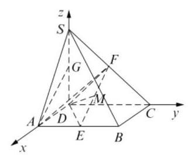

(2)不妨设 $A\left( {1,0,0}\right)$ ,则 $B\left( {1,1,0}\right) , C\left( {0,1,0}\right)$ ,

$S\left( {0,0,2}\right) , E\left( {1,\frac{1}{2},0}\right) , F\left( {0,\frac{1}{2},1}\right) ,$

${EF}$ 中点 $M\left( {\frac{1}{2},\frac{1}{2},\frac{1}{2}}\right)$ ,

$\overrightarrow{MD} = \left( {-\frac{1}{2}, - \frac{1}{2}, - \frac{1}{2}}\right) ,$

$\overrightarrow{EF} = \left( {-1,0,1}\right) ,\overrightarrow{MD} \cdot  \overrightarrow{EF} = 0,{MD} \bot  {EF},$

又 $\overrightarrow{EA} = \left( {0, - \frac{1}{2},0}\right) ,\overrightarrow{EA} \cdot  \overrightarrow{EF} = 0,{EA} \bot  {EF}$ ,

所以向量 $\overrightarrow{MD}$ 和 $\overrightarrow{EA}$ 的夹角等于二面角 $A - \; {EF} - D$ 的平面角.

$\cos \langle \overrightarrow{MD},\overrightarrow{EA}\rangle  = \frac{\overrightarrow{MD} \cdot  \overrightarrow{EA}}{\left| \overrightarrow{MD}\right|  \cdot  \left| \overrightarrow{EA}\right| } = \frac{\sqrt{3}}{3}.$

所以二面角 $A - {EF} - D$ 的大小为 $\arccos \frac{\sqrt{3}}{3}$ .

19. ( 1 )记 $A$ 表示事件:“3 位顾客中至少 1 位采用一次性付款”，则 $\bar{A}$ 表示事件:“3 位顾客中无人采用一次性付款”.

$P\left( \bar{A}\right)  = {\left( 1 - {0.6}\right) }^{2} = {0.064},$

$P\left( A\right)  = 1 - P\left( \bar{A}\right)  = 1 - {0.064} = {0.936};$

(2)记 $B$ 表示事件:“3 位顾客每人购买 1 件该商品,商场获得利润不超过 650 元”. ${B}_{0}$ 表示事件: “购买该商品的 3 位顾客中无人采用分期付款”. ${B}_{1}$ 表示事件:“购买该商品的 3 位顾客中恰有 1 位采用分期付款”.

则 $B = {B}_{0} + {B}_{1}$ .

$P\left( {B}_{0}\right)  = {0.6}^{3} = {0.216},$

$P\left( {B}_{1}\right)  = {\mathrm{C}}_{3}^{1} \times  {0.6}^{2} \times  {0.4} = {0.432}.$

$P\left( B\right)  = P\left( {{B}_{0} + {B}_{1}}\right)$

$= P\left( {B}_{0}\right)  + P\left( {B}_{1}\right)$

$= {0.216} + {0.432} = {0.648}$ .

20. ( 1 )由已知得: $\left\{  \begin{array}{l} a + c = 3 \\  a - c = 1 \end{array}\right.$ ，解得 $\left\{  \begin{array}{l} a = 2 \\  c = 1 \end{array}\right.$ ，

所以 ${b}^{2} = {a}^{2} - {c}^{2} = 3$ .

所以椭圆的标准方程为 $\frac{{x}^{2}}{4} + \frac{{y}^{2}}{3} = 1$ ;

(2)由 $\left\{  \begin{array}{l} y = {kx} + 2, \\  \frac{{x}^{2}}{4} + \frac{{y}^{2}}{3} = 1 \end{array}\right.$ 消去 $y$ 得

$\left( {3 + 4{k}^{2}}\right) {x}^{2} + {16kx} + 4 = 0,$

$\Delta  = {64} \times  4{k}^{2} - {16}\left( {3 + 4{k}^{2}}\right)  > 0$ ,即 ${k}^{2} > \frac{1}{4}.$

设 $A\left( {{x}_{1},{y}_{1}}\right) , B\left( {{x}_{2},{y}_{2}}\right)$ ,

因为椭圆的右顶点为 ${A}_{2}\left( {2,0}\right)$ ,

$\overrightarrow{A{A}_{2}} = \left( {2 - {x}_{1}, - {y}_{1}}\right) ,\overrightarrow{B{A}_{2}} = \left( {2 - {x}_{2}, - {y}_{2}}\right)$ , 因为 $A{A}_{2} \bot  B{A}_{2}$ ,

所以 $\left( {2 - {x}_{1}, - {y}_{1}}\right)  \cdot  \left( {2 - {x}_{2}, - {y}_{2}}\right)  = 0 \Leftrightarrow$

$\left( {2 - {x}_{1}}\right) \left( {2 - {x}_{2}}\right)  + {y}_{1}{y}_{2} = 0,$

$\left( {{k}^{2} + 1}\right) {x}_{1}{x}_{2} + 2\left( {k - 1}\right) \left( {{x}_{1} + {x}_{2}}\right)  + 8 = 0,$

$\left( {{k}^{2} + 1}\right) \frac{4}{3 + 4{k}^{2}} - 2\left( {k - 1}\right)  \cdot  \frac{16k}{3 + 4{k}^{2}} + 8 = 0,$

${k}^{2} + {8k} + 7 = 0$ . 所以 $k =  - 1$ 或 $k =  - 7$ .

当 $k =  - 1$ 时,直线经过点 ${A}_{2}$ 舍去.

所以 $k =  - 7$ ;

(3)参考问题:

1) 若直线 $l : y = x + m$ 与 (1) 中所述椭圆 $C$ 相交于 $A, B$ 两点 $\left( {A, B\text{ 不是左右顶点 }}\right)$ ,是否存在实数 $m$ 满足 $A{A}_{2} \bot  B{A}_{2}$ ,如存在求出 $m$ 的值, 如果不存在, 说明理由;

2) 若直线 $l : y = {2x} + m$ 与 (1) 中所述椭圆 $C$ 相交于 $A, B$ 两点 $\left( {A, B\text{ 不是左右顶点 }}\right)$ ,是否存在实数 $m$ 满足 $A{A}_{2} \bot  B{A}_{2}$ ,如存在求出 $m$ 的值,如果不存在,说明理由;

3) 若直线 $l : y = {kx} + m$ 与 (1) 中所述椭圆 $C$ 相交于 $A, B$ 两点 $\left( {A, B\text{ 不是左右顶点 }}\right)$ ,且满足 $A{A}_{2} \bot  B{A}_{2}$ ,求证: 直线 $l$ 过定点 $\left( {\frac{2}{7},0}\right)$ .

解: (1) 存在 $m =  - \frac{2}{7}$ ;

(2)存在 $m =  - \frac{4}{7}$ ;

(3)联立 $\left\{  \begin{array}{l} y = {kx} + m, \\  \frac{{x}^{2}}{4} + \frac{{y}^{2}}{3} = 1. \end{array}\right.$

得 $\left( {3 + 4{k}^{2}}\right) {x}^{2} + {8mkx} + 4\left( {{m}^{2} - 3}\right)  = 0$ ,

$\Delta  = {64}{m}^{2}{k}^{2} - {16}\left( {3 + 4{k}^{2}}\right) \left( {{m}^{2} - 3}\right)  > 0,$

即 $3 + 4{k}^{2} - {m}^{2} > 0$ ,则

${x}_{1} + {x}_{2} =  - \frac{8mk}{3 + 4{k}^{2}},{x}_{1} \cdot  {x}_{2} = \frac{4\left( {{m}^{2} - 3}\right) }{3 + 4{k}^{2}}$

又 ${y}_{1}{y}_{2} = \left( {k{x}_{1} + m}\right) \left( {k{x}_{2} + m}\right)$

$= {k}^{2}{x}_{1}{x}_{2} + {mk}\left( {{x}_{1} + {x}_{2}}\right)  + {m}^{2}$

$= \frac{3\left( {{m}^{2} - 4{k}^{2}}\right) }{3 + 4{k}^{2}},$

因为椭圆的右顶点为 $D\left( {2,0}\right) ,{k}_{AD}{k}_{BD} =  - 1$ ,

即 $\frac{{y}_{1}}{{x}_{1} - 2} \cdot  \frac{{y}_{2}}{{x}_{2} - 2} =  - 1$ ,

${y}_{1}{y}_{2} + {x}_{1}{x}_{2} - 2\left( {{x}_{1} + {x}_{2}}\right)  + 4 = 0,$

$\frac{3\left( {{m}^{2} - 4{k}^{2}}\right) }{3 + 4{k}^{2}} + \frac{4\left( {{m}^{2} - 3}\right) }{3 + 4{k}^{2}} + \frac{16mk}{3 + 4{k}^{2}} + 4 = 0,$

$9{m}^{2} + {16mk} + 4{k}^{2} = 0.$

解得: ${m}_{1} =  - {2k},{m}_{2} =  - \frac{2k}{7}$ ,

且均满足 $3 + 4{k}^{2} - {m}^{2} > 0$ ,

当 ${m}_{1} =  - {2k}$ 时,

$l$ 的方程为 $y = k\left( {x - 2}\right)$ ,

直线过定点 $\left( {2,0}\right)$ ,

与已知矛盾; 当 ${m}_{2} =  - \frac{2k}{7}$ 时,

$l$ 的方程为 $y = k\left( {x - \frac{2}{7}}\right)$ ,

所以,直线 $l$ 过定点 $\left( {\frac{2}{7},0}\right)$ .

21. (1)证明:由题设 ${a}_{n + 1} = \left( {1 + q}\right) {a}_{n} - q{a}_{n - 1}\left( {n \geq  2}\right)$ ，

得 ${a}_{n + 1} - {a}_{n} = q\left( {{a}_{n} - {a}_{n - 1}}\right)$ ,

即 ${b}_{n} = q{b}_{n - 1}, n \geq  2$ .

又 ${b}_{1} = {a}_{2} - {a}_{1} = 1, q \neq  0$ ,

所以 $\left\{  {b}_{n}\right\}$ 是首项为 1,

公比为 $q$ 的等比数列;

(2)由(1) ${a}_{2} - {a}_{1} = 1$ ，

${a}_{3} - {a}_{2} = q,\cdots ,{a}_{n} - {a}_{n - 1} = {q}^{2},\left( {n \geq  2}\right) .$

将以上各式相加,

得 ${a}_{n} - {a}_{1} = 1 + q + \cdots  + {q}^{n - 2}\left( {n \geq  2}\right)$ .

所以当 $n \geq  2$ 时, ${a}_{n} = \left\{  \begin{array}{l} 1 + \frac{1 - {q}^{n - 1}}{1 - q}, q \neq  1, \\  n, q = 1. \end{array}\right.$

上式对 $n = 1$ 显然成立;

(3)由(2)，当 $q = 1$ 时，

显然 ${a}_{3}$ 不是 ${a}_{6}$ 与 ${a}_{9}$ 的等差中项，故 $q \neq  1$ .

由 ${a}_{3} - {a}_{6} = {a}_{9} - {a}_{3}$ 可得 ${q}^{5} - {q}^{2} = {q}^{2} - {q}^{8}$ ,

由 $q \neq  0$ 得 ${q}^{3} - 1 = 1 - {q}^{6}$ ,①

整理得 ${\left( {q}^{3}\right) }^{2} + {q}^{3} - 2 = 0$ ,

解得 ${q}^{3} =  - 2$ 或 ${q}^{3} = 1$ (舍去).

于是 $q =  - \sqrt[3]{2}$ . 另一方面,

${a}_{n} - {a}_{n + 3} = \frac{{q}^{n + 2} - {q}^{n - 1}}{1 - q} = \frac{{q}^{n - 1}}{1 - q}\left( {{q}^{3} - 1}\right) ,$

${a}_{n + 6} - {a}_{n} = \frac{{q}^{n - 1} - {q}^{n + 5}}{1 - q} = \frac{{q}^{n - 1}}{1 - q}\left( {1 - {q}^{6}}\right) .$

由①可得 ${a}_{n} - {a}_{n + 3} = {a}_{n + 6} - {a}_{n}, n \in  \mathbf{N}, n \geq  1$ .

所以对任意的 $n \in  \mathbf{N}, n \geq  1$ ,

${a}_{n}$ 是 ${a}_{n + 3}$ 与 ${a}_{n + 6}$ 的等差中项.

## 上海高考数学模拟试卷八

## 一、填空题

1. $\{ 0,1,3\}$ 2. $(0,1\rbrack$ 3.-10

4. 2 5. $\frac{\pi }{2}$ 或 $\frac{3\pi }{2}$ 6. $x = 2$

7. ${a}_{n} = \left\{  \begin{array}{l} 2, n = 1 \\  3 \cdot  {2}^{n - 2}, n \geq  2 \end{array}\right.$ 8. $\frac{1}{3}$

9. ④ ${10}.f\left( x\right)  = 2\sin \left( {{2x} + \frac{\pi }{3}}\right)$

11. $\frac{\pi }{16}$ 12. ${a}_{k} - {a}_{k - 1}$

二、选择题

13. B 14. B 15. A 16. C

三、解答题

17. ( 1 )四棱锥 $C - {A}_{1}{B}_{1}{BA}$ 的底面积

${S}_{\text{ 正方形 }{A}_{1}{B}_{1}{BA}} = 4$ ,高 ${AC} = 2$ ,

故 ${V}_{C - {A}_{1}{B}_{1}{BA}} = \frac{1}{3} \times  4 \times  2 = \frac{8}{3}$ ;

(2)取 ${B}_{1}{C}_{1}$ 的中点 ${E}_{1}$ ，连 ${A}_{1}{E}_{1}$ ， ${E}_{1}C$ ，

则 ${AE}//{A}_{1}{E}_{1}$ ，所以 $\angle {E}_{1}{A}_{1}C$ 是异面直线 ${AE}$ 与 ${A}_{1}C$ 所成的角. 由 ${AB} = {AC} = A{A}_{1} = 2$ ,

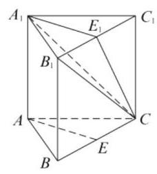

知 ${A}_{1}{E}_{1} = \sqrt{2},{A}_{1}C = 2\sqrt{2}$ ,

${E}_{1}{C}_{1} = \frac{1}{2}{B}_{1}{C}_{1} = \sqrt{2}$ ,所以 ${E}_{1}C = \sqrt{6}$ ,

在 $\bigtriangleup {A}_{1}{E}_{1}C$ 中,

$\cos \angle {E}_{1}{A}_{1}C = \frac{2 + 8 - 6}{2\sqrt{2} \cdot  2\sqrt{2}} = \frac{1}{2},$

所以异面直线 ${AE}$ 与 ${A}_{1}C$ 所成的角为 ${60}^{ \circ  }$ .

18. (1) 由题意, $f\left( x\right)  = x\left| {x - 2}\right|$ .

当 $x < 2$ 时, $f\left( x\right)  = x\left( {2 - x}\right)  \geq  x$ ,

解得 $x \in  \left\lbrack  {0,1}\right\rbrack$ ; 当 $x \geq  2$ 时,

$f\left( x\right)  = x\left( {x - 2}\right)  \geq  x$ ,解得 $x \in  \lbrack 3, + \infty )$ .

综上,所求解集为 $x \in  \left\lbrack  {0,1}\right\rbrack   \cup  \lbrack 3, + \infty )$ ;

(2)① 当 $a \leq  1$ 时，在区间 $\left\lbrack  {1,2}\right\rbrack$ 上，

$f\left( x\right)  = {x}^{2} - {ax} = {\left( x - \frac{a}{2}\right) }^{2} - \frac{{a}^{2}}{4},$

其图像是开口向上的抛物线,

对称轴是 $x = \frac{a}{2}$ ,因为 $a \leq  1$ ,所以 $\frac{a}{2} \leq  \frac{1}{2} < 1$ ,

所以 $f{\left( x\right) }_{\min } = f\left( 1\right)  = 1 - a$ ;

② 当 $1 < a < 2$ 时，在区间 $\left\lbrack  {1,2}\right\rbrack$ 上，

$f\left( x\right)  = x\left| {x - a}\right|  \geq  0, f{\left( x\right) }_{\min } = 0;$

③ 当 $a \geq  2$ 时，在区间 $\left\lbrack  {1,2}\right\rbrack$ 上，

$f\left( x\right)  =  - {x}^{2} + {ax} =  - {\left( x - \frac{a}{2}\right) }^{2} + \frac{{a}^{2}}{4},$

其图像是开口向下的抛物线,

对称轴是 $x = \frac{a}{2}$ ,

${1}^{ \circ  }$ 当 $\left( {1 \leq  }\right) \frac{a}{2} < \frac{3}{2}$ 即 $\left( {2 \leq  }\right) a < 3$ 时,

$f{\left( x\right) }_{\min } = f\left( 2\right)  = {2a} - 4;$

${2}^{ \circ  }$ 当 $\frac{a}{2} \geq  \frac{3}{2}$ 即 $a \geq  3$ 时,

$f{\left( x\right) }_{\min } = f\left( 1\right)  = a - 1,$

综上 $f{\left( x\right) }_{\min } = \left\{  \begin{array}{l} 1 - a, a \leq  1 \\  0,1 < a < 2 \\  {2a} - 4,2 \leq  a < 3 \\  a - 1, a \geq  3 \end{array}\right.$ .

19. ( 1 )平均年龄 $\bar{x} = \left( {5 \times  {0.001} + {15} \times  {0.002} + }\right. \; {25} \times  {0.012} + {35} \times  {0.017} + {45} \times  {0.023} + {55} \times \; {0.020} + {65} \times  {0.017} + {75} \times  {0.006} + {85} \times  {0.002}) \; \times  {10} = {47.9}$ (岁)；

(2)设 $A = \{$ 患这种疾病的年龄在区间 $\lbrack {20},{70})$ 的人 \},则 $P\left( A\right)  = 1 - P\left( \bar{A}\right)  = 1 - ({0.001} + \; {0.002} + {0.006} + {0.002}) \times  {10} = 1 - {0.11} = {0.89}$ ; (3)设 $B = \{$ 年龄位于区间 $\lbrack {40},{50})$ 的人 $\} , C =$ \{患这种疾病的人\},则由条件概率公式, $P\left( {C \mid  B}\right)  = \frac{P\left( {B \cap  C}\right) }{P\left( B\right) } = \frac{{0.1}\%  \times  {0.023} \times  {10}}{0.16} = \; {0.0014375} \approx  {0.0014}$ .

20. ( 1 )因为点 ${P}_{n}\left( {n,{S}_{n}}\right)$ 都在函数 $f\left( x\right)  = {x}^{2} + \; {3x}$ 的图像上,所以 ${S}_{n} = {n}^{2} + {3n}$ . 当 $n = 1$ 时, ${a}_{1} = {S}_{1} = 4$ ; 当 $n \geq  2$ 时, ${a}_{n} = {S}_{n} - {S}_{n - 1} = {n}^{2} + \; {3n} - {\left( n - 1\right) }^{2} - 3\left( {n - 1}\right)  = {2n} + 2$ ,当 $n = 1$ 时, 也满足. 故 ${a}_{n} = {2n} + 2$ ;

(2)因为 $A = \{ x \mid  x = {2n} + 2, n \in  \mathbf{N}, n \geq  1\} , B = \; \left\{  {x \mid  x = {4n} + 2, n \in  \mathbf{N}, n \geq  1}\right\}$ ,所以 $A \cap  B = B$ , 又 ${b}_{n} \in  A \cap  B$ ,所以 ${b}_{n} \in  B$ ,即数列 $\left\{  {b}_{n}\right\}$ 的公差是 4 的倍数. 又 $A \cap  B$ 中的最小数为 6,所以 ${b}_{1} = 6$ ,所以 ${b}_{8} = {4k} + 6, n \in  \mathbf{N}, n \geq  1$ ,又 ${88} < \; {b}_{8} < {93}$ ,所以 $\left\{  \begin{array}{l} {88} < {4k} + 6 < {93}, \\  k \in  \mathbf{N}, k \geq  1. \end{array}\right.$ 解得 $k = {21}$ . 设等差数列 $\left\{  {b}_{n}\right\}$ 的公差为 $d$ ,由 ${b}_{8} = 6 + {7d} = {90}$ 得 $d = {12}$ ,故 ${b}_{n} = {12n} - 6$ ;

(3)由 ${a}_{n} = {2n} + 2$ 知 ${c}_{n + 2} - {c}_{n} = 4$ ，即数列 $\left\{  {c}_{{2k} - 1}\right\}$ 和 $\left\{  {c}_{2k}\right\}$ 分别是以 ${c}_{1} = c,{c}_{2} = 6 - c$ 为首项，4 为公差的等差数列. 所以 ${c}_{{2k} - 1} = c + {4k} -$ 4, ${c}_{2k} = {c}_{2} + 4\left( {k - 1}\right)  = {4k} - c + 2,{c}_{{2k} + 1} = {4k} + c$ . 因为数列 $\left\{  {c}_{n}\right\}$ 是单调递增数列,所以 ${c}_{{2k} - 1} < {c}_{2k} \; < {c}_{{2k} + 1}$ 对任意的正整数 $k$ 成立.

所以 $\left\{  \begin{array}{l} c + {4k} - 4 < {4k} - c + 2 \\  {4k} - c + 2 < {4k} + c \end{array}\right.$ ,解得 $1 < c < 3$ .

所以实数 $c$ 的取值范围是 $\left( {1,3}\right)$ .

20. ( 1 )因为点 $A\left( {2,1}\right)$ 在抛物线 $E : {x}^{2} = {ay}$ 上， 所以 $a = 4$ .

第(2)、(3)问提供以下两种解法:

解法 1: (2) 由 (1) 得抛物线 $E$ 的方程为 ${x}^{2} = {4y}$ .

设点 $B, C$ 的坐标分别为 $\left( {{x}_{1},{y}_{1}}\right) ,\left( {{x}_{2},{y}_{2}}\right)$ ,

依题意, ${x}_{1}^{2} = 4{y}_{1},{x}_{2}^{2} = 4{y}_{2}$ ,由 $\left\{  \begin{array}{l} y = {kx} + 1, \\  {x}^{2} = {4y}, \end{array}\right.$

消去 $y$ 得 ${x}^{2} - {4kx} - 4 = 0$ ,

解得 ${x}_{1,2} = \frac{{4k} \pm  4\sqrt{{k}^{2} + 1}}{2} = {2k} + 2\sqrt{{k}^{2} + 1}$ . 所以 ${x}_{1} + {x}_{2} = {4k},{x}_{1}{x}_{2} =  - 4$ .

直线 ${AB}$ 的斜率

${k}_{AB} = \frac{{y}_{1} - 1}{{x}_{1} - 2} = \frac{\frac{{x}_{1}^{2}}{4} - 1}{{x}_{1} - 2} = \frac{{x}_{1} + 2}{4},$

故直线 ${AB}$ 的方程为 $y - 1 = \frac{{x}_{1} + 2}{4}\left( {x - 2}\right)$ .

令 $y =  - 1$ ,得 $x = 2 - \frac{8}{{x}_{1} + 2}$ ,

所以点 $S$ 的坐标为 $\left( {2 - \frac{8}{{x}_{1} + 2}, - 1}\right)$ .

同理可得点 $T$ 的坐标为 $\left( {2 - \frac{8}{{x}_{2} + 2}, - 1}\right)$ .

所以 $\left| {ST}\right|  = \left| {2 - \frac{8}{{x}_{1} + 2} - \left( {2 - \frac{8}{{x}_{2} + 2}}\right) }\right|$

$= \left| \frac{8\left( {{x}_{1} - {x}_{2}}\right) }{\left( {{x}_{1} + 2}\right) \left( {{x}_{2} + 2}\right) }\right|$

$= \left| \frac{8\left( {{x}_{1} - {x}_{2}}\right) }{{x}_{1}{x}_{2} + 2\left( {{x}_{1} + {x}_{2}}\right)  + 4}\right|$

$= \left| \frac{8\left( {{x}_{1} - {x}_{2}}\right) }{8k}\right|$

$= \left| \frac{{x}_{1} - {x}_{2}}{k}\right|$ .

因为 $\left| {ST}\right|  = 2\sqrt{5}$ ,所以 $\left| {{x}_{1} - {x}_{2}}\right|  = 2\sqrt{5}\left| k\right|$ .

由 ${\left| {x}_{1} - {x}_{2}\right| }^{2} = {\left( {x}_{1} + {x}_{2}\right) }^{2} - 4{x}_{1}{x}_{2}$ ,

得 ${20}{k}^{2} = {16}{k}^{2} + {16}$ ,解得 $k = 2$ ,或 $k =  - 2$ ,

所以直线 ${l}_{1}$ 的方程为 $y = {2x} + 1$ ,

或 $y =  - {2x} + 1$ ;

(3)设线段 ${ST}$ 的中点坐标为 $\left( {{x}_{0}, - 1}\right)$ ,则

${x}_{0} = \frac{1}{2}\left( {2 - \frac{8}{{x}_{1} + 2} + 2 - \frac{8}{{x}_{2} + 2}}\right) \; = 2 - \frac{4\left( {{x}_{1} + {x}_{2} + 4}\right) }{\left( {{x}_{1} + 2}\right) \left( {{x}_{2} + 2}\right) } \; = 2 - \frac{4\left( {{4k} + 4}\right) }{{x}_{1}{x}_{2} + 2\left( {{x}_{1} + {x}_{2}}\right)  + 4} \; = 2 - \frac{4\left( {{4k} + 4}\right) }{8k} =  - \frac{2}{k}$ .

而 ${\left| ST\right| }^{2} = \frac{{\left( {x}_{1} - {x}_{2}\right) }^{2}}{{k}^{2}} \; = \frac{{\left( {x}_{1} + {x}_{2}\right) }^{2} - 4{x}_{1}{x}_{2}}{{k}^{2}} \; = \frac{{16}\left( {{k}^{2} + 1}\right) }{{k}^{2}},$

所以以线段 ${ST}$ 为直径的圆的方程为

${\left( x + \frac{2}{k}\right) }^{2} + {\left( y + 1\right) }^{2} = \frac{1}{4}{\left| ST\right| }^{2} = \frac{4\left( {{k}^{2} + 1}\right) }{{k}^{2}}.$ 展开得 ${x}^{2} + \frac{4}{k}x + {\left( y + 1\right) }^{2} = \frac{4\left( {{k}^{2} + 1}\right) }{{k}^{2}} - \frac{4}{{k}^{2}} = 4$ . 令 $x = 0$ ,得 ${\left( y + 1\right) }^{2} = 4$ ,解得 $y =  - 1$ 或 $y = 3$ . 所以以线段 ${ST}$ 为直径的圆恒过两个定点 $\left( {0,1}\right) ,\left( {0, - 3}\right)$ .

解法 2: (2) 由(1)得抛物线 $E$ 的方程为 ${x}^{2} = {4y}$ . 设直线 ${AB}$ 的方程为 $y - 1 = {k}_{1}\left( {x - 2}\right)$ ,

点 $B$ 的坐标为 $\left( {{x}_{1},{y}_{1}}\right)$ ,

由 $\left\{  \begin{array}{l} y - 1 = {k}_{1}\left( {x - 2}\right) , \\  y =  - 1, \end{array}\right.$ 解得 $\left\{  \begin{array}{l} x = 2 - \frac{2}{{k}_{1}}, \\  y =  - 1. \end{array}\right.$

所以点 $S$ 的坐标为 $\left( {2 - \frac{2}{{k}_{1}}, - 1}\right)$ .

由 $\left\{  \begin{array}{l} y - 1 = {k}_{1}\left( {x - 2}\right) , \\  {x}^{2} = {4y} \end{array}\right.$ 消去 $y$ ,

得 ${x}^{2} - 4{k}_{1}x + 8{k}_{2} - 4 = 0$ ,

即 $\left( {x - 2}\right) \left( {x - 4{k}_{1} + 2}\right)  = 0$ ,

解得 $x = 2$ 或 $x = 4{k}_{1} - 2$ .

所以 ${x}_{1} = 4{k}_{1} - 2,{y}_{1} = \frac{1}{4}{x}_{1}^{2} = 4{k}_{1}^{2} - 4{k}_{1} + 1$ .

所以点 $B$ 的坐标为 $\left( {4{k}_{1} - 2,4{k}_{1}^{2} - 4{k}_{1} + 1}\right)$ .

同理,设直线 ${AC}$ 的方程为 $y - 1 = {k}_{2}\left( {x - 2}\right)$ ,

则点 $T$ 的坐标为 $\left( {2 - \frac{2}{{k}_{2}}, - 1}\right)$ ,

点 $C$ 的坐标为 $\left( {4{k}_{2} - 2,4{k}_{2}^{2} - 4{k}_{2} + 1}\right)$ .

因为点 $B, C$ 在直线 ${l}_{1} : y = {kx} + 1$ 上,所以

$k = \frac{\left( {4{k}_{2}^{2} - 4{k}_{2} + 1}\right)  - \left( {4{k}_{1}^{2} - 4{k}_{1} + 1}\right) }{\left( {4{k}_{2} - 2}\right)  - \left( {4{k}_{1} - 2}\right) }$

$= \frac{\left( {{k}_{2}^{2} - {k}_{1}^{2}}\right)  - \left( {{k}_{2} - {k}_{1}}\right) }{{k}_{2} - {k}_{1}}$

$= {k}_{1} + {k}_{2} - 1$ .

所以 ${k}_{1} + {k}_{2} = k + 1$ .

又 $4{k}_{1}^{2} - 4{k}_{1} + 1 = k\left( {4{k}_{1} - 2}\right)  + 1$ ,

得 $4{k}_{1}^{2} - 4{k}_{1} = {4k}{k}_{1} - {2k} = 4\left( {{k}_{1} + {k}_{2} - 1}\right) {k}_{1} - {2k}$ ,

化简得 ${k}_{1}{k}_{2} = \frac{k}{2}$ .

$\left| {ST}\right|  = \left| {\left( {2 - \frac{2}{{k}_{1}}}\right)  - \left( {2 - \frac{2}{{k}_{2}}}\right) }\right|$

$= \left| \frac{2\left( {{k}_{1} - {k}_{2}}\right) }{{k}_{1}{k}_{2}}\right| ,$

因为 $\left| {ST}\right|  = 2\sqrt{5}$ ,所以 $\left| \frac{2\left( {{k}_{1} - {k}_{2}}\right) }{{k}_{1}{k}_{2}}\right|  = 2\sqrt{5}$ .

所以 ${\left( {k}_{1} - {k}_{2}\right) }^{2} = 5{\left( {k}_{1}{k}_{2}\right) }^{2}$ .

由 ${\left( {k}_{1} + {k}_{2}\right) }^{2} = {\left( {k}_{1} - {k}_{2}\right) }^{2} + 4{k}_{1}{k}_{2}$

$= 5{\left( {k}_{1}{k}_{2}\right) }^{2} + 4{k}_{1}{k}_{2}$ ,

得 ${\left( k + 1\right) }^{2} = \frac{5}{4}{k}^{2} + {2k}$ ,解得 $k =  \pm  2$ .

所以直线 ${l}_{1}$ 的方程为 $y = {2x} + 1$ ,

或 $y =  - {2x} + 1$ ;

(3)设点 $P\left( {x, y}\right)$ 是以线段 ${ST}$ 为直径的圆上任意一点,则 $\overrightarrow{SP} \cdot  \overrightarrow{TP} = 0$ ,得

$\left( {x - 2 + \frac{2}{{k}_{1}}}\right) \left( {x - 2 + \frac{2}{{k}^{2}}}\right)  + \left( {y + 1}\right) \left( {y + 1}\right)  = 0,$ 整理得, ${x}^{2} + \frac{4}{k}x - 4 + {\left( y + 1\right) }^{2} = 0$ .

令 $x = 0$ ,得 ${\left( y + 1\right) }^{2} = 4$ ,解得 $y = 1$ 或 $y =  - 3$ . 所以以线段 ${ST}$ 为直径的圆恒过两个定点 $\left( {0,1}\right) ,\left( {0, - 3}\right)$ .

## 上海高考数学模拟试卷九

## 一、填空题

1. $\frac{\sqrt{10}}{2}$ 2. $\left( {-7,2}\right)$ 3. $\sqrt{2}$ 4. -1

5.9和 $\frac{1}{3}$ 6.17. $\frac{2}{3}$ 8. $3 + \sqrt{3}$

9. $- 2\cos \frac{\theta }{2}\;$ 10. $a \in  \left( {-\infty ,0}\right)  \cup  \left( {1, + \infty }\right)$

11. $a <  - 2\sqrt{2}$ 12. $\frac{2 + \sqrt{5}}{4}$

## 二、选择题

13. A 14. B 15. A 16. C

## 三、解答题

17. ( 1 ) $\sin A = 2\sin B \Rightarrow  a = {2b}$ ，所以 $b = 1$ ，

$\cos C = \frac{{2}^{2} + {1}^{2} - {c}^{2}}{2 \times  2 \times  1} =  - \frac{1}{4} \Rightarrow  c = \sqrt{6}$ ;

(2)解 $1 : \cos \left( {A - \frac{\pi }{4}}\right)  = \frac{4}{5}$

$\Rightarrow  \cos A + \sin A = \frac{4\sqrt{2}}{5}$

$\Rightarrow  \cos A = \frac{4\sqrt{2}}{5} - \sin A$ ,

又因为 ${\sin }^{2}A + {\cos }^{2}A = 1$ ,

所以 ${\left( \frac{4\sqrt{2}}{5} - \sin A\right) }^{2} + {\sin }^{2}A = 1 \Rightarrow$

$\left\{  {\begin{array}{l} \sin A = \frac{\sqrt{2}}{10} \\  \cos A = \frac{7\sqrt{2}}{10} \end{array}\text{ 或 }\left\{  \begin{array}{l} \sin A = \frac{7\sqrt{2}}{10} \\  \cos A = \frac{\sqrt{2}}{10} \end{array}\right. ,}\right.$

因为 $\cos C =  - \frac{1}{4} \Rightarrow  C \approx  {104}^{ \circ  }$ ,

所以 $\left\{  \begin{array}{l} \sin A = \frac{7\sqrt{2}}{10} \\  \cos A = \frac{\sqrt{2}}{10} \end{array}\right.$ 不符合题意,舍去,

因为 $\cos C =  - \frac{1}{4} \Rightarrow  \sin C = \frac{\sqrt{15}}{4}$ ,

由正弦定理, $\frac{2}{\sin A} = \frac{c}{\sin C} \Rightarrow  c = \frac{5\sqrt{30}}{2}$ ;

解 $2 : \cos C =  - \frac{1}{4} \Rightarrow  C \approx  {104}^{ \circ  }$ ,可得 $A \in \; \left( {{0}^{ \circ  },{76}^{ \circ  }}\right)  \Rightarrow  A - {45}^{ \circ  } \in  \left( {-{45}^{ \circ  },{31}^{ \circ  }}\right)  \Rightarrow  \sin (A - \; \left. {45}^{ \circ  }\right)  \in  \left( {-{0.71},{0.52}}\right) ,\cos \left( {A - \frac{\pi }{4}}\right)  = \frac{4}{5} \Rightarrow \; \sin \left( {A - \frac{\pi }{4}}\right)  =  - \frac{3}{5}$ 或 $\sin \left( {A - \frac{\pi }{4}}\right)  = \frac{3}{5}$ (舍),

所以 $\sin A = \sin \left( {A - \frac{\pi }{4} + \frac{\pi }{4}}\right)$

$= \frac{\sqrt{2}}{2}\left\lbrack  {\sin \left( {A - \frac{\pi }{4}}\right)  + \cos \left( {A - \frac{\pi }{4}}\right) }\right\rbrack$

$= \frac{\sqrt{2}}{10}$ ,

因为 $\cos C =  - \frac{1}{4} \Rightarrow  \sin C = \frac{\sqrt{15}}{4}$ ,由正弦定理, $\frac{2}{\sin A} = \frac{c}{\sin C} \Rightarrow  c = \frac{5\sqrt{30}}{2}$ .

18.(1) $\left\{  \begin{array}{l} 0 \leq  x \leq  6 \\  \frac{2x}{8 - x} \geq  4 \end{array}\right.$ 或 $\left\{  \begin{array}{l} 6 < x \leq  {12} \\  {12} - x \geq  4 \end{array}\right.$ ，

可得 $x \in  \left\lbrack  {\frac{16}{3},6}\right\rbrack$ 或 $x \in  (6,8\rbrack$ ，即 $x \in  \left\lbrack  {\frac{16}{3},8}\right\rbrack$ ， 所以有效抗病毒时间为 $8 - \frac{16}{3} = \frac{8}{3} \approx  {2.7}$ 小时;

(2)解 1:若 6 小时后再服用 1 粒，

$x$ 小时时刻每毫升血液含药量，

$y = \left( {{12} - x}\right)  + \frac{2\left( {x - 6}\right) }{8 - \left( {x - 6}\right) } \; = \left( {{12} - x}\right)  + \frac{2\left( {x - 6}\right) }{{14} - x},$

其中 $x \in  (6,{12}\rbrack$ ; 令 $t = {14} - x \in  \lbrack 2,8)$ ,

则 $y = t + \frac{16}{t} - 4 \geq  4$ ,当 $t = 4$ 即 $x = {10}$ 时 ${y}_{\min } = 4$ ,

在接下来的 6 小时中能够持续有效抗病毒.

解 2: 若 6 小时后再服用 1 粒,

再经过 $t$ 小时每毫升血液含药量,

$y = \left\lbrack  {{12} - \left( {t + 6}\right) }\right\rbrack   + \frac{2t}{8 - t} = \left( {8 - t}\right)  + \frac{16}{8 - t} - 4 \geq  4,$

其中 $t \in  (0,6\rbrack$ ,当 $t = 4$ 时 ${y}_{\min } = 4$ ,

在接下来的 6 小时中能够持续有效抗病毒.

解 3: 若 6 小时后再服用 1 粒,

$x$ 小时时刻每毫升血液含药量,

$y = \left( {{12} - x}\right)  + \frac{2\left( {x - 6}\right) }{8 - \left( {x - 6}\right) } \; = \left( {{12} - x}\right)  + \frac{2\left( {x - 6}\right) }{{14} - x} \geq  4$ ,

其中 $x \in  (6,{12}\rbrack$ ; 化简得 ${x}^{2} - {20x} + {100} \geq  0$ , 即 ${\left( x - {10}\right) }^{2} \geq  0$ ,该不等式总成立;

所以 $x \in  (6,{12}\rbrack$ 时,每毫升血液含药量始终不低于 4 微克, 在接下来的 6 小时中能够持续有效抗病毒.

19.(1)证:取 ${PD}$ 的中点 $H$ ，连接 ${AH} \Rightarrow  {NH}// \; {DC},{NH} = \frac{1}{2}{DC} \Rightarrow  {NH}//{AM},{NH} = {AM} \Rightarrow \; {AMNH}$ 为平行四边形 $\Rightarrow  {MN}//{AH},{MN} \text{ ⊄ } \; {PAD},{AH} \subset  {PAD} \Rightarrow  {MN}//{PAD}$ ;

(2)连接 ${AC}$ 并取其中点为 $O$ ,连接 ${OM}\text{ 、 }{ON}$ , 则 ${OM}$ 平行且等于 ${BC}$ 的一半, ${ON}$ 平行且等于 ${PA}$ 的一半,所以 $\angle {ONM}$ 就是异面直线 ${PA}$ 与 ${MN}$ 所成的角,由 ${MN} = {BC} = 4,{PA} = 4\sqrt{3}$ 得: ${OM} = 2,{ON} = 2\sqrt{3}$ ,所以 $\angle {ONM} = {30}^{ \circ  }$ ,所以异面直线 ${PA}$ 与 ${MN}$ 所成的角的大小 ${30}^{ \circ  }$ .

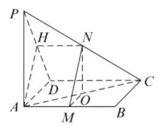

20. ( 1 )若 ${f}_{1}\left( x\right)  = x$ 是“ $S$ -函数”，则存在常数 $\left( {m, n}\right)$ ,使得 $\left( {m + x}\right) \left( {m - x}\right)  = n$ . 即 ${x}^{2} = {m}^{2} - \; n$ 时对 $x \in  \mathbf{R}$ 恒成立,而 ${x}^{2} = {m}^{2} - n$ 最多有两个解,矛盾,因此 ${f}_{1}\left( x\right)  = x$ 不是 “ $S$ -函数”;

(2) ${f}_{2}\left( x\right)  = \tan x$ 是一个“ $S$ 一函数”,

设有序实数对 $\left( {m, n}\right)$ 满足

$\tan \left( {m - x}\right) \tan \left( {m + x}\right)  = n$ 恒成立.

① 当 $m = {k\pi } + \frac{\pi }{2}, k \in  \mathbf{Z}$ 时,

$\tan \left( {m - x}\right) \tan \left( {m + x}\right)  =  - {\cot }^{2}\left( x\right) ,$

不是常数,因此 $m \neq  {k\pi } + \frac{\pi }{2}, k \in  \mathbf{Z}$ ;

② 当 $m \neq  {k\pi } + \frac{\pi }{2}, k \in  \mathbf{Z}$ 时,

对于任意的 $x \neq  {k\pi } + \frac{\pi }{2}, k \in  \mathbf{Z}$ ,有

$\frac{\tan m - \tan x}{1 + \tan m \cdot  \tan x} \times  \frac{\tan m + \tan x}{1 - \tan m \cdot  \tan x} \; = \frac{{\tan }^{2}m - {\tan }^{2}x}{1 - {\tan }^{2}m{\tan }^{2}x} = n.$

即 $\left( {n \cdot  {\tan }^{2}m - 1}\right) {\tan }^{2}x + \left( {{\tan }^{2}m - n}\right)  = 0$ 恒成立.

即 $\left\{  {\begin{array}{l} n \cdot  {\tan }^{2}m - 1 = 0 \\  {\tan }^{2}m - n = 0 \end{array} \Rightarrow  \left\{  {\begin{array}{l} {\tan }^{2}m = 1 \\  n = 1 \end{array} \Rightarrow  }\right. }\right.$

$\left\{  {\begin{array}{l} m = {k\pi } \pm  \frac{\pi }{4} \\  n = 1 \end{array}, k \in  \mathbf{Z},}\right.$

当 $x = {k\pi } + \frac{\pi }{2}, k \in  \mathbf{Z}$ ,

$m = {k}_{1}\pi  \pm  \frac{\pi }{4},{k}_{1} \in  \mathbf{Z}$ 时,

$\tan \left( {m - x}\right) \tan \left( {m + x}\right)  = {\cot }^{2}\left( m\right)  = 1.$

因此满足 ${f}_{2}\left( x\right)  = \tan x$ 是一个 “ $S$ 一函数” 的常数 $\left( {m, n}\right)$ 为 $\left( {{k\pi } \pm  \frac{\pi }{4},1}\right) , k \in  \mathbf{Z}$ ;

(3) 由题意得: $a = e$ ,

由 ${f}_{3}\left( x\right)  \geq  \frac{1}{2}{x}^{3} - a{x}^{2} + x + 1$ 得,

${e}^{x} \geq  \frac{1}{2}{x}^{3} - a{x}^{2} + x + 1$ ,其中 $x > 0$ ,

分离参数得 $a \geq   - \frac{{e}^{x} - \frac{1}{2}{x}^{3} - x - 1}{{x}^{2}}$ .

记 $g\left( x\right)  =  - \frac{{e}^{x} - \frac{1}{2}{x}^{3} - x - 1}{{x}^{2}}$ ,

${g}^{\prime }\left( x\right)  =  - \frac{\left( {x - 2}\right) \left( {{e}^{x} - \frac{1}{2}{x}^{2} - x - 1}\right) }{{x}^{3}},$

令 $h\left( x\right)  = {e}^{x} - \frac{1}{2}{x}^{2} - x - 1\left( {x > 0}\right)$ ,

则 ${h}^{\prime }\left( x\right)  = {e}^{x} - x - 1,{h}^{\prime \prime }\left( x\right)  = {e}^{x} - 1 > 0$ ,

故 ${h}^{\prime }\left( x\right)$ 严格增, ${h}^{\prime }\left( x\right)  > {h}^{\prime }\left( 0\right)  = 0$ ,

故函数 $h\left( x\right)$ 严格增, $h\left( x\right)  > h\left( 0\right)  = 0$ ,

由 $h\left( x\right)  > 0$ 可得: ${e}^{x} - \frac{1}{2}{x}^{2} - x - 1 > 0$ 恒成立,

故当 $x \in  \left( {0,2}\right)$ 时, ${g}^{\prime }\left( x\right)  > 0, g\left( x\right)$ 增;

当 $x \in  \left( {2, + \infty }\right)$ 时, ${g}^{\prime }\left( x\right)  < 0, g\left( x\right)$ 减;

${\left\lbrack  g\left( x\right) \right\rbrack  }_{\max } = g\left( 2\right)  = \frac{7 - {e}^{2}}{4}$ ,综上可得,

实数 $a$ 的取值范围是 $\left\lbrack  {\frac{7 - {e}^{2}}{4}, + \infty }\right)$ .

21. (1) 由 ${a}_{n} + {a}_{n + 1} + {a}_{n + 2} = 7 \times  {\left( \frac{1}{2}\right) }^{n - 1}$ 和 ${a}_{n + 1} + {a}_{n + 2} + {a}_{n + 3} = 7 \times  {\left( \frac{1}{2}\right) }^{n}$ 得 ${a}_{n + 3} - {a}_{n} =  - 7 \times  {\left( \frac{1}{2}\right) }^{n},$

所以 ${a}_{4} = {a}_{4} - {a}_{1} + {a}_{1} =  - 7{\left( \frac{1}{2}\right) }^{1} + 4 = \frac{1}{2}$ ;

(2)当 $n = {3k} - 2$ 时,

$$
{S}_{n} = \left( {{a}_{1} + {a}_{2} + {a}_{3}}\right)  + \left( {{a}_{4} + {a}_{5} + {a}_{6}}\right)  + \cdots  +
$$

$$
\left( {{a}_{n - 2} + {a}_{n - 1} + {a}_{n}}\right)
$$

$$
= 7{\left( \frac{1}{2}\right) }^{0} + 7{\left( \frac{1}{2}\right) }^{3} + \cdots  + 7{\left( \frac{1}{2}\right) }^{n - 3}
$$

$$
= 7 \times  \frac{1 - {\left( \frac{1}{8}\right) }^{\frac{n}{3}}}{1 - \left( \frac{1}{8}\right) } = 8 - {\left( \frac{1}{2}\right) }^{n - 3}\text{ , }
$$

当 $n = {3k} - 2$ 时,

${S}_{n} = {a}_{1} + \left( {{a}_{2} + {a}_{3} + {a}_{4}}\right)  + \left( {{a}_{5} + {a}_{6} + {a}_{7}}\right)  + \cdots \; + \left( {{a}_{n - 2} + {a}_{n - 1} + {a}_{n}}\right) \; = 8 - {\left( \frac{1}{2}\right) }^{n - 3}$ ,

当 $n = {3k} - 1$ 时,

${S}_{n} = {a}_{1} + {a}_{2} + \left( {{a}_{3} + {a}_{4} + {a}_{5}}\right)  + \cdots  + \left( {{a}_{n - 2} + }\right. \; \left. {{a}_{n - 1} + {a}_{n}}\right) \; = 6 + p - {\left( \frac{1}{2}\right) }^{n - 3}$ ,

所以 ${S}_{n} = \left\{  \begin{array}{l} 8 - {\left( \frac{1}{2}\right) }^{{n}^{-3}},\left( {n = {3k} - 2}\right) \\  6 + p - {\left( \frac{1}{2}\right) }^{{n}^{-3}},\left( {n = {3k} - 1}\right) ,(\text{ 其 } \\  8 - {\left( \frac{1}{2}\right) }^{{n}^{-3}},\left( {n = {3k}}\right)  \end{array}\right.$

中 $k$ 为正整数);

(3)当 $n = {3k} - 2$ 时，

${a}_{n} = \left( {{a}_{n} - {a}_{n - 3}}\right)  + \left( {{a}_{n - 3} - {a}_{n - 6}}\right)  + \cdots  + \left( {{a}_{4} + }\right. \; \left. {a}_{1}\right)  + {a}_{1}$

$$
=  - 7\left\lbrack  {{\left( \frac{1}{2}\right) }^{n - 3} + {\left( \frac{1}{2}\right) }^{n - 6} + \cdots  + {\left( \frac{1}{2}\right) }^{1}}\right\rbrack   + 4
$$

$$
=  - 7 \times  \frac{\left( \frac{1}{2}\right) \left\lbrack  {1 - {\left( \frac{1}{8}\right) }^{\frac{n - 1}{3}}}\right\rbrack  }{1 - \frac{1}{8}} + 4
$$

$$
= {\left( \frac{1}{2}\right) }^{n - 3}\text{ , }
$$

同上可求得

$$
{a}_{n} = \left\{  \begin{array}{l} {\left( \frac{1}{2}\right) }^{n - 3},\left( {n = {3k} - 2}\right) \\  p - 2 + {\left( \frac{1}{2}\right) }^{n - 3},\left( {n = {3k} - 1}\right) , \\  2 - p + {\left( \frac{1}{2}\right) }^{n - 3},\left( {n = {3k}}\right)  \end{array}\right.
$$

若 $\left\{  {a}_{n}\right\}$ 为严格减数列,

须满足 ${a}_{n} > {a}_{n + 1}$ 恒成立,若 $n = {3k} - 2$ ,

则 ${\left( \frac{1}{2}\right) }^{n - 3} > p - 2 + {\left( \frac{1}{2}\right) }^{n - 2}$ 恒成立,

可得 $p < 2 + {\left( \frac{1}{2}\right) }^{n - 2}$ 恒成立,得 $p \leq  2$ ;

若 $n = {3k} - 1$ ,

则 $p - 2 + {\left( \frac{1}{2}\right) }^{n - 3} > 2 - p + {\left( \frac{1}{2}\right) }^{n - 2}$ 恒成立,

可得 ${2p} > 4 - {\left( \frac{1}{2}\right) }^{n - 2}$ 恒成立,得 $p \geq  2$ ;

若 $n = {3k}$ ,则 $2 - p + {\left( \frac{1}{2}\right) }^{n - 3} > {\left( \frac{1}{2}\right) }^{n - 2}$ 恒成立,

可得 $p < 2 + {\left( \frac{1}{2}\right) }^{n - 2}$ 恒成立,得 $p \leq  2$ ;

综上, $p = 2$ ,所以存在 $p = 2$ ,

使得 $\left\{  {a}_{n}\right\}$ 为严格减数列.

## 上海高考数学模拟试卷十

## 一、填空题

1. $\left\lbrack  {\frac{1}{3},{16}}\right) \;$ 2. $6 + \mathrm{i}\;$ 3. $\arccos \frac{3}{10}\;$ 4.-80

$\begin{array}{lllll} 5.6\sqrt{5} & 6.{24\pi } & 7.\frac{9}{8} & 8.\frac{1023}{512} & 9.\sqrt{3} \end{array}$

10. ${D\xi } = \sqrt{30}\left| d\right| \;{11}.\sqrt{3} - 1\;{12}.{2022}$

## 二、选择题

13. B 14. C 15. B 16. B

三、解答题

17. ( 1 )如图建立空间直角坐标系，则由题意得， ${A}_{1}\left( {0,0, a}\right) , B\left( {1,0,0}\right) ,{B}_{1}\left( {1,0, a}\right) ,{C}_{1}\left( {0,1, a}\right) ,$ 所以 $\overrightarrow{{A}_{1}B} = \left( {1,0, - a}\right) ,\overrightarrow{{B}_{1}{C}_{1}} = \left( {-1,1,0}\right)$ . 设向量 $\overrightarrow{{A}_{1}B},\overrightarrow{{B}_{1}{C}_{1}}$ 所成角为 $\theta$ ,则 $\theta  = {60}^{ \circ  }$ ,

或 $\theta  = {120}^{ \circ  }$ ,由于 $\cos \theta  = \frac{-1}{\sqrt{1 + {a}^{2}} \cdot  \sqrt{2}} < 0$ , 所以 $\theta  = {120}^{ \circ  }$ ,得 $\cos \theta  =  - \frac{1}{2}$ ,解得 $a = 1$ ;

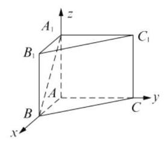

(2)连接 ${B}_{1}C,{A}_{1}C$ ,则三棱锥 ${B}_{1} - {A}_{1}{BC}$ 的体积等于三棱锥 $C - {A}_{1}{B}_{1}B$ 的体积,

${V}_{{B}_{1} - {A}_{1}{BC}} = {V}_{C - {A}_{1}{B}_{1}B},$

$\bigtriangleup {A}_{1}{B}_{1}B$ 的面积 $S = \frac{1}{2}$ ,

$\bigtriangleup {A}_{1}{BC}$ 的面积 ${S}^{\prime } = \frac{\sqrt{3}}{4} \cdot  {\left( \sqrt{2}\right) }^{2} = \frac{\sqrt{3}}{2}$ ,

又 ${CA} \bot  {A}_{1}A,{CA} \bot  {AB}$ ，

所以 ${CA} \bot$ 平面 ${A}_{1}{B}_{1}C$ ，

所以 ${V}_{C - {A}_{1}{B}_{1}B} = \frac{1}{3} \times  \frac{1}{2} \times  1 = \frac{1}{6}$ ,

所以 ${V}_{{B}_{1} - {A}_{1}{BC}} = \frac{1}{6}$ .

18.(1)设 ${A}_{i}\left( {i = 0,1,2,3}\right)$ 表示“所抽取的 3 个大学食堂中有 $i$ 个大学食堂评分不低于 9 分”,“至多有 1 个大学食堂评分不低于 9 分”记为事件 $A$ , 则 $P\left( A\right)  = P\left( {A}_{0}\right)  + P\left( {A}_{1}\right)  = \frac{{\mathrm{C}}_{12}^{3}}{{\mathrm{C}}_{16}^{3}} + \frac{{\mathrm{C}}_{4}^{1}{\mathrm{C}}_{12}^{2}}{{\mathrm{C}}_{16}^{3}} = \frac{121}{140}$ ;

(2)由表格数据知, 从这 16 个大学食堂中任选 1 个,评分不低于 9 分的概率为 $\frac{4}{16} = \frac{1}{4}$ .

由题意知 $X$ 可取的值为0,1,2,3,

则 $P\left( {X = 0}\right)  = {\left( \frac{3}{4}\right) }^{3} = \frac{27}{64}$ ,

$P\left( {X = 1}\right)  = {\mathrm{C}}_{3}^{1}{\left( \frac{1}{4}\right) }^{1}{\left( \frac{3}{4}\right) }^{2} = \frac{27}{64},$

$P\left( {X = 2}\right)  = {\mathrm{C}}_{3}^{2}{\left( \frac{1}{4}\right) }^{2}{\left( \frac{3}{4}\right) }^{1} = \frac{9}{64},$

$P\left( {X = 3}\right)  = {\left( \frac{3}{4}\right) }^{3} = \frac{1}{64}$ . 所以 $X$ 的分布列为:

<table><tr><td>$X$</td><td>0</td><td>1</td><td>2</td><td>3</td></tr><tr><td>$P$</td><td>27 64</td><td>27 64</td><td>9 64</td><td>1 6</td></tr></table>

所以,数学期望 $E\left( X\right)  = 0 \times  \frac{27}{64} + 1 \times  \frac{27}{64} + 2 \times \; \frac{9}{64} + 3 \times  \frac{1}{64} = \frac{3}{4}.$

19. ( 1 )由三角函数定义得 $\tan \alpha  =  - 2$ ，所以

$\sin \left( {{2\alpha } + \frac{\pi }{4}}\right)  = \frac{\sqrt{2}}{2}\left( {\sin {2\alpha } + \cos {2\alpha }}\right)$

$$
= \frac{\sqrt{2}}{2}\left( {\frac{4}{1 + 4} + \frac{1 - 4}{1 + 4}}\right)  = \frac{\sqrt{2}}{10};
$$

(2) $P$ 点坐标为 $\left\{  \begin{array}{l} {x}_{1} = \cos \theta \\  {y}_{1} = \sin \theta  \end{array}\right.$ ，又 $\left\{  \begin{array}{l} {x}_{1} = m - 1 \\  {y}_{1} = n \end{array}\right.$ ，

所以 $\left\{  \begin{array}{l} m = \cos \theta  + 1 \\  n = \sin \theta  \end{array}\right.$ ，所以

$f\left( \theta \right)  = \cos \theta  + \sqrt{3}\sin \theta  + 1 = 2\sin \left( {\theta  + \frac{\pi }{6}}\right)  + 1,$

由 $\left\{  \begin{array}{l} {2k\pi } - \frac{\pi }{2} \leq  \theta  + \frac{\pi }{6} \leq  {2k\pi } + \frac{\pi }{2}, k \in  \mathbf{Z} \\  0 \leq  \theta  \leq  {2\pi } \end{array}\right.$ ,

得 $0 \leq  \theta  \leq  \frac{\pi }{3}$ 或 $\frac{4\pi }{3} \leq  \theta  \leq  {2\pi }$ ,

$f\left( \theta \right)$ 的增区间为 $\left\lbrack  {0,\frac{\pi }{3}}\right\rbrack$ 和 $\left\lbrack  {\frac{4\pi }{3},{2\pi }}\right\rbrack$ .

20. ( 1 )由题意可知， ${A}_{1}\left( {8,4}\right)$ ， ${A}_{2}\left( {{18},6}\right)$ ， ${A}_{3}\left( {{32},8}\right)$ ， 所以 ${k}_{{A}_{1}{A}_{2}} = \frac{6 - 4}{{18} - 8} = \frac{1}{5},{k}_{{A}_{2}{A}_{3}} = \frac{8 - 6}{{32} - {18}} = \frac{1}{7}$ . 又因为 ${k}_{{A}_{1}{A}_{2}} \neq  {k}_{{A}_{2}{A}_{3}}$ ,

所以顶点 ${A}_{1},{A}_{2},{A}_{3}$ 不在同一条直线上;

( 2 )由题意可知，顶点 ${A}_{n}$ 的横坐标

${x}_{n} = d + {a}_{1} + {a}_{2} + \cdots  + {a}_{n - 1} + \frac{1}{2}{a}_{n}$

$= 2{\left( n + 1\right) }^{2}$ ,

顶点 ${A}_{n}$ 的纵坐标 ${y}_{n} = \frac{1}{2}{a}_{n} = 2\left( {n + 1}\right)$ .

因为对任意正整数 $n$ ,点 ${A}_{n}\left( {{x}_{n},{y}_{n}}\right)$ 的坐标满足方程 ${y}^{2} = {2x}$ ,所以所有顶点 ${A}_{n}$ 均落在抛物线 ${y}^{2} = {2x}$ 上;

(3)由题意可知，顶点 ${A}_{n}$ 的横、纵坐标分别是 ${x}_{n} = d + \frac{1}{2}a + \left( {n - 1}\right) a + \frac{1}{2}{\left( n - 1\right) }^{2}d,$

${y}_{n} = \frac{1}{2}\left\lbrack  {a + \left( {n - 1}\right) d}\right\rbrack$ ,消去 $n - 1$ ,

可得 ${x}_{n} = \frac{2}{d}{y}_{n}^{2} + d + \frac{a\left( {d - a}\right) }{2d}$ .

为使得所有顶点 ${A}_{n}$ 均落在抛物线

${y}^{2} = {2px}\left( {p > 0}\right)$ 上,则有 $\left\{  \begin{array}{l} \frac{d}{2} = {2p}, \\  d + \frac{a\left( {d - a}\right) }{2d} = 0. \end{array}\right.$

解之,得 $d = {4p}, a = {8p}$ .

数学模式识别能力 (等式恒成立),

所以 $a\text{ 、 }d$ 所应满足的关系式是 $a = {2d}$ .

21. ( 1 )令 $\frac{1 - x}{1 + x} > 0$ ，解得 $- 1 < x < 1$ ，

$D = \left( {-1,1}\right)$ ,对任意 $x \in  D$ ,

$f\left( {-x}\right)  = {\log }_{a}\frac{1 + x}{1 - x} = {\log }_{a}{\left( \frac{1 - x}{1 + x}\right) }^{-1}$

$=  - {\log }_{a}\left( \frac{1 - x}{1 + x}\right)  =  - f\left( x\right) ,$

所以函数 $f\left( x\right)$ 是奇函数;

( 2 )由 $\frac{1 - x}{1 + x} =  - 1 + \frac{2}{x + 1}$ 知，

函数 $g\left( x\right)  = \frac{1 - x}{1 + x}$ 在 $\left( {-1,1}\right)$ 上严格减,

因为 $0 < a < 1$ ,

所以 $f\left( x\right)$ 在 $\left( {-1,1}\right)$ 上是严格增函数,

又因为 $x \in  \left( {t, a}\right)$ 时, $f\left( x\right)$ 的值域是 $\left( {-\infty ,1}\right)$ , 所以 $\left( {t, a}\right)  \subseteq  \left( {-1,1}\right)$ ,

且 $g\left( x\right)  = \frac{1 - x}{1 + x}$ 在 $\left( {t, a}\right)$ 的值域是 $\left( {a, + \infty }\right)$ ,

故 $g\left( a\right)  = \frac{1 - a}{1 + a} = a$ 且 $t =  - 1$ (结合 $g\left( x\right)$ 图像易得 $t =  - 1$ ),

${a}^{2} + a = 1 - a$ 解得 $a = \sqrt{2} - 1\left( {-\sqrt{2} - 1\text{ 舍去 }}\right)$ .

所以 $a = \sqrt{2} - 1, t =  - 1$ ;

(3)假设存在 ${x}_{3} \in  \left( {-1,1}\right)$ 使得

$f\left( {x}_{1}\right)  + f\left( {x}_{2}\right)  = f\left( {x}_{3}\right)$ ,即

${\log }_{a}\frac{1 - {x}_{1}}{1 + {x}_{1}} + {\log }_{a}\frac{1 - {x}_{2}}{1 + {x}_{2}} = {\log }_{a}\frac{1 - {x}_{3}}{1 + {x}_{3}},$

${\log }_{a}\left( {\frac{1 - {x}_{1}}{1 + {x}_{1}} \cdot  \frac{1 - {x}_{2}}{1 + {x}_{2}}}\right)  = {\log }_{a}\frac{1 - {x}_{3}}{1 + {x}_{3}} \Rightarrow  \frac{1 - {x}_{1}}{1 + {x}_{1}}$ . $\frac{1 - {x}_{2}}{1 + {x}_{2}} = \frac{1 - {x}_{3}}{1 + {x}_{3}},$

解得 ${x}_{3} = \frac{{x}_{1} + {x}_{2}}{1 + {x}_{1}{x}_{2}}$ ,又

$$
{\left( \frac{{x}_{1} + {x}_{2}}{1 + {x}_{1}{x}_{2}}\right) }^{2} - 1 = \frac{{\left( {x}_{1} + {x}_{2}\right) }^{2} - {\left( 1 + {x}_{1}{x}_{2}\right) }^{2}}{{\left( 1 + {x}_{1}{x}_{2}\right) }^{2}}
$$

$$
= \frac{{x}_{1}^{2} + {x}_{2}^{2} - 1 - {x}_{1}^{2}{x}_{2}^{2}}{{\left( 1 + {x}_{1}{x}_{2}\right) }^{2}}
$$

$$
=  - \frac{\left( {1 - {x}_{1}^{2}}\right) \left( {1 - {x}_{2}^{2}}\right) }{{\left( 1 + {x}_{1}{x}_{2}\right) }^{2}}\text{ , }
$$

因为 ${x}_{1},{x}_{2} \in  \left( {-1,1}\right)$ ,

所以 $1 - {x}_{1}^{2} > 0,1 - {x}_{2}^{2} > 0,{\left( 1 + {x}_{1}{x}_{2}\right) }^{2} > 0$ ,

所以 $\frac{\left( {1 - {x}_{1}^{2}}\right) \left( {1 - {x}_{2}^{2}}\right) }{{\left( 1 + {x}_{1}{x}_{2}\right) }^{2}} > 0$ ,

即 ${\left( \frac{{x}_{1} + {x}_{2}}{1 + {x}_{1}{x}_{2}}\right) }^{2} - 1 < 0$ ,

所以 ${\left( \frac{{x}_{1} + {x}_{2}}{1 + {x}_{1}{x}_{2}}\right) }^{2} < 1$ ,

所以存在 ${x}_{3} = \frac{{x}_{1} + {x}_{2}}{1 + {x}_{1}{x}_{2}} \in  \left( {-1,1}\right)$ ,

使得 $f\left( {x}_{1}\right)  + f\left( {x}_{2}\right)  = f\left( {x}_{3}\right)$ .
