## 目录
### 基础篇 立足教材
#### 第一章 导数的概念及意义 1
##### 1.1 导数的概念 1
##### 1.2 导数的几何意义 5
#### 第二章 导数的运算 13
##### 2.1 基本初等函数的导数 13
##### 2.2 导数的四则运算 15
##### 2.3 简单复合函数的导数 17
#### 第三章 导数的应用 19
##### 3.1 利用导数研究函数的单调性 19
##### 3.2 利用导数研究函数的极值 31
##### 3.3 利用导数研究函数的最值 39
##### 3.4 利用导数解决实际问题 46
#### 第四章 利用导数研究三次函数 61
##### 4.1 三次函数的图像与性质 61
##### 4.2 三次函数的零点问题 76
### 进阶篇 专题突破
#### 第五章 利用导数研究单变量问题 84
##### 5.1 参变分离非必要，端点探路有奇效 84
##### 5.2 恒成立或存在性，分离变量是途径 90
##### 5.3 参数变量难分离，分类讨论走到底 97
#### 第六章 利用导数研究双变量问题 103
##### 6.1 正是分离好方案，变量成双又含参 103
##### 6.2 两侧结构见对称，转化构造新函数
##### 6.3 变量成双可化单，整体换元或韦达
##### 6.4 莫愁极值点偏移，对称构造差比换
#### 第七章 利用导数研究零点与切线问题
##### 7.1 零点个数伴参数，分离作图定理随
##### 7.2 零点只在此式中，设而不求整体换 1
##### 7.3 距离零点恒成立，切线应用临界处 1
#### 第八章 利用导数证明不等式 1
##### 8.1 移项变形看结构，函数辅助抓整体 15
##### 8.2 以直代曲巧放缩，二条切线似剪刀 16
##### 8.3 数列求和不等式，裂项放缩函数试 16
##### 8.4 求导法则记心中，逆向构造原函数 17:
##### 8.5 指数与对数齐现，跨阶与同构一体 184
#### 第九章 上海特色新定义，跳出题海反套路 190
### 高阶篇 强基指导
#### 第十章 函数的凹凸性与拐点 203
#### 第十一章 凹凸反转 207
#### 第十二章 洛必达法则 213
#### 第十三章 泰勒展开式 219
#### 第十四章 拉格朗日中值定理 233
---
## 基础篇 立足教材
### 第一章 导数的概念及意义
#### 1.1 导数的概念
##### 知识要点
1. 函数 $y = f\left( x\right)$ 在 $x = {x}_{0}$ 处的导数:对于函数 $y = f\left( x\right)$ ，当 $h \rightarrow  0$ 时，比值 $\frac{f\left( {{x}_{0} + h}\right)  - f\left( {x}_{0}\right) }{h}$ 趋近于某个存在的稳定值，说明这个比值在 $h \rightarrow  0$ 时有极限，并把这个极限记作___， 称为函数 $y = f\left( x\right)$ 在 $x = {x}_{0}$ 处的导数，记作 ${f}^{\prime }\left( {x}_{0}\right)$ ，即___.
2. 平均变化率:一般地，对于一个函数 $y = f\left( x\right)$ ，通常将___不为函数 $f\left( x\right)$ 在以 ${x}_{0}$ 和 ${x}_{0} + h$ 为端点的区间上的平均变化率.
3. 瞬时变化率: ${f}^{\prime }\left( {x}_{0}\right)  = \mathop{\lim }\limits_{{h \rightarrow  0}}\frac{f\left( {{x}_{0} + h}\right)  - f\left( {x}_{0}\right) }{h}$ 就是函数 $y = f\left( x\right)$ 在 $x = {x}_{0}$ 处的瞬时变化率.
##### 甄别陷阱
平均变化率反映了一个函数在一个区间上的平均变化情况，而瞬时变化率则反映了该函数在某个自变量 ${x}_{0}$ 处的瞬时变化情况. 平均变化率不是极限，而瞬时变化率是极限，两者不能混淆.
##### 类型一 求平均变化率
###### 方法指引
求平均变化率的步骤: (1) 先计算函数值的改变量: ${\Delta y} = f\left( {x}_{2}\right)  - f\left( {x}_{1}\right)$ ; (2)再计算自变量的改变量: ${\Delta x} = {x}_{2} - {x}_{1}$ ; (3) 最后得平均变化率: $\frac{\Delta y}{\Delta x} = \frac{f\left( {x}_{2}\right)  - f\left( {x}_{1}\right) }{{x}_{2} - {x}_{1}}$ .
例 1 (1)函数 $y = \frac{1}{x}$ 从 $x = 1$ 到 $x = 2$ 的平均变化率为___.
(2)一质点的运动方程是 $s = 5 - 3{t}^{2}$ ，则在一段时间 $\left\lbrack  {1,1 + {\Delta t}}\right\rbrack$ 内相应的平均速度为___.
##### 自主探究
###### 要点精析
(1) 理解平均变化率的概念, 直接代入公式计算即可.
(2)理解平均速度与平均变化率的关系，代入公式计算.
解: (1) 平均变化率为 $\frac{\Delta y}{\Delta x} = \frac{\frac{1}{2} - 1}{2 - 1} =  - \frac{1}{2}$ . 故填 $- \frac{1}{2}$ .
(2)平均速度为 $\frac{s\left( {1 + {\Delta t}}\right)  - s\left( 1\right) }{\left( {1 + {\Delta t}}\right)  - 1} = \frac{5 - 3{\left( 1 + \Delta t\right) }^{2} - \left( {5 - 3 \times  {1}^{2}}\right) }{\Delta t} =  - {3\Delta t} - 6$ . 故填一 ${3\Delta t} - 6$ .
##### 针对训练一
1. 若函数 $f\left( x\right)  = {x}^{2}$ 由 $x = 1$ 至 $x = 1 + h$ 的平均变化率的取值范围是 $\left( {2,{2.025}}\right)$ ,则 $h$ 的取值范围为( ).
A. (-0.025,0.025) B. (0,0.025)
C. $\left( {{0.025},1}\right)$ D. $\left( {-{0.025},0}\right)$
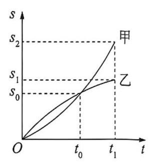
第 2 题图
2. 如图显示物体甲、乙在时间0到 ${t}_{1}$ 范围内路程的变化情况，下列说法正确的是___. (填序号)
① 在 0 到 ${t}_{0}$ 范围内，甲的平均速度大于乙的平均速度；
② 在 0 到 ${t}_{0}$ 范围内，甲的平均速度等于乙的平均速度；
③ 在 ${t}_{0}$ 到 ${t}_{1}$ 范围内，甲的平均速度大于乙的平均速度；
④ 在 ${t}_{0}$ 到 ${t}_{1}$ 范围内，甲的平均速度小于乙的平均速度.
3. 已知函数 $f\left( x\right)  = {3x} - {x}^{2}$ 在 ${x}_{0} = 2$ 处的增量为 ${\Delta x} = {0.1}$ ，则 $\frac{\Delta y}{\Delta x}$ 的值为___.
4. 已知函数 $f\left( x\right)  = 3{x}^{2} + 5$ ，求:
(1)函数 $f\left( x\right)$ 在 $\left\lbrack  {{0.1},{0.2}}\right\rbrack$ 上的平均变化率；
(2)函数 $f\left( x\right)$ 在区间 $\left\lbrack  {{x}_{0},{x}_{0} + {\Delta x}}\right\rbrack$ 上的平均变化率.
2 .
##### 类型二 求函数在某一点处的导数(即某一点处的瞬时变化率)
###### 方法指引
用导数定义求函数在某一点处的导数(即在某一点处的瞬时变化率) 的步骤:
(1)求函数的增量 ${\Delta y} = f\left( {{x}_{0} + h}\right)  - f\left( {x}_{0}\right)$ ；
(2)求平均变化率 $\frac{\Delta y}{\Delta x} = \frac{f\left( {{x}_{0} + h}\right)  - f\left( {x}_{0}\right) }{\left( {{x}_{0} + h}\right)  - h} = \frac{f\left( {{x}_{0} + h}\right)  - f\left( {x}_{0}\right) }{h}$ ;
(3)求极限 $\mathop{\lim }\limits_{{h \rightarrow  0}}\frac{\Delta y}{\Delta x}$ .
例2 (1)已知 $f\left( x\right)  = {x}^{2} - {3x}$ ，则 ${f}^{\prime }\left( 0\right)$ 等于___.
(2)已知 $f\left( x\right)  = \frac{2}{x}$ ，且 ${f}^{\prime }\left( m\right)  =  - \frac{1}{2}$ ，则 $m =$ ___.
(3)一物体的运动方程为 $s = 7{t}^{2} - {13t} + 8$ ，且在 $t = {t}_{0}$ 时的瞬时速度为 1，则 ${t}_{0} =$ ___.
##### 自主探究
###### 要点精析
(1) 理解导数的定义,直接代入公式计算.
(2)熟记函数在某一点处的导数(即某一点处的瞬时变化率)的几种等价变形，如
$$
{f}^{\prime }\left( {x}_{0}\right)  = \mathop{\lim }\limits_{{h \rightarrow  0}}\frac{f\left( {{x}_{0} + h}\right)  - f\left( {x}_{0}\right) }{h} = \mathop{\lim }\limits_{{h \rightarrow  0}}\frac{f\left( {{x}_{0} - h}\right)  - f\left( {x}_{0}\right) }{-h}
$$
$$
= \mathop{\lim }\limits_{{h \rightarrow  0}}\frac{f\left( {{x}_{0} + {nh}}\right)  - f\left( {x}_{0}\right) }{nh} = \mathop{\lim }\limits_{{h \rightarrow  0}}\frac{f\left( {{x}_{0} + h}\right)  - f\left( {{x}_{0} - h}\right) }{2h}.
$$
(3)瞬时速度表示物体在某一时刻或某位置的速度. 求瞬时速度的步骤:
① 由物体运动的位移 $s$ 与时间 $t$ 的函数关系式求出位移增量 ${\Delta s} = s\left( {{t}_{0} + {\Delta t}}\right)  - s\left( {t}_{0}\right)$ ；
② 求时间 ${t}_{0}$ 到 ${t}_{0} + {\Delta t}$ 的平均速度 $\bar{v} = \frac{s\left( {{t}_{0} + {\Delta t}}\right)  - s\left( {t}_{0}\right) }{\Delta t}$ ；
③ 求 ${v}_{0} = \mathop{\lim }\limits_{{{\Delta t} \rightarrow  0}}\frac{s\left( {{t}_{0} + {\Delta t}}\right)  - s\left( {t}_{0}\right) }{\Delta t}$ 的值,即得 $t = {t}_{0}$ 时的瞬时速度.
###### 参考解答
(1) ${f}^{\prime }\left( 0\right)  = \mathop{\lim }\limits_{{h \rightarrow  0}}\frac{{\left( 0 + h\right) }^{2} - 3\left( {0 + h}\right)  - \left( {{0}^{2} - 3 \times  0}\right) }{h} = \mathop{\lim }\limits_{{h \rightarrow  0}}\frac{{h}^{2} - {3h}}{h} =  - 3$ . 故填一 3 .
(2) $\because \frac{\Delta y}{\Delta x} = \frac{f\left( {m + {\Delta x}}\right)  - f\left( m\right) }{\Delta x} = \frac{\frac{2}{m + {\Delta x}} - \frac{2}{m}}{\Delta x} = \frac{-2}{m\left( {m + {\Delta x}}\right) }$ ,
$\therefore {f}^{\prime }\left( m\right)  = \mathop{\lim }\limits_{{{\Delta x} \rightarrow  0}}\frac{-2}{m\left( {m + {\Delta x}}\right) } = \frac{-2}{{m}^{2}},\therefore \frac{-2}{{m}^{2}} =  - \frac{1}{2}$ ,解得 $m =  \pm  2$ . 故填土 2 .
(3) $\because {\Delta s} = 7{\left( {t}_{0} + \Delta t\right) }^{2} - {13}\left( {{t}_{0} + {\Delta t}}\right)  + 8 - 7{t}_{0}^{2} + {13}{t}_{0} - 8 = {14}{t}_{0} \cdot  {\Delta t} - {13\Delta t} + 7{\left( \Delta t\right) }^{2},\therefore \mathop{\lim }\limits_{{{\Delta t} \rightarrow  0}}\frac{\Delta s}{\Delta t} = \; \mathop{\lim }\limits_{{{\Delta t} \rightarrow  0}}\left( {{14}{t}_{0} - {13} + {7\Delta t}}\right)  = {14}{t}_{0} - {13} = 1$ ,解得 ${t}_{0} = 1$ . 故填 1 .
##### 针对训练二
1. 设函数 $f\left( x\right)  = {ax} + 3$ ，若 ${f}^{\prime }\left( 1\right)  = 3$ ，则 $a =$ ___.
2. 函数 $y = x - \frac{1}{x}$ 在 $x = 1$ 处的导数为___.
3. 木块沿某一斜面自由下滑,测得木块移动的水平距离 $s$ (单位: $\mathrm{m}$ ) 关于时间 $t$ (单位: $\mathrm{s}$ ) 的函数关系式为 $s\left( t\right)  = \frac{1}{8}{t}^{2}$ ，则当 $t = 2\mathrm{\;s}$ 时，此木块在水平方向的瞬时速度为___ $\mathrm{m}/\mathrm{s}$ .
4. 已知曲线 $f\left( x\right)  = 2{x}^{2} + 1$ 在点 $M\left( {{x}_{0}, f\left( {x}_{0}\right) }\right)$ 处的瞬时变化率为 -8,则点 $M$ 的坐标为___.
5. 一质点 $A$ 沿直线运动,位移 $s$ (单位: $\mathrm{m}$ ) 与时间 $t$ (单位: $\mathrm{s}$ ) 之间的关系为 $s\left( t\right)  = 2{t}^{2} + 1$ ,求质点 $A$ 在 $t = {2.7}\mathrm{\;s}$ 时的瞬时速度.
6. 航天飞机升空后一段时间内,第 $t\mathrm{\;s}$ 时的高度为 $h\left( t\right)  = 5{t}^{3} + {30}{t}^{2} + {45t} + 4$ ,其中 $h$ 的单位为 $\mathrm{m}, t$ 的单位为 $\mathrm{s}$ .
(1) $h\left( 0\right)$ ， $h\left( 1\right)$ ， $h\left( 2\right)$ 分别表示什么?
(2)求第 $2\mathrm{\;s}$ 内的平均速度；
(3)求第 $2\mathrm{\;s}$ 末的瞬时速度.
#### 1.2 导数的几何意义
##### 知识要点
1. 我们把连接曲线上任意两点的直线称为该曲线的一条___；给定曲线上一点 $P$ ，如果点 $Q$ 越来越靠近点 $P$ 时，割线 ${PQ}$ 趋近于一条确定的直线，那么我们就将这条直线称为曲线在点 $P$ 处的___.
2. 函数 $y = f\left( x\right)$ 在点 ${x}_{0}$ 处的导数 ${f}^{\prime }\left( {x}_{0}\right)$ 的几何意义是曲线 $y = f\left( x\right)$ 在点___处的___。相应地，切线方程为___.
##### 甄别陷阱
1. 曲线 $y = f\left( x\right)$ 在点 $P\left( {{x}_{0},{y}_{0}}\right)$ 处的切线是指 $P$ 为切点,斜率为 ${f}^{\prime }\left( {x}_{0}\right)$ 的切线,是唯一的一条切线.
2. 曲线 $y = f\left( x\right)$ 过点 $P\left( {{x}_{0},{y}_{0}}\right)$ 的切线,点 $P$ 不一定是切点,切线可能有多条.
(注:本节部分题目直接用定义求导比较困难，读者可在学完第二章导数的运算后再来解决)
##### 类型一 求曲线的切线方程
###### 方法指引
两类切线方程的求法:
(1)已知切点 $A\left( {{x}_{0}, f\left( {x}_{0}\right) }\right)$ 求切线方程，可先求该点处的导数值 ${f}^{\prime }\left( {x}_{0}\right)$ ，再利用点斜式方程 $y - f\left( {x}_{0}\right)  = {f}^{\prime }\left( {x}_{0}\right) \left( {x - {x}_{0}}\right)$ 求解.
(2)若求过点 $P\left( {{x}_{0},{y}_{0}}\right)$ 的切线方程，则可自行设出切点为 $\left( {{x}_{1},{y}_{1}}\right)$ ，利用“算两次”的思想: ①切点在曲线上；②切点也在切线上，解方程组 $\left\{  \begin{array}{l} {y}_{1} = f\left( {x}_{1}\right) , \\  {y}_{0} - {y}_{1} = {f}^{\prime }\left( {x}_{1}\right) \left( {{x}_{0} - {x}_{1}}\right)  \end{array}\right.$ 即可.
例1 (1)求曲线 $y = x{\mathrm{e}}^{x - 1}$ 在点 $\left( {1,1}\right)$ 处的切线方程.
(2)若直线 $l$ 为函数 $f\left( x\right)  = x\ln x$ 过点 $\left( {0, - 1}\right)$ 的一条切线,求直线 $l$ 的方程.
##### 自主探究
###### 要点精析
(1) 若求曲线在某一点处的切线，则该点必为切点，故只需求出其导数，即得在该点处切线的斜率，最后利用点斜式方程写出切线的方程.
(2)若求曲线过某一点处的切线，则该点不一定为切点，可自行设出切点坐标，再求解.
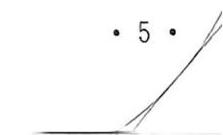
###### 参考解答
(1) $\because$ 函数 $y = x{\mathrm{e}}^{x - 1}$ 的导数为 ${y}^{\prime } = \left( {x + 1}\right) {\mathrm{e}}^{x - 1}$ ，
$\therefore$ 曲线 $y = x{\mathrm{e}}^{x - 1}$ 在点 $\left( {1,1}\right)$ 处的切线斜率为 2,
$\therefore$ 曲线 $y = x{\mathrm{e}}^{x - 1}$ 在点 $\left( {1,1}\right)$ 处的切线方程为 $y - 1 = 2\left( {x - 1}\right)$ ,即 $y = {2x} - 1$ .
(2) $\because$ 点 $\left( {0, - 1}\right)$ 不在曲线 $f\left( x\right)  = x\ln x$ 上， $\therefore$ 设切点为 $\left( {{x}_{0},{y}_{0}}\right)$ . 又 $\because {f}^{\prime }\left( x\right)  = 1 + \ln x$ ,
$\therefore$ 直线 $l$ 的方程为 $y + 1 = \left( {1 + \ln {x}_{0}}\right) x$ . $\therefore$ 由 $\left\{  \begin{array}{l} {y}_{0} = {x}_{0}\ln {x}_{0}, \\  {y}_{0} + 1 = \left( {1 + \ln {x}_{0}}\right) {x}_{0} \end{array}\right.$ 解得 $\left\{  \begin{array}{l} {x}_{0} = 1, \\  {y}_{0} = 0. \end{array}\right.$
$\therefore$ 直线 $l$ 的方程为 $y = x - 1$ ,即 $x - y - 1 = 0$ .
##### 针对训练一
1. 曲线 $y = \frac{1}{x} + {2x}$ 在 $x = 1$ 处的切线方程是___.
2. 若 $\mathop{\lim }\limits_{{x \rightarrow  2}}\frac{f\left( {5 - x}\right)  - 3}{x - 2} = 2, f\left( 3\right)  = 3$ ，则 $f\left( x\right)$ 在点 $\left( {3, f\left( 3\right) }\right)$ 处切线方程为___.
3. 已知函数 $f\left( x\right)  = \left( {1 + x}\right) \ln x + \frac{1}{x}$ ,求曲线 $y = f\left( x\right)$ 在点 $\left( {1, f\left( 1\right) }\right)$ 处的切线方程.
4. 已知函数 $f\left( x\right)  = {x}^{3} - {3x}$ ,过点 $P\left( {2,2}\right)$ 作曲线 $y = f\left( x\right)$ 的切线,求此切线的方程.
5. 已知函数 $f\left( x\right)  = {x}^{3} + a$ ,点 $A\left( {0,0}\right)$ 在曲线 $y = f\left( x\right)$ 上.
(1)求函数 $y = f\left( x\right)$ 的解析式；
(2)求曲线 $y = f\left( x\right)$ 在点 $\left( {-1, - 1}\right)$ 处的切线方程；
(3)求曲线 $y = f\left( x\right)$ 过点 $E\left( {2,0}\right)$ 的切线方程.
##### 类型二 求切点坐标
###### 方法指引
已知切线方程(或斜率)求切点的一般思路:先求函数的导数，再让导数等于切线的斜率，从而求出切点的横坐标，将横坐标代入函数解析式求出切点的纵坐标.
例2 设曲线 $y = {x}^{2} + x - 2$ 在点 $M$ 处的切线斜率为 3,则点 $M$ 的坐标为___.
##### 自主探究
###### 要点精析
设点 $M\left( {{x}_{0},{y}_{0}}\right)$ ，根据曲线在 $x = {x}_{0}$ 处的导数等于该点切线的斜率求得 ${x}_{0}$ 的值,再代入函数解析式得到点 $M$ 的纵坐标 ${y}_{0}$ .
###### 参考解答
设点 $M\left( {{x}_{0},{y}_{0}}\right)$ ,则 ${f}^{\prime }\left( {x}_{0}\right)  = 2{x}_{0} + 1$ ,令 $2{x}_{0} + 1 = 3$ ,得 ${x}_{0} = 1$ ,代入曲线 $y = \; {x}^{2} + x - 2$ ,得 ${y}_{0} = 0$ ,则点 $M\left( {1,0}\right)$ . 故填 $\left( {1,0}\right)$ .
##### 针对训练二
1. 已知曲线 $y = 2{x}^{2} + {4x}$ 在点 $P$ 处切线斜率为 16，则点 $P$ 的坐标为___.
2. 已知曲线 $y = 2{x}^{2} - 7$ 在点 $P$ 处的切线方程为 ${8x} - y - {15} = 0$ ，则点 $P$ 的坐标为___.
3. 曲线 $f\left( x\right)  = {x}^{3} - x + 3$ 在点 $P$ 处的切线平行于直线 $y = {2x} - 1$ ，则点 $P$ 的坐标为___.
4. 已知点 $A$ 在曲线 $y = \ln x$ 上,且该曲线在点 $A$ 处的切线经过点 $\left( {-e, - 1}\right)$ (e 为自然对数的底数),求点 $A$ 的坐标.
##### 类型三 求参数的值或取值范围
##### 方法指引
1. 利用导数的几何意义求参数相关问题的常见策略:
利用切点的坐标、切线的斜率、切线的方程等得到关于参数的方程 (组) 或者参数满足的不等式 (组), 进而求出参数的值或取值范围.
2. 求解与导数的几何意义有关问题的两个要点:
(1)注意曲线上横坐标的取值范围. (一个不等关系)
(2)牢记切点既在切线上又在曲线上. (两个等量关系)
例3 (1)已知直线 $y = {ax}$ 是曲线 $y = \ln x$ 的切线，则实数 $a =$ ___.
##### 自主探究
###### 要点精析
已知切线方程但无切点，则设出切点，根据导数的几何意义表示出切线，与已知切线比较即可得解.
###### 参考解答
由题意,曲线 $y = \ln x$ ,求导得 ${y}^{\prime } = \frac{1}{x}$ ,设切点坐标为 $\left( {{x}_{0},{y}_{0}}\right)$ ,
则过该点的切线方程为 $y - {y}_{0} = \frac{1}{{x}_{0}}\left( {x - {x}_{0}}\right)$ ,即 $y = \frac{1}{{x}_{0}}x + {y}_{0} - 1$ ,
又 $\because$ 直线 $y = {ax}$ 是曲线 $y = \ln x$ 的切线,
故 $\frac{1}{{x}_{0}} = a,{y}_{0} - 1 = 0$ ,得 ${y}_{0} = 1$ ,则 $\ln {x}_{0} = 1$ ,得 ${x}_{0} = \mathrm{e}, a = \frac{1}{{x}_{0}} = \frac{1}{\mathrm{e}}$ . 故填 $\frac{1}{\mathrm{e}}$ .
(2)若曲线 $y = \ln \left( {x + a}\right)$ 的一条切线为 $y = \mathrm{e}x + b$ ，其中 $a$ ， $b$ 为正实数，则 $a + \frac{\mathrm{e}}{b + 2}$ 的取值范围是___.
##### 自主探究
###### 要点精析
已知切线方程但无切点，则设出切点，利用切点横坐标处的导数等于切点处切线的斜率,可得 $a$ 与 $b$ 的等量关系,最后利用基本不等式求解即可.
###### 参考解答
由题意知, ${y}^{\prime } = \frac{1}{x + a}$ ,设切点为 $\left( {m, n}\right)$ ,则 $\left\{  \begin{array}{l} \frac{1}{m + a} = \mathrm{e}, \\  \ln \left( {m + a}\right)  = m\mathrm{e} + b, \end{array}\right.$ 得 $b = a\mathrm{e} - 2$ , $\because a > 0, b > 0,\therefore a > \frac{2}{\mathrm{e}},\therefore a + \frac{\mathrm{e}}{b + 2} = a + \frac{1}{a} \geq  2$ (当且仅当 $a = 1$ 时取等号), 故 $a + \frac{\mathrm{e}}{b + 2}$ 的取值范围是 $\lbrack 2, + \infty )$ . 故填 $\lbrack 2, + \infty )$ .
##### 针对训练三
1. 已知曲线 $y = a{\mathrm{e}}^{x} + x\ln x$ 在点 $\left( {1, a\mathrm{e}}\right)$ 处的切线方程为 $y = {2x} + b$ ，则().
A. $a = \mathrm{e}, b =  - 1$ B. $a = \mathrm{e}, b = 1$
C. $a = {\mathrm{e}}^{-1}, b = 1$ D. $a = {\mathrm{e}}^{-1}, b =  - 1$
2. 已知直线 $y = {kx} - 7$ 与曲线 $y = {x}^{3} + a{x}^{2} + b$ 相切于点 $A\left( {2,1}\right)$ ,给出下列结论:
① $k = 4$ ; ② $a =  - 2$ ; ③ $b = 1$ ; ④ $k{ab} = 8$ .
其中正确的序号是___.
3. 已知函数 $f\left( x\right)  = x - 1 + \frac{a}{{\mathrm{e}}^{x}}$ . 若曲线 $y = f\left( x\right)$ 在点 $\left( {1, f\left( 1\right) }\right)$ 处的切线平行于 $x$ 轴,求实数 $a$ 的值.
4. 若函数 $f\left( x\right)  = \frac{1}{3}{x}^{3} - {x}^{2} + {ax} + b$ 的图像在点 $P\left( {0, f\left( 0\right) }\right)$ 处的切线方程是 ${3x} + y - 2 = 0$ , 求 $a, b$ 的值.
5. 已知函数 $f\left( x\right)  = {\mathrm{e}}^{x} - {mx} + 1$ 的图像为曲线 $C$ ,若曲线 $C$ 存在与直线 $y = \frac{1}{2}x$ 垂直的切线, 求实数 $m$ 的取值范围.
##### 类型四 两条曲线的公切线问题
###### 方法指引
解决此类问题的两种常用处理方法:
(1)“单边”处理:利用其中一曲线在某点处的切线与另一曲线相切，列出关系式求解；
(2)“双边”联动:设公切线 $l$ 在 $y = f\left( x\right)$ 上的切点 ${P}_{1}\left( {{x}_{1}, f\left( {x}_{1}\right) }\right)$ ，在 $y = g\left( x\right)$ 上的切点 ${P}_{2}\left( {{x}_{2}, g\left( {x}_{2}\right) }\right)$ ,则 ${f}^{\prime }\left( {x}_{1}\right)  = {g}^{\prime }\left( {x}_{2}\right)  = \frac{f\left( {x}_{1}\right)  - g\left( {x}_{2}\right) }{{x}_{1} - {x}_{2}}$ .
例 4 (1)已知曲线 $f\left( x\right)  = {x}^{3} + {ax} + \frac{1}{4}$ 在 $x = 0$ 处的切线与曲线 $g\left( x\right)  =  - \ln x$ 相切，则实数 $a$ 的值为___.
##### 自主探究
- 10 。
###### 要点精析
已知条件中有其中一条曲线的切点，则利用该切点设出切线方程，再利用其与另一条曲线相切列出斜率与导数的关系式求解.
###### 参考解答
由 $f\left( x\right)  = {x}^{3} + {ax} + \frac{1}{4}$ 得 ${f}^{\prime }\left( x\right)  = 3{x}^{2} + a$ .
$\because {f}^{\prime }\left( 0\right)  = a, f\left( 0\right)  = \frac{1}{4},\therefore$ 曲线 $y = f\left( x\right)$ 在 $x = 0$ 处的切线方程为 $y - \frac{1}{4} = {ax}$ .
设直线 $y - \frac{1}{4} = {ax}$ 与曲线 $g\left( x\right)  =  - \ln x$ 相切于点 $\left( {{x}_{0}, - \ln {x}_{0}}\right) ,{g}^{\prime }\left( x\right)  =  - \frac{1}{x}$ ,
则 $\left\{  \begin{array}{l}  - \ln {x}_{0} - \frac{1}{4} = a{x}_{0},\text{ ① } \\  a =  - \frac{1}{{x}_{0}},\;\text{ ② } \end{array}\right.$ 将②代入①得 $\ln {x}_{0} = \frac{3}{4},\therefore {x}_{0} = {\mathrm{e}}^{\frac{3}{4}},\therefore a =  - \frac{1}{{\mathrm{e}}^{\frac{3}{4}}} =  - {\mathrm{e}}^{-\frac{3}{4}}$ .
故填一 ${\mathrm{e}}^{-\frac{3}{4}}$ .
(2)若直线 $y = {kx} + b$ 是曲线 $y = \ln x + 2$ 的切线，也是曲线 $y = {\mathrm{e}}^{x}$ 的切线，则 $b =$ ___.
##### 自主探究
###### 要点精析
已知条件中没有任何一条曲线的切点，则分别设出两条曲线上的两个切点， 再利用 ${f}^{\prime }\left( {x}_{1}\right)  = {g}^{\prime }\left( {x}_{2}\right)  = \frac{f\left( {x}_{1}\right)  - g\left( {x}_{2}\right) }{{x}_{1} - {x}_{2}}$ 的关系式求解.
###### 参考解答
设直线 $y = {kx} + b$ 与曲线 $y = {ln}x + 2$ 的切点为 $\left( {{x}_{1},{y}_{1}}\right)$ ,与曲线 $y = {\mathrm{e}}^{x}$ 的切点为 $\left( {{x}_{2},{y}_{2}}\right)$ ,
$y = \ln x + 2$ 的导数为 ${y}^{\prime } = \frac{1}{x}, y = {\mathrm{e}}^{x}$ 的导数为 ${y}^{\prime } = {\mathrm{e}}^{x}$ ,可得 $k = {\mathrm{e}}^{{x}_{2}} = \frac{1}{{x}_{1}}$ .
又由 $k = \frac{{y}_{2} - {y}_{1}}{{x}_{2} - {x}_{1}} = \frac{{\mathrm{e}}^{{x}_{2}} - \ln {x}_{1} - 2}{{x}_{2} - {x}_{1}}$ ,消去 ${x}_{2}$ ,可得 $\left( {1 + \ln {x}_{1}}\right)  \cdot  \left( {{x}_{1} - 1}\right)  = 0$ ,则 ${x}_{1} = \frac{1}{\mathrm{e}}$ 或 ${x}_{1} = 1$ ,
则直线 $y = {kx} + b$ 与曲线 $y = {lnx} + 2$ 的切点为 $\left( {\frac{1}{\mathrm{e}},1}\right)$ 或 $\left( {1,2}\right)$ ,
与曲线 $y = {\mathrm{e}}^{x}$ 的切点为 $\left( {1,\mathrm{e}}\right)$ 或 $\left( {0,1}\right) ,\therefore k = \frac{\mathrm{e} - 1}{1 - \frac{1}{\mathrm{e}}} = \mathrm{e}$ 或 $k = \frac{1 - 2}{0 - 1} = 1$ ,
$\therefore$ 切线方程为 $y = \mathrm{e}x$ 或 $y = x + 1$ ,得 $b = 0$ 或 1 .
##### 针对训练四
1. 已知 $f\left( x\right)  = \ln x, g\left( x\right)  = \frac{1}{2}{x}^{2} + {mx} + \frac{7}{2}\left( {m < 0}\right)$ ，直线 $l$ 与函数 $f\left( x\right) , g\left( x\right)$ 的图像有m 切,与 $f\left( x\right)$ 图像的切点为 $\left( {1, f\left( 1\right) }\right)$ ,则 $m =$ ___.
2. 若直线 $y = {kx} + b$ 是曲线 $y = \ln x + 1$ 的切线,也是曲线 $y = \ln \left( {x + 2}\right)$ 的切线,则 $b =$ ___.
3. 已知函数 $f\left( x\right)  = \sqrt{x}, g\left( x\right)  = a\ln x, a \in  \mathbf{R}$ ,若曲线 $y = f\left( x\right)$ 与曲线 $y = g\left( x\right)$ 相交,且在交点处有相同的切线,求 $a$ 的值及该切线的方程.
4. 若曲线 $f\left( x\right)  = {\mathrm{e}}^{x - 2}$ 与 $g\left( x\right)  = {\mathrm{e}}^{x} - 1$ 的公切线为 $l : y = {kx} + b$ ,求 $k + b$ 的值.
5. 已知两曲线 $y = {x}^{3} + {ax}$ 和 $y = {x}^{2} + {bx} + c$ 都经过点 $P\left( {1,2}\right)$ ，且在点 $P$ 处有公切线.
(1)求 $a, b, c$ 的值；
(2)求公切线所在的直线方程.
### 第二章 导数的运算
#### 2.1 基本初等函数的导数
##### 知识要点
1. 导函数 (简称导数): 从导数的定义不难发现,当 $x = {x}_{0}$ 时, ${f}^{\prime }\left( {x}_{0}\right)$ 是一个唯一确定的数; 这样,当 $x$ 变化时, ${y}^{\prime } = {f}^{\prime }\left( x\right)$ 就是关于 $x$ 的函数,我们称它为 $y = f\left( x\right)$ 的___(简称___),其中, ${y}^{\prime } = {f}^{\prime }\left( x\right)  =$ ___; 求一个函数的导(函)数的过程简称为求导.
###### 2. 几种常见函数的导数
为了更便捷地处理求导问题，我们通常将以下基本初等函数的导数作为公式使用.
<table><tr><td>原函数</td><td>导函数</td></tr><tr><td>$f\left( x\right)  = C\left( {C\text{ 为常数 }}\right)$</td><td>${f}^{\prime }\left( x\right)  =$</td></tr><tr><td>$f\left( x\right)  = {x}^{a},\alpha$ 为常数</td><td>${f}^{\prime }\left( x\right)  =$ ___</td></tr><tr><td>$f\left( x\right)  = \sin x$</td><td>${f}^{\prime }\left( x\right)  =$ ___</td></tr><tr><td>$f\left( x\right)  = \cos x$</td><td>${f}^{\prime }\left( x\right)  =$ ___</td></tr><tr><td>$f\left( x\right)  = {a}^{x}\left( {a > 0\text{ ,且 }a \neq  1}\right)$</td><td>${f}^{\prime }\left( x\right)  =$ ___ $\left( {a > 0\text{ ,且 }a \neq  1}\right)$</td></tr><tr><td>$f\left( x\right)  = {\mathrm{e}}^{x}$</td><td>${f}^{\prime }\left( x\right)  =$ ___</td></tr><tr><td>$f\left( x\right)  = {\log }_{a}x\left( {a > 0\text{ ,且 }a \neq  1}\right)$</td><td>${f}^{\prime }\left( x\right)  =$ ___ $\left( {a > 0\text{ ，且 }a \neq  1}\right)$</td></tr><tr><td>$f\left( x\right)  = \ln x$</td><td>${f}^{\prime }\left( x\right)  =$ ___</td></tr></table>
##### 甄别陷阱
求 ${f}^{\prime }\left( {x}_{0}\right)$ 的步骤是先求 ${f}^{\prime }\left( x\right)$ ,再代入 $x = {x}_{0}$ ; 而不是先求 $f\left( {x}_{0}\right)$ ,再求 $f\left( {x}_{0}\right)$ 的导数,否则求出来的 ${f}^{\prime }\left( {x}_{0}\right)$ 永远是 0 .
##### 类型一 利用基本初等函数的求导公式计算与其相关的函数的导数
例题 求下列函数的导数.
(1) $y = \cos \frac{\pi }{6};\left( 2\right) y = \frac{1}{{x}^{5}};\left( 3\right) y = \frac{{x}^{2}}{\sqrt{x}};\left( 4\right) y = \lg x;\left( 5\right) y = {5}^{x};\left( 6\right) y = \cos \left( {\frac{\pi }{2} - x}\right)$ .
##### 自主探究
###### 参考解答
(1) $\because y = \cos \frac{\pi }{6} = \frac{\sqrt{3}}{2},\therefore {y}^{\prime } = 0$ . (2) $\because y = \frac{1}{{x}^{5}} = {x}^{-5},\therefore {y}^{\prime } =  - 5{x}^{-6}$ . (3) $\because y = \frac{{x}^{2}}{\sqrt{x}} = \frac{{x}^{2}}{{x}^{\frac{1}{2}}} = {x}^{\frac{3}{2}},\therefore {y}^{\prime } = \frac{3}{2}{x}^{\frac{1}{2}}$ . (4) $\because y = \lg x,\therefore {y}^{\prime } = \frac{1}{x\ln {10}}$ . (5) $\because y = {5}^{x},\therefore {y}^{\prime } = \; {5}^{x}\ln 5$ . (6) $\because y = \cos \left( {\frac{\pi }{2} - x}\right)  = \sin x,\therefore {y}^{\prime } = \cos x$ .
##### 针对训练
1. 设函数 $f\left( x\right)  = \cos x$ ，则 ${\left\lbrack  f\left( \frac{\pi }{2}\right) \right\rbrack  }^{\prime } =$ ___.
2. 函数 $f\left( x\right)  = {x}^{2} - {2x}$ 在 $x = 1$ 处的导数 ${f}^{\prime }\left( 1\right)  =$ ___.
3. 已知函数 $f\left( x\right)  = {{13} - {8x}} + \sqrt{2}{x}^{2}$ ，且 ${f}^{\prime }\left( {x}_{0}\right)  = 4$ ，则 ${x}_{0}$ 的值为___.
4. 曲线 $y = \cos x$ 在点 $P\left( {\frac{\pi }{3},\frac{1}{2}}\right)$ 处的切线与 $y$ 轴交点的纵坐标是___.
5. 对于函数 $f\left( x\right)  =  - {x}^{2} + 2$ .
(1) 求 ${f}^{\prime }\left( 1\right)$ ， ${f}^{\prime }\left( {-\frac{1}{2}}\right)$ ；
(2)求 ${f}^{\prime }\left( {x}_{0}\right)$ 的值；
(3)利用 ${f}^{\prime }\left( {x}_{0}\right)$ 可求 ${f}^{\prime }\left( 1\right)$ 和 ${f}^{\prime }\left( {-\frac{1}{2}}\right)$ 吗?
(4)若 ${x}_{0}$ 是一变量，则 ${f}^{\prime }\left( x\right)$ 还是常量吗?
#### 2.2 导数的四则运算
##### 知识要点
###### 导数的四则运算法则
基本初等函数可以通过四则运算产生新的初等函数, 这些初等函数的求导可以通过以下的“导数四则运算法则”归结为基本初等函数的求导.
已知函数 $y = f\left( x\right) , y = g\left( x\right)$ .
(1) ${\left( f\left( x\right)  \pm  g\left( x\right) \right) }^{\prime } =$ ___；
(2) ${\left( f\left( x\right) g\left( x\right) \right) }^{\prime } =$ ___；
(3) ${\left( \frac{f\left( x\right) }{g\left( x\right) }\right) }^{\prime } =$ ___ $\left( {g\left( x\right)  \neq  0}\right) .$
##### 甄别陷阱
两个函数商的求导法则:设函数 $f\left( x\right) , g\left( x\right)$ 是可导的，且 $g\left( x\right)  \neq  0$ ，则 ${\left\lbrack  \frac{f\left( x\right) }{g\left( x\right) }\right\rbrack  }^{\prime } = \; \frac{{f}^{\prime }\left( x\right) g\left( x\right)  - f\left( x\right) {g}^{\prime }\left( x\right) }{{\left\lbrack  g\left( x\right) \right\rbrack  }^{2}}$ ,运算过程出现失误的原因是不能正确理解求导法则,特别是商的求导法则, 易出现求导过程中符号判断不清的失误. 另外, 在求导之前观察函数是否可以化简, 再进行求导, 可以避免使用商的求导法则, 从而减少运算量.
##### 类型一 利用导数的四则运算求导数
例题 求下列函数的导数:
(1) $y = \left( {x + 1}\right) \left( {x + 2}\right) \left( {x + 3}\right)$ ; (2) $y = \frac{2x}{{x}^{2} + 1}$ ;
(3) $y = x\sin x - \frac{2}{\cos x}$ ; (4) $y = {3}^{x} - \lg x$ .
##### 自主探究
###### 要点精析
本题主要考查常见初等函数的导数与导数的四则运算法则，用运算法则求函数的导数的策略: ① 对简单函数, 先区分函数的运算特点, 即函数的和、差、积、商，再根据导数的运算法则求导数; ② 对较复杂函数, 可先利用代数恒等变换对已知函数解析式进行化简或变形，如把乘积的形式展开、分式形式变为和或差的形式、根式化成分数指数幂等，以便于求导公式的应用.
###### 参考解答
(1) $\because y = \left( {x + 1}\right) \left( {x + 2}\right) \left( {x + 3}\right)  = \left( {{x}^{2} + {3x} + 2}\right) \left( {x + 3}\right)  = {x}^{3} + 6{x}^{2} + \; {11x} + 6,$
$\therefore {y}^{\prime } = {\left\lbrack  \left( x + 1\right) \left( x + 2\right) \left( x + 3\right) \right\rbrack  }^{\prime } = {\left( {x}^{3} + 6{x}^{2} + {11}x + 6\right) }^{\prime } = 3{x}^{2} + {12x} + {11}$ .
(2) ${y}^{\prime } = {\left( \frac{2x}{{x}^{2} + 1}\right) }^{\prime } = \frac{{\left( 2x\right) }^{\prime }\left( {{x}^{2} + 1}\right)  - {2x}{\left( {x}^{2} + 1\right) }^{\prime }}{{\left( {x}^{2} + 1\right) }^{2}} = \frac{2\left( {{x}^{2} + 1}\right)  - 4{x}^{2}}{{\left( {x}^{2} + 1\right) }^{2}} = \frac{2 - 2{x}^{2}}{{\left( {x}^{2} + 1\right) }^{2}}$ .
(3) ${y}^{\prime } = {\left( x\sin x\right) }^{\prime } - {\left( \frac{2}{\cos x}\right) }^{\prime } = \sin x + x\cos x - \frac{2\sin x}{{\cos }^{2}x}$ .
(4) ${y}^{\prime } = {\left( {3}^{x}\right) }^{\prime } - {\left( \lg x\right) }^{\prime } = {3}^{x}\ln 3 - \frac{1}{x\ln {10}}$ .
##### 针对训练
1. 下列求导运算中正确的是( ).
A. ${\left( x + \frac{1}{x}\right) }^{\prime } = 1 + \frac{1}{{x}^{2}}$ B. ${\left( \lg x\right) }^{\prime } = \frac{1}{x\ln {10}}$
C. ${\left( \ln x\right) }^{\prime } = x$ D. ${\left( {x}^{2}\cos x\right) }^{\prime } =  - {2x}\sin x$
2. 已知函数 $f\left( x\right)  = {\left( 2x + a\right) }^{2}$ ，且 ${f}^{\prime }\left( 2\right)  = {20}$ ，则 $a =$ ___.
3. 已知 $f\left( x\right)  = \frac{\ln x}{x}$ ，则 ${f}^{\prime }\left( x\right)  =$ ___.
4. 已知 $f\left( x\right)  = {a}^{2}\left( {a\text{ 为常数 }}\right) , g\left( x\right)  = \ln x$ ,若 ${2x}\left\lbrack  {{f}^{\prime }\left( x\right)  + 1}\right\rbrack   - {g}^{\prime }\left( x\right)  = 1$ ,则 $x =$ ___.
5. 若 $f\left( x\right)  = {x}^{2} - {2x} - 4\ln x$ ，则 ${f}^{\prime }\left( x\right)  > 0$ 的解集为___.
6. 已知函数 $f\left( x\right)  = x, g\left( x\right)  = {x}^{2}, h\left( x\right)  = {x}^{3}$ ,试求:
(1) $f\left( x\right) , g\left( x\right)$ 的导数分别是什么？
(2) $Q\left( x\right)  = x + {x}^{2}$ 的导数.
(3) $Q\left( x\right)$ 的导数与 $f\left( x\right) , g\left( x\right)$ 的导数有何关系?
(4)对于任意函数 $f\left( x\right) , g\left( x\right)$ 都满足 ${\left( f\left( x\right)  + g\left( x\right) \right) }^{\prime } = {f}^{\prime }\left( x\right)  + {g}^{\prime }\left( x\right)$ 吗?
(5)能否用 $h\left( x\right)$ 和 $g\left( x\right)$ 的导数表示 $h\left( x\right)  \cdot  g\left( x\right)$ 的导数? 如何表示?
(6)对于其他函数还满足上述关系吗？
#### 2.3 简单复合函数的导数
##### 知识要点
###### 1. 复合函数的概念
一般地,对于两个函数 $y = f\left( u\right) , u = g\left( x\right)$ ,如果通过中间变量 $u, y$ 可以表示成 $x$ 的函数, 那么称这个函数为函数 $y = f\left( u\right)$ 和 $u = g\left( x\right)$ 的复合函数，记作 $y =$ ___.
###### 2. 复合函数求导法则
由函数 $y = f\left( u\right) , u = g\left( x\right)$ 复合而成的函数 $y = f\left\lbrack  {g\left( x\right) }\right\rbrack$ 的导数和函数 $y = f\left( u\right) , u = \; g\left( x\right)$ 的导数间的关系为 ${y}_{x}^{\prime } =$ ___，即 $y$ 对 $x$ 的导数等于___的导数与___ 的导数的乘积.
##### 甄别陷阱
若 $y = f\left( {1 - x}\right)$ ,则 ${y}^{\prime } =  - {f}^{\prime }\left( {1 - x}\right)$ ,一定要注意对内层函数求导,不能遗漏负号.
##### 类型一 利用复合函数求导法则求复合函数的导数
例 1 求下列函数的导数:
(1) $y = \sin {3x}$ ; (2) $y = \frac{1}{\sqrt{1 - 2{x}^{2}}}$ ; (3) $y = \lg \left( {2{x}^{2} + {3x} + 1}\right)$ ; (4) $y = {\sin }^{2}\left( {{2x} + \frac{\pi }{3}}\right)$ ;
##### 自主探究
###### 要点精析
本题主要考查复合函数的构成、分解与导数的求法. ① 在对函数求导时，应仔细观察、分析函数的结构特征，紧扣求导法则，联系学过的求导公式. 对不易用求导法则求导的函数，可适当地进行等价变形，以达到化异求同、化繁为简的目的. ② 对复合函数的求导熟练后，中间步骤可以省略，即不必再写出函数的复合过程，直接运用公式，从外层开始由外及内逐层求导.
###### 参考解答
(1) 设 $y = \sin u, u = {3x}$ ,则 ${y}_{x}^{\prime } = {y}_{u}^{\prime } \cdot  {u}_{x}^{\prime } = {\left( \sin u\right) }^{\prime } \cdot  {\left( 3x\right) }^{\prime } = \cos u \cdot  3 = 3\cos {3x}$ .
(2)设 $y = {u}^{-\frac{1}{2}}, u = 1 - 2{x}^{2}$ ，则 ${y}_{x}^{\prime } = {y}_{u}^{\prime } \cdot  {u}_{x}^{\prime } = {\left( {u}^{-\frac{1}{2}}\right) }^{\prime } \cdot  {\left( 1 - 2{x}^{2}\right) }^{\prime } =  - \frac{1}{2}{u}^{-\frac{3}{2}} \cdot  \left( {-{4x}}\right) \; =  - \frac{1}{2}{\left( 1 - 2{x}^{2}\right) }^{-\frac{3}{2}}\left( {-{4x}}\right)  = {2x}{\left( 1 - 2{x}^{2}\right) }^{-\frac{3}{2}}$ .
(3)设 $y = \lg u, u = 2{x}^{2} + {3x} + 1$ ，
则 ${y}_{x}^{\prime } = {y}_{u}^{\prime } \cdot  {u}_{x}^{\prime } = {\left( \lg u\right) }^{\prime } \cdot  {\left( 2{x}^{2} + 3x + 1\right) }^{\prime } = \frac{1}{u\ln {10}} \cdot  \left( {{4x} + 3}\right)  = \frac{{4x} + 3}{\left( {2{x}^{2} + {3x} + 1}\right) \ln {10}}$ .
(4)设 $y = {u}^{2}, u = \sin v, v = {2x} + \frac{\pi }{3}$ ，
则 ${y}_{x}^{\prime } = {y}_{u}^{\prime } \cdot  {u}_{v}^{\prime } \cdot  {v}_{x}^{\prime } = {2u} \cdot  \cos v \cdot  2 = 2\sin v \cdot  \cos v \cdot  2 = 2\sin {2v} = 2\sin \left( {{4x} + \frac{2\pi }{3}}\right)$ .
##### 针对训练
1. 下列函数不是复合函数的是( ).
A. $y =  - {x}^{3} - \frac{1}{x} + 1$ B. $y = \cos \left( {x + \frac{\pi }{4}}\right)$
C. $y = \frac{1}{\ln x}$ D. $y = {\left( 2x + 3\right) }^{4}$
2. 函数 $y = {x}^{2}\cos {2x}$ 的导数为( ).
A. ${y}^{\prime } = {2x}\cos {2x} - {x}^{2}\sin {2x}$ B. ${y}^{\prime } = {2x}\cos {2x} - 2{x}^{2}\sin {2x}$
C. ${y}^{\prime } = {x}^{2}\cos {2x} - {2x}\sin {2x}$ D. ${y}^{\prime } = {2x}\cos {2x} + 2{x}^{2}\sin {2x}$
3. 已知函数 $f\left( x\right)  = \sqrt{{ax} - 1}$ ，且 ${f}^{\prime }\left( 1\right)  = 1$ ，则 $a$ 的值为___.
4. 已知函数 $y = {\left( 1 + \cos 2x\right) }^{2}$ ，则 ${y}^{\prime } =$ ___.
5. 已知函数 $y = f\left( \sqrt{{x}^{2} + 1}\right)$ ，则 ${y}^{\prime } =$ ___.
6. 已知 $y = {\left( 3x + 2\right) }^{2}, y = \sin \left( {{2x} + \frac{\pi }{6}}\right)$ .
(1)这两个函数是复合函数吗？
(2)试说明 $y = {\left( 3x + 2\right) }^{2}$ 如何复合的；
(3)试求 $y = {\left( 3x + 2\right) }^{2}, f\left( u\right)  = {u}^{2}, g\left( x\right)  = {3x} + 2$ 的导数；
(4)观察问题(3)中导数有何关系.
### 第三章 导数的应用
#### 3.1 利用导数研究函数的单调性
##### 知识要点
###### 1. 函数的单调性与导数的关系
<table><tr><td colspan="2">条件</td><td>结论</td></tr><tr><td rowspan="3">函数 $y = f\left( x\right)$ 在区间 $\left( {a, b}\right)$ 上可导</td><td>${f}^{\prime }\left( x\right)  > 0$</td><td>$f\left( x\right)$ 在 $\left( {a, b}\right)$ 内严格___</td></tr><tr><td>${f}^{\prime }\left( x\right)  < 0$</td><td>$f\left( x\right)$ 在 $\left( {a, b}\right)$ 内严格___</td></tr><tr><td>${f}^{\prime }\left( x\right)  = 0$</td><td>$f\left( x\right)$ 在 $\left( {a, b}\right)$ 内是___</td></tr></table>
提醒:讨论函数的单调性或求函数的单调区间的实质是解不等式，求解时，要坚持“定义域优先”原则.
###### 2. 函数的驻点与函数的单调性的关系
在导数值都存在的情况下，导数值由正变负或由负变正的过程中会出现导数等于___的点, 即函数的___. 因此,要把函数的单调增区间和单调减区间划分出来,就要先找到函数的驻点. 找到驻点后,再看驻点两侧导数值的正负是否发生变化,如果发生变化了,此驻点就成为单调增区间与单调减区间的分界点.
##### 甄别陷阱
设函数 $y = f\left( x\right)$ 在某个区间内可导.
1. 若在某个区间上有有限个 (或无限个不连续) 点使 ${f}^{\prime }\left( x\right)  = 0$ ,而其余点恒有 ${f}^{\prime }\left( x\right)  > 0$ (或 $\left. {{f}^{\prime }\left( {x < 0}\right) }\right)$ ,则 $y = f\left( x\right)$ 仍为严格增(或严格减)的.
例如:函数 $y = {x}^{3}, x \in  \mathbf{R}$ ，则 ${f}^{\prime }\left( x\right)  = 3{x}^{2}$ ，尽管当 $x = 0$ 时， ${f}^{\prime }\left( x\right)  = 0$ ，但该函数 $y = {x}^{3}$ 在 $\mathbf{R}$ 上仍是严格增的.
2. 在某一区间上 ${f}^{\prime }\left( x\right)  > 0$ (或 ${f}^{\prime }\left( {x < 0}\right)$ ) 是函数 $y = f\left( x\right)$ 在该区间上严格增(或严格减) 的充分不必要条件，而不是充要条件.
##### 类型一 $f\left( x\right)$ 与 ${f}^{\prime }\left( x\right)$ 的图像问题
###### 方法指引
原函数与导函数图像的观察要点:
(1)对于原函数图像，要看其在哪个区间内严格增，则在此区间内导数值大于零；在哪个区间内严格减，则在此区间内导数值小于零，最后根据导数值的正负可判定导函数图像.
(2)对于导函数的图像，要看其在哪个区间内导数值大于零，则在此区间内原函数严格增；在哪个区间内导数值小于零，则在此区间内原函数严格减，最后根据原函数的单调性可判定原函数图像.
① 本书的“严格增(减)”即为人教版的“单调递增(减)”.
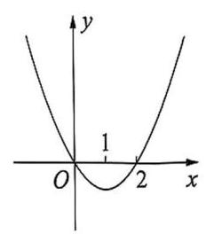
例 1(1)图
例 1 (1) ${f}^{\prime }\left( x\right)$ 是函数 $y = f\left( x\right)$ 的导函数,若 $y = {f}^{\prime }\left( x\right)$ 的图像如图所示，则函数 $y = f\left( x\right)$ 的图像可能是( ).
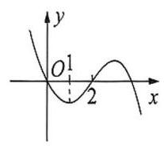
A.
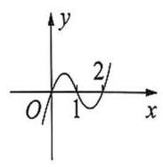
B.
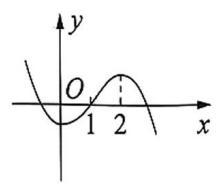
C.
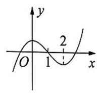
D.
(2)已知函数 $y = f\left( x\right)$ 的图像如图所示，则函数 $y = {f}^{\prime }\left( x\right)$ 的图像可能是( ).
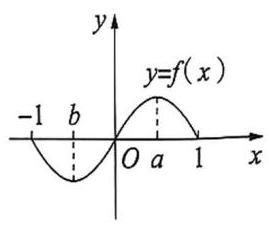
例 1(2)图
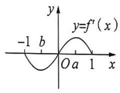
A.
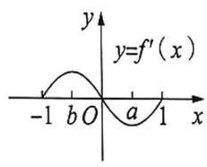
B.
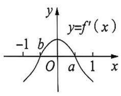
C.
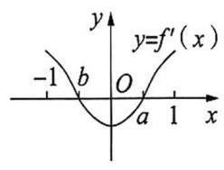
D.
##### 自主探究
###### 要点精析
(1) 由 ${f}^{\prime }\left( x\right)  > 0\left( {{f}^{\prime }\left( x\right)  < 0}\right)$ 的分界点判断原函数在此分界点两侧的图像的上升和下降趋势. (2) 由函数 $y = f\left( x\right)$ 的图像的增减变化趋势判断函数 $y = {f}^{\prime }\left( x\right)$ 的正、负情况.
###### 参考解答
(1) 由已知可得 $x$ 的取值范围和 ${f}^{\prime }\left( x\right)$ 的正、负, $f\left( x\right)$ 的增减变化情况如下表所示:
<table><tr><td>$x$</td><td>$\left( {-\infty ,0}\right)$</td><td>(0,2)</td><td>(2, $+ \infty$ )</td></tr><tr><td>${f}^{\prime }\left( x\right)$</td><td>+</td><td>-</td><td>+</td></tr><tr><td>$f\left( x\right)$</td><td>↗</td><td>↘</td><td>↗</td></tr></table>
由表可知 $f\left( x\right)$ 在 $\left( {-\infty ,0}\right)$ 内严格增,在 $\left( {0,2}\right)$ 内严格减,在 $\left( {2, + \infty }\right)$ 内严格增,满足条件的只有选项 D，故选 D.
(2)由已知可得 $x$ 的取值范围和 ${f}^{\prime }\left( x\right)$ 的正、负, $f\left( x\right)$ 的增减变化情况如下表:
<table><tr><td>$x$</td><td>$\left( {-1, b}\right)$</td><td>(b, a)</td><td>(a,1)</td></tr><tr><td>$f\left( x\right)$</td><td>↘</td><td>↗</td><td>↘</td></tr><tr><td>${f}^{\prime }\left( x\right)$</td><td>-</td><td>+</td><td>-</td></tr></table>
由表可知函数 $y = {f}^{\prime }\left( x\right)$ 的图像,当 $x \in  \left( {-1, b}\right)$ 时,函数图像在 $x$ 轴下方;
当 $x \in  \left( {b, a}\right)$ 时,函数图像在 $x$ 轴上方; 当 $x \in  \left( {a,1}\right)$ 时,函数图像在 $x$ 轴下方. 故选 C.
##### 针对训练一
1. 函数 $y =  - {x}^{4} + {x}^{2} + 2$ 的图像大致为( ).
A.
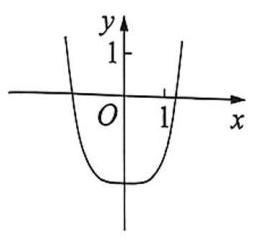
B.
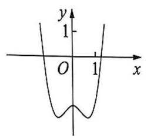
C.
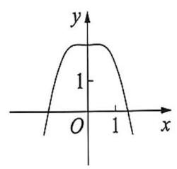
D.
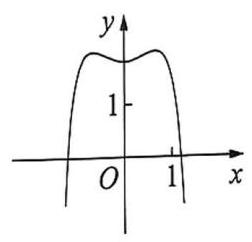
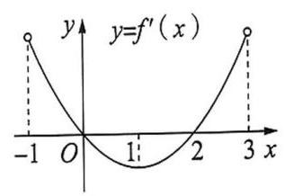
第 2 题图
2. 定义在 $\left( {-1,3}\right)$ 上的函数 $y = f\left( x\right)$ ，其导函数 $y = {f}^{\prime }\left( x\right)$ 的图像如图所示，则 $y = f\left( x\right)$ 的单调减区间是( ).
A. $\left( {-1,0}\right)$ B. $\left( {-1,1}\right)$
C. $\left( {0,2}\right)$ D. $\left( {2,3}\right)$
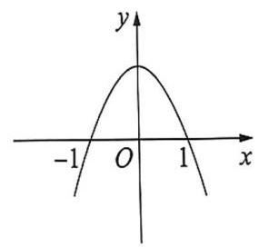
第 3 题图
3. 设 ${f}^{\prime }\left( x\right)$ 是函数 $f\left( x\right)$ 的导函数， $y = {f}^{\prime }\left( x\right)$ 的图像如图所示，则 $y = \; f\left( x\right)$ 的图像可能是( ).
A.
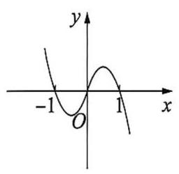
B.
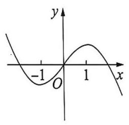
C.
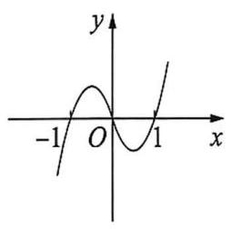
D.
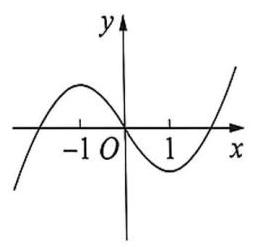
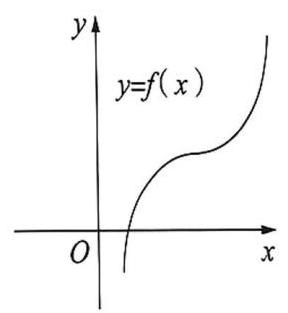
第 4 题图
4. 已知函数 $y = f\left( x\right)$ 的图像如图所示,则其导函数图像的大致形状为 ( ).
A.
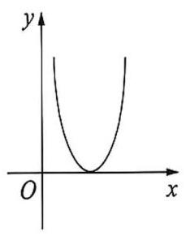
B.
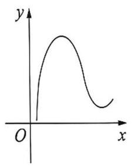
C.
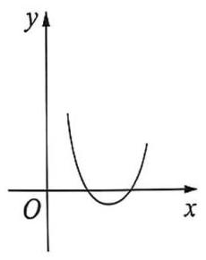
D.
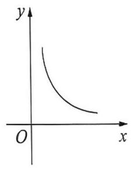
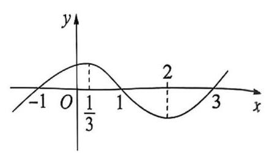
第 5 题图
5. 已知函数 $y = f\left( x\right) \left( {x \in  \mathbf{R}}\right)$ 的图像如图所示,则不等式 $x{f}^{\prime }\left( x\right)  < 0$ 的解集为( ).
A. $\left( {-\infty ,0}\right)  \cup  \left( {\frac{1}{3},2}\right)$
B. $\left( {-\infty ,\frac{1}{3}}\right)  \cup  \left( {\frac{1}{3},2}\right)$
C. $\left( {-\infty ,\frac{1}{3}}\right)  \cup  \left( {2, + \infty }\right)$
D. $\left( {-1,0}\right)  \cup  \left( {1,3}\right)$
##### 类型二 不含参数的函数的单调性
###### 方法指引
求函数单调区间的步骤:
(1)确定函数 $f\left( x\right)$ 的定义域；
(2)求 ${f}^{\prime }\left( x\right)$ ；
(3)在定义域内解不等式 ${f}^{\prime }\left( x\right)  > 0$ ，得单调增区间；在定义域内解不等式 ${f}^{\prime }\left( x\right)  < 0$ ，得单调减区间.
例2 (1)函数 $y = x + \frac{3}{x} + {2\ln }x$ 的单调减区间是___.
(2)函数 $f\left( x\right)  = {\mathrm{e}}^{x}\cos x$ 的单调增区间为___.
##### 自主探究
###### 要点精析
(1) 求函数的单调区间时，一定要先确定函数的定义域，否则极易出错. 如本题看到 $\ln x$ 就要先提醒自己定义域为 $\left( {0, + \infty }\right)$ . (2) 解与三角有关的不等式时. 可以考虑学
###### 参考解答
(1) ${y}^{\prime } = 1 - \frac{3}{{x}^{2}} + \frac{2}{x} = \frac{{x}^{2} + {2x} - 3}{{x}^{2}}\left( {x > 0}\right)$ ,令 ${y}^{\prime } < 0$ 得 $\left\{  \begin{array}{l} {x}^{2} + {2x} - 3 < 0, \\  x > 0, \end{array}\right.$ 解得 $0 < \; x < 1$ . 故填 $\left( {0,1}\right)$ .
(2) ${f}^{\prime }\left( x\right)  = {\mathrm{e}}^{x}\cos x - {\mathrm{e}}^{x}\sin x = {\mathrm{e}}^{x}\left( {\cos x - \sin x}\right)$ ,
令 ${f}^{\prime }\left( x\right)  > 0$ 得 $\cos x > \sin x$ ,解得 ${2k\pi } - \frac{3}{4}\pi  < x < {2k\pi } + \frac{\pi }{4}, k \in  \mathbf{Z}$ ,
即函数 $f\left( x\right)$ 的单调增区间为 $\left( {{2k\pi } - \frac{3}{4}\pi ,{2k\pi } + \frac{\pi }{4}}\right) \left( {k \in  \mathbf{Z}}\right)$ .
##### 针对训练二
1. 函数 $f\left( x\right)  = \left( {x - 3}\right) {\mathrm{e}}^{x}$ 的单调增区间是( ).
A. $\mathbf{R}$ B. $\left( {0,3}\right)$ C. $\left( {-\infty ,3}\right)$ D. $\left( {2, + \infty }\right)$
2. 函数 $f\left( x\right)  = x - \frac{6}{x} - 5\ln x$ 的单调减区间为( ).
A. $\left( {0,2}\right)$ B. $\left( {2,3}\right)$ C. $\left( {1,3}\right)$ D. $\left( {3, + \infty }\right)$
3. 已知函数 $f\left( x\right)  = \sin {2x} - x$ ,则在下列区间上, $f\left( x\right)$ 严格增的是 ( ).
A. $\left( {-\frac{\pi }{3},0}\right)$ B. $\left( {0,\frac{\pi }{6}}\right)$ C. $\left( {\frac{\pi }{6},\frac{\pi }{3}}\right)$ D. $\left( {\frac{\pi }{3},\frac{\pi }{2}}\right)$
4. 对于函数 $f\left( x\right)  = \frac{x}{{\mathrm{e}}^{x}}$ ,下列说法正确的是 ( ).
A. ${f}^{\prime }\left( 2\right)  =  - \frac{1}{{\mathrm{e}}^{4}}$ B. $f\left( x\right)$ 在 $x = 0$ 处切线方程为 $y = x - 1$
C. $f\left( x\right)$ 在 $\left( {1, + \infty }\right)$ 严格减 D. $f\left( 3\right)  < f\left( 4\right)$
5. 已知函数 $f\left( x\right)  =  - {x}^{3} - 3{x}^{2} + {9x} + 1$ ,求函数 $f\left( x\right)$ 的单调区间.
##### 类型三 含参数的函数的单调性
###### 方法指引
解决含参数的函数的单调性问题应注意以下两点:
(1)研究含参数的函数的单调性，要依据参数对不等式解集的影响进行分类讨论.
(2)划分函数的单调区间时，要在函数定义域内讨论，还要确定导数为零的点和函数的间断点.
例3 (1)已知函数 $f\left( x\right)  = a{x}^{3} - 3{x}^{2} + 1 - \frac{3}{a}$ ,讨论函数 $f\left( x\right)$ 的单调性.
##### 自主探究
###### 要点精析
本题考查导数在判断函数单调性方面的应用，判断的前提是正确求导. 利用导数求函数 $f\left( x\right)$ 的单调区间，实质上是转化为解不等式 ${f}^{\prime }\left( x\right)  > 0$ 或 ${f}^{\prime }\left( x\right)  < 0$ .
###### 参考解答
由题设知 $a \neq  0,{f}^{\prime }\left( x\right)  = {3a}{x}^{2} - {6x} = {3ax}\left( {x - \frac{2}{a}}\right)$ ,令 ${f}^{\prime }\left( x\right)  = 0$ ,得 ${x}_{1} = 0$ , ${x}_{2} = \frac{2}{a}.$
当 $a > 0$ 时,若 $x \in  \left( {-\infty ,0}\right)$ ,则 ${f}^{\prime }\left( x\right)  > 0,\therefore f\left( x\right)$ 在区间 $\left( {-\infty ,0}\right)$ 上为严格增函数;
若 $x \in  \left( {0,\frac{2}{a}}\right)$ ,则 ${f}^{\prime }\left( x\right)  < 0,\therefore f\left( x\right)$ 在区间 $\left( {0,\frac{2}{a}}\right)$ 上为严格减函数;
若 $x \in  \left( {\frac{2}{a}, + \infty }\right)$ ,则 ${f}^{\prime }\left( x\right)  > 0,\therefore f\left( x\right)$ 在区间 $\left( {\frac{2}{a}, + \infty }\right)$ 上是严格增函数;
当 $a < 0$ 时,若 $x \in  \left( {-\infty ,\frac{2}{a}}\right)$ ,则 ${f}^{\prime }\left( x\right)  < 0,\therefore f\left( x\right)$ 在 $\left( {-\infty ,\frac{2}{a}}\right)$ 上是严格减函数;
若 $x \in  \left( {\frac{2}{a},0}\right)$ ,则 ${f}^{\prime }\left( x\right)  > 0,\therefore f\left( x\right)$ 在区间 $\left( {\frac{2}{a},0}\right)$ 上为严格增函数;
若 $x \in  \left( {0, + \infty }\right)$ ,则 ${f}^{\prime }\left( x\right)  < 0,\therefore f\left( x\right)$ 在区间 $\left( {0, + \infty }\right)$ 上为严格减函数.
(2)已知函数 $f\left( x\right)  = \ln x + a{x}^{2} - \left( {{2a} + 1}\right) x$ . 若 $a > 0$ ，试讨论函数 $f\left( x\right)$ 的单调性.
##### 自主探究
###### 要点精析
利用导数判断函数单调性时不能忽略函数的定义域，应首先求出函数的定义域,在定义域内解不等式 ${f}^{\prime }\left( x\right)  > 0$ 或 ${f}^{\prime }\left( x\right)  < 0$ . 另外,如果函数的单调区间不止一个时, 应用“,”“和”等连接，而不能写“或”和并集的形式.
###### 参考解答
$\because f\left( x\right)  = \ln x + a{x}^{2} - \left( {{2a} + 1}\right) x$ , $\therefore {f}^{\prime }\left( x\right)  = \frac{{2a}{x}^{2} - \left( {{2a} + 1}\right) x + 1}{x} = \; \frac{\left( {{2ax} - 1}\right) \left( {x - 1}\right) }{x}$ ，由题意知函数 $f\left( x\right)$ 的定义域为 $\left( {0, + \infty }\right)$ ，令 ${f}^{\prime }\left( x\right)  = 0$ 得 $x = 1$ 或 $x = \frac{1}{2a}$ ， ① 若 $\frac{1}{2a} < 1$ ，即 $a > \frac{1}{2}$ ，由 ${f}^{\prime }\left( x\right)  > 0$ 得 $x > 1$ 或 $0 < x < \frac{1}{2a}$ ；
由 ${f}^{\prime }\left( x\right)  < 0$ 得 $\frac{1}{2a} < x < 1$ ，即函数 $f\left( x\right)$ 在 $\left( {0,\frac{1}{2a}}\right)$ 和 $\left( {1, + \infty }\right)$ 上严格增，在 $\left( {\frac{1}{2a},1}\right)$ 上严格减；
② 若 $\frac{1}{2a} > 1$ ，即 $0 < a < \frac{1}{2}$ ，由 ${f}^{\prime }\left( x\right)  > 0$ 得 $x > \frac{1}{2a}$ 或 $0 < x < 1$ ，
由 ${f}^{\prime }\left( x\right)  < 0$ 得 $1 < x < \frac{1}{2a}$ ,即函数 $f\left( x\right)$ 在 $\left( {0,1}\right)$ 和 $\left( {\frac{1}{2a}, + \infty }\right)$ 上严格增,在 $\left( {1,\frac{1}{2a}}\right)$ 上严格减;
③ 若 $\frac{1}{2a} = 1$ ，即 $a = \frac{1}{2}$ ，则在 $\left( {0, + \infty }\right)$ 上恒有 ${f}^{\prime }\left( x\right)  \geq  0$ ，即函数 $f\left( x\right)$ 在 $\left( {0, + \infty }\right)$ 上严格增.
综上可得,当 $0 < a < \frac{1}{2}$ 时,函数 $f\left( x\right)$ 在 $\left( {0,1}\right)$ 上严格增,在 $\left( {1,\frac{1}{2a}}\right)$ 上严格减,在 $\left( {\frac{1}{2a}, + \infty }\right)$ 上严
格增;
当 $a > \frac{1}{2}$ 时,函数 $f\left( x\right)$ 在 $\left( {0, + \infty }\right)$ 上严格增;
当 $a > \frac{1}{2}$ 时,函数 $f\left( x\right)$ 在 $\left( {0,\frac{1}{2a}}\right)$ 上严格增,在 $\left( {\frac{1}{2a},1}\right)$ 上严格减,在 $\left( {1, + \infty }\right)$ 上严格增.
##### 针对训练三
1. 已知函数 $f\left( x\right)  = {x}^{3} - {x}^{2} + {ax} + 1$ ,讨论 $f\left( x\right)$ 的单调性.
2. 已知函数 $f\left( x\right)  = {x}^{2} - a\ln x, a \in  \mathbf{R}$ ,讨论 $f\left( x\right)$ 的单调性.
3. 已知函数 $f\left( x\right)  = \frac{1}{2}{x}^{2} - \left( {m + 1}\right) x + \ln x\left( {m \in  \mathbf{R}}\right)$ ,讨论函数 $f\left( x\right)$ 的单调性.
4. 已知函数 $f\left( x\right)  = \left( {a - \frac{1}{2}}\right) {x}^{2} - {2ax} + \ln x, a \in  \mathbf{R}$ ，讨论函数 $f\left( x\right)$ 的单调性.
5. 已知函数 $f\left( x\right)  = 2\ln x + 1$ . 设 $a > 0$ ，讨论函数 $g\left( x\right)  = \frac{f\left( x\right)  - f\left( a\right) }{x - a}$ 的单调性.
##### 类型四 已知函数的单调性求参数的取值范围
###### 方法指引
由函数的单调性求参数的取值范围的方法.
(1)可导函数在区间 $D$ 上单调,实际上就是在该区间上 ${f}^{\prime }\left( x\right)  \geq  0$ (或 ${f}^{\prime }\left( x\right)  \leq  0$ )恒成立，从而构建不等式，求出参数的取值范围，要注意 “ $=$ ” 是否可以取到.
(2)可导函数在区间 $D$ 上存在单调区间，实际上就是 ${f}^{\prime }\left( x\right)  > 0$ (或 ${f}^{\prime }\left( x\right)  < 0$ )在该区间上存在解集，即 ${f}^{\prime }{\left( x\right) }_{\max } > 0$ (或 ${f}^{\prime }{\left( x\right) }_{\min } < 0$ ) 在该区间上有解,从而转化为不等式问题，求出参数的取值范围.
(3)若已知 $f\left( x\right)$ 在区间 $D$ 上的单调性，区间端点含有参数时，可先求出 $f\left( x\right)$ 的单调区间，令 $D$ 是其单调区间的子集，从而求出参数的取值范围.
例 4 已知函数 $f\left( x\right)  = \ln x, g\left( x\right)  = \frac{1}{2}a{x}^{2} + {2x}\left( {a \neq  0}\right)$ .
(1)若函数 $h\left( x\right)  = f\left( x\right)  - g\left( x\right)$ 存在单调减区间，求 $a$ 的取值范围；
(2)若函数 $h\left( x\right)  = f\left( x\right)  - g\left( x\right)$ 在 $\left\lbrack  {1,4}\right\rbrack$ 上严格减，求 $a$ 的取值范围；
(3)若函数 $h\left( x\right)  = f\left( x\right)  - g\left( x\right)$ 在 $\left\lbrack  {1,4}\right\rbrack$ 上存在单调减区间，求 $a$ 的取值范围；
(4)若函数 $h\left( x\right)  = f\left( x\right)  - g\left( x\right)$ 在 $\left\lbrack  {1,4}\right\rbrack$ 上不单调，求 $a$ 的取值范围.
##### 自主探究
###### 要点精析
已知函数严格增(减)求参数取值范围时,通常先解不等式 ${f}^{\prime }\left( x\right)  \geq  0$ (或 ${f}^{\prime }\left( x\right)  \leq$ 0)恒成立，再验证端点处能否取等号，取等时，只要导函数不恒为 0，原函数就不可能是常值函数.
###### 参考解答
(1) $\because h\left( x\right)  = \ln x - \frac{1}{2}a{x}^{2} - {2x}, x \in  \left( {0, + \infty }\right)$ ，
$\therefore {h}^{\prime }\left( x\right)  = \frac{1}{x} - {ax} - 2$ ,由于 $h\left( x\right)$ 在 $\left( {0, + \infty }\right)$ 上存在单调减区间,
$\therefore$ 当 $x \in  \left( {0, + \infty }\right)$ 时, $\frac{1}{x} - {ax} - 2 \leq  0$ 有解,即 $a \geq  \frac{1}{{x}^{2}} - \frac{2}{x}$ 有解.
设 $G\left( x\right)  = \frac{1}{{x}^{2}} - \frac{2}{x}$ ,则只要 $a \geq  G{\left( x\right) }_{\min }$ 即可. 而 $G\left( x\right)  = {\left( \frac{1}{x} - 1\right) }^{2} - 1$ ,得 $G{\left( x\right) }_{\min } =  - 1$ ,
$\therefore a \geq   - 1$ . 当 $a =  - 1$ 时, ${h}^{\prime }\left( x\right)  = \frac{1}{x} + x - 2 \geq  0,\therefore h\left( x\right)$ 在 $x \in  \left( {0, + \infty }\right)$ 上不存在减区间, $\therefore a =  - 1$ 舍去.
$\therefore a >  - 1$ 且 $a \neq  0$ ,即 $a$ 的取值范围是 $\left( {-1,0}\right)  \cup  \left( {0, + \infty }\right)$ .
(2) $\because h\left( x\right)$ 在 $\left\lbrack  {1,4}\right\rbrack$ 上严格减，
$\therefore$ 当 $x \in  \left\lbrack  {1,4}\right\rbrack$ 时, ${h}^{\prime }\left( x\right)  = \frac{1}{x} - {ax} - 2 \leq  0$ 恒成立,即 $a \geq  \frac{1}{{x}^{2}} - \frac{2}{x}$ 恒成立,
设 $G\left( x\right)  = \frac{1}{{x}^{2}} - \frac{2}{x}$ ,只要 $a \geq  G{\left( x\right) }_{\max }$ 即可,而 $G\left( x\right)  = {\left( \frac{1}{x} - 1\right) }^{2} - 1$ ,
$\because x \in  \left\lbrack  {1,4}\right\rbrack  ,\therefore \frac{1}{x} \in  \left\lbrack  {\frac{1}{4},1}\right\rbrack  ,\therefore G{\left( x\right) }_{\max } =  - \frac{7}{16}$ (此时 $x = 4$ ),
$\therefore a \geq   - \frac{7}{16}$ 且 $a \neq  0$ ，即 $a$ 的取值范围是 $\left\lbrack  {-\frac{7}{16},0}\right)  \cup  \left( {0, + \infty }\right)$ .
(3)若 $h\left( x\right)$ 在 $\left\lbrack  {1,4}\right\rbrack$ 上存在单调减区间，则 ${h}^{\prime }\left( x\right)  < 0$ 在 $\left\lbrack  {1,4}\right\rbrack$ 上有解， 即当 $x \in  \left\lbrack  {1,4}\right\rbrack$ 时, $a > \frac{1}{{x}^{2}} - \frac{2}{x}$ 有解,当 $x \in  \left\lbrack  {1,4}\right\rbrack$ 时, ${\left( \frac{1}{{x}^{2}} - \frac{2}{x}\right) }_{\min } =  - 1$ ,
$\therefore a >  - 1$ 且 $a \neq  0$ ,即 $a$ 的取值范围是 $\left( {-1,0}\right)  \cup  \left( {0, + \infty }\right)$ .
(4) $\because h\left( x\right)$ 在 $\left\lbrack  {1,4}\right\rbrack$ 上不单调， $\therefore {h}^{\prime }\left( x\right)  = 0$ 在 $\left( {1,4}\right)$ 上有解，
即 $a = \frac{1}{{x}^{2}} - \frac{2}{x}$ 有解,令 $m\left( x\right)  = \frac{1}{{x}^{2}} - \frac{2}{x}, x \in  \left( {1,4}\right)$ ,
则 $- 1 < m\left( x\right)  <  - \frac{7}{16},\therefore$ 实数 $a$ 的取值范围为 $\left( {-1, - \frac{7}{16}}\right)$ .
##### 针对训练四
1. 已知函数 $f\left( x\right)  = \sin x - {mx}$ 在 $\mathbf{R}$ 上严格增，则实数 $m$ 的取值范围是 ( ).
A. $\left\lbrack  {-1,1}\right\rbrack$ B. $\left\lbrack  {1, + \infty }\right\rbrack$ C. $( - \infty , - 1\rbrack$ D. $\left( {-1,1}\right)$
2. 若函数 $f\left( x\right)  = \ln x + a{x}^{2} - 2$ 在区间 $\left( {\frac{1}{2},2}\right)$ 内存在单调增区间,则实数 $a$ 的取值范围是 ( ).
A. $\lbrack  - 2, + \infty )$ B. $\left( {-\frac{1}{8}, + \infty }\right)$ C. $\lbrack  - 2, - \frac{1}{8})$ D. $\left( {-2, + \infty }\right)$
3. 已知函数 $f\left( x\right)  = x - \frac{k}{x} - 2\ln x$ 在 $\left( {0, + \infty }\right)$ 上是严格增函数，则实数 $k$ 的取值范围是___.
4. 设 $a > 0$ ，若函数 $f\left( x\right)  = \frac{1 + \ln x}{x}$ 在区间 $\left( {a, a + \frac{2}{3}}\right)$ 上不单调，则 $a$ 的取值范围是___.
5. 设函数 $f\left( x\right)  = {ax}{\mathrm{e}}^{x} + {x}^{2} + {2x} + 1$ ，若函数 $f\left( x\right)$ 在 $\lbrack 0, + \infty )$ 上严格减，求实数 $a$ 的最大值.
6. 已知函数 $f\left( x\right)  = \left( {x - 1}\right) \ln x - k$ ,若函数 $g\left( x\right)  = \frac{\left| f\left( x\right)  + \ln x\right| }{{\mathrm{e}}^{x}}$ 在 $\left\lbrack  {1,\mathrm{e}}\right\rbrack$ 上严格减，求实数 $k$ 的取值范围.
#### 3.2 利用导数研究函数的极值
##### 知识要点
###### 1. 函数的极值
(1)函数 $y = f\left( x\right)$ 在点 $x = {x}_{1}$ 的函数值 $f\left( {x}_{1}\right)$ 比它在点 $x = {x}_{1}$ 附近其他点的函数值都大， ${f}^{\prime }\left( {x}_{1}\right)  = 0$ ,而且在点 $x = {x}_{1}$ 附近的左侧 ${f}^{\prime }\left( x\right)  > 0$ ,右侧 ${f}^{\prime }\left( x\right)  < 0$ ,我们把 ${x}_{1}$ 叫作函数的极___值点， $f\left( {x}_{1}\right)$ 叫作函数 $y = f\left( x\right)$ 的极___值.
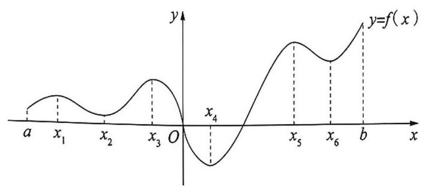
(2)函数 $y = f\left( x\right)$ 在点 $x = {x}_{2}$ 的函数值 $f\left( {x}_{2}\right)$ 比它在点 $x = {x}_{2}$ 附近其他点的函数值都小， ${f}^{\prime }\left( {x}_{2}\right)  = 0$ ,而且在点 $x = {x}_{2}$ 附近的左侧 ${f}^{\prime }\left( x\right)  < 0$ ,右侧 ${f}^{\prime }\left( x\right)  > 0$ ,我们把 ${x}_{2}$ 叫作函数的极___值点, $f\left( {x}_{2}\right)$ 叫作函数 $y = f\left( x\right)$ 的极___值.
(3)极小值点和极大值点统称为极值点，极小值和极大值统称为极值.
###### 2. 函数的驻点与极值点的关系
<table><tr><td rowspan="2">条件</td><td colspan="2">设点 $x = {x}_{0}$ 是函数 $y = f\left( x\right)$ 的驻点</td></tr><tr><td>在点 ${x}_{0}$ 的左侧附近有 ${f}^{\prime }\left( x\right)  > 0$ ,在点 ${x}_{0}$ 的右侧附近有 ${f}^{\prime }\left( x\right)  < 0$ .</td><td>在点 ${x}_{0}$ 的左侧附近有 ${f}^{\prime }\left( x\right)  < 0$ ,在点 ${x}_{0}$ 的右侧附近有 ${f}^{\prime }\left( x\right)  > 0$ .</td></tr><tr><td>图像</td><td>[失效外部图片：bo_d4jrurref24c739ch7sg_32.jpg]   形如山峰</td><td>[失效外部图片：bo_d4jrurref24c739ch7sg_32.jpg]   形如山谷</td></tr><tr><td>极值</td><td>$f\left( {x}_{0}\right)$ 为极___值</td><td>$f\left( {x}_{0}\right)$ 为极___值</td></tr><tr><td>极值点</td><td>${x}_{0}$ 为极大值点</td><td>${x}_{0}$ 为极小值点</td></tr></table>
##### 甄别陷阱
(1)函数 $f\left( x\right)$ 在 ${x}_{0}$ 处有极值的必要不充分条件是 ${f}^{\prime }\left( {x}_{0}\right)  = 0$ ，极值点是 ${f}^{\prime }\left( x\right)  = 0$ 的根，但 ${f}^{\prime }\left( x\right)  = 0$ 的根不都是极值点. 例如: $f\left( x\right)  = {x}^{3},{f}^{\prime }\left( 0\right)  = 0$ ,但 $x = 0$ 不是极值点. 因此,当 ${f}^{\prime }\left( {x}_{0}\right)  = 0$ 时,要判断 $x = {x}_{0}$ 是否为 $f\left( x\right)$ 的极值点,还要看 ${f}^{\prime }\left( x\right)$ 在 ${x}_{0}$ 两侧的符号是否相反.
(2)极值反映了函数在某一点附近的大小情况，刻画的是函数的局部性质. 极值点是函数在区间内部的点，不会是端点.
##### 类型一 与函数的极值定义相关的问题
###### 方法指引
通过导函数图像确定原函数极值点的步骤:
(1)观察导函数的零点个数，即为原函数的驻点个数；
(2)观察导函数零点两侧的符号是否变化，如何变化，从而确定原函数的极值点、极大(极小) 值点的个数.
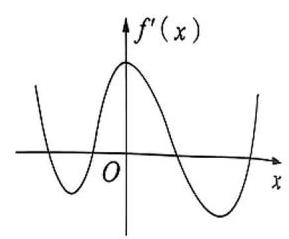
例 1 图
例1 函数 $f\left( x\right)$ 的定义域为 $\mathbf{R}$ ，导函数 ${f}^{\prime }\left( x\right)$ 的图像如图所示，则函数 $f\left( x\right)$ (   ).
A. 无极大值点，有四个极小值点
B. 有三个极大值点, 两个极小值点
C. 有两个极大值点, 两个极小值点
D. 有四个极大值点, 无极小值点
##### 自主探究
###### 要点精析
本题主要考查利用导函数图像结合极值的定义判别极值.
###### 参考解答
设 $y = {f}^{\prime }\left( x\right)$ 的图像与 $x$ 轴的交点从左到右横坐标依次为 ${x}_{1},{x}_{2},{x}_{3},{x}_{4}$ ,则 $f\left( x\right)$ 在 $x = {x}_{1}, x = {x}_{3}$ 处取得极大值,在 $x = {x}_{2}, x = {x}_{4}$ 处取得极小值. 故选 C.
##### 针对训练一
1. 已知函数 $f\left( x\right)$ 的导函数 ${f}^{\prime }\left( x\right)$ 的图像如图,若 $f\left( x\right)$ 在 $x = {x}_{0}$ 处有极值,则 ${x}_{0}$ 的值为( ).
A. -3 B. 0 C. 3 D. 7
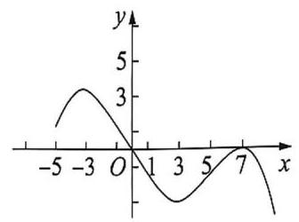
第 1 题图
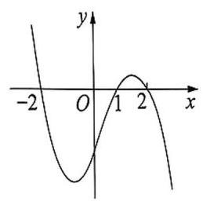
第 2 题图
2. 设函数 $f\left( x\right)$ 在 $\mathbf{R}$ 上可导,其导函数为 ${f}^{\prime }\left( x\right)$ ,且函数 $y = \left( {1 - x}\right) {f}^{\prime }\left( x\right)$ 的图像如图所示,则下列结论中一定成立的是( ).
A. 函数 $f\left( x\right)$ 有极大值 $f\left( {-2}\right)$ 和极小值 $f\left( 2\right)$
B. 函数 $f\left( x\right)$ 有极大值 $f\left( {-2}\right)$ 和极小值 $f\left( 1\right)$
C. 函数 $f\left( x\right)$ 有极大值 $f\left( 2\right)$ 和极小值 $f\left( {-2}\right)$
D. 函数 $f\left( x\right)$ 有极大值 $f\left( 2\right)$ 和极小值 $f\left( 1\right)$
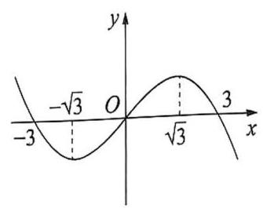
第 3 题图
3. 设三次函数 $f\left( x\right)$ 的导函数为 ${f}^{\prime }\left( x\right)$ ,函数 $y = x \cdot  {f}^{\prime }\left( x\right)$ 的图像的一部分如图所示，则以下结论正确的是( ).
A. $f\left( x\right)$ 的极大值为 $f\left( \sqrt{3}\right)$ ，极小值为 $f\left( {-\sqrt{3}}\right)$
B. $f\left( x\right)$ 的极大值为 $f\left( {-\sqrt{3}}\right)$ ，极小值为 $f\left( \sqrt{3}\right)$
C. $f\left( x\right)$ 的极大值为 $f\left( {-3}\right)$ ，极小值为 $f\left( 3\right)$
D. $f\left( x\right)$ 的极大值为 $f\left( 3\right)$ ，极小值为 $f\left( {-3}\right)$
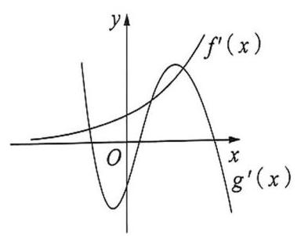
第 4 题图
4. 定义在 $\mathbf{R}$ 上的函数 $f\left( x\right)$ 和 $g\left( x\right)$ ,其各自导函数 ${f}^{\prime }\left( x\right)$ 和 ${g}^{\prime }\left( x\right)$ 的图像如图所示,则函数 $F\left( x\right)  = f\left( x\right)  - g\left( x\right)$ 的极值点的情况是( ).
A. 只有三个极大值点，无极小值点
B. 有两个极大值点，一个极小值点
C. 有一个极大值点，两个极小值点
D. 无极大值点，只有三个极小值点
##### 类型二 不含参函数的极值问题
###### 方法指引
求不含参函数极值的步骤:
(1)确定函数的定义域；
(2)求方程 ${f}^{\prime }\left( x\right)  = 0$ 的根；
(3)用方程 ${f}^{\prime }\left( x\right)  = 0$ 的根顺次将函数的定义域分成若干个小开区间，并列成表格；
(4)由 ${f}^{\prime }\left( x\right)$ 的符号来判断 $f\left( x\right)$ 在这个根处取极值的情况.
例2 求函数 $f\left( x\right)  = {x}^{3} - 3{x}^{2} - {9x} + 5$ 的极值.
##### 自主探究
###### 要点精析
本题考查了利用导数求函数极值的方法.
###### 参考解答
函数 $f\left( x\right)  = {x}^{3} - 3{x}^{2} - {9x} + 5$ 的定义域为 R，且 ${f}^{\prime }\left( x\right)  = 3{x}^{2} - {6x} - 9$ , 解方程 $3{x}^{2} - {6x} - 9 = 0$ ,得 ${x}_{1} =  - 1,{x}_{2} = 3$ . 当 $x$ 变化时, ${f}^{\prime }\left( x\right)$ 与 $f\left( x\right)$ 的变化情况如表:
<table><tr><td>$x$</td><td>$\left( {-\infty , - 1}\right)$</td><td>-1</td><td>(-1,3)</td><td>3</td><td>(3，+∞)</td></tr><tr><td>${f}^{\prime }\left( x\right)$</td><td>+</td><td>0</td><td>-</td><td>0</td><td>+</td></tr><tr><td>$f\left( x\right)$</td><td>严格增</td><td>极大值</td><td>严格减</td><td>极小值</td><td>严格增</td></tr></table>
因此, $x =  - 1$ 是函数的极大值点,极大值为 $f\left( {-1}\right)  = {10}$ ; $x = 3$ 是函数的极小值点,极小值为 $f\left( 3\right)  =  - {22}$ .
##### 针对训练二
1. 函数 $y = x - \ln \left( {1 + {x}^{2}}\right)$ 的极值情况是( ).
A. 有极小值 B. 有极大值
C. 既有极大值又有极小值 D. 无极值
2. 函数 $f\left( x\right)  = \frac{\ln x}{x}$ 的极大值为___.
3. 已知函数 $f\left( x\right)  = \frac{x - 1}{{\mathrm{e}}^{x}}$ ,求 $f\left( x\right)$ 的极值.
4. 已知函数 $f\left( x\right)  = x\left( {1 + \ln x}\right)$ ,求函数 $f\left( x\right)$ 的极值.
##### 类型三 含参函数的极值问题
###### 方法指引
含参函数极值问题的处理策略与步骤:
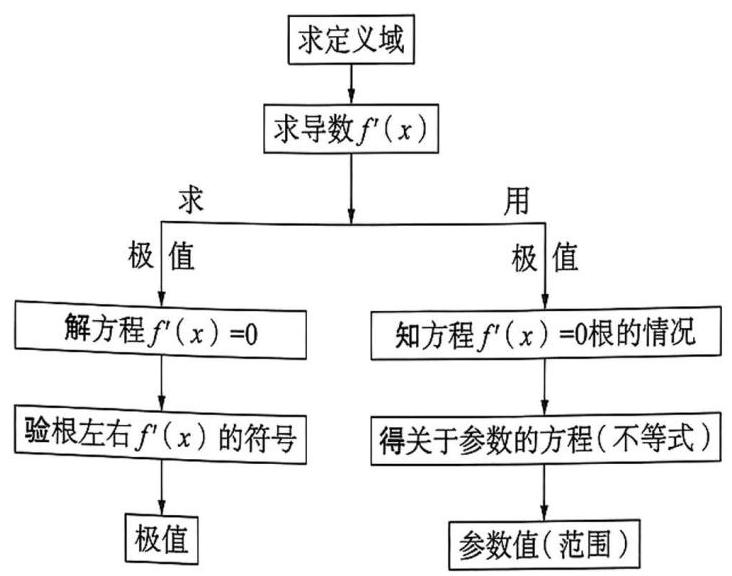
例 3 已知函数 $f\left( x\right)  = {x}^{2} + a\ln x$ 的极值点为 2 .
(1)求实数 $a$ 的值；
(2) 求函数 $f\left( x\right)$ 的极值.
##### 自主探究
###### 要点精析
本题考查根据导数研究函数极值. (1) 求出函数导数，根据极值存在条件求出 $a$ ；(2)求出函数导数，讨论函数的单调性，进而求出极值.
###### 参考解答
(1) $\because {f}^{\prime }\left( x\right)  = {2x} + \frac{a}{x}$ ,且 ${f}^{\prime }\left( 2\right)  = 2 \times  2 + \frac{a}{2} = 0,\therefore$ 解得 $a =  - 8$ .
(2) $\because f\left( x\right)  = {x}^{2} - 8\ln x, x > 0,\therefore {f}^{\prime }\left( x\right)  = {2x} - \frac{8}{x} = \frac{2\left( {x + 2}\right) \left( {x - 2}\right) }{x}$ ,
令 ${f}^{\prime }\left( x\right)  > 0$ ,解得 $x > 2$ ; 令 ${f}^{\prime }\left( x\right)  < 0$ ,解得 $0 < x < 2$ ,
$\therefore f\left( x\right)$ 在 $\left( {0,2}\right)$ 上严格减,在 $\left( {2, + \infty }\right)$ 上严格增.
$\therefore f\left( x\right)$ 的极小值为 $f\left( 2\right)  = 4 - 8\ln 2$ .
例4 设函数 $f\left( x\right)  = \mathrm{e}x + \frac{a}{x} - \ln x$ 有两个不同极值点 ${x}_{1},{x}_{2}$ ，求实数 $a$ 的取值范围.
##### 自主探究
###### 要点精析
本题考查利用导数研究函数的单调性和极值. 首先求出函数的导数，结合已知条件确定 $\mathrm{e}{x}^{2} - x - a = 0$ 在区间 $\left( {0, + \infty }\right)$ 上有两个不等实数根，再根据判别式和韦达定理求出 $a$ 的范围.
###### 参考解答
${f}^{\prime }\left( x\right)  = \mathrm{e} - \frac{a}{{x}^{2}} - \frac{1}{x} = \frac{\mathrm{e}{x}^{2} - x - a}{{x}^{2}}\left( {x > 0}\right)$ ,
由题意得 ${f}^{\prime }\left( x\right)  = 0$ 有两个不同的正根,即方程 $\frac{\mathrm{e}{x}^{2} - x - a}{{x}^{2}} = 0$ 有两个不同的正根 ${x}_{1},{x}_{2}$ ,即 $\mathrm{e}{x}^{2} - x - a = 0$ 有两个不同的正根 ${x}_{1},{x}_{2}$ ,
则有 $\left\{  \begin{array}{l} \Delta  = 1 + {4a}\mathrm{e} > 0, \\  {x}_{1} + {x}_{2} =  - \frac{-1}{\mathrm{e}} > 0, \\  {x}_{1} \cdot  {x}_{2} = \frac{-a}{\mathrm{e}} > 0, \end{array}\right.$ 可得 $a$ 的取值范围为 $\left( {-\frac{1}{4\mathrm{e}},0}\right)$ .
##### 针对训练三
1. 已知函数 $f\left( x\right)  = x - a\ln x\left( {a \in  \mathbf{R}}\right)$ ,求 $f\left( x\right)$ 的极值.
2. 已知函数 $f\left( x\right)  = {x}^{3} + {2a}{x}^{2} + {bx} + a - 1$ 在 $x =  - 1$ 处取得极值 0,其中 $a, b \in  \mathbf{R}$ ,求实数 $a$ , $b$ 的值.
3. 已知函数 $f\left( x\right)  = 2\ln x + a{x}^{2} + b$ 在 $x = 1$ 处取得极值 1,求 $a, b$ 的值.
4. 已知函数 $f\left( x\right)  = \frac{1}{3}a{x}^{3} - \frac{1}{2}{x}^{2} + x - x\ln x$ 存在两个极值点,求实数 $a$ 的取值范围.
5. 设函数 $f\left( x\right)  = {x}^{3} - {3a}{x}^{2} + {3ax} + 4{a}^{3}$ ，已知 $f\left( x\right)$ 的极大值与极小值之和为 $g\left( a\right)$ ，求 $g\left( a\right)$ . 的值域.
#### 3.3 利用导数研究函数的最值
##### 知识要点
###### 1. 取到函数最值的前提
一般地，如果在区间 $\left\lbrack  {a, b}\right\rbrack$ 上函数 $y = f\left( x\right)$ 的图像是一条___， $\left\lbrack  {a, b}\right\rbrack$ 上一定存在最大值和最小值，并且函数的最值必在___或___取得.
注意:给定函数的区间必须是闭区间， $y = f\left( x\right)$ 在开区间上虽然连续，但不能保证有最大值和最小值.
###### 2. 函数最值的求法
函数 $y = f\left( x\right)$ 在区间 $\left\lbrack  {a, b}\right\rbrack$ 上的最值可分两种情况进行讨论:
(1)当函数 $y = f\left( x\right)$ 有单调性时:
① 若函数 $y = f\left( x\right)$ 在区间 $\left\lbrack  {a, b}\right\rbrack$ 上严格增，则 $f\left( a\right)$ 为函数的最小值， $f\left( b\right)$ 为函数的最大值;
② 若函数 $y = f\left( x\right)$ 在区间 $\left\lbrack  {a, b}\right\rbrack$ 上严格减，则 $f\left( a\right)$ 为函数的最大值， $f\left( b\right)$ 为函数的最小值.
(2)当函数 $y = f\left( x\right)$ 不单调时:
① 求函数 $y = f\left( x\right)$ 在区间 $\left( {a, b}\right)$ 内的极值；
② 将函数 $y = f\left( x\right)$ 的各极值与___处的函数值 $f\left( a\right) , f\left( b\right)$ 比较，其中最大的一个是最大值,最小的一个是最小值.
###### 3. 函数的最值与极值之间的区别与联系
(1)区别:函数的极值和最值是两个不同的概念，不能混淆. 函数的极值是导函数值为零且两侧导数异号的点处的函数值，而函数的最值是在某一区间或定义域上的函数值的最大值和最小值.
(2)联系:求函数最值时，可先求函数的极值，函数的极值和端点处的函数值中最大的就是最大值,最小的就是最小值.
注:在许多理论和现实的问题中，常常需要求函数的最大值或者最小值(统称为最值)，最值反映了函数在定义域上整体的情况，而极值则反映了函数在某点附近的局部特征.
##### 甄别陷阱
###### 1. 最值点是一个实数而不是点坐标
(1)最大值点:函数 $y = f\left( x\right)$ 在区间 $\left\lbrack  {a, b}\right\rbrack$ 上的最大值点 ${x}_{0}$ 指的是:函数在这个区间上所有点的函数值都不大于 $f\left( {x}_{0}\right)$ ;
(2)最小值点:函数 $y = f\left( x\right)$ 在区间 $\left\lbrack  {a, b}\right\rbrack$ 上的最小值点 ${x}_{0}$ 指的是:函数在这个区间上所有点的函数值都不小于 $f\left( {x}_{0}\right)$ .
2. 最值:函数的最大值与最小值统称为最值.
##### 类型一 与函数的最值定义相关的问题
###### 方法指引
函数的极值与最值的关系
(1)函数的极值是函数在某一点附近的局部概念，函数的最大值和最小值是一个整体性概念；
(2)函数的最大值、最小值是比较整个定义区间的函数值得出的，函数的极值是比较极值点附近的函数值得出的，函数的极值可以有多个，但最值只能有一个；
(3)极值只能在区间内取得，最值则可以在端点处取得. 有极值的未必有最值，有最值的未必有极值; 极值有可能成为最值, 不在端点处取得的最值必定是极值.
例 1 如图为 $y = f\left( x\right) , x \in  \left\lbrack  {a, b}\right\rbrack$ 的图像,结合图像,解答:
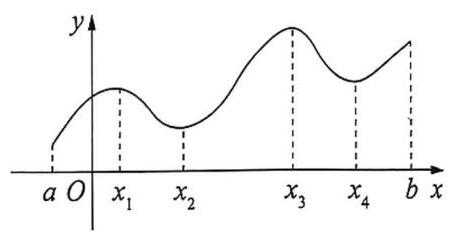
例 1 图
(1)试说明 $y = f\left( x\right)$ 的极值；
(2)你能说出 $y = f\left( x\right) , x \in  \left\lbrack  {a, b}\right\rbrack$ 的最值吗?
(3)根据问题(2)回答函数 $y = f\left( x\right) , x \in  \left\lbrack  {a, b}\right\rbrack$ 的最值可能在哪些点取得.
##### 自主探究
###### 要点精析
注意理解最值与极值的联系与区别.
###### 参考解答
(1) $f\left( {x}_{1}\right)$ ， $f\left( {x}_{3}\right)$ 为函数的极大值， $f\left( {x}_{2}\right)$ ， $f\left( {x}_{4}\right)$ 为函数的极小值.
(2)函数的最小值是 $f\left( a\right) , f\left( {x}_{2}\right) , f\left( {x}_{4}\right)$ 中最小的，函数的最大值是 $f\left( b\right) , f\left( {x}_{1}\right) , f\left( {x}_{3}\right)$ 中最大的.
(3)在极值点或端点中取得.
例2 设 $f\left( x\right)$ 是区间 $\left\lbrack  {a, b}\right\rbrack$ 上的连续函数，且在 $\left( {a, b}\right)$ 内可导，则下列结论中正确的是( ).
A. $f\left( x\right)$ 的极值点一定是最值点 B. $f\left( x\right)$ 的最值点一定是极值点
C. $f\left( x\right)$ 在区间 $\left\lbrack  {a, b}\right\rbrack$ 上可能没有极值点 D. $f\left( x\right)$ 在区间 $\left\lbrack  {a, b}\right\rbrack$ 上可能没有最值点
##### 自主探究
###### 参考解答
对于选项 A，极值与端点的函数值比较，较大 (或较小) 值为最值，故选项 A 不正确; 极值是函数的局部性质, 一个可导函数在某点处有极值的充要条件是这个函数在该点处的导数等于 0 ，且在该点两侧导数异号. 而连续函数在闭区间上，可以没有极值点，没有极值, 但一定有最值，故选项 C 正确，选项 B，D 不正确，故选 C.
##### 针对训练一
1. 下列结论中,正确的是( ).
A. 若 $f\left( x\right)$ 在 $\left\lbrack  {a, b}\right\rbrack$ 上有极大值,则极大值一定是 $\left\lbrack  {a, b}\right\rbrack$ 上的最大值
B. 若 $f\left( x\right)$ 在 $\left\lbrack  {a, b}\right\rbrack$ 上有极小值,则极小值一定是 $\left\lbrack  {a, b}\right\rbrack$ 上的最小值
C. 若 $f\left( x\right)$ 在 $\left\lbrack  {a, b}\right\rbrack$ 上有极大值,则极大值一定是在 $x = a$ 和 $x = b$ 处取得
D. 若 $f\left( x\right)$ 在 $\left\lbrack  {a, b}\right\rbrack$ 上连续,则 $f\left( x\right)$ 在 $\left\lbrack  {a, b}\right\rbrack$ 上存在最大值和最小值
2. 已知函数 $y = f\left( x\right)$ ，其导函数 $y = {f}^{\prime }\left( x\right)$ 的图像如图，则对于函数 $y = f\left( x\right)$ 的描述正确的是 ( ).
A. 在 $\left( {-\infty ,0}\right)$ 上为严格减函数 B. 在 $x = 0$ 处取得最大值
C. 在 $\left( {4, + \infty }\right)$ 上为严格减函数 D. 在 $x = 2$ 处取得最小值
3. 已知函数 $f\left( x\right)$ 的导函数 ${f}^{\prime }\left( x\right)$ 的图像如图所示，则( ).
A. $f\left( x\right)$ 在 $\left( {-\infty , - 3}\right)$ 上严格增 B. $f\left( x\right)$ 在 $\left( {0,2}\right)$ 上严格减
C. $f\left( x\right)$ 在 $\left( {0,2}\right)$ 上严格减 D. $f\left( x\right)$ 在 $x =  - 3$ 处取得最小值
4. 如图是函数 $y = f\left( x\right)$ 的导函数 ${f}^{\prime }\left( x\right)$ 的图像，则下面判断正确的是( ).
A. $f\left( x\right)$ 在 $\left( {-3,1}\right)$ 上是严格增函数 B. $f\left( x\right)$ 在 $\left( {1,2}\right)$ 上是严格减函数
C. $f\left( x\right)$ 在 $\left\lbrack  {-3,4}\right\rbrack$ 上的最大值是 $f\left( 1\right)$ D. 当 $x = 4$ 时， $f\left( x\right)$ 取得极小值
5. 如图是函数 $y = f\left( x\right)$ 的导函数 $y = {f}^{\prime }\left( x\right)$ 的图像,给出下列命题:
①-3是函数 $y = f\left( x\right)$ 的极值点;
② -1 是函数 $y = f\left( x\right)$ 的最小值;
③ $y = f\left( x\right)$ 在 $x = 0$ 处切线的斜率小于零;
④ $y = f\left( x\right)$ 在区间 $\left( {-3,1}\right)$ 上严格增.
则正确命题的序号是( ).
A. ①② B. ①④ C. ②③ D. ③④
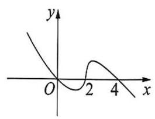
第 2 题图
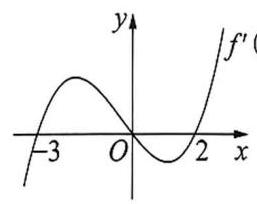
第 3 题图
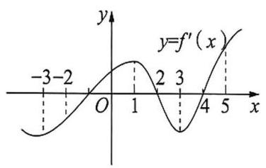
第 4 题图
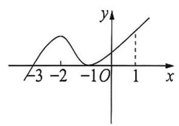
第 5 题图
##### 类型二 不含参函数的最值问题
###### 方法指引
求不含参函数的最值的步骤:
1. 求函数 $f\left( x\right)$ 在 $\left\lbrack  {a, b}\right\rbrack$ 上的最大值和最小值的步骤:
(1)先求函数 $f\left( x\right)$ 的定义域；
(2)求函数 $f\left( x\right)$ 在 $\left( {a, b}\right)$ 内的极值；
(3)求函数 $f\left( x\right)$ 在区间端点处的函数值 $f\left( a\right) , f\left( b\right)$ ；
(4)将函数 $f\left( x\right)$ 的各极值与 $f\left( a\right) , f\left( b\right)$ 比较,其中最大的一个为最大值,最小的一个为最小值.
2. 求函数在无穷区间(或开区间)上的最值，不仅要研究其极值情况，还要研究其单调性，并通过单调性和极值情况，画出函数的大致图像，然后借助图像观察得到函数的最值.
例 3 求函数 $f\left( x\right)  = {x}^{3} - \frac{3}{2}{x}^{2} - {6x} + 1$ 在区间 $\left\lbrack  {-2,4}\right\rbrack$ 上的最小值.
##### 自主探究
###### 要点精析
先对函数 $f\left( x\right)$ 求导，通过单调性找到极值，再根据极值和端点值的大小比较，得出函数在区间上的最小值.
###### 参考解答
${f}^{\prime }\left( x\right)  = 3{x}^{2} - {3x} - 6 = 3\left( {x + 1}\right) \left( {x - 2}\right)$ ,令 ${f}^{\prime }\left( x\right)  = 0$ ,则 $x =  - 1$ 或 $x = 2$ .
当 $x <  - 1$ 或 $x > 2$ 时, ${f}^{\prime }\left( x\right)  > 0$ ,故 $f\left( x\right)$ 在区间 $\left( {-\infty , - 1}\right) ,\left( {2, + \infty }\right)$ 上严格增;
当 $- 1 < x < 2$ 时， ${f}^{\prime }\left( x\right)  < 0$ ，故 $f\left( x\right)$ 在区间 $\left( {-1,2}\right)$ 上严格减，
故函数 $f\left( x\right)$ 的极大值为 $f\left( {-1}\right)  = \frac{9}{2}$ ,极小值是 $f\left( 2\right)  =  - 9$ ,又 $f\left( {-2}\right)  =  - 1, f\left( 4\right)  = {17}$ , $\because  - 9 <  - 1 < \frac{9}{2} < {17}$ ,
$\therefore$ 通过比较可知，函数 $f\left( x\right)$ 在区间 $\left\lbrack  {-2,4}\right\rbrack$ 上的最小值为 $f\left( 2\right)  =  - 9$ .
例 4 设函数 $f\left( x\right)  = {\mathrm{e}}^{2x} - {2x}$ .
(1)求 $f\left( x\right)$ 的单调区间与极小值；
(2)求 $f\left( x\right)$ 在 $\left\lbrack  {-1,1}\right\rbrack$ 上的值域.
##### 自主探究
###### 要点精析
(1) 对函数 $f\left( x\right)$ 求导，根据导函数即可判断函数的单调性，求出函数的极值；(2)求出闭区间 $\left\lbrack  {-1,1}\right\rbrack$ 的端点函数值，与在区间 $\left\lbrack  {-1,1}\right\rbrack$ 内的极值比较，得到最大值和最小值,即可得到函数 $f\left( x\right)$ 在 $\left\lbrack  {-1,1}\right\rbrack$ 上的值域.
###### 参考解答
(1) ${f}^{\prime }\left( x\right)  = 2{\mathrm{e}}^{2x} - 2$ ,令 ${f}^{\prime }\left( x\right)  = 0$ ,得 $x = 0$ ,
若 $x < 0$ ,则 ${f}^{\prime }\left( x\right)  < 0$ ,从而 $f\left( x\right)$ 在 $\left( {-\infty ,0}\right)$ 上严格减;
若 $x > 0$ ,则 ${f}^{\prime }\left( x\right)  > 0$ ,从而 $f\left( x\right)$ 在 $\left( {0, + \infty }\right)$ 上严格增,
则 $f\left( x\right)$ 的单调增区间为 $\left( {0, + \infty }\right)$ ,单调减区间为 $\left( {-\infty ,0}\right)$ ,
故 $f\left( x\right)$ 的极小值为 $f\left( 0\right)  = 1$ .
(2) $\because f\left( 1\right)  = {\mathrm{e}}^{2} - 2, f\left( {-1}\right)  = \frac{1}{{\mathrm{e}}^{2}} + 2$ ,且 $f\left( 1\right)  > f\left( {-1}\right)$ ,
$\therefore$ 在 $\left\lbrack  {-1,1}\right\rbrack$ 上, $f{\left( x\right) }_{\max } = f\left( 1\right)  = {\mathrm{e}}^{2} - 2, f{\left( x\right) }_{\min } = f\left( 0\right)  = 1$ .
故 $f\left( x\right)$ 在 $\left\lbrack  {-1,1}\right\rbrack$ 上的值域为 $\left\lbrack  {1,{\mathrm{e}}^{2} - 2}\right\rbrack$ .
· 43 ·
##### 针对训练二
1. 函数 $y = {x}^{3} - {12x} + {16}$ 在 $\left\lbrack  {-3,3}\right\rbrack$ 上的最大值、最小值分别是( ).
A.6,0 B. 32,0 C. 25,6 D. 32,16
2. 函数 $f\left( x\right)  = \frac{{\mathrm{e}}^{x}}{x} - \mathrm{e}$ 在区间 $\left( {0, + \infty }\right)$ 上___. (填序号)
① 有最大值，无最小值； ② 有最小值，无最大值；
③ 函数 $f\left( x\right)$ 存在唯一的零点; ④ 函数 $f\left( x\right)$ 存在唯一的极值点.
3. 给出下列四个函数，其中既有极小值又有最小值的函数为___. (填序号)
① $y = \left| x\right|$ ; ② $y = {\mathrm{e}}^{x} - x - 1$ ; ③ $y = x - \ln x - 1$ ; ④ $y = x - \sin x$ .
4. 已知 $f\left( x\right)  = \frac{\ln x}{{x}^{2}}$ ,求 $f\left( x\right)$ 在 $\left\lbrack  {\frac{1}{\mathrm{e}},\mathrm{e}}\right\rbrack$ 上的最值.
5. 已知函数 $f\left( x\right)  = {x}^{3} - 3{x}^{2} - {9x} + 2$ .
(1)求函数 $f\left( x\right)$ 的极值；
(2)求函数 $f\left( x\right)$ 在区间 $\left\lbrack  {-2,2}\right\rbrack$ 上的最值.
##### 类型三 含参函数的最值问题
###### 方法指引
求含参函数最值问题的步骤与分类讨论策略:
(1)先求函数定义域；
(2)再求函数的驻点，并观察驻点是否唯一，若不唯一，则需要比较驻点大小，从而分类讨论；
(3)观察导函数正负，分析是否需要对参数进行分类讨论. 一般来说，先观察参数在什么范围内导函数会恒正或恒负，若无这种可能性，则需要按部就班地去解含参不等式.
例5 已知函数 $f\left( x\right)  = {x}^{3} + {x}^{2} + {ax}$ . 当 $- \frac{8}{3} < a < 0$ 时， $f\left( x\right)$ 在 $\left\lbrack  {0,2}\right\rbrack$ 上的最大值为10,求 $f\left( x\right)$ 在该区间上的最小值.
##### 自主探究
###### 要点精析
本题思路是先根据函数 $f\left( x\right)$ 在 $\left\lbrack  {0,2}\right\rbrack$ 上的最大值求出 $a$ 的值,再由导数判断函数的单调性,结合 $a$ 的值求出 $f\left( x\right)$ 在 $\left\lbrack  {0,2}\right\rbrack$ 上的最小值.
###### 参考解答
函数 $f\left( x\right)  = {x}^{3} + {x}^{2} + {ax}$ ,则 ${f}^{\prime }\left( x\right)  = 3{x}^{2} + {2x} + a$ ,
令 ${f}^{\prime }\left( x\right)  = 0$ ,得 ${x}_{1} = \frac{-1 - \sqrt{1 - {3a}}}{3},{x}_{2} = \frac{-1 + \sqrt{1 - {3a}}}{3}$ ,
当 $- \frac{8}{3} < a < 0$ 时,则 ${x}_{1} < 0 < {x}_{2} < 2,\therefore f\left( x\right)$ 在 $\left\lbrack  {0,{x}_{2}}\right)$ 上严格减,在 $\left( {{x}_{2},2}\right\rbrack$ 上严格增,
$\therefore f\left( x\right)$ 在 $\left\lbrack  {0,2}\right\rbrack$ 上的最小值为 $f\left( {x}_{2}\right)$ ,
又 $f\left( 0\right)  = 0, f\left( 2\right)  = {12} + {2a},\therefore f\left( 0\right)  < f\left( 2\right)$ ,
$\therefore f\left( x\right)$ 在 $\left\lbrack  {0,2}\right\rbrack$ 上的最大值为 $f\left( 2\right)  = {12} + {2a} = {10}$ ,解得 $a =  - 1$ ,
$\therefore {x}_{2} = \frac{-1 + \sqrt{1 - {3a}}}{3} = \frac{1}{3}$ ,故 $f\left( x\right)$ 在 $\left\lbrack  {0,2}\right\rbrack$ 上的最小值为 $f\left( \frac{1}{3}\right)  =  - \frac{5}{27}$ .
##### 针对训练三
1. 已知函数 $f\left( x\right)  = a{x}^{3} + 2{x}^{2} - {4x} + 5$ ,当 $x = \frac{2}{3}$ 时，函数 $f\left( x\right)$ 有极值，则函数 $f\left( x\right)$ 在 $\left\lbrack  {-3,1}\right\rbrack$ 上的最大值为___.
2. 已知函数 $f\left( x\right)  = \frac{1}{3}{x}^{3} - {4x} + 4$ 在区间 $\left( {{2a} - 5,{a}^{2}}\right)$ 上存在最大值，则实数 $a$ 的取值范围是().
A. $\left\lbrack  {-2,\frac{3}{2}}\right\rbrack$ B. $\left( {-2,\sqrt{2}}\right)$ C. $\left\lbrack  {-2,\sqrt{2}}\right\rbrack$ D. $\left\lbrack  {-2,\frac{3}{2}}\right)$
3. 若函数 $f\left( x\right)  = \ln x - a{x}^{2} + \left( {a - 2}\right) x\left( {x \in  \left( {1, + \infty }\right) }\right)$ 有最小值，则实数 $a$ 的取值范围为 ( ).
A. $\left( {-1,0}\right)$ B. $\left( {-\infty , - 1}\right)$ C. $\left( {0,1}\right)$ D. $\left( {-1,1}\right)$
4. 已知函数 $f\left( x\right)  = {x}^{3} - \left( {{3a} + \frac{3}{2}}\right) {x}^{2} + {6ax}$ ，若 $f\left( x\right)$ 在 $\left( {-1, + \infty }\right)$ 上既有极大值又有最小值，且最小值为 ${3a} - \frac{1}{2}$ ，则实数 $a$ 的取值范围为( ).
A. $\left( {-\frac{1}{6},\frac{1}{2}}\right)$ B. $\left( {-\frac{1}{2}, - \frac{1}{6}}\right)$ C. $\left( {-\frac{1}{2}, - \frac{1}{6}}\right\rbrack$ D. $\left( {-\frac{1}{2},\frac{1}{2}}\right)$
5. 已知函数 $f\left( x\right)  = \ln x - {ax}\left( {a \in  \mathbf{R}}\right)$ .
(1)求函数 $f\left( x\right)$ 的单调区间；
(2)当 $a > 0$ 时，求函数 $f\left( x\right)$ 在 $\left\lbrack  {1,2}\right\rbrack$ 上的最小值.
#### 3.4 利用导数解决实际问题
##### 知识要点
利用导数解决生活中的优化问题的四个步骤:
(1)分析实际问题中各量之间的关系, 建立实际问题的数学模型, 写出实际问题中变量之间的函数关系式 $y = f\left( x\right)$ 并写出定义域；
(2)求函数的导数 ${f}^{\prime }\left( x\right)$ ，解方程 ${f}^{\prime }\left( x\right)  = 0$ ；
3)比较函数在区间端点和 ${f}^{\prime }\left( x\right)  = 0$ 的点的函数值的大小，最大(小)者为最大(小)值；
4) 回归实际问题，结合实际问题作答.
##### 甄别陷阱
注意在实际问题中的定义域，例如个数、人数等必须是自然数.
##### 方法指引
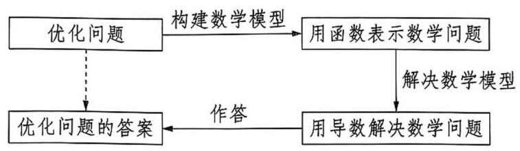
##### 类型一 以高次、分式型函数为背景的实际应用问题
例 1 某地准备在山谷中建一座桥梁,桥址位置的竖直截面图如图所示,谷底 $O$ 在水平线 ${MN}$ 上，桥 ${AB}$ 与 ${MN}$ 平行， $O{O}^{\prime }$ 为铅垂线( ${O}^{\prime }$ 在 ${AB}$ 上). 经测量，左侧曲线 ${AO}$ 上任一点 $D$ 到 ${MN}$ 的距离 ${h}_{1}\left( \mathrm{\;m}\right)$ 与 $D$ 到 $O{O}^{\prime }$ 的距离 $a\left( \mathrm{\;m}\right)$ 之间满足关系式 ${h}_{1} = \frac{1}{40}{a}^{2}$ ; 右侧曲线 ${BO}$ 上任一点 $F$ 到 ${MN}$ 的距离 ${h}_{2}\left( \mathrm{\;m}\right)$ 与 $F$ 到 $O{O}^{\prime }$ 的距离 $b\left( \mathrm{\;m}\right)$ 之间满足关系式 ${h}_{2} =  - \frac{1}{800}{b}^{3} + {6b}$ . 已知点 $B$ 到 $O{O}^{\prime }$ 的距离为 ${40}\mathrm{\;m}$ .
(1)求桥 ${AB}$ 的长度；
(2)计划在谷底两侧建造平行于 $O{O}^{\prime }$ 的桥墩 ${CD}$ 和 ${EF}$ ，且 ${CE}$ 为 ${80}\mathrm{m}$ ，其中 $C$ ， $E$ 在 ${AB}$ 上 (不包括端点). 桥墩 ${EF}$ 造价 $k\mathrm{\;m}/$ 万元,桥墩 ${CD}$ 造价 $\frac{3}{2}k\mathrm{\;m}/$ 万元 $\left( {k > 0}\right)$ ,问: ${O}^{\prime }E$ 为多少米时,桥墩 ${CD}$ 与 ${EF}$ 的总造价最低?
##### 自主探究
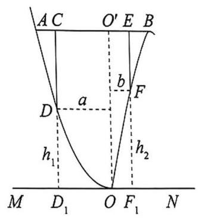
例 1 图
###### 要点精析
在实际问题中，如果建立的函数模型无法直接判断单调性或求最值，那么就需要利用导数来研究,此时根据 ${f}^{\prime }\left( x\right)  = 0$ 求出极值点 (注意根据实际意义舍去不合题意的极值点) 后, 若函数在该点附近满足左减右增, 则此时唯一的极小值就是所求函数的最小值.
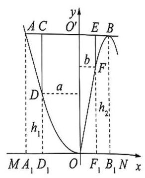
例 1 答案图
###### 参考解答
(1) 如图,设 $A{A}_{1}\text{ 、 }B{B}_{1}\text{ 、 }C{D}_{1}\text{ 、 }E{F}_{1}$ 都与 ${MN}$ 垂直, ${A}_{1}\text{ 、 }{B}_{1}\text{ 、 }{D}_{1}\text{ 、 }{F}_{1}$ 是相应垂足. 由条件知,当 ${O}^{\prime }B = {40}$ 时, $B{B}_{1} =  - \frac{1}{800} \times \; {40}^{3} + 6 \times  {40} = {160}$ ,则 $A{A}_{1} = {160}$ . 由 $\frac{1}{40}{O}^{\prime }{A}^{2} = {160}$ ,得 ${O}^{\prime }A = {80}$ .
$\therefore {AB} = {O}^{\prime }A + {O}^{\prime }B = {80} + {40} = {120}\left( \mathrm{\;m}\right)$ .
答: 桥 ${AB}$ 的长度为 ${120}\mathrm{\;m}$ .
(2)以 $O$ 为原点， $O{O}^{\prime }$ 为 $y$ 轴建立平面直角坐标系 ${xOy}$ (如图所示). 设 $F\left( {x,{y}_{2}}\right) , x \in  \left( {0,{40}}\right)$ ,则 ${y}_{2} =  - \frac{1}{800}{x}^{3} + {6x},{EF} = {160} - {y}_{2} = {160} + \frac{1}{800}{x}^{3} - {6x}$ .
$\because {CE} = {{80},\therefore {O}^{\prime }C} = {{80} - x}$ . 设 $D\left( {x - {{80},{y}_{1}}}\right)$ ,则 ${y}_{1} = \frac{1}{40}{\left( {80} - x\right) }^{2}$ ,
$\therefore {CD} = {160} - {y}_{1} = {160} - \frac{1}{40}{\left( {80} - x\right) }^{2} =  - \frac{1}{40}{x}^{2} + {4x}$ .
记桥墩 ${CD}$ 与 ${EF}$ 的总造价为 $f\left( x\right)$ ,
则 $f\left( x\right)  = k\left( {{160} + \frac{1}{800}{x}^{3} - {6x}}\right)  + \frac{3}{2}k\left( {-\frac{1}{40}{x}^{2} + {4x}}\right)  = k\left( {\frac{1}{800}{x}^{3} - \frac{3}{80}{x}^{2} + {160}}\right) \left( {0 < x < {40}}\right)$ , ${f}^{\prime }\left( x\right)  = k\left( {\frac{3}{800}{x}^{2} - \frac{3}{40}x}\right)  = \frac{3k}{800}x\left( {x - {20}}\right)$ ,令 ${f}^{\prime }\left( x\right)  = 0$ ,得 $x = {20}$ .
当 $x$ 变化时， ${f}^{\prime }\left( x\right)$ ， $f\left( x\right)$ 的变化情况如表所示:
<table><tr><td>$x$</td><td>(0,20)</td><td>20</td><td>(20,40)</td></tr><tr><td>${f}^{\prime }\left( x\right)$</td><td>-</td><td>0</td><td>+</td></tr><tr><td>$f\left( x\right)$</td><td>↘</td><td>极小值</td><td>↗</td></tr></table>
$\therefore$ 当 $x = {20}$ 时, $f\left( x\right)$ 取得最小值.
答: 当 ${O}^{\prime }E$ 为 ${20}\mathrm{\;m}$ 时,桥墩 ${CD}$ 与 ${EF}$ 的总造价最低.
##### 针对训练一
1. 做一个容积为 ${256}{\mathrm{{dm}}}^{3}$ 的方底无盖水箱,它的高为___ $\mathrm{{dm}}$ 时最省材料.
2. 某网球中心欲建连成片的网球场数块, 用 128 万元购买土地 10000 平方米, 该中心每块球场的建设面积为 1000 平方米,球场的总建筑面积的每平方米的平均建设费用与球场数有关,当该中心建球场 $x$ 块时,每平方米的平均建设费用 (单位: 元) 可近似地用 $f\left( x\right)  =$
${800}\left( {1 + \frac{1}{5}\ln x}\right)$ 来刻画. 为了使该球场每平方米的综合费用最省(综合费用是建设费用与购地费用之和), 问: 该网球中心应建几个球场?
3. 重庆高新区有一边长为 2 百米的正方形 ${ABCD}$ 地块如图，地块的一角是一个池塘，其边缘线 ${AM}$ 是以 $A$ 为顶点， ${AD}$ 为对称轴的抛物线的一段， $M$ 为边 ${CD}$ 的中点. 规划在空地上修建一条小路 ${EF}$ (线段 ${EF}$ )，把池塘隔离开来，点 $E$ ， $F$ 分别在边 ${CD}$ ， ${AB}$ 上. 为方便解题，以 $A$ 为坐标原点， ${AB}$ 为 $x$ 轴，建立平面直角坐标系.
(1)求出边缘线 ${AM}$ 的方程；
(2)点 $E$ 、 $F$ 在何处时，四边形 ${BCEF}$ 的面积最大？最大值是多少？
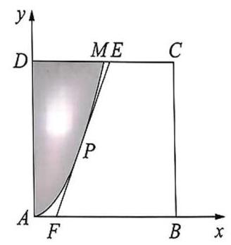
第 3 题图
##### 类型二 以三角函数为背景的实际应用
例2 为响应“生产发展、生活富裕、乡风文明、村容整洁、管理民主”的社会主义新农村建设， 某自然村将村边一块废弃的扇形荒地(如图)租给蜂农养蜂、产蜜与售蜜. 已知扇形 ${AOB}$ 中， $\angle {AOB} = \frac{2}{3}\pi ,{OB} = {2\sqrt{3}}$ (百米),荒地内规划修建两条直路 ${AB}$ 、 ${OC}$ ，其中点 $C$ 在弧 ${AB}$ 上 (C与 $A, B$ 不重合),在小路 ${AB}$ 与 ${OC}$ 的交点 $D$ 处设立售蜜点,图中阴影部分为蜂巢区,空白部分为蜂源植物生长区. 设 $\angle {BDC} = \theta \left( {\theta  \in  \left( {\frac{\pi }{6},\frac{\pi }{2}}\right) }\right)$ ，蜂巢区的面积为 $S$ (平方百米).
(1)求S关于 $\theta$ 的函数关系式；
(2)当 $\theta$ 为何值时，蜂巢区的面积 $S$ 最小，并求此时 $S$ 的最小值.
##### 自主探究
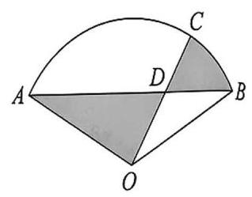
例 2 图
###### 要点精析
本题考查函数解析式、函数最小值的求法，考查导数在解决实际问题中的应用,考查三角函数性质,考查运算求解能力和应用意识. 注意到求得的解析式中有 $\tan \theta$ 和 $\theta$ ，故无法直接求得最小值，必须要通过导数来解决.
###### 参考解答
(1)在等腰三角形 ${OAB}$ 中， $\because \angle {AOB} = \frac{2\pi }{3}$ ， $\therefore \angle {ABO} = \frac{\pi }{6},\angle {BDC} = \; \theta \left( {\theta  \in  \left( {\frac{\pi }{6},\frac{\pi }{2}}\right) }\right) ,\therefore$ 在 $\bigtriangleup {BDO}$ 中, $\frac{OD}{\sin \angle {ABO}} = \frac{OB}{\sin \angle {ODB}}$ ,即 $\frac{OD}{\sin \frac{\pi }{6}} = \frac{2\sqrt{3}}{\sin \left( {\pi  - \theta }\right) },\therefore {OD} = \frac{\sqrt{3}}{\sin \theta }$ , 于是 $S = {S}_{\bigtriangleup {AOB}} + {S}_{\text{ 扇形 }{BOC}} - 2{S}_{\bigtriangleup {BOD}} = \frac{1}{2} \times  {\left( 2\sqrt{3}\right) }^{2} \times  \sin \frac{2\pi }{3} + \frac{1}{2} \times  {\left( 2\sqrt{3}\right) }^{2} \times  \left( {\theta  - \frac{\pi }{6}}\right)  - 2 \times  \frac{1}{2} \times \; 2\sqrt{3} \times  \frac{\sqrt{3}}{\sin \theta } \times  \sin \left( {\theta  - \frac{\pi }{6}}\right)  = 3\sqrt{3} + 6\left( {\theta  - \frac{\pi }{6}}\right)  - \frac{6\sin \left( {\theta  - \frac{\pi }{6}}\right) }{\sin \theta } = {6\theta } + \frac{3\cos \theta }{\sin \theta } - \pi  = {6\theta } + \frac{3}{\tan \theta } - \pi$ . $\therefore S = {6\theta } + \frac{3}{\tan \theta } - \pi ,\theta  \in  \left( {\frac{\pi }{6},\frac{\pi }{2}}\right)$ .
(2) ${S}^{\prime } = 6 + 3 \cdot  \frac{-{\sin }^{2}\theta  - {\cos }^{2}\theta }{{\sin }^{2}\theta } = \frac{6{\sin }^{2}\theta  - 3}{{\sin }^{2}\theta },\theta  \in  \left( {\frac{\pi }{6},\frac{\pi }{2}}\right)$ ,令 ${S}^{\prime } = 0$ ,得 $\sin \theta  = \frac{\sqrt{2}}{2}$ ,即 $\theta  = \frac{\pi }{4}$ . 当 $\theta$ 变化时, ${S}^{\prime }, S$ 的变化情况如表所示:
<table><tr><td>$\theta$</td><td>$\left( {\frac{\pi }{6},\frac{\pi }{4}}\right)$</td><td>$\frac{\pi }{4}$</td><td>$\left( {\frac{\pi }{4},\frac{\pi }{2}}\right)$</td></tr><tr><td>${S}^{\prime }$</td><td>-</td><td>0</td><td>+</td></tr><tr><td>$S$</td><td>↘</td><td>极小值</td><td>↗</td></tr></table>
又 $S\left( \frac{\pi }{4}\right)  = \frac{\pi }{2} + 3$ ,故当 $\theta$ 为 $\frac{\pi }{4}$ 时, $S$ 有最小值 $\frac{\pi }{2} + 3$ (平方百米).
##### 针对训练二
1. 如图，某地有三家工厂，分别位于矩形 ${ABCD}$ 的两个顶点 $A$ 、 $B$ 及 ${CD}$ 的中点 $P$ 处. ${AB} = \; {20}\mathrm{\;{km}},{BC} = {10}\mathrm{\;{km}}$ . 为了处理这三家工厂的污水，现要在该矩形区域上(含边界)且与 $A$ 、 $B$ 等距的一点 $O$ 处,建造一个污水处理厂,并铺设三条排污管道 ${AO}\text{ 、 }{BO}\text{ 、 }{PO}$ . 记铺设管道的总长度为 $y\mathrm{\;{km}}$ .
(1)按下列要求建立函数关系式:
① 设 $\angle {BAO} = \theta \left( \mathrm{{rad}}\right)$ ，将 $y$ 表示成 $\theta$ 的函数；
② 设 ${OP} = x\left( \mathrm{\;{km}}\right)$ ，将 $y$ 表示成 $x$ 的函数.
(2)请你选用(1)中的一个函数关系确定污水处理厂的位置，使铺设的污水管道的总长度最短.
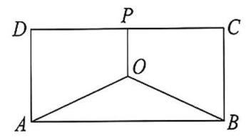
第 1 题图
2. 如图为某大江的一段支流，江岸线 ${l}_{1}//{l}_{2}$ ，宽度为 8 百米. 圆 $O$ 为江中的一个半径为 2 百米的候鸟栖息地，小镇 $A$ 位于江岸线 ${l}_{1}$ 上，且满足 ${OA}\bot {l}_{1},{OA} = 4$ 百米. 现计划沿江岸线 ${l}_{1}$ 从小镇 $A$ 到右侧 $B$ 处建造一条陆上通道,并从 $B$ 到对岸 $C$ 建立一条水上通道. 为保护候鸟栖息地，需将 ${BC}$ 段设计成与圆心 $O$ 距离为 3 百米. 设 $\angle {CBP} = \theta \left( {0 < \theta  < \frac{\pi }{2}}\right)$ . 若建造 ${AB}$ 段的费用是每百米 ${2a}$ 元,建造 ${BC}$ 段的费用是每百米 $a$ 元 $\left( {a > 0}\right)$ .
(1)试求陆上通道 ${AB}$ 和水上通道 ${BC}$ 的总造价 $W$ 与 $\theta$ 的函数关系，并指出 $\theta$ 的取值范围；
(2)建造总造价 $W$ 最少需要多少元?
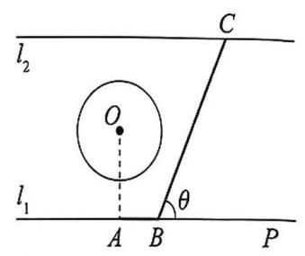
第 2 题图
##### 类型三 以立体几何为背景的实际应用
例 3 如图所示，某企业拟建造一个体积为 $V$ 的圆柱型的容器(不计厚度，长度单位:米). 已知圆柱两个底面部分每平方米建造费用为 $a$ 千元，侧面部分每平方米建造费用为 ${2a}$ 千元. 假设该容器的建造费用仅与其表面积有关，设圆柱的底面半径为 $r$ ，该容器的总建造费用为 $y$ 千元.
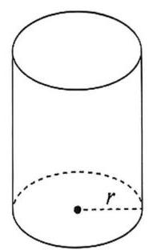
例 3 图
(1)写出 $y$ 关于 $r$ 的函数表达式；
(2)求该容器总建造费用最小时 $r$ 的值.
##### 自主探究
###### 要点精析
本题考查圆柱的体积公式,考查导数的应用. (1) 求出圆柱的高，从而求出函数表达式；(2)先求出函数的导数，得到函数的单调区间，进而求出 $y$ 的最小值.
###### 参考解答
(1)设圆柱的高为 $h,\because V = \pi {r}^{2}h,\therefore h = \frac{V}{\pi {r}^{2}}$ .
$\therefore y = a \cdot  {2\pi }{r}^{2} + {2a} \cdot  {2\pi rh} = {2a\pi }{r}^{2} + \frac{4aV}{r}\left( {r > 0}\right)$ .
(2) ${y}^{\prime } = {4a\pi }r - \frac{{4a}V}{{r}^{2}}$ . 令 ${y}^{\prime } = 0$ ，得 $r = \sqrt[3]{\frac{V}{\pi }}$ .
当 $r$ 变化时， ${y}^{\prime }, y$ 的变化情况如表:
<table><tr><td>$r$</td><td>$\left( {0,\sqrt[3]{\frac{V}{\pi }}}\right)$</td><td>$\sqrt[3]{\frac{V}{\pi }}$</td><td>$\left( {\sqrt[3]{\frac{V}{\pi }}, + \infty }\right)$</td></tr><tr><td>${y}^{\prime }$</td><td>-</td><td>0</td><td>+</td></tr><tr><td>$y$</td><td>↘</td><td>极小值</td><td>↗</td></tr></table>
$\therefore$ 该容器总建造费用最小时 $r = \sqrt[3]{\frac{V}{\pi }}$ .
##### 针对训练三
1. 一个帐篷，它下部的形状是高为 $1\mathrm{\;m}$ 的正六棱柱，上部的形状是侧棱长为 $3\mathrm{\;m}$ 的正六棱锥 (如图所示). 当帐篷的顶点 $O$ 到底面中心 ${O}_{1}$ 的距离为___ $\mathrm{m}$ 时，帐篷的体积最大.
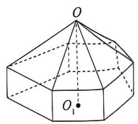
第 1 题图
2. 如图,圆形纸片的圆心为 $O$ ,半径为 $5\mathrm{\;{cm}}$ ,该纸片上的等边三角形 ${ABC}$ 的中心为 $O.D\text{ 、 }E$ 、 $F$ 为圆 $O$ 上的点, $\bigtriangleup {DBC}\text{ 、 }\bigtriangleup {ECA}\text{ 、 }\bigtriangleup {FAB}$ 分别是以 ${BC}\text{ 、 }{CA}\text{ 、 }{AB}$ 为底边的等腰三角形. 沿虚线剪开后,分别以 ${BC}\text{ 、 }{CA}\text{ 、 }{AB}$ 为折痕折起 $\bigtriangleup {DBC}\text{ 、 }\bigtriangleup {ECA}\text{ 、 }\bigtriangleup {FAB}$ ,使得 $D\text{ 、 }E\text{ 、 }F$ 三点重合,得到三棱锥. 当 $\bigtriangleup {ABC}$ 的边长变化时,求所得三棱锥体积的最大值.
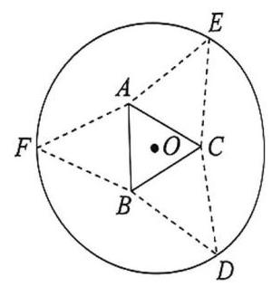
第 2 题图
3. 如图所示的某种容器的体积为 ${18\pi }{\mathrm{{dm}}}^{3}$ ，它是由半球和圆柱两部分连接而成，半球的半径与圆柱的底面半径都为 $r\mathrm{\;{dm}}$ ,圆柱的高为 $h\mathrm{\;{dm}}$ . 已知顶部半球面的造价为 ${3a}$ 元 $/{\mathrm{{dm}}}^{2}$ ,圆柱的侧面造价为 $a$ 元 $/{\mathrm{{dm}}}^{2}$ ，圆柱底面的造价为 $\frac{2a}{3}$ 元 $/{\mathrm{{dm}}}^{2}$ .
(1)将圆柱的高 $h$ 表示为底面半径 $r$ 的函数，并求出定义域；
(2)当容器造价最低时,圆柱的底面半径 $r$ 为多少?(可能会用到公式:球体积: $V = \frac{4}{3}\pi {r}^{3}$ ； 球表面积: $S = {4\pi }{r}^{2}$ ; 圆柱体积: $V = \pi {r}^{2}h$ ; 圆柱侧面积: $S = {2\pi rh}$

第 3 题图
4. 一张边长为 $2\mathrm{\;m}$ 的正方形薄铝板 ${ABCD}$ (图甲),点 $E\text{ 、 }F$ 分别在 ${AB}\text{ 、 }{BC}$ 上,且 ${AE} = {CF} = \; x$ (单位: $\mathrm{m}$ ). 现将该薄铝板沿 ${EF}$ 裁开，再将 $\bigtriangleup  {DAE}$ 沿 ${DE}$ 折叠， $\bigtriangleup  {DCF}$ 沿 ${DF}$ 折叠，使 ${DA}\text{ 、 }{DC}$ 重合,且 $A\text{ 、 }C$ 重合于点 $M$ ,制作成一个无盖的三棱锥形容器 $D - {MEF}$ (图乙),记该容器的容积为 $V$ (单位: ${\mathrm{m}}^{3}$ ). (注: 薄铝板的厚度忽略不计)
(1)裁开的三角形薄铝板 EFB 恰好是该容器的盖，求 $x$ 、 $V$ 的值；
(2)试确定 $x$ 的值，使得无盖三棱锥容器 $D - {MEF}$ 的容积 $V$ 最大.

第 4 题图
##### 类型四 以概率为背景的实际应用
例4 一款击鼓小游戏的规则如下:每盘游戏都需击鼓三次，每次击鼓后要么出现一次音乐， 要么不出现音乐，设每次击鼓出现音乐的概率为 $p\left( {0 < p < \frac{2}{5}}\right)$ ，且各次击鼓出现音乐相互独立.
(1)若一盘游戏中仅出现一次音乐的概率为 $f\left( p\right)$ ，求 $f\left( p\right)$ 的最大值点 ${P}_{0}$ ；
(2)以(1)中确定的 ${P}_{0}$ 作为 $p$ 的值，玩 3 盘游戏，出现音乐的盘数为随机变量 $X$ ，求每盘游戏出现音乐的概率 ${P}_{1}$ 及随机变量 $X$ 的期望.
##### 自主探究
###### 要点精析
本题考查概率统计在实际问题中的应用，考查随机变量的概率分布和期望.
(1)求得一盘游戏中仅出现一次音乐的概率 $f\left( p\right)$ ，由导数的应用可得最大值点；
(2)求得每盘游戏出现音乐的概率，再由二项分布的数学期望公式可得所求.
###### 参考解答
(1) 由题可知，一盘游戏中仅出现一次音乐的概率为
$f\left( p\right)  = {\mathrm{C}}_{3}^{1}p{\left( 1 - p\right) }^{2} = 3{p}^{3} - 6{p}^{2} + {3p},$
${f}^{\prime }\left( p\right)  = 3\left( {{3p} - 1}\right) \left( {p - 1}\right)$ ,由 ${f}^{\prime }\left( p\right)  = 0$ 得 $p = \frac{1}{3}$ 或 $p = 1$ (舍),
当 $p \in  \left( {0,\frac{1}{3}}\right)$ 时, ${f}^{\prime }\left( p\right)  > 0$ ; 当 $p \in  \left( {\frac{1}{3},\frac{2}{5}}\right)$ 时, ${f}^{\prime }\left( p\right)  < 0$ ,
$\therefore f\left( p\right)$ 在 $\left( {0,\frac{1}{3}}\right)$ 上严格增,在 $\left( {\frac{1}{3},\frac{2}{5}}\right)$ 上严格减,
$\therefore$ 当 $p = \frac{1}{3}$ 时, $f\left( p\right)$ 有最大值,即 $f\left( p\right)$ 的最大值点 ${P}_{0} = \frac{1}{3}$ .
(2)由(1)可知， $p = {P}_{0} = \frac{1}{3}$ ，则每盘游戏出现音乐的概率为 ${P}_{1} = 1 - {\left( 1 - \frac{1}{3}\right) }^{3} = \frac{19}{27}$ ，
由题可知 $X \sim  B\left( {3,\frac{19}{27}}\right) ,\therefore E\left\lbrack  X\right\rbrack   = 3 \times  \frac{19}{27} = \frac{19}{9}$ .
例 5 第 13 届女排世界杯于 2019 年 9 月 14 日在日本举行，共有 12 支参赛队伍. 本次比赛启用了新的排球用球 $\mathrm{M}$ IKSA-V200W，已知这种球的质量指标 $\xi$ (单位: $\mathrm{g}$ ) 服从正态分布 $N\left( {{270}^{ \circ  },{5}^{2}}\right)$ . 比赛赛制采取单循环方式，即每支球队进行 11 场比赛(采取 5 局 3 胜制)，最后靠积分选出最后冠军. 积分规则如下:比赛中以 3:0 或 3:1 取胜的球队积 3 分，负队积 0 分；而在比赛中以 3 :2 取胜的球队积 2 分,负队积 1 分. 已知第 10 轮中国队对抗塞尔维亚队，设每局比赛中国队取胜的概率为 $p\left( {0 < p < 1}\right)$ .
(1)如果比赛准备了 1000 个排球，估计质量指标在(260,265)内的排球个数. (计算结果取整数)
(2)第10轮比赛中，记中国队 3:1 取胜的概率为 $f\left( p\right)$ .
① 求出 $f\left( p\right)$ 的最大值点 ${p}_{0}$ ；
② 若以 ${p}_{0}$ 作为 $p$ 的值，记第 10 轮比赛中，中国队所得积分为 $X$ ，求 $X$ 的分布.
参考数据: $X \sim  N\left( {\mu ,{\sigma }^{2}}\right)$ ,则 $P\left( {\mu  - \sigma  < X < \mu  + \sigma }\right)  \approx  {0.6826}, P\left( {\mu  - {2\sigma } < X < \mu  + {2\sigma }}\right)  \approx  {0.9644}$ .
##### 自主探究
###### 要点精析
本题重点考查正态分布、导数的实际应用和离散型随机变量的分布. (1) 利用正态曲线的性质求出 $P\left( {{260} < \xi  < {265}}\right)$ ，即可求得估计质量指标在(260,265)内的排球个数; (2) ① 求出 $f\left( p\right)  = {\mathrm{C}}_{3}^{2}{p}^{3}\left( {1 - p}\right)  = 3{p}^{3}\left( {1 - p}\right)$ ，再利用导数求最大值点即可; ② 求出 $X$ 的所有可能取值和对应的概率, 即可得分布.
###### 参考解答
(1) $\because \xi$ 服从正态分布 $N\left( {{270},{5}^{2}}\right)$ ，
$\therefore P\left( {{260} < \xi  < {265}}\right)  = \frac{P\left( {{260} < \xi  < {280}}\right)  - P\left( {{265} < \xi  < {275}}\right) }{2} \approx  \frac{{0.9644} - {0.6826}}{2} = {0.1409}$ ,
$\therefore$ 质量指标在 $\left( {{260},{265}\rbrack \text{ 内的排球个数约为 }{1000} \times  {0.1409} = {140.9} \approx  {141}\text{ (个). }}\right)$
(2)① $f\left( p\right)  = {\mathrm{C}}_{3}^{2}{p}^{3}\left( {1 - p}\right)  = 3{p}^{3}\left( {1 - p}\right) ,{f}^{\prime }\left( p\right)  = 3\left\lbrack  {3{p}^{2}\left( {1 - p}\right)  + {p}^{3} \times  \left( {-1}\right) }\right\rbrack   = 3{p}^{2}(3 - \; {4p})$ ,令 ${f}^{\prime }\left( p\right)  = 0$ ,得 $p = \frac{3}{4}$ ,当 $p \in  \left( {0,\frac{3}{4}}\right)$ 时, ${f}^{\prime }\left( p\right)  > 0, f\left( p\right)$ 在 $\left( {0,\frac{3}{4}}\right)$ 上严格增; 当 $p \in  \left( {\frac{3}{4},1}\right)$ 时， ${f}^{\prime }\left( p\right)  < 0$ ， $f\left( p\right)$ 在 $\left( {\frac{3}{4},1}\right)$ 上严格减， $\therefore f\left( p\right)$ 的最大值点 ${p}_{0} = \frac{3}{4}$ .
② $X$ 的可能取值为 0,1,2,3,
$P\left( {X = 0}\right)  = {\left( 1 - p\right) }^{3} + {\mathrm{C}}_{3}^{1}p{\left( 1 - p\right) }^{3} = \frac{13}{256}, P\left( {X = 1}\right)  = {\mathrm{C}}_{4}^{2}{p}^{2}{\left( 1 - p\right) }^{3} = \frac{27}{512},$
$P\left( {X = 2}\right)  = {\mathrm{C}}_{4}^{2}{p}^{2}{\left( 1 - p\right) }^{2}p = \frac{81}{512};P\left( {X = 3}\right)  = {p}^{3} + {\mathrm{C}}_{3}^{2}{p}^{2}\left( {1 - p}\right) p = \frac{189}{256},$
$\therefore X$ 的分布为 $\left( \begin{matrix} 0 & 1 & 2 & 3 \\  {13} & {27} & {81} & {189} \\  {256} & {512} & {512} & {256} \end{matrix}\right)$ .
##### 针对训练四
1. 某企业根据 2019 年在 15 个城市利润 (单位:万元) 统计(如图所示)，该企业在 15 座城市中利润高于8500(万元)，市场情形“A”；利润在 6500 〜8500(万元)，市场情形“B”；利润低于 6500(万元)，市场情形“C”. 某企业投产的产品的成本 $C$ 与产量 $q$ 的函数关系为 $C = \frac{{q}^{3}}{3} - \; 5{q}^{2} + {24q} + {10}\left( {q > 0}\right) ,{2020}$ 年市场情形无法确定，根据 2019 年市场情形的 “A、B、C” 的概率来确定产品价格 $p$ (如表).
<table><tr><td>市场情形</td><td>概率</td><td>价格 $p$ 与产量 $q$ 的函数关系</td></tr><tr><td>A</td><td>${a}_{1}$</td><td>$p = {164} - {3q}$</td></tr><tr><td>B</td><td>${a}_{2}$</td><td>$p = {101} - {2q}$</td></tr><tr><td>C</td><td>${a}_{3}$</td><td>$p = {70} - {5q}$</td></tr></table>

第 1 题图
(1)求 ${a}_{1},{a}_{2},{a}_{3}$ ；
(2) $X$ 表示 2020 年在 15 座城市市场情形无法确定下的利润，求 $E\left\lbrack  X\right\rbrack$ ；
(3)对于(2)中 $E\left\lbrack  X\right\rbrack$ ，当 $q$ 取何值时， $E\left\lbrack  X\right\rbrack$ 取得最大值.
2. 某高校的大一学生在军训结束前，需要进行各项过关测试，其中射击过关测试规定:每位视试的大学生最多有两次射击机会，第一次射击击中靶标，立即停止射击，射击测试过关，得 \{ 分；第一次未击中靶标，继续进行第二次射击，若击中靶标，立即停止射击，射击测试过关， 得 4 分；若未击中靶标，射击测试未能过关，得 2 分. 现有一个班组的 12 位大学生进行射击过关测试，假设每位大学生两次射击击中靶标的概率分别为 $m$ ，0.5，每位大学生射击测试过关的概率为 $p$ .
(1)设该班组中恰有 9 人通过射击过关测试的概率为 $f\left( p\right)$ ，求 $f\left( p\right)$ 取最大值时 $p$ 和 $m$ 的值;
(2)在(1)的结果下，求该班组通过射击过关测试所得总分的平均数.
3. 某商场为了提振顾客的消费信心,对某中型商品实行分期付款方式销售，根据以往资料统计，顾客购买该商品选择分期付款的期数 $\xi$ 的分布为 $\left( \begin{array}{rrr} 4 & 5 & 6 \\  {0.4} & a & b \end{array}\right)$ ，其中 $0 < a < 1$ ， $0 < b < 1$ .
(1)购买该商品有 3 位顾客，每个人分期付款的选择互不影响，求其中恰有 1 位选择分 4 期付款的概率;
(2)商场销售一件该商品，若顾客选择分 4 期付款，则商场获得的利润为 2000 元；若顾客选择分 5 期付款，则商场获得的利润为 2500 元；若顾客选择分 6 期付款，则商场获得的利润为 3000 元.
① 若该商场销售两件该商品所获得的利润为 $X$ (单位:元)， $X = {5500}$ 时的概率为 $m$ ， 求当 $m$ 取最大值时,利润 $X$ 的分布和数学期望;
② 若该商场销售三件该商品所获得的利润为 $Y$ (单位:元)，设 $f\left( b\right)$ 是 $Y = {8500}$ 时的概率,求 $f\left( b\right)$ 最大时 $b$ 的取值.
### 第四章 利用导数研究三次函数
#### 4.1 三次函数的图像与性质
三次函数在高中数学教材中没有作专门的介绍, 只出现在教材的例题中. 然而, 关于三次函数的问题在模拟考、高考、高校强基测试中经常出现, 它是一个十分重要的函数, 并且有很多性质和结论可以去归纳总结. 熟悉三次函数的图像和性质，有助于我们高屋建瓴地了解此类问题的本质与背景，在实际解决问题中做到“一览众山小”.
本节我们对三次函数 $y = a{x}^{3} + b{x}^{2} + {cx} + d\left( {a \neq  0}\right)$ 的图像、性质与应用作一个全面的整理.
##### 知识要点
###### 1. 奇偶性
对于三次函数 $f\left( x\right)  = a{x}^{3} + b{x}^{2} + {cx} + d\left( {a\text{ 、 }b\text{ 、 }c\text{ 、 }d \in  \mathbf{R}\text{ 且 }a \neq  0}\right)$ .
(1) $f\left( x\right)$ 不可能为偶函数；
(2)当且仅当 $b = d = 0$ 时是奇函数.
###### 2. 单调性
对于三次函数 $f\left( x\right)  = a{x}^{3} + b{x}^{2} + {cx} + d\left( {a > 0}\right)$ ,其导函数 ${f}^{\prime }\left( x\right)  = {3a}{x}^{2} + {2bx} + c$ , 判别式 $\Delta  = 4\left( {{b}^{2} - {3ac}}\right)$ .
(1)若 ${b}^{2} - {3ac} \leq  0$ ，则 ${f}^{\prime }\left( x\right)  \geq  0$ ， $f\left( x\right)$ 在 $\left( {-\infty , + \infty }\right)$ 上为严格增函数；
(2)若 ${b}^{2} - {3ac} > 0$ ，令 ${f}^{\prime }\left( x\right)  = {3a}{x}^{2} + {2bx} + c = 0$ ，则此方程有两个不等实根 ${x}_{1},{x}_{2}$ ，不妨设 ${x}_{1} < {x}_{2}$ ,则 $f\left( x\right)$ 在 $\left( {-\infty ,{x}_{1}}\right)$ 和 $\left( {{x}_{2}, + \infty }\right)$ 上为严格增函数，在 $\left( {{x}_{1},{x}_{2}}\right)$ 上为严格减函数.
###### 3. 图像
下图中, ${x}_{1},{x}_{2}$ 为函数 $f\left( x\right)  = a{x}^{3} + b{x}^{2} + {cx} + d\left( {a \neq  0}\right)$ 的两个极值点, ${x}_{0}$ 为二阶导数的零点.
<table><tr><td>函数</td><td colspan="2">$y = a{x}^{3} + b{x}^{2} + {cx} + d\left( {a > 0}\right)$</td><td colspan="2">$y = a{x}^{3} + b{x}^{2} + {cx} + d\left( {a < 0}\right)$</td></tr><tr><td rowspan="2">图像</td><td>$\Delta  > 0$</td><td>$\Delta  \leq  0$</td><td>$\Delta  > 0$</td><td>$\Delta  \leq  0$</td></tr><tr><td>[失效外部图片：bo_d4jrurref24c739ch7sg_62.jpg]</td><td>[失效外部图片：bo_d4jrurref24c739ch7sg_62.jpg]</td><td>[失效外部图片：bo_d4jrurref24c739ch7sg_62.jpg]</td><td>[失效外部图片：bo_d4jrurref24c739ch7sg_62.jpg]</td></tr></table>
###### 4. 极值
对于三次函数 $f\left( x\right)  = a{x}^{3} + b{x}^{2} + {cx} + d\left( {a > 0}\right)$ ,
(1)若 ${b}^{2} - {3ac} \leq  0$ ，则 $f\left( x\right)$ 在 $\left( {-\infty , + \infty }\right)$ 上无极值；
(2)若 ${b}^{2} - {3ac} > 0$ ，则 $f\left( x\right)$ 在 $\left( {-\infty , + \infty }\right)$ 上有两个极值，且 $f\left( x\right)$ 在 $x = {x}_{1}$ 处取得极大值，在 $x = {x}_{2}$ 处取得极小值. $\left( {{x}_{1} < {x}_{2}}\right)$
5. 对称性
定理:三次函数 $f\left( x\right)  = a{x}^{3} + b{x}^{2} + {cx} + d\left( {a \neq  0}\right)$ 的图像关于点 $\left( {-\frac{b}{3a}, f\left( {-\frac{b}{3a}}\right) }\right)$ 对称.
证明: 设 $y = f\left( x\right)$ 的图像关于点 $\left( {m, n}\right)$ 对称,取 $y = f\left( x\right)$ 图像上任一点 $A\left( {x, y}\right)$ , 则 $A$ 关于点 $\left( {m, n}\right)$ 的对称点 ${A}^{\prime }\left( {{2m} - x,{2n} - y}\right)$ 也在 $y = f\left( x\right)$ 图像上,
$\therefore {2n} - y = a{\left( 2m - x\right) }^{3} + b{\left( 2m - x\right) }^{2} + c\left( {{2m} - x}\right)  + d$ ,
$\therefore y = a{x}^{3} - \left( {{6ma} + b}\right) {x}^{2} + \left( {{12}{m}^{2}a + {4mb} + c}\right) x - \left( {8{m}^{3}a + 4{m}^{2}b + {2mc} + d - {2n}}\right)$ ,
与 $y = a{x}^{3} + b{x}^{2} + {cx} + d$ 比较系数,
可得 $\left\{  \begin{array}{l} b =  - {6ma} - b, \\  c = {12}{m}^{2}a + {4mb} + c, \\  d =  - \left( {8{m}^{3}a + 4{m}^{2}b + {2mc} + d - {2n}}\right) , \end{array}\right.$ 解得 $\left\{  \begin{array}{l} m =  - \frac{b}{3a}, \\  n = f\left( {-\frac{b}{3a}}\right) , \end{array}\right.$
故 $f\left( x\right)$ 的图像关于点 $\left( {-\frac{b}{3a}, f\left( {-\frac{b}{3a}}\right) }\right)$ 对称.
事实上, ${f}^{\prime }\left( x\right)  = {3a}{x}^{2} + {2bx} + c,{f}^{\prime \prime }\left( x\right)  = {6ax} + {2b}$ ,令 ${f}^{\prime \prime }\left( x\right)  = 0$ ,得 $x =  - \frac{b}{3a}$ .
结论 1: 任意一个三次函数都有对称中心, 且对称中心横坐标就是导函数的对称轴, 又是两个极值点的中点,也是二阶导数的零点 (拐点就是对称中心).
结论 2: 已知三次函数 $f\left( x\right)  = a{x}^{3} + b{x}^{2} + {cx} + d$ 的对称中心横坐标为 ${x}_{0}$ ,若 $f\left( x\right)$ 存在两个极值点 ${x}_{1}\text{ 、 }{x}_{2}$ ,则有 $\frac{f\left( {x}_{1}\right)  - f\left( {x}_{2}\right) }{{x}_{1} - {x}_{2}} =  - \frac{a}{2}{\left( {x}_{1} - {x}_{2}\right) }^{2} = \frac{2}{3}{f}^{\prime }\left( {x}_{0}\right)$ .
证明: $\frac{f\left( {x}_{1}\right)  - f\left( {x}_{2}\right) }{{x}_{1} - {x}_{2}} = \frac{a\left( {{x}_{1}^{3} - {x}_{2}^{3}}\right)  + b\left( {{x}_{1}^{2} - {x}_{2}^{2}}\right)  + c\left( {{x}_{1} - {x}_{2}}\right) }{{x}_{1} - {x}_{2}} = a\left( {{x}_{1}^{2} + {x}_{1}{x}_{2} + {x}_{2}^{2}}\right)  + \; b\left( {{x}_{1} + {x}_{2}}\right)  + c$ ,由于 ${f}^{\prime }\left( x\right)  = {3a}{x}^{2} + {2bx} + c,\therefore {f}^{\prime }\left( {x}_{1}\right)  = {3a}{x}_{1}^{2} + {2b}{x}_{1} + c = 0,{f}^{\prime }\left( {x}_{2}\right)  = \; {3a}{x}_{2}^{2} + {2b}{x}_{2} + c = 0,{x}_{0} =  - \frac{b}{3a},$
$\frac{f\left( {x}_{1}\right)  - f\left( {x}_{2}\right) }{{x}_{1} - {x}_{2}} = {4a}{\left( \frac{{x}_{1} + {x}_{2}}{2}\right) }^{2} + {2b}\frac{{x}_{1} + {x}_{2}}{2} + c - a{x}_{1}{x}_{2} = {4a}{x}_{0}^{2} + {2b}{x}_{0} + \frac{2c}{3} =  - \frac{2{b}^{2}}{9a} + \frac{2c}{3}, \; \frac{2}{3}{f}^{\prime }\left( {x}_{0}\right)  = {2a}{x}_{0}^{2} + \frac{4}{3}b{x}_{0} + \frac{2}{3}c =  - \frac{2{b}^{2}}{9a} + \frac{2c}{3}, - \frac{a}{2}{\left( {x}_{1} - {x}_{2}\right) }^{2} =  - \frac{a}{2} \cdot  \frac{4{b}^{2} - {12ac}}{9{a}^{2}} =  - \frac{2{b}^{2}}{9a} + \; \frac{2c}{3}$ ,命题得证.
###### 6. 等分性
$f\left( x\right)  = a{x}^{3} + b{x}^{2} + {cx} + d\left( {a > 0}\right)$ 且导函数 $\Delta  > 0\;f\left( x\right)  = a{x}^{3} + b{x}^{2} + {cx} + d\left( {a < 0}\right)$ 且导函数 $\Delta  > 0$

极小值等值点 中心 极小值
极大值等值点极大值
${\Delta x} \; {\Delta x} \; {\Delta x} \; {\Delta x}$
极小值 中心 极小值等值点
结论 3 :极大值到对称中心距离为 ${\Delta x}$ ，极小值到对称中心距离为 ${\Delta x}$ ，极小值等值点到极大值距离为 ${\Delta x}$ ,极大值等值点到极小值距离为 ${\Delta x}$ ; 设 $f\left( x\right)$ 的极大值为 $M$ ,若 $f\left( x\right)  = M$ 的两根为 ${x}_{1},{x}_{2}\left( {{x}_{1} < {x}_{2}}\right)$ ,则区间 $\left\lbrack  {{x}_{1},{x}_{2}}\right\rbrack$ 被中心 $\left( {-\frac{b}{3a}, f\left( {-\frac{b}{3a}}\right) }\right)$ 和极小值点三等分,类似地，对极小值点 $N$ 也有此结论.
###### 7. 三次函数解析式
(1)一般形式: $f\left( x\right)  = a{x}^{3} + b{x}^{2} + {cx} + d\left( {a \neq  0}\right)$ ；
(2)已知函数图像的对称中心为 $\left( {m, n}\right)$ ，则 $f\left( x\right)  = a{\left( x - m\right) }^{3} + b\left( {x - m}\right)  + n\left( {a \neq  0}\right)$ ；
(3)已知函数图像与 $x$ 轴的三个交点的横坐标 ${x}_{1},{x}_{2},{x}_{3}$ ，则 $f\left( x\right)  = a\left( {x - {x}_{1}}\right) \left( {x - {x}_{2}}\right) \; \left( {x - {x}_{3}}\right) \left( {a \neq  0}\right)$ ;
(4)已知函数图像与 $x$ 轴的一个交点的横坐标为 ${x}_{0}$ ，则 $f\left( x\right)  = \left( {x - {x}_{0}}\right) \left( {a{x}^{2} + {mx} + }\right. \; n)\left( {a \neq  0}\right)$ .
##### 类型一 利用三次函数图像的 “形状” 解题
###### 方法指引
三次函数的图像总共是四张图, 其中两张是严格增或严格减的, 另外两张不单调的可以近似看作“N”与“反N”形(见知识要点 3). 解析式中具体参数与图像的关系如下:
(1)三次函数的单调性由 $a$ 来决定( $a > 0$ 图像上坡， $a < 0$ 图像下坡)；
(2)导函数的 $\Delta \left( {a\text{ 、 }b\text{ 、 }c}\right)$ 决定函数有没有极值；
(3) $d$ 确定函数图像与 $y$ 轴交点.

例 1 图
例 1 函数 $f\left( x\right)  = a{x}^{3} + b{x}^{2} + {cx} + d$ 的图像如图所示,则下列结论成立的是( ).
A. $a > 0, b < 0, c > 0, d > 0$ B. $a > 0, b < 0, c < 0, d > 0$
C. $a < 0, b < 0, c > 0, d > 0$ D. $a > 0, b > 0, c > 0, d < 0$
##### 自主探究
###### 要点精析
本题考查三次函数解析式中 $a, b, c, d$ 对图像的影响，观察图像知为“N”形， 则可知 $a > 0$ ,交 $y$ 轴于正半轴可知 $d > 0$ ,再根据两个极值点确定 $b, c$ 范围即可.
###### 参考解答
依据题意知 ${f}^{\prime }\left( x\right)  = {3a}{x}^{2} + {2bx} + c$ ,由图形可以看出 $f\left( 0\right)  = d > 0$ ; 当 $x \rightarrow   + \infty$ 时,函数为增函数, $\therefore a > 0;{f}^{\prime }\left( x\right)  = {3a}{x}^{2} + {2bx} + c = 0$ 有两个正根 ${x}_{1},{x}_{2},\therefore \left\{  {\begin{array}{l} {x}_{1} + {x}_{2} =  - \frac{2b}{3a} > 0, \\  {x}_{1}{x}_{2} = \frac{c}{3a} > 0, \end{array}\therefore b < 0}\right.$ , $c > 0$ ,故选 A.
例2 设 $a \neq  0$ ，若 $x = a$ 为函数 $f\left( x\right)  = a{\left( x - a\right) }^{2}\left( {x - b}\right)$ 的极大值点，则( ).
A. $a < b$ B. $a > b$ C. ${ab} < {a}^{2}$ D. ${ab} > {a}^{2}$
##### 自主探究
联想与有斯大题考查对三次函数图像“形状”的分类讨论以及重根位置的确定.
###### 参考解答
若 $a = b$ ,则 $f\left( x\right)  = a{\left( x - a\right) }^{3}$ 为严格单调函数,无极值点,不符合题意,故 $a \neq  b$ ,
$\therefore f\left( x\right)$ 有 $x = a$ 和 $x = b$ 两个不同零点,且在 $x = a$ 左右附近是不变号,在 $x = b$ 左右附近是变号的. 依题意， $x = a$ 为函数 $f\left( x\right)  = a{\left( x - a\right) }^{2}\left( {x - b}\right)$ 的极大值点， $\therefore$ 在 $x = a$ 左右附近都是小于零的.
当 $a < 0$ 时,由 $x > b, f\left( x\right)  \leq  0$ ,画出 $f\left( x\right)$ 的图像如图 1 所示,
由图可知 $b < a, a < 0$ ,故 ${ab} > {a}^{2}$ ;

图 1 图 2
例 2 答案图
当 $a > 0$ 时,由 $x > b$ 时, $f\left( x\right)  > 0$ ,画出 $f\left( x\right)$ 的图像如图 2 所示,
由图可知 $b > a, a > 0$ ,故 ${ab} > {a}^{2}$ .
综上所述， ${ab} > {a}^{2}$ 成立. 故选 D.
##### 针对训练一
1. 已知实数 $m$ 是给定的常数，函数 $f\left( x\right)  = m{x}^{3} - {x}^{2} - {2mx} - 1$ 的图像不可能是( ).
A.

B.

C.

D.

2. 已知函数 $f\left( x\right)  = \frac{a{x}^{3}}{3} + \frac{{ax} - {x}^{2} + 3}{2}, g\left( x\right)  = {a}^{2}{x}^{3} - {2a}{x}^{2} + x + a\left( {a \in  \mathbf{R}}\right)$ . 在同一直角坐标系中，函数 ${f}^{\prime }\left( x\right)$ 与 $g\left( x\right)$ 的图像不可能的是( ).
A.

B.

C.

D.

3. 函数 $f\left( x\right)  = \frac{1}{3}a{x}^{3} + \frac{1}{2}a{x}^{2} - {2ax} + 1$ 的图像经过四个象限，则实数 $a$ 的取值范围是( ).
A. $\left( {-\frac{3}{10},\frac{6}{7}}\right)$ B. $\left( {-\frac{8}{5}, - \frac{3}{16}}\right)$
C. $\left( {-\frac{8}{3}, - \frac{1}{16}}\right)$ D. $\left( {-\infty , - \frac{3}{10}}\right)  \cup  \left( {\frac{6}{7}, + \infty }\right)$
4. 已知函数 $f\left( x\right)  =  - {x}^{3} + a{x}^{2} + {bx} + c\left( {a\text{ 、 }b\text{ 、 }c \in  \mathbf{R}}\right)$ ，下列结论中正确的是___.
① 存在 ${x}_{0} \in  \mathbf{R}$ ，使得 $f\left( {x}_{0}\right)  = 0$ ；
② 函数 $y = f\left( x\right)$ 的图像是中心对称图形;
③ 若 ${f}^{\prime }\left( {x}_{0}\right)  = 0$ ，则 ${x}_{0}$ 是 $f\left( x\right)$ 的极值点；
④ 若 ${x}_{0}$ 是 $f\left( x\right)$ 的极大值点，则 $f\left( x\right)$ 在区间 $\left( {{x}_{0}, + \infty }\right)$ 上严格减.
##### 类型二 利用三次函数图像的对称性解题
###### 方法指引
对于三次函数，要牢牢抓住其对称中心 $\left( {-\frac{b}{3a}, f\left( {-\frac{b}{3a}}\right) }\right)$ ，这是解决相关问题的关键所在.
例 3 对于三次函数 $f\left( x\right)  = a{x}^{3} + b{x}^{2} + {cx} + d\left( {a \neq  0}\right)$ .
定义①:设 ${f}^{\prime \prime }\left( x\right)$ 是函数 $y = f\left( x\right)$ 的导数 $y = {f}^{\prime }\left( x\right)$ 的导数，若方程 ${f}^{\prime \prime }\left( x\right)  = 0$ 有实数解 ${x}_{0}$ ，则称点 $\left( {{x}_{0}, f\left( {x}_{0}\right) }\right)$ 为函数 $y = f\left( x\right)$ 的“拐点”；
定义②:设 ${x}_{0}$ 为常数，若定义在 $\mathbf{R}$ 上的函数 $y = f\left( x\right)$ 对于定义域内的一切实数 $x$ ，都有 $f\left( {{x}_{0} + }\right. \; x) + f\left( {{x}_{0} - x}\right)  = {2f}\left( {x}_{0}\right)$ 成立，则函数 $y = f\left( x\right)$ 的图像关于点 $\left( {{x}_{0}, f\left( {x}_{0}\right) }\right)$ 对称.
已知 $y = f\left( x\right)  = {x}^{3} - 3{x}^{2} + {2x} + 2$ ,请回答下列问题:
(1)求函数 $f\left( x\right)$ 的“拐点” $A$ 的坐标；
(2)检验函数 $f\left( x\right)$ 的图像是否关于“拐点” $A$ 对称，对于任意的三次函数，写出一个有关“拐点”的结论. (不必证明)
(3)写出一个三次函数 $G\left( x\right)$ ，使得它的“拐点”是(-1,3).
##### 自主探究
联想具有较大的开放性，情景新颖，解题的关键是:深刻理解函数“拐点”的定义和函数图像的对称中心的意义. 其本质是:任何一个三次函数都有拐点，任何一个三次函数都有对称中心，且任何一个三次函数的拐点就是它的对称中心，即 $\left( {-\frac{b}{3a}, f\left( {-\frac{b}{3a}}\right) }\right)$ .
(1)根据“拐点”的定义求出 ${f}^{\prime \prime }\left( x\right)  = 0$ 的根，然后代入函数解析式可求出“拐点” $A$ 的坐标.
(2)由(1)知“拐点”坐标是 $\left( {1,2}\right)$ ，然后计算 $f\left( {1 + x}\right)  + f\left( {1 - x}\right)$ ，可得等于 ${2f}\left( 1\right)$ ，根据定义②可得结论. 一般地，三次函数 $f\left( x\right)  = a{x}^{3} + b{x}^{2} + {cx} + d\left( {a \neq  0}\right)$ 的“拐点”是 $\left( {-\frac{b}{3a}, f\left( {-\frac{b}{3a}}\right) }\right)$ ,它就是 $f\left( x\right)$ 的对称中心.
(3)根据“拐点”的定义可写出符合条件的三次函数.
###### 参考解答
(1) 依题意，得 ${f}^{\prime }\left( x\right)  = 3{x}^{2} - {6x} + 2,{f}^{\prime \prime }\left( x\right)  = {6x} - 6.$
由 ${f}^{\prime \prime }\left( x\right)  = 0$ ,即 ${6x} - 6 = 0$ ,得 $x = 1$ ,又 $f\left( 1\right)  = 2$ ,
$\therefore f\left( x\right)  = {x}^{3} - 3{x}^{2} + {2x} + 2$ 的“拐点”坐标是 $\left( {1,2}\right)$ .
(2)由(1)知“拐点”坐标是 $\left( {1,2}\right)$ .
$f\left( {1 + x}\right)  + f\left( {1 - x}\right)  = {\left( 1 + x\right) }^{3} - 3{\left( 1 + x\right) }^{2} + 2\left( {1 + x}\right)  + 2 + {\left( 1 - x\right) }^{3} - 3{\left( 1 - x\right) }^{2} + 2\left( {1 - x}\right)  + \; 2 = 2 + 6{x}^{2} - 6 - 6{x}^{2} + 4 + 4 = 4 = {2f}\left( 1\right) ,$
由定义 ② 知 $f\left( x\right)  = {x}^{3} - 3{x}^{2} + {2x} + 2$ 关于点 $\left( {1,2}\right)$ 对称.
一般地,三次函数 $f\left( x\right)  = a{x}^{3} + b{x}^{2} + {cx} + d\left( {a \neq  0}\right)$ 的“拐点”是 $\left( {-\frac{b}{3a}, f\left( {-\frac{b}{3a}}\right) }\right)$ ,它就是 $f\left( x\right)$ 的对称中心.
(3) $G\left( x\right)  = a{\left( x + 1\right) }^{3} + b\left( {x + 1}\right)  + 3\left( {a \neq  0}\right)$ 或写出一个具体的函数，
如 $G\left( x\right)  = {x}^{3} + 3{x}^{2} + {3x} + 4$ 或 $G\left( x\right)  = {x}^{3} + 3{x}^{2} - x$ .
##### 针对训练二
1. 函数 $f\left( x\right)  = \frac{1}{3}{x}^{3} - \frac{1}{2}{x}^{2} + {3x} - \frac{5}{12}$ 的对称中心为___.
2. 若函数 $f\left( x\right)  = {x}^{3} - 3{x}^{2}$ ，则 $f\left( \frac{1}{2025}\right)  + f\left( \frac{2}{2025}\right)  + f\left( \frac{3}{2025}\right)  + \cdots  + f\left( \frac{4048}{2025}\right)  + f\left( \frac{4049}{2025}\right)  =$ ___.
3. 已知函数 $f\left( x\right)  = {x}^{3} - {3m}{x}^{2} + {nx} + {12}\left( {m\text{ 为正整数 }}\right)$ 在 $x =  - 1$ 处取得极值,对任意 $x \in  \mathbf{R}$ , ${f}^{\prime }\left( x\right)  + {27} > 0$ 恒成立，则 $f\left( \frac{1}{2025}\right)  + f\left( \frac{2}{2025}\right)  + \cdots  + f\left( \frac{4048}{2025}\right)  + f\left( \frac{4049}{2025}\right)  =$ ___.
4. 若函数 $f\left( x\right)  = {x}^{3} + b{x}^{2} + {cx} + d$ 满足 $f\left( {1 - x}\right)  + f\left( {1 + x}\right)  = 0$ 对一切实数 $x$ 恒成立，则不等式 ${f}^{\prime }\left( {{2x} + 3}\right)  < {f}^{\prime }\left( {x - 1}\right)$ 的解集为___.
5. 已知 $f\left( x\right)  = \frac{1}{3}{x}^{3} - 2{x}^{2} + \frac{8}{3}x + 2$ ,数列 $\left\{  {a}_{n}\right\}$ 的通项公式为 ${a}_{n} = n - {1012}$ ,则 $\mathop{\sum }\limits_{{i = 1}}^{{2027}}f\left( {a}_{i}\right) \; =$
##### 类型三 等分面积问题
例 4 若函数 $f\left( x\right)  = \frac{1}{3}{x}^{3} + {x}^{2} - \frac{2}{3}$ 在区间 $\left( {a, a + 5}\right)$ 内存在最小值,则实数 $a$ 的取值范围是 ( ).
A. $\lbrack  - 5,0)$ B. $\left( {-5,0}\right)$ C. $\lbrack  - 3,0)$ D. $\left( {-3,0}\right)$
##### 自主探究
###### 要点精析
若函数在开区间内存在最小值，则在开区间内必存在极小值.
###### 参考解答
由题意， ${f}^{\prime }\left( x\right)  = {x}^{2} + {2x}$ ,令 ${f}^{\prime }\left( x\right)  = 0$ ,得 ${x}_{1} = \; - 2,{x}_{2} = 0$ ,又 $f\left( {-3}\right)  = f\left( 0\right)$ ,画出四段论图像,依题意,结合图像可知, $\left\{  \begin{array}{l}  - 3 \leq  a < 0, \\  a + 5 > 0, \end{array}\right.$ 得 $a \in  \lbrack  - 3,0)$ . 故选 C.

例 4 答案图
例 5 已知 $f\left( x\right)  = {x}^{3} - {3x} + m$ ，在区间 $\left\lbrack  {0,2}\right\rbrack$ 上任取三个数 $a$ ， $b$ ， $c$ ，均存在以 $f\left( a\right)$ ， $f\left( b\right)$ ， $f\left( c\right)$ 为边长的三角形，则实数 $m$ 的取值范围是( ).
A. $\left( {2, + \infty }\right)$ B. $\left( {4, + \infty }\right)$ C. $\left( {6, + \infty }\right)$ D. $\left( {8, + \infty }\right)$
##### 自主探究
###### 要点精析
三角形的边长为正数，且任意两边之和大于第三边，这样才能构成三角形， 故只需求出函数在区间 $\left\lbrack  {0,2}\right\rbrack$ 上的最小值与最大值,解不等式即可.
###### 参考解答
由 ${f}^{\prime }\left( x\right)  = 3{x}^{2} - 3 = 3\left( {x + 1}\right) \left( {x - 1}\right)$ ,得 $x =  \pm  1$ ,画出函数四段论图像, $\because$ 函数 $f\left( x\right)$ 的定义域为 $\left\lbrack  {0,2}\right\rbrack  ,\therefore f{\left( x\right) }_{\min } = f\left( 1\right) \; = m - 2, f{\left( x\right) }_{\max } = f\left( 2\right)  = m + 2, f\left( 0\right)  = m$ ,由题意知 $f\left( 1\right)  + f\left( 1\right)  > \; f\left( 2\right)$ ，即 $- 4 + {2m} > 2 + m$ ，得 $m > 6$ . 故选 C.

例 5 答案图
##### 类型四 单调性与极值问题
例 6 已知函数 $f\left( x\right)  = 2{x}^{3} - a{x}^{2} + b$ .
(1)讨论 $f\left( x\right)$ 的单调性;
(2)是否存在 $a, b$ ，使得 $f\left( x\right)$ 在区间 $\left\lbrack  {0,1}\right\rbrack$ 的最小值为 -1 且最大值为 1 ？若存在，求出 $a, b$ 的所有值；若不存在，说明理由.
##### 自主探究
###### 要点精析
本题考查导数在研究函数单调性、最值中的应用，意在考查数学运算、逻辑推理等核心素养. (1) ${f}^{\prime }\left( x\right)  = 6{x}^{2} - {2ax} = {2x}\left( {{3x} - a}\right)$ ，令 ${f}^{\prime }\left( x\right)  = 0$ ，得 $x = 0$ 或 $x = \frac{a}{3}$ ，对 $a$ 分类讨论,即可得出单调性; (2) 对 $a$ 分类讨论,利用 (1) 的结论即可得出.
###### 参考解答
(1) ${f}^{\prime }\left( x\right)  = 6{x}^{2} - {2ax} = {2x}\left( {{3x} - a}\right)$ . 令 ${f}^{\prime }\left( x\right)  = 0$ ,得 $x = 0$ 或 $x = \frac{a}{3}$ .
若 $a > 0$ ,则当 $x \in  \left( {-\infty ,0}\right)  \cup  \left( {\frac{a}{3}, + \infty }\right)$ 时, ${f}^{\prime }\left( x\right)  > 0$ ; 当 $x \in  \left( {0,\frac{a}{3}}\right)$ 时, ${f}^{\prime }\left( x\right)  < 0$ ,故 $f\left( x\right)$ 在 $\left( {-\infty ,0}\right) ,\left( {\frac{a}{3}, + \infty }\right)$ 上严格增,在 $\left( {0,\frac{a}{3}}\right)$ 上严格减;
若 $a = 0$ ,则 $f\left( x\right)$ 在 $\left( {-\infty , + \infty }\right)$ 上严格增;
若 $a < 0$ ,则当 $x \in  \left( {-\infty ,\frac{a}{3}}\right)  \cup  \left( {0, + \infty }\right)$ 时, ${f}^{\prime }\left( x\right)  > 0$ ; 当 $x \in  \left( {\frac{a}{3},0}\right)$ 时, ${f}^{\prime }\left( x\right)  < 0$ .
故 $f\left( x\right)$ 在 $\left( {-\infty ,\frac{a}{3}}\right) ,\left( {0, + \infty }\right)$ 上严格增,在 $\left( {\frac{a}{3},0}\right)$ 上严格减.
(2)满足题设条件的 $a, b$ 存在.
① 当 $a \leq  0$ 时，由 (1) 知， $f\left( x\right)$ 在 $\left\lbrack  {0,1}\right\rbrack$ 上严格增，则 $f\left( x\right)$ 在区间 $\left\lbrack  {0,1}\right\rbrack$ 上的最小值为 $f\left( 0\right)  = b$ ，最大值为 $f\left( 1\right)  = 2 - a + b$ ,此时 $a, b$ 满足题设条件,当且仅当 $b =  - 1,2 - a + b = 1$ ,即 $a = 0, b =$ -1 .
② 当 $a \geq  3$ 时，由 (1) 知， $f\left( x\right)$ 在 [0,1] 上严格减，则 $f\left( x\right)$ 在区间 $\left\lbrack  {0,1}\right\rbrack$ 上的最大值为 $f\left( 0\right)  = b$ ，最小值为 $f\left( 1\right)  = 2 - a + b$ ,此时 $a, b$ 满足题设条件,当且仅当 $2 - a + b =  - 1, b = 1$ ,即 $a = 4$ , $b = 1$ .
③ 当 $0 < a < 3$ 时，由 (1) 知， $f\left( x\right)$ 在 $\left\lbrack  {0,1}\right\rbrack$ 上的最小值为 $f\left( \frac{a}{3}\right)  =  - \frac{{a}^{3}}{27} + b$ ，最大值为 $b$ 或 $2 - a + b$ ,若 $- \frac{{a}^{3}}{27} + b =  - 1, b = 1$ ,则 $a = 3\sqrt[3]{2}$ ,与 $0 < a < 3$ 矛盾;
若 $- \frac{{a}^{3}}{27} + b =  - 1,2 - a + b = 1$ ,则 $a = 3\sqrt{3}$ 或 $a =  - 3\sqrt{3}$ 或 $a = 0$ ,与 $0 < a < 3$ 矛盾.
综上,当且仅当 $a = 0, b =  - 1$ 或 $a = 4, b = 1$ 时, $f\left( x\right)$ 在区间 $\left\lbrack  {0,1}\right\rbrack$ 上的最小值为 -1,最大值为 1,
例 7 设函数 $f\left( x\right)  = \left( {x - a}\right) \left( {x - b}\right) \left( {x - c}\right) , a, b, c \in  \mathbf{R},{f}^{\prime }\left( x\right)$ 为 $f\left( x\right)$ 的导函数.
(1)若 $a = b = c, f\left( 4\right)  = 8$ ，求 $a$ 的值；
(2)若 $a \neq  b, b = c$ ，且 $f\left( x\right)$ 和 ${f}^{\prime }\left( x\right)$ 的零点均在集合 $\{  - 3,1,3\}$ 中，求 $f\left( x\right)$ 的极小值；
(3)若 $a = 0,0 < b \leq  1, c = 1$ ，且 $f\left( x\right)$ 的极大值为 $M$ ，求证: $M \leq  \frac{4}{27}$ .
##### 自主探究
###### 要点精析
本题主要考查利用导数研究函数的性质，考查综合运用数学思想方法分析与解决问题以及逻辑推理能力. (1)由题意得到关于 $a$ 的方程，解方程即可确定 $a$ 的值； (2)首先确定 $a$ ， $b$ ， $c$ 的值，从而确定函数的解析式，然后求其导函数，由导函数即可确定函数的极小值; (3) 首先确定函数的极大值 $M$ 的表达式，再用放缩法构造函数 $g\left( x\right)  = x(x - \; 1{)}^{2}, x \in  \left( {0,1}\right)$ ,由 $g\left( x\right)$ 的极大值证明题中的不等式.
###### 参考解答
(1) $\because a = b = c,\therefore f\left( x\right)  = \left( {x - a}\right) \left( {x - b}\right) \left( {x - c}\right)  = {\left( x - a\right) }^{3}$ .
$\because f\left( 4\right)  = 8,\therefore {\left( 4 - a\right) }^{3} = 8$ ,解得 $a = 2$ .
(2) $\because b = c,\therefore f\left( x\right)  = \left( {x - a}\right) {\left( x - b\right) }^{2} = {x}^{3} - \left( {a + {2b}}\right) {x}^{2} + b\left( {{2a} + b}\right) x - a{b}^{2}$ ,
从而 ${f}^{\prime }\left( x\right)  = 3\left( {x - b}\right) \left( {x - \frac{{2a} + b}{3}}\right)$ . 令 ${f}^{\prime }\left( x\right)  = 0$ ,得 $x = b$ 或 $x = \frac{{2a} + b}{3}$ .
$\because a, b,\frac{{2a} + b}{3}$ 都在集合 $\{  - 3,1,3\}$ 中,且 $a \neq  b$ ,
$\therefore \frac{{2a} + b}{3} = 1, a = 3, b =  - 3$ . 此时 $f\left( x\right)  = \left( {x - 3}\right) {\left( x + 3\right) }^{2},{f}^{\prime }\left( x\right)  = 3\left( {x + 3}\right) \left( {x - 1}\right)$ .
令 ${f}^{\prime }\left( x\right)  = 0$ ,得 $x =  - 3$ 或 $x = 1$ . 列表如下:
<table><tr><td>$x$</td><td>$\left( {-\infty , - 3}\right)$</td><td>-3</td><td>(-3,1)</td><td>1</td><td>(1,+∞)</td></tr><tr><td>${f}^{\prime }\left( x\right)$</td><td>+</td><td>0</td><td>-</td><td>0</td><td>+</td></tr><tr><td>$f\left( x\right)$</td><td>↗</td><td>极大值</td><td>↘</td><td>极小值</td><td>↗</td></tr></table>
$\therefore f\left( x\right)$ 的极小值为 $f\left( 1\right)  = \left( {1 - 3}\right) {\left( 1 + 3\right) }^{2} =  - {32}$ .
(3)证明: $\because a = 0, c = 1,\therefore f\left( x\right)  = x\left( {x - b}\right) \left( {x - 1}\right)  = {x}^{3} - \left( {b + 1}\right) {x}^{2} + {bx},{f}^{\prime }\left( x\right)  = 3{x}^{2} -$
$2\left( {b + 1}\right) x + b.\because 0 < b \leq  1,\therefore \Delta  = 4{\left( b + 1\right) }^{2} - {12b} = {\left( 2b - 1\right) }^{2} + 3 > 0$ ,则 ${f}^{\prime }\left( x\right)$ 有 2 个不同的零点,设为 ${x}_{1},{x}_{2}\left( {{x}_{1} < {x}_{2}}\right)$ ,
由 ${f}^{\prime }\left( x\right)  = 0$ ,得 ${x}_{1} = \frac{b + 1 - \sqrt{{b}^{2} - b + 1}}{3},{x}_{2} = \frac{b + 1 + \sqrt{{b}^{2} - b + 1}}{3}$ . 列表如下:
<table><tr><td>$x$</td><td>$\left( {-\infty ,{x}_{1}}\right)$</td><td>${x}_{1}$</td><td>$\left( {{x}_{1},{x}_{2}}\right)$</td><td>${x}_{2}$</td><td>$\left( {{x}_{2}, + \infty }\right)$</td></tr><tr><td>${f}^{\prime }\left( x\right)$</td><td>+</td><td>0</td><td>-</td><td>0</td><td>+</td></tr><tr><td>$f\left( x\right)$</td><td>↗</td><td>极大值</td><td>↘</td><td>极小值</td><td>↗</td></tr></table>
$\therefore f\left( x\right)$ 的极大值 $M = f\left( {x}_{1}\right)$ .
$\because 0 < b \leq  1,\therefore {x}_{1} \in  \left( {0,1}\right)$ .
当 $x \in  \left( {0,1}\right)$ 时, $f\left( x\right)  = x\left( {x - b}\right) \left( {x - 1}\right)  \leq  x{\left( x - 1\right) }^{2}$ .
令 $g\left( x\right)  = x{\left( x - 1\right) }^{2}, x \in  \left( {0,1}\right)$ ,则 ${g}^{\prime }\left( x\right)  = 3\left( {x - \frac{1}{3}}\right) \left( {x - 1}\right)$ ,令 ${g}^{\prime }\left( x\right)  = 0$ ,得 $x = \frac{1}{3}$ . 列表如下:
<table><tr><td>$x$</td><td>$\left( {0,\frac{1}{3}}\right)$</td><td>$\frac{1}{3}$</td><td>$\left( {\frac{1}{3},1}\right)$</td></tr><tr><td>${g}^{\prime }\left( x\right)$</td><td>+</td><td>0</td><td>-</td></tr><tr><td>$g\left( x\right)$</td><td>↗</td><td>极大值</td><td>↘</td></tr></table>
$\therefore$ 当 $x = \frac{1}{3}$ 时, $g\left( x\right)$ 取得极大值,且是最大值,故 $g{\left( x\right) }_{\max } = g\left( \frac{1}{3}\right)  = \frac{4}{27}$ .
$\therefore$ 当 $x \in  \left( {0,1}\right)$ 时, $f\left( x\right)  \leq  g\left( x\right)  \leq  \frac{4}{27}$ ,因此 $M \leq  \frac{4}{27}$ .
##### 针对训练三
1. 若函数 $f\left( x\right)  = {\left( x - a\right) }^{3} - {3x} + b$ 的极大值是 $M$ ，极小值是 $m$ ，则 $M - m$ (   ).
A. 与 $a$ 有关，且与 $b$ 有关 B. 与 $a$ 有关，且与 $b$ 无关
C. 与 $a$ 无关，且与 $b$ 无关 D. 与 $a$ 无关，且与 $b$ 有关
2. 设函数 $f\left( x\right)  = \frac{1}{3}{x}^{3} + a{x}^{2} + {5x} + \frac{1}{3}\left( {x \in  \mathbf{R}}\right)$ 既有极大值又有极小值，则实数 $a$ 的取值范围是( ).
A. $\left( {-\infty , - \sqrt{5}\rbrack \cup \lbrack \sqrt{5}, + \infty }\right)$ B. $\left( {-\infty , - \sqrt{5}}\right)  \cup  \left( {\sqrt{5}, + \infty }\right)$
C. $\left\lbrack  {-\sqrt{5},\sqrt{5}}\right\rbrack$ D. $\left( {-\sqrt{5},\sqrt{5}}\right)$
3. 已知函数 $f\left( x\right)  = {x}^{3} + a{x}^{2} + {bx} - {a}^{2} - {7a}$ 在 $x = 1$ 处取得极大值 10，则 $\frac{a}{b}$ 的值为 ( ).
A. $- \frac{2}{3}$ B. $\frac{2}{3}$ 或 2 C. 2
D. $- \frac{1}{3}$
4. 已知 $a, b \in  \mathbf{R}$ ,函数 $f\left( x\right)  = {\left( x - 1\right) }^{3} - {ax} - b$ 有极值点 ${x}_{0}$ ,且存在 ${x}_{1} \neq  {x}_{0}$ ,使得 $f\left( {x}_{1}\right)  = \; f\left( {x}_{0}\right)$ ,则 ${x}_{1} + 2{x}_{0} =$ ___.
5. 设 $a > 0$ ,已知函数 $f\left( x\right)  = {\left( x - 2\right) }^{3} - {ax}$ .
(1)求函数 $y = f\left( x\right)$ 的单调区间；
(2)对于函数 $y = f\left( x\right)$ 的极值点 ${x}_{0}$ ，存在 ${x}_{1}\left( {{x}_{1} \neq  {x}_{0}}\right)$ ，使得 $f\left( {x}_{1}\right)  = f\left( {x}_{0}\right)$ ，试问:对任意的正数 $a,{x}_{1} + 2{x}_{0}$ 是否为定值？若是，求出这个定值；若不是，请说明理由.
##### 类型五 最值问题
例 8 若函数 $f\left( x\right)  = {x}^{3} - {3x}$ 在 $\left( {a,6 - {a}^{2}}\right)$ 上有最大值，则实数 $a$ 的取值范围是___.
##### 自主探究
###### 要点精析
本题考查三次函数在指定区间上的最值问题，一定要辨析清楚是开区间还是闭区间，从而确定最值点与极值点的关系；本题另一个易错点为易忽视区间中右端点严格大于左端点即 $a < 6 - {a}^{2}$ 的限制条件. 由于给的是开区间,最大值一定是在该极大值点处取得，因此对原函数求导、求极大值点，求出函数极大值时的 $x$ 值，然后让极大值点落在区间 $\left( {a,6 - {a}^{2}}\right)$ 内，依此构造不等式，即可求解实数 $a$ 的取值范围.
###### 参考解答
$f\left( x\right)  = {x}^{3} - {3x}$ ,得 ${f}^{\prime }\left( x\right)  = 3{x}^{2} - 3 = 3\left( {x + 1}\right) \left( {x - 1}\right)$ ,
当 $x <  - 1$ 或 $x > 1$ 时, ${f}^{\prime }\left( x\right)  > 0$ ; 当 $- 1 < x < 1$ 时, ${f}^{\prime }\left( x\right)  < 0$ ,
故 $x =  - 1$ 是函数 $f\left( x\right)$ 的极大值点,
$f\left( {-1}\right)  =  - 1 + 3 = 2$ ,由 ${x}^{3} - {3x} = 2$ ,解得 $x = 2$ 或 $x =  - 1$ ,
由题意得 $\left\{  \begin{array}{l} a < 6 - {a}^{2}, \\  a <  - 1, \\   - 1 < 6 - {a}^{2} \leq  2, \end{array}\right.$ 解得 $- \sqrt{7} < a \leq   - 2$ . 故填 $\left( {-\sqrt{7}, - 2}\right\rbrack$ .
例 9 已知函数 $f\left( x\right)  = 4{x}^{3} + a{x}^{2} + {bx} + c$ .
(1)当 $b = 0$ 时，
① 讨论 $f\left( x\right)$ 的单调性;
② $f\left( x\right)$ 在区间 $\left\lbrack  {0,1}\right\rbrack$ 上有最大值 2，最小值 -2，求a 与 c 的值；
(2)当 $c = 0$ 时,对于任意 $x \in  \left\lbrack  {-1,1}\right\rbrack  ,\left| {f\left( x\right) }\right|  \leq  1$ ,求 $f\left( 2\right)$ 的值.
##### 自主探究
###### 要点精析
本题考查三次函数的单调性、最值问题和恒成立问题，考查分类讨论思想、 运算求解能力. (1) 当 $b = 0$ 时, $\text{ ① }{f}^{\prime }\left( x\right)  = {12}{x}^{2} + {2ax} = {2x}\left( {{6x} + a}\right)$ . 对 $a$ 的值分类讨论,求解不等式，从而得到函数的单调性；② 分 $a \geq  0, a \leq   - 6, - 6 < a < 0$ ，得到函数在 $\left\lbrack  {0,1}\right\rbrack$ 上的单调性,从而得到函数的最值。(2)当 $c = 0$ 时, $f\left( x\right)  = 4{x}^{3} + a{x}^{2} + {bx}$ ,由 $\left| {f\left( x\right) }\right|  \leq  1$ 得 $- 1 \leq \; f\left( 1\right)  \leq  1, - 1 \leq  f\left( {-1}\right)  \leq  1$ ,用 $f\left( 1\right)$ 和 $f\left( {-1}\right)$ 表示 $a$ 和 $b$ ,考虑方程 ${f}^{\prime }\left( x\right)  = 0$ 的根的情况, 得到 $a$ 和 $b$ 的值，从而得到函数 $f\left( x\right)$ 的最值，验证满足 $\left| {f\left( x\right) }\right|  \leq  1$ ，即可得到 $f\left( 2\right)$ 的值.
###### 参考解答
(1) 当 $b = 0$ 时， $f\left( x\right)  = 4{x}^{3} + a{x}^{2} + c$ .
① ${f}^{\prime }\left( x\right)  = {12}{x}^{2} + {2ax} = {2x}\left( {{6x} + a}\right)$ . 令 ${f}^{\prime }\left( x\right)  = 0$ ，得 $x = 0$ ，或 $x =  - \frac{a}{6}$ .
若 $a < 0$ ,则当 $x \in  \left( {-\infty ,0}\right)  \cup  \left( {-\frac{a}{6}, + \infty }\right)$ 时, ${f}^{\prime }\left( x\right)  > 0$ ; 当 $x \in  \left( {0, - \frac{a}{6}}\right)$ 时, ${f}^{\prime }\left( x\right)  < 0$ ,
故 $f\left( x\right)$ 在区间 $\left( {-\infty ,0}\right)$ 和 $\left( {-\frac{a}{6}, + \infty }\right)$ 严格增，在 $\left( {0, - \frac{a}{6}}\right)$ 严格减；
若 $a = 0$ ,则 $f\left( x\right)$ 在区间 $\left( {-\infty , + \infty }\right)$ 严格增;
若 $a > 0$ ,则当 $x \in  \left( {-\infty , - \frac{a}{6}}\right)  \cup  \left( {0, + \infty }\right)$ 时, ${f}^{\prime }\left( x\right)  > 0$ ; 当 $x \in  \left( {-\frac{a}{6},0}\right)$ 时, ${f}^{\prime }\left( x\right)  < 0$ .
故 $f\left( x\right)$ 在区间 $\left( {-\infty , - \frac{a}{6}}\right)$ 和 $\left( {0, + \infty }\right)$ 严格增，在 $\left( {-\frac{a}{6},0}\right)$ 上严格减.
② 当 $a \geq  0$ 时，由 ① 知， $f\left( x\right)$ 在 $\left\lbrack  {0,1}\right\rbrack$ 严格增，则 $\left\{  \begin{array}{l} f{\left( x\right) }_{\max } = f\left( 1\right)  = 4 + a + c = 2, \\  f{\left( x\right) }_{\min } = f\left( 0\right)  = c =  - 2, \end{array}\right.$ 解得 $\left\{  \begin{array}{l} a = 0, \\  c =  - 2. \end{array}\right.$
当 $a \leq   - 6$ 时,由①知, $f\left( x\right)$ 在 $\left\lbrack  {0,1}\right\rbrack$ 严格减,则 $\left\{  \begin{array}{l} f{\left( x\right) }_{\min } = f\left( 1\right)  = 4 + a + c =  - 2, \\  f{\left( x\right) }_{\max } = f\left( 0\right)  = c = 2, \end{array}\right.$ 得 $\left\{  \begin{array}{l} a =  - 8, \\  c = 2. \end{array}\right.$
当 $- 6 < a < 0$ 时,由①知, $f\left( x\right)$ 在 $\left\lbrack  {0,1}\right\rbrack$ 的最小值为 $f\left( {-\frac{a}{6}}\right)  = \frac{{a}^{3}}{108} + c$ ,最大值为 $c$ 或 $4 - \; a + c$ .
若 $\frac{{a}^{3}}{108} + c =  - 2, c = 2$ ,则 $a =  - 6\sqrt[3]{2} <  - 6$ ,与 $- 6 < a < 0$ 矛盾,舍去;
若 $\frac{{a}^{3}}{108} + c =  - 2,4 + a + c = 2$ ,则 $a = 0$ 或 $a =  \pm  6\sqrt{3}$ ,与 $- 6 < a < 0$ 矛盾,舍去.
综上, $a = 0, c =  - 2$ 或 $a =  - 8, c = 2$ 时, $f\left( x\right)$ 在 $\left\lbrack  {0,1}\right\rbrack$ 上有最大值 2,最小值-2 .
(2)当 $c = 0$ 时， $f\left( x\right)  = 4{x}^{3} + a{x}^{2} + {bx}$ ，
$\because$ 对于任意 $x \in  \left\lbrack  {-1,1}\right\rbrack  ,\left| {f\left( x\right) }\right|  \leq  1,\therefore  - 1 \leq  f\left( 1\right)  \leq  1, - 1 \leq  f\left( {-1}\right)  \leq  1$ ,
由于 $f\left( 1\right)  = 4 + a + b, f\left( {-1}\right)  =  - 4 + a - b$ ,
$\therefore a = \frac{1}{2}\left( {f\left( 1\right)  + f\left( {-1}\right) }\right)  \in  \left\lbrack  {-1,1}\right\rbrack  , b =  - 4 + \frac{1}{2}\left( {f\left( 1\right)  - f\left( {-1}\right) }\right)  \in  \left\lbrack  {-5, - 3}\right\rbrack$ ,
${f}^{\prime }\left( x\right)  = {12}{x}^{2} + {2ax} + b$ ,令 ${f}^{\prime }\left( x\right)  = 0$ ,得 ${12}{x}^{2} + {2ax} + b = 0\left( *\right)$ ,
$\because {f}^{\prime }\left( 1\right)  = {12} + {2a} + b \geq  {12} - 2 - 5 > 0,{f}^{\prime }\left( {-1}\right)  = {12} - {2a} + b \geq  {12} - 2 - 5 > 0$ ,
$\Delta  = 4{a}^{2} - {48b} \geq  3 \times  {48} > 0,{f}^{\prime }\left( x\right)$ 的对称轴 $x =  - \frac{a}{12} \in  \left( {-1,1}\right)$ ,
$\therefore$ 方程 $\left( *\right)$ 在 $\left( {-1,1}\right)$ 中有两个实根 ${x}_{1},{x}_{2}$ ,
不妨设 $- 1 < {x}_{1} < {x}_{2} < 1$ ,则 ${x}_{1} + {x}_{2} =  - \frac{a}{6},{x}_{1}{x}_{2} = \frac{b}{12},{x}_{2} - {x}_{1} = \frac{\sqrt{{a}^{2} - {12b}}}{6}$ ,
且 $f\left( {x}_{1}\right)  = 4{x}_{1}^{3} + a{x}_{1}^{2} + b{x}_{1} = \frac{1}{3}{x}_{1}\left( {{12}{x}_{1}^{2} + {2a}{x}_{1} + b}\right)  + \frac{1}{3}a{x}_{1}^{2} + \frac{2}{3}b{x}_{1} = \frac{1}{3}a{x}_{1}^{2} + \frac{2}{3}b{x}_{1} \leq  1$ ,
$f\left( {x}_{2}\right)  = 4{x}_{2}^{3} + a{x}_{2}^{2} + b{x}_{2} = \frac{1}{3}{x}_{2}\left( {{12}{x}_{2}^{2} + {2a}{x}_{2} + b}\right)  + \frac{1}{3}a{x}_{2}^{2} + \frac{2}{3}b{x}_{2} = \frac{1}{3}a{x}_{2}^{2} + \frac{2}{3}b{x}_{2} \geq   - 1,$
两式相减,得 $\frac{1}{3}a\left( {{x}_{1} + {x}_{2}}\right) \left( {{x}_{1} - {x}_{2}}\right)  + \frac{2}{3}b\left( {{x}_{1} - {x}_{2}}\right)  \leq  2$ ,
$\frac{1}{18}{a}^{2} \times  \frac{\sqrt{{a}^{2} - {12b}}}{6} - \frac{2}{3}b \times  \frac{\sqrt{{a}^{2} - {12b}}}{6} \leq  2,$
整理得 ${a}^{2} \leq  {12b} + {36} \leq  0$ (注意到 $b \in  \left\lbrack  {-5, - 3}\right\rbrack$ ),
$\therefore a = 0, b =  - 3$ .
当 $a = 0, b =  - 3$ 时, $f{\left( x\right) }_{\max } = f\left( {-\frac{1}{2}}\right)  = f\left( 1\right)  = 1, f{\left( x\right) }_{\min } = f\left( \frac{1}{2}\right)  = f\left( {-1}\right)  =  - 1$ ,
$\therefore$ 满足对于任意 $x \in  \left\lbrack  {-1,1}\right\rbrack  ,\left| {f\left( x\right) }\right|  \leq  1,\therefore f\left( x\right)  = 4{x}^{3} - {3x}, f\left( 2\right)  = {26}$ .
##### 针对训练四
1. 已知函数 $f\left( x\right)  = {x}^{3} - 6{x}^{2} + {9x}$ ,则 $f\left( x\right)$ 在 $\left\lbrack  {-1,5}\right\rbrack$ 上的最小值为___，最大值为___.
2. 若函数 $f\left( x\right)  = {x}^{3} - {3ax} - a$ 在 $\left( {0,1}\right)$ 内有最小值，则 $a$ 的取值范围为( ).
A. $\lbrack 0,1)$ B. $\left( {0,1}\right)$ C. $\left( {-1,1}\right)$ D. $\left( {0,\frac{1}{2}}\right)$
3. 若函数 $f\left( x\right)  = \frac{1}{3}{x}^{3} + {x}^{2} - \frac{2}{3}$ 在区间 $\left( {a, a + 3}\right)$ 内既存在最大值也存在最小值,则 $a$ 的取值范围是( ).
A. $\left( {-3, - 2}\right)$ B. $\left( {-3, - 1}\right)$ C. $\left( {-2, - 1}\right)$ D. $\left( {-2,0}\right)$
4. 已知函数 $f\left( x\right)  = {x}^{3} + a{x}^{2} + {bx} + c, g\left( x\right)$ 为 $f\left( x\right)$ 的导函数. 若 $f\left( x\right)$ 在 $\left( {0,1}\right)$ 上严格减,则下列结论正确的是( ).
A. ${a}^{2} - {3b}$ 有最小值 3 B. ${a}^{2} - {3b}$ 有最大值 $2\sqrt{3}$
C. $f\left( 0\right)  \cdot  f\left( 1\right)  \leq  0$ D. $g\left( 0\right)  \cdot  g\left( 1\right)  \geq  0$
5. 如果 $f\left( x\right)  =  - 2{x}^{3} + 6{x}^{2} + m$ ( $m$ 为常数) 在 $\left\lbrack  {-2,2}\right\rbrack$ 上有最小值 3,那么此函数在 $\left\lbrack  {-2,2}\right\rbrack$ 上的最大值为___.
#### 4.2 三次函数的零点问题
##### 知识要点
###### 1. 零点个数
对于三次函数 $f\left( x\right)  = a{x}^{3} + b{x}^{2} + {cx} + d\left( {a \neq  0}\right) ,{x}_{1},{x}_{2}$ 为函数 $f\left( x\right)$ 的两个极值点.
(1)若 ${b}^{2} - {3ac} \leq  0$ ，则方程 $f\left( x\right)  = 0$ 恰有一个实根，函数 $f\left( x\right)$ 恰有一个零点；
(2)若 ${b}^{2} - {3ac} > 0$ ，且 $f\left( {x}_{1}\right)  \cdot  f\left( {x}_{2}\right)  > 0$ ，则方程 $f\left( x\right)  = 0$ 恰有一个实根，函数 $f\left( x\right)$ 恰有一个零点;
(3)若 ${b}^{2} - {3ac} > 0$ ，且 $f\left( {x}_{1}\right)  \cdot  f\left( {x}_{2}\right)  = 0$ ，则方程 $f\left( x\right)  = 0$ 有两个不等实根，函数 $f\left( x\right)$ 有两个零点;
(4)若 ${b}^{2} - {3ac} > 0$ ，且 $f\left( {x}_{1}\right)  \cdot  f\left( {x}_{2}\right)  < 0$ ，则方程 $f\left( x\right)  = 0$ 有三个不等实根，函数 $f\left( x\right)$ 有三个零点.
###### 2. 三次方程的韦达定理
若方程 $a{x}^{3} + b{x}^{2} + {cx} + d = 0\left( {a \neq  0}\right)$ 的解为 ${x}_{1},{x}_{2},{x}_{3}$ ,则有 $a{x}^{3} + b{x}^{2} + {cx} + d = a\left( {{x}^{ - }1}\right.$
$\begin{array}{l} {x}_{1})\left( {x - {x}_{2}}\right) \left( {x - {x}_{3}}\right) \text{ ,右边展开,再比较系数可得 }\left\{  \begin{array}{l} {x}_{1} + {x}_{2} + {x}_{3} =  - \frac{b}{a}, \\  {x}_{1}{x}_{2} + {x}_{2}{x}_{3} + {x}_{3}{x}_{1} = \frac{c}{a},\text{ 这个结论叫做 } \end{array}\right. \\  {x}_{1}{x}_{2}{x}_{3} =  - \frac{d}{a}, \\   \end{array}$
三次方程的韦达定理.
##### 类型一 三次函数的零点个数问题
例 1 已知函数 $f\left( x\right)  = {x}^{3} - {4m}{x}^{2} - 3{m}^{2}x + 2$ ,其中 $m \geq  0$ . 讨论 $f\left( x\right)$ 的零点个数.
##### 自主探究
###### 要点精析
对 m 分类讨论，得到函数 $f\left( x\right)$ 的单调性和极值，画出函数 $f\left( x\right)$ 的大致图像,结合图像分类讨论即可求出结果.
###### 参考解答
${f}^{\prime }\left( x\right)  = 3{x}^{2} - {8mx} - 3{m}^{2} = \left( {x - {3m}}\right) \left( {{3x} + m}\right)$ ,当 $m = 0$ 时， $f\left( x\right)  = {x}^{3} + 2$ ,易知 $f\left( x\right)$ 有一个零点; 当 $m > 0$ 时,令 ${f}^{\prime }\left( x\right)  > 0$ ,解得 $x <  - \frac{m}{3}$ 或 $x > {3m}$ ; 令 ${f}^{\prime }\left( x\right)  < 0$ ,解得 $- \frac{m}{3} < x < {3m}$ ， $\therefore f\left( x\right)$ 的单调减区间为 $\left( {-\frac{m}{3},{3m}}\right)$ ，单调增区间为 $\left( {-\infty , - \frac{m}{3}}\right)$ 和 $\left( {{3m}, + \infty }\right)$ ， $f\left( x\right)$ 的极小值为 $f\left( {3m}\right)  = 2 - {18}{m}^{3}, f\left( x\right)$ 的极大值为 $f\left( {-\frac{m}{3}}\right)  = 2 + \frac{14}{27}{m}^{3} > 0$ ,当 $2 - {18}{m}^{3} <$ 0,即 $m > \frac{\sqrt[3]{3}}{3}$ 时, $f\left( x\right)$ 有三个零点,如图曲线①; 当 $2 - {18}{m}^{3} = 0$ ,即 $m = \frac{\sqrt[3]{3}}{3}$ 时， $f\left( x\right)$ 有两个零点，如图曲线②; 当 $2 - {18}{m}^{3} > 0$ ,即 $0 < m < \; \frac{\sqrt[3]{3}}{3}$ 时， $f\left( x\right)$ 有一个零点，如图曲线③.

例 1 答案图
综上，当 $0 \leq  m < \frac{\sqrt[3]{3}}{3}$ 时， $f\left( x\right)$ 有一个零点；当 $m = \frac{\sqrt[3]{3}}{3}$ 时， $f\left( x\right)$ 有两个零点; 当 $m > \frac{\sqrt[3]{3}}{3}$ 时, $f\left( x\right)$ 有三个零点.
##### 针对训练一
1. 已知函数 $f\left( x\right)  = \frac{1}{3}{x}^{3} - \frac{1}{2}a{x}^{2}\left( {a \in  \mathbf{R}}\right)$ 在 $\left\lbrack  {0,1}\right\rbrack$ 上的最小值为 $- \frac{1}{6}$ .
(1)求 $a$ 的值；
(2)讨论函数 $g\left( x\right)  = f\left( x\right)  - {2x} + b\left( {b \in  \mathbf{R}}\right)$ 的零点个数.
2. 已知函数 $f\left( x\right)  = \frac{1}{3}{x}^{3} + {tx} + t$ .
(1)当 $t =  - 1$ 时，求函数 $f\left( x\right)$ 的单调区间；
(2)讨论函数 $f\left( x\right)$ 的零点个数，并比较零点与 0 的大小.
##### 类型二 已知三次函数的零点个数求参数的取值范围
例2 已知函数 $f\left( x\right)  = {x}^{3} - {3x} + m$ 只有一个零点，则实数 $m$ 的取值范围是___.
##### 自主探究
###### 要点精析
本题主要考查三次函数的图像和性质，利用导数求出函数的极值是解决本题的关键. 在求出函数的极大值和极小值后,要使函数 $f\left( x\right)  = {x}^{3} - {3x} + m$ 只有一个零点, 则须满足极大值小于 0 或极小值大于 0 .
###### 参考解答
$\because f\left( x\right)  = {x}^{3} - {3x} + m,\therefore {f}^{\prime }\left( x\right)  = 3{x}^{2} - 3$ ,
由 ${f}^{\prime }\left( x\right)  > 0$ ,得 $x > 1$ 或 $x <  - 1$ ,此时函数 $f\left( x\right)$ 严格增;
由 ${f}^{\prime }\left( x\right)  < 0$ ,得 $- 1 < x < 1$ ,此时函数 $f\left( x\right)$ 严格减,
$\therefore$ 当 $x =  - 1$ 时,函数 $f\left( x\right)$ 取得极大值; 当 $x = 1$ 时,函数 $f\left( x\right)$ 取得极小值,又当 $x \rightarrow   - \infty$ 时, $f\left( x\right)  \rightarrow   - \infty$ ; 当 $x \rightarrow   + \infty$ 时, $f\left( x\right)  \rightarrow   + \infty$ ,
$\therefore$ 要使函数 $f\left( x\right)  = {x}^{3} - {3x} + m$ 只有一个零点,则须满足极大值小于 0 或极小值大于 0,
$\therefore$ 极大值 $f\left( {-1}\right)  =  - 1 + 3 + m = m + 2 < 0$ ,解得 $m <  - 2$ ,
或者极小值 $f\left( 1\right)  = 1 - 3 + m = m - 2 > 0$ ,解得 $m > 2$ ,
综上,实数 $m$ 的取值范围是 $m <  - 2$ 或 $m > 2$ .
例 3 已知函数 $f\left( x\right)  = \frac{1}{3}{x}^{3} + a{x}^{2} + {bx} + 1\left( {a\text{ 、 }b \in  \mathbf{R}}\right)$ .
(1)若 $b = 0$ ，且 $f\left( x\right)$ 在 $\left( {0, + \infty }\right)$ 内有且只有一个零点，求 $a$ 的值；
(2)若 ${a}^{2} + b = 0$ ，且 $f\left( x\right)$ 有三个不同的零点，问:是否存在实数 $a$ ，使得这三个零点成等差数列? 若存在,求出 $a$ 的值; 若不存在,请说明理由.
##### 自主探究
###### 要点精析
(1) 当 $b = 0$ 时,求函数 $f\left( x\right)$ 的导数,令 ${f}^{\prime }\left( x\right)  = 0$ ,得到函数 ${f}^{\prime }\left( x\right)$ 的零点 $x = 0$ 或 $x =  - {2a}$ ,根据三次函数的图像判断出 $a < 0$ ,再结合 $f\left( {-{2a}}\right)  = 0$ ,求得 $a$ 的值; (2)分析 $a = 0$ 与 $a \neq  0$ 时函数 $f\left( x\right)$ 的零点情况，要使 $f\left( x\right)$ 有三个不同的零点，则 $f{\left( x\right) }_{\text{ 极小值 }} < 0, f{\left( x\right) }_{\text{ 极大值 }} > 0$ ,设出 $f\left( x\right)$ 的三个零点 ${x}_{1}\text{ 、 }{x}_{2}\text{ 、 }{x}_{3},{x}_{1} < {x}_{2} < {x}_{3}$ ,由 $f\left( {x}_{1}\right)  = 0$ , $f\left( {x}_{2}\right)  = 0, f\left( {x}_{3}\right)  = 0$ ,并结合 $2{x}_{2} = {x}_{1} + {x}_{3}$ 求得 $a$ 的值,再代回验证是否满足 $f\left( x\right)$ 极小值 $< 0$ , $f{\left( x\right) }_{\text{ 极大值 }} > 0$ 即可.
###### 参考解答
(1) $b = 0$ ，函数 $f\left( x\right)  = \frac{1}{3}{x}^{3} + a{x}^{2} + 1,{f}^{\prime }\left( x\right)  = {x}^{2} + {2ax}$ ，
令 ${f}^{\prime }\left( x\right)  = 0$ ,可得 $x = 0$ 或 $x =  - {2a}$ ,当 $x = 0$ 时, $f\left( 0\right)  = 1$ ,由三次函数的图像可知,若 $a \geq  0$ , 则 $f\left( x\right)$ 在 $\left( {0, + \infty }\right)$ 内没有零点, $\therefore a < 0$ ,要使 $f\left( x\right)$ 在 $\left( {0, + \infty }\right)$ 内有且只有一个零点,则 $f\left( {-{2a}}\right)  = 0$ ，可得 $- \frac{8}{3}{a}^{3} + 4{a}^{3} + 1 = 0$ ，解得 $a =  - \frac{\sqrt[3]{6}}{2}$ .
(2) $\because {a}^{2} + b = 0,\therefore$ 当 $a = 0$ 时， $b = 0$ ，此时 $f\left( x\right)  = \frac{1}{3}{x}^{3} + 1$ 不存在三个相异零点；
当 $a \neq  0$ 时,函数 $f\left( x\right)  = \frac{1}{3}{x}^{3} + a{x}^{2} - {a}^{2}x + 1,{f}^{\prime }\left( x\right)  = {x}^{2} + {2ax} - {a}^{2}$ ,
$\Delta  = 8{a}^{2} > 0,{f}^{\prime }\left( x\right)  = 0$ 有两个根, $x =  - a \pm  \sqrt{2}a$ ,
要使 $f\left( x\right)$ 有三个不同零点,则 $f{\left( x\right) }_{\text{ 极小值 }} < 0, f{\left( x\right) }_{\text{ 极大值 }} > 0$ ,
不妨设 $f\left( x\right)$ 的三个零点为 ${x}_{1}\text{ 、 }{x}_{2}\text{ 、 }{x}_{3}$ ,且 ${x}_{1} < {x}_{2} < {x}_{3},2{x}_{2} = {x}_{1} + {x}_{3}$ ,
则 $f\left( {x}_{1}\right)  = f\left( {x}_{2}\right)  = f\left( {x}_{3}\right)  = 0$ ,
$f\left( {x}_{1}\right)  = \frac{1}{3}{x}_{1}^{3} + a{x}_{1}^{2} - {a}^{2}{x}_{1} + 1 = 0$ ①, $f\left( {x}_{2}\right)  = \frac{1}{3}{x}_{2}^{3} + a{x}_{2}^{2} - {a}^{2}{x}_{2} + 1 = 0$ ②,
$f\left( {x}_{3}\right)  = \frac{1}{3}{x}_{3}^{3} + a{x}_{3}^{2} - {a}^{2}{x}_{3} + 1 = 0$ ③
②-① 得 $\frac{1}{3}\left( {{x}_{2} - {x}_{1}}\right) \left( {{x}_{2}^{2} + {x}_{1}{x}_{2} + {x}_{1}^{2}}\right)  + a\left( {{x}_{2} - {x}_{1}}\right) \left( {{x}_{2} + {x}_{1}}\right)  - {a}^{2}\left( {{x}_{2} - {x}_{1}}\right)  = 0$ ,
$\because {x}_{2} - {x}_{1} > 0,\therefore \frac{1}{3}\left( {{x}_{2}^{2} + {x}_{1}{x}_{2} + {x}_{1}^{2}}\right)  + a\left( {{x}_{2} + {x}_{1}}\right)  - {a}^{2} = 0$ ④,
同理 $\frac{1}{3}\left( {{x}_{3}^{2} + {x}_{3}{x}_{2} + {x}_{2}^{2}}\right)  + a\left( {{x}_{3} + {x}_{2}}\right)  - {a}^{2} = 0$ ⑤,
⑤ 一④得 ${x}_{2}\left( {{x}_{3} - {x}_{1}}\right)  + \left( {{x}_{3} - {x}_{1}}\right) \left( {{x}_{3} + {x}_{1}}\right)  + {3a}\left( {{x}_{3} - {x}_{1}}\right)  = 0$ ，
$\because {x}_{3} - {x}_{1} > 0,\therefore {x}_{2} + {x}_{3} + {x}_{1} + {3a} = 0$ ,又 ${x}_{1} + {x}_{3} = 2{x}_{2},\therefore {x}_{2} =  - a$ ,
$\therefore f\left( {-a}\right)  = 0$ ,即 $- \frac{1}{3}{a}^{3} + {a}^{3} + {a}^{3} + 1 = 0$ ,得 ${a}^{3} =  - \frac{3}{5}$ ,解得 $a =  - \sqrt[3]{\frac{3}{5}}$ ,
$\because$ 函数 $f\left( x\right)$ 的极小值 $f\left( {-a - \sqrt{2}a}\right)  =  - \frac{1}{3}{a}^{3}{\left( \sqrt{2} + 1\right) }^{3} + {a}^{3}{\left( \sqrt{2} + 1\right) }^{2} + {a}^{3}\left( {\sqrt{2} + 1}\right)  + 1 = \; \frac{1}{5}{\left( \sqrt{2} + 1\right) }^{3} - \frac{3}{5}{\left( \sqrt{2} + 1\right) }^{2} - \frac{3}{5}\left( {\sqrt{2} + 1}\right)  + 1 < 0,$
函数 $f\left( x\right)$ 的极大值 $f\left( {-a + \sqrt{2}a}\right)  = \frac{1}{3}{a}^{3}{\left( \sqrt{2} - 1\right) }^{3} + {a}^{3}{\left( \sqrt{2} - 1\right) }^{2} - {a}^{3}\left( {\sqrt{2} - 1}\right)  + 1 = \; - \frac{1}{5}{\left( \sqrt{2} + 1\right) }^{3} - \frac{3}{5}{\left( \sqrt{2} + 1\right) }^{2} + \frac{3}{5}\left( {\sqrt{2} + 1}\right)  + 1 > 0,$
$\therefore$ 存在实数 $a =  - \sqrt[3]{\frac{3}{5}}$ 满足条件.
##### 针对训练二
1. 已知函数 $f\left( x\right)  = 2{x}^{3} - \left( {{6a} + 3}\right) {x}^{2} + {12ax} + {16}{a}^{2}\left( {a < 0}\right)$ 只有一个零点 ${x}_{0}$ ，且 ${x}_{0} < 0$ ，则实数 $a$ 的取值范围为___.
2. 设 ${x}^{3} + {ax} + b = 0$ ，其中 $a$ ， $b$ 均为实数，给出下列条件:① $a =  - 3, b =  - 3$ ; ② $a =  - 3, b = 2$ ； ③ $a =  - 3, b > 2$ ；④ $a = 0, b = 2$ ；⑤ $a = 1, b = 2$ . 其中能使得该三次方程仅有一个实根的有 ( ).
A. 4 个 B. 3 个 C. 2 个 D. 1 个
3. 已知函数 $f\left( x\right)  =  - {x}^{3} + {3a}{x}^{2} - {3bx} + b\left( {a \in  \mathbf{R}, b \in  \mathbf{R}}\right)$ .
(1)若 $b =  - 3{a}^{2}$ ，讨论函数 $f\left( x\right)$ 的单调性；
(2)当 $a \geq  1$ 且 $0 < b < 1$ 时，证明:函数 $f\left( x\right)$ 有且仅有一个零点.
##### 类型三 三次函数的极值点与零点综合问题
例 4 若函数 $f\left( x\right)$ 在 $\left\lbrack  {a, b}\right\rbrack$ 上存在唯一的 $x\left( {a < x < b}\right)$ 满足 $\left( {b - a}\right) {f}^{\prime }\left( x\right)  = f\left( b\right)  - f\left( a\right)$ ，那么称函数 $f\left( x\right)$ 是 $\left\lbrack  {a, b}\right\rbrack$ 上的 “单值函数”. 已知函数 $f\left( x\right)  = {x}^{3} - {x}^{2} + m$ 是 $\left\lbrack  {0, a}\right\rbrack  \left( {a > \frac{1}{2}}\right)$ 上的 “单值函数”,当实数 $a$ 取最小值时,函数 $f\left( x\right)$ 在 $\left\lbrack  {0, a}\right\rbrack$ 上恰好有两个零点,求实数 $m$ 的取值范围.
##### 自主探究
###### 要点精析
本题主要考查了导数的应用:求单调性、极值、最值，考查新定义的理解和运用, 考查构造法和转化思想, 二次函数的性质与方程根的关系. 根据题目给出的定义可得 ${f}^{\prime }\left( x\right)  = \frac{f\left( a\right)  - f\left( 0\right) }{a - 0} = \frac{{a}^{3} - {a}^{2} + m - m}{a - 0} = {a}^{2} - a$ ,即方程 $3{x}^{2} - {2x} = {a}^{2} - a$ 在区间 $\left\lbrack  {0, a}\right\rbrack$ 上有且仅有一个解,求出 $a$ 的范围,再利用导数研究三次函数 $y = {x}^{3} - {x}^{2}$ 的性质可知实数 $m$ 的取值范围.
###### 参考解答
由题意可知: 在 $\left\lbrack  {0, a}\right\rbrack$ 上存在唯一的 $x\left( {0 < x < a}\right)$ 满足
${f}^{\prime }\left( x\right)  = \frac{f\left( a\right)  - f\left( 0\right) }{a - 0} = \frac{{a}^{3} - {a}^{2} + m - m}{a - 0} = {a}^{2} - a,$
$\because f\left( x\right)  = {x}^{3} - {x}^{2} + m,\therefore {f}^{\prime }\left( x\right)  = 3{x}^{2} - {2x}$
$\therefore$ 方程 $3{x}^{2} - {2x} = {a}^{2} - a$ 在区间 $\left\lbrack  {0, a}\right\rbrack$ 上有且仅有一个解.
令 $g\left( x\right)  = 3{x}^{2} - {2x} - {a}^{2} + a\left( {0 \leq  x \leq  a}\right)$ ,
当 $\frac{1}{2} < a < 1$ 时,有 $g\left( 0\right)  > 0$ 且 $g\left( a\right)  > 0, g\left( x\right)$ 有两个零点或没有零点; 当 $a \geq  1$ 时, $g\left( x\right)$ 在 $\left( {0,\frac{1}{3}}\right)$ 严格减，在 $\left( {\frac{1}{3}, a}\right)$ 严格增，且 $g\left( 0\right)  = a\left( {1 - a}\right)  \leq  0, g\left( a\right)  = a\left( {{2a} - 1}\right)  > 0$ ，
$\therefore g\left( x\right)$ 有唯一零点.
当实数 $a$ 取最小值 1 时,函数 $f\left( x\right)$ 在 $\left\lbrack  {0,1}\right\rbrack$ 上恰好有两个零点,
得方程 $- m = {x}^{3} - {x}^{2}$ 有两个不同的实根.
令 $h\left( x\right)  = {x}^{3} - {x}^{2}$ ,则 ${h}^{\prime }\left( x\right)  = 3{x}^{2} - {2x} = x\left( {{3x} - 2}\right)$ ,
$\therefore$ 函数 $h\left( x\right)$ 在 $\left( {0,\frac{2}{3}}\right)$ 上严格减，在 $\left( {\frac{2}{3},1}\right)$ 上严格增，
可得函数 $h\left( x\right)$ 有最小值 $h\left( \frac{2}{3}\right)  =  - \frac{4}{27}$ ,
又 $h\left( 0\right)  = 0, h\left( 1\right)  = 0,\therefore$ 函数 $h\left( x\right)$ 有最大值 $0,\therefore  - \frac{4}{27} <  - m \leq  0$ ,解得 $0 \leq  m < \frac{4}{27}$ ,
$\therefore$ 实数 $a$ 的取值范围是 $\left\lbrack  {0,\frac{4}{27}}\right)$ .
##### 针对训练三
1. 已知函数 $f\left( x\right)  = {x}^{3} - {3x} - m$ 有两个零点，且有一个零点恰好为 $f\left( x\right)$ 的极大值点，则实数 $m$ 的值为___.
2. 函数 $f\left( x\right)  = {x}^{3} + \left( {1 + a}\right) {x}^{2} + {ax} + c\left( {a \in  \mathbf{R}}\right)$ .
(1)求证: $f\left( x\right)$ 有且仅有两个极值点；
(2)设 $f\left( x\right)$ 的两个极值点分别为 ${x}_{1}\text{ 、 }{x}_{2}$ ，且满足 $\left| {{x}_{2} - {x}_{1}}\right|  = \frac{2}{3}$ ，若函数 $f\left( x\right)$ 有三个零点， 求实数 $c$ 的取值范围.
3. 已知函数 $f\left( x\right)  =  - \ln x, g\left( x\right)  = {x}^{3} - {ax} + \frac{1}{4}, a \in  \mathbf{R}$ .
(1)若函数 $g\left( x\right)$ 存在极值点 ${x}_{0}$ ，且 $g\left( {x}_{1}\right)  = g\left( {x}_{0}\right)$ ，其中 ${x}_{1} \neq  {x}_{0}$ ，求证: ${x}_{1} + {2{x}_{0}} = 0$ ；
(2)用 $\min \{ m, n\}$ 表示 $m, n$ 中的最小值，记函数 $h\left( x\right)  = \min \{ f\left( x\right) , g\left( x\right) \} \left( {x > 0}\right)$ ，若函数 $h\left( x\right)$ 有且仅有三个不同的零点,求实数 $a$ 的取值范围.
## 进阶篇 专题突破
### 第五章 利用导数研究单变量问题
#### 5.1 参变分离非必要，端点探路有奇效
本章我们将给出含参问题的几种思考方向与处理策略. 含参问题是高中数学的重要组成部分，渗透在各个章节之中，用导数来解决函数中的含参问题，其处理方式更为灵活多变.
本节我们研究特殊点的函数值对整个问题的影响. 先来看以下一个非常典型的问题:
对于含有参数 $a$ 的函数 $f\left( x\right)$ ,若不等式 $f\left( x\right)  \geq  0$ 在 $\lbrack 0, + \infty )$ 上恒成立,求参数 $a$ 的取值范围.
这类问题俗称含参不等式恒成立问题. 若 $f\left( x\right)$ 恰好满足 $f\left( 0\right)  = 0$ ,则称该不等式具有端点效应. 对于具有端点效应的含参不等式恒成立问题，一种常用的解题方法是带着参数分类讨论, 寻找讨论的分界点是解题的关键.
既然 $f\left( x\right)  \geq  0$ 要恒成立,且 $f\left( 0\right)  = 0$ ,那么 $f\left( x\right)$ 在 $x = 0$ 右侧附近函数值不能减少,则 ${f}^{\prime }\left( 0\right)  \geq  0$ ，由此可得到 $f\left( x\right)  \geq  0$ 成立的必要条件(不一定是充分条件，要检验或者证明)，从而找到讨论的分界点.
上述具有端点效应的含参不等式恒成立问题可推广到 $\left\lbrack  {{x}_{0}, + \infty }\right)$ 上,其中 $f\left( {x}_{0}\right)  = 0$ ,可先用必要条件 ${f}^{\prime }\left( {x}_{0}\right)  \geq  0$ 求出参数 $a$ 的取值范围，再证明 $a$ 不在该范围内时 $f\left( x\right)  \geq  0$ 不恒成立.
##### 方法指引
(1)端点赋值法(函数一般为严格增或严格减，此时端点，特别是左端点起着至关重要的作用)；
(2)为了简化讨论，当端点值是闭区间时，代入限制参数讨论范围.
注意:开区间不一定是充分条件，有时候端点值能限制讨论范围，可以去除不必要讨论.
例 1 已知实数 $p \in  \left( {0,1}\right)$ , $g\left( x\right)  = \ln \left( {1 + {px}}\right)  - \ln \left( {1 - {px}}\right)$ .
若 $g\left( x\right)  > x$ 对一切 $x \in  \left( {0,\frac{1}{p}}\right)$ 成立,求 $p$ 的最小值.
##### 自主探究
###### 要点精析
设 $h\left( x\right)  = g\left( x\right)  - x$ ，注意到 $h\left( 0\right)  = 0$ ，则 $h\left( x\right)  > 0$ 恒成立的必要条件是 ${h}^{\prime }\left( 0\right)  >$ 0,得 $p > \frac{1}{2}$ ,将 $p = \frac{1}{2}$ 代入验证,此时符合题意,并证明 $0 < p < \frac{1}{2}$ 时 $h\left( x\right)  > 0$ 不恒成立即可.
###### 参考解答
设 $h\left( x\right)  = g\left( x\right)  - x$ . 则 ${h}^{\prime }\left( x\right)  = \frac{p}{1 + {px}} + \frac{p}{1 - {px}} - 1 = \frac{2p}{1 - {p}^{2}{x}^{2}} - 1$ , 注意到 $h\left( 0\right)  = 0,\therefore h\left( x\right)  > 0$ 恒成立的必要条件是 ${h}^{\prime }\left( 0\right)  \geq  0$ ,得 $p \geq  \frac{1}{2}$ .
① 当 $p = \frac{1}{2}$ 时，对一切 $x \in  \left( {0,2}\right)$ ， ${h}^{\prime }\left( x\right)  = \frac{4}{4 - {x}^{2}} - 1 > 0$ ，故函数 $h\left( x\right)$ 在区间 $\left( {0,2}\right)$ 上严格增， 由 $h\left( 0\right)  = 0$ 知对一切 $x \in  \left( {0,2}\right) , h\left( x\right)  > 0$ ,即 $g\left( x\right)  > x$ 对一切 $x \in  \left( {0,2}\right)$ 成立;
② 当 $0 < p < \frac{1}{2}$ 时，由 ${h}^{\prime }\left( {x}_{0}\right)  = 0$ 得 ${x}_{0} = \frac{\sqrt{1 - {2p}}}{p} \in  \left( {0,\frac{1}{p}}\right)$ ，当 $0 < x < {x}_{0}$ 时， ${h}^{\prime }\left( x\right)  < 0$ ，函数 $h\left( x\right)$ 在区间 $\left( {0,{x}_{0}}\right)$ 上严格减，故 $h\left( {x}_{0}\right)  < h\left( 0\right)  = 0$ ，即 $g\left( {x}_{0}\right)  > {x}_{0}$ 不成立. 综上, $p$ 的最小值是 $\frac{1}{2}$ .
例 2 设函数 $f\left( x\right)  = \ln x - p\left( {x - 1}\right) , p \in  \mathbf{R}$ ,若函数 $g\left( x\right)  = {xf}\left( x\right)  + p\left( {2{x}^{2} - x - 1}\right)$ 对任意 $x \geq  1$ 都有 $g\left( x\right)  \leq  0$ 恒成立，求 $p$ 的取值范围.
##### 自主探究
###### 要点精析
本题有两个关键的端点函数值为 0 . ① 由 $f\left( 1\right)  = 0$ 可推出 $\ln x \leq  x - 1$ ; ② 由 $g\left( 1\right)  = 0$ 可验证 $p \leq   - \frac{1}{2}$ 时， $g\left( x\right)  \leq  0$ 恒成立，且 $- \frac{1}{2} < p < 0$ 时， $g\left( x\right)  \leq  0$ 不恒成立.
###### 参考解答
由函数 $g\left( x\right)  = {xf}\left( x\right)  + p\left( {2{x}^{2} - x - 1}\right)  = x\ln x + p\left( {{x}^{2} - 1}\right)$ ,得 ${g}^{\prime }\left( x\right)  = \ln x + \; 1 + {2px}.$
当 $p = 1$ 时, $f\left( x\right)  \leq  f\left( 1\right)  = 0$ ,即不等式 $\ln x \leq  x - 1$ 成立;
当 $p \leq   - \frac{1}{2}$ 时, ${g}^{\prime }\left( x\right)  = \ln x + 1 + {2px} \leq  \left( {x - 1}\right)  + 1 + {2px} = \left( {1 + {2p}}\right) x \leq  0$ ,
即 $g\left( x\right)$ 在 $\lbrack 1, + \infty )$ 上严格减，从而 $g\left( x\right)  \leq  g\left( 1\right)  = 0$ ，满足题意；
当 $- \frac{1}{2} < p < 0$ 时,存在 $x \in  \left( {1, - \frac{1}{2p}}\right)$ 使得 $\ln x > 0,1 + {2px} > 0$ ,
从而 ${g}^{\prime }\left( x\right)  = \ln x + 1 + {2px} > 0$ ,即 $g\left( x\right)$ 在 $\left( {1, - \frac{1}{2p}}\right)$ 上严格增,
从而存在 ${x}_{0} \in  \left( {1, - \frac{1}{2p}}\right)$ 使得 $g\left( {x}_{0}\right)  > g\left( 1\right)  = 0$ ,不满足题意;
③ 当 $p \geq  0$ 时，由 $x \geq  1$ 知 $g\left( x\right)  = x\ln x + p\left( {{x}^{2} - 1}\right)  \geq  0$ 恒成立，此时不满足题意.
综上所述，实数 $p$ 的取值范围为 $p \leq   - \frac{1}{2}$ .
##### 专题训练
1. 设函数 $f\left( x\right)  = \left( {{x}^{2} - {2ax}}\right) \ln x + b{x}^{2}, a, b \in  \mathbf{R}$ .
(1) 当 $a = 1, b =  - 1$ 时,设 $g\left( x\right)  = {\left( x - 1\right) }^{2}\ln x + x$ ,求证: 对任意的 $x > 1, g\left( x\right)  - f\left( x\right)  > \; {x}^{2} + x + \mathrm{e} - {\mathrm{e}}^{x};$
(2)当 $b = 2$ 时，若对任意 $x \in  \lbrack 1, + \infty )$ ，不等式 ${2f}\left( x\right)  > 3{x}^{2} + a$ 恒成立，求实数 $a$ 的取值范围.
2. 已知函数 $f\left( x\right)  = a\ln x + \frac{1}{x} - 1$ ，其中 $a \in  \mathbf{R}$ . 若对任意的 $x > 1$ ， $f\left( x\right)  > 0$ 恒成立，求实数 $a$ 的取值范围.
3. 已知函数 $f\left( x\right)  = {\mathrm{e}}^{x} - 1 - a\sin x$ ,若 $f\left( x\right)  \geq  0$ 在 $\left\lbrack  {0,\pi }\right\rbrack$ 上恒成立，求实数 $a$ 的取值范围.
4. 已知函数 $f\left( x\right)  = \left( {x + 1}\right) \ln x - a\left( {x - 1}\right)$ . 若当 $x \in  \left( {1, + \infty }\right)$ 时, $f\left( x\right)  > 0$ ,求 $a$ 的取值范围.
5. 已知函数 $f\left( x\right)  = \ln x - a{\left( x - 1\right) }^{3} + \frac{{x}^{2}}{2} - {2x} + \frac{3}{2}, a \in  \mathbf{R}$ .
(1)若 $a = 0$ ，求 $f\left( x\right)$ 在 $\lbrack 1, + \infty )$ 上的最小值；
(2)若 $f\left( x\right)  \leq  0$ 在 $\lbrack 1, + \infty )$ 上恒成立，求实数 $a$ 的取值范围.
6. 已知函数 $f\left( x\right)  = x + \sin x - {ax}\cos x\left( {a \in  \mathbf{R}}\right)$ .
(1)若 $a = 1$ ，讨论 $f\left( x\right)$ 在 $\left\lbrack  {-\frac{\pi }{2},\pi }\right\rbrack$ 上的单调性；
(2)若 $f\left( x\right)  \geq  0$ 在 $\left\lbrack  {0,\frac{\pi }{2}}\right\rbrack$ 上恒成立，求 $a$ 的取值范围.
7. 已知函数 $f\left( x\right)  = \ln \left( {x + 1}\right)  - {ax} - 1\left( {a \in  \mathbf{R}}\right)$ .
(1)讨论 $f\left( x\right)$ 在 $\lbrack 0, + \infty )$ 上的单调性；
(2)若不等式 $f\left( x\right)  + \frac{{\mathrm{e}}^{x}}{x + 1} \geq  0$ 对任意的 $x \geq  0$ 恒成立，求实数 $a$ 的取值范围.
8. 已知函数 $f\left( x\right)  = {\mathrm{e}}^{ax}, g\left( x\right)  = {kx} + a$ ,其中 $a > 0, k \in  \mathbf{R}$ .
(1)若 $a = 1$ ，且 $g\left( x\right)$ 的图像为曲线 $y = f\left( x\right)$ 的一条切线，求 $k$ 的值；
(2)当 $a = \frac{2}{\mathrm{e}}, k = \frac{2}{{\mathrm{e}}^{2}}$ 时，求函数 $y = \frac{g\left( x\right) }{f\left( x\right) }$ 的最大值；
(3)是否存在实数 $k$ ，使得只有唯一的 $a$ ，当 $x > 0$ 时， $f\left( x\right)  \geq  g\left( x\right)$ 恒成立？若存在，试求出 $k$ 、 $a$ 的值；若不存在，请说明理由.
#### 5.2 恒成立或存在性，分离变量是途径
含参不等式恒成立或有解(存在性)问题是导数最常见的题型之一，上一节中我们主要研究了利用端点的特殊值先寻求问题成立的必要条件, 再证明充分性的方法, 本节我们主要研究用参变量分离来求解的题型. 当然, 要用参变量分离来解题, 首先必须是参数与变量能够分离, 若不能分离，则可以考虑分类讨论(下一节中展开研究)或利用端点特殊值先必要后充分(上一节已研究).
平 方法指引 参变量分离的基本解题步骤:
(1)将含参不等式 $f\left( {a, x}\right)  \leq  0$ 等价转化成 $a \leq  g\left( x\right)$ 或 $a \geq  g\left( x\right)$ 的形式;
(2)求函数 $g\left( x\right)$ 的最小值或最大值，得出 $a$ 的取值范围.
注意:能用参变量分离这一方法来求解的含参不等式问题，一般参变分离后的函数不复杂，易于研究(一般至多求两次导函数就能研究清楚单调性).
例 1 已知函数 $f\left( x\right)  =  - {2a}\ln x - \frac{2}{x}, g\left( x\right)  = {ax} - \left( {{2a} + 1}\right) \ln x - \frac{2}{x}$ ,其中 $a \in  \mathbf{R}$ .
(1)若 $x = 2$ 是函数 $f\left( x\right)$ 的驻点，求实数 $a$ 的值；
(2)当 $a > 0$ 时，求函数 $g\left( x\right)$ 的单调区间；
(3)若存在 $x \in  \left\lbrack  {\frac{1}{\mathrm{e}},{\mathrm{e}}^{2}}\right\rbrack$ (e为自然对数的底数)，使得不等式 $f\left( x\right)  \leq  g\left( x\right)$ 成立，求实数 $a$ 的取值范围.
##### 自主探究
###### 要点精析
本题考查驻点、单调区间、存在性问题，其中第(3)小题是一个典型的参变量分离问题. 将 “存在 $x \in  \left\lbrack  {\frac{1}{\mathrm{e}},{\mathrm{e}}^{2}}\right\rbrack$ ，使不等式 $f\left( x\right)  \leq  g\left( x\right)$ 成立”转化为 “ $a \geq  h{\left( x\right) }_{\min }$ ”，然后利用单调性求最值即可.
###### 参考解答
(1) ${f}^{\prime }\left( x\right)  = \frac{-{2a}}{x} + \frac{2}{{x}^{2}},\because x = 2$ 是函数 $f\left( x\right)$ 的驻点, $\therefore {f}^{\prime }\left( 2\right)  = 0$ ,可得 $- {2a} \times  \frac{1}{2} + \frac{2}{{2}^{2}} = 0$ ,解得 $a = \frac{1}{2}$ .
(2)函数 $g\left( x\right)$ 的定义域为 $\left( {0, + \infty }\right)$ ，
${g}^{\prime }\left( x\right)  = a - \frac{{2a} + 1}{x} + \frac{2}{{x}^{2}} = \frac{a{x}^{2} - \left( {{2a} + 1}\right) x + 2}{{x}^{2}} = \frac{\left( {{ax} - 1}\right) \left( {x - 2}\right) }{{x}^{2}},$
当 $a > 0$ 时,令 ${g}^{\prime }\left( x\right)  = 0$ ,可得 $x = \frac{1}{a} > 0$ 或 $x = 2$ ,
① 当 $\frac{1}{a} = 2$ ,即 $a = \frac{1}{2}$ 时,对任意的 $x > 0,{g}^{\prime }\left( x\right)  > 0$ ,
此时,函数 $g\left( x\right)$ 的单调增区间为 $\left( {0, + \infty }\right)$ ;
② 当 $0 < \frac{1}{a} < 2$ ,即 $a > \frac{1}{2}$ 时,令 ${g}^{\prime }\left( x\right)  > 0$ ,得 $0 < x < \frac{1}{a}$ 或 $x > 2$ ; 令 ${g}^{\prime }\left( x\right)  < 0$ ,得 $\frac{1}{a} < x < 2$ ,此时,函数 $g\left( x\right)$ 的单调增区间为 $\left( {0,\frac{1}{a}}\right)$ 和 $\left( {2, + \infty }\right)$ ,单调减区间为 $\left( {\frac{1}{a},2}\right)$ ;
③ 当 $\frac{1}{a} > 2$ ,即 $0 < a < \frac{1}{2}$ 时,令 ${g}^{\prime }\left( x\right)  > 0$ ,得 $0 < x < 2$ 或 $x > \frac{1}{a}$ ; 令 ${g}^{\prime }\left( x\right)  < 0$ ,得 $2 < x < \frac{1}{a}$ ,此时,函数 $g\left( x\right)$ 的单调增区间为 $\left( {0,2}\right)$ 和 $\left( {\frac{1}{a}, + \infty }\right)$ ,单调减区间为 $\left( {2,\frac{1}{a}}\right)$ .
(3) 由 $f\left( x\right)  \leq  g\left( x\right)$ ,可得 ${ax} - \ln x \geq  0$ ,即 $a \geq  \frac{\ln x}{x}$ ,其中 $x \in  \left\lbrack  {\frac{1}{\mathrm{e}},{\mathrm{e}}^{2}}\right\rbrack$ ,
令 $h\left( x\right)  = \frac{\ln x}{x}, x \in  \left\lbrack  {\frac{1}{\mathrm{e}},{\mathrm{e}}^{2}}\right\rbrack$ ,若存在 $x \in  \left\lbrack  {\frac{1}{\mathrm{e}},{\mathrm{e}}^{2}}\right\rbrack$ ,使得不等式 $f\left( x\right)  \leq  g\left( x\right)$ 成立,则 $a \geq \; h{\left( x\right) }_{\min }, x \in  \left\lbrack  {\frac{1}{\mathrm{e}},{\mathrm{e}}^{2}}\right\rbrack  ,{h}^{\prime }\left( x\right)  = \frac{1 - \ln x}{{x}^{2}}$ ,令 ${h}^{\prime }\left( x\right)  = 0$ ,得 $x = \mathrm{e}$ , 当 $\frac{1}{\mathrm{e}} \leq  x < \mathrm{e}$ 时, ${h}^{\prime }\left( x\right)  > 0$ ; 当 $\mathrm{e} < x \leq  {\mathrm{e}}^{2}$ 时, ${h}^{\prime }\left( x\right)  < 0$ ,
$\therefore$ 函数 $h\left( x\right)$ 在 $\left\lbrack  {\frac{1}{\mathrm{e}},\mathrm{e}}\right\rbrack$ 上严格增,在 $\left( {\mathrm{e},{\mathrm{e}}^{2}}\right\rbrack$ 上严格减,
$\therefore$ 函数 $h\left( x\right)$ 在端点 $x = \frac{1}{\mathrm{e}}$ 或 $x = {\mathrm{e}}^{2}$ 处取得最小值,
$\because h\left( \frac{1}{\mathrm{e}}\right)  =  - \mathrm{e}, h\left( {\mathrm{e}}^{2}\right)  = \frac{2}{{\mathrm{e}}^{2}},\therefore h\left( \frac{1}{\mathrm{e}}\right)  < h\left( \mathrm{e}\right)$ ,
$\therefore h{\left( x\right) }_{\min } = h\left( \frac{1}{\mathrm{e}}\right)  =  - \mathrm{e},\therefore a \geq   - \mathrm{e}$ ,因此,实数 $a$ 的取值范围是 $\lbrack  - \mathrm{e}, + \infty )$ .
例2 已知函数 $f\left( x\right)  = {4a}\ln x - {ax} - 1$ .
(1)若 $a \neq  0$ ，讨论函数 $f\left( x\right)$ 的单调性；
(2)若函数 $f\left( x\right)  > {ax}\left( {x + 1}\right)$ 在 $\left( {0, + \infty }\right)$ 上恒成立，求实数 $a$ 的取值范围.
##### 自主探究
###### 要点精析
本题考查含参函数的单调性与含参不等式的恒成立问题, 其中第 (2) 小题是一个典型的参变量分离问题. 将 $f\left( x\right)  > {ax}\left( {x + 1}\right)$ 参变量分离，然后利用单调性求最值即可. 但必须注意:分离时要对 $a$ 进行分类讨论.
###### 参考解答
(1) 依题意 ${f}^{\prime }\left( x\right)  = \frac{4a}{x} - a = \frac{a\left( {4 - x}\right) }{x}$ ,
若 $a > 0$ ,则函数 $f\left( x\right)$ 在 $\left( {0,4}\right)$ 上严格增,在 $\left( {4, + \infty }\right)$ 上严格减;
若 $a < 0$ ,则函数 $f\left( x\right)$ 在 $\left( {0,4}\right)$ 上严格减,在 $\left( {4, + \infty }\right)$ 上严格增.
(2) $\because f\left( x\right)  > {ax}\left( {x + 1}\right) ,\therefore {4a}\ln x - a{x}^{2} - {2ax} - 1 > 0$ ①，
当 $a = 0$ 时,显然①不成立;
当 $a > 0$ 时,①化为 $\frac{1}{a} < 4\ln x - {x}^{2} - {2x}$ ②;
当 $a < 0$ 时,①化为 $\frac{1}{a} > 4\ln x - {x}^{2} - {2x}$ ③;
令 $h\left( x\right)  = 4\ln x - {x}^{2} - {2x}\left( {x > 0}\right)$ ,则
${h}^{\prime }\left( x\right)  = \frac{4}{x} - {2x} - 2 =  - \frac{2{x}^{2} + {2x} - 4}{x} =  - \frac{2\left( {x - 1}\right) \left( {x + 2}\right) }{x},$
$\therefore$ 当 $x \in  \left( {0,1}\right)$ 时, ${h}^{\prime }\left( x\right)  > 0$ 时; 当 $x \in  \left( {1, + \infty }\right)$ 时, ${h}^{\prime }\left( x\right)  < 0$ ,
故 $h\left( x\right)$ 在 $\left( {0,1}\right)$ 是严格增函数,在 $\left( {1, + \infty }\right)$ 是严格减函数, $\therefore h{\left( x\right) }_{\max } = h\left( 1\right)  =  - 3$ ,因此②不成立,要使③成立,只要 $\frac{1}{a} >  - 3$ ,得 $a <  - \frac{1}{3}$ ,
$\therefore$ 所求 $a$ 的取值范围是 $\left( {-\infty , - \frac{1}{3}}\right)$ .
##### 专题训练
1. 已知函数 $f\left( x\right)  = \left( {x + 1}\right) \ln x - x + 1$ ,若 $x{f}^{\prime }\left( x\right)  \leq  {x}^{2} + {ax} + 1$ 恒成立,求实数 $a$ 的取值范围.
2. 已知函数 $f\left( x\right)  = {x}^{3} - a{x}^{2} + {10}$ 在区间 $\left\lbrack  {1,2}\right\rbrack$ 内至少存在一个实数 $x$ ,使得 $f\left( x\right)  < 0$ 成立, 求实数 $a$ 的取值范围.
3. 已知函数 $f\left( x\right)  = \sin x$ . 若 $f\left( x\right)  + 1 \geq  {ax} + \cos x$ 在 $\left\lbrack  {0,\pi }\right\rbrack$ 上恒成立，求实数 $a$ 的取值范围.
4. 已知函数 $f\left( x\right)  = \left( {2 - a}\right) \ln x + \frac{1}{x} + {2ax}$ .
(1)当 $a = 0$ 时，求函数 $f\left( x\right)$ 的极值；
(2)当 $a < 0$ 时，讨论函数 $f\left( x\right)$ 的单调性；
(3)若对任意的 $a \in  \left( {-\infty , - 2}\right)$ ， ${x}_{1}$ 、 ${x}_{2} \in  \left\lbrack  {1\text{ ,3 }}\right\rbrack$ ，恒有 $\left( {t + \ln 3}\right) a - 2\ln 3 > \left| {f\left( {x}_{1}\right)  - f\left( {x}_{2}\right) }\right|$ 成立,求实数 $t$ 的取值范围.
5. 已知函数 $f\left( x\right)  = \ln x, g\left( x\right)  = {\mathrm{e}}^{x}$ .
(1)求证:当 $x \geq  0$ 时， $f\left( {x + 1}\right)  \geq   - \frac{1}{2}{x}^{2} + x$ ；
(2)若 $g\left( x\right)  + g\left( {-x}\right)  \leq  {2g}\left( {m + {x}^{2}}\right)$ 对任意实数 $x$ 恒成立，求实数 $m$ 的取值范围.
6. 设函数 $f\left( x\right)  = {\left( x - a\right) }^{2}\ln x, a \in  \mathbf{R}$ .
(1)若 $x = \mathrm{e}$ 为 $y = f\left( x\right)$ 的极值点，求实数 $a$ ；
(2)若对任意的 $x \in  (0,3\mathrm{e}\rbrack$ ，恒有 $f\left( x\right)  \leq  4{\mathrm{e}}^{2}$ 成立，求实数 $a$ 的取值范围.
7. 已知函数 $f\left( x\right)  = {\ln }^{2}\left( {1 + x}\right)  - \frac{{x}^{2}}{1 + x}$ .
(1)求函数 $f\left( x\right)$ 的单调区间；
(2)若不等式 ${\left( 1 + \frac{1}{n}\right) }^{n + a} \leq  \mathrm{e}$ 对任意的正整数 $n$ 都成立 (其中 $\mathrm{e}$ 是自然对数的底数),求实数 $a$ 的最大值.
8. 已知 $a \in  \mathbf{R}$ ,函数 $f\left( x\right)  = {\mathrm{e}}^{x} + a{x}^{2} - x$ .
(1)当 $a = 1$ 时,讨论 $f\left( x\right)$ 的单调性;
(2)当 $x \geq  0$ 时， $f\left( x\right)  \geq  \frac{1}{2}{x}^{3} + 1$ 恒成立，求 $a$ 的取值范围.
#### 5.3 参数变量难分离，分类讨论走到底
前两节中我们主要研究了含参不等式问题中利用端点的特殊值先寻求问题成立的必要条件再证明充分性和参变量分离两种方法. 本节我们主要研究当参数与变量不能分离或分离后的不含参函数部分不易研究时, 可以考虑直接分类讨论把该问题进行到底.
##### 方法指引
(1)通法:如果无法分离参数，可以考虑对参数或自变量进行分类讨论求解；
(2)特法:如果能转化为二次不等式在 $\mathbf{R}$ 上恒成立的问题，可以考虑二次项系数与判别式的方法 $\left( {a > 0,\Delta  < 0\text{ 或 }a < 0,\Delta  < 0}\right)$ 进行分类讨论.
例1 设 $y = f\left( x\right)$ 是 $g\left( x\right)  = {\mathrm{e}}^{x}$ 在点 $\left( {0,1}\right)$ 处的切线.
(1)求 $y = f\left( x\right)$ 的解析式；
(2)求证: $f\left( x\right)  \leq  g\left( x\right)$ ；
(3)设 $h\left( x\right)  = g\left( x\right)  + \ln \left\lbrack  {f\left( x\right) }\right\rbrack   - {ax}$ ，其中 $a \in  \mathbf{R}$ . 若 $h\left( x\right)  \geq  1$ 对 $x \in  \lbrack 0, + \infty )$ 恒成立，求实数 $a$ 的取值范围.
##### 自主探究
###### 要点精析
本题考查曲线的切线方程、函数的单调性与最值、不等式证明和恒成立问题,考查端点特殊值 $h\left( 0\right)  = 1$ 以及分类讨论思想. (1) 根据导数的几何意义即可求出函数的解析式; (2) 构造函数 $m\left( x\right)  = g\left( x\right)  - f\left( x\right)$ ,根据导数和函数的最值的关系即可证明; (3)先求导，再分类讨论，根据导数和函数的最值的关系即可求出实数 $a$ 的范围.
###### 参考解答
(1) $\because {g}^{\prime }\left( x\right)  = {\mathrm{e}}^{x},\therefore {g}^{\prime }\left( 0\right)  = 1$ ,
$\therefore g\left( x\right)  = {\mathrm{e}}^{x}$ 在点 $\left( {0,1}\right)$ 处的切线方程为 $y = x + 1,\therefore f\left( x\right)  = x + 1$ .
(2)证明:令 $m\left( x\right)  = g\left( x\right)  - f\left( x\right) , m\left( x\right)$ 满足 $m\left( 0\right)  = 0$ ，且 ${m}^{\prime }\left( x\right)  = {\mathrm{e}}^{x} - 1$ .
当 $x < 0$ 时， ${m}^{\prime }\left( x\right)  < 0$ ，故 $m\left( x\right)$ 严格减；当 $x > 0$ 时， ${m}^{\prime }\left( x\right)  > 0$ ，故 $m\left( x\right)$ 严格增，
$\therefore m\left( x\right)  \geq  m\left( 0\right)  = 0, x \in  \mathbf{R},\therefore f\left( x\right)  \leq  g\left( x\right)$ .
(3) $h\left( x\right)  = {\mathrm{e}}^{x} + \ln \left( {x + 1}\right)  - {ax}$ ，定义域是 $\{ x \mid  x >  - 1\}$ ，且 ${h}^{\prime }\left( x\right)  = {\mathrm{e}}^{x} + \frac{1}{x + 1} - a$ ，
① 当 $a \leq  2$ 时，由 (2) 得 ${\mathrm{e}}^{x} \geq  x + 1$ ，
$\therefore {h}^{\prime }\left( x\right)  = {\mathrm{e}}^{x} + \frac{1}{x + 1} - a \geq  x + 1 + \frac{1}{x + 1} - a \geq  2 - a \geq  0$ ,
$\therefore h\left( x\right)$ 在区间 $\lbrack 0, + \infty )$ 上严格增, $\therefore h\left( x\right)  \geq  h\left( 0\right)  = 1$ 恒成立,符合题意;
② 当 $a > 2$ 时,由 $x \in  \lbrack 0, + \infty )$ ,令 $p\left( x\right)  = {h}^{\prime }\left( x\right)  = {\mathrm{e}}^{x} + \frac{1}{x + 1} - a$ ,
则 ${p}^{\prime }\left( x\right)  = {\mathrm{e}}^{x} - \frac{1}{{\left( x + 1\right) }^{2}} = \frac{{\left( x + 1\right) }^{2} \cdot  {\mathrm{e}}^{x} - 1}{{\left( x + 1\right) }^{2}} \geq  0,\therefore {h}^{\prime }\left( x\right)$ 在区间 $\lbrack 0, + \infty )$ 上严格增.
$\because {h}^{\prime }\left( 0\right)  = 2 - a < 0,{h}^{\prime }\left( {\ln a}\right)  = \frac{1}{1 + \ln a} > 0$ ,于是存在 ${x}_{0} \in  \left( {0,\ln a}\right)$ ,使得 ${h}^{\prime }\left( {x}_{0}\right)  = 0$ ,
$\therefore h\left( x\right)$ 在区间 $\left( {0,{x}_{0}}\right)$ 上严格减,在区间 $\left( {{x}_{0}, + \infty }\right)$ 上严格增,
$\therefore h\left( {x}_{0}\right)  < h\left( 0\right)  = 1$ ,此时 $h\left( x\right)  \geq  1$ 不会恒成立,不符合题意.
综上,实数 $a$ 的取值范围是 $( - \infty ,2\rbrack$ .
例 2 已知 $f\left( x\right)  = a{x}^{2}{\mathrm{e}}^{2x} + x, a \in  \mathbf{R},{f}^{\prime }\left( x\right)$ 为函数 $f\left( x\right)$ 的导函数.
(1)求曲线 $y = f\left( x\right)$ 在点 $P\left( {0, f\left( 0\right) }\right)$ 处的切线方程；
(2)若不等式 ${f}^{\prime }\left( x\right)  - \frac{{2f}\left( x\right) }{x} > {\mathrm{e}}^{2x}\left( {1 - {2x}}\right)  - 2$ 在 $\left( {-\infty ,0}\right)$ 上恒成立，求实数 $a$ 的取值范围.
##### 自主探究
###### 要点精析
本题考查利用导数求曲线的切线方程、利用函数的单调性找极值、恒成立问题的等价转化方法, 考查了分类讨论的思想方法、推理能力与计算能力. 其中第(2)小题如果参变量分离去做, 函数部分不易研究, 故直接分类讨论处理之.
###### 参考解答
(1) : $f\left( x\right)  = a{x}^{2}{\mathrm{e}}^{2x} + x,\therefore f\left( 0\right)  = 0$ ,又 ${f}^{\prime }\left( x\right)  = {2ax}{\mathrm{e}}^{2x}\left( {x + 1}\right)  + 1$ ,
$\therefore {f}^{\prime }\left( 0\right)  = 1$ ,
$\therefore$ 曲线 $y = f\left( x\right)$ 在点 $P\left( {0, f\left( 0\right) }\right)$ 处的切线方程为 $y = x$ .
(2)当 $x < 0$ 时， ${f}^{\prime }\left( x\right)  - \frac{{2f}\left( x\right) }{x} > {\mathrm{e}}^{2x}\left( {1 - {2x}}\right)  - 2$ ，___，
即 ${2ax}{\mathrm{e}}^{2x}\left( {x + 1}\right)  + 1 - \frac{{2a}{x}^{2}{\mathrm{e}}^{2x} + {2x}}{x} > {\mathrm{e}}^{2x}\left( {1 - {2x}}\right)  - 2$ ,
整理得 ${2a}{x}^{2}{\mathrm{e}}^{2x} + {2x}{\mathrm{e}}^{2x} - {\mathrm{e}}^{2x} + 1 > 0$ ,当 $x < 0$ 时, ${2a}{x}^{2} + {2x} - 1 + \frac{1}{{\mathrm{e}}^{2x}} > 0$ .
设 $h\left( x\right)  = {2a}{x}^{2} + {2x} - 1 + \frac{1}{{\mathrm{e}}^{2x}}$ ,则 $h{\left( x\right) }_{\min } > 0,{h}^{\prime }\left( x\right)  = {4ax} + 2 - \frac{2}{{\mathrm{e}}^{2x}} = 2\left( {{2ax} + 1 - \frac{1}{{\mathrm{e}}^{2x}}}\right)$ .
设 $m\left( x\right)  = {2ax} + 1 - \frac{1}{{\mathrm{e}}^{2x}}$ ,则 ${m}^{\prime }\left( x\right)  = {2a} + \frac{2}{{\mathrm{e}}^{2x}}$ .
① 当 $a \geq   - 1$ 时， $\because x < 0$ ， $\therefore \frac{2}{{\mathrm{e}}^{2x}} > 2$ ，从而 ${m}^{\prime }\left( x\right)  > 0$ .
$\therefore m\left( x\right)  = {2ax} + 1 - \frac{1}{{\mathrm{e}}^{2x}}$ 在 $\left( {-\infty ,0}\right)$ 上严格增.
又 $\because m\left( 0\right)  = 0,\therefore$ 当 $x < 0$ 时, $m\left( x\right)  < 0$ .
从而当 $x < 0$ 时, ${h}^{\prime }\left( x\right)  < 0.\therefore h\left( x\right)  = {2a}{x}^{2} + {2x} - 1 + \frac{1}{{\mathrm{e}}^{2x}}$ 在 $\left( {-\infty ,0}\right)$ 上严格减.
又 $\because h\left( 0\right)  = 0,\therefore$ 当 $x < 0$ 时, $h\left( x\right)  > 0$ ,即 ${2a}{x}^{2} + {2x} - 1 + \frac{1}{{\mathrm{e}}^{2x}} > 0$ .
于是当 $x < 0$ 时, ${2a}{x}^{2}{\mathrm{e}}^{2x} + {2x}{\mathrm{e}}^{2x} - {\mathrm{e}}^{2x} + 1 > 0$ ;
② 当 $a <  - 1$ 时，令 ${m}^{\prime }\left( x\right)  = 0$ ，得 ${2a} + \frac{2}{{\mathrm{e}}^{2x}} = 0$ ， $x = \frac{1}{2}\ln \left( {-\frac{1}{a}}\right)  < 0$ ，
故当 $x \in  \left( {\frac{1}{2}\ln \left( {-\frac{1}{a}}\right) ,0}\right)$ 时， ${m}^{\prime }\left( x\right)  = \frac{2a}{{\mathrm{e}}^{2x}}\left( {{\mathrm{e}}^{2x} + \frac{1}{a}}\right)  < 0$ .
$\therefore m\left( x\right)  = {2ax} + 1 - \frac{1}{{\mathrm{e}}^{2x}}$ 在 $\left( {\frac{1}{2}\ln \left( {-\frac{1}{a}}\right) ,0}\right)$ 上严格减,
又 $\because m\left( 0\right)  = 0,\therefore$ 当 $x \in  \left( {\frac{1}{2}\ln \left( {-\frac{1}{a}}\right) ,0}\right)$ 时, $m\left( x\right)  > 0$ ,
从而当 $x \in  \left( {\frac{1}{2}\ln \left( {-\frac{1}{a}}\right) ,0}\right)$ 时, ${h}^{\prime }\left( x\right)  > 0,\therefore h\left( x\right)  = {2a}{x}^{2} + {2x} - 1 + \frac{1}{{\mathrm{e}}^{2x}}$ 在 $\left( {\frac{1}{2}\ln \left( {-\frac{1}{a}}\right) ,0}\right)$ 上严格增.
$\because h\left( 0\right)  = 0,\therefore$ 当 $x \in  \left( {\frac{1}{2}\ln \left( {-\frac{1}{a}}\right) ,0}\right)$ 时, $h\left( x\right)  < 0$ ,即 ${2a}{x}^{2} + {2x} - 1 + \frac{1}{{\mathrm{e}}^{2x}} < 0$ ,
$\therefore$ 当 $x \in  \left( {\frac{1}{2}\ln \left( {-\frac{1}{a}}\right) ,0}\right)$ 时, ${2a}{x}^{2}{\mathrm{e}}^{2x} + {2x}{\mathrm{e}}^{2x} - {\mathrm{e}}^{2x} + 1 < 0$ ,不符合题意.
综上, $a$ 的取值范围为 $\lbrack  - 1, + \infty )$ .
##### 专题训练
1. 设函数 $f\left( x\right)  = a\ln x + \frac{1 - a}{2}{x}^{2} - {bx}\left( {a, b \in  \mathbf{R}\text{ ,且 }a \neq  1}\right)$ ,曲线 $y = f\left( x\right)$ 在点 $\left( {1, f\left( 1\right) }\right)$ 处的切线斜率为 0 .
(1)求 $b$ 的值；
(2)若存在 ${x}_{0} \geq  1$ ,使得 $f\left( {x}_{0}\right)  < \frac{a}{a - 1}$ ,求实数 $a$ 的取值范围.
2. 已知函数 $f\left( x\right)  = \frac{1}{x}\ln x - \frac{a}{x}\left( {a \in  \mathbf{R}, a \geq  0}\right)$ .
(1)若曲线 $y = f\left( x\right)$ 在 $x = 1$ 处的切线和直线 $x - y + 3 = 0$ 平行，且方程 $f\left( x\right)  = m(m \in$ R) 有两个不等的实根,求 $m$ 的取值范围;
(2)若 $x > 0$ ，不等式 ${x}^{2}f\left( x\right)  + a \geq  2 - \mathrm{e}$ 恒成立，求实数 $a$ 的取值范围.
3. 已知函数 $f\left( x\right)  = \left( {x + m}\right) \ln x + {2m}\left( {m \in  \mathbf{R}}\right) ,{f}^{\prime }\left( x\right)$ 是 $f\left( x\right)$ 的导函数.
(1)讨论 ${f}^{\prime }\left( x\right)$ 的单调性；
(2)是否存在 $m \in  \mathbf{Z}$ ，使得 ${f}^{\prime }\left( x\right)  > \frac{m}{3} + 2$ ，对任意 $x > 1$ 恒成立？若存在，请求出 $m$ 的所有值；若不存在，请说明理由. (参考数据: $\ln 2 \approx  {0.69},\ln 5 \approx  {1.61}$ )
4. 已知函数 $f\left( x\right)  = {2ax} - {ax}\cos x - \sin x$ .
(1)当 $a = 1$ 时,求 $f\left( x\right)$ 在 $\left\lbrack  {-\pi ,\pi }\right\rbrack$ 上的值域;
(2)当 $x > 0$ 时， $f\left( x\right)  \geq  0$ 恒成立，求实数 $a$ 的取值范围.
5. 已知函数 $f\left( x\right)  = {x}^{2} + {2m}\ln x - \left( {m + 4}\right) x + \ln m + 2$ .
(1)当 $m = 4$ 时,求函数 $f\left( x\right)$ 在区间 $\left\lbrack  {1,4}\right\rbrack$ 上的值域；
(2)当 $m > 0$ 时,试讨论函数 $f\left( x\right)$ 的单调性;
(3)若对任意 $m \in  \left( {1,\sqrt{2}}\right)$ ，存在 $x \in  (3,4\rbrack$ ，使得不等式 $f\left( x\right)  > a\left( {m - {m}^{2}}\right)  + {2m}\left( {\ln 4 - 1}\right)$ ， 成立，求实数 $a$ 的取值范围.
6. 已知函数 $f\left( x\right)  = a\ln x - x,\left( {a \in  \mathbf{R}, a \neq  0}\right) , g\left( x\right)  =  - \left( {x + \frac{1}{x}}\right) \left( {x > 0}\right)$ .
(1)若函数 $f\left( x\right)$ 与 $g\left( x\right)$ 有相同的极值点，求 $a$ 的值；
(2)记 $F\left( x\right)  = f\left( x\right)  - g\left( x\right)$ .
① 若在区间 $(0,\mathrm{e}\rbrack$ ( $\mathrm{e}$ 为自然对数的底数) 上至少存在一点 ${x}_{0}$ ，使得 $F\left( {x}_{0}\right)  < 0$ 成立，求 $a$ 的取值范围;
② 若函数 $F\left( x\right)$ 的图像存在两条经过原点的切线，求 $a$ 的取值范围.
### 第六章 利用导数研究双变量问题
#### 6.1 正是分离好方案，变量成双又含参
前一章中我们研究了单变量含参问题的处理策略，本章我们将对双变量、多变量的问题展开研究, 归纳出几种常见的题型与解题套路.
例如: $f\left( {x, k}\right)  > c$ ,对任意 $x \in  \left\lbrack  {a, b}\right\rbrack$ 恒成立,可等价转化为 $f{\left( x, k\right) }_{\min } > c$ ,对任意 $x \in  \left\lbrack  {a, b}\right\rbrack$ , 但参数 $k$ 的“掺和”往往使函数的最值变得不确定，不可避免地要进行分类讨论，这样会让整个解题过程显得烦琐不堪. 其实, 双变量的“含参恒成立”或“含参能成立”问题也可用“参变量分离” 的方法处理,如将 $f\left( {x, k}\right)  > c$ 等价变形为 $g\left( x\right)  > h\left( k\right)$ ,则等价于 $g{\left( x\right) }_{\min } > h\left( k\right)$ ,再解关于 $k$ 的不等式即可.
##### 方法指引
常见双变量恒成立与存在性问题的转化:
① 若对任意 ${x}_{1} \in  M$ ，存在 ${x}_{2} \in  N$ ， $f\left( {x}_{1}\right)  > g\left( {x}_{2}\right)  \Leftrightarrow  f{\left( x\right) }_{\min } > g{\left( x\right) }_{\min }$ ；
② 若对任意 ${x}_{1} \in  M$ ，任意 ${x}_{2} \in  N$ ， $f\left( {x}_{1}\right)  > g\left( {x}_{2}\right)  \Leftrightarrow  f{\left( x\right) }_{\min } > g{\left( x\right) }_{\max }$ ；
③ 若存在 ${x}_{1} \in  M$ ，存在 ${x}_{2} \in  N$ ， $f\left( {x}_{1}\right)  > g\left( {x}_{2}\right)  \Leftrightarrow  f{\left( x\right) }_{\max } > g{\left( x\right) }_{\min }$ ；
④ 若存在 ${x}_{1} \in  M$ ，任意 ${x}_{2} \in  N$ ， $f\left( {x}_{1}\right)  > g\left( {x}_{2}\right)  \Leftrightarrow  f{\left( x\right) }_{\max } > g{\left( x\right) }_{\max }$ ；
⑤ 若存在 ${x}_{1} \in  M$ ,存在 ${x}_{2} \in  N$ ,均使得 $f\left( {x}_{1}\right)  = g\left( {x}_{2}\right)$ 成立,则 $A \cap  B \neq  \varnothing$ . 其中 $A = \; \{ y \mid  y = f\left( x\right) \} , B = \{ y \mid  y = g\left( x\right) \} .$
注意:函数的最值不一定都能取到，若取不到最值，则具体问题中要自行检验一些关键点处是否可以取等号.
例 1 函数 $f\left( x\right)  = {\mathrm{e}}^{2}x + \frac{1}{x}, g\left( x\right)  = \frac{\mathrm{e}x}{{\mathrm{e}}^{x - 1}}$ ,对任意 ${x}_{1},{x}_{2} \in  \left( {0, + \infty }\right)$ ,不等式 $\left( {k + 1}\right) g\left( {x}_{1}\right)  \leq \; {kf}\left( {x}_{2}\right) \left( {k > 0}\right)$ 恒成立,求实数 $k$ 的取值范围.
##### 自主探究
###### 要点精析
解决本题的关键是确定两个函数的关系，此题中不等式的变量是无关的，所以在找最值时分成两个函数来研究即可,不等式 $\frac{g\left( {x}_{1}\right) }{k} \leq  \frac{f\left( {x}_{2}\right) }{k + 1}$ 恒成立,要使对于任意 ${x}_{1}$ , ${x}_{2} \in  \left( {0, + \infty }\right)$ 都要满足这个不等式,则可等价转化成 ${\left\lbrack  \frac{g\left( {x}_{1}\right) }{k}\right\rbrack  }_{\max } \leq  {\left\lbrack  \frac{f\left( {x}_{2}\right) }{k + 1}\right\rbrack  }_{\min }$ 即可.
###### 参考解答
$\because k > 0,\therefore$ 对任意 ${x}_{1},{x}_{2} \in  \left( {0, + \infty }\right)$ ,不等式 $\frac{g\left( {x}_{1}\right) }{k} \leq  \frac{f\left( {x}_{2}\right) }{k + 1}$ 恒成立, 即 ${\left\lbrack  \frac{g\left( {x}_{1}\right) }{k}\right\rbrack  }_{\max } \leq  {\left\lbrack  \frac{f\left( {x}_{2}\right) }{k + 1}\right\rbrack  }_{\min }$ ,由 ${g}^{\prime }\left( x\right)  = \frac{1 - x}{{\mathrm{e}}^{z - 2}} = 0$ ,得 $x = 1$ , 当 $x \in  \left( {0,1}\right)$ 时, ${g}^{\prime }\left( x\right)  > 0, g\left( x\right)$ 严格增; 当 $x \in  \left( {1, + \infty }\right)$ 时, ${g}^{\prime }\left( x\right)  < 0, g\left( x\right)$ 严格减, $\therefore {\left\lbrack  \frac{g\left( x\right) }{k}\right\rbrack  }_{\max } = \frac{g\left( 1\right) }{k} = \frac{\mathrm{e}}{k}$ . 同理,由 ${f}^{\prime }\left( x\right)  = \frac{{\mathrm{e}}^{2}{x}^{2} - 1}{{x}^{2}} = 0$ ,得 $x = \frac{1}{\mathrm{e}}$ , 当 $x \in  \left( {0,\frac{1}{\mathrm{e}}}\right)$ 时, ${f}^{\prime }\left( x\right)  < 0, f\left( x\right)$ 严格减; 当 $x \in  \left( {\frac{1}{\mathrm{e}}, + \infty }\right)$ 时, ${f}^{\prime }\left( x\right)  > 0, f\left( x\right)$ 严格增, $\therefore {\left\lbrack  \frac{f\left( x\right) }{k + 1}\right\rbrack  }_{\min } = \frac{f\left( \frac{1}{\mathrm{e}}\right) }{k + 1} = \frac{2\mathrm{e}}{k + 1},\therefore \frac{\mathrm{e}}{k} \leq  \frac{2\mathrm{e}}{k + 1}$ ,又 $\because k > 0,\therefore k \geq  1$ .
例2 设 $f\left( x\right)  = \frac{a}{x} + x\ln x, g\left( x\right)  = {x}^{3} - {x}^{2} - 3$ .
(1)如果存在 ${x}_{1},{x}_{2} \in  \left\lbrack  {0,2}\right\rbrack$ 使得 $g\left( {x}_{1}\right)  - g\left( {x}_{2}\right)  \geq  M$ 成立，求满足上述条件的最大整数 $M$ ;
(2)如果对任意的 $s, t \in  \left\lbrack  {\frac{1}{2},2}\right\rbrack$ 都有 $f\left( s\right)  \geq  g\left( t\right)$ 成立，求实数 $a$ 的取值范围.
##### 自主探究
###### 要点精析
本题考查利用导数求函数单调性、极值、最值.
(1)存在 ${x}_{1},{x}_{2} \in  \left\lbrack  {0,2}\right\rbrack$ ，使得 $g\left( {x}_{1}\right)  - g\left( {x}_{2}\right)  \geq  M$ 成立等价于 ${\left\lbrack  g\left( {x}_{1}\right)  - g\left( {x}_{2}\right) \right\rbrack  }_{\max } \geq  M$ . 先求导数,研究函数的极值点,通过比较与端点的大小,从而确定出最大值和最小值,进而求出 ${\left\lbrack  g\left( {x}_{1}\right)  - g\left( {x}_{2}\right) \right\rbrack  }_{\max }$ ,最后求出 $M$ 的范围;
(2)由题意可得当 $x \in  \left\lbrack  {\frac{1}{2},2}\right\rbrack$ 时， $f\left( x\right)  = \frac{a}{x} + x\ln x \geq  1$ 恒成立等价于 $a \geq  x - {x}^{2}\ln x$ 恒成立. 令 $h\left( x\right)  = x - {x}^{2}\ln x$ ,利用导数研究 $h\left( x\right)$ 的最大值,即可求出参数 $a$ 的范围.
###### 参考解答
(1)存在 ${x}_{1},{x}_{2} \in  \left\lbrack  {0,2}\right\rbrack$ ，使得 $g\left( {x}_{1}\right)  - g\left( {x}_{2}\right)  \geq  M$ 成立等价于 $\left\lbrack  {g\left( {x}_{1}\right)  - }\right. \; {\left. g\left( {x}_{2}\right) \right\rbrack  }_{\max } \geq  M,$
$\because g\left( x\right)  = {x}^{3} - {x}^{2} - 3,\therefore {g}^{\prime }\left( x\right)  = 3{x}^{2} - {2x} = {3x}\left( {x - \frac{2}{3}}\right)$ ,
当 $x$ 变化时, ${g}^{\prime }\left( x\right) , g\left( x\right)$ 的变化情况如下表:
<table><tr><td>$x$</td><td>0</td><td>$\left( {0,\frac{2}{3}}\right)$</td><td>$\frac{2}{3}$</td><td>$\left( {\frac{2}{3},2}\right)$ .</td><td>2</td></tr><tr><td>${g}^{\prime }\left( x\right)$</td><td>0</td><td>-</td><td>0</td><td>+</td><td></td></tr><tr><td>$g\left( x\right)$</td><td>-3</td><td>↘</td><td>极小值 $- \frac{85}{27}$</td><td>↗</td><td>1</td></tr></table>
由上表可知, $g{\left( x\right) }_{\min } = g\left( \frac{2}{3}\right)  =  - \frac{85}{27}, g{\left( x\right) }_{\max } = g\left( 2\right)  = 1$ ,
${\left\lbrack  g\left( {x}_{1}\right)  - g\left( {x}_{2}\right) \right\rbrack  }_{\max } = g{\left( x\right) }_{\max } - g{\left( x\right) }_{\min } = \frac{112}{27},\therefore$ 满足条件的最大整数 $M = 4$ .
(2)由(1)可得 $g\left( x\right)$ 在 $\left\lbrack  {\frac{1}{2},2}\right\rbrack$ 的最大值为 $g\left( 2\right)  = 1$ ，
故由题意可得,当 $x \in  \left\lbrack  {\frac{1}{2},2}\right\rbrack$ 时, $f\left( x\right)  = \frac{a}{x} + x\ln x \geq  1$ 恒成立,
等价于 $a \geq  x - {x}^{2}\ln x$ 恒成立,
记 $h\left( x\right)  = x - {x}^{2}\ln x,{h}^{\prime }\left( x\right)  = 1 - {2x}\ln x - x,{h}^{\prime }\left( 1\right)  = 0$ .
记 $m\left( x\right)  = 1 - {2x}\ln x - x,{m}^{\prime }\left( x\right)  =  - 3 - 2\ln x$ ,
由于 $x \in  \left\lbrack  {\frac{1}{2},2}\right\rbrack  ,{m}^{\prime }\left( x\right)  =  - 3 - 2\ln x < 0$ ,
$\therefore m\left( x\right)  = {h}^{\prime }\left( x\right)  = 1 - {2x}\ln x - x$ 在 $\left\lbrack  {\frac{1}{2},2}\right\rbrack$ 上严格减,
又 $\because {h}^{\prime }\left( 1\right)  = 0,\therefore$ 当 $x \in  \left\lbrack  {\frac{1}{2},1}\right)$ 时, ${h}^{\prime }\left( x\right)  > 0;x \in  (1,2\rbrack$ 时, ${h}^{\prime }\left( x\right)  < 0$ ,
$\therefore$ 函数 $h\left( x\right)  = x - {x}^{2}\ln x$ 在区间 $\left\lbrack  {\frac{1}{2},1}\right)$ 上严格增,在区间 $(1,2\rbrack$ 上严格减,
$\therefore h{\left( x\right) }_{\max } = h\left( 1\right)  = 1,\therefore a \geq  1$ .
$\therefore$ 当 $a \geq  1$ 时,对任意的 $s, t \in  \left\lbrack  {\frac{1}{2},2}\right\rbrack$ 都有 $f\left( s\right)  \geq  g\left( t\right)$ 成立.
##### 专题训练
1. 已知函数 $f\left( x\right)  = {x}^{3} + b{x}^{2} + {2x} - 1, b \in  \mathbf{R}$ . 若对任意 $x \in  \left\lbrack  {1,2}\right\rbrack$ ,均存在 $t \in  \left\lbrack  {1,2}\right\rbrack$ ,使得 e $t - \ln t - 4 \leq  f\left( x\right)  - {2x}$ ,求实数 $b$ 的取值范围.
2. 已知函数 $f\left( x\right)  = a\ln \left( {x + 1}\right)  + {x}^{2} + 1, g\left( x\right)  =  - {x}^{2} - {2mx} + 4$ . 当 $a =  - 4$ 时,若存在 ${x}_{1} \in  \left\lbrack  {0,1}\right\rbrack  ,{x}_{2} \in  \left\lbrack  {1,2}\right\rbrack$ ,满足 $f\left( {x}_{1}\right)  \geq  g\left( {x}_{2}\right)$ ,求实数 $m$ 的取值范围.
3. 已知曲线 $f\left( x\right)  = \frac{m}{x + 1} + n\ln x\left( {m, n\text{ 为常数 }}\right)$ 在 $x = 1$ 处的切线方程为 $x + y - 2 = 0$ .
(1)求函数 $f\left( x\right)$ 的解析式并写出其定义域；
(2)若对任意 $x \in  \left\lbrack  {\frac{1}{\mathrm{e}},1}\right\rbrack$ ，使得对任意 $t \in  \left\lbrack  {\frac{1}{2},2}\right\rbrack$ ，恒有 $f\left( x\right)  \geq  {t}^{3} - {t}^{2} - {2at} + 2$ 成立，求实数 $a$ 的取值范围.
4. 已知函数 $f\left( x\right)  = {\mathrm{e}}^{x}\sin x - \cos x, g\left( x\right)  = x\cos x - \sqrt{2}{\mathrm{e}}^{x}$ ,其中 $\mathrm{e}$ 是自然对数的底数. 若对于任意 ${x}_{1} \in  \left\lbrack  {0,\frac{\pi }{2}}\right\rbrack$ ,存在 ${x}_{2} \in  \left\lbrack  {0,\frac{\pi }{2}}\right\rbrack$ ,使得 $f\left( {x}_{1}\right)  + g\left( {x}_{2}\right)  \geq  m$ 成立,试求实数 $m$ 的取值范围.
5. 已知函数 $f\left( x\right)  = 2\ln x - {x}^{2}, g\left( x\right)  = x + \frac{a}{x}$ . 设函数 $f\left( x\right)$ 与 $g\left( x\right)$ 有相同的极值点.
(1)求实数 $a$ 的值；
(2)若对于任意 ${x}_{1},{x}_{2} \in  \left\lbrack  {\frac{1}{\mathrm{e}},3}\right\rbrack$ ，不等式 $\frac{f\left( {x}_{1}\right)  - g\left( {x}_{2}\right) }{k - 1} \leq  1$ 恒成立，求实数 $k$ 的取值范围.
6. 已知函数 $f\left( x\right)  = x - 3\ln x - \frac{2}{x}$ .
(1)求函数 $f\left( x\right)$ 的极值；
(2)设函数 $g\left( x\right)  = \left( {x - k}\right) {\mathrm{e}}^{x} + k$ ，若存在 ${x}_{1} \in  \left( {1, + \infty }\right)$ ，对于任意 ${x}_{2} \in  \left( {0, + \infty }\right)$ ，不等式 $g\left( {x}_{2}\right)  - f\left( {x}_{1}\right)  > 3\ln 2 - 2$ 成立，求整数 $k$ 的最大值.
7. 已知函数 $f\left( x\right)  = {x}^{2} + {ax} + 1, g\left( x\right)  = {\mathrm{e}}^{x}$ (其中 $\mathrm{e}$ 是自然对数的底数),若对任意的 ${x}_{1}\text{ 、 }{x}_{2} \in \; \left\lbrack  {0,2}\right\rbrack  ,{x}_{1} \neq  {x}_{2}$ ,不等式 $\left| {f\left( {x}_{1}\right)  - f\left( {x}_{2}\right) }\right|  < \left| {g\left( {x}_{1}\right)  - g\left( {x}_{2}\right) }\right|$ 都成立,求实数 $a$ 的取值范围.
8. 设函数 $f\left( x\right)  = \frac{1 - a}{2}{x}^{2} + {ax} - \ln x\left( {a \in  \mathbf{R}}\right)$ .
(1)当 $a = 1$ 时,求函数 $f\left( x\right)$ 的极值;
(2)当 $a > 1$ 时，讨论函数 $f\left( x\right)$ 的单调性;
(3)若对任意 $a \in  \left( {3,4}\right)$ 及任意 ${x}_{1},{x}_{2} \in  \left\lbrack  {1,2}\right\rbrack$ ，恒有 $\frac{{a}^{2} - 1}{2}m + \ln 2 > \left| {f\left( {x}_{1}\right)  - f\left( {x}_{2}\right) }\right|$ 成立,求实数 $m$ 的取值范围.
#### 6.2 两侧结构见对称，转化构造新函数
上一节我们主要研究了可以参变量分离解决的双变量问题, 本节我们来研究另一类双变量问题: 对任意的 ${x}_{1},{x}_{2} \in  D$ ,关于 ${x}_{1}$ 和 ${x}_{2}$ 的某不等式恒成立,且该不等式在结构上对 ${x}_{1}$ 和 ${x}_{2}$ 具有轮换对称性,求参数取值范围. 通过研究这类问题,我们学习一个非常经典的构造方法.
这类问题一般根据不等式的等价变形,将原不等式化为 $F\left( {x}_{1}\right)  < F\left( {x}_{2}\right)$ 这种同构形式,转化为用函数的单调性来进一步研究参数的取值范围.
##### 方法指引
(1)含绝对值型:该类不等式大多数都是有单调性的，可以通过分类讨论或“同构”重新构造新函数去掉绝对值.
(2)不含绝对值型:主要看题目给的不等式两侧结构具有何种对称性，根据其对称性构造新函数, 有时也会利用韦达定理进行化简整理.
例 1 已知函数 $f\left( x\right)  = a\left( {x + \ln x}\right) , g\left( x\right)  = {x}^{2}$ . 当 $a > 0$ 时,若对于区间 $\left\lbrack  {1,2}\right\rbrack$ 上的任意两个不相等的实数 ${x}_{1},{x}_{2}$ ,都有 $\left| {f\left( {x}_{1}\right)  - f\left( {x}_{2}\right) }\right|  < \left| {g\left( {x}_{1}\right)  - g\left( {x}_{2}\right) }\right|$ 成立,求实数 $a$ 的取值范围.
##### 自主探究
###### 要点精析
本题是一个典型的含有绝对值的导数问题，其方法是先求出绝对值内函数的单调性，根据单调性去掉绝对值，给出不等式，然后构造出新函数，这样就知道了新函数的单调性，接着参变量分离，利用导数求出最值或范围.
###### 参考解答
不妨设 $1 \leq  {x}_{1} < {x}_{2} \leq  2$ .
$\because a > 0,\therefore {f}^{\prime }\left( x\right)  = a\left( {1 + \frac{1}{x}}\right)  > 0$ ,因此 $f\left( x\right)$ 在 $\left\lbrack  {1,2}\right\rbrack$ 上严格增,即 $f\left( {x}_{1}\right)  < f\left( {x}_{2}\right)$ .
又 $\because g\left( x\right)  = {x}^{2}$ 在 $\left\lbrack  {1,2}\right\rbrack$ 上也严格增, $\therefore g\left( {x}_{1}\right)  < g\left( {x}_{2}\right)$ .
$\therefore$ 不等式 $\left| {f\left( {x}_{1}\right)  - f\left( {x}_{2}\right) }\right|  < \left| {g\left( {x}_{1}\right)  - g\left( {x}_{2}\right) }\right|$ 即为 $f\left( {x}_{2}\right)  - f\left( {x}_{1}\right)  < g\left( {x}_{2}\right)  - g\left( {x}_{1}\right)$ ,
即 $f\left( {x}_{2}\right)  - g\left( {x}_{2}\right)  < f\left( {x}_{1}\right)  - g\left( {x}_{1}\right)$ ,设 $F\left( x\right)  = f\left( x\right)  - g\left( x\right)$ ,即 $F\left( x\right)  = {ax} + a\ln x - {x}^{2}$ ,
则 $F\left( {x}_{2}\right)  < F\left( {x}_{1}\right)$ ，因此 $F\left( x\right)$ 在 $\left\lbrack  {1,2}\right\rbrack$ 上严格减.
于是 ${F}^{\prime }\left( x\right)  = a + \frac{a}{x} - {2x} \leq  0$ 在 $\left\lbrack  {1,2}\right\rbrack$ 上恒成立，即 $a \leq  \frac{2{x}^{2}}{x + 1}$ 在 $\left\lbrack  {1,2}\right\rbrack$ 上恒成立.
令 $u\left( x\right)  = \frac{2{x}^{2}}{x + 1}$ ,则 ${u}^{\prime }\left( x\right)  = \frac{2{x}^{2} + {4x}}{{\left( x + 1\right) }^{2}} > 0$ ,即 $u\left( x\right)$ 在 $\left\lbrack  {1,2}\right\rbrack$ 上严格增,因此 $u\left( x\right)$ 在 $\left\lbrack  {1,2}\right\rbrack$ 上的最小值为 $u\left( 1\right)  = 1,\therefore a \leq  1$ ,故实数 $a$ 的取值范围是 $(0,1\rbrack$ .
例 2 已知函数 $f\left( x\right)  = a\ln \left( {x + 1}\right)  + {x}^{2}$ ,在区间 $\left( {3,4}\right)$ 内任取两个实数 ${x}_{1},{x}_{2}$ 且 ${x}_{1} \neq  {x}_{2}$ ,若不等式 $\frac{f\left( {{x}_{1} - 1}\right)  - f\left( {{x}_{2} - 1}\right) }{{x}_{1} - {x}_{2}} > 1$ 恒成立，求实数 $a$ 的取值范围.
##### 自主探究
74352.ERI 本题是一个不含绝对值的导数问题,注意到不等式经过变形整理后两侧有对称性: $f\left( {{x}_{1} - 1}\right)  - {x}_{1} < f\left( {{x}_{2} - 1}\right)  - {x}_{2}$ ,故构造 $g\left( x\right)  = f\left( {x - 1}\right)  - x$ ,再参变量分离,利用单调性求解.
###### 参考解答
不妨设 $3 < {x}_{1} < {x}_{2} < 4$ ,则 $f\left( {{x}_{1} - 1}\right)  - f\left( {{x}_{2} - 1}\right)  < {x}_{1} - {x}_{2}$ ,即 $f\left( {{x}_{1} - 1}\right)  - {x}_{1} < \; f\left( {{x}_{2} - 1}\right)  - {x}_{2},$
令 $g\left( x\right)  = f\left( {x - 1}\right)  - x = a\ln x + {\left( x - 1\right) }^{2} - x = a\ln x + {x}^{2} - {3x} + 1$ ,则 $g\left( {x}_{1}\right)  < g\left( {x}_{2}\right)$ ,
$\therefore g\left( x\right)$ 在 $\left( {3,4}\right)$ 上严格增,
$\therefore {g}^{\prime }\left( x\right)  = \frac{a}{x} + {2x} - 3 \geq  0$ 对 $x \in  \left( {3,4}\right)$ 恒成立,而 $a \geq  x \cdot  \left( {3 - {2x}}\right)$ 恒成立,
令 $h\left( x\right)  = x\left( {3 - {2x}}\right) , x \in  \left( {3,4}\right)$ ,则 $h\left( x\right)$ 在 $\left( {3,4}\right)$ 严格减,
$\therefore h\left( x\right)  < h\left( 3\right)  =  - 9,\therefore a \geq   - 9$ ,即实数 $a$ 的取值范围是 $\lbrack  - 9, + \infty )$ .
- 111 .
##### 专题训练
1. 已知函数 $f\left( x\right)  = a{\mathrm{e}}^{x} + {4x}$ ,对任意的实数 ${x}_{1},{x}_{2} \in  \left( {-\infty , + \infty }\right)$ ,且 ${x}_{1} \neq  {x}_{2}$ ,不等式 $\frac{f\left( {x}_{1}\right)  - f\left( {x}_{2}\right) }{{x}_{1} - {x}_{2}} > {x}_{1} + {x}_{2}$ 恒成立,求实数 $a$ 的取值范围.
2. 已知函数 $f\left( x\right)  = {x}^{2}\ln x - \frac{1}{3}{x}^{3} + x$ ,若对于 $\left( {1, + \infty }\right)$ 内的任意 ${x}_{1},{x}_{2}$ ,当 ${x}_{1} \neq  {x}_{2}$ 时, $\frac{f\left( {x}_{1}\right)  - f\left( {x}_{2}\right) }{{x}_{1} - {x}_{2}} < a\left( {{x}_{1} + {x}_{2}}\right)$ 恒成立,求实数 $a$ 的取值范围.
3. 已知函数 $f\left( x\right)  = \frac{1}{3}a{x}^{3} - {4x}\left( {a \in  \mathbf{R}}\right)$ .
(1)讨论 $f\left( x\right)$ 的单调性；
(2)若 $a = 1$ ，对任意的 ${x}_{1}$ ， ${x}_{2} \in  \left\lbrack  {1,\sqrt{2}}\right\rbrack$ 且 ${x}_{1} \neq  {x}_{2}$ ，都有 $\left| {f\left( {x}_{1}\right)  - f\left( {x}_{2}\right) }\right|  < m\left| {\ln {x}_{1} - \ln {x}_{2}}\right|$ ， 求实数 $m$ 的取值范围.
4. 已知 $f\left( x\right)  = {ax} + 1 - x\ln x$ 的图像在点 $A\left( {1, f\left( 1\right) }\right)$ 处的切线与直线 $x - y = 0$ 平行.
(1)求函数 $f\left( x\right)$ 的极值;
(2)若对任意 ${x}_{1},{x}_{2} \in  \left( {0, + \infty }\right)$ ， $\frac{f\left( {x}_{1}\right)  - f\left( {x}_{2}\right) }{{x}_{1} - {x}_{2}} > m\left( {{x}_{1} + {x}_{2}}\right)$ ，求实数 $m$ 的取值范围.
5. 已知函数 $f\left( x\right)  = \frac{1}{2}{x}^{2} - {ax} + \left( {a - 1}\right) \ln x, a > 1$ .
(1)讨论函数 $f\left( x\right)$ 的单调性;
(2)证明:若 $a < 5$ ，则对任意 ${x}_{1}$ ， ${x}_{2} \in  \left( {0, + \infty }\right)$ ， ${x}_{1} \neq  {x}_{2}$ ，有 $\frac{f\left( {x}_{1}\right)  - f\left( {x}_{2}\right) }{{x}_{1} - {x}_{2}} >  - 1$ .
6. 已知函数 $f\left( x\right)  = a{x}^{2} - \left( {a + 2}\right) x + \ln x$ .
(1)当 $a > 0$ 时,若 $f\left( x\right)$ 在区间 $\left\lbrack  {1,\mathrm{e}}\right\rbrack$ 上的最小值为 -2，求实数 $a$ 的取值范围；
(2)若对任意 ${x}_{1},{x}_{2} \in  \left( {0, + \infty }\right) ,{x}_{1} < {x}_{2}$ ，且 $f\left( {x}_{1}\right)  + 2{x}_{1} < f\left( {x}_{2}\right)  + 2{x}_{2}$ 恒成立，求实数 $a$ 的取值范围.
7. 已知函数 $f\left( x\right)  = \left( {x - 1}\right) {\mathrm{e}}^{x} - \frac{t}{2}{x}^{2}$ ,其中 $t \in  \mathbf{R}$ .
(1)讨论函数 $f\left( x\right)$ 的单调性；
(2)当 $t = 3$ 时,证明:不等式 $f\left( {{x}_{1} + {x}_{2}}\right)  - f\left( {{x}_{1} - {x}_{2}}\right)  >  - 2{x}_{2}$ 恒成立(其中 ${x}_{1} \in  \mathbf{R}$ ， $\left. {{x}_{2} > 0}\right)$ .
8. 已知函数 $f\left( x\right)  = \ln x + x, g\left( x\right)  = x + {\mathrm{e}}^{x + a}\left( {a \in  \mathbf{R}}\right)$ ，其中 $\mathrm{e}$ 为自然对数的底数.
(1)当 $a =  - 2$ 时,有 $\tau \left( x\right)  = \left\{  \begin{array}{l} {x}^{2} - {8x} + {15},2 \leq  x < 6, \\  9 - x, x \geq  6, \end{array}\right.$ 求证:对任意 $x \in  \lbrack 2, + \infty )$ ,有 $g\left( x\right)  \geq \; \tau \left( x\right)$ ;
(2)若 $f\left( {x}_{1}\right)  - g\left( {x}_{2}\right)  = a$ ，且 $\frac{{x}_{1}}{{x}_{2}} \geq  1$ ，求实数 $a$ 的取值范围.
#### 6.3 变量成双可化单，整体换元或韦达
若题目条件出现的不等式或等式中含有 ${x}_{1},{x}_{2}$ 两个变量，称这类题型为双变量问题. 前面几个小节已经涉及了双变量问题的一些处理方法与解题套路, 这一小节我们主要研究能用换元法或韦达定理把双变量问题转化为单变量问题的题型.
##### 方法指引
(1)整体换元法:若能将要证明的不等式或目标代数式通过变形化成关于 $\frac{{x}_{1}}{{x}_{2}}$ (或 ${x}_{1} - {x}_{2}$ 等) 的整体结构,通过将 $\frac{{x}_{1}}{{x}_{2}}$ (或 ${x}_{1} - {x}_{2}$ 等)换元成 $t$ ,把问题化归为单变量问题来处理,这一方法也称为“齐次换元”。
(2)韦达定理转化法:若能将要证明的不等式或目标代数式通过变形成关于 ${x}_{1}{x}_{2}$ (或 ${x}_{1} + {x}_{2}$ 等) 的整体结构,通过韦达定理将 ${x}_{1}{x}_{2}$ (或 ${x}_{1} + {x}_{2}$ 等) 表示为同一个参数,把问题化归为单变量问题来处理.
例 1 已知函数 $f\left( x\right)  = x - \ln x - 2$ ,记函数 $g\left( x\right)  = \frac{1}{2}{x}^{2} - {bx} - 2 - f\left( x\right)$ . 设 ${x}_{1}\text{ 、 }{x}_{2}\left( {{x}_{1} < }\right. \; \left. {x}_{2}\right)$ 是函数 $g\left( x\right)$ 的两个极值点,若 $b \geq  \frac{3}{2}$ ,且 $g\left( {x}_{1}\right)  - g\left( {x}_{2}\right)  \geq  k$ 恒成立,求实数 $k$ 的最大值.
##### 自主探究
###### 要点精析
本题主要考查利用导数研究函数的单调性和极值、不等式恒成立问题. 通过对 $\frac{{x}_{1}}{{x}_{2}}$ 换元构造为单变量函数，利用导数求解函数的最值即可.
###### 参考解答
$\because g\left( x\right)  = \ln x + \frac{1}{2}{x}^{2} - \left( {b + 1}\right) x,\therefore {g}^{\prime }\left( x\right)  = \frac{1}{x} + x - \left( {b + 1}\right)  = \; \frac{{x}^{2} - \left( {b + 1}\right) x + 1}{x},$
若 $b \geq  \frac{3}{2}$ ,则 ${\left( b + 1\right) }^{2} - 4 = \left( {b + 3}\right) \left( {b - 1}\right)  > 0$ 恒成立,且 ${x}^{2} - \left( {b + 1}\right) x + 1 = 0$ 的两根均大于 0,
$\therefore {x}^{2} - \left( {b + 1}\right) x + 1 = 0$ 两根为 ${x}_{1},{x}_{2}\left( {{x}_{1} < {x}_{2}}\right)$ ,则 ${x}_{1} + {x}_{2} = b + 1,{x}_{1}{x}_{2} = 1$ ,
$\therefore g\left( {x}_{1}\right)  - g\left( {x}_{2}\right)  = \ln \frac{{x}_{1}}{{x}_{2}} + \frac{1}{2}\left( {{x}_{1}^{2} - {x}_{2}^{2}}\right)  - \left( {b + 1}\right) \left( {{x}_{1} - {x}_{2}}\right)$
$= \ln \frac{{x}_{1}}{{x}_{2}} - \frac{1}{2}\left( {b + 1}\right) \left( {{x}_{1} - {x}_{2}}\right)  = \ln \frac{{x}_{1}}{{x}_{2}} - \frac{1}{2}\frac{\left( {{x}_{1} + {x}_{2}}\right) \left( {{x}_{1} - {x}_{2}}\right) }{{x}_{1}{x}_{2}} = \ln \frac{{x}_{1}}{{x}_{2}} - \frac{1}{2}\left( {\frac{{x}_{1}}{{x}_{2}} - \frac{{x}_{2}}{{x}_{1}}}\right) ,$
设 $t = \frac{{x}_{1}}{{x}_{2}},\because 0 < {x}_{1} < {x}_{2},\therefore 0 < t < 1$ ,
令 $G\left( t\right)  = \ln t - \frac{1}{2}\left( {t - \frac{1}{t}}\right) ,0 < t < 1$ ,则 ${G}^{\prime }\left( t\right)  = \frac{1}{t} - \frac{1}{2}\left( {1 + \frac{1}{{t}^{2}}}\right)  =  - \frac{{\left( t - 1\right) }^{2}}{2{t}^{2}} < 0$ ,
$\therefore G\left( t\right)$ 在 $\left( {0,1}\right)$ 上严格减; $\because b \geq  \frac{3}{2},\therefore {\left( b + 1\right) }^{2} \geq  \frac{25}{4}$ ,
$\because {\left( b + 1\right) }^{2} = {\left( {x}_{1} + {x}_{2}\right) }^{2} = \frac{{x}_{1}^{2} + 2{x}_{1}{x}_{2} + {x}_{2}^{2}}{{x}_{1}{x}_{2}} = \frac{{x}_{1}}{{x}_{2}} + 2 + \frac{{x}_{2}}{{x}_{1}} = t + \frac{1}{t} + 2$ ,
$\therefore t + \frac{1}{t} + 2 \geq  \frac{25}{4},\therefore 4{t}^{2} - {17t} + 4 \geq  0,\therefore 0 < t \leq  \frac{1}{4}$ ,
$\therefore$ 当 $t = \frac{1}{4}$ 时, $G{\left( t\right) }_{\min } = G\left( \frac{1}{4}\right)  = \frac{15}{8} - 2\ln 2$ ,
$\therefore k \leq  \frac{15}{8} - 2\ln 2$ ,即实数 $k$ 的最大值为 $\frac{15}{8} - 2\ln 2$ .
例 2 已知函数 $f\left( x\right)  = \ln x, g\left( x\right)  = \frac{1}{2}{x}^{2} - {ax}\left( {a \in  \mathbf{R}}\right)$ . 记 $h\left( x\right)  = f\left( x\right)  + g\left( x\right)$ ,设 ${x}_{1}$ 、 ${x}_{2}\left( {{x}_{1} < {x}_{2}}\right)$ 是函数 $h\left( x\right)$ 的两个极值点,且 $a \geq  \frac{5}{2}$ . 若 $h\left( {x}_{1}\right)  - h\left( {x}_{2}\right)  \geq  t$ 恒成立,求实数 $t$ 的取值范围.
##### 自主探究
###### 要点精析
本题主要考查利用导数研究函数的单调性和极值，以及与导数有关的恒成立问题和参数的取值范围问题,考查分析能力和转化能力. 通过韦达定理将对任意 ${x}_{1}$ , ${x}_{2}\left( {{x}_{1} < {x}_{2}}\right) , h\left( {x}_{1}\right)  - h\left( {x}_{2}\right)  \geq  t$ 恒成立转化为求 $\varphi \left( x\right)$ 的最小值.
###### 参考解答
$\because h\left( x\right)  = \ln x + \frac{1}{2}{x}^{2} - {ax},\therefore {h}^{\prime }\left( x\right)  = \frac{1}{x} + x - a = \frac{{x}^{2} - {ax} + 1}{x}$ ,
由 ${h}^{\prime }\left( x\right)  = 0$ 得 ${x}^{2} - {ax} + 1 = 0,\therefore \left\{  \begin{array}{l} \Delta  = {a}^{2} - 4 > 0, \\  {x}_{1} + {x}_{2} = a, \\  {x}_{1}{x}_{2} = 1, \end{array}\right.$ 则 ${x}_{2} = \frac{1}{{x}_{1}}$ .
$\because a \geq  \frac{5}{2},\therefore \left\{  \begin{array}{l} {x}_{1} + \frac{1}{{x}_{1}} \geq  \frac{5}{2}, \\  0 < {x}_{1} < \frac{1}{{x}_{1}}, \end{array}\right.$ 解得 $0 < {x}_{1} \leq  \frac{1}{2}$ .
$\therefore h\left( {x}_{1}\right)  - h\left( {x}_{2}\right)  = \left( {\ln {x}_{1} - \ln {x}_{2}}\right)  + \frac{1}{2}\left( {{x}_{1}^{2} - {x}_{2}^{2}}\right)  - a\left( {{x}_{1} - {x}_{2}}\right)$
$= \left( {\ln {x}_{1} - \ln {x}_{2}}\right)  + \frac{1}{2}\left( {{x}_{1}^{2} - {x}_{2}^{2}}\right)  - \left( {{x}_{1} + {x}_{2}}\right) \left( {{x}_{1} - {x}_{2}}\right)  = 2\ln {x}_{1} - \frac{1}{2}\left( {{x}_{1}^{2} - \frac{1}{{x}_{1}^{2}}}\right)$ .
设 $\varphi \left( x\right)  = 2\ln x - \frac{1}{2}\left( {{x}^{2} - \frac{1}{{x}^{2}}}\right) \left( {0 < x \leq  \frac{1}{2}}\right)$ ,则 ${\varphi }^{\prime }\left( x\right)  = \frac{2}{x} - x - \frac{1}{{x}^{3}} = \frac{2{x}^{2} - {x}^{4} - 1}{{x}^{3}} = \frac{-{\left( {x}^{2} - 1\right) }^{2}}{{x}^{3}} < 0$ ,
$\therefore \varphi \left( x\right)$ 在 $\left( {0,\frac{1}{2}}\right\rbrack$ 上严格减,当 $x = \frac{1}{2}$ 时, $\varphi {\left( x\right) }_{\min } = \varphi \left( \frac{1}{2}\right)  = \frac{15}{8} - 2\ln 2$ ,
$\therefore t \leq  \frac{15}{8} - 2\ln 2$ ,即所求实数 $t$ 的取值范围为 $\left( {-\infty ,\frac{15}{8} - 2\ln 2}\right\rbrack$ .
##### 专题训练
1. 已知函数 $f\left( x\right)  = a\ln x$ . 设 $h\left( x\right)  = f\left( x\right)  - x$ ,若存在不相等的实数 ${x}_{1},{x}_{2}$ ,使得 $h\left( {x}_{1}\right)  = \; h\left( {x}_{2}\right)$ . 证明: $0 < a < {x}_{1} + {x}_{2}$ .
2. 已知函数 $f\left( x\right) {x}^{2} + {ax} + 2\ln x$ ( $a$ 为常数),且 $f\left( x\right)$ 在定义域内有两个极值点.
(1)求 $a$ 的取值范围；
(2)设函数 $f\left( x\right)$ 的两个极值点分别为 ${x}_{1}$ 、 ${x}_{2}\left( {{x}_{1} < {x}_{2}}\right)$ ，求 $f\left( {x}_{1}\right)  - f\left( {x}_{2}\right)$ 的范围.
3. 已知函数 $f\left( x\right)  = {\mathrm{e}}^{x} + a\ln x, g\left( x\right)  = {\mathrm{e}}^{x} - \frac{1}{2}{x}^{2} + {ax} - 1, a > 0$ . 若函数 $h\left( x\right)  = f\left( x\right)  - g\left( x\right)$ 有两个极值点 ${x}_{1}\text{ 、 }{x}_{2}\left( {{x}_{1} \neq  {x}_{2}}\right)$ ,求证: $h\left( {x}_{1}\right)  + h\left( {x}_{2}\right)  <  - 2$ .
4. 已知函数 $f\left( x\right)  = {ax} - {\ln }^{2}x$ ，其中 $a$ 为大于零的常数. 设函数 $F\left( x\right)  = x\left\lbrack  {x - {f}^{\prime }\left( x\right) }\right\rbrack$ ，且 ${x}_{1}$ 、 ${x}_{2}\left( {{x}_{1} < {x}_{2}}\right)$ 是函数 $F\left( x\right)$ 的两个极值点，当 $a \geq  2\left( {\mathrm{e} + \frac{1}{\mathrm{e}}}\right)$ 时，求 $F\left( {x}_{1}\right)  - F\left( {x}_{2}\right)$ 的最小值. (其中 $\mathrm{e} \approx  {2.71828}$ 是自然对数的底数)
5. 已知函数 $f\left( x\right)  = {\mathrm{e}}^{ax} - x$ ，其中 $a \neq  0$ . 在函数 $f\left( x\right)$ 的图像上取两定点 $A\left( {{x}_{1}, f\left( {x}_{1}\right) }\right) \; B\left( {{x}_{2}, f\left( {x}_{2}\right) }\right) ,{x}_{1} < {x}_{2}$ ,记直线 ${AB}$ 的斜率为 $k$ ,是否存在 ${x}_{0} \in  \left( {{x}_{1},{x}_{2}}\right)$ ,使得 ${f}^{\prime }\left( {x}_{0}\right)  >$ . 成立？若存在，求 ${x}_{0}$ 的取值范围；若不存在，说明理由.
6. 已知函数 $f\left( x\right)  = \ln x$ 和 $g\left( x\right)  = {mx}$ ,若存在两个实数 ${x}_{1},{x}_{2}$ ,且 ${x}_{1} \neq  {x}_{2}$ ,满足 $f\left( {x}_{1}\right)  = \; g\left( {x}_{1}\right) , f\left( {x}_{2}\right)  = g\left( {x}_{2}\right) .$
(1)设 $h\left( x\right)  = f\left( x\right)  - g\left( x\right)$ ，求 $h\left( x\right)$ 在 $\left\lbrack  {1,\mathrm{e}}\right\rbrack$ 上的最大值；
(2)求证: ${x}_{1}{x}_{2} > {\mathrm{e}}^{2}$ .
#### 6.4 莫愁极值点偏移，对称构造差比换
我们知道二次函数 $f\left( x\right)$ 的顶点横坐标 ${x}_{0}$ 即为其极值点,若方程 $f\left( x\right)  = c$ 的两根 ${x}_{1},{x}_{2}$ 的中点为 $\frac{{x}_{1} + {x}_{2}}{2}$ ,则恰有 $\frac{{x}_{1} + {x}_{2}}{2} = {x}_{0}$ ,此时极值点为两根中点,也可以说极值点落在两根正中间,即极值点没有发生偏移. 若 $\frac{{x}_{1} + {x}_{2}}{2} < {x}_{0}$ 或 $\frac{{x}_{1} + {x}_{2}}{2} > {x}_{0}$ ,此时极值点不在两根中间,可以说极值点发生了偏移(左偏或右偏). 当然，这也是一个粗略的提法，教材中也并未出现“极值点偏移”这个名称，有时在题目当中碰到很多与其相似的结构，都会笼统地称为极值点偏移问题.
本节我们就来研究有关极值点偏移的常见题型与解题方法.
其中主要介绍三种方法:对称构造、差值换元、比值换元. 读者可以发现以上三个方法在前两节中都已出现，所以“极值点偏移”问题其实就是双变量问题中的一类问题. 对于所有双变量问题而言, 通性通法是完全可以互通的.
##### 方法指引
用对称构造法处理极值点偏移问题的步骤(差值、比值换元法在前一节中已详细介绍,本节不再赘述):
(1)求出函数 $f\left( x\right)$ 的极值点 ${x}_{0}$ ；
(2)构造一元差函数 $F\left( x\right)  = f\left( {{x}_{0} + x}\right)  - f\left( {{x}_{0} - x}\right)$ ;
(3)确定函数 $F\left( x\right)$ 的单调性；
(4)结合 $F\left( 0\right)  = 0$ ，判断 $F\left( x\right)$ 的符号，从而确定 $f\left( {{x}_{0} + x}\right)$ 、 $f\left( {{x}_{0} - x}\right)$ 的大小关系.
##### 类型一 对称构造
例 1 已知函数 $f\left( x\right)  = \ln x + \frac{1}{x}$ . 若函数 $h\left( x\right)  = f\left( x\right)  - {mx} - \frac{1}{x} + 1\left( {m \in  \mathbf{R}}\right)$ 有两个不同的零点 ${x}_{1}\text{ 、 }{x}_{2}$ ,求证: ${x}_{1} + {x}_{2} > \frac{2}{m}$ .
##### 自主探究
###### 要点精析
记 $h\left( x\right)  = \ln x - {mx} + 1$ ，求出 ${h}^{\prime }\left( x\right)$ ，分 $m \leq  0, m > 0$ 讨论得到 $m > 0$ 时 $h\left( x\right)$ 有两个零点,求出 $h{\left( x\right) }_{\max }$ ,得 $0 < m < 1$ ,设 $0 < {x}_{1} < \frac{1}{m} < {x}_{2}$ ,即证 $h\left( {x}_{1}\right)  = h\left( {x}_{2}\right)  < \; h\left( {\frac{2}{m} - {x}_{1}}\right)$ ,即证 $h\left( {x}_{1}\right)  - h\left( {\frac{2}{m} - {x}_{1}}\right)  < 0$ ,构造函数 $\varphi \left( x\right)  = h\left( x\right)  - h\left( {\frac{2}{m} - x}\right) \left( {0 < x < \frac{1}{m}}\right)$ ,利用 $\varphi \left( x\right)$ 的单调性即可得证.
###### 参考解答
证明: 由题可知函数 $h\left( x\right)  = f\left( x\right)  - \left( {{mx} + \frac{1}{x} - 1}\right)  = \ln x - {mx} + 1$ 有两个零点 ${x}_{1},{x}_{2}$ ,
$\because {h}^{\prime }\left( x\right)  = \frac{1}{x} - m = \frac{1 - {mx}}{x},\therefore$ 当 $m \leq  0$ 时, ${h}^{\prime }\left( x\right)  > 0, h\left( x\right)$ 严格增,不可能有两个零点; 当 $m > 0$ 时,令 ${h}^{\prime }\left( x\right)  = 0$ ,得 $x = \frac{1}{m}$ ,
当 $x \in  \left( {0,\frac{1}{m}}\right)$ 时, ${h}^{\prime }\left( x\right)  > 0$ ,函数 $h\left( x\right)$ 严格增;
当 $x \in  \left( {\frac{1}{m}, + \infty }\right)$ 时, ${h}^{\prime }\left( x\right)  < 0$ ,函数 $h\left( x\right)$ 严格减,
$\because h\left( x\right)$ 有两个零点, $\therefore h{\left( x\right) }_{\max } = h\left( \frac{1}{m}\right)  > 0$ ,解得 $0 < m < 1$ .
不妨设 $0 < {x}_{1} < \frac{1}{m} < {x}_{2}$ ,要证 ${x}_{1} + {x}_{2} > \frac{2}{m}$ ,即证 ${x}_{2} > \frac{2}{m} - {x}_{1}$ ,
$\because \frac{2}{m} - {x}_{1} > \frac{1}{m},{x}_{2} > \frac{1}{m}, h\left( x\right)$ 在 $x \in  \left( {\frac{1}{m}, + \infty }\right)$ 严格减,
$\therefore$ 即证 $h\left( {x}_{1}\right)  = h\left( {x}_{2}\right)  < h\left( {\frac{2}{m} - {x}_{1}}\right)$ ,即证 $h\left( {x}_{1}\right)  - h\left( {\frac{2}{m} - {x}_{1}}\right)  < 0$ ,
构造函数 $\varphi \left( x\right)  = h\left( x\right)  - h\left( {\frac{2}{m} - x}\right) \left( {0 < x < \frac{1}{m}}\right)$ ,
则 ${\varphi }^{\prime }\left( x\right)  = \frac{1}{x} - m + \left( {\frac{1}{\frac{2}{m} - x} - m}\right)  = \frac{1}{x} + \frac{m}{2 - {mx}} - {2m} = \frac{2 - {4mx} + 2{m}^{2}{x}^{2}}{x\left( {2 - {mx}}\right) } =  - \frac{{2m}{\left( x - \frac{1}{m}\right) }^{2}}{x\left( {x - \frac{2}{m}}\right) } > 0$ ,
$\therefore$ 函数 $\varphi \left( x\right)$ 在 $\left( {0,\frac{1}{m}}\right)$ 严格增,且 $\varphi \left( \frac{1}{m}\right)  = h\left( \frac{1}{m}\right)  - h\left( {\frac{2}{m} - \frac{1}{m}}\right)  = 0$ ,
$\therefore$ 当 $x \in  \left( {0,\frac{1}{m}}\right)$ 时, $\varphi \left( x\right)  = h\left( x\right)  - h\left( {\frac{2}{m} - x}\right)  < 0$ ,即 $h\left( x\right)  < h\left( {\frac{2}{m} - x}\right)$ ,
$\therefore h\left( {x}_{1}\right)  < h\left( {\frac{2}{m} - {x}_{1}}\right)$ ,即 $h\left( {x}_{2}\right)  < h\left( {\frac{2}{m} - {x}_{1}}\right)$ ,即 ${x}_{2} > \frac{2}{m} - {x}_{1}$ ,即 ${x}_{1} + {x}_{2} > \frac{2}{m}$ ,得证.
例 2 已知函数 $f\left( x\right)  = \frac{m}{x} + \frac{1}{2}\ln x - 1\left( {m \in  \mathbf{R}}\right)$ 的两个零点为 ${x}_{1}\text{ 、 }{x}_{2}\left( {{x}_{1} < {x}_{2}}\right)$ .
(1)求实数 $m$ 的取值范围；
(2)求证: $\frac{1}{{x}_{1}} + \frac{1}{{x}_{2}} > \frac{2}{\mathrm{e}}$ .
##### 自主探究
或等腰结痛1.硬为含参的极值点偏移问题，通过参变量分离消去参数，从而转化成不含参问题去解决; 再以参数为媒介,构造出一个变元的新函数. 要证 $\frac{1}{{x}_{1}} + \frac{1}{{x}_{2}} > \frac{2}{\mathrm{e}}$ ,即证 ${t}_{1} + {t}_{2} > \; \frac{2}{\mathrm{e}}$ ,即 ${t}_{1} > \frac{2}{\mathrm{e}} - {t}_{2} > \frac{1}{\mathrm{e}}$ ,即证 $h\left( {t}_{1}\right)  < h\left( {\frac{2}{\mathrm{e}} - {t}_{2}}\right)$ ,构造 $\varphi \left( x\right)  = h\left( x\right)  - h\left( {\frac{2}{\mathrm{e}} - x}\right)$ ,求导,证明 $\varphi \left( x\right)  < 0$ 对任意 $x \in  \left( {0,\frac{1}{\mathrm{e}}}\right)$ 恒成立即可.
###### 参考解答
(1) ${f}^{\prime }\left( x\right)  =  - \frac{m}{{x}^{2}} + \frac{1}{2x} = \frac{x - {2m}}{2{x}^{2}}$ ,当 $m \leq  0$ 时, ${f}^{\prime }\left( x\right)  > 0, f\left( x\right)$ 在 $\left( {0, + \infty }\right)$ 上严格增,不可能有两个零点; 当 $m > 0$ 时,由 ${f}^{\prime }\left( x\right)  > 0$ 可解得 $x > {2m}$ ,由 ${f}^{\prime }\left( x\right)  < 0$ 可解得 $0 < \; x < {2m},$
$\therefore f\left( x\right)$ 在 $\left( {0,{2m}}\right)$ 上严格减，在 $\left( {{2m}, + \infty }\right)$ 上严格增， $\therefore f{\left( x\right) }_{\min } = f\left( {2m}\right)  = \frac{m}{2m} + \frac{1}{2}\ln {2m} - 1$ , 要使得 $f\left( x\right)$ 在 $\left( {0, + \infty }\right)$ 上有两个零点,则 $\frac{1}{2} + \frac{1}{2}\ln {2m} - 1 < 0$ ,解得 $0 < m < \frac{\mathrm{e}}{2}$ ,
$\therefore$ 实数 $m$ 的取值范围为 $\left( {0,\frac{\mathrm{e}}{2}}\right)$ .
(2)证明:令 $t = \frac{1}{x}$ ，则 $f\left( x\right)  = m \cdot  \frac{1}{x} - \frac{1}{2}\ln \left( \frac{1}{x}\right)  - 1 = {mt} - \frac{1}{2}\ln t - 1$ ，由题意知方程 ${mt} - \frac{1}{2}\ln t - 1 = 0$ 有两个根,即方程 $m = \frac{\ln t + 2}{2t}$ 有两个根,不妨设 ${t}_{1} = \frac{1}{{x}_{1}},{t}_{2} = \frac{1}{{x}_{2}}$ ,令 $h\left( t\right)  = \; \frac{\ln t + 2}{2t}$ ,则 ${h}^{\prime }\left( t\right)  =  - \frac{\ln t + 1}{2{t}^{2}}$ ,
则当 $t \in  \left( {0,\frac{1}{\mathrm{e}}}\right)$ 时， ${h}^{\prime }\left( t\right)  > 0$ ， $h\left( t\right)$ 严格增；当 $t \in  \left( {\frac{1}{\mathrm{e}}, + \infty }\right)$ 时， ${h}^{\prime }\left( t\right)  < 0$ ， $h\left( t\right)$ 严格减，
综上可知, ${t}_{1} > \frac{1}{\mathrm{e}} > {t}_{2} > 0$ ,
要证 $\frac{1}{{x}_{1}} + \frac{1}{{x}_{2}} > \frac{2}{\mathrm{e}}$ ,即证 ${t}_{1} + {t}_{2} > \frac{2}{\mathrm{e}}$ ,即 ${t}_{1} > \frac{2}{\mathrm{e}} - {t}_{2} > \frac{1}{\mathrm{e}}$ ,即证 $h\left( {t}_{2}\right)  = h\left( {t}_{1}\right)  < h\left( {\frac{2}{\mathrm{e}} - {t}_{2}}\right)$ ,
令 $\varphi \left( x\right)  = h\left( x\right)  - h\left( {\frac{2}{\mathrm{e}} - x}\right)$ ,下面证 $\varphi \left( x\right)  < 0$ 对任意的 $x \in  \left( {0,\frac{1}{\mathrm{e}}}\right)$ 恒成立,
${\varphi }^{\prime }\left( x\right)  = \frac{-1 - \ln x}{2{x}^{2}} + \frac{-1 - \ln \left( {\frac{2}{\mathrm{e}} - x}\right) }{2{\left( \frac{2}{\mathrm{e}} - x\right) }^{2}},$
$\because x \in  \left( {0,\frac{1}{\mathrm{e}}}\right) ,\therefore  - \ln x - 1 > 0,{x}^{2} < {\left( \frac{2}{\mathrm{e}} - x\right) }^{2}$ ,
###### 要点精析
本题为含参的极值点偏移问题，通过参变量分离消去参数，从而转化成不含参问题去解决; 再以参数为媒介,构造出一个变元的新函数. 要证 $\frac{1}{{x}_{1}} + \frac{1}{{x}_{2}} > \frac{2}{\mathrm{e}}$ ,即证 ${t}_{1} + {t}_{2} > \; \frac{2}{\mathrm{e}}$ ,即 ${t}_{1} > \frac{2}{\mathrm{e}} - {t}_{2} > \frac{1}{\mathrm{e}}$ ,即证 $h\left( {t}_{1}\right)  < h\left( {\frac{2}{\mathrm{e}} - {t}_{2}}\right)$ ,构造 $\varphi \left( x\right)  = h\left( x\right)  - h\left( {\frac{2}{\mathrm{e}} - x}\right)$ ,求导,证明 $\varphi \left( x\right)  < 0$ 对任意 $x \in  \left( {0,\frac{1}{\mathrm{e}}}\right)$ 恒成立即可.
###### 参考解答
(1) ${f}^{\prime }\left( x\right)  =  - \frac{m}{{x}^{2}} + \frac{1}{2x} = \frac{x - {2m}}{2{x}^{2}}$ ,当 $m \leq  0$ 时， ${f}^{\prime }\left( x\right)  > 0$ , $f\left( x\right)$ 在 $\left( {0, + \infty }\right)$ 上严格增,不可能有两个零点; 当 $m > 0$ 时,由 ${f}^{\prime }\left( x\right)  > 0$ 可解得 $x > {2m}$ ,由 ${f}^{\prime }\left( x\right)  < 0$ 可解得 $0 < \; x < {2m}$ ,
$\therefore f\left( x\right)$ 在 $\left( {0,{2m}}\right)$ 上严格减,在 $\left( {{2m}, + \infty }\right)$ 上严格增, $\therefore f{\left( x\right) }_{\min } = f\left( {2m}\right)  = \frac{m}{2m} + \frac{1}{2}\ln {2m} - 1$ , 要使得 $f\left( x\right)$ 在 $\left( {0, + \infty }\right)$ 上有两个零点,则 $\frac{1}{2} + \frac{1}{2}\ln {2m} - 1 < 0$ ,解得 $0 < m < \frac{\mathrm{e}}{2}$ ,
$\therefore$ 实数 $m$ 的取值范围为 $\left( {0,\frac{\mathrm{e}}{2}}\right)$ .
(2)证明:令 $t = \frac{1}{x}$ ,则 $f\left( x\right)  = m \cdot  \frac{1}{x} - \frac{1}{2}\ln \left( \frac{1}{x}\right)  - 1 = {mt} - \frac{1}{2}\ln t - 1$ ,由题意知方程 ${mt} - \frac{1}{2}\ln t - 1 = 0$ 有两个根,即方程 $m = \frac{\ln t + 2}{2t}$ 有两个根,不妨设 ${t}_{1} = \frac{1}{{x}_{1}},{t}_{2} = \frac{1}{{x}_{2}}$ ,令 $h\left( t\right)  = \; \frac{\ln t + 2}{2t}$ ,则 ${h}^{\prime }\left( t\right)  =  - \frac{\ln t + 1}{2{t}^{2}}$ ,
则当 $t \in  \left( {0,\frac{1}{\mathrm{e}}}\right)$ 时, ${h}^{\prime }\left( t\right)  > 0, h\left( t\right)$ 严格增; 当 $t \in  \left( {\frac{1}{\mathrm{e}}, + \infty }\right)$ 时, ${h}^{\prime }\left( t\right)  < 0, h\left( t\right)$ 严格减,
综上可知, ${t}_{1} > \frac{1}{\mathrm{e}} > {t}_{2} > 0$ ,
要证 $\frac{1}{{x}_{1}} + \frac{1}{{x}_{2}} > \frac{2}{\mathrm{e}}$ ,即证 ${t}_{1} + {t}_{2} > \frac{2}{\mathrm{e}}$ ,即 ${t}_{1} > \frac{2}{\mathrm{e}} - {t}_{2} > \frac{1}{\mathrm{e}}$ ,即证 $h\left( {t}_{2}\right)  = h\left( {t}_{1}\right)  < h\left( {\frac{2}{\mathrm{e}} - {t}_{2}}\right)$ ,
令 $\varphi \left( x\right)  = h\left( x\right)  - h\left( {\frac{2}{\mathrm{e}} - x}\right)$ ,下面证 $\varphi \left( x\right)  < 0$ 对任意的 $x \in  \left( {0,\frac{1}{\mathrm{e}}}\right)$ 恒成立,
${\varphi }^{\prime }\left( x\right)  = \frac{-1 - \ln x}{2{x}^{2}} + \frac{-1 - \ln \left( {\frac{2}{\mathrm{e}} - x}\right) }{2{\left( \frac{2}{\mathrm{e}} - x\right) }^{2}},$
$\because x \in  \left( {0,\frac{1}{\mathrm{e}}}\right) ,\therefore  - \ln x - 1 > 0,{x}^{2} < {\left( \frac{2}{\mathrm{e}} - x\right) }^{2}$ ,
$\therefore {\varphi }^{\prime }\left( x\right)  > \frac{-1 - \ln x}{2{\left( \frac{2}{\mathrm{e}} - x\right) }^{2}} + \frac{-1 - \ln \left( {\frac{2}{\mathrm{e}} - x}\right) }{2{\left( \frac{2}{\mathrm{e}} - x\right) }^{2}} = \frac{-2 - \ln x\left( {\frac{2}{\mathrm{e}} - x}\right) }{2{\left( \frac{2}{\mathrm{e}} - x\right) }^{2}}$ ,
又 $\because x \in  \left( {0,\frac{1}{\mathrm{e}}}\right) , x\left( {\frac{2}{\mathrm{e}} - x}\right)  < {\left( \frac{x + \frac{2}{\mathrm{e}} - x}{2}\right) }^{2} = \frac{1}{{\mathrm{e}}^{2}},\therefore {\varphi }^{\prime }\left( x\right)  > 0$ ,则 $\varphi \left( x\right)$ 在 $\left( {0,\frac{1}{\mathrm{e}}}\right)$ 严格增, $\therefore \varphi \left( x\right)  < \varphi \left( \frac{1}{\mathrm{e}}\right)  = 0$ ,故原不等式成立.
##### 类型二 差值换元
例3 设 $f\left( x\right)  = x{\mathrm{e}}^{x} - m{x}^{2}, m \in  \mathbf{R}$ . 若函数 $y = f\left( x\right)$ 在 $\left( {0, + \infty }\right)$ 有两个零点 ${x}_{1}\text{ 、 }{x}_{2}$ ,求证: ${x}_{1} + {x}_{2} > 2$ .
##### 自主探究
###### 要点精析
本题是一道典型的差值换元处理的极值点偏移问题,令 $t = {x}_{2} - {x}_{1}$ ，构造函数 $h\left( t\right)  = {2t} + \left( {t - 2}\right) \left( {{\mathrm{e}}^{t} - 1}\right) \left( {t > 0}\right)$ ，根据函数 $h\left( t\right)$ 的单调性即可得证.
###### 参考解答
证明: 令 $f\left( x\right)  = x{\mathrm{e}}^{x} - m{x}^{2} = 0,\because x > 0,\therefore {\mathrm{e}}^{x} = {mx}$ ,
令 $F\left( x\right)  = {\mathrm{e}}^{x} - {mx}\left( {x > 0}\right) , F\left( {x}_{1}\right)  = 0, F\left( {x}_{2}\right)  = 0$ ，两式相除，得 ${\mathrm{e}}^{{x}_{1} - {x}_{2}} = \frac{{x}_{1}}{{x}_{2}}\left( *\right)$ ，
不妨设 ${x}_{2} > {x}_{1}$ ,令 $t = {x}_{2} - {x}_{1}$ ,则 $t > 0,{x}_{2} = t + {x}_{1}$ ,
代入 $\left( *\right)$ 得 ${\mathrm{e}}^{t} = \frac{t + {x}_{1}}{{x}_{1}}$ ,反解出 ${x}_{1} = \frac{t}{{\mathrm{e}}^{t} - 1}$ ,则 ${x}_{1} + {x}_{2} = 2{x}_{1} + t = \frac{2t}{{\mathrm{e}}^{t} - 1} + t$ ,
故要证 ${x}_{1} + {x}_{2} > 2$ ,即证 $\frac{2t}{{\mathrm{e}}^{t} - 1} + t > 2$ ,又 $\because {\mathrm{e}}^{t} - 1 > 0$ ,
$\therefore$ 等价于证明 ${2t} + \left( {t - 2}\right) \left( {{\mathrm{e}}^{t} - 1}\right)  > 0$ ,构造函数 $h\left( t\right)  = {2t} + \left( {t - 2}\right) \left( {{\mathrm{e}}^{t} - 1}\right) \left( {t > 0}\right)$ ,
- 125
则 ${h}^{\prime }\left( t\right)  = \left( {t - 1}\right) {\mathrm{e}}^{t} + 1,{h}^{\prime \prime }\left( t\right)  = t{\mathrm{e}}^{t} > 0$ ,故 ${h}^{\prime }\left( t\right)$ 在 $\left( {0, + \infty }\right)$ 上严格增, ${h}^{\prime }\left( t\right)  > {h}^{\prime }\left( 0\right)  = 0$ , 从而 $h\left( t\right)$ 在 $\left( {0, + \infty }\right)$ 上严格增, $\therefore h\left( t\right)  > h\left( 0\right)  = 0$ ,即 ${x}_{1} + {x}_{2} > 2$ .
##### 类型三 比值换元
例 4 若方程 $x{\mathrm{e}}^{x} - a\left( {\ln x + x}\right)  = 0$ 有两个实根 ${x}_{1}\text{ 、 }{x}_{2}$ ,且 ${x}_{1} \neq  {x}_{2}$ ,证明: ${\mathrm{e}}^{{x}_{1} + {x}_{2}} > \frac{{\mathrm{e}}^{2}}{{x}_{1}{x}_{2}}$ .
##### 自主探究
###### 要点精析
本题是一个典型的比值换元处理的极值点偏移问题，令 $t = x{\mathrm{e}}^{x} > 0$ ，根据题意转化为 $\ln {t}_{1} + \ln {t}_{2} > 2$ ,令 $s = \frac{{t}_{1}}{{t}_{2}}$ ,构造函数 $g\left( s\right)  = \ln s - \frac{2\left( {s - 1}\right) }{s + 1}$ ,利用导数判断函数单调性即可得证.
###### 参考解答
证明: $\because x{\mathrm{e}}^{x} - a\left( {\ln x + x}\right)  = 0,\therefore x{\mathrm{e}}^{x} - a\ln \left( {x{\mathrm{e}}^{x}}\right)  = 0$ ,
令 $t = x{\mathrm{e}}^{x} > 0$ ,其中 $x > 0$ ,则有 $t - a\ln t = 0$ ,
${t}^{\prime } = \left( {x + 1}\right) {\mathrm{e}}^{x} > 0,\therefore$ 函数 $t = x{\mathrm{e}}^{x}$ 在 $\left( {0, + \infty }\right)$ 上严格增,
$\because$ 方程 $x{\mathrm{e}}^{x} - a\left( {\ln x + x}\right)  = 0$ 有两个实根 ${x}_{1}\text{ 、 }{x}_{2}$ ,且 ${x}_{1} \neq  {x}_{2}$ ,令 ${t}_{1} = {x}_{1}{\mathrm{e}}^{{x}_{1}},{t}_{2} = {x}_{2}{\mathrm{e}}^{{x}_{2}}$ ,
$\therefore$ 关于 $t$ 的方程 $t - a\ln t = 0$ 也有两个实根 ${t}_{1}\text{ 、 }{t}_{2}$ ,且 ${t}_{1} \neq  {t}_{2}$ ,
要证 ${\mathrm{e}}^{{x}_{1} + {x}_{2}} > \frac{{\mathrm{e}}^{2}}{{x}_{1}{x}_{2}}$ ,即证 ${x}_{1}{\mathrm{e}}^{{x}_{1}} \cdot  {x}_{2}{\mathrm{e}}^{{x}_{2}} > {\mathrm{e}}^{2}$ ,即证 ${t}_{1}{t}_{2} > {\mathrm{e}}^{2}$ ,即证 $\ln {t}_{1} + \ln {t}_{2} > 2$ ,
由已知 $\left\{  \begin{array}{l} {t}_{1} = a\ln {t}_{1}, \\  {t}_{2} = a\ln {t}_{2}, \end{array}\right.$ 则 $\left\{  \begin{array}{l} {t}_{1} - {t}_{2} = a\left( {\ln {t}_{1} - \ln {t}_{2}}\right) , \\  {t}_{1} + {t}_{2} = a\left( {\ln {t}_{1} + \ln {t}_{2}}\right) , \end{array}\right.$ 整理可得 $\frac{{t}_{1} + {t}_{2}}{{t}_{1} - {t}_{2}} = \frac{\ln {t}_{1} + \ln {t}_{2}}{\ln {t}_{1} - \ln {t}_{2}}$ ,
不妨设 ${t}_{1} > {t}_{2} > 0$ ,即证 $\ln {t}_{1} + \ln {t}_{2} = \frac{{t}_{1} + {t}_{2}}{{t}_{1} - {t}_{2}}\ln \frac{{t}_{1}}{{t}_{2}} > 2$ ,即证 $\ln \frac{{t}_{1}}{{t}_{2}} > \frac{2\left( {{t}_{1} - {t}_{2}}\right) }{{t}_{1} + {t}_{2}} = \frac{2\left( {\frac{{t}_{1}}{{t}_{2}} - 1}\right) }{\frac{{t}_{1}}{{t}_{2}} + 1}$ ,
令 $s = \frac{{t}_{1}}{{t}_{2}} > 1$ ,即证 $\ln s > \frac{2\left( {s - 1}\right) }{s + 1}$ ,其中 $s > 1$ ,
构造函数 $g\left( s\right)  = \ln s - \frac{2\left( {s - 1}\right) }{s + 1}$ ,其中 $s > 1$ ,则 ${g}^{\prime }\left( s\right)  = \frac{1}{s} - \frac{4}{{\left( s + 1\right) }^{2}} = \frac{{\left( s - 1\right) }^{2}}{s{\left( s + 1\right) }^{2}} > 0,\therefore$ 函数 $g\left( s\right)$ 在 $\left( {1, + \infty }\right)$ 上严格增,当 $s > 1$ 时, $g\left( s\right)  > g\left( 1\right)  = 0$ ,故原不等式成立.
##### 专题训练
1. 已知函数 $f\left( x\right)  = x\ln x$ ,设 ${x}_{1},{x}_{2}$ 为两个不相等的正数,且 $f\left( {x}_{1}\right)  = f\left( {x}_{2}\right)$ . 求证: ${x}_{1} + {x}_{2} > \frac{2}{\mathrm{e}}$ .
2. 已知函数 $f\left( x\right)  = {\mathrm{e}}^{x} + \cos x - {ax}\left( {a \in  \mathbf{R}}\right)$ .
(1)当 $a = 1$ 时,判断 $f\left( x\right)$ 在区间 $\left( {0, + \infty }\right)$ 上的单调性;
(2)当 $a = \mathrm{e}$ 时,若 ${x}_{1},{x}_{2} \in  \left( {0,\pi }\right) \left( {{x}_{1} \neq  {x}_{2}}\right) , f\left( {x}_{1}\right)  = f\left( {x}_{2}\right)$ ,且 $f\left( x\right)$ 的极值在 $x = {x}_{0}$ 处取得,证明: ${x}_{1} + {x}_{2} < 2{x}_{0}$ .
3. 已知函数 $f\left( x\right)  = \ln x - \frac{1}{2}a{x}^{2} + 1$ .
(1)讨论函数 $f\left( x\right)$ 的单调性；
(2)当 $a = 1$ 时，设函数 $f\left( x\right)$ 的两个零点为 ${x}_{1}$ 、 ${x}_{2}$ ，试证明: ${x}_{1} + {x}_{2} > 2$ .
4. 设 $a \in  \mathbf{R}, f\left( x\right)  = \ln \left( {x + a}\right) , g\left( x\right)  =  - \frac{1}{2}{x}^{2} + x$ . 设 $F\left( x\right)  = f\left( x\right)  - \left| \frac{g\left( x\right) }{x}\right|$ ，对于定义域内的 $x, F\left( x\right)$ 有且仅有两个零点 ${x}_{1}\text{ 、 }{x}_{2}$ . 求证: 对于任意满足题意的 $a,{x}_{1} + {x}_{2} > 4$ .
5. 设函数 $f\left( x\right)  = \left( {x - 1}\right) \ln x - {x}^{2} + \left( {m - 1}\right) x, m \in  \mathbf{R}, g\left( x\right)$ 为 $f\left( x\right)$ 的导函数.
(1)求 $g\left( x\right)$ 的单调区间；
(2)讨论 $g\left( x\right)$ 零点的个数；
(3)若 $f\left( x\right)$ 有两个极值点 ${x}_{1},{x}_{2}$ ，且 ${x}_{1} < {x}_{2}$ ，证明: ${x}_{1} + {x}_{2} > 2$ .
6. 已知函数 $f\left( x\right)  = \left( {x + 1}\right) \ln x + \left( {a - 3}\right) x$ .
(1)若函数 $f\left( x\right)$ 为严格增函数，求实数 $a$ 的取值范围；
(2)若函数 $f\left( x\right)$ 有两个极值点 ${x}_{1}\text{ 、 }{x}_{2}\left( {{x}_{1} < {x}_{2}}\right)$ . 求证: $f\left( {x}_{1}\right)  + f\left( {x}_{2}\right)  + {x}_{1} + {x}_{2} >  - 2$ .
7. 已知函数 $f\left( x\right)  = \ln x - x$ . 若函数 $y = f\left( x\right)$ 的图像与 $y = m\left( {m \in  \mathbf{R}}\right)$ 的图像交于 $A\left( {x}_{1}\right.$ , $\left. {y}_{1}\right) , B\left( {{x}_{2},{y}_{2}}\right)$ 两点,且 ${x}_{1} < {x}_{2}$ ,证明: $2{x}_{1} + {x}_{2} > 4 - 2\ln 2$ .
8. 已知函数 $f\left( x\right)  = \left| {x - a}\right|  - \frac{1}{x} + a, a \in  \mathbf{R}$ . 若存在两个不相等的正实数 ${x}_{1},{x}_{2}$ ,满足 $f\left( {x}_{1}\right)  = \; f\left( {x}_{2}\right)$ . 证明: (1) $2 < {x}_{1} + {x}_{2} < {2a};\left( 2\right) \frac{{x}_{2}}{{x}_{1}} < {a}^{2} + 1$ .
### 第七章 利用导数研究零点与切线问题
#### 7.1 零点个数伴参数，分离作图定理随
本章我们研究与零点有关的导数问题,主要分为两大类: 直接与零点有关的问题(判断零点个数、已知零点个数求参数的取值范围或代数式的值)和间接与零点有关的问题(零点的设而不求等). 本节我们将对直接与零点有关的问题进行归纳总结.
##### 方法指引
###### 1. 判断零点个数常用的方法和思路
(1)参变量分离，作图寻找交点个数；
(2)参变量无法分离或分离后函数图像不容易作出时，直接利用导数或零点存在定理判断.
###### 2. 已知函数有零点求参数取值范围或代数式的值常用的方法和思路
(1)移项讨论法(找点或者极限法):直接根据题设条件构建关于参数的不等式，再通过解不等式确定参数范围;
(2)参变量分离(回避找点):先将参数与变量分离，转化成求函数值域问题加以解决；何解问题)
(3)分离函数法:先对解析式变形，在同一平面直角坐标系中，画出函数的图像，然后数形结合求解. (有几个解问题)
##### 类型一 求零点个数
例 1 已知函数 $f\left( x\right)  = \left\{  \begin{array}{l} 1 + x\ln x, x > 0, \\  2 + \frac{1}{3}{x}^{3}, x \leq  0, \end{array}\right.$ 则函数 $g\left( x\right)  = f\left( x\right)  - x - 1$ 的零点个数为___.
##### 自主探究
###### 要点精析
本题为不含参函数的零点个数问题. 先利用导数研究函数单调性,再结合零点存在定理即可确定零点个数.
###### 参考解答
当 $x > 0$ 时,令 $1 + x\ln x - x - 1 = 0$ ,得 $\ln x = 1$ ,即 $x = \mathrm{e}$ ;
当 $x \leq  0$ 时,令 $2 + \frac{1}{3}{x}^{3} - x - 1 = 0$ ,得 $\frac{1}{3}{x}^{3} - x + 1 = 0$ ,
设 $g\left( x\right)  = \frac{1}{3}{x}^{3} - x + 1\left( {x \leq  0}\right) ,{g}^{\prime }\left( x\right)  = {x}^{2} - 1 = \left( {x + 1}\right) \left( {x - 1}\right)$ ,
令 ${g}^{\prime }\left( x\right)  = 0$ ,得 $x =  - 1$ 或 $x = 1$ (舍),
当 $x \in  \left( {-\infty , - 1}\right)$ 时, ${g}^{\prime }\left( x\right)  > 0$ ,函数 $g\left( x\right)$ 严格增;
当 $x \in  \left( {-1,0}\right)$ 时, ${g}^{\prime }\left( x\right)  < 0$ ,函数 $g\left( x\right)$ 严格减,
$\therefore x =  - 1$ 时,函数 $g\left( x\right)$ 取得最大值 $g\left( {-1}\right)  = \frac{5}{3} > 0, g\left( 0\right)  = 1 > 0, g\left( {-3}\right)  =  - 5 < 0$ ,
根据零点存在性定理可知,在区间 $( - \infty ,0\rbrack$ 上存在 1 个零点,
综上可知，函数 $g\left( x\right)$ 有 2 个零点. 故填 2 .
例2 已知函数 $f\left( x\right)  = \frac{1}{2}{x}^{2} - \left( {a + 1}\right) x + a\ln x$ (其中 $a$ 为常数),当 $0 \leq  a < 1$ 时,试讨论函数 $y = f\left( x\right)$ 的零点个数,并说明理由.
##### 自主探究
###### 要点精析
本题为一个含参函数的零点个数问题. 先通过分类讨论驻点的大小，再利用导数研究函数单调性，结合零点存在定理即可确定零点个数.
###### 参考解答
函数 $f\left( x\right)$ 的定义域为 $\left( {0, + \infty }\right)$ ， ${f}^{\prime }\left( x\right)  = \frac{\left( {x - a}\right) \left( {x - 1}\right) }{x}$ ，令 ${f}^{\prime }\left( x\right)  = 0$ ，解得 ${x}_{1} = a,{x}_{2} = 1,$
当 $a = 0$ 时, $f\left( x\right)  = \frac{1}{2}{x}^{2} - x$ ,由 $f\left( x\right)  = 0$ 得 ${x}_{1} = 2,{x}_{2} = 0$ (舍),
$\therefore f\left( x\right)$ 在 $\left( {0, + \infty }\right)$ 上有一个零点.
当 $0 < a < 1$ 时， $f\left( x\right)$ 与 ${f}^{\prime }\left( x\right)$ 在区间 $\left( {0, + \infty }\right)$ 上的情况如表:
<table><tr><td>$x$</td><td>$\left( {0, a}\right)$</td><td>$a$</td><td>(a,1)</td><td>1</td><td>(1，+∞)</td></tr><tr><td>${f}^{\prime }\left( x\right)$</td><td>+</td><td>0</td><td>-</td><td>0</td><td>+</td></tr><tr><td>$f\left( x\right)$</td><td>↗</td><td>极大值</td><td>↘</td><td>极小值</td><td>↗</td></tr></table>
$f\left( x\right)$ 在 $\left( {0, a}\right)$ 上严格增,在 $\left( {a,1}\right)$ 上严格减,
此时 $f{\left( x\right) }_{\text{ 极大值 }} = f\left( a\right)  =  - \frac{1}{2}{a}^{2} - a + a\ln a < 0, f\left( x\right)$ 在 $\left( {0,1}\right)$ 上没有零点;
$f\left( 1\right)  =  - \frac{1}{2} - a < 0, f\left( x\right)$ 在 $\left( {1, + \infty }\right)$ 上严格增,且当 $x \rightarrow   + \infty$ 时, $f\left( x\right)  \rightarrow   + \infty$ ,如 $f\left( {{2a} + 2}\right)  =$
$a\ln \left( {{2a} + 2}\right)  > a\ln 2 > 0, f\left( {2\mathrm{e}}\right)  = 2{\mathrm{e}}^{2} - \left( {a + 1}\right) 2\mathrm{e} + a\ln 2\mathrm{e} > 0$ ,等等,
$\therefore f\left( x\right)$ 在 $\left( {0, + \infty }\right)$ 上只有一个零点.
综上,当 $0 \leq  a < 1$ 时, $f\left( x\right)$ 在 $\left( {0, + \infty }\right)$ 上有一个零点.
##### 类型二 已知零点个数求参数的取值范围
例 3 已知 $f\left( x\right)  = a\left( {x - \ln x}\right)  + \frac{{2x} - 1}{{x}^{2}}, a \in  \mathbf{R}$ . 若 $f\left( x\right)$ 有两个零点,求 $a$ 的取值范围.
##### 自主探究
###### 要点精析
本题通过对参数 $a$ 的分类讨论，先利用导数研究函数单调性，再结合零点存在定理得到 $a$ 的取值范围. 值得注意的是:利用熟悉的不等式 $\ln x \leq  x - 1$ 放缩，这一步是解题关键.
###### 参考解答
$f\left( x\right)$ 的定义域为 $\left( {0, + \infty }\right)$ ,
当 $a = 0$ 时， $f\left( x\right)  = \frac{{2x} - 1}{{x}^{2}}$ ，显然只有一个零点 $\frac{1}{2}$ ，不合要求；
当 $a \neq  0$ ,若 $f\left( x\right)  = 0$ ,则 $\frac{1}{a} = \frac{{x}^{2}}{{2x} - 1}\left( {\ln x - x}\right)$ .
令 $g\left( x\right)  = \frac{{x}^{2}}{{2x} - 1}\left( {\ln x - x}\right)$ ,则 ${g}^{\prime }\left( x\right)  = \frac{{x}^{2} - x}{{\left( 2x - 1\right) }^{2}}\left( {2\ln x - {4x} + 1}\right)$ .
由于 $\ln x \leq  x - 1$ ,故 $2\ln x - {4x} + 1 \leq   - {2x} - 1 < 0$ .
因此,当 $x \in  \left( {0,\frac{1}{2}}\right)$ 或 $x \in  \left( {\frac{1}{2},1}\right)$ 时, ${g}^{\prime }\left( x\right)  > 0, g\left( x\right)$ 严格增;
当 $x > 1$ 时, ${g}^{\prime }\left( x\right)  < 0, g\left( x\right)$ 严格减.
当 $\frac{1}{2} < x < 1$ 或 $x > 1$ 时, $g\left( x\right)$ 的值域均为 $\left( {-\infty , - 1}\right)$ ,当 $x \in  \left( {0,\frac{1}{2}}\right)$ 时, $g\left( x\right)  > 0$ .
故 $f\left( x\right)$ 有两个零点当且仅当 $\frac{1}{a} <  - 1$ ,也即 $- 1 < a < 0$ .
##### 类型三 已知零点个数求代数式的值
例 4 已知函数 $f\left( x\right)  = {a}^{x} + {b}^{x}\left( {a > 0, b > 0, a \neq  1, b \neq  1}\right)$ . 若 $0 < a < 1, b > 1$ ,函数 $g\left( x\right)  = \; f\left( x\right)  - 2$ 有且只有 1 个零点,求 ${ab}$ 的值.
##### 自主探究
###### 要点精析
本题考查函数与方程的综合应用. $g\left( x\right)  = f\left( x\right)  - 2 = {a}^{x} + {b}^{x} - 2$ ,求出函数 $g\left( x\right)$ 的导数,构造函数 $h\left( x\right)  = {g}^{\prime }\left( x\right)$ ,求导,根据单调性求出 $g\left( x\right)$ 的最小值 $g\left( {x}_{0}\right)$ . 利用函数 $g\left( x\right)  = f\left( x\right)  - 2$ 有且只有 1 个零点,推出 $g\left( {x}_{0}\right)  = 0$ ,然后求解 ${ab}$ 的值.
###### 参考解答
$\because$ 函数 $g\left( x\right)  = f\left( x\right)  - 2$ 只有 1 个零点,而 $g\left( 0\right)  = f\left( 0\right)  - 2 = {a}^{0} + {b}^{0} - 2 = 0$ ,
$\therefore 0$ 是函数 $g\left( x\right)$ 的唯一零点.
$\because {g}^{\prime }\left( x\right)  = {a}^{x}\ln a + {b}^{x}\ln b$ ,又由 $0 < a < 1, b > 1$ 知 $\ln a < 0,\ln b > 0$ ,
$\therefore {g}^{\prime }\left( x\right)  = 0$ 有唯一解 ${x}_{0} = {\log }_{\frac{b}{a}}\left( {-\frac{\ln a}{\ln b}}\right)$ .
令 $h\left( x\right)  = {g}^{\prime }\left( x\right)$ ,则 ${h}^{\prime }\left( x\right)  = {\left( {a}^{x}\ln a + {b}^{x}\ln b\right) }^{\prime } = {a}^{x}{\left( \ln a\right) }^{2} + {b}^{x}{\left( \ln b\right) }^{2}$ ,
从而对任意 $x \in  \mathbf{R},{h}^{\prime }\left( x\right)  > 0,\therefore {g}^{\prime }\left( x\right)  = h\left( x\right)$ 是 $\left( {-\infty , + \infty }\right)$ 上的严格增函数,
于是当 $x \in  \left( {-\infty ,{x}_{0}}\right) ,{g}^{\prime }\left( x\right)  < {g}^{\prime }\left( {x}_{0}\right)  = 0$ ; 当 $x \in  \left( {{x}_{0}, + \infty }\right)$ 时, ${g}^{\prime }\left( x\right)  > {g}^{\prime }\left( {x}_{0}\right)  = 0$ ,
因而函数 $g\left( x\right)$ 在 $\left( {-\infty ,{x}_{0}}\right)$ 上是严格减函数,在 $\left( {{x}_{0}, + \infty }\right)$ 上是严格增函数.
下证 ${x}_{0} = 0$ .
若 ${x}_{0} < 0$ ,则 ${x}_{0} < \frac{{x}_{0}}{2} < 0$ ,于是 $g\left( \frac{{x}_{0}}{2}\right)  < g\left( 0\right)  = 0$ ,
又 $g\left( {{\log }_{a}2}\right)  = {a}^{{\log }_{a}2} + {b}^{{\log }_{a}2} - 2 > {a}^{{\log }_{a}2} - 2 = 0$ ,且函数 $g\left( x\right)$ 在以 $\frac{{x}_{0}}{2}$ 和 ${\log }_{a}2$ 为端点的闭区间上的图像连续不断, $\therefore$ 在 $\frac{{x}_{0}}{2}$ 和 ${\log }_{a}2$ 之间存在 $g\left( x\right)$ 的零点,记为 ${x}_{1}$ .
$\because 0 < a < 1,\therefore {\log }_{a}2 < 0$ ,又 $\frac{{x}_{0}}{2} < 0,\therefore {x}_{1} < 0$ 与 ${}^{40}$ 是函数 $g\left( x\right)$ 的唯一零点”矛盾.
若 ${x}_{0} > 0$ ,同理可得,在 $\frac{{x}_{0}}{2}$ 和 ${\log }_{b}2$ 之间存在 $g\left( x\right)$ 的非 0 的零点,矛盾.
因此, ${x}_{0} = 0$ . 于是 $- \frac{\ln a}{\ln b} = 1$ ,得 $\ln a + \ln b = 0,\therefore {ab} = 1$ .
##### 专题训练
1. 已知函数 $f\left( x\right)  = \sin {2x} - \left| {\ln \left( {1 + x}\right) }\right| , g\left( x\right)  = \sin {2x} - x$ .
(1)求证: $g\left( x\right)$ 在区间 $\left( {0,\frac{\pi }{4}}\right\rbrack$ 上无零点；
(2)求证: $f\left( x\right)$ 有且仅有 2 个零点.
2. 已知函数 $f\left( x\right)  = {\mathrm{e}}^{x}\left( {\sin x - a}\right) ,{f}^{\prime }\left( x\right)$ 为函数 $f\left( x\right)$ 的导函数.
(1)若函数 $f\left( x\right)$ 在定义域内是严格单调函数，求实数 $a$ 的取值范围；
(2)当 $a = 1$ ，函数 $g\left( x\right)  = {f}^{\prime }\left( x\right)  + m$ 在 $\left( {-\pi ,\pi }\right)$ 内有 2 个零点，求实数 $m$ 的取值范围.
3. 已知函数 $f\left( x\right)  = {\mathrm{e}}^{x} - {ax} - 1$ . 当 $0 < a < \mathrm{e}$ 时,设函数 $g\left( x\right)  = \frac{f\left( x\right) }{\sin x} - 4, x \in  \left( {0,\pi }\right)$ ，判断 $g\left( x\right)$ 的零点个数，并证明你的结论.
4. 设函数 $f\left( x\right)  = a{x}^{2} - a - \ln x$ ,其中 $a \in  \mathbf{R}$ .
(1)讨论 $f\left( x\right)$ 的单调性;
(2)讨论 $f\left( x\right)$ 的零点个数.
5. 已知函数 $f\left( x\right)  = \left\{  \begin{array}{l} {x}^{2} + {4x}, x \leq  0, \\   - {\mathrm{e}}^{x} - 1, x > 0, \end{array}\right.$ 若函数 $g\left( x\right)  = f\left( x\right)  - k$ 有三个不同的零点 ${x}_{1},{x}_{2},{x}_{3}$ , 且 ${x}_{1} < {x}_{2} < {x}_{3}$ ,求 $\frac{{x}_{1}{x}_{2}}{{x}_{3}}$ 的取值范围.
6. 已知函数 $f\left( x\right)  = \left\{  \begin{array}{l} \left| {\ln \left( {x + 1}\right) }\right| , x \in  ( - 1,1\rbrack , \\  \frac{x}{{\mathrm{e}}^{x}} + \ln 2 - \frac{1}{\mathrm{e}}, x \in  \left( {1, + \infty }\right) , \end{array}\right.$ 若方程 $f\left( x\right)  = a$ 有三个不等根 ${x}_{1},{x}_{2},{x}_{3}$ , 求 $\frac{1}{{x}_{1}} + \frac{1}{{x}_{2}} + \frac{1}{{x}_{3}}$ 的取值范围.
7. 函数 $f\left( x\right)  = \left\{  \begin{array}{l} {2}^{x} - t, x \geq  0, \\   - {x}^{2} - {4x} - t, x < 0 \end{array}\right.$ 有三个零点 ${x}_{1},{x}_{2},{x}_{3}$ ,且 ${x}_{1} < {x}_{2} < {x}_{3}$ ,求 ${x}_{1}{x}_{2}{x}_{3}$ 的取值范围.
8. 已知 $x > 0$ ,记 $f\left( x\right)  = {\mathrm{e}}^{x}, g\left( x\right)  = {x}^{x}, h\left( x\right)  = \ln g\left( x\right)$ .
(1)试将 $y = f\left( x\right) \text{ 、 }y = g\left( x\right) \text{ 、 }y = h\left( x\right)$ 中的一个函数表示为另外两个函数复合而成的复合函数;
(2)借助(1)的结果，求函数 $y = g\left( {2x}\right)$ 的导函数和最小值；
(3)记 $H\left( x\right)  = \frac{f\left( x\right)  - h\left( x\right) }{x} + x + a, a$ 是实常数，函数 $y = H\left( x\right)$ 的导函数是 ${y}^{\prime } = {H}^{\prime }\left( x\right)$ . 已知函数 $y = H\left( x\right)  \cdot  {H}^{\prime }\left( x\right)$ 有三个不相同的零点 ${x}_{1}\text{ 、 }{x}_{2}\text{ 、 }{x}_{3}$ . 求证: ${x}_{1}{x}_{2}{x}_{3} < 1$ .
#### 7.2 零点只在此式中，设而不求整体换
上一节中, 我们主要研究了直接与零点有关的问题. 本节我们研究一类间接与零点有关的问题，也可以把该问题称为“隐零点”问题. 何为“隐零点”？即不直接解方程求出零点具体是多少, 而是通过设而不求的方法先把零点表示出来, 再把零点所满足的方程整体代入后续过程中求解, 以此彰显 “零点隐，等式出”的整体思想.
##### 方法指引
零点设而不求的整体解题框架:
(1)导函数(主要是一阶导函数)有根 ${x}_{0}$ ，但无法直接解出，可得到参数和 ${x}_{0}$ 的等量代换关系备用；
(2)原函数最值处就是一阶导函数的零点处，可代入 ${x}_{0}$ ；
(3)利用 ${x}_{0}$ 与参数互化得关系式，先消掉参数，得出关于 ${x}_{0}$ 的不等式，求得 ${x}_{0}$ 的范围；
(4)再代入参数和 ${x}_{0}$ 互化式中求得参数范围.
例 1 已知函数 $f\left( x\right)  =  - 2{x}^{2} + \frac{1 + \ln x}{x}, g\left( x\right)  = {\mathrm{e}}^{2x} - 2{x}^{2} - a$ . 若不等式 $g\left( x\right)  \geq  f\left( x\right)$ 在 $\left( {0, + \infty }\right)$ 恒成立,求实数 $a$ 的取值范围.
##### 自主探究
###### 要点精析
首先参变量分离,得 ${\mathrm{e}}^{2x} - \frac{1 + \ln x}{x} \geq  a$ ,构造函数 $h\left( x\right)  = {\mathrm{e}}^{2x} - \frac{1 + \ln x}{x}$ ,对 $h\left( x\right)$ 求导: ${h}^{\prime }\left( x\right)  = 2{\mathrm{e}}^{2x} + \frac{\ln x}{{x}^{2}} = \frac{2{x}^{2}{\mathrm{e}}^{2x} + \ln x}{{x}^{2}}$ ,我们发现其分子无法直接判断符号,所以要把 $2{x}^{2}{\mathrm{e}}^{2x} + \ln x$ 看作一个新的函数 $\varphi \left( x\right)$ ，再求一次导后发现 ${\varphi }^{\prime }\left( x\right)  > 0,\varphi \left( x\right)  = 0$ 有解，但不容易直接解出，所以利用 $\varphi \left( {x}_{0}\right)  = 2{x}_{0}{}^{2}{\mathrm{e}}^{2{x}_{0}} + \ln {x}_{0} = 0$ 整体代入，化简整理即可得到实数 $a$ 的取值范围.
###### 参考解答
不等式 $g\left( x\right)  \geq  f\left( x\right)$ 在 $\left( {0, + \infty }\right)$ 恒成立，即 ${\mathrm{e}}^{2x} - \frac{1 + \ln x}{x} \geq  a$ 恒成立.
令 $h\left( x\right)  = {\mathrm{e}}^{2x} - \frac{1 + \ln x}{x}, x \in  \left( {0, + \infty }\right) ,{h}^{\prime }\left( x\right)  = 2{\mathrm{e}}^{2x} + \frac{\ln x}{{x}^{2}} = \frac{2{x}^{2}{\mathrm{e}}^{2x} + \ln x}{{x}^{2}}$ ,
令 $\varphi \left( x\right)  = 2{x}^{2}{\mathrm{e}}^{2x} + \ln x,{\varphi }^{\prime }\left( x\right)  = {4x}\left( {1 + x}\right) {\mathrm{e}}^{2x} + \frac{1}{x} > 0, x \in  \left( {0, + \infty }\right)$ ,
$\therefore \varphi \left( x\right)$ 在区间 $\left( {0, + \infty }\right)$ 为严格增函数,且 $\varphi \left( {\mathrm{e}}^{-2}\right)  = \frac{2{\mathrm{e}}^{2{\mathrm{e}}^{-2}}}{{\mathrm{e}}^{4}} - 2 < 0,\varphi \left( 1\right)  = 2{\mathrm{e}}^{2} > 0$ ,
$\therefore$ 存在 ${x}_{0} \in  \left( {{\mathrm{e}}^{-2},1}\right)$ ,满足 $\varphi \left( {x}_{0}\right)  = 2{x}_{0}^{2}{\mathrm{e}}^{2{x}_{0}} + \ln {x}_{0} = 0$ ,
当 $x \in  \left( {0,{x}_{0}}\right) ,{h}^{\prime }\left( x\right)  < 0, h\left( x\right)$ 为严格减函数;
当 $x \in  \left( {{x}_{0}, + \infty }\right) ,{h}^{\prime }\left( x\right)  > 0, h\left( x\right)$ 为严格增函数, $\therefore h{\left( x\right) }_{\min } = h\left( {x}_{0}\right)  = {\mathrm{e}}^{2{x}_{0}} - \frac{1 + \ln {x}_{0}}{{x}_{0}}$ ,
又 $\because \varphi \left( {x}_{0}\right)  = 2{x}_{0}^{2}{\mathrm{e}}^{2{x}_{0}} + \ln {x}_{0} = 0,2{x}_{0}{\mathrm{e}}^{2{x}_{0}} + \frac{\ln {x}_{0}}{{x}_{0}} = 0,2{x}_{0}{\mathrm{e}}^{2{x}_{0}} =  - \frac{\ln {x}_{0}}{{x}_{0}} = \ln \frac{1}{{x}_{0}}{\mathrm{e}}^{\ln \frac{1}{{x}_{0}}}$ ,
且 $y = x{\mathrm{e}}^{x}$ 在 $\left( {0, + \infty }\right)$ 为严格增函数, $\therefore 2{x}_{0} = \ln \frac{1}{{x}_{0}},\therefore {\mathrm{e}}^{2{x}_{0}} = \frac{1}{{x}_{0}},\therefore h{\left( x\right) }_{\min } = h\left( {x}_{0}\right)  = 2$ ,
$\therefore a \leq  2$ .
例 2 已知函数 $f\left( x\right)  = \left( {x - k - 1}\right) {\mathrm{e}}^{x}$ (其中 $\mathrm{e}$ 为自然对数的底数). 若不等式 $f\left( x\right)  > {3x}$ 对任意的 $x \in  \mathbf{R}$ 恒成立,求整数 $k$ 的最大值.
##### 自主探究
###### 要点精析
本题考查利用导数研究函数的恒成立问题，不需要求出零点的具体值，只需大致确定零点所在的范围即可进一步确定整数 $k$ 的最大值. 由不等式 $f\left( x\right)  > {3x}$ 对任意的 $x \in  \mathbf{R}$ 恒成立,可知 $k < x - 1 - \frac{3x}{{\mathrm{e}}^{x}}$ 对于任意 $x \in  \mathbf{R}$ 恒成立,进一步研究 $\varphi \left( x\right)  = x - 1 - \frac{3x}{{\mathrm{e}}^{x}}$ 的单调性可求出 $\varphi {\left( x\right) }_{\min } = {x}_{0} - 1 + \frac{1}{{x}_{0} - 1} + 1$ ,再根据 ${x}_{0} \in  \left( {\frac{1}{4},\frac{1}{2}}\right)$ 可求得整数 $k$ 的最大值.
###### 参考解答
不等式 $f\left( x\right)  > {3x}$ 对任意的 $x \in  \mathbf{R}$ 恒成立，即 $k < x - 1 - \frac{3x}{{\mathrm{e}}^{x}}$ 对于任意 $x \in  \mathbf{R}$ 恒成立.
设 $\varphi \left( x\right)  = x - 1 - \frac{3x}{{\mathrm{e}}^{x}}$ ,则 ${\varphi }^{\prime }\left( x\right)  = \frac{{\mathrm{e}}^{x} + {3x} - 3}{{\mathrm{e}}^{x}}$ ,再设 $\mu \left( x\right)  = {\mathrm{e}}^{x} + {3x} - 3$ ,
则 ${\mu }^{\prime }\left( x\right)  = {\mathrm{e}}^{x} + 3 > 0$ 在 $x \in  \mathbf{R}$ 恒成立, $\mu \left( x\right)$ 在 $x \in  \mathbf{R}$ 上严格增.
$\because \mu \left( \frac{1}{2}\right)  > 0,\mu \left( \frac{1}{4}\right)  < 0$ ,
$\therefore$ 方程 $\mu \left( x\right)  = 0$ 存在唯一的解 ${x}_{0} \in  \left( {\frac{1}{4},\frac{1}{2}}\right)$ ,即 $\mu \left( {x}_{0}\right)  = {\mathrm{e}}^{{x}_{0}} + 3{x}_{0} - 3 = 0$ .
当 $x \in  \left( {-\infty ,{x}_{0}}\right)$ 时, ${\varphi }^{\prime }\left( x\right)  < 0$ ,即 $\varphi \left( x\right)$ 在 $\left( {-\infty ,{x}_{0}}\right)$ 上严格减;
当 $x \in  \left( {{x}_{0}, + \infty }\right)$ 时, ${\varphi }^{\prime }\left( x\right)  > 0$ ,即 $\varphi \left( x\right)$ 在 $\left( {{x}_{0}, + \infty }\right)$ 上严格增,
$\therefore \varphi {\left( x\right) }_{\min } = \varphi \left( {x}_{0}\right)  = {x}_{0} - 1 - \frac{3{x}_{0}}{{\mathrm{e}}^{{x}_{0}}}$ .
又 ${\mathrm{e}}^{{x}_{0}} + 3{x}_{0} - 3 = 0,\therefore \varphi {\left( x\right) }_{\min } = {x}_{0} - 1 + \frac{1}{{x}_{0} - 1} + 1$ ,
$\because {x}_{0} \in  \left( {\frac{1}{4},\frac{1}{2}}\right) ,\therefore \varphi {\left( x\right) }_{\min } \in  \left( {-\frac{3}{2}, - \frac{13}{12}}\right) ,\therefore$ 整数 $k$ 的最大值为 -2 .
##### 专题训练
1. 已知函数 $f\left( x\right)  = \frac{\ln x + 2}{x}$ .
(1)求函数 $f\left( x\right)$ 在 $\lbrack 1, + \infty )$ 上的值域；
(2)若对任意 $x \in  \lbrack 1, + \infty ),\ln x\left( {\ln x + 4}\right)  \leq  {2ax} + 4$ 恒成立，求实数 $a$ 的取值范围.
2. 已知函数 $f\left( x\right)  = {\mathrm{e}}^{x} + \frac{1}{2}{\left( x - 1\right) }^{2}, g\left( x\right)  = \frac{1}{2}{x}^{2} + {2x} - \ln x$ .
(1)求函数 $f\left( x\right)$ 的最小值；
(2)当 $a > 0$ 时,对任意 $x \in  \left( {0, + \infty }\right)$ ,不等式 $a{f}^{\prime }\left( x\right)  \geq  \left( {a + 1}\right) {g}^{\prime }\left( x\right)  - x - a$ 恒成立,求实数 $a$ 的取值范围.
3. 已知函数 $f\left( x\right)  = a{x}^{3} + b{x}^{2} + {cx}$ 的导函数为 $h\left( x\right) , f\left( x\right)$ 的图像在点 $\left( {-2, f\left( {-2}\right) }\right)$ 处的切线方程为 ${3x} - y + 8 = 0$ ,且 ${h}^{\prime }\left( {-\frac{2}{3}}\right)  = 0$ ,又函数 $g\left( x\right)  = {kx}{\mathrm{e}}^{x}$ 与函数 $y = \ln \left( {x + 1}\right)$ 的图像在原点处有相同的切线.
(1)求函数 $f\left( x\right)$ 的解析式及 $k$ 的值；
(2)若 $f\left( x\right)  \leq  g\left( x\right)  - m + x + 1$ 对于任意 $x \in  \lbrack 0, + \infty )$ 恒成立，求实数 $m$ 的取值范围.
4. 已知函数 $f\left( x\right)  = \ln x + \frac{a}{x} - x + 1 - a\left( {a \in  \mathbf{R}}\right)$ .
(1)若 $a =  - 2$ ，求函数 $f\left( x\right)$ 的单调区间；
(2)若存在 $x > 1$ ,使 $f\left( x\right)  + x < \frac{1 - x}{x}$ 成立，求整数 $a$ 的最小值.
5. 已知函数 $f\left( x\right)  = \ln x + \frac{1}{2}a{x}^{2} + \left( {a + 1}\right) x, a \in  \mathbf{R}$ .
(1)讨论函数 $f\left( x\right)$ 的单调性;
(2)若对任意 $x \in  \left( {0, + \infty }\right)$ ，不等式 $f\left( x\right)  \leq  x{\mathrm{e}}^{x} + \frac{1}{2}a{x}^{2} - 1$ 恒成立，求实数 $a$ 的取值范围.
6. 设 $f\left( x\right)  = a{\mathrm{e}}^{x} - {2x} - 1$ ,其中 $a \in  \mathbf{R}$ .
(1)讨论 $f\left( x\right)$ 的单调性;
(2)令 $F\left( x\right)  = {\mathrm{e}}^{x}f\left( x\right)  + \frac{5}{4a}\left( {a \neq  0}\right)$ ，若 $F\left( x\right)  \leq  0$ 在 $\mathbf{R}$ 上恒成立，求 $a$ 的最小值.
7. 设 $f\left( x\right)  = {\mathrm{e}}^{x}, g\left( x\right)  = \ln x, h\left( x\right)  = \sin x + \cos x$ .
(1)求函数 $y = \frac{h\left( x\right) }{f\left( x\right) }, x \in  \left( {-\pi ,{3\pi }}\right)$ 的单调区间和极值；
(2)若关于 $x$ 的不等式 $f\left( x\right)  + h\left( x\right)  \geq  {ax} + 2$ 在区间 $\lbrack 0, + \infty )$ 上恒成立，求实数 $a$ 的值；
(3)若存在直线 $y = t$ ，其与曲线 $y = \frac{x}{f\left( x\right) }$ 和 $y = \frac{g\left( x\right) }{x}$ 共有 3 个不同交点 $A\left( {{x}_{1}, t}\right) , B\left( {{x}_{2},}\right. \; t), C\left( {{x}_{3}, t}\right) \left( {{x}_{1} < {x}_{2} < {x}_{3}}\right)$ ,求证: ${x}_{1},{x}_{2},{x}_{3}$ 成等比数列.
8. 定义:函数 $m\left( x\right)$ ， $n\left( x\right)$ 的定义域的交集为 $D$ ， $A \subseteq  D$ ，若对任意的 ${x}_{0} \in  A$ ，都存在 ${x}_{1},{x}_{2} \in \; D$ ,使得 ${x}_{1},{x}_{0},{x}_{2}$ 成等比数列， $m\left( {x}_{1}\right)$ ， $n\left( {x}_{0}\right)$ ， $m\left( {x}_{2}\right)$ 成等差数列，那么我们称 $m\left( x\right)$ ， $n\left( x\right)$ 为一对“ $K$ 函数”,已知函数 $f\left( x\right)  = \sqrt{x} - \frac{a}{4}\ln \frac{x}{a}, g\left( x\right)  = {ax}, a > 0$ .
(1)求函数 $f\left( x\right)$ 的单调区间；
(2)求证: $f\left( x\right)  \geq  \frac{a}{4}\left( {4 - \sqrt{a}}\right)$ ；
(3)若 $A = \lbrack 1, + \infty )$ ，对任意的 $a \in  S$ ， $f\left( x\right)$ ， $g\left( x\right)$ 为一对“ $K$ 函数”，求证: $S \subseteq  \left\lbrack  {1,{\mathrm{e}}^{4}}\right)$ . (e 为自然对数的底数)
146 .
#### 7.3 距离零点恒成立，切线应用临界处
与切线相关的问题是考试中的重点, 其中渗透着数形结合的数学思想. 导数在高中数学中作为解题工具具有很重要的地位, 导数的几何意义为解决曲线的切线和公切线提供诸多便利.
对导数的应用的考查主要从以下几个角度展开:
(1)导数的几何意义，往往与解析几何相联系，关键是数形结合思想的应用，将最值问题与相切问题相互转化;
(2)利用导数研究函数的单调性、极值点、零点,等等;
(3)利用导数求函数的最值(极值)，解决生活中的优化问题.
其中切线的应用也能使解题过程大幅简化. 与切线有关的基本问题(如求切点坐标、求切线方程、求公切线方程等) 已在本书前一部分作了介绍.
本节主要研究导数在切线中的相关应用，主要解决三类问题: 距离问题、恒成立与存在性问题和零点 (方程的根、交点) 问题.
##### 类型一 与切线有关的距离问题
##### 方法指引
(1)一般的距离问题:当直线 $l$ 平移到与曲线 $C$ 相切位置时，切点 $Q$ 到直线 $l$ 的距离最小，再根据点到直线的距离公式求解即可.
(2)距离公式转化型:①距离公式的结构:平方和；⑧ 还可以类比斜率公式的结构 $k = \frac{y - m}{x - n}$ .
例 1 已知点 $P\left( {a, b}\right)$ 为曲线 $y = \ln \left( {{2x} + 1}\right)$ 上的一个动点，则 $\frac{\left| 2a - b + 5\right| }{\sqrt{5}}$ 的最小值为___.
##### 自主探究
###### 要点精析
根据 $\frac{\left| 2a - b + 5\right| }{\sqrt{5}}$ 的几何意义，结合导数的几何意义，即可求解.
###### 参考解答
$\because \frac{\left| 2a - b + 5\right| }{\sqrt{5}}$ 表示点 $P\left( {a, b}\right)$ 到直线 ${2x} - y + 5 = 0$ 的距离，令 ${\left. {y}^{\prime }\right| }_{x = a} = \; \frac{2}{{2a} + 1} = 2,\therefore a = 0$ ,则 $b = 0,\therefore P\left( {a, b}\right)$ 到直线 ${2x} - y + 5 = 0$ 的距离的最小值为 $\frac{\left| 2a - b + 5\right| }{\sqrt{5}} = \; \frac{\left| 2 \times  0 - 0 + 5\right| }{\sqrt{5}} = \sqrt{5}$ . 故填 $\sqrt{5}$ .
例 2 已知 $a \in  \mathbf{R}, b \in  \mathbf{R}$ ，则 $\sqrt{{\left( a - b\right) }^{2} + {\left( a - 1 - {\mathrm{e}}^{b}\right) }^{2}}$ 的最小值为___.
##### 自主探究
###### 要点精析
根据 $\sqrt{{\left( a - b\right) }^{2} + {\left( a - 1 - {\mathrm{e}}^{b}\right) }^{2}}$ 的几何意义，把所求问题的最小值转化为两个图形上点的距离的最小值.
###### 参考解答
$\sqrt{{\left( a - b\right) }^{2} + {\left( a - 1 - {\mathrm{e}}^{b}\right) }^{2}}$ 可看成点 $\left( {a, a - 1}\right)$ 到点 $\left( {b,{\mathrm{e}}^{b}}\right)$ 的距离,
而点 $\left( {a, a - 1}\right)$ 的轨迹是直线 $y = x - 1$ ，点 $\left( {b,{\mathrm{e}}^{b}}\right)$ 的轨迹是曲线 $f\left( x\right)  = {\mathrm{e}}^{x}$ ，
则所求最小值可转化为曲线 $f\left( x\right)  = {\mathrm{e}}^{x}$ 上的点到直线 $y = x - 1$ 距离的最小值，而曲线 $f\left( x\right)  = \; {\mathrm{e}}^{x}$ 在直线 $y = x - 1$ 上方,平移直线 $y = x - 1$ 使其与曲线 $f\left( x\right)  = {\mathrm{e}}^{x}$ 相切,则切点到直线 $y = \; x - 1$ 距离即为所求，设切点 $\left( {{x}_{0},{\mathrm{e}}^{{x}_{0}}}\right)$ ， ${f}^{\prime }\left( x\right)  = {\mathrm{e}}^{x}$ ，由 ${f}^{\prime }\left( {x}_{0}\right)  = {\mathrm{e}}^{{x}_{0}} = 1$ 得 ${x}_{0} = 0$ ，切点为 $\left( {0,1}\right)$ ， 则点 $\left( {0,1}\right)$ 到直线 $y = x - 1$ 的距离 $d = \frac{\left| 0 - 1 - 1\right| }{\sqrt{{1}^{2} + {\left( -1\right) }^{2}}} = \sqrt{2}$ . 故填 $\sqrt{2}$ .
##### 针对训练一
1. 若实数 $a, b, c, d$ 满足 $\frac{2{a}^{2} - \ln a}{b} = \frac{{3c} - 2}{d} = 1$ ，则 ${\left( a - c\right) }^{2} + {\left( b - d\right) }^{2}$ 的最小值为___.
2. 已知 $y = a$ 分别与函数 $y = {\mathrm{e}}^{x + 1}\text{ 、 }y = \sqrt{x - 1}$ 交于 $A\text{ 、 }B$ 两点,则 $A\text{ 、 }B$ 两点之间的距离的最小值为___.
3. 在平面直角坐标系 ${xOy}$ 中, $P$ 是曲线 $y = {x}^{2} + \frac{1}{x}\left( {x > 0}\right)$ 上的一个动点,则点 $P$ 到直线 $y = \; x$ 的距离的最小值是___.
4. 若实数 $a, b, c, d$ 满足 ${\left( b + {a}^{2} - 3\ln a\right) }^{2} + {\left( c - d + 2\right) }^{2} = 0$ ,则 $\sqrt{{\left( a - c\right) }^{2} + {\left( b - d\right) }^{2}}$ 的最小值为___.
##### 类型二 恒成立与存在性问题
###### 方法指引
利用切线作为“临界线”放缩. 这个思想方法有时也应用于大题的不等式证明， 称之为“切线放缩”.
例 3 已知函数 $f\left( x\right)  = {a}^{x}\left( {a > 0, a \neq  1}\right)$ 的图像在点 $\left( {0,1}\right)$ 处的切线方程为 $y = {2x} + 1$ ,若 $f\left( x\right)  \geq \; {mx} + x$ 恒成立，则实数 $m$ 的取值范围为___.
##### 自主探究
###### 要点精析
由题意求得 $a$ ，代入函数解析式，把问题转化为 ${\mathrm{e}}^{2x} \geq  {mx} + x$ 恒成立，对 $x$ 分类讨论,分离参数 $m$ ，再求导得最值，从而得实数 $m$ 的取值范围.
###### 参考解答
$f\left( x\right)  = {a}^{x},{f}^{\prime }\left( x\right)  = {a}^{x}\ln a$ ,
$\because$ 函数 $f\left( x\right)$ 的图像在点 $\left( {0,1}\right)$ 处的切线方程为 $y = {2x} + 1$ ,
$\therefore {f}^{\prime }\left( 0\right)  = {a}^{0}\ln a = 2$ ,解得 $a = {\mathrm{e}}^{2},\therefore f\left( x\right)  = {\mathrm{e}}^{2x}$ ,
$\because f\left( x\right)  \geq  {mx} + x$ 恒成立, $\therefore {\mathrm{e}}^{2x} \geq  {mx} + x$ 恒成立.
当 $x = 0$ 时, ${\mathrm{e}}^{0} \geq  0$ 成立, $m \in  \mathbf{R}$ .
当 $x \neq  0$ 时,令 $g\left( x\right)  = \frac{{\mathrm{e}}^{2x}}{x} - 1$ ,则 ${g}^{\prime }\left( x\right)  = \frac{{\mathrm{e}}^{2x}\left( {{2x} - 1}\right) }{{x}^{2}}$ ,当 $x \in  \left( {-\infty ,0}\right)  \cup  \left( {0,\frac{1}{2}}\right)$ 时, ${g}^{\prime }\left( x\right)  < 0$ , $g\left( x\right)$ 在 $\left( {-\infty ,0}\right)$ 和 $\left( {0,\frac{1}{2}}\right)$ 上严格减; 当 $x \in  \left( {\frac{1}{2}, + \infty }\right)$ 时, ${g}^{\prime }\left( x\right)  > 0, g\left( x\right)$ 严格增,
当 $x > 0$ 时, $m \leq  \frac{{\mathrm{e}}^{x}}{x} - 1$ 恒成立, $\therefore m \leq  {\left( \frac{{\mathrm{e}}^{2x}}{x} - 1\right) }_{\min } = g\left( \frac{1}{2}\right)  = 2\mathrm{e} - 1$ ;
当 $x < 0$ 时, $m \geq  \frac{{\mathrm{e}}^{2x}}{x} - 1$ 恒成立,而 $g\left( x\right)  = \frac{{\mathrm{e}}^{2x}}{x} - 1 <  - 1,\therefore m \geq   - 1$ .
综上, $- 1 \leq  m \leq  2\mathrm{e} - 1$ ,即实数 $m$ 的取值范围为 $\left\lbrack  {-1,2\mathrm{e} - 1}\right\rbrack$ .
例4 如果曲线 $y = f\left( x\right)$ 存在相互垂直的两条切线,称函数 $y = f\left( x\right)$ 是 “正交函数”. 已知 $f\left( x\right)  = {x}^{2} + {ax} + 2\ln x$ ,设曲线 $y = f\left( x\right)$ 在点 $M\left( {{x}_{0}, f\left( {x}_{0}\right) }\right)$ 处的切线为 ${l}_{1}$ .
(1)当 ${f}^{\prime }\left( 1\right)  = 0$ 时，求实数 $a$ 的值；
(2)当 $a =  - 8,{x}_{0} = 8$ 时,是否存在直线 ${l}_{2}$ 满足 ${l}_{1} \bot  {l}_{2}$ ，且 ${l}_{2}$ 与曲线 $y = f\left( x\right)$ 相切？请说明理由;
(3)当 $a \geq   - 5$ 时，如果函数 $y = f\left( x\right)$ 是“正交函数”,求满足要求的实数 $a$ 的集合 $D$ ; 若对任意 $a \in  D$ ,曲线 $y = f\left( x\right)$ 都不存在与 ${l}_{1}$ 垂直的切线 ${l}_{2}$ ,求 ${x}_{0}$ 的取值范围.
##### 自主探究
###### 要点精析
本题主要考查已知切线的存在性求参数的取值范围，其中值域的包含关系是解题的关键.
###### 参考解答
(1) 由题设,函数定义域为 $\left( {0, + \infty }\right)$ ,且 ${f}^{\prime }\left( x\right)  = {2x} + a + \frac{2}{x}$ ,由 ${f}^{\prime }\left( 1\right)  = 4 + \; a = 0$ ,得 $a =  - 4$ .
(2)当 $a =  - 8$ 时， ${f}^{\prime }\left( x\right)  = {2x} + \frac{2}{x} - 8$ ，则 ${f}^{\prime }\left( 8\right)  = \frac{33}{4}$ ，即 ${l}_{1}$ 的斜率为___ $\frac{33}{4}$ ，假设 ${l}_{2}$ 存在，则 ${l}_{2}$ 的斜率 ${k}_{2} =  - \frac{4}{33}$ ,则 ${f}^{\prime }\left( x\right)  = {k}_{2}$ 有解,即 ${2x} + \frac{2}{x} - 8 =  - \frac{4}{33}$ 在 $\left( {0, + \infty }\right)$ 上有解,该方程化简为 ${33}{x}^{2} - {130x} + {33} = 0$ ,解得 $x = \frac{3}{11}$ 或 $\frac{11}{3}$ ,符合要求,因此该函数存在另外一条与 ${l}_{1}$ 垂直的切线 ${l}_{2}$ .
(3) $\because {f}^{\prime }\left( x\right)  = {2x} + a + \frac{2}{x} \geq  2\sqrt{{2x} \cdot  \frac{2}{x}} + a = a + 4,\therefore {f}^{\prime }\left( x\right)  \in  \lbrack a + 4, + \infty )$ ,
若 $a + 4 \geq  0$ ,则 $a \geq   - 4$ ,对于任意的 ${t}_{1},{t}_{2} \in  \lbrack a + 4, + \infty )$ ,则 ${t}_{1}{t}_{2} \neq   - 1$ ;
若 $a + 4 < 0$ ,则 $a <  - 4$ ,取 ${t}_{1} = a + 4,{t}_{2} =  - \frac{1}{a + 4} \in  \lbrack a + 4, + \infty )$ ,符合 ${t}_{1}{t}_{2} =  - 1$ ,
$\therefore a <  - 4$ ,又 $a \geq   - 5,\therefore D = \lbrack  - 5, - 4)$ .
$2{x}_{0} + a + \frac{2}{{x}_{0}} \geq  0$ ,则 ${x}_{0} + \frac{1}{{x}_{0}} \geq  {\left( -\frac{a}{2}\right) }_{\max } = \frac{5}{2}$ ,则 $\left( {2{x}_{0} + a + \frac{2}{{x}_{0}}}\right) \left( {a + 4}\right)  >  - 1$ ,
$2{x}_{0} + \frac{2}{{x}_{0}} < {\left( -\frac{1}{a + 4} - a\right) }_{\min } = {\left\lbrack  -\frac{1}{a + 4} - \left( a + 4\right)  + 4\right\rbrack  }_{\min } \leq  6$ ,当且仅当 $a =  - 5$ 时取等号.
$\therefore \frac{5}{2} \leq  {x}_{0} + \frac{1}{{x}_{0}} < 3$ ,解得 $\frac{3 - \sqrt{5}}{2} < {x}_{0} \leq  \frac{1}{2}$ 或 $2 \leq  {x}_{0} < \frac{3 + \sqrt{5}}{2}$ ,
综上, ${x}_{0} \in  \left( {\frac{3 - \sqrt{5}}{2},\frac{1}{2}}\right\rbrack   \cup  \left\lbrack  {2,\frac{3 + \sqrt{5}}{2}}\right) , D = \lbrack  - 5, - 4)$ .
##### 针对训练二
1. 已知函数 $f\left( x\right)  = \ln x, g\left( x\right)  = {ax} + 1$ ，若存在 ${x}_{0} \geq  \frac{1}{\mathrm{e}}$ 使得 $f\left( {x}_{0}\right)  = g\left( {-{x}_{0}}\right)$ ，则实数 $a$ 的取值范围是___.
2. 已知函数 $f\left( x\right)  = \left\{  \begin{array}{l}  - \sqrt{-{x}^{2} - {2x}}, x \leq  0, \\  x\ln x, x > 0, \end{array}\right.$ 若关于 $x$ 的不等式 $f\left( x\right)  > {ax} - \mathrm{e}(\mathrm{e}$ 是自然对数的底数) 在 $\mathbf{R}$ 上恒成立,则实数 $a$ 的取值范围是___.
3. 已知函数 $f\left( x\right)  = \ln x, g\left( x\right)  = \frac{1}{2}a{x}^{2} + {bx}\left( {a \neq  0}\right)$ .
(1)若 $a =  - 2$ ，函数 $h\left( x\right)  = f\left( x\right)  - g\left( x\right)$ 在其定义域上是严格增函数，求实数 $b$ 的取值范围;
(2)设函数 $\varphi \left( x\right)  = x \cdot  f\left( x\right)  + \left( {m - x}\right) f\left( {m - x}\right) ,0 < x < m$ ，若 $\varphi \left( x\right)  \geq  {2m} - {m}^{2}$ 恒成立， 求实数 $m$ 的取值范围;
(3)设函数 $f\left( x\right)$ 的图像 ${C}_{1}$ 与函数 $g\left( x\right)$ 的图像 ${C}_{2}$ 交于 $P$ 、 $Q$ 两点，过线段 ${PQ}$ 的中点 $R$ 作 $x$ 轴的垂线分别交 ${C}_{1}\text{ 、 }{C}_{2}$ 于点 $M\text{ 、 }N$ ,问是否存在点 $R$ ,使 ${C}_{1}$ 在 $M$ 处的切线与 ${C}_{2}$ 在 $N$ 处的切线平行？若存在，求出 $R$ 的横坐标；若不存在，请说明理由.
##### 类型三 零点 (方程的根、交点) 问题
##### 方法指引
对于直线与函数交点个数，可以借助于切线(临界线)来求解，但是一定要注意:一般情况下，函数是比较简单的凹函数或凸函数如下图(示意图)，并非我们所说的“简单”凹函数或凸函数，其凹凸性发生过变化，点 $A$ 处的切线与其只有一个交点，但点 $B$ 处的切线与其有三个交点，通常情况下不会出现此类问题，但解题时仍需要注意.

例 5 已知函数 $f\left( x\right)$ 满足 $f\left( x\right)  = {2f}\left( \frac{1}{x}\right)$ ，当 $x \in  \left\lbrack  {1,3}\right\rbrack$ 时， $f\left( x\right)  = \ln x$ ，若在区间 $\left\lbrack  {\frac{1}{3},3}\right\rbrack$ 内， 函数 $g\left( x\right)  = f\left( x\right)  - {ax}$ 与 $x$ 轴有三个不同的交点，则实数 $a$ 的取值范围是___.
##### 自主探究
###### 要点精析
本题考查图解法求函数图像的交点，体现数形结合的思想. 需要注意的是， 临界位置考查切线时要注意是否能取等号.
###### 参考解答
由题意知, $f\left( x\right)  = \left\{  \begin{array}{l} \ln x, x \in  \left\lbrack  {1,3}\right\rbrack  , \\   - 2\ln x, x \in  \left\lbrack  {\frac{1}{3},1}\right) , \end{array}\right.$
$\because$ 在区间 $\left\lbrack  {\frac{1}{3},3}\right\rbrack$ 内,函数 $g\left( x\right)  = f\left( x\right)  - {ax}$ 与 $x$ 轴有三个不同的交点,
$\therefore$ 函数 $f\left( x\right)  = \left\{  \begin{array}{l} \ln x, x \in  \left\lbrack  {1,3}\right\rbrack  , \\   - 2\ln x, x \in  \left\lbrack  {\frac{1}{3},1}\right)  \end{array}\right.$ 与 $y = {ax}$ 在区间 $\left\lbrack  {\frac{1}{3},3}\right\rbrack$ 内有三个不同的交点,结合图像可知,

例 5 答案图
当直线 $y = {ax}$ 与 $f\left( x\right)  = \ln x$ 相切时, $\frac{\ln x}{x} = \frac{1}{x}$ ,解得 $x = \mathrm{e}$ ,此时 $a = \frac{1}{\mathrm{e}};$
当直线 $y = {ax}$ 过点 $\left( {3,\ln 3}\right)$ 时, $a = \frac{\ln 3}{3}$ ,故 $\frac{\ln 3}{3} \leq  a < \frac{1}{\mathrm{e}}$ . 故填 $\left\lbrack  {\frac{\ln 3}{3},\frac{1}{\mathrm{e}}}\right)$ .
、针对训练三
1. 已知 $f\left( x\right)  = \left\{  \begin{array}{l} \frac{1}{4}x + 1, x \leq  1, \\  \ln x, x > 1, \end{array}\right.$ 则方程 $f\left( x\right)  = {ax}$ 恰有 2 个不同的实根,实数 $a$ 的取值范围是 ___.
2. 已知函数 $f\left( x\right)$ 满足 $f\left( {1 + x}\right)  = f\left( {1 - x}\right)$ ,且 $x \in  \left\lbrack  {1,{\mathrm{e}}^{2}}\right\rbrack$ 时, $f\left( x\right)  = \ln x$ ,若 $x \in \; \left\lbrack  {2 - {\mathrm{e}}^{2},1}\right\rbrack$ 时，方程 $f\left( x\right)  = k\left( {x - 2}\right)$ 有三个不同的实根，则 $k$ 的取值范围为___.
3. 已知函数 $f\left( x\right)  = \left\{  \begin{array}{l} \frac{1}{x} - a\ln x, x > 0, \\  {\mathrm{e}}^{x} + {\mathrm{e}}^{-x} - 2, x \leq  0 \end{array}\right.$ 有两个零点,则实数 $a$ 的取值范围是___.
4. 已知函数 $g\left( x\right)  = \left\{  \begin{array}{l} {\mathrm{e}}^{-x}\sqrt{-x} - m + 1, x \leq  0 \\  {\mathrm{e}}^{-x}\sqrt{x} - m + 1,\;x > 0 \end{array}\right.$ ,有三个零点,则实数 $m$ 的取值范围为___.
5. 已知函数 $f\left( x\right)  = a{\ln }^{2}x + {2x}\left( {1 - \ln x}\right) , a \in  \mathbf{R}$ .
(1)讨论函数 $f\left( x\right)$ 的单调性;
(2)若函数 $g\left( x\right)  = {\mathrm{e}}^{2}f\left( x\right)  - 2{a}^{2}$ 有且仅有 3 个零点，求 $a$ 的取值范围.(其中常数 $\mathrm{e} =$ 2.71828…，是自然对数的底数)
### 第八章 利用导数证明不等式
#### 8.1 移项变形看结构，函数辅助抓整体
不等式是高中数学的重要内容, 许多大学的自招、强基考试中也经常围绕不等式衍生出许多问题. 本章我们介绍利用导数证明不等式的常用方法与常见题型.
常用方法主要有放缩法和构造法. 但如何放缩、如何构造, 这在导数与不等式的综合问题中变化多端，需要有一定方法的积累后灵活运用. 本节我们介绍构造函数法证明不等式问题.
##### 类型一 移项化零，利用单调性与最值证明不等式
###### 方法指引
移项最值大于 0 (小于 0 )证明方法:
(1)把移项后不为 0 的那部分看作一个新的函数；
(2)研究新的函数的单调性和最值.
例 1 设函数 $f\left( x\right)  = \ln x - x + 1$ .
(1)讨论 $f\left( x\right)$ 的单调性;
(2)证明:当 $x \in  \left( {1, + \infty }\right)$ 时， $1 < \frac{x - 1}{\ln x} < x$ ；
(3)设 $c > 1$ ，证明:当 $x \in  \left( {0,1}\right)$ 时， $1 + \left( {c - 1}\right) x > {c}^{x}$ .
##### 自主探究
###### 要点精析
本题考查利用导数研究单调性与最值，进而证明不等式问题. (1) 求出导数， 由导数大于 0 , 可得单调增区间; 导数小于 0 , 可得单调减区间，注意函数的定义域；(2) 由题意可转化为证 $\ln x < x - 1 < x\ln x$ ,运用(1)的单调性可得 $\ln x < x - 1$ ,设 $F\left( x\right)  = x\ln x - \; x + 1, x > 1$ ,求出单调性,即可得到 $x - 1 < x\ln x$ 成立;(3) 设 $G\left( x\right)  = 1 + \left( {c - 1}\right) x - {c}^{x}$ ,对 $G\left( x\right)$ 二次求导，判断 ${G}^{\prime }\left( x\right)$ 的单调性，进而证明原不等式.
###### 参考解答
(1) ${f}^{\prime }\left( x\right)  = \frac{1}{x} - 1$ ,由 ${f}^{\prime }\left( x\right)  > 0$ ,可得 $0 < x < 1$ ; 由 ${f}^{\prime }\left( x\right)  < 0$ ,可得 $x > 1$ ,
$\therefore f\left( x\right)$ 的单调增区间为 $\left( {0,1}\right)$ ; 单调减区间为 $\left( {1, + \infty }\right)$ .
(2)证明:当 $x \in  \left( {1, + \infty }\right)$ 时， $1 < \frac{x - 1}{\ln x} < x$ ，即为 $\ln x < x - 1 < x\ln x$ .
由 (1) 可得 $f\left( x\right)  = \ln x - x + 1$ 在 $\left( {1, + \infty }\right)$ 严格减,
可得 $f\left( x\right)  < f\left( 1\right)  = 0$ ,即有 $\ln x < x - 1$ ;
设 $F\left( x\right)  = x\ln x - x + 1, x > 1,{F}^{\prime }\left( x\right)  = 1 + \ln x - 1 = \ln x$ ,
当 $x > 1$ 时， ${F}^{\prime }\left( x\right)  > 0$ ，可得 $F\left( x\right)$ 严格增，即有 $F\left( x\right)  > F\left( 1\right)  = 0$ ，
得 $x\ln x > x - 1$ ,则原不等式成立.
(3)证明:设 $G\left( x\right)  = 1 + \left( {c - 1}\right) x - {c}^{x}$ ，则只须证当 $x \in  \left( {0,1}\right)$ 时， $G\left( x\right)  > 0\left( {c > 1}\right)$ ，
$\because {G}^{\prime }\left( x\right)  = c - 1 - {c}^{x}\ln c,{G}^{\prime \prime }\left( x\right)  =  - {\left( \ln c\right) }^{2}{c}^{x} < 0$ ,
$\therefore {G}^{\prime }\left( x\right)$ 在 $\left( {0,1}\right)$ 严格减,而 ${G}^{\prime }\left( 0\right)  = c - 1 - \ln c,{G}^{\prime }\left( 1\right)  = c - 1 - c\ln c$ ,
由 (1) 中 $f\left( x\right)$ 的单调性,可得 ${G}^{\prime }\left( 0\right)  = c - 1 - \ln c > 0$ ,
由 (2) 可得 ${G}^{\prime }\left( 1\right)  = c - 1 - c\ln c = c\left( {1 - \ln c}\right)  - 1 < 0,\therefore$ 存在 $t \in  \left( {0,1}\right)$ ,使得 ${G}^{\prime }\left( t\right)  = 0$ ,
则 $x \in  \left( {0, t}\right)$ 时, ${G}^{\prime }\left( x\right)  > 0;x \in  \left( {t,1}\right)$ 时, ${G}^{\prime }\left( x\right)  < 0$ ,
即 $G\left( x\right)$ 在 $\left( {0, t}\right)$ 严格增,在 $\left( {t,1}\right)$ 严格减.
又 $\because G\left( 0\right)  = G\left( 1\right)  = 0,\therefore x \in  \left( {0,1}\right)$ 时 $G\left( x\right)  > 0$ 成立,不等式得证,
即 $c > 1$ ,当 $x \in  \left( {0,1}\right)$ 时, $1 + \left( {c - 1}\right) x > {c}^{x}$ .
##### 针对训练一
1. 设函数 $f\left( x\right)  = {x}^{3} + \frac{1}{1 + x}, x \in  \left\lbrack  {0,1}\right\rbrack$ . 证明:(1) $f\left( x\right)  \geq  1 - x + {x}^{2}$ ; (2) $\frac{3}{4} < f\left( x\right)  \leq  \frac{3}{2}$ .
2. 已知函数 $f\left( x\right)  = {\mathrm{e}}^{x} - {ax}$ ( $a$ 为常数) 的图像与 $y$ 轴交于点 $A$ ，曲线 $y = f\left( x\right)$ 在点 $A$ 处的切线斜率为 -1 .
(1)求a的值及函数 $f\left( x\right)$ 的极值；
(2)求证:当 $x > 0$ 时， ${x}^{2} < {\mathrm{e}}^{x}$ .
##### 类型二 构造单变量函数
###### 方法指引
构造辅助函数.
若不等号的两边经过变形,整体有某种程度上的对称性,则解题技巧是利用对称性构造辅助函数，把不等式的证明或者条件，转化为利用导数研究函数的单调性或求最值，从而证得. 而如何根据不等式的结构特征构造一个可导函数是用导数证明不等式的关键.
例 2 当 $x > y > \mathrm{e} - 1$ 时,求证: ${\mathrm{e}}^{x}\ln \left( {1 + y}\right)  > {\mathrm{e}}^{y}\ln \left( {1 + x}\right)$ .
##### 自主探究
###### 要点精析
变形整理后，即证 $\frac{{\mathrm{e}}^{x}}{\ln \left( {1 + x}\right) } > \frac{{\mathrm{e}}^{y}}{\ln \left( {1 + y}\right) }$ ，可构造 $F\left( t\right)  = \frac{{\mathrm{e}}^{t}}{\ln \left( {1 + t}\right) }$ ，求导研究其单调性即可.
###### 参考解答
要证 ${\mathrm{e}}^{x}\left( {1 + y}\right)  > {\mathrm{e}}^{y}\ln \left( {1 + x}\right)$ ,即证 $\frac{{\mathrm{e}}^{x}}{\ln \left( {1 + x}\right) } > \frac{{\mathrm{e}}^{y}}{\ln \left( {1 + y}\right) }$ . 令 $F\left( t\right)  = \frac{{\mathrm{e}}^{t}}{\ln \left( {1 + t}\right) }$ , 中 $t > \mathrm{e} - 1$ ,可得 ${F}^{\prime }\left( t\right)  = {\mathrm{e}}^{t} \cdot  {\ln }^{-1}\left( {1 + t}\right)  - {\mathrm{e}}^{t} \cdot  \frac{1}{1 + t} \cdot  {\ln }^{-2}\left( {1 + t}\right)  = \; \left\lbrack  {\ln \left( {1 + t}\right)  - \frac{1}{1 + t}}\right\rbrack  {\ln }^{-2}\left( {1 + t}\right) ,$
设 $G\left( t\right)  = \ln \left( {1 + t}\right)  - \frac{1}{1 + t}$ ,可得 ${G}^{\prime }\left( t\right)  = \frac{1}{1 + t} + \frac{1}{{\left( 1 + t\right) }^{2}} > 0$ 在 $\left( {\mathrm{e} - 1, + \infty }\right)$ 上恒成立,
$G\left( t\right)$ 是 $\left( {\mathrm{e} - 1, + \infty }\right)$ 上的严格增函数,可得 $G\left( t\right)  > G\left( {\mathrm{e} - 1}\right)  = \ln \mathrm{e} - \frac{1}{\mathrm{e}} = 1 - \frac{1}{\mathrm{e}} > 0$ ,
此, ${F}^{\prime }\left( t\right)  = {\mathrm{e}}^{t}\left\lbrack  {\ln \left( {1 + t}\right)  - \frac{1}{1 + t}}\right\rbrack  {\ln }^{-2}\left( {1 + t}\right)  > 0$ 在 $\left( {\mathrm{e} - 1, + \infty }\right)$ 上恒成立,
得 $F\left( t\right)  = \frac{{\mathrm{e}}^{t}}{\ln \left( {1 + t}\right) }$ 是 $\left( {\mathrm{e} - 1, + \infty }\right)$ 上的严格增函数.
$x > y > \mathrm{e} - 1,\therefore F\left( x\right)  > F\left( y\right)$ ,可得 $\frac{{\mathrm{e}}^{x}}{\ln \left( {1 + x}\right) } > \frac{{\mathrm{e}}^{y}}{\ln \left( {1 + y}\right) }$ ,
, $\ln \left( {1 + x}\right)  > 0$ 且 $\ln \left( {1 + y}\right)  > 0$ ,
- 不等式两边都乘以 $\ln \left( {1 + x}\right) \ln \left( {1 + y}\right)$ ,可得 ${\mathrm{e}}^{x}\ln \left( {1 + y}\right)  > {\mathrm{e}}^{y}\ln \left( {1 + x}\right)$ ,
$p$ 对任意 $x > y > \mathrm{e} - 1$ ，都有不等式 ${\mathrm{e}}^{x}\ln \left( {1 + y}\right)  > {\mathrm{e}}^{y}\ln \left( {1 + x}\right)$ 成立.
例 3 设函数 $f\left( x\right)  = \left( {1 - {mx}}\right) \ln \left( {1 + x}\right)$ .
1) 若当 $0 < x < 1$ 时，函数 $f\left( x\right)$ 的图像恒在直线 $y = x$ 上方，求实数 $m$ 的取值范围；
2) 求证: $\mathrm{e} > {\left( \frac{1001}{1000}\right) }^{1000.4}$ .
##### 自主探究
###### 要点精析
本题考查整体构造思想. 第(1)小题中可以移项直接构造 $F\left( x\right)  = f\left( x\right)  - x$ ， 第(2)小题中，注意到要证明的不等式中有 e，所以两边取自然对数，可化 e为 1，再利用( 1 ) 中构造的函数赋值证明即可.
###### 参考解答
(1)令 $F\left( x\right)  = f\left( x\right)  - x = \left( {1 - {mx}}\right) \ln \left( {1 + x}\right)  - x$ ，则 ${F}^{\prime }\left( x\right)  =  - m\ln \left( {1 + x}\right)  + \; \frac{1 - {mx}}{1 + x} - 1, x \in  \left( {0,1}\right) ,{F}^{\prime \prime }\left( x\right)  =  - \frac{{mx} + {2m} + 1}{{\left( 1 + x\right) }^{2}}.$
① 当 $m \leq   - \frac{1}{2}$ 时，由于 $x \in  \left( {0,1}\right)$ ，有 ${F}^{\prime \prime }\left( x\right)  =  - \frac{{mx} + {2m} + 1}{{\left( 1 + x\right) }^{2}} \geq  0$ ，
于是 ${F}^{\prime }\left( x\right)$ 在 $x \in  \left( {0,1}\right)$ 上严格增,从而 ${F}^{\prime }\left( x\right)  > {F}^{\prime }\left( 0\right)  = 0$ ,因此 $F\left( x\right)$ 在 $x \in  \left( {0,1}\right)$ 上严格增, 即 $F\left( x\right)  > 0$ ;
② 当 $m \geq  0$ 时，由于 $x \in  \left( {0,1}\right)$ ，有 ${F}^{\prime \prime }\left( x\right)  =  - \frac{{mx} + {2m} + 1}{{\left( 1 + x\right) }^{2}} < 0$ ，于是 ${F}^{\prime }\left( x\right)$ 在 $x \in  \left( {0,1}\right)$ 上严格减，从而 ${F}^{\prime }\left( x\right)  < {F}^{\prime }\left( 0\right)  = 0$ ，因此 $F\left( x\right)$ 在 $x \in  \left( {0,1}\right)$ 上严格减，即 $F\left( x\right)  < F\left( 0\right)  = 0$ ，不符合题意；
③ 当 $- \frac{1}{2} < m < 0$ 时,令 ${x}_{0} = \min \left\{  {1, - \frac{{2m} + 1}{m}}\right\}$ ,当 $x \in  \left( {0,{x}_{0}}\right\rbrack$ 时, ${F}^{\prime \prime }\left( x\right)  =  - \frac{{mx} + {2m} + 1}{{\left( 1 + x\right) }^{2}} < 0$ ,于是 ${F}^{\prime }\left( x\right)$ 在 $x \in  \left( {0,{x}_{0}}\right\rbrack$ 上严格减,从而 ${F}^{\prime }\left( x\right)  < {F}^{\prime }\left( 0\right)  = 0$ ,因此 $F\left( x\right)$ 在 $x \in  \left( {0,{x}_{0}}\right\rbrack$ 上严格减，即 $F\left( x\right)  < F\left( 0\right)  = 0$ ，不符合题意.
综上可知，所求实数 $m$ 的取值范围是 $( - \infty , - \frac{1}{2}\rbrack$ .
(2)令 $n = {1000}$ ，则要证的不等式可变为 $\mathrm{e} > {\left( 1 + \frac{1}{n}\right) }^{n + \frac{2}{5}}$ ，若能证明对于任意的正整数 $n$ ，不等式 ${\left( 1 + \frac{1}{n}\right) }^{n + \frac{2}{5}} < \mathrm{e}$ 恒成立,则原不等式成立. 两边取对数,可得 $\left( {1 + \frac{2}{5n}}\right) \ln \left( {1 + \frac{1}{n}}\right)  - \frac{1}{n} < 0$ ,相当于( 1 )中 $m =  - \frac{2}{5},{x}_{0} = \frac{1}{2}$ 的情形， $F\left( x\right)$ 在 $x \in  \left( {0,\frac{1}{2}}\right)$ 上严格减，即 $F\left( x\right)  < F\left( 0\right)  = 0$ . 取 $x = \frac{1}{n}\left( {n \geq  2}\right)$ ,都有 $\left( {1 + \frac{2}{5n}}\right) \ln \left( {1 + \frac{1}{n}}\right)  - \frac{1}{n} < 0$ 成立, 令 $n = {1000}$ ,得证.
##### 针对训练二
设函数 $f\left( x\right)  = x - a\left( {x + 1}\right) \ln \left( {x + 1}\right) , x >  - 1, a \geq  0$ .
(1)求 $f\left( x\right)$ 的单调区间；
(2)当 $a = 1$ 时,若方程 $f\left( x\right)  = t$ 在 $\left\lbrack  {-\frac{1}{2},1}\right\rbrack$ 上有两个实数解,求实数 $t$ 的取值范围;
(3)证明:当 $m > n > 0$ 时， ${\left( 1 + m\right) }^{n} < {\left( 1 + n\right) }^{m}$ .
已知函数 $f\left( x\right)  = \ln \left( {1 + x}\right)  - \frac{ax}{x + 1}\left( {a > 0}\right)$ .
(1)若 $x = 1$ 是函数 $f\left( x\right)$ 的一个极值点，求 $a$ 的值；
(2)若 $f\left( x\right)  \geq  0$ 在 $\lbrack 0, + \infty )$ 上恒成立，求 $a$ 的取值范围；
(3)证明: ${\left( \frac{2025}{2026}\right) }^{2026} < \frac{1}{\mathrm{e}}$ ( $\mathrm{e}$ 为自然对数的底数).
. 已知函数 $f\left( x\right)  = \left( {{ax} - 1}\right) {\mathrm{e}}^{x}, a \in  \mathbf{R}$ .
(1)讨论 $f\left( x\right)$ 的单调区间；
(2)当 $m > n > 0$ 时,证明: $m{\mathrm{e}}^{n} + n < n{\mathrm{e}}^{m} + m$ .
#### 8.2 以直代曲巧放缩，二条切线似剪刀
放缩法是证明不等式的一个重要方法, 也是不等式问题中的一个难点, 主要的难点在于放缩是无度的，具体放到哪里、缩到哪里需要视不等式的结构而定，即“结论引领解题方向”，而如何放缩也是非常灵活多变的. 本节我们主要介绍导数证明不等式问题中的一类经典放缩技巧一一切线放缩. 切线放缩可以达到以直代曲, 简化计算的目的.
青 方法指引 常用的切线放缩不等式:
(1) ${\mathrm{e}}^{x} \geq  x + 1$ (当且仅当 $x = 0$ 时取等)；(2) $\ln x \leq  x - 1$ (当且仅当 $x = 1$ 时取等)；
(3) ${\mathrm{e}}^{x} \geq  \mathrm{e}x$ (当且仅当 $x = 1$ 时取等)；(4) $\ln x \leq  \frac{x}{\mathrm{e}}$ (当且仅当 $x = \mathrm{e}$ 时取等).
以上四个不等式都可以称为“熟悉的不等式”. 证明过程为移项看作一个整体，构造新函数，结合单调性与最值证明,读者可自行完成.
##### 类型一 直接利用“熟悉的不等式”放缩
例 1 证明: ${\mathrm{e}}^{x - 1} > \ln \left( {x + 1}\right)$ .
##### 自主探究
###### 要点精析
导数方法证明不等式中,最常见的是 ${\mathrm{e}}^{x}$ 和 $\ln x$ 与其他代数式结合的问题, 对于这类问题,可以考虑先对 ${\mathrm{e}}^{x}$ 和 $\ln x$ 进行放缩,使问题简化,简化后再构建函数进行证明.
###### 参考解答
证明: 由常用指数不等式 ${\mathrm{e}}^{x} \geq  x + 1$ 整体代换可得 ${\mathrm{e}}^{x - 1} \geq  \left( {x - 1}\right)  + 1 = x$ ,当且仅当 $x = 1$ 时取等号.
由常用对数不等式 $\ln x \leq  x - 1$ ,整体代换可得 $\ln \left( {x + 1}\right)  \leq  \left( {x + 1}\right)  - 1 = x$ ,当且仅当 $x = 0$ 时取等号. $\because$ 上述两个放缩的式子取等号的条件不同, $\therefore {\mathrm{e}}^{x - 1} > \ln \left( {x + 1}\right)$ .
例 2 已知函数 $f\left( x\right)  = {\mathrm{e}}^{x - 2} - x$ .
(1)求函数 $f\left( x\right)$ 的极值；
(2)求证: $f\left( x\right)  > \frac{x\ln x - {3x}}{4}$ .
##### 自主探究
###### 要点精析
(1) 求函数 $f\left( x\right)$ 的导函数，由 ${f}^{\prime }\left( x\right)  = 0$ 确定极值点的可能值，再通过分析所得点的两侧的导数值正负确定函数的极值点和极值; (2) 构造函数证明 $x - 1 \geq  \ln x$ ,要证明 $f\left( x\right)  > \frac{x\ln x - {3x}}{4}$ ,只需证明 ${\mathrm{e}}^{\frac{x}{2}} \geq  \frac{\mathrm{e}x}{2}$ ,再证明 $h\left( x\right)  = {\mathrm{e}}^{x} - \mathrm{e}x \geq  0$ 恒成立,由此完成证明.
###### 参考解答
(1) $\because f\left( x\right)  = {\mathrm{e}}^{x - 2} - x,\therefore {f}^{\prime }\left( x\right)  = {\mathrm{e}}^{x - 2} - 1$ ,令 ${f}^{\prime }\left( x\right)  = 0$ ,可得 $x = 2$ ,
当 $x > 2$ 时, ${f}^{\prime }\left( x\right)  > 0$ ,函数 $f\left( x\right)$ 在 $\left( {2, + \infty }\right)$ 上严格增;
当 $x < 2$ 时, ${f}^{\prime }\left( x\right)  < 0$ ,函数 $f\left( x\right)$ 在 $\left( {-\infty ,2}\right)$ 上严格减,
$\therefore$ 当 $x = 2$ 时,函数 $f\left( x\right)$ 取极小值,极小值为 $f\left( 2\right)  =  - 1$ ,函数 $f\left( x\right)$ 没有极大值.
(2)证明:设 $g\left( x\right)  = x - 1 - \ln x$ ,则 ${g}^{\prime }\left( x\right)  = 1 - \frac{1}{x} = \frac{x - 1}{x}$ ,
当 $x > 1$ 时， ${g}^{\prime }\left( x\right)  > 0$ ，函数 $g\left( x\right)$ 在 $\left( {1, + \infty }\right)$ 上严格增；
当 $0 < x < 1$ 时， ${g}^{\prime }\left( x\right)  < 0$ ，函数 $g\left( x\right)$ 在 $\left( {0,1}\right)$ 上严格减，
$\therefore g\left( x\right)  \geq  g\left( 1\right)  = 0$ ,即 $x - 1 \geq  \ln x,\therefore x\left( {x - 1}\right)  \geq  x\ln x$ .
要证明 $f\left( x\right)  > \frac{x\ln x - {3x}}{4}$ ,只需证明 $4{\mathrm{e}}^{x - 2} - x > x\ln x$ ,只需证明 $4{\mathrm{e}}^{x - 2} - x \geq  x\left( {x - 1}\right)$ ,
只需证明 ${\mathrm{e}}^{x} \geq  \frac{{\mathrm{e}}^{2}{x}^{2}}{4}$ ,只需证明 ${\mathrm{e}}^{\frac{x}{2}} \geq  \frac{\mathrm{e}x}{2}$ ,设 $h\left( x\right)  = {\mathrm{e}}^{x} - \mathrm{e}x$ ,则 ${h}^{\prime }\left( x\right)  = {\mathrm{e}}^{x} - \mathrm{e}$ ,
令 ${h}^{\prime }\left( x\right)  = 0$ 可得 $x = 1$ ,
当 $x > 1$ 时, ${h}^{\prime }\left( x\right)  > 0$ ,函数 $h\left( x\right)$ 在 $\left( {1, + \infty }\right)$ 上严格增;
当 $0 < x < 1$ 时， ${h}^{\prime }\left( x\right)  < 0$ ，函数 $h\left( x\right)$ 在 $\left( {0,1}\right)$ 上严格减，
$\therefore h\left( x\right)  \geq  h\left( 1\right)  = 0,\therefore {\mathrm{e}}^{x} \geq  \mathrm{e}x,\therefore$ 当 $x > 0$ 时, ${\mathrm{e}}^{\frac{x}{2}} \geq  \frac{\mathrm{e}x}{2}$ 成立, $\therefore f\left( x\right)  > \frac{x\ln x - {3x}}{4}$ .
##### 针对训练一
1. 设函数 $f\left( x\right)  = {\mathrm{e}}^{x}\ln x + \frac{2{\mathrm{e}}^{x - 1}}{x}$ ,证明: $f\left( x\right)  > 1$ .
2. 设 $f\left( x\right)  = \ln \left( {x + 1}\right)  + \sqrt{x + 1} - 1$ ,证明: 当 $0 < x < 2$ 时, $f\left( x\right)  < \frac{9x}{x + 6}$ . 设函数 $f\left( x\right)  = x{\mathrm{e}}^{a - x} + {bx}$ ,曲线 $y = f\left( x\right)$ 在点 $\left( {2, f\left( 2\right) }\right)$ 处的切线方程为 $y = \left( {\mathrm{e} - 1}\right) x + 4$ .
(1)求 $a$ ， $b$ 的值；
(2)求 $f\left( x\right)$ 的单调区间;
(3)是否存在实数 $p$ ，使得关于 $x$ 的方程 $f\left( x\right)  = {px} + 4$ 有两个正根？若存在，求出 $p$ 的取值范围；否则，证明你的结论.
3. 设函数 $f\left( x\right)  = a\ln x + \frac{1}{x} - 1\left( {a \in  \mathbf{R}}\right)$ .
(1)求函数 $f\left( x\right)$ 的单调区间；
(2)当 $x \in  \left( {0,1}\right)$ 时，证明: ${x}^{2} + x - \frac{1}{x} - 1 < {\mathrm{e}}^{x}\ln x$ .
##### 类型二 切线放缩证明两根差型——剪刀模型
事方法指引“剪刀模型”可以用如下图来理解(其中一种思维).

要证两根 ${x}_{1},{x}_{2}$ 差的不等式,可以用两条切线来大致确定 ${x}_{2} - {x}_{1}$ 的范围,这两条切线相交形成一把“剪刀”模型(如图).
例 3 已知函数 $f\left( x\right)  = {6x} - {x}^{6}, x \in  \mathbf{R}$ .
(1)求函数 $f\left( x\right)$ 的极值;
(2)设曲线 $y = f\left( x\right)$ 与 $x$ 轴正半轴的交点为 $P$ ，求曲线在点 $P$ 处的切线方程；
(3)若方程 $f\left( x\right)  = a$ (a 为实数)有两个实数根 ${x}_{1},{x}_{2}$ 且 ${x}_{1} < {x}_{2}$ ，求证: ${x}_{2} - {x}_{1} \leq  {6}^{\frac{1}{5}} - \frac{a}{5}$ .
##### 自主探究
###### 要点精析
(1) 结合极值的概念，利用导数判断单调性，即可确定函数极值:(2) 根据导数的几何意义，结合直线的点斜式方程即可求解；(3) 由(2)可设 $g\left( x\right)  =  - {30}\left( {x - \sqrt[5]{6}}\right)$ ，构造函数 $F\left( x\right)  = f\left( x\right)  - g\left( x\right)$ ,设曲线 $y = f\left( x\right)$ 在原点处的切线方程为 $y = h\left( x\right)$ ,构造方程 $g\left( x\right)  = a$ ,方程 $h\left( x\right)  = a$ ,结合函数 $F\left( x\right) , g\left( x\right) , h\left( x\right)$ 的单调性即可证明.
###### 参考解答
(1) 由已知得 ${f}^{\prime }\left( x\right)  = 6\left( {1 - {x}^{5}}\right)$ ,由 ${f}^{\prime }\left( x\right)  = 0$ 得 $x = 1$ ,又当 $x < 1$ 时, ${f}^{\prime }\left( x\right)  > 0, f\left( x\right)$ 严格增; 当 $x > 1$ 时, ${f}^{\prime }\left( x\right)  < 0, f\left( x\right)$ 严格减,
$\therefore$ 当 $x = 1$ 时 $f\left( x\right)$ 取得极大值,极大值为 $f\left( 1\right)  = 5$ ,无极小值.
(2)设 $P\left( {{x}_{0},0}\right)$ ，则 ${x}_{0} = \sqrt[5]{6}$ ， ${f}^{\prime }\left( {x}_{0}\right)  =  - {30}$ ，曲线 $f\left( x\right)$ 在点 $P$ 处的切线方程为 $y = {f}^{\prime }\left( {x}_{0}\right) (x - \; \left. {x}_{0}\right)  =  - {30}\left( {x - \sqrt[5]{6}}\right)$ ,即曲线在点 $P$ 处的切线方程为 $y =  - {30}\left( {x - \sqrt[5]{6}}\right)$ .
(3)设 $g\left( x\right)  =  - {30}\left( {x - \sqrt[5]{6}}\right)$ ，令 $F\left( x\right)  = f\left( x\right)  - g\left( x\right)$ ，即 $F\left( x\right)  = f\left( x\right)  + {30}\left( {x - \sqrt[5]{6}}\right)$ ，则 ${F}^{\prime }\left( x\right)  = {f}^{\prime }\left( x\right)  + {30}$ ,由于 ${f}^{\prime }\left( x\right)  = 6 - 6{x}^{5}$ 在 $\mathbf{R}$ 严格减,故 ${F}^{\prime }\left( x\right)$ 在 $\mathbf{R}$ 严格减,
又 $\because {F}^{\prime }\left( {x}_{0}\right)  = 0\left( {{x}_{0} = \sqrt[5]{6}}\right) ,\therefore$ 当 $x \in  \left( {-\infty ,{x}_{0}}\right)$ 时, ${F}^{\prime }\left( x\right)  > 0$ ; 当 $x \in  \left( {{x}_{0}, + \infty }\right)$ 时, ${F}^{\prime }\left( x\right)  < 0$ ,
$\therefore F\left( x\right)$ 在 $\left( {-\infty ,{x}_{0}}\right)$ 严格增,在 $\left( {{x}_{0}, + \infty }\right)$ 严格减,
$\therefore$ 对于任意 $x \in  \mathbf{R}, F\left( x\right)  \leq  F\left( {x}_{0}\right)  = 0$ ,即对于任意 $x \in  \mathbf{R}$ ,都有 $f\left( x\right)  \leq  g\left( x\right)$ .
设方程 $g\left( x\right)  = a$ 的根为 ${x}_{2}^{\prime }$ ,则 ${x}_{2}^{\prime } = {6}^{\frac{1}{5}} - \frac{a}{30}$ .
$\because g\left( x\right)$ 在 $\mathbf{R}$ 严格减,且 $g\left( {x}_{2}\right)  \geq  f\left( {x}_{2}\right)  = a = g\left( {x}_{2}^{\prime }\right) ,\therefore {x}_{2} < {x}_{2}^{\prime }$ ,
设曲线 $y = f\left( x\right)$ 在原点处的切线方程为 $y = h\left( x\right)$ ,则易得 $h\left( x\right)  = {6x}$ ,
对于任意 $x \in  \mathbf{R}$ ,有 $f\left( x\right)  - h\left( x\right)  =  - {x}^{6} \leq  0$ ,即 $f\left( x\right)  \leq  h\left( x\right)$ ,设方程 $h\left( x\right)  = a$ 的根为 ${x}_{1}^{\prime }$ ,则 ${x}_{1}^{\prime } = \frac{a}{6},\because h\left( x\right)$ 在 $\mathbf{R}$ 严格增,且 $h\left( {x}_{1}^{\prime }\right)  = a = f\left( {x}_{1}\right)  \leq  h\left( {x}_{1}\right) ,\therefore {x}_{1}^{\prime } \leq  {x}_{1}$ ,
$\therefore {x}_{2} - {x}_{1} \leq  {x}_{2}^{\prime } - {x}_{1}^{\prime } = \left( {{6}^{\frac{1}{5}} - \frac{a}{30}}\right)  - \frac{a}{6} = {6}^{\frac{1}{5}} - \frac{a}{5}$ ,即 ${x}_{2} - {x}_{1} \leq  {6}^{\frac{1}{5}} - \frac{a}{5}$ .
##### 针对训练二
1. 已知函数 $f\left( x\right)  = {nx} - {x}^{n}, x \in  \mathbf{R}$ ,其中 $n \in  \mathbf{N}, n \geq  2$ .
(1)设曲线 $y = f\left( x\right)$ 与 $x$ 轴正半轴的交点为 $P$ ，曲线在点 $P$ 处的切线方程为 $y = g\left( x\right)$ ， 求证:对于任意的正实数 $x$ ，都有 $f\left( x\right)  \leq  g\left( x\right)$ ；
(2)若关于 $x$ 的方程 $f\left( x\right)  = a$ (a 为实数)有两个正实根 ${x}_{1},{x}_{2}$ ，求证: $\left| {{x}_{2} - {x}_{1}}\right|  < \frac{a}{1 - n} + 2$ .
2. 已知函数 $f\left( x\right)  = x\ln x - x$ .
(1)设曲线 $y = f\left( x\right)$ 在 $x = \mathrm{e}$ 处的切线为 $y = g\left( x\right)$ ，求证: $f\left( x\right)  \geq  g\left( x\right)$ ；
(2)若关于 $x$ 的方程 $f\left( x\right)  = a$ 有两个实数根 ${x}_{1},{x}_{2}$ ，求证: $\left| {{x}_{2} - {x}_{1}}\right|  < {2a} + \mathrm{e} + \frac{1}{\mathrm{e}}$ .
#### 8.3 数列求和不等式，裂项放缩函数试
导数中的不等式证明作为高考常考点, 也是学习中的难点. 这类题目常与函数的性质、函数的零点与极值、数列等相结合进行考查, 题目难度较大, 解题方法灵活多变, 考生常常感到无处下手.
不等式证明问题的核心思想是构造函数,常用到的方法有作差构造、对称构造、放缩构造、 换元构造、消元构造等方法, 针对不同的题目, 灵活采用不同的解题方法, 可以达到事半功倍的效果.
数列是定义在全体自然数集(及其子集)上的函数，所以可以通过研究数列对应的函数在对自变量取正整数来研究数列的单调性、最值等, 从而达到证明不等式的目的. 与此同时, 数列的求和方法, 如等差、等比公式法、错位相减法、裂项相消法、累加法、累乘法等也可以在证明过程中发挥重要作用.
本节我们研究数列与不等式综合问题的常见题型与常用方法.
##### 类型一 构造单变量函数
##### 方法指引
选取适当的式子或字母为变量,构造函数,通过单调性、最值等可得不等式关系.
例 1 已知函数 $f\left( x\right)  = \ln \left( {x + a}\right) , g\left( x\right)  = {x}^{2} + x$ ,若函数 $F\left( x\right)  = f\left( x\right)  - g\left( x\right)$ 在 $x = 0$ 处取得极值.
(1)求实数 $a$ 的值；
(2)证明:对任意的自然数 $n$ ,有 $\ln \left( \frac{n + 1}{n}\right)  < 2$ 恒成立.
##### 自主探究
###### 要点精析
本题的单变量函数在已知条件中已经构造好,即 $F\left( x\right)  = f\left( x\right)  - g\left( x\right)$ ,接着只需利用 $F\left( x\right)$ 在 $x = 0$ 处取得极值可得 $F\left( x\right)  \leq  F\left( 0\right)$ ,最后令 $x = \frac{1}{n}$ ,结合函数最值即证.
###### 参考解答
(1) 由题意知 $F\left( x\right)  = \ln \left( {x + a}\right)  - {x}^{2} - x$ ,则 ${F}^{\prime }\left( x\right)  = \frac{1}{x + a} - {2x} - 1$ , $\because x = 0$ 时, $F\left( x\right)$ 取得极值, $\therefore {F}^{\prime }\left( 0\right)  = 0$ ,即 $\frac{1}{0 + a} - 2 \times  0 - 1 = 0$ ,解得 $a = 1$ . 经检验 $a = 1$ 符合题意.
(2)证明: $F\left( x\right)  = \ln \left( {x + 1}\right)  - {x}^{2} - x$ 的定义域为 $x \in  \left( {-1, + \infty }\right)$ ，
由 (1) 知 ${F}^{\prime }\left( x\right)  = \frac{-x\left( {{2x} + 3}\right) }{x + 1}$ ，令 ${F}^{\prime }\left( x\right)  = 0$ ，得 $x = 0$ 或 $x =  - \frac{3}{2}$ (舍去)，
$\therefore$ 当 $- 1 < x < 0$ 时, ${F}^{\prime }\left( x\right)  > 0, F\left( x\right)$ 严格增; 当 $x > 0$ 时, ${F}^{\prime }\left( x\right)  < 0, F\left( x\right)$ 严格减,
$\therefore F\left( 0\right)$ 为 $F\left( x\right)$ 在 $\left( {-1, + \infty }\right)$ 上的最大值,
$\therefore F\left( x\right)  \leq  F\left( 0\right)$ ,故 $\ln \left( {x + 1}\right)  - {x}^{2} - x \leq  0$ (当且仅当 $x = 0$ 时,等号成立),
对任意正整数 $n$ ,取 $x = \frac{1}{n} > 0$ ,得 $\ln \left( {\frac{1}{n} + 1}\right)  < \frac{1}{{n}^{2}} + \frac{1}{n}$ ,令 $t = \frac{1}{n} \in  (0,1\rbrack$ ,
则 $\frac{1}{{n}^{2}} + \frac{1}{n} = {t}^{2} + t$ 在 $(0,1\rbrack$ 为严格增函数,
$\therefore {\left( {t}^{2} + t\right) }_{\max } = 2$ ,即 $\frac{1}{{n}^{2}} + \frac{1}{n} \leq  2$ 恒成立.
$\therefore$ 对任意的自然数 $n$ ,有 $\ln \left( \frac{n + 1}{n}\right)  < 2$ 恒成立.
##### 类型二 裂项、累加、累乘型
##### 方法指引
(1)一侧是“和”型，另一侧则较简单. 根据“和”型，寻找另一侧的“裂项相消”规律.
(2)对于求积型不等式的证明，通常对不等式两边取对数，把乘法运算降级为加法运算.
(3)证明函数中与正整数有关的不等式，其实质是利用函数性质证明数列不等式. 证明此类问题时常根据已知的函数不等式，用关于正整数 $n$ 的多项式替代函数不等式中的自变量，通过多次求和达到证明的目的.
例 2 数列 $\left\{  {a}_{n}\right\}$ 满足 ${a}_{1} + 2{a}_{2} + 3{a}_{3} + \cdots  + n{a}_{n} = 4 - \frac{n + 2}{{2}^{n - 1}}, n$ 为正整数.
(1)求 ${a}_{3}$ 的值；
(2)求数列 $\left\{  {a}_{n}\right\}$ 前 $n$ 项和 ${T}_{n}$ ；
(3)令 ${b}_{1} = {a}_{1},{b}_{n} = \frac{{T}_{n - 1}}{n} + \left( {1 + \frac{1}{2} + \frac{1}{3} + \cdots  + \frac{1}{n}}\right) {a}_{n}\left( {n \geq  2}\right)$ . 若数列 $\left\{  {b}_{n}\right\}$ 的前 $n$ 项和为 ${S}_{n}$ ， 求证: ${S}_{n} < 2 + 2\ln n$ .
###### 要点精析
本题主要考查数列通项公式以及前 $n$ 项和的计算,考查数列和不等式的综合,利用作差法求出数列的通项公式是解决本题的关键. (1) 利用数列的递推关系即可求 ${a}_{3}$ 的值; (2) 利用作差法求出数列 $\left\{  {a}_{n}\right\}$ 的通项公式,利用等比数列的前 $n$ 项和公式即可求数列 $\left\{  {a}_{n}\right\}$ 的前 $n$ 项和 ${T}_{n};\left( 3\right) {S}_{n} = \left( {1 + \frac{1}{2} + \frac{1}{3} + \cdots  + \frac{1}{n}}\right) {T}_{n} = \left( {1 + \frac{1}{2} + \frac{1}{3} + \cdots  + \frac{1}{n}}\right) \left( {2 - {2}^{1 - n}}\right)  < \; 2\left( {1 + \frac{1}{2} + \frac{1}{3} + \cdots  + \frac{1}{n}}\right)$ ,设 $f\left( x\right)  = \ln x + \frac{1}{x} - 1, x > 1$ ,利用导数可得 $f\left( x\right)  > 0$ ,故 $\ln \frac{k}{k - 1} > \; \frac{1}{k}$ ,即可证得 $\frac{1}{2} + \frac{1}{3} + \cdots  + \frac{1}{n} < \ln n$ ,故原命题可得证.
###### 参考解答
(1) $\because {a}_{1} + 2{a}_{2} + \cdots  + n{a}_{n} = 4 - \frac{n + 2}{{2}^{n - 1}}, n \in  \mathbf{N}$ ,
$\therefore {a}_{1} = 4 - 3 = 1,1 + 2{a}_{2} = 4 - \frac{2 + 2}{{2}^{2 - 1}} = 2$ ,解得 ${a}_{2} = \frac{1}{2}$ ,
$\therefore {a}_{1} + 2{a}_{2} + 3{a}_{3} = 1 + 2 \times  \frac{1}{2} + 3{a}_{3} = 4 - \frac{3 + 2}{{2}^{2}} = \frac{11}{4}$ ,解得 ${a}_{3} = \frac{1}{4}$ .
(2) $\because {a}_{1} + 2{a}_{2} + \cdots  + n{a}_{n} = 4 - \frac{n + 2}{{2}^{n - 1}}, n \in  \mathbf{N}$ ，
$\therefore {a}_{1} + 2{a}_{2} + \cdots  + \left( {n - 1}\right) {a}_{n - 1} = 4 - \frac{n + 1}{{2}^{n - 2}}, n \geq  2$ .
两式相减得 $n{a}_{n} = 4 - \frac{n + 2}{{2}^{n - 1}} - \left( {4 - \frac{n + 1}{{2}^{n - 2}}}\right)  = \frac{n}{{2}^{n - 1}}, n \geq  2$ ,
则 ${a}_{n} = \frac{1}{{2}^{n - 1}}, n \geq  2$ ,当 $n = 1$ 时, ${a}_{1} = 1$ 也满足, $\therefore {a}_{n} = \frac{1}{{2}^{n - 1}}, n \geq  1,\therefore$ 数列 $\left\{  {a}_{n}\right\}$ 是首项为 1,公比 $q = \frac{1}{2}$ 的等比数列, $\therefore$ 数列 $\left\{  {a}_{n}\right\}$ 的前 $n$ 项和 ${T}_{n} = \frac{1 - {\left( \frac{1}{2}\right) }^{n}}{1 - \frac{1}{2}} = 2 - {2}^{1 - n}$ .
(3) $\because {b}_{n} = \frac{{T}_{n - 1}}{n} + \left( {1 + \frac{1}{2} + \frac{1}{3} + \cdots  + \frac{1}{n}}\right) {a}_{n},$
$\therefore {b}_{1} = {a}_{1},{b}_{2} = \frac{{a}_{1}}{2} + \left( {1 + \frac{1}{2}}\right) {a}_{2},{b}_{3} = \frac{{a}_{1} + {a}_{2}}{3} + \left( {1 + \frac{1}{2} + \frac{1}{3}}\right) {a}_{3}$ ,
$\therefore {b}_{n} = \frac{{a}_{1} + {a}_{2} + \cdots  + {a}_{n - 1}}{n} + \left( {1 + \frac{1}{2} + \frac{1}{3} + \cdots  + \frac{1}{n}}\right) {a}_{n}$ ,
$\therefore {S}_{n} = {b}_{1} + {b}_{2} + \cdots  + {b}_{n}$
$= \left( {1 + \frac{1}{2} + \frac{1}{3} + \cdots  + \frac{1}{n}}\right) {a}_{1} + \left( {1 + \frac{1}{2} + \frac{1}{3} + \cdots  + \frac{1}{n}}\right) {a}_{2} + \cdots  + \left( {1 + \frac{1}{2} + \frac{1}{3} + \cdots  + \frac{1}{n}}\right) {a}_{n}$
$= \left( {1 + \frac{1}{2} + \frac{1}{3} + \cdots  + \frac{1}{n}}\right) \left( {{a}_{1} + {a}_{2} + \cdots  + {a}_{n}}\right)  = \left( {1 + \frac{1}{2} + \frac{1}{3} + \cdots  + \frac{1}{n}}\right) {T}_{n}$
$= \left( {1 + \frac{1}{2} + \frac{1}{3} + \cdots  + \frac{1}{n}}\right) \left( {2 - {2}^{1 - n}}\right)  < 2\left( {1 + \frac{1}{2} + \frac{1}{3} + \cdots  + \frac{1}{n}}\right) ,$
设 $f\left( x\right)  = \ln x + \frac{1}{x} - 1, x > 1$ ,则 ${f}^{\prime }\left( x\right)  = \frac{1}{x} - \frac{1}{{x}^{2}} = \frac{x - 1}{{x}^{2}} > 0$ ,
即 $f\left( x\right)$ 在 $\left( {1, + \infty }\right)$ 上为严格增函数, $\because f\left( 1\right)  = 0,\therefore f\left( x\right)  > 0$ ,
$\because k \geq  2$ 且 $k \in  \mathbf{N}$ 时, $\frac{k}{k - 1} > 1,\therefore f\left( \frac{k}{k - 1}\right)  = \ln \frac{k}{k - 1} + \frac{1}{\frac{k}{k - 1}} - 1 > 0$ ,即 $\ln \frac{k}{k - 1} > \frac{1}{k}$ ,
$\therefore \frac{1}{2} < \ln \frac{2}{1},\frac{1}{3} < \ln \frac{3}{2},\cdots ,\frac{1}{n} < \ln \frac{n}{n - 1},$
$\therefore \frac{1}{2} + \frac{1}{3} + \cdots  + \frac{1}{n} < \ln \frac{2}{1} + \ln \frac{3}{2} + \cdots  + \ln \frac{n}{n - 1} = \ln n$ ,
$\therefore 2\left( {1 + \frac{1}{2} + \frac{1}{3} + \cdots  + \frac{1}{n}}\right)  < 2 + 2\ln n$ ,即 ${S}_{n} < 2\left( {1 + \ln n}\right)  = 2 + 2\ln n$ .
例 3 已知函数 $f\left( x\right)  = \ln x + \frac{1 - x}{ax}$ ，其中 $a$ 为大于零的常数.
(1)若函数 $f\left( x\right)$ 在区间 $\lbrack 1, + \infty )$ 内严格增，求 $a$ 的取值范围；
(2)求函数 $f\left( x\right)$ 在区间 $\left\lbrack  {1,2}\right\rbrack$ 上的最小值；
(3)求证:对于任意的 $n \in  \mathbf{N}$ ，且 $n > 1$ 时，都有 $\ln n > \frac{1}{2} + \frac{1}{3} + \cdots  + \frac{1}{n}$ 成立.
##### 自主探究
###### 要点精析
本题第(3)小问对 $\ln n$ 裂项求和再结合不等式，这是此类问题的经典套路.
###### 参考解答
${f}^{\prime }\left( x\right)  = \frac{{ax} - 1}{a{x}^{2}}\left( {x > 0}\right)$ .
(1)由已知，得 ${f}^{\prime }\left( x\right)  \geq  0$ 在 $\lbrack 1, + \infty )$ 上恒成立，即 $a \geq  \frac{1}{x}$ 在 $\lbrack 1, + \infty )$ 上恒成立.
又 $\because$ 当 $x \in  \lbrack 1, + \infty )$ 时, $\frac{1}{x} \leq  1,\therefore a \geq  1$ ,即 $a$ 的取值范围为 $\lbrack 1, + \infty )$ .
(2)当 $a \geq  1$ 时， $\because {f}^{\prime }\left( x\right)  > 0$ 在 $\left( {1,2}\right)$ 上恒成立，这时 $f\left( x\right)$ 在 $\left\lbrack  {1,2}\right\rbrack$ 上为严格增函数，
$\therefore f{\left( x\right) }_{\min } = f\left( 1\right)  = 0$ ; 当 $0 < a \leq  \frac{1}{2}$ ,
$\because {f}^{\prime }\left( x\right)  < 0$ 在 $\left( {1,2}\right)$ 上恒成立,这时 $f\left( x\right)$ 在 $\left\lbrack  {1,2}\right\rbrack$ 上为严格减函数,
$\therefore f{\left( x\right) }_{\min } = f\left( 2\right)  = \ln 2 - \frac{1}{2a}$ ;
当 $\frac{1}{2} < a < 1$ 时,令 ${f}^{\prime }\left( x\right)  = 0$ ,得 $x = \frac{1}{a} \in  \left( {1,2}\right)$ .
$\because$ 对于 $x \in  \left\lbrack  {1,\frac{1}{a}}\right)$ 有 ${f}^{\prime }\left( x\right)  < 0$ ,对于 $x \in  \left( {\frac{1}{a},2}\right\rbrack$ 有 ${f}^{\prime }\left( x\right)  > 0,\therefore f{\left( x\right) }_{\min } = f\left( \frac{1}{a}\right)  = \ln \frac{1}{a} + \; 1 - \frac{1}{a}$ . 综上,在 $x \in  \left\lbrack  {1,2}\right\rbrack$ 上,当 $0 < a \leq  \frac{1}{2}$ 时, $f{\left( x\right) }_{\min } = \ln 2 - \frac{1}{2a}$ ; 当 $\frac{1}{2} < a < 1$ 时, $f{\left( x\right) }_{\min } = \; \ln \frac{1}{a} + 1 - \frac{1}{a}$ ; 当 $a \geq  1$ 时, $f{\left( x\right) }_{\min } = 0$ .
(3)证明:由(1)知函数 $f\left( x\right)  = \frac{1}{x} - 1 + \ln x$ 在 $\lbrack 1, + \infty )$ 上为严格增函数， 当 $n > 1$ 时, $\because \frac{n}{n - 1} > 1$ ,
$\therefore f\left( \frac{n}{n - 1}\right)  > f\left( 1\right)$ ,即 $\ln n - \ln \left( {n - 1}\right)  > \frac{1}{n}$ ,对于 $n \in  \mathbf{N}$ ,且 $n > 1$ 恒成立,
$\therefore \ln n = \left\lbrack  {\ln n - \ln \left( {n - 1}\right) }\right\rbrack   + \left\lbrack  {\ln \left( {n - 1}\right)  - \ln \left( {n - 2}\right) }\right\rbrack   + \cdots  + \left( {\ln 3 - \ln 2}\right)  + \left( {\ln 2 - \ln 1}\right)  > \frac{1}{n} + \; \frac{1}{n - 1} + \cdots  + \frac{1}{3} + \frac{1}{2}$ ,即对于任意的 $n \in  \mathbf{N}$ ,且 $n > 1$ 时, $\ln n > \frac{1}{2} + \frac{1}{3} + \cdots  + \frac{1}{n}$ 恒成立.
##### 专题训练
1. 已知函数 $f\left( x\right)  = \ln \left( {x + 1}\right)  - \frac{2x}{x + 2}$ .
(1)证明: $x > 0$ 时， $f\left( x\right)  > 0$ ；
(2)证明: $\frac{1}{3} + \frac{1}{5} + \cdots  + \frac{1}{{2n} + 1} < \ln \sqrt{n + 1}$ .
2. 已知函数 $f\left( x\right)  = a\ln x + {x}^{2}$ ,其中 $a \in  \mathbf{R}$ .
(1)讨论 $f\left( x\right)$ 的单调性;
(2)当 $a = 1$ 时,证明: $f\left( x\right)  \leq  {x}^{2} + x - 1$ ；
(3)求证:对任意的 $n \in  \mathbf{N}$ 且 $n \geq  2$ ,都有 $\left( {1 + \frac{1}{{2}^{2}}}\right) \left( {1 + \frac{1}{{3}^{2}}}\right) \left( {1 + \frac{1}{{4}^{2}}}\right)  \cdot  \cdots  \cdot  \left( {1 + \frac{1}{{n}^{2}}}\right)  < \mathrm{e}$ .
(其中 $\mathrm{e} \approx  {2.7183}$ 为自然对数的底数)
3. 已知函数 $f\left( x\right)  = \ln \left( {1 + {x}^{2}}\right)  + a{x}^{2}\left( {a \leq  1}\right)$ .
(1)讨论 $f\left( x\right)$ 的单调性；
(2)证明: $\ln \left( {n + 1}\right)  < 1 + \frac{1}{2} + \frac{1}{3} + \cdots  + \frac{1}{n} < 2\ln \left( {n + 1}\right) \left( {n \in  \mathbf{N}, n \geq  1}\right)$ .
4. 已知函数 $f\left( x\right)  = \frac{1 + \ln x}{x}$ .
(1)如果当 $x \geq  1$ 时，不等式 $f\left( x\right)  \geq  \frac{k}{x + 1}$ 恒成立，求实数 $k$ 的取值范围；
(2)求证: ${\left\lbrack  \left( n + 1\right) !\right\rbrack  }^{2} > \left( {n + 1}\right) {\mathrm{e}}^{n - 2}$ ( $n$ 为正整数).
5. 已知 $f\left( x\right)  = \frac{x}{\sqrt{1 + x}}, g\left( x\right)  = \ln \left( {1 + \frac{1}{2}x}\right)  - \ln \left( {1 - \frac{1}{2}x}\right)$ .
(1)求证:当 $0 < x < 2$ 时， $f\left( x\right)  < x < g\left( x\right)$ ；
(2)求证:当正整数 $n \geq  2$ 时， $\mathop{\sum }\limits_{{k = 1}}^{n}\frac{1}{\sqrt{{k}^{2} + k}} < \ln \frac{{3n} + 1}{2}$ .
6. 已知函数 $f\left( x\right)  = \frac{{\log }_{3}\left( {x + 1}\right) }{x + 1}\left( {x > 0}\right)$ 的图像上有一点列 ${P}_{n}\left( {{x}_{n},{y}_{n}}\right) \left( {n \in  \mathbf{N}, n \geq  1}\right)$ ,点 ${P}_{n}$ 在 $x$ 轴上的射影是 ${Q}_{n}\left( {{x}_{n},0}\right)$ ,且 ${x}_{n} = 3{x}_{n - 1} + 2\left( {n \geq  2\text{ 且 }n \in  \mathbf{N}}\right) ,{x}_{1} = 2$ .
(1)求证: $\left\{  {{x}_{n} + 1}\right\}$ 是等比数列，并求出数列 $\left\{  {x}_{n}\right\}$ 的通项公式；
(2)对任意的正整数 $n$ ,当 $m \in  \left\lbrack  {-1,1}\right\rbrack$ 时,不等式 $3{t}^{2} - {6mt} + \frac{1}{3} > {y}_{n}$ 恒成立,求实数 $t$ 的取值范围;
(3)设四边形 ${P}_{n}{Q}_{n}{Q}_{n + 1}{P}_{n + 1}$ 的面积是 ${S}_{n}$ ，求证: $\frac{1}{{S}_{1}} + \frac{1}{2{S}_{2}} + \cdots  + \frac{1}{n{S}_{n}} < 3$ .
7. 已知函数 $f\left( x\right)  = \frac{{x}^{2} + {ax} + a}{{\mathrm{e}}^{x}}$ .
(1)讨论 $f\left( x\right)$ 的单调性;
(2)当 $x \geq  0$ 时， $f\left( x\right)  \leq  2$ 恒成立，求 $a$ 的取值范围；
(3)设 $g\left( n\right)  = \frac{1}{2{\mathrm{e}}^{n} - 1}, n \in  \mathbf{N}, n \geq  1$ ，证明: $g\left( 1\right)  + g\left( 2\right)  + \cdots  + g\left( n\right)  < \frac{3}{4}$ .
8. 已知函数 $f\left( x\right)  = x\sin x - a\ln x\left( {a \in  \mathbf{R}}\right)$ 的图像在 $x = \frac{\pi }{2}$ 处的切线斜率为 -1 .
(1)求证: $x \in  \left( {0,\frac{\pi }{2}}\right)$ 时， $f\left( x\right)  > 0$ ；
(2)求证: $\frac{3}{2}\sin \left( {\frac{\pi }{3} + \frac{1}{2}}\right)  + \frac{4}{3}\sin \left( {\frac{\pi }{3} + \frac{1}{3}}\right)  + \cdots  + \frac{n + 1}{n}\sin \left( {\frac{\pi }{3} + \frac{1}{n}}\right)  > \pi \ln \frac{n + 1}{2}\left( {n \geq  2, n \in  \mathbf{N}}\right)$ .
#### 8.4 求导法则记心中，逆向构造原函数
一般地,在不等式中若同时含有 $f\left( x\right)$ 与 ${f}^{\prime }\left( x\right)$ ,常需要通过构造含 $f\left( x\right)$ 与另一函数的和、差、积、商的新函数，再借助导数探索新函数的性质，进而求出结果. 本节我们将对同时含有 $f\left( x\right)$ 与 ${f}^{\prime }\left( x\right)$ 的结构如何进行构造进行分类与总结.
##### 类型一 利用 $f\left( x\right)$ 与 ${x}^{n}$ 构造函数
1. 若 $F\left( x\right)  = {x}^{n}f\left( x\right)$ ,则 ${F}^{\prime }\left( x\right)  = n{x}^{n - 1}f\left( x\right)  + {x}^{n}{f}^{\prime }\left( x\right)  = {x}^{n - 1}\left\lbrack  {{nf}\left( x\right)  + x{f}^{\prime }\left( x\right) }\right\rbrack$ ;
2. 若 $F\left( x\right)  = \frac{f\left( x\right) }{{x}^{n}}$ ,则 ${F}^{\prime }\left( x\right)  = \frac{{f}^{\prime }\left( x\right) {x}^{n} - n{x}^{n - 1}f\left( x\right) }{{x}^{2n}} = \frac{x{f}^{\prime }\left( x\right)  - {nf}\left( x\right) }{{x}^{n + 1}}$ .
##### 方法指引
(1)出现 ${nf}\left( x\right)  + x{f}^{\prime }\left( x\right)$ 形式，构造函数 $F\left( x\right)  = {x}^{n}f\left( x\right)$ ；
(2)出现 $x{f}^{\prime }\left( x\right)  - {nf}\left( x\right)$ 形式，构造函数 $F\left( x\right)  = \frac{f\left( x\right) }{{x}^{n}}$ .
例 1 已知偶函数 $f\left( x\right) \left( {x \neq  0}\right)$ 的导函数为 ${f}^{\prime }\left( x\right)$ ，且满足 $f\left( {-1}\right)  = 0$ ，当 $x > 0$ 时， ${2f}\left( x\right)  > \; x{f}^{\prime }\left( x\right)$ ，则使得 $f\left( x\right)  > 0$ 成立的 $x$ 的取值范围是___.
##### 自主探究
###### 要点精析
构造 $F\left( x\right)  = \frac{f\left( x\right) }{{x}^{2}}$ ，则 ${F}^{\prime }\left( x\right)  = \frac{{f}^{\prime }\left( x\right)  \cdot  x - {2f}\left( x\right) }{{x}^{3}}$ ，就出现了已知条件中的部分.

例 1 答案图
###### 参考解答
构造 $F\left( x\right)  = \frac{f\left( x\right) }{{x}^{2}}$ ,则 ${F}^{\prime }\left( x\right)  = \frac{{f}^{\prime }\left( x\right)  \cdot  x - {2f}\left( x\right) }{{x}^{3}}$ ,
当 $x > 0$ 时, $x{f}^{\prime }\left( x\right)  - {2f}\left( x\right)  < 0$ ,即 ${F}^{\prime }\left( x\right)  < 0, F\left( x\right)$ 在 $\left( {0, + \infty }\right)$ 上严格减。 $\because f\left( x\right)$ 为偶函数, ${x}^{2}$ 为偶函数, $\therefore F\left( x\right)$ 为偶函数, $\therefore F\left( x\right)$ 在 $\left( {-\infty ,0}\right)$ 上严格增. 根据 $f\left( {-1}\right)  = 0$ 可得 $F\left( {-1}\right)  = 0$ ,根据函数的单调性、奇偶性可得函数 $F\left( x\right)$ 的大致图像如图所示,根据图像可知 $f\left( x\right)  > 0$ 的解集为 $\left( {-1,0}\right)  \cup  \left( {0,1}\right)$ . 故填 $\left( {-1,0}\right)  \cup  \left( {0,1}\right)$ .
##### 针对训练一
1. 设 $f\left( x\right)$ 是定义在 $\mathbf{R}$ 上的偶函数,当 $x < 0$ 时, $f\left( x\right)  + x{f}^{\prime }\left( x\right)  < 0$ ,且 $f\left( {-4}\right)  = 0$ ,则不等式 ${xf}\left( x\right)  > 0$ 的解集为___.
2. 设 $f\left( x\right)$ 是定义在 $\mathbf{R}$ 上的偶函数,且 $f\left( 1\right)  = 0$ ,当 $x < 0$ 时,有 $x{f}^{\prime }\left( x\right)  - f\left( x\right)  > 0$ 恒成立,则不等式 $f\left( x\right)  > 0$ 的解集为___.
3. 已知定义在 $\mathbf{R}$ 上的函数 $f\left( x\right)$ 满足 $x{f}^{\prime }\left( x\right)  + f\left( x\right)  > 0$ ,且 $f\left( 2\right)  = 3$ ,则 $f\left( {\mathrm{e}}^{x}\right)  > \frac{6}{{\mathrm{e}}^{x}}$ 的解集为 ___.
4. 已知 ${f}^{\prime }\left( x\right)$ 是偶函数 $f\left( x\right) \left( {x \in  \mathbf{R}}\right)$ 的导函数, $f\left( 1\right)  = 1$ . 若 $x > 0$ 时, ${3f}\left( x\right)  + x{f}^{\prime }\left( x\right)  > 0$ ,则使得不等式 ${\left( x - {2024}\right) }^{3}f\left( {x - {2024}}\right)  > 1$ 成立的 $x$ 的取值范围是___.
5. 定义在 $\left( {0,8}\right)$ 上的函数 $f\left( x\right)$ 的导函数为 ${f}^{\prime }\left( x\right)$ ,且 $x{f}^{\prime }\left( x\right)  < {2f}\left( x\right) , f\left( \frac{1}{2}\right)  = 1$ ,则不等式 $f\left( x\right)  < 4{x}^{2}$ 的解集为___.
6. 若 $f\left( x\right)$ 是定义在 $\mathbf{R}$ 上的偶函数,当 $x < 0$ 时, $f\left( x\right)  + x{f}^{\prime }\left( x\right)  < 0$ ,且 $f\left( {-3}\right)  = 0$ ,则不等式 ${xf}\left( x\right)  > 0$ 的解集为___.
7. $f\left( x\right)$ 是定义在 $\mathbf{R}$ 上的奇函数,且 $f\left( 2\right)  = 0$ ,当 $x > 0$ 时,有 $\frac{x{f}^{\prime }\left( x\right)  - f\left( x\right) }{{x}^{2}} < 0$ 恒成立,则 $\frac{f\left( x\right) }{x} > 0$ 的解集为( ).
A. $\left( {-2,0}\right)  \cup  \left( {2, + \infty }\right)$ B. $\left( {-\infty ,2}\right)  \cup  \left( {2, + \infty }\right)$
C. $\left( {-2,0}\right)  \cup  \left( {0,2}\right)$ D. $\left( {-\infty , - 2}\right)  \cup  \left( {0,2}\right)$
8. 已知函数 $f\left( x\right)$ 的定义域为 $\left( {-\infty ,0}\right)  \cup  \left( {0, + \infty }\right)$ ,图像关于 $y$ 轴对称,且当 $x < 0$ 时, ${f}^{\prime }\left( x\right)  > \frac{f\left( x\right) }{x}$ 恒成立，设 $a > 1$ ，则 $\frac{{4af}\left( {a + 1}\right) }{a + 1}$ ， $2\sqrt{a}f\left( {2\sqrt{a}}\right)$ ， $\left( {a + 1}\right) f\left( \frac{4a}{a + 1}\right)$ 的大小关系为 ( ).
A. $\frac{{4af}\left( {a + 1}\right) }{a + 1} > 2\sqrt{a}f\left( {2\sqrt{a}}\right)  > \left( {a + 1}\right) f\left( \frac{4a}{a + 1}\right)$
B. $\frac{{4af}\left( {a + 1}\right) }{a + 1} < 2\sqrt{a}f\left( {2\sqrt{a}}\right)  < \left( {a + 1}\right) f\left( \frac{4a}{a + 1}\right)$
C. $2\sqrt{a}f\left( {2\sqrt{a}}\right)  > \frac{{4af}\left( {a + 1}\right) }{a + 1} > \left( {a + 1}\right) f\left( \frac{4a}{a + 1}\right)$
D. $2\sqrt{a}f\left( {2\sqrt{a}}\right)  < \frac{{4af}\left( {a + 1}\right) }{a + 1} < \left( {a + 1}\right) f\left( \frac{4a}{a + 1}\right)$
##### 类型二 利用 $f\left( x\right)$ 与 ${\mathrm{e}}^{x}$ 构造函数
1. 若 $F\left( x\right)  = {\mathrm{e}}^{nx}f\left( x\right)$ ,则 ${F}^{\prime }\left( x\right)  = n \cdot  {\mathrm{e}}^{nx}f\left( x\right)  + {\mathrm{e}}^{nx}{f}^{\prime }\left( x\right)  = {\mathrm{e}}^{nx}\left\lbrack  {{f}^{\prime }\left( x\right)  + {nf}\left( x\right) }\right\rbrack$ ;
2. 若 $F\left( x\right)  = \frac{f\left( x\right) }{{\mathrm{e}}^{nx}}$ ,则 ${F}^{\prime }\left( x\right)  = \frac{{f}^{\prime }\left( x\right) {\mathrm{e}}^{nx} - n{\mathrm{e}}^{nx}f\left( x\right) }{{\mathrm{e}}^{2nx}} = \frac{{f}^{\prime }\left( x\right)  - {nf}\left( x\right) }{{\mathrm{e}}^{nx}}$ .
###### 方法指引
(1)出现 ${f}^{\prime }\left( x\right)  + {nf}\left( x\right)$ 形式，构造函数 $F\left( x\right)  = {\mathrm{e}}^{nx}f\left( x\right)$ ；
(2)出现 ${f}^{\prime }\left( x\right)  - {nf}\left( x\right)$ 形式，构造函数 $F\left( x\right)  = \frac{f\left( x\right) }{{\mathrm{e}}^{nx}}$ .
例 2 已知函数 $f\left( x\right)$ 在 $\mathbf{R}$ 上可导,其导函数为 ${f}^{\prime }\left( x\right)$ ,若 $f\left( x\right)$ 满足 $\left( {x - 1}\right) \left\lbrack  {{f}^{\prime }\left( x\right)  - f\left( x\right) }\right\rbrack   > 0$ , $f\left( {2 - x}\right)  = f\left( x\right)  \cdot  {\mathrm{e}}^{2 - {2x}}$ ，则下列判断一定正确的是( ).
A. $f\left( 1\right)  < f\left( 0\right)$ B. $f\left( 2\right)  > {\mathrm{e}}^{2}f\left( 0\right)$
C. $f\left( 3\right)  > {\mathrm{e}}^{3}f\left( 0\right)$ D. $f\left( 4\right)  < {\mathrm{e}}^{4}f\left( 0\right)$
##### 自主探究
###### 要点精析
构造 $F\left( x\right)  = \frac{f\left( x\right) }{{\mathrm{e}}^{x}}$ ，则 ${F}^{\prime }\left( x\right)  = \frac{{\mathrm{e}}^{x}{f}^{\prime }\left( x\right)  - {\mathrm{e}}^{x}f\left( x\right) }{{\mathrm{e}}^{2x}} = \frac{{f}^{\prime }\left( x\right)  - f\left( x\right) }{{\mathrm{e}}^{x}}$ ，即可出现已知条件中的 ${f}^{\prime }\left( x\right)  - f\left( x\right)$ 这个整体.
###### 参考解答
构造函数 $F\left( x\right)  = \frac{f\left( x\right) }{{\mathrm{e}}^{x}}$ ,则 ${F}^{\prime }\left( x\right)  = \frac{{\mathrm{e}}^{x}{f}^{\prime }\left( x\right)  - {\mathrm{e}}^{x}f\left( x\right) }{{\mathrm{e}}^{2x}} = \frac{{f}^{\prime }\left( x\right)  - f\left( x\right) }{{\mathrm{e}}^{x}}$ ,
$\because \left( {x - 1}\right) \left\lbrack  {{f}^{\prime }\left( x\right)  - f\left( x\right) }\right\rbrack   > 0,\therefore x > 1$ 时, ${F}^{\prime }\left( x\right)  > 0, F\left( x\right)$ 在 $\lbrack 1, + \infty )$ 上严格增. 当 $x < 1$ 时 ${F}^{\prime }\left( x\right)  < 0, F\left( x\right)$ 在 $( - \infty ,1\rbrack$ 上严格减. 又由 $f\left( {2 - x}\right)  = f\left( x\right) {\mathrm{e}}^{2 - {2x}}$ 得 $F\left( {2 - x}\right)  = F\left( x\right)$ , 得 $F\left( x\right)$ 关于直线 $x = 1$ 对称,从而 $F\left( 3\right)  > F\left( 0\right)$ ,即 $\frac{f\left( 3\right) }{{\mathrm{e}}^{3}} > \frac{f\left( 0\right) }{{\mathrm{e}}^{0}},\therefore f\left( 3\right)  > {\mathrm{e}}^{3}f\left( 0\right)$ ,故选 C.
##### 针对训练二
1. 若定义在 $\mathbf{R}$ 上的函数 $f\left( x\right)$ 满足 ${f}^{\prime }\left( x\right)  - {2f}\left( x\right)  > 0, f\left( 0\right)  = 1$ ,则不等式 $f\left( x\right)  > {\mathrm{e}}^{2x}$ 的解集为___.
2. 设定义在 $\mathbf{R}$ 上的函数 $f\left( x\right)$ 的导函数为 ${f}^{\prime }\left( x\right)$ ,已知 ${f}^{\prime }\left( x\right)  < f\left( x\right)$ ,且 $f\left( 1\right)  = 2\mathrm{e}$ ,则满足不等式 $f\left( a\right)  < 2{\mathrm{e}}^{a}$ 的实数 $a$ 的取值范围为___.
3. 记定义在 $\mathbf{R}$ 上的可导函数 $f\left( x\right)$ 的导函数为 ${f}^{\prime }\left( x\right)$ ,且 ${f}^{\prime }\left( x\right)  - f\left( x\right)  > 0, f\left( 1\right)  = 1$ ,则不等式 $f\left( x\right)  > {\mathrm{e}}^{x - 1}$ 的解集为___.
4. 已知定义在 $\mathbf{R}$ 上的可导函数 $f\left( x\right)$ 的导函数为 ${f}^{\prime }\left( x\right)$ ,满足 ${f}^{\prime }\left( x\right)  < f\left( x\right)$ ,且 $f\left( {x + 3}\right)$ 为偶函数， $f\left( 6\right)  = 1$ ，则不等式 $f\left( x\right)  > {\mathrm{e}}^{x}$ 的解集为___.
5. 已知定义在 $\mathbf{R}$ 上的函数 $f\left( x\right)$ 的导函数为 ${f}^{\prime }\left( x\right) ,{f}^{\prime }\left( x\right)  + f\left( x\right)  < 3, f\left( 0\right)  = 3$ ,则 $f\left( x\right)  > 3$ 的解集为___.
6. 若定义在 $\mathbf{R}$ 上的函数 $f\left( x\right)$ 满足 ${f}^{\prime }\left( x\right)  - {3f}\left( x\right)  > 0, f\left( \frac{1}{3}\right)  = \mathrm{e}$ ,则不等式 $f\left( x\right)  > {\mathrm{e}}^{3x}$ 的解集为___.
##### 类型三 利用 $f\left( x\right)$ 与 $\sin x，\cos x$ 构造函数
对于 $\sin x,\cos x$ ,由于它们的导函数存在一定的特殊性,所以也是重点考查的范畴,下面是常考的几种形式.
##### 方法指引
(1) $F\left( x\right)  = f\left( x\right) \sin x,{F}^{\prime }\left( x\right)  = {f}^{\prime }\left( x\right) \sin x + f\left( x\right) \cos x$ ;
(2) $F\left( x\right)  = \frac{f\left( x\right) }{\sin x},{F}^{\prime }\left( x\right)  = \frac{{f}^{\prime }\left( x\right) \sin x - f\left( x\right) \cos x}{{\sin }^{2}x}$ ；
(3) $F\left( x\right)  = f\left( x\right) \cos x,{F}^{\prime }\left( x\right)  = {f}^{\prime }\left( x\right) \cos x - f\left( x\right) \sin x$ ;
(4) $F\left( x\right)  = \frac{f\left( x\right) }{\cos x},{F}^{\prime }\left( x\right)  = \frac{{f}^{\prime }\left( x\right) \cos x + f\left( x\right) \sin x}{{\cos }^{2}x}$ .
例 3 已知函数 $y = f\left( x\right)$ 对于任意的 $x \in  \left( {-\frac{\pi }{2},\frac{\pi }{2}}\right)$ 满足 ${f}^{\prime }\left( x\right) \cos x + f\left( x\right) \sin x > 0$ (其中 ${f}^{\prime }\left( x\right)$ 是函数 $f\left( x\right)$ 的导函数)，则下列不等式不成立的是( ).
A. $\sqrt{2}f\left( \frac{\pi }{3}\right)  < f\left( \frac{\pi }{4}\right)$ B. $\sqrt{2}f\left( {-\frac{\pi }{3}}\right)  < f\left( {-\frac{\pi }{4}}\right)$
C. $f\left( 0\right)  < \sqrt{2}f\left( \frac{\pi }{4}\right)$ D. $f\left( 0\right)  < {2f}\left( \frac{\pi }{3}\right)$
##### 自主探究
变点精析 构造 $F\left( x\right)  = \frac{f\left( x\right) }{\cos x}$ 的形式,则 ${F}^{\prime }\left( x\right)  = \frac{{f}^{\prime }\left( x\right) \cos x + f\left( x\right) \sin x}{{\cos }^{2}x}$ ,即可出现已知条件中 ${f}^{\prime }\left( x\right) \cos x + f\left( x\right) \sin x$ 的结构.
###### 参考解答
构造 $F\left( x\right)  = \frac{f\left( x\right) }{\cos x}$ 的形式,则 ${F}^{\prime }\left( x\right)  = \frac{{f}^{\prime }\left( x\right) \cos x + f\left( x\right) \sin x}{{\cos }^{2}x}$ ,
$\because {f}^{\prime }\left( x\right) \cos x + f\left( x\right) \sin x > 0,\therefore {F}^{\prime }\left( x\right)  > 0,\therefore F\left( x\right)$ 在 $\left( {-\frac{\pi }{2},\frac{\pi }{2}}\right)$ 上严格增.
$\therefore F\left( \frac{\pi }{4}\right)  < F\left( \frac{\pi }{3}\right)$ ,即 $\frac{f\left( \frac{\pi }{4}\right) }{\cos \frac{\pi }{4}} < \frac{f\left( \frac{\pi }{3}\right) }{\cos \frac{\pi }{3}},\therefore \sqrt{2}f\left( \frac{\pi }{3}\right)  > f\left( \frac{\pi }{4}\right)$ . 故选 A.
##### 针对训练三
1. 定义在 $\left( {0,\frac{\pi }{2}}\right)$ 上的函数 $f\left( x\right)$ ,函数 ${f}^{\prime }\left( x\right)$ 是它的导函数,且恒有 $f\left( x\right)  < {f}^{\prime }\left( x\right) \tan x$ 成立, 则(   ).
A. $\sqrt{3}f\left( \frac{\pi }{4}\right)  > \sqrt{2}f\left( \frac{\pi }{3}\right)$ B. $f\left( 1\right)  < {2f}\left( \frac{\pi }{2}\right) \sin 1$
C. $\sqrt{2}f\left( \frac{\pi }{6}\right)  > f\left( \frac{\pi }{4}\right)$ D. $\sqrt{3}f\left( \frac{\pi }{6}\right)  < f\left( \frac{\pi }{3}\right)$
2. 若函数 $f\left( x\right)$ 的导函数为 ${f}^{\prime }\left( x\right)$ ,对任意 $x \in  \left( {0,\pi }\right) ,{f}^{\prime }\left( x\right) \sin x < f\left( x\right) \cos x$ 恒成立, 则(   ).
A. $\sqrt{2}f\left( \frac{3\pi }{4}\right)  > f\left( \frac{5\pi }{6}\right)$ B. $f\left( \frac{3\pi }{4}\right)  > \sqrt{2}f\left( \frac{5\pi }{6}\right)$
C. $\sqrt{2}f\left( \frac{3\pi }{4}\right)  < f\left( \frac{5\pi }{6}\right)$ D. $f\left( \frac{3\pi }{4}\right)  < \sqrt{2}f\left( \frac{5\pi }{6}\right)$
3. 函数 $f\left( x\right)$ 的定义域是 $\left( {0,\pi }\right)$ ,其导函数是 ${f}^{\prime }\left( x\right)$ ,若 ${f}^{\prime }\left( x\right) \sin x <  - f\left( x\right) \cos x$ ,则关于 $x$ 的不等式 $\sqrt{2}f\left( x\right) \sin x < f\left( \frac{\pi }{4}\right)$ 的解集为___.
4. 函数 $f\left( x\right)$ 定义在 $\left( {0,\frac{\pi }{2}}\right)$ 上, $f\left( \frac{\pi }{6}\right)  = \sqrt{2}$ ,其导函数是 ${f}^{\prime }\left( x\right)$ ,且 $f\left( x\right)  \cdot  \cos x < {f}^{\prime }\left( x\right)  \cdot  \sin x$ 恒成立，则不等式 $f\left( x\right)  > 2\sqrt{2}\sin x$ 的解集为___.
5. 设奇函数 $f\left( x\right)$ 定义在 $\left( {-\pi ,0}\right)  \cup  \left( {0,\pi }\right)$ 上,其导函数为 ${f}^{\prime }\left( x\right)$ ,且 $f\left( \frac{\pi }{2}\right)  = 0$ ,当 $0 < x < \pi$ 时, ${f}^{\prime }\left( x\right) \sin x - f\left( x\right) \cos x < 0$ ，则关于 $x$ 的不等式 $f\left( x\right)  < {2f}\left( \frac{\pi }{6}\right) \sin x$ 的解集为___.
6. 设函数 ${f}^{\prime }\left( x\right)$ 是定义在 $\left( {0,\pi }\right)$ 上的函数 $f\left( x\right)$ 的导函数,有 ${f}^{\prime }\left( x\right) \cos x - f\left( x\right) \sin x > 0$ ,若 $a = \frac{\sqrt{3}}{2}f\left( \frac{\pi }{6}\right) , b = \frac{1}{2}f\left( \frac{\pi }{3}\right) , c =  - \frac{\sqrt{2}}{2}f\left( \frac{3\pi }{4}\right)$ ，则 $a, b, c$ 的大小关系是( ).
A. $a > b > c$ B. $b > c > a$ C. $c > b > a$ D. $c > a > b$
7. 函数 $f\left( x\right)$ 定义在 $\left( {0,\frac{\pi }{2}}\right)$ 上, ${f}^{\prime }\left( x\right)$ 是它的导函数,且 $\tan x \cdot  f\left( x\right)  > {f}^{\prime }\left( x\right)$ 在定义域内恒成立，则( ).
A. $\sqrt{2}f\left( \frac{\pi }{4}\right)  < f\left( \frac{\pi }{3}\right)$ B. $\sqrt{3}f\left( \frac{\pi }{6}\right)  < f\left( \frac{\pi }{3}\right)$
C. $\cos 1 \cdot  f\left( 1\right)  > \frac{\sqrt{3}}{2}f\left( \frac{\pi }{6}\right)$ D. $\sqrt{2}f\left( \frac{\pi }{4}\right)  < \sqrt{3}f\left( \frac{\pi }{6}\right)$
8. 定义域为 $\left( {-\frac{\pi }{2},\frac{\pi }{2}}\right)$ 的函数 $f\left( x\right)$ 满足 $f\left( x\right)  + f\left( {-x}\right)  = 0$ ，其导函数为 ${f}^{\prime }\left( x\right)$ ，当 $0 \leq  x < \frac{\pi }{2}$ 时,有 ${f}^{\prime }\left( x\right) \cos x + f\left( x\right) \sin x < 0$ 成立,则关于 $x$ 的不等式 $f\left( x\right)  < \sqrt{2}f\left( \frac{\pi }{4}\right)  \cdot  \cos x$ 的解集为( ).
A. $\left( {-\frac{\pi }{2}, - \frac{\pi }{4}}\right)  \cup  \left( {\frac{\pi }{4},\frac{\pi }{2}}\right)$ B. $\left( {\frac{\pi }{4},\frac{\pi }{2}}\right)$
C. $\left( {-\frac{\pi }{4},0}\right)  \cup  \left( {0,\frac{\pi }{4}}\right)$ D. $\left( {-\frac{\pi }{4},0}\right)  \cup  \left( {\frac{\pi }{4},\frac{\pi }{2}}\right)$
##### 类型四 根据求解目标(结构)构造具体函数关系式
###### 方法指引
这类题型需要根据题意构造具体的函数关系式,通过具体的关系式去解决不等式及求值等问题. 例 4 已知 $\alpha ,\beta  \in  \left\lbrack  {-\frac{\pi }{2},\frac{\pi }{2}}\right\rbrack$ ,且 $\alpha \sin \alpha  - \beta \sin \beta  > 0$ ,则下列结论正确的是 ( ).
A. $\alpha  > \beta$ B. ${\alpha }^{2} > {\beta }^{2}$ C. $\alpha  < \beta$ D. $\alpha  + \beta  > 0$
##### 自主探究
###### 要点精析
$\alpha \sin \alpha  - \beta \sin \beta  > 0 \Leftrightarrow  \alpha \sin \alpha  > \beta \sin \beta$ ，由不等式两边的对称性可以构造 $f\left( x\right)  = \; x\sin x$ .
###### 参考解答
构造函数 $f\left( x\right)  = x\sin x$ ,则 ${f}^{\prime }\left( x\right)  = \sin x + x\cos x$ ,
当 $x \in  \left\lbrack  {0,\frac{\pi }{2}}\right\rbrack$ 时, ${f}^{\prime }\left( x\right)  \geq  0, f\left( x\right)$ 是严格增函数,
当 $x \in  \left\lbrack  {-\frac{\pi }{2},0}\right)$ 时, ${f}^{\prime }\left( x\right)  < 0, f\left( x\right)$ 是严格减函数,
又 $f\left( x\right)$ 为偶函数,
$\therefore \alpha \sin \alpha  - \beta \sin \beta  > 0 \Leftrightarrow  \alpha \sin \alpha  > \beta \sin \beta  \Leftrightarrow  f\left( \alpha \right)  > f\left( \beta \right)  \Leftrightarrow  f\left( \left| \alpha \right| \right)  > f\left( \left| \beta \right| \right)  \Leftrightarrow  \left| \alpha \right|  > \left| \beta \right|  \Leftrightarrow  {\alpha }^{2} > {\beta }^{2}$ . 故选 B.
例5 已知不等式 $a\ln {x}^{2} - \frac{1}{x} + {\mathrm{e}}^{\frac{1}{x}} \geq  {x}^{2a}$ 对任意 $x \in  \left( {0,1}\right)$ 恒成立，则实数 $a$ 的最小值为___.
##### 自主探究
###### 要点精析
不等式可变形为 ${\mathrm{e}}^{\frac{1}{x}} - \ln {\mathrm{e}}^{\frac{1}{x}} \geq  {x}^{2a} - \ln {x}^{2a}$ ，利用目标不等式两边的对称性可构造 $f\left( x\right)  = x - \ln x$ ,则原不等式等价于 $f\left( {\mathrm{e}}^{\frac{1}{x}}\right)  \geq  f\left( {x}^{2a}\right)$ 对任意 $x \in  \left( {0,1}\right)$ 恒成立问题.
###### 参考解答
由题意，不等式可变形为 ${\mathrm{e}}^{\frac{1}{x}} - \frac{1}{x} \geq  {x}^{2a} - {2a}\ln x$ ,得 ${\mathrm{e}}^{\frac{1}{x}} - \ln {\mathrm{e}}^{\frac{1}{x}} \geq  {x}^{2a} - \ln {x}^{2a}$ 对任意 $x \in  \left( {0,1}\right)$ 恒成立. 设 $f\left( x\right)  = x - \ln x$ ,
则 $f\left( {\mathrm{e}}^{\frac{1}{x}}\right)  \geq  f\left( {x}^{2a}\right)$ 对任意 $x \in  \left( {0,1}\right)$ 恒成立， ${f}^{\prime }\left( x\right)  = 1 - \frac{1}{x} = \frac{x - 1}{x}$ ,
当 $0 < x < 1$ 时， ${f}^{\prime }\left( x\right)  < 0$ ，函数 $f\left( x\right)$ 在 $\left( {0,1}\right)$ 上严格减；
$> 1$ 时， ${f}^{\prime }\left( x\right)  > 0$ ，函数 $f\left( x\right)$ 在 $\left( {1, + \infty }\right)$ 上严格增.
当 $x \in  \left( {0,1}\right)$ 时, ${\mathrm{e}}^{\frac{1}{x}} > \mathrm{e},\because$ 要求实数 $a$ 的最小值, $\therefore$ 考虑 $a < 0$ 的情况,此时 ${x}^{2a} > 1$ ,
$\because$ 函数 $f\left( x\right)$ 在 $\left( {1, + \infty }\right)$ 上严格增,
$\therefore$ 要使 $f\left( {\mathrm{e}}^{\frac{1}{x}}\right)  \geq  f\left( {x}^{2a}\right)$ ,只需 ${\mathrm{e}}^{\frac{1}{x}} \geq  {x}^{2a}$ ,两边取对数,得 $\frac{1}{x} \geq  {2a}\ln x$ ,
由于 $x \in  \left( {0,1}\right) ,\therefore {2a} \geq  \frac{1}{x\ln x}$ .
令 $h\left( x\right)  = x\ln x\left( {x \in  \left( {0,1}\right) }\right)$ ,则 ${h}^{\prime }\left( x\right)  = \ln x + 1$ ,
令 ${h}^{\prime }\left( x\right)  = 0$ ,得 $x = \frac{1}{\mathrm{e}}$ ,易得 $h\left( x\right)$ 在 $\left( {0,\frac{1}{\mathrm{e}}}\right)$ 上严格减,在 $\left( {\frac{1}{\mathrm{e}},1}\right)$ 上严格增,
$\therefore h{\left( x\right) }_{\min } = h\left( \frac{1}{\mathrm{e}}\right)  =  - \frac{1}{\mathrm{e}}$ ,又 $\because h\left( x\right)  < 0\left( {x \in  \left( {0,1}\right) }\right) ,\therefore {\left( \frac{1}{h\left( x\right) }\right) }_{\max } =  - \mathrm{e}$ ,
$\therefore {2a} \geq   - \mathrm{e},\therefore$ 实数 $a$ 的最小值为 $- \frac{\mathrm{e}}{2}$ . 故填 $- \frac{\mathrm{e}}{2}$ .
##### 针对训练四
1. 定义在 $\mathbf{R}$ 上的函数 $f\left( x\right)$ 满足 ${f}^{\prime }\left( x\right)  - {2f}\left( x\right)  - 6 < 0$ ,且 $f\left( 1\right)  = {\mathrm{e}}^{2} - 3$ ,则满足不等式 $f\left( x\right)  > \; {\mathrm{e}}^{2x} - 3$ 的 $x$ 的取值可以为( ).
A. 5 B. 3 C. 1 D. -1
2. 已知 ${f}^{\prime }\left( x\right)$ 是定义域为 $\mathbf{R}$ 的函数 $f\left( x\right)$ 的导函数. 若对任意实数 $x$ 都有 ${f}^{\prime }\left( x\right)  > f\left( x\right)  - 2$ , 且 $f\left( 1\right)  = 3$ ,则不等式 $f\left( x\right)  - 2 > {\mathrm{e}}^{x - 1}$ 的解集为 ( ).
A. $\left( {-\infty ,1}\right)$ B. $\left( {1, + \infty }\right)$ C. $\left( {-\infty ,\mathrm{e}}\right)$ D. $\left( {\mathrm{e}, + \infty }\right)$
3. 已知定义在 $\mathbf{R}$ 上的函数 $f\left( x\right)$ 满足 ${f}^{\prime }\left( x\right)  >  - 2$ ,则不等式 $f\left( {2x}\right)  - f\left( {x - 1}\right)  >  - {2x} - 2$ 的解集为( ).
A. $\left( {-\infty , - 1}\right)$ B. $\left( {-1,0}\right)$ C. $\left( {0,1}\right)$ D. $\left( {-1, + \infty }\right)$
4. 设函数 $f\left( x\right)$ 的定义域为 $\left( {0, + \infty }\right) ,{f}^{\prime }\left( x\right)$ 是函数 $f\left( x\right)$ 的导函数， $f\left( x\right)  + \left( {x\ln x}\right) {f}^{\prime }\left( x\right)  >$ 0,则下列不等关系正确的是( ).
A. $f\left( 3\right) {\log }_{2}3 > f\left( 2\right)$ B. $f\left( \frac{\pi }{3}\right) \ln \frac{\pi }{3} < 0$
C. $f\left( 3\right)  > {2f}\left( 9\right)$ D. $f\left( \frac{1}{{\mathrm{e}}^{2}}\right)  < 0$
5. 已知函数 $f\left( x\right)  = 2{x}^{2} + {2x} + 4\ln x - {ax}$ ，若当 $m > n > 0$ 时， $f\left( m\right)  - f\left( n\right)  > m - n$ ，则实数 $a$ 的取值范围是( ).
A. $\left( {0,9}\right)$ B. $( - \infty ,9\rbrack$ C. $( - \infty ,8\rbrack$ D. $\lbrack 8, + \infty )$
6. 已知 ${\left( 1 + \lg {2024}\right) }^{{2n} - 1} > {\left( 2n\right) }^{\lg {2024}}$ ,则满足条件的最小正整数 $n$ 的值为___.
7. 已知定义在 $\mathbf{R}$ 上的可导函数 $f\left( x\right)$ 是奇函数，其导函数为 ${f}^{\prime }\left( x\right)$ ，当 $x < 0$ 时，(1- $x$ ) $f\left( x\right)  + \; x{f}^{\prime }\left( x\right)  > 0$ ，则不等式 $f\left( x\right)  < 0$ 的解集为___.
8. 若定义域为 $\left( {0, + \infty }\right)$ 的函数 $y = f\left( x\right)$ 满足 $x{f}^{\prime }\left( x\right)  - f\left( x\right)  >  - 1$ 对一切 $x > 0$ 恒成立,则称之为一个“ $\mathrm{A}$ 类函数”.
(1)设 $g\left( x\right)  = {x}^{3} + 1\left( {x > 0}\right)$ ，试判断 $y = g\left( x\right)$ 是否为“ $\mathrm{A}$ 类函数”；
(2)若函数 $h\left( x\right)  = {ax} - 3 - \ln x - \frac{1 - a}{x}$ 是 “ $\mathrm{A}$ 类函数”,求实数 $a$ 的取值范围；
(3)已知 “ $A$ 类函数” $y = f\left( x\right)$ 满足对任意的 ${x}_{1},{x}_{2} > 0$ ，都有 $f\left( {{x}_{1} + {x}_{2}}\right)  \leq  f\left( {x}_{1}\right) f\left( {x}_{2}\right)$ 成立,且 $f\left( 1\right)  = 2$ . 证明: 对任意 $a \leq  1$ ,关于 $x$ 的方程 $f\left( x\right)  = a$ 无解.
#### 8.5 指数与对数齐现，跨阶与同构一体
近年来同构函数频频出现在各类强基考试中,导数综合题还会出现形如: $x + {\mathrm{e}}^{x}, x + \ln x$ 这类跨阶函数，研究跨阶同构函数要注意以下几个关键环节.
##### 方法指引
(1)整理，把指数、对数各放一边，参数是关键，“凑形”是难点；
(2)变形，为了实现不等式两边结构相同的目的，要常对指数式进行“改头换面”.
(3)积型: $a{\mathrm{e}}^{a} \leq  b\ln b$ 同构，有三种同构途径:
① 同左: $a{\mathrm{e}}^{a} \leq  \ln b{\mathrm{e}}^{\ln b}$ ,构造函数 $f\left( x\right)  = x{\mathrm{e}}^{x}$ ;
② 同右: ${\mathrm{e}}^{a}\ln {\mathrm{e}}^{a} \leq  b\ln b$ ,构造函数 $f\left( x\right)  = x\ln x$ ;
③ 取对数: $a + \ln a \leq  \ln b + \ln \left( {\ln b}\right)$ ，构造函数 $f\left( x\right)  = x + \ln x$ .
(4)商型 $\frac{{\mathrm{e}}^{a}}{a} \leq  \frac{b}{\ln b}\left( \right.$ 或 $\left. {\frac{a}{{\mathrm{e}}^{a}} \leq  \frac{\ln b}{b}}\right)$ 同构，有三种同构途径:
① 同左: $\frac{{\mathrm{e}}^{a}}{a} \leq  \frac{{\mathrm{e}}^{\ln b}}{\ln b}$ (或 $\frac{a}{{\mathrm{e}}^{a}} \leq  \frac{\ln b}{{\mathrm{e}}^{\ln b}}$ ),构造函数 $f\left( x\right)  = \frac{{\mathrm{e}}^{x}}{x}$ (或 $f\left( x\right)  = \frac{x}{{\mathrm{e}}^{x}}$ );
② 同右: $\frac{{\mathrm{e}}^{a}}{\ln {\mathrm{e}}^{a}} \leq  \frac{b}{\ln b}\left( \right.$ 或 $\left. {\frac{\ln {\mathrm{e}}^{a}}{{\mathrm{e}}^{a}} \leq  \frac{\ln b}{b}}\right)$ ,构造函数 $f\left( x\right)  = \frac{x}{\ln x}\left( \right.$ 或 $f\left( x\right)  = \frac{\ln x}{x})$ ;
③ 取对数: $a - \ln a \leq  \ln b - \ln \left( {\ln b}\right)$ (或 $\ln a - a \leq  \ln \left( {\ln b}\right)  - \ln b$ ),
构造函数 $f\left( x\right)  = x - \ln x$ (或 $f\left( x\right)  = \ln x - x$ ).
(5) 和差型 ${\mathrm{e}}^{a} \pm  a \leq  b \pm  \ln b$ 同构,有两种同构途径:
① 同左: ${\mathrm{e}}^{a} \pm  a \leq  {\mathrm{e}}^{\ln b} \pm  \ln b$ ，构造函数 $f\left( x\right)  = {\mathrm{e}}^{x} \pm  x$ ；
② 同右: ${\mathrm{e}}^{a} \pm  \ln {\mathrm{e}}^{a} \leq  b \pm  \ln b$ ,构造函数 $f\left( x\right)  = x \pm  \ln x$ .
##### 类型一 界型同构
例 1 设实数 $t > 0$ ,若不等式 ${\mathrm{e}}^{2tx} - \frac{\ln 2 + \ln x}{t} \geq  0$ 对 $x > 0$ 恒成立,则 $t$ 的取值范围为___.
##### 自主探究
###### 要点精析
同构思想可快速解决恒成立问题，使问题得到最大限度的简化. 对于含有指数函数和对数函数的混合型不等式, 通过指对互化, 将不等式左右两边化为结构完全相同的式子，若含参，则不等式需要进行配凑才能满足积型结构. 本题不等式的结构较为常规，变形为 $t{\mathrm{e}}^{2tx} \geq  \ln \left( {2x}\right)$ ,容易联想到不等式两边同乘以 ${2x}$ ,构造函数 $F\left( x\right)  = x{\mathrm{e}}^{x}$ ,利用函数单调性得出 ${2tx}$ 与 $\ln {2x}$ 的不等关系.
变考解答 不等式 ${\mathrm{e}}^{2tx} - \frac{\ln 2 + \ln x}{t} \geq  0$ 对 $x > 0$ 恒成立,即不等式 $t{\mathrm{e}}^{2tx} \geq  \ln \left( {2x}\right)$ 对 $x > 0$ 恒成立,即不等式 ${2tx}{\mathrm{e}}^{2tx} \geq  {2x}\ln \left( {2x}\right)$ 对 $x > 0$ 恒成立,
令 $F\left( x\right)  = x{\mathrm{e}}^{x}$ ,则 ${F}^{\prime }\left( x\right)  = \left( {x + 1}\right) {\mathrm{e}}^{x}$ ,
而 ${2tx}{\mathrm{e}}^{2tx} \geq  {2x}\ln \left( {2x}\right)$ 即为 $F\left( {2tx}\right)  \geq  F\left( {\ln \left( {2x}\right) }\right)$ ,
当 $x \in  \left( {0, + \infty }\right)$ 时, ${F}^{\prime }\left( x\right)  > 0,\therefore F\left( x\right)$ 在 $\left( {0, + \infty }\right)$ 上严格增,
$\therefore {2tx} \geq  \ln \left( {2x}\right) ,\therefore t \geq  \frac{\ln \left( {2x}\right) }{2x}$ ,
对于函数 $y = \frac{\ln m}{m},{y}^{\prime } = \frac{1 - \ln m}{{m}^{2}}$ ,由 ${y}^{\prime } > 0$ 得 $0 < m < \mathrm{e}$ ,由 ${y}^{\prime } < 0$ 得 $m > \mathrm{e}$ ,
则 $y = \frac{\ln m}{m}$ 在 $\left( {0,\mathrm{e}}\right)$ 上严格增,在 $\left( {\mathrm{e}, + \infty }\right)$ 上严格减,
$\therefore {y}_{\max } = \frac{\ln \mathrm{e}}{\mathrm{e}} = \frac{1}{\mathrm{e}},\therefore \frac{\ln \left( {2x}\right) }{2x} \leq  \frac{1}{\mathrm{e}}$ ,即 $t \geq  \frac{1}{\mathrm{e}}$ .
故填 $\left\lbrack  {\frac{1}{\mathrm{e}}, + \infty }\right)$ .
##### 类型二 和差型同构
例 2 已知关于 $x$ 的不等式 ${\mathrm{e}}^{x} - {mx} - \ln x - \ln \left( {m + 1}\right)  \geq  0$ 在 $\left( {0, + \infty }\right)$ 上恒成立,则实数 $m$ 的取值范围是___.
##### 自主探究
###### 要点精析
指数和对数混合的导数问题，直接使用同构的不多，多数情况下需要配凑出同构的形式，本题出现 $\ln \left( {m + 1}\right) x$ ，容易联想到配凑出 $\ln \left( {m + 1}\right) x + \left( {m + 1}\right) x$ ，利用和差型同构. 不等式的结构容易联想到和差型 ${\mathrm{e}}^{a} \pm  a \leq  b \pm  \ln b$ 结构，配凑出 ${\mathrm{e}}^{x} + x \geq  \ln \left( {m + 1}\right) x + \; \left( {m + 1}\right) x$ ,利用和差型同构的思路构造函数,研究其单调性.
###### 参考解答
由 ${\mathrm{e}}^{x} - {mx} - \ln x - \ln \left( {m + 1}\right)  \geq  0$ 得 ${\mathrm{e}}^{x} - {mx} \geq  \ln \left( {m + 1}\right) x$ ，
即 ${\mathrm{e}}^{x} + x \geq  \ln \left( {m + 1}\right) x + \left( {m + 1}\right) x = {\mathrm{e}}^{\ln \left( {m + 1}\right) x} + \ln \left( {m + 1}\right) x$ ,
令 $f\left( x\right)  = {\mathrm{e}}^{x} + x, x \in  \left( {0, + \infty }\right)$ ,则 ${f}^{\prime }\left( x\right)  = {\mathrm{e}}^{x} + 1 > 0$ ,故 $f\left( x\right)$ 在 $x \in  \left( {0, + \infty }\right)$ 严格增,
若 $f\left( x\right)  \geq  f\left( {\ln \left( {m + 1}\right) x}\right)$ ,则 $x \geq  \ln \left( {m + 1}\right) x$ 在 $x \in  \left( {0, + \infty }\right)$ 恒成立,
记 $g\left( x\right)  = x - \ln \left( {m + 1}\right) x$ ,则 $g\left( x\right)  \geq  0$ 在 $x \in  \left( {0, + \infty }\right)$ 上恒成立,即 $g{\left( x\right) }_{\min } \geq  0$ ,
$\because {g}^{\prime }\left( x\right)  = 1 - \frac{1}{x},\therefore$ 当 $0 < x < 1$ 时, ${g}^{\prime }\left( x\right)  < 0$ ; 当 $x > 1$ 时, ${g}^{\prime }\left( x\right)  > 0$ ,
$\therefore g\left( x\right)$ 在 $\left( {0,1}\right)$ 上严格减,在 $\left( {1, + \infty }\right)$ 上严格增,
$\therefore g{\left( x\right) }_{\min } = g\left( 1\right)  = 1 - \ln \left( {m + 1}\right)  \geq  0$ ,
$\therefore \ln \left( {m + 1}\right)  \leq  1$ ,即 $0 < m + 1 \leq  \mathrm{e}$ ,解得 $- 1 < m \leq  \mathrm{e} - 1$ ,
$\therefore$ 实数 $m$ 的取值范围是 $( - 1,\mathrm{e} - 1\rbrack$ .
故填 $\left( {-1,\mathrm{e} - 1}\right\rbrack$ .
##### 类型三 商型同构
例3 已知函数 $f\left( x\right)  = a{\mathrm{e}}^{x}\ln x, g\left( x\right)  = {x}^{2} + x\ln a, a > 0$ .
(1)讨论函数 $f\left( x\right)$ 的单调性;
(2)设函数 $h\left( x\right)  = g\left( x\right)  - f\left( x\right)$ ,若 $h\left( x\right)  > 0$ 对任意 $x \in  \left( {0,1}\right)$ 恒成立，求实数 $a$ 的取值范围.
##### 自主探究
###### 要点精析
该题恒成立的不等式中出现 ${\mathrm{e}}^{x}$ 与 $\ln x$ 相乘的结构，对不等式的变形要使两者分开，考验 “眼力” 转化为商型结构. 第(2)问中，不等式两边同除以 ${ax}{\mathrm{e}}^{x}$ ，再利用对数运算合并,转化为 $\frac{\ln \left( {a{\mathrm{e}}^{x}}\right) }{a{\mathrm{e}}^{x}} > \frac{\ln x}{x}$ ,构造函数 $H\left( x\right)  = \frac{\ln x}{x}$ ,研究单调性得出 $a{\mathrm{e}}^{x}$ 与 $x$ 的不等关系.
###### 参考解答
(1) $\because f\left( x\right)  = a{\mathrm{e}}^{x}\ln x,\therefore {f}^{\prime }\left( x\right)  = a{\mathrm{e}}^{x}\left( {\ln x + \frac{1}{x}}\right) , x \in  \left( {0, + \infty }\right)$ .
令 $k\left( x\right)  = \ln x + \frac{1}{x}$ ,则 ${k}^{\prime }\left( x\right)  = \frac{x - 1}{{x}^{2}}$ ,
当 $x \in  \left( {0,1}\right)$ 时， ${k}^{\prime }\left( x\right)  < 0$ ，函数 $k\left( x\right)$ 严格减；当 $x \in  \left( {1, + \infty }\right)$ 时， ${k}^{\prime }\left( x\right)  > 0$ ，函数 $k\left( x\right)$ 严格增, $\therefore k\left( x\right)  \geq  k\left( 1\right)  = 1 > 0$ . 又 $\because a > 0,{\mathrm{e}}^{x} > 0,\therefore {f}^{\prime }\left( x\right)  > 0,\therefore f\left( x\right)$ 在定义域 $\left( {0, + \infty }\right)$ 上严格增.
(2) 由 $h\left( x\right)  > 0$ ，得 $g\left( x\right)  - f\left( x\right)  > 0$ ，即 $a{\mathrm{e}}^{x}\ln x < {x}^{2} + x\ln a$ ，
$\therefore \frac{\ln x}{x} < \frac{x}{a{\mathrm{e}}^{x}} + \frac{\ln a}{a{\mathrm{e}}^{x}} = \frac{\ln \left( {a{\mathrm{e}}^{x}}\right) }{a{\mathrm{e}}^{x}}$ ,即 $\frac{\ln \left( {a{\mathrm{e}}^{x}}\right) }{a{\mathrm{e}}^{x}} > \frac{\ln x}{x}$ 对任意 $x \in  \left( {0,1}\right)$ 恒成立。
设 $H\left( x\right)  = \frac{\ln x}{x}$ ,则 ${H}^{\prime }\left( x\right)  = \frac{1 - \ln x}{{x}^{2}}$ .
当 $x \in  \left( {0,\mathrm{e}}\right)$ 时, ${H}^{\prime }\left( x\right)  > 0$ ,函数 $H\left( x\right)$ 严格增; 当 $x \in  \left( {\mathrm{e}, + \infty }\right)$ 时, ${H}^{\prime }\left( x\right)  < 0$ ,函数 $H\left( x\right)$ 严格减，且当 $x \in  \left( {1, + \infty }\right)$ 时， $H\left( x\right)  > 0$ ；当 $x \in  \left( {0,1}\right)$ 时， $H\left( x\right)  < 0$ ，
若 $a{\mathrm{e}}^{x} \geq  1 > x$ ,则 $H\left( {a{\mathrm{e}}^{x}}\right)  \geq  0 > H\left( x\right)$ ,
若 $0 < a{\mathrm{e}}^{x} < 1,\because H\left( {a{\mathrm{e}}^{x}}\right)  > H\left( x\right)$ ,且 $H\left( x\right)$ 在 $\left( {0,1}\right)$ 上严格增, $\therefore a{\mathrm{e}}^{x} > x$ .
综上可知, $a{\mathrm{e}}^{x} > x$ 对任意 $x \in  \left( {0,1}\right)$ 恒成立,即 $a > \frac{x}{{\mathrm{e}}^{x}}$ 对任意 $x \in  \left( {0,1}\right)$ 恒成立.
设 $G\left( x\right)  = \frac{x}{{\mathrm{e}}^{x}}, x \in  \left( {0,1}\right)$ ,则 ${G}^{\prime }\left( x\right)  = \frac{1 - x}{{\mathrm{e}}^{x}},\therefore G\left( x\right)$ 在 $\left( {0,1}\right)$ 上严格增, $\therefore G\left( x\right)  < G\left( 1\right)  = \frac{1}{\mathrm{e}}$ , $\therefore a \geq  \frac{1}{\mathrm{e}}$ ,即实数 $a$ 的取值范围为 $\left\lbrack  {\frac{1}{\mathrm{e}}, + \infty }\right)$ .
##### 专题训练
1. 对于任意实数 $x > 0$ ，不等式 ${2a}{\mathrm{e}}^{2x} - \ln x + {\ln a} \geq  0$ 恒成立，则实数 $a$ 的取值范围是___.
2. 若对任意的实数 $0 < x < 1$ ，不等式 $\frac{a\ln x}{x} < \frac{x + \ln a}{{\mathrm{e}}^{x}}$ 恒成立，则实数 $a$ 的取值范围是___.
3. 已知函数 $f\left( x\right)  = x\ln x - \left( {a + 1}\right) x + a$ .
(1)求函数 $f\left( x\right)$ 的极值；
(2)若不等式 $f\left( x\right)  \leq  \left( {x - a - 2}\right) {\mathrm{e}}^{x - 1} + a$ 对任意 $x \in  \lbrack 1, + \infty )$ 恒成立，求实数 $a$ 的取值. 范围.
4. 已知函数 $f\left( x\right)  = a{x}^{2} - {2x}\ln x - {2x}\left( {a \in  \mathbf{R}}\right)$ .
(1)若 $f\left( x\right)  \geq  0$ ，求实数 $a$ 的取值范围；
(2)存在正实数 $a$ ，使得 $f\left( x\right)  > {\mathrm{e}}^{ax} - a{x}^{2} - \mathrm{e}x$ 成立(e为自然对数的底数)，求实数 $a$ 的取值范围.
5. 已知 $a > 0$ ,函数 $f\left( x\right)  = x{\mathrm{e}}^{x} - {ax}$ .
(1)当 $a = 1$ 时，求曲线 $y = f\left( x\right)$ 在 $x = 1$ 处的切线方程；
(2)若 $f\left( x\right)  \geq  \ln x - x + 1$ 恒成立，求实数 $a$ 的取值范围.
6. 已知函数 $f\left( x\right)  = {\mathrm{e}}^{x} + \left( {1 - a}\right) x - \ln \left( {ax}\right) \left( {a > 0}\right)$ .
(1)当 $a = 1$ 时,求曲线 $y = f\left( x\right)$ 在点 $\left( {1, f\left( 1\right) }\right)$ 处的切线方程；
(2)若对于任意的 $x > 0$ ，有 $f\left( x\right)  \geq  0$ ，求正数 $a$ 的取值范围.
### 第九章 上海特色新定义，跳出题海反套路
2020 年上海开始使用新教材, 导数的内容也第一次进入上海高中教材. 上海高考指南中有这样一段话:“上海高考以能力立意为主，试卷中的个别题目一定是让考生觉得新颖，从来没有见过的”这就需要考生具备较强的创新能力和对数学本质的理解，即跳出题海，深究本质. 本节我们就 2022~2023 年所有一模、二模、春考、秋考中出现过的一些新定义、反套路的问题进行巡礼.
例 1 (2023 上海春考) 设函数 $f\left( x\right)  = a{x}^{3} - \left( {a + 1}\right) {x}^{2} + x, g\left( x\right)  = {kx} + m$ ,其中 $a \geq  0, k$ 、 $m \in  \mathbf{R}$ ,若对任意 $x \in  \left\lbrack  {0,1}\right\rbrack$ 均有 $f\left( x\right)  \leq  g\left( x\right)$ ,则称函数 $y = g\left( x\right)$ 是函数 $y = f\left( x\right)$ 的“控制函数”,且对所有的函数 $y = g\left( x\right)$ 取最小值定义为 $\bar{f}\left( x\right)$ .
(1)若 $a = 2, g\left( x\right)  = x$ ，试问 $y = g\left( x\right)$ 是否为函数 $y = f\left( x\right)$ 的“控制函数”；
(2)若 $a = 0$ ，使得直线 $y = h\left( x\right)$ 是曲线 $y = f\left( x\right)$ 在 $x = \frac{1}{4}$ 处的切线.
证明: 函数 $y = h\left( x\right)$ 为函数 $y = f\left( x\right)$ 的 “控制函数”,并求 $\bar{f}\left( \frac{1}{4}\right)$ 的值;
(3)若曲线 $y = f\left( x\right)$ 在 $x = {x}_{0},{x}_{0} \in  \left( {0,1}\right)$ 处的切线过点 $\left( {1,0}\right)$ ，且 $c \in  \left\lbrack  {{x}_{0},1}\right\rbrack$ . 证明: 当且仅当 $c = {x}_{0}$ 或 $c = 1$ 时, $\bar{f}\left( c\right)  = f\left( c\right)$ .
##### 自主探究
###### 要点精析
(1) 设 $h\left( x\right)  = f\left( x\right)  - g\left( x\right)  = 2{x}^{3} - 3{x}^{2},{h}^{\prime }\left( x\right)  = 6{x}^{2} - {6x} = {6x}\left( {x - 1}\right)$ ，当 $x \in  \left\lbrack  {0,1}\right\rbrack$ 时，易知 ${h}^{\prime }\left( x\right)  = {6x}\left( {x - 1}\right)  \leq  0$ ，即 $h\left( x\right)$ 严格减，求得最值即可判断；
(2)根据题意得到 $f\left( x\right)  \leq  h\left( x\right)$ ，代入即可求解；
(3) $f\left( x\right)  = a{x}^{3} - \left( {a + 1}\right) {x}^{2} + x.{f}^{\prime }\left( x\right)  = {3a}{x}^{2} - 2\left( {a + 1}\right) x + 1, y = f\left( x\right)$ 在 $x = {x}_{0}\left( {{x}_{0} \in  }\right.$
$\left( {0,1}\right) )$ 处的切线为 $t\left( x\right)$ ,求导整理得到函数 $t\left( x\right)$ 必是函数 $y = f\left( x\right)$ 的“控制函数”,又此时 “控制函数” $g\left( x\right)$ 必与 $y = f\left( x\right)$ 相切于 $x$ 点, $t\left( x\right)$ 与 $y = f\left( x\right)$ 在 $x = \frac{1}{2a}$ 处相切,且过点 $\left( {1,0}\right)$ ,在 $\left( {\frac{1}{2a},1}\right)$ 之间的点不可能使得 $y = f\left( x\right)$ 在 $\left( {\frac{1}{2a},1}\right)$ 切线下方,由此得 $\bar{f}\left( c\right)  = f\left( c\right)$ ,解得 $c = \frac{1}{2a} = {x}_{0}$ 或 $c = 1$ ,即可得证.
###### 参考解答
(1) $f\left( x\right)  = 2{x}^{3} - 3{x}^{2} + x$ ,设 $h\left( x\right)  = f\left( x\right)  - g\left( x\right)  = 2{x}^{3} - 3{x}^{2}$ , ${h}^{\prime }\left( x\right)  = 6{x}^{2} - {6x} = {6x}\left( {x - 1}\right)$ ,当 $x \in  \left\lbrack  {0,1}\right\rbrack$ 时,易知 ${h}^{\prime }\left( x\right)  = {6x}\left( {x - 1}\right)  \leq  0$ ,即 $h\left( x\right)$ 严格减. $\therefore h{\left( x\right) }_{\max } = h\left( 0\right)  = 0$ ,即 $f\left( x\right)  - g\left( x\right)  \leq  0$ ,得 $f\left( x\right)  \leq  g\left( x\right) ,\therefore g\left( x\right)$ 是 $f\left( x\right)$ 的“控制函数”.
(2)证明: $\because f\left( x\right)  =  - {x}^{2} + x$ ，. $f\left( \frac{1}{4}\right)  = \frac{3}{16},{f}^{\prime }\left( x\right)  =  - {2x} + 1,{f}^{\prime }\left( \frac{1}{4}\right)  = \frac{1}{2}$ ，
$\therefore h\left( x\right)  = \frac{1}{2}\left( {x - \frac{1}{4}}\right)  + \frac{3}{16} = \frac{1}{2}x + \frac{1}{16}, f\left( x\right)  - h\left( x\right)  =  - {x}^{2} + \frac{1}{2}x - \frac{1}{16} =  - {\left( x - \frac{1}{4}\right) }^{2} \leq  0$ .
$\therefore f\left( x\right)  \leq  h\left( x\right)$ ,即 $y = h\left( x\right)$ 为函数 $y = f\left( x\right)$ 的“控制函数”,
又 $f\left( \frac{1}{4}\right)  = h\left( \frac{1}{4}\right)  = \frac{3}{16}$ ,且 $h\left( \frac{1}{4}\right)  \geq  f\left( \frac{1}{4}\right)  = \frac{3}{16},\therefore \bar{f}\left( \frac{1}{4}\right)  = \frac{3}{16}$ .
(3)证明: $f\left( x\right)  = a{x}^{3} - \left( {a + 1}\right) {x}^{2} + x,{f}^{\prime }\left( x\right)  = {3a}{x}^{2} - 2\left( {a + 1}\right) x + 1$ ,
$y = f\left( x\right)$ 在 $x = {x}_{0}\left( {{x}_{0} \in  \left( {0,1}\right) }\right)$ 处的切线为 $t\left( x\right)$ ,
$t\left( x\right)  = {f}^{\prime }\left( {x}_{0}\right) \left( {x - {x}_{0}}\right)  + f\left( {x}_{0}\right) , t\left( {x}_{0}\right)  = f\left( {x}_{0}\right)$ ,由 $t\left( 1\right)  = 0$ 得 $f\left( 1\right)  = 0$ ,
由 ${f}^{\prime }\left( {x}_{0}\right)  = {3a}{x}_{0}^{2} - 2\left( {a + 1}\right) {x}_{0} + 1$ 得 ${f}^{\prime }\left( {x}_{0}\right) \left( {1 - {x}_{0}}\right)  = f\left( 1\right)  - f\left( {x}_{0}\right)  = \left( {1 - {x}_{0}}\right) \left\lbrack  {a\left( {1 + {x}_{0} + }\right. }\right.$
$\left. {\left. {x}_{0}^{2}\right)  - \left( {a + 1}\right) \left( {1 + {x}_{0}}\right)  + 1}\right\rbrack$ ,得 ${3a}{x}_{0}^{2} - 2\left( {a + 1}\right) {x}_{0} + 1 = a{x}_{0}^{2} - {x}_{0}$ ,得 $\left( {{2a}{x}_{0} - 1}\right) \left( {{x}_{0} - 1}\right)  = 0,{x}_{0}$
$\neq  1$ ,得 $a = \frac{1}{2{x}_{0}} \in  \left( {\frac{1}{2}, + \infty }\right)$ ,得 ${x}_{0} = \frac{1}{2a}$ ,
${f}^{\prime }\left( {x}_{0}\right)  = {3a}{x}_{0}^{2} - 2\left( {a + 1}\right) {x}_{0} + 1 = {3a}{\left( \frac{1}{2a}\right) }^{2} - 2\left( {a + 1}\right) \frac{1}{2a} + 1 =  - \frac{1}{4a}$ ,
$f\left( {x}_{0}\right)  = a{\left( \frac{1}{2a}\right) }^{3} - \left( {a + 1}\right) {\left( \frac{1}{2a}\right) }^{2} + \frac{1}{2a} = \frac{{2a} - 1}{8{a}^{2}},$
$t\left( x\right)  = {f}^{\prime }\left( {x}_{0}\right) \left( {x - {x}_{0}}\right)  + f\left( {x}_{0}\right)  =  - \frac{1}{4a}\left( {x - \frac{1}{2a}}\right)  + \frac{{2a} - 1}{8{a}^{2}}$ ,得 $t\left( x\right)  =  - \frac{1}{4a}\left( {x - 1}\right)$ ,
由 $f\left( x\right)  = x\left( {x - 1}\right) \left( {{ax} - 1}\right)  \leq  t\left( x\right)$ ,得 $a{x}^{2} - x + \frac{1}{4a} \geq  0,{\left( x - \frac{1}{2a}\right) }^{2} \geq  0$ 恒成立, 函数 $t\left( x\right)$ 必是函数 $y = f\left( x\right)$ 的“控制函数”,
对于任意 $g\left( x\right)  = {kx} + m \geq  f\left( x\right)$ ,得对任意 $\bar{f}\left( x\right)  \geq  f\left( x\right) ,\bar{f}\left( x\right)  = f\left( x\right) , x \in  \left( {0,1}\right)$ 是函数 $y = f\left( x\right)$ 的“控制函数”,此时“控制函数” $g\left( x\right)$ 必与 $y = f\left( x\right)$ 相切于 $x$ 点, $t\left( x\right)$ 与 $y = f\left( x\right)$ 在 $x = \frac{1}{2a}$ 处相切,且过点 $\left( {1,0}\right) ,\because$ 在 $\left( {\frac{1}{2a},1}\right)$ 之间的点不可能使得 $y = f\left( x\right)$ 在 $\left( {\frac{1}{2a},1}\right)$ 切线下方, $\therefore \bar{f}\left( c\right)  = f\left( c\right)$ ,得 $c = \frac{1}{2a} = {x}_{0}$ 或 $c = 1$ ,
$\therefore$ 曲线 $y = f\left( x\right)$ 在 $x = {x}_{0}\left( {{x}_{0} \in  \left( {0,1}\right) }\right)$ 处的切线过点 $\left( {1,0}\right)$ ,且 $c \in  \left\lbrack  {{x}_{0},1}\right\rbrack$ , 当且仅当 $c = {x}_{0}$ 或 $c = 1$ 时, $\bar{f}\left( c\right)  = f\left( c\right)$ .
例 2 (2023 上海秋考) 已知 $f\left( x\right)  = \ln x$ ，在该函数图像 $\Gamma$ 上取一点 ${a}_{1}$ ，过点 $\left( {{a}_{1}, f\left( {a}_{1}\right) }\right)$ 作函数 $f\left( x\right)$ 的切线，该切线与 $y$ 轴的交点记作 $\left( {0,{a}_{2}}\right)$ ，若 ${a}_{2} > 0$ ，则过点 $\left( {{a}_{2}, f\left( {a}_{2}\right) }\right)$ 作函数 $f\left( x\right)$ 的切线,该切线与 $y$ 轴的交点记作 $\left( {0,{a}_{3}}\right)$ ,以此类推 ${a}_{3}\text{ 、 }{a}_{4},\cdots$ ,直到 ${a}_{m} \leq  0$ 停止,由这些项构成数列 $\left\{  {a}_{n}\right\}$ .
(1)设 ${a}_{m}\left( {m \geq  2}\right)$ 属于数列 $\left\{  {a}_{n}\right\}$ ，证明: ${a}_{m} = \ln {a}_{m - 1} - 1$ ；
(2)试比较 ${a}_{m}$ 与 ${a}_{m - 1} - 2$ 的大小关系；
(3)若正整数 $k \geq  3$ ，是否存在 $k$ 使得 ${a}_{1}$ 、 ${a}_{2}$ 、 ${a}_{3}$ 、、、 ${a}_{k}$ 依次成等差数列？若存在，求出 $k$ 的所有取值; 若不存在, 请说明理由.
##### 自主探究
###### 要点精析
(1)对函数 $f\left( x\right)$ 求导，利用导数的几何意义，可得过点 $\left( {{a}_{m - 1}, f\left( {a}_{m - 1}\right) }\right)$ 的切线方程,再结合题意即可得证; (2) 由不等式 $\ln x \leq  x - 1\left( {x > 0}\right)$ ,结合 (1) 即可得出结论;
(3)易知公差 $d = {a}_{n} - {a}_{n - 1} = \ln {a}_{n - 1} - {a}_{n - 1} - 1,2 \leq  n \leq  k$ ，对于函数 $g\left( x\right)  = \ln x - x - 1$ ，利用导数可知 $g\left( x\right)$ 的单调性情况,进而得到至多存在两个 ${a}_{n - 1}$ ,使得 $g\left( {a}_{n - 1}\right)  = d$ ,由此可知 $k = 3$ ,再验证即可.
###### 参考解答
(1) 证明: ${f}^{\prime }\left( x\right)  = \frac{1}{x}$ ,则过点 $\left( {{a}_{m - 1}, f\left( {a}_{m - 1}\right) }\right)$ 的切线的斜率为 $\frac{1}{{a}_{m - 1}}$ ,
由点斜式可得,此时切线方程为 $y - \ln {a}_{m - 1} = \frac{1}{{a}_{m - 1}}\left( {x - {a}_{m - 1}}\right)$ ,即 $y = \frac{1}{{a}_{m - 1}}x + \ln {a}_{m - 1} - 1$ ,令 $x = 0$ ,可得 $y = \ln {a}_{m - 1} - 1$ ,根据题意可知, ${a}_{m} = \ln {a}_{m - 1} - 1$ ,即得证.
(2)先证明不等式 $\ln x \leq  x - 1\left( {x > 0}\right)$ ，
设 $F\left( x\right)  = \ln x - x + 1\left( {x > 0}\right)$ ,则 ${F}^{\prime }\left( x\right)  = \frac{1}{x} - 1 = \frac{1 - x}{x}$ ,
易知当 $0 < x < 1$ 时， ${F}^{\prime }\left( x\right)  > 0$ ， $F\left( x\right)$ 严格增；当 $x > 1$ 时， ${F}^{\prime }\left( x\right)  < 0$ ， $F\left( x\right)$ 严格减，
则 $F\left( x\right)  \leq  F\left( 1\right)  = 0$ ,即 $\ln x \leq  x - 1\left( {x > 0}\right)$ ,
结合 (1) 可知, ${a}_{m} = \ln {a}_{m - 1} - 1 \leq  {a}_{m - 1} - 1 - 1 = {a}_{m - 1} - 2$ .
(3)假设存在这样的 $k$ 符合要求.
由(2)可知，数列 $\left\{  {a}_{n}\right\}$ 为严格减数列， $n = 1,2,3,\cdots , k$ ，
由(1)可知，公差 $d = {a}_{n} - {a}_{n - 1} = \ln {a}_{n - 1} - {a}_{n - 1} - 1,2 \leq  n \leq  k$ ，
对于函数 $g\left( x\right)  = \ln x - x - 1,{g}^{\prime }\left( x\right)  = \frac{1}{x} - 1 = \frac{1 - x}{x}$ ,
易知当 $0 < x < 1$ 时， ${g}^{\prime }\left( x\right)  > 0$ ， $g\left( x\right)$ 严格增；当 $x > 1$ 时， ${g}^{\prime }\left( x\right)  < 0$ ， $g\left( x\right)$ 严格减，
则 $g\left( x\right)  = d$ 至多只有两个解,即至多存在两个 ${a}_{n - 1}$ ,使得 $g\left( {a}_{n - 1}\right)  = d$ ,
若 $k \geq  4$ ,则 $g\left( {a}_{1}\right)  = g\left( {a}_{2}\right)  = g\left( {a}_{3}\right)  = d$ ,矛盾,则 $k = 3$ ,
当 $k = 3$ 时， ${a}_{3} = \ln {a}_{2} - 1,{a}_{2} = \ln {a}_{1} - 1$ ，得 ${a}_{1} = {\mathrm{e}}^{{a}_{2} + 1}$ ，
${a}_{3} - {a}_{2} = {a}_{2} - {a}_{1} = \ln {a}_{1} - {a}_{1} - 1 = \ln {a}_{2} - \ln {a}_{1}$ ,得 ${a}_{2} - {\mathrm{e}}^{{a}_{2} + 1} = \ln {a}_{2} - \left( {{a}_{2} + 1}\right)$ ,
设 $\varphi \left( x\right)  = {\mathrm{e}}^{x + 1} + \ln x - {2x} - 1$ ,则 $\varphi \left( 1\right)  = {\mathrm{e}}^{2} - 3 > 0$ ,
$\varphi \left( {\mathrm{e}}^{-8}\right)  = {\mathrm{e}}^{{\mathrm{e}}^{-8} + 1} - 8 - 2{\mathrm{e}}^{-8} - 1 < {3}^{2} - 9 = 0,\therefore$ 存在 ${x}_{0} \in  \left( {{\mathrm{e}}^{-8},1}\right)$ ,使得 $\varphi \left( {x}_{0}\right)  = 0$ .
于是取 ${a}_{2} = {x}_{0},{a}_{1} = {\mathrm{e}}^{{x}_{0} + 1},{a}_{3} = \ln {x}_{0} - 1$ ,它们构成等差数列.
综上, $k = 3$ .
例3 设 $y = f\left( x\right)$ 是定义在 $\mathbf{R}$ 上的奇函数. 若 $y = \frac{f\left( x\right) }{x}\left( {x > 0}\right)$ 是严格减函数，则称 $y = \; f\left( x\right)$ 为“ $D$ 函数”.
(1)分别判断 $y =  - x\left| x\right|$ 和 $y = \sin x$ 是否为“ $D$ 函数”,并说明理由;
(2)若 $y = \frac{1}{{a}^{x} + 1} - \frac{1}{2}$ 是“ $D$ 函数”，求正数 $a$ 的取值范围；
(3)已知奇函数 $y = F\left( x\right)$ 及其导函数 $y = {F}^{\prime }\left( x\right)$ 的定义域均为 R. 判断 “ $y = {F}^{\prime }\left( x\right)$ 在 $\left( {0, + \infty }\right)$ 上严格减”是“ $y = F\left( x\right)$ 为 $D$ 函数”的什么条件，并说明理由.
##### 自主探究
###### 要点精析
(1) 根据“D 函数”的定义结合函数的奇偶性以及单调性判断即可;
(2)令 $g\left( x\right)  = \frac{1}{x}\left( {\frac{1}{{a}^{x} + 1} - \frac{1}{2}}\right)  = \frac{1}{2} \cdot  \frac{1 - {a}^{x}}{x\left( {1 + {a}^{x}}\right) }$ ，利用导数讨论其单调性即可求解；
(3)先用特殊函数 $y = \frac{x}{1 + {x}^{2}}$ 作为反例说明 “ $y = {F}^{\prime }\left( x\right)$ 在 $\left( {0, + \infty }\right)$ 上严格减”不是 “ $y = \; F\left( x\right)$ 为 $D$ 函数”的必要条件,再构造 $H\left( x\right)  = x{F}^{\prime }\left( u\right)  - F\left( x\right) , u > 0, G\left( x\right)  = {x}_{1}F\left( x\right)  - \; {xF}\left( {x}_{1}\right) ,{x}_{1} > 0$ ,利用导数与单调性、最值的关系证明 $\frac{F\left( {x}_{2}\right) }{{x}_{2}} < \frac{F\left( {x}_{1}\right) }{{x}_{1}}$ ,根据单调性定义即可证明 “ $y = {F}^{\prime }\left( x\right)$ 在 $\left( {0, + \infty }\right)$ 上严格减” 是 “ $y = F\left( x\right)$ 为 $D$ 函数” 的充分条件.
###### 参考解答
(1) 显然二者均为定义在 $\mathbf{R}$ 上的奇函数. 当 $x > 0$ 时,函数 $y = \frac{-x\left| x\right| }{x} =  - x$ 严格减，故 $y =  - x\left| x\right|$ 是 $D$ 函数. 而当 $x = \pi$ 和 $x = {2\pi }$ 时， $\frac{\sin x}{x} = 0$ ，故 $y = \sin x$ 不是 $D$ 函数.
(2) $y = \frac{1}{{a}^{x} + 1} - \frac{1}{2}$ 是定义在 $\mathbf{R}$ 上的奇函数.
当 $a = 1$ 时, $y = \frac{1}{{a}^{x} + 1} - \frac{1}{2} = 0$ 不是 $D$ 函数,下设 $a \neq  1$ .
当 $x > 0$ 时,令 $g\left( x\right)  = \frac{1}{x}\left( {\frac{1}{{a}^{x} + 1} - \frac{1}{2}}\right)  = \frac{1}{2} \cdot  \frac{1 - {a}^{x}}{x\left( {1 + {a}^{x}}\right) }$ ,
则 ${g}^{\prime }\left( x\right)  = \frac{1}{2} \cdot  \frac{-{a}^{x}\left( {1 + {a}^{x}}\right) x\ln a - \left( {1 - {a}^{x}}\right) \left( {1 + {a}^{x} + x{a}^{x}\ln a}\right) }{{x}^{2}{\left( 1 + {a}^{x}\right) }^{2}} = \frac{{a}^{2x} - 1 - {2x}{a}^{x}\ln a}{2{x}^{2}{\left( 1 + {a}^{x}\right) }^{2}}$ .
再设 $h\left( x\right)  = {a}^{2x} - 1 - {2x}{a}^{x}\ln a$ ,则 $h\left( 0\right)  = 0$ , ${h}^{\prime }\left( x\right)  = 2{a}^{2x}\ln a - 2{a}^{x}\ln a - {2x}{a}^{x}{\left( \ln a\right) }^{2} = 2{a}^{x}\ln a\left( {{a}^{x} - 1 - x\ln a}\right)$ . 注意当 $x > 0, a \neq  1$ 时, ${a}^{x} = {\mathrm{e}}^{x\ln a} > 1 + x\ln a,\therefore$ 当 $a > 1$ 时, ${h}^{\prime }\left( x\right)  > 0, h\left( x\right)$ 在 $\left( {0, + \infty }\right)$ 上严格增, $\therefore h\left( x\right)  > h\left( 0\right)  = 0$ , 因而 $g\left( x\right)$ 在 $\left( {0, + \infty }\right)$ 严格增,不符题意;
当 $a \in  \left( {0,1}\right)$ 时, ${h}^{\prime }\left( x\right)  < 0, h\left( x\right)$ 在 $\left( {0, + \infty }\right)$ 上严格减, $\therefore h\left( x\right)  < h\left( 0\right)  = 0$ ,因而 $g\left( x\right)$ 在 $\left( {0, + \infty }\right)$ 严格减，满足题意.
综上, $a$ 的取值范围为 $\left( {0,1}\right)$ .
(3) “ $y = {F}^{\prime }\left( x\right)$ 在 $\left( {0, + \infty }\right)$ 上严格减”是 “ $y = F\left( x\right)$ 为 $D$ 函数”的充分非必要条件. 理由如下: 函数 $y = \frac{x}{1 + {x}^{2}}$ 是定义在 $\mathbf{R}$ 上的奇函数,且 $y = \frac{1}{x} \cdot  \frac{x}{1 + {x}^{2}}$ 在 $\left( {0, + \infty }\right)$ 上严格减,故为 “ $D$ 函数”. 但当 $x = \sqrt{2}$ 或 $\sqrt{5}$ 时, $y = {\left( \frac{x}{1 + {x}^{2}}\right) }^{\prime } = \frac{1 - {x}^{2}}{{\left( 1 + {x}^{2}\right) }^{2}}$ 取值相等,从而不是 $\left( {0, + \infty }\right)$ 上严格减的函数. 故 “ $y = {F}^{\prime }\left( x\right)$ 在 $\left( {0, + \infty }\right)$ 上严格减”不是 “ $y = F\left( x\right)$ 为 $D$ 函数” 的必要条件.
下证 “ $y = {F}^{\prime }\left( x\right)$ 在 $\left( {0, + \infty }\right)$ 上严格减” 是 “ $y = F\left( x\right)$ 为 $D$ 函数” 的充分条件.
对任意 $u > 0$ ，定义 $H\left( x\right)  = x{F}^{\prime }\left( u\right)  - F\left( x\right)$ ，则由 $F\left( 0\right)  = 0$ 得 $H\left( 0\right)  = 0$ ，且由 $y = {F}^{\prime }\left( x\right)$ 严格减得,当 $x < u$ 时, ${H}^{\prime }\left( x\right)  = {F}^{\prime }\left( u\right)  - {F}^{\prime }\left( x\right)  < 0$ ,故当 $0 < x < u$ 时, $H\left( x\right)  < H\left( 0\right)  = 0$ ,即 $x{F}^{\prime }\left( u\right)  - F\left( x\right)  < 0.$
现任取 ${x}_{1} > 0$ ,考虑 $G\left( x\right)  = {x}_{1}F\left( x\right)  - {xF}\left( {x}_{1}\right)$ . 则 $G\left( {x}_{1}\right)  = 0$ ,且当 $x > {x}_{1}$ 时, ${G}^{\prime }\left( x\right)  = \; {x}_{1}{F}^{\prime }\left( x\right)  - F\left( {x}_{1}\right)$ . 由关于函数 $y = H\left( x\right)$ 的讨论知,此时 ${G}^{\prime }\left( x\right)  < 0$ . 故当 $x > {x}_{1}$ 时, $G\left( x\right)  < \; G\left( {x}_{1}\right)  = 0$ ,即对任意 ${x}_{2} > {x}_{1},{x}_{1}F\left( {x}_{2}\right)  - {x}_{2}F\left( {x}_{1}\right)  < 0$ . 移项得 $\frac{F\left( {x}_{2}\right) }{{x}_{2}} < \frac{F\left( {x}_{1}\right) }{{x}_{1}}$ ,故 $y = \frac{F\left( x\right) }{x}$ 在 $\left( {0, + \infty }\right)$ 上严格减，即 $y = F\left( x\right)$ 为“ $D$ 函数”.
综上，“ $y = {F}^{\prime }\left( x\right)$ 在 $\left( {0, + \infty }\right)$ 上严格减”是“ $y = F\left( x\right)$ 为 $D$ 函数”的充分非必要条件.
##### 专题训练
1. 定义在 $\mathbf{R}$ 上的函数 $y = f\left( x\right) \text{ 、 }y = g\left( x\right)$ ,若 $\left| {f\left( {x}_{1}\right)  - f\left( {x}_{2}\right) }\right|  \geq  \left| {g\left( {x}_{1}\right)  - g\left( {x}_{2}\right) }\right|$ 对任意的 ${x}_{1},{x}_{2} \in  \mathbf{R}$ 成立，则称函数 $y = g\left( x\right)$ 是函数 $y = f\left( x\right)$ 的“从属函数”.
(1)若函数 $y = g\left( x\right)$ 是函数 $y = f\left( x\right)$ 的“从属函数”且 $y = f\left( x\right)$ 是偶函数，求证: $y = g\left( x\right)$ 是偶函数;
(2)若 $f\left( x\right)  = {ax} + {\mathrm{e}}^{x}, g\left( x\right)  = \sqrt{{x}^{2} + 1}$ ，求证:当 $a \geq  1$ 时，函数 $y = g\left( x\right)$ 是函数 $y = f\left( x\right)$ 的“从属函数”;
(3)设定义在 $\mathbf{R}$ 上的函数 $y = f\left( x\right)$ 与 $y = g\left( x\right)$ ，它们的图像各为一条连续的曲线，且函数 $y = g\left( x\right)$ 是函数 $y = f\left( x\right)$ 的“从属函数”. 设 $\alpha  :$ “函数 $y = f\left( x\right)$ 在 $\mathbf{R}$ 上是严格增函数或严格减函数”; $\beta$ : “函数 $y = g\left( x\right)$ 在 $\mathbf{R}$ 上为严格增函数或严格减函数”. 试判断 $\alpha$ 是 $\beta$ 的什么条件? 请说明理由.
2. 已知常数 $k$ 为非零整数,若函数 $y = f\left( x\right) , x \in  \left\lbrack  {0,1}\right\rbrack$ 满足: 对任意 ${x}_{1},{x}_{2} \in  \left\lbrack  {0,1}\right\rbrack$ , $\left| {f\left( {x}_{1}\right)  - f\left( {x}_{2}\right) }\right|  \leq  \left| {{\left( {x}_{1} + 1\right) }^{k} - {\left( {x}_{2} + 1\right) }^{k}}\right|$ ,则称函数 $y = f\left( x\right)$ 为 $L\left( k\right)$ 函数.
(1)函数 $y = {2x}, x \in  \left\lbrack  {0,1}\right\rbrack$ 是否为 $L\left( 2\right)$ 函数？请说明理由；
(2)若 $y = f\left( x\right)$ 为 $L\left( 1\right)$ 函数，图像在 $x \in  \left\lbrack  {0,1}\right\rbrack$ 是一条连续的曲线， $f\left( 0\right)  = 0, f\left( 1\right)  = \frac{1}{2}$ ，且 $f\left( x\right)$ 在区间 $\left( {0,1}\right)$ 上仅存在一个极值点,分别记 $f{\left( x\right) }_{\max }\text{ 、 }f{\left( x\right) }_{\min }$ 为函数 $y = f\left( x\right)$ 的最大值、最小值,求 $f{\left( x\right) }_{\max } - f{\left( x\right) }_{\min }$ 的取值范围;
(3)若 $a > 0$ ， $f\left( x\right)  = {{0.05}{x}^{2} + {0.1x} + a\ln \left( {x + 1}\right) }$ ，且 $y = f\left( x\right)$ 为 $L\left( {-1}\right)$ 函数， $g\left( x\right)  = \; {f}^{\prime }\left( x\right)$ ,对任意 $x, y \in  \left\lbrack  {0,1}\right\rbrack$ ,恒有 $\left| {g\left( x\right)  - g\left( y\right) }\right|  \leq  M$ ,记 $M$ 的最小值为 $M\left( a\right)$ ,求 $a$ 的取值范围及 $M\left( a\right)$ 关于 $a$ 的表达式.
3. 三个互不相同的函数 $y = f\left( x\right) , y = g\left( x\right)$ 与 $y = h\left( x\right)$ 在区间 $D$ 上恒有 $f\left( x\right)  \geq  h\left( x\right)  \geq \; g\left( x\right)$ 或恒有 $f\left( x\right)  \leq  h\left( x\right)  \leq  g\left( x\right)$ ,则称 $y = h\left( x\right)$ 为 $y = f\left( x\right)$ 与 $y = g\left( x\right)$ 在区间 $D$ 上的 “分割函数”.
(1)设 ${h}_{1}\left( x\right)  = {4x},{h}_{2}\left( x\right)  = x + 1$ ，试分别判断 $y = {h}_{1}\left( x\right)$ 、 $y = {h}_{2}\left( x\right)$ 是否是 $y = 2{x}^{2} + 2$ 与 $y =  - {x}^{2} + {4x}$ 在区间上的“分割函数”,请说明理由;
(2)求所有的二次函数，使得该函数是 $y = 2{x}^{2} + 2$ 与 $y = {4x}$ 在区间 $\left( {-\infty , + \infty }\right)$ 上的“分割函数”;
(3)若 $\left\lbrack  {m, n}\right\rbrack   \subseteq  \left\lbrack  {-2,2}\right\rbrack$ ，且存在实数 $k$ ， $b$ ，使得 $y = {kx} + b$ 为 $y = {x}^{4} - 4{x}^{2}$ 与 $y = 4{x}^{2} - {16}$ 在区间 $\left\lbrack  {m, n}\right\rbrack$ 上的“分割函数”,求 $n - m$ 的最大值.
4. 衡量曲线弯曲程度的重要指标是曲率,曲线的曲率定义如下: 若 ${f}^{\prime }\left( x\right)$ 是 $f\left( x\right)$ 的导函数, ${f}^{\prime \prime }\left( x\right)$ 是 ${f}^{\prime }\left( x\right)$ 的导函数,则曲线 $y = f\left( x\right)$ 在点 $\left( {x, f\left( x\right) }\right)$ 处的曲率 $K = \frac{\left| {f}^{\prime \prime }\left( x\right) \right| }{{\left( 1 + {\left( {f}^{\prime }\left( x\right) \right) }^{2}\right) }^{\frac{3}{2}}}$ .
(1)若曲线 $f\left( x\right)  = \ln x + x$ 与 $g\left( x\right)  = \sqrt{x}$ 在点 $\left( {1,1}\right)$ 处的曲率分别为 ${K}_{1},{K}_{2}$ ，比较 ${K}_{1},{K}_{2}$ 的大小;
(2)求正弦曲线 $h\left( x\right)  = \sin x\left( {x \in  \mathbf{R}}\right)$ 曲率的最大值.
5. 记 ${f}^{\prime }\left( x\right) ,{g}^{\prime }\left( x\right)$ 分别为函数 $f\left( x\right) , g\left( x\right)$ 的导函数. 若存在 ${x}_{0} \in  \mathbf{R}$ ,满足 $f\left( {x}_{0}\right)  = g\left( {x}_{0}\right)$ 且 ${f}^{\prime }\left( {x}_{0}\right)  = {g}^{\prime }\left( {x}_{0}\right)$ ,则称 ${x}_{0}$ 为函数 $f\left( x\right)$ 与 $g\left( x\right)$ 的一个“S 点”.
(1)证明:函数 $f\left( x\right)  = x$ 与 $g\left( x\right)  = {x}^{2} + {2x} - 2$ 不存在 “S 点”;
(2)若函数 $f\left( x\right)  = a{x}^{2} - 1$ 与 $g\left( x\right)  = \ln x$ 存在 “S 点”,求实数 $a$ 的值；
(3)已知函数 $f\left( x\right)  =  - {x}^{2} + a, g\left( x\right)  = \frac{b{\mathrm{e}}^{x}}{x}$ . 对任意 $a > 0$ ，判断是否存在 $b > 0$ ，使函数 $f\left( x\right)$ 与 $g\left( x\right)$ 在区间 $\left( {0, + \infty }\right)$ 内存在 “ $S$ 点”,并说明理由.
6. 已知定义域为 $D$ 的函数 $y = f\left( x\right)$ ，其导函数为 ${y}^{\prime } = {f}^{\prime }\left( x\right)$ ，满足对任意的 $x \in  D$ 都有 $\left| {{f}^{\prime }\left( x\right) }\right|  < 1.$
(1)若 $f\left( x\right)  = {ax} + \ln x, x \in  \left\lbrack  {1,2}\right\rbrack$ ，求实数 $a$ 的取值范围；
(2)证明:方程 $f\left( x\right)  - x = 0$ 至多只有一个实根；
(3)若 $y = f\left( x\right) , x \in  \mathbf{R}$ 是周期为 2 的周期函数，证明:对任意的实数 ${x}_{1},{x}_{2}$ ，都有 $\left| {f\left( {x}_{1}\right)  - f\left( {x}_{2}\right) }\right|  < 1$ .
7. 设 $y = f\left( x\right) \text{ 、 }y = g\left( x\right)$ 是定义域为 $\mathbf{R}$ 的函数,当 $g\left( {x}_{1}\right)  \neq  g\left( {x}_{2}\right)$ 时,记 $\delta \left( {{x}_{1},{x}_{2}}\right)  = \frac{f\left( {x}_{1}\right)  - f\left( {x}_{2}\right) }{g\left( {x}_{1}\right)  - g\left( {x}_{2}\right) }.$
(1)已知 $y = g\left( x\right)$ 在区间 $I$ 上严格增,且对任意 ${x}_{1},{x}_{2} \in  I,{x}_{1} \neq  {x}_{2}$ ,有 $\delta \left( {{x}_{1},{x}_{2}}\right)  > 0$ , 证明: 函数 $y = f\left( x\right)$ 在区间 $I$ 上严格增;
(2)已知 $g\left( x\right)  = \frac{1}{3}{x}^{3} + a{x}^{2} - {3x}$ ,且对任意 ${x}_{1},{x}_{2} \in  \mathbf{R}$ ,当 $g\left( {x}_{1}\right)  \neq  g\left( {x}_{2}\right)$ 时,有 $\delta \left( {{x}_{1},{x}_{2}}\right)  >$ 0,若当 $x = 1$ 时,函数 $y = f\left( x\right)$ 取得极值,求实数 $a$ 的值;
(3)已知 $g\left( x\right)  = \sin x, f\left( \frac{\pi }{2}\right)  = 1, f\left( {-\frac{\pi }{2}}\right)  =  - 1$ ,且对任意 ${x}_{1},{x}_{2} \in  \mathbf{R}$ ,当 $g\left( {x}_{1}\right)  \neq  g\left( {x}_{2}\right)$ 时,有 $\left| {\delta \left( {{x}_{1},{x}_{2}}\right) }\right|  \leq  1$ ,证明: $f\left( x\right)  = \sin x$ .
8.(2024 上海春考)已知函数 $f\left( x\right) , x \in  \mathbf{R}$ .
记 ${M}_{a} = \left\{  {t\left| {\;t = f\left( x\right)  - f\left( a\right) }\right. , x \geq  a}\right\}  ,{L}_{a} = \{ t\left| {\;t = f\left( x\right)  - f\left( a\right) }\right. , x \leq  a\}$ .
(1)若 $f\left( x\right)  = {x}^{2} + 1$ ，求 ${M}_{1}$ 和 ${L}_{1}$ ；
(2)若 $f\left( x\right)  = {x}^{3} - 3{x}^{2}$ ，求证:对于任意 $a \in  \mathbf{R}$ ，都有 ${M}_{a} \subseteq  \lbrack  - 4, + \infty )$ ，且存在 $a$ ，使得 $- 4 \in  {M}_{a}$ ;
(3)已知 $f\left( x\right)$ 有最小值，求证:“ $f\left( x\right)$ 是偶函数”是“对于任意正实数 $c$ ，均有 ${M}_{-c} = {L}_{c}$ ”的充要条件.
## 高阶篇 强基指导
### 第十章 函数的凹凸性与拐点
##### 知识要点
为了进一步研究函数的特性并正确地作出函数的图形, 需要研究曲线的弯曲方向. 在几何上，曲线的弯曲方向是用曲线的“凹凸性”来描述的.
###### 1. 曲线的凹凸性
在图 1、图 2 中，可直观观察到:
如果在某区间内的连续且光滑曲线弧总是位于其任一点切线的上方，则称此曲线弧在该区间内是凹的；如果在某区间内的曲线弧总是位于其任一点切线的下方，则称此曲线弧在该区间内是凸的，相应的区间分别称为凹区间与凸区间.

图 1

图 2
###### 2. 曲线凹凸性的定义
定义 1 设 $f\left( x\right)$ 在区间 $I$ 上连续，如果对于 $I$ 上任意的两点 ${x}_{1}$ ， ${x}_{2}$ ，恒有 $f\left( \frac{{x}_{1} + {x}_{2}}{2}\right)  < \; \frac{f\left( {x}_{1}\right)  + f\left( {x}_{2}\right) }{2}$ ，那么称 $f\left( x\right)$ 在 $I$ 上的图形是 (向上) 凹的 (凹弧)，如图 3；
如果恒有 $f\left( \frac{{x}_{1} + {x}_{2}}{2}\right)  > \frac{f\left( {x}_{1}\right)  + f\left( {x}_{2}\right) }{2}$ ，那么称 $f\left( x\right)$ 在 $I$ 上的图形是 (向上) 凸的 (凸弧)， 如图 4.

图 3

图 4
从图 1、图 2 还可以看到如下事实:对于凹的曲线弧，其切线的斜率 ${f}^{\prime }\left( x\right)$ 随着 $x$ 的增大而增大,即 ${f}^{\prime }\left( x\right)$ 严格增; 对于凸的曲线弧,其切线的斜率 ${f}^{\prime }\left( x\right)$ 随着 $x$ 的增大而减少,即 ${f}^{\prime }\left( x\right)$ 严格减. 而函数 ${f}^{\prime }\left( x\right)$ 的单调性又可用它的导数,即 $f\left( x\right)$ 的二阶导数 ${f}^{\prime \prime }\left( x\right)$ 的符号来判定,故曲线 $y = f\left( x\right)$ 的凹凸性与 ${f}^{\prime \prime }\left( x\right)$ 的符号有关.
###### 3. 曲线凹凸性的判定
定理 1 若 $f\left( x\right)$ 在 $\left\lbrack  {a, b}\right\rbrack$ 上连续, $\left( {a, b}\right)$ 内具有一阶和二阶导数,那么
(1)若在 $\left( {a, b}\right)$ 内 ${f}^{\prime \prime }\left( x\right)  > 0$ ，那么 $f\left( x\right)$ 在 $\left\lbrack  {a, b}\right\rbrack$ 上的图形是凹的；
(2)若在 $\left( {a, b}\right)$ 内 ${f}^{\prime \prime }\left( x\right)  < 0$ ，那么 $f\left( x\right)$ 在 $\left\lbrack  {a, b}\right\rbrack$ 上的图形是凸的.
###### 4. 拐点的定义
定义 2 连续曲线 $f\left( x\right)$ 上的凹弧和凸弧的分界点成为这条曲线的拐点.
如: $y = \arctan x$ 在 $\left( {-\infty ,0\rbrack \text{ 内为凹的,在 }\lbrack 0, + \infty }\right)$ 内为凸的,则 $\left( {0,0}\right)$ 即为其拐点.
注意:拐点是二阶导数发生变号的点，因此拐点通常出现在二阶导数为 0 的点以及二阶导数不存在的点.
5. 确定 $y = f\left( x\right)$ 的凹凸区间和拐点的步骤如下:
(1)确定函数 $y = f\left( x\right)$ 的定义域；
(2)求出二阶导数 ${f}^{\prime \prime }\left( x\right)$ ；
(3)求使二阶导数为 0 的点和使二阶导数不存在的点；
(4)直接判断或列表判断，根据二阶导数的符号确定出曲线凹凸区间和拐点.
例 1 讨论曲线 $y = {x}^{3}$ 的凹凸区间.
##### 自主探究
###### 要点精析
用曲线凹凸性的判定，先进行二阶求导，再根据导数的正负讨论得到曲线 $y = {x}^{3}$ 的凹凸区间.
###### 参考解答
函数的定义域为 $\left( {-\infty , + \infty }\right) ,{y}^{\prime } = 3{x}^{2},{y}^{\prime \prime } = {6x}$ .
显然,当 $x > 0$ 时, ${y}^{\prime \prime } > 0$ ; 当 $x < 0$ 时, ${y}^{\prime \prime } < 0$ . 因此, $\left( {-\infty ,0}\right)$ 为曲线的凸区间, $\left( {0, + \infty }\right)$ 为曲线的凹区间.
例 2 求曲线 $y = 2{x}^{3} + 3{x}^{2} - {12x} + {14}$ 的凹凸区间和拐点.
##### 自主探究
###### 要点精析
对函数二阶求导，根据导数的正负确定凹凸区间和拐点.
###### 参考解答
${y}^{\prime } = 6{x}^{2} + {6x} - {12},{y}^{\prime \prime } = {12x} + 6 = 6\left( {{2x} + 1}\right)$ ,令 ${y}^{\prime \prime } = 0$ ,得 $x =  - \frac{1}{2}$ .
当 $x <  - \frac{1}{2}$ 时, ${y}^{\prime \prime } < 0$ ,曲线在 $\left( {-\infty , - \frac{1}{2}}\right\rbrack$ 内为凸的; 当 $x >  - \frac{1}{2}$ 时, ${y}^{\prime \prime } > 0$ ,曲线在 $\left\lbrack  {-\frac{1}{2}, + \infty }\right)$ 内为凹的. 点 $\left( {-\frac{1}{2},{20}\frac{1}{2}}\right)$ 是曲线的拐点.
例3 求曲线 $y = {x}^{\frac{5}{3}}$ 的拐点.
##### 自主探究
###### 要点精析
对函数二阶求导，找到使二阶导数为 0 的点和使二阶导数不存在的点.
###### 参考解答
定义域为 $\left( {-\infty , + \infty }\right) ,{y}^{\prime } = \frac{5}{3}{x}^{\frac{2}{3}},{y}^{\prime \prime } = \frac{10}{9}{x}^{-\frac{1}{3}}\left( {x \neq  0}\right)$ ,
令 ${y}^{\prime \prime } = 0$ ,方程 $\frac{10}{9}{x}^{-\frac{1}{3}} = 0$ 无解. $\because$ 当 $x < 0$ 时, ${y}^{\prime \prime } < 0$ ; 当 $x > 0$ 时, ${y}^{\prime \prime } > 0$ ,
$\therefore$ 曲线在区间 $\left( {-\infty ,0}\right)$ 内是凸的,在区间 $\left( {0, + \infty }\right)$ 内是凹的,又曲线在点 $x = 0$ 处是连续的,
$\therefore$ 点 $\left( {0,0}\right)$ 是曲线的拐点.
##### 专题训练
1. 判定曲线 $y = \ln x$ 的凹凸性.
2. 讨论曲线 $y = \left( {x - 1}\right)  \cdot  \sqrt[3]{{x}^{2}}$ 的凹凸性及拐点.
3. $a > 0, b > 0, a + b = 1$ ,求证: ${a}^{2n} + {b}^{2n} \geq  \frac{1}{{2}^{{2n} - 1}}\left( {n\text{ 为正整数 }}\right)$ .
### 第十一章 凹凸反转
上一节中,我们介绍了函数图像的凹凸性与拐点. 凹凸反转是证明不等式的技巧之一,欲证月 $f\left( x\right)  > 0$ ,若可将不等式左端 $f\left( x\right)$ 拆成 $g\left( x\right)  > h\left( x\right)$ ,且 $g{\left( x\right) }_{\min } > h{\left( x\right) }_{\max }$ ,则可证明原不等式成立.
##### 知识要点

通常情况，我们一般选取 $g\left( x\right)$ 为下凸型函数， $h\left( x\right)$ 为上凸型函数来完成证明, 如图. 于是, 这就需要我们熟悉高中阶段常见的六个具有这样特点的函数.
(1) $f\left( x\right)  = x{\mathrm{e}}^{x}$ ； (2) $f\left( x\right)  = \frac{x}{{\mathrm{e}}^{x}}$ ；
(3) $f\left( x\right)  = \frac{{\mathrm{e}}^{x}}{x}$ ； (4) $f\left( x\right)  = x\ln x$ ；
(5) $f\left( x\right)  = \frac{\ln x}{x}$ ； (6) $f\left( x\right)  = \frac{x}{\ln x}$ .
其次,凹凸反转也是命制一些零点问题的一种视角. 若方程 $f\left( x\right)  = 0$ 有唯一根,且 $f\left( x\right)  = 0$ 可进一步转化为 $g\left( x\right)  - h\left( x\right)  = 0$ ,而 $g\left( x\right)$ 为下凸型函数, $h\left( x\right)$ 为上凸型函数,这样唯一的零点就会出现在一个函数的最低点和另一个函数的最高点! 解决这类题目的关键是熟悉下面一些函数的性质:
1. 指数型函数:假设 $a > 0$ 且 $a \neq  1$ .
(1) $f\left( x\right)  = {a}^{x} \pm  {a}^{-x}$ 为偶函数；
(2) $f\left( x\right)  = \frac{k}{1 + {a}^{x}} - \frac{k}{2}$ 为奇函数；
(3) $f\left( x\right)  = \frac{k}{{a}^{x} - 1} + \frac{k}{2}$ 为奇函数；
(4) $f\left( x\right)  = \frac{{a}^{x} + 1}{{a}^{x} - 1}$ 为奇函数(可转化为(3)).
2. 对数型函数: 假设 $a > 0$ 且 $a \neq  1$ .
(1) $f\left( x\right)  = {\log }_{a}\frac{1 - x}{1 + x}, g\left( x\right)  = {\log }_{a}\frac{1 + x}{1 - x}$ 都是奇函数；
(2) $f\left( x\right)  = {\log }_{a}\left( {{bx} + \sqrt{1 + {b}^{2}{x}^{2}}}\right)$ 是奇函数；
(3) $f\left( x\right)  = {\log }_{a}\left( {{a}^{bx} + 1}\right)  - \frac{b}{2}x$ 是偶函数.
##### 类型一 凹凸反转解决零点问题
例 1 设函数 $f\left( x\right)  = a{\mathrm{e}}^{x}\ln x + \frac{b{\mathrm{e}}^{x - 1}}{x}$ ,曲线 $y = f\left( x\right)$ 在点 $\left( {1, f\left( 1\right) }\right)$ 处的切线为 $y = \mathrm{e}\left( {x - 1}\right)  + 2$ .
(1)求实数 $a, b$ 的值；
(2) 证明: $f\left( x\right)  > 1$ .
##### 自主探究
###### 要点精析
在上面六个函数中，我们可以选取函数 $f\left( x\right)  = x\ln x$ ，求导可得 ${f}^{\prime }\left( x\right)  = \ln x + 1$ ， 故可得 $f\left( x\right)$ 在 $\left( {0,\frac{1}{\mathrm{e}}}\right)$ 上严格减， $\left( {\frac{1}{\mathrm{e}}, + \infty }\right)$ 上严格增，于是 $f{\left( x\right) }_{\min } = f\left( \frac{1}{\mathrm{e}}\right)  =  - \frac{1}{\mathrm{e}}$ ；再考虑函数 $g\left( x\right)  = \frac{x}{{\mathrm{e}}^{x}}, x > 0$ ,则 ${g}^{\prime }\left( x\right)  = \frac{1 - x}{{\mathrm{e}}^{x}}$ ,故 $g\left( x\right)$ 在 $x = 1$ 处取得最大值,即 $g{\left( x\right) }_{\max } = \; g\left( 1\right)  = \frac{1}{\mathrm{e}}$ . 这样可得 $g\left( x\right)  - \frac{2}{\mathrm{e}} < f\left( x\right)$ ,即 $\frac{x}{{\mathrm{e}}^{x}} - \frac{2}{\mathrm{e}} < x\ln x$ ,该不等式被 “包装” 成了这道题.
###### 参考解答
(1) $f\left( x\right)$ 的定义域为 $\left( {0, + \infty }\right) ,{f}^{\prime }\left( x\right)  = a{\mathrm{e}}^{x}\ln x + \frac{a}{x}{\mathrm{e}}^{x} - \frac{b}{{x}^{2}}{\mathrm{e}}^{x - 1} + \frac{b}{x}{\mathrm{e}}^{x - 1}$ , 由题意可得 $f\left( 1\right)  = 2,{f}^{\prime }\left( 1\right)  = \mathrm{e}$ ,得 $a = 1, b = 2$ .
(2)证明: $\because f\left( x\right)  = {\mathrm{e}}^{x}\ln x + \frac{2}{x}{\mathrm{e}}^{x - 1},\therefore f\left( x\right)  > 1 \Leftrightarrow  x\ln x > x{\mathrm{e}}^{-x} - \frac{2}{\mathrm{e}}$ . 设函数 $g\left( x\right)  = x\ln x$ ,则 ${g}^{\prime }\left( x\right)  = 1 + \ln x$ ,当 $x \in  \left( {0,\frac{1}{\mathrm{e}}}\right)$ 时, ${g}^{\prime }\left( x\right)  < 0$ ; 当 $x \in  \left( {\frac{1}{\mathrm{e}}, + \infty }\right)$ 时, ${g}^{\prime }\left( x\right)  > 0$ . 故 $g\left( x\right)$ 在 $\left( {0,\frac{1}{\mathrm{e}}}\right)$ 上严格减,在 $\left( {\frac{1}{\mathrm{e}}, + \infty }\right)$ 上严格增,从而 $g\left( x\right)$ 在 $\left( {0, + \infty }\right)$ 上的最小值为 $g\left( \frac{1}{\mathrm{e}}\right)  =  - \frac{1}{\mathrm{e}}$ . 设函数 $h\left( x\right)  = x{\mathrm{e}}^{-x} - \frac{2}{\mathrm{e}}$ ,则 ${h}^{\prime }\left( x\right)  = {\mathrm{e}}^{-x}\left( {1 - x}\right)$ .

例 1 答案图
当 $x \in  \left( {0,1}\right)$ 时, ${h}^{\prime }\left( x\right)  > 0$ ; 当 $x \in  \left( {1, + \infty }\right)$ 时, ${h}^{\prime }\left( x\right)  < 0$ .
故 $h\left( x\right)$ 在 $\left( {0,1}\right)$ 上严格增,在 $\left( {1, + \infty }\right)$ 上严格减,从而 $h\left( x\right)$ 在 $\left( {0, + \infty }\right)$ 上的最大值为 $h\left( 1\right)  =  - \frac{1}{\mathrm{e}}$ .
如图， $\because g{\left( x\right) }_{\min } = h\left( 1\right)  = h{\left( x\right) }_{\max }$ ， $\therefore$ 当 $x > 0$ 时， $g\left( x\right)  > h\left( x\right)$ ， 即 $f\left( x\right)  > 1$ .
例 2 已知函数 $f\left( x\right)  = \ln \left( {{\mathrm{e}}^{{3x} - 1} + 1}\right)  + {x}^{2} - \frac{13}{6}x + t$ ,若 $f\left( x\right)  \geq \; \ln 2$ 对任意 $x \in  \mathbf{R}$ 恒成立，求实数 $t$ 的取值范围.
##### 自主探究
###### 要点精析
本题是利用凹凸反转思想的一道含参数的恒成立问题. 整理函数 $f\left( x\right)  = \; {\log }_{a}\left( {{a}^{bx} + 1}\right)  - \frac{b}{2}x\left( {a > 0\text{ 且 }a \neq  1}\right)$ 的性质时,发现这是一个定义域为 $\mathbf{R}$ 上的偶函数,自然有最小值,当且仅当 $x = 0$ 时, $f{\left( x\right) }_{\min } = f\left( 0\right)  = {\log }_{a}2$ .
###### 参考解答
构造函数 $h\left( x\right)  = \ln \left( {{\mathrm{e}}^{{3x} - 1} + 1}\right)  - \frac{3}{2}\left( {x - \frac{1}{3}}\right)$ ,分析可知, $h\left( x\right)$ 的对称轴为 $x = \frac{1}{3}$ ,且 $h\left( x\right)  \geq  h\left( \frac{1}{3}\right)  = \ln 2$ . 再取函数 $g\left( x\right)  = \; - {\left( x - \frac{1}{3}\right) }^{2} + \ln 2$ ,显然 $g\left( x\right)  \leq  g\left( \frac{1}{3}\right)  = \ln 2$ ,故可得

例 2 答案图
$h\left( x\right)  \geq  g\left( x\right)$ ,对于任意 $x \in  \mathbf{R}$ 恒成立,进一步整理得
$\ln \left( {{\mathrm{e}}^{{3x} - 1} + 1}\right)  + {x}^{2} - \frac{13}{6}x \geq  \ln 2 - \frac{11}{18}$ ,对于任意 $x \in  \mathbf{R},\therefore t \geq  \frac{11}{18}$ .
##### 专题训练
1. 设函数 $f\left( x\right)  = \ln x + \frac{a}{x} - x$ .
(1)当 $a =  - 2$ 时,求 $f\left( x\right)$ 的极值;
(2)当 $a = 1$ 时,证明: $f\left( x\right)  - \frac{1}{{\mathrm{e}}^{x}} + x > 0$ 在 $\left( {0, + \infty }\right)$ 上恒成立.
2. 已知函数 $f\left( x\right)  = \ln x + \frac{2}{\mathrm{e}x}$ .
(1)若函数 $g\left( x\right)  = {xf}\left( x\right)$ ，讨论 $g\left( x\right)$ 的单调性与极值；
(2)证明: $f\left( x\right)  > \frac{1}{{\mathrm{e}}^{x}}$ .
3. 已知函数 $f\left( x\right)  = x\ln x - {ax}, g\left( x\right)  =  - {x}^{2} - 2$ .
(1)当 $a =  - 1$ 时,求 $f\left( x\right)$ 在 $\left\lbrack  {m, m + 3}\right\rbrack  \left( {m > 0}\right)$ 的最值;
(2)求证:对任意 $x \in  \left( {0, + \infty }\right)$ ， $\ln x + 1 > \frac{1}{{\mathrm{e}}^{x}} - \frac{2}{\mathrm{e}x}$ .
4. 已知 $f\left( x\right)  = x\ln x, g\left( x\right)  =  - {x}^{2} + {ax} - 3$ .
(1)求函数 $f\left( x\right)$ 的单调区间；
(2)对一切 $x \in  \left( {0, + \infty }\right) ,{2f}\left( x\right)  \geq  g\left( x\right)$ 恒成立，求实数 $a$ 的取值范围；
(3)证明:对一切 $x \in  \left( {0, + \infty }\right)$ ，都有 $\ln x > \frac{1}{{\mathrm{e}}^{x}} - \frac{2}{\mathrm{e}x}$ 成立.
5. 已知 $f\left( x\right)  = x\ln x$ .
(1)求函数 $f\left( x\right)$ 的极值;
(2)证明:对一切 $x \in  \left( {0, + \infty }\right)$ ,都有 $\ln x \geq  \frac{x + 1 - \frac{1}{\mathrm{e}}}{x{\mathrm{e}}^{x + 1 - \frac{1}{\mathrm{e}}}} - \frac{2}{\mathrm{e}x}$ 成立.
6. 已知函数 $f\left( x\right)  = \ln x - x$ .
(1)讨论函数 $g\left( x\right)  = f\left( x\right)  - \frac{a}{x}\left( {a \neq  0, a \in  \mathbf{R}}\right)$ 的单调性;
(2)证明: $\left| {f\left( x\right) }\right|  > \frac{\ln x}{x} + \frac{1}{2}$ .
### 第十二章 洛必达法则
涉及求参数的取值范围问题时, 参变量分离后, 有时会出现分子与分母之比为两个无穷小之比、两个无穷大之比, 这个比值可能稳定趋近于一个定值, 也可能是不存在的. 像这类问题, 我们可以运用洛必达法则求解.
需要提醒的是，填空选择小题中无论什么方法，答案正确即可. 但高考大题中若参变量分离后是 $\frac{0}{0}$ 型或 $\frac{\infty }{\infty }$ 型，则答案一定不能用洛必达法则书写，因为教材中没有出现过该法则，但强基考试中应该没有限制.
##### 知识要点
###### 一、洛必达法则定义
在一定条件下, 通过分子分母分别求导, 再求极限来确定未定式的值的方法, 称为洛必达法则.
###### 二、法则形式
1. 法则 $\mathbf{1}\left( {\frac{\mathbf{0}}{\mathbf{0}}\text{ 型 }}\right)$ : 若函数 $f\left( x\right)$ 和 $g\left( x\right)$ 满足下列条件:
(1) $\mathop{\lim }\limits_{{x \rightarrow  a}}f\left( x\right)  = 0$ 及 $\mathop{\lim }\limits_{{x \rightarrow  a}}g\left( x\right)  = 0$ ；
(2)在点 $a$ 处函数 $f\left( x\right)$ 和 $g\left( x\right)$ 的图像是连续的，即函数 $f\left( x\right)$ 和 $g\left( x\right)$ 在点 $a$ 处存在导数,且 ${g}^{\prime }\left( x\right)  \neq  0$ (注:条件(2)在大学教材中为在点 $a$ 的某空心邻域上两者都可导)
(3)若 $\mathop{\lim }\limits_{{x \rightarrow  a}}\frac{{f}^{\prime }\left( x\right) }{{g}^{\prime }\left( x\right) } = A\left( {A\text{ 可为实数，也可为 } \pm  \infty \text{ 或 }\infty }\right)$ ,则 $\mathop{\lim }\limits_{{x \rightarrow  a}}\frac{f\left( x\right) }{g\left( x\right) } = \mathop{\lim }\limits_{{x \rightarrow  a}}\frac{{f}^{\prime }\left( x\right) }{{g}^{\prime }\left( x\right) } = A$ .
2. 法则 $2\left( {\frac{\infty }{\infty }\text{ 型 }}\right)$ : 若函数 $f\left( x\right)$ 和 $g\left( x\right)$ 满足下列条件:
(1) $\mathop{\lim }\limits_{{x \rightarrow  a}}f\left( x\right)  = \infty$ 及 $\mathop{\lim }\limits_{{x \rightarrow  a}}g\left( x\right)  = \infty$ ;
(2)在点 $a$ 处函数 $f\left( x\right)$ 和 $g\left( x\right)$ 的图像是连续的，即函数 $f\left( x\right)$ 和 $g\left( x\right)$ 在点 $a$ 处存在导数,且 ${g}^{\prime }\left( x\right)  \neq  0$ ; (注:条件 (2) 在大学教材中为在点 $a$ 的某空心邻域上两者都可导)
(3)若 $\mathop{\lim }\limits_{{x \rightarrow  a}}\frac{{f}^{\prime }\left( x\right) }{{g}^{\prime }\left( x\right) } = A\left( {A\text{ 可为实数，也可为 } \pm  \infty \text{ 或 }\infty }\right)$ ,则 $\mathop{\lim }\limits_{{x \rightarrow  a}}\frac{f\left( x\right) }{g\left( x\right) } = \mathop{\lim }\limits_{{x \rightarrow  a}}\frac{{f}^{\prime }\left( x\right) }{{g}^{\prime }\left( x\right) } = A$ .
###### 三、注意要点
1. 将上面公式中的 $x \rightarrow  a$ 换成 $x \rightarrow   + \infty , x \rightarrow   - \infty , x \rightarrow  {a}^{ + }, x \rightarrow  {a}^{ - }$ ,洛必达法则也成立.
2. 洛必达法则可处理 $\frac{0}{0},\frac{\infty }{\infty },0 \cdot  \infty ,{1}^{\infty },{\infty }^{0},{0}^{0},\infty  - \infty$ 型.
3. 首先要检查是否满足 $\frac{0}{0},\frac{\infty }{\infty },0 \cdot  \infty ,{1}^{\infty },{\infty }^{0},{0}^{0},\infty  - \infty$ 型定式,否则用洛必达法会出 \$ 不满足三个前提条件时，就不能用洛必达法则.
4. 若条件符合, 洛必达法则可连续多次使用, 直到求出极限为止.
5. 高中阶段, 洛必达法则一般是用来确定最值, 方便解题.
###### 四、适用类型的转化
(1) $0 \cdot  \infty$ 型的转化: $0.\cos  \Rightarrow  \frac{1}{\infty } \cdot  \infty  = \frac{\infty }{\infty }$ 或 $0 \cdot  \infty  \Rightarrow  0 \cdot  \frac{1}{0} = \frac{0}{0}$ ；
(2) $\infty  - \infty$ 型的转化: $\infty  - \infty  \Rightarrow  \frac{1}{0} - \frac{1}{0} \Rightarrow  \frac{0 - 0}{0 \bullet  0} = \frac{0}{0}$ ；
(3) ${0}^{ \circ  }\mathrm{N}$ 、 ${1}^{ \circ  }\mathrm{N}$ 处的转化:幂指函数类 $\left. \begin{array}{l} {0}^{ \circ  } \\  {1}^{ \circ  } \end{array}\right\}$ 取对数 $\left\{  \begin{array}{l} 0 \cdot  \ln 0 \\  \infty  \cdot  \ln 1 \Rightarrow  0 \\  0 \cdot  \ln \infty  \end{array}\right.$ 。
##### 方法指引
1. $0 \cdot  \infty$ 型
$$
\mathop{\lim }\limits_{{x \rightarrow  {0}^{ + }}}\left( {x\ln x}\right)  = \mathop{\lim }\limits_{{x \rightarrow  {0}^{ + }}}\left( \frac{\ln x}{x}\right)  = \mathop{\lim }\limits_{{x \rightarrow  {0}^{ + }}}\left( \frac{\frac{1}{x}}{-\frac{1}{{x}^{2}}}\right)  = \mathop{\lim }\limits_{{x \rightarrow  {0}^{ + }}}\left( {-x}\right)  = 0.
$$
技巧:将乘积中无穷或 0 取倒数进而变形到分母上，化为 $\frac{0}{0}$ 或 $\frac{\infty }{\infty }$ 型.
2. $\infty  - \infty$ 型
$$
\mathop{\lim }\limits_{{x \rightarrow  1}}\left( {\frac{1}{x - 1} - \frac{1}{\ln x}}\right)  = \mathop{\lim }\limits_{{x \rightarrow  1}}\left\lbrack  \frac{\ln x - \left( {x - 1}\right) }{\left( {x - 1}\right) \ln x}\right\rbrack   = \mathop{\lim }\limits_{{x \rightarrow  1}}\left( \frac{\frac{1}{x} - 1}{\ln x + \frac{x - 1}{x}}\right)  = \mathop{\lim }\limits_{{x \rightarrow  1}}\left( \frac{-\frac{1}{{x}^{2}}}{\frac{1}{x} + \frac{1}{{x}^{2}}}\right)  = \mathop{\lim }\limits_{{x \rightarrow  1}}\left( \frac{-1}{x + 1}\right)  =
$$
$- \frac{1}{2}$
技巧:可将无穷通分，进而化为 $\frac{0}{0}$ 型
3. ${\infty }^{0}$ 型
转化方法同上， ${\infty }^{0} = {\mathrm{e}}^{\ln {\infty }^{0}} = {\mathrm{e}}^{0 \cdot  \ln \infty } = {\mathrm{e}}^{0 \cdot  \operatorname{co}}$ .
$\mathop{\lim }\limits_{{x \rightarrow  \infty }}{\left( 1 + x\right) }^{\frac{1}{x}} = \mathop{\lim }\limits_{{x \rightarrow  \infty }}{\mathrm{e}}^{\ln {\left( 1 + x\right) }^{\frac{1}{x}}} = \mathop{\lim }\limits_{{x \rightarrow  \infty }}{\mathrm{e}}^{\frac{1}{x} \cdot  \ln \left( {1 + x}\right) } = {\mathrm{e}}^{\mathop{\lim }\limits_{{x \rightarrow  \infty }}\frac{\ln \left( {x + 1}\right) }{x}} = {\mathrm{e}}^{\mathop{\lim }\limits_{{x \rightarrow  \infty }}\frac{\frac{1}{x + 1}}{1}} = {\mathrm{e}}^{\mathop{\lim }\limits_{{x \rightarrow  \infty }}\frac{1}{x + 1}} = {\mathrm{e}}^{0} = 1.$
技巧:可利用对数性质 ${\mathrm{e}}^{\ln a} = a$ ，将函数化为以 $\mathrm{e}$ 为底数的指数函数，转化为对指数求极限.
转化方法: ${1}^{\infty } = {\mathrm{e}}^{\ln {1}^{\infty }} = {\mathrm{e}}^{\infty  \cdot  \ln 1} = {\mathrm{e}}^{\infty  \cdot  0}$ ,这样就化为了 $0 \cdot  \infty$ 型.
1 设函数 $f\left( x\right)  = {\mathrm{e}}^{x} - 1 - x - a{x}^{2}, a \in  \mathbf{R}$ .
) 若 $a = 0$ ，求 $f\left( x\right)$ 的单调区间；
4) 若当 $x \geq  0$ 时 $f\left( x\right)  \geq  0$ ，求实数 $a$ 的取值范围.
目主探究
###### 要点精析
对于第(2)问，利用 ${\mathrm{e}}^{x} \geq  x + 1$ 可得不等式 ${f}^{\prime }\left( x\right)  \geq  x - {2ax} = \left( {1 - {2a}}\right) x$ . 可知当 $1 - {2a} \geq  0$ ,即 $a \leq  \frac{1}{2}$ 时, ${f}^{\prime }\left( x\right)  \geq  0$ ; 当 $a > \frac{1}{2}$ 时,由 ${\mathrm{e}}^{-x} > 1 - x\left( {x \neq  0}\right)$ ,可得 ${f}^{\prime }\left( x\right)  < \; {\mathrm{e}}^{-x}\left( {{\mathrm{e}}^{x} - 1}\right) \left( {{\mathrm{e}}^{x} - {2a}}\right) , x \in  \left( {0,\ln {2a}}\right)$ 时， $f\left( x\right)  < 0$ . 第 (2) 问还可以用洛必达法则，当 $x > 0$ 时,由 $f\left( x\right)  \geq  0$ 得 $a \leq  \frac{{\mathrm{e}}^{x} - x - 1}{{x}^{2}}$ ,令 $g\left( x\right)  = \frac{{\mathrm{e}}^{x} - x - 1}{{x}^{2}}\left( {x > 0}\right) ,\mathop{\lim }\limits_{{x \rightarrow  {0}^{ + }}}\frac{{\mathrm{e}}^{x} - x - 1}{{x}^{2}} = \mathop{\lim }\limits_{{x \rightarrow  {0}^{ + }}}\frac{{\mathrm{e}}^{x} - 1}{2x} \; = \mathop{\lim }\limits_{{x \rightarrow  {0}^{ + }}}\frac{{\mathrm{e}}^{x}}{2} = \frac{1}{2}$ .
###### 参考解答
(1) $a = 0$ 时， $f\left( x\right)  = {\mathrm{e}}^{x} - 1 - x,{f}^{\prime }\left( x\right)  = {\mathrm{e}}^{x} - 1$ .
当 $x \in  \left( {-\infty ,0}\right)$ 时, ${f}^{\prime }\left( x\right)  < 0$ ; 当 $x \in  \left( {0, + \infty }\right)$ 时, ${f}^{\prime }\left( x\right)  > 0$ .
故 $f\left( x\right)$ 在 $\left( {-\infty ,0}\right)$ 严格减，在 $\left( {0, + \infty }\right)$ 严格增.
(2)解法 1:(利用熟悉的切线不等式) ${f}^{\prime }\left( x\right)  = {\mathrm{e}}^{x} - 1 - {2ax}$ ，
由 (1) 知 ${\mathrm{e}}^{x} \geq  1 + x$ ,当且仅当 $x = 0$ 时等号成立.
故 ${f}^{\prime }\left( x\right)  \geq  x - {2ax} = \left( {1 - {2a}}\right) x$ ,
从而当 $1 - {2a} \geq  0$ ,即 $a \leq  \frac{1}{2}$ 时, ${f}^{\prime }\left( x\right)  \geq  0\left( {x \geq  0}\right)$ ,而 $f\left( 0\right)  = 0$ ,
于是当 $x \geq  0$ 时, $f\left( x\right)  \geq  0$ .
由 ${\mathrm{e}}^{x} > 1 + x\left( {x \neq  0}\right)$ 可得 ${\mathrm{e}}^{-x} > 1 - x\left( {x \neq  0}\right)$ . 从而当 $a > \frac{1}{2}$ 时,
${f}^{\prime }\left( x\right)  < {\mathrm{e}}^{x} - 1 + {2a}\left( {{\mathrm{e}}^{-x} - 1}\right)  = {\mathrm{e}}^{-x}\left( {{\mathrm{e}}^{x} - 1}\right) \left( {{\mathrm{e}}^{x} - {2a}}\right) ,$
故当 $x \in  \left( {0,\ln {2a}}\right)$ 时, ${f}^{\prime }\left( x\right)  < 0$ ,而 $f\left( 0\right)  = 0$ ,于是当 $x \in  \left( {0,\ln {2a}}\right)$ 时, $f\left( x\right)  < 0$ .
综合得实数 $a$ 的取值范围为 $\left( {-\infty ,\frac{1}{2}}\right\rbrack$ . 若利用切线不等式较难想到,可利用洛必达法则处理如下:

解法 2: 当 $x = 0$ 时, $f\left( x\right)  = 0$ ,对任意实数 $a$ ,均有 $f\left( x\right)  \geq  0$ ;
当 $x > 0$ 时, $f\left( x\right)  \geq  0$ 等价于 $a \leq  \frac{{\mathrm{e}}^{x} - x - 1}{{x}^{2}}$ .
令 $g\left( x\right)  = \frac{{\mathrm{e}}^{x} - x - 1}{{x}^{2}}\left( {x > 0}\right)$ ,则 ${g}^{\prime }\left( x\right)  = \frac{x{\mathrm{e}}^{x} - 2{\mathrm{e}}^{x} + x + 2}{{x}^{3}}$ ,
令 $h\left( x\right)  = x{\mathrm{e}}^{x} - 2{\mathrm{e}}^{x} + x + 2\left( {x > 0}\right)$ ,则 ${h}^{\prime }\left( x\right)  = x{\mathrm{e}}^{x} - {\mathrm{e}}^{x} + 1,{h}^{\prime \prime }\left( x\right)  = x{\mathrm{e}}^{x} > 0$ ,知 ${h}^{\prime }\left( x\right)$ 在 $(0$ , $+ \infty )$ 上为严格增函数, ${h}^{\prime }\left( x\right)  > {h}^{\prime }\left( 0\right)  = 0$ ,知 $h\left( x\right)$ 在 $\left( {0, + \infty }\right)$ 上为严格增函数, $h\left( x\right)  > h\left( 0\right)  = \; 0,\therefore {g}^{\prime }\left( x\right)  > 0, g\left( x\right)$ 在 $\left( {0, + \infty }\right)$ 上为严格增函数.
由洛必达法则知, $\mathop{\lim }\limits_{{x \rightarrow  {0}^{ + }}}\frac{{\mathrm{e}}^{x} - x - 1}{{x}^{2}} = \mathop{\lim }\limits_{{x \rightarrow  {0}^{ + }}}\frac{{\mathrm{e}}^{x} - 1}{2x} = \mathop{\lim }\limits_{{x \rightarrow  {0}^{ + }}}\frac{{\mathrm{e}}^{x}}{2} = \frac{1}{2}$ ,故 $a \leq  \frac{1}{2}$ ,
综上,实数 $a$ 的取值范围为 $\left( {-\infty ,\frac{1}{2}}\right\rbrack$ .
例 2 若不等式 ${ax} > \sin x$ 对于 $x \in  \left( {0,\frac{\pi }{2}}\right)$ 恒成立,求实数 $a$ 的取值范围.
##### 自主探究
###### 要点精析
当 $x \in  \left( {0,\frac{\pi }{2}}\right)$ 时， ${ax} > \sin x \Leftrightarrow  a > \frac{\sin x}{x}$ ，这是 $\frac{0}{0}$ 型.
###### 参考解答
当 $x \in  \left( {0,\frac{\pi }{2}}\right)$ 时，原不等式等价于 $a > \frac{\sin x}{x}$ .
记 $f\left( x\right)  = \frac{\sin x}{x}$ ,则 ${f}^{\prime }\left( x\right)  = \frac{x\cos x - \sin x}{{x}^{2}} = \frac{\cos x\left( {x - \tan x}\right) }{{x}^{2}}$ ,
且 $x \in  \left( {0,\frac{\pi }{2}}\right)$ 时, $x < \tan x,\therefore {f}^{\prime }\left( x\right)  < 0$ . 因此 $f\left( x\right)  = \frac{\sin x}{x}$ 在 $\left( {0,\frac{\pi }{2}}\right)$ 上严格减 (也就是当 $x$ 趋于 0 时, $f\left( x\right)$ 越大).
$a > \frac{\sin x}{x} \Leftrightarrow  a > f{\left( x\right) }_{\max },\mathop{\lim }\limits_{{x \rightarrow  0}}f\left( x\right)  = \mathop{\lim }\limits_{{x \rightarrow  0}}\frac{\sin x}{x} = \mathop{\lim }\limits_{{x \rightarrow  0}}\frac{\cos x}{1} = 1$ . 故 $a \geq  1$ .
##### 专题训练
已知函数 $f\left( x\right)  = {\mathrm{e}}^{x} - x - 1$ ，若当 $x \geq  0$ 时，恒有 $\left| {f\left( x\right) }\right|  \leq  m{x}^{2}{\mathrm{e}}^{\left| x\right| }$ 成立，求实数 $m$ 的取值范围.
2. 设函数 $f\left( x\right)  = 1 - {\mathrm{e}}^{-x}$ . 当 $x \geq  0$ 时, $f\left( x\right)  \leq  \frac{x}{{ax} + 1}$ 恒成立,求实数 $a$ 的取值范围.
3. 已知函数 $f\left( x\right)  = \frac{a\ln x}{x + 1} + \frac{b}{x}$ ，曲线 $y = f\left( x\right)$ 在点 $\left( {1, f\left( 1\right) }\right)$ 处的切线方程为 $x + {2y} - 3 = 0$ .
(1)求 $a$ ， $b$ 的值；
(2)当 $x > 0$ ,且 $x \neq  1$ 时， $f\left( x\right)  > \frac{\ln x}{x - 1} + \frac{k}{x}$ ，求实数 $k$ 的取值范围.
4. 若不等式 $\sin x > x - a{x}^{3}$ 对于 $x \in  \left( {0,\frac{\pi }{2}}\right)$ 恒成立，求实数 $a$ 的取值范围.
5. 已知 $f\left( x\right)  = \left( {x + 1}\right) \ln x$ .
(1)求 $f\left( x\right)$ 的单调区间；
(2)若对于任意 $x \geq  1$ ，不等式 $x\left\lbrack  {\frac{f\left( x\right) }{x + 1} - {ax}}\right\rbrack   + a \leq  0$ 成立，求实数 $a$ 的取值范围.
### 第十三章 泰勒展开式
泰勒展开式是将一个在 $x = {x}_{0}$ 处具有 $n$ 阶导数的函数 $f\left( x\right)$ 利用关于 $x - {x}_{0}$ 的 $n$ 次多项来逼近点 ${x}_{0}$ 附近函数的方法. 在导数题目的命制中,泰勒展开式的作用就是把较复杂函数多项式函数联系起来, 使高等数学问题具有初等解法, 最常用的方式是 “放缩整形”.
泰勒展开式为高等数学内容, 在高中阶段不要求掌握, 在强基测试中需要掌握.
##### 知识要点
###### 泰勒展开式的形式
(1)形式 1:如果函数 $f\left( x\right)$ 在定义域 $I$ 上有定义，且 $n + 1$ 阶导数存在， $x,{x}_{0} \in  I$ ，则有 $f\left( x\right)  = f\left( {x}_{0}\right)  + \frac{{f}^{\prime }\left( {x}_{0}\right) }{1!}\left( {x - {x}_{0}}\right)  + \frac{{f}^{\prime \prime }\left( {x}_{0}\right) }{2!}{\left( x - {x}_{0}\right) }^{2} + \cdots  + \frac{{f}^{\left( n\right) }\left( {x}_{0}\right) }{n!}{\left( x - {x}_{0}\right) }^{n} + \; o{\left( x - {x}_{0}\right) }^{n}$ .
这里, $o{\left( x - {x}_{0}\right) }^{n}$ 为皮亚诺型余项.
我们称上式为函数 $f\left( x\right)$ 在点 ${x}_{0}$ 处的泰勒展开式.
当 ${x}_{0} = 0$ 时,上式变为 $f\left( x\right)  = \mathop{\sum }\limits_{{i = 0}}^{n}\frac{{f}^{\left( i\right) }\left( 0\right) }{i!}{x}^{i} + o\left( {x}^{n}\right)$ ,称此式为 (带有皮亚诺余项的) 麦克劳林展开式.
(2)形式 2:如果函数 $f\left( x\right)$ 在定义域 $I$ 上有定义，且 $n + 1$ 阶导数存在， $x,{x}_{0} \in  I$ ，则有
$f\left( x\right)  = f\left( {x}_{0}\right)  + \frac{{f}^{\prime }\left( {x}_{0}\right) }{1!}\left( {x - {x}_{0}}\right)  + \frac{{f}^{\prime \prime }\left( {x}_{0}\right) }{2!}{\left( x - {x}_{0}\right) }^{2} + \cdots  + \frac{{f}^{\left( n\right) }\left( {x}_{0}\right) }{n!}{\left( x - {x}_{0}\right) }^{n} + {R}_{n}.$
其中 ${R}_{n} = \frac{{f}^{\left( n + 1\right) }\left( \xi \right) }{\left( {n + 1}\right) !}{\left( x - {x}_{0}\right) }^{n + 1}$ 为拉格朗日余项,其中 $\xi$ 位于 $x$ 与 ${x}_{0}$ 之间,这是函数 $f\left( x\right)$ 在 ${x}_{0}$ 处的泰勒展开式.
其中, ${f}^{\left( n\right) }\left( x\right)$ 表示 $f\left( x\right)$ 的 $n$ 阶导数,等号后的多项式称为函数 $f\left( x\right)$ 在 ${x}_{0}$ 处的泰勒展开式，剩余的 ${R}_{n}$ 是泰勒展开式的余项，为 ${\left( x - {x}_{0}\right) }^{n}$ 的高阶无穷小.
当 ${x}_{0} = 0$ 时,上式变为 $f\left( x\right)  = \mathop{\sum }\limits_{{i = 0}}^{n}\frac{{f}^{\left( i\right) }\left( 0\right) }{i!}{x}^{i} + {R}_{n}\left( x\right)$ ,称此式为带有拉格朗日余项的泰勒展开式.
###### 2. 常见函数的泰勒展开式
由泰勒展开式，我们可以得到几个常用的初等函数在 $x = 0$ 处的泰勒展开式:
(1) $\frac{1}{1 - x} = 1 + x + {x}^{2} + \cdots  + {x}^{n} + o\left( {x}^{n}\right)$ ；
(2) ${\left( 1 + x\right) }^{m} = 1 + {mx} + \frac{m\left( {m - 1}\right) }{2!}{x}^{2} + \cdots  + \frac{m\left( {m - 1}\right) \cdots \left( {m - n + 1}\right) }{n!}{x}^{n} + o\left( {x}^{n}\right)$ ；
(3) ${\mathrm{e}}^{x} = 1 + x + \frac{{x}^{2}}{2!} + \cdots  + \frac{{x}^{n}}{n!} + o\left( {x}^{n}\right)$ ;
(4) $\ln \left( {1 + x}\right)  = x - \frac{{x}^{2}}{2} + \frac{{x}^{3}}{3} - \cdots  + {\left( -1\right) }^{n}\frac{{x}^{n + 1}}{n + 1} + o\left( {x}^{n + 1}\right)$ ;
(5) $\sin x = x - \frac{{x}^{3}}{3!} + \frac{{x}^{5}}{5!} - \cdots  + {\left( -1\right) }^{n}\frac{{x}^{{2n} + 1}}{\left( {{2n} + 1}\right) !} + o\left( {x}^{{2n} + 2}\right)$ ;
(6) $\cos x = 1 - \frac{{x}^{2}}{2!} + \frac{{x}^{4}}{4!} - \frac{{x}^{6}}{6!} + \cdots  + {\left( -1\right) }^{n}\frac{{x}^{2n}}{\left( {2n}\right) !} + o\left( {x}^{{2n} + 1}\right)$ .
公式(1) $1 + x + {x}^{2} + \cdots  + {x}^{n} + o\left( {x}^{n}\right)  = \frac{1}{1 - x}\left( {-1 < x < 1}\right)$ 为等比数列求和，将(1)中 $x$ 换成 $- x$ ,有 $\frac{1}{1 + x} = 1 - x + {x}^{2} - \cdots  + {\left( -1\right) }^{n}{x}^{n} + o\left( {x}^{n}\right)$ ,两边积分,得
$\ln \left( {1 + x}\right)  = {\int }_{0}^{x}\frac{1}{1 + x}\mathrm{\;d}x = {\int }_{0}^{x}\left\lbrack  {1 - x + {x}^{2} - \cdots  + {\left( -1\right) }^{n}{x}^{n} + o\left( {x}^{n}\right) }\right\rbrack  \mathrm{d}x,$
即 $\ln \left( {1 + x}\right)  = x - \frac{{x}^{2}}{2} + \frac{{x}^{3}}{3} - \cdots  + {\left( -1\right) }^{n}\frac{{x}^{n + 1}}{n + 1} + o\left( {x}^{n + 1}\right)$ ,这就是公式 (4).
反过来,如果对公式 (4) 求导,则可得到 $\frac{1}{1 + x} = 1 - x + {x}^{2} - \cdots  + {\left( -1\right) }^{n}{x}^{n} + o\left( {x}^{n}\right)$ ,将 $x$ 换成 $- x$ ,即可得到 $\frac{1}{1 - x} = 1 + x + {x}^{2} + \cdots  + {x}^{n} + o\left( {x}^{n}\right)$ ,此即为公式 (1).
由于 $\sin x$ 是奇函数，所以公式 (5) 右侧只有奇次方项； $\cos x$ 是偶函数，所以公式 (6) 右侧只有偶次方项. 对公式 (5)求导，即得公式 (6) 求反,对公式 (6) 求导，即得公式 (5). 将公式 (5) 和(6)中的负号全部改为正号,并两式相加,即可得公式 (3) 公式 (3) 可以看作是 $\mathrm{e} = 1 + 1 + \; \frac{1}{2!} + \cdots  + \frac{1}{n!} + \cdots$ 的推广或一般形式; 公式 (2) 可以看作是二项式 ${\left( 1 + x\right) }^{m} = 1 + {mx} + \; \frac{m\left( {m - 1}\right) }{2!}{x}^{2} + \cdots  + \frac{m\left( {m - 1}\right) \cdots \left( {m - n + 1}\right) }{m!}{x}^{m}$ 的推广.
###### 3. 常用的泰勒展开式及其应用
我们从上面的几个展开式截取片断，就得到了初等数学中经常考查的导数不等式:
(1)当 $x \geq  0$ 时， ${\mathrm{e}}^{x} \geq  1 + x + \frac{{x}^{2}}{2}$ ; 当 $x \leq  0$ 时， ${\mathrm{e}}^{x} \leq  1 + x + \frac{{x}^{2}}{2}$ ;
(2)当 $x \geq  0$ 时， $x - \frac{{x}^{2}}{2} \leq  \ln \left( {1 + x}\right)  \leq  x$ ; 当 $x \geq  0$ 时， $x - \frac{{x}^{2}}{2} \leq  \ln \left( {1 + x}\right)  \leq  x - \frac{1}{2}{x}^{2} + \frac{1}{3}{x}^{3}$ ;
(3) $x - \frac{{x}^{3}}{6} \leq  \sin x \leq  x$ 对 $x \geq  0$ 恒成立;
(4) $1 - \frac{{x}^{2}}{2} \leq  \cos x \leq  1 - \frac{{x}^{2}}{2} + \frac{{x}^{4}}{24}$ 对 $x \geq  0$ 恒成立;
(5) $1 + x < {\mathrm{e}}^{x} < \frac{1}{1 - x}\left( {0 < x < 1}\right)$ ;
(6) 当 $0 < x < 1$ 时, $\frac{x - 1}{\sqrt{x}} < \ln x < \frac{2\left( {x - 1}\right) }{x + 1}$ ; 当 $x > 1$ 时, $\frac{2\left( {x - 1}\right) }{x + 1} < \ln \left( {1 + x}\right)  < x$ ;
(7) 当 $0 < x < 1$ 时, $\frac{1}{2}\left( {x - \frac{1}{x}}\right)  < \ln x < x - 1$ ; 当 $x \geq  1$ 时, $\ln x \leq  \frac{1}{2}\left( {x - \frac{1}{x}}\right)  \leq  x - 1$ .
由 $\ln x < x - 1$ 可得 $- \ln x > 1 - x$ ,进而 $\ln \frac{1}{x} > 1 - x \Rightarrow  \ln x > 1 - \frac{1}{x} = \frac{x - 1}{x}$ (将 $x$ 换成 $\frac{1}{x}$ ),
在 $\ln x > \frac{x - 1}{x}$ 中,将 $x$ 换成 $x + 1$ ,即可得 $\ln \left( {x + 1}\right)  > \frac{x}{x + 1}$ ,进一步可加强为 $\ln \left( {x + 1}\right)  >$
$\frac{2x}{2 + x}$
例 1 已知函数 $f\left( x\right)  = x{\mathrm{e}}^{-x}\ln a + a\sin x, a > 0$ .
(1)若 $x = 0$ 恰为 $f\left( x\right)$ 的极小值点.
① 证明: $\frac{1}{2} < a < 1$ ；
② 求 $f\left( x\right)$ 在区间 $\left( {-\infty ,\pi }\right)$ 上的零点个数；
(2)若 $a = 1$ ， $\frac{f\left( x\right) }{x} = \left( {1 - \frac{x}{\pi }}\right) \left( {1 + \frac{x}{\pi }}\right) \left( {1 - \frac{x}{2\pi }}\right) \left( {1 + \frac{x}{2\pi }}\right) \left( {1 - \frac{x}{3\pi }}\right) \left( {1 + \frac{x}{3\pi }}\right) \cdots \left( {1 - \frac{x}{n\pi }}\right) \left( {1 + \frac{x}{n\pi }}\right) \cdots$ ， 又由泰勒级数知:
$\cos x = 1 - \frac{{x}^{2}}{2!} + \frac{{x}^{4}}{4!} - \frac{{x}^{6}}{6!} + \cdots  + {\left( -1\right) }^{n}\frac{{x}^{2n}}{\left( {2n}\right) !} + \cdots , n \in  {\mathbf{N}}^{ * }.$
证明: $\frac{1}{{1}^{2}} + \frac{1}{{2}^{2}} + \frac{1}{{3}^{2}} + \cdots  + \frac{1}{{n}^{2}} + \cdots  = \frac{{\pi }^{2}}{6}$ .
##### 自主探究
7.(斐度)精析)(1)①先求导，根据极值点得 $\ln a + a = 0$ ，再令 $g\left( x\right)  = \ln x + x, x > 0$ ，根据函数的单调性求出零点的范围，从而求出 $a$ 的范围；②可通过讨论 $x$ 的范围，求出函数的单调区间，从而求出函数 $f\left( x\right)$ 在区间 $\left( {-\infty ,\pi }\right)$ 上的零点个数；(3)代入 $a$ 的值，根据 $\frac{\sin x}{x} = \; \left( {1 - \frac{{x}^{2}}{{\pi }^{2}}}\right) \left( {1 - \frac{{x}^{2}}{{2}^{2}{\pi }^{2}}}\right) \left( {1 - \frac{{x}^{2}}{{3}^{2}{\pi }^{2}}}\right) \cdots \left( {1 - \frac{{x}^{2}}{{n}^{2}{\pi }^{2}}}\right) \cdots$ 以及 $\frac{\sin x}{x} = 1 - \frac{{x}^{2}}{3!} + \frac{{x}^{4}}{5!} - \cdots  + {\left( -1\right) }^{n - 1}$ . $\frac{{x}^{{2n} - 2}}{\left( {{2n} - 1}\right) !}\cdots$ ,结合系数的对应关系,可证明结论成立.
###### 参考解答
(1) ① 证明:由题意，得 ${f}^{\prime }\left( x\right)  = \ln a \cdot  \left( {1 - x}\right) {\mathrm{e}}^{-x} + a\cos x$ ,
$\because x = 0$ 为函数 $f\left( x\right)$ 的极值点, $\therefore {f}^{\prime }\left( 0\right)  = \ln a + a = 0$ .
令 $g\left( x\right)  = \ln x + x\left( {x > 0}\right)$ ,则 ${g}^{\prime }\left( x\right)  = \frac{1}{x} + 1 > 0, g\left( x\right)$ 在 $\left( {0, + \infty }\right)$ 上严格增, $\because g\left( 1\right)  > 0$ , $g\left( \frac{1}{2}\right)  = \ln \frac{1}{2} + \frac{1}{2} = \ln \frac{\sqrt{\mathrm{e}}}{2} < 0,\therefore g\left( x\right)$ 在 $\left( {\frac{1}{2},1}\right)$ 上有唯一的零点 $a,\therefore \frac{1}{2} < a < 1$ .
②由①知 $\ln a =  - a, f\left( x\right)  = a\left( {\sin x - x{\mathrm{e}}^{-x}}\right) ,{f}^{\prime }\left( x\right)  = a\left\lbrack  {\cos x - \left( {1 - x}\right) {\mathrm{e}}^{-x}}\right\rbrack$ .
显然 $x = 0$ 是 $f\left( x\right)$ 的一个零点.
当 $x \in  \left( {-\infty ,0}\right)$ 时,由 $a > 0, - 1 \leq  \cos x \leq  1,1 - x > 1,{\mathrm{e}}^{-x} > 1$ ,得 ${f}^{\prime }\left( x\right)  < 0$ ,且 $f\left( 0\right)  = 0$ ,
$\therefore f\left( x\right)$ 在区间 $\left( {-\infty ,0}\right)$ 上不存在零点.
当 $x \in  \left( {0,\pi }\right)$ 时,设 $h\left( x\right)  = \cos x - \left( {1 - x}\right) {\mathrm{e}}^{-x}$ ,则 ${h}^{\prime }\left( x\right)  = \left( {2 - x}\right) {\mathrm{e}}^{-x} - \sin x$ .
若 $x \in  \left( {0,\frac{\pi }{2}}\right\rbrack$ ,令 $m\left( x\right)  = \left( {2 - x}\right) {\mathrm{e}}^{-x} - \sin x$ ,则 ${m}^{\prime }\left( x\right)  = \left( {x - 3}\right) {\mathrm{e}}^{-x} - \cos x < 0$ ,
$\therefore m\left( x\right)$ 在 $\left( {0,\frac{\pi }{2}}\right\rbrack$ 上严格减,
$\because m\left( 0\right)  = 2 > 0, m\left( \frac{\pi }{2}\right)  = \left( {2 - \frac{\pi }{2}}\right) {\mathrm{e}}^{-\frac{\pi }{2}} - 1 < 0,\therefore$ 存在 $\alpha  \in  \left( {0,\frac{\pi }{2}}\right)$ ,使得 $m\left( \alpha \right)  = 0$ .
当 $x \in  \left( {0,\alpha }\right)$ 时, $m\left( x\right)  = {h}^{\prime }\left( x\right)  > 0, h\left( x\right)$ 在 $\left( {0,\alpha }\right)$ 上严格增;
当 $x \in  \left( {\alpha ,\frac{\pi }{2}}\right\rbrack$ 时, $m\left( x\right)  = {h}^{\prime }\left( x\right)  < 0, h\left( x\right)$ 在 $\left( {\alpha ,\frac{\pi }{2}}\right\rbrack$ 上严格减.
若 $x \in  \left( {\frac{\pi }{2},2}\right\rbrack$ ,令 $\varphi \left( x\right)  = \left( {2 - x}\right) {\mathrm{e}}^{-x}\left( {x \in  \left( {\frac{\pi }{2},2}\right\rbrack  }\right)$ ,
则 ${\varphi }^{\prime }\left( x\right)  = \left( {x - 3}\right) {\mathrm{e}}^{-x} < 0,\therefore \varphi \left( x\right)$ 在区间 $\left( {\frac{\pi }{2},2}\right\rbrack$ 上严格减,
$\therefore \varphi \left( x\right)  < \varphi \left( \frac{\pi }{2}\right)  = \left( {2 - \frac{\pi }{2}}\right) {\mathrm{e}}^{-\frac{\pi }{2}} < \frac{1}{\mathrm{e}},$
又 $\because \sin x \geq  \sin 2 = \sin \left( {\pi  - 2}\right)  > \sin \frac{\pi }{6} = \frac{1}{2}$ ,
$\therefore {h}^{\prime }\left( x\right)  = \left( {2 - x}\right) {\mathrm{e}}^{-x} - \sin x < 0, h\left( x\right)$ 在 $\left( {\frac{\pi }{2},2}\right\rbrack$ 上严格减.
与 $x \in  \left( {2,\pi }\right)$ ,则 ${h}^{\prime }\left( x\right)  = \left( {2 - x}\right) {\mathrm{e}}^{-x} - \sin x < 0, h\left( x\right)$ 在 $\left( {2,\pi }\right)$ 上严格减.
. $h\left( x\right)$ 在 $\left( {0,\alpha }\right)$ 上严格增,在 $\left( {\alpha ,\pi }\right)$ 上严格减.
$\therefore h\left( \alpha \right)  > h\left( 0\right)  = 0, h\left( \pi \right)  = \left( {\pi  - 1}\right) {\mathrm{e}}^{-\pi } - 1 < 0,\therefore$ 存在 $\beta  \in  \left( {\alpha ,\pi }\right)$ 使得 $h\left( \beta \right)  = 0$ .
. 当 $x \in  \left( {0,\beta }\right)$ 时, ${f}^{\prime }\left( x\right)  = h\left( x\right)  > 0, f\left( x\right)$ 在 $\left( {0,\beta }\right)$ 上严格增, $f\left( x\right)  > f\left( 0\right)  = 0$ ;
当 $x \in  \left( {\beta ,\pi }\right)$ 时, ${f}^{\prime }\left( x\right)  = h\left( x\right)  < 0, f\left( x\right)$ 在 $\left( {\beta ,\pi }\right)$ 上严格减,
$\therefore f\left( \beta \right)  > f\left( 0\right)  = 0, f\left( \pi \right)  < 0,\therefore f\left( x\right)$ 在区间 $\left( {\beta ,\pi }\right)$ 上有且只有一个零点.
宗上， $f\left( x\right)$ 在区间 $\left( {-\infty ,\pi }\right)$ 上的零点个数为 2 个.
2)证明:由题意得 $\frac{\sin x}{x} = \left( {1 - \frac{{x}^{2}}{{\pi }^{2}}}\right) \left( {1 - \frac{{x}^{2}}{{2}^{2}{\pi }^{2}}}\right) \left( {1 - \frac{{x}^{2}}{{3}^{2}{\pi }^{2}}}\right) \cdots \left( {1 - \frac{{x}^{2}}{{n}^{2}{\pi }^{2}}}\right) \cdots \left( *\right)$ ，
对 $\cos x = 1 - \frac{{x}^{2}}{2!} + \frac{{x}^{4}}{4!} - \frac{{x}^{6}}{6!} + \cdots  + {\left( -1\right) }^{n}\frac{{x}^{2n}}{\left( {2n}\right) !} + \cdots$ 两边求导得
$- \sin x =  - \frac{x}{1!} + \frac{{x}^{3}}{3!} - \frac{{x}^{5}}{5!} + \cdots  + {\left( -1\right) }^{n}\frac{{x}^{{2n} - 1}}{\left( {{2n} - 1}\right) !} + \cdots ,$
$\sin x = \frac{x}{1!} - \frac{{x}^{3}}{3!} + \frac{{x}^{5}}{5!} + \cdots  + {\left( -1\right) }^{n - 1}\frac{{x}^{{2n} - 1}}{\left( {{2n} - 1}\right) !} + \cdots$
$\therefore \frac{\sin x}{x} = 1 - \frac{{x}^{2}}{3!} + \frac{{x}^{4}}{5!} - \cdots  + {\left( -1\right) }^{n - 1}\frac{{x}^{{2n} - 2}}{\left( {{2n} - 1}\right) !} + \cdots \left( {* * }\right)$
比较 $\left( *\right) \left( {* * }\right)$ 式中的系数,得 $- \frac{1}{3!} =  - \frac{1}{{\pi }^{2}}\left( {\frac{1}{{1}^{2}} + \frac{1}{{2}^{2}} + \frac{1}{{3}^{2}} + \cdots  + \frac{1}{{n}^{2}} + \cdots }\right) ,\therefore \frac{1}{{1}^{2}} + \frac{1}{{2}^{2}} + \frac{1}{{3}^{2}} + \cdots  + \; \frac{1}{{n}^{2}} + \cdots  = \frac{{\pi }^{2}}{6}$
例 2 已知函数 $f\left( x\right)  = \left( {x - a}\right) \ln x\left( {a \in  \mathbf{R}}\right)$ ，它的导函数为 ${f}^{\prime }\left( x\right)$ .
(1)当 $a = 1$ 时，求 ${f}^{\prime }\left( x\right)$ 的零点；
(2)当 $a = 0$ 时,证明: $f\left( x\right)  < {\mathrm{e}}^{x} + \cos x - 1$ .
##### 自主探究
###### 要点精析
(1)当 $a = 1$ 时，求函数的导数 ${f}^{\prime }\left( x\right)$ ，判断导函数的单调性，计算 ${f}^{\prime }\left( 1\right)  = \; \ln 1 + 1 - 1 = 0$ ,即为导函数的零点; (2) 当 $a = 0$ 时,可直接分类讨论 $x$ 的范围,可令新函数 $h\left( x\right)  = {\mathrm{e}}^{x} + \cos x - x\ln x - 1$ ,计算新函数的最值可得证. 第(2)问还可以借助泰勒公式进行证明,当 $x > 0$ 时, ${\mathrm{e}}^{x} \geq  1 + x + \frac{1}{2}{x}^{2} + \frac{1}{6}{x}^{3},\cos x \geq  1 - \frac{1}{2}{x}^{2},\ln x \leq  x - 1$ ,使要证的 $x\ln x < \; {\mathrm{e}}^{x} + \cos x - 1$ 转化为证明 ${x}^{2} - x < 1 + x + \frac{1}{6}{x}^{3}$ .
###### 参考解答
(1)函数 $f\left( x\right)$ 的定义域为 $\left( {0, + \infty }\right)$ ，
当 $a = 1$ 时， $f\left( x\right)  = \left( {x - 1}\right) \ln x$ ， ${f}^{\prime }\left( x\right)  = \ln x + 1 - \frac{1}{x}$ .
易知 ${f}^{\prime }\left( x\right)$ 在 $\left( {0, + \infty }\right)$ 上为严格增函数,又 ${f}^{\prime }\left( 1\right)  = \ln 1 + 1 - 1 = 0$ ,
$\therefore x = 1$ 是 ${f}^{\prime }\left( x\right)$ 的零点.
(2)证法 1:直接讨论法.
当 $a = 0$ 时， $f\left( x\right)  = x\ln x$ .
① 若 $0 < x \leq  1$ 时，则 ${\mathrm{e}}^{x} + \cos x - 1 > 0, x\ln x \leq  0$ ，从而 $f\left( x\right)  < {\mathrm{e}}^{x} + \cos x - 1$ 成立；
② 若 $x > 1$ 时，设 $h\left( x\right)  = {\mathrm{e}}^{x} + \cos x - x\ln x - 1$ ，则 ${h}^{\prime }\left( x\right)  = {\mathrm{e}}^{x} - \sin x - \ln x - 1$ ，
${h}^{\prime \prime }\left( x\right)  = {\mathrm{e}}^{x} - \frac{1}{x} - \cos x,\because x > 1,\therefore {h}^{\prime \prime }\left( x\right)  > \mathrm{e} - 1 - 1 > 0,$
从而 ${h}^{\prime }\left( x\right)$ 严格增, $\therefore {h}^{\prime }\left( x\right)  > {h}^{\prime }\left( 1\right)  = \mathrm{e} - \sin 1 - 1 > 0$ ,
$\therefore h\left( x\right)$ 在 $\left( {1, + \infty }\right)$ 严格增, $\therefore h\left( x\right)  > h\left( 1\right)  = \mathrm{e} + \cos 1 - 1 > 0$ ,即 $f\left( x\right)  < {\mathrm{e}}^{x} + \cos x - 1$ .
综上所述,有 $f\left( x\right)  < {\mathrm{e}}^{x} + \cos x - 1$ 成立.
证法 2: 泰勒公式十构造三次函数.
当 $x > 0$ 时,由泰勒公式有 ${\mathrm{e}}^{x} \geq  1 + x + \frac{1}{2}{x}^{2} + \frac{1}{6}{x}^{3},\cos x \geq  1 - \frac{1}{2}{x}^{2},\ln x \leq  x - 1$ ,从而 $x\ln x \leq \; {x}^{2} - x$ ,要证 $x\ln x < {\mathrm{e}}^{x} + \cos x - 1$ ,只需证 ${x}^{2} - x < 1 + x + \frac{1}{6}{x}^{3}$ 即可,
即证 $\frac{1}{6}{x}^{3} - {x}^{2} + {2x} + 1 > 0$ .
构造函数 $g\left( x\right)  = \frac{1}{6}{x}^{3} - {x}^{2} + {2x} + 1\left( {x > 0}\right)$ ,
则 ${g}^{\prime }\left( x\right)  = \frac{1}{2}{x}^{2} - {2x} + 2 = \frac{1}{2}{\left( x - 2\right) }^{2} \geq  0$ ,从而 $g\left( x\right)$ 严格增,
$\therefore g\left( x\right)  > g\left( 0\right)  = 1 > 0$ 成立,从而原不等式得证.
证法 3:泰勒公式十构造分式型函数.
由泰勒公式,得 $\cos x \geq  1 - \frac{1}{2}{x}^{2}$ ,从而可知 ${\mathrm{e}}^{x} + \cos x - 1 \geq  {\mathrm{e}}^{x} - \frac{1}{2}{x}^{2}$ ,
要证 $x\ln x < {\mathrm{e}}^{x} + \cos x - 1$ ,只需证 $x\ln x < {\mathrm{e}}^{x} - \frac{1}{2}{x}^{2}$ 即可,亦即证 $\frac{\ln x}{x} < \frac{{\mathrm{e}}^{x}}{{x}^{2}} - \frac{1}{2}$ .
构造函数 $h\left( x\right)  = \frac{\ln x}{x}, g\left( x\right)  = \frac{{\mathrm{e}}^{x}}{{x}^{2}} - \frac{1}{2}$ ,易求得 $h{\left( x\right) }_{\max } = \frac{1}{\mathrm{e}}, g{\left( x\right) }_{\min } = \frac{{\mathrm{e}}^{2}}{4} - \frac{1}{2}$ .
显然 $\frac{1}{\mathrm{e}} < \frac{{\mathrm{e}}^{2}}{4} - \frac{1}{2}$ ,从而 $h\left( x\right)  < g\left( x\right)$ . 故原不等式得证.
例 3 已知函数 $f\left( x\right)  = \left( {2 + x + a{x}^{2}}\right) \ln \left( {1 + x}\right)  - {2x}$ .
1) 若 $a = 0$ ,证明: 当 $- 1 < x < 0$ 时, $f\left( x\right)  < 0$ ; 当 $x > 0$ 时, $f\left( x\right)  > 0$ ;
2) 若 $x = 0$ 是 $f\left( x\right)$ 的极大值点,求 $a$ 的值.
##### 自主探究
###### 要点精析
(1) 对函数 $f\left( x\right)$ 两次求导数,分别判断 ${f}^{\prime }\left( x\right)$ 和 $f\left( x\right)$ 的单调性,结合 $f\left( 0\right)  =$ ) 即可得出结论; (2) 可先根据必要性探路,令 $x = 0$ 是 $f\left( x\right)$ 的极大值点,找到 0 附近某区间 $- d, d)$ 内 $f\left( x\right) ,{f}^{\prime }\left( x\right) ,{f}^{\prime \prime }\left( x\right)$ 的单调性,作出它们的大致图像,令 $g\left( x\right)  = {f}^{\prime \prime }\left( x\right)$ ,得到 ${y}^{\prime }\left( 0\right)  = 0$ ,求得 $a$ 的值.
###### 参考解答
首先, $x = 0$ 时, $f\left( x\right)  = 0$ .
) 证明: 若 $a = 0$ ,则 $f\left( x\right)  = \left( {2 + x}\right) \ln \left( {1 + x}\right)  - {2x}$ .
， $\left( x\right)  = \ln \left( {1 + x}\right)  + \frac{2 + x}{1 + x} - 2 = \ln \left( {1 + x}\right)  + \frac{1}{1 + x} - 1,$  ${f}^{\prime }\left( 0\right)  = 0 \cdot  {f}^{\prime \prime }\left( x\right)  = \frac{1}{1 + x} - \frac{1}{{\left( 1 + x\right) }^{2}} \; = \frac{x}{{\left( 1 + x\right) }^{2}}$ .
当 $x > 0$ 时, ${f}^{\prime \prime }\left( x\right)  > 0,{f}^{\prime }\left( x\right)$ 严格增,
$\therefore {f}^{\prime }\left( x\right)  > {f}^{\prime }\left( 0\right)  = 0$ ,从而 $f\left( x\right)$ 在 $\left( {0, + \infty }\right)$ 上严格增,得 $f\left( x\right)  > f\left( 0\right)  = 0$ ;
当 $- 1 < x < 0$ 时, ${f}^{\prime \prime }\left( x\right)  < 0,{f}^{\prime }\left( x\right)$ 严格减,
得 ${f}^{\prime }\left( x\right)  > {f}^{\prime }\left( 0\right)  = 0$ ,从而 $f\left( x\right)$ 在 $\left( {-1,0}\right)$ 上严格增,得 $f\left( x\right)  < f\left( 0\right)  = 0$ .
综上可知,若 $a = 0$ ,则当 $- 1 < x < 0$ 时, $f\left( x\right)  < 0$ ; 当 $x > 0$ 时, $f\left( x\right)  > 0$ .
证毕.
(2)解法 1: 必要性探路法.
$f\left( x\right)$ 的定义域为 $\left( {-1, + \infty }\right)$ ,
$f\left( 0\right)$ 是极大值,说明 0 附近某区间 $\left( {-d, d}\right)$ 内其他值 $f\left( x\right)  < f\left( 0\right) \left( {x \neq  0}\right)$ .
当 $x$ 由 0 的负方向趋向于 0 时, $f\left( x\right)$ 应为严格增的,从而 ${f}^{\prime }\left( x\right)  > 0$ ,令 $x \rightarrow  {0}^{ - }$ ,得 ${f}^{\prime }\left( 0\right)  \geq  0$ ; 当 $x$ 由 0 的正方向趋向于 0 时, $f\left( x\right)$ 应为严格减的,即 ${f}^{\prime }\left( x\right)  < 0$ ,令 $x \rightarrow  {0}^{ + }$ ,则 ${f}^{\prime }\left( 0\right)  \leq  0$ . 因此必有 ${f}^{\prime }\left( 0\right)  = 0$ ,这是 $f\left( 0\right)$ 是极大值的必要条件.
${f}^{\prime }\left( x\right)$ 正严格减到 0 再严格减到负, ${f}^{\prime \prime }\left( x\right)$ 都是负的. 如下表所示:
<table><tr><td>$x$</td><td>$\left( {-d,0}\right)$</td><td>0</td><td>$\left( {0, d}\right)$</td></tr><tr><td>$f\left( x\right)$</td><td>-</td><td>0</td><td>-</td></tr><tr><td>${f}^{\prime }\left( x\right)$</td><td>+</td><td>0</td><td>-</td></tr><tr><td>${f}^{\prime \prime }\left( x\right)$</td><td>-</td><td>0</td><td>-</td></tr></table>
作出 $f\left( x\right) ,{f}^{\prime }\left( x\right) ,{f}^{\prime \prime }\left( x\right)$ 在 $\left( {-d, d}\right)$ 上的示意图如图所示.

例 3 答案图
${f}^{\prime }\left( 0\right)  = 0$ ,且 ${f}^{\prime \prime }\left( x\right)  < 0$ 对 0 附近某区间内 $x \neq  0$ 都成立,这是 $f\left( 0\right)$ 为极大值的充分必要条件.
${f}^{\prime }\left( x\right)  = \left( {1 + {2ax}}\right) \ln \left( {1 + x}\right)  + \frac{a{x}^{2} - x}{1 + x},{f}^{\prime }\left( 0\right)  = 0;$
${f}^{\prime \prime }\left( x\right)  = {2a}\ln \left( {1 + x}\right)  + \frac{\left( {{4a} + 1}\right) x + {3a}{x}^{2}}{{\left( 1 + x\right) }^{2}},{f}^{\prime \prime }\left( 0\right)  = 0.$
$f\left( 0\right)$ 是极大值 $\Leftrightarrow$ 在 $x = 0$ 左右附近有 $g\left( x\right)  = {f}^{\prime \prime }\left( x\right)  < 0 = g\left( 0\right)$ , 又要求 $g\left( 0\right)$ 是极大值,必须有 ${g}^{\prime }\left( 0\right)  = 0$ .
$f\left( x\right)  = \frac{2a}{1 + x} + \frac{{4a} + 1 + {6ax}}{{\left( 1 + x\right) }^{2}} - \frac{2\left( {{4a} + 1}\right) x + {6a}{x}^{2}}{{\left( 1 + x\right) }^{3}},$
$\mid  {g}^{\prime }\left( 0\right)  = \frac{2a}{1} + \frac{{4a} + 1}{1} + \frac{0}{1} = {6a} + 1 = 0$ ,得 $a =  - \frac{1}{6}.$
而 ${g}^{\prime }\left( x\right)  =  - \frac{\frac{1}{3}x\left( {x + 6}\right) }{{\left( 1 + x\right) }^{3}} =  - {x\lambda }\left( x\right)$ ,其中 $\lambda \left( x\right)  = \frac{\frac{1}{3}\left( {x + 6}\right) }{{\left( 1 + x\right) }^{3}}$ .
:区间 $\left( {-6,0}\right)$ 内, $\lambda \left( x\right)  > 0,{g}^{\prime }\left( x\right)  =  - {x\lambda }\left( x\right)$ 的正负号与 $x$ 相反,
: 区间 $\left( {-6,0}\right)$ 内, ${g}^{\prime }\left( x\right)  > 0$ ,在区间 $\left( {0, d}\right)$ 内, ${g}^{\prime }\left( x\right)  < 0$ ,
$\left( x\right)$ 先严格增到 $g\left( 0\right)  = 0$ 再严格减，当 $x \neq  0$ 时，都有 ${f}^{\prime \prime }\left( x\right)  = g\left( x\right)  < 0$ ,
【与 ${f}^{\prime }\left( x\right)  = 0$ 一起保证了 $f\left( 0\right)$ 在区间内是最大值,也是极大值.
释法 2 : 当 $x \rightarrow  0$ 时, $2 + x + a{x}^{2} \rightarrow  2 > 0$ .
附近足够小区间 $\left( {-d, d}\right)$ 内, $2 + x + a{x}^{2}$ 足够接近 2,也有 $2 + x + a{x}^{2} > 0$ .
$f\left( x\right)$ 在区间 $\left( {-d, d}\right)$ 内的正负号与 $q\left( x\right)  = \frac{f\left( x\right) }{2 + x + a{x}^{2}} = \ln \left( {1 + x}\right)  - \frac{2x}{2 + x + a{x}^{2}}$ 相同, $f\left( 0\right)$ 是及大值 $\Leftrightarrow  q\left( 0\right)$ 是极大值 $\Leftrightarrow$ 在 0 附近某个区间 $\left( {-d,0}\right)$ 内 ${q}^{\prime }\left( x\right)  > 0$ ,
即 ${q}^{\prime }\left( x\right)  = \frac{1}{1 + x} - \frac{2\left( {2 + x + a{x}^{2}}\right)  - {2x}\left( {1 + {2ax}}\right) }{{\left( 2 + x + a{x}^{2}\right) }^{2}} = \frac{1}{1 + x} - \frac{4 - {2a}{x}^{2}}{{\left( 2 + x + a{x}^{2}\right) }^{2}} \; = \frac{{\left( 2 + x + a{x}^{2}\right) }^{2} - \left( {1 + x}\right) \left( {4 - {2a}{x}^{2}}\right) }{{\left( 2 + x + a{x}^{2}\right) }^{2}\left( {1 + x}\right) } = \frac{\left( {{6a} + 1}\right) {x}^{2} + {4a}{x}^{3} + {a}^{2}{x}^{4}}{{\left( 2 + x + a{x}^{2}\right) }^{2}\left( {1 + x}\right) } > 0,$
且在 $\left( {0, d}\right)$ 内, ${q}^{\prime }\left( x\right)  = \frac{{x}^{2}\left( {{a}^{2}{x}^{2} + {4ax} + {6a} + 1}\right) }{{\left( 2 + x + a{x}^{2}\right) }^{2}\left( {1 + x}\right) } < 0$ ,进而得 ${6a} + 1 = 0$ ,解得 $a =  - \frac{1}{6}$ .
此时, ${q}^{\prime }\left( x\right)  = \frac{\frac{6}{5}\left( {-\frac{2}{3}{x}^{3} + \frac{1}{36}{x}^{4}}\right) }{{\left( 2 + x - \frac{1}{6}{x}^{2}\right) }^{2}}$ 符合要求, $q\left( 0\right)$ 与 $f\left( 0\right)$ 都是极大值,从而 $a =  - \frac{1}{6}$ .
注意:解法 2 的优点是先用除法将与 $\ln \left( {1 + x}\right)$ 相乘的 $2 + x + a{x}^{2}$ 剥离，只求一阶导数就把对数函数消去,化成分式. 容易判定 ${q}^{\prime }\left( x\right)$ 在 $x = 0$ 附近取值的正负号,不需要高阶导数,也不需要再求极限. 用泰勒展开式 $\ln \left( {1 + x}\right)  = x - \frac{{x}^{2}}{2} + \frac{{x}^{3}}{3} - \frac{{x}^{4}}{4} + \cdots$ ,得 $f\left( x\right)  = \left( {2 + x + a{x}^{2}}\right)$ . $\left( {x - \frac{{x}^{2}}{2} + \frac{{x}^{3}}{3} - \frac{{x}^{4}}{4} + \cdots }\right)  - {2x} = \left( {a + \frac{1}{6}}\right) {x}^{3} + \left( {-\frac{a}{2} - \frac{1}{6}}\right) {x}^{4} + \cdots$ 如果三次项系数 $a + \frac{1}{6} \neq  0$ ,在 0 附近足够小的区间 $\left( {-d, d}\right)$ 内,三次以上各项和绝对值比三次项小, $f\left( x\right)$ 的正负号与三次项 $\left( {a + \frac{1}{6}}\right) {x}^{3}$ 相同， $f\left( x\right)$ 与 $f\left( {-x}\right)$ 异号,总有一个大于 0， $f\left( 0\right)  = 0$ 不是极大值. 要使 $f\left( 0\right)$ 极大，必须使三次项系数 $a + \frac{1}{6} = 0$ ,得 $a =  - \frac{1}{6}$ . 此时， $f\left( x\right)  =  - \frac{1}{12}{x}^{4} + \cdots$ 的最低次非零项是四次项 $- \frac{1}{12}{x}^{4}$ . 在 0 附近足够小的区间内， $f\left( x\right)$ 的正负号与四次项 $- \frac{1}{12}{x}^{4}$ 相同，当 $x \neq  0$ 时，都小于 $0, f\left( 0\right)$ 确实是极大值.
一般地,设 $f\left( x\right)  = f\left( c\right)  + {a}_{m}{\left( x - c\right) }^{m} + {a}_{m + 1}{\left( x - c\right) }^{m + 1} + \cdots$ 是无穷级数,且 ${a}_{m} \neq  0$ 是常数项之外最低次非零项的系数. 则当 $x \rightarrow  c$ 时, $f\left( x\right)  - f\left( c\right)  = {\left( x - c\right) }^{m}\left\lbrack  {{a}_{m} + {a}_{m + 1}\left( {x - c}\right)  + \cdots }\right\rbrack$ ,方括号内的 $\lambda \left( x\right)  = {a}_{m} + {a}_{m + 1}\left( {x - c}\right)  + \cdots  \rightarrow  {a}_{m}$ ,在 $c$ 附近足够小的区间 $\left( {c - d, c + d}\right)$ 内, $\left| {x - c}\right|$ 足够小, $\lambda \left( x\right)$ 足够接近 ${a}_{m}$ ,正负号与 ${a}_{m}$ 相同, $f\left( x\right)  - f\left( c\right)$ 与 $m$ 次项 ${a}_{m}{\left( x - c\right) }^{m}$ 正负号相同。
当 $m$ 是奇数， $x - c < 0$ 与 $x - c > 0$ 时， $f\left( x\right)  - f\left( c\right)$ 的正负号相反，一正一负， $f\left( c\right)$ 既不是极大值也不是极小值;
当 $m$ 是偶数，只要 $x - c \neq  0$ 都有 ${\left( x - c\right) }^{m} > 0$ . 当 ${a}_{m} < 0$ 时，都有 $f\left( x\right)  - f\left( c\right)  < 0, f\left( c\right)$ 是极大值; 当 ${a}_{m} > 0$ 时,都有 $f\left( x\right)  - f\left( c\right)  > 0, f\left( c\right)$ 是极小值.
例 4 已知函数 $f\left( x\right)  = x - 1 - a\ln x$ .
(1)若 $f\left( x\right)  \geq  0$ ，求 $a$ 的值；
(2) $m$ 为整数，且对于任意正整数 $n$ ， $\left( {1 + \frac{1}{2}}\right) \left( {1 + \frac{1}{{2}^{2}}}\right) \cdots \left( {1 + \frac{1}{{2}^{n}}}\right)  < m$ ，求 $m$ 的最小值.
##### 自主探究
###### 要点精析
(1) 可先用泰勒展开式探索 $a$ 的值，再通过求导判断函数 $f\left( x\right)$ 在定义域 $\left( {0, + \infty }\right)$ 内的变化情况；(2)先由(1)的结论得到 $\ln x \leq  x - 1$ ，则 $\ln \left( {1 + t}\right)  \leq  t$ ，对 ${P}_{n} = \; \left( {1 + \frac{1}{2}}\right) \left( {1 + \frac{1}{{2}^{2}}}\right) \cdots \left( {1 + \frac{1}{{2}^{n}}}\right)$ 两边取对数,用等比数列求和公式即可求出 $m$ 的最小值.
###### 参考解答
(1) 易知 $f\left( 1\right)  = 0$ ，用泰勒展开式探索:
$c = 1 + t$ ,得 $\ln x = \ln \left( {1 + t}\right)  = t - \frac{{t}^{2}}{2} + \cdots$ ,
i) $f\left( x\right)  = \left( {1 + t}\right)  - 1 - a\left( {t - \frac{{t}^{2}}{2} + \cdots }\right)  = \left( {1 - a}\right) t + \frac{a{t}^{2}}{2} - \cdots$ ,
保证 $x = 1$ 附近始终有 $f\left( x\right)  \geq  0$ ,则必须有 $1 - a = 0$ ,从而 $a = 1$ .
寸 $f\left( t\right)  = \frac{{t}^{2}}{2} - \cdots  = \frac{{\left( x - 1\right) }^{2}}{2} - \cdots , f\left( 1\right)  = 0$ 是极小值,在 $x = 1$ 附近 $f\left( x\right)  \geq  0$ .
$\ln \left( {1 + t}\right)$ 仅在 $- 1 < t \leq  1$ 范围内可以泰勒展开，无法判断 $t > 1$ 时的变化情况，
需通过 $\ln x$ 的导数判断它在定义域 $\left( {0, + \infty }\right)$ 内的变化情况，从而解法如下:
$f\left( 1\right)  = 0$ ,知 $f\left( x\right)  \geq  0$ ,
且仅当 ${f}^{\prime }\left( x\right)  = 1 - \frac{a}{x} \geq  0$ (当 $x \geq  1$ 时), ${f}^{\prime }\left( x\right)  \leq  0$ (当 $0 < x \leq  1$ ) 时,从而 $a = 1$ .
) 由 (1) 知 $\ln x \leq  x - 1$ ,从而 $\ln \left( {1 + t}\right)  \leq  t$ . 令 ${P}_{n} = \left( {1 + \frac{1}{2}}\right) \left( {1 + \frac{1}{{2}^{2}}}\right) \cdots \left( {1 + \frac{1}{{2}^{n}}}\right)$ ,
$\ln {P}_{n} = \ln \left( {1 + \frac{1}{2}}\right)  + \ln \left( {1 + \frac{1}{{2}^{2}}}\right)  + \cdots  + \ln \left( {1 + \frac{1}{{2}^{n}}}\right)  < \frac{1}{2} + \frac{1}{{2}^{2}} + \cdots  + \frac{1}{{2}^{n}} = 1 - \frac{1}{{2}^{n}} < 1,$
而 ${P}_{n} < \mathrm{e} = {2.71828}\cdots  < 3$ ,而 ${P}_{3} = \frac{3}{2} \cdot  \frac{5}{4} \cdot  \frac{9}{8} = \frac{135}{64} > 2$ ,
- $m$ 的最小值为 3 .
主意:通过第 (1) 问来处理此问题，联想对 (2) 中所证不等式两边取对数. 如果熟悉 ${\mathrm{e}}^{x}$ 在 $x = 0$ 处的泰勒展开式 ${\mathrm{e}}^{x} = 1 + x + \frac{{x}^{2}}{2!} + \cdots  + \frac{{x}^{n}}{n!} + \cdots$ 马上就可以看出,当 $x > 0$ 时, ${\mathrm{e}}^{x} > 1 + x$ ,从而更容易想到 ${P}_{n} < {\mathrm{e}}^{\frac{1}{2}}{\mathrm{e}}^{\frac{1}{{2}^{2}}}\cdots {\mathrm{e}}^{\frac{1}{{2}^{n}}} = {\mathrm{e}}^{\frac{1}{2} + \frac{1}{{2}^{2}} + \cdots  + \frac{1}{{2}^{n}}} < {\mathrm{e}}^{1} = \mathrm{e} < 3$ .
##### 专题训练
1. 泰勒公式通俗地讲，就是用一个多项式函数去逼近一个给定的函数，也叫泰勒展开式，下面给出两个泰勒展开式:
${\mathrm{e}}^{x} = 1 + x + \frac{{x}^{2}}{2!} + \frac{{x}^{3}}{3!} + \frac{{x}^{4}}{4!} + \cdots  + \frac{{x}^{n}}{n!} + \cdots$
$\sin x = x - \frac{{x}^{3}}{3!} + \frac{{x}^{5}}{5!} - \frac{{x}^{7}}{7!} + \cdots  + {\left( -1\right) }^{n - 1}\frac{{x}^{{2n} - 1}}{\left( {{2n} - 1}\right) !} + \cdots$
由此可以判断下列各式正确的是___.
① ${\mathrm{e}}^{\mathrm{i}x} = \cos x + \mathrm{i}\sin x$ ( $\mathrm{i}$ 是虚数单位)；② ${\mathrm{e}}^{\mathrm{i}x} =  - \mathrm{i}$ ( $\mathrm{i}$ 是虚数单位)；
③ ${2}^{x} \geq  1 + x\ln 2 + \frac{{\left( x\ln 2\right) }^{2}}{2}\left( {x \geq  0}\right)$ ；④ $\cos x \leq  1 - \frac{{x}^{2}}{2} + \frac{{x}^{4}}{24}\left( {x \in  \left( {0,1}\right) }\right) .$
2. 计算器计算 ${\mathrm{e}}^{x},\ln x,\sin x,\cos x$ 等函数的函数值,是通过写入 “泰勒展开式” 程序的芯片完成的. “泰勒展开式”是:如果函数 $f\left( x\right)$ 在含有 ${x}_{0}$ 的某个开区间 $\left( {a, b}\right)$ 内可以多次进行求导数运算,则当 $x \in  \left( {a, b}\right)$ ,且 $x \neq  {x}_{0}$ 时,有 $f\left( x\right)  = \frac{f\left( {x}_{0}\right) }{0!}{\left( x - {x}_{0}\right) }^{0} + \frac{{f}^{\prime }\left( {x}_{0}\right) }{1!}\left( {x - {x}_{0}}\right)  + \; \frac{{f}^{\prime \prime }\left( {x}_{0}\right) }{2!}{\left( x - {x}_{0}\right) }^{2} + \frac{{f}^{\prime \prime \prime }\left( {x}_{0}\right) }{3!}{\left( x - {x}_{0}\right) }^{3} + \cdots$
其中 ${f}^{\prime }\left( x\right)$ 是 $f\left( x\right)$ 的导数, ${f}^{\prime \prime }\left( x\right)$ 是 ${f}^{\prime }\left( x\right)$ 的导数, ${f}^{\prime \prime \prime }\left( x\right)$ 是 ${f}^{\prime \prime }\left( x\right)$ 的导数…… 取 ${x}_{0} = 0$ ，则 $\sin x$ 的“泰勒展开式”中第三个非零项为___， $\sin 1$ 精确到 0.01 的近似值为___.
3. 设 $f\left( x\right)  = \left( {1 + x}\right) {\mathrm{e}}^{-{2x}}$ ,当 $x \in  \left\lbrack  {0,1}\right\rbrack$ 时,求证: $1 - x \leq  f\left( x\right)  \leq  \frac{1}{1 + x}$ .
4. 已知 $f\left( x\right)  = \ln \frac{1 + x}{1 - x}$ ,若 $x \in  \left( {0,1}\right)$ 时 $f\left( x\right)  > k\left( {x + \frac{{x}^{3}}{3}}\right)$ ,求 $k$ 的最大值.
5. 给出以下三个材料: ① 若函数 $f\left( x\right)$ 可导,我们通常把导函数 ${f}^{\prime }\left( x\right)$ 的导数叫作 $f\left( x\right)$ 的二阶导数，记作 ${f}^{\prime \prime }\left( x\right)$ . 类似地，二阶导数的导数叫作三阶导数，记作 ${f}^{\prime \prime \prime }\left( x\right)$ ，三阶导数的导数叫作四阶导数 $\cdots \cdots$ 一般地, $n - 1$ 阶导数的导数叫作 $n$ 阶导数,记作 ${f}^{\left( n\right) }\left( x\right)  = \; {\left\lbrack  {f}^{\left( n - 1\right) }\left( x\right) \right\rbrack  }^{\prime }, n \geq  4$ . ② 若 $n \in  {\mathbf{N}}^{ * }$ ,定义 $n! = n \times  \left( {n - 1}\right)  \times  \left( {n - 2}\right)  \times  \cdots  \times  3 \times  2 \times  1$ . ③ 若函数 $f\left( x\right)$ 在包含 ${x}_{0}$ 的某个开区间 $\left( {a, b}\right)$ 上具有 $n$ 阶的导数,那么对于任意 $x \in  \left( {a, b}\right)$ 有 $g\left( x\right)  = f\left( {x}_{0}\right)  + \frac{{f}^{\prime }\left( {x}_{0}\right) }{1!}\left( {x - {x}_{0}}\right)  + \frac{{f}^{\prime \prime }\left( {x}_{0}\right) }{2!}{\left( x - {x}_{0}\right) }^{2} + \frac{{f}^{\prime \prime \prime }\left( {x}_{0}\right) }{3!}{\left( x - {x}_{0}\right) }^{3} + \cdots  + \frac{{f}^{\left( n\right) }\left( {x}_{0}\right) }{n!}{\left( x - {x}_{0}\right) }^{n}$ ,我们将 $g\left( x\right)$ 称为函数 $f\left( x\right)$ 在点 $x = {x}_{0}$ 处的 $n$ 阶泰勒展开式. 例如, $y = {\mathrm{e}}^{x}$ 在点 $x = 0$ 处的 $n$ 阶泰勒展开式为 $1 + x + \frac{1}{2}{x}^{2} + \cdots  + \frac{1}{n!}{x}^{n}$ .
根据以上三段材料，完成下列问题.
(1)求出 ${f}_{1}\left( x\right)  = \sin x$ 在点 $x = 0$ 处的三阶泰勒展开式 ${g}_{1}\left( x\right)$ ，并直接写出 ${f}_{2}\left( x\right)  = \cos x$ 在点 $x = 0$ 处的三阶泰勒展开式 ${g}_{2}\left( x\right)$ ;
(2)比较(1)中 ${f}_{1}\left( x\right)$ 与 ${g}_{1}\left( x\right)$ 的大小；
(3)已知 $y = {\mathrm{e}}^{x}$ 不小于其在点 $x = 0$ 处的三阶泰勒展开式，证明: ${\mathrm{e}}^{x} + \sin x + \cos x \geq \; 2 + {2x}$ .
6. 英国数学家泰勒发现了如下公式: $\sin x = x - \frac{{x}^{3}}{3!} + \frac{{x}^{5}}{5!} - \frac{{x}^{7}}{7!} + \cdots$ ，其中 $n! = 1 \times  2 \times  3 \times \; 4 \times  \cdots  \times  n$ ,此公式有广泛的用途,例如利用公式得到一些不等式: 当 $x \in  \left( {0,\frac{\pi }{2}}\right)$ 时, $\sin x < \; x,\sin x > x - \frac{{x}^{3}}{3!},\sin x < x - \frac{{x}^{3}}{3!} + \frac{{x}^{5}}{5!},\cdots .$
(1)证明:当 $x \in  \left( {0,\frac{\pi }{2}}\right)$ 时， $\frac{\sin x}{x} > \frac{1}{2}$ ；
(2)设 $f\left( x\right)  = m\sin x$ ，若区间 $\left\lbrack  {a, b}\right\rbrack$ 满足当 $f\left( x\right)$ 定义域为 $\left\lbrack  {a, b}\right\rbrack$ 时，值域也为 $\left\lbrack  {a, b}\right\rbrack$ ，则称为 $f\left( x\right)$ 的“和谐区间”.
① $m = 1$ 时， $f\left( x\right)$ 是否存在 “和谐区间”？若存在，求出 $f\left( x\right)$ 的所有 “和谐区间”；若不存在，请说明理由；
② $m =  - 2$ 时， $f\left( x\right)$ 是否存在 “和谐区间”？若存在，求出 $f\left( x\right)$ 的所有 “和谐区间”；若不存在, 请说明理由.
### 第十四章 拉格朗日中值定理
拉格朗日中值定理, 又称拉氏定理、有限增量定理, 是微分学中的基本定理之一, 反映了可导函数在闭区间上整体的平均变化率与区间内某点的局部变化率的关系. 1797 年，拉格朗日中值定理由法国数学家约瑟夫·拉格朗日在《解析函数论》中首先提出，并提供了最初的证明. 现代形式的拉格朗日中值定理由法国数学家 O. 博内提出. 拉格朗日中值定理沟通了函数与其导数的联系. 在研究函数的单调性、凹凸性以及不等式的证明等方面，都可能用到拉格朗日中值定理.
##### 知识要点
###### 拉格朗日中值定理

1. 若函数 $f\left( x\right)$ 在区间 $\left\lbrack  {a, b}\right\rbrack$ 满足以下条件:
(1)在闭区间 $\left\lbrack  {a, b}\right\rbrack$ 上连续；
(2)在开区间 $\left( {a, b}\right)$ 上可导.
则至少存在一点 $\xi  \in  \left( {a, b}\right)$ ,使得 ${f}^{\prime }\left( \xi \right)  = \; \frac{f\left( b\right)  - f\left( a\right) }{b - a}$
2. 几何意义: 在满足定理条件的曲线 $y = f\left( x\right)$ 上至少存在一个点 $P\left( {\xi , f\left( \xi \right) }\right)$ ,该曲线在该点处的切线平行于曲线两端的连线 ${AB}$ (如图).
3. 拉格朗日中值定理推论: 如果函数 $f\left( x\right)$ 在区间 $\left\lbrack  {a, b}\right\rbrack$ 上的导数 ${f}^{\prime }\left( x\right)$ 恒为零,那么函数 $f\left( x\right)$ 在区间 $\left\lbrack  {a, b}\right\rbrack$ 上是一个常数.
例 1 已知函数 $f\left( x\right)  = x - {2a}\ln x - \frac{1}{x}\left( {a \in  \mathbf{R}}\right)$ .
(1)讨论函数 $f\left( x\right)$ 的单调性;
(2)若 ${x}_{1}$ ， ${x}_{2}$ 为函数 $f\left( x\right)$ 的两个极值点，证明: $\frac{f\left( {x}_{1}\right)  - f\left( {x}_{2}\right) }{{x}_{1} - {x}_{2}} > {2 - {4a}}$ .
##### 自主探究
###### 要点精析
本题考查用导数研究函数的单调性, 证明不等式. 含有参数的函数在求单调区间时一般需要分类讨论,可根据 ${f}^{\prime }\left( x\right)  = 0$ 的根的情况分类讨论. 对于双变量的不等式的证明需要进行变形, 利用双变量之间的关系, 转化为只有一个变量的不等式, 从而可引入新函数，利用函数的性质进行证明. 解题过程中换元法是一种重要的方法.
(1)求出导函数 ${f}^{\prime }\left( x\right)$ ，根据 ${f}^{\prime }\left( x\right)  = 0$ 的解的情况分类讨论得单调性；
(2)由(1)知 $a > 1$ ，化简 $\frac{f\left( {x}_{1}\right)  - f\left( {x}_{2}\right) }{{x}_{1} - {x}_{2}}$ ，不等式化为 $\frac{\ln \frac{{x}_{1}}{{x}_{2}}}{{x}_{1} - {x}_{2}} < 2$ ，再由 ${x}_{1}{x}_{2} = 1$ 不妨设 ${x}_{2} > \; 1 > {x}_{1} > 0$ ,转化为只要证 $\ln {x}_{2} - {x}_{2} + \frac{1}{{x}_{2}} < 0$ ,这个不等式可利用 (1) 中的结论证明. (也可利用拉格朗日中值定理进行证明，即存在 ${x}_{0}$ 使得 ${f}^{\prime }\left( {x}_{0}\right)  = \frac{f\left( {x}_{1}\right)  - f\left( {x}_{2}\right) }{{x}_{1} - {x}_{2}} > 2 - {4a}$ .
###### 参考解答
(1) ${f}^{\prime }\left( x\right)  = \frac{{x}^{2} - {2ax} + 1}{{x}^{2}}, x > 0$ ,令 ${x}^{2} - {2ax} + 1 = 0,\Delta  = 4{a}^{2} - 4$ .
当 $\Delta  \leq  0$ 即 $- 1 \leq  a \leq  1$ 时， ${f}^{\prime }\left( x\right)  \geq  0$ ， $f\left( x\right)$ 在 $\left( {0, + \infty }\right)$ 上严格增；
当 $\Delta  > 0$ 即 $a > 1$ 或 $a <  - 1$ 时,
① 当 $a <  - 1$ 时， $- {2a}x > 0$ ， ${f}^{\prime }\left( x\right)  > 0$ ， $f\left( x\right)$ 在 $\left( {0, + \infty }\right)$ 上严格增；
② 当 $a > 1$ 时，令 ${f}^{\prime }\left( x\right)  = 0,{x}_{1} = a - \sqrt{{a}^{2} - 1},{x}_{2} = a + \sqrt{{a}^{2} - 1}$ .
<table><tr><td>$x$</td><td>$\left( {0,{x}_{1}}\right)$</td><td>${x}_{1}$</td><td>$\left( {{x}_{1},{x}_{2}}\right)$</td><td>${x}_{2}$</td><td>$\left( {{x}_{2}, + \infty }\right)$</td></tr><tr><td>${f}^{\prime }\left( x\right)$</td><td>+</td><td>0</td><td>-</td><td>0</td><td>+</td></tr><tr><td>$f\left( x\right)$</td><td>严格增</td><td>极大值</td><td>严格减</td><td>极小值</td><td>严格增</td></tr></table>
综上,当 $a \leq  1$ 时, $f\left( x\right)$ 在 $\left( {0, + \infty }\right)$ 上严格增;
当 $a > 1$ 时, $f\left( x\right)$ 在 $\left( {0, a - \sqrt{{a}^{2} - 1}}\right) ,\left( {a + \sqrt{{a}^{2} - 1}, + \infty }\right)$ 上严格增,
在 $\left( {a - \sqrt{{a}^{2} - 1}, a + \sqrt{{a}^{2} - 1}}\right)$ 上严格减.
(2)证明:由(1)知 $a > 1$ 时 $f\left( x\right)$ 有两个极值点 ${x}_{1},{x}_{2}$ ，
且 ${x}_{1} + {x}_{2} = {2a},{x}_{1}{x}_{2} = 1$ ,不妨设 ${x}_{2} > 1 > {x}_{1} > 0$ ,
$\frac{f\left( {x}_{1}\right)  - f\left( {x}_{2}\right) }{{x}_{1} - {x}_{2}} = \frac{\left( {{x}_{1} - {2a}\ln {x}_{1} - \frac{1}{{x}_{1}}}\right)  - \left( {{x}_{2} - {2a}\ln {x}_{2} - \frac{1}{{x}_{2}}}\right) }{{x}_{1} - {x}_{2}} = \frac{\left( {{x}_{1} - {x}_{2}}\right)  - {2a}\ln \frac{{x}_{1}}{{x}_{2}} + \frac{{x}_{1} - {x}_{2}}{{x}_{1}{x}_{2}}}{{x}_{1} - {x}_{2}} = 2 - \; \frac{{2a}\ln \frac{{x}_{1}}{{x}_{2}}}{{x}_{1} - {x}_{2}}$ . 要证 $\frac{f\left( {x}_{1}\right)  - f\left( {x}_{2}\right) }{{x}_{1} - {x}_{2}} > 2 - {4a}$ ,即证 $\frac{\ln \frac{{x}_{1}}{{x}_{2}}}{{x}_{1} - {x}_{2}} < 2$ ,即 $\frac{\ln {x}_{2}^{2}}{{x}_{2} - \frac{1}{{x}_{2}}} < 2$ ,得 $\ln {x}_{2} - {x}_{2} + \frac{1}{{x}_{2}} < 0$ .
设 $g\left( t\right)  = \ln t - t + \frac{1}{t}\left( {t > 1}\right)$ ,由 (1) 知,当 $a = \frac{1}{2}$ 时, $f\left( x\right)$ 在 $\left( {0, + \infty }\right)$ 上严格增, $g\left( t\right)  =$
$f\left( t\right)$ ,则 $g\left( t\right)$ 在 $\left( {1, + \infty }\right)$ 上严格减, $\therefore g\left( t\right)  < g\left( 1\right)  = 0$ . 原式得证.
1.2 已知函数 $f\left( x\right)  = \frac{1}{2}{x}^{2} - {ax} + \left( {a - 1}\right) \ln x, a > 1$ .
.) 讨论函数 $f\left( x\right)$ 的单调性;
2) 证明: 若 $a < 5$ ,则对任意 ${x}_{1},{x}_{2} \in  \left( {0, + \infty }\right) ,{x}_{1} \neq  {x}_{2}$ ,有 $\frac{f\left( {x}_{1}\right)  - f\left( {x}_{2}\right) }{{x}_{1} - {x}_{2}} >  - 1$ .
##### 自主探究
###### 要点精析
本题第(2)小题是一个非常典型的双变量结构，可利用拉格朗日定理处理， 也可用常规方法:利用对称性构造函数考查单调性证明。
###### 参考解答
(1) $x \in  \left( {0, + \infty }\right) ,{f}^{\prime }\left( x\right)  = \frac{\left( {x - 1}\right) \left( {x + 1 - a}\right) }{x}$ 的正负,取决于分子 $\left( {x - 1}\right)$ . $\left( {x + 1 - a}\right)$ ,它是开口向上的抛物线,两根为 $1, a - 1$ ,讨论两根的大小.
① 若 $a = 2$ ，则 $a - 1 = 1$ ，两根相等， $f\left( x\right)$ 在 $x \in  \left( {0, + \infty }\right)$ 严格增；
② 若 $1 < a < 2$ ，则 $a - 1 < 1$ ， $f\left( x\right)$ 在 $\left( {a - 1,1}\right)$ 严格减，在 $\left( {0, a - 1}\right)$ ， $\left( {1, + \infty }\right)$ 严格增；
③ 若 $a > 2$ ，则 $a - 1 > 1$ ， $f\left( x\right)$ 在 $\left( {1, a - 1}\right)$ 严格减，在 $\left( {0,1}\right)$ ， $\left( {a - 1, + \infty }\right)$ 严格增.
(2)证法 1:设 ${x}_{1} > {x}_{2}$ ，只需证 $f\left( {x}_{1}\right)  - f\left( {x}_{2}\right)  > {x}_{2} - {x}_{1}$ ，即 $f\left( {x}_{1}\right)  + {x}_{1} > f\left( {x}_{2}\right)  + {x}_{2}$ ，构造函数 $g\left( x\right)  = f\left( x\right)  + x = \frac{1}{2}{x}^{2} - {ax} + \left( {a - 1}\right) \ln x + x$ ，只需证明 $g\left( x\right)$ 在 $\left( {0, + \infty }\right)$ 上严格增， ${g}^{\prime }\left( x\right)  = x - \left( {a - 1}\right)  + \frac{a - 1}{x} \geq  2\sqrt{x \cdot  \frac{a - 1}{x}} - \left( {a - 1}\right)  = 1 - {\left( \sqrt{a - 1} - 1\right) }^{2},$
$\because 1 < a < 5,\therefore {g}^{\prime }\left( x\right)  > 0$ ,即 $g\left( x\right)$ 在 $\left( {0, + \infty }\right)$ 严格增,
当 ${x}_{1} > {x}_{2} > 0$ 时, $g\left( {x}_{1}\right)  - g\left( {x}_{2}\right)  > 0$ ,即 $f\left( {x}_{1}\right)  - f\left( {x}_{2}\right)  + {x}_{1} - {x}_{2} > 0$ ,
$\frac{f\left( {x}_{1}\right)  - f\left( {x}_{2}\right) }{{x}_{1} - {x}_{2}} >  - 1$ ,同理当 $0 < {x}_{1} < {x}_{2}$ 时, $\frac{f\left( {x}_{1}\right)  - f\left( {x}_{2}\right) }{{x}_{1} - {x}_{2}} >  - 1$ .
证法 2: 由拉格朗日中值定理知,存在 $\xi$ ,使 $\frac{f\left( {x}_{1}\right)  - f\left( {x}_{2}\right) }{{x}_{1} - {x}_{2}} = {f}^{\prime }\left( \xi \right) ,\xi  \in  \left( {0, + \infty }\right) ,{f}^{\prime }\left( x\right)  = x - \; a + \frac{a - 1}{x} \geq  2\sqrt{a - 1} - a$ 设 $\sqrt{a - 1} = t, t \in  \left( {0,2}\right) ,$
则 $2\sqrt{a - 1} - a =  - {t}^{2} + {2t} - 1 >  - 1$ ,即 $\frac{f\left( {x}_{1}\right)  - f\left( {x}_{2}\right) }{{x}_{1} - {x}_{2}} >  - 1$ .
##### 专题训练
1. 已知函数 $f\left( x\right)  = \left( {a + 1}\right) \ln x + a{x}^{2} + 1$ .
(1)讨论函数 $f\left( x\right)$ 的单调性；
(2)设 $a <  - 1$ ，如果对任意 ${x}_{1}$ ， ${x}_{2} \in  \left( {0, + \infty }\right)$ ， $\left| {f\left( {x}_{1}\right)  - f\left( {x}_{2}\right) }\right|  \geq  4\left| {{x}_{1} - {x}_{2}}\right|$ ，求实数 $a$ 的取值范围.
2. 已知函数 $f\left( x\right)  = {x}^{2} - {2ax} + 2\ln x\left( {a \in  \mathbf{R}}\right)$ .
(1)讨论函数 $f\left( x\right)$ 的单调性；
(2)若 $f\left( x\right)$ 存在两个极值点 ${x}_{1},{x}_{2}\left( {{x}_{2} > {x}_{1}}\right)$ ，求证: $f\left( {x}_{2}\right)  - f\left( {x}_{1}\right)  < \left( {2 - a}\right) \left( {{x}_{2} - {x}_{1}}\right)$ .
3. 已知函数 $f\left( x\right)  = \left( {1 + \frac{a}{x}}\right) {\mathrm{e}}^{x}$ ( $\mathrm{e}$ 为自然对数的底数),其中 $a > 0$ .
(1)在区间 $\left( {-\infty , - \frac{a}{2}}\right\rbrack$ 上， $f\left( x\right)$ 是否存在最小值？若存在，求出最小值；若不存在，请说明理由.
(2)若函数 $f\left( x\right)$ 的两个极值点为 ${x}_{1},{x}_{2}\left( {{x}_{1} < {x}_{2}}\right)$ ，证明: $\frac{\ln f\left( {x}_{2}\right)  - \ln f\left( {x}_{1}\right) }{{x}_{2} - {x}_{1}} > 1 + \frac{2}{a + 2}$ .
- 237
4. 已知函数 $f\left( x\right)  = \frac{1}{x} - x + a\ln x$ .
(1)求 $f\left( x\right)$ 在 $\left( {1, f\left( 1\right) }\right)$ 处的切线方程(用含 $a$ 的式子表示);
(2)讨论 $f\left( x\right)$ 的单调性;
(3)若 $f\left( x\right)$ 存在两个极值点 ${x}_{1},{x}_{2}$ ，证明: $\frac{f\left( {x}_{1}\right)  - f\left( {x}_{2}\right) }{{x}_{1} - {x}_{2}} < {a - 2}$ .
