# 上海高中数学 必考基础题大全

解题方法技巧大全

☑历年春秋高考典型题

新高考专用

○ 从上海的实际学情出发，综合考量题目题型难度、考生数，录取数，新旧教材等情况。

0 三大板块:方法综述、热点追击、基础加固。 数学高分必刷!

目录

一、方法综述. 1

(一) 填空题解法综述. 1

(二)选择题解法综述. 9

二、热点追击. 17

(一) 最值与值域的出路. 17

(二)存在与任意的纠结. 21

(三)函数与方程的套路. 25

(四)特殊与一般的界限. 29

(五)分门别类的诀窍. 33

(六)阅读理解的突破. 37

(七)导数的作用. 41

(八) 向量的用途. 45

(九)随机变量的概率与分布. 49

(十)模型的应用. 53

三、基础加固. 57

(一)综合基础强化 1 57

(二)综合基础强化 2 . 61

(三)综合基础强化 3 . 65

(四)综合基础强化 4. 69

(五)综合基础强化 5 . 73

(六)综合基础强化 6 . 77

(七)综合基础强化 7 . 81

(八)综合基础强化 8 . 85

(九)综合基础强化 9 . 89

(十)综合基础强化 10. 93

(十一)综合基础强化 11. 97

(十二)综合基础强化 12. 101

(十三)综合基础强化 13. 105

(十四)综合基础强化 14. 109

(十五)综合基础强化 15. 113

(十六)综合基础强化 16. 117

(十七)综合基础强化 17. 121

(十八)综合基础强化 18. 125

(十九)综合基础强化 19. 129

(二十)综合基础强化 20. 133

四、参考答案. 137

## 第一章 方法综述

## 神器 1 填空题解法综述

填空题是将一个数学真命题，写成其中缺少一些语句的不完整形式，要求学生在指定空位上将缺少的语句补充完整，这个语句可以是一个词语、数字、符号、数学语句等.

填空题的主要特征是题目小、跨度大, 知识覆盖面广, 形式灵活, 其主要作用是突出考查四基(基础知识，基本技能，基本思想，基本活动经验)，需要学生准确、严谨、全面，灵活运用知识和方法, 发现问题和提出问题, 分析问题和解决问题.

按填空题的性质通常可分为定量问题和定性问题, 还有一些阅读理解型, 多项选择型等，解答填空题的基本原则是小题不能大做，解题的策略是准确、合理、迅速，因此解填空题时审题要细, 不可粗心大意, 切忌 “我以为”; 运算要快, 力戒小题大做; 变形要稳, 忌随意跳步、操之过急; 答案要全, 避免答案遗漏; 解题要活, 忌生搬硬套、死记硬背. 结果要做到数字准确, 形式规范, 表达最简.

基于填空题的特征, 对其解题方法进行归纳。请注意,以下的解法只是对我们常规的解题思路进行一些总结, 所有解法的本质来源于题目本身, 来源于课本中的概念、性质和定理、 公式, 针对题设选择切实可行的、适合自己的方法才是王道, 其中心思想是转化、再转化, 化归为我们熟知的题目或基本题型.

1. 直接法:直接法是解填空题的基本方法，它是直接从题设条件出发，利用概念、性质、 公式等, 通过变形、推理、运算, 直接得到结果.

例 1 (2019 上海)在( ) 水了解 拍题而式中，常数项等于___.

考点 二项展开式指定项.

分析 利用二项展开式的通项公式求出第 $r + 1$ 项,根据 $x$ 的指数为 0,确定 $r$ 即可求得结果.

解 $\;{\left( x + \frac{1}{\sqrt{x}}\right) }^{6}$ 展开式的通项为 ${T}_{r + 1} = {\mathrm{C}}_{6}^{r}{x}^{\frac{{3r} - 6}{2}}$ ,令 $\frac{{3r} - 6}{2} = 0$ ,得 $r = 2$ ,

故展开式的常数项为第 3 项: ${\mathrm{C}}_{6}^{2} = {15}$ . 故答案为: 15 .

例 2 (2013 上海)已知圆柱 $\Omega$ 的母线长为 $l$ ，底面半径为 $r$ ， $O$ 是上底面圆心， $A$ 、 $B$ 是下底面圆周上两个不同的点， ${BC}$ 是母线，如图，若直线 ${OA}$ 与 ${BC}$ 所成角的大小为 $\frac{\pi }{6}$ ，则 $\frac{l}{r} =$ ___.

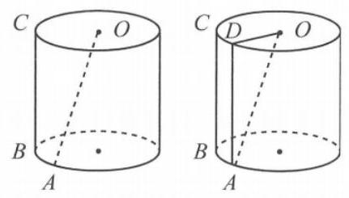

(例 2 图)

考点 异面直线及其所成的角.

分析 根据异面直线所成角的概念,过 $A$ 作与 ${BC}$ 平行的母线 ${AD},\angle {OAD} = \frac{\pi }{6}$ . 在直角三角形 ${ODA}$ 中,直接由 $\cot \frac{\pi }{6} = \frac{AD}{OD} = \frac{l}{r}$ 求得结果.

解 如图,过 $A$ 作与 ${BC}$ 平行的母线 ${AD}$ ,连接 ${OD}$ ,则 $\bigtriangleup {OAD}$ 是以 $\angle {ADO}$ 为直角的直角三角形,且 $\angle {OAD}$ 为直线 ${OA}$ 与 ${BC}$ 所成的角, $\therefore \angle {OAD} = \frac{\pi }{6}$ .

而 $\frac{l}{r} = \frac{AD}{OD} = \cot \angle {OAD} = \cot \frac{\pi }{6} = \sqrt{3}$ ,故答案为 $\sqrt{3}$ .

2. 特殊值法: 当填空题的结论唯一或题设条件中提供的信息暗示答案是一个定值, 而已知条件中含有某些不确定的量或形, 可以将题中变化的不定量选取一些符合条件的恰当特殊值(如特殊函数、特殊角、图形或图形的位置、特殊点、特殊模型等)进行处理，得出探求的结论.

例 3 已知 $\bigtriangleup {ABC}$ 的内角 $A\text{ 、 }B\text{ 、 }C$ 所对的边分别为 $a\text{ 、 }b\text{ 、 }c$ ,若 $a\text{ 、 }b\text{ 、 }c$ 成等差数列,则 $\frac{\cos A + \cos C}{1 + \cos A\cos C} =$ ___.

考点 解三角形.

分析 此题为解三角形与数列的综合题, 直接求解较复杂, 考虑取特殊值.

解 取特殊值 $a = 3, b = 4, c = 5$ ,则 $\cos A = \frac{4}{5},\cos C = 0,\frac{\cos A + \cos C}{1 + \cos A\cos C} = \frac{4}{5}$ .

或取 $a = 1, b = 1, c = 1$ ,则 $\cos A = \cos C = \cos {60}^{ \circ  } = \frac{1}{2}$ ,代入也可得.

常规解法如下: 依题意, ${2b} = a + c$ ,

$\therefore \cos A = \frac{{b}^{2} + {c}^{2} - {a}^{2}}{2bc} = \frac{{\left( \frac{a + c}{2}\right) }^{2} + {c}^{2} - {a}^{2}}{\left( {a + c}\right) c} = \frac{{5c} - {3a}}{4c}$ ,

同理 $\cos C = \frac{{b}^{2} + {a}^{2} - {c}^{2}}{2ba} = \frac{{5a} - {3c}}{4a}$ ,

$\therefore \cos A + \cos C = \frac{{5c} - {3a}}{4c} + \frac{{5a} - {3c}}{4a} = \frac{{10ac} - 3{c}^{2} - 3{a}^{2}}{4ac}$ ,

$1 + \cos A \cdot  \cos C = 1 + \frac{{5c} - {3a}}{4c} \cdot  \frac{{5a} - {3c}}{4a} = \frac{{50ac} - {15}{c}^{2} - {15}{a}^{2}}{16ac}$ ,

$\therefore \frac{\cos A + \cos C}{1 + \cos A\cos C} = \frac{4}{5}$ .

也可以用正弦定理将 ${2b} = a + c$ 化为角，利用三角恒等变形获得结果，读者可以尝试，由此可见本题不用特殊值法，显然难度比较大.

例 4 已知斜率为 $k$ 的直线 $l$ 与椭圆 $\frac{{x}^{2}}{4} + \frac{{y}^{2}}{3} = 1$ 相交于不同的两点 $A$ 、 $B$ ，椭圆上有一点 $P\left( {1,{y}_{0}}\right) \left( {{y}_{0} > 0}\right)$ ，若直线 ${PA}$ 、 ${PB}$ 的斜率互为相反数，则 $k =$ ___.

考点 直线与圆锥曲线的位置关系.

分析 首先确定点 $P$ 的坐标，由于 $k$ 只与直线 ${PA}$ 、 ${PB}$ 的斜率是否互为相反数有关，而与它们斜率的大小无关,可考虑用特殊值法,将它们的斜率分别设为 $\pm  1$ 求解,常规解法较繁琐.

解 由 $\frac{{1}^{2}}{4} + \frac{{y}_{0}^{2}}{3} = 1\left( {{y}_{0} > 0}\right)$ 得, ${y}_{0} = \frac{3}{2}$ ,即 $P\left( {1,\frac{3}{2}}\right)$ ,设 ${k}_{PA} = 1$ ,则 ${k}_{PB} =  - 1$ ,

由 $\left\{  \begin{array}{l} \frac{{x}^{2}}{4} + \frac{{y}^{2}}{3} = 1, \\  y - \frac{3}{2} = x - 1. \end{array}\right.$ 解得 $A\left( {-\frac{11}{7}, - \frac{15}{14}}\right)$ ,

由 $\left\{  \begin{array}{l} \frac{{x}^{2}}{4} + \frac{{y}^{2}}{3} = 1, \\  y - \frac{3}{2} =  - x + 1, \end{array}\right.$ 解得 $B\left( {\frac{13}{7},\frac{9}{14}}\right)$ ,

$\therefore {k}_{AB} = \frac{-\frac{15}{14} - \frac{9}{14}}{-\frac{11}{7} - \frac{13}{7}} = \frac{1}{2}$ ,故答案为 $\frac{1}{2}$ .

3. 数形结合法:“数缺形时少直观，形缺数时难入微”这是数学大师华罗庚的名言，解题过程中可以将抽象、复杂的数量关系, 通过形的形象、直观揭示出来, 辅以数的规律、数值的计算, 达到以数定形, 以形助数, 快速、简捷地解决问题的目的.

例 5 (2018 浙江)已知函数 $f\left( x\right)  = \left\{  \begin{array}{l} x - 4, x \geq  \lambda \\  {x}^{2} - {4x} + 3, x < \lambda  \end{array}\right.$ 恰有 2 个不同的零点,则实数 $\lambda$ 的取值范围是___.

考点 函数零点.

分析 在同一平面直角坐标系内作出函数 $y = x - 4$ 和 $y = {x}^{2} - {4x} + 3$ 的图像,观察直线 $x \; = \lambda$ 的两侧,这两个函数图像与 $x$ 轴的交点情况获得答案.

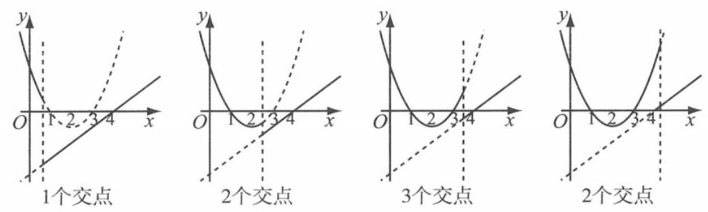

(例 5 图)

解 在同一平面直角坐标系内作出函数 $y = x - 4$ 和 $y = {x}^{2} - {4x} + 3$ 的图像,如图,

考察直线 $x = \lambda$ 的两侧,这两个函数图像与 $x$ 轴的交点情况,

可知当 $1 < \lambda  \leq  3$ 时,函数 $y = x - 4$ 的图像 $x \geq  \lambda$ 与 $x$ 轴有一个交点,

$y = {x}^{2} - {4x} + 3$ 的图像在 $x < \lambda$ 与 $x$ 轴有一个交点,共两个交点,

当 $\lambda  > 4$ 时,函数 $y = x - 4$ 的图像 $x \geq  \lambda$ 与 $x$ 轴没有交点,

$y = {x}^{2} - {4x} + 3$ 的图像在 $x < \lambda$ 与 $x$ 轴有两个交点,共两个交点,

故答案为 $(1,3\rbrack  \cup  \left( {4, + \infty }\right)$ .

例 6 设 $A = \left\{  {\left( {x, y}\right)  \mid  {x}^{2} + {y}^{2} + {2ny} + {n}^{2} = 4}\right\}  , B = \left\{  {\left( {x, y}\right)  \mid  {x}^{2} + {y}^{2} - {6mx} - {4ny} + 9{m}^{2} + 4{n}^{2}}\right. \; = 9\}$ ,若 ${m}^{2} + {n}^{2} > 1$ ,且 $A \cap  B$ 为单元素集,则点 $P\left( {m, n}\right)$ 构成的集合为___.

解 集合 $A = \left\{  {\left( {x, y}\right)  \mid  {x}^{2} + {y}^{2} + {2ny} + {n}^{2} - 4 = 0}\right\}   = \left\{  {\left( {x, y}\right)  \mid  {x}^{2} + {\left( y + n\right) }^{2} = 4}\right\}$ ,

$B = \left\{  {\left( {x, y}\right)  \mid  {x}^{2} + {y}^{2} - {6mx} - {4ny} + 9{m}^{2} + 4{n}^{2} - 9 = 0}\right\}   = \left\{  {\left( {x, y}\right)  \mid  {\left( x - 3m\right) }^{2} + {\left( y - 2n\right) }^{2} = 9}\right\}  ,$

分别表示圆 ${x}^{2} + {\left( y + n\right) }^{2} = 4$ 与圆 ${\left( x - 3m\right) }^{2} + {\left( y - 2n\right) }^{2} = 9$ ,

注意到 $A \cap  B$ 为单元素集,

$\therefore$ 圆 ${x}^{2} + {\left( y + n\right) }^{2} = 4$ 与圆 ${\left( x - 3m\right) }^{2} + {\left( y - 2n\right) }^{2} = 9$ 相切,

$\therefore \sqrt{{\left( 3m\right) }^{2} + {\left( n + 2n\right) }^{2}} = 3 + 2$ ,或 $\sqrt{{\left( 3m\right) }^{2} + {\left( n + 2n\right) }^{2}} = 3 - 2$ ,

即: ${m}^{2} + {n}^{2} = \frac{25}{9}$ ,或 ${m}^{2} + {n}^{2} = \frac{1}{9}$ ,又 ${m}^{2} + {n}^{2} > 1$ ,

$\therefore$ 答案为: $\left\{  {\left( {m, n}\right)  \mid  {m}^{2} + {n}^{2} = \frac{25}{9}}\right\}$ .

4. 构造法: 在解题时, 我们常常会通过对条件和结论的分析, 构造辅助元素, 它可以是一个图形、一个方程 (组)、一个等式、一个函数、一个等价命题等, 架起一座连接条件和结论的桥梁，从而使问题得以解决，这就是构造法。运用构造法解题，可以使代数、三角、几何等各种数学知识互相渗透, 有利于问题的解决。

例 7 一个四面体 ${ABCD}$ 的三组相对棱长分别是 $5\text{ 、 }\sqrt{41}\text{ 、 }\sqrt{34}$ ,则其体积为___.

考点 几何体的体积.

分析 注意到平行六面体中不共面的四个顶点构成的四面体对棱相等, 从而将四面体置于平行六面体 (长方体) 中, 构造长方体, 利用割补法求其体积, 本题也有特殊值法的意味.

解 在长方体 ${ABCD} - {A}_{1}{B}_{1}{C}_{1}{D}_{1}$ 中,设 ${AC} = {B}_{1}{D}_{1} = 5, A{B}_{1} = C{D}_{1} = \sqrt{34}, A{D}_{1} = {B}_{1}C \; = \sqrt{41}$ ,则四面体的三组相对棱长分别是 $5\text{ 、 }\sqrt{41}\text{ 、 }\sqrt{34}$ ,

设长方体中 ${AB} = a,{AD} = b,{A{A}_{1}} = c$ ，

则 ${a}^{2} + {b}^{2} = {5}^{2},{a}^{2} + {c}^{2} = {\left( \sqrt{34}\right) }^{2},{b}^{2} + {c}^{2} = {\left( \sqrt{41}\right) }^{2}$ ,

从而 $a = 3, b = 4, c = 5$ ,

$\therefore {V}_{{AC}{B}_{1}{D}_{1}} = {V}_{{ABCD} - {A}_{1}{B}_{1}{C}_{1}{D}_{1}} - 4{V}_{{B}_{1} - {ABC}} = 3 \times  4 \times  5 - 4 \times  \frac{1}{3} \times  \frac{1}{2} \times  3 \times  4 \times  5 = {20}$ ,

$\therefore$ 所求的四面体的体积为 20 .

例 8 (2012 全国)数列 $\left\{  {a}_{n}\right\}$ 满足 ${a}_{n + 1} + {\left( -1\right) }^{n}{a}_{n} = {2n} - 1$ ，则 $\left\{  {a}_{n}\right\}$ 的前 60 项和为___.

考点 递推数列与数列的求和.

分析 观察特殊项 ${a}_{3} + {a}_{1} = 2,{a}_{4} + {a}_{2} = 8,{a}_{7} + {a}_{5} = 2,{a}_{8} + {a}_{6} = {24},{a}_{11} + {a}_{9} = 2,{a}_{12} + {a}_{10} =$ 40， ${a}_{15} + {a}_{13} = 2$ ， ${a}_{16} + {a}_{14} = {56}$ ， $\cdots$ ，知

${a}_{1} + {a}_{2} + {a}_{3} + {a}_{4} = {10},{a}_{5} + {a}_{6} + {a}_{7} + {a}_{8} = {26},{a}_{9} + {a}_{10} + {a}_{11} + {a}_{12} = {42},\cdots ,$

$\therefore \left\{  {{a}_{{4n} - 3} + {a}_{{4n} - 2} + {a}_{{4n} - 1} + {a}_{4n}}\right\}$ 是一个等差数列的结构特征,从而构造等差数列求和.

解 $\because {a}_{n + 1} + {\left( -1\right) }^{n}{a}_{n} = {2n} - 1$ ,

当 $n = {4k} - 3\left( {k \in  {\mathbf{N}}^{ * }}\right)$ ,则 ${a}_{{4k} - 2} - {a}_{{4k} - 3} = 2\left( {{4k} - 3}\right)  - 1 = {8k} - 7$ ①,

当 $n = {4k} - 2\left( {k \in  {\mathbf{N}}^{ * }}\right)$ ,则 ${a}_{{4k} - 1} + {a}_{{4k} - 2} = 2 \times  \left( {{4k} - 2}\right)  - 1 = {8k} - 5$ ②,

当 $n = {4k} - 1\left( {k \in  {\mathbf{N}}^{ * }}\right)$ ,则 ${a}_{4k} - {a}_{{4k} - 1} = 2\left( {{4k} - 1}\right)  - 1 = {8k} - 3$ ③,

② 一①得 ${a}_{{4k} - 1} + {a}_{{4k} - 3} = 2$ ；② + ③ 得 ${a}_{4k} + {a}_{{4k} - 2} = {16k} - 8$ ，

从而 ${a}_{{4k} - 3} + {a}_{{4k} - 2} + {a}_{{4k} - 1} + {a}_{4k} = {16k} - 6$ ,

将数列 $\left\{  {a}_{n}\right\}$ 按每四项和为一项构造数列 $\left\{  {b}_{n}\right\}$ ,

即 ${b}_{n} = {a}_{{4n} - 3} + {a}_{{4n} - 2} + {a}_{{4n} - 1} + {a}_{4n}$ ,则 $\left\{  {b}_{n}\right\}$ 是以 ${b}_{1} = {a}_{1} + {a}_{2} + {a}_{3} + {a}_{4} = {10}$ 为首项, $d =$

16 为公差的等差数列,

$\therefore {S}_{60} = \left( {{a}_{1} + {a}_{2} + {a}_{3} + {a}_{4}}\right)  + \left( {{a}_{5} + {a}_{6} + {a}_{7} + {a}_{8}}\right)  + \cdots  + \left( {{a}_{56} + {a}_{57} + {a}_{59} + {a}_{60}}\right) \; = {b}_{1} + {b}_{2} + {b}_{3} + \cdots  + {b}_{15} = {10} \times  {15} + \frac{{15} \times  {14}}{2} \times  {16} = {1830}$

故 $\left\{  {a}_{n}\right\}$ 的前 60 项和为 1830 .

5. 等价转化法:通过“化复杂为简单、化陌生为熟悉”，将问题等价地转化成便于解决的问题, 从而得出正确的结果.

例 9 (2019 上海)已知椭圆 $\frac{{x}^{2}}{4} + \frac{{y}^{2}}{2} = 1$ 的焦点分别为 ${F}_{1}$ 、 ${F}_{2}$ ， $P$ 是椭圆上任意一点， $Q$ 与 $P$ 关于 $x$ 轴对称，若有 ${F}_{1}\overrightarrow{P} \cdot  \overline{{F}_{2}\overrightarrow{P}} \leq  1$ ，则 $\overrightarrow{{F}_{1}P}$ 与 $\overrightarrow{{F}_{2}Q}$ 的夹角范围为___.

考点 椭圆的性质,平面向量的数量积.

分析 设 $P\left( {x, y}\right)$ ,则 $Q\left( {x, - y}\right)$ ,由 $\overrightarrow{{F}_{1}P} \cdot  \overrightarrow{{F}_{2}P} \leq  1$ ,求得 ${y}^{2} \in  \left\lbrack  {1,2}\right\rbrack$ ,再利用向量的夹角公式建立关于 $y$ 的函数关系式，转化为区间上函数的值域问题.

解 依题意,有 ${F}_{1}\left( {-\sqrt{2},0}\right)$ 、 ${F}_{2}\left( {\sqrt{2},0}\right)$ .

设 $\overrightarrow{{F}_{1}P}$ 与 $\overrightarrow{{F}_{2}Q}$ 的夹角为 $\theta \left( {0 \leq  \theta  \leq  \pi }\right) , P\left( {x, y}\right)$ .

$\because Q$ 与 $P$ 关于 $x$ 轴对称, $\therefore Q\left( {x, - y}\right)$ .

于是 $\overrightarrow{{F}_{1}P} \cdot  \overrightarrow{{F}_{2}P} \leq  1$ ,即 ${x}^{2} - 2 + {y}^{2} \leq  1$ ,又 $\frac{{x}^{2}}{4} + \frac{{y}^{2}}{2} = 1,\therefore {y}^{2} \in  \left\lbrack  {1,2}\right\rbrack$ ,

则 $\cos \theta  = \frac{{\bar{F}}_{1}\bar{P} \cdot  \overline{{F}_{2}Q}}{\left| \overline{{F}_{1}P}\right|  \cdot  \left| \overline{{F}_{2}Q}\right| } = \frac{{x}^{2} - 2 - {y}^{2}}{\sqrt{{\left( {x}^{2} + 2 + {y}^{2}\right) }^{2} - 8{x}^{2}}} = \frac{2 - 3{y}^{2}}{{y}^{2} + 2}$

$=  - 3 + \frac{8}{{y}^{2} + 2} \in  \left\lbrack  {-1, - \frac{1}{3}}\right\rbrack$ ,

$\therefore \theta  \in  \left\lbrack  {\pi  - \arccos \frac{1}{3},\pi }\right\rbrack$ .

例 10 函数 $f\left( x\right)  = \frac{3}{{2x} + 4} + \frac{2}{2 - {3x}}\left( {-2 < x < \frac{2}{3}}\right)$ 的最小值是___.

考点 函数的最值.

分析 显然直接求函数的最小值不方便,注意到 $3\left( {{2x} + 4}\right)  + 2\left( {2 - {3x}}\right)  = {16}$ ,且 ${2x} + 4 > 0$ , $2 - {3x} > 0$ ,不妨设 ${2x} + 4 = u,2 - {3x} = v$ ,则 $u\text{ 、 }v > 0$ ,且 ${3u} + {2v} = {16}$ ,将问题转化为 “求 $\frac{3}{u} + \frac{2}{v}$ 的最小值”,利用基本不等式求解.

解 设 ${2x} + 4 = u,2 - {3x} = v$ ,则 $u\text{ 、 }v > 0$ ,且 ${3u} + {2v} = {16}$ , 则 $f\left( x\right)  = \frac{3}{{2x} + 4} + \frac{2}{2 - {3x}} = \frac{3}{u} + \frac{2}{v} = \frac{1}{16}\left( {\frac{{9u} + {6v}}{u} + \frac{{6u} + {4v}}{v}}\right)  = \frac{1}{16}\left( {{13} + \frac{6v}{u} + \frac{6u}{v}}\right)  \geq  \frac{25}{16}$ . 当且仅当 $\frac{6v}{u} = \frac{6u}{v}$ ,且 ${3u} + {2v} = {16}$ ,即 $u = v = \frac{16}{5}$ ,也就是 $x =  - \frac{2}{5}$ 时,等号成立, 故答案为 $\frac{25}{16}$ .

6. 不完全归纳法:由某类事物的部分对象具有某些特征，推出该类事物的全部对象都具有这些特征的推理方法, 或者由个别事实概括出一般结论的推理方法, 称之为不完全归纳推理. 不完全归纳推理是由部分到整体, 由个别到一般的推理.

例 11 已知数列 $\left\{  {a}_{n}\right\}$ 的前 $n$ 项和为 ${S}_{n}$ ,若 ${a}_{1} = 1$ ,且 ${S}_{n} = {n}^{2}{a}_{n}\left( {n \geq  2, n \in  {\mathbf{N}}^{ * }}\right)$ ,则其通项公式是___.

考点 数列的递推公式与通项公式.

分析 常规做法无论是利用当 $n \geq  2$ 时, ${a}_{n} = {S}_{n} - {S}_{n - 1}$ 转化为先求 ${S}_{n}$ ,再求 ${a}_{n}$ ,或直接转化为关于 ${a}_{n}$ 和 ${a}_{n - 1}$ 的递推公式,然后求解,效率都比较低. 我们可以尝试求几项,观察规律, 猜测有关结果.

解 ${a}_{1} = 1$ ,由 ${a}_{1} + {a}_{2} = {2}^{2}{a}_{2} \Rightarrow  {a}_{2} = \frac{1}{3},{a}_{1} + {a}_{2} + {a}_{3} = {3}^{2}{a}_{3} \Rightarrow  {a}_{3} = \frac{1}{6}$ ,

${a}_{1} + {a}_{2} + {a}_{3} + {a}_{4} = {4}^{2}{a}_{4} \Rightarrow  {a}_{4} = \frac{1}{10}$ ,猜测: ${a}_{n} = \frac{2}{n\left( {n + 1}\right) }$ .

验证 当 $n \geq  2, n \in  {\mathbf{N}}^{ * }$ 时, ${S}_{n} = \frac{2}{1 \times  2} + \frac{2}{2 \times  3} + \frac{2}{3 \times  4} + \cdots  + \frac{2}{n \times  \left( {n + 1}\right) } = 2\left( {1 - \frac{1}{n + 1}}\right)  = \frac{2n}{n + 1}$ , ${n}^{2}{a}_{n} = \frac{{n}^{2} \times  2}{n\left( {n + 1}\right) } = \frac{2n}{n + 1}$ 满足，故答案是 ${a}_{n} = \frac{2}{n\left( {n + 1}\right) }$ .

例 12 已知函数 $f\left( x\right)  = \left\{  \begin{array}{l} {2x} - 1, x \leq  0, \\  f\left( {x - 1}\right)  + 1, x > 0. \end{array}\right.$ 把函数 $g\left( x\right)  = f\left( x\right)  - x + 1$ 的零点按从小到大的顺序排列成一个数列. 若该数列的前 $n$ 项的和为 ${S}_{n}$ ,则 ${S}_{n} =$ ___.

考点 函数零点与数列求和.

分析 依次求出函数 $y = f\left( x\right)$ 在 $( - \infty ,0\rbrack ,(0,1\rbrack ,(1,2\rbrack ,\cdots$ 上的解析式,进一步求出 $g\left( x\right)$ 的零点,根据特征确定数列 $\left\{  {a}_{n}\right\}$ 的通项公式,再求和.

解 当 $x \leq  0$ 时, $f\left( x\right)  = {2x} - 1$ ,由 $g\left( x\right)  = 0$ ,得 ${2x} - 1 = x - 1,\therefore x = 0 = {a}_{1}$ ;

当 $0 < x \leq  1$ 时,有 $- 1 < x - 1 \leq  0$ ,

则 $f\left( x\right)  = f\left( {x - 1}\right)  + 1 = 2\left( {x - 1}\right)  - 1 + 1 = {2x} - 2$ ,

于是 ${2x} - 2 = x - 1,\therefore x = 1 = {a}_{2}$ ;

当 $1 < x \leq  2$ 时,有 $0 < x - 1 \leq  1$ ,

则 $f\left( x\right)  = f\left( {x - 1}\right)  + 1 = 2\left( {x - 1}\right)  - 2 + 1 = {2x} - 3$ ,

于是 ${2x} - 3 = x - 1$ ,故 $x = 2 = {a}_{3}$ ;

当 $2 < x \leq  3$ 时,有 $1 < x - 1 \leq  2$ ,

则 $f\left( x\right)  = f\left( {x - 1}\right)  + 1 = 2\left( {x - 1}\right)  - 3 + 1 = {2x} - 4$ ,

于是 ${2x} - 4 = x - 1$ ,故 $x = 3 = {a}_{4};\cdots$ ;

以此类推,当 $n < x \leq  n + 1\left( {n \in  \mathbf{N}}\right)$ ,则 $x = n - 1 = {a}_{n}$ .

故数列的前 $n$ 项构成一个以 0 为首项,以 1 为公差的等差数列.

故 ${S}_{n} = \frac{n \times  \left( {0 + n - 1}\right) }{2} = \frac{n\left( {n - 1}\right) }{2}$ .

高考中的数学填空题一般是容易题或中档题, 当然也有压轴的难题. 数学填空题绝大多数是计算型 (尤其是推理计算型) 和概念 (性质) 判断型的试题, 应答时必须按规则进行切实的计算或者合乎逻辑的推演和判断. 求解填空题要在“准”“巧”“快”上下功夫。祝你成功！

## 神器 2 选择题解法综述

数学选择题属于客观性试题, 是单项选择题, 即给出的四个选项中一个是正确选项、三个干扰选项, 要求把正确的选项选出. 一般说来, 选择题大都可以从题干出发, 通过求解对照来作出选择，这是最常用的方法. 但由于选择题的结构特征，不要求表述解题过程，只要求迅速、准确地作出正确判断，因而选择题的解法有其独特的规律和技巧. 我们要熟练掌握选择题的求解策略, 尽量避免 “小题大做”. 下面介绍一下选择题的解题策略.

数学选择题的求解, 一般有两条思路: 一是从题干出发考虑, 探求结果; 二是从题干和选择支联合考虑或从选择支出发挥求是否满足题干条件. 充分利用题干和选择支提供的信息, 快速、准确地作出判断. 解选择题时,要做到: ① 仔细审题,领悟题意; ② 抓住关键,全面分析; ③仔细检查，认真核对. 解选择题时，最忌讳；①见到题就埋头运算，按照解答题的解题思路去求解, 得到结果再去和选项对照, 这样做往往花费时间较长, 有时还可能得不到正确答案; ②不深入思考而“蒙”一个选项. 如果经过筛选、淘汰，效率就可以大大提高. 本文把数学选择题的解法归纳成 6 个基本方法, 而每个方法又各有肯定和否定两种形式, 在实际解题时, 方法的选择很重要, 还应注意多种方法的交替使用, 以 “准确、快速”为宗旨. 列表如下:

<table><tr><td>基本方法   基本形式</td><td>求解对照</td><td>逆推代入</td><td>特例检验</td><td>直观选择</td><td>特征分析</td><td>逻辑分析</td></tr><tr><td>肯定正确支</td><td>顺推肯定</td><td>逆推肯定</td><td>特例肯定</td><td>直观肯定</td><td>特征肯定</td><td>逻辑肯定</td></tr><tr><td>否定干扰支</td><td>顺推否定</td><td>逆推否定</td><td>特例否定</td><td>直观否定</td><td>特征否定</td><td>逻辑否定</td></tr></table>

## 1. 求解对照法

从题干出发, 像解解答题一样, 通过运算、推理、验证等, 把得出的结论, 与 4 个选项作对照, 若得出的结论恰为某一选项, 这就是顺推肯定; 若演算的过程可以逐步淘汰 3 个干扰支, 从而确定正确的选择支, 这就是顺推否定. 一般来说, 顺推肯定用的较多.

例 1 (2017 上海秋考)已知 $a$ 、 $b$ 、 $c$ 为实常数，数列 $\left\{  {x}_{n}\right\}$ 的通项 ${x}_{n} = a{n}^{2} + {bn} + c, n \in  {\mathbf{N}}^{ * }$ ，则 “存在 $k \in  {\mathbf{N}}^{ * }$ ,使得 ${x}_{{100} + k}\text{ 、 }{x}_{{200} + k}\text{ 、 }{x}_{{300} + k}$ 成等差数列” 的一个必要条件是 ( )

A. $a \geq  0$ B. $b \leq  0$ C. $c = 0$ D. $a - {2b} + c = 0$

考点 等差数列、必要条件.

分析 本题目标是找“存在 $k \in  {\mathbf{N}}^{ * }$ ,使得 ${x}_{{100} + k}\text{ 、 }{x}_{{200} + k}\text{ 、 }{x}_{{300} + k}$ 成等差数列”的必要条件,再与各选项对照求解. 也就是顺推肯定对照求解. 在众多的 $k \in  {\mathbf{N}}^{ * }$ 中,当然可选取一个能使得运算相对简便的数进行推理求解. 事实上,从数列 $\left\{  {x}_{n}\right\}$ 通项 ${x}_{n} = a{n}^{2} + {bn} + c$ , $n \in  {\mathbf{N}}^{ * }$ 的结构特征可知 (容易证明): $\left\{  {x}_{n}\right\}$ 是等差数列的充要条件是 $a = 0 \Rightarrow  a \geq  0$ ,我们也很容猜到选项 A. 一般地，对判断这类充分性或必要性的题目，我们常常采用顺推或逆推求解对照的方法.

解法一 取 $k = {100}$ ,由 ${x}_{200},{x}_{300},{x}_{400}$ 成等差数列,得 $2{x}_{300} = {x}_{200} + {x}_{400} \Rightarrow  2\left( {{300}^{2}a + {300b} + }\right. \; c) = \left( {{200}^{2}a + {200b} + c}\right)  + \left( {{400}^{2}a + {400b} + c}\right)  \Rightarrow  a = 0 \Rightarrow  a \geq  0$ ,故选 A.

解法二 如果 ${x}_{{100} + k},{x}_{{200} + k},{x}_{{300} + k}$ 成等差数列,则 $2{x}_{{200} + k} = {x}_{{100} + k} + {x}_{{300} + k} \Rightarrow  a = 0 \Rightarrow  a \geq  0$ ,故选 A.

例 2 (2015 上海秋考)记方程①: ${x}^{2} + {a}_{1}x + 1 = 0$ ，方程②: ${x}^{2} + {a}_{2}x + 2 = 0$ ，方程③: ${x}^{2} + \; {a}_{3}x + 4 = 0$ ,其中 ${a}_{1}\text{ 、 }{a}_{2}\text{ 、 }{a}_{3}$ 是正实数. 当 ${a}_{1},{a}_{2},{a}_{3}$ 成等比数列时,下列选项中,能推出方程③无实根的是 ( )

A. 方程①有实根，且②有实根 B. 方程①有实根，且②无实根

C. 方程①无实根，且②有实根 D. 方程①无实根，且②无实根

考点 等比数列、不等式的基本性质.

分析 本题要求由 ${a}_{1}^{2} - 4,{a}_{2}^{2} - 8$ 的正负及等式 ${a}_{2}^{2} = {a}_{1} \cdot  {a}_{3}$ 推导出 ${a}_{3}^{2} - {16} < 0$ ,即 ${a}_{3}^{2} < {16}$ ,而 ${a}_{3}^{2} = \frac{{a}_{2}^{4}}{{a}_{1}^{2}}$ ,可联想到两边都是正数的异向不等式相除.

解 通过分析,本题只能由 ${a}_{1}^{2} \geq  4,{a}_{2}^{4} < {64} \Rightarrow  {a}_{3}^{2} = \frac{{a}_{2}^{4}}{{a}_{1}^{2}} < \frac{64}{4} = {16}$ ,故选 B.

## 2. 逆推代入法

与求解对照法的思考方向相反, 从选择项出发, 逐一代入检验是否与题干相容. 若检验能否定 3 个干扰支，这就是逆推否定；若检验能肯定一支，这就是逆推肯定. 当题干提供的信息太少或结论是一些具体的计算数字时 (如方程或不等式的解集等)，用这种方法往往较为方便. 在运用逆推代入法解题时, 若能依据题意确定代入顺序, 则能较大提高解题速度. 数学选择题的解题本质就是去伪存真, 舍弃不符合题干要求的选项, 找到符合题意的正确结论. 一般来说，逆推否定用得较多.

例 3 (2019 上海秋考) 已知 $\omega  \in  \mathbf{R}$ ,函数 $f\left( x\right)  = {\left( x - 6\right) }^{2} \cdot  \sin \left( {\omega x}\right)$ ,存在常数 $a \in  \mathbf{R}$ ,使得 $f\left( {x + a}\right)$ 为偶函数，则 $\omega$ 的值可能为 ( )

A. $\frac{\pi }{2}$ B. $\frac{\pi }{3}$ C. $\frac{\pi }{4}$ D. $\frac{\pi }{5}$

考点 函数的运算、函数的基本性质、正余弦函数的性质.

分析 本题解法较多, 例如, 可用求解对照法求解, 但将各选项的值依次代入来得更简单快捷.

解 由题意得 $f\left( {x + a}\right)  = {\left( x + a - 6\right) }^{2}\sin \left( {{\omega x} + {\omega a}}\right)$ 为偶函数，由函数的结构特点，要求函数 $g\left( x\right)  = {\left( x + a - 6\right) }^{2}, h\left( x\right)  = \sin \left( {{\omega x} + {\omega a}}\right)$ 都应该是偶函数,

所以 $a = 6 \Rightarrow  h\left( x\right)  = \sin \left( {{\omega x} + {6\omega }}\right)$ ,依次代入各选项的值,只有选项 $\mathrm{C}$ 满足要求,故选 $\mathrm{C}$ .

例 4 函数 $f\left( x\right)  = {\log }_{2}x + x - 5$ 的零点所在的区间为 ( )

A. $\left( {1,2}\right)$ B. $\left( {2,3}\right)$ C. $\left( {3,4}\right)$ D. $\left( {4, + \infty }\right)$

考点 函数的基本性质.

分析 本题可用 “二分法”进行求解对照,但不快捷. 考虑函数 $f\left( x\right)  = {\log }_{2}x + x - 5$ 是增函数, 若将选项中各区间端点的值有选择地代入，判断函数值的正负，可以迅速作出判断.

解 因为 $f\left( 4\right)  = 1 > 0, f\left( 4\right)  = {\log }_{2}3 - 1 < 0$ ,故选 C.

## 3. 特例检验法

特例检验法 (也称特例法或特殊值法) 就是从题干出发, 取满足条件的特殊值 (或特殊图形、特殊位置)代替题干普遍条件，得出特殊结论，再与各个选项作比较进行检验，从而作出正确的选择. 若通过特例可肯定一支，就是特例肯定；若通过特例可否定 3 支，就是特例否定. 常用的特例有特殊数值、特殊数列、特殊函数、特殊图形、特殊角、特殊位置等.

特例检验是解答选择题的优选方法之一, 适用于解答 “对某一集合的所有元素、某种关系恒成立”，这样以全称判断形式出现的题目，其原理是“结论若在某种特殊情况下不真，则它在一般情况下也不真”，利用“小题小做”“小题巧做”的解题策略.

例 5 (2018 上海秋考) 设 $P$ 是椭圆 $\frac{{x}^{2}}{5} + \frac{{y}^{2}}{3} = 1$ 上的动点,则 $P$ 到该椭圆的两个焦点的距离之和为 ( )

A. $2\sqrt{2}$ B. $2\sqrt{3}$ C. $2\sqrt{5}$ D. $4\sqrt{2}$

考点 椭圆的定义、标准方程和几何性质.

分析 本题用椭圆的定义求解对照最为快捷. 如果没想到用椭圆的定义而直接用动点列解析式求解就难了,可利用特殊位置求解,由 $P$ 是椭圆 $\frac{{x}^{2}}{5} + \frac{{y}^{2}}{3} = 1$ 上的动点,故可令 $P$ 为椭圆短轴的一个端点.

解法一 用椭圆的定义求解对照, $P$ 到该椭圆的两个焦点的距离之和为长轴长 $2\sqrt{5}$ .

解法二 本题也可用特例肯定法: 取 $P$ 为椭圆短轴的一个端点 $\left( {0,\sqrt{3}}\right)$ ,又两焦点为 ${F}_{1}\left( {-\sqrt{2},0}\right) ,{F}_{2}\left( {\sqrt{2},0}\right)$ ，所以 $\left| {P{F}_{1}}\right|  + \left| {P{F}_{2}}\right|  = 2\sqrt{5}$ ，故选 C.

例 6 (2019 上海春考)已知平面 $\alpha$ 、 $\beta$ 、 $\gamma$ 两两垂直，直线 $a$ 、 $b$ 、 $c$ 满足: $a \subsetneqq  \alpha$ ， $b \subsetneqq  \beta$ ， $c \subsetneqq  \gamma$ ，则直线 $a$ 、 $b$ 、 $c$ 不可能是 ( )

A. 两两垂直 B. 两两平行 C. 两两相交 D. 两两异面

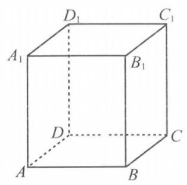

(例 6 图)

考点 空间直线与平面的位置关系.

分析 本题可借助立体几何中的典型模型——正方体,可将直线 $a$ 、 $b\text{ 、 }c$ 分别置入正方体三个互相垂直的面进行检验. 正方体、长方体是一种常用的几何模型.

解 本题可用特例否定法: 将底面 ${ABCD}$ 、侧面 ${AD}{D}_{1}{A}_{1}$ 、侧面

${CD}{D}_{1}{C}_{1}$ 所在平面分别记作 $\alpha \text{ 、 }\beta \text{ 、 }\gamma$ ,取 ${AD}\text{ 、 }D{D}_{1}\text{ 、 }{DC}$ 分别为直线 $a\text{ 、 }b\text{ 、 }c$ ,它们既两两相交,又两两垂直,从而否定选项 $\mathrm{A}\text{ 、 }\mathrm{C}$ ,再取 ${AB}\text{ 、 }{A}_{1}{D}_{1}\text{ 、 }C{C}_{1}$ 分别为直线 $a\text{ 、 }b\text{ 、 }c$ ,它们两两异面,从而否定选项 D,故选 B.

例 7 (2019 上海秋考) 已知 $\tan \alpha  \cdot  \tan \beta  = \tan \left( {\alpha  + \beta }\right)$ ,有下列两个结论: ①存在 $\alpha$ 在第一象限, $\beta$ 在第三象限; ②存在 $\alpha$ 在第二象限, $\beta$ 在第四象限; 则 ( )

A. ①②均正确 B. ①②均错误 C. ①对②错 D. ①错②对

两角和的正切、正切函数的性质和图像.

分析 由正切函数的周期性可知,对于①中的 $\alpha$ 在第一象限， $\beta$ 在第三象限只需取 $\alpha$ 、 $\beta  \in \; \left( {0,\frac{\pi }{2}}\right)$ ; 对于②中的 $\alpha$ 在第二象限， $\beta$ 在第四象限，只需取 $\alpha$ 、 $\beta  \in  \left( {\frac{\pi }{2},\pi }\right)$ ; 设 $\tan \alpha  = x$ ， $\tan \beta  = y$ ,则由 $\tan \left( {\alpha  + \beta }\right)  = \tan \alpha  + \tan \beta$ 得 $\frac{x + y}{1 - {xy}} = {xy} \Rightarrow  x + y + {x}^{2}{y}^{2} = {xy}$ . 所以本题转化成验证等式 $x + y + {x}^{2}{y}^{2} = {xy}$ 中的 $x\text{ 、 }y$ 是否可以同正或者同负,求解方法较多，但主要可以用求解对照和特例检验两种方法，下列举五种方法.

一(求解对照法)对于二元方程 $x + y + {x}^{2}{y}^{2} = {xy}$ ，先假定变量 $y$ 为常数，对等式 $x + \; y + {x}^{2}{y}^{2} = {xy}$ 变形得 ${y}^{2}{x}^{2} + \left( {1 - y}\right) x + y = 0,\Delta  = {\left( 1 - y\right) }^{2} - 4{y}^{3}$ .

当 $y < 0$ 时, $\Delta  > 0$ ,且两根之和为负,两根之积为负, ${y}^{2}{x}^{2} + \left( {1 - y}\right) x + y = 0$ 存在负根, 所以②正确.

当 $y > 0$ ,且 $\Delta  \geq  0$ 时,则必有 $0 < y < 1$ ,

所以关于 $x$ 的一元二次方程 ${y}^{2}{x}^{2} + \left( {1 - y}\right) x + y = 0$ 有实根,

其根均为负值, 所以①错误. 故选 D.

法二 (求解对照法和特例检验法) 对于①,取 $\alpha \text{ 、 }\beta  \in  \left( {0,\frac{\pi }{2}}\right)$ ;

对于② 取 $\alpha \text{ 、 }\beta  \in  \left( {\frac{\pi }{2},\pi }\right)$ ; 设 $\tan \alpha  = x,\tan \beta  = y$ ,

则由 $\tan \left( {\alpha  + \beta }\right)  = \tan \alpha  \cdot  \tan \beta$ 得 $\frac{x + y}{1 - {xy}} = {xy} \Rightarrow  x + y + {x}^{2}{y}^{2} = {xy}$ .

令 $\beta  = \frac{3\pi }{4}$ 得 $y =  - 1$ ,所以 $- 1 + x + {x}^{2} =  - x$ ,只需判断方程 ${x}^{2} + {2x} - 1 = 0$ 中的 $x$

是否有负根,显然,方程 ${x}^{2} + {2x} - 1 = 0$ 有一正一负两根,所以②正确.

当 $x\text{ 、 }y$ 至少有一个在区间 $(0,1\rbrack$ 内时,

$\frac{1}{x} + \frac{1}{y} + {xy} > 1$ ,这与 $\frac{1}{x} + \frac{1}{y} + {xy} = 1$ 矛盾;

当 $x\text{ 、 }y$ 都在区间 $\left( {1, + \infty }\right)$ 内时,

则 $\alpha \text{ 、 }\beta  \in  \left( {\frac{\pi }{4},\frac{\pi }{2}}\right)  \Rightarrow  \alpha  + \beta  \in  \left( {\frac{\pi }{2},\pi }\right)  \Rightarrow  \tan \left( {\alpha  + \beta }\right)  < 0$ ,

这与 $\tan \left( {\alpha  + \beta }\right)  = \tan \alpha \tan \beta  > 0$ 矛盾. 所以① 错误. 故选 D.

## 第12页，共188页

解法三 (取特殊值检验) 如令 $y =  - 1$ 得 $- 1 + x + {x}^{2} =  - x$ ,

只需判断方程 ${x}^{2} + {2x} - 1 = 0$ 中的 $x$ 是否有负根,

显然,方程 ${x}^{2} + {2x} - 1 = 0$ 有一正一负两根,所以②正确.

令 $y = 1$ 得 $1 + x + {x}^{2} = x$ ,方程 ${x}^{2} + 1 = 0$ 无实根;

令 $y = \frac{1}{3}$ 得 $\frac{1}{3} + x + \frac{1}{9}{x}^{2} = \frac{1}{3}x$ ,方程 ${x}^{2} + {6x} + 3 = 0$ 无正实根;

如此多次令 $y$ 取特殊正实数,等式 $x + y + {x}^{2}{y}^{2} = {xy}$ 中的 $x$ 均无正实根,则可认为①错误. 故选 D. 显然，这种判断①错的方法不严谨，但很多考生使用这种方法选出了正确的选择支.

解法四 (求解对照法) ②正确(方法同上)

对于 ①,由 $x > 0, y > 0, x + y + {x}^{2}{y}^{2} = {xy}$ 得 $\frac{1}{x} + \frac{1}{y} + {xy} = 1$ .

而 $\frac{1}{x} + \frac{1}{y} + {xy} \geq  3\sqrt{\frac{1}{x} \cdot  \frac{1}{y} \cdot  {xy}} = 3$ ,与 $\frac{1}{x} + \frac{1}{y} + {xy} = 1$ 矛盾.

所以①错误. 故选 D.

解法五 (利用正切函数的单调性求解对照) ②正确(方法同上)

对于①，取 $\alpha$ ， $\beta  \in  \left( {0,\frac{\pi }{2}}\right)$ ，若 $\alpha  + \beta  \in  \left( {\frac{\pi }{2},\pi }\right)$ ，

则 $\tan \left( {\alpha  + \beta }\right)  < 0$ ，而 $\tan \alpha  \cdot  \tan \beta  > 0$ ，矛盾；

若 $\alpha  + \beta  \in  \left( {0,\frac{\pi }{2}}\right)$ ,因为 $\alpha  + \beta  > \alpha ,\alpha  + \beta  > \beta$ ,

所以 $\tan \alpha  \cdot  \tan \beta  = \tan \left( {\alpha  + \beta }\right)  > \tan \alpha ,\tan \alpha  \cdot  \tan \beta  = \tan \left( {\alpha  + \beta }\right)  > \tan \beta$ ,

于是 $\tan \beta  > 1$ 且 $\tan \alpha  > 1$ ,即 $\alpha  > \frac{\pi }{4},\beta  > \frac{\pi }{4}$ ,从而 $\alpha  + \beta  > \frac{\pi }{2}$ ,矛盾. 故①错误. 故选 D.

## 4. 直观选择法

有的选择题可通过命题条件的函数关系或几何意义, 作出函数的图像或几何图形, 借助于具体图像或图形的形状、位置、性质进行直观想象，迅速肯定 1 支或否定其他 3 支，前者为直观肯定，后者为直观否定. 这也就是数形结合思想，数形结合是通过数与形之间的对应和转化来解决数学问题的. 它包含以形助数和以数解形两个方面. 一般来说，涉及向量、立体几何、解析几何、复数的模、函数图像等问题时，可考虑用数形结合. 运用数形结合解题一定要对有关函数图像、方程曲线、几何图形较熟悉, 否则, 错误的图像或图形反而会导致错误的选择. 直观想象是数学学科的重要核心素养.

例 8 (2018 上海春考)已知 $A$ 、 $B$ 为平面上的两个定点，且 $\left| \overrightarrow{AB}\right|  = 2$ ，该平面上的动线段 ${PQ}$ 的端点 $P\text{ 、 }Q$ ，满足 $\left| \overrightarrow{AP}\right|  \leq  5$ ， $\overrightarrow{AP} \cdot  \overrightarrow{AB} = 6$ ， $\overrightarrow{AQ} =  - 2\overrightarrow{AP}$ ，则动线段 ${PQ}$ 所形成图形的面积为 ( )

A. 36 B. 60 C. 72 D. 108

考点 向量的度量与运算.

分析 剖析本题的关键是将 $\left| \overrightarrow{AP}\right|  \leq  5,\overrightarrow{AP} \cdot  \overrightarrow{AB} = 6,\overrightarrow{AQ} =  - 2\overrightarrow{AP}$ 翻译成图形语言,找出动点 $P$ 、 $Q$ 的轨迹，从而描绘出动线段 ${PQ}$ 在旋转过程中所形成的图形.

解 如图, $\left| \overrightarrow{AP}\right|  \leq  5$ 表示动点 $P$ 在以 $A$ 为圆心、以 5 为半径的圆的内部, $\overrightarrow{AP} \cdot  \overrightarrow{AB} = \left| \overrightarrow{AB}\right|  \cdot  \left| \overrightarrow{AP}\right| \cos \angle {PAB} = 6 \Rightarrow  \left| \overrightarrow{AP}\right| \cos \angle {PAB} = 3$ , 表示 $\overrightarrow{AP}$ 在 $\overrightarrow{AB}$ 方向上的投影为 3,动点 $P$ 的轨迹是 $\odot  A$ 的一条弦 ${P}_{1}{P}_{2},{P}_{1}{P}_{2} \bot  {AB},\left| {{P}_{1}P}\right|  = 2\sqrt{{5}^{2} - {3}^{2}} = 8,\overrightarrow{AQ} =  - 2\overrightarrow{AP}$ 表示点 $Q$ 在 ${AP}$ 的反向延长线上,且 $\left| \overrightarrow{AQ}\right|  = 2\left| \overrightarrow{AP}\right|$ ,动点 $Q$ 的轨迹是线段 ${Q}_{1}{Q}_{2},\bigtriangleup {Q}_{1}A{Q}_{2}$ 与 $\bigtriangleup {P}_{1}A{P}_{2}$ 是相似三角形, $\left| {{Q}_{1}{Q}_{2}}\right|  = {16}$ ,线段 ${PQ}$ 所形成图形的面积为 $S = {S}_{\bigtriangleup {P}_{1}A{P}_{2}} + {S}_{\bigtriangleup {Q}_{1}A{Q}_{2}} = 5{S}_{\bigtriangleup {P}_{1}A{P}_{2}} = 5 \cdot  \frac{1}{2} \cdot  3 \times  8 = {60}$ ,故选 B.

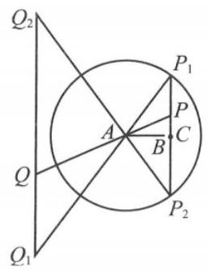

(例 8 图)

例 9 已知不等式 $\left| {{2x} - a}\right|  > x - 1$ 对任意 $x \in  \left\lbrack  {0,2}\right\rbrack$ 恒成立，则实数 $a$ 的取值范围是( )

A. $\left( {1,5}\right)$ B. $\left( {2,5}\right)$

C. $\left( {-\infty ,1}\right)  \cup  \left( {5, + \infty }\right)$ D. $\left( {-\infty ,2}\right)  \cup  \left( {5, + \infty }\right)$

考点 函数的图像和基本性质.

分析 对于本题,考生大多用 “分离参数法” 将 $\left| {{2x} - a}\right|  > x - 1$ 进行变形得到 $a - {2x} > x - 1$ 或 $a - {2x} <  - x + 1$ 对任意 $x \in  \left\lbrack  {0,2}\right\rbrack$ 恒成立,所以 $a > {3x} - 1$ 或 $a < x + 1$ 对任意 $x \in \; \left\lbrack  {0,2}\right\rbrack$ 恒成立，由于对“或”的含义理解有误(难于发现错在哪里)，得到 $a > 5$ 或 $a < 1$ 的错误结论. 若在同一坐标系内，作出函数 $y = \left| {{2x} - a}\right|$ 和 $y = x - 1$ 在区间 $\left\lbrack  {0,2}\right\rbrack$ 上的图像, 很容易作出直观选择.

解 如图,若在同一坐标系内,作出函数 $y = \left| {{2x} - a}\right|$ 和 $y = x - 1$ 在区间 $\left\lbrack  {0,2}\right\rbrack$ 上的图像,线段 $y = x - 1\left( {x \in  \left\lbrack  {0,2}\right\rbrack  }\right)$ 与 $x$ 轴的交点为 $\left( {1,0}\right)$ ,上端点为 $\left( {2,1}\right)$ . 函数 $y = \left| {{2x} - a}\right|$ 的图像的顶点为 $\left( {\frac{a}{2},0}\right)$ ,当 $y = \left| {{2x} - a}\right|$ 过点 $\left( {2,1}\right)$ 时, $\frac{a}{2} = \frac{5}{2}$ 或 $\frac{a}{2} = \frac{3}{2}$ (舍). 由图像可知当 $\frac{a}{2} < 1$ 或 $\frac{a}{2} > \frac{5}{2}$ ,即 $a < 2$ 或 $a > 5$ 时,不等式 $\left| {{2x} - a}\right|  > x - 1$ 对任意 $x \in  \left\lbrack  {0,2}\right\rbrack$ 恒成立，故选 D.

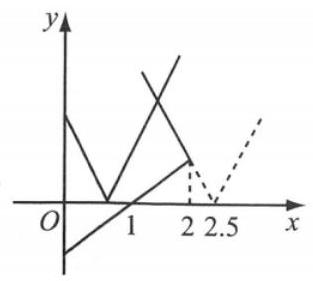

(例 9 图)

## 5. 特征分析法

由于选择题提供了唯一正确的选项，解答无需过程. 因此，有些题目不必进行精确的计算，只需抓住题目(特别是 4 个选择支)所提供的数值(或取值界限)、位置、结构等特征，进行大跨度、粗线条的推理(或估计)，从而可肯定 1 支或否定 3 支便能作出正确的判断，前者称为特征肯定, 后者称为特征否定. 特征分析法往往可以减少运算量, 提高解题速度, 但增大了思维量.

例 10 (2015 上海秋考) 已知点 $A$ 的坐标为 $\left( {4\sqrt{3},1}\right)$ ,将 ${OA}$ 绕坐标原点 $O$ 逆时针旋转 $\frac{\pi }{3}$ 至 ${OB}$ ,则点 $B$ 的纵坐标为 ( )

A. $\frac{3\sqrt{3}}{2}$ B. $\frac{5\sqrt{3}}{2}$ C. $\frac{11}{2}$ D. $\frac{13}{2}$

考点 任意角的三角比、两角和与差的余弦、正弦.

分析 本题可以用求解对照法通过两角和的正弦、余弦公式和任意角的三角比的定义直接求出,运算量较大. 如果根据射线 ${OA}\text{ 、 }{OB}$ 对应的角所在范围,可直接对点 $B$ 的纵坐标的取值作出大跨度、粗线条的判断.

解 设射线 ${OA}\text{ 、 }{OB}$ 在 $\lbrack 0,{2\pi })$ 内分别对应角 $\alpha \text{ 、 }\beta$ ,则 $\alpha  \in  \left( {0,\frac{\pi }{6}}\right)  \Rightarrow  \beta  \in  \left( {\frac{\pi }{3},\frac{\pi }{2}}\right)$ , 则点 $B$ 的纵坐标为 $7\sin \beta  > 7\sin \frac{\pi }{3} = \frac{7\sqrt{3}}{2} > \frac{11}{2}$ ,从而否定 $\mathrm{A}\text{ 、 }\mathrm{\;B}\text{ 、 }\mathrm{C}$ ,故选 D.

11 (2013 上海秋考) 记椭圆 $\frac{{x}^{2}}{4} + \frac{n{y}^{2}}{{4n} + 1} = 1$ 围成的区域 (含边界) 为 ${\Omega }_{n}\left( {n = 1,2,\cdots }\right)$ ,当点 $\left( {x, y}\right)$ 分别在 ${\Omega }_{1},{\Omega }_{2},\cdots$ 上时, $x + y$ 的最大值分别是 ${M}_{1},{M}_{2},\cdots$ ,则 $\mathop{\lim }\limits_{{n \rightarrow  \infty }}{M}_{n} =$

( )

A. 0 B. $\frac{1}{4}$ C. 2 D. $2\sqrt{2}$

考点 数列的极限、圆与椭圆的标准方程和几何性质.

分析 本题可利用椭圆的参数方程和三角函数求 $x + y$ 的最大值,再求 $\mathop{\lim }\limits_{{n \rightarrow  \infty }}{M}_{n}$ ,但这样就 “小题大做”了. 但如果用极限思想,分析椭圆 $\frac{{x}^{2}}{4} + \frac{n{y}^{2}}{{4n} + 1} = 1$ 的极限特征是圆 ${x}^{2} + {y}^{2} \; = 4$ ,就可以迅速求解. 近几年,上海高考多次出现类似极限思想的试题.

当 $n \rightarrow  \infty$ 时, $\frac{{x}^{2}}{4} + \frac{n{y}^{2}}{{4n} + 1} = 1 \Rightarrow  \frac{{x}^{2}}{4} + \frac{{y}^{2}}{4 + \frac{1}{n}} = 1$ ,椭圆的极限位置是 ${x}^{2} + {y}^{2} = 4$ .

圆上的点 $\left( {x, y}\right)$ 所对应的 $x + y$ 的最大值显然是 $2\sqrt{2}$ ,故选 D.

## 6. 逻辑分析法

逻辑分析法就是对各选择支之间的逻辑关系先作分析，弄清各选项之间是否存在等价关系、从属关系、矛盾关系、对立关系等，通过这些关系否定干扰支，肯定正确选项. 前者称为逻辑否定，后者称为逻辑肯定. 逻辑分析法是以上 5 种方法的辅助性方法，对某些选项间有逻辑关系的选择题, 往往可以起到事半功倍的效果.

例 12 (2019 全国卷 I ) 关于函数 $f\left( x\right)  = \sin \left| x\right|  + \left| {\sin x}\right|$ 有下述四个结论:

① $f\left( x\right)$ 是偶函数 ② $f\left( x\right)$ 在区间 $\left( {\frac{\pi }{2},\pi }\right)$ 单调递增

③ $f\left( x\right)$ 在 $\left\lbrack  {-\pi ,\pi }\right\rbrack$ 有 4 个零点 ④ $f\left( x\right)$ 的最大值为 2 其中所有正确结论的编号是 ( )

A. ①②④ B. ②④ C. ①④ D. ①③

考点 函数的基本性质、三角函数的图像与性质.

分析 类似本题判断命题真假的问题，如果我们对每个命题进行一一判断，这样会很费时费力. 针对本题选择支的特点，我们不需要对每个结论进行逐个判断，可先挑易于判断正误的结论②④进行分析，事半功倍.

解 先判断②:当 $x \in  \left( {\frac{\pi }{2},\pi }\right)$ 时， $f\left( x\right)  = 2\sin x$ 单调递减，故②错误，可淘汰选项 A、B. 再判断④: $\because \sin \left| x\right|  \leq  1,\left| {\sin x}\right|  \leq  1 \Rightarrow  \sin \left| x\right|  + \left| {\sin x}\right|  \leq  2$ ,且 $f\left( \frac{\pi }{2}\right)  = 2$ ,故④正确，可淘汰 D. 故选 C.

例 13 已知集合 $M = \left\{  {{\left. \alpha \right| }_{\alpha } = \left( {{2n} + 1}\right) \pi , n \in  \mathbf{Z}}\right\}  , N = \left\{  {{\left. \alpha \right| }_{\alpha } = \left( {{4n} \pm  1}\right) \pi , n \in  \mathbf{Z}}\right\}$ ,则 $M$ 与 $N$ 的关系是 ( )

A. $M \subsetneqq  N$ B. $N \subsetneqq  M$ C. $M = N$ D. $M \neq  N$

考点 集合间的包含关系.

分析 本题可以用求解对照法通过判断 $M$ 与 $N$ 之间的包含关系直接求出结果,但借助各选项之间的从属关系、对立关系，通过逻辑分析可以提高解题速度.

解法一 $\left\{  {{{2n} + 1} \mid  n \in  \mathbf{Z}}\right\}$ 是奇数集， $\{ {{4n} \pm  1} \mid  n \in  \mathbf{Z}\}$ 是由奇数组成的集合，有 $N \subseteq  M$ ，这就否定了 A. 但若 B 真,则 $\mathrm{D}$ 也真,所以 $\mathrm{B}$ 必假,由 $N \subseteq  M$ 且 $\mathrm{B}$ 假知 $\mathrm{C}$ 真,故选 $\mathrm{C}$ .

解法二 由 $\mathrm{C}\text{ 、 }\mathrm{D}$ 成对立关系知必一假一真,从而 $\mathrm{A}\text{ 、 }\mathrm{\;B}$ 均假,又 $N \subseteq  M$ 且 $\mathrm{B}$ 假知 $\mathrm{C}$ 真,故选 C.

解法三 若 $\mathrm{A}$ 真,则 $\mathrm{D}$ 也真,所以 $\mathrm{A}$ 必假; 若 $\mathrm{B}$ 真,则 $\mathrm{D}$ 也真,所以 $\mathrm{B}$ 必假,又 $N \subseteq  M$ 且 $\mathrm{B}$ 假知 C 真, 故选 C.

从考试的角度来看, 解选择题只要选对就行, 至于用什么策略和方法, 是以准确、快速为原则. 但平时做题时要尽量弄清每一个选择支正确的理由与错误的原因, 以利于深入理解数学问题, 避免机械化 “刷题”. 另外, 在解答一道选择题时, 往往需要同时采用几种方法进行分析、推理, 只有这样, 才能充分利用题目自身提供的信息巧解选择题, 避免小题大作.

总之, 我们既要知道解答题的解题思路原则上都可以迁移到选择题, 但更应该充分挖掘选择题的“结构特征”，寻求简便解法，充分利用各选项提供的信息，迅速地作出正确的选择. 只有这样, 才可以迅速、准确地获取正确答案.

## 第二章 热点追击

## 热点 1 最值与值域的出路

## 一、填空题(每题 4 分，共 48 分)

1. 函数 $y = {2x} + 4\sqrt{1 + x}$ 的值域为___.

2. 求 $f\left( x\right)  = \frac{2\sin x - 1}{\cos x + 2}$ 的值域___.

3. 记函数 $f\left( x\right)  = \sin \left( {{\omega x} + \varphi }\right) \left( {\omega  > 0,0 < \varphi  < \frac{\pi }{2}}\right)$ 的最小正周期为 $T$ ,若 $f\left( T\right)  = \frac{\sqrt{2}}{2}, x = \frac{3\pi }{4}$ 为 $f\left( x\right)$ 的零点,则 $T$ 的最大值为___.

4. 当 $x = 1$ 时，函数 $f\left( x\right)  = a\ln x + \frac{b}{x}$ 取得最大值 -2，则 ${f}^{\prime }\left( 2\right)  =$ ___.

5. 已知 $a > 0, b > 0$ ，且 ${ab} = 1$ ，则 $\frac{1}{2a} + \frac{1}{2b} + \frac{8}{a + b}$ ___.

6. 函数 $y = {\left( \frac{2}{3}\right) }^{\left| x\right| } - {\left( \sin x\right) }^{2} + \frac{1}{2}$ 的最大值是___.

7. 已知 $\overrightarrow{a}\text{ 、 }\overrightarrow{b}$ 两个互相垂直的单位向量，且 $\overrightarrow{a} \cdot  \overrightarrow{c} = \overrightarrow{b} \cdot  \overrightarrow{c} =  - \frac{1}{2}$ ，则对任意的实数 $t$ ， $\left| {\overrightarrow{c} + t\overrightarrow{a} + \frac{1}{t}\overrightarrow{b}}\right|$ 的最小值是___.

8. 已知点 $P\text{ 、 }Q$ 分别为函数 $f\left( x\right)  = {x}^{2} + 1\left( {x \geq  0}\right)$ 和 $g\left( x\right)  = \sqrt{x - 1}$ 图像上的点,则点 $P$ 和 $Q$ 两点距离的最小值为___.

9. 已知函数 $f\left( x\right)  = \left\{  \begin{array}{l} {\log }_{2}x, x > 0, \\  \left| {{2x} + 1}\right| , x \leq  0. \end{array}\right.$ 若对任意 $a \leq   - 1$ ，当 $- 1 < b \leq  m$ 时，总有 $a\left( {f\left( b\right)  - 1}\right) \; \geq  b$ 成立，则实数 $m$ 的最大值为___.

10. 已知函数 $f\left( x\right)  = \left| {\lg x}\right|$ ，若 $0 < a < b$ ，且 $f\left( a\right)  = f\left( b\right)$ ，则 $a + {2b}$ 的取值范围是___.

11. 设 $a \in  \mathbf{R}$ ，若 $x > 0$ 时均有 $\left\lbrack  {\left( {a - 1}\right) x - 1}\right\rbrack  \left( {{x}^{2} - {ax} - 1}\right)  \geq  0$ ，则 $a =$ ___.

12. 实数 $x\text{ 、 }y$ 满足 ${x}^{2} + {y}^{2} = 1$ ,若 $\left| {x + {2y} - a}\right|  + \left| {a + 6 - x - {2y}}\right|$ 的值与 $x\text{ 、 }y$ 无关,则实数 $a$ 的取值范围为___.

## 二、选择题(每题 4 分，共 16 分)

13. 已知 $a \in  \mathbf{R}$ . 设函数 $f\left( x\right)  = \left\{  \begin{array}{l} {x}^{2} - {2ax} + {2a}, x \leq  1, \\  x - a\ln x, x > 1. \end{array}\right.$ 若关于 $x$ 的不等式 $f\left( x\right)  \geq  0$ 在 $\mathbf{R}$ 上恒成立,则 $a$ 的取值范围为 ( )

A. $\left\lbrack  {0,1}\right\rbrack$ B. $\left\lbrack  {0,2}\right\rbrack$ C. $\left\lbrack  {0,\mathrm{e}}\right\rbrack$ D. $\left\lbrack  {1,\mathrm{e}}\right\rbrack$

## 第17页，共188页

14. 函数 $f\left( x\right)  = \cos x + \left( {x + 1}\right) \sin x + 1$ 在区间 $\left\lbrack  {0,{2\pi }}\right\rbrack$ 的最小值、最大值分别为( ) ( )

A. $- \frac{\pi }{2},\frac{\pi }{2}$ B. $- \frac{3\pi }{2},\frac{\pi }{2}$ C. $- \frac{\pi }{2},\frac{\pi }{2} + 2$ D. $- \frac{3\pi }{2},\frac{\pi }{2}$

15. 设函数 $y = f\left( x\right)$ 在 $\mathbf{R}$ 上有定义,对于给定的正数 $K$ ,定义函数 ${f}_{K}\left( x\right)  = \; \left\{  \begin{array}{l} f\left( x\right) , f\left( x\right)  \leq  K, \\  K, f\left( x\right)  > K. \end{array}\right.$ 取函数 $f\left( x\right)  = 2 + x - \sqrt{{x}^{2} + 1}$ ,若对任意的 $x \in  \mathbf{R}$ ,恒有 ${f}_{K}\left( x\right)  = \; f\left( x\right)$ ,则 $K$ 的 ( )

A. 最小值为 2 B. 最小值为 1 C. 最大值为 2 D. 最大值为 1

16. 已知定义在实数集 $\mathbf{R}$ 上的函数 $f\left( x\right)$ 满足 $f\left( {x + 1}\right)  = \frac{1}{2} + \sqrt{f\left( x\right)  - {f}^{2}\left( x\right) }$ ,则 $f\left( 0\right)  + \; f\left( {2023}\right)$ 的最大值为 ( )

A. $\frac{1}{2}$ B. $\frac{3}{2}$ C. $1 + \frac{\sqrt{2}}{2}$ D. $1 - \frac{\sqrt{2}}{2}$

## 三、解答题(每题 12 分，共 36 分)

17. 记 $f\left( x\right)  = \frac{{x}^{2}}{x - 2}, g\left( x\right)  = {x}^{2} - {2ax} + 5\left( {a > 1}\right)$ ,函数 $y = f\left( x\right) , y = g\left( x\right)$ .

(1)当 $a = 4$ 时求函数 $y = g\left( x\right)$ 的值域;

(2)若对于任意 ${t}_{1} \in  \left\lbrack  {0,1}\right\rbrack$ ，总存在 ${t}_{2} \in  \left\lbrack  {0,1}\right\rbrack$ ，使得 $g\left( {t}_{2}\right)  = f\left( {t}_{1}\right)$ 成立，求 $a$ 的取值范围.

18. 已知 $t \geq  3$ ,函数 $f\left( x\right)  = \min \{ 2\left| {x - 1}\right| ,{x}^{2} - {2tx} + {4t} - 2\}$ ,其中 $\min \{ a, b\}  = \left\{  \begin{array}{l} a, a < b, \\  b, b \leq  a. \end{array}\right.$

(1)求使得 $f\left( x\right)  = {x}^{2} - {2tx} + {4t} - 2$ 成立的 $x$ 的取值范围；

(2)求 $f\left( x\right)$ 的最小值 $m\left( t\right)$ .

19. 已知函数 $f\left( x\right)  =  - \frac{1}{3}{x}^{3} + \frac{1}{2}a{x}^{2} + 2{a}^{2}x + 3\left( {a \in  \mathbf{R}}\right) ,{f}^{\prime }\left( x\right)$ 为函数 $f\left( x\right)$ 的导函数.

(1)求 ${f}^{\prime }\left( x\right)$ ；

(2)对任意 $0 < a \leq  \frac{1}{2}$ 时，任意实数 ${x}_{1}$ 、 ${x}_{2} \in  \left\lbrack  {-1,2}\right\rbrack$ ，都有 $f\left( {x}_{1}\right)  + {f}^{\prime }\left( {x}_{2}\right)  - 3 \geq  M + {8a}$ 恒成立,求实数 $M$ 的最大值.

## 热点 2 存在与任意的纠结

## 一、填空题(每题 4 分，共 48 分)

1. 若对任意的 $x > 0$ ，不等式 $\frac{4{x}^{2} + 1}{x} \geq  m$ 恒成立，则实数 $m$ 的取值范围为___.

2. 设 $m \in  \mathbf{R}$ ，则动直线 ${mx} - y - m + 3 = 0$ 恒过的定点坐标为___.

3. 若函数 $f\left( x\right)  = {ax} + 1$ 在区间 $\left( {-1,1}\right)$ 上存在一个零点，则实数 $a$ 的取值范围是___.

4. 集合 $A = \left\{  {x \mid  3{x}^{2} + {ax} + 2 = 0}\right\}$ 至多一个元素，则实数 $a$ 的取值范围是___.

5. 已知函数 $f\left( x\right)$ 对任意 $x$ 、 $y \in  \mathbf{R}$ ，总有 $f\left( x\right)  + f\left( y\right)  = f\left( {x + y}\right)$ ，若 $f\left( 1\right)  =  - 1$ ，则 $f\left( 3\right) \; =$ ___.

6. 若函数 $f\left( x\right)  = {\log }_{2}\left( {x + \frac{1}{x}}\right)  - a$ 在区间 $\left\lbrack  {\frac{1}{2},2}\right\rbrack$ 内有零点，则实数 $a$ 的取值范围是___.

7. 当 $x \in  \left( {1,2}\right)$ 时，不等式 ${x}^{2} + {mx} + 4 < 0$ 恒成立，则实数 $m$ 的取值范围是___.

8. 关于 $x$ 的方程 $x + m = \sqrt{{x}^{2} - 4}$ 没有实数根，则实数 $m$ 的取值范围是___.

9. 已知函数 $f\left( x\right)  = \left\{  \begin{array}{l}  - {x}^{2} + {2x}, x \leq  0, \\  \ln x, x > 0. \end{array}\right.$ 若不等式 $\left| {f\left( x\right) }\right|  \geq  {ax} - 1$ 恒成立,则实数 $a$ 的取值范围是___.

10. 若函数 $f\left( x\right)  = \left( {{x}^{2} + {mx}}\right) {\mathrm{e}}^{x}$ 在 $\left\lbrack  {-\frac{1}{2},1}\right\rbrack$ 上存在严格递减区间,则 $m$ 的取值范围是___.

11. 已知幂函数 $f\left( x\right)  = \left( {{a}^{2} - 3}\right) {x}^{\frac{1}{2}{a}^{2} + a - 2}$ 是 $\left( {0, + \infty }\right)$ 上的严格减函数,函数 $h\left( x\right)  = {3}^{x} + m$ ,对任意 ${x}_{1} \in  \left\lbrack  {1,3}\right\rbrack$ ,总存在 ${x}_{2} \in  \left\lbrack  {1,2}\right\rbrack$ ,使得 $f\left( {x}_{1}\right)  = h\left( {x}_{2}\right)$ ,则 $m$ 的取值范围为___.

12. 已知 $f\left( x\right)  = m\left( {x - {2m}}\right) \left( {x + m + 3}\right) , g\left( x\right)  = {2}^{x} - 2$ ,若同时满足条件:①对于任意 $x \in  \mathbf{R}$ ， $f\left( x\right)  < 0$ 或 $g\left( x\right)  < 0$ 成立；②存在 $x \in  \left( {-\infty , - 4}\right)$ ，使得 $f\left( x\right)  \cdot  g\left( x\right)  < 0$ 成立. 则 $m$ 的取值范围是___.

## 二、选择题(每题 4 分，共 16 分)

13. 若函数 $f\left( x\right)  = {x}^{2} + x - a$ ,则使得 “函数 $y = f\left( x\right)$ 在区间 $\left( {-1,1}\right)$ 内有零点” 成立的一个必要非充分条件是 ( )

A. $- \frac{1}{4} \leq  a \leq  2$ B. $- \frac{1}{4} \leq  a < 2$ C. $0 < a < 2$ D. $- \frac{1}{4} < a < 0$

14. 不等式 $\ln x - {kx} \leq  0$ 恒成立，则实数 $k$ 的取值范围是 ( )

A. $\lbrack 0,\mathrm{e})$ B. $( - \infty ,\mathrm{e}\rbrack$ C. $\left\lbrack  {0,\frac{1}{\mathrm{e}}}\right\rbrack$ D. $\lbrack \frac{1}{\mathrm{e}}, + \infty )$

15. 已知 $f\left( x\right)  = x + \frac{4}{x}, g\left( x\right)  = {x}^{2} - {ax} + 1$ ,若对任意 ${x}_{1} \in  \left\lbrack  {1,3}\right\rbrack$ ,都存在 ${x}_{2} \in  \left\lbrack  {1,3}\right\rbrack$ ,使得 $f\left( {x}_{1}\right)  \geq  g\left( {x}_{2}\right)$ ,则实数 $a$ 的取值范围是 ( )

A. $\lbrack  - 2, + \infty )$ B. $\lbrack 2, + \infty )$ C. $( - \infty , - 2\rbrack$ D. $( - \infty ,2\rbrack$

16. 已知非空集合 $A\text{ 、 }B$ 满足: $A \cup  B = \mathbf{R}, A \cap  B = \varnothing$ ,函数 $f\left( x\right)  = \left\{  \begin{array}{l} {x}^{2}, x \in  A, \\  {2x} - 1, x \in  B. \end{array}\right.$ 对于下列两个命题:①存在唯一的非空集合对( $A$ 、 $B$ )，使得 $f\left( x\right)$ 为偶函数；②存在无穷多非空集合对 $\left( {A\text{ 、 }B}\right)$ ,使得方程 $f\left( x\right)  = 2$ 无解; 下面判断正确的是 ( )

A. ①正确，②错误 B. ①错误，②正确

C. ①②都正确 D. ①②都错误

## 三、解答题(每题 12 分，共 36 分)

17. 已知函数 $f\left( x\right)  = \left| {{2x} - a}\right|  + 2\left| {x + 1}\right|$ .

(1)当 $a = 2$ 时，求不等式 $f\left( x\right)  \leq  5$ 的解集；

(2)若存在 $x \in  \mathbf{R}$ ，使得 $f\left( x\right)  \leq  {2a} + 1$ 成立，求实数 $a$ 的取值范围.

18.(1)关于 $x$ 的不等式 $\frac{{4x} + m}{{x}^{2} - {2x} + 3} < 2$ 对任意实数 $x$ 恒成立，求实数 $m$ 的取值范围；

(2)若不等式 ${x}^{2} + {px} > {4x} + p - 3$ 对一切 $0 \leq  p \leq  4$ 均成立，试求实数 $x$ 的取值范围.

19. 已知函数 $f\left( x\right)  = x\left( {1 - a\ln x}\right) \left( {a \in  \mathbf{R}}\right)$ .

(1)讨论 $f\left( x\right)$ 的单调性；

(2)若 $x \in  \left( {0,\frac{1}{2}}\right\rbrack$ 时，都有 $f\left( x\right)  < 1$ ，求实数 $a$ 的取值范围.

## 热点 3 函数与方程的套路

## 一、填空题

1. 已知函数 $f\left( x\right)  = {x}^{2} - {2ax} - 3$ 在区间 $\left\lbrack  {1,2}\right\rbrack$ 上具有单调性，则实数 $a$ 的取值范围为___.

2. 下列命题为真命题的有___. (写出所有真命题的序号)

①函数的零点就是函数的图像与 $x$ 轴的交点；

②若函数 $y = f\left( x\right)$ 在区间 $\left( {a, b}\right)$ 上有零点 (函数的图像连续不断),则 $f\left( a\right)  \cdot  f\left( b\right)  < 0$ ;

③若 $f\left( x\right)$ 的图像在 $\left( {a, b}\right)$ 上连续不断,且 $f\left( a\right) f\left( b\right)  > 0$ ,则 $f\left( x\right)$ 在 $\left( {a, b}\right)$ 上没有零点;

④二次函数 $y = a{x}^{2} + {bx} + c\left( {a \neq  0}\right)$ 在 ${b}^{2} - {4ac} < 0$ 时没有零点.

3. 若函数 $f\left( x\right)  = {ax} + b$ 有一个零点 2，则函数 $g\left( x\right)  = b{x}^{2} - {ax}$ 的零点是___.

4. 已知函数 $f\left( x\right)$ 满足下列两个条件:① $f\left( {x + 1}\right)  = f\left( {x - 1}\right)$ ；② 当 $x \in  \left\lbrack  {-1,1}\right\rbrack$ 时， $f\left( x\right)  = \; {x}^{2}$ . 则方程 $f\left( x\right)  = \lg x$ 解的个数是___.

5. 若函数 $f\left( x\right)  = \left| {{2}^{x} - 2}\right|  - b$ 有两个零点，则实数 $b$ 的取值范围是___.

6. 已知方程 $\lg x = 3 - x$ 的根在区间 $\left( {2,3}\right)$ 上，第一次用二分法求其近似解时，其根所在的区间应为___.

7. 已知 $A\text{ 、 }B$ 为双曲线 $\Gamma$ 的左、右顶点,点 $M$ 在 $\Gamma$ 上, $\bigtriangleup {ABM}$ 为等腰三角形,且顶角为 ${120}^{ \circ  }$ , 则 $\Gamma$ 的离心率为___.

8. 已知 $f\left( x\right)  = \left\{  \begin{array}{l}  - {x}^{2} + 2, x \leq  1, \\  x + \frac{1}{x} - 1, x > 1. \end{array}\right.$ 若当 $x \in  \left\lbrack  {a, b}\right\rbrack$ 时, $1 \leq  f\left( x\right)  \leq  3$ ,则 $b - a$ 的最大值为___.

9. 某公司今年年初用 81 万元收购了一个项目,若该公司从第 1 年到第 $x\left( {x \in  \mathbf{N}, x > 1}\right)$ 年花在该项目的其他费用(不包括收购费用)为: $x\left( {x + {20}}\right)$ 万元，该项目每年运行的总收入为 50 万元. 公司提出了两种方案:方案①当盈利总额最大时，以 56 万元的价格卖出；方案②当年平均盈利最大时，以 56 万元的价格卖出. 为使公司利益最大化，则应该选择方案___.

10. 已知函数 $f\left( x\right)$ 的定义域为 $\mathbf{R}, f\left( {-1}\right)  = 2$ ,对任意 $x \in  \mathbf{R},{f}^{\prime }\left( x\right)  > 2$ ,则 $f\left( x\right)  > {2x} + 4$ 的解集为___.

11. 设直线 $l$ 与抛物线 ${y}^{2} = {4x}$ 相交于 $A\text{ 、 }B$ 两点,与圆 ${\left( x - 5\right) }^{2} + {y}^{2} = {r}^{2}\left( {r > 0}\right)$ 相切于点 $M$ , 且 $M$ 为线段 ${AB}$ 的中点. 若这样的直线 $l$ 恰有 4 条,则 $r$ 的取值范围是___.

12. 设 $a \in  \mathbf{R}$ ,函数 $f\left( x\right)  = \left\{  \begin{array}{l} \left| {x - 2}\right| , x \geq  0, \\   - {x}^{2} + {ax}, x < 0. \end{array}\right.$ 若函数 $y = f\left\lbrack  {f\left( x\right) }\right\rbrack$ 恰有 4 个零点,则实数 $a$ 的值为___.

## 二、选择题

13. 函数 $f\left( x\right)  = \ln x - \frac{2}{x}$ 的零点所在的大致范围是 ( )

A. $\left( {1,2}\right)$ B. $\left( {2,3}\right)$

C. $\left( {\frac{1}{\mathrm{e}},1}\right)$ 和 $\left( {3,4}\right)$ D. $\left( {4, + \infty }\right)$

14. 函数 $f\left( x\right)  = 2\sin x - \sin {2x}$ 在 $\left\lbrack  {0,{2\pi }}\right\rbrack$ 上的零点个数为 ( )

A. 2 B. 3 C. 4 D. 5

15. 若实数 $a\text{ 、 }b$ 满足 ${2}^{a} + {\log }_{2}a = {4}^{b} + 2{\log }_{4}b$ ,则 ( )

A. $a > {2b}$ B. $a < {2b}$ C. $a > {b}^{2}$ D. $a < {b}^{2}$

16. 已知函数 $f\left( x\right)  = x + \cos \left( {\frac{\pi }{2} + {2x}}\right)$ ，下列对于函数 $f\left( x\right)$ 性质的描述中，错误的是( )

A. $x = \frac{\pi }{6}$ 是 $f\left( x\right)$ 的极小值点

B. $f\left( x\right)$ 的图像关于点 $\left( {\frac{\pi }{2},\frac{\pi }{2}}\right)$ 对称

C. $f\left( x\right)$ 有且仅有三个零点

D. 若 $f\left( x\right)$ 区间 $\left( {a, b}\right)$ 上严格增,则 $b - a$ 的最大值为 $\pi$

## 三、解答题

17. 已知函数 $f\left( x\right)  = \sqrt{x} - \frac{a}{4}\ln \frac{x}{a}, a > 0$ .

(1)求函数 $f\left( x\right)$ 的单调区间；

(2)求证: $f\left( x\right)  \geq  \frac{a}{4}\left( {4 - \sqrt{a}}\right)$ .

18. 某地要在如图所示的一块不规则用地上规划建成一个矩形商业楼区, 余下的区域作为休闲区,已知 ${AB} \bot  {BC},{OA}//{BC}$ ,且 $\left| {AB}\right|  = \left| {BC}\right|  = 2\left| {OA}\right|  = 4$ ,曲线 ${OC}$ 是以 $O$ 为顶点且开口向上的抛物线的一段,如果矩形的两边分别落在 ${AB}\text{ 、 }{BC}$ 上,且一个顶点在曲线 ${OC}$ 上, 应当如何规划才能使矩形商业楼区的用地面积最大? 并求出最大的用地面积.

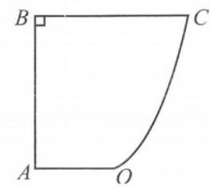

(第 18 题图)

19. 设函数 $f\left( x\right)  = a{x}^{3} - {3ax}, g\left( x\right)  = b{x}^{2} - \ln x\left( {a\text{ 、 }b \in  \mathbf{R}}\right)$ ,已知它们的图像在 $x = 1$ 处的切线互相平行.

(1)求 $b$ 的值；

(2)若函数 $F\left( x\right)  = \left\{  \begin{array}{l} f\left( x\right) , x \leq  0, \\  g\left( x\right) , x > 0, \end{array}\right.$ 且方程 $F\left( x\right)  = {a}^{2}$ 有且仅有四个解,求实数 $a$ 的取值范围.

## 热点 4 特殊与一般的界限

## 一、填空题(每题 4 分，共 48 分)

1. 如果说平面几何中的圆在立体几何中可以类比为球的话,那么平面几何中的三角形在立体几何中可以类比为___.

2. 由 “正三角形的内切圆切于三边的中点” 可类比到 “正四面体的内切球切于___.”

3. $\left\{  {a}_{n}\right\}$ 是等差数列,若正整数 $m\text{ 、 }n\text{ 、 }p\text{ 、 }q$ 满足 $m + n = p + q$ ,则 ${a}_{m} + {a}_{n} = {a}_{p} + {a}_{q}$ ; 类比以上结论有: $\left\{  {b}_{n}\right\}$ 是等比数列,若正整数 $m\text{ 、 }n\text{ 、 }p\text{ 、 }q$ 满足 $m + n = p + q$ ,则___.

4. 一个与正整数 $n$ 有关的数学命题,如果当 $n = k\left( {k \in  \mathbf{N}, k \geq  1}\right)$ 时该命题成立,则可推得当 $n \; = k + 1$ 时该命题成立，那么为了推得 $n = 5$ 时该命题不成立，只需已知 $n =$ ___时该命题不成立.

5. 已知在等差数列 $\left\{  {a}_{n}\right\}$ 中,若 ${a}_{10} = 0$ ,则 ${a}_{1} + {a}_{2} + {a}_{3} + \cdots  + {a}_{n} = {a}_{1} + {a}_{2} + \cdots  + {a}_{{19} - n}$ 对于一切小于 19 的正整数 $n$ 都成立; 类比上述性质,在等比数列 $\left\{  {b}_{n}\right\}$ 中,若 ${b}_{9} = 1$ ,则___.

6. 观察下列等式: ${1}^{2} = 1;{1}^{2} - {2}^{2} =  - 3;{1}^{2} - {2}^{2} + {3}^{2} = 6;{1}^{2} - {2}^{2} + {3}^{2} - {4}^{2} =  - {10};\cdots$ ; 照此规律，第 $n$ 个等式为___.

7. 二维空间中圆的一维测度 (周长) $l = {2\pi r}$ ，二维测度 (面积) $S = \pi {r}^{2}$ ，三维空间中球的二维测度 (表面积) $S = {4\pi }{r}^{2}$ ，三维测度 (体积) $V = \frac{4}{3}\pi {r}^{3}$ ，若四维空间中“超球”的三维测度 $V = \; {8\pi }{r}^{3}$ ，猜想其四维测度 $W =$ ___.

8. 我们知道,边长为 $a$ 的正三角形内的任一点到三边的距离之和为定值 $\frac{\sqrt{3}}{2}a$ ,类比上述结论, 在边长为 $a$ 的正四面体内任一点到其四个面的距离为定值___.

9. 给出右图中的数对序列:

(1,1)

$\left( {1,2}\right) ,\left( {2,1}\right)$

$\left( {1,3}\right) ,\left( {2,2}\right) ,\left( {3,1}\right)$

$\left( {1,4}\right) ,\left( {2,3}\right) ,\left( {3,2}\right) ,\left( {4,1}\right)$

... ... ... ... ... ... ...

(第 9 题图)

记第 $m$ 行第 $n$ 个数对为 ${a}_{mn}$ ,

如 ${a}_{42} = \left( {2,3}\right)$ ,若 ${a}_{ij} = \left( {{32},{21}}\right)$ ,

则 $i + j =$ ___.

10. 任取一个正整数, 若是奇数, 就将该数乘 3 再加上 1; 若是偶数, 就将该数除以 2 . 反复进行上述两种运算,经过有限次步骤后,必进入循环圈 $1 \rightarrow  4 \rightarrow  2 \rightarrow  1$ . 这就是数学史上著名的“冰雹猜想” (又称“角谷猜想”等). 如取正整数 $m = 6$ ,根据上述运算法则得出 $6 \rightarrow  3 \rightarrow  {10} \rightarrow  5 \rightarrow  {16} \rightarrow  8 \rightarrow \; 4 \rightarrow  2 \rightarrow  1$ ，共需经过 8 个步骤变成 1 (简称为 “ 8 步雹程")。已知冰雹猜想有递推公式: ${a}_{n + 1} \; = \left\{  {\begin{array}{l} \frac{{a}_{n}}{2},\text{ 当 }{a}_{n}\text{ 为偶数, } \\  3{a}_{n} + 1,\text{ 当 }{a}_{n}\text{ 为奇数. } \end{array}\text{ 若数列 }\left\{  {a}_{n}\right\}  \text{ 满足: }{a}_{1} = m\left( {m\text{ 为正整数 }}\right) ,}\right.$ “冰雹猜想”中 ${a}_{5} = 4$ , 则 ${a}_{1}$ 所有可能的取值的集合 $M =$ ___.

11. 已知 $n$ 次多项式 ${P}_{n}\left( x\right)  = {a}_{0}{x}^{n} + {a}_{1}{x}^{n - 1} + \cdots  + {a}_{n - 1}x + {a}_{n}$ ,如果在一种算法中,计算 ${x}_{0}{}^{k}(k \; = 2,3,4\cdots , n)$ 的值需要 $k - 1$ 次乘法,计算 ${P}_{3}\left( {x}_{0}\right)$ 的值需要 9 次运算 (6 次乘法,3 次加法),下面给出一种新的算法以减少运算次数: ${P}_{0}\left( x\right)  = {a}_{0},{P}_{k + 1}\left( x\right)  = x{P}_{k}\left( x\right)  + {a}_{k + 1}$ ,其中 $k = 0,1,2,\cdots , n - 1$ ,利用该算法,计算 ${P}_{3}\left( {x}_{0}\right)$ 的值需要 6 次计算 (3 次乘法,3 次加法),在计算 ${P}_{n}\left( {x}_{0}\right)$ 的值时,新算法比原来的算法少了 次运算

12. 对正整数的三次幂进行以下方式的分拆: ${1}^{3} \rightarrow  \left\{  {1;{2}^{3} \rightarrow  \left\{  {\begin{array}{l} 3 \\  5 \end{array};{3}^{3} \rightarrow  \left\{  {\begin{array}{l} 7 \\  9 \end{array};{4}^{3} \rightarrow  \left\{  \begin{array}{l} {13} \\  {15} \\  {17} \end{array}\right. ;\cdots \text{ ,以此类 }}\right. }\right. }\right.$ 推；若 ${m}^{3}$ 的分拆中含有奇数2015,则 $m =$

## 二、选择题(每题 4 分，共 16 分)

13. 对于 $\mathbf{R}$ 上可导的函数 $f\left( x\right)$ ,若满足 $\left( {x - 1}\right) {f}^{\prime }\left( x\right)  \geq  0$ ,则必有 (   )

A. $f\left( 0\right)  + f\left( 2\right)  < {2f}(1$ B. $f\left( 0\right)  + f\left( 2\right)  \leq  {2f}\left( 1\right)$

C. $f\left( 0\right)  + f\left( 2\right)  > {2f}\left( 1\right)$ D. $f\left( 0\right)  + f\left( 2\right)  \geq  {2f}\left( 1\right)$

14. 若定义在 $\mathbf{R}$ 上的函数 $f\left( x\right)$ 满足: 对任意的 ${x}_{1}\text{ 、 }{x}_{2} \in  \mathbf{R}$ ,有 $f\left( {{x}_{1} + {x}_{2}}\right)  = f\left( {x}_{1}\right)  + f\left( {x}_{2}\right)  + a$ ( $a$ 为非零常数),则下列说法中一定正确的是 ( )

A. $f\left( x\right)$ 为偶函数 B. $f\left( x\right)$ 为奇函数

C. $f\left( x\right)  + a$ 为偶函数 D. $f\left( x\right)  + a$ 为奇函数

15. 已知 $\left\{  {a}_{n}\right\}  \text{ 、 }\left\{  {b}_{n}\right\}$ 都是公差为 1 的等差数列,首项分别为 ${a}_{1}\text{ 、 }{b}_{1}$ ,且满足 ${a}_{1} + {b}_{1} = 5,{a}_{1}\text{ 、 }{b}_{1}$ 都是正整数,设 ${c}_{n} = {a}_{{b}_{n}}$ ,则数列 $\left\{  {c}_{n}\right\}$ 的前 10 项和为 ( )

A. 55 B. 70 C. 85 D. 100

16. 定义在 $\mathbf{R}$ 上的函数 $f\left( x\right)$ 满足 $f\left( {x + y}\right)  = f\left( x\right)  + f\left( y\right)  + {2xy}\left( {x\text{ 、 }y \in  \mathbf{R}}\right) , f\left( 1\right)  = 1$ ,则 $f\left( {-3}\right)$ 的值为 ( )

A. 2 B. 3 C. 6 D. 9

## 三、解答题(每题 12 分，共 36 分)

17. 定义在有理数集 $\mathbf{Q}$ 上的函数 $f\left( x\right)$ 满足: 对任意的 $x\text{ 、 }y \in  \mathbf{Q}, f\left( {x + y}\right)  = f\left( x\right)  + f\left( y\right) \left( {n\text{ 为 }}\right)$ 整数).

(1)求 $f\left( 0\right)$ ，并证明对任意的有理数 $x$ ，有 $f\left( {nx}\right)  = {nf}\left( x\right)$ ， $n$ 为整数；

(2)求函数 $f\left( x\right)$ 的解析式 (用 $f\left( 1\right)$ 表示).

18. 阅读材料:对等式 $\cos {2x} = 2{\cos }^{2}x - 1$ 的两边求导得:( ${\left( \cos {2x}\right) }^{\prime } = {\left( 2{\cos }^{2}x - 1\right) }^{\prime }$ , 由求导法则: $\left( {-\sin {2x}}\right)  \cdot  2 = 4\cos x \cdot  \left( {-\sin x}\right)$ ,化简得 $\sin {2x} = 2\sin x \cdot  \cos x$ .

(1)根据上述材料的想法，证明: $n{\left( 1 + x\right) }^{n - 1} = \mathop{\sum }\limits_{{k = 1}}^{n}k{\mathrm{C}}_{n}^{k}{x}^{k - 1}$ ；

(2)对于正整数 $n \geq  3$ ,求证: $\mathop{\sum }\limits_{{k = 1}}^{n}{\left( -1\right) }^{k}{k}^{2}{\mathrm{C}}_{n}^{k} = 0$ .

19. ( 1 )如果函数 $y = x + \frac{{2}^{b}}{x}\left( {x > 0}\right)$ 的值域为 $\lbrack 6, + \infty )$ ，求 $b$ 的值；

( 2 )对关于 $x$ 的函数 $y = x + \frac{a}{x}\left( {a > 0, x > 0}\right)$ 和 $y = {x}^{2} + \frac{a}{{x}^{2}}\left( {a > 0, x > 0}\right)$ 的单调性作出推广 (推广部分无需证明),并据此求函数 $F\left( x\right)  = {\left( {x}^{2} + \frac{1}{x}\right) }^{n} + {\left( \frac{1}{{x}^{2}} + x\right) }^{n}$ ( $n$ 是正整数) 在区间 $\left\lbrack  {\frac{1}{2},2}\right\rbrack$ 上的最小值和最大值.

## 热点 5 分门别类的诀窍

## 一、填空题(每题 4 分，共 48 分)

1. 已知集合 $A = \{ 1,3,\sqrt{m}\} , B = \{ 1, m\}$ ，若 $A \cup  B = A$ ，则实数 $m =$ ___.

2. 若指数函数 $y = {a}^{x}$ 在 $\left\lbrack  {-1,1}\right\rbrack$ 上的最大值与最小值的差为 1，则实数 $a =$ ___.

3. 已知函数 $f\left( x\right)  = \left\{  \begin{array}{l} {2}^{-x} - 1, x \leq  0, \\  {x}^{\frac{1}{2}}, x > 0, \end{array}\right.$ 则满足 $f\left( x\right)  > 1$ 的 $x$ 的取值范围是___.

4. 设首项为 1,公比为 $q\left( {q > 0}\right)$ 的等比数列前 $n$ 项和为 ${S}_{n}$ ,则 $\mathop{\lim }\limits_{{n \rightarrow  \infty }}\frac{{S}_{n}}{{S}_{n + 1}} =$ ___.

5. 过双曲线 $2{x}^{2} - {y}^{2} = 2$ 的右焦点作直线 $l$ 交双曲线于 $A\text{ 、 }B$ 两点,若 $\left| {AB}\right|  = 4$ ,则这样的直线有___条。

6. 函数 $f\left( x\right)  = \left| {{2x} - 1}\right|  - 2\ln x$ 的最小值为___.

7. 设函数 $f\left( x\right)  = x - \frac{1}{x}$ ,对任意 $x \in  \lbrack 1, + \infty ), f\left( {mx}\right)  + {mf}\left( x\right)  < 0$ 恒成立,则实数 $m$ 的取值范围是___.

8. 设 ${F}_{1}\text{ 、 }{F}_{2}$ 为椭圆 $\frac{{x}^{2}}{4} + \frac{{y}^{2}}{9} = 1$ 的两个焦点, $P$ 为椭圆上一点. 已知 $P\text{ 、 }{F}_{1}\text{ 、 }{F}_{2}$ 是一个直角三角形的三个顶点，且 $P{F}_{1} > P{F}_{2}$ ，则 $\frac{P{F}_{1}}{P{F}_{2}}$ 的值为___.

9. 在平面直角坐标系 ${xOy}$ 中,已知点 $A\left( {0,3}\right) \text{ 、 }B\left( {2,3}\right)$ 及圆 $C : {\left( x - a\right) }^{2} + {\left( y + 1\right) }^{2} = {15} + \frac{{a}^{2}}{2}$ , 若线段 ${AB}$ (包括端点 $A$ 、 $B$ ) 在圆 $C$ 的外部，则实数 $a$ 的取值范围是___.

10. 如图所示,一个地区有 5 个行政区域,现给地图着色,要求相邻地区不得使用同一颜色，若有 4 种颜色可供选用，则不同的着色方法共有___种.

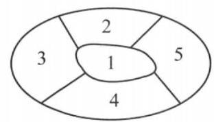

(第 10 题图)

11. 函数 $f\left( x\right)  = \sqrt{3}\sin {2x} + 2{\cos }^{2}x + m$ 在区间 $\left\lbrack  {0,\frac{\pi }{2}}\right\rbrack$ 上的最大值为 3, 则当 $f\left( x\right)$ 在区间 $\left\lbrack  {a, b}\right\rbrack$ 上至少含有 20 个零点时， $b - a$ 的最小值为___.

12. 设函数 $f\left( x\right)  = \left\{  \begin{array}{l} a + {2}^{-x}, x \leq  0, \\  f\left( {x - 1}\right) , x > 0. \end{array}\right.$ 记 $g\left( x\right)  = f\left( x\right)  - x$ ,若函数 $g\left( x\right)$ 有且仅有两个零点,则实数 $a$ 的取值范围是___.

## 二、选择题(每题 4 分，共 16 分)

13. 满足 $a\text{ 、 }b \in  \{  - 1,0,1,2\}$ ,且关于 $x$ 的方程 $a{x}^{2} + {2x} + b = 0$ 有实数解的有序数对 $\left( {a, b}\right)$ 的个数为 ( )

A. 14 B. 13 C. 12 D. 10

14. 已知圆锥曲线 $C$ 的方程是 $m{x}^{2} + {y}^{2} = 1\left( {m \neq  0}\right)$ ,有下列数据: ① $\frac{\sqrt{m - 1}}{m}$ ; ② $\sqrt{1 - m}$ ； ③ $\frac{\sqrt{m\left( {m - 1}\right) }}{\left| m\right| }$ ；④ $\frac{\sqrt{m\left( {m + 1}\right) }}{\left| m\right| }$ . 其中圆锥曲线 $C$ 的离心率的可能取值有 ( )

A. ①② B. ②③ C. ①④ D. ②④

15. 从正方体八个顶点的两两连线中任取两条直线 $a$ 、 $b$ ，且 $a$ 、 $b$ 是异面直线，则 $a$ 、 $b$ 所成角的余弦值的所有可能取值构成的集合是 ( )

A. $\left\{  {0,\frac{1}{2},\frac{\sqrt{3}}{3},\frac{\sqrt{2}}{2},1}\right\}$ B. $\left\{  {0,\frac{1}{2},\frac{\sqrt{3}}{3},\frac{\sqrt{2}}{2},\frac{\sqrt{6}}{3}}\right\}$ C. $\left\{  {0,\frac{1}{2},\frac{\sqrt{2}}{2},\frac{\sqrt{6}}{3}}\right\}$ D. $\left\{  {0,\frac{1}{2},\frac{\sqrt{3}}{3},\frac{\sqrt{2}}{2}}\right\}$

16. 已知集合 $X = \{ 1,2,3,\cdots , n\} \left( {n \in  \mathbf{N}, n \geq  4}\right)$ . 设 $S = \{ \left( {x, y, z}\right)  \mid  x\text{ 、 }y\text{ 、 }z \in  X$ ,且 $x < y < z, y < \; z < x, z < x < y$ 恰有一个成立 $\}$ ，若 $\left( {x, y, z}\right)  \in  S$ ，且 $\left( {z, w, x}\right)  \in  S$ ，则下列选项中正确的是 ( )

A. $\left( {y, z, w}\right)  \in  S,\left( {x, y, w}\right)  \notin  S$ B. $\left( {y, z, w}\right)  \in  S,\left( {x, y, w}\right)  \in  S$

C. $\left( {y, z, w}\right)  \notin  S,\left( {x, y, w}\right)  \in  S$ D. $\left( {y, z, w}\right)  \notin  S,\left( {x, y, w}\right)  \notin  S$

## 三、解答题(每题 12 分，共 36 分)

17. 设函数 $f\left( x\right)  = m{x}^{2} - {mx} - 1$ .

(1)若对一切实数 $x$ ， $f\left( x\right)  < 0$ 恒成立，求实数 $m$ 的取值范围；

(2)对于 $x \in  \left\lbrack  {1,3}\right\rbrack  , f\left( x\right)  <  - m + 5$ 恒成立，求实数 $m$ 的取值范围.

18. 已知函数 $f\left( x\right)  = {x}^{3} - {2ax}\left( {a \neq  0}\right)$ .

(1)讨论 $f\left( x\right)$ 的单调性;

(2)若曲线 $y = f\left( x\right)$ 的一条切线 $l$ 的斜率为 $3 - {2a}$ ，求 $l$ 与曲线 $y = f\left( x\right)$ 的公共点的坐标.

19. 已知数列 $\left\{  {a}_{n}\right\}$ 满足 ${a}_{1} = 1,{a}_{2} = 3$ ,正项数列 $\left\{  {b}_{n}\right\}$ 满足 $\frac{{b}_{n}}{{a}_{n}} = {a}_{n + 1}\left( {n \in  \mathbf{N}, n \geq  1}\right)$ ,且 $\left\{  {b}_{n}\right\}$ 是公比为 3 的等比数列.

(1)求 ${a}_{3}$ 、 ${a}_{4}$ 、 ${a}_{5}$ 、 ${a}_{6}$ 及 $\left\{  {a}_{n}\right\}$ 的通项公式；

(2)设 ${S}_{n}$ 为 $\left\{  {a}_{n}\right\}$ 的前 $n$ 项和，若 ${S}_{n} > {2019}$ 恒成立，求正整数 $n$ 的最小值 ${n}_{0}$ .

## 热点 6 阅读理解的突破

## 一、填空题

1. 集合 $A\text{ 、 }B$ 是实数集 $\mathbf{R}$ 的子集,定义 $A - B = \{ x \mid  x \in  A$ 且 $x \notin  B\} , A * B = \left( {A - B}\right)  \cup  (B - \; A)$ 叫做集合的对称差,若集合 $A = \left\{  {x \mid  y = \sqrt{-{x}^{2} - {2x} + 8}}\right\}  , B = \left\{  {y \mid  y = {\left( x + 1\right) }^{2} - 1}\right. , x \in \; \left\lbrack  {-2,1}\right\rbrack  \}$ ,则 $A * B =$ ___.

2. 我们把百位和个位上的数字相同的三位数叫做“三位对称数”, 则由数字 1、2、3、4、5 组成的三位数(数字可重复)的个数是___.

3. 宽与长的比为 $\frac{\sqrt{5} - 1}{2} \approx  {0.618}$ 的矩形叫做黄金矩形. 它广泛地出现在艺术、建筑和自然界中，令人赏心悦目. 在黄金矩形 ${ABCD}$ 中， $\left| \overrightarrow{BC}\right|  = \sqrt{5} - 1,\left| \overrightarrow{AB}\right|  > \left| \overrightarrow{BC}\right|$ ，那么 $\overrightarrow{AB} \cdot  \overrightarrow{AC}$ 的值为___.

4. ”阿基米德多面体” 也称为半正多面体, 是由边数不全相同的正多边形为面围成的多面体，它体现了数学的对称美. 如图，将一个棱长为 2 正方体沿交于一顶点的三条棱的中点截去一个三棱锥, 共可截去八个三棱锥, 得到八个面为正三角形、六个面为正方形的“阿基米德多面体”, 则该多面体的表面积为___.

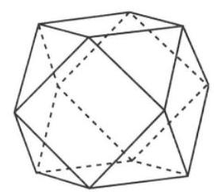

(第 4 题图)

5. 有一个非常有趣的数列 $\left\{  \frac{1}{n}\right\}$ 叫做调和数列,此数列的前 $n$ 项和已经被研究了几百年,但是迄今为止仍然没有得到它的求和公式. 某数学探究小组为了探究调和数列的性质,仿照“杨辉三角”,将 $1,\frac{1}{2},\frac{1}{3}$ , $\frac{1}{4},\cdots ,\frac{1}{n},\cdots$ ,作为第一行,相邻两个数相减得到第二行，依次类推，得到如图所示的三角形数表，则第 2 行的前 100 项和为___.

---

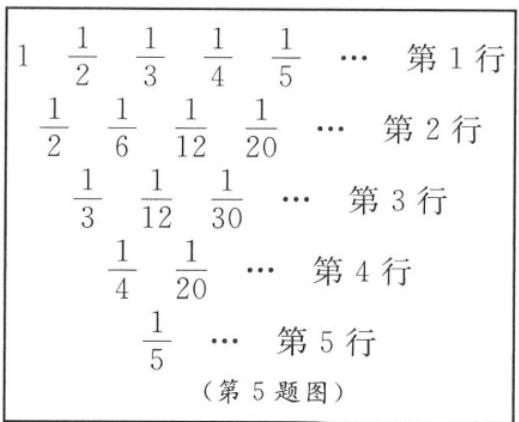

---

6. 如图,设 ${Ox}\text{ 、 }{Oy}$ 是平面内相交成 $\theta \left( {\theta  \neq  \frac{\pi }{2}}\right)$ 角的两条数轴, ${\overrightarrow{e}}_{1}\text{ 、 }{\overrightarrow{e}}_{2}$ 分别是与 $x\text{ 、 }y$ 轴正方向上的单位向量，则称平面坐标系 ${xOy}$ 为仿射坐标系，若 $\overrightarrow{OM} = x\overrightarrow{{e}_{1}} + \; y\overrightarrow{{e}_{2}}$ ,则把有序数对 $\left( {x, y}\right)$ 叫做向量 $\overrightarrow{OM}$ 的仿射坐标,记为 $\overrightarrow{OM} = (x$ , $y)$ . 在 $\theta  = \frac{2}{3}\pi$ 的仿射坐标系中, $\overrightarrow{a} = \left( {1,2}\right) ,\overrightarrow{b} = \left( {2, - 1}\right)$ ,则 $\overrightarrow{a}$ 在 $\overrightarrow{b}$ 上的向量投影是___.

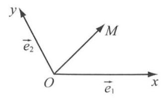

(第 6 题图)

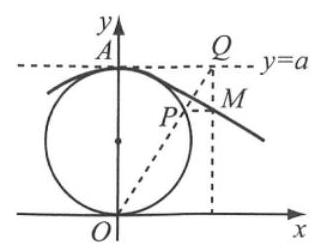

(第 7 题图)

7. 如图所示,过原点的动直线交定圆 ${x}^{2} + {y}^{2} - {ay} = 0$ 于点 $P$ ,交直线 $y = a$ 于点 $Q$ ,过 $P$ 和 $Q$ 分别作 $x$ 轴和 $y$ 轴的平行线交于点 $M$ ,点 $M$ 的轨迹叫做箕舌线. 当 $a = 2$ 时,箕舌线的方程是___.

8. 拿破仑定理是指: “以任意三角形的三条边为边，向外构造三个正三角形，则这三个正三角形的外接圆圆心恰为另一个正三角形 (此正三角形称为拿破仑三角形) 的顶点”. 在 $\bigtriangleup {ABC}$ 中,已知 $\angle {ACB} = \; {30}^{ \circ  }$ ,且 ${AB} = \sqrt{3} - 1$ ,现以 ${BC}\text{ 、 }{AC}\text{ 、 }{AB}$ 为边向外作三个正三角形,其外接圆圆心依次记为 ${A}^{\prime }\text{ 、 }{B}^{\prime }\text{ 、 }{C}^{\prime }$ ，则 $\bigtriangleup  {A}^{\prime }{B}^{\prime }{C}^{\prime }$ 的面积最大值为___.

9. 可以证明: 若 $\bigtriangleup {ABC}$ 三个内角均小于 ${120}^{ \circ  }$ ,当点 $P$ 满足 $\angle {APB} = \angle {APC} = \angle {BPC} = {120}^{ \circ  }$ 时,则点 $P$ 到三角形三个顶点的距离之和最小,点 $P$ 被称为费马点. 根据以上性质,已知 $\overrightarrow{a}$ 为平面内任意一个向量, $\overrightarrow{b}$ 和 $\overrightarrow{c}$ 是平面内两个互相垂直的向量, $\left| \overrightarrow{c}\right|  = 2,\left| \overrightarrow{b}\right|  = 1$ ,则 $\left| {\overrightarrow{a} - \overrightarrow{b}}\right| \; + \left| {\overrightarrow{a} + \overrightarrow{b}}\right|  + \left| {\overrightarrow{a} - \overrightarrow{c}}\right|$ 的最小值是___.

10. 画法几何的创始人 ─--法国数学家加斯帕尔·蒙日发现:与椭圆相切的两条垂直切线的交点的轨迹是以椭圆中心为圆心的圆. 我们通常把这个圆称为该椭圆的蒙日圆. 已知椭圆 $C : \frac{{x}^{2}}{{a}^{2}} + \frac{{y}^{2}}{{b}^{2}} = 1\left( {a > b > 0}\right)$ 的蒙日圆方程为 ${x}^{2} + {y}^{2} = {a}^{2} + {b}^{2}$ ,其离心率为 $\frac{\sqrt{5}}{5}, M$ 为蒙日圆上一个动点,过点 $M$ 作椭圆 $C$ 的两条切线,与蒙日圆分别交于 $P\text{ 、 }Q$ 两点,若 $\bigtriangleup {MPQ}$ 面积的最大值为 36，则椭圆 $C$ 的长轴长为___.

11. 定义:满足方程 ${f}^{\prime }\left( x\right)  + f\left( x\right)  = 1$ 的实数解 ${x}_{0}$ 叫做函数 $f\left( x\right)$ 的“自足点”,有下列函数: ① $f\left( x\right)  = {x}^{2} + 3$ ; ② $f\left( x\right)  = x + \frac{1}{x}$ ; ③ $f\left( x\right)  = \ln x$ ；④ $f\left( x\right)  = {\mathrm{e}}^{x} - \sin x + 3$ . 其中存在 “自足点”的是___.

12. 设函数 $y = f\left( x\right)$ 图像上不同两点 $A\left( {{x}_{1},{y}_{1}}\right) \text{ 、 }B\left( {{x}_{2},{y}_{2}}\right)$ 处的切线的斜率分别是 ${k}_{A}\text{ 、 }{k}_{B}$ ,定义 $\varphi \left( {A, B}\right)  = \frac{\left| {k}_{A} - {k}_{B}\right| }{\left| AB\right| }$ ( $\left| {AB}\right|$ 为线段 ${AB}$ 的长度) 称为曲线 $y = f\left( x\right)$ 在点 $A$ 与点 $B$ 之间的“弯曲度”，给出以下命题，其中所有真命题的序号为___.

①函数 $y = {x}^{3}$ 图像上两点 $A$ 与 $B$ 的横坐标分别为 1 和 -1,则 $\varphi \left( {A, B}\right)  = 0$ ；

②存在这样的函数，其图像上任意不同两点之间的“弯曲度”为常数；

③ $A\text{ 、 }B$ 是抛物线 $y = {x}^{2}$ 上任意不同的两点,都有 $\varphi \left( {A, B}\right)  \leq  2$ ；

④曲线 $y = {\mathrm{e}}^{x}$ ( $\mathrm{e}$ 是自然对数的底数) 上存在不同的两点 $A\text{ 、 }B$ ,使 $\varphi \left( {A, B}\right)  > 1$ .

## 二、选择题

13. 函数 $\cosh x = \frac{{\mathrm{e}}^{x} + {\mathrm{e}}^{-x}}{2}$ 称为双曲余弦函数,函数 $\sinh x = \frac{{\mathrm{e}}^{x} - {\mathrm{e}}^{-x}}{2}$ 称为双曲正弦函数. 关于这两个函数, 下列结论正确的是 ( )

A. 双曲余弦函数和双曲正弦函数的值域都是 $\left\lbrack  {-1,1}\right\rbrack$ B. ${\left( \sinh x\right) }^{2} + {\left( \cosh x\right) }^{2} = 1$

C. $\cosh x$ 的导函数是 $\mathbf{R}$ 上的严格增函数 D. ${\left( \sinh x\right) }^{2} - {\left( \cosh x\right) }^{2} = 1$

14. 密位制是度量角的一种方法, 把一周角等分为 6000 份, 每一份叫做 1 密位的角. 在角的密位制中, 单位可省去不写, 采用四个数码表示角的大小, 在百位数与十位数之间画一条短线，如 7 密位写成 “ 0 -07 ”，478 密位写成 “ 4 -78 ”. 如果一个半径为 4 的扇形，其圆心角用密位制表示为 12-50，则该扇形的面积为 ( )

A. $\frac{10\pi }{3}$ B. ${2\pi }$ C. $\frac{5\pi }{3}$ D. $\frac{5\pi }{6}$

15. ”熵” 是用来形容系统混乱程度的统计量,熵越大,越混乱. 其计算公式为 $S =  - {k}_{B}\mathop{\sum }\limits_{{i = 1}}^{n}{p}_{i}\ln {p}_{i}$ , 其中 $i$ 表示所有可能的微观态, ${p}_{i}$ 表示微观态 $i$ 出现的概率, ${k}_{B}$ 为大于 0 的常数 (称为玻尔兹曼常数). 则在以下四个系统中, 混乱程度最高的是 ( )

A. ${p}_{1} = {p}_{2} = \frac{1}{2}$ B. ${p}_{1} = \frac{1}{3},{p}_{2} = \frac{2}{3}$

C. ${p}_{1} = {p}_{2} = {p}_{3} = \frac{1}{3}$ D. ${p}_{1} = \frac{1}{6},{p}_{2} = \frac{1}{3},{p}_{3} = \frac{1}{2}$

16. 对于坐标平面上的点 $P$ 和抛物线 $C$ ,如果存在过点 $P$ 的直线交抛物线 $C$ 于不同的两点 $A\text{ 、 }B$ ,且 $\left| {PA}\right|  = \left| {AB}\right|$ ,那么称点 $P$ 为抛物线 $C$ 的“ $A$ 支点”. 现有直线 $l : y = x - 1$ 和抛物线 $C : y = {x}^{2}$ ,则下列结论中正确的是 ( )

A. 直线 $l$ 上的所有点都是抛物线 $C$ 的“ $A$ 支点”

B. 直线 $l$ 上的仅有有限个点是抛物线 $C$ 的“ $A$ 支点”

C. 直线 $l$ 上的所有点都不是抛物线 $C$ 的“ $A$ 支点”

D. 直线 $l$ 上有无穷多个点 (不是所有点) 是抛物线 $C$ 的“ $A$ 支点”

## 三、解答题

17. 已知 $f\left( x\right)  = \frac{{2x} - m}{{x}^{2} + 1}$ 是定义在实数集 $\mathbf{R}$ 上的函数，把方程 $f\left( x\right)  = \frac{1}{x}$ 称为函数 $f\left( x\right)$ 的特征方程,特征方程的两个实根 $\alpha \text{ 、 }\beta \left( {\alpha  < \beta }\right)$ 称为函数 $f\left( x\right)$ 的特征根.

(1)求 $f\left( \beta \right)  - f\left( \alpha \right)$ 的表达式；

(2)把 $y = f\left( x\right) \left( {\alpha  \leq  x \leq  \beta }\right)$ 的最大、最小值分别记作 $f{\left( x\right) }_{\max }$ 、 $f{\left( x\right) }_{\min }$ ，令 $g\left( m\right)  = f{\left( m\right) }_{\max } - \; f{\left( x\right) }_{\min }$ ,若 $g\left( m\right)  \leq  \lambda \left( {{m}^{2} + 8}\right)$ 对任意 $m \in  \mathbf{R}$ 恒成立,求实数 $\lambda$ 的取值范围.

18. 已知椭圆 $C : \frac{{x}^{2}}{{a}^{2}} + \frac{{y}^{2}}{{b}^{2}} = 1\left( {a > b > 0}\right)$ ，其焦距为 ${2c}$ ，若 $\frac{c}{a} = \frac{\sqrt{5} - 1}{2}$ ( $\approx  {0.618}$ )，则称椭圆 $C$ 为黄金椭圆.

(1)求证:在黄金椭圆 $C : \frac{{x}^{2}}{{a}^{2}} + \frac{{y}^{2}}{{b}^{2}} = 1\left( {a > b > 0}\right)$ 中， $a$ 、 $b$ 、 $c$ 成等比数列；

(2)在黄金椭圆中有真命题:已知黄金椭圆 $C : \frac{{x}^{2}}{{a}^{2}} + \frac{{y}^{2}}{{b}^{2}} = 1\left( {a > b > 0}\right)$ 的左、右焦点分别是 ${F}_{1}\left( {-c,0}\right) \text{ 、 }{F}_{2}\left( {c,0}\right)$ ,则以 $A\left( {-a,0}\right) \text{ 、 }B\left( {a,0}\right) \text{ 、 }D\left( {0, - b}\right) \text{ 、 }E\left( {0, b}\right)$ 为顶点的菱形 ${ADBE}$ 的内切圆过焦点 ${F}_{1}\text{ 、 }{F}_{2}$ ,试写出 “黄金双曲线” 的定义; 对于上述命题,在黄金双曲线中写出相关的真命题,并加以证明.

19. 对于数列 $\left\{  {c}_{n}\right\}$ ,若从第二项起,每一项与它的前一项之差都大于或等于 (小于或等于) 同一个常数 $d$ ,则 $\left\{  {c}_{n}\right\}$ 叫做类等差数列, ${c}_{1}$ 叫做类等差数列的首项, $d$ 叫做类等差数列的类公差.

(1)若类等差数列 $\left\{  {c}_{n}\right\}$ 满足 ${c}_{n} - {c}_{n - 1} < d\left( {n \geq  2, n \in  \mathbf{N}}\right)$ ，请类比等差数列的通项公式，写出数列 $\left\{  {c}_{n}\right\}$ 的通项不等式 (不必证明);

(2)若数列 $\left\{  {a}_{n}\right\}$ 满足 ${a}_{1} = \frac{1}{3},{a}_{n + 1} = {a}_{n} - 2{a}_{n}^{2}$ ，判断数列 $\left\{  \frac{1}{{a}_{n}}\right\}$ 是否为类等差数列，若是，请证明,若不是,请说明理由;

* (3) 在 (2) 的条件下,记数列 $\left\{  {a}_{n}^{2}\right\}$ 的前 $n$ 项和为 ${S}_{n}$ ,证明: $\frac{n}{{2n} + 3} < 3{S}_{n} \leq  \frac{n}{{2n} + 1}$ .

## 热点 7 导数的作用

## 一、填空题(每题 4 分，共 48 分)

1. $f\left( x\right)  = \sin x$ ，则 ${f}^{\prime }\left( \pi \right)  =$ ___.

2. 已知函数 $f\left( x\right)  = \ln x$ ，则曲线 $y = f\left( x\right)$ 在 $x = \mathrm{e}$ 处的切线方程为___.

3. 函数 $y = 3 - \frac{x}{{\mathrm{e}}^{x}}$ 的驻点为___.

4. 第 24 届冬季奥林匹克运动会于 2022 年 2 月 4 日在北京开幕，其中滑雪是冬奥会中的一个比赛大项,设某高山滑雪运动员在一次滑雪训练中滑行的路程 $s$ (单位: $\mathrm{m}$ ) 与时间 $t$ (单位:s)满足关系式 $s\left( t\right)  = 3{t}^{2} + \frac{1}{2}t$ . 当该运动员的滑雪路程为 ${46}\mathrm{\;m}$ 时,滑雪的瞬时速度为 m/s.

5. 函数 $f\left( x\right)  = \sqrt{x}$ 从 1 到 $a$ 的平均变化率为 $\frac{1}{4}\left( {a > 1}\right)$ ，则实数 $a$ 的值为___.

6. 已知 $f\left( x\right)  = x\lg x$ ，那么 $f\left( x\right)$ 单调递增区间为___.

7. 已知函数 $f\left( x\right)  = \cos x$ ，则 $\mathop{\lim }\limits_{{{\Delta x} \rightarrow  0}}\frac{f\left( {\frac{\pi }{2} + {\Delta x}}\right)  - f\left( \frac{\pi }{2}\right) }{\Delta x} =$ ___.

8. 已知函数 $f\left( x\right)  = {x}^{3} + {3m}{x}^{2} + {nx} + {m}^{2}$ 在 $x =  - 1$ 时有极值 0，则 $m + n =$ ___.

9. 若 $x = 2$ 是函数 $f\left( x\right)  = x{\left( x - m\right) }^{2}$ 的极大值点，则函数 $f\left( x\right)$ 的极大值为___.

10. 已知函数 $f\left( x\right)  =  - {x}^{3} + {3x} + a, a \in  \mathbf{R}$ . 若存在三个互不相等的实数 $m$ 、 $n$ 、 $p$ ，使得 $f\left( m\right)  = \; f\left( n\right)  = f\left( p\right)  = {2022}$ ，则实数 $a$ 的取值范围是___.

11. 若曲线 $y = \left( {x + a}\right) {\mathrm{e}}^{x}$ 有两条过坐标原点的切线，则 $a$ 的取值范围是___.

12. 已知函数 $f\left( x\right)  = {\mathrm{e}}^{x} - {ax}$ 和 $g\left( x\right)  = {ax} - \ln x$ 有相同的最小值，则 $a$ 的值为___.

## 二、选择题(每题 4 分，共 16 分)

13. 函数 $f\left( x\right)  =  - \ln x + x$ 的递增区间是 ( )

A. $\left( {-\infty ,0}\right)  \cup  \left( {1, + \infty }\right)$ B. $\left( {-\infty ,0}\right)$ 和 $\left( {1, + \infty }\right)$

C. $\left( {1, + \infty }\right)$ D. $\left( {-1, + \infty }\right)$

14.(2022・全国・高考真题)函数 $f\left( x\right)  = \cos x + \left( {x + 1}\right) \sin x + 1$ 在区间 $\left\lbrack  {0,{2\pi }}\right\rbrack$ 的最小值、 最大值分别为 ( )

A. $- \frac{\pi }{2},\frac{\pi }{2}$ B. $- \frac{3\pi }{2},\frac{\pi }{2}$

C. $- \frac{\pi }{2},\frac{\pi }{2} + 2$ D. $- \frac{3\pi }{2},\frac{\pi }{2} + 2$

15.(2022·全国·高考题)当 $x = 1$ 时，函数 $f\left( x\right)  = a\ln x + \frac{b}{x}$ 取得最大值 -2，则 ${f}^{\prime }\left( 2\right)  =$ ( )

A. -1 B. $- \frac{1}{2}$ C. $\frac{1}{2}$ D. 1

16. 已知函数 $f\left( x\right)  = \left\{  \begin{array}{l} \frac{\ln x}{x}, x > 0, \\  1 - {x}^{2}, x \leq  0. \end{array}\right.$ 若函数 $g\left( x\right)  = f\left( x\right)  - k$ 有三个零点,则

A. $1 < k \leq  \mathrm{e}$ B. $- \frac{1}{\mathrm{e}} < k < 0$ C. $0 < k < \frac{1}{\mathrm{e}}$ D. $\frac{1}{\mathrm{e}} < k < 1$

## 三、解答题(每题 12 分，共 36 分)

17. 已知函数 $f\left( x\right)  = {x}^{3} - 3{x}^{2} - {9x} - 3$ .

(1)求 $f\left( x\right)$ 在 $x = 1$ 处的切线方程；

(2)求 $f\left( x\right)$ 在 $\left\lbrack  {-2,2}\right\rbrack$ 上的最大值与最小值.

18. 已知函数 $f\left( x\right)  = \ln x - {ax} - 2\left( {a \neq  0}\right)$ .

(1)讨论函数 $f\left( x\right)$ 的单调性;

(2)若函数 $f\left( x\right)$ 有最大值 $M$ ，且 $M > a - 4$ ，求实数 $a$ 的取值范围.

19. 设函数 $f\left( x\right)  = x\ln x, g\left( x\right)  = {\mathrm{e}}^{x} - {mf}\left( x\right)  - \mathrm{e}$ .

(1)求函数 $f\left( x\right)$ 的最小值；

(2)当 $x \in  \left( {1, + \infty }\right)$ 时， $g\left( x\right)  > 0$ ，求 $m$ 的取值范围.

## 热点 8 向量的用途

## 一、填空题(每题 4 分，共 48 分)

1. 已知 $\overrightarrow{a} = \left( {1,2,3}\right) ,\overrightarrow{b} = \left( {1,0,1}\right)$ ，则 $\overrightarrow{a}$ 在 $\overrightarrow{b}$ 方向上的投影是___.

2. 已知向量 $\overrightarrow{a} = \left( {3, - 1}\right) ,\overrightarrow{b} = \left( {\sin \alpha ,\cos \alpha }\right)$ ，若 $\overrightarrow{a}\bot \overrightarrow{b}$ ，则 $\tan \left( {\alpha  + \frac{\pi }{4}}\right)  =$ ___.

3. 已知非零向量 $\overrightarrow{a}\text{ 、 }\overrightarrow{b}\text{ 、 }\overrightarrow{c}$ 两两不平行,且 $\overrightarrow{a}//\left( {\overrightarrow{b} + \overrightarrow{c}}\right) ,\overrightarrow{b}//\left( {\overrightarrow{a} + \overrightarrow{c}}\right)$ ,设 $\overrightarrow{c} = x\overrightarrow{a} + y\overrightarrow{b}, x\text{ 、 }y \in  \mathbf{R}$ ,则 $x + {2y} =$ ___.

4. 若向量 $\overrightarrow{a}\text{ 、 }\overrightarrow{b}$ 满足 $\left| \overrightarrow{a}\right|  = 1,\left| \overrightarrow{b}\right|  = 2,\overrightarrow{a} \bot  \left( {\overrightarrow{a} + \overrightarrow{b}}\right)$ ，则 $\overrightarrow{a}$ 与 $\overrightarrow{b}$ 的夹角为___.

5. 已知正方体 ${ABCD} - {A}_{1}{B}_{1}{C}_{1}{D}_{1}$ 的棱长为 $4, M$ 在棱 ${A}_{1}{B}_{1}$ 上，且 $3{A}_{1}M = M{B}_{1}$ ，则直线 ${BM}$ 与平面 ${A}_{1}{B}_{1}{CD}$ 所成角的正弦值为___.

6. 已知 $\overrightarrow{e}\text{ 、 }\overrightarrow{f}$ 是互相垂直的单位向量，向量 $\overrightarrow{{a}_{n}}$ 满足: $\overrightarrow{e} \cdot  \overrightarrow{{a}_{n}} = n,\overrightarrow{f} \cdot  \overrightarrow{{a}_{n}} = {3n} - 1,{b}_{n}$ 是向量 $\overrightarrow{f}$ 与 $\overrightarrow{{a}_{i}}$ 夹角的正切值,则 $\mathop{\lim }\limits_{{n \rightarrow  \infty }}{b}_{n} =$ ___.

7. 在 $\bigtriangleup  {ABC}$ 中， $G$ 为重心， ${AC} = 2\sqrt{3},{BG} = 2$ ，则 $\overrightarrow{BA} \cdot  \overrightarrow{BC} =$ ___.

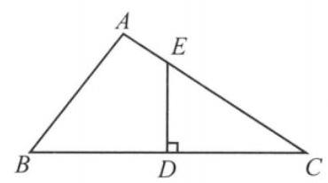

(第 8 题图)

8. 如图所示,在 $\bigtriangleup {ABC}$ 中 ${BC}$ 边上的中垂线分别交 ${BC}\text{ 、 }{AC}$ 于点 $D\text{ 、 }E$ ，若 $\overrightarrow{AE} \cdot  \overrightarrow{BC} = 6,\left| \overrightarrow{AB}\right|  = 2$ ，则 $\left| \overrightarrow{AC}\right|  =$ ___.

9. 在平行四边形 ${ABCD}$ 中, $\angle {BAC} = \frac{\pi }{2},{AB} = {AC} = 1$ ,沿对角线 ${AC}$ 将 $\bigtriangleup  {ACD}$ 折起，使 ${AB}$ 与 ${CD}$ 成 $\frac{\pi }{3}$ 角，则此时 $B$ 、 $D$ 两点之间的距离为___.

10. 已知 $A$ 、 $B$ 为平面上的两个定点，且 $\left| \overrightarrow{AB}\right|  = 2$ ，该平面上的动线段 ${PQ}$ 的端点 $P$ 、 $Q$ ，满足 $\left| \overrightarrow{AP}\right|  \leq  5,\overrightarrow{AP} \cdot  \overrightarrow{AB} = 6,\overrightarrow{AQ} =  - 2\overrightarrow{AP}$ ,则动线段 ${PQ}$ 所形成图形的面积为___.

11. 设定义域为 $\left\lbrack  {{x}_{1},{x}_{2}}\right\rbrack$ 的函数 $y = f\left( x\right)$ 的图像为 $C$ ,图像的两个端点分别为 $A\text{ 、 }B$ ,点 $O$ 为坐标原点,点 $M\left( {x, f\left( x\right) }\right)$ 是 $C$ 上任意一点,向量 $\overrightarrow{OA} = \left( {{x}_{1},{y}_{1}}\right) ,\overrightarrow{OB} = \left( {{x}_{2},{y}_{2}}\right)$ ,且满足 $x \; = \lambda {x}_{1} + \left( {1 - \lambda }\right) {x}_{2}\left( {0 < \lambda  < 1}\right)$ ,又设向量 $\overrightarrow{ON} = \lambda \overrightarrow{OA} + \left( {1 - \lambda }\right) \overrightarrow{OB}$ ,现定义 “函数 $y = f\left( x\right)$ 在 $\left\lbrack  {{x}_{1},{x}_{2}}\right\rbrack$ 上 “可在标准 $k$ 下线性近似” 是指 $\left| \overrightarrow{MN}\right|  \leq  k$ 恒成立,其中 $k > 0$ 为常数. 给出下列结论:

① $A\text{ 、 }B\text{ 、 }N$ 三点共线；②直线 ${MN}$ 的方向向量可以为 $\overrightarrow{a} = \left( {0,1}\right)$ ；

③函数 $y = 5{x}^{2}$ 在 $\left\lbrack  {0,1}\right\rbrack$ 上 “可在标准 1 下线性近似”；

④函数 $y = x - \frac{1}{x}$ 在 $\left\lbrack  {1,2}\right\rbrack$ 上 “可在标准 $k$ 下线性近似”，则 $k \geq  \frac{3}{2} - \sqrt{2}$ . 其中所有正确结论的序号为___.

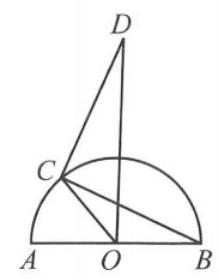

(第 12 题图)

12. 如图,动点 $C$ 在以 ${AB}$ 为直径的半圆 $O$ 上 (异于 $A\text{ 、 }B$ ), $\angle {DCB} = \frac{\pi }{2}$ ,且 ${DC} = {CB}$ ，若 $\left| {AB}\right|  = 2$ ，则 $\overrightarrow{OC} \cdot  \overrightarrow{OD}$ 的取值范围为___.

## 二、选择题 (每题 4 分, 共 16 分)

13. 给出以下命题,其中正确的是 ( )

A. 直线 $l$ 的方向向量为 $\overrightarrow{a} = \left( {0,1, - 1}\right)$ ,平面 $\alpha$ 的法向量为 $\overrightarrow{n} = \left( {1, - 1, - 1}\right)$ ,则 $l \bot  \alpha$

B. 平面 $\alpha$ 、 $\beta$ 的法向量分别为 ${\overrightarrow{n}}_{1} = \left( {0,1,3}\right) ,{\overrightarrow{n}}_{2} = \left( {1,0,2}\right)$ ,则 $\alpha //\beta$

C. 平面 $\alpha$ 经过三个点 $A\left( {1,0, - 1}\right)$ 、 $B\left( {0, - 1,0}\right)$ 、 $C\left( {-1,2,0}\right)$ ，向量 $\overrightarrow{n} = \left( {1, u, t}\right)$ 是平面 $\alpha$ 的法向量,则 $u + t = 1$

D. 直线 $l$ 的方向向量为 $\overrightarrow{a} = \left( {1, - 1,2}\right)$ ，直线 $m$ 的方向向量为 $\overrightarrow{b} = \left( {2,1, - \frac{1}{2}}\right)$ ，则 $l$ 与 $m$ 垂直

14. 在平行四边形 ${ABCD}$ 中,设 $\overrightarrow{CB} = \overrightarrow{a},\overrightarrow{CD} = \overrightarrow{b}, E$ 为 ${AD}$ 的中点, ${CE}$ 与 ${BD}$ 交于 $F$ ,则 $\overrightarrow{AF} =$ ( )

A. $- \frac{\overrightarrow{a} + 2\overrightarrow{b}}{3}$ B. $- \frac{2\overrightarrow{a} + \overrightarrow{b}}{3}$ C. $- \frac{\overrightarrow{a} - 2\overrightarrow{b}}{3}$ D. $- \frac{2\overrightarrow{a} - \overrightarrow{b}}{3}$

15. 正 2021 边形 ${A}_{1}{A}_{2}\cdots {A}_{2021}$ 内接于单位圆 $O$ ,任取它的两个不同的顶点 ${A}_{i}\text{ 、 }{A}_{j}$ ,构成一个有序点对 $\left( {{A}_{i},{A}_{j}}\right)$ ,满足 $\left| {\overrightarrow{O{A}_{i}} + \overrightarrow{O{A}_{j}}}\right|  \geq  1$ 的点对 $\left( {{A}_{i},{A}_{j}}\right)$ 的个数是 ( )

A. ${2021} \times  {673}$ B. ${2021} \times  {674}$ C. ${2021} \times  {1346}$ D. ${2021} \times  {1348}$

16. 已知平面向量 $\overrightarrow{a}\text{ 、 }\overrightarrow{b}\text{ 、 }\overrightarrow{c}$ 满足 $\left| \overrightarrow{b}\right|  = 2,\left| {\overrightarrow{a} + \overrightarrow{b}}\right|  = 1,\overrightarrow{c} = \lambda \overrightarrow{a} + \mu \overrightarrow{b}$ ,且 $\lambda  + {2\mu } = 1$ . 若对每一个确定的向量 $\overrightarrow{a}$ ,记 $\left| \overrightarrow{c}\right|$ 的最小值为 $m$ . 现有如下两个命题:

命题 $P$ : 当 $\overrightarrow{a}$ 变化时, $m$ 的最大值为 $\frac{1}{3}$ ; 命题 $Q$ : 当 $\overrightarrow{a}$ 变化时, $m$ 不存在最小值; 则下列选项中,正确的是 ( )

A. $P$ 为真命题， $Q$ 为假命题 B. $P$ 为假命题， $Q$ 为真命题

C. $P$ 、 $Q$ 都为真命题 D. $P$ 、 $Q$ 都为假命题

## 三、解答题(每题 12 分, 共 36 分)

17. 如图，在直三棱柱 ${ABC} - {A}_{1}{B}_{1}{C}_{1}$ 中， ${AC}\bot {BC}$ ， ${AC} = {BC} = 1$ ， $A{A}_{1} = 2$ ，点 $D$ 在棱 $A{A}_{1}$ 上， 且 ${C}_{1}D \bot  {A}_{1}B$ .

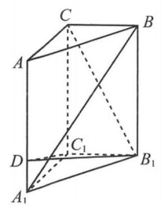

(第 17 题图)

(1)求线段 ${AD}$ 的长；

(2)求二面角 $D - {B}_{1}{C}_{1} - C$ 的余弦值.

18. 已知 $0 \leq  \theta  \leq  \pi ,\overrightarrow{a} = \left( {\cos \theta ,\sin \theta }\right) ,\overrightarrow{i} = \left( {0,1}\right)$ ,若向量 $\overrightarrow{b}$ 满足 $\left( {\overrightarrow{a} + \overrightarrow{b}}\right)  \cdot  \overrightarrow{i} = 0,\overrightarrow{a} \cdot  \overrightarrow{b} = 0$ .

(1)若 $\left| {\overrightarrow{a} + \overrightarrow{b}}\right|  = 2$ ，求 $\overrightarrow{b}$ .

(2)若 $f\left( x\right)  = \left| {\overrightarrow{b} + x\left( {\overrightarrow{a} - \overrightarrow{b}}\right) }\right|$ 在 $\left\lbrack  {\frac{1}{2}, + \infty }\right)$ 上为严格增函数，

① 求实数 $\theta$ 的取值范围;

②若 $f\left( x\right)  \leq  5$ 对满足题意 $\theta$ 恒成立，求 $x$ 的取值范围.

19. 对于一组向量 ${\overrightarrow{a}}_{1},{\overrightarrow{a}}_{2},{\overrightarrow{a}}_{3},\cdots ,{\overrightarrow{a}}_{n}\left( {n \in  \mathbf{N}, n \geq  3}\right)$ ,令 ${\overrightarrow{S}}_{n} = {\overrightarrow{a}}_{1} + {\overrightarrow{a}}_{2} + {\overrightarrow{a}}_{3} + \cdots  + {\overrightarrow{a}}_{n}$ ,如果存在 ${\overrightarrow{a}}_{p}(p \; \in  \{ 1,2,3,\cdots , n\} )$ ,使得 $\left| \overrightarrow{{a}_{p}}\right|  \geq  \left| {\overrightarrow{{S}_{n}} - \overrightarrow{{a}_{p}}}\right|$ ,那么称 $\overrightarrow{{a}_{p}}$ 是该向量组的“ $h$ 向量”.

(1)设 $\overrightarrow{{a}_{n}} = \left( {n, x + n}\right)$ ( $n$ 为正整数)，若 $\overrightarrow{{a}_{3}}$ 是向量组 $\overrightarrow{{a}_{1}},\overrightarrow{{a}_{2}},\overrightarrow{{a}_{3}}$ 的“ $h$ 向量”，求实数 $x$ 的取值范围;

(2)已知 ${\overset{ \rightarrow  }{a}}_{1},{\overset{ \rightarrow  }{a}}_{2},{\overset{ \rightarrow  }{a}}_{3}$ 均是向量组 ${\overset{ \rightarrow  }{a}}_{1},{\overset{ \rightarrow  }{a}}_{2},{\overset{ \rightarrow  }{a}}_{3}$ 的“ $h$ 向量”,其中 ${\overset{ \rightarrow  }{a}}_{1} = \left( {\sin x,\cos x}\right) ,{\overset{ \rightarrow  }{a}}_{2} = \left( {2\cos x,}\right) \; 2\sin x)$ . 设在平面直角坐标系中有一点列 ${Q}_{1},{Q}_{2},{Q}_{3},\cdots ,{Q}_{n}$ 满足: ${Q}_{1}$ 为坐标原点, ${Q}_{2}$ 为 $\overrightarrow{{a}_{3}}$ 的位置向量的终点,且 ${Q}_{{2k} + 1}$ 与 ${Q}_{2k}$ 关于点 ${Q}_{1}$ 对称, ${Q}_{{2k} + 2}$ 与 ${Q}_{{2k} + 1}\left( {k\text{ 为正整数 }}\right)$ 关于点 ${Q}_{2}$ 对称,求 $\left| {\overrightarrow{{Q}_{2021}{Q}_{2022}} \mid  }\right|$ 的最小值.

## 热点 9 随机变量的概率与分布

## 一、填空题(每题 4 分，共 48 分)

1. 已知随机事件 $A$ 和 $B$ 是独立事件，若 $P\left( {A \cap  B}\right)  = {0.36}$ ， $P\left( \overline{A}\right)  = {0.6}$ ，则 $P\left( {B \mid  A}\right)  =$ ___.

2. 有一个容量为 $n$ 的总体,用简单随机抽样的方法从中抽取样本,若个体 $a$ 被抽到的概率为 $\frac{1}{8}$ ，则 $n =$ ___；若样本容量为 3，则每个个体被抽到的概率为___.

3. 有两台车床加工同一型号的零件,第一台加工的次品率为 5%,第二台加工的次品率为 4%，加工出来的零件混放在一起，已知第一、二台车床加工的零件数分别占总数的 40% 、 60%，从中任取一件产品，则该产品是次品的概率是___.

4. 已知离散型随机变量 $X$ 的取值为有限个， $E\left\lbrack  X\right\rbrack   = \frac{7}{2}$ ， $D\left\lbrack  X\right\rbrack   = \frac{35}{12}$ ，则 $E\left\lbrack  {X}^{2}\right\rbrack   =$ ___.

5. 已知随机变量 $X$ 服从二项式分布 $B\left( {5, p}\right)$ ，若 $E\left\lbrack  X\right\rbrack   = 2$ ，则 $D\left\lbrack  X\right\rbrack   =$ ___.

6. 设随机变量 $X$ 服从二项式分布 $B\left( {4, p}\right) \left( {0 < p < 1}\right)$ ,若 $P\left( {X \geq  1}\right)  = \frac{15}{16}$ ,则 $p =$ ___.

7. 设随机变量 $X$ 服从二项式分布 $B\left( {{10}, p}\right) \left( {0 < p < 1}\right) , Y = {3X} - 2$ ,且 $E\left\lbrack  Y\right\rbrack   = {10}$ ,则 $p =$ ___.

8. 已知具有线性相关的变量 $x\text{ 、 }y$ ,设其样本点为 ${A}_{i}\left( {{x}_{i},{y}_{i}}\right) \left( {i = 1,2,3,\cdots ,8}\right)$ ,回归直线方程为 $\widehat{y} =  - {2x} + \widehat{a}$ ,若 $\mathop{\sum }\limits_{{i = 1}}^{8}{x}_{i} = {12},\mathop{\sum }\limits_{{i = 1}}^{8}{y}_{i} = {16}$ ,则 $\widehat{a} =$ ___.

9. 现有 10 道四选一的单选题, 甲对其中 8 道题有思路, 2 道题完全没有思路. 有思路的题做对的概率为 0.8 , 没有思路的题只好任意猜一个答案, 猜对答案的概率为 0.25 . 甲从这 10 道题中随机选择 1 题, 则甲做对该题的概率是___.

10. 我国中医药中的“三药三方”对清热化湿有效果. “三药”分别为金花清感颗粒、连花清瘟胶囊、血必净注射液;“三方”分别为清肺排毒汤、化湿败毒方、宣肺败毒方. 某医生拟从 “三药三方”中随机选出三种组成一剂药方,事件 $A$ 表示组成的药方中至少有一药,事件 $B$ 表示组成的药方中至少有一方，则 $P\left( {A \mid  B}\right)  =$ ___.

11. 一个口袋中装有 7 个球, 其中有 5 个红球, 2 个白球. 抽到红球得 2 分, 抽到白球得 3 分. 现从中任意取出 3 个球,则取出 3 个球的得分 $X$ 的期望 $E\left\lbrack  X\right\rbrack   =$ ___.

12. 一个均匀正四面体的 4 个面中, 二个面上标以数 0 , 一个面上标以数 1 , 一个面上标以数 2. 将这个正四面体抛掷 2 次，其着地的一面上的数字之积的数学期望是___.

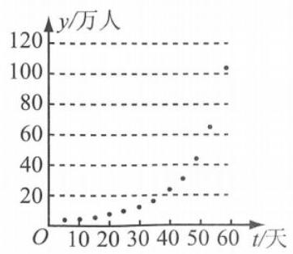

(第 13 题图)

## 二、选择题 (每题 4 分, 共 16 分)

13. 如图是某地在 60 天内感染某种传染病的累计病例人数 $y$ (万人) 与时间 $t$ (天) 的散点图,则下列最适宜作为此模型的回归方程的类型是 ( )

A. $y = a + {bx}$ B. $y = a + b\sqrt{x}$

C. $y = a + b{\mathrm{e}}^{x}$ D. $y = a + b\ln x$

14. 设一汽车在前进途中要经过 3 个路口,汽车在每个路口遇到绿灯通行的概率为 $\frac{3}{4}$ ,遇到红灯停车的概率为 $\frac{1}{4}$ . 假定汽车只在遇到红灯或到达目的地才停止前进, $P\left( {\xi  = k}\right)$ 表示停车时已通过了 $k$ 个路口数的概率,则 $P\left( {\xi  = 2}\right)$ 的值是 ( )

A. $\frac{3}{4}$ B. $\frac{9}{16}$ C. $\frac{9}{64}$ D. $\frac{27}{64}$

15. 已知随机变量 $X$ 的分布为 $\left( \begin{matrix}  - 1 & 0 & 1 & 2 \\  a & b & b & \frac{1}{12} \end{matrix}\right)$ . 若 $E\left\lbrack  X\right\rbrack   = 0$ ,则 $D\left\lbrack  X\right\rbrack$ 的值是 ( )

A. 1 B. 1.2 C. 1.6 D. 2

16. 某益智游戏的得分设置为1、2、、、4、、 5 . 随机变量 $X$ 表示小李玩该游戏的得分，若 $E \; \left\lbrack  X\right\rbrack   = {4.2}$ ,则小李得 5 分的概率至少为 ( )

A.0.2 B.0.3 C. 0.4 D. 0.5

## 三、解答题(每题 12 分，共 36 分)

17. 某学校在寒假期间安排了“垃圾分类知识普及实践活动”. 为了解学生的学习成果，该校从全校学生中随机抽取了 50 名学生作为样本进行测试, 记录他们的成绩, 测试卷满分 100 分, 将数据分成 6 组: $\lbrack {40},{50}),\lbrack {50},{60}),\lbrack {60},{70}),\lbrack {70},{80}),\lbrack {80},{90}),\left\lbrack  {{90},{100}}\right\rbrack$ ,并整理得到如下频率分布直方图:

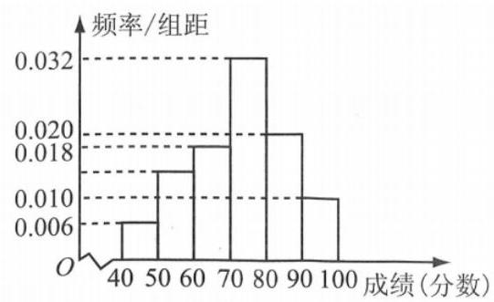

(第 17 题图)

(1)若全校学生参加同样的测试，试估计全校学生的平均成绩(每组成绩用中间值代替)；

(2)在样本中，从其成绩在 80 分及以上的学生中随机抽取 3 人，用 $X$ 表示其成绩在 $\left\lbrack  {{90},{100}}\right\rbrack$ 中的人数,求 $X$ 的分布及数学期望.

18. 司机在开车时使用手机是违法行为, 会存在严重的安全隐患, 危及自己和他人的生命. 为了研究司机开车时使用手机的情况，交警部门随机调查了 100 名司机，得到以下统计:在 55 名男性司机中，开车时使用手机的有 40 人，开车时不使用手机的有 15 人；在 45 名女性司机中，开车时使用手机的有 20 人，开车时不使用手机的有 25 人.

(1)完成下面的 $2 \times  2$ 列联表,并判断是否有 99.5% 的把握认为开车时使用手机与司机的性别有关;

<table><tr><td></td><td>开车时使用手机</td><td>开车时不使用手机</td><td>合计</td></tr><tr><td>男性司机人数</td><td></td><td></td><td></td></tr><tr><td>女性司机人数</td><td></td><td></td><td></td></tr><tr><td>合计</td><td></td><td></td><td></td></tr></table>

参考数据:

<table><tr><td>$P\left( {{\chi }^{2} \geq  k}\right)$</td><td>0.15</td><td>0.10</td><td>0.05</td><td>0.025</td><td>0.010</td><td>0.005</td><td>0.001</td></tr><tr><td>$k$</td><td>2.072</td><td>2.706</td><td>3.841</td><td>5.024</td><td>6.635</td><td>7.879</td><td>10.828</td></tr></table>

参考公式: ${\chi }^{2} = \frac{n{\left( ad - bc\right) }^{2}}{\left( {a + b}\right) \left( {c + d}\right) \left( {a + c}\right) \left( {b + d}\right) }$ ,其中 $n = a + b + c + d$ .

(2)采用分层抽样从开车时不使用手机的人中抽取 8 人，再从这 8 人中随机抽取 3 人，记 $X$ 为开车时不使用手机的男性司机人数，求 $X$ 的分布和数学期望.

19. 口袋里放有大小相同的 2 个红球和 1 个白球, 有放回地每次模取一个球.

定义数列 $\left\{  {a}_{n}\right\}   : {a}_{n} = \left\{  \begin{matrix} 1, & \text{ 第 }n\text{ 次摸到红球,记 }{S}_{n}\text{ 为数列 }\left\{  {a}_{n}\right\}  \text{ 的前 }n\text{ 项之和. } \\   - 1, & \text{ 第 }n\text{ 次摸到白球. } \end{matrix}\right.$

(1)求 ${S}_{3} = 1$ 的概率；

(2)记随机变量 $X$ 为 ${S}_{3}$ 的值,求 $E\left\lbrack  X\right\rbrack$ .

## 热点 10 模型的应用

## 一、填空题(每题 4 分，共 48 分)

1. 已知 $b\mathrm{\;g}$ 糖水中有 $a\mathrm{\;g}$ 糖 $\left( {b > a > 0}\right)$ ，若再添 $m\mathrm{\;g}$ 糖 $\left( {m > 0}\right)$ ，则糖水变甜了. 根据这一事实， 提炼得到不等式:___.

2. 某港口潮水的高度 $h\left( \mathrm{\;m}\right)$ 与时间 $t\left( \mathrm{\;h}\right)$ 近似满足函数关系 $h\left( t\right)  = 3\sin \left( {\frac{\pi }{6}t + \frac{\pi }{6}}\right)$ ,则该港口潮汐的最小正周期为___.

3. 某汽车行驶路程 $S$ (单位: $\mathrm{{km}}$ ) 与行驶时间 $t$ (单位: $\mathrm{h}$ ) 满足函数关系: $S = {t}^{2} + {60t}$ ,则行驶 2 h(时刻 $t = 2$ )时的瞬时速度为___.

4. “十二平均律”是通用的音律体系，明代朱载堉最早用数学方法计算出半音比例，为这个理论的发展作出了重要贡献. 十二平均律将一个纯八度音程分成十二份，依次得到十三个单音从第二个单音起,每一个单音的频率与它的前一个单音的频率的比都等于 $\sqrt[{12}]{2}$ ,若第一个单音的频率为 $f$ ，则第八个单音的频率为___.

5. 某地经过多年的环境治理，已将荒山改造成了绿水青山. 为估计一林区某种树木的总材积量，随机选取了 10 棵这种树木,测量每棵树的根部横截面积 (单位: ${\mathrm{m}}^{2}$ ) 和材积量 (单位: ${\mathrm{m}}^{3}$ ),得到如下数据:

<table><tr><td>样本号 $i$</td><td>1</td><td>2</td><td>3</td><td>4</td><td>5</td><td>6</td><td>7</td><td>8</td><td>9</td><td>10</td></tr><tr><td>根部横截面积 ${x}_{i}$</td><td>0.04</td><td>0.06</td><td>0.04</td><td>0.08</td><td>0.08</td><td>0.05</td><td>0.05</td><td>0.07</td><td>0.07</td><td>0.06</td></tr><tr><td>材积量 ${y}_{i}$</td><td>0.25</td><td>0.40</td><td>0.22</td><td>0.54</td><td>0.51</td><td>0.34</td><td>0.36</td><td>0.46</td><td>0.42</td><td>0.40</td></tr></table>

则相关系数 $r =$ ___. (保留 2 位小数)

附: $r = \frac{\mathop{\sum }\limits_{{i = 1}}^{n}\left( {{x}_{i} - \bar{x}}\right) \left( {{y}_{i} - \bar{y}}\right) }{\sqrt{\mathop{\sum }\limits_{{i = 1}}^{n}{\left( {x}_{i} - \bar{x}\right) }^{2}\mathop{\sum }\limits_{{i = 1}}^{n}{\left( {y}_{i} - \bar{y}\right) }^{2}}}$ , $\mathop{\sum }\limits_{{i = 1}}^{{10}}{x}_{i}^{2} = {0.038},\mathop{\sum }\limits_{{i = 1}}^{{10}}{y}_{i}^{2} = {1.6158},\mathop{\sum }\limits_{{i = 1}}^{{10}}{x}_{i}{y}_{i} = {0.2474}$ .

6. 上海大力发展体育教育事业，要帮助学生享受到体育的乐趣，增强体质，锤炼意志. 为设计更加个性化的体育课程，调查了 200 名学生对球类运动的喜爱情况，数据如下:

<table><tr><td></td><td>男生</td><td>女生</td></tr><tr><td>喜爱球类运动</td><td>69</td><td>53</td></tr><tr><td>不喜爱球运动</td><td>31</td><td>47</td></tr></table>

则我们认为是否喜欢球类运动与性别___(填“有关”或“无关”).

附: ${K}^{2} = \frac{n{\left( ad - bc\right) }^{2}}{\left( {a + b}\right) \left( {c + d}\right) \left( {a + c}\right) \left( {b + d}\right) }, n = a + b + c + d, P\left( {{K}^{2} \geq  {3.841}}\right)  \approx  {0.05}$ .

7. 通过手机验证码登录哈罗单车 APP, 验证码由四位数字随机组成, 如果某人收到的验证码 $\left( {{a}_{1},{a}_{2},{a}_{3},{a}_{4}}\right)$ 满足 ${a}_{1} < {a}_{2} < {a}_{3} < {a}_{4}$ ,则称该验证码为递增型验证码,某人收到一个验证码，那么该码是首位为 2 的递增型验证码的概率为___.

8. 某玩具厂生产玩偶 $x$ 万件的总成本为 $C\left( x\right)  = {400} + {0.45}{x}^{2}$ (单位: 万元). 已知玩偶单价 $P$ (单位: 元) 和产品件数 $x$ (单位: 万件) 满足关系 ${P}^{2} = \frac{k}{x}\left( {k \in  \mathbf{R}}\right)$ ,且生产 1 万件产品时,单价定为 14.4 元. 那么产量为___万件时，总利润(利润=销售额一成本)最大.

9. 已知某病毒抗原检测试剂盒的敏感度 $P$ ( 检测阳性数 ) 为 93.55%,特异性 $P$ (未感染病毒数)为99.74%. 在 1000 名受检人群中抗原检测阳性有 10 人，则实际感染该病毒的人数约为___. (精确到个位)

10. 如图，某大型厂区有三个值班室 $A$ 、 $B$ 、 $C$ . 值班室 $A$ 在值班室 $B$ 的正北方向 ${600}\mathrm{\;m}$ 处，值班室 $C$ 在值班室 $B$ 的正东方向 ${800}\mathrm{\;m}$ 处. 保安甲从值班室 $C$ 出发沿 ${CA}$ 前往值班室 $A$ ，保安乙从值班室 $A$ 出发沿 ${AB}$ 前往值班室 $B$ ，若甲乙同时出发且保持匀速行走，其中甲的速度为 ${50}\mathrm{\;m}/\mathrm{{min}}$ ，其中乙的速度为 ${30}\mathrm{\;m}/\mathrm{{min}}$ ，期间甲乙两人配有最大通话距离为 ${600}\mathrm{\;m}$ (含 ${600}\mathrm{\;m}$ ) 的对讲机，则两人在巡逻过程中不能保持通话的时间共有___分钟.

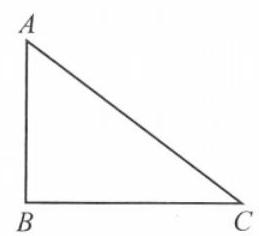

(第 10 题图)

11. 设火箭推进剂的质量为 $M$ ,去除推进剂后的火箭有效载荷质量为 $m$ ,火箭的飞行速度为 $v$ ,初始速度为 ${v}_{0}$ ,已知其关系式为齐奥尔科夫斯基公式: $v = {v}_{0} + w \cdot  \ln \left( {1 + \frac{M}{m}}\right)$ ,其中 $w$ 是火箭发动机喷流相对火箭的速度，假设 ${v}_{0} = 0\mathrm{{km}}/\mathrm{s}, m = {25}\mathrm{t}$ ，火箭起飞时的最大质量为 2000t，若希望火箭飞行速度 $v$ 达到第三宇宙速度 ${16.7}\mathrm{\;{km}}/\mathrm{s}$ ，则 $w$ 的最小值为 ___(精确到 ${0.1}\mathrm{{km}}/\mathrm{s}$ ).

12. 已知斜抛运动的轨迹方程是 $y =  - \frac{g}{2{v}_{0}^{2}}\frac{1}{{\cos }^{2}\alpha }{x}^{2} + x\tan \alpha  + h$ ,其中 $x$ 是水平方向上的位移, $y$ 是距离地面的竖直距离, $h$ 为初始高度, ${v}_{0}$ 表示初始速度, $\alpha$ 表示初始速度方向与水平方向的夹角，重力加速度 $g \approx  {9.8}\mathrm{m}/{\mathrm{s}}^{2}$ . 利用该数学模型研究铅球投掷策略: 身高 ${1.75}\mathrm{\;m}$ 的巩立姣代表中国队参加铅球比赛,以 ${13.24}\mathrm{\;m}/\mathrm{s}$ 的出手速度和最佳的出手角度,将铅球于 ${2.08}\mathrm{\;m}$ 的高度扔出，则铅球最远可以被投掷___m (精确到0.01m).

## 二、选择题 (每题 4 分, 共 16 分)

13. 小明打算去云南旅游，计划在昆明、大理、丽江这三个城市中选择 1~3 个目的地，可有几种组合方式 ( )

A. 5 种 B. 6 种 C. 7 种 D. 8 种

14. 向如图所示的瓶子中匀速注水，从空瓶到注满的过程中，水面高度 $h$ 随时间 $t$ 变化的大致图像是 ( )

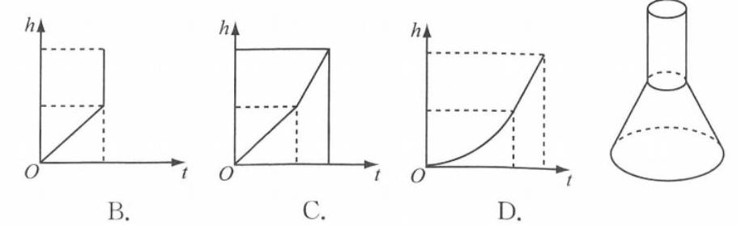

第54页，共188页

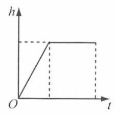

A.

15. 某人在外滩西岸的 $A$ 处,测得对岸的东方明珠电视塔在北偏东 ${45}^{ \circ  }$ 方向且塔顶的仰角为 ${40}^{ \circ  }$ ,此人在 $A$ 处正北方向 ${1000}\mathrm{\;m}$ 的 $B$ 处,测得电视塔位于南偏东 ${33}^{ \circ  }$ 方向,则电视塔的高度约为 ( )

A. ${461}\mathrm{\;m}$ B. ${467}\mathrm{\;m}$ C. ${599}\mathrm{\;m}$ D. ${607}\mathrm{\;m}$

16. 已知某理财产品每年年底发放一次利息,发放利息时有两种方案可供选择:

方案 A: 自动领息，发放初始本金的 3.5%；方案 B: 手动领息，发放当前存款的 3%.

志明将 30000 元购买该理财产品,则:

① 为了获得更大的收益，前 5 年都应该选择方案 A；

②10 年后最多可以取回 40500 元(包含本金与利息).

上述结论中正确的是 ( )

A. ①正确，②正确 B. ①正确，②不正确

C. ①不正确，②正确 D. ①不正确，②不正确

## 三、解答题(每题 12 分，共 36 分)

17. 我们建立数学模型来描述雨中行走时的淋雨量. 假设降雨强度保持不变；行走的速度保持不变; 将人体视为一个长方体. 设人的身高为 $h\left( \mathrm{\;m}\right)$ ，宽度为 $w\left( \mathrm{\;m}\right)$ ，厚度为 $d\left( \mathrm{\;m}\right)$ ，行走的速度为 $v\left( {\mathrm{\;m}/\mathrm{s}}\right)$ ，而雨滴的密度为 $p\left( {\mathrm{\;{kg}}/{\mathrm{m}}^{3}}\right)$ ，降雨的速度为 ${v}_{r}\left( {\mathrm{m}/\mathrm{s}}\right)$ ，水平风速为 ${v}_{w} \; \left( {\mathrm{m}/\mathrm{s}}\right)$ ,人在雨中行走 $D\left( \mathrm{\;m}\right)$ . 单位时间 $\left( {1\mathrm{\;s}}\right)$ 内头顶上的淋雨量可以看作是高度为 ${v}_{r}$ 的长方体中的雨滴量 ${C}_{h} = {pwd}{v}_{r}$ .

(1)若 $p = {0.1}$ ， ${v}_{r} = 2$ ，已知人体密度约为 ${{1.02} \times  {10}^{3}}\mathrm{{kg}}/{\mathrm{m}}^{3}$ ，求身高为 ${170}\mathrm{{cm}}$ ，体重为 60kg 的人在雨中以 2 m/s 行走 100m 后头顶上的总淋雨量(精确到 0.001kg)；

(2)当迎风行走时，单位时间 (1s) 内身体前部的淋雨量可以看作是高度为 ${v}_{w} + v$ 的平行六面体中的雨滴量, 计算此时人体的总淋雨量, 并分析应该以如何的速度行走, 可以使得总淋雨量最小.

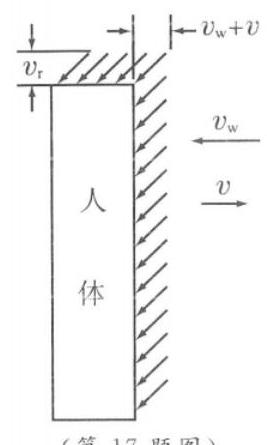

18. 某双曲线型自然冷却通风塔的外形是由图 1 中的双曲线的一部分绕其虚轴所在的直线旋转一周所形成的曲面 $\Gamma$ ,如图 2 所示. 双曲线的左、右顶点分别为 ${A}^{\prime }\text{ 、 }A$ . 已知该冷却通风塔的最窄处是圆 $O$ ,其半径为 1 ; 上口为圆 ${\Omega }_{1}$ ,其半径为 $\frac{5}{4}$ ; 下口为圆 ${\Omega }_{2}$ ,其半径为 $\frac{13}{5}$ ; 高 (即圆 ${\Omega }_{1}$ 与 ${\Omega }_{2}$ 所在平面间的距离) 为 $\frac{63}{20}$ .

(1)求此双曲线的方程；

(2)若点 $P$ 为双曲线上任一点，求证点 $P$ 到双曲线两渐近线的距离之积为定值.

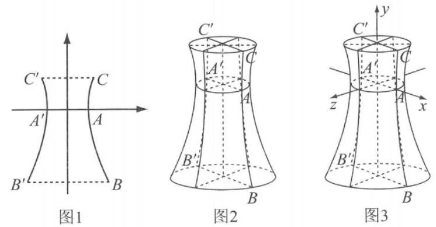

(第 18 题图)

19. 经过市场调研发现, 某公司生产的某种时令商品在未来一个月 (30 天) 内的日销售量 $m\left( t\right)$ (百件) 与时间第 $t$ 天的关系如表所示:

<table><tr><td>第 $t$ 天</td><td>1</td><td>3</td><td>5</td><td>10</td><td>30</td></tr><tr><td>日销售量 $m\left( t\right)$ (百件)</td><td>2.1</td><td>2.9</td><td>4.2</td><td>6.3</td><td>16.6</td></tr></table>

未来 30 天内,受市场因素影响,前 15 天此商品每天每件的利润 ${f}_{1}\left( t\right)$ (元)与时间第 $t$ 天的函数关系式为 ${f}_{1}\left( t\right)  =  - {3t} + {88}\left( {1 \leq  t \leq  {15}}\right.$ ,且 $t$ 为整数 $)$ ,而后 15 天此商品每天每件的利润 ${f}_{2}\left( t\right)$ (元) 与时间第 $t$ 天的函数关系式为 ${f}_{2}\left( t\right)  = \frac{600}{t} + 2\left( {{16} \leq  t \leq  {30}}\right.$ ,且 $t$ 为整数 $)$ .

(1)假设 $m\left( t\right)$ 近似满足函数模型: $m\left( t\right)  = \widehat{at} + \widehat{b}$ ( $\widehat{a}$ 、 $\widehat{b}$ 为常数，精确到 1 位小数). 根据表格中的数据，利用最小二乘法求 $m\left( t\right)$ 的提示式；

(2)在(1)的条件下，若这 30 天内该公司此商品的日销售利润始终不能超过 4 万元，则考虑转型. 请判断该公司是否需要转型? 并说明理由.

注: ① $a = \frac{\mathop{\sum }\limits_{{i = 1}}^{n}{x}_{i}{y}_{i} - {nxy}}{\mathop{\sum }\limits_{{i = 1}}^{n}{x}_{i}^{2} - n{x}^{2}}, b = y - {ax}$ ,② $\mathop{\sum }\limits_{{i = 1}}^{5}{x}_{i}{y}_{i} = {592.8},\mathop{\sum }\limits_{{i = 1}}^{5}{x}_{i}^{2} = {1035}$ .

## 第三章 基础加固

## 综合基础强化 1

## 一、填空题(每题 4 分，共 48 分)

1. 已知复数 ${z}_{1} = 1 + \mathrm{i},{z}_{2} = 2 + 3\mathrm{i}$ ，则 ${z}_{1} - {z}_{2} =$ ___.

2. 设集合 $A = \{ x\left| \right| x - 2 \mid   < 1, x \in  \mathbf{R}\} , B = \left\{  {x\left| {\;\frac{x - 3}{x - 1} \geq  0}\right. }\right\}$ ，则 $A \cup  B =$ ___.

3. 已知 $- 1, a, - 4$ 成等差数列， $- 1, b, - 4$ 成等比数列，则 ${ab} =$ ___.

4. 已知 $x \in  \left( {0,\frac{\pi }{2}}\right)$ ,则方程 $4\sin x\cos x - 1 = 0$ 的解集是___.

5. 受疫情的影响，部分企业转型生产口罩，下表为某小型工厂 2~5 月份生产的口罩数(单位:万). 若 $y$ 与 $x$ 线性相关，且回归直线方程为 $\widehat{y} = {1.5x} - {0.6}$ ，则表格中实数 $m$ 的值为___.

<table><tr><td>$x$</td><td>2</td><td>3</td><td>4</td><td>5</td></tr><tr><td>$y$</td><td>2.2</td><td>3.8</td><td>5.5</td><td>$m$</td></tr></table>

6. 在 ${\left( x + \frac{1}{{x}^{2}}\right) }^{9}$ 的二项展开式中,常数项的值为___.

7. 若圆锥的轴截面是等腰直角三角形，则其侧面展开图的扇形的圆心角弧度数是___.

8. 数列 $\left\{  {a}_{n}\right\}$ 的首项不为 0,前 $n$ 项和 ${S}_{n}$ 满足 ${S}_{n + 1} = 2{S}_{n} + {a}_{1}$ ,则 $\mathop{\lim }\limits_{{n \rightarrow  \infty }}\frac{{a}_{n}}{{S}_{n}} =$ ___.

9. 甲罐中有 5 个红球, 3 个白球, 乙罐中有 4 个红球, 2 个白球. 整个取球过程分两步, 先从甲罐中随机取出一球放入乙罐,分别用 ${A}_{1}\text{ 、 }{A}_{2}$ 表示由甲罐取出的球是红球、白球的事件; 再从乙罐中随机取出两球,分别用 $B\text{ 、 }C$ 表示第二步由乙罐取出的球是 “两球都为红球” “两球为一红一白”的事件，则下列结论中正确的是___(填写序号).

① $P\left( {B \mid  {A}_{1}}\right)  = \frac{10}{21}$ ; ② $P\left( {C \mid  {A}_{2}}\right)  = \frac{4}{7}$ ; ③ $P\left( B\right)  = \frac{19}{42}$ ; ④ $P\left( C\right)  = \frac{43}{84}$ .

10. 对于函数 $f\left( x\right)$ 和 $g\left( x\right)$ ,设 $\alpha  \in  \{ x \mid  f\left( x\right)  = 0\} ,\beta  \in  \{ x \mid  g\left( x\right)  = 0\}$ ,若存在 $\alpha \text{ 、 }\beta$ 使得 $\left| {\alpha  - \beta }\right| \; \leq  1$ ,则称 $f\left( x\right)$ 与 $g\left( x\right)$ 互为 “零点相邻函数”. 若函数 $f\left( x\right)  = {\mathrm{e}}^{x - 1} + x - 2$ 与 $g\left( x\right)  = {x}^{2} - \; {ax} - a + 3$ 互为“零点相邻函数”，则实数 $a$ 的取值范围为___.

11.《九章算术》是我国古代著名的数学著作, 书中记载有几何体 “刍甍”. 现有一个刍甍如图所示,底面 ${ABCD}$ 为正方形, ${EF}//$ 底面 ${ABCD}$ ,四边形 ${ABFE}\text{ 、 }{CDEF}$ 为两个全等的等腰梯形, ${EF} = \frac{1}{2}{AB} = 2,{AE} = 2\sqrt{3}$ ,则该刍甍的外接球的体积为___.

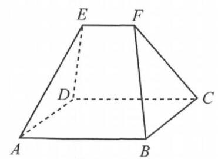

(第 11 题图)

12. 已知 $\bigtriangleup {ABC}$ 是边长为 2 的等边三角形,平面上两动点 $O\text{ 、 }P$ 满足 $\overrightarrow{OP} = {\lambda }_{1}\overrightarrow{OA} + {\lambda }_{2}\overrightarrow{OB} + {\lambda }_{3}\overrightarrow{OC} \; \left( {{\lambda }_{1} + {\lambda }_{2} + {\lambda }_{3} = 1,{\lambda }_{1},{\lambda }_{2},{\lambda }_{3} \geq  0}\right)$ . 若 $\left| \overrightarrow{OP}\right|  = 1$ ，则 $\overrightarrow{OA} \cdot  \overrightarrow{OB}$ 的最大值为___.

## 二、选择题(每题 4 分，共 16 分)

13. 若 ${a}^{2} > {b}^{2}$ ，那么下列不等式中成立的是 ( )

A. $a > 0 > b$ B. $a > b > 0$ C. $\left| a\right|  > \left| b\right|$ D. $a > \left| b\right|$

14. 已知 $\alpha$ 、 $\beta$ 为任意角， “sin $\alpha$ sin $\beta  + \cos \alpha \cos \beta  = 0$ ” 是 “sin $\alpha \cos \beta  - \cos \alpha \sin \beta  = 1$ ” 的 ( )

A. 充分非必要条件 B. 必要非充分条件

C. 充要条件 D. 非充分非必要条件

15. 已知函数 $f\left( x\right)  = {x}^{3} - a{x}^{2} - {2x}$ ,下列命题中错误的是 ( )

A. 若 $x = 1$ 是函数 $f\left( x\right)$ 的极值点,则 $a = \frac{1}{2}$

B. 若 $x = 1$ 是函数 $f\left( x\right)$ 的极值点,则 $f\left( x\right)$ 在 $x \in  \left\lbrack  {0,2}\right\rbrack$ 上的最小值为 $- \frac{3}{2}$

C. 若 $f\left( x\right)$ 在 $\left( {1,2}\right)$ 上单调递减，则 $a \geq  \frac{5}{2}$

D. 若 ${x}^{2}\ln x \geq  f\left( x\right)$ 在 $x \in  \left\lbrack  {1,2}\right\rbrack$ 上恒成立，则 $a > 1 - \ln 2$

16. 已知椭圆 $\Gamma  : \frac{{x}^{2}}{{a}^{2}} + \frac{{y}^{2}}{{b}^{2}} = 1\left( {a > b > 0}\right)$ 的两个焦点为 ${F}_{1}\text{ 、 }{F}_{2}$ ,过 ${F}_{2}$ 的直线与 $\Gamma$ 交于 $A\text{ 、 }B$ 两点. 若 $\left| {A{F}_{2}}\right|  = 3\left| {{F}_{2}B}\right| ,\left| {AB}\right|  = 2\left| {A{F}_{1}}\right|$ ,则 $\Gamma$ 的离心率为 ( )

A. $\frac{1}{5}$ B. $\frac{\sqrt{5}}{5}$ C. $\frac{\sqrt{10}}{5}$ D. $\frac{\sqrt{15}}{5}$

## 三、解答题(每题 12 分，共 36 分)

17. 已知双曲线 $C : \frac{{x}^{2}}{{a}^{2}} - \frac{{y}^{2}}{{b}^{2}} = 1\left( {a > 0, b > 0}\right)$ 的一条渐近线方程为 $x - \sqrt{2}y = 0$ ,焦点到渐近线的距离为 1 .

(1)求双曲线 $C$ 的标准方程与离心率；

(2)已知斜率为 $- \frac{1}{2}$ 的直线 $l$ 与双曲线 $C$ 交于 $x$ 轴上方的 $A$ 、 $B$ 两点， $O$ 为坐标原点，直线 ${OA}$ 、 ${OB}$ 的斜率之积为 $- \frac{1}{8}$ ，求 $\bigtriangleup  {OAB}$ 的面积.

18. 心理学家研究某位学生的学习情况发现: 若这位学生刚学完的知识存留量记为 1,则 $x$ 天后的存留量 ${y}_{1} = \frac{4}{x + 4}$ ,若在 $t\left( {t > 4}\right)$ 天时进行第一次复习,则此时知识存留量比未复习情况下增加一倍 (复习时间忽略不计),其后知识存留量 ${y}_{2}$ 随时间变化的曲线恰为直线的一部分,其斜率为 $\frac{a}{{\left( t + 4\right) }^{2}}\left( {a < 0}\right)$ ,存留量随时间变化的曲线如图所示,当进行第一次复习后的存留量与不复习的存留量相差最大时, 则此时刻为第二次复习最佳时机点.

(1)试用解析法表示 ${y}_{2}$ 关于 $x$ 的函数；

(2)若 $a =  - 1, t = 5$ ，求第二次复习最佳时机点.

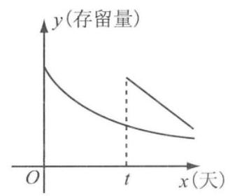

(第 18 题图)

19. 正项递增数列 $\left\{  {a}_{n}\right\}$ 的前 $n$ 项和为 ${S}_{n},4{S}_{n} = {a}_{n}^{2} + {4n} - 1$ .

(1)求 $\left\{  {a}_{n}\right\}$ 的通项公式；

(2)若 ${a}_{1} = 1$ ， ${b}_{n} > 0$ ， ${b}_{n}^{2} = 1 + \frac{2}{{S}_{n + 1}}$ ，数列 $\left\{  {b}_{n}\right\}$ 的前 $n$ 项和为 ${T}_{n}$ ，证明: ${T}_{n} < n + 1$ .

## 综合基础强化 2

## 一、填空题(每题 4 分，共 48 分)

1. 若 $z =  - 1 + 2\mathrm{i}$ ，则 $\frac{z + \mathrm{i}}{z \cdot  \overline{z - 4}} =$ ___.

2. 若集合 $A = \left\{  {y\left| {\;y = \sqrt{x - 4}}\right. }\right\}  , B = \left\{  {x\left| {\;{\log }_{3}x \leq  2}\right. }\right\}$ ，则 $A \cap  B =$ ___.

3. 在 $\bigtriangleup {ABC}$ 中, $D$ 为 ${AB}$ 的中点, $E$ 为 ${CD}$ 的中点,设 $\overrightarrow{AB} = \overrightarrow{a},\overrightarrow{AC} = \overrightarrow{b}$ ,以向量 $\overrightarrow{a}\text{ 、 }\overrightarrow{b}$ 为基底,则向量 $\overrightarrow{AE} =$ ___.

4. 若随机变量 $\xi  \sim  B\left( {n, p}\right)$ ，且 $E\left( \xi \right)  = 2$ ， $D\left( \xi \right)  = \frac{8}{5}$ ，则 $p =$ ___.

5. 已知抛物线 ${x}^{2} = {4y}$ 上一点 $A\left( {m,4}\right)$ ，则点 $A$ 到抛物线焦点的距离为___.

6. 写出与圆 ${x}^{2} + {y}^{2} = 1$ 和圆 ${\left( x - 4\right) }^{2} + {\left( y + 3\right) }^{2} = {16}$ 都相切的一条切线方程___. (答案不唯一)

7. 已知椭圆 $\frac{{x}^{2}}{25} + \frac{{y}^{2}}{16} = 1$ 的左焦点为 ${F}_{1}$ ，点 $P$ 是椭圆上异于顶点的任意一点， $O$ 为坐标原点， 若点 $M$ 是线段 $P{F}_{1}$ 的中点,则 $\bigtriangleup {MO}{F}_{1}$ 的周长为___.

8. 设 $x\text{ 、 }y \in  \left\lbrack  {-\frac{\pi }{4},\frac{\pi }{4}}\right\rbrack$ ,若 $\left\{  \begin{array}{l} {x}^{3} + \cos \left( {x + \frac{3\pi }{2}}\right)  + {2a} = 0, \\  4{y}^{3} + \sin y\cos y - a = 0, \end{array}\right.$ 则 $\cos \left( {x + {2y}}\right)  =$

9. 太极图是由黑白两个鱼形纹组成的图案, 展现了一种相互转化、相对统一的和谐美. 现定义: 能够将圆 $O$ 的周长和面积同时等分成两个部分的函数称为圆 $O$ 的一个“太极函数”,设圆 $O : {x}^{2} + {y}^{2} = 1$ . 有下列说法: ① 函数 $y = {x}^{3}$ 是圆 $O$ 的一个“太极函数”; ② 函数 $y = \frac{1}{2}\sin {\pi x}$ 是圆 $O$ 的一个“太极函数”; ③函数 $f\left( x\right)$ 的图像关于原点中心对称是 $f$ (x)为圆 $O$ 的“太极函数”的充要条件；④圆 $O$ 的所有非常值函数的太极函数都不能为偶函数. 其中正确的是___(填写序号).

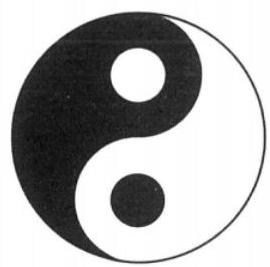

(第 9 题图)

10. 已知 $f\left( x\right)  = x + \frac{a}{2x}$ . 若曲线 $y = f\left( x\right)$ 存在两条过 $\left( {2,0}\right)$ 点的切线,则 $a$ 的取值范围是___.

11. 袋中有 4 个黑球、 3 个白球. 现掷一枚均匀的骰子, 掷出几点就从袋中取出几个球. 若已知取出的球全是白球，则掷出 2 点的概率为___.

12. 已知函数 $y = f\left( {x - a}\right)$ 的图像关于直线 $x = a$ 对称，函数 $y = f\left( x\right)$ 的导函数是 ${f}^{\prime }\left( x\right)$ ，对于任意的 $x \in  \left\lbrack  {0,\frac{\pi }{2}}\right) ,{f}^{\prime }\left( x\right) \cos x + f\left( x\right) \sin x < 0$ 恒成立，有不等式: $1/\sqrt{3}f\left( \frac{\pi }{3}\right)  < \; f\left( \frac{\pi }{6}\right)$ ; ② $- \sqrt{3}f\left( {-\frac{\pi }{3}}\right)  > f\left( {-\frac{\pi }{6}}\right)$ ; ③ $f\left( \frac{\pi }{4}\right)  < \sqrt{2}f\left( {-\frac{\pi }{3}}\right)$ ; ④ $f\left( 0\right)  > \sqrt{2}f\left( {-\frac{\pi }{4}}\right)$ . 其中成立的是___(填写序号).

## 二、选择题(每题 4 分，共 16 分)

13. 已知 $f\left( x\right)  = 2{x}^{2}$ ,数列 $\left\{  {a}_{n}\right\}$ 满足 ${a}_{1} = 2$ ,且对一切 $n$ 为正整数,有 ${a}_{n + 1} = f\left( {a}_{n}\right)$ ,则 ( )

A. $\left\{  {a}_{n}\right\}$ 是等差数列 B. $\left\{  {a}_{n}\right\}$ 是等比数列

C. $\left\{  {{\log }_{2}{a}_{n}}\right\}$ 是等比数列 D. $1 + {\log }_{2}{a}_{n}$ 是等比数列

14. 如图, 何尊是我国西周早期的青铜礼器, 其造型浑厚, 工艺精美, 尊内底铸铭文中的“宅兹中国”为“中国”一词最早的文字记载，何尊还是第一个出现“德”字的器物，证明了周王朝以德治国的理念，何尊的形状可近似看作是圆台和圆柱的组合体,组合体的高约为 ${40}\mathrm{\;{cm}}$ ,上口直径约为 ${28}\mathrm{\;{cm}}$ ,经测量可知圆台的高约为 ${16}\mathrm{\;{cm}}$ ,圆柱的底面直径约为 ${18}\mathrm{\;{cm}}$ ,设 $\pi$ 的值取为 3,则该组合体的体积约为 ( )

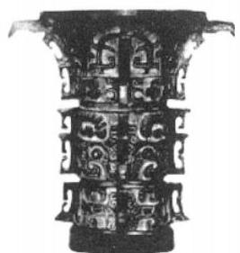

(第 14 题图)

A. ${11280}{\mathrm{\;{cm}}}^{3}$ B. ${12380}{\mathrm{\;{cm}}}^{3}$ C. ${12680}{\mathrm{\;{cm}}}^{3}$ D. ${12280}{\mathrm{\;{cm}}}^{3}$

15. 现从男、女共 8 名学生中选出 2 名男生和 1 名女生分别参加学校“资源”“生态”和“环保” 三个夏令营活动，已知共有 90 种不同的方案，那么男、女学生的人数分别是 0 ( ) ( )

A. 2,6 B. 3、5 C. 5、3 D. 6、2

16. 已知 $P$ 为抛物线 $C : {y}^{2} = {2px}\left( {p > 0}\right)$ 上的动点， $Q\left( {4, - 4}\right)$ 在抛物线 $C$ 上，过抛物线 $C$ 的焦点 $F$ 的直线 $l$ 与抛物线 $C$ 交于 $A$ 、 $B$ 两点， $M\left( {3, - 2}\right)$ ， $N\left( {-1,1}\right)$ ，则下列说法中错误的是 ( )

A. $\left| {PM}\right|  + \left| {PF}\right|$ 的最小值为 4

B. 若线段 ${AB}$ 的中点为 $M$ ，则 $\bigtriangleup  {NAB}$ 的面积为 $\sqrt{2}$

C. 若 ${NA} \bot  {NB}$ ,则直线 $l$ 的斜率为 2

D. 过点 $E\left( {1,2}\right)$ 作两条直线与抛物线 $C$ 分别交于点 $G\text{ 、 }H$ ，且满足 ${EF}$ 平分 $\angle {GEH}$ ，则直线 ${GH}$ 的斜率为定值

## 三、解答题(每题 12 分，共 36 分)

17. 如图，正三棱柱 ${ABC} - {A}_{1}{B}_{1}{C}_{1}$ 中， ${AB} = {A{A}_{1}} = 2$ ，点 $D$ 、 $E$ 分别为 ${AC}$ 、 $A{A}_{1}$ 的中点.

(1)求点 ${B}_{1}$ 到平面 ${BDE}$ 的距离；

(2)求二面角 $D - {BE} - {C}_{1}$ 的余弦值.

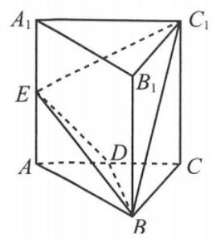

(第 17 题图)

18. 已知 $\bigtriangleup  {ABC}$ 中， $a$ 、 $b$ 、 $c$ 分别是角 $A$ 、 $B$ 、 $C$ 所对的边， $a\sin \frac{A + C}{2} = b\sin A$ ，且 $a = 1$ .

(1)求 $B$ ；

(2)若 ${AC} = {BC}$ ，在 $\bigtriangleup  {ABC}$ 的边 ${AB}$ 、 ${AC}$ 上分别取 $D$ 、 $E$ 两点，使 $\bigtriangleup  {ADE}$ 沿线段 ${DE}$ 折叠到平面 ${BCE}$ 后,顶点 $A$ 正好落在边 ${BC}$ (设为点 $P$ )上,求此情况下 ${AD}$ 的最小值.

19. 深受广大球迷喜爱的某支足球队. 在对球员的使用上总是进行数据分析, 为了考查甲球员对球队的贡献, 现作如下数据统计:

<table><tr><td></td><td>球队胜</td><td>球队负</td><td>总计</td></tr><tr><td>甲参加</td><td>22</td><td>$b$</td><td>30</td></tr><tr><td>甲未参加</td><td>$c$</td><td>12</td><td>$d$</td></tr><tr><td>总计</td><td>30</td><td>e</td><td>$n$</td></tr></table>

(1)求 $b$ 、 $c$ 、 $d$ 、 $e$ 、 $n$ 的值，据此能否有 97.5% 的把握认为球队胜利与甲球员参赛有关；

(2)根据以往的数据统计，乙球员能够胜任前锋、中锋、后卫以及守门员四个位置，且出场率分别为:0.2、0.5、0.2、0.1，当乙球员出任前锋、中锋、后卫以及守门员时，球队输球的概率依次为:0.4、0.2、0.6、0.2 . 则:

①当他参加比赛时，求球队某场比赛输球的概率；

②当他参加比赛时，在球队输了某场比赛的条件下，求乙球员担当前锋的概率；

③如果你是教练员，应用概率统计有关知识，该如何使用乙球员?

附表及公式:

<table><tr><td>$P\left( {{K}^{2} \geq  k}\right)$</td><td>0.15</td><td>0.10</td><td>0.05</td><td>0.025</td><td>0.010</td><td>0.005</td><td>0.001</td></tr><tr><td>$k$</td><td>2.072</td><td>2.706</td><td>3.841</td><td>5.024</td><td>6.635</td><td>7.879</td><td>10.828</td></tr></table>

注: ${K}^{2} = \frac{n{\left( ad - bc\right) }^{2}}{\left( {a + b}\right) \left( {c + d}\right) \left( {a + c}\right) \left( {b + d}\right) }$ .

## 综合基础强化 3

## 一、填空题(每题 4 分，共 48 分)

1. 设全集 $U = \mathbf{R}$ ，集合 $A = \left\{  {x \mid  {2}^{x} > 1}\right\}  , B = \left\{  {y \mid  y = {x}^{2} - 1, x \in  \mathbf{R}}\right\}$ ，则 $\overline{A} \cap  B =$ ___.

2. 设 $\left( {1 - \mathrm{i}}\right) z = 2$ ,则 $\arg z =$ ___.

3. 已知向量 $\overrightarrow{a} = \left( {1,0,2}\right) ,\overrightarrow{b} = \left( {2,1,0}\right)$ ，则 $\overrightarrow{a}$ 与 $\overrightarrow{b}$ 的夹角为___.

4. 已知 $\sin \left( {\alpha  + \frac{\pi }{6}}\right)  = \frac{\sqrt{3}}{3}$ ,则 $\cos \left( {\frac{2\pi }{3} - {2\alpha }}\right)  =$ ___.

5. ${\left( \sqrt{x} - \frac{2}{x}\right) }^{n}$ 的展开式的二项式系数之和为 64,则展开式中的常数项为___.

6. 已知 $F$ 是抛物线 ${y}^{2} = {2px}\left( {p > 0}\right)$ 的焦点,过 $F$ 的直线与抛物线交于 $A$ 、 $B$ 两点, ${AB}$ 的中点为 $C$ ，过 $C$ 作抛物线准线的垂线交准线于 ${C}_{1}$ ，若 $C{C}_{1}$ 的中点为 $M\left( {1,4}\right)$ ，则 $p =$ ___.

7. 正项等比数列 $\left\{  {a}_{n}\right\}$ 中，存在两项 ${a}_{m}$ 、 ${a}_{n}$ 使得 $\sqrt{{a}_{m}{a}_{n}} = 4{a}_{1}$ ，且 ${a}_{6} = {a}_{5} + 2{a}_{4}$ ，则 $\frac{1}{m} + \frac{4}{n}$ 最小值___.

8. 五声音阶是中国古乐的基本音阶，故有成语“五音不全”. 中国古乐中的五声音阶依次为: 宫、商、角、徵、羽. 如果把这五个音阶全用上，排成一个 5 个音阶的音序，从所有的这些音序中随机抽出一个音序, 则这个音序中宫、羽不相邻的概率为___.

9. 已知曲线 ${C}_{1}\text{ 、 }{C}_{2}$ 的极坐标方程分别为 $\rho \cos \theta  = 2\text{ 、 }\rho  = 4\cos \theta \left( {\rho  \geq  0,0 \leq  \theta  < \frac{\pi }{2}}\right)$ ,则曲线 ${C}_{1}$ 与 ${C}_{2}$ 交点的极坐标为___.

10. 已知 $A\left( {2,2}\right) , B\left( {-1, - 2}\right)$ ,直线 $l : {2x} - {2ay} + 3 - {3a} = 0$ 上存在点 $P$ 满足 $\left| {PA}\right|  + \left| {PB}\right|  =$ 5，则直线 $l$ 的倾斜角的取值范围是___.

11. 某次数学考试中，学生成绩 $X$ 服从正态分布 $\left( {{105},{\delta }^{2}}\right)$ . 若 $P\left( {{90} \leq  X \leq  {120}}\right)  = \frac{1}{2}$ ，则从参加这次考试的学生中任意选取 3 名学生，至少有 2 名学生的成绩高于 120 的概率是___.

12. 已知函数 $f\left( x\right)$ 的定义域为 $\{ 1,2,3\}$ ,值域为集合 $\{ 1,2,3,4\}$ 的非空真子集,设点 $A\left( {1, f\left( 1\right) }\right) \text{ 、 }B\left( {2, f\left( 2\right) }\right) \text{ 、 }C\left( {3, f\left( 3\right) }\right)$ ,且 $\left( {\overrightarrow{BA} + \overrightarrow{BC}}\right)  \cdot  \overrightarrow{AC} = 0$ ,则满足条件的函数 $x > 1$ 的个数是___.

## 二、选择题(每题 4 分，共 16 分)

13. 若 $l$ 、 $m$ 为空间两条不同的直线， $\alpha$ 、 $\beta$ 为空间中两个不同的平面，则 $l\bot \alpha$ 的一个充分条件是 ( )

A. $l//\beta$ 且 $\alpha  \bot  \beta$ B. $l \subset  \beta$ 且 $\alpha  \bot  \beta$ C. $l \bot  \beta$ 且 $\alpha //\beta$ D. $l \bot  m$ 且 $m//\alpha$

14. 将函数 $f\left( x\right)  = \sin {2x} + 2\sqrt{3}{\cos }^{2}x - \sqrt{3}$ 图像向右平移 $\frac{\pi }{12}$ 个单位，再把各点的横坐标伸长到原来的 2 倍 (纵坐标不变)，得到函数 $g\left( x\right)$ 的图像，则下列说法中正确的是 ( )

A. $g\left( x\right)$ 的周期为 $\pi$ B. $g\left( x\right)$ 是偶函数

C. $g\left( x\right)$ 的图像关于直线 $x = \frac{\pi }{12}$ 对称 D. $g\left( x\right)$ 在 $\left( {-\frac{\pi }{6},\frac{\pi }{3}}\right)$ 上单调递增

15. 某学校数学建模小组为了研究双层玻璃窗户中每层玻璃厚度 $d$ (每层玻璃的厚度相同) 及两层玻璃间夹空气层厚度 $l$ 对保温效果的影响,利用热传导定律得到热传导量 $q$ 满足关系式 $q = {\lambda }_{1}\frac{\left| \Delta T\right| }{d\left( {\frac{{\lambda }_{1}l}{{\lambda }_{2}d} + 2}\right) }$ ,其中玻璃的热传导系数 ${\lambda }_{1} = 4 \times  {10}^{-3}\mathrm{\;J}/\left( {\mathrm{{cm}} \cdot  {}^{ \circ  }\mathrm{C}}\right)$ ,不流通、干燥空气的热传导系数 ${\lambda }_{2} = {2.5} \times  {10}^{-4}\mathrm{\;J}/\left( {\mathrm{{cm}} \cdot  {}^{ \circ  }\mathrm{C}}\right) ,{\Delta T}$ 为室内外温度差, $q$ 值越小,保温效果越好, 现有 4 种型号的双层玻璃窗户, 具体数据如下表:

<table><tr><td>型号</td><td>每层玻璃厚度 $d$ (单位:cm)</td><td>玻璃间夹空气层厚度 $l$ (单位:cm)</td></tr><tr><td>A 型</td><td>0.4</td><td>3</td></tr><tr><td>B 型</td><td>0.3</td><td>4</td></tr><tr><td>C 型</td><td>0.5</td><td>3</td></tr><tr><td>D 型</td><td>0.4</td><td>4</td></tr></table>

则保温效果最好的双层玻璃的型号是 ( )

A. A 型 B. B 型 C. C 型 D. D 型

16. 设函数 $f\left( x\right)  = \frac{\sin {\pi x}}{{x}^{2} - x + \frac{5}{4}}$ ,命题 $p$ : 函数 $f\left( x\right)$ 既有最大值,又有最小值; 命题 $q$ : 函数

$f\left( x\right)$ 既有对称轴,又有对称中心; 则 ( )

A. $p$ 真 $q$ 真 B. $p$ 真 $q$ 假 C. $p$ 假 $q$ 真 D. $p$ 假 $q$ 假

## 三、解答题(每题 12 分，共 36 分)

17. $\bigtriangleup {ABC}$ 中的内角 $A\text{ 、 }B\text{ 、 }C$ 所对的边分别为 $a\text{ 、 }b\text{ 、 }c$ ,设 $b + b\cos A = \sqrt{3}a\sin B$ .

(1)求 $A$ ；

(2)若 $b + c = \sqrt{2}a$ ， $\bigtriangleup  {ABC}$ 的外接圆半径为 2，求 $\bigtriangleup  {ABC}$ 的面积.

18. 已知数列 $\left\{  {a}_{n}\right\}$ 的前 $n$ 项和为 ${S}_{n}$ ,且 ${a}_{2} = \frac{1}{9},3{S}_{n + 1} = {S}_{n} + 1$ ,又知正项等差数列 $\left\{  {b}_{n}\right\}$ 满足 ${b}_{1} = 2$ ,且 ${b}_{1},{b}_{2} - 1,{b}_{3}$ 成等比数列.

(1)求 $\left\{  {a}_{n}\right\}$ 和 $\left\{  {b}_{n}\right\}$ 的通项公式；

(2)证明: ${a}_{{b}_{1}} + {a}_{{b}_{2}} + \cdots  + {a}_{{b}_{n}} < \frac{3}{26}$ .

19. 已知函数 $f\left( x\right)  = {x}^{4} + m{x}^{3}$ .

(1)若 $m =  - 4$ ，求 $f\left( x\right)$ 的单调区间；

(2)是否存在非零实数 $m$ ，使得直线 $y = {mx}$ 与曲线 $y = f\left( x\right)$ 相切？若存在，求 $m$ 的值；若不存在, 说明理由.

## 综合基础强化 4

## 一、填空题(每题 4 分，共 48 分)

1. 设集合 $A = \{  - 2, - 1,0,1,2,3\} , B = \left\{  {x \mid  y = \sqrt{\left( {x - 2}\right) \left( {5 - x}\right) }}\right\}$ ，则 $A \cap  B =$ ___.

2. 已知 $\bar{z} = 2 - \mathrm{i}$ ，则 $\frac{z\left( {z - \mathrm{i}}\right) }{1 + \mathrm{i}} =$ ___.

3. 设函数 $y = f\left( x\right)$ 的定义域为 $\mathbf{R}$ ，且满足 $y = f\left( {x + 2}\right)$ 是奇函数，则 $f\left( 2\right)  =$ ___.

4. 设 ${S}_{n}$ 为等比数列 $\left\{  {a}_{n}\right\}$ 的前 $n$ 项和. 若 ${S}_{2} = 4,{S}_{4} = 6$ ,则 ${S}_{8} =$ ___.

5. 方程 ${\log }_{2}\left( {{4}^{x} - 3}\right)  = x + 1$ 的解 $x =$

6. 将 4 个不加区分的红球和 2 个不加区分的黄球随机排一行, 则 2 个黄球不相邻的概率为___.

7. 设 $a\text{ 、 }b\text{ 、 }c$ 是 $\bigtriangleup {ABC}$ 的内角 $A\text{ 、 }B\text{ 、 }C$ 所对应的三边. 已知 $A = \frac{\pi }{3}, b = 2$ ,则边 $a$ 的最小值为___.

8. 已知 ${F}_{1}\text{ 、 }{F}_{2}$ 是椭圆 $C : \frac{{x}^{2}}{{a}^{2}} + \frac{{y}^{2}}{{b}^{2}} = 1\left( {a > b > 0}\right)$ 的两个焦点, $P$ 为 $C$ 上一点,且 $\angle {F}_{1}P{F}_{2} = \; {60}^{ \circ  },\left| {P{F}_{1}}\right|  = 5\left| {P{F}_{2}}\right|$ ,则 $C$ 的离心率为___.

9. 已知 $a > 0, b > 0$ ,在 $\left( {\frac{1}{3}a{x}^{2} - \frac{1}{3}{bx} - 1}\right) {\left( x - 1\right) }^{3}$ 的展开式中,若 ${x}^{3}$ 项的系数为 2,则 $\frac{1}{a} + \frac{1}{b}$ 的最小值为___.

10. 已知 $A\text{ 、 }B\text{ 、 }C$ 是半径为 2 的球 $O$ 的球面上的三个点,且 ${AC} \bot  {BC},{AC} = {BC} = \sqrt{2}$ ,则三棱锥 $O - {ABC}$ 的体积为___.

11. 瑞士著名数学家欧拉在 1765 年提出定理:三角形的外心、重心、垂心位于同一直线上. 这条直线被后人称为三角形的“欧拉线”. 在平面直角坐标系中,作 $\bigtriangleup {ABC}$ ,使得 ${AB} = {AC}$ , 点 $B\left( {-1,1}\right)$ ,点 $C\left( {3,5}\right)$ ,过其 “欧拉线” 上一点 $P$ 作圆 $O : {x}^{2} + {y}^{2} = 4$ 的两条切线,切点分别为 $M\text{ 、 }N$ ,则 $\left| {MN}\right|$ 的最小值为___.

12. 已知单位向量 $\overrightarrow{e}$ ,向量 $\overrightarrow{{b}_{i}}\left( {i = 1,2}\right)$ 满足 $\left| {\overrightarrow{e} - \overrightarrow{{b}_{i}}}\right|  = \overrightarrow{e} \cdot  \overrightarrow{{b}_{i}}$ ,且 $x\overrightarrow{{b}_{1}} + y\overrightarrow{{b}_{2}} = \overrightarrow{e}$ ,其中 $x + y = 1$ , 当 $\left| {\overrightarrow{{b}_{1}} - \overrightarrow{{b}_{2}}}\right|$ 取到最小时, $\overrightarrow{{b}_{1}} \cdot  \overrightarrow{{b}_{2}} =$

## 二、选择题(每题 4 分，共 16 分)

13. 设数列 $\left\{  {a}_{n}\right\}$ 是等差数列, ${S}_{n}$ 是其前 $n$ 项和,且 ${S}_{4} < {S}_{5},{S}_{5} = {S}_{6} > {S}_{7}$ ,则下列结论中错误的是 ( )

A. $d < 0$ B. ${S}_{8} > {S}_{4}$

C. ${a}_{6} = 0$ D. ${S}_{5}$ 和 ${S}_{6}$ 均为 ${S}_{n}$ 的最大

14. 已知直线 $l$ 的解析式为 ${3x} - {4y} + 1 = 0$ ,则下列各式中是 $l$ 的参数方程的是 ( )

A. $\left\{  \begin{array}{l} x = 4 + {3t} \\  y = 3 - {4t} \end{array}\right.$ B. $\left\{  \begin{array}{l} x = 4 + {3t} \\  y = 3 + {4t} \end{array}\right.$ C. $\left\{  \begin{array}{l} x = 1 - {4t} \\  y = 1 + {3t} \end{array}\right.$ D. $\left\{  \begin{array}{l} x = 1 + {4t} \\  y = 1 + {3t} \end{array}\right.$

15. 已知 $\bigtriangleup {ABC}$ 是边长为 2 的等边三角形, $P$ 为平面 ${ABC}$ 内一点,则 $\overrightarrow{PA} \cdot  \left( {\overrightarrow{PB} + \overrightarrow{PC}}\right)$ 的最小值是 ( )

A. -2 B. $- \frac{3}{2}$ C. $- \frac{4}{3}$ D. -1

16. 若函数 $y = f\left( x\right)$ 的图像上存在两个不同的点 $A\text{ 、 }B$ ,使得曲线 $y = f\left( x\right)$ 在这两点处的切线重合,则称函数 $y = f\left( x\right)$ 为 “共切”函数,下列函数中是 “共切”函数的为 ( )

A. $y = \ln x + x$ B. $y = {\mathrm{e}}^{x} + x$ C. $y = {x}^{3} + 1$ D. $y = x - \cos x$

## 三、解答题(每题 12 分，共 36 分)

17. 多面体 ${ABC} - {A}_{1}{B}_{1}F$ 中,侧面 $A{A}_{1}{B}_{1}B$ 为正方形,平面 $A{A}_{1}{B}_{1}B \bot$ 平面 ${ABC},{AB} = {BC} \; = 2,{CF}//A{A}_{1},{CF} = \frac{1}{2}A{A}_{1}, E$ 为 ${AC}$ 的中点, $D$ 为棱 ${A}_{1}{B}_{1}$ 上的点, ${BF} \bot  {A}_{1}{B}_{1}$ .

(1)证明: ${AB}\bot {BC}$ ；

(2)求面 $B{B}_{1}{FC}$ 与面 ${DFE}$ 所成二面角的余弦值的最大值.

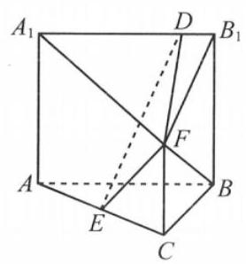

(第 17 题图)

18. 某校组织一场运动知识竞赛,规则如下: 有 $A\text{ 、 }B$ 两类问题,每位参加比赛的选手先在两类问题中选择一类并从中随机抽取一个问题回答, 若回答错误则该选手比赛结束, 若回答正确则从另一类问题中再随机抽取一个问题回答, 无论回答正确与否, 该选手比赛结束. $A$ 类问题中的每个问题回答正确得 30 分,否则得 0 分: $B$ 类问题中的每个问题回答正确得 70 分，否则得 0 分. 小明参加了本次知识竞赛，已知他能正确回答 $A$ 类问题的概率为 0.7,能正确回答 $B$ 类问题的概率为 0.6,且能正确回答问题的概率与回答次序无关.

(1)若小明选择先回答 $A$ 类问题，记 $X$ 为小明的累计得分，求 $X$ 的分布；

(2)为使累计得分的期望最大，小明应选择先回答哪类问题？并说明理由.

19. 平面直角坐标系 ${xOy}$ 中,点 ${F}_{1}\left( {-\sqrt{3},0}\right) \text{ 、 }{F}_{2}\left( {\sqrt{3},0}\right)$ ,点 $M$ 满足 $\left| {M{F}_{1}}\right|  - \left| {M{F}_{2}}\right|  =  \pm  2$ , 点 $M$ 的轨迹为曲线 $C$ .

(1)求曲线 $C$ 的方程；

(2)已知 $A\left( {1,0}\right)$ ，过点 $A$ 的直线 ${AP}$ 、 ${AQ}$ 与曲线 $C$ 分别交于点 $P$ 和 $Q$ (点 $P$ 和 $Q$ 都异于点 $A$ )，若满足 ${AP} \bot  {AQ}$ ，求证:直线 ${PQ}$ 过定点.

## 综合基础强化 5

## 一、填空题

1. 已知 $\mathrm{i}$ 为虚数单位,若复数 $z$ 满足 $\left( {1 - \mathrm{i}}\right) \bar{z} = 2$ ,则 $\left| z\right|  =$

2. 已知全集为 $\mathbf{R}$ ，集合 $A = \left\{  {x\left| {\;{\log }_{2}x < 4}\right. }\right\}  , B = \{ x \mid   - 2 < x < 2\}$ ，则 $B \cap  \overline{A} =$ ___.

3. 某公司 2021 年实现利润 100 万元，计划在以后 5 年中每年比上一年利润增长 8%，则 2026 年的利润是___万元. (结果精确到 1 万元)

4. 已知函数 $f\left( x\right)  = x\left( {1 + \frac{m}{1 - {\mathrm{e}}^{x}}}\right)$ 是偶函数，则 $m$ 的值是___.

5. 曲线 $f\left( x\right)  = {x}^{3}$ 在 $x = 2$ 处的切线与两坐标轴围成的封闭图形的面积为 $S =$ ___.

6. 将函数 $y = \cos x$ 的图像向右平移 $\varphi \left( {\varphi  > 0}\right)$ 个单位长度,所得图像与 $y = \sin x$ 的图像重合, 则 $\varphi$ 的一个可能的值为___.

7. 已知 $\sin \alpha  = \frac{3}{5}, a \in  \left( {\frac{\pi }{2},\pi }\right)$ ,则 $\frac{\cos {2\alpha }}{\sqrt{2}\sin \left( {\alpha  + \frac{\pi }{4}}\right) } =$ ___.

8. 高三年级的三个班到甲、乙、丙、丁四个工厂进行社会实践，其中工厂甲必须有班级去，每班去何工厂可自由选择，则不同的分配方案有___.

9. 若 ${\left( \sqrt{x} - \frac{2}{{x}^{2}}\right) }^{n}$ 的展开式中只有第六项的二项式系数最大,则展开式中的常数项是___.

10. 已知 $\bigtriangleup {OAB},{OA} = 1,{OB} = 2,\overrightarrow{OA} \cdot  \overrightarrow{OB} =  - 1$ ,过点 $O$ 作 ${OD}$ 垂直 ${AB}$ 于点 $D$ ,点 $E$ 满足 $\overrightarrow{OE} = \frac{1}{2}\overrightarrow{ED}$ ，则 $\overrightarrow{EO}$ ・ $\overrightarrow{EA}$ 的值为___.

11. 在平面四边形 ${ABCD}$ 中, ${AB} = {CD} = 1,{BC} = \sqrt{2},{AD} = 2,\angle {ABC} = {90}^{ \circ  }$ ,将 $\bigtriangleup {ABC}$ 沿 ${AC}$ 折成三棱锥，当三棱锥 $B - {ACD}$ 的体积最大时，三棱锥外接球的体积为___.

12. 右图是构造无理数的一种方法: 线段 $O{A}_{1} = 1$ ; 第一步,以线段 $O{A}_{1}$ 为直角边作直角三角形 $O{A}_{1}{A}_{2}$ ,其中 ${A}_{1}{A}_{2} = 1$ ; 第二步, 以 $O{A}_{2}$ 为直角边作直角三角形 $O{A}_{2}{A}_{3}$ ,其中 ${A}_{2}{A}_{3} = 1$ ; 第三步,以 $O{A}_{3}$ 为直角边作直角三角形 $O{A}_{3}{A}_{4}$ ,其中 ${A}_{3}{A}_{4} = 1;\cdots$ ; 如此延续下去, 可以得到长度为无理数的一系列线段, 如 $O{A}_{2}\text{ 、 }O{A}_{3}\text{ 、 }\cdots$ ,则 $\overrightarrow{O{A}_{2}} \cdot  \overrightarrow{O{A}_{4}} =$ ___.

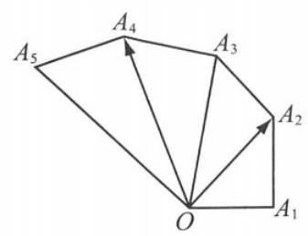

(第 12 题图)

## 二、选择题

13. “ $m = 1$ ” 是 “直线 ${4x} + {3y} + m = 0$ 与圆 ${x}^{2} + {y}^{2} - {2x} = 0$ 相切” 的 ( )

A. 充分不必要条件 B. 必要不充分条件

C. 充分必要条件 D. 既不充分也不必要条件

14. 已知 $\overrightarrow{a}\text{ 、 }\overrightarrow{b}$ 为单位向量,且 $\left( {4\overrightarrow{a} - \overrightarrow{b}}\right)  \bot  \left( {\overrightarrow{a} + 3\overrightarrow{b}}\right)$ ,则 $\overrightarrow{a}\text{ 、 }\overrightarrow{b}$ 夹角的余弦值为 ( )

A. $- \frac{7}{11}$ B. $- \frac{1}{11}$ C. $\frac{1}{11}$ D. $\frac{7}{11}$

15. 已知直线 $x - y + 1 = 0$ 经过椭圆 $\frac{{x}^{2}}{{a}^{2}} + \frac{{y}^{2}}{{b}^{2}} = 1\left( {a > b > 0}\right)$ 的左焦点 $F$ ，交椭圆于 $A$ 、 $B$ 两点， 交 $y$ 轴于点 $C$ . 若 $\overrightarrow{FC} = 2\overrightarrow{AC}$ ,则该椭圆的离心率是 ( )

A. $\frac{\sqrt{10} - \sqrt{2}}{2}$ B. $\frac{\sqrt{3} - 1}{2}$ C. $2\sqrt{2} - 2$ D. $\sqrt{2} - 1$

16. 某校为提升学生的综合素养、大力推广冰雪运动, 开设了“陆地冰壶”“陆地冰球”“滑冰” 和“模拟滑雪”四类冰雪运动体验课程. 甲、乙两名同学各自从中任意挑选两门课程学习， 设事件 $A$ 表示 “甲乙两人所选课程恰有一门相同”,事件 $B$ 表示 “甲乙两人所选课程完全不同”,事件 $C$ 表示“甲乙两人均未选择陆地冰壶课程”,则 ( )

A. $A$ 与 $B$ 为对立事件 B. $A$ 与 $C$ 互斥

C. $A$ 与 $C$ 相互独立 D. $B$ 与 $C$ 相互独立

## 三、解答题

17. 已知正项等比数列 $\left\{  {a}_{n}\right\}$ 的前 $n$ 项和为 ${S}_{n},{S}_{3} = 7{a}_{1}$ ,且 ${a}_{1},{a}_{2} + 2,{a}_{3}$ 成等差数列.

(1)求 $\left\{  {a}_{n}\right\}$ 的通项公式；

(2)若 ${b}_{n} = \left\{  \begin{array}{l} {a}_{n}, n\text{ 为奇数,求数列 }\left\{  {b}_{n}\right\}  \text{ 的前 }{2n}\text{ 项和 }{T}_{2n}. \\  n, n\text{ 为偶数, } \end{array}\right.$

18. 如图,在三棱锥 $P - {ABC}$ 中, ${AC} = 2,{BC} = 4,\bigtriangleup {PAC}$ 为正三角形, $D$ 为 ${AB}$ 的中点, ${AC} \bot  {PD},\angle {PCB} = {90}^{ \circ  }$ .

(1)求证: ${BC}\bot$ 平面 ${PAC}$ ；

(2)求 ${PD}$ 与平面 ${PBC}$ 所成角的正弦值.

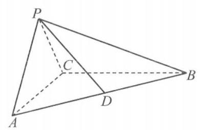

(第 18 题图)

19. 已知函数 $f\left( x\right)  = x - \frac{1}{x} - 2\ln x$ .

(1)判断函数 $f\left( x\right)$ 的单调性，并加以证明；

(2)设 $g\left( x\right)  = f\left( {x}^{2}\right)  - {8bf}\left( x\right)$ ，当 $x > 1$ 时， $g\left( x\right)  > 0$ 恒成立，求实数 $b$ 的取值范围.

## 综合基础强化 6

## 一、填空题

1. 设集合 $A = \{ x \mid  {x}^{2} + x - 6 < 0\} , B = \{ x \mid  x + 1 > 0\}$ ，则 $A \cap  B =$ ___.

2. 已知复数 $z = \left( {2 + \mathrm{i}}\right) \mathrm{i}$ ，其中 $\mathrm{i}$ 为虚数单位，则 $z\bar{z}$ 的值为___.

3. 已知直线 $l : x + 1 = 0$ ，点 $P\left( {1,0}\right)$ ，圆心为 $M$ 的动圆经过点 $P$ ，且与直线 $l$ 相切，则点 $M$ 的轨迹方程为___.

4. 已知函数 $f\left( x\right)  = {3}^{x} - {2}^{x}, x \in  \mathbf{R}$ ,若存在 $a \in  \mathbf{R}$ ,使得函数 $y = \frac{f\left( x\right) }{{a}^{x}}$ 为奇函数,则 $a$ 的值为___.

5. 已知随机变量 $X \sim  N\left( {4,{2}^{2}}\right)$ ,则 $P\left( {8 < X < {10}}\right)$ 的值约为___.

附:若 $Y \sim  N\left( {\mu ,{\sigma }^{2}}\right)$ ,则 $P\left( {\mu  - \sigma  < Y < \mu  + \sigma }\right)  \approx  {0.6827}, P\left( {\mu  - {2\sigma } < Y < \mu  + {2\sigma }}\right)  \approx  {0.9545}$ , $P\left( {\mu  - {3\sigma } < Y < \mu  + {3\sigma }}\right)  \approx  {0.9974}.$

6. 直线 $x + y + a = 0$ 与曲线 $y = x - 2\ln x$ 相切，则实数 $a$ 的值为___.

7. 在 $\left( {1 - \frac{1}{{x}^{2}}}\right) {\left( 1 + x\right) }^{6}$ 的展开式中， ${x}^{3}$ 项的系数为___.

8. 已知圆柱的轴截面是边长为 2 的正方形， $P$ 为上底面圆的圆心， ${AB}$ 为下底面圆的直径， $E$ 为下底面圆周上一点,则三棱锥 $P - {ABE}$ 外接球的表面积为___.

9. 已知椭圆 $\frac{{x}^{2}}{{a}^{2}} + \frac{{y}^{2}}{{b}^{2}} = 1\left( {a > b > 0}\right)$ 的左、右焦点分别为 ${F}_{1}$ 、 ${F}_{2}$ ，左顶点为 $A$ ，上顶点为 $B$ ，点 $P$ 为椭圆上一点,且 $P{F}_{2} \bot  {F}_{1}{F}_{2}$ . 若 ${AB}//{P{F}_{1}}$ ，则椭圆的离心率为___.

10. 双曲线 ${x}^{2} - \frac{{y}^{2}}{4} = 1$ 右焦点为 $F$ ，点 $P$ 、 $Q$ 在双曲线上，且关于原点对称. 若 ${PF} \bot  {QF}$ ，则 $\bigtriangleup  {PQF}$ 的面积为___.

11. 若 $a > 0, b > 0$ ，且 $a + b = 2$ ，有下列不等式:① ${ab} \leq  1$ ；② $\sqrt{a} + \sqrt{b} \leq  \sqrt{2}$ ；③ ${a}^{2} + {b}^{2} \geq  2$ ； ④ $\frac{1}{a} + \frac{1}{b} > 1$ . 其中正确的是___.

12. 若函数 $f\left( x\right)  = {2x} - \sin x - a$ 在 $\left( {-\pi ,\pi }\right)$ 上存在唯一的零点 ${x}_{1}$ ,函数 $g\left( x\right)  = {x}^{2} + \cos x - {ax} + \; a$ 在 $\left( {-\pi ,\pi }\right)$ 上存在唯一的零点 ${x}_{2}$ ，且 ${x}_{1} < {x}_{2}$ ，则实数 $a$ 的取值范围为___.

## 二、选择题

13. 已知 $l$ 、 $m$ 是两条不同的直线， $\alpha$ 、 $\beta$ 是两个不同的平面，则下列选项中，“ $l\bot m$ ”的充分条件是 ( )

A. $\alpha  \bot  \beta , l \bot  \alpha , m//\beta$ B. $\alpha //\beta , l//\alpha , m \bot  \beta$

C. $\alpha  \bot  \beta , l \subset  \alpha , m \subset  \beta$ D. $\alpha  \bot  \beta , l//\alpha , m//\beta$

14. 阻尼器是一种以提供阻力达到减震效果的专业工程装置. 上海中心大厦的阻尼器减震装置, 被称为 “镇楼神器”, 如图 1. 由物理学知识可知, 某阻尼器的运动过程可近似为单摆运动,其离开平衡位置的位移 $y\left( \mathrm{\;m}\right)$ 和时间 $t\left( \mathrm{\;s}\right)$ 的函数关系为 $y = \sin \left( {{\omega t} + \varphi }\right) (\omega  > 0,\left| \varphi \right|  < \; \pi )$ ,如图 2. 若该阻尼器在摆动过程中连续三次到达同一位置的时间分别为 ${t}_{1}\text{ 、 }{t}_{2}\text{ 、 }{t}_{3}\left( {0 < }\right. \; \left. {{t}_{1} < {t}_{2} < {t}_{3}}\right)$ ,且 ${t}_{1} + {t}_{2} = 2,{t}_{2} + {t}_{3} = 6$ ,则在一个周期内阻尼器离开平衡位置的位移大于 ${0.5}\mathrm{\;m}$ 的总时间为 ( )

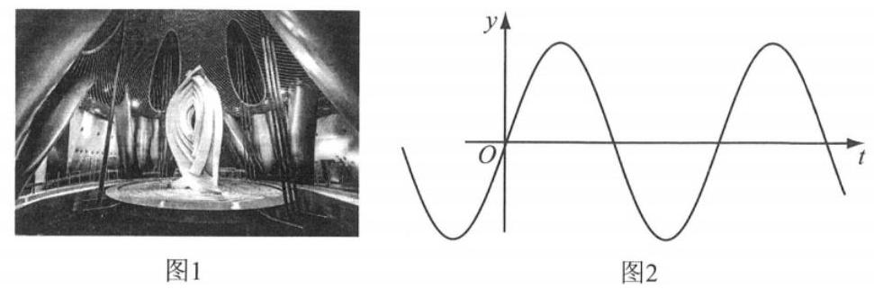

(第 4 题图)

A. $\frac{1}{3}\mathrm{\;s}$ B. $\frac{2}{3}\mathrm{\;s}$ C. $1\mathrm{\;s}$

D. $\frac{4}{3}\mathrm{\;s}$

15. 已知函数 $f\left( x\right)$ ,任意 $x\text{ 、 }y \in  \mathbf{R}$ ,满足 $f\left( {x + y}\right) f\left( {x - y}\right)  = {f}^{2}\left( x\right)  - {f}^{2}\left( y\right)$ ,且 $f\left( 1\right)  = 2$ , $f\left( 2\right)  = 0$ ,则 $f\left( 1\right)  + f\left( 2\right)  + \cdots  + f\left( {90}\right)$ 的值为 ( )

A. -2 B. 0 C. 2 D. 4

16. 已知函数 $f\left( x\right)  = \left\{  \begin{array}{l} {x}^{2}, x \geq  0, \\   - {x}^{2}, x < 0. \end{array}\right.$ 若对任意 $x \geq  1, f\left( {x + {2m}}\right)  + {mf}\left( x\right)  > 0$ 恒成立，则实数 $m$ 的取值范围是 ( )

A. $\left( {-1, + \infty }\right)$ B. $\left( {-\frac{1}{4}, + \infty }\right)$ C. $\left( {0, + \infty }\right)$ D. $\left( {-\frac{1}{2},1}\right)$

## 三、解答题

17. 在平面四边形 ${ABCD}$ 中, $\angle {ABD} = {45}^{ \circ  },{AB} = 6,{AD} = 3\sqrt{2}$ . 对角线 ${AC}$ 与 ${BD}$ 交于点 $E$ , 且 ${AE} = {EC},{DE} = {2BE}$ .

(1)求 ${BD}$ 的长；

(2)求 $\cos \angle {ADC}$ 的值.

18. 已知数列 $\left\{  {a}_{n}\right\}$ 中, ${a}_{1} = 6,{a}_{2} = {12},{a}_{3} = {20}$ ,且数列 $\left\{  {{a}_{n + 1} - {a}_{n}}\right\}$ 为等差数列, $n \in  {\mathbf{N}}^{ * }$ .

(1)求数列 $\left\{  {a}_{n}\right\}$ 的通项公式；

(2)设数列 $\left\{  \frac{1}{{a}_{n}}\right\}$ 的前 $n$ 项和为 ${S}_{n}$ ，证明: ${S}_{n} < \frac{1}{2}$ .

19. 已知抛物线 $C : {y}^{2} = {2px}$ ( $p > 0$ )的焦点为 $F$ ，过点 $P\left( {0,2}\right)$ 的动直线 $l$ 与抛物线相交于 $A$ 、 $B$ 两点. 当 $l$ 经过点 $F$ 时,点 $A$ 恰好为线段 ${PF}$ 中点.

(1)求 $p$ 的值；

(2)是否存在定点 $T$ ，使得 $\overrightarrow{TA} \cdot  \overrightarrow{TB}$ 为常数？若存在，求出点 $T$ 的坐标及该常数；若不存在, 说明理由.

## 综合基础强化 7

## 一、填空题(每题 4 分，共 48 分)

1. 设全集 $U = \mathbf{R}$ ，若集合 $A = \{ 1,2,3,4\} , B = \{ x \mid  2 \leq  x \leq  3\}$ ，则 $A \cap  \bar{B} =$ ___.

2. 若复数 $z = 1 + 2\mathrm{i}$ ，其中 $\mathrm{i}$ 是虚数单位，则 $\left( {z + \frac{1}{\bar{z}}}\right)  \cdot  \bar{z} =$ ___.

3. 已知 $f\left( x\right)  = {x}^{3} + {2x} + \sin x$ ，若 $f\left( a\right)  = 2$ ，则 $f\left( {-a}\right)  =$ ___.

4. 某企业有甲、乙、丙三个工厂，甲厂有 200 名职工，乙厂有 500 名职工，丙厂有 100 名职工. 现企业决定采用分层抽样的方法, 从三个工厂抽取 40 名职工, 进行新个税政策宣传培训工作，则应从甲厂抽取的职工人数为___人.

5. 若抛物线 ${y}^{2} = {2px}$ 的焦点与椭圆 $\frac{{x}^{2}}{9} + \frac{{y}^{2}}{5} = 1$ 的右焦点重合，则该抛物线的准线方程为:___.

6. 为强化安全意识，某商场拟在未来的连续 10 天中随机选择 3 天进行紧急疏散演练，则选择的 3 天恰好为连续 3 天的概率是___(结果用最简分数表示).

7. 设无穷等比数列 $\left\{  {a}_{n}\right\}$ 的公比为 $q$ ,若 ${a}_{1} = \mathop{\lim }\limits_{{n \rightarrow  \infty }}\left( {{a}_{3} + {a}_{4} + \cdots }\right)$ ,则 $q =$ ___.

8. 已知 $x > 0, y > 0$ ，且 $\frac{1}{x} + {2y} = 3$ ，则 $\frac{y}{x}$ 的最大值为___.

9. 在 ${\left( 1 + x + \frac{1}{{x}^{2022}}\right) }^{10}$ 的展开式中， ${x}^{2}$ 项的系数为___(结果用数值表示).

10. 已知函数 $f\left( x\right)$ 的周期为 1，且当 $0 < x \leq  1$ 时， $f\left( x\right)  = {\log }_{2}x$ ，则 $f\left( \frac{3}{2}\right)  =$ ___.

11. 函数 $f\left( x\right)  = {x}^{3} - 3{x}^{2} + 1$ 的切线过点 $\left( {-1,1}\right)$ ，则切线方程为___.

12. 在平面直角坐标系中, $A\left( {-{12},0}\right) , B\left( {0,6}\right)$ ,点 $P$ 在圆 $O : {x}^{2} + {y}^{2} = {50}$ 上,若 $\overrightarrow{PA} \cdot  \overrightarrow{PB} \leq$ 20，则点 $P$ 的横坐标的取值范围是___.

## 二、选择题(每题 4 分，共 16 分)

13. 某地区空气质量检测资料表明，一天的空气质量为优良的概率为 0.75，连续两天为优良的概率为 0.6 , 已知某天的空气质量为优良, 则随后一天的空气质量为优良的概率是 ( )

A. 0.8 B. 0.75 C. 0.6 D. 0.45

14. 满足 $a, b \in  \{  - 1,0,1,2\}$ ,且关于 $x$ 的方程 $a{x}^{2} + {2x} + b = 0$ 有实数解的有序数对 $\left( {a, b}\right)$ 的个数为 ( )

A. 14 B. 13 C. 12 D. 10

第81页，共188页

15. 设 $f\left( x\right)  = {\sin }^{2}x + b\sin x + c$ ,则函数 $y = f\left( x\right)$ 的最小正周期 ( )

A. 与 $b$ 有关,且与 $c$ 有关 B. 与 $b$ 有关,但与 $c$ 无关

C. 与 $b$ 无关,且与 $c$ 无关 D. 与 $b$ 无关，但与 $c$ 有关

16. ” $a \leq  0$ ” 是 “函数 $y = \left| {\left( {{ax} - 1}\right) x}\right|$ 在区间 $\left( {0, + \infty }\right)$ 内单调递增” 的 ( )

A. 充分非必要条件 B. 必要非充分条件

C. 充要条件 D. 既非充分也非必要条件

## 三、解答题(每题 12 分，共 36 分)

17. 如图，在 $\bigtriangleup  {ABC}$ 中， ${\angle {ACB}} = {90}^{ \circ  }$ ， ${\angle {ABC}} = {30}^{ \circ  }$ ， ${BC} = \sqrt{3}$ ，在三角形内挖去一个半圆，圆心 $O$ 在边 ${BC}$ 上，半圆与 ${AC}$ 、 ${AB}$ 分别相切于点 $C$ 、 $M$ ，与 ${BC}$ 交于另一点 $N$ ，将 $\bigtriangleup {ABC}$ 绕直线 ${BC}$ 旋转一周得到一个旋转体.

(1)求该旋转体中间空心球的表面积的大小；

(2)求图中阴影部分绕直线 ${BC}$ 旋转一周所得旋转体的体积.

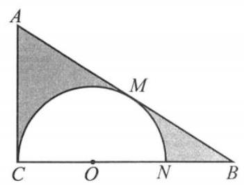

(第 17 题图)

18. 如图是某采矿厂的污水排放量 $y$ (单位: 吨)与矿产品年产量 $x$ (单位: 吨)的折线图:

(1)依据折线图计算相关系数 $r$ (精确到 0.01)，并据此判断是否可用线性回归模型拟合 $y$ 与 $x$ 的关系? (若 $\left| r\right|  > {0.75}$ ,则线性相关程度很高,可用线性回归模型拟合)

(2)若可用线性回归模型拟合 $y$ 与 $x$ 的关系，请建立 $y$ 关于 $x$ 的线性回归方程，并预测年产量为 10 吨时的污水排放量.

相关公式: $r = \frac{\mathop{\sum }\limits_{{i = 1}}^{n}\left( {{x}_{i} - \bar{x}}\right) \left( {{y}_{i} - \bar{y}}\right) }{\sqrt{\mathop{\sum }\limits_{{i = 1}}^{n}{\left( {x}_{i} - \bar{x}\right) }^{2}\mathop{\sum }\limits_{{i = 1}}^{n}{\left( {y}_{i} - \bar{y}\right) }^{2}}}$ ,

参考数据: $\sqrt{0.3} \approx  {0.55},\sqrt{0.9} \approx  {0.95}$ .

回归方程 $\widehat{y} = \widehat{b}x + \widehat{a}$ 中, $\widehat{b} = \frac{\mathop{\sum }\limits_{{i = 1}}^{n}\left( {{x}_{i} - \bar{x}}\right) \left( {{y}_{i} - \bar{y}}\right) }{\mathop{\sum }\limits_{{i = 1}}^{n}{\left( {x}_{i} - \bar{x}\right) }^{2}},\widehat{a} = \bar{y} - \widehat{b}\bar{x}$ .

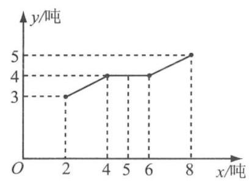

(第 18 题图)

19. 已知平面上一定点 $C\left( {2,0}\right)$ 和直线 $l : x = 8, P$ 为该平面上一动点,作 ${PQ} \bot  l$ ,垂足为 $Q$ ,且 $\left( {\overrightarrow{PC} + \frac{1}{2}\overrightarrow{PQ}}\right)  \cdot  \left( {\overrightarrow{PC} - \frac{1}{2}\overrightarrow{PQ}}\right)  = 0.$

(1)求动点 $P$ 的轨迹方程；

(2)若 ${EF}$ 为圆 $N : {x}^{2} + {\left( y - 1\right) }^{2} = 1$ 的任一条直径，求 $\overrightarrow{PE} \cdot  \overrightarrow{PF}$ 的最值.

## 综合基础强化 8

## 一、填空题(每题 4 分，共 48 分)

1. 设全集为 $U$ ,集合 $A\text{ 、 }B$ 满足 $A \subseteq  B$ ,则 $\overline{A}\;\overline{B}$ (填“ $\subseteq$ ”“ $\supseteq$ ”或“ $=$ ”).

2. 复数 $z$ 的共轭复数记为 $\bar{z}$ ，且满足 $z \cdot  \bar{z} = 1$ ， $z + \bar{z} = 1$ ，则 $z =$ ___.

3. 已知向量 $\overrightarrow{a} = \left( {1,0,2}\right) ,\overrightarrow{b} = \left( {-2,1,0}\right)$ ，则向量 $\overrightarrow{a}$ 与 $\overrightarrow{b}$ 的夹角为___.

4. 已知二项式 ${\left( ax + 1\right) }^{5}$ 的展开式中,含 ${x}^{2}$ 项的系数为 40,则 $a =$ ___.

5. 抛物线 ${y}^{2} =  - {px}\left( {p > 0}\right)$ 上动点 $Q$ 到焦点的距离最小值是 1,则 $p =$ ___.

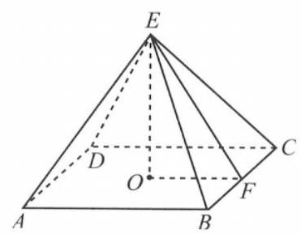

(第 6 题图)

6. 如图,正四棱锥 $E - {ABCD}$ ,其中 $F$ 为 ${BC}$ 的中点, $O$ 为 ${ABCD}$ 的中心，四棱锥的侧面积与的 $\bigtriangleup  {EOF}$ 面积之比为 $4\sqrt{6}$ ，则异面直线 ${AE}$ 与 ${BC}$ 的夹角为___.

7. 方程 ${\log }_{2}\left( {{9}^{x - 1} - 5}\right)  = {\log }_{2}\left( {{3}^{x - 1} - 2}\right)  + 2$ 的解为___.

8. 已知无穷等比数列 $\left\{  {a}_{n}\right\}$ 和 $\left\{  {b}_{n}\right\}$ ,满足 ${a}_{1} = 3,{b}_{n} = {a}_{2n},{b}_{n}$ 的各项和为 $\frac{18}{5}$ ，则数列 $\left\{  {a}_{n}\right\}$ 的各项和为___.

9. 从报名的 3 名男教师和 6 名女教师中，选取 5 人参加义务献血，要求男、女教师都有，则不同的选取方式的种数为___(结果用数值表示).

10. 在同一平面内,向量 $\overrightarrow{OA}$ 、 $\overrightarrow{OB}$ 、 $\overrightarrow{OC}$ 的模分别为1、1、 $\sqrt{2},\overrightarrow{OA}$ 与 $\overrightarrow{OC}$ 的夹角为 $\alpha ,\tan \alpha  = 7$ ， $\overrightarrow{OB}$ 与 $\overrightarrow{OC}$ 的夹角为 ${45}^{ \circ  }$ ，若 $\overrightarrow{OC} = m\overrightarrow{OA} + n\overrightarrow{OB}\left( {m > 0, n > 0}\right)$ ，则 $m + n =$ ___.

11. 设 ${F}_{1}\text{ 、 }{F}_{2}$ 为椭圆 $C : \frac{{x}^{2}}{{a}^{2}} + \frac{{y}^{2}}{{b}^{2}} = 1,\left( {a > 0, b > 0}\right)$ 的左右焦点,经过 ${F}_{1}$ 的直线交椭圆于 $A\text{ 、 }B$ 两点，若 $\bigtriangleup  {F}_{2}{AB}$ 是面积为 $4\sqrt{3}$ 的等边三角形，则椭圆 $C$ 的方程为___.

12. 当 $x \in  \left\lbrack  {-2,1}\right\rbrack$ 时,不等式 $a{x}^{3} - {x}^{2} + {4x} + 3 \geq  0$ 恒成立,则实数 $a$ 的取值范围是___.

## 二、选择题(每题 4 分，共 16 分)

13. 一个直角三角形的两条直角边长分别为 1 和 2 , 将该三角形分别绕其两个直角边旋转得到的两个圆锥的体积之比为 ( )

A. 1 B. 2 C. 4 D. 8

14. 设函数 $f\left( x\right)$ 的定义域为 $\mathbf{R}$ ,实数 ${x}_{0}\left( {{x}_{0} \neq  0}\right)$ 是 $f\left( x\right)$ 的极大值点,则以下结论中一定成立的是 ( )

A. 任意的 $x \in  \mathbf{R}, f\left( x\right)  \leq  f\left( {x}_{0}\right)$ B. $- {x}_{0}$ 是 $f\left( {-x}\right)$ 的极小值点

C. $- {x}_{0}$ 是 $- f\left( x\right)$ 的极小值点 D. $- {x}_{0}$ 是 $- f\left( {-x}\right)$ 的极小值点

15. 已知随机变量 ${\xi }_{i}$ 满足 $P\left( {{\xi }_{i} = 1}\right)  = {p}_{i}, P\left( {{\xi }_{i} = 0}\right)  = 1 - {p}_{i}, i = 1,2$ ,若 $0 < {p}_{1} < {p}_{2} < \frac{1}{2}$ ,则 ( )

A. $E\left( {\xi }_{1}\right)  < E\left( {\xi }_{2}\right) , D\left( {\xi }_{1}\right)  < D\left( {\xi }_{2}\right)$ B. $E\left( {\xi }_{1}\right)  < E\left( {\xi }_{2}\right) , D\left( {\xi }_{1}\right)  > D\left( {\xi }_{2}\right)$

C. $E\left( {\xi }_{1}\right)  > E\left( {\xi }_{2}\right) , D\left( {\xi }_{1}\right)  < D\left( {\xi }_{2}\right)$ D. $E\left( {\xi }_{1}\right)  > E\left( {\xi }_{2}\right) , D\left( {\xi }_{1}\right)  > D\left( {\xi }_{2}\right)$

16. 若对于任意的 $x \in  \mathbf{R}$ ,都有 $f\left( x\right)  + {2f}\left( {-x}\right)  = 3\cos x - \sin x$ ,则函数 $f\left( {2x}\right)$ 图像的对称中心的坐标为 ( )

A. $\left( {{k\pi } - \frac{\pi }{4},0}\right) , k \in  \mathbf{Z}$ B. $\left( {{k\pi } - \frac{\pi }{8},0}\right) , k \in  \mathbf{Z}$

C. $\left( {\frac{k\pi }{2} - \frac{\pi }{4},0}\right) , k \in  \mathbf{Z}$ D. $\left( {\frac{k\pi }{2} - \frac{\pi }{8},0}\right) , k \in  \mathbf{Z}$

## 三、解答题(每题 12 分，共 36 分)

17. 在长方体 ${ABCD} - {A}_{1}{B}_{1}{C}_{1}{D}_{1}$ 中, $A{A}_{1} = 1,{AB} = {AD} = 2, E\text{ 、 }F$ 分别是棱 ${AB}\text{ 、 }{BC}$ 的中点;

(1)证明: ${A}_{1}\text{ 、 }{C}_{1}\text{ 、 }F\text{ 、 }E$ 四点共面;

(2)求直线 $C{D}_{1}$ 与平面 ${A}_{1}{C}_{1}{FE}$ 所成的角的大小.

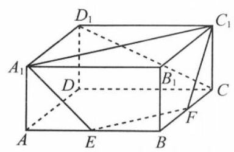

(第 17 题图)

18. 数列 $\left\{  {a}_{n}\right\}$ 中, ${a}_{1} = 2,{a}_{n + 1} = \frac{n + 1}{2n}{a}_{n}$ ( $n$ 是正整数).

(1)求数列 $\left\{  {a}_{n}\right\}$ 的通项公式；

(2)设 ${b}_{n} = \frac{{a}_{n}}{{4n} - {a}_{n}}$ ，若数列 $\left\{  {b}_{n}\right\}$ 的前 $n$ 项和是 ${T}_{n}$ ，求证: ${T}_{n} < 2$ .

19. 已知函数 $f\left( x\right)  = {\mathrm{e}}^{x} - {\mathrm{e}}^{-x} - {2x}$ .

(1)讨论 $f\left( x\right)$ 的单调性;

(2)设 $g\left( x\right)  = f\left( {2x}\right)  - {4bf}\left( x\right)$ ，当 $x > 0$ 时， $g\left( x\right)  > 0$ ，求 $b$ 的最大值.

## 综合基础强化 9

## 一、填空题(每题 4 分，共 48 分)

1. 已知等差数列 $\left\{  {a}_{n}\right\}$ 的前 $n$ 项和为 ${S}_{n}$ ,若 ${a}_{2} = 4,{a}_{4} = 2$ ,则 ${S}_{5} =$ ___.

2. 已知 $\alpha$ 为锐角，且 $\cos \left( {\alpha  + \frac{\pi }{4}}\right)  = \frac{\sqrt{5}}{5}$ ，则 $\sin \alpha  =$ ___.

3. 已知函数 $f\left( x\right)  = \left\{  \begin{array}{l} {\mathrm{e}}^{x - 1} - 1, x < 2, \\  {\log }_{3}\frac{{x}^{2} - 1}{3}, x \geq  2, \end{array}\right.$ 则 $f\left( x\right)$ 零点的集合为___.

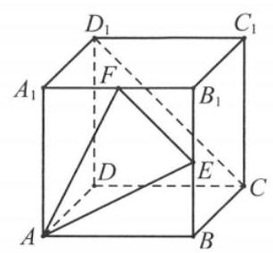

4. 正方体 ${ABCD} - {A}_{1}{B}_{1}{C}_{1}{D}_{1}$ 中, $E$ 为 $B{B}_{1}$ 的中点,则异面直线 ${AE}$ 与 $C{D}_{1}$ 所成角为___.

5. 已知直线 $l$ 的参数方程为 $\left\{  {\begin{array}{l} x = 1 + t \\  y =  - {2t} \end{array}\text{ ( }t}\right.$ 为参数),则直线 $l$ 的倾斜角是___.

6. 已知复数 ${z}_{1} = 1 + \sqrt{3}\mathrm{i},\left| {z}_{2}\right|  = 2$ ，且 ${z}_{1}{z}_{2}$ 是正实数，则复数 ${z}_{2}\;$ (第 4 题 $= \underline{\;}.$

7. 设等比数列 $\left\{  {a}_{n}\right\}$ 的通项公式为 ${a}_{n} = {q}^{n - 1}\left( {n \in  \mathbf{N}, n \geq  1}\right)$ ,前 $n$ 项和为 ${S}_{n}$ . 若 $\mathop{\lim }\limits_{{n \rightarrow   + \infty }}\frac{{S}_{n}}{{a}_{n + 1}} = 2$ ,则 $q =$ ___.

8. 设关于 $x$ 的实系数不等式 $\left( {{ax} + 3}\right) \left( {{x}^{2} - b}\right)  \leq  0$ 对任意 $x \in  \lbrack 0, + \infty )$ 恒成立,则 ${a}^{2}b =$ ___.

9. 已知 $\overrightarrow{a}\text{ 、 }\overrightarrow{b}\text{ 、 }\overrightarrow{c}$ 是平面内三个单位向量,若 $\overrightarrow{a} \bot  \overrightarrow{b}$ ,则 $\left| {2\overrightarrow{a} + \overrightarrow{c}}\right|  + \left| {3\overrightarrow{a} + 2\overrightarrow{b} - \overrightarrow{c}}\right|$ 的最小值是 ___.

10. 记椭圆 $\frac{{x}^{2}}{4} + \frac{n{y}^{2}}{{4n} + 1} = 1$ 围成的区域 (含边界) 为 ${\Omega }_{n}\left( {n = 1,2,3,\cdots }\right)$ ,当点 $\left( {x, y}\right)$ 分别在 ${\Omega }_{1}$ 、 ${\Omega }_{2}\text{ 、 }{\Omega }_{3}\text{ 、 }\cdots$ 上时, $x + y$ 的最大值分别是 ${M}_{1}\text{ 、 }{M}_{2}\text{ 、 }{M}_{3}\text{ 、 }\cdots$ ,则 $\mathop{\lim }\limits_{{n \rightarrow  \infty }}{M}_{n} =$

11. 已知函数 $f\left( x\right)  = \left\{  \begin{array}{l} {\log }_{2}\left( {x + a}\right) , x \leq  0, \\  {x}^{2} - {3ax} + a, x > 0 \end{array}\right.$ 有三个不同的零点,则实数 $a$ 的取值范围是___.

12. 已知无穷数列 $\left\{  {a}_{n}\right\}$ ,满足 ${a}_{n + 2} = \left| {{a}_{n + 1} - {a}_{n}}\right| \left( {n \in  \mathbf{N}, n \geq  1}\right)$ ,且 ${a}_{1} = 1,{a}_{2} = x\left( {x \in  \mathbf{Z}}\right)$ ,若数列 $\left\{  {a}_{n}\right\}$ 的前 2020 项中有 100 项是 0,则 $x$ 的取值集合为___.

## 二、选择题(每题 4 分，共 16 分)

13. 已知 $a\text{ 、 }b \in  \mathbf{R}$ ,则 “ ${ab} = 1$ ” 是 “直线 ${ax} + y - 1 = 0$ 和 $x + {by} - 1 = 0$ 平行” 的 ( )

A. 充分非必要条件 B. 必要非充分条件

C. 充要条件 D. 既非充分也非必要条件

## 第89页，共188页

14. 已知集合 $M$ 满足:① $\varnothing  \subset  M \subseteq  \{ 0,1,2,3,4,5\}$ ，②对任意 $x \in  M$ ，总有 ${x}^{2} \notin  M$ ，且 $\sqrt{x} \notin  M$ . 则这样的集合 $M$ 的个数是 ( )

A. 7 B. 11 C. 15 D. 16

15. 已知函数 $f\left( x\right)  = \sin \left( {{2019x} + \frac{\pi }{4}}\right)  + \cos \left( {{2019x} - \frac{\pi }{4}}\right)$ 的最大值为 $M$ ,若存在实数 $m\text{ 、 }n$ , 使得对任意实数 $x$ 总有 $f\left( m\right)  \leq  f\left( x\right)  \leq  f\left( n\right)$ 成立，则 $M \cdot  \left| {m - n}\right|$ 的最小值为 ( )

A. $\frac{\pi }{2019}$ B. $\frac{2\pi }{2019}$ C. $\frac{4\pi }{2019}$ D. $\frac{\pi }{4038}$

16. 已知 ${F}_{1}\text{ 、 }{F}_{2}$ 分别是双曲线 ${x}^{2} - \frac{{y}^{2}}{3} = 1$ 的左、右焦点,点 $P$ 在双曲线上,下列说法中正确的是 ( )

A. 若 $\bigtriangleup {F}_{1}P{F}_{2}$ 为直角三角形,则 $\bigtriangleup {F}_{1}P{F}_{2}$ 的周长是 $2\sqrt{7} + 4$

B. 若 $\bigtriangleup {F}_{1}P{F}_{2}$ 为直角三角形,则 $\bigtriangleup {F}_{1}P{F}_{2}$ 的面积是 6

C. 若 $\bigtriangleup {F}_{1}P{F}_{2}$ 为锐角三角形,则 $\left| {P{F}_{1}}\right|  + \left| {P{F}_{2}}\right|$ 的取值范围是 $\left( {2\sqrt{7},8}\right)$

D. 若 $\bigtriangleup {F}_{1}P{F}_{2}$ 为钝角三角形,则 $\left| {P{F}_{1}}\right|  + \left| {P{F}_{2}}\right|$ 的取值范围是 $\left( {8, + \infty }\right)$

## 三、解答题(每题 12 分，共 36 分)

17. 设数列 $\left\{  {a}_{n}\right\}$ 的前 $n$ 项和为 ${S}_{n}$ ,满足 ${S}_{n} = 1 - n{a}_{n}\left( {n \in  \mathbf{N}, n \geq  1}\right)$ .

(1)求数列 $\left\{  {a}_{n}\right\}$ 的通项公式；

(2)设数列 $\left\{  \frac{{\left( -1\right) }^{n}}{{a}_{n}}\right\}$ 的前 $n$ 项和为 ${T}_{n}$ ，求 ${T}_{n}$ 的表达式.

18. 设椭圆 $C : \frac{{x}^{2}}{{a}^{2}} + \frac{{y}^{2}}{{b}^{2}} = 1\left( {a > b > 0}\right)$ ,定义椭圆 $C$ 的 “相关圆” $E$ 为: ${x}^{2} + {y}^{2} = \frac{{a}^{2}{b}^{2}}{{a}^{2} + {b}^{2}}$ . 若抛物线 ${y}^{2} = {4x}$ 的焦点与椭圆 $C$ 的右焦点重合,且椭圆 $C$ 的短轴长与焦距相等.

(1)求椭圆 $C$ 及其 “相关圆” $E$ 的方程；

(2)过 “相关圆” $E$ 上任意一点 $P$ 作其切线 $l$ ，若 $l$ 与椭圆 $C$ 交于 $A$ 、 $B$ 两点，求证: $\angle {AOB}$ 为定值 ( $O$ 为坐标原点).

19. 设函数 $f\left( x\right)$ 的定义域为 $D$ ,若对任意 $x \in  D$ ,都有 $f\left( {x + a}\right)  > f\left( x\right) (a$ 为正常数),则称函数 $f\left( x\right)$ 为“ $a$ 距”增函数.

(1)若 $f\left( x\right)  = {2}^{x} - x$ ， $x \in  \left( {0, + \infty }\right)$ ，试判断 $f\left( x\right)$ 是否为“1距”增函数，并说明理由；

(2)已知 $f\left( x\right)  = {2}^{{x}^{2} + k\left| x\right| }, x \in  \left( {-1, + \infty }\right)$ ，其中 $k \in  \mathbf{R}$ ，若 $f\left( x\right)$ 为“2 距”增函数，求 $f\left( x\right)$ 的最小值.

## 综合基础强化 10

## 一、填空题(每题 4 分，共 48 分)

1. 抛物线 $y =  - \frac{1}{4}{x}^{2}$ 的准线方程是:___.

2. 已知集合 $M = \left\{  {{m}^{2}, m + 1, - 3}\right\}$ ，集合 $N = \left\{  {m - 3,{2m} - 1,{m}^{2} + 1}\right\}$ ，且 $M \cap  N = \{  - 3\}$ ，则实数 $m$ 的值是___.

3. 已知 $\left| \overrightarrow{a}\right|  = 2,\left| \overrightarrow{b}\right|  = 3$ ,且 $\overrightarrow{a}\text{ 、 }\overrightarrow{b}$ 的夹角为 $\frac{\pi }{3}$ ,则 $\left| {3\overrightarrow{a} - 2\overrightarrow{b}}\right|  =$ ___.

4. 已知函数 $f\left( x\right)  = \left\{  \begin{array}{l} {x}^{2} + 1, x \geq  0, \\  1, x < 0, \end{array}\right.$ 则满足不等式 $f\left( {1 - {x}^{2}}\right)  > f\left( {2x}\right)$ 的 $x$ 的取值范围是___.

5. 若关于 $x$ 的不等式 $\left( {1 - p}\right) {x}^{2} + {2px} + p < 0$ 的解集是非空集合,则实数 $p$ 的取值范围为___.

6. 若存在过点 $\left( {1,0}\right)$ 的直线与曲线 $y = {x}^{3}$ 和 $y = a{x}^{2} + \frac{15}{4}x - 9\left( {a \neq  0}\right)$ 都相切,则 $a$ 的值为___.

7. 设关于 $x$ 的二次方程 $a\left( {1 + \mathrm{i}}\right) {x}^{2} + \left( {1 + {a}^{2}\mathrm{i}}\right) x + {a}^{2} + \mathrm{i} = 0$ 有实根，则实数 $a$ 的值为___.

8. 当实数 $x\text{ 、 }y$ 满足 ${x}^{2} + {y}^{2} = 1$ 时, $\left| {x + {2y} + a}\right|  + \left| {3 - x - {2y}}\right|$ 的取值与 $x\text{ 、 }y$ 均无关,则实数 $a$ 的取值范围是___.

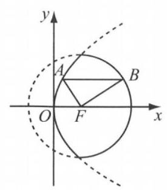

9. 直线 $x = m, y = x$ 将圆面 ${x}^{2} + {y}^{2} \leq  4$ 分成若干块. 现在用 5 种不同的颜色给这若干块涂色，每块只涂一种颜色，且任意两块不同色，若共有 120 种不同的涂法，则实数 $m$ 的取值范围是___.

10. 如图，已知 $\bigtriangleup  {FAB}$ 中，点 $F$ 的坐标为 $\left( {1,0}\right)$ ，点 $A$ 、 $B$ 分别在图中抛物线 ${y}^{2} = {4x}$ 及圆 ${\left( x - 1\right) }^{2} + {y}^{2} = 4$ 的实线部分上运动,且 ${AB}$ 总是平行于 $x$ 轴,则 $\bigtriangleup  {FAB}$ 的周长的取值范围为___.

11. 设函数 $f\left( x\right)  = \left\{  \begin{array}{l} {2}^{x} - a, x < 1, \\  4\left( {x - a}\right) \left( {x - {2a}}\right) , x \geq  1. \end{array}\right.$ 若 $f\left( x\right)$ 恰有 2 个零点,则实数 $a$ 的取值范围是___.

12. 四个关于圆锥曲线的命题: ① 当 $1 < k < 4$ 时,曲线 $C : \frac{{x}^{2}}{4 - k} + \frac{{y}^{2}}{k - 1} = 1$ 表示椭圆；② 双曲线 $\frac{{x}^{2}}{25} - \frac{{y}^{2}}{9} = 1$ 和椭圆 $\frac{{x}^{2}}{35} + {y}^{2} = 1$ 有相同的焦点；③ 设 $A$ 、 $B$ 为两个定点， $k$ 为非零常数， $\left| \overrightarrow{AP}\right|  - \left| \overrightarrow{PB}\right|  = k$ ,则动点 $P$ 的轨迹为双曲线; ④过定圆 $C$ 上一定点 $A$ 和动点 $B$ 作圆的弦 ${AB}, O$ 为坐标原点,若 $\overrightarrow{OA} + \overrightarrow{OB} = 2\overrightarrow{OP}$ ,则动点 $P$ 的轨迹为圆; 其中真命题的序号为 ___(写出所有真命题的序号).

## 二、选择题 (每题 4 分, 共 16 分)

13. 设函数 $f\left( x\right)  = \left| {\sin x}\right|  + \cos {2x}, x \in  \left\lbrack  {-\frac{\pi }{2},\frac{\pi }{2}}\right\rbrack$ ,则函数 $f\left( x\right)$ 的最小值是 ( )

A. -1 B. 0

C. $\frac{1}{2}$ D. $\frac{9}{8}$

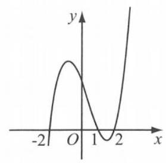

(第 14 题图)

14. 已知函数 $y = f\left( x\right)$ 的导函数 $y = {f}^{\prime }\left( x\right)$ ,函数 $g\left( x\right)  = \left( {x - 1}\right) {f}^{\prime }\left( x\right)$ 的图像如图所示, 则下列结论中正确的是 ( )

A. $f\left( x\right)$ 在 $\left( {-\infty , - 2}\right) ,\left( {1,2}\right)$ 上为减函数

B. $f\left( x\right)$ 在 $\left( {-2,1}\right) ,\left( {2, + \infty }\right)$ 上为增函数

C. $f\left( x\right)$ 的极小值为 $f\left( {-2}\right)$ ,极大值为 $f\left( 2\right)$

D. $f\left( x\right)$ 的极大值为 $f\left( {-2}\right)$ ，极小值为 $f\left( 2\right)$

15. 已知 $\theta$ 为三角形的一个内角,且 $\sin \theta  + \cos \theta  = \frac{1}{2}$ ,则 ${x}^{2}\sin \theta  - {y}^{2}\cos \theta  = 1$ 表示 ( )

A. 焦点在 $x$ 轴上的椭圆 B. 焦点在 $y$ 轴上的椭圆

C. 焦点在 $x$ 轴上的双曲线 D. 焦点在 $y$ 轴上的双曲线

16. 已知函数 $f\left( x\right)  = \left\{  {\begin{array}{l} {x}^{2} + \left( {{4a} - 3}\right) x + {3a}, x < 0, \\  {\log }_{a}\left( {x + 1}\right)  + 1, x \geq  0 \end{array}\left( {a > 0\text{ 且 }a \neq  1}\right) }\right.$ 在 $\mathbf{R}$ 上单调递减,且关于 $x$ 的方程 $\left| {f\left( x\right) }\right|  = 2 - x$ 恰好有两个不相等的实数解,则 $a$ 的取值范围是 ( )

A. $\left\lbrack  {\frac{1}{3},\frac{2}{3}}\right\rbrack   \cup  \left\{  \frac{3}{4}\right\}$ B. $\left( {0,\frac{2}{3}}\right\rbrack$ C. $\left\lbrack  {\frac{2}{3},\frac{3}{4}}\right\rbrack$ D. $\left\lbrack  {\frac{1}{3},\frac{2}{3}}\right)  \cup  \left\{  \frac{3}{4}\right\}$

## 三、解答题(每题 12 分，共 36 分)

17. 已知 $\overrightarrow{a} = \left( {\sin x,\sin \frac{x}{2} - \cos \frac{x}{2}}\right) ,\overrightarrow{b} = \left( {\sqrt{3},\sin \frac{x}{2} + \cos \frac{x}{2}}\right)$ ,且 $f\left( x\right)  = \frac{1}{2}k\left( {\overrightarrow{a} \cdot  \overrightarrow{b}}\right) \left( {k \neq  0}\right)$ .

(1)当 $k = 2$ 时，求 $f\left( x\right)$ 的最大值及相应的 $x$ 值；

(2)设 $g\left( x\right)  = 2{x}^{2} - {3x} + 1$ ，若对任意的 ${x}_{1} \in  \left\lbrack  {0,3}\right\rbrack$ ，总存在 ${x}_{2} \in  \left\lbrack  {0,3}\right\rbrack$ ，使 $g\left( {x}_{1}\right)  = f\left( {x}_{2}\right)$ 成立,求实数 $k$ 的取值范围.

18. 已知两定点 ${F}_{1}\left( {-\sqrt{2},0}\right)$ 、 ${F}_{2}\left( {\sqrt{2},0}\right)$ ,满足 $\left| \overrightarrow{P{F}_{2}}\right|  - \left| \overrightarrow{P{F}_{1}}\right|  = 2$ 的点 $P$ 的轨迹是曲线 $E$ ,直线 $y = {kx} - 1$ 与曲线 $E$ 交于 $A\text{ 、 }B$ 两点.

(1)求 $k$ 的取值范围；

(2)如果 $\left| \overrightarrow{AB}\right|  = 6\sqrt{3}$ ，且曲线 $E$ 上存在点 $C$ ，使 $\overrightarrow{OA} + \overrightarrow{OB} = m\overrightarrow{OC}$ ，求 $m$ 的值和 $\bigtriangleup  {ABC}$ 的面积 $S$ .

19. 定义 $\min \left\{  {{a}_{1},{a}_{2},{a}_{3},\cdots ,{a}_{n}}\right\}  \left( {n \in  {\mathbf{N}}^{ * }, n \geq  2}\right)$ 表示 ${a}_{1},{a}_{2},{a}_{3},\cdots ,{a}_{n}$ 中的最小值.

已知 $f\left( x\right)  = \min \left\{  {x + 9,5 - x,{x}^{2} - {2x} - 1}\right\}$ ,

(1)解不等式 $f\left( x\right)  > f\left( {x + 1}\right)$ ；

(2)若关于 $x$ 的不等式 $f\left( x\right)  \leq  {\log }_{a}x\left( {a > 0, a \neq  1}\right)$ 对任意 $x \geq  \frac{1}{2}$ 恒成立，求实数 $a$ 的取值范围.

## 综合基础强化 11

## 一、填空题(每题 4 分，共 48 分)

1. 在极坐标系中，直线 $\rho \cos \theta  = {2\rho }\sin \theta  + 3$ 的斜率是___.

2. 已知全集 $U = \mathbf{R}$ ，集合 $A = \{ x \mid  \left| {x - 1}\right|  \geq  1\}$ ，则 $\bar{A} =$ ___.

3. 已知复数 $z = \frac{1 + 2{\mathrm{i}}^{3}}{1 - \mathrm{i}}$ ，其中 $\mathrm{i}$ 是虚数单位，则 $\left| z\right|  =$ ___.

4. 若 $\tan \theta  =  - 3$ ，则 $\frac{\left( {\sin \theta  + \cos \theta }\right) \sin \theta }{\cos {2\theta }} =$ ___.

5. 已知函数 $y = f\left( x\right)$ 的图像关于 $x =  - 3$ 对称,且 $y = f\left( x\right)$ 有两个零点 ${x}_{1}\text{ 、 }{x}_{2}$ ,且 ${x}_{1} \in  (1$ , 2) ${x}_{2} \in  \left( {k, k + 1}\right)$ ,则整数 $k =$ ___.

6. 若二项式 ${\left( 1 + x\right) }^{100}$ 的展开式中 $\frac{{T}_{k + 2}}{{T}_{k + 1}} = \frac{46x}{55}$ ,则 $k =$ ___.

7. 若已知圆锥的母线长为 2，轴截面为直角三角形，则其侧面展开图的圆心角为___.

8. 用 $\left\lbrack  x\right\rbrack$ 表示不小于 $x$ 的最大整数，则函数 $f\left( x\right)  = \left\lbrack  {\sin \left| x\right|  + \left| {\sin x}\right| }\right\rbrack$ 的值域是___.

9. 一名工人维护甲、乙两台独立的机床，在一小时内，甲、乙需要维护的概率分别为 0.9 和 0.8 ，则一小时内至少有一台机床需要维护的概率为___.

10. 已知直线 ${l}_{1} : \left( {a - 2}\right) x - {3y} + 5 = 0$ 和 ${l}_{2} : {3x} - \left( {b + 1}\right) y - 7 = 0$ 互相垂直，且 $a$ 、 $b > 0$ ，则 $\frac{2}{a} + \frac{1}{b}$ 的最小值为 ___.

11. 已知 $\overrightarrow{a}\text{ 、 }\overrightarrow{b}$ 满足 $\left| \overrightarrow{a}\right|  = 1,\left| \overrightarrow{b}\right|  = 2,\overrightarrow{a} \cdot  \overrightarrow{b} = 0$ ,若向量 $\overrightarrow{c}$ 满足 $\left| {\overrightarrow{a} + \overrightarrow{b} - 2\overrightarrow{c}}\right|  = 1$ ,则 $\left| \overrightarrow{c}\right|$ 的取值范围是___.

12. 在数列 $\left\{  {a}_{n}\right\}$ 中,若对任意的正整数 $n$ 都有 $\frac{{a}_{n + 2}}{{a}_{n + 1}} - \frac{{a}_{n + 1}}{{a}_{n}} = t$ ( $t$ 为常数),则称数列 $\left\{  {a}_{n}\right\}$ 为比等差数列, $t$ 称为比公差. 现给出以下命题:

① 等比数列一定是比等差数列；② 等差数列一定不是比等差数列；

③若数列 $\left\{  {a}_{n}\right\}$ 是比等差数列，且 $k$ 是非零实数，则数列 $\left\{  {k{a}_{n}}\right\}$ 是比等差数列；

④ 若数列 $\left\{  {a}_{n}\right\}$ 、 $\left\{  {b}_{n}\right\}$ 都是比等差数列，则数列 $\left\{  {{a}_{n}{b}_{n}}\right\}$ 是比等差数列.

其中所有真命题的序号是___.

## 二、选择题(每题 4 分，共 16 分)

13. 已知 $a\text{ 、 }b > 0, a \neq  1$ ,且 $b \neq  1$ ,若 $x > 0$ ,则 “ $1 < b < a$ ” 是 “ $1 < {b}^{x} < {a}^{x}$ ” 的 ( )

A. 充分非必要条件 B. 必要非充分条件

C. 充要条件 D. 既非充分也非必要条件

14. 已知等比数列 $\left\{  {a}_{n}\right\}$ 的前 $n$ 项和为 ${S}_{n}$ ,且满足 $2{S}_{n} = {2}^{n + 1} + \lambda$ ,则 $\lambda$ 的值是 ( )

A. 4 B. 2 C. -2 D. -4

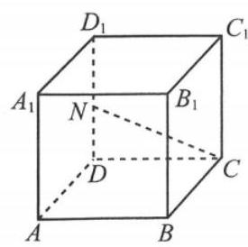

(第 15 题图)

15. 如图,正方体 ${ABCD} - {A}_{1}{B}_{1}{C}_{1}{D}_{1}$ 中, $N$ 是棱 $D{D}_{1}$ 的中点,则直线 ${CN}$ 与平面 ${DB}{B}_{1}{D}_{1}$ 所成角的正切值是 ( )

A. $\frac{2}{3}$ B. $\frac{\sqrt{6}}{3}$

C. $\frac{2\sqrt{5}}{5}$ D. $\frac{\sqrt{5}}{2}$

16. 设 $0 < a < 1$ . 随机变量 $X$ 的分布是 $\left( \begin{matrix} 0 & a & 1 \\  \frac{1}{3} & \frac{1}{3} & \frac{1}{3} \end{matrix}\right)$ ,数学期望是 $E\left\lbrack  X\right\rbrack$ ,方差是 $D\left\lbrack  X\right\rbrack$ ,则当 $a$ 在 $\left( {0,1}\right)$ 内增大时 ( )

A. $E\left\lbrack  X\right\rbrack$ 不变 B. $E\left\lbrack  X\right\rbrack$ 减小

C. $D\left\lbrack  X\right\rbrack$ 先增大后减小 D. $D\left\lbrack  X\right\rbrack$ 先减小后增大

## 三、解答题(每题 12 分，共 36 分)

17. 在锐角 $\bigtriangleup {ABC}$ 中,内角 $A\text{ 、 }B\text{ 、 }C$ 的对边分别为 $a\text{ 、 }b\text{ 、 }c,\overrightarrow{AB} \cdot  \overrightarrow{AC} = \frac{{b}^{2} + {c}^{2} - {a}^{2}}{4\cos A}$ .

(1)求 $A$ ；

(2)若 $D$ 为 ${BC}$ 的中点，且 $\bigtriangleup  {ABC}$ 的面积为 $\frac{3\sqrt{3}}{2},{AB} = 2$ ，求 ${AD}$ 的长.

18. 已知椭圆 ${C}_{1} : \frac{{x}^{2}}{4} + {y}^{2} = 1$ ,椭圆 ${C}_{2}$ 的中心在坐标原点,焦点在 $y$ 轴上,与 ${C}_{1}$ 有相同的离心率,且过椭圆 ${C}_{1}$ 的长轴端点.

(1)求椭圆 ${C}_{2}$ 的标准方程；

(2)设 $O$ 为坐标原点，点 $A$ 、 $B$ 分别在椭圆 ${C}_{1}$ 和 ${C}_{2}$ 上，若 $\overrightarrow{OB} = 2\overrightarrow{OA}$ ，求直线 ${AB}$ 的方程.

19. 已知函数 $f\left( x\right)  = a\ln x - b{x}^{2}\left( {a\text{ 、 }b \in  \mathbf{R}}\right)$ .

(1)若 $f\left( x\right)$ 在 $x = 1$ 处与直线 $y =  - \frac{1}{2}$ 相切，求 $a$ 、 $b$ 的值；

(2)若 $a = 1$ ，且不等式 $f\left( x\right)  \geq  {x}^{2}$ 对任意 $x \in  \left\lbrack  {\frac{1}{\mathrm{e}},\mathrm{e}}\right\rbrack$ 都成立，求 $b$ 的取值范围.

## 综合基础强化 12

## 一、填空题(每题 4 分，共 48 分)

1. 抛物线 ${y}^{2} = x$ 的准线方程是___.

2. 已知等差数列 $\left\{  {a}_{n}\right\}$ 的前 $n$ 项和为 ${S}_{n}$ ,如果 ${a}_{3} + {a}_{5} = {22}$ ,那么 ${S}_{7} =$ ___.

3. 若 $1 + 2\mathrm{i}$ ( $\mathrm{i}$ 是虚数单位)是方程 ${x}^{2} + {bx} + c = 0\left( {b\text{ 、 }c \in  \mathbf{R}}\right)$ 的一个虚根，则 $b + c =$ ___.

4. 参数方程 $\left\{  \begin{array}{l} x = 1 + {3t}, \\  y =  - 2 + {5t} \end{array}\right.$ ( $t$ 为参数) 所表示的直线的点斜式方程是___.

5. 已知圆 ${x}^{2} + {y}^{2} = 4$ ，则过点 $P\left( {-1,\sqrt{3}}\right)$ 的圆的切线方程的一般式是___.

6. 已知数据 ${x}_{i}\left( {i = 1,2,3,\cdots ,{2022}}\right)$ 的均值和方差分别是 3 和 4,则数据 $2{x}_{i} - 3$ 的均值和方差分别是___.

7. 在 $\bigtriangleup {ABC}$ 中, $A\text{ 、 }B\text{ 、 }C$ 所对的边分别为 $a\text{ 、 }b\text{ 、 }c, b + c = {2a} = 4\sqrt{3}$ ,则 $A$ 的最大值为___.

8. 已知 ${F}_{1}\text{ 、 }{F}_{2}$ 分别是双曲线 $\frac{{x}^{2}}{4} - \frac{{y}^{2}}{16} = 1$ 的两个焦点,点 $P$ 在双曲线上,若 $\left| {P{F}_{2}}\right|  = 5$ ,则 $\left| {P{F}_{1}}\right|  =$

9. 设 $f\left( x\right)  = \left\{  \begin{array}{l} x, x \in  \left( {-\infty , a}\right) , \\  {x}^{2}, x \in  \lbrack a, + \infty ). \end{array}\right.$ 若 $f\left( 2\right)  = 4$ ，则实数 $a$ 的取值范围为___.

10. 已知向量 $\overrightarrow{{e}_{1}}\text{ 、 }\overrightarrow{{e}_{2}}$ 的夹角为 $\frac{\pi }{3}$ ，且 $\left| \overrightarrow{{e}_{1}}\right|  = \left| \overrightarrow{{e}_{2}}\right|  = 1$ ，则向量 $\overrightarrow{{e}_{1}} + \overrightarrow{{e}_{2}}$ 与 $\overrightarrow{{e}_{1}}$ 方向上的投影是___.

11. 已知函数 $f\left( x\right)  = \left\{  \begin{array}{l}  - {x}^{2} + {2x}, x \leq  2, \\  {\log }_{2}x - 1, x > 2. \end{array}\right.$ 设 $1 \leq  {x}_{1} < {x}_{2} < \cdots  < {x}_{n} \leq  {16}$ ,若 $\left| {f\left( {x}_{1}\right)  - f\left( {x}_{2}\right) }\right|  + \; \left| {f\left( {x}_{2}\right)  - f\left( {x}_{3}\right) }\right|  + \cdots  + \left| {f\left( {x}_{n - 1}\right)  - f\left( {x}_{n}\right) }\right|  \leq  M$ 恒成立，则 $M$ 的最小值为___.

12. 已知 ${x}_{1} =  - \frac{\pi }{6},{x}_{2} = \frac{\pi }{3}$ 是函数 $f\left( x\right)  = \sin \left( {{\omega x} + \varphi }\right) \left( {\omega  > 0,0 < \varphi  < \frac{\pi }{2}}\right)$ 相邻的两个零点. 如果函数 $g\left( x\right)  = \left| {f\left( x\right)  - \frac{1}{2}}\right|$ 在 $\left\lbrack  {-\frac{\pi }{4}, m}\right\rbrack$ 上的最大值为 1,那么实数 $m$ 的取值范围是___.

## 二、选择题(每题 4 分，共 16 分)

13. 演讲比赛共有 9 位评委分别给出某选手的原始评分, 评定该选手的成绩时, 从 9 个原始评分中去掉 1 个最高分、1 个最低分, 得到 7 个有效评分, 与 9 个原始评分相比, 不变的数字特征是 ( )

A. 中位数 B. 平均数 C. 方差 D. 标准差

14. 已知 $m\text{ 、 }n$ 为两条不重合直线, $\alpha \text{ 、 }\beta$ 为两个不重合平面,下列条件中,可以作为 $\alpha //\beta$ 的充分条件的是 ( )

A. $m//n, m \subset  \alpha , n \subset  \beta$ B. $m//n, m\bot \alpha , n\bot \beta$

C. $m \bot  n, m//\alpha , n//\beta$ D. $m \bot  n, m \bot  \alpha , n \bot  \beta$

15. 已知 $n\text{ 、 }m$ 为正整数,且 $n \geq  m$ ,则下列等式中不恒成立的是 ( )

A. ${\mathrm{P}}_{n}^{m} = {\mathrm{C}}_{n}^{m}{\mathrm{P}}_{m}^{m}$ B. $m{\mathrm{C}}_{n}^{m} = n{\mathrm{C}}_{n - 1}^{m - 1}\left( {n \geq  2}\right)$

C. ${\mathrm{C}}_{n}^{0} + {\mathrm{C}}_{n}^{2} + {\mathrm{C}}_{n}^{4} + \cdots  + {\mathrm{C}}_{n}^{n - 1} = {2}^{n - 1}$ D. ${\mathrm{C}}_{n}^{m} + {\mathrm{C}}_{n}^{m - 1} = {\mathrm{C}}_{n + 1}^{m}$

16. 通过以下操作得到一系列数列: 第 1 次,在 2,3 之间插入 2 与 3 的积 6,得到数列2,6,3; 第 2 次,在 2,6,3 每两个相邻数之间插入它们的积,得到数列2,12,6,18,3; 类似地,第 3 次操作后,得到数列:2,24,12,72,6,108,18,54,3. 按上述这样操作 11 次，得到的数列记为 $\left\{  {a}_{n}\right\}$ ,① 数列 $\left\{  {a}_{n}\right\}$ 的项数是 2049; ② ${a}_{12} = 6$ ,则 ( )

A. ①②都正确 B. ①正确②错误 C. ①错误②正确 D. ①②都错误

## 三、解答题(每题 12 分，共 36 分)

17. 如图,四棱锥 $P - {ABCD}$ 的底面 ${ABCD}$ 是矩形, ${PA} \bot$ 平面 ${ABCD}, E$ 是 ${PD}$ 的中点.

(1)证明: ${PB}//$ 平面 ${AEC}$ ；

(2)设 ${AP} = 1,{AD} = \sqrt{3}$ ，三棱锥 $P - {ABD}$ 的体积 $V = \frac{\sqrt{3}}{4}$ ，求 $A$ 到平面 ${PBC}$ 的距离.

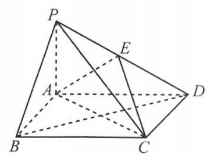

(第 17 题图)

18. 已知数列 $\left\{  {a}_{n}\right\}$ 满足: ${a}_{1} = \frac{1}{3},2{a}_{n + 1}{a}_{n} + {a}_{n + 1} - {a}_{n} = 0$ .

(1)求 $\left\{  {a}_{n}\right\}$ 的通项公式；

(2)求满足 ${a}_{1}{a}_{2} + {a}_{2}{a}_{3} + \cdots  + {a}_{n - 1}{a}_{n} < \frac{1}{7}$ 的正整数 $n$ 的最大值.

19. 在箱子中有 10 个小球, 其中有 3 个红球, 3 个白球, 4 个黑球. 从这 10 个球中任取 3 个. 求:

(1)取出的 3 个球中红球的个数 $X$ 的分布和数学期望;

(2)取出的 3 个球中红球个数多于白球个数的概率.

## 综合基础强化 13

## 一、填空题(每题 4 分，共 48 分)

1. 已知复数 ${z}_{1} = 1 + \mathrm{i},{z}_{2} = \mathrm{i}$ (其中 $\mathrm{i}$ 为虚数单位),则 ${z}_{1} \cdot  {z}_{2} =$ ___.

2. 已知集合 $A = \{ m \mid  1 < m < 4\} , B = \left\{  {y \mid  y = {x}^{3}, x \in  \mathbf{R}}\right\}$ ，则 $A \cap  B =$ ___.

3. 设等差数列 $\left\{  {a}_{n}\right\}$ 的前 $n$ 项和为 ${S}_{n}$ ,若 ${a}_{2} + {a}_{8} = {15} - {a}_{5}$ ,则 ${S}_{9}$ 等于___.

4. 函数 $y = f\left( x\right)$ 的反函数为 $y = {\log }_{2}x + 1$ ，则 $f\left( 3\right)  =$ ___.

5. 已知 $\cos \left( {\frac{\pi }{2} - \alpha }\right)  =  - \frac{4}{5}$ ，则 $\cos {2\alpha } =$ ___.

6. 已知多项式 ${\left( x - 1\right) }^{3} + {\left( x + 1\right) }^{4} = {x}^{4} + {a}_{1}{x}^{3} + {a}_{2}{x}^{2} + {a}_{3}x + {a}_{4}$ ，则 ${a}_{3} =$ ___.

7. 函数 $f\left( x\right)  = {x}^{3} + {3a}{x}^{2} + 3\left( {a + 2}\right) x + 1$ 有极大值又有极小值，则 $a$ 的范围是___.

8. 甲、乙两个学校进行体育比赛, 比赛共设三个项目, 每个项目胜方得 10 分, 负方得 0 分, 没有平局. 三个项目比赛结束后, 总得分高的学校获得冠军. 已知甲学校在三个项目中获胜的概率分别为0.5,0.4,0.8,各项目的比赛结果相互独立. 则甲学校获得冠军的概率为___.

9. 设圆锥底面圆周上两点 $A\text{ 、 }B$ 间的距离为 2,圆锥顶点到直线 ${AB}$ 的距离为 $\sqrt{3},{AB}$ 和圆锥的轴的距离为 1 ，则该圆锥的侧面积为 ___.

10. 设 ${P}_{n}\left( {{x}_{n},{y}_{n}}\right)$ 是直线 ${2x} - y = \frac{n}{n + 1}\left( {n \in  {\mathbf{N}}^{ * }}\right)$ 与圆 ${x}^{2} + {y}^{2} = 1$ 在第一象限的交点，则 $\mathop{\lim }\limits_{{n \rightarrow  \infty }}\frac{{y}_{n} - 1}{{x}_{n} - 1} =$ ___.

11. 已知 $\overrightarrow{a}\text{ 、 }\overrightarrow{b}$ 是空间相互垂直的单位向量,且 $\left| \overrightarrow{c}\right|  = 5,\overrightarrow{c} \cdot  \overrightarrow{a} = \overrightarrow{c} \cdot  \overrightarrow{b} = 2\sqrt{2}$ ,则 $\left| {\overrightarrow{c} - m\overrightarrow{a} - n\overrightarrow{b}}\right|$ 的最小值是 ___.

12. 已知函数 $f\left( x\right) \text{ 、 }g\left( x\right)$ 的定义域均为 $\mathbf{R}$ ,且 $f\left( x\right)  + g\left( {2 - x}\right)  = 5, g\left( x\right)  - f\left( {x - 4}\right)  = 7$ . 若 $y = g\left( x\right)$ 的图像关于直线 $x = 2$ 对称, $g\left( 2\right)  = 4$ ,则 $\mathop{\sum }\limits_{{k = 1}}^{{22}}f\left( k\right)  =$ ___.

## 二、选择题(每题 4 分，共 16 分)

13. 设全集 $U = \{ 1,2,3,4,5\}$ ,集合 $M$ 满足 ${\complement }_{U}M = \{ 1,3\}$ ,则 ( )

A. $2 \in  M$ B. $3 \in  M$ C. $4 \notin  M$ D. $5 \notin  M$

14. 已知直线 $l$ 平行于平面 $\alpha$ ,平面 $\beta$ 垂直于平面 $\alpha$ ,则以下关于直线 $l$ 与平面 $\beta$ 的位置关系的表述中,正确的是 ( )

A. $l$ 与 $\beta$ 垂直

B. $l$ 与 $\beta$ 无公共点

C. $l$ 与 $\beta$ 至少有一个公共点

D. 在 $\beta$ 内, $l$ 与 $\beta$ 平行, $l$ 与 $\beta$ 相交都有可能

15. 设函数 $f\left( x\right)  = \sin \left( {{\omega x} + \frac{\pi }{3}}\right)$ 在区间 $\left( {0,\pi }\right)$ 恰有三个极值点、两个零点，则 $\omega$ 的取值范围是 ( )

A. $\left\lbrack  {\frac{5}{3},\frac{13}{6}}\right)$ B. $\left\lbrack  {\frac{5}{3},\frac{19}{6}}\right)$ C. $\left( {\frac{13}{6},\frac{8}{3}}\right\rbrack$ D. $\left( {\frac{13}{6},\frac{19}{6}}\right\rbrack$

16. 已知函数 $f\left( x\right)  = {2}^{x}, g\left( x\right)  = {x}^{2} + {ax}$ ,对于不相等的实数 ${x}_{1}\text{ 、 }{x}_{2}$ ,设 $m = \frac{f\left( {x}_{1}\right)  - f\left( {x}_{2}\right) }{{x}_{1} - {x}_{2}}$ , $n = \frac{g\left( {x}_{1}\right)  - g\left( {x}_{2}\right) }{{x}_{1} - {x}_{2}}$ ,现有如下命题:

①对于任意的实数 $a$ ，存在不相等的实数 ${x}_{1}$ 、 ${x}_{2}$ ，使得 $m = n$ ；

②对于任意的实数 $a$ ，存在不相等的实数 ${x}_{1}$ 、 ${x}_{2}$ ，使得 $m =  - n$ .

下列判断中正确的是 ( )

A. ①和②均为真命题 B. ①和②均为假命题

C. ①为真命题，②为假命题 D. ①为假命题，②为真命题

## 三、解答题(每题 12 分，共 36 分)

17. 如图,在正三棱柱 ${ABC} - {A}_{1}{B}_{1}{C}_{1}$ 中, $A{A}_{1} = 4$ ,异面直线 $B{C}_{1}$ 与 $A{A}_{1}$ 所成角的大小为 $\frac{\pi }{3}$ .

(1)求正三棱柱 ${ABC} - {A}_{1}{B}_{1}{C}_{1}$ 的体积;

(2)求直线 $B{C}_{1}$ 与平面 $A{A}_{1}{C}_{1}C$ 所成角的大小. (结果用反三角函数值表示)

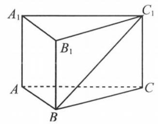

(第 17 题图)

18.(2022·全国·高考题)在某地区进行流行病学调查，随机调查了 100 位某种疾病患者的年龄, 得到如下的样本数据的频率分布直方图:

(1)估计该地区这种疾病患者的平均年龄(同一组中的数据用该组区间的中点值为代表)；

(2)已知该地区这种疾病的患病率为 0.1%，该地区年龄位于区间 $\lbrack {40},{50})$ 的人口占该地区总人口的 16%. 从该地区中任选一人，若此人的年龄位于区间 $\lbrack {40},{50})$ ，求此人患这种疾病的概率. (以样本数据中患者的年龄位于各区间的频率作为患者的年龄位于该区间的概率, 精确到 0.0001 ).

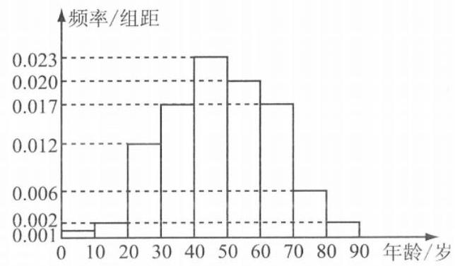

(第 18 题图)

19. 已知椭圆 $M : \frac{{x}^{2}}{{a}^{2}} + \frac{{y}^{2}}{{b}^{2}} = 1\left( {a > b > 0}\right)$ 焦距为 $2\sqrt{2}$ ,过点 $\left( {\sqrt{2},\frac{\sqrt{3}}{3}}\right)$ ,斜率为 $k$ 的直线 $l$ 与椭圆有两个不同的交点 $A$ 、 $B$ .

(1)求椭圆 $M$ 的方程；

(2)若 $k = 1$ ，求 $\left| {AB}\right|$ 的最大值.

## 综合基础强化 14

## 一、填空题(每题 4 分，共 48 分)

1. 已知集合 $A = \{ x \mid  x = {2k}, k \in  \mathbf{Z}\} , B = \{ x \mid   - 2 \leq  x \leq  2\}$ ，则 $A \cap  B =$ ___.

2. 在复平面内,点 $A\left( {-2,1}\right)$ 对应的复数 $z$ ,则 $\left| {z + 1}\right|  =$

3. 在 ${\left( {x}^{3} - \frac{1}{x}\right) }^{8}$ 的展开式中,其常数项的值为___.

4. 已知数列 $\left\{  {a}_{n}\right\}$ 中， ${a}_{n} = \frac{1}{{2}^{n - 1}}\left( {n \in  {\mathbf{N}}^{ * }}\right)$ ，令 ${S}_{n} = {a}_{2} + {a}_{4} + \cdots  + {a}_{2n}$ ，则 $\mathop{\lim }\limits_{{n \rightarrow  \infty }}{S}_{n} =$ ___.

5. 有两台车床加工同一型号的零件，第 1 台车床加工的次品率为 5%，第 2 台车床加工的次品率为 6%，加工出来的零件混放在一起. 已知两台车床加工的零件数分别占总数的 45%、55%，则任取一个零件是次品的概率为___.

6. 已知向量 $\overrightarrow{a}$ 、 $\overrightarrow{b}$ 的夹角为 $\frac{\pi }{3}$ ，且 $\left| \overrightarrow{a}\right|  = 2$ ， $\left| \overrightarrow{b}\right|  = 3$ ，则 $\left| {3\overrightarrow{a} - 2\overrightarrow{b}}\right|  =$ ___.

7. 以下数据为参加数学竞赛决赛的 15 人的成绩:(单位:分)

78,70,72,86,88,79,80,81,94,84,56,98,83,90,91.

则这 15 人成绩的第 80 百分位数是___.

8. 已知椭圆 $C : \frac{{x}^{2}}{{a}^{2}} + \frac{{y}^{2}}{{b}^{2}} = 1\left( {a > b > 0}\right)$ 的右焦点为 $F\left( {1,0}\right) , O$ 为坐标原点，点 $A$ 是椭圆在第一象限的一点，且 $\bigtriangleup  {OAF}$ 为等边三角形，则 $a =$ ___.

9. 将函数 $f\left( x\right)  = \sin \left( {{2x} + \frac{\pi }{3}}\right)$ 图像向左平移 $\varphi \left( {\varphi  > 0}\right)$ 个单位，所得图像恰关于直线 $x = \frac{\pi }{4}$ 对称，则 $\varphi$ 的最小值为___.

10. 定义在 $\mathbf{R}$ 的函数 $f\left( x\right)$ 满足 $f\left( x\right)  + f\left( {2 - x}\right)  = {2022}, f\left( x\right)$ 的导函数为 ${f}^{\prime }\left( x\right)$ ,则 ${f}^{\prime }\left( {-{2020}}\right)  - {f}^{\prime }\left( {2022}\right)  =$ ___.

11. 已知点 $P$ 为不等式组 $\left\{  \begin{array}{l} \sqrt{3}x - y \geq  0, \\  x + y - 2 \leq  0, \\  y \geq  0 \end{array}\right.$ 所表示的可行域内任意一点,点 $A\left( {-1,\sqrt{3}}\right) , O$ 为坐标原点，则 $\frac{\overrightarrow{OA} \cdot  \overrightarrow{OP}}{\left| \overrightarrow{OP}\right| }$ 的最大值为___.

12. 已知 $f\left( x\right)  = \left\{  \begin{array}{l} {2a} - \left( {x + \frac{4}{x}}\right) , x < a, \\  x - \frac{4}{x}, x \geq  a. \end{array}\right.$ 当 $a \leq   - 1$ 时,若 $f\left( x\right)  = 3$ 有三个不等的实数根,且它们成等差数列,则 $a$ 的值为___.

## 二、选择题 (每题 4 分, 共 16 分)

13. 下列函数中,值域是 $\lbrack 1, + \infty )$ 的函数是 ( )

A. $y = {x}^{3} + 1$ B. $y = {10}^{-x} + 1$ C. $y = {\log }_{2}x + 1$ D. $y = {2}^{\left| x\right| }$

14. 已知向量 $\overrightarrow{a}\text{ 、 }\overrightarrow{b}$ 是非零向量，则 “ $\left| {\overrightarrow{a} \cdot  \overrightarrow{b}}\right|  = \left| \overrightarrow{a}\right|  \cdot  \left| \overrightarrow{b}\right|$ ” 是 “ $\overrightarrow{a}//\overrightarrow{b}$ ” 的 ( )

A. 充分而不必要条件 B. 必要而不充分条件

C. 充分必要条件 D. 既不充分也不必要条件

15. 设 $\left\{  {a}_{n}\right\}$ 为等比数列,则 “对于任意的 $m \in  {\mathbf{N}}^{ * },{a}_{m + 2} > {a}_{m}$ ” 是 “ $\left\{  {a}_{n}\right\}$ 为递增数列” 的 ( ( )

A. 充分而不必要条件 B. 必要而不充分条件

C. 充分必要条件 D. 既不充分也不必要条件

16.(2022·全国·高考题)已知正四棱锥的侧棱长为 $l$ ，其各顶点都在同一球面上. 若该球的体积为 ${36\pi }$ ,且 $3 \leq  l \leq  3\sqrt{3}$ ,则该正四棱锥体积的取值范围是 ( )

A. $\left\lbrack  {{18},\frac{81}{4}}\right\rbrack$ B. $\left\lbrack  {\frac{27}{4},\frac{81}{4}}\right\rbrack$ C. $\left\lbrack  {\frac{27}{4},\frac{64}{3}}\right\rbrack$ D. $\left\lbrack  {{18},{27}}\right\rbrack$

## 三、解答题(每题 12 分，共 36 分)

17. 如图,正方体 ${ABCD} - {A}_{1}{B}_{1}{C}_{1}{D}_{1}$ 的棱长为 $2, E$ 是棱 $B{B}_{1}$ 的中点.

(1)求证: ${D}_{1}E \bot  {AC}$ ；

(2)求平面 $A{D}_{1}E$ 与底面 ${ABCD}$ 所成的锐二面角的大小.

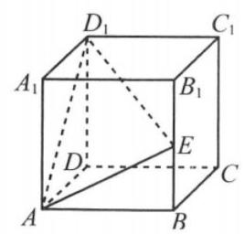

(第 17 题图)

18. 已知函数 $f\left( x\right)  = {x}^{2} + \left| {x - a}\right|  + 1$ ,其中 $a \in  \mathbf{R}$ .

(1)讨论 $f\left( x\right)$ 的奇偶性;

(2)当 $f\left( x\right)$ 为偶函数时,求使 $f\left( x\right)  \geq  k\left| x\right|$ 恒成立的 $k$ 的取值范围.

__________

__________

19. 已知数列 $\left\{  {a}_{n}\right\}$ 的前 $n$ 项和为 ${S}_{n}$ ,把满足条件 ${a}_{n + 1} \leq  {S}_{n}$ (对任意的 $n \in  {\mathbf{N}}^{ * }$ )的所有数列 $\left\{  {a}_{n}\right\}$ 构成的集合记为 $M$ .

(1)若数列 $\left\{  {a}_{n}\right\}$ 的通项为 ${a}_{n} = \frac{1}{{2}^{n}}$ ,判断 $\left\{  {a}_{n}\right\}$ 是否属于 $M$ ,并说明理由;

(2)若数列 $\left\{  {a}_{n}\right\}$ 是等差数列，且 $\left\{  {{a}_{n} + n}\right\}   \in  M$ ，求 ${a}_{1}$ 的取值范围.

__________

## 综合基础强化 15

1. 已知 $a \in  \mathbf{R}$ ， $\mathrm{i}$ 为虚数单位，若 $\frac{a - \mathrm{i}}{2 + \mathrm{i}}$ 为实数，则 $a$ 的值为___.

2. 已知双曲线 $\frac{{x}^{2}}{m} - {y}^{2} = 1\left( {m > 0}\right)$ 的一条渐近线为 $\sqrt{3}x + {my} = 0$ ，则其焦距为___.

3. 函数 $f\left( x\right)  = \cos \left( {{3x} + \frac{\pi }{6}}\right)$ 在 $\left\lbrack  {0,\pi }\right\rbrack$ 的零点个数为___.

4. 如图, 六角螺帽毛坯是由一个正六棱柱挖去一个圆柱所构成的. 已知螺帽的底面正六边形边长为 $2\mathrm{\;{cm}}$ ，高为 $2\mathrm{\;{cm}}$ ，内孔半径为 ${0.5}\mathrm{\;{cm}}$ ，则此六角螺帽毛坯的体积是___ ${\mathrm{{cm}}}^{3}$ .

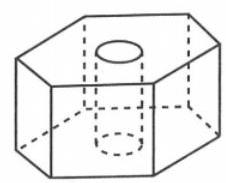

(第 4 题图)

5. 某地以“绿水青山就是金山银山”理念为引导，推进绿色发展，现要订购一批苗木,苗木长度与售价如下表:

<table><tr><td>苗木长度 $x\left( \mathrm{\;{cm}}\right)$</td><td>38</td><td>48</td><td>58</td><td>68</td><td>78</td><td>88</td></tr><tr><td>售价 $y$ (元)</td><td>16.8</td><td>18.8</td><td>20.8</td><td>22.8</td><td>24</td><td>25.8</td></tr></table>

由表可知，苗木长度 $x$ (cm) 与售价 $y$ (元)之间存在线性相关关系，回归方程为 $\widehat{y} = {0.2x} + \; \widehat{a}$ ，则当苗木长度为 ${150}\mathrm{{cm}}$ 时，售价大约为___.

6. 不等式 $\left| {{3x} + {2a}}\right|  + \left| {2 - {3x}}\right|  - \left| {a + 1}\right|  > 2$ 对任意的 $x \in  \mathbf{R}$ 恒成立,则实数 $a$ 取值范围为___.

7. 现有一摸球游戏,规则如下:袋子里有形状和大小完全一样的标有 $1 \sim  6$ 号的 6 个小球,游戏参与者每次从袋中不放回地摸 1 个球, 若摸到 1 号球或 6 号球得 2 分, 摸到 3 号球、 4 号球或 5 号球得 1 分, 摸到 2 号球得 0 分, 若参与者摸到 2 号球或摸了三次后不管有没有摸到 2 号球游戏均结束. 记随机变量 $X$ 为参与者摸球结束后获得的分数,则 $X$ 的数学期望是___.

8. 已知函数 $y = f\left( x\right)$ 是定义域为 $\mathbf{R}$ 的奇函数,且当 $x < 0$ 时, $f\left( x\right)  = x + \frac{a}{x} + 1$ . 若函数 $y = \; f\left( x\right)$ 在 $\lbrack 3, + \infty )$ 上的最小值为 3,则实数 $a$ 的值为___.

9. 从集合 $\{ a, b, c\}$ 的非空子集中随机任取两个不同的集合 $M$ 和 $N$ ,则使得 $M \cap  N = \varnothing$ 的不同取法的概率为___(结果用最简分数表示).

10. 边长为 1 的正方形内有一内切圆, ${MN}$ 是内切圆的一条弦,点 $P$ 为正方形四条边上的动点，当弦 ${MN}$ 的长度最大时， $\overrightarrow{PM} \cdot  \overrightarrow{PN}$ 的取值范围是___.

11. 给定正整数 $n$ 和正数 $b$ ,对于满足条件 ${a}_{1} - {a}_{n + 1}^{2} = b$ 的所有无穷等差数列 $\left\{  {a}_{n}\right\}$ ,如果要使 $y = {a}_{n + 1} + {a}_{n + 2} + \cdots  + {a}_{{2n} + 1}$ 取得最大值，则 ${a}_{n + 1} =$ ___.

12. 在直线 $l : y =  - 2$ 上取一点 $D$ 作抛物线 $C : {x}^{2} = {4y}$ 的切线,切点分别为 $A\text{ 、 }B$ ,直线 ${AB}$ 与圆 $E$ : ${x}^{2} + {y}^{2} - {2x} - {2020} = 0$ 交于 $M\text{ 、 }N$ 两点，当 $\left| {MN}\right|$ 最小时， $D$ 的横坐标是___.

## 二、选择题

13. 已知集合 $A = \{ x \mid   - 4 < x < 1, x \in  \mathbf{Z}\} , B = \left\{  {-2, - 1,0,\frac{1}{2}}\right\}$ ,则 $A \cap  B$ 的非空子集个数为 ( )

A. 15 B. 14 C. 7 D. 6

14. 已知正实数 $a$ 、 $b$ 满足 ${2a} + b = 4$ ，则 $\frac{2}{a + 2} + \frac{2}{b}$ 的最小值是 ( )

A. $\frac{9}{4} + \sqrt{2}$ B. 4 C. $\frac{9}{2}$ D. $\frac{3}{4} + \frac{\sqrt{2}}{2}$

15. 在正方体 ${ABCD} - {A}_{1}{B}_{1}{C}_{1}{D}_{1}$ 中, $E\text{ 、 }F$ 分别是线段 ${AB}\text{ 、 }B{D}_{1}$ 上的动点,且直线 ${EF}$ 与 $A{A}_{1}$ 所成的角为 $\arctan \sqrt{2}$ ，则下列直线中与 ${EF}$ 所成的角必为 $\arctan \frac{\sqrt{2}}{2}$ 的是___ty

A. ${CD}$ B. ${BD}$ C. $B{C}_{1}$ D. $D{C}_{1}$

16. 0-1 周期序列在通信技术中有着重要应用. 若序列 ${a}_{1},{a}_{2},\cdots ,{a}_{n},\cdots$ 满足 ${a}_{i} \in  \{ 0,1\} (i = \; 1,2,\cdots )$ ,且存在正整数 $m$ ,使得 ${a}_{i + m} = {a}_{i}\left( {i = 1,2,\cdots }\right)$ 成立,则称其为 0-1 周期序列,并称满足 ${a}_{i + m} = {a}_{i}\left( {i = 1,2,\cdots }\right)$ 的最小正整数 $m$ 为这个序列的周期. 对于周期为 $m$ 的 0-1 序列 ${a}_{1},{a}_{2},\cdots ,{a}_{n},\cdots , C\left( k\right)  = \frac{1}{m}\mathop{\sum }\limits_{{i = 1}}^{m}{a}_{i}{a}_{i + k}\left( {k = 1,2,\cdots , m - 1}\right)$ 是描述其性质的重要指标, 下列周期为 5 的 $0 - 1$ 序列中,满足 $C\left( k\right)  \leq  \frac{1}{5}\left( {k = 1,2,3,4}\right)$ 的序列是 ( )

A. 11010... B. 11011 ... C. 10001... D. 11001...

## 三、解答题

17. 《九章算术》中, 将底面为长方形且有一条侧棱与底面垂直的四棱锥称之为阳马. 如图, 已知在正方体 ${ABCD} - {A}_{1}{B}_{1}{C}_{1}{D}_{1}$ 中, ${AB} = 2, E$ 为 $A{A}_{1}$ 的中点, $F$ 为 $D{D}_{1}$ 的中点, ${AN} = \frac{1}{3}{NB}$ .

(1)求证:四棱锥 $N - {EF}{C}_{1}{B}_{1}$ 为阳马；

(2)求平面 ${NEF}$ 与平面 ${NF}{C}_{1}$ 所成二面角的大小.

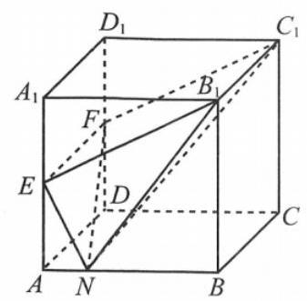

(第 17 题图)

18. 如图,半圆 ${AOB}$ 是某景点的平面示意图,半径 ${OA}$ 的长为 ${100}\mathrm{\;m}$ . 为了保护景点,景区管理部门从道路 $l$ 上选取一点 $C$ ,修建参观线路 $C - D - E - F$ ,且 ${CD}\text{ 、 }{DE}\text{ 、 }{EF}$ 均与半圆相切,四边形 ${CDEF}$ 是等腰梯形,设 ${DE} = {100t}\mathrm{\;m}$ ,记修建每 ${100}\mathrm{\;m}$ 参观线路的费用为 $f\left( t\right)$ 万元,经测算 $f\left( t\right)  = \left\{  \begin{array}{l} 5,0 < t \leq  \frac{1}{3} \\  8 - \frac{1}{t},\frac{1}{3} < t < 2 \end{array}\right.$ .

(1)用 $t$ 表示线段 ${EF}$ 的长；

(2)求修建参观线路的最低费用.

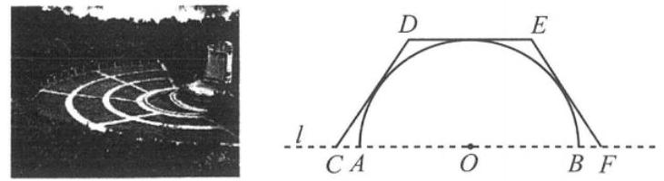

(第 18 题图)

19. 定义首项为 1 且公比为正数的等比数列为“ $M$ 一数列”.

(1)已知等比数列 $\left\{  {a}_{n}\right\}$ 满足: ${a}_{2}{a}_{4} = {a}_{5},{a}_{3} - {4{a}_{2}} + {4{a}_{1}} = 0$ ，求证:数列 $\left\{  {a}_{n}\right\}$ 为“ $M$ 一数列”;

(2)已知数列 $\left\{  {b}_{n}\right\}$ 满足: ${b}_{1} = 1$ ， $\frac{1}{{S}_{n}} = \frac{2}{{b}_{n}} - \frac{2}{{b}_{n + 1}}$ ，其中 ${S}_{n}$ 为数列 $\left\{  {b}_{n}\right\}$ 的前 $n$ 项和.

① 求数列 $\left\{  {b}_{n}\right\}$ 的通项公式；

② 设 $m$ 为正整数，若存在 “ $M$ 一数列” $\left\{  {c}_{n}\right\}$ ，对任意正整数 $k$ ，当 $k \leq  m$ 时，都有 ${c}_{k} \leq  {b}_{k} \leq  {c}_{k + 1}$ 成立,求 $m$ 的最大值.

## 综合基础强化 16

## 一、填空题

1. 设复数 $z = \frac{1 + 2\mathrm{i}}{\mathrm{i}}$ ( $\mathrm{i}$ 为虚数单位)，则 $\left| z\right|  =$ ___.

2. 已知集合 $A = \{ x \mid  \left| x\right|  < 4, x \in  \mathbf{Z}\} , B = \{ 1, m\}$ ，若 $A \cup  B = A$ ，且 $3 - m \in  A$ ，则实数 $m$ 所有的可能取值构成的集合是___.

3. 抛物线 $C : {y}^{2} = {2px}$ 的焦点 $F$ 恰好是圆 ${\left( x - 1\right) }^{2} + {y}^{2} = 1$ 的圆心，过点 $F$ 且倾斜角为 ${45}^{ \circ  }$ 的直线 $l$ 与 $C$ 交于不同的 $A$ 、 $B$ 两点，则 $\left| {AB}\right|  =$ ___.

4. 已知非零向量 $\overrightarrow{a}\text{ 、 }\overrightarrow{b}$ 满足 $\left| \overrightarrow{a}\right|  = 2\left| \overrightarrow{b}\right|$ ,且 $\left( {\overrightarrow{a} + \overrightarrow{b}}\right)  \bot  \left( {\overrightarrow{a} - 3\overrightarrow{b}}\right)$ ,则向量 $\overrightarrow{a}\text{ 、 }\overrightarrow{b}$ 夹角的余弦值为___.

5. 若函数 $f\left( x\right)  = {a}^{x} + {b}^{x}\left( {a > 0, b > 0, a \neq  1, b \neq  1}\right)$ 是偶函数，则 ${ab} =$ ___.

6. 已知二项式 ${\left( x + y\right) }^{n}$ 展开式的二项式系数和为 128,二项式 ${\left( \sqrt[3]{x} - \frac{2}{x}\right) }^{n}$ 展开式中含 $x$ 项的系数为___.

7. 已知函数 $f\left( x\right)  = \sin {\omega x} - \cos {\omega x}\left( {\omega  > 0}\right)$ 在区间 $\left\lbrack  {0,\pi }\right\rbrack$ 上最多有 4 个零点,则 $\omega$ 的取值范围为___.

8. $A\text{ 、 }B$ 两辆货车计划于同一时刻达到某一港口. 已知在货车 $B$ 准点的情况下,货车 $A$ 晚点的概率为 $\frac{1}{4}$ ; 而在货车 $A$ 晚点的情况下,货车 $B$ 准点的概率为 $\frac{1}{8}$ . 若货车 $A\text{ 、 }B$ 准点的概率相同，且货车到达该港口只有准点与晚点两种情况，则货车 $B$ 晚点的概率为___.

9. 已知 $O$ 是坐标原点,抛物线 $C : {x}^{2} = {2py}\left( {p > 0}\right)$ 的焦点为 $F,\left| {OF}\right|  = \frac{3}{4}$ ,过点 $F$ 且斜率为 $\sqrt{3}$ 的直线 $l$ 与抛物线 $C$ 交于 $A\text{ 、 }B$ 两点,则 $\left| {AB}\right|  =$ ___.

10. 已知 ${S}_{n}$ 为数列 $\left\{  {a}_{n}\right\}$ 的前 $n$ 项和,若对任意 $n \in  {\mathbf{N}}^{ * },2{S}_{n} = {a}_{n} + {\left( -2\right) }^{n}$ ,则当 $n$ 为偶数时, ${S}_{n} =$ ___.

11. 在正三棱柱 ${ABC} - {A}_{1}{B}_{1}{C}_{1}$ 中， ${A{A}_{1}} = 4$ ，底面 $\bigtriangleup  {ABC}$ 的边长为 2，用一个平面 $\alpha$ 截此三棱柱,截面 $\alpha$ 与侧棱 $A{A}_{1}\text{ 、 }B{B}_{1}\text{ 、 }C{C}_{1}$ 分别交于点 $M\text{ 、 }N\text{ 、 }P$ ,且 $\bigtriangleup {MNP}$ 为直角三角形,则 $\bigtriangleup {MNP}$ 的面积的取值范围是___.

12. 公比为 $q$ 的等比数列 $\left\{  {a}_{n}\right\}$ 满足: ${a}_{9} = \ln {a}_{10} > 0$ ,记 ${T}_{n} = {a}_{1}{a}_{2}{a}_{3}\cdots \cdots {a}_{n}$ ,则当 $q$ 最小时,使 ${T}_{n} \geq  1$ 成立的最小 $n$ 值是___.

## 二、单选题

13. 函数 $f\left( x\right)  = 2{f}^{\prime }\left( 1\right)  \cdot  x + x\ln x$ 在 $x = 1$ 处的切线方程为 ( )

A. $y = {2x} - 2$ B. $y = {2x} + 1$ C. $y =  - x - 1$ D. $y = x - 1$

14. 在边长为 3 的正方形 ${ABCD}$ 中,以点 $A$ 为圆心作单位圆,分别交 ${AB}\text{ 、 }{AD}$ 于 $E\text{ 、 }F$ 两点, 点 $P$ 是 $\overset{\text{ ⏜ }}{EF}$ 上一点,则 $\overrightarrow{PB} \cdot  \overrightarrow{PD}$ 的取值范围为 ( )

A. $\left\lbrack  {1 - 3\sqrt{2}, - 2}\right\rbrack$ B. $\left\lbrack  {-1, - \frac{\sqrt{2}}{2}}\right\rbrack$ C. $\left\lbrack  {-2,1 - \sqrt{2}}\right\rbrack$ D. $\left\lbrack  {1 - 3\sqrt{2},1 - \sqrt{2}}\right\rbrack$

15. 定义在 $\mathbf{R}$ 上的偶函数 $f\left( x\right)$ 满足 $f\left( x\right)  = f\left( {2 - x}\right)$ ,且当 $x \in  \left\lbrack  {0,1}\right\rbrack$ 时, $f\left( x\right)  = {\mathrm{e}}^{x} - 1$ ,若关于 $x$ 的方程 $f\left( x\right)  = m\left( {x + 1}\right) \left( {m > 0}\right)$ 恰有 5 个解,则 $m$ 的取值范围为 ( )

A. $\left( {\frac{\mathrm{e} - 1}{6},\frac{\mathrm{e} - 1}{5}}\right)$ B. $\left( {\frac{\mathrm{e} - 1}{6},\frac{\mathrm{e} - 1}{4}}\right)$ C. $\left( {\frac{\mathrm{e} - 1}{8},\frac{\mathrm{e} - 1}{6}}\right)$ D. $\left( {0,\mathrm{e} - 1}\right)$

16. 高斯是德国著名的数学家, 近代数学奠基者之一, 享有 “数学王子” 的称号. 用他的名字定义的函数称为高斯函数 $f\left( x\right)  = \left\lbrack  x\right\rbrack$ ,其中 $\left\lbrack  x\right\rbrack$ 表示不超过 $x$ 的最大整数. 已知数列 $\left\{  {a}_{n}\right\}$ 满足 ${a}_{1} = 2,{a}_{2} = 5,{a}_{n + 2} + 4{a}_{n} = 5{a}_{n + 1}$ ,若 ${b}_{n} = \left\lbrack  {{\log }_{2}{a}_{n + 1}}\right\rbrack  ,{S}_{n}$ 为数列 $\left\{  \frac{1000}{{b}_{n}{b}_{n + 1}}\right\}$ 的前 $n$ 项和,则 $\left\lbrack  {S}_{2022}\right\rbrack$ 的值为 ( )

A. 249 B. 499 C. 749 D. 999

## 三、解答题

17. 如图,在三棱锥 $P - {ABC}$ 中,平面 ${PAB} \bot$ 平面 ${ABC},{AC} = {BC},{PA} = {PB}$ ,且点 $C$ 在以点 $O$ 为圆心 ${AB}$ 为直径的半圆 $\overset{\text{ ⏜ }}{AB}$ 上.

(1)求证: ${AB}\bot {PC}$ ；

(2)若 ${AC} = 2$ ，且 ${PC}$ 与平面 ${ABC}$ 所成角为 $\frac{\pi }{4}$ ，求点 $B$ 到平面 ${PAC}$ 的距离.

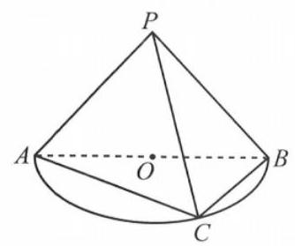

(第 16 题图)

18. 记 $\bigtriangleup  {ABC}$ 的内角 $A$ 、 $B$ 、 $C$ 的对边分别为 $a$ 、 $b$ 、 $c$ ，分别以 $a$ 、 $b$ 、 $c$ 为边长的三个正三角形的面积依次为 ${S}_{1}$ 、 ${S}_{2}$ 、 ${S}_{3}$ ，已知 ${S}_{1} - {S}_{2} + {S}_{3} = \frac{\sqrt{3}}{2}$ ， $\sin B = \frac{1}{3}$ .

(1)求 $\bigtriangleup  {ABC}$ 的面积；

(2)若 $\sin A\sin C = \frac{\sqrt{2}}{3}$ ，求 $b$ .

19. 已知 $B\left( {-1,0}\right) , C\left( {1,0}\right)$ 为 $\bigtriangleup {ABC}$ 的两个顶点, $P$ 为 $\bigtriangleup {ABC}$ 的重心,边 ${AC}\text{ 、 }{AB}$ 上的两条中线长度之和为 6 .

(1)求点 $P$ 的轨迹 $C$ 的方程.

(2)已知点 $N\left( {-3,0}\right)$ 、 $E\left( {-2,0}\right)$ 、 $F\left( {2,0}\right)$ ，直线 ${PN}$ 与曲线 $C$ 的另一个公共点为 $Q$ ,直线 ${EP}$ 与 ${FQ}$ 交于点 $M$ ,求证: 当点 $P$ 变化时,点 $M$ 恒在一条定直线上.

## 综合基础强化 17

## 一、填空题(每题 4 分，共 48 分)

1. 若 $a$ 为实数， $\left( {2 + a\mathrm{i}}\right) \left( {a - {2\mathrm{i}}}\right)  =  - 4\mathrm{i}$ ( $\mathrm{i}$ 是虚数单位),则 $a =$ ___.

2. 数列 $R$ 的前 $T$ 项和为 ${S}_{n} = {2}^{n} + 1$ ，则此数列的通项公式为___.

3. 函数 $f\left( x\right)  = \lg \left( {1 - \sqrt{x}}\right)$ 的定义域是___.

4. 已知 ${\left( 1 + 2x\right) }^{6} = {a}_{0} + {a}_{1}x + {a}_{2}{x}^{2} + \cdots  + {a}_{6}{x}^{6}$ ,则 ${a}_{0} - {a}_{1} + {a}_{2} - {a}_{3} + {a}_{4} - {a}_{5} + {a}_{6} \; =$

5. 以函数模型 $y = c{e}^{kx}\left( {c > 0}\right)$ 去拟合一组数据时,设 $z = \ln y$ ,将其变换后得到线性回归方程 $z = {2x} - 1$ ，则 $c =$ ___.

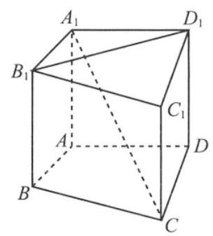

(第 7 题图)

6. 以下数据为参加数学竞赛决赛的 15 人的成绩:(单位:分) 78, 70， 72,85,88,79,80,81,94,81,56,98,83,90,91 . 则这 15 人成绩的第 80 百分位数是___.

7. 如图,在直四棱柱 ${ABCD} - {A}_{1}{B}_{1}{C}_{1}{D}_{1}$ 中,当底面四边形 ${ABCD}$ 满足条件___时，有 ${A}_{1}C \bot  {B}_{1}{D}_{1}$ . (填上所有正确的序号)

① ${AC}\bot {BD}\;$ ② ${AC} = {AD}$

③ 四边形 ${ABCD}$ 为矩形 ④ 四边形 ${ABCD}$ 为菱形

8. 从单词 “shadow” 中任意选取 4 个不同的字母排成一排，则其中恰好含有 “ad”或 “da” 的概率是___.

9. 化简集合 $\{ x \mid  \cos \left( {\pi \cos x}\right)  = 0, x \in  \left\lbrack  {0,\pi }\right\rbrack  \}$ 的结果是___.

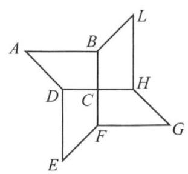

(第 11 题图)

10. 在 $\bigtriangleup {ABC}$ 中,角 $A\text{ 、 }B\text{ 、 }C$ 所对的边分别是 $a\text{ 、 }b\text{ 、 }c$ ,其中 $\tan A = \frac{\sqrt{3}}{3},\cos B =  - \frac{1}{3}$ ,最短边长是 $\sqrt{2}$ ，则最长边的长是___.

11. 四叶回旋镖可看作是四个相同的直角梯形拼成的图形, 如图所示, ${AB} = 4,{CD} = 2,\angle A = {45}^{ \circ  }, M$ 为线段 ${HG}$ 上一动点,则 $\overrightarrow{AF} \cdot  \overrightarrow{EM}$ 的最大值为___.

12. 已知函数 $f\left( x\right)  = \frac{{x}^{2} + {2ax}}{2} + \ln x$ ,则下列说法中正确的是 ___(填上所有正确的序号).

① 当 ${f}^{\prime }\left( 1\right)  = 0$ 时， $a =  - 2$ ；

② 当 $f\left( x\right)$ 在定义域内单调递增时， $a \geq   - 2$ ；

③ 当 $a \leq   - 2$ 时， $f\left( x\right)$ 有极值；

④ 当 $a <  - 2$ 时， $f\left( x\right)$ 的图像存在两条相互垂直的切线.

## 二、选择题 (每题 4 分, 共 16 分)

13. 若 $a$ 、 $b$ 为实数，则 “ $a < 1$ ” 是 “ $\frac{1}{a} > 1$ ” 的 ( )

A. 充分不必要条件 B. 必要不充分条件

C. 充要条件 D. 既非充分又非必要条件

14. 设全集 $U = \mathbf{R}, A = \left\{  {x \mid  {x}^{2} - {2x} < 0}\right\}  , B = \{ x \mid  \ln \left( {1 - x}\right)  < 0\}$ ,则 $A \cap  \bar{B} =$ ( )

A. $\{ x \mid  x \leq  1\}$ B. $\{ x \mid  x \geq  1\}$ C. $\{ x \mid  1 \leq  x < 2\}$ D. $\{ x \mid  0 < x \leq  1\}$

15. 已知函数 $f\left( x\right)  = \sin \left( {{\omega x} + \frac{\pi }{6}}\right) \left( {\omega  > 0}\right)$ 的最小正周期为 $\pi$ ,若 $f\left( x\right)  = m$ 在 $\lbrack 0,\pi )$ 上有两个不等的实根 $a$ 、 $b$ ，且 $b - a > \frac{\pi }{3}$ ，则实数 $m$ 的取值范围是 ( )

A. $\left( {-\frac{1}{2},0}\right)$ B. $\left( {0,\frac{1}{2}}\right)$ C. $\left( {\frac{1}{2},1}\right)$ D. $\left( {-\frac{1}{2},\frac{1}{2}}\right)$

16. 曲线 ${C}_{1} : y = \sin x$ ,曲线 ${C}_{2} : {x}^{2} + {\left( y + r - \frac{1}{2}\right) }^{2} = {r}^{2}\left( {r > 0}\right)$ ,它们交点的个数 ( )

A. 恒为偶数 B. 恒为奇数 C. 不超过 2022 D. 可超过 2022

## 三、解答题(每题 12 分, 共 36 分)

17. 如图,已知点 $P$ 在圆柱 $O{O}_{1}$ 的底面圆 $O$ 的圆周上, $\angle {AOP} = {120}^{ \circ  }$ ,圆 $O$ 的直径 ${AB} = 4$ , 圆柱的高 $O{O}_{1} = 3$ .

(1)求圆柱的表面积和三棱锥 ${A}_{1} - {APB}$ 的体积；

(2)求点 $A$ 到平面 ${A}_{1}{PO}$ 的距离.

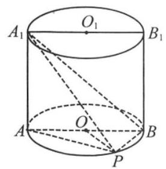

(第 17 题图)

18. 已知 $f\left( x\right)  = \frac{{2}^{x}}{b} + \frac{a}{{2}^{x}}\left( {a > 0}\right)$ 是定义在 $\mathbf{R}$ 上的偶函数,

(1)求函数 $g\left( a\right)  = {a}^{2} + b$ 取得最小值时的 $a$ 值；

(2)当 $x \in  \left\lbrack  {-\beta ,\beta  + 1}\right\rbrack  \left( {\beta  > 0}\right)$ 时， $f\left( x\right)$ 的值域是 $\left\lbrack  {{2}^{\beta },{2}^{\beta  + 1}}\right\rbrack$ ，求满足要求的 $a$ 值.

19. 已知数列 $\left\{  {a}_{n}\right\}$ ( $n$ 为正整数) 满足 ${a}_{1} = 1,{a}_{2} = a\left( {a \in  \mathbf{R}}\right)$ , ${a}_{n + 1} = \left| {{a}_{2} - {a}_{1}}\right|  + \left| {{a}_{3} - {a}_{2}}\right|  + \cdots  + \left| {{a}_{n} - {a}_{n - 1}}\right| \left( {n \geq  2}\right) .$

(1)当 ${a}_{4} = 5$ 时,求满足要求的 $a$ 值；

(2)当 $a = 5$ 时,求 ${a}_{1} + {a}_{2} + {a}_{3} + \cdots  + {a}_{n}\left( {n \geq  5}\right)$ .

## 综合基础强化 18

## 一、填空题(每题 4 分，共 48 分)

1. 设集合 $M = \{ 0,1,2\} , N = \{ 1, a\}$ ，若 $M \supseteq  N$ ，则实数 $a =$ ___.

2. 设 $z = \frac{3 + 2\mathrm{i}}{\mathrm{i}}$ ，其中 $\mathrm{i}$ 为虚数单位，则 $\operatorname{Im}z =$ ___.

3. 若 $\overrightarrow{d} = \left( {2, - 4}\right)$ 是直线 $l$ 的一个方向向量，则直线 $l$ 的倾斜角大小为___.

4. 若实数 $x\text{ 、 }y$ 满足 $\left\{  \begin{array}{l} x \geq  0, \\  {2x} - y \leq  0, \\  x + y - 3 \leq  0, \end{array}\right.$ 则 $z = {2x} + y$ 的取值范围为___.

5. 若关于 $x\text{ 、 }y$ 的方程组 $\left\{  \begin{array}{l} {ax} + {2y} = \sqrt{2}, \\  {4x} + {ay} = 2 \end{array}\right.$ 无解,则实数 $a =$ ___.

6. 已知数列 $1,1,2,\cdots$ 它的各项是由一个等比数列和一个首项为 0 的等差数列对应项相加而得，那么这个数列的前 10 项和是___.

7. 在 ${\left( \sqrt[3]{x} - \frac{2}{x}\right) }^{n}$ 的展开式中，第三项与第七项的二项式系数相等，则常数项为___.

8. 设随机变量 $X$ 的分布列为 $P\left( {X = k}\right)  = a \cdot  {\left( \frac{1}{2}\right) }^{k},\left( {k = 1,2,3}\right)$ ,则 $E\left\lbrack  X\right\rbrack   =$ ___.

9. 已知数列 $\left\{  {a}_{n}\right\}$ 的通项公式为 ${a}_{n} = \left\{  {\begin{array}{l} \frac{1}{n}, n = 1,2 \\  {\left( \frac{1}{3}\right) }^{n}, n \geq  3 \end{array}\left( {n \in  {\mathbf{N}}^{ * }}\right) }\right.$ ,其前 $n$ 项和为 ${S}_{n}$ ,则 $\mathop{\lim }\limits_{{n \rightarrow  \infty }}{S}_{n} \; =$

10. 正四棱台高为 2,上下底边长分别为 $2\sqrt{2}$ 和 $4\sqrt{2}$ ,所有顶点在同一球面上,则球的表面积是___.

11. 已知定义在 $\mathbf{R}$ 上的函数 $f\left( x\right)$ 满足: $x{f}^{\prime }\left( x\right)  + f\left( x\right)  > 0$ ,且 $f\left( 1\right)  = 2$ ,则不等式 ${\mathrm{e}}^{x}f\left( {\mathrm{e}}^{x}\right)  > 2$ 的解集为___. [注: ${f}^{\prime }\left( x\right)$ 是 $f\left( x\right)$ 在 $\mathbf{R}$ 上的导函数]

12. 各项均为正数的数列 $\left\{  {a}_{n}\right\}$ ,其前 $n$ 项和 ${S}_{n}$ ,满足 ${S}_{n} = {\left( \frac{{a}_{n} + 1}{2}\right) }^{2}$ ,若存在整数对 $\left( {m, k}\right)$ ,使得 ${a}_{m + 1},{a}_{m + 4},{a}_{k}$ 成等比数列,则满足要求的整数对 $\left( {m, k}\right)$ 共有___对.

## 二、选择题(每题 4 分，共 16 分)

13. 设 $\left\{  {a}_{n}\right\}$ 是等差数列,且公差不为零,其前 $n$ 项和为 ${S}_{n}$ ,则 “ $\left\{  {a}_{n}\right\}$ 为递增数列” 是 “对任意的正整数 $n,{S}_{n + 1} > {S}_{n}$ ” 的 ( )

A. 充分非必要条件 B. 必要非充分条件

C. 充要条件 D. 既不充分也不必要条件

14. 与曲线 ${C}_{1} : y = {x}^{3}$ 在 $x = 1$ 处相切的直线 $l$ 和曲线 ${C}_{2} : y = {x}^{2} - x + a$ 相切,则实数 $a$ 的值是 ( )

A. -2 B. 0 C. 1 D. 2

15. 给出下列两个命题:

① “存在正整数 ${x}_{0},\tan {x}_{0} > \frac{\sqrt{3}}{2}$ ”；② “存在无穷多个正整数 ${x}_{0},\sin {x}_{0} > \frac{\sqrt{3}}{2}$ ”. 则下列说法中正确的是 ( )

A. ①正确②正确 B. ①正确②错误

C. ①错误②正确 D. ①错误②错误

16. 已知平面向量 $\overrightarrow{{a}_{n}} = \left( {n,0}\right) \left( n\right)$ 为正整数), $\overrightarrow{b} = \left( {0, - 4}\right)$ ,若存在实数 $\lambda$ ,使得 $\left| {2\overrightarrow{{a}_{n}} - \lambda \left( {\overrightarrow{{a}_{n}} - \overrightarrow{b}}\right) }\right|  = 4$ ,则满足要求的 $n$ 的个数是 ( )

A. 0 个 B. 1 个 C. 2 个 D. 至少 3 个

## 三、解答题(每题 12 分，共 36 分)

17. 如图,三棱锥 $P - {ABC},{PA} \bot$ 平面 ${ABC}$ ,底面 $\bigtriangleup {ABC}$ 是以 $\angle B$ 为直角的等腰三角形, ${PA} = {AC} = 4, D$ 为 ${AC}$ 上一点,且 ${CD} = 1$ .

(1)求三棱锥 $P - {ABC}$ 的表面积和三棱锥 $C - {PBD}$ 体积；

(2)求直线 ${AB}$ 与平面 ${PBD}$ 的所成角大小.

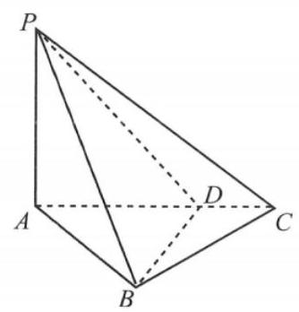

(第 17 题图)

18. 已知向量 $\overrightarrow{a} = \left( {\sin x,\frac{3}{8}}\right) ,\overrightarrow{b} = \left( {\cos x, - 1}\right)$ .

(1)当 $\overrightarrow{a} \bot  \overrightarrow{b}$ 时，求 $\sin {2x}$ 的值；

(2)设函数 $f\left( x\right)  = \overrightarrow{a} \cdot  \overrightarrow{b} + \frac{3}{8}$ ，将 $f\left( x\right)$ 的图像向左平移 $\frac{\pi }{3}$ 个单位得到函数 $g\left( x\right)$ 的图像， 求 $g\left( x\right)$ 在 $x \in  \left\lbrack  {0,\frac{\pi }{6}}\right\rbrack$ 的值域.

19. 已知 ${F}_{1}\text{ 、 }{F}_{2}$ 是椭圆 $\Gamma  : \frac{{x}^{2}}{4} + {y}^{2} = 1$ 的左、右焦点, ${A}_{1}\text{ 、 }{A}_{2}$ 为椭圆的左、右顶点.

(1)设 ${P}_{i}\left( {{x}_{i},{y}_{i}}\right) \left( {i = 1,2,\cdots ,{2022}}\right)$ 是椭圆 $\Gamma$ 上除左右顶点 ${A}_{1}$ 、 ${A}_{2}$ 外的不同点,满足 $\overrightarrow{O{P}_{1}} + \overrightarrow{O{P}_{2}} + \cdots  + {\overrightarrow{O{P}_{2}}}_{2022} = \left( {1,2}\right)$ ，其与 ${A}_{1}$ 、 ${A}_{2}$ 连线的斜率分别是 ${k}_{{A}_{1}{P}_{i}}$ 、 ${k}_{{A}_{2}{P}_{i}}$ ，求

$$
\frac{1}{{k}_{{A}_{1}{P}_{1}} - {k}_{{A}_{2}{P}_{1}}} + \frac{1}{{k}_{{A}_{1}{P}_{2}} - {k}_{{A}_{2}{P}_{2}}} + \cdots  + \frac{1}{{k}_{{A}_{1}{P}_{2022}} - {k}_{{A}_{2}{P}_{2022}}}\text{ 的值. }
$$

(2)若 $P$ 、 $Q\left( {{x}_{P} > {x}_{Q}}\right)$ 是椭圆 $\Gamma$ 上除左右顶点 ${A}_{1}$ 、 ${A}_{2}$ 外的两个不同点，且满足 $\overrightarrow{P{F}_{1}} \cdot  \overrightarrow{Q{F}_{1}} \; = \overrightarrow{P{F}_{2}} \cdot  \overrightarrow{Q{F}_{2}} = 0$ ，试求满足要求的点 $P$ 的集合.

## 综合基础强化 19

## 一、填空题(每题 4 分，共 48 分)

1. 集合 $A = \left( {-1,2}\right)$ ，则 $A \cap  \mathbf{Z} =$ ___.

2. 椭圆 ${x}^{2} + \frac{{y}^{2}}{2} = 1$ 的焦距为___.

3. 若正方形 ${ABCD}$ 的边长为 $2,\overrightarrow{AC} \cdot  \overrightarrow{AB} =$ ___.

4. 曲线 $y = x\ln x - x$ 在 $x = 1$ 处的切线方程是___.

5. 若 $\tan \alpha  =  - 3$ ,则 $\tan \left( {\alpha  + \frac{\pi }{4}}\right)  =$ ___.

6. 在 ${\left( x + \frac{1}{\sqrt{x}}\right) }^{6}$ 的二项展开式中,常数项的系数是___.

7. 利用二分法,方程 $\frac{1}{x} = \lg x$ 在 $\left\lbrack  {1,2}\right\rbrack$ 的近似解 $x \approx$ ___(精确到 0.1 ).

8. 某社区拟从 6 名男生、 3 名女生这 9 名志愿者中选出 3 人到某小区协助新冠肺炎防控工作，要求选出的 3 人中既有男生又有女生，则不同的选法共有___种。

9. 某奶茶公司计划在周边 $W$ 市开设加盟分店，为了确定在 $W$ 市开设分店的个数，该公司对 $A$ 市 $B$ 区的 5 个区域开店数据作了初步处理后得到下列表格,记 $x$ 表示在 $B$ 区的 5 个区域开设分店的个数, $y$ 表示这 $x$ 个分店的年收入之和.

<table><tr><td>$x$ (个)</td><td>2</td><td>3</td><td>4</td><td>5</td><td>6</td></tr><tr><td>$y$ (十万元)</td><td>2.5</td><td>3</td><td>4</td><td>4.5</td><td>6</td></tr></table>

根据上表提供的数据,用最小二乘法得到 $y$ 关于与 $x$ 的线性回归方程是___ ___. 参考公式: $\widehat{b} = \frac{\mathop{\sum }\limits_{{i = 1}}^{n}{x}_{i}{y}_{i} - n \cdot  \overline{xy}}{\mathop{\sum }\limits_{{i = 1}}^{n}{x}_{i}^{2} - n{\bar{x}}^{2}},\widehat{a} = \bar{y} - \overline{bx}$ .

10. 已知双曲线 $\Gamma  : \frac{{x}^{2}}{{a}^{2}} - \frac{{y}^{2}}{{b}^{2}} = 1\left( {a > 0, b > 0}\right)$ 的实轴为 ${A}_{1}{A}_{2}$ ,对于实轴 ${A}_{1}{A}_{2}$ 上的任意点 $P$ ,在实轴 ${A}_{1}{A}_{2}$ 上都存在点 $Q$ ,使得 $\left| {PQ}\right|  = \sqrt{3}b$ ,则双曲线 $\Gamma$ 的两条渐近线夹角的最大值为___.

11. 函数 $f\left( x\right)  = \cos {\omega x}\left( {\omega  > 0, x \in  \mathbf{Z}}\right)$ 的值域中仅有 5 个不同的值,则 $\omega$ 的最小值为___.

12. 若不等式 $\left| {x - 1}\right|  + a\left| {x - 8}\right|  \geq  4$ 对任意实数 $x$ 恒成立,则正实数 $a$ 的取值范围为___.

## 二、选择题 (每题 4 分, 共 16 分)

13. 已知 $A$ 为锐角 $\bigtriangleup {ABC}$ 的内角,则 “ $\sin A = \frac{\sqrt{3}}{2}$ ” 是 “ $A = \frac{\pi }{3}$ ” 的 ( )

A. 充分非必要条件 B. 必要非充分条件

C. 充要条件 D. 既非充分也非必要条件

14. 函数 $y = \frac{x}{\ln x}$ 的图像大致为 ( )

A.

B.

C.

D.

15. 为了考察某种病毒疫苗的效果，现随机抽取 100 只小白鼠进行试验，得到 $2 \times  2$ 列联表:

<table><tr><td></td><td>感染病毒</td><td>未感染病毒</td></tr><tr><td>使用疫苗</td><td>10</td><td>40</td></tr><tr><td>未使用疫苗</td><td>20</td><td>30</td></tr></table>

注: ${K}^{2} = \frac{n{\left( ad - bc\right) }^{2}}{\left( {a + b}\right) \left( {c + d}\right) \left( {a + c}\right) \left( {b + d}\right) }$ ,其中 $n = a + b + c + d$ .

<table><tr><td>$P\left( {{K}^{2} \geq  {k}_{0}}\right)$</td><td>0.10</td><td>0.05</td><td>0.025</td><td>0.010</td><td>0.005</td><td>0.001</td></tr><tr><td>${k}_{0}$</td><td>2.706</td><td>3.841</td><td>5.024</td><td>6.635</td><td>7.879</td><td>10.828</td></tr></table>

根据以上数据, 得到的结论正确的是 ( )

A. 在犯错概率不超过 2.5% 的前提下认为 “小白鼠是否被感染与服用疫苗有关”

B. 在犯错概率不超过 2.5% 的前提下认为 “小白鼠是否被感染与服用疫苗无关”

C. 有 95% 的把握认为 “小白鼠是否被感染与有没有服用疫苗有关”

D. 有 95% 的把握认为 “小白鼠是否被感染与有没有服用疫苗无关”

16. 设 $\left\{  {a}_{n}\right\}$ 是公比为 $q\left( {q \neq  1}\right)$ 的无穷等比数列,若 $\left\{  {a}_{n}\right\}$ 中任意两项之积仍是该数列中的项, 则称 $\left\{  {a}_{n}\right\}$ 为 “封闭等比数列”. 给出以下命题:

① ${a}_{1} = 3, q = 2$ ，则 $\left\{  {a}_{n}\right\}$ 是 “封闭等比数列”；

② ${a}_{1} = \frac{1}{2}, q = 2$ ，则 $\left\{  {a}_{n}\right\}$ 是 “封闭等比数列”；

③若 $\left\{  {a}_{n}\right\}$ 、 $\left\{  {b}_{n}\right\}$ 都是 “封闭等比数列”，则 $\left\{  {{a}_{n} \cdot  {b}_{n}}\right\}$ 、 $\left\{  {{a}_{n} + {b}_{n}}\right\}$ 也都是 “封闭等比数列”；

④不存在 $\left\{  {a}_{n}\right\}$ ，使 $\left\{  {a}_{n}\right\}$ 和 $\left\{  {a}_{n}^{2}\right\}$ 都是 “封闭等比数列”.

以上命题中正确的个数是 ( )

A. 0 个 B. 1 个 C. 2 个 D. 3 个

## 三、解答题(每题 12 分，共 36 分)

17. 如图,在直三棱柱 ${ABC} - {A}_{1}{B}_{1}{C}_{1}$ 中,点 $D\text{ 、 }E$ 分别在边 ${BC}\text{ 、 }{B}_{1}{C}_{1}$ 上, $\angle {ACD} = {60}^{ \circ  },{CD} = \; {B}_{1}E = \frac{1}{2}{AC} = a.$

(1)证明: ${BE}//$ 平面 $A{C}_{1}D$ ；

(2)求二面角 $A - D{C}_{1} - B$ .

(第 17 题图)

18. 已知复数 $z = \left( {2 + \mathrm{i}}\right) m + \frac{2\mathrm{i}}{\mathrm{i} - 1}$ (其中 $\mathrm{i}$ 是虚数单位， $m \in  \mathbf{R}$ ).

(1)若复数 $z$ 是纯虚数，求 $m$ 的值；

(2)求 $\left| {z - 1}\right|$ 的取值范围.

19. 神舟飞船载人飞行任务激发了大家对航天工程的热情，与航天有关的商品销量持续增长. 现对某航模销售情况进行调查发现: 该航模在过去的一个月内 (以 30 天计) 的日销售单价 $P\left( x\right)$ (元/个)与时间 $x$ (天) 的函数关系近似满足 $P\left( x\right)  = 2 + \frac{k}{\sqrt{x + 1}}$ ,(常数 $k > 0$ ). 该商品的日销售量 $Q\left( x\right)$ (百个)与时间 $x$ (天)的部分数据如表所示:

<table><tr><td>$x$ (天)</td><td>3</td><td>8</td><td>15</td><td>24</td></tr><tr><td>$Q\left( x\right)$ (百个)</td><td>4</td><td>5</td><td>6</td><td>7</td></tr></table>

已知第 8 天该商品的日销售收入为 3500 元.

(1)求实数 $k$ 的值.

(2)给出以下三种函数模型:① $Q\left( x\right)  = {px} + q$ ; ② $Q\left( x\right)  = a{\left( x - {16}\right) }^{2} + b$ ; ③ $Q\left( x\right)  = \; m\sqrt{x + 1} + n$ . 请你依据表中的数据,从以上三种函数模型中,选择你认为最合适的一种函数模型,来描述该商品的日销售量 $Q\left( x\right)$ 与时间 $x$ 的关系,说明你选择的理由. 并借助你选择的模型,预估在哪一天该商品的日销售收入 $f\left( x\right) \left( {1 \leq  a \leq  {30}, x \in  \mathbf{N}}\right.$ , $x \geq  1)$ (元) 最低.

## 综合基础强化 20

## 一、填空题(每题 4 分，共 48 分)

1. 若复数 $z$ 满足 $\bar{z}\left( {1 + \mathrm{i}}\right)  = 2$ ，则 $z =$ ___.

2. 不等式 $\left| {x - 1}\right|  + \left| {x - 3}\right|  \leq  2$ 的解集为___.

3. 函数 $y = \sin \left( {{2x} - \frac{\pi }{4}}\right)$ 的最小正周期为___.

4. 点 $\left( {-1,1}\right)$ 到直线 ${4x} + {2y} - 3 = 0$ 的距离为___.

5. 在 ${\left( x + 1\right) }^{10}$ 的二项展开式中,系数最大的项的系数是___.

6. 已知 ${2}^{a} = {3}^{b} = 6$ ,则 $\frac{1}{a} + \frac{1}{b} =$ ___.

7. 化简: $\frac{\sin \left( {{3\pi } - x}\right) \cos \left( {x + \frac{3\pi }{2}}\right) }{\tan \left( {x + \pi }\right) \sin {2x}} =$

8. 甲、乙、丙、丁四位同学在建立变量 $x$ 、 $y$ 的回归模型时,分别选择了 4 种不同模型,计算可得它们的相关系数 ${R}^{2}$ 分别如表:

<table><tr><td>学生</td><td>甲</td><td>乙</td><td>丙</td><td>丁</td></tr><tr><td>${R}^{2}$</td><td>0.95</td><td>0.50</td><td>0.85</td><td>0.77</td></tr></table>

则建立的回归模型拟合效果最好的是___同学.

9. 滑雪是冬奥会中的一个比赛大项，设某高山滑雪运动员在一次滑雪训练中滑行的路程 $s$ (单位: $\mathrm{m}$ ) 与时间 $t$ (单位: $\mathrm{s}$ ) 满足关系式 $s\left( t\right)  = 3{t}^{2} + \frac{1}{2}t$ . 当该运动员的滑雪路程为 ${46}\mathrm{\;m}$ 时，滑雪的瞬时速度为___.

10. 若直线 ${ax} - {by} - 3 = 0\left( {a > 0, b > 0}\right)$ 过点 $\left( {1, - 1}\right)$ ,则 $\sqrt{a + 1} + \sqrt{b + 2}$ 的最大值为___.

(第 11 题图)

11. 在 ${xOy}$ 平面上,将半圆弧 ${\left( x - 1\right) }^{2} + {y}^{2} = 1\left( {x \geq  1}\right) \text{ 、 }y$ 轴、两条直线 $y = 1$ 和 $y =  - 1$ 围成的封闭图形记为 $D$ ,如图中阴影部分,记 $D$ 绕 $y$ 轴旋转一周而成的几何体为 $\Omega$ . 试利用祖暅原理，得出 $\Omega$ 的体积为___.

12. 已知集合 $M$ 是满足下列两个条件的函数 $f\left( x\right)$ 的全体: ① $f\left( x\right)$ 在定义域上是单调函数; ② 在 $f\left( x\right)$ 的定义域内存在闭区间 $\left\lbrack  {a, b}\right\rbrack$ , 使 $f\left( x\right)$ 在 $\left\lbrack  {a, b}\right\rbrack$ 上的值域为 $\left\lbrack  {\frac{a}{2},\frac{b}{2}}\right\rbrack$ . 则下列函数中,是集合 $M$ 中的元素有___(将所有符合条件的序号都填上).

① $f\left( x\right)  = {x}^{2}$ ; ② $f\left( x\right)  = {2}^{x}$ ; ③ $f\left( x\right)  = {\log }_{2}x$ ；④ $f\left( x\right)  = \frac{1}{2}\tan \frac{\pi }{4}x, x \in  \left( {-2,2}\right)$ .

## 二、选择题 (每题 4 分, 共 16 分)

13. 若集合 $A = \left\{  {0,{m}^{2}}\right\}  , B = \{ 1,2\}$ ,则 “ $m = 1$ ” 是 “ $A \cup  B = \{ 0,1,2\}$ ” 的 ( )

A. 充分不必要条件 B. 必要不充分条件

C. 充要条件 D. 既不充分也不必要条件

14. 若 ${2}^{x} - {2}^{y} < {3}^{-x} - {3}^{-y}$ ,则 ( )

A. $\ln \left( {y - x + 1}\right)  > 0$ B. $\ln \left( {y - x + 1}\right)  < 0$ C. $\ln \left| {x - y}\right|  > 0$ D. $\ln \left| {x - y}\right|  < 0$

15. 已知各项均不为零的数列 $\left\{  {a}_{n}\right\}$ ,定义向量 $\overrightarrow{{c}_{n}} = \left( {{a}_{n},{a}_{n + 1}}\right) ,\overrightarrow{{b}_{n}} = \left( {n, n + 1}\right) , n \in  \mathbf{N}, n \geq  1$ . 下列命题中真命题是 ( )

A. 对任意 $n \in  \mathbf{N}, n \geq  1$ ，总有 $\overrightarrow{{c}_{n}}//\overrightarrow{{b}_{n}}$ 成立，则数列 $\left\{  {a}_{n}\right\}$ 是等差数列

B. 对任意 $n \in  \mathbf{N}, n \geq  1$ ,总有 $\overrightarrow{{c}_{n}}//\overrightarrow{{b}_{n}}$ 成立,则数列 $\left\{  {a}_{n}\right\}$ 是等比数列

C. 对任意 $n \in  \mathbf{N}, n \geq  1$ ,总有 $\overrightarrow{{c}_{n}} \bot  \overrightarrow{{b}_{n}}$ 成立,则数列 $\left\{  {a}_{n}\right\}$ 是等差数列

D. 对任意 $n \in  \mathbf{N}, n \geq  1$ ,总有 $\overrightarrow{{c}_{n}} \bot  \overrightarrow{{b}_{n}}$ 成立,则数列 $\left\{  {a}_{n}\right\}$ 是等比数列

16. 已知一圆锥的高 ${PO} = 2$ ,底面圆的半径为 $4, M$ 为母线 ${PB}$ 的中点,过点 $M$ 截圆锥,如图所示，若四个图中的截面边界曲线分别为圆、椭圆、双曲线及抛物线，则 ( )

(第 16 题图)

①圆的面积为 ${4\pi }$ ；②椭圆的长轴长为 $\sqrt{37}$ ；③双曲线的两条渐近线夹角为 $\arctan \frac{4}{3}$ ； ④ 抛物线中焦点到准线的距离为 $\frac{8\sqrt{5}}{5}$ .

上述命题中真命题的个数是 ( )

A. 1 个 B. 2 个 C. 3 个 D. 4 个

## 三、解答题(每题 12 分，共 36 分)

17. 函数 $f\left( x\right)  = \frac{1 - x}{ax} + \ln x$ 是 $\lbrack 1, + \infty )$ 上的增函数.

(1)求正实数 $a$ 的取值范围;

(2)设 $b > 0, a > 1$ ，求证: $\ln \frac{a + b}{b} > \frac{1}{a + b}$ .

18. 某校开展知识竞赛活动, 现从参加活动的学生中随机抽取了 100 名学生, 将他们的比赛成绩(满分为 100 分)分为四组: $\lbrack {60},{70})$ ， $\lbrack {70},{80})$ ， $\lbrack {80},{90})$ ， $\left\lbrack  {{90},{100}}\right\rbrack$ ，得到的频率分布直方图如图所示，将成绩在 $\left\lbrack  {{80},{100}}\right\rbrack$ ，内定义为“优秀”，成绩低于 80 分为“非优秀”.

(1)求 $a$ 的值:并根据答题成绩是否优秀，利用分层抽样的方法从这 100 名学生中抽取 5 名，再从这 5 名学生中随机抽取 2 名, 求抽取的 2 名学生的成绩中恰有一名优秀的概率;

(第 18 题图)

(2)请将 $2 \times  2$ 列联表补充完整，并判断是否有 99% 的把握认为答题成绩是否优秀与性别有关?

<table><tr><td></td><td>男生</td><td>女生</td><td>合计</td></tr><tr><td>优秀</td><td>30</td><td></td><td></td></tr><tr><td>非优秀</td><td></td><td>10</td><td></td></tr><tr><td>合计</td><td>60</td><td></td><td></td></tr></table>

参考公式及数据: ${K}^{2} = \frac{n{\left( ad - bc\right) }^{2}}{\left( {a + b}\right) \left( {c + d}\right) \left( {a + c}\right) \left( {b + d}\right) }, n = a + b + c + d$ .

<table><tr><td>$P\left( {{K}^{2} \geq  {k}_{0}}\right)$</td><td>0.10</td><td>0.05</td><td>0.025</td><td>0.010</td><td>0.005</td><td>0.001</td></tr><tr><td>${k}_{0}$</td><td>2.706</td><td>3.841</td><td>5.024</td><td>6.635</td><td>7.879</td><td>10.828</td></tr></table>

19. 在 $\bigtriangleup {ABC}$ 中,内角 $A\text{ 、 }B\text{ 、 }C$ 所对应的边分别为 $a\text{ 、 }b\text{ 、 }c$ ,从条件①、条件②、条件③中选择一个作为已知.

(1)求 $A$ ；

(2)当 $a = \sqrt{3}$ 时，求 $b + c$ 的取值范围.

条件①: $a\cos C - \left( {{2b} - c}\right) \cos A = 0$ ; 条件②: $\frac{\sin B - \sin A}{b - c} = \frac{\sin C}{a + b}$ ; 条件③: $2{\cos }^{2}\frac{B + C}{2} = \; \cos {2A} + 1$ .

注: 如果选择多个条件分别解答, 按第一个解答计分.

## 参考答案

## 热点 1 最值与值域的出路

1. $\left\lbrack  {-2, + \infty }\right) \;$ 2. $\left\lbrack  {\frac{-2 - \sqrt{13}}{3},\frac{-2 + \sqrt{13}}{3}}\right\rbrack  \;$ 3. ${2\pi }$

4. $- \frac{1}{2}$ 【提示】因为函数 $f\left( x\right)$ 定义域为 $\left( {0, + \infty }\right)$ ,所以依题可知, $f\left( 1\right)  =  - 2,{f}^{\prime }\left( 1\right)  = 0$ , 而 ${f}^{\prime }\left( x\right)  = \frac{a}{x} - \frac{b}{{x}^{2}}$ ,所以 $b =  - 2, a - b = 0$ ,即 $a =  - 2, b =  - 2$ ,所以 ${f}^{\prime }\left( x\right)  =  - \frac{2}{x} + \frac{2}{{x}^{2}}$ , 因此函数 $f\left( x\right)$ 在 $\left( {0,1}\right)$ 上递增,在 $\left( {1, + \infty }\right)$ 上递减, $x = 1$ 时取最大值,满足题意, 即有 ${f}^{\prime }\left( 2\right)  =  - 1 + \frac{1}{2} =  - \frac{1}{2}$ .

${5.4}\;6.\frac{3}{2}\;7.\frac{\sqrt{2}}{2}\;8.\frac{3\sqrt{2}}{4}\;{9.1}\;{10}.\left( {3, + \infty }\right) \;{11}.\frac{3}{2}\;{12}.\left\lbrack  {\sqrt{5} - 6, - \sqrt{5}}\right\rbrack  \;{13}.\mathrm{C}$

14. D 【提示】 ${f}^{\prime }\left( x\right)  =  - \sin x + \sin x + \left( {x + 1}\right) \cos x = \left( {x + 1}\right) \cos x$ ,

所以 $f\left( x\right)$ 在区间 $\left( {0,\frac{\pi }{2}}\right)$ 和 $\left( {\frac{3\pi }{2},{2\pi }}\right)$ 上 ${f}^{\prime }\left( x\right)  > 0$ ,即 $f\left( x\right)$ 单调递增;

在区间 $\left( {\frac{\pi }{2},\frac{3\pi }{2}}\right)$ 上 ${f}^{\prime }\left( x\right)  < 0$ ,即 $f\left( x\right)$ 单调递减,

又 $f\left( 0\right)  = f\left( {2\pi }\right)  = 2, f\left( \frac{\pi }{2}\right)  = \frac{\pi }{2} + 2, f\left( \frac{3\pi }{2}\right)  =  - \left( {\frac{3\pi }{2} + 1}\right)  + 1 =  - \frac{3\pi }{2}$ ,

所以 $f\left( x\right)$ 在区间 $\left\lbrack  {0,{2\pi }}\right\rbrack$ 上的最小值为 $- \frac{3\pi }{2}$ ,最大值为 $\frac{\pi }{2} + 2$ .

15. A 16. C

17. (1) $\lbrack  - {11}, + \infty )$ ；

(2) $f\left( x\right)  = \frac{{x}^{2}}{x - 2}$ 在 $\left\lbrack  {0,1}\right\rbrack$ 上的值域为 $\left\lbrack  {-1,0}\right\rbrack$ ，

$g\left( x\right)  = {x}^{2} - {2ax} + 5\left( {a > 1}\right)$ 在 $\left\lbrack  {0,1}\right\rbrack$ 上的值域为 $\left\lbrack  {6 - {2a},5}\right\rbrack$ ，

由题可得 $\left\lbrack  {-1,0}\right\rbrack   \subseteq  \left\lbrack  {6 - {2a},5}\right\rbrack$ ,所以 $a \geq  \frac{7}{2}$ .

18. (1) $\left\lbrack  {2,{2t}}\right\rbrack  ;\left( 2\right) m\left( t\right)  = \left\{  \begin{array}{l} 0,3 \leq  t \leq  2 + \sqrt{2} \\   - {t}^{2} + {4t} - 2, t > 2 + \sqrt{2} \end{array}\right.$

【提示】(1) 由 $F\left( x\right)  = {x}^{2} - {2tx} + {4t} - 2$ 可知, ${x}^{2} - {2tx} + {4t} - 2 \leq  2\left| {x - 1}\right|$ ,

由 $t \geq  3$ ,故 $x \leq  1$ 时, ${x}^{2} - {2tx} + {4t} - 2 - 2\left| {x - 1}\right|  = {x}^{2} + 2\left( {t - 1}\right) \left( {2 - x}\right)  > 0$ ;

当 $x > 1$ 时, ${x}^{2} - {2tx} + {4t} - 2 - 2\left| {x - 1}\right|  = {x}^{2} - \left( {2 + {2t}}\right) x + {4t} = \left( {x - 2}\right) \left( {x - {2t}}\right)$ ,

则等式 $F\left( x\right)  = {x}^{2} - {2tx} + {4t} - 2$ 成立的 $x$ 的取值范围是 $\left\lbrack  {2,{2t}}\right\rbrack$ ;

(2)设 $f\left( x\right)  = 2\left| {x - 1}\right| , g\left( x\right)  = {x}^{2} - {2tx} + {4t} - 2$ ，

则 $f{\left( x\right) }_{\min } = f\left( 1\right)  = 0, g{\left( x\right) }_{\min } = g\left( t\right)  =  - {t}^{2} + {4t} - 2$ .

由 $- {t}^{2} + {4t} - 2 = 0$ ,解得 ${t}_{1} = 2 + \sqrt{2},{t}_{2} = 2 - \sqrt{2}$ (小于 1 舍去),

由 $F\left( x\right)$ 的定义可得 $m\left( t\right)  = \min \{ f\left( 1\right) , g\left( t\right) \}  = \left\{  \begin{array}{l} 0,3 \leq  t \leq  2 + \sqrt{2} \\   - {t}^{2} + {4t} - 2, t > 2 + \sqrt{2} \end{array}\right.$ .

19.【提示】 $\left( 1\right) {f}^{\prime }\left( x\right)  =  - {x}^{2} + {ax} + 2{a}^{2}$ ;

(2)因为 $f\left( {x}_{1}\right)  - 3 =  - \frac{1}{3}{x}_{1}^{3} + \frac{1}{2}a{x}_{1}^{2} + 2{a}^{2}{x}_{1}$ ，令 $g\left( x\right)  =  - \frac{1}{3}{x}^{3} + \frac{1}{2}a{x}^{2} + 2{a}^{2}x$ ，

第137页，共188页

则 ${g}^{\prime }\left( x\right)  =  - {x}^{2} + {ax} + 2{a}^{2} =  - \left( {x + a}\right) \left( {x - {2a}}\right)$ ,令 ${g}^{\prime }\left( x\right)  = 0$ ,则 $x =  - a$ 或 $x = {2a}$ ,

因为 $0 < a \leq  \frac{1}{2}$ ,所以 $- a \in  \left\lbrack  {-\frac{1}{2},0}\right) ,{2a} \in  (0,1\rbrack$ ,所以当 $x \in  \left\lbrack  {-1, - a}\right\rbrack$ 和 $x \in  ({2a},2\rbrack$ 时,

${g}^{\prime }\left( x\right)  < 0$ ,函数 $g\left( x\right)$ 单调递减,当 $x \in  \left( {-a,{2a}}\right)$ 时, ${g}^{\prime }\left( x\right)  > 0$ ,函数 $g\left( x\right)$ 单调递增,

所以函数 $g\left( x\right)$ 的极小值为 $g\left( {-a}\right)  = \frac{1}{3}{a}^{3} + \frac{1}{2}{a}^{3} - 2{a}^{3} =  - \frac{7}{6}{a}^{3}$ ,又 $g\left( 2\right)  =  - \frac{8}{3} + {2a} + 4{a}^{2}$ ,

令 $h\left( a\right)  = g\left( 2\right)  - g\left( {-a}\right)  = \frac{7}{6}{a}^{3} + 4{a}^{2} + {2a} - \frac{8}{3}$ ,

易知,当 $0 < a \leq  \frac{1}{2}$ 时,函数 $h\left( a\right)$ 单调递增,故 $h{\left( a\right) }_{\max } = h\left( \frac{1}{2}\right)  =  - \frac{25}{48} < 0$ ,所以 $g\left( 2\right)  < g\left( {-a}\right)$ ,

即当 $x \in  \left\lbrack  {-1,2}\right\rbrack$ 时, $g{\left( x\right) }_{\min } = g\left( 2\right)  =  - \frac{8}{3} + {2a} + 4{a}^{2}$ ,

又 ${f}^{\prime }\left( {x}_{2}\right)  =  - {x}_{2}^{2} + a{x}_{2} + 2{a}^{2} =  - {\left( {x}_{2} - \frac{a}{2}\right) }^{2} + \frac{9{a}^{2}}{4}$ ,

其对应函数图像的对称轴为 ${x}_{2} = \frac{a}{2} < \frac{1}{2}$ ,所以 ${x}_{2} = 2$ 时, ${f}^{\prime }{\left( {x}_{2}\right) }_{\min } = {f}^{\prime }\left( 2\right)  =  - 4 + {2a} + 2{a}^{2}$ ,

所以 $f\left( {x}_{1}\right)  - 3 + {f}^{\prime }\left( {x}_{2}\right)  \geq  6{a}^{2} + {4a} - \frac{20}{3}$ ,故有 $6{a}^{2} + {4a} - \frac{20}{3} \geq  M + {8a}$ ,

又 $6{a}^{2} + {4a} - \frac{20}{3} - {8a} = 6{\left( a - \frac{1}{3}\right) }^{2} - \frac{22}{3}$ ,因为 $0 < a \leq  \frac{1}{2}$ ,所以 $6{\left( a - \frac{1}{3}\right) }^{2} - \frac{22}{3} \geq   - \frac{22}{3}$ ,所以 $M \leq   - \frac{22}{3}$ .

## 热点 2 存在与任意的纠结

1. $( - \infty ,4\rbrack \;2.\left( {1,3}\right) \;3.a <  - 1$ 或 $a > 1\;4.\left\lbrack  {-2\sqrt{6},2\sqrt{6}}\right\rbrack  \;5. - 3\;6.\left\lbrack  {1,{\log }_{2}\frac{5}{2}}\right\rbrack  \;7.( - \infty , - 5\rbrack$ 8. $\left\lbrack  {0,2}\right)  \cup  \left( {-\infty , - 2}\right)$ 9. $\left\lbrack  {-4,0}\right\rbrack$ 10. $\left( {-\infty ,\frac{3}{2}}\right)$ 11. $\left\lbrack  {-8, - \frac{26}{9}}\right\rbrack$ 12. $\left( {-4, - 2}\right)$ 13. A 14.D

15. A 16. B

17.【提示】(1)当 $a = 2$ 时, $\left| {{2x} - 2}\right|  + 2\left| {x + 1}\right|  \leq  5$ ,

当 $x \leq   - 1$ 时, $2 - {2x} - 2\left( {x + 1}\right)  \leq  5$ ,解得 $x \geq   - \frac{5}{4}$ ,故 $- \frac{5}{4} \leq  x \leq   - 1$ ,

当 $- 1 < x < 1$ 时, $2 - {2x} + 2\left( {x + 1}\right)  \leq  5,4 \leq  5$ 恒成立,故 $- 1 < x < 1$ ,

当 $x \geq  1$ 时, ${2x} - 2 + 2\left( {x + 1}\right)  \leq  5$ ,解得 $x \leq  \frac{5}{4}$ ,故 $1 \leq  x \leq  \frac{5}{4}$ ,

综上所述，不等式 $f\left( x\right)  \leq  5$ 的解集为 $\left\lbrack  {-\frac{5}{4},\frac{5}{4}}\right\rbrack$ .

(2) $\left| {{2x} - a}\right|  + \left| {{2x} + 2}\right|  = \left| {a - {2x}}\right|  + \left| {{2x} + 2}\right|  \geq  \left| {a - {2x} + {2x} + 2}\right|  = \left| {a + a}\right|$ ,

当且仅当 $\left( {a - {2x}}\right) \left( {{2x} + 2}\right)  \geq  0$ 恒成立,

若存在 $x \in  \mathbf{R}$ ,使得 $f\left( x\right)  \geq  {2a} + 1$ 成立,则 $\left| {a + 2}\right|  \leq  {2a} + 1$ ,即 $\left\{  \begin{array}{l} {2a} + 1 \geq  0, \\  {\left( a + 2\right) }^{2} \leq  {\left( 2a + 1\right) }^{2}, \end{array}\right.$ 解得 $a \geq  1$ ,

故 $a$ 的取值范围为 $\lbrack 1, + \infty )$ .

18.【提示】(1)若不等式 $\frac{{4x} + m}{{x}^{2} - {2x} + 3} < 2$ 对任意实数 $x$ 恒成立，

因为 ${x}^{2} - {2x} + 3 > 0$ 恒成立,所以不等式等价为 ${4x} + m < 2\left( {{x}^{2} - {2x} + 3}\right)$ ,即 $2{x}^{2} - {8x} + 6 - m > 0$ ,

即判别式 $\Delta  = {64} - 8\left( {6 - m}\right)  < 0$ ,得 $m <  - 2$ ,即实数 $m$ 的取值范围是 $\left( {-\infty , - 2}\right)$ .

(2)由 ${x}^{2} + {px} > {4x} + p - 3$ ，得 $p\left( {x - 1}\right)  + {x}^{2} - {4x} + 3 > 0$ ，对一切 $0 \leq  p \leq  4$ 均成立，

设 $f\left( p\right)  = p\left( {x - 1}\right)  + {x}^{2} - {4x} + 3$ .

若对一切 $0 \leq  p \leq  4, f\left( p\right)  > 0$ 均成立,则 $\left\{  \begin{array}{l} f\left( 0\right)  = {x}^{2} - {4x} + 3 > 0, \\  f\left( 4\right)  = {x}^{2} - 1 > 0, \end{array}\right.$ 得 $\left\{  \begin{array}{l} x > 3\text{ 或 }x < 1, \\  x > 1\text{ 或 }x <  - 1, \end{array}\right.$

得 $x > 3$ 或 $x <  - 1$ ,即实数 $x$ 的取值范围是 $\left( {-\infty , - 1}\right)  \cup  \left( {3, + \infty }\right)$ .

第138页，共188页

19.【提示】(1)因为 $f\left( x\right)  = x\left( {1 - a\ln x}\right)$ ,定义域为 $\left( {0, + \infty }\right) ,{f}^{\prime }\left( x\right)  = 1 - a - a\ln x$ .

①当 $a > 0$ 时，令 ${f}^{\prime }\left( x\right)  = 0,1 - a - a\ln x = 0 \Leftrightarrow  \ln x = \frac{1 - a}{a}$ ，解得 $x = {\mathrm{e}}^{\frac{1 - a}{a}}$ .

即当 $x \in  \left( {0,{\mathrm{e}}^{\frac{1 - a}{a}}}\right)$ 时， ${f}^{\prime }\left( x\right)  > 0$ ， $f\left( x\right)$ 严格递增，当 $x \in  \left( {{\mathrm{e}}^{\frac{1 - a}{a}}, + \infty }\right)$ 时， ${f}^{\prime }\left( x\right)  < 0$ ， $f\left( x\right)$ 严格递减；

② 当 $a = 0$ 时， ${f}^{\prime }\left( x\right)  = 1 > 0$ ， $f\left( x\right)$ 在 $\left( {0, + \infty }\right)$ 严格递增；

③ 当 $a < 0$ 时，令 ${f}^{\prime }\left( x\right)  = 0,1 - a - a\ln x = 0 \Leftrightarrow  \ln x = \frac{1 - a}{a}$ ，解得 $x = {\mathrm{e}}^{\frac{1 - a}{a}}$ ，解得 $x = {\mathrm{e}}^{\frac{1 - a}{a}}$ ，

即当 $x \in  \left( {0,{\mathrm{e}}^{\frac{1 - a}{a}}}\right)$ 时， ${f}^{\prime }\left( x\right)  < 0$ ， $f\left( x\right)$ 严格递减，

当 $x \in  \left( {{\mathrm{e}}^{\frac{1 - a}{a}}, + \infty }\right)$ 时， ${f}^{\prime }\left( x\right)  > 0$ ， $f\left( x\right)$ 严格递增；

综上: 当 $a > 0$ 时, $f\left( x\right)$ 在 $\left( {0,{\mathrm{e}}^{\frac{1 - a}{a}}}\right)$ 严格递增,在 $\left( {{\mathrm{e}}^{\frac{1 - a}{a}}, + \infty }\right)$ 严格递减;

当 $a = 0$ 时, $f\left( x\right)$ 在 $\left( {0, + \infty }\right)$ 严格递增; 当 $a < 0$ 时, $f\left( x\right)$ 在 $\left( {0,{\mathrm{e}}^{\frac{1 - a}{a}}}\right)$ 严格递减,在 $\left( {{\mathrm{e}}^{\frac{1 - a}{a}}, + \infty }\right)$ 严格递增.

(2)若 $x \in  \left( {0,\frac{1}{2}}\right\rbrack$ 时，都有 $f\left( x\right)  < 1$ ，即 $x\left( {1 - a\ln x}\right)  < 1, a < \frac{x - 1}{x\ln x}$ 恒成立.

令 $h\left( x\right)  = \frac{x - 1}{x\ln x}$ ,则 $a < h{\left( x\right) }_{\min },{h}^{\prime }\left( x\right)  = \frac{x\ln x - \left( {\ln x + 1}\right) \left( {x - 1}\right) }{{\left( x \cdot  \ln x\right) }^{2}} = \frac{\ln x - x + 1}{{\left( x\ln x\right) }^{2}}$ ,

令 $g\left( x\right)  = \ln x - x + 1$ ,所以 ${g}^{\prime }\left( x\right)  = \frac{1}{x} - 1 = \frac{1 - x}{x}$ ,

当 $x \in  \left( {0,\frac{1}{2}}\right\rbrack$ 时, ${g}^{\prime }\left( x\right)  > 0, g\left( x\right)$ 严格递增, $g{\left( x\right) }_{\max } = g\left( \frac{1}{2}\right)  =  - \ln 2 + \frac{1}{2} < 0$ ,

所以 ${h}^{\prime }\left( x\right)  < 0, h\left( x\right)  = \frac{x - 1}{x\ln x}$ 在 $\left( {0,\frac{1}{2}}\right\rbrack$ 严格递减,所以 $h{\left( x\right) }_{\min } = h\left( \frac{1}{2}\right)  = \frac{1}{\ln 2}$ ,所以 $a < \frac{1}{\ln 2}$ .

## 热点 3 函数与方程的套路

1. $\left( {-\infty ,1\rbrack \cup \lbrack 2, + \infty }\right) \;$ 2. $\left( \;\right) {3.0}, - \frac{1}{2}\;{4.9}\;5.\left( {0,2}\right) \;6.\left( {{2.5},3}\right)$

7. $\sqrt{2}$ 【提示】设双曲线方程为 $\frac{{x}^{2}}{{a}^{2}} - \frac{{y}^{2}}{{b}^{2}} = 1\left( {a > 0, b > 0}\right)$ ,如图, $\left| {AB}\right|  = \left| {BM}\right|$ , $\angle {ABM} = {120}^{ \circ  }$ ,可求点 $M$ 的坐标为 $M\left( {{2a},\sqrt{3}a}\right)$ ,代入双曲线方程得 ${a}^{2} = {b}^{2},{c}^{2} = \; 2{a}^{2}$ ,则 $e = \frac{c}{a} = \sqrt{2}$ .

(第 7 题图)

${8.3} + \sqrt{3}$ 【提示】当 $x \leq  1$ 时,令 $1 \leq  f\left( x\right)  \leq  3$ ,解得 $x \in  \left\lbrack  {-1,1}\right\rbrack$ ; 当 $x > 1$ 时,令 $1 \leq \; f\left( x\right)  \leq  3$ ,解得 $x \in  (1,2 + \sqrt{3}\rbrack$ . 所以 $1 \leq  f\left( x\right)  \leq  3$ 的解集为 $\left\lbrack  {-1,2 + \sqrt{3}}\right\rbrack$ . 所以 $b - a$ 的最大值为 $3 + \sqrt{3}$ .

9. ② 【提示】方案①: $y =  - {x}^{2} + {30x} - {81} =  - {\left( x - {15}\right) }^{2} + {144}$ ，当 $x = {15}$ 时， $y$ 有最大值 144,

即项目运行到第 15 年,盈利最大,且此时公司的总盈利为 ${144} + {56} = {200}$ 万元;

方案②: $\frac{y}{x} =  - x + {30} - \frac{81}{x} = {30} - \left( {x + \frac{81}{x}}\right)  \leq  {30} - 2\sqrt{x \cdot  \frac{81}{x}} = {12}$ ,

当且仅当 $x = \frac{81}{x}$ ,即 $x = 9$ 时,等号成立.

即项目运行到第 9 年,年平均盈利最大,且此时公司的总盈利为 ${12} \times  9 + {92} = {200}$ 万元. 综上, 两种方案获利相等, 但方案②时间更短, 所以选择方案②.

10. $\left( {-1, + \infty }\right)$ 【提示】设 $g\left( x\right)  = f\left( x\right)  - {2x} - 4$ ,可得 ${g}^{\prime }\left( x\right)  = {f}^{\prime }\left( x\right)  - 2$ ,

因为对任意 $x \in  \mathbf{R}$ ， ${f}^{\prime }\left( x\right)  > 2$ ，所以 ${g}^{\prime }\left( x\right)  > 0$ ，所以 $g\left( x\right)$ 在 $\mathbf{R}$ 上为严格增函数.

又由 $f\left( {-1}\right)  = 2$ ,可得 $g\left( {-1}\right)  = 2 + 2 - 4 = 0$ ,所以当 $x >  - 1$ 时, $g\left( x\right)  > 0$ ,

即不等式 $f\left( x\right)  > {2x} + 4$ 的解集为 $\left( {-1, + \infty }\right)$ .

11. $\left( {2,4}\right)$ 【提示】设直线 $l$ 的方程为 $x = {ty} + m, A\left( {{x}_{1},{y}_{1}}\right) , B\left( {{x}_{2},{y}_{2}}\right)$ ,圆心 $C\left( {5,0}\right)$ . 将 $x = {ty} + m$ 代入 ${y}^{2} = {4x}$ 可得 ${y}^{2} - {4ty} - {4m} = 0$ ,

## 第139页, 共188页

则 $\Delta  = {16}{t}^{2} + {16m} > 0,{y}_{1} + {y}_{2} = {4t},{x}_{1} + {x}_{2} = 4{t}^{2} + {2m}$ ,所以点 $M$ 的坐标为 $\left( {2{t}^{2} + m,{2t}}\right)$ .

当 $t \neq  0$ 时,由 ${K}_{MC} \cdot  {K}_{AB} =  - 1$ 得 $\frac{{2t} - 0}{2{t}^{2} + m - 5} \cdot  \frac{1}{t} =  - 1$ ,整理得 $m = 3 - 2{t}^{2}$ .

把 $m = 3 - 2{t}^{2}$ 代入 ${16}{t}^{2} + {16m} > 0$ 得 $3 - {t}^{2} > 0$ ,即 $0 < {t}^{2} < 3$ .

由于 $d = \frac{\left| 5 - m\right| }{\sqrt{1 + {t}^{2}}} = \frac{2 + 2{t}^{2}}{\sqrt{1 + {t}^{2}}} = 2\sqrt{1 + {t}^{2}} = r$ ,

所以 $2 < r < 4$ ,此时满足题意且不垂直于 $x$ 轴的直线有两条.

当 $t = 0$ 时,这样的直线 $l$ 恰有 2 条,即 $x = 5 \pm  r\left( {0 < r < 5}\right)$ .

综上所述，若这样的直线 $l$ 恰有 4 条，则 $r$ 的取值范围是 $\left( {2,4}\right)$ .

12. $- 2\sqrt{2}$ 【提示】① 当 $a \geq  0$ 时，由 $f\left\lbrack  {f\left( x\right) }\right\rbrack   = 0$ ，可得 $f\left( x\right)  = 2$ ，

当 $x \geq  0$ 时，由 $f\left( x\right)  = \left| {x - 2}\right|  = 2$ ，可得 $x = 0$ 或 4 ；当 $x < 0$ 时， $f\left( x\right)  =  - {x}^{2} + {ax} < 0$ ；

即当 $a \geq  0$ 时，函数 $y = f\left\lbrack  {f\left( x\right) }\right\rbrack$ 只有 2 个零点，不合乎题意.

② 当 $a < 0$ 时，由 $f\left\lbrack  {f\left( x\right) }\right\rbrack   = 0$ ，可得 $f\left( x\right)  = 2$ 或 $f\left( x\right)  = a$ .

当 $x \geq  0$ 时,由 $f\left( x\right)  = \left| {x - 2}\right|  = 2$ ,可得 $x = 0$ 或 4,方程 $\left| {x - 2}\right|  = a$ 无解;

当 $x < 0$ 时,由 $f\left( x\right)  =  - {x}^{2} + {ax} = a$ ,即 ${x}^{2} - {ax} + a = 0,\Delta  = {a}^{2} - {4a} > 0$ ,

解方程 ${x}^{2} - {ax} + a = 0$ 可得 $x = a \pm  \sqrt{{a}^{2} - {4a}}$ ,

其中 $x = a - \sqrt{{a}^{2} - {4a}} < 0$ 合乎题意, $x = a + \sqrt{{a}^{2} - {4a}} > 0$ 舍去,

所以,方程 $- {x}^{2} + {ax} = 2$ 在 $x < 0$ 时有唯一解,

函数 $f\left( x\right)  =  - {x}^{2} + {ax}$ 在 $\left( {-\infty ,\frac{a}{2}}\right)$ 上严格增,在 $\left( {\frac{a}{2},0}\right)$ 上严格减,

当 $a < x < 0$ 时, $f\left( x\right)  > 0$ ,当 $x < a$ 时, $f\left( x\right)  < 0$ ,故 $f\left( \frac{a}{2}\right)  = \frac{{a}^{2}}{4} = 2$ ,解得 $a =  - 2\sqrt{2}$ . 综上所述, $a =  - 2\sqrt{2}$ .

13. B 14. B

15. B 【提示】设 $f\left( x\right)  = {2}^{x} + {\log }_{2}x$ ,则 $f\left( x\right)$ 为严格增函数,因为 ${2}^{a} + {\log }_{2}a = {4}^{b} + 2{\log }_{4}b = {2}^{2b} + {\log }_{2}b$ , 所以 $f\left( a\right)  - f\left( {2b}\right)  = {2}^{a} + {\log }_{2}a - \left( {{2}^{2b} + {\log }_{2}{2b}}\right)  = {2}^{2b} + {\log }_{2}b - \left( {{2}^{2b} + {\log }_{2}{2b}}\right)  = {\log }_{2}\frac{1}{2} =  - 1 < 0$ ,所以 $f\left( a\right)  < f\left( {2b}\right)$ ,所以 $a < {2b}$ .

16. D 【提示】 $f\left( x\right)  = x - \sin {2x},{f}^{\prime }\left( x\right)  = 1 - 2\cos {2x}$ .

对于 $A : {f}^{\prime }\left( \frac{\pi }{6}\right)  = 0$ ,当 $x \in  \left( {0,\frac{\pi }{6}}\right)$ 时, ${f}^{\prime }\left( x\right)  < 0, f\left( x\right)$ 严格减; 当 $x \in  \left( {\frac{\pi }{6},\frac{\pi }{4}}\right)$ 时, ${f}^{\prime }\left( x\right)  > 0, f\left( x\right)$ 严格增. 所以 $x = \frac{\pi }{6}$ 是 $f\left( x\right)$ 的极小值点,故选项 $\mathrm{A}$ 正确;

对于 B: 因为 $f\left( x\right)  + f\left( {\pi  - x}\right)  = \pi$ ,所以选项 B 正确;

对于 $\mathrm{C}$ : 因为函数 $y = x, y = \sin {2x}$ 在同一直角坐标系内的图像有三个交点,所以选项 $\mathrm{C}$ 正确;

对于 $\mathrm{D}$ : 当 ${f}^{\prime }\left( x\right)  > 0$ 时,则有:

$\cos {2x} < \frac{1}{2} \Leftrightarrow  {2k\pi } + \frac{\pi }{3} < {2x} < {2k\pi } + \frac{5\pi }{3}\left( {k \in  \mathbf{Z}}\right)  \Leftrightarrow  {k\pi } + \frac{\pi }{6} < x < {k\pi } + \frac{5\pi }{6}\left( {k \in  \mathbf{Z}}\right)$ ,

因此函数的严格增区间为: $\left( {{k\pi } + \frac{\pi }{6},{k\pi } + \frac{5\pi }{6}}\right) \left( {k \in  \mathbf{Z}}\right)$ ,

显然 $\left( {a, b}\right)  \subseteq  \left( {{k\pi } + \frac{\pi }{6},{k\pi } + \frac{5\pi }{6}}\right) \left( {k \in  \mathbf{Z}}\right) , b - a$ 的最大值为 ${k\pi } + \frac{5\pi }{6} - \left( {{k\pi } + \frac{\pi }{6}}\right)  = \frac{2\pi }{3}$ ,所以选项 $\mathrm{D}$ 不正确.

17.【提示】(1) ${f}^{\prime }\left( x\right)  = \frac{1}{2\sqrt{x}} - \frac{a}{4x} = \frac{2\sqrt{x} - a}{4x}$ ,当 $0 < x < \frac{{a}^{2}}{4}$ 时, ${f}^{\prime }\left( x\right)  < 0$ ; 当 $x > \frac{{a}^{2}}{4}$ 时, ${f}^{\prime }\left( x\right)  > 0$ ,

所以 $f\left( x\right)$ 在 $\left( {0,\frac{{a}^{2}}{4}}\right)$ 上严格减,在 $\left( {\frac{{a}^{2}}{4}, + \infty }\right)$ 上严格增.

(2)由(1)得 $f\left( x\right)  \geq  f\left( \frac{{a}^{2}}{4}\right)  = \frac{a}{2} - \frac{a}{4}\ln \frac{a}{4}$ ，要证 $f\left( x\right)  \geq  \frac{a}{4}\left( {4 - \sqrt{a}}\right)  = a - \frac{a\sqrt{a}}{4}$ ，即证 $\sqrt{a} - \ln \frac{a}{4} \geq  2$ ， 设函数 $h\left( x\right)  = 2\sqrt{x} - \ln x,{h}^{\prime }\left( x\right)  = \frac{1}{\sqrt{x}} - \frac{1}{x} = \frac{\sqrt{x} - 1}{x}$ ,

当 $0 < x < 1$ 时, ${h}^{\prime }\left( x\right)  < 0$ ,当 $x > 1$ 时, ${h}^{\prime }\left( x\right)  > 0$ ,

故 $h\left( x\right)$ 在 $\left( {0,1}\right)$ 为严格减函数,在 $\left( {1, + \infty }\right)$ 上为严格增函数,

故 $h{\left( x\right) }_{\min } = h\left( 1\right)  = 2$ ,即 $2\sqrt{x} - \ln x \geq  2$ 恒成立,

所以 $\sqrt{a} - \ln \frac{a}{4} = 2 \times  \sqrt{\frac{a}{4}} - \ln \frac{a}{4} \geq  2$ ,综上, $f\left( x\right)  \geq  \frac{a}{4}\left( {4 - \sqrt{a}}\right)$ 成立.

18.【提示】以点 $O$ 为原点， ${OA}$ 所在的直线为 $x$ 轴，建立平面直角坐标系，则 $A\left( {-2,0}\right)$ 、 $B\left( {-2,4}\right)$ 、 $C\left( {2,4}\right)$ ，设抛物线的方程为 ${x}^{2} = {2py}$ ,把 $C\left( {2,4}\right)$ 代入抛物线方程得 $p = \frac{1}{2}$ ,所以曲线段 ${OC}$ 的方程为 $y = {x}^{2}\left( {x \in  \left\lbrack  {0,2}\right\rbrack  }\right)$ .

设 $P\left( {x,{x}^{2}}\right) \left( {x \in  \left\lbrack  {0,2}\right\rbrack  }\right)$ ,过点 $P$ 作 ${PQ} \bot  {AB}$ 于点 $Q,{PN} \bot  {BC}$ 于点 $N$ ,

故 $\left| {PQ}\right|  = 2 + x,\left| {PN}\right|  = 4 - {x}^{2}$ ,则矩形商业楼区的面积 $S = \left( {2 + x}\right) \left( {4 - {x}^{2}}\right) \left( {x \in  \left\lbrack  {0,2}\right\rbrack  }\right)$ .

(第 18 题图)

整理,得 $S =  - {x}^{3} - 2{x}^{2} + {4x} + 8$ ,令 ${S}^{\prime } =  - 3{x}^{2} - {4x} + 4 = 0$ ,得 $x = \frac{2}{3}$ 或 $x =  - 2$ (舍去)，

当 $x \in  \left( {0,\frac{2}{3}}\right)$ 时， ${S}^{\prime } > 0$ ， $S$ 是关于 $x$ 的严格增函数，

当 $x \in  \left( {\frac{2}{3},2}\right)$ 时， ${S}^{\prime } < 0$ ， $S$ 是关于 $x$ 的严格减函数，

所以当 $x = \frac{2}{3}$ 时， $S$ 取得最大值,

此时 $\left| {PQ}\right|  = 2 + x = \frac{8}{3},\left| {PN}\right|  = 4 - {x}^{2} = \frac{32}{9},{S}_{\max } = \frac{8}{3} \cdot  \frac{32}{9} = \frac{256}{27}$ .

故该矩形商业楼区规划成长为 $\frac{32}{9}$ ，宽为 $\frac{8}{3}$ 时，用地面积最大，且最大为 $\frac{256}{27}$ .

19.【提示】函数 $g\left( x\right)  = b{x}^{2} - \ln x$ 的定义域为 $\left( {0, + \infty }\right)$ ,

图①

(1) ${f}^{\prime }\left( x\right)  = {3a}\left( {{x}^{2} - 1}\right)  \Rightarrow  {f}^{\prime }\left( 1\right)  = 0,{g}^{\prime }\left( x\right)  = {2bx} - \frac{1}{x} \Rightarrow  {g}^{\prime }\left( 1\right)  = {2b} - 1$ , 依题意得 ${2b} - 1 = 0$ ,所以 $b = \frac{1}{2}$ .

( 2 )当 $x \in  \left( {0,1}\right)$ 时， ${g}^{\prime }\left( x\right)  = x - \frac{1}{x} < 0$ ， $g\left( x\right)$ 在 $\left( {0,1}\right)$ 上是严格减函数， 当 $x \in  \left( {1, + \infty }\right)$ 时, ${g}^{\prime }\left( x\right)  = x - \frac{1}{x} > 0, g\left( x\right)$ 在 $\left( {1, + \infty }\right)$ 上是严格增函数, 所以当 $x = 1$ 时, $g\left( x\right)$ 取得极小值 $g\left( 1\right)  = \frac{1}{2}$ ;

若 $a = 0$ ,方程 $F\left( x\right)  = {a}^{2}$ 不可能有四个解;

图②

若 $a < 0$ ,则当 $x \in  \left( {-\infty , - 1}\right)$ 时, ${f}^{\prime }\left( x\right)  < 0, f\left( x\right)$ 在 $\left( {-\infty , - 1}\right)$ 上是严格减函数,

当 $x \in  \left( {-1,0}\right)$ 时, ${f}^{\prime }\left( x\right)  > 0, f\left( x\right)$ 在 $\left( {-1,0}\right)$ 上是严格增函数,

所以当 $x =  - 1$ 时, $f\left( x\right)$ 取得极小值 $f\left( {-1}\right)  = {2a}$ ,

又 $f\left( 0\right)  = 0$ ,所以 $F\left( x\right)  = {a}^{2}$ 图像如图①所示,

从图像可以看出 $F\left( x\right)  = {a}^{2}$ 不可能有四个解.

若 $a > 0$ ,则当 $x \in  \left( {-\infty , - 1}\right)$ 时, ${f}^{\prime }\left( x\right)  > 0$ ,即 $f\left( x\right)$ 在 $\left( {-\infty , - 1}\right)$ 上是严格增函数,

当 $x \in  \left( {-1,0}\right)$ 时, ${f}^{\prime }\left( x\right)  < 0$ ,即 $f\left( x\right)$ 在 $\left( {-1,0}\right)$ 上是严格减函数,

所以当 $x =  - 1$ 时, $f\left( x\right)$ 取得极大值 $f\left( {-1}\right)  = {2a}$ .

又 $f\left( 0\right)  = 0$ ,所以 $F\left( x\right)$ 的图像如图②所求,

从图 ② 看出,若方程 $F\left( x\right)  = {a}^{2}$ 有四个解,则 $\frac{1}{2} < {a}^{2} < {2a}$ ,

得 $\frac{\sqrt{2}}{2} < a < 2$ ,所以,实数 $a$ 的取值范围是 $\left( {\frac{\sqrt{2}}{2},2}\right)$ .

## 热点 4 特殊与一般的界限

1. 三棱锥 (或四面体) 2. 四个面各正三角形的中心 $3.{b}_{n} \cdot  {b}_{m} = {b}_{p} \cdot  {b}_{q}\;{4.6}$

5. ${b}_{1}{b}_{2}{b}_{3}\cdots {b}_{n} = {b}_{1}{b}_{2}\cdots {b}_{{17} - n}$ 对于一切小于 17 的正整数 $n$ 都成立

6. ${1}^{2} - {2}^{2} + {3}^{2} - {4}^{2} + \cdots  + {\left( -1\right) }^{n - 1}{n}^{2} = {\left( -1\right) }^{n - 1}\frac{n\left( {n + 1}\right) }{2} - {7.2\pi }{r}^{4}\;$ 8. $\frac{\sqrt{6}}{3}a\;$ 9.84 10. $\left\{  {1,8,{10},{64}}\right\}  \;$ 11. $\frac{n\left( {n - 1}\right) }{2}$

12.45 【提示】从 ${2}^{3}$ 到 ${m}^{3}$ ,恰好用去从 3 开始的连续奇数共 $2 + 3 + 4 + \cdots  + m = \frac{\left( {m + 2}\right) \left( {m - 1}\right) }{2}$ 个,2015 是从 3 开始的第 1007 个奇数, $\sqrt{2 \times  {1007}} \approx  {44.9}$ .

当 $m = {44}$ 时,从 ${2}^{3}$ 到 ${44}^{3}$ ,用去从 3 开始的连续奇数共 $\frac{{46} \times  {43}}{2} = {989}$ 个;

当 $m = {45}$ 时,从 ${2}^{3}$ 到 ${45}^{3}$ ,用去从 3 开始的连续奇数共 $\frac{{47} \times  {44}}{2} = {1034}$ 个; 故 $m = {45}$ .

13. D

14. D 【提示】依题意,令 ${x}_{1} = {x}_{2} = 0$ ,则 $f\left( 0\right)  = f\left( 0\right)  + f\left( 0\right)  + a$ ,则 $f\left( 0\right)  =  - a$ ,

因为 $a \neq  0$ ,所以 $f\left( 0\right)  =  - a \neq  0$ ,即 $f\left( x\right)$ 不是奇函数,排除 $\mathrm{B}$ ,

令 ${x}_{1} = x,{x}_{2} =  - x$ ,则由 $f\left( 0\right)  = f\left( x\right)  + f\left( {-x}\right)  + a$ ,得 $- a = f\left( x\right)  + f\left( {-x}\right)  + a$ ,

即 $f\left( {-x}\right)  =  - f\left( x\right)  + {2a}$ ,则 $f\left( {-x}\right)  = f\left( x\right)$ 不成立,即 $f\left( x\right)$ 不是偶函数,排除 $\mathrm{A}$ ,

$f\left( {-x}\right)  + a =  - f\left( x\right)  - a =  - \left\lbrack  {f\left( x\right)  + a}\right\rbrack$ ,即 $f\left( x\right)  + a$ 是奇函数,故排除 $\mathrm{C}$ ,故选:D.

15. C 【提示】用特殊化策略,设 ${b}_{1} = 1$ ,则 ${a}_{1} = {a}_{{b}_{1}} = {c}_{1} = 4,{b}_{n} = n,{c}_{n} = {a}_{1} + \left( {{b}_{n} - 1}\right)  \cdot  1 = n + 3$ ,所以 ${c}_{1} + {c}_{2} + \; \cdots  + {c}_{10} = {85}.$

16. D

17. (1) 取 $x = y = 0$ ,得 $f\left( {0 + 0}\right)  = f\left( 0\right)  + f\left( 0\right) , f\left( 0\right)  = 0$ .

$f\left( {nx}\right)  = f\left( {x + \left( {n - 1}\right) x}\right)  = f\left( x\right)  + f\left( {\left( {n - 1}\right) x}\right)  = f\left( x\right)  + f\left( {x + \left( {n - 2}\right) x}\right)$

$= f\left( x\right)  + f\left( x\right)  + f\left( {\left( {n - 2}\right) x}\right)  = \cdots  = {nf}\left( x\right) .$

(2)对于任意的正整数 $n$ ，由(1)的结论可得 $f\left( n\right)  = {nf}\left( 1\right)$ ；

$0 = f\left( 0\right)  = f\left( {n + \left( {-n}\right) }\right)  = f\left( n\right)  + f\left( {-n}\right)  = {nf}\left( 1\right)  + f\left( {-n}\right)$ ; 所以 $f\left( {-n}\right)  =  - {nf}\left( 1\right)$ .

因此,对于任意的 $x \in  \mathbf{Z}, f\left( x\right)  = {xf}\left( 1\right)$ ,对于正有理数 $x = \frac{q}{p}\left( {p, q > 0}\right) , f\left( x\right)  = f\left( \frac{q}{p}\right)$ .

而 ${pf}\left( \frac{q}{p}\right)  = f\left( {p \cdot  \frac{q}{p}}\right)  = f\left( q\right)  = {qf}\left( 1\right)$ ,所以 $f\left( \frac{q}{p}\right)  = \frac{q}{p}f\left( 1\right)$ ;

类似得可得 $f\left( {-\frac{q}{p}}\right)  =  - \frac{q}{p}f\left( 1\right)$ ; 综上,对于任意的 $x \in  \mathbf{Q}$ ,有 $f\left( x\right)  = {xf}\left( 1\right)$ .

18. ( 1 )由二项式定理得 ${\left( 1 + x\right) }^{n} = \mathop{\sum }\limits_{{k = 0}}^{n}{\mathrm{C}}_{n}^{k}{x}^{k} = 1 + \mathop{\sum }\limits_{{k = 1}}^{n}{\mathrm{C}}_{n}^{k}{x}^{k}$ ，等式两边求导得 $n{\left( 1 + x\right) }^{n - 1} = \mathop{\sum }\limits_{{k = 1}}^{n}k{\mathrm{C}}_{n}^{k}{x}^{k - 1}$ ，①

(2)对等式 $n{\left( 1 + x\right) }^{n - 1} = \mathop{\sum }\limits_{{k = 1}}^{n}k{\mathrm{C}}_{n}^{k}{x}^{k - 1} = n + \mathop{\sum }\limits_{{k = 2}}^{n}k{\mathrm{C}}_{n}^{k}{x}^{k - 1}$ ，两边继续求导，得:

$n\left( {n - 1}\right) {\left( 1 + x\right) }^{n - 2} = \mathop{\sum }\limits_{{k = 2}}^{n}k\left( {k - 1}\right) {\mathrm{C}}_{n}^{k}{x}^{k - 2}.$

将 $x =  - 1$ 分别代入①式和②式得:

$\left\{  \begin{array}{l} 0 = \mathop{\sum }\limits_{{k = 1}}^{n}k{\mathrm{C}}_{n}^{k}{\left( -1\right) }^{k - 1} = \mathop{\sum }\limits_{{k = 1}}^{n}k{\mathrm{C}}_{n}^{k}{\left( -1\right) }^{k - 1}, \\  0 = \mathop{\sum }\limits_{{k = 2}}^{n}k\left( {k - 1}\right) {\mathrm{C}}_{n}^{k}{\left( -1\right) }^{k - 2} = 1 \cdot  0 \cdot  {\mathrm{C}}_{n}^{1}\left( {-1}\right) 1 - 2 + \mathop{\sum }\limits_{{k = 2}}^{n}k\left( {k - 1}\right) {\mathrm{C}}_{n}^{k}{\left( -1\right) }^{k - 2} = \mathop{\sum }\limits_{{k = 1}}^{n}k\left( {k - 1}\right) {\mathrm{C}}_{n}^{k}{\left( -1\right) }^{k - 2}, \end{array}\right.$

$\left( {-1}\right)  \cdot  \text{ ③ } + {\left( -1\right) }^{2}$ ④得: $0 = \mathop{\sum }\limits_{{k = 1}}^{n}{\left( -1\right) }^{k}{k}^{2}{\mathrm{C}}_{n}^{k}$ .

19. ( 1 )函数 $y = x + \frac{{2}^{b}}{x}\left( {x > 0}\right)$ 的最小值是 $2\sqrt{{2}^{b}} = 6$ ，所以 $b = {\log }_{2}9$ .

(2)推广:对于正整数 $k$ ，函数 $y = {x}^{k} + \frac{a}{{x}^{k}}\left( {x > 0, a > 0}\right)$ .

第142页，共188页

的严格减区间是 $\left( {0,{a}^{\frac{1}{2k}}}\right\rbrack$ ,严格增区间是 $\left\lbrack  {{a}^{\frac{1}{2k}}, + \infty }\right)$ ,最小值为 $2\sqrt{a}$ ,在 $x = {a}^{\frac{1}{2k}}$ 处取得;

对于函数 $F\left( x\right)  = {\left( {x}^{2} + \frac{1}{x}\right) }^{n} + {\left( \frac{1}{{x}^{2}} + x\right) }^{n}$ , $\left( {n\text{ 是正整数 }}\right)$ ,用二项式定理展开得:

$F\left( x\right)  = {\mathrm{C}}_{n}^{0}\left( {{x}^{2n} + \frac{1}{{x}^{2n}}}\right)  + {\mathrm{C}}_{n}^{1}\left( {{x}^{{2n} - 3} + \frac{1}{{x}^{{2n} - 3}}}\right)  + \cdots  + {\mathrm{C}}_{n}^{r}\left( {{x}^{{2n} - {3r}} + \frac{1}{{x}^{{2n} - {3r}}}}\right)  + \cdots  + {\mathrm{C}}_{n}^{n}\left( {{x}^{-n} + \frac{1}{{x}^{-n}}}\right) .$

根据推广,得 $F\left( x\right)$ 在 $\left( {\frac{1}{2},1}\right\rbrack$ 上严格减,在 $\left\lbrack  {1,2}\right\rbrack$ 上严格增,最小值为 $F\left( 1\right)  = {2}^{n} + {2}^{n} = {2}^{n + 1}$ .

$F\left( \frac{1}{2}\right)  = {\left( \frac{9}{2}\right) }^{n} + {\left( \frac{9}{4}\right) }^{n} = F\left( 2\right)$ ,所以最大值为 ${\left( \frac{9}{2}\right) }^{n} + {\left( \frac{9}{4}\right) }^{n}$ ,在 $x = 2$ 和 $x = \frac{1}{2}$ 处取得.

## 热点 5 分门别类的诀窍

1.0 或 $3\;2.\frac{\sqrt{5} \pm  1}{2}\;3.\left( {-\infty , - 1}\right)  \cup  \left( {1, + \infty }\right) \;4.1$ 或 $\frac{1}{q}\;5.3\;6.1\;7.\left( {-\infty , - 1}\right) \;8.2$ 或 $\frac{7}{2}$ 9. $\left( {-\infty ,\sqrt{2}}\right)  \cup  \left( {4 + \sqrt{6}, + \infty }\right) \;$ 10.72 11. $\frac{28}{3}\pi \;$ 12. $a >  - 2\;$ 13. B 14. B 15. D 16. B

17.【提示】(1)当 $m = 0$ 时, $f\left( x\right)  =  - 1 < 0$ 恒成立,

当 $m \neq  0$ 时,若 $f\left( x\right)  < 0$ 恒成立,则 $\left\{  \begin{array}{l} m < 0, \\  \Delta  = {m}^{2} + {4m} < 0, \end{array}\right.$ 解得 $- 4 < m < 0$ ,

综上所述,实数 $m$ 的取值范围为 $( - 4,0\rbrack$ .

(2)要 $x \in  \left\lbrack  {1,3}\right\rbrack  , f\left( x\right)  <  - m + 5$ 恒成立，即 $m{\left( x - \frac{1}{2}\right) }^{2} + \frac{3}{4}m - 6 < 0, x \in  \left\lbrack  {1,3}\right\rbrack$ 恒成立.

令 $g\left( x\right)  = m{\left( x - \frac{1}{2}\right) }^{2} + \frac{3}{4}m - 6 < 0, x \in  \left\lbrack  {1,3}\right\rbrack$ .

当 $m > 0$ 时, $g\left( x\right)$ 是增函数,所以 $g{\left( x\right) }_{\max } = g\left( 3\right)  = {7m} - 6 < 0$ ,解得 $m < \frac{6}{7}$ ,所以 $0 < m < \frac{6}{7}$ .

当 $m = 0$ 时, $- 6 < 0$ 恒成立;

当 $m < 0$ 时, $g\left( x\right)$ 是减函数. 所以 $g{\left( x\right) }_{\max } = g\left( 1\right)  = m - 6 < 0$ ,解得 $m < 6$ . 所以 $m < 0$ .

综上所述，实数 $m$ 的取值范围为 $\left( {-\infty ,\frac{6}{7}}\right)$ .

18.【提示】(1) 由 $f\left( x\right)  = {x}^{3} - {2ax}$ 可得: ${f}^{\prime }\left( x\right)  = 3{x}^{2} - {2a}$ ，

当 $a < 0$ 时, ${f}^{\prime }\left( x\right)  > 0$ ,所以 $f\left( x\right)$ 在 $\mathbf{R}$ 上单调递增;

当 $a > 0$ 时,令 ${f}^{\prime }\left( x\right)  > 0$ 可得 $x <  - \frac{\sqrt{6a}}{3}$ 或 $x > \frac{\sqrt{6a}}{3}$ ,令 ${f}^{\prime }\left( x\right)  < 0$ ,可得 $- \frac{\sqrt{6a}}{3} < x < \frac{\sqrt{6a}}{3}$ ;

所以当 $a > 0$ 时, $f\left( x\right)$ 在 $\left( {-\frac{\sqrt{6a}}{3},\frac{\sqrt{6a}}{3}}\right)$ 上单调递减,在 $\left( {-\infty , - \frac{\sqrt{6a}}{3}}\right)$ 和 $\left( {\frac{\sqrt{6a}}{3}, + \infty }\right)$ 上单调递增;

综上所述: 当 $a < 0$ 时, $f\left( x\right)$ 在 $\mathbf{R}$ 上单调递增;

当 $a > 0$ 时, $f\left( x\right)$ 在 $\left( {-\frac{\sqrt{6a}}{3},\frac{\sqrt{6a}}{3}}\right)$ 上单调递减,在 $\left( {-\infty , - \frac{\sqrt{6a}}{3}}\right)$ 和 $\left( {\frac{\sqrt{6a}}{3}, + \infty }\right)$ 上单调递增;

(2) 由 ${f}^{\prime }\left( x\right)  = 3{x}^{2} - {2a} = 3 - {2a}$ ,得 $x =  \pm  1$ ,

所以满足条件的切线有两条,且切点的横坐标为 $\pm  1$ ,切点为 $\left( {1,1 - {2a}}\right)$ 或 $\left( {-1,{2a} - 1}\right)$ .

当切点为 $\left( {1,1 - {2a}}\right)$ 时, $l$ 的方程为 $y - \left( {1 - {2a}}\right)  = \left( {3 - {2a}}\right) \left( {x - 1}\right)$ ,即 $y = \left( {3 - {2a}}\right) x - 2$ ,

将 $y = \left( {3 - {2a}}\right) x - 2$ 代入 $y = {x}^{3} - {2ax}$ ,得 $\left( {3 - {2a}}\right) x - 2 = {x}^{3} - {2ax}$ ,即 ${x}^{3} - {3x} + 2 = 0$ ,

则 ${x}^{3} - x + 2 - {2x} = x\left( {x - 1}\right) \left( {x + 1}\right)  + 2\left( {1 - x}\right)  = 0$ ,即 ${\left( x - 1\right) }^{2}\left( {x + 2}\right)  = 0$ ,解得: $x = 1$ 或 $x =  - 2$ ,

当 $x = 1$ 时, $y = 1 - {2a}$ ; 当 $x =  - 2$ 时, $y = {\left( -2\right) }^{3} - 2 \times  \left( {-2}\right) a = {4a} - 8$ ;

故 $l$ 与曲线 $y = f\left( x\right)$ 的公共点的坐标为 $\left( {1,1 - {2a}}\right)$ 和 $\left( {-2,{4a} - 8}\right)$ ;

当切点为 $\left( {-1,{2a} - 1}\right)$ 时, $l$ 的方程为 $y - \left( {{2a} - 1}\right)  = \left( {3 - {2a}}\right) \left( {x + 1}\right)$ ,即 $y = \left( {3 - {2a}}\right) x + 2$ ,

将 $y = \left( {3 - {2a}}\right) x + 2$ 代入 $y = {x}^{3} - {2ax}$ ,得 $\left( {3 - {2a}}\right) x + 2 = {x}^{3} - {2ax}$ ,即 ${x}^{3} - {3x} - 2 = 0$ ,

则 ${x}^{3} - x - \left( {{2x} + 2}\right)  = 0$ ,所以 ${\left( x + 1\right) }^{2}\left( {x - 2}\right)  = 0$ ,解得: $x = 2$ 或 $x =  - 1$ ,

第143页，共188页

当 $x = 2$ 时, $y = 8 - {4a}$ ; 当 $x =  - 1$ 时, $y = {2a} - 1$ ;

故 $l$ 与曲线 $y = f\left( x\right)$ 的公共点的坐标为 $\left( {2,8 - {4a}}\right)$ 和 $\left( {-1,{2a} - 1}\right)$ .

19.【提示】(1) 正项数列 $\left\{  {b}_{n}\right\}$ 满足 $\frac{{b}_{n}}{{a}_{n}} = {a}_{n + 1}\left( {n \in  {\mathbf{N}}^{ * }}\right)$ ,且 $\left\{  {b}_{n}\right\}$ 是公比 $q$ 为 3 的等比数列,

可得 ${b}_{1} = {a}_{1}{a}_{2} = 3$ ,则 ${b}_{n} = {3}^{n},{a}_{n}{a}_{n + 1} = {3}^{n}$ ,可得 ${a}_{3} = \frac{9}{3} = 3,{a}_{4} = \frac{27}{3} = 9,{a}_{5} = \frac{81}{9} = 9,{a}_{6} = \frac{{3}^{5}}{9} = {27}$ ,

当 $n \geq  2$ 时, ${a}_{n - 1}{a}_{n} = {3}^{n - 1}$ ,又 ${a}_{n}{a}_{n + 1} = {3}^{n}$ ,

相除可得 $\frac{{a}_{n + 1}}{{a}_{n - 1}} = 3$ ,即数列 $\left\{  {a}_{n}\right\}$ 的奇数项、偶数项均为公比为 3 的等比数列,可得 ${a}_{n} = \left\{  \begin{array}{l} {3}^{\frac{n - 1}{2}}, n\text{ 为奇数, } \\  {3}^{\frac{n}{2}}, n\text{ 为偶数. } \end{array}\right.$

(2)当 $n$ 为偶数时， ${S}_{n} = \left( {{a}_{1} + {a}_{3} + \cdots  + {a}_{n - 1}}\right)  + \left( {{a}_{2} + {a}_{4} + \cdots  + {a}_{n}}\right)$

$= \left( {1 + 3 + \cdots  + {3}^{\frac{n - 2}{2}}}\right)  + \left( {3 + 9 + \cdots  + {3}^{\frac{n}{2}}}\right)  = \frac{1 - {3}^{\frac{n}{2}}}{1 - 3} + \frac{3\left( {1 - {3}^{\frac{n}{2}}}\right) }{1 - 3} = \frac{1}{2}\left( {{3}^{\frac{n}{2}} - 1}\right)  + \frac{3}{2}\left( {{3}^{\frac{n}{2}} - 1}\right)  = 2 \cdot  {3}^{\frac{n}{2}} - 2$ ,

由 $2 \cdot  {3}^{\frac{n}{2}} - 2 > {2019}$ ,解得 $n \geq  {14}$ ,当 $n$ 为奇数, ${S}_{n} = {S}_{n - 1} + {a}_{n} = 2 \times  {3}^{\frac{n - 1}{2}} - 2 + {3}^{\frac{n - 1}{2}} = {3}^{\frac{n + 1}{2}} - 2$ ,

由 $3 \cdot  {3}^{\frac{n + 1}{2}} - 2 > {2019}$ ,解得 $n \geq  {13}$ ,综上可得 ${n}_{0} = {13}$ .

## 热点 6 阅读理解的突破

1. $\left\lbrack  {-4, - 1}\right)  \cup  \left( {2,3}\right\rbrack  \;$ 2. ${\mathrm{C}}_{5}^{1}{\mathrm{C}}_{5}^{1} = {25}$

3. 4 【提示】依题意， ${AB} = 2,{BC} = \sqrt{5} - 1,\overrightarrow{AB} \cdot  \overrightarrow{AC} = \overrightarrow{AB} \cdot  \left( {\overrightarrow{AB} + \overrightarrow{BC}}\right)  = \overrightarrow{AB} = 4$ .

4. ${12} + 4\sqrt{3}$ 【提示】由题意该多面体棱长为 $\sqrt{2}$ ,表面积为 $S = 6 \times  {\left( \sqrt{2}\right) }^{2} + 8 \times  \frac{\sqrt{3}}{4} \times  {\left( \sqrt{2}\right) }^{2} = {12} + 4\sqrt{3}$ .

5. $\frac{100}{101}$ 【提示】所以第 2 行的前 100 项和 $= \left( {1 - \frac{1}{2}}\right)  + \left( {\frac{1}{2} - \frac{1}{3}}\right)  + \left( {\frac{1}{3} - \frac{1}{4}}\right)  + \cdots  + \left( {\frac{1}{100} - \frac{1}{101}}\right)  = \; \frac{100}{101}$ .

6. $- \frac{3}{14}\overrightarrow{b} = \left( {-\frac{3}{7},\frac{3}{14}}\right)$ 【提示】依题意， $\left| \overrightarrow{{e}_{1}}\right|  = \left| \overrightarrow{{e}_{2}}\right|  = 1,\overrightarrow{{e}_{1}} \cdot  \overrightarrow{{e}_{2}} = \cos \frac{2\pi }{3} =  - \frac{1}{2}$ ，所以 $\overrightarrow{a} = \overrightarrow{{e}_{1}} + 2\overrightarrow{{e}_{2}},\overrightarrow{b} = 2\overrightarrow{{e}_{1}} - \overrightarrow{{e}_{2}}$ ，

于是 $\overrightarrow{a} \cdot  \overrightarrow{b} = \left( {\overrightarrow{{e}_{1}} + 2\overrightarrow{{e}_{2}}}\right)  \cdot  \left( {2\overrightarrow{{e}_{1}} - \overrightarrow{{e}_{2}}}\right)  =  - \frac{3}{2},{\left| \overrightarrow{b}\right| }^{2} = {\overrightarrow{b}}^{2} = 4{\overrightarrow{{e}_{1}}}^{2} + {\overrightarrow{{e}_{2}}}^{2} - 4\overrightarrow{{e}_{1}} \cdot  \overrightarrow{{e}_{2}} = 7$ ,

所以 $\overrightarrow{a}$ 在 $\overrightarrow{b}$ 上的向量投影为 $\frac{\overrightarrow{a} \cdot  \overrightarrow{b}}{\left| \overrightarrow{b}\right| } \cdot  \frac{\overrightarrow{b}}{\left| \overrightarrow{b}\right| } = \frac{-\frac{3}{2}}{\sqrt{7}} \times  \frac{\overrightarrow{b}}{\sqrt{7}} =  - \frac{3}{14}\overrightarrow{b} = \left( {-\frac{3}{7},\frac{3}{14}}\right)$ .

7. $y = \frac{8}{{x}^{2} + 4}$ 【提示】连接 ${AP}$ ,依题意,则 ${AP} \bot  {OP}$ ,设点 $Q\left( {t,2}\right)$ ,则 ${x}_{M} = t,{y}_{M} = {y}_{P}$ ,

当 $t \neq  0$ 时,直线 ${OQ}$ 的方程为 $y = \frac{2}{{x}_{Q}}x$ ,联立 $\left\{  \begin{array}{l} y = \frac{2}{t}x, \\  {x}^{2} + {y}^{2} - {2y} = 0\left( {y \neq  0}\right) , \end{array}\right.$ 解得 ${y}_{P} = \frac{8}{{t}^{2} + 4}$ ,

当 $t = 0$ 时,点 $A$ 的坐标也满足 $y = \frac{8}{{t}^{2} + 4}$ ,所以 $y = \frac{8}{{x}^{2} + 4}$ 为所求.

8. $\frac{\sqrt{3}}{3}$ 【提示】设 $\bigtriangleup  {ABC}$ 的三个内角 $A$ 、 $B$ 、 $C$ 的对边分别为 $a$ 、 $b$ 、 $c$ ，

(第 8 题图)

连接 ${A}^{\prime }C\text{ 、 }{B}^{\prime }C$ ,易知 $\angle {A}^{\prime }C{B}^{\prime } = {90}^{ \circ  }$ ,

因为所作的正三角形的外接圆圆心依次为 ${A}^{\prime }\text{ 、 }{B}^{\prime }\text{ 、 }{C}^{\prime }$ ,

所以 ${A}^{\prime }C = \frac{\sqrt{3}}{2}b \times  \frac{2}{3} = \frac{\sqrt{3}}{3}b,{B}^{\prime }C = \frac{\sqrt{3}}{3}a$ ,所以 ${A}^{\prime }{B}^{\prime } = \frac{\sqrt{3}}{3}\sqrt{{a}^{2} + {b}^{2}}$ ,又 ${c}^{2} = {a}^{2} + \; {b}^{2} - {2ab}\cos {30}^{ \circ  }$ ,所以 $\frac{{a}^{2} + {b}^{2} - \left( {4 - 2\sqrt{3}}\right) }{\sqrt{3}} = {ab} \leq  \frac{{a}^{2} + {b}^{2}}{2}$ ,即 ${a}^{2} + {b}^{2} \leq  2$ (当且仅当 $a = b = \sqrt{2}$ 时成立),所以 ${S}_{\bigtriangleup {A}^{\prime }{B}^{\prime }{C}^{\prime }} = \frac{\sqrt{3}}{4}{A}^{\prime }{B}^{\prime 2} = \frac{\sqrt{3}}{4} \times  \frac{{a}^{2} + {b}^{2}}{3} \leq  \frac{\sqrt{3}}{4} \times  \frac{4}{3} = \frac{\sqrt{3}}{3}$ .

9. $2 + \sqrt{3}$ 【提示】不妨设 $\overrightarrow{b} = \left( {1,0}\right) ,\overrightarrow{c} = \left( {0,2}\right) ,\overrightarrow{a} = \left( {x, y}\right)$ ,

则 $\left| {\overrightarrow{a} - \overrightarrow{b}}\right|  + \left| {\overrightarrow{a} + \overrightarrow{b}}\right|  + \left| {\overrightarrow{a} - \overrightarrow{c}}\right|  = \sqrt{{\left( x - 1\right) }^{2} + {y}^{2}} + \sqrt{{\left( x + 1\right) }^{2} + {y}^{2}} + \sqrt{{x}^{2} + {\left( y - 2\right) }^{2}}$ ,

(第 9 题图)

即为点 $P\left( {x, y}\right)$ 到 $A\left( {1,0}\right) , B\left( {-1,0}\right)$ 和点 $C\left( {0,2}\right)$ 三个点的距离之和,

而 $\bigtriangleup {ABC}$ 为等腰三角形,如图,

由费马点的性质可得: $\angle {APB} = {120}^{ \circ  }$ ,即 $\angle {APO} = {60}^{ \circ  }$ ,此时 ${OA} = 1$ ,则 ${OP} = \frac{\sqrt{3}}{3}$ ,

所以点 $P$ 坐标为 $\left( {0,\frac{\sqrt{3}}{3}}\right)$ 时,距离之和最小,最小值为 $\frac{2\sqrt{3}}{3} + \frac{2\sqrt{3}}{3} + \left( {2 - \frac{2\sqrt{3}}{3}}\right)  = 2 + \sqrt{3}$ .

10. $4\sqrt{5}$ 【提示】因为椭圆 $C$ 的离心率 $e = \frac{c}{a} = \frac{\sqrt{5}}{5}$ ,所以 $a = \sqrt{5}c$ .

又 ${a}^{2} = {b}^{2} + {c}^{2}$ ,所以 $b = {2c}$ ,

所以椭圆 $C$ 的蒙日圆的半径为 $\sqrt{{a}^{2} + {b}^{2}} = {3c}$ . 因为 ${MP} \bot  {MQ}$ ,所以 ${PQ}$ 为蒙日圆的直径,

所以 $\left| {PQ}\right|  = {6c}$ ,所以 ${\left| MP\right| }^{2} + {\left| MQ\right| }^{2} = {\left| PQ\right| }^{2} = {36}{c}^{2}$ .

又 $\left| {MP}\right|  \cdot  \left| {MQ}\right|  \leq  \frac{{\left| MP\right| }^{2} + {\left| MQ\right| }^{2}}{2} = {18}{c}^{2}$ ,当且仅当 $\left| {MP}\right|  = \left| {MQ}\right|  = 3\sqrt{2}c$ 时,等号成立,

所以 $\bigtriangleup {MPQ}$ 面积的最大值为: $\frac{1}{2}\left| {MP}\right|  \cdot  \left| {MQ}\right|  = 9{c}^{2}$ . 所以 $9{c}^{2} = {36}$ ,所以 $c = 2$ ,

所以 $b = {2c} = 4$ ,所以 $a = 2\sqrt{5}$ ,所以椭圆 $C$ 的长轴长为 ${2a} = 4\sqrt{5}$ .

11. ②③ 【提示】对于①， ${f}^{\prime }\left( x\right)  = {2x}$ ，令 $f\left( x\right)  + {f}^{\prime }\left( x\right)  = {x}^{2} + {2x} + 3 = 1$ ，无解，不存在 “自足点”； 对于 ②， ${f}^{\prime }\left( x\right)  = 1 - \frac{1}{{x}^{2}}$ ，令 $f\left( x\right)  + {f}^{\prime }\left( x\right)  = x + \frac{1}{x} - \frac{1}{{x}^{2}} + 1 = 1$ ，即 ${x}^{3} + x - 1 = 0$ ，其中 $x \neq  0$ ， 考察 $g\left( x\right)  = {x}^{3} + x - 1$ ,则 ${g}^{\prime }\left( x\right)  = 3{x}^{2} + 1 > 0$ ,所以 $g\left( x\right)$ 在 $\left( {-\infty ,0}\right)$ 和 $\left( {0, + \infty }\right)$ 严格递增, 又 $g\left( \frac{1}{2}\right)  =  - \frac{3}{8} < 0, g\left( 1\right)  = 1 > 0$ ,所以函数 $g\left( x\right)$ 在 $\left( {\frac{1}{2},1}\right)$ 上存在零点,即存在 “自足点”; 对于③， ${f}^{\prime }\left( x\right)  = \frac{1}{x}$ ，其中 $x > 0$ ，令 $f\left( x\right)  + {f}^{\prime }\left( x\right)  = \ln x + \frac{1}{x} = 1$ ，存在 “自足点” $x = 1$ ； 对于④, ${f}^{\prime }\left( x\right)  = {\mathrm{e}}^{x} - \cos x, f\left( x\right)  + {f}^{\prime }\left( x\right)  = 2{\mathrm{e}}^{x} - \sin x - \cos x + 3 = 1$ , 即 $2{\mathrm{e}}^{x} - \sin x - \cos x + 2 = 0$ ,所以 $\sqrt{2}\sin \left( {x + \frac{\pi }{4}}\right)  = 2\left( {{\mathrm{e}}^{x} + 1}\right)$ , 又 $\sqrt{2}\sin \left( {x + \frac{\pi }{4}}\right)  \in  \left\lbrack  {-\sqrt{2},\sqrt{2}}\right\rbrack  ,2\left( {{\mathrm{e}}^{x} + 1}\right)  > 2$ ,所以方程无解,即不存在 “自足点”.

12. ①②③ 【提示】对于 ①: ${y}^{\prime } = 3{x}^{2}$ ，所以 ${k}_{A} = {k}_{B} = 3$ ，所以 $\varphi \left( {A, B}\right)  = 0$ ，正确；

对于②:如 $y = x,{y}^{\prime } = 1$ ，即曲线上任意一点 $P$ ，都有 ${k}_{P} = 1$ ，所以 $\varphi \left( {A, B}\right)  = 0$ 常数，正确；

对于③: ${y}^{\prime } = {2x}$ ，

$\varphi \left( {A, B}\right)  = \frac{\left| 2{x}_{1} - 2{x}_{2}\right| }{\sqrt{{\left( {x}_{1} - {x}_{2}\right) }^{2} + {\left( {y}_{1} - {y}_{2}\right) }^{2}}} = \frac{2\left| {{x}_{1} - {x}_{2}}\right| }{\sqrt{{\left( {x}_{1} - {x}_{2}\right) }^{2}\left\lbrack  {1 + {\left( {x}_{1} + {x}_{2}\right) }^{2}}\right\rbrack  }} = \frac{2}{\sqrt{1 + {\left( {x}_{1} + {x}_{2}\right) }^{2}}} \leq  2$ ,正确; 对于 ④: ${y}^{\prime } = {\mathrm{e}}^{x},\varphi \left( {A, B}\right)  = \frac{\left| {\mathrm{e}}^{{x}_{1}} - {\mathrm{e}}^{{x}_{2}}\right| }{\sqrt{{\left( {x}_{1} - {x}_{2}\right) }^{2} + {\left( {\mathrm{e}}^{{x}_{1}} - {\mathrm{e}}^{{x}_{2}}\right) }^{2}}} < \frac{\left| {\mathrm{e}}^{{x}_{1}} - {\mathrm{e}}^{{x}_{2}}\right| }{\sqrt{0 + {\left( {\mathrm{e}}^{{x}_{1}} - {\mathrm{e}}^{{x}_{2}}\right) }^{2}}} = 1$ ,错误. 故答案为: ①②③.

13. C 【提示】双曲余弦函数和双曲正弦函数的定义域和值域都是 $\mathbf{R}$ ,故 A 错误; 因为 ${\left( \sinh x\right) }^{2} + {\left( \cosh x\right) }^{2} = \frac{{\mathrm{e}}^{2x} + {\mathrm{e}}^{-{2x}}}{2},{\left( \sinh x\right) }^{2} - {\left( \cosh x\right) }^{2} =  - 1$ ,故 B、D 错误; 因为 ${\left( \cosh x\right) }^{\prime } = \frac{{\mathrm{e}}^{x} - {\mathrm{e}}^{-x}}{2}$ ,显然是 $\mathbf{R}$ 上的严格增函数,故 $\mathrm{C}$ 正确.

14. A 【提示】由于 $\frac{{1250} \times  {360}^{ \circ  }}{6000} = {75}^{ \circ  } = \frac{5\pi }{12}$ ,所以 ${S}_{\text{ 偏形 }} = \frac{1}{2} \times  {r}^{2} \cdot  \frac{5\pi }{12} = \frac{10\pi }{3}$ . 故选: A.

15. C 【提示】依题意,

第145页，共188页

${S}_{A} =  - {k}_{B}\left( {\frac{1}{2}\ln \frac{1}{2} + \frac{1}{2}\ln \frac{1}{2}}\right)  =  - {k}_{B}\ln \frac{1}{2},{S}_{B} =  - {k}_{B}\left( {\frac{1}{3}\ln \frac{1}{3} + \frac{2}{3}\ln \frac{2}{3}}\right)  =  - {k}_{B}\ln \frac{\sqrt[3]{4}}{3}$ ,

${S}_{c} =  - {k}_{B}\left( {\frac{1}{3}\ln \frac{1}{3} + \frac{1}{3}\ln \frac{1}{3} + \frac{1}{3}\ln \frac{1}{3}}\right)  =  - {k}_{B}\ln \frac{1}{3},$

${S}_{D} =  - {k}_{B}\left( {\frac{1}{6}\ln \frac{1}{6} + \frac{1}{3}\ln \frac{1}{3} + \frac{1}{2}\ln \frac{1}{2}}\right)  =  - {k}_{B}\ln \frac{1}{\sqrt{3}\sqrt[3]{4}},$

易知 ${S}_{A} < {S}_{C},{S}_{B} < {S}_{C},{S}_{D} < {S}_{C}$ ,从而 $C$ 选项对应的系统混乱程度最高.

16. A

17.【提示】(1) 依题意,方程 $f\left( x\right)  = \frac{1}{x}$ ,即 ${x}^{2} - {mx} - 1 = 0$ 的两个根为 $\alpha \text{ 、 }\beta \left( {\alpha  < \beta }\right)$ ,

由 $\Delta  = {m}^{2} + 4 > 0$ ,所以 $\alpha  + \beta  = m,{\alpha \beta } =  - 1$ ,故 $\beta  - \alpha  = \sqrt{{\left( \alpha  + \beta \right) }^{2} - {4\alpha \beta }} = \sqrt{{m}^{2} + 4}$ ,

所以 $f\left( \beta \right)  - f\left( \alpha \right)  = \frac{{2\beta } - m}{{\beta }^{2} + 1} - \frac{{2\alpha } - m}{{a}^{2} + 1} = \frac{\left( {\beta  - \alpha }\right) \left\lbrack  {m\left( {\alpha  + \beta }\right)  - {2\alpha \beta } + 2}\right\rbrack  }{\left( {{\beta }^{2} + 1}\right) \left( {{\alpha }^{2} + 1}\right) } = \sqrt{{m}^{2} + 4}$ ;

(2)由 $f\left( x\right)  = \frac{{2x} - m}{{x}^{2} + 1}$ ,得 ${f}^{\prime }\left( x\right)  = \frac{-2\left( {{x}^{2} - {mx} - 1}\right) }{{\left( {x}^{2} + 1\right) }^{2}}$ ,

由 (2) 可知,当 $x \in  \left\lbrack  {\alpha ,\beta }\right\rbrack$ 时, ${x}^{2} - {mx} - 1 \leq  0$ ,即 ${f}^{\prime }\left( x\right)  \geq  0$ 在 $\left\lbrack  {\alpha ,\beta }\right\rbrack$ 上恒成立,

所以 $f\left( x\right)$ 在 $\left\lbrack  {\alpha ,\beta }\right\rbrack$ 上严格递增,所以 $g\left( m\right)  = f{\left( x\right) }_{\max } - f{\left( x\right) }_{\min } = f\left( \beta \right)  - f\left( \alpha \right)  = \sqrt{{m}^{2} + 4}$ ,

由 $g\left( m\right)  \leq  \lambda \left( {{m}^{2} + 8}\right)$ ,即 $\lambda  \geq  \frac{\sqrt{{m}^{2} + 4}}{{m}^{2} + 8}$ 对任意 $m \in  \mathbf{R}$ 恒成立,

因为 $\frac{\sqrt{{m}^{2} + 4}}{{m}^{2} + 8} = \frac{\sqrt{{m}^{2} + 4}}{{m}^{2} + 4 + 4} = \frac{1}{\sqrt{{m}^{2} + 4} + \frac{4}{\sqrt{{m}^{2} + 4}}} \leq  \frac{1}{4}$ ,

当且仅当 $\sqrt{{m}^{2} + 4} = \frac{4}{\sqrt{{m}^{2} + 4}}$ ,即 $m = 0$ 时等号成立,所以 $\lambda  \geq  \frac{1}{4}$ .

18. 解:(1)证明:由 $\frac{c}{a} = \frac{\sqrt{5} - 1}{2}$ 及 ${b}^{2} = {a}^{2} - {c}^{2}$ ，得 ${b}^{2} = {a}^{2} - {c}^{2} = {a}^{2} - {\left( \frac{\sqrt{5} - 1}{2}a\right) }^{2} = \frac{\sqrt{5} - 1}{2}{a}^{2} = {ac}$ ， 故 $a, b, c$ 成等比数列.

(2)在黄金双曲线中有真命题:已知黄金双曲线 $C : \frac{{x}^{2}}{{a}^{2}} - \frac{{y}^{2}}{{b}^{2}} = 1\left( {\frac{a}{c} = \frac{\sqrt{5} - 1}{2}}\right)$ 的左、右焦点分别是 ${F}_{1}\left( {-c,0}\right)$ 、

${F}_{2}\left( {c,0}\right)$ ,以 ${F}_{1}\text{ 、 }{F}_{2}\text{ 、 }D\left( {0, - b}\right) \text{ 、 }E\left( {0, b}\right)$ 为顶点的菱形 ${F}_{1}D{F}_{2}E$ 的内切圆过顶点 $A\left( {-a,0}\right) \text{ 、 }B\left( {a,0}\right)$ .

证明如下: 因为 $\frac{a}{c} = \frac{\sqrt{5} - 1}{2}$ ,所以 ${b}^{2} = {c}^{2} - {a}^{2} = \left( {c + \frac{\sqrt{5} - 1}{2}c}\right) \left( {c - \frac{\sqrt{5} - 1}{2}c}\right)  = \frac{\sqrt{5} - 1}{2}{c}^{2} = {ac}$ ,

直线 $E{F}_{2}$ 的方程为 ${bx} + {cy} - {bc} = 0$ ,原点到该直线的距离为 $d = \frac{bc}{\sqrt{{b}^{2} + {c}^{2}}}$ ,

将 ${b}^{2} = {ac}$ 和 $c = \frac{\sqrt{5} + 1}{2}a$ 代入上式,得 $d = a$ ,故直线 $E{F}_{2}$ 与圆 ${x}^{2} + {y}^{2} = {a}^{2}$ 相切,同理可证直线 $E{F}_{1}$ 、 $D{F}_{1}\text{ 、 }D{F}_{2}$ 均与圆 ${x}^{2} + {y}^{2} = {a}^{2}$ 相切,即以线段 ${AB}$ 为直径的圆 ${x}^{2} + {y}^{2} = {a}^{2}$ 为菱形 ${F}_{1}D{F}_{2}E$ 的内切圆,命题得证.

19.【提示】 $\left( 1\right) {c}_{n} < {c}_{1} + \left( {n - 1}\right) d\left( {n \geq  2, n \in  \mathbf{N}}\right)$ ；

(2)数列 $\left\{  \frac{1}{{a}_{n}}\right\}$ 是类等差数列. 证明如: $\frac{1}{{a}_{n + 1}} - \frac{1}{{a}_{n}} = \frac{1}{{a}_{n} - 2{a}_{n}{}^{2}} - \frac{1}{{a}_{n}} = \frac{2}{1 - 2{a}_{n}}$ ，

因为 ${a}_{n + 1} = {a}_{n} - 2{a}_{n}{}^{2}$ ,所以 $2{a}_{n}{}^{2} = {a}_{n} - {a}_{n + 1} > 0$ ,即 $\left\{  {a}_{n}\right\}$ 是严格递减数列, ${\left( {a}_{n}\right) }_{\max } = {a}_{1} = \frac{1}{3}$ ,

注意到所以 ${a}_{n + 1} = {a}_{n}\left( {1 - 2{a}_{n}}\right)  = \left( {1 - 2{a}_{n}}\right) \left( {1 - 2{a}_{n - 1}}\right) \left( {1 - 2{a}_{n - 2}}\right) \cdots \left( {1 - 2{a}_{1}}\right) {a}_{1}$ ,

因为 $1 - 2{a}_{n} > 1 - 2{a}_{n - 1} > 1 - 2{a}_{n - 2} > \cdots  > 1 - 2{a}_{1} = \frac{1}{3} > 0$ ,所以 ${a}_{n + 1} > 0$ ,即 $0 < {a}_{n} \leq  \frac{1}{3}$ ,

所以 $\left\{  \frac{2}{1 - 2{a}_{n}}\right\}$ 是严格递减数列,且 $2 < \frac{2}{1 - 2{a}_{n}} \leq  \frac{2}{1 - 2{a}_{1}} = 6$ ,即 $2 < \frac{1}{{a}_{n + 1}} - \frac{1}{{a}_{n}} \leq  6$ ,

第146页，共188页

所以数列 $\left\{  \frac{1}{{a}_{n}}\right\}$ 是类等差数列.

(3)证明:因为 ${a}_{n + 1} = {a}_{n} - 2{a}_{n}{}^{2}$ ，所以 ${a}_{n}{}^{2} = \frac{{a}_{n} - {a}_{n - 1}}{2}$ ，

所以 ${S}_{n} = {a}_{1}^{2} + {a}_{2}^{2} + {a}_{3}{}^{2} + \cdots  + {a}_{n}{}^{2} = \frac{{a}_{1} - {a}_{2}}{2} + \frac{{a}_{2} - {a}_{3}}{2} + \frac{{a}_{3} - {a}_{4}}{2} + \cdots  + \frac{{a}_{n} - {a}_{n + 1}}{2} = \frac{{a}_{1} - {a}_{n + 1}}{2}$ ,

由 (2) 知 $\left\{  \frac{1}{{a}_{n}}\right\}$ 是类等差数列,且 $2 < \frac{1}{{a}_{n + 1}} - \frac{1}{{a}_{n}} \leq  6$ ,所以 ${2n} + 3 < \frac{1}{{a}_{n + 1}} \leq  {6n} + 3$ ,且 $0 < {a}_{n + 1} \leq  \frac{1}{3}$ ,

于是 $- \frac{1}{2\left( {{2n} + 3}\right) } <  - \frac{{a}_{n + 1}}{2} \leq   - \frac{1}{6\left( {{2n} + 1}\right) }$ ,所以 $\frac{n}{3\left( {{2n} + 3}\right) } < \frac{{a}_{1} - {a}_{n + 1}}{2} \leq  \frac{1}{6} - \frac{1}{6\left( {{2n} + 1}\right) } = \frac{n}{3\left( {{2n} + 1}\right) }$ ,

即 $\frac{n}{{2n} + 3} < 3{S}_{n} \leq  \frac{n}{{2n} + 1}$ .

## 热点 7 导数的作用

1. $- 1\;2.x - \mathrm{e}y = 0\;{3.1}\;4.\frac{47}{2}\;{5.9}\;6.\left( {\frac{1}{\mathrm{e}}, + \infty }\right) \;7. - 1\;{8.11}\;{9.32}$

10.【提示】 ${f}^{\prime }\left( x\right)  =  - 3{x}^{2} + 3$ ,令 ${f}^{\prime }\left( x\right)  = 0$ ,则 $x =  \pm  1$ ,

<table><tr><td>$X$</td><td>$\left( {-\infty , - 1}\right)$</td><td>-1</td><td>(-1,1)</td><td>1</td><td>(1,+∞)</td></tr><tr><td>${f}^{\prime }\left( x\right)$</td><td>-</td><td>0</td><td>+</td><td>0</td><td>-</td></tr><tr><td>$f\left( x\right)$</td><td>递减</td><td>极小值</td><td>递增</td><td>极大值</td><td>递减</td></tr></table>

所以 $f\left( x\right)$ 的极小值为 $f\left( {-1}\right)  = a - 2$ ,极大值为 $f\left( 1\right)  = a + 2$ .

由题意 $a - 2 < {2022} < a + 2$ ,得 $a$ 的取值范围是 $\left( {{2020},{2024}}\right)$ .

11.【提示】因为 $y = \left( {x + a}\right) {\mathrm{e}}^{x}$ ,所以 ${y}^{\prime } = \left( {x + 1 + a}\right) {\mathrm{e}}^{x}$ ,

设切点为 $\left( {{x}_{0},{y}_{0}}\right)$ ,则 ${y}_{0} = \left( {{x}_{0} + a}\right) {\mathrm{e}}^{{x}_{0}}$ ,切线斜率 $k = \left( {{x}_{0} + 1 + a}\right) {\mathrm{e}}^{{x}_{0}}$ ,

切线方程为: $y - \left( {{x}_{0} + a}\right) {\mathrm{e}}^{{x}_{0}} = \left( {{x}_{0} + 1 + a}\right) {\mathrm{e}}^{{x}_{0}}\left( {x - {x}_{0}}\right)$ ,

因为切线过原点,所以 $- \left( {{x}_{0} + a}\right) {\mathrm{e}}^{{x}_{0}} = \left( {{x}_{0} + 1 + a}\right) {\mathrm{e}}^{{x}_{0}}\left( {-{x}_{0}}\right)$ ,整理得: ${x}_{0}^{2} + a{x}_{0} - a = 0$ ,

因为切线有两条,所以 $\Delta  = {a}^{2} + {4a} > 0$ ,解得 $a <  - 4$ 或 $a > 0$ ,

所以 $a$ 的取值范围是 $\left( {-\infty , - 4}\right)  \cup  \left( {0, + \infty }\right)$ ,故答案为: $\left( {-\infty , - 4}\right)  \cup  \left( {0, + \infty }\right)$ .

12.【提示】 $f\left( x\right)  = {\mathrm{e}}^{x} - {ax}$ 的定义域为 $\mathbf{R}$ ,而 ${f}^{\prime }\left( x\right)  = {\mathrm{e}}^{x} - a$ ,

若 $a \leq  0$ ,则 ${f}^{\prime }\left( x\right)  > 0$ ,此时 $f\left( x\right)$ 无最小值,故 $a > 0$ .

$g\left( x\right)  = {ax} - \ln x$ 的定义域为 $\left( {0, + \infty }\right)$ ,而 ${g}^{\prime }\left( x\right)  = a - \frac{1}{x} = \frac{{ax} - 1}{x}$ .

当 $x < \ln a$ 时， ${f}^{\prime }\left( x\right)  < 0$ ，故 $f\left( x\right)$ 在 $\left( {-\infty ,\ln a}\right)$ 上为减函数，

当 $x > \ln a$ 时, ${f}^{\prime }\left( x\right)  > 0$ ,故 $f\left( x\right)$ 在 $\left( {\ln a, + \infty }\right)$ 上为增函数,故 $f{\left( x\right) }_{\min } = f\left( {\ln a}\right)  = a - a\ln a$ . 当 $0 < x < \frac{1}{a}$ 时, ${g}^{\prime }\left( x\right)  < 0$ ,故 $g\left( x\right)$ 在 $\left( {0,\frac{1}{a}}\right)$ 上为减函数,

当 $x > \frac{1}{a}$ 时, ${g}^{\prime }\left( x\right)  > 0$ ,故 $g\left( x\right)$ 在 $\left( {\frac{1}{a}, + \infty }\right)$ 上为增函数,故 $g{\left( x\right) }_{\min } = g\left( \frac{1}{a}\right)  = 1 - \ln \frac{1}{a}$ .

因为 $f\left( x\right)  = {\mathrm{e}}^{x} - {ax}$ 和 $g\left( x\right)  = {ax} - \ln x$ 有相同的最小值,

故 $1 - \ln \frac{1}{a} = a - a\ln a$ ,整理得到 $\frac{a - 1}{1 + a} = \ln a$ ,

其中 $a > 0$ ,设 $g\left( a\right)  = \frac{a - 1}{1 + a} - \ln a, a > 0$ ,则 ${g}^{\prime }\left( a\right)  = \frac{2}{{\left( 1 + a\right) }^{2}} - \frac{1}{a} = \frac{-{a}^{2} - 1}{a{\left( 1 + a\right) }^{2}} \leq  0$ ,

故 $g\left( a\right)$ 为 $\left( {0, + \infty }\right)$ 上的减函数,而 $g\left( 1\right)  = 0$ ,故 $g\left( a\right)  = 0$ 的唯一解为 $a = 1$ ,

故 $\frac{1 - a}{1 + a} = \ln a$ 的解为 $a = 1$ .

综上, $a = 1$ .

13. C 14. D 15. B

16. C 【提示】由题意， $y = f\left( x\right)$ 与 $y = k$ 图像有三个交点，

当 $x > 0$ 时, $f\left( x\right)  = \frac{\ln x}{x}$ ,则 ${f}^{\prime }\left( x\right)  = \frac{1 - \ln x}{{x}^{2}}$ ,

所以在 $\left( {0,\mathrm{e}}\right)$ 上 ${f}^{\prime }\left( x\right)  > 0, f\left( x\right)$ 递增,在 $\left( {\mathrm{e}, + \infty }\right)$ 上 ${f}^{\prime }\left( x\right)  < 0, f\left( x\right)$ 递减,

(第 16 题图)

所以 $x > 0$ 时, $f\left( x\right)  = \frac{\ln x}{x}$ 有最大值 $f\left( \mathrm{e}\right)  = \frac{1}{\mathrm{e}}$ ,

且在 $\left( {0,\mathrm{e}}\right)$ 上 $f\left( x\right)  \in  \left( {-\infty ,\frac{1}{\mathrm{e}}}\right)$ ,

在 $\left( {\mathrm{e}, + \infty }\right)$ 上 $f\left( x\right)  \in  \left( {0,\frac{1}{\mathrm{e}}}\right)$ .

当 $x \leq  0$ 时, $f\left( x\right)  =  - {x}^{2} + 1$ 单调递增,

所以 $f\left( x\right)$ 图像如图

所以由图知:要使函数 $g\left( x\right)$ 有三个零点,则 $0 < k < \frac{1}{\mathrm{e}}$ . 故选: $\mathrm{C}$ .

17.【提示】 $\left( 1\right) {f}^{\prime }\left( x\right)  = 3{x}^{2} - {6x} - 9$ ,所以 ${f}^{\prime }\left( 1\right)  = 3 - 6 - 9 =  - {12}$ ,

又 $f\left( 1\right)  = 1 - 3 - 9 - 3 =  - {14}$ ,所以 $f\left( x\right)$ 在 $x = 1$ 处的切线方程为 $y =  - {12}\left( {x - 1}\right)  - {14}$ ,即 ${12x} + y + 2 = 0$ .

(2) ${f}^{\prime }\left( x\right)  = 3{x}^{2} - {6x} - 9, x \in  \left\lbrack  {-2,2}\right\rbrack$ . 令 ${f}^{\prime }\left( x\right)  > 0$ ,得 $- 2 \leq  x <  - 1$ ,令 ${f}^{\prime }\left( x\right)  <  - 1$ ,得 $- 1 < x \leq  2$ ,

故 $f\left( x\right)$ 在 $\lbrack  - 2, - 1)$ 上单调递增,在 $( - 1,2\rbrack$ 上单调递减.

又 $f\left( {-2}\right)  = {\left( -2\right) }^{3} - 3 \times  {\left( -2\right) }^{2} - 9 \times  \left( {-2}\right)  - 3 =  - 5, f\left( {-1}\right)  = {\left( -1\right) }^{3} - 3 \times  {\left( -1\right) }^{2} - 9 \times  \left( {-1}\right)  - 3 = 2$ ,

$f\left( 2\right)  = {2}^{3} - 3 \times  {2}^{2} - 9 \times  2 - 3 =  - {25}$ ,故 $f\left( x\right)$ 在 $\left\lbrack  {-2,2}\right\rbrack$ 上的最大值为 2,最小值为 -25 .

18.【提示】 $\left( 1\right) {f}^{\prime }\left( x\right)  = \frac{1}{x} - a, x > 0$ ,

当 $a < 0$ 时, ${f}^{\prime }\left( x\right)  > 0$ 恒成立, $f\left( x\right)$ 在 $\left( {0, + \infty }\right)$ 上单调递增,

当 $a > 0$ 时,易得,当 $0 < x < \frac{1}{a},{f}^{\prime }\left( x\right)  > 0$ ,函数单调递增,当 $x > \frac{1}{a},{f}^{\prime }\left( x\right)  < 0$ ,函数单调递减,

故函数的单调递增区间 $\left( {0,\frac{1}{a}}\right)$ ,单调递减区间为 $\left( {\frac{1}{a}, + \infty }\right)$ ,

综上, $a < 0$ 时, $f\left( x\right)$ 在 $\left( {0, + \infty }\right)$ 上单调递增,

当 $a > 0$ 时,函数的单调递增区间 $\left( {0,\frac{1}{a}}\right)$ ,单调递减区间为 $\left( {\frac{1}{a}, + \infty }\right)$ ;

(2)由(1)知， $a < 0$ 时， $f\left( x\right)$ 在(0， $+ \infty )$ 上单调递增，函数没有最大值，

当 $a > 0$ 时，函数的单调递增区间 $\left( {0,\frac{1}{a}}\right)$ ，单调递减区间为 $\left( {\frac{1}{a}, + \infty }\right)$ ，

函数的最大值 $M = f\left( \frac{1}{a}\right)  =  - \ln a - 3 > a - 4$ ,即 $\ln a + a + 1 < 0$ ,令 $g\left( a\right)  = \ln a + a + 1, a > 0$ ,

则 $g\left( a\right)$ 在 $a > 0$ 时单调递增且 $g\left( 1\right)  = 0$ ,所以 $0 < a < 1$ ,故 $a$ 的取值范围为 $\left( {0,1}\right)$ .

19.【提示】(1) ${f}^{\prime }\left( x\right)  = \ln x + 1$ ,令 ${f}^{\prime }\left( x\right)  > 0$ ,提示得: $x > \frac{1}{\mathrm{e}}$ ,故函数 $f\left( x\right)$ 在 $\left( {0,\frac{1}{\mathrm{e}}}\right)$ 单调递减, $\left( {\frac{1}{\mathrm{e}}, + \infty }\right)$ 单调递增, 故函数 $f\left( x\right)$ 在 $x = \frac{1}{\mathrm{e}}$ 取得最小值 $f\left( \frac{1}{\mathrm{e}}\right)  =  - \frac{1}{\mathrm{e}}$ ;

(2)原不等式等价转化为 ${\mathrm{e}}^{x} - {mx}\ln x - \mathrm{e} > 0$ 在 $\left( {1, + \infty }\right)$ 恒成立，即 $m < \frac{{\mathrm{e}}^{x} - \mathrm{e}}{x\ln x}$ ，

构造函数 $h\left( x\right)  = \frac{x\ln x + 1}{{\mathrm{e}}^{x}},{h}^{\prime }\left( x\right)  = \frac{\left( {1 - x}\right) \ln x}{{\mathrm{e}}^{x}}$ ,因为 $x > 1$ ,故 $1 - x < 0,\ln x > 0$ ,

故 $\left( {1 - x}\right) \ln x < 0$ ,故 ${h}^{\prime }\left( x\right)  < 0$ 在 $\left( {1, + \infty }\right)$ 恒成立,故 $h\left( x\right)  < h\left( 1\right)  = \frac{1}{\mathrm{e}}$ ,

故 $\frac{x\ln x + 1}{{\mathrm{e}}^{x}} < \frac{1}{\mathrm{e}}$ ,故 ${\mathrm{e}}^{x} > \mathrm{e}\left( {x\ln x + 1}\right)$ ,化简得: ${\mathrm{e}}^{x} - \mathrm{e} > \mathrm{e}x\ln x$ ,

因为 $x\ln x > 0$ ,故 $\frac{{\mathrm{e}}^{x} - \mathrm{e}}{x\ln x} > \mathrm{e}$ ,故 $m$ 的取值范围是 $( - \infty ,\mathrm{e}\rbrack$ .

## 第148页，共188页

## 热点 8 向量的用途

${1.2}\sqrt{2}\;{2.2}\;3. - 3\;4.\frac{2\pi }{3}\;5.\frac{2\sqrt{2}}{5}\;6.\frac{1}{3}\;{7.6}\;{8.4}\;{9.2}$ 或 $\sqrt{2}\;{10.60}\;{11}$ . ①②④ ${12}.(1,2\rbrack$

13. D 14. B 15.C 16.A

17.【提示】(1)在直三棱柱 ${ABC} - {A}_{1}{B}_{1}{C}_{1}$ 中， $C{C}_{1} \bot$ 底面 ${A}_{1}{B}_{1}{C}_{1}$ ，则 $C{C}_{1} \bot  {A}_{1}{C}_{1}, C{C}_{1} \bot  {B}_{1}{C}_{1}$ ，

(第 17 题图)

由 ${AC} \bot  {BC}$ 可知, ${A}_{1}{C}_{1} \bot  {B}_{1}{C}_{1}$ ,所以 ${A}_{1}{C}_{1}\text{ 、 }{B}_{1}{C}_{1}\text{ 、 }C{C}_{1}$ 两两垂直.

以 $C$ 为原点,以 ${C}_{1}{A}_{1}\text{ 、 }{C}_{1}{B}_{1}\text{ 、 }{C}_{1}C$ 所在直线分别为 $x$ 轴、 $y$ 轴、 $z$ 轴建立如图所示的空间直角坐标系.

则 ${C}_{1}\left( {0,0,0}\right) ,{A}_{1}\left( {1,0,0}\right) , B\left( {0,1,2}\right) ,{B}_{1}\left( {0,1,0}\right)$ .

设 ${A}_{1}D = t\left( {0 < t < 2}\right)$ ,则 $D\left( {1,0, t}\right) ,\overrightarrow{{A}_{1}B} = \left( {-1,1,2}\right) ,\overrightarrow{{C}_{1}D} = \left( {1,0, t}\right)$ .

由 ${C}_{1}D \bot  {A}_{1}B$ ,得 $\overrightarrow{{C}_{1}D} \cdot  \overrightarrow{{A}_{1}B} = 0$ ,

所以 $- 1 + {2t} = 0$ ,解得 $t = \frac{1}{2}$ ,所以 ${AD} = \frac{3}{2}$ .

(2)易知平面 ${C}_{1}{B}_{1}C$ 的一个法向量为 $\overrightarrow{{C}_{1}{A}_{1}} = \left( {1,0,0}\right)$ .

设平面 ${C}_{1}{B}_{1}D$ 的法向量为 $\overrightarrow{n} = \left( {x, y, z}\right) ,\overrightarrow{{C}_{1}{B}_{1}} = \left( {0,1,0}\right) ,\overrightarrow{{C}_{1}D} = \left( {1,0,\frac{1}{2}}\right)$ ,

则 $\left\{  \begin{array}{l} \overrightarrow{n} \cdot  \overrightarrow{{C}_{1}{B}_{1}} = 0, \\  \overrightarrow{n} \cdot  \overrightarrow{{C}_{1}D} = 0, \end{array}\right.$ 所以 $\left\{  \begin{array}{l} y = 0, \\  x + \frac{1}{2}z = 0, \end{array}\right.$ 取 $z = 2$ ,则 $x =  - 1$ ,可取 $\overrightarrow{n} = \left( {-1,0,2}\right)$ ,

所以 $\cos \left\langle  {\overrightarrow{n},\overrightarrow{{C}_{1}{A}_{1}}}\right\rangle   = \frac{\overrightarrow{n} \cdot  \overrightarrow{{C}_{1}{A}_{1}}}{\left| \overrightarrow{n}\right| \left| \overrightarrow{{C}_{1}{A}_{1}}\right| } = \frac{-1 \times  1 + 0 \times  0 + 2 \times  0}{\sqrt{5} \times  1} =  - \frac{\sqrt{5}}{5}$ ,

由图知二面角 $D - {B}_{1}{C}_{1} - C$ 为锐角,所以二面角 $D - {B}_{1}{C}_{1} - C$ 的余弦值为 $\frac{\sqrt{5}}{5}$ .

18. ( 1 ) $\overrightarrow{b} = \left( {\frac{3}{2}, - \frac{\sqrt{3}}{2}}\right)$ 或 $\left( {-\frac{3}{2}, - \frac{\sqrt{3}}{2}}\right)$ ( 2 ) $\theta  \in  \left\lbrack  {0,\frac{\pi }{4}}\right\rbrack   \cup  \left\lbrack  {\frac{3\pi }{4},\pi }\right\rbrack  , x \in  \left\lbrack  {-1,2}\right\rbrack$

19.【提示】(1)由题意，得: $\left| \overrightarrow{{a}_{3}}\right|  \geq  \left| {\overrightarrow{{a}_{1}} + \overrightarrow{{a}_{2}}}\right|$ ，则 $\sqrt{9 + {\left( x + 3\right) }^{2}} \geq  \sqrt{9 + {\left( 2x + 3\right) }^{2}}$ 解得: $- 2 \leq  x \leq  0$ .

(2)由题意，得 $\left| \overrightarrow{{a}_{1}}\right|  \geq  \left| {\overrightarrow{{a}_{2}} + \overrightarrow{{a}_{3}}}\right| ,{\left| \overrightarrow{{a}_{1}}\right| }^{2} \geq  {\left| \overrightarrow{{a}_{2}} + \overrightarrow{{a}_{3}}\right| }^{2}$ ，即 $\overrightarrow{{a}_{1}}{}^{2} \geq  {\left( \overrightarrow{{a}_{2}} + \overrightarrow{{a}_{3}}\right) }^{2}$ .

即 ${\overrightarrow{{a}_{1}}}^{2} \geq  {\overrightarrow{{a}_{2}}}^{2} + {\overrightarrow{{a}_{3}}}^{2} + 2\overrightarrow{{a}_{2}} \cdot  \overrightarrow{{a}_{3}}$ ,同理 ${\overrightarrow{{a}_{2}}}^{2} \geq  {\overrightarrow{{a}_{1}}}^{2} + {\overrightarrow{{a}_{3}}}^{2} + 2\overrightarrow{{a}_{1}} \cdot  \overrightarrow{{a}_{3}},{\overrightarrow{{a}_{3}}}^{2} \geq  {\overrightarrow{{a}_{1}}}^{2} + {\overrightarrow{{a}_{2}}}^{2} + 2\overrightarrow{{a}_{1}} \cdot  \overrightarrow{{a}_{2}}$ .

三式相加并化简,得: $0 \geq  {\overrightarrow{a}}_{1}{}^{2} + {\overrightarrow{a}}_{2}{}^{2} + {\overrightarrow{a}}_{3}{}^{2} + 2{\overrightarrow{a}}_{1} \cdot  {\overrightarrow{a}}_{2} + 2{\overrightarrow{a}}_{1} \cdot  {\overrightarrow{a}}_{3} + 2{\overrightarrow{a}}_{2} \cdot  {\overrightarrow{a}}_{3}$ ,

即 ${\left( \overrightarrow{{a}_{1}} + \overrightarrow{{a}_{2}} + \overrightarrow{{a}_{3}}\right) }^{2} \leq  0,\left| {\overrightarrow{{a}_{1}} + \overrightarrow{{a}_{2}} + \overrightarrow{{a}_{3}}}\right|  \leq  0$ ,所以 $\overrightarrow{{a}_{1}} + \overrightarrow{{a}_{2}} + \overrightarrow{{a}_{3}} = \overrightarrow{0}$ .

设 $\overrightarrow{{a}_{3}} = \left( {u, v}\right)$ ,由 $\overrightarrow{{a}_{1}} + \overrightarrow{{a}_{2}} + \overrightarrow{{a}_{3}} = \overrightarrow{0}$ 得: $\left\{  \begin{array}{l} u =  - \sin x - 2\cos x, \\  v =  - \cos x - 2\sin x. \end{array}\right.$

设 ${Q}_{n}\left( {{x}_{n},{y}_{n}}\right)$ ,则依题意得: $\left\{  \begin{array}{l} \left( {{x}_{{2k} + 1},{y}_{{2k} + 1}}\right)  = 2\left( {{x}_{1},{y}_{1}}\right)  - \left( {{x}_{2k},{y}_{2k}}\right) , \\  \left( {{x}_{{2k} + 2},{y}_{{2k} + 2}}\right)  = 2\left( {{x}_{2},{y}_{2}}\right)  - \left( {{x}_{{2k} + 1},{y}_{{2k} + 1}}\right)  \end{array}\right.$

得 $\left( {{x}_{{2k} + 2},{y}_{{2k} + 2}}\right)  = 2\left\lbrack  {\left( {{x}_{2},{y}_{2}}\right)  - \left( {{x}_{1},{y}_{1}}\right) }\right\rbrack   + \left( {{x}_{2k},{y}_{2k}}\right)$ .

故 $\left( {{x}_{{2k} + 2},{y}_{{2k} + 2}}\right)  = {2k}\left\lbrack  {\left( {{x}_{2},{y}_{2}}\right)  - \left( {{x}_{1},{y}_{1}}\right) }\right\rbrack   + \left( {{x}_{2},{y}_{2}}\right)$ ,

$\left( {{x}_{{2k} + 1},{y}_{{2k} + 1}}\right)  = {2k}\left\lbrack  {\left( {{x}_{2},{y}_{2}}\right)  - \left( {{x}_{1},{y}_{1}}\right) }\right\rbrack   + \left( {{x}_{2},{y}_{2}}\right) .$

所以 ${\bar{Q}}_{{2k} + 1}{\bar{Q}}_{{2k} + 2} = \left( {{x}_{{2k} + 2} - {x}_{{2k} + 1},{y}_{{2k} + 2} - {y}_{{2k} + 1}}\right)  = {4k}\left\lbrack  {\left( {{x}_{2},{y}_{2}}\right)  - \left( {{x}_{1},{y}_{1}}\right) }\right\rbrack   = {4k}\overrightarrow{{Q}_{1}{Q}_{2}}$ ,

${\left| \overrightarrow{{Q}_{1}{Q}_{2}}\right| }^{2} = {\left( -\sin x - 2\cos x\right) }^{2} + {\left( -\cos x - 2\sin x\right) }^{2} = 5 + 8\sin x\cos x = 5 + 4\sin {2x} \geq  1$ ,

当且仅当 $x = {t\pi } - \frac{\pi }{4}\left( {t \in  \mathbf{Z}}\right)$ 时等号成立,故 ${\left| \overrightarrow{{Q}_{2021}{Q}_{2022}}\right| }_{\min } = {4040}$ .

## 热点 9 随机变量的概率与分布

1.0.9 【提示】解法一由对立事件的概率公式可得 $P\left( A\right)  = 1 - P\left( \bar{A}\right)  = {0.6}$ ,

第149页，共188页

由 $P\left( {B \mid  A}\right)  = \frac{P\left( {A \cap  B}\right) }{P\left( A\right) } = {0.9}$ . 故答案为: 0.9 .

解法二 $P\left( A\right)  = 1 - P\left( \bar{A}\right)  = {0.6}$ ,因为事件 $A$ 和 $B$ 是独立事件,由独立事件的概率乘法公式可得 $P\left( {A \cap  B}\right)  = P\left( A\right) P\left( B\right)$ ,解得 $P\left( B\right)  = {0.9}$ ,所以 $P\left( {B \mid  A}\right)  = P\left( B\right)  = {0.9}$ . 故答案为:0.9 .

${2.8},\frac{3}{8}$ 【提示】简单随机抽样时第一次抽样可以理解为从 $n$ 个个体中抽取一个个体,则每个个体被抽到的可能性是 $\frac{1}{n}$ ,因此 $n = 8$ ; 整个抽样过程中每个个体被抽到的可能性是 $\frac{1}{8} \times  3 = \frac{3}{8}$ . 故答案为: $8,\frac{3}{8}$ .

3.0.044 【提示】由全概率公式可得:该产品是次品的概率是 40%×5%+60%×4%=0.044. 故答案为:0.044. 4. $\frac{91}{6}$ 【提示】因为 $E\left( X\right)  = \frac{7}{2}, D\left( X\right)  = \frac{35}{12}$ ,由 $D\left\lbrack  X\right\rbrack   = E\left\lbrack  {X}^{2}\right\rbrack   - {\left( E\left\lbrack  X\right\rbrack  \right) }^{2}$ ,

得 $E\left\lbrack  {X}^{2}\right\rbrack   = D\left\lbrack  X\right\rbrack   + {\left( E\left\lbrack  X\right\rbrack  \right) }^{2} = \frac{35}{12} + {\left( \frac{7}{2}\right) }^{2} = \frac{91}{6}$ ,故答案为: $\frac{91}{6}$ .

5. $\frac{6}{5}$ 【提示】已知随机变量 $X$ 服从二项式分布 $B\left( {5, p}\right)$ ,故 $E\left\lbrack  X\right\rbrack   = {5p} = 2 \Rightarrow  p = \frac{2}{5}$ ,

所以 $D\left\lbrack  X\right\rbrack   = {5p}\left( {1 - p}\right)  = 5 \times  \frac{2}{5} \times  \frac{3}{5} = \frac{6}{5}$ ,故答案为: $\frac{6}{5}$ .

6. $\frac{1}{2}$ 【提示】因为 $X$ 服从二项式分布 $B\left( {4, p}\right)$ ，由二项分布的概率公式得 $P\left( {X = 0}\right)  = {\left( 1 - p\right) }^{4}$ ，所以 $P\left( {X \geq  1}\right)  = 1 - P\left( {X = 0}\right)  = 1 - {\left( 1 - p\right) }^{4} = \frac{15}{16}$ ,解得 $p = \frac{1}{2}$ ,故答案为: $\frac{1}{2}$ .

7.0.4 【提示】因为随机变量 $X$ 服从二项式分布 $B\left( {{10}, p}\right)$ ,所以 $E\left\lbrack  X\right\rbrack   = {10p}$ ,因为 $Y = {3X} - 2, E\left\lbrack  Y\right\rbrack   = \; {3E}\left\lbrack  X\right\rbrack   - 2 = {30p} - 2 = {10}$ ,解得 $p = {0.4}$ ,故答案为:0.4 .

8. 5 【提示】因为 $\mathop{\sum }\limits_{{i = 1}}^{8}{x}_{i} = {12}$ ,所以 $\bar{x} = \frac{3}{2}$ ,因为 $\mathop{\sum }\limits_{{i = 1}}^{8}{y}_{i} = {16}$ ,所以 $\bar{y} = 2$ .

因为线性回归直线经过样本中心点,所以 $2 =  - 2 \times  \frac{3}{2} + \widehat{a}$ ,解得 $\widehat{a} = 5$ ,故答案为:5 .

9. 0.69 【提示】记事件 $A$ : 甲对该题有思路; 则 $\overline{A}$ : 甲对该题没有思路; 事件 $B$ : 甲做对该题; 则 $P\left( A\right)  = {0.8}$ , $P\left( \bar{A}\right)  = {0.2}, P\left( {B \mid  A}\right)  = {0.8}, P\left( {B \mid  \bar{A}}\right)  = {0.25}$ ; 根据全概率公式计算得 $P\left( B\right)  = P\left( A\right) P\left( {B \mid  A}\right)  + \; P\left( \bar{A}\right) P\left( {B \mid  \bar{A}}\right)  = {0.8} \times  {0.8} + {0.2} \times  {0.25} = {0.69}$ ,故答案为: 0.69 .

10. $\frac{18}{19}$ 【提示】依题意， $P\left( B\right)  = 1 - \frac{{\mathrm{C}}_{3}^{3}}{{\mathrm{C}}_{6}^{3}} = \frac{19}{20}, P\left( {AB}\right)  = \frac{{\mathrm{C}}_{3}^{1}{\mathrm{C}}_{3}^{2} + {\mathrm{C}}_{3}^{2}{\mathrm{C}}_{3}^{1}}{{\mathrm{C}}_{6}^{3}} = \frac{9}{10}$ ,

所以 $P\left( {A \mid  B}\right)  = \frac{P\left( {A \cap  B}\right) }{P\left( B\right) } = \frac{18}{19}$ . 故答案为: $\frac{18}{19}$ .

11. $\frac{48}{7}$ 【提示】随机变量 $X$ 的可能取值为6,7,8,且 $P\left( {X = 6}\right)  = \frac{{\mathrm{C}}_{5}^{3}{\mathrm{C}}_{2}^{0}}{{\mathrm{C}}_{7}^{3}} = \frac{10}{35} = \frac{2}{7}$ ,

$P\left( {X = 7}\right)  = \frac{{\mathrm{C}}_{5}^{2}{\mathrm{C}}_{2}^{1}}{{\mathrm{C}}_{7}^{3}} = \frac{20}{35} = \frac{4}{7}, P\left( {X = 8}\right)  = \frac{{\mathrm{C}}_{5}^{1}{\mathrm{C}}_{2}^{2}}{{\mathrm{C}}_{7}^{3}} = \frac{5}{35} = \frac{1}{7},$

所以得分 $X$ 的期望 $\mathrm{E}\left\lbrack  X\right\rbrack   = 6 \times  \frac{2}{7} + 7 \times  \frac{4}{7} + 8 \times  \frac{1}{7} = \frac{48}{7}$ ,故答案为: $\frac{48}{7}$ .

12. $\frac{9}{16}$ 【提示】记 $X$ 表示此正四面体抛掷 2 次，其着地的一面上的数字之积，

则随机变量 $X$ 的分布如下: $\left( \begin{matrix} 0 & 1 & 2 & 4 \\  \frac{12}{16} & \frac{1}{16} & \frac{2}{16} & \frac{1}{16} \end{matrix}\right)$ ,

所以 $X$ 的数学期望 $E\left\lbrack  X\right\rbrack   = 0 \times  \frac{12}{16} + 1 \times  \frac{1}{16} + 2 \times  \frac{2}{16} + 4 \times  \frac{1}{16} = \frac{9}{16}$ ,故答案为: $\frac{9}{16}$ .

13.C 【提示】根据散点图，可以看出，散点大致分布在一条“指数型”函数曲线附近，选项 A 对应的“直线型” 的拟合函数；选项 B 对应的“幂函数型”的拟合函数；选项 D 对应的“对数型”的拟合函数. 故答案选:C.

14. C 【提示】根据定义可知, 汽车经过了前两个路口 (碰到绿灯), 在第三个路口遇到红灯停止前进, $P\left( {\xi  = 2}\right)  = \frac{3}{4} \times  \frac{3}{4} \times  \frac{1}{4} = \frac{9}{64}$ . 故答案选 C.

第150页，共188页

15. A 【提示】据题意得 $a + {2b} + \frac{1}{12} = 1, E\left\lbrack  X\right\rbrack   =  - a + 1 \times  b + 2 \times  \frac{1}{12} = 0$ ,解得 $a = \frac{5}{12}, b = \frac{1}{4}$ .

由 $D\left\lbrack  X\right\rbrack   = E\left\lbrack  {X}^{2}\right\rbrack   - {\left( E\left\lbrack  X\right\rbrack  \right) }^{2} = a \times  {\left( -1\right) }^{2} + b \times  {1}^{2} + \frac{1}{12} \times  {2}^{2} = 1$ ,故答案选:A.

16. A 【提示】记 ${p}_{k}\left( {k = 1,2,3,4,5}\right)$ 表示得 $k$ 分的概率,即 $P\left( {X = k}\right)  = {p}_{k}$ ,

所以 $X$ 数学期望是 $E\left\lbrack  X\right\rbrack   = {4.2} = {p}_{1} + 2{p}_{2} + 3{p}_{3} + 4{p}_{4} + 5{p}_{5} \leq  4\left( {{p}_{1} + {p}_{2} + {p}_{3} + {p}_{4}}\right)  + 5{p}_{5} = 4\left( {1 - {p}_{5}}\right) \; + 5{p}_{5}$ ，解得 ${p}_{5} \geq  {0.2}$ ，故答案选:A.

上述直观的理解是考虑如下极端情况，若得 5 分概率要最小，即前面 4 个数的期望要最大，最大情况显然随机变量的概率分布是: ${p}_{1} = {p}_{2} = {p}_{3} = 0,{p}_{4} = 1 - {p}_{5}$ .

此时由 $E\left\lbrack  X\right\rbrack   = 4\left( {1 - {p}_{5}}\right)  + 5{p}_{5} = {4.2}$ ,解得 ${p}_{5} = {0.2}$ . 即小李得得 5 分概率的最小值是 0.2 .

17.【提示】(1) 由直方图可得第二组的频率为 $1 - {0.06} - {0.18} - {0.32} - {0.20} - {0.10} = {0.14}$ ,

所以估计全校学生的平均成绩为:

${45} \times  {0.06} + {55} \times  {0.14} + {65} \times  {0.18} + {75} \times  {0.32} + {85} \times  {0.20} + {95} \times  {0.10} = {72.6}$ .

(2)由题可知成绩在 80 分及以上的学生共有 ${50} \times  \left( {{0.20} + {0.10}}\right)  = {15}$ 人，其中 $\left\lbrack  {{90},{100}}\right\rbrack$ 中的人数为 5， 所以 $X$ 可取0,1,2,3,则

$P\left( {X = 0}\right)  = \frac{{\mathrm{C}}_{10}^{3}}{{\mathrm{C}}_{15}^{3}} = \frac{24}{91}, P\left( {X = 1}\right)  = \frac{{\mathrm{C}}_{10}^{2}{\mathrm{C}}_{5}^{1}}{{\mathrm{C}}_{15}^{3}} = \frac{45}{91}, P\left( {X = 2}\right)  = \frac{{\mathrm{C}}_{10}^{1}{\mathrm{C}}_{5}^{2}}{{\mathrm{C}}_{15}^{3}} = \frac{20}{91}, P\left( {X = 2}\right)  = \frac{{\mathrm{C}}_{10}^{1}{\mathrm{C}}_{5}^{2}}{{\mathrm{C}}_{15}^{3}} = \frac{20}{91}$ , 故 $X$ 的分布为: $\left( \begin{matrix} 0 & 1 & 2 & 3 \\  \frac{24}{91} & \frac{45}{91} & \frac{20}{91} & \frac{2}{91} \end{matrix}\right) , E\left\lbrack  X\right\rbrack   = 0 \times  \frac{24}{91} + 1 \times  \frac{45}{91} + 2 \times  \frac{20}{91} + 3 \times  \frac{2}{91} = 1$ .

18.【提示】(1)

由已知数据可得 $2 \times  2$ 列联表如下:

<table><tr><td></td><td>开车时使用手机</td><td>开车时不使用手机</td><td>合计</td></tr><tr><td>男性司机人数</td><td>40</td><td>15</td><td>55</td></tr><tr><td>女性司机人数</td><td>20</td><td>25</td><td>45</td></tr><tr><td>合计</td><td>60</td><td>40</td><td>100</td></tr></table>

提出假设 ${H}_{0}$ : 开车时使用手机与司机的性别无关,

因为 ${\chi }^{2} = \frac{{100} \times  {\left( {40} \times  {25} - {15} \times  {20}\right) }^{2}}{{60} \times  {40} \times  {55} \times  {45}} \approx  {8.249} > {7.879}$ ,

所以有 ${99.5}\%$ 的把握认为开车时使用手机与司机的性别有关.

(2)开车时不使用手机的男性司机人数为: $8 \times  \frac{15}{{15} + {25}} = 3$ 人；

开车时不使用手机的女性司机人数为: $8 \times  \frac{25}{{15} + {25}} = 5$ 人.

由题意可知: $X$ 的所有可能取值为 $0\text{ 、 }1\text{ 、 }2\text{ 、 }3$ ,

因为 $P\left( {X = 0}\right)  = \frac{{\mathrm{C}}_{5}^{3}}{{\mathrm{C}}_{8}^{3}} = \frac{10}{56};P\left( {X = 1}\right)  = \frac{{\mathrm{C}}_{3}^{1}{\mathrm{C}}_{5}^{2}}{{\mathrm{C}}_{8}^{3}} = \frac{30}{56};P\left( {X = 2}\right)  = \frac{{\mathrm{C}}_{3}^{2}{\mathrm{C}}_{5}^{1}}{{\mathrm{C}}_{8}^{3}} = \frac{15}{56};P\left( {X = 3}\right)  = \frac{{\mathrm{C}}_{3}^{3}}{{\mathrm{C}}_{8}^{3}} = \frac{1}{56}$ . 则 $X$ 的分布为: $\left( \begin{matrix} 0 & 1 & 2 & 3 \\  {10} & {30} & {15} & 5 \\  \frac{10}{56} & \frac{30}{56} & \frac{15}{56} & \frac{1}{56} \end{matrix}\right)$ ,所以 $E\left( X\right)  = 0 \times  \frac{5}{28} + 1 \times  \frac{15}{28} + 2 \times  \frac{15}{56} + 3 \times  \frac{1}{56} = \frac{9}{8}$ .

19.【详解】( 1 ) $P\left( {{S}_{3} = 1}\right)  = \frac{{\mathrm{C}}_{3}^{1}{2}^{2}}{{3}^{3}} = \frac{12}{27} = \frac{4}{9}$ ，或 $P\left( {{S}_{3} = 1}\right)  = {\mathrm{C}}_{3}^{1}{\left( \frac{1}{3}\right) }^{1}{\left( \frac{2}{3}\right) }^{2} = \frac{12}{27} = \frac{4}{9}$ .

(2)随机变量 $X$ 的分布如下: $\left( \begin{matrix}  - 3 &  - 1 & 1 & 3 \\  \frac{1}{27} & \frac{6}{27} & \frac{12}{27} & \frac{8}{27} \end{matrix}\right)$ ，

所以 $X$ 数学期望 $E\left\lbrack  X\right\rbrack   = \left( {-3}\right)  \times  \frac{1}{27} + \left( {-1}\right)  \times  \frac{6}{27} + 1 \times  \frac{12}{27} + 3 \times  \frac{8}{27} = 1$ .

或者,记随机变量 ${X}_{i}\left( {i = 1,2,\cdots , n}\right)$ 为第 $i$ 次摸出球所对应的 ${a}_{i}$ 值,

## 第151页，共188页

即 ${X}_{i} = {a}_{i}$ ,显然 $E\left\lbrack  {X}_{1}\right\rbrack   = E\left\lbrack  {X}_{2}\right\rbrack   = E\left\lbrack  {X}_{3}\right\rbrack$ ,

由随机变量的线性性质,得 $E\left\lbrack  X\right\rbrack   = E\left\lbrack  {X}_{1}\right\rbrack   + E\left\lbrack  {X}_{2}\right\rbrack   + E\left\lbrack  {X}_{3}\right\rbrack   = 3\left( {1 \times  \frac{2}{3} + \left( {-1}\right)  \times  \frac{1}{3}}\right)  = 1$ .

## 热点 10 模型的应用

1. $\frac{a}{b} < \frac{a + m}{b + m}\;$ 2.12h 3.64km/h 4. ${2}^{\frac{7}{12}}f\;$ 5.0.97 6. 有 7. $\frac{7}{2000}$

8.4 【提示】: 由题意知, ${14.4}^{2} = \frac{k}{1}$ ,即 $k = {14.4}^{2}$ ,故 $P = \frac{14.4}{\sqrt{x}}$ .

总利润 $L\left( x\right)  = {Px} - C\left( x\right)  = \frac{14.4}{\sqrt{x}} \cdot  x - \left( {{400} + {0.45}{x}^{2}}\right)  =  - {0.45}{x}^{2} + {14.4}\sqrt{x} - {400}$ ,

当 ${L}^{\prime }\left( x\right)  =  - {0.9}{x}^{2} + \frac{7.2}{\sqrt{x}} = 0$ 即 $x = 4$ 时, $L\left( x\right)$ 最大.

9.8 【提示】: $P$ (检测阳性 未感染病毒) $= 1 - P$ (检测阴性 未感染病毒) $= {0.26}\%$ .

设 $x$ 人了感染病毒，由全概率公式，有 ${10} = {93.55}\% x + {0.26}\%$ (1000-x)，得 $x \approx  8$ .

实际感染病毒的人数约为 8 人.

10. $\frac{80}{13}$ 【提示】: 设甲、乙移动了 $x\min ,0 \leq  x \leq  {20}$ . 甲、乙的位置分别用 $P\text{ 、 }Q$ 表示,则 ${CP} = {50x},{AQ} = {30x}$ . 在 $\bigtriangleup {APQ}$ 中, $P{Q}^{2} = A{P}^{2} + A{Q}^{2} - {2AP} \cdot  {AQ}\cos A = {\left( {30}x\right) }^{2} + {\left( {1000} - {50}x\right) }^{2} - 2 \cdot  {30x}\left( {{1000} - {50x}}\right) \frac{3}{5} \leq \; {600}^{2}$ ,解得 $\frac{80}{13} \leq  x \leq  {20}$ ,所以有 $\frac{80}{13}\min$ 不能保持通话.

11. ${3.7}\left( {\mathrm{\;{km}}/\mathrm{s}}\right)$ 【提示】: $v = {v}_{0} + w \cdot  \ln \left( {1 + \frac{M}{m}}\right)  = w \cdot  \ln \left( \frac{m + M}{m}\right)  = {16.7}\left( {m + M \leq  {2000};m = {25}}\right)$ , 所以 $\frac{16.7}{w} + \ln m = \ln \left( {m + M}\right)  \leq  \ln {2000}$ ,解 $\frac{16.7}{w} + \ln {25} \leq  \ln {2000}$ ,得 $w \geq  {3.7}$ .

12.19.86m 【提示】:当 $y = 0$ 时, $x$ 的最大值就是最远投掷距离,

即 $- \frac{g}{2{v}_{0}^{2}}\frac{1}{{\cos }^{2}\alpha }{x}^{2} + x\tan \alpha  + h = 0$ . 由 $\frac{1}{{\cos }^{2}\alpha } = 1 + {\tan }^{2}\alpha$ ,

有 $g{x}^{2}{\tan }^{2}\alpha  - 2{v}_{0}^{2}x\tan \alpha  + g{x}^{2} + 2{v}_{0}^{2}h = 0$ . 可以把上式看作关于 $\tan \alpha$ 的方程,方程有解,

故 $\Delta  = {\left( 2{v}_{0}^{2}x\right) }^{2} - {4g}{x}^{2}\left( {g{x}^{2} + 2{v}_{0}^{2}h}\right)  \geq  0$ ,解得 $x \leq  \frac{{v}_{0}\sqrt{{v}_{0}^{2} + {2gh}}}{g}$ .

当 $x = \frac{{v}_{0}\sqrt{{v}_{0}^{2} + {2gh}}}{g}$ 时, $\tan \alpha  = \frac{{v}_{0}}{\sqrt{{v}_{0}^{2} + {2gh}}}$ . 从而最远投掷距离为 $\frac{{v}_{0}\sqrt{{v}_{0}^{2} + {2gh}}}{g} \approx  {19.86}\mathrm{\;m}$ .

13. C 14. D 15. B

16. B 【提示】: 记第 $n$ 年底的存款为 ${a}_{n}$ . 当 ${a}_{n - 1} + {30000} \times  {3.5}\%  < {a}_{n - 1}\left( {1 + 3\% }\right)$ 即 ${a}_{n - 1} > {35000}$ 时,第 $n(n \; \in  \mathbf{N}, n \geq  2$ )年底选择方案 $B$ 获得的利息更大. 由题意可知,第一年选择方案 $A$ 可以获得更多利息,此时 ${a}_{1} = {31050}$ . 记等差数列 ${b}_{n} = {1050n} + {30000}$ ,由 ${b}_{n} \leq  {35000}$ ,得 $n \leq  5$ . 从而,为了获得更大的收益,前 5 年都应该选择方案 $A$ ,①正确.

从第 6 年开始,选择方案 $B$ 可以获得更多利息. 我们有 ${a}_{n} = \left\{  \begin{array}{l} {1050n} + {30000}, n \leq  5, \\  {35250} \cdot  {1.03}^{n - 5}, n \geq  6, \end{array}\right.$

${a}_{10} = {40864.41112} \approx  {40864.41}$ ,从而 10 年后最多可以取回 40864.41 元,②不正确.

17.【提示】: (1) 由题意可知,人体的体积 ${V}_{p} = \frac{60}{{1.02} \times  {10}^{3}} = {hwd} = {1.7wd}$ ,则 ${wd} = \frac{10}{289}$ . 单位时间 (1s) 内头顶上的淋雨量 ${C}_{h} = {pwd}{v}_{r} = \frac{2}{289}$ . 人在雨中行走了 $t = \frac{D}{v} = {50}\mathrm{\;s}$ , 头顶上总的淋雨量 ${T}_{h} = {C}_{h}t = \frac{100}{289} \approx  {0.346}\mathrm{\;{kg}}$ .

第152页,共188页

(2)单位时间(1s)内，头顶上的淋雨量 ${C}_{h} = {pwd}{v}_{r}$ ，身前的淋雨量 ${C}_{f} = {pwh}\left( {{v}_{w} + v}\right)$ .

人在雨中行走了 $t = \frac{D}{v}$ ,人体总的淋雨量 $T = \left( {{C}_{h} + {C}_{f}}\right) t = {pwD}\left( {\frac{d{v}_{r} + h{v}_{w}}{v} + h}\right)$ .

$T$ 是 $v$ 的严格减函数, $v$ 越大, $T$ 越小. 此时应该在雨中尽可能地快跑,可以使得总淋雨量最小.

18.【提示】:(1)设双曲线的标准方程为 $\frac{{x}^{2}}{{a}^{2}} - \frac{{y}^{2}}{{b}^{2}} = 1\left( {a > 0, b > 0}\right)$ ,

由题意知 $a = 1$ ,设点 $B\text{ 、 }C$ 的坐标为 $\left( {\frac{13}{5},{y}_{1}}\right) \text{ 、 }\left( {\frac{5}{4},{y}_{2}}\right) ,\left( {{y}_{1} < 0,{y}_{2} > 0}\right)$ ,

所以 $\left\{  \begin{array}{l} \frac{169}{25} - \frac{{y}_{1}^{2}}{{b}^{2}} = 1, \\  \frac{25}{16} - \frac{{y}_{2}^{2}}{{b}^{2}} = 1. \end{array}\right.$ 解得 ${y}_{1} =  - \frac{12}{5}b,{y}_{2} = \frac{3}{4}b$ ,又塔高 $\frac{63}{20}\mathrm{\;m}$ ,所以 ${y}_{2} - {y}_{1} = \frac{63}{20}$ ,解得 $b = 1$ ,

故所求的双曲线的方程为 ${x}^{2} - {y}^{2} = 1$ .

(2)证明:设 $P\left( {{x}_{0},{y}_{0}}\right)$ ，双曲线 ${x}^{2} - {y}^{2} = 1\left( {b > 0}\right)$ 的渐近线方程为 $x \pm  y = 0$ ，

则点 $P$ 到 $x + y = 0$ 的距离为 ${d}_{1} = \frac{\left| {x}_{0} + {y}_{0}\right| }{\sqrt{2}}$ ,到 $x - y = 0$ 的距离为 ${d}_{2} = \frac{\left| {x}_{0} - {y}_{0}\right| }{\sqrt{2}}$ ,

所以 ${d}_{1}{d}_{2} = \frac{\left| {x}_{0} + {y}_{0}\right| }{\sqrt{2}} \cdot  \frac{\left| {x}_{0} - {y}_{0}\right| }{\sqrt{2}} = \frac{\left| {x}_{0}^{2} - {y}_{0}^{2}\right| }{2}$ ,又 ${x}_{0}^{2} - {y}_{0}^{2} = 1$ ,所以 ${d}_{1}{d}_{2} = \frac{\left| {x}_{0}^{2} - {y}_{0}^{2}\right| }{2} = \frac{1}{2}$ ,

所以点 $P$ 到双曲线两渐近线的距离之积为定值,该定值 $\frac{1}{2}$ ;

19.【提示】: (1) 由表格数据可得 $\bar{x} = {9.8},\bar{y} = {6.42}$ ,

所以 $\widehat{a} = \frac{{592.8} - 5 \cdot  {9.8} \cdot  {6.42}}{{1035} - 5 \cdot  {9.8} \cdot  {9.8}} = {0.5},\widehat{b} = {6.42} - {0.5} \times  {9.8} \approx  {1.5}$ ,故 $m\left( t\right)  = {0.5t} + {1.5}$ .

(2)记日销售利润为 $y$ ，当 $1 \leq  t \leq  {15}$ 且 $t$ 为整数时，

$y = m\left( t\right)  \cdot  {f}_{1}\left( t\right)  = \left( {\frac{t}{2} + \frac{3}{2}}\right)  \cdot  \left( {-{3t} + {88}}\right)  =  - \frac{3}{2}{t}^{2} + \frac{79}{2}t + {132} =  - \frac{3}{2}{\left( t - \frac{79}{6}\right) }^{2} + \frac{9409}{24}$ ,

故当 $t = {13}$ 时,利润 $y$ 取得最大值,且最大值为392(百元).

当 ${16} \leq  t \leq  {30}$ 且 $t$ 为整数时, $y = m\left( t\right)  \cdot  {f}_{2}\left( t\right)  = \left( {\frac{t}{2} + \frac{3}{2}}\right)  \cdot  \left( {\frac{600}{t} + 2}\right)  = {303} + t + \frac{900}{t} \geq  {303} + 2\sqrt{900} = {363}$ ,

当且仅当 $t = \frac{900}{t}$ 即 $t = {30}$ 时等号成立, $y = m\left( t\right)  \cdot  {f}_{2}\left( t\right)$ 在 $\left\lbrack  {{16},{30}}\right\rbrack$ 上是严格减函数,

故当 $t = {16}$ 时取得最大值,且最大值为 375.25 (百元).

所以,这 30 天内日利润均未能超过 4 万元,该公司需要考虑转型.

## 综合基础强化 1

1. $- 1 - 2\mathrm{i}\;$ 2. $\left( {-\infty ,1}\right)  \cup  \left( {1, + \infty }\right) \;$ 3. $\pm  5\;$ 4. $\left\{  {\frac{\pi }{12},\frac{5\pi }{12}}\right\}  \;$ 5.7.16.84 $\;7.\sqrt{2}\pi \;$ 8. $\frac{1}{2}$

9. ①②④ 【提示】在事件 ${A}_{1}$ 发生的条件下,乙罐中有 5 红 2 白 7 个球,则 $P\left( {B \mid  {A}_{1}}\right)  = \frac{{\mathrm{C}}_{5}^{2}}{{\mathrm{C}}_{7}^{2}} = \frac{10}{21}$ ,①正确；在事件 ${A}_{2}$ 发生的条件下,乙罐中有 4 红 3 白 7 个球,则 $P\left( {C \mid  {A}_{2}}\right)  = \frac{{\mathrm{C}}_{4}^{1}{\mathrm{C}}_{3}^{1}}{{\mathrm{C}}_{7}^{2}} = \frac{12}{21} = \frac{4}{7}$ ,② 正确；因 $P\left( {A}_{1}\right)  = \; \frac{5}{8}, P\left( {A}_{2}\right)  = \frac{3}{8}, P\left( {B \mid  {A}_{1}}\right)  = \frac{10}{21}, P\left( {B \mid  {A}_{2}}\right)  = \frac{{\mathrm{C}}_{4}^{2}}{{\mathrm{C}}_{7}^{2}} = \frac{6}{21}$ ,

则 $P\left( B\right)  = P\left( {A}_{1}\right) P\left( {B \mid  {A}_{1}}\right)  + P\left( {A}_{2}\right) P\left( {B \mid  {A}_{2}}\right)  = \frac{5}{8} \times  \frac{10}{21} + \frac{3}{8} \times  \frac{6}{21} = \frac{17}{42}$ ,③ 不正确;

因 $P\left( {C \mid  {A}_{2}}\right)  = \frac{12}{21}, P\left( {C \mid  {A}_{1}}\right)  = \frac{{\mathrm{C}}_{5}^{1}{\mathrm{C}}_{2}^{1}}{{\mathrm{C}}_{7}^{2}} = \frac{10}{21}$ ,

则 $P\left( C\right)  = P\left( {A}_{1}\right) P\left( {C \mid  {A}_{1}}\right)  + P\left( {A}_{2}\right) P\left( {C \mid  {A}_{2}}\right)  = \frac{5}{8} \times  \frac{10}{21} + \frac{3}{8} \times  \frac{12}{21} = \frac{43}{84}$ ,④ 正确.

10. $\left\lbrack  {2,3}\right\rbrack$

(第 11 题图)

11. $\frac{{64}\sqrt{2}\pi }{3}$ 【提示】分别取 ${AD}\text{ 、 }{BC}$ 中点 $N\text{ 、 }M$ ,正方形 ${ABCD}$ 中心 $O$ ,

${EF}$ 中点 ${O}_{2}$ ,连接 ${EN}\text{ 、 }{MN}\text{ 、 }{FM}\text{ 、 }O{O}_{2}$ ,如图,

依题意, $O{O}_{2} \bot$ 平面 ${ABCD},{EF}//{AB}//{MN}$ ,

点 $O$ 是 ${MN}$ 的中点, ${MN} = {AB} = 4$ ,

等腰 $\bigtriangleup {AED}$ 中, ${AD} \bot  {EN},{EN} = \sqrt{A{E}^{2} - A{N}^{2}} = 2\sqrt{2}$ ,同理 ${FM} = 2\sqrt{2}$ ,

因此,等腰梯形 ${EFMN}$ 的高 $O{O}_{2} = \sqrt{E{N}^{2} - {\left( \frac{{MN} - {EF}}{2}\right) }^{2}} = \sqrt{7}$ ,由几何体的结构特征知,

刍甍的外接球球心 ${O}_{1}$ 在直线 $O{O}_{2}$ 上,连接 ${O}_{1}E\text{ 、 }{O}_{1}A\text{ 、 }{OA}$ ,正方形 ${ABCD}$ 外接圆半径 ${OA} = 2\sqrt{2}$ ,

则有 $\left\{  \begin{array}{l} {O}_{1}{A}^{2} = O{A}^{2} + O{O}_{1}^{2}, \\  {O}_{1}{E}^{2} = {O}_{2}{E}^{2} + {O}_{2}{O}_{1}^{2}. \end{array}\right.$ 而 ${O}_{1}A = {O}_{1}E,{O}_{2}E = \frac{1}{2}{EF} = 1$ ,

当点 ${O}_{1}$ 在线段 ${O}_{2}O$ 的延长线 (含点 $O$ )时,视 $O{O}_{1}$ 为非负数,若点 ${O}_{1}$ 在线段 ${O}_{2}O$ (不含点 $O$ )上,视 $O{O}_{1}$ 为负数,即有 ${O}_{2}{O}_{1} = {O}_{2}O + O{O}_{1} = \sqrt{7} + O{O}_{1}$ ,即 ${\left( 2\sqrt{2}\right) }^{2} + O{O}_{1}^{2} = 1 + {\left( \sqrt{7} + O{O}_{1}\right) }^{2}$ ,解得 $O{O}_{1} = 0$ ,

因此刍甍的外接球球心为 $O$ ,半径为 ${OA} = 2\sqrt{2}$ ,

所以刍甍的外接球的体积为 $\frac{4\pi }{3} \times  {\left( 2\sqrt{2}\right) }^{3} = \frac{{64}\sqrt{2}\pi }{3}$ .

12. $3 + 2\sqrt{3}\;$ 13. $\mathrm{C}\;$ 14. $\mathrm{B}$

15. $\mathrm{D}$ 【提示】对于 $\mathrm{A}$ ,由 $f\left( x\right)  = {x}^{3} - a{x}^{2} - {2x}$ ,得 ${f}^{\prime }\left( x\right)  = 3{x}^{2} - {2ax} - 2$ ,因为 $x = 1$ 是函数 $f\left( x\right)$ 的极值点,所以 ${f}^{\prime }\left( 1\right)  = 3 - {2a} - 2 = 0$ ,得 $a = \frac{1}{2}$ ,经检验 $x = 1$ 是函数 $f\left( x\right)$ 的极小值点,所以 $\mathrm{A}$ 正确;

对于 $\mathrm{B}$ ,由选项 $\mathrm{A}$ ,可知 $f\left( x\right)  = {x}^{3} - \frac{1}{2}{x}^{2} - {2x}$ ,则 ${f}^{\prime }\left( x\right)  = 3{x}^{2} - x - 2$ ,由 ${f}^{\prime }\left( x\right)  > 0$ ,

得 $x <  - \frac{2}{3}$ 或 $x > 1$ ,由 ${f}^{\prime }\left( x\right)  < 0$ ,得 $- \frac{2}{3} < x < 1$ ,

所以 $f\left( x\right)$ 在 $\left( {-\infty , - \frac{2}{3}}\right)$ 和 $\left( {1, + \infty }\right)$ 递增,在 $\left( {-\frac{2}{3},1}\right)$ 上递减,

所以当 $x \in  \left\lbrack  {0,2}\right\rbrack$ 时, $x = 1$ 时, $f\left( x\right)$ 取得最小值 $f\left( 1\right)  = 1 - \frac{1}{2} - 2 =  - \frac{3}{2}$ ,所以 $\mathrm{B}$ 正确;

对于 $\mathrm{C}$ ,因为 $f\left( x\right)$ 在 $\left( {1,2}\right)$ 上单调递减,所以 ${f}^{\prime }\left( x\right)  \leq  0$ ,即 ${f}^{\prime }\left( x\right)  = 3{x}^{2} - {2ax} - 2 \leq  0$ ,

得 $a \geq  \frac{3}{2}x - \frac{1}{x}$ 在 $\left( {1,2}\right)$ 上恒成立,令 $g\left( x\right)  = \frac{3}{2}x - \frac{1}{x}\left( {x \in  \left( {1,2}\right) }\right)$ ,则 ${g}^{\prime }\left( x\right)  = \frac{3}{2} + \frac{1}{{x}^{2}} > 0$ ,所以 $g\left( x\right)$ 在 $\left( {1,2}\right)$ 单调递增,所以 $g\left( 1\right)  < g\left( x\right)  < g\left( 2\right)$ ,即 $\frac{1}{2} < g\left( x\right)  < \frac{5}{2}$ ,所以 $a \geq  \frac{5}{2}$ ,所以 $\mathrm{C}$ 正确;

对于 $\mathrm{D}$ ,由 ${x}^{2}\ln x \geq  f\left( x\right)$ 在 $x \in  \left\lbrack  {1,2}\right\rbrack$ 上恒成立,得 ${x}^{2}\ln x \geq  {x}^{3} - a{x}^{2} - {2x}$ 在 $x \in  \left\lbrack  {1,2}\right\rbrack$ 上恒成立,

即 $a \geq  x - \ln x - \frac{2}{x}$ 在 $x \in  \left\lbrack  {1,2}\right\rbrack$ 上恒成立,令 $h\left( x\right)  = x - \ln x - \frac{2}{x}, x \in  \left\lbrack  {1,2}\right\rbrack$ ,

则 ${h}^{\prime }\left( x\right)  = 1 - \frac{1}{x} + \frac{2}{{x}^{2}} = \frac{{x}^{2} - x + 2}{{x}^{2}} > 0$ ,所以 $h\left( x\right) x \in  \left\lbrack  {1,2}\right\rbrack$ 上单调递增,

所以 $h{\left( x\right) }_{\max } = h\left( 2\right)  = 2 - \ln 2 - 1 = 1 - \ln 2$ ,所以 $a \geq  1 - \ln 2$ ,所以 $\mathrm{D}$ 错误.

16. $\mathrm{C}$ 【提示】设 $\left| {{F}_{2}B}\right|  = m$ ,则 $\left| {A{F}_{2}}\right|  = {3m},\left| {AB}\right|  = 2\left| {A{F}_{1}}\right|  = {4m}$ . 由椭圆的定义可知 $\left| {B{F}_{1}}\right|  + \left| {B{F}_{2}}\right|  = {2a} = {5m}$ ,所以 $m = \frac{2}{5}a$ ,所以 $\left| {A{F}_{2}}\right|  = \frac{6}{5}a,\left| {A{F}_{1}}\right|  = \frac{4}{5}a$ . 在 $\bigtriangleup {AB}{F}_{1}$ 中, $\cos A = \frac{A{B}^{2} + A{F}_{1}^{2} - B{F}_{1}^{2}}{{2AB} \times  A{F}_{1}} = \frac{{\left( \frac{8a}{5}\right) }^{2} + {\left( \frac{4a}{5}\right) }^{2} - {\left( \frac{8a}{5}\right) }^{2}}{2\frac{8a}{5} \times  \frac{4a}{5}} = \frac{1}{4}$ . 所以在 $\bigtriangleup A{F}_{1}{F}_{2}$ 中, ${F}_{1}{F}_{2}^{2} = {\left| A{F}_{1}\right| }^{2} + {\left| A{F}_{2}\right| }^{2} - 2\left| {A{F}_{1}}\right| \left| {A{F}_{2}}\right| \cos A$ , 即 $4{c}^{2} = {\left( \frac{4a}{5}\right) }^{2} + {\left( \frac{4a}{5}\right) }^{2} - 2{\left( \frac{4a}{5}\right) }^{2} \times  \frac{1}{4}$ 整理可得: ${\mathrm{e}}^{2} = \frac{{c}^{2}}{{a}^{2}} = \frac{2}{5}$ ,所以 $\mathrm{e} = \frac{\sqrt{10}}{5}$ .

17.【提示】(1)由题意知焦点 $\left( {c,0}\right)$ 到渐近线 $x - \sqrt{2}y = 0$ 的距离为 $\frac{c}{\sqrt{3}} = 1$ ,

则 $c = \sqrt{3}$ 因为一条渐近线方程为 $x - \sqrt{2}y = 0$ ,所以 $\frac{b}{a} = \frac{\sqrt{2}}{2}$ ,

又 ${a}^{2} + {b}^{2} = 3$ ,解得 $a = \sqrt{2}, b = 1$ ,

(第 17 题图)

所以双曲线 $C$ 的标准方程为 $\frac{{x}^{2}}{2} - {y}^{2} = 1$ ,离心率为 $\mathrm{e} = \frac{c}{a} = \frac{\sqrt{3}}{\sqrt{2}} = \frac{\sqrt{6}}{2}$ .

(2)设直线 $l : y =  - \frac{1}{2}x + t\left( {t > 0}\right) , A\left( {{x}_{1},{y}_{1}}\right) , B\left( {{x}_{2},{y}_{2}}\right)$ ，

联立 $\left\{  {\begin{array}{l} y =  - \frac{1}{2}x + t, \\  \frac{{x}^{2}}{2} - {y}^{2} = 1, \end{array} \Rightarrow  {x}^{2} + {4tx} - 4\left( {{t}^{2} + 1}\right)  = 0}\right.$ ,

则 $\Delta  = {16}{t}^{2} + {16}\left( {{t}^{2} + 1}\right)  > 0$ ,所以 ${x}_{1} + {x}_{2} =  - {4t},{x}_{1} \cdot  {x}_{2} =  - 4\left( {{t}^{2} + 1}\right)$ .

由 ${k}_{OA} \cdot  {k}_{OB} = \frac{{y}_{1}}{{x}_{1}} \cdot  \frac{{y}_{2}}{{x}_{2}} = \frac{\left( {-\frac{1}{2}{x}_{1} + t}\right) \left( {-\frac{1}{2}{x}_{2} + t}\right) }{{x}_{1}{x}_{2}} = \frac{1}{4} + \frac{-\frac{t}{2}\left( {{x}_{1} + {x}_{2}}\right)  + {t}^{2}}{{x}_{1}{x}_{2}} \; = \frac{1}{4} + \frac{-\frac{t}{2}\left( {-{4t}}\right)  + {t}^{2}}{-4\left( {{t}^{2} + 1}\right) } =  - \frac{1}{8}$ .

解得 $t = 1$ 或-1(舍去),所以 ${x}_{1} + {x}_{2} =  - 4,{x}_{1} \cdot  {x}_{2} =  - 8$ .

$l : y =  - \frac{1}{2}x + 1$ ,令 $x = 0$ ,得 $y = 1,\left| {{x}_{1} - {x}_{2}}\right|  = \sqrt{{\left( {x}_{1} + {x}_{2}\right) }^{2} - 4{x}_{1}{x}_{2}} = \sqrt{{16} + {32}} = 4\sqrt{3}$ .

所以 $\bigtriangleup {OAB}$ 的面积为 $S = \frac{1}{2}\left| {OD}\right| \left( {\left| {x}_{1}\right|  + \left| {x}_{2}\right| }\right)  = \frac{1}{2}\left| {OD}\right| \left| {{x}_{1} - {x}_{2}}\right|  = \frac{1}{2} \times  1 \times  4\sqrt{3} = 2\sqrt{3}$ .

18. (1) ${y}_{2} = \frac{a}{{\left( t + 4\right) }^{2}}\left( {x - t}\right)  + \frac{8}{t + 4}\left( {t > 4}\right) , x$ 为正整数；

(2)“第二次复习最佳时机点”为第 14 天.

19.【提示】(1)当 $n = 1$ 时， $4{a}_{1} = {a}_{1}^{2} + 3$ ，解得 ${a}_{1} = 1$ 或 ${a}_{1} = 3$ ；

当 ${a}_{1} = 1$ 时, $4\left( {1 + {a}_{2}}\right)  = {a}_{2}^{2} + 7$ ,即 ${a}_{2}^{2} - 4{a}_{2} + 3 = 0$ ,解得 ${a}_{2} = 1$ 或 ${a}_{2} = 3$ ,所以 ${a}_{2} = 3$ ;

当 ${a}_{1} = 3$ 时, $4\left( {3 + {a}_{2}}\right)  = {a}_{2}^{2} + 7$ ,即 ${a}_{2}^{2} - 4{a}_{2} - 5 = 0$ ,解得 ${a}_{2} = 5$ .

由 $4{S}_{n} = {a}_{n}^{2} + {4n} - 1$ ,当 $n \geq  2$ 时, ${S}_{n - 1} = {a}_{n - 1}^{2} + 4\left( {n - 1}\right)  - 1$ ,

两式相减得 $4{a}_{n} = {a}_{n}^{2} - {a}_{n - 1}^{2} + 4$ ,即 ${a}_{n - 1}^{2} = {a}_{n}^{2} - 4{a}_{n} + 4 = {\left( {a}_{n} - 2\right) }^{2}$ ,

当 $n \geq  2$ 时, ${a}_{2} > 2$ ,所以 ${a}_{n - 1} = {a}_{n} - 2$ ,即 ${a}_{n} = {a}_{n - 1} + 2\left( {n \geq  2}\right)$ ,

所以 ${a}_{n} = {2n} - 1$ 或 ${a}_{n} = {2n} + 1$ .

(2) 当 ${a}_{1} = 1$ 时, ${a}_{n} = {2n} - 1,{S}_{n} = {n}^{2}$ ,则 ${S}_{n + 1} = {\left( n + 1\right) }^{2},{b}_{n}^{2} = 1 + \frac{2}{{\left( n + 1\right) }^{2}}$ .

${b}_{n}^{2} = \frac{{n}^{2} + {2n} + 3}{{\left( n + 1\right) }^{2}}$ ,则 ${b}_{n} = \frac{\sqrt{{n}^{2} + {2n} + 3}}{n + 1}$ .

${b}_{n} - 1 = \frac{\sqrt{{n}^{2} + {2n} + 3} - \left( {n + 1}\right) }{n + 1} = \frac{2}{\left( {n + 1}\right) \left\lbrack  {\sqrt{{\left( n + 1\right) }^{2} + 2} + \left( {n + 1}\right) }\right\rbrack  } < \frac{2}{\left( {n + 1}\right)  \cdot  2\left( {n + 1}\right) } \; = \frac{1}{{\left( n + 1\right) }^{2}} < \frac{1}{n} - \frac{1}{n + 1}.$

所以 ${T}_{n} = {b}_{1} + {b}_{2} + \cdots  + {b}_{n} < n + 1 - \frac{1}{n + 1} < n + 1$ .

## 综合基础强化 2

$1. - 1 + 3\mathrm{i}\;2.\left( {0,9\rbrack \;3.\frac{1}{4}\overrightarrow{a} + \frac{1}{2}\overrightarrow{b}\;4.\frac{1}{5}\;5.5}\right)$

## 第155页，共188页

6. $y = 1$ 或 ${24x} + {7y} + {25} = 0$ 或 ${4x} - {3y} - 5 = 0$ (写一条即可) 【提示】圆 ${x}^{2} + {y}^{2} = 1$ 的圆心为 $O\left( {0,0}\right)$ ,半径为 1 ; 圆 ${\left( x - 4\right) }^{2} + {\left( y + 3\right) }^{2} = {16}$ 的圆心为 $C\left( {4, - 3}\right)$ ,半径为 4,

(第 6 题图)

圆心距为 $\left| {OC}\right|  = 5$ ,所以两圆外切,如图,有三条切线 ${l}_{1},{l}_{2},{l}_{3}$ ,

易得切线 ${l}_{1}$ 的方程为 $y = 1$ ,

因为 ${l}_{3} \bot  {OC}$ ,且 ${k}_{OC} =  - \frac{3}{4}$ ,所以 ${k}_{{l}_{3}} = \frac{4}{3}$ ,设 ${l}_{3} : y = \frac{4}{3}x + b$ ,

即 ${4x} - {3y} + {3b} = 0$ ,

则 $O\left( {0,0}\right)$ 到 ${l}_{3}$ 的距离 $\frac{\left| 3b\right| }{5} = 1$ ,解得 $b = \frac{5}{3}$ (舍去) 或 $- \frac{5}{3}$ ,

所以 ${l}_{3} : {4x} - {3y} - 5 = 0$ ，

可知 ${l}_{1}$ 和 ${l}_{2}$ 关于 ${OC} : y =  - \frac{3}{4}x$ 对称,联立 $\left\{  \begin{array}{l} y =  - \frac{3}{4}x, \\  y = 1, \end{array}\right.$ 解得 $\left( {-\frac{4}{3},1}\right)$ 在 ${l}_{2}$ 上,

在 ${l}_{1}$ 上任取一点 $\left( {0,1}\right)$ ,设其关于 ${OC}$ 的对称点为 $\left( {{x}_{0},{y}_{0}}\right)$ ,

则 $\left\{  \begin{array}{l} \frac{{y}_{0} + 1}{2} =  - \frac{3}{4} \times  \frac{{x}_{0}}{2}, \\  \frac{{y}_{0} - 1}{{x}_{0}} \times  \left( {-\frac{3}{4}}\right)  =  - 1 \end{array}\right.$ ,解得 $\left\{  \begin{array}{l} {x}_{0} =  - \frac{24}{25}, \\  {y}_{0} =  - \frac{7}{25} \end{array}\right.$ ,则 ${k}_{{l}_{2}} = \frac{-\frac{7}{25} - 1}{-\frac{24}{25} + \frac{4}{3}} =  - \frac{24}{7}$ ,

所以直线 ${l}_{2} : y - 1 =  - \frac{24}{7}\left( {x + \frac{4}{3}}\right)$ ,

即 ${24x} + {7y} + {25} = 0$ . 综上,切线方程为 $y = 1$ 或 ${24x} + {7y} + {25} = 0$ 或 ${4x} - {3y} - 5 = 0$ . 故答案为: $y = 1$ 或 ${24x} + {7y} + {25} = 0$ 或 ${4x} - {3y} - 5 = 0$ .

7.8 8.1 9.①②

10. $\left\{  {a\left| {\;a <  - 8}\right. }\right.$ 或 $\left. {a > 0}\right\}$ 【提示】由题得 ${f}^{\prime }\left( x\right)  = 1 - \frac{a}{2{x}^{2}}$ ,设切点坐标为 $\left( {{x}_{0},{x}_{0} + \frac{a}{2{x}_{0}}}\right)$ ,

则切线方程为 $y - {x}_{0} - \frac{a}{2{x}_{0}} = \left( {1 - \frac{a}{2{x}_{0}^{2}}}\right) \left( {x - {x}_{0}}\right)$ ,

又切线过点 $\left( {2,0}\right)$ ,可得 $- {x}_{0} - \frac{a}{2{x}_{0}} = \left( {1 - \frac{a}{2{x}_{0}^{2}}}\right) \left( {2 - {x}_{0}}\right)$ ,

整理得 $2{x}_{0}^{2} + a{x}_{0} - a = 0$ ,因为曲线 $y = f\left( x\right)$ 存在两条切线,故方程有两个不等实根且 ${x}_{0} \neq  0$ . 若 ${x}_{0} = 0$ ,则 $a = 0$ ,为两个重根,不成立,即满足 $\Delta  = {a}^{2} - 8\left( {-a}\right)  > 0$ ,解得 $a > 0$ 或 $a <  - 8$ .

11. $\frac{5}{21}$

12. ①④ 【提示】由 ${f}^{\prime }\left( x\right) \cos x + f\left( x\right) \sin x < 0$ ，得 ${f}^{\prime }\left( x\right) \left( {-\cos x}\right)  - f\left( x\right) {\left( -\cos x\right) }^{\prime } > 0$ ， 令 $g\left( x\right)  = \frac{f\left( x\right) }{-\cos x}$ , $x \in  \left\lbrack  {0,\frac{\pi }{2}}\right)$ ,则 ${g}^{\prime }\left( x\right)  = \frac{{f}^{\prime }\left( x\right) \left( {-\cos x}\right)  - f\left( x\right) {\left( -\cos x\right) }^{\prime }}{{\left( -\cos x\right) }^{2}}$ , 因 ${f}^{\prime }\left( x\right) \left( {-\cos x}\right)  - f\left( x\right) {\left( -\cos x\right) }^{\prime } > 0$ ,则 ${g}^{\prime }\left( x\right)  > 0$ ,故 $y = g\left( x\right)$ 在区间 $\left\lbrack  {0,\frac{\pi }{2}}\right)$ 上单调递增, 因函数 $y = f\left( {x - a}\right)$ 的图像关于直线 $x = a$ 对称,知函数 $y = f\left( x\right)$ 偶函数,故函数 $y = g\left( x\right)$ 也为偶函数. 因 $0 < \frac{\pi }{6} < \frac{\pi }{3} < \frac{\pi }{2}$ ,则 $g\left( \frac{\pi }{6}\right)  < g\left( \frac{\pi }{3}\right)$ ,故 $\sqrt{3}f\left( \frac{\pi }{3}\right)  < f\left( \frac{\pi }{6}\right)$ ,因此①正确； 因 $0 >  - \frac{\pi }{6} >  - \frac{\pi }{3} >  - \frac{\pi }{2}$ ,则 $g\left( {-\frac{\pi }{6}}\right)  < g\left( {-\frac{\pi }{3}}\right)$ ,故 $\sqrt{3}f\left( {-\frac{\pi }{3}}\right)  < f\left( {-\frac{\pi }{6}}\right)$ ,因此②错; 因 $0 < \frac{\pi }{4} < \left| {-\frac{\pi }{3}}\right|  < \frac{\pi }{2}$ ,则 $g\left( \frac{\pi }{4}\right)  < g\left( {-\frac{\pi }{3}}\right)$ ,故 $\sqrt{2}f\left( {-\frac{\pi }{3}}\right)  < f\left( \frac{\pi }{4}\right)$ ,因此③错； 因 $0 < \left| {-\frac{\pi }{4}}\right|  < \frac{\pi }{2}$ ,则 $g\left( 0\right)  < g\left( {-\frac{\pi }{4}}\right)$ ,故 $\sqrt{2}f\left( {-\frac{\pi }{4}}\right)  < f\left( 0\right)$ ,因此④正确.

13. D

14. D 【提示】由题意得圆柱的高约为 ${40} - {16} = {24}\left( \mathrm{\;{cm}}\right)$ ,

则何尊的体积 $V = {V}_{\text{ 刚台 }} + {V}_{\text{ 圆柱 }} = \frac{\pi }{3} \times  \left( {{14}^{2} + {9}^{2} + {14} \times  9}\right)  \times  {16} + \pi  \times  {9}^{2} \times  {24} \approx  {12280}\left( {\mathrm{\;{cm}}}^{3}\right)$ .

第156页，共188页

15. $\mathrm{B}$ 【提示】设男生有 $x$ 人,则女生有 $\left( {8 - x}\right)$ 人,且 $8 > x \geq  2$ .

由题意可得 ${\mathrm{C}}_{x}^{2}{\mathrm{C}}_{8 - x}^{1}{A}_{3}^{3} = {90}$ ,即 $\frac{x\left( {x - 1}\right) \left( {8 - x}\right) }{2} \times  6 = {90}$ ,得 $x = 3$ ,故 $8 - x = 5$ ,

即男、女学生的人数分别是3,5.

16. $\mathrm{B}$ 【提示】由 $Q\left( {4, - 4}\right)$ 在抛物线 $C$ 上,得 $p = 2$ ,抛物线 $C$ 的方程为 ${y}^{2} = {4x}, F\left( {1,0}\right)$ .

对于 $\mathrm{A}$ ,过点 $P$ 作抛物线的准线 $x =  - 1$ 的垂线 ${PD}$ ,垂足为 $D$ ,

由抛物线的定义知 $\left| {PM}\right|  + \left| {PF}\right|  = \left| {PM}\right|  + \left| {PD}\right|  \geq  \left| {DM}\right|$ ,

即 $M, P, D$ 三点共线时, $\left| {PM}\right|  + \left| {PF}\right|$ 取得最小值,为 $3 + 1 = 4$ ,故 A 正确;

对于 $\mathrm{B}$ ,因为 $M\left( {3, - 2}\right)$ 为 ${AB}$ 的中点,所以 ${x}_{A} + {x}_{B} = 6,\left| {AB}\right|  = {x}_{A} + {x}_{B} + 2 = 8$ ,

求得直线 $l$ 的方程为 $y =  - x + 1$ ,则点 $N$ 到直线 $l$ 的距离 $d = \frac{\left| -1 + 1 - 1\right| }{\sqrt{2}} = \frac{\sqrt{2}}{2}$ ,

则 ${S}_{\bigtriangleup {NAB}} = \frac{1}{2}\left| {AB}\right|  \cdot  d = 2\sqrt{2}$ ,故 $\mathrm{B}$ 错误;

对于 $\mathrm{C}$ ,易知直线 $l$ 的斜率不为 0,设直线 $l$ 的方程为 $x = {my} + 1$ ,代入 ${y}^{2} = {4x}$ ,

得 ${y}^{2} - {4my} - 4 = 0$ ,设 $A\left( {{x}_{1},{y}_{1}}\right) , B\left( {{x}_{2},{y}_{2}}\right)$ ,则 ${y}_{1} + {y}_{2} = {4m},{y}_{1}{y}_{2} =  - 4$ ,

$\overrightarrow{NA} = \left( {{x}_{1} + 1,{y}_{1} - 1}\right)  = \left( {m{y}_{1} + 2,{y}_{1} - 1}\right)$ ,同理可得 $\overrightarrow{NB} = \left( {m{y}_{2} + 2,{y}_{2} - 1}\right)$ ,

所以 $\overrightarrow{NA} \cdot  \overrightarrow{NB} = \left( {m{y}_{1} + 2}\right) \left( {m{y}_{2} + 2}\right)  + \left( {{y}_{1} - 1}\right) \left( {{y}_{2} - 1}\right)  = \left( {{m}^{2} + 1}\right) {y}_{1}{y}_{2} + \left( {{2m} - 1}\right) \left( {{y}_{1} + {y}_{2}}\right)  + 5$

$=  - 4\left( {{m}^{2} + 1}\right)  + {4m}\left( {{2m} - 1}\right)  + 5 = 4{m}^{2} - {4m} + 1 = {\left( 2m - 1\right) }^{2} = 0$ ,

解得 $m = \frac{1}{2}$ ,所以直线 $l$ 的斜率为 $\frac{1}{m} = 2$ ,故 $\mathrm{C}$ 正确;

对于 $\mathrm{D}$ ,易知点 $E\left( {1,2}\right)$ 在抛物线上且 ${EF} \bot  x$ 轴. 设 $G\left( {\frac{{y}_{3}^{2}}{4},{y}_{3}}\right) , H\left( {\frac{{y}_{4}^{2}}{4},{y}_{4}}\right)$ .

易知直线 ${EG},{EH}$ 的斜率存在, ${k}_{EG} = \frac{{y}_{3} - 2}{\frac{{y}_{3}^{2}}{4} - 1} = \frac{4}{{y}_{3} + 2}$ ,同理 ${k}_{EH} = \frac{4}{{y}_{4} + 2}$ .

因为 ${EF}$ 平分 $\angle {GEH},{EF} \bot  x$ 轴,所以 ${k}_{EG} + {k}_{EH} = 0$ ,即 $\frac{4}{{y}_{3} + 2} + \frac{4}{{y}_{4} + 2} = 0$ ,

直线 ${y}_{3} + 2 + {y}_{4} + 2 = 0$ ,所以 ${y}_{3} + {y}_{4} =  - 4$ ,直线 ${GH}$ 的斜率 $k = \frac{{y}_{3} - {y}_{4}}{\frac{{y}_{3}^{2}}{4} - \frac{{y}_{4}^{2}}{4}} = \frac{4}{{y}_{3} + {y}_{4}} =  - 1$ 为定值,故 $\mathrm{D}$ 正确.

17.【提示】(1)取 ${A}_{1}{C}_{1}$ 的中点 ${D}_{1}$ ，连接 $D{D}_{1}$ ，则 $D{D}_{1} \bot$ 平面 ${ABC}$ ，

因为 $\bigtriangleup {ABC}$ 是等边三角形,所以 ${BD} \bot  {AC}$ ,

以 $D$ 为原点,分别以 ${DA},{DB}, D{D}_{1}$ 所在直线为坐标轴建立空间直角坐标系 $D - {xyz}$ ,

则 $D\left( {0,0,0}\right) , B\left( {0,\sqrt{3},0}\right) , E\left( {1,0,1}\right) ,{B}_{1}\left( {0,\sqrt{3},2}\right) ,{C}_{1}\left( {-1,0,2}\right)$ ,

$\overrightarrow{DB} = \left( {0,\sqrt{3},0}\right) ,\overrightarrow{DE} = \left( {1,0,1}\right) ,\overrightarrow{B{B}_{1}} = \left( {0,0,2}\right)$ ,

设平面 ${BDE}$ 的法向量为 $\overrightarrow{n} = \left( {{x}_{1},{y}_{1},{z}_{1}}\right)$ ,则 $\left\{  \begin{array}{l} \overrightarrow{n} \cdot  \overrightarrow{DB} = 0, \\  \overrightarrow{n} \cdot  \overrightarrow{DE} = 0 \end{array}\right.$ ,即 $\left\{  \begin{array}{l} \sqrt{3}{y}_{1} = 0, \\  {x}_{1} + {z}_{1} = 0 \end{array}\right.$

令 ${z}_{1} = 1$ 可得 $\overrightarrow{n} = \left( {-1,0,1}\right)$ ,所以点 ${B}_{1}$ 到平面 ${BDE}$ 的距离为 $\frac{\left| \overrightarrow{B{B}_{1}} \cdot  \overrightarrow{n}\right| }{\left| \overrightarrow{n}\right| } = \frac{2}{\sqrt{2}} = \sqrt{2}$ .

(第 17 题图)

(2) $\overrightarrow{BE} = \left( {1, - \sqrt{3},1}\right) ,\overrightarrow{E{C}_{1}} = \left( {-2,0,1}\right)$ ，设平面 ${BE}{C}_{1}$ 的法向量为 $\overrightarrow{m} = \left( {{x}_{2},{y}_{2}}\right.$ ，

$\left. {z}_{2}\right)$ ,

则 $\left\{  \begin{array}{l} \overrightarrow{m} \cdot  \overrightarrow{BE} = 0, \\  \overrightarrow{m} \cdot  \overrightarrow{E{C}_{1}} = 0. \end{array}\right.$ 即 $\left\{  \begin{array}{l} {x}_{2} - \sqrt{3}{y}_{2} + {z}_{2} = 0, \\   - 2{x}_{2} + {z}_{2} = 0, \end{array}\right.$

令 ${x}_{2} = 1$ 可得 $\overrightarrow{m} = \left( {1,\sqrt{3},2}\right)$ ,所以 $\cos \langle \overrightarrow{m},\overrightarrow{n}\rangle  = \frac{\overrightarrow{m} \cdot  \overrightarrow{n}}{\left| \overrightarrow{m}\right| \left| \overrightarrow{n}\right| } = \frac{1}{2\sqrt{2} \times  \sqrt{2}} = \frac{1}{4}$ ,

所以二面角 $D - {BE} - {C}_{1}$ 的余弦值为 $\frac{1}{4}$ .

18.【提示】(1)解:因为 $a\sin \frac{A + C}{2} = b\sin A$ ,所以由正弦定理边角互化得 $\sin A\sin \frac{A + C}{2} = \sin B\sin A$ ,

因为 $A \in  \left( {0,\pi }\right) ,\sin A \neq  0, A + C = \pi  - B$ ,

所以 $\sin \left( {\frac{\pi }{2} - \frac{B}{2}}\right)  = \sin B$ ,即 $\cos \frac{B}{2} = \sin B$ ,所以 $\cos \frac{B}{2} = 2\sin \frac{B}{2}\cos \frac{B}{2}$ ,

因为 $B \in  \left( {0,\pi }\right)$ ,所以 $\frac{B}{2} \in  \left( {0,\frac{\pi }{2}}\right) ,\cos \frac{B}{2} \neq  0$ ,所以 $\sin \frac{B}{2} = \frac{1}{2}$ ,所以 $\frac{B}{2} = \frac{\pi }{6}$ ,即 $B = \frac{\pi }{3}$ .

(第 18 题图)

(2)解:因为 ${AC} = {BC},{B = \frac{\pi }{3}}$ ，所以 $\bigtriangleup  {ABC}$ 为等边三角形，即 ${AC} = {BC} = {AB} = 1$ ，

如题图，设 ${AD} = m$ ，则 ${BD} = 1 - m$ ， ${PD} = m$ ，

所以在 $\bigtriangleup {BPD}$ 中,由余弦定理得

$\cos B = \frac{B{P}^{2} + B{D}^{2} - P{D}^{2}}{{2BP} \cdot  {BD}} = \frac{B{P}^{2} + {\left( 1 - m\right) }^{2} - {m}^{2}}{{2BP} \cdot  \left( {1 - m}\right) } = \frac{1}{2}$ ,

整理得 $B{P}^{2} + {\left( 1 - m\right) }^{2} - {m}^{2} = {BP} \cdot  \left( {1 - m}\right)$ ,设 ${BP} = x,0 \leq  x \leq  1$ ,

所以 $m = \frac{{x}^{2} - x + 1}{2 - x} = \frac{{\left( 2 - x\right) }^{2} - 3\left( {2 - x}\right)  + 3}{2 - x} = 2 - x + \frac{3}{2 - x} - 3$ ,

由于 $0 \leq  x \leq  1$ ,故 $1 \leq  2 - x \leq  2$ ,所以 $m = 2 - x + \frac{3}{2 - x} - 3 \geq  2\sqrt{3} - 3$ ,

当且仅当 $2 - x = \frac{3}{2 - x} = \sqrt{3}$ 时等号成立,所以 ${AD}$ 的最小值为 $2\sqrt{3} - 3$ .

19.【提示】(1)解:由列联表中的数据可得 $b = c = {30} - {22} = 8, d = e = 8 + {12} = {20}, n = {20} + {30} = {50}$ , ${K}^{2} = \frac{{50} \times  {\left( {22} \times  {12} - 8 \times  8\right) }^{2}}{{30} \times  {20} \times  {30} \times  {20}} \approx  {5.556} > {5.024}$ ,所以有 97.5% 的把握认为球队胜利与甲球员参赛有关.

(2)解:①设 ${A}_{1}$ 表示“乙球员担当前锋”; ${A}_{2}$ 表示“乙球员担当中锋”; ${A}_{3}$ 表示“乙球员担当后卫”; ${A}_{4}$ 表示 “乙球员担当守门员”； $B$ 表示 “球队输掉某场比赛”，

则 $P\left( B\right)  = P\left( {A}_{1}\right) P\left( {B \mid  {A}_{1}}\right)  + P\left( {A}_{2}\right) P\left( {B \mid  {A}_{2}}\right)  + P\left( {A}_{3}\right) P\left( {B \mid  {A}_{3}}\right)  + P\left( {A}_{4}\right) P\left( {B \mid  {A}_{4}}\right)$

$= {0.2} \times  {0.4} + {0.5} \times  {0.2} + {0.2} \times  {0.6} + {0.1} \times  {0.2} = {0.32}$ ;

② $P\left( {{A}_{1} \mid  B}\right)  = \frac{P\left( {{A}_{1}B}\right) }{P\left( B\right) } = \frac{P\left( {A}_{1}\right)  \cdot  P\left( {B \mid  {A}_{1}}\right) }{P\left( B\right) } = \frac{{0.2} \times  {0.4}}{0.32} = \frac{1}{4}$ ;

③因为 $P\left( {{A}_{2} \mid  B}\right)  = \frac{P\left( {{A}_{2}B}\right) }{P\left( B\right) } = \frac{P\left( {A}_{2}\right)  \cdot  P\left( {B \mid  {A}_{2}}\right) }{P\left( B\right) } = \frac{{0.5} \times  {0.2}}{0.32} = \frac{5}{16}$ ,

$P\left( {{A}_{3} \mid  B}\right)  = \frac{P\left( {{A}_{3}B}\right) }{P\left( B\right) } = \frac{P\left( {A}_{3}\right)  \cdot  P\left( {B \mid  {A}_{3}}\right) }{P\left( B\right) } = \frac{{0.2} \times  {0.6}}{0.32} = \frac{3}{8},$

$P\left( {{A}_{4} \mid  B}\right)  = \frac{P\left( {{A}_{4}B}\right) }{P\left( B\right) } = \frac{P\left( {A}_{4}\right)  \cdot  P\left( {B \mid  {A}_{4}}\right) }{P\left( B\right) } = \frac{{0.1} \times  {0.2}}{0.32} = \frac{1}{16},$

所以, $P\left( {{A}_{1} \mid  B}\right)  : P\left( {{A}_{2} \mid  B}\right)  : P\left( {{A}_{3} \mid  B}\right)  : P\left( {{A}_{4} \mid  B}\right)  = 4 : 5 : 6 : 1$ ,

所以应该多让乙球员担当守门员,来扩大赢球场次.

## 综合基础强化 3

1. $\left\lbrack  {-1,0}\right\rbrack  \;2.\frac{\pi }{4}\;$ 3. $\arccos \frac{2}{5}\;4. - \frac{1}{3}\;{5.60}\;{6.8}\;7.\frac{3}{2}\;8.\frac{3}{5}\;9.\left( {2\sqrt{2},\frac{\pi }{4}}\right)$

10. $\left\lbrack  {0,\frac{\pi }{4}}\right\rbrack   \cup  \left\lbrack  {\frac{3\pi }{4},\pi }\right)$

11. $\frac{5}{32}$ 【提示】因为 $X \sim  N\left( {{105},{\delta }^{2}}\right)$ ,所以 $\mu  = {105}$ ,又 $P\left( {{90} \leq  X \leq  {120}}\right)  = P\left( {{105} - {15} \leq  X \leq  {105} + {15}}\right)  = \frac{1}{2}$ ,

所以 $P\left( {X > {120}}\right)  = \frac{1 - P\left( {{90} \leq  X \leq  {120}}\right) }{2} = \frac{1}{4}$ ,

所以从参加这次考试的学生中任意选取 3 名学生，至少有 2 名学生的成绩高于 120 的概率是:

${\mathrm{C}}_{3}^{2} \cdot  {\left( \frac{1}{4}\right) }^{2}\left( {1 - \frac{1}{4}}\right)  + {\left( \frac{1}{4}\right) }^{3} = \frac{5}{32}.$

12.20 13.C 14.D 15.D 16.B

17.【提示】(1)因为 $b + b\cos A = \sqrt{3}a\sin B$ ,所以由正弦定理可得 $\sin B + \sin B\cos A = \sqrt{3}\sin A\sin B$ ,

因为 $0 < B < \pi ,\sin B \neq  0$ ,所以 $\sqrt{3}\sin A - \cos A = 1$ ,

因为 $2\sin \left( {A - \frac{\pi }{6}}\right)  = 1$ ,所以 $A - \frac{\pi }{6} \in  \left( {-\frac{\pi }{6},\frac{5\pi }{6}}\right)$ ,所以 $A - \frac{\pi }{6} = \frac{\pi }{6}$ ,所以 $A = \frac{\pi }{3}$ .

(2)设 $\bigtriangleup  {ABC}$ 的外接圆半径为 $R$ ，则 $R = 2$ ，所以由正弦定理得 $a = {2R}\sin A = 2\sqrt{3}$ ，所以 $b + c = 2\sqrt{6}$ ，

由余弦定理得 ${a}^{2} = {b}^{2} + {c}^{2} - {2bc}\cos A = {\left( b + c\right) }^{2} - {2bc} - {2bc}\cos \frac{\pi }{3} = {\left( b + c\right) }^{2} - {3bc}$ ,

所以 ${12} = {24} - {3bc}$ ,得 ${bc} = 4$ . 所以 $\bigtriangleup {ABC}$ 的面积为 $S = \frac{1}{2}{bc}\sin A = \frac{1}{2} \times  4 \times  \frac{\sqrt{3}}{2} = \sqrt{3}$ .

18.【提示】(1)当 $n \geq  2$ 时,由 $3{S}_{n + 1} = {S}_{n} + 1$ 得 $3{S}_{n} = {S}_{n - 1} + 1$ ,两式相减,得 $3{a}_{n + 1} = {a}_{n}$ ,即 $\frac{{a}_{n + 1}}{{a}_{n}} = \frac{1}{3}\left( {n \geq  2}\right)$ , 由 ① 得 $3{S}_{2} = {S}_{1} + 1$ ,即 $3\left( {{a}_{1} + {a}_{2}}\right)  = {a}_{1} + 1$ ,所以 $2{a}_{1} = 1 - 3{a}_{2} = 1 - \frac{1}{3} = \frac{2}{3}$ ,得 ${a}_{1} = \frac{1}{3}$ , 所以 $\frac{{a}_{2}}{{a}_{1}} = \frac{1}{3}$ ,所以 $\left\{  {a}_{n}\right\}$ 为 ${a}_{1} = \frac{1}{3}$ ,公比为 $\frac{1}{3}$ 的等比数列,所以 ${a}_{n} = \frac{1}{3} \times  {\left( \frac{1}{3}\right) }^{n - 1} = {\left( \frac{1}{3}\right) }^{n}$ . 设等差数列 $\left\{  {b}_{n}\right\}$ 的公差为 $d, d \geq  0$ ,且 ${b}_{1},{b}_{2} - 1,{b}_{3}$ 成等比数列.

${b}_{1}{b}_{3} = {\left( {b}_{2} - 1\right) }^{2}$ ,即 $2\left( {2 + {2d}}\right)  = {\left( 1 + d\right) }^{2}$ ,解得 $d = 3, d =  - 1$ (舍去),所以 ${b}_{n} = 2 + \left( {n - 1}\right) 3 = {3n} - 1$ .

(2)证明:由(1)得 ${a}_{{b}_{n}} = {a}_{{3n} - 1} = {\left( \frac{1}{3}\right) }^{{3n} - 1}$ ，

则 ${a}_{{b}_{1}} + {a}_{{b}_{2}} + \cdots  + {a}_{{b}_{n}} = {\left( \frac{1}{3}\right) }^{2} + {\left( \frac{1}{3}\right) }^{5} + \cdots  + {\left( \frac{1}{3}\right) }^{{3n} - 1} = \frac{3}{26}\left\lbrack  {1 - {\left( \frac{1}{3}\right) }^{3n}}\right\rbrack   < \frac{3}{26}$ .

19.【提示】: (1) 当 $m =  - 4$ 时, $f\left( x\right)  = {x}^{4} - 4{x}^{3}$ ,则 ${f}^{\prime }\left( x\right)  = 4{x}^{3} - {12}{x}^{2} = 4{x}^{2}\left( {x - 3}\right)$ ,

当 ${f}^{\prime }\left( x\right)  > 0$ 时, $x > 3$ ; 当 ${f}^{\prime }\left( x\right)  < 0$ 时, $x < 3$ 且 $x \neq  0$ ,

所以 $f\left( x\right)$ 的增区间为 $\left( {3, + \infty }\right)$ ,减区间为 $\left( {-\infty ,3}\right)$ ;

( 2 )假设存在 $m$ ，使得直线 $y = {mx}$ 与曲线 $y = f\left( x\right)$ 相切， ${f}^{\prime }\left( x\right)  = 4{x}^{3} + {3m}{x}^{2}$ ，

设切点为 $\left( {{x}_{0},{y}_{0}}\right)$ ,则 $\left\{  \begin{array}{ll} {y}_{0} = m{x}_{0}, & \text{ ① } \\  {x}_{0}^{4} + m{x}_{0}^{3} = {y}_{0}, & \text{ ② } \\  {f}^{\prime }\left( {x}_{0}\right)  = 4{x}_{0}^{3} + {3m}{x}_{0}^{2} = m, & \text{ ③ } \end{array}\right.$ ,

把 ① 代入 ② 得: ${x}_{0}^{4} + m{x}_{0}^{3} = m{x}_{0}$ ，当 ${x}_{0} = 0$ 时， $m = 0$ ，此时不成立，则 ${x}_{0}^{3} + m{x}_{0}^{2} = m$ ，

联立③④可解得: $4{x}_{0}^{3} + {3m}{x}_{0}^{2} = {x}_{0}^{3} + m{x}_{0}^{2}$ ，即 ${x}_{0}^{2}\left( {3{x}_{0} + {2m}}\right)  = 0$ ，

因为 ${x}_{0} \neq  0$ ,所以 ${x}_{0} =  - \frac{2}{3}m,{y}_{0} =  - \frac{2}{3}{m}^{2}$ ,

将切点代入 $f\left( x\right)  = {x}^{4} + m{x}^{3}$ ,则 ${\left( -\frac{2}{3}m\right) }^{4} + m \cdot  {\left( -\frac{2}{3}m\right) }^{3} =  - \frac{2}{3}{m}^{2}$ ,整理得 ${m}^{2} = \frac{27}{4}$ ,

解得 $m =  \pm  \frac{3\sqrt{3}}{2}$ ,所以当 $m =  \pm  \frac{3\sqrt{3}}{2}$ 时,直线 $y = {mx}$ 与曲线 $y = f\left( x\right)$ 相切.

## 综合基础强化 4

$1.\{ 2,3\} \;{2.3} - \mathrm{i}\;{3.0}\;4.\frac{15}{2}\;5.{\log }_{2}3\;6.\frac{2}{3}\;7.\sqrt{3}\;8.\frac{\sqrt{21}}{6}\;9.\frac{4}{3}\;{10}.\frac{\sqrt{3}}{3}\;{11}.2\sqrt{2}$

12. 0 【提示】由 $x\overrightarrow{{b}_{1}} + y\overrightarrow{{b}_{2}} = \overrightarrow{eg}$ , $\left( {x\overrightarrow{{b}_{1}} + y\overrightarrow{{b}_{2}}}\right)  \cdot  \overrightarrow{e} = \overrightarrow{e} \cdot  \overrightarrow{e} = 1$ ,即 $x\overrightarrow{e} \cdot  \overrightarrow{{b}_{1}} + y\overrightarrow{e} \cdot  \overrightarrow{{b}_{2}} = 1$ , 又 $x{b}_{1} + y{b}_{2} = e$ 且 $x + y = 1$ ,则 $x{b}_{1}^{\prime } + \left( {1 - x}\right) {b}_{2} = \overrightarrow{e}$ ,即 $x\left( {{b}_{1}^{\prime } - {b}_{2}^{\prime }}\right)  = \overrightarrow{e} - {b}_{2}$ ,所以 $\left| x\right| \left| {{b}_{1}^{\prime } - {b}_{2}^{\prime }}\right|  = \left| {\overrightarrow{e} - {b}_{2}^{\prime }}\right|$ , 又 $\left| {\overrightarrow{e} - \overrightarrow{{b}_{2}}}\right|  = \overrightarrow{e} \cdot  \overrightarrow{{b}_{2}}$ ,则 $\left| x\right| \left| {\overrightarrow{{b}_{1}} - \overrightarrow{{b}_{2}}}\right|  = \left| {\overrightarrow{e} - \overrightarrow{{b}_{2}}}\right|  = \overrightarrow{e} \cdot  \overrightarrow{{b}_{2}}$ ,同理 $\left| y\right| \left| {\overrightarrow{{b}_{1}} - \overrightarrow{{b}_{2}}}\right|  = \left| {\overrightarrow{e} - \overrightarrow{{b}_{1}}}\right|  = \overrightarrow{e} \cdot  \overrightarrow{{b}_{1}}$ , 则 $y\left| x\right| \left| {\overrightarrow{{b}_{1}} - \overrightarrow{{b}_{2}}}\right|  + x\left| y\right| \left| {\overrightarrow{{b}_{1}} - \overrightarrow{{b}_{2}}}\right|  = \left( {y\left| x\right|  + x\left| y\right| }\right) \left| {\overrightarrow{{b}_{1}} - \overrightarrow{{b}_{2}}}\right|  = y\overrightarrow{e} \cdot  \overrightarrow{{b}_{2}} + x\overrightarrow{e} \cdot  \overrightarrow{{b}_{1}} = 1$ , 由 $x + y = 1$ 知 $x\text{ 、 }y$ 至少一正,若 $x\text{ 、 }y$ 一正一负,则 $y\left| x\right|  + x\left| y\right|  = 0$ ,

第159页，共188页

显然不满足 $\left( {y\left| x\right|  + x\left| y\right| }\right) \left| {\overrightarrow{{b}_{1}} - \overrightarrow{{b}_{2}}}\right|  = 1$ ,

故 $x\text{ 、 }y$ 均为正,则 $y\left| x\right|  + x\left| y\right|  = {2xy} \leq  2 \cdot  {\left( \frac{x + y}{2}\right) }^{2} = \frac{1}{2}$ ,当且仅当 $x = y = \frac{1}{2}$ 时等号成立,

所以 $\left| {\overrightarrow{{b}_{1}} - \overrightarrow{{b}_{2}}}\right|  = \frac{1}{y\left| x\right|  + x\left| y\right| } \geq  2$ ,即当且仅当 $x = y = \frac{1}{2}$ 时, $\left| {\overrightarrow{{b}_{1}} - \overrightarrow{{b}_{2}}}\right|$ 取最小值 2,

由 $x\overrightarrow{{b}_{1}} + y\overrightarrow{{b}_{2}} = \overrightarrow{e}$ 得, $\overrightarrow{{b}_{1}} + \overrightarrow{{b}_{2}} = 2\overrightarrow{e}$ ,则 ${\left( \overrightarrow{{b}_{1}} + \overrightarrow{{b}_{2}}\right) }^{2} = 4$ ,

即 ${\left( \overrightarrow{{b}_{1}} - \overrightarrow{{b}_{2}}\right) }^{2} + 4\overrightarrow{{b}_{1}} \cdot  \overrightarrow{{b}_{2}} = 4$ ,所以 $\overrightarrow{{b}_{1}} \cdot  \overrightarrow{{b}_{2}} = 0$ .

13. B 14. D 15. B 16. D

(第 17 题图)

17.【提示】(1)因为 ${A}_{1}{B}_{1} \bot  B{B}_{1},{A}_{1}{B}_{1} \bot  {BF}, B{B}_{1} \cap  {BF} = B$ ,

所以 ${A}_{1}{B}_{1} \bot$ 平面 $B{B}_{1}{FC}$ ,所以 ${A}_{1}{B}_{1} \bot  {BC}$ ,

因为 ${AB}//{A}_{1}{B}_{1}$ ，所以 ${AB}\bot {BC}$ .

(2)因为平面 $A{A}_{1}{B}_{1}B \bot$ 平面 ${ABC}, B{B}_{1} \bot  {AB}$ ，所以 $B{B}_{1} \bot$ 平面 ${ABC}$ ，

所以 ${BA},{BC}, B{B}_{1}$ 两两垂直，

以 $B$ 为原点, ${BA},{BC}, B{B}_{1}$ 分别为 $x, y, z$ 轴建立空间直角坐标系:

则 $B\left( {0,0,0}\right) , A\left( {2,0,0}\right) , C\left( {0,2,0}\right) , F\left( {0,2,1}\right) , E\left( {1,1,0}\right)$ ,

设 $D\left( {t,0,2}\right) \left( {0 \leq  t \leq  2}\right)$ ,则 $\overrightarrow{EF} = \left( {-1,1,1}\right) ,\overrightarrow{FD} = \left( {t, - 2,1}\right)$ ,

设平面 ${DEF}$ 的法向量为 $n = \left( {x, y, z}\right)$ ,

则 $\left\{  \begin{array}{l} \overrightarrow{n} \cdot  \overrightarrow{EF} =  - x + y + z = 0, \\  \overrightarrow{n} \cdot  \overrightarrow{FD} = {tx} - {2y} + z = 0. \end{array}\right.$ 取 $x = 1$ ,

得 $y = \frac{1 + t}{3}, z = \frac{2 - t}{3}$ ,则 $\overrightarrow{n} = \left( {1,\frac{1 + t}{3},\frac{2 - t}{3}}\right)$ ,

取平面 $B{B}_{1}{FC}$ 的一个法向量为 $\overrightarrow{BA} = \left( {2,0,0}\right)$ ,

设面 $B{B}_{1}{FC}$ 与面 ${DFE}$ 所成二面角为 $\theta$ ,

则 $\cos \theta  = \frac{\overrightarrow{n} \cdot  \overrightarrow{BA}}{\left| \overrightarrow{n}\right|  \cdot  \left| \overrightarrow{BA}\right| } = \frac{2}{\sqrt{1 + \frac{{\left( 1 + t\right) }^{2}}{9} + \frac{{\left( 2 - t\right) }^{2}}{9}} \times  2} = \frac{\sqrt{6}}{2\sqrt{{\left( t - \frac{1}{2}\right) }^{2} + \frac{27}{4}}}$ ,

因为 $0 \leq  t \leq  2$ ,所以当 $t = \frac{1}{2}$ 时, $\cos \theta$ 取得最大值 $\frac{\sqrt{6}}{3}$ .

18.【提示】(1)由题可知， $X$ 的所有可能取值为 0,30,100 .

$P\left( {X = 0}\right)  = 1 - {0.7} = {0.3};P\left( {X = {30}}\right)  = {0.7} \times  \left( {1 - {0.6}}\right)  = {0.28};P\left( {X = {100}}\right)  = {0.7} \times  {0.6} = {0.42}$ .

所以 $X$ 的分布为 $\left( \begin{matrix} 0 & {30} & {100} \\  {0.3} & {0.28} & {0.42} \end{matrix}\right)$ .

(2)由(1)知， $E\left( X\right)  = 0 \times  {0.3} + {{30} \times  }{0.28} + {{100} \times  }{0.42} = {50.4}$ ,

若小明先回答 $B$ 问题,记 $Y$ 为小明的累计得分,则 $Y$ 的所有可能取值为 0,70,100 .

$P\left( {Y = 0}\right)  = 1 - {0.6} = {0.4};P\left( {Y = {70}}\right)  = {0.6} \times  \left( {1 - {0.7}}\right)  = {0.18};P\left( {X = {100}}\right)  = {0.7} \times  {0.6} = {0.42}$ .

所以 $E\left( Y\right)  = 0 \times  {0.4} + {70} \times  {0.18} + {100} \times  {0.42} = {54.6}$ . 因为 ${50.4} < {54.6}$ ,所以小明应选择先回答 $B$ 类问题.

19.【提示】( 1 )因为 $\left| {M{F}_{1}}\right|  - \left| {M{F}_{2}}\right|  =  \pm  2$ ，所以 $\left| {\left| {M{F}_{1}}\right|  - \left| {M{F}_{2}}\right| }\right|  = 2 < 2\sqrt{3} = \left| {{F}_{2}{F}_{2}}\right|$ .

由双曲线定义可知, $M$ 的轨迹为双曲线,其中 $c = \sqrt{3}, a = 1$ ,

所以 $b = \sqrt{{c}^{2} - {a}^{2}} = \sqrt{2}$ ,所以曲线 $C$ 的方程为: ${x}^{2} - \frac{{y}^{2}}{2} = 1$ .

(2)若直线 ${PQ}$ 垂直于 $x$ 轴,易知此时直线 ${AP}$ 的方程为 $y =  \pm  \left( {x - 1}\right)$ ，

联立 ${x}^{2} - \frac{{y}^{2}}{2} = 1$ 求解可得 $x =  - 3$ ，直线 ${PQ}$ 过点 $\left( {-3,0}\right)$ .

当直线 ${PQ}$ 斜率存在时,设直线 ${PQ}$ 方程为 $y = {kx} + m, P\left( {{x}_{1},{y}_{1}}\right) , Q\left( {{x}_{2},{y}_{2}}\right)$ ,

代入 ${x}^{2} - \frac{{y}^{2}}{2} = 1$ ,整理得: $\left( {{k}^{2} - 2}\right) {x}^{2} + {2kmx} + {m}^{2} + 2 = 0$ ,则 ${x}_{1} + {x}_{2} = \frac{2km}{2 - {k}^{2}},{x}_{1}{x}_{2} = \frac{{m}^{2} + 2}{{k}^{2} - 2}$ .

因为 ${AP} \bot  {AQ}$ ,所以 $\overrightarrow{AP} \cdot  \overrightarrow{AQ} = \left( {{x}_{1} - 1,{y}_{1}}\right)  \cdot  \left( {{x}_{2} - 1,{y}_{2}}\right)  = \left( {{x}_{1} - 1}\right) \left( {{x}_{2} - 1}\right)  + {y}_{1}{y}_{2}$

$= \left( {{k}^{2} + 1}\right) {x}_{1}{x}_{2} + \left( {{km} - 1}\right) \left( {{x}_{1} + {x}_{2}}\right)  + {m}^{2} + 1$

$= \frac{\left( {{k}^{2} + 1}\right) \left( {{m}^{2} + 2}\right) }{{k}^{2} - 2} + \frac{2{k}^{2}{m}^{2} - {2km}}{2 - {k}^{2}} + {m}^{2} + 1 = 0.$

整理得 $3{k}^{2} + {2km} - {m}^{2} = \left( {{3k} - m}\right) \left( {k + m}\right)  = 0$ ,解得 $m = {3k}$ 或 $m =  - k$ .

因为点 $P$ 和 $Q$ 都异于点 $A$ ,所以 $m =  - k$ 不满足题意,

故 $m = {3k}$ ,代入 $y = {kx} + m$ ,得 $y = k\left( {x + 3}\right)$ ,过定点 $\left( {-3,0}\right)$ .

综上,直线 ${PQ}$ 过定点 $\left( {-3,0}\right)$ .

## 综合基础强化 5

$1.\sqrt{2}\;2.( - 2,0\rbrack \;{3.147}\;4. - 2\;5.\frac{32}{3}\;6.\frac{\pi }{2}\left( {{2k\pi } + \frac{\pi }{2}, k \in  \mathbf{N}}\right.$ ,写对一个即可) 7. $- \frac{7}{5}$ 【提示】 $\cos \alpha  =  - \frac{4}{5}$ ,所以原式 $= \cos \alpha  - \sin \alpha  =  - \frac{7}{5}$ .

8. 37 【提示】三个班有一个班去甲厂,方法数有 ${\mathrm{C}}_{3}^{1} \times  {3}^{2} = {27}$ ; 三个班有两个班去甲厂,方法数有 ${\mathrm{C}}_{3}^{2} \times  3 = 9$ ; 三个班都去甲厂,方法数有 1,故总的方法数为 ${27} + 9 + 1 = {37}$ 种.

9.180 【提示】可知 $n = {10}.{T}_{r + 1} = {\mathrm{C}}_{10}^{r}{\left( \sqrt{x}\right) }^{{10} - r}{\left( \frac{2}{{x}^{2}}\right) }^{r} = {\left( -1\right) }^{r}{2}^{r}{\mathrm{C}}_{10}^{r}{x}^{5 - \frac{5r}{2}}$ ,令 $5 - \frac{5r}{2} = 0$ 得 $r = 2$ . 所以常数项为 ${2}^{2}{\mathrm{C}}_{10}^{2} = {180}$ .

10. $- \frac{2}{21}$ 【提示】因为 $\overrightarrow{OA} \cdot  \overrightarrow{OB} = 2\cos \angle {AOB} =  - 1$ ,所以 $\cos \angle {AOB} =  - \frac{1}{2}$ ,所以 $\angle {AOB} = \frac{2\pi }{3}$ .

所以 ${AB} = \sqrt{O{A}^{2} + O{B}^{2} - 2 \cdot  {OA} \cdot  {OB} \cdot  \cos \angle {AOB}} = \sqrt{7}$ ,

又 ${S}_{\bigtriangleup {AOB}} = \frac{1}{2} \cdot  {OA} \cdot  {OB} \cdot  \sin \angle {AOB} = \frac{1}{2} \cdot  {OD} \cdot  {AB} = \frac{\sqrt{3}}{2}$ ，则 ${OD} = \frac{\sqrt{3}}{\sqrt{7}}$ ，

所以 $\overrightarrow{EO} \cdot  \overrightarrow{EA} =  - \overrightarrow{OE} \cdot  \left( {\overrightarrow{ED} + \overrightarrow{DA}}\right)  =  - 2{\overrightarrow{OE}}^{2} =  - \frac{2}{9} \cdot  {\overrightarrow{OD}}^{2} =  - \frac{2}{9} \times  \frac{3}{7} =  - \frac{2}{21}$ .

(第 11 题图)

11. $\frac{4}{3}\pi$ 【提示】在平面四边形 ${ABCD}$ 中,由条件可知 ${AC} = \sqrt{3}$ ,

则 $A{C}^{2} + C{D}^{2} = A{D}^{2}$ ,所以 $\angle {ACD} = {90}^{ \circ  },\angle {DAC} = {30}^{ \circ  }$ .

过点 $B$ 作 ${BE} \bot  {AC}$ 于点 $E$ ,

由 ${S}_{\bigtriangleup {ABC}} = \frac{1}{2}{AB} \cdot  {BC} = \frac{1}{2}{AC} \cdot  {BE}$ 可得, ${BE} = \frac{\sqrt{6}}{3}$ ,则 ${AE} = \frac{\sqrt{3}}{3}$ .

要使三棱锥 $B - {ACD}$ 的体积最大,只需 ${BE} \bot$ 平面 ${ACD}$ ,

记 $\bigtriangleup {ACD}$ 的外接圆圆心为 $O$ ,连接 ${OE}\text{ 、 }{OB}$ ,

因为 $\bigtriangleup {ACD}$ 为直角三角形,所以 $O$ 为 ${AD}$ 中点,且 ${OA} = {OC} = {OD} = 1$ ,

又在 $\bigtriangleup {AOE}$ 中, $O{E}^{2} = A{E}^{2} + O{A}^{2} - {2AE} \cdot  {OA} \cdot  \cos {30}^{ \circ  } = \frac{1}{3}$ ,则 ${OE} = \frac{\sqrt{3}}{3}$ ,

所以 ${OB} = \sqrt{O{E}^{2} + B{E}^{2}} = 1 = {OA} = {OC} = {OD}$ ,因此点 $O$ 即为该三棱锥外接球的球心,且该外接球的半径为 1,所以球的体积为 $V = \frac{4}{3}\pi  \cdot  {1}^{3} = \frac{4}{3}\pi$ .

12. $2 - \frac{\sqrt{6}}{3}$ 【提示】由题可知 $O{A}_{2} = \sqrt{2}, O{A}_{3} = \sqrt{3}, O{A}_{4} = \sqrt{4} = 2$ ,

所以 $\cos \angle {A}_{2}O{A}_{3} = \frac{O{A}_{2}}{O{A}_{3}} = \frac{\sqrt{2}}{\sqrt{3}} = \frac{\sqrt{6}}{3},\sin \angle {A}_{2}O{A}_{3} = \frac{{A}_{2}{A}_{3}}{O{A}_{3}} = \frac{\sqrt{3}}{3},\cos \angle {A}_{3}O{A}_{4} = \frac{O{A}_{3}}{O{A}_{4}} = \frac{\sqrt{3}}{2}$ , $\sin \angle {A}_{3}O{A}_{4} = \; \frac{{A}_{3}{A}_{4}}{O{A}_{4}} = \frac{1}{2}$ ,所以 $\cos \angle {A}_{2}O{A}_{4} = \cos \left( {\angle {A}_{2}O{A}_{3} + \angle {A}_{3}O{A}_{4}}\right)  = \frac{\sqrt{2}}{2} - \frac{\sqrt{3}}{6}$ ,

所以 $\overrightarrow{O{A}_{2}} \cdot  \overrightarrow{O{A}_{4}} = \left| \overrightarrow{O{A}_{2}}\right|  \cdot  \left| \overrightarrow{O{A}_{4}}\right|  \cdot  \cos \angle {A}_{2}O{A}_{4} = \sqrt{2} \times  2 \times  \left( {\frac{\sqrt{2}}{2} - \frac{\sqrt{3}}{6}}\right)  = 2 - \frac{\sqrt{6}}{3}$ .

13. A 14. B

15. A 【提示】可知 $F\left( {-1,0}\right) \text{ 、 }C\left( {0,1}\right)$ ,设点 $A\left( {m, n}\right)$ ,由 $\overrightarrow{FC} = 2\overrightarrow{AC}$ 可得 $\left\{  \begin{array}{l}  - {2m} = 1, \\  2\left( {1 - n}\right)  = 1 \end{array}\right.$ , 解得 $A\left( {-\frac{1}{2},\frac{1}{2}}\right)$ ,椭圆的右焦点为 $E\left( {1,0}\right)$ ,所以 ${2a} = \left| {AE}\right|  + \left| {AF}\right|  = \frac{\sqrt{10} + \sqrt{2}}{2}$ . 椭圆的离心率为 $e = \frac{c}{a} = \frac{\sqrt{10} - \sqrt{2}}{2}$ .

16.C 【提示】依题意甲、乙两人所选课程有如下情形①恰有一门相同，②两门都相同，③两门都不相同；故 $A$ 与 $B$ 互斥不对立, $A$ 与 $C$ 不互斥,

所以 $P\left( A\right)  = \frac{{\mathrm{C}}_{4}^{1} \cdot  {\mathrm{C}}_{3}^{1} \cdot  {\mathrm{C}}_{2}^{1}}{{\mathrm{C}}_{4}^{2} \cdot  {\mathrm{C}}_{4}^{2}} = \frac{2}{3}, P\left( B\right)  = \frac{{\mathrm{C}}_{4}^{2}}{{\mathrm{C}}_{4}^{2} \cdot  {\mathrm{C}}_{4}^{2}} = \frac{1}{6}, P\left( C\right)  = \frac{{\mathrm{C}}_{3}^{2} \cdot  {\mathrm{C}}_{3}^{2}}{{\mathrm{C}}_{4}^{2} \cdot  {\mathrm{C}}_{4}^{2}} = \frac{1}{4}$ ,

且 $P\left( {AC}\right)  = \frac{{\mathrm{C}}_{3}^{1} \cdot  {\mathrm{C}}_{2}^{1}}{{\mathrm{C}}_{4}^{2} \cdot  {\mathrm{C}}_{4}^{2}} = \frac{1}{6}, P\left( {BC}\right)  = 0$ ,所以 $P\left( {AC}\right)  = P\left( A\right)  \cdot  P\left( C\right) , P\left( {BC}\right)  \neq  P\left( B\right)  \cdot  P\left( C\right)$ , 即 $A$ 与 $C$ 相互独立, $B$ 与 $C$ 不相互独立.

17.【提示】(1)因为数列 $\left\{  {a}_{n}\right\}$ 为正项等比数列,记其公比为 $q$ ,则 $q > 0$ .

因为 ${S}_{3} = 7{a}_{1}$ ,所以 ${a}_{1} + {a}_{2} + {a}_{3} = 7{a}_{1}$ ,即 ${a}_{3} + {a}_{2} - 6{a}_{1} = 0$ ,因此 ${q}^{2} + q - 6 = 0$ ,解得 $q = 2$ 或-3,从而 $q = 2$ .

又 ${a}_{1},{a}_{2} + 2,{a}_{3}$ 成等差数列,所以 $2\left( {{a}_{2} + 2}\right)  = {a}_{1} + {a}_{3}$ ,即 $2\left( {2{a}_{1} + 2}\right)  = {a}_{1} + 4{a}_{1}$ ,

解得 ${a}_{1} = 4$ . 因此 ${a}_{n} = 4 \times  {2}^{n - 1} = {2}^{n + 1}$ .

(2)因为 ${b}_{n} = \left\{  \begin{array}{l} {a}_{n}, n\text{ 为奇数, } \\  n, n\text{ 为偶数, } \end{array}\right.$

所以 ${T}_{2n} = \left( {{b}_{1} + {b}_{3} + \cdots  + {b}_{{2n} - 1}}\right)  + \left( {{b}_{2} + {b}_{4} + \cdots  + {b}_{2n}}\right)$

$= \left( {{a}_{1} + {a}_{3} + \cdots  + {a}_{{2n} - 1}}\right)  + \left( {2 + 4 + \cdots  + {2n}}\right)$

$= \left( {{2}^{2} + {2}^{4} + \cdots  + {2}^{2n}}\right)  + \left( {2 + 4 + \cdots  + {2n}}\right)  = 4 \times  \frac{1 - {4n}}{1 - 4} + \frac{\left( {2 + {2n}}\right) n}{2}$

$= {n}^{2} + n + \frac{{4}^{n + 1} - 4}{3}$ .

18.【提示】(1) 取 ${AC}$ 中点 $E$ ，连接 ${PE}$ 、 ${ED}$ ，则 ${PE}\bot {AC}$ .

又因为 ${AC} \bot  {PD},{PE}\text{ 、 }{PD} \subset$ 平面 ${PED},{PE} \cap  {PD} = P$ ,故 ${AC} \bot$ 平面 ${PED}$ .

因为 ${ED} \subset$ 平面 ${PED}$ ,所以 ${AC} \bot  {ED}$ .

因为 $D, E$ 分别是 ${AB},{AC}$ 的中点,所以 ${DE}//{BC}$ ,故 ${BC} \bot  {AC}$ .

因为 $\angle {PCB} = {90}^{ \circ  }$ ,即 ${BC} \bot  {PC}$ . 又 ${PC}\text{ 、 }{AC} \subset$ 平面 ${PAC},{PC} \cap  {AC} = C$ ,故 ${BC} \bot$ 平面 ${PAC}$ .

(第 18 题图)

(2)由(1)知 ${BC} \bot$ 平面 ${PAC}$ .

因为 ${PE} \subset$ 平面 ${PAC}$ ,所以 ${BC} \bot  {PE}$ ,从而 ${ED} \bot  {PE}$ .

又因为 ${PE} \bot  {AC}$ ,又 ${AC} \bot  {ED}$ ,

故建立如图所示的空间直角坐标系 $E - {xyz}$ .

因为 ${AC} = 2,{BC} = 4,\bigtriangleup {PAC}$ 为正三角形,

故 $B\left( {-1,4,0}\right) , D\left( {0,2,0}\right) , C\left( {-1,0,0}\right) , P\left( {0,0,\sqrt{3}}\right)$ .

所以 $\overrightarrow{PD} = \left( {0,2, - \sqrt{3}}\right) ,\overrightarrow{CB} = \left( {0,4,0}\right) ,\overrightarrow{PB} = \left( {-1,4, - \sqrt{3}}\right)$ .

设平面 ${PBC}$ 的一个法向量为 $\overrightarrow{n} = \left( {x, y, z}\right)$ ,则 $\left\{  \begin{array}{l} \overrightarrow{n} \cdot  \overrightarrow{CB} = 0, \\  \overrightarrow{n} \cdot  \overrightarrow{PB} = 0 \end{array}\right.$ 即 $\left\{  \begin{array}{l} {4y} = 0, \\   - x + {4y} - \sqrt{3}z = 0, \end{array}\right.$

令 $z =  - 1$ ,得 $y = 0, x = \sqrt{3}$ ,所以平面 ${PBC}$ 的一个法向量为 $\overrightarrow{n} = \left( {\sqrt{3},0, - 1}\right)$ .

设直线 ${PD}$ 与平面 ${PBC}$ 所成角为 $\theta$ ,则 $\sin \theta  = \left| {\cos \langle \overrightarrow{PD},\overrightarrow{n}\rangle }\right|  = \frac{\sqrt{21}}{14}$ .

所以 ${PD}$ 与平面 ${PBC}$ 所成角的正弦值为 $\frac{\sqrt{21}}{14}$ .

19.【提示】 $\left( 1\right) f\left( x\right)$ 的定义域为 $\left( {0, + \infty }\right)$ , ${f}^{\prime }\left( x\right)  = 1 + \frac{1}{{x}^{2}} - \frac{2}{x} = \frac{{x}^{2} - {2x} + 1}{{x}^{2}} = \frac{{\left( x - 1\right) }^{2}}{{x}^{2}} \geq  0$ ,所以函数 $f\left( x\right)$ 在 $\left( {0, + \infty }\right)$ 上是严格增函数.

(2)因为 $g\left( x\right)  = f\left( {x}^{2}\right)  - {8bf}\left( x\right)$ ，

所以 $g\left( x\right)  = {x}^{2} - \frac{1}{{x}^{2}} - 2\ln {x}^{2} - {8b}\left( {x - \frac{1}{x} - 2\ln x}\right)  > 0$ 对任意 $x > 1$ 恒成立,

${g}^{\prime }\left( x\right)  = {2x} + \frac{2}{{x}^{3}} - \frac{4}{x} - {8b}\left( {1 + \frac{1}{{x}^{2}} - \frac{2}{x}}\right)  = \frac{1}{{x}^{3}}\left\lbrack  {2{x}^{4} + 2 - 4{x}^{2} - {8b}\left( {{x}^{3} + x - 2{x}^{2}}\right) }\right\rbrack$

$= \frac{2{\left( x - 1\right) }^{2}}{{x}^{3}}\left\lbrack  {{\left( x + 1\right) }^{2} - {4bx}}\right\rbrack   = \frac{2{\left( x - 1\right) }^{2}}{{x}^{2}}\left( {x + \frac{1}{x} + 2 - {4b}}\right)$ .

因为当 $x > 1$ 时, $x + \frac{1}{x} + 2 > 4$ ,所以当 ${4b} \leq  4$ ,即 $b \leq  1$ 时,

${g}^{\prime }\left( x\right)  > 0$ 对任意 $x > 1$ ,所以 $g\left( x\right)$ 在 $\left( {1, + \infty }\right)$ 上是严格增函数, $g\left( x\right)  > g\left( 1\right)  = 0$ 符合题意.

当 $b > 1$ 时,存在 ${x}_{0} > 1$ 使得当 $x \in  \left( {1,{x}_{0}}\right)$ 时, ${g}^{\prime }\left( x\right)  < 0, g\left( x\right)$ 单调递减;

此时 $g\left( x\right)  < g\left( 1\right)  = 0$ 这与 $g\left( x\right)  > 0$ 恒成立矛盾. 综上: $b \leq  1$ .

得 $\frac{\sqrt{2}}{2} < a < 2$ ,所以,实数 $a$ 的取值范围是 $\left( {\frac{\sqrt{2}}{2},2}\right)$ .

## 综合基础强化 6

1. $\left( {-1,2}\right) \;{2.5}\;3.{y}^{2} = {4x}\;4.\sqrt{6}\;{5.0.0215}\;6. - 2\;{7.14}\;8.\frac{25\pi }{4}\;9.\frac{\sqrt{5}}{5}\;{10.4}$

11. ①③④ 【提示】对于①, $2 = a + b \geq  2\sqrt{ab}$ ,即 ${ab} \leq  1$ ，所以①正确；

对于②， ${\left( \sqrt{a} + \sqrt{b}\right) }^{2} - {\left( \sqrt{2}\right) }^{2} = a + b + 2\sqrt{ab} - 2 = 2\sqrt{ab} > 0$ ，所以②错误；

对于③， $2\left( {{a}^{2} + {b}^{2}}\right)  \geq  {\left( a + b\right) }^{2} = 4$ ，所以 ${a}^{2} + {b}^{2} \geq  2$ ，所以③正确；

对于④, $\frac{1}{a} + \frac{1}{b} = \frac{1}{2}\left( {a + b}\right) \left( {\frac{1}{a} + \frac{1}{b}}\right)  = \frac{1}{2}\left( {2 + \frac{b}{a} + \frac{a}{b}}\right)  \geq  2$ 所以④正确.

12. $\left( {-{2\pi },1 - \pi }\right\rbrack$ 【提示】因为 ${f}^{\prime }\left( x\right)  = 2 - \cos x > 0$ 恒成立，所以 $f\left( x\right)$ 单调递增， 又 $f\left( x\right)$ 在 $\left( {-\pi ,\pi }\right)$ 上存在唯一的零点 ${x}_{1}$ ,所以 $f\left( {-\pi }\right)  < f\left( {x}_{1}\right)  = 0 < f\left( \pi \right)$ ,

即 $- {2\pi } - a < 0 < {2\pi } - a$ ,解得: $- {2\pi } < a < {2\pi }$ ;

因为 ${g}^{\prime }\left( x\right)  = {2x} - \sin x - a = f\left( x\right)$ ,又 $f\left( {x}_{1}\right)  = 0$ ,

所以当 $x \in  \left( {-\pi ,{x}_{1}}\right)$ 时, ${g}^{\prime }\left( x\right)  < 0$ ; 当 $x \in  \left( {{x}_{1},\pi }\right)$ 时, ${g}^{\prime }\left( x\right)  > 0$ ;

所以 $g\left( x\right)$ 在 $\left( {-\pi ,{x}_{1}}\right)$ 上单调递减,在 $\left( {{x}_{1},\pi }\right)$ 上单调递增,

又 $g\left( {x}_{2}\right)  = 0,{x}_{1} < {x}_{2}$ ,所以 $g\left( {-\pi }\right)  \leq  0, g\left( \pi \right)  > 0$ ,即 $\left\{  \begin{array}{l} {\pi }^{2} - 1 + {a\pi } + a \leq  0, \\  {\pi }^{2} - 1 - {a\pi } + a > 0. \end{array}\right.$

解得: $a \leq  1 - \pi$ ; 综上所述: 实数 $a$ 的取值范围为 $( - {2\pi },1 - \pi \rbrack$ .

13. B 14. D

15. C 【提示】令 $x = 2, y = 1$ ,则 $f\left( 3\right) f\left( 1\right)  = {f}^{2}\left( 2\right)  - {f}^{2}\left( 1\right)$ ,所以 $f\left( 3\right)  =  - 2$ ;

令 $x = 3, y = 2$ ,则 $f\left( 5\right) f\left( 1\right)  = {f}^{2}\left( 3\right)  - {f}^{2}\left( 2\right)  = 4$ ,所以 $f\left( 5\right)  = 2$ ;

令 $y = 2$ ,则 $f\left( {x + 2}\right) f\left( {x - 2}\right)  = {f}^{2}\left( x\right)$ ,所以 $f\left( 7\right)  =  - 2, f\left( 9\right)  = 2$ ,

$f\left( {{2k} + 1}\right)  = {\left( -1\right) }^{k} \cdot  2\left( {k \in  \mathbf{Z}}\right) .$

令 $x = 3, y = 1$ ,则 $f\left( 4\right) f\left( 2\right)  = 0$ ①,令 $x = 4, y = 2$ ,则 $f\left( 6\right) f\left( 2\right)  = {f}^{2}\left( 4\right)$ ②,

令 $x = 5, y = 1$ ,则 $f\left( 6\right) f\left( 4\right)  = 0$ ③,

假设 $f\left( 4\right)  \neq  0$ ,那么由③可知 $f\left( 6\right)  = 0$ ,将 $f\left( 2\right)  = 0, f\left( 6\right)  = 0$ 代入②式发现与 $f\left( 4\right)  \neq  0$ 矛盾,所以 $f\left( 4\right)  \neq  0$ 不成立, $f\left( 4\right)  = 0$ . 同理可得当 $x$ 为偶数时, $f\left( x\right)  = 0$ .

所以原式 $= f\left( 1\right)  + f\left( 3\right)  + f\left( 5\right)  + \cdots  + f\left( {89}\right)  = 2$ .

16. B 【提示】 $m \geq  0$ 时, $f\left( {x + {2m}}\right)  + {mf}\left( x\right)  = {\left( x + 2m\right) }^{2} + m{x}^{2} > 0$ ,符合题意;

$m < 0$ 时, $f\left( {x + {2m}}\right)  + {mf}\left( x\right)  > 0$ ,即 $f\left( {x + {2m}}\right)  >  - {mf}\left( x\right)  = f\left( {\sqrt{-m}x}\right)$ ,

第163页,共188页

显然 $f\left( x\right)$ 在 $\mathbf{R}$ 上递增,则 $x + {2m} > \sqrt{-m}x$ ,对任意 $x \geq  1$ 恒成立.

即 $\left( {1 - \sqrt{-m}}\right) x + {2m} > 0$ ,对任意 $x \geq  1$ 恒成立.

则: $\left\{  {\begin{array}{l} 1 - \sqrt{-m} > 0, \\  1 - \sqrt{-m} + {2m} > 0 \end{array} \Rightarrow   - \frac{1}{4} < m < 0}\right.$ ; 综上, $m \in  \left( {-\frac{1}{4}, + \infty }\right)$ ,

(第 17 题图)

17.【提示】(1) 在 $\bigtriangleup {ABD}$ 中，由 $\frac{AB}{\sin \angle {ADB}} = \frac{AD}{2\sin \angle {ABD}}$ ,

得 $\sin \angle {ADB} = 1.\angle {ADB} = {90}^{ \circ  }$ ,所以 ${BD} = \sqrt{A{B}^{2} - A{D}^{2}} = 3\sqrt{2}$ .

(2)在 $\bigtriangleup {ADE}$ 中， ${DE} = \frac{2}{3}{BD} = 2\sqrt{2},{AE} = \sqrt{A{D}^{2} + D{E}^{2}} = \sqrt{26}$ ，

$\cos \angle {DAE} = \frac{AD}{2AE} = \frac{3\sqrt{13}}{13}$ . 在 $\bigtriangleup {ACD}$ 中, ${AC} = {2AE} = 2\sqrt{26}$ ,

${AD} = 3\sqrt{2},\cos \angle {DAC} = \frac{3\sqrt{13}}{13}$ ,所以 $C{D}^{2} = A{D}^{2} + A{C}^{2} - {2AD} \cdot  {AC} \cdot  \cos \angle {DAC} = {50}$ ,即 ${CD} = 5\sqrt{2}$ , 所以 $\cos \angle {ADC} = \frac{A{D}^{2} + C{D}^{2} - A{C}^{2}}{{2AD} \cdot  {CD}} =  - \frac{3}{5}$ .

18.【提示】(1)因为 ${a}_{1} = 6,{a}_{2} = {12},{a}_{3} = {20}$ ，所以 ${a}_{2} - {a}_{1} = 6,{a}_{3} - {a}_{2} = 8$ .

所以 ${a}_{n + 1} - {a}_{n} = 6 + \left( {n - 1}\right)  \times  2 = {2n} + 4$ .

当 $n \geq  2$ 时, ${a}_{n} = \left( {{a}_{n} - {a}_{n - 1}}\right)  + \left( {{a}_{n - 1} - {a}_{n - 2}}\right)  + \cdots  + \left( {{a}_{2} - {a}_{1}}\right)  + {a}_{1}$

$= \left( {{2n} + 2}\right)  + {2n} + \cdots  + 6 + 6 = \frac{\left( {{2n} + 8}\right) \left( {n - 1}\right) }{2} + 6 = {n}^{2} + {3n} + 2.$

当 $n = 1$ 时, ${a}_{1} = 6$ 满足 ${a}_{n} = {n}^{2} + {3n} + 2$ ,综上, ${a}_{n} = {n}^{2} + {3n} + 2$ .

(2)由(1)得 $\frac{1}{{a}_{n}} = \frac{1}{{n}^{2} + {3n} + 2} = \frac{1}{\left( {n + 1}\right) \left( {n + 2}\right) } = \frac{1}{n + 1} - \frac{1}{n + 2}$ ,

所以 ${S}_{n} = \frac{1}{2} - \frac{1}{3} + \frac{1}{3} - \frac{1}{4} + \cdots  + \frac{1}{n + 1} - \frac{1}{n + 2} = \frac{1}{2} - \frac{1}{n + 2}$ .

因为 $n \in  {\mathbf{N}}^{ * }$ ,故 $\frac{1}{n + 2} > 0$ ,所以 ${S}_{n} < \frac{1}{2}$ .

19.【提示】(1)抛物线 ${y}^{2} = {2px}$ 的焦点 $F\left( {\frac{p}{2},0}\right)$ . 因为 $P\left( {0,2}\right)$ ,且 $A$ 为 ${PF}$ 中点,所以 $A\left( {\frac{p}{4},1}\right)$ . 因为 $A$ 在抛物线上,所以 $1 = {2p} \times  \frac{p}{4}$ ,解得 $p = \sqrt{2}$ .

(2)由题意知直线 $l$ 的斜率存在.

设直线 $l$ 的方程为 $y = {kx} + 2, A\left( {{x}_{1},{y}_{1}}\right) , B\left( {{x}_{2},{y}_{2}}\right)$ ,则 ${y}_{1}{}^{2} = 2\sqrt{2}{x}_{1},{y}_{2}{}^{2} = 2\sqrt{2}{x}_{2}$ .

由 $\left\{  \begin{array}{l} y = {kx} + 2, \\  {y}^{2} = 2\sqrt{2}x \end{array}\right.$ 消去 $x$ ,得 $k{y}^{2} - 2\sqrt{2}y + 4\sqrt{2} = 0$ ,则 ${y}_{1} + {y}_{2} = \frac{2\sqrt{2}}{k},{y}_{1}{y}_{2} = \frac{4\sqrt{2}}{k}$ .

假设存在定点 $T\left( {m, n}\right)$ ,则 $\overrightarrow{TA} = \left( {{x}_{1} - m,{y}_{1} - n}\right) ,\overrightarrow{TB} = \left( {{x}_{2} - m,{y}_{2} - n}\right)$ ,

所以 $\overrightarrow{TA} \cdot  \overrightarrow{TB} = \left( {{x}_{1} - m}\right) \left( {{x}_{2} - m}\right)  + \left( {{y}_{1} - n}\right) \left( {{y}_{2} - n}\right)$

$= \left( {\frac{\sqrt{2}}{4}{y}_{1}{}^{2} - m}\right) \left( {\frac{\sqrt{2}}{4}{y}_{2}{}^{2} - m}\right)  + \left( {{y}_{1} - n}\right) \left( {{y}_{2} - n}\right)$

$= \frac{1}{8}{y}_{1}{}^{2}{y}_{2}{}^{2} - \frac{\sqrt{2}}{4}m\left( {{y}_{1}{}^{2} + {y}_{2}{}^{2}}\right)  + {m}^{2} + {y}_{1}{y}_{2} - n\left( {{y}_{1} + {y}_{2}}\right)  + {n}^{2}$

$= \frac{1}{8}{y}_{1}{}^{2}{y}_{2}{}^{2} - \frac{\sqrt{2}}{4}m\left\lbrack  {\left( {{y}_{1} + {y}_{2}}\right) {}^{2} - 2{y}_{1}{y}_{2}}\right\rbrack   + {m}^{2} + {y}_{1}{y}_{2} - n\left( {{y}_{1} + {y}_{2}}\right)  + {n}^{2}$

$= \frac{4}{{k}^{2}} - \frac{\sqrt{2}}{4}m\left( {\frac{8}{{k}^{2}} - \frac{8\sqrt{2}}{k}}\right)  + {m}^{2} + \frac{4\sqrt{2}}{k} - \frac{2\sqrt{2}n}{k} + {n}^{2}$

$= \left( {4 - 2\sqrt{2}m}\right) \frac{1}{{k}^{2}} + \left( {{4m} + 4\sqrt{2} - 2\sqrt{2}n}\right) \frac{1}{k} + {m}^{2} + {n}^{2}$ .

第164页,共188页

要使得 $\overrightarrow{TA} \cdot  \overrightarrow{TB}$ 为常数,则 $\left\{  \begin{array}{l} 4 - 2\sqrt{2}m = 0, \\  {4m} + 4\sqrt{2} - 2\sqrt{2}n = 0, \end{array}\right.$ 解得 $m = \sqrt{2}, n = 4$ ,

所以存在定点 $T\left( {\sqrt{2},4}\right)$ ,此时 $\overrightarrow{TA} \cdot  \overrightarrow{TB} = {m}^{2} + {n}^{2} = {18}$ .

## 综合基础强化 7

1. $\{ 1,4\} \;{2.6}\;3. - 2\;{4.10}\;5.x =  - 2\;6.\frac{1}{15}\;7.\frac{\sqrt{5} - 1}{2}\;8.\frac{9}{8}\;{9.45}\;{10}. - 1$

11. $y = 1;y = \left( {9 - 6\sqrt{3}}\right) x + {10} - 6\sqrt{3};y = \left( {9 + 6\sqrt{3}}\right) x + {10} + 6\sqrt{3}$ .

12. $\left\lbrack  {-5\sqrt{2},1}\right\rbrack$ 【提示】设 $P\left( {x, y}\right)$ ,则由 $\overrightarrow{PA} \cdot  \overrightarrow{PB} \leq  {20}$ 得 $\left( {-{12} - x}\right) \left( {-x}\right)  + \left( {-y}\right) \left( {6 - y}\right)  \leq  {20}$ , 即 ${\left( x + 6\right) }^{2} + {\left( y - 3\right) }^{2} \leq  {65}$ ,所以为圆 ${\left( x + 6\right) }^{2} + {\left( y - 3\right) }^{2} \leq  {65}$ 上或内部的一点,又由点 $P$ 的位置联立 $\left\{  \begin{array}{l} {x}^{2} + {y}^{2} = {50}, \\  {\left( x + 6\right) }^{2} + {\left( y - 3\right) }^{2} = {65} \end{array}\right.$ ,解得两点坐标 $M\left( {1,7}\right) , N\left( {-5, - 5}\right)$ . 即 $P$ 为圆 $O : {x}^{2} + {y}^{2} = {50}$ 劣弧 $\overset{\text{ ⏜ }}{MN}$ 上的一点,所以 $- 5\sqrt{2} \leq  x \leq  1$ .

(第 17 题图)

13. A 14. B 15. B 16. C

17.【提示】(1)连接 ${OM}$ ，因为 ${AB}$ 为半圆的切线，所以 ${OM}\bot {AB}$ ，

设 ${OM} = r$ ,则 ${OB} = \sqrt{3} - r$ ,

所以 $\sin \angle {MBO} = \frac{r}{\sqrt{3} - r} = \frac{1}{2}$ ,解得: $r = \frac{\sqrt{3}}{3}$ ,所以 ${S}_{\text{ 球面 }} = {4\pi }{r}^{2} = \frac{4\pi }{3}$ .

(2)因为 $\angle {ACB} = {90}^{ \circ  }$ ， $\angle {ABC} = {30}^{ \circ  }$ ， ${BC} = \sqrt{3}$ ，所以 ${AC} = 1$ ，

将阴影部分绕直线 ${BC}$ 旋转一周得到一个圆锥,里面挖去一个内切球, 所以所求体积 $V = {V}_{\text{ 圆锥 }} - {V}_{\text{ 球 }} = \frac{1}{3}\pi  \times  A{C}^{2} \times  {BC} - \frac{4}{3}\pi {r}^{3} = \frac{1}{3}\pi  \times  \sqrt{3} - \frac{4}{3}\pi  \times  \frac{\sqrt{3}}{9} = \frac{5\sqrt{3}}{27}\pi$ .

18.【提示】(1)由折线图得如下数据计算得:

$\bar{x} = 5,\bar{y} = 4,\mathop{\sum }\limits_{{i = 1}}^{5}\left( {{x}_{i} - \bar{x}}\right) \left( {{y}_{i} - \bar{y}}\right)  = 6,\mathop{\sum }\limits_{{i = 1}}^{5}{\left( {x}_{i} - \bar{x}\right) }^{2} = {20},\mathop{\sum }\limits_{{i = 1}}^{5}{\left( {y}_{i} - \bar{y}\right) }^{2} = 2$ ,

所以相关系数 $r = \frac{6}{\sqrt{20} \times  \sqrt{2}} = \sqrt{0.9} \approx  {0.95}$ ,因为 $\left| r\right|  > {0.75}$ ,所以可用线性回归模型拟合 $y$ 与 $x$ 的关系.

(2) $\widehat{b} = \frac{6}{20} = {0.3}$ ， $\widehat{a} = \bar{y} - \widehat{b}\bar{x} = 4 - {0.3} \times  5 = {2.5}$ ，所以回归方程为 $\widehat{y} = {0.3x} + {2.5}$ ，

当 $x = {10}$ 时， $\widehat{y} = {5.5}$ ，所以预测年产量为 10 吨时的污水排放量为 5.5 吨.

19.【提示】(1) 设 $P\left( {x, y}\right)$ ,则 $Q\left( {8, y}\right)$ ,由 $\left( {\overrightarrow{PC} + \frac{1}{2}\overrightarrow{PQ}}\right)  \cdot  \left( {\overrightarrow{PC} - \frac{1}{2}\overrightarrow{PQ}}\right)  = 0$ ,得 $4{\left| \overrightarrow{PC}\right| }^{2} = {\left| \overrightarrow{PQ}\right| }^{2}$ ,

即 $4\left\lbrack  {{\left( x - 2\right) }^{2} + {y}^{2}}\right\rbrack   = \left\lbrack  {{\left( x - 8\right) }^{2} + {\left( y - y\right) }^{2}}\right\rbrack$ ,化简得 $\frac{{x}^{2}}{16} + \frac{{y}^{2}}{12} = 1$ ,

所以点 $P$ 在椭圆上,即动点 $P$ 的轨迹方程为 $\frac{{x}^{2}}{16} + \frac{{y}^{2}}{12} = 1$ .

(2)因为 ${EF}$ 为圆 $N : {x}^{2} + {\left( y - 1\right) }^{2} = 1$ 的任一条直径,故 $\left| {NE}\right|  = \left| {NF}\right|  = 1$ ,且 $\overrightarrow{NE} =  - \overrightarrow{NF}$ ,

所以 $\overrightarrow{PE} \cdot  \overrightarrow{PF} = \left( {\overrightarrow{PN} + \overrightarrow{NE}}\right)  \cdot  \left( {\overrightarrow{PN} + \overrightarrow{NF}}\right)  = \left( {\overrightarrow{PN} - \overrightarrow{NF}}\right)  \cdot  \left( {\overrightarrow{PN} + \overrightarrow{NF}}\right)  = {\overrightarrow{PN}}^{2} - 1$ ,

$P$ 是椭圆 $\frac{{x}^{2}}{16} + \frac{{y}^{2}}{12} = 1$ 上的任一点,则 ${x}^{2} = {16} - \frac{4}{3}{y}^{2}$ ,

又 $N\left( {0,1}\right)$ ,所以 $\overrightarrow{P{N}^{2}} = {x}^{2} + {\left( y - 1\right) }^{2} =  - \frac{1}{3}{\left( y + 3\right) }^{2} + {20}$ ,

因为 $P$ 点在椭圆 $\frac{{x}^{2}}{16} + \frac{{y}^{2}}{12} = 1$ 上,故 $y \in  \left\lbrack  {-2\sqrt{3},2\sqrt{3}}\right\rbrack$ ,

所以当 $y =  - 3$ 时, $\overrightarrow{P{N}^{2}}$ 取得最大值 20,故 $\overrightarrow{PE} \cdot  \overrightarrow{PF}$ 的最大值为 19 ;

当 $y = 2\sqrt{3}$ 时, $\overrightarrow{P{N}^{2}}$ 取得最小值为 ${13} - 4\sqrt{3}$ (此时 $x = 0$ ),故 $\overrightarrow{PE} \cdot  \overrightarrow{PF}$ 的最小值为 ${12} - 4\sqrt{3}$ .

## 第165页，共188页

## 综合基础强化 8

1. $\supseteq  2.\frac{1}{2} \pm  \frac{\sqrt{3}}{2}\mathrm{i}\;3.\pi  - \arccos \frac{2}{5}\;4. \pm  2\;5.4\;6.\frac{\pi }{3}\;7.2\;8.9\;9.{120}\;{10}.3\;{11}.\frac{{x}^{2}}{9} + \frac{{y}^{2}}{6} = 1$

12. $\left\lbrack  {-6, - 2}\right\rbrack  \;$ 13.B 14.D 15.A

16. D 【提示】由 $\left\{  \begin{array}{l} f\left( x\right)  + {2f}\left( {-x}\right)  = 3\cos x - \sin x, \\  f\left( {-x}\right)  + {2f}\left( x\right)  = 3\cos x + \sin x, \end{array}\right.$

解得 $f\left( x\right)  = \cos x + \sin x = \sqrt{2}\sin \left( {x + \frac{\pi }{4}}\right) , f\left( {2x}\right)  = \sqrt{2}\sin \left( {{2x} + \frac{\pi }{4}}\right)$ .

17.【提示】(1)连接 ${AC}$ ，因为 $E$ 、 $F$ 分别是棱 ${AB}$ 、 ${BC}$ 的中点，所以 ${EF}$ 是 $\bigtriangleup  {ABC}$ 的中位线，则 ${EF}//{AC}$ ， 又由长方体的性质得 ${AC}//{A}_{1}{C}_{1}$ ，所以得 ${EF}//{A}_{1}{C}_{1}$ ，所以 ${A}_{1}$ 、 ${C}_{1}$ 、 $F$ 、 $E$ 四点共面；

(2)以 $D$ 为坐标原点， ${DA}$ 、 ${DC}$ 、 ${DD}_{1}$ 分别为 $x$ 、 $y$ 、 $z$ 轴，建立空间直角坐标系，

解得 $\overrightarrow{{D}_{1}C} = \left( {0,2, - 1}\right) ,\overrightarrow{{A}_{1}{C}_{1}} = \left( {-2,2,0}\right) ,\overrightarrow{{A}_{1}E} = \left( {0,1, - 1}\right) ,\overrightarrow{{A}_{1}E} = \left( {0,1, - 1}\right)$ ，

设平面 ${A}_{1}{C}_{1}{EF}$ 的法向量为 $\overrightarrow{n} = \left( {x, y, z}\right)$ ,

则 $\left\{  \begin{array}{l} \overrightarrow{n} \cdot  \overrightarrow{{A}_{1}{C}_{1}} = 0, \\  \overrightarrow{n} \cdot  \overrightarrow{{A}_{1}E} = 0. \end{array}\right.$ 即 $\left\{  \begin{array}{l}  - {2x} + {2y} = 0 \\  y - z = 0 \end{array}\right.$ ,令 $z = 1$ ,得 $x = 1, y = 1$ ,所以 $\overrightarrow{n} = \left( {1,1,1}\right)$ ,

所以 $\left| {\cos \left\langle  {\overrightarrow{n},\overrightarrow{{D}_{1}C}}\right\rangle  }\right|  = \frac{\left| \overrightarrow{n} \cdot  \overrightarrow{{D}_{1}C}\right| }{\left| \overrightarrow{n}\right|  \cdot  \left| \overrightarrow{{D}_{1}C}\right| } = \frac{\sqrt{15}}{15}\left| {\cos \langle \overrightarrow{n},\overrightarrow{{D}_{1}C}\rangle  = \frac{\left| \overrightarrow{n} \cdot  \overrightarrow{{D}_{1}C}\right| }{\left| \overrightarrow{n}\right| \left| \overrightarrow{{D}_{1}C}\right| } = \frac{\sqrt{15}}{15}}\right|$ ,

所以直线 $C{D}_{1}$ 与平面 ${A}_{1}{C}_{1}{FE}$ 所成的角的大小 $\arcsin \frac{\sqrt{15}}{15}$ .

18.【提示】(1)由条件得 $\frac{{a}_{n + 1}}{n + 1} = \frac{1}{2} \cdot  \frac{{a}_{n}}{n}$ ，所以是首项为 2，公比为 $\frac{1}{2}$ 的等比数列，

所以 $\frac{{a}_{n}}{n} = 2 \times  {\left( \frac{1}{2}\right) }^{n - 1} = {\left( \frac{1}{2}\right) }^{n - 2},{a}_{n} = \frac{4n}{{2}^{n}}$ .

(2) ${b}_{n} = \frac{{a}_{n}}{{4n} - {a}_{n}} = \frac{1}{{2}^{n} - 1}$ ，对任意的正整数 $n$ ， ${2}^{n} - 1 \geq  {2}^{n - 1}$ ，所以 ${b}_{n} \leq  \frac{1}{{2}^{n - 1}}$ ，

所以 ${T}_{n} \leq  1 + \frac{1}{2} + \frac{1}{{2}^{2}} + \cdots  + \frac{1}{{2}^{n - 1}} = 2\left( {1 - \frac{1}{{2}^{n}}}\right)  < 2$ .

19.【提示】 $\left( 1\right) {f}^{\prime }\left( x\right)  = {\mathrm{e}}^{x} + {\mathrm{e}}^{-x} - 2 \geq  0$ ,等号当且仅当 $x = 0$ 时成立,所以 $f\left( x\right)$ 在 $\left( {-\infty , + \infty }\right)$ 上单调递增.

(2) $g\left( x\right)  = {\mathrm{e}}^{2x} - {\mathrm{e}}^{-{2x}} - {4b}\left( {{\mathrm{e}}^{x} - {\mathrm{e}}^{-x}}\right)  + \left( {{8b} - 4}\right) x$ ,

${g}^{\prime }\left( x\right)  = 2\left\lbrack  {{\mathrm{e}}^{2x} + {\mathrm{e}}^{-{2x}} - {2b}\left( {{\mathrm{e}}^{x} + {\mathrm{e}}^{-x}}\right)  + \left( {{4b} - 2}\right) }\right\rbrack   = 2\left( {{\mathrm{e}}^{x} + {\mathrm{e}}^{-x} - 2}\right) \left( {{\mathrm{e}}^{x} + {\mathrm{e}}^{-x} - {2b} + 2}\right) ,$

(1)当 $b \leq  2$ 时， ${g}^{\prime }\left( x\right)  \geq  0$ ，等号当且仅当 $x = 0$ 时成立，所以 $g\left( x\right)$ 在 $\left( {-\infty , + \infty }\right)$ 上严格增，

而 $g\left( 0\right)  = 0$ ,所以对任意 $x > 0$ ,有 $g\left( x\right)  > 0$ ;

(2)当 $b > 2$ 时，若 $x$ 满足 $2 < {\mathrm{e}}^{x} + {\mathrm{e}}^{-x} < {2b} - 2$ ，即 $0 < x < \ln \left( {b - 1 + \sqrt{{b}^{2} - {2b}}}\right)$ ，

则 ${g}^{\prime }\left( x\right)  < 0$ ,而 $g\left( 0\right)  = 0$ ,因此当 $0 < x < \ln \left( {b - 1 + \sqrt{{b}^{2} - {2b}}}\right)$ 时, $g\left( x\right)  < 0$ .

综上, $b$ 的最大值为 2 .

## 综合基础强化 9

${1.152}.\frac{\sqrt{10}}{10}\;3.\{ 1,2\} \;4.\arccos \frac{\sqrt{10}}{10}\;5.\pi  - \arctan 2\;6.1 - \sqrt{3}i\;7.\frac{3}{2}\;{8.9}\;9.\sqrt{29}\;{10}.2\sqrt{2}$

11. $a \geq  1$ 12. $\{ {1146},{1147}, - {1142}, - {1143}\}$ 13.B 14.B 15.B 16.C

17.【提示】:(1)当 $n = 1$ 时, ${a}_{1} = {S}_{1} = 1 - {a}_{1}$ ,即 ${a}_{1} = \frac{1}{2}$ ,

当 $n \geq  2$ 时, ${a}_{n} = {S}_{n} - {S}_{n - 1} = 1 - n{a}_{n} - 1 + \left( {n - 1}\right) {a}_{n - 1}$ ,

## 第166页，共188页

即 $\left( {n + 1}\right) {a}_{n} = \left( {n - 1}\right) {a}_{n - 1}$ ,因此 $\frac{{a}_{n}}{{a}_{n - 1}} = \frac{n - 1}{n + 1}$ ,

所以 ${a}_{n} = \frac{{a}_{n}}{{a}_{n - 1}} \cdot  \frac{{a}_{n - 1}}{{a}_{n - 2}} \cdot  \frac{{a}_{n - 2}}{{a}_{n - 3}} \cdot  \cdots  \cdot  \frac{{a}_{2}}{{a}_{1}} \cdot  {a}_{1} = \frac{n - 1}{n + 1} \times  \frac{n - 2}{n} \times  \frac{n - 3}{n - 1} \times  \cdots  \times  \frac{1}{3} \times  \frac{1}{2}$ ,

即 ${a}_{n} = \frac{1}{n\left( {n + 1}\right) }$ ,经检验, $n = 1$ 时成立,所以 ${a}_{n} = \frac{1}{n\left( {n + 1}\right) }$ .

(2) $\frac{{\left( -1\right) }^{n}}{{a}_{n}} = {\left( -1\right) }^{n}n\left( {n + 1}\right)  = {\left( -1\right) }^{n}\left( {{n}^{2} + n}\right)$ ,

所以,当 $n$ 为偶数时

${T}_{n} =  - \left( {{1}^{2} + 1}\right)  + \left( {{2}^{2} + 2}\right)  - \left( {{3}^{2} + 3}\right)  + \left( {{4}^{2} + 4}\right)  - \cdots  - \left\lbrack  {{\left( n - 1\right) }^{2} + \left( {n - 1}\right) }\right\rbrack   + \left\lbrack  {{\left( n\right) }^{2} + n}\right\rbrack$

$=  - {1}^{2} + {2}^{2} - {3}^{2} + {4}^{2} - \cdots  - {\left( n - 1\right) }^{2} + {n}^{2} - 1 + 2 - 3 + 4 - \cdots  - \left( {n - 1}\right)  + n$

$= 3 + 7 + \cdots  + \left( {{2n} - 1}\right)  + \frac{n}{2} = \frac{\left\lbrack  {3 + \left( {{2n} - 1}\right) }\right\rbrack  \frac{n}{2}}{2} + \frac{n}{2} = \frac{{n}^{2} + {2n}}{2}$ ;

当 $n$ 为奇数时,

${T}_{n} = {T}_{n + 1} - {\left( -1\right) }^{n + 1}\left\lbrack  {{\left( n + 1\right) }^{2} + \left( {n + 1}\right) }\right\rbrack   = \frac{{\left( n + 1\right) }^{2} + 2\left( {n + 1}\right) }{2} - \left\lbrack  {{\left( n + 1\right) }^{2} + \left( {n + 1}\right) }\right\rbrack   =  - \frac{{n}^{2} + {2n} + 1}{2}$ . 综上所述, ${T}_{n} = \left\{  {\begin{array}{l} \frac{{n}^{2} + {2n}}{2}, n = {2k}, \\   - \frac{{n}^{2} + {2n} + 1}{2}, n = {2k} - 1; \end{array}\;k \in  \mathbf{N}, k \geq  1}\right.$ .

18.【提示】: (1) 因为抛物线 ${y}^{2} = {4x}$ 的焦点 $\left( {1,0}\right)$ 与椭圆 $C$ 的右焦点重合，所以 $c = 1$ ，

又因为椭圆 $C$ 的短轴长与焦距相等，所以 $b = c = 1$ .

故椭圆 $C$ 的方程为: $\frac{{x}^{2}}{2} + {y}^{2} = 1$ ,其 “相关圆” $E$ 的方程为: ${x}^{2} + {y}^{2} = \frac{2}{3}$ .

证:(2)(i)当直线 $l$ 的斜率不存在时，不妨设其方程为 $x = \frac{\sqrt{6}}{3}$ ，则

$A\left( {\frac{\sqrt{6}}{3},\frac{\sqrt{6}}{3}}\right) , B\left( {\frac{\sqrt{6}}{3}, - \frac{\sqrt{6}}{3}}\right)$ ,所以 $\angle {AOB} = \frac{\pi }{2}$ ;

(ii) 当直线 $l$ 的斜率存在时,设其方程为 $y = {kx} + m$ ,并设 $A\left( {{x}_{1},{y}_{1}}\right) , B\left( {{x}_{2},{y}_{2}}\right)$ ,

则由 $\left\{  \begin{array}{l} y = {kx} + m, \\  \frac{{x}^{2}}{2} + {y}^{2} = 1 \end{array}\right.$ 得 ${x}^{2} + 2{\left( kx + m\right) }^{2} = 2$ ,即 $\left( {1 + 2{k}^{2}}\right) {x}^{2} + {4kmx} + 2{m}^{2} - 2 = 0$ ,

故 $\Delta  = {16}{k}^{2}{m}^{2} - 4\left( {1 + 2{k}^{2}}\right) \left( {2{m}^{2} - 2}\right)  > 0 \Rightarrow  2{k}^{2} - {m}^{2} + 1 > 0$ ,且 ${x}_{1} + {x}_{2} =  - \frac{4km}{1 + 2{k}^{2}},{x}_{1}{x}_{2} = \frac{2\left( {{m}^{2} - 1}\right) }{1 + 2{k}^{2}}$ .

由直线 $l$ 与 “相关圆” $E$ 相切,得 $d = \frac{\left| m\right| }{\sqrt{1 + {k}^{2}}} = \sqrt{\frac{{m}^{2}}{1 + {k}^{2}}} = \sqrt{\frac{2}{3}}$ ,即 $3{m}^{2} - 2{k}^{2} - 2 = 0$ .

故 $\overrightarrow{OA} \cdot  \overrightarrow{OB} = {x}_{1}{x}_{2} + {y}_{1}{y}_{2} = \left( {1 + {k}^{2}}\right) {x}_{1}{x}_{2} + {km}\left( {{x}_{1} + {x}_{2}}\right)  + {m}^{2}$

$= \frac{2\left( {1 + {k}^{2}}\right) \left( {{m}^{2} - 1}\right) }{1 + 2{k}^{2}} - \frac{4{k}^{2}{m}^{2}}{1 + 2{k}^{2}} + {m}^{2} = \frac{3{m}^{2} - 2{k}^{2} - 2}{1 + 2{k}^{2}} = 0.$

从而 $\overrightarrow{OA} \bot  \overrightarrow{OB}$ ，即 $\angle {AOB} = \frac{\pi }{2}$ . 综合上述，得 $\angle {AOB} = \frac{\pi }{2}$ 为定值.

19.【提示】: (1) 因为 $x > 0, f\left( {x + 1}\right)  - f\left( x\right)  = \left( {{2}^{x + 1} - \left( {x + 1}\right) }\right)  - \left( {{2}^{x} - x}\right)  = {2}^{x} - 1 > 0$ ,

所以 $f\left( x\right)$ 为“1距”增函数.

(2)因为 $f\left( x\right)  = {2}^{{x}^{2} + k\left| x\right| }, x >  - 1, f\left( x\right)$ 为“ 2 距”增函数，所以 $f\left( {x + 2}\right)  > f\left( x\right)$ 恒成立，

即 ${2}^{{\left( x + 2\right) }^{2} + k\left( {x + 2}\right) } > {2}^{{x}^{2} + k\left| x\right| }$ .

(i) 当 $x \geq  0$ 时, ${\left( x + 2\right) }^{2} + k\left( {x + 2}\right)  > {x}^{2} + {kx}$ 恒成立,即 ${4x} + 4 + {2k} > 0$ 恒成立,则 ${\left( 4x + 4 + 2k\right) }_{\min } > 0$ , 所以 $4 + {2k} > 0$ ,所以 $k >  - 2$ ;

(ii) 当 $- 1 < x < 0$ 时, ${\left( x + 2\right) }^{2} + k\left( {x + 2}\right)  > {x}^{2} - {kx}$ 恒成立,即 ${4x} + 4 + {2kx} + {2k} > 0$ 恒成立,

所以 $4\left( {x + 1}\right)  + {2k}\left( {x + 1}\right)  > 0$ ,所以 $\left( {x + 1}\right) \left( {{2k} + 4}\right)  > 0$ ,所以 $k >  - 2$ .

## 第167页，共188页

设 $h\left( x\right)  = {x}^{2} + k\left| x\right|  = {\left( \left| x\right|  + \frac{k}{2}\right) }^{2} - \frac{{k}^{2}}{4}$ ,因为 $x >  - 1$ ,所以 $\left| x\right|  \geq  0$ .

当 $k \geq  0$ 时,当 $\left| x\right|  = 0, h{\left( x\right) }_{\min } = 0$ ,所以 $f{\left( x\right) }_{\min } = {2}^{0} = 1$ ;

当 $- 2 < k < 0$ 时,当 $\left| x\right|  =  - \frac{k}{2}, h{\left( x\right) }_{\min } =  - \frac{{k}^{2}}{4}$ ,所以 $f{\left( x\right) }_{\min } = {2}^{-\frac{{k}^{2}}{4}}$ .

所以 $f{\left( x\right) }_{\min } = \left\{  \begin{array}{l} 1, k \geq  0, \\  {2}^{-\frac{{k}^{2}}{4}}, - 2 < k < 0. \end{array}\right.$

## 综合基础强化 10

1. $y = 1$ 2.-13.64. $\left( {-1,\sqrt{2} - 1}\right)$ 5. $\left( {-\infty ,0}\right)  \cup  \left( {\frac{1}{2}, + \infty }\right)$ 6.-1或 $- \frac{25}{64}$ 7.-18. $\lbrack \sqrt{5}, + \infty )$ 9. $\left( {-\sqrt{2},\sqrt{2}}\right)$ 10. $\left( {4,6}\right)$ 11. $\left\lbrack  {\frac{1}{2},1}\right)  \cup  \lbrack 2, + \infty )$ 12. 2@4 13. B 14. D 15. B 16. A

17.【提示】依题意， $f\left( x\right)  = \frac{1}{2}k\overrightarrow{a} \cdot  \overrightarrow{b} = \frac{1}{2}k\left( {\sqrt{3}\sin x + {\sin }^{2}\frac{x}{2} - {\cos }^{2}\frac{x}{2}}\right)  = k\sin \left( {x - \frac{\pi }{6}}\right)$ ,

(1) 当 $k = 2$ 时, $f\left( x\right)  = 2\sin \left( {x - \frac{\pi }{6}}\right)$ ,

当 $x - \frac{\pi }{6} = {2k\pi } + \frac{\pi }{2}$ ,即 $x = {2k\pi } + \frac{2\pi }{3}\left( {k \in  \mathbf{Z}}\right)$ 时, $f\left( x\right)$ 取得最大值 2 ;

(2) $g\left( x\right)  = 2{x}^{2} - {3x} + 1$ ，当 ${x}_{1} \in  \left\lbrack  {0,3}\right\rbrack$ 时， $g\left( {x}_{1}\right)$ 的值域为: $\left\lbrack  {-\frac{1}{8},{10}}\right\rbrack$ ，

当 ${x}_{2} \in  \left\lbrack  {0,3}\right\rbrack$ 时,则 $- \frac{\pi }{6} \leq  {x}_{2} - \frac{\pi }{6} \leq  3 - \frac{\pi }{6}$ ,有 $- \frac{1}{2} \leq  \sin \left( {{x}_{2} - \frac{\pi }{6}}\right)  \leq  1$ ,

当 $k > 0$ 时, $f\left( {x}_{2}\right)$ 值域为 $\left\lbrack  {-\frac{k}{2}, k}\right\rbrack$ ,

当 $k < 0$ 时, $f\left( {x}_{2}\right)$ 的值域为 $\left\lbrack  {k, - \frac{k}{2}}\right\rbrack$ ,

而依据题意有 $g\left( {x}_{1}\right)$ 的值域是 $f\left( {x}_{2}\right)$ 的值域的子集,则 $\left\{  \begin{array}{l} k \geq  {10}, \\   - \frac{1}{8} \geq   - \frac{k}{2} \end{array}\right.$ 或 $\left\{  \begin{array}{l} {10} \leq   - \frac{k}{2}, \\   - \frac{1}{8} \geq  k. \end{array}\right.$

所以 $k \geq  {10}$ 或 $k \leq   - {20}$ .

18.【提示】(1)由双曲线的定义可知,曲线 $E$ 是以 ${F}_{1}\left( {-\sqrt{2},0}\right) ,{F}_{2}\left( {\sqrt{2},0}\right)$ 为焦点的双曲线的左支，

且 $c = \sqrt{2}, a = 1$ ,易知 $b = 1$ ,故曲线 $E$ 的方程为 ${x}^{2} - {y}^{2} = 1\left( {x < 0}\right)$ .

设 $A\left( {{x}_{1},{y}_{1}}\right) , B\left( {{x}_{2},{y}_{2}}\right)$ ,由题意建立方程组 $\left\{  \begin{array}{l} y = {kx} - 1, \\  {x}^{2} - {y}^{2} = 1, \end{array}\right.$ 消去 $y$ ,得 $\left( {1 - {k}^{2}}\right) {x}^{2} + {2kx} - 2 = 0$ .

(第 18 题图)

又已知直线与双曲线左支交于两点 $A, B$ ,有

$\left\{  {\begin{array}{l} 1 - {k}^{2} \neq  0, \\  \Delta  = {\left( 2k\right) }^{2} + 8\left( {1 - {k}^{2}}\right)  > 0, \\  {x}_{1} + {x}_{2} = \frac{-{2k}}{1 - {k}^{2}} < 0, \\  {x}_{1}{x}_{2} = \frac{-2}{1 - {k}^{2}} > 0, \end{array}\text{ 解得 } - \sqrt{2} < k <  - 1.}\right.$

(2)又因为 $\left| {AB}\right|  = \sqrt{1 + {k}^{2}} \cdot  \left| {{x}_{1} - {x}_{2}}\right|  = \sqrt{1 + {k}^{2}} \cdot  \sqrt{{\left( {x}_{1} + {x}_{2}\right) }^{2} - 4{x}_{1}{x}_{2}}$

$= \sqrt{1 + {k}^{2}} \cdot  \sqrt{{\left( \frac{-{2k}}{1 - {k}^{2}}\right) }^{2} - 4 \times  \frac{-2}{1 - {k}^{2}}} = 2\sqrt{\frac{\left( {1 + {k}^{2}}\right) \left( {2 - {k}^{2}}\right) }{{\left( 1 - {k}^{2}\right) }^{2}}}$ .

依题意得 $2\sqrt{\frac{\left( {1 + {k}^{2}}\right) \left( {2 - {k}^{2}}\right) }{{\left( 1 - {k}^{2}\right) }^{2}}} = 6\sqrt{3}$ ,整理后得 ${28}{k}^{4} - {55}{k}^{2} + {25} = 0$ .

所以 ${k}^{2} = \frac{5}{7}$ 或 ${k}^{2} = \frac{5}{4}$ ,但 $- \sqrt{2} < k <  - 1$ ,所以 $k =  - \frac{\sqrt{5}}{2}$ .

故直线 ${AB}$ 的方程为 $\frac{\sqrt{5}}{2}x + y + 1 = 0$ .

设 $C\left( {{x}_{c},{y}_{c}}\right)$ ,由已知 $\overrightarrow{OA} + \overrightarrow{OB} = m\overrightarrow{OC}$ ,得 $\left( {{x}_{1},{y}_{1}}\right)  + \left( {{x}_{2},{y}_{2}}\right)  = \left( {m{x}_{c}, m{y}_{c}}\right)$ ,

所以 $\left( {{x}_{c},{y}_{c}}\right)  = \left( {\frac{{x}_{1} + {x}_{2}}{m},\frac{{y}_{1} + {y}_{2}}{m}}\right) \left( {m \neq  0}\right)$ ,

又 ${x}_{1} + {x}_{2} = \frac{2k}{{k}^{2} - 1} =  - 4\sqrt{5},{y}_{1} + {y}_{2} = k\left( {{x}_{1} + {x}_{2}}\right)  - 2 = \frac{2{k}^{2}}{{k}^{2} - 1} - 2 = \frac{2}{{k}^{2} - 1} = 8$ ,

所以点 $C\left( {-\frac{4\sqrt{5}}{m},\frac{8}{m}}\right)$ ,将点 $C$ 的坐标代入曲线 $E$ 的方程,得 $\frac{80}{{m}^{2}} - \frac{64}{{m}^{2}} = 1$ ,

得 $m =  \pm  4$ ,但当 $m =  - 4$ 时,所得的点在双曲线的右支上,不合题意.

所以 $m = 4, C$ 点的坐标为 $\left( {-\sqrt{5},2}\right)$ ,

$C$ 到 ${AB}$ 的距离为 $\frac{\left| \frac{\sqrt{5}}{2} \times  \left( -\sqrt{5}\right)  + 2 + 1\right| }{\sqrt{{\left( \frac{\sqrt{5}}{2}\right) }^{2} + {1}^{2}}} = \frac{1}{3}$ ,所以 $\bigtriangleup {ABC}$ 的面积 $S = \frac{1}{2} \times  6\sqrt{3} \times  \frac{1}{3} = \sqrt{3}$ .

19.【提示】(1) 依题意, $\left\{  {\begin{array}{l} x + 9 \leq  5 - x, \\  x + 9 \leq  {x}^{2} - {2x} - 1 \end{array} \Rightarrow  x \leq   - 2}\right.$ ; 由 $\left\{  {\begin{array}{l} {x}^{2} - {2x} - 1 \leq  5 - x, \\  {x}^{2} - {2x} - 1 \leq  x + 9 \end{array} \Rightarrow   - 2 \leq  x \leq  3}\right.$ ,

所以 $f\left( x\right)  = \min \{ x + 9,5 - x,{x}^{2} - {2x} - 1\}  = \left\{  \begin{array}{l} x + 9, x \leq   - 2, \\  5 - x, x > 3, \\  {x}^{2} - {2x} - 1, - 2 < x \leq  3 \end{array}\right.$ ,

下面解不等式 $f\left( x\right)  > f\left( {x + 1}\right)$ ,

① 当 $\left\{  \begin{array}{l} x \leq   - 2, \\  x + 1 \leq   - 2, \end{array}\right.$ 即 $x \leq   - 3$ 时, $x + 9 > x + 1 + 9$ ,不等式显然不成立;

② 当 $\left\{  \begin{array}{l} x \leq   - 2, \\   - 2 < x + 1 \leq  3, \end{array}\right.$ 即 $- 3 < x \leq   - 2$ 时, $x + 9 > {\left( x + 1\right) }^{2} - 2\left( {x + 1}\right)  - 1$ ,

解得 $\frac{1 - 3\sqrt{5}}{2} < x < \frac{1 + 3\sqrt{5}}{2}$ ,所以 $\frac{1 - 3\sqrt{5}}{2} < x \leq   - 2$ ;

③ 当 $\left\{  \begin{array}{l}  - 2 < x \leq  3, \\   - 2 < x + 1 \leq  3, \end{array}\right.$ 即 $- 2 < x \leq  2$ 时， ${x}^{2} - {2x} - 1 > {\left( x + 1\right) }^{2} - 2\left( {x + 1}\right)  - 1$ ,

解得 $x < \frac{1}{2}$ ,所以 $- 2 < x < \frac{1}{2}$ ;

④ 当 $\left\{  \begin{array}{l}  - 2 < x \leq  3, \\  x + 1 > 3, \end{array}\right.$ 即 $2 < x \leq  3$ 时, ${x}^{2} - {2x} - 1 > 5 - \left( {x + 1}\right)$ ,

解得 $x < \frac{1 - \sqrt{21}}{2}$ 或 $x > \frac{1 + \sqrt{21}}{2}$ ,所以 $\frac{1 + \sqrt{21}}{2} < x \leq  3$ ;

⑤ 当 $\left\{  \begin{array}{l} x > 3, \\  x + 1 > 3, \end{array}\right.$ 即 $x > 3$ 时, $5 - x > 5 - \left( {x + 1}\right)$ ,不等式显然成立,所以 $x > 3$ ;

综上所述，不等式的解集是 $\left( {\frac{1 - 3\sqrt{5}}{2},\frac{1}{2}}\right)  \cup  \left( {\frac{1 + \sqrt{21}}{2}, + \infty }\right)$ .

(第 19 题图)

(2)在同一坐标系内作出函数 $y = f\left( x\right)$ 和 $y = {\log }_{a}x\left( {a > 0, a \neq  1}\right)$ 的图像 (如图),

由于函数 $y = f\left( x\right)$ 在 $\left\lbrack  {\frac{1}{2},1}\right\rbrack$ 上单调递减,

在 $\left\lbrack  {1,3}\right\rbrack$ 上单调递增,在 $\lbrack 3, + \infty )$ 上单调递减,

且 ${y}_{\max } = f\left( 3\right)  = 2$ ,所以要使不等式 $f\left( x\right)  \leq  {\log }_{a}x$

对任意 $x \geq  \frac{1}{2}$ 恒成立,必须且只需 $a > 1$ ,

且 $\left\{  \begin{array}{l} {\log }_{a}\frac{1}{2} \geq  f\left( \frac{1}{2}\right) , \\  {\log }_{a}3 \geq  f\left( 3\right)  \end{array}\right.$ 解得 ${16}^{\frac{1}{7}} \leq  a \leq  \sqrt{3}$ ,所以 $a \in  \left\lbrack  {{16}^{\frac{1}{7}},\sqrt{3}}\right\rbrack$ 即为所求.

## 综合基础强化 11

1. $\frac{1}{2}\;2.\left( {0,2}\right) \;3.\frac{\sqrt{10}}{2}\;4. - \frac{3}{4}\;5. - 8$

6.54【提示】 $\frac{{T}_{k + 2}}{{T}_{k + 1}} = \frac{{\mathrm{C}}_{100}^{k + 1}{x}^{k + 1}}{{\mathrm{C}}_{100}^{k}{x}^{k}} = \frac{\frac{{100}!}{\left( {k + 1}\right) !\left( {{99} - k}\right) !}}{\frac{{100}!}{k!\left( {{100} - k}\right) !}}x = \frac{{100} - k}{k + 1}x = \frac{46}{55}x \Rightarrow  k = {54}$ .

$7.\sqrt{2}\pi \;8.\{ 0,1,2\}$

9.0.98 【提示】甲、乙机床独立，设一小时内有机床需要维护的概率为 $P\left( A\right)$ ，其对立事件一小时内没有机床需要维护的概率 $P\left( \bar{A}\right)  = \left( {1 - {0.9}}\right) \left( {1 - {0.8}}\right)  = {0.02}$ ,所以 $P\left( A\right)  = 1 - {0.02} = {0.98}$ .

10. $3 + 2\sqrt{2}$

11. $\left\lbrack  {\frac{\sqrt{5} - 1}{2},\frac{\sqrt{5} + 1}{2}}\right\rbrack$ 【提示】设 $\overrightarrow{a} = \left( {1,0}\right) ,\overrightarrow{b} = \left( {0,2}\right) ,\overrightarrow{c} = \left( {x, y}\right)$ ,则 $\overrightarrow{a} + \overrightarrow{b} - 2\overrightarrow{c} = \left( {1 - {2x},2 - {2y}}\right)$ ,

所以 $\left| {\overrightarrow{a} + \overrightarrow{b} - 2\overrightarrow{c}}\right|  = \sqrt{{\left( 2x - 1\right) }^{2} + {\left( 2y - 2\right) }^{2}} = 1$ ,即 ${\left( x - \frac{1}{2}\right) }^{2} + {\left( y - 1\right) }^{2} = \frac{1}{4}$ ,

则 $\left| \overrightarrow{c}\right|$ 表示原点到圆上的点的距离,所以 $\frac{\sqrt{5} - 1}{2} \leq  \left| \overrightarrow{c}\right|  \leq  \frac{\sqrt{5} + 1}{2}$ .

12. ①③【提示】①设 ${a}_{n} = {a}_{1}{q}^{n - 1}$ ，则 $\frac{{a}_{n + 2}}{{a}_{n + 1}} - \frac{{a}_{n + 1}}{{a}_{n}} = q - q = 0$ (常数),正确；

②设等差数列 $\left\{  {a}_{n}\right\}$ 的公差为 $d$ ，若 $d = 0$ ，则 $\frac{{a}_{n + 2}}{{a}_{n + 1}} - \frac{{a}_{n + 1}}{{a}_{n}} = 0$ (常数)，是比等差数列，错误；

③若数列 $\left\{  {a}_{n}\right\}$ 比等差数列，且比公差为 $t$ ，则 $\frac{k{a}_{n + 2}}{k{a}_{n + 1}} - \frac{k{a}_{n + 1}}{k{a}_{n}} = t$ (常数)，正确；

④如 ${a}_{n} = n!$ 、 ${b}_{n} = \left( {n + 1}\right) !$ 都是比等差数列，此时 ${a}_{n}{b}_{n} = n!\left( {n + 1}\right) !$ ，

$\frac{{a}_{n + 2}{b}_{n + 2}}{{a}_{n + 1}{b}_{n + 1}} - \frac{{a}_{n + 1}{b}_{n + 1}}{{a}_{n}{b}_{n}} = \frac{\left( {n + 2}\right) ! \times  \left( {n + 3}\right) !}{\left( {n + 1}\right) ! \times  \left( {n + 2}\right) !} - \frac{\left( {n + 1}\right) ! \times  \left( {n + 2}\right) !}{n! \times  \left( {n + 1}\right) !} = {2n} + 4$ 不是常数,错误.

所以答案为:①③

13. C 14. C 15. B

16. D 【提示】 $E\left\lbrack  X\right\rbrack   = 0 \times  \frac{1}{3} + a \times  \frac{1}{3} + 1 \times  \frac{1}{3} = \frac{a + 1}{3}$ ,

$D\left\lbrack  X\right\rbrack   = E{\left( x - E\left\lbrack  X\right\rbrack  \right) }^{2} = E\left\lbrack  {X}^{2}\right\rbrack   - {\left( E\left\lbrack  X\right\rbrack  \right) }^{2} = \frac{2}{9}{\left( a - \frac{1}{2}\right) }^{2} \times  \frac{1}{6}$ ,

所以当 $a$ 在 $\left( {0,1}\right)$ 内增大时, $E\left( X\right)$ 增大, $D\left\lbrack  X\right\rbrack$ 先减小后增大.

17. ( 1 ) $\frac{\pi }{3}$ ；( 2 ) $\frac{\sqrt{19}}{2}$ ___【提示】( 1 )依题意， ${bc}{\cos A} = \frac{{b}^{2} + {c}^{2} - {a}^{2}}{4\cos A}$ ，故 ${\cos }^{2}A = \frac{1}{2}\cos A$ ，

因为 $\bigtriangleup {ABC}$ 为锐角三角形; 所以 $\cos A = \frac{1}{2}$ ,所以 $A = \frac{\pi }{3}$ .

(2)因为 ${S}_{\bigtriangleup {ABC}} = \frac{1}{2} \times  2 \times  {AC} \times  \frac{\sqrt{3}}{2} = \frac{3\sqrt{3}}{2} \Rightarrow  {AC} = 3,\overrightarrow{AD} = \frac{1}{2}\left( {\overrightarrow{AB} + \overrightarrow{AC}}\right)$ ，

所以 ${\left| \overrightarrow{AD}\right| }^{2} = \frac{1}{4}\left( {\overrightarrow{AB}{}^{2} + \overrightarrow{AC}{}^{2} + 2\left| \overrightarrow{AB}\right| \left| \overrightarrow{AC}\right| \cos A}\right)  = \frac{1}{4}\left( {4 + 9 + 2 \times  2 \times  3 \times  \frac{1}{2}}\right)  = \frac{19}{4}$ ,所以 ${AD} = \frac{\sqrt{19}}{2}$ .

18. (1) $\frac{{y}^{2}}{16} + \frac{{x}^{2}}{4} = 1$ ；(2) $y = x$ 或 $y =  - x$ .

【提示】(1) 由 ${C}_{1}$ 方程可得 $\mathrm{e} = \frac{\sqrt{3}}{2}$ ,依题意,设椭圆 ${C}_{2}$ 的方程为 $: \frac{{y}^{2}}{{a}^{2}} + \frac{{x}^{2}}{4} = 1\left( {a > 2}\right)$ ,

由已知 ${C}_{2}$ 的离心率为 $\frac{\sqrt{3}}{2}$ ,则有 $\frac{{a}^{2} - 4}{{a}^{2}} = \frac{3}{4}$ ,解得 ${a}^{2} = {16}$ ,故椭圆 ${C}_{2}$ 的方程为 $\frac{{y}^{2}}{16} + \frac{{x}^{2}}{4} = 1$ ;

(2)设 $A$ 、 $B$ 两点的坐标分别为 $A\left( {{x}_{1},{y}_{1}}\right)$ 、 $B\left( {{x}_{2},{y}_{2}}\right)$ ，

由 $\overrightarrow{OB} = 2\overrightarrow{OA}$ 及(1)知， $O$ 、 $A$ 、 $B$ 三点共线，且点 $A$ 、 $B$ 不在 $y$ 轴上，

因此可设直线 ${AB}$ 的方程为 $y = {kx}$ ,将 $y = {kx}$ 代入 $\frac{{x}^{2}}{4} + {y}^{2} = 1$ 中,解得 ${x}_{1}^{2} = \frac{4}{1 + 4{k}^{2}}$ ;

将 $y = {kx}$ 代入 $\frac{{y}^{2}}{16} + \frac{{x}^{2}}{4} = 1$ 中，解得 ${x}_{2}^{2} = \frac{16}{4 + {k}^{2}}$ .

又由 $\overrightarrow{OB} = 2\overrightarrow{OA}$ ,得 ${x}_{2}^{2} = 4{x}_{1}^{2}$ ,即 $\frac{16}{1 + 4{k}^{2}} = \frac{16}{4 + {k}^{2}}$ ,解得 $k =  \pm  1$ .

故直线 ${AB}$ 的方程为 $y = x$ 或 $y =  - x$ .

19. (1) $a = 1, b = \frac{1}{2};\left( 2\right) b \leq   - {e}^{2} - 1$ .

【提示】 $\left( 1\right) {f}^{\prime }\left( x\right)  = \frac{a}{x} - {2bx}$ . 由函数 $f\left( x\right)$ 在 $x = 1$ 处与直线 $y =  - \frac{1}{2}$ 相切，

得 $\left\{  \begin{array}{l} {f}^{\prime }\left( 1\right)  = 0, \\  f\left( 1\right)  =  - \frac{1}{2}. \end{array}\right.$ 即 $\left\{  \begin{array}{l} a - {2b} = 0, \\   - b =  - \frac{1}{2}. \end{array}\right.$ 解得 $\left\{  \begin{array}{l} a = 1, \\  b = \frac{1}{2}. \end{array}\right.$

(2)若 $a = 1$ ，显然 $x > 0$ ，不等式 $f\left( x\right)  \geq  {x}^{2}$ ，即 $b \leq  \frac{\ln x}{{x}^{2}} - 1$ 对任意 $x \in  \left\lbrack  {\frac{1}{\mathrm{e}},\mathrm{e}}\right\rbrack$ 都成立，

考察 $g\left( x\right)  = \frac{\ln x}{{x}^{2}} - 1\left( {\frac{1}{\mathrm{e}} \leq  x \leq  \mathrm{e}}\right)$ ,令 ${g}^{\prime }\left( x\right)  = \frac{1 - 2\ln x}{{x}^{3}} = 0$ ,得 $\ln x = \frac{1}{2}$ ,即 $x = \sqrt{\mathrm{e}}$ ,

所以 $g\left( x\right)  = \frac{\ln x}{{x}^{2}} - 1$ 在 $\left( {\frac{1}{\mathrm{e}},\sqrt{\mathrm{e}}}\right)$ 上严格增,在 $\left( {\sqrt{\mathrm{e}},\mathrm{e}}\right)$ 上严格减,

所以 $g\left( x\right)$ 在 $x = \sqrt{\mathrm{e}}$ 处取得极大值 $g\left( \sqrt{\mathrm{e}}\right)  = \frac{1}{2\mathrm{e}} - 1$ ,又 $g\left( \frac{1}{\mathrm{e}}\right)  =  - {\mathrm{e}}^{2} - 1, g\left( \mathrm{e}\right)  = \frac{1}{{\mathrm{e}}^{2}} - 1 > g\left( \frac{1}{\mathrm{e}}\right)$ ,

所以 $g{\left( x\right) }_{\max } = g\left( \sqrt{\mathrm{e}}\right)  = \frac{1}{2\mathrm{e}} - 1, g{\left( x\right) }_{\min } = g\left( \frac{1}{\mathrm{e}}\right)  =  - {\mathrm{e}}^{2} - 1$ ,所以 $b \leq   - {\mathrm{e}}^{2} - 1$

## 综合基础强化 12

1. $x =  - \frac{1}{4}\;{2.77}\;{3.3}\;4.y + 2 = \frac{5}{3}\left( {x - 1}\right) \;5.x - \sqrt{3}y + 4 = 0\;{6.3}$ 和 ${16}\;7.\frac{\pi }{3}\;{8.9}$

9. $a \leq  2$ 【提示】若 $2 \in  \left( {-\infty , a}\right)$ ,则 $f\left( x\right)  = x$ ,此时 $f\left( 2\right)  = 2$ ,与 $f\left( 2\right)  = 4$ 矛盾;

所以 $2 \in  \lbrack a, + \infty )$ ,此时 $f\left( x\right)  = {x}^{2}, f\left( 2\right)  = {2}^{2} = 4$ ,符合题意; 所以 $a \leq  2$ .

10. $\frac{3}{2}{\overrightarrow{e}}_{1}$ .【提示】向量 ${\overrightarrow{e}}_{1} + {\overrightarrow{e}}_{2}$ 与 ${\overrightarrow{e}}_{1}$ 方向上的投影是: $\frac{\left( {{e}_{1} + {\overrightarrow{e}}_{2}}\right)  \cdot  {\overrightarrow{e}}_{1}}{\left| {\overrightarrow{e}}_{1}\right| } \cdot  \frac{{\overrightarrow{e}}_{1}}{\left| {\overrightarrow{e}}_{1}\right| } = \left( {{\overrightarrow{e}}_{1} \cdot  {\overrightarrow{e}}_{1} + {\overrightarrow{e}}_{2} \cdot  {\overrightarrow{e}}_{1}}\right) {\overrightarrow{e}}_{1} = \frac{3}{2}{\overrightarrow{e}}_{1}$ .

(第 11 题图)

11.4.【提示】如图，由 $f\left( x\right)  = \left\{  \begin{array}{l}  - {x}^{2} + {2x}, x \leq  2, \\  {\log }_{2}x - 1, x > 2. \end{array}\right.$

得 $f\left( 1\right)  = 1, f\left( 2\right)  = 0, f\left( {16}\right)  = 3$ .

因为 $1 \leq  {x}_{1} < {x}_{2} < \cdots  < {x}_{n} \leq  {16}$ ,

且 $\left| {f\left( {x}_{1}\right)  - f\left( {x}_{2}\right) }\right|  + \left| {f\left( {x}_{2}\right)  - f\left( {x}_{3}\right) }\right|  + \cdots  +  \mid  f\left( {x}_{n - 1}\right)  -$

$f\left( {x}_{n}\right)  \mid   \leq  M$ 恒成立,

所以 $M \geq  {\left\lbrack  \left| f\left( {x}_{1}\right)  - f\left( {x}_{2}\right) \right|  + \left| f\left( {x}_{2}\right)  - f\left( {x}_{3}\right) \right|  + \cdots  + \left| f\left( {x}_{n - 1}\right)  - f\left( {x}_{n}\right) \right| \right\rbrack  }_{\max }$ ,

而 $\left| {f\left( {x}_{1}\right)  - f\left( {x}_{2}\right) }\right|  + \left| {f\left( {x}_{2}\right)  - f\left( {x}_{3}\right) }\right|  + \cdots  + \left| {f\left( {x}_{n - 1}\right)  - f\left( {x}_{n}\right) }\right|$

$\leq  \left| {f\left( 1\right)  - f\left( 2\right) }\right|  + \left| {f\left( 2\right)  - f\left( {16}\right) }\right|  = \left| {1 - 0}\right|  + \left| {3 - 0}\right|  = 4$ ,所以 $M \geq  4$ .

(第 12 题图)

12. $\left( {-\frac{\pi }{4},\frac{5\pi }{12}}\right\rbrack$ 【提示】依题意, $\frac{T}{2} = \frac{\pi }{\omega } = \frac{\pi }{3} - \left( {-\frac{\pi }{6}}\right)  = \frac{\pi }{2}$ ,

所以 $\omega  = 2$ ,则 $f\left( x\right)  = \sin \left( {{2x} + \varphi }\right)$ .

令 $x =  - \frac{\pi }{6}$ ,则 $2 \times  \left( {-\frac{\pi }{6}}\right)  + \varphi  = {k\pi }$ ,即 $\varphi  = {k\pi } + \frac{\pi }{3}\left( {k \in  \mathbf{Z}}\right)$ ,

又 $0 < \varphi  < \frac{\pi }{2}$ ,所以 $\varphi  = \frac{\pi }{3}$ ,从而 $f\left( x\right)  = \sin \left( {{2x} + \frac{\pi }{3}}\right)$ .

作出 $g\left( x\right)  = \left| {f\left( x\right)  - \frac{1}{2}}\right|$ 的部分图像,如图所示,

因为 $g\left( {-\frac{\pi }{4}}\right)  = g\left( \frac{5\pi }{12}\right)  = 1$ . 所以 $- \frac{\pi }{4} < m \leq  \frac{5\pi }{12}$ .

13. A 14. B 15. C

16. B.【提示】设数列经过第 $n$ 次拓展后的项数为 ${b}_{n}$ ,

因为数列每一次拓展是在原数列的相邻两项中增加一项,

则经过第 $n + 1$ 次拓展后增加的项数为 ${b}_{n} - 1$ ,

所以 ${b}_{n + 1} = {b}_{n} + {b}_{n} - 1 = 2{b}_{n} - 1$ ,即 ${b}_{n + 1} - 1 = 2\left( {{b}_{n} - 1}\right)$ ,即 $\frac{{b}_{n + 1} - 1}{{b}_{n} - 1} = 2$ ,

所以数列 $\left\{  {{b}_{n} - 1}\right\}$ 是以 ${b}_{1} = 2$ 为首项,2为公比的等比数列,所以 ${b}_{n} - 1 = {2}^{n}$ ,所以 ${b}_{n} = {2}^{n} + 1$ ,

所以经过 11 次拓展后所得的数列有 ${2}^{11} + 1 = {2049}$ 项,6 所在的位置为: ${2}^{10} + 1 = {1025}$ ,即 ${a}_{1025} = 6$ . 故选: B.

(第 17 题图)

17.【提示】(1)证明: 设 ${BD} \cap  {AC} = O$ ,连接 ${EO}$ ,

因为 ${ABCD}$ 是矩形, $O$ 为 ${BD}$ 的中点,

因为 $E$ 为 ${PD}$ 的中点, ${EO}//{PB}$ .

又 ${EO} \subset$ 平面 ${AEC},{PB} \subseteq$ 平面 ${AEC}$ ,

所以 ${PB}//$ 平面 ${AEC}$ ;

(2)因为 ${AP} = 1,{AD} = \sqrt{3}$ ，

三棱锥 $P - {ABD}$ 的体积 $V = \frac{1}{6}{PA} \cdot  {AB} \cdot  {AD} = \frac{\sqrt{3}}{6}{AB} = \frac{\sqrt{3}}{4}$ ，

所以 ${AB} = \frac{3}{2},{PB} = \sqrt{1 + {\left( \frac{3}{2}\right) }^{2}} = \frac{\sqrt{13}}{2}$ ，

作 ${AH} \bot  {PB}$ 交 ${PB}$ 于 $H$ ,由题意可知 ${BC} \bot$ 平面 ${PAB}$ ,所以 ${BC} \bot  {AH}$ ,所以 ${AH} \bot$ 平面 ${PBC}$ .

又在 $\bigtriangleup {PAB}$ 中,由射影定理可得: ${AH} = \frac{{PA} \cdot  {AB}}{PB} = \frac{3\sqrt{13}}{13}$ ,所以 $A$ 到平面 ${PBC}$ 的距离 $\frac{3\sqrt{13}}{13}$ .

18.【提示】(1)因为 $2{a}_{n + 1}{a}_{n} + {a}_{n + 1} - {a}_{n} = 0$ ,易知 ${a}_{n}{a}_{n + 1} \neq  0$ ,所以 $\frac{1}{{a}_{n + 1}} - \frac{1}{{a}_{n}} = 2$ ,又 $\frac{1}{{a}_{1}} = 3$ ,

所以数列 $\left\{  \frac{1}{{a}_{n}}\right\}$ 是以 3 为首项,2 为公差的等差数列,所以 $\frac{1}{{a}_{n}} = {2n} + 1$ ,从而 ${a}_{n} = \frac{1}{{2n} + 1}$ ;

(2) 由 (1) 知, $\frac{1}{{a}_{n - 1}{a}_{n}} = \frac{1}{\left( {{2n} - 1}\right) \left( {{2n} + 1}\right) } = \frac{1}{2}\left( {\frac{1}{{2n} - 1} - \frac{1}{{2n} + 1}}\right) \left( {n \geq  2}\right)$ ,

所以 ${a}_{1}{a}_{2} + {a}_{2}{a}_{3} + \cdots  + {a}_{n - 1}{a}_{n} = \frac{1}{2}\left\lbrack  {\left( {\frac{1}{3} - \frac{1}{5}}\right)  + \left( {\frac{1}{5} - \frac{1}{7}}\right)  + \cdots  + \left( {\frac{1}{{2n} - 1} - \frac{1}{{2n} + 1}}\right) }\right\rbrack   = \frac{1}{2}\left( {\frac{1}{3} - \frac{1}{{2n} + 1}}\right)$ ,

因为 ${a}_{1}{a}_{2} + {a}_{2}{a}_{3} + \cdots  + {a}_{n - 1}{a}_{n} < \frac{1}{7}$ ,所以 $\frac{1}{2}\left( {\frac{1}{3} - \frac{1}{{2n} + 1}}\right)  < \frac{1}{7}$ ,解得 $n < {10}$ ,

又 $n$ 为正整数,所以 $n$ 的最大值为 9 .

19.【提示】(1) 由题意知,随机变量 $X$ 的所有可能取值为0,1,2,3,

且 $X$ 服从参数为 $N = {10}, M = 3, n = 3$ 的超几何分布,

所以 $P\left( {X = k}\right)  = \frac{{\mathrm{C}}_{3}^{k}{\mathrm{C}}_{7}^{3 - k}}{{\mathrm{C}}_{10}^{3}}\left( {k = 0,1,2,3}\right)$ ;

从而 $P\left( {X = 0}\right)  = \frac{{\mathrm{C}}_{3}^{0}{\mathrm{C}}_{7}^{3}}{{\mathrm{C}}_{10}^{3}} = \frac{35}{120} = \frac{7}{24}, P\left( {X = 1}\right)  = \frac{{\mathrm{C}}_{3}^{1}{\mathrm{C}}_{7}^{2}}{{\mathrm{C}}_{10}^{3}} = \frac{63}{120} = \frac{21}{40}$ ,

$P\left( {X = 2}\right)  = \frac{{\mathrm{C}}_{3}^{2}{\mathrm{C}}_{7}^{1}}{{\mathrm{C}}_{10}^{3}} = \frac{21}{120} = \frac{7}{40}, P\left( {X = 3}\right)  = \frac{{\mathrm{C}}_{3}^{3} \cdot  {\mathrm{C}}_{7}^{0}}{{\mathrm{C}}_{10}^{3}} = \frac{1}{120};$

所以 $X$ 的分布为: $\left( \begin{matrix} 0 & 1 & 2 & 3 \\  \frac{7}{24} & \frac{21}{40} & \frac{7}{40} & \frac{1}{120} \end{matrix}\right)$ ,期望为 $E\left\lbrack  X\right\rbrack   = 3 \times  \frac{3}{3 + 3 + 6} = \frac{9}{10}$ ;

(或:期望为 $E\left\lbrack  X\right\rbrack   = 0 \times  \frac{7}{24} + 1 \times  \frac{21}{40} + 2 \times  \frac{7}{40} + 3 \times  \frac{1}{120} = \frac{9}{10}$ )

(2)设“取出的 3 个球中红球个数多于白球个数”为事件 $A$ ，“恰好取出 1 个红球和 2 个黑球”为事件 ${A}_{1}$ ， “恰好取出 2 个红球”为事件 ${A}_{2}$ ,“恰好取出 3 个红球”为事件 ${A}_{3}$ ,

由于事件 ${A}_{1}\text{ 、 }{A}_{2}\text{ 、 }{A}_{3}$ 彼此互斥,且 $A = {A}_{1} \cup  {A}_{2} \cup  {A}_{3}$ ,

而 $P\left( {A}_{1}\right)  = \frac{{\mathrm{C}}_{3}^{1}{\mathrm{C}}_{4}^{2}}{{\mathrm{C}}_{10}^{3}} = \frac{3}{20}, P\left( {A}_{2}\right)  = P\left( {X = 2}\right)  = \frac{7}{40}, P\left( {A}_{3}\right)  = P\left( {X = 3}\right)  = \frac{1}{120}$ ,

所以取出的 3 个球中红球个数多于白球个数的概率为:

$P\left( A\right)  = P\left( {{A}_{1} \cup  {A}_{2} \cup  {A}_{3}}\right)  = P\left( {A}_{1}\right)  + P\left( {A}_{2}\right)  + P\left( {A}_{3}\right)  = \frac{3}{20} + \frac{7}{40} + \frac{1}{120} = \frac{1}{3}$ .

答: 取出的 3 个球中红球个数多于白球个数的概率为 $\frac{1}{3}$ .

## 综合基础强化 13

1. $- 1 + \mathrm{i}\;2.\left( {1,4}\right) \;{3.45}\;{4.4}\;5. - \frac{7}{25}\;{6.7}\;7.\{ a \mid  a <  - 1$ 或 $a > 2\}$

8.0.6 【提示】设甲在三个项目中获胜的事件依次记为 $A, B, C$ ,

所以甲学校获得冠军的概率为 $P = P\left( {A \cap  B \cap  C}\right)  + P\left( {\bar{A} \cap  B \cap  C}\right)  + P\left( {A \cap  \bar{B} \cap  C}\right)  + P\left( {A \cap  B \cap  \bar{C}}\right)$

$= {0.5} \times  {0.4} \times  {0.8} + {0.5} \times  {0.4} \times  {0.8} + {0.5} \times  {0.6} \times  {0.8} + {0.5} \times  {0.4} \times  {0.2}$

$= {0.16} + {0.16} + {0.24} + {0.04} = {0.6}.$

9. $2\sqrt{2}\pi$ .

10. $2\left\lbrack  {\text{ 提示 }\rbrack \text{ 当 }n \rightarrow   + \infty }\right.$ 时,直线 ${2x} - y = \frac{n}{n + 1}$ 趋近于 ${2x} - y = 1$ ,与圆 ${x}^{2} + {y}^{2} = 1$ 在第一象限的交点无限靠近 $\left( {\frac{4}{5},\frac{3}{5}}\right) ,\frac{{y}_{n} - 1}{{x}_{n} - 1}$ 可看作点 ${P}_{n}\left( {{x}_{n},{y}_{n}}\right)$ 与 $\left( {1,1}\right)$ 连线的斜率,其值会无限接近圆 ${x}^{2} + {y}^{2} = 1$ 在点 $\left( {1,1}\right)$ 处的切线的斜率-1. 所以 $\mathop{\lim }\limits_{{n \rightarrow  \infty }}\frac{{y}_{n} - 1}{{x}_{n} - 1} = \frac{\frac{3}{5} - 1}{\frac{4}{5} - 1} = 2$ . 故答案为:2 .

11.3 【提示】因为 $\overrightarrow{a},\overrightarrow{b}$ 是空间相互垂直的单位向量,所以设 $\overrightarrow{a} = \left( {1,0,0}\right) ,\overrightarrow{b} = \left( {0,1,0}\right)$ ,设 $\overrightarrow{c} = \left( {x, y, z}\right)$ , 又 $\overrightarrow{c} \cdot  \overrightarrow{a} = \overrightarrow{c} \cdot  \overrightarrow{b} = 2\sqrt{2}$ ,所以 $x = y = 2\sqrt{2}$ ,又 $\left| \overrightarrow{c}\right|  = \sqrt{{x}^{2} + {y}^{2} + {z}^{2}} = \sqrt{8 + 8 + {z}^{2}} = 5$ , 所以 ${z}^{2} = 9$ ,所以 $\overrightarrow{c} = \left( {2\sqrt{2},2\sqrt{2}, z}\right)$ ,其中 ${z}^{2} = 9$ ,所以 $\overrightarrow{c} - m\overrightarrow{a} - n\overrightarrow{b} = \left( {2\sqrt{2} - m,2\sqrt{2} - n, z}\right)$ , 所以 $\left| {\overrightarrow{c} - m\overrightarrow{a} - n\overrightarrow{b}}\right|  = \sqrt{{\left( 2\sqrt{2} - m\right) }^{2} + {\left( 2\sqrt{2} - n\right) }^{2} + {z}^{2}} \; = \sqrt{{\left( 2\sqrt{2} - m\right) }^{2} + {\left( 2\sqrt{2} - n\right) }^{2} + 9} \geq  3$ ,当且仅当 $m = n = 2\sqrt{2}$ 时取得等号, 所以 $\left| {\overrightarrow{c} - m\overrightarrow{a} - n\overrightarrow{b}}\right|$ 的最小值是 3 . 故答案为:3 .

12. -24 【提示】因为 $y = g\left( x\right)$ 的图像关于直线 $x = 2$ 对称,所以 $g\left( {2 - x}\right)  = g\left( {x + 2}\right)$ ,

因为 $g\left( x\right)  - f\left( {x - 4}\right)  = 7$ ,所以 $g\left( {x + 2}\right)  - f\left( {x - 2}\right)  = 7$ ,即 $g\left( {x + 2}\right)  = 7 + f\left( {x - 2}\right)$ ,

因为 $f\left( x\right)  + g\left( {2 - x}\right)  = 5$ ,所以 $f\left( x\right)  + g\left( {x + 2}\right)  = 5$ ,

代入得 $f\left( x\right)  + \left\lbrack  {7 + f\left( {x - 2}\right) }\right\rbrack   = 5$ ,即 $f\left( x\right)  + f\left( {x - 2}\right)  =  - 2$ ,

所以 $f\left( 3\right)  + f\left( 5\right)  + \cdots  + f\left( {21}\right)  = \left( {-2}\right)  \times  5 =  - {10}$ ,

$f\left( 4\right)  + f\left( 6\right)  + \cdots  + f\left( {22}\right)  = \left( {-2}\right)  \times  5 =  - {10}.$

第173页，共188页

因为 $f\left( x\right)  + g\left( {2 - x}\right)  = 5$ ,所以 $f\left( 0\right)  + g\left( 2\right)  = 5$ ,即 $f\left( 0\right)  = 1$ ,所以 $f\left( 2\right)  =  - 2 - f\left( 0\right)  =  - 3$ .

因为 $g\left( x\right)  - f\left( {x - 4}\right)  = 7$ ,所以 $g\left( {x + 4}\right)  - f\left( x\right)  = 7$ ,又因为 $f\left( x\right)  + g\left( {2 - x}\right)  = 5$ ,

联立得, $g\left( {2 - x}\right)  + g\left( {x + 4}\right)  = {12}$ ,

所以 $y = g\left( x\right)$ 的图像关于点 $\left( {3,6}\right)$ 中心对称,因为函数 $g\left( x\right)$ 的定义域为 $\mathbf{R}$ ,所以 $g\left( 3\right)  = 6$ .

因为 $f\left( x\right)  + g\left( {x + 2}\right)  = 5$ ,所以 $f\left( 1\right)  = 5 - g\left( 3\right)  =  - 1$ .

所以 $\mathop{\sum }\limits_{{k = 1}}^{{22}}f\left( k\right)  = f\left( 1\right)  + f\left( 2\right)  + \left\lbrack  {f\left( 3\right)  + f\left( 5\right)  + \cdots  + f\left( {21}\right) }\right\rbrack   + \left\lbrack  {f\left( 4\right)  + f\left( 6\right)  + \cdots  + f\left( {22}\right) }\right\rbrack   =$ -24 .

故答案为 -24 .

13. A 14. D

15. C 【提示】依题意可得 $\omega  > 0$ ,因为 $x \in  \left( {0,\pi }\right)$ ,所以 ${\omega x} + \frac{\pi }{3} \in  \left( {\frac{\pi }{3},{\omega \pi } + \frac{\pi }{3}}\right)$ ,

要使函数在区间 $\left( {0,\pi }\right)$ 恰有三个极值点、两个零点,又 $y = \sin x, x \in  \left( {\frac{\pi }{3},{3\pi }}\right)$ 的图像如下所示:

(第 15 题图)

则 $\frac{5\pi }{2} < {\omega \pi } + \frac{\pi }{3} \leq  {3\pi }$ ，提示得 $\frac{13}{6} < \omega  \leq  \frac{8}{3}$ ，即 $\omega  \in  \left( {\frac{13}{6}\text{ ， }\frac{8}{3}}\right\rbrack$ . 故选:C.

16. D 【提示】依题意，对于 ①，函数 $f\left( x\right)  = {2}^{x}, g\left( x\right)  = {x}^{2} + {ax}$ ，对于不相等的实数 ${x}_{1}$ 、 ${x}_{2}$ ，

设 $m = \frac{f\left( {x}_{1}\right)  - f\left( {x}_{2}\right) }{{x}_{1} - {x}_{2}}, n = \frac{g\left( {x}_{1}\right)  - g\left( {x}_{2}\right) }{{x}_{1} - {x}_{2}}$ ,

$m$ 的值一定为正值， $n$ 的值可以为负值，则①是假命题；

对于②，对于任意的实数 $a$ ，存在不相等的实数 ${x}_{1}$ 、 ${x}_{2}$ ，使得 $m =  - n$ ，即方程 ${f}^{\prime }\left( x\right)  + {g}^{\prime }\left( x\right)  = 0$ 有提示，

而 $f\left( x\right)  = {2}^{x}, g\left( x\right)  = {x}^{2} + {ax}$ ,则 ${f}^{\prime }\left( x\right)  = {2}^{x}\ln 2, g\left( x\right)  = {2x} + a$ ,

方程 ${f}^{\prime }\left( x\right)  + {g}^{\prime }\left( x\right)  = 0$ ,即 ${2}^{x}\ln 2 + {2x} + a = 0$ ,变形可得 $a =  - \left( {{2}^{x}\ln 2 + {2x}}\right)$ ,

设 $h\left( x\right)  = {2}^{x}\ln 2 + {2x}$ ,易知 $h\left( x\right)$ 的值域为 $\left( {-\infty , + \infty }\right)$ ,

对于任意的实数 $a$ ,方程方程 ${f}^{\prime }\left( x\right)  + {g}^{\prime }\left( x\right)  = 0$ 有提示,②为真命题; 故选:D.

17.【提示】(1)因为异面直线 $B{C}_{1}$ 与 $A{A}_{1}$ 所成角的大小为 $\frac{\pi }{3}$ ，且 ${A}_{1}A//{B}_{1}B$ ，

(第 17 题图)

所以 $\angle {C}_{1}B{B}_{1} = \frac{\pi }{3}$ ,又 ${B}_{1}B = {A}_{1}A = 4$ ,

所以 ${B}_{1}{C}_{1} = 4\sqrt{3}$ ,即正三棱柱 ${ABC} - {A}_{1}{B}_{1}{C}_{1}$ 的底面边长为 $4\sqrt{3}$ .

所以 ${S}_{\bigtriangleup {ABC}} = \frac{1}{2} \times  4\sqrt{3} \times  6 = {12}\sqrt{3}$ .

则 ${V}_{{ABC} - {A}_{1}{B}_{1}{C}_{1}} = {12}\sqrt{3} \times  4 = {48}\sqrt{3}$ ;

(2)在底面三角形 ${ABC}$ 中，过 $B$ 作 ${BO} \bot  {AC}$ ，垂足为 $O$ ，

则 $O$ 为 ${AC}$ 中点，且 ${BO} \bot$ 平面 $A{A}_{1}{C}_{1}C$ ，连接 ${C}_{1}O$ ，

则 $\angle B{C}_{1}O$ 为直线 $B{C}_{1}$ 与平面 $A{A}_{1}{C}_{1}C$ 所成角,

${BO} = 6,{BC} = \sqrt{{4}^{2} + {\left( 4\sqrt{3}\right) }^{2}} = 8$ ,所以 $\sin \angle B{C}_{1}O = \frac{6}{8} = \frac{3}{4}$ ,所以 $\angle B{C}_{1}O = \arcsin \frac{3}{4}$ .

即直线 $B{C}_{1}$ 与平面 $A{A}_{1}{C}_{1}C$ 所成角的大小为 $\arcsin \frac{3}{4}$ .

18.【提示】(1)平均年龄 $\bar{x} = \left( {5 \times  {0.001} + {15} \times  {0.002} + {25} \times  {0.012} + {35} \times  {0.017} + {45} \times  {0.023}}\right.$

第174页，共188页

$+ {55} \times  {0.020} + {65} \times  {0.017} + {75} \times  {0.006} + {85} \times  {0.002}) \times  {10} = {47.9}$ (岁).

(2)设 $B = \{$ 任选一人年龄位于区间 $\lbrack {40},{50})\} , C = \{$ 任选一人患这种疾病 $\}$ ，

则由条件概率公式可得

$P\left( {C \mid  B}\right)  = \frac{P\left( {BC}\right) }{P\left( B\right) } = \frac{{0.1}\%  \times  {0.023} \times  {10}}{{16}\% } = \frac{{0.001} \times  {0.23}}{0.16} = {0.0014375} \approx  {0.0014}$ .

19.【提示】(1)由题意得 ${2c} = 2\sqrt{2}$ ，所以 $c = \sqrt{2}$ ，又 $e = \frac{c}{a} = \frac{\sqrt{6}}{3}$ ，所以 $a = \sqrt{3}$ ，所以 ${b}^{2} = {a}^{2} - {c}^{2} = 1$ ， 所以椭圆 $M$ 的标准方程为 $\frac{{x}^{2}}{3} + {y}^{2} = 1$ .

(2)设直线 ${AB}$ 的方程为 $y = x + m$ ，由 $\left\{  \begin{array}{l} y = x + m, \\  \frac{{x}^{2}}{3} + {y}^{2} = 1 \end{array}\right.$ 消去 $y$ 可得 $4{x}^{2} + {6mx} + 3{m}^{2} - 3 = 0$ ，

则 $\Delta  = {36}{m}^{2} - 4 \times  4\left( {3{m}^{2} - 3}\right)  = {48} - {12}{m}^{2} > 0$ ,即 ${m}^{2} < 4$ ,

设 $A\left( {{x}_{1},{y}_{1}}\right) , B\left( {{x}_{2},{y}_{2}}\right)$ ,则 ${x}_{1} + {x}_{2} =  - \frac{3m}{2},{x}_{1}{x}_{2} = \frac{3{m}^{2} - 3}{4}$ ,

则 $\left| {AB}\right|  = \sqrt{1 + {k}^{2}}\left| {{x}_{1} - {x}_{2}}\right|  = \sqrt{1 + {k}^{2}} \cdot  \sqrt{{\left( {x}_{1} + {x}_{2}\right) }^{2} - 4{x}_{1}{x}_{2}} = \frac{\sqrt{6} \times  \sqrt{4 - {m}^{2}}}{2}$ ,

易得当 ${m}^{2} = 0$ 时, ${\left| AB\right| }_{\max } = \sqrt{6}$ ,故 $\left| {AB}\right|$ 的最大值为 $\sqrt{6}$ .

## 综合基础强化 14

$1.\{  - 2,0,2\} \;2.\sqrt{2}\;{3.28}\;4.\frac{2}{3}\;{5.5.55}\% \;{6.6}\;{7.90.5}\;8.\frac{\sqrt{3} + 1}{2}\;9.\frac{\pi }{3}$

10.0 【提示】定义在 $\mathbf{R}$ 的函数 $f\left( x\right)$ 满足 $f\left( x\right)  + f\left( {2 - x}\right)  = {2022}$ ,所以 ${f}^{\prime }\left( x\right)  - {f}^{\prime }\left( {2 - x}\right)  = 0$ , 所以当 $x =  - {2020}$ 时， ${f}^{\prime }\left( {-{2020}}\right)  - {f}^{\prime }\left( {2022}\right)  = 0$ . 故答案为:0

(第 11 题图)

11.1 【提示】不等式组所表示的可行域如图: $\frac{\overrightarrow{OA} \cdot  \overrightarrow{OP}}{\left| \overrightarrow{OP}\right| }$ 的几何意义是， 向量 $\overrightarrow{OA}$ 在 $\overrightarrow{OP}$ 上的投影，由题意可知，

投影的最大值在直线 $\sqrt{3}x - y = 0$ 上，此时 $\angle {BOA} = {60}^{ \circ  }$ ，

所以 $\frac{\overrightarrow{OA} \cdot  \overrightarrow{OP}}{\left| \overrightarrow{OP}\right| }$ 的最大值为: $\left| \overrightarrow{OA}\right| \cos {60}^{ \circ  } = 2 \times  \frac{1}{2} = 1$ . 故答案为:1 .

12. $- \frac{11}{6}$ 【提示】由于当 $x > a$ 时,提示方程 $f\left( x\right)  = 3$ ,可得 $x - \frac{4}{x} = 3$ ,

求得 $x =  - 1$ ,或 $x = 4$ .

设 $f\left( x\right)  = 3$ 有三个不等的实数根 ${x}_{1} < {x}_{2} < {x}_{3}$ ,且它们依次成等差数列,

因为 $a \leq   - 1$ ,所以 ${x}_{2} =  - 1,{x}_{3} = 4,{x}_{1} =  - 6$ ,

所以 $x < a$ 时,方程 $f\left( x\right)  = 3$ 只能有一个实数根为 -6,

再根据 $f\left( {-6}\right)  = {2a} + 6 + \frac{2}{3} = 3$ ,求得 $a =  - \frac{11}{6}$ ,满足 $a \leq   - 1$ . 故答案为: $- \frac{11}{6}$ .

13. D 14. C

15. C 【提示】对于任意的 $m \in  {\mathbf{N}}^{ * },{a}_{m + 2} > {a}_{m}$ ,即 ${a}_{m}\left( {{q}^{2} - 1}\right)  > 0$ .

所以 $\left\{  \begin{array}{l} {a}_{m} > 0, \\  {q}^{2} - 1 > 0, \end{array}\right. \left\{  \begin{array}{l} {a}_{m} < 0, \\  {q}^{2} - 1 < 0. \end{array}\right.$ 任意的 $m \in  {\mathbf{N}}^{ * }$ ,所以 $\left\{  \begin{array}{l} {a}_{m} > 0, \\  q > 0 \end{array}\right.$ 或 $\left\{  \begin{array}{l} {a}_{m} < 0, \\  q < q < 1. \end{array}\right.$

所以 “ $\left\{  {a}_{n}\right\}$ 为递增数列”,反之也成立. 所以 “对于任意的 $m \in  {\mathbf{N}}^{ * },{a}_{m + 2} > {a}_{m}$ ” 是 “ $\left( {a}_{n}\right)$ 为递增数列” 的充要条件. 故选 C.

16. C 【提示】因为球的体积为 ${36\pi }$ ,所以球的半径 $R = 3$ ,设正四棱锥的底面边长为 ${2a}$ ,高为 $h$ ,

则 ${l}^{2} = 2{a}^{2} + {h}^{2},{3}^{2} = 2{a}^{2} + {\left( 3 - h\right) }^{2}$ ,所以 ${6h} = {l}^{2},2{a}^{2} = {l}^{2} - {h}^{2}$ .

所以正四棱锥的体积 $V = \frac{1}{3}{Sh} = \frac{1}{3} \times  4{a}^{2} \times  h = \frac{2}{3} \times  \left( {{l}^{2} - \frac{{l}^{4}}{36}}\right)  \times  \frac{{l}^{2}}{6} = \frac{1}{9}\left( {{l}^{4} - \frac{{l}^{6}}{36}}\right)$ ,

第175页，共188页

所以 ${V}^{\prime } = \frac{1}{9}\left( {4{l}^{3} - \frac{{l}^{5}}{6}}\right)  = \frac{1}{9}{l}^{3}\left( \frac{{24} - {l}^{2}}{6}\right)$ ,当 $3 \leq  l \leq  2\sqrt{6}$ 时, ${V}^{\prime } > 0$ ,当 $2\sqrt{6} < l \leq  3\sqrt{3}$ 时, ${V}^{\prime } < 0$ , 所以当 $l = 2\sqrt{6}$ 时,正四棱锥的体积 $V$ 取最大值,最大值为 $\frac{64}{3}$ ,又 $l = 3$ 时, $V = \frac{27}{4}, l = 3\sqrt{3}$ 时, $V = \frac{81}{4}$ , 所以正四棱锥的体积 $V$ 的最小值为 $\frac{27}{4}$ ，所以该正四棱锥体积的取值范围是 $\left\lbrack  {\frac{27}{4},\frac{64}{3}}\right\rbrack$ . 故选:C.

17.【提示】(1)证明:以 $D$ 为原点， ${DA}$ 为 $x$ 轴， ${DC}$ 为 $y$ 轴， $D{D}_{1}$ 为 $z$ 轴，建立空间直角坐标系，

则 ${D}_{1}\left( {0,0,2}\right) , E\left( {2,2,1}\right) , A\left( {2,0,0}\right) , C\left( {0,2,0}\right) ,\overrightarrow{{D}_{1}E} = \left( {2,2, - 1}\right) ,\overrightarrow{AC} = \left( {-2,2,0}\right)$ ,

${D}_{1}\overrightarrow{E} \cdot  \overrightarrow{AC} = 0$ ,所以 ${D}_{1}E \bot  {AC}$ .

(2)提示: $\overrightarrow{AE} = \left( {0,2,1}\right) ,\overrightarrow{A{D}_{1}} = \left( {-2,0,2}\right)$ ，设平面 $A{D}_{1}E$ 的法向量 $\overrightarrow{n} = \left( {x, y, z}\right)$ ，

(第 17 题图)

则 $\left\{  \begin{array}{l} \overrightarrow{n} \cdot  \overrightarrow{AE} = {2y} + z = 0, \\  \overrightarrow{n} \cdot  \overrightarrow{A{D}_{1}} =  - {2x} + {2z} = 0. \end{array}\right.$ 取 $x = 1$ ,得 $\overrightarrow{n} = \left( {1, - \frac{1}{2},1}\right)$ ,

平面 ${ABCD}$ 的法向量 $\overrightarrow{m} = \left( {0,0,1}\right)$ ,

设平面 $A{D}_{1}E$ 与底面 ${ABCD}$ 所成的锐二面角为 $\theta$ ,

则 $\cos \theta  = \frac{\left| \overrightarrow{m} \cdot  \overrightarrow{n}\right| }{\left| \overrightarrow{m}\right|  \cdot  \left| \overrightarrow{n}\right| } = \frac{1}{\sqrt{2 + \frac{1}{4}}} = \frac{2}{3}$ ,

所以平面 $A{D}_{1}E$ 与底面 ${ABCD}$ 所成的锐二面角的大小为 $\arccos \frac{2}{3}$ .

18.【提示】(1) 函数 $f\left( x\right)  = {x}^{2} + \left| {x - a}\right|  + 1$ ,当 $a = 0$ 时, $f\left( x\right)  = {x}^{2} + \left| x\right|  + 1$ ,

由 $f\left( {-x}\right)  = {\left( -x\right) }^{2} + \left| {-x}\right|  + 1 = {x}^{2} + \left| x\right|  + 1 = f\left( x\right)$ ,可得 $f\left( x\right)$ 是偶函数;

当 $a \neq  0$ 时,由 $f\left( {-x}\right)  = {\left( -x\right) }^{2} + \left| {-x - a}\right|  + 1 \neq   - f\left( x\right)$ ,且 $f\left( {-x}\right)  \neq  f\left( x\right)$ ,

可得 $f\left( x\right)$ 既不是奇函数,也不是偶函数.

综上可得, $a = 0$ 时, $f\left( x\right)$ 为偶函数; 当 $a \neq  0$ 时, $f\left( x\right)$ 既不是奇函数,也不是偶函数;

(2)当 $f\left( x\right)$ 为偶函数时， $f\left( x\right)  = {x}^{2} + \left| x\right|  + 1$ ，

$f\left( x\right)  \geq  k\left| x\right|$ ,即为 ${x}^{2} + \left| x\right|  + 1 \geq  k\left| x\right|$ ,当 $x = 0$ 时, $1 \leq  0$ 显然成立;

当 $x \neq  0$ 时, $k \leq  \left| x\right|  + \frac{1}{\left| x\right| } + 1$ 恒成立,即为 $k \leq  {\left( \left| x\right|  + \frac{1}{\left| x\right| } + 1\right) }_{\min }$ ,

由 $\left| x\right|  + \frac{1}{\left| x\right| } + 1 \geq  2\sqrt{\left| x\right|  \cdot  \frac{1}{\left| x\right| }} + 1 = 3$ ,当且仅当 $x =  \pm  1$ 时,取得等号,则 $k \leq  3$ .

19.【提示】(1)数列 $\left\{  {a}_{n}\right\}$ 的通项为 ${a}_{n} = \frac{1}{{2}^{n}}$ ,可得 ${S}_{n} = \frac{\frac{1}{2}\left( {1 - \frac{1}{{2}^{n}}}\right) }{1 - \frac{1}{2}} = 1 - \frac{1}{{2}^{n}}$ ,

${a}_{n + 1} - {S}_{n} = \frac{1}{{2}^{n + 1}} - \left( {1 - \frac{1}{{2}^{n}}}\right)  = \frac{3}{2} \cdot  \frac{1}{{2}^{n}} - 1 \leq  \frac{3}{2} \cdot  \frac{1}{2} - 1 =  - \frac{1}{4} < 0,$

所以 ${a}_{n + 1} < {S}_{n}$ ,即 $\left\{  {a}_{n}\right\}   \in  M$ ;

(2)设 $\left\{  {a}_{n}\right\}$ 的公差为 $d$ ，因为 $\left\{  {{a}_{n} + n}\right\}   \in  M$ ，

所以 ${a}_{n + 1} + n + 1 \leq  \left( {{a}_{1} + 1}\right)  + \left( {{a}_{2} + 2}\right)  + \cdots  + \left( {{a}_{n} + n}\right)  = \left( {{a}_{1} + {a}_{2} + \cdots  + {a}_{n}}\right)  + \left( {1 + 2 + \cdots  + n}\right)$ ,

即 ${a}_{1} + {nd} + n + 1 \leq  n{a}_{1} + \frac{n\left( {n - 1}\right) }{2}d + \frac{n\left( {n + 1}\right) }{2}$ ,

将上式整理可得 $\frac{d + 1}{2}{n}^{2} + \left( {{a}_{1} - \frac{3}{2}d - \frac{1}{2}}\right) n - {a}_{1} - 1 \geq  0$ ,

因为上述不等式对一切 $n \in  {\mathbf{N}}^{ * }$ 恒成立,所以 $\frac{d + 1}{2} \geq  0$ 即 $d \geq   - 1$ ,

又当 $n = 1$ 时, $d + 2 \leq  1$ ,可得 $d \leq   - 1$ ,故 $d =  - 1$ ,

于是 $\left( {{a}_{1} + 1}\right) n - {a}_{1} - 1 \geq  0$ ,即 $\left( {{a}_{1} + 1}\right) \left( {n - 1}\right)  \geq  0$ ,所以 ${a}_{1} + 1 \geq  0$ ,即 ${a}_{1} \geq   - 1$ .

## 第176页, 共188页

## 综合基础强化 15

1. $- 2\;{2.4}\;{3.3}\;{4.12}\sqrt{3} - \frac{\pi }{2}\;{5.38.9}\;6.\left( {-\infty , - 3}\right)  \cup  \left( {1, + \infty }\right) \;7.\frac{14}{5}\;{8.3}\;9.\frac{2}{7}$

10. $\left\lbrack  {0,\frac{1}{4}}\right\rbrack  \;$ 11. $\frac{3}{2}\;$ 12.1 13. C 14.D 15.C 16.C

17. ( 1 )证明略；( 2 ) $\frac{\pi }{2}$ . 18.(1) ${EF} = \frac{t}{4} + \frac{1}{t}\left( {0 < t < 2}\right)$ ；( 2 )24.5 万元.

19. ( 1 )略; ( 2 )① ${b}_{n} = n\left( {n \in  \mathbf{N}, n \geq  1}\right)$ ; ②5.

## 综合基础强化 16

$1.\sqrt{5}\;2.\{ 0,2,3\} .\;{3.8}\;4.\frac{1}{4}\;{5.1}\;6. - {14}\;7.\left( {0,\frac{17}{4}}\right) \;8.\frac{2}{3}\;{9.12}\;{10}.{2}^{n + 1} - 2\;{11}.\left\lbrack  {3,\sqrt{17}}\right\rbrack$

12. 17 【提示】 $\left\{  {a}_{n}\right\}$ 是等比数列,因为 ${a}_{9} = \ln {a}_{10} > 0$ ,所以 ${a}_{9} > 0,{a}_{10} > 1$ ,

又因为 ${a}_{9} = \ln {a}_{10} = \ln \left( {{a}_{9} \cdot  q}\right)  = \ln {a}_{9} + \ln q,\ln q = {a}_{9} - \ln {a}_{9}$ ,

设函数 $f\left( x\right)  = x - \ln x,{f}^{\prime }\left( x\right)  = \frac{x - 1}{x}$ ,当 $x > 1$ 时, ${f}^{\prime }\left( x\right)  > 0$ ,

$0 < x < 1$ 时, ${f}^{\prime }\left( x\right)  < 0$ ,所以在 $x = 1$ 时, $f\left( x\right)$ 取极小值 1,

所以 $\ln q \geq  1, q \geq  \mathrm{e}$ ,由题意即 $q = \mathrm{e},{a}_{9} = 1,{a}_{1} = {\mathrm{e}}^{-8},{a}_{n} = {\mathrm{e}}^{-8} \cdot  {\mathrm{e}}^{n - 1} = {\mathrm{e}}^{n - 9}$ ,

${T}_{n} = {a}_{1}{a}_{2}{a}_{3}\cdots {a}_{n} = {\mathrm{e}}^{-8} \cdot  {\mathrm{e}}^{-7} \cdot  {\mathrm{e}}^{-6}\cdots {\mathrm{e}}^{n - 9} = {\mathrm{e}}^{n\left\lbrack  \frac{n - {17}}{2}\right\rbrack  } \geq  1, n \geq  {17},$

所以 $n$ 的最小值是 17. 故答案为:17.

13. C

(第 14 题图)

14. A 【提示】根据题意画出图形,并建立平面直角坐标系,如图:

由题意可知 $A\left( {0,0}\right) , B\left( {3,0}\right) , C\left( {3,3}\right) , D\left( {0,3}\right)$ .

设点 $P\left( {\cos \theta ,\sin \theta }\right) \left( {0 \leq  \theta  \leq  \frac{\pi }{2}}\right)$ ,

则 $\overrightarrow{PB} \cdot  \overrightarrow{PD} = \left( {3 - \cos \theta , - \sin \theta }\right)  \cdot  \left( {-\cos \theta ,3 - \sin \theta }\right)$

$=  - \cos \theta  \cdot  \left( {3 - \cos \theta }\right)  - \sin \theta \left( {3 - \sin \theta }\right)  = 1 - 3\sin \theta  - 3\cos \theta$

$= 1 - 3\sqrt{2}\sin \left( {\theta  + \frac{\pi }{4}}\right)$ . 又 $0 \leq  \theta  \leq  \frac{\pi }{2}$ ,则 $\frac{\pi }{4} \leq  \theta  + \frac{\pi }{4} \leq  \frac{3\pi }{4}$ ,

所以 $\frac{\sqrt{2}}{2} \leq  \sin \left( {\theta  + \frac{\pi }{4}}\right)  \leq  1$ ,所以 $1 - 3\sqrt{2} \leq  1 - 3\sqrt{2}\sin \left( {\theta  + \frac{\pi }{4}}\right)  \leq   - 2$ ,

即 $\overrightarrow{PB} \cdot  \overrightarrow{PD}$ 的取值范围为 $\left\lbrack  {1 - 3\sqrt{2}, - 2}\right\rbrack$ ,故选: A.

15. B 【提示】因为 $f\left( x\right)  = f\left( {2 - x}\right)$ ,

所以函数 $f\left( x\right)$ 关于直线 $x = 1$ 对称,又 $f\left( x\right)$ 为定义在 $\mathbf{R}$ 上的偶函数,故函数 $f\left( x\right)$ 关于直线 $x = 0$ 对称,

作出函数 $y = f\left( x\right)$ 与直线 $y = m\left( {x + 1}\right)$ 的图像.

(第 15 题图)

要使关于 $x$ 的方程 $f\left( x\right)  = m\left( {x + 1}\right) \left( {m > 0}\right)$ 恰有 5 个解,则函数 $y = f\left( x\right)$ 与直线 $y = m\left( {x + 1}\right)$ 有 5 个交点,所以 $\left\{  \begin{array}{l} {6m} > \mathrm{e} - 1, \\  {4m} < \mathrm{e} - 1. \end{array}\right.$ 即 $\frac{\mathrm{e} - 1}{6} < m < \frac{\mathrm{e} - 1}{4}$ . 故选:B.

16. A 【提示】由 ${a}_{n + 2} + 4{a}_{n} = 5{a}_{n + 1}$ ,得 ${a}_{n + 2} - {a}_{n + 1} = 4\left( {{a}_{n + 1} - {a}_{n}}\right)$ ,又 ${a}_{2} - {a}_{1} = 3$ ,所以数列 $\left\{  {{a}_{n + 1} - {a}_{n}}\right\}$ 是以 3 为首项,4 为公比的等比数列,则 ${a}_{n + 1} - {a}_{n} = 3 \cdot  {4}^{n - 1}$ ①;

由 ${a}_{n + 2} + 4{a}_{n} = 5{a}_{n + 1}$ 得, ${a}_{n + 2} - 4{a}_{n + 1} = {a}_{n + 1} - 4{a}_{n}$ ,又 ${a}_{2} - 4{a}_{1} =  - 3$ ,所以数列 $\left\{  {{a}_{n + 1} - 4{a}_{n}}\right\}$ 是常数列,则 ${a}_{n + 1} - 4{a}_{n} = {a}_{2} - 4{a}_{1} =  - 3$ ②,由①②联立可得 ${a}_{n + 1} = {4}^{n} + 1$ ;

因为 ${4}^{n} < {4}^{n} + 1 < 2 \times  {4}^{n}$ ,所以 ${\log }_{2}{4}^{n} < {\log }_{2}\left( {{4}^{n} + 1}\right)  < {\log }_{2}\left( {2 \times  {4}^{n}}\right)$ ,

即: ${2n} < {\log }_{2}\left( {{4}^{n} + 1}\right)  < {2n} + 1$ . 所以 ${b}_{n} = \left\lbrack  {{\log }_{2}{a}_{n + 1}}\right\rbrack   = \left\lbrack  {{\log }_{2}\left( {{4}^{n} + 1}\right) }\right\rbrack   = {2n}$ ,

故 $\frac{1000}{{b}_{n}{b}_{n + 1}} = \frac{1000}{{2n} \cdot  2\left( {n + 1}\right) } = {250}\left( {\frac{1}{n} - \frac{1}{n + 1}}\right)$ ,

所以 ${S}_{2022} = {250}\left\lbrack  {\left( {1 - \frac{1}{2}}\right)  + \left( {\frac{1}{2} - \frac{1}{3}}\right)  + \cdots  + \left( {\frac{1}{2022} - \frac{1}{2023}}\right) }\right\rbrack   = {250}\left( {1 - \frac{1}{2023}}\right)$ ,则 $\left\lbrack  {S}_{2022}\right\rbrack   = {249}$ . 故选: A.

17.【提示】(1)连接 ${OP}\text{ 、 }{OC}$ ,因为 ${PA} = {PB},{AC} = {BC}$ ,故 ${AB}\bot {OP},{AB}\bot {OC}$ ,又 ${OP} \cap  {OC} = O,{OP}\text{ 、 }{OC} \subset$ 平面 ${OPC}$ ,故 ${AB} \bot$ 平面 ${OPC}$ . 又 ${PC} \subset$ 平面 ${OPC}$ ,故 ${AB} \bot  {PC}$ .

(2)由(1)因为 ${AB} \bot  {OP}$ ，且平面 ${PAB} \bot$ 平面 ${ABC}$ ，平面 ${PAB} \cap$ 平面 ${ABC}$ 于 ${AB}$ ,故 ${OP} \bot$ 平面 ${ABC}$ ,故 ${PC}$ 与平面 ${ABC}$ 所成角为 $\angle {PCO} = \frac{\pi }{4}$ ,故 ${OC} = \; {OP}$ ,又点 $C$ 在以点 $O$ 为圆心 ${AB}$ 为直径的半圆 $\overset{\text{ ⏜ }}{AB}$ 上, ${AC} = {BC},{AC} = 2$ ,故 ${OC} \; = {OP} = {OA} = {OB} = \sqrt{2},{PA} = {AC} = {PC} = 2$ . 设点 $B$ 到平面 ${PAC}$ 的距离为 $h$ ,则因为 ${V}_{P - {ABC}} = {V}_{B - {PAC}}$ ,即 $\frac{1}{3} \times  \frac{1}{2} \times  2 \times  2 \times  \sqrt{2} = \frac{1}{3} \times  \frac{\sqrt{3}}{4} \times  {2}^{2}h$ ,解得 $h = \frac{2\sqrt{6}}{3}$ .

(第 17 题图)

18.【提示】(1)由题意得 ${S}_{1} = \frac{1}{2} \cdot  {a}^{2} \cdot  \frac{\sqrt{3}}{2} = \frac{\sqrt{3}}{4}{a}^{2},{S}_{2} = \frac{\sqrt{3}}{4}{b}^{2},{S}_{3} = \frac{\sqrt{3}}{4}{c}^{2}$ ,

则 ${S}_{1} - {S}_{2} + {S}_{3} = \frac{\sqrt{3}}{4}{a}^{2} - \frac{\sqrt{3}}{4}{b}^{2} + \frac{\sqrt{3}}{4}{c}^{2} = \frac{\sqrt{3}}{2}$ ,即 ${a}^{2} + {c}^{2} - {b}^{2} = 2$ ,由余弦定理得 $\cos B = \frac{{a}^{2} + {c}^{2} - {b}^{2}}{2ac}$ , 整理得 ${ac}\cos B = 1$ ,则 $\cos B > 0$ ,又 $\sin B = \frac{1}{3}$ ,则 $\cos B = \sqrt{1 - {\left( \frac{1}{3}\right) }^{2}} = \frac{2\sqrt{2}}{3},{ac} = \frac{1}{\cos B} = \frac{3\sqrt{2}}{4}$ , 则 ${S}_{\bigtriangleup {ABC}} = \frac{1}{2}\operatorname{acsin}B = \frac{\sqrt{2}}{8}$ ;

(2)由正弦定理得: $\frac{b}{\sin B} = \frac{a}{\sin A} = \frac{c}{\sin C}$ ，则 $\frac{{b}^{2}}{{\sin }^{2}B} = \frac{a}{\sin A} \cdot  \frac{c}{\sin C} = \frac{ac}{\sin A\sin C} = \frac{\frac{3\sqrt{2}}{4}}{\frac{\sqrt{2}}{3}} = \frac{9}{4}$ ， 则 $\frac{b}{\sin B} = \frac{3}{2}, b = \frac{3}{2}\sin B = \frac{1}{2}$ .

19.【提示】(1)因为 $P$ 为 $\bigtriangleup {ABC}$ 的重心,且边 ${AC}\text{ 、 }{AB}$ 上的两条中线长度之和为 6，

所以 $\left| {PB}\right|  + \left| {PC}\right|  = \frac{2}{3} \times  6 = 4 > \left| {BC}\right|$ ,

故由椭圆的定义可知 $P$ 的轨迹 $C$ 是以 $B\left( {-1,0}\right) , C\left( {1,0}\right)$ 为焦点的椭圆 (不包括长轴的端点), 且 $a = 2, c = 1$ ,所以 $b = \sqrt{3}$ ,

所以 $P$ 的轨迹 $C$ 的方程为 $\frac{{x}^{2}}{4} + \frac{{y}^{2}}{3} = 1\left( {x \neq   \pm  2}\right)$ ;

(2)设直线 ${PQ}$ 的方程为: $x = {my} - 3, P\left( {{x}_{1},{y}_{1}}\right) , Q\left( {{x}_{2},{y}_{2}}\right)$ ，

联立方程 $\left\{  \begin{array}{l} x = {my} - 3, \\  \frac{{x}^{2}}{4} + \frac{{y}^{2}}{3} = 1 \end{array}\right.$ 得: $\left( {3{m}^{2} + 4}\right) {y}^{2} - {18my} + {15} = 0$ ,则 ${y}_{1} + {y}_{2} = \frac{18m}{3{m}^{2} + 4},{y}_{1}{y}_{2} = \frac{15}{3{m}^{2} + 4}$ ,

所以 ${2m}{y}_{1}{y}_{2} = \frac{5}{3}\left( {{y}_{1} + {y}_{2}}\right)$ ,

又直线 ${PE}$ 的方程为: $y = \frac{{y}_{1}}{{x}_{1} + 2}\left( {x + 2}\right)  = \frac{{y}_{1}}{m{y}_{1} - 1}\left( {x + 2}\right)$ ,

又直线 ${QF}$ 的方程为: $y = \frac{{y}_{2}}{{x}_{2} - 2}\left( {x - 2}\right)  = \frac{{y}_{2}}{m{y}_{2} - 5}\left( {x - 2}\right)$ ,

联立方程 $\left\{  \begin{array}{l} y = \frac{{y}_{1}}{m{y}_{1} - 1}\left( {x + 2}\right) , \\  y = \frac{{y}_{2}}{m{y}_{2} - 5}\left( {x - 2}\right)  \end{array}\right.$ 得: $x = \frac{2\left( {{2m}{y}_{1}{y}_{2} - {y}_{2} - 5{y}_{1}}\right) }{-{y}_{2} + 5{y}_{1}}$ ,

把 ${2m}{y}_{1}{y}_{2} = \frac{5}{3}\left( {{y}_{1} + {y}_{2}}\right)$ 代入上式得: $x = \frac{2\left( {\frac{2}{3}{y}_{2} - \frac{10}{3}{y}_{1}}\right) }{-{y}_{2} + 5{y}_{1}} = \frac{\frac{4}{3}\left( {{y}_{2} - 5{y}_{1}}\right) }{-{y}_{2} + 5{y}_{1}} =  - \frac{4}{3}$ ,

所以当点 $P$ 运动时,点 $M$ 恒在定直线 $x =  - \frac{4}{3}$ 上.

## 综合基础强化 17

1.0 2. ${a}_{n} = \left\{  \begin{matrix} 3, n = 1, \\  {2}^{n - 1}, n \geq  2 \end{matrix}\right.$ 3. $\lbrack 0,1)$ 4.1

5. $\frac{1}{\mathrm{e}}$ 【提示】由 $z = \ln y$ ,得 $\ln y = {2x} - 1, y = {\mathrm{e}}^{{2x} - 1} = {\mathrm{e}}^{-1} \cdot  {\mathrm{e}}^{2x}$ ,所以 $c = {\mathrm{e}}^{-1} = \frac{1}{\mathrm{e}}$ . 故答案为: $\frac{1}{\mathrm{e}}$ .

6.90.5 【提示】把成绩按从小到大的顺序排列为:56,70,72,78,79,80,81,81,83,85,88,90,91,94,98. 因为 ${15} \times  {80}\%  = {12}$ ,所以这 15 人成绩的第 80 百分位是 $\frac{{90} + {91}}{2} = {90.5}$ . 故答案为: 90.5 .

7. ① ④ 8. $\frac{1}{5}$ 【提示】 $P = \frac{{\mathrm{C}}_{4}^{2}{\mathrm{P}}_{2}^{2}{\mathrm{P}}_{3}^{3}}{{\mathrm{P}}_{6}^{4}} = \frac{1}{5}$ .

9. $\left\{  {\frac{\pi }{3},\frac{2\pi }{3}}\right\}$ 【提示】因为 $x \in  \left\lbrack  {0,\pi }\right\rbrack  ,\pi \cos x \in  \left\lbrack  {-\pi ,\pi }\right\rbrack$ ,所以 $\cos \left( {\pi \cos x}\right)  = 0$ , 解得 $\pi \cos x =  \pm  \frac{\pi }{2}$ ,化简得 $\cos x =  \pm  \frac{1}{2}$ ,又因为 $x \in  \left\lbrack  {0,\pi }\right\rbrack$ ,所以 $x = \frac{\pi }{3},\frac{2\pi }{3}$ . 10. $\frac{8}{3}$ 【提示】角 $A = \frac{\pi }{6}$ ，角 $B = \pi  - \arccos \frac{1}{3} \in  \left( {\frac{\pi }{2},\frac{2\pi }{3}}\right)$ 是钝角，角 $C \in  \left( {\frac{\pi }{6},\frac{\pi }{3}}\right)$ . 所以最短边长是 $a = \sqrt{2}$ ,由 $\frac{a}{\sin A} = \frac{b}{\sin B}$ ,得最长边 $b = \frac{a\sin B}{\sin A} = \frac{\sqrt{2} \times  \frac{2\sqrt{2}}{3}}{\frac{1}{2}} = \frac{8}{3}$ .

11.16【提示】由题意，以 $C$ 为原点建立平面直角坐标系，如图所示.

(第11题图)

因为 ${AB} = {FG} = 4,{CD} = 2,\angle A = {45}^{ \circ  }$ ，可得直线 ${HG}$ 的方程为 $x + y = 2$ ， 因为 $M$ 为线段 ${HG}$ 上一动点,则 $A\left( {-4,2}\right) , F\left( {0, - 2}\right) , E\left( {-2, - 4}\right)$ , 设 $M\left( {x,2 - x}\right)$ ,其中 $2 \leq  x \leq  4$ ,

所以 $\overrightarrow{AF} = \left( {4, - 4}\right) ,\overrightarrow{EM} = \left( {x + 2,6 - x}\right)$ ,

可得 $\overrightarrow{AF} \cdot  \overrightarrow{EM} = {4x} + 8 - {24} + {4x} = {8x} - {16}$ ,

因为 $2 \leq  x \leq  4$ ,所以当 $x = 4$ 时, $\overrightarrow{AF} \cdot  \overrightarrow{EM}$ 取得最大值 16 .

或者由投影计算可得: $\overrightarrow{AF} \cdot  \overrightarrow{EM} = \left| \overrightarrow{AF}\right|  \cdot  \left| \overrightarrow{EM}\right| \cos \langle \overrightarrow{AF},\overrightarrow{EM}\rangle$

$= 4\sqrt{2}\left| \overrightarrow{EM}\right| \cos \langle \overrightarrow{AF},\overrightarrow{EM}\rangle  \in  \left\lbrack  {0,{16}}\right\rbrack  .$

12. ①②④【提示】由题设，函数定义域为 $\left( {0, + \infty }\right)$ ，且 ${f}^{\prime }\left( x\right)  = x + a + \frac{1}{x}$ ，

① ${f}^{\prime }\left( 1\right)  = 2 + a = 0$ ，则 $a =  - 2$ ，正确；

② 在定义域上递增，即 $a \geq   - \left( {x + \frac{1}{x}}\right)$ 在 $\left( {0, + \infty }\right)$ 上恒成立，只需 $a \geq   - {\left( x + \frac{1}{x}\right) }_{\max }$ , 而 $- \left( {x + \frac{1}{x}}\right)$ 在 $\left( {0, + \infty }\right)$ 上的最大值为 -2,故 $a \geq   - 2$ ,正确;

## 第179页，共188页

③ 由 $B$ 分析知:当 $a =  - 2$ 时 ${f}^{\prime }\left( x\right)  \geq  0$ 恒成立,此时 $f\left( x\right)$ 无极值,错误;

④ 令 $h\left( x\right)  = {f}^{\prime }\left( x\right)$ ,则 ${h}^{\prime }\left( x\right)  = 1 - \frac{1}{{x}^{2}}$ ,当 $x \in  \left( {0,1}\right)$ 时 ${h}^{\prime }\left( x\right)  < 0,{f}^{\prime }\left( x\right)$ 递减; 当 $x \in  \left( {1, + \infty }\right)$ 时 ${h}^{\prime }\left( x\right)  > 0,{f}^{\prime }\left( x\right)$ 递增; 又 $a <  - 2$ ,

故 ${f}^{\prime }\left( x\right)  \geq  {f}^{\prime }\left( 1\right)  = 2 + a < 0, x$ 趋向于 0 或正无穷时 ${f}^{\prime }\left( x\right)$ 都趋向于正无穷, 所以 $\left( {0,1}\right) ,\left( {1, + \infty }\right)$ 上各有一个零点 ${x}_{1},{x}_{2}$ ,

故 $\left( {0,{x}_{1}}\right) ,\left( {{x}_{2}, + \infty }\right)$ 上 ${f}^{\prime }\left( x\right)  \in  \left( {0, + \infty }\right) ,\left( {{x}_{1},{x}_{2}}\right)$ 上 ${f}^{\prime }\left( x\right)  \in  \left( {2 + a,0}\right)$ ,

故必存在 ${f}^{\prime }\left( m\right) {f}^{\prime }\left( n\right)  =  - 1$ ,即存在两条相互垂直的切线,正确.

故选: ①②④

13. B 14. C

15. D 【提示】由题设, $T = \frac{2\pi }{\omega } = \pi$ ,则 $\omega  = 2$ ,即 $f\left( x\right)  = \sin \left( {{2x} + \frac{\pi }{6}}\right)$ ,

又 $f\left( x\right)  = m$ 在 $\lbrack 0,\pi )$ 上有两个实根 $a, b$ ,且 $b - a > \frac{\pi }{3}$ ,

$\lbrack 0,\pi )$ 上, $t = {2x} + \frac{\pi }{6} \in  \left\lbrack  {\frac{\pi }{6},\frac{13\pi }{6}}\right)$ ,则 $y = \sin t$ 的图像如下:

(第 15 题图)

所以要使 $b - a > \frac{\pi }{3}$ ,则对应 ${t}_{b} - {t}_{a} = 2\left( {b - a}\right)  > \frac{2\pi }{3}$ ,

所以当 $- \frac{1}{2} < m < \frac{1}{2}$ 时, $f\left( x\right)  = m$ 有两个交点且 $\left| {a - b}\right|  > \frac{\pi }{3}$ . 故答案选:D.

16. $D$ 【提示】圆 ${C}_{2}$ 的圆心 $\left( {0,\frac{1}{2} - r}\right)$ ,且恒过上顶点 $\left( {0,\frac{1}{2}}\right)$ . 由图形可知,当圆半径 $r$ 取某些特殊值时,其交点个数可以出现奇数个或偶数个; 当圆半径 $r \rightarrow   + \infty$ 时,圆 ${C}_{2}$ 的上半段圆弧逐渐趋向于直线 $y = \frac{1}{2}$ , 此时直线与正弦函数图像 ${C}_{1} : y = \sin x$ 的交点个数逐渐增多且趋向于无穷. 故答案选:D.

17.【提示】由题意 ${S}_{\text{ 表 }} = {2\pi } \cdot  {2}^{2} + {2\pi } \cdot  2 \cdot  3 = {20\pi }$ ,

解得 ${S}_{\bigtriangleup {APB}} = 2{S}_{\bigtriangleup {APO}} = 2\sqrt{3}$ .

所以 ${V}_{{A}_{1} - {APB}} = \frac{1}{3}A{A}_{1} \times  {S}_{\bigtriangleup {APB}} = \frac{1}{3} \times  3 \times  2\sqrt{3} = 2\sqrt{3}$ .

(2)以 $O$ 为原点,分别以 ${OB}$ ， $O{O}_{1}$ 为 $y$ ， $z$ 轴的正向，并以 ${AB}$ 的垂直平分线为 $x$ 轴，建立空间直角坐标系. 得 ${A}_{1}\left( {0, - 2,3}\right) , P\left( {\sqrt{3},1,0}\right)$ .

设平面 ${A}_{1}{PO}$ 的一个法向量为 $\overrightarrow{n} = \left( {u, v, w}\right)$ ,则 $\overrightarrow{n}\bot \overrightarrow{O{A}_{1}},\overrightarrow{n}\bot \overrightarrow{OP}$ ,

因为 $\overrightarrow{n} \cdot  \overrightarrow{O{A}_{1}} = 0,\overrightarrow{n} \cdot  \overrightarrow{OP} = 0$ ,所以 $\left\{  {\begin{array}{l}  - {2v} + {3w} = 0, \\  \sqrt{3}u + v = 0 \end{array} \Rightarrow  \left\{  \begin{array}{l} w = \frac{2}{3}v, \\  u =  - \frac{\sqrt{3}}{3}v. \end{array}\right. }\right.$

取 $v = 3$ ,得平面 ${A}_{1}{PO}$ 的一个法向量为 $\overrightarrow{n} = \left( {-\sqrt{3},3,2}\right)$ ,且 $\left| \overrightarrow{n}\right|  = 4$ .

## 第180页，共188页

又 $\overrightarrow{{A}_{1}A} = \left( {0,0, - 3}\right)$ ，所以点 $A$ 到平面 ${A}_{1}{PB}$ 的距离 $d = \frac{\left| \overrightarrow{n} \cdot  \overrightarrow{{A}_{1}A}\right| }{\left| \overrightarrow{n}\right| } = \frac{6}{4} = \frac{3}{2}$ .

18.【提示】

(1)按偶函数定义 $f\left( x\right)  = f\left( {-x}\right)$ ,得 $\frac{{2}^{x}}{b} + \frac{a}{{2}^{x}} = \frac{1}{b{2}^{x}} + a{2}^{x}$ ,即 $\left( {a - \frac{1}{b}}\right) \left( {{2}^{x} - \frac{1}{{2}^{x}}}\right)  = 0$ ,

因上述等式在 $\mathbf{R}$ 上恒成立,故 $a - \frac{1}{b} = 0$ ,即 ${ab} = 1$ .

由 $g\left( a\right)  = {a}^{2} + \frac{1}{a}\left( {a > 0}\right) ,{g}^{\prime }\left( a\right)  = {2a} - \frac{1}{{a}^{2}} = 0$ ,解得 $a = \frac{\sqrt[3]{4}}{2}$ ,

因为,当 $a \in  \left( {0,\frac{\sqrt[3]{4}}{2}}\right)$ 时, ${g}^{\prime }\left( a\right)  < 0, g\left( a\right)$ 在 $\left( {0,\frac{\sqrt[3]{4}}{2}}\right\rbrack$ 上是严格减函数;

当 $a \in  \left( {\frac{\sqrt[3]{4}}{2}, + \infty }\right)$ 时, ${g}^{\prime }\left( a\right)  > 0, g\left( a\right)$ 在 $\left\lbrack  {\frac{\sqrt[3]{4}}{2}, + \infty }\right)$ 上是严格增函数;

所以当 $a = \frac{\sqrt[3]{4}}{2}$ 时,函数 $g\left( a\right)$ 取得最小值.

(2)因为 $f\left( x\right)  = a\left( {{2}^{x} + \frac{1}{{2}^{x}}}\right)$ 是偶函数，故 $f\left( {-\beta }\right)  = f\left( \beta \right)$ ，

且 $f\left( x\right)  = a\left( {{2}^{x} + \frac{1}{{2}^{x}}}\right)$ 在 $\lbrack 0, + \infty )$ 是增函数,所以当 $x \in  \left\lbrack  {-\beta ,\beta  + 1}\right\rbrack$ 时,

有 $f\left( 0\right)  \leq  f\left( x\right)  \leq  f\left( {\beta  + 1}\right)$ ,由题意得 $\left\{  \begin{array}{ll} f\left( 0\right)  = {2a} = {2}^{\beta } > 1 & \text{ ① } \\  f\left( {\beta  + 1}\right)  = a\left( {{2}^{\beta  + 1} + \frac{1}{{2}^{\beta  + 1}}}\right)  = {2}^{\beta  + 1} & \text{ ② } \end{array}\right.$

由 ① 式 ${4a} = {2}^{\beta  + 1}$ 代入 ② 式，得 $a\left( {{4a} + \frac{1}{4a}}\right)  = {4a}$ ，经整理得 ${16}{a}^{2} - {16a} + 1 = 0$ ，

解得 $a = \frac{2 \pm  \sqrt{3}}{4}$ ，因为由 ① 式有 $a > \frac{1}{2}$ ，所以 $a = \frac{2 + \sqrt{3}}{4}$ 满足要求.

19.【提示】 $\left( 1\right) {a}_{1} = 1,{a}_{2} = a$ ,得 ${a}_{3} = \left| {a - 1}\right| ,{a}_{4} = \left| {a - 1}\right|  + \left| \right| a - 1\left| {-a}\right|$ ,

① 当 $a \geq  1$ 时， ${a}_{4} = a - 1 + 1 = a \Rightarrow  a = 5$ ；

② 当 $a < 1$ 时， ${a}_{4} = 1 - a + \left| {1 - a - a}\right|  = 1 - a + \left| {{2a} - 1}\right|  = 5 \Rightarrow  a =  - 1$ .

所以, $a = 5$ 或 -1 .

(2) 因为 ${a}_{1} = 1,{a}_{2} = 5$ ,得 ${a}_{3} = \left| {{a}_{2} - {a}_{1}}\right|  = 4$ ,

${a}_{4} = {a}_{3} + \left| {{a}_{3} - {a}_{2}}\right|  = 4 + 1 = 5,{a}_{5} = {a}_{4} + \left| {{a}_{4} - {a}_{3}}\right|  = 5 + 1 = 6,$

下面用数学归纳法证明: $\left\{  {a}_{n}\right\}  \left( {n \geq  3}\right)$ 是公差为 1 的等差数列,即证明 ${a}_{n + 1} - {a}_{n} = 1\left( {n \geq  3}\right)$ .

${1}^{ \circ  }$ 当 $n = 3$ 时， ${a}_{4} - {a}_{3} = 1$ 显然成立；

${2}^{ \circ  }$ 假设当 $n = k\left( {k \geq  4}\right)$ 时， ${a}_{k} - {a}_{k - 1} = 1$ 成立；

则当 $n = k + 1$ 时， ${a}_{k + 1} = {a}_{k} + \left| {{a}_{k} - {a}_{k - 1}}\right|  = {a}_{k} + 1$ ，即 ${a}_{k + 1} - {a}_{k} = 1$ 成立.

所以由数学归纳法可知,当 $n \geq  3$ 时, ${a}_{n + 1} - {a}_{n} = 1$ ,即 $\left\{  {a}_{n}\right\}  \left( {n \geq  3}\right)$ 是公差为 1 的等差数列.

所以当 $n \geq  5$ 时, ${a}_{1} + {a}_{2} + {a}_{3} + \cdots  + {a}_{n} = 1 + 5 + \left\lbrack  {4 + 5 + \cdots  + n + \left( {n + 1}\right) }\right\rbrack   = \frac{\left( {n + 1}\right) \left( {n + 2}\right) }{2}$ .

## 综合基础强化 18

1.0 或 $2\;2. - 3\;3.\pi  - \arctan 2\;4.\left\lbrack  {0,4}\right\rbrack  \;5. - 2\sqrt{2}\;{6.978}$

7. 112 【提示】因为第三项与第七项的二项式系数相等,所以 ${\mathrm{C}}_{n}^{2} = {\mathrm{C}}_{n}^{6}$ ,所以 $n = 8$ ,

则 ${\left( \sqrt[3]{x} - \frac{2}{x}\right) }^{n}$ 的二项展开式的通项为 ${T}_{k + 1} = {\mathrm{C}}_{8}^{k}{\left( \sqrt[3]{x}\right) }^{8 - k} \cdot  {\left( -\frac{2}{x}\right) }^{k} = {\left( -2\right) }^{k}{\mathrm{C}}_{8}^{k} \cdot  {x}^{\frac{8 - {4k}}{3}}$ ,

令 $\frac{8 - {4k}}{3} = 0$ ,得 $k = 2$ ,所以常数项为 ${\left( -2\right) }^{2}{\mathrm{C}}_{8}^{2} = {112}$ .

8. $\frac{11}{7}$ 【提示】依题意,得 $\frac{a}{2} + \frac{a}{4} + \frac{a}{8} = \frac{7a}{8} = 1$ ,解得 $a = \frac{8}{7}$ ,

所以 $E\left\lbrack  X\right\rbrack   = a\left( {1 \times  \frac{1}{2} + 2 \times  \frac{1}{4} + 3 \times  \frac{1}{8}}\right)  = \frac{11}{7}$ ,故答案为: $\frac{11}{7}$ .

9. $\frac{14}{9}$ 【提示】 $\mathop{\lim }\limits_{{n \rightarrow  \infty }}{S}_{n} = 1 + \frac{1}{2} + \frac{\frac{1}{{3}^{4}}}{1 - \frac{1}{3}} = \frac{14}{9}$ .

${10.80\pi }\;$ 【提示】依题意，上底面的对角线长为 $\sqrt{{\left( 2\sqrt{2}\right) }^{2} + {\left( 2\sqrt{2}\right) }^{2}} = 4$ ，下底面的对角线长为 $\sqrt{{\left( 4\sqrt{2}\right) }^{2} + {\left( 4\sqrt{2}\right) }^{2}} = 8$ ,球心在正四棱台的上下底面中线连线上且在上底面的下方,

设球心到上底面的距离为 $x$ ,球的半径为 $R$ ,

当球心在两底面之间时,则球心到下底面的距离为 $2 - x\left( {0 < x < 2}\right)$ ,

则 $\left\{  \begin{array}{l} {R}^{2} = 4 + {x}^{2}, \\  {R}^{2} = {16} + {\left( 2 - x\right) }^{2}, \end{array}\right.$ 解得 $x = 4$ ,不合题意;

当球心在下底面上或下方时,则球心到下底面的距离为 $x - 2\left( {x \geq  2}\right)$ ,

则 $\left\{  \begin{array}{l} {R}^{2} = 4 + {x}^{2}, \\  {R}^{2} = {16} + {\left( x - 2\right) }^{2}, \end{array}\right.$ 解得 $\left\{  \begin{array}{l} x = 4, \\  {R}^{2} = {20}, \end{array}\right.$ 符合题意;

故球的表面积为 ${4\pi }{R}^{2} = {80\pi }$ .

11. $\left( {0, + \infty }\right)$ 【提示】设 $g\left( x\right)  = {xf}\left( x\right)$ ,则 ${g}^{\prime }\left( x\right)  = x{f}^{\prime }\left( x\right)  + f\left( x\right)  > 0$ ,故 $g\left( x\right)$ 为 $\mathbf{R}$ 上的增函数,而 ${\mathrm{e}}^{x}f\left( {\mathrm{e}}^{x}\right)  > 2 = 1 \times  f\left( 1\right)$ 即 $\mathrm{g}\left( {\mathrm{e}}^{x}\right)  > g\left( 1\right)$ ,故 ${\mathrm{e}}^{x} > 1$ 即 $x > 0$ ,所以不等式 ${\mathrm{e}}^{x}f\left( {\mathrm{e}}^{x}\right)  > 2$ 的解集为 $\left( {0, + \infty }\right)$ ,故答案为: $\left( {0, + \infty }\right)$ .

12.3 【提示】当 $n = 1$ 时， ${S}_{1} = {a}_{1} = 1$ ，

当 $n \geq  2$ 时, ${a}_{n} = {S}_{n} - {S}_{n - 1} = \frac{{a}_{n}^{2} - {a}_{n - 1}^{2} + 2{a}_{n} - 2{a}_{n - 1}}{4}$ ,整理得 $\left( {{a}_{n} + {a}_{n - 1}}\right) \left( {{a}_{n} - {a}_{n - 1} - 2}\right)  = 0$ ,

又 $\left\{  {a}_{n}\right\}$ 各项均为正数,则 ${a}_{n} - {a}_{n - 1} - 2 = 0$ ,

故数列 $\left\{  {a}_{n}\right\}$ 是以 1 为首项,2 为公差的等差数列, ${a}_{n} = {2n} - 1$ ,

又 ${a}_{m + 1},{a}_{m + 4},{a}_{k}$ 成等比数列,则 ${\left( 2m + 7\right) }^{2} = \left( {{2m} + 1}\right) \left( {{2k} - 1}\right)$ ,

整理得 $k = m + 7 + \frac{18}{{2m} + 1}$ ,由于 $m \in  \mathbf{N}, k \in  {\mathbf{N}}^{ * }$ ,可得 $\left\{  {\begin{array}{l} m = 0, \\  k = {25}, \end{array}\left\{  {\begin{array}{l} m = 1, \\  k = {14}, \end{array}\left\{  \begin{array}{l} m = 4, \\  k = {13}, \end{array}\right. }\right. }\right.$

故满足要求的实数对 $\left( {m, k}\right)$ 共有 3 对. 故答案为:3 .

13. B 【提示】充分性: 当 $\left\{  {a}_{n}\right\}$ 递增,可举反例 $- 5, - 3, - 1,\cdots$ ,故不能推出 ${S}_{n + 1} > {S}_{n}$ .

必要性: 对任意 $n \in  \mathbf{N},{S}_{n + 1} > {S}_{n} \Rightarrow  {a}_{n + 1} = {S}_{n + 1} - {S}_{n} > 0$ 恒成立. 若 $d < 0,{a}_{n}$ 不可能恒正,故 $d > 0$ ,即 $\left\{  {a}_{n}\right\}$ 为递增数列. 因此是必要非充分条件,故答案选 B.

14. D 【提示】直线 $l$ 与曲线 ${C}_{1} : y = {x}^{3}$ 相切于点 $\left( {1,1}\right)$ ,且 $y = {x}^{3}$ 的导函数为 ${y}^{\prime } = 3{x}^{2}$ ,

故直线 $l$ 的斜率 ${y}^{\prime }\left( 1\right)  = 3$ ,其直线方程是 $y = {3x} - 2$ ,

而 ${C}_{2} : y = {x}^{2} - x + a$ 的导函数为 ${y}^{\prime } = {2x} - 1$ ,由 ${y}^{\prime } = {2x} - 1 = 3$ ,解得 $x = 2$ ,所以直线 $l$ 与曲线 ${C}_{2}$ 相切于点 $\left( {2,4}\right)$ ,代入曲线 ${C}_{2}$ 方程得 $a = 2$ ,故答案选:D.

15. A 【提示】① 取 ${x}_{0} = 1$ ,则 $\tan {x}_{0} > \tan \frac{\pi }{4} = 1 > \frac{\sqrt{3}}{2}$ ,所以① 正确；

② 由 $\sin {x}_{0} > \frac{\sqrt{3}}{2} \Rightarrow  x \in  \left( {{2k\pi } + \frac{\pi }{3},{2k\pi } + \frac{2\pi }{3}}\right) , k \in  \mathbf{Z}$ ,

因为 $\left( {{2k\pi } + \frac{2\pi }{3}}\right)  - \left( {{2k\pi } + \frac{\pi }{3}}\right)  = \frac{\pi }{3} > 1$ ,即每个周期区间长度大于 1 .

所以当 $k \in  \mathbf{N}$ 时,在每一个周期区间内至少存在一个正整数 ${x}_{0}$ 满足 $\sin {x}_{0} > \frac{\sqrt{3}}{2}$ ,

即存在无穷多个正整数 ${x}_{0}$ 满足要求,所以②正确. 故答案选 A.

16. C 【提示】解法一 $\left| {2\overrightarrow{{a}_{n}} - \lambda \left( {\overrightarrow{{a}_{n}} - \overrightarrow{b}}\right) }\right|  = 4 \Leftrightarrow  \left| {\left( {2 - \lambda }\right) \overrightarrow{{a}_{n}} + \lambda \overrightarrow{b}}\right|  = 4$ . 令 $\overrightarrow{{p}_{\lambda }} = \left( {2 - \lambda }\right) \overrightarrow{{a}_{n}} + \lambda \overrightarrow{b}$ ,记 $\overrightarrow{O{Q}_{\lambda }} = \frac{\overrightarrow{{p}_{\lambda }}}{2} = \left( {1 - \frac{\lambda }{2}}\right) \overrightarrow{{a}_{n}} + \frac{\lambda }{2}\overrightarrow{b}$ ,满足 $\left| \overrightarrow{O{Q}_{\lambda }}\right|  = \left| \frac{\overrightarrow{{p}_{\lambda }}}{2}\right|  = 2$ .

(第 16 题图)

所以点 ${Q}_{\lambda }$ 既在过 ${A}_{n}\left( {n,0}\right) \text{ 、 }B\left( {0, - 1}\right)$ 的动直线 ${l}_{{A}_{n}B} : {4x} - {ny} - {4n} =$ 0 上,

又在以原点为圆心,2 为半径的圆 $C : {x}^{2} + {y}^{2} = 4$ 上,

即 ${Q}_{\lambda }$ 为动直线 ${l}_{{A}_{n}B}$ 与圆 $C$ 的公共点.

由题意可知,原问题是判断

动直线 ${l}_{{A}_{n}B}$ 与圆 $C$ 有公共点的点 ${A}_{n}\left( {n,0}\right)$ 的个数.

因为 ${l}_{{A}_{n}B},{4x} - {ny} - {4n} = 0, d = \frac{4n}{\sqrt{{4}^{2} + {n}^{2}}} \leq  2$ ,

解得 $n = 1,2$ 满足,所以满足要求的 $n$ 值的个数是 2 个. 故答案选: C.

解法二 $2\overrightarrow{{a}_{n}} = \left( {{2n},0}\right) ,\overrightarrow{{a}_{n}} - \overrightarrow{b} = \left( {n,4}\right)$ ,

所以 $2\overrightarrow{{a}_{n}} - \lambda \left( {\overrightarrow{{a}_{n}} - \overrightarrow{b}}\right)  = \left( {{2n} - {\lambda n}, - {4\lambda }}\right)$

由 $\left| {2\overrightarrow{{a}_{n}} - \lambda \left( {\overrightarrow{{a}_{n}} - \overrightarrow{b}}\right) }\right|  = 4 \Leftrightarrow  \sqrt{{\left( 2n - \lambda n\right) }^{2} + {\left( -4\lambda \right) }^{2}} = 4$

$\Leftrightarrow  \left( {{n}^{2} + {16}}\right) {\lambda }^{2} - 4{n}^{2}\lambda  + 4{n}^{2} - {16} = 0$ ,

由 $\Delta  = {\left( 4{n}^{2}\right) }^{2} - 4\left( {{n}^{2} + {16}}\right) \left( {4{n}^{2} - {16}}\right)  \geq  0$ ,解得 ${n}^{2} \leq  \frac{16}{3} \Rightarrow  n = 1,2$ ,

所以满足要求的 $n$ 值的个数是 2 个. 故答案选:C.

17.【提示】因为 ${PA} \bot$ 平面 ${ABC}$ ,且 ${AB} \bot  {BC}$ ,所以 ${PB} \bot  {BC}$ ,

则三棱锥 $P - {ABC}$ 的表面积 $S = \frac{1}{2}\left( {4 \times  2 + 4 \times  2\sqrt{2} + 4 \times  4 + 2\sqrt{6} \times  2\sqrt{2}}\right)  = {12} + 4\sqrt{2} + 4\sqrt{3}$ , ${V}_{C - {PBD}} = {V}_{P - {BCD}} = \frac{1}{3} \cdot  {S}_{\bigtriangleup {BCD}} \cdot  {PA} = \frac{1}{3} \times  \frac{1}{2} \times  1 \times  2 \times  4 = \frac{4}{3}.$

(第 17 题图)

(2)如题图，以 $A$ 为原点，过 $A$ 垂直 ${AC}$ 所在直线为 $x$ 轴， ${AC}$ 所在直线为 $y$ 轴, ${AP}$ 所在直线为 $z$ 轴,建立空间直角坐标系.

得 $A\left( {0,0,0}\right) \text{ 、 }B\left( {2,2,0}\right) \text{ 、 }C\left( {0,4,0}\right) \text{ 、 }D\left( {0,3,0}\right) \text{ 、 }P\left( {0,0,4}\right)$ .

设平面 ${PDB}$ 的一个法向量 $\overrightarrow{n} = \left( {a, b, c}\right) ,\overrightarrow{DP} = \left( {0, - 3,4}\right)$ ,由 $\left\{  {\begin{array}{l} \overrightarrow{n} \cdot  \overrightarrow{DP} = 0, \\  \overrightarrow{n} \cdot  \overrightarrow{DB} = 0 \end{array} \Rightarrow  \left\{  {\begin{array}{l}  - {3b} + {4c} = 0, \\  {2a} - b = 0. \end{array}\text{ 令 }b = 4}\right. }\right.$ ,得 $\left\{  \begin{array}{l} a = 2, \\  b = 4,\text{ 所以 }\overrightarrow{n} = \left( {2,4,3}\right) . \\  c = 3, \end{array}\right.$ 设直线 ${AB}$ 与平面 ${PBD}$ 的所成角 $\theta$ ,

## 第183页，共188页

又 $\overrightarrow{AB} = \left( {2,2,0}\right) ,\sin \theta  = \frac{\left| \overrightarrow{AB} \cdot  \overrightarrow{n}\right| }{\left| \overrightarrow{AB}\right|  \cdot  \left| \overrightarrow{n}\right| } = \frac{12}{2\sqrt{2} \cdot  \sqrt{29}} = \frac{6}{\sqrt{58}} = \frac{3\sqrt{58}}{29}$ ,

所以直线 ${AB}$ 与平面 ${PBD}$ 的所成角的大小是 $\arcsin \frac{3\sqrt{58}}{29}$ .

18.【提示】(1) 向量 $\overrightarrow{a} = \left( {\sin x,\frac{3}{8}}\right) ,\overrightarrow{b} = \left( {\cos x, - 1}\right)$ ,由 $\overrightarrow{a} \bot  \overrightarrow{b}$ 得:

$\overrightarrow{a} \cdot  \overrightarrow{b} = \sin x\cos x - \frac{3}{8} = \frac{1}{2}\sin {2x} - \frac{3}{8} = 0$ ,所以 $\sin {2x} = \frac{3}{4}$ .

(2) 由 (1) 知, $f\left( x\right)  = \overrightarrow{a} \cdot  \overrightarrow{b} + \frac{3}{8} = \frac{1}{2}\sin {2x}, g\left( x\right)  = f\left( {x + \frac{\pi }{3}}\right)  = \frac{1}{2}\sin \left( {{2x} + \frac{2\pi }{3}}\right)$ ,

当 $0 \leq  x \leq  \frac{\pi }{6}$ 时, $\frac{2\pi }{3} \leq  {2x} + \frac{2\pi }{3} \leq  \pi$ ,则有 $0 \leq  \sin \left( {{2x} + \frac{2\pi }{3}}\right)  \leq  \frac{\sqrt{3}}{2}$ ,

即 $0 \leq  \frac{1}{2}\sin \left( {{2x} + \frac{\pi }{3}}\right)  \leq  \frac{\sqrt{3}}{4}$ ,所以 $g\left( x\right)$ 在 $x \in  \left\lbrack  {0,\frac{\pi }{6}}\right\rbrack$ 的值域是 $\left\lbrack  {0,\frac{\sqrt{3}}{4}}\right\rbrack$ .

19.【提示】 $\left( 1\right) {k}_{{A}_{1}{P}_{i}} - {k}_{{A}_{2}{P}_{i}} = \frac{{y}_{i}}{{x}_{i} + a} - \frac{{y}_{i}}{{x}_{i} - a} = \frac{-{2a}{y}_{i}}{{x}_{i}^{2} - {a}^{2}} = \frac{-{2a}{y}_{i}}{-\frac{{a}^{2}}{{b}^{2}}{y}_{i}^{2}} = \frac{2{b}^{2}}{a{y}_{i}} = \frac{1}{{y}_{i}}$ ,

所以 $\frac{1}{{k}_{{A}_{1}{P}_{i}} - {k}_{{A}_{2}{P}_{i}}} = \frac{a}{2{b}^{2}}{y}_{i} = {y}_{i}, \Rightarrow  \mathop{\sum }\limits_{{i = 1}}^{2}{y}_{i} = 2$ .

$\frac{1}{{k}_{{A}_{1}{P}_{1}} - {k}_{{A}_{2}{P}_{1}}} + \frac{1}{{k}_{{A}_{1}{P}_{2}} - {k}_{{A}_{2}{P}_{2}}} + \cdots  + \frac{1}{{k}_{{A}_{1}{P}_{2022}} - {k}_{{A}_{2}{P}_{2022}}} = {y}_{1} + {y}_{2} + \cdots  + {y}_{2022} = 2.$

(2) 设 $P\left( {{x}_{P},{y}_{P}}\right) \text{ 、 }Q\left( {{x}_{Q},{y}_{Q}}\right) \left( {{x}_{P} > 0}\right) ,{F}_{1}\left( {-\sqrt{3},0}\right) \text{ 、 }{F}_{2}\left( {\sqrt{3},0}\right)$ .

由 $\overrightarrow{P{F}_{1}} \cdot  \overrightarrow{Q{F}_{1}} = \overrightarrow{P{F}_{2}} \cdot  \overrightarrow{Q{F}_{2}} \Leftrightarrow  \left( {-\sqrt{3} - {x}_{p}, - {y}_{p}}\right)  \cdot  \left( {-\sqrt{3} - {x}_{Q}, - {y}_{Q}}\right)  = \left( {\sqrt{3} - {x}_{p}, - {y}_{p}}\right)  \cdot  \left( {\sqrt{3} - {x}_{Q}}\right.$ , $\left. {-{y}_{Q}}\right)  \Leftrightarrow  {x}_{P} + {x}_{Q} = 0$ ,即 $P\text{ 、 }Q$ 是关于 $y$ 轴或原点对称的两个对称点.

再由 $\overrightarrow{P{F}_{1}} \cdot  \overrightarrow{Q{F}_{1}} = 0 \Leftrightarrow  {x}_{P} = \frac{4\sqrt{5}}{5},{x}_{P} = \frac{2\sqrt{6}}{3}$ ,

所以满足要求的点 $P$ 的集合是: $\left\{  {\left( {\frac{4\sqrt{5}}{5},\frac{4\sqrt{5}}{5}}\right) ,\left( {\frac{4\sqrt{5}}{5}, - \frac{4\sqrt{5}}{5}}\right) ,\left( {\frac{2\sqrt{6}}{3},\frac{\sqrt{3}}{3}}\right) ,\left( {\frac{2\sqrt{6}}{3}, - \frac{\sqrt{3}}{3}}\right) }\right.$ ).

## 综合基础强化 19

1. $\{ 0,1\} \;{2.2}\;{3.4}\;{4.y} + 1 = 0\;5. - \frac{1}{2}\;{6.15}\;{7.2.5}\;{8.63}$

9. $y = {0.85x} + {0.6}$ 【提示】依题意, $\bar{x} = \frac{2 + 3 + 4 + 5 + 6}{5} = 4,\bar{y} = \frac{{2.5} + 3 + 4 + {4.5} + 6}{5} = 4$ ,

$\mathop{\sum }\limits_{{i = 1}}^{5}{x}_{i}{y}_{i} = 2 \times  {2.5} + 3 \times  3 + 4 \times  4 + 5 \times  {4.5} + 6 \times  6 = {88.5},$

$\mathop{\sum }\limits_{{i = 1}}^{5}{x}_{i}^{2} = {2}^{2} + {3}^{2} + {4}^{2} + {5}^{2} + {6}^{2} = {90},$

设 $y$ 关于 $x$ 的线性回归方程为 $\widehat{y} = \widehat{b}x + \widehat{a}$ ,

则 $b = \frac{\mathop{\sum }\limits_{{i = 1}}^{5}{x}_{i}{y}_{i} - 5\overline{xy}}{\mathop{\sum }\limits_{{i = 1}}^{5}{x}_{i}^{2} - 5{\bar{x}}^{2}} = \frac{{88.5} - 5 \times  4 \times  4}{{90} - 5 \times  {4}^{2}} = {0.85}$ ,

$a = y - {bx} = 4 - {0.85} \times  4 = {0.6}$ . 所以 $y$ 关于 $x$ 的线性回归方程为 $y = {0.85x} + {0.6}$ .

10. $\frac{\pi }{3}$ 【提示】:由题意可知， ${2a} \geq  2\sqrt{3}b$ ，所以 $\frac{b}{a} \leq  \frac{\sqrt{3}}{3}$ ，所以渐近线 $y = \frac{b}{a}x$ 的斜率小于等于 $\frac{\sqrt{3}}{3}$ ，故其倾斜角

## 第184页，共188页

小于等于 $\frac{\pi }{6}$ ,故双曲线 $\Gamma$ 的两条渐近线夹角的最大值为 $\frac{\pi }{3}$ .

11. $\frac{2\pi }{9}$ 【提示】: $f\left( x\right)  = \cos {\omega x}$ 的图像,只是将 $y = \cos x$ 的图像变成原来的 $\frac{1}{\omega }$ 倍,结合 $f\left( x\right)$ 的对称性, 当 $f\left( 0\right)  = f\left( 9\right) , f\left( 1\right)  = f\left( 8\right) ,\cdots , f\left( 4\right)  = f\left( 5\right)$ 时, 即最小正周期为 9 时,满足题意的最小正周期最大,此时 ${\omega }_{\min } = \frac{2\pi }{9}$ .

12. $\left\lbrack  {\frac{4}{7}, + \infty }\right)$ 【提示】: 当 $a > 1$ 时, $\left| {x - 1}\right|  + a\left| {x - 8}\right|  = \left| {x - 1}\right|  + \left| {x - 8}\right|  + \left( {a - 1}\right) \left| {x - 8}\right|  \geq  \left| {x - 1}\right|  +  \mid  x \; - 8 \mid   \geq  7$ ,而 $7 \geq  4$ 成立,故 $a > 1$ .

当 $0 < a \leq  1$ 时, $\left| {x - 1}\right|  + a\left| {x - 8}\right|  = a\left| {x - 1}\right|  + a\left| {x - 8}\right|  + \left( {a - 1}\right) \left| {x - 1}\right|  \geq  a\left| {x - 1}\right|  + a\left| {x - 8}\right|  \geq  {7a}$ ,

所以 ${7a} \geq  4$ 成立,故 $a \geq  \frac{4}{7}$ .

综上,正实数 $a$ 的取值范围为 $\left\lbrack  {\frac{4}{7}, + \infty }\right)$ .

方法二: 记 $f\left( x\right)  = \left| {x - 1}\right|  + a\left| {x - 8}\right|  = \left\{  \begin{array}{l}  - \left( {a + 1}\right) x + 1 + {8a}, x < 1, \\  \left( {1 - a}\right) x - 1 + {8a},1 \leq  x \leq  8,\text{ 由 }a > 0, \\  \left( {a + 1}\right) x - 1 - {8a}, x < 1, \end{array}\right.$

则 $f\left( x\right)$ 在 $( - \infty ,1\rbrack$ 上是严格减函数,在 $\lbrack 8, + \infty )$ 上是严格增函数,

则 $f{\left( x\right) }_{\min } = \min \{ f\left( 1\right) , f\left( 8\right) \}$ ,则 $\left\{  \begin{array}{l} f\left( 1\right)  = {7a} \geq  4, \\  f\left( 8\right)  = 7 \geq  4 \Leftrightarrow  a \geq  \frac{4}{7}. \end{array}\right.$

13. C 14. C 15. C

16. B 【提示】:① 因为 $\left\{  {a}_{n}\right\}$ 是 ${a}_{1} = 3, q = 2$ 的等比数列,所以 ${a}_{n} = 3 \cdot  {2}^{n - 1}$ ,由题意得 ${a}_{1} \cdot  {a}_{2} = 3 \times  6 = {18} \notin \; \left\{  {a}_{n}\right\}$ ,故命题①错误;

②因为 ${a}_{n} = \frac{1}{2} \cdot  {2}^{n - 1} = {2}^{n - 2}$ ,所以 ${a}_{m} \cdot  {a}_{n} = {2}^{m - 2} \cdot  {2}^{n - 2} = {2}^{m + n - 4} = {2}^{\left( {m + n - 2}\right)  - 2} = {a}_{m + n - 2}, m + n - 2$ 是正整数, 故命题 ② 正确;

③若 ${a}_{n} = {2}^{n - 1},{b}_{n} = {2}^{n}$ 都为 “封闭等比数列”，则 ${a}_{n} + {b}_{n} = 3 \cdot  {2}^{n - 1}$ 不是 “封闭等比数列”，故命题③ 错误；

④若 ${a}_{n} = {2}^{n}$ 为 “封闭等比数列”,则 ${a}_{n}^{2} = {4}^{n}$ 为 “封闭等比数列”,故命题④错误.

17.【提示】(1)易知四边形 ${BD}{C}_{1}E$ 是平行四边形,所以 ${BE}//{C}_{1}D$ ,

因为 ${BE} \text{ ⊄ }$ 平面 $A{C}_{1}D,{C}_{1}D \subset$ 平面 $A{C}_{1}D$ ,所以 ${BE}//$ 平面 $A{C}_{1}D$ ;

(2)在 $\bigtriangleup {ACD}$ 中， ${CD} = \frac{1}{2}{AC} = a$ ， $\angle {ACD} = {60}^{ \circ  }$ ，

所以 $A{D}^{2} = A{C}^{2} + C{D}^{2} - {2AC} \cdot  {CD}\cos {60}^{ \circ  } = 4{a}^{2} + {a}^{2} - 2{a}^{2} = 3{a}^{2}$ ，

所以 ${AD} = \sqrt{3}a$ ,所以 $C{D}^{2} + A{D}^{2} = 4{a}^{2} = A{C}^{2}$ ,

所以 $\angle {ADC} = {90}^{ \circ  }$ ,所以 ${AD} \bot  {BC}$ ,

因为直三棱柱 ${ABC} - {A}_{1}{B}_{1}{C}_{1}$ 中, $C{C}_{1} \bot$ 平面 ${ABC},{AD} \subset$ 平面 ${ABC}$ ,所以 ${AD} \bot  C{C}_{1}$ ,

因为 ${BC} \cap  C{C}_{1} = C$ ,所以 ${AD} \bot$ 平面 ${BC}{C}_{1}{B}_{1}$ ,

因为 ${AD} \subset$ 平面 ${AD}{C}_{1}$ ,所以平面 ${AD}{C}_{1} \bot$ 平面 ${BC}{C}_{1}{B}_{1}$ .

即二面角 $A - D{C}_{1} - B$ 的大小为 $\frac{\pi }{2}$ .

18.【提示】:(1) $z = \left( {2 + \mathrm{i}}\right) m + \frac{2\mathrm{i}}{\mathrm{i} - 1} = {2m} + m\mathrm{i} + \frac{2\mathrm{i}\left( {-1 - \mathrm{i}}\right) }{\left( {-1 + \mathrm{i}}\right) \left( {-1 - \mathrm{i}}\right) } = \left( {{2m} + 1}\right)  + \left( {m - 1}\right) \mathrm{i}$ . 因为复数 $z$ 是纯虚数,所以 $\left\{  \begin{array}{l} {2m} + 1 = 0, \\  m - 1 \neq  0 \end{array}\right.$ ,即 $m =  - \frac{1}{2}$ ;

(2) $z - 1 = {2m} + \left( {m - 1}\right) \mathrm{i},\left| {z - 1}\right|  = \sqrt{4{m}^{2} + {\left( m - 1\right) }^{2}} = \sqrt{5{m}^{2} - {2m} + 1} = \sqrt{5{\left( m - \frac{1}{5}\right) }^{2} + \frac{4}{5}} \geq  \frac{2\sqrt{5}}{5}$ , 所以 $\left| {z - 1}\right|$ 的取值范围是 $\left\lbrack  {\frac{2\sqrt{5}}{5}, + \infty }\right)$ .

19.【提示】: (1) 由题意可得, ${500} \cdot  \left( {2 + \frac{k}{3}}\right)  = {3500}$ ,解得 $k = {15}$ .

(2)表格中 $Q\left( x\right)$ 对应的数据匀速递增时， $x$ 对应的数据并未匀速变换，排除模型①，

$Q\left( X\right)  = a{\left( x - {16}\right) }^{2} + b$ 表示在 $x = {18}$ 两侧“等距”的函数值相等,而表格中的数据并未体现此规律,排除模型②，对于模型③，将 $\left( {5,4}\right)$ ， $\left( {{10},5}\right)$ 代入模型③，有 $\left\{  \begin{array}{l} {2m} + n = 4, \\  {3m} + n = 5 \end{array}\right.$ ，解得 $m = 1, n = 2$ ，

$Q\left( x\right)  = \sqrt{x - 1} + 2$ ,经验证 $\left( {{17},6}\right) ,\left( {{26},7}\right)$ 均满足,故选模型③,

$f\left( x\right)  = {100Q}\left( x\right)  \cdot  P\left( x\right)  = {100}\left( {\sqrt{x - 1} + 2}\right) \left( {\frac{15}{\sqrt{x - 1}} + 2}\right)  = {100}\left( {{19} + 2\sqrt{x - 1} + \frac{30}{\sqrt{x - 1}}}\right)  \geq  {100} \times  ({19} + \; 4\sqrt{15}) = {1900} + {400}\sqrt{15}$ ,当且仅当 $2\sqrt{x - 1} = \frac{30}{\sqrt{x - 1}}$ ,即 $x = {16}$ 时等号成立, 故第 16 天达到最低.

## 综合基础强化 20

${1.1} + \mathrm{i}\;{2.}\left\lbrack  {1,3}\right\rbrack  \;{3.\pi }\;{4.}\frac{\sqrt{5}}{2}\;{5.252}\;{6.1}\;7.\frac{1}{2}\;{8.}$ 甲 $\;{9.}\frac{47}{2}\mathrm{\;m}/\mathrm{s}$

10. $2\sqrt{3}$ 【提示】: 解: 由直线 ${ax} - {by} - 3 = 0\left( {a > 0, b > 0}\right)$ 过点 $\left( {1, - 1}\right)$ 得 $a + b = 3$ ,

则 $\sqrt{a + 1} + \sqrt{b + 2} = \sqrt{{\left( \sqrt{a + 1} + \sqrt{b + 2}\right) }^{2}} = \sqrt{a + b + 3 + 2\sqrt{a + 1}\sqrt{b + 2}} \leq  \sqrt{6 + a + 1 + b + 2} = 2\sqrt{3}$ , 当且仅当 $\left\{  \begin{array}{l} a + b = 3, \\  a + 1 = b + 2 \end{array}\right.$ 即 $\left\{  \begin{array}{l} a = 2, \\  b = 1 \end{array}\right.$ 时等号成立,所以 $\sqrt{a + 1} + \sqrt{b + 2}$ 的最大值为 $2\sqrt{3}$ .

11. $\frac{2}{3}\pi$ 【提示】: 过 $\left( {0, y}\right) \left( {\left| y\right|  \leq  1}\right)$ 作 $\Omega$ 的水平截面,所得截面积为 $\pi  - \pi \left( {1 - {y}^{2}}\right)  = \pi {y}^{2}$ ,可以看作是截两个底面重叠的圆锥得到的,圆锥底面积半径为 1,高为 1 . 从而, $\Omega$ 的体积为 $2 \cdot  \frac{1}{3} \cdot  1 \cdot  \pi  = \frac{2}{3}\pi$ .

12. ③④ 【提示】:①函数在定义域内是偶函数，故不单调；

② $f\left( x\right)  = {2}^{x}$ 上是单调函数，但不存在闭区间 $\left\lbrack  {a, b}\right\rbrack$ ，使 $f\left( x\right)$ 在 $\left\lbrack  {a, b}\right\rbrack$ 上的值域为 $\left\lbrack  {\frac{a}{2},\frac{b}{2}}\right\rbrack$ ，故不是属于 $M$ ； ③ $f\left( x\right)  = {\log }_{2}x$ 在 $\left( {0, + \infty }\right)$ 上是严格增函数，若属于 $M$ ，则 $\left\{  \begin{array}{l} {\log }_{2}a = \frac{a}{2}, \\  {\log }_{2}b = \frac{b}{2}. \end{array}\right.$ 即 ${\log }_{2}x = \frac{x}{2}$ 在 $\left( {0, + \infty }\right)$ 上有两解,利用导数可知成立,故属于 $M$ ;

④ $f\left( x\right)  = \frac{1}{2}\tan \frac{\pi }{4}x$ ，在 $x \in  \left( {-2,2}\right)$ 是单调增函数，若属于 $M$ ， $\frac{1}{2}\tan \frac{\pi }{4}x = \frac{1}{2}x$ 在 $\left( {-2,2}\right)$ 上有两解，而函数为奇函数,故属于 $M$ .

13. A 14. A 15. A

16. D 【提示】: ①因为圆锥底面圆的半径为 4,且点 $M$ 是圆锥母线的中点, 所以圆的半径 $r = 2$ ,因此圆的面积 $S = \pi  \times  {2}^{2} = {4\pi }$ ,故①中命题正确;

②由题意可得椭圆的长轴长 $= \sqrt{{\left( 4 + 2\right) }^{2} + {1}^{2}} = \sqrt{37}$ ，故②中命题正确；

③在与圆锥的底面、平面 ${PAB}$ 垂直且过点 $M$ 的平面内建立直角坐标系，不妨设双曲线的标准方程为 $\frac{{x}^{2}}{{a}^{2}} \; - \frac{{y}^{2}}{{b}^{2}} = 1\left( {a > 0, b > 0}\right)$ ,则 $M\left( {1,0}\right)$ ,即 $a = 1$ ,把点 $\left( {2,2\sqrt{3}}\right)$ 代入可得 $4 - \frac{12}{{b}^{2}} = 1$ ,解得 $b = 2$ ,所以 $\frac{b}{a} = 2$ ,设双曲线的两条渐近线在第一、四象限内的夹角为 ${2\theta }$ ,则 $\tan {2\theta } = \frac{2 \times  2}{1 - {2}^{2}} =  - \frac{4}{3}$ ,故③中命题正确；

④建立直角坐标系，不妨设抛物线的标准方程为 ${y}^{2} = {2px}$ ，把点 $\left( {\sqrt{5},4}\right)$ 代入可得 ${42} = {2p} \times  \sqrt{5}$ ， 解得 $p = \frac{8\sqrt{5}}{5}$ ,代入可得 ${16} = {2p} \times  \sqrt{5}$ ,解得 $p = \frac{8\sqrt{5}}{5}$ ,所以抛物线中焦点到准线的距离 $p$ 为 $\frac{8\sqrt{5}}{5}$ , 故④中命题正确.

17.【提示】: (1) ${f}^{\prime }\left( x\right)  = \frac{{ax} - 1}{a{x}^{2}} \geq  0$ 对 $x \in  \lbrack 1, + \infty )$ 恒成立,即 $a \geq  \frac{1}{x}$ 对 $x \in  \lbrack 1, + \infty )$ 恒成立, 又 $\frac{1}{x} \leq  1$ ，所以 $a \geq  1$ .

(2)取 $x = \frac{a + b}{b}$ ，因为 $a > 1$ ， $b > 0$ ，所以 $\frac{a + b}{b} > 1$ ，由 (1) 知 $f\left( x\right)  = \frac{1 - x}{ax} + \ln x$ 在 $\lbrack 1, + \infty )$ 上是严格增函数， 所以 $f\left( \frac{a + b}{b}\right)  > f\left( 1\right)  = 0$ ,所以 $\frac{1 - \frac{a + b}{b}}{a \cdot  \frac{a + b}{b}} + \ln \frac{a + b}{b} > 0$ ,即 $\ln \frac{a + b}{b} > \frac{1}{a + b}$ .

18.【提示】: (1) 由题意可知， ${10} \times  \left( {{0.016} + {0.024} + a + {0.032}}\right)  = 1$ ，解得 $a = {0.028}$ ，

这 100 名学生中成绩非优秀的有 ${100} \times  \left( {{0.016} + {0.024}}\right)  \times  {10} = {40}$ 名,

所以抽取的 5 名学生中成绩非优秀的有 $5 \times  \frac{40}{100} = 2$ 名,成绩优秀的有 $5 - 2 = 3$ 名,

所以这 2 名学生的成绩恰有一名优秀的概率为 $P = \frac{2 \cdot  3}{10} = \frac{3}{5}$ .

(2)补充完整的 $2 \times  2$ 列联表如下表所示:

<table><tr><td></td><td>男生</td><td>女生</td><td>合计</td></tr><tr><td>优秀</td><td>30</td><td>30</td><td>60</td></tr><tr><td>非优秀</td><td>30</td><td>10</td><td>40</td></tr><tr><td>合计</td><td>60</td><td>40</td><td>100</td></tr></table>

因为 ${K}^{2} = \frac{{100} \times  {\left( {30} \times  {10} - {30} \times  {30}\right) }^{2}}{{60} \times  {40} \times  {60} \times  {40}} = \frac{25}{4} = {6.25} < {6.635}$ ,所以没有 ${99}\%$ 的把握认为答题成绩是否优秀与性别有关.

19.【提示】(1)条件①:由正弦定理及 $a\cos C - \left( {{2b} - c}\right) \cos A = 0$ ，知 $\sin A\cos C - \left( {{2\sin }B - \sin C}\right) \cos A = 0$ ，

得 $\sin A\cos C + \cos A\sin C = \sin \left( {A + C}\right)  = \sin B = 2\sin B\cos A$ ,

因为 $\sin B \neq  0$ ,所以 $\cos A = \frac{1}{2}$ ,又 $A \in  \left( {0,\pi }\right)$ ,所以 $A = \frac{\pi }{3}$ .

条件②:由正弦定理及 $\frac{\sin B - \sin A}{b - c} = \frac{\sin C}{a + b}$ ，知 $\frac{b - a}{b - c} = \frac{c}{a + b}$ ，整理得 ${b}^{2} + {c}^{2} - {a}^{2} = {bc}$ ，

由余弦定理知, $\cos A = \frac{{b}^{2} + {c}^{2} - {a}^{2}}{2bc} = \frac{bc}{2bc} = \frac{1}{2}$ ,因为 $A \in  \left( {0,\pi }\right)$ ,所以 $A = \frac{\pi }{3}$ .

条件③: 因为 $2{\cos }^{2}\frac{B + C}{2} = \cos {2A} + 1$ ,所以 $\cos 2 \cdot  \frac{B + C}{2} = \cos \left( {\pi  - A}\right)  = \cos {2A}$ ,

即 $- \cos A = 2{\cos }^{2}A - 1$ ,解得 $\cos A = \frac{1}{2}$ 或-1,因为 $A \in  \left( {0,\pi }\right)$ ,所以 $\cos A = \frac{1}{2}$ ,即 $A = \frac{\pi }{3}$ .

(2)由正弦定理知， $\frac{b}{\sin B} = \frac{c}{\sin C} = \frac{a}{\sin A} = \frac{\sqrt{3}}{\frac{\sqrt{3}}{2}} = 2$ ，所以 $b = 2\sin B, c = 2\sin C$ ， 所以 $b + c = 2\left( {\sin B + \sin C}\right)  = 2\left\lbrack  {\sin B + \sin \left( {\frac{2\pi }{3} - B}\right) }\right\rbrack   = 2\sin B + \sqrt{3}\cos B + \sin B = 2\sqrt{3}\sin \left( {B + \frac{\pi }{6}}\right)$ , 因为 $B \in  \left( {0,\frac{2\pi }{3}}\right)$ ,所以 $B + \frac{\pi }{6} \in  \left( {\frac{\pi }{6},\frac{5\pi }{6}}\right)$ ,所以 $\sin \left( {B + \frac{\pi }{6}}\right)  \in  \left( {\frac{1}{2},1}\right\rbrack$ , 故 $b + c$ 的取值范围为 $\left( {\sqrt{3},2\sqrt{3}}\right\rbrack$ .
