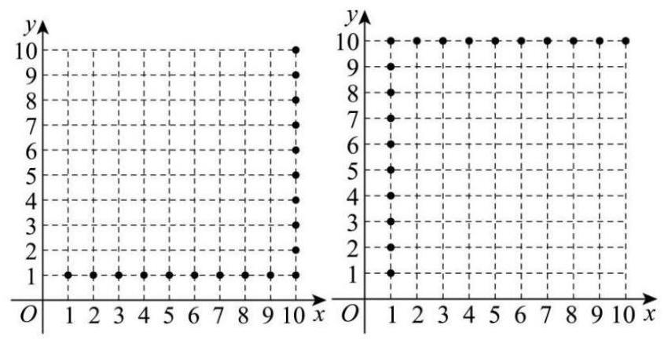
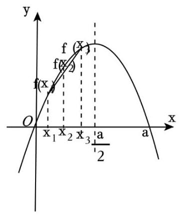

## 11 一、集合与(不)等式

## 板块一:基础客观题

## 1. 真题回顾

【例题】1. (2025 上海春考) 关于 $x$ 的方程 $\left| {x - 1}\right|  + \left| {\pi  - x}\right|  = \pi  - 1$ 的解集为___.

【答案】 $\left\lbrack  {1,\pi }\right\rbrack$

【解析】法一: 根据三角不等式 $\left| a\right|  + \left| b\right|  \geq  \left| {a + b}\right|$ ,当且仅当 ${ab} \geq  0$ 时等号成立.

$\left| {x - 1}\right|  + \left| {\pi  - x}\right|  \geq  \left| {\left( {x - 1}\right)  + \left( {\pi  - x}\right) }\right|  = \pi  - 1$ ,当且仅当 $\left( {x - 1}\right) \left( {\pi  - x}\right)  \geq  0$ ,即 $1 \leq  x \leq  \pi$ 时等号成立;

法二:零点分段讨论 $\left| {x - 1}\right|  + \left| {\pi  - x}\right|  = \left\{  \begin{array}{l} \pi  + 1 - {2x}\;x < 1 \\  \pi  - 1\;1 \leq  x \leq  \pi \\  {2x} - \pi  - 1\;x > \pi  \end{array}\right.$ ,所以解集为 $\left\lbrack  {1,\pi }\right\rbrack$ .

【例题】2. (2016 上海秋考) 设 $a > 0, b > 0$ ,若关于 $x\text{ 、 }y$ 的方程组 $\left\{  \begin{array}{l} {ax} + y = 1 \\  x + {by} = 1 \end{array}\right.$ 无解,则 $a + b$ 的取值范围为___.

【答案】 $\left( {2, + \infty }\right)$

【解析】因为关于 $x\text{ 、 }y$ 的方程组 $\left\{  \begin{array}{l} {ax} + y = 1 \\  x + {by} = 1 \end{array}\right.$ 无解,所以直线 ${ax} + y = 1$ 与 $x + {by} = 1$ 平行, 因为 $a > 0, b > 0$ ,所以 $\frac{a}{1} = \frac{1}{b} \neq  \frac{1}{1}$ ,所以 $a \neq  1, b \neq  1$ ,且 ${ab} = 1$ ,则 $b = \frac{1}{a}$ , 所以 $a + b = a + \frac{1}{a} \geq  2\sqrt{a \cdot  \frac{1}{a}} = 2$ ,当且仅当 $a = 1$ 时取等号, 而 $a$ 的范围为 $a > 0$ 且 $a \neq  1$ ，不满足取等条件，所以 $a + b > 2$ ， 故 $a + b$ 的取值范围为 $\left( {2, + \infty }\right)$ .

【例题】3. (2015上海春考)对于任意实数 $a\text{ 、 }b$ ， ${\left( a - b\right) }^{2} \geq  {kab}$ 均成立，则实数 $k$ 的取值范围是( )

A. $\{  - 4,0\}$ B. $\left\lbrack  {-4,0}\right\rbrack$ C. $( - \infty ,0\rbrack$ D. $( - \infty , - 4\rbrack  \cup  \lbrack 0, + \infty )$

【答案】 $B$

【解析】因为 ${\left( a - b\right) }^{2} \geq  {kab}$ ,所以 ${a}^{2} + {b}^{2} \geq  {kab} + {2ab}$ ,即 ${a}^{2} + {b}^{2} \geq  \left( {2 + k}\right) {ab}$ 恒成立, 故 $- 2 \leq  2 + k \leq  2$ ,故 $k \in  \left\lbrack  {-4,0}\right\rbrack$ ,故选 $B$ .

【例题】4. (2014 上海秋考)已知 ${P}_{1}\left( {{a}_{1},{b}_{1}}\right)$ 与 ${P}_{2}\left( {{a}_{2},{b}_{2}}\right)$ 是直线 $y = {kx} + 1$ ( $k$ 为常数)上两个不同的点， 则关于 $x$ 和 $y$ 的方程组 $\left\{  \begin{array}{l} {a}_{1}x + {b}_{1}y = 1 \\  {a}_{2}x + {b}_{2}y = 1 \end{array}\right.$ 的解的情况是 ( )

A. 无论 $k\text{ 、 }{P}_{1}\text{ 、 }{P}_{2}$ 如何,总是无解 B. 无论 $k\text{ 、 }{P}_{1}\text{ 、 }{P}_{2}$ 如何,总有唯一解

C. 存在 $k\text{ 、 }{P}_{1}\text{ 、 }{P}_{2}$ ,使之恰有两解 D. 存在 $k\text{ 、 }{P}_{1}\text{ 、 }{P}_{2}$ ,使之有无穷多解

【答案】 $B$

【解析】 ${P}_{1}\left( {{a}_{1},{b}_{1}}\right)$ 与 ${P}_{2}\left( {{a}_{2},{b}_{2}}\right)$ 是直线 $y = {kx} + 1$ ( $k$ 为常数) 上两个不同的点,

直线 $y = {kx} + 1$ 的斜率存在,所以 $k = \frac{{b}_{2} - {b}_{1}}{{a}_{2} - {a}_{1}}$ ,即 ${a}_{1} \neq  {a}_{2}$ ,

并且 ${b}_{1} = k{a}_{1} + 1,{b}_{2} = k{a}_{2} + 1$ ,

所以 ${a}_{2}{b}_{1} - {a}_{1}{b}_{2} = k{a}_{1}{a}_{2} - k{a}_{1}{a}_{2} + {a}_{2} - {a}_{1} = {a}_{2} - {a}_{1}$

$\left\{  {\begin{array}{l} {a}_{1}x + {b}_{1}y = 1\text{ ① } \\  {a}_{2}x + {b}_{2}y = 1\text{ ② } \end{array},\text{ ① } \times  {b}_{2} - \text{ ② } \times  {b}_{1}}\right.$ 得 $\left( {{a}_{1}{b}_{2} - {a}_{2}{b}_{1}}\right) x = {b}_{2} - {b}_{1}$ ，即 $\left( {{a}_{1} - {a}_{2}}\right) x = {b}_{2} - {b}_{1}$ .

所以方程组有唯一解. 故选 $B$ .

【例题】5. (2013 上海春考) 已知 $a, b, c \in  R,$ " ${b}^{2} - {4ac} < 0$ " 是 "函数 $f\left( x\right)  = a{x}^{2} + {bx} + c$ 的图象恒在 $x$ 轴上方”的 ( )

A. 充分非必要条件 B. 必要非充分条件

C. 充要条件 D. 既非充分又非必要条件

【答案】 $D$

【解析】若 $a \neq  0$ ,欲保证函数 $f\left( x\right)  = a{x}^{2} + {bx} + c$ 的图象恒在 $x$ 轴上方,则必须保证抛物线开口向上, 且与 $x$ 轴无交点,则 $a > 0$ 且 $\bigtriangleup  = {b}^{2} - {4ac} < 0$ .

但是,若 $a = 0$ 时,如果 $b = 0, c > 0$ ,则函数 $f\left( x\right)  = a{x}^{2} + {bx} + c = c$ 的图象恒在 $x$ 轴上方,不能得到 $\Delta  = {b}^{2} - {4ac} < 0$ ；

反之,“ ${b}^{2} - {4ac} < 0$ ” 并不能得到 “函数 $f\left( x\right)  = a{x}^{2} + {bx} + c$ 的图象恒在 $x$ 轴上方”,如 $a < 0$ 时. 从而“ ${b}^{2} - {4ac} < 0$ ”是“函数 $f\left( x\right)  = a{x}^{2} + {bx} + c$ 的图象恒在 $x$ 轴上方”的既非充分又非必要条件. 故选 $D$ .

【例题】6. (2009 上海秋考) 某地街道呈现东 - 西、南 - 北向的网格状，相邻街距都为 1 . 两街道相交的点称为格点. 若以互相垂直的两条街道为轴建立直角坐标系,现有下述格点 $\left( {-2,2}\right) ,(3$ , 1), $\left( {3,4}\right) ,\left( {-2,3}\right) ,\left( {4,5}\right) ,\left( {6,6}\right)$ 为报刊零售点. 请确定一个格点 (除零售点外) ___为发行站, 使 6 个零售点沿街道到发行站之间路程的和最短.

【答案】 $\left( {3,3}\right)$

【解析】设发行站的位置为 $\left( {x, y}\right) ,6$ 个零售点到发行站的距离为 $Z$ ,

则 $z = \left| {x + 2}\right|  + \left| {y - 2}\right|  + \left| {x - 3}\right|  + \left| {y - 1}\right|  + \left| {x - 3}\right|  + \left| {y - 4}\right|$

$+ \left| {x + 2}\right|  + \left| {y - 3}\right|  + \left| {x - 4}\right|  + \left| {y - 5}\right|  + \left| {x - 6}\right|  + \left| {y - 6}\right|$

$= \left| {x + 2}\right|  + \left| {x - 3}\right|  + \left| {x - 3}\right|  + \left| {x + 2}\right|  + \left| {x - 4}\right|  + \left| {x - 6}\right|$

$+ \left| {y - 2}\right|  + \left| {y - 1}\right|  + \left| {y - 4}\right|  + \left| {y - 3}\right|  + \left| {y - 5}\right|  + \left| {y - 6}\right|$

当 $x = 3,3 \leq  y < 4$ 时,取最小值,所以在 $\left( {3,3}\right)$ 处 $z$ 取得最小值. 2025 版上海高考真题及模拟训练合集

## 2. 模拟练习

【练习】1. 已知 $a, b, c \in  R$ ,且 $a > 0, a - b + c < 0$ ,则一定有 ( )

A. ${b}^{2} - {4ac} < 0$ B. ${b}^{2} - {4ac} < 0$

C. ${b}^{2} - {4ac} > 0$ D. ${b}^{2} - {4ac}$ 与 0 的大小关系不确定

【答案】 $C$

【解析】令 $f\left( x\right)  = a{x}^{2} + {bx} + c$ ,因为 $a - b + c < 0$ ,所以 $f\left( {-1}\right)  = a - b + c < 0$ ,

因为 $a > 0$ ,所以 $f\left( x\right)  = a{x}^{2} + {bx} + c$ 的图象与 $x$ 轴有两个交点,所以 $\Delta  > 0$ ,即 ${b}^{2} - {4ac} > 0$ ,故选: $C$

【练习】2. 设 ${a}_{1},{a}_{2},{b}_{1},{b}_{2},{c}_{1},{c}_{2}$ 均为非零实数,不等式 ${a}_{1}{x}^{2} + {b}_{1}x + {c}_{1} > 0$ 和 ${a}_{2}{x}^{2} + {b}_{2}x + {c}_{2} > 0$ 解集分别为 $M, N$ ，那么 $\frac{{a}_{1}}{{a}_{2}} = \frac{{b}_{1}}{{b}_{2}} = \frac{{c}_{1}}{{c}_{2}}$ 是 $M = N$ 的___条件.

【答案】既不充分也不必要

【解析】充分性反例: ${x}^{2} - {2x} - 3 > 0$ 和 $- {x}^{2} + {2x} + 3 > 0$ 必要性反例: ${x}^{2} - {2x} + 3 > 0$ 和 ${x}^{2} - {2x} + 4 > 0$

【练习】3. 设 $x > 0, y > 0, x + {2y} = 5$ ,则 $\frac{\left( {x + 1}\right) \left( {{2y} + 1}\right) }{\sqrt{xy}}$ 的最小值为___.

【答案】 $4\sqrt{3}$

【解析】因为 $x > 0, y > 0, x + {2y} = 5$ ,所以 ${2xy} \leq  {\left( \frac{x + {2y}}{2}\right) }^{2} = \frac{25}{4}$ ,

当且仅当 $x = {2y}$ 时取等号,所以 ${xy} \leq  \frac{25}{8}$ ,

则 $\frac{\left( {x + 1}\right) \left( {{2y} + 1}\right) }{\sqrt{xy}} = \frac{{2xy} + x + {2y} + 1}{\sqrt{xy}} = \frac{{2xy} + 6}{\sqrt{xy}} = 2\sqrt{xy} + \frac{6}{\sqrt{xy}}$ ,

由基本不等式得 $2\sqrt{xy} + \frac{6}{\sqrt{xy}} \geq  2\sqrt{2\sqrt{xy} \cdot  \frac{6}{\sqrt{xy}}} = 4\sqrt{3}$ ;

当且仅当 $2\sqrt{xy} = \frac{6}{\sqrt{xy}}$ ,即 ${xy} = 3, x + {2y} = 5$ ,即 $\left\{  \begin{array}{l} x = 3 \\  y = 1 \end{array}\right.$ 或 $\left\{  \begin{array}{l} x = 2 \\  y = \frac{3}{2} \end{array}\right.$ 时取等号,

故 $\frac{\left( {x + 1}\right) \left( {{2y} + 1}\right) }{\sqrt{xy}}$ 的最小值为 $4\sqrt{3}$ .

【练习】4. (2024 七宝) 设 $x\text{ 、 }y \in  R$ ,若 $\left| x\right|  + \left| {x - 4}\right|  + \left| y\right|  + \left| {y - 2}\right|  \leq  6$ ,则 ${2x} + {3y} + {xy}$ 的取值范围为 ___.

【答案】 $\left\lbrack  {0,{22}}\right\rbrack$

【解析】因为 $\left| x\right|  + \left| {x - 4}\right|  \geq  \left| {x - \left( {x - 4}\right) }\right|  = 4,\left| y\right|  + \left| {y - 2}\right|  \geq  \left| {y - \left( {y - 2}\right) }\right|  = 2$ ,

当且仅当 $0 \leq  x \leq  4,0 \leq  y \leq  2$ 时取等号,所以 $\left| x\right|  + \left| {x - 4}\right|  + \left| y\right|  + \left| {y - 2}\right|  \geq  6$ ,

又 $\left| x\right|  + \left| {x - 4}\right|  + \left| y\right|  + \left| {y - 2}\right|  \leq  6$ ,

所以只有 $\left| x\right|  + \left| {x - 4}\right|  + \left| y\right|  + \left| {y - 2}\right|  = 6$ 成立,此时 $0 \leq  x \leq  4,0 \leq  y \leq  2$ ,

由不等式的性质可以得到 ${2x} + {3y} + {xy} \in  \left\lbrack  {0,{22}}\right\rbrack$ .

【练习】5.2023年“国际进口博览会”即将在上海举行，现要在场馆入口布且一个大型立体花卉景观， 景观的框架由中空钢管搭建的而成, 外型是由若干个小正方体叠加而成的大正方体, 已知搭建此立体花卉景观的脚手架钢管安装呈现东一西、南一北、上一下的网络状，每三根钢管相交处需要焊接, 这些焊接点 (小正方体的顶点) 称为格点, 相邻焊接点之间的距离都为 1 米 (即每个小正方体的棱长都为 1 米). 若以互相垂直的三条钢管为轴建立空间直角坐标系,现要在一个格点处接入水源,并在下述 6 个格点: $\left( {-2,2,0}\right) ,\left( {3,1, - 1}\right) ,\left( {3,4,2}\right) ,\left( {4,5,1}\right) ,\left( {6,6, - 2}\right)$ , $\left( {0,0,3}\right)$ 处安装喷淋，使 6 处喷淋与水源接入口所排水管的总长度最小，则此时水管总长度的最小值为___米(水管必须在连通的钢管内部穿行，不计各接头处的水管损耗).

【答案】33

【解析】设水源接入口的坐标为 $\left( {x, y, z}\right)$ ,

设 ${y}_{1} = \left| {x + 2}\right|  + \left| {x - 3}\right|  + \left| {x - 3}\right|  + \left| {x - 4}\right|  + \left| {x - 6}\right|  + \left| x\right|$ ,

${y}_{2} = \left| {y - 2}\right|  + \left| {y - 1}\right|  + \left| {y - 4}\right|  + \left| {y - 5}\right|  + \left| {y - 6}\right|  + \left| y\right| ,$

${y}_{3} = \left| z\right|  + \left| {z + 1}\right|  + \left| {z - 2}\right|  + \left| {z - 1}\right|  + \left| {z + 2}\right|  + \left| {z - 3}\right| ,$

则 6 处喷淋与水源接入口所排水管总长度为 ${y}_{1} + {y}_{2} + {y}_{3}$ ,

当 $x = 3$ 时， ${y}_{1}$ 取最小值 12，当 $2 \leq  y \leq  4$ 时， ${y}_{2}$ 取最小值 12，

当 $0 \leq  z \leq  1$ 时, ${y}_{3}$ 取最小值 9,故水管总长度的最小值为 ${12} + {12} + 9 = {33}$ 米.

## 板块二: 中档客观题

## 1. 真题回顾

【例题】1. (2015 上海秋考) 记方程①: ${x}^{2} + {a}_{1}x + 1 = 0$ ,方程②: ${x}^{2} + {a}_{2}x + 2 = 0$ ,方程③: ${x}^{2} + {a}_{3}x + 4 \; = 0$ ，其中 ${a}_{1}$ 、 ${a}_{2}$ 、 ${a}_{3}$ 是正实数. 当 ${a}_{1}$ 、 ${a}_{2}$ 、 ${a}_{3}$ 成等比数列时，下列选项中，能推出方程③无实根的是 ( )

A. 方程①有实根，且②有实根 B. 方程①有实根，且②无实根

C. 方程①无实根，且②有实根 D. 方程①无实根，且②无实根

【答案】 $B$

【解析】当方程①有实根,且②无实根时, ${\Delta }_{1} = {a}_{1}^{2} - 4 \geq  0,{\Delta }_{2} = {a}_{2}^{2} - 8 < 0$ ,

即 ${a}_{1}^{2} \geq  4,{a}_{2}^{2} < 8$ ,因为 ${a}_{1}\text{ 、 }{a}_{2}\text{ 、 }{a}_{3}$ 成等比数列,所以 ${a}_{2}^{2} = {a}_{1}{a}_{3}$ ,

即 ${a}_{3} = \frac{{a}_{2}^{2}}{{a}_{1}}$ ,则 ${a}_{3}^{2} = {\left( \frac{{a}_{2}^{2}}{{a}_{1}}\right) }^{2} = \frac{{a}_{2}^{4}}{{a}_{1}^{2}} < \frac{{8}^{2}}{4} = {16}$ ,

即方程③的判别式 ${\Delta }_{3} = {a}_{3}^{2} - {16} < 0$ ，此时方程③无实根，故选 B.

【例题】2. (2015 上海春考) 设集合 ${P}_{1} = \left\{  {x \mid  {x}^{2} + {ax} + 1 > 0}\right\}  ,{P}_{2} = \left\{  {x \mid  {x}^{2} + {ax} + 2 > 0}\right\}  ,{Q}_{1} = \left\{  {x \mid  {x}^{2} + x + }\right. \; b > 0\} ,{Q}_{2} = \{ x \mid  {x}^{2} + {2x} + b > 0\}$ ,其中 $a, b \in  R$ ,下列说法正确的是 ( )

A. 对任意 $a,{P}_{1}$ 是 ${P}_{2}$ 的子集,对任意 $b,{Q}_{1}$ 不是 ${Q}_{2}$ 的子集

B. 对任意 $a,{P}_{1}$ 是 ${P}_{2}$ 的子集,存在 $b$ ,使得 ${Q}_{1}$ 是 ${Q}_{2}$ 的子集

C. 存在 $a,{P}_{1}$ 不是 ${P}_{2}$ 的子集,对任意 $b,{Q}_{1}$ 不是 ${Q}_{2}$ 的子集

D. 存在 $a,{P}_{1}$ 不是 ${P}_{2}$ 的子集,存在 $b$ ,使得 ${Q}_{1}$ 是 ${Q}_{2}$ 的子集

【答案】 $B$

【解析】对于集合 ${P}_{1} = \left\{  {x \mid  {x}^{2} + {ax} + 1 > 0}\right\}  ,{P}_{2} = \left\{  {x \mid  {x}^{2} + {ax} + 2 > 0}\right\}$ ,

得当 $m \in  {P}_{1}$ ,即 ${m}^{2} + {am} + 1 > 0$ ,得 ${m}^{2} + {am} + 2 > 0$ ,

即有 $m \in  {P}_{2}$ ,得对任意 $a,{P}_{1}$ 是 ${P}_{2}$ 的子集;

当 $b = 5$ 时， ${Q}_{1} = \left\{  {x \mid  {x}^{2} + x + 5 > 0}\right\}   = R,{Q}_{2} = \left\{  {x \mid  {x}^{2} + {2x} + 5 > 0}\right\}   = R$ ，得 ${Q}_{1}$ 是 ${Q}_{2}$ 的子集；

当 $b = 1$ 时， ${Q}_{1} = \{ x \mid  {x}^{2} + x + 1 > 0\}  = R$ ，

${Q}_{2} = \{ x \mid  {x}^{2} + {2x} + 1 > 0\}  = \{ x \mid  x \neq   - 1$ 且 $x \in  R\}$ ,得 ${Q}_{1}$ 不是 ${Q}_{2}$ 的子集.

综上,对任意 $a,{P}_{1}$ 是 ${P}_{2}$ 的子集,存在 $b$ ,使得 ${Q}_{1}$ 是 ${Q}_{2}$ 的子集. 故选 $B$ .

【例题】3. (2010 上海秋考)以集合 $U = \{ a, b, c, d\}$ 的子集中选出 4 个不同的子集，需同时满足以下两个条件: (1) $\varnothing \text{ 、 }U$ 都要选出; (2) 对选出的任意两个子集 $A$ 和 $B$ ,必有 $A \subseteq  B$ 或 $B \subseteq  A$ ,那么共有 ___种不同的选法.

【答案】36

【解析】因为 $U\text{ 、 }\varnothing$ 都要选出,而所有任意两个子集的组合必须有包含关系,

故各个子集所包含的元素个数必须依次递增，而又必须包含空集和全集，

所以需要选择的子集有两个,

若第二个子集的元素个数为 1,有 $a, b, c, d$ 四种选法,

(1)第三个子集元素个数为 2，当第二个子集为 $\{ a\}$ 时

第三个子集的 2 个元素中必须包含 $a$ ，剩下的一个从 ${bcd}$ 中选取，有三种选法，

所以这种子集的选取方法共有 $4 \times  3 = {12}$ 种;

(2)第三个子集中包含 3 个元素，

2025 版上海高考真题及模拟训练合集

同理三个元素必须有一个与第二个子集中的元素相同,共有 $4 \times  3 = {12}$ 种;

若第二个子集有两个元素,有 6 种取法,

第三个子集必须有 3 个元素且必须包含前面一个子集的两个元素, 有两种取法,

所以这种方法有 $6 \times  2 = {12}$ 种;

综上,一共有 ${12} + {12} + {12} = {36}$ 种. 2025 版上海高考真题及模拟训练合集

## 2. 模拟练习

【练习】1. 已知集合 $S = \{ \left( {x, y}\right)  \mid  1 \leq  x \leq  {10},1 \leq  y \leq  {10}, x \in  N, y \in  N\}$ . 若 $A \subseteq  S$ ,且对任意 $\left( {a, b}\right)  \in  A$ , $\left( {c, d}\right)  \in  A$ ,均有 $\left( {c - a}\right) \left( {d - b}\right)  \geq  0$ ,则集合 $A$ 中元素个数的最大值为___

【答案】 19

【解析】由题意得集合 $S = \{ \left( {x, y}\right)  \mid  1 \leq  x \leq  {10},1 \leq  y \leq  {10}, x \in  N, y \in  N\}$ ,

若 $A \subseteq  S$ ,且对任意 $\left( {a, b}\right)  \in  A,\left( {c, d}\right)  \in  A$ ,均有 $\left( {c - a}\right) \left( {d - b}\right)  \geq  0$ ,

作如下等价转化:在符合题意的这些点中怎样取，

保证趋势不下降的同时取的点最多，

因此集合 $A$ 中元素个数最大时元素可以为

$\left( {1,1}\right) ,\left( {1,2}\right) ,\left( {1,3}\right) ,\cdots \left( {1,8}\right) ,\left( {1,9}\right) ,\left( {1,{10}}\right) ,\left( {2,{10}}\right) ,\cdots \left( {8,{10}}\right) ,\left( {9,{10}}\right) ,\left( {{10},{10}}\right)$ ,共 19 个, 也可以是 $\left( {1,1}\right) ,\left( {2,1}\right) ,\left( {3,1}\right) ,\cdots \left( {8,1}\right) ,\left( {9,1}\right) ,\left( {{10},1}\right) ,\left( {{10},2}\right) ,\cdots \left( {{10},8}\right) ,\left( {{10},9}\right) ,\left( {{10},{10}}\right)$ , 共 19 个, (还有其他取法只要保证这些点的趋势不下降即可)

【练习】2. 设集合 $M = \{ 1,2,3,\cdots ,{2024},{2025}\} , A$ 是 $M$ 的子集且满足: 当 $x \in  A$ 时, ${15x} \notin  A$ ,则 $A$ 中元素最多有___个。

【答案】 1899

【解析】2025 $= {15} \times  {135}$ ,故取出所有不是 15 的倍数的数,共 1890 个,

这些数均符合要求,

因为 ${2025} \div  {15}^{2} = 9$ ,所以在所有 15 的倍数的数中, ${15}^{2}$ 的倍数有 9 个,

所以 1~9 可以取出，这样共取出了 1899 个，故 $A$ 中元素最多有 1899 个.

【练习】3. 设 $a\text{ 、 }b\text{ 、 }c\text{ 、 }p$ 为实数，若同时满足不等式 $a{x}^{2} + {bx} + c > 0\text{ 、 }b{x}^{2} + {cx} + a > 0$ 与 $c{x}^{2} + {ax} + b >$ 0 的全体实数 $x$ 所组成的集合等于 $\left( {p, + \infty }\right)$ ,

则下列两个命题:① $a$ 、 $b$ 、 $c$ 至少有一个为 0 ； ② $p = 0$ .

下列判断正确的是 ( )

A. ①和②都正确 B. ①和②都错误 C. ①正确，②错误 D. ①错误，②正确

【答案】 $A$

【解析】若同时满足不等式 $a{x}^{2} + {bx} + c > 0\text{ 、 }b{x}^{2} + {cx} + a > 0$ 与 $c{x}^{2} + {ax} + b > 0$ 的

全体实数 $x$ 所组成的集合等于 $\left( {p, + \infty }\right)$ ,必有 $a, b, c \geq  0$ ,

不妨假设 $a\text{ 、 }b\text{ 、 }c$ 没有一个为 0,

则三个不等式均为开口向上的二次函数大于 0 的部分,

解集的交集应为 $\left( {-\infty , m}\right)  \cup  \left( {n, + \infty }\right)$ 的形式,矛盾,

所以 $a\text{ 、 }b\text{ 、 }c$ 至少有一个为 0,故①正确；

不妨设 $a = 0$ ,则 $b, c \geq  0$ ,则不等式组化为 $\left\{  \begin{array}{l} {bx} + c > 0 \\  b{x}^{2} + {cx} > 0 \\  c{x}^{2} + b > 0 \end{array}\right.$ ,

所以 $\left\{  \begin{array}{l} x >  - \frac{c}{b} \\  x <  - \frac{c}{b}\text{ 或 }x > 0 \\  x \in  R \end{array}\right.$ ,取交集得 $\left( {0, + \infty }\right)$ ,故 $p = 0$ ,故②正确；

故选 $A$ .

【练习】4. 已知等差数列 $\left\{  {a}_{n}\right\}$ (公差不为零) 和等差数列 $\left\{  {b}_{n}\right\}$ ,

如果关于 $x$ 的方程 ${2025}{x}^{2} - \left( {{a}_{1} + {a}_{1} + \cdots  + {a}_{2025}}\right) x + {b}_{1} + {b}_{1} + \cdots  + {b}_{2025} = 0$ 有实数解,

那么以下 2025 个方程 ${x}^{2} - {a}_{1}x + {b}_{1} = 0,{x}^{2} - {a}_{2}x + {b}_{2} = 0,{x}^{2} - {a}_{3}x + {b}_{3} = 0,\cdots$ ,

${x}^{2} - {a}_{2025}x + {b}_{2025} = 0$ 中,无实数解的方程最多有 ( )

A. 1011 个 B. 1012 个 C. 1013 个 D. 1014 个

【答案】 $B$

【解析】设等差数列 $\left\{  {a}_{n}\right\}$ (公差 ${d}_{1}$ 不为零) 和等差数列 $\left\{  {b}_{n}\right\}$ 的公差为 ${d}_{2}$ ,

则关于 $x$ 的方程 ${2025}{x}^{2} - \left( {{a}_{1} + {a}_{1} + \cdots  + {a}_{2025}}\right) x + {b}_{1} + {b}_{1} + \cdots  + {b}_{2025} = 0$ 有实数解,

则 ${\left( {a}_{1} + {a}_{1} + \cdots  + {a}_{2025}\right) }^{2} - 4 \times  {2025}\left( {{b}_{1} + {b}_{1} + \cdots  + {b}_{2025}}\right)  \geq  0$ ,即 ${a}_{1013}^{2} \geq  4{b}_{1013}$ ,

则第 1013 个方程有解,记 2025 个方程的判别式为 ${\Delta }_{i} = {a}_{i}^{2} - 4{b}_{i}\left( {\mathrm{i} = 1,2,3,\cdots ,{2025}}\right)$

则 ${\Delta }_{{1013} - i} + {\Delta }_{{1013} + i} = {\left( {a}_{1013} - i{d}_{1}\right) }^{2} + {\left( {a}_{1013} + i{d}_{1}\right) }^{2} - 8{b}_{1013} = 2\left( {{a}_{1013}^{2} - 4{b}_{1013}}\right)  + 2{\left( i{a}_{1}\right) }^{2} \geq$

$0\left( {\mathrm{i} = 1,2,3,\cdots ,{1012}}\right)$ ,所以每一对中至多一个负数,所以最多 1012 个方程无解,故选 $C$ .

【练习】5. 若 $a, b$ 是函数 $f\left( x\right)  = {x}^{2} - {mx} + n\left( {m > 0, n > 0}\right)$ 的两个不同的零点,且 $a, b, - 1$ 这三个数可适当排序后成等比数列,也可适当排序后成等差数列,则关于 $x$ 的不等式 $\frac{x - m}{x - n} \geq  0$ 的解集为 ( )

A. $\{ x \mid  x \leq  2$ 或 $x \geq  5\}$ B. $\{ x \mid  x < 2$ 或 $x \geq  5\}$

C. $\{ x \mid  x < 1$ 或 $x \geq  \frac{5}{2}\}$ D. $\left\{  {x\left| {\;x \leq  1}\right. }\right.$ 或 $\left. {x > \frac{5}{2}}\right\}$

【答案】 $C$

【解析】依题意,由 $a, b$ 是函数 $f\left( x\right)  = {x}^{2} - {mx} + n\left( {m > 0, n > 0}\right)$ 的两个不同的零点,

可知 $a, b$ 是一元二次方程 ${x}^{2} - {mx} + n = 0$ 的两个不同的根,

由根据根与系数的关系,可得 $a + b = m,{ab} = n$ ,

因为 $m > 0, n > 0$ ,所以 $a > 0, b > 0$ ,

又因为 $a, b, - 1$ 这三个数可适当排序后成等比数列,

所以只有 -1 为该等比数列的等比中项才满足题意,

即 ${ab} = {\left( -1\right) }^{2} = 1 \Rightarrow  b = \frac{1}{a}, n = 1$ ,

因为 $a, b, - 1$ 这三个数可适当排序后成等差数列,

所以只有 -1 不能为该等差数列的中项,

①当 $a$ 为等差中项时，

根据等差中项的性质有 ${2a} = \frac{1}{a} - 1 \Rightarrow  a = \frac{1}{2}, b = 2, m = \frac{5}{2}$ ,

② 当 $\frac{1}{a}$ 为等差中项时，

根据等差中项的性质有 $\frac{2}{a} = a - 1 \Rightarrow  a = 2, b = \frac{1}{2}, m = \frac{5}{2}$ ,

综合①②，可得 $m = \frac{5}{2}$ ，

所以不等式 $\frac{x - m}{x - n} \geq  0 \Leftrightarrow  \frac{x - \frac{5}{2}}{x - 1} \geq  0$ ,解得 $x < 1$ 或 $x \geq  \frac{5}{2}$ .

故选: $C$

## 板块三:压轴客观题

## 1. 真题回顾

【例题】1. (2024 上海秋考) 等比数列 $\left\{  {a}_{n}\right\}$ 的首项 ${a}_{1} > 0$ ,公比 $q > 1,{I}_{n} = \left\{  {x - y \mid  x, y \in  \left\lbrack  {{a}_{1},{a}_{2}}\right\rbrack   \cup  \left\lbrack  {{a}_{n},}\right. }\right. \; \left. \left. {a}_{n + 1}\right\rbrack  \right\}$ . 若对任意正整数 $n$ ， ${I}_{n}$ 都是闭区间，则 $q$ 的取值范围为___.

【答案】 $\lbrack 2, + \infty )$

【解析】因为等比数列 $\left\{  {a}_{n}\right\}$ 的首项 ${a}_{1} > 0$ ,公比 $q > 1$ ,所以等比数列 $\left\{  {a}_{n}\right\}$ 为严格增数列,

若 $x, y \in  \left\lbrack  {{a}_{1},{a}_{2}}\right\rbrack$ ,则 $x - y \in  \left\lbrack  {{a}_{1} - {a}_{2},{a}_{2} - {a}_{1}}\right\rbrack$ ①,

若 $x, y \in  \left\lbrack  {{a}_{n},{a}_{n + 1}}\right\rbrack$ ,则 $x - y \in  \left\lbrack  {{a}_{n} - {a}_{n + 1},{a}_{n + 1} - {a}_{n}}\right\rbrack$ ②,

若 $x, y \in  \left\lbrack  {{a}_{1},{a}_{2}}\right\rbrack   \cup  \left\lbrack  {{a}_{n},{a}_{n + 1}}\right\rbrack$ ,则 $- y \in  \left\lbrack  {-{a}_{n + 1}, - {a}_{n}}\right\rbrack   \cup  \left\lbrack  {-{a}_{2}, - {a}_{1}}\right\rbrack$ ,

所以 $x - y \in  \left\lbrack  {{a}_{1} - {a}_{n + 1},{a}_{2} - {a}_{n}}\right\rbrack   \cup  \left\lbrack  {{a}_{n} - {a}_{2},{a}_{n + 1} - {a}_{1}}\right\rbrack$ ③,

由题意得①②③组成的并集为闭区间，

注意到 $\left( {{a}_{n + 1} - {a}_{n}}\right)  - \left( {{a}_{2} - {a}_{1}}\right)  = \left( {{a}_{n} - {a}_{1}}\right) \left( {q - 1}\right)  > 0$ ,所以①和②的并集就是②，

只需要考虑②③的并集，注意到②和③都是关于原点对称的区间，

且③的右端点大于②的右端点，那么只需要满足 ${a}_{n + 1} - {a}_{n} \geq  {a}_{n} - {a}_{2}$ ，

所以 ${q}^{n} - {q}^{n - 1} \geq  {q}^{n - 1} - q$ ,即 ${q}^{n} - 2{q}^{n - 1} \geq   - q$ 恒成立，所以 $q - 2 \geq   - {q}^{2 - n}$ 恒成立，

所以 $q - 2 \geq  0$ (对右边取极限),所以 $q \geq  2$ ,所以 $q$ 的取值范围为 $\lbrack 2, + \infty )$ .

【例题】2. (2024 上海春考) 已知 ${a}_{1} = 2,{a}_{2} = 4,{a}_{3} = 8,{a}_{4} = {16}$ ,若存在实数 ${b}_{1},{b}_{2},{b}_{3},{b}_{4}$ ,满足 $\left\{  {{a}_{i} + {a}_{j} \mid  1 \leq  \mathrm{i} < j \leq  4}\right\}   = \left\{  {{b}_{i} + {b}_{j} \mid  1 \leq  \mathrm{i} < j \leq  4}\right\}$ ,则有序实数组 $\left\{  {{b}_{1},{b}_{2},{b}_{3},{b}_{4}}\right\}$ 的总个数为 ___.

【答案】48

【解析】 $\left\{  {{a}_{i} + {a}_{j} \mid  1 \leq  i < j \leq  4}\right\}   = \{ 6,{10},{12},{18},{20},{24}\}$ ,

不妨设 ${b}_{1} < {b}_{2} < {b}_{3} < {b}_{4}$ ,则 ${b}_{1} + {b}_{2} < {b}_{1} + {b}_{3} < \left\{  \begin{array}{l} {b}_{1} + {b}_{4} \\  {b}_{2} + {b}_{3} \end{array}\right.  < {b}_{2} + {b}_{4} < {b}_{3} + {b}_{4}$ ,

按顺序对应, 分两种情况:

${12} = {b}_{1} + {b}_{4} < {b}_{2} + {b}_{3} = {18}$ ,解得 $\left\{  {{b}_{1},{b}_{2},{b}_{3},{b}_{4}}\right\}   = \{  - 1,7,{11},{13}\}$ ,

${12} = {b}_{2} + {b}_{3} < {b}_{1} + {b}_{4} = {18}$ ,解得 $\left\{  {{b}_{1},{b}_{2},{b}_{3},{b}_{4}}\right\}   = \{ 2,4,8,{16}\}$ ,

故有序实数组的总个数为 $2{P}_{4}^{4} = {48}$ 组.

【例题】3. (2021 上海秋考) 已知两两不相等的 ${x}_{1}\text{ 、 }{y}_{1}\text{ 、 }{x}_{2}\text{ 、 }{y}_{2}\text{ 、 }{x}_{3}\text{ 、 }{y}_{3}$ ,同时满足 $\text{ ① }{x}_{1} < {y}_{1},{x}_{2} < {y}_{2},{x}_{3} < \; {y}_{3};$ ② ${x}_{1} + {y}_{1} = {x}_{2} + {y}_{2} = {x}_{3} + {y}_{3};$ ③ ${x}_{1}{y}_{1} + {x}_{3}{y}_{3} = 2{x}_{2}{y}_{2}$ ，以下哪个选项恒成立 ( )

A. $2{x}_{2} < {x}_{1} + {x}_{3}$ B. $2{x}_{2} > {x}_{1} + {x}_{3}$ C. ${x}_{2}^{2} < {x}_{1}{x}_{3}$ D. ${x}_{2}^{2} > {x}_{1}{x}_{3}$

【答案】 $A$

【解析】法一: 设 ${x}_{1} + {y}_{1} = {x}_{2} + {y}_{2} = {x}_{3} + {y}_{3} = {2m}$ , $\left\{  {\begin{array}{l} {x}_{1} = m - a \\  {y}_{1} = m + a \end{array},\left\{  {\begin{array}{l} {x}_{2} = m - b \\  {y}_{2} = m + b \end{array},\left\{  {\begin{array}{l} {x}_{3} = m - c \\  {y}_{3} = m + c \end{array},}\right. }\right. }\right.$

由题意得 $\left\{  \begin{array}{l} a \neq  b \neq  c \\  a, b, c > 0 \end{array}\right.$ ,且 ${m}^{2} - {a}^{2} + {m}^{2} - {c}^{2} = 2\left( {{m}^{2} - {b}^{2}}\right)  > 0$ ,则 $\left\{  \begin{array}{l} {a}^{2} + {c}^{2} = 2{b}^{2} \\  {m}^{2} > {b}^{2} \end{array}\right.$ ,

则 ${x}_{1} + {x}_{3} - 2{x}_{2} = \left( {m - a}\right)  + \left( {m - c}\right)  - 2\left( {m - b}\right)  = {2b} - \left( {a + c}\right)$ ,

因为 ${\left( 2b\right) }^{2} - {\left( a + c\right) }^{2} = 2\left( {{a}^{2} + {c}^{2}}\right)  - {\left( a + c\right) }^{2} > 0$ ,

所以 ${x}_{1} + {x}_{3} - 2{x}_{2} = {2b} - \left( {a + c}\right)  > 0$ ,所以 $A$ 项正确, $B$ 错误.

${x}_{1}{x}_{3} - {x}_{2}^{2} = \left( {m - a}\right) \left( {m - c}\right)  - {\left( m - b\right) }^{2} = \left( {{2b} - a - c}\right) m + {ac} - {b}^{2}$

$= \left( {{2b} - a - c}\right) m - \frac{{\left( a - c\right) }^{2}}{2}$ ,而上面已证 $\left( {{2b} - a - c}\right)  > 0$ ,因为不知道 $m$ 的正负,

所以该式子的正负无法恒定. 故选 $A$ .

法二: 由于函数 ${x}_{1} + {y}_{1} = {x}_{2} + {y}_{2} = {x}_{3} + {y}_{3} = a$ ,则 ${x}_{1}{y}_{1} + {x}_{3}{y}_{3} = \; 2{x}_{2}{y}_{2}$ ,

即 ${x}_{1}\left( {a - {x}_{1}}\right)  + {x}_{3}\left( {a - {x}_{3}}\right)  = 2{x}_{2}\left( {a - {x}_{2}}\right)$ .

当 $a > 0$ 时,由①得 ${x}_{1} < \frac{a}{2},{x}_{2} < \frac{a}{2},{x}_{3} < \frac{a}{2}$ .

构造函数 $f\left( x\right)  = x\left( {a - x}\right)$ ,则 $f\left( {x}_{1}\right)  + f\left( {x}_{3}\right)  = {2f}\left( {x}_{2}\right)$ ,

设 ${x}_{1} < {x}_{2} < {x}_{3}$ ,作出 $f\left( x\right)$ 的大致图象,

$f\left( x\right)$ 为上凸函数,

有 $f\left( \frac{{x}_{1} + {x}_{3}}{2}\right)  > \frac{f\left( {x}_{1}\right)  + f\left( {x}_{3}\right) }{2} = f\left( {x}_{2}\right)$ ,

函数 $f\left( x\right)$ 在 $\left( {-\infty ,\frac{a}{2}}\right)$ 上严格增,所以 $\frac{{x}_{1} + {x}_{3}}{2} > {x}_{2}$ ,即 $2{x}_{2} < {x}_{1} + {x}_{3}$ ,

当 $a < 0$ 时,同理可得 $2{x}_{2} < {x}_{1} + {x}_{3}$ . 故选 $A$ . 2025 版上海高考真题及模拟训练合集

## 2. 模拟练习

【练习】1. (2024 届华二) 已知两两不相等的正数 ${x}_{1}\text{ 、 }{y}_{1}\text{ 、 }{x}_{2}\text{ 、 }{y}_{2}\text{ 、 }{x}_{3}\text{ 、 }{y}_{3}$ ,同时满足① ${x}_{1} < {y}_{1},{x}_{2} < {y}_{2},{x}_{3} \; < {y}_{3};$ ② ${x}_{1}{y}_{1} = {x}_{2}{y}_{2} = {x}_{3}{y}_{3};$ ③ $\left( {{x}_{1} + {y}_{1}}\right) \left( {{x}_{3} + {y}_{3}}\right)  = {\left( {x}_{2} + {y}_{2}\right) }^{2}$ ，则下列选项中恒成立的是( )

A. $2{y}_{2} < {y}_{1} + {y}_{3}$ B. $2{y}_{2} > {y}_{1} + {y}_{3}$ C. ${y}_{2}^{2} < {y}_{1}{y}_{3}$ D. ${y}_{2}^{2} > {y}_{1}{y}_{3}$

【答案】 $D$

【解析】设 ${x}_{1}{y}_{1} = {x}_{2}{y}_{2} = {x}_{3}{y}_{3} = {a}^{2} > 0$ ,则 ${x}_{i} = \frac{a}{{q}_{i}},{y}_{i} = a{q}_{i}$ ,其中 ${q}_{i} > 1\left( {\mathrm{i} = 1,2,3}\right)$

$\left( {{x}_{1} + {y}_{1}}\right) \left( {{x}_{3} + {y}_{3}}\right)  = {\left( {x}_{2} + {y}_{2}\right) }^{2} \Rightarrow  \left( {\frac{1}{{q}_{1}} + 1}\right) \left( {\frac{1}{{q}_{3}} + 1}\right)  = {\left( \frac{1}{{q}_{2}} + 1\right) }^{2}$

$\Rightarrow  {q}_{1}{q}_{3} + \frac{1}{{q}_{1}{q}_{3}} + \left( {\frac{{q}_{3}}{{q}_{1}} + \frac{{q}_{1}}{{q}_{3}}}\right)  = {q}_{2}^{2} + \frac{1}{{q}_{2}^{2}} + 2$ ,因为 $\frac{{q}_{3}}{{q}_{1}} + \frac{{q}_{1}}{{q}_{3}} > 2$ ,

所以 ${q}_{1}{q}_{3} + \frac{1}{{q}_{1}{q}_{3}} < {q}_{2}^{2} + \frac{1}{{q}_{2}^{2}}$ ,构造函数 $f\left( x\right)  = x + \frac{1}{x}, x \in  \left( {1, + \infty }\right)$ 严格增,

由 $f\left( {q}_{2}^{2}\right)  > f\left( {{q}_{1}{q}_{3}}\right)$ ,所以 ${y}_{2}^{2} > {y}_{1}{y}_{3}$ ,故选 $D$ .

【练习】2. (2025 届华二) 已知 $q > 0$ ,对任意正整数 $n$ ,令 ${J}_{n} = \left\{  {x + y \mid  x, y \in  \left\lbrack  {{q}^{n},{q}^{n + 1}}\right\rbrack   \cup  \left\lbrack  {{q}^{2n},{q}^{{2n} + 1}}\right\rbrack  }\right\}$ . 若存在 $n$ ,使得 ${J}_{n} = \left\lbrack  {{a}_{n},{b}_{n}}\right\rbrack   \cup  \left\lbrack  {{c}_{n},{d}_{n}}\right\rbrack   \cup  \left\lbrack  {{x}_{n},{y}_{n}}\right\rbrack$ ,且 ${b}_{n} < {c}_{n},{d}_{n} < {x}_{n}$ ,则 $q$ 的取值范围是 ___.

【答案】 $1 < q < 2$

【解析】因为 $n = 1$ 时, $\left\lbrack  {q,{q}^{2}}\right\rbrack$ 是区间,所以 $q > 1$ .

对 $x\text{ 、 }y$ 的范围分类讨论,

得 ${J}_{n} = \left\lbrack  {2{q}^{n},2{q}^{n + 1}}\right\rbrack   \cup  \left\lbrack  {{q}^{n} + {q}^{2n},{q}^{n + 1} + {q}^{{2n} + 1}}\right\rbrack   \cup  \left\lbrack  {2{q}^{2n},2{q}^{{2n} + 1}}\right\rbrack$ ,

故存在 $n$ 使得 $2{q}^{n + 1} < {q}^{n} + {q}^{2n}$ 且 ${q}^{n + 1} + {q}^{{2n} + 1} < 2{q}^{2n}$ .

因为 ${q}^{n} + {q}^{2n} \geq  2{q}^{\frac{3n}{2}} > 2{q}^{n + 1}\left( {q > 1}\right)$ ,所以只需 ${q}^{n + 1} + {q}^{{2n} + 1} < 2{q}^{2n}$ .

这又等价于存在 $n$ 使得 $q < {q}^{n}\left( {2 - q}\right)$ ,于是 $q < 2$ .

而当 $1 < q < 2$ 时,故存在 $n > {\log }_{q}\frac{q}{2 - q}$ ,使得要求被满足,故 $1 < q < 2$ 所求.

【练习】3. 已知 $a\text{ 、 }b\text{ 、 }c \in  R$ ,若关于 $x$ 的不等式 $0 \leq  x + \frac{a}{x} + b \leq  \frac{c}{x} - 1$ 的解集为 $\left\lbrack  {{x}_{1},{x}_{2}}\right\rbrack   \cup  \left\{  {x}_{3}\right\} \; \left. {\left( {{x}_{3} > {x}_{2} > {x}_{1} > 0}\right) \text{ ,则 }}\right)$ ( )

A. 不存在有序数组 $\left( {a, b, c}\right)$ ,使得 ${x}_{2} - {x}_{1} = 1$

B. 存在唯一有序数组 $\left( {a, b, c}\right)$ ,使得 ${x}_{2} - {x}_{1} = 1$

C. 有且只有两组有序数组 $\left( {a, b, c}\right)$ ,使得 ${x}_{2} - {x}_{1} = 1$

D. 存在无穷多组有序数组 $\left( {a, b, c}\right)$ ,使得 ${x}_{2} - {x}_{1} = 1$

【答案】 $D$

【解析】因为不等式 $0 \leq  x + \frac{a}{x} + b \leq  \frac{c}{x} - 1$ 的解集为 $\left\lbrack  {{x}_{1},{x}_{2}}\right\rbrack   \cup  \left\{  {x}_{3}\right\}  \left( {{x}_{3} > {x}_{2} > {x}_{1} > 0}\right)$ ,

所以 $0 \leq  {x}^{2} + {bx} + a \leq  c - x$ 在 $\left\lbrack  {{x}_{1},{x}_{2}}\right\rbrack   \cup  \left\{  {x}_{3}\right\}$ 上成立,

假设 ${x}_{1} = m,{x}_{2} = m + 1,{x}_{3} = n$ ,

则 $c - n = 0 = {n}^{2} + {bn} + a$ ,由 ${x}_{3}$ 为一个独立的数得出,

所以 $n = c$ ,且 $m + 1$ 与 $n$ 为方程 ${x}^{2} + {bx} + a = 0$ 的两个根,

因为 ${x}_{3} > {x}_{2} > {x}_{1} > 0$ ,所以 $- b = m + n + 1 = m + c + 1, a = {mn} + n = {mc} + c$ ,

所以 $b =  - m - c - 1$ ,且点 $\left( {{x}_{1},{x}_{1}{}^{2} + b{x}_{1} + a}\right)$ 为 $y = {x}^{2} + {bx} + a$ 与 $y = c - x$ 的左交点,

所以 ${m}^{2} + {bm} + a = c - m$ 且 $b =  - m - c - 1, a = {mc} + c$ ,

故 ${m}^{2} + {bm} + a = {m}^{2} - {m}^{2} - {mc} - m + {mc} + c = c - m$ ,所以 $c - m = c - m$ 恒成立,

所以不论 $a\text{ 、 }b\text{ 、 }c$ 取何值, ${x}_{2} - {x}_{1} = 1$ 恒成立,

即存在无穷多组有序数组 $\left( {a, b, c}\right)$ ,使得 ${x}_{2} - {x}_{1} = 1$ ,

故选项 $A\text{ 、 }B\text{ 、 }C$ 错误,选项 $D$ 正确. 故选 $D$ .

【练习】4. (2024 届七宝) 对于一个有穷正整数数列 $Q$ ,设其各项为 ${a}_{1},{a}_{2},\cdots ,{a}_{m}$ ,各项和为 $S\left( Q\right)$ ,集合 $\left\{  {\left( {\mathrm{i}, j}\right)  \mid  {a}_{i} > {a}_{j},1 \leq  \mathrm{i} < j \leq  m}\right\}$ 中元素的个数为 $T\left( Q\right)$ ,对所有满足 $S\left( Q\right)  = {100}$ 的数列 $Q$ ,则 $T\left( Q\right)$ 的最大值为___.

【答案】 1250

【解析】法一:先确定几个核心突破点:

①在数列 $Q$ 项数固定的情况下，若要 $T\left( Q\right)$ 最大，则这个数列应当控制其为单调减；

② 考虑到数列的各项和为定值，为了让项数多一些，应当尽量让各项的数值小一些，因此必须让 ${a}_{m} = 1$ ;

③对数列进行倒序分析，便呈现递增规律，为了让项数多一些，这些数列的项所取的数值应当逐渐 +1 (当然, 允许出现一些相同的项)

④数值小的项，应当在数量上不小于数值大的项. 比如数列中有 4 项为 2、3 项为 1，或者有 4 项为1、3项为2，这样的情况下我们一定选择后者，因为各项和固定为100，而后者可以提高取值空间.

⑤接下来做一个大胆的猜测，驱使所有项的取值只有 2 和 1 是最优解. 接下来进行验证，比如有 $x$ 项 $1, y$ 项 $2, z$ 项 $3\left( {x \geq  y \geq  z}\right)$ ,此时把某一项 3 化为一项 2 和一项 1,于是有 $x + 1$ 项 $1, y +$ 1 项 $2, z - 1$ 项3,先不论大于等于 4 的这些项,单就取1,2,3的这些项,我们先做一个有序数组 $\left( {\mathrm{i}, j}\right)$ 的比较:

原: ${xy} + {xz} + {yz}$ ; 现: $\left( {x + 1}\right) \left( {y + 1}\right)  + \left( {x + 1}\right) \left( {z - 1}\right)  + \left( {y + 1}\right) \left( {z - 1}\right)$ ;

现 - 原 $= x + y + 1 - x + z - 1 + z - y - 1 = {2z} - 1 \geq  1$ .

除此以外,原来和现在数列中大于等于 4 的项未作任何变化,而取1,2,3的这些项的总项数增加了1 ，于是总的有序数组数量必定又会获得增加，因此猜测是合理且严谨的.

接下来进行最终计算:设设有穷数列 $Q$ 由 $x$ 个 2 和 $y$ 个 1 组成，则有 ${2x} + y = {100}$ ，所以 $T\left( Q\right) \; = {xy} = x\left( {{100} - {2x}}\right)  =  - 2{x}^{2} + {100x}$ ,当 $x = {25}$ 时, $T\left( Q\right)$ 取最大值 1250 .

法二:通过对条件分析可以确定下面几点:

① 有穷数列 $Q$ 中存在大于 1 的项，否则此时 $T\left( Q\right)  = 0$ ；

② ${a}_{m} = 1$ ，否则 ${a}_{m}$ 将拆分成 ${a}_{m}$ 个 1 后 $T\left( Q\right)$ 变大；

③ 当 $t = 1,2,\cdots m - 1$ 时，有 ${a}_{t} \geq  {a}_{t + 1}$ ，否则交换 ${a}_{t}$ ， ${a}_{t + 1}$ 顺序后 $T\left( Q\right)$ 变为 $T\left( Q\right)  + 1$ ，进一步有 ${a}_{t} - {a}_{t + 1} \in  \{ 0,1\}$ ,否则有 ${a}_{t} \geq  {a}_{t + 1} + 2$ ,此时将 ${a}_{t}$ 改为 ${a}_{t} - 1$ ,并在数列末尾添加一项 1,此时 $T\left( Q\right)$ 变大;

④ 各项只能为 2 和 1，否则通过拆分比 2 大的数调换位置后可使得 $T\left( Q\right)$ 变大；

⑤由上可得数列 $Q$ 为 $2,2,\cdots 2,1,1,\cdots 1$ 的形式，设有穷数列 $Q$ 由 $x$ 个 2 和 $y$ 个 1 组成，则有 ${2x} + y = {100},\therefore T\left( Q\right)  = {xy} = x\left( {{100} - {2x}}\right)  =  - 2{x}^{2} + {100x}$ ,当 $x = {25}$ 时, $T\left( Q\right)$ 取最大值 1250 .

【练习】5. 已知函数 $f\left( x\right)  = \cos x$ ,若对任意实数 ${x}_{1},{x}_{2}$ ,方程 $\left| {f\left( x\right)  - f\left( {x}_{1}\right) }\right|  + \left| {f\left( x\right)  - f\left( {x}_{2}\right) }\right|  = m\left( {m \in  R}\right)$ 有解,方程 $\left| {f\left( x\right)  - f\left( {x}_{1}\right) }\right|  - \left| {f\left( x\right)  - f\left( {x}_{2}\right) }\right|  = n\left( {n \in  R}\right)$ 也有解,则 $m + n$ 的值的集合为___.

【答案】 \{2\}

【解析】根据题意,不妨设 $\cos {x}_{1} \leq  \cos {x}_{2}$ ,分类讨论当 $\cos x \geq  \cos {x}_{2},\cos x \leq  \cos {x}_{1},\cos {x}_{1} < \cos x < \cos {x}_{2}$ 三种情况下,结合方程有解以及余弦函数的图象和性质,从而求出 $m$ 和 $n$ 的值,即可得出 $m + \; n$ 的值的集合.

由题可知 $f\left( x\right)  = \cos x$ ,不妨设 $\cos {x}_{1} \leq  \cos {x}_{2}$ ,

对于 $m$ ,对任意实数 ${x}_{1},{x}_{2}$ ,方程 $\left| {f\left( x\right)  - f\left( {x}_{1}\right) }\right|  + \left| {f\left( x\right)  - f\left( {x}_{2}\right) }\right|  = m\left( {m \in  R}\right)$ 有解,

当 $\cos x \geq  \cos {x}_{2}$ 时,方程可化为 $m = 2\cos x - \left( {\cos {x}_{1} + \cos {x}_{2}}\right)$ 有解,

所以 $m \geq  \cos {x}_{2} - \cos {x}_{1}$ 恒成立,所以 $m \geq  2$ ;

当 $\cos x \leq  \cos {x}_{1}$ 时，同上；

当 $\cos {x}_{1} < \cos x < \cos {x}_{2}$ 时，方程可化为 $m = \cos {x}_{2} - \cos {x}_{1}$ 有解，所以 $m \in  \left\lbrack  {0,2}\right\rbrack$ ，

综上得: $m = 2$ ;

对于 $n$ ,对任意实数 ${x}_{1},{x}_{2}$ ,方程 $\left| {f\left( x\right)  - f\left( {x}_{1}\right) }\right|  - \left| {f\left( x\right)  - f\left( {x}_{2}\right) }\right|  = n\left( {n \in  R}\right)$ 也有解,

当 $\cos x \geq  \cos {x}_{2}$ 时,方程可化为 $n = \cos {x}_{2} - \cos {x}_{1}$ 有解,所以 $n \in  \left\lbrack  {0,2}\right\rbrack$ ;

当 $\cos x \leq  \cos {x}_{1}$ 时，同上；

当 $\cos {x}_{1} < \cos x < \cos {x}_{2}$ 时,方程可化为 $n = 2\cos x - \left( {\cos {x}_{2} + \cos {x}_{1}}\right)$ 有解,

所以 $\cos {x}_{1} - \cos {x}_{2} < n < \cos {x}_{2} - \cos {x}_{1}$ 恒成立,所以 $n = 0$ ,

所以 $m + n$ 的值的集合为 $\{ 2\}$ .

故答案为: $\{ 2\}$ .

【练习】6. 设 ${x}_{1},{x}_{2},{x}_{3},{x}_{4} \in  \left( {0,\frac{\pi }{2}}\right)$ ,则 ( )

A. 在这四个数中至少存在两个数 $x, y$ ,满足 $\sin \left( {x - y}\right)  > \frac{1}{2}$

B. 在这四个数中至少存在两个数 $x, y$ ,满足 $\cos \left( {x - y}\right)  \geq  \frac{\sqrt{3}}{2}$

C. 在这四个数中至多存在两个数 $x, y$ ,满足 $\tan \left( {x - y}\right)  < \frac{\sqrt{3}}{3}$

D. 在这四个数中至多存在两个数 $x, y$ ,满足 $\sin \left( {x - y}\right)  \geq  \frac{1}{2}$

【答案】 $B$

【解析】将区间 $\left( {0,\frac{\pi }{2}}\right)$ 平均分为三个区间,则每个区间的长度为 $\frac{\pi }{6}$ . 因为 ${x}_{1},{x}_{2},{x}_{3},{x}_{4} \in  \left( {0,\frac{\pi }{2}}\right)$ ,所以在 ${x}_{1},{x}_{2},{x}_{3},{x}_{4}$ 中至少有两个数在同一区间内,设这两个数为 $x, y$ ,则 $\left| {x - y}\right|  \leq  \frac{\pi }{6}$ ,又因为 $y \; = \sin x$ 在 $\left( {0,\frac{\pi }{2}}\right)$ 上单调递增, $y = \cos x$ 在 $\left( {0,\frac{\pi }{2}}\right)$ 上单调递减,所以 $\sin \left( {x - y}\right)  \leq  \frac{1}{2},\cos (x - \; y) \geq  \frac{\sqrt{3}}{2}$ ,故 $A$ 错误, $B$ 正确;

对于 $C$ : 取 ${x}_{1} = {x}_{2} = {x}_{3} = {x}_{4} = \frac{\pi }{6},\tan \left( {{x}_{2} - {x}_{1}}\right)  = \tan \left( {{x}_{4} - {x}_{3}}\right)  = 0$ ,故 $C$ 错误;

对于 $D$ : 取 ${x}_{1} = \frac{\pi }{12},{x}_{2} = \frac{\pi }{6},{x}_{3} = \frac{\pi }{4},{x}_{4} = \frac{\pi }{3},\sin \left( {{x}_{4} - {x}_{2}}\right)  = \sin \left( {{x}_{3} - {x}_{1}}\right)  = \frac{1}{2}$ ,故 $D$ 错误;

故选: $B$ .

【练习】7. 已知 ${x}_{1}\text{ 、 }{x}_{2}\text{ 、 }\cdots \text{ 、 }{x}_{2023}$ 均为正数,并且 $\frac{1}{1 + {x}_{1}} + \frac{1}{1 + {x}_{2}} + \cdots  + \frac{1}{1 + {x}_{2023}} = 1$ ,给出下列四个结论:

① ${x}_{1}$ 、 ${x}_{2}$ 、 $\cdots$ 、 ${x}_{2023}$ 中小于 1 的数最多只有一个;

② ${x}_{1}$ 、 ${x}_{2}$ 、 $\cdots$ 、 ${x}_{2023}$ 中小于 2 的数最多只有两个;

③ ${x}_{1}\text{ 、 }{x}_{2}\text{ 、 }\cdots \text{ 、 }{x}_{2023}$ 中最大的数不小于 2022;

④ ${x}_{1}\text{ 、 }{x}_{2}\text{ 、 }\cdots \text{ 、 }{x}_{2023}$ 中最小的数不小于 $\frac{1}{2023}$ .

其中所有正确结论的序号为___.

【答案】①②③

【解析】对于①,假设在 ${x}_{1}\text{ 、 }{x}_{2}\text{ 、 }\cdots \text{ 、 }{x}_{2023}$ 中有 2 个或更多的数小于 1,

不妨设 $0 < {x}_{1} < 1,0 < {x}_{2} < 1,\frac{1}{1 + {x}_{1}} > \frac{1}{2},\frac{1}{1 + {x}_{2}} > \frac{1}{2}$ ,

则有 $\frac{1}{1 + {x}_{1}} + \frac{1}{1 + {x}_{2}} + \cdots  + \frac{1}{1 + {x}_{2023}} > \frac{1}{2} + \frac{1}{2} = 1$ ,

故假设不成立,则 ${x}_{1}\text{ 、 }{x}_{2}\text{ 、 }\cdots \text{ 、 }{x}_{2023}$ 中小于 1 的数最多只有一个,①正确；

对于②，假设在 ${x}_{1}$ 、 ${x}_{2}$ 、 $\cdots$ 、 ${x}_{2023}$ 中有 3 个或更多的数小于 2，

不妨设 $0 < {x}_{1} < 2,0 < {x}_{2} < 2,0 < {x}_{3} < 2$ ,

则 $\frac{1}{1 + {x}_{1}} > \frac{1}{3},\frac{1}{1 + {x}_{2}} > \frac{1}{3},\frac{1}{1 + {x}_{3}} > \frac{1}{3}$ ,

则有 $\frac{1}{1 + {x}_{1}} + \frac{1}{1 + {x}_{2}} + \cdots  + \frac{1}{1 + {x}_{2023}} > \frac{1}{3} + \frac{1}{3} + \frac{1}{3} = 1$ ,

故假设不成立，则 ${x}_{1}$ 、 ${x}_{2}$ 、、、 ${x}_{2023}$ 中小于 2 的数最多只有两个，②正确；

对于③，假设 ${x}_{1}$ 、 ${x}_{2}$ 、 $\cdots$ 、 ${x}_{2023}$ 中最大的数小于 2022，

即 $0 < {x}_{1} < {2022}\text{ 、 }0 < {x}_{2} < {2022}\text{ 、 }\cdots \text{ 、 }0 < {x}_{2013} < {2022}$ ,

则 $\frac{1}{1 + {x}_{1}} > \frac{1}{2023}\text{ 、 }\frac{1}{1 + {x}_{2}} > \frac{1}{2023}\text{ 、 }\cdots \text{ 、 }\frac{1}{1 + {x}_{2023}} > \frac{1}{2023}$ ,

显然 $\frac{1}{1 + {x}_{1}} + \frac{1}{1 + {x}_{2}} + \cdots  + \frac{1}{1 + {x}_{2023}} > {2023} \times  \frac{1}{2023} = 1$ ,

故假设不成立，则 ${x}_{1}$ 、 ${x}_{2}$ 、 $\cdots$ 、 ${x}_{2023}$ 中最大的数不小于 2022,③ 正确；

对于④，假设 ${x}_{1}$ 是 ${x}_{1}$ 、 ${x}_{2}$ 、 $\cdots$ 、 ${x}_{2023}$ 中最小的数，

当 ${x}_{1} = \frac{1}{2024}$ ,其余 ${x}_{2} = \cdots  = {x}_{2023} = {2025} \times  {2022} - 1$ 时,满足 ${x}_{1} < \frac{1}{2023}$ ,

此时 $\frac{1}{1 + {x}_{1}} + \frac{1}{1 + {x}_{2}} + \cdots  + \frac{1}{1 + {x}_{2023}}$

$= \frac{1}{1 + \frac{1}{2024}} + {2022} \times  \frac{1}{{2025} \times  {2022}} = \frac{2024}{2025} + \frac{1}{2025} = 1$ ,故④错误.

故正确结论的序号为①②③.

【练习】8. (2024 届格致) 已知非空集合 $A \subseteq  R$ ,设集合 $S = \{ x + y \mid  x \in  A, y \in  A$ 且 $x \neq  y\}$ , $T = \{ x - y \mid  x \in  A, y \in  A$ 且 $x > y\}$ . 分别用 $\left| A\right| \text{ 、 }\left| S\right| \text{ 、 }\left| T\right|$ 表示集合 $A\text{ 、 }S\text{ 、 }T$ 中元素的个数,则下列说法不正确的是 ( )

A. 若 $\left| A\right|  = 4$ ,则 $\left| S\right|  + \left| T\right|  \geq  8$ B. 若 $\left| A\right|  = 4$ ,则 $\left| S\right|  + \left| T\right|  \leq  {12}$

C. 若 $\left| A\right|  = 5$ ,则 $\left| S\right|  + \left| T\right|$ 可能为 18 D. 若 $\left| A\right|  = 5$ ,则 $\left| S\right|  + \left| T\right|$ 不可能为 19

【答案】 $D$

【解析】当 $\left| A\right|  = 4$ 时,分两种情况如下,

不考虑重复情况时: $\left| S\right|  \leq  {C}_{4}^{2} = 6,\left| T\right|  \leq  {C}_{4}^{2} = 6$ ,所以 $\left| S\right|  + \left| T\right|  \leq  {12}$ ,

考虑重复情况时: 例如 $A = \{ 1,2,3,4\}$ ,

$S = \{ 3,4,5,6,7\} , T = \{ 1,2,3\}$ ,所以 $\left| S\right|  + \left| T\right|  \geq  8$ ,所以 $A\text{ 、 }B$ 正确.

当 $\left| A\right|  = 5$ 时,分两种情况如下,

不考虑重复情况时, $\left| S\right|  \leq  {C}_{5}^{2} = {10},\left| T\right|  \leq  {C}_{5}^{2} = {10}$ ,所以 $\left| S\right|  + \left| T\right|  \leq  {20}$ ,

考虑重复情况时,例如 $A = \{ 1,2,3,5,{10}\}$ ,

$S = \{ 3,4,5,6,7,8,{11},{12},{13},{15}\} , T = \{ 1,2,3,4,5,7,8,9\}$ ,所以 $\left| S\right|  + \left| T\right|  = {18}, C$ 正确, 例如 $A = \{ 1,2,4,6,{16}\}$ ,

$S = \{ 3,5,6,7,8,{10},{17},{18},{20},{22}\} , T = \{ 1,2,3,4,5,{10},{12},{14},{15}\}$ ,所以 $\left| S\right|  + \left| T\right|  = {19}$ , $D$ 不正确. 故选 $D$ .
