## 口二、函数与导数

## 板块一:基础客观题

1. 真题回顾

【例题】1. (2024 上海春考)已知 $f\left( x\right)  = {x}^{2}, g\left( x\right)  = \left\{  \begin{array}{ll} f\left( x\right) , & x \geq  0 \\   - f\left( {-x}\right) , & x < 0 \end{array}\right.$ ，则 $g\left( x\right)  \leq  2 - x$ 的解集为___.

【答案】 $( - \infty ,1\rbrack$

【解析】 $g\left( x\right)  = \left\{  {\begin{array}{ll} {x}^{2}, & x \geq  0 \\   - {x}^{2}, & x < 0 \end{array}, g\left( x\right)  \leq  2 - x}\right.$ ,

当 $x \geq  0$ 时, ${x}^{2} + x - 2 \leq  0$ ,解得 $x \in  \left\lbrack  {0,1}\right\rbrack$ ;,

当 $x < 0$ 时, $- {x}^{2} + x - 2 \leq  0$ ,解得 $x \in  \left( {-\infty ,0}\right)$ ;,

综上,解集为 $( - \infty ,1\rbrack$ .

【例题】2. (2022 上海秋考) 若函数 $f\left( x\right)  = \left\{  \begin{array}{ll} {a}^{2}x - 1, & x < 0 \\  x + a, & x > 0 \\  0, & x = 0 \end{array}\right.$ 为奇函数,则实数 $a =$ ___.

【答案】1

【解析】法一: 由 $f\left( 1\right)  + f\left( {-1}\right)  = 0$ 得 $1 + a - {a}^{2} - 1 = 0$ ,所以 $a = 0$ 或1,经检验 $a = 1$ .

法二: 当 $x < 0$ 时, $- x > 0$ ,由 $f\left( x\right)  + f\left( {-x}\right)  = 0$ 得 ${a}^{2}x - 1 - x + a = 0$ ,

即 $\left( {{a}^{2} - a}\right) x + \left( {a - 1}\right)  = 0$ ,即 $\left( {a - 1}\right) \left( {{ax} + 1}\right)  = 0$ ,所以 $a = 1$ .

【例题】3. (2014 上海秋考) 设 $f\left( x\right)  = \left\{  \begin{array}{ll} {\left( x - a\right) }^{2}, & x \leq  0 \\  x + \frac{1}{x} + a, & x > 0 \end{array}\right.$ ,若 $f\left( 0\right)$ 是 $f\left( x\right)$ 的最小值,则 $a$ 的取值范围为 ( )

A. $\left\lbrack  {-1,2}\right\rbrack$ B. $\left\lbrack  {-1,0}\right\rbrack$ C. $\left\lbrack  {1,2}\right\rbrack$ D. $\left\lbrack  {0,2}\right\rbrack$

【答案】 $D$

【解析】当 $a < 0$ 时,显然 $f\left( 0\right)$ 不是 $f\left( x\right)$ 的最小值,

当 $a \geq  0$ 时, $f\left( 0\right)  = {a}^{2}$ ,由题意得 ${a}^{2} \leq  x + \frac{1}{x} + a$ ,

解不等式 ${a}^{2} - a - 2 \leq  0$ ,得 $- 1 \leq  a \leq  2$ ,所以 $0 \leq  a \leq  2$ ,故选 $D$ .

【例题】4. (2013 上海秋考) 设 $a$ 为实常数, $y = f\left( x\right)$ 是定义在 $R$ 上的奇函数,当 $x < 0$ 时, $f\left( x\right)  = {9x} + \; \frac{{a}^{2}}{x} + 7$ . 若 $f\left( x\right)  \geq  a + 1$ 对一切 $x \geq  0$ 成立，则 $a$ 的取值范围为___.

【答案】 $\left( {-\infty , - \frac{8}{7}}\right\rbrack$

【解析】因为 $y = f\left( x\right)$ 是定义在 $R$ 上的奇函数,所以当 $x = 0$ 时, $f\left( x\right)  = 0$ ;

当 $x > 0$ 时,则 $- x < 0$ ,所以 $f\left( {-x}\right)  =  - {9x} - \frac{{a}^{2}}{x} + 7$ ,

因为 $y = f\left( x\right)$ 是定义在 $R$ 上的奇函数,所以 $f\left( x\right)  = {9x} + \frac{{a}^{2}}{x} - 7$ ,

因为 $f\left( x\right)  \geq  a + 1$ 对一切 $x \geq  0$ 成立，所以当 $x = 0$ 时， $0 \geq  a + 1$ 成立，所以 $a \leq   - 1$ ；

当 $x > 0$ 时， ${9x} + \frac{{a}^{2}}{x} - 7 \geq  a + 1$ 成立，只需要 ${9x} + \frac{{a}^{2}}{x} - 7$ 的最小值 $\geq  a + 1$ ，

因为 ${9x} + \frac{{a}^{2}}{x} - 7 \geq  2\sqrt{{9x} \cdot  \frac{{a}^{2}}{x}} - 7 = 6\left| a\right|  - 7$ ,所以 $6\left| a\right|  - 7 \geq  a + 1$ ,

解得 $a \geq  \frac{8}{5}$ 或 $a \leq   - \frac{8}{7}$ ，所以 $a \leq   - \frac{8}{7}$ ，所以 $a$ 的取值范围为 $\left( {-\infty , - \frac{8}{7}}\right\rbrack$ .

【例题】5. (2011 上海秋考) 设 $g\left( x\right)$ 是定义在 $R$ 上,以 1 为周期的函数,若函数 $f\left( x\right)  = x + g\left( x\right)$ 在区间 $\left\lbrack  {3,4}\right\rbrack$ 上的值域为 $\left\lbrack  {-2,5}\right\rbrack$ ，则 $f\left( x\right)$ 在区间 $\left\lbrack  {-{10},{10}}\right\rbrack$ 上的值域为___.

【答案】 $\left\lbrack  {-{15},{11}}\right\rbrack$

【解析】法一:因为 $g\left( x\right)$ 为 $R$ 上周期为 1 的函数,则 $g\left( x\right)  = g\left( {x + 1}\right)$ ,

又因为函数 $f\left( x\right)  = x + g\left( x\right)$ 在 $\left\lbrack  {3,4}\right\rbrack$ 的值域是 $\left\lbrack  {-2,5}\right\rbrack$ ,

令 $x + 6 = t$ ,当 $x \in  \left\lbrack  {3,4}\right\rbrack$ 时, $t = x + 6 \in  \left\lbrack  {9,{10}}\right\rbrack$ ,

此时 $f\left( t\right)  = t + g\left( t\right)  = \left( {x + 6}\right)  + g\left( {x + 6}\right)  = \left( {x + 6}\right)  + g\left( x\right)  = \left\lbrack  {x + g\left( x\right) }\right\rbrack   + 6$ ,

所以在 $t \in  \left\lbrack  {9,{10}}\right\rbrack$ 时, $f\left( t\right)  \in  \left\lbrack  {4,{11}}\right\rbrack$ ①,

同理令 $x - {13} = t$ ,在当 $x \in  \left\lbrack  {3,4}\right\rbrack$ 时, $t = x - {13} \in  \left\lbrack  {-{10}, - 9}\right\rbrack$ ,

此时, $f\left( t\right)  = t + g\left( t\right)  = \left( {x - {13}}\right)  + g\left( {x - {13}}\right)  = \left( {x - {13}}\right)  + g\left( x\right)  = \left\lbrack  {x + g\left( x\right) }\right\rbrack   - {13}$ ,

所以,当 $t \in  \left\lbrack  {-{10}, - 9}\right\rbrack$ 时, $f\left( t\right)  \in  \left\lbrack  {-{15}, - 8}\right\rbrack$ ②,

...

由①②...得到， $f\left( x\right)$ 在 $\left\lbrack  {-{10},{10}}\right\rbrack$ 上的值域为 $\left\lbrack  {-{15},{11}}\right\rbrack$ .

法二: 由题意 $f\left( x\right)  - x = g\left( x\right)$ 在 $R$ 上成立,

故 $f\left( {x + 1}\right)  - \left( {x + 1}\right)  = g\left( {x + 1}\right)$ ,所以 $f\left( {x + 1}\right)  - f\left( x\right)  = 1$ ,

由此得自变量增大 1,函数值也增大 1,

故 $f\left( x\right)$ 在 $\left\lbrack  {-{10},{10}}\right\rbrack$ 上的值域为 $\left\lbrack  {-{15},{11}}\right\rbrack$ .

【例题】6. (2010 上海春考)已知函数 $f\left( x\right)  = \frac{1}{4 - {2}^{x}}$ 的图象关于点 $P$ 对称，则点 $P$ 的坐标是___ ( )

A. $\left( {2,\frac{1}{2}}\right)$ B. $\left( {2,\frac{1}{4}}\right)$ C. $\left( {2,\frac{1}{8}}\right)$ D. $\left( {0,0}\right)$

【答案】 $C$

【解析】设 $P\left( {m, n}\right)$ ,任意给点 $M\left( {x, y}\right)$ 关于 $P\left( {m, n}\right)$ 的对称点为 $N\left( {{2m} - x,{2n} - y}\right)$ ,

由 $y = f\left( x\right)  = \frac{1}{4 - {2}^{x}},{2n} - y = f\left( {{2m} - x}\right)  = \frac{1}{4 - {2}^{{2m} - x}}$ ,

得 $\left\{  \begin{array}{l} y = \frac{1}{4 - {2}^{x}} \\  {2n} - y = \frac{1}{4 - {2}^{{2m} - x}} \end{array}\right.$ ,解得 $m = 2, n = \frac{1}{8}$ ,故选 $C$ . 2025 版上海高考真题及模拟训练合集

## 2. 模拟练习

【练习】1. (2025 届交附) 设 $y = f\left( x\right)$ 与 $y = g\left( x\right)$ 是两个不同的幂函数,记 $M = \{ x \mid  f\left( x\right)  = g\left( x\right) \}$ ,则 $M$ 中的元素个数的可能是 ( )

A. $0\text{ 、 }1\text{ 、 }2$ B. $1\text{ 、 }2\text{ 、 }3$ C. $1\text{ 、 }2\text{ 、 }3\text{ 、 }4$ D. $0\text{ 、 }1\text{ 、 }2\text{ 、 }3$

【答案】 $B$

【解析】设 $f\left( x\right)  = {x}^{a}, g\left( x\right)  = {x}^{b}$ ,

① 由幂函数图像得 $f\left( 1\right)  = g\left( 1\right)  = 1$ ，故 $f\left( x\right)  = g\left( x\right)$ 至少存在一个解 $x = 1$ ；

②若 $f\left( x\right) , g\left( x\right)$ 在 0 处都有定义，则 $f\left( 0\right)  = g\left( 0\right)  = 0$ ，

故 $f\left( x\right)  = g\left( x\right)$ 可能存在解 $x = 0$ ；

③若 $f\left( x\right) , g\left( x\right)$ 同为奇函数或者偶函数，

由对称性得 $f\left( {-1}\right)  = g\left( {-1}\right)  = 1$ 或 $f\left( {-1}\right)  = g\left( {-1}\right)  =  - 1$ ,

故 $f\left( x\right)  = g\left( x\right)$ 可能存在解 $x =  - 1$ ,

综上所述， $M$ 中的元素个数的可能是1,2,3. 故选 $B$

【练习】2. 关于 $x$ 的不等式 $\frac{1}{x} - {\log }_{2}x < 1$ 的解集为___.

【答案】 $\left( {1, + \infty }\right)$

【解析】设 $f\left( x\right)  = \frac{1}{x} - {\log }_{2}x$ ,且 $f\left( x\right)$ 单调递减, $f\left( 1\right)  = 1$ ,则 $f\left( x\right)  < f\left( 1\right)  \Rightarrow  x > 1$ , 故解集为 $\left( {1, + \infty }\right)$ .

【练习】3. (2025 届交附) 满足定义域为 $\{ 1,2,3,4\}$ 且值域为 $\{ 1,2,3\}$ 的函数共有___个

【答案】36

【解析】 ${C}_{4}^{2}{P}_{3}^{3} = {36}$ 个

【练习】4. (2025 届交附) 已知 $f\left( x\right)  = \left( {x + 1}\right) \left( {x + a}\right) \left( {x + b}\right)$ . 若 $y = f\left( x\right)$ 为奇函数，则 ${f}^{\prime }\left( 0\right)  =$ ___

【答案】-1

【解析】 $f\left( x\right)  = \left( {x + 1}\right) \left( {x + a}\right) \left( {x + b}\right)  = {x}^{3} + \left( {a + b + 1}\right) {x}^{2} + \left( {a + b + {ab}}\right) x + {ab}$ 为奇函数,

所以 $\left\{  \begin{array}{l} a + b + 1 = 0 \\  {ab} = 0 \end{array}\right.$ ,解得 $\left\{  \begin{array}{l} a = 0 \\  b =  - 1 \end{array}\right.$ 或 $\left\{  \begin{array}{l} a =  - 1 \\  b = 0 \end{array}\right.$ ,所以 $f\left( x\right)  = {x}^{3} - x$ ,

则 ${f}^{\prime }\left( x\right)  = 3{x}^{2} - 1$ ,则 ${f}^{\prime }\left( 0\right)  =  - 1$

【练习】5. (2025 届交附) 设 $f\left( x\right)  = \sqrt{a{x}^{2} + {bx} + c}\left( {a, b, c\text{ 为常数且 }a < 0}\right)$ . 集合 $D$ 为使得 $f\left( x\right)$ 有意义的实数集合,若集合 $\{ \left( {s, f\left( t\right) }\right)  \mid  s, t \in  D\}$ 在平面直角坐标系内的图形是一个正方形区域,则实数 $a$ 的值为___

【答案】-4

【解析】由题意得定义域和值域长度相等,所以 $\left| {{x}_{1} - {x}_{2}}\right|  = f{\left( x\right) }_{\max }$ ,

所以 $\frac{\sqrt{{b}^{2} - {4ac}}}{-a} = \sqrt{\frac{{4ac} - {b}^{2}}{4a}}$ ,所以 $a =  - 4$

【练习】6. 已知函数 $f\left( x\right)  = \left\{  \begin{array}{l} x - 1, x > a \\  a{x}^{2} + {2x} - 3, x \leq  a \end{array}\right.$ ,若 $f\left( x\right)$ 有且只有 1 个极值点,则 $a$ 的取值范围是 ___.

【答案】 $\left( {0, + \infty }\right)$

【解析】当 $a = 0$ 时,没有极值点;

当 $a \neq  0$ 时, ${f}^{\prime }\left( x\right)  = \left\{  \begin{array}{l} 1, x > a \\  {2ax} + 2, x \leq  a \end{array}\right.$ ,取 ${2ax} + 2 = 0$ ,得到 $x =  - \frac{1}{a}$ ,

当 $x \leq  a$ 时，函数为二次函数，则 $- \frac{1}{a} \leq  a$ ，故 $a > 0$ ，

综上所述， $a \in  \left( {0, + \infty }\right)$ .

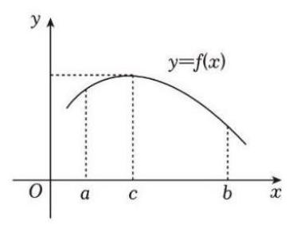

【练习】7. 已知 $f\left( x\right)$ 的导数存在， $y = f\left( x\right)$ 的图象如图所示，设 $S\left( t\right) \left( {a \leq  t \leq  b}\right)$ 是由曲线 $y = f\left( x\right)$ 与直线 $x = a, x = t$ 及 $x$ 轴围成的平面图形的面积,则在区间 $\left\lbrack  {a, b}\right\rbrack$ 上( )

A. ${f}^{\prime }\left( x\right)$ 的最大值是 ${f}^{\prime }\left( a\right)$ ,最小值是 ${f}^{\prime }\left( c\right)$

B. ${f}^{\prime }\left( x\right)$ 的最大值是 ${f}^{\prime }\left( c\right)$ ,最小值是 ${f}^{\prime }\left( b\right)$

C. ${S}^{\prime }\left( t\right)$ 的最大值是 ${S}^{\prime }\left( a\right)$ ,最小值是 ${S}^{\prime }\left( c\right)$

D. ${S}^{\prime }\left( t\right)$ 的最大值是 ${S}^{\prime }\left( c\right)$ ,最小值是 ${S}^{\prime }\left( b\right)$

【答案】 $D$

【解析】如图所示, ${f}^{\prime }\left( x\right)$ 的最大值为 ${f}^{\prime }\left( a\right)$ ,最小值为 ${f}^{\prime }\left( b\right)$ .

由导数的定义得 ${S}^{\prime }\left( t\right)  = \mathop{\lim }\limits_{{{\Delta t} \rightarrow  0}}\frac{S\left( {t + {\Delta t}}\right)  - S\left( t\right) }{\Delta t} = \mathop{\lim }\limits_{{{\Delta t} \rightarrow  0}}\frac{{\Delta t} \cdot  f\left( t\right) }{\Delta t} = \mathop{\lim }\limits_{{{\Delta t} \rightarrow  0}}f\left( t\right)  = f\left( t\right)$ .

则 ${S}^{\prime }\left( t\right)$ 的最大值是 ${S}^{\prime }\left( c\right)$ ,最小值是 ${S}^{\prime }\left( b\right)$ ,故选 $D$ .

【练习】8. 已知函数 $f\left( x\right)  = \left( {x - 1}\right) {\mathrm{e}}^{x} - {mx}$ 在区间 $x \in  \left\lbrack  {1,2}\right\rbrack$ 上存在严格增区间,则 $m$ 的取值范围为

【答案】 $\left( {-\infty ,2{\mathrm{e}}^{2}}\right)$

【解析】 ${f}^{\prime }\left( x\right)  = {\mathrm{e}}^{x} + \left( {x - 1}\right) {\mathrm{e}}^{x} - m = x{e}^{x} - m$ ,令 ${f}^{\prime }\left( x\right)  > 0$ ,则 $m < x{e}^{x}$ 在区间 $x \in  \left\lbrack  {1,2}\right\rbrack$ 上有解,

设 $g\left( x\right)  = x{\mathrm{e}}^{x}, x \in  \left\lbrack  {1,2}\right\rbrack$ ,则 ${g}^{\prime }\left( x\right)  = \left( {x + 1}\right) {\mathrm{e}}^{x} > 0$ ,

所以 $g\left( x\right)$ 在 $\left\lbrack  {1,2}\right\rbrack$ 上严格增,且 $g\left( 1\right)  = \mathrm{e}, g\left( 2\right)  = 2{\mathrm{e}}^{2}$ ,所以 $m < 2{\mathrm{e}}^{2}$ ,

故 $m$ 的取值范围为 $\left( {-\infty ,2{\mathrm{e}}^{2}}\right)$

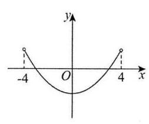

【练习】9. (2025 届复附) 函数 $y = f\left( x\right)$ 是定义在 $\left( {-4,4}\right)$ 上的偶函数,其图像如图所示，满足 $f\left( 3\right)  = 0$ ，设 ${y}^{\prime } = {f}^{\prime }\left( x\right)$ 是 $y = f\left( x\right)$ 的导函数，则关于 $x$ 的不等式 $f\left( {x + 1}\right)  \cdot  {f}^{\prime }\left( x\right)  \geq  0$ 的解集是___

【答案】 $\left( {-4,0\rbrack \cup \lbrack 2,3}\right)$

【解析】函数 $y = f\left( x\right)$ 是偶函数,所以 $f\left( {-3}\right)  = f\left( 3\right)  = 0$ ,

当 $x \in  \left\lbrack  {-3,3}\right\rbrack$ 时, $f\left( x\right)  \leq  0$ ,所以 $x \in  \left\lbrack  {-4,2}\right\rbrack$ 时, $f\left( {x + 1}\right)  \leq  0$ ,

当 $x \in  ( - 4, - 3\rbrack  \cup  \lbrack 3,4)$ 时, $f\left( x\right)  \geq  0$ ,所以 $x \in  ( - 5, - 4\rbrack  \cup  \lbrack 2,3)$ 时, $f\left( {x + 1}\right)  \geq  0$ ,

当 $x \in  ( - 4,0\rbrack$ 时, ${f}^{\prime }\left( x\right)  \leq  0$ ; 当 $x \in  \lbrack 0,4)$ 时, ${f}^{\prime }\left( x\right)  \geq  0$ ,

因为 $f\left( {x + 1}\right)  \cdot  {f}^{\prime }\left( x\right)  \geq  0$ ,所以 $\left\{  \begin{array}{l} f\left( {x + 1}\right)  \geq  0 \\  {f}^{\prime }\left( x\right)  \geq  0 \end{array}\right.$ 或 $\left\{  \begin{array}{l} f\left( {x + 1}\right)  \leq  0 \\  {f}^{\prime }\left( x\right)  \leq  0 \end{array}\right.$ ,

即 $\left\{  \begin{array}{l} x \in  ( - 5, - 4\rbrack  \cup  \lbrack 2,3) \\  x \in  \lbrack 0,4) \end{array}\right.$ 或 $\left\{  \begin{array}{l} x \in  \left\lbrack  {-4,2}\right\rbrack  \\  x \in  ( - 4,0\rbrack  \end{array}\right.$ ,所以 $x \in  \left\lbrack  {2,3)\text{ 或 }x \in  ( - 4,0}\right\rbrack$

故解集为 $\left( {-4,0\rbrack \cup \lbrack 2,3}\right)$

【练习】10. (2024 届格致) 设函数 $f\left( x\right)  = \frac{{ax} + b}{{x}^{2} - c}(a, b, c$ 为常数) 的部分图像如右图所示,则 $a + b + c =$ ___.

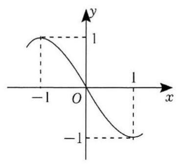

【答案】-3

【解析】由题意得 $f\left( x\right)$ 的定义域为 $R$ ,所以 $c < 0$ ,且 $f\left( 0\right)  = 0$ ,

故有 $f\left( 0\right)  = \frac{b}{-c} = 0 \Rightarrow  b = 0$ ,则 $f\left( x\right)  = \frac{ax}{{x}^{2} - c}$ ,

因为 $f\left( 1\right)  =  - 1$ ,有 $\frac{a}{1 - c} =  - 1 \Rightarrow  a = c - 1 \Rightarrow  c = a + 1$ ,

由于 $f\left( x\right)$ 在 $\left\lbrack  {-1,1}\right\rbrack$ 上严格减，在 $\left( {-\infty , - 1\rbrack \text{ 和 }\lbrack 1, + \infty }\right)$ 上严格增,

故有 ${f}^{\prime }\left( {-1}\right)  = {f}^{\prime }\left( 1\right)  = 0$ ,而 $f\left( x\right)  = \frac{ax}{{x}^{2} - c}$ ,

所以 ${f}^{\prime }\left( x\right)  = \frac{a\left( {{x}^{2} - c}\right)  - {ax} \cdot  {2x}}{{\left( {x}^{2} - c\right) }^{2}} = \frac{-a{x}^{2} - {ac}}{{\left( {x}^{2} - c\right) }^{2}}$ ,

代入 ${f}^{\prime }\left( 1\right)  = \frac{-a - {ac}}{{\left( 1 - c\right) }^{2}} = 0 \Rightarrow   - a - {ac} = 0 \Rightarrow  c + 1 = 0 \Rightarrow  c =  - 1$ ,

则 $a =  - 2$ ,故 $a + b + c =  - 2 + 0 - 1 =  - 3$ .

## 板块二: 中档客观题

## 1. 真题回顾

A、旋转后仍是函数

【例题】1. (2018 上海秋考) 设 $D$ 是含数 1 的有限实数集, $f\left( x\right)$ 是定义在 $D$ 上的函数,若 $f\left( x\right)$ 的图象绕原点逆时针旋转 $\frac{\pi }{6}$ 后与原图象重合,则在以下各项中, $f\left( 1\right)$ 的可能取值只能是 ( )

A. $\sqrt{3}$ B. $\frac{\sqrt{3}}{2}$ C. $\frac{\sqrt{3}}{3}$ D. 0

【答案】 $B$

【解析】问题相当于圆上由 12 个点为一组,每次绕原点逆时针旋转 $\frac{\pi }{6}$ 个单位后与下一个点会重合. 我们可以通过代入和赋值的方法,当 $f\left( 1\right)  = \sqrt{3}\text{ 、 }\frac{\sqrt{3}}{3}\text{ 、 }0$ 时, 此时得到的圆心角为 $\frac{\pi }{3}\text{ 、 }\frac{\pi }{6}\text{ 、 }0$ ,然而此时 $x = 0$ 或者 $x = 1$ 时, 都有 2 个 $y$ 与之对应,而我们知道函数的定义就是要求一个 $x$ 只能对应一个 $y$ , 因此只有当 $x = \frac{\sqrt{3}}{2}$ ，此时旋转 $\frac{\pi }{6}$ ，此时满足一个 $x$ 只会对应一个 $y$ ，故选 $B$ .

【例题】2. (2009 上海秋考) 将函数 $y = \sqrt{4 + {6x} - {x}^{2}} - 2\left( {x \in  \left\lbrack  {0,6}\right\rbrack  }\right)$ 的图象绕坐标原点逆时针方向旋转角 $\theta \left( {0 \leq  \theta  \leq  \alpha }\right)$ ,得到曲线 $C$ . 若对于每一个旋转角 $\theta$ ,曲线 $C$ 都是一个函数的图象,则 $\alpha$ 的最大值为___.

【答案】 $\arctan \frac{2}{3}$

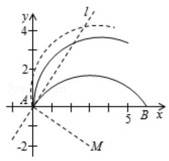

【解析】先画出函数 $y = \sqrt{4 + {6x} - {x}^{2}} - 2\left( {x \in  \left\lbrack  {0,6}\right\rbrack  }\right)$ 的图象,

这是一个圆弧,圆心为 $M\left( {3, - 2}\right)$ ,

由图像得当此圆弧绕坐标原点逆时针方向旋转角大于 $\angle {MAB}$ 时, 曲线 $C$ 都不是一个函数的图象, $\angle {MAB} = \arctan \frac{2}{3}$ ,

故 $\alpha$ 的最大值为 $\arctan \frac{2}{3}$ .

B、综合

【例题】1. (2021 上海春考) 已知函数 $y = f\left( x\right)$ 的定义域为 $R$ ,下列是 $f\left( x\right)$ 无最大值的充分条件是 ( )

A. $f\left( x\right)$ 为偶函数且关于点 $\left( {1,1}\right)$ 对称 B. $f\left( x\right)$ 为偶函数且关于直线 $x = 1$ 对称

C. $f\left( x\right)$ 为奇函数且关于点 $\left( {1,1}\right)$ 对称 D. $f\left( x\right)$ 为奇函数且关于直线 $x = 1$ 对称

【答案】 $C$

【解析】对于 $A, f\left( x\right)  = \cos \frac{\pi x}{2} + 1, f\left( x\right)$ 为偶函数,且关于点 $\left( {1,1}\right)$ 对称,存在最大值, $A$ 错误,

对于 $B, f\left( x\right)  = \cos \left( {\pi x}\right) , f\left( x\right)$ 为偶函数且关于直线 $x = 1$ 对称,存在最大值, $B$ 错误,

对于 $C$ ,假设 $f\left( x\right)$ 有最大值,设其最大值为 $M$ ,其最高点的坐标为 $\left( {a, M}\right)$ ,

$f\left( x\right)$ 为奇函数，其图象关于原点对称，则 $f\left( x\right)$ 的图象存在最低点 $\left( {-a, - M}\right)$ ，

又由 $f\left( x\right)$ 的图象关于点 $\left( {1,1}\right)$ 对称,

则 $\left( {-a, - M}\right)$ 关于点 $\left( {1,1}\right)$ 对称的点为 $\left( {2 + a,2 + M}\right)$ ,

与最大值为 $M$ 相矛盾，则此时 $f\left( x\right)$ 无最大值， $C$ 正确，

对于 $D, f\left( x\right)  = \sin \frac{\pi x}{2}, f\left( x\right)$ 为奇函数且关于直线 $x = 1$ 对称， $D$ 错误，

故选 $C$ .

【例题】2. (2020 上海秋考) 设 $a \in  R$ ，若存在定义域为 $R$ 的函数 $f\left( x\right)$ 同时满足下列两个条件:

(1) 对任意的 ${x}_{0} \in  R, f\left( {x}_{0}\right)$ 的值为 ${x}_{0}$ 或 ${x}_{0}^{2}$ ;

( 2 )关于 $x$ 的方程 $f\left( x\right)  = a$ 无实数解，则 $a$ 的取值范围是___.

【答案】 $\left( {-\infty ,0}\right)  \cup  \left( {0,1}\right)  \cup  \left( {1, + \infty }\right)$

【解析】由 (1) 得 $f\left( 0\right)  = 0$ 且 $f\left( 1\right)  = 1$ ,

又因为关于 $x$ 的方程 $f\left( x\right)  = a$ 无实数解,所以 $a \neq  0$ 且 $a \neq  1$ ,

此时存在函数 $f\left( x\right)  = \left\{  \begin{array}{l} {x}^{2}, x = a \\  x, x \neq  a \end{array}\right.$ 满足题意,所以 $a \in  \left( {-\infty ,0}\right)  \cup  \left( {0,1}\right)  \cup  \left( {1, + \infty }\right)$ .

【例题】3. (2020 上海秋考) 命题 $p$ : 存在 $a \in  R$ 且 $a \neq  0$ ,对于任意的 $x \in  R$ ,使得 $f\left( {x + a}\right)  < f\left( x\right)  + \; f\left( a\right)$ ;

命题 ${q}_{1} : f\left( x\right)$ 严格单调递减且 $f\left( x\right)  > 0$ 恒成立;

命题 ${q}_{2} : f\left( x\right)$ 严格单调递增,存在 ${x}_{0} < 0$ 使得 $f\left( {x}_{0}\right)  = 0$ ,

则下列说法正确的是 ( )

A. 只有 ${q}_{1}$ 是 $p$ 的充分条件 B. 只有 ${q}_{2}$ 是 $p$ 的充分条件

C. ${q}_{1}\text{ 、 }{q}_{2}$ 都是 $p$ 的充分条件 D. ${q}_{1}\text{ 、 }{q}_{2}$ 都不是 $p$ 的充分条件

【答案】 $C$

【解析】对于命题 ${q}_{1}$ : 当 $f\left( x\right)$ 严格单调递减且 $f\left( x\right)  > 0$ 恒成立时,

当 $a > 0$ 时,此时 $x + a > x$ ,又因为 $f\left( x\right)$ 严格单调递减,所以 $f\left( {x + a}\right)  < f\left( x\right)$

又因为 $f\left( x\right)  > 0$ 恒成立，所以 $f\left( x\right)  < f\left( x\right)  + f\left( a\right)$ ，所以 $f\left( {x + a}\right)  < f\left( x\right)  + f\left( a\right)$ ，

所以命题 ${q}_{1} \Rightarrow$ 命题 $p$ ,

对于命题 ${q}_{2} :$ 当 $f\left( x\right)$ 严格单调递增,存在 ${x}_{0} < 0$ 使得 $f\left( {x}_{0}\right)  = 0$ ,

当 $a = {x}_{0} < 0$ 时,此时 $x + a < x, f\left( a\right)  = f\left( {x}_{0}\right)  = 0$ ,

又因为 $f\left( x\right)$ 严格单调递增,所以 $f\left( {x + a}\right)  < f\left( x\right)$ ,所以 $f\left( {x + a}\right)  < f\left( x\right)  + f\left( a\right)$ , 所以命题 ${p}_{2} \Rightarrow$ 命题 $p$ ,

所以 ${q}_{1}\text{ 、 }{q}_{2}$ 都是 $p$ 的充分条件,故选 $C$ .

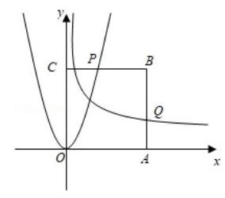

【例题】4. (2019 上海春考) 如图,已知正方形 ${OABC}$ ,其中 ${OA} = a\left( {a > 1}\right)$ ,函数 $y = 3{x}^{2}$ 交 ${BC}$ 于点 $P$ ，函数 $y = {x}^{-\frac{1}{2}}$ 交 ${AB}$ 于点 $Q$ ，当 $\left| {AQ}\right|  + \left| {CP}\right|$ 最小时，则 $a$ 的值为___.

【答案】 $\sqrt{3}$

【解析】由题意得 $P$ 点坐标为 $\left( {\sqrt{\frac{a}{3}}, a}\right) , Q$ 点坐标为 $\left( {a,\sqrt{\frac{1}{a}}}\right)$ ,

$\left| {AQ}\right|  + \left| {CP}\right|  = \sqrt{\frac{a}{3}} + \sqrt{\frac{1}{a}} \geq  2\sqrt{\frac{1}{\sqrt{3}}},$

当且仅当 $a = \sqrt{3}$ 时，取最小值.

【例题】5. (2018 上海秋考) 已知常数 $a > 0$ ，函数 $f\left( x\right)  = \frac{{2}^{x}}{{2}^{x} + {ax}}$ 的图象经过点 $P\left( {p,\frac{6}{5}}\right)$ ， $Q\left( {q, - \frac{1}{5}}\right)$ .

若 ${2}^{p + q} = {36pq}$ ,则 $a =$ ___.

【答案】 6

【解析】函数 $f\left( x\right)  = \frac{{2}^{x}}{{2}^{x} + {ax}}$ 的图象经过点 $P\left( {p,\frac{6}{5}}\right) , Q\left( {q, - \frac{1}{5}}\right)$ .

法一: $\frac{{2}^{p}}{{2}^{p} + {ap}} + \frac{{2}^{q}}{{2}^{q} + {aq}} = \frac{6}{5} - \frac{1}{5} = 1$ ,整理得 $\frac{{2}^{p + q} + {2}^{p}{aq} + {2}^{q}{ap} + {2}^{p + q}}{{2}^{p + q} + {2}^{p}{aq} + {2}^{q}{ap} + {a}^{2}{pq}} = 1$ ,

解得 ${2}^{p + q} = {a}^{2}{pq}$ ,由于 ${2}^{p + q} = {36pq}$ ,所以 ${a}^{2} = {36}$ ,

由于 $a > 0$ ，故 $a = 6$ .

法二: $\frac{{2}^{p}}{{2}^{p} + {ap}} = \frac{6}{5} \Rightarrow  \frac{1}{1 + \frac{ap}{{2}^{p}}} = \frac{6}{5}$ ,所以 $\frac{ap}{{2}^{p}} =  - \frac{1}{6}$ ,

$\frac{{2}^{q}}{{2}^{q} + {aq}} =  - \frac{1}{5} \Rightarrow  \frac{1}{1 + \frac{aq}{{2}^{q}}} =  - \frac{1}{5}$ ,所以 $\frac{aq}{{2}^{q}} =  - 6$ ,

两式相乘得 $\frac{{a}^{2}{pq}}{{2}^{p + q}} = 1$ ,因为 ${2}^{p + q} = {36pq}$ ,所以 $\frac{{a}^{2}}{36} = 1$ ,由于 $a > 0$ ,故 $a = 6$ .

【例题】6. (2017 上海春考) 设 $a, b \in  R$ ,若函数 $f\left( x\right)  = x + \frac{a}{x} + b$ 在区间 $\left( {1,2}\right)$ 上有两个不同的零点, 则 $f\left( 1\right)$ 的取值范围为___.

【答案】 $\left( {0,1}\right)$

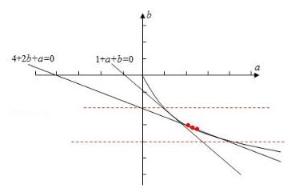

【解析】法一: 函数 $f\left( x\right)  = x + \frac{a}{x} + b$ 在区间 $\left( {1,2}\right)$ 上有两个不同的零点, 即方程 ${x}^{2} + {bx} + a = 0$ 在区间 $\left( {1,2}\right)$ 上两个不相等的实根，

$\Rightarrow  \left\{  {\begin{array}{l} 1 <  - \frac{b}{2} < 2 \\  {b}^{2} - {4a} > 0 \\  1 + a + b > 0 \\  4 + {2b} + a > 0 \end{array} \Rightarrow  \left\{  \begin{array}{l}  - 4 < b <  - 2 \\  {b}^{2} > {4a} \\  1 + a + b > 0 \\  4 + {2b} + a > 0 \end{array}\right. }\right.$ ,

如图画出数对 $\left( {a, b}\right)$ 所表示的区域,目标函数 $z = f\left( a\right)  = a + b + 1$ ,

所以 $z$ 的最小值为 $z = a + b + 1$ 过点 $\left( {1, - 2}\right)$ 时,

$z$ 的最大值为 $z = a + b + 1$ 过点 $\left( {4, - 4}\right)$ 时,

所以 $f\left( 1\right)$ 的取值范围为 $\left( {0,1}\right)$ .

法二: 函数 $f\left( x\right)  = x + \frac{a}{x} + b$ 在区间 $\left( {1,2}\right)$ 上有两个不同的零点,

即方程 ${x}^{2} + {bx} + a = 0$ 在区间 $\left( {1,2}\right)$ 上两个不相等的实根，设为 ${x}_{1},{x}_{2}\left( {{x}_{1} \neq  {x}_{2}}\right)$ ，

则 ${x}_{1} + {x}_{2} =  - b,{x}_{1}{x}_{2} = a$ ,

所以 $f\left( 1\right)  = a + b + 1 = {x}_{1}{x}_{2} - \left( {{x}_{1} + {x}_{2}}\right)  + 1 = \left( {{x}_{1} - 1}\right) \left( {{x}_{2} - 1}\right)$ ,

因为 ${x}_{1},{x}_{2} \in  \left( {1,2}\right) ,{x}_{1} \neq  {x}_{2}$ ,所以 $f\left( 1\right)  \in  \left( {0,1}\right)$ .

【例题】7. (2016 上海秋考) 设 $f\left( x\right) \text{ 、 }g\left( x\right) \text{ 、 }h\left( x\right)$ 是定义域为 $R$ 的三个函数，对于命题:① $f\left( x\right)  + g\left( x\right)$ 、 $f\left( x\right)  + h\left( x\right) \text{ 、 }g\left( x\right)  + h\left( x\right)$ 均为严格增函数,则 $f\left( x\right) \text{ 、 }g\left( x\right) \text{ 、 }h\left( x\right)$ 中至少有一个严格增函数; ②若 $f\left( x\right)  + g\left( x\right) \text{ 、 }f\left( x\right)  + h\left( x\right) \text{ 、 }g\left( x\right)  + h\left( x\right)$ 均是以 $T$ 为周期的函数,则 $f\left( x\right) \text{ 、 }g\left( x\right) \text{ 、 }h\left( x\right)$ 均是以 $T$ 为周期的函数，下列判断正确的是 ( )

A. ①和②均为真命题 B. ①和②均为假命题

C. ①为真命题，②为假命题 D. ①为假命题，②为真命题

【答案】 $D$

【解析】① 不成立. 可举反例: $f\left( x\right)  = \left\{  {\begin{array}{ll} {2x}, & x \leq  1 \\   - x + 3, & x > 1 \end{array}.g\left( x\right)  = \left\{  \begin{array}{ll} {2x} + 3, & x \leq  0 \\   - x + 3, & 0 < x < 1, \\  {2x}, & x \geq  1 \end{array}\right. }\right.$

$h\left( x\right)  = \left\{  {\begin{array}{ll}  - x, & x \leq  0 \\  {2x}, & x > 0 \end{array}.}\right.$

②因为 $f\left( x\right)  + g\left( x\right)  = f\left( {x + T}\right)  + g\left( {x + T}\right) , f\left( x\right)  + h\left( x\right)  = f\left( {x + T}\right)  + h\left( {x + T}\right)$ ，

$h\left( x\right)  + g\left( x\right)  = h\left( {x + T}\right)  + g\left( {x + T}\right) ,$

前两式作差得 $g\left( x\right)  - h\left( x\right)  = g\left( {x + T}\right)  - h\left( {x + T}\right)$ ,

结合第三式得 $g\left( x\right)  = g\left( {x + T}\right) , h\left( x\right)  = h\left( {x + T}\right)$ ,同理可得 $f\left( x\right)  = f\left( {x + T}\right)$ ,

因此②正确. 故选 $D$ .

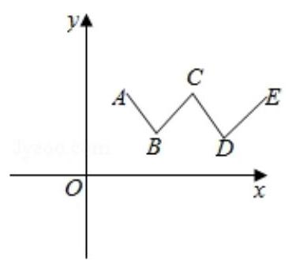

【例题】8. (2016 上海春考) 已知函数 $y = f\left( x\right)$ 的图象是折线 ${ABCDE}$ ,如图,其中 $A\left( {1,2}\right) , B\left( {2,1}\right) , C\left( {3,2}\right) , D\left( {4,1}\right) , E\left( {5,2}\right)$ ,若直线 $y = {kx} \; + b$ 与 $y = f\left( x\right)$ 的图象恰有四个不同的公共点,则 $k$ 的取值范围是 ( )

A. $\left( {-1,0}\right)  \cup  \left( {0,1}\right)$ B. $\left( {-\frac{1}{3},\frac{1}{3}}\right)$

C. $(0,1\rbrack$ D. $\left\lbrack  {0.\frac{1}{3}}\right\rbrack$

【答案】 $B$

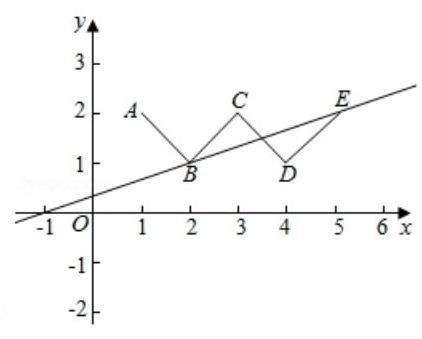

【解析】当 $k = 0,1 < b < 2$ 时,显然直线 $y = b$ 与 $f\left( x\right)$ 图象交于四点,故 $k$ 可以取 0,

排除 $A, C$

作直线 ${BE}$ ,则 ${k}_{BE} = \frac{2 - 1}{5 - 2} = \frac{1}{3}$ ,直线 ${BE}$ 与 $f\left( x\right)$ 图象交于三点,

平行移动直线 ${BD}$ 可发现直线与 $f\left( x\right)$ 图象最多交于三点, 即直线 $y = \frac{1}{3}x + b$ 与 $f\left( x\right)$ 图象最多交于三点,所以 $k \neq  \frac{1}{3}$ . 排除 $D$ .

故选 $B$ .

【例题】9. (2015 上海秋考) 已知函数 $f\left( x\right)  = \sin x$ . 若存在 ${x}_{1},{x}_{2},\cdots ,{x}_{m}$ 满足 $0 \leq  {x}_{1} < {x}_{2} < \cdots  < {x}_{m} \leq \; {6\pi }$ ,且 $\left| {f\left( {x}_{1}\right)  - f\left( {x}_{2}\right) }\right|  + \left| {f\left( {x}_{2}\right)  - f\left( {x}_{3}\right) }\right|  + \cdots  + \left| {f\left( {x}_{m - 1}\right)  - f\left( {x}_{m}\right) }\right|  = {12}\left( {m \geq  2, m \in  {N}^{ * }}\right)$ ,则 $m$ 的最小值为___.

【答案】 8

【解析】因为 $y = \sin x$ 对任意 ${x}_{i},{x}_{j}\left( {\mathrm{i}, j = 1,2,3,\cdots , m}\right)$ ,

都有 $\left| {f\left( {x}_{i}\right)  - f\left( {x}_{j}\right) }\right|  \leq  f{\left( x\right) }_{\max } - f{\left( x\right) }_{\min } = 2$ ,

要使 $m$ 取得最小值,尽可能多让 ${x}_{i}\left( {\mathrm{i} = 1,2,3,\cdots , m}\right)$ 取得最高点,

考虑 $0 \leq  {x}_{1} < {x}_{2} < \cdots  < {x}_{m} \leq  {6\pi }$ ,

$\left| {f\left( {x}_{1}\right)  - f\left( {x}_{2}\right) }\right|  + \left| {f\left( {x}_{2}\right)  - f\left( {x}_{3}\right) }\right|  + \cdots  + \left| {f\left( {x}_{m - 1}\right)  - f\left( {x}_{m}\right) }\right|  = {12},$

按下图取值即可满足条件，所以 $m$ 的最小值为 8 .

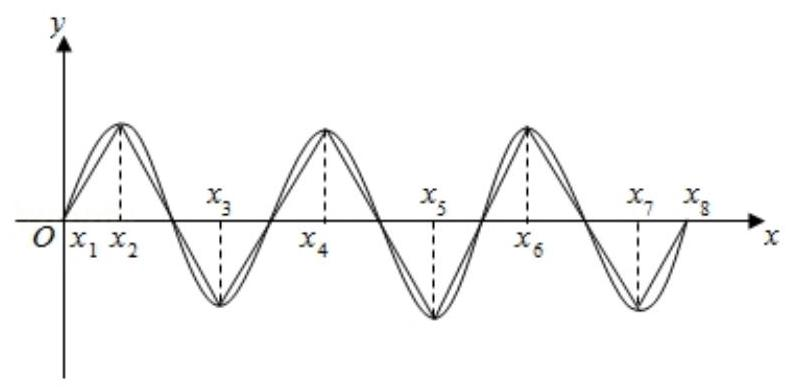

【例题】10. (2012 上海秋考) 已知函数 $y = f\left( x\right)$ 的图象是折线段 ${ABC}$ ,其中 $A\left( {0,0}\right) \text{ 、 }B\left( {\frac{1}{2},5}\right) \text{ 、 }C\left( {1,0}\right)$ , 函数 $y = {xf}\left( x\right) \left( {0 \leq  x \leq  1}\right)$ 的图象与 $x$ 轴围成的图形的面积为___.

【答案】 $\frac{5}{4}$

【解析】由题意得 $f\left( x\right)  = \left\{  \begin{array}{ll} {10x}, & \left( {0 \leq  x \leq  \frac{1}{2}}\right) \\  {10} - {10x}, & \left( {\frac{1}{2} \leq  x \leq  1}\right)  \end{array}\right.$ ,所以 $y = {xf}\left( x\right)  = \left\{  \begin{array}{ll} {10}{x}^{2}, & \left( {0 \leq  x \leq  \frac{1}{2}}\right) \\   - {10}{x}^{2} + {10x}, & \left( {\frac{1}{2} \leq  x \leq  1}\right)  \end{array}\right.$ , 设函数 $y = {xf}\left( x\right) \left( {0 \leq  x \leq  1}\right)$ 的图象与 $x$ 轴围成的图形的面积为 $S$ , 则 $S = {\int }_{0}^{\frac{1}{2}}{10}{x}^{2}\mathrm{\;d}x + {\int }_{\frac{1}{2}}^{1}\left( {-{10}{x}^{2} + {10x}}\right) \mathrm{d}x = {\left. {10} \times  \frac{{x}^{3}}{3}\right| }_{0}^{\frac{1}{2}} + {\left. \left( -{10}\right)  \times  \frac{{x}^{3}}{3}\right| }_{\frac{1}{2}}^{1} + {\left. {10} \times  \frac{{x}^{2}}{2}\right| }_{\frac{1}{2}}^{1} \; = \frac{5}{12} - \frac{35}{12} + 5 - \frac{5}{4} = \frac{15}{12} = \frac{5}{4}$ .

【注】本题也可以用割补的方法求解.

## 2. 模拟练习

注:有些是介于 15 和 16 之间的难度, 不少题来自 2025 版每日三题

【练习】1. (2025 届复附) 设集合 $P = \{  - 1,1\} , Q = \{ x \mid  x > 0$ 且 $x \neq  1\}$ ,函数 $f\left( x\right)  = {a}^{x} + \; \lambda {a}^{-x}\left( {a > 0\text{ 且 }a \neq  1}\right)$ ，下列四个命题:

①对任意 $\lambda  \in  P$ ，存在 $a \in  Q$ ，使得 $y = f\left( x\right)$ 是增函数；

②存在 $\lambda  \in  P$ ，对任意 $a \in  Q$ ， $y = f\left( x\right)$ 是减函数；

③对任意 $\lambda  \in  P$ ，存在 $a \in  Q$ ，使得 $y = f\left( x\right)$ 是奇函数；

④ 存在 $\lambda  \in  P$ ，对任意 $a \in  Q$ ， $y = f\left( x\right)$ 是偶函数

其中真命题的个数是 ( )

A. 1 个 B. 2 个 C. 3 个 D. 4 个

【答案】 $A$

【解析】 $< 1 >$ 当 $\lambda  = 1, a \in  \left( {0,1}\right)$ 时, $f\left( x\right)  = {a}^{x} + {a}^{-x}$ ,

则 ${f}^{\prime }\left( x\right)  = {a}^{x}\ln a - {a}^{-x}\ln a = \ln a\left( {{a}^{x} - {a}^{-x}}\right)$ ,因为 $a \in  \left( {0,1}\right)$ ,所以 $\ln a < 0$ ,

所以当 $x \in  \left( {-\infty ,0}\right)$ 时, ${a}^{x} - {a}^{-x} > 0$ ,即 ${f}^{\prime }\left( x\right)  < 0$ ;

当 $x \in  \left( {0, + \infty }\right)$ 时, ${a}^{x} - {a}^{-x} < 0$ ,即 ${f}^{\prime }\left( x\right)  > 0$ ,

所以 $f\left( x\right)$ 严格减区间为 $\left( {-\infty ,0}\right)$ ,严格增区间为 $\left( {0, + \infty }\right)$

因为 $f\left( {-x}\right)  = {a}^{-x} + {a}^{x} = f\left( x\right)$ ，所以 $f\left( x\right)$ 为偶函数

$< 2 >$ 当 $\lambda  = 1, a \in  \left( {1, + \infty }\right)$ 时, $f\left( x\right)  = {a}^{x} + {a}^{-x}$ ,

则 ${f}^{\prime }\left( x\right)  = {a}^{x}\ln a - {a}^{-x}\ln a = \ln a\left( {{a}^{x} - {a}^{-x}}\right)$ ,因为 $a \in  \left( {1, + \infty }\right)$ ,所以 $\ln a > 0$ ,

所以当 $x \in  \left( {-\infty ,0}\right)$ 时, ${a}^{x} - {a}^{-x} < 0$ ,即 ${f}^{\prime }\left( x\right)  < 0$ ;

当 $x \in  \left( {0, + \infty }\right)$ 时, ${a}^{x} - {a}^{-x} > 0$ ,即 ${f}^{\prime }\left( x\right)  > 0$ ,

所以 $f\left( x\right)$ 严格减区间为 $\left( {-\infty ,0}\right)$ ,严格增区间为 $\left( {0, + \infty }\right)$

因为 $f\left( {-x}\right)  = {a}^{-x} + {a}^{x} = f\left( x\right)$ ,所以 $f\left( x\right)$ 为偶函数

$< 3 >$ 当 $\lambda  =  - 1, a \in  \left( {0,1}\right)$ 时, $f\left( x\right)  = {a}^{x} - {a}^{-x}$ ,

则 ${f}^{\prime }\left( x\right)  = {a}^{x}\ln a + {a}^{-x}\ln a = \ln a\left( {{a}^{x} + {a}^{-x}}\right)$ ,因为 $a \in  \left( {0,1}\right)$ ,所以 $\ln a < 0$ ,

又因为 ${a}^{x} + {a}^{-x} > 0$ 恒成立,所以 ${f}^{\prime }\left( x\right)  < 0$ 恒成立,所以 $f\left( x\right)$ 是减函数

因为 $f\left( {-x}\right)  = {a}^{-x} - {a}^{x} =  - f\left( x\right)$ ,所以 $f\left( x\right)$ 为奇函数

$< 4 >$ 当 $\lambda  =  - 1, a \in  \left( {1, + \infty }\right)$ 时, $f\left( x\right)  = {a}^{x} - {a}^{-x}$ ,

则 ${f}^{\prime }\left( x\right)  = {a}^{x}\ln a + {a}^{-x}\ln a = \ln a\left( {{a}^{x} + {a}^{-x}}\right)$ ,因为 $a \in  \left( {1, + \infty }\right)$ ,所以 $\ln a > 0$ ,

又因为 ${a}^{x} + {a}^{-x} > 0$ 恒成立，所以 ${f}^{\prime }\left( x\right)  > 0$ 恒成立，

所以 $f\left( x\right)  = {a}^{x} - {a}^{-x}$ 是增函数

因为 $f\left( {-x}\right)  = {a}^{-x} - {a}^{x} =  - f\left( x\right)$ ,所以 $f\left( x\right)$ 为奇函数

综上,对于①,由上述 $\langle 1\rangle ,\langle 2\rangle$ 得,当 $\lambda  = 1,\forall a \in  Q$ 时, $y = f\left( x\right)$ 不是增函数, 故①不正确；

对于②，由上述 $< 1 > , < 2 >$ 得，当 $\lambda  = 1$ ， $\forall a \in  Q$ 时， $y = f\left( x\right)$ 不是减函数，

由上述 $\langle 3\rangle ,\langle 4\rangle$ 得,当 $\lambda  =  - 1, a \in  \left( {1, + \infty }\right)$ 时, $f\left( x\right)$ 是增函数，故②不正确；

对于③，由上述 $\langle 1\rangle$ ， $\langle 2\rangle$ 得，当 $\lambda  = 1$ ， $\forall a \in  Q$ 时， $y = f\left( x\right)$ 是偶函数，

故③不正确；

对于④，由上述 $\langle 3\rangle ,\langle 4\rangle$ 得，当 $\lambda  =  - 1$ ， $\forall a \in  Q$ 时， $y = f\left( x\right)$ 是奇函数，

故④正确

故选 $A$

【练习】2. 已知 $a > 0$ ,过点 $\left( {a, b}\right)$ 可以作曲线 $y = {x}^{3}$ 的三条切线,则下列说法正确的有___

① $b < 0$ ② $b > 0$ ③ $b < {a}^{3}$ ④ $b > {a}^{3}$

【答案】②③

【解析】设切点为 $\left( {{x}_{0},{x}_{0}^{3}}\right)$ ,

因为 ${y}^{\prime } = 3{x}^{2}$ ,即 ${\left. {y}^{\prime }\right| }_{x = {x}_{0}} = 3{x}_{0}^{2}$ ,

切线方程为 $y - {x}_{0}^{3} = 3{x}_{0}^{2}\left( {x - {x}_{0}}\right)$ ,

所以 $b - {x}_{0}^{3} = 3{x}_{0}^{2}\left( {a - {x}_{0}}\right)$ ,即 $b =  - 2{x}_{0}^{3} + {3a}{x}_{0}^{2}$ ,

因为过点 $\left( {a, b}\right)$ 可以作曲线 $y = {x}^{3}$ 的三条切线,

所以,关于 ${x}_{0}$ 的方程 $b =  - 2{x}_{0}^{3} + {3a}{x}_{0}^{2}$ 有三个不同的解.

设 $f\left( x\right)  =  - 2{x}^{3} + {3a}{x}^{2}$ ,则 ${f}^{\prime }\left( x\right)  =  - 6{x}^{2} + {6ax} =  - {6x}\left( {x - a}\right)$ ,

所以 $f\left( x\right)$ 在 $\left( {0, a}\right)$ 上单调递增,在 $\left( {-\infty ,0}\right)$ 和 $\left( {a, + \infty }\right)$ 上单调递减,且值域为 $R$ ,

所以 $\left\{  \begin{array}{l} b > f\left( 0\right) \\  b < f\left( a\right)  \end{array}\right.$ ,即 $\left\{  \begin{array}{l} b > 0 \\  b < {a}^{3} \end{array}\right.$ .

故选:②③

【练习】3. 设曲线 $C$ 与函数 $f\left( x\right)  = \frac{\sqrt{3}}{12}{x}^{2}\left( {0 \leq  x \leq  m}\right)$ 的图像关于直线 $y = \sqrt{3}x$ 对称,若曲线 $C$ 仍为某函数的图像,则实数 $m$ 的取值范围为___.

【答案】 $(0,2\rbrack$

【解析】法一: 设函数 $f\left( x\right)  = \frac{\sqrt{3}}{12}{x}^{2}\left( {0 \leq  x \leq  m}\right)$ 上的点 $P\left( {{x}_{0},{y}_{0}}\right)$ 关于直线 $y = \sqrt{3}x$ 的

对称点为 ${P}^{\prime }\left( {x, y}\right)$ ,由 $\left\{  \begin{array}{l} \frac{y - {y}_{0}}{x - {x}_{0}} =  - \frac{\sqrt{3}}{3} \\  \frac{y + {y}_{0}}{2} = \sqrt{3}\frac{{x}_{0} + x}{2} \end{array}\right.$ ,解得 $x = \frac{\sqrt{3}}{2}{y}_{0} - \frac{1}{2}{x}_{0} = \frac{1}{8}{x}_{0}^{2} - \frac{1}{2}{x}_{0}$ ,

要使 $0 \leq  {x}_{0} \leq  m$ 时, $x = \frac{1}{8}{x}_{0}^{2} - \frac{1}{2}{x}_{0}$ 单调,则 $m \leq  2$ .

故实数 $m$ 的取值范围是 $(0,2\rbrack$ .

法二: 设 $l$ 是函数 $f\left( x\right)  = \frac{\sqrt{3}}{12}{x}^{2}\left( {0 \leq  x \leq  m}\right)$ 在点 $M\left( {m,\frac{\sqrt{3}}{12}{m}^{2}}\right)$ 的切线,

因为曲线 $C$ 与函数 $f\left( x\right)  = \frac{\sqrt{3}}{12}{x}^{2}\left( {0 \leq  x \leq  m}\right)$ 的图像关于直线 $y = \sqrt{3}x$ 对称,

所以直线 $l$ 关于 $y = \sqrt{3}x$ 对称后的直线方程必为 $x = a$ ,

曲线 $C$ 才能是某函数的图像,

如图所示，直线 $y = \sqrt{3}x$ 与 $x = a$ 的夹角为 ${30}^{ \circ  }$ ，所以直线 $l$ 的倾斜角为 ${30}^{ \circ  }$ ，

则直线 $l$ 的方程为 $l : y = \frac{\sqrt{3}}{3}\left( {x - m}\right)  + \frac{\sqrt{3}}{12}{m}^{2}$ ,

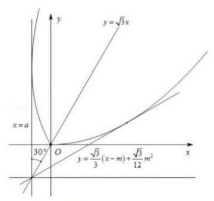

由 $\left\{  \begin{array}{l} y = \frac{\sqrt{3}}{3}\left( {x - m}\right)  + \frac{\sqrt{3}}{12}{m}^{2} \\  y = \frac{\sqrt{3}}{12}{x}^{2} \end{array}\right.$ 得 ${x}^{2} - {4x} + {4m} - {m}^{2} = 0$ ,

则 $\Delta  = {16} - {16m} + 4{m}^{2} = 0$ ,解得 $m = 2$ ,由图像得 $0 < m \leq  2$ ,

所以实数 $m$ 的取值范围为 $(0,2\rbrack$ .

【练习】4. (2025 届华二) 已知函数 $f\left( x\right)$ 不是常数函数,且满足对于任意的 $a\text{ 、 }b \in  R, f\left( {a + b}\right)  + \; f\left( {a - b}\right)  = {2f}\left( a\right) f\left( b\right)$ ,则 ( )

A. $f\left( 0\right)  = 0$ B. $f\left( x\right)$ 一定为周期函数

C. $f\left( x\right)$ 不可能为奇函数 D. 存在 ${x}_{0} \in  R, f\left( {x}_{0}\right)  =  - 2$

【答案】 $C$

【解析】令 $a = b = 0$ ,解得 $f\left( 0\right)  = 0$ 或 $f\left( 0\right)  = 1$ .

若 $f\left( 0\right)  = 0$ ,令 $a = x, b = 0$ ,则 $f\left( x\right)  + f\left( x\right)  = 0$ ,

所以 $f\left( x\right)  = 0$ ,与函数不为常数函数矛盾,所以 $f\left( 0\right)  = 1$ ,故 $A$ 错误;

令 $a = 0, b = x$ ,得 $f\left( x\right)  + f\left( {-x}\right)  = {2f}\left( x\right)$ ,所以 $f\left( {-x}\right)  = f\left( x\right)$ ,

又因为 $x \in  R$ ,所以 $f\left( x\right)$ 必然为偶函数,故 $C$ 正确;

令 $a = b = \frac{x}{2}$ ,则 $f\left( x\right)  = 2{f}^{2}\left( \frac{x}{2}\right)  - 1 \geq   - 1$ ,

所以不存在 ${x}_{0} \in  R$ ,使 $f\left( {x}_{0}\right)  =  - 2$ 成立,故 $D$ 错误;

而 $f\left( x\right)  = \frac{{\mathrm{e}}^{x} + {\mathrm{e}}^{-x}}{2}$ 符合题意且在 $\left( {0, + \infty }\right)$ 上单调递增,

故其可能不为周期函数，即 $B$ 错误.

故选 $C$ .

【练习】5. 设 $h\left( x\right) \text{ 、 }g\left( x\right)$ 是定义在 $R$ 上的两个函数,若 $\forall {x}_{1}\text{ 、 }{x}_{2} \in  R,{x}_{1} \neq  {x}_{2}$ ,有 $\left| {h\left( {x}_{1}\right)  - h\left( {x}_{2}\right) }\right|  \geq \; \left| {g\left( {x}_{1}\right)  - g\left( {x}_{2}\right) }\right|$ 恒成立，下列四个命题正确的是 ( )

A. 若 $h\left( x\right)$ 是奇函数，则 $g\left( x\right)$ 也一定是奇函数

B. 若 $g\left( x\right)$ 是偶函数，则 $h\left( x\right)$ 也一定是偶函数

C. 若 $h\left( x\right)$ 是周期函数，则 $g\left( x\right)$ 也一定是周期函数

D. 若 $h\left( x\right)$ 是 $R$ 上的增函数，则 $H\left( x\right)  = h\left( x\right)  - g\left( x\right)$ 在 $R$ 上一定是减函数

【答案】 $C$

【解析】对于 $A$ ,令 $h\left( x\right)  = x, g\left( x\right)  = 1$ ,对 $\forall {x}_{1}\text{ 、 }{x}_{2} \in  R,{x}_{1} \neq  {x}_{2}$ ,

得 $\left| {h\left( {x}_{1}\right)  - h\left( {x}_{2}\right) }\right|  = \left| {{x}_{1} - {x}_{2}}\right|  \geq  \left| {1 - 1}\right|  = \left| {g\left( {x}_{1}\right)  - g\left( {x}_{2}\right) }\right|$ ,而此时 $g\left( x\right)$ 不是奇函数,故错误;

对于 $B$ ,令 $h\left( x\right)  = x, g\left( x\right)  = 1, g\left( x\right)$ 是偶函数,对 $\forall {x}_{1}\text{ 、 }{x}_{2} \in  R,{x}_{1} \neq  {x}_{2}$ ,

得 $\left| {h\left( {x}_{1}\right)  - h\left( {x}_{2}\right) }\right|  = \left| {{x}_{1} - {x}_{2}}\right|  \geq  \left| {1 - 1}\right|  = \left| {g\left( {x}_{1}\right)  - g\left( {x}_{2}\right) }\right|$ ,此时 $h\left( x\right)$ 为奇函数,

故错误;

对于 $C$ ,设 $h\left( x\right)$ 的周期为 $T$ ,

若 $\forall {x}_{1}\text{ 、 }{x}_{2} \in  R,{x}_{1} \neq  {x}_{2}$ ,有 $\left| {h\left( {x}_{1}\right)  - h\left( {x}_{2}\right) }\right|  \geq  \left| {g\left( {x}_{1}\right)  - g\left( {x}_{2}\right) }\right|$ 恒成立,

令 ${x}_{1} = x + T,{x}_{2} = x$ ,则 $\left| {h\left( {x + T}\right)  - h\left( x\right) }\right|  \geq  \left| {g\left( {x + T}\right)  - g\left( x\right) }\right|$ ,

因为 $h\left( {x + T}\right)  = h\left( x\right)$ ,所以 $\left| {g\left( {x + T}\right)  - g\left( x\right) }\right|  \leq  0$ ,所以 $g\left( {x + T}\right)  = g\left( x\right)$ ,

所以函数 $y = g\left( x\right)$ 也是周期函数，故正确；

对于 $D$ ,设 ${x}_{1} < {x}_{2}, h\left( x\right)$ 是 $R$ 上的增函数,所以 $h\left( {x}_{1}\right)  < h\left( {x}_{2}\right)$ ,

又 $\left| {h\left( {x}_{1}\right)  - h\left( {x}_{2}\right) }\right|  \geq  \left| {g\left( {x}_{1}\right)  - g\left( {x}_{2}\right) }\right|$ ,

即为 $h\left( {x}_{1}\right)  - h\left( {x}_{2}\right)  \leq  g\left( {x}_{1}\right)  - g\left( {x}_{2}\right)  \leq  h\left( {x}_{2}\right)  - h\left( {x}_{1}\right)$ ,

即为 $h\left( {x}_{1}\right)  - g\left( {x}_{1}\right)  \leq  h\left( {x}_{2}\right)  - g\left( {x}_{2}\right)$ ,

所以函数 $y = h\left( x\right)  - g\left( x\right)$ 也都是 $R$ 上的单调递增函数,故错误.

故选 $C$ .

【练习】6. (2025 届华二) 已知函数 $f\left( x\right)$ 的定义域为 $R$ ,且 $f\left( {1 + x}\right)  + f\left( {1 - x}\right)  = f\left( x\right) , f\left( 0\right)  = 2$ ,则 $f\left( {2024}\right)  + f\left( {2026}\right)  =$ ( )

A. 1 B. 2 C. -1 D. -2

【答案】 $D$

【解析】因为函数 $f\left( x\right)$ 的定义域为 $R$ ,且 $f\left( {1 + x}\right)  + f\left( {1 - x}\right)  = f\left( x\right)$ ①,

在①式中，用 $- x$ 替换 $x$ ，得 $f\left( {1 - x}\right)  + f\left( {1 + x}\right)  = f\left( {-x}\right)$ ②，

由①②得 $f\left( {-x}\right)  = f\left( x\right)$ ，所以函数 $f\left( x\right)$ 为偶函数.

在①式中，令 $x = 0$ ，得 ${2f}\left( 1\right)  = f\left( 0\right)  = 2 \Rightarrow  f\left( 1\right)  = 1$ ；

另,令 $x = 1$ ,得 $f\left( 2\right)  + f\left( 0\right)  = f\left( 1\right)$ ,所以 $f\left( 2\right)  = f\left( 1\right)  - f\left( 0\right)  = 1 - 2 =  - 1$ ;

令 $x = 2$ ,得 $f\left( 3\right)  + f\left( {-1}\right)  = f\left( 2\right)$ ,所以 $f\left( 3\right)  = f\left( 2\right)  - f\left( {-1}\right)  =  - 1 - 1 =  - 2$ ;

令 $x = 3$ ,得 $f\left( 4\right)  + f\left( {-2}\right)  = f\left( 3\right)$ ,

所以 $f\left( 4\right)  = f\left( 3\right)  - f\left( {-2}\right)  = f\left( 3\right)  - f\left( 2\right)  =  - 2 + 1 =  - 1$ .

在①式中，用 $x + 1$ 替换 $x$ ，得 $f\left( {2 + x}\right)  + f\left( {-x}\right)  = f\left( {x + 1}\right)$

$\Rightarrow  f\left( {2 + x}\right)  + f\left( x\right)  = f\left( {x + 1}\right)  \Rightarrow  f\left( x\right)  = f\left( {x + 1}\right)  - f\left( {x + 2}\right)$ ,

迭代得 $f\left( x\right)  = f\left( {x + 1}\right)  - f\left( {x + 2}\right)  = f\left( {x + 2}\right)  - f\left( {x + 3}\right)  - f\left( {x + 2}\right)  =  - f\left( {x + 3}\right)$ ,

$f\left( {x + 3}\right)  =  - f\left( x\right)$ ,所以 $f\left( {x + 6}\right)  =  - f\left( {x + 3}\right)  = f\left( x\right)$ ,

故 $f\left( x\right)$ 是以 6 为周期的周期函数,

所以 $f\left( {2024}\right)  = f\left( {{337} \times  6 + 2}\right)  = f\left( 2\right)  =  - 1$ ,

$f\left( {2026}\right)  = f\left( {{337} \times  6 + 4}\right)  = f\left( 4\right)  =  - 1$ ,所以 $f\left( {2024}\right)  + f\left( {2026}\right)  =  - 2$ .

故选 $D$ .

【练习】7. 函数 $f\left( x\right)  = \sqrt{1 - {x}^{2}}, - \frac{1}{2} \leq  x \leq  \frac{1}{2}$ 的图像绕着原点旋转弧度 $\theta \left( {0 \leq  \theta  \leq  \pi }\right)$ ,若得到的图像仍是函数图像,则 $\theta$ 可取值的集合为___.

【答案】 $\left\lbrack  {0,\frac{\pi }{3}}\right\rbrack   \cup  \left\lbrack  {\frac{2\pi }{3},\pi }\right\rbrack$

【解析】画出函数 $f\left( x\right)  = \sqrt{1 - {x}^{2}}, - \frac{1}{2} \leq  x \leq  \frac{1}{2}$ 的图象,如图 1 所示: 2025 版上海高考真题及模拟训练合集

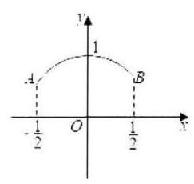

图 1

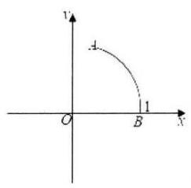

图 2

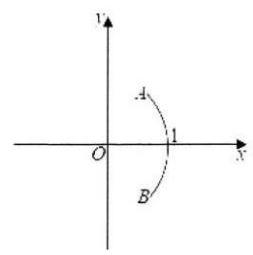

图 3

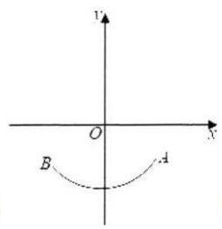

图 4

圆弧所在圆的方程为 ${x}^{2} + {y}^{2} = 1, A\left( {-\frac{1}{2},\frac{\sqrt{3}}{2}}\right) , B\left( {\frac{1}{2},\frac{\sqrt{3}}{2}}\right)$ ,

在图象绕原点旋转的过程中,当点 $B$ 从图 1 的位置旋转到 $\left( {1,0}\right)$ 点时,

由函数的定义得这个旋转过程所得的图形均为函数的图象,如图 2 所示:

此时绕着原点旋转弧度为 $0 \leq  \theta  \leq  \frac{\pi }{3}$ .

若函数图象在图 2 位置绕着原点继续旋转,

当点 $B$ 在 $x$ 轴下方,点 $A$ 在 $x$ 轴上方时,

由函数的定义得,所得图形不是函数的图象,如图 3 所示:

此时转过的角度为 $\frac{\pi }{3} < \theta  < \frac{2\pi }{3}$ ,不满足题意; 67

若函数图象在图 3 位置绕着原点继续旋转，当整个图象都在 $x$ 轴下方时，

由函数的定义得,所得图形是函数的图象,如图 4 所示:

此时转过的角度为 $\frac{2\pi }{3} \leq  \theta  \leq  \pi$ ;

综上, $\theta$ 的可取值集合为 $\left\lbrack  {0,\frac{\pi }{3}}\right\rbrack   \cup  \left\lbrack  {\frac{2\pi }{3},\pi }\right\rbrack$ .

【练习】8. (2025 届交附) 设定义域为 $R$ 的函数 $y = f\left( x\right)$ 满足 $f\left( {x - 2}\right)  = {2f}\left( x\right)$ ,当 $x \in  \lbrack  - 2,0)$ 时, $f\left( x\right) \; =  - {2x}\left( {x + 2}\right)$ . 若对任意 $x \in  \lbrack m, + \infty )$ ，都有 $f\left( x\right)  \leq  \frac{3}{4}$ ，则实数 $m$ 的取值范围是___

A. $\left\lbrack  {\frac{2}{3}, + \infty }\right)$ B. $\left\lbrack  {\frac{3}{4}, + \infty }\right)$ C. $\left\lbrack  {\frac{1}{2}, + \infty }\right)$ D. $\left\lbrack  {\frac{3}{2}, + \infty }\right)$

【答案】 $D$

【解析】当 $x \in  \lbrack  - 2,0)$ 时,函数 $f\left( x\right)$ 在 $\left( {-2, - 1}\right)$ 上严格增,在 $\left( {-1,0}\right)$ 上严格减,

所以 $f{\left( x\right) }_{\max } = f\left( {-1}\right)  = 2$ ,

由 $f\left( {x - 2}\right)  = {2f}\left( x\right)$ 得 $\frac{1}{2}f\left( {x - 2}\right)  = f\left( x\right)$ ,得当图象向右平移 2 个单位时,

最大值变为原来的 $\frac{1}{2}$ 倍,最大值不断变小,

由 $f\left( {x - 2}\right)  = {2f}\left( x\right)$ 得 $f\left( x\right)  = {2f}\left( {x + 2}\right)$ ，得当图象向左平移 2 个单位时，

最大值变为原来的 2 倍，最大值不断变大，

2025 版上海高考真题及模拟训练合集

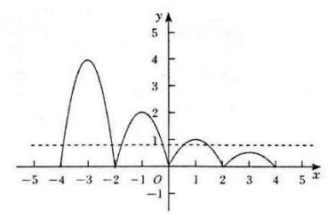

当 $x \in  \lbrack 0,2)$ 时, $f{\left( x\right) }_{\max } = f\left( 1\right)  = 1$ ,

当 $x \in  \lbrack 2,4)$ 时， $f{\left( x\right) }_{\max } = f\left( 3\right)  = \frac{1}{2}$ ，

设 $x \in  \lbrack 0,2)$ ,则 $x - 2 \in  \lbrack  - 2,0), f\left( {x - 2}\right)  =  - {2x}\left( {x - 2}\right)  = {2f}\left( x\right)$ ,

即 $f\left( x\right)  =  - x\left( {x - 2}\right)$ ,由 $- x\left( {x - 2}\right)  = \frac{3}{4}$ ,解得 $x = \frac{1}{2}$ 或 $x = \frac{3}{2}$ ,

由题意得当 $m \geq  \frac{3}{2}$ 时, $f\left( x\right)  \leq  \frac{3}{4}$ 恒成立,故选 $D$

【练习】9. (2025 届华二) 已知函数 $y = f\left( x\right)$ 具有以下的性质:对于任意实数 $a$ 和 $b$ ,都有 $f\left( {a + b}\right)  + \; f\left( {a - b}\right)  = {2f}\left( a\right)  \cdot  f\left( b\right)$ ,则以下选项中,不可能是 $f\left( 1\right)$ 值的是 ( )

A. -2 B. -1 C. 0 D. 1

【答案】 $A$

【解析】在 $f\left( {a + b}\right)  + f\left( {a - b}\right)  = {2f}\left( a\right)  \cdot  f\left( b\right)$ 中,

令 $a = b = 0$ ,得 ${2f}\left( 0\right)  = 2{f}^{2}\left( 0\right)$ ,所以 $f\left( 0\right)  = 0$ 或 1,

令 $a = b = \frac{x}{2}$ ,得 $f\left( x\right)  + f\left( 0\right)  = 2{f}^{2}\left( \frac{x}{2}\right)  \geq  0$ ,则 $f\left( x\right)  \geq   - 1$ ,故选 $A$ .

【练习】10. (2025 届华二) 对于两个定义在 $R$ 上的函数 $y = f\left( x\right)$ 与 $y = g\left( x\right)$ ,构造新函数 $y = h\left( x\right)$ 如下: 对任意 ${x}_{0} \in  R, h\left( {x}_{0}\right)  = f\left( {x}_{0}\right)  + g\left( {x}_{0}\right)$ . 现已知 $y = h\left( x\right)$ 是严格增函数,对于以下两个命题:

① $y = f\left( x\right)$ 与 $y = g\left( x\right)$ 中至少有一个是严格增函数;

② $y = f\left( x\right)$ 与 $y = g\left( x\right)$ 中至少有一个函数无最大值. 其中 ( )

A. ①和②都是真命题 B. 只有①是真命题

C. 只有②是真命题 D. 没有真命题

【答案】 $D$

【解析】令 $f\left( x\right)  = \left\{  {\begin{array}{l} \sin x, x \leq  0 \\   - \sin x, x > 0 \end{array}, g\left( x\right)  = \left\{  \begin{array}{l}  - \sin x - {\mathrm{e}}^{-x}, x \leq  0 \\  \sin x - {\mathrm{e}}^{-x}, x > 0 \end{array}\right. }\right.$ ,则没有真命题,故选 $D$ .

## 板块三:压轴客观题

## 1. 真题回顾

【例题】1. (2024 上海秋考) 已知定义在 $R$ 上的函数 $y = f\left( x\right) , M = \left\{  {x}_{0}\right|$ 对于任意 $x \in  \left( {-\infty ,{x}_{0}}\right) , f\left( x\right)  < \; \left. {f\left( {x}_{0}\right) }\right\}$ . 对于所有 $M = \left\lbrack  {-1,1}\right\rbrack$ 的函数 $y = f\left( x\right)$ ,以下说法正确的是 ( )

A. 存在 $y = f\left( x\right)$ 是偶函数 B. 存在 $y = f\left( x\right)$ 在 $x = 2$ 处取到最大值

C. 存在 $y = f\left( x\right)$ 是严格增函数 D. 存在 $y = f\left( x\right)$ 在 $x =  - 1$ 处取到极小值

【答案】 $B$

【解析】对于 $A$ ,若存在 $y = f\left( x\right)$ 是偶函数,取 ${x}_{0} = 1 \in  \left\lbrack  {-1,1}\right\rbrack$ ,

则对于任意 $x \in  \left( {-\infty ,1}\right) , f\left( x\right)  < f\left( 1\right)$ ,而 $f\left( {-1}\right)  = f\left( 1\right)$ ,矛盾,故 $A$ 错误;

对于 $B$ ,取 ${x}_{0} \in  \left\lbrack  {-1,1}\right\rbrack  , y = f\left( x\right)  = \left\{  \begin{array}{ll}  - 2, & x <  - 1 \\  x, &  - 1 \leq  x < 1, \\  1, & x \geq  1 \end{array}\right.$ 满足题意，故 $B$ 错误；

对于 $C$ ,若存在 $y = f\left( x\right)$ 是严格增函数，则 $M = R$ 与 $M = \left\lbrack  {-1,1}\right\rbrack$ 矛盾，

故 $C$ 错误;

对于 $D$ ,存在 $y = f\left( x\right)$ 在 $x =  - 1$ 处取到极小值,则在 -1 附近,存在 $t$ ,

$f\left( t\right)  \geq  f\left( {-1}\right)$ ,矛盾,故 $D$ 错误;

故选 $B$ .

【例题】2. (2024 上海春考) 现定义如下: 当 $x \in  \left( {n, n + 1}\right) , n \in  N$ 时, $f\left( {x + 1}\right)  = {f}^{\prime }\left( x\right)$ ,则称 $f\left( x\right)$ 为延展函数. 满足当 $x \in  \left( {0,1}\right)$ 时, $g\left( x\right)  = {\mathrm{e}}^{x}$ 与 $h\left( x\right)  = {x}^{10}$ 均为延展函数,现有如下两个命题:

① 存在 $y = {kx} + b\left( {k, b \in  R;k, b \neq  0}\right)$ 与 $y = g\left( x\right)$ 有无穷个交点;

②存在 $y = {kx} + b\left( {k, b \in  R;k, b \neq  0}\right)$ 与 $y = h\left( x\right)$ 有无穷个交点;

则下列说法正确的是 ( )

A. ①正确，②正确 B. ①不正确，②不正确

C. ①正确，②不正确 D. ①不正确，②正确

【答案】 $D$

【解析】由 $f\left( {x + 1}\right)  = {f}^{\prime }\left( x\right)$ 得 $f\left( {x + 1}\right)  = {f}^{\prime }\left( x\right)  \Rightarrow  f\left( x\right)  = {f}^{\prime }\left( {x - 1}\right)$ ,

当 $x \in  \left( {n + k, n + 1 + k}\right)$ 时, $x \in  \left( {n + k, n + 1 + k}\right) , x - k \in  \left( {n, n + 1}\right)$ ,

所以 $f\left( x\right)  = {f}^{\prime }\left( {x - 1}\right)  = {f}^{\prime \prime }\left( {x - 2}\right)  = \cdots  = {f}^{\left( k\right) }\left( {x - k}\right) , g\left( x\right)  = {\mathrm{e}}^{x},{g}^{\left( k\right) }\left( x\right)  = {\mathrm{e}}^{x}, h\left( x\right)  = {x}^{10},{h}^{\prime }\left( x\right)  = \; {10}{x}^{9},{h}^{\prime \prime }\left( x\right)  = {P}_{10}^{2} \cdot  {x}^{8},\cdots ,{h}^{\left( k\right) }\left( x\right)  = {P}_{10}^{k} \cdot  {x}^{{10} - k},$

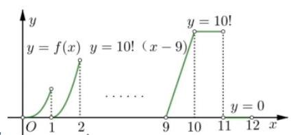

当 $x \in  \left( {k,1 + k}\right)$ 时, $x \in  \left( {k,1 + k}\right) , x - k \in  \left( {0,1}\right)$ ,

${g}_{k}\left( x\right)  = {\mathrm{e}}^{x - k},{h}_{k}\left( x\right)  = {P}_{10}^{k} \cdot  {\left( x - k\right) }^{{10} - k},$

其中,当 $x \in  \left( {9,{10}}\right)$ 时, ${h}_{9}\left( x\right)  = {P}_{10}^{9} \cdot  \left( {x - 9}\right)$ 恰为一次函数, 作出函数 $g\left( x\right)$ 图像,当 $k \neq  0$ 时,不可能有无穷多个交点; 作出函数 $h\left( x\right)$ 图像,当 $k = {P}_{10}^{9}$ 时,存在 $b =  - 9{P}_{10}^{9}$ ,使得直线 $y \; = {kx} + b$ 可以与 $h\left( x\right)$ 在区间 $\left( {9,{10}}\right)$ 的函数部分重合,从而产生无穷多个交点,

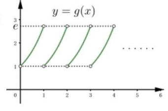

故选 $D$ .

【例题】3. (2022 上海秋考) 函数 $f\left( x\right)$ 满足 $f\left( x\right)  = f\left( \frac{1}{1 + x}\right)$ 对任意 $x \in  \lbrack 0$ , $+ \infty )$ 都成立,其值域是 ${A}_{f}$ ,已知对任何满足上述条件的 $f\left( x\right)$ 都有 $\{ y \mid  y = f\left( x\right) ,0 \leq  x \leq  a\}  = \; {A}_{f}$ ，则 $a$ 的取值范围为___.

【答案】 $\left\lbrack  {\frac{\sqrt{5} - 1}{2}, + \infty }\right)$

【解析】法一: 令 $x = \frac{1}{x + 1}$ ,解得 $x = \frac{\sqrt{5} - 1}{2}$ (负值舍去),

当 ${x}_{1} \in  \left\lbrack  {0,\frac{\sqrt{5} - 1}{2}}\right\rbrack$ 时, ${x}_{2} = \frac{1}{{x}_{1} + 1} \in  \left\lbrack  {\frac{\sqrt{5} - 1}{2},1}\right\rbrack$ ,

当 ${x}_{1} \in  \left( {\frac{\sqrt{5} - 1}{2}, + \infty }\right)$ 时, ${x}_{2} = \frac{1}{{x}_{1} + 1} \in  \left( {0,\frac{\sqrt{5} - 1}{2}}\right)$ ,

且当 ${x}_{1} \in  \left( {\frac{\sqrt{5} - 1}{2}, + \infty }\right)$ 时,总存在 ${x}_{2} = \frac{1}{{x}_{1} + 1} \in  \left( {0,\frac{\sqrt{5} - 1}{2}}\right)$ ,使得 $f\left( {x}_{1}\right)  = f\left( {x}_{2}\right)$ ,

故 $f\left( \left\lbrack  {0,\frac{\sqrt{5} - 1}{2}}\right\rbrack  \right)  = {A}_{f}$ ,若 $a < \frac{\sqrt{5} - 1}{2}$ ,易得 $f\left( \frac{\sqrt{5} - 1}{2}\right)  \notin  f\left( \left\lbrack  {0, a}\right\rbrack  \right)$ ,

所以 $a \geq  \frac{\sqrt{5} - 1}{2}$ ,即实数 $a$ 的取值范围为 $\left\lbrack  {\frac{\sqrt{5} - 1}{2}, + \infty }\right)$ .

法二: 原命题等价于任意 $a > 0, f\left( {x + a}\right)  = f\left( \frac{1}{1 + x + a}\right)$ ,

所以 $a > 0, f\left( {x + a}\right)  = f\left( \frac{1}{1 + x + a}\right)  \Rightarrow  \frac{1}{1 + x + a} \leq  a \Rightarrow  x \geq  \frac{1}{a} - \left( {1 + a}\right)$ 恒成立,即 $\frac{1}{a} - (1 + \; a) \leq  0$ 恒成立,

所以 $a \geq  \frac{\sqrt{5} - 1}{2}$ ,即实数 $a$ 的取值范围为 $\left\lbrack  {\frac{\sqrt{5} - 1}{2}, + \infty }\right)$ .

【例题】4. (2019 上海秋考) 已知 $f\left( x\right)  = \left| {\frac{2}{x - 1} - a}\right| \left( {x > 1, a > 0}\right) , f\left( x\right)$ 与 $x$ 轴交点为 $A$ ,若对于 $f\left( x\right)$ 图象上任意一点 $P$ ，在其图象上总存在另一点 $Q\left( {P\text{ 、 }Q\text{ 异于 }A}\right)$ ，满足 ${AP}\bot {AQ}$ ，且 $\left| {AP}\right|  = \left| {AQ}\right|$ ， 则 $a =$ ___.

【答案】 $\sqrt{2}$

【解析】法一: (设而不求),设 $P\left( {x, y}\right) \left( {x < \frac{2}{a} + 1}\right)$ ,

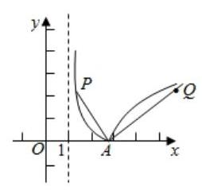

易得点 $A\left( {\frac{2}{a} + 1,0}\right)$ 且 $y = \frac{2}{x - 1} - a$ ①.

因为 ${AP} \bot  {AQ}$ 且 $\left| {AP}\right|  = \left| {AQ}\right|$ ,所以 $Q\left( {\frac{2}{a} + 1 + y,\frac{2}{a} + 1 - x}\right)$ .

(因为 $\overrightarrow{AP} = \left( {x - \frac{2}{a} - 1, y}\right)$ ,顺时计旋转 $\frac{\pi }{2}$ ,

得 $\overrightarrow{AQ} = \left( {y, - x + \frac{2}{a} + 1}\right)  = \left( {{x}_{Q} - \frac{2}{a} - 1,{y}_{Q}}\right)$ ,所以 $\left\{  \begin{array}{l} {x}_{Q} = \frac{2}{a} + 1 + y \\  {y}_{Q} = \frac{2}{a} + 1 - x \end{array}\right)$

把点 $Q$ 坐标代入 $y = a - \frac{2}{x - 1}$ 得 $\frac{2}{a} + 1 - x = a - \frac{2}{\frac{2}{a} + y}$ ②.

消去 $y$ (或 $x$ ). $y = \frac{2}{x - 1} - a$ ① $y = \frac{2}{x - 1} - a$ (1) $\Rightarrow  \frac{2}{a} + 1 - x = a - \frac{2}{\frac{2}{a} + y}$ ②,

由①得 $x - 1 = \frac{2}{y + a}$ ，代入②得 $\frac{2}{a} - \frac{2}{y + a} = a - \frac{2}{\frac{2}{a} + y}$ ，

所以 $\left( {\frac{2}{a} - a}\right) {y}^{2} + \left( {\frac{2}{a} - a}\right) \left( {a + \frac{2}{a}}\right) y + 2\left( {\frac{2}{a} - a}\right)  - \frac{4}{a} + {2a} = 0$ 恒成立,

所以 $\frac{2}{a} - a = \left( {\frac{2}{a} - a}\right) \left( {a + \frac{2}{a}}\right)  = 2\left( {\frac{2}{a} - a}\right)  - \frac{4}{a} + {2a} = 0$ ,

又因为 $a > 0$ ,故 $a = \sqrt{2}$ .

法二: 在法一的 $y = \frac{2}{x - 1} - a$ ① $y = \frac{2}{x - 1} - a$ (1) $\Rightarrow  \frac{2}{a} + 1 - x = a - \frac{2}{\frac{2}{a} + y}$ ②,

消去 ${xy}$ . 由①得 ${xy} = 2 + a + y - {ax}$ ③，

由②得 ${xy} = \left( {\frac{2}{a} + 1 - a}\right) y - \frac{2}{a}x + \left( {\frac{4}{{a}^{2}} + \frac{2}{a}}\right)$ ④.

把③代入④，所以 $\left( {2 + a - \frac{4}{{a}^{2}} - \frac{2}{a}}\right)  + \left( {\frac{2}{a} - a}\right) x + \left( {a - \frac{2}{a}}\right) y = 0$ 恒成立，

所以 $2 + a - \frac{4}{{a}^{2}} - \frac{2}{a} = \frac{2}{a} - a = a - \frac{2}{a} = 0$ ,又因为 $a > 0$ ,故 $a = \sqrt{2}$ .

法三: 联立方程组,设直线 ${AQ} : x = {my} + 1 + \frac{2}{a},{AP} : x =  - \frac{1}{m}y + 1 + \frac{2}{a}\left( {m > 0}\right)$ .

易得点 $A\left( {\frac{2}{a} + 1,0}\right)$ . 联立方程组 $\left\{  \begin{array}{l} x = {my} + 1 + \frac{2}{a} \\  y = a - \frac{2}{x - 1} \end{array}\right.$ ,得 ${y}_{Q} = a - \frac{2}{am}$ ,

同理 ${y}_{P} = \frac{2m}{a} - a$ . 所以 $\left\{  \begin{array}{l} \left| {AQ}\right|  = \sqrt{{m}^{2} + 1} \cdot  \left| {{y}_{Q} - 0}\right|  = \sqrt{{m}^{2} + 1} \cdot  \left( {a - \frac{2}{am}}\right) \\  \left| {AP}\right|  = \sqrt{\frac{1}{{m}^{2}} + 1} \cdot  \left| {{y}_{P} - 0}\right|  = \frac{\sqrt{{m}^{2} + 1}}{m} \cdot  \left( {\frac{2m}{a} - a}\right)  \end{array}\right.$ ,

因为 $\left| {AP}\right|  = \left| {AQ}\right|$ 对许多 $m \in  {R}^{ + }$ 恒成立,整理得 $\left( {a - \frac{2}{a}}\right) m = \frac{2}{a} - a$ ,

所以 $a - \frac{2}{a} = \frac{2}{a} - a = 0$ ,又因为 $a > 0$ ,故 $a = \sqrt{2}$ .

法四:极限思想 $\left( {x\text{ 趋向于两边 }}\right)$ . 易得点 $A\left( {1 + \frac{2}{a},0}\right)$ .

过点 $P\text{ 、 }Q$ 分别作 ${PM} \bot  x$ 轴、 ${QN} \bot  x$ 轴,垂足为 $M\text{ 、 }N$ .

因为 ${AP} \bot  {AQ}$ 且 $\left| {AP}\right|  = \left| {AQ}\right|$ ,所以 $\bigtriangleup {APM} \cong  \bigtriangleup {OAN}$ ,所以 $\left| {AM}\right|  = \left| {QN}\right|$ .

当点 $P$ 无限接近 $f\left( x\right)$ 的渐近线时,点 $Q$ 也无限接近 $f\left( x\right)$ 的渐近线,

即 $\left| {AM}\right|$ 无限趋近于 $1 + \frac{2}{a} - 1 = \frac{2}{a},\left| {QN}\right|$ 无限趋近于 $a$ ,

所以 $\frac{2}{a} = a$ ,又因为 $a > 0$ ,故 $a = \sqrt{2}$ .

法五:极限思想 $\left( {x\text{ 趋向于点 }A}\right)$ . 易得点 $A\left( {1 + \frac{2}{a},0}\right)$ .

当点 $P$ 无限接近点 $A$ 割,割线 ${AP}$ 退化为 $f\left( x\right)$ 在点 $A$ 处的 (左) 切线,

设切线斜率为 $k$ . 因为 $\left| {AP}\right|  = \left| {AQ}\right|$ ,所以此割点 $Q$ 也无限接近点 $A$ ,

此时 $y = f\left( x\right)$ 在点 $A$ 处的 (右) 切线斜率应与 $y =  - f\left( x\right)$

在点 $A$ 处的 (右) 切线斜率相反,即为 $- k$ .

因为 ${AP} \bot  {AQ}$ ,所以 $k \cdot  \left( {-k}\right)  =  - 1$ ,解得 $k =  - 1$ .

联立方程组 $\left\{  \begin{array}{l} y =  - x + 1 + \frac{2}{a} \\  y = \frac{2}{x - 1} - a \end{array}\right.$ ,则 ${x}^{2} - \left( {a + \frac{2}{a} + 2}\right) x + a + \frac{2}{a} + 3 = 0$ ,

由 $\Delta  = 0$ 且 $a > 0$ 得 $a = \sqrt{2}$ .

法六:在函数 $y = f\left( x\right)$ 上找一个点 $A$ ，使得被点 $A$ 分开的两段曲线是 “全等”的.

因为 $y = \frac{2}{x}\left( {x > 0}\right)$ ，显然顶点 ${A}^{\prime }\left( {\sqrt{2},\sqrt{2}}\right)$ 满足题意，

又 $y = \frac{2}{x}\left( {x > 0}\right)$ 的图像先向方平移一个单位,

再向下平移 $a$ 个单位后可以得到 $f\left( x\right)  = \frac{2}{x - 1} - a$ . 所以 $a = \sqrt{2}$ .

【例题】5. (2019 上海秋考) 已知 $\tan \alpha  \cdot  \tan \beta  = \tan \left( {\alpha  + \beta }\right)$ . 有下列两个结论:

①存在 $\alpha$ 在第一象限， $\beta$ 在第三象限；②存在 $\alpha$ 在第二象限， $\beta$ 在第四象限； 则 ( )

A. ①②均正确 B. ①②均错误 C. ①对②错 D. ①错②对

【答案】 $D$

【解析】法一: 令 $a = \tan \alpha , b = \tan \beta$ ,则 ${ab} = \frac{a + b}{1 - {ab}} \Rightarrow  \frac{1}{a} + \frac{1}{b} = 1 - {ab}$ .

当 $a > 1, b > 1$ 时，显然矛盾；

当 $0 < a < 1,0 < b < 1$ 时, $\frac{1}{a} + \frac{1}{b} \in  \left( {2, + \infty }\right) ,1 - {ab} \in  \left( {0,1}\right)$ ,也不成立;

由此, 故①错误;

当 $a < 0, b < 0$ 时,若 $a =  - 1$ 时, $\frac{1}{b} - b = 2, b < 0 \Rightarrow  b =  - 1 - \sqrt{2}$ ,故②正确.

故选 $D$ .

法二: 由题意,只讨论 ${ab} > 0, a + b \geq  2\sqrt{ab} \Rightarrow  \sqrt{ab}\left( {1 - {ab}}\right)  \geq  2$ .

当 $a > 1, b > 1$ 时,显然矛盾;

当 $0 < a < 1,0 < b < 1$ 时， $\sqrt{ab}\left( {1 - {ab}}\right)  \in  \left( {0,1}\right)$ ，故 $\sqrt{ab}\left( {1 - {ab}}\right)  \geq  2$ 也不成立； 由此, 故①错误;

当 $a < 0, b < 0$ 时,若 $a =  - 1$ 时, $\frac{1}{b} - b = 2, b < 0 \Rightarrow  b =  - 1 - \sqrt{2}$ ,故②正确.

故选 $D$ .

法三: ${ab} = \frac{a + b}{1 - {ab}} \Rightarrow  {a}^{2}{b}^{2} + \left( {1 - b}\right) a + b = 0$ (当成关于 $a$ 的一元二次方程),

对于①，转化为方程要有大于零的根，

构造二次函数 $f\left( x\right)  = {b}^{2}{x}^{2} + \left( {1 - b}\right) x + b$ 与 $x$ 轴正半轴要有交点,

由题意得 $b > 0$ ,为满足与 $x$ 轴正半轴要有交点,函数对称轴一定在 $y$ 轴右侧,

得 $1 - b < 0$ ,而 $\Delta  = {\left( 1 - b\right) }^{2} - 4{b}^{3} < 0\left( {{y}_{1} = {\left( 1 - b\right) }^{2},{y}_{2} = 4{b}^{3}}\right.$ , $\left. {b > 1\text{ 时, }{y}_{2} > {y}_{1}}\right)$ , 故方程此时无大于零的根，故①错误；

对于②，转化为方程要有小于零的根，

构造二次函数 $f\left( x\right)  = {b}^{2}{x}^{2} + \left( {1 - b}\right) x + b$ 与 $x$ 轴负半轴要有交点,

由题意得 $b < 0$ ，因为二次函数开口向上，一定与 $x$ 轴负半轴要有交点，故②正确. 故选 $D$ .

法四: $\alpha \text{ 、 }\beta$ 地位均等,可令 $\alpha  = \beta$ ,则 ${\tan }^{2}\alpha  = \tan {2\alpha } = \frac{2\tan \alpha }{1 - {\tan }^{2}\alpha }$

${\tan }^{2}\alpha  = \tan {2\alpha } = \frac{2\tan \alpha }{1 - {\tan }^{2}\alpha } \Rightarrow  {\tan }^{3}\alpha  =$ ,转化为 ${x}^{3} = x - 2$ ,在 $\left( {0,1}\right) ,\left( {1, + \infty }\right)$ 无解;

在 $\left( {-1,0}\right)$ 无解 $\left( {-\infty , - 1}\right)$ 有一解,所以①错误,②正确. 故选 $D$ .

法五: 令 $\tan \alpha  = x,\tan \beta  = y$ ,则 ${xy} = \frac{x + y}{1 - {xy}} \Rightarrow  1 = {xy} + \frac{x + y}{xy} = {xy} + \frac{1}{x} + \frac{1}{y}$ ,

若 $x > 0, y > 0$ ,则 $1 = {xy} + \frac{1}{x} + \frac{1}{y} \geq  3\sqrt[3]{{xy} \cdot  \frac{1}{x} \cdot  \frac{1}{y}} = 3$ ,矛盾,

当 $x < 0, y < 0$ 时能够成立. 故选 $D$ .

法六:特殊值法结合计算器的牛顿法解方程,令 $\tan \alpha  = 3\text{ 、 }\frac{1}{3}$ 和 $\tan \alpha  =  - 3, - \frac{1}{3}$ ,

求 $\tan \beta$ 看是否存在 (大部分学生应该是这么做此题的),

故选 $D$ .

【例题】6. (2019 上海春考) 已知集合 $A = \left\lbrack  {t, t + 1}\right\rbrack   \cup  \left\lbrack  {t + 4, t + 9}\right\rbrack  ,0 \notin  A$ ,存在正数 $\lambda$ ,使得对任意 $a \in \; A$ ,都有 $\frac{\lambda }{a} \in  A$ ,则 $t$ 的值是 ___.

【答案】1 或 -3

【解析】当 $t > 0$ 时,当 $a \in  \left\lbrack  {t, t + 1}\right\rbrack$ 时, $\frac{\lambda }{a} \in  \left\lbrack  {t + 4, t + 9}\right\rbrack$ ,

当 $a \in  \left\lbrack  {t + 4, t + 9}\right\rbrack$ 时, $\frac{\lambda }{a} \in  \left\lbrack  {t, t + 1}\right\rbrack$ ,

即当 $a = t$ 时, $\frac{\lambda }{a} \leq  t + 9$ ; 当 $a = t + 9$ 时, $\frac{\lambda }{a} \geq  t$ ,即 $\lambda  = t\left( {t + 9}\right)$ ;

当 $a = t + 1$ 时， $\frac{\lambda }{a} \geq  t + 4$ ，当 $a = t + 4$ 时， $\frac{\lambda }{a} \leq  t + 1$ ，即， $\lambda  = \left( {t + 1}\right) \left( {t + 4}\right)$ ，

所以 $t\left( {t + 9}\right)  = \left( {t + 1}\right) \left( {t + 4}\right)$ ,解得 $t = 1$ .

当 $t + 1 < 0 < t + 4$ 时,当 $a \in  \left\lbrack  {t, t + 1}\right\rbrack$ 时, $\frac{\lambda }{a} \in  \left\lbrack  {t, t + 1}\right\rbrack$ .

当 $a \in  \left\lbrack  {t + 4, t + 9}\right\rbrack$ 时,则 $\frac{\lambda }{a} \in  \left\lbrack  {t + 4, t + 9}\right\rbrack$ ,

即当 $a = t$ 时, $\frac{\lambda }{a} \leq  t + 1$ ,当 $a = t + 1$ 时, $\frac{\lambda }{a} \geq  t$ ,即 $\lambda  = t\left( {t + 1}\right)$ ,

即当 $a = t + 4$ 时, $\frac{\lambda }{a} \leq  t + 9$ ,当 $a = t + 9$ 时, $\frac{\lambda }{a} \geq  t + 4$ ,即 $\lambda  = \left( {t + 4}\right) \left( {t + 9}\right)$ ,

所以 $t\left( {t + 1}\right)  = \left( {t + 4}\right) \left( {t + 9}\right)$ ,解得 $t =  - 3$ .

当 $t + 9 < 0$ 时,同理可得无解.

综上, $t$ 的值为 1 或 -3 . 2025 版上海高考真题及模拟训练合集

## 2. 模拟练习

【练习】1. (2025 届华二) $f\left( x\right)$ 在 $R$ 上非严格递增,满足 $f\left( {x + 1}\right)  = f\left( x\right)  + 1, g\left( x\right)  = \left\{  \begin{array}{l} f\left( x\right) ,\left| x\right|  < 8 \\  f\left( {x - a}\right) ,\left| x\right|  \geq  8 \end{array}\right.$ , 若存在符合上述要求的函数 $f\left( x\right)$ 及实数 ${x}_{0}$ ,满足 $g\left( {{x}_{0} + 4}\right)  = g\left( {x}_{0}\right)  + 1$ ,则 $a$ 的取值范围是 ___.

【答案】 $\left( {-4, - 2}\right)  \cup  \left( {2,4}\right)$

【解析】 $f\left( {x + 1}\right)  = f\left( x\right)  + 1$ ,即 $f\left( {x + 1}\right)  - f\left( x\right)  = 1$ ,

对 $\forall n \in  {N}^{ * }$ ,则 $f\left( {x + n}\right)  = \left\lbrack  {f\left( {x + n}\right)  - f\left( {x + n - 1}\right) }\right\rbrack$

$+ \left\lbrack  {f\left( {x + n - 1}\right)  - f\left( {x + n - 2}\right) }\right\rbrack   + \cdots  + \left\lbrack  {f\left( {x + 1}\right)  - f\left( x\right) }\right\rbrack   + f\left( x\right)$

$= 1 + 1 + \cdots  + 1 + f\left( x\right)  = n + f\left( x\right) ,$

故对 $\forall n \in  {N}^{ * }$ ,则 $f\left( {x + n}\right)  = f\left( x\right)  + n$ ,

因为 $g\left( {{x}_{0} + 4}\right)  = g\left( {x}_{0}\right)  + 1$ ,

当 ${x}_{0} \leq   - {12}$ 时，则 ${x}_{0} + 4 \leq   - 8$ ，

得 $f\left( {{x}_{0} + 4 - a}\right)  = f\left( {{x}_{0} - a}\right)  + 4 = f\left( {{x}_{0} - a}\right)  + 1$ ,不成立;

当 $- {12} < {x}_{0} \leq   - 8$ 时,则 $- 8 < {x}_{0} + 4 \leq   - 4$ ,

得 $f\left( {{x}_{0} + 4}\right)  = f\left( {x}_{0}\right)  + 4 = f\left( {{x}_{0} - a}\right)  + 1$ ,则 $f\left( {{x}_{0} - a}\right)  = f\left( {x}_{0}\right)  + 3$ ,

若 $- a = 3$ ,解得 $a =  - 3$ ,符合题意;

特别地,例如 $f\left( x\right)  = k, x \in  \lbrack k, k + 1), k \in  Z$ ,取 ${x}_{0} \in  \{  - {11}, - {10}, - 9, - 8\}$ ,

$3 \leq   - a < 4$ ,解得 $- 4 < a \leq   - 3$ ;

例如 $f\left( x\right)  = k, x \in  (k, k + 1\rbrack , k \in  Z$ ,取 ${x}_{0} \in  \{  - {11}, - {10}, - 9, - 8\}$ ,

则 $2 <  - a \leq  3$ ,解得 $- 4 < a <  - 2$ ,故 $- 4 < a \leq   - 3$ ;

当 $- 8 < {x}_{0} < 4$ 时,则 $- 4 < {x}_{0} + 4 < 8$ ,

得 $f\left( {{x}_{0} + 4}\right)  = f\left( {x}_{0}\right)  + 4 = f\left( {x}_{0}\right)  + 1$ ,不成立;

当 $4 \leq  {x}_{0} < 8$ 时,则 $8 \leq  {x}_{0} + 4 < {12}$ ,

得 $f\left( {{x}_{0} + 4 - a}\right)  = f\left( {{x}_{0} - a}\right)  + 4 = f\left( {x}_{0}\right)  + 1$ ,则 $f\left( {x}_{0}\right)  = f\left( {{x}_{0} - a}\right)  + 3$ ,

若 $a = 3$ ,解得 $a = 3$ ,符合题意;

特别地,例如 $f\left( x\right)  = k, x \in  \lbrack k, k + 1), k \in  Z$ ,取 ${x}_{0} \in  \{ 4,5,6,7\}$ ,则 $3 \leq  a < 4$ ;

例如 $f\left( x\right)  = k, x \in  (k, k + 1\rbrack , k \in  Z$ ,取 ${x}_{0} \in  \{ 4,5,6,7\}$ ,则 $2 < a \leq  3$ ;

故 $3 \leq  a < 4$ ；

当 ${x}_{0} \geq  8$ 时，则 ${x}_{0} + 4 \geq  {12}$ ，

得 $f\left( {{x}_{0} + 4 - a}\right)  = f\left( {{x}_{0} - a}\right)  + 4 = f\left( {{x}_{0} - a}\right)  + 1$ ,不成立;

综上所述, $a$ 的取值范围是 $\left( {-4, - 2}\right)  \cup  \left( {2,4}\right)$ .

【练习】2. (2025 届华二) 已知函数 $y = f\left( x\right)$ 的定义域为 $R$ ,集合 $M = \left\{  {{x}_{0} \mid  \text{ 存在 }x < {x}_{0}}\right.$ ,使得 $f\left( x\right)  < f\left( {x}_{0}\right)$ \}. 若 $f\left( x\right)$ 使得 $M = \left\lbrack  {-1,1}\right\rbrack$ ,则 ( )

A. $y = f\left( x\right)$ 可能为奇函数 B. $y = f\left( x\right)$ 可能在 $x = 2$ 处取最小值

C. $y = f\left( x\right)$ 可能是增函数 D. $y = f\left( x\right)$ 可能在 $x =  - 1$ 处取极小值

【答案】 $B$

【解析】 $- 1 \in  M$ ,所以存在 $a <  - 1$ ,使得 $f\left( a\right)  < f\left( {-1}\right)$ .

若 $y = f\left( x\right)$ 是奇函数,则 $- a > 1$ 且 $f\left( {-a}\right)  =  - f\left( a\right)  >  - f\left( {-1}\right)  = f\left( 1\right)$ ,

从而 $- a \in  M$ ,故 $A$ 错误.

例如: $f\left( x\right)  = \left\{  \begin{array}{ll} 0, & \left| x\right|  > 1 \\  1, & \left| x\right|  \leq  1 \end{array}\right.$ ,故 $B$ 正确.

$1 \in  M$ ,所以存在 $a < 1$ ,使得 $f\left( a\right)  < f\left( 1\right)$ ,

若 $y = f\left( x\right)$ 是增函数,则 $f\left( 2\right)  \geq  f\left( 1\right)  > f\left( a\right)$ ,从而 $2 \in  M$ ,故 $C$ 错误.

$- 1 \in  M$ ,所以存在 $a <  - 1$ ,使得 $f\left( a\right)  < f\left( {-1}\right)$ .

若 $x =  - 1$ 处 $y = f\left( x\right)$ 极小,则存在 $h > 0$ 使得当 $- 1 - h < x <  - 1$ 时,

总有 $f\left( x\right)  \geq  f\left( {-1}\right)$ ，于是存在 ${x}_{0} \in  \left( {\max \left\{  {-1 - h,\frac{a - 1}{2}}\right\}  , - 1}\right)$ ,

使得 $f\left( {x}_{0}\right)  \geq  f\left( {-1}\right)  > f\left( a\right)$ ,从而 ${x}_{0} \in  M$ ,故 $D$ 错误.

故选 $B$ .

【练习】3. (2025 届交附) 定义在 $\left\lbrack  {0,{2024}}\right\rbrack$ 上的函数 $f\left( x\right)$ 满足 $f\left( 0\right)  = f\left( {2024}\right)$ 且对于任意 $x, y \in \; \left\lbrack  {0,{2024}}\right\rbrack$ ,均有 $\left| {f\left( x\right)  - f\left( y\right) }\right|  \leq  \left| {x - y}\right|$ ,若对于所有满足上述条件的函数 $f\left( x\right)$ ,均存在实数 $m$ , 使得对于任意 $x, y \in  \left\lbrack  {0,{2024}}\right\rbrack$ ,总有 $\left| {f\left( x\right)  - f\left( y\right) }\right|  \leq  m$ ,则实数 $m$ 的最小值为___

【答案】1012

【解析】若 $\left| {x - y}\right|  \leq  {1012}$ ,则 $\left| {f\left( x\right)  - f\left( y\right) }\right|  \leq  \left| {x - y}\right|  \leq  {1012}$ ,

若 $\left| {x - y}\right|  > {1012}$ ,不妨设 $0 \leq  x < y \leq  {2024}$ ,

则 $\left| {f\left( x\right)  - f\left( y\right) }\right|  = \left| {f\left( x\right)  - f\left( 0\right)  + f\left( {2024}\right)  - f\left( y\right) }\right|$

$\leq  \left| {f\left( x\right)  - f\left( 0\right) }\right|  + \left| {f\left( {2024}\right)  - f\left( y\right) }\right|  \leq  \left| {x - 0}\right|  + \left| {{2024} - y}\right|$

$= \left( {x - 0}\right)  + \left( {{2024} - y}\right)  = {2024} - \left( {y - x}\right)  < {2024} - {1012} = {1012}$ ,

综上所述, $\left| {f\left( x\right)  - f\left( y\right) }\right|  \leq  {1012}$ ,

下证 $m = {1012}$ 是最小的:

设函数 $f\left( x\right)  = \left| {x - {1012}}\right|$ ,则函数 $f\left( x\right)$ 满足 $f\left( 0\right)  = f\left( {2024}\right)  = {1012}$

对于任意不等的实数 $x, y \in  \left\lbrack  {0,{2024}}\right\rbrack$ ,不妨假设 $0 \leq  x < y \leq  {2024}$ ,

则 $\left| {f\left( x\right)  - f\left( y\right) }\right|  = \left( {\left| {x - {1012}}\right|  - \left| {y - {1012}}\right| }\right)  \leq  \left| {\left( {x - {1012}}\right)  - \left( {y - {1012}}\right) }\right|  = \left| {x - y}\right|$ ,

因此 $f\left( x\right)  = \left| {x - {1012}}\right|$ 是满足已知条件的函数

取 $x = 0, y = {1012}$ ,则 $m \geq  \left| {f\left( 0\right)  - f\left( {1012}\right) }\right|  = {1012}$

综上, $m$ 的最小值为 1012

【练习】4. (2024 届上中) 已知定义在 $R$ 上的函数 $f\left( x\right) , g\left( x\right) , h\left( x\right)$ 依次是严格增函数、严格减函数与周期函数,记 $K\left( x\right)  = \max \{ f\left( x\right) , g\left( x\right) , h\left( x\right) \}$ . 则对于下列命题:

① 若 $K\left( x\right)$ 是严格增函数，则 $K\left( x\right)  = f\left( x\right)$ ；

② 若 $K\left( x\right)$ 是严格减函数，则 $K\left( x\right)  = g\left( x\right)$ ；

③若 $K\left( x\right)$ 是周期函数，则 $K\left( x\right)  = h\left( x\right)$ . 正确的有 ( )

A. 无一正确 B. ①② C. ③ D. ①②③

【答案】 $D$

【解析】对于①,设 $h\left( x\right)$ 周期为 $T\left( {T > 0}\right)$ ,如果 $K\left( {x}_{0}\right)  > f\left( {x}_{0}\right)$ ,

则 $K\left( {x}_{0}\right)  = g\left( {x}_{0}\right)$ 或 $K\left( {x}_{0}\right)  = h\left( {x}_{0}\right)$ ,两种情况下均有 $K\left( {{x}_{0} - T}\right)  \geq  K\left( {x}_{0}\right)$ ,

与 $K\left( x\right)$ 为严格增函数矛盾,所以①是正确的;

②与①道理完全相同，

对于③，设 $K\left( x\right)$ 的周期为 $S\left( {S > 0}\right)$ ，

如果 $K\left( {x}_{0}\right)  > h\left( {x}_{0}\right)$ ,则 $K\left( {x}_{0}\right)  = f\left( {x}_{0}\right)$ 或 $K\left( {x}_{0}\right)  = g\left( {x}_{0}\right)$ ,

对于前者, $K\left( {{x}_{0} + S}\right)  \geq  f\left( {{x}_{0} + S}\right)  > f\left( {x}_{0}\right)  = K\left( {x}_{0}\right)$ ,与周期为 $S$ 矛盾;

对于后者, $K\left( {{x}_{0} - S}\right)  \geq  g\left( {{x}_{0} - S}\right)  > g\left( {x}_{0}\right)  = K\left( {x}_{0}\right)$ ,与周期为 $S$ 矛盾;

所以③也正确；

故选 $D$ .

【练习】5. (2025 届复兴) 对于锐角 $\bigtriangleup {ABC}$ 和实数 $k \in  \left\lbrack  {0,1}\right\rbrack$ ,有两个命题:

命题 $p$ : 存在 $k$ ,对任意 $A$ ,都存在 $\bigtriangleup {ABC}$ ,使得 $\left| {\cos B - \cos A}\right|  + \left| {\cos C - \cos A}\right|  = k$ ;

命题 $q$ : 存在 $A$ ,对任意 $k$ ,都存在 $\bigtriangleup {ABC}$ ,使得 $\left| {\cos B - \cos A}\right|  + \left| {\cos C - \cos A}\right|  = k$ . 则下列判断正确的是 ( )

A. $p$ 是真命题, $q$ 是真命题 B. $p$ 是真命题, $q$ 是假命题

C. $p$ 是假命题, $q$ 是真命题 D. $p$ 是假命题, $q$ 是假命题

【答案】 $D$

【解析】对于命题 $p :$ 当 $A \rightarrow  0$ 时, $B, C \rightarrow  \frac{\pi }{2}$ ,

此时 $\left| {\cos B - \cos A}\right|  + \left| {\cos C - \cos A}\right|  \rightarrow  2$ ; 因为 $k \in  \left\lbrack  {0,1}\right\rbrack$ ,所以不成立.

对于命题 $q :$ 必要性: $k = 0$ 时能成立,此时 $A = \frac{\pi }{3}$

充分性: 当 $A = \frac{\pi }{3}$ 时,不妨设 $B \leq  A \leq  C$ ,则 $\left| {\cos B - \cos A}\right|  + \left| {\cos C - \cos A}\right|  = \cos B - \cos C < 1 \; - 0 = 1$ ,此时取 $k = 1$ ,三角形 ${ABC}$ 无解,故选 $D$ .

【练习】6. (2022 水球卷) 定义在 $\{ x \mid  x \neq  0,1\}$ 上的函数 $f\left( x\right)$ 满足 $\left\{  {x\left| {\;f\left( x\right)  > f\left( \frac{1}{1 - x}\right) }\right. }\right\}   = \left( {a, b}\right) (1 < a \; < b)$ ,记 $f\left( x\right)$ 的最小值为 $M$ ,最大值为 $N, S = \{ x \mid  f\left( x\right)  = M\} , T = \{ x \mid  f\left( x\right)  = N\}$ ,则下列命题正确的是 ( )

A. 若 $S$ 是单元素集,则 $S$ 是 $\left( {a, b}\right)$ 的子集 B. 若 $S$ 不是单元素集,则 $S$ 是 $\left( {a, b}\right)$ 的子集

C. 若 $T$ 是单元素集,则 $T$ 是 $\left( {a, b}\right)$ 的子集 D. 若 $T$ 不是单元素集,则 $T$ 是 $\left( {a, b}\right)$ 的子集

【答案】 $B$

【解析】对于选项 $A$ ,若 $\left| S\right|  = 1$ ,不妨设 $S = \{ x \mid  f\left( x\right)  = M\}$ 中仅有 1 个元素 $t$ ,即 $f\left( x\right)$ 的最小值为 $f\left( t\right) \; = M$ ,若 $S \subseteq  \left( {a, b}\right)$ ,根据 $\left\{  {x \mid  f\left( x\right)  > f\left( \frac{1}{1 - x}\right) }\right\}   = \left( {a, b}\right) \left( {1 < a < b}\right)$ ,有 $a < t < b$ ,故 $f\left( t\right)  \geq \; f\left( \frac{1}{1 - t}\right)$ ,与 $f\left( t\right)$ 为最小值矛盾,故选项 $A$ 错误;

对于选项 $B$ ,若 $\left| T\right|  = 1$ ,不妨设 $T = \{ x \mid  f\left( x\right)  = N\}$ 中仅有 1 个元素 $t$ ,即 $f\left( x\right)$ 的最大值为 $f\left( t\right) \; = N$ ,若 $T \subseteq  \left( {a, b}\right)$ ,根据 $\left\{  {x \mid  f\left( x\right)  > f\left( \frac{1}{1 - x}\right) }\right\}   = \left( {a, b}\right) \left( {1 < a < b}\right)$ ,有 $a < t < b$ ,故 $f\left( t\right)  > \; f\left( \frac{1}{1 - t}\right)$ ,因为 $f\left( t\right)$ 为最大值,且若 $t = \frac{1}{1 - t}$ ,则 ${t}^{2} - t + 1 = 0$ ,无解,故 $t \neq  \frac{1}{1 - t}$ ,故不等式 $f\left( t\right)  > f\left( \frac{1}{1 - t}\right)$ 必成立,故选项 $B$ 正确;

对于选项 $C$ ,若 $\left| S\right|  \neq  1$ ,则 $\left| S\right|  \geq  2$ ,同 $A$ 可得 $C$ 错误;

对于选项 $D$ ,若 $\left| T\right|  \neq  1$ ,则 $\left| T\right|  \geq  2$ ,不妨设 $f\left( x\right)  = N$ 有两根 ${x}_{1},{x}_{2}$ ,且 $a < {x}_{1} < {x}_{2} < b$ ,则若存在 ${x}_{1} < {x}_{0} < {x}_{2}$ 使得 $f\left( {x}_{0}\right)  = M$ ,则由 $A$ 可得 ${x}_{0} \notin  \left( {a, b}\right)$ ,此时 $\left\{  {x \mid  f\left( x\right)  > f\left( \frac{1}{1 - x}\right) }\right\}   = \left( {a, b}\right) (1 < a \; < b)$ 不成立，故选项 $D$ 错误.

故选: $B$ .

【练习】7. (2023 年少有为杯) 定义在 $R$ 上的连续函数 $y = f\left( x\right)$ 满足: 对任意 $x \in  R$ ,存在 $m \in  R$ ,使得 $f\left( {x + 1}\right)  = f\left( x\right)  + f\left( m\right)$ 都成立.

命题 $p$ : 若 $y = f\left( x\right)$ 是偶函数,则 $y = f\left( x\right)$ 存在零点.

命题 $q :$ 若 $y = f\left( x\right)$ 存在最大值,则 $y = f\left( x\right)$ 存在零点.

下列关于命题 $p$ 与 $q$ 的判断,正确的是 ( )

A. 命题 $p$ 与 $q$ 都是真命题 B. 命题 $p$ 是真命题,命题 $q$ 是假命题

C. 命题 $p$ 是假命题,命题 $q$ 是真命题 D. 命题 $p$ 与 $q$ 都是假命题

【答案】 $A$

【解析】对于命题 $p$ ,令 $x =  - \frac{1}{2}$ ,得 $f\left( m\right)  = 0$ ,为真命题;

对于命题 $q$ ,不妨设 $f{\left( x\right) }_{\max } = f\left( {x}_{0}\right)$ ,

由 $f\left( {{x}_{0} + 1}\right)  = f\left( {x}_{0}\right)  + f\left( {m}_{1}\right)$ 得 $f\left( {m}_{1}\right)  \leq  0$ ,

由 $f\left( {x}_{0}\right)  = f\left( {{x}_{0} - 1}\right)  + f\left( {m}_{2}\right)$ 得 $f\left( {m}_{2}\right)  \geq  0$ ,

利用零点存在定理,所以 $\exists {m}_{0} \in  \left\lbrack  {{m}_{1},{m}_{2}}\right\rbrack  , f\left( {m}_{0}\right)  = 0$ ,为真命题;

故选 $A$ .

## 板块四: 基础主观题

## 1. 真题回顾

【例题】1. (2024 上海秋考) 已知 $f\left( x\right)  = {\log }_{a}x\left( {a > 0, a \neq  1}\right)$ .

(1)若 $y = f\left( x\right)$ 的图像过 $\left( {4,2}\right)$ ，求 $f\left( {{2x} - 2}\right)  < f\left( x\right)$ 的解集；

(2)若存在 $x$ 使 $f\left( {x + 1}\right)$ 、 $f\left( {ax}\right)$ 、 $f\left( {x + 2}\right)$ 成等差数列，求 $a$ 的取值范围.

【解析】(1) 若 $y = f\left( x\right)$ 的图像过 $\left( {4,2}\right)$ ,则 ${\log }_{a}4 = 2$ ,因为 $f\left( x\right)  = {\log }_{a}x\left( {a > 0, a \neq  1}\right)$ ,所以 $a = 2$ ,

由 $f\left( {{2x} - 2}\right)  < f\left( x\right)$ 得 ${\log }_{2}\left( {{2x} - 2}\right)  < {\log }_{2}x$ ,所以 $0 < {2x} - 2 < x$ ,

故解集为 $\left( {1,2}\right)$ ；

(2)若存在 $x$ 使 $f\left( {x + 1}\right)$ 、 $f\left( {ax}\right)$ 、 $f\left( {x + 2}\right)$ 成等差数列，

则 $f\left( {x + 1}\right)  + f\left( {x + 2}\right)  = {2f}\left( {ax}\right)$ ,所以 ${\log }_{a}\left( {x + 1}\right)  + {\log }_{a}\left( {x + 2}\right)  = 2{\log }_{a}\left( {ax}\right)$ ,

所以 $\left( {x + 1}\right) \left( {x + 2}\right)  = {a}^{2}{x}^{2}$ ,

由于真数大于 0,所以 $x + 1 > 0, x + 2 > 0,{ax} > 0$ ,而 $f\left( x\right)  = {\log }_{a}x\left( {a > 0, a \neq  1}\right)$ ,所以 $x > 0$ ,

所以 ${a}^{2} = \frac{\left( {x + 1}\right) \left( {x + 2}\right) }{{x}^{2}} = \frac{{x}^{2} + {3x} + 2}{{x}^{2}} = \frac{2}{{x}^{2}} + \frac{3}{x} + 1$ 在 $x > 0$ 时有解,

所以 ${a}^{2} > 1$ ，因为 $f\left( x\right)  = {\log }_{a}x\left( {a > 0, a \neq  1}\right)$ ，所以 $a > 1$ ，故 $a$ 的取值范围是 $\left( {1, + \infty }\right)$ .

【例题】2. (2023 上海秋考) 已知函数 $f\left( x\right)  = \frac{{x}^{2} + \left( {{3a} + 1}\right) x + c}{x + a}$ ,其中 $a, c \in  R$ .

(1)当 $a = 0$ 时，求 $f\left( x\right)$ 的定义域，并判断是否存在实数 $c$ ，使得 $f\left( x\right)$ 是奇函数；

(2)若函数 $f\left( x\right)$ 的图像过点 $\left( {1,3}\right)$ ，且与 $x$ 轴的负半轴有两个不同的交点，求 $c$ 的值和 $a$ 的取值范围.

【解析】(1) 当 $a = 0$ 时, $f\left( x\right)  = \frac{{x}^{2} + \left( {{3a} + 1}\right) x + c}{x + a} = \frac{{x}^{2} + x + c}{x} = x + \frac{c}{x} + 1$ ,

故定义域为 $\left( {-\infty ,0}\right)  \cup  \left( {0, + \infty }\right)$ ;

若存在实数 $c$ ,使得函数 $f\left( x\right)$ 为奇函数,则必有 $f\left( x\right)  + f\left( {-x}\right)  = 0$ ,

而 $x + \frac{c}{x} + 1 + \left( {-x}\right)  + \frac{c}{-x} + 1 = 2 \neq  0$ ,

所以不存在实数 $c$ ,使得函数 $f\left( x\right)$ 为奇函数;

(2)函数 $f\left( x\right)$ 的图像过点 $\left( {1,3}\right)$ ，则 $f\left( 1\right)  = \frac{1 + \left( {{3a} + 1}\right)  + c}{1 + a} = \frac{{3a} + c + 2}{a + 1} = 3$ ，

解得 $c = 1$ ，所以 $f\left( x\right)  = \frac{{x}^{2} + \left( {{3a} + 1}\right) x + 1}{x + a}$ ，

法一: 令 $f\left( x\right)  = 0$ ,则 ${x}^{2} + \left( {{3a} + 1}\right) x + 1 = 0$ ,此时方程有两不等负根,

则有 $\left\{  {\begin{array}{l} \Delta  = {\left( 3a + 1\right) }^{2} - 4 > 0 \\   - \left( {{3a} + 1}\right)  < 0 \end{array} \Rightarrow  \left\{  {\begin{array}{l} a > \frac{1}{3}\text{ 或 }a <  - 1 \\  a >  - \frac{1}{3} \end{array} \Rightarrow  a > \frac{1}{3}}\right. }\right.$ ,

注意到分母 $x + a \neq  0$ ,则 $x \neq   - a$ ,

若 $x =  - a$ 也是方程 ${x}^{2} + \left( {{3a} + 1}\right) x + 1 = 0$ 的解,

代入方程 ${\left( -a\right) }^{2} + \left( {{3a} + 1}\right) \left( {-a}\right)  + 1 = 0 \Rightarrow  2{a}^{2} + a - 1 = \left( {a + 1}\right) \left( {{2a} - 1}\right)  = 0$ ,

解得 $a =  - 1$ 或 $a = \frac{1}{2}$ ,从而 $a \neq  \frac{1}{2}$ ,

综上,实数 $a$ 的取值范围为 $\left( {\frac{1}{3},\frac{1}{2}}\right)  \cup  \left( {\frac{1}{2}, + \infty }\right)$ .

令 $g\left( x\right)  = {x}^{2} + \left( {{3a} + 1}\right) x + 1$ ，与 $x$ 轴负半轴有两个交点，

则 $\left\{  {\begin{array}{l}  - \left( {{3a} + 1}\right)  < 0 \\  \Delta  = {\left( 3a + 1\right) }^{2} - 4 > 0 \end{array} \Rightarrow  a > \frac{1}{3}}\right.$ .

注意到分母 $x + a \neq  0$ ,则 $x \neq   - a$ ,

若 $x =  - a$ 也是方程 ${x}^{2} + \left( {{3a} + 1}\right) x + 1 = 0$ 的解,

代入方程 ${\left( -a\right) }^{2} + \left( {{3a} + 1}\right) \left( {-a}\right)  + 1 = 0 \Rightarrow  2{a}^{2} + a - 1 = \left( {a + 1}\right) \left( {{2a} - 1}\right)  = 0$ ,

解得 $a =  - 1$ 或 $a = \frac{1}{2}$ ,从而 $a \neq  \frac{1}{2}$ ,

综上,实数 $a$ 的取值范围为 $\left( {\frac{1}{3},\frac{1}{2}}\right)  \cup  \left( {\frac{1}{2}, + \infty }\right)$ .

【例题】3. (2022 上海秋考) 已知 $f\left( x\right)  = {\log }_{3}\left( {x + a}\right)  + {\log }_{3}\left( {6 - x}\right)$ .

(1)若将函数 $y = f\left( x\right)$ 的图像向下平移 $m\left( {m > 0}\right)$ 个单位，经过点 $\left( {3,0}\right) ,\left( {5,0}\right)$ ，求 $a$ 与 $m$ 的值；

(2)若 $a >  - 3$ 且 $a \neq  0$ ，解关于 $x$ 的不等式 $f\left( x\right)  \leq  f\left( {6 - x}\right)$ .

【解析】(1) 将函数 $y = f\left( x\right)$ 的图像向下平移 $m\left( {m > 0}\right)$ 个单位,

得 $y = {\log }_{3}\left( {x + a}\right)  + {\log }_{3}\left( {6 - x}\right)  - m$ ,

因为过点 $\left( {3,0}\right) ,\left( {5,0}\right)$ ,所以 $\left\{  \begin{array}{l} {\log }_{3}\left( {3 + a}\right)  + {\log }_{3}3 - m = 0 \\  {\log }_{3}\left( {5 + a}\right)  + {\log }_{3}1 - m = 0 \end{array}\right.$ ,解得 $\left\{  \begin{array}{l} a =  - 2 \\  m = 1 \end{array}\right.$ ;

(2)若 $a >  - 3$ 且 $a \neq  0$ ，

则 $f\left( x\right)  = {\log }_{3}\left( {x + a}\right)  + {\log }_{3}\left( {6 - x}\right)  = {\log }_{3}\left( {6 - x}\right) \left( {x + a}\right)$ ,

法一:由 $f\left( x\right)  \leq  f\left( {6 - x}\right)$ 得

${\log }_{3}\left\lbrack  {\left( {a + x}\right) \left( {6 - x}\right) }\right\rbrack   \leq  {\log }_{3}\left\lbrack  {x\left( {a + 6 - x}\right) }\right\rbrack  ,$

所以 $0 < \left( {a + x}\right) \left( {6 - x}\right)  \leq  x\left( {a + 6 - x}\right)$ ,

所以 $\left\{  \begin{array}{l} \left( {a + x}\right) \left( {6 - x}\right)  > 0 \\  {ax} \geq  {3a} \end{array}\right.$ ,

当 $a > 0$ 时, $\left\{  \begin{array}{l} \left( {x + a}\right) \left( {x - 6}\right)  < 0 \\  x \geq  3 \end{array}\right.$ ,故解集为 $\lbrack 3,6)$ ;

当 $- 3 < a < 0$ 时, $\left\{  \begin{array}{l} \left( {x + a}\right) \left( {x - 6}\right)  < 0 \\  x \leq  3 \end{array}\right.$ ,故解集为 $( - a,3\rbrack$ .

法二: $f\left( x\right)  = {\log }_{3}\left( {x + a}\right)  + {\log }_{3}\left( {6 - x}\right)  = {\log }_{3}\left( {6 - x}\right) \left( {x + a}\right)$

$= {\log }_{3}\left\lbrack  {-{x}^{2} + \left( {6 - a}\right) x + {6a}}\right\rbrack  , x \in  \left( {-a,6}\right)$ ,

$f\left( x\right)$ 的对称轴为 $x = \frac{6 - a}{2}$ ,

在 $\left( {-a,\frac{6 - a}{2}}\right)$ 上单调递增,在 $\left( {\frac{6 - a}{2},6}\right)$ 上单调递减,

由 $f\left( x\right)  \leq  f\left( {6 - x}\right)$ 得 $\left| {x - \frac{6 - a}{2}}\right|  \geq  \left| {6 - x - \frac{6 - a}{2}}\right|$ ,

即 $\left| {x - \frac{6 - a}{2}}\right|  \geq  \left| {x - \frac{6 + a}{2}}\right|$ ,

两边平方得 $- \left( {6 - a}\right) x + \frac{{\left( 6 - a\right) }^{2}}{4} \geq   - \left( {6 + a}\right) x + \frac{{\left( 6 + a\right) }^{2}}{4}$ ,

即 ${ax} \geq  {3a}$ ,

当 $a > 0$ 时, $x \geq  3$ ,又 $x \in  \left( {-a,6}\right)$ ,故解集为 $\lbrack 3,6)$ ;

当 $- 3 < a < 0$ 时, $x \leq  3$ ,故解集为 $( - a,3\rbrack$ .

【例题】4. (2018 上海春考) 设 $a > 0$ ,函数 $f\left( x\right)  = \frac{1}{1 + a \cdot  {2}^{x}}$ .

(1)若 $a = 1$ ，求 $f\left( x\right)$ 的反函数 ${f}^{-1}\left( x\right)$ ；

(2)求函数 $y = f\left( x\right)  \cdot  f\left( {-x}\right)$ 的最大值 (用 $a$ 表示)；

(3) 设 $g\left( x\right)  = f\left( x\right)  - f\left( {x - 1}\right)$ . 若对任意 $x \in  ( - \infty ,0\rbrack , g\left( x\right)  \geq  g\left( 0\right)$ 恒成立,求 $a$ 的取值范围.

【解析】(1) 当 $a = 1$ 时, $f\left( x\right)  = \frac{1}{1 + {2}^{x}}$ ,所以 $1 + {2}^{x} = \frac{1}{y}$ ,

即 ${2}^{x} = \frac{1}{y} - 1 = \frac{1 - y}{y}$ ,则 $0 < y < 1$ ,所以 $x = {\log }_{2}\left( \frac{1 - y}{y}\right)$ ;

故 $f\left( x\right)$ 的反函数 ${f}^{-1}\left( x\right)  = {\log }_{2}\left( \frac{1 - x}{x}\right) , x \in  \left( {0,1}\right)$ ;

(2) 因为 $y = f\left( x\right)  \cdot  f\left( {-x}\right)  = \frac{1}{1 + a \cdot  {2}^{x}} \cdot  \frac{1}{1 + a \cdot  {2}^{-x}} = \frac{1}{1 + {a}^{2} + a\left( {{2}^{x} + {2}^{-x}}\right) }$ ,

因为 ${2}^{x} + {2}^{-x} \geq  2$ 当且仅当 $x = 0$ 时取等号,

所以当 $x = 0$ 时, $y = f\left( x\right)  \cdot  f\left( {-x}\right)$ 有最大值,

所以 ${y}_{\max } = \frac{1}{1 + {a}^{2} + {2a}} = \frac{1}{{\left( a + 1\right) }^{2}}$ ;

(3) $g\left( x\right)  = f\left( x\right)  - f\left( {x - 1}\right)  = \frac{1}{1 + a \cdot  {2}^{x}} - \frac{1}{1 + a \cdot  {2}^{x - 1}}$ ,令 $t = a \cdot  {2}^{x}$ ,

因为 $x \in  ( - \infty ,0\rbrack , a > 0$ ,所以 $0 < t \leq  a$ .

所以 $h\left( t\right)  = \frac{-t}{{t}^{2} + {3t} + 2} = \frac{-1}{t + \frac{2}{t} + 3}$ ,

当 $a \leq  \sqrt{2}$ 时 $h\left( t\right)$ 在 $(0, a\rbrack$ 上单调递减，所以 $h{\left( t\right) }_{\min } = h\left( a\right)  = \frac{-a}{{a}^{2} + {3a} + 2}$

因为对任意 $x \in  ( - \infty ,0\rbrack , g\left( x\right)  \geq  g\left( 0\right)$ 恒成立,且 $g\left( 0\right)  = \frac{1}{1 + a} - \frac{1}{1 + \frac{1}{2}a}$ ,

所以 $\frac{-a}{{a}^{2} + {3a} + 2} \geq  \frac{1}{1 + a} - \frac{1}{1 + \frac{1}{2}a}$ 恒成立,所以 $0 < a \leq  \sqrt{2}$

当 $a > \sqrt{2}$ 时, $g\left( x\right)  \geq  \frac{-1}{2\sqrt{t \cdot  \frac{2}{t}} + 3} \geq  2\sqrt{2} - 3$ ,

令 $2\sqrt{2} - 3 \leq  \frac{1}{1 + a} - \frac{1}{1 + \frac{1}{2}a} = \frac{-a}{{a}^{2} + {3a} + 2}$ ,不恒成立,舍去,

综上, $a$ 的取值范围是 $(0,\sqrt{2}\rbrack$ .

【例题】5. (2016 上海秋考) 已知 $a \in  R$ ，函数 $f\left( x\right)  = {\log }_{2}\left( {\frac{1}{x} + a}\right)$ .

(1)当 $a = 5$ 时，解不等式 $f\left( x\right)  > 0$ ；

(2)若关于 $x$ 的方程 $f\left( x\right)  - {\log }_{2}\left\lbrack  {\left( {a - 4}\right) x + {2a} - 5}\right\rbrack   = 0$ 的解集中恰好有一个元素,求 $a$ 的取值范围.

(3) 设 $a > 0$ ，若对任意 $t \in  \left\lbrack  {\frac{1}{2},1}\right\rbrack$ ，函数 $f\left( x\right)$ 在区间 $\left\lbrack  {t, t + 1}\right\rbrack$ 上的最大值与最小值的差不超过 1,求 $a$ 的取值范围.

【解析】(1) 当 $a = 5$ 时, $f\left( x\right)  = {\log }_{2}\left( {\frac{1}{x} + 5}\right)$ ,

由 $f\left( x\right)  > 0$ 得 ${\log }_{2}\left( {\frac{1}{x} + 5}\right)  > 0$ ,

即 $\frac{1}{x} + 5 > 1$ ,则 $\frac{1}{x} >  - 4$ ,则 $\frac{1}{x} + 4 = \frac{{4x} + 1}{x} > 0$ ,即 $x > 0$ 或 $x <  - \frac{1}{4}$ ,

即不等式的解集为 $\left\{  {x \mid  x > 0}\right.$ 或 $\left. {x <  - \frac{1}{4}}\right\}$ .

(2) 由 $f\left( x\right)  - {\log }_{2}\left\lbrack  {\left( {a - 4}\right) x + {2a} - 5}\right\rbrack   = 0$ ,

得 ${\log }_{2}\left( {\frac{1}{x} + a}\right)  - {\log }_{2}\left\lbrack  {\left( {a - 4}\right) x + {2a} - 5}\right\rbrack   = 0$ .

即 ${\log }_{2}\left( {\frac{1}{x} + a}\right)  = {\log }_{2}\left\lbrack  {\left( {a - 4}\right) x + {2a} - 5}\right\rbrack$ ,即 $\frac{1}{x} + a = \left( {a - 4}\right) x + {2a} - 5 > 0$ ①,

则 $\left( {a - 4}\right) {x}^{2} + \left( {a - 5}\right) x - 1 = 0$ ,即 $\left( {x + 1}\right) \left\lbrack  {\left( {a - 4}\right) x - 1}\right\rbrack   = 0$ ②,

当 $a = 4$ 时,方程②的解为 $x =  - 1$ ,代入①,成立,

当 $a = 3$ 时,方程②的解为 $x =  - 1$ ,代入 ①,成立,

当 $a \neq  4$ 且 $a \neq  3$ 时,方程②的解为 $x =  - 1$ 或 $x = \frac{1}{a - 4}$ ,

若 $x =  - 1$ 是方程①的解，则 $\frac{1}{x} + a = a - 1 > 0$ ，即 $a > 1$ ，

若 $x = \frac{1}{a - 4}$ 是方程①的解，则 $\frac{1}{x} + a = {2a} - 4 > 0$ ，即 $a > 2$ ，

则要使方程①有且仅有一个解，则 $1 < a \leq  2$ .

综上, $a$ 的取值范围是 $(1,2\rbrack  \cup  \{ 3,4\}$ .

(3)函数 $f\left( x\right)$ 在区间 $\left\lbrack  {t, t + 1}\right\rbrack$ 上单调递减，

由题意得 $f\left( t\right)  - f\left( {t + 1}\right)  \leq  1$ ,即 ${\log }_{2}\left( {\frac{1}{t} + a}\right)  - {\log }_{2}\left( {\frac{1}{t + 1} + a}\right)  \leq  1$ ,

即 $\frac{1}{t} + a \leq  2\left( {\frac{1}{t + 1} + a}\right)$ ,即 $a \geq  \frac{1}{t} - \frac{2}{t + 1} = \frac{1 - t}{t\left( {t + 1}\right) }$ ,设 $1 - t = r$ ,则 $0 \leq  r \leq  \frac{1}{2}$ ,

$\frac{1 - t}{t\left( {t + 1}\right) } = \frac{r}{\left( {1 - r}\right) \left( {2 - r}\right) } = \frac{r}{{r}^{2} - {3r} + 2},$

当 $r = 0$ 时, $\frac{r}{{r}^{2} - {3r} + 2} = 0$ ,

当 $0 < r \leq  \frac{1}{2}$ 时, $\frac{r}{{r}^{2} - {3r} + 2} = \frac{1}{r + \frac{2}{r} - 3}$ ,

因为 $y = r + \frac{2}{r}$ 在 $\left( {0,\sqrt{2}}\right)$ 上递减，所以 $r + \frac{2}{r} \geq  \frac{1}{2} + 4 = \frac{9}{2}$ ，

所以 $\frac{r}{{r}^{2} - {3r} + 2} = \frac{1}{r + \frac{2}{r} - 3} \leq  \frac{1}{\frac{9}{2} - 3} = \frac{2}{3}$ ,

所以实数 $a$ 的取值范围是 $\left\lbrack  {\frac{2}{3}, + \infty }\right)$ .

【例题】6. (2015 上海春考) 对于函数 $f\left( x\right) \text{ 、 }g\left( x\right)$ ,存在函数 $h\left( x\right)$ ,使得 $f\left( x\right)  = g\left( x\right)  \cdot  h\left( x\right)$ ,则称 $f\left( x\right)$ 是 $g\left( x\right)$ 的“ $h\left( x\right)$ 关联函数”.

(1)已知 $f\left( x\right)  = \sin x, g\left( x\right)  = \cos x$ ，是否存在定义域为 $R$ 的函数 $h\left( x\right)$ ，使得 $f\left( x\right)$ 是 $g\left( x\right)$ 的“ $h\left( x\right)$ 关联函数”? 若存在,写出 $h\left( x\right)$ 的解析式; 若不存在,请说明理由;

(2)已知函数 $f\left( x\right) \text{ 、 }g\left( x\right)$ 的定义域为 $\lbrack 1, + \infty )$ ，当 $x \in  \lbrack n, n + 1)$ 时， $f\left( x\right)  = {2}^{n - 1}\sin \frac{x}{n} - 1$ ，若存在函数 ${h}_{1}\left( x\right)$ 及 ${h}_{2}\left( x\right)$ ，使得 $f\left( x\right)$ 是 $g\left( x\right)$ 的“ ${h}_{1}\left( x\right)$ 关联函数”，且 $g\left( x\right)$ 是 $f\left( x\right)$ 的“ ${h}_{2}\left( x\right)$ 关联函数”， 求方程 $g\left( x\right)  = 0$ 的解.

【解析】(1) 假设存在定义域为 $R$ 的函数 $h\left( x\right)$ ,使得 $f\left( x\right)$ 是 $g\left( x\right)$ 的“ $h\left( x\right)$ 关联函数”.

即有 $\sin x = \cos x \cdot  h\left( x\right)$ ,解得 $h\left( x\right)  = \tan x$ ,

由 $\tan x$ 的定义域为 $\left\{  {x\left| {\;x \neq  {k\pi } + \frac{\pi }{2}}\right. , k \in  Z}\right\}$ ,

故不存在定义域为 $R$ 的函数 $h\left( x\right)$ ;

(2) 由题意得 $f\left( x\right)  = g\left( x\right) {h}_{1}\left( x\right) , g\left( x\right)  = f\left( x\right) {h}_{2}\left( x\right)$ ,

相乘得 ${h}_{1}\left( x\right) {h}_{2}\left( x\right)  = 1$ ,即 $g\left( x\right)  = 0$ ,即 $f\left( x\right)  = 0$ ,

即 ${2}^{n - 1}\sin \frac{x}{n} - 1 = 0$ ,即 $\sin \frac{x}{n} = \frac{1}{{2}^{n - 1}}$ ,由 $x \in  \lbrack n, n + 1)$ ,得 $\frac{x}{n} \in  \lbrack 1,1 + \frac{1}{n})$ ,

得 $\sin \frac{x}{n} \in  \left\lbrack  {\sin 1,1}\right\rbrack  \left( {\sin 1 > \frac{1}{2}}\right)$ ,

当 $n = 1, x = \frac{\pi }{2}$ 时取得最大值 $1,{2}^{1 - n} \in  (0,1\rbrack$ ,仅在 $n = 1$ 取得 1,

当 $n \geq  2$ 时, ${2}^{1 - n} \in  \left( {0,\frac{1}{2}}\right\rbrack$ ,与 $\sin \frac{x}{n}$ 的值域无交集,故只有 $n = 1, x = \frac{\pi }{2}$ 有解.

【例题】7. (2014 上海秋考) 设常数 $a \geq  0$ ,函数 $f\left( x\right)  = \frac{{2}^{x} + a}{{2}^{x} - a}$ .

(1)若 $a = 4$ ，求函数 $y = f\left( x\right)$ 的反函数 $y = {f}^{-1}\left( x\right)$ ；

(2)根据 $a$ 的不同取值，讨论函数 $y = f\left( x\right)$ 的奇偶性，并说明理由.

【解析】(1) 因为 $a = 4$ ,所以 $f\left( x\right)  = \frac{{2}^{x} + 4}{{2}^{x} - 4} = y$ ,

所以 ${2}^{x} = \frac{{4y} + 4}{y - 1}$ ,所以 $x = {\log }_{2}\frac{{4y} + 4}{y - 1}$ ,

调换 $x\text{ 、 }y$ 的位置得 $y = {f}^{-1}\left( x\right)  = {\log }_{2}\frac{{4x} + 4}{x - 1}, x \in  \left( {-\infty , - 1}\right)  \cup  \left( {1, + \infty }\right)$ .

( 2 )若 $f\left( x\right)$ 为偶函数，则 $f\left( x\right)  = f\left( {-x}\right)$ 对任意 $x$ 均成立，

所以 $\frac{{2}^{x} + a}{{2}^{x} - a} = \frac{{2}^{-x} + a}{{2}^{-x} - a}$ ,整理得 $a\left( {{2}^{x} - {2}^{-x}}\right)  = 0$ .

因为 ${2}^{x} - {2}^{-x}$ 不恒为 0,所以 $a = 0$ ,此时 $f\left( x\right)  = 1, x \in  R$ ,满足条件;

若 $f\left( x\right)$ 为奇函数,则 $f\left( x\right)  =  - f\left( {-x}\right)$ 对任意 $x$ 均成立,

所以 $\frac{{2}^{x} + a}{{2}^{x} - a} =  - \frac{{2}^{-x} + a}{{2}^{-x} - a}$ ,整理得 ${a}^{2} - 1 = 0$ ,所以 $a =  \pm  1$ ,

因为 $a \geq  0$ ，所以 $a = 1$ ，此时 $f\left( x\right)  = \frac{{2}^{x} + 1}{{2}^{x} - 1}$ ， $x \neq  0$ ，满足条件；

当 $a > 0$ 且 $a \neq  1$ 时， $f\left( x\right)$ 为非奇非偶函数，

综上所述，当 $a = 0$ 时， $f\left( x\right)$ 是偶函数，当 $a = 1$ 时， $f\left( x\right)$ 是奇函数.

当 $a > 0$ 且 $a \neq  1$ 时， $f\left( x\right)$ 为非奇非偶函数.

【例题】8. (2014 上海春考) 如果存在非零常数 $c$ ,对于函数 $y = f\left( x\right)$ 定义域 $R$ 上的任意 $x$ ,都有 $f(x + \; c) > f\left( x\right)$ 成立，那么称函数为“ $Z$ 函数”.

(1)求证:若 $y = f\left( x\right) \left( {x \in  R}\right)$ 是单调函数，则它是“ $Z$ 函数”；

( 2 )若函数 $g\left( x\right)  = a{x}^{3} + b{x}^{2}$ 是 “ $Z$ 函数”，求实数 $a$ 、 $b$ 满足的条件.

【解析】(1) 若 $y = f\left( x\right) \left( {x \in  R}\right)$ 是单调函数,

若 $y = f\left( x\right) \left( {x \in  R}\right)$ 是增函数,则当 $c > 0$ 时,都有 $f\left( {x + c}\right)  > f\left( x\right)$ 成立, 函数为 “ $Z$ 函数”.

若 $y = f\left( x\right) \left( {x \in  R}\right)$ 是减函数,则当 $c < 0$ 时,都有 $f\left( {x + c}\right)  > f\left( x\right)$ 成立,

函数为 “ $Z$ 函数”.

(2)若函数 $g\left( x\right)  = a{x}^{3} + b{x}^{2}$ 是 “ $Z$ 函数”，

则函数 $g\left( x\right)  = a{x}^{3} + b{x}^{2}$ 是单调函数，即 ${g}^{\prime }\left( x\right)$ 可能恒大于 0 或恒小于等于 0,

${g}^{\prime }\left( x\right)  = {\left( a{x}^{3} + b{x}^{2}\right) }^{\prime } = {3a}{x}^{2} + {2bx},$

所以 ${g}^{\prime }\left( x\right)  = {3a}{x}^{2} + {2bx} \geq  0$ 或 ${g}^{\prime }\left( x\right)  = {3a}{x}^{2} + {2bx} \leq  0$ 恒成立,

所以 $\left\{  \begin{array}{l} a > 0 \\  4{b}^{2} \leq  0 \end{array}\right.$ 或 $\left\{  \begin{array}{l} a < 0 \\  4{b}^{2} \leq  0 \end{array}\right.$

所以 $a > 0$ 且 $b = 0$ 或 $a < 0, b = 0$ ,

由于题目中是存在非零常数 $c$ ,那么 $c$ 完全可以取到特别大的实数更大,

那么 $y = {3a}{x}^{2} + {2bx}$ 的单调性由于 $c$ 过大,完全可以认为是单调增,

忽略单调减的区间，所以 $b \in  R$ ，

所以实数 $a\text{ 、 }b$ 满足的条件是 $a \neq  0$ .

## 2. 模拟练习

注:因为新高考之后才有导数，因此选了部分需要用导数解决的题目

【练习】1. (2025 届华二) 设 $f\left( x\right)  = {x}^{3} + {x}^{2} - {8x} + 7$ .

(1)求函数 $y = f\left( x\right)$ 的单调区间；

(2)求函数 $y = f\left( x\right)$ 在区间 $\left\lbrack  {-3,3}\right\rbrack$ 上的最大值和最小值.

【解析】(1) 因为 ${f}^{\prime }\left( x\right)  = 3{x}^{2} + {2x} - 8$ ,所以函数 $y = f\left( x\right)$ 有两个驻点 ${x}_{1} =  - 2$ 和 ${x}_{2} = \frac{4}{3}$ .

当 $x <  - 2$ 或 $x > \frac{4}{3}$ 时, ${f}^{\prime }\left( x\right)  > 0$ ,函数 $y = f\left( x\right)$ 严格增;

当 $- 2 < x < \frac{4}{3}$ 时, ${f}^{\prime }\left( x\right)  < 0$ ,函数 $y = f\left( x\right)$ 严格减.

因此函数 $y = f\left( x\right)$ 的单调增区间为 $\left( {-\infty , - 2}\right)$ 和 $\left( {\frac{4}{3}, + \infty }\right)$ ,

单调减区间为 $\left( {-2,\frac{4}{3}}\right)$ .

(2)由(1)得函数 $y = f\left( x\right)$ 在区间 $\left\lbrack  {-3, - 2}\right\rbrack$ 和 $\left\lbrack  {\frac{4}{3},3}\right\rbrack$ 上分别严格增,

在区间 $\left\lbrack  {-2,\frac{4}{3}}\right\rbrack$ 上严格减.

因此,由 $f\left( {-3}\right)  = {13}\text{ 、 }f\left( {-2}\right)  = {19}\text{ 、 }f\left( \frac{4}{3}\right)  = \frac{13}{27}\text{ 、 }f\left( 3\right)  = {19}$ ,

得函数 $y = f\left( x\right)$ 在区间 $\left\lbrack  {-3,3}\right\rbrack$ 上的最大值为 $f\left( {-2}\right)  = f\left( 3\right)  = {19}$ ,

最小值为 $f\left( \frac{4}{3}\right)  = \frac{13}{27}$ .

【练习】2. (2025 届交附) 设 $f\left( x\right)  = \left( {a + 1}\right) \ln x + a{x}^{2}, x > 0$ (常数 $a \in  R$ )

(1) $y = f\left( x\right)$ 为 $\left( {0, + \infty }\right)$ 上的严格增函数，求实数 $a$ 的取值范围；

(2)设 $a > 0$ ，若对于任意 ${x}_{1},{x}_{2} \in  \left( {0, + \infty }\right) ,{x}_{1} \neq  {x}_{2}$ ，都有 $\left| {f\left( {x}_{1}\right)  - f\left( {x}_{2}\right) }\right|  > 4\left| {{x}_{1} - {x}_{2}}\right|$ 成立，求实数 $a$ 的取值范围

【解析】(1) 因为 $y = f\left( x\right)$ 为 $\left( {0, + \infty }\right)$ 上的严格增函数,

所以 ${f}^{\prime }\left( x\right)  = \frac{a + 1}{x} + {2ax} = \frac{{2a}{x}^{2} + a + 1}{x} \geq  0$ 在 $\left( {0, + \infty }\right)$ 上恒成立,

所以 ${2a}{x}^{2} + a + 1 \geq  0$ 在 $\left( {0, + \infty }\right)$ 上恒成立,所以 $\left\{  \begin{array}{l} a \geq  0 \\  a + 1 \geq  0 \end{array}\right.$ 等号不同时取到,

故实数 $a$ 的取值范围是 $\lbrack 0, + \infty )$ ；

(2)不妨设 ${x}_{1} < {x}_{2}$ ，由 (1) 得函数 $y = f\left( x\right)$ 在 $\left( {0, + \infty }\right)$ 上严格增，

故 $f\left( {x}_{1}\right)  < f\left( {x}_{2}\right)$ ,此时,不等式 $\left| {f\left( {x}_{1}\right)  - f\left( {x}_{2}\right) }\right|  > 4\left| {{x}_{1} - {x}_{2}}\right|$ ,

等价于 $f\left( {x}_{2}\right)  - 4{x}_{2} > f\left( {x}_{1}\right)  - 4{x}_{1}$ ,令 $g\left( x\right)  = f\left( x\right)  - {4x}, x > 0$ ,

所以函数 $y = g\left( x\right)$ 在 $\left( {0, + \infty }\right)$ 是严格增函数,故 ${g}^{\prime }\left( x\right)  \geq  0$ 在 $\left( {0, + \infty }\right)$ 上恒成立,

只需 ${g}^{\prime }{\left( x\right) }_{\min } \geq  0$ ,

求导得 ${g}^{\prime }\left( x\right)  = {f}^{\prime }\left( x\right)  - 4 = \frac{{2a}{x}^{2} + a + 1}{x} - 4 = {2ax} + \frac{a + 1}{x} - 4$ ,

因为 $a > 0, x > 0$ ,所以 ${g}^{\prime }\left( x\right)  = {2ax} + \frac{a + 1}{x} - 4 \geq  2\sqrt{{2a}\left( {a + 1}\right) } - 4 \geq  0$ ,

当且仅当 ${2ax} = \frac{a + 1}{x}$ ,即 $x = \sqrt{\frac{a + 1}{2a}}$ 时取等号,解得 $a \geq  1$

【练习】3. (2025 届交附) 设 $f\left( x\right)  = \frac{x - a}{ax}$ (常数 $a \in  R$ )

(1)根据 $a$ 的不同取值，判断函数 $y = f\left( x\right)$ 的奇偶性，并说明理由;

(2)若关于 $x$ 的不等式 $f\left( x\right)  < {2x}$ 对任意 $x \in  \left( {0, + \infty }\right)$ 都成立，求实数 $a$ 的取值范围

【解析】 $\left( 1\right) f\left( x\right)  = \frac{x - a}{ax} = \frac{1}{a} - \frac{1}{x}, f\left( 1\right)  = \frac{1}{a} - 1, f\left( {-1}\right)  = \frac{1}{a} + 1$ ,

显然 $f\left( {-1}\right)  \neq   - f\left( 1\right)$ 且 $f\left( {-1}\right)  \neq  f\left( 1\right)$ ,故 $y = f\left( x\right)$ 非奇非偶;

( 2 ) $f\left( x\right)  = \frac{x - a}{ax} = \frac{1}{a} - \frac{1}{x} < {2x}$ ，则 $\frac{1}{a} < {2x} + \frac{1}{x}$ 对任意 $x \in  \left( {0, + \infty }\right)$ 都成立，

因为 ${2x} + \frac{1}{x} \geq  2\sqrt{2}$ ,当且仅当 $x = \frac{\sqrt{2}}{2}$ 时取等号,所以 $\frac{1}{a} < 2\sqrt{2}$ ,

故实数 $a$ 的取值范围是 $\left( {-\infty ,0}\right)  \cup  \left( {\frac{\sqrt{2}}{4}, + \infty }\right)$

【练习】4. (2025 届华二) 已知 $f\left( x\right)  = \frac{1}{2}{x}^{2} + \frac{1}{2}x$ ,数列 $\left\{  {a}_{n}\right\}$ 的前 $n$ 项和为 ${S}_{n}$ ,点 $\left( {n,{S}_{n}}\right) \left( {n \in  {N}^{ * }}\right)$ 均在函数

$y = f\left( x\right)$ 的图像上.

(1)求数列 $\left\{  {a}_{n}\right\}$ 的通项公式；

(2)若 $g\left( x\right)  = \frac{{4}^{x}}{{4}^{x} + 2}$ ，令 ${b}_{n} = g\left( \frac{{a}_{n}}{2025}\right) \left( {n \in  {N}^{ * }}\right)$ ，求数列 $\left\{  {b}_{n}\right\}$ 的前 2024 项和 ${T}_{2024}$ .

【解析】(1) 因为点 $\left( {n,{S}_{n}}\right)$ 均在函数 $f\left( x\right)$ 的图像上,所以 ${S}_{n} = \frac{1}{2}{n}^{2} + \frac{1}{2}n$ .

当 $n \geq  2$ 时， ${a}_{n} = {S}_{n} - {S}_{n - 1} = n;\cdots 4$ 分

当 $n = 1$ 时， ${a}_{1} = {S}_{1} = 1$ ，适合上式，即 ${a}_{n} = n.$ 6 分

(2)因为 $g\left( x\right)  = \frac{{4}^{x}}{{4}^{x} + 2}$ ，所以 $g\left( x\right)  + g\left( {1 - x}\right)  = 1$ . 9 分

又由 (1) 得 ${a}_{n} = n$ ,故 ${b}_{n} = g\left( \frac{n}{2025}\right) ,{b}_{n} + {b}_{{2025} - n} = 1$ . 11 分

所以 ${T}_{2024} = {b}_{1} + {b}_{2} + \cdots  + {b}_{2024}$

$= \left( {{b}_{1} + {b}_{2024}}\right)  + \left( {{b}_{2} + {b}_{2023}}\right)  + \cdots  + \left( {{b}_{1012} + {b}_{1013}}\right)  = {1012}\cdots \cdots {14}$ 分

【练习】5. (2025 届复附) 函数 $y = f\left( x\right)$ 对任意的 $a, b \in  R$ ,总有 $f\left( {a + b}\right)  = f\left( a\right)  + f\left( b\right)  - 1$ ,并且当 $x \; > 0$ 时, $f\left( x\right)  > 1$

(1)判断 $y = f\left( x\right)$ 在 $R$ 上的单调性;

(2)若 $f\left( 4\right)  = 5$ ，解不等式 $f\left( {3{m}^{2} - m - 2}\right)  < 3$ ；

(3)若关于 $x$ 的不等式 $f\left( {{nx} - 2}\right)  + f\left( {x - {x}^{2}}\right)  < 2$ 恒成立，求实数 $n$ 的取值范围

【解析】(1) 设 ${x}_{1},{x}_{2} \in  R$ ,且 ${x}_{1} < {x}_{2}$ ,则 ${x}_{2} - {x}_{1} > 0$ ,所以 $f\left( {{x}_{2} - {x}_{1}}\right)  > 1$ ,

$$
f\left( {x}_{2}\right)  - f\left( {x}_{1}\right)  = f\left( {\left( {{x}_{2} - {x}_{1}}\right)  + {x}_{1}}\right)  - f\left( {x}_{1}\right)
$$

$= f\left( {{x}_{2} - {x}_{1}}\right)  + f\left( {x}_{1}\right)  - 1 - f\left( {x}_{1}\right)  = f\left( {{x}_{2} - {x}_{1}}\right)  - 1 > 0$ ,

所以 $f\left( {x}_{1}\right)  - f\left( {x}_{2}\right)  < 0$ ,即 $f\left( {x}_{1}\right)  < f\left( {x}_{2}\right)$ ,所以 $f\left( x\right)$ 在 $R$ 上是严格增函数

(2) 因为 $f\left( 4\right)  = f\left( {2 + 2}\right)  = f\left( 2\right)  + f\left( 2\right)  - 1 = 5$ ,所以 $f\left( 2\right)  = 3$ ,

所以不等式 $f\left( {3{m}^{2} - m - 2}\right)  < 3$ 即为 $f\left( {3{m}^{2} - m - 2}\right)  < f\left( 2\right)$

又因为 $f\left( x\right)$ 在 $R$ 上是严格增函数，所以 $3{m}^{2} - m - 2 < 2$ ，解得 $- 1 < m < \frac{4}{3}$ ，

因此不等式的解集为 $\left( {-1,\frac{4}{3}}\right)$

(3) 令 $a = b = 0$ ,得 $f\left( 0\right)  = {2f}\left( 0\right)  - 1$ ,所以 $f\left( 0\right)  = 1$

因为 $f\left( {{nx} - 2}\right)  + f\left( {x - {x}^{2}}\right)  < 2$ ,即 $f\left( {{nx} - 2}\right)  + f\left( {x - {x}^{2}}\right)  - 1 < 1$ ,

所以 $f\left( {{nx} - 2 + x - {x}^{2}}\right)  < f\left( 0\right)$

由 (1) 得 ${nx} - 2 + x - {x}^{2} < 0$ 恒成立,所以 ${x}^{2} - \left( {n + 1}\right) x + 2 > 0$ 恒成立,

所以 $\Delta  = {\left\lbrack  -\left( n + 1\right) \right\rbrack  }^{2} - 4 \times  2 < 0$ ,所以 $- 2\sqrt{2} - 1 < n < 2\sqrt{2} - 1$

【练习】6. (2025 届复附) 已知 $f\left( x\right)  = {\log }_{2}\left( {{4}^{x} + 1}\right)  - {kx}\left( {k \in  R}\right)$

(1)设 $g\left( x\right)  = f\left( x\right)  - a, k = 2$ ，若函数 $g\left( x\right)$ 存在零点，求 $a$ 的取值范围；

( 2 )若 $f\left( x\right)$ 是偶函数，设 $h\left( x\right)  = {\log }_{2}\left( {b \cdot  {2}^{x} - \frac{4}{3}b}\right)$ ，若函数 $f\left( x\right)$ 与 $h\left( x\right)$ 的图象只有一个公共点,求实数 $b$ 的取值范围

【解析】(1) 由题意函数 $g\left( x\right)$ 存在零点,即 $f\left( x\right)  = a$ 有解

又 $f\left( x\right)  = {\log }_{2}\left( {{4}^{x} + 1}\right)  - {2x} = {\log }_{2}\frac{{4}^{x} + 1}{{4}^{x}} = {\log }_{2}\left( {1 + \frac{1}{{4}^{x}}}\right)$ ,

$f\left( x\right)$ 在 $\left( {-\infty , + \infty }\right)$ 上是减函数,

又 $1 + \frac{1}{{4}^{x}} > 1,{\log }_{2}\left( {1 + \frac{1}{{4}^{x}}}\right)  > 0$ ,即 $f\left( x\right)  > 0$ ,所以 $a \in  \left( {0, + \infty }\right)$

(2) $f\left( x\right)$ 为偶函数 $\Rightarrow  f\left( {-1}\right)  = f\left( {-1}\right)  \Rightarrow  {\log }_{2}\left( {\frac{1}{4} + 1}\right)  + k = {\log }_{2}\left( {4 + 1}\right)  - k$

$\Rightarrow  k = 1$ ,所以 $f\left( x\right)  = {\log }_{2}\left( {{4}^{x} + 1}\right)  - x = {\log }_{2}\left( \frac{{4}^{x} + 1}{{2}^{x}}\right)  = {\log }_{2}\left( {{2}^{x} + {2}^{-x}}\right)$ ,

所以 ${2}^{x} + \frac{1}{{2}^{x}} = b \cdot  {2}^{x} - \frac{4}{3}b$ 有且只有一个实根,

令 ${2}^{x} = t > 0$ ,则关于 $t$ 的方程 $\left( {b - 1}\right) {t}^{2} - \frac{4}{3}{bt} - 1 = 0$ (记为 *)

有且只有一个正根,

若 $b = 1$ ,则 $t =  - \frac{3}{4}$ 不合题意,舍去,

若 $b \neq  1$ ,则方程 $\left( *\right)$ 的两根异号,或有两相等正根,

由 $\Delta  = 0$ ,解得 $b = \frac{3}{4}$ 或 $b = 3$ ,但 $b = \frac{3}{4}$ ,得 $t < 0$ ,不合题意,舍,

$b =  - 3$ ,得到 $t > 0$ ,

方程 $\left( *\right)$ 的两根异号,等价于 $\left( {b - 1}\right)  \cdot  \left( {-1}\right)  < 0$ ,解得 $b > 1$ ,

综上,实数 $b$ 的取值范围是 $\{  - 3\}  \cup  \{ 1, + \infty \}$

【练习】7. (2025 届复附) 已知函数 $f\left( x\right)  = \left( {x - 1}\right) {\mathrm{e}}^{x} - {ax}(a \in  R$ 且 $a$ 为常数)

(1) 当 $a = 0$ ，求函数 $f\left( x\right)$ 的最小值；

(2)若函数 $f\left( x\right)$ 有 2 个极值点，求 $a$ 的取值范围

【解析】(1) 当 $a = 0$ 时, $f\left( x\right)  = \left( {x - 1}\right) {\mathrm{e}}^{x}$ ,所以 ${f}^{\prime }\left( x\right)  = x{e}^{x}$ ,

当 $x > 0$ 时， ${f}^{\prime }\left( x\right)  > 0$ ， $f\left( x\right)$ 严格增，

当 $x < 0$ 时， ${f}^{\prime }\left( x\right)  < 0$ ， $f\left( x\right)$ 严格减，

所以当 $x = 0$ 时，函数 $f\left( x\right)$ 取得最小值 $f\left( 0\right)  =  - 1$ ；

(2)函数的定义域为 $R,{f}^{\prime }\left( x\right)  = x{e}^{x} - a$ ,

设 $h\left( x\right)  = x{\mathrm{e}}^{x},{h}^{\prime }\left( x\right)  = \left( {x + 1}\right) {\mathrm{e}}^{x}$ ,由 ${h}^{\prime }\left( x\right)  = \left( {x + 1}\right) {\mathrm{e}}^{x} = 0$ ,得 $x =  - 1$ ,

列表如下:

<table><tr><td>$x$</td><td>$\left( {-\infty , - 1}\right)$</td><td>-1</td><td>$\left( {-1, + \infty }\right)$</td></tr><tr><td>${h}^{\prime }\left( x\right)$</td><td>-</td><td>0</td><td>+</td></tr></table>

2025 版上海高考真题及模拟训练合集

<table><tr><td>$h\left( x\right)$</td><td>减</td><td>极小值 $- \frac{1}{\mathrm{e}}$</td><td>增</td></tr></table>

当 $x < 0$ 时, $h\left( x\right)  < 0$ ,当 $x > 0$ 时, $h\left( x\right)  > 0$ ,

作出函数 $y = h\left( x\right)$ 与 $y = a$ 的图像,如下图,

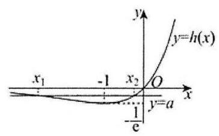

当 $- \frac{1}{\mathrm{e}} < a < 0$ 时,直线 $y = a$ 与 $y = h\left( x\right)$ 的图象有 2 个交点,

设这两个交点的横坐标分别为 ${x}_{1}\text{ 、 }{x}_{2}$ ,且 ${x}_{1} < {x}_{2}$ ,

当 $x < {x}_{1}$ 或 $x > {x}_{2}$ 时, ${f}^{\prime }\left( x\right)  = x{e}^{x} - a > 0$ ,

当 ${x}_{1} < x < {x}_{2}$ 时, ${f}^{\prime }\left( x\right)  = x{e}^{x} - a < 0$ ,此时函数有 2 个极值点,

所以 $a$ 的取值范围是 $\left( {-\frac{1}{\mathrm{e}},0}\right)$

【练习】8. (2025 届复附) 已知函数 $f\left( x\right)  = \left| {x - a}\right| , g\left( x\right)  = {x}^{2} + {2ax} + l\left( {a\text{ 为正常数 }}\right)$ ,且函数 $y = f\left( x\right)$ 与 $y = g\left( x\right)$ 的图象在 $y$ 轴上的截距相等. 记 $h\left( x\right)  = f\left( x\right)  + b\sqrt{g\left( x\right) }$ ,其中 $b$ 为常数

(1)讨论函数 $y = h\left( x\right)$ 的奇偶性;

(2)若 $h\left( x\right)  \geq  2$ 恒成立，求 $b$ 的取值范围

【解析】 $\left( 1\right) h\left( x\right)  = f\left( x\right)  + b\sqrt{g\left( x\right) } = \left| {x - 1}\right|  + b\left| {x + 1}\right|$ ,其定义域为 $R$ ,

所以 $h\left( {-x}\right)  = \left| {x + 1}\right|  + b\left| {x - 1}\right|$

若 $h\left( x\right)$ 为偶函数，即 $h\left( x\right)  = h\left( {-x}\right)$ ，则有 $b = 1$ ，此时 $h\left( 2\right)  = 4, h\left( {-2}\right)  = 4$ ，

故 $h\left( 2\right)  \neq   - h\left( {-2}\right)$ ，即 $h\left( x\right)$ 不为奇函数；

若 $h\left( x\right)$ 为奇函数，即 $h\left( x\right)  =  - h\left( {-x}\right)$ ，则 $b =  - 1$ ，此时 $h\left( 2\right)  = 2, h\left( {-2}\right)  =  - 2$ ，

故 $h\left( 2\right)  \neq  h\left( {-2}\right)$ ,即 $h\left( x\right)$ 不为偶函数;

综上,当且仅当 $b = 1$ 时,函数 $h\left( x\right)$ 为偶函数,且不为奇函数,

当且仅当 $b =  - 1$ 时,函数 $h\left( x\right)$ 为奇函数,且不为偶函数,

当 $b \neq   \pm  1$ 时,函数 $h\left( x\right)$ 既非奇函数又非偶函数

$\left( 2\right) h\left( x\right)  = f\left( x\right)  + b\sqrt{g\left( x\right) } = \left| {x - 1}\right|  + b\left| {x + 1}\right|  \geq  2$ 恒成立,

由 $h\left( 1\right)  = {2b} \geq  2$ 得 $b \geq  1$ ,此时 $h\left( x\right)  = \left| {x - 1}\right|  + \left| {x + 1}\right|  + \left( {b - 1}\right) \left| {x + 1}\right|  \geq  2$ ,

故 $b \geq  1$

【练习】9. (2025 届复附) 设 $f\left( x\right)  = \frac{2{x}^{2}}{x + 1}, g\left( x\right)  = {ax} + 5 - {2a}\left( {a > 0}\right)$

(1)求 $f\left( x\right)$ 在 $x \in  \left\lbrack  {0,1}\right\rbrack$ 上的值域;

(2)若对于任意 ${x}_{1} \in  \left\lbrack  {0,1}\right\rbrack$ ，总存在 ${x}_{0} \in  \left\lbrack  {0,1}\right\rbrack$ ，使得 $g\left( {x}_{0}\right)  = f\left( {x}_{1}\right)$ 成立，求 $a$ 的取值范围

【解析】(1) ${f}^{\prime }\left( x\right)  = \frac{{4x}\left( {x + 1}\right)  - 2{x}^{2}}{{\left( x + 1\right) }^{2}} = \frac{2{x}^{2} + {4x}}{{\left( x + 1\right) }^{2}} \geq  0$ 在 $x \in  \left\lbrack  {0,1}\right\rbrack$ 上恒成立

所以 $f\left( x\right)$ 在 $\left\lbrack  {0,1}\right\rbrack$ 上严格增,所以 $f\left( x\right)$ 值域为 $\left\lbrack  {0,1}\right\rbrack$

(2) $g\left( x\right)  = {ax} + 5 - {2a}\left( {a > 0}\right)$ 在 $x \in  \left\lbrack  {0,1}\right\rbrack$ 上的值域 $\left\lbrack  {5 - {2a},5 - a}\right\rbrack$

由条件得 $\left\lbrack  {0,1}\right\rbrack   \subseteq  \left\lbrack  {5 - {2a},5 - a}\right\rbrack$ ,所以 $\left\{  {\begin{array}{l} 5 - {2a} \leq  0 \\  5 - a \geq  1 \end{array} \Rightarrow  \frac{5}{2} \leq  a \leq  4}\right.$

【练习】10. 已知常数 $a > 1$ ,函数 $y = f\left( x\right)$ 的表达式为 $f\left( x\right)  = {\log }_{a}\left( {x + 2}\right)  - {\log }_{a}\left( {2 - x}\right)$ .

(1)证明:函数 $y = f\left( x\right)$ 是奇函数；

(2)若函数 $y = f\left( x\right)$ 在区间 $\left\lbrack  {0,1}\right\rbrack$ 上的最大值为 2，求实数 $a$ 的值.

【解析】(1) 由 $\left\{  \begin{array}{l} x + 2 > 0 \\  2 - x > 0 \end{array}\right.$ ,解得 $- 2 < x < 2,\cdots \cdots 3$

所以 $y = f\left( x\right)$ 的 $D = \left( {-2,2}\right)$ ,任取 $x \in  D$ ,则 $- x \in  D$ ,

因为 $f\left( {-x}\right)  = {\log }_{a}\left( {-x + 2}\right)  - {\log }_{a}\left( {2 + x}\right)  =  - f\left( x\right)$ ,

所以 $y = f\left( x\right)$ 是奇函数. $\cdots \cdots 6$ 分

(2) 法一: 当 $a > 1, y = {\log }_{a}\left( {x + 2}\right) , y =  - {\log }_{a}\left( {2 - x}\right)$ 在 $\left\lbrack  {0,1}\right\rbrack$ 上严格增,

所以 $y = f\left( x\right)$ 在 $\left\lbrack  {0,1}\right\rbrack$ 上严格增, $\cdots \cdots 8$ 分

因此, $f{\left( x\right) }_{\max } = f\left( 1\right)  = 2,\cdots \cdots {10}$ 分

即 ${\log }_{a}3 = 2,{a}^{2} = 3$ ,所以 $a = \sqrt{3}.\cdots \cdots {14}$ 分

法二: $f\left( x\right)  = {\log }_{a}\left( {x + 2}\right)  - {\log }_{a}\left( {2 - x}\right)  = {\log }_{a}\left( \frac{x + 2}{2 - x}\right) , a > 1$ ,

因为 $x \in  \left\lbrack  {0,1}\right\rbrack$ ,令 $t = \frac{x + 2}{2 - x} = \frac{-\left( {2 - x}\right)  + 4}{2 - x} =  - 1 + \frac{4}{2 - x} \in  \left\lbrack  {1,3}\right\rbrack$ ,

又 $a > 1$ ，所以 $y = {\log }_{a}t$ 在 $\left\lbrack  {1,3}\right\rbrack$ 上严格增， $\cdots \cdots 8$ 分

因而 $f{\left( x\right) }_{\max } = {\log }_{a}3 = 2\cdots \cdots {10}$ 分

所以 ${a}^{2} = 3, a = \sqrt{3}.\cdots \cdots {14}$ 分 2025 版上海高考真题及模拟训练合集

## 板块五:压轴主观题

## 1. 真题回顾

【例题】1. (2025 上海春考) 已知函数 $y = f\left( x\right)$ 的定义域是 $D$ . 对于 $t \in  D$ ,定义集合 ${S}_{f\left( t\right) } =$

$\{ x \mid  f\left( x\right)  \geq  f\left( t\right) \} .$

(1) $f\left( x\right)  = {\log }_{2}x$ ,求 ${S}_{f\left( {16}\right) }$ ;

(2)对于集合 $A$ ，若对任意 $x \in  A$ 都有 $- x \in  A$ ，则称 $A$ 是对称集. 若 $D$ 是对称集，证明: “函数 $y \; = f\left( x\right)$ 是偶函数”的充要条件是“对任意 $t \in  D,{S}_{f\left( t\right) }$ 是对称集”；

(3) 若 $x \in  \mathbb{R}, f\left( x\right)  = {\mathrm{e}}^{x} - \frac{1}{2}m{x}^{2}$ ,若对于任意 ${t}_{1},{t}_{2} \in  D,{t}_{1} < {t}_{2}$ ,都有 ${S}_{f\left( {t}_{2}\right) } \subseteq  {S}_{f\left( {t}_{1}\right) }$ 。求 $m$ 的取值范围

【解析】 $\left( 1\right) {S}_{f\left( {16}\right) } = \left\{  {x \mid  {\log }_{2}x \geq  {\log }_{2}{16}}\right\}$ ,所以 ${S}_{f\left( {16}\right) } = \lbrack {16}, + \infty )$ ;

(2)若 $y = f\left( x\right)$ 是偶函数，则对任意 $a \in  {S}_{f\left( t\right) }$ ，有 $f\left( a\right)  \geq  f\left( t\right)  = f\left( {-t}\right)$ ，即 $a \in  {S}_{f\left( {-t}\right) }$ ，于是 ${S}_{f\left( t\right) } \subseteq \; {S}_{f\left( {-t}\right) }$ ;

同理,对任意 $b \in  {S}_{f\left( {-t}\right) }$ ,有 $f\left( b\right)  \geq  f\left( {-t}\right)  = f\left( t\right)$ ,即 $b \in  {S}_{f\left( t\right) }$ ,于是 ${S}_{f\left( {-t}\right) } \subseteq  {S}_{f\left( t\right) }$ ,故 ${S}_{f\left( t\right) } = {S}_{f\left( {-t}\right) }$ . 利用反证法证明命题“若对任意 $t$ 都有 ${S}_{f\left( t\right) } = {S}_{f\left( {-t}\right) }$ ,则 $y = f\left( x\right)$ 是偶函数”

假设 $y = f\left( x\right)$ 不是偶函数,则存在 ${x}_{0}$ 使 $f\left( {x}_{0}\right)  > f\left( {-{x}_{0}}\right)$ ,此时 $- {x}_{0} \notin  {S}_{f\left( {x}_{0}\right) }$ ,但 $- {x}_{0} \in  {S}_{f\left( {-{x}_{0}}\right) }$ ,所以 ${S}_{f\left( {x}_{0}\right) } \neq  {S}_{f\left( {-{x}_{0}}\right) }$ ,与条件矛盾,故假设错误,命题成立;

(3)显然 ${t}_{2} \in  {S}_{f\left( {t}_{2}\right) }$ ，由于 ${S}_{f\left( {t}_{2}\right) } \subseteq  {S}_{f\left( {t}_{1}\right) }$ ，所以 ${t}_{2} \in  {S}_{f\left( {t}_{1}\right) }$ ，得到 $f\left( {t}_{2}\right)  \geq  f\left( {t}_{1}\right)$ .

另一方面,若 $f\left( {t}_{2}\right)  \geq  f\left( {t}_{1}\right)$ ,则对任意 $a \in  {S}_{f\left( {t}_{2}\right) }, f\left( a\right)  > f\left( {t}_{2}\right)  \geq  f\left( {t}_{1}\right)$ ,所以 $a \in  {S}_{f\left( {t}_{1}\right) }$ ,即 ${S}_{f\left( {t}_{2}\right) } \subseteq \; {S}_{f\left( {t}_{1}\right) }$ ,所以等价转化为 $y = f\left( x\right)$ 是增函数,对 $f\left( x\right)$ 求导得 ${f}^{\prime }\left( x\right)  = {\mathrm{e}}^{x} - {mx}$ ,则 ${f}^{\prime }\left( x\right)  \geq  0$ .

注意到 ${f}^{\prime }\left( 1\right)  = \mathrm{e} - m$ ,所以 $m \leq  \mathrm{e}$ .

又不等式 ${\mathrm{e}}^{x} - {mx} < 0$ 在 $m < 0$ 时有解 $x = \frac{1}{m}$ ，所以 $m \geq  0$ ；

另一方面,若 $0 \leq  m \leq  \mathrm{e}$ ,在 $x \leq  0$ 时, ${f}^{\prime }\left( x\right)  = {\mathrm{e}}^{x} - {mx}$ 显然恒正; 在 $x > 0$ 时, ${f}^{\prime }\left( x\right)  \geq  {\mathrm{e}}^{x} - {ex}$ .

令 $g\left( x\right)  = {\mathrm{e}}^{x} - {ex}$ ,则 ${g}^{\prime }\left( x\right)  = {\mathrm{e}}^{x} - \mathrm{e}$ ,所以 $g\left( x\right)  = {\mathrm{e}}^{x} - {ex}$ 在 $\left( {0,1}\right)$ 上严格减,在 $\left( {1, + \infty }\right)$ 上严格

增,故在 $x = 1$ 处取得最小值 $g\left( 1\right)  = 0$ ,所以 ${f}^{\prime }\left( x\right)  = {\mathrm{e}}^{x} - {ex} \geq  0$ .

综上所述: $m \in  \left\lbrack  {0,\mathrm{e}}\right\rbrack$ .

【例题】2. (2024 上海秋考)已知 $D$ 是 $R$ 的一个非空子集， $y = f\left( x\right)$ 是定义在 $R$ 上的函数. 对于点 $M \; \left( {a, b}\right)$ ,函数 $s\left( x\right)  = {\left( x - a\right) }^{2} + {\left( f\left( x\right)  - b\right) }^{2}$ . 若对于 $P\left( {{x}_{0}, f\left( {x}_{0}\right) }\right)$ ,满足 $s\left( x\right)$ 在 $x = {x}_{0}$ 处取得最小值,则称 $P$ 是 $M$ 的 $f$ 最近点.

(1) $D = \left( {0, + \infty }\right)$ ， $f\left( x\right)  = \frac{1}{x}$ ， $M\left( {0,0}\right)$ ，求证:存在 $M$ 的 $f$ 最近点；

(2) $D = R, f\left( x\right)  = {\mathrm{e}}^{x}, M\left( {1,0}\right)$ ,若 $y = f\left( x\right)$ 上一点 $P$ 满足 ${MP}$ 垂直于 $y = f\left( x\right)$ 在 $P$ 处的切线,则 $P$ 是否是 $M$ 的 $f$ 最近点?

(3) $D = R$ ，已知 $y = f\left( x\right)$ 是可导的， $y = g\left( x\right)$ 定义在 $R$ 上且函数值恒正. 已知 $t \in  R$ ， ${M}_{1}(t - 1$ ， $f\left( t\right)  - g\left( t\right) ),{M}_{2}\left( {t + 1, f\left( t\right)  + g\left( t\right) }\right)$ . 若对于任意 $t \in  R$ ,都存在 $y = f\left( x\right)$ 上的一点 $P$ ,使得 $P$ 既是 ${M}_{1}$ 的 $f$ 最近点,又是 ${M}_{2}$ 的 $f$ 最近点. 试求 $y = f\left( x\right)$ 的单调性.

【解析】(1) 对于点 $M\left( {0,0}\right) , s\left( x\right)  = {x}^{2} + {\left( \frac{1}{x}\right) }^{2} \geq  2$ ,当且仅当 $x =  \pm  1$ 时取等号,

又 $D = \left( {0, + \infty }\right)$ ,取 ${x}_{0} = 1$ ,所以存在 $M$ 的 $f$ 最近点 $P\left( {1,1}\right)$ ;

(2) $s\left( x\right)  = {\left( x - 1\right) }^{2} + {\mathrm{e}}^{2x}$ ,

$f\left( x\right)  = {\mathrm{e}}^{x},{f}^{\prime }\left( x\right)  = {\mathrm{e}}^{x}$ ,设 $P\left( {{x}_{0},{\mathrm{e}}^{{x}_{0}}}\right)$ ,

因为 $y = f\left( x\right)$ 上一点 $P$ 满足 ${MP}$ 垂直于 $y = f\left( x\right)$ 在 $P$ 处的切线,

所以 ${f}^{\prime }\left( {x}_{0}\right)  \cdot  {k}_{MP} =  - 1$ ,所以 ${\mathrm{e}}^{{x}_{0}} \cdot  \frac{{\mathrm{e}}^{{x}_{0}}}{{x}_{0} - 1} =  - 1$ ,即 ${\mathrm{e}}^{2{x}_{0}} + {x}_{0} - 1 = 0$ ,

对于 $s\left( x\right)  = {\left( x - 1\right) }^{2} + {\mathrm{e}}^{2x},{s}^{\prime }\left( x\right)  = 2\left( {x - 1}\right)  + 2{\mathrm{e}}^{2x} = 2\left( {{\mathrm{e}}^{2x} + x - 1}\right)$ ,

则 ${s}^{\prime }\left( {x}_{0}\right)  = 0$ ,易得 ${s}^{\prime }\left( x\right)$ 严格增,

则当 $x < {x}_{0}$ 时， ${s}^{\prime }\left( x\right)  < 0$ ， $s\left( x\right)$ 严格减，

当 $x > {x}_{0}$ 时， ${s}^{\prime }\left( x\right)  > 0$ ， $s\left( x\right)$ 严格增，

故 $s\left( x\right)$ 在 $x = {x}_{0}$ 处取得最小值，则 $P$ 是 $M$ 的 $f$ 最近点；

(3) ${S}_{{M}_{1}}\left( x\right)  = {\left( x - t + 1\right) }^{2} + {\left( f\left( x\right)  - f\left( t\right)  + g\left( t\right) \right) }^{2}$ ,

${S}_{{M}_{2}}\left( x\right)  = {\left( x - t - 1\right) }^{2} + {\left( f\left( x\right)  - f\left( t\right)  - g\left( t\right) \right) }^{2},$

则 ${S}_{{M}_{1}^{\prime }}\left( x\right)  = 2\left( {x - t + 1}\right)  + 2\left( {f\left( x\right)  - f\left( t\right)  + g\left( t\right) }\right)  \cdot  {f}^{\prime }\left( x\right)$ ,

${S}_{{M}_{2}^{\prime }}\left( x\right)  = 2\left( {x - t - 1}\right)  + 2\left( {f\left( x\right)  - f\left( t\right)  - g\left( t\right) }\right)  \cdot  {f}^{\prime }\left( x\right) ,$

若对于任意 $t \in  R$ ,都存在 $y = f\left( x\right)$ 上的一点 $P$ ,

使得 $P$ 既是 ${M}_{1}$ 的 $f$ 最近点,又是 ${M}_{2}$ 的 $f$ 最近点,

则存在 ${x}_{0}$ ,使得 ${S}_{{M}_{1}^{\prime }}\left( {x}_{0}\right)  = {S}_{{M}_{2}^{\prime }}\left( {x}_{0}\right)  = 0$ ,

则 ${S}_{{M}_{1}^{\prime }}\left( {x}_{0}\right)  - {S}_{{M}_{2}^{\prime }}\left( {x}_{0}\right)  = 0$ ,即 $4 + {4g}\left( t\right)  \cdot  {f}^{\prime }\left( {x}_{0}\right)  = 0$ ,所以 ${f}^{\prime }\left( {x}_{0}\right)  =  - \frac{1}{g\left( t\right) }$ ,

因为 $y = g\left( x\right)$ 定义在 $R$ 上且函数值恒正,所以 ${f}^{\prime }\left( {x}_{0}\right)  =  - \frac{1}{g\left( t\right) } < 0\left( *\right)$ ,

因为 $P$ 既是 ${M}_{1}$ 的 $f$ 最近点,又是 ${M}_{2}$ 的 $f$ 最近点,

所以 ${S}_{{M}_{1}}\left( {x}_{0}\right)  = {\left( {x}_{0} - t + 1\right) }^{2} + {\left( f\left( {x}_{0}\right)  - f\left( t\right)  + g\left( t\right) \right) }^{2}$

$\leq  {S}_{{M}_{1}}\left( x\right)  = {\left( x - t + 1\right) }^{2} + {\left( f\left( x\right)  - f\left( t\right)  + g\left( t\right) \right) }^{2}$ ①,

且 ${S}_{{M}_{2}}\left( {x}_{0}\right)  = {\left( {x}_{0} - t - 1\right) }^{2} + {\left( f\left( {x}_{0}\right)  - f\left( t\right)  - g\left( t\right) \right) }^{2}$

$\leq  {S}_{{M}_{2}}\left( x\right)  = {\left( x - t - 1\right) }^{2} + {\left( f\left( x\right)  - f\left( t\right)  - g\left( t\right) \right) }^{2}$ ②恒成立，

在①②中，令 $x = t$ ，

得 ${S}_{{M}_{1}}\left( {x}_{0}\right)  = {\left( {x}_{0} - t + 1\right) }^{2} + {\left( f\left( {x}_{0}\right)  - f\left( t\right)  + g\left( t\right) \right) }^{2} \leq  1 + {g}^{2}\left( t\right)$ ,

即 ${\left( {x}_{0} - t\right) }^{2} + 2\left( {{x}_{0} - t}\right)  + {\left( f\left( {x}_{0}\right)  - f\left( t\right) \right) }^{2} + 2\left( {f\left( {x}_{0}\right)  - f\left( t\right) }\right)  \leq  0$ ③,

同理 ${\left( {x}_{0} - t\right) }^{2} - 2\left( {{x}_{0} - t}\right)  + {\left( f\left( {x}_{0}\right)  - f\left( t\right) \right) }^{2} - 2\left( {f\left( {x}_{0}\right)  - f\left( t\right) }\right)  \leq  0$ ④,

由③④相加，得 $2{\left( {x}_{0} - t\right) }^{2} + 2{\left( f\left( {x}_{0}\right)  - f\left( t\right) \right) }^{2} \leq  0$ ,

即 ${\left( {x}_{0} - t\right) }^{2} + {\left( f\left( {x}_{0}\right)  - f\left( t\right) \right) }^{2} \leq  0$ ,即 ${x}_{0} = t$ ,代入 (*) 得 ${f}^{\prime }\left( t\right)  =  - \frac{1}{g\left( t\right) } < 0$ ,

由于 $t \in  R$ ,由 $t$ 的任意性得 ${f}^{\prime }\left( t\right)  < 0$ 对任意 $t$ 都成立,

则 $y = f\left( x\right)$ 严格减.

【例题】3. (2024 上海春考)对于定义在 $R$ 上的函数 $f\left( x\right)$ ，记集合 ${M}_{a} = \{ t \mid  t = f\left( x\right)  - f\left( a\right) , x \geq  a\}$ ，

${L}_{a} = \{ t \mid  t = f\left( x\right)  - f\left( a\right) , x \leq  a\} .$

(1) 若 $f\left( x\right)  = {x}^{2} + 1$ ，求 ${M}_{1}$ 和 ${L}_{1}$ ；

(2)若 $f\left( x\right)  = {x}^{3} - 3{x}^{2}$ ，求证:对于任意 $a \in  R$ ，都有 ${M}_{a} \subseteq  \lbrack  - 4$ ，+0 $)$ ，且存在 $a$ ，使得 -4 ∈ ${M}_{a}$ .

(3)已知定义在 $R$ 上的函数 $f\left( x\right)$ 有最小值，求证: “ $f\left( x\right)$ 是偶函数”的充要条件为“对任意 $c >$ 0,都有 ${M}_{-c} = {L}_{c}$ ”.

【解析】(1) $f\left( 1\right)  = 2, f\left( x\right)  - f\left( 1\right)  = {x}^{2} - 1$ ,

${M}_{1} = \{ t \mid  t = {x}^{2} - 1, x \geq  1\}  = \lbrack 0, + \infty ),{L}_{1} = \left\{  {t \mid  t = {x}^{2} - 1, x \leq  1}\right\}   = \lbrack  - 1, + \infty )$ ;

(2) 原题即证 $f\left( x\right)  - f\left( a\right)  = {x}^{3} - 3{x}^{2} - {a}^{3} + 3{a}^{2} \geq   - 4$ ,

令 $g\left( x\right)  = {x}^{3} - 3{x}^{2} - {a}^{3} + 3{a}^{2}$ ,则 ${g}^{\prime }\left( x\right)  = 3{x}^{2} - {6x} = {3x}\left( {x - 2}\right)$ ,

若 $a \geq  2, x \geq  a$ 时函数严格增, $g\left( x\right)  \geq  g\left( a\right)  = 0$ ,即 ${M}_{a} = \lbrack 0, + \infty ) \subseteq  \lbrack  - 4, + \infty )$ ;

若 $0 \leq  a < 2, x \geq  a$ 先减后增, $g{\left( x\right) }_{\min } = g\left( 2\right)  =  - {a}^{3} + 3{a}^{2} - 4$ ,

因为 $- {a}^{3} + 3{a}^{2} = {a}^{2}\left( {3 - a}\right)  \geq  0, - {a}^{3} + 3{a}^{2} - 4 \geq   - 4$ ,

所以 ${M}_{a} = \left\lbrack  {-{a}^{3} + 3{a}^{2} - 4, + \infty }\right)  \subseteq  \left\lbrack  {-4, + \infty }\right)$ ; 且当 $a = 0$ 时, ${M}_{a} = \left\lbrack  {-4, + \infty }\right)$ ;

若 $a < 0$ ，函数在 $\lbrack a,0)$ 严格增，在 $\left\lbrack  {0,2}\right\rbrack$ 严格减，在 $\lbrack 2, + \infty )$ 严格增，

所以 $g{\left( x\right) }_{\min } = \min \{ g\left( a\right) , g\left( 2\right) \}  = \min \left\{  {0, - {a}^{3} + 3{a}^{2} - 4}\right\}$ ,

当 $a < 0$ 时，因为 $- {a}^{3} + 3{a}^{2} = {a}^{2}\left( {3 - a}\right)  > 0, - {a}^{3} + 3{a}^{2} - 4 >  - 4$ ，

此时 ${M}_{a} = \left\lbrack  {g{\left( x\right) }_{\min }, + \infty }\right)  \subseteq  \left\lbrack  {-4, + \infty }\right)$ ;

综上,对于任意 $a \in  R$ ,都有 ${M}_{a} \subseteq  \lbrack  - 4, + \infty )$ ,且存在 $a = 0$ ,使得 $- 4 \in  {M}_{a}$ ;

(3)必要性

因为 $f\left( x\right)$ 是偶函数，

任意 $t \in  {M}_{-c}$ ,必有 $x \in  \lbrack  - c, + \infty )$ ,使得 $t = f\left( x\right)  - f\left( {-c}\right)  = f\left( {-x}\right)  - f\left( c\right)$ ,

又 $- x \in  ( - \infty , c\rbrack$ ,所以 $t \in  {L}_{c}$ . 因此 ${M}_{-c} \subseteq  {L}_{c}$ .

任意 $t \in  {L}_{c}$ ,必有 $x \in  ( - \infty , c\rbrack$ ,使得 $t = f\left( x\right)  - f\left( c\right)  = f\left( {-x}\right)  - f\left( {-c}\right)$ ,

又 $- x \in  \lbrack  - c, + \infty )$ ,所以 $t \in  {M}_{-c}$ . 因此 ${L}_{c} \subseteq  {M}_{-c}$ .

综上,对任意 $c \in  R,{M}_{-c} = {L}_{c}$ .

充分性

任意 $c \in  R,{M}_{-c} = {L}_{c}$ ,不妨设 $f\left( x\right)$ 在 $x = m$ 处取得最小值,

即 $f{\left( x\right) }_{\min } = f\left( m\right)  = k, M$ 取右侧, $L$ 取左侧,

当 $x \geq  m$ 时, $f\left( x\right)  \geq  f\left( m\right)  = k$ ,

所以 $t = f\left( x\right)  - f\left( a\right)  \geq  f\left( x\right)  - f\left( m\right)  \geq  0$ ,

又 ${M}_{m} = {L}_{-m}$ ,所以在 ${M}_{m} = {L}_{-m},\therefore {L}_{-m}$ 中,当 $x \leq   - m$ 时, $t = f\left( x\right)  - f\left( {-m}\right)  \geq  0$ ,

同理,任意 $x \leq  m,{L}_{m}$ 非负, ${M}_{-m}$ 中,当 $x \geq   - m$ 时, $t = f\left( x\right)  - f\left( {-m}\right)  \geq  0$ ,

所以任意 $x \in  R, f\left( x\right)  \geq  f\left( {-m}\right)$ ,

即 $f\left( m\right)  = f\left( {-m}\right)  = k$ ,即 $- m$ 也是 $f\left( x\right)$ 的最小值点,

接下来证明 $f\left( x\right)  = f\left( {-x}\right)$ 对于任意 $x \in  R$ 恒成立,

当 ${x}_{0} \geq  0$ 时, ${M}_{-{x}_{0}} = {L}_{{x}_{0}}$ ,

$\left| m\right|  \geq   - {x}_{0}, f\left( \left| m\right| \right)  - f\left( {-{x}_{0}}\right)  \in  {M}_{-{x}_{0}},$

$- \left| m\right|  \leq  {x}_{0}, f\left( {-\left| m\right| }\right)  - f\left( {x}_{0}\right)  \in  {L}_{{x}_{0}},$

$f\left( \left| m\right| \right)$ 和 $f\left( {-\left| m\right| }\right)$ 均为最小值,

所以 ${M}_{-{x}_{0}}$ 中最小值为 $f\left( \left| m\right| \right)  - f\left( {-{x}_{0}}\right) ,{L}_{{x}_{0}}$ 中最小值为 $f\left( {-\left| m\right| }\right)  - f\left( {x}_{0}\right)$ ,

因为 ${M}_{-{x}_{0}} = {L}_{{x}_{0}}$ ,所以 $f\left( {-{x}_{0}}\right)  = f\left( {x}_{0}\right)$ 对 ${x}_{0} \geq  0$ 恒成立,

所以 $f\left( x\right)$ 是偶函数.

证毕.

【例题】4. (2023 上海春考) 设函数 $f\left( x\right)  = a{x}^{3} - \left( {a + 1}\right) {x}^{2} + x, g\left( x\right)  = {kx} + m$ ,其中 $a \geq  0, k, m \in  R$ ,若任意 $x \in  \left\lbrack  {0,1}\right\rbrack$ 均有 $f\left( x\right)  \leq  g\left( x\right)$ ,则称函数 $y = g\left( x\right)$ 是函数 $y = f\left( x\right)$ 的“控制函数”,且对所有的函数 $y = g\left( x\right)$ 取最小值定义为 $\bar{f}\left( x\right)$ .

(1) 若 $a = 2, g\left( x\right)  = x$ ,试问 $y = g\left( x\right)$ 是否为函数 $y = f\left( x\right)$ 的“控制函数”;

(2) 若 $a = 0$ ，使得直线 $y = h\left( x\right)$ 是曲线 $y = f\left( x\right)$ 在 $x = \frac{1}{4}$ 处的切线. 证明:函数 $y = h\left( x\right)$ 为函数 $y = f\left( x\right)$ 的“控制函数”,并求 $\bar{f}\left( \frac{1}{4}\right)$ 的值;

(3) 若曲线 $y = f\left( x\right)$ 在 $x = {x}_{0}\left( {{x}_{0} \in  \left( {0,1}\right) }\right)$ 处的切线过点 $\left( {1,0}\right)$ ,且 $c \in  \left\lbrack  {0,1}\right\rbrack$ . 证明: 当且仅当 $c \; = {x}_{0}$ 或 $c = 1$ 时, $\bar{f}\left( c\right)  = f\left( c\right)$ .

【解析】(1) 若 $a = 2, f\left( x\right)  = 2{x}^{3} - 3{x}^{2} + x, g\left( x\right)  = x$ ,

$f\left( x\right)  - g\left( x\right)  = 2{x}^{3} - 3{x}^{2}$ ,令 $h\left( x\right)  = 2{x}^{3} - 3{x}^{2}, x \in  \left\lbrack  {0,1}\right\rbrack$ ,

令 ${h}^{\prime }\left( x\right)  = 6{x}^{2} - {6x} = {6x}\left( {x - 1}\right)  \leq  0$ ,得 $x \in  \left\lbrack  {0,1}\right\rbrack$ ,

所以 ${h}^{\prime }\left( x\right)  = 6{x}^{2} - {6x} = {6x}\left( {x - 1}\right)  \leq  0 \Rightarrow  x \in  \left\lbrack  {0,1}\right\rbrack  ,\therefore h\left( x\right)$ 在 $\left\lbrack  {0,1}\right\rbrack$ 严格减，所以 $\left\lbrack  {0,1}\right\rbrack   \searrow  ;{h}_{\max } \; \left( x\right)  = h\left( 0\right)  = 0,$

所以 $f\left( x\right)  - g\left( x\right)  \leq  h{\left( x\right) }_{\max } = 0$ ，所以 $g\left( x\right)$ 是 $f\left( x\right)$ 的 “控制函数”；

(2) 若 $a = 0, f\left( x\right)  =  - {x}^{2} + x, f\left( \frac{1}{4}\right)  = \frac{3}{16},{f}^{\prime }\left( x\right)  =  - {2x} + 1,{f}^{\prime }\left( \frac{1}{4}\right)  =  - \frac{1}{2} + 1 = \frac{1}{2}$ ,

所以 $h\left( x\right)  = \frac{1}{2}\left( {x - \frac{1}{4}}\right)  + \frac{3}{16}$ ,即 $h\left( x\right)  = \frac{1}{2}x + \frac{1}{16}$ ,

$f\left( x\right)  - g\left( x\right)  =  - {\left( x - \frac{1}{4}\right) }^{2} \leq  0$ 恒成立，所以 $h\left( x\right)$ 是 $f\left( x\right)$ 的“控制函数”；

法一: $f\left( \frac{1}{4}\right)  = h\left( \frac{1}{4}\right)  = \frac{3}{16}$ ,又 $g\left( \frac{1}{4}\right)  \geq  f\left( \frac{1}{4}\right)  = \frac{3}{16}$ ,所以 $\bar{f}\left( \frac{1}{4}\right)  = \frac{3}{16}$ .

法二: 设抛物线上点 $\left( {{x}_{0}, - {x}_{0}^{2} + {x}_{0}}\right) ,{x}_{0} \in  \left\lbrack  {0,1}\right\rbrack  ,{f}^{\prime }\left( {x}_{0}\right)  =  - 2{x}_{0} + 1$ ,

有切线方程 $y = \left( {-2{x}_{0} + 1}\right) \left( {x - {x}_{0}}\right)  - {x}_{0}^{2} + {x}_{0}$ ,

所以 $y = \left( {-2{x}_{0} + 1}\right) \left( {\frac{1}{4} - {x}_{0}}\right)  - {x}_{0}^{2} + {x}_{0}$ ,

化简得 $y = {x}_{0}^{2} - \frac{{x}_{0}}{2} + \frac{1}{4} = {\left( {x}_{0} - \frac{1}{4}\right) }^{2} + \frac{3}{16}$ ,最小值为 $\frac{3}{16}$ .

(3) 法一: $f\left( x\right)  = a{x}^{3} - \left( {a + 1}\right) {x}^{2} + x,{f}^{\prime }\left( x\right)  = {3a}{x}^{2} - 2\left( {a + 1}\right) x + 1$ ,

设 $x = {x}_{0}$ 处的切线为 $t\left( x\right)$ ,则 $t\left( x\right)  = {f}^{\prime }\left( {x}_{0}\right) \left( {x - x}\right)  + f\left( {x}_{0}\right)$ ,

显然 $t\left( {x}_{0}\right)  = f\left( {x}_{0}\right)  \cdot  t\left( x\right)$ 过点 $\left( {1,0}\right)  \Rightarrow  t\left( 1\right)  = 0 = f\left( 1\right)$ ,

${f}^{\prime }\left( {x}_{0}\right)  = {3a}{x}_{0}^{2} - 2\left( {a + 1}\right) {x}_{0} + 1 \Rightarrow  {f}^{\prime }\left( {x}_{0}\right) \left( {1 - {x}_{0}}\right)  = f\left( 1\right)  - f\left( {x}_{0}\right)$

$= \left( {1 - {x}_{0}}\right) \left\lbrack  {a\left( {\left( {1 + {x}_{0} + {x}_{0}^{2}}\right)  - \left( {a + 1}\right) \left( {1 - {x}_{0}}\right)  + 1}\right)  + 1}\right\rbrack  ,$

所以 ${3a}{x}_{0}^{2} - 2\left( {a + 1}\right) {x}_{0} + 1 = a{x}_{0}^{2} - {x}_{0} \Rightarrow  \left( {{2a}{x}_{0} - 1}\right) \left( {{x}_{0} - 1}\right)  = 0$ ,

因为 ${x}_{0} \neq  1$ ，所以 $a = \frac{1}{2{x}_{0}} \in  \left( {\frac{1}{2}, + \infty }\right)$ ，所以 ${x}_{0} = \frac{1}{2a}$ ，

${f}^{\prime }\left( {x}_{0}\right)  = {3a}{\left( \frac{1}{2a}\right) }^{2} - 2\left( {a + 1}\right) \frac{1}{2a} + 1 =  - \frac{1}{4a},$

$f\left( {x}_{0}\right)  = a{\left( \frac{1}{2a}\right) }^{3} - \left( {a + 1}\right) {\left( \frac{1}{2a}\right) }^{2} + \frac{1}{2a} = \frac{{2a} - 1}{8{a}^{2}},$

所以 $t\left( x\right)  = {f}^{\prime }\left( {x}_{0}\right) \left( {x - {x}_{0}}\right)  + f\left( {x}_{0}\right)  =  - \frac{1}{4a}\left( {x - \frac{1}{2a}}\right)  + \frac{{2a} - 1}{8{a}^{2}}$ ,

即 $t\left( x\right)  =  - \frac{1}{4a}\left( {x - 1}\right)$ ,又因为 $f\left( x\right)  = x\left( {x - 1}\right) \left( {{ax} - 1}\right)  \leq  t\left( x\right)$

$\Rightarrow  a{x}^{2} - x + \frac{1}{4a} \geq  0$ 即 $\left( {x - \frac{1}{2a}}\right)  \geq  0$ 恒成立,

所以 $t\left( x\right)$ 必为 $f\left( x\right)$ 的“控制函数”;

又因为任意 $g\left( x\right)  = {kx} + m \geq  f\left( x\right)$ ,

所以任意 $\bar{f}\left( x\right)  \geq  f\left( x\right) ,\bar{f}\left( x\right)  = f\left( x\right) , x \in  \left( {0,1}\right)$ ,

此时 “控制函数” $g\left( x\right)$ 必与 $f\left( x\right)$ 切于 $x$ 点, $t\left( x\right)$ 与 $f\left( x\right)$ 在 $x = \frac{1}{2a}$ 处相切, 过 $\left( {1,0}\right)$ ,所以在 $\left( {\frac{1}{2a},1}\right)$ 之间点不可能使 $f\left( x\right)$ 在 $\left( {\frac{1}{2a},1}\right)$ 切线下方,

所以 $\bar{f}\left( c\right)  = f\left( c\right)  \Rightarrow  c = \frac{1}{2a} = {x}_{0}$ 或 1,

故当且仅当 $c = {x}_{0}$ 或 $c = 1$ 时, $\bar{f}\left( c\right)  = f\left( c\right)$ .

法二: 因为 $f\left( x\right)  = a{x}^{3} - \left( {a + 1}\right) {x}^{2} + x$ ,所以 ${f}^{\prime }\left( x\right)  = {3a}{x}^{2} - 2\left( {a + 1}\right) x + 1$ ,

设点 $\left( {{x}_{0}, f\left( {x}_{0}\right) }\right)$ 处的切线方程为 $y = {f}^{\prime }\left( {x}_{0}\right) \left( {x - {x}_{0}}\right)  + f\left( {x}_{0}\right)$ ,

因为直线过 $\left( {1,0}\right)$ ,所以 $0 = {f}^{\prime }\left( {x}_{0}\right) \left( {1 - {x}_{0}}\right)  + f\left( {x}_{0}\right)$ ,

得 $\left\lbrack  {{3a}{x}_{0}^{2} - 2\left( {a + 1}\right) {x}_{0} + 1}\right\rbrack  \left( {1 - {x}_{0}}\right)  + a{x}_{0}^{3} - \left( {a + 1}\right) {x}_{0}^{2} + {x}_{0} = 0$ ,

化简得 $- {2a}{x}_{0}{\left( {x}_{0} - 1\right) }^{2} + {\left( {x}_{0} - 1\right) }^{2} = 0$ ,因为 ${x}_{0} \in  \left( {0,1}\right)$ ,所以 ${\left( {x}_{0} - 1\right) }^{2} \neq  0$ ,

故 $- {2a}{x}_{0} + 1 = 0$ ,即 $a = \frac{1}{2{x}_{0}}, a \neq  0$ .

所以 ${f}^{\prime }\left( {x}_{0}\right)  =  - \frac{{x}_{0}}{2}$ ,所以 $y =  - \frac{{x}_{0}}{2}\left( {x - 1}\right)$ ,

设 $\varphi \left( x\right)  = g\left( x\right)  - f\left( x\right)  =  - \frac{{x}_{0}}{2}\left( {x - 1}\right)  - a{x}^{3} + \left( {a + 1}\right) {x}^{2} - x$ ,

有 ${\varphi }^{\prime }\left( x\right)  =  - \frac{{x}_{0}}{2} - {3a}{x}^{2} + 2\left( {a + 1}\right) x - 1$ ,

令 ${\varphi }^{\prime }\left( x\right)  = 0$ ,即 $3{x}^{2} - \left( {2 + 4{x}_{0}}\right) x + {x}_{0}\left( {{x}_{0} + 2}\right)  = 0$ ,

得 $\left\lbrack  {{3x} - \left( {{x}_{0} + 2}\right) }\right\rbrack  \left\lbrack  {x - {x}_{0}}\right\rbrack   = 0$ ,解得 ${x}_{1} = {x}_{0},{x}_{2} = \frac{{x}_{0} + 2}{3}$ ,

可以算得 ${x}_{0} < \frac{{x}_{0} + 2}{3}$ ,

当 $x \in  \left( {{x}_{0},\frac{{x}_{0} + 2}{3}}\right)$ 时, ${\varphi }^{\prime }\left( x\right)  > 0$ ,所以 $\varphi \left( x\right)$ 严格增;

当 $x \in  \left( {\frac{{x}_{0} + 2}{3},1}\right)$ 时, ${\varphi }^{\prime }\left( x\right)  < 0$ ,所以 $\varphi \left( x\right)$ 严格减;

所以在 $\varphi \left( {x}_{0}\right)$ 或 $\varphi \left( 1\right)$ 处取最小值.

又因为 $\varphi \left( {x}_{0}\right)  = \varphi \left( 1\right)  = 0$ ,所以有 $\varphi \left( x\right)  \geq  0$ ,所以有 $g\left( x\right)  \geq  f\left( x\right)$ .

所以在端点 $c = {x}_{0}$ 或者 $c = 1$ 处取得最小值.

即当且仅当 $c = {x}_{0}$ 或 $c = 1$ 时, $\bar{f}\left( c\right)  = f\left( c\right)$ .

法三: $f\left( x\right)  = x\left( {1 - {ax}}\right) \left( {1 - x}\right) ,{f}^{\prime }\left( x\right)  = {3a}{x}^{2} - 2\left( {a + 1}\right) x + 1$ ,

$\frac{f\left( {x}_{0}\right)  - 0}{{x}_{0} - 1} = {x}_{0}\left( {a{x}_{0} - 1}\right)$ ,由于是切线,该值等于 ${f}^{\prime }\left( {x}_{0}\right)$ ,

所以 ${3a}{x}_{0}^{2} - 2\left( {a + 1}\right) {x}_{0} + 1 = a{x}_{0}^{2} - {x}_{0}$ ,整理得 $\left( {{2a}{x}_{0} - 1}\right) \left( {{x}_{0} - 1}\right)  = 0$ ,

考虑到 ${x}_{0} \in  \left( {0,1}\right)$ ,所以 ${x}_{0} = \frac{1}{2a}$ ,所以 $a \in  \left( {\frac{1}{2}, + \infty }\right)$ ,

${x}_{0}$ 处的切线方程所代表的函数 $g\left( x\right)  = \left( {x - {x}_{0}}\right) {x}_{0}\left( {a{x}_{0} - 1}\right)  + f\left( {x}_{0}\right)$ ,

一方面,对任意 $x \in  \left( {{x}_{0},1}\right)$ ,必有 $\bar{f}\left( x\right)  \geq  g\left( x\right)$ ,

否则若存在 $x \in  \left( {{x}_{0},1}\right) ,\bar{f}\left( x\right)  < g\left( x\right)$ ,考虑到 $\bar{f}\left( {x}_{0}\right)  \geq  f\left( {x}_{0}\right)$ ,

所以过 $\left( {x,\bar{f}\left( x\right) }\right)$ 的“控制函数”的斜率 $k < {x}_{0}\left( {a{x}_{0} - 1}\right)$ ,

考虑到 $\bar{f}\left( 1\right)  \geq  f\left( 1\right)  = 0$ ,

所以过 $\left( {x,\bar{f}\left( x\right) }\right)$ 的 “控制函数” 的斜率 $k > {x}_{0}\left( {a{x}_{0} - 1}\right)$ ,两者矛盾!

另一方面,记 $k\left( x\right)  = g\left( x\right)  - f\left( x\right)$ ,

${k}^{\prime }\left( x\right)  = {x}_{0}\left( {a{x}_{0} - 1}\right)  = {3a}{x}^{2} + 2\left( {a + 1}\right) x - 1,$

计算得 $k\left( {x}_{0}\right)  = k\left( 1\right)  = 0,{k}^{\prime }\left( {x}_{0}\right)  = 0$ ,由于 $a > \frac{1}{2}$ ,

所以 ${k}^{\prime }\left( x\right)$ 的图像为开口向下的二次函数,其对称轴为 $x = \frac{a + 1}{3a}$ ,

注意到 $\frac{a + 1}{3a} - \frac{1}{2a} = \frac{{2a} - 1}{6a} > 0$ ,即 ${x}_{0}$ 在对称轴左边,

设 ${k}^{\prime }\left( x\right)$ 的另一个零点为 ${x}_{1}$ ,

${k}^{\prime }\left( x\right)$ 在 $\left( {0,{x}_{0}}\right)$ 上为负,在 $\left( {{x}_{0},{x}_{1}}\right)$ 上为正,在 $\left( {{x}_{1}, + \infty }\right)$ 上为负,

即 $k\left( x\right)$ 在 $\left\lbrack  {0,{x}_{0}}\right\rbrack$ 上严格减，在 $\left\lbrack  {{x}_{0},{x}_{1}}\right\rbrack$ 上严格增，在 $\left\lbrack  {{x}_{1}, + \infty }\right)$ 上严格减，

考虑到 $k\left( {x}_{0}\right)  = 0$ 与 $k\left( 1\right)  = 0$ ,则必有 ${x}_{1} \in  \left( {{x}_{0},1}\right)$ ,

且当 $x \in  \left\lbrack  {0,1}\right\rbrack$ 时, $k\left( x\right)  \geq  0$ ,即 $g\left( x\right)$ 是 $f\left( x\right)$ 的“控制函数”,

及当 $c \in  \left\lbrack  {{x}_{0},1}\right\rbrack$ 时， $k\left( c\right)  \geq  0$ ，等号当且仅当 $c = {x}_{0}$ 或 $c = 1$ ，

综上,对 $c \in  \left\lbrack  {{x}_{0},1}\right\rbrack$ ,仅在 $c = {x}_{0}$ 或 $c = 1$ 时, $\bar{f}\left( x\right)  = f\left( x\right)$ ,

$c \in  \left( {{x}_{0},1}\right)$ 时, $\bar{f}\left( x\right)  \geq  g\left( x\right)  > f\left( x\right)$ ,命题得证.

【例题】5. (2022 上海春考) 在定义域为 $\mathbb{R}$ 的函数 $f\left( x\right)$ 上,定义下面两个变换: 甲变换: $f\left( x\right)  \rightarrow  f\left( x\right)  - \; f\left( {x - t}\right)$ ,乙变换: $f\left( x\right)  \rightarrow  \left| {f\left( {x + t}\right)  - f\left( x\right) }\right|$ ,其中 $t > 0$ .

(1) 若 $t = 1, f\left( x\right)  = {2}^{x}$ ,对 $f\left( x\right)$ 进行甲变换后得到函数 $g\left( x\right)$ ,求方程 $g\left( x\right)  = 2$ 的解;

( 2 )若 $f\left( x\right)  = {x}^{2}$ ，对 $f\left( x\right)$ 进行乙变换后得到函数 $h\left( x\right)$ ，解不等式: $h\left( x\right)  \leq  f\left( x\right)$ ；

(3)已知定义 $\mathbb{R}$ 上的函数 $f\left( x\right)$ 在 $\left( {-\infty ,0}\right)$ 单调递增，在对函数 $f\left( x\right)$ 先作甲变换得到 $u\left( x\right)$ ，再作乙变换得到函数 ${h}_{1}\left( x\right)$ ,对函数 $f\left( x\right)$ 先作乙变换得到 $v\left( x\right)$ ,再作甲变换得到函数 ${h}_{2}\left( x\right)$ ,且对于任意 $t > 0$ ，在 $\mathbb{R}$ 上有 ${h}_{1}\left( x\right)  = {h}_{2}\left( x\right)$ 成立，证明:函数 $f\left( x\right)$ 在 $\mathbb{R}$ 上单调递增.

【解析】(1) 由题意得 $g\left( x\right)  = {2}^{x} - {2}^{x - 1} = {2}^{x - 1} = 2$ ,故 $x = 2$ ;

(2) 由题意得 $h\left( x\right)  = \left| {{\left( x + t\right) }^{2} - {x}^{2}}\right|  = \left| {{2tx} + {t}^{2}}\right|  \leq  f\left( x\right)  = {x}^{2}, t > 0$ ,

法一: 当 $x \leq   - \frac{t}{2}$ 时, $- {2tx} - {t}^{2} \leq  {x}^{2}$ ,即 ${\left( x + t\right) }^{2} \geq  0$ ,故 $x \leq   - \frac{t}{2}$ ;

当 $x \geq   - \frac{t}{2}$ 时, ${2tx} + {t}^{2} \leq  {x}^{2}$ ,即 ${x}^{2} - {2tx} - {t}^{2} \geq  0$ ,

解得 $x \in  \left( {-\infty ,\left( {1 - \sqrt{2}}\right) t}\right\rbrack   \cup  \lbrack \left( {1 + \sqrt{2}}\right) t, + \infty )$ ,

所以 $x \in  \left( {-\frac{t}{2},\left( {1 - \sqrt{2}}\right) t}\right\rbrack   \cup  \left\lbrack  {\left( {1 + \sqrt{2}}\right) t, + \infty }\right)$ ;

综上,解集为 $x \in  \left( {-\infty ,\left( {1 - \sqrt{2}}\right) t\rbrack \cup \lbrack \left( {1 + \sqrt{2}}\right) t, + \infty }\right)$ ;

法二: $\left| {{2tx} + {t}^{2}}\right|  \leq  {x}^{2} \Rightarrow   - {x}^{2} \leq  {2tx} + {t}^{2} \leq  {x}^{2}$ ,

即 $\left\{  \begin{array}{l} {x}^{2} + {2tx} + {t}^{2} \geq  0 \\  {x}^{2} - {2tx} - {t}^{2} \geq  0 \end{array}\right.$ ,解得 $x \in  \left( {-\infty ,\left( {1 - \sqrt{2}}\right) t}\right\rbrack   \cup  \left\lbrack  {\left( {1 + \sqrt{2}}\right) t, + \infty }\right)$ ;

(3) 由题意得 $u\left( x\right)  = f\left( x\right)  - f\left( {x - t}\right) ,{h}_{1}\left( x\right)  = \left| {f\left( {x + t}\right)  - f\left( x\right)  - f\left( x\right)  + f\left( {x - t}\right) }\right|$ ,

$v\left( x\right)  = \left| {f\left( {x + t}\right)  - f\left( x\right) }\right| ,{h}_{2}\left( x\right)  = \left| {f\left( {x + t}\right)  - f\left( x\right) }\right|  - \left| {f\left( x\right)  - f\left( {x - t}\right) }\right| ,$

不妨设 $A = f\left( {x + t}\right)  - f\left( x\right) , B = f\left( x\right)  - f\left( {x - t}\right)$ ,

因为 ${h}_{1}\left( x\right)  = {h}_{2}\left( x\right)$ 在 $t > 0$ 且 $x \in  R$ 恒成立,即 $\left| {A - B}\right|  = \left| A\right|  - \left| B\right|$ ,

所以 $A \cdot  B \geq  0$ 且 $\left| A\right|  \geq  \left| B\right|$ .

法一:① 若 $B = 0$ ，则 $f\left( x\right)  - f\left( {x - t}\right)  = 0$ ，

当 $x \in  \left( {-\infty ,0}\right)$ 时，由题意得 $f\left( x\right)  - f\left( {x - t}\right)  > 0$ ，矛盾，所以 $B \neq  0$ ；

②若 $A \geq  B > 0$ ，则 $f\left( {x + t}\right)  - f\left( x\right)  \geq  f\left( x\right)  - f\left( {x - t}\right)$ ，

设 $g\left( x\right)  = f\left( x\right)  - f\left( {x - t}\right)$ ,所以 $g\left( {x + t}\right)  \geq  g\left( x\right)$ ,

故 $g\left( x\right)$ 在 $R$ 上为不减函数.

当 $x \rightarrow   - \infty$ 时,有 $g\left( x\right)  = f\left( x\right)  - f\left( {x - t}\right)  > 0$ ,故 $g\left( {x + t}\right)  \geq  g\left( x\right)  > 0$

即 $f\left( {x + t}\right)  - f\left( x\right)  > 0$ ,

所以对于 $t > 0$ 且任意 $x \in  R$ ，都有 $f\left( x\right)$ 在 $R$ 上为增函数；

③ 若 $A \leq  B < 0$ ，即 $f\left( {x + t}\right)  - f\left( x\right)  \leq  f\left( x\right)  - f\left( {x - t}\right)  < 0$ ，

因为要对任意 $x \in  R$ 都满足,但是当 $x \rightarrow   - \infty$ 时, $f\left( x\right)  - f\left( {x - t}\right)  > 0$ ,

所以有 $A \leq  B < 0$ 出现,故与前提矛盾,舍去.

综上所述， $f\left( x\right)$ 在 $R$ 上为增函数；

法二: 由题意得 $f\left( {x + t}\right)  - f\left( x\right)$ 与 $f\left( x\right)  - f\left( {x - t}\right)$ 同号,

同理可得 $f\left( {x + t}\right)  - f\left( x\right)$ 与 $f\left( {x - {kt}}\right)  - f\left( {x - \left( {k + 1}\right) t}\right)$ 同号,

若存在 $p > q$ ,使得 $f\left( p\right)  < f\left( q\right)$ ,取 $t = p - q > 0$ ,

再取足够大的 $k$ ,使得 $x - {kt} < 0$ ,

因为 $f\left( x\right)$ 在 $\left( {-\infty ,0}\right)$ 单调递增,所以 $f\left( {x - {kt}}\right)  - f\left( {x - \left( {k + 1}\right) t}\right)  \geq  0$

所以 $f\left( {x + t}\right)  - f\left( x\right)  \geq  0$

令 $x = q$ ,得 $f\left( p\right)  - f\left( q\right)  \geq  0$ 与 $f\left( p\right)  < f\left( q\right)$ 矛盾

故不存在 $p > q$ ,使得 $f\left( p\right)  < f\left( q\right)$ ,即 $f\left( x\right)$ 在 $R$ 上为增函数

注: 当给定正数 $t$ 时,存在反例 $f\left( x\right)  = \left\{  \begin{array}{ll} x, x \leq  0, & \\  x, & x = {kt}, k \in  {Z}^{ + } \\  x + {2t}, & x > 0, x \neq  {kt}, k \in  {Z}^{ + } \end{array}\right.$ ,

有 $f\left( t\right)  = t, f\left( \frac{t}{2}\right)  = \frac{5t}{2} > f\left( t\right)$

【例题】6. (2021 上海秋考) 已知 ${x}_{1}\text{ 、 }{x}_{2} \in  R$ ,若对任意的 ${x}_{2} - {x}_{1} \in  S, f\left( {x}_{2}\right)  - f\left( {x}_{1}\right)  \in  S$ ,则有定义: $f\left( x\right)$ 是在 $S$ 关联的.

(1)判断和证明 $f\left( x\right)  = {2x} - 1$ 是否在 $\lbrack 0, + \infty )$ 关联? 是否在 $\left\lbrack  {0,1}\right\rbrack$ 关联?

(2)若 $f\left( x\right)$ 是在 \{3\} 关联的, $f\left( x\right)$ 在 $x \in  \lbrack 0,3)$ 时, $f\left( x\right)  = {x}^{2} - {2x}$ ,求解不等式: $2 \leq  f\left( x\right)  \leq  3$ .

(3)证明:“ $f\left( x\right)$ 是 \{1\} 关联的，且是在 $\lbrack 0, + \infty )$ 关联的”的充要条件为“ $f\left( x\right)$ 在 $\left\lbrack  {1,2}\right\rbrack$ 是关联的”.

【解析】(1) $f\left( x\right)$ 在 $\lbrack 0, + \infty )$ 关联,在 $\left\lbrack  {0,1}\right\rbrack$ 不关联,

任取 ${x}_{1} - {x}_{2} \in  \lbrack 0, + \infty )$ ,则 $f\left( {x}_{1}\right)  - f\left( {x}_{2}\right)  = 2\left( {{x}_{1} - {x}_{2}}\right)  \in  \lbrack 0, + \infty )$ ,

所以 $f\left( x\right)$ 在 $\lbrack 0, + \infty )$ 关联;

取 ${x}_{1} = 1,{x}_{2} = 0$ ,则 ${x}_{1} - {x}_{2} = 1 \in  \left\lbrack  {0,1}\right\rbrack$ ,

因为 $f\left( {x}_{1}\right)  - f\left( {x}_{2}\right)  = 2\left( {{x}_{1} - {x}_{2}}\right)  = 2 \notin  \left\lbrack  {0,1}\right\rbrack$ ,所以 $f\left( x\right)$ 在 $\left\lbrack  {0,1}\right\rbrack$ 不关联;

(2)因为 $f\left( x\right)$ 在 $\left\{  3\right\}$ 关联，所以对于任意 ${x}_{1} - {x}_{2} = 3$ ，都有 $f\left( {x}_{1}\right)  - f\left( {x}_{2}\right)  = 3$ ，

所以对任意 $x$ ,都有 $f\left( {x + 3}\right)  - f\left( x\right)  = 3$ ,

由 $x \in  \lbrack 0,3)$ 时, $f\left( x\right)  = {x}^{2} - {2x}$ ,得 $f\left( x\right)$ 在 $x \in  \lbrack 0,3)$ 的值域为 $\lbrack  - 1,3)$ ,

所以 $f\left( x\right)$ 在 $x \in  \lbrack 3,6)$ 的值域为 $\lbrack 2,6)$ ,

所以 $2 \leq  f\left( x\right)  \leq  3$ 仅在 $x \in  \lbrack 0,3)$ 或 $x \in  \lbrack 3,6)$ 上有解,

当 $x \in  \lbrack 0,3)$ 时, $f\left( x\right)  = {x}^{2} - {2x}$ ,令 $2 \leq  {x}^{2} - {2x} \leq  3$ ,解得 $\sqrt{3} + 1 \leq  x < 3$ ,

当 $x \in  \lbrack 3,6)$ 时, $f\left( x\right)  = f\left( {x - 3}\right)  + 3 = {x}^{2} - {8x} + {18}$ ,令 $2 \leq  {x}^{2} - {8x} + {18} \leq  3$ ,

解得 $3 < x \leq  5$ ,

所以不等式 $2 \leq  f\left( x\right)  \leq  3$ 的解为 $\left\lbrack  {\sqrt{3} + 1,5}\right\rbrack$ ;

(3)① $f\left( x\right)$ 是在 $\{ 1\}$ 关联的，且是在 $\lbrack 0, + \infty )$ 关联的 $\Rightarrow  f\left( x\right)$ 在 $\left\lbrack  {1,2}\right\rbrack$ 是关联的，

由已知条件得 $f\left( {x + 1}\right)  = f\left( x\right)  + 1$ ,所以 $f\left( {x + n}\right)  = f\left( x\right)  + n, n \in  Z$ ,

又因为 $f\left( x\right)$ 是在 $\lbrack 0, + \infty )$ 关联的,所以任意 ${x}_{2} > {x}_{1}, f\left( {x}_{2}\right)  > f\left( {x}_{1}\right)$ 成立,

若 $1 \leq  {x}_{2} - {x}_{1} \leq  2$ ,所以 ${x}_{1} + 1 \leq  {x}_{2} \leq  {x}_{1} + 2$ ,

所以 $f\left( {{x}_{1} + 1}\right)  \leq  f\left( {x}_{2}\right)  \leq  f\left( {{x}_{1} + 2}\right)$ ,即 $f\left( {x}_{1}\right)  + 1 \leq  f\left( {x}_{2}\right)  \leq  f\left( {x}_{1}\right)  + 2$ ,

所以 $1 \leq  f\left( {x}_{2}\right)  - f\left( {x}_{1}\right)  \leq  2$ ,所以 $f\left( x\right)$ 在 $\left\lbrack  {1,2}\right\rbrack$ 关联;

② $f\left( x\right)$ 在 $\left\lbrack  {1,2}\right\rbrack$ 是关联的 $\Rightarrow  f\left( x\right)$ 是在 $\{ 1\}$ 关联的，且在 $\lbrack 0, + \infty )$ 关联的，

因为 $f\left( x\right)$ 在 $\left\lbrack  {1,2}\right\rbrack$ 是关联的,所以任取 ${x}_{1} - {x}_{2} \in  \left\lbrack  {1,2}\right\rbrack$ ,

都有 $f\left( {x}_{1}\right)  - f\left( {x}_{2}\right)  \in  \left\lbrack  {1,2}\right\rbrack$ 成立,

即满足 $1 \leq  {x}_{1} - {x}_{2} \leq  2$ ,都有 $1 \leq  f\left( {x}_{1}\right)  - f\left( {x}_{2}\right)  \leq  2\left( *\right)$ ,

下面用反证法证明 $f\left( {x + 1}\right)  - f\left( x\right)  = 1$ ,由 (*) 得 $f\left( {x + 1}\right)  - f\left( x\right)  \geq  1$ ,

若 $f\left( {x + 1}\right)  - f\left( x\right)  > 1$ ,

则 $f\left( {x + 2}\right)  - f\left( x\right)  = f\left( {x + 2}\right)  - f\left( {x + 1}\right)  + f\left( {x + 1}\right)  - f\left( x\right)  > 2$ ,

与 $f\left( x\right)$ 在 $\left\lbrack  {1,2}\right\rbrack$ 是关联的矛盾,

所以 $f\left( {x + 1}\right)  - f\left( x\right)  = 1$ 成立,即 $f\left( x\right)$ 是在 $\{ 1\}$ 关联的,

再证明 $f\left( x\right)$ 是在 $\lbrack 0, + \infty )$ 关联的,

任取 ${x}_{1} - {x}_{2} \in  \left\lbrack  {n, n + 1}\right\rbrack  \left( {n \in  N}\right)$ ,有 $1 \leq  {x}_{1} - \left( {n - 1}\right)  - {x}_{2} \leq  2$ ,

因为 $f\left( x\right)$ 在 $\left\lbrack  {1,2}\right\rbrack$ 是关联的,所以 $1 \leq  f\left\lbrack  {{x}_{1} - \left( {n - 1}\right) }\right\rbrack   - f\left( {x}_{2}\right)  \leq  2$ ,

因为 $f\left( x\right)$ 是在 (1) 关联的,所以 $f\left( {x + 1}\right)  - f\left( x\right)  = 1$ ,

所以 $f\left( {x + k}\right)  - f\left( x\right)  = k$ ,

所以 $f\left\lbrack  {{x}_{1} - \left( {n - 1}\right) }\right\rbrack   - f\left( {x}_{2}\right)  = f\left( {x}_{1}\right)  - \left( {n - 1}\right)  - f\left( {x}_{2}\right)  \in  \left\lbrack  {1,2}\right\rbrack$ ,

所以 $n \leq  f\left( {x}_{1}\right)  - f\left( {x}_{2}\right)  \leq  n + 1$ ,

所以对任意 $n \in  N$ ， $f\left( x\right)$ 在 $\left\lbrack  {n, n + 1}\right\rbrack$ 是关联的，

所以是在 $\lbrack 0, + \infty )$ 关联的;

综上所述， $f\left( x\right)$ 是 $\{ 1\}$ 关联的，且是在 $\lbrack 0, + \infty )$ 关联的，

当且仅当 “ $f\left( x\right)$ 在 $\left\lbrack  {1,2}\right\rbrack$ 是关联的”.

【例题】7. (2020 上海春考) 已知非空集合 $A \subseteq  R$ ,函数 $y = f\left( x\right)$ 的定义域为 $D$ ,若对任意 $t \in  A$ 且 $x \in \; D$ ，不等式 $f\left( x\right)  \leq  f\left( {x + t}\right)$ 恒成立，则称函数 $f\left( x\right)$ 具有 $A$ 性质.

(1) 当 $A = \{  - 1\}$ ,判断 $f\left( x\right)  =  - x\text{ 、 }g\left( x\right)  = {2x}$ 是否具有 $A$ 性质;

(2) 当 $A = \left( {0,1}\right) , f\left( x\right)  = x + \frac{1}{x}, x \in  \lbrack a, + \infty )$ ,若 $f\left( x\right)$ 具有 $A$ 性质,求 $a$ 的取值范围;

(3)当 $A = \{  - 2, m\} , m \in  Z$ ，若 $D$ 为整数集且具有 $A$ 性质的函数均为常值函数，求所有符合条件的 $m$ 的值.

【解析】(1) 因为 $f\left( x\right)  =  - x$ 为减函数,所以 $f\left( x\right)  < f\left( {x - 1}\right)$ ,所以 $f\left( x\right)  =  - x$ 具有 $A$ 性质;

因为 $g\left( x\right)  = {2x}$ 为增函数,所以 $g\left( x\right)  > g\left( {x - 1}\right)$ ,

所以 $g\left( x\right)  = {2x}$ 不具有 $A$ 性质;

(2)由题意得对任意 $t \in  \left( {0,1}\right)$ ， $f\left( x\right)  \leq  f\left( {x + t}\right)$ 恒成立，

所以 $f\left( x\right)  = x + \frac{1}{x}\left( {x \geq  a}\right)$ 为增函数 (不可能为常值函数),

由对勾函数的图象及性质得 $a \geq  1$ (或取值作差证明),

当 $a \geq  1$ 时,函数单调递增,满足对任意 $t \in  \left( {0,1}\right) , f\left( x\right)  \leq  f\left( {x + t}\right)$ 恒成立,

综上,实数 $a$ 的取值范围为 $\lbrack 1, + \infty )$ .

(3)因为 $D$ 为整数集，具有 $A$ 性质的函数均为常值函数，

当 $m \leq  0$ 时，取单调递减函数 $f\left( x\right)  =  - x$ ，两个不等式恒成立，

但 $f\left( x\right)$ 不为常值函数;

当 $m$ 为正偶数时,取 $f\left( x\right)  = \left\{  \begin{array}{l} 0, n\text{ 为偶数 } \\  1, n\text{ 为奇数 } \end{array}\right.$ ,两个不等式恒成立,

但 $f\left( x\right)$ 不为常值函数;

当 $m$ 为正奇数时,由对任意 $t \in  A$ 且 $x \in  D$ ,不等式 $f\left( x\right)  \leq  f\left( {x + t}\right)$ 恒成立,

得 $f\left( {x - m}\right)  \leq  f\left( x\right)  \leq  f\left( {x + m}\right)  \leq  f\left( {x + 1}\right)  \leq  f\left( {x - 1}\right)  \leq  f\left( {x - m}\right)$ ,

则 $f\left( x\right)  = f\left( {x + 1}\right)$ ，所以 $f\left( x\right)$ 为常值函数，

综上， $m$ 为正奇数.

【例题】8. (2017上海秋考)设定义在 $R$ 上的函数 $f\left( x\right)$ 满足:对于任意的 ${x}_{1}\text{ 、 }{x}_{2} \in  R$ ，当 ${x}_{1} < {x}_{2}$ 时，都有 $f\left( {x}_{1}\right)  \leq  f\left( {x}_{2}\right) .$

(1)若 $f\left( x\right)  = a{x}^{3} + 1$ ，求 $a$ 的取值范围；

(2)若 $f\left( x\right)$ 是周期函数，证明: $f\left( x\right)$ 是常值函数；

(3) 设 $f\left( x\right)$ 恒大于零, $g\left( x\right)$ 是定义在 $R$ 上的、恒大于零的周期函数, $M$ 是 $g\left( x\right)$ 的最大值. 函数 $h\left( x\right)  = f\left( x\right) g\left( x\right)$ . 证明: “ $h\left( x\right)$ 是周期函数”的充要条件是 “ $f\left( x\right)$ 是常值函数”.

【解析】(1) 由 $f\left( {x}_{1}\right)  \leq  f\left( {x}_{2}\right)$ ,得 $f\left( {x}_{1}\right)  - f\left( {x}_{2}\right)  = a\left( {{x}_{1}^{3} - {x}_{2}^{3}}\right)  \leq  0$ ,

因为 ${x}_{1} < {x}_{2}$ ,所以 ${x}_{1}^{3} - {x}_{2}^{3} < 0$ ,得 $a \geq  0$ ,故 $a$ 的范围是 $\lbrack 0, + \infty )$ ;

(2)若 $f\left( x\right)$ 是周期函数，记其周期为 ${T}_{k}$ ，任取 ${x}_{0} \in  R$ ，则 $f\left( {x}_{0}\right)  = f\left( {{x}_{0} + {T}_{k}}\right)$ ，

由题意得对任意 $x \in  \left\lbrack  {{x}_{0},{x}_{0} + {T}_{k}}\right\rbrack  , f\left( {x}_{0}\right)  \leq  f\left( x\right)  \leq  f\left( {{x}_{0} + {T}_{k}}\right)$ ,

所以 $f\left( {x}_{0}\right)  = f\left( x\right)  = f\left( {{x}_{0} + {T}_{k}}\right)$ .

又 $f\left( {x}_{0}\right)  = f\left( {{x}_{0} + n{T}_{k}}\right) , n \in  Z$ ,

且 $\cdots  \cup  \left\lbrack  {{x}_{0} - 3{T}_{k},{x}_{0} - 2{T}_{k}}\right\rbrack   \cup  \left\lbrack  {{x}_{0} - 2{T}_{k},{x}_{0} - {T}_{k}}\right\rbrack   \cup  \left\lbrack  {{x}_{0} - {T}_{k},{x}_{0}}\right\rbrack$

$\cup  \left\lbrack  {{x}_{0},{x}_{0} + {T}_{k}}\right\rbrack   \cup  \left\lbrack  {{x}_{0} + {T}_{k},{x}_{0} + 2{T}_{k}}\right\rbrack   \cup  \cdots  = R,$

所以对任意 $x \in  R, f\left( x\right)  = f\left( {x}_{0}\right)  = C$ ,为常数;

(3) 充分性: 若 $f\left( x\right)$ 是常值函数,记 $f\left( x\right)  = {c}_{1}$ ,设 $g\left( x\right)$ 的一个周期为 ${T}_{g}$ ,

则 $h\left( x\right)  = {c}_{1}g\left( x\right)$ ,则对任意 ${x}_{0} \in  R$ ,

$h\left( {{x}_{0} + {T}_{g}}\right)  = {c}_{1}g\left( {{x}_{0} + {T}_{g}}\right)  = {c}_{1}g\left( {x}_{0}\right)  = h\left( {x}_{0}\right)$ ,故 $h\left( x\right)$ 是周期函数;

必要性: 若 $h\left( x\right)$ 是周期函数,记其一个周期为 ${T}_{h}$ .

由 $f\left( x\right)  > 0$ 恒成立,任取 ${x}_{0} \in  A$ ,则必存在 ${N}_{2} \in  N$ ,使得 ${x}_{0} - {N}_{2}{T}_{h} \leq  {x}_{0} - {T}_{g}$ ,

即 $\left\lbrack  {{x}_{0} - {T}_{g},{x}_{0}}\right\rbrack   \subseteq  \left\lbrack  {{x}_{0} - {N}_{2}{T}_{h},{x}_{0}}\right\rbrack$ ,

因为 $\cdots  \cup  \left\lbrack  {{x}_{0} - 3{T}_{k},{x}_{0} - 2{T}_{k}}\right\rbrack   \cup  \left\lbrack  {{x}_{0} - 2{T}_{k},{x}_{0} - {T}_{k}}\right\rbrack   \cup  \left\lbrack  {{x}_{0} - {T}_{k},{x}_{0}}\right\rbrack$

$\cup  \left\lbrack  {{x}_{0},{x}_{0} + {T}_{k}}\right\rbrack   \cup  \left\lbrack  {{x}_{0} + {T}_{k},{x}_{0} + 2{T}_{k}}\right\rbrack   \cup  \cdots  = R,$

所以 $\cdots  \cup  \left\lbrack  {{x}_{0} - 2{N}_{2}{T}_{h},{x}_{0} - {N}_{2}{T}_{h}}\right\rbrack   \cup  \left\lbrack  {{x}_{0} - {N}_{2}{T}_{h},{x}_{0}}\right\rbrack   \cup  \left\lbrack  {{x}_{0},{x}_{0} + {N}_{2}{T}_{h}}\right\rbrack$

$\cup  \left\lbrack  {{x}_{0} + {N}_{2}{T}_{h},{x}_{0} + 2{N}_{2}{T}_{h}}\right\rbrack   \cup  \cdots  = R.$

$h\left( {x}_{0}\right)  = g\left( {x}_{0}\right)  \cdot  f\left( {x}_{0}\right)  = h\left( {{x}_{0} - {N}_{2}{T}_{h}}\right)  = g\left( {{x}_{0} - {N}_{2}{T}_{h}}\right)  \cdot  f\left( {{x}_{0} - {N}_{2}{T}_{h}}\right) ,$

因为 $g\left( {x}_{0}\right)  = M \geq  g\left( {{x}_{0} - {N}_{2}{T}_{h}}\right)  > 0, f\left( {x}_{0}\right)  \geq  f\left( {{x}_{0} - {N}_{2}{T}_{h}}\right)  > 0$ .

因此若 $h\left( {x}_{0}\right)  = h\left( {{x}_{0} - {N}_{2}{T}_{h}}\right)$ ,必有 $g\left( {x}_{0}\right)  = M = g\left( {{x}_{0} - {N}_{2}{T}_{h}}\right)$ ,

且 $f\left( {x}_{0}\right)  = f\left( {{x}_{0} - {N}_{2}{T}_{h}}\right)  = C$ .

由 (2) 得对任意 $x \in  R, f\left( x\right)  = f\left( {x}_{0}\right)  = C$ ,为常数,必要性得证.

所以 “ $h\left( x\right)$ 是周期函数” 的充要条件是 “ $f\left( x\right)$ 是常值函数”.

【例题】9. (2015 上海秋考) 对于定义域为 $R$ 的函数 $g\left( x\right)$ ,若存在正常数 $T$ ,使得 $\cos g\left( x\right)$ 是以 $T$ 为周期的函数,则称 $g\left( x\right)$ 为余弦周期函数,且称 $T$ 为其余弦周期. 已知 $f\left( x\right)$ 是以 $T$ 为余弦周期的余弦周期函数，其值域为 $R$ . 设 $f\left( x\right)$ 单调递增， $f\left( 0\right)  = 0$ ， $f\left( T\right)  = {4\pi }$ .

(1)验证 $g\left( x\right)  = x + \sin \frac{x}{3}$ 是以 ${6\pi }$ 为周期的余弦周期函数；

(2) 设 $a < b$ ，证明对任意 $c \in  \left\lbrack  {f\left( a\right) , f\left( b\right) }\right\rbrack$ ，存在 ${x}_{0} \in  \left\lbrack  {a, b}\right\rbrack$ ，使得 $f\left( {x}_{0}\right)  = c$ ；

(3)证明: “ ${u}_{0}$ 为方程 $\cos f\left( x\right)  = 1$ 在 $\left\lbrack  {0, T}\right\rbrack$ 上的解，”的充要条件是 “ ${u}_{0} + T$ 为方程 $\cos f\left( x\right)  = 1$ 在区间 $\left\lbrack  {T,{2T}}\right\rbrack$ 上的解”,并证明对任意 $x \in  \left\lbrack  {0, T}\right\rbrack$ ,都有 $f\left( {x + T}\right)  = f\left( x\right)  + f\left( T\right)$ .

【解析】(1) $g\left( x\right)  = x + \sin \frac{x}{3}$ ,

所以 $\cos g\left( {x + {6\pi }}\right)  = \cos \left( {x + {6\pi } + \sin \frac{x + {6\pi }}{3}}\right)  = \cos \left( {x + \sin \frac{x}{3}}\right)  = \cos g\left( x\right)$ ,

所以 $g\left( x\right)$ 是以 ${6\pi }$ 为周期的余弦周期函数;

(2)因为 $f\left( x\right)$ 的值域为 $R$ ，所以存在 ${x}_{0}$ ，使 $f\left( {x}_{0}\right)  = c$ ，

又 $c \in  \left\lbrack  {f\left( a\right) , f\left( b\right) }\right\rbrack$ ，所以 $f\left( a\right)  \leq  f\left( {x}_{0}\right)  \leq  f\left( b\right)$ ，而 $f\left( x\right)$ 为增函数，

所以 $a \leq  {x}_{0} \leq  b$ ,即存在 ${x}_{0} \in  \left\lbrack  {a, b}\right\rbrack$ ,使 $f\left( {x}_{0}\right)  = c$ ;

(3)若 ${u}_{0} + T$ 为方程 $\cos f\left( x\right)  = 1$ 在区间 $\left\lbrack  {T,{2T}}\right\rbrack$ 上的解，

则 $\cos f\left( {{u}_{0} + T}\right)  = 1, T \leq  {u}_{0} + T \leq  {2T}$ ,所以 $\cos f\left( {u}_{0}\right)  = 1$ ,且 $0 \leq  {u}_{0} \leq  T$ ,

所以 ${u}_{0}$ 为方程 $\cos f\left( x\right)  = 1$ 在 $\left\lbrack  {0, T}\right\rbrack$ 上的解,

所以 “ ${u}_{0}$ 为方程 $\cos f\left( x\right)  = 1$ 在 $\left\lbrack  {0, T}\right\rbrack$ 上得解”的充分条件是

“ ${u}_{0} + T$ 为方程 $\cos f\left( x\right)  = 1$ 在区间 $\left\lbrack  {T,{2T}}\right\rbrack$ 上的解”;

下面证明对任意 $x \in  \left\lbrack  {0, T}\right\rbrack$ ,都有 $f\left( {x + T}\right)  = f\left( x\right)  + f\left( T\right)$ ,

① 当 $x = 0$ 时， $f\left( 0\right)  = 0$ ，所以显然成立，

② 当 $x = T$ 时， $\cos f\left( {2T}\right)  = \cos f\left( T\right)  = 1$ ，

所以 $f\left( {2T}\right)  = 2{k}_{1}\pi \left( {{k}_{1} \in  Z}\right) , f\left( T\right)  = {4\pi }$ ,且 $2{k}_{1}\pi  > {4\pi }$ ,所以 ${k}_{1} > 2$ ;

1) 若 ${k}_{1} = 3, f\left( {2T}\right)  = {6\pi }$ ,由 (2) 得存在 ${x}_{0} \in  \left( {0, T}\right)$ ,使 $f\left( {x}_{0}\right)  = {2\pi }$ ;

$\cos f\left( {{x}_{0} + T}\right)  = \cos f\left( {x}_{0}\right)  = 1 \Rightarrow  f\left( {{x}_{0} + T}\right)  = 2{k}_{2}\pi ,{k}_{2} \in  Z$ ,

所以 $f\left( T\right)  < f\left( {{x}_{0} + T}\right)  < f\left( {2T}\right)$ ,所以 ${4\pi } < 2{k}_{2}\pi  < {6\pi }$ ,

所以 $2 < {k}_{2} < 3$ ,无解;

2) 若 ${k}_{1} \geq  5, f\left( {2T}\right)  \geq  {10\pi }$ ,则存在 $T < {x}_{1} < {x}_{2} < {2T}$ ,

使得 $f\left( {x}_{1}\right)  = {6\pi }, f\left( {x}_{2}\right)  = {8\pi }$ ,

则 $T\text{ 、 }{x}_{1}\text{ 、 }{x}_{2}\text{ 、 }{2T}$ 为 $\cos f\left( x\right)  = 1$ 在 $\left\lbrack  {T,{2T}}\right\rbrack$ 上的 4 个解,

但方程 $\cos f\left( x\right)  = 1$ 在 $\left\lbrack  {0,{2T}}\right\rbrack$ 上只有 $f\left( x\right)  = 0\text{ 、 }{2\pi }\text{ 、 }{4\pi },3$ 个解,矛盾;

3) 当 ${k}_{1} = 4$ 时, $f\left( {2T}\right)  = {8\pi } = f\left( T\right)  + f\left( T\right)$ ,结论成立;

③ 当 $x \in  \left( {0, T}\right)$ 时, $f\left( x\right)  \in  \left( {0,{4\pi }}\right)$ ,考查方程 $\cos f\left( x\right)  = c$ 在 $\left( {0, T}\right)$ 上的解,

设其解为 $f\left( {x}_{1}\right) \text{ 、 }f\left( {x}_{2}\right) ,\cdots \text{ 、 }f\left( {x}_{n}\right) \left( {{x}_{1} < {x}_{2} < \cdots  < {x}_{n}}\right)$ ,

则 $f\left( {{x}_{1} + T}\right) , f\left( {{x}_{2} + T}\right) ,\cdots , f\left( {{x}_{n} + T}\right)$ 为方程 $\cos f\left( x\right)  = c$ 在 $\left( {T,{2T}}\right)$ 上的解,

又 $f\left( {x + T}\right)  \in  \left( {{4\pi },{8\pi }}\right)$ ,

而 $f\left( {x}_{1}\right)  + {4\pi }, f\left( {x}_{2}\right)  + {4\pi },\cdots , f\left( {x}_{n}\right)  + {4\pi } \in  \left( {{4\pi },{8\pi }}\right)$ 为方程 $\cos f\left( x\right)  = c$

在 $\left( {T,{2T}}\right)$ 上的解,所以 $f\left( {{x}_{i} + T}\right)  = f\left( {x}_{i}\right)  + {4\pi } = f\left( {x}_{i}\right)  + f\left( T\right)$ ;

综上对任意 $x \in  \left\lbrack  {0, T}\right\rbrack$ ,都有 $f\left( {x + T}\right)  = f\left( x\right)  + f\left( T\right)$ . 2025 版上海高考真题及模拟训练合集

## 2. 模拟练习

注: 很多题来自 2025 版每日三题合集

【练习】1. (2024 届复附) 设 $y = g\left( x\right)$ 是定义在 $R$ 上的函数,若存在常数 $T > 0$ ,使得 $y = \sin \left( {g\left( x\right) }\right)$ 是以 $T$ 为一个周期的函数，则称 $y = g\left( x\right)$ 为 “正弦周期函数”，并称 $T$ 是它的一个“正弦周期”. 例如, 所有的周期函数都是正弦周期函数.

(1)证明: $y = {2x} + \cos x$ 是正弦周期函数，并求出它的一个正弦周期；

(2) 设 $h\left( x\right)  = x + \frac{1}{a}\sin {ax}$ . 若 $y = h\left( x\right)$ 及其导函数 $y = {h}^{\prime }\left( x\right)$ 均为正弦周期函数，且 $y = {h}^{\prime }\left( x\right)$ 的正弦周期都是 $y = h\left( x\right)$ 的正弦周期，求正整数 $a$ 的所有可能值;

(3) 已知 $y = f\left( x\right)$ 是以 $T$ 为一个正弦周期的正弦周期函数,且存在 $P > 0$ 和 $A > 0$ ,使得对任意 $x \in  R$ ,都成立 $f\left( {x + P}\right)  = {Af}\left( x\right)$ . 证明: $y = f\left( x\right)$ 是周期函数.

【解析】(1) 因为 $\sin \left( {2\left( {x + {2\pi }}\right)  + \cos \left( {x + {2\pi }}\right) }\right)  = \sin \left( {{2x} + \cos x}\right)$ ,

所以 $y = {2x} + \cos x$ 是以 ${2\pi }$ 为一个正弦周期的正弦周期函数.

(2) ${h}^{\prime }\left( x\right)  = 1 + \cos {ax}$ ，因此 $\frac{2\pi }{a}$ 是 $y = {h}^{\prime }\left( x\right)$ 的一个正弦周期，

从而也是 $y = h\left( x\right)$ 的一个正弦周期.

因此, $\sin \left( {x + \frac{2\pi }{a} + \frac{1}{a}\sin \left( {{ax} + a \cdot  \frac{2\pi }{a}}\right) }\right)  = \sin \left( {x + \frac{1}{a}\sin {ax}}\right)$

对一切 $x \in  R$ 成立.

特别地,当 $x = 0$ 时, $\sin \frac{2\pi }{a} = 0$ ,故 $a = \frac{2}{m}, m$ 为正整数,

而 $a$ 是正整数，故 $a = 1$ 或 2 .

若 $a = 2$ ,则 $\pi$ 应当是 $y = h\left( x\right)$ 的一个正弦周期,

即对一切 $x \in  R,\sin \left( {x + \pi  + \frac{1}{2}\sin {2x}}\right)  = \sin \left( {x + \frac{1}{2}\sin {2x}}\right)$ ,

这等价于 $\sin \left( {x + \frac{1}{2}\sin {2x}}\right)$ 恒为 0,矛盾.

若 $a = 1$ ,且 $T$ 是 $y = {h}^{\prime }\left( x\right)$ 的正弦周期,则 $\sin \left( {1 + \cos \left( {x + T}\right) }\right)  = \sin \left( {1 + \cos x}\right)$ ,

则当 $x = \pi$ 时, $\sin \left( {1 + \cos \left( {\pi  + T}\right) }\right)  = 0$ ,从而 $1 - \cos T = {k\pi }, k \in  Z$ .

而 $1 - \cos T \in  \left\lbrack  {0,2}\right\rbrack$ ,故 $k = 0,\cos T = 1$ ,即 $T = {2m\pi }, m$ 为正整数.

反之, ${2\pi }$ 的所有正整数倍显然都是 $y = {h}^{\prime }\left( x\right)$ 的正弦周期,

故 $y = {h}^{\prime }\left( x\right)$ 的全体正弦周期为 ${2m\pi }, m$ 为正整数.

显然它们都是 $y = h\left( x\right)$ 的正弦周期,即 $a = 1$ 为所求.

(3) 用反证法,假设 $y = f\left( x\right)$ 不是周期函数,

则 $f\left( {x + T}\right)  = f\left( x\right)$ 与 $f\left( {x + P}\right)  = f\left( x\right)$ 均不恒成立. 特别地, $A \neq  1$ .

因为 $f\left( {x + T}\right)  = f\left( x\right)$ 不恒成立，所以存在 ${x}_{0} \in  R$ ，使得 $f\left( {{x}_{0} + T}\right)  \neq  f\left( {x}_{0}\right)$ .

①因为 $f\left( {x + P}\right)  = {Af}\left( x\right)$ ，所以 $f\left( {x + {2P}}\right)  = {Af}\left( {x + P}\right)  = {A}^{2}f\left( x\right)$ ， $\cdots$ ，

所以 $f\left( {x + {nP}}\right)  = {A}^{n}f\left( x\right)$ ,

当 $A \in  \left( {0,1}\right)$ 时,存在 $n \in  {N}^{ * }$ ,使得 $\left| {{A}^{n}f\left( {x}_{0}\right) }\right|  < 1$ 且 $\left| {{A}^{n}f\left( {{x}_{0} + T}\right) }\right|  < 1$ .

此时,由正弦周期性得 $\sin \left( {f\left( {{x}_{0} + {nP} + T}\right) }\right)  = \sin \left( {f\left( {{x}_{0} + {nP}}\right) }\right)$ ,

即 $\sin \left( {{A}^{n}f\left( {{x}_{0} + T}\right) }\right)  = \sin \left( {{A}^{n}f\left( {x}_{0}\right) }\right)$ ,

但是 $y = \sin x$ 在区间 $\left( {-1,1}\right)$ 上严格增,所以 ${A}^{n}f\left( {{x}_{0} + T}\right)  = {A}^{n}f\left( {x}_{0}\right)$ ,

即 $f\left( {{x}_{0} + T}\right)  = f\left( {x}_{0}\right)$ ,矛盾.

②因为 $f\left( {x + P}\right)  = {Af}\left( x\right)$ ，所以 $f\left( {x + P}\right)  = {Af}\left( x\right)$ ，

所以 $f\left( {x - P}\right)  = \frac{1}{A}f\left( x\right) , f\left( {x - {2P}}\right)  = \frac{1}{A}f\left( {x - P}\right)  = \frac{1}{{A}^{2}}f\left( x\right) ,\cdots$ ,

$f\left( {x - {nP}}\right)  = \frac{1}{{A}^{n}}f\left( x\right) ,$

当 $A \in  \left( {1, + \infty }\right)$ 时, $\frac{1}{A} \in  \left( {0,1}\right)$ ,

存在 $n \in  {N}^{ * }$ ,使得 $\left| {\frac{1}{{A}^{n}}f\left( {x}_{0}\right) }\right|  < 1$ 且 $\left| {\frac{1}{{A}^{n}}f\left( {{x}_{0} + T}\right) }\right|  < 1$ ,

此时,由正弦周期性得 $\sin \left( {f\left( {{x}_{0} - {nP} + T}\right) }\right)  = \sin \left( {f\left( {{x}_{0} - {nP}}\right) }\right)$ ,

即 $\sin \left( {\frac{1}{{A}^{n}}f\left( {{x}_{0} + T}\right) }\right)  = \sin \left( {\frac{1}{{A}^{n}}f\left( {x}_{0}\right) }\right)$ ,

但是 $y = \sin x$ 在区间 $\left( {-1,1}\right)$ 上严格增,所以 $\frac{1}{{A}^{n}}f\left( {{x}_{0} + T}\right)  = \frac{1}{{A}^{n}}f\left( {x}_{0}\right)$ ,

即 $f\left( {{x}_{0} + T}\right)  = f\left( {x}_{0}\right)$ ,矛盾.

由①②得， $y = f\left( x\right)$ 是周期函数.

【练习】2. (2025 届八校联考)设定义域为 $R$ 的函数 $y = f\left( x\right)$ ，对于 $r > 0$ ，定义 ${S}_{r} = \left\{  {x \mid  {x}^{2} + {f}^{2}\left( x\right)  \leq  {r}^{2}}\right\}$ .

(1)设 $f\left( x\right)  = {{2x} + 1}$ ，求 ${S}_{1}$ ；

(2)设 $f\left( x\right)  = 4{x}^{2} + a$ ，是否存在 $a$ ，使得 ${S}_{1}$ 是一段闭区间？若存在，求 $a$ 的取值范围；若不存在， 请说明理由;

(3) 若对任意 $r > 0,{S}_{r} = \left\lbrack  {-u\left( r\right) , v\left( r\right) }\right\rbrack$ ,其中 $y = u\left( x\right) , y = v\left( x\right)$ 均是 $\left( {0, + \infty }\right)$ 上的恒正函数. “ ${f}^{2}\left( {-a}\right)  = {f}^{2}\left( a\right)$ 对任意 $a > 0$ 成立”的充要条件是“任取 ${r}_{1},{r}_{2}\left( {0 < {r}_{1} < {r}_{2}}\right)$ 均有 $u\left( {r}_{1}\right)  \leq  v\left( {r}_{2}\right)$ 且 $v\left( {r}_{1}\right)  \leq  u\left( {r}_{2}\right)$ ”.

【解析】由题意得 ${S}_{1} = \left\{  {x \mid  {x}^{2} + {\left( 2x + 1\right) }^{2} \leq  1}\right\}$ ,

将 ${x}^{2} + {\left( 2x + 1\right) }^{2} \leq  1$ 化简得 $5{x}^{2} + {4x} \leq  0$ . 2 分

解得 $x \in  \left\lbrack  {-\frac{4}{5},0}\right\rbrack$ ,故 ${S}_{1} = \left\lbrack  {-\frac{4}{5},0}\right\rbrack$ . 4 分

(2)法一:因为 $f\left( x\right)  = 4{x}^{2} + a$ ，代入定义得 ${16}{x}^{4} + \left( {{8a} + 1}\right) {x}^{2} + \left( {{a}^{2} - 1}\right)  \leq  0$

令 $t = {x}^{2}$ ,则设 ${16}{t}^{2} + \left( {{8a} + 1}\right) t + \left( {{a}^{2} - 1}\right)  = 0$ 的两根为 ${t}_{1},{t}_{2},{t}_{1} \leq  {t}_{2}$

则 ${t}_{1} \leq  {x}^{2} \leq  {t}_{2}$

若 ${t}_{1} > 0$ ,则 $x \in  \left\lbrack  {-\sqrt{{t}_{2}}, - \sqrt{{t}_{1}}}\right\rbrack   \cup  \left\lbrack  {\sqrt{{t}_{1}},\sqrt{{t}_{2}}}\right\rbrack$ ,不合题意

所以 ${t}_{1} \leq  0$

当 ${t}_{1} = 0,{t}_{2} > 0$ 时,解得 $a =  - 1$

当 ${t}_{1} < 0,{t}_{2} > 0$ 时,解得 $a \in  \left( {-1,1}\right)$

综上, $a \in  \lbrack  - 1,1)$

法二: 因为 $f\left( x\right)  = 4{x}^{2}, -  + a$ ,代入定义得 ${16}{x}^{4} + \left( {{8a} + 1}\right) {x}^{2} + \left( {{a}^{2} - 1}\right)  \leq  0$ . 5 分

构造函数 $g\left( x\right)  = {16}{x}^{4} + \left( {{8a} + 1}\right) {x}^{2} + \left( {{a}^{2} - 1}\right)$ ,

故 ${g}^{\prime }\left( x\right)  = {64}{x}^{3} + 2\left( {{8a} + 1}\right) x = x\left( {{64}{x}^{2} + {16a} + 2}\right)$ ,令 ${g}^{\prime }\left( x\right)  = 0$ ,

当 $a <  - \frac{1}{8}$ 时,存在 $t \in  R,{g}^{\prime }\left( t\right)  = 0$ ; 所以当 $x = 0, x =  \pm  t$ 时, ${g}^{\prime }\left( x\right)  = 0$ ,

进一步, 列表得

<table><tr><td>$x$</td><td>$\left( {-\infty , - t}\right)$</td><td>$- t$</td><td>(−†,0)</td><td>0</td><td>(0, t)</td><td>$t$</td><td>$\left( {t, + \infty }\right)$</td></tr><tr><td>${g}^{\prime }\left( x\right)$</td><td>-</td><td>0</td><td>+</td><td>0</td><td>-</td><td>0</td><td>+</td></tr><tr><td>$g\left( x\right)$</td><td>↘</td><td>极小值</td><td>↗</td><td>极大值</td><td>↘</td><td>极小值</td><td>↗</td></tr></table>

由此 $x = 0$ 是函数 $y = g\left( x\right)$ 的极大值点,故当 $g\left( 0\right)  < 0$ 时, ${S}_{1}$ 是一段闭区间,

因此 $a \in  \left( {-1, - \frac{1}{8}}\right)$ , 7 分

特别地,当 $a =  - 1$ 时, $g\left( t\right)  < 0, g\left( 0\right)  = 0, g\left( {-t}\right)  < 0$ ,故 ${S}_{1}$ 仍是一段闭区间,

故 $a \in  \left\lbrack  {-1, - \frac{1}{8}}\right)$ . 8 分

当 $a \geq   - \frac{1}{8}$ 时,当且仅当 $x = 0$ 时, ${g}^{\prime }\left( x\right)  = 0$ .

同理, $x = 0$ 是函数 $y = g\left( x\right)$ 的极小值点,且取得最小值,

当 $g\left( 0\right)  < 0$ 时, ${S}_{1}$ 是一段闭区间,由此得 $a \in  \left( {-\frac{1}{8},1}\right)$ ,

综上所述，存在满足条件的 $a$ ，且 $a \in  \lbrack  - 1,1)$ . 10 分

(3)必要性:因为 ${f}^{2}\left( {-a}\right)  = {f}^{2}\left( a\right)$ 对任意 $a > 0$ 成立，

所以 ${\left( -a\right) }^{2} + {f}^{2}\left( {-a}\right)  = {a}^{2} + {f}^{2}\left( a\right)$ ,即 $x = a$ 与 $x =  - a$ 成对出现在集合 ${S}_{r}$ 中,

故 $u\left( r\right)  = v\left( r\right)$ ；

当 $0 < {r}_{1} < {r}_{2}$ 时, ${S}_{{r}_{1}} \subseteq  {S}_{{r}_{2}}$ ,从而 $u\left( {r}_{1}\right)  = v\left( {r}_{1}\right)  \leq  u\left( {r}_{2}\right)  = v\left( {r}_{2}\right)$ ,

即 $u\left( {r}_{1}\right)  \leq  v\left( {r}_{2}\right)$ 且 $v\left( {r}_{1}\right)  \leq  u\left( {r}_{2}\right)$ . 13 分

充分性: 不妨设 ${f}^{2}\left( {-a}\right)  < {f}^{2}\left( a\right)$ ,

取 $0 < {r}_{1} < {r}_{2}$ 满足 ${\left( -a\right) }^{2} + {f}^{2}\left( {-a}\right)  \leq  {r}_{1}^{2} < {r}_{2}^{2} < {a}^{2} + {f}^{2}\left( a\right) \left( *\right)$ ,

则 $- a \in  {S}_{{r}_{1}} = \left\lbrack  {-u\left( {r}_{1}\right) , v\left( {r}_{1}\right) }\right\rbrack   \Rightarrow  a \in  \left\lbrack  {-v\left( {r}_{1}\right) , u\left( {r}_{1}\right) }\right\rbrack$ ,

而 $u\left( {r}_{1}\right)  \leq  v\left( {r}_{2}\right) , v\left( {r}_{1}\right)  \leq  u\left( {r}_{2}\right)$ ,所以 $\left\lbrack  {-v\left( {r}_{1}\right) , u\left( {r}_{1}\right) }\right\rbrack   \subseteq  \left\lbrack  {-u\left( {r}_{2}\right) , v\left( {r}_{2}\right) }\right\rbrack   = {S}_{{r}_{2}}$ ,

则 $a \in  {S}_{{r}_{2}}$ ,即 ${a}^{2} + {f}^{2}\left( a\right)  \leq  {r}_{2}^{2}$ ,与 $\left( *\right)$ 矛盾.

同理可证 ${f}^{2}\left( {-a}\right)  > {f}^{2}\left( a\right)$ 时也矛盾.

所以对任意 $a > 0$ ，都有 ${f}^{2}\left( {-a}\right)  = {f}^{2}\left( a\right)$ ，得证. 18 分

【练习】3. (2024 届华二) 设定义域为 $R$ 的函数 $y = f\left( x\right)$ 在 $R$ 上可导,导函数为 $y = {f}^{\prime }\left( x\right)$ .

若区间 $I$ 及实数 $t$ 满足: $f\left( {x + t}\right)  \geq  t \cdot  {f}^{\prime }\left( x\right)$ 对任意 $x \in  I$ 成立,则称函数 $y = f\left( x\right)$ 为 $I$ 上的 “ $M\left( t\right)$ 函数”.

(1)判断 $y = {x}^{2} + {3x}$ 是否为 $\left( {0, + \infty }\right)$ 上的 $M\left( 1\right)$ 函数，说明理由;

(2)若实数 $t$ 满足: $y = \sin x$ 为 $\left\lbrack  {0,\frac{\pi }{2}}\right\rbrack$ 上的 $M\left( t\right)$ 函数，求 $t$ 的取值范围；

(3) 已知函数 $y = f\left( x\right)$ 存在最大值. 对于 $P :$ 对任意 $x \in  R,{f}^{\prime }\left( x\right)  \leq  0$ 与 $f\left( x\right)  \geq  0$ 恒成立,

$Q$ : 对任意正整数 $n, y = f\left( x\right)$ 都是 $R$ 上的 $M\left( n\right)$ 函数,问: $P$ 是否为 $Q$ 的充分条件? $P$ 是否为 $Q$ 的必要条件? 证明你的结论.

【解析】(1) ${\left( {x}^{2} + 3x\right) }^{\prime } = {2x} + 3$ . 由于 ${\left( x + 1\right) }^{2} + 3\left( {x + 1}\right)  \geq  1 \cdot  \left( {{2x} + 3}\right)$ 等价于 ${x}^{2} + {3x} + 1 \geq  0$ ,在 $x \in \; \left( {0, + \infty }\right)$ 时恒成立，所以 $y = {x}^{2} + {3x}$ 是 $\left( {0, + \infty }\right)$ 上的 $M\left( 1\right)$ 函数.

(2)实数 $t$ 满足 $\sin \left( {x + t}\right)  \geq  t\cos x\left( {\forall x \in  \left\lbrack  {0,\frac{\pi }{2}}\right\rbrack  }\right)$ ，

即 $\cos t \cdot  \sin x + \left( {\sin t - t}\right)  \cdot  \cos x \geq  0,\forall x \in  \left\lbrack  {0,\frac{\pi }{2}}\right)$ ①,

特别地,在①中取 $x = 0,\frac{\pi }{2}$ ,得 $\left\{  \begin{array}{l} \sin t - t \geq  0 \\  \cos t \geq  0 \end{array}\right.$ ,

反之,当 $\left\{  \begin{array}{l} \sin t - t \geq  0 \\  \cos t \geq  0 \end{array}\right.$ 时,①成立.

令 $\varphi \left( t\right)  = \sin t - t$ ,由于 ${\varphi }^{\prime }\left( t\right)  = \cos t - 1 \leq  0$ ,且 ${\varphi }^{\prime }\left( t\right)  = 0$ 的 $t$ 为离散的点,

故 $y = \varphi \left( t\right)$ 为严格减函数,又 $\varphi \left( 0\right)  = 0$ ,所以 $\sin t - t \geq  0 \Leftrightarrow  t \leq  0$ .

又 $\cos t \geq  0 \Leftrightarrow  t \in  \underset{k \in  Z}{ \cup  }\left\lbrack  {{2k\pi } - \frac{\pi }{2},{2k\pi } + \frac{\pi }{2}}\right\rbrack$ .

从而 $t$ 的取值范围是 $t \leq  0$ 且 $t \in  \underset{k = z}{ \cup  }\left\lbrack  {{2k\pi } - \frac{\pi }{2},{2k\pi } + \frac{\pi }{2}}\right\rbrack$ .

(3)若 $P$ 成立，则对任意正整数 $n$ ，有 $f\left( {x + n}\right)  \geq  0 \geq  n \cdot  {f}^{\prime }\left( x\right) \left( {\forall x \in  R}\right)$ ，

即 $y = f\left( x\right)$ 为 $R$ 上的 $M\left( n\right)$ 函数， $Q$ 成立. 故 $P$ 为 $Q$ 的充分条件.

若 $Q$ 成立,即对任意正整数 $n$ ,有 $f\left( {x + n}\right)  \geq  n \cdot  {f}^{\prime }\left( x\right) \left( {\forall x \in  R}\right)$ ②,

记函数 $y = f\left( x\right)$ 的最大值为 $K$ .

先证明 ${f}^{\prime }\left( x\right)  \leq  0$ 恒成立.

反证法,假如存在 ${x}_{1} \in  R$ 使得 ${f}^{\prime }\left( {x}_{1}\right)  > 0$ ,则取正整数 $n$ ,使得 $n \cdot  {f}^{\prime }\left( {x}_{1}\right)  > K$ ,

时有 $n \cdot  {f}^{\prime }\left( {x}_{1}\right)  > K \geq  f\left( {{x}_{1} + n}\right)$ ,与②矛盾. 这意味着 $y = f\left( x\right)$ 为 $R$ 上的单调减函数.

再证明 $f\left( x\right)  \geq  0$ 恒成立.

取 ${x}_{0}$ 为 $y = f\left( x\right)$ 的一个最大值点,

则当 $x \leq  {x}_{0}$ 时,由单调性得 $f\left( x\right)  \geq  f\left( {x}_{0}\right)  = K$ ,但 $f\left( x\right)  \leq  K$ ,

所以 $f\left( x\right)  = K\left( {\forall x \leq  {x}_{0}}\right)$ ,于是 ${f}^{\prime }\left( x\right)  = 0\left( {\forall x \leq  {x}_{0}}\right)$ .

对任意 ${x}_{2} \in  R$ ,可取一个与 ${x}_{2}$ 有关的正整数 $n$ ,使得 ${x}_{2} - n < {x}_{0}$ ,

由②得 $f\left( {x}_{2}\right)  \geq  n \cdot  {f}^{\prime }\left( {{x}_{2} - n}\right)  = 0$ ，于是 $P$ 成立.

故 $P$ 也为 $Q$ 的必要条件.

【练习】4. (2025 届交附) 已知函数 $y = f\left( x\right)$ 的定义域为 $\left( {0, + \infty }\right)$ ,若存在常数 $T > 0$ ,使得对任意的 $x$

$\in  \left( {0, + \infty }\right)$ ,都有 $f\left( {Tx}\right)  = f\left( x\right)  + T$ ,则称函数 $y = f\left( x\right)$ 具有性质 $P\left( T\right)$ .

(1)若函数 $y = f\left( x\right)$ 具有性质 $P\left( 3\right)$ ，求: $f\left( 3\right)  - f\left( 1\right)$ 的值；

(2)设 $f\left( x\right)  = {\log }_{\frac{1}{2}}x$ ，求证:存在常数 $T > 0$ ，使得 $y = f\left( x\right)$ 具有性质 $P\left( T\right)$ ；

(3) 若函数 $y = f\left( x\right)$ 具有性质 $P\left( T\right)$ ,且 $y = f\left( x\right)$ 的图像是一条连续不断的曲线,求证: 函数 $y = f\left( x\right)  - 1$ 在 $\left( {0, + \infty }\right)$ 存在零点.

【解析】(1) 函数 $f\left( x\right)$ 具有性质 $P\left( 3\right)$ ,所以对任意 $x \in  \left( {0, + \infty }\right)$ ,都有 $f\left( {3x}\right)  = f\left( x\right)  + 3$ ,

令 $x = 1$ ,则 $f\left( 3\right)  = f\left( 1\right)  + 3$ ,所以 $f\left( 3\right)  - f\left( 1\right)  = 3$ .

( 2 )由函数 $f\left( x\right)$ 具有性质 $P\left( T\right)$ 得存在 $T > 0$ ，使得 ${\log }_{\frac{1}{2}}\left( {Tx}\right)  = {\log }_{\frac{1}{2}}x + T$ ，

即 ${\log }_{\frac{1}{2}}T = T$ ,设 $g\left( x\right)  = {\log }_{\frac{1}{2}}x - x$ ,

因为 $g\left( 1\right)  =  - 1 < 0, g\left( \frac{1}{2}\right)  = \frac{1}{2} > 0$ ,

所以在区间 $\left( {\frac{1}{2},1}\right)$ 上函数 $g\left( x\right)$ 存在零点 ${x}_{0}$ ,

取 $T = {x}_{0}$ ,则 ${\log }_{\frac{1}{2}}T = T$ ,此时函数 $f\left( x\right)$ 具有性质 $P\left( T\right)$ .

(3)令 $g\left( x\right)  = f\left( x\right)  - 1$ ，得 $g\left( x\right)$ 的图像是一条连续不断的曲线，

因为函数 $f\left( x\right)$ 具有性质 $P\left( T\right)$ ,所以 $f\left( {Tx}\right)  = f\left( x\right)  + T$ ,

即 $f\left( {Tx}\right)  - 1 = f\left( x\right)  - 1 + T$ ,得 $g\left( {Tx}\right)  = g\left( x\right)  + T$ ,

即函数 $g\left( x\right)$ 具有性质 $P\left( T\right)$ ,若 $g\left( 1\right)  = 0$ ,则 1 即为零点;

因为 $g\left( {Tx}\right)  = g\left( x\right)  + T$ ,若 $T = 1$ ,则 $g\left( x\right)  = g\left( x\right)  + 1$ ,矛盾,故 $T \neq  1$ ,

若 $g\left( 1\right)  = M < 0$ ,则 $g\left( T\right)  = g\left( 1\right)  + T, g\left( {T}^{2}\right)  = g\left( T\right)  + T = g\left( 1\right)  + {2T}$ ,

以此类推,得 $g\left( {T}^{k}\right)  = g\left( {T}^{k - 1}\right)  + T = g\left( 1\right)  + {kT}$ ,其中 $k \in  {N}^{ * }$ .

取 $k >  - \frac{M}{T}$ ,即可使得 $g\left( {T}^{k}\right)  = M + {kT} > 0$ ,

又因为 $g\left( x\right)$ 的图像连续不断,

所以,当 $T > 1$ 时,函数 $g\left( x\right)$ 在 $\left( {1,{T}^{k}}\right)$ 上存在零点,

当 $0 < T < 1$ 时,函数 $g\left( x\right)$ 在 $\left( {{T}^{k},1}\right)$ 上存在零点,

若 $g\left( 1\right)  = M > 0$ ,则由 $g\left( 1\right)  = g\left( \frac{1}{T}\right)  + T$ ,得 $g\left( \frac{1}{T}\right)  = g\left( 1\right)  - T$ ,

由 $g\left( \frac{1}{T}\right)  = g\left( \frac{1}{{T}^{2}}\right)  + {Tg}\left( \frac{1}{{T}^{2}}\right)  = g\left( \frac{1}{T}\right)  - T = g\left( 1\right)  - {2T}$ ,

由 $g\left( \frac{1}{{T}^{k - 1}}\right)  = g\left( \frac{1}{{T}^{k}}\right)  + {Tg}\left( \frac{1}{{T}^{k}}\right)  = g\left( \frac{1}{{T}^{k - 1}}\right)  - T = g\left( 1\right)  - {kT}$ ,

得其中 $k \in  {N}^{ * }$ 取 $k > \frac{M}{T}$ ,即可使得 $g\left( \frac{1}{{T}^{k}}\right)  = M - {kT} < 0$ ,

又因为 $g\left( x\right)$ 的图像连续不断,

所以,当 $T > 1$ 时,函数 $g\left( x\right)$ 在 $\left( {\frac{1}{{T}^{k}},1}\right)$ 上存在零点,

当 $0 < T < 1$ 时,函数 $g\left( x\right)$ 在 $\left( {1,\frac{1}{{T}^{k}}}\right)$ 上存在零点,

综上所述，函数 $g\left( x\right)$ 在 $\left( {0, + \infty }\right)$ 内存在零点，

即函数 $y = f\left( x\right)  - 1$ 在 $\left( {0, + \infty }\right)$ 存在零点.

【练习】5. 设函数 $f\left( x\right)$ 的定义域为 $D$ ,对于区间 $I = \left\lbrack  {a, b}\right\rbrack  \left( {a < b, I \subseteq  D}\right)$ ,若满足以下两条性质之一,则称 $I$ 为 $f\left( x\right)$ 的一个“ $\Omega$ 区间”.

性质 1: 对任意 $x \in  I$ ,有 $f\left( x\right)  \in  I$ ;

性质 2: 对任意 $x \in  I$ ,有 $f\left( x\right)  \notin  I$ .

(1)分别判断区间 $\left\lbrack  {1,2}\right\rbrack$ 是否为下列两函数的“ $\Omega$ 区间”(直接写出结论. $)$

① $y = 3 - x$ ; ② $y = \frac{3}{x}$

(2)若 $\left\lbrack  {0, m}\right\rbrack  \left( {m > 0}\right)$ 是函数 $f\left( x\right)  =  - {x}^{2} + {2x}$ 的“ $\Omega$ 区间”，求 $m$ 的取值范围:

(3)已知定义在 $R$ 上，且图像连续不断的函数 $f\left( x\right)$ 满足:对任意 $a$ ， ${x}_{1}$ ， ${x}_{2} \in  R$ ，且 ${x}_{1} \neq  {x}_{2}$ ，有 $\frac{f\left( {x}_{2}\right)  - f\left( {x}_{1}\right) }{{x}_{2} - {x}_{1}} <  - 1$ . 求证: $f\left( x\right)$ 存在 “ $\Omega$ 区间”，且存在 ${x}_{0} \in  R$ ，使得 ${x}_{0}$ 不属于 $f\left( x\right)$ 的任意一个“ $\Omega$ 区间”.

【解析】(1) ①是，②不是；

(2) 记 $I = \left\lbrack  {0, m}\right\rbrack  , S = \{ f\left( x\right)  \mid  x \in  I\}$ ,易知 $f\left( 0\right)  = 0 \in  \left\lbrack  {0, m}\right\rbrack$ ,

故若 $I$ 为 $f\left( x\right)$ 的“ $\Omega$ 区间”，则不满足性质 (2)，必满足性质 (1)，即 $S \subseteq  I$ ；

$f\left( x\right)  =  - {x}^{2} + {2x} =  - {\left( x - 1\right) }^{2} + 1,$

当 $0 < m < 1$ 时, $f\left( x\right)$ 在 $\left\lbrack  {0, m}\right\rbrack$ 上单调递增,且 $f\left( m\right)  - m =  - m\left( {m - 1}\right)  > 0$ ,

所以 $S = \left\lbrack  {0, f\left( m\right) }\right\rbrack$ 不包含于 $I = \left\lbrack  {0, m}\right\rbrack$ ,不合题意;

当 $1 \leq  m \leq  2$ 时, $S = \left\lbrack  {f\left( 0\right) , f\left( 1\right) }\right\rbrack   = \left\lbrack  {0,1}\right\rbrack   \subseteq  \left\lbrack  {0, m}\right\rbrack   = I$ ,符合题意;

当 $m > 2$ 时, $f\left( m\right)  < f\left( 2\right)  = f\left( 0\right)  = 0$ ,所以 $f\left( m\right)  \notin  I$ ,不合题意; 综上可知, $m \in  \left\lbrack  {1,2}\right\rbrack$ ;

(3)证明: 对于任意区间 $I = \left\lbrack  {a, b}\right\rbrack  \left( {a < b}\right)$ ，记 $S = \{ f\left( x\right)  \mid  x \in  I\}$ ，

由已知得 $f\left( x\right)$ 在 $I$ 上单调递减，故 $S = \left\lbrack  {f\left( b\right) , f\left( a\right) }\right\rbrack$ ，因为 $\frac{f\left( b\right)  - f\left( a\right) }{b - a} <  - 1$ ，故 $f\left( a\right)  - f\left( b\right)  > \; b - a$ ,即 $S$ 的长度大于 $I$ 的长度,故不满足性质 (1),

所以若 $I$ 为 $f\left( x\right)$ 的 “ $\Omega$ 区间”,必须满足性质 (2),即 $S \cap  I = \varnothing$ ,

即只存在 $a \in  R$ 使得 $f\left( a\right)  < a$ ,或存在 $b \in  R$ ,使得 $f\left( b\right)  > b$ ,

因为 $f\left( x\right)  = x$ 不恒成立，所以上述条件满足，所以 $f\left( x\right)$ 一定存在 “ $\Omega$ 区间”；记 $g\left( x\right)  = f\left( x\right)  - x$ ， 先证明 $g\left( x\right)$ 有唯一零点，

因为 $f\left( x\right)$ 在 $R$ 上是减函数，所以 $g\left( x\right)$ 在 $R$ 上是减函数，

则若 $f\left( 0\right)  = 0$ ,则 ${x}_{0} = 0$ 是 $g\left( x\right)$ 的唯一零点,

若 $f\left( 0\right)  = t > 0$ ,则 $f\left( t\right)  < f\left( 0\right)  = t$ ,即 $g\left( 0\right)  > 0, g\left( t\right)  < 0$ ,

由零点存在性定理,结合 $g\left( x\right)$ 的单调性,可知存在唯一 ${x}_{0} \in  \left( {0, t}\right)$ ,使得 $g\left( {x}_{0}\right)  = 0$ ,综上可知, $g\left( x\right)$ 有唯一零点 ${x}_{0}$ ,即 $f\left( {x}_{0}\right)  = {x}_{0}$ ,

所以 $f\left( x\right)$ 的所有 “ $\Omega$ 区间” $I$ 都满足性质 (2),故 ${x}_{0} \notin  I$ .

【练习】6. 定义:若曲线 ${C}_{1}$ 和曲线 ${C}_{2}$ 有公共点 $P$ ，且在 $P$ 处的切线相同，则称 ${C}_{1}$ 与 ${C}_{2}$ 在点 $P$ 处相切.

(1) 设 $f\left( x\right)  = 1 - {x}^{2}, g\left( x\right)  = {x}^{2} - {8x} + m$ . 若曲线 $y = f\left( x\right)$ 与曲线 $y = g\left( x\right)$ 在点 $P$ 处相切,求 $m$ 的值;

(2) 设 $h\left( x\right)  = {x}^{3}$ . 若圆 $M : {x}^{2} + {\left( y - b\right) }^{2} = {R}^{2}\left( {R > 0}\right)$ 与曲线 $y = h\left( x\right)$ 在点 $Q\left( Q\right.$ 在第一象限 $)$ 处相切,求 $b$ 的最小值;

(3)若函数 $y = f\left( x\right)$ 是定义在 $R$ 上的连续可导函数,导函数为 $y = {f}^{\prime }\left( x\right)$ ,且满足 $\left| {{f}^{\prime }\left( x\right) }\right|  \geq$

$\left| {f\left( x\right) }\right|$ 和 $\left| {f\left( x\right) }\right|  < \sqrt{2}$ 都恒成立. 是否存在点 $P$ ,使得曲线 $y = f\left( x\right) \sin x$ 和曲线 $y = 1$ 在点 $P$ 处相切? 证明你的结论.

【解析】(1) 已知 $f\left( x\right)  = 1 - {x}^{2}, g\left( x\right)  = {x}^{2} - {8x} + m$ ,

因为曲线 $y = f\left( x\right)$ 与曲线 $y = g\left( x\right)$ 在点 $P$ 处相切,不妨设 $P\left( {{x}_{1},{y}_{1}}\right)$ ,

易得 ${f}^{\prime }\left( x\right)  =  - {2x},{g}^{\prime }\left( x\right)  = {2x} - 8$ ,所以 $- 2{x}_{1} = 2{x}_{1} - 8$ ,解得 ${x}_{1} = 2$ ,

又 $f\left( {x}_{1}\right)  = g\left( {x}_{1}\right)$ ,所以 $1 - {2}^{2} = {2}^{2} - 8 \times  2 + m$ ,解得 $m = 9$ ;

(2) 因为圆 $M : {x}^{2} + {\left( y - b\right) }^{2} = {R}^{2}\left( {R > 0}\right)$ 与曲线 $y = h\left( x\right)$ 在点 $Q(Q$ 在第一象限)

处相切，不妨设切点 $Q\left( {{x}_{2},{x}_{2}^{3}}\right) ,{x}_{2} > 0$ ，

因为 $h\left( x\right)  = {x}^{3}$ ,函数定义域为 $\left( {0, + \infty }\right)$ ,易得 ${h}^{\prime }\left( x\right)  = 3{x}^{2}$ ,

此时切线的斜率为 ${h}^{\prime }\left( {x}_{2}\right)  = 3{x}_{2}^{2}$ ,

因为圆心 $M\left( {0, b}\right)$ ，直线 ${MQ}$ 的斜率为 $\frac{{x}_{2}^{3} - b}{{x}_{2}}$ ，其满足 $\frac{{x}_{2}^{3} - b}{{x}_{2}} \cdot  {3{x}_{2}^{2}} =  - 1$ ，

整理得 $b = {x}_{2}^{3} + \frac{1}{3{x}_{2}}$ ，不妨设 $\varphi \left( x\right)  = {x}^{3} + \frac{1}{3x}$ ，函数定义域为 $\left( {0, + \infty }\right)$ ，

得 ${\varphi }^{\prime }\left( x\right)  = 3{x}^{2} - \frac{1}{3{x}^{2}}$ ,当 $0 < x < \frac{\sqrt{3}}{3}$ 时, ${\varphi }^{\prime }\left( x\right)  < 0,\varphi \left( x\right)$ 严格减;

当 $x > \frac{\sqrt{3}}{3}$ 时, ${\varphi }^{\prime }\left( x\right)  > 0,\varphi \left( x\right)$ 严格增,所以 $\varphi {\left( x\right) }_{\min } = \varphi \left( \frac{\sqrt{3}}{3}\right)  = \frac{4\sqrt{3}}{9}$ ,

则当 ${x}_{2} = \frac{\sqrt{3}}{3}$ 时， $b$ 的最小值为 $\frac{4\sqrt{3}}{9}$ ；

(3)假设存在点 $P\left( {{x}_{0},1}\right)$ 满足条件，此时 $f\left( {x}_{0}\right) \sin {x}_{0} = 1$ ，

对函数 $y = f\left( x\right) \sin x$ 求导，得 ${y}^{\prime } = {f}^{\prime }\left( x\right) \sin x + f\left( x\right) \cos x$ ，

所以 ${f}^{\prime }\left( {x}_{0}\right) \sin {x}_{0} + f\left( {x}_{0}\right) \cos {x}_{0} = 0$ ,即 ${f}^{\prime }\left( {x}_{0}\right) \sin {x}_{0} =  - f\left( {x}_{0}\right) \cos {x}_{0}$ ,

对方程两边同时平方得

${\left\lbrack  {f}^{\prime }\left( {x}_{0}\right) \right\rbrack  }^{2}{\sin }^{2}{x}_{0} = {\left\lbrack  f\left( {x}_{0}\right) \right\rbrack  }^{2}{\cos }^{2}{x}_{0} = {\left\lbrack  f\left( {x}_{0}\right) \right\rbrack  }^{2}\left( {1 - {\sin }^{2}{x}_{0}}\right) ,$

整理得 ${\left\lbrack  {f}^{\prime }\left( {x}_{0}\right) \right\rbrack  }^{2}{\sin }^{2}{x}_{0} + {\left\lbrack  f\left( {x}_{0}\right) \right\rbrack  }^{2}{\sin }^{2}{x}_{0} = {\left\lbrack  f\left( {x}_{0}\right) \right\rbrack  }^{2}$ ,

即 ${\left\lbrack  {f}^{\prime }\left( {x}_{0}\right) \right\rbrack  }^{2} \times  \frac{1}{{\left\lbrack  f\left( {x}_{0}\right) \right\rbrack  }^{2}} + 1 = {\left\lbrack  f\left( {x}_{0}\right) \right\rbrack  }^{2}$ ,

整理得 ${\left\lbrack  {f}^{\prime }\left( {x}_{0}\right) \right\rbrack  }^{2} + {\left\lbrack  f\left( {x}_{0}\right) \right\rbrack  }^{2} = {\left\lbrack  f\left( {x}_{0}\right) \right\rbrack  }^{4}$ ,

其恒有 $\left| {{f}^{\prime }\left( x\right) }\right|  \geq  \left| {f\left( x\right) }\right|$ 成立，则 ${\left\lbrack  {f}^{\prime }\left( {x}_{0}\right) \right\rbrack  }^{2} \geq  {\left\lbrack  f\left( {x}_{0}\right) \right\rbrack  }^{2}$ ,

得 ${\left\lbrack  f\left( {x}_{0}\right) \right\rbrack  }^{4} \geq  2{\left\lbrack  f\left( {x}_{0}\right) \right\rbrack  }^{2}$ ,易得 $f\left( {x}_{0}\right)  \neq  0$ ,所以 ${\left\lbrack  f\left( {x}_{0}\right) \right\rbrack  }^{2} \geq  2$ ,

即 $f\left( {x}_{0}\right)  \geq  \sqrt{2}$ 与 $\left| {f\left( x\right) }\right|  < \sqrt{2}$ 恒成立矛盾,所以假设不成立,

即不存在点 $P$ 满足条件.

【练习】7. (2023 届复附) 设函数 $f\left( x\right)$ 是定义在 $\lbrack 0, + \infty )$ 上的函数. 若 $f\left( x\right)  \geq  0$ 恒成立,且对于任意的 ${x}_{1}\text{ 、 }{x}_{2} \in  \lbrack 0, + \infty )\left( {{x}_{1} \neq  {x}_{2}}\right)$ 以及任意的 $\lambda  \in  \left( {0,1}\right) , f\left( {\lambda {x}_{1} + \left( {1 - \lambda }\right) {x}_{2}}\right)  < {\lambda f}\left( {x}_{1}\right)  + \left( {1 - \lambda }\right) f\left( {x}_{2}\right)$ 均成立,则称 $f\left( x\right)$ 具有“性质破晓”

(1)判断函数 $y = \sqrt{x}$ 是否具有性质破晓，并说明理由;

(2)设 $f\left( 0\right)  = 0$ 且函数 $y = f\left( x\right)$ 具有性质破晓，证明: $y = f\left( x\right)$ 为 $\lbrack 0, + \infty )$ 上的严格增函数；

(3)设函数 $y = f\left( x\right)$ 和 $y = g\left( x\right)$ 都是定义在 $\lbrack 0, + \infty )$ 上、且都具有性质破晓的严格增函数,求证: 函数 $y = f\left( x\right)  \cdot  g\left( x\right)$ 也具有性质破晓

【解析】(1) 函数 $y = \sqrt{x}$ 不具有性质破晓,取 $\lambda  = \frac{1}{2}$ 易验证;

(2)因为 $f\left( x\right)$ 具有性质破晓，因此 $f\left( x\right)$ 非负，

故对任意的 $x > 0$ 有 $f\left( x\right)  \geq  0 = f\left( 0\right)$ ,

若某点 ${x}^{ * } > 0$ ,使得 $f\left( {x}^{ * }\right)  = 0$ ,则对于 $\lambda  = \frac{1}{2}$ 及 ${x}_{1} = 0,{x}_{2} = {x}^{ * }$ ,

就有 $f\left( \frac{{x}^{ * }}{2}\right)  = f\left( {\lambda {x}_{1} + \left( {1 - \lambda }\right) {x}_{2}}\right)  < {\lambda f}\left( {x}_{1}\right)  + \left( {1 - \lambda }\right) f\left( {x}_{2}\right)  = 0 + \frac{1}{2}f\left( \frac{{x}^{ * }}{2}\right)  = 0$ ,

这就与 $f\left( x\right)$ 是非负的矛盾,

因此对于任意的 $x > 0$ ,有 $f\left( x\right)  > 0$ ,对任意的 $b > a > 0$ ,

取 ${x}_{1} = 0,{x}_{2} = b,\lambda  = \frac{b - a}{b} \in  \left( {0,1}\right)$ ,

则由 $f\left( x\right)$ 具有性质破晓得 $f\left( a\right)  < \frac{b - a}{b}f\left( 0\right)  + \frac{a}{b}f\left( b\right)$ ,

于是 $f\left( b\right)  - f\left( a\right)  > \left( {\frac{b}{a} - 1}\right) f\left( a\right)  > 0$ ,

综上,对任意 $b > a \geq  0, f\left( b\right)  - f\left( a\right)  > 0$ ,

因此 $f\left( x\right)$ 为 $\lbrack 0, + \infty )$ 上的严格增函数;

(3) 由 $f\left( x\right)$ 和 $g\left( x\right)$ 都是非负的函数，因此 $f\left( x\right)  \cdot  g\left( x\right)$ 也是非负的函数，

于是证明 $f\left( x\right)  \cdot  g\left( x\right)$ 具有性质破晓，即证明

$f\left( {\lambda {x}_{1} + \left( {1 - \lambda }\right) {x}_{2}}\right)  \cdot  g\left( {\lambda {x}_{1} + \left( {1 - \lambda }\right) {x}_{2}}\right)$

$\leq  {\lambda f}\left( {x}_{1}\right)  \cdot  g\left( {x}_{1}\right)  + \left( {1 - \lambda }\right) f\left( {x}_{2}\right)  \cdot  g\left( {x}_{2}\right)$ ①,

由 $f\left( x\right)$ 和 $g\left( x\right)$ 都具有性质破晓,

故 $0 \leq  f\left( {\lambda {x}_{1} + \left( {1 - \lambda }\right) {x}_{2}}\right)  < {\lambda f}\left( {x}_{1}\right)  + \left( {1 - \lambda }\right) f\left( {x}_{2}\right)$ ,

$0 \leq  g\left( {\lambda {x}_{1} + \left( {1 - \lambda }\right) {x}_{2}}\right)  < {\lambda g}\left( {x}_{1}\right)  + \left( {1 - \lambda }\right) g\left( {x}_{2}\right) ,$

那么, $f\left( {\lambda {x}_{1} + \left( {1 - \lambda }\right) {x}_{2}}\right)  \cdot  g\left( {\lambda {x}_{1} + \left( {1 - \lambda }\right) {x}_{2}}\right)$

$< \left\lbrack  {{\lambda f}\left( {x}_{1}\right)  + \left( {1 - \lambda }\right) f\left( {x}_{2}\right) }\right\rbrack   \cdot  \left\lbrack  {{\lambda g}\left( {x}_{1}\right)  + \left( {1 - \lambda }\right) g\left( {x}_{2}\right) }\right\rbrack$ ,

而 $\left. {f\left( {x}_{1}\right)  \cdot  g\left( {x}_{1}\right)  + \left( {1 - \lambda }\right) f\left( {x}_{2}\right)  \cdot  g\left( {x}_{2}\right) }\right\rbrack$

$- \left\lbrack  {{\lambda f}\left( {x}_{1}\right)  + \left( {1 - \lambda }\right) f\left( {x}_{2}\right) }\right\rbrack  \left\lbrack  {{\lambda g}\left( {x}_{1}\right)  + \left( {1 - \lambda }\right) g\left( {x}_{2}\right) }\right\rbrack$

$= \left( {\lambda  - {\lambda }^{2}}\right) f\left( {x}_{1}\right)  \cdot  g\left( {x}_{1}\right)  - \left( {\lambda  - {\lambda }^{2}}\right) f\left( {x}_{1}\right)  \cdot  g\left( {x}_{2}\right)$

$- \left( {\lambda  - {\lambda }^{2}}\right) f\left( {x}_{2}\right)  \cdot  g\left( {x}_{1}\right)  + \left( {\lambda  - {\lambda }^{2}}\right) f\left( {x}_{2}\right) g\left( {x}_{2}\right)$

$= \lambda \left( {1 - \lambda }\right) \left\lbrack  {f\left( {x}_{1}\right)  - f\left( {x}_{2}\right) }\right\rbrack  \left\lbrack  {g\left( {x}_{1}\right)  - g\left( {x}_{2}\right) }\right\rbrack  ,$

而 $f\left( x\right)$ 和 $g\left( x\right)$ 都是严格增函数,

因此对于任意的 ${x}_{1}\text{ 、 }{x}_{2} \in  \lbrack 0, + \infty )\left( {x \neq  {x}_{2}}\right)$ ,上式右侧的代数式大于 0,

于是①式成立，故 $f\left( x\right)  \cdot  g\left( x\right)$ 也具有性质破晓

【练习】8. 已知函数 $y = f\left( x\right)$ 的定义域为区间 $D$ ,若对于给定的非零实数 $m$ ,存在 ${x}_{0}$ , 使得 $f\left( {x}_{0}\right)  = f\left( {{x}_{0} + m}\right)$ ,则称函数 $y = f\left( x\right)$ 在区间 $D$ 上具有性质 $P\left( m\right)$ .

(1)判断函数 $f\left( x\right)  = {x}^{2}$ 在区间 $\left\lbrack  {-1,1}\right\rbrack$ 上是否具有性质 $P\left( \frac{1}{2}\right)$ ，并说明理由；

(2)若函数 $f\left( x\right)  = \sin x$ 在区间 $\left( {0, n}\right) \left( {n > 0}\right)$ 上具有性质 $P\left( \frac{\pi }{4}\right)$ ，求 $n$ 的取值范围；

(3)已知函数 $y = f\left( x\right)$ 的图像是连续不断的曲线，且 $f\left( 0\right)  = f\left( 2\right)$ ，求证:函数 $y = f\left( x\right)$ 在区间

$\left\lbrack  {0,2}\right\rbrack$ 上具有性质 $P\left( \frac{1}{3}\right)$ .

【解析】(1) 函数 $f\left( x\right)  = {x}^{2}$ 在 $\left\lbrack  {-1,1}\right\rbrack$ 上具有性质 $P\left( \frac{1}{2}\right) \cdots$ 1 分

若 ${x}_{0}^{2} = {\left( {x}_{0} + \frac{1}{2}\right) }^{2}$ ,则 ${x}_{0} =  - \frac{1}{4}$ ,2 分

因为 $- \frac{1}{4} \in  \left\lbrack  {-1,1}\right\rbrack$ ,且 $- \frac{1}{4} + \frac{1}{2} = \frac{1}{4} \in  \left\lbrack  {-1,1}\right\rbrack$ ,

所以函数 $f\left( x\right)  = {x}^{2}$ 在 $\left\lbrack  {-1,1}\right\rbrack$ 上具有性质 $P\left( \frac{1}{2}\right) ..4$ 分

(2)由题意得存在 ${x}_{0} \in  \left( {0, n}\right)$ ,使得 $\sin {x}_{0} = \sin \left( {{x}_{0} + \frac{\pi }{4}}\right)$ ,

由正弦线的定义得 ${x}_{0} + \frac{\pi }{4} = {x}_{0} + {2k\pi }$ (舍) 或 ${x}_{0} + \frac{\pi }{4} = {2k\pi } + \pi  - {x}_{0}\left( {k \in  Z}\right)$ ，

则 ${x}_{0} = {k\pi } + \frac{3\pi }{8}\ldots$ 2 分

因为 ${x}_{0} = {k\pi } + \frac{3\pi }{8} > 0$ ,所以 $k \in  N\ldots 4$ 分

又因为 ${x}_{0} = {k\pi } + \frac{3\pi }{8} \in  \left( {0, n}\right)$ 且 ${x}_{0} + \frac{\pi }{4} = {k\pi } + \frac{5\pi }{8} \in  \left( {0, n}\right) \left( {k \in  N}\right)$ ,

所以 $n > \frac{5\pi }{8}$ ,即所求 $n$ 的取值范围是 $\left( {\frac{5\pi }{8}, + \infty }\right)$ . 6 分

(3) 设 $g\left( x\right)  = f\left( x\right)  - f\left( {x + \frac{1}{3}}\right) , x \in  \left\lbrack  {0,\frac{5}{3}}\right\rbrack  ..2$ 分

则 $g\left( 0\right)  = f\left( 0\right)  - f\left( \frac{1}{3}\right) , g\left( \frac{1}{3}\right)  = f\left( \frac{1}{3}\right)  - f\left( \frac{2}{3}\right) , g\left( \frac{2}{3}\right)  = f\left( \frac{2}{3}\right)  - f\left( 1\right) ,\cdots$

$g\left( \frac{k - 1}{3}\right)  = f\left( \frac{k - 1}{3}\right)  - f\left( \frac{k}{3}\right) ,\cdots , g\left( \frac{5}{3}\right)  = f\left( \frac{5}{3}\right)  - f\left( 2\right) \left( {k \in  \{ 1,2,3,\cdots ,6\} }\right) .$

以上各式相加得 $g\left( 0\right)  + g\left( \frac{1}{3}\right)  + \cdots  + g\left( \frac{k - 1}{3}\right)  + \cdots  + g\left( \frac{5}{3}\right)  = f\left( 2\right)  - f\left( 0\right)$ ,

即 $g\left( 0\right)  + g\left( \frac{1}{3}\right)  + \cdots  + g\left( \frac{k - 1}{3}\right)  + \cdots  + g\left( \frac{5}{3}\right)  = 0\left( {k \in  \{ 1,2,3,\cdots ,6\} }\right) .\cdots 4$ 分

(i) 当 $g\left( 0\right) \text{ 、 }g\left( \frac{1}{3}\right) \text{ 、 }\cdots \text{ 、 }g\left( \frac{k - 1}{3}\right) \text{ 、 }\cdots \text{ 、 }g\left( \frac{5}{3}\right)$ 中有一个为 0 时,

不妨设 $g\left( \frac{i - 1}{3}\right)  = 0,\mathrm{i} \in  \{ 1,2,3,\cdots ,6\}$ ,即 $g\left( \frac{i - 1}{3}\right)  = f\left( \frac{i - 1}{3}\right)  - f\left( \frac{i}{3}\right)  = 0$ ,

即 $f\left( \frac{i - 1}{3}\right)  = f\left( {\frac{i - 1}{3} + \frac{1}{3}}\right) ,\mathrm{i} \in  \{ 1,2,3,\cdots ,6\}$ ,

所以函数 $y = f\left( x\right)$ 在区间 $\left\lbrack  {0,2}\right\rbrack$ 上具有性质 $P\left( \frac{1}{3}\right) ..6$ 分

(ii) 当 $g\left( 0\right) \text{ 、 }g\left( \frac{1}{3}\right) \text{ 、 }\cdots \text{ 、 }g\left( \frac{n - 1}{3}\right) \text{ 、 }\cdots \text{ 、 }g\left( \frac{5}{3}\right)$ 中均不为 0 时,由于其和为 0,

则其中必存在正数和负数,不妨设 $g\left( \frac{i - 1}{3}\right)  > 0, g\left( \frac{j - 1}{3}\right)  < 0$ ,

其中 $\mathrm{i} \neq  j,\mathrm{i}, j \in  \{ 1,2,3,\cdots ,6\}$ .

由于函数 $y = g\left( x\right)$ 的图像是连续不断的曲线,

所以当 $\mathrm{i} < j$ 时,至少存在一个实数 ${x}_{0} \in  \left( {\frac{i - 1}{3},\frac{j - 1}{3}}\right)$ (当 $\mathrm{i} > j$ 时,至少存在

一个实数 ${x}_{0} \in  \left( {\frac{j - 1}{3},\frac{i - 1}{3}}\right)$ ),其中 $\mathrm{i}, j \in  \{ 1,2,3,\cdots ,6\}$ ,使得 $g\left( {x}_{0}\right)  = 0$ ,

即 $g\left( {x}_{0}\right)  = f\left( {x}_{0}\right)  - f\left( {{x}_{0} + \frac{1}{3}}\right)  = 0$ ,即存在 ${x}_{0}$ ,使得 $f\left( {x}_{0}\right)  = f\left( {{x}_{0} + \frac{1}{3}}\right)$ ,

所以函数 $y = f\left( x\right)$ 在区间 $\left\lbrack  {0,2}\right\rbrack$ 上也具有性质 $P\left( \frac{1}{3}\right)$ .

综上,函数 $y = f\left( x\right)$ 在区间 $\left\lbrack  {0,2}\right\rbrack$ 上具有性质 $P\left( \frac{1}{3}\right) ..8$ 分

【练习】9. (2024 格致) 函数 $y = f\left( x\right)$ 的导函数为 $y = {f}^{\prime }\left( x\right)$ ,令 $g\left( x\right)  = f\left( x\right) {f}^{\prime }\left( x\right)$ ,称 $y = g\left( x\right)$ 是 $y = \; f\left( x\right)$ 的特征函数. 若 $g\left( x\right)  \geq  0$ 对一切 $x \in  \left( {m, n}\right)$ 恒成立,则称函数 $y = f\left( x\right)$ 是 $\left( {m, n}\right)$ 上的绝对增函数.

(1) 已知 $f\left( x\right)  = x{e}^{x}$ ，判断函数 $y = f\left( x\right)$ 是否是 $\left( {0, + \infty }\right)$ 上的绝对增函数，并说明理由；

(2)已知 $f\left( x\right)  = \sin \left( {x + \theta }\right)$ ，函数 $y = f\left( x\right)$ 是 $\left( {0,\frac{\pi }{2}}\right)$ 上的绝对增函数，求 $\theta$ 的值；

(3) 函数 $y = f\left( x\right)$ 是 $\left( {m, n}\right)$ 上的绝对增函数,其特征函数 $y = g\left( x\right)$ 在 $\left( {m, n}\right)$ 上有唯一的零点 ${x}_{0}$ ,求证: ${x}_{0}$ 是函数 $y = {f}^{\prime }\left( x\right)$ 的极值点.

【解析】(1) 函数 $y = f\left( x\right)$ 是 $\left( {0, + \infty }\right)$ 上的绝对增函数,理由如下:

因为 $f\left( x\right)  = x{\mathrm{e}}^{x}$ ,所以 ${f}^{\prime }\left( x\right)  = \left( {x + 1}\right) {\mathrm{e}}^{x}$ ,得 $g\left( x\right)  = x\left( {x + 1}\right) {\mathrm{e}}^{2x}$ ,

且 $x > 0$ ,则 $x + 1 > 0,{\mathrm{e}}^{2x} > 0$ ,得 $g\left( x\right)  = x\left( {x + 1}\right) {\mathrm{e}}^{2x} > 0$ ,

所以函数 $y = f\left( x\right)$ 是 $\left( {0, + \infty }\right)$ 上的绝对增函数.

(2) 因为 $f\left( x\right)  = \sin \left( {x + \theta }\right)$ ,所以 ${f}^{\prime }\left( x\right)  = \cos \left( {x + \theta }\right)$ ,

得 $g\left( x\right)  = \sin \left( {x + \theta }\right) \cos \left( {x + \theta }\right)  = \frac{1}{2}\sin \left( {{2x} + {2\theta }}\right)$ ,

若函数 $y = f\left( x\right)$ 是 $\left( {0,\frac{\pi }{2}}\right)$ 上的绝对增函数,

则 $g\left( x\right)  = \frac{1}{2}\sin \left( {{2x} + {2\theta }}\right)  \geq  0$ 在 $\left( {0,\frac{\pi }{2}}\right)$ 内恒成立,

即 $\sin \left( {{2x} + {2\theta }}\right)  \geq  0$ 在 $\left( {0,\frac{\pi }{2}}\right)$ 内恒成立,

因为 $0 < x < \frac{\pi }{2}$ ,所以 ${2\theta } < {2x} + {2\theta } < {2\theta } + \pi$ ,

令 $\sin x \geq  0$ ,解得 ${2k\pi } \leq  x \leq  {2k\pi } + \pi , k \in  Z$ ,得 ${2\theta } = {2k\pi }, k \in  Z$ ,

所以 $\theta  = {k\pi }, k \in  Z$ .

(3)显然 $y = f\left( x\right) , y = {f}^{\prime }\left( x\right)$ 均在 $\left( {m, n}\right)$ 上连续不断,

若函数 $y = f\left( x\right)$ 是 $\left( {m, n}\right)$ 上的绝对增函数,则 $g\left( x\right)  = f\left( x\right) {f}^{\prime }\left( x\right)  \geq  0$ 恒成立,

又因为函数 $y = g\left( x\right)$ 在 $\left( {m, n}\right)$ 上有唯一的零点 ${x}_{0}$ ,

所以函数 $y = f\left( x\right) , y = {f}^{\prime }\left( x\right)$ 均在 $\left( {m, n}\right)$ 上至多有一个零点 ${x}_{0}$ ,

且必有一个函数有零点，

先证: $y = {f}^{\prime }\left( x\right)$ 在 $\left( {m, n}\right)$ 上有唯一的零点 ${x}_{0}$ ,

假设 $y = {f}^{\prime }\left( x\right)$ 在 $\left( {m, n}\right)$ 上没有零点,

则 $y = f\left( x\right)$ 在 $\left( {m, n}\right)$ 上有唯一的零点 ${x}_{0}$ ,

所以 ${f}^{\prime }\left( x\right)  > 0$ (或 ${f}^{\prime }\left( x\right)  < 0$ ) 恒成立,

不妨设 ${f}^{\prime }\left( x\right)  > 0$ 恒成立，则 $f\left( x\right)  \geq  0$ 恒成立，

所以 $y = f\left( x\right)$ 在 $\left( {m, n}\right)$ 上严格增,

当 $x \in  \left( {m,{x}_{0}}\right)$ 时, $f\left( x\right)  < f\left( {x}_{0}\right)  = 0$ ,两者相矛盾;

所以假设不成立,即 $y = {f}^{\prime }\left( x\right)$ 在 $\left( {m, n}\right)$ 上有唯一的零点 ${x}_{0}$ ;

再证: ${x}_{0}$ 是函数 $y = {f}^{\prime }\left( x\right)$ 的极值点,

假设 ${x}_{0}$ 不是函数 $y = {f}^{\prime }\left( x\right)$ 的极值点,

则存在 $\delta  > 0$ ,使得 $\left( {{x}_{0} - \delta ,{x}_{0} + \delta }\right)  \subseteq  \left( {m, n}\right)$ ,

且 $y = {f}^{\prime }\left( x\right)$ 在 $\left( {{x}_{0} - \delta ,{x}_{0} + \delta }\right)$ 上为严格单调函数,

不妨设 $y = {f}^{\prime }\left( x\right)$ 在 $\left( {{x}_{0} - \delta ,{x}_{0} + \delta }\right)$ 上严格增,

当 $x \in  \left( {{x}_{0} - \delta ,{x}_{0}}\right)$ 时, ${f}^{\prime }\left( x\right)  < 0$ ,

所以 $y = f\left( x\right)$ 在 $\left( {{x}_{0} - \delta ,{x}_{0}}\right)$ 上严格减，且 $f\left( x\right)  \leq  0$ ，则 $f\left( {x}_{0}\right)  < 0$ ；

当 $x \in  \left( {{x}_{0},{x}_{0} + \delta }\right)$ 时, ${f}^{\prime }\left( x\right)  > 0$ ,

所以 $y = f\left( x\right)$ 在 $\left( {{x}_{0},{x}_{0} + \delta }\right)$ 上严格增,且 $f\left( x\right)  \geq  0$ ,则 $f\left( {x}_{0}\right)  \geq  0$ ;

两者相矛盾,假设不成立,所以 ${x}_{0}$ 是函数 $y = {f}^{\prime }\left( x\right)$ 的极值点.

【练习】10. (2025 届上中) 若定义在 $R$ 上的函数 $y = f\left( x\right)$ 和 $y = g\left( x\right)$ 分别存在导函数 ${f}^{\prime }\left( x\right)$ 和 ${g}^{\prime }\left( x\right)$ . 且对任意实数 $x$ ,都存在常数 $k$ ,使 ${f}^{\prime }\left( x\right)  \geq  {\operatorname{kg}}^{\prime }\left( x\right)$ 成立,则称函数 $y = f\left( x\right)$ 是函数 $y = g\left( x\right)$ 的 " $k$ - 控制函数",称 $k$ 为控制系数.

(1)求证:函数 $f\left( x\right)  = {2x}$ 是函数 $g\left( x\right)  = \sin x$ 的 " 2 - 控制函数";

(2) 若函数 $f\left( x\right)  =  - {x}^{4} - 4{x}^{3} - {12}{x}^{2} - {20x}$ 是函数 $g\left( x\right)  = {\mathrm{e}}^{x}$ 的“ $k$ -控制函数”,求控制系数 $k$ 的取值范围;

(3) 若 $p\left( x\right)  = {\mathrm{e}}^{x} + m{e}^{-x}$ ，函数 $y = q\left( x\right)$ 为偶函数，函数 $y = p\left( x\right)$ 是函数 $y = q\left( x\right)$ 的“ $1 -$ 控制函数”,求证: ${}^{u}m = 1$ ” 的充要条件是 “存在常数 $c$ ,使得 $p\left( x\right)  - q\left( x\right)  = c$ 恒成立”.

【解析】(1) 由 ${f}^{\prime }\left( x\right)  = 2,{g}^{\prime }\left( x\right)  = \cos x$ ,因为 ${f}^{\prime }\left( x\right)  \geq  2{g}^{\prime }\left( x\right)$ ,

所以函数 $f\left( x\right)  = {2x}$ 是函数 $g\left( x\right)  = \sin x$ 的 “ 2 一控制函数”;

(2) ${f}^{\prime }\left( x\right)  =  - 4{x}^{3} - {12}{x}^{2} - {24x} - {20},{g}^{\prime }\left( x\right)  = {\mathrm{e}}^{x}$ ,

$- 4{x}^{3} - {12}{x}^{2} - {24x} - {20} \geq  k{e}^{x}$ 恒成立,则 $k \leq  {\left( \frac{-4{x}^{3} - {12}{x}^{2} - {24x} - {20}}{{\mathrm{e}}^{x}}\right) }_{\min }$ ,

令 $h\left( x\right)  = \frac{-4{x}^{3} - {12}{x}^{2} - {24x} - {20}}{{\mathrm{e}}^{x}},{h}^{\prime }\left( x\right)  = \frac{4{x}^{3} - 4}{{\mathrm{e}}^{x}}$ ,

$x < 1$ 时, ${h}^{\prime }\left( x\right)  < 0, x > 1,{h}^{\prime }\left( x\right)  > 0,{\left( h\left( x\right) \right) }_{\min } = h\left( 1\right)  =  - \frac{60}{\mathrm{e}}$ 时,

所以, $k \leq   - \frac{60}{\mathrm{e}}$ ,

(3)充分性:若存在常数 $c$ 使得 $p\left( x\right)  - q\left( x\right)  = c$ 恒成立，

则 $p\left( x\right)  = q\left( x\right)  + c$ 为偶函数，

因为函数 $y = q\left( x\right)$ 为偶函数，所以 $q\left( x\right)  = q\left( {-x}\right)$ ，

则 $p\left( x\right)  = p\left( {-x}\right)$ ，即 ${\mathrm{e}}^{x} + m{e}^{-x} = {\mathrm{e}}^{-x} + m{e}^{x}$ ，

所以 $\left( {m - 1}\right) \left( {{\mathrm{e}}^{x} - {\mathrm{e}}^{-x}}\right)  = 0$ 恒成立,所以 $m = 1$ ;

必要性: 若 $m = 1$ ,则 $p\left( x\right)  = {\mathrm{e}}^{x} + {\mathrm{e}}^{-x} = p\left( {-x}\right)$ ,所以函数 $p\left( x\right)$ 为偶函数,

函数 $y = p\left( x\right)$ 是函数 $y = q\left( x\right)$ 的 “ $1 -$ 控制函数”，因此 ${p}^{\prime }\left( x\right)  \geq  {q}^{\prime }\left( x\right)$ ,

又 $q\left( {-x}\right)  = q\left( x\right) , p\left( {-x}\right)  = p\left( x\right)$ ,

函数 $y = p\left( {-x}\right)$ 是函数 $y = q\left( {-x}\right)$ 的 “ $1 -$ 控制函数”,

所以 $- {p}^{\prime }\left( {-x}\right)  \geq   - {q}^{\prime }\left( {-x}\right)$ ,即 ${p}^{\prime }\left( {-x}\right)  \leq  {q}^{\prime }\left( {-x}\right)$ 恒成立,

用 $- x$ 代换 $x$ 有 ${p}^{\prime }\left( x\right)  \leq  {q}^{\prime }\left( x\right)$ ,

综上, ${p}^{\prime }\left( x\right)  = {q}^{\prime }\left( x\right)$ ,

记 $h\left( x\right)  = p\left( x\right)  - q\left( x\right)$ ,则 ${h}^{\prime }\left( x\right)  = {p}^{\prime }\left( x\right)  - {q}^{\prime }\left( x\right)  = 0$ ,

因此存在常数 $c$ 使得 $p\left( x\right)  - q\left( x\right)  = c$ 恒成立;

综上,“ $m = 1$ ”的充要条件是“存在常数 $c$ ,使得 $p\left( x\right)  - q\left( x\right)  = c$ 恒成立”.
