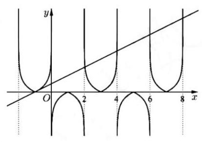
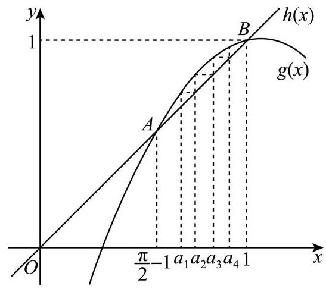
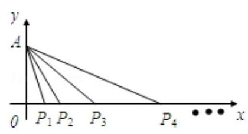

2025 版上海高考真题及模拟训练合集

## 三、数列

## 板块一:中档客观题

## 1. 真题回顾

A、数列基本性质

【例题】1. (2021 上海秋考) 已知 $\left\{  {a}_{n}\right\}$ 为无穷等比数列, ${a}_{1} = 3,{a}_{n}$ 的各项和为 $9,{b}_{n} = {a}_{2n}$ ,则数列 $\left\{  {b}_{n}\right\}$ 的各项和为___.

【答案】 $\frac{18}{5}$

【解析】设 $\left\{  {a}_{n}\right\}$ 的公比为 $q$ ,由 ${a}_{1} = 3,{a}_{n}$ 的各项和为 9,得 $\frac{3}{1 - q} = 9$ ,解得 $q = \frac{2}{3}$ ,

所以 ${a}_{n} = 3 \times  {\left( \frac{2}{3}\right) }^{n - 1},{b}_{n} = {a}_{2n} = 3 \times  {\left( \frac{2}{3}\right) }^{{2n} - 1}$ ,

得数列 $\left\{  {b}_{n}\right\}$ 是首项为 2,公比为 $\frac{4}{9}$ 的等比数列,则数列 $\left\{  {b}_{n}\right\}$ 的各项和为 $\frac{2}{1 - \frac{4}{9}} = \frac{18}{5}$ .

【例题】2. (2018 上海春考) 设 ${S}_{n}$ 为数列 $\left\{  {a}_{n}\right\}$ 的前 $n$ 项和,“ $\left\{  {a}_{n}\right\}$ 是严格递增数列” 是 “ $\left\{  {S}_{n}\right\}$ 是严格递增数列”的 ( )

A. 充分非必要条件 B. 必要非充分条件

C. 充要条件 D. 既非充分又非必要条件

【答案】 $D$

【解析】数列 $- 3, - 2, - 1$ 是严格递增数列,但 $\left\{  {S}_{n}\right\}$ 不是严格递增数列,即充分性不成立, 数列1,1,1满足 $\left\{  {S}_{n}\right\}$ 是严格递增数列,但数列1,1,1不是严格递增数列,即必要性不成立, 则 “ $\left\{  {a}_{n}\right\}$ 是严格递增数列” 是 “ $\left\{  {S}_{n}\right\}$ 是严格递增数列” 的既不充分也不必要条件,故选 $D$ .

【例题】3. (2017上海秋考)已知数列 $\left\{  {a}_{n}\right\}$ 和 $\left\{  {b}_{n}\right\}$ ，其中 ${a}_{n} = {n}^{2}, n \in  {N}^{ * }$ ， $\left\{  {b}_{n}\right\}$ 的项是互不相等的正整数,若对于任意 $n \in  {N}^{ * },\left\{  {b}_{n}\right\}$ 的第 ${a}_{n}$ 项等于 $\left\{  {a}_{n}\right\}$ 的第 ${b}_{n}$ 项,则 $\frac{\lg \left( {{b}_{1}{b}_{4}{b}_{9}{b}_{16}}\right) }{\lg \left( {{b}_{1}{b}_{2}{b}_{3}{b}_{4}}\right) } =$ ___.

【答案】 2

【解析】因为 ${a}_{n} = {n}^{2}$ ,若对于一切 $n \in  {N}^{ * },\left\{  {b}_{n}\right\}$ 中的第 ${a}_{n}$ 项恒等于 $\left\{  {a}_{n}\right\}$ 中的第 ${b}_{n}$ 项,

所以 ${b}_{{a}_{n}} = {a}_{{b}_{n}} = {\left( {b}_{n}\right) }^{2}$ ,所以 ${b}_{1} = {a}_{1} = 1,{\left( {b}_{2}\right) }^{2} = {b}_{4},{\left( {b}_{3}\right) }^{2} = {b}_{9},{\left( {b}_{4}\right) }^{2} = {b}_{16}$ .

所以 ${b}_{1}{b}_{4}{b}_{9}{b}_{16} = {\left( {b}_{1}{b}_{2}{b}_{3}{b}_{4}\right) }^{2}$ ,所以 $\frac{\lg \left( {{b}_{1}{b}_{4}{b}_{9}{b}_{16}}\right) }{\lg \left( {{b}_{1}{b}_{2}{b}_{3}{b}_{4}}\right) } = 2$ .

【例题】4. (2015 上海春考) 已知数列 $\left\{  {a}_{n}\right\}$ 满足 ${a}_{n} + {a}_{n + 4} = {a}_{n + 1} + {a}_{n + 3}\left( {n \in  {N}^{ * }}\right)$ ,那么必有 ( )

A. $\left\{  {a}_{n}\right\}$ 是等差数列 B. $\left\{  {a}_{{2n} - 1}\right\}$ 是等差数列

C. $\left\{  {a}_{2n}\right\}$ 是等差数列 D. $\left\{  {a}_{3n}\right\}$ 是等差数列

【答案】 $D$

【解析】因为 ${a}_{n} + {a}_{n + 4} = {a}_{n + 1} + {a}_{n + 3}\left( {n \in  {N}^{ * }}\right)$ ,所以 ${a}_{n + 4} - {a}_{n + 1} = {a}_{n + 3} - {a}_{n}$ ,

所以 ${a}_{n + 5} - {a}_{n + 2} = {a}_{n + 4} - {a}_{n + 1},{a}_{n + 6} - {a}_{n + 3} = {a}_{n + 5} - {a}_{n + 2}$ ,

所以 ${a}_{n + 6} - {a}_{n + 3} = {a}_{n + 3} - {a}_{n}$ ,所以数列 $\left\{  {a}_{3n}\right\}$ 是等差数列,故选 $D$ .

【例题】5. (2016 上海秋考) 已知无穷等比数列 $\left\{  {a}_{n}\right\}$ 的公比为 $q$ ,前 $n$ 项和为 ${S}_{n}$ ,且 $\mathop{\lim }\limits_{{n \rightarrow  \infty }}{S}_{n} = S$ ,下列条件中,使得 $2{S}_{n} < S\left( {n \in  {N}^{ * }}\right)$ 恒成立的是 ( )

A. ${a}_{1} > 0,{0.6} < q < {0.7}$ B. ${a}_{1} < 0, - {0.7} < q <  - {0.6}$

C. ${a}_{1} > 0,{0.7} < q < {0.8}$ D. ${a}_{1} < 0, - {0.8} < q <  - {0.7}$

【答案】 $B$

【解析】 ${S}_{n} = \frac{{a}_{1}\left( {1 - {q}^{n}}\right) }{1 - q}, S = \mathop{\lim }\limits_{{n \rightarrow  \infty }}{S}_{n} = \frac{{a}_{1}}{1 - q}, - 1 < q < 1,2{S}_{n} < S$ ,

所以 ${a}_{1}\left( {2{q}^{n} - 1}\right)  > 0$ ,

若 ${a}_{1} > 0$ ,则 ${q}^{n} > \frac{1}{2}$ ,故 $A$ 与 $C$ 不可能成立;

若 ${a}_{1} < 0$ ,则 ${q}^{n} < \frac{1}{2}$ ,在 $B$ 中, ${a}_{1} < 0, - {0.7} < q <  - {0.6}$ 故 $B$ 成立;

在 $D$ 中, ${a}_{1} < 0, - {0.8} < q <  - {0.7}$ ,此时 ${q}^{2} > \frac{1}{2}, D$ 不成立.

故选 $B$ .

B、计数相关

【例题】1. (2022 上海秋考) 已知等差数列 $\left\{  {a}_{n}\right\}$ 的公差不为零, ${S}_{n}$ 为其前 $n$ 项和,若 ${S}_{5} = 0$ ,则 ${S}_{i}(\mathrm{i} = 1$ 、 2、...、100) 中不同的数值有 ___个.

【答案】98

【解析】由等差数列的性质, ${S}_{5} = \frac{5\left( {{a}_{1} + {a}_{5}}\right) }{2} = 5{a}_{3} = 0$ ,所以 ${a}_{3} = 0$ ,

法一: ${a}_{1} + {a}_{5} = {a}_{2} + {a}_{4} = 2{a}_{3} = 0$ ，又 $d \neq  0$ ，不妨取 $d > 0$ ，

则 ${S}_{2} = {S}_{3} < {S}_{1} = {S}_{4} < {S}_{5} < {S}_{6} < \cdots  < {S}_{100}$ ,故 ${S}_{i}$ 中不同的数值有 98 个,

同理,若取 $d < 0$ ,则有 ${S}_{2} = {S}_{3} > {S}_{1} = {S}_{4} > {S}_{5} > {S}_{6} > \cdots  > {S}_{100}$ ,

故 ${S}_{i}$ 中不同的数值有 98 个.

法二: 由 ${a}_{3} = 0$ 得 ${a}_{1} =  - {2d},{S}_{n} = \frac{d}{2}{n}^{2} + \left( {{a}_{1} - \frac{d}{2}}\right) n = \frac{d}{2}{n}^{2} - \frac{5d}{2}n$ ,

对称轴为 $n = \frac{5}{2}$ ,故 ${S}_{2} = {S}_{3} \neq  {S}_{1} = {S}_{4} \neq  {S}_{5} \neq  {S}_{6} \neq  \cdots  \neq  {S}_{100}$ ,

故 ${S}_{i}$ 中不同的数值有 98 个.

【例题】2. (2017 上海春考) 设 ${a}_{1}\text{ 、 }{a}_{2}\text{ 、 }\cdots \text{ 、 }{a}_{6}$ 为 $1\text{ 、 }2\text{ 、 }3\text{ 、 }4\text{ 、 }5\text{ 、 }6$ 的一个排列,则满足 $\left| {{a}_{1} - {a}_{2}}\right|  + \left| {{a}_{3} - {a}_{4}}\right| \; + \left| {{a}_{5} - {a}_{6}}\right|  = 3$ 的不同排列的个数为___.

【答案】48

【解析】若 $\left| {{a}_{1} - {a}_{2}}\right|  + \left| {{a}_{3} - {a}_{4}}\right|  + \left| {{a}_{5} - {a}_{6}}\right|  = 3$ ,则 $\left| {{a}_{1} - {a}_{2}}\right|  = \left| {{a}_{3} - {a}_{4}}\right|  = \left| {{a}_{5} - {a}_{6}}\right|  = 1$ ,

需要将 $1\text{ 、 }2\text{ 、 }3\text{ 、 }4\text{ 、 }5\text{ 、 }6$ 分成 3 组,其中 1 和 $2\text{ ， }3$ 和 $4\text{ ， }5$ 和 6 必须在一组,

每组2个数,考虑其顺序,有 ${P}_{2}^{2}$ 种情况,三组共有 ${P}_{2}^{2} \times  {P}_{2}^{2} \times  {P}_{2}^{2} = 8$ 种顺序,

将三组全排列,对应三个绝对值,有 ${P}_{3}^{3} = 6$ 种情况,

则不同排列的个数为 $8 \times  6 = {48}$ .

【例题】3. (2016上海秋考)无穷数列 $\left\{  {a}_{n}\right\}$ 由 $k$ 个不同的数组成， ${S}_{n}$ 为 $\left\{  {a}_{n}\right\}$ 的前 $n$ 项和，若对任意 $n \in \; {N}^{ * },{S}_{n} \in  \{ 2,3\}$ ，则 $k$ 的最大值为___.

【答案】 4

【解析】对任意 $n \in  {N}^{ * },{S}_{n} \in  \{ 2,3\}$ ,当 $n = 1$ 时, ${a}_{1} = {S}_{1} = 2$ 或 3 ;

若 $n = 2$ ,由 ${S}_{2} \in  \{ 2,3\}$ ,得数列的前两项为2,0或2,1或3,0或 $3, - 1$ ;

若 $n = 3$ ,由 ${S}_{3} \in  \{ 2,3\}$ ,得数列的前三项为2,0,0或2,0,1或2,1,0

或 $2,1, - 1$ 或3,0,0或 $3,0, - 1$ 或3,1,0或 $3,1, - 1$ ;

2025 版上海高考真题及模拟训练合集

若 $n = 4$ ,由 ${S}_{3} \in  \{ 2,3\}$ ,得数列的前四项为2,0,0,0或2,0,0,1 或2,0,1,0或 $2,0,1, - 1$ 或2,1,0,0或 $2,1,0, - 1$ 或 $2,1, - 1,0$ 或 $2,1, - 1,1$ 或3,0,0,0或 $3,0,0, - 1$ 或 $3,0, - 1,0$ 或 $3,0, - 1,1$ 或 $3, - 1,0,0$ 或 $3, - 1,0,1$ 或 $3, - 1,1,0$ 或 $3, - 1,1, - 1;\cdots$ 即有 $n > 4$ 后一项都为 0 或 1 或 -1,则 $k$ 的最大个数为 4 . 2025 版上海高考真题及模拟训练合集

## 2. 模拟练习

【练习】1. 已知数列 $\left\{  {a}_{n}\right\}$ 、 $\left\{  {b}_{n}\right\}$ 均为正项等比数列， ${P}_{n}$ 、 ${Q}_{n}$ 分别为数列 $\left\{  {a}_{n}\right\}$ 、 $\left\{  {b}_{n}\right\}$ 的前 $n$ 项积，且 $\frac{\ln {P}_{n}}{\ln {Q}_{n}} \; = \frac{{5n} - 7}{2n}$ ，则 $\frac{\ln {a}_{3}}{\ln {b}_{3}}$ 的值为___.

【答案】 $\frac{9}{5}$

【解析】推导出数列 $\left\{  {\ln {a}_{n}}\right\}  \text{ 、 }\left\{  {\ln {b}_{n}}\right\}$ 为等差数列,由此可得出 $\frac{\ln {a}_{3}}{\ln {b}_{3}} = \frac{\ln {P}_{5}}{\ln {Q}_{5}}$ ,即可得解.

设等比数列 $\left\{  {a}_{n}\right\}$ 的公比为 $q\left( {q > 0}\right)$ ,则 $\ln {a}_{n + 1} - \ln {a}_{n} = \ln \frac{{a}_{n + 1}}{{a}_{n}} = \ln q$ (常数),

所以，数列 $\left\{  {\ln {a}_{n}}\right\}$ 为等差数列，同理可知，数列 $\left\{  {\ln {b}_{n}}\right\}$ 也为等差数列，

因为 $\ln {P}_{5} = \ln \left( {{a}_{1}{a}_{2}{a}_{3}{a}_{4}{a}_{5}}\right)  = \ln {a}_{1} + \ln {a}_{2} + \ln {a}_{3} + \ln {a}_{4} + \ln {a}_{5} = \frac{5\left( {\ln {a}_{1} + \ln {a}_{5}}\right) }{2} = 5\ln {a}_{3}$ ,

同理可得 $\ln {Q}_{5} = 5\ln {b}_{3}$ ,因此, $\frac{\ln {a}_{3}}{\ln {b}_{3}} = \frac{5\ln {a}_{3}}{5\ln {b}_{3}} = \frac{\ln {P}_{5}}{\ln {Q}_{5}} = \frac{5 \times  5 - 7}{2 \times  5} = \frac{9}{5}$ .

故答案为: $\frac{9}{5}$ .

【练习】2. (2024 届交附) 设等比数列 $\left\{  {a}_{n}\right\}$ 的前 $n$ 项和为 ${S}_{n}$ ,设甲: ${a}_{1} < {a}_{2} < {a}_{3},\text{ 乙 } : \left\{  {S}_{n}\right\}$ 是严格增数列, 则甲是乙的 ( )

A. 充分非必要条件 B. 必要非充分条件

C. 充要条件 D. 既非充分又非必要条件

【答案】 $D$

【解析】若 ${a}_{1} < {a}_{2} < {a}_{3}$ ,则 $\left\{  \begin{array}{l} {a}_{1} > 0 \\  1 < q < {q}^{2} \end{array}\right.$ 或 $\left\{  \begin{array}{l} {a}_{1} < 0 \\  1 > q > {q}^{2} \end{array}\right.$ ,所以 $\left\{  \begin{array}{l} {a}_{1} > 0 \\  q > 1 \end{array}\right.$ 或 $\left\{  \begin{array}{l} {a}_{1} < 0 \\  0 < q < 1 \end{array}\right.$ ;

若 $\left\{  {S}_{n}\right\}$ 是严格增数列,则 ${a}_{n} > 0$ ,则 $\left\{  \begin{array}{l} {a}_{1} > 0 \\  q > 0 \end{array}\right.$ ,

则甲是乙的既非充分又非必要条件,故选 $D$

【练习】3. 已知数列 $\left\{  {a}_{n}\right\}$ 是首项为 ${a}_{1}$ ,公差为 $d\left( {0 < d < {2\pi }}\right)$ 的等差数列,若数列 $\left\{  {\cos {a}_{n}}\right\}$ 是等比数列，则其公比为___.

【答案】-1

【解析】因为数列 $\left\{  {a}_{n}\right\}$ 是首项为 ${a}_{1}$ ,公差为 $d\left( {0 < d < {2\pi }}\right)$ 的等差数列,

所以 ${a}_{n} = {a}_{1} + \left( {n - 1}\right) d$ ,因为数列 $\left\{  {\cos {a}_{n}}\right\}$ 是等比数列,所以 $\frac{\cos {a}_{n + 1}}{\cos {a}_{n}} = \frac{\cos {a}_{2}}{\cos {a}_{1}}$ ,

即 $\frac{\cos \left( {{a}_{1} + {nd}}\right) }{\cos \left\lbrack  {{a}_{1} + \left( {n - 1}\right) d}\right\rbrack  } = \frac{\cos \left( {{a}_{1} + d}\right) }{\cos {a}_{1}}$ ①,

所以 $2\cos {a}_{1}\cos \left( {{a}_{1} + {nd}}\right)  = 2\cos \left( {{a}_{1} + d}\right) \cos \left\lbrack  {{a}_{1} + \left( {n - 1}\right) d}\right\rbrack$ ,

积化和差得 $\cos \left( {2{a}_{1} + {nd}}\right)  + \cos {nd} = \cos \left( {2{a}_{1} + {nd}}\right)  + \cos \left( {n - 2}\right) d$ ,

所以 $\cos \left( {n - 2}\right) d - \cos {nd} = 0$ ,

和差化积得 $2\sin \left\lbrack  {\left( {n - 1}\right) d}\right\rbrack  \sin d = 0$ ,对任意的正整数 $n$ 都成立,

所以 $\sin d = 0,0 < d < {2\pi }$ ,则 $d = \pi$ ,由①得公比 $q =  - 1$ .

【练习】4. 设 $\left\{  {a}_{n}\right\}$ 是公差不为 0 的无穷等差数列,则 “ $\left\{  {a}_{n}\right\}$ 为严格递增数列” 是 “存在正整数 ${N}_{0}$ ,当 $n > \; {N}_{0}$ 时, ${a}_{n} > 0$ ”的 ( ) 2025 版上海高考真题及模拟训练合集

A. 充分而不必要条件 B. 必要而不充分条件

C. 充分必要条件 D. 既不充分也不必要条件

【答案】 $C$

【解析】因为数列 $\left\{  {a}_{n}\right\}$ 是公差不为 0 的无穷等差数列,

当 $\left\{  {a}_{n}\right\}$ 为严格递增数列时,公差 $d > 0$ ,

令 ${a}_{n} = {a}_{1} + \left( {n - 1}\right) d > 0$ ,解得 $n > 1 - \frac{{a}_{1}}{d},\left\lbrack  {1 - \frac{{a}_{1}}{d}}\right\rbrack$ 表示取整函数,

所以存在正整数 ${N}_{0} = 1 + \left\lbrack  {1 - \frac{{a}_{1}}{d}}\right\rbrack$ ,当 $n > {N}_{0}$ 时, ${a}_{n} > 0$ ,充分性成立;

当 $n > {N}_{0}$ 时, ${a}_{n} > 0,{a}_{n - 1} < 0$ ,则 $d = {a}_{n} - {a}_{n - 1} > 0$ ,必要性成立;

是充分必要条件. 故选 $C$ .

【练习 】5. 已知 $\left\{  {a}_{n}\right\}$ 为等比数列,有下列两个命题

命题 $p$ : 存在大于等于 2 的正整数 $k$ ,使得对于任意正整数 $n$ ,都有 ${a}_{n + k} < {a}_{n}$ 成立,则 $\left\{  {a}_{n}\right\}$ 为严格减数列

命题 $q$ : 对于任意正整数 $n$ ,都存在大于等于 2 的正整数 $k$ ,使得 ${a}_{n + k} < {a}_{n}$ 恒成立,则 $\left\{  {a}_{n}\right\}$ 为严格减数列

那么下列判断正确的是( )

A. $p$ 真 $q$ 假 B. $p$ 假 $q$ 假 C. $p$ 真 $q$ 真 D. $p$ 假 $q$ 真

【答案】 $A$

【解析】 $p$ 真: 存在 $k$ 为正的常数,对于任意 $n$ ,都有 ${a}_{n + k} < {a}_{n}$

则 ${a}_{n + k} - {a}_{n} = {a}_{1}{q}^{n - 1}\left( {{q}^{k} - 1}\right)  < 0$ 恒成立

故 ${q}^{n - 1}$ 不变号,故 $q > 0$ ,故 ${a}_{1}\left( {{q}^{k} - 1}\right)  < 0$

$\left\{  {\begin{array}{l} {a}_{1} > 0 \\  0 < q < 1 \end{array}\text{ 或 }\left\{  {\begin{array}{l} {a}_{1} < 0 \\  q > 1 \end{array}\text{ 都可以推出 }\left\{  {a}_{n}\right\}  \text{ 为严格减数列 }}\right. }\right.$

$q$ 假: 反例 ${a}_{n} = {\left( -1\right) }^{n}$

【练习】6. 已知 ${a}_{n} = \left| {{q}^{n} - 1}\right|$ ,若数列 $\left\{  {a}_{n}\right\}$ 为严格增数列,则实数 $q$ 的取值范围是___.

【答案】 $\left( {-\infty , - 2}\right)  \cup  \left( {0,1}\right)  \cup  \left( {1, + \infty }\right)$

【解析】当 $q > 1$ 时, ${a}_{n} = {q}^{n} - 1$ 为严格增数列,满足题意;

当 $0 < q < 1$ 时, ${a}_{n} = 1 - {q}^{n}$ 为严格增数列,满足题意;

当 $- 1 \leq  q < 0$ 时, ${a}_{1} = 1 - q > 1,{a}_{2} = 1 - {q}^{2} < 1$ ,不合题意,舍去;

当 $q <  - 1$ 时, ${a}_{1} = 1 - q,{a}_{2} = {q}^{2} - 1$ ,由 ${a}_{1} < {a}_{2}$ 得 ${q}^{2} + q > 2$ ,得 $q <  - 2$ ,

此时 ${a}_{1} = 1 - q < {a}_{2} = {q}^{2} - 1 < {a}_{3} = 1 - {q}^{3} < {a}_{4} = {q}^{4} - 1 < \cdots$ ,

这是因为 ${q}^{3} + {q}^{2} = {q}^{2}\left( {q + 1}\right)  < 2,{q}^{4} + {q}^{3} = {q}^{2}\left( {{q}^{2} + q}\right)  > 2,\cdots$

综上,实数 $q$ 的取值范围是 $\left( {-\infty , - 2}\right)  \cup  \left( {0,1}\right)  \cup  \left( {1, + \infty }\right)$ .

【练习】7. 定义 “有增有减”数列 $\left\{  {a}_{n}\right\}$ 如下: 存在 $t \in  {N}^{ * }$ ,满足 ${a}_{t} < {a}_{t + 1}$ ,且存在 $s \in  {N}^{ * }$ ,满足 ${a}_{S} > {a}_{S + 1}$ . 已知 “有增有减” 数列 $\left\{  {a}_{n}\right\}$ 共 4 项,若 ${a}_{i} \in  \{ 1,2,3\} \left( {\mathrm{i} = 1,2,3,4}\right)$ ,且 $x < y < z$ ,则数列 $\left\{  {a}_{n}\right\}$ 共有 ( )

A. 64 个 B. 57 个 C. 56 个 D. 54 个

【答案】 $D$

【解析】只有 2 个数值,例如:1,1,2,2类型,共有 ${C}_{3}^{2} \times  4 = {12}$ 种;

只有 2 个数值相同，例如1,1,2,3类型. 共有 ${C}_{3}^{2} \times  {10} = {30}$ 种；

有 3 个数值相同，例如1,1,1,3类型，共有 ${C}_{3}^{1} \cdot  {C}_{2}^{1} \times  2 = {12}$ 种.

满足题目的数列类型共有 54 种. 故选 $D$ .

【练习】8. 已知等差数列 $\left\{  {a}_{n}\right\}$ 满足 ${a}_{5} + {a}_{7} > 0,{a}_{6} + {a}_{7} < 0$ ,若对任意正整数 $n \geq  3,{T}_{n} = {a}_{1}{a}_{2}{a}_{3}{a}_{4} + \; {a}_{2}{a}_{3}{a}_{4}{a}_{5} + \cdots  + {a}_{n}{a}_{n + 1}{a}_{n + 2}{a}_{n + 3}$ ,且恒有 ${T}_{n} \geq  {T}_{k}$ ,则正整数 $k$ 的值是 ( )

A. 4 B. 5 C. 6 D. 7

【答案】C

【解析】由题意得 ${a}_{6} = \frac{{a}_{5} + {a}_{7}}{2} > 0$ ,由 ${a}_{6} + {a}_{7} < 0$ 得 ${a}_{7} <  - {a}_{6} < 0,{b}_{n} = {a}_{n}{a}_{n + 1}{a}_{n + 2}{a}_{n + 3}$ ,

则 ${b}_{1},{b}_{2},{b}_{3} > 0,{b}_{4} < 0,{b}_{5} > 0,{b}_{6} < 0,{b}_{n} > 0\left( {n \geq  7}\right)$ .

又因为 ${b}_{5} + {b}_{6} = {a}_{5}{a}_{6}{a}_{7}{a}_{8} + {a}_{6}{a}_{7}{a}_{8}{a}_{9} = {a}_{6}{a}_{7}{a}_{8}\left( {{a}_{5} + {a}_{9}}\right)  = 2{a}_{6}{a}_{7}^{2}{a}_{8} < 0$ ,

所以当 $n \geq  3$ 时, ${T}_{n} \geq  {T}_{6}$ ,所以 $k = 6$ . 故选 $C$ .

【练习】9. (2026 届松二) 已知四个整数 $a, b, c, d$ 满足 $0 < a < b < c < d$ . 若 $a, b, c$ 成等差数列, $b$ , $c, d$ 成等比数列,且 $d - a = {48}$ ,则 $a + b + c + d$ 的值为___.

【答案】333

【解析】因为 $a, b, c$ 成等差数列,设公差为 $x$ ,则 $a = b - x, c = b + x$ ,

由 $b, c, d$ 成等比数列,得 ${c}^{2} = {bd}$ ,结合 $d - a = {48}$ ,得 ${\left( b + x\right) }^{2} = b\left( {{48} + b - x}\right)$ ,

整理得 ${x}^{2} + {3bx} = {48b}$ ,由于 $a, b, c, d$ 为整数,且 $0 < a < b < c < d$ ,

故 $x$ 为整数, $x > 0$ ,则 $b = \frac{{x}^{2}}{{48} - {3x}} > a \geq  1$ ,需满足 $\left\{  \begin{array}{l} {x}^{2} + {3x} - {48} > 0 \\  {48} - {3x} > 0 \end{array}\right.$ ,

即 $\frac{\sqrt{201} - 3}{2} < 6 \leq  x < {16}$ ,结合 $b$ 为整数,代入 $x = 6,7,8,9,\cdots ,{15}$ ,

得只有当 $x = {12},{15}$ 时, $\frac{{x}^{2}}{{48} - {3x}}$ 才为整数,

当 $x = {12}$ 时, $b = \frac{{x}^{2}}{{48} - {3x}} = {12}$ ,则 $a = b - x = 0$ ,不合题意;

当 $x = {15}$ 时, $b = \frac{{x}^{2}}{{48} - {3x}} = {75}$ ,则 $a = b - x = {60}, c = b + x = {90}, d = {48} + a = {108}$ ,

适合题意,

则 $a + b + c + d = {60} + {75} + {90} + {108} = {333}$ .

【练习】10. (2024 届曹二) 已知 $\left\{  {a}_{n}\right\}$ 是等比数列,公比为 $q$ ,若存在无穷多个不同的 $n\left( {n \in  N, n \geq  1}\right)$ 满足 ${a}_{n + 2} \leq  {a}_{n} \leq  {a}_{n + 1}$ ,则下列选项之中,不可能成立的为 ( )

A. $q > 0$ B. $q < 0$ C. $\left| q\right|  < 1$ D. $\left| q\right|  > 1$

【答案】 $C$

【解析】当 $q > 0$ 时,

①当 $q = 1$ ，则 $\left\{  {a}_{n}\right\}$ 为非零常数列，故 ${a}_{n + 2} = {a}_{n} = {a}_{n + 1}, q = 1$ 符合题意，故 $A$ 正确；

②当 $q \neq  1$ ，则 $\left\{  {a}_{n}\right\}$ 为单调数列，故 ${a}_{n + 2} \leq  {a}_{n} \leq  {a}_{n + 1}$ 恒不成立，即 $q > 0$ 且 $q \neq  1$ 时不合题意；

当 $q < 0$ 时，由等比数列的性质得 ${a}_{n}{a}_{n + 1} = {a}_{1}^{2}{q}^{{2n} - 1} < 0$ ，

① 当 $q =  - 1$ ，若 ${a}_{1} > 0, n$ 为偶数时，则 ${a}_{n + 2} = {a}_{n} < 0 < {a}_{n + 1}$ ，

若 ${a}_{1} < 0, n$ 为奇数时,则 ${a}_{n + 2} = {a}_{n} < 0 < {a}_{n + 1}$ ,故 $q =  - 1$ 符合题意,故 $B$ 正确;

② 当 $q <  - 1$ ，若 ${a}_{1} > 0$ ， $n$ 为偶数时，则 ${a}_{n + 2}$ 、 ${a}_{n} < 0$ ， ${a}_{n + 1} > 0$ ，

且 ${a}_{n + 2} - {a}_{n} = {a}_{n}\left( {{q}^{2} - 1}\right)  < 0$ ,即 ${a}_{n + 2} < {a}_{n} < {a}_{n + 1}$ ,

若 ${a}_{1} < 0, n$ 为奇数时,则 ${a}_{n + 2}\text{ 、 }{a}_{n} < 0,{a}_{n + 1} > 0$ ,

且 ${a}_{n + 2} - {a}_{n} = {a}_{n}\left( {{q}^{2} - 1}\right)  < 0$ ,即 ${a}_{n + 2} < {a}_{n} < {a}_{n + 1}$ ,故 $q <  - 1$ 符合题意,故 $D$ 正确;

③ 当 $- 1 < q < 0,{a}_{n + 2} \leq  {a}_{n} \leq  {a}_{n + 1}$ ,

因为 $- 1 < q < 0$ ,所以 ${q}^{2} - 1 < 0,1 - q > 0$ ,得 $\left\{  \begin{array}{l} {a}_{n + 2} - {a}_{n} = {a}_{n}\left( {{q}^{2} - 1}\right)  \leq  0 \\  {a}_{n + 1} - {a}_{n} = {a}_{n}\left( {q - 1}\right)  \geq  0 \end{array}\right.$ ,

则 ${a}_{n} = 0$ ，这与等比数列相矛盾，

所以 $- 1 < q < 0$ 和 $0 < q < 1$ 均不合题意，故 $C$ 错误.

故选 $C$ .

【练习】11. 已知各项均为整数的等差数列 $\left\{  {a}_{n}\right\}$ ,若 ${a}_{1} = {1920},{a}_{m} = {1950},{a}_{n} = {2020}$ ,则 $\left| {m - n}\right|$ 的最小值是___.

【答案】 7

【解析】设公差为 $d$ ,

因为 ${a}_{1} = {1920},{a}_{m} = {1950},{a}_{n} = {2020}$ ,

所有 ${a}_{m} = {a}_{1} + \left( {m - 1}\right) d = {1950},{a}_{n} = {a}_{1} + \left( {n - 1}\right) d = {2020}$ ,

所以 $\left( {m - 1}\right) d = {30},\left( {n - 1}\right) d = {100}$ ,

所以 $d = \frac{30}{m - 1} = \frac{100}{n - 1} > 0, m = \frac{30}{d} + 1, n = \frac{100}{d} + 1$ ,

所以 $n > m > 1$ ,

又因为 $\left\{  {a}_{n}\right\}$ 的各项均为整数,所以 $d = \frac{30}{m - 1} = \frac{100}{n - 1}$ 为整数,

则 $\left| {m - n}\right|  = \frac{70}{d}$ ,

因为 $d, m, n$ 都是正整数，所以 ${d}_{\max }$ 为 30 和 100 的最大公约数 10 ，

所以 ${\left| m - n\right| }_{\min } = 7$ .

故答案为: 7 .

【练习】12. 已知项数为 $k\left( {k \in  Z, k \geq  1}\right)$ 的等差数列 $\left\{  {a}_{n}\right\}$ 满足 ${a}_{1} = 1,{a}_{n} > \frac{1}{4}{a}_{n - 1}\left( {n = 2,3,4,\cdots k}\right)$ . 若 ${a}_{1} + {a}_{2} + {a}_{3} + \cdots  + {a}_{k} = 8$ ，则 $k$ 的最大值是 ___.

【答案】 15

【解析】设等差数列 $\left\{  {a}_{n}\right\}$ 的公差为 $d$ ,

由 ${a}_{1} = 1,{a}_{n} > \frac{1}{4}{a}_{n - 1}\left( {n = 2,3,\cdots , k}\right)$ ,得到 $4\left\lbrack  {1 + \left( {n - 1}\right) d}\right\rbrack   > 1 + \left( {n - 2}\right) d$ ,

即 $3 + \left( {{3n} - 2}\right) d > 0$ ,

当 $n = 2,3,\cdots , k$ 时,恒有 $3 + \left( {{3n} - 2}\right) d > 0$ ,即 $d >  - \frac{3}{{3n} - 2}$ ,

所以 $d >  - \frac{3}{{3k} - 2}$ ,

由 ${a}_{1} + {a}_{2} + \cdots  + {a}_{k} = 8$ ,得到 $8 = \frac{k\left( {{a}_{1} + {a}_{k}}\right) }{2} = \frac{k\left\lbrack  {2 + \left( {k - 1}\right) d}\right\rbrack  }{2}$ ,

所以 ${16} = {2k} + k\left( {k - 1}\right) d > {2k} + k\left( {k - 1}\right) \frac{-3}{{3k} - 2},\because k \in  Z, k \geq  2$ ,

整理得到 $3{k}^{2} - {49k} + {32} < 0$ ,令 $f\left( k\right)  = 3{k}^{2} - {49k} + {32} = 3{\left( k - \frac{49}{6}\right) }^{2} - \frac{2017}{12}$ ,

当 $k \geq  9$ 时,函数 $f\left( k\right)$ 单调递增,

而 $f\left( {15}\right)  =  - {28} < 0, f\left( {16}\right)  = {16} > 0$ ,

所以 $k$ 的最大值是 15 .

【练习】13. 已知: $n > 1,{a}_{1},{a}_{2},{a}_{3},\cdots ,{a}_{n}$ 为整数且 ${a}_{1} + {a}_{2} + {a}_{3} + \cdots  + {a}_{n} = {a}_{1} \cdot  {a}_{2} \cdot  {a}_{3}\cdots \cdots {a}_{n} = {2013}$ ,则 $n$ 的最小值为___.

【答案】 5

【解析】根据题意,由小到大代入整数 $n$ 的值验证得出答案.

根据题意, $n \geq  2, n \in  {N}^{ * }$ .

$n = 2$ 时,题中等式化简为 ${a}_{1} + {a}_{2} = {a}_{1} \cdot  {a}_{2} = {2013}$

所以 ${a}_{1},{a}_{2}$ 可看成是方程 ${x}^{2} - {2013x} + {2013} = 0$ 的两个实数解

而方程的判别式为 ${2013}^{2} - 4 \times  {2013} = 3 \times  {2013}$ ，显然方程的判别式为开不尽的数

所以上述方程无整数解,即 $n = 2$ 不符合题意;

$n = 3$ 时,题中等式化为 ${a}_{1} + {a}_{2} + {a}_{3} = {a}_{1} \cdot  {a}_{2} \cdot  {a}_{3} = {2013}$

根据题意,可设 ${a}_{1} \leq  {a}_{2} \leq  {a}_{3}$ ,且 ${a}_{1}.{a}_{2},{a}_{3}$ 为整数,又 ${2013} = 3 \times  {671} = 3 \times  {11} \times  {61}$

① ${a}_{1},{a}_{2}$ 同时为负整数时， $\left\{  \begin{array}{l} {a}_{1} + {a}_{2} = {2013} - {a}_{3} \leq   - 2 \\  {a}_{1} \cdot  {a}_{2} = \frac{2013}{{a}_{3}} \geq  1 \end{array}\right.$ 此时得 $\left\{  \begin{array}{l} {a}_{3} \geq  {2015} \\  {a}_{3} \leq  {2013} \end{array}\right.$

显然不存在满足题目条件的 ${a}_{3}$ ,即 ${a}_{1},{a}_{2}$ 同时为负整数时不符合题意;

② ${a}_{1},{a}_{2}$ 同时为正数时， $\left\{  \begin{array}{l} {a}_{1} + {a}_{2} = {2013} - {a}_{3} \geq  2 \\  {a}_{1} \cdot  {a}_{2} = \frac{2013}{{a}_{3}} \geq  1 \end{array}\right.$ 得 ${a}_{3} \leq  {2011}$ ，

此时 ${a}_{3} \leq  {671}$ ,显然不满足条件;

③ ${a}_{1},{a}_{2},{a}_{3}$ 三个数中有一个为 0 时，情况与 $n = 2$ 相同

所以 $n = 3$ 时，不符合题意；

$n = 4$ 时，同上可设 ${a}_{1} \leq  {a}_{2} \leq  {a}_{3} \leq  {a}_{4}$ 由 ${2013} = 3 \times  {671}$ 知，

当 ${a}_{1},{a}_{2},{a}_{3},{a}_{4}$ 均为整数时， ${a}_{4} \leq  {671}$ ，显然不符合题意

当 ${a}_{1},{a}_{2},{a}_{3},{a}_{4}$ 存在负数时, ${a}_{1} = {a}_{2} =  - 1$ ,此时有 $\left\{  \begin{array}{l} {a}_{3} + {a}_{4} = {2015} \\  {a}_{3} \cdot  {a}_{4} = {2013} \end{array}\right.$

同 $n = 2$ 时的分析方法,不存在符合条件的 ${a}_{3},{a}_{4}$ .

所以, $n = 4$ 不符合题意;

$n = 5$ 时,取 ${a}_{1} = {a}_{2} =  - 1,{a}_{3} = {a}_{4} = 1,{a}_{5} = {2013}$ ,此时满足题中条件

所以满足条件的 $n$ 的最小值为 5 .

故答案为: 5 .

## 板块二: 压轴客观题

## 1. 真题回顾

【例题】1. (2022 上海春考) 已知 $f\left( x\right)$ 为奇函数,当 $x \in  (0,1\rbrack , f\left( x\right)  = \ln x$ ,且 $f\left( x\right)$ 关于直线 $x = 1$ 对称. 设方程 $f\left( x\right)  = x + 1$ 的正数解为 ${x}_{1},{x}_{2},\cdots ,{x}_{n}$ ,则 $\mathop{\lim }\limits_{{n \rightarrow  \infty }}\left( {{x}_{n + 1} - {x}_{n}}\right)  =$ ___.

【答案】 2

【解析】因为 $f\left( x\right)$ 为奇函数,所以 $f\left( {-x}\right)  =  - f\left( x\right)$ ,因为 $f\left( x\right)$ 关于直线 $x = 1$ 对称,

所以 $f\left( x\right)  = f\left( {2 - x}\right)$ ,所以 $f\left( {2 - x}\right)  =  - f\left( {-x}\right)$ ,所以 $f\left( {2 + x}\right)  =  - f\left( x\right)$ ,

所以 $f\left( {x + 4}\right)  =  - f\left( {x + 2}\right)  = f\left( x\right)$ ,故 $f\left( x\right)$ 是周期为 4 的周期函数,

法一:作出图像如图，观察图像，

当 $n \rightarrow  \infty$ 时， ${x}_{n + 1} - {x}_{n}$ 趋向于两条渐近线之间的距离，故 $\mathop{\lim }\limits_{{n \rightarrow  \infty }} \; \left( {{x}_{n + 1} - {x}_{n}}\right)  = 2$

法二: 当 $x \in  \lbrack 1,2)$ 时, $f\left( x\right)  = f\left( {2 - x}\right)  = \ln \left( {2 - x}\right)$ ,

当 $x \in  ( - 2, - 1\rbrack$ 时, $f\left( x\right)  =  - f\left( {-x}\right)  =  - \ln \left( {2 + x}\right)$ ,

当 $x \in  \lbrack  - 1,0)$ 时, $f\left( x\right)  =  - f\left( {-x}\right)  =  - \ln \left( {-x}\right)$ ,

所以当 $x \in  ({4n} - 2,{4n} - 1\rbrack$ 时, $f\left( x\right)  = f\left( {x - {4n}}\right)  =  - \ln \lbrack x - \; \left( {{4n} - 2}\right) \rbrack$ ,

当 $x \in  \left( {{4n} - 1,{4n}}\right)$ 时, $f\left( x\right)  = f\left( {x - {4n}}\right)  =  - \ln \left( {{4n} - x}\right)$ ,

不妨令 $- \ln \left\lbrack  {{x}_{n} - \left( {{4n} - 2}\right) }\right\rbrack   = {x}_{n} + 1, - \ln \left( {{4n} - {x}_{n + 1}}\right)  = {x}_{n + 1} + 1$ ,

所以 ${x}_{n} = {4n} - 2 + \frac{1}{{\mathrm{e}}^{{x}_{n} + 1}},{x}_{n + 1} = {4n} - \frac{1}{{\mathrm{e}}^{{x}_{n + 1} + 1}}$ ,又当 $n \rightarrow  \infty$ 时, ${x}_{n} \rightarrow  \infty$ ,

所以 $\mathop{\lim }\limits_{{n \rightarrow  \infty }}\left( {{x}_{n + 1} - {x}_{n}}\right)  = \mathop{\lim }\limits_{{n \rightarrow  \infty }}\left( {2 - \frac{1}{{\mathrm{e}}^{{x}_{n + 1} + 1}} - \frac{1}{{\mathrm{e}}^{{x}_{n} + 1}}}\right)  = 2$ .

【例题】2. (2022 上海春考) 设 $\left\{  {a}_{n}\right\}$ 为等比数列,设 ${S}_{n}$ 和 ${T}_{n}$ 分别为 $\left\{  {a}_{n}\right\}$ 的前 $n$ 项和与前 $n$ 项积,则下列选项正确的是 ( )

A. 若 ${S}_{2022} \geq  {S}_{2021}$ ,则 $\left\{  {S}_{n}\right\}$ 为严格递增数列

B. 若 ${T}_{2022} \geq  {T}_{2021}$ ,则 $\left\{  {T}_{n}\right\}$ 为严格递增数列

C. 若 $\left\{  {S}_{n}\right\}$ 为严格递增数列,则 ${a}_{2022} > {a}_{2021}$

D. 若 $\left\{  {T}_{n}\right\}$ 为严格递增数列,则 ${a}_{2022} > {a}_{2021}$

【答案】 $D$

【解析】 $A$ . 错误,反例: $- 1,1, - 1,1,\cdots ;B$ . 错误,反例: $2, - 2,2, - 2,\cdots$ ;

$C$ . 错误,反例: $1,\frac{1}{2},\frac{1}{4},\frac{1}{8},\cdots ;D$ . 正确,下面给出严格证明:

因为 $\left\{  {T}_{n}\right\}$ 为递增数列,所以 ${a}_{1} > 0, q > 0$ ,否则会出现正负交替,

由 ${T}_{n} > {T}_{n - 1} > 0$ 得 ${a}_{n} > 1, q \geq  1$ ,所以 ${a}_{2022} > {a}_{2021}$ ,故选 $D$ .

【例题】3. (2021 上海秋考) 已知 ${a}_{i} \in  {N}^{ * }\left( {\mathrm{i} = 1,2,\cdots ,9}\right)$ ,对任意的 $k \in  {N}^{ * }\left( {2 \leq  k \leq  8}\right) ,{a}_{k} = {a}_{k - 1} + 1$ 或 ${a}_{k} = {a}_{k + 1} - 1$ 中有且仅有一个成立, ${a}_{1} = 6,{a}_{9} = 9$ ,则 ${a}_{1} + \cdots  + {a}_{9}$ 的最小值为___.

【答案】 31

【解析】设 ${b}_{k} = {a}_{k + 1} - {a}_{k}$ ,由题意得 ${b}_{k}\text{ 、 }{b}_{k - 1}$ 恰有一个为 1,

如果 ${b}_{1} = {b}_{3} = {b}_{5} = {b}_{7} = 1$ ,那么 ${a}_{1} = 6,{a}_{2} = 7,{a}_{3} \geq  1,{a}_{4} = {a}_{3} + 1 \geq  2$ ,

同样也有 ${a}_{5} \geq  1,{a}_{6} = {a}_{5} + 1 \geq  2,{a}_{7} \geq  1,{a}_{8} = {a}_{7} + 1 \geq  2$ ,

全部加起来至少是 $6 + 7 + 1 + 2 + 1 + 2 + 1 + 2 + 9 = {31}$ ;

如果 ${b}_{2} = {b}_{4} = {b}_{6} = {b}_{8} = 1$ ,那么 ${a}_{8} = 8,{a}_{2} \geq  1,{a}_{3} = {a}_{2} + 1 \geq  2$ ,

同样也有 ${a}_{4} \geq  1,{a}_{5} \geq  2,{a}_{6} \geq  1,{a}_{7} \geq  2$ ,

全部加起来至少是 $6 + 1 + 2 + 1 + 2 + 1 + 2 + 8 + 9 = {32}$ .

综上所述, 最小应该是 31 .

【例题】4. (2020 上海春考) 数列 $\left\{  {a}_{n}\right\}$ 各项均为实数,对任意 $n \in  {N}^{ * }$ 满足 ${a}_{n + 3} = {a}_{n}$ ,且 ${a}_{n}{a}_{n + 3} - {a}_{n + 1}{a}_{n + 2} \; = c$ 为定值,则下列选项中不可能的是 ( )

A. ${a}_{1} = 1, c = 1$ B. ${a}_{1} = 2, c = 2$ C. ${a}_{1} =  - 1, c = 4$ D. ${a}_{1} = 2, c = 0$

【答案】 $B$

【解析】 ${a}_{n}{a}_{n + 3} - {a}_{n + 1}{a}_{n + 2} = c$ ,因为对任意 $n \in  {N}^{ * }$ 满足 ${a}_{n + 3} = {a}_{n}$ ,

所以 $\left\{  \begin{array}{l} {a}_{n}^{2} - {a}_{n + 1}{a}_{n + 2} = c \\  {a}_{n + 1}^{2} - {a}_{n + 2}{a}_{n + 3} = c \end{array}\right.$ ,作差整理得 ${a}_{n + 1} = {a}_{n}$ (常数列, $c = 0$ ),

或 ${a}_{n} + {a}_{n + 1} + {a}_{n + 2} = 0$ ,

当 ${a}_{n} + {a}_{n + 1} + {a}_{n + 2} = 0$ ,则 ${a}_{n + 1} + {a}_{n + 2} =  - {a}_{n}$ 及 ${a}_{n + 1}{a}_{n + 2} = {a}_{n}^{2} - c$ ,

所以方程 ${x}^{2} + {a}_{n}x + {a}_{n}^{2} - c = 0$ 有两根 ${a}_{n + 1},{a}_{n + 2}$ ,

所以 $\Delta  = {a}_{n}^{2} - 4\left( {{a}_{n}^{2} - c}\right)  = {4c} - 3{a}_{n}^{2} > 0$ ,所以 $B$ 错,故选 $B$ . 2025 版上海高考真题及模拟训练合集

## 2. 模拟练习

【练习】1. (2024 届交附) 若 $\left\{  {a}_{n}\right\}$ 是以 ${a}_{1}$ 为首项, $d$ 为公差的等差数列; $\left\{  {b}_{n}\right\}$ 是以 ${b}_{1}$ 为首项, $q$ 为公比的等比数列. 则下列说法正确的是___.

①存在实数 ${a}_{1}$ ，使得不存在实数 $d \neq  0$ ，满足数列 $\left\{  {\sin \left( {a}_{n}\right) }\right\}$ 是常数列；

②存在实数 $d \neq  0$ ，使得对任意实数 ${a}_{1}$ ，满足数列 $\left\{  {\sin \left( {a}_{n}\right) }\right\}$ 都是常数列；

③存在实数 ${b}_{1} \neq  0$ ，使得不存在实数 $q \neq  1,0$ ，满足数列 $\left\{  {\sin \left( {b}_{n}\right) }\right\}$ 是常数列；

④存在实数 ${b}_{1} \neq  0$ ，使得有无穷多个实数 $q \neq  1,0$ ，满足数列 $\left\{  {\sin \left( {b}_{n}\right) }\right\}$ 是常数列.

【答案】②③④

【解析】 $d = {2\pi }$ ,则对任意 ${a}_{1},\sin \left( {a}_{n}\right)  = \sin \left( {a}_{1}\right)$ 恒成立,故①错②对.

取 ${b}_{1} = \pi$ ，任取 $q \in  Z$ ，则 ${b}_{n} = \pi {q}^{n - 1},\sin \left( {b}_{n}\right)  = 0$ 恒成立，故④正确.

(更强的命题, ${b}_{1} = \frac{t}{s}\pi$ ,则均存在无数个 $q \neq  1$ ,使得 $\sin \left( {b}_{n}\right)$ 为常数,

取 $q = {2ks} + 1, k \in  Z$ 即可)

只证明③. 取 ${b}_{1} = 1$ ，假设 $\left\{  {\sin \left( {b}_{n}\right) }\right\}$ 为常数列，

则 ${b}_{n} = {q}^{n - 1} = 1 + {2k\pi }$ 或 $\pi  - 1 + {2k\pi }$ ,

取 $n = 2$ ,则 $q = 1 + 2{k}_{1}\pi$ 或 $\pi  - 1 + 2{k}_{1}\pi  =  - 1 + \left( {2{k}_{1} - 1}\right) \pi$ ,

$n = 3$ ,则 ${q}^{2} = 1 + 2{k}_{2}\pi$ 或 $\pi  - 1 + 2{k}_{2}\pi$ ,

情况一 $q = 1 + 2{k}_{1}\pi \left( {{k}_{1} \neq  0}\right) ,{q}^{2} = 1 + 2{k}_{2}\pi$ ,则 ${\left( 1 + 2{k}_{1}\pi \right) }^{2} = 1 + 2{k}_{2}\pi$ ,

这是一个关于 $\pi$ 的一元二次方程,但这是不可能的 $\left( \pi \right.$ 是超越数 $)$ ,

其他情况同理,所以这样的等比数列不存在.

故正确的是②③④.

【练习】2. (2024 届松二) 若数列 $\left\{  {a}_{n}\right\}$ 满足条件: 存在正整数 $k$ ,使得 ${a}_{n + k} + {a}_{n - k} = 2{a}_{n}$ 对一切 $n \in  {N}^{ * }, n \; > k$ 都成立,则称数列 $\left\{  {a}_{n}\right\}$ 为 $k$ 级等差数列. 若 ${a}_{n} = {2n} + \sin {\omega n}\left( {\omega \text{ 为常数 }}\right)$ ,且 $\left\{  {a}_{n}\right\}$ 是 3 级等差数列，则 $\omega$ 所有可能值的集合为___.

【答案】 $\omega  \in  \left\{  {\omega \left| {\;\omega  = \frac{2k\pi }{3}}\right. , k \in  Z}\right\}   \cup  \{ \omega  \mid  \omega  = {k\pi }, k \in  Z\}$

【解析】 $\left\{  {a}_{n}\right\}$ 是 3 级等差数列,故 ${a}_{n + 3} + {a}_{n - 3} = 2{a}_{n}$ 对一切 $n \in  {N}^{ * }, n > 3$ 都成立.

即 $2\left( {{2n} + \sin {\omega n}}\right)  = 2\left( {n + 3}\right)  + \sin \left( {{\omega n} + {3\omega }}\right)  + 2\left( {n - 3}\right)  + \sin \left( {{\omega n} - {3\omega }}\right) \left( {n \in  {N}^{ * }}\right)$ ,

所以 $2\sin {\omega n} = \sin \left( {{\omega n} + {3\omega }}\right)  + \sin \left( {{\omega n} - {3\omega }}\right)  = 2\sin {\omega n}\cos {3\omega }\left( {n \in  {N}^{ * }}\right)$ ,

所以 $\sin {\omega n} = 0$ 或 $\cos {3\omega } = 1$ .

当 $\sin {\omega n} = 0$ 时, $\omega  = {k\pi }\left( {k \in  Z}\right)$ .

当 $\cos {3\omega } = 1$ 时, ${3\omega } = {2k\pi }\left( {k \in  Z}\right)$ ,所以 $\omega  = \frac{2k\pi }{3}\left( {k \in  Z}\right)$ ,

所以 $\omega  \in  \left\{  {\omega \left| {\;\omega  = \frac{2k\pi }{3}}\right. , k \in  Z}\right\}   \cup  \{ \omega  \mid  \omega  = {k\pi }, k \in  Z\}$ .

【练习】3. 已知数列 $\left\{  {a}_{n}\right\}$ 是有无穷项的等差数列, ${a}_{1} \geq  0$ ,公差 $d > 0$ ,若满足条件: ① 38 是数列 $\left\{  {a}_{n}\right\}$ 的项; ②对任意的正整数 $m, n\left( {m \neq  n}\right)$ ,都存在正整数 $k$ ,使得 ${a}_{m}{a}_{n} = {a}_{k}$ . 则满足这样的数列的个数是___种.

【答案】69

【解析】设 $x$ 是数列 $\left\{  {a}_{n}\right\}$ 中的任意一项,则 $x + d, x + {2d}$ 均是数列 $\left\{  {a}_{n}\right\}$ 中的项,

由已知 ${a}_{m}{a}_{n} = {a}_{k}$ ,设 ${a}_{{k}_{1}} = x\left( {x + d}\right) ,{a}_{{k}_{2}} = x\left( {x + {2d}}\right)$ ,

由等差数列定义得 ${a}_{{k}_{2}} - {a}_{{k}_{1}} = {xd} = \left( {{k}_{2} - {k}_{1}}\right)  \cdot  d$ .

因为 $d \neq  0$ ,所以 $x = {k}_{2} - {k}_{1} \in  Z$ ,即数列 $\left\{  {a}_{n}\right\}$ 的每一项均是整数,

所以数列 $\left\{  {a}_{n}\right\}$ 的每一项均是自然数,且 $d$ 是正整数.

设 ${a}_{k} = {38}$ ,则 ${a}_{k + 1} = {38} + d$ 是数列 $\left\{  {a}_{n}\right\}$ 中的项,

所以 ${38} \cdot  \left( {{38} + d}\right)$ 是数列 $\left\{  {a}_{n}\right\}$ 中的项.

设 ${a}_{m} = {38} \cdot  \left( {{38} + d}\right)$ ,则 ${a}_{m} - {a}_{k} = {38} \cdot  \left( {{38} + d}\right)  - {38} = {38} \times  {37} + {38d} = \left( {m - k}\right)  \cdot  d$ ,

即 $\left( {m - k - {38}}\right)  \cdot  d = {38} \times  {37}$ .

因为 $m - k - {38} \in  Z, d \in  {N}^{ * }$ ,故 $d$ 是 ${38} \times  {37}$ 的约数,

所以 $d = 1,2,{19},{37},2 \times  {19},2 \times  {37},{19} \times  {37},{38} \times  {37}$ .

当 $d = 1$ 时， ${a}_{1} = {38} - \left( {k - 1}\right)  \geq  0$ ，得 $k = 1,2,\cdots ,{38},{39}$ ，

故 ${a}_{1} = {38},{37},\cdots ,2,1,0$ ,共 39 种可能;

当 $d = 2$ 时, ${a}_{1} = {38} - 2\left( {k - 1}\right)  \geq  0$ ,得 $k = 1,2,\cdots ,{18},{19},{20}$ ,

故 ${a}_{1} = {38},{36},{34},\cdots ,4,2,0$ ,共 20 种可能;

当 $d = {19}$ 时, ${a}_{1} = {38} - {19} \times  \left( {k - 1}\right)  \geq  0$ ,得 $k = 1,2,3$ ,故 ${a}_{1} = {38},{19},0$ ,

共 3 种可能;

当 $d = {37}$ 时, ${a}_{1} = {38} - {37}\left( {k - 1}\right)  \geq  0$ ,得 $k = 1,2$ ,故 ${a}_{1} = {38},1$ ,共 2 种可能;

当 $d = {38}$ 时, ${a}_{1} = {38} - {38} \times  \left( {k - 1}\right)  \geq  0$ ,得 $k = 1,2$ ,故 ${a}_{1} = {38},0$ ,共 2 种可能;

当 $d = 2 \times  {37}$ 时, ${a}_{1} = {38} - 2 \times  {37} \times  \left( {k - 1}\right)  \geq  0$ ,得 $k = 1$ ,故 ${a}_{1} = {38}$ ,

共 1 种可能;

当 $d = {19} \times  {37}$ 时, ${a}_{1} = {38} - {19} \times  {37} \times  \left( {k - 1}\right)  \geq  0$ ,得 $k = 1$ ,故 ${a}_{1} = {38}$ ,

共 1 种可能;

当 $d = {38} \times  {37}$ 时, ${a}_{1} = {38} - {38} \times  {37} \times  \left( {k - 1}\right)  \geq  0$ ,得 $k = 1$ ,故 ${a}_{1} = {38}$ ,

共 1 种可能.

综上,满足题意的数列 $\left\{  {a}_{n}\right\}$ 共有 ${39} + {20} + 3 + 2 + 2 + 1 + 1 + 1 = {69}$ (种).

经检验, 这些数列均符合题意, 故满足这样的数列的个数是 69 .

【练习】4. (2025 格致) 已知数列 $\left\{  {a}_{n}\right\}$ ,若存在数列 $\left\{  {b}_{n}\right\}$ 满足对任意正整数 $n$ ,都有

$\left( {{a}_{n} - {b}_{n}}\right) \left( {{a}_{n + 1} - {b}_{n + 1}}\right)  < 0$ ，则称数列 $\left\{  {b}_{n}\right\}$ 是 $\left\{  {a}_{n}\right\}$ 的交错数列. 有下列两个命题:①对任意给定的等差数列 $\left\{  {a}_{n}\right\}$ ，不存在等差数列 $\left\{  {b}_{n}\right\}$ ，使得 $\left\{  {b}_{n}\right\}$ 是 $\left\{  {a}_{n}\right\}$ 的交错数列; ②对任意给定的等比数列 $\left\{  {a}_{n}\right\}$ ，都存在等比数列 $\left\{  {b}_{n}\right\}$ ，使得 $\left\{  {b}_{n}\right\}$ 是 $\left\{  {a}_{n}\right\}$ 的交错数列. 下列结论正确的是___ch___:

A. ①与②都是真命题 B. ①为真命题，②为假命题

C. ①为假命题，②为真命题 D. ①与②都是假命题

【答案】 $A$

【解析】对于①:因为数列 $\left\{  {a}_{n}\right\}  ,\left\{  {b}_{n}\right\}$ 均为等差数列,

设 ${a}_{n} = {kn} + m,{b}_{n} = {cn} + d$ ,则 ${a}_{n} - {b}_{n} = \left( {k - c}\right) n + m - d$ ,

若 $k - c > 0$ ,则当 $n >  - \frac{m - d}{k - c}$ 时, ${a}_{n} - {b}_{n} > 0$ 恒成立,不满足交错数列;

若 $k - c = 0$ ,则 ${a}_{n} - {b}_{n}$ 的符号不变,不满足交错数列;

若 $k - c < 0$ ,则当 $n >  - \frac{m - d}{k - c}$ 时, ${a}_{n} - {b}_{n} < 0$ 恒成立,不满足交错数列;

综上所述，对任意等差数列 $\left\{  {a}_{n}\right\}$ ， $\left\{  {b}_{n}\right\}$ ， $\left\{  {b}_{n}\right\}$ 均不是 $\left\{  {a}_{n}\right\}$ 的交错数列，故①正确；

对于②:因为数列 $\left\{  {a}_{n}\right\}$ 为等比数列，设 ${a}_{n} = a{q}^{n},{aq} \neq  0$ ，

等比数列 $\left\{  {a}_{n}\right\}$ 的公比为 $q$ ,

不妨假设 $a > 0, q > 0,{b}_{n} = a{\left( -2q\right) }^{n}$ ,此时等比数列 $\left\{  {b}_{n}\right\}$ 的公比为 $- {2q} < 0$ ,

当 $n$ 为奇数,则 ${b}_{n} =  - a{q}^{n} \cdot  {2}^{n} < a{q}^{n} = {a}_{n}$ ;

当 $n$ 为偶数,则 ${b}_{n} = a{q}^{n} \cdot  {2}^{n} > a{q}^{n} = {a}_{n}$ ;

满足 $\left\{  {b}_{n}\right\}$ 是 $\left\{  {a}_{n}\right\}$ 的交错数列,

若等比数列 $\left\{  {a}_{n}\right\}$ 的公比为 $q < 0$ ，由对称结构，上述结论依然成立，

同理若 $a < 0$ ，根据对称结构，上述结论依然成立；

综上所述，对任意给定的等比数列 $\left\{  {a}_{n}\right\}$ ，都存在等比数列 $\left\{  {b}_{n}\right\}$ ，

使得 $\left\{  {b}_{n}\right\}$ 是 $\left\{  {a}_{n}\right\}$ 的交错数列,故②正确；

故选 $A$ .

【练习】5. (2024 届华二) 已知数列 $\left\{  {a}_{n}\right\}$ 不是常数列,前 $n$ 项和为 ${S}_{n}$ ,且 ${a}_{1} > 0$ . 若对任意正整数 $n$ ,存在正整数 $m$ ，使得 $\left| {{a}_{n} - {S}_{m}}\right|  \leq  {a}_{1}$ ，则称 $\left\{  {a}_{n}\right\}$ 是“可控数列”. 现给出两个命题:①存在等差数列 $\left\{  {a}_{n}\right\}$ 是 “可控数列”; ②存在等比数列 $\left\{  {a}_{n}\right\}$ 是“可控数列”. 则下列判断正确的是 ( ( )

A. ①与②均为真命题 B. ①与②均为假命题

C. ①为真命题，②为假命题 D. ①为假命题，②为真命题

【答案】 $D$

【解析】对于①,数列 $\left\{  {a}_{n}\right\}$ 不是常数列,则 $d \neq  0$ ,则 ${a}_{n}$ 以一次函数形式变化,

由 $\left| {{a}_{n} - {S}_{m}}\right|  \leq  {a}_{1}$ 得 ${S}_{m} - {a}_{1} \leq  {a}_{n} \leq  {S}_{m} + {a}_{1},{S}_{m}$ 以二次函数形式变化,

当 $n$ 充分大时,显然不成立;

对于②，取 ${a}_{n} = {2}^{n}$ ，则 ${S}_{n} = \frac{2\left( {1 - {2}^{n}}\right) }{1 - 2} = {2}^{n + 1} - 2 = {a}_{n + 1} - {a}_{1}$ ，

当 $n = 1$ 时，取 $m = 1$ ，满足 $\left| {{a}_{n} - {S}_{m}}\right|  \leq  {a}_{1}$ ；

当 $n \geq  2$ 时,取 $m = n - 1$ ,满足 $\left| {{a}_{n} - {S}_{m}}\right|  \leq  {a}_{1}$ ; 故选 $D$ .

【练习】6. (2025 届大同)已知数列 $\left\{  {a}_{n}\right\}$ 为无穷数列. 若存在正整数 $l$ ，使得对任意的正整数 $n$ ，均有 ${a}_{n + l} \leq  {a}_{n}$ ，则称数列 $\left\{  {a}_{n}\right\}$ 为“ $l$ 阶弱减数列”. 有以下两个命题:

①数列 $\left\{  {b}_{n}\right\}$ 为无穷数列且 ${b}_{n} = \cos n - \frac{\pi }{8}n\left( {n\text{ 为正整数 }}\right)$ ，则 $l \geq  5$ 是数列 $\left\{  {b}_{n}\right\}$ 为“ $l$ 阶弱减数列”的充分条件;

②数列 $\left\{  {c}_{n}\right\}$ 为无穷数列且 ${c}_{n} = \left( {1 - n}\right) \left( {n - 5 + a}\right) \left( {n - 5 - a}\right)  + 1$ ( $n$ 为正整数)，则存在 $a \in  \left\lbrack  {0,4}\right\rbrack$ ,使得数列 $\left\{  {c}_{n}\right\}$ 是 “ $l$ 阶弱减数列” 的充要条件是 $l \geq  4$ ; 那么 ( )

A. ①是真命题，②是假命题 B. ①是假命题，②是真命题

C. ①、②都是真命题 D. ①、②都是假命题

【答案】 $A$

【解析】 ${b}_{n + l} - {b}_{n} = \left\lbrack  {\cos \left( {n + l}\right)  - \frac{\pi }{8}\left( {n + l}\right) }\right\rbrack   - \left( {\cos n - \frac{\pi }{8}n}\right)$

$= \cos \left( {n + l}\right)  - \cos n - \frac{l}{8}\pi  =  - 2\sin \left( {n + \frac{l}{2}}\right) \sin \frac{l}{2} - \frac{l}{8}\pi$ ,

数列 $\left\{  {b}_{n}\right\}$ 为 “ $l$ 阶弱减数列”,即 ${b}_{n + 1} - {b}_{n} =  - 2\sin \left( {n + \frac{l}{2}}\right) \sin \frac{l}{2} - \frac{l}{8}\pi  \leq  0$ 恒成立,

$2\sin \frac{l}{2} - \frac{l}{8}\pi  \leq  0, l = 5$ 时, $2\sin \frac{5}{2} - \frac{5}{8}\pi  \approx   - {1.87625} < 0$ ,

$l \geq  6$ 时， $2\sin \frac{l}{2} - \frac{l}{8}\pi  < 2 - \frac{l}{8}\pi  \leq  2 - \frac{6}{8}\pi  \approx   - {0.356} < 0$ ，故①正确；

${c}_{n + 1} - {c}_{n} = \left( {1 - n - l}\right) \left( {n + l - 5 + a}\right) \left( {n + l - 5 - a}\right)  - \left( {1 - n}\right) \left( {n - 5 + a}\right) \left( {n - 5 - a}\right)$

$= \left( {1 - n - l}\right) \left\lbrack  {{\left( n + l - 5\right) }^{2} - {a}^{2}}\right\rbrack   - \left( {1 - n}\right) \left\lbrack  {{\left( n - 5\right) }^{2} - {a}^{2}}\right\rbrack$

$= \left( {1 - n - l}\right) {\left( n + l - 5\right) }^{2} - \left( {1 - n}\right) {\left( n - 5\right) }^{2} + l \cdot  {a}^{2}$ ,

存在 $a \in  \left\lbrack  {0,4}\right\rbrack$ ,使得数列 $\left\{  {c}_{n}\right\}$ 是 “ $l$ 阶弱减数列”,

则 ${\left( {c}_{n + 1} - {c}_{n}\right) }_{\min } = \left( {1 - n - l}\right) {\left( n + l - 5\right) }^{2} - \left( {1 - n}\right) {\left( n - 5\right) }^{2} \leq  0$ ,

即 $\left( {n - 1}\right) {\left( n - 5\right) }^{2} \leq  \left( {n + l - 1}\right) {\left( n + l - 5\right) }^{2}$ 恒成立,

设 $f\left( x\right)  = \left( {x - 1}\right) {\left( x - 5\right) }^{2}$ ,则 $f\left( x\right)  \leq  f\left( {x + l}\right) \left( {x \in  {N}^{ * }}\right)$ 恒成立,

当 $l = 4$ 时， $f\left( 2\right)  = 9 > f\left( 6\right)  = 5$ 与 $f\left( x\right)  \leq  f\left( {x + 4}\right) \left( {x \in  {N}^{ * }}\right)$ 恒成立矛盾，

故②错误；

故选 $A$ .

【练习】7. (2025 届交附) $f\left( x\right)  = \sin {\omega x},\omega  > 0, x \in  \left\lbrack  {-2,2}\right\rbrack  , y = f\left( x\right)$ 和 $y = f\left( {f\left( x\right) }\right)$ 的零点按从小到大顺序可以分别构成两个等差数列，则 $\omega$ 所构成的集合为___

【答案】 $\left\lbrack  {\frac{\pi }{2},\pi }\right\rbrack   \cup  \left\{  \frac{2\sqrt{3}\pi }{3}\right\}$

【解析】① 令 $f\left( x\right)  = 0$ ，则 ${\omega x} = {k\pi }$ ，即 $x = \frac{k\pi }{\omega }$ ，

因为当 $k$ 取-1,0,1时， $x$ 的值为 $- \frac{\pi }{\omega },0,\frac{\pi }{\omega }$ 满足等差数列，即 $- 2 \leq   - \frac{\pi }{\omega }$ ，

即 $\omega  \geq  \frac{\pi }{2}$ 即可

② 令 $f\left( {f\left( x\right) }\right)  = 0$ ，则 $f\left( x\right)  = \frac{k\pi }{\omega }$ ， $k = 0$ 时， $x = \frac{k\pi }{\omega }$ ，当 $k =  \pm  1$ 时， $f\left( x\right)  =  \pm  \frac{\pi }{\omega }$ ，

若 $x = \frac{\pi }{\omega } > 1$ ,即 $\omega  < \pi$ 时,则 $f\left( {f\left( x\right) }\right)  = 0$ 的解与 $f\left( x\right)  = 0$ 相同,满足题意;

若 $x = \frac{\pi }{\omega } = 1$ ,即 $\omega  = \pi$ 时,令 $\sin {\omega x} =  \pm  1$ ,即 ${\pi x} = \frac{\pi }{2} + {k\pi }$ ,则 $x = \frac{1 + {2k}}{2}$ ,

则 $f\left( {f\left( x\right) }\right)  = 0$ 的解 $- 2,\frac{-3}{2}, - 1, - \frac{1}{2},0,\frac{1}{2},1,\frac{3}{2},2$ ,满足等差数列;

若 $x = \frac{\pi }{\omega } < 1$ ,即 $\omega  > \pi$ 时,

因为 $k = 0$ 时 $f\left( {f\left( x\right) }\right)  = 0$ 已存在至少三个解 $- \frac{\pi }{\omega },0,\frac{\pi }{\omega }$ ,

由三角函数图像得 $f\left( x\right)  = \frac{\pi }{\omega }$ 在 $\left( {0,\frac{\pi }{\omega }}\right)$ 存在两个解,即 $0,{x}_{1},{x}_{2},\frac{\pi }{\omega }$ 成等差数列,

即 ${x}_{1} = \frac{\pi }{3\omega }$ ,则 $\sin \frac{\pi }{3} = \frac{\sqrt{3}}{2} = \frac{\pi }{\omega }$ ,即 $\omega  = \frac{2\sqrt{3}\pi }{3}$ ,

综上所述， $\omega$ 所构成的集合为 $\left\lbrack  {\frac{\pi }{2},\pi }\right\rbrack   \cup  \left\{  \frac{2\sqrt{3}\pi }{3}\right\}$

【练习】8. 已知 $\left\{  {a}_{n}\right\}$ 为非常数数列且 ${a}_{n} \neq  0,{a}_{1} = \mu ,{a}_{n + 1} = {a}_{n} + \sin \left( {2{a}_{n}}\right)  + \lambda \left( {\mu ,\lambda  \in  R, n \in  {N}^{ * }}\right)$ ,则下列说法错误的是 ( )

A. 对任意的 $\lambda ,\mu$ ，数列 $\left\{  {a}_{n}\right\}$ 为单调递增数列

B. 对任意的正数 $\varepsilon$ ，存在 $\lambda ,\mu ,{n}_{0}\left( {{n}_{0} \in  {N}^{ * }}\right)$ ，当 $n > {n}_{0}$ 时， $\left| {{a}_{n} - 1}\right|  < \varepsilon$

C. 不存在 $\lambda ,\mu$ ,使得数列 $\left\{  {a}_{n}\right\}$ 的周期为 2

D. 不存在 $\lambda ,\mu$ ,使得 $\left| {{a}_{n} + {a}_{n + 2} - 2{a}_{n - 1}}\right|  > 2$

【答案】 $A$

【解析】当 $\lambda  <  - 1$ 时,可知 $\left\{  {a}_{n}\right\}$ 为单调递减数列,知 $A$ 错误; 令 $\lambda  =  - \sin 2, f\left( x\right)  = x + \sin {2x} - \sin 2$ , $g\left( x\right)  = x$ ,利用导数可求得 $f\left( x\right)$ 在 $\left\lbrack  {0,1}\right\rbrack$ 上单调递增,令 $f\left( x\right)  = g\left( x\right) \left( {0 \leq  x \leq  1}\right)$ ,可解得 $x = \frac{\pi }{2}$

-1或 $x = 1$ ，结合图象可确定 $B$ 正确；采用反证法，若周期为 2，可化简得到 $2{a}_{n} + \sin \left( {2{a}_{n}}\right)  = \; 2{a}_{n + 1} + \sin \left( {2{a}_{n + 1}}\right)$ ,令 $h\left( x\right)  = x + \sin x$ ,利用导数可求得 $h\left( x\right)$ 单调递增,由此确定 ${a}_{n + 1} = {a}_{n}$ ,与已知矛盾，知 $C$ 正确；利用已知等式化简得到 $\left| {{a}_{n} + {a}_{n + 2} - 2{a}_{n - 1}}\right|  = \left| {\sin \left( {2{a}_{n + 1}}\right)  - \sin \left( {2{a}_{n}}\right) }\right|  \leq  2$ ，知 $D$ 正确.

对于 $A$ ,当 $\lambda  <  - 1$ 时, ${a}_{n + 1} - {a}_{n} = \sin \left( {2{a}_{n}}\right)  + \lambda  < 0$ ,此时 $\left\{  {a}_{n}\right\}$ 为单调递减数列, $A$ 错误;

对于 $B$ ,令 $\lambda  =  - \sin 2$ ,令 $f\left( x\right)  = x + \sin {2x} - \sin 2, g\left( x\right)  = x$ ,则 $f\left( 1\right)  = g\left( 1\right)  = 1$ ;

$\because {f}^{\prime }\left( x\right)  = 1 + 2\cos {2x}$ ,令 ${f}^{\prime }\left( x\right)  = 0$ ,则 $\cos {2x} =  - \frac{1}{2}$ ,可取 $x = \frac{\pi }{3}$ ,

$\therefore$ 当 $x \in  \left\lbrack  {0,1}\right\rbrack$ 时, ${f}^{\prime }\left( x\right)  > 0,\therefore f\left( x\right)$ 在 $\left\lbrack  {0,1}\right\rbrack$ 上单调递增;

令 $f\left( x\right)  = g\left( x\right) \left( {0 \leq  x \leq  1}\right)$ ,解得: $x = \frac{\pi }{2} - 1$ 或 $x = 1$ ,

如图所示，在区间 $\left( {\frac{\pi }{2} - 1,1}\right)$ 内，总能找到一个 ${a}_{1}$ ，使得 ${a}_{n}$ 的极限为1， $B$ 正确；

对于 $C$ ，假设存在 $\lambda ,\mu$ ，使得数列 $\left\{  {a}_{n}\right\}$ 的周期为 2，则 ${a}_{n + 2} = {a}_{n}$ ；

$\therefore \left\{  {\begin{array}{l} {a}_{n + 1} = {a}_{n} + \sin \left( {2{a}_{n}}\right)  + \lambda \\  {a}_{n + 2} = {a}_{n + 1} + \sin \left( {2{a}_{n + 1}}\right)  + \lambda  \end{array},\therefore {a}_{n + 2} - {a}_{n + 1} = {a}_{n + 1} - {a}_{n} + \sin \left( {2{a}_{n + 1}}\right)  - \sin \left( {2{a}_{n}}\right) ,}\right.$

$\therefore {a}_{n} - {a}_{n + 1} = {a}_{n + 1} - {a}_{n} + \sin \left( {2{a}_{n + 1}}\right)  - \sin \left( {2{a}_{n}}\right)$ ,即 $2{a}_{n} + \sin \left( {2{a}_{n}}\right)  = 2{a}_{n + 1} + \sin \left( {2{a}_{n + 1}}\right)$ ;

令 $h\left( x\right)  = x + \sin x$ ,则 ${h}^{\prime }\left( x\right)  = 1 + \cos x \geq  0,\therefore h\left( x\right)$ 在 $R$ 上单调递增,

则由 $h\left( {2{a}_{n}}\right)  = h\left( {2{a}_{n + 1}}\right)$ 得: ${a}_{n} = {a}_{n + 1}$ ,即 $\left\{  {a}_{n}\right\}$ 为常数列,与已知矛盾,

$\therefore$ 假设错误,即不存在 $\lambda ,\mu$ ,使得数列 $\left\{  {a}_{n}\right\}$ 的周期为 $2, C$ 正确;

对于 $D,\because \left\{  \begin{array}{l} {a}_{n + 1} = {a}_{n} + \sin \left( {2{a}_{n}}\right)  + \lambda \\  {a}_{n + 2} = {a}_{n + 1} + \sin \left( {2{a}_{n + 1}}\right)  + \lambda  \end{array}\right.$ ,

$\therefore \left| {{a}_{n} + {a}_{n + 2} - 2{a}_{n - 1}}\right|  = \left| {\left( {{a}_{n + 2} - {a}_{n + 1}}\right)  - \left( {{a}_{n + 1} - {a}_{n}}\right) }\right|  = \left| {\sin \left( {2{a}_{n + 1}}\right)  - \sin \left( {2{a}_{n}}\right) }\right|  \leq  2$ ,

$\therefore$ 不存在 $\lambda ,\mu$ ,使得 $\left| {{a}_{n} + {a}_{n + 2} - 2{a}_{n - 1}}\right|  > 2, D$ 正确.

故选: $A$ .

【练习】9. (2024 届华二) 已知无穷实数列 $\left\{  {a}_{n}\right\}$ 的前 $n$ 项和为 ${S}_{n}$ . 若数列 $\left\{  {S}_{n}\right\}$ 既有最大项,也有最小项,有下列两个命题: ①存在 $\left\{  {a}_{n}\right\}$ ,使得 ${a}_{1} > 0$ 且数列 $\left\{  \left| {a}_{n}\right| \right\}$ 严格减②存在 $\left\{  {a}_{n}\right\}$ ,使得 ${a}_{1} < 0$ 且数列 $\left\{  \left| {a}_{n}\right| \right\}$ 严格增. 则 ( )

A. ①真命题②假命题 B. ①假命题②真命题

C. ①真命题②真命题 D. ①真命题②假命题

【答案】 $C$

【解析】对①，我们把他看成 5 个人分 1 个球的问题，先问每个人要1 个小球，因此总共有 6 个小球，分给 5 个人需要插 4 块板，6 个小球有 5 个缝隙可以插板，有 ${C}_{5}^{4} = 5$ 种

取 ${a}_{n} = {\left( -\frac{1}{2}\right) }^{n - 1}$ 即可.

对②，我们可以构造一个前几项就让数列的和取到了最大值和最小值，而后续是摆动的，对数列的最值影响非常小的数列，比如取 ${a}_{1} =  - 1,{a}_{2} =  - 2,{a}_{3} =  - 3,{a}_{4} =  - {3.1},{a}_{5} = {3.11}$ ，

当 $n \geq  6$ 时, ${a}_{n} = {\left( -1\right) }^{n}{3.11}\cdots 1\left( {n - 3\text{ 个 1 }}\right)$ ,这样后续每相邻两个 ${a}_{n}$ 对 ${Sn}$ 的影响只有约等于 $\pm  3$ ,则 ${S}_{n}$ 的最大、最小值分别为 ${S}_{1} =  - 1,{S}_{4} =  - {9.1}$ .

故选 $C$ .

【练习】10. (2025 届复附) 设 $\left\{  {a}_{n}\right\}$ 是由正整数组成且项数为 $m$ 的数列,满足当 $1 \leq  t \leq  m - 1$ ,都有 ${a}_{i} \leq \; {a}_{t + 1}$ . 已知 ${a}_{1} = 1,{a}_{m} = {100}$ ,数列 $\left\{  {a}_{n}\right\}$ 任意相邻两项的差的绝对值不超过 1,若对于 $\left\{  {a}_{n}\right\}$ 中任意序数不同的两项 ${a}_{s}$ 和 ${a}_{t}$ ，在剩下的项中总存在序数不同的两项 ${a}_{p}$ 和 ${a}_{q}$ ，使得 ${a}_{s} + {a}_{t} = {a}_{p} + \; {a}_{q}$ ,则 $\mathop{\sum }\limits_{{i = 1}}^{m}{a}_{i}$ 的最小值为___.

【答案】5454

【解析】法一: 因为数列 $\left\{  {a}_{n}\right\}$ 任意相邻两项的差的绝对值不超过 $1,{a}_{1} = 1$ ,

所以 $0 \leq  {a}_{2} \leq  2$ ,

又 $\left\{  {a}_{n}\right\}$ 是由正整数组成且项数为 $m$ 的增数列,所以 ${a}_{2} = 1$ 或 ${a}_{2} = 2$ ,

当 ${a}_{2} = 2$ 时， ${a}_{4} \geq  {a}_{3} \geq  2$ ，此时 ${a}_{1} + {a}_{2} = 3 < {a}_{3} + {a}_{4}$ ，

与在剩下的项中总存在序数不同的两项 ${a}_{p}$ 和 ${a}_{q}$ ,使得 ${a}_{s} + {a}_{t} = {a}_{p} + {a}_{q}$ 矛盾,

所以 ${a}_{2} = 1$ ,类似地,必有 ${a}_{3} = 1,{a}_{4} = 1,{a}_{5} = 2,{a}_{6} = 2$ ,

由 ${a}_{s} + {a}_{t} = {a}_{p} + {a}_{q}$ 得前 6 项任意两项之和小于等于 3 时,均符合,

$\mathop{\sum }\limits_{{i = 1}}^{m}{a}_{i} = {a}_{1} + {a}_{2} + \cdots  + {a}_{m}$ 要最小,则每一项尽可能小,

则 ${a}_{5} + {a}_{6} = 4 = {a}_{1} + {a}_{7} \Rightarrow  {a}_{7} = 3$ ,

同理, ${a}_{8} = 4,{a}_{9} = 5,\cdots ,{a}_{m - 6} = {98}$ ,

由对称性得最后 6 项为 ${a}_{m} = {a}_{m - 1} = {a}_{m - 2} = {a}_{m - 3} = {100},{a}_{m - 4} = {a}_{m - 5} = {99}$ ,

则 $\mathop{\sum }\limits_{{i = 1}}^{m}{a}_{i} = {a}_{1} + {a}_{2} + \cdots  + {a}_{m}$ 的最小值 $= \frac{\left( {1 + {99}}\right)  \cdot  {99}}{2} + 4 \times  {100} + 3 \times  1 + 2 + {99}$

$= {5454}$ .

法二: 令 $s = 1, t = 2 \Rightarrow  {a}_{s} + {a}_{t} = 1 + {a}_{t} = {a}_{p} + {a}_{q}$ ,

因为数列 $\left\{  {a}_{n}\right\}$ 递增,所以,至少要有 4 个 1 ,

即 ${a}_{1} = {a}_{2} = {a}_{3} = {a}_{4} = 1$ ,同理,令 $s = m - 1, t = m \Rightarrow  {a}_{s} + {a}_{t} = {a}_{m - 1} + {100} = {a}_{p} + {a}_{q}$ ,

因为数列 $\left\{  {a}_{n}\right\}$ 递增,至少需要 4 个 100 ,

继续枚举计算,得 ${a}_{5} = {a}_{6} = 2,{a}_{7} = 3,{a}_{8} = 4,\cdots$ ,

${a}_{m - 6} = {98},{a}_{m - 5} = {a}_{m - 4} = {99},{a}_{m - 3} = {a}_{m - 2} = {a}_{m - 1} = {a}_{m} = {100}$ ,

故此数列,可安排为 $1,1,1,1,2,2,3,4,5,\cdots ,{97},{98},{99},{99},{100},{100},{100},{100}$ ,

则 $\mathop{\sum }\limits_{i}^{m}{a}_{i} = 4 + {400} + {101} + \frac{\left( {2 + {99}}\right)  \times  {98}}{2} = {5454}$ .

## 板块三: 基础主观题

## 1. 真题回顾

【例题】1. (2022 上海春考) 设有无穷数列 $\left\{  {a}_{n}\right\}$ ,记 $\left\{  {a}_{n}\right\}$ 的前 $n$ 项和为 ${S}_{n}$ ,其中 ${a}_{2} = 1$ .

(1)若 $\left\{  {a}_{n}\right\}$ 为等比数列,且 ${S}_{2} = 3$ ，求该数列所有项的和；

(2)若 $\left\{  {a}_{n}\right\}$ 为等差数列，对任意 $n \in  {N}^{ * }$ 均满足 ${S}_{2n} \geq  n$ ，求公差 $d$ 的取值范围.

【解析】(1) 设公比为 $q,{a}_{1} = {S}_{2} - {a}_{2} = 2$ ,所以 $q = \frac{{a}_{2}}{{a}_{1}} = \frac{1}{2}$ ,

故该数列所有项的和为 $\frac{{a}_{1}}{1 - q} = 4$ ;

(2) ${a}_{1} = 1 - d,{S}_{2n} = {2n}{a}_{1} + \frac{{2n}\left( {{2n} - 1}\right) }{2}d = {2d}{n}^{2} + \left( {2 - {3d}}\right) n \geq  n$ 恒成立,

即 $\left( {3 - {2n}}\right) d \leq  1$ 恒成立,

法一: 当 $n = 1$ 时, $d \leq  1$ ; 当 $n \geq  2$ 时, $d \geq  \frac{1}{3 - {2n}}$ 恒成立,

因为 $\frac{1}{3 - {2n}} \in  \lbrack  - 1,0)$ ,所以 $d \geq  0$ ,

所以公差 $d$ 的取值范围是 $\left\lbrack  {0,1}\right\rbrack$ .

法二: 令 $f\left( n\right)  = \left( {3 - {2n}}\right) d =  - {2dn} + {3d}$ ,则 $f\left( n\right)  \leq  1$ 恒成立,

所以 $\left\{  \begin{array}{l}  - {2d} \leq  0 \\  f\left( 1\right)  = d \leq  1 \end{array}\right.$ ,所以公差 $d$ 的取值范围是 $\left\lbrack  {0,1}\right\rbrack$ .

【例题】2. (2021 上海秋考) 已知一企业今年第一季度的营业额为 1.1 亿元, 往后每个季度增加 0.05 亿元,第一季度的利润为 0.16 亿元,往后每一季度比前一季度增长 4%.

(1)求今年起的前 20 个季度的总营业额;

(2)请问哪一季度的利润首次超过该季度营业额的 18%？

【解析】(1) 由题意得可将每个季度的营业额看作等差数列,

则首项 ${a}_{1} = {1.1}$ ，公差 $d = {0.05}$ ，

所以 ${S}_{20} = {20}{a}_{1} + \frac{{20}\left( {{20} - 1}\right) }{2}d = {20} \times  {1.1} + {10} \times  {19} \times  {0.05} = {31.5}$ ,

即营业额前 20 季度的和为 31.5 亿元.

(2)法一:假设今年第一季度往后的第 $n\left( {n \in  {N}^{ * }}\right)$ 季度的利润首次超过该季度营业

额的 18%,则 ${0.16} \times  {\left( 1 + 4\% \right) }^{n} > \left( {{1.1} + {0.05n}}\right)  \cdot  {18}\%$ ,

令 $f\left( n\right)  = {0.16} \times  {\left( 1 + 4\% \right) }^{n} - \left( {{1.1} + {0.05n}}\right)  \cdot  {18}\% \left( {n \in  {N}^{ * }}\right)$ ,

即要解 $f\left( n\right)  > 0$ ,当 $n \geq  2$ 时, $f\left( n\right)  - f\left( {n - 1}\right)  = {0.0064} \cdot  {\left( 1 + 4\% \right) }^{n - 1} - {0.009}$ ,

令 $f\left( n\right)  - f\left( {n - 1}\right)  > 0$ ,解得 $n \geq  {10}$ ,

即当 $1 \leq  n \leq  9$ 时, $f\left( n\right)$ 递减; 当 $n \geq  {10}$ 时, $f\left( n\right)$ 递增,

由于 $f\left( 1\right)  < 0$ ，因此 $f\left( n\right)  > 0$ 的解只能在 $n \geq  {10}$ 时取得，

经检验, $f\left( {24}\right)  < 0, f\left( {25}\right)  > 0$ ,

所以今年第一季度往后的第 25 个季度的利润首次超过该季度营业额的 18%.

法二: 设今年第一季度往后的第 $n\left( {n \in  {N}^{ * }}\right)$ 季度的利润与该季度营业额的比为

${a}_{n}$ ,则 $\frac{{a}_{n + 1}}{{a}_{n}} = \frac{{1.04}\left( {{1.05} + {0.05n}}\right) }{{1.1} + {0.05n}} = {1.04} - \frac{1.04}{{22} + n} = 1 + {0.04}\left( {1 - \frac{26}{{22} + n}}\right)$ ,

所以数列 $\left\{  {a}_{n}\right\}$ 满足 ${a}_{1} > {a}_{2} > {a}_{3} > {a}_{4} = {a}_{5} < {a}_{6} < {a}_{7} < \cdots$ ,

注意到, ${a}_{25} = {0.178},{a}_{26} = {0.181}$ ,

2025 版上海高考真题及模拟训练合集

所以今年第一季度往后的第 25 个季度利润首次超过该季度营业额的 18%.

【例题】3. (2020 上海春考) 已知各项均为正数的数列 $\left\{  {a}_{n}\right\}$ ,其前 $n$ 项和为 ${S}_{n},{a}_{1} = 1$ .

(1)若数列 $\left\{  {a}_{n}\right\}$ 为等差数列， ${S}_{10} = {70}$ ，求数列 $\left\{  {a}_{n}\right\}$ 的通项公式；

(2)若数列 $\left\{  {a}_{n}\right\}$ 为等比数列， ${a}_{4} = \frac{1}{8}$ ，求满足 ${S}_{n} > {{100}{a}_{n}}$ 时 $n$ 的最小值.

【解析】(1) 数列 $\left\{  {a}_{n}\right\}$ 为公差为 $d$ 的等差数列, ${S}_{10} = {70},{a}_{1} = 1$ ,

得 ${10} + \frac{1}{2} \times  {10} \times  {9d} = {70}$ ,解得 $d = \frac{4}{3}$ ,则 ${a}_{n} = 1 + \frac{4}{3}\left( {n - 1}\right)  = \frac{4}{3}n - \frac{1}{3}$ ;

(2)数列 $\left\{  {a}_{n}\right\}$ 为公比为 $q$ 的等比数列， ${a}_{4} = \frac{1}{8}$ ， ${a}_{1} = 1$ ，

得 ${q}^{3} = \frac{1}{8}$ ,即 $q = \frac{1}{2}$ ,则 ${a}_{n} = {\left( \frac{1}{2}\right) }^{n - 1},{S}_{n} = \frac{1 - {\left( \frac{1}{2}\right) }^{n}}{1 - \frac{1}{2}} = 2 - {\left( \frac{1}{2}\right) }^{n - 1}$ ,

${S}_{n} > {100}{a}_{n}$ ,即 $2 - {\left( \frac{1}{2}\right) }^{n - 1} > {100} \cdot  {\left( \frac{1}{2}\right) }^{n - 1}$ ,

即 ${2}^{n} > {101}$ ,得 $n \geq  7$ ,即 $n$ 的最小值为 7 .

【例题】4. (2019 上海春考) 已知数列 $\left\{  {a}_{n}\right\}  ,{a}_{1} = 3$ ,前 $n$ 项和为 ${S}_{n}$ .

(1)若 $\left\{  {a}_{n}\right\}$ 为等差数列,且 ${a}_{4} = {15}$ ，求 ${S}_{n}$ ；

(2)若 $\left\{  {a}_{n}\right\}$ 为等比数列,且 $\mathop{\lim }\limits_{{n \rightarrow  \infty }}{S}_{n} < {12}$ ,求公比 $q$ 的取值范围.

【解析】(1) 因为 ${a}_{4} = {a}_{1} + {3d} = 3 + {3d} = {15}$ ,所以 $d = 4$ ,

所以 ${S}_{n} = {3n} + \frac{n\left( {n - 1}\right) }{2} \times  4 = 2{n}^{2} + n$ ;

(2) 因为 $\mathop{\lim }\limits_{{n \rightarrow  \infty }}{S}_{n}$ 存在,所以 $- 1 < q < 1, q \neq  0$ ,所以 $\mathop{\lim }\limits_{{n \rightarrow  \infty }}{S}_{n} = \mathop{\lim }\limits_{{n \rightarrow  \infty }}\frac{3\left( {1 - {q}^{n}}\right) }{1 - q} = \frac{3}{1 - q}$ ,

所以 $\frac{3}{1 - q} < {12}$ ,所以 $q < \frac{3}{4}$ ,所以 $- 1 < q < 0$ 或 $0 < q < \frac{3}{4}$ ,

所以公比 $q$ 的取值范围为 $\left( {-1,0}\right)  \cup  \left( {0,\frac{3}{4}}\right)$ .

【例题】5. (2016 上海春考) 已知数列 $\left\{  {a}_{n}\right\}$ 是公差为 2 的等差数列.

(1) ${a}_{1},{a}_{3},{a}_{4}$ 成等比数列,求 ${a}_{1}$ 的值;

(2) 设 ${a}_{1} =  - {19}$ ，数列 $\left\{  {a}_{n}\right\}$ 的前 $n$ 项和为 ${S}_{n}$ . 数列 $\left\{  {b}_{n}\right\}$ 满足 ${b}_{1} = 1,{b}_{n + 1} - {b}_{n} = {\left( \frac{1}{2}\right) }^{n}$ ，记 ${c}_{n} = {S}_{n} \; + {2}^{n - 1} \cdot  {b}_{n}\left( {n \in  {N}^{ * }}\right)$ ,求数列 $\left\{  {c}_{n}\right\}$ 的最小项 ${c}_{{n}_{0}}$ (即 ${c}_{{n}_{0}} \leq  {c}_{n}$ 对任意 $n \in  {N}^{ * }$ 成立).

【解析】(1) 因为数列 $\left\{  {a}_{n}\right\}$ 是公差为 2 的等差数列, ${a}_{1},{a}_{3},{a}_{4}$ 等比数列,

所以 ${\left( {a}_{1} + 2d\right) }^{2} = {a}_{1}\left( {{a}_{1} + {3d}}\right)$ ,解得 $d = 2,{a}_{1} =  - 8$ ,

(2) ${b}_{n} = {b}_{1} + \left( {{b}_{2} - {b}_{1}}\right)  + \left( {{b}_{3} - {b}_{2}}\right)  + \cdots  + \left( {{b}_{n} - {b}_{n - 1}}\right)$

$= 1 + \frac{1}{2} + {\left( \frac{1}{2}\right) }^{2} + \cdots  + {\left( \frac{1}{2}\right) }^{n - 1}$

$= \frac{1 - {\left( \frac{1}{2}\right) }^{n}}{1 - \frac{1}{2}} = 2 - {\left( \frac{1}{2}\right) }^{n - 1}$ .

${S}_{n} =  - {19n} + \frac{n\left( {n - 1}\right) }{2} \cdot  2 = {n}^{2} - {20n},$

${c}_{n} = {S}_{n} + {2}^{n - 1} \cdot  {b}_{n} = {n}^{2} - {20n} + {2}^{n - 1} \cdot  \left( {2 - {\left( \frac{1}{2}\right) }^{n - 1}}\right)  = {n}^{2} - {20n} + {2}^{n} - 1,$

${c}_{n + 1} - {c}_{n} = {\left( n + 1\right) }^{2} - {20}\left( {n + 1}\right)  + {2}^{n + 1} - 1 - \left( {{n}^{2} - {20n} + {2}^{n} - 1}\right)  = {2n} - {19} + {2}^{n}$ ,

由题意得 $n \geq  5$ ,上式大于零,即 ${c}_{5} < {c}_{6} < \cdots  < {c}_{n}$ ,

进一步, ${2n} + {2}^{n}$ 是关于 $n$ 的增函数,

因为 $2 \times  4 + {2}^{4} = {24} > {19},2 \times  3 + {2}^{3} = {14} < {19}$ ,

所以 ${c}_{1} > {c}_{2} > {c}_{3} > {c}_{4} < {c}_{5} < \cdots  < {c}_{9} < {c}_{10} < \cdots  < {c}_{n}$ ,

所以 ${\left( c\right) }_{\min } = {c}_{{n}_{0}} = {c}_{4} =  - {49}$ .

【例题】6. (2013 上海春考) 在平面直角坐标系 ${xOy}$ 中,点 $A$ 在 $y$ 轴正半轴上,点 ${P}_{n}$ 在 $x$ 轴上,其横坐标

为 ${x}_{n}$ ,且 $\left\{  {x}_{n}\right\}$ 是首项为 1、公比为 2 的等比数列,记 $\angle {P}_{n}A{P}_{n + 1} \; = {\theta }_{n}, n \in  {N}^{ * }$ .

(1)若 ${\theta }_{3} = \arctan \frac{1}{3}$ ，求点 $A$ 的坐标；

(2)若点 $A$ 的坐标为 $\left( {0,{8\sqrt{2}}}\right)$ ，求 ${\theta }_{n}$ 的最大值及相应 $n$ 的值.

【解析】(1) 设 $A\left( {0, t}\right)$ ,由题意得 ${x}_{n} = {2}^{n - 1}$ .

由 ${\theta }_{3} = \arctan \frac{1}{3}$ 得 $\tan {\theta }_{3} = \frac{1}{3}$ ,

而 $\tan {\theta }_{3} = \tan \left( {\angle {OA}{P}_{4} - \angle {OA}{P}_{3}}\right)  = \frac{\frac{{x}_{4}}{t} - \frac{{x}_{3}}{t}}{1 + \frac{{x}_{4}}{t} \cdot  \frac{{x}_{3}}{t}} = \frac{4t}{{t}^{2} + {32}}$ ,

所以 $\frac{4t}{{t}^{2} + {32}} = \frac{1}{3}$ ,解得 $t = 4$ 或 $t = 8$ .

故点 $A$ 的坐标为 $\left( {0,4}\right)$ 或 $\left( {0,8}\right)$ .

(2)由题意得点 ${P}_{n}$ 的坐标为 $\left( {{2}^{n - 1},0}\right)$ ， $\tan \angle {OA}{P}_{n} = \frac{{2}^{n - 1}}{8\sqrt{2}}$ .

所以 $\tan {\theta }_{n} = \tan \left( {\angle {OA}{P}_{n + 1} - \angle {OA}{P}_{n}}\right)  = \frac{\frac{{2}^{n}}{8\sqrt{2}} - \frac{{2}^{n - 1}}{8\sqrt{2}}}{1 + \frac{{2}^{n}}{8\sqrt{2}} \cdot  \frac{{2}^{n - 1}}{8\sqrt{2}}} = \frac{1}{\frac{{16}\sqrt{2}}{{2}^{n}} + \frac{{2}^{n}}{8\sqrt{2}}}$ .

因为 $\frac{{16}\sqrt{2}}{{2}^{n}} + \frac{{2}^{n}}{8\sqrt{2}} \geq  2\sqrt{2}$ ,所以 $\tan {\theta }_{n} \leq  \frac{1}{2\sqrt{2}} = \frac{\sqrt{2}}{4}$ ,

当且仅当 $\frac{{16}\sqrt{2}}{{2}^{n}} = \frac{{2}^{n}}{8\sqrt{2}}$ ,即 $n = 4$ 时取等号.

因为 $0 < {\theta }_{n} < \frac{\pi }{2}, y = \tan x$ 在 $\left( {0,\frac{\pi }{2}}\right)$ 上为增函数,

所以当 $n = 4$ 时， ${\theta }_{n}$ 最大，其最大值为 $\arctan \frac{\sqrt{2}}{4}$ .

## 2. 模拟练习

【练习】1. (23 届虹口二模) 记 ${S}_{n}$ 为数列 $\left\{  {a}_{n}\right\}$ 的前 $n$ 项和,已知 ${a}_{1} = 2,{a}_{n + 1} = {S}_{n}$ ( $n$ 为正整数).

(1)求数列 $\left\{  {a}_{n}\right\}$ 的通项公式;

(2)设 ${b}_{n} = {\log }_{2}{a}_{n}$ ，若 ${b}_{m} + {b}_{m + 1} + {b}_{m + 2} + \cdots  + {b}_{m + 9} = {145}$ ，求正整数 $m$ 的值.

【解析】(1) 由 ${a}_{1} = 2,{a}_{n + 1} = {S}_{n}$ ,得 ${a}_{2} = {S}_{1} = {a}_{1} = 2$ ,

且当 $n \geq  2$ 时 ${a}_{n} = {S}_{n} - {S}_{n - 1} = {a}_{n + 1} - {a}_{n}$ ,即 $\frac{{a}_{n + 1}}{{a}_{n}} = 2\left( {n \geq  2}\right)$ . 3 分

所以，数列 $\left\{  {a}_{n}\right\}$ 从第 2 项开始构成以 ${a}_{2} = 2$ 为首项，2 为公比的等比数列，

故数列 $\left\{  {a}_{n}\right\}$ 的通项公式为: ${a}_{n} = \left\{  \begin{array}{ll} 2, & n = 1 \\  {2}^{n - 1}, & n \geq  2 \end{array}\right.$ ； 6 分

(2)当 $n \geq  2$ 时， ${b}_{n} = {\log }_{2}{a}_{n} = {\log }_{2}{2}^{n - 1} = n - 1$ ，

又 ${b}_{1} = {\log }_{2}{a}_{1} = {\log }_{2}2 = 1$ . 8 分

当 $m = 1$ 时, ${b}_{1} + {b}_{2} + {b}_{3} + \cdots  + {b}_{10} = 1 + \left( {1 + 2 + \cdots  + 9}\right)  = {46}$ ,

不满足条件; 10 分

当 $m \geq  2$ 时,由 ${b}_{m} + {b}_{m + 1} + {b}_{m + 2} + \cdots  + {b}_{m + 9}$

${b}_{m} + {b}_{m + 1} + {b}_{m + 2} + \cdots  + {b}_{m + 9} = \left( {m - 1}\right)  + m + \left( {m + 1}\right)  + \cdots  + \left( {m + 8}\right)  = 5\left( {{2m} + 7}\right)  = {145}$ ,

解得 $m = {11}$ . 14 分

【练习】2. (23 届静安二模) 已知各项均为正数的数列 $\left\{  {a}_{n}\right\}$ 满足 ${a}_{1} = 1,{a}_{n} = 2{a}_{n - 1} + 3$ (正整数 $n \geq  2$ ).

(1)求证:数列 $\left\{  {{a}_{n} + 3}\right\}$ 是等比数列；

(2)求数列 $\left\{  {a}_{n}\right\}$ 的前 $n$ 项和 ${S}_{n}$ .

【解析】(1) 已知递推公式 ${a}_{n} = 2{a}_{n - 1} + 3$ ,两边同时加上 3,

得 ${a}_{n} + 3 = 2\left( {{a}_{n - 1} + 3}\right) \left( {n \geq  2}\right)$ ,因为 ${a}_{n} > 0,{a}_{n} + 3 > 0$ ,

所以 $\frac{{a}_{n} + 3}{{a}_{n - 1} + 3} = 2\left( {n \geq  2}\right)$ ;

(直接将已知递推公式代入等比数列定义计算也可:

$\left. {\frac{{a}_{n} + 3}{{a}_{n - 1} + 3} = \frac{2{a}_{n - 1} + 3 + 3}{{a}_{n - 1} + 3} = 2}\right)$

又 ${a}_{1} + 3 = 4$ ，所以数列 $\left\{  {{a}_{n} + 3}\right\}$ 是以 ${a}_{1} + 3 = 4$ 为首项，2 为公比的等比数列.

( 2 )数列 $\left\{  {{a}_{n} + 3}\right\}$ 通项公式为 ${a}_{n} = {2}^{n + 1} - 3$ ， ${S}_{n} = \frac{4\left( {1 - {2}^{n}}\right) }{1 - 2} = {2}^{n + 2} - {4 - {3n}}$ .

【练习】3. (23 届浦东二模) 已知数列 $\left\{  {a}_{n}\right\}$ 是首项为 9,公比为 $\frac{1}{3}$ 的等比数列.

(1)求 $\frac{1}{{a}_{1}} + \frac{1}{{a}_{2}} + \frac{1}{{a}_{3}} + \frac{1}{{a}_{4}} + \frac{1}{{a}_{5}}$ 的值;

(2)设数列 $\left\{  {{\log }_{3}{a}_{n}}\right\}$ 的前 $n$ 项和为 ${S}_{n}$ ，求 ${S}_{n}$ 的最大值，并指出 ${S}_{n}$ 取最大值时 $n$ 的取值.

【解析】(1) 由题意得 ${a}_{n} = 9 \cdot  {\left( \frac{1}{3}\right) }^{n - 1} = {3}^{3 - n}$ ,则 $\frac{1}{{a}_{n}} = {3}^{n - 3}$ ,

$\frac{1}{{a}_{1}} + \frac{1}{{a}_{2}} + \frac{1}{{a}_{3}} + \frac{1}{{a}_{4}} + \frac{1}{{a}_{5}} = {3}^{-2} + {3}^{-1} + 1 + 3 + {3}^{2} = \frac{121}{9};$

(2) 记 ${b}_{n} = {\log }_{3}{a}_{n}$ ,由 (1) 得 ${b}_{n} = 3 - n$ ,

所以 ${S}_{n} = \frac{2 + \left( {3 - n}\right) }{2} \cdot  n = \frac{5}{2}n - \frac{1}{2}{n}^{2},{S}_{n} = \frac{5}{2}n - \frac{1}{2}{n}^{2} =  - \frac{1}{2}{\left( n - \frac{5}{2}\right) }^{2} + \frac{25}{8}$ ,

当 $n = 2$ 或 3 时, ${S}_{n}$ 取得最大值 3 .

(由 ${b}_{n} = 3 - n$ 得 $n \geq  4$ 时, ${b}_{n} < 0$ 分析得 ${S}_{n}$ 最大值亦可)

【练习】4. (23 届奉贤二模) 已知等差数列 $\left\{  {a}_{n}\right\}$ 的公差不为零, ${a}_{1} = {25}$ ,且 ${a}_{1},{a}_{11},{a}_{13}$ 成等比数列. (1)求 $\left\{  {a}_{n}\right\}$ 的通项公式；

(2)计算 $\mathop{\sum }\limits_{{k = 1}}^{{20}}{a}_{{3k} - 2}$ .

【解析】(1) 设等差数列 $\left\{  {a}_{n}\right\}$ 的公差为 $d\left( {d \neq  0}\right)$ ,

则 ${a}_{11} = {a}_{1} + {10d},{a}_{13} = {a}_{1} + {12d}$ .

因为 ${a}_{1},{a}_{11},{a}_{13}$ 成等比数列,所以 ${a}_{11}^{2} = {a}_{1} \cdot  {a}_{13}$ ,

即 ${\left( {a}_{1} + {10}d\right) }^{2} = {a}_{1} \cdot  \left( {{a}_{1} + {12d}}\right)$ ,

${a}_{1} = {25}$ 代入，解得 $d =  - 2\left( {d = 0\text{ 舍去 }}\right)$ .

所以 ${a}_{n} = {a}_{1} + \left( {n - 1}\right) d = {25} + \left( {n - 1}\right) \left( {-2}\right)  = {27} - {2n}$ ,

所以 $\left\{  {a}_{n}\right\}$ 的通项公式为 ${a}_{n} = {27} - {2n}$ ;

(2) 因为 ${a}_{{3n} + 1} - {a}_{{3n} - 2} = \left\lbrack  {{27} - 2\left( {{3n} + 1}\right) }\right\rbrack   - \left\lbrack  {{27} - 2\left( {{3n} - 2}\right) }\right\rbrack   =  - 6$ ,

所以数列 $\left\{  {a}_{{3n} + 1}\right\}$ 是以 25 为首项,-6 为公差的等差数列,

所以 $\mathop{\sum }\limits_{{k = 1}}^{{20}}{a}_{{3k} - 2} = {a}_{1} + {a}_{4} + {a}_{7} + \cdots  + {a}_{58} = {20} \times  {25} + \frac{20}{2} \times  {19} \times  \left( {-6}\right)  =  - {640}$ .

## 板块四:压轴主观题

## 1. 真题回顾

## A、纯数列题

【例题】1. (2022 上海秋考) 数列 $\left\{  {a}_{n}\right\}$ 对任意 $n \in  {N}^{ * }$ 且 $n \geq  2$ ,均存在正整数 $\mathrm{i} \in  \left\lbrack  {1, n - 1}\right\rbrack$ ,满足 ${a}_{n + 1} = \; 2{a}_{n} - {a}_{i},{a}_{1} = 1,{a}_{2} = 3.$

(1)求 ${a}_{4}$ 可能值;

(2)命题 $p$ :若 ${a}_{1}$ 、 ${a}_{2}$ 、、、 ${a}_{8}$ 成等差数列，则 ${a}_{9} < {30}$ ，证明 $p$ 为真，同时写出 $p$ 逆命题 $q$ ，并判断命题 $q$ 是真是假,说明理由;

(3) 若 ${a}_{2m} = {3}^{m}\left( {m \in  {N}^{ * }}\right)$ 成立，求数列 $\left\{  {a}_{n}\right\}$ 的通项公式.

【解析】(1) 由题意得 ${a}_{3} = 2{a}_{2} - {a}_{1} = 5$ ,故 ${a}_{4} = 2{a}_{3} - {a}_{1} = 9$ 或 ${a}_{4} = 2{a}_{3} - {a}_{2} = 7$ ;

(2)若 ${a}_{1},{a}_{2},\cdots ,{a}_{8}$ 成等差数列，又 ${a}_{1} = 1,{a}_{2} = 3$ ，则 ${a}_{n} = {{2n} - 1}, n \in  {N}^{ * },1 \leq  n \leq  8$ ，

又 ${a}_{9} = 2{a}_{8} - {a}_{i}$ ,计算得 ${a}_{9} \in  \{ {29},{27},{25},{23},{21},{19},{17}\}$ ,故 ${a}_{9} < {30}$ 成立,

即命题 $p$ 是真命题;

命题 $q$ : 若 ${a}_{9} < {30}$ ,则 ${a}_{1},{a}_{2},\cdots ,{a}_{8}$ 成等差数列. 命题 $q$ 是假命题,反例如下:

${a}_{1} = 1,{a}_{2} = 3,{a}_{3} = 5,{a}_{4} = 7,{a}_{5} = 9,{a}_{6} = {11},{a}_{7} = {13},{a}_{8} = {17}$ ,

此时 ${a}_{9}$ 可取 ${a}_{9} = 2{a}_{8} - {a}_{7} = {21} < {30}$ ;

(3)首先证明数列 $\left\{  {a}_{n}\right\}$ 是单调递增数列，即 ${a}_{n + 1} > {a}_{n}, n \in  {N}^{ * }$ ，

(i) 当 $n = 1$ 时, ${a}_{3} = 5 > {a}_{2} = 3 > {a}_{1} = 1$ ,成立,

(ii) 假设 $n \leq  k$ 时也成立,即 ${a}_{k + 1} > {a}_{k} > {a}_{k - 1} > \cdots  > {a}_{1}$ ,

当 $n = k + 1$ 时， ${a}_{k + 2} = 2{a}_{k + 1} - {a}_{i} = {a}_{k + 1} + {a}_{k + 1} - {a}_{i} > {a}_{k + 1}$ ，成立，

综上, ${a}_{n + 1} > {a}_{n}, n \in  {N}^{ * }$ 成立.

由 ${a}_{2m} = {3}^{m}$ ,猜想 ${a}_{{2m} + 1} = 2{a}_{2m} - {a}_{{2m} - 2} = 5 \cdot  {3}^{m - 1}$ ①,

${a}_{{2m} + 2} = 2{a}_{{2m} + 1} - {a}_{{2m} - 2} = {3}^{m + 1}, m \geq  2$ ②,

(i) 当 $m = 2$ 时, ${a}_{4} = {3}^{2},{a}_{5} = 2{a}_{4} - {a}_{2} = {15},{a}_{6} = {3}^{3}$ ,成立,

(ii) 假设 $m \leq  k$ 均成立,

即 ${a}_{1} = 1,{a}_{2} = 3,{a}_{3} = 5,{a}_{4} = {3}^{2},\cdots ,{a}_{{2m} - 2} = {3}^{m - 1},{a}_{{2m} - 1} = 5 \cdot  {3}^{m - 2},{a}_{2m} = {3}^{m}$ ,

成立,

当 $m = k + 1$ 时, ${a}_{{2m} + 1} = 2{a}_{2m} - {a}_{i} = 2 \cdot  {3}^{m} - {a}_{i}$ ,

${a}_{{2m} + 2} = 2{a}_{{2m} + 1} - {a}_{j} = 4 \cdot  {3}^{m} - 2{a}_{i} - {a}_{j} = {3}^{m + 1},$

整理得 $2{a}_{1} + {a}_{j} = {3}^{m}$ ,故 ${a}_{i} \geq  {3}^{m - 1}$ 或 ${a}_{j} \geq  {3}^{m - 1}$ ,

① 若 ${a}_{i} > {3}^{m - 1}$ 时，此时 ${a}_{i} = {a}_{{2m} - 1} = 5 \cdot  {3}^{m - 2}$ ，

$2{a}_{i} = {10} \cdot  {3}^{m - 2} > 9 \cdot  {3}^{m - 2} = {3}^{m}$ ,舍去;

② 若 ${a}_{j} > {3}^{m - 1}$ 时，则 ${a}_{j} = {a}_{{2m} - 1} = 5 \cdot  {3}^{m - 2}$ ，

解得 ${a}_{i} = 2 \cdot  {3}^{m - 2},{a}_{{2m} - 3} = 5 \cdot  {3}^{m - 3} < {a}_{i} < {a}_{{2m} - 2} = {3}^{m - 1}$ ，舍去；

故 ${a}_{i} = {a}_{j} = {3}^{m - 1}$ ，此时 ${a}_{{2m} + 1} = 2 \cdot  {3}^{m} - {3}^{m - 1} = 5 \cdot  {3}^{m - 1}$ ，成立，

综上,猜想成立,即 ${a}_{n} = \left\{  \begin{array}{l} 1, n = 1 \\  {3}^{\frac{n}{2}}, n\text{ 为偶数 } \\  5 \cdot  {3}^{\frac{n - 3}{2}}, n\text{ 为奇数, }n \geq  3 \end{array}\right.$ .

【例题】2. (2021 上海春考) 已知数列 $\left\{  {a}_{n}\right\}$ 满足 ${a}_{n} \geq  0$ ，对任意 $n \geq  2$ ， ${a}_{n}$ 和 ${a}_{n + 1}$ 中存在一项使其为另一项与 ${a}_{n - 1}$ 的等差中项.

(1)已知 ${a}_{1} = 5,{a}_{2} = 3,{a}_{4} = 2$ ，求 ${a}_{3}$ 的所有可能取值；

(2)已知 ${a}_{1} = {a}_{4} = {a}_{7} = 0,{a}_{2}\text{ 、 }{a}_{5}\text{ 、 }{a}_{8}$ 为正数,求证: ${a}_{2}\text{ 、 }{a}_{5}\text{ 、 }{a}_{8}$ 成等比数列,并求出公比 $q$ ;

(3) 已知数列中恰有 3 项为 0，即 ${a}_{r} = {a}_{s} = {a}_{t} = 0,2 < r < s < t$ ，且 ${a}_{1} = 1,{a}_{2} = 2$ ，求 ${a}_{r + 1} + {a}_{s + 1} \; + {a}_{t + 1}$ 的最大值.

【解析】(1) 由题意, $2{a}_{n} = {a}_{n + 1} + {a}_{n - 1}$ 或 $2{a}_{n + 1} = {a}_{n} + {a}_{n - 1}$ ,

由 $2{a}_{2} = {a}_{3} + {a}_{1}$ 解得 ${a}_{3} = 1$ ,由 $2{a}_{3} = {a}_{2} + {a}_{1}$ 解得 ${a}_{3} = 4$ ,经检验, ${a}_{3} = 1$ ,

(2)因为 ${a}_{1} = {a}_{4} = {a}_{7} = 0$ ，所以 ${a}_{3} = 2{a}_{2}$ 或 ${a}_{3} = \frac{{a}_{2}}{2}$ ，经检验， ${a}_{3} = \frac{{a}_{2}}{2}$ ；

所以 ${a}_{5} = \frac{{a}_{3}}{2} = \frac{{a}_{2}}{4}$ 或 ${a}_{5} =  - {a}_{1} =  - \frac{{a}_{2}}{2}$ (舍),所以 ${a}_{5} = \frac{{a}_{2}}{4}$ ;

所以 ${a}_{6} = \frac{{a}_{5}}{2} = \frac{{a}_{2}}{8}$ 或 ${a}_{6} =  - {a}_{5} =  - \frac{{a}_{2}}{4}$ (舍),所以 ${a}_{6} = \frac{{a}_{2}}{8}$ ;

所以 ${a}_{8} = \frac{{a}_{6}}{2} = \frac{{a}_{2}}{16}$ ,或 ${a}_{8} =  - {a}_{6} =  - \frac{{a}_{2}}{8}$ (舍),所以 ${a}_{8} = \frac{{a}_{2}}{16}$ ;

综上, ${a}_{2}\text{ 、 }{a}_{5}\text{ 、 }{a}_{8}$ 成等比数列,公比为 $\frac{1}{4}$ ;

(3) 由 $2{a}_{n} = {a}_{n + 1} + {a}_{n - 1}$ 或 $2{a}_{n + 1} = {a}_{n} + {a}_{n - 1}$ ,得 $\frac{{a}_{n + 2} - {a}_{n + 1}}{{a}_{n + 1} - {a}_{n}} = 1$ 或 $\frac{{a}_{n + 2} - {a}_{n + 1}}{{a}_{n + 1} - {a}_{n}} =  - \frac{1}{2}$ ,

由 (2) 得 ${a}_{r} = 0$ ,则 ${a}_{r - 2} = 2{a}_{r - 1}$ ,即 ${a}_{r - 1} - {a}_{r - 2} =  - {a}_{r - 1}$ ,所以 ${a}_{r} = 0$ ,

则 ${a}_{r + 1} = \frac{1}{2}{a}_{r - 1} =  - \frac{1}{2}\left( {{a}_{r - 1} - {a}_{r - 2}}\right)  =  - \frac{1}{2} \cdot  {\left( -\frac{1}{2}\right) }^{i} \cdot  {1}^{r - 3 - i} \cdot  \left( {{a}_{2} - {a}_{1}}\right)$

$=  - \frac{1}{2} \cdot  {\left( -\frac{1}{2}\right) }^{i},\mathrm{i} \in  {N}^{ * }$ ,所以 ${\left( {a}_{r + 1}\right) }_{\max } = \frac{1}{4}$ ,

同理, ${a}_{s + 1} =  - \frac{1}{2} \cdot  {\left( -\frac{1}{2}\right) }^{j} \cdot  {1}^{s - 2 - r - j} \cdot  \left( {{a}_{r + 1} - {a}_{r}}\right)  =  - \frac{1}{2} \cdot  {\left( -\frac{1}{2}\right) }^{j} \cdot  \frac{1}{4}, j \in  {N}^{ * }$ ,

所以 ${\left( {a}_{s + 1}\right) }_{\max } = \frac{1}{16}$ ,同理, ${\left( {a}_{t + 1}\right) }_{\max } = \frac{1}{64}$ ,

所以 ${a}_{r + 1} + {a}_{s + 1} + {a}_{t + 1}$ 的最大值 $\frac{21}{64}$ .

【例题】3. (2020 上海秋考)已知数列 $\left\{  {a}_{n}\right\}$ 为有限数列，满足 $\left| {{a}_{1} - {a}_{2}}\right|  \leq  \left| {{a}_{1} - {a}_{3}}\right|  \leq  \cdots  \leq  \left| {{a}_{1} - {a}_{m}}\right|$ ，则称 $\left\{  {a}_{n}\right\}$ 满足性质 $P$ .

(1)判断数列3、2、5、1和4、3、2、5、1是否具有性质 $P$ ，请说明理由;

(2)若 ${a}_{1} = 1$ ，公比为 $q$ 的等比数列，项数为10，具有性质 $P$ ，求 $q$ 的取值范围；

(3) 若 $\left\{  {a}_{n}\right\}$ 是 1，2，3， $\cdots$ ， $m$ 的一个排列 $\left( {m \geq  4}\right)$ ， $\left\{  {b}_{n}\right\}$ 符合 ${b}_{k} = {a}_{k + 1}\left( {k = 1,2,\cdots , m - 1}\right)$ ， $\left\{  {a}_{n}\right\}  \text{ 、 }\left\{  {b}_{n}\right\}$ 都具有性质 $P$ ,求所有满足条件的数列 $\left\{  {a}_{n}\right\}$ .

【解析】(1)对于数列3,2,5,1,有 $\left| {2 - 3}\right|  = 1,\left| {5 - 3}\right|  = 2,\left| {1 - 3}\right|  = 2$ ,满足题意,

该数列满足性质 $P$ ;

对于第二个数列 $4\text{ 、 }3\text{ 、 }2\text{ 、 }5\text{ 、 }1,\left| {3 - 4}\right|  = 1,\left| {2 - 4}\right|  = 2,\left| {5 - 4}\right|  = 1$ .

不满足题意，该数列不满足性质 $P$ .

(2)由题意得 $\left| {{a}_{1} - {a}_{1}{q}^{n}}\right|  \geq  \left| {{a}_{1} - {a}_{1}{q}^{n - 1}}\right|$ ，

得 $\left| {{q}^{n} - 1}\right|  \geq  \left| {{q}^{n - 1} - 1}\right| , n \in  \{ 2,3,\cdots ,9\}$ ,

两边平方得 ${q}^{2n} - 2{q}^{n} + 1 \geq  {q}^{{2n} - 2} - 2{q}^{n - 1} + 1$ ,

整理得 $\left( {q - 1}\right) {q}^{n - 1}\left\lbrack  {{q}^{n - 1}\left( {q + 1}\right)  - 2}\right\rbrack   \geq  0$ ,

当 $q \geq  1$ 时,得 ${q}^{n - 1}\left( {q + 1}\right)  - 2 \geq  0$ 此时关于 $n$ 恒成立,

所以等价于 $n = 2$ 时, $q\left( {q + 1}\right)  - 2 \geq  0$ ,所以 $\left( {q + 2}\right) \left( {q - 1}\right)  \geq  0$ ,

所以 $q \leq   - 2$ 或 $q \geq  1$ ，所以取 $q \geq  1$ ，

当 $0 < q \leq  1$ 时,得 ${q}^{n - 1}\left( {q + 1}\right)  - 2 \leq  0$ ,此时关于 $n$ 恒成立,

所以等价于 $n = 2$ 时, $q\left( {q + 1}\right)  - 2 \leq  0$ ,

所以 $\left( {q + 2}\right) \left( {q - 1}\right)  \leq  0$ ,所以 $- 2 \leq  q \leq  1$ ,所以取 $0 < q \leq  1$ .

当 $- 1 \leq  q < 0$ 时,得 ${q}^{n - 1}\left\lbrack  {{q}^{n - 1}\left( {q + 1}\right)  - 2}\right\rbrack   \leq  0$ ,

当 $n$ 为奇数时,得 ${q}^{n - 1}\left( {q + 1}\right)  - 2 \leq  0$ ,恒成立,

当 $n$ 为偶数时, ${q}^{n - 1}\left( {q + 1}\right)  - 2 \geq  0$ ,不恒成立;

故当 $- 1 \leq  q < 0$ 时,矛盾,舍去.

当 $q <  - 1$ 时,得 ${q}^{n - 1}\left\lbrack  {{q}^{n - 1}\left( {q + 1}\right)  - 2}\right\rbrack   \leq  0$ ,

当 $n$ 为奇数时,得 ${q}^{n - 1}\left( {q + 1}\right)  - 2 \leq  0$ ,恒成立,

当 $n$ 为偶数时, ${q}^{n - 1}\left( {q + 1}\right)  - 2 \geq  0$ ,恒成立,

故等价于 $n = 2$ 时, $q\left( {q + 1}\right)  - 2 \geq  0$ ,

所以 $\left( {q + 2}\right) \left( {q - 1}\right)  \geq  0$ ,所以 $q \leq   - 2$ 或 $q \geq  1$ ,所以取 $q \leq   - 2$ ,

综上, $q \in  ( - \infty , - 2\rbrack  \cup  \left( {0, + \infty }\right)$ .

(3) 设 ${a}_{1} = p, p \in  \{ 3,4,\cdots , m - 3, m - 2\}$ ,

因为 ${a}_{1} = p,{a}_{2}$ 可以取 $p - 1$ 或 $p + 1,{a}_{3}$ 可以取 $p - 2$ 或 $p + 2$ ,

如果 ${a}_{2}$ 或 ${a}_{3}$ 取了 $p - 3$ 或 $p + 3$ ,将使 $\left\{  {a}_{n}\right\}$ 不满足性质 $P$ ;

所以 $\left\{  {a}_{n}\right\}$ 的前 5 项有以下组合:

① ${a}_{1} = p,{a}_{2} = p - 1;{a}_{3} = p + 1;{a}_{4} = p - 2;{a}_{5} = p + 2$ ;

② ${a}_{1} = p,{a}_{2} = p - 1;{a}_{3} = p + 1;{a}_{4} = p + 2;{a}_{5} = p - 2$ ;

③ ${a}_{1} = p,{a}_{2} = p + 1;{a}_{3} = p - 1;{a}_{4} = p - 2;{a}_{5} = p + 2$ ;

④ ${a}_{1} = p,{a}_{2} = p + 1;{a}_{3} = p - 1;{a}_{4} = p + 2;{a}_{5} = p - 2$ ;

对于①, ${b}_{1} = p - 1,\left| {{b}_{2} - {b}_{1}}\right|  = 2,\left| {{b}_{3} - {b}_{1}}\right|  = 1$ ,与 $\left\{  {b}_{n}\right\}$ 满足性质 $P$ 矛盾,

舍去;

对于②， ${b}_{1} = p - 1$ ， $\left| {{b}_{2} - {b}_{1}}\right|  = 2$ ， $\left| {{b}_{3} - {b}_{1}}\right|  = 3$ ， $\left| {{b}_{4} - {b}_{1}}\right|  = 1$ ，

与 $\left\{  {b}_{n}\right\}$ 满足性质 $P$ 矛盾,舍去;

对于③， ${b}_{1} = p + 1$ ， $\left| {{b}_{2} - {b}_{1}}\right|  = 2$ ， $\left| {{b}_{3} - {b}_{1}}\right|  = 3$ ， $\left| {{b}_{4} - {b}_{1}}\right|  = 1$ ，

与 $\left\{  {b}_{n}\right\}$ 满足性质 $P$ 矛盾,舍去;

对于④， ${b}_{1} = p + 1$ ， $\left| {{b}_{2} - {b}_{1}}\right|  = 2$ ， $\left| {{b}_{3} - {b}_{1}}\right|  = 1$ ，

与 $\left\{  {b}_{n}\right\}$ 满足性质 $P$ 矛盾,舍去;

所以 $p \in  \{ 3,4,\cdots , m - 3, m - 2\}$ ,均不能同时使 $\left\{  {a}_{n}\right\}  \text{ 、 }\left\{  {b}_{n}\right\}$ 都具有性质 $P$ .

当 $p = 1$ 时,有数列 $\left\{  {a}_{n}\right\}   : 1,2,3,\cdots , m - 1, m$ 满足题意.

当 $p = m$ 时,有数列 $\left\{  {a}_{n}\right\}   : m, m - 1,\cdots ,2,1$ 满足题意.

当 $p = 2$ 时,有数列 $\left\{  {a}_{n}\right\}   : 2,1,3,\cdots , m - 1, m$ 满足题意.

当 $p = m - 1$ 时,有数列 $\left\{  {a}_{n}\right\}   : m - 1, m, m - 2, m - 3,\cdots ,2,1$ 满足题意.

所以满足题意的数列 $\left\{  {a}_{n}\right\}$ 只有以上四种.

【例题】4. (2019 上海秋考) 数列 $\left\{  {a}_{n}\right\}  \left( {n \in  {N}^{ * }}\right)$ 有 100 项, ${a}_{1} = a$ ,对任意 $n \in  \left\lbrack  {2,{100}}\right\rbrack$ ,存在 ${a}_{n} = {a}_{i} + d$ ,

$\mathrm{i} \in  \left\lbrack  {1, n - 1}\right\rbrack$ ,若 ${a}_{k}$ 与前 $n$ 项中某一项相等,则称 ${a}_{k}$ 具有性质 $P$ .

(1) 若 ${a}_{1} = 1, d = 2$ ，求 ${a}_{4}$ 所有可能的值；

(2)若 $\left\{  {a}_{n}\right\}$ 不为等差数列，求证:数列 $\left\{  {a}_{n}\right\}$ 中存在某些项具有性质 $P$ ；

(3) 若 $\left\{  {a}_{n}\right\}$ 中恰有三项具有性质 $P$ ，这三项和为 $c$ ，使用 $a$ 、 $d$ 、 $c$ 表示 ${a}_{1} + {a}_{2} + \cdots  + {a}_{100}$ .

【解析】(1) 因为数列 $\left\{  {a}_{n}\right\}$ 有 100 项, ${a}_{1} = a$ ,

对任意 $n \in  \left\lbrack  {2,{100}}\right\rbrack$ ,存在 ${a}_{n} = {a}_{i} + d,\mathrm{i} \in  \left\lbrack  {1, n - 1}\right\rbrack$ ,

所以若 ${a}_{1} = 1, d = 2$ ,则当 $n = 2$ 时, ${a}_{2} = {a}_{1} + d = 3$ ,

当 $n = 3$ 时, $\mathrm{i} \in  \left\lbrack  {1,2}\right\rbrack$ ,则 ${a}_{3} = {a}_{1} + d = 3$ 或 ${a}_{3} = {a}_{2} + d = 5$ ,

当 $n = 4$ 时, $\mathrm{i} \in  \left\lbrack  {1,3}\right\rbrack$ ,则 ${a}_{4} = {a}_{1} + d = 3$ 或 ${a}_{4} = {a}_{2} + d = 5$ ,

或 ${a}_{4} = {a}_{3} + d = \left( {{a}_{1} + d}\right)  + d = 5$ 或 ${a}_{4} = {a}_{3} + d = \left( {{a}_{2} + d}\right)  + d = 7$ ,

所以 ${a}_{4}$ 的所有可能的值为3,5,7;

(2)因为 $\left\{  {a}_{n}\right\}$ 不为等差数列，所以数列 $\left\{  {a}_{n}\right\}$ 存在 ${a}_{m}$ 使得 ${a}_{m} = {a}_{m - 1} + d$ 不成立，

因为对任意 $n \in  \left\lbrack  {2,{10}}\right\rbrack$ ，存在 ${a}_{n} = {a}_{i} + d,\mathrm{i} \in  \left\lbrack  {1, n - 1}\right\rbrack$ ；

所以存在 $p \in  \left\lbrack  {1, n - 2}\right\rbrack$ ,使 ${a}_{m} = {a}_{p} + d$ ,

则对于 ${a}_{m - q} = {a}_{i} + d,\mathrm{i} \in  \left\lbrack  {1, n - q - 1}\right\rbrack$ ,存在 $p = \mathrm{i}$ ,使得 ${a}_{m - q} = {a}_{m}$ ,

因此 $\left\{  {a}_{n}\right\}$ 中存在具有性质 $P$ 的项;

(3)由(2)得去除具有性质 $P$ 的数列 $\left\{  {a}_{n}\right\}$ 中的前三项，

则数列 $\left\{  {a}_{n}\right\}$ 的剩余项均不相等,

因为对任意 $n \in  \left\lbrack  {2,{100}}\right\rbrack$ ,存在 ${a}_{n} = {a}_{i} + d,\mathrm{i} \in  \left\lbrack  {1, n - 1}\right\rbrack$ ,

则一定能将数列 $\left\{  {a}_{n}\right\}$ 的剩余项重新排列为一个等差数列,

且该数列的首项为 $a$ ,公差为 $d$ ,

所以 ${a}_{1} + {a}_{2} + \cdots  + {a}_{100} = {97a} + \frac{{97} \times  \left( {{97} - 1}\right) }{2}d + c = {97a} + {4656d} + c$ .

【例题】5. (2018 上海秋考) 给定无穷数列 $\left\{  {a}_{n}\right\}$ ,若无穷数列 $\left\{  {b}_{n}\right\}$ 满足:对任意 $n \in  {N}^{ * }$ ,都有 $\left| {{b}_{n} - {a}_{n}}\right|  \leq$ 1,则称 $\left\{  {b}_{n}\right\}$ 与 $\left\{  {a}_{n}\right\}$ “接近”.

(1)设 $\left\{  {a}_{n}\right\}$ 是首项为 1，公比为 $\frac{1}{2}$ 的等比数列， ${b}_{n} = {a}_{n + 1} + 1, n \in  {N}^{ * }$ ，判断数列 $\left\{  {b}_{n}\right\}$ 是否与 $\left\{  {a}_{n}\right\}$ 接近,并说明理由;

(2)设数列 $\left\{  {a}_{n}\right\}$ 的前四项为: ${a}_{1} = 1$ ， ${a}_{2} = 2$ ， ${a}_{3} = 4$ ， ${a}_{4} = 8$ ， $\left\{  {b}_{n}\right\}$ 是一个与 $\left\{  {a}_{n}\right\}$ 接近的数列，记集合 $M = \left\{  {x \mid  x = {b}_{i},\mathrm{i} = 1,2,3,4}\right\}$ ,求 $M$ 中元素的个数 $m$ ;

(3) 已知 $\left\{  {a}_{n}\right\}$ 是公差为 $d$ 的等差数列,若存在数列 $\left\{  {b}_{n}\right\}$ 满足: $\left\{  {b}_{n}\right\}$ 与 $\left\{  {a}_{n}\right\}$ 接近,且在 ${b}_{2} - {b}_{1}$ , ${b}_{3} - {b}_{2},\cdots ,{b}_{201} - {b}_{200}$ 中至少有 100 个为正数,求 $d$ 的取值范围.

【解析】(1) 数列 $\left\{  {b}_{n}\right\}$ 与 $\left\{  {a}_{n}\right\}$ 接近.

理由: $\left\{  {a}_{n}\right\}$ 是首项为 1,公比为 $\frac{1}{2}$ 的等比数列,得 ${a}_{n} = \frac{1}{{2}^{n - 1}},{b}_{n} = {a}_{n + 1} + 1 = \frac{1}{{2}^{n}} + 1$ ,

则 $\left| {{b}_{n} - {a}_{n}}\right|  = \left| {\frac{1}{{2}^{n}} + 1 - \frac{1}{{2}^{n - 1}}}\right|  = 1 - \frac{1}{{2}^{n}} < 1, n \in  {N}^{ * }$ ,故数列 $\left\{  {b}_{n}\right\}$ 与 $\left\{  {a}_{n}\right\}$ 接近;

(2) $\left\{  {b}_{n}\right\}$ 是一个与 $\left\{  {a}_{n}\right\}$ 接近的数列，得 ${a}_{n} - 1 \leq  {b}_{n} \leq  {a}_{n} + 1$ ，

数列 $\left\{  {a}_{n}\right\}$ 的前四项为 ${a}_{1} = 1,{a}_{2} = 2,{a}_{3} = 4,{a}_{4} = 8$ ,

得 ${b}_{1} \in  \left\lbrack  {0,2}\right\rbrack  ,{b}_{2} \in  \left\lbrack  {1,3}\right\rbrack  ,{b}_{3} \in  \left\lbrack  {3,5}\right\rbrack  ,{b}_{4} \in  \left\lbrack  {7,9}\right\rbrack$ ,

可能 ${b}_{1}$ 与 ${b}_{2}$ 相等, ${b}_{2}$ 与 ${b}_{3}$ 相等,但 ${b}_{1}$ 与 ${b}_{3}$ 不相等, ${b}_{4}$ 与 ${b}_{3}$ 不相等,

集合 $M = \left\{  {x \mid  x = {b}_{i},\mathrm{i} = 1,2,3,4}\right\}  , M$ 中元素的个数 $m = 3$ 或 4 ;

(3) $\left\{  {a}_{n}\right\}$ 是公差为 $d$ 的等差数列，若存在数列 $\left\{  {b}_{n}\right\}$ 满足 $\left\{  {b}_{n}\right\}$ 与 $\left\{  {a}_{n}\right\}$ 接近，

得 ${a}_{n} = {a}_{1} + \left( {n - 1}\right) d$ ,

① 若 $d > 0$ ，取 ${b}_{n} = {a}_{n}$ ，得 ${b}_{n + 1} - {b}_{n} = {a}_{n + 1} - {a}_{n} = d > 0$ ，

则 ${b}_{2} - {b}_{1},{b}_{3} - {b}_{2},\cdots ,{b}_{201} - {b}_{200}$ 中有 200 个正数，符合题意；

②若 $d = 0$ ，取 ${b}_{n} = {a}_{1} - \frac{1}{n}$ ，则 $\left| {{b}_{n} - {a}_{n}}\right|  = \left| {{a}_{1} - \frac{1}{n} - {a}_{1}}\right|  = \frac{1}{n} < 1, n \in  {N}^{ * }$ ，

得 ${b}_{n + 1} - {b}_{n} = \frac{1}{n} - \frac{1}{n + 1} > 0$ ,

则 ${b}_{2} - {b}_{1},{b}_{3} - {b}_{2},\cdots ,{b}_{201} - {b}_{200}$ 中有 200 个正数,符合题意;

③若 $- 2 < d < 0$ ，可令 ${b}_{{2n} - 1} = {a}_{{2n} - 1} - 1$ ， ${b}_{2n} = {a}_{2n} + 1$ ，

则 ${b}_{2n} - {b}_{{2n} - 1} = {a}_{2n} + 1 - \left( {{a}_{{2n} - 1} - 1}\right)  = 2 + d > 0$ ,

则 ${b}_{2} - {b}_{1},{b}_{3} - {b}_{2},\cdots ,{b}_{201} - {b}_{200}$ 中恰有 100 个正数,符合题意;

④若 $d \leq   - 2$ ，若存在数列 $\left\{  {b}_{n}\right\}$ 满足 $\left\{  {b}_{n}\right\}$ 与 $\left\{  {a}_{n}\right\}$ 接近，

即 ${a}_{n} - 1 \leq  {b}_{n} \leq  {a}_{n} + 1,{a}_{n + 1} - 1 \leq  {b}_{n + 1} \leq  {a}_{n + 1} + 1$ ,

得 ${b}_{n + 1} - {b}_{n} \leq  {a}_{n + 1} + 1 - \left( {{a}_{n} - 1}\right)  = 2 + d \leq  0$ ,

则 ${b}_{2} - {b}_{1},{b}_{3} - {b}_{2},\cdots ,{b}_{201} - {b}_{200}$ 中无正数,不符合题意.

综上, $d$ 的范围是 $\left( {-2, + \infty }\right)$ .

## B、与函数结合的数列题

【例题】1. (2023 上海秋考) 已知函数 $f\left( x\right)  = \ln x$ ,过点 $\left( {{a}_{1}, f\left( {a}_{1}\right) }\right)$ 作曲线 $y = f\left( x\right)$ 的切线交 $y$ 轴于点 $\left( {0,{a}_{2}}\right)$ ,过点 $\left( {{a}_{2}, f\left( {a}_{2}\right) }\right)$ 作曲线 $y = f\left( x\right)$ 的切线交 $y$ 轴于 $\left( {0,{a}_{3}}\right)$ ,若 ${a}_{3} > 0$ 则继续,若 ${a}_{3} \leq  0$ 则停止，以此类推，得到数列 $\left\{  {a}_{n}\right\}$ .

(1)若正整数 $m \geq  2$ ，证明: ${a}_{m} = \ln {a}_{m - 1} - 1$ ；

(2)若正整数 $m \geq  2$ ，试比较 ${a}_{m}$ 与 ${a}_{m - 1} - 2$ 大小；

(3)若正整数 $k \geq  3$ ，是否存在 $k$ 使得 ${a}_{1},{a}_{2},\cdots ,{a}_{k}$ 依次成等差数列? 若存在，求出 $k$ 的所有取值; 若不存在, 请说明理由.

【解析】(1) 由 $f\left( x\right)  = \ln x$ ,则 ${f}^{\prime }\left( x\right)  = \frac{1}{x}$ ,

当 $m \geq  2$ 时,曲线在 $\left( {{a}_{m - 1}, f\left( {a}_{m - 1}\right) }\right)$ 处的切线方程

为 $y - \ln {a}_{m - 1} = \frac{1}{{a}_{m - 1}}\left( {x - {a}_{m - 1}}\right)  = \frac{x}{{a}_{m - 1}} - 1$ ,

令 $x = 0$ ,得 $y = {a}_{m} = \ln {a}_{m - 1} - 1$ ,故 ${a}_{m} = \ln {a}_{m - 1} - 1$ ;

(2) 由 (1) 得 ${a}_{m} - \left( {{a}_{m - 1} - 2}\right)  = \ln {a}_{m - 1} - 1 - \left( {{a}_{m - 1} - 2}\right)  = \ln {a}_{m - 1} - {a}_{m - 1} + 1$ ,

令 $g\left( x\right)  = \ln x - x + 1$ ,函数的定义域 $\left( {0, + \infty }\right)$ ,则 ${g}^{\prime }\left( x\right)  = \frac{1}{x} - 1 = \frac{1 - x}{x}$ ,

易得 $x \in  \left( {0,1}\right) ,{g}^{\prime }\left( x\right)  > 0, g\left( x\right)$ 严格增; $x \in  \left( {1, + \infty }\right) ,{g}^{\prime }\left( x\right)  < 0, g\left( x\right)$ 严格减;

所以 $x = 1$ 为函数 $g\left( x\right)$ 的极大值,也是在 $\left( {0, + \infty }\right)$ 上的最大值,

所以 $g\left( x\right)  \leq  g\left( 1\right)  = \ln 1 - 1 + 1 = 0$ ,即 $g\left( x\right)  = \ln x - x + 1 \leq  0$ ,

即 $\ln {a}_{m - 1} - {a}_{m - 1} + 1 \leq  0$ ,即 ${a}_{m} \leq  {a}_{m - 1} - 2$ ;

(3)假设存在 $k$ ，使得 ${a}_{1},{a}_{2},\cdots ,{a}_{k}$ 依次成等差数列，

法一:若 ${a}_{1},{a}_{2},\cdots ,{a}_{k}$ 成等差数列，则 ${a}_{1} + {a}_{3} = 2{a}_{2}$ ，即 $2{a}_{2} = {\mathrm{e}}^{{a}_{2} + 1} + \ln {a}_{2} - 1$ ，

整理 ${\mathrm{e}}^{{a}_{2} + 1} - 2{a}_{2} + \ln {a}_{2} - 1 = 0$ ,令 $h\left( x\right)  = {\mathrm{e}}^{x + 1} - {2x} + \ln x - 1, x > 0$ ,

${h}^{\prime }\left( x\right)  = {\mathrm{e}}^{x + 1} + \frac{1}{x} - 2$ ,因为 ${h}^{\prime }\left( x\right)  > {\mathrm{e}}^{x + 1} - 2 > \mathrm{e} - 2 > 0$ ,

所以 $h\left( x\right)$ 在 $\left( {0, + \infty }\right)$ 上严格增, $h\left( {0.1}\right)  < 0, h\left( 1\right)  = {\mathrm{e}}^{2} - 3 > 0$ ,

则 $h\left( x\right)$ 在 $\left( {{0.1},1}\right)$ 上必有唯一的零点 ${x}_{0} = {a}_{2}$ ,

结合 ${a}_{1} = {\mathrm{e}}^{{a}_{2} + 1} > 0,{a}_{3} = \ln {a}_{2} - 1 < 0$ ,运算停止,

即存在 ${a}_{1},{a}_{2},{a}_{3}$ 成等差数列,此时 $k = 3$ .

法二: 由 (1) 得若 ${a}_{1},{a}_{2}\cdots {a}_{k}$ 成等差数列,

则 ${a}_{k} - {a}_{k - 1} = \ln {a}_{k - 1} - \ln {a}_{k - 2} = {a}_{k - 1} - {a}_{k - 2}$ ,即 $\ln {a}_{k - 1} - {a}_{k - 1} = \ln {a}_{k - 2} - {a}_{k - 2}$

设 $g\left( x\right)  = \ln x - x$ ,则 $g\left( {a}_{k - 1}\right)  = g\left( {a}_{k - 2}\right)  = \cdots  = g\left( {a}_{1}\right)$ ,

又 ${g}^{\prime }\left( x\right)  = \frac{1}{x} - 1 = \frac{1 - x}{x}, x \in  \left( {0,1}\right)$ 时, ${g}^{\prime }\left( x\right)  > 0, g\left( x\right)$ 严格增;

$x \in  \left( {1, + \infty }\right)$ 时, ${g}^{\prime }\left( x\right)  < 0, g\left( x\right)$ 严格减,所以 $k - 1 \leq  2$ ,即 $k \leq  3$ ,

故 $k$ 只能是 3,

任取 ${a}_{1} \in  \left( {\mathrm{e},{\mathrm{e}}^{2}}\right)$ ,则 ${a}_{2} \in  \left( {0,1}\right)  \Rightarrow  {a}_{3}$ 必存在,

设 $G\left( x\right)  = g\left( x\right)  - g\left( {a}_{1}\right)$ ,其中 $g\left( {a}_{1}\right)  \in  \left( {2 - {\mathrm{e}}^{2},1 - \mathrm{e}}\right)$ ,

因为 $G\left( 1\right)  = g\left( 1\right)  - g\left( {a}_{1}\right)  =  - 1 - g\left( {a}_{1}\right)  >  - 1 - \left( {1 - \mathrm{e}}\right)  = \mathrm{e} - 2 > 0$ ,

$G\left( {\mathrm{e}}^{-6}\right)  - g\left( {a}_{1}\right)  =  - 6 - {\mathrm{e}}^{-6} - g\left( {a}_{1}\right)  <  - 6 - {\mathrm{e}}^{-6} - \left( {2 - {\mathrm{e}}^{2}}\right)  = {\mathrm{e}}^{2} - 8 - {\mathrm{e}}^{-6} < 0,$

所以必存在 ${a}_{2} \in  \left( {{\mathrm{e}}^{-6},1}\right)$ ,使得 $G\left( {a}_{2}\right)  = 0$ ,

从而 $g\left( {a}_{2}\right)  = g\left( {a}_{1}\right)$ ,即 ${a}_{3} - {a}_{2} = {a}_{2} - {a}_{1}$ ,故 ${a}_{1},{a}_{2},{a}_{3}$ 成等差数列,

综上,存在且 $k = 3$ .

法三: 因为 ${a}_{2} = \ln {a}_{1} - 1$ ,只要 ${a}_{1} > 0$ ,必存在 ${a}_{2}$ ,则 $d = {a}_{2} - {a}_{1}$ ,

故必有 ${a}_{3} = {a}_{2} + d$ ,所以 $k \geq  3$ ,

由 $\left\{  \begin{array}{l} {a}_{2} = \ln {a}_{1} - 1 \\  {a}_{3} = \ln {a}_{2} - 1 \\  \cdots  \end{array}\right.$ 得 $\left\{  \begin{array}{l} {a}_{1} + d = \ln {a}_{1} - 1 \\  {a}_{2} + d = \ln {a}_{2} - 1 \\  \cdots  \end{array}\right.$ ，

即考察方程 $x + d = \ln x - 1\left( {x = {a}_{1},{a}_{2},\cdots  > 0}\right)$ 最多几个解,

令 $D = 1 + d$ ,则考察方程 $x + D = \ln x$ 在 $x > 0$ 上最多几个解,

令 $F\left( x\right)  = x + D - \ln x$ ,即考察 $F\left( x\right)  = 0$ 在 $x > 0$ 上最多几个解,

则 ${F}^{\prime }\left( x\right)  = 1 - \frac{1}{x} = 0$ ,得 $x = 1$ 为 $F\left( x\right)$ 的极值点,

经检验, $x = 1$ 为 $F\left( x\right)$ 的极小值点,

$F\left( x\right)$ 在 $\left( {0,1}\right)$ 上严格减,在 $\left( {1, + \infty }\right)$ 上严格增,

显然,只需要 $F\left( 1\right)  = 1 + D < 0$ ,则 $F\left( x\right)  = 0$ 最多两个解,且 $D <  - 1$ ,

即 $d <  - 2$ ，所以只有 ${a}_{1},{a}_{2}$ 满足 (*)， ${a}_{3} = {a}_{2} - d$ ，故 $k = 3$ .

法四: 由 $\left\{  {\begin{array}{l} {a}_{2} = \ln {a}_{1} - 1 \\  {a}_{3} = \ln {a}_{2} - 1 \\  {a}_{4} = \ln {a}_{3} - 1 \\  \cdots  \end{array}\left( *\right)  \Rightarrow  d = {a}_{4} - {a}_{3} = {a}_{3} - {a}_{2} = \ln \frac{{a}_{3}}{{a}_{2}} = \ln \frac{{a}_{2}}{{a}_{1}}}\right.$ ,

所以 $\frac{{a}_{n}}{{a}_{n - 1}} = {\mathrm{e}}^{q}$ 为定值,所以 $\left\{  {a}_{n}\right\}$ 为等比数列,又因为 $\left\{  {a}_{n}\right\}$ 为等差数列,

所以 $\left\{  {a}_{n}\right\}$ 只能为常数数列,考虑 ${a}_{n} = \ln {a}_{n} - 1$ ,无解 (由 (2) 已证),

所以 ${a}_{3}$ 不满足 (*),只有 ${a}_{1},{a}_{2}$ 满足 (*), ${a}_{3} = {a}_{2} - d$ ,故 $k = 3$ .

【例题】2. (2016 上海秋考) 若无穷数列 $\left\{  {a}_{n}\right\}$ 满足: 只要 ${a}_{p} = {a}_{q}\left( {p, q \in  {N}^{ * }}\right)$ ,必有 ${a}_{p + 1} = {a}_{q + 1}$ ,则称 $\left\{  {a}_{n}\right\}$ 具有性质 $P$ .

(1) 若 $\left\{  {a}_{n}\right\}$ 具有性质 $P$ ,且 ${a}_{1} = 1,{a}_{2} = 2,{a}_{4} = 3,{a}_{5} = 2,{a}_{6} + {a}_{7} + {a}_{8} = {21}$ ,求 ${a}_{3}$ ;

(2)若无穷数列 $\left\{  {b}_{n}\right\}$ 是等差数列，无穷数列 $\left\{  {c}_{n}\right\}$ 是公比为正数的等比数列， ${b}_{1} = {c}_{5} = 1$ ; ${b}_{5} = \; {c}_{1} = {81},{a}_{n} = {b}_{n} + {c}_{n}$ ,判断 $\left\{  {a}_{n}\right\}$ 是否具有性质 $P$ ,并说明理由;

(3) 设 $\left\{  {b}_{n}\right\}$ 是无穷数列,已知 ${a}_{n + 1} = {b}_{n} + \sin {a}_{n}\left( {n \in  {N}^{ * }}\right)$ ,求证: “对任意 ${a}_{1},\left\{  {a}_{n}\right\}$ 都具有性质 $P$ ” 的充要条件为 “ $\left\{  {b}_{n}\right\}$ 是常数列”.

【解析】(1) 因为 ${a}_{2} = {a}_{5} = 2$ ,所以 ${a}_{3} = {a}_{6}$ ,

因为 ${a}_{4} = {a}_{7} = 3$ ,所以 ${a}_{5} = {a}_{8} = 2,{a}_{6} = {21} - {a}_{7} - {a}_{8} = {16}$ ,所以 ${a}_{3} = {16}$ .

(2)设无穷数列 $\left\{  {b}_{n}\right\}$ 的公差为 $d$ ，无穷数列 $\left\{  {c}_{n}\right\}$ 的公比为 $q$ ，

则 $q > 0,{b}_{5} - {b}_{1} = {4d} = {80}$ ，所以 $d = {20}$ ，

所以 ${b}_{n} = {20n} - {19},\frac{{c}_{5}}{{c}_{1}} = {q}^{4} = \frac{1}{81}$ ,所以 $q = \frac{1}{3}$ ,所以 ${c}_{n} = {\left( \frac{1}{3}\right) }^{n - 5}$ ,

所以 ${a}_{n} = {b}_{n} + {c}_{n} = {20n} - {19} + {\left( \frac{1}{3}\right) }^{n - 5}$ .

因为 ${a}_{1} = {a}_{5} = {82}$ ,而 ${a}_{2} = {21} + {27} = {48},{a}_{6} = {101} + \frac{1}{3} = \frac{304}{3}$ ,

所以 ${a}_{1} = {a}_{5}$ ,但是 ${a}_{2} \neq  {a}_{6},\left\{  {a}_{n}\right\}$ 不具有性质 $P$ .

(3)充分性:若 $\left\{  {b}_{n}\right\}$ 是常数列，设 ${b}_{n} = C$ ，则 ${a}_{n + 1} = C + \sin {a}_{n}$ ，

若存在 $p\text{ 、 }q$ 使得 ${a}_{p} = {a}_{q}$ ,则 ${a}_{p + 1} = C + \sin {a}_{p} = C + \sin {a}_{q} = {a}_{q + 1}$ ,

故 $\left\{  {a}_{n}\right\}$ 具有性质 $P$ .

必要性: 若对于任意 ${a}_{1},\left\{  {a}_{n}\right\}$ 具有性质 $P$ ,则 ${a}_{2} = {b}_{1} + \sin {a}_{1}$ ,

设函数 $f\left( x\right)  = x - {b}_{1}, g\left( x\right)  = \sin x$ ,

由 $f\left( x\right) , g\left( x\right)$ 图象得,对于任意的 ${b}_{1}$ ,二者图象必有一个交点,

一定能找到一个 ${a}_{1}$ ,使得 ${a}_{1} - {b}_{1} = \sin {a}_{1}$ ,

所以 ${a}_{2} = {b}_{1} + \sin {a}_{1} = {a}_{1}$ ,所以 ${a}_{n} = {a}_{n + 1}$ ,

故 ${b}_{n + 1} = {a}_{n + 2} - \sin {a}_{n + 1} = {a}_{n + 1} - \sin {a}_{n} = {b}_{n}$ ,所以 $\left\{  {b}_{n}\right\}$ 是常数列.

【例题】3. (2013 上海秋考) 给定常数 $c > 0$ ,定义函数 $f\left( x\right)  = 2\left| {x + c + 4}\right|  - \left| {x + c}\right|$ . 数列 ${a}_{1},{a}_{2},{a}_{3},\cdots$ 满足 ${a}_{n + 1} = f\left( {a}_{n}\right) , n \in  {N}^{ * }$ .

(1) 若 ${a}_{1} =  - c - 2$ ，求 ${a}_{2}$ 及 ${a}_{3}$ ；

(2)求证:对任意 $n \in  {N}^{ * }$ ， ${a}_{n + 1} - {a}_{n} \geq  c$ ；

(3) 是否存在 ${a}_{1}$ ,使得 ${a}_{1},{a}_{2},\cdots ,{a}_{n},\cdots$ 成等差数列? 若存在,求出所有这样的 ${a}_{1}$ ; 若不存在, 说明理由.

【解析】 $\left( 1\right) {a}_{2} = f\left( {a}_{1}\right)  = f\left( {-c - 2}\right)  = 2\left| {-c - 2 + c + 4}\right|  - \left| {-c - 2 + c}\right|  = 4 - 2 = 2$ ,

${a}_{3} = f\left( {a}_{2}\right)  = f\left( 2\right)  = 2\left| {2 + c + 4}\right|  - \left| {2 + c}\right|  = 2\left( {6 + c}\right)  - \left( {c + 2}\right)  = {10} + c.$

(2) 由题意得 $f\left( x\right)  = \left\{  \begin{array}{ll} x + c + 8, & x \geq   - c \\  {3x} + {3c} + 8, &  - c - 4 \leq  x <  - c, \\   - x - c - 8, & x <  - c - 4 \end{array}\right.$

当 ${a}_{n} \geq   - c$ 时, ${a}_{n + 1} - {a}_{n} = c + 8 > c$ ;

当 $- c - 4 \leq  {a}_{n} <  - c$ 时, ${a}_{n + 1} - {a}_{n} = 2{a}_{n} + {3c} + 8 \geq  2\left( {-c - 4}\right)  + {3c} + 8 = c$ ;

当 ${a}_{n} <  - c - 4$ 时, ${a}_{n + 1} - {a}_{n} =  - 2{a}_{n} - c - 8 >  - 2\left( {-c - 4}\right)  - c - 8 = c$ .

所以对任意 $n \in  {N}^{ * },{a}_{n + 1} - {a}_{n} \geq  c$ ;

(3) 假设存在 ${a}_{1}$ ,使得 ${a}_{1},{a}_{2},\cdots ,{a}_{n},\cdots$ 成等差数列.

由 (2) 及 $c > 0$ ，得 ${a}_{n + 1} \geq  {a}_{n}$ ，即 $\left\{  {a}_{n}\right\}$ 为无穷递增数列.

又 $\left\{  {a}_{n}\right\}$ 为等差数列，所以存在正数 $M$ ，当 $n > M$ 时， ${a}_{n} \geq   - c$ ，

从而 ${a}_{n + 1} = f\left( {a}_{n}\right)  = {a}_{n} + c + 8$ ,由于 $\left\{  {a}_{n}\right\}$ 为等差数列，因此公差 $d = c + 8$ .

① 当 ${a}_{1} <  - c - 4$ 时，则 ${a}_{2} = f\left( {a}_{1}\right)  =  - {a}_{1} - c - 8$ ，

又 ${a}_{2} = {a}_{1} + d = {a}_{1} + c + 8$ ,故 $- {a}_{1} - c - 8 = {a}_{1} + c + 8$ ,即 ${a}_{1} =  - c - 8$ ,

从而 ${a}_{2} = 0$ ,当 $n \geq  2$ 时,由于 $\left\{  {a}_{n}\right\}$ 为递增数列,故 ${a}_{n} \geq  {a}_{2} = 0 >  - c$ ,

所以 ${a}_{n + 1} = f\left( {a}_{n}\right)  = {a}_{n} + c + 8$ ,而 ${a}_{2} = {a}_{1} + c + 8$ ,

故当 ${a}_{1} =  - c - 8$ 时, $\left\{  {a}_{n}\right\}$ 为无穷等差数列,符合要求;

② 当 $- c - 4 \leq  {a}_{1} <  - c$ 时， ${a}_{2} = f\left( {a}_{1}\right)  = 3{a}_{1} + {3c} + 8$ ，又 ${a}_{2} = {a}_{1} + d = {a}_{1} + c + 8$ ，所以 $3{a}_{1} + {3c} + \; 8 = {a}_{1} + c + 8$ ,得 ${a}_{1} =  - c$ ,舍去;

③ 若 ${a}_{1} \geq   - c$ ，由 ${a}_{n} \geq  {a}_{1}$ 得 ${a}_{n + 1} = f\left( {a}_{n}\right)  = {a}_{n} + c + 8$ ，

从而 $\left\{  {a}_{n}\right\}$ 为无穷等差数列,符合要求.

综上, ${a}_{1}$ 的取值范围为 $\{  - c - 8\}  \cup  \lbrack  - c, + \infty )$ .

## 2. 模拟练习

注:21 题观察数列概率较低，小练几道有些基础感觉即可

【练习】1. (2024 届华二) 已知 $f\left( x\right)  = {\mathrm{e}}^{x}, a \in  R$ . 若曲线 $y = f\left( x\right)$ 在点 $\left( {a, f\left( a\right) }\right)$ 处的切线与直线 $y = x$ 相交,记其交点的横坐标为 ${a}_{2}$ . 一般地,对 $n \in  N, n \geq  2$ ,若曲线 $y = f\left( x\right)$ 在点 $\left( {{a}_{n}, f\left( {a}_{n}\right) }\right)$ 处的切线与直线 $y = x$ 相交,记其交点的横坐标为 ${a}_{n + 1}$ ; 若两直线不相交,则上述过程结束. 由这些项构成数列 $\left\{  {a}_{n}\right\}$ . 其中 ${a}_{1} = a$ .

(1)若 $\left\{  {a}_{n}\right\}$ 只有两项，求 $a$ 的值；

(2)证明:有且仅有两个不同的 $a$ ，使得 $\left\{  {a}_{n}\right\}$ 是恰有三项的有限数列；

(3) 是否存在 $a \in  R$ ，使得 $\left\{  {a}_{n}\right\}$ 是严格减的无限数列? 若存在，求 $a$ 的取值范围；否则，说明理由.

【解析】(1) 由题意得第 1 条切线 ${l}_{1} : y = {\mathrm{e}}^{a}\left( {x - a}\right)  + {\mathrm{e}}^{a}$ 与 $y = x$ 相交,

且第 2 条切线 ${l}_{2} : y = {\mathrm{e}}^{{a}_{2}}\left( {x - {a}_{2}}\right)  + {\mathrm{e}}^{{a}_{2}}$ 与 $y = x$ 不相交,故 ${\mathrm{e}}^{{a}_{2}} = 1$ 即 ${a}_{2} = 0$ ,

则第 1 条切线 ${l}_{1} : y = {\mathrm{e}}^{a}\left( {x - a}\right)  + {\mathrm{e}}^{a}$ 与 $y = x$ 相交于点 $\left( {{a}_{2},{a}_{2}}\right)$ ,即点 $\left( {0,0}\right)$ ,

$0 = {\mathrm{e}}^{a} \cdot  \left( {-a}\right)  + {\mathrm{e}}^{a}$ ,解得 $a = 1$ .

(2)同(1)，此时 $a$ 满足的条件为 ${a}_{3} = 0$ 且 ${a}_{2} \neq  0$ ，也即 ${a}_{2} = 1$ .

因为 $\left( {{a}_{2},{a}_{2}}\right)$ 是直线 $y = {\mathrm{e}}^{a}\left( {x - a}\right)  + {\mathrm{e}}^{a}$ 与 $y = x$ 的交点,

所以 $1 = {\mathrm{e}}^{a}\left( {1 - a}\right)  + {\mathrm{e}}^{a}$ ,故数列 $\left\{  {a}_{n}\right\}$ 恰有三项当且仅当 $a + {\mathrm{e}}^{-a} = 2$ .

考虑 $h\left( a\right)  = a + {\mathrm{e}}^{-a}$ ,则 ${h}^{\prime }\left( a\right)  = 1 - {\mathrm{e}}^{-a}$ ,

故当 $a < 0$ 时,函数 $y = h\left( a\right)$ 严格减; 当 $a > 0$ 时,函数 $y = h\left( a\right)$ 严格增.

从而函数 $y = h\left( a\right)$ 在 $a = 0$ 处有最小值 $h\left( 0\right)  = 1$ .

另一方面，因为 $h\left( 2\right)  > 2$ 且 $h\left( {-\ln 4}\right)  = 4 - \ln 4 > 2$ ，

由零点存在定理,函数 $y = h\left( a\right)  - 2$ 在 $\left( {-\infty ,0}\right)$ 和 $\left( {0, + \infty }\right)$ 上均恰有一个零点，即有且仅有两个不同的 $a$ ,使得 $\left\{  {a}_{n}\right\}$ 是恰有三项的有限数列.

(3) 同 (2), $\left( {{a}_{n + 1},{a}_{n + 1}}\right)$ 是直线 $y = {\mathrm{e}}^{{a}_{n}}\left( {x - {a}_{n}}\right)  + {\mathrm{e}}^{{a}_{n}}$ 与 $y = x$ 的交点,

所以对一切正整数 $n,{a}_{n + 1} = \frac{{\mathrm{e}}^{{a}_{n}}}{{\mathrm{e}}^{{a}_{n}} - 1}\left( {{a}_{n} - 1}\right)$ 都成立.

若存在满足要求的数列 $\left\{  {a}_{n}\right\}$ ,则 ${a}_{n} > \frac{{\mathrm{e}}^{{a}_{n}}}{{\mathrm{e}}^{{a}_{n}} - 1}\left( {{a}_{n} - 1}\right)$ 对一切正整数 $n$ 恒成立.

移项作差得 $\frac{{a}_{n} - {\mathrm{e}}^{{a}_{n}}}{{\mathrm{e}}^{{a}_{n} - 1}} < 0$ 对一切正整数 $n$ 但成立,

但是 ${\mathrm{e}}^{{a}_{n}} \geq  {a}_{n} + 1 > {a}_{n}$ ,故 ${a}_{n} > 0$ 恒成立.

另一方面，因为 $\left\{  {a}_{n}\right\}$ 严格减，所以 ${a}_{n + 1} - {a}_{n} = \frac{{\mathrm{e}}^{{a}_{n}} - {a}_{n}}{1 - {\mathrm{e}}^{{a}_{n}}} \leq  \frac{1}{1 - {\mathrm{e}}^{{a}_{n}}} \leq  \frac{1}{1 - {\mathrm{e}}^{a}}$ .

所以 ${a}_{n + 1} - {a}_{1} = \left( {{a}_{n + 1} - {a}_{n}}\right)  + \left( {{a}_{n} - {a}_{n - 1}}\right)  + \cdots  + \left( {{a}_{2} - {a}_{1}}\right)  \leq  \frac{n}{1 - {\mathrm{e}}^{a}}$ ,

故当 $n > a\left( {{\mathrm{e}}^{a} - 1}\right)$ 时, ${a}_{n + 1} - {a}_{1} <  - a$ ,即 ${a}_{n + 1} < 0$ ,与 ${a}_{m} > 0$ 矛盾.

2025 版上海高考真题及模拟训练合集

故不存在满足要求的实数 $a$ .

【练习】2. 对于无穷数列 $\left\{  {a}_{n}\right\}$ 的某一项 ${a}_{k}$ ,若存在 $m \in  {N}^{ * }$ ,有 ${a}_{k} < {a}_{k + m}\left( {k \in  {N}^{ * }}\right)$ 成立,则称 ${a}_{k}$ 具有性质 $P\left( m\right)$ .

(1)设 ${a}_{n} = \left| {n - 3}\right| \left( {n \in  {N}^{ * }}\right)$ ，若对任意的 $k \in  {N}^{ * },{a}_{k}$ 都具有性质 $P\left( m\right)$ ，求 $m$ 的最小值；

(2)设等差数列 $\left\{  {a}_{n}\right\}$ 的首项 ${a}_{1} =  - 2$ ，公差为 $d$ ，前 $n$ 项和为 ${S}_{n}\left( {n \in  {N}^{ * }}\right)$ ，若对任意的 $k \in  {N}^{ * }$ 数列 $\left\{  {S}_{n}\right\}$ 中的项 ${S}_{k}$ 都具有性质 $P\left( 7\right)$ ,求实数 $d$ 的取值范围;

(3) 设数列 $\left\{  {a}_{n}\right\}$ 的首项 ${a}_{1} = 2$ ,当 $n \geq  2\left( {n \in  {N}^{ * }}\right)$ 时,存在 $\mathrm{i}\left( {1 \leq  \mathrm{i} \leq  n - 1,\mathrm{i} \in  {N}^{ * }}\right)$ 满足 ${a}_{n} = 2{a}_{i}$ , 且此数列中恰有一项 ${a}_{t}\left( {2 \leq  t \leq  {99}, t \in  {N}^{ * }}\right)$ 不具有性质 $P\left( 1\right)$ ,求此数列的前 100 项和的最大值和最小值以及取得最值时对应的 $t$ 的值.

【解析】(1) 经计算知: ${a}_{1} < {a}_{6} < {a}_{7} < \cdots$ ,此时 $m \geq  5;{a}_{2} < {a}_{5} < {a}_{6} < \cdots$ ,此时 $m \geq  3$ ;

当 $k \geq  3$ 时, ${a}_{k} < {a}_{k + 1} < {a}_{k + 2} < \cdots$ ,此时 $m \geq  1$ .

综上可知, $m \geq  5$ ,即对任意的 $k \in  {N}^{ * },{a}_{k}$ 都具有性质 $P\left( m\right)$ 时, $m$ 的最小值为 5 ;

(2)由已知可得， ${S}_{n} =  - {2n} + \frac{n\left( {n - 1}\right) }{2}d$ ，若对任意的 $k \in  {N}^{ * }$ ，数列 $\left\{  {S}_{n}\right\}$ 中的 ${S}_{k}$ 都具有性质 $P$

(7)，则 ${S}_{k} < {S}_{k + 7}$ 对任意的 $k \in  {N}^{ * }$ 恒成立，

即 $- {2k} + \frac{k\left( {k - 1}\right) }{2}d <  - 2\left( {k + 7}\right)  + \frac{\left( {k + 7}\right) \left( {k + 7 - 1}\right) }{2}d$ ,整理得: $d > \frac{2}{k + 3}$ .

因为 $k \geq  1$ ,则 $\frac{2}{k + 3} \leq  \frac{1}{2}$ ,所以 $d > \frac{1}{2}$ .

因此，实数 $d$ 的取值范围是 $\left( {\frac{1}{2}, + \infty }\right)$ ；

(3) 对于 $2 \leq  t \leq  {99}, t \in  {N}^{ * }$ ,

因为 ${a}_{1}\text{ 、 }{a}_{2}\text{ 、 }\cdots \text{ 、 }{a}_{t - 1}$ 都具有性质 $P\left( 1\right)$ ,所以 ${a}_{1} < {a}_{2} < \cdots  < {a}_{t - 1} < {a}_{t}$ ,

而当 $n \geq  2\left( {n \in  {N}^{ * }}\right)$ 时，存在 $\mathrm{i}\left( {1 \leq  \mathrm{i} \leq  n - 1,\mathrm{i} \in  {N}^{ * }}\right)$ 满足 ${a}_{n} = 2{a}_{i}$ ，

所以 ${a}_{1}\text{ 、 }{a}_{2}\text{ 、 }\cdots \text{ 、 }{a}_{t}$ 依次为: $2\text{ 、 }{2}^{2}\text{ 、 }{2}^{3}\text{ 、 }\cdots \text{ 、 }{2}^{t}$ ,

由已知 ${a}_{t}$ 不具有性质 $P\left( 1\right)$ ,故 ${a}_{t + 1}$ 的可能值为 ${2}^{2}\text{ 、 }{2}^{3}\text{ 、 }\cdots \text{ 、 }{2}^{t}$ ,

又因为 ${a}_{t + 1}\text{ 、 }{a}_{t + 2}\text{ 、 }\cdots \text{ 、 }{a}_{100}$ 都具有性质 $P\left( 1\right)$ ,所以 ${a}_{t + 1} < {a}_{t + 2} < \cdots  < {a}_{100}$ ,

欲使此数列的前 100 项和最大, ${a}_{t + 1}\text{ 、 }{a}_{t + 2}\text{ 、 }\cdots \text{ 、 }{a}_{100}$ 依次为: ${2}^{t}\text{ 、 }{2}^{t + 1}\text{ 、 }\cdots \text{ 、 }{2}^{99}$ ,

欲使此数列的前 100 项和最小, ${a}_{t + 1}\text{ 、 }{a}_{t + 2}\text{ 、 }\cdots \text{ 、 }{a}_{100}$ 依次为 $: {2}^{2}\text{ 、 }{2}^{3}\text{ 、 }\cdots \text{ 、 }{2}^{{101} - t}$ ,

下面分别计算前 100 项和: $\left( {{a}_{1} + {a}_{2} + \cdots  + {a}_{t}}\right)  + \left( {{a}_{t + 1} + {a}_{t + 2} + \cdots  + {a}_{100}}\right)  = \left( {2 + {2}^{2} + {2}^{3} + \cdots  + {2}^{t}}\right)  + \; \left( {{2}^{t} + {2}^{t + 1} + \cdots  + {2}^{99}}\right)  = {2}^{t} + {2}^{100} - 2,$

当 $t = {99}$ 时,此数列的前 100 项和最大,最大值为 ${2}^{99} + {2}^{100} - 2 = 3 \times  {2}^{99} - 2$ ;

$\left( {{a}_{1} + {a}_{2} + \cdots  + {a}_{t}}\right)  + \left( {{a}_{t + 1} + {a}_{t + 2} + \cdots  + {a}_{100}}\right)  = \left( {2 + {2}^{2} + {2}^{3} + \cdots  + {2}^{t}}\right)  + \left( {{2}^{2} + {2}^{3} + \cdots  + {2}^{{101} - t}}\right)  =$

$2\left( {{2}^{t} + \frac{{2}^{101}}{{2}^{t}}}\right)  - 6 \geq  4\sqrt{{2}^{t} \cdot  \frac{{2}^{101}}{{2}^{t}}} - 6 = {2}^{52}\sqrt{2} - 6.$

当且仅当 ${2}^{t} = \frac{{2}^{101}}{{2}^{t}}$ 时,即 $t = \frac{101}{2}$ 时等号成立,但 $t = \frac{101}{2} \notin  {N}^{ * }$ ,

这时取 $t = {50}$ 或 $t = {51}$ 时,此数列的前 100 项和最小,最小值为 $2\left( {{2}^{50} + {2}^{51}}\right)  - 6 = 6 \cdot  {2}^{50} - 6$ .

【练习】3. (2025 届大同) 集合 $X = \{ \left( {a, b, c}\right)  \mid  a, b, c \in  N\}$ 称为三元有序数组集,对于 ${A}_{0} = \left( {{a}_{0},{b}_{0},{c}_{0}}\right)  \in \; X,{a}_{0}\text{ 、 }{b}_{0}\text{ 、 }{c}_{0}$ 互不相等,令 ${A}_{i + 1} = \left( {{a}_{i + 1},{b}_{i + 1},{c}_{i + 1}}\right)$ ,其中 ${a}_{i + 1} = \left| {{a}_{i} - {b}_{i}}\right| ,{b}_{i + 1} = \left| {{b}_{i} - {c}_{i}}\right| ,{c}_{i + 1} = \; \left| {{c}_{i} - {a}_{i}}\right| ,\mathrm{i} = 0,1,2,3,\cdots .$

(1) 当 ${A}_{0} = \left( {1,2,4}\right)$ 时,试求出 ${A}_{2}$ 和 ${A}_{2023}$ ;

(2)证明:对于任意的 $k \in  N$ ， ${A}_{k}$ 中的三个数 ${a}_{k}$ 、 ${b}_{k}$ 、 ${c}_{k}$ 至多有一个为 0，

(3) 证明: 存在 $t \in  {N}^{ * }$ ,当 $\mathrm{i} \geq  t$ 时,向量 ${A}_{i} = \left( {{a}_{i},{b}_{i},{c}_{i}}\right)$ 满足 ${a}_{i}{b}_{i}{c}_{i} = 0$ .

【解析】(1) 因为 ${A}_{0} = \left( {1,2,4}\right)$ ,所以 ${A}_{1} = \left( {1,2,3}\right) ,{A}_{2} = \left( {{11},2}\right) ,{A}_{3} = \left( {0,1,1}\right)$ ,

${A}_{4} = \left( {1,0,1}\right) ,{A}_{5} = \left( {1,1,0}\right) ,{A}_{6} = \left( {0,1,1}\right)$ ,则从 ${A}_{3}$ 起以 3 为周期循环,

因为 ${2023} = 2 + 3 \times  {673} + 2$ ,所以 ${A}_{2} = \left( {1,1,2}\right) ,{A}_{2023} = \left( {1,0,1}\right)$ .

(2)反证法:假设存在，取第一次出现至少两个0的位置 ${A}_{I}$ ，由题意得 $\mathrm{i} \geq  2$ ，

不妨设 ${a}_{i} = {b}_{i} = 0,{c}_{i} = x$ 且 $\mathrm{i} \geq  1$ ，则 ${a}_{i} = \left| {{a}_{i - 1} - {b}_{i - 1}}\right|  = 0,{b}_{i} = \left| {{b}_{i - 1} - {c}_{i - 1}}\right|  = 0$ ，

故 ${a}_{i - 1} = {b}_{i - 1} = {c}_{i - 1} = y \geq  0$ ,所以 $\left| {{a}_{i - 2} - {b}_{i - 2}}\right|  = \left| {{b}_{i - 2} - {c}_{i - 2}}\right|  = y$ ,

则 ${b}_{i - 2} = {a}_{i - 2} \pm  y,{c}_{i - 2} = {b}_{i - 2} \pm  y = {a}_{i - 2} \pm  {2y}$ 或 ${a}_{i - 2}$ ,

所以 $y = 0$ 或 ${2y} = y$ ,得 $y = 0$ ,所以 ${a}_{i - 1} = {b}_{i - 1} = {c}_{i - 1} = 0$ ,矛盾;

综上,对于任意的 $k \in  N,{A}_{k}$ 中的三个数 ${a}_{k}\text{ 、 }{b}_{k}\text{ 、 }{c}_{k}$ 至多有一个为 0 .

(3) 设 ${a}_{k}\text{ 、 }{b}_{k}\text{ 、 }{c}_{k}$ 三个数中最大的为 ${m}_{k}$ ,记作 ${m}_{k} = \max \left\{  {{a}_{k},{b}_{k},{c}_{k}}\right\}$ ,

因为 ${a}_{k + 1} = \left| {{a}_{k} - {b}_{k}}\right| ,{b}_{k + 1} = \left| {{b}_{k} - {c}_{k}}\right| ,{c}_{k + 1} = \left| {{c}_{k} - {a}_{k}}\right| ,{a}_{k}\text{ 、 }{b}_{k}\text{ 、 }{c}_{k} \in  N$ ,

所以 ${m}_{k + 1} \leq  {m}_{k}, k = 0,1,2,3,\cdots$

若 ${m}_{1}\text{ 、 }{m}_{2}\text{ 、 }{m}_{3}\cdots$ 单调递减,由 ${m}_{k} \in  N$ 得存在 $t$ ,使得 ${m}_{t} = 0$ ,

由 (2) 的证明得 ${a}_{0} = {b}_{0} = {c}_{0} = 0$ ,这与题设矛盾,

所以 ${m}_{1}\text{ 、 }{m}_{2}\text{ 、 }{m}_{3}\cdots$ 不可能单调递减,即存在 $t \in  {N}^{ - }$ ,使得 ${m}_{t + 1} = {m}_{t}$ ,

由 ${A}_{t + 1}$ 的定义,得 ${A}_{t} = \left( {{a}_{t},{b}_{t},{c}_{t}}\right)$ 中三个数中必有 0,

通过 (2) 已经证明至多一个 0,则 ${a}_{t}\text{ 、 }{b}_{t}\text{ 、 }{c}_{t}$ 三个数中只有一个数为 0,

不妨设 ${A}_{t} = \left( {0,{b}_{t},{c}_{t}}\right)$ ,设 ${A}_{t - 1} = \left( {{a}_{t - 1},{b}_{t - 1},{c}_{t - 1}}\right) \left( {t \geq  2}\right)$ ,

所以 ${a}_{t} = \left| {{a}_{t - 1} - {b}_{t - 1}}\right|  = 0$ ,即 ${a}_{t - 1} = {b}_{t - 1},{b}_{t} = \left| {{b}_{t - 1} - {c}_{t - 1}}\right|$ ,

${c}_{t} = \left| {{c}_{t - 1} - {a}_{t - 1}}\right|  = \left| {{c}_{t - 1} - {b}_{t - 1}}\right|  = {b}_{t}$ ,故 ${A}_{t} = \left( {0,{b}_{t},{b}_{t}}\right)$ ,

则 ${A}_{t + 1} = \left( {{b}_{t},0,{b}_{t}}\right) ,{A}_{t + 2} = \left( {{b}_{t},{b}_{t},0}\right) ,{A}_{t + 3} = \left( {0,{b}_{t},{b}_{t}}\right) \cdots$

所以存在 $t \in  {N}^{ * }$ ,当 $\mathrm{i} \geq  t$ 时,向量 ${A}_{i} = \left( {{a}_{i},{b}_{i},{c}_{i}}\right)$ 满足 ${a}_{i}{b}_{i}{c}_{i} = 0$ .

【练习】4. 已知点 ${A}_{n}\left( {{a}_{n},{b}_{n}}\right) \left( {n \in  N, n \geq  1}\right)$ 是函数 $y = {x}^{3}$ 图像上不同的点,设首项 ${a}_{1} = a$ (常数

$a \in  R, a \geq  0)$ ,记 ${c}_{n} = {a}_{n} + {a}_{n + 1}\left( {n \in  N, n \geq  1}\right)$ .

(1)若数列 $\left\{  {c}_{n}\right\}$ 是一个 5 项的等比数列,其中 ${c}_{2} = 4,{c}_{5} = {32}$ ,当 $a = 1$ 时,试写出数列 $\left\{  {a}_{n}\right\}$ 的前 6 项;

(2)若数列 $\left\{  {c}_{n}\right\}$ 是一个无穷等差数列，满足 ${c}_{1} = 1$ ， ${c}_{3} = 7$ ，当 $a = 0$ 时，求数列 $\left\{  {a}_{n}\right\}$ 的前 $n$ 项和 ${S}_{n}$ ;

(3)若对于任意 $n \in  N, n \geq  1$ ,都有 ${c}_{n} = \frac{1}{2}{a}_{n} + \frac{3}{2}$ ,当数列 $\left\{  {a}_{n}\right\}$ 各项均不为 1 时,记 ${k}_{n} = \; \frac{{b}_{n} - 1}{{a}_{n} - 1}$ ,若存在常数 ${k}_{0}$ ,使得对于任意 $n \in  N, n \geq  1$ ,不等式 $\left( {{k}_{n} - {k}_{0}}\right) \left( {{k}_{n + 1} - {k}_{0}}\right)  < 0$ 都成立,求非负实数 $a$ 的取值范围.

【解析】(1) 设数列 $\left\{  {c}_{n}\right\}$ 的公比为 $q$ ,由 ${c}_{2} = 4$ 及 ${c}_{5} = {32}$ 得 ${q}^{3} = \frac{{c}_{5}}{{c}_{2}} = 8$ ,即 $q = 2$ ,

因此数列 $\left\{  {c}_{n}\right\}$ 为 $2,4,8,{16},{32},\cdots$ ,

由 ${a}_{1} + {a}_{2} = {c}_{1}$ 以及 ${a}_{1} = 1$ 得 ${a}_{2} = 1$ ,类似地, ${a}_{3} = 3,{a}_{4} = 5,{a}_{5} = {11},{a}_{6} = {21}$ ,

即数列 $\left\{  {a}_{n}\right\}$ 的前 6 项为1,1,3,5,11,21;

(2)设列 $\left\{  {c}_{n}\right\}$ 的公差为 $d$ ，由 ${c}_{1} = 1,{c}_{3} = 7$ 得 $d = 3$ ，

于是 ${c}_{n} = 1 + \left( {n - 1}\right)  \times  3 = {3n} - 2$ ,

因此 ${a}_{n} + {a}_{n + 1} = {3n} - 2$ ,则 ${a}_{n + 1} + {a}_{n + 2} = {3n} + 1$ ,两式相减得 ${a}_{n + 2} - {a}_{n} = 3$ ,

再结合 ${a}_{1} = 0$ 得 ${a}_{2} = 1$ ,

此时数列 $\left\{  {a}_{n}\right\}$ 的奇数项构成以 0 为首项,3 为公差的等差数列;

偶数项构成以 1 为首项,3 为公差的等差数列. 记其前 $n$ 项和为 ${S}_{n}$ ,

则当 $n$ 为偶数时, ${S}_{n} = \left( {{a}_{1} + {a}_{2}}\right)  + \left( {{a}_{3} + {a}_{4}}\right)  + \cdots  + \left( {{a}_{n - 1} + {a}_{n}}\right)$

$= \frac{n}{2} \cdot  1 + \frac{1}{2} \cdot  \frac{n}{2}\left( {\frac{n}{2} - 1}\right)  \cdot  6 = \frac{3}{4}{n}^{2} - n$ ,

当 $n$ 为奇数时, $n + 1$ 为偶数, ${S}_{n + 1} = \frac{3}{4}{n}^{2} + \frac{n}{2} - \frac{1}{4}$ ,且 ${a}_{n + 1} = \frac{3}{2}n - \frac{1}{2}$ ,

于是 ${S}_{n} = {S}_{n + 1} - {a}_{n + 1} = \frac{3}{4}{n}^{2} + \frac{n}{2} - \frac{1}{4} - \left( {\frac{3}{2}n - \frac{1}{2}}\right)  = \frac{3}{4}{n}^{2} - n + \frac{1}{4}$ ,

综上所述， ${S}_{n} = \left\{  \begin{array}{l} \frac{3}{4}{n}^{2} - n, n = {2k} \\  \frac{3}{4}{n}^{2} - n + \frac{1}{4}, n = {2k} - 1 \end{array}\right.$ ，其中 $k \in  N, k \geq  1$ ；

(3) 若 $0 \leq  a < 1$ ，则 $1 < {a}_{2} \leq  \frac{3}{2}$ ， $\frac{3}{4} \leq  {a}_{3} < 1$ ，下证: $1 < {a}_{2n} \leq  \frac{3}{2}$ ， $0 \leq  {a}_{{2n} - 1} < 1$ .

当 $n = 1$ 时,设 $0 \leq  {a}_{{2n} - 1} = {a}_{1} < 1,1 < {a}_{2n} = {a}_{2} \leq  \frac{3}{2}$ ;

设当 $n = k$ 时， $1 < {a}_{2k} \leq  \frac{3}{2}$ ， $0 \leq  {a}_{{2k} - 1} < 1$ ，

则 $n = k + 1$ 时， ${a}_{{2k} + 1} =  - \frac{1}{2}{a}_{2k} + \frac{3}{2},{a}_{{2k} + 2} =  - \frac{1}{2}{a}_{{2k} + 1} + \frac{3}{2}$ ，

而 $\frac{3}{4} \leq   - \frac{1}{2}{a}_{2k} + \frac{3}{2} < 1$ ,故 $0 \leq  {a}_{{2k} + 1} < 1$ 成立,

而 $1 <  - \frac{1}{2}{a}_{{2k} + 1} + \frac{3}{2} \leq  \frac{3}{2}$ ,故 $1 < {a}_{{2k} + 2} \leq  \frac{3}{2}$ ,

由数学归纳法得 $1 < {a}_{2n} \leq  \frac{3}{2},0 \leq  {a}_{{2n} - 1} < 1$ 成立.

此时 ${k}_{2k} > 3,1 \leq  {k}_{{2k} - 1} < 3$ ,故取 ${k}_{0} = 3$ ,

此时满足不等式 $\left( {{k}_{n} - {k}_{0}}\right) \left( {{k}_{n + 1} - {k}_{0}}\right)  < 0$ 都成立.

若 $1 < a < 7$ ,则 $- 2 < {a}_{2} < 1,1 < {a}_{3} < 7$ ,下证: $- 2 < {a}_{2n} < 1,1 < {a}_{{2n} - 1} < 7$ .

当 $n = 1$ 时, $1 < {a}_{{2n} - 1} = {a}_{1} < 7, - 2 < {a}_{2n} = {a}_{2} < 1$ ;

设当 $n = k$ 时， $- 2 < {a}_{2k} < 1$ ， $1 < {a}_{{2k} - 1} < 7$ .

则当 $n = k + 1$ 时， ${a}_{{2k} + 1} =  - \frac{1}{2}{a}_{2k} + \frac{3}{2}$ ， ${a}_{{2k} + 2} =  - \frac{1}{2}{a}_{{2k} + 1} + \frac{3}{2}$ ，

而 $1 <  - \frac{1}{2}{a}_{2k} + \frac{3}{2} < \frac{5}{2} < 7$ ,故 $1 < {a}_{{2k} + 1} < 7$ 成立,

而 $- 2 <  - \frac{1}{2}{a}_{{2k} + 1} + \frac{3}{2} < 1$ ,故 $- 2 < {a}_{2k} + 2 < 1$ ,

由数学归纳法得 $- 2 < {a}_{2n} < 1,1 < {a}_{{2n} - 1} < 7$ 成立.

此时 ${k}_{2k} < 3,{k}_{{2k} - 1} > 3$ ,故取 ${k}_{0} = 3$ ,

此时满足不等式 $\left( {{k}_{n} - {k}_{0}}\right) \left( {{k}_{n + 1} - {k}_{0}}\right)  < 0$ 都成立.

若 $a \geq  7$ ，由 ${c}_{n} = {a}_{n} + {a}_{n + 1}$ 与 ${c}_{n} = \frac{1}{2}{a}_{n} + \frac{3}{2}$ 同时成立，

因为 ${a}_{n + 1} =  - \frac{1}{2}{a}_{n} + \frac{3}{2}$ ,故 ${a}_{n + 1} - 1 =  - \frac{1}{2}\left( {{a}_{n} - 1}\right)$ ,

因为数列 $\left\{  {a}_{n}\right\}$ 各项均不为 1,故 ${a}_{n} - 1 \neq  0$ ,故 $\frac{{a}_{n + 1} - 1}{{a}_{n} - 1} =  - \frac{1}{2}$ ,

故 $\left\{  {{a}_{n} - 1}\right\}$ 为等比数列,故 ${a}_{n} = \left( {a - 1}\right) {\left( -\frac{1}{2}\right) }^{n - 1} + 1$ ,

当 $a \geq  7$ 时， ${a}_{2n} =  - \left( {a - 1}\right) {\left( \frac{1}{2}\right) }^{{2n} - 1} + 1$ ，故 $\frac{3 - a}{2} \leq  {a}_{2n} < 1$ ，

${a}_{{2n} - 1} = \left( {a - 1}\right) {\left( \frac{1}{2}\right) }^{{2n} - 2} + 1$ ,故 $1 < {a}_{{2n} - 1} < a$ ,

而 ${k}_{n} = \frac{{b}_{n} - 1}{{a}_{n} - 1} = \frac{{a}_{n}^{3} - 1}{{a}_{n} - 1} = {a}_{n}^{2} + {a}_{n} + 1$ ,故 $3 < {k}_{{2n} - 1} < {a}^{2} + a + 1$ ,

而当 $n \rightarrow   + \infty$ 时, ${a}_{{2n} - 1} \rightarrow  1$ ,故 ${k}_{{2n} - 1} \rightarrow  3$ ,同理 ${k}_{2n} \rightarrow  3$ ,

而存在常数 ${k}_{0}$ ,使得对于任意 $n \in  N, n \geq  1$ ,

不等式 $\left( {{k}_{n} - {k}_{0}}\right) \left( {{k}_{n + 1} - {k}_{0}}\right)  < 0$ 都成立,

故 $\min \left\{  {{k}_{n},{k}_{n + 1}}\right\}   < {k}_{0} < \max \left\{  {{k}_{n},{k}_{n + 1}}\right\}$ ,故 ${k}_{0} = 3$ .

所以 $\min \left\{  {{k}_{2n},{k}_{{2n} - 1}}\right\}   < 3 < \max \left\{  {{k}_{2n},{k}_{{2n} - 1}}\right\}$ ,故 ${k}_{2n} < 3$ ,

故 ${\left( \frac{3 - a}{2}\right) }^{2} + \frac{3 - a}{2} + 1 < 3$ ,解得 $- 2 < \frac{3 - a}{2} < 1$ 即 $1 < a < 7$ 矛盾.

综上, $0 \leq  a < 7$ 且 $a \neq  1$ .

【练习】5. 若数列 $\left\{  {a}_{n}\right\}$ 与函数 $f\left( x\right)$ 满足: ① $\left\{  {a}_{n}\right\}$ 的任意两项均不相等，且 $y = f\left( x\right)$ 的定义域为 $R$ ; ② 数列 $\left\{  {a}_{n}\right\}$ 的前 $n$ 项的和 ${S}_{n} = f\left( {a}_{n}\right)$ 对任意的 $n \geq  1, n \in  N$ 都成立,则称 $\left\{  {a}_{n}\right\}$ 与 $f\left( x\right)$ 具有 “共生关系”.

(1)若 ${a}_{n} = {2}^{n}\left( {n \geq  1, n \in  N}\right)$ ，试写出一个与数列 $\left\{  {a}_{n}\right\}$ 具有“共生关系”的函数 $f\left( x\right)$ 的解析式；

(2)若 $f\left( x\right)  = {ax} + b$ 与数列 $\left\{  {a}_{n}\right\}$ 具有“共生关系”,求实数对 $\left( {a, b}\right)$ 所构成的集合，并写出 ${a}_{n}$ 关于 $a, b, n$ 的表达式;

(3)若 $f\left( x\right)  = {x}^{2} + {cx} + h$ ，求证:“存在每项都是正数的无穷等差数列 $\left\{  {a}_{n}\right\}$ ，使得 $\left\{  {a}_{n}\right\}$ 与 $f\left( x\right)$ 具有 “共生关系” 的充要条件是 “点 $\left( {c, h}\right)$ 在射线 $x = \frac{1}{2}\left( {y \leq  \frac{1}{16}}\right)$ 上”.

【解析】(1) 由 ${a}_{n} = {2}^{n}$ 得 ${S}_{n} = \frac{2\left( {1 - {2}^{n}}\right) }{1 - 2} = {2}^{n + 1} - 2 = 2{a}_{n} - 2$ ,

所以与数列 $\left\{  {a}_{n}\right\}$ 具有 “共生关系” 函数 $f\left( x\right)$ 的解析式

可以是 $f\left( x\right)  = {2x} - 2\ldots \ldots 4$ 分

(2)由题意得 ${S}_{n} = a{a}_{n} + b$ ,令 $n = 1$ ，得 ${a}_{1} = a{a}_{1} + b$ ，即 $\left( {1 - a}\right) {a}_{1} = b$ ，

①若 $a = 1, b \neq  0$ ，此式不成立，不合题意；

若 $a = 1, b = 0$ ,由 ${S}_{2} = {a}_{2}$ ,得 ${a}_{1} = 0$ ,又 ${S}_{3} = {a}_{3}$ ,得 ${a}_{2} = 0$ ,

与 $\left\{  {a}_{n}\right\}$ 任意两项均不相等产生矛盾,故此时也不合题意.. 5 分

② 若 $a \neq  1$ ，得 ${a}_{1} = \frac{b}{1 - a}$ ，

若 $b = 0$ ，由 ${a}_{1} = {S}_{1} = a{a}_{1}$ 与 ${a}_{1} + {a}_{2} = {S}_{2} = a{a}_{2}$ ，得 ${a}_{1} = {a}_{2} = 0$ ，不合题意.

若 $b \neq  0, a = 0$ ,则 ${S}_{n} = b$ ,当 $n \geq  2$ 时, ${a}_{n} = 0$ ,不合题意.. 6 分

若 $b \neq  0, a \neq  0,1$ ,则 ${S}_{n} = b$ ,由 ${S}_{n} = a{a}_{n} + b,{S}_{n + 1} = a{a}_{n + 1} + b$ ,

得 ${a}_{n + 1} = {S}_{n + 1} - {S}_{n} = a{a}_{n + 1} - a{a}_{n}$ ,即 ${a}_{n + 1} = \frac{a}{a - 1}{a}_{n}$ ,

此时数列 $\left\{  {a}_{n}\right\}$ 是首项为 $\frac{b}{1 - a}$ ,公比为 $\frac{a}{a - 1}$ 的等比数列,

又 $\left\{  {a}_{n}\right\}$ 的任意两项均不相等,故 $\frac{a}{a - 1} \neq   \pm  1$ ,得 $a \neq  \frac{1}{2},8$ 分

所以实数对 $\left( {a, b}\right)$ 所构成的集合为 $\{ \left( {a, b}\right)  \mid  a \neq  0,1,\frac{1}{2}$ ,且 $b \neq  0$ ,其中 $a, b \in  R\}$ ,

且 ${a}_{n} = \frac{b}{a - 1} \cdot  {\left( \frac{a}{a - 1}\right) }^{n - 1} = \frac{b{a}^{n - 1}}{{\left( a - 1\right) }^{n}}$ . 10 分

(3)若 $\left\{  {a}_{n}\right\}$ 是公差为 $d\left( {d \neq  0}\right)$ 的等差数列，

且它与 $f\left( x\right)$ 具有 “共生关系”,由 ${S}_{n} = {a}_{n}{}^{2} + c{a}_{n} + h,{S}_{n + 1} = {a}_{n + 1}{}^{2} + c{a}_{n + 1} + h$ ,

得 ${a}_{n + 1} = {S}_{n + 1} - {S}_{n} = {a}_{n + 1}{}^{2} - {a}_{n}{}^{2} + c\left( {{a}_{n + 1} - {a}_{n}}\right)  = \left( {{a}_{n + 1} - {a}_{n}}\right) \left( {{a}_{n + 1} + {a}_{n} + c}\right) ,{11}$ 分

故 ${a}_{1} + {nd} = d\left\lbrack  {2{a}_{1} + \left( {{2n} - 1}\right) d + c}\right\rbrack$ ,即 ${a}_{1} + {nd} = 2{d}^{2}n + \left( {{2d}{a}_{1} - d + {cd}}\right)$ 恒成立,

故 $\left\{  \begin{matrix} d = 2{d}^{2} \\  {a}_{1} = {2d}{a}_{1} - d + {cd} \end{matrix}\right.$ ,解得 $c = d = \frac{1}{2}$

又由 ${a}_{1} = {S}_{1} = {a}_{1}{}^{2} + \frac{1}{2}{a}_{n} + h$ ,得 ${a}_{1}{}^{2} - \frac{1}{2}{a}_{n} + h > 0$ ,

由 $\Delta  = \frac{1}{4} - {4h} \geq  0$ ,得 $h \leq  \frac{1}{16}$ .

所以点 $\left( {c, h}\right)$ 在射线 $x = \frac{1}{2}\left( {y \leq  \frac{1}{16}}\right)$ 上

若 $\left\{  {a}_{n}\right\}$ 是等差数列,且它与 $f\left( x\right)$ 具有 “共生关系”,

设 ${a}_{n} = {dn} + m\left( {d \neq  0}\right)$ ,

由 ${S}_{n} = {a}_{n}{}^{2} + c{a}_{n} + h$ ,得 ${mn} + \frac{n\left( {n + 1}\right) d}{2} = {\left( dn + m\right) }^{2} + c\left( {{dn} + m}\right)  + h$ ,

所以 $\frac{d}{2}{n}^{2} + \left( {m + \frac{d}{2}}\right) n = {d}^{2}{n}^{2} + \left( {{2md} + {cd}}\right) n + \left( {{m}^{2} + \mathrm{{cm}} + h}\right)$ 恒成立,

故 $\left\{  \begin{matrix} \frac{1}{2}d = {d}^{2} \\  m + \frac{d}{2} = {2md} + {cd} \\  0 = {m}^{2} + \mathrm{{cm}} + h \end{matrix}\right.$ ,得 $c = d = \frac{1}{2}$ ,且 ${m}^{2} + \frac{1}{2}m + h = 0$ 有实根,

即 $\Delta  = \frac{1}{4} - {4h} \geq  0$ ,得 $h \leq  \frac{1}{16}$ .

所以点 $\left( {c, h}\right)$ 在射线 $x = \frac{1}{2}\left( {y \leq  \frac{1}{16}}\right)$ 上

若点 $\left( {c, h}\right)$ 在射线 $x = \frac{1}{2}\left( {y \leq  \frac{1}{16}}\right)$ 上,则 $c = \frac{1}{2}, h \leq  \frac{1}{16}$ ,

又方程 ${a}_{1} = {a}_{1}{}^{2} + \frac{1}{2}{a}_{1} + h$ 等价于 ${a}_{1}{}^{2} - \frac{1}{2}{a}_{1} + h = 0,\Delta  = \frac{1}{4} - {4h} \geq  0$ ,

且 ${a}_{1} = \frac{1 \pm  \sqrt{1 - {16h}}}{4}$ ,取 ${a}_{1} = \frac{1 + \sqrt{1 - {16h}}}{4}$ ,

它显然是正数且满足 ${S}_{1} = f\left( 1\right)$ ,

令 ${a}_{n + 1} - {a}_{n} = \frac{1}{2}$ ,则 $f\left( {n + 1}\right)  - f\left( n\right)  = \left( {{a}_{n + 1}{}^{2} + \frac{1}{2}{a}_{n + 1}}\right)  - \left( {{a}_{n}{}^{2} + \frac{1}{2}{a}_{n}}\right)$

$= \left( {{a}_{n + 1} - {a}_{n}}\right) \left( {{a}_{n + 1} + {a}_{n} + \frac{1}{2}}\right)  = \frac{1}{2}\left( {2{a}_{n + 1}}\right)  = {a}_{n + 1}$ ,故当 $n \geq  2$ 时,

${S}_{n} = {a}_{1} + {a}_{2} + \cdots  + {a}_{n} = f\left( 1\right)  + \left\lbrack  {f\left( 2\right)  - f\left( 1\right) }\right\rbrack   + \left\lbrack  {f\left( 3\right)  - f\left( 2\right) }\right\rbrack   + \cdots$

$+ \left\lbrack  {f\left( n\right)  - f\left( {n - 1}\right) }\right\rbrack   = f\left( n\right) ,$

这里的无穷数列 $\left\{  {a}_{n}\right\}$ 是首项为 $\frac{1 + \sqrt{1 - {16h}}}{4}$ ,公差为 $\frac{1}{2}$ 的无穷等差数列,

其每一项都是正数. 所以存在每项都是正数的无穷等差数列 $\left\{  {a}_{n}\right\}$ ,

另法: 直接证明首项为 $\frac{1 + \sqrt{1 - {16h}}}{4}$ 、公差为 $\frac{1}{2}$ 的等差数列满足条件②,即可.
