## 四、三角

## 板块一:中档客观题

## 1. 真题回顾

【例题】1. (2023 上海秋考) 设 $a > 0$ ，函数 $y = \sin x$ 在 $\left\lbrack  {a,{2a}}\right\rbrack$ 上的最小值为 ${s}_{a}$ ，在 $\left\lbrack  {{2a},{3a}}\right\rbrack$ 上的最小值为为 ${t}_{a}$ ,当 $a$ 变化时,则下列选项不可能的是 ( )

A. ${s}_{a} > 0,{t}_{a} > 0$ B. ${s}_{a} < 0,{t}_{a} < 0$ C. ${s}_{a} > 0,{t}_{a} < 0$ D. ${s}_{a} < 0,{t}_{a} > 0$

【答案】 $D$

【解析】法一: 对于 $A$ ,若 $a = 1, y = \sin x$ 在区间 $\left\lbrack  {1,2}\right\rbrack$ 上的最小值为 ${s}_{a}$ ,

在 $\left\lbrack  {2,3}\right\rbrack$ 上的最小值为 ${t}_{a}$ ,故 $A$ 可能;

对于 $B$ ,若 $a = 2, y = \sin x$ 在区间 $\left\lbrack  {2,4}\right\rbrack$ 上的最小值为 ${s}_{a}$ ,

在 $\left\lbrack  {4,6}\right\rbrack$ 上的最小值为 ${t}_{a}$ ,故 $B$ 可能;

对于 $C$ ,若 $a = {1.5}, y = \sin x$ 在区间 $\left\lbrack  {{1.5},3}\right\rbrack$ 上的最小值为 ${s}_{a}$ ,

在 $\left\lbrack  {3,{4.5}}\right\rbrack$ 上的最小值为 ${t}_{a}$ ,故 $C$ 可能;

对于 $D$ ,若 $S < 0$ ,则 ${2a} > \pi$ ,若 $t > 0$ ,则 $\left\lbrack  {{2a},{3a}}\right\rbrack$ 区间长度 $a < \pi$ ,

且 $\sin {2a} > 0,\sin {3a} > 0$ ,所以 ${2a} \in  \left( {0,\pi }\right)$ 且 ${3a} \in  \left( {0,\pi }\right)$ ,解得 $a \in  \left( {0,\frac{\pi }{3}}\right)$ ,

故 ${2a} > \pi$ 矛盾,故 $D$ 不可能;

故选 $D$ .

法二: ① 当 $0 < a < \frac{\pi }{3}$ 时, $0 < {2a} < \frac{2\pi }{3},0 < {3a} < \pi$ ,

此时 $y = \sin x$ 在区间 $\left\lbrack  {a,{2a}}\right\rbrack$ 上的最小值为 ${s}_{a} > 0$ ,在 $\left\lbrack  {{2a},{3a}}\right\rbrack$ 上的最小值为 ${t}_{a} > 0$ ,

故 $A$ 正确；

② 当 $\frac{\pi }{2} \leq  a < \frac{2\pi }{3}$ 时， $\pi  \leq  {2a} < \frac{4\pi }{3}$ ， $\frac{3\pi }{2} \leq  {3a} < {2\pi }$ ，

$\pi  \leq  {2a} < \frac{4\pi }{3},\frac{3\pi }{2} \leq  {3a} < {2\pi }, y = \sin x$ 在区间 $\left\lbrack  {a,{2a}}\right\rbrack$ 上的最小值为 ${s}_{a} < 0$ ，在 $\left\lbrack  {{2a},{3a}}\right\rbrack$ 上的最小值为 ${t}_{a} < 0$ ,

故 $B$ 正确；

③ 当 $\frac{\pi }{3} \leq  a < \frac{\pi }{2}$ 时， $\frac{2\pi }{3} \leq  {2a} < \pi$ ， $\pi  \leq  {3a} < \frac{3\pi }{2}$ ，

$\frac{2\pi }{3} \leq  {2a} < \pi ,\pi  \leq  {3a} < \frac{3\pi }{2}, y = \sin x$ 在区间 $\left\lbrack  {a,{2a}}\right\rbrack$ 上的最小值为 ${s}_{a} > 0$ ,在 $\left\lbrack  {{2a},{3a}}\right\rbrack$ 上的最小值为 ${t}_{a} < 0$ ,

故 $C$ 正确;

④对于 $D$ ，若 ${s}_{a} < 0$ ， ${t}_{a} > 0$ ，则 $y = \sin x$ 在区间 $\left\lbrack  {{2a},{3a}}\right\rbrack$ 只能出现在 $x$ 轴上方，

且 ${2a} > {2\pi }$ ,否则就是选项 $A$ ,即 $a > \pi$ ;

同时,区间长度 ${3a} - {2a} = a < \pi$ ,矛盾,

故选 $D$ .

法三: 对于 $D$ ,假设当 $a$ 变化时, ${s}_{a} < 0,{t}_{a} > 0$ ,则此时对于任意的 $x \in  \left\lbrack  {{2a},{3a}}\right\rbrack$ ,

均有 $f\left( x\right)  = \sin x > 0$ 恒成立. 因此,此时 $\left| {{3a} - {2a}}\right|  = a < \frac{T}{2} = \pi$ ,即 $0 < a < \pi$ .

因此 $f\left( a\right)  > 0$ . 注意到 $f\left( {2a}\right)  > 0$ ,而 $0 < {2a} < {2\pi }$ ,

因此此时 ${2a}$ 的范围可以优化为 $0 < {2a} < \pi$ ,

此时 $a$ 的范围进一步优化为 $0 < a < \frac{\pi }{2}$ .

注意到此时 $\left\lbrack  {a,{2a}}\right\rbrack   \subseteq  \left\lbrack  {0,\pi }\right\rbrack$ ,此时说明对于任意的 $x \in  \left\lbrack  {a,{2a}}\right\rbrack$ ,

均有 $f\left( x\right)  = \sin x > 0$ ,这与 $f\left( x\right)$ 的最小值 ${s}_{a} < 0$ 是矛盾的. 故选 $D$ .

【例题】2. (2021 上海秋考) 已知 $f\left( x\right)  = 3\sin x + 2$ ,对任意的 ${x}_{1} \in  \left\lbrack  {0,\frac{\pi }{2}}\right\rbrack$ ,都存在 ${x}_{2} \in  \left\lbrack  {0,\frac{\pi }{2}}\right\rbrack$ ,使得 $f\left( {x}_{1}\right)  = {2f}\left( {{x}_{2} + \theta }\right)  + 2$ 成立，则下列选项中， $\theta$ 可能的值是 ( )

A. $\frac{3\pi }{5}$ B. $\frac{4\pi }{5}$ C. $\frac{6\pi }{5}$ D. $\frac{7\pi }{5}$

【答案】 $B$

【解析】因为 ${x}_{1} \in  \left\lbrack  {0,\frac{\pi }{2}}\right\rbrack$ ,所以 $\sin {x}_{1} \in  \left\lbrack  {0,1}\right\rbrack$ ,所以 $f\left( {x}_{1}\right)  \in  \left\lbrack  {2,5}\right\rbrack$ ,

因为都存在 ${x}_{2} \in  \left\lbrack  {0,\frac{\pi }{2}}\right\rbrack$ ,使得 $f\left( {x}_{1}\right)  = {2f}\left( {{x}_{2} + \theta }\right)  + 2$ 成立,

所以 $f{\left( {x}_{2} + \theta \right) }_{\min } \leq  0, f{\left( {x}_{2} + \theta \right) }_{\max } \geq  \frac{3}{2}$ ,因为 $f\left( x\right)  = 3\sin x + 2$ ,

所以 $\sin {\left( {x}_{2} + \theta \right) }_{\min } \leq   - \frac{2}{3},\sin {\left( {x}_{2} + \theta \right) }_{\max } \geq   - \frac{1}{6}$ ,

$y = \sin x$ 在 $x \in  \left\lbrack  {\frac{\pi }{2},\frac{3\pi }{2}}\right\rbrack$ 上单调递减,

当 $\theta  = \frac{3\pi }{5}$ 时, ${x}_{2} + \theta  \in  \left\lbrack  {\frac{3\pi }{5},\frac{11\pi }{10}}\right\rbrack$ ,

所以 $\sin {\left( {x}_{2} + \theta \right) }_{\min } = \sin \frac{11\pi }{10} > \sin \frac{7\pi }{6} =  - \frac{1}{2}$ ,故 $A$ 选项错误,

当 $\theta  = \frac{4\pi }{5}$ 时, ${x}_{2} + \theta  \in  \left\lbrack  {\frac{4\pi }{5},\frac{13\pi }{10}}\right\rbrack$ ,

所以 $\sin {\left( {x}_{2} + \theta \right) }_{\min } = \sin \frac{13\pi }{10} < \sin \frac{5\pi }{4} =  - \frac{\sqrt{2}}{2} <  - \frac{2}{3}$ ,

$\sin {\left( {x}_{2} + \theta \right) }_{\max } = \sin \frac{4\pi }{5} > 0$ ,故 $B$ 选项正确,

当 $\theta  = \frac{6\pi }{5}$ 时, ${x}_{2} + \theta  \in  \left\lbrack  {\frac{6\pi }{5},\frac{17\pi }{10}}\right\rbrack$ ,

所以 $\sin {\left( {x}_{2} + \theta \right) }_{\max } = \sin \frac{6\pi }{5} < \sin \frac{13\pi }{12} = \frac{\sqrt{2} - \sqrt{6}}{4} <  - \frac{1}{6}$ ,故 $C$ 选项错误,

当 $\theta  = \frac{7\pi }{5}$ 时, ${x}_{2} + \theta  \in  \left\lbrack  {\frac{7\pi }{5},\frac{19\pi }{10}}\right\rbrack$ ,

所以 $\sin {\left( {x}_{2} + \theta \right) }_{\max } = \sin \frac{19\pi }{10} < \sin \frac{23\pi }{12} = \frac{\sqrt{2} - \sqrt{6}}{4} <  - \frac{1}{6}$ ,故 $D$ 选项错误.

故选 $B$ .

【例题】3. (2019 上海秋考) 已知 $\omega  \in  R$ ,函数 $f\left( x\right)  = {\left( x - 6\right) }^{2} \cdot  \sin \left( {\omega x}\right)$ ,存在常数 $a \in  R$ ,使 $f\left( {x + a}\right)$ 为偶函数,则 $\omega$ 的值可能为 ( )

A. $\frac{\pi }{2}$ B. $\frac{\pi }{3}$ C. $\frac{\pi }{4}$ D. $\frac{\pi }{5}$

【答案】 $C$

【解析】由于函数 $f\left( x\right)  = {\left( x - 6\right) }^{2} \cdot  \sin \left( {\omega x}\right)$ ,存在常数 $a \in  R, f\left( {x + a}\right)$ 为偶函数,

则 $f\left( {x + a}\right)  = {\left( x + a - 6\right) }^{2} \cdot  \sin \left\lbrack  {\omega \left( {x + a}\right) }\right\rbrack$ ,

由于函数为偶函数,故 $a = 6$ ,

所以 ${6\omega } = \frac{\pi }{2} + {k\pi }$ ,当 $k = 1$ 时, $\omega  = \frac{\pi }{4}$ ,故选 $C$ .

【例题】4. (2018 上海春考) 设 $a > 0$ ,函数 $f\left( x\right)  = x + 2\left( {1 - x}\right) \sin \left( {ax}\right) , x \in  \left( {0,1}\right)$ ,若函数 $y = {2x} - 1$ 与 $y \; = f\left( x\right)$ 的图象有且仅有两个不同的公共点，则 $a$ 的取值范围是 ___.

【答案】 $\left( {\frac{11\pi }{6},\frac{19\pi }{6}}\right\rbrack$

【解析】函数 $y = {2x} - 1$ 与 $y = f\left( x\right)$ 的图象有且仅有两个不同的公共点,

即方程 ${2x} - 1 = x + 2\left( {1 - x}\right) \sin \left( {ax}\right)$ 有两不同根,

也就是 $\left( {x - 1}\right) \left( {2\sin {ax} + 1}\right)  = 0$ 有两不同根,

因为 $x \in  \left( {0,1}\right)$ ,所以 $\sin {ax} =  - \frac{1}{2}$ 在 $\left( {0,1}\right)$ 上有两不同根.

因为 $a > 0$ ,所以 ${ax} = \frac{7\pi }{6} + {2k\pi }$ 或 ${ax} = \frac{11\pi }{6} + {2k\pi }, k \in  Z$ .

又因为 $x \in  \left( {0,1}\right)$ ,且 $a > 0$ ,

所以 $0 < {ax} < a$ ,仅有两解时,应有 $\left\{  \begin{array}{l} \frac{11\pi }{6a} < 1 \\  \frac{19\pi }{6a} \geq  1 \end{array}\right.$ ,则 $\frac{11\pi }{6} < a \leq  \frac{19\pi }{6}$ .

所以 $a$ 的取值范围是 $\left( {\frac{11\pi }{6},\frac{19\pi }{6}}\right\rbrack$ .

【例题】5. (2017 上海秋考) 设 ${\alpha }_{1}\text{ 、 }{\alpha }_{2} \in  R$ ,且 $\frac{1}{2 + \sin {\alpha }_{1}} + \frac{1}{2 + \sin \left( {2{\alpha }_{2}}\right) } = 2$ ,则 $\left| {{10\pi } - {\alpha }_{1} - {\alpha }_{2}}\right|$ 的最小值等于___.

【答案】 $\frac{\pi }{4}$

【解析】因为 $\sin {\alpha }_{1}\text{ 、 }\sin 2{\alpha }_{2}$ 的范围在 $\left\lbrack  {-1,1}\right\rbrack$ ,所以 $\frac{1}{2 + \sin {\alpha }_{1}} + \frac{1}{2 + \sin 2{\alpha }_{2}} \leq  2$ ,

又 $\frac{1}{2 + \sin {\alpha }_{1}} + \frac{1}{2 + \sin \left( {2{\alpha }_{2}}\right) } = 2$ ,所以 $\sin {\alpha }_{1} =  - 1,\sin 2{\alpha }_{2} =  - 1$ ,

则 ${\alpha }_{1} =  - \frac{\pi }{2} + 2{k}_{1}\pi ,{k}_{1} \in  Z;2{\alpha }_{2} =  - \frac{\pi }{2} + 2{k}_{2}\pi$ ,即 ${\alpha }_{2} =  - \frac{\pi }{4} + {k}_{2}\pi ,{k}_{2} \in  Z$ .

那么 ${\alpha }_{1} + {\alpha }_{2} = \left( {2{k}_{1} + {k}_{2}}\right) \pi  - \frac{3\pi }{4},{k}_{1}\text{ 、 }{k}_{2} \in  Z$ .

所以 $\left| {{10\pi } - {\alpha }_{1} - {\alpha }_{2}}\right|  = \left| {{10\pi } + \frac{3\pi }{4} - \left( {2{k}_{1} + {k}_{2}}\right) \pi }\right|$ 的最小值为 $\frac{\pi }{4}$ .

【例题】6. (2016 上海秋考) 设 $a, b \in  R, c \in  \lbrack 0,{2\pi })$ ,若对于任意实数 $x$ 都有 $2\sin \left( {{3x} - \frac{\pi }{3}}\right)  = a\sin ({bx} + \; c)$ ，则满足条件的有序实数组 $\left( {a, b, c}\right)$ 的组数为___.

【答案】 4

【解析】对于任意实数 $x$ 都有 $2\sin \left( {{3x} - \frac{\pi }{3}}\right)  = a\sin \left( {{bx} + c}\right)$ ,必有 $\left| a\right|  = 2$ ,

若 $a = 2$ ,则方程等价为 $\sin \left( {{3x} - \frac{\pi }{3}}\right)  = \sin \left( {{bx} + c}\right)$ ,

则函数的周期相同,若 $b = 3$ ,此时 $C = \frac{5\pi }{3}$ ,若 $b =  - 3$ ,则 $C = \frac{4\pi }{3}$ ,

若 $a =  - 2$ ,则方程等价为 $\sin \left( {{3x} - \frac{\pi }{3}}\right)  =  - \sin \left( {{bx} + c}\right)  = \sin \left( {-{bx} - c}\right)$ ,

若 $b =  - 3$ ,则 $C = \frac{\pi }{3}$ ,若 $b = 3$ ,则 $C = \frac{2\pi }{3}$ ,

综上,满足条件的有序实数组 $\left( {a, b, c}\right)$ 为

$\left( {2,3,\frac{5\pi }{3}}\right) ,\left( {2, - 3,\frac{4\pi }{3}}\right) ,\left( {-2, - 3,\frac{\pi }{3}}\right) ,\left( {-2,3,\frac{2\pi }{3}}\right)$ ,共有 4 组.

【例题】7. (2014 上海秋考) 设常数 $a$ 使方程 $\sin x + \sqrt{3}\cos x = a$ 在闭区间 $\left\lbrack  {0,{2\pi }}\right\rbrack$ 上恰有三个解 ${x}_{1},{x}_{2}$ ,

${x}_{3}$ ,则 ${x}_{1} + {x}_{2} + {x}_{3} =$ ___.

【答案】 $\frac{7\pi }{3}$

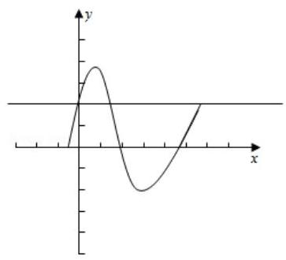

【解析】 $\sin x + \sqrt{3}\cos x = 2\left( {\frac{1}{2}\sin x + \frac{\sqrt{3}}{2}\cos x}\right)  = 2\sin \left( {x + \frac{\pi }{3}}\right)  = a$ ,

如图方程的解即为直线与三角函数图象的交点,

在 $\left\lbrack  {0,{2\pi }}\right\rbrack$ 上,当 $a = \sqrt{3}$ 时,直线与三角函数图象恰有三个交点,

令 $\sin \left( {x + \frac{\pi }{3}}\right)  = \frac{\sqrt{3}}{2}, x + \frac{\pi }{3} = {2k\pi } + \frac{\pi }{3}$ ,

即 $x = {2k\pi }$ ,或 $x + \frac{\pi }{3} = {2k\pi } + \frac{2\pi }{3}$ ,即 $x = {2k\pi } + \frac{\pi }{3}$ ,

所以此时 ${x}_{1} = 0,{x}_{2} = \frac{\pi }{3},{x}_{3} = {2\pi }$ ,

所以 ${x}_{1} + {x}_{2} + {x}_{3} = 0 + \frac{\pi }{3} + {2\pi } = \frac{7\pi }{3}$ .

【例题】8. (2012 上海秋考) 设 ${a}_{n} = \frac{1}{n}\sin \frac{n\pi }{25},{S}_{n} = {a}_{1} + {a}_{2} + \cdots  + {a}_{n}$ ,在 ${S}_{1},{S}_{2},\cdots ,{S}_{100}$ 中,正数的个数是 ( )

A. 25 B. 50 C. 75 D. 100

【答案】 $D$

【解析】由于 $f\left( n\right)  = \sin \frac{n\pi }{25}$ 的周期 $T = {50}$ ,由正弦函数性质得

${a}_{1},{a}_{2},\cdots ,{a}_{24} > 0,{a}_{25} = 0,{a}_{26},{a}_{27},\cdots ,{a}_{49} < 0,{a}_{50} = 0,$

且 $\sin \frac{26\pi }{25} =  - \sin \frac{\pi }{25},\sin \frac{27\pi }{25} =  - \sin \frac{2\pi }{25},\cdots$ 但是 $f\left( n\right)  = \frac{1}{n}$ 单调递减,

${a}_{26},\cdots ,{a}_{49}$ 都为负数,但是 $\left| {a}_{26}\right|  < {a}_{1},\left| {a}_{27}\right|  < {a}_{2},\cdots ,\left| {a}_{49}\right|  < {a}_{24}$

所以 ${S}_{1},{S}_{2},\cdots ,{S}_{25}$ 中都为正,而 ${S}_{26},{S}_{27},\cdots ,{S}_{50}$ 都为正,

同理 ${S}_{1},{S}_{2},\cdots ,{S}_{75}$ 都为正, ${S}_{1},{S}_{2},\cdots ,{S}_{75},\cdots ,{S}_{100}$ 都为正,故选 $D$ . 2025 版上海高考真题及模拟训练合集

## 2. 模拟练习

【练习】1. (2025 届交附) 已知函数 $y = A\sin \left( {{\omega x} + \varphi }\right) \left( {A > 0,\omega  > 0,0 \leq  \varphi  < {2\pi }}\right)$ 的图像与直线 $y = \; b\left( {0 < b < A}\right)$ 的三个相邻交点的横坐标依次是1,2,4,则 $\varphi  =$ ___

【答案】 $\frac{3\pi }{2}$

【解析】因为三个交点的横坐标依次是是1,2,4,所以 $T = 4 - 1 = 3$ ,那么 $\omega  = \frac{2\pi }{T} = \frac{2\pi }{3}$

又因为 $y = b > 0$ ，所以当 $x = \frac{1 + 2}{2} = \frac{3}{2}$ 时，函数取到最大值，

所以 $\frac{2\pi }{3} \times  \frac{3}{2} + \varphi  = \frac{\pi }{2} + {2k\pi },\left( {k \in  Z}\right)$ ,解得 $\varphi  =  - \frac{\pi }{2} + {2k\pi },\left( {k \in  Z}\right)$

因为 $\varphi  \in  \lbrack 0,{2\pi })$ ,所以取 $k = 1,\varphi  = \frac{3\pi }{2}$

【练习】2. 若集合 $A = \left\{  {x\left| {\;x = \sin \frac{2\pi }{2023} + \sin \frac{4\pi }{2023} + \sin \frac{6\pi }{2023} + \cdots  + \sin \frac{2k\pi }{2023}}\right. , k \in  Z, k > 0}\right\}$ ,则集合 $A$ 的元素个数为 ( )

A. 1011 B. 1012 C. 2022 D. 2023

【答案】 $A$

【解析】当 $0 < k \leq  {1011}, k \in  Z$ 时, $\frac{2k\pi }{2023} \in  \left( {0,\pi }\right)$ ,此时 $\sin \frac{2k\pi }{2023} \in  \left( {0,1}\right)$ ;

又因为 2023 为奇数, ${2k}$ 为偶数,且 $\frac{2k\pi }{2023}$ 中的任意两组角都不关于 $\frac{\pi }{2}$ 对称,

所以 $\sin \frac{2k\pi }{2023}$ 的取值各不相同,

因此当 $0 < k \leq  {1011}, k \in  Z$ 时,集合 $A$ 中 $x$ 的取值会随着 $k$ 的增大而增大,

所以当 $k = {1011}$ 时,集合 $A$ 中有 1011 个元素;

当 $k = {1012}$ 时,易得 $x = \sin \frac{2\pi }{2023} + \sin \frac{4\pi }{2023} + \cdots  + \sin \frac{2022\pi }{2023} + \sin \frac{2024\pi }{2023}$

$= \sin \frac{2\pi }{2023} + \sin \frac{4\pi }{2023} + \cdots  + \sin \frac{2022\pi }{2023} + \sin \left( {\pi  + \frac{\pi }{2023}}\right)$

$= \sin \frac{2\pi }{2023} + \sin \frac{4\pi }{2023} + \cdots  + \sin \frac{2022\pi }{2023} - \sin \frac{\pi }{2023}$ ,

易得 $\sin \frac{2022\pi }{2023} = \sin \frac{\pi }{2023}$ ,

所以 $x = \sin \frac{2\pi }{2023} + \sin \frac{4\pi }{2023} + \cdots  + \sin \frac{2022\pi }{2023} + \sin \frac{2024\pi }{2023}$

$= \sin \frac{2\pi }{2023} + \sin \frac{4\pi }{2023} + \cdots  + \sin \frac{2020\pi }{2023}$ ,

即 $k = {1012}$ 时 $x$ 的取值与 $k = {1010}$ 时的取值相同,

由集合元素的互异性得, $k = {1012}$ 时并没有增加集合中的元素个数,

以此类推得当 $k \geq  {1012}$ 时,集合 $A$ 中的元素个数并没有随着 $k$ 的增大而增加,

所以集合 $A$ 的元素个数为 1011 个. 故选 $A$ .

【练习】3. (2024 届华二) 在 $\bigtriangleup  {ABC}$ 中，已知 $\sin A = a,\cos B = \frac{3}{5}$ ，若 $\cos C$ 有唯一值，则实数 $a$ 的取值范围为 ( )

A. $\left( {0,\frac{3}{5}}\right\rbrack   \cup  \{ 1\}$ B. $\left( {0,\frac{4}{5}}\right\rbrack$ C. $\left\lbrack  {\frac{4}{5},1}\right\rbrack$ D. $\left( {0,\frac{4}{5}}\right\rbrack   \cup  \{ 1\}$

【答案】 $D$

【解析】由 $\cos B = \frac{3}{5}$ 得角 $B$ 唯一确定,且 $\sin B = \frac{4}{5}$ ,

若 $a \leq  \frac{4}{5}$ ,则 $\sin A \leq  \sin B$ ,由正弦定理得 $a \leq  b$ ,从而角 $A$ 为锐角,

从而角 $A$ 唯一确定，所以角 $C$ 唯一，则 $\cos C$ 有唯一值；

若 $a = 1$ ,则 $A = \frac{\pi }{2}$ ,从而角 $A$ 唯一确定,所以角 $C$ 唯一,则 $\cos C$ 有唯一值;

故选 $D$ .

【练习】4. 已知 $\omega  \in  \mathbb{R},\varphi  \in  \lbrack 0,{2\pi })$ ,若对任意实数 $x$ 均有 $\sin x \geq  \cos \left( {{\omega x} + \varphi }\right)$ ,则满足条件的有序实数对 $\left( {\omega ,\varphi }\right)$ 的个数为 ( )

A. 1 个 B. 2 个 C. 3 个 D. 无数个

【答案】 $C$

【解析】当 $x \in  \mathbb{R}$ 时, $\sin x \in  \left\lbrack  {-1,1}\right\rbrack  ,\cos \left( {{\omega x} + \varphi }\right)  \in  \left\lbrack  {-1,1}\right\rbrack$ .

为了保证 $\sin x$ 始终大于 $\cos \left( {{\omega x} + \varphi }\right)$ (从图像上看, $\sin x$ 始终高于 $\cos \left( {{\omega x} + \varphi }\right)$ )

必须满足: $\sin x =  - 1 \geq  \cos \left( {{\omega x} + \varphi }\right)  =  - 1,\sin x = 1 \geq  \cos \left( {{\omega x} + \varphi }\right)  = 1$ ,

即 $\sin x$ 和 $\cos \left( {{\omega x} + \varphi }\right)$ 同时取到最值 (图形重叠), $\therefore \sin x = \cos \left( {{\omega x} + \varphi }\right)$ 恒等.

讨论: 当 $\omega  = 1,\sin x = \cos \left( {{\omega x} + \varphi }\right)$ ,令 $x = 0 \Rightarrow  \cos \varphi  = 0 \Rightarrow  \varphi  = \frac{\pi }{2}$ 或 $\frac{3\pi }{2}$ .

经检验, $\varphi  = \frac{\pi }{2}$ 舍,即 $\left( {\omega ,\varphi }\right)  = \left( {1,\frac{3\pi }{2}}\right)$ 满足;

当 $\omega  =  - 1,\sin x = \cos \left( {-x + \varphi }\right)$ ,令 $x = 0 \Rightarrow  \cos \varphi  = 0 \Rightarrow  \varphi  = \frac{\pi }{2}$ 或 $\frac{3\pi }{2}$

经检验, $\varphi  = \frac{3\pi }{2}$ 舍,即 $\left( {\omega ,\varphi }\right)  = \left( {-1,\frac{\pi }{2}}\right)$ 满足;

注意: 当 $\omega  = 0$ 时, $\sin x \geq  \cos \varphi$ 恒成立,即 $\cos \varphi  =  - 1 \Rightarrow  \varphi  = \pi$ ,此时 $\left( {\omega ,\varphi }\right)  = \left( {0,\pi }\right)$ 满足.

综上所述: $\left( {\omega ,\varphi }\right)  = \left( {1,\frac{3\pi }{2}}\right)$ 或 $\left( {\omega ,\varphi }\right)  = \left( {-1,\frac{\pi }{2}}\right)$ 或 $\left( {\omega ,\varphi }\right)  = \left( {0,\pi }\right)$ ,共 3 对,选 $C$ .

【练习】5. (2025 届复附) 设函数 $f\left( x\right)  = {\sin }^{4}\frac{kx}{10} + {\cos }^{4}\frac{kx}{10}$ ,其中 $k$ 是一个正整数. 若对任意实数 $a$ ,均有 $\{ f\left( x\right)  \mid  a < x < a + 1\}  = \{ f\left( x\right)  \mid  x \in  R\}$ ,则 $k$ 的最小值为___

【答案】 16

【解析】 $f\left( x\right)  = {\left( {\sin }^{2}\frac{kx}{10} + {\cos }^{2}\frac{kx}{10}\right) }^{2} - 2{\sin }^{2}\frac{kx}{10}{\cos }^{2}\frac{kx}{10} = 1 - \frac{1}{2}{\sin }^{2}\frac{kx}{5} = \frac{1}{4}\cos \frac{2kx}{5} + \frac{3}{4}$ ,

其中当且仅当 $x = \frac{5m\pi }{k}\left( {m \in  Z}\right)$ 时, $f\left( x\right)$ 取到最大值,

由题意得任意一个长为 1 的开区间 $\left( {a, a + 1}\right)$ 至少包含一个最大值点,

从而 $\frac{5\pi }{k} < 1$ ,即 $k > {5\pi }$ ;

反之,当 $k > {5\pi }$ 时,任意一个开区间 $\left( {a, a + 1}\right)$ 均包含 $f\left( x\right)$ 的一个完整周期,

此时 $\{ f\left( x\right)  \mid  a < x < a + 1\}  = \{ f\left( x\right)  \mid  x \in  R\}$ 成立,

综上,正整数 $k$ 的最小值为 $\left\lbrack  {5\pi }\right\rbrack   + 1 = {16}$

【练习】6. 若分段函数 $f\left( x\right)  = \left\{  \begin{array}{ll} 3\sin {2x}, & x \leq  0 \\  {2}^{x} - 3, & x > 0 \end{array}\right.$ ,将函数 $y = \left| {f\left( x\right)  - f\left( a\right) }\right| , x \in  \left\lbrack  {m, n}\right\rbrack$ 的最大值记作 ${Z}_{a}\left\lbrack  {m, n}\right\rbrack$ ，那么当 $- 2 \leq  m \leq  2$ 时， ${Z}_{2}\left\lbrack  {m, m + 4}\right\rbrack$ 的取值范围是___；

【答案】 $\left\lbrack  {4,{60}}\right\rbrack$

【解析】由 $f\left( x\right)  = \left\{  \begin{array}{l} 3\sin {2x}, x \leq  0 \\  {2}^{x} - 3, x > 0 \end{array}\right.$ ,得 $f\left( 2\right)  = 1$ ,

则 $y = \left| {f\left( x\right)  - f\left( a\right) }\right|  = \left| {f\left( x\right)  - 1}\right|$ ,

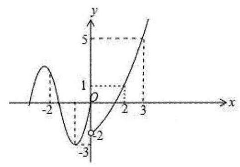

作出函数 $f\left( x\right)$ 的图象如图所示:

当 $- 2 \leq  m \leq   - 1$ 时, ${\left| f\left( x\right)  - 1\right| }_{\max } = \left| {\left( {-3}\right)  - 1}\right|  = 4$ ;

当 $m >  - 1$ 时, $m + 4 > 3,{2}^{m + 4} - 3 - 1 = {2}^{m + 4} - 4 > 4$ ,

$\therefore$ 当 $- 1 < m \leq  2$ 时, ${Z}_{a}\left\lbrack  {m, m + 4}\right\rbrack   = {2}^{m + 4} - 4$ ,

则 ${Z}_{2}\left\lbrack  {m, m + 4}\right\rbrack$ 的最大值为 ${2}^{6} - 4 = {60}$ .

故 ${Z}_{2}\left\lbrack  {m, m + 4}\right\rbrack$ 的取值范围是 $\left\lbrack  {4,{60}}\right\rbrack$ .

【练习】7. (2024 届七宝)已知 $k$ 是正整数，且 $1 \leq  k \leq  {2024}$ ，则满足方程 $\sin {1}^{ \circ  } + \sin {2}^{ \circ  } + \cdots  + \sin {k}^{ \circ  } = \; \sin {1}^{ \circ  } \cdot  \sin {2}^{ \circ  }\cdots \sin {k}^{ \circ  }$ 的 $k$ 有___个.

【答案】 11

【解析】由正弦函数性质得 $\sin {1}^{ \circ  } \cdot  \sin {2}^{ \circ  }\cdots \sin {k}^{ \circ  } < 1$ ,

① $k = 1$ ，等式两边成立；

②等式的两边都为 0 时等式才成立，

$k = {359},{360},{719},{720},{1079},{1080},{1439},{1440},{1799},{1800}$ 时等式成立.

综上 $k = 1,{359},{360},{719},{720},{1079},{1080},{1439},{1440},{1799},{1800}$ ,

共 11 个.

【练习】8. 已知函数 $f\left( x\right)  = \cos {2x}$ 在区间 $\left\lbrack  {t, t + \frac{\pi }{3}}\right\rbrack  \left( {t \in  R}\right)$ 上的最大值为 $M\left( t\right)$ ，则 $M\left( t\right)$ 的最小值为 ( )

A. $\frac{\sqrt{3}}{2}$ B. $- \frac{\sqrt{3}}{2}$ C. $\frac{1}{2}$ D. $- \frac{1}{2}$

【答案】 $D$

【解析】函数 $f\left( x\right)  = \cos {2x}$ 的最小正周期为 $T = \pi$ ,区间 $\left\lbrack  {t, t + \frac{\pi }{3}}\right\rbrack$ 的长度为 $\frac{1}{3}\pi  = \frac{1}{3}T$ ,

考虑一个周期内 $M\left( t\right)$ 的取值情况，

作出 $f\left( x\right)$ 在区间 $\left\lbrack  {-\frac{\pi }{4},\frac{3\pi }{4}}\right\rbrack$ 这一个周期内的函数图象,如下所示,

由图象得,当 $- \frac{\pi }{4} \leq  t < \frac{\pi }{3}$ 时, $\frac{\pi }{12} \leq  t + \frac{\pi }{3} < \frac{2\pi }{3}$ ,最大值 $M\left( t\right)  >  - \frac{1}{2}$ ;

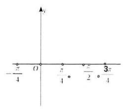

当 $t = \frac{\pi }{3}$ 时, $t + \frac{\pi }{3} = \frac{2\pi }{3}$ ,最大值 $M\left( t\right)  =  - \frac{1}{2}$ ;

当 $\frac{\pi }{3} < t \leq  \frac{3\pi }{4}$ 时, $\frac{2\pi }{3} < t + \frac{\pi }{3} \leq  \frac{13\pi }{12}$ ,最大值 $M\left( t\right)  >  - \frac{1}{2}$ ,

综上, $M\left( t\right)$ 的最小值为 $- \frac{1}{2}$ . 故选 $D$ .

【练习】9. (2024 届华二) 已知函数 $f\left( x\right)  = \sin \frac{\pi }{2}x$ ,任取 $t \in  R$ ,记函数 $f\left( x\right)$ 在 $\left\lbrack  {t, t + 1}\right\rbrack$ 上的最大值为 ${M}_{t}$ ,最小值为 ${m}_{t}$ ,设 $h\left( t\right)  = {M}_{t} - {m}_{t}$ ,则函数 $h\left( t\right)$ 的值域为 ( )

A. $\left\lbrack  {1 - \frac{\sqrt{2}}{2},1}\right\rbrack$ B. $\left\lbrack  {1 - \frac{\sqrt{2}}{2},1 + \frac{\sqrt{2}}{2}}\right\rbrack$

C. $\left\lbrack  {1 - \frac{\sqrt{2}}{2},\sqrt{2}}\right\rbrack$ D. $\left\lbrack  {\frac{\sqrt{2}}{2},1 + \frac{\sqrt{2}}{2}}\right\rbrack$

【答案】 $C$

【解析】因为 $h\left( {t + 4}\right)  = {M}_{t + 4} - {m}_{t + 4}$ ,

其中 ${M}_{t + 4}\text{ 、 }{m}_{t + 4}$ 分别是指 $f\left( x\right)$ 在区间 $\left\lbrack  {t + 4, t + 5}\right\rbrack$ 上的最大值和最小值,

因为 $f\left( x\right)$ 的周期 $T = \frac{2\pi }{\frac{\pi }{2}} = 4$ ,

所以 $f\left( x\right)$ 在区间 $\left\lbrack  {t + 4, t + 5}\right\rbrack$ 的图象与在区间 $\left\lbrack  {t, t + 1}\right\rbrack$ 上的图象完全相同,

故 ${M}_{t + 4} = {M}_{t},{m}_{t + 4} = {m}_{t}$ ,故 $h\left( {t + 4}\right)  = h\left( t\right)$ ,即 $h\left( t\right)$ 是周期为 4 的函数,

故 $h\left( t\right) , t \in  R$ 的值域与 $h\left( t\right) , t \in  \left\lbrack  {-2,2}\right\rbrack$ 时的值域相同;

又 $f\left( x\right)$ 在 $\left\lbrack  {-2, - 1}\right\rbrack$ 严格减, $\left\lbrack  {-1,1}\right\rbrack$ 严格增,在 $\left\lbrack  {1,2}\right\rbrack$ 严格减,

故当 $t \in  \left\lbrack  {-2, - \frac{3}{2}}\right)$ 时， $f\left( x\right)$ 在区间 $\left\lbrack  {t, t + 1}\right\rbrack$ 上的最大值为 $f\left( t\right)  = \sin \frac{\pi }{2}t$ ，

最小值为 -1,此时 $h\left( t\right)  = \sin \frac{\pi }{2}t + 1$ ;

当 $t \in  \left\lbrack  {-\frac{3}{2}, - 1}\right)$ 时, $f\left( x\right)$ 在区间 $\left\lbrack  {t, t + 1}\right\rbrack$ 上的最大值

为 $f\left( {t + 1}\right)  = \sin \left( {\frac{\pi }{2}t + \frac{\pi }{2}}\right)  = \cos \frac{\pi }{2}t$ ,最小值为 -1,此时 $h\left( t\right)  = \cos \frac{\pi }{2}t + 1$ ;

当 $t \in  \lbrack  - 1,0)$ 时,在区间 $\left\lbrack  {t, t + 1}\right\rbrack$ 上的最大值为,最小值为 $f\left( t\right)  = \sin \frac{\pi }{2}t$ ,

此时 $h\left( t\right)  = \cos \frac{\pi }{2}t - \sin \frac{\pi }{2}t =  - \sqrt{2}\sin \left( {\frac{\pi }{2}t - \frac{\pi }{4}}\right)$ ;

当 $t \in  \left\lbrack  {0,\frac{1}{2}}\right)$ 时, $f\left( x\right)$ 在区间 $\left\lbrack  {t, t + 1}\right\rbrack$ 上的最大值为 1,

最小值为 $f\left( t\right)  = \sin \frac{\pi }{2}t$ ,此时 $h\left( t\right)  = 1 - \sin \frac{\pi }{2}t$ ;

当 $t \in  \left\lbrack  {\frac{1}{2},1}\right)$ 时, $f\left( x\right)$ 在区间 $\left\lbrack  {t, t + 1}\right\rbrack$ 上的最大值为 1,

最小值为 $f\left( {t + 1}\right)  = \cos \frac{\pi }{2}t$ ,此时 $h\left( t\right)  = 1 - \cos \frac{\pi }{2}t$ ;

当 $t \in  \left\lbrack  {1,2}\right\rbrack$ 时, $f\left( x\right)$ 在区间 $\left\lbrack  {t, t + 1}\right\rbrack$ 上的最大值为 $f\left( t\right)  = \sin \frac{\pi }{2}t$ , 2025 版上海高考真题及模拟训练合集

最小值为 $f\left( {t + 1}\right)  = \cos \frac{\pi }{2}t$ ,此时 $h\left( t\right)  = \sin \frac{\pi }{2}t - \cos \frac{\pi }{2}t = \sqrt{2}\sin \left( {\frac{\pi }{2}t - \frac{\pi }{4}}\right)$ ;

故 $h\left( t\right)$ 在 $\left\lbrack  {-2,2}\right\rbrack$ 的函数图象如下所示:

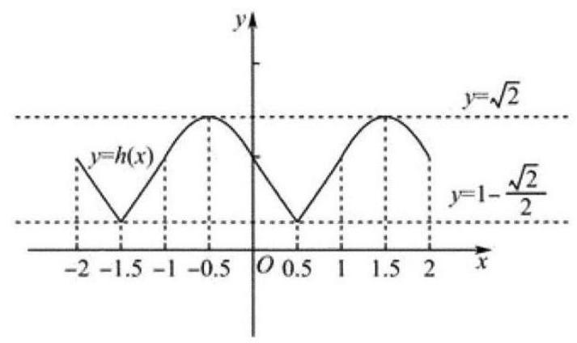

数形结合得 $h\left( t\right)$ 的值域为 $\left\lbrack  {1 - \frac{\sqrt{2}}{2},\sqrt{2}}\right\rbrack$ . 故选 $C$ .

【练习】10. (2024 届格致) 对任意闭区间 $I$ ，用 ${M}_{I}$ 表示函数 $y = \sin x$ 在 $I$ 上的最大值，若有且仅有一个正数 $a$ 使得 ${M}_{\left\lbrack  0, a\right\rbrack  } = k{M}_{\left\lbrack  a,2a\right\rbrack  }$ 成立，则实数 $k$ 的取值范围是___.

【答案】 $\left( {\frac{1}{2},1}\right)$

【解析】① 当 $a \in  \left\lbrack  {0,\frac{\pi }{4}}\right\rbrack$ 时, ${2a} \in  \left\lbrack  {0,\frac{\pi }{2}}\right\rbrack  ,{M}_{\left\lbrack  0, a\right\rbrack  } = \sin a,{M}_{\left\lbrack  a,2a\right\rbrack  } = \sin {2a}$ ,

由 ${M}_{\left\lbrack  0, a\right\rbrack  } = k{M}_{\left\lbrack  a,2a\right\rbrack  }$ ,得 $\sin a = k\sin {2a}$ ,所以 $k = \frac{1}{2\cos a}$ ;

② 当 $a \in  \left\lbrack  {\frac{\pi }{4},\frac{\pi }{2}}\right\rbrack$ 时， ${2a} \in  \left\lbrack  {\frac{\pi }{2},\pi }\right\rbrack  ,{M}_{\left\lbrack  0, a\right\rbrack  } = \sin a,{M}_{\left\lbrack  a,2a\right\rbrack  } = 1$ ，

由 ${M}_{\left\lbrack  0, a\right\rbrack  } = k{M}_{\left\lbrack  a,2a\right\rbrack  }$ ,得 $k = \sin a$ ;

③ 当 $a \in  \left\lbrack  {\frac{\pi }{2},\pi }\right\rbrack$ 时， ${2a} \in  \left\lbrack  {\pi ,{2\pi }}\right\rbrack  ,{M}_{\left\lbrack  0, a\right\rbrack  } = 1,{M}_{\left\lbrack  a,{2a}\right\rbrack  } = \sin a$ ，

由 ${M}_{\left\lbrack  0, a\right\rbrack  } = k{M}_{\left\lbrack  a,2a\right\rbrack  }$ ,得 $1 = k\sin a$ ,所以 $k = \frac{1}{\sin a}$ ;

④ 当 $a \in  \left\lbrack  {\pi ,\frac{5\pi }{4}}\right\rbrack$ 时， ${2a} \in  \left\lbrack  {{2\pi },\frac{5}{2}\pi }\right\rbrack$ ， ${M}_{\left\lbrack  0, a\right\rbrack  } = 1$ ， ${M}_{\left\lbrack  a,2a\right\rbrack  } = \sin {2a}$ ，

由 ${M}_{\left\lbrack  0, a\right\rbrack  } = k{M}_{\left\lbrack  a,2a\right\rbrack  }$ ,得 $1 = k\sin {2a}$ ,所以 $k = \frac{1}{\sin {2a}}$ ,

⑤ 当 $a \in  \left\lbrack  {\frac{5\pi }{4}, + \infty }\right\rbrack$ 时, ${2a} \in  \left\lbrack  {\frac{5}{2}\pi ,{3\pi }}\right\rbrack  ,{M}_{\left\lbrack  0, a\right\rbrack  } = 1,{M}_{\left\lbrack  a,2a\right\rbrack  } = 1$

由 ${M}_{\left\lbrack  0, a\right\rbrack  } = k{M}_{\left\lbrack  a,2a\right\rbrack  }$ ,得 $k = 1$ ,

$$
\text{ 所以 }k = \left\{  \begin{array}{l} \frac{1}{2\cos a}, a \in  \left\lbrack  {0,\frac{\pi }{4}}\right\rbrack  \\  \sin a, a \in  \left\lbrack  {\frac{\pi }{4},\frac{\pi }{2}}\right\rbrack  \\  \frac{1}{\sin a}, a \in  \left\lbrack  {\frac{\pi }{2},\pi }\right\rbrack  \\  \frac{1}{\sin {2a}}, a \in  \left\lbrack  {\pi ,\frac{5\pi }{4}}\right\rbrack  \\  \tan a \in  \left\lbrack  {\frac{5\pi }{4}, + \infty }\right\rbrack   \end{array}\right.
$$

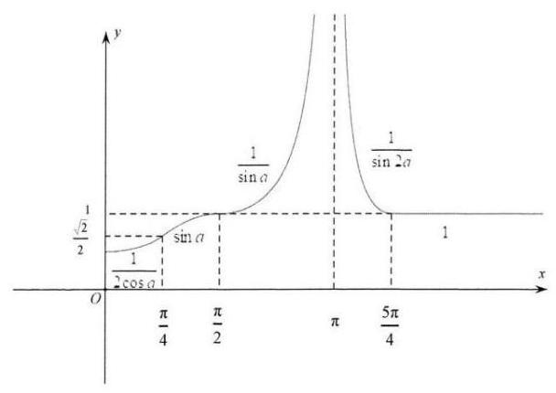

作出图像,得实数 $k$ 的取值范围是 $\left( {\frac{1}{2},1}\right)$ . 2025 版上海高考真题及模拟训练合集

## 板块二: 压轴客观题

1. 真题回顾

【例题】1. (2025 上海春考) 已知 $a \in  \mathbb{R}$ ,不等式 $\left\lbrack  {\tan \left( {\frac{\pi }{6}x}\right)  - a}\right\rbrack   \cdot  \left\lbrack  {\tan \left( {\frac{\pi }{6}x}\right)  - a - 1}\right\rbrack   < 0$ 在 $\left( {0,{2025}}\right)$ 中的整数解有 $m$ 个，关于 $m$ 的个数，以下不可能的是( ).

A. 0 B. 338 C. 674 D. 1012

【答案】 $D$

【解析】数形结合: 先解不等式,易得 $\tan \left( {\frac{\pi }{6}x}\right)  \in  \left( {a, a + 1}\right)$ ,区间跨度为 1 .

分析其在 $\left( {0,{2025}}\right)$ 中的整数解数量时,自然要先考虑 $f\left( x\right)  = \tan \left( {\frac{\pi }{6}x}\right)$ 的图像及其性质:

$f\left( x\right)  = \tan \left( {\frac{\pi }{6}x}\right)$ 的最小正周期为 6,定义域为 $\{ x \mid  x \neq  3 + {6k}, k \in  \mathbb{Z}\}$ ,在一个周期内的整数取值: $f\left( {-2}\right)  =  - \sqrt{3} \approx   - {1.732}, f\left( {-1}\right)  =  - \frac{\sqrt{3}}{3} \approx   - {0.577}, f\left( 0\right)  = 0, f\left( 1\right)  = \frac{\sqrt{3}}{3} \approx  {0.577}, f\left( 2\right)  = \sqrt{3} \; \approx  {1.732}$ .

由于 ${2025} = 6 \times  {337} + 3$ ,我们可将 $\left( {0,{2025}}\right)$ 拆分为: $\left( {0,3}\right) ,\left( {3,9}\right) ,\left( {9,{15}}\right) \cdots \left( {{2019},{2025}}\right)$ . 接下来我们先分析 $f\left( x\right)  = \tan \left( {\frac{\pi }{6}x}\right)$ 在一个周期内可能的整数解数量,进而推算到 $\left( {0,{2025}}\right)$ 内的整数解个数。由于 $\left( {a, a + 1}\right)$ 的区间长度为 1,因而分类讨论如下:

当 $a > \sqrt{3}$ 时,在 $\left( {0,3}\right)$ 内满足 $\tan \left( {\frac{\pi }{6}x}\right)  \in  \left( {a, a + 1}\right)$ 的整数解为 0 个,在之后每个周期内满足 $\tan \left( {\frac{\pi }{6}x}\right)  \in  \left( {a, a + 1}\right)$ 的整数解也为 0 个,此时在 $\left( {0,{2025}}\right)$ 内的整数解也为 0 个;

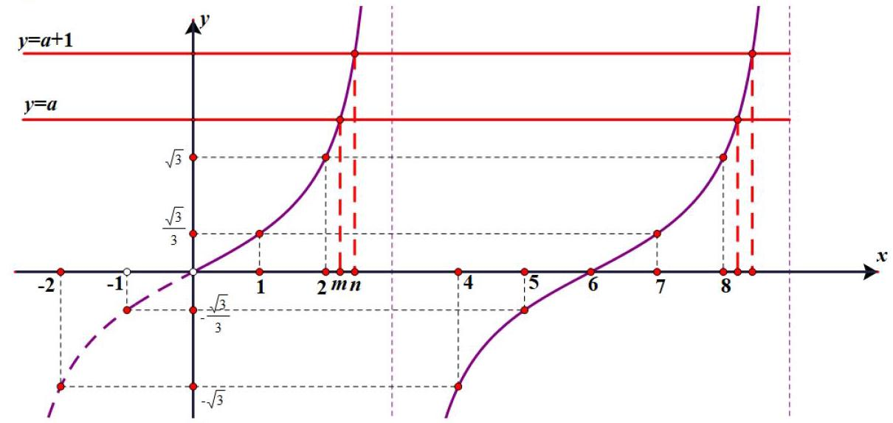

当 $a + 1 > \sqrt{3} > a > \frac{\sqrt{3}}{3}$ 时,在 $\left( {0,3}\right)$ 内满足 $\tan \left( {\frac{\pi }{6}x}\right)  \in  \left( {a, a + 1}\right)$ 的整数解为 1 个,在之后每个周期内满足 $\tan \left( {\frac{\pi }{6}x}\right)  \in  \left( {a, a + 1}\right)$ 的整数解也为 1 个，此时在 $\left( {0,{2025}}\right)$ 中整数解数量为 $1 \times \; {337} + 1 = {338}$

2025 版上海高考真题及模拟训练合集

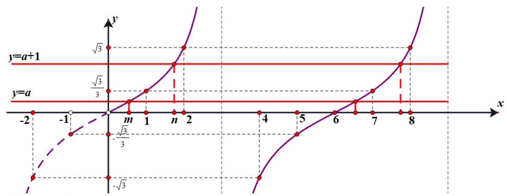

当 $\left\{  \begin{array}{l} a + 1 > \frac{\sqrt{3}}{3} \\  0 > a \end{array}\right.$ 即 $0 > a > \frac{\sqrt{3}}{3} - 1$ 时,在 $\left( {0,3}\right)$ 内满足 $\tan \left( {\frac{\pi }{6}x}\right)  \in  \left( {a, a + 1}\right)$ 的整数解为 1 个,

在之后每个周期内满足 $\tan \left( {\frac{\pi }{6}x}\right)  \in  \left( {a, a + 1}\right)$ 的整数解为 2 个,此时在 $\left( {0,{2025}}\right)$ 中整数解数量

为 $2 \times  {337} + 1 = {675}$ ;

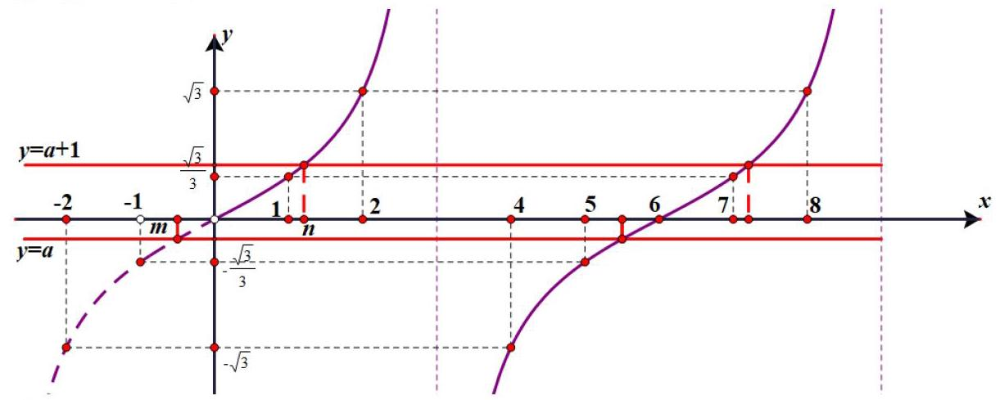

当 $\left\{  \begin{array}{l} a + 1 > 0 \\   - \frac{\sqrt{3}}{3} > a \end{array}\right.$ 即 $- \frac{\sqrt{3}}{3} > a >  - 1$ 时,在 $\left( {0,3}\right)$ 内满足 $\tan \left( {\frac{\pi }{6}x}\right)  \in  \left( {a, a + 1}\right)$ 的整数解为 0 个,在之后每个周期内满足 $\tan \left( {\frac{\pi }{6}x}\right)  \in  \left( {a, a + 1}\right)$ 的整数解为 2 个,此时在 $\left( {0,{2025}}\right)$ 中整数解数量为 $2 \times  {337} = {674}$

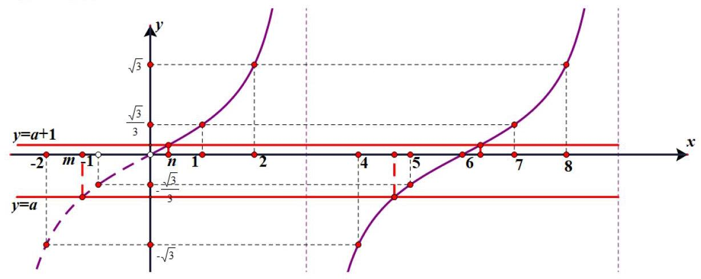

因此四个选项中,唯独不可能是 1012 个,故选 $D$ .

【例题】2. (2021 上海春考) 已知 $\theta  > 0$ ，存在实数 $\varphi$ ，使得对任意 $n \in  {N}^{ * }$ ， $\cos \left( {{n\theta } + \varphi }\right)  < \frac{\sqrt{3}}{2}$ ，则 $\theta$ 的最小值是 ___.

【答案】 $\frac{2\pi }{5}$

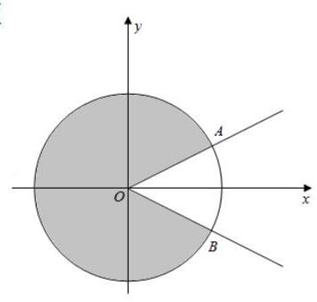

【解析】在单位圆中分析,由题意得 ${n\theta } + \varphi$ 的终边要落在图中阴影部分区域

(其中 $\angle {AOx} = \angle {BOx} = \frac{\pi }{6}$ ),

所以 $\theta  > \angle {AOB} = \frac{\pi }{3}$ ,因为对任意 $n \in  {N}^{ * }$ 都成立,

所以 $\frac{2\pi }{\theta } \in  {N}^{ * }$ ,即 $\theta  = \frac{2\pi }{k}, k \in  {N}^{ * }$ ,

同时 $\theta  > \frac{\pi }{3}$ ，所以 $\theta$ 的最小值为 $\frac{2\pi }{5}$ .

【注】以上仅为简单分析, 下面附上严格证明, 变式题和原理

$\cos \left( {{n\theta } + \varphi }\right)  \geq  \frac{\sqrt{3}}{2} \Leftrightarrow  {2k\pi } - \frac{\pi }{6} \leq  {n\theta } + \varphi  \leq  {2k\pi } + \frac{\pi }{6}, k \in  Z$

所以题目的条件可转化为: 对任意正整数 $n$ 和任意整数 $k$ ,

都有 ${n\theta } + \varphi  \notin  \left\lbrack  {{2k\pi } - \frac{\pi }{6},{2k\pi } + \frac{\pi }{6}}\right\rbrack  , k \in  Z$

①先证: $\theta  > \frac{\pi }{3}$ (反证法)

假设 $\theta  \leq  \frac{\pi }{3}$ ，必存在整数 $k$ ，使得 $\theta  + \varphi  < {2k\pi } - \frac{\pi }{6}$ ，也必存在正整数 $n$ ，

使得 ${n\theta } + \varphi  < {2k\pi } - \frac{\pi }{6} \leq  \left( {n + 1}\right) \theta  + \varphi$ ,

则 $\left( {n + 1}\right) \theta  + \varphi  = {n\theta } + \varphi  + \theta  < {2k\pi } - \frac{\pi }{6} + \frac{\pi }{3} = {2k\pi } + \frac{\pi }{6}$ ,矛盾,

所以 $\theta  > \frac{\pi }{3}$

② 当 $\theta  = \frac{2\pi }{5}$ 时，取 $\varphi  =  - \frac{\pi }{5}$ ，易得对任意正整数 $n$ ， $\cos \left( {{n\theta } + \varphi }\right)$ 恰好取

$\cos \frac{\pi }{5},\cos \frac{3\pi }{5},\cos \frac{5\pi }{5},\cos \frac{7\pi }{5},\cos \frac{9\pi }{5}$ 这 5 个值,它们均小于 $\frac{\sqrt{3}}{2}$ ,符合题意

③ 假设存在 $\theta ,\frac{\pi }{3} < \theta  < \frac{2\pi }{5}$ 符合题意，记 $\alpha  = \frac{2\pi }{5} - \theta  \in  \left( {0,\frac{\pi }{15}}\right)$ ，

取 $n = {5m}, m \in  {N}^{ * }$ ,则 $\cos \left( {{n\theta } + \varphi }\right)  = \cos \left( {{5m}\left( {\frac{2\pi }{5} - \alpha }\right)  + \varphi }\right)  = \cos \left( {m \cdot  {5\alpha } - \varphi }\right)$ 对正整数 $m$ 恒成立,

即对任意正整数 $m$ 和任意整数 $k$ ,都有 $m \cdot  {5\alpha } - \varphi  \notin  \left\lbrack  {{2k\pi } - \frac{\pi }{6},{2k\pi } + \frac{\pi }{6}}\right\rbrack  , k \in  Z$ , 由 (1) 得 ${5\alpha } > \frac{\pi }{3}$ 即 $\alpha  > \frac{\pi }{15}$ ,与 $\alpha  \in  \left( {0,\frac{\pi }{15}}\right)$ 矛盾,

综上所述， $\theta$ 的最小值是 $\frac{2\pi }{5}$ 2025 版上海高考真题及模拟训练合集

## 2. 模拟练习

【练习】1. (2025 届复附) 若 $\cos \left( {{2}^{n} \cdot  x}\right)  < 0$ 对 $n \in  N$ 均成立，则实数 $x$ 的取值集合为___

【答案】 $\left\{  {x\left| {\;x = {2k\pi } \pm  \frac{2\pi }{3}}\right. , k \in  Z}\right\}$

【解析】首先,若 $x$ 是满足条件的实数,则 $\cos x \leq   - \frac{1}{4}$ . 事实上,若 $- \frac{1}{4} < \cos x < 0$ ,则 $\cos {2x} = 2{\cos }^{2}x \; - 1 < 2{\left( -\frac{1}{4}\right) }^{2} - 1 =  - \frac{7}{8}$ ,即 $\cos {2x} <  - \frac{7}{8}$ ,

于是, $\cos {4x} = 2{\cos }^{2}{2x} - 1 > 2{\left( -\frac{7}{8}\right) }^{2} - 1 = \frac{49}{32} - 1 = \frac{17}{32} > 0$ ,即 $\cos {4x} > 0$ ,矛盾!

由上得对任意 $n \in  N$ ，均有 $\cos {2}^{n}x \leq   - \frac{1}{4}$ ，

得 $\left| {\cos {2}^{n}x - \frac{1}{2}}\right|  \geq  \frac{3}{4}$ ，又 $\left| {\cos {2x} + \frac{1}{2}}\right|  = 2\left| {\cos x + \frac{1}{2}}\right|  \cdot  \left| {\cos x - \frac{1}{2}}\right|$

$\geq  2\left| {\cos x + \frac{1}{2}}\right|  \cdot  \frac{3}{4} = \frac{3}{2}\left| {\cos x + \frac{1}{2}}\right|$ ,故 $\left| {\cos x + \frac{1}{2}}\right|  \leq  \frac{2}{3}\left| {\cos {2x} + \frac{1}{2}}\right|$ ,

反复利用此式得 $\left| {\cos x + \frac{1}{2}}\right|  \leq  \frac{2}{3}\left| {\cos {2x} + \frac{1}{2}}\right|  \leq  {\left( \frac{2}{3}\right) }^{2}\left| {\cos {4x} + \frac{1}{2}}\right|$

$\leq  {\left( \frac{2}{3}\right) }^{3}\left| {\cos {8x} + \frac{1}{2}}\right|  \leq  \cdots  \leq  {\left( \frac{2}{3}\right) }^{n}\left| {\cos {2}^{n}x + \frac{1}{2}}\right|  < {\left( \frac{2}{3}\right) }^{n} \cdot  1 = {\left( \frac{2}{3}\right) }^{n}$ ,

即 $\left| {\cos x + \frac{1}{2}}\right|  < {\left( \frac{2}{3}\right) }^{n}$ ,

因为 $n$ 为任意自然数,所以 $\cos x + \frac{1}{2} = 0$ ,故 $x = {2k\pi } \pm  \frac{2\pi }{3}\left( {k \in  Z}\right)$ ,

另一方面,当 $x = {2k\pi } \pm  \frac{2\pi }{3}\left( {k \in  Z}\right)$ 时,对任意的 $n \in  N$ ,有 $\cos {2}^{n}x =  - \frac{1}{2}$

事实上,对任意的 $n \in  N$ ,有 $\cos {2}^{n}x = \cos \frac{{2}^{n + 1}\pi }{3}$ . 显然 $\cos \frac{2\pi }{3} =  - \frac{1}{2}$

假设 $\cos \frac{{2}^{k + 1}\pi }{3} =  - \frac{1}{2}\left( {k \in  N}\right)$ ,则 $\cos \frac{{2}^{k + 2}\pi }{3} = 2{\cos }^{2}\frac{{2}^{k + 1}\pi }{3} - 1$

$= 2{\left( -\frac{1}{2}\right) }^{2} - 1 =  - \frac{1}{2}$ . 由数学归纳法得到 $\cos \frac{{2}^{n + 1}\pi }{3} =  - \frac{1}{2}\left( {n \in  N}\right)$ ,

即当 $x = {2k\pi } \pm  \frac{2\pi }{3}\left( {k \in  Z}\right)$ 时， ${\cos {2}^{n}x} =  - \frac{1}{2} < 0\left( {n \in  N}\right)$

综上所述，实数 $x$ 的取值集合为 $\left\{  {x\left| {\;x = {2k\pi } \pm  \frac{2\pi }{3}}\right. , k \in  Z}\right\}$

【练习】2. (2023 届华二) 对开区间 $I = \left( {a, b}\right)$ ，定义 $\left| I\right|  = b - a$ . 当实数集合 $M$ 为 $n$ 段 ( $n$ 为正整数) 互不相交的开区间 ${I}_{1},{I}_{2},\cdots ,{I}_{n}$ 的并集时,定义 $\left| M\right|  = \mathop{\sum }\limits_{{k = 1}}^{n}\left| {I}_{k}\right|$ . 若对任意上述形式的 $\left( {0,{2\pi }}\right)$ 的子集 $A$ ,总存在 $k \in  Z$ ,使得 $\left| {A}_{k}\right|  \geq  \lambda \left| A\right|$ ,其中 ${A}_{k} = \left\{  {x\left| {x \in  A,\tan \left( {x + \frac{k\pi }{4}}\right) }\right|  < \sqrt{2} - 1}\right\}$ ,则 $\lambda$ 的最大值为___.

【答案】 $\frac{1}{4}$

【解析】 $\left| {\tan \left( {x + \frac{k\pi }{4}}\right) }\right|  < \sqrt{2} - 1 = \tan \frac{\pi }{8} \Rightarrow  \left| {x + \frac{k\pi }{4}}\right|  \in  \left( {-\frac{\pi }{8} + {k\pi },\frac{\pi }{8} + {k\pi }}\right) \left( {k \in  Z}\right)$ ,

$x + \frac{k\pi }{4} \in  \left( {\frac{k\pi }{4},{2\pi } + \frac{k\pi }{4}}\right) \left( {k \in  Z}\right) ,$

$k = 0 \Rightarrow  {M}_{1} \Rightarrow  \forall A, A \cap  {M}_{i} = {A}_{i};k = 1 \Rightarrow  {M}_{2} \Rightarrow$ 令 $\max \left| {A}_{i}\right|  = \left| {A}_{i}\right|$ ;

$k = 2 \Rightarrow  {M}_{3}$ ,则 $\left| {A}_{i}\right|  \geq  \lambda \left( {\left| {A}_{1}\right|  + \left| {A}_{2}\right|  + \left| {A}_{3}\right|  + \left| {A}_{4}\right| }\right) , k = 3 \Rightarrow  {M}_{4} \Rightarrow  \left| {A}_{2}\right| ,\left| {A}_{3}\right| ,\left| {A}_{4}\right|  \leq  \left| {A}_{1}\right|$ ;

${\lambda }_{\max } = \frac{\left| {A}_{1}\right| }{4\left| {A}_{1}\right| } = \frac{1}{4}.$

【练习】3. (艺扬飞翔) $p\left( \theta \right)  = \sin \theta  - a, f\left( \theta \right)  = \left\{  \begin{array}{ll} 1, & p\left( \theta \right)  > 0 \\  0, & p\left( \theta \right)  = 0 \\   - 1, & p\left( \theta \right)  < 0 \end{array}\right.$ ,且 $f\left( \theta \right)  + f\left( {\theta  + \frac{2\pi }{3}}\right)  + f\left( {\theta  + \frac{4\pi }{3}}\right)$ 的取值是与 $\theta$ 无关的常数，则 $a$ 的取值范围是 ___.

【答案】 $\left( {-\infty , - 1}\right)  \cup  \left\{  {-\frac{1}{2},\frac{1}{2}}\right\}   \cup  \left( {1, + \infty }\right)$

【解析】当 $a > 1$ 时, $f\left( \theta \right)  + f\left( {\theta  + \frac{2\pi }{3}}\right)  + f\left( {\theta  + \frac{4\pi }{3}}\right)  =  - 3$

当 $a <  - 1$ 时, $f\left( \theta \right)  + f\left( {\theta  + \frac{2\pi }{3}}\right)  + f\left( {\theta  + \frac{4\pi }{3}}\right)  =  - 3$

当 $a \in  \left( {-1,1}\right)$ 时, $\theta ,\theta  + \frac{2\pi }{3},\theta  + \frac{4\pi }{3}$ 恰好将单位圆三等分,平衡状态为奔驰符号 (倒过来也可以)，

此时 $a = \frac{1}{2}, f\left( \theta \right)  + f\left( {\theta  + \frac{2\pi }{3}}\right)  + f\left( {\theta  + \frac{4\pi }{3}}\right)  =  - 1$ ;

$a =  - \frac{1}{2}, f\left( \theta \right)  + f\left( {\theta  + \frac{2\pi }{3}}\right)  + f\left( {\theta  + \frac{4\pi }{3}}\right)  = 1$

【练习】4. (2024 届华二) 已知正整数 $m, n$ 满足 $m < n \leq  {24}$ ,若关于 $x$ 的方程 $\frac{1}{2 - \sin \left( {mx}\right) } + \; \frac{1}{2 - \sin \left( {nx}\right) } = 2$ 有实数解,则符合条件的 $\left( {m, n}\right)$ 共有___对.

【答案】 37

【解析】因为 $\sin \left( {mx}\right)  \in  \left\lbrack  {-1,1}\right\rbrack$ ,所以 $\frac{1}{2 - \sin \left( {mx}\right) } \in  \left\lbrack  {\frac{1}{3},1}\right\rbrack$ ,同理 $\frac{1}{2 - \sin \left( {nx}\right) } \in  \left\lbrack  {\frac{1}{3},1}\right\rbrack$ ,

又 $\frac{1}{2 - \sin \left( {mx}\right) } + \frac{1}{2 - \sin \left( {nx}\right) } = 2$ ,所以 $\sin {mx} = \sin {nx} = 1$ ,

所以 ${mx} = \left( {2{k}_{1} + \frac{1}{2}}\right) \pi ,{nx} = \left( {2{k}_{2} + \frac{1}{2}}\right) \pi$ ,从而 $m\left( {4{k}_{2} + 1}\right)  = n\left( {4{k}_{1} + 1}\right)$ ,

即 $m \equiv  n\left( {\;\operatorname{mod}\;4}\right)$ ,

①因为模 4 余 1 和余 3 的数关于乘法构成群，

所以当 $m, n$ 模 4 都余 1 或都余 3 时都可以,共有 $2 \times  {C}_{6}^{2} = {30}$ 种;

② 若 $m, n$ 模 4 余 2，则 $m, n \in  \{ 2,6,{10},{14},{18},{22}\}$ ，从而 $\frac{m}{2},\frac{n}{2} \in  \{ 1,3,5,7,9,{11}\}$ ，

类似可知，共有 $2 \times  {C}_{3}^{2} = 6$ 种；

③若 $m, n$ 模 4 余 0，则 $m, n \in  \{ 4,8,{12},{16},{20},{24}\}$ ，从而 $\frac{m}{4},\frac{n}{4} \in  \{ 1,2,3,4,5,6\}$ ，

模 4 余 1 的是 $\left( {1,5}\right)$ ,可以; 模 4 余 2 的是 $\left( {2,6}\right)$ ,不可以,共有 1 种;

综上,符合条件的 $\left( {m, n}\right)$ 共有 37 对.

【注】本题改自 2023 中等数学增刊一模拟 9 第 6 题, 数论味道较浓, 解法也比较多, 问题的难点在于分类混乱和漏解,一种比较暴力的方法是直接对 $n$ 来枚举,但要注意, $n$ 不一定要模 4 余 1,因为分数 $\frac{m}{n}$ ,分子分母可能同乘或同除一个数后,也可以写成 $\frac{4{k}_{1} + 1}{4{k}_{2} + 1}$ 的形式.

【练习】5. (23 普陀二模) 设 $\omega  > 0$ ,若在区间 $\lbrack \pi ,{2\pi })$ 上存在 $a, b$ 且 $a < b$ ,使得 $\sin \left( {\omega a}\right)  + \cos \left( {\omega b}\right)  = 2$ , 则下列所给的值中 $\omega$ 只可能是 ( )

A. $\frac{1}{3}$ B. $\frac{5}{3}$ C. 2 D. $\frac{10}{3}$

【答案】 $D$

【解析】因为 $\sin \left( {\omega a}\right)  + \cos \left( {\omega b}\right)  = 2$ ,所以 $\sin \left( {\omega a}\right)  = 1,\cos \left( {\omega b}\right)  = 1$ ,

所以 ${\omega a} = 2{k}_{1}\pi  + \frac{\pi }{2},{\omega b} = 2{k}_{2}\pi ,{k}_{1},{k}_{2} \in  Z$ ，因为 $a < b$ ，所以 ${k}_{1} < {k}_{2}$ ，

因为 $\lbrack \pi ,{2\pi })$ ,所以 ${\omega a},{\omega b} \in  \lbrack {\omega \pi },{2\omega \pi })$ ,

当 $\omega  = \frac{1}{3}$ 时， $\lbrack {\omega \pi },{2\omega \pi }) = \left\lbrack  {\frac{\pi }{3},\frac{2\pi }{3}}\right)$ ，不存在 ${k}_{1} < {k}_{2}$ 满足题意，

当 $\omega  = \frac{5}{3}$ 时， $\lbrack {\omega \pi },{2\omega \pi }) = \left\lbrack  {\frac{5\pi }{3},\frac{10\pi }{3}}\right)$ ，不存在 ${k}_{1} < {k}_{2}$ 满足题意，

当 $\omega  = 2$ 时， $\lbrack {\omega \pi },{2\omega \pi }) = \lbrack {2\pi },{4\pi })$ ，不存在 ${k}_{1} < {k}_{2}$ 满足题意，

当 $\omega  = \frac{10}{3}$ 时， $\lbrack {\omega \pi },{2\omega \pi }) = \left\lbrack  {\frac{10\pi }{3},\frac{20\pi }{3}}\right)$ ，存在 ${k}_{1} = 2,{k}_{2} = 3$ 满足题意，

故选 $D$ .

## 板块三:基础主观题

注:春考题较多

1. 真题回顾

【例题】1. (2025 上海春考)在 $\bigtriangleup  {ABC}$ 中，角 $A, B, C$ 对应的边分别为 $a, b, c$ ，已知 $c = 5$ .

(1)若 $\frac{a}{4b} = \frac{\sin B}{\sin A},\angle C = \frac{\pi }{2}$ ，求边长 $a$ ；

(2) 若 ${ab} = {20}$ ,求 $\bigtriangleup {ABC}$ 面积的最大值.

【解析】 $\left( 1\right) \frac{a}{4b} = \frac{\sin B}{\sin A} = \frac{b}{a} \Rightarrow  a = {2b}$ ,又 ${a}^{2} + {b}^{2} = {c}^{2} = {25}$ ,所以 $a = 2\sqrt{5}$ .

(2)由余弦定理得 $\cos C = \frac{{a}^{2} + {b}^{2} - {c}^{2}}{2ab} \geq  \frac{{2ab} - {c}^{2}}{2ab} = \frac{3}{8}$ ，所以 $\sin C \leq  \frac{\sqrt{55}}{8}$ ，当且仅当 $a = b = \; 2\sqrt{5}$ 时取等号，所以 ${S}_{\Delta ABC} = \frac{1}{2}{ab}\sin C \leq  \frac{5\sqrt{55}}{4}$ ，故 $\bigtriangleup  {ABC}$ 面积的最大值为 $\frac{5\sqrt{55}}{4}$ .

【例题】2. (2024 上海春考) 已知 $\omega  > 0, f\left( x\right)  = \sin \left( {{\omega x} + \frac{\pi }{3}}\right)$ .

(1)若 $\omega  = 1$ ，当 $y = f\left( x\right) , x \in  \left\lbrack  {0,\pi }\right\rbrack$ 时，求 $y = f\left( x\right)$ 的值域；

( 2 )已知实数 $a > \pi$ ，且 $a > \pi \left( {a \in  R}\right)$ ， $f\left( x\right)$ 的最小正周期为 $\pi$ ，当 $y = f\left( x\right)$ 在 $\left\lbrack  {\pi , a}\right\rbrack$ 上恰有三个零点时,求 $a$ 的取值范围.

【解析】 $\left( 1\right) f\left( x\right)  = \sin \left( {x + \frac{\pi }{3}}\right) , x \in  \left\lbrack  {0,\pi }\right\rbrack$ ,

因为 $x + \frac{\pi }{3} \in  \left\lbrack  {\frac{\pi }{3},\frac{4\pi }{3}}\right\rbrack$ ,所以 $f\left( x\right)  = \sin \left( {x + \frac{\pi }{3}}\right)  \in  \left\lbrack  {-\frac{\sqrt{3}}{2},1}\right\rbrack$ ;

(2) $a > \pi \left( {a \in  R}\right)$ ， $f\left( x\right)$ 的最小正周期 $T = \frac{2\pi }{\omega } = \pi$ ，则 $T = \frac{2\pi }{\omega } = \pi  \Rightarrow  \omega  = 2$ ， $f\left( x\right)  =$

$\sin \left( {{2x} + \frac{\pi }{3}}\right)$ ,

法一:因为 ${2x} + \frac{\pi }{3} \in  \left\lbrack  {\frac{7}{3}\pi ,{2a} + \frac{\pi }{3}}\right\rbrack$ ，

所以 ${5\pi } \leq  {2a} + \frac{\pi }{3} < {6\pi }$ ,所以 $a \in  \left\lbrack  {\frac{7\pi }{3},\frac{17\pi }{6}}\right)$ .

法二: 因为 $\sin \left( {{2x} + \frac{\pi }{3}}\right)  = 0$ ,所以 ${2x} + \frac{\pi }{3} = {k\pi }, x =  - \frac{\pi }{6} + \frac{k\pi }{2}, k \in  Z$ ,

当 $k = 3$ 时, $x = \frac{4\pi }{3} > \pi$ ,所以 $\frac{4}{3}\pi  + T \leq  a < \frac{4\pi }{3} + \frac{3}{2}T$ ,所以 $a \in  \left\lbrack  {\frac{7\pi }{3},\frac{17\pi }{6}}\right)$ .

【例题】3. (2023 上海春考) 在 $\bigtriangleup  {ABC}$ 中，角 $A$ 、 $B$ 、 $C$ 对应边为 $a$ 、 $b$ 、 $c$ ，其中 $b = 2$ .

(1)若 $A + C = {120}^{ \circ  }$ ，且 $a = {2c}$ ，求边长 $c$ 的值；

(2) 若 $A - C = {15}^{ \circ  }, a = \sqrt{2}c\sin A$ ,求 ${S}_{\bigtriangleup {ABC}}$ .

【解析】(1) 因为 $a = {2c}$ ,由正弦定理得 $\sin A = 2\sin C$ ,因为 $A + C = {120}^{ \circ  }$ ,

所以 $\sin A = 2\sin \left( {{120}^{ \circ  } - A}\right)$ ,所以 $\sin A = 2\left( {\frac{\sqrt{3}}{2}\cos A + \frac{1}{2}\sin A}\right)$ ,

所以 $\cos A = 0$ ,因为 $A$ 为 $\bigtriangleup {ABC}$ 的内角,所以 $A = {90}^{ \circ  }$ ,

所以 $C = {30}^{ \circ  }$ ,所以 $c = \frac{b}{\tan {60}^{ \circ  }} = \frac{2\sqrt{3}}{3}$ ;

(2)因为 $a = \sqrt{2}c\sin A$ ，由正弦定理得 $\sin A = \sqrt{2}\sin C \cdot  \sin A$ ，

因为 $A, C$ 为 $\bigtriangleup {ABC}$ 的内角,所以 $\sin A \neq  0$ ,所以 $\sin C = \frac{\sqrt{2}}{2}$ ,

又 $A - C = {15}^{ \circ  }$ ,所以 $a = \sqrt{2}c\sin A \Rightarrow  \sin A = \sqrt{2}\sin C \cdot  \sin A \Rightarrow  C = {45}^{ \circ  }, A = {60}^{ \circ  }$ . $\therefore$ 由正弦定

理得 $\frac{2}{\sin {75}^{ \circ  }} = \frac{a}{\sin {60}^{ \circ  }}$ ,解得 $a = 3\sqrt{2} - \sqrt{6}$ ,

所以 ${S}_{\bigtriangleup {ABC}} = \frac{1}{2}{ab}\sin C = 3 - \sqrt{3}$ .

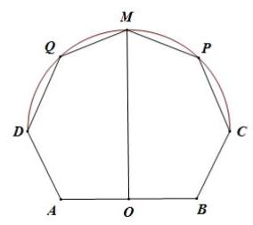

【例题】4. (2022 上海秋考) 如图,在同一平面上, ${AD} = {BC} = 6,{AB} = {20}, O$ 为 ${AB}$ 中点,曲线 ${CD}$ 上任一点到 $O$ 距离相等,角 $\angle {DAB} = \angle {ABC} = \; {120}^{ \circ  }, P\text{ 、 }Q$ 关于 ${OM}$ 对称, ${MO} \bot  {AB}$ ;

(1)若点 $P$ 与点 $C$ 重合，求 $\angle {POB}$ 的大小；

(2) $P$ 在何位置，求五边形 ${MQABP}$ 面积 $S$ 的最大值.

【解析】(1)若 $P$ 在点 $C$ 的位置,则 ${OB} = {10},{BC} = {20},\angle {ABC} = {120}^{ \circ  }$ ,

在 ${OB} = {10},{BC} = {20},\angle {ABC} = {120}^{ \circ  },{\Delta OPB}$ 中,由余弦定理得

$\cos \angle {OBC} = \frac{O{B}^{2} + B{C}^{2} - O{C}^{2}}{2 \times  {OB} \times  {BC}} =  - \frac{1}{2},$

所以 $\frac{{10}^{2} + {6}^{2} - O{C}^{2}}{2 \times  {10} \times  6} =  - \frac{1}{2} \Rightarrow  {OC} = {14}$ ,

在 $\bigtriangleup {OPB}$ 中,由正弦定理得 $\frac{OC}{\sin \angle {OBC}} = \frac{BC}{\sin \angle {POB}}$ ,

即 $\frac{10}{\sin \angle {POB}} = \frac{14}{\sin {120}^{ \circ  }}$ ,所以 $\sin \angle {POB} = \frac{3\sqrt{3}}{14}$ ,

因为 $\angle {POB}$ 为锐角,所以 $\angle {POB} = \arcsin \frac{3\sqrt{3}}{14}$ ;

(2) 连接 ${OQ},{OP}$ ,曲线 ${CMD}$ 上所有的点到 $O$ 的距离相等,

${OQ} = {OP} = {OD} = {OM} = {14}$ ,

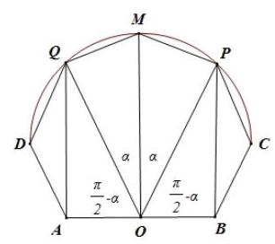

点 $Q$ 与点 $P$ 关于 ${OM}$ 对称, ${S}_{\Delta QOM} = {S}_{\Delta POM},{S}_{\Delta AOM} = {S}_{\Delta BOM}$ ,

设 $\angle {QOM} = \angle {POM} = \alpha ,\angle {QOA} = \angle {POB} = \frac{\pi }{2} - \alpha$ ,

则 ${S}_{\bigtriangleup {MQABP}} = 2\left( {{S}_{\bigtriangleup {MQO}} + {S}_{\bigtriangleup {QOA}}}\right)$

$= 2 \times  \left\lbrack  {\frac{1}{2}{OM} \times  {OQ} \times  \sin \alpha  + \frac{1}{2}{OA} \times  {OQ} \times  \sin \left( {\frac{\pi }{2} - \alpha }\right) }\right\rbrack$

$= {196}\sin \alpha  + {140}\cos \alpha  = {28}\sqrt{74}\sin \left( {\alpha  + \varphi }\right)$ ,其中 $= {196}\sin \alpha  +$

${140}\cos \alpha  = \sqrt{58016}\sin \left( {\alpha  + \varphi }\right) ,\tan \varphi  = \frac{35}{64}.$

所以当 $\alpha  + \varphi  = \frac{\pi }{2}$ 时， ${\left( {S}_{{\Delta M}{QABP}}\right) }_{\max } = {{28}\sqrt{74}}$ ，

所以五边形 ${MQABP}$ 面积的最大值为 ${\left( {S}_{\Delta MQABP}\right) }_{\max } = {28}\sqrt{74}$ .

【例题】5. (2013 上海秋考) 已知函数 $f\left( x\right)  = 2\sin \left( {\omega x}\right)$ ，其中常数 $\omega  > 0$ .

(1) 若 $y = f\left( x\right)$ 在 $\left\lbrack  {-\frac{\pi }{4},\frac{2\pi }{3}}\right\rbrack$ 上单调递增，求 $\omega$ 的取值范围；

(2) 令 $\omega  = 2$ ,将函数 $y = f\left( x\right)$ 的图象向左平移 $\frac{\pi }{6}$ 个单位,再向上平移 1 个单位,得到函数 $y = \; g\left( x\right)$ 的图象,区间 $\left\lbrack  {a, b}\right\rbrack  \left( {a, b \in  R\text{ 且 }a < b}\right)$ 满足: $y = g\left( x\right)$ 在 $\left\lbrack  {a, b}\right\rbrack$ 上至少含有 30 个零点,在所有满足上述条件的 $\left\lbrack  {a, b}\right\rbrack$ 中,求 $b - a$ 的最小值.

【解析】(1) 因为 $\omega  > 0, y = f\left( x\right)  = 2\sin {\omega x}$ 在 $\left\lbrack  {-\frac{\pi }{4},\frac{2\pi }{3}}\right\rbrack$ 上单调递增,

所以 $\left\{  \begin{array}{l}  - \frac{\pi }{4}\omega  \geq   - \frac{\pi }{2} \\  \frac{2\pi }{3}\omega  \leq  \frac{\pi }{2} \end{array}\right.$ ,解得 $0 < \omega  \leq  \frac{3}{4}$ .

所以 $\omega$ 的取值范围为 $\left( {0,\frac{3}{4}}\right\rbrack$ .

(2)令 $\omega  = 2$ ，将函数 $y = f\left( x\right)  = 2\sin {2x}$ 的图象向左平移 $\frac{\pi }{6}$ 个单位长度，

得函数 $y = 2\sin 2\left( {x + \frac{\pi }{6}}\right)  = 2\sin \left( {{2x} + \frac{\pi }{3}}\right)$ 的图象;

再向上平移 1 个单位长度,得到函数 $y = g\left( x\right)  = 2\sin \left( {{2x} + \frac{\pi }{3}}\right)  + 1$ 的图象,

令 $g\left( x\right)  = 0$ ,得 $\sin \left( {{2x} + \frac{\pi }{3}}\right)  =  - \frac{1}{2}$ ,

所以 ${2x} + \frac{\pi }{3} = {2k\pi } + \frac{7\pi }{6}$ ,或 ${2x} + \frac{\pi }{3} = {2k\pi } + \frac{11\pi }{6}, k \in  Z$ ,

得 $x = {k\pi } + \frac{5\pi }{12}$ 或 $x = {k\pi } + \frac{3\pi }{4}, k \in  Z$ ,

故函数 $g\left( x\right)$ 的零点为 $x = {k\pi } + \frac{5\pi }{12}$ 或 $x = {k\pi } + \frac{3\pi }{4}, k \in  Z$

所以相邻两个零点之间的距离为 $\frac{\pi }{3}$ 或 $\frac{2\pi }{3}$ .

若 $b - a$ 最小,则 $a$ 和 $b$ 都是零点,

此时在区间 $\left\lbrack  {a,\pi  + a}\right\rbrack  ,\left\lbrack  {a,{2\pi } + a}\right\rbrack  ,\cdots ,\left\lbrack  {a,{m\pi } + a}\right\rbrack  \left( {m \in  {N}^{ * }}\right)$ 分别

恰有 $3,5,\cdots ,{2m} + 1$ 个零点,所以在区间 $\left\lbrack  {a,{14\pi } + a}\right\rbrack$ 是恰有 29 个零点,

从而在区间 $({14\pi } + a, b\rbrack$ 至少有一个零点,所以 $b - a - {14\pi } \geq  \frac{\pi }{3}$ .

另一方面，在区间 $\left\lbrack  {\frac{5\pi }{12},{14\pi } + \frac{\pi }{3} + \frac{5\pi }{12}}\right\rbrack$ 恰有 30 个零点，

因此 $b - a$ 的最小值为 ${14\pi } + \frac{\pi }{3} = \frac{43\pi }{3}$ . 2025 版上海高考真题及模拟训练合集

## 2. 模拟练习

【练习】1. (23 宝山一模) 已知函数 $f\left( x\right)  = \sin {2x} + \sqrt{3}\cos {2x}, x \in  R$ .

(1)求函数 $f\left( x\right)$ 的单调增区间;

(2)在锐角 ${\Delta ABC}$ 中，角 $A$ 、 $B$ 、 $C$ 的对边分别为 $a$ 、 $b$ 、 $c$ ，当 $f\left( A\right)  = 0$ ， $b = 1$ ，且三角形 ${ABC}$ 的面积为 $\sqrt{3}$ 时，求 $a$ .

【答案】 $\left( 1\right) x \in  \left\lbrack  {{k\pi } - \frac{5\pi }{12},{k\pi } + \frac{\pi }{12}}\right\rbrack  , k \in  Z;\left( 2\right) \sqrt{13}$

【解析】(1) 由题意得 $f\left( x\right)  = 2\sin \left( {{2x} + \frac{\pi }{3}}\right) , x \in  R$ 3 分

当 ${2x} + \frac{\pi }{3} \in  \left\lbrack  {{2k\pi } - \frac{\pi }{2},{2k\pi } + \frac{\pi }{2}}\right\rbrack$ 5 分

即 $x \in  \left\lbrack  {{k\pi } - \frac{5\pi }{12},{k\pi } + \frac{\pi }{12}}\right\rbrack  , k \in  Z$ 为单调增区间 6 分

(2) $f\left( A\right)  = 2\sin \left( {{2A} + \frac{\pi }{3}}\right)  = 0$ ，且 $A$ 为锐角，解得 $A = \frac{\pi }{3}$ 8 分

又 $b = 1$ ,由 $S = \frac{1}{2}{bc}\sin A$ 得 $\sqrt{3} = \frac{1}{2}c\sin \frac{\pi }{3}$ ,从而 $c = 4$ 10 分

由余弦定理 $\cos A = \frac{{b}^{2} + {c}^{2} - {a}^{2}}{2bc}$ 12 分

代入得 $\frac{1 + {16} - {a}^{2}}{2 \times  1 \times  4} = \frac{1}{2}$ ，解得 ${a}^{2} = {13}$ ，所以 $a = \sqrt{13}$ 14 分

【练习】2. (23 金山一模) 在 $\bigtriangleup  {ABC}$ 中，设角 $A$ 、 $B$ 、 $C$ 所对的边分别为 $a$ 、 $b$ 、 $c$ ，且 $a\cos B + \left( {b - {4c}}\right) \cos A \; = 0$ .

(1)求 $\cos A$ ；

( 2 )若 $\overrightarrow{BD} = 2\overrightarrow{DC},\left| \overrightarrow{AD}\right|  = 1$ ，求 $c + {2b}$ 的最大值.

【答案】 $\left( 1\right) \frac{1}{4};\left( 2\right) \frac{6\sqrt{10}}{5}$

【解析】(1) 由 $a\cos B + \left( {b - {4c}}\right) \cos A = 0$ ,

得 $\sin A\cos B + \left( {\sin B - 4\sin C}\right) \cos A = 0$ , 1 分

即 $\sin \left( {A + B}\right)  - 4\sin C\cos A = 0$ , 4 分

从而 $\sin C - 4\sin C\cos A = 0$ ,

由 $\sin C > 0$ ,得 $\cos A = \frac{1}{4}$ 6 分

(2) 由 $\cos \angle {ADB} + \cos \angle {ADC} = 0$ 得 $\frac{1 + \frac{4}{9}{a}^{2} - {c}^{2}}{2 \times  1 \times  \frac{2}{3}a} + \frac{1 + \frac{1}{9}{a}^{2} - {b}^{2}}{2 \times  1 \times  \frac{1}{3}a} = 0$ ，

从而 $1 + \frac{4}{9}{a}^{2} - {c}^{2} + 2\left( {1 + \frac{1}{9}{a}^{2} - {b}^{2}}\right)  = 0$ ,即 ${a}^{2} = \frac{3}{2}\left( {{c}^{2} + 2{b}^{2} - 3}\right)$ 8 分

又因为 $\cos A = \frac{1}{4} = \frac{{b}^{2} + {c}^{2} - {a}^{2}}{2bc}$ ,得 ${a}^{2} = {b}^{2} + {c}^{2} - \frac{1}{2}{bc}$ 9 分

所以 ${b}^{2} + {c}^{2} - \frac{1}{2}{bc} = \frac{3}{2}\left( {{c}^{2} + 2{b}^{2} - 3}\right)$ ,即 ${c}^{2} + {bc} + 4{b}^{2} = 9$ ,

从而 ${\left( c + 2b\right) }^{2} - 9 = {3bc}$ , 10 分

而 ${3bc} = \frac{3}{2}\left( {2b}\right)  \cdot  c \leq  \frac{3}{2} \cdot  \frac{{\left( 2b + c\right) }^{2}}{4}$ ,故 ${\left( c + 2b\right) }^{2} - 9 \leq  \frac{3{\left( 2b + c\right) }^{2}}{8}$ 12 分

解得 ${\left( c + 2b\right) }^{2} \leq  \frac{72}{5}$ ,当且仅当 $b = \frac{3\sqrt{10}}{10}, c = \frac{3\sqrt{10}}{5}$ 时取等号,

所以 $c + {2b}$ 的最大值为 $\frac{6\sqrt{10}}{5}$ 14 分

2025 版上海高考真题及模拟训练合集

【练习】3. (23 宝山二模) 已知函数 $f\left( x\right)  = \sin x\cos x - \sqrt{3}{\cos }^{2}x + \frac{\sqrt{3}}{2}$ .

(1)求函数 $y = f\left( x\right)$ 的最小正周期和单调区间；

(2)若关于 $x$ 的方程 $f\left( x\right)  - m = 0$ 在 $x \in  \left\lbrack  {0,\frac{\pi }{2}}\right\rbrack$ 上有两个不同的实数解，求实数 $m$ 的取值范围.

【解析】(1) $f\left( x\right)  = \sin x\cos x - \sqrt{3}{\cos }^{2}x + \frac{\sqrt{3}}{2} = \frac{1}{2}\sin {2x} - \sqrt{3} \cdot  \frac{1 + \cos {2x}}{2} + \frac{\sqrt{3}}{2}$

$= \frac{1}{2}\sin {2x} - \frac{\sqrt{3}}{2}\cos {2x} = \sin \left( {{2x} - \frac{\pi }{3}}\right)$

最小正周期 $T = \pi \cdots \cdots 4$ 分

当 ${2x} - \frac{\pi }{3} \in  \left\lbrack  {{2k\pi } - \frac{\pi }{2},{2k\pi } + \frac{\pi }{2}}\right\rbrack$ ,即 $x \in  \left\lbrack  {{k\pi } - \frac{\pi }{12},{k\pi } + \frac{5\pi }{12}}\right\rbrack  \left( {k \in  Z}\right)$ 时,函数为增函数.

6 分

当 ${2x} - \frac{\pi }{3} \in  \left\lbrack  {{2k\pi } + \frac{\pi }{2},{2k\pi } + \frac{3\pi }{2}}\right\rbrack$ ,即 $x \in  \left\lbrack  {{k\pi } + \frac{5\pi }{12},{k\pi } + \frac{11\pi }{12}}\right\rbrack  \left( {k \in  Z}\right)$ 时,函数为减函数. $\cdots \; \cdots 8$ 分

( 2 )方程 $f\left( x\right)  - m = 0$ 有两个不同的实数解，

等价于 $y = \sin \left( {{2x} - \frac{\pi }{3}}\right)$ 和直线 $y = m$ 的图像在 $x \in  \left\lbrack  {0,\frac{\pi }{2}}\right\rbrack$ 上有两个不同的交点. 10 分 $x \in  \left\lbrack  {0,\frac{\pi }{2}}\right\rbrack$ ,则 ${2x} - \frac{\pi }{3} \in  \left\lbrack  {-\frac{\pi }{3},\frac{2\pi }{3}}\right\rbrack  ,\sin \left( {{2x} - \frac{\pi }{3}}\right)  \in  \left\lbrack  {-\frac{\sqrt{3}}{2},1}\right\rbrack  , \cdot$ 12 分

由图像得 $m \in  \left\lbrack  {\frac{\sqrt{3}}{2},1}\right)$ .

## 板块四:压轴主观题

## 1. 真题回顾

【例题】1. (2019 上海春考) 已知等差数列 $\left\{  {a}_{n}\right\}$ 的公差 $d \in  (0,\pi \rbrack$ ,数列 $\left\{  {b}_{n}\right\}$ 满足 ${b}_{n} = \sin \left( {a}_{n}\right)$ ,集合 $S = \; \left\{  {x \mid  x = {b}_{n}, n \in  {N}^{ * }}\right\}  .$

(1)若 ${a}_{1} = 0, d = \frac{2\pi }{3}$ ，求集合 $S$ ；

( 2 )若 ${a}_{1} = \frac{\pi }{2}$ ，求 $d$ 使得集合 $S$ 恰好有两个元素；

(3)若集合 $S$ 恰好有三个元素: ${b}_{n + T} = {b}_{n}$ ， $T$ 是不超过 7 的正整数，求 $T$ 的所有可能的值.

【解析】(1) 因为等差数列 $\left\{  {a}_{n}\right\}$ 的公差 $d \in  (0,\pi \rbrack$ ,数列 $\left\{  {b}_{n}\right\}$ 满足 ${b}_{n} = \sin \left( {a}_{n}\right)$ ,

集合 $S = \left\{  {x \mid  x = {b}_{n}, n \in  {N}^{ * }}\right\}$ . 所以当 ${a}_{1} = 0, d = \frac{2\pi }{3}$ ，集合 $S = \left\{  {-\frac{\sqrt{3}}{2},0,\frac{\sqrt{3}}{2}}\right\}$ .

(2)因为 ${a}_{1} = \frac{\pi }{2}$ ，数列 $\left\{  {b}_{n}\right\}$ 满足 ${b}_{n} = \sin \left( {a}_{n}\right)$ ，

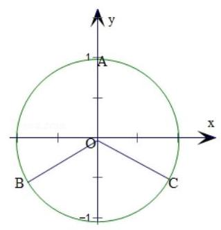

集合 $S = \left\{  {x \mid  x = {b}_{n}, n \in  {N}^{ * }}\right\}$ 恰好有两个元素，如图:

根据三角函数线，①等差数列 $\left\{  {a}_{n}\right\}$ 的终边落在 $y$ 轴的正负半轴上时,

集合 $S$ 恰好有两个元素,此时 $d = \pi$ ,

② ${a}_{1}$ 终边落在 ${OA}$ 上，要使得集合 $S$ 恰好有两个元素，可以使 ${a}_{2}$ ， ${a}_{3}$ 的终边关

于 $y$ 轴对称,如图 ${OB},{OC}$ ,此时 $d = \frac{2\pi }{3}$ ,

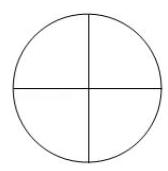

综上, $d = \frac{2}{3}\pi$ 或 $d = \pi$ .

(3) ① 当 $T = 3$ 时， ${b}_{n + 3} = {b}_{n}$ ，集合 $S = \left\{  {{b}_{1},{b}_{2},{b}_{3}}\right\}$ ，符合题意.

② 当 $T = 4$ 时， ${b}_{n + 4} = {b}_{n}$ ， $\sin \left( {{a}_{n} + {4d}}\right)  = \sin {a}_{n}$ ， ${a}_{n} + {4d} = {a}_{n} + {2k\pi }$ ，

或 ${a}_{n} + {4d} = \left( {{2k} + 1}\right) \pi  - {a}_{n}$ ,

等差数列 $\left\{  {a}_{n}\right\}$ 的公差 $d \in  (0,\pi \rbrack$ ,故 ${a}_{n} + {4d} = {a}_{n} + {2k\pi }, d = \frac{k\pi }{2}$ ,

所以 $k = 1,2$ ,当 $k = 1$ 时满足条件,此时 $S = \{ 0,1, - 1\}$ .

③ 当 $T = 5$ 时， ${b}_{n + 5} = {b}_{n}$ ， $\sin \left( {{a}_{n} + {5d}}\right)  = \sin {a}_{n}$ ， ${a}_{n} + {5d} = {a}_{n} + {2k\pi }$ ，

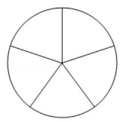

或 ${a}_{n} + {5d} = \left( {{2k} + 1}\right) \pi  - {a}_{n}$ ,因为 $d \in  (0,\pi \rbrack$ ,所以 $k = 1,2$ .

当 $k = 1$ 时， $S = \left\{  {\sin \frac{2\pi }{5},1, - \sin \frac{2\pi }{5}}\right\}$ 满足题意.

④ 当 $T = 6$ 时， ${b}_{n + 6} = {b}_{n}$ ， $\sin \left( {{a}_{n} + {6d}}\right)  = \sin {a}_{n}$ ，

所以 ${a}_{n} + {6d} = {a}_{n} + {2k\pi }$ 或 ${a}_{n} + {6d} = \left( {{2k} + 1}\right) \pi  - {a}_{n}, d \in  (0,\pi \rbrack$ ,

故 $k = 1,2,3$ . 当 $k = 1$ 时, $S = \left\{  {\frac{\sqrt{3}}{2},0,\frac{\sqrt{3}}{2}}\right\}$ ,满足题意.

⑤ 当 $T = 7$ 时， ${b}_{n + 7} = {b}_{n}$ ， $\sin \left( {{a}_{n} + {7d}}\right)  = \sin {a}_{n} = \sin {a}_{n}$ ，

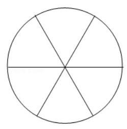

所以 ${a}_{n} + {7d} = {a}_{n} + {2k\pi }$ 或 ${a}_{n} + {7d} = \left( {{2k} + 1}\right) \pi  - {a}_{n}, d \in  (0,\pi \rbrack$ ,

故 $k = 1,2,3$ ,当 $k = 1$ 时,因为 ${b}_{1} \sim  {b}_{7}$ 对应着 3 个正弦值,

所以必有一个正弦值对应着 3 个点,必然有 ${a}_{m} - {a}_{n} = {2\pi }, d = \frac{2\pi }{m - n} = \; \frac{2\pi }{7}$ ,

$m - n = 7, m > 7$ ,不符合条件.

当 $k = 2$ 时，因为 ${b}_{1} \sim  {b}_{7}$ 对应着 3 个正弦值，故必有一个正弦值对应着 3 个点，

必然有 ${a}_{m} - {a}_{n} = {2\pi }, d = \frac{2\pi }{m - n} = \frac{4\pi }{7}, m - n$ 不是整数，不符合条件.

当 $k = 3$ 时，因为 ${b}_{1} \sim  {b}_{7}$ 对应着 3 个正弦值，故必有一个正弦值对应着 3 个点，

必然有 ${a}_{m} - {a}_{n} = {2\pi }$ 或 ${4\pi }, d = \frac{2\pi }{m - n} = \frac{6\pi }{7}$ 或 $d = \frac{4\pi }{m - n} = \frac{6\pi }{7}$ ,

此时, $m - n$ 均不是整数,不符合题意.

综上, $T = 3,4,5,6$ .

【例题】2. (2009 上海春考) 设函数 ${f}_{n}\left( \theta \right)  = {\sin }^{n}\theta  + {\left( -1\right) }^{n}{\cos }^{n}\theta ,0 \leq  \theta  \leq  \frac{\pi }{4}$ ,其中 $n$ 为正整数.

(1)判断函数 ${f}_{1}\left( \theta \right)$ 、 ${f}_{3}\left( \theta \right)$ 的单调性,并就 ${f}_{1}\left( \theta \right)$ 的情形证明你的结论;

(2) 证明: $2{f}_{6}\left( \theta \right)  - {f}_{4}\left( \theta \right)  = \left( {{\cos }^{4}\theta  - {\sin }^{4}\theta }\right) \left( {{\cos }^{2}\theta  - {\sin }^{2}\theta }\right)$ ;

(3)对于任意给定的正奇数 $n$ ，求函数 ${f}_{n}\left( \theta \right)$ 的最大值和最小值.

【解析】 $\left( 1\right) {f}_{1}\left( \theta \right) \text{ 、 }{f}_{3}\left( \theta \right)$ 在 $0 \leq  \theta  \leq  \frac{\pi }{4}$ 上均为单调递增的函数.

对于函数 ${f}_{1}\left( \theta \right)  = \sin \theta  - \cos \theta$ ,设 ${\theta }_{1} < {\theta }_{2},{\theta }_{1}\text{ 、 }{\theta }_{2} \in  \left\lbrack  {0,\frac{\pi }{4}}\right\rbrack$ ,

则 ${f}_{1}\left( {\theta }_{1}\right)  - {f}_{1}\left( {\theta }_{2}\right)  = \left( {\sin {\theta }_{1} - \sin {\theta }_{2}}\right)  + \left( {\cos {\theta }_{2} - \cos {\theta }_{1}}\right)$ ,

因为 $\sin {\theta }_{1} < \sin {\theta }_{2},\cos {\theta }_{2} < \cos {\theta }_{1}$ ,所以 ${f}_{1}\left( {\theta }_{1}\right)  < {f}_{1}\left( {\theta }_{2}\right)$ ,

所以函数 ${f}_{1}\left( \theta \right)$ 在 $\left\lbrack  {0,\frac{\pi }{4}}\right\rbrack$ 上单调递增.

(2) 因为原式左边 $= 2\left( {{\sin }^{6}\theta  + {\cos }^{6}\theta }\right)  - \left( {{\sin }^{4}\theta  + {\cos }^{4}\theta }\right)$

$= 2\left( {{\sin }^{2}\theta  + {\cos }^{2}\theta }\right) \left( {{\sin }^{4}\theta  - {\sin }^{2}\theta {\cos }^{2}\theta  + {\cos }^{4}\theta }\right)  - \left( {{\sin }^{4}\theta  + {\cos }^{4}\theta }\right)$

$= 1 - {\sin }^{2}{2\theta } = {\cos }^{2}{2\theta }$ .

又因为原式右边 $= \left( {{\cos }^{2}\theta  - {\sin }^{2}\theta }\right) 2 = {\cos }^{2}{2\theta }$ ,

所以 $2{f}_{6}\left( \theta \right)  - {f}_{4}\left( \theta \right)  = \left( {{\cos }^{4}\theta  - {\sin }^{4}\theta }\right) \left( {{\cos }^{2}\theta  - {\sin }^{2}\theta }\right)$ .

(3)当 $n = 1$ 时，函数 ${f}_{1}\left( \theta \right)$ 在 $\left\lbrack  {0,\frac{\pi }{4}}\right\rbrack$ 上单调递增，

所以 ${f}_{1}\left( \theta \right)$ 的最大值为 ${f}_{1}\left( \frac{\pi }{4}\right)  = 0$ ,最小值为 ${f}_{1}\left( 0\right)  =  - 1$ .

当 $n = 3$ 时,函数 ${f}_{3}\left( \theta \right)$ 在 $\left\lbrack  {0,\frac{\pi }{4}}\right\rbrack$ 上单调递增.

所以 ${f}_{3}\left( \theta \right)$ 的最大值为 ${f}_{3}\left( \frac{\pi }{4}\right)  = 0$ ,最小值为 ${f}_{3}\left( 0\right)  =  - 1$ .

下面讨论正奇数 $n \geq  5$ 的情形: 对任意 ${\theta }_{1},{\theta }_{2} \in  \left\lbrack  {0,\frac{\pi }{4}}\right\rbrack$ ,且 ${\theta }_{1} < {\theta }_{2}$ ,

因为 ${f}_{n}\left( {\theta }_{1}\right)  - {f}_{n}\left( {\theta }_{2}\right)  = \left( {{\sin }^{n}{\theta }_{1} - {\sin }^{n}{\theta }_{2}}\right)  + \left( {{\cos }^{n}{\theta }_{2} - {\cos }^{n}{\theta }_{1}}\right)$ ,

以及 $0 \leq  \sin {\theta }_{1} < \sin {\theta }_{2} < 1,0 \leq  \cos {\theta }_{2} < \cos {\theta }_{1} < 1$ ,

所以 ${\sin }^{n}{\theta }_{1} < {\sin }^{n}{\theta }_{2}{\cos }^{n}{\theta }_{2} < {\cos }^{n}{\theta }_{1}$ ,从而 ${f}_{n}\left( {\theta }_{1}\right)  < {f}_{n}\left( {\theta }_{2}\right)$ .

所以 ${f}_{n}\left( \theta \right)$ 在 $\left\lbrack  {0,\frac{\pi }{4}}\right\rbrack$ 上为单调递增,

则 ${f}_{n}\left( \theta \right)$ 的最大值为 ${f}_{n}\left( \frac{\pi }{4}\right)  = 0$ ,最小值为 ${f}_{n}\left( 0\right)  =  - 1$ .

综上所述,当 $n$ 为奇数时,函数 ${f}_{n}\left( \theta \right)$ 的最大值为 0,最小值为 -1 . 2025 版上海高考真题及模拟训练合集

## 2. 模拟练习

【练习】1. 已知 $\left\{  {a}_{n}\right\}$ 是等差数列, ${b}_{n} = \sin \left( {a}_{n}\right)$ ,且存在正整数 $t$ ,使得对任意的正整数 $n$ 都有 ${b}_{n + t} = {b}_{n}$ . 若集合 $S = \left\{  {x \mid  x = {b}_{n}, n\text{ 为正整数 }}\right\}$ 中只含有 4 个元素,则 $t$ 的取值不可能是 ( )

A. 4 B. 5 C. 6 D. 7

【答案】 $B$

【解析】设等差数列 $\left\{  {a}_{n}\right\}$ 首项为 ${a}_{1}$ ,公差为 $d$ ,则 ${a}_{n} = {a}_{1} + \left( {n - 1}\right) d,{b}_{n} = \sin \left( {a}_{n}\right)$ ,

由题意得存在正整数 $t$ ,使得 ${b}_{n + t} = {b}_{n}, n \in  {N}^{ * }$ ,

若集合 $\left\{  {x \mid  x = {b}_{n}, n \in  {N}^{ * }}\right\}$ 有 4 个不同元素,得 $t \geq  4$ ,

当 $t = 4$ 时, $\sin \left( {a}_{n + 4}\right)  = \sin \left( {a}_{n}\right)$ ,即 $\sin \left( {a}_{n + 4}\right)  = \sin \left( {{a}_{n} + {4d}}\right)  = \sin \left( {{a}_{n} + {2k\pi }}\right) , k \in  Z$ ,

所以 ${a}_{n + 4} = {a}_{n} + {4d} = {a}_{n} + {2k\pi }$ 或 ${a}_{n} + {4d} = \pi  - {a}_{n} + {2k\pi }$ (舍去), $k \in  Z$ ,

所以 $d = \frac{2k\pi }{4} = \frac{k\pi }{2}, k \in  Z$ ,取 $k = 1$ 时, $d = \frac{\pi }{2}$ ,

在单位圆上的 4 个等分点可取到 4 个不同的正弦值,

即集合 $\left\{  {x \mid  x = {b}_{n}, n \in  {N}^{ * }}\right\}$ 可取 4 个不同元素;

当 $k = 5,\sin \left( {a}_{n + 5}\right)  = \sin \left( {a}_{n}\right)$ ,即 $\sin \left( {a}_{n + 5}\right)  = \sin \left( {{a}_{n} + {5d}}\right)  = \sin \left( {{a}_{n} + {2k\pi }}\right) , k \in  Z$ ,

所以 $d = \frac{2k\pi }{5}$ ,此时在单位圆上的 5 个等分点,

取到的 $\sin \frac{2\pi }{5}\text{ 、 }\sin \frac{4\pi }{5}\text{ 、 }\sin \frac{6\pi }{5}\text{ 、 }\sin \frac{8\pi }{5}\text{ 、 }\sin \frac{10\pi }{5}$ ,

不可能取到 4 个不同的正弦值, 故不成立;

同理,当 $t = 6, t = 7, t = 8$ ,集合 $\left\{  {x \mid  x = {b}_{n}, n \in  {N}^{ * }}\right\}$ 可取 4 个不同元素;

当 $t \geq  9$ 时, $d = \frac{2k\pi }{9}$ ,单位圆上至少 9 个等分点取 4 个不同的正弦值,

必有至少 3 个相等的正弦值,不符合集合 $\left\{  {x \mid  x = {b}_{n}, n \in  {N}^{ * }}\right\}$ 元素的互异性,故选 $B$ .

【练习】2. (23 嘉定二模 21) 已知 $f\left( x\right)  = x + 2\sin x$ ,等差数列 $\left\{  {a}_{n}\right\}$ 的前 $n$ 项和为 ${S}_{n}$ ,记 ${T}_{n} = \mathop{\sum }\limits_{{i = 1}}^{n}f\left( {a}_{i}\right)$ .

(1)求证:函数 $y = f\left( x\right)$ 的图像关于点 $\left( {\pi ,\pi }\right)$ 中心对称；

(2)若 ${a}_{1}$ 、 ${a}_{2}$ 、 ${a}_{3}$ 是某三角形的三个内角，求 ${T}_{3}$ 的取值范围；

(3) 若 ${S}_{100} = {100\pi }$ ，求证: ${T}_{100} = {100\pi }$ . 反之是否成立？并请说明理由.

【解析】(1) 在函数 $y = x + 2\sin x$ 的图像上任取一点 $P\left( {x, y}\right)$ ,

点 $P$ 关于点 $\left( {\pi ,\pi }\right)$ 的对称点为 ${P}^{\prime }\left( {{2\pi } - x,{2\pi } - y}\right)$ ,

而 $f\left( {{2\pi } - x}\right)  = {2\pi } - x + 2\sin \left( {{2\pi } - x}\right)  = {2\pi } - x - 2\sin x = {2\pi } - y$ ,

所以点 ${P}^{\prime }\left( {{2\pi } - x,{2\pi } - y}\right)$ 在函数 $y = f\left( x\right)$ 图像上,

所以函数 $y = f\left( x\right)$ 的图像关于点 $\left( {\pi ,\pi }\right)$ 中心对称.

(2)若 ${a}_{1}\text{ 、 }{a}_{2}\text{ 、 }{a}_{3}$ 是某三角形的三个内角,则 ${a}_{1} + {a}_{2} + {a}_{3} = \pi$ ，

又 $\left\{  {a}_{n}\right\}$ 为等差数列,则 ${a}_{2} = \frac{\pi }{3}$ ,

${T}_{3} = f\left( {a}_{1}\right)  + f\left( {a}_{2}\right)  + f\left( {a}_{3}\right)  = {a}_{1} + {a}_{2} + {a}_{3} + 2\left( {\sin {a}_{1} + \sin {a}_{2} + \sin {a}_{3}}\right)$

$= \pi  + \sqrt{3} + 2\left( {\sin {a}_{1} + \sin {a}_{3}}\right)$ ,

${T}_{3} = \pi  + \sqrt{3} + 4\left( {\sin \frac{{a}_{1} + {a}_{3}}{2}\cos \frac{{a}_{1} - {a}_{3}}{2}}\right)  = \pi  + \sqrt{3} + 2\sqrt{3}\cos \frac{{a}_{1} - {a}_{3}}{2},$

不妨设 $0 < {a}_{1} \leq  {a}_{3} < \frac{2}{3}\pi$ ,则 $- \frac{2}{3}\pi  < {a}_{1} - {a}_{3} \leq  0$ ,于是 $\cos \frac{{a}_{1} - {a}_{3}}{2} \in  \left( {\frac{1}{2},1}\right\rbrack$ ,

所以 ${T}_{3} \in  (\pi  + 2\sqrt{3},\pi  + 3\sqrt{3}\rbrack$ ;

(3)若 ${S}_{100} = {100\pi }$ ， 又 ${T}_{100} = \mathop{\sum }\limits_{{i = 1}}^{{100}}f\left( {a}_{i}\right)  = {S}_{100} + 2\mathop{\sum }\limits_{{i = 1}}^{{100}}\sin {a}_{i}$ ，

则 ${T}_{100} = {100\pi } + 2\mathop{\sum }\limits_{{i = 1}}^{{100}}\sin {a}_{i}$ ,

因为 $\left\{  {a}_{n}\right\}$ 为等差数列且 ${S}_{100} = {100\pi }$ ,所以当 $n + m = {101}$ 时, ${a}_{n} + {a}_{m} = {2\pi }$ ,

于是 $\sin {a}_{n} + \sin {a}_{m} = 0$ .

故 $2\mathop{\sum }\limits_{{i = 1}}^{{100}}\sin {a}_{i} = \left( {\sin {a}_{1} + \sin {a}_{100}}\right)  + \left( {\sin {a}_{2} + \sin {a}_{99}}\right)  + \cdots  + \left( {\sin {a}_{100} + \sin {a}_{1}}\right)  = 0$ ,

所以 ${T}_{100} = {100\pi }$ ,得证.

若 ${T}_{100} = {100\pi }$ ,则 ${S}_{100} + 2\mathop{\sum }\limits_{{i = 1}}^{{100}}\sin {a}_{i} = {100\pi }$ ,反之不成立.

考虑存在等差数列 $\left\{  {a}_{n}\right\}$ ,满足 ${a}_{50} = {a}_{1} + {49d} = \pi$ ,则 ${S}_{99} = {99\pi }$ ,

于是 ${a}_{n}$ 与 ${a}_{{100} - n}$ 关于 $\pi$ 对称,所以 ${T}_{99} = {99\pi }$ .

下面证明，存在 $d$ 可以使得 $f\left( {a}_{100}\right)  = \pi$ 且 ${a}_{100} \neq  \pi$ .

不妨设 $d > 0$ ,又 ${a}_{1} + {49d} = \pi$ ,所以 ${a}_{100} = {a}_{1} + {99d} \neq  \pi$ .

$f\left( {a}_{100}\right)  - \pi  = {50d} - 2\sin \left( {50d}\right)$ ,考虑函数 $y = x - 2\sin x, x > 0$ ,

其中 $g\left( x\right)  = x - 2\sin x$ ,

因为 $g\left( \frac{\pi }{3}\right)  = \frac{\pi }{3} - \sqrt{3} < 0, g\left( \pi \right)  = \pi  > 0$ ,所以存在 $\xi  \in  \left( {\frac{\pi }{3},\pi }\right)$ 使得 $g\left( \xi \right)  = 0$ ,

所以存在 $d \in  \left( {\frac{\pi }{150},\frac{\pi }{50}}\right)$ ,使得 $f\left( {a}_{100}\right)  = \pi$ 即 ${T}_{100} = {100\pi }$ ,

但是 ${S}_{100} \neq  {100\pi }$ . 所以反之不成立.

注: 反例不唯一,例如: 考虑 $d = 0$ ,证明存在 $\xi  \in  \left( {\frac{3\pi }{2},{2\pi }}\right)$ ,使得 $f\left( \xi \right)  = \pi ,{a}_{n} = \xi$ .
