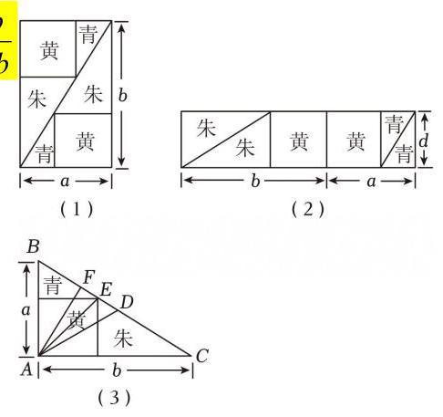

## 04 基本不等式
【知识梳理】
1. $a + b \geq  2\sqrt{ab}$ ，使用时需要注意“一正、二定、三相等”，但 ${\left( a + b\right) }^{2} \geq  {4ab}$ 使用时不需要注意正数:
2. ${a}^{2} + {b}^{2} \geq  2\left| {ab}\right|  = \left\{  \begin{array}{l} {2ab}, b \geq  0 \\   - {2ab},{ab} < 0 \end{array}\right.$ :
3. $\frac{2}{\frac{1}{a} + \frac{1}{b}} \leq  \sqrt{ab} \leq  \frac{a + b}{2} \leq  \sqrt{\frac{{a}^{2} + {b}^{2}}{2}}$ ,使用时需要注意 “一正、二定、三相等”,从
左往后依次记为“调和平均数”、“几何平均数”、“算术平均数”、“平方平均数”； 拓展至 $n$ 元情形为:
$\frac{n}{\frac{1}{{a}_{1}} + \frac{1}{{a}_{2}} + \cdots  + \frac{1}{{a}_{n}}} \leq  \sqrt[n]{{a}_{1}{a}_{2}\cdots {a}_{n}} \leq  \frac{{a}_{1} + {a}_{2} + \cdots  + {a}_{n}}{n} \leq  \sqrt{\frac{{a}_{1}^{2} + {a}_{2}^{2} + \cdots  + {a}_{n}^{2}}{n}}$
常用变形有 ${a}_{1}{a}_{2}{a}_{3} \leq  {\left( \frac{{a}_{1} + {a}_{2} + {a}_{3}}{3}\right) }^{3}$ ;
4. 多参数问题中注意使用待定系数法.
题型 1: 直接使用基本不等式
例 1: (25-26 建平高一上 15) .《九章算术》中“勾股容方”问题: “今有勾五步, 股十二步，问勾中容方几何？”魏晋时期数学家刘徽在其《九章算术注》中利用出入相补原理给出了这个问题的一般解法: 如图 (1), 用对角线将长和宽分别为 $b$ 和 $a$ 的矩形分成两个直角三角形，每个直角三角形再分成一个内接正方形(黄 )和两个小直角三角形 (朱、青). 将三种颜色的图形进行重组，得到如图 (2) 所示的矩形,该矩形长为 $a + b$ ,宽为内接正方形的边长 $d$ . 由刘徽构造的图形可以得到许多重要的结论,如图 (3),设 $D$ 为斜边 ${BC}$ 的中点,作直角三角形 ${ABC}$ 的内接正方形的对角线 ${AE}$ ,过点 $A$ 作 ${AF} \bot  {BC}$ 于点 $F$ ,下列推理正确的
是 ( )

A. 由题图 (1) 和题图 (2) 面积相等得 $d = \frac{2ab}{a + b}$
B. 由 ${AE} \geq  {AF}$ 可得 $\sqrt{\frac{{a}^{2} + {b}^{2}}{2}} \geq  \frac{2}{\frac{1}{a} + \frac{1}{b}}$
C. 由 ${AD} \geq  {AE}$ 可得 $\sqrt{\frac{{a}^{2} + {b}^{2}}{2}} \geq  \frac{a + b}{2}$
D. 由 ${AD} \geq  {AF}$ 可得 ${a}^{2} + {b}^{2} \geq  {2ab}$
【解析】
$A$ : 由 (1) 和 (2) 面积相等得 ${ab} = \left( {a + b}\right) d$ ，所以 $d = \frac{ab}{a + b}$ ，错误；
$B$ : 因为 ${AF} \bot  {BC}$ ,所以 $\frac{1}{2}{ab} = \frac{1}{2}\sqrt{{a}^{2} + {b}^{2}} \times  {AF}$ ,得 ${AF} = \frac{ab}{\sqrt{{a}^{2} + {b}^{2}}}$ ,
设图 (3) 中正方形边长为 $t$ ,因为小三角形 (青) 与 $\bigtriangleup {ABC}$ 相似,
所以 $\frac{a - t}{a} = \frac{t}{b}$ ,解得 $t = \frac{ab}{a + b}$ ,所以 ${AE} = \frac{\sqrt{2}{ab}}{a + b}$
因为 ${AE} \geq  {AF}$ ,所以 $\frac{\sqrt{2}{ab}}{a + b} \geq  \frac{ab}{\sqrt{{a}^{2} + {b}^{2}}}$ ,即 $\sqrt{\frac{{a}^{2} + {b}^{2}}{2}} \geq  \frac{a + b}{2}$ ,错误;
$C$ : 由题意得 ${BD} = \frac{\sqrt{{a}^{2} + {b}^{2}}}{2}$ ，因为 ${AD} \geq  {AE}$ ，所以 $\frac{\sqrt{{a}^{2} + {b}^{2}}}{2} \geq  \frac{\sqrt{2}{ab}}{a + b}$
得 $\sqrt{\frac{{a}^{2} + {b}^{2}}{2}} \geq  \frac{2}{\frac{1}{a} + \frac{1}{b}}$ ,错误
$D$ : 因为 ${AD} \geq  {AF}$ ,所以 $\frac{\sqrt{{a}^{2} + {b}^{2}}}{2} \geq  \frac{ab}{\sqrt{{a}^{2} + {b}^{2}}}$ ,整理得 ${a}^{2} + {b}^{2} \geq  {2ab}$ ,正确.
故选: $D$ .
例 2: (25-26 复附高三上周测 14(7)) 若正数 $m\text{ 、 }n$ 满足 $\frac{4}{m} + \frac{9}{n} = 1$ ,则 ${mn}$ 的最小值为___.
## 【解析】
因为 $m, n$ 是正数,所以 $\frac{4}{m} + \frac{9}{n} \geq  2\sqrt{\frac{4}{m} \cdot  \frac{9}{n}} = \frac{12}{\sqrt{mn}}$
又 $\frac{4}{m} + \frac{9}{n} = 1$ ,所以 $\frac{12}{\sqrt{mn}} \leq  1$ ,即 $\sqrt{mn} \geq  {12}$ ,所以 ${mn} \geq  {144}$
当且仅当 $\frac{4}{m} = \frac{9}{n}$
即 $m = 8, n = {18}$ 时, ${mn}$ 取得最小值 144 .
变式 2-1: (25-26 复附高三上期中 6) 已知 $a\text{ 、 }b \in  R,4{a}^{2} + 9{b}^{2} = 1$ ,则 ${ab}$ 的最小值为___.
## 【解析】
$\because 4{a}^{2} + 9{b}^{2} \geq  {12}\left| {ab}\right| ,\;\therefore \left| {ab}\right|  \leq  \frac{1}{12},\;\therefore  - \frac{1}{12} \leq  {ab} \leq  \frac{1}{12}$
当且仅当 $\because 4{a}^{2} = 9{b}^{2} = \frac{1}{2}$ 时即 ${2a} =  - {3b}$ 时取等号,
所以 ${ab}$ 的最小值为 $- \frac{1}{12}$
故答案为: $- \frac{1}{12}$ .
例 3: (25-26 上中高三上周练 9 (8)) 设 $x\text{ 、 }y \geq  0$ ,则 $x + y + \frac{1}{x + {2y}}$ 的最小值为___.
## 【解析】
①若 $y = 0$ ，则最小值为 2 ，
②若 $0 < y \leq  \frac{1}{2}$ ，则有 $x + {2y} + \frac{1}{x + {2y}} - y \geq  2 - y \geq  \frac{3}{2}$ ；
③若 $y > \frac{1}{2}$ ，则 $x + {2y} + \frac{1}{x + {2y}} - y \geq  y + \frac{1}{2y} \geq  \sqrt{2}$ ，当 $y = \frac{\sqrt{2}}{2}$ 时取等号；
故 $x + y + \frac{1}{x + {2y}}$ 的最小值为 $\sqrt{2}$ .
例 4: (25-26 上中高一上周练 5 (5)). 已知 $x > 0, y > 0, x + {2y} + {2xy} = 8$ ,则 $x + {2y}$ 的最小值是___.
## 【解析】
考察基本不等式 $x + {2y} = 8 - x \cdot  \left( {2y}\right)  \geq  8 - {\left( \frac{x + {2y}}{2}\right) }^{2}$
(当且仅当 $x = {2y}$ 时取等号),
整理得 ${\left( x + 2y\right) }^{2} + 4\left( {x + {2y}}\right)  - {32} \geq  0$ ,即 $\left( {x + {2y} - 4}\right) \left( {x + {2y} + 8}\right)  \geq  0$ ,
又 $x + {2y} > 0$ ,所以 $x + {2y} \geq  4$ (当且仅当 $x = {2y}$ 时即 $x = 2, y = 1$ 时取等号), 则 $x + {2y}$ 的最小值是 4 .
变式 4-1:(25-26 上中高一上周练 5(6)). 已知 $x\text{ 、 }y$ 是正数,则满足 $x + {2y} + {xy} = {30}$ , 则 ${xy}$ 的最大值是___.
## 【解析】
因为 $x > 0, y > 0$ ,所以 $x + {2y} \geq  2\sqrt{2} \cdot  \sqrt{xy}$ ,当且仅当 $x = {2y}$ 时取到等号;
又 $x + {2y} + {xy} = {30}$ ,令 $\sqrt{xy} = t$ ,则 $2\sqrt{2}t + {t}^{2} \leq  {30}$ ,
因为 $t > 0$ ,所以 $0 < t \leq  3\sqrt{2}$ ,所以 $0 < {xy} \leq  {18}$ .
当 ${xy} = {18}$ 时,又 $x = {2y}$ ,所以 $x = 6, y = 3$ ,
因此当 $x = 6, y = 3$ 时， ${xy}$ 取最大值 18.
注: 这两道题注意可以用一个来表示另一个, 这是一会重要的题型
题型 2: "1"的代换
例 5: (25-26 复附高三上周练 14 (8)) . 已知 $x > 0, y > 0, x + \frac{1}{y} = 1$ ,则 $y + \frac{1}{x}$ 的最小值为___.
## 【解析】
$$
y + \frac{1}{x} = \left( {y + \frac{1}{x}}\right) \left( {x + \frac{1}{y}}\right)  = {xy} + \frac{1}{xy} + 2 \geq  2\sqrt{{xy} \cdot  \frac{1}{xy}} + 2 = 4
$$
当且仅当 ${xy} = \frac{1}{xy}$ ,即 ${xy} = 1$ 时取等号,又 $x + \frac{1}{y} = 1$ ,故 $x = \frac{1}{2}, y = 2$ 时取等号, 故最小值为 4 .
变式 5-1:(25-26 复附高三上周测 12(9)). 若正实数 $a\text{ 、 }b$ 满足 ${ab} = {2a} + b$ ,则 $a + {2b}$ 的最小值是___.
## 【解析】
法一: 若正实数 $a, b$ 满足 ${ab} = {2a} + b$ ,则 $\frac{1}{a} + \frac{2}{b} = 1$ ,
所以 $a + {2b} = \left( {a + {2b}}\right) \left( {\frac{1}{a} + \frac{2}{b}}\right)  = 5 + \frac{2a}{b} + \frac{2b}{a} \geq  9$ ,当且仅当 $a = b = 3$ 时取等号, 则 $a + {2b}$ 的最小值是 9 .
法二: 若正实数 $a, b$ 满足 ${ab} = {2a} + b$ ,则 $\left( {a - 1}\right) \left( {b - 2}\right)  = 2$ ,易证 $a > 1, b > 2$ ,
则 $a + {2b} = a - 1 + 2\left( {b - 2}\right)  + 5 \geq  2\sqrt{2\left( {a - 1}\right) \left( {b - 2}\right) } + 5 = 9$
当且仅当 $a = b = 3$ 时取等号,则 $a + {2b}$ 的最小值是 9 .
变式 5-2: (25-26 上中高一上周练 4 (16)) . 若正数 $x\text{ 、 }y$ 满足 $x + y + {15} = \frac{1}{x} + \frac{9}{y}$ , 且 $x + y \leq  1$ ,则(   )
A. $x$ 为定值，但 $y$ 的值不定 B. $x$ 不为定值，但 $y$ 是定值
C. $x\text{ 、 }y$ 均为定值 D. $x\text{ 、 }y$ 的值均不确定
## 【解析】
因为正数 $x\text{ 、 }y$ 满足 $x + y + {15} = \frac{1}{x} + \frac{9}{y}$ ,
所以 $\left( {x + y + {15}}\right) \left( {x + y}\right)  = \left( {\frac{1}{x} + \frac{9}{y}}\right) \left( {x + y}\right)  = {10} + \frac{y}{x} + \frac{9x}{y} \geq  {10} + 2\sqrt{\frac{y}{x} \cdot  \frac{9x}{y}} = {16}$ ,
当且仅当 $y = {3x}$ 时取等号,所以 ${\left( x + y\right) }^{2} + {15}\left( {x + y}\right)  - {16} \geq  0$ ,
所以 $x + y \geq  1$ 或 $x + y \leq   - {16}$ (舍),又 $x + y \leq  1$ ,所以 $x + y = 1$ ,而此时 $y = {3x}$ ,
所以 $x = \frac{1}{4}, y = \frac{3}{4}$ ,所以 $x\text{ 、 }y$ 均为定值,故选 $C$ .
变式 5-3: (25-26 上中高三上期中 10) . 已知 $x, y > 0, x + y = \sqrt{2},\frac{{x}^{2} + 2{y}^{2} + 2}{xy}$ 的最小值为___.
【解析】
法一: 令 $t = \frac{x}{y}\left( {t > 0}\right)$ ,则 $x = {ty}$ . 由 $x + y = \sqrt{2}$ ,得 $y = \frac{\sqrt{2}}{t + 1},\;x = \frac{\sqrt{2}t}{t + 1}$ , 则 $\frac{{x}^{2} + 2{y}^{2} + 2}{xy} = \frac{\frac{2{t}^{2}}{{\left( t + 1\right) }^{2}} + \frac{4}{{\left( t + 1\right) }^{2}} + 2}{\frac{2t}{{\left( t + 1\right) }^{2}}} = \frac{2{t}^{2} + 4 + 2{\left( t + 1\right) }^{2}}{2t} = \frac{4{t}^{2} + {4t} + 6}{2t} \; = {2t} + 2 + \frac{3}{t} \geq  2\sqrt{{2t} \cdot  \frac{3}{t}} = 2\sqrt{6}$ ,当且仅当 ${2t} = \frac{3}{t}$ 即 $t = \sqrt{\frac{3}{2}}$ 时取等号, 故原式最小值为 $2\sqrt{6} + 2$ .
法二: $\frac{{x}^{2} + 2{y}^{2} + 2}{xy} = \frac{{x}^{2} + 2{y}^{2} + {\left( x + y\right) }^{2}}{xy} = \frac{2{x}^{2} + 3{y}^{2} + {2xy}}{xy} \; \geq  \frac{2\sqrt{6}{xy} + {2xy}}{xy} = 2\sqrt{6} + 2$ ,当且仅当 $\cdots$ ,故原式最小值为 $2\sqrt{6} + 2$ .
例 6: (25-26 建平高一上期中 12) . 已知正数 $x\text{ 、 }y$ 满足 $\frac{1}{\left( {{4x} + y}\right) y} + \frac{2}{\left( {x + {9y}}\right) x} = 1$ , 则 ${xy}$ 的最大值是___.
## 【解析】
因为正数 $x\text{ 、 }y$ 满足 $\frac{1}{\left( {{4x} + y}\right) y} + \frac{2}{\left( {x + {9y}}\right) x} = 1$ ,
所以 ${xy} = {xy}\left\lbrack  {\frac{1}{\left( {{4x} + y}\right) y} + \frac{2}{\left( {x + {9y}}\right) x}}\right\rbrack   = \frac{x}{{4x} + y} + \frac{2y}{x + {9y}}$ ,
令 $a = {4x} + y, b = x + {9y}$ ,则 $x = \frac{{9a} - b}{35}, y = \frac{{4b} - a}{35}$ ,
则 $\frac{x}{{4x} + y} + \frac{2y}{x + {9y}} = \frac{{9a} - b}{35a} + \frac{{8b} - {2a}}{35b}$
$= \frac{17}{35} - \left( {\frac{b}{35a} + \frac{2a}{35b}}\right)  \leq  \frac{17}{35} - 2\sqrt{\frac{b}{35a} \cdot  \frac{2a}{35b}} = \frac{{17} - 2\sqrt{2}}{35},$
当且仅当 $b = \sqrt{2}a$ 时取等号,故最大值为 $\frac{{17} - 2\sqrt{2}}{35}$ .
题型 3: 因式分解+基本不等式
例 7: (25-26 七宝高三上期中 8) .已知正实数 $a\text{ 、 }b$ 满足 ${ab} + {2a} + b = {14}$ ,则 ${2a} + b$ 的最小值为___.
## 【解析】
因为 ${ab} + {2a} + b = {14}$ ,所以 ${ab} + {2a} + b + 2 = {16}$ ,化简得 $\left( {a + 1}\right) \left( {b + 2}\right)  = {16}$ ,
因为 $a > 0, b > 0$ ,所以 ${2a} + b = 2\left( {a + 1}\right)  + \left( {b + 2}\right)  - 4$
$\geq  2\sqrt{2\left( {a + 1}\right) \left( {b + 2}\right) } - 4 = 8\sqrt{2} - 4$ ,
当且仅当 $2\left( {a + 1}\right)  = b + 2$ ,即 $a = 2\sqrt{2} - 1, b = 4\sqrt{2} - 2$ 时取等号,
此时 ${2a} + b$ 取得最小值 $8\sqrt{2} - 4$ .
例 8: (南模高一上期中 16) 若 $a > 0, b > 1$ 且 ${a}^{2}\left( {b + 4{b}^{2} + 2{a}^{2}}\right)  = 8 - 2{b}^{3}$ ,则 ( )
A. $8{a}^{2} + 4{b}^{2} + {3b}$ 的最小值为 $8\sqrt{3}$
B. $8{a}^{2} + 4{b}^{2} + {3b}$ 的最小值为 $8\sqrt{2}$
C. $8{a}^{2} + 4{b}^{2} + {3b}$ 的最小值为 16
D. $8{a}^{2} + 4{b}^{2} + {3b}$ 没有最小值
## 【解析】
由 ${a}^{2}\left( {b + 4{b}^{2} + 2{a}^{2}}\right)  = 8 - 2{b}^{3}$ ,得
$2{a}^{4} + 4{a}^{2}{b}^{2} + {a}^{2}b + 2{b}^{3} = \left( {{a}^{2} + 2{b}^{2}}\right) \left( {2{a}^{2} + b}\right)  = 8.$
因为 $a > 0, b > 1$ 所以 ${a}^{2} + 2{b}^{2} > 0,2{a}^{2} + b > 0$
所以
$8{a}^{2} + 4{b}^{2} + {3b} = 2\left( {{a}^{2} + 2{b}^{2}}\right)  + 3\left( {2{a}^{2} + b}\right)  \geq  2\sqrt{6\left( {{a}^{2} + 2{b}^{2}}\right) \left( {2{a}^{2} + b}\right) } = 2\sqrt{48} = 8\sqrt{3}$
当且仅当 $2\left( {{a}^{2} + 2{b}^{2}}\right)  = 3\left( {2{a}^{2} + b}\right)$ ,即 $\left\{  \begin{matrix} 4{b}^{2} - {3b} = 4{a}^{2} \\  \left( {{a}^{2} + 2{b}^{2}}\right) \left( {2{a}^{2} + b}\right)  = 8 \end{matrix}\right.$ 时等号成立.
由 $\left\{  \begin{matrix} 4{b}^{2} - {3b} = 4{a}^{2} \\  \left( {{a}^{2} + 2{b}^{2}}\right) \left( {2{a}^{2} + b}\right)  = 8 \end{matrix}\right.$ 得 $\left( {{12}{b}^{2} - {3b}}\right) \left( {4{b}^{2} - b}\right)  = {64}$ ,
设函数 $f\left( b\right)  = \left( {{12}{b}^{2} - {3b}}\right) \left( {4{b}^{2} - b}\right)  - {64}, b > 1$ ,
则由 $f\left( 1\right)  < 0, f\left( 2\right)  > 0$ 得 $f\left( b\right)$ 在 $\left( {1,2}\right)$ 上至少一个零点,
此时 ${a}^{2} = {b}^{2} - \frac{3}{4}b > 0$ ,故存在 $a > 0, b > 1$
使得不等式 $8{a}^{2} + 4{b}^{2} + {3b} \geq  8\sqrt{3}$ 中的等号成立,
故 $8{a}^{2} + 4{b}^{2} + {3b}$ 的最小值为 $8\sqrt{3}$ .
故选: $A$
题型 4: 换元+基本不等式
例 9: (25-26 上中高一上周练 6 (10)) . 已知正实数 $a\text{ 、 }b$ 满足 $a + b = 4$ ,那么 $\frac{a}{{a}^{2} + 1} + \frac{b}{{b}^{2} + 1}$ 的最大值为___.
## 【解析】
$a\text{ 、 }b > 0$ 且 $a + b = 4$ ,由 $a + b \geq  2\sqrt{ab}$ ,得 $0 < {ab} \leq  4$ ,
则 $\frac{a}{{a}^{2} + 1} + \frac{b}{{b}^{2} + 1} = \frac{a{b}^{2} + {a}^{2}b + a + b}{\left( {{a}^{2} + 1}\right) \left( {{b}^{2} + 1}\right) }$
$= \frac{\left( {{ab} + 1}\right) \left( {a + b}\right) }{{\left( ab\right) }^{2} + 1 + {a}^{2} + {b}^{2}} = \frac{4\left( {1 + {ab}}\right) }{{\left( ab\right) }^{2} + 1 + {\left( a + b\right) }^{2} - {2ab}} = \frac{4\left( {1 + {ab}}\right) }{{\left( ab\right) }^{2} + {17} - {2ab}}$ ,
令 $1 + {ab} = t\left( {1 < t \leq  5}\right)$ ，则 ${ab} = t - 1$ ，
得 $\frac{a}{{a}^{2} + 1} + \frac{b}{{b}^{2} + 1} = \frac{4t}{{\left( t - 1\right) }^{2} + {17} - 2\left( {t - 1}\right) } = \frac{4t}{{t}^{2} - {4t} + {20}} = \frac{4}{t + \frac{20}{t} - 4}$ ,
由 $t + \frac{20}{t} \geq  2\sqrt{t \cdot  \frac{20}{t}} = 4\sqrt{5}$ (当且仅当 $t = 2\sqrt{5} \in  (1,5\rbrack$ 时取等号),
则 $\frac{4}{t + \frac{20}{t} - 4} \leq  \frac{4}{4\sqrt{5} - 4} = \frac{1 + \sqrt{5}}{4}$ ,
当且仅当 ${ab} = 2\sqrt{5} - 1$ 时， $\frac{a}{{a}^{2} + 1} + \frac{b}{{b}^{2} + 1}$ 取得最大值 $\frac{1 + \sqrt{5}}{4}$
变式 9-1: (24-25 华二高二下期末) 差数列中已知 ${a}_{2} = 2$ ,则当 $\frac{1}{{a}_{1}^{2} + 1} + \frac{1}{{a}_{3}^{2} + 1}$ 取到最大值时， $d =$ ___.
## 【解析】
设等差数列的公比为 $d$ . 因为等差数列中 ${a}_{2} = 2$ ,
所以 $\frac{1}{{a}_{1}^{2} + 1} + \frac{1}{{a}_{3}^{2} + 1} = \frac{1}{{\left( 2 - d\right) }^{2} + 1} + \frac{1}{{\left( 2 + d\right) }^{2} + 1}$
$= \frac{1}{{d}^{2} - {4d} + 5} + \frac{1}{{d}^{2} + {4d} + 5} = \frac{2{d}^{2} + {10}}{{\left( {d}^{2} + 5\right) }^{2} - {16}{d}^{2}},$
设 ${d}^{2} + 5 = m\left( {m \geq  5}\right)$ ,所以 $\frac{1}{{a}_{1}^{2} + 1} + \frac{1}{{a}_{3}^{2} + 1} = \frac{2m}{{m}^{2} - {16}\left( {m - 5}\right) } = \frac{2}{m - {16} + \frac{80}{m}}$
当且仅当 $m = \frac{80}{m}$ ,即 $m = 4\sqrt{5}$ 时, $m - {16} + \frac{80}{m}$ 取到最小值, $\frac{1}{{a}_{1}^{2} + 1} + \frac{1}{{a}_{3}^{2} + 1}$ 取最大值.
所以当 $\frac{1}{{a}_{1}^{2} + 1} + \frac{1}{{a}_{3}^{2} + 1}$ 取到最大值时, $m = 4\sqrt{5} = {d}^{2} + 5$ ,所以 $d =  \pm  \sqrt{4\sqrt{5} - 5}$ . 故答案为: $\pm  \sqrt{4\sqrt{5} - 5}$ .
变式 9-2: (交附) 已知实数 $k > 0$ ,则 $\frac{3{k}^{3} + {3k}}{\left( {\frac{3}{2}{k}^{2} + {14}}\right) \left( {{14}{k}^{2} + \frac{3}{2}}\right) }$ 的最大值为___.
【解析】
$$
\frac{3{k}^{3} + {3k}}{\left( {\frac{3}{2}{k}^{2} + {14}}\right) \left( {{14}{k}^{2} + \frac{3}{2}}\right) } = \frac{3{k}^{3} + {3k}}{{21}{k}^{4} + \frac{9}{4}{k}^{2} + {196}{k}^{2} + {21}} = \frac{3\left( {k + \frac{1}{k}}\right) }{{21}{k}^{2} + \frac{9}{4} + {196} + \frac{21}{{k}^{2}}}
$$
$= \frac{3\left( {k + \frac{1}{k}}\right) }{{21}{\left( k + \frac{1}{k}\right) }^{2} - {42} + \frac{9}{4} + {196}} = \frac{3}{{21}\left( {k + \frac{1}{k}}\right)  + \frac{625}{4\left( {k + \frac{1}{k}}\right) }} \leq  \frac{3}{2\sqrt{{21}\left( {k + \frac{1}{k}}\right)  \times  \frac{625}{4\left( {k + \frac{1}{k}}\right) }}} = \frac{3}{{25}\sqrt{21}} = \frac{\sqrt{21}}{175}$
当且仅当, ${21}\left( {k + \frac{1}{k}}\right)  = \frac{625}{4\left( {k + \frac{1}{k}}\right) }$ ,即 $k + \frac{1}{k} = \sqrt{\frac{625}{84}}$ 时,等号成立
故答案为: $\frac{\sqrt{21}}{175}$
变式 9-3: (25-26 延安高一上期中 12) .已知实数 $x, y$ 满足
$\left| {{3x} - {2y}}\right|  + \left| {y - x}\right|  = \left| {{2x} - y}\right|$ 且 $y \neq  0$ ，则 $\frac{2xy}{9{x}^{2} + {3xy} + 4{y}^{2}}$ 的最大值是___.
【解析】
由三角不等式得 $\left| {{3x} - {2y}}\right|  + \left| {y - x}\right|  \geq  \left| {{3x} - {2y} + y - x}\right|  = \left| {{2x} - y}\right|$
当且仅当 $\left( {{3x} - {2y}}\right) \left( {y - x}\right)  \geq  0$ ,即 $\left( {y - \frac{3}{2}x}\right) \left( {y - x}\right)  \leq  0$
要求 $\frac{2xy}{9{x}^{2} + {3xy} + 4{y}^{2}}$ 的最大值,不妨考虑 $x, y$ 都为正数,则 $x \leq  y \leq  \frac{3}{2}x$
令 $t = \frac{y}{x} \in  \left\lbrack  {1,\frac{3}{2}}\right\rbrack$ ,则 $\frac{2t}{9 + {3t} + 4{t}^{2}} = \frac{2}{{4t} + \frac{9}{t} + 3} \leq  \frac{2}{2\sqrt{36} + 3} = \frac{2}{15}$
当且仅当 $t = \frac{3}{2}$ 时取等号,所以 $\frac{2xy}{9{x}^{2} + {3xy} + 4{y}^{2}}$ 的最大值是 $\frac{2}{15}$ .
例 10: (24-25 上中高三上周练 2 (5)) . 已知 $a > b > 0$ 且 $\frac{6}{a + b} + \frac{2}{a - b} = 3$ ,则 ${2a} - b$ 的最小值为___.
## 【解析】
令 $x = \frac{2}{a + b}, y = \frac{2}{a - b}$ ,则 $a + b = \frac{2}{x}, a - b = \frac{2}{y}$ ,且 $x > 0, y > 0$ ,
所以 $a = \frac{1}{x} + \frac{1}{y}, b = \frac{1}{x} - \frac{1}{y}$ . 又 ${3x} + y = 3$ ,
所以 ${2a} - b = 2\left( {\frac{1}{x} + \frac{1}{y}}\right)  - \left( {\frac{1}{x} - \frac{1}{y}}\right)  = \frac{1}{x} + \frac{3}{y} = \frac{1}{3}\left( {\frac{1}{x} + \frac{3}{y}}\right) \left( {{3x} + y}\right)$
$= \frac{1}{3}\left( {3 + \frac{y}{x} + \frac{9x}{y} + 3}\right)  \geq  \frac{1}{3}\left( {6 + 2\sqrt{\frac{y}{x} \cdot  \frac{9x}{y}}}\right)  = 4$
当且仅当 $x = \frac{1}{6}, y = \frac{1}{2}$ ,即 $a = 8, b = 4$ 时取等号. 故最小值为 4 .
例 11: (25-26 华二高一上期中 12) 已知 $a\text{ 、 }b \geq  0$ ,则 $a + b + \frac{1}{a + {3b}}$ 的最小值为___
## 【解析】
当 $b = 0$ 时， $a + b + \frac{1}{a + {3b}} = a + \frac{1}{a} \geq  2$
当 $b \neq  0$ 时,令 $a = {\lambda b},\lambda  \geq  0$ 则
$a + b + \frac{1}{a + {3b}} = \left( {\lambda  + 1}\right) b + \frac{1}{\left( {\lambda  + 3}\right) b} \geq  2\sqrt{\frac{\lambda  + 1}{\lambda  + 3}} = 2\sqrt{1 - \frac{2}{\lambda  + 3}} \geq  2\sqrt{1 - \frac{2}{3}} = \frac{2\sqrt{3}}{3}$
当且仅当 $a = 0, b = \frac{\sqrt{3}}{3}$ 时取等号,
综上, $a + b + \frac{1}{a + {3b}}$ 的最小值为 $\frac{2\sqrt{3}}{3}$
题型 5: 多次使用基本不等式
例 12: (25-26 华二高一寒假作业 2 (8)) . 对任意的正实数 $a\text{ 、 }b\text{ 、 }c$ ,满足 $b + c = 1$ , 则 $\frac{{3a}{b}^{2} + a}{bc} + \frac{12}{a + 1}$ 的最小值为___.
【解析】
$b\text{ 、 }c$ 为正实数且 $b + c = 1$ ,
则 $\frac{{3a}{b}^{2} + a}{bc} + \frac{12}{a + 1} = \frac{a\left( {3{b}^{2} + 1}\right) }{bc} + \frac{12}{a + 1} = a \times  \frac{3{b}^{2} + {\left( b + c\right) }^{2}}{bc} + \frac{12}{a + 1}$
$= a \times  \frac{4{b}^{2} + {2bc} + {c}^{2}}{bc} + \frac{12}{a + 1} = a \times  \left( {\frac{4b}{c} + \frac{c}{b} + 2}\right)  + \frac{12}{a + 1},$
又 $b\text{ 、 }c$ 为正实数,则 $\frac{4b}{c} + \frac{c}{b} \geq  2\sqrt{\frac{4b}{c} \times  \frac{c}{b}} = 4$ ,当且仅当 $c = {2b}$ 时取等号,
故有 $\frac{4b}{c} + \frac{c}{b} + 2 \geq  6$ ,当且仅当 $c = {2b}$ 时取等号,
则原式 $\frac{{3a}{b}^{2} + a}{bc} + \frac{12}{a + 1} \geq  {6a} + \frac{12}{a + 1} = 6\left( {a + 1}\right)  + \frac{12}{a + 1} - 6$
$\geq  2\sqrt{6\left( {a + 1}\right)  \times  \frac{12}{a + 1}} - 6 = {12}\sqrt{2} - 6$ ,当且仅当 $a = \sqrt{2} - 1$ 时取等号,
故 $\frac{{3a}{b}^{2} + a}{bc} + \frac{12}{a + 1} \geq  {12}\sqrt{2} - 6$ ,当且仅当 $a = \sqrt{2} - 1$ 且 $c = {2b}$ 时取等号,
故 $\frac{{3a}{b}^{2} + a}{bc} + \frac{12}{a + 1}$ 的最小值为 ${12}\sqrt{2} - 6$ .
例 13: (25-26 华二高三寒假作业练习卷 10 (8)) . 设 $x > 0, y > 0, x + {2y} = 5$ , 则 $\frac{\left( {x + 1}\right) \left( {{2y} + 1}\right) }{\sqrt{xy}}$ 的最小值为___.
## 【解析】
因为 $x > 0, y > 0, x + {2y} = 5$ ,所以 ${2xy} \leq  {\left( \frac{x + {2y}}{2}\right) }^{2} = \frac{25}{4}$ ,
当且仅当 $x = {2y}$ 时取等号,所以 ${xy} \leq  \frac{25}{8}$ ,
则 $\frac{\left( {x + 1}\right) \left( {{2y} + 1}\right) }{\sqrt{xy}} = \frac{{2xy} + x + {2y} + 1}{\sqrt{xy}} = \frac{{2xy} + 6}{\sqrt{xy}} = 2\sqrt{xy} + \frac{6}{\sqrt{xy}}$ ,
由基本不等式得 $2\sqrt{xy} + \frac{6}{\sqrt{xy}} \geq  2\sqrt{2\sqrt{xy} \cdot  \frac{6}{\sqrt{xy}}} = 4\sqrt{3}$ ;
当且仅当 $2\sqrt{xy} = \frac{6}{\sqrt{xy}}$ ,即 ${xy} = 3, x + {2y} = 5$ ,即 $\left\{  \begin{array}{l} x = 3 \\  y = 1 \end{array}\right.$ 或 $\left\{  \begin{array}{l} x = 2 \\  y = \frac{3}{2} \end{array}\right.$ 时取等号, 故 $\frac{\left( {x + 1}\right) \left( {{2y} + 1}\right) }{\sqrt{xy}}$ 的最小值为 $4\sqrt{3}$ .
题型 6: 待定系数法
例 14: (25-26 上中高三上周练 1 (11)). 设实数 $a\text{ 、 }b\text{ 、 }c\text{ 、 }d$ 满足 ${a}^{2} + {b}^{2} + {c}^{2} + {d}^{2} = 1$ , 则 $a\left( {a + b + c + d}\right)$ 的最大值为___.
## 【解析】
利用待定系数法,有 ${ab} \leq  \lambda {a}^{2} + \frac{1}{4\lambda }{b}^{2},{ac} \leq  \lambda {a}^{2} + \frac{1}{4\lambda }{c}^{2},{ad} \leq  \lambda {a}^{2} + \frac{1}{4\lambda }{d}^{2}$ ,
相加得 $a\left( {a + b + c + d}\right)  = {a}^{2} + {ab} + {ac} + {ad} \leq  \left( {{3\lambda } + 1}\right) {a}^{2} + \frac{1}{4\lambda }\left( {{b}^{2} + {c}^{2} + {d}^{2}}\right)$ ,
取 ${3\lambda } + 1 = \frac{1}{4\lambda }$ ，解得 $\lambda  = \frac{1}{6}$ ，此时 $a\left( {a + b + c + d}\right)$ 的最大值为 $\frac{3}{2}$ .
例 15: (上实) 若实数 $a$ 使得对任意实数 ${x}_{1}\text{ 、 }{x}_{2}\text{ 、 }{x}_{3}\text{ 、 }{x}_{4}$ 不等式: ${x}_{1}^{2} + {x}_{2}^{2} + {x}_{3}^{2} + {x}_{4}^{2} \geq  a\left( {{x}_{1}{x}_{2} + {x}_{2}{x}_{3} + {x}_{3}{x}_{4}}\right)$ 恒成立,试求 $a$ 的最大值.
## 【解析】
因为 ${\left( a - b\right) }^{2} \geq  0$ ,故 ${a}^{2} - {2ab} + {b}^{2} \geq  0$ ,即 ${a}^{2} + {b}^{2} \geq  {2ab}$ ,当且仅当 $a = b$ 时取等号.
设 $k\left( {0 < k < 1}\right)$ 为待定常数,
则: ${x}_{1}^{2} + {x}_{2}^{2} + {x}_{3}^{2} + {x}_{4}^{2} = \left( {{x}_{1}^{2} + k{x}_{2}^{2}}\right)  + \left( {1 - k}\right) \left( {{x}_{2}^{2} + {x}_{3}^{2}}\right)  + \left( {k{x}_{3}^{2} + {x}_{4}^{2}}\right)$
$\geq  2\sqrt{k}{x}_{1}{x}_{2} + 2\left( {1 - k}\right) {x}_{2}{x}_{3} + 2\sqrt{k}{x}_{3}{x}_{4}$ ,
令 $2\sqrt{k} = 2\left( {1 - k}\right)$ ,即 ${\sqrt{k}}^{2} + \sqrt{k} - 1 = 0$ ,
解得 $\sqrt{k} = \frac{\sqrt{5} - 1}{2}$ ,从而 $k = \frac{3 - \sqrt{5}}{2}$ ,代入不等式可得:
${x}_{1}^{2} + {x}_{2}^{2} + {x}_{3}^{2} + {x}_{4}^{2} \geq  \left( {\sqrt{5} - 1}\right) \left( {{x}_{1}{x}_{2} + {x}_{2}{x}_{3} + {x}_{3}{x}_{4}}\right)$ 对任意实数 ${x}_{1}\text{ 、 }{x}_{2}\text{ 、 }{x}_{3}\text{ 、 }{x}_{4}$ 都成立,
当且仅当 ${x}_{1} = {x}_{4} = \frac{\sqrt{5} - 1}{2}{x}_{2} = \frac{\sqrt{5} - 1}{2}{x}_{3}$ 时取等号.
另一方面,取 ${x}_{1} = \frac{\sqrt{5} - 1}{2} = {x}_{4},{x}_{2} = {x}_{3} = 1$ ,代入
${x}_{1}^{2} + {x}_{2}^{2} + {x}_{3}^{2} + {x}_{4}^{2} \geq  a\left( {{x}_{1}{x}_{2} + {x}_{2}{x}_{3} + {x}_{3}{x}_{4}}\right)$ ,得 $5 - \sqrt{5} \geq  \sqrt{5}a \Rightarrow  a \leq  \sqrt{5} - 1$ .
综上， ${a}_{\max } = \sqrt{5} - 1$ .
## 课后任务
1. (25-26 上中高一上周练 5 (11)) . 已知实数 $x\text{ 、 }y$ 满足 ${xy} + 1 = {4x} + y\left( {x > 1}\right)$ ,则 $\left( {x + 1}\right) \left( {y + 2}\right)$ 的最小值是___.
## 【解析】
因为 ${xy} + 1 = {4x} + y$ ,且 $x > 1$ ,所以 $x = \frac{y - 1}{y - 4} > 1$ ,解得 $y > 4$ ,
所以 $\left( {x + 1}\right) \left( {y + 2}\right)  = {xy} + {2x} + y + 2 = 1 + 2\left( {{3x} + y}\right)$
$= 1 + 2\left( {\frac{{3y} - 3}{y - 4} + y}\right)  = 1 + 2\left\lbrack  {7 + \left( {y - 4}\right)  + \frac{9}{y - 4}}\right\rbrack$
$\geq  1 + 2\left( {7 + 6}\right)  = {27}$ ,当且仅当 $y = 7, x = 2$ ,即 $x + y = 9$ 时取等号,
所以 $\left( {x + 1}\right) \left( {y + 2}\right)$ 取最小值为 27 .
2. (25-26 上中高一上周练 5 (17)) . 已知 $a\text{ 、 }b\text{ 、 }c$ 是正实数，且 $a + b + c = 1$ ，证明:
(1) ${ab} + {bc} + {ca} \leq  \frac{1}{3}$ ;
(2) $\frac{{a}^{2}}{b} + \frac{{b}^{2}}{c} + \frac{{c}^{2}}{a} \geq  1$ .
## 【解析】
(1) 由 ${a}^{2} + {b}^{2} \geq  {2ab},{b}^{2} + {c}^{2} \geq  {2bc},{c}^{2} + {a}^{2} \geq  {2ca}$ 得 ${a}^{2} + {b}^{2} + {c}^{2} \geq  {ab} + {bc} + {ca}$ 由题意得 ${\left( a + b + c\right) }^{2} = 1$ ,即 ${a}^{2} + {b}^{2} + {c}^{2} + {2ab} + {2bc} + {2ca} = 1$ , 所以 $3\left( {{ab} + {bc} + {ca}}\right)  \leq  1$ ,即 ${ab} + {bc} + {ca} \leq  \frac{1}{3}$ .
(2)因为 $\frac{{a}^{2}}{b} + b \geq  {2a}$ ， $\frac{{b}^{2}}{c} + c \geq  {2b}$ ， $\frac{{c}^{2}}{a} + a \geq  {2c}$ 所以 $\frac{{a}^{2}}{b} + \frac{{b}^{2}}{c} + \frac{{c}^{2}}{a} + \left( {a + b + c}\right)  \geq  2\left( {a + b + c}\right)$ ,即 $\frac{{a}^{2}}{b} + \frac{{b}^{2}}{c} + \frac{{c}^{2}}{a} \geq  a + b + c$ , 所以 $\frac{{a}^{2}}{b} + \frac{{b}^{2}}{c} + \frac{{c}^{2}}{a} \geq  1$ .
3. (普陀区) 若直线 $l : \frac{2x}{{2b} + a} + \frac{y}{a + b} = 1$ 经过第一象限内的点 $P\left( {\frac{1}{a},\frac{1}{b}}\right)$ ,则 ${ab}$ 的最大值为( )
A. 76
B. $4 - 2\sqrt{2}$
C. $5 - 2\sqrt{3}$
D. $6 - 3\sqrt{2}$
【解析】
法一: 直线 $l : \frac{2x}{{2b} + a} + \frac{y}{a + b} = 1$ 经过第一象限内的点 $P\left( {\frac{1}{a},\frac{1}{b}}\right)$ ,
则 $a\text{ 、 }b > 0,\frac{2}{a\left( {{2b} + a}\right) } + \frac{1}{b\left( {a + b}\right) } = 1$
$\therefore {ab} = {ab}\left( {\frac{2}{a\left( {{2b} + a}\right) } + \frac{1}{b\left( {a + b}\right) }}\right)  = \frac{2b}{a + {2b}} + \frac{a}{a + b} = \frac{2 \times  \frac{b}{a}}{1 + 2 \times  \frac{b}{a}} + \frac{1}{1 + \frac{b}{a}}$ .
令 $\frac{b}{a} = t > 0, g\left( t\right)  = \frac{2t}{1 + {2t}} + \frac{1}{1 + t}\left( {t > 0}\right)$ .
$\therefore {g}^{\prime }\left( t\right)  = \frac{2}{{\left( 1 + 2t\right) }^{2}} - \frac{1}{{\left( 1 + t\right) }^{2}} = \frac{-2\left( {t + \frac{\sqrt{2}}{2}}\right) \left( {t - \frac{\sqrt{2}}{2}}\right) }{{\left( 1 + t\right) }^{2}{\left( 1 + 2t\right) }^{2}}$ ,
可得 $t = \frac{\sqrt{2}}{2}$ 时, $g\left( t\right)$ 取得极大值即最大值, $g\left( \frac{\sqrt{2}}{2}\right)  = 4 - 2\sqrt{2}$ .
法二: $\frac{2}{a\left( {{2b} + a}\right) } + \frac{1}{b\left( {a + b}\right) } = 1$ ,化为 $\frac{1}{ab} + \frac{1}{{a}^{2} + {3ab} + 2{b}^{2}} = 1$ ,
因为 ${a}^{2} + 2{b}^{2} \geq  2\sqrt{2}{ab}$ ,所以 $1 \leq  \frac{1}{ab} + \frac{1}{{3ab} + 2\sqrt{2}{ab}}$ ,
所以 ${ab} \leq  1 + \frac{1}{3 + 2\sqrt{2}} = 4 - 2\sqrt{2}$ ，当且仅当 $a = \sqrt{2}b = \sqrt{2}$ 时取等号
故选: $B$
4. (25-26 华二高一寒假作业 2 (8)). 已知 $a\text{ 、 }b\text{ 、 }c$ 均为正实数， ${ab} + {ac} = 4$ ， 则 $\frac{2}{a} + \frac{2}{b + c} + \frac{8}{a + b + c}$ 的最小值是___.
## 【解析】
法一: 设 $a = x, b + c = y$ ,
原题转化为: 已知 $x > 0, y > 0$ ,且 ${xy} = 4$ ,求 $\frac{2}{x} + \frac{2}{y} + \frac{8}{x + y}$ 的最小值.
由 $\frac{2}{x} + \frac{2}{y} + \frac{8}{x + y} = \frac{2\left( {x + y}\right) }{xy} + \frac{8}{x + y} = \frac{x + y}{2} + \frac{8}{x + y} \geq  2\sqrt{4} = 4$ ,
当且仅当 $\frac{1}{2}\left( {y + x}\right)  = \frac{8}{x + y}$ 即 $x = y = 2$ 时取等号,
所以 $\frac{2}{x} + \frac{2}{y} + \frac{8}{x + y}$ 的最小值为 4 .
法二: $a\text{ 、 }b\text{ 、 }c$ 均为正实数, $a\left( {b + c}\right)  = 4$ ,
则 $\frac{2}{a} + \frac{2}{b + c} + \frac{8}{a + b + c} = \frac{2\left( {a + b + c}\right) }{a\left( {b + c}\right) } + \frac{8}{a + b + c} = \frac{a + b + c}{2} + \frac{8}{a + b + c}$
$\geq  2\sqrt{4} = 4$ ,当且仅当 $a + b + c = 4$ 即 $a = b + c = 2$ 时取等号
则所求最小值为 4 .
5. (25-26 复附高三上期末 9) . 已知正数 $a, b, c$ 成等差数列,则 $\frac{1}{a} + \frac{4}{c} + b$ 的最小值为___.
【解析】
$\frac{1}{a} + \frac{4}{c} + b = \frac{1}{a} + \frac{4}{c} + \frac{a + c}{2} = \frac{a}{2} + \frac{1}{a} + \frac{c}{2} + \frac{4}{c} \geq  2\sqrt{\frac{1}{2}} + 2\sqrt{2} = 3\sqrt{2}$ ,最小值为 $3\sqrt{2}$ .
6. (24-25 七宝高二下期末 9) .已知不等式 $\sqrt{x} + \sqrt{y} \leq  a\sqrt{x + y}$ 对任给 $x > 0, y > 0$ 恒成立，则实数 $a$ 的取值范围是___.
【解析】
$a \geq  \frac{\sqrt{x} + \sqrt{y}}{\sqrt{x + y}}$ 恒成立,原问题转化为求函数 $t = \frac{\sqrt{x} + \sqrt{y}}{\sqrt{x + y}}$ 的最大值,
${t}^{2} = \frac{x + y + 2\sqrt{xy}}{x + y} = 1 + \frac{2\sqrt{xy}}{x + y} \leq  2$ ,所以 $t = \frac{\sqrt{x} + \sqrt{y}}{\sqrt{x + y}} \leq  \sqrt{2}$ ,所以 $a \geq  \sqrt{2}$ .
7. (三校联考) 设 $a\text{ 、 }b \in  R$ ，且 $a + b = 4$ ，则 $\frac{1}{{a}^{2} + 5} + \frac{1}{{b}^{2} + 5}$ 的最大值为___.
## 【解析】
由 ${ab} \leq  {\left( \frac{a + b}{2}\right) }^{2} = 4$ ,当且仅当 $a = b$ 时,等号成立,
则
$\frac{1}{{a}^{2} + 5} + \frac{1}{{b}^{2} + 5} = \frac{{a}^{2} + 5 + {b}^{2} + 5}{\left( {{a}^{2} + 5}\right) \left( {{b}^{2} + 5}\right) } = \frac{{a}^{2} + {b}^{2} + {10}}{{a}^{2}{b}^{2} + 5{a}^{2} + 5{b}^{2} + {25}} = \frac{{\left( a + b\right) }^{2} - {2ab} + {10}}{5{\left( a + b\right) }^{2} - {10ab} + {a}^{2}{b}^{2} + {25}}$
$= \frac{{16} - {2ab} + {10}}{5 \times  {16} - {10ab} + {a}^{2}{b}^{2} + {25}} = \frac{2\left( {{13} - {ab}}\right) }{{105} - {10ab} + {a}^{2}{b}^{2}}$
令 $t = {13} - {ab} \geq  9$ ,则 ${ab} = {13} - t$ ,
则 $\frac{2\left( {{13} - {ab}}\right) }{{105} - {10ab} + {a}^{2}{b}^{2}} = \frac{2t}{{t}^{2} - {16t} + {144}} \leq  \frac{2t}{{24t} - {16t}} = \frac{2}{8} = \frac{1}{4}$ ,
当且仅当 ${t}^{2} = {144}$ 时,等号成立,故 $\frac{1}{{a}^{2} + 5} + \frac{1}{{b}^{2} + 5}$ 的最大值为 $\frac{1}{4}$
故答案为: $\frac{1}{4}$ .
8. (上实) 已知正数 $a\text{ 、 }b$ 满足 ${a}^{2}b\left( {{2a} + b}\right)  = 4$ ，则 $a + b$ 的最小值为___.
【解析】
法一: ${a}^{2}{b}^{2} + 2{a}^{3}b - 4 = 0 \Rightarrow  b =  - a + \frac{\sqrt{{a}^{4} + 4}}{a},\therefore a + b = \frac{\sqrt{{a}^{4} + 4}}{a} \geq  2$
当且仅当 ${a}^{4} = 4$ ,即 $a = \sqrt{2}$ 时取等号.
法二: 令 $t = a + b$ ,则 $b = t - a$ ,
所以 $4 = {a}^{2}b\left( {{2a} + b}\right)  = {a}^{2}\left( {t - a}\right) \left( {t + a}\right)  = {a}^{2}\left( {{t}^{2} - {a}^{2}}\right)  \leq  {\left( \frac{{a}^{2} + {t}^{2} - {a}^{2}}{2}\right) }^{2} = \frac{{t}^{4}}{4}$
所以 $t \geq  2$ ,即 $a + b$ 的最小值为 2,当且仅当 $t = \sqrt{2}a$ 时取等号.
故答案为:2
9. (23-24 上中高一上期中) 已知 $a\text{ 、 }b\text{ 、 }c\text{ 、 }d$ 均大于 0,且满足 ${2a} + {3b} = 1, c + d = 1$ , 则 $\frac{{3abc} + d}{abcd}$ 的最小值是___.
## 【解析】
因为 ${2a} + {3b} = 1 \geq  2\sqrt{{2a} \cdot  {3b}}$ ,当且仅当 ${2a} = {3b} = \frac{1}{2}$ ,即 $a = \frac{1}{4}, b = \frac{1}{6}$ 时等号成立,
所以 $\sqrt{6ab} \leq  \frac{1}{2}$ ,所以可得 $\frac{1}{ab} \geq  {24}$ ,所以 $\frac{{3abc} + d}{abcd} = \frac{3}{d} + \frac{1}{abc} \geq  \frac{3}{d} + \frac{24}{c}$ ,
因为 $\frac{3}{d} + \frac{24}{c} = \left( {\frac{3}{d} + \frac{24}{c}}\right) \left( {c + d}\right)  = {27} + \frac{3c}{d} + \frac{24d}{c} \geq  {27} + 2\sqrt{72} = {27} + {12}\sqrt{2}$ ,
当且仅当 $\frac{3c}{d} = \frac{24d}{c}$ 即 $c = \frac{8 - 2\sqrt{2}}{7}, d = \frac{2\sqrt{2} - 1}{7}$ 时等号成立,
所以 $\frac{{3abc} + d}{abcd} = \frac{3}{d} + \frac{1}{abc} \geq  \frac{3}{d} + \frac{24}{c} \geq  {27} + {12}\sqrt{2}$ ,
故答案为: ${27} + {12}\sqrt{2}$
10. (24-25 建平高一上期中) 已知 $a > 0, b > 0, c > 2$ 且 $a + b = 2$ ，则 $\frac{ac}{b} + \frac{c}{ab} - \frac{c}{2} + \frac{\sqrt{5}}{c - 2}$ 的最小值为___.
## 【解析】
因为 $a > 0, b > 0, a + b = 2$ ,
所以 $\frac{a}{b} + \frac{1}{ab} - \frac{1}{2} = \frac{a}{b} + \frac{{\left( a + b\right) }^{2}}{4ab} - \frac{1}{2} = \frac{a}{b} + \frac{{a}^{2} + {2ab} + {b}^{2}}{4ab} - \frac{1}{2} = \frac{5a}{4b} + \frac{b}{4a} \geq  \frac{\sqrt{5}}{2}$ ,
当且仅当 $b = \sqrt{5}a$ 时等号成立. 又因为 $c > 2$ ,由不等式的性质可得
$\frac{ac}{b} + \frac{c}{ab} - \frac{c}{2} + \frac{\sqrt{5}}{c - 2} = c\left( {\frac{a}{b} + \frac{1}{ab} - \frac{1}{2}}\right)  + \frac{\sqrt{5}}{c - 2} \geq  \frac{\sqrt{5}}{2}c + \frac{\sqrt{5}}{c - 2}$
又因为 $\frac{\sqrt{5}}{2}c + \frac{\sqrt{5}}{c - 2} = \frac{\sqrt{5}}{2}\left( {c - 2}\right)  + \frac{\sqrt{5}}{c - 2} + \sqrt{5} \geq  \sqrt{10} + \sqrt{5}$
当且仅当 $c = 2 + \sqrt{2}$ 时等号成立.
所以 $\frac{ac}{b} + \frac{c}{ab} - \frac{c}{2} + \frac{\sqrt{5}}{c - 2}$ 的最小值为 $\sqrt{10} + \sqrt{5}$ .
故答案为: $\sqrt{10} + \sqrt{5}$ .
11. (复附) 已知 $a\text{ 、 }b\text{ 、 }c$ 是正实数,且 $b + c = \sqrt{6}$ ,则 $\frac{a{c}^{2} + {2a}}{bc} + \frac{8}{a + 1}$ 最小值为___.
## 【解析】
$\frac{a{c}^{2} + {2a}}{bc} + \frac{8}{a + 1} = a \cdot  \frac{{c}^{2} + 2}{bc} + \frac{8}{a + 1}$ ，由于 $a$ 、 $b$ 、 $c$ 是正实数，且 $b + c = \sqrt{6}$
所以 $\frac{{c}^{2} + 2}{bc} = \frac{c}{b} + \frac{2}{bc} = \frac{c}{b} + \frac{1}{3} \cdot  \frac{{\left( b + c\right) }^{2}}{bc} = \frac{c}{b} + \frac{1}{3} \cdot  \frac{{b}^{2} + {2bc} + {c}^{2}}{bc}$
$= \frac{c}{b} + \frac{b}{3c} + \frac{2}{3} + \frac{c}{3b} = \frac{4c}{3b} + \frac{b}{3c} + \frac{2}{3} \geq  2\sqrt{\frac{4c}{3b} \cdot  \frac{b}{3c}} + \frac{2}{3} = \frac{4}{3} + \frac{2}{3} = 2$ ,
当且仅当 $\frac{4c}{3b} = \frac{b}{3c}$ ,即 $b = {2c}$ ,所以 $b = \frac{2\sqrt{6}}{3}, c = \frac{\sqrt{6}}{3}$ 时等号成立, 则 $\frac{{c}^{2} + 2}{bc}$ 的最小值为 2,
所以
$\frac{a{c}^{2} + {2a}}{bc} + \frac{8}{a + 1} \geq  {2a} + \frac{8}{a + 1} = 2\left( {a + 1}\right)  + \frac{8}{a + 1} - 2 \geq  2\sqrt{2\left( {a + 1}\right)  \cdot  \frac{8}{a + 1}} - 2 = 6$
当且仅当 $2\left( {a + 1}\right)  = \frac{8}{a + 1}$ ,即 $a = 1$ 时等号成立
则 $\frac{a{c}^{2} + {2a}}{bc} + \frac{8}{a + 1}$ 最小值为 6 .
故答案为:6.
12. (上实) 已知正实数 ${x}_{1},{x}_{2},{x}_{3},{x}_{4}$ 满足 ${x}_{1}{x}_{2} + {x}_{2}{x}_{3} + {x}_{3}{x}_{4} + {x}_{4}{x}_{1} = {x}_{1}{x}_{3} + {x}_{2}{x}_{4}$ ,则 $S = \frac{{x}_{1}}{{x}_{2}} + \frac{{x}_{2}}{{x}_{3}} + \frac{{x}_{3}}{{x}_{4}} + \frac{{x}_{4}}{{x}_{1}}$ 的最小值等于( )
A. 4
B. $4\sqrt{2}$
C. 8
D. $8\sqrt{2}$
【解析】
$$
S = \frac{{x}_{1}}{{x}_{2}} + \frac{{x}_{3}}{{x}_{4}} + \frac{{x}_{2}}{{x}_{3}} + \frac{{x}_{4}}{{x}_{1}} \geq  2\sqrt{\frac{{x}_{1}{x}_{3}}{{x}_{2}{x}_{4}}} + 2\sqrt{\frac{{x}_{2}{x}_{4}}{{x}_{1}{x}_{3}}} = 2 \cdot  \frac{{x}_{1}{x}_{3} + {x}_{2}{x}_{4}}{\sqrt{{x}_{1}{x}_{2}{x}_{3}{x}_{4}}}
$$
$$
= 2 \cdot  \frac{{x}_{1}{x}_{2} + {x}_{3}{x}_{4} + {x}_{2}{x}_{3} + {x}_{4}{x}_{1}}{\sqrt{{x}_{1}{x}_{2}{x}_{3}{x}_{4}}} \geq  2 \cdot  \frac{2\sqrt{{x}_{1}{x}_{2}{x}_{3}{x}_{4}} + 2\sqrt{{x}_{1}{x}_{2}{x}_{3}{x}_{4}}}{\sqrt{{x}_{1}{x}_{2}{x}_{3}{x}_{4}}} = 8
$$
当且仅当 ${x}_{1}{x}_{2} = {x}_{3}{x}_{4},{x}_{1}{x}_{4} = {x}_{2}{x}_{3}$ 时取等号,
故选: $C$
13. (25-26 延安高一上期中 21) . 问题:正数 $a\text{ 、 }b$ 满足 $a + b = 1$ ，求 $\frac{1}{a} + \frac{2}{b}$ 的最小值.
其中一种解法是: $\frac{1}{a} + \frac{2}{b} = \left( {\frac{1}{a} + \frac{2}{b}}\right) \left( {a + b}\right)  = 1 + \frac{b}{a} + \frac{2a}{b} + 2 \geq  3 + 2\sqrt{2}$ ,
当且仅当 $\frac{b}{a} = \frac{2a}{b}$ 且 $a + b = 1$ 时,即 $a = \sqrt{2} - 1$ 且 $b = 2 - \sqrt{2}$ 时取等号.
学习上述解法并解决下列问题:
(1) 若正实数 $x\text{ 、 }y$ 满足 $x + y = 1$ ,求 $\frac{2}{x} + \frac{1}{y}$ 的最小值;
(2)若实数 $a\text{ 、 }b\text{ 、 }x\text{ 、 }y$ 满足 $\frac{{x}^{2}}{{a}^{2}} - \frac{{y}^{2}}{{b}^{2}} = 1$ ,求证: ${a}^{2} - {b}^{2} \leq  {\left( x - y\right) }^{2}$ ;
(3)利用(2)的结论，求代数式 $M = \sqrt{{2m} - 5} - \sqrt{m - 3}$ 的最小值，并求出使得 $M$ 最小的 $m$ 的值.
【解析】
(1) $\frac{2}{x} + \frac{1}{y} = \left( {x + y}\right) \left( {\frac{2}{x} + \frac{1}{y}}\right)  = 3 + \frac{x}{y} + \frac{2y}{x} \geq  3 + 2\sqrt{2}$
当且仅当 $\frac{x}{y} = \frac{2y}{x}$ 且 $x + y = 1$ 时取等号
(2) ${a}^{2} - {b}^{2} = \left( {{a}^{2} - {b}^{2}}\right) \left( {\frac{{x}^{2}}{{a}^{2}} - \frac{{y}^{2}}{{b}^{2}}}\right)  = {x}^{2} + {y}^{2} - \left( {\frac{{a}^{2}{x}^{2}}{{b}^{2}} + \frac{{b}^{2}{y}^{2}}{{a}^{2}}}\right)$
$\leq  {x}^{2} + {y}^{2} - 2\sqrt{\frac{{a}^{2}{x}^{2}}{{b}^{2}} \cdot  \frac{{b}^{2}{y}^{2}}{{a}^{2}}} = {x}^{2} + {y}^{2} - {2xy} = {\left( x - y\right) }^{2}$
故当 ${b}^{4}{x}^{2} = {a}^{4}{y}^{2}$ 时,等号成立.
(3)令 $x = \sqrt{{2m} - 5}, y = \sqrt{m - 3}$ ，由 $\left\{  \begin{array}{l} {2m} - 5 \geq  0 \\  m - 3 \geq  0 \end{array}\right.$ 得
${x}^{2} - {y}^{2} = \left( {{2m} - 5}\right)  - \left( {m - 3}\right)  = m - 2 > 0$
又 $x > 0, y > 0$ ,所以 $x > y$ ,所以 $\frac{{x}^{2}}{{a}^{2}} - \frac{{y}^{2}}{{b}^{2}} = 1$
由 ${x}^{2} - 2{y}^{2} = 1$ ,得 $\frac{{x}^{2}}{1} - \frac{{y}^{2}}{\frac{1}{2}} = 1$ ,因出 ${a}^{2} = 1,{b}^{2} = \frac{1}{2}$
由 (2) 得 $M = \sqrt{{2m} - 5} - \sqrt{m - 3} = x - y \geq  \sqrt{{a}^{2} - {b}^{2}} = \sqrt{1 - \frac{1}{2}} = \frac{\sqrt{2}}{2}$
当且仅当 $\frac{x}{y} = {\left( \frac{a}{b}\right) }^{2} = 2$ 取等号,结合 ${x}^{2} - 2{y}^{2} = 1$ ,解得 $x = \sqrt{2}, y = \frac{\sqrt{2}}{2}$
即 $\sqrt{{2m} - 5} = \sqrt{2}$ ,得 $m = \frac{7}{2}$ ,所以 $m = \frac{7}{2}$ 时, $M$ 取得最小值 $\frac{\sqrt{2}}{2}$ .
