## 五、平面向量与复数
板块一:中档客观题
## 1. 真题回顾
A、复数常见性质
【例题】1. (2024 上海秋考) 设 $m \in  R$ ，已知虚数 $z$ 的实部为 1 且满足 $z + \frac{2}{z} = m$ ，则 $m$ 的值为___.
【答案】 2
【解析】设 $z = 1 + {bi}, b \in  R, b \neq  0$ ,则 $z + \frac{2}{z} = 1 + {bi} + \frac{2}{1 + {bi}} = 1 + {bi} + \frac{2\left( {1 - {bi}}\right) }{1 + {b}^{2}}$
$= \left( {1 + \frac{2}{1 + {b}^{2}}}\right)  + \left( {b - \frac{2b}{1 + {b}^{2}}}\right) \mathrm{i} = m \in  R$ ,所以 $b - \frac{2b}{1 + {b}^{2}} = 0$ ,
因为 $b \neq  0$ ，所以 $1 - \frac{2}{1 + {b}^{2}} = 0$ ，则 ${b}^{2} = 1$ ，所以 $m = \left( {1 + \frac{2}{1 + {b}^{2}}}\right)  = 2$ .
【例题】2. (2018 上海春考) 设 $m \in  R$ ，若 $z$ 是关于 $x$ 的方程 ${x}^{2} + {mx} + {m}^{2} - 1 = 0$ 的一个虚根，则 $\left| \bar{z}\right|$ 的取值范围是___.
【答案】 $\left( {\frac{\sqrt{3}}{3}, + \infty }\right)$
【解析】设 $z = a + {bi}\left( {a, b \in  R}\right)$ ,则 $\bar{z} = a - {bi}$ 也为此方程的一个虚根.
$z$ 是关于 $x$ 的方程 ${x}^{2} + {mx} + {m}^{2} - 1 = 0$ 的一个虚根,得 ${m}^{2} - 4\left( {{m}^{2} - 1}\right)  < 0,{m}^{2} > \frac{4}{3}$
所以 ${a}^{2} + {b}^{2} = {m}^{2} - 1$ ,则 $\left| \bar{z}\right|  = \sqrt{{m}^{2} - 1} > \frac{\sqrt{3}}{3}$ ,则 $\left| \bar{z}\right|$ 的取值范围是 $\left( {\frac{\sqrt{3}}{3}, + \infty }\right)$ .
【例题】3. (2015 上海春考) 关于 $x$ 的实系数一元二次方程 ${x}^{2} + {px} + 2 = 0$ 的两个虚数根为 ${z}_{1}\text{ 、 }{z}_{2}$ ，若 ${z}_{1}\text{ 、 }{z}_{2}$ 在复平面上对应的点是经过原点的椭圆的两个焦点，则该椭圆的长轴长为___.
【答案】 $2\sqrt{2}$
【解析】因为 $p$ 为实数, $p \neq  0,{z}_{1},{z}_{2}$ 为虚数,所以 ${p}^{2} - 4 \times  2 < 0$ ,即 ${p}^{2} < 8$ ,
解得 $- 2\sqrt{2} < p < 2\sqrt{2}$ ,由 ${z}_{1},{z}_{2}$ 为共轭复数,得 ${Z}_{1},{Z}_{2}$ 关于 $x$ 轴对称,
所以椭圆短轴在 $x$ 轴上,又由椭圆经过原点,得原点为椭圆短轴的一端点,
由椭圆的性质,复数加、减法几何意义及一元二次方程根与系数的关系,
得椭圆的短轴长 $= {2b} = \left| {{z}_{1} + {z}_{2}}\right|  = \left| p\right|$ ,焦距 ${2c} = \left| {{z}_{1} - {z}_{2}}\right|  = \sqrt{8 - {p}^{2}}$ ,
长轴长 ${2a} = \sqrt{8 - {p}^{2} + {p}^{2}} = 2\sqrt{2}$ .
【例题】4. (2014 上海秋考) 已知互异的复数 $a, b$ 满足 ${ab} \neq  0$ ，集合 $\left\{  {a, b}\right\}   = \left\{  {{a}^{2},{b}^{2}}\right\}$ ，则 $a + b =$ ___.
【答案】 -1
【解析】由集合相等的条件得若 $\{ a, b\}  = \left\{  {{a}^{2},{b}^{2}}\right\}$ ,则 $\left\{  \begin{array}{l} a = {a}^{2} \\  b = {b}^{2} \end{array}\right.$ ①或 $\left\{  \begin{array}{l} a = {b}^{2} \\  b = {a}^{2} \end{array}\right.$ ②，
由①得 $\left\{  \begin{array}{l} a = 0\text{ 或 }a = 1 \\  b = 0\text{ 或 }b = 1 \end{array}\right.$ ，因为 ${ab} \neq  0$ ，所以 $a \neq  0$ 且 $b \neq  0$ ，即 $a = 1, b = 1$ ，
此时集合 $\{ 1,1\}$ 不满足条件.
若 $b = {a}^{2}, a = {b}^{2}$ ,则两式相减得 ${a}^{2} - {b}^{2} = b - a$ ,因为互异的复数 $a, b$ ,
所以 $b - a \neq  0$ ,即 $a + b =  - 1$ . 2025 版上海高考真题及模拟训练合集
## B、平面向量建系运算
【例题】1. (2022 上海秋考) 已知 $\lambda  > 0,\left| \overrightarrow{a}\right|  = \left| \overrightarrow{b}\right|  = \left| \overrightarrow{c}\right|  = \lambda$ ,且 $\overrightarrow{a} \cdot  \overrightarrow{b} = 0,\overrightarrow{c} \cdot  \overrightarrow{a} = 2,\overrightarrow{c} \cdot  \overrightarrow{b} = 1$ ,则 $\lambda  =$ ___.
【答案】 ${5}^{\frac{1}{4}}$
【解析】法一:建立平面直角坐标系,设 $\overrightarrow{a} = \left( {\lambda ,0}\right) ,\overrightarrow{b} = \left( {0,\lambda }\right) ,\overrightarrow{c} = \left( {x, y}\right)$ ,
由 $\overrightarrow{a} \cdot  \overrightarrow{b} = 0,\overrightarrow{c} \cdot  \overrightarrow{a} = 2,\overrightarrow{c} \cdot  \overrightarrow{b} = 1$ 得 $\left\{  \begin{array}{l} {\lambda x} = 2 \\  {\lambda y} = 1 \\  \sqrt{{x}^{2} + {y}^{2}} = \lambda  \end{array}\right.$ ,又 $\lambda  > 0$ ,解得 $\lambda  = {5}^{\frac{1}{4}}$ .
法二: 记 $< \overrightarrow{a},\overrightarrow{c} >  = \theta$ ,由 $\overrightarrow{a} \cdot  \overrightarrow{b} = 0,\overrightarrow{a} \cdot  \overrightarrow{c} = 2,\overrightarrow{b} \cdot  \overrightarrow{c} = 1$ ,首先 $0 < \theta  < \frac{\pi }{2}$ ,
进而 $\frac{\overrightarrow{a} \cdot  \overrightarrow{c}}{\overrightarrow{b} \cdot  \overrightarrow{c}} = \frac{\cos \theta }{\cos \left( {\frac{\pi }{2} - \theta }\right) } = \frac{1}{\tan \theta } = 2$ ,故 $\cos \theta  = \frac{2\sqrt{5}}{5}$ ,
代入 $\overrightarrow{a} \cdot  \overrightarrow{c} = 2$ 得 $\lambda  = {5}^{\frac{1}{4}}$ .
法三:同上，由题意得 ${\lambda }^{2}\cos \theta  = 2$ ①， ${\lambda }^{2}\cos \left( {\frac{\pi }{2} - \theta }\right)  = 1$ ，
即 ${\lambda }^{2}\sin \theta  = 1$ ②，将两式分别平方，之后再相加，得 ${\lambda }^{4} = 5$ ，即 $\lambda  = {5}^{\frac{1}{4}}$ .
【例题】2. (2022 上海春考) 在 $\bigtriangleup {ABC}$ 中, $\angle C = \frac{\pi }{2}$ ,且 ${AC} = {BC} = 2, M$ 为边 ${AC}$ 的中点. 若 $P$ 在边 ${AB}$ 上运动 (点 $P$ 可与 $A, B$ 重合),则 $\overrightarrow{MP} \cdot  \overrightarrow{CP}$ 的最小值为___.
【答案】 $\frac{7}{8}$
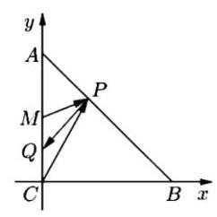
【解析】法一: 建系,设 $P\left( {x,2 - x}\right)$ ,
则 $\overrightarrow{MP} \cdot  \overrightarrow{CP} = \left( {x,1 - x}\right)  \cdot  \left( {x,2 - x}\right)  = 2{x}^{2} - {3x} + 2$
$= 2{\left( x - \frac{3}{4}\right) }^{2} + \frac{7}{8} \geq  \frac{7}{8},$
故 $\overrightarrow{MP} \cdot  \overrightarrow{CP}$ 的最小值为 $\frac{7}{8}$ .
法二:极化恒等式， $\overrightarrow{MP} \cdot  \overrightarrow{CP} = \overrightarrow{PM} \cdot  \overrightarrow{PC} = {\overrightarrow{PQ}}^{2} - {\overrightarrow{QC}}^{2}$
$= {\overrightarrow{PQ}}^{2} - \frac{1}{4} \geq  {\left( \frac{3}{2\sqrt{2}}\right) }^{2} - \frac{1}{4} = \frac{7}{8}$ ,故 $\overrightarrow{MP} \cdot  \overrightarrow{CP}$ 的最小值为 $\frac{7}{8}$ .
【例题】3. (2020 上海春考) 已知 ${A}_{1}\text{ 、 }{A}_{2}\text{ 、 }{A}_{3}\text{ 、 }{A}_{4}\text{ 、 }{A}_{5}$ 五个点,满足 $\overrightarrow{{A}_{n}{A}_{n + 1}} \cdot  \overrightarrow{{A}_{n + 1}{A}_{n + 2}} = 0\left( {n = 1,2,3}\right)$ , $\left| \overrightarrow{{A}_{n}{A}_{n + 1}}\right|  \cdot  \left| \overrightarrow{{A}_{n + 1}{A}_{n + 2}}\right|  = n + 1\left( {n = 1,2,3}\right)$ ，则 $\left| \overrightarrow{{A}_{1}{A}_{5}}\right|$ 的最小值为___.
【答案】 $\frac{\sqrt{6}}{3}$
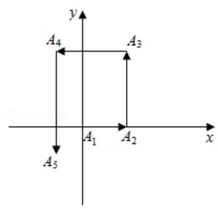
【解析】设 $\left| \overrightarrow{{A}_{1}{A}_{2}}\right|  = x$ ,则 $\left| \overrightarrow{{A}_{2}{A}_{3}}\right|  = \frac{2}{x},\left| \overrightarrow{{A}_{3}{A}_{4}}\right|  = \frac{3x}{2},\left| \overrightarrow{{A}_{4}{A}_{5}}\right|  = \frac{8}{3x}$ , 设 ${A}_{1}\left( {0,0}\right)$ ,如图,
因为求 $\left| \overrightarrow{{A}_{1}{A}_{5}}\right|$ 的最小值,
则 ${A}_{2}\left( {x,0}\right) ,{A}_{3}\left( {x,\frac{2}{x}}\right) ,{A}_{4}\left( {-\frac{x}{2},\frac{2}{x}}\right) ,{A}_{5}\left( {-\frac{x}{2}, - \frac{2}{3x}}\right)$ ,
所以 ${\left| \overrightarrow{{A}_{1}{A}_{5}}\right| }^{2} = {\left( -\frac{x}{2}\right) }^{2} + {\left( -\frac{2}{3x}\right) }^{2} = \frac{{x}^{2}}{4} + \frac{4}{9{x}^{2}} \geq  \frac{2}{3}$ ,
当且仅当 $\frac{{x}^{2}}{4} = \frac{4}{9{x}^{2}}$ ,即 $x = \frac{2\sqrt{3}}{3}$ 时取等号,
所以 $\left| \overrightarrow{{A}_{1}{A}_{5}}\right|$ 的最小值为 $\frac{\sqrt{6}}{3}$ .
【例题】4. (2018 上海秋考) 在平面直角坐标系中,已知点 $A\left( {-1,0}\right) \text{ 、 }B\left( {2,0}\right) , E\text{ 、 }F$ 是 $y$ 轴上的两个动点，且 $\left| \overrightarrow{EF}\right|  = 2$ ，则 $\overrightarrow{AE} \cdot  \overrightarrow{BF}$ 的最小值为___.
【答案】 -3
【解析】设 $E\left( {0, a}\right) , F\left( {0, b}\right)$ ,所以 $\left| \overrightarrow{EF}\right|  = \left| {a - b}\right|  = 2$ ,所以 $a = b + 2$ 或 $b = a + 2$ ,
且 $\overrightarrow{AE} = \left( {1, a}\right) ,\overrightarrow{BF} = \left( {-2, b}\right)$ ,所以 $\overrightarrow{AE} \cdot  \overrightarrow{BF} =  - 2 + {ab}$ ;
当 $a = b + 2$ 时, $\overrightarrow{AE} \cdot  \overrightarrow{BF} =  - 2 + \left( {b + 2}\right) b = {b}^{2} + {2b} - 2$ ,
因为 ${b}^{2} + {2b} - 2$ 的最小值为 $\frac{-8 - 4}{4} =  - 3$ ，所以 $\overrightarrow{AE} \cdot  \overrightarrow{BF}$ 的最小值为 -3,
同理可得 $b = a + 2$ 时, $\overrightarrow{AE} \cdot  \overrightarrow{BF}$ 的最小值为 -3,
所以 $\overrightarrow{AE} \cdot  \overrightarrow{BF}$ 的最小值为 -3 .
【例题】5. (2016 上海秋考) 在平面直角坐标系中,已知 $A\left( {1,0}\right) , B\left( {0, - 1}\right) , P$ 是曲线 $y = \sqrt{1 - {x}^{2}}$ 上一个动点,则 $\overrightarrow{BP} \cdot  \overrightarrow{BA}$ 的取值范围是___.
【答案】 $\left\lbrack  {0,1 + \sqrt{2}}\right\rbrack$
【解析】在平面直角坐标系中, $A\left( {1,0}\right) , B\left( {0, - 1}\right) , P$ 是曲线 $y = \sqrt{1 - {x}^{2}}$ 上一个动点,
设 $P\left( {\cos \alpha ,\sin \alpha }\right) ,\alpha  \in  \left\lbrack  {0,\pi }\right\rbrack$ ,所以 $\overrightarrow{BA} = \left( {1,1}\right) ,\overrightarrow{BP} = \left( {\cos \alpha ,\sin \alpha  + 1}\right)$ ,
$\overrightarrow{BP} \cdot  \overrightarrow{BA} = \cos \alpha  + \sin \alpha  + 1 = \sqrt{2}\sin \left( {\alpha  + \frac{\pi }{4}}\right)  + 1,$
所以 $\overrightarrow{BP} \cdot  \overrightarrow{BA}$ 的取值范围是 $\left\lbrack  {0,1 + \sqrt{2}}\right\rbrack$ .
【例题】6. (2012上海秋考)在平行四边形 ${ABCD}$ 中， $\angle A = \frac{\pi }{3}$ ，边 ${AB}$ 、 ${AD}$ 的长分别为2、1，若 $M$ 、 $N$ 分别是边 ${BC}\text{ 、 }{CD}$ 上的点,且满足 $\frac{\left| \overrightarrow{BM}\right| }{\left| \overrightarrow{BC}\right| } = \frac{\left| \overrightarrow{CN}\right| }{\left| \overrightarrow{CD}\right| }$ ,则 $\overrightarrow{AM} \cdot  \overrightarrow{AN}$ 的取值范围是 ___.
【答案】 $\left\lbrack  {2,5}\right\rbrack$
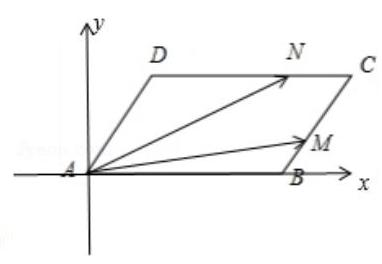
【解析】建立如图所示的直角坐标系,则 $B\left( {2,0}\right) , A\left( {0,0}\right)$ ,
$D\left( {\frac{1}{2},\frac{\sqrt{3}}{2}}\right)$ ,设 $\frac{\left| \overrightarrow{BM}\right| }{\left| \overrightarrow{BC}\right| } = \frac{\left| \overrightarrow{CN}\right| }{\left| \overrightarrow{CD}\right| } = \lambda ,\lambda  \in  \left\lbrack  {0,1}\right\rbrack$ ,
$M\left( {2 + \frac{\lambda }{2},\frac{\sqrt{3}\lambda }{2}}\right) , N\left( {\frac{5}{2} - {2\lambda },\frac{\sqrt{3}}{2}}\right) ,$
所以 $\overrightarrow{AM} \cdot  \overrightarrow{AN} = \left( {2 + \frac{\lambda }{2},\frac{\sqrt{3}\lambda }{2}}\right)  \cdot  \left( {\frac{5}{2} - {2\lambda },\frac{\sqrt{3}}{2}}\right)  =  - {\lambda }^{2} - {2\lambda } + 5$ ,
因为 $\lambda  \in  \left\lbrack  {0,1}\right\rbrack$ ,二次函数的对称轴为 $\lambda  =  - 1$ ,
所以 $\lambda  \in  \left\lbrack  {0,1}\right\rbrack$ 时, $- {\lambda }^{2} - {2\lambda } + 5 \in  \left\lbrack  {2,5}\right\rbrack$ ,
所以 $\overrightarrow{AM} \cdot  \overrightarrow{AN}$ 的取值范围是 $\left\lbrack  {2,5}\right\rbrack$ . 2025 版上海高考真题及模拟训练合集
## C、平面向量分解
【例题】1. (2021 上海春考) 在 $\bigtriangleup {ABC}$ 中， $D$ 为 ${BC}$ 中点， $E$ 为 ${AD}$ 中点，则以下结论:
① 存在 $\bigtriangleup {ABC}$ ，使得 $\overrightarrow{AB} \cdot  \overrightarrow{CE} = 0$ ；
②存在 $\bigtriangleup {ABC}$ ，使得 $\overrightarrow{CE}//\left( {\overrightarrow{CB} + \overrightarrow{CA}}\right)$ ；
它们的成立情况是 ( )
A. ①成立，②成立 B. ①成立，②不成立
C. ①不成立，②成立 D. ①不成立，②不成立
【答案】 $B$
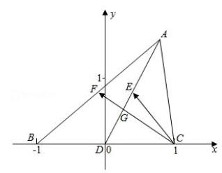
【解析】不妨设 $A\left( {{2x},{2y}}\right) , B\left( {-1,0}\right) , C\left( {1,0}\right) , D\left( {0,0}\right) , E\left( {x, y}\right)$ ,
① $\overrightarrow{AB} = \left( {-1 - {2x}, - {2y}}\right) ,\overrightarrow{CE} = \left( {x - 1, y}\right)$ ，
若 $\overrightarrow{AB} \cdot  \overrightarrow{CE} = 0$ ,则 $- \left( {1 + {2x}}\right) \left( {x - 1}\right)  - 2{y}^{2} = 0$ ,
即 $- \left( {1 + {2x}}\right) \left( {x - 1}\right)  = 2{y}^{2}$ ,
满足条件的 $\left( {x, y}\right)$ 存在,例如 $\left( {0,\frac{\sqrt{2}}{2}}\right)$ ,满足上式,所以①成立; ${AD}$ ② $F$ 为 ${AB}$ 中点， $\left( {\overrightarrow{CB} + \overrightarrow{CA}}\right)  = 2\overrightarrow{CF}$ ， ${CF}$ 与 ${AD}$ 的交点即为重心 $G$ ，
因为 $G$ 为 ${AD}$ 的三等分点， $E$ 为中点，所以 $\overrightarrow{CE}$ 与 $\overrightarrow{CG}$ 不共线，即②不成立.
故选 $B$ .
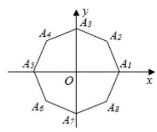
【例题】2. (2016 上海秋考) 如图,在平面直角坐标系 ${xOy}$ 中, $O$ 为正八边形 ${A}_{1}{A}_{2}\cdots {A}_{8}$ 的中心, ${A}_{1}\left( {1,0}\right)$ ,任取不同的两点 ${A}_{i}\text{ 、 }{A}_{j}$ ,点 $P$ 满足 $\overrightarrow{OP} + \; \overrightarrow{O{A}_{i}} + \overrightarrow{O{A}_{j}} = \overrightarrow{0}$ ，则点 $P$ 落在第一象限的概率是___.
【答案】 $\frac{5}{28}$
【解析】从正八边形 ${A}_{1}{A}_{2}\cdots {A}_{8}$ 的八个顶点中任取两个,基本事件总数为 ${C}_{8}^{2} \; = {28}$ .
满足 $\overrightarrow{OP} + \overrightarrow{O{A}_{i}} + \overrightarrow{O{A}_{j}} = \overrightarrow{0}$ ，且点 $P$ 落在第一象限，对应的 ${A}_{i}$ 、 ${A}_{j}$ ，
为 $\left( {{A}_{4},{A}_{7}}\right) ,\left( {{A}_{5},{A}_{8}}\right) ,\left( {{A}_{5},{A}_{6}}\right) ,\left( {{A}_{6},{A}_{7}}\right) ,\left( {{A}_{5},{A}_{7}}\right)$ 共 5 种取法.
所以点 $P$ 落在第一象限的概率是 $P = \frac{5}{28}$ .
【例题】3. (2011 上海春考) 若 $\overrightarrow{{a}_{1}}\text{ 、 }\overrightarrow{{a}_{2}}\text{ 、 }\overrightarrow{{a}_{3}}$ 均为单位向量,则 $\overrightarrow{{a}_{1}} = \left( {\frac{\sqrt{3}}{3},\frac{\sqrt{6}}{3}}\right)$ 是 $\overrightarrow{{a}_{1}} + \overrightarrow{{a}_{2}} + \overrightarrow{{a}_{3}} = \left( {\sqrt{3},\sqrt{6}}\right)$ 的 ( )
A. 充分不必要条件 B. 必要不充分条件
C. 充要条件 D. 既不充分也不必要条件
【答案】 $B$
【解析】 ${\overrightarrow{a}}_{1},{\overrightarrow{a}}_{2},{\overrightarrow{a}}_{3}$ 均为单位向量, ${\overrightarrow{a}}_{1} = \left( {\frac{\sqrt{3}}{3},\frac{\sqrt{6}}{3}}\right)$ ,若 ${\overrightarrow{a}}_{2} = \left( {\frac{\sqrt{3}}{3},\frac{\sqrt{6}}{3}}\right) ,{\overrightarrow{a}}_{3} = \left( {\frac{1}{2},\frac{\sqrt{3}}{2}}\right)$ ,
则 ${\overrightarrow{a}}_{1} + {\overrightarrow{a}}_{2} + {\overrightarrow{a}}_{3} = \left( {\sqrt{3},\sqrt{6}}\right)$ 不成立;
若 ${\overrightarrow{a}}_{1},{\overrightarrow{a}}_{2},{\overrightarrow{a}}_{3}$ 均为单位向量, ${\overrightarrow{a}}_{1} + {\overrightarrow{a}}_{2} + {\overrightarrow{a}}_{3} = \left( {\sqrt{3},\sqrt{6}}\right)$ ,则 $\left| {{\overrightarrow{a}}_{1} + {\overrightarrow{a}}_{2} + {\overrightarrow{a}}_{3}}\right|  = 3$ ,
则 ${\overrightarrow{a}}_{1},{\overrightarrow{a}}_{2},{\overrightarrow{a}}_{3}$ 共线且同向,设 ${\overrightarrow{a}}_{1} = {\overrightarrow{a}}_{2} = {\overrightarrow{a}}_{3} = \left( {m, n}\right)$ ,易得 $\left\{  \begin{array}{l} {3m} = \sqrt{3} \\  {3n} = \sqrt{6} \end{array}\right.$ ,
则 ${\overrightarrow{a}}_{1} = \left( {\frac{\sqrt{3}}{3},\frac{\sqrt{6}}{3}}\right)$ ,
所以 “ ${\overrightarrow{a}}_{1} = \left( {\frac{\sqrt{3}}{3},\frac{\sqrt{6}}{3}}\right)$ ” 是 “ ${\overrightarrow{a}}_{1} + {\overrightarrow{a}}_{2} + {\overrightarrow{a}}_{3} = \left( {\sqrt{3},\sqrt{6}}\right)$ ” 的必要不充分条件,
故选 $B$ .
【例题】4. (2011 上海秋考) 设 ${A}_{1}\text{ 、 }{A}_{2}\text{ 、 }{A}_{3}\text{ 、 }{A}_{4},\text{ 、 }{A}_{5}$ 是平面上给定的 5 个不同点,则使 $\overrightarrow{M{A}_{1}} + \overrightarrow{M{A}_{2}} + \overrightarrow{M{A}_{3}} + \overrightarrow{M{A}_{4}} + \overrightarrow{M{A}_{5}} = \overrightarrow{0}$ 成立的点 $M$ 的个数为 ( )
A. 0 B. 1 C. 5 D. 10
【答案】 $B$
【解析】设 $M$ 的坐标为 $\left( {x, y}\right)$ ,再设 ${A}_{1}\text{ 、 }{A}_{2}\text{ 、 }{A}_{3}\text{ 、 }{A}_{4}\text{ 、 }{A}_{5}$ 的坐标依次为
$\left( {{x}_{1},{y}_{1}}\right) \text{ 、 }\left( {{x}_{2},{y}_{2}}\right) \text{ 、 }\left( {{x}_{3},{y}_{3}}\right) \text{ 、 }\left( {{x}_{4},{y}_{4}}\right) \text{ 、 }\left( {{x}_{5},{y}_{5}}\right)$ ;
若 $\overrightarrow{M{A}_{1}} + \overrightarrow{M{A}_{2}} + \overrightarrow{M{A}_{3}} + \overrightarrow{M{A}_{4}} + \overrightarrow{M{A}_{5}} = \overrightarrow{0}$ 成立，
得 $\left( {{x}_{1} - x,{y}_{1} - y}\right)  + \left( {{x}_{2} - x,{y}_{2} - y}\right)  + \left( {{x}_{3} - x,{y}_{3} - y}\right)$
$+ \left( {{x}_{4} - x,{y}_{4} - y}\right)  + \left( {{x}_{5} - x,{y}_{5} - y}\right)  = \overrightarrow{0}$ ,
则 $x = \frac{{x}_{1} + {x}_{2} + {x}_{3} + {x}_{4} + {x}_{5}}{5}, y = \frac{{y}_{1} + {y}_{2} + {y}_{3} + {y}_{4} + {y}_{5}}{5}$ ;
只有一组解,即符合条件的点 $M$ 有且只有一个; 故选 $B$ . 2025 版上海高考真题及模拟训练合集
## 2. 模拟练习
【练习】1. 设 $\bigtriangleup {ABC},{P}_{0}$ 是边 ${AB}$ 上一定点,满足 ${P}_{0}B = \frac{1}{4}{AB}$ ,且对于边 ${AB}$ 上任一点 $P$ ,恒有 $\overrightarrow{PB} \cdot  \overrightarrow{PC} \; \geq  \overrightarrow{{P}_{0}B} \cdot  \overrightarrow{{P}_{0}C}$ . 则 ( )
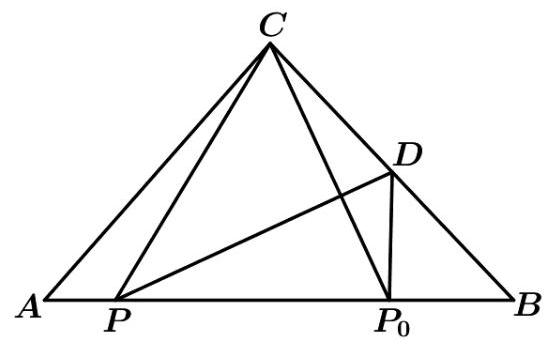
A. $\angle {ABC} = {90}^{ \circ  }$ B. $\angle {BAC} = {90}^{ \circ  }$ C. ${AB} = {AC}$ D. ${AC} = {BC}$
【答案】 $D$
【解析】如图,取 ${BC}$ 的中点 $D$ ,
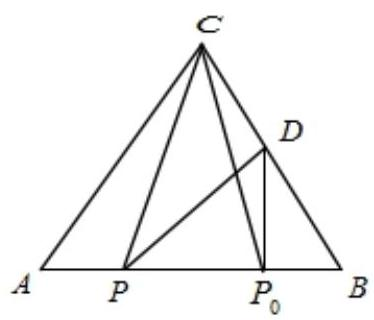
由极化恒等式可得: $\overrightarrow{PB} \cdot  \overrightarrow{PC} = \overrightarrow{P{D}^{2}} - \overrightarrow{B{D}^{2}}$ ,
同理, $\overrightarrow{{P}_{0}B} \cdot  \overrightarrow{{P}_{0}C} = \overrightarrow{{P}_{0}{D}^{2}} - \overrightarrow{B{D}^{2}}$ ,由于 $\overrightarrow{PB} \cdot  \overrightarrow{PC} \geq  \overrightarrow{{P}_{0}B} \cdot  \overrightarrow{{P}_{0}C}$ ,
则 $\left| \overrightarrow{PD}\right|  \geq  \left| \overrightarrow{{P}_{0}D}\right|$ ,所以 ${P}_{0}D \bot  {AB}$ ,
因为 ${P}_{0}B = \frac{1}{4}{AB}, D$ 是 ${BC}$ 的中点,于是 ${AC} = {BC}$ .
故选: $D$ .
【练习】2. 已知点 ${A}_{1},{A}_{2},\cdots ,{A}_{n}\left( {n \in  N, n \geq  2}\right)$ 均在圆 $O$ 上,若有 $\overrightarrow{O{A}_{1}} \; + \overrightarrow{O{A}_{2}} + \cdots  + \overrightarrow{O{A}_{n}} = \overrightarrow{0}$ ，则必有 ${A}_{1},{A}_{2},\cdots ,{A}_{n}$ 平分圆 $O$ . 则满足要求的 $n$ 的个数为 ( )
A. 0 个 B. 仅有 1 个 C. 仅有 2 个 D. 3 个或以上
【答案】C
【解析】由 $\overrightarrow{O{A}_{1}} + \overrightarrow{O{A}_{2}} + \cdots  + \overrightarrow{O{A}_{n}} = \overrightarrow{0}$ ,
当 $n = 2$ 时,两向量共线反向, ${A}_{1},{A}_{2}$ 平分圆 $O$ ,符合题意,
当 $n = 3$ ,由 $\overrightarrow{O{A}_{1}} + \overrightarrow{O{A}_{2}} + \overrightarrow{O{A}_{3}} = \overrightarrow{0}$ ,设圆 $O$ 的半径为 1,
变形可得 $\overrightarrow{O{A}_{1}} =  - \overrightarrow{O{A}_{2}} - \overrightarrow{O{A}_{3}}$ ，两边平方可得 ${\overrightarrow{OA}}^{2} = {\overrightarrow{OA}}^{2} + 2\overrightarrow{O{A}_{2}} \cdot  \overrightarrow{O{A}_{3}} + {\overrightarrow{O{A}_{3}}}^{2}$ ，
所以 $1 = 1 + 2 \times  1 \times  1 \times  \cos \angle {A}_{2}O{A}_{3} + 1$ ,解得 $\cos \angle {A}_{2}O{A}_{3} =  - \frac{1}{2}$ ,
因为 $0 < \angle {A}_{2}O{A}_{3} < \pi$ ,所以 $\angle {A}_{2}O{A}_{3} = \frac{\pi }{3}$ ,同理可得 $\angle {A}_{1}O{A}_{2} = \frac{\pi }{3},\angle {A}_{1}O{A}_{3} = \frac{\pi }{3}$ ,
所以 ${A}_{1},{A}_{2},{A}_{3}$ 平分圆 $O$ ,
若 $n \geq  4$ 时,
当 $n$ 为偶数时,只要分为 $\frac{n}{2}$ 对,每对共线,可得 $\overrightarrow{O{A}_{1}} + \overrightarrow{O{A}_{2}} + \cdots  + \overrightarrow{O{A}_{n}} = \overrightarrow{0}$ ,
比如过圆心的两条直线与圆相交的四个点,满足 $\overrightarrow{O{A}_{1}} + \overrightarrow{O{A}_{2}} + \cdots  + \overrightarrow{O{A}_{n}} = \overrightarrow{0}$ ,但不平分圆,
所认 ${A}_{1},{A}_{2},\cdots ,{A}_{8}$ 不一定平分圆,故不符合题意,
当 $n$ 为奇数时,可分三个点,使这三个向量满足 $\overrightarrow{O{A}_{1}} + \overrightarrow{O{A}_{2}} + \overrightarrow{O{A}_{3}} = \overrightarrow{0}$ ,
可得 ${A}_{1},{A}_{2},{A}_{3}$ 平分圆 $O$ ,另外剩余的一定是偶数点,由前面知道,这些点可分组, 但不一定平分圆,故可得 ${A}_{1},{A}_{2},\cdots ,{A}_{8}$ 不一定平分圆, 综上所述，可得只有 $n = 2$ 与 $n = 3$ 符合题意，故选:C.
【练习】3. 已知平面向量 $\overrightarrow{a},\overrightarrow{b},\overrightarrow{c},\overrightarrow{e}$ 满足 $\left| \overrightarrow{a}\right|  = 4,\left| \overrightarrow{e}\right|  = 1,\left| {\overrightarrow{b} - \overrightarrow{a}}\right|  = 1,\langle \overrightarrow{a},\overrightarrow{e}\rangle  = \frac{2\pi }{3}$ ，且对任意的实数 $t$ ，均有 $\left| {\overrightarrow{c} - t\overrightarrow{e}}\right|  \geq  \left| {\overrightarrow{c} - 2\overrightarrow{e}}\right|$ ,则 $\left| {\overrightarrow{c} - \overrightarrow{b}}\right|$ 的最小值为___.
【解析】法一: 设 $\overrightarrow{a} = \overrightarrow{OA} = \left( {4,0}\right) ,\overrightarrow{b} = \overrightarrow{OB} = \left( {x, y}\right) ,\overrightarrow{c} = \overrightarrow{OC},\overrightarrow{e} = \overrightarrow{OE}$ ,因为 $\langle \overrightarrow{a},\overrightarrow{e}\rangle  = \frac{2\pi }{3}$ ,
所以设 $E\left( {-\frac{1}{2},\frac{\sqrt{3}}{2}}\right)$ ，因为 $\left| {\overrightarrow{b} - \overrightarrow{a}}\right|  = 1$ ，所以 $B$ 在圆 ${\left( x - 4\right) }^{2} + {y}^{2} = 1$ 上运动，
设 $t\overrightarrow{e} = \overrightarrow{OF},2\overrightarrow{e} = \overrightarrow{OG}$ ,则 $\left| {\overrightarrow{c} - t\overrightarrow{e}}\right|  = {CF} \geq  \left| {\overrightarrow{c} - 2\overrightarrow{e}}\right|  = {CG}$ 恒成立,其中 $G\left( {-1,\sqrt{3}}\right)$ ,
所以 ${CG} \bot  {OG}$ ,则 $C$ 在直线 $- \left( {x + 1}\right)  + \sqrt{3}\left( {y - \sqrt{3}}\right)  = 0$ ,即 $x - \sqrt{3}y + 4 = 0$ 上,
则 $\left| {\overrightarrow{c} - \overrightarrow{b}}\right|  = {BC}$ 的最小值即为圆心到直线的距离减去半径，即 $\frac{4 + 4}{2} - 1 = 3$ .
法二: 令 $\overrightarrow{OA} \equiv  \overrightarrow{a},\overrightarrow{OE} = \overrightarrow{e}$ ,以点 $O$ 为原点, $\overrightarrow{OA}$ 为 $x$ 轴正方向建立直角坐标系,
因为 $\left| \overrightarrow{a}\right|  = 4,\langle \overrightarrow{a},\overrightarrow{e}\rangle  = \frac{2\pi }{3},\left| \overrightarrow{e}\right|  = 1$ ,
所以点 $A$ 的坐标为 $\left( {4,0}\right)$ ，点 $E$ 的坐标为 $\left( {-\frac{1}{2},\frac{\sqrt{3}}{2}}\right)$ ，
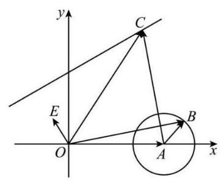
令 $\overrightarrow{OB} = \overrightarrow{b}$ ,设点 $B$ 的坐标为 $\left( {x, y}\right)$ ,
因为 $\left| \overrightarrow{AB}\right|  = \left| {\overrightarrow{OB} - \overrightarrow{OA}}\right|  = \left| {\overrightarrow{b} - \overrightarrow{a}}\right|  = 1$ ,
所以 $\sqrt{{\left( x - 4\right) }^{2} + {y}^{2}} = 1$ ,所以 ${\left( x - 4\right) }^{2} + {y}^{2} = 1$ ,
所以点 $B$ 在以 $\left( {4,0}\right)$ 为圆心,以 1 为半径的圆上,
因为对任意的实数 $t$ ,均有 $\left| {\overrightarrow{c} - t\overrightarrow{e}}\right|  \geq  \left| {\overrightarrow{c} - 2\overrightarrow{e}}\right|$ ,
所以 ${\left| \overrightarrow{c} - t\overrightarrow{e}\right| }^{2} \geq  {\left| \overrightarrow{c} - 2\overrightarrow{e}\right| }^{2}$ ,又 $\left| \overrightarrow{e}\right|  = 1$ ,所以 ${t}^{2} - 2\overrightarrow{e} \cdot  \overrightarrow{c}t + 4\overrightarrow{e} \cdot  \overrightarrow{c} - 4 \geq$ 0 恒成立,
所以 ${\left( 2\overrightarrow{e} \cdot  \overrightarrow{c}\right) }^{2} - 4\left( {4\overrightarrow{e} \cdot  \overrightarrow{c} - 4}\right)  \leq  0$ ,所以 ${\left( \overrightarrow{e} \cdot  \overrightarrow{c} - 2\right) }^{2} \leq  0$ ,即 $\overrightarrow{e} \cdot  \overrightarrow{c} = 2$ ,
作 $\overrightarrow{OC} = \overrightarrow{c}$ ,设点 $C$ 的坐标为 $\left( {{x}^{\prime },{y}^{\prime }}\right)$ ,则 $- \frac{1}{2}{x}^{\prime } + \frac{\sqrt{3}}{2}{y}^{\prime } = 2$ ,即 ${x}^{\prime } - \sqrt{3}{y}^{\prime } + 4 = 0$ ,
以点 $C$ 在直线 ${x}^{\prime } - \sqrt{3}{y}^{\prime } + 4 = 0$ 上,因为 $\left| {\overrightarrow{c} - \overrightarrow{b}}\right|  = \left| {\overrightarrow{OC} - \overrightarrow{OB}}\right|  = \left| \overrightarrow{BC}\right|$ ,
又点 $B$ 在圆 ${\left( x - 4\right) }^{2} + {y}^{2} = 1$ 上一动点,点 $C$ 在直线 ${x}^{\prime } - \sqrt{3}{y}^{\prime } + 4 = 0$ 上一动点,
所以点 $B$ 到点 $C$ 的最小距离为点 $A$ 到点 $C$ 的距离减去圆的半径 1,
即 $\left| \overrightarrow{BC}\right|  \geq  \left| \overrightarrow{AC}\right|  - 1$ ,当且仅当点 $B$ 为线段 ${AC}$ 与圆的交点时取等号,
因为点 $A\left( {4,0}\right)$ 到直线 ${x}^{\prime } - \sqrt{3}{y}^{\prime } + 4 = 0$ 的距离 $d = \frac{8}{\sqrt{1 + 3}} = 4$ ,
所以点 $A$ 到点 $C$ 的距离大于等于 4,即 $\left| \overrightarrow{AC}\right|  \geq  4$ ,所以 $\left| \overrightarrow{BC}\right|  \geq  \left| \overrightarrow{AC}\right|  - 1 \geq  3$ ,
当且仅当 ${AC}$ 垂直于直线 ${x}^{\prime } - \sqrt{3}{y}^{\prime } + 4 = 0$ 且点 $B$ 为 ${AC}$ 与圆的交点时取等号,
所以 $\left| {\overrightarrow{c} - \overrightarrow{b}}\right|$ 的最小值为 3 .
【练习】4. 已知 ${Rt}{\Delta ABC}$ 中， ${\angle A} = {90}^{ \circ  },{AB} = 4,{AC} = 6$ ，在三角形所在的平面内有两个动点 $M$ 和 $N$ ， 满足 $\left| \overrightarrow{AM}\right|  = 2,\overrightarrow{MN} = \overrightarrow{NC}$ ，则 $\left| \overrightarrow{BN}\right|$ 的取值范围是___.
【答案】 $\left\lbrack  {4,6}\right\rbrack$
【解析】如图示:
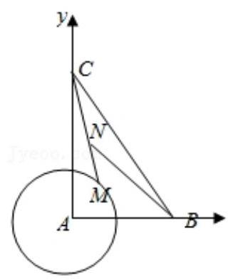
以 ${AB},{AC}$ 为坐标轴建立坐标系,则 $B\left( {4,0}\right) , C\left( {0,6}\right)$ ,
$\because \left| \overrightarrow{AM}\right|  = 2,\therefore M$ 的轨迹是以 $A$ 为圆心,以 2 为半径的圆,
$\because \overrightarrow{MN} = \overrightarrow{NC},\therefore N$ 是 ${MC}$ 的中点,
设 $M\left( {2\cos \alpha ,2\sin \alpha }\right)$ ,则 $N\left( {\cos \alpha ,\sin \alpha  + 3}\right)$ ,
$\therefore \overrightarrow{BN} = \left( {\cos \alpha  - 4,\sin \alpha  + 3}\right)$ ,
$\therefore {\left| \overrightarrow{BN}\right| }^{2} = {\left( \cos \alpha  - 4\right) }^{2} + {\left( \sin \alpha  + 3\right) }^{2} = 6\sin \alpha  - 8\cos \alpha  + {26} = {10}\sin (\alpha \; - \varphi ) + {26}$ ,
$\therefore$ 当 $\sin \left( {\alpha  - \varphi }\right)  =  - 1$ 时, $\left| \overrightarrow{BN}\right|$ 取得最小值 $\sqrt{-{10} + {26}} = 4$ ,
当 $\sin \left( {\alpha  - \varphi }\right)  = 1$ 时, $\left| \overrightarrow{BN}\right|$ 取得最大值 $\sqrt{{10} + {26}} = 6$ .
故答案为: $\left\lbrack  {4,6}\right\rbrack$ .
【练习】5. $\bigtriangleup  {ABC}$ 中， ${AB} = 3,{AC} = 6, G$ 为 $\bigtriangleup  {ABC}$ 的重心， $O$ 为 $\bigtriangleup  {ABC}$ 的外心，则 $\overrightarrow{AO} \cdot  \overrightarrow{AG} =$ ___. 【答案】 $\frac{15}{2}$
【解析】本题考查平面向量的数量积运算, 考查向量的线性运算法则, 是拔高题.
因为 $G$ 为 $\bigtriangleup {ABC}$ 的重心, $O$ 为 $\bigtriangleup {ABC}$ 的外心,得出 $\overrightarrow{AO} \cdot  \overrightarrow{AB} = \frac{1}{2}\overrightarrow{AB}{}^{2},\overrightarrow{AO} \cdot  \overrightarrow{AC} = \frac{1}{2}\overrightarrow{AC}{}^{2}$ ,代入 $\overrightarrow{AO} \cdot  \overrightarrow{AG} = \frac{1}{3}\overrightarrow{AO} \cdot  \left( {\overrightarrow{AB} + \overrightarrow{AC}}\right)  = \frac{1}{3}\overrightarrow{AO} \cdot  \overrightarrow{AB} + \frac{1}{3}\overrightarrow{AO} \cdot  \overrightarrow{AC}$ ,即可求解.
解: 因为 $G$ 为 $\bigtriangleup {ABC}$ 的重心, $O$ 为 $\bigtriangleup {ABC}$ 的外心,
所以 $\overrightarrow{AO} \cdot  \overrightarrow{AB} = \frac{1}{2}\overrightarrow{AB}{}^{2},\overrightarrow{AO} \cdot  \overrightarrow{AC} = \frac{1}{2}\overrightarrow{AC}{}^{2}$ ,
所以 $\overrightarrow{AO} \cdot  \overrightarrow{AG} = \frac{1}{3}\overrightarrow{AO} \cdot  \left( {\overrightarrow{AB} + \overrightarrow{AC}}\right)  = \frac{1}{3}\overrightarrow{AO} \cdot  \overrightarrow{AB} + \frac{1}{3}\overrightarrow{AO} \cdot  \overrightarrow{AC}$
$= \frac{1}{6}\overrightarrow{AB}{}^{2} + \frac{1}{6}\overrightarrow{AC}{}^{2} = \frac{9}{6} + \frac{36}{6} = \frac{15}{2}$ ,
即 $\overrightarrow{AO} \cdot  \overrightarrow{AG} = \frac{15}{2}$ .
故答案为: $\frac{15}{2}$ .
【练习】6. 如图所示,将一圆的八个等分点分成相间的两组,连接每组的四个点得到两个正方形. 去掉两个正方形内部的八条线段后可以形成一正八角星. 设正八角星的中心为 $O$ ，并且 $\overrightarrow{OA} = \; {\overrightarrow{\mathrm{e}}}_{1},\overrightarrow{OB} = {\overrightarrow{\mathrm{e}}}_{2}$ . 若将点 $O$ 到正八角星 16 个顶点的向量都写成 $\lambda {\overrightarrow{\mathrm{e}}}_{1} + \mu {\overrightarrow{\mathrm{e}}}_{2},\lambda ,\mu  \in  R$ 的形式,则 $\lambda  + \; \mu$ 的取值范围为 ( )
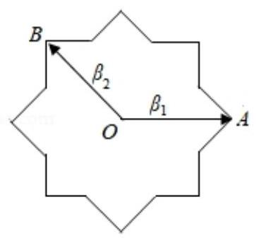
A. $\left\lbrack  {-2\sqrt{2},2}\right\rbrack$ B. $\left\lbrack  {-2\sqrt{2},1 + \sqrt{2}}\right\rbrack$
C. $\left\lbrack  {-1 - \sqrt{2},1 + \sqrt{2}}\right\rbrack$ D. $\left\lbrack  {-1 - \sqrt{2},2}\right\rbrack$ 2025 版上海高考真题及模拟训练合集
【答案】 $C$
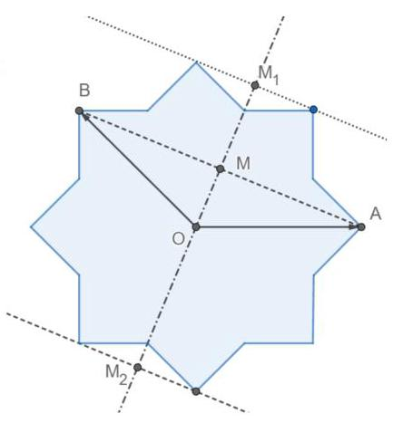
【解析】连线: 连接 ${AB}$ ,
平行:作 ${AB}$ 的平行线,与八角星顶点相交的平行线中,正方向最远和负方向最远分别如图所示,
求比值: 同一平行线上 $\lambda  + \mu$ 的值相同,所以 $\lambda  + \mu$ 最大是 $\frac{\left| \overrightarrow{O{M}_{1}}\right| }{\left| \overrightarrow{OM}\right| }$ ，最小值是 $- \frac{\left| \overrightarrow{O{M}_{2}}\right| }{\left| \overrightarrow{OM}\right| }$ ，几何法易得 $\frac{\left| \overrightarrow{O{M}_{1}}\right| }{\left| \overrightarrow{OM}\right| } = \frac{\left| \overrightarrow{O{M}_{2}}\right| }{\left| \overrightarrow{OM}\right| } = \; 1 + \sqrt{2}$ ,故答案为 $C$
【练习】7. 设 $\alpha$ 和 $\beta$ 是关于 $x$ 的方程 ${x}^{2} - {4x} + m = 0$ 的两个虚数根, 若 $\alpha \text{ 、 }\beta \text{ 、 } - 1$ 在复平面上对应的点构成直角三角形,则实数 $m =$ ___.
【答案】 13
【解析】设 $\alpha  = a + {bi}$ ,则 $\beta  = a - {bi}$ ,结合韦达定理可得 $a = 2, m = {b}^{2} + 4$ ,根据题意可知 ${CA} \bot  {CB}$ ,结合向量的坐标运算求解.
设 $\alpha  = a + {bi}, a, b \in  R$ ,由实系数一元二次方程虚根成对定理可得 $\beta  = \overline{\alpha } = a - {bi}$ ,
由根与系数的关系可得 $\alpha  + \beta  = {2a} = 4,{\alpha \beta } = {a}^{2} + {b}^{2} = m$ ,
整理得 $a = 2, m = {b}^{2} + 4$ ,
设 $\alpha \text{ 、 }\beta \text{ 、 } - 1$ 在复平面上对应的点分别为 $A\left( {2, b}\right) \text{ 、 }B\left( {2, - b}\right) \text{ 、 }C\left( {-1,0}\right)$ ,
则 $\overrightarrow{CA} = \left( {3, b}\right) ,\overrightarrow{CB} = \left( {3, - b}\right)$ ,
可知 $A, B$ 关于 $x$ 轴对称,
若复平面上 $\alpha$ 、 $\beta$ 、 -1 对应点构成直角三角形，则 ${CA} \bot  {CB}$ ，
即 $\overrightarrow{CA} \cdot  \overrightarrow{CB} = 9 - {b}^{2} = 0$ ,解得 ${b}^{2} = 9$ ,
所以 $m = {b}^{2} + 4 = {13}$ .
故答案为:13 .
【练习】8. 在平面直角坐标系中,已知点 $A\left( {2,0}\right) , B\left( {0,2}\right)$ ,圆 $C : {\left( x - a\right) }^{2} + {y}^{2} = 1$ ,
若圆 $C$ 上存在点 $M$ ，使得 ${\left| MA\right| }^{2} + {\left| MB\right| }^{2} = {12}$ ，则实数 $a$ 的取值范围为___
【答案】 $\left\lbrack  {1 - 2\sqrt{2},1 + 2\sqrt{2}}\right\rbrack$
【解析】先求出动点 $M$ 的轨迹是圆 $D$ ,再根据圆 $D$ 和圆 $C$ 相交或相切,得到 $a$ 的取值范围. 设 $M(x$ , $y)$ ,则 ${\left( x - 2\right) }^{2} + {y}^{2} + {x}^{2} + {\left( y - 2\right) }^{2} = {12}$ ,
所以 ${\left( x - 1\right) }^{2} + {\left( y - 1\right) }^{2} = 4$ ,
所以点 $M$ 的轨迹是一个圆 $D$ ,
由题得圆 $C$ 和圆 $D$ 相交或相切,
所以 $1 \leq  \sqrt{{\left( 1 - a\right) }^{2} + {1}^{2}} \leq  3$ ,
所以 $1 - 2\sqrt{2} \leq  a \leq  1 + 2\sqrt{2}$ .
## 板块二: 压轴客观题
## 1. 真题回顾
A、与距离相关
【例题】1. (2023 上海春考) 设 ${z}_{1},{z}_{2} \in  C$ 且 ${z}_{1} = \mathrm{i}\overline{{z}_{2}}$ ,满足 $\left| {{z}_{1} - 1}\right|  = 1$ ,则 $\left| {{z}_{1} - {z}_{2}}\right|$ 的取值范围为___.
【答案】 $\left\lbrack  {0,2 + \sqrt{2}}\right\rbrack$
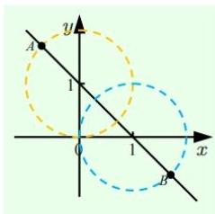
【解析】法一:若 $\left| {{z}_{1} - 1}\right|  = 1$ ,
则复数 ${z}_{1}$ 在复平面的轨迹是以 $\left( {1,0}\right)$ 为圆心,半径为 1 的圆.
${z}_{1} = \mathrm{i}\overline{{z}_{2}} \Rightarrow  \left| {\mathrm{i}\overline{{z}_{2}} - 1}\right|  = 1 \Rightarrow  \left| {\overline{{z}_{2}} + \mathrm{i}}\right|  = 1 \Rightarrow  \left| {{z}_{2} - \mathrm{i}}\right|  = 1$ ,
则复数 ${z}_{2}$ 在复平面的轨迹是以 $\left( {0,1}\right)$ 为圆心,半径为 1 的圆,
所以 $\left| {{z}_{1} - {z}_{2}}\right|  \in  \left\lbrack  {0,2 + \sqrt{2}}\right\rbrack$ .
法二: 设 ${z}_{1} - 1 = \cos \theta  + i\sin \theta ,{z}_{2} = \frac{\cos \theta  + 1 + i\sin \theta }{i} = \sin \theta  + \mathrm{i}\left( {\cos \theta  + 1}\right)$ ,
则 ${\left| {z}_{1} - {z}_{2}\right| }^{2} = 2{\left( -\sin \theta  + \cos \theta  + 1\right) }^{2} \Rightarrow  \left| {{z}_{1} - {z}_{2}}\right|  = \left| {2\cos \left( {\theta  + \frac{\pi }{4}}\right)  + \sqrt{2}}\right|$ ,
所以 ${\left| {z}_{1} - {z}_{2}\right| }^{2} = 2{\left( \sin \theta  + \cos \theta  + 1\right) }^{2} \Rightarrow  \left| {{z}_{1} - {z}_{2}}\right|  = \left| {2\sin \left( {\theta  + \frac{\pi }{4}}\right)  + \sqrt{2}}\right|$ ,
$\therefore \left| {{z}_{1} - {z}_{2}}\right|  \in  \left\lbrack  {0,2 + \sqrt{2}}\right\rbrack$ .
法三: 设 ${z}_{1} = x + {yi}$ ,则 $\overline{{z}_{2}} = \frac{{z}_{1}}{i} = y - {xi}$ ,所以 $\overline{{z}_{2}} = \frac{{z}_{1}}{i} = y - {xi},\therefore {z}_{2} = y + {xi}$ ,
由 $\left| {{z}_{1} - 1}\right|  = 1$ 得 ${\left( x - 1\right) }^{2} + {y}^{2} = 1$ ,而 $\left| {{z}_{1} - {z}_{2}}\right|  = \sqrt{2}\left| {x - y}\right|$ ,
令 $\left\{  {\begin{array}{l} x = \cos \theta  + 1 \\  y = \sin \theta  \end{array},\theta  \in  \lbrack 0,{2\pi })}\right.$ ,则 $\left| {{z}_{1} - {z}_{2}}\right|  = \sqrt{2}\left| {\cos \theta  - \sin \theta  + 1}\right|$
$\left| {{z}_{1} - {z}_{2}}\right|  = \sqrt{2}\left| {\cos \theta  - \sin \theta  + 1}\right|  = \sqrt{2}\left| {\sqrt{2}\cos \left( {\theta  + \frac{\pi }{4}}\right)  + 1}\right|$ ,故 $\left| {{z}_{1} - {z}_{2}}\right|  \in  \left\lbrack  {0,2 + \sqrt{2}}\right\rbrack$ .
法四: 设 ${z}_{1} = x + {yi}$ ,则 $\overline{{z}_{2}} = \frac{{z}_{1}}{i} = y - {xi}$ ,所以 $\overline{{z}_{2}} = \frac{{z}_{1}}{i} = y - {xi},\therefore {z}_{2} = y + {xi}$ ,
由 $\left| {{z}_{1} - 1}\right|  = 1$ 得 ${\left( x - 1\right) }^{2} + {y}^{2} = 1$ ,而 $\left| {{z}_{1} - {z}_{2}}\right|  = \sqrt{2}\left| {x - y}\right|$ ,
令 $t = x - y$ ,即 $x - y - t = 0$ ,由点到直线距离公式得 $d = \frac{\left| 1 - 0 - t\right| }{\sqrt{2}} \leq  1$ ,
故 $1 - \sqrt{2} \leq  t \leq  1 + \sqrt{2}$ ,故 $\left| {{z}_{1} - {z}_{2}}\right|  = \sqrt{2}\left| t\right|  \in  \left\lbrack  {0,2 + \sqrt{2}}\right\rbrack$ .
【例题】2. (2020 上海秋考) 已知 ${\overrightarrow{a}}_{1},{\overrightarrow{a}}_{2},{\overrightarrow{b}}_{1},{\overrightarrow{b}}_{2},\cdots ,{\overrightarrow{b}}_{k}\left( {k \in  {N}^{ * }}\right)$ 是平面内两两互不相等的向量,满足 $\mid  {\overrightarrow{a}}_{1} \; - \overrightarrow{{a}_{2}} \mid   = 1$ ，且 $\left| {\overrightarrow{{a}_{i}} - \overrightarrow{{b}_{j}}}\right|  \in  \{ 1,2\}$ (其中 $\mathrm{i} = 1,2, j = 1,2,\cdots , k\text{ ) }$ ，则 $k$ 的最大值是 ___.
【答案】 6
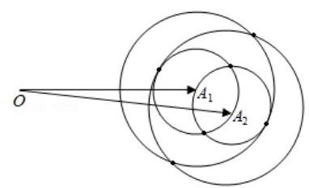
【解析】如图,设 $\overrightarrow{O{A}_{1}} = {\overrightarrow{a}}_{1},\overrightarrow{O{A}_{2}} = {\overrightarrow{a}}_{2}$ ,
由 $\left| {{\overrightarrow{a}}_{1} - {\overrightarrow{a}}_{2}}\right|  = 1$ ,且 $\left| {{\overrightarrow{a}}_{i} - {\overrightarrow{b}}_{j}}\right|  \in  \{ 1,2\}$ ,
分别以 ${A}_{1}\text{ 、 }{A}_{2}$ 为圆心,以 1 和 2 为半径画圆,
其中任意两圆的公共点共有 6 个.
故满足条件的 $k$ 的最大值为 6 .
【例题】3. (2018 上海秋考) 已知实数 ${x}_{1}\text{ 、 }{x}_{2}\text{ 、 }{y}_{1}\text{ 、 }{y}_{2}$ 满足: ${x}_{1}^{2} + {y}_{1}^{2} = 1,{x}_{2}^{2}$
$+ {y}_{2}^{2} = 1,{x}_{1}{x}_{2} + {y}_{1}{y}_{2} = \frac{1}{2}$ ,则 $\frac{\left| {x}_{1} + {y}_{1} - 1\right| }{\sqrt{2}} + \frac{\left| {x}_{2} + {y}_{2} - 1\right| }{\sqrt{2}}$ 的最大值为___.
【答案】 $\sqrt{3} + \sqrt{2}$
【解析】作出圆 $O : {x}^{2} + {y}^{2} = 1$ ,与直线 $l : x + y - 1 = 0$ ,
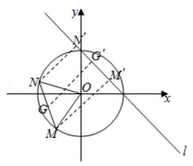
由题意得 $M\left( {{x}_{1},{y}_{1}}\right) , N\left( {{x}_{2},{y}_{2}}\right)$ 都在圆 ${x}^{2} + {y}^{2} = 1$ 上,
$\left| {MN}\right|  = \sqrt{{\left( {x}_{1} - {x}_{2}\right) }^{2} + {\left( {y}_{1} - {y}_{2}\right) }^{2}} = 1$ ,则 $\angle {MON} = {60}^{ \circ  }$ ,
$\frac{\left| {x}_{1} + {y}_{1} - 1\right| }{\sqrt{2}} + \frac{\left| {x}_{2} + {y}_{2} - 1\right| }{\sqrt{2}}$ 表示 $M$ 和 $N$ 到直线 $l : x + y - 1 = 0$
的距离和
$\left| {M{M}^{\prime }}\right|  + \left| {N{N}^{\prime }}\right| ,$
由图像得只有当 $M\text{ 、 }N$ 都在直线 $l$ 的左侧距离之和才会取得最大值.
法一:取 $M\text{ 、 }N$ 的中点 $G$ ，过 $G$ 作 $G{G}^{\prime } \bot  l$ ，垂足为 ${G}^{\prime }$ ，
则 $\left| {M{M}^{\prime }}\right|  + \left| {N{N}^{\prime }}\right|  = 2\left| {G{G}^{\prime }}\right|$ ,
因为 $\bigtriangleup {MON}$ 为等边三角形, $G$ 为 ${MN}$ 的中点,所以 ${OG} = \frac{\sqrt{3}}{2}$ ,
则 $G$ 在圆 ${x}^{2} + {y}^{2} = \frac{3}{4}$ 上运动,故 $G$ 到直线 $x + y - 1 = 0$ 距离的最大值为 $\frac{\sqrt{3}}{2} + \frac{\sqrt{2}}{2}$ ,
所以 $\left| {M{M}^{\prime }}\right|  + \left| {N{N}^{\prime }}\right|  = 2\left| {G{G}^{\prime }}\right|$ 的最大值为 $2 \times  \left( {\frac{\sqrt{3}}{2} + \frac{\sqrt{2}}{2}}\right)  = \sqrt{3} + \sqrt{2}$ ,
所以 $\frac{\left| {x}_{1} + {y}_{1} - 1\right| }{\sqrt{2}} + \frac{\left| {x}_{2} + {y}_{2} - 1\right| }{\sqrt{2}}$ 的最大值为 $\sqrt{3} + \sqrt{2}$ .
法二: 注意到 $M\text{ 、 }N$ 都在直线 $l$ 的左侧,
所以 $\frac{\left| {x}_{1} + {y}_{1} - 1\right| }{\sqrt{2}} + \frac{\left| {x}_{2} + {y}_{2} - 1\right| }{\sqrt{2}} = \frac{1 - {x}_{1} - {y}_{1}}{\sqrt{2}} + \frac{1 - {x}_{2} - {y}_{2}}{\sqrt{2}}$ ,
可引入三角函数辅助计算,设 $N\left( {\cos \alpha ,\sin \alpha }\right) , M\left( {\cos \left( {\alpha  + \frac{\pi }{3}}\right) ,\sin \left( {\alpha  + \frac{\pi }{3}}\right) }\right)$ ,
则 $\frac{\left| {x}_{1} + {y}_{1} - 1\right| }{\sqrt{2}} + \frac{\left| {x}_{2} + {y}_{2} - 1\right| }{\sqrt{2}} = \frac{1 - {x}_{1} - {y}_{1}}{\sqrt{2}} + \frac{1 - {x}_{2} - {y}_{2}}{\sqrt{2}}$
$= \sqrt{2} - \frac{1}{\sqrt{2}}\left\lbrack  {\cos \alpha  + \sin \alpha  + \cos \left( {\alpha  + \frac{\pi }{3}}\right)  + \sin \left( {\alpha  + \frac{\pi }{3}}\right) }\right\rbrack$
$= \sqrt{2} - \frac{1}{\sqrt{2}}\left( {\cos \alpha  + \sin \alpha  + \frac{1}{2}\cos \alpha  - \frac{\sqrt{3}}{2}\sin \alpha  + \frac{1}{2}\sin \alpha  + \frac{\sqrt{3}}{2}\cos \alpha }\right)$
$= \sqrt{2} - \frac{1}{\sqrt{2}}\left( {\frac{3 - \sqrt{3}}{2}\sin \alpha  + \frac{3 + \sqrt{3}}{2}\cos \alpha }\right)  = \sqrt{2} - \frac{1}{\sqrt{2}}\left( {\frac{3 - \sqrt{3}}{2}\sin \alpha  + \frac{3 + \sqrt{3}}{2}\cos \alpha }\right)$
$= \sqrt{2} - \frac{1}{\sqrt{2}}\sqrt{6}\sin \left( {\alpha  + \varphi }\right)  = \sqrt{2} - \sqrt{3}\sin \left( {\alpha  + \varphi }\right) ,$
所以 $\frac{\left| {x}_{1} + {y}_{1} - 1\right| }{\sqrt{2}} + \frac{\left| {x}_{2} + {y}_{2} - 1\right| }{\sqrt{2}}$ 的最大值为 $\sqrt{3} + \sqrt{2}$ . 2025 版上海高考真题及模拟训练合集
## B、数量积的多种计算选择
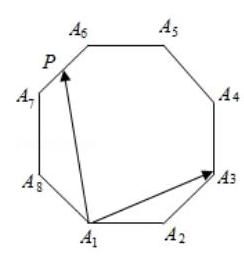
【例题】1. (2017上海春考)如图所示，正八边形 ${A}_{1}{A}_{2}{A}_{3}{A}_{4}{A}_{5}{A}_{6}{A}_{7}{A}_{8}$ 的边长为 2，若 $P$ 为该正八边形边上的动点,则 $\overrightarrow{{A}_{1}{A}_{3}} \cdot  \overrightarrow{{A}_{1}P}$ 的取值范围为 ( )
A. $\left\lbrack  {0,8 + 6\sqrt{2}}\right\rbrack$ B. $\left\lbrack  {-2\sqrt{2},8 + 6\sqrt{2}}\right\rbrack$
C. $\left\lbrack  {-8 - 6\sqrt{2},2\sqrt{2}}\right\rbrack$ D. $\left\lbrack  {-8 - 6\sqrt{2},8 + 6\sqrt{2}}\right\rbrack$
【答案】 $B$
【解析】正八边形 ${A}_{1}{A}_{2}{A}_{3}{A}_{4}{A}_{5}{A}_{6}{A}_{7}{A}_{8}$ 的每一个内角为 ${135}^{ \circ  }$ ,
且 $\left| \overrightarrow{{A}_{1}{A}_{2}}\right|  = \left| \overrightarrow{{A}_{1}{A}_{8}}\right|  = 2,\left| \overrightarrow{{A}_{1}{A}_{3}}\right|  = \left| \overrightarrow{{A}_{1}{A}_{7}}\right|  = 2\sqrt{2 + \sqrt{2}}$ ,
$\left| \overrightarrow{{A}_{1}{A}_{4}}\right|  = \left| \overrightarrow{{A}_{1}{A}_{6}}\right|  = 2 + 2\sqrt{2},\left| \overrightarrow{{A}_{1}{A}_{5}}\right|  = \sqrt{4 + 2\sqrt{2}}.$
再由正弦函数的单调性及值域得,
当 $P$ 与 ${A}_{8}$ 重合时, $\overrightarrow{{A}_{1}{A}_{3}} \cdot  \overrightarrow{{A}_{1}P}$ 最小为
$2 \times  2\sqrt{2 + \sqrt{2}} \times  \cos {112.5}^{ \circ  } = 2 \times  2\sqrt{2 + \sqrt{2}} \times  \left( {-\frac{\sqrt{2 - \sqrt{2}}}{2}}\right)  =  - 2\sqrt{2}$ .
结合选项得 $\overrightarrow{{A}_{1}{A}_{3}} \cdot  \overrightarrow{{A}_{1}P}$ 的取值范围为 $\left\lbrack  {-2\sqrt{2},8 + 6\sqrt{2}}\right\rbrack$ . 故选 $B$ .
【例题】2. (2015 上海秋考) 在锐角三角形 ${ABC}$ 中, $\tan A = \frac{1}{2}, D$ 为边 ${BC}$ 上的点， $\bigtriangleup  {ABD}$ 与 $\bigtriangleup  {ACD}$ 的面积分别为2 和4. 过 $D$ 作 ${DE}\bot {AB}$ 于 $E,{DF}\bot {AC}$ 于 $F$ ，则 $\overrightarrow{DE} \cdot  \overrightarrow{DF} =$ ___.
【答案】 $- \frac{16}{15}$
【解析】因为 $\bigtriangleup {ABD}$ 与 $\bigtriangleup {ACD}$ 的面积分别为 2 和 4,
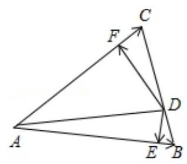
所以 $\frac{1}{2}\left| \overrightarrow{AB}\right|  \cdot  \left| \overrightarrow{DE}\right|  = 2,\frac{1}{2}\left| \overrightarrow{AC}\right|  \cdot  \left| \overrightarrow{DF}\right|  = 4$ ,
得 $\left| \overrightarrow{DE}\right|  = \frac{4}{\left| \overrightarrow{AB}\right| },\left| \overrightarrow{DF}\right|  = \frac{8}{\left| \overrightarrow{AC}\right| }$ ,所以 $\left| \overrightarrow{DE}\right|  \cdot  \left| \overrightarrow{DF}\right|  = \frac{32}{\left| \overrightarrow{AB}\right|  \cdot  \left| \overrightarrow{AC}\right| }$ .
又 $\tan A = \frac{1}{2}$ ，所以 $\frac{\sin A}{\cos A} = \frac{1}{2}$ ，联立 ${\sin }^{2}A + {\cos }^{2}A = 1$ ，
得 $\sin A = \frac{\sqrt{5}}{5},\cos A = \frac{2\sqrt{5}}{5}$ ，
由 $\frac{1}{2}\left| \overrightarrow{AB}\right|  \cdot  \left| \overrightarrow{AC}\right| \sin A = 6$ ,得 $\left| \overrightarrow{AB}\right|  \cdot  \left| \overrightarrow{AC}\right|  = {12}\sqrt{5}$ ,则 $\left| \overrightarrow{DE}\right|  \cdot  \left| \overrightarrow{DF}\right|  = \frac{8\sqrt{5}}{15}$ .
所以 $\overrightarrow{DE} \cdot  \overrightarrow{DF} = \left| \overrightarrow{DE}\right|  \cdot  \left| \overrightarrow{DF}\right| \cos  < \overrightarrow{DE},\overrightarrow{DF} >  = \frac{8\sqrt{5}}{15} \times  \left( {-\frac{2\sqrt{5}}{5}}\right)  =  - \frac{16}{15}$ . 2025 版上海高考真题及模拟训练合集
## C、多变量分析
【例题】1. (2025 上海春考) 在平面上, $\overrightarrow{{\mathrm{e}}_{1}}$ 和 $\overrightarrow{{\mathrm{e}}_{2}}$ 是互相垂直的单位向量,向量 $\overrightarrow{a}$ 满足 $\left| {\overrightarrow{a} - 4\overrightarrow{{e}_{1}}}\right|  = 2$ ,向量 $\overrightarrow{b}$ 满足 $\left| {\overrightarrow{b} - 6{\overrightarrow{\mathrm{e}}}_{2}}\right|  = 1$ ，则 $\overrightarrow{b}$ 在 $\overrightarrow{a}$ 方向上的数量投影的最大值是___.
【答案】 4
【解析】在平面直角坐标系中,设 ${\overrightarrow{\mathrm{e}}}_{1} = \left( {1,0}\right) ,{\overrightarrow{\mathrm{e}}}_{2} = \left( {0,1}\right)$ ,
由 $\left| {\overrightarrow{a} - 4{\overrightarrow{e}}_{1}}\right|  = 2$ 和 $\left| {\overrightarrow{b} - 6{\overrightarrow{\mathrm{e}}}_{2}}\right|  = 1$ ,
得 $\overrightarrow{a}$ 的终点在圆 $M : {\left( x - 4\right) }^{2} + {y}^{2} = 4$ 上, $\overrightarrow{b}$ 的终点在圆 $N : {x}^{2} + {\left( y - 6\right) }^{2} = 1$ 上,
设 $\overrightarrow{a} = \overrightarrow{OA},\overrightarrow{b} = \overrightarrow{OB}$ ,
法一: $\overrightarrow{b}$ 在 $\overrightarrow{a}$ 方向上的数量投影为 ${OB}\cos \langle \overrightarrow{a},\overrightarrow{b}\rangle  \leq  {ON}\cos \left\langle  {\overrightarrow{ON},\overrightarrow{a}}\right\rangle   + 1$ ,
这个等号当且仅当 ${NB}$ 和 $\overrightarrow{a}$ 平行时取等号,
要使得上式取最大值,则 $\cos \langle \overrightarrow{ON},\overrightarrow{a}\rangle$ 最大, $\langle \overrightarrow{ON},\overrightarrow{a}\rangle$ 最小,
因此 $\overrightarrow{a} = \overrightarrow{OA}$ 所在直线和圆 $M : {\left( x - 4\right) }^{2} + {y}^{2} = 4$ 相切,
此时,由 $\sin \angle {AOx} = \frac{1}{2}$ 得 $\angle {AOx} = \frac{\pi }{6}$ ,则 $< \overrightarrow{ON},\overrightarrow{a} >  = \frac{\pi }{3}$ ,
所以 $\overrightarrow{b}$ 在 $\overrightarrow{a}$ 方向上的数量投影的最大值是 $6\cos \frac{\pi }{3} + 1 = 4$ .
法二: 设 $\overrightarrow{a} = \left( {4 + 2\cos \alpha ,2\sin \alpha }\right) ,\overrightarrow{b} = \left( {\cos \beta ,6 + \sin \beta }\right)$ ,
$\overrightarrow{b}$ 在 $\overrightarrow{a}$ 方向上的数量投影 $\left| \overrightarrow{b}\right| \cos  < \overrightarrow{a},\overrightarrow{b} >  = \frac{\overrightarrow{a} \cdot  \overrightarrow{b}}{\left| \overrightarrow{a}\right| }$
$= \frac{\left( {4 + 2\cos \alpha }\right) \cos \beta  + 2\sin \alpha \left( {6 + \sin \beta }\right) }{\sqrt{{\left( 4 + 2\cos \alpha \right) }^{2} + {\left( 2\sin \alpha \right) }^{2}}}$
$= \frac{\left( {4 + 2\cos \alpha }\right) \cos \beta  + 2\sin \alpha \sin \beta  + {12}\sin \alpha }{\sqrt{{20} + {16}\cos \alpha }},$
$\frac{{12}\left| {\sin \alpha }\right| }{\sqrt{{20} + {16}\cos \alpha }} = \frac{{12}\left| {\sin \alpha }\right| }{4\sqrt{\cos \alpha  + \frac{5}{4}}} = 3\sqrt{\frac{{\sin }^{2}\alpha }{\cos \alpha  + \frac{5}{4}}}$
$= 3\sqrt{\frac{1 - {\cos }^{2}\alpha }{\cos \alpha  + \frac{5}{4}}} = 3\sqrt{\frac{1 - {\left( \cos \alpha  + \frac{5}{4} - \frac{5}{4}\right) }^{2}}{\cos \alpha  + \frac{5}{4}}}$
$= 3\sqrt{\frac{1 - {\left( \cos \alpha  + \frac{5}{4}\right) }^{2} + \frac{5}{2}\left( {\cos \alpha  + \frac{5}{4}}\right)  - \frac{25}{16}}{\cos \alpha  + \frac{5}{4}}} = 3\sqrt{\frac{5}{2} - \left( {\cos \alpha  + \frac{5}{4}}\right)  - \frac{\frac{9}{16}}{\cos \alpha  + \frac{5}{4}}}$
$\leq  3\sqrt{\frac{5}{2} - 2\sqrt{\left( {\cos \alpha  + \frac{5}{4}}\right)  \times  \frac{\frac{9}{16}}{\cos \alpha  + \frac{5}{4}}}} = 3$ ,即 $\frac{{12}\left| {\sin \alpha }\right| }{\sqrt{{20} + {16}\cos \alpha }} \leq  3$ ,
其中等号当且仅当 $\cos \alpha  + \frac{5}{4} = \frac{\frac{9}{16}}{\cos \alpha  + \frac{5}{4}}$ ,即 $\cos \alpha  =  - \frac{1}{2}$ 时成立,
由此可得 $- 3 \leq  \frac{{12}\sin \alpha }{\sqrt{{20} + {16}\cos \alpha }} \leq  3$ ,
当且仅当 $\cos \alpha  =  - \frac{1}{2}$ 且 $\sin \alpha  =  - \frac{\sqrt{3}}{2}$ 时, $\frac{{12}\sin \alpha }{\sqrt{{20} + {16}\cos \alpha }} =  - 3$ ;
当且仅当 $\cos \alpha  =  - \frac{1}{2}$ 且 $\sin \alpha  = \frac{\sqrt{3}}{2}$ 时, $\frac{{12}\sin \alpha }{\sqrt{{20} + {16}\cos \alpha }} = 3$ .
所以 $\left| \overrightarrow{b}\right| \cos  < \overrightarrow{a},\overrightarrow{b} >  = \frac{\overrightarrow{a} \cdot  \overrightarrow{b}}{\left| \overrightarrow{a}\right| } = \frac{\left( {4 + 2\cos \alpha }\right) \cos \beta  + 2\sin \alpha \sin \beta  + {12}\sin \alpha }{\sqrt{{20} + {16}\cos \alpha }}$
$\leq  \frac{\sqrt{{\left( 4 + 2\cos \alpha \right) }^{2} + {\left( 2\sin \alpha \right) }^{2}} + {12}\sin \alpha }{\sqrt{{20} + {16}\cos \alpha }} = 1 + \frac{{12}\sin \alpha }{\sqrt{{20} + {16}\cos \alpha }},$
其中等号当且仅当 $\sin \beta  = \frac{2\sin \alpha }{\sqrt{{\left( 4 + 2\cos \alpha \right) }^{2} + {\left( 2\sin \alpha \right) }^{2}}}$ ,
$\sin \beta  = \frac{2\sin \alpha }{\sqrt{{\left( 4 + 2\cos \alpha \right) }^{2} + {\left( 2\sin \alpha \right) }^{2}}},\cos \beta  = \frac{4 + 2\cos \alpha }{\sqrt{{\left( 4 + 2\cos \alpha \right) }^{2} + {\left( 2\sin \alpha \right) }^{2}}}$ 时成立,
则 $\left| \overrightarrow{b}\right| \cos  < \overrightarrow{a},\overrightarrow{b} >  \leq  1 + 3 = 4$ ,
其中等号当且仅当 $\sin \beta  = \frac{1}{2}$ 时成立,
所以,当 $\overrightarrow{a} = \left( {3,\sqrt{3}}\right) ,\overrightarrow{b} = \left( {\frac{\sqrt{3}}{2},\frac{13}{2}}\right)$ 时, $\left| \overrightarrow{b}\right| \cos  < \overrightarrow{a},\overrightarrow{b} >$ 取得最大值 4,
所以 $\overrightarrow{b}$ 在 $\overrightarrow{a}$ 方向上的数量投影的最大值是 $6\cos \frac{\pi }{3} + 1 = 4$ .
法三: 自由向量分析,设 $\overrightarrow{a} - 4{\overrightarrow{\mathrm{e}}}_{1} = 2\overrightarrow{m},\overrightarrow{b} - 6{\overrightarrow{\mathrm{e}}}_{2} = \overrightarrow{n}$ ,则 $\left| \overrightarrow{m}\right|  = \left| \overrightarrow{n}\right|  = 1$ ,
故 $\overrightarrow{b} \cdot  \overrightarrow{a} = 4{\overrightarrow{\mathrm{e}}}_{1} \cdot  \overrightarrow{n} + {12}{\overrightarrow{\mathrm{e}}}_{2} \cdot  \overrightarrow{m} + 2\overrightarrow{m} \cdot  \overrightarrow{n},\left| \overrightarrow{a}\right|  = 2\sqrt{5 + 4{\overrightarrow{\mathrm{e}}}_{1} \cdot  \overrightarrow{m}}$ ,
则 $\frac{\overrightarrow{b} \cdot  \overrightarrow{a}}{\left| \overrightarrow{a}\right| } = \frac{2\overrightarrow{{\mathrm{e}}_{1}} \cdot  \overrightarrow{n} + 6\overrightarrow{{\mathrm{e}}_{2}} \cdot  \overrightarrow{m} + \overrightarrow{m} \cdot  \overrightarrow{n}}{\sqrt{5 + 4\overrightarrow{{\mathrm{e}}_{1}} \cdot  \overrightarrow{m}}} = \frac{\left( {2\overrightarrow{{\mathrm{e}}_{1}} + \overrightarrow{m}}\right)  \cdot  \overrightarrow{n} + 6\overrightarrow{{\mathrm{e}}_{2}} \cdot  \overrightarrow{m}}{\sqrt{5 + 4\overrightarrow{{\mathrm{e}}_{1}} \cdot  \overrightarrow{m}}}$
$\leq  \frac{\left| {2\overrightarrow{{\mathrm{e}}_{1}} + \overrightarrow{m}}\right|  + 6\overrightarrow{{\mathrm{e}}_{2}} \cdot  \overrightarrow{m}}{\sqrt{5 + 4\overrightarrow{{\mathrm{e}}_{1}} \cdot  \overrightarrow{m}}} = \frac{\sqrt{5 + 4\overrightarrow{{\mathrm{e}}_{1}} \cdot  \overrightarrow{m}} + 6\overrightarrow{{\mathrm{e}}_{2}} \cdot  \overrightarrow{m}}{\sqrt{5 + 4\overrightarrow{{\mathrm{e}}_{1}} \cdot  \overrightarrow{m}}} = 1 + \frac{6\overrightarrow{{\mathrm{e}}_{2}} \cdot  \overrightarrow{m}}{\sqrt{5 + 4\overrightarrow{{\mathrm{e}}_{1}} \cdot  \overrightarrow{m}}},$
设 ${\overrightarrow{\mathrm{e}}}_{1} = \left( {1,0}\right) ,{\overrightarrow{\mathrm{e}}}_{2} = \left( {0,1}\right) ,\overrightarrow{m} = \left( {\cos \theta ,\sin \theta }\right)$ ,则 $\frac{6{\overrightarrow{\mathrm{e}}}_{2} \cdot  \overrightarrow{m}}{\sqrt{5 + 4{\overrightarrow{\mathrm{e}}}_{1} \cdot  \overrightarrow{m}}} = \frac{6\sin \theta }{\sqrt{5 + 4\cos \theta }}$ ,
令 $t = 5 + 4\cos \theta  \in  \left\lbrack  {1,9}\right\rbrack$ ,则 $\frac{6\sin \theta }{\sqrt{5 + 4\cos \theta }} \leq  6\sqrt{\frac{1 - {\cos }^{2}\theta }{5 + 4\cos \theta }} = 6\sqrt{\frac{1 - {\left( \frac{t - 5}{4}\right) }^{2}}{t}}$
$= 6\sqrt{\frac{{16} - \left( {{t}^{2} - {10t} + {25}}\right) }{16t}} = 6\sqrt{\frac{10}{16} - \frac{1}{16}\left( {t + \frac{9}{t}}\right) } \leq  6\sqrt{\frac{10}{16} - \frac{6}{16}} = 3$ ,
所以 $\frac{\overrightarrow{b} \cdot  \overrightarrow{a}}{\left| \overrightarrow{a}\right| } \leq  1 + 3 = 4$ ,所以 $\overrightarrow{b}$ 在 $\overrightarrow{a}$ 方向上的数量投影的最大值是 $6\cos \frac{\pi }{3} + 1 = 4$ .
【例题】2. (2014 上海秋考) 已知曲线 $C : x =  - \sqrt{4 - {y}^{2}}$ ，直线 $l : x = 6$ ，若对于点 $A\left( {m,0}\right)$ ，存在 $C$ 上的点 $P$ 和 $l$ 上的 $Q$ 使得 $\overrightarrow{AP} + \overrightarrow{AQ} = \overrightarrow{0}$ ，则 $m$ 的取值范围为___.
【答案】 $\left\lbrack  {2,3}\right\rbrack$
【解析】曲线 $C : x =  - \sqrt{4 - {y}^{2}}$ ,是以原点为圆心,2 为半径的圆,并且 ${x}_{P} \in  \left\lbrack  {-2,0}\right\rbrack$ , 对于点 $A\left( {m,0}\right)$ ,存在 $C$ 上的点 $P$ 和 $l$ 上的 $Q$ 使得 $\overrightarrow{AP} + \overrightarrow{AQ} = \overrightarrow{0}$ , 说明 $A$ 是 ${PQ}$ 的中点, $Q$ 的横坐标 $x = 6$ ,所以 $m = \frac{6 + {x}_{P}}{2} \in  \left\lbrack  {2,3}\right\rbrack$ .
【例题】3. (2013上海秋考)在边长为 1 的正六边形 ${ABCDEF}$ 中，记以 $A$ 为起点，其余顶点为终点的向量分别为 ${\overrightarrow{a}}_{1}\text{ 、 }{\overrightarrow{a}}_{2}\text{ 、 }{\overrightarrow{a}}_{3}\text{ 、 }{\overrightarrow{a}}_{4}\text{ 、 }{\overrightarrow{a}}_{5}$ ; 以 $D$ 为起点,其余顶点为终点的向量分别为 ${\overrightarrow{d}}_{1}\text{ 、 }{\overrightarrow{d}}_{2}\text{ 、 }{\overrightarrow{d}}_{3}\text{ 、 }{\overrightarrow{d}}_{4}\text{ 、 }{\overrightarrow{d}}_{5}$ . 若 $m\text{ 、 }M$ 分别为 $\left( {{\overrightarrow{a}}_{i} + {\overrightarrow{a}}_{j} + {\overrightarrow{a}}_{k}}\right)  \cdot  \left( {{\overrightarrow{d}}_{r} + {\overrightarrow{d}}_{s} + {\overrightarrow{d}}_{t}}\right)$ 的最小值、最大值,其中 $\{ i, j, k\}  \subseteq  \{ 1,2,3,4,5\} ,\{ r, s, t\}$
$\subseteq  \{ 1,2,3,4,5\}$ ,则 $m\text{ 、 }M$ 满足 ( )
A. $m = 0, M > 0$ B. $m < 0, M > 0$ C. $m < 0, M = 0$ D. $m < 0, M < 0$
【答案】 $D$
【解析】由题意得以 $A$ 为起点,其余顶点为终点的向量分别为 ${\overrightarrow{a}}_{1}\text{ 、 }{\overrightarrow{a}}_{2}\text{ 、 }{\overrightarrow{a}}_{3}\text{ 、 }{\overrightarrow{a}}_{4}\text{ 、 }{\overrightarrow{a}}_{5}$ ;
以 $D$ 为起点,其余顶点为终点的向量分别为 ${\overrightarrow{d}}_{1}\text{ 、 }{\overrightarrow{d}}_{2}\text{ 、 }{\overrightarrow{d}}_{3}\text{ 、 }{\overrightarrow{d}}_{4}\text{ 、 }{\overrightarrow{d}}_{5}$ ,
由向量的数量积公式,只有 $\overrightarrow{AF} \cdot  \overrightarrow{DE} = \overrightarrow{AB} \cdot  \overrightarrow{DC} > 0$ ,其余数量积均小于等于 0,
因为 $m\text{ 、 }M$ 分别为 $\left( {{\overrightarrow{a}}_{i} + {\overrightarrow{a}}_{j} + {\overrightarrow{a}}_{k}}\right)  \cdot  \left( {{\overrightarrow{d}}_{r} + {\overrightarrow{d}}_{s} + {\overrightarrow{d}}_{t}}\right)$ 的最小值、最大值,
所以 $m < 0, M < 0$ ,故选 $D$ .
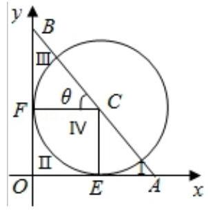
【例题】4. (2009 上海秋考) 过圆 $C : {\left( x - 1\right) }^{2} + {\left( y - 1\right) }^{2} = 1$ 的圆心,作直线分别交 $x\text{ 、 }y$ 轴正半轴于点 $A\text{ 、 }B,{\Delta AOB}$ 被圆分成四部分 (如图),若这四部分图形面积满足 ${S}_{I} + {S}_{IV} = {S}_{II} + {S}_{III}$ 则直线 ${AB}$ 有 ( )
A. 0 条 B. 1 条
C. 2 条 D. 3 条
【答案】 $B$
【解析】由题意得 ${S}_{IV} - {S}_{II} = {S}_{III} - {S}_{I}$ ,由图形得第 ${II}\text{ 、 }{IV}$ 部分的面积分别为 ${S}_{\text{ 正方形 }{OECF}} - {S}_{\text{ 扇形 }{ECF}} = 1 - \frac{\pi }{4}$ 和 ${S}_{\text{ 扇形 }{ECF}} = \frac{\pi }{4}$ ,
所以 ${S}_{IV} - {S}_{II}$ 为定值,即 ${S}_{III} - {S}_{I}$ 为定值,
当直线 ${AB}$ 绕着圆心 $C$ 移动时,只可能有一个位置符合题意,即直线 ${AB}$ 只有一条. 故选 B. 2025 版上海高考真题及模拟训练合集
## 2. 模拟练习
【练习】1. 已知 $\left| \overrightarrow{a}\right|  = \left| \overrightarrow{b}\right|  = 1,\overrightarrow{a} \cdot  \overrightarrow{b} = \frac{1}{2},\overrightarrow{c} = \left( {m,1 - m}\right) ,\overrightarrow{d} = \left( {n,1 - n}\right) \left( {m, n \in  R}\right)$ . 存在 $\overrightarrow{a}\text{ 、 }\overrightarrow{b}$ ,对于任意实数 $m, n$ ，不等式 $\left| {\overrightarrow{a} - \overrightarrow{c}}\right|  + \left| {\overrightarrow{b} - \overrightarrow{d}}\right|  \geq  T$ 成立，则实数 $T$ 的取值范围为___.
【答案】 $( - \infty ,\sqrt{3} + \sqrt{2}\rbrack$
【解析】由题意得 $\overrightarrow{a}\text{ 、 }\overrightarrow{b}$ 的夹角为 $\frac{\pi }{3}$ .
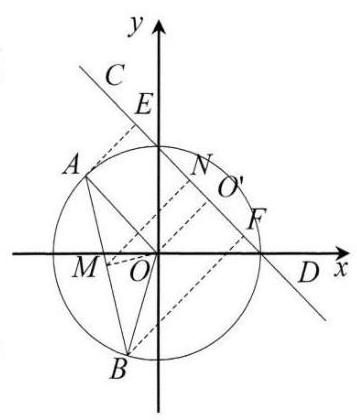
可设 $\overrightarrow{a} = \overrightarrow{OA},\overrightarrow{b} = \overrightarrow{OB},\overrightarrow{c} = \overrightarrow{OC},\overrightarrow{d} = \overrightarrow{OD}$ ,
则点 $A\text{ 、 }B$ 在单位圆上,点 $C\text{ 、 }D$ 在直线 $x + y - 1 = 0$ 上,由 $m\text{ 、 }n$ 的任意性,
即求点 $A\text{ 、 }B$ 到直线 $x + y - 1 = 0$ 距离之和的最小值,
即 $\left| {AE}\right|  + \left| {BF}\right|$ (点 $E\text{ 、 }F$ 分别是点 $A\text{ 、 }B$ 在直线
$x + y - 1 = 0$ 上的射影点);
同时根据 $\overrightarrow{a},\overrightarrow{b}$ 的存在性,问题转化为求 $\left| {AE}\right|  + \left| {AF}\right|$ 的最大值.
设 ${AB}$ 的中点为 $M$ ,设点 $M\text{ 、 }O$ 在直线 $x + y - 1 = 0$ 上射影点分别为 $N\text{ 、 }{O}^{\prime }$ ,
则 $\left| {AE}\right|  + \left| {BF}\right|  = 2\left| {MN}\right|  \leq  2\left( {\left| {MO}\right|  + \left| {O{O}^{\prime }}\right| }\right)  = 2\left( {\frac{\sqrt{3}}{2} + \frac{\sqrt{2}}{2}}\right)  = \; \sqrt{3} + \sqrt{2}$ ,
当且仅当点 $M\text{ 、 }O\text{ 、 }{O}^{\prime }$ 依次在一条直线上时取等号.
所以 $T \leq  \sqrt{3} + \sqrt{2}$ ,则实数 $T$ 的取值范围为 $( - \infty ,\sqrt{3} + \sqrt{2}\rbrack$ .
【练习】2. (2025 届交附) 在边长为 1 的正六边形 ${ABDEFG}$ 中,以 $A$ 为起点其它 5 个顶点之一为终点的向量分别记为 ${\overrightarrow{a}}_{1},{\overrightarrow{a}}_{2},{\overrightarrow{a}}_{3},{\overrightarrow{a}}_{4},{\overrightarrow{a}}_{5}$ ,以 $D$ 为起点其它 5 个顶点之一为终点的向量分别记为 ${\overrightarrow{d}}_{1},{\overrightarrow{d}}_{2}$ 、 ${\overrightarrow{d}}_{3},{\overrightarrow{d}}_{4},{\overrightarrow{d}}_{5}$ . 若 $m, M$ 分别为 $\left( {{\overrightarrow{a}}_{l} + {\overrightarrow{a}}_{j} + {\overrightarrow{a}}_{k}}\right)  \cdot  \left( {{\overrightarrow{d}}_{r} + {\overrightarrow{d}}_{s} + {\overrightarrow{d}}_{l}}\right)$ 的最小值、最大值,其中 $\{ \mathrm{i}, j, k\}  \subset  \{ 1,2,3$ , $4,5\} ,\{ r, s, t\}  \subset  \{ 1,2,3,4,5\}$ ,则 $m + M$ 的值为___
【答案】 -13
【解析】建立平面直角坐标系如图所示,
则 ${\overrightarrow{a}}_{1} = \overrightarrow{AB} = \left( {\frac{\sqrt{3}}{2}, - \frac{1}{2}}\right) ,{\overrightarrow{a}}_{1} = \overrightarrow{DB} = \left( {-\frac{\sqrt{3}}{2}, - \frac{1}{2}}\right)$ ,
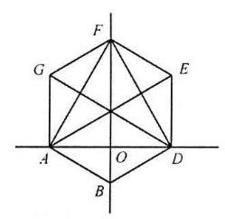
${\overrightarrow{a}}_{2} = \overrightarrow{AD} = \left( {\sqrt{3},0}\right) ,{\overrightarrow{d}}_{2} = \overrightarrow{DA} = \left( {-\sqrt{3},0}\right) ,$
$\overline{{a}_{3}} = \overline{AE} = \left( {\sqrt{3},1}\right) ,\overline{{d}_{3}} = \overline{DG} = \left( {-\sqrt{3},1}\right) ,$
${\overrightarrow{a}}_{4} = \overrightarrow{AF} = \left( {\frac{\sqrt{3}}{2},\frac{3}{2}}\right) ,{\overrightarrow{d}}_{4} = \overrightarrow{DF} = \left( {-\frac{\sqrt{3}}{2},\frac{3}{2}}\right) ,$
${\overrightarrow{a}}_{5} = \overrightarrow{AG} = \left( {0,1}\right) ,{\overrightarrow{d}}_{5} = \overrightarrow{DE} = \left( {0,1}\right) ,$
下面计算 $\left( {{\overrightarrow{a}}_{l} + {\overrightarrow{a}}_{j} + {\overrightarrow{a}}_{k}}\right)  \cdot  \left( {{\overrightarrow{d}}_{r} + {\overrightarrow{d}}_{s} + {\overrightarrow{d}}_{t}}\right)$
任取 ${\overrightarrow{a}}_{i}\left( {\mathrm{i} = 1,2,3,4,5}\right)$ 中三个作和,横坐标都是正的,纵坐标也是正,任取 ${\bar{d}}_{i}\left( {\mathrm{i} = 1,2,3,4,5}\right)$ 中的
三个作和，横坐标全是负的，纵坐标全是正的. 为了取得数量积的最小值， ${\overrightarrow{a}}_{i} + {\overrightarrow{a}}_{j} + {\overrightarrow{a}}_{k}$ 和的横坐标最大,纵坐标最小,而 ${\overrightarrow{d}}_{t} + {\overrightarrow{d}}_{s} + {\overrightarrow{d}}_{t}$ 和的横坐标 (负的) 绝对值最大,纵坐标最小即可
因此 $m = \left( {\overrightarrow{AB} + \overrightarrow{AD} + \overrightarrow{AE}}\right)  \cdot  \left( {\overrightarrow{DB} + \overrightarrow{DA} + \overrightarrow{DG}}\right)  = \left( {\frac{5\sqrt{3}}{2},\frac{1}{2}}\right)  \cdot  \left( {-\frac{5\sqrt{3}}{2},\frac{1}{2}}\right)  =  - \frac{37}{2}$ ,为了取得数量积的最大值, ${\overrightarrow{a}}_{i} + {\overrightarrow{a}}_{j} + {\overrightarrow{a}}_{k}$ 和的横坐标最小,纵坐标最大,而 ${\overrightarrow{d}}_{r} + {\overrightarrow{d}}_{s} + {\overrightarrow{d}}_{t}$ 和的横坐标 (负的) 绝对值最小,纵坐标最大即可
因此 $M = \left( {\overrightarrow{AE} + \overrightarrow{AF} + \overrightarrow{AG}}\right)  \cdot  \left( {\overrightarrow{DG} + \overrightarrow{DF} + \overrightarrow{DE}}\right)  = \left( {\frac{3\sqrt{3}}{2},\frac{7}{2}}\right)  \cdot  \left( {-\frac{3\sqrt{3}}{2},\frac{7}{2}}\right)  = \frac{11}{2}$ ,所以 $m + M \; =  - \frac{37}{2} + \frac{11}{2} =  - {13}$
【练习】3. (2024 届华二)已知 $\bigtriangleup  {ABC}$ 是边长为 4 的正三角形，平面上两动点 $O$ ， $P$ 满足 $\overrightarrow{OP} = {\lambda }_{1}\overrightarrow{OA} + \; {\lambda }_{2}\overrightarrow{OB} + {\lambda }_{3}\overrightarrow{OC}\left( {{\lambda }_{1} + {\lambda }_{2} + {\lambda }_{3} = 1\text{ 且 }{\lambda }_{1},{\lambda }_{2},{\lambda }_{3} \geq  0}\right)$ . 若 $\left| \overrightarrow{OP}\right|  = 1$ ，则 $\overrightarrow{OA} \cdot  \overrightarrow{OB}$ 的最大值为___.
【答案】 $9 + 4\sqrt{3}$
【解析】由已知 $\overrightarrow{OP} = {\lambda }_{1}\overrightarrow{OA} + {\lambda }_{2}\overrightarrow{OB} + {\lambda }_{3}\overrightarrow{OC},{\lambda }_{1} + {\lambda }_{2} + {\lambda }_{3} = 1$ ,
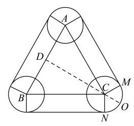
则 $\overrightarrow{OP} = {\lambda }_{1}\left( {\overrightarrow{OP} + \overrightarrow{PA}}\right)  + {\lambda }_{2}\left( {\overrightarrow{OP} + \overrightarrow{PB}}\right)  + {\lambda }_{3}\left( {\overrightarrow{OP} + \overrightarrow{PC}}\right)$ ,
则 ${\lambda }_{1}\overrightarrow{PA} + {\lambda }_{2}\overrightarrow{PB} + {\lambda }_{3}\overrightarrow{PC} = \overrightarrow{0}$ ,即 ${\lambda }_{1}\overrightarrow{PA} + {\lambda }_{2}\left( {\overrightarrow{PA} + \overrightarrow{AB}}\right)  + {\lambda }_{3}\left( {\overrightarrow{PA} + \overrightarrow{AC}}\right)  = \overrightarrow{0}$ ,
则 $\overrightarrow{AP} = {\lambda }_{2}\overrightarrow{AB} + {\lambda }_{3}\overrightarrow{AC}$ ,又 ${\lambda }_{1} + {\lambda }_{2} + {\lambda }_{3} = 1$ ,且 ${\lambda }_{1},{\lambda }_{2},{\lambda }_{3} \geq  0$ ,
则 $0 \leq  {\lambda }_{2} + {\lambda }_{3} \leq  1$ ,则点 $P$ 在 $\bigtriangleup {ABC}$ 内部或边上,
又 $\left| \overrightarrow{OP}\right|  = 1$ ，所以点 $O$ 在以 $P$ 为圆心，1为半径的圆上，设 ${AB}$ 中点为 $D$ ，
则 $\overrightarrow{OA} \cdot  \overrightarrow{OB} = \left( {\overrightarrow{OD} + \overrightarrow{DA}}\right)  \cdot  \left( {\overrightarrow{OD} + \overrightarrow{DB}}\right)  = {\overrightarrow{OD}}^{2} - {\overrightarrow{AD}}^{2} = {\overrightarrow{OD}}^{2} - 4$ ，
易得当点 $O$ 为直线 ${DC}$ 与 $\overset{\text{ ⏜ }}{MN}$ 交点时, ${OD}$ 最大为 $2\sqrt{3} + 1$ ,
即 $\overrightarrow{OA} \cdot  \overrightarrow{OB} = {\overrightarrow{OD}}^{2} - 4$ 的最大值为 ${\left( 2\sqrt{3} + 1\right) }^{2} - 4 = 9 + 4\sqrt{3}$ .
【练习】4. (2025 届复兴) 已如平面向量 ${\overrightarrow{a}}_{1},{\overrightarrow{a}}_{2},{\overrightarrow{a}}_{3},{\overrightarrow{a}}_{4},{\overrightarrow{a}}_{5},{\overrightarrow{a}}_{6}$ 两两都不共线. 若 $\left| {\overrightarrow{a}}_{1}\right|  = \left| {{\overrightarrow{a}}_{i} - \overrightarrow{{a}_{i + 1}}}\right|  = 1$ , ${\overrightarrow{a}}_{i} \cdot  \overrightarrow{{a}_{i + 1}} = \frac{\sqrt{3}}{2}\left| {\overrightarrow{a}}_{i}\right|  \cdot  \left| \overrightarrow{{a}_{i + 1}}\right| \left( {\mathrm{i} \in  \{ 1,2,3,4,5\} }\right)$ ,则 ${\overrightarrow{a}}_{1} \cdot  \left( {{\overrightarrow{a}}_{2} + {\overrightarrow{a}}_{3} + {\overrightarrow{a}}_{4} + {\overrightarrow{a}}_{3} + {\overrightarrow{a}}_{6}}\right)$ 的最大值是___.
【答案】 $\frac{1}{2}$
【解析】由于 $\left| \overrightarrow{{a}_{1}}\right|  = 1$ ,于是 $\overrightarrow{{a}_{1}} \cdot  \left( {\overrightarrow{{a}_{2}} + \overrightarrow{{a}_{3}} + \overrightarrow{{a}_{4}} + \overrightarrow{{a}_{3}} + \overrightarrow{{a}_{6}}}\right)$ 的最大值就是 $\overrightarrow{{a}_{2}},\overrightarrow{{a}_{3}},\overrightarrow{{a}_{4}},\overrightarrow{{a}_{5}},\overrightarrow{{a}_{6}}$
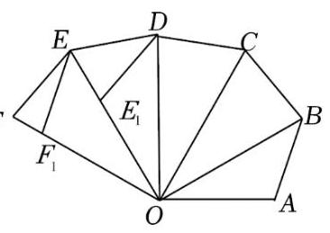
在 ${\overrightarrow{a}}_{1}$ 上的投影之和最大值,
由 $\left| \overrightarrow{{a}_{1}}\right|  = \left| {\overrightarrow{{a}_{i}} - \overrightarrow{{a}_{i + 1}}}\right|  = 1,\overrightarrow{{a}_{i}} \cdot  \overrightarrow{{a}_{i + 1}} = \frac{\sqrt{3}}{2}\left| \overrightarrow{{a}_{i}}\right|  \cdot  \left| \overrightarrow{{a}_{i + 1}}\right|$ 得,相邻两向量夹角为 $\frac{\pi }{6}$ ,以相邻两向量的模为边长的第三边长度为 1,取 $\overrightarrow{{a}_{1}}F \; = \overrightarrow{OA}$ ,
作出图象如图所示,则 $\overrightarrow{OB} = {\overrightarrow{a}}_{2},\overrightarrow{OD} = {\overrightarrow{a}}_{4},\overrightarrow{O{F}_{1}} = {\overrightarrow{a}}_{6}$ ,
当 $\overrightarrow{{a}_{3}} = \overrightarrow{OC},\overrightarrow{{a}_{5}} = \overrightarrow{O{E}_{1}}$ 时，所有向量在 $\overrightarrow{OA}$ 上的投影之和最大，
${\overrightarrow{a}}_{1} \cdot  \left( {{\overrightarrow{a}}_{2} + {\overrightarrow{a}}_{3} + {\overrightarrow{a}}_{4} + {\overrightarrow{a}}_{3} + {\overrightarrow{a}}_{6}}\right)  \leq  \frac{3}{2} + 1 + 0 - \frac{1}{2} - \frac{3}{2} = \frac{1}{2}$ ,最大值为 $\frac{1}{2}$ .
【练习】5. (2024 届复附) 若平面向量 $\overrightarrow{a},\overrightarrow{b},\overrightarrow{a} + \overrightarrow{b}$ 的模均在区间 $\left\lbrack  {2,4}\right\rbrack$ 内，则 $\overrightarrow{a} \cdot  \overrightarrow{b}$ 的取值范围是___. 【答案】 $\left\lbrack  {-{14},4}\right\rbrack$
【解析】 $\overrightarrow{a} \cdot  \overrightarrow{b} = \frac{{\left( \overrightarrow{a} + \overrightarrow{b}\right) }^{2} - {\left| \overrightarrow{a}\right| }^{2} - {\left| \overrightarrow{b}\right| }^{2}}{2} \geq  \frac{{2}^{2} - {4}^{2} - {4}^{2}}{2} =  - {14}$ ,
等号成立当且且当 $\left| \overrightarrow{a}\right|  = \left| \overrightarrow{b}\right|  = 4,\left| {\overrightarrow{a} + \overrightarrow{b}}\right|  = 2$ ,取边长为4,4,2的等腰 $\bigtriangleup {OAB}$ ,
其中 ${AB} = 2$ ,令 $\overrightarrow{OA} = \overrightarrow{a},\overrightarrow{BO} = \overrightarrow{b}$ 即可,
又 $\overrightarrow{a} \cdot  \overrightarrow{b} = \frac{{\left( \overrightarrow{a} + \overrightarrow{b}\right) }^{2} - {\left( \overrightarrow{a} - \overrightarrow{b}\right) }^{2}}{4} \leq  \frac{{4}^{2}}{4} = 4$ ,取 $\overrightarrow{a} = \overrightarrow{b} = \left( {2,0}\right)$ ,等号成立,
则 $\overrightarrow{a} \cdot  \overrightarrow{b}$ 的取值范围是 $\left\lbrack  {-{14},4}\right\rbrack$
【练习】6. (2024 届复兴) 已知 $n + 2$ 个两两互不相等的复数 ${z}_{1}\text{ 、 }{z}_{2}\text{ 、 }\cdots \text{ 、 }{z}_{n}\text{ 、 }{w}_{1}\text{ 、 }{w}_{2}$ ,满足 $\left( {{w}_{1} - {w}_{2}}\right) \left( {\overline{{w}_{1}} - \overline{{w}_{2}}}\right)  = 9$ ,且 $\left| {{w}_{i} - {z}_{j}}\right|  \in  \{ 1,2\}$ (其中 $\mathrm{i} = 1,2;j = 1,2,\cdots , n$ ),则 $n$ 的最大值为 ___.
【答案】 4
【解析】设 ${w}_{1} = a + {bi},{w}_{2} = c + {di}\left( {a, b, c, d \in  R}\right)$ ,
因为 $\left( {{w}_{1} - {w}_{2}}\right) \left( {\overline{{w}_{1}} - \overline{{w}_{2}}}\right)  = 9$ ,
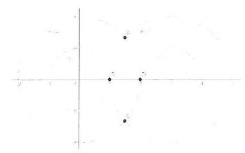
即 $\left( {\left( {a - b}\right)  - \left( {c - d}\right) \mathrm{i}}\right) \left( {\left( {a - b}\right)  + \left( {c - d}\right) \mathrm{i}}\right)  = 9$ ,
即 ${\left( a - b\right) }^{2} + {\left( c - d\right) }^{2} = 9$ ,
故 ${w}_{1}\text{ 、 }{w}_{2}$ 对应平面内距离为 3 的点,
因为 $\left| {{w}_{i} - {z}_{j}}\right|  \in  \{ 1,2\}$ ,所以 ${z}_{i}$ 与 ${w}_{1}\text{ 、 }{w}_{2}$ 对应的点的距离为 1 或 2,
构成了 4 个点 $\left( {A, B, C, D}\right)$ ,故 $n$ 的最大值为 4 .
【练习】7. (艺扬飞翔) 平面单位向量 $\overrightarrow{{\mathrm{e}}_{1}},\overrightarrow{{\mathrm{e}}_{2}}$ 满足: 存在点 $Q$ ,使得对于任意 $m \in  \left\lbrack  {1,4}\right\rbrack$ ,存在 $n \in  \left\lbrack  {0\text{ , }}\right\rbrack \; + \infty )$ ，有 $\overrightarrow{OP} = m\overrightarrow{{\mathrm{e}}_{1}} + n\overrightarrow{{\mathrm{e}}_{2}}$ ，且 $\left| {PQ}\right|  = 1$ ，则 $\overrightarrow{{\mathrm{e}}_{1}} \cdot  \overrightarrow{{\mathrm{e}}_{2}}$ 的取值范围是___.
【答案】 $\left\lbrack  {-1, - \frac{\sqrt{5}}{3}}\right\rbrack   \cup  \left\lbrack  {\frac{\sqrt{5}}{3},1}\right\rbrack$
【解析】听我讲吧 $= 0 =$ ,极端情况转化为两条射线间距离等于 2
【练习】8. (艺扬飞翔) 已知平面向量 $\overrightarrow{a},\overrightarrow{b},\left| \overrightarrow{a}\right|  = 1,\left| \overrightarrow{b}\right|  = 2,\overrightarrow{a} \cdot  \overrightarrow{b} = 0,\Omega  = \left\{  {\overrightarrow{u} \mid  \left( {\overrightarrow{u} - \overrightarrow{a}}\right)  \cdot  \left( {\overrightarrow{u} - \overrightarrow{b}}\right)  < r}\right\}$ 是非空集合,若存在平面向量 $\overrightarrow{c} \in  \Omega$ ,使得对于任意 $s \in  R$ ,都存在 $t \in  \left\lbrack  {0,1}\right\rbrack$ ,满足 $\left( {\overrightarrow{c} - s\overrightarrow{a}}\right)  \cdot  \left( {\overrightarrow{c} - t\overrightarrow{b}}\right) \; < 0$ ，则实数 $r$ 的取值范围是___.
【答案】 $\left( {-1, + \infty }\right)$
【解析】听我讲吧 $= 0 =$ ,极端情况转化为圆与 $y$ 轴有公共点即可
【练习】9. 已知向量 $\overrightarrow{b},\overrightarrow{c}$ 满足 $\left| {\overrightarrow{b} - \overrightarrow{c}}\right|  = 1$ ，向量 $\overrightarrow{{a}_{i}}\left( {1 \leq  i \leq  n, n \in  N, n \geq  1}\right)$ ，满足 $\left| {\overrightarrow{{a}_{i}} - \overrightarrow{b}}\right|  = 1$ 或 $\left| {\overrightarrow{{a}_{i}} - \overrightarrow{c}}\right|  = 1$ 且 $\left| {{\overrightarrow{a}}_{i} - {\overrightarrow{a}}_{j}}\right|  \geq  1$ 对任意 $1 \leq  i < j \leq  n$ 成立. 则 $n$ 的最大值为___.
【答案】 10
【解析】设 $\overrightarrow{b} = \overrightarrow{OB},\overrightarrow{c} = \overrightarrow{OC},{\overrightarrow{a}}_{i} = \overrightarrow{O{A}_{i}}$ ,
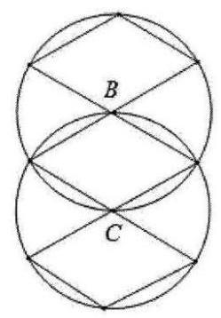
则 $\left| {\overrightarrow{b} - \overrightarrow{c}}\right|  = \left| \overrightarrow{CB}\right|  = 1,\left| {{\overrightarrow{a}}_{i} - \overrightarrow{b}}\right|  = \left| {\overrightarrow{O{A}_{i}} - \overrightarrow{OB}}\right|  = \left| \overrightarrow{B{A}_{i}}\right|  = 1,\left| {{\overrightarrow{a}}_{i} - \overrightarrow{c}}\right|  = \left| {\overrightarrow{O{A}_{i}} - \overrightarrow{OC}}\right|  = \left| \overrightarrow{C{A}_{i}}\right|  = 1$ ,
所以 ${A}_{1}, B, C$ 三点共线，且 ${A}_{1}$ 在 $B, C$ 之间，因为 $\left| {{\overrightarrow{a}}_{j} - {\overrightarrow{a}}_{j}}\right|  \geq  1$ ，所以 $\left| \overrightarrow{{A}_{i}{A}_{j}}\right|  \geq  1$ ，
即 ${A}_{1},{A}_{2},\cdots ,{A}_{n}$ ,中任意两点之间的距离不小于 1,因为 $\left| {\overrightarrow{b} - \overrightarrow{c}}\right|  = \left| \overrightarrow{CB}\right|  = 1$ ,
作出图像,观察易得, $n$ 的最大值为 10 .
