2025 版上海高考真题及模拟训练合集(下册)

## 口六、解析几何

板块一:中档客观题

## 1. 真题回顾

A、几何与定义

【例题】1. (2025 上海春考) 已知双曲线 $\frac{{x}^{2}}{{a}^{2}} - \frac{{y}^{2}}{6 - {a}^{2}} = 1\left( {a > 0}\right)$ 的左，右焦点分别为 ${F}_{1},{F}_{2}$ . 通过 ${F}_{2}$ 且倾斜角为 $\frac{\pi }{3}$ 的直线与双曲线交于第一象限的点 $A$ ，延长 $A{F}_{2}$ 至 $B$ 使得 ${AB} = {A{F}_{1}}$ . 若 $\bigtriangleup B{F}_{1}{F}_{2}$ 的面积为 $3\sqrt{6}$ ，则 $a$ 的值为___.

【答案】 $\sqrt{3}$

【解析】由题意,可得 $c = \sqrt{6},\left| {{F}_{1}{F}_{2}}\right|  = 2\sqrt{6}$ .

由双曲线的定义得 ${2a} = \left| {A{F}_{1}}\right|  - \left| {A{F}_{2}}\right|  = \left| {AB}\right|  - \left| {A{F}_{2}}\right|  = \left| {B{F}_{2}}\right|$ .

又易得 $\angle B{F}_{2}{F}_{1} = \frac{\pi }{3}$ ，所以 ${S}_{{\Delta B}{F}_{1}{F}_{2}} = \frac{1}{2} \cdot  \left| {{F}_{1}{F}_{2}}\right|  \cdot  \left| {B{F}_{2}}\right|  \cdot  \sin \frac{\pi }{3} = \frac{1}{2} \cdot  2\sqrt{6} \cdot  {2a} \cdot  \frac{\sqrt{3}}{2} = {3\sqrt{6}}$ ，解得 $a \; = \sqrt{3}$ .

【例题】2. (2021 上海春考) 已知椭圆 ${x}^{2} + \frac{{y}^{2}}{{b}^{2}} = 1\left( {0 < b < 1}\right)$ 的左、右焦点为 ${F}_{1}\text{ 、 }{F}_{2}$ ,以 $O$ 为顶点， ${F}_{2}$ 为焦点作抛物线交椭圆于 $P$ ，且 $\angle {P{F}_{1}{F}_{2}} = {45}^{ \circ  }$ ，则抛物线的准线方程是___.

【答案】 $x = 1 - \sqrt{2}$

【解析】设 ${F}_{1}\left( {-c,0}\right) ,{F}_{2}\left( {c,0}\right)$ ,则抛物线 ${y}^{2} = {4cx}$ ,

直线 $P{F}_{1} : y = x + c$ ,由 $\left\{  \begin{array}{l} {y}^{2} = {4cx} \\  y = x + c \end{array}\right.$ ,解得 $x = c, y = {2c}$ ,

所以点 $P$ 的坐标为 $\left( {c,{2c}}\right)$ ,所以 $P{F}_{2} \bot  {F}_{1}{F}_{2}$ ,又 $P{F}_{2} = {F}_{2}{F}_{1} = {2c}$ ,所以 $P{F}_{1} = 2\sqrt{2}c$ 所以 $P{F}_{1} + \; P{F}_{2} = \left( {2\sqrt{2} + 2}\right) c = {2a} = 2$ ,则 $c = \sqrt{2} - 1$ ,

所以抛物线的准线方程为 $x =  - c = 1 - \sqrt{2}$ .

【例题】3. (2021 上海秋考) 已知抛物线 ${y}^{2} = {2px}\left( {p > 0}\right)$ ，若第一象限的 $A$ 、 $B$ 在抛物线上，焦点为 $F$ ， $\left| {AF}\right|  = 2,\left| {BF}\right|  = 4,\left| {AB}\right|  = 3$ ，则直线 ${AB}$ 的斜率为___.

【答案】 $\frac{\sqrt{5}}{2}$

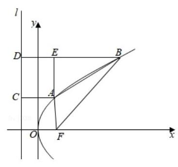

【解析】设抛物线的准线为 $l$ ,

作 ${AC} \bot  l$ 于点 $C,{BD} \bot  l$ 于点 $D,{AE} \bot  {BD}$ 于点 $E$ ,

由抛物线的定义得 ${AC} = {AF} = 2,{BD} = {BF} = 4$ ,

所以 ${BE} = 4 - 2 = 2,{AE} = \sqrt{A{B}^{2} - B{E}^{2}} = \sqrt{9 - 4} = \sqrt{5}$ ,

所以直线 ${AB}$ 的斜率 ${k}_{AB} = \tan \angle {ABE} = \frac{AE}{BE} = \frac{\sqrt{5}}{2}$ .

【例题】4. (2020 上海秋考) 已知椭圆 $C : \frac{{x}^{2}}{4} + \frac{{y}^{2}}{3} = 1$ 的右焦点为 $F$ ，直

线 $l$ 经过椭圆右焦点 $F$ ，交椭圆 $C$ 于 $P$ 、 $Q$ 两点(点 $P$ 在第二象限)，若点 $Q$ 关于 $x$ 轴对称点为 ${Q}^{\prime }$ ,且满足 ${PQ} \bot  F{Q}^{\prime }$ ,求直线 $l$ 的方程是 ___.

【答案】 $x + y - 1 = 0$

【解析】椭圆 $C : \frac{{x}^{2}}{4} + \frac{{y}^{2}}{3} = 1$ 的右焦点为 $F\left( {1,0}\right)$ ,

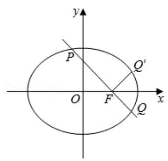

直线 $l$ 经过椭圆右焦点 $F$ ，交椭圆 $C$ 于 $P$ 、 $Q$ 两点(点 $P$ 在第二象限),

若点 $Q$ 关于 $x$ 轴对称点为 ${Q}^{\prime }$ ，且满足 ${PQ} \bot  F{Q}^{\prime }$ ，

得直线 $l$ 的斜率为 -1,所以直线 $l$ 的方程是 $y =  - \left( {x - 1}\right)$ ,即 $x + y \; - 1 = 0$ .

【例题】5. (2017 上海春考) 设椭圆 $\frac{{x}^{2}}{2} + {y}^{2} = 1$ 的左、右焦点分别为 ${F}_{1}\text{ 、 }{F}_{2}$ , 点 $P$ 在该椭圆上,则使得 $\bigtriangleup {F}_{1}{F}_{2}P$ 是等腰三角形的点 $P$ 的个数是 ___.

【答案】 6

【解析】如图所示,①当点 $P$ 与短轴的顶点重合时,

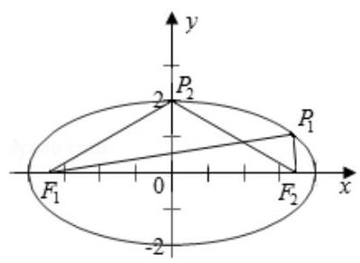

$\bigtriangleup  {F}_{1}{F}_{2}P$ 构成以 ${F}_{1}{F}_{2}$ 为底边的等腰三角形,

此种情况有 2 个满足条件的等腰 $\bigtriangleup {F}_{1}{F}_{2}P$ ;

② 当 $\bigtriangleup {F}_{1}{F}_{2}P$ 构成以 ${F}_{1}{F}_{2}$ 为一腰的等腰三角形时,共有 4 个. 以 ${F}_{2}P$ 作为等腰三角形的底边为例,

因为 ${F}_{1}{F}_{2} = {F}_{1}P$ ,所以点 $P$ 在以 ${F}_{1}$ 为圆心,半径为焦距 ${2c}$ 的圆上,

因此,当以 ${F}_{1}$ 为圆心,半径为 ${2c}$ 的圆与椭圆 $C$ 有 2 交点时, 存在 2 个满足条件的等腰 $\bigtriangleup {F}_{1}{F}_{2}P$ .

同理可得当以 ${F}_{2}$ 为圆心,半径为 ${2c}$ 的圆与椭圆 $C$ 有 2 交点时,

存在 2 个满足条件的等腰 $\bigtriangleup {F}_{1}{F}_{2}P$ .

综上,满足条件的使得 $\bigtriangleup {F}_{1}{F}_{2}P$ 是等腰三角形的点 $P$ 的个数为 6 .

## B、轨迹方程

【例题】1. (2020 上海春考) 已知椭圆 $\frac{{x}^{2}}{2} + {y}^{2} = 1$ ，作垂直于 $x$ 轴的垂线交椭圆于 $A$ 、 $B$ 两点，作垂直于 $y$ 轴的垂线交椭圆于 $C$ 、 $D$ 两点，且 ${AB} = {CD}$ ，两垂线相交于点 $P$ ，则点 $P$ 的轨迹是 ( )

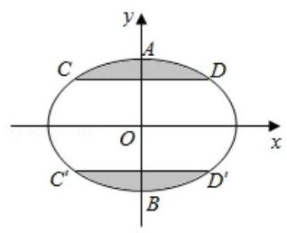

A. 椭圆 B. 双曲线

C. 圆 D. 抛物线

【答案】 $B$

【解析】因为 ${AB} \leq  2$ ,所以 ${CD} \leq  2$ ,判断轨迹为上下两支,即选双曲线, 设 $A\left( {m, t}\right) , D\left( {t, n}\right)$ ,所以 $P\left( {m, n}\right)$ ,

因为 $\frac{{m}^{2}}{2} + {t}^{2} = 1,\frac{{t}^{2}}{2} + {n}^{2} = 1$ ,消去 $t$ 得 $2{n}^{2} - \frac{{m}^{2}}{2} = 1$ ,故选 $B$ .

【例题】2. (2019 上海春考) 以 $\left( {{a}_{1},0}\right) ,\left( {{a}_{2},0}\right)$ 为圆心的两圆均过 $\left( {1,0}\right)$ ,与 $y$ 轴正半轴分别交于 $(0$ , $\left. {y}_{1}\right) ,\left( {0,{y}_{2}}\right)$ ,且满足 $\ln {y}_{1} + \ln {y}_{2} = 0$ ,则点 $\left( {\frac{1}{{a}_{1}},\frac{1}{{a}_{2}}}\right)$ 的轨迹是 ( )

A. 直线 B. 圆 C. 椭圆 D. 双曲线

【答案】 $A$

【解析】因为 ${r}_{1} = \left| {1 - {a}_{1}}\right|  = \sqrt{{a}_{1}^{2} + {y}_{1}^{2}}$ ,则 ${y}_{1}^{2} = 1 - 2{a}_{1}$ ,同理可得 ${y}_{2}^{2} = 1 - 2{a}_{2}$ , 又因为 $\ln {y}_{1} + \ln {y}_{2} = 0$ ,所以 ${y}_{1}{y}_{2} = 1$ ,则 $\left( {1 - 2{a}_{1}}\right) \left( {1 - 2{a}_{2}}\right)  = 1$ ,

即 $2{a}_{1}{a}_{2} = {a}_{1} + {a}_{2}$ ,则 $\frac{1}{{a}_{1}} + \frac{1}{{a}_{2}} = 2$ ,设 $\left\{  \begin{array}{l} x = \frac{1}{{a}_{1}} \\  y = \frac{1}{{a}_{2}} \end{array}\right.$ ,则 $x + y = 2$ 为直线,故选 $A$ .

【例题】3. (2016 上海春考) 对于椭圆 ${C}_{\left( a, b\right) } : \frac{{x}^{2}}{{a}^{2}} + \frac{{y}^{2}}{{b}^{2}} = 1\left( {a, b > 0, a \neq  b}\right)$ . 若点 $\left( {{x}_{0},{y}_{0}}\right)$ 满足 $\frac{{x}_{0}^{2}}{{a}^{2}} + \; \frac{{y}_{0}^{2}}{{b}^{2}} < 1$ . 则称该点在椭圆 ${C}_{\left( a, b\right) }$ 内,在平面直角坐标系中,若点 $A$ 在过点 $\left( {2,1}\right)$ 的任意椭圆 ${C}_{\left( a, b\right) }$ 内或椭圆 ${C}_{\left( a, b\right) }$ 上,则满足条件的点 $A$ 构成的图形为 ( )

A. 三角形及其内部 B. 矩形及其内部

C. 圆及其内部 D. 椭圆及其内部

【答案】 $B$

【解析】设点 $A\left( {{x}_{0},{y}_{0}}\right)$ 在过点 $P\left( {2,1}\right)$ 的任意椭圆 ${C}_{\left( a, b\right) }$ 内或椭圆 ${C}_{\left( a, b\right) }$ 上,

则 $\frac{4}{{a}^{2}} + \frac{1}{{b}^{2}} = 1,\frac{{x}_{0}^{2}}{{a}^{2}} + \frac{{y}_{0}^{2}}{{b}^{2}} \leq  1$ ,所以 $\frac{{x}_{0}^{2}}{{a}^{2}} + \frac{{y}_{0}^{2}}{{b}^{2}} \leq  \frac{4}{{a}^{2}} + \frac{1}{{b}^{2}} = 1$ ,

由椭圆的对称性得点 $B\left( {-2,1}\right)$ ，点 $C\left( {-2, - 1}\right)$ ，点 $D\left( {2, - 1}\right)$ ，都在任意椭圆上，

所以满足条件的点 $A$ 构成的图形为矩形 ${PBCD}$ 及其内部. 故选 $B$ .

【例题】4. (2013 上海春考)已知 $A, B$ 为平面内两个定点，过该平面内动点 $m$ 作直线 ${AB}$ 的垂线，垂足为 $N$ . 若 ${\overrightarrow{MN}}^{2} = \lambda \overrightarrow{AN} \cdot  \overrightarrow{NB}$ ,其中 $\lambda$ 为常数,则动点 $m$ 的轨迹不可能是 ( )

A. 圆 B. 椭圆 C. 双曲线 D. 抛物线

【答案】 $D$

【解析】以 ${AB}$ 所在直线为 $x$ 轴, ${AB}$ 中垂线为 $y$ 轴,建立坐标系,

设 $M\left( {x, y}\right) , A\left( {-a,0}\right) \text{ 、 }B\left( {a,0}\right)$ ,

因为 $\overrightarrow{MN}{}^{2} = \lambda \overrightarrow{AN} \cdot  \overrightarrow{NB}$ ,所以 ${y}^{2} = \lambda \left( {x + a}\right) \left( {a - x}\right)$ ,

即 $\lambda {x}^{2} + {y}^{2} = \lambda {a}^{2}$ ,当 $\lambda  = 1$ 时,轨迹是圆.

当 $\lambda  > 0$ 且 $\lambda  \neq  1$ 时,是椭圆的轨迹方程;

当 $\lambda  < 0$ 时,是双曲线的轨迹方程.

当 $\lambda  = 0$ 时,是直线的轨迹方程;

综上,方程不表示抛物线的方程. 故选 $D$ .

C、极限思想(极端原理)

【例题】1. (2022 上海春考) 已知 ${P}_{1}\left( {{x}_{1},{y}_{1}}\right) ,{P}_{2}\left( {{x}_{2},{y}_{2}}\right)$ 两点均在双曲线 $\Gamma  : \frac{{x}^{2}}{{a}^{2}} - {y}^{2} = 1\left( {a > 0}\right)$ 的右支上，若 ${x}_{1}{x}_{2} > {y}_{1}{y}_{2}$ 恒成立，则实数 $a$ 的取值范围为___.

【答案】 $a \geq  1$

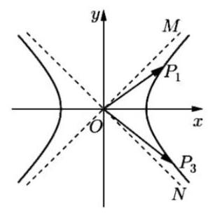

【解析】法一: 设 ${P}_{3}\left( {{x}_{2}, - {y}_{2}}\right)$ ,则 $\overrightarrow{O{P}_{1}} \cdot  \overrightarrow{O{P}_{3}} = {x}_{1}{x}_{2} - {y}_{1}{y}_{2} > 0$ ,所以 $\angle {P}_{1}O{P}_{3}$ 恒为锐角,

数形结合,只要两条渐近线的夹角小于等于 ${90}^{ \circ  }$ 即可, 所以其中一条渐近线 $y = \frac{1}{a}x$ 的斜率 $\frac{1}{a} \leq  1$ ，所以 $a \geq  1$ ； 法二: 任取双曲线 $\Gamma$ 右支上两个不相同的点 ${P}_{1}\left( {{x}_{1},{y}_{1}}\right) ,{P}_{2} \; \left( {{x}_{2},{y}_{2}}\right)$ ,

都有 ${x}_{1}{x}_{2} - {y}_{1}{y}_{2} > 0$ 成立,即 $1 - \frac{{y}_{1}{y}_{2}}{{x}_{1}{x}_{2}} > 0$ ,即 ${k}_{O{P}_{1}} \cdot  {k}_{O{P}_{2}} < 1$ 恒成立,

当 ${P}_{1}\left( {{x}_{1},{y}_{1}}\right) ,{P}_{2}\left( {{x}_{2},{y}_{2}}\right)$ 坐标越大时,斜率越大,且趋向于渐近线 (取不到),

故只要渐近线的斜率 $\frac{1}{a}$ 满足 $\frac{1}{a} \cdot  \frac{1}{a} \leq  1$ ，所以 $a \geq  1$ ；

法三:由于双曲线的渐近线为 $y =  \pm  \frac{1}{a}x$ ，

故对于双曲线右支上的点 ${P}_{1}\left( {{x}_{1},{y}_{1}}\right) ,{P}_{2}\left( {{x}_{2},{y}_{2}}\right)$ ,都有 $\left| {y}_{1}\right|  < \frac{1}{a}{x}_{1},\left| {y}_{2}\right|  < \frac{1}{a}{x}_{2}$ ,

所以 $\left| {{y}_{1}{y}_{2}}\right|  < \frac{1}{{a}^{2}}{x}_{1}{x}_{2}$ ,因为 ${x}_{1}{x}_{2} - {y}_{1}{y}_{2} > 0$ 恒成立,

所以 ${x}_{1}{x}_{2} > {y}_{1}{y}_{2}$ 恒成立,所以 ${x}_{1}{x}_{2} \geq  \frac{1}{{a}^{2}}{x}_{1}{x}_{2}$ ,所以 $a \geq  1$ .

【例题】2. (2019 上海秋考) 已知数列 $\left\{  {a}_{n}\right\}$ 满足 ${a}_{n} < {a}_{n + 1}\left( {n \in  {N}^{ * }}\right) ,{P}_{n}\left( {n,{a}_{n}}\right) \left( {n \geq  3}\right)$ 均在双曲线 $\frac{{x}^{2}}{6} - \; \frac{{y}^{2}}{2} = 1$ 上，则 $\mathop{\lim }\limits_{{n \rightarrow  \infty }}\left| {{P}_{n}{P}_{n + 1}}\right|  =$ ___.

【答案】 $\frac{2\sqrt{3}}{3}$

【解析】法一: 由 $\frac{{n}^{2}}{6} - \frac{{a}_{n}^{2}}{2} = 1$ ,得 ${a}_{n} = \sqrt{2\left( {\frac{{n}^{2}}{6} - 1}\right) }$ ,所以 $P\left( {n,\sqrt{2\left( {\frac{{n}^{2}}{6} - 1}\right) }}\right)$ ,

所以 ${P}_{n + 1}\left( {n + 1,\sqrt{2\left( {\frac{{\left( n + 1\right) }^{2}}{6} - 1}\right) }}\right)$ ,

所以 $\left| {{P}_{n}{P}_{n + 1}}\right|  = \sqrt{{\left( n + 1 - n\right) }^{2} + {\left\lbrack  \sqrt{2{\left( \frac{n + 1}{6}\right) }^{2} - 1} - \sqrt{2\left( {\frac{{n}^{2}}{6} - 1}\right) }\right\rbrack  }^{2}}$ ,

$= \sqrt{\frac{2{n}^{2} + {2n} - {11}}{3} - 4\sqrt{\left( {\frac{{\left( n + 1\right) }^{2}}{6} - 1}\right) \left( {\frac{{n}^{2}}{6} - 1}\right) }}$

所以求解极限得 $\mathop{\lim }\limits_{{n \rightarrow  \infty }}\left| {{P}_{n}{P}_{n + 1}}\right|  = \frac{2\sqrt{3}}{3}$ ,

法二: 当 $n \rightarrow   + \infty$ 时, ${P}_{n}{P}_{n + 1}$ 与渐近线平行, ${P}_{n}{P}_{n + 1}$ 在 $x$ 轴的投影为 1,

渐近线倾斜角为 $\theta$ ,则 $\tan \theta  = \frac{\sqrt{3}}{3}$ ,故 ${P}_{n}{P}_{n + 1} = \frac{1}{\cos \frac{\pi }{6}} = \frac{2\sqrt{3}}{3}$ .

【例题】3. (2011 上海秋考) 已知点 $O\left( {0,0}\right) \text{ 、 }{Q}_{0}\left( {0,1}\right)$ 和点 ${R}_{0}\left( {3,1}\right)$ ,记 ${Q}_{0}{R}_{0}$ 的中点为 ${P}_{1}$ ,取 ${Q}_{0}{P}_{1}$ 和 ${P}_{1}{R}_{0}$ 中的一条,记其端点为 ${Q}_{1}\text{ 、 }{R}_{1}$ ,使之满足 $\left( {\left| {O{Q}_{1}}\right|  - 2}\right) \left( {\left| {O{R}_{1}}\right|  - 2}\right)  < 0$ ,记 ${Q}_{1}{R}_{1}$ 的中点为 ${P}_{2}$ , 取 ${Q}_{1}{P}_{2}$ 和 ${P}_{2}{R}_{1}$ 中的一条,记其端点为 ${Q}_{2}\text{ 、 }{R}_{2}$ ,使之满足 $\left( {\left| {O{Q}_{2}}\right|  - 2}\right) \left( {\left| {O{R}_{2}}\right|  - 2}\right)  < 0$ . 依次下去, 得到 ${P}_{1},{P}_{2},\cdots ,{P}_{n},\cdots$ ,则 $\mathop{\lim }\limits_{{n \rightarrow  \infty }}\left| {{Q}_{0}{P}_{n}}\right|  =$ _____.

【答案】 $\sqrt{3}$

【解析】由题意得 $\left( {\left| {O{Q}_{1}}\right|  - 2}\right) \left( {\left| {O{R}_{1}}\right|  - 2}\right)  < 0$ ,所以第一次只能取 ${P}_{1}{R}_{0}$ 一条,

$\left( {\left| {O{Q}_{2}}\right|  - 2}\right) \left( {\left| {O{R}_{2}}\right|  - 2}\right)  < 0$ . 依次下去,则 ${Q}_{1}\text{ 、 }{R}_{1};{Q}_{2}\text{ 、 }{R}_{2},\cdots$ 中必有一点在 $\left( {\sqrt{3},1}\right)$

的左侧，一点在右侧，由于 ${P}_{1},{P}_{2},\cdots {P}_{n},\cdots$ 是中点，

由题意得 ${P}_{1},{P}_{2},\cdots {P}_{n},\cdots$ 的极限为 $\left( {\sqrt{3},1}\right)$ ,所以 $\mathop{\lim }\limits_{{n \rightarrow  \infty }}\left| {{Q}_{0}{P}_{n}}\right|  = \left| {{Q}_{0}{P}_{1}}\right|  = \sqrt{3}$ .

## 2. 模拟练习

【练习】1. 若椭圆 $\frac{{x}^{2}}{{a}^{2}} + \frac{{y}^{2}}{{b}^{2}} = 1\left( {a > b > 0}\right)$ 的右焦点 $F\left( {c,0}\right)$ 关于直线 $y = \frac{b}{c}x$ 的对称点 $Q$ 仍然在椭圆上，则该椭圆的离心率为___. 2025 版上海高考真题及模拟训练合集(下册)

【答案】 $\frac{\sqrt{2}}{2}$

【解析】法一: 设椭圆的另一个焦点为 ${F}_{1}\left( {-c,0}\right)$ ,连接 $Q{F}_{1}\text{ 、 }{QF}$ ,

设 ${QF}$ 与直线 $y = \frac{b}{c}x$ 交于点 $M$ ，由题意得 $M$ 为线段 ${QF}$ 的中点，

所以 ${F}_{1}Q//{OM}$ ,又 ${OM} \bot  {FQ}$ ,所以 ${F}_{1}Q \bot  {QF},\left| {{F}_{1}Q}\right|  = 2\left| {OM}\right|$ ,

在 Rt $\bigtriangleup {MOF}$ 中, $\tan \angle {MOF} = \frac{\left| MF\right| }{\left| OM\right| } = \frac{b}{c},\left| {OF}\right|  = c$ ,得 $\left| {OM}\right|  = \frac{{c}^{2}}{a},\left| {MF}\right|  = \frac{bc}{a}$ ,故 $\left| {QF}\right|  =$

$2\left| {MF}\right|  = \frac{2bc}{a},\left| {Q{F}_{1}}\right|  = 2\left| {OM}\right|  = \frac{2{c}^{2}}{a},$

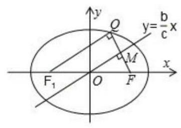

由椭圆定义得 $\left| {QF}\right|  + \left| {Q{F}_{1}}\right|  = \frac{2bc}{a} + \frac{2{c}^{2}}{a} = {2a}$ ,得 $b = c$ ,

所以 $a = \sqrt{{b}^{2} + {c}^{2}} = \sqrt{2}c$ ,故 $\mathrm{e} = \frac{c}{a} = \frac{\sqrt{2}}{2}$ .

法二: 设 $F\left( {c,0}\right)$ 关于直线 $y = \frac{b}{c}x$ 的对称点为 $Q\left( {m, n}\right)$ ,

则有线段 ${FQ}$ 中点坐标为 $\left( {\frac{m + c}{2},\frac{n}{2}}\right)$ ,且直线 ${FQ}$ 与直线 $y =$

$\frac{b}{c}x$ 垂直,所以有 $\left\{  \begin{array}{l} \frac{n}{m - c} \cdot  \frac{b}{c} =  - 1 \\  \frac{n}{2} = \frac{b}{c} \times  \frac{m + c}{2} \end{array}\right.$ ,解得 $m = \frac{{c}^{3} - c{b}^{2}}{{a}^{2}}, n = \frac{{2b}{c}^{2}}{{a}^{2}}$ ,

所以 $Q\left( {\frac{{c}^{3} - c{b}^{2}}{{a}^{2}},\frac{{2b}{c}^{2}}{{a}^{2}}}\right)$ 在椭圆上,即有 $\frac{{\left( \frac{{c}^{3} - c{b}^{2}}{{a}^{2}}\right) }^{2}}{{a}^{2}} + \frac{{\left( \frac{{2b}{c}^{2}}{{a}^{2}}\right) }^{2}}{{b}^{2}} = 1$ ,

又 $\mathrm{e} = \frac{c}{a}$ ,得 ${\mathrm{e}}^{2}\left( {4{\mathrm{e}}^{4} - 4{\mathrm{e}}^{2} + 1}\right)  + 4{\mathrm{e}}^{4} = 1$ ,得 $4{\mathrm{e}}^{6} + {\mathrm{e}}^{2} - 1 = 0$ ,

所以 $4{\mathrm{e}}^{6} - 2{\mathrm{e}}^{4} + 2{\mathrm{e}}^{4} - {\mathrm{e}}^{2} + 2{\mathrm{e}}^{2} - 1 = 0$ ,即 $\left( {2{\mathrm{e}}^{2} - 1}\right) \left( {2{\mathrm{e}}^{4} + {\mathrm{e}}^{2} + 1}\right)  = 0$ ,

因为 $0 < \mathrm{e} < 1$ ，所以 $2{\mathrm{e}}^{2} - 1 = 0$ ，解得 $\mathrm{e} = \frac{\sqrt{2}}{2}$ .

【练习】2. (2024 奉贤三模) 若曲线 $\Gamma  : \frac{{x}^{2}}{{a}^{2}} - {y}^{2} = 1\left( {x > 0}\right)$ 得右顶点 $A$ ,若对线段 ${OA}$ 上任意一点 $P$ ,端点除外,在 $\Gamma$ 上存在关于 $x$ 轴对称得两点 $Q\text{ 、 }R$ 使得三角形 ${PQR}$ 为等边三角形,则正数 $a$ 得取值范围是___.

【答案】 $(0,\sqrt{3}\rbrack$

【解析】由任意点 $P$ 线段 ${OA}$ 上,端点除外,在 $\Gamma$ 上存在关于 $x$ 轴对称得两点 $Q, R$ 使得 $\bigtriangleup {PQR}$ 为等边三角形,

即存在点 $Q$ 使得 $\angle {QPx} = {30}^{ \circ  }$ ,所以存在点 $Q$ 使得 $\angle {QOx} < {30}^{ \circ  }$ , 由双曲线 $\Gamma  : \frac{{x}^{2}}{{a}^{2}} - {y}^{2} = 1\left( {x > 0}\right)$ 的其中一条渐近线方程为 $y = \frac{1}{a}x$ , 则满足 $y = \frac{1}{a}x$ 的斜率大于或等于 $\frac{\sqrt{3}}{3}$ ,即 $\frac{1}{a} \geq  \frac{\sqrt{3}}{3}$ ,所以 $a \leq  \sqrt{3}$ , 又由 $a > 0$ ，所以实数 $a$ 的取值范围为 $(0,\sqrt{3}\rbrack$ .

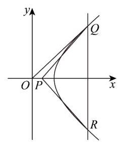

故答案为: $(0,\sqrt{3}\rbrack$ .

【练习】3. 椭圆 $C : \frac{{x}^{2}}{{a}^{2}} + \frac{{y}^{2}}{{b}^{2}} = 1\left( {a > b > 0}\right)$ 的左、右焦点分别为 ${F}_{1}\text{ 、 }{F}_{2}$ ,点 $P$ 在椭圆上且同时满足:

① $\bigtriangleup  {F}_{1}{F}_{2}P$ 是等腰三角形; ② $\bigtriangleup  {F}_{1}{F}_{2}P$ 是钝角三角形; ③线段 ${F}_{1}{F}_{2}$ 为 $\bigtriangleup  {F}_{1}{F}_{2}P$ 的腰;

④ 椭圆 $C$ 上恰好有 4 个不同的点 $P$ . 则椭圆 $C$ 的离心率的取值范围是___. 2025 版上海高考真题及模拟训练合集(下册)

【答案】 $\left( {\frac{1}{3},\sqrt{2} - 1}\right)$

【解析】如图,不妨设 $P$ 在第二象限,

由题意得, $\left| {P{F}_{1}}\right|  = \left| {{F}_{1}{F}_{2}}\right|  = {2c}$ ,则 $\left| {P{F}_{2}}\right|  = {2a} - {2c}$ ,

由椭圆的对称性,在四个象限内各存在一个满足条件的点 $P$ ,

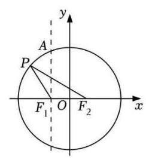

在 $\bigtriangleup  {P{F}_{1}{F}_{2}}$ 中，任意两边之和大于第三边，则 ${4c} > {2a} - {2c}$ ，

所以离心率为 $\mathrm{e} = \frac{c}{a} > \frac{1}{3}$ ,

过点 ${F}_{1}$ 作直线 $A{F}_{1}$ 垂直于 $x$ 轴,与椭圆交于 $A$ 点,则 $\left| {A{F}_{1}}\right|  = \frac{{b}^{2}}{a}$ ,

因为 $\bigtriangleup {F}_{1}{F}_{2}P$ 是钝角三角形,所以 $\left| {A{F}_{1}}\right|  > \left| {P{F}_{1}}\right|$ ,即 $\frac{{b}^{2}}{a} > {2c}$ ,得 ${\mathrm{e}}^{2} + 2\mathrm{e} - 1 \; < 0$ ,

解得 $\mathrm{e} < \sqrt{2} - 1$ ,

综上,椭圆离心率的取值范围为 $\left( {\frac{1}{3},\sqrt{2} - 1}\right)$ .

【练习】4. 已知直线 $l$ 的倾斜角为锐角,且过抛物线 $y = {x}^{2}$ 的焦点,与抛物线交于 $A\text{ 、 }B$ 两点,若在该抛物线准线上存在一点 $C$ ,使得 $\bigtriangleup  {ABC}$ 为正三角形，则直线 $l$ 的斜率为___.

【答案】 $\sqrt{2}$

【解析】法一: 依题意有抛物线 $y = {x}^{2}$ 的焦点为 $\left( {0,\frac{1}{4}}\right)$ ,准线方程为 $y =  - \frac{1}{4}$ ,

设直线 ${AB}$ 的方程为 $y = {kx} + \frac{1}{4}\left( {k > 0}\right)$ ，代入抛物线的方程 $y = {x}^{2}$ ，可得 ${x}^{2} - {kx} - \frac{1}{4} = 0$ ，

设 $A\left( {{x}_{1},{y}_{1}}\right) , B\left( {{x}_{2},{y}_{2}}\right)$ ,则 ${x}_{1} + {x}_{2} = k,{x}_{1}{x}_{2} =  - \frac{1}{4}$ ,

所以 ${y}_{1} + {y}_{2} = k\left( {{x}_{1} + {x}_{2}}\right)  + \frac{1}{2} = {k}^{2} + \frac{1}{2}$ ,所以 ${AB}$ 的中点为 $H\left( {\frac{k}{2},\frac{1}{4} + \frac{{k}^{2}}{2}}\right)$ ,

因为在该抛物线的准线上存在一点 $C$ ,使得 $\bigtriangleup {ABC}$ 为正三角形,可得 ${CH} \bot  {AB}$ ,且 $\left| {CH}\right|  = \; \frac{\sqrt{3}}{2}\left| {AB}\right| ,$

由 $\left| {AB}\right|  = \sqrt{1 + {k}^{2}} \cdot  \sqrt{{\left( {x}_{1} + {x}_{2}\right) }^{2} - 4{x}_{1}{x}_{2}} = \sqrt{1 + {k}^{2}} \cdot  \sqrt{{k}^{2} + 1} = {k}^{2} + 1$ ,

所以 $\left| {CH}\right|  = \frac{\sqrt{3}}{2}\left( {{k}^{2} + 1}\right)$ ,设 $C\left( {{x}_{0}, - \frac{1}{4}}\right)$ ,又 ${CH}$ 的斜率为 $- \frac{1}{k}$ ,

所以 $\frac{\frac{{k}^{2}}{2} + \frac{1}{4} + \frac{1}{4}}{\frac{k}{2} - {x}_{0}} =  - \frac{1}{k}$ ,解得 $C$ 的横坐标为 ${x}_{0} = \frac{{k}^{3}}{2} + k, C$ 的纵坐标为 $- \frac{1}{4}$ ,

所以 $\left| {CH}\right|  = \sqrt{{\left( \frac{{k}^{3}}{2} + k - \frac{k}{2}\right) }^{2} + {\left( -\frac{1}{4} - \frac{1}{4} - \frac{{k}^{2}}{2}\right) }^{2}} =$

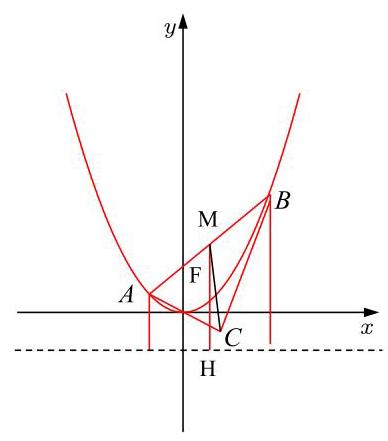

$\left( {\frac{{k}^{2}}{2} + \frac{1}{2}}\right) \sqrt{{k}^{2} + 1}$

由 $\left| {CH}\right|  = \frac{\sqrt{3}}{2}\left| {AB}\right|$ ,可得 $\frac{\sqrt{3}}{2}\left( {{k}^{2} + 1}\right)  = \left( {\frac{{k}^{2}}{2} + \frac{1}{2}}\right) \sqrt{{k}^{2} + 1}$ ,解

得 $k = \sqrt{2}$ (舍去负值).

故答案为: $\sqrt{2}$ .

法二:取 ${AB}$ 中点，作 ${HM} \bot$ 准线于 $H$

${HM} = \frac{1}{2}\left( {{AF} + {BF}}\right)  = {AM}$

$\Rightarrow  \frac{HM}{CM} = \frac{AM}{CM} = \frac{1}{\sqrt{3}}$

$\Rightarrow  {k}_{AB} = \tan \angle {CMH} = \frac{CH}{MH} = \sqrt{2}$

【练习】5. (2024 浦东三模) 已知点 $A\text{ 、 }B$ 位于抛物线 ${y}^{2} = {2px}\left( {p > 0}\right)$ 上， $\left| {AB}\right|  = {20}$ ，点 $M$ 为线段 ${AB}$ 的中点，记点 $M$ 到 $y$ 轴的距离为 $d$ . 若 $d$ 的最小值为 7，则当 $d$ 取该最小值时，直线 ${AB}$ 的斜率 $k\left( {k > 0}\right)$ 为___.

【答案】 $\frac{\sqrt{6}}{2}$

【解析】如图: 分别从 $A, B, M$ 作准线的垂线,垂足为 $C, D, N$ ,

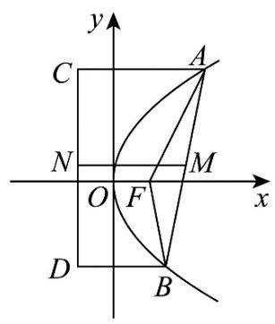

设 $A\left( {{x}_{1},{y}_{1}}\right) , B\left( {{x}_{2},{y}_{2}}\right) ,{AB}$ 中点 $M\left( {\frac{{x}_{1} + {x}_{2}}{2},\frac{{y}_{1} + {y}_{2}}{2}}\right)$ ,

$\left| {MN}\right|  = \frac{1}{2}\left( {\left| {AC}\right|  + \left| {BD}\right| }\right)  = \frac{1}{2}\left( {\left| {AF}\right|  + \left| {BF}\right| }\right)$ ,则 $M$ 到 $y$ 轴的距离为 $d = \; \frac{1}{2}\left( {\left| {AF}\right|  + \left| {BF}\right| }\right)  - \frac{1}{2}p \geq  \frac{1}{2}\left| {AB}\right|  - \frac{1}{2}p = 7,$

当 $M$ 到 $y$ 轴的距离最小时, $\left| {AF}\right|  + \left| {BF}\right|$ 最小,等号为 $A, B, F$ 三点共线时取得,所以 $\frac{1}{2} \times  {20} - \frac{1}{2}p = 7$ ,解得 $p = 6$ .

故抛物线方程为 ${y}^{2} = {12x}$ ,当 $A, B, F$ 三点共线时,设直线 ${AB}$ 的方程为 $y = k\left( {x - 3}\right)$ ,

与抛物线方程联立消去 $y$ 得: ${k}^{2}{x}^{2} - \left( {6{k}^{2} + {12}}\right) x + 9{k}^{2} = 0$ ,所以 ${x}_{1} + {x}_{2} = \frac{6{k}^{2} + {12}}{{k}^{2}}$ ,

所以 ${x}_{1} + {x}_{2} + p = \frac{6{k}^{2} + {12}}{{k}^{2}} + 6 = {20}$ ,解得 $k = \frac{\sqrt{6}}{2}$ (负根舍去).

故答案为: $\frac{\sqrt{6}}{2}$

【练习】6. (2024 上海三模) 过抛物线 $E : {y}^{2} = {2px}\left( {p > 0}\right)$ 的焦点 $F$ 的直线交 $E$ 于点 $A, B$ ,交 $E$ 的准线 $l$ 于点 $C,{AD} \bot  l$ ，点 $D$ 为垂足. 若 $F$ 是 ${AC}$ 的中点，且 $\left| {AF}\right|  = 3$ ，则 $\left| {AB}\right|  =$ ___.

【答案】 4

【解析】作 ${BE} \bot  l$ 于点 $E, l$ 与 $x$ 轴交于点 $M$ ,如图,

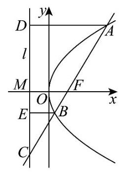

则 ${AD}//{FM}//{BE}$ ，

又 $\left| {AF}\right|  = 3$ 且 $F$ 是 ${AC}$ 的中点，则有 $\frac{\left| AD\right| }{\left| FM\right| } = \frac{\left| AC\right| }{\left| FC\right| } = 2$ ，

即 $\left| {AD}\right|  = 2\left| {FM}\right|$ ,又 $\left| {AD}\right|  = \left| {AF}\right|  = 3$ ,故 $\left| {FM}\right|  = \frac{3}{2}$ ,

又 $\frac{\left| FM\right| }{\left| BE\right| } = \frac{\left| FC\right| }{\left| BC\right| },\left| {FC}\right|  = \left| {AF}\right|  = 3,\left| {FB}\right|  = \left| {BE}\right|$ ,

故 $\frac{\frac{3}{2}}{\left| FB\right| } = \frac{3}{3 - \left| {FB}\right| }$ ,即 $\left| {FB}\right|  = 1$ ,则 $\left| {AB}\right|  = 3 + 1 = 4$ .

故答案为: 4

【练习】7. (2024 届华二) 椭圆 $\Gamma  : \frac{{x}^{2}}{2024} + {y}^{2} = 1$ 的内接等腰三角形,其中它有至少两个顶点是椭圆的顶点，这样的等腰三角形的个数为___.

【答案】 24

【解析】椭圆四个顶点中任选三个, 有 4 种可行的等腰三角形.

以下设选出 $\bigtriangleup {ABC}, A, B$ 为 $\Gamma$ 的顶点, $C$ 不是 $\Gamma$ 的顶点.

若 ${AB}$ 为长轴,可排除.

若 ${AB}$ 为短轴，可由图形观察出 $C$ 共有 4 处 (到 $A, B$ 之一距离为 2 ).

若 $A, B$ 一个是长轴端点、一个是短轴端点,则 $\{ A, B\}$ 有 4 种选法,

固定每种选法,由图形观察出,使 ${AC} = {BC}$ 的点 $C$ 有两处,

使 ${BC} = {AB}$ 的点 $C$ 有两处 (两个长轴端点附近,严格定量计算可确认)，

使 ${AC} = {AB}$ 的点 $C$ 只有另一个短轴端点,舍去,

这种三角形有 $4 \times  \left( {2 + 2}\right)  = {16}$ 个.

综上,有 $4 + 4 + {16} = {24}$ 个.

【练习】8. (2024 届交附) 已知双曲线 $E : \frac{{x}^{2}}{{a}^{2}} - \frac{{y}^{2}}{{b}^{2}} = 1$ 的左、右顶点分别为 $A\text{ 、 }B, M$ 是 $E$ 上一点, $\bigtriangleup  {ABM}$ 为等腰三角形，且外接圆面积为 ${3\pi }{a}^{2}$ ，则双曲线 $E$ 的离心率为___

【答案】 $\sqrt{3}$

【解析】设 $M$ 在双曲线 $E : \frac{{x}^{2}}{{a}^{2}} - \frac{{y}^{2}}{{b}^{2}} = 1\left( {a > 0, b > 0}\right)$ 的左支上,

因为外接圆面积为 ${3\pi }{a}^{2}$ ,所以 ${3\pi }{a}^{2} = \pi {R}^{2} \Rightarrow  R = \sqrt{3}a$

${MA} = {AB} = {2a},\angle {MBA} = \theta ,\frac{2a}{\sin \theta } = {2R} = 2\sqrt{3}a \Rightarrow  \sin \theta  = \frac{\sqrt{3}}{3}$ ,

$\cos \theta  = \frac{\sqrt{6}}{3},\sin {2\theta } = 2 \times  \frac{\sqrt{3}}{3} \times  \frac{\sqrt{6}}{3} = \frac{2\sqrt{2}}{3},\cos {2\theta } = \frac{6}{9} - \frac{1}{3} = \frac{1}{3}$ ,

则 $M$ 的坐标为 $\left( {-\frac{2}{3}a - a,{2a} \cdot  \frac{2\sqrt{2}}{3}}\right)$ 即 $\left( {-\frac{5}{3}a,\frac{4\sqrt{2}}{3}a}\right)$ ,

代入双曲线方程得 $\frac{25}{9} - \frac{{32}{a}^{2}}{9{b}^{2}} = 1$ ,由 ${c}^{2} = {a}^{2} + {b}^{2}$ ,得 $3{a}^{2} = {c}^{2}$ ,即 $\mathrm{e} = \frac{c}{a} = \sqrt{3}$

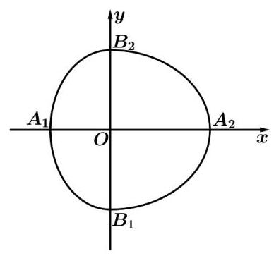

【练习】9. (2025 届大同) 如图,半椭圆 $\frac{{x}^{2}}{{a}^{2}} + \frac{{y}^{2}}{{b}^{2}} = 1\left( {x \geq  0}\right)$ 与半椭圆 $\frac{{y}^{2}}{{b}^{2}} + \frac{{x}^{2}}{{c}^{2}} = 1\left( {x < 0}\right)$ 组成的曲线称为 “果圆”,其中 ${a}^{2} = {b}^{2} + \; {c}^{2}, a > 0, b > c > 0$ . "果圆 "与 $x$ 轴的交点分别为 ${A}_{1},{A}_{2}$ ,若在 “果圆” y 轴右侧部分上存在点 $P$ ，使得 $\angle {A}_{1}P{A}_{2} = \frac{\pi }{2}$ ，则 $\frac{c}{a}$ 的取值范围为___.

【答案】 $\left( {\frac{1}{2},\frac{\sqrt{5} - 1}{2}}\right)$

【解析】设 $P\left( {a\cos \theta , b\sin \theta }\right) ,\cos \theta  \in  \left( {0,1}\right)$ ,

$\overrightarrow{{A}_{1}P} = \left( {a\cos \theta  + c, b\sin \theta }\right) ,\overrightarrow{{A}_{2}P} = \left( {a\cos \theta  - a, b\sin \theta }\right) ,$

因为 $\angle {A}_{1}P{A}_{2} = {90}^{ \circ  }$ ,所以 $\overrightarrow{{A}_{1}P} \cdot  \overrightarrow{{A}_{2}P} = 0$ ,

所以 $\left( {a\cos \theta  + c}\right) \left( {a\cos \theta  - a}\right)  + {b}^{2}{\sin }^{2}\theta  = 0$ ,令 $\frac{c}{a} = t$ ,则 $\cos \theta  = \frac{1}{{t}^{2}} - \frac{1}{t} - 1$ ,

因为 $\cos \theta  \in  \left( {0,1}\right)$ ,所以 $0 < 1 - t - {t}^{2} < {t}^{2}$ ,解得 $\frac{1}{2} < t < \frac{\sqrt{5} - 1}{2}$ ,

所以 $\frac{c}{a}$ 的取值范围为 $\left( {\frac{1}{2},\frac{\sqrt{5} - 1}{2}}\right)$ .

【练习】10. (2024 交附)已知定圆 $M : {x}^{2} + {y}^{2} = 1$ ，点 $A$ 是圆 $M$ 所在平面内一定点，点 $P$ 是圆 $M$ 上的动点,若线段 ${PA}$ 的中垂线交直线 ${PM}$ 于点 $Q$ ,则点 $Q$ 的轨迹可能是: 2025 版上海高考真题及模拟训练合集(下册)

(1)椭圆；(2)双曲线；(3)抛物线；(4)圆；(5)直线；(6)一个点. 其中所有可能的结果有 ( )

A. 2 个 B. 3 个 C. 4 个 D. 5 个

【答案】 $C$

【解析】(1)椭圆 (点 $A$ 在圆 $M$ 内,不包括圆心),如图:

因为 $\left| {AQ}\right|  = \left| {PQ}\right|$ ,所以 $\left| {AQ}\right|  + \left| {MQ}\right|  = \left| {PQ}\right|  + \left| {MQ}\right|  = \left| {MP}\right|  = 1$ ,

即 $Q$ 点的轨迹是以 $A, M$ 为焦点的椭圆；

(2)双曲线(点 $A$ 在圆 $M$ 外)，如图:

因为 $\left| {AQ}\right|  = \left| {PQ}\right|$ ,所以 $\left| {MQ}\right|  - \left| {AQ}\right|  = \left| {MQ}\right|  - \left| {PQ}\right|  = \left| {MP}\right|  = 1$ ,

即 $Q$ 点的轨迹是以 $A, M$ 为焦点的双曲线;

(4)圆(点 $A$ 恰为圆心)

当 $A$ 与 $M$ 重合时, $Q$ 在 ${MP}$ 中点,

所以 $Q$ 点的轨迹是以 $M$ 为圆心,半径为 $\frac{1}{2}$ 的圆.

(6)一个点 (点 $A$ 在圆 $M$ 上)

当 $A$ 在圆上时, ${AP}$ 为弦,所以 $Q$ 一定与 $M$ 重合,所以 $Q$ 点的轨迹是点 $M$ .

故选 $C$ .

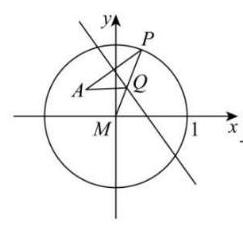

yA KO ум

$M\left( Q\right)$

$M \; x$

$M \; x$

【练习】11. 定义:若抛物线的顶点，抛物线与 $x$ 轴的两个交点构成的三角形是直角三角形，则这种抛物线就称为: “美丽抛物线”. 如图，直线 $l : y = \frac{1}{3}x + b$ 经过点 $M\left( {0,\frac{1}{4}}\right)$ ，一组抛物线的顶点 ${B}_{1}\left( {1,{y}_{1}}\right) ,{B}_{2}\left( {2,{y}_{2}}\right) ,{B}_{3}\left( {3,{y}_{3}}\right) ,\cdots ,{B}_{n}\left( {n,{y}_{n}}\right) \left( {n\text{ 为正整数 }}\right)$ ,依次是直线 $l$ 上的点,这组抛物线与 $x$ 轴正半轴的交点依次是: ${A}_{1}\left( {{x}_{1},0}\right) ,{A}_{2}\left( {{x}_{2},0}\right) {A}_{3}\left( {{x}_{3},0}\right) ,\cdots ,{A}_{n + 1}\left( {{x}_{n + 1},0}\right) \left( {n\text{ 为正整数 }}\right)$ . 若 ${x}_{1} \; = d\left( {0 < d < 1}\right)$ ,当 $d$ 为 ( ) 时,这组抛物线中存在美丽抛物线.

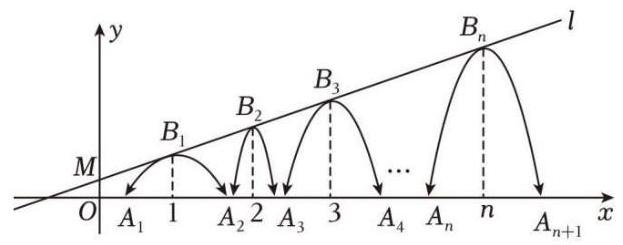

A. $\frac{5}{12}$ 或 $\frac{7}{12}$ B. $\frac{5}{12}$ 或 $\frac{11}{12}$ C. $\frac{7}{12}$ 或 $\frac{11}{12}$ D. $\frac{7}{12}$

【答案】 $B$

【解析】直线 $l : y = \frac{1}{3}x + b$ 经过点 $M\left( {0,\frac{1}{4}}\right)$ ,则 $b = \frac{1}{4}$ ,所以直线 $l : y = \frac{1}{3}x + \frac{1}{4}$ . 由抛物线的对称性得抛物线的顶点与 $x$ 轴的两个交点构成的直角三角形必为等腰直角三角形，所以该等腰三角形的高等于斜边的一半. 因为 $0 < d < 1$ ，所以该等腰直角三角形的斜边长小于 2 ，

斜边上的高小于 1 (即抛物线的顶点纵坐标小于 1 );

因为当 $x = 1$ 时, ${y}_{1} = \frac{1}{3} \times  1 + \frac{1}{4} = \frac{7}{12} < 1$ ,当 $x = 2$ 时, ${y}_{2} = \frac{1}{3} \times  2 + \frac{1}{4} = \frac{11}{12} < 1$ ,

当 $x = 3$ 时, ${y}_{3} = \frac{1}{3} \times  3 + \frac{1}{4} = \frac{5}{4} > 1$ ,所以美丽抛物线的顶点只有 ${B}_{1}{B}_{2}$ .

①若 ${B}_{1}$ 为顶点，由 ${B}_{1}\left( {1,\frac{7}{12}}\right)$ ，则 $d = 1 - \frac{7}{12} = \frac{5}{12}$ ；

②若 ${B}_{2}$ 为顶点，由 ${B}_{2}\left( {2,\frac{11}{12}}\right)$ ，则 $d = 1 - \left\lbrack  {\left( {2 - \frac{11}{12}}\right)  - 1}\right\rbrack   = \frac{11}{12}$ ，

综上所述， $d$ 的值为 $\frac{5}{12}$ 或 $\frac{11}{12}$ 时，存在美丽抛物线. 故选 $B$ .

## 板块二:压轴客观题

## 1. 真题回顾

【例题】1. (2023 上海秋考) 在平面上,若曲线 $\Gamma$ 具有如下性质: 存在点 $M$ ,使得对于任意点 $P \in  \Gamma$ ,都有 $Q \in  \Gamma$ 使得 $\left| {PM}\right|  \cdot  \left| {QM}\right|  = 1$ ,则称这条曲线为 “自相关曲线”.

关于以下两个结论,正确的判断是 ( )

①所有椭圆都为“自相关曲线”; ②存在是“自相关曲线”的双曲线.

A. ①成立，②成立 B. ①成立，②不成立

C. ①不成立，②成立 D. ①不成立，②不成立

【答案】 $B$

【解析】对于①,因为椭圆是封闭图形,对于平面上 $x$ 轴一点 $M\left( {x,0}\right)$ ,

则其到椭圆 $\Gamma$ 的最大距离为 ${MP} = x + a$ ,到椭圆 $\Gamma$ 的最小距离为 ${MQ} = x - a$ ,

若满足 $\left| {PM}\right|  \cdot  \left| {QM}\right|  = \left( {x + a}\right) \left( {x - a}\right)  = 1 \Rightarrow  {x}^{2} = {a}^{2} + 1 \Rightarrow  x = \sqrt{{a}^{2} + 1}$ ,满足题意,

故①为真命题；其他位置类似验证；

对于②，若 $\Gamma$ 为双曲线，对于任意点 $P \in  \Gamma$ ， $\left| {PM}\right|$ 为最大值，

但 $\left| {PM}\right|  \rightarrow   + \infty$ 无最大值,而 $\left| {QM}\right|$ 为定长,所以无法满足对任意的 $P \in  \Gamma$ ,

都存在 $Q \in  \Gamma$ ,使得 $\left| {PM}\right|  \cdot  \left| {QM}\right|  = 1$ ,故②为假命题,

故选 B.

【例题】2. (2022 上海秋考) 已知平面直角坐标系中的点集 $Q = \left\{  {\left( {x, y}\right) \left| {{\left( x - k\right) }^{2} + {\left( y - {k}^{2}\right) }^{2} = 4}\right| k \mid  , k \in  }\right. \; \left. Z\right\}$ .

① 存在直线 $l$ 与 $Q$ 没有公共点，且 $Q$ 中存在两点在 $l$ 的两侧；

②存在直线 $l$ 经过 $Q$ 中的无数个点. 则 ( )

A. ①成立②成立 B. ①成立②不成立

C. ①不成立②成立 D. ①不成立②不成立

【答案】 $B$

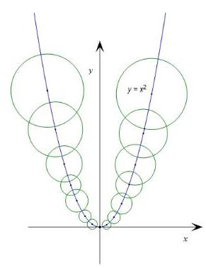

【解析】命题①成立，理由如下:

由于圆的分布是关于 $y$ 轴对称，所以考虑 $y$ 轴右侧的情况，

设第 $k$ 个圆的半径为 ${r}_{k} = 2\sqrt{k}$ ,

第 $k + 1$ 个圆的半径为 ${r}_{k + 1} = 2\sqrt{k + 1}$ ,

我们很想有一条水平可以将这一堆圆无交集地隔开,

这等价于了两圆的半径之和是否小于圆心纵坐标的差.

即 $\Delta {y}_{k} = {y}_{k + 1} - {y}_{k} = {\left( k + 1\right) }^{2} - {k}^{2} = {2k} + 1$ ,

法一:利用极限 $\mathop{\lim }\limits_{{k \rightarrow  \infty }}\frac{\Delta {y}_{k}}{{r}_{k} + {r}_{k + 1}} = \frac{{2k} + 1}{2\sqrt{k} + 2\sqrt{k + 1}} \rightarrow   + \infty$ ，

由极限定义得存在 $K$ ，当 $k > K$ 时，有上下四个圆均可存在一条水平线满足条件.

法二: 因为 $\Delta {y}_{k} = {2k} + 1$ 是一条直线,

${r}_{k} + {r}_{k + 1} = 2\sqrt{k} + 2\sqrt{k + 1}$ 呈现出类似 $y = \sqrt{x}$ 的增长形式,故必有足够大的 $K$ ,

当 $k > K$ 时,有 $\Delta {y}_{k} > {r}_{k} + {r}_{k + 1}$ .

所以存在一条水平可以将这一堆圆无交集地隔开,

命题②不成立，理由如下:

由于圆的分布的对称性,我们同样考虑 $y$ 轴右侧的情况,

假设直线为 ${ax} + {by} + c = 0$ ,则圆心到点的距离为 ${D}_{k} = \frac{\left| ak + b{k}^{2} + c\right| }{\sqrt{{a}^{2} + {b}^{2}}}$ ,

又因为半径为 ${r}_{k} = 2\sqrt{k}$ ,

法一:利用极限 $\mathop{\lim }\limits_{{k \rightarrow  \infty }}\frac{{D}_{k}}{{r}_{k}} = \mathop{\lim }\limits_{{k \rightarrow  \infty }}\frac{\frac{{ak} + b{k}^{2} + c}{\sqrt{{a}^{2} + {b}^{2}}}}{2\sqrt{k}} = \mathop{\lim }\limits_{{k \rightarrow  \infty }}\frac{\left| ak + b{k}^{2} + c\right| }{2\sqrt{k} \cdot  \sqrt{{a}^{2} + {b}^{2}}} \rightarrow   + \infty$ ,

故存在 $K$ ,当 $k > K$ 时有直线与圆相离.

因为 $y$ 右侧与直线有交集的圆的个数是有限的,

同理可知左侧满足条件的圆也是有限的.

左侧情况画图观察也是很显然的.

法二: ${D}_{k} = \frac{\left| ak + b{k}^{2} + c\right| }{\sqrt{{a}^{2} + {b}^{2}}}$ 是一个二次函数或中间有一段翻折上来的一部分,

${D}_{k} = f\left( k\right)$ 是下凸函数的一部分,而 ${r}_{k} = 2\sqrt{k}$ 是上凸函数,

必然存在足够大的 $K$ ,当 $k > K$ 时, ${D}_{k} > {r}_{k}$ ,

故选 $B$ .

【例题】3. (2017 上海秋考) 如图,用 35 个单位正方形拼成一个矩形,点 ${P}_{1}$ 、 ${P}_{2}\text{ 、 }{P}_{3}\text{ 、 }{P}_{4}$ 以及四个标记为“ $\bigtriangleup$ ”的点在正方形的顶点处,设集合 $\Omega  = \; \left\{  {{P}_{1},{P}_{2},{P}_{3},{P}_{4}}\right\}$ ,点 $P \in  \Omega$ ,过 $P$ 作直线 ${l}_{P}$ ,使得不在 ${l}_{P}$ 上的 “ $\bigtriangleup$ ” 的点分布在 ${l}_{P}$ 的两侧. 用 ${D}_{1}\left( {l}_{P}\right)$ 和 ${D}_{2}\left( {l}_{P}\right)$ 分别表示 ${l}_{P}$ 一侧和另一侧的“ $\Delta$ ” 的点到 ${l}_{P}$ 的距离之和. 若过 $P$ 的直线 ${l}_{P}$ 中有且只有一条满足 ${D}_{1}\left( {l}_{P}\right) \; = {D}_{2}\left( {l}_{P}\right)$ ,则 $\Omega$ 中所有这样的 $P$ 为___.

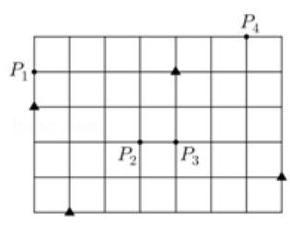

【答案】 ${P}_{1}\text{ 、 }{P}_{3}\text{ 、 }{P}_{4}$

【解析】法一:建立平面直角坐标系,如图所示;

则记为“ $\bigtriangleup$ ”的四个点是 $A\left( {0,3}\right) , B\left( {1,0}\right) , C\left( {7,1}\right) , D\left( {4,4}\right)$ ,

线段 ${AB}\text{ 、 }{BC}\text{ 、 }{CD}\text{ 、 }{DA}$ 的中点分别为 $E\text{ 、 }F\text{ 、 }G\text{ 、 }H$ ,

易得 ${EFGH}$ 为平行四边形,如图所示,设四边形重心为 $M\left( {x, y}\right)$ ,

则 $\overrightarrow{MA} + \overrightarrow{MB} + \overrightarrow{MC} + \overrightarrow{MD} = \overrightarrow{0}$ ,由此求得 $M\left( {3,2}\right)$ ,

即平行四边形 ${EFGH}$ 的对角线交于点 ${P}_{2}$ ,则符合条件的直线 ${l}_{P}$ 一定经过点 ${P}_{2}$ ,

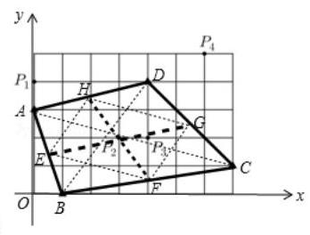

且过点 ${P}_{2}$ 的直线有无数条;

由过点 ${P}_{1}$ 和 ${P}_{2}$ 的直线有且仅有 1 条,过点 ${P}_{3}$ 和 ${P}_{2}$ 的直线有且仅有 1 条,

过点 ${P}_{4}$ 和 ${P}_{2}$ 的直线有且仅有 1 条,所以符合条件的点是 ${P}_{1}\text{ 、 }{P}_{3}$ 、 ${P}_{4}$ .

法二:建立适当的直角坐标系,四个#的坐标为 $\left( {1,0}\right) ,\left( {7,1}\right) ,(0$

3), $\left( {4,4}\right)$ ,

${P}_{1}\left( {0,4}\right) ,{P}_{2}\left( {3,2}\right) ,{P}_{3}\left( {4,2}\right) ,{P}_{4}\left( {6,5}\right) ,$

设 ${l}_{P}$ 直线方程为 ${ax} + {by} + c = 0$ ,由 ${D}_{1}\left( {l}_{P}\right)  = {D}_{2}\left( {l}_{P}\right)$ 得四个 $\#$ 到直线 ${l}_{P}$ 的有向距离

之和为 0,则 $\frac{a + c}{\sqrt{{a}^{2} + {b}^{2}}} + \frac{{7a} + b + c}{\sqrt{{a}^{2} + {b}^{2}}} + \frac{{3b} + c}{\sqrt{{a}^{2} + {b}^{2}}} + \frac{{4a} + {4b} + c}{\sqrt{{a}^{2} + {b}^{2}}} = 0$ ,

得 ${12a} + {8b} + {4c} = 0$ ,所以 ${3a} + {2b} + c = 0$ ,即 ${ax} + {by} + c = 0$ 过点 $\left( {3,2}\right)$ ,

${l}_{P}$ 过点 ${P}_{2}$ 就能满足 ${D}_{1}\left( {l}_{P}\right)  = {D}_{2}\left( {l}_{P}\right)$ ,

又因为过 $P$ 的直线 ${l}_{P}$ 中有且只有一条,所以 ${l}_{P}$ 还要过 ${P}_{1},{P}_{3},{P}_{4}$ 任何一点都能唯一, 所以符合条件的点是 ${P}_{1}\text{ 、 }{P}_{3}\text{ 、 }{P}_{4}$ .

【例题】4. (2019 上海春考) 在椭圆 $\frac{{x}^{2}}{4} + \frac{{y}^{2}}{2} = 1$ 上任意一点 $P, Q$ 与 $P$ 关于 $x$ 轴对称,若有 $\overrightarrow{{F}_{1}P} \cdot  \overrightarrow{{F}_{2}P} \leq$ 1,则 $\overrightarrow{{F}_{1}P}$ 与 $\overrightarrow{{F}_{2}Q}$ 的夹角范围为___.

【答案】 $\left\lbrack  {\pi  - \arccos \frac{1}{3},\pi }\right\rbrack$

【解析】设 $P\left( {x, y}\right)$ ,则 $Q$ 点 $\left( {x, - y}\right)$ ,椭圆 $\frac{{x}^{2}}{4} + \frac{{y}^{2}}{2} = 1$ 的焦点坐标为 $\left( {-\sqrt{2},0}\right) \text{ 、 }\left( {\sqrt{2},0}\right)$ ,

因为 $\overrightarrow{{F}_{1}P} \cdot  \overrightarrow{{F}_{2}P} \leq  1$ ,所以 ${x}^{2} - 2 + {y}^{2} \leq  1$ ,结合 $\frac{{x}^{2}}{4} + \frac{{y}^{2}}{2} = 1$ ,得 ${y}^{2} \in  \left\lbrack  {1,2}\right\rbrack$ ,

故 $\overrightarrow{{F}_{1}P}$ 与 $\overrightarrow{{F}_{2}Q}$ 的夹角 $\theta$ 满足 $\cos \theta  = \frac{\overrightarrow{{F}_{1}P} \cdot  \overrightarrow{{F}_{2}Q}}{\left| \overrightarrow{{F}_{1}P}\right|  \cdot  \left| \overrightarrow{{F}_{2}Q}\right| } = \frac{{x}^{2} - 2 - {y}^{2}}{\sqrt{{\left( {x}^{2} + 2 + {y}^{2}\right) }^{2} - 8{x}^{2}}}$

$= \frac{2 - 3{y}^{2}}{{y}^{2} + 2} =  - 3 + \frac{8}{{y}^{2} + 2} \in  \left\lbrack  {-1, - \frac{1}{3}}\right\rbrack$ ,故 $\theta  \in  \left\lbrack  {\pi  - \arccos \frac{1}{3},\pi }\right\rbrack$ .

【例题】5. (2017 上海秋考) 在平面直角坐标系 ${xOy}$ 中,已知椭圆 ${C}_{1} : \frac{{x}^{2}}{36} + \frac{{y}^{2}}{4} = 1$ 和 ${C}_{2} : {x}^{2} + \frac{{y}^{2}}{9} = 1$ . $P$ 为 ${C}_{1}$ 上的动点, $Q$ 为 ${C}_{2}$ 上的动点, $w$ 是 $\overrightarrow{OP} \cdot  \overrightarrow{OQ}$ 的最大值. 记 $\Omega  = \{ \left( {P, Q}\right)  \mid  P$ 在 ${C}_{1}$ 上, $Q$ 在 ${C}_{2}$ 上,且 $\overrightarrow{OP} \cdot  \overrightarrow{OQ} = w\}$ ,则 $\Omega$ 中元素个数为 ( )

A. 2 个 B. 4 个 C. 8 个 D. 无穷个

【答案】 $D$

【解析】椭圆 ${C}_{1} : \frac{{x}^{2}}{36} + \frac{{y}^{2}}{4} = 1$ 和 ${C}_{2} : {x}^{2} + \frac{{y}^{2}}{9} = 1.P$ 为 ${C}_{1}$ 上的动点, $Q$ 为 ${C}_{2}$ 上的动点,

法一: 设 $P\left( {6\cos \alpha ,2\sin \alpha }\right) , Q\left( {\cos \beta ,3\sin \beta }\right) ,0 \leq  \alpha \text{ 、 }\beta  < {2\pi }$ ,

则 $\overrightarrow{OP} \cdot  \overrightarrow{OQ} = 6\cos \alpha \cos \beta  + 6\sin \alpha \sin \beta  = 6\cos \left( {\alpha  - \beta }\right)$ ,

当 $\alpha  = \beta$ 时， $w$ 取得最大值 6 ，

则 $\Omega  = \{ \left( {P, Q}\right)  \mid  P$ 在 ${C}_{1}$ 上， $Q$ 在 ${C}_{2}$ 上，且 $\overrightarrow{OP} \cdot  \overrightarrow{OQ} = w\}$ 中的元素有无穷多对.

法二: 令 $P\left( {m, n}\right) , Q\left( {u, v}\right)$ ,则 ${m}^{2} + 9{n}^{2} = {36},9{u}^{2} + {v}^{2} = 9$ ,

由柯西不等式得 $\left( {{m}^{2} + 9{n}^{2}}\right) \left( {9{u}^{2} + {v}^{2}}\right)  = {324} \geq  {\left( 3mu + 3nv\right) }^{2}$ ,

当且仅当 ${mv} = {9nu}$ ,取得最大值 6 ,

显然,满足条件的 $P\text{ 、 }Q$ 有无穷多对, $D$ 项正确.

故选 $D$ .

## 2. 模拟练习

【练习】1. (2024 届华二)已知 $P, Q$ 是曲线 $\Gamma$ 上两点，若存在 $M$ 点，使得曲线 $\Gamma$ 上任意一点 $P$ 都存在 $Q$ 使得 $\overrightarrow{MP} \cdot  \overrightarrow{MQ} = 1$ ，则称曲线 $\Gamma$ 是 “自相关曲线”，现有如下两个命题:①存在双曲线是 “自相关曲线”; ② 任意椭圆都是 “自相关曲线”，则 ( )

A. ①成立，②成立 B. ①成立，②不成立

C. ①不成立，②成立 D. ①不成立，②不成立

【答案】 $A$

【解析】法一:对①，考虑双曲线 $y = \frac{1}{3x}$ ，并令 $M$ 为坐标原点，则对任意 $P\left( {t,\frac{1}{3t}}\right)$ ，

都存在 $Q\left( {\frac{3 + \sqrt{5}}{6t},\frac{3 - \sqrt{5}}{2}t}\right)$ ,使得 $\overrightarrow{MP} \cdot  \overrightarrow{MQ} = 1$ . 因此①正确.

对②，设椭圆方程为 $\frac{{x}^{2}}{{a}^{2}} + \frac{{y}^{2}}{{b}^{2}} = 1\left( {a > b > 0}\right)$ ，令 $M\left( {m,0}\right)$ ，其中 $m =  - \sqrt{{a}^{2} + 1}$ .

对椭圆上的任意点 $P$ ，设 $P\left( {a\cos \alpha , b\sin \alpha }\right)$ .

则只需验证关于 $\theta$ 的方程 $\left( {a\cos \theta  - m}\right) \left( {a\cos \alpha  - m}\right)  + {b}^{2}\sin \theta \sin \alpha  = 1\left( *\right)$

在区间 $\lbrack 0,{2\pi })$ 上有异于 $\alpha$ 的解.

当 $\alpha  = 0$ 或 $\pi$ 时可相应地取 $\theta  = \pi$ 或 0 .

下设 $\alpha  \notin  \{ 0,\pi \}$ .

则 (*) 等价于 $a\left( {a\cos \alpha  - m}\right) \cos \theta  + {b}^{2}\sin \alpha \sin \theta  = m\left( {a\cos \alpha  - m}\right)  + 1$ ,

故当 ${a}^{2}{\left( a\cos \alpha  - m\right) }^{2} + {b}^{4}{\sin }^{2}\alpha  > {\left\lbrack  m\left( a\cos \alpha  - m\right)  + 1\right\rbrack  }^{2}$ 时 (*) 必有解.

移项重新配方,利用 ${m}^{2} = {a}^{2} + 1$ ,

上式等价 ${b}^{4}{\sin }^{2}a + {a}^{2} > {\left\lbrack  \left( a\cos \alpha  - m\right)  + m\right\rbrack  }^{2} = {a}^{2}{\cos }^{2}\alpha$ .

当 $\alpha  \notin  \{ 0,\pi \}$ 时该式成立，故 (*) 必有解，

同时，上述不等关系表明此时的(*)在区间 $\lbrack 0,{2\pi })$ 上有两个不同的解，

因此必能找到 (*) 在 $\lbrack 0,{2\pi })$ 上有异于 $\alpha$ 的解，因此②正确；

故选 $A$ .

法二:对①:对于双曲线，取 $M$ 为 $x$ 轴正半轴的充分靠右的点，

则 $\left| {MP}\right|$ 的最小值充分大，由数量积投影，

经过 $M$ 附近的点的直线一定与双曲线有交点，所以任意双曲线都是“自相关曲线”；

对②:设 $M$ 在 $x$ 轴正半轴，设长轴顶点为 $A, B$ ，则猜测 ${MA},{MB}$ 必须配对，

所以有 ${MA} \cdot  {MB} = 1$ ,此时任取 $P$ ,则 $\overrightarrow{MP}$ 在 $x$ 轴投影介于 $\left\lbrack  {{MA},{MB}}\right\rbrack$ 之间,

所以 $\overrightarrow{MP} \cdot  \overrightarrow{MA} \leq  {MA} \cdot  {MB} = 1$ ,而 $\overrightarrow{MP} \cdot  \overrightarrow{MB} \geq  {MA} \cdot  {MB} = 1$ ,

由连续性和零点定理,存在 $Q$ 满足要求;

故选 $A$ .

【练习】2. (2026 复附期中) 已知曲线 $\Gamma$ 的对称中心为 $O$ ,如果对于曲线 $\Gamma$ 上的任意一点 $A$ ,都存在 $\Gamma$ 上另外的两点 $B, C$ ,使得 $\bigtriangleup {ABC}$ 的垂心为 $O$ ,则称 $\Gamma$ 为“自垂曲线”. 现有如下两个命题:

①任意双曲线都是“自垂曲线”; ②任意椭圆都是“自垂曲线”.

则下列判断正确的是( ).

A. ①是真命题，②是真命题 B. ①是假命题，②是真命题

C. ①是真命题，②是假命题 D. ①是假命题，②是假命题

【答案】 $B$

【解析】① 错误,解法 1: 假设双曲线 $\Gamma  : \frac{{x}^{2}}{{a}^{2}} - \frac{{y}^{2}}{{b}^{2}} = 1\left( {b > a > 0}\right)$ 上存在一点 $A$ ,且 ${k}_{OA} = \frac{a}{b}$ . 根据 $b > \; a \Rightarrow  {k}_{OA} = \frac{a}{b} < \frac{b}{a}$ ,即 $A$ 点为 $y = \frac{a}{b}x$ 和双曲线在第一象限的交点,所以此时 ${k}_{BC} =  - \frac{b}{a}$ ,这样的 ${l}_{BC}$ 与双曲线只有一个交点,所以存在双曲线不是 “自垂曲线.”

所以①错误.

解法 2: 取 $A\left( {1,1}\right) , B\left( {{x}_{0},\frac{1}{{x}_{0}}}\right) , C\left( {\frac{1}{{x}_{0}},{x}_{0}}\right)$ .

$\because {k}_{OB} \cdot  {k}_{AC} =  - 1 \Rightarrow  \frac{\frac{1}{{x}_{0}}}{{x}_{0}} \cdot  \frac{1 - {x}_{0}}{1 - \frac{1}{{x}_{0}}} =  - 1 \Rightarrow  \frac{1}{{x}_{0}} - 1 = 1 - {x}_{0} \Rightarrow  {x}_{0} = 1$ 与点 $A$ 重合矛盾.

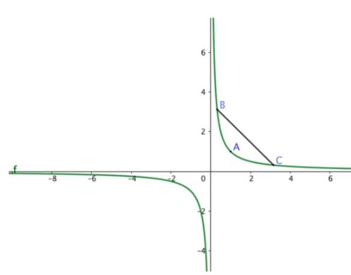

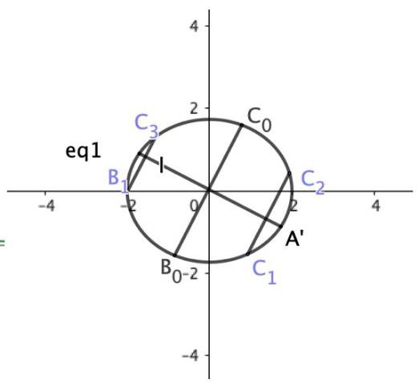

②正确:首先任意取一点 $A$ ，找到 ${B}_{0}{C}_{0}\bot {OA}$ ，作 ${B}_{1}{C}_{1}//{B}_{0}{C}_{0},{B}_{2}{C}_{2}//{B}_{0}{C}_{0}$ ，当 ${B}_{0}{C}_{0} \rightarrow  {B}_{1}{C}_{1}$ 时， 点 ${C}_{1}$ 趋向于点 $A$ ，此时 $\left\langle  {\overrightarrow{O{B}_{1}},\overrightarrow{A{C}_{1}}}\right\rangle$ 极限为钝角，同理当 ${B}_{0}{C}_{0} \rightarrow  {B}_{2}{C}_{2}$ 时， ${B}_{1}$ 趋向于点 ${A}^{\prime }$ ，此时 $\left\langle  {\overrightarrow{O{B}_{2}},\overrightarrow{A{C}_{2}}}\right\rangle$ 为锐角，所以在这两种位置之间存在直角的情况，所以②正确.

【练习】3. 若恰有三组不全为 0 的实数对 $\left( {a\text{ 、 }b}\right)$ 满足关系式 $\left| {a + b + 1}\right|  = \left| {{4a} - {3b} + 1}\right|  = t\sqrt{{a}^{2} + {b}^{2}}$ ,则实数 $t$ 的所有可能的值组成的集合为___.

【答案】 $\left\{  {\frac{5}{2},\frac{7}{5},\frac{7\sqrt{29}}{29}}\right\}$

【解析】由已知得 $t > 0$ ,整理得 $\frac{\left| a + b + 1\right| }{\sqrt{{a}^{2} + {b}^{2}}} = \frac{\left| 4a - 3b + 1\right| }{\sqrt{{a}^{2} + {b}^{2}}} = t$ ,

看成有且仅有三条直线满足 $A\left( {1,1}\right)$ 和 $B\left( {4, - 3}\right)$ 到直线 ${ax} + {by} + c = 0$ 不过原点) 的距离 $t$ 相等.

由 $\left| {AB}\right|  = \sqrt{{\left( 4 - 1\right) }^{2} + {\left( -3 - 1\right) }^{2}} = 5$ ,

(1)当 $t = \frac{\left| AB\right| }{2} = \frac{5}{2}$ ，此时易得符合题意的直线 $l$ 为线段 ${AB}$ 的垂直平分线 ${6x} - {8y} - {23} = 0$ 以及直线 ${AB}$ 平行的两条直线 ${8x} + {6y} + {11} = 0$ 和 ${8x} + {6y} - {39} = 0$ ;

( 2 )当 $t < \frac{\left| AB\right| }{2} = \frac{5}{2}$ 时，有 4 条直线 $l$ 会使得点 $A\left( {1,1}\right)$ 和 $B\left( {4, - 3}\right)$ 到它们的距离相等,注意到 $l$ 不过原点，

所以当其中一条直线过原点时,会作为增根被舍去.

设点 $A$ 到 $l$ 的距离为 $d$ ,

①作为增根被舍去的直线 $l$ ，过原点和 $A, B$ 的中点 $M\left( {\frac{5}{2}, - 1}\right)$ ，其方程为 ${2x} + {5y} = 0$ ，此时 $t$

$= d = \frac{7}{\sqrt{29}} < \frac{5}{2}$ ,符合;

②作为增根被舍去的直线 $l$ ，过原点且以 $\overrightarrow{AB}$ 为方向向量，其方程为 ${4x} + {3y} = 0$ ，此时， $t = d = \; \frac{7}{5} < \frac{5}{2}$ ,符合;

综上,满足题意的实数 $t$ 为 $\frac{5}{2},\frac{7}{5},\frac{7\sqrt{29}}{29}$ .

故答案为: $\frac{5}{2},\frac{7}{5},\frac{7\sqrt{29}}{29}$ .

【练习】4. (2024 届华二) 点 $P$ 为抛物线 $C : {y}^{2} = {4x}$ 准线上的点,若存在过 $P$ 的直线交抛物线 $C$ 于 $A, B$ 两点,且 $\left| {PA}\right|  = \left| {AB}\right|$ ,则称点 $P$ 为“ $\Omega$ 点”,那么下列结论中正确的是 ( )

A. 准线上的所有点都不是 “ $\Omega$ 点”

B. 准线上的所有点都是 “ $\Omega$ 点”

C. 准线上仅有有限个点是 “ $\Omega$ 点”

D. 准线上有无穷多个点 (不是所有的点) 是 “Ω点”

【答案】 $B$

【解析】由题意可知抛物线 $C : {y}^{2} = {4x}$ 的准线方程为: $x =  - 1$ .

设 $A\left( {m, n}\right) , P\left( {-1, y}\right)$ ,因为 $\left| {PA}\right|  = \left| {AB}\right|$ ,所以 $A$ 为 ${PB}$ 中点,则 $B\left( {{2m} + 1,{2n} - y}\right)$ .

$\because A, B$ 在 ${y}^{2} = {4x}$ 上, $\therefore {n}^{2} = {4m}$ 且 ${\left( 2n - y\right) }^{2} = 4\left( {{2m} + 1}\right)$ ,消去 $m$ 得, $2{n}^{2} + 4 = {\left( 2n - y\right) }^{2}$ ,

整理得关于 $n$ 的方程 $2{n}^{2} - {4yn} + {y}^{2} - 4 = 0,\because \Delta  = 8{y}^{2} + {32} > 0$ 恒成立, $\therefore$ 该方程恒有实数解.

即对于任意的 $P$ 点,都存在 $m$ ,使得 $\left| {PA}\right|  = \left| {AB}\right|$ ,故选 $B$ .

【练习】5. 设双曲线的焦点为 $\left( {\pm c,0}\right)$ ,圆 $C : {\left( x - c\right) }^{2} + {y}^{2} = {r}^{2}$ ,则 ( )

A. 存在 $c$ ,使得对任意的 $r$ ,圆与双曲线至少有一个公共点

B. 存在 $c$ ,使得对任意的 $r$ ,圆与双曲线至多有两个公共点

C. 对于任意 $r$ ，存在 $c$ ，圆与双曲线至少有两个公共点

D. 对于任意 $r$ ，存在 $c$ ，圆与双曲线至多有一个公共点

【答案】 $C$

【解析】设双曲线方程为 $\frac{{x}^{2}}{{a}^{2}} - \frac{{y}^{2}}{{b}^{2}} = 1$ ,与圆方程联立可得: ${c}^{2}{x}^{2} - {2c}{a}^{2}x + {a}^{4} - {a}^{2}{r}^{2} = 0$ ,

解得 $x = \frac{{a}^{2} \pm  {ar}}{c}$ (以 $\frac{{a}^{2}}{c}$ 为中点),分类讨论可知:

当 $\frac{{a}^{2} + {ar}}{c} < a \Rightarrow  a + r < c$ ,无交点;

当 $\frac{{a}^{2} + {ar}}{c} = a \Rightarrow  a + r = c$ 时,有 1 个交点;

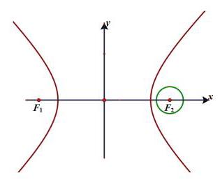

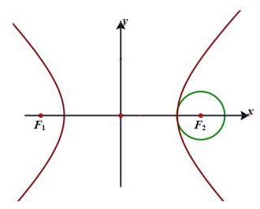

当 $\left\{  {\begin{array}{l} \frac{{a}^{2} - {ar}}{c} >  - a \\  \frac{{a}^{2} + {ar}}{c} > a \end{array} \Rightarrow  c - a < r < c + a}\right.$ 时,有 2 个交点;

当 $\frac{{a}^{2} - {ar}}{c} =  - a \Rightarrow  r = c + a$ 时,有 3 个交点;

当 $\frac{{a}^{2} - {ar}}{c} <  - a \Rightarrow  r > c + a$ 时,有 4 个交点;

故对于任意 $r$ ，存在 $c$ ，圆与双曲线至少有两个公共点

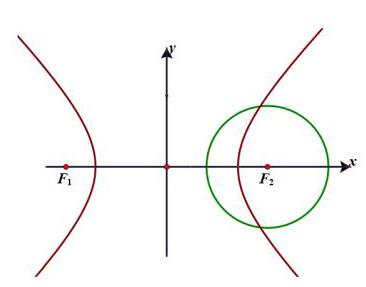

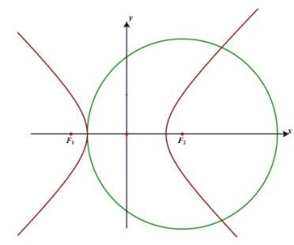

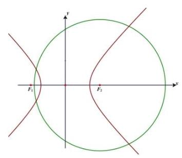

【练习】6. 已知 $P\left( {{x}_{0},{y}_{0}}\right)$ 为圆 $C : {\left( x - t\right) }^{2} + {\left( y - s\right) }^{2} = {r}^{2}\left( {r > 0}\right)$ 上的任意一点,当 $a \neq  b$ 时, $\left| {{x}_{0} - {y}_{0} + a}\right|  + \left| {{x}_{0} - {y}_{0} + b}\right|$ 的值与 ${x}_{0}\text{ 、 }{y}_{0}$ 无关，下列结论正确的是___.

① 当 $\left| {a - b}\right|  = 2\sqrt{2}r$ 时，点 $\left( {t, s}\right)$ 的轨迹是一条直线；

② 当 $\left| {a - b}\right|  = 2\sqrt{2}$ 时，有 $r$ 的最大值为 1 ；

③ 当 $r = \sqrt{2}, b = 2$ 时， $a$ 的取值范围 $a \geq  6$ .

【答案】①②

【解析】 $P\left( {{x}_{0},{y}_{0}}\right)$ 为圆 $C : {\left( x - t\right) }^{2} + {\left( y - s\right) }^{2} = {r}^{2}\left( {r > 0}\right)$ 上的任意一点,

当 $a \neq  b$ 时, $\left| {{x}_{0} - {y}_{0} + a}\right|  + \left| {{x}_{0} - {y}_{0} + b}\right|$ 的值与 ${x}_{0},{y}_{0}$ 无关,

$\left| {{x}_{0} - {y}_{0} + a}\right|  + \left| {{x}_{0} - {y}_{0} + b}\right|$ 为圆上的点到两条平行线距离和的 $\sqrt{2}$ 倍,

则圆在两条平行线 $x - y + a = 0$ 与 $x - y + b = 0$ 之间,

$\left| {a - b}\right|$ 表示两条平行线之间距离的 $\sqrt{2}$ 倍.

当 $\left| {a - b}\right|  = 2\sqrt{2}r$ 时,点 $\left( {t, s}\right)$ 的轨迹是一条直线,

与 $x - y + a = 0$ 以及 $x - y + b = 0$ 等距离的直线,所以①正确.

当 $\left| {a - b}\right|  = 2\sqrt{2}$ 时,有 $r$ 的最大值为 1,正确.

当 $r = \sqrt{2}, b = 2$ 时,得 $\left| {a - 2}\right|  \geq  4$ ,解得 $a \geq  6$ 或 $a \leq   - 2$ ,所以③不正确.

故正确的是①②.

## 板块三: 中档主观题

注:近几年解析几何变成纯 20 题以后就没有了,如果是为了练习 ${20} - 1$ 和 2 可以适当做做,模拟训练就不放了，做压轴模拟训练的前两问更好

## 1. 真题回顾

【例题】1. (2018 上海春考) 已知 $a \in  R$ ,双曲线 $\Gamma  : \frac{{x}^{2}}{{a}^{2}} - {y}^{2} = 1$ .

(1)若点 $\left( {2,1}\right)$ 在 $\Gamma$ 上，求 $\Gamma$ 的焦点坐标；

(2)若 $a = 1$ ，直线 $y = {kx} + 1$ 与 $\Gamma$ 相交于 $A$ 、 $B$ 两点，且线段 ${AB}$ 中点的横坐标为 1，求实数 $k$ 的值.

【解析】(1) 把 (2,1) 代入双曲线方程得 $\frac{4}{{a}^{2}} - 1 = 1$ ,所以 ${a}^{2} = 2$ ,所以 $c = \sqrt{2 + 1} = \sqrt{3}$ ,

所以 $\Gamma$ 的焦点坐标为 $\left( {-\sqrt{3},0}\right) ,\left( {\sqrt{3},0}\right)$ .

(2)当 $a = 1$ 时，双曲线方程为 ${x}^{2} - {y}^{2} = 1$ ，

由 $\left\{  \begin{array}{l} {x}^{2} - {y}^{2} = 1 \\  y = {kx} + 1 \end{array}\right.$ ,得 $\left( {1 - {k}^{2}}\right) {x}^{2} - {2kx} - 2 = 0$ ,

因为直线 $y = {kx} + 1$ 与 $\Gamma$ 相交于 $A\text{ 、 }B$ 两点,所以 $\bigtriangleup  = 4{k}^{2} + 8\left( {1 - {k}^{2}}\right)  > 0$ ,

解得 $- \sqrt{2} < k < \sqrt{2}$ . 设 $A\left( {{x}_{1},{y}_{1}}\right) , B\left( {{x}_{2},{y}_{2}}\right)$ ,则 ${x}_{1} + {x}_{2} = \frac{2k}{1 - {k}^{2}} = 2$ ,

解得 $k = \frac{-1 + \sqrt{5}}{2}$ 或 $k = \frac{-1 - \sqrt{5}}{2}$ (舍). 故 $k = \frac{-1 + \sqrt{5}}{2}$ .

【例题】2. (2017 上海春考) 已知双曲线 $\Gamma  : {x}^{2} - \frac{{y}^{2}}{{b}^{2}} = 1\left( {b > 0}\right)$ ,直线 $l : y = {kx} + m\left( {\mathrm{\;{km}} \neq  0}\right) , l$ 与 $\Gamma$ 交于 $P\text{ 、 }Q$ 两点, ${P}^{\prime }$ 为 $P$ 关于 $y$ 轴的对称点,直线 ${P}^{\prime }Q$ 与 $y$ 轴交于点 $N\left( {0, n}\right)$ ;

(1)若点 $\left( {2,0}\right)$ 是 $\Gamma$ 的一个焦点，求 $\Gamma$ 的渐近线方程；

(2)若 $b = 1$ ，点 $P$ 的坐标为 $\left( {-1,0}\right)$ ，且 $\overrightarrow{N{P}^{\prime }} = \frac{3}{2}\overrightarrow{{P}^{\prime }Q}$ ，求 $k$ 的值；

(3) 若 $m = 2$ ，求 $n$ 关于 $b$ 的表达式.

【解析】(1) 因为双曲线 $\Gamma  : {x}^{2} - \frac{{y}^{2}}{{b}^{2}} = 1\left( {b > 0}\right)$ ,点 $\left( {2,0}\right)$ 是 $\Gamma$ 的一个焦点,

所以 $c = 2, a = 1$ ,所以 ${b}^{2} = {c}^{2} - {a}^{2} = 4 - 1 = 3$ ,

所以 $\Gamma$ 的标准方程为 ${x}^{2} - \frac{{y}^{2}}{3} = 1,\Gamma$ 的渐近线方程为 $y =  \pm  \sqrt{3}x$ .

(2) 因为 $b = 1$ ,所以双曲线 $\Gamma$ 为 ${x}^{2} - {y}^{2} = 1, P\left( {-1,0}\right) ,{P}^{\prime }\left( {1,0}\right)$ ,

因为 $\overrightarrow{N{P}^{\prime }} = \frac{3}{2}\overrightarrow{{P}^{\prime }Q}$ ,设 $Q\left( {{x}_{2},{y}_{2}}\right)$ ,

则由定比分点坐标公式,得 $\left\{  \begin{array}{l} 1 = \frac{0 + \frac{3}{2}{x}_{2}}{1 + \frac{3}{2}} \\  0 = \frac{n + \frac{3}{2}{y}_{2}}{1 + \frac{3}{2}} \end{array}\right.$ ,解得 ${x}_{2} = \frac{5}{3}$ ,

因为 ${x}_{2}^{2} - {y}_{2}^{2} = 1$ ，所以 ${y}_{2} =  \pm  \frac{4}{3}$ ，所以 $k = \frac{{y}_{2} - 0}{{x}_{2} + 1} =  \pm  \frac{1}{2}$ .

(3) 设 $P\left( {{x}_{1},{y}_{1}}\right) , Q\left( {{x}_{2},{y}_{2}}\right) ,{k}_{PQ} = {k}_{0}$ ,

则 ${P}^{\prime }\left( {-{x}_{1},{y}_{1}}\right) ,{l}_{PQ} = {k}_{0}x + n$ ,

由 $\left\{  \begin{array}{l} y = {kx} + 2 \\  {x}^{2} - \frac{{y}^{2}}{{b}^{2}} = 1 \end{array}\right.$ ,得 $\left( {{b}^{2} - {k}^{2}}\right) {x}^{2} - {4kx} - 4 - {b}^{2} = 0$ ,

${x}_{1} + {x}_{2} = \frac{4k}{{b}^{2} - {k}^{2}},{x}_{1}{x}_{2} = \frac{-4 - {b}^{2}}{{b}^{2} - {k}^{2}},$

由 $\left\{  \begin{array}{l} y = {k}_{0}x + n \\  {x}^{2} - \frac{{y}^{2}}{{b}^{2}} = 1 \end{array}\right.$ ,得 $\left( {{b}^{2} - {k}_{0}^{2}}\right) {x}^{2} - 2{k}_{0}{nx} - {n}^{2} - {b}^{2} = 0$ ,

$- {x}_{1} + {x}_{2} = \frac{2{k}_{0}n}{{b}^{2} - {k}_{0}^{2}}, - {x}_{1}{x}_{2} = \frac{-{n}^{2} - {b}^{2}}{{b}^{2} - {k}_{0}^{2}},$

所以 ${x}_{1}{x}_{2} = \frac{-4 - {b}^{2}}{{b}^{2} - {k}^{2}} = \frac{{n}^{2} + {b}^{2}}{{b}^{2} - {k}_{0}^{2}}$ ,即 $\frac{{b}^{2} - {k}_{0}^{2}}{{b}^{2} - {k}^{2}}$ ,即 $\frac{{b}^{2} - {k}_{0}^{2}}{{b}^{2} - {k}^{2}} = \frac{{n}^{2} + {b}^{2}}{-4 - {b}^{2}}$ ,

$\frac{k}{{k}_{0}} = \frac{\frac{{y}_{2} - {y}_{1}}{{x}_{2} - {x}_{1}}}{\frac{{y}_{2} - {y}_{1}}{{x}_{2} + {x}_{1}}} = \frac{{x}_{1} + {x}_{2}}{{x}_{2} - {x}_{1}} = \frac{2k}{{k}_{0}n} \cdot  \frac{{b}^{2} - {k}_{0}^{2}}{{b}^{2} - {k}^{2}} = \frac{2k}{{k}_{0}n} \cdot  \frac{{n}^{2} + {b}^{2}}{-4 - {b}^{2}},$

化简得 $2{n}^{2} + n\left( {4 + {b}^{2}}\right)  + 2{b}^{2} = 0$ ,所以 $n =  - 2$ 或 $n = \frac{{b}^{2}}{-2}$ ,

当 $n =  - 2$ 时,由 $\frac{{b}^{2} - {k}_{0}^{2}}{{b}^{2} - {k}^{2}} = \frac{{n}^{2} + {b}^{2}}{-4 - {b}^{2}}$ ,得 $2{b}^{2} = {k}^{2} + {k}_{0}^{2}$ ,

由 $\left\{  \begin{array}{l} y = {k}_{0}x - 2 \\  y = {kx} + 2 \end{array}\right.$ ,得 $\left\{  \begin{array}{l} x = \frac{4}{{k}_{0} - k} \\  y = \frac{{2k} + 2{k}_{0}}{{k}_{0} - k} \end{array}\right.$ ,

即 $Q\left( {\frac{4}{{k}_{0} - k},\frac{{2k} + 2{k}_{0}}{{k}_{0} - k}}\right)$ ,代入 ${x}^{2} - \frac{{y}^{2}}{{b}^{2}} = 1$ ,

化简得 ${b}^{2} - \left( {4 + k{k}_{0}}\right) {b}^{2} + {4k}{k}_{0} = 0$ ,解得 ${b}^{2} = 4$ 或 ${b}^{2} = k{k}_{0}$ ,

当 ${b}^{2} = 4$ 时,满足 $n = \frac{{b}^{2}}{-2}$ ,

当 ${b}^{2} = k{k}_{0}$ 时,由 $2{b}^{2} = {k}^{2} + {k}_{0}^{2}$ ,得 $k = {k}_{0}$ (舍去),

综上, $n = \frac{{b}^{2}}{-2}$ .

【例题】3. (2016 上海秋考) 双曲线 ${x}^{2} - \frac{{y}^{2}}{{b}^{2}} = 1\left( {b > 0}\right)$ 的左、右焦点分别为 ${F}_{1}\text{ 、 }{F}_{2}$ ,直线 $l$ 过 ${F}_{2}$ 且与双曲线交于 $A\text{ 、 }B$ 两点.

(1)直线 $l$ 的倾斜角为 $\frac{\pi }{2},\bigtriangleup {F}_{1}{AB}$ 是等边三角形，求双曲线的渐近线方程；

( 2 )设 $b = \sqrt{3}$ ，若 $l$ 的斜率存在，且 $\left( {\overrightarrow{{F}_{1}A} + \overrightarrow{{F}_{1}B}}\right)  \cdot  \overrightarrow{AB} = 0$ ，求 $l$ 的斜率.

【解析】(1) 双曲线 ${x}^{2} - \frac{{y}^{2}}{{b}^{2}} = 1\left( {b > 0}\right)$ 的左、右焦点分别为 ${F}_{1}\text{ 、 }{F}_{2}, a = 1,{c}^{2} = 1 + {b}^{2}$ ,

直线 $l$ 过 ${F}_{2}$ 且与双曲线交于 $A\text{ 、 }B$ 两点,

直线 $l$ 的倾斜角为 $\frac{\pi }{2},\bigtriangleup {F}_{1}{AB}$ 是等边三角形,

得 $A\left( {c,{b}^{2}}\right)$ ,得 $\frac{\sqrt{3}}{2} \cdot  2{b}^{2} = {2c},3{b}^{4} = 4\left( {{a}^{2} + {b}^{2}}\right)$ ,即 $3{b}^{4} - 4{b}^{2} - 4 = 0$ ,

又 $b > 0$ ,解得 ${b}^{2} = 2$ ,所求双曲线方程为 ${x}^{2} - \frac{{y}^{2}}{2} = 1$ ,

其渐近线方程为 $y =  \pm  \sqrt{2}x$ .

(2) $b = \sqrt{3}$ ，双曲线 ${x}^{2} - \frac{{y}^{2}}{3} = 1$ ，得 ${F}_{1}\left( {-2,0}\right)$ ， ${F}_{2}\left( {2,0}\right)$ .

设 $A\left( {{x}_{1},{y}_{1}}\right) , B\left( {{x}_{2},{y}_{2}}\right)$ ,直线 $l$ 的方程为 $y = k\left( {x - 2}\right)$ ,

由 $\left\{  \begin{array}{l} y = {kx} - {2k} \\  {x}^{2} - \frac{{y}^{2}}{3} = 1 \end{array}\right.$ 得 $\left( {3 - {k}^{2}}\right) {x}^{2} + 4{k}^{2}x - 4{k}^{2} - 3 = 0$ ,

$\Delta  = {36}\left( {1 + {k}^{2}}\right)  > 0$ 且 $3 - {k}^{2} \neq  0$ ,得 ${x}_{1} + {x}_{2} = \frac{4{k}^{2}}{{k}^{2} - 3}$ ,

则 ${y}_{1} + {y}_{2} = k\left( {{x}_{1} + {x}_{2} - 4}\right)  = k\left( {\frac{4{k}^{2}}{{k}^{2} - 3} - 4}\right)  = \frac{12k}{{k}^{2} - 3}$ .

$\overrightarrow{{F}_{1}A} = \left( {{x}_{1} + 2,{y}_{1}}\right) ,\overrightarrow{{F}_{1}B} = \left( {{x}_{2} + 2,{y}_{2}}\right) ,$

由 $\left( {\overrightarrow{{F}_{1}A} + \overrightarrow{{F}_{1}B}}\right)  \cdot  \overrightarrow{AB} = 0$ 得 $\left( {{x}_{1} + {x}_{2} + 4,{y}_{1} + {y}_{2}}\right)  \cdot  \left( {{x}_{1} - {x}_{2},{y}_{1} - {y}_{2}}\right)  = 0$ ,

得 ${x}_{1} + {x}_{2} + 4 + \left( {{y}_{1} + {y}_{2}}\right) k = 0$ ,得 $\frac{4{k}^{2}}{{k}^{2} - 3} + 4 + \frac{12k}{{k}^{2} - 3} \cdot  k = 0$ ,得 ${k}^{2} = \frac{3}{5}$ ,

解得 $k =  \pm  \frac{\sqrt{15}}{5}$ ,故 $l$ 的斜率为 $\pm  \frac{\sqrt{15}}{5}$ .

【例题】4. (2015 上海秋考) 已知椭圆 ${x}^{2} + 2{y}^{2} = 1$ ，过原点的两条直线 ${l}_{1}$ 和 ${l}_{2}$ 分别于椭圆交于 $A$ 、 $B$ 和 $C\text{ 、 }D$ ,记得到的平行四边形 ${ACBD}$ 的面积为 $S$ .

(1) 设 $A\left( {{x}_{1},{y}_{1}}\right) , C\left( {{x}_{2},{y}_{2}}\right)$ ,用 $A\text{ 、 }C$ 的坐标表示点 $C$ 到直线 ${l}_{1}$ 的距离,并证明 $S = 2\left| {{x}_{1}{y}_{2} - {x}_{2}{y}_{1}}\right|$ ;

(2)设 ${l}_{1}$ 与 ${l}_{2}$ 的斜率之积为 $- \frac{1}{2}$ ，求面积 $S$ 的值.

【解析】(1) 由题意得直线 ${l}_{1}$ 的方程为 $y = \frac{{y}_{1}}{{x}_{1}}x$ ,

点 $C$ 到直线 ${l}_{1}$ 的距离 $d = \frac{\left| \frac{{y}_{1}{x}_{2}}{{x}_{1}} - {y}_{2}\right| }{\sqrt{1 + {\left( \frac{{y}_{1}}{{x}_{1}}\right) }^{2}}} = \frac{\left| {y}_{1}{x}_{2} - {x}_{1}{y}_{2}\right| }{\sqrt{{x}_{1}^{2} + {y}_{1}^{2}}}$ ,

因为 $\left| {AB}\right|  = 2\left| {AO}\right|  = 2\sqrt{{x}_{1}^{2} + {y}_{1}^{2}}$ ,所以 $S = \left| {AB}\right| d = 2\left| {{x}_{1}{y}_{2} - {x}_{2}{y}_{1}}\right|$ ;

当 ${l}_{1}$ 与 ${l}_{2}$ 时的斜率之一不存在时,同理可得结论成立;

(2)法一:设直线 ${l}_{1}$ 的斜率为 $k$ ，则直线 ${l}_{2}$ 的斜率为 $- \frac{1}{2k}$ ，

设直线 ${l}_{1}$ 的方程为 $y = {kx}$ ，由 $\left\{  {\begin{array}{l} y = {kx} \\  {x}^{2} + 2{y}^{2} = 1 \end{array}\text{ 解得 }x =  \pm  \frac{1}{\sqrt{1 + 2{k}^{2}}}}\right.$ ，

不妨设 ${x}_{1} = \frac{1}{\sqrt{1 + 2{k}^{2}}}$ ,则 ${y}_{1} = \frac{k}{\sqrt{1 + 2{k}^{2}}}$ ,

同理可得 ${x}_{2} = \frac{\sqrt{2}k}{\sqrt{1 + 2{k}^{2}}},{y}_{2} = \frac{-\frac{\sqrt{2}}{2}}{\sqrt{1 + 2{k}^{2}}}$ ,所以 $S = 2\left| {{x}_{1}{y}_{2} - {x}_{2}{y}_{1}}\right|  = \sqrt{2}$ .

法二: 设直线 ${l}_{1}\text{ 、 }{l}_{2}$ 的斜率分别为 $\frac{{y}_{1}}{{x}_{1}}\text{ 、 }\frac{{y}_{2}}{{x}_{2}}$ ,则 $\frac{{y}_{1}{y}_{2}}{{x}_{1}{x}_{2}} =  - \frac{1}{2}$ ,

所以 ${x}_{1}{x}_{2} =  - 2{y}_{1}{y}_{2}$ ,所以 ${x}_{1}^{2}{x}_{2}^{2} = 4{y}_{1}^{2}{y}_{2}^{2} =  - 2{x}_{1}{x}_{2}{y}_{1}{y}_{2}$ ,

因为 $A\left( {{x}_{1},{y}_{1}}\right) , C\left( {{x}_{2},{y}_{2}}\right)$ 在椭圆 ${x}^{2} + 2{y}^{2} = 1$ 上,

所以 $\left( {{x}_{1}^{2} + 2{y}_{1}^{2}}\right) \left( {{x}_{2}^{2} + 2{y}_{2}^{2}}\right)  = {x}_{1}^{2}{x}_{2}^{2} + 4{y}_{1}^{2}{y}_{2}^{2} + 2\left( {{x}_{1}^{2}{y}_{2}^{2} + {x}_{2}^{2}{y}_{1}^{2}}\right)  = 1$ ,

即 $- 4{x}_{1}{x}_{2}{y}_{1}{y}_{2} + 2\left( {{x}_{1}^{2}{y}_{2}^{2} + {x}_{2}^{2}{y}_{1}^{2}}\right)  = 1$ ,

所以 ${\left( {x}_{1}{y}_{2} - {x}_{2}{y}_{1}\right) }^{2} = \frac{1}{2}$ ,即 $\left| {{x}_{1}{y}_{2} - {x}_{2}{y}_{1}}\right|  = \frac{\sqrt{2}}{2}$ ,

所以 $S = 2\left| {{x}_{1}{y}_{2} - {x}_{2}{y}_{1}}\right|  = \sqrt{2}$ .

【例题】5. (2013 上海春考) 已知抛物线 $C : {y}^{2} = {4x}$ 的焦点为 $F$ .

(1) 点 $A, P$ 满足 $\overrightarrow{AP} =  - 2\overrightarrow{FA}$ . 当点 $A$ 在抛物线 $C$ 上运动时,求动点 $P$ 的轨迹方程;

(2) 在 $x$ 轴上是否存在点 $Q$ ,使得点 $Q$ 关于直线 $y = {2x}$ 的对称点在抛物线 $C$ 上? 如果存在,求所有满足条件的点 $Q$ 的坐标; 如果不存在,请说明理由.

【解析】(1) 设动点 $P$ 的坐标为 $\left( {x, y}\right)$ ,点 $A$ 的坐标为 $\left( {{x}_{A},{y}_{A}}\right)$ ,则 $\overrightarrow{AP} = \left( {x - {x}_{A}, y - {y}_{A}}\right)$ ,

因为 $F$ 的坐标为 $\left( {1,0}\right)$ ,所以 $\overrightarrow{FA} = \left( {{x}_{A} - 1,{y}_{A}}\right)$ ,

由 $\overrightarrow{AP} =  - 2\overrightarrow{FA}$ ,得 $\left( {x - {x}_{A}, y - {y}_{A}}\right)  =  - 2\left( {{x}_{A} - 1,{y}_{A}}\right)$ .

即 $\left\{  \begin{array}{l} x - {x}_{A} =  - 2\left( {{x}_{A} - 1}\right) \\  y - {y}_{A} =  - 2{y}_{A} \end{array}\right.$ ,解得 $\left\{  \begin{array}{l} {x}_{A} = 2 - x \\  {y}_{A} =  - y \end{array}\right.$

代入 ${y}^{2} = {4x}$ ，得到动点 $P$ 的轨迹方程为 ${y}^{2} = 8 - {4x}$ .

(2) 设点 $Q$ 的坐标为 $\left( {t,0}\right)$ . 点 $Q$ 关于直线 $y = {2x}$ 的对称点为 ${Q}^{\prime }\left( {x, y}\right)$ ，

则 $\left\{  \begin{array}{l} \frac{y}{x - t} =  - \frac{1}{2} \\  \frac{y}{2} = x + t \end{array}\right.$ ,解得 $\left\{  \begin{array}{l} x =  - \frac{3}{5}t \\  y = \frac{4}{5}t \end{array}\right.$ .

若 ${Q}^{\prime }$ 在 $C$ 上,将 ${Q}^{\prime }$ 的坐标代入 ${y}^{2} = {4x}$ ,得 $4{t}^{2} + {15t} = 0$ ,即 $t = 0$ 或 $t =  - \frac{15}{4}$ .

所以存在满足题意的点 $Q$ ，其坐标为 $\left( {0,0}\right)$ 和 $\left( {-\frac{15}{4},0}\right)$ .

【例题】6. (2009 上海秋考) 已知双曲线 $c : \frac{{x}^{2}}{2} - {y}^{2} = 1$ ，设直线 $l$ 过点 $A\left( {-{3\sqrt{2}},0}\right)$ .

(1)当直线 $l$ 与双曲线 $C$ 的一条渐近线 $m$ 平行时,求直线 $l$ 的方程及 $l$ 与 $m$ 的距离；

(2)证明:当 $k > \frac{\sqrt{2}}{2}$ 时，在双曲线 $C$ 的右支上不存在点 $Q$ ，使之到直线 $l$ 的距离为 $\sqrt{6}$ .

【解析】(1) 双曲线 $C$ 的渐近线 $m : \frac{x}{\sqrt{2}} \pm  y = 0$ ,即 $x \pm  \sqrt{2}y = 0$ ,

所以直线 $l$ 的方程 $x \pm  \sqrt{2}y + 3\sqrt{2} = 0$ ,

所以直线 $l$ 与 $m$ 的距离 $d = \frac{3\sqrt{2}}{\sqrt{1 + 2}} = \sqrt{6}$ .

(2)设过原点且平行于 $l$ 的直线 $b : {kx} - y = 0$ ，

则直线 $l$ 与 $b$ 的距离 $d = \frac{3\sqrt{2}\left| k\right| }{\sqrt{1 + {k}^{2}}}$ ,

当 $k > \frac{\sqrt{2}}{2}$ 时, $d > \sqrt{6}$ .

又双曲线 $C$ 的渐近线为 $x \pm  \sqrt{2}y = 0$ ,

所以双曲线 $C$ 的右支在直线 $b$ 的右下方,

所以双曲线 $C$ 的右支上的任意点到直线 $l$ 的距离大于 $\sqrt{6}$ .

故在双曲线 $C$ 的右支上不存在点 $Q\left( {{x}_{0},{y}_{0}}\right)$ 到直线 $l$ 的距离为 $\sqrt{6}$ .

## 板块四: 压轴主观题

## 1. 真题回顾

## A、常规联立运算大题

【例题】1. (2024 上海秋考) 已知双曲线 $\Gamma  : {x}^{2} - \frac{{y}^{2}}{{b}^{2}} = 1\left( {b > 0}\right)$ ，左、右顶点分别为 ${A}_{1}$ 、 ${A}_{2}$ ，过 $M\left( {-2,0}\right)$ 的直线交双曲线与 $P\text{ 、 }Q$ 两点.

(1)若离心率 $\mathrm{e} = 2$ ，求 $b$ 的值；

(2)若 $b = \frac{2\sqrt{6}}{3}$ ， $P$ 在第一象限， ${\Delta M}{A}_{2}P$ 是等腰三角形，求 $P$ 的坐标；

(3)连接 ${QO}$ 并延长交双曲线于 $R$ ，若 $\overrightarrow{{A}_{1}R} \cdot  \overrightarrow{{A}_{2}P} = 1$ ，求 $b$ 的取值范围.

【解析】(1) $\mathrm{e} = \frac{c}{a} = c = 2$ ,则 ${b}^{2} = {c}^{2} - {a}^{2} = 3$ ,因为 $b > 0$ ,所以 $b = \sqrt{3}$ ；

(2)若 $b = \frac{2\sqrt{6}}{3}$ ，则双曲线 $\Gamma  : {x}^{2} - \frac{3{y}^{2}}{8} = 1$ ， $M\left( {-2,0}\right)$ ， ${A}_{2}\left( {1,0}\right)$ ，

${\Delta M}{A}_{2}P$ 是等腰三角形，下面分三种情况讨论:

① $M{A}_{2}$ 为底，则 $P$ 点在 $x =  - \frac{1}{2}$ 上，与 $P$ 在第一象限矛盾；

② ${PM}$ 为底，则 $P{A}_{2} = M{A}_{2} = 3$ ，设 $P\left( {x, y}\right)$ ，

则 ${x}^{2} - \frac{3{y}^{2}}{8} = 1,{\left( x - 1\right) }^{2} + {y}^{2} = 9$ ,解得 $x = 2, y = 2\sqrt{2}$ ,所以 $P\left( {2,2\sqrt{2}}\right)$ ;

③ $P{A}_{2}$ 为底，则 ${PM} = M{A}_{2} = 3$ ，设 $P\left( {x, y}\right)$ ，则 ${x}^{2} - \frac{3{y}^{2}}{8} = 1$ ， ${\left( x + 2\right) }^{2} + {y}^{2} = 9$ ，无解；

综上， $P\left( {2,2\sqrt{2}}\right)$ ；

(3)由双曲线的对称性得 $Q$ 和 $R$ 关于原点对称，且过 $M\left( {-2,0}\right)$ 的直线斜率不为0，

设过 $M\left( {-2,0}\right)$ 的直线方程为 $x = {my} - 2$ ,

由 $\left\{  \begin{array}{l} {x}^{2} - \frac{{y}^{2}}{{b}^{2}} = 1 \\  x = {my} - 2 \end{array}\right.$ 得 $\left( {{b}^{2}{m}^{2} - 1}\right) {y}^{2} - 4{b}^{2}{my} + 3{b}^{2} = 0$ ,所以 ${b}^{2}{m}^{2} - 1 \neq  0$ ,

设 $P\left( {{x}_{1},{y}_{1}}\right) , Q\left( {{x}_{2},{y}_{2}}\right) , R\left( {-{x}_{2}, - {y}_{2}}\right)$ ,则 ${y}_{1} + {y}_{2} = \frac{4{b}^{2}m}{{b}^{2}{m}^{2} - 1},{y}_{1}{y}_{2} = \frac{3{b}^{2}}{{b}^{2}{m}^{2} - 1}$ ,

${A}_{1}\left( {-1,0}\right) ,{A}_{2}\left( {1,0}\right) ,\overrightarrow{{A}_{1}}\overrightarrow{R} = \left( {-{x}_{2} + 1, - {y}_{2}}\right) ,\overrightarrow{{A}_{2}P} = \left( {{x}_{1} - 1,{y}_{1}}\right)$ ,

则 $\overrightarrow{{A}_{1}R} \cdot  \overrightarrow{{A}_{2}P} = \left( {-{x}_{2} + 1}\right) \left( {{x}_{1} - 1}\right)  - {y}_{1}{y}_{2} = 1$ ,

所以 $\overrightarrow{{A}_{1}R} \cdot  \overrightarrow{{A}_{2}P} = \left( {{x}_{1} - 1}\right) \left( {{x}_{2} - 1}\right)  + {y}_{1}{y}_{2} =  - 1$ ,

$\left( {m{y}_{1} - 3}\right) \left( {m{y}_{2} - 3}\right)  + {y}_{1}{y}_{2} =  - 1$ ,所以 $\left( {{m}^{2} + 1}\right) {y}_{1}{y}_{2} - {3m}\left( {{y}_{1} + {y}_{2}}\right)  + {10} = 0$ ,

所以 $3{b}^{2}\left( {{m}^{2} + 1}\right)  - {12}{b}^{2}{m}^{2} + {10}{b}^{2}{m}^{2} - {10} = 0$ ,所以 ${b}^{2}{m}^{2} + 3{b}^{2} - {10} = 0$ ,

所以 ${m}^{2} = \frac{10}{{b}^{2}} - 3$ ,代入到 ${b}^{2}{m}^{2} - 1 \neq  0$ ,得 ${b}^{2} = {10} - 3{b}^{2} \neq  1$ ,所以 ${b}^{2} \neq  3$ ,

且 ${m}^{2} = \frac{10}{{b}^{2}} - 3 \geq  0$ ,得 ${b}^{2} \leq  \frac{10}{3}$ ,又 $b > 0$ ,所以 $b$ 的取值范围是 $\left( {0,\sqrt{3}}\right)  \cup  \left( {\sqrt{3},\frac{\sqrt{30}}{3}}\right\rbrack$ .

【例题】2. (2024 上海春考) 在平面直角坐标系 ${xOy}$ 中,已知椭圆 $\Gamma  : \frac{{x}^{2}}{6} + \frac{{y}^{2}}{2} = 1,{F}_{1}\text{ 、 }{F}_{2}$ 分别为椭圆的左、右焦点,点 $A$ 为 $\Gamma  : \frac{{x}^{2}}{6} + \frac{{y}^{2}}{2} = 1$ 上一点.

(1)若点 $A$ 的横坐标为2，求 $\left| {A{F}_{1}}\right|$ 的长；

(2)已知点 $A$ 不在坐标轴上，设 $\Gamma$ 的上、下顶点分别为 ${M}_{1}$ 、 ${M}_{2}$ ，记 ${\Delta A}{F}_{1}{F}_{2}$ 的面积为 ${S}_{1}$ ， ${\Delta A}{M}_{1}{M}_{2}$

的面积为 ${S}_{2}$ ,若 ${S}_{1} \geq  {S}_{2}$ ,求 $\left| {OA}\right|$ 的取值范围;

(3)当点 $A$ 在 $x$ 轴上方时，设直线 $A{F}_{2}$ 与 $\Gamma$ 交于点 $B$ ，与 $y$ 轴交于点 $K$ ， $K{F}_{1}$ 延长线与 $\Gamma$ 交于 $x$ 轴下方一点 $C$ ，是否存在点 $C$ ，使得 $\overrightarrow{{F}_{1}A} + \overrightarrow{{F}_{1}B} + \overrightarrow{{F}_{1}C}$ 和 $\overrightarrow{{F}_{2}A} + \overrightarrow{{F}_{2}B} + \overrightarrow{{F}_{2}C}$ 平行？若存在，请求出点 $C$ 的坐标; 若不存在,请说明理由.

【解析】(1) 法一: 设 $A\left( {2, y}\right)$ ,因为点 $A$ 为椭圆 $\Gamma  : \frac{{x}^{2}}{6} + \frac{{y}^{2}}{2} = 1$ 上一点,所以 $\frac{{2}^{2}}{6} + \frac{{y}^{2}}{2} = 1$ ,

则 ${y}^{2} = \frac{2}{3},{F}_{1}\left( {-2,0}\right)$ ,则 $\left| {A{F}_{1}}\right|  = \sqrt{{4}^{2} + {y}^{2}} = \frac{5\sqrt{6}}{3}$ ;

法二: $\left| {A{F}_{1}}\right|  = a + e{x}_{0} = \sqrt{6} + \frac{2}{\sqrt{6}} \times  2 = \frac{5\sqrt{6}}{3}$ ;

(2)设 $A\left( {{x}_{1},{y}_{1}}\right) ,{S}_{1} = 2\left| {y}_{1}\right|  > {S}_{2} = \sqrt{2}\left| {x}_{1}\right|$ ，即 $2{y}_{1}^{2} \geq  {x}_{1}^{2} = 6 - 3{y}_{1}^{2}$ ，

所以 ${y}_{1}^{2} \in  \left\lbrack  {\frac{6}{5},2}\right)$ ，所以 $O{A}^{2} = {x}_{1}^{2} + {y}_{1}^{2} = 6 - 2{y}_{1}^{2} \in  \left( {2,\frac{18}{5}}\right\rbrack$ ，

所以 $\left| {OA}\right|  \in  \left( {\sqrt{2},\frac{3\sqrt{10}}{5}}\right\rbrack$ ;

(3)法一:设点，设 $A\left( {{x}_{1},{y}_{1}}\right)$ ， $B\left( {{x}_{2},{y}_{2}}\right)$ ， $C\left( {-{x}_{2},{y}_{2}}\right)$ ，

$\overrightarrow{{F}_{1}A} + \overrightarrow{{F}_{1}B} + \overrightarrow{{F}_{1}C} = \left( {{x}_{1} + 6,{y}_{1} + 2{y}_{2}}\right) ,\overrightarrow{{F}_{2}A} + \overrightarrow{{F}_{2}B} + \overrightarrow{{F}_{2}C} = \left( {{x}_{1} - 6,{y}_{1} + 2{y}_{2}}\right)$ ,

由 $\overrightarrow{{F}_{1}A} + \overrightarrow{{F}_{1}B} + \overrightarrow{{F}_{1}C}$ 和 $\overrightarrow{{F}_{2}A} + \overrightarrow{{F}_{2}B} + \overrightarrow{{F}_{2}C}$ 平行,

得 $\left( {{x}_{1} + 6}\right) \left( {{y}_{1} + 2{y}_{2}}\right)  = \left( {{x}_{1} - 6}\right) \left( {{y}_{1} + 2{y}_{2}}\right)$ ,所以 ${y}_{1} + 2{y}_{2} = 0$ ,

由相似得 $\left( {2 - {x}_{1}}\right)  = 2\left( {{x}_{2} - 2}\right)$ ,即 ${x}_{1} + 2{x}_{2} = 6$ ,

由 $\left\{  \begin{array}{l} {x}_{1}^{2} + 3{y}_{1}^{2} = 6 \\  {x}_{2}^{2} + 3{y}_{2}^{2} = 6 \end{array}\right. \left( *\right)$ 得 $\left\{  \begin{array}{l} {\left( 6 - 2{x}_{2}\right) }^{2} + 3 \cdot  4{y}_{2}^{2} = 6 \\  {x}_{2}^{2} + 3{y}_{2}^{2} = 6 \end{array}\right.$ ,考虑到位置关系,

取 ${x}_{2} = \frac{9}{4},{y}_{2} =  - \frac{\sqrt{5}}{4}$ ,故 $C\left( {-\frac{9}{4}, - \frac{\sqrt{5}}{4}}\right)$ .

法二:在法一的(*)中，采用定比点差法处理，

由 $\left\{  \begin{array}{l} {x}_{1}^{2} + 3{y}_{1}^{2} = 6 \\  {x}_{2}^{2} + 3{y}_{2}^{2} = 6 \end{array}\right.$ 得 ${x}_{1}^{2} - 4{x}_{2}^{2} + 3\left( {{y}_{1}^{2} - 4{y}_{2}^{2}}\right)  =  - {18}$ ,

所以 $6\left( {{x}_{1} - 2{x}_{2}}\right)  =  - {18}$ ,所以 ${x}_{1} - 2{x}_{2} =  - 3$ ,解得 ${x}_{2} = \frac{9}{4}$ ,

代入椭圆方程得 ${y}_{2} =  - \frac{\sqrt{5}}{4}$ ，故 $C\left( {-\frac{9}{4}, - \frac{\sqrt{5}}{4}}\right)$ .

法三: 设线,同法一得 ${y}_{1} + 2{y}_{2} = 0$ ,

设直线 $A{F}_{2} : x = {my} + 2$ ,由 $A{F}_{2} : x = {my} + 2$ 得 $\left( {{m}^{2} + 3}\right) {y}^{2} + {4my} - 2 = 0$ ,

所以 $\left\{  \begin{array}{l} {y}_{1}{y}_{2} =  - 2{y}_{2}^{2} = \frac{-2}{{m}^{2} + 3} \\  {y}_{1} + {y}_{2} =  - {y}_{2} =  - \frac{4m}{{m}^{2} + 3} \end{array}\right.$ ,所以 $m =  - \frac{\sqrt{5}}{5},{y}_{2} =  - \frac{\sqrt{5}}{4}$ ,

所以 ${x}_{2} = m{y}_{2} + 2 = \frac{9}{4}$ ,故 $C\left( {-\frac{9}{4}, - \frac{\sqrt{5}}{4}}\right)$ .

【例题】3. (2021 上海秋考) 已知 $\Gamma  : \frac{{x}^{2}}{2} + {y}^{2} = 1,{F}_{1}\text{ 、 }{F}_{2}$ 是其左、右焦点,直线 $l$ 过点 $P\left( {m,0}\right) (m \leq \; - \sqrt{2})$ ,交椭圆于 $A\text{ 、 }B$ 两点,且 $A\text{ 、 }B$ 在 $x$ 轴上方,点 $A$ 在线段 ${BP}$ 上.

(1)若 $B$ 是上顶点， $\left| \overrightarrow{B{F}_{1}}\right|  = \left| \overrightarrow{P{F}_{1}}\right|$ ，求 $m$ 的值；

(2)若 $\overrightarrow{{F}_{1}A} \cdot  \overrightarrow{{F}_{2}A} = \frac{1}{3}$ ，且原点 $O$ 到直线 $l$ 的距离为 $\frac{4\sqrt{15}}{15}$ ，求直线 $l$ 的方程；

(3)证明:对于任意 $m <  - \sqrt{2}$ ，使得 $\overrightarrow{{F}_{1}A}//\overrightarrow{{F}_{2}B}$ 的直线有且仅有一条.

【解析】(1) 因为 $\Gamma$ 的方程 $\frac{{x}^{2}}{2} + {y}^{2} = 1$ ,所以 ${a}^{2} = 2,{b}^{2} = 1$ ,

所以 ${c}^{2} = {a}^{2} - {b}^{2} = 1$ ,所以 ${F}_{1}\left( {-1,0}\right) ,{F}_{2}\left( {1,0}\right)$ ,

若 $B$ 为 $\Gamma$ 的上顶点,则 $B\left( {0,1}\right)$ ,所以 $\left| {B{F}_{1}}\right|  = \sqrt{1 + 1} = \sqrt{2},\left| {P{F}_{1}}\right|  =  - 1 - m$ ,

又 $\left| {B{F}_{1}}\right|  = \left| {P{F}_{1}}\right|$ ,所以 $m =  - 1 - \sqrt{2}$ ;

(2)设点 $A\left( {\sqrt{2}\cos \theta ,\sin \theta }\right)$ ，

则 $\overrightarrow{{F}_{1}A} \cdot  \overrightarrow{{F}_{2}A} = \left( {\sqrt{2}\cos \theta  + 1}\right) \left( {\sqrt{2}\cos \theta  - 1}\right)  + {\sin }^{2}\theta  = 2{\cos }^{2}\theta  - 1 + {\sin }^{2}\theta  = \frac{1}{3}$ ,

因为 $A$ 在线段 ${BP}$ 上,横坐标小于 0,解得 $\cos \theta  =  - \frac{\sqrt{3}}{3}$ ,故 $A\left( {-\frac{\sqrt{6}}{3},\frac{\sqrt{6}}{3}}\right)$ ,

设直线 $l$ 的方程为 $y = {kx} + \frac{\sqrt{6}}{3}k + \frac{\sqrt{6}}{3}\left( {k > 0}\right)$ ,

由原点 $O$ 到直线 $l$ 的距离为 $\frac{4\sqrt{15}}{15}$ ,则 $d = \frac{\left| \frac{\sqrt{6}}{3}k + \frac{\sqrt{6}}{3}\right| }{\sqrt{1 + {k}^{2}}} = \frac{4\sqrt{15}}{15}$ ,

化简得 $3{k}^{2} - {10k} + 3 = 0$ ,解得 $k = 3$ 或 $k = \frac{1}{3}$ ,

故直线 $l$ 的方程为 $y = \frac{1}{3}x + \frac{4\sqrt{6}}{9}$ 或 $y = {3x} + \frac{4\sqrt{6}}{3}$ (舍去,无法满足 $m <  - \sqrt{2}$ ),

所以直线 $l$ 的方程为 $y = \frac{1}{3}x + \frac{4\sqrt{6}}{9}$ ;

(3) 由 $\left\{  \begin{array}{l} y = {kx} - {km} \\  \frac{{x}^{2}}{2} + {y}^{2} = 1 \end{array}\right.$ 得 $\left( {1 + 2{k}^{2}}\right) {x}^{2} - 4{k}^{2}{mx} + 2{k}^{2}{m}^{2} - 2 = 0$ ,

设 $A\left( {{x}_{1},{y}_{1}}\right) , B\left( {{x}_{2},{y}_{2}}\right)$ ,则 ${x}_{1} + {x}_{2} = \frac{4{k}^{2}m}{1 + 2{k}^{2}},{x}_{1}{x}_{2} = \frac{2{k}^{2}{m}^{2} - 2}{1 + 2{k}^{2}}$ ,

因为 $\overrightarrow{{F}_{1}A}//\overrightarrow{{F}_{2}B}$ ,所以 $\left( {{x}_{2} - 1}\right) {y}_{1} = \left( {{x}_{1} + 1}\right) {y}_{2}$ ,又 $y = {kx} - {km}$ ,

故 ${x}_{1} - {x}_{2} =  - \frac{2}{1 + 2{k}^{2}}$ ,

又 $\left| {{x}_{1} - {x}_{2}}\right|  = \sqrt{{\left( {x}_{1} + {x}_{2}\right) }^{2} - 4{x}_{1}{x}_{2}} = \frac{\sqrt{{16}{k}^{2} - 8{k}^{2}{m}^{2} + 8}}{1 + 2{k}^{2}} = \left| {-\frac{2}{1 + 2{k}^{2}}}\right|$ ,

两边同时平方得 $4{k}^{2} - 2{k}^{2}{m}^{2} + 1 = 0$ ,整理得 ${k}^{2} =  - \frac{1}{4 - 2{m}^{2}}$ ,

当 $m <  - \sqrt{2}$ 时， ${k}^{2} =  - \frac{1}{4 - 2{m}^{2}} > 0$ ，

因为点 $A$ 、 $B$ 在 $x$ 轴上方，所以 $k$ 有且仅有一个解，

故对于任意 $m <  - \sqrt{2}$ ，使得 ${F}_{1}\overrightarrow{A}//{F}_{2}\overrightarrow{B}$ 的直线有且仅有一条.

【例题】4. (2019 上海秋考) 已知椭圆 $\frac{{x}^{2}}{8} + \frac{{y}^{2}}{4} = 1,{F}_{1}\text{ 、 }{F}_{2}$ 为左、右焦点,直线 $l$ 过 ${F}_{2}$ 交椭圆于 $A\text{ 、 }B$ 两点.

(1)若直线 $l$ 垂直于 $x$ 轴,求 $\left| {AB}\right|$ ；

(2)当 $\angle {F}_{1}{AB} = {90}^{ \circ  }$ 时， $A$ 在 $x$ 轴上方时，求 $A$ 、 $B$ 的坐标；

(3)若直线 $A{F}_{1}$ 交 $y$ 轴于 $M$ ，直线 $B{F}_{1}$ 交 $y$ 轴于 $N$ ，是否存在直线 $l$ ，使得 ${S}_{\bigtriangleup {F}_{1}{AB}} = {S}_{\bigtriangleup {F}_{1}{MN}}$ ，若存在， 求出直线 $l$ 的方程；若不存在，请说明理由.

【解析】(1) 由题意得 ${F}_{2}\left( {2,0}\right)$ ,当 ${AB} \bot  x$ 轴时, $A\left( {2,\sqrt{2}}\right) , B\left( {2, - \sqrt{2}}\right)$ ,得 $\left| {AB}\right|  = 2\sqrt{2}$ ;

(2)设 $A\left( {{x}_{1},{y}_{1}}\right)$ ，因为 $\angle {F}_{1}{AB} = {90}^{ \circ  }\left( {\angle {F}_{1}{A{F}_{2}} = {90}^{ \circ  }}\right)$ ，

所以 $\overrightarrow{A{F}_{1}} \cdot  \overrightarrow{A{F}_{2}} = \left( {{x}_{1} + 2,{y}_{1}}\right)  \cdot  \left( {{x}_{1} - 2,{y}_{1}}\right)  = {x}_{1}^{2} - 4 + {y}_{1}^{2} = 0$ ,

又 $A$ 在椭圆上，满足 $\frac{{x}_{1}^{2}}{8} + \frac{{y}_{1}^{2}}{4} = 1$ ，即 ${y}_{1}^{2} = 4\left( {1 - \frac{{x}_{1}^{2}}{8}}\right)$ ，

所以 ${x}_{1}^{2} - 4 + 4\left( {1 - \frac{{x}_{1}^{2}}{8}}\right)  = 0$ ,解得 ${x}_{1} = 0$ ,即 $A\left( {0,2}\right)$ .

直线 ${AB} : y =  - x + 2$ ,

联立 $\left\{  \begin{array}{l} y =  - x + 2 \\  \frac{{x}^{2}}{8} + \frac{{y}^{2}}{4} = 1 \end{array}\right.$ ,解得 $B\left( {\frac{8}{3}, - \frac{2}{3}}\right)$ ;

(3) 设 $A\left( {{x}_{1},{y}_{1}}\right) , B\left( {{x}_{2},{y}_{2}}\right) , M\left( {0,{y}_{3}}\right) , N\left( {0,{y}_{4}}\right)$ ,直线 $l : x = {my} + 2$ ,

则 ${S}_{\bigtriangleup {F}_{1}{AB}} = \frac{1}{2}\left| {{F}_{1}{F}_{2}}\right| \left| {{y}_{1} - {y}_{2}}\right|  = 2\left| {{y}_{1} - {y}_{2}}\right|$ ,

${S}_{\bigtriangleup {F}_{1}{MN}} = \frac{1}{2}\left| {{F}_{1}O}\right| \left| {{y}_{3} - {y}_{4}}\right|  = \left| {{y}_{3} - {y}_{4}}\right| .$

由 $\left\{  \begin{array}{l} x = {my} + 2 \\  \frac{{x}^{2}}{8} + \frac{{y}^{2}}{4} = 1 \end{array}\right.$ ,得 $\left( {{m}^{2} + 2}\right) {y}^{2} + {4my} - 4 = 0$ .

则 ${y}_{1} + {y}_{2} =  - \frac{4m}{{m}^{2} + 2},{y}_{1}{y}_{2} = \frac{-4}{{m}^{2} + 2}$ .

由直线 $A{F}_{1}$ 的方程 $y = \frac{{y}_{1}}{{x}_{1} + 2}\left( {x + 2}\right)$ ，得 $M$ 纵坐标 ${y}_{3} = \frac{2{y}_{1}}{{x}_{1} + 2}$ ；

由直线 $B{F}_{1}$ 的方程 $y = \frac{{y}_{2}}{{x}_{2} + 2}\left( {x + 2}\right)$ ，得 $N$ 的纵坐标 ${y}_{4} = \frac{2{y}_{2}}{{x}_{2} + 2}$ .

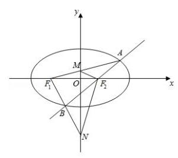

若 ${S}_{\bigtriangleup {F}_{1}{AB}} = {S}_{\bigtriangleup {F}_{1}{MN}}$ ,即 $2\left| {{y}_{1} - {y}_{2}}\right|  = \left| {{y}_{3} - {y}_{4}}\right|$ ,

$\left| {{y}_{3} - {y}_{4}}\right|  = \left| {\frac{2{y}_{1}}{{x}_{1} + 2} - \frac{2{y}_{2}}{{x}_{2} + 2}}\right|  = \left| {\frac{2{y}_{1}}{m{y}_{1} + 4} - \frac{2{y}_{2}}{m{y}_{2} + 4}}\right|$

$= \left| \frac{8\left( {{y}_{1} - {y}_{2}}\right) }{\left( {m{y}_{1} + 4}\right) \left( {m{y}_{2} + 4}\right) }\right|  = 2\left| {{y}_{1} - {y}_{2}}\right| ,$

所以 $\left| {\left( {m{y}_{1} + 4}\right) \left( {m{y}_{2} + 4}\right) }\right|  = 4,\left| {{m}^{2}{y}_{1}{y}_{2} + {4m}\left( {{y}_{1} + {y}_{2}}\right)  + {16}}\right|  = 4$ ,

代入根与系数的关系，得 $\left| {\frac{-4{m}^{2}}{{m}^{2} + 2} + {4m} \cdot  \frac{-{4m}}{{m}^{2} + 2} + {16}}\right|  = 4$ ，解得 $m = \; \pm  \sqrt{3}$ .

所以存在直线 $x + \sqrt{3}y - 2 = 0$ 或 $x - \sqrt{3}y - 2 = 0$ 满足题意. 2025 版上海高考真题及模拟训练合集(下册)

## B、翻译简化运算大题

【例题】1. (2023 上海春考) 椭圆 $\Gamma  : \frac{{x}^{2}}{{m}^{2}} + \frac{{y}^{2}}{3} = 1\left( {m > 0, m \neq  \sqrt{3}}\right)$ .

(1)若 $m = 2$ ，求椭圆 $\Gamma$ 的离心率；

(2)设 ${A}_{1},{A}_{2}$ 为椭圆 $\Gamma$ 的左右顶点，椭圆 $\Gamma$ 上一点 $E$ 的纵坐标为 1，且 $\overrightarrow{E{A}_{1}} \cdot  \overrightarrow{E{A}_{2}} =  - 2$ ，求 $m$ 的值;

(3) 过椭圆 $\Gamma$ 上一点 $P$ 作斜率为 $\sqrt{3}$ 的直线，与双曲线 $\frac{{y}^{2}}{5{m}^{2}} - \frac{{x}^{2}}{5} = 1$ 有一个公共点，求 $m$ 的取值范围.

【解析】(1) 若 $m = 2$ ,则 $a = 2,{c}^{2} = 4 - 3 = 1$ ,所以 $m = 2 \Rightarrow  a = 2,{c}^{2} = 4 - 3 = 1 \Rightarrow  c = 1 \Rightarrow$ ,离心率 $\mathrm{e} \; = \frac{1}{2}$ ;

(2)法一:设 $E\left( {{x}_{E},1}\right)$ ，代入椭圆 $\Gamma  : \frac{{x}^{2}}{{m}^{2}} + \frac{{y}^{2}}{3} = 1$ 方程得 ${x}_{E} =  \pm  \frac{\sqrt{6}}{3}m$ .

由对称性,不妨设 $M\left( {-\frac{\sqrt{6}}{3}m,1}\right) ,{A}_{1}\left( {-m,0}\right) ,{A}_{2}\left( {m,0}\right)$ ,

则 $\overrightarrow{E{A}_{1}} \cdot  \overrightarrow{E{A}_{2}} = \left( {-m + \frac{\sqrt{6}}{3}m, - 1}\right)  \cdot  \left( {m + \frac{\sqrt{6}}{3}m, - 1}\right)  =  - 2$ ,

得 $\left( {m + \frac{\sqrt{6}}{3}m, - 1}\right)  =  - 2 \Rightarrow  m = 3$ ;

法二: 设 ${A}_{1}\left( {-m,0}\right) ,{A}_{2}\left( {m,0}\right) , E\left( {{x}_{0},1}\right)$ ,

则 $\overrightarrow{E{A}_{1}} \cdot  \overrightarrow{E{A}_{2}} = \left( {\overrightarrow{EO} + \overrightarrow{O{A}_{1}}}\right)  \cdot  \left( {\overrightarrow{EO} + \overrightarrow{O{A}_{2}}}\right)  = {\overrightarrow{EO}}^{2} - \frac{1}{4}\overrightarrow{{A}_{1}{A}_{2}} =  - 2$ ,

得 ${x}_{0}^{2} + 1 - {m}^{2} =  - 2$ ,又点 $E$ 在椭圆上,故 $\frac{{x}_{0}^{2}}{{m}^{2}} + \frac{1}{3} = 1$ ,解得 $m =  \pm  3$ ,

又 $m > 0$ ,故 $m = 3$ .

(3) 法一:设过点 $P$ 的直线 $l : y = \sqrt{3}x + t$ ，

由 $\left\{  \begin{array}{l} y = \sqrt{3}x + t \\  \frac{{x}^{2}}{{m}^{2}} + \frac{{y}^{2}}{3} = 1 \end{array}\right.$ 得 $\left( {3 + 3{m}^{2}}\right) {x}^{2} + 2\sqrt{3}t{m}^{2}x + \left( {{t}^{2} - 3}\right) {m}^{2} = 0$ ,

所以 ${\Delta }_{1} = {12}{t}^{2}{m}^{4} - 4\left( {3 + 3{m}^{2}}\right)  \cdot  \left( {{t}^{2} - 3}\right) {m}^{2} \geq  0 \Rightarrow  {t}^{2} \leq  3{m}^{2} + 3$ ①,

同理,由 $\left\{  \begin{array}{l} y = \sqrt{3}x + t \\  \frac{{x}^{2}}{5{m}^{2}} - \frac{{y}^{2}}{5} = 1 \end{array}\right.$ 得 $\left( {3 - {m}^{2}}\right) {x}^{2} + 2\sqrt{3}t{m}^{2}x + \left( {{t}^{2} - 5{m}^{2}}\right)  = 0$ ,

${\Delta }_{2} = {12}{t}^{2} - 4\left( {3 - {m}^{2}}\right)  \cdot  \left( {{t}^{2} - 5{m}^{2}}\right)  = 0 \Rightarrow  {t}^{2} = 5{m}^{2} - {15}$ ②,

由①②得 $5{m}^{2} - {15} \leq  3{m}^{2} + 3 \Rightarrow  {m}^{2} \leq  9$ ，

又由②得 $\left\{  {\begin{array}{l} 5{m}^{2} - {15} \geq  0 \\  m \neq  \sqrt{3} \end{array} \Rightarrow  {m}^{2} > 3}\right.$ ，综上， $m \in  (\sqrt{3},3\rbrack$ .

法二: 记过 $P$ 所作的斜率为 $\sqrt{3}$ 的直线为 $l : y = \sqrt{3}x + t$ ,

对于双曲线 $\frac{{y}^{2}}{5{m}^{2}} - \frac{{x}^{2}}{5} = 1$ ,其渐近线方程为 $y =  \pm  {mx}$ ,又 $m \neq  \sqrt{3}$ ,

故所作直线 $l$ 不会与该渐近线平行或相交,

若 $0 < m < \sqrt{3}$ 时,直线 $l$ 与双曲线必有 2 个公共点;

若 $m > \sqrt{3}$ 时,由 $\left\{  \begin{array}{l} y = \sqrt{3}x + t \\  \frac{{y}^{2}}{5{m}^{2}} - \frac{{x}^{2}}{5} = 1 \end{array}\right.$ ,得 $\left( {3 - {m}^{2}}\right) {x}^{2} + 2\sqrt{3}{tx} + {t}^{2} - 5{m}^{2} = 0$ ,

${\Delta }_{1} = 0$ ,整理得 ${t}^{2} - 5{m}^{2} + {15} = 0\left( \mathrm{i}\right)$ ,

由 $\left\{  \begin{array}{l} y = \sqrt{3}x + t \\  \frac{{x}^{2}}{{m}^{2}} + \frac{{y}^{2}}{3} = 1 \end{array}\right.$ ,得 $\left( {3{m}^{2} + 3}\right) {x}^{2} + 2\sqrt{3}t{m}^{2}x + \left( {{t}^{2} - 3}\right) {m}^{2} = 0$ ,

${\Delta }_{2} \geq  0$ ,整理得 $3{m}^{2} - {t}^{2} + 3 \geq  0\left( {ii}\right)$ ,

由 (i) (ii) 得, $m \leq  3$ ,故 $\sqrt{3} < m \leq  3$ .

综上,实数 $m$ 的取值范围是 $(\sqrt{3},3\rbrack$ .

【例题】2. (2022 上海秋考) 已知 $\Gamma  : \frac{{x}^{2}}{{a}^{2}} + \frac{{y}^{2}}{{b}^{2}} = 1\left( {a > b > 0}\right)$ 的左、右焦点为 ${F}_{1}\left( {-\sqrt{2},0}\right) \text{ 、 }{F}_{2}\left( {\sqrt{2},0}\right)$ , $A$ 为 $\Gamma$ 的下顶点, $M$ 为直线 $l : x + y - 4\sqrt{2} = 0$ 上一点.

(1)若 $a = 2,{AM}$ 的中点在 $x$ 轴上，求点 $M$ 的坐标；

(2)直线 $l$ 交 $y$ 轴于点 $B$ ，直线 ${AM}$ 经过点 ${F}_{2}$ ，若 $\bigtriangleup  {ABM}$ 有一个内角的余弦值为 $\frac{3}{5}$ ，求 $b$ ；

(3)若椭圆 $\Gamma$ 上存在点 $P$ 到直线 $l$ 的距离为 $d$ ，且满足 $d + \left| {P{F}_{1}}\right|  + \left| {P{F}_{2}}\right|  = 6$ ，当 $a$ 变化时，求 $d$ 的最小值.

【解析】(1) 设 $M$ 为 $\left( {x,4\sqrt{2} - x}\right)$ ,线段 ${AM}$ 的中点坐标为 $E\left( {\mathrm{e},0}\right)$ ,

由题意得 $A\left( {0, - \sqrt{2}}\right)$ ,利用中点坐标公式得 $x = 3\sqrt{2}$ ,所以有 $M\left( {3\sqrt{2},\sqrt{2}}\right)$ ;

(2)情况一:当 $\cos \angle {MAB} = \frac{3}{5}$ 时，有 $\tan \angle {F}_{2}{AO} = \frac{O{F}_{2}}{OA} = \frac{4}{3} = \frac{\sqrt{2}}{b}$ ，

解得 $b = \frac{3}{4}\sqrt{2}$ ，

情况二: 当 $\cos \angle {AMB} = \frac{3}{5}$ 时，有 $\cos \angle {MAB} = \cos \left( {\pi  - \angle {AMB} - \angle {ABM}}\right) \; \cos \angle {MAB} = \cos \left( {\pi  - \angle {AMB} - \angle {ABM}}\right)  =  - \cos \left( {\angle {AMB} + \angle {ABM}}\right)  =  - \left( {\frac{3}{5} \cdot  \frac{\sqrt{2}}{2} - \frac{4}{5} \cdot  \frac{\sqrt{2}}{2}}\right)  = \; \frac{\sqrt{2}}{10}$ ,

所以 $\cos \angle {MAB} = \frac{\sqrt{2}}{10} = \frac{b}{\sqrt{2 + {b}^{2}}}$ ，解得 $b = \frac{\sqrt{2}}{7}$ ，

综上所述， $b = \frac{3}{4}\sqrt{2}$ 或 $\frac{\sqrt{2}}{7}$ ；

(3)因为 $d + \left| {P{F}_{1}}\right|  + \left| {P{F}_{2}}\right|  = 6$ ，所以 $d + {2a} = 6$ ，即 $d = 6 - {2a}$ ，

下面判断 $a$ 的范围:

因为 $d \geq  0$ ，所以 $a \leq  3$ ，所以 $\sqrt{2} < a \leq  3$ ，

设 $P\left( {a\cos \alpha , b\sin \alpha }\right)$ ,

得 $d = \frac{\left| a\cos \alpha  + b\sin \alpha  - 4\sqrt{2}\right| }{\sqrt{2}} = \frac{\left| \sqrt{{a}^{2} + {b}^{2}}\sin \left( \alpha  + \varphi \right)  - 4\sqrt{2}\right| }{\sqrt{2}}$

$= \frac{\left| \sqrt{2{a}^{2} - 2}\sin \left( \alpha  + \varphi \right)  - 4\sqrt{2}\right| }{\sqrt{2}} = \left| {\sqrt{{a}^{2} - 1}\sin \left( {\alpha  + \varphi }\right)  - 4}\right| ,$

因为 $\sqrt{2} < a \leq  3$ ,所以 $\sqrt{{a}^{2} - 1}\sin \left( {\alpha  + \varphi }\right)  < \sqrt{{a}^{2} - 1} \leq  2\sqrt{2} < 4$ ,

所以 $d = 4 - \sqrt{{a}^{2} - 1}\sin \left( {\alpha  + \varphi }\right)  = 6 - {2a}$ ,

法一:若使得 $d$ 最小，可令 $\sin \left( {\alpha  + \varphi }\right)  = 1$ ，

此时 ${d}_{\min } = 4 - \sqrt{{a}^{2} - 1} = 6 - {2a}$ 是必要条件,解得 $a = \frac{5}{3}$ ,

经检验 $\frac{5}{3} \in  (\sqrt{2},3\rbrack$ ,所以 ${d}_{\min } = \frac{8}{3}$ .

法二: 因为 $4 - \sqrt{{a}^{2} - 1} \leq  d = 6 - {2a} \leq  4 + \sqrt{{a}^{2} - 1}$ ,

所以 ${2a} - 2 \leq  \sqrt{{a}^{2} - 1}1 \leq  a \leq  \frac{5}{3}$ ，解得 $\sqrt{2} < a \leq  \frac{5}{3}$ ，所以 ${d}_{\min } = \frac{8}{3}$ .

【例题】3. (2020 上海秋考)已知双曲线 ${\Gamma }_{1} : \frac{{x}^{2}}{4} - \frac{{y}^{2}}{{b}^{2}} = 1$ 与圆 ${\Gamma }_{2} : {x}^{2} + {y}^{2} = 4 + {b}^{2}\left( {b > 0}\right)$ 交于点 $A\left( {x}_{A}\right.$ , $\left. {y}_{A}\right)$ (第一象限),曲线 $\Gamma$ 为 ${\Gamma }_{1}\text{ 、 }{\Gamma }_{2}$ 上取满足 $x > \left| {x}_{A}\right|$ 的部分.

(1)若 ${x}_{A} = \sqrt{6}$ ，求 $b$ 的值；

(2) 当 $b = \sqrt{5},{\Gamma }_{2}$ 与 $x$ 轴交点记作点 ${F}_{1}\text{ 、 }{F}_{2}, P$ 是曲线 $\Gamma$ 上一点,且在第一象限,且 $\left| {P{F}_{1}}\right|  = 8$ ,求 $\angle {F}_{1}P{F}_{2}$ ;

(3)过点 $D\left( {0,\frac{{b}^{2}}{2} + 2}\right)$ 斜率为 $- \frac{b}{2}$ 的直线 $l$ 与曲线 $\Gamma$ 只有两个交点,记为 $M\text{ 、 }N$ ,用 $b$ 表示 $\overrightarrow{OM} \; \cdot  \overrightarrow{ON}$ ,并求 $\overrightarrow{OM} \cdot  \overrightarrow{ON}$ 的取值范围.

【解析】(1) 由 ${x}_{A} = \sqrt{6}$ ,点 $A$ 为曲线 ${\Gamma }_{1}$ 与曲线 ${\Gamma }_{2}$ 的交点,

联立 $\left\{  \begin{array}{l} \frac{{x}_{A}^{2}}{4} - \frac{{y}_{A}^{2}}{{b}^{2}} = 1 \\  {x}_{A}^{2} + {y}_{A}^{2} = 4 + {b}^{2} \end{array}\right.$ ,解得 ${y}_{A} = \sqrt{2}, b = 2$ ;

(2)由题意得 ${F}_{1}\text{ 、 }{F}_{2}$ 为曲线 ${\Gamma }_{1}$ 的两个焦点，

由双曲线的定义得 $\left| {P{F}_{1}}\right|  - \left| {P{F}_{2}}\right|  = {2a}$ ,又 $\left| {P{F}_{1}}\right|  = 8,{2a} = 4$ ,

所以 $\left| {P{F}_{2}}\right|  = 8 - 4 = 4$ ,因为 $b = \sqrt{5}$ ,则 $c = \sqrt{4 + 5} = 3$ ,所以 $\left| {{F}_{1}{F}_{2}}\right|  = 6$ ,

在 $\bigtriangleup P{F}_{1}{F}_{2}$ 中,由余弦定理得 $\cos \angle {F}_{1}P{F}_{2} = \frac{{\left| P{F}_{1}\right| }^{2} + {\left| P{F}_{2}\right| }^{2} - {\left| {F}_{1}{F}_{2}\right| }^{2}}{2\left| {P{F}_{1}}\right|  \cdot  \left| {P{F}_{2}}\right| }$

$= \frac{{64} + {16} - {36}}{2 \times  8 \times  4} = \frac{11}{16}$ ,由 $0 < \angle {F}_{1}P{F}_{2} < \pi$ ,得 $\angle {F}_{1}P{F}_{2} = \arccos \frac{11}{16}$ ;

(3) 设直线 $l : y =  - \frac{b}{2}x + \frac{4 + {b}^{2}}{2}$ ，原点 $O$ 到直线 $l$ 的距离 $d = \frac{\left| \frac{4 + {b}^{2}}{2}\right| }{\sqrt{1 + \frac{{b}^{2}}{4}}} = \sqrt{4 + {b}^{2}}$ ，

所以直线 $l$ 是圆的切线,设切点为 $M$ ,

所以 ${k}_{OM} = \frac{2}{b}$ ,并设 ${OM} : y = \frac{2}{b}x$ 与圆 ${x}^{2} + {y}^{2} = 4 + {b}^{2}$ 联立,

得 ${x}^{2} + \frac{4}{{b}^{2}}{x}^{2} = 4 + {b}^{2}$ ,得 $x = b, y = 2$ ,即 $M\left( {b,2}\right)$ ,

注意直线 $l$ 与双曲线的斜率为负的渐近线平行,

所以只有当 ${y}_{A} > 2$ 时,直线 $l$ 才能与曲线 $\Gamma$ 有两个交点,

由 $\left\{  \begin{array}{l} \frac{{x}_{A}^{2}}{4} - \frac{{y}_{A}^{2}}{{b}^{2}} = 1 \\  {x}_{A}^{2} + {y}_{A}^{2} = 4 + {b}^{2} \end{array}\right.$ ,得 ${y}_{A}^{2} = \frac{{b}^{4}}{a + {b}^{2}}$ ,

所以 $4 < \frac{{b}^{4}}{4 + {b}^{2}}$ ,解得 ${b}^{2} > 2 + 2\sqrt{5}$ 或 ${b}^{2} < 2 - 2\sqrt{5}$ (舍去),

因为 $\overrightarrow{OM}$ 为 $\overrightarrow{ON}$ 在 $\overrightarrow{OM}$ 上的投影，所以 $\overrightarrow{OM} \cdot  \overrightarrow{ON} = 4 + {b}^{2}$ ，

所以 $\overrightarrow{OM} \cdot  \overrightarrow{ON} = 4 + {b}^{2} > 6 + 2\sqrt{5}$ ,则 $\overrightarrow{OM} \cdot  \overrightarrow{ON} \in  \left( {6 + 2\sqrt{5}, + \infty }\right)$ .

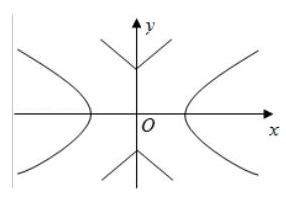

【例题】4. (2013 上海秋考) 如图,已知双曲线 ${C}_{1} : \frac{{x}^{2}}{2} - {y}^{2} = 1$ ,曲线 ${C}_{2} : \left| y\right|  = \; \left| x\right|  + 1, P$ 是平面内一点,若存在过点 $P$ 的直线与 ${C}_{1},{C}_{2}$ 都有公共点,则称 $P$ 为 “ ${C}_{1} - {C}_{2}$ 型点”

(1)在正确证明 ${C}_{1}$ 的左焦点是 “ ${C}_{1} - {C}_{2}$ 型点 “时，要使用一条过该焦点

的直线,试写出一条这样的直线的方程 (不要求验证);

(2) 设直线 $y = {kx}$ 与 ${C}_{2}$ 有公共点,求证 $\left| k\right|  > 1$ ，进而证明原点不是 “ ${C}_{1} - {C}_{2}$ 型点”；

(3) 求证: 圆 ${x}^{2} + {y}^{2} = \frac{1}{2}$ 内的点都不是 “ ${C}_{1} - {C}_{2}$ 型点”

【解析】 $\left( 1\right) {C}_{1}$ 的左焦点为 $\left( {-\sqrt{3},0}\right)$ ,写出的直线方程可以是以下形式:

$x =  - \sqrt{3}$ 或 $y = k\left( {x + \sqrt{3}}\right)$ ，其中 $\left| k\right|  \geq  \frac{\sqrt{3}}{3}$ .

(2) 因为直线 $y = {kx}$ 与 ${C}_{2}$ 有公共点，

所以方程组 $\left\{  \begin{array}{l} y = {kx} \\  \left| y\right|  = \left| x\right|  + 1 \end{array}\right.$ 有实数解,因此 $\left| {kx}\right|  = \left| x\right|  + 1$ ,得 $\left| k\right|  = \frac{\left| x\right|  + 1}{\left| x\right| } > 1$ .

若原点是 “ ${C}_{1} - {C}_{2}$ 型点”,则存在过原点的直线与 ${C}_{1}\text{ 、 }{C}_{2}$ 都有公共点.

考虑过原点与 ${C}_{2}$ 有公共点的直线 $x = 0$ 或 $y = {kx}\left( {\left| k\right|  > 1}\right)$ .

显然直线 $x = 0$ 与 ${C}_{1}$ 无公共点.

如果直线为 $y = {kx}\left( {\left| k\right|  > 1}\right)$ ,由 $\left\{  \begin{array}{l} y = {kx} \\  \frac{{x}^{2}}{2} - {y}^{2} = 1 \end{array}\right.$ ,得 ${x}^{2} = \frac{2}{1 - 2{k}^{2}} < 0$ ,矛盾.

所以直线 $y = {kx}\left( {\left| k\right|  > 1}\right)$ 与 ${C}_{1}$ 也无公共点,因此原点不是 “ ${C}_{1} - {C}_{2}$ 型点”.

(3) 记圆 $O : {x}^{2} + {y}^{2} = \frac{1}{2}$ ,取圆 $O$ 内的一点 $Q$ ,

设有经过 $Q$ 的直线 $l$ 与 ${C}_{1}\text{ 、 }{C}_{2}$ 都有公共点,显然 $l$ 不与 $x$ 轴垂直,

故可设 $l : y = {kx} + b$ .

若 $\left| k\right|  \leq  1$ ,由于圆 $O$ 夹在两组平行线 $y = x \pm  1$ 与 $y =  - x \pm  1$ 之间,

因此圆 $O$ 也夹在直线 $y = {kx} \pm  1$ 与 $y =  - {kx} \pm  1$ 之间，

从而过 $Q$ 且以 $k$ 为斜率的直线 $l$ 与 ${C}_{2}$ 无公共点,矛盾,所以 $\left| k\right|  > 1$ .

因为 $l$ 与 ${C}_{1}$ 由公共点,所以方程组 $\left\{  \begin{array}{l} y = {kx} + b \\  \frac{{x}^{2}}{2} - {y}^{2} = 1 \end{array}\right.$ 有实数解,

得 $\left( {1 - 2{k}^{2}}\right) {x}^{2} - {4kbx} - 2{b}^{2} - 2 = 0$ .

因为 $\left| k\right|  > 1$ ,所以 $1 - 2{k}^{2} \neq  0$ ,

因此 $\Delta  = {\left( 4kb\right) }^{2} - 4\left( {1 - 2{k}^{2}}\right) \left( {-2{b}^{2} - 2}\right)  = 8\left( {{b}^{2} + 1 - 2{k}^{2}}\right)  \geq  0$ ,即 ${b}^{2} \geq  2{k}^{2} - 1$ .

因为圆 $O$ 的圆心 $\left( {0,0}\right)$ 到直线 $l$ 的距离 $d = \frac{\left| b\right| }{\sqrt{1 + {k}^{2}}}$ ,

所以 $\frac{{b}^{2}}{1 + {k}^{2}} = {d}^{2} < \frac{1}{2}$ ,从而 $\frac{1 + {k}^{2}}{2} > {b}^{2} \geq  2{k}^{2} - 1$ ,得 ${k}^{2} < 1$ ,与 $\left| k\right|  > 1$ 矛盾.

因此圆 ${x}^{2} + {y}^{2} = \frac{1}{2}$ 内的点不是 “ ${C}_{1} - {C}_{2}$ 型点”.

【例题】5. (2010 上海春考) 在平面上,给定非零向量 $\overrightarrow{b}$ ,对任意向量 $\overrightarrow{a}$ ,定义 $\overrightarrow{{a}^{\prime }} = \overrightarrow{a} - \frac{2\left( {\overrightarrow{a} \cdot  \overrightarrow{b}}\right) }{{\left| \overrightarrow{b}\right| }^{2}}\overrightarrow{b}$ .

(1) 若 $\overrightarrow{a} = \left( {2,3}\right) ,\overrightarrow{b} = \left( {-1,3}\right)$ ,求 $\overrightarrow{{a}^{\prime }}$ ;

( 2 )若 $\overrightarrow{b} = \left( {2,1}\right)$ ，证明:若位置向量 $\overrightarrow{a}$ 的终点在直线 ${Ax} + {By} + C = 0$ 上，则位置向量 $\overrightarrow{{a}^{\prime }}$ 的终点也在一条直线上;

(3)已知存在单位向量 $\overrightarrow{b}$ ，当位置向量 $\overrightarrow{a}$ 的终点在抛物线 $C : {x}^{2} = y$ 上时，位置向量 $\overrightarrow{{a}^{\prime }}$ 终点总在抛物线 ${C}^{\prime } : {y}^{2} = x$ 上,曲线 $C$ 和 ${C}^{\prime }$ 关于直线 $l$ 对称,问直线 $l$ 与向量 $\overrightarrow{b}$ 满足什么关系?

【解析】(1) 因为 $\overrightarrow{a} = \left( {2,3}\right) ,\overrightarrow{b} = \left( {-1,3}\right)$ ,

所以 $\overrightarrow{a} \cdot  \overrightarrow{b} = 7,{\left| \overrightarrow{b}\right| }^{2} = {10}$ ,得 $\frac{2\left( {\overrightarrow{a} \cdot  \overrightarrow{b}}\right) }{{\left| \overrightarrow{b}\right| }^{2}}\overrightarrow{b} = \frac{2 \times  7}{10}\left( {-1,3}\right)  = \left( {-\frac{7}{5},\frac{21}{5}}\right)$ ,

因此 $\overrightarrow{{a}^{\prime }} = \overrightarrow{a} - \frac{2\left( {\overrightarrow{a} \cdot  \overrightarrow{b}}\right) }{{\left| \overrightarrow{b}\right| }^{2}}\overrightarrow{b} = \left( {2,3}\right)  - \left( {-\frac{7}{5},\frac{21}{5}}\right)  = \left( {\frac{17}{5}, - \frac{6}{5}}\right)$ ;

(2)设 $\overrightarrow{a} = \left( {{x}^{\prime },{y}^{\prime }}\right)$ ，终点在直线 ${Ax} + {By} + C = 0$ 上，

则 $\overrightarrow{a} \cdot  \overrightarrow{b} = 2{x}^{\prime } + {y}^{\prime },{\left| \overrightarrow{b}\right| }^{2} = 5$ ，

$\frac{2\left( {\overrightarrow{a} \cdot  \overrightarrow{b}}\right) }{{\left| \overrightarrow{b}\right| }^{2}}\overrightarrow{b} = \frac{2\left( {2{x}^{\prime } + {y}^{\prime }}\right) }{5}\left( {2,1}\right)  = \left( {\frac{8{x}^{\prime } + 4{y}^{\prime }}{5},\frac{4{x}^{\prime } + 2{y}^{\prime }}{5}}\right) ,$

所以 $\overrightarrow{{a}^{\prime }} = \overrightarrow{a} - \frac{2\left( {\overrightarrow{a} \cdot  \overrightarrow{b}}\right) }{{\left| \overrightarrow{b}\right| }^{2}}\overrightarrow{b} = \left( {{x}^{\prime },{y}^{\prime }}\right)  - \left( {\frac{8{x}^{\prime } + 4{y}^{\prime }}{5},{y}^{\prime }}\right)  - \left( {\frac{8{x}^{\prime } + 4{y}^{\prime }}{5},\frac{4{x}^{\prime } + 2{y}^{\prime }}{5}}\right)  = \; \left( {\frac{-3{x}^{\prime } - 4{y}^{\prime }}{5},\frac{-4{x}^{\prime } + 3{y}^{\prime }}{5}}\right) ,$

因此,若 $\overrightarrow{{a}^{\prime }} = \left( {x, y}\right)$ ,满足 $\left\{  \begin{array}{l} x = \frac{-3{x}^{\prime } - 4{y}^{\prime }}{5} \\  y = \frac{-4{x}^{\prime } + 3{y}^{\prime }}{5} \end{array}\right.$ ,得 $\left\{  \begin{array}{l} {x}^{\prime } = \frac{-{3x} - {4y}}{5} \\  {y}^{\prime } = \frac{-{4x} + {3y}}{5} \end{array}\right.$ ,

因为点 $\left( {\frac{-{3x} - {4y}}{5},\frac{-{4x} + {3y}}{5}}\right)$ 在直线 ${Ax} + {By} + C = 0$ 上,

所以 $A \times  \frac{-{3x} - {4y}}{5} + B \times  \frac{-{4x} + {3y}}{5} + C = 0$ ,

化简得 $\left( {{3A} + {4B}}\right) x + \left( {{4A} - {3B}}\right) y - {5C} = 0$ ,

由 $A\text{ 、 }B$ 不全为零,得以上方程是一条直线的方程

即向量 $\overrightarrow{{a}^{\prime }}$ 的终点也在一条直线上;

(3)因为 $\overrightarrow{b}$ 是单位向量，

所以设 $\overrightarrow{a} = \left( {x, y}\right) ,\overrightarrow{b} = \left( {\cos \theta ,\sin \theta }\right)$ ,得 $\overrightarrow{a} \cdot  \overrightarrow{b} = x\cos \theta  + y\sin \theta$ ,

所以 $\overrightarrow{{a}^{\prime }} = \overrightarrow{a} - \frac{2\left( {\overrightarrow{a} \cdot  \overrightarrow{b}}\right) }{{\left| \overrightarrow{b}\right| }^{2}}\overrightarrow{b} = \overrightarrow{a} - 2\left( {x\cos \theta  + y\sin \theta }\right) \overrightarrow{b}$

$= \left( {-x\cos {2\theta } - y\sin {2\theta }, - x\sin {2\theta } + y\cos {2\theta }}\right)$ ,

因为 $\overrightarrow{a}$ 的终点在抛物线 ${x}^{2} = y$ 上,且 $\overrightarrow{{a}^{\prime }}$ 终点在抛物线 ${y}^{2} = x$ 上,

所以 $- x\cos {2\theta } - y\sin {2\theta } = {\left( -x\sin 2\theta  + y\cos 2\theta \right) }^{2}$ ,

化简整理,通过比较系数得 $\cos \theta  = \frac{\sqrt{2}}{2},\sin \theta  =  - \frac{\sqrt{2}}{2}$

或 $\cos \theta  =  - \frac{\sqrt{2}}{2},\sin \theta  = \frac{\sqrt{2}}{2}$ ,所以 $\overrightarrow{b} =  \pm  \left( {-\frac{\sqrt{2}}{2},\frac{\sqrt{2}}{2}}\right)$ ,

因为曲线 $C$ 和 ${C}^{\prime }$ 关于直线 $l : y = x$ 对称,所以 $l$ 的方向向量 $\overrightarrow{d} = \left( {1,1}\right)$ .

得 $\overrightarrow{d} \cdot  \overrightarrow{b} = 0$ ,即 $\overrightarrow{d} \bot  \overrightarrow{b}$ ,因此直线 $l$ 与向量 $\overrightarrow{b}$ 垂直. 2025 版上海高考真题及模拟训练合集(下册)

## C、参数方程计算大题

【例题】1. (2025 上海春考) 在平面直角坐标系中,已知曲线 $\Gamma  : \frac{{x}^{2}}{4} + {y}^{2} = 1\left( {y \geq  0}\right)$ ,点 $P, Q$ 分别为 $\Gamma$ 上不同的两点, $T\left( {t,0}\right)$ .

(1)求 $\Gamma$ 所在椭圆的离心率；

(2)若 $T\left( {1,0}\right)$ ， $Q$ 在 $y$ 轴上，若 $T$ 到直线 ${PQ}$ 的距离为 $\frac{\sqrt{5}}{5}$ ，求 $P$ 的坐标；

(3)是否存在 $t$ ，使得 $\bigtriangleup  {TPQ}$ 是以 $T$ 为直角顶点的等腰直角三角形？若存在，求 $t$ 的取值范围； 若不存在，请说明理由.

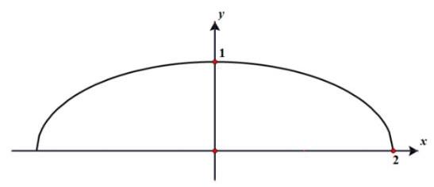

【解析】(1) 由题意得, $a = 2, c = \sqrt{3}$ ,所以椭圆的离心率 $\mathrm{e} = \frac{\sqrt{3}}{2}$ ;

(2) 由题意得,点 $Q$ 的坐标为 $\left( {0,1}\right)$ ,设点 $T$ 到直线 ${PQ}$ 的距离为 $d$ .

当直线 ${PQ}$ 的斜率不存在时, $d = 1$ ,不合题意;

当直线 ${PQ}$ 的斜率存在时,设 ${PQ}$ 的方程为 $y = {kx} + 1$ ,则 $d = \frac{\left| k + 1\right| }{\sqrt{{k}^{2} + 1}} = \frac{\sqrt{5}}{5}$ ,解得 $k =  - 2$ 或 $k \; =  - \frac{1}{2}$ .

当 $k =  - 2$ 时,联立 $\left\{  \begin{array}{l} y =  - {2x} + 1 \\  {x}^{2} + 4{y}^{2} = 4 \end{array}\right.$ ,解得 $\left\{  \begin{array}{l} x = 0 \\  y = 1 \end{array}\right.$ 或 $\left\{  \begin{array}{l} x = \frac{16}{17} \\  y =  - \frac{15}{17} \end{array}\right.$ ,不符合题意,舍去;

当 $k =  - \frac{1}{2}$ 时,联立 $\left\{  \begin{array}{l} y =  - \frac{1}{2}x + 1 \\  {x}^{2} + 4{y}^{2} = 4 \end{array}\right.$ ,解得 $\left\{  \begin{array}{l} x = 0 \\  y = 1 \end{array}\right.$ 或 $\left\{  \begin{array}{l} x = 2 \\  y = 0 \end{array}\right.$ ,符合题意;

综上所述: 点 $P$ 的坐标为 $\left( {2,0}\right)$ .

(3) 存在.

法一:不妨设点 $P$ 在点 $Q$ 的右侧，设 $\left| {PT}\right|  = \left| {QT}\right|  = r$ ，直线 ${PT}$ 的倾斜角为 $\alpha  \in  \left\lbrack  {0,\frac{\pi }{2}}\right\rbrack$ ，则点 $P$ 的坐标为 $\left( {t + r\cos \alpha , r\sin \alpha }\right)$ ,点 $Q$ 的坐标为 $\left( {t - r\sin \alpha , r\cos \alpha }\right)$ .

将点 $P, Q$ 的坐标代入椭圆方程,得 $\left\{  \begin{array}{l} {\left( t + r\cos \alpha \right) }^{2} + 4{r}^{2}{\sin }^{2}\alpha  = 4\cdots \\  {\left( t - r\sin \alpha \right) }^{2} + 4{r}^{2}{\cos }^{2}\alpha  = 4\cdots  \end{array}\right.$① ②

①-②，得 $3\left( {\cos \alpha  - \sin \alpha }\right) r = {2t}$ .

当 $\alpha  = \frac{\pi }{4}$ 时， $t = 0$ ；当 $\alpha  \neq  \frac{\pi }{4}$ 时， $r = \frac{2t}{3\left( {\cos \alpha  - \sin \alpha }\right) }$

① + ②,得 $2{t}^{2} + {2tr}\left( {\cos \alpha  - \sin \alpha }\right)  + 5{r}^{2} = 8\cdots \cdots$ ④

将③代入④，化简得 ${t}^{2} = \frac{36}{{15} + \frac{10}{{\left( \cos \alpha  - \sin \alpha \right) }^{2}}}$ .

又 $\alpha  \in  \left\lbrack  {0,\frac{\pi }{2}}\right\rbrack$ ,所以 ${\left( \cos \alpha  - \sin \alpha \right) }^{2} \in  (0,1\rbrack$ ,所以 ${t}^{2} \leq  \frac{36}{{15} + {10}} = \frac{36}{25}$ ,解得 $t \in  \left\lbrack  {-\frac{6}{5},\frac{6}{5}}\right\rbrack$ .

法二:不妨设点 $P$ 在点 $Q$ 的右侧，设 $\overrightarrow{TP} = \left( {m, n}\right)$ ， $\overrightarrow{TQ} = \left( {-n, m}\right)$ ，其中 $m \geq  0$ ， $n \geq  0$ ， 则点 $P$ 的坐标为 $\left( {t + m, n}\right)$ ，点 $Q$ 的坐标为 $\left( {t - n, m}\right)$ .

将点 $P, Q$ 代入椭圆方程,得 $\left\{  \begin{array}{l} {\left( t + m\right) }^{2} + 4{n}^{2} = 4\cdots \cdots \left( 1\right) \\  {\left( t - n\right) }^{2} + 4{m}^{2} = 4\cdots \cdots \left( 2\right)  \end{array}\right.$

①-②，得 $m - n = \frac{2}{3}t$ ，将 $m = \frac{2}{3}t + n$ 代入 ①，化简得 ${n}^{2} + \frac{2}{3}{tn} + \frac{5}{9}{t}^{2} - \frac{4}{5} = 0$ .

设该方程的两根 ${n}_{1},{n}_{2}$ ,则 ${n}_{1} + {n}_{2} =  - \frac{2}{3}t = n - m$ ,因此该方程的两根为 $n, - m$ ,所以两根之积 $- {nm} = {n}_{1} \cdot  {n}_{2} = \frac{5}{9}{t}^{2} - \frac{4}{5} \leq  0$ ,解得 $t \in  \left\lbrack  {-\frac{6}{5},\frac{6}{5}}\right\rbrack$ . 经检验，此时判别式大于零.

综上所述: $t \in  \left\lbrack  {-\frac{6}{5},\frac{6}{5}}\right\rbrack$ .

法三: (填选题可用,极限思想) 不妨设点 $P$ 在点 $Q$ 的右侧,当点 $T$ 从左侧非常靠近长轴右端点时,显然图中 $\left| {PT}\right|  < \left| {QT}\right|$ ,因此我们只要计算当点 $P$ 刚好在长轴右端点时,点 $T$ 位于何处,能刚好形成等腰直角三角形 (临界状态).

此时则点 $T$ 的坐标为 $\left( {t,0}\right)$ ,点的 $P$ 坐标为 $\left( {2,0}\right)$ ,点 $Q$ 的坐标为 $\left( {t,\sqrt{1 - \frac{{t}^{2}}{4}}}\right)$ ,所以 $2 - t = \; \sqrt{1 - \frac{{t}^{2}}{4}}$ ,解得 $t = \frac{6}{5}$ ,所以答案为 $t \in  \left\lbrack  {-\frac{6}{5},\frac{6}{5}}\right\rbrack$ .

法四: 设直线 ${l}_{PQ} : x = {my} + n$ ,(反设是因为 ${y}_{1},{y}_{2} \geq  0$ ,需要得到关于 $y$ 的方程)

与曲线 $\Gamma$ 联立,有 $\left\{  {\begin{array}{l} x = {my} + n \\  \frac{{x}^{2}}{4} + {y}^{2} = 1 \end{array} \Rightarrow  \left( {{m}^{2} + 4}\right) {y}^{2} + {2mny} + {n}^{2} - 4 = 0}\right.$

$\Delta  = {16}\left( {{m}^{2} - {n}^{2} + 4}\right) ,{y}_{1} + {y}_{2} = \frac{-{2mn}}{{m}^{2} + 4} > 0,{y}_{1}{y}_{2} = \frac{{n}^{2} - 4}{{m}^{2} + 4} \geq  0 \Rightarrow  {n}^{2} \geq  4$

且中点 $M\left( {\frac{4n}{{m}^{2} + 4},\frac{-{mn}}{{m}^{2} + 4}}\right)$ ,则 ${k}_{TM} = \frac{\frac{-{mn}}{{m}^{2} + 4}}{\frac{4n}{{m}^{2} + 4} - t} =  - m$ ,

化简后得: $\left( {{m}^{2} + 4}\right) t = {3n}$ ,即 ${m}^{2} + 4 = \frac{3n}{t}$

同时, ${PQ} = {2MT} = {2d}$

而 ${PQ} = \sqrt{1 + {m}^{2}} \cdot  \frac{4 \cdot  \sqrt{{m}^{2} - {n}^{2} + 4}}{{m}^{2} + 4},{MT} = {2d} = 2\frac{\left| t - n\right| }{\sqrt{1 + {m}^{2}}}$

所以 $\sqrt{1 + {m}^{2}} \cdot  \frac{4 \cdot  \sqrt{{m}^{2} - {n}^{2} + 4}}{{m}^{2} + 4} = 2\frac{\left| t - n\right| }{\sqrt{1 + {m}^{2}}}$

即 $2\left( {1 + {m}^{2}}\right) \frac{\sqrt{{m}^{2} - {n}^{2} + 4}}{{m}^{2} + 4} = \left| {t - n}\right|$ ,

因为 $n$ 有范围,所以下面需消去 $m$ ,建立 $n, t$ 的直接关系式

则 $2\left( {\frac{3n}{t} - 3}\right) \frac{\sqrt{\frac{3n}{t} - {n}^{2}}}{\frac{3n}{t}} = \left| {t - n}\right|$

即 $2\left( {n - t}\right) \sqrt{\frac{{3n} - t{n}^{2}}{t}} = \left| {t - n}\right|  \cdot  n$ ,

平方后得, $t = \frac{12}{5n}$ ,因为 $\left| n\right|  \geq  2$ ,所以 $t \in  \left\lbrack  {-\frac{5}{6},0}\right)  \cup  \left( {0,\frac{5}{6}}\right\rbrack$

又因为 $t = 0$ 显然成立,所以 $t \in  \left\lbrack  {-\frac{5}{6},\frac{5}{6}}\right\rbrack$

如图，不妨设点 $P\left( {2\cos \alpha ,\sin \alpha }\right)$ ， $Q\left( {2\cos \beta ,\sin \beta }\right)$ ， $\left( {0 \leq  \alpha  < \beta  \leq  \pi }\right)$ ，

点 $A$ 、 $B$ 是点 $P$ 、 $Q$ 在 $x$ 轴上的投影，

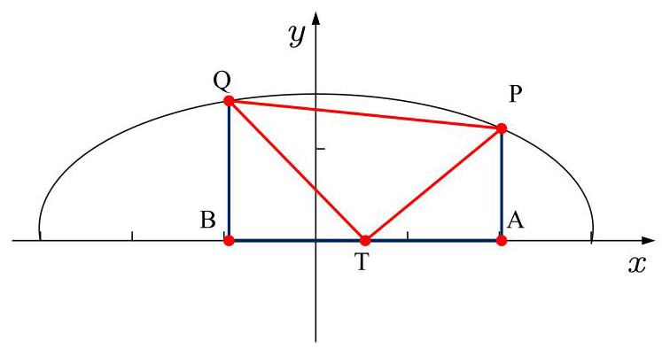

因为 $\bigtriangleup {PTQ}$ 是等腰直角三角形,所以可得 $\bigtriangleup {PAT} \cong  \bigtriangleup {TBQ}$ ,

因此 $\left| {AT}\right|  = \left| {BQ}\right| ,\left| {AP}\right|  = \left| {BT}\right|$ ,于是 $\left\{  \begin{array}{l} 2\cos \alpha  - t = \sin \beta ,\left( 1\right) \\  t - 2\cos \beta  = \sin \alpha ,\left( 2\right)  \end{array}\right.$ ,

两式相加可得: $2\cos \alpha  - 2\cos \beta  = \sin \alpha  + \sin \beta$ ,

由和差化积公式可得: $- 4\sin \frac{\alpha  + \beta }{2}\sin \frac{\alpha  - \beta }{2} = \sin \frac{\alpha  + \beta }{2}\cos \frac{\alpha  - \beta }{2}$ ,

由 $0 < \frac{\beta  + \alpha }{2} < \pi ,0 < \beta  - \alpha  < \pi$ ,可知

$\tan \frac{\beta  - \alpha }{2} = \frac{1}{2} \Rightarrow  \sin \left( {\beta  - \alpha }\right)  = \frac{4}{5},\cos \left( {\beta  - \alpha }\right)  = \frac{3}{5}$ ,且 $\beta  - \alpha  = \arccos \frac{3}{5}$ ,

由 (1) 式可得: $t = 2\cos \alpha  - \sin \beta  = 2\cos \left( {\alpha  - \beta }\right)  + \beta  - \sin \beta$

$= 2\cos \left( {\alpha  - \beta }\right) \cos \beta  - 2\sin \left( {\alpha  - \beta }\right) \sin \beta  - \sin \beta$

$= \frac{3}{5}\sin \beta  + \frac{6}{5}\cos \beta$

由辅助角公式可知: $t = \frac{3\sqrt{5}}{5}\sin \left( {\beta  + \arctan 2}\right)$ ;

因为 $\beta  - \alpha  = \arccos \frac{3}{5}$ ,所以 $\arccos \frac{3}{5} \leq  \beta  \leq  \pi$ ,且 $\frac{\pi }{2} < \beta  + \arctan 2 < \frac{3\pi }{2}$ ,

于是 $t = \frac{3\sqrt{5}}{5}\sin \left( {\beta  + \arctan 2}\right)$ 是 $\beta$ 的严格减函数,

当 $\cos \beta  = \frac{3}{5},\sin \beta  = \frac{4}{5}$ 时, ${t}_{\max } = \frac{3}{5}\sin \beta  + \frac{6}{5}\cos \beta  = \frac{3}{5} \times  \frac{4}{4} + \frac{6}{5} \times  \frac{3}{5} = \frac{6}{5}$ ;

当 $\cos \beta  =  - 1,\sin \beta  = 0$ 时, ${t}_{\min } = \frac{3}{5}\sin \beta  + \frac{6}{5}\cos \beta  = \frac{3}{5} \times  0 + \frac{6}{5} \times  \left( {-1}\right)  =  - \frac{6}{5}$ ;

因此 $t \in  \left\lbrack  {-\frac{6}{5},\frac{6}{5}}\right\rbrack$ .

【例题】2. (2022 上海春考) 椭圆 $\Gamma  : \frac{{x}^{2}}{{a}^{2}} + {y}^{2} = 1\left( {a > 1}\right) , A, B$ 分别为椭圆的左顶点和下顶点,且直线 $x \; = a$ 上有两个不相同的点 $C, D(C$ 是第一象限的点).

(1)设 $F$ 是椭圆 $\Gamma$ 的右焦点,且 $\angle {AFB} = \frac{\pi }{6}$ ，求椭圆 $\Gamma$ 的标准方程；

(2)若 $C$ ， $D$ 两点的纵坐标分别为2和1，判断:直线 ${BC}$ 与 ${AD}$ 的交点是否在椭圆 $\Gamma$ 上，并说明理由;

(3) 设直线 ${AD}$ 与直线 ${BC}$ 交椭圆 $\Gamma$ 于 $P, Q$ 两点，且 $P, Q$ 关于原点对称，求 $\left| {CD}\right|$ 的最小值.

【解析】(1) 因为 $\angle {AFB} = \frac{\pi }{6},{OB} = 1$ ，所以 ${OF} = \sqrt{3}$ ，所以 $a = \sqrt{{\left( \sqrt{3}\right) }^{2} + 1} = 2$ ，

所以椭圆 $\Gamma$ 的标准方程为 $\frac{{x}^{2}}{4} + {y}^{2} = 1$ ;

(2) 由题意得 $A\left( {-a,0}\right) , B\left( {0, - 1}\right) , C\left( {a,2}\right) , D\left( {a,1}\right)$ ,

直线 ${AD}$ 的方程为 $y - 0 = \frac{1}{2a}\left( {x + a}\right)$ ,即 $y = \frac{1}{2a}x + \frac{1}{2}$ ,

直线 ${BC}$ 的方程为 $y + 1 = \frac{3}{a}\left( {x - 0}\right)$ ,即 $y = \frac{3}{a}x - 1$ ,

由 $\left\{  \begin{array}{l} y = \frac{1}{2a}x + \frac{1}{2} \\  y = \frac{3}{a}x - 1 \end{array}\right.$ 得 $\left\{  \begin{array}{l} x = \frac{3}{5}a \\  y = \frac{4}{5} \end{array}\right.$ ,因为 $\frac{{\left( \frac{3}{5}a\right) }^{2}}{{a}^{2}} + {\left( \frac{4}{5}\right) }^{2} = 1$ ,

所以直线 ${BC}$ 与 ${AD}$ 的交点在椭圆 $\Gamma$ 上;

(3) 法一:设 $C\left( {a, m}\right)$ ， $D\left( {a, n}\right)$ ，其中 $m > 0$ ，即求 $\left| {m - n}\right|$ 的最小值.

直线 ${AD}$ 方程为 $y = \frac{n}{2a}\left( {x + a}\right)$ ，直线 ${BC}$ 方程为 $y = \frac{m + 1}{a}x - 1$ ，

设 ${AD}$ 与 $\Gamma$ 交点为 $P$ ,由 $\left\{  \begin{array}{l} \frac{{x}^{2}}{{a}^{2}} + {y}^{2} = 1 \\  y = \frac{n}{2a}\left( {x + a}\right)  \end{array}\right.$ 得 $\frac{{x}^{2}}{{a}^{2}} + \frac{{n}^{2}}{4{a}^{2}}{\left( x + a\right) }^{2} = 1$ ,

整理得 $\left( {\frac{1}{{a}^{2}} + \frac{{n}^{2}}{4{a}^{2}}}\right) {x}^{2} + \frac{{n}^{2}}{2a}x + \frac{{n}^{2}}{4} - 1 = 0$ ,

由韦达定理得 $- a \cdot  {x}_{P} = \frac{\frac{{n}^{2}}{4} - 1}{\frac{1}{{a}^{2}} + \frac{{n}^{2}}{4{a}^{2}}} = \frac{{a}^{2}{n}^{2} - 4{a}^{2}}{4 + {n}^{2}}$ ,则 ${x}_{P} = \frac{{4a} - a{n}^{2}}{4 + {n}^{2}}$ ,

设 ${BC}$ 与 $\Gamma$ 交点为 $Q$ ,由 $\left\{  \begin{array}{l} \frac{{x}^{2}}{{a}^{2}} + {y}^{2} = 1 \\  y = \frac{m + 1}{a}x - 1 \end{array}\right.$ 得 $\left\lbrack  {\frac{1}{{a}^{2}} + \frac{{\left( m + 1\right) }^{2}}{{a}^{2}}}\right\rbrack  {x}^{2} - \frac{{2m} + 2}{a}x = 0$ ,得 ${x}_{Q} = \; \frac{\frac{{2m} + 2}{a}}{\frac{1}{{a}^{2}} + \frac{{\left( m + 1\right) }^{2}}{{a}^{2}}}$ ,即 ${x}_{Q} = \frac{{2a}\left( {m + 1}\right) }{{m}^{2} + {2m} + 2}$ ,

又 $P, Q$ 关于原点对称,所以 $\frac{{4a} - a{n}^{2}}{4 + {n}^{2}} + \frac{{2a}\left( {m + 1}\right) }{{m}^{2} + {2m} + 2} = 0$ ,

即 $\frac{4 - {n}^{2}}{4 + {n}^{2}} = \frac{-2\left( {m + 1}\right) }{{\left( m + 1\right) }^{2} + 1}$ ,得 $\left\{  \begin{array}{l} \frac{8}{4 + {n}^{2}} = \frac{{\left( m + 1 - 1\right) }^{2}}{{\left( m + 1\right) }^{2} + 1} \\  \frac{2{n}^{2}}{4 + {n}^{2}} = \frac{{\left( m + 1 + 1\right) }^{2}}{{\left( m + 1\right) }^{2} + 1} \end{array}\right.$ ,即 $\frac{8}{2{n}^{2}} = \frac{{m}^{2}}{{\left( m + 2\right) }^{2}}$ ,

所以 $\pm  \frac{2}{n} = \frac{m}{m + 2}$ .

考虑到 $Q$ 在第一象限,则有 $P$ 在第三象限,那么必有 $n < 0$ ,

所以 $- \frac{2}{n} = \frac{m + 2}{m}$ ,那么 $n =  - \frac{{2m} + 4}{m}$ ,

所以 $m - n = m + \frac{{2m} + 4}{m} = m + \frac{4}{m} + 2 \geq  6$ ,当且仅当 $m = 2$ 时取等号,

此时 $n =  - 4$ ,故 $\left| {CD}\right|$ 的最小值为 6 ;

法二: 设直线 ${AD}$ 为 $x + {my} + a = 0$ ,与椭圆交于点 $P$ ,

由 $\left\{  \begin{array}{l} \frac{{x}^{2}}{{a}^{2}} + {y}^{2} = 1 \\  x + {my} + a = 0 \end{array}\right.$ 得 $\left( {\frac{{m}^{2}}{{a}^{2}} + 1}\right) {y}^{2} + \frac{2m}{a}y = 0$ ,那么 ${y}_{P} = \frac{-{2ma}}{{m}^{2} + {a}^{2}}$ ,

得 ${x}_{P} = \frac{a\left( {{m}^{2} - {a}^{2}}\right) }{{a}^{2} + {m}^{2}}$ ,在 $x + {my} + a = 0$ 中,令 $x = a$ 得 $D\left( {a, - \frac{2a}{m}}\right)$ ,

考虑到 $P$ 在第三象限,则 $a > m > 0$ ,

设直线 ${BC}$ 为 $y = {kx} - 1$ ，与椭圆交于点 $Q$ ，

由 $\left\{  \begin{array}{l} \frac{{x}^{2}}{{a}^{2}} + {y}^{2} = 1 \\  y = {kx} - 1 \end{array}\right.$ 得 $\frac{{x}^{2}}{{a}^{2}} + {k}^{2}{x}^{2} - {2kx} = 0$ ,则 ${x}_{Q} = \frac{2k}{\frac{1}{{a}^{2}} + {k}^{2}} = \frac{2{a}^{2}k}{1 + {a}^{2}{k}^{2}}$ ,

则 ${y}_{Q} = \frac{{a}^{2}{k}^{2} - 1}{1 + {a}^{2}{k}^{2}}$ ,在 $y = {kx} - 1$ 中,令 $x = a$ 得 $C\left( {a,{ka} - 1}\right)$ ,

考虑到 $Q$ 在第一象限,则 $k > \frac{1}{a}$ ,

根据 $P, Q$ 关于原点对称,得 $\frac{a\left( {{m}^{2} - {a}^{2}}\right) }{{m}^{2} + {a}^{2}} = \frac{-2{a}^{2}k}{1 + {a}^{2}{k}^{2}}$ ,即 $\frac{{m}^{2} - {a}^{2}}{{m}^{2} + {a}^{2}} = \frac{-{2ak}}{1 + {a}^{2}{k}^{2}}$ ,

由合比定理得 $\frac{2{a}^{2}}{2{m}^{2}} = \frac{{\left( 1 + ak\right) }^{2}}{{\left( 1 - ak\right) }^{2}}$ ,所以 $\frac{1 + {ak}}{1 - {ak}} =  - \frac{a}{m}$ ,

得 ${CD} = {ka} - 1 - \left( {-\frac{2a}{m}}\right)  = {ka} + 2 \cdot  \frac{{ak} + 1}{{ak} - 1} - 1 = {ak} - 1 + \frac{4}{{ak} - 1} + 2 \geq  6$ ,

当且仅当 ${ak} - 1 = 2$ 即 $k =  - \frac{3}{a}$ 时取等号，故 $\left| {CD}\right|$ 的最小值为 6 ；

法三: $A\left( {-a,0}\right) , B\left( {0, - 1}\right)$ ,设 $P\left( {a\cos \theta ,\sin \theta }\right) , Q\left( {-a\cos \theta , - \sin \theta }\right)$ ,

直线 ${BP} : y = \frac{\sin \theta  + 1}{a\cos \theta }x - 1$ ，所以 $C\left( {a,\frac{\sin \theta  + 1}{\cos \theta } - 1}\right)$ ，

直线 ${AQ} : y = \frac{\sin \theta }{a\cos \theta  - a}\left( {x + a}\right)$ ，所以 $D\left( {a,\frac{2\sin \theta }{\cos \theta  - 1}}\right)$ ，

所以 $\left| {CD}\right|  = \frac{\sin \theta  + 1}{\cos \theta } - 1 - \frac{2\sin \theta }{\cos \theta  - 1}$ ,令 $\tan \frac{\theta }{2} = t$ ,

则 $\left| {CD}\right|  = \frac{1 + \frac{2t}{1 + {t}^{2}}}{\frac{1 - {t}^{2}}{1 + {t}^{2}}} + \frac{2\left( {1 + \frac{1 - {t}^{2}}{1 + {t}^{2}}}\right) }{\frac{2t}{1 + {t}^{2}}} - 1 = \frac{1 + {t}^{2} + {2t}}{1 - {t}^{2}} + \frac{2}{t} - 1$

$= \frac{1 + t}{1 - t} + \frac{2}{t} - 1 = \frac{2}{1 - t} + \frac{2}{t} - 2 = \left\lbrack  {\left( {1 - t}\right)  + t}\right\rbrack  \left( {\frac{2}{1 - t} + \frac{2}{t}}\right)  - 2$

$= 2 + \frac{2\left( {1 - t}\right) }{t} + \frac{2t}{1 - t} \geq  6$ ,当且仅当 $t = \frac{1}{2}$ 时取等号,

故 $\left| {CD}\right|$ 的最小值为 6 ;

法四:不妨设点 $C\left( {a, t}\right)$ ， $t > 0$ ，直线 ${BC}$ 的方程为 $y = \frac{t + 1}{a}x - 1$ ，

由 $\left\{  \begin{array}{l} \frac{{x}^{2}}{{a}^{2}} + {y}^{2} = 1 \\  y = \frac{t + 1}{a}x - 1 \end{array}\right.$ 得 $\left( {{t}^{2} + {2t} + 2}\right) {x}^{2} - {2a}\left( {t + 1}\right) x = 0$ ,

则 ${x}_{P} = \frac{{2a}\left( {t + 1}\right) }{{t}^{2} + {2t} + 2}$ ,代入直线 ${BC}$ 得 ${y}_{P} = \frac{t\left( {t + 2}\right) }{{t}^{2} + {2t} + 2}$ ,

则 $Q\left( {\frac{-{2a}\left( {t + 1}\right) }{{t}^{2} + {2t} + 2},\frac{-t\left( {t + 2}\right) }{{t}^{2} + {2t} + 2}}\right)$ ,

则直线 ${AD}$ 的方程为 $y = \frac{\frac{-t\left( {t + 2}\right) }{{t}^{2} + {2t} + 2} - 0}{\frac{-{2a}\left( {t + 1}\right) }{{t}^{2} + {2t} + 2} - \left( {-a}\right) }\left( {x + a}\right)$ ,

令 $x = a$ ,得 ${y}_{D} =  - \frac{4}{t} - 2$ ,

则 $\left| {CD}\right|  = \left| {t - \left( {-\frac{4}{t} - 2}\right) }\right|  = t + \frac{4}{t} + 2 \geq  6$ ,当且仅当 $t = 2$ 时取等号,

故 $\left| {CD}\right|$ 的最小值为 6 .

【例题】3. (2012 上海秋考) 在平面直角坐标系 ${xOy}$ 中,已知双曲线 ${C}_{1} : 2{x}^{2} - {y}^{2} = 1$ .

(1)过 ${C}_{1}$ 的左顶点引 ${C}_{1}$ 的一条渐近线的平行线，求该直线与另一条渐近线及 $x$ 轴围成的三角形的面积;

(2)设斜率为 1 的直线 $l$ 交 ${C}_{1}$ 于 $P$ 、 $Q$ 两点，若 $l$ 与圆 ${x}^{2} + {y}^{2} = 1$ 相切，求证: ${OP}\bot {OQ}$ ；

(3)设椭圆 ${C}_{2} : 4{x}^{2} + {y}^{2} = 1$ ，若 $M$ 、 $N$ 分别是 ${C}_{1}$ 、 ${C}_{2}$ 上的动点，且 ${OM}\bot {ON}$ ，求证: $O$ 到直线 ${MN}$ 的距离是定值.

【解析】(1) 双曲线 ${C}_{1} : \frac{{x}^{2}}{\frac{1}{2}} - \frac{{y}^{2}}{1} = 1$ 左顶点 $A\left( {-\frac{\sqrt{2}}{2},0}\right)$ ,

渐近线方程为 $y =  \pm  \sqrt{2}x$ .

过 $A$ 与渐近线 $y = \sqrt{2}x$ 平行的直线方程为 $y = \sqrt{2}\left( {x + \frac{\sqrt{2}}{2}}\right)$ ,即 $y = \sqrt{2}x + 1$ ,

所以 $\left\{  \begin{array}{l} y =  - \sqrt{2}x \\  y = \sqrt{2}x + 1 \end{array}\right.$ ,解得 $\left\{  \begin{array}{l} x =  - \frac{\sqrt{2}}{4} \\  y = \frac{1}{2} \end{array}\right.$ .

所以所求三角形的面积为 $S = \frac{1}{2}\left| {OA}\right| \left| y\right|  = \frac{\sqrt{2}}{8}$ .

(2) 设直线 ${PQ}$ 的方程为 $y = {kx} + b$ ,

因直线 ${PQ}$ 与已知圆相切,故 $\frac{\left| b\right| }{\sqrt{2}} = 1$ ,即 ${b}^{2} = 2$ ,

由 $\left\{  \begin{array}{l} y = {kx} + b \\  2{x}^{2} - {y}^{2} = 1 \end{array}\right.$ ,得 ${x}^{2} - {2bx} - {b}^{2} - 1 = 0$ ,

设 $P\left( {{x}_{1},{y}_{1}}\right) , Q\left( {{x}_{2},{y}_{2}}\right)$ ,则 $\left\{  \begin{array}{l} {x}_{1} + {x}_{2} = {2b} \\  {x}_{1}{x}_{2} =  - 1 - {b}^{2} \end{array}\right.$ ,又 ${y}_{1}{y}_{2} = \left( {{x}_{1} + b}\right) \left( {{x}_{2} + b}\right)$ ,

所以 $\overrightarrow{OP} \cdot  \overrightarrow{OQ} = {x}_{1}{x}_{2} + {y}_{1}{y}_{2} = 2{x}_{1}{x}_{2} + b\left( {{x}_{1} + {x}_{2}}\right)  + {b}^{2} = 2\left( {-1 - {b}^{2}}\right)  + 2{b}^{2} + {b}^{2}$

$= {b}^{2} - 2 = 0$ ,故 ${PO} \bot  {OQ}$ .

(3) 当直线 ${ON}$ 垂直 $x$ 轴时, $\left| {ON}\right|  = 1,\left| {OM}\right|  = \frac{\sqrt{2}}{2}$ ,

则 $O$ 到直线 ${MN}$ 的距离为 $\frac{\sqrt{3}}{3}$ .

当直线 ${ON}$ 不垂直 $x$ 轴时,设直线 ${ON}$ 的方程为 $y = {kx}$ ,(显然 $\left| k\right|  > \frac{\sqrt{2}}{2}$ ),

则直线 ${OM}$ 的方程为 $y =  - \frac{1}{k}x$ ,由 $\left\{  {\begin{array}{l} y = {kx} \\  4{x}^{2} + {y}^{2} \end{array} = 1}\right.$ 得 $\left\{  \begin{array}{l} {x}^{2} = \frac{1}{4 + {k}^{2}} \\  {y}^{2} = \frac{{k}^{2}}{4 + {k}^{2}} \end{array}\right.$ ,

所以 ${\left| ON\right| }^{2} = \frac{1 + {k}^{2}}{4 + {k}^{2}}$ ,同理 ${\left| OM\right| }^{2} = \frac{1 + {k}^{2}}{2{k}^{2} - 1}$ ,

设 $O$ 到直线 ${MN}$ 的距离为 $d$ ,因为 $\left( {{\left| OM\right| }^{2} + {\left| ON\right| }^{2}}\right) {d}^{2} = {\left| OM\right| }^{2}{\left| ON\right| }^{2}$ ,

所以 $\frac{1}{{d}^{2}} = \frac{1}{{\left| OM\right| }^{2}} + \frac{1}{{\left| ON\right| }^{2}} = \frac{3 + 3{k}^{2}}{{k}^{2} + 1} = 3$ ,

即 $d = \frac{\sqrt{3}}{3}$ .

综上, $O$ 到直线 ${MN}$ 的距离是定值.

【例题】4. (2010 上海秋考) 已知椭圆 $\Gamma$ 的方程为 $\frac{{x}^{2}}{{a}^{2}} + \frac{{y}^{2}}{{b}^{2}} = 1\left( {a > b > 0}\right)$ ，点 $P$ 的坐标为 $\left( {-a, b}\right)$ .

(1)若直角坐标平面上的点 $M$ 、 $A\left( {0, - b}\right)$ ， $B\left( {a,0}\right)$ 满足 $\overrightarrow{PM} = \frac{1}{2}\left( {\overrightarrow{PA} + \overrightarrow{PB}}\right)$ ，求点 $M$ 的坐标；

(2)设直线 ${l}_{1} : y = {k}_{1}x + p$ 交椭圆 $\Gamma$ 于 $C$ 、 $D$ 两点，交直线 ${l}_{2} : y = {k}_{2}x$ 于点 $E$ . 若 ${k}_{1} \cdot  {k}_{2} =  - \frac{{b}^{2}}{{a}^{2}}$ ，证明: $E$ 为 ${CD}$ 的中点;

(3) 对于椭圆 $\Gamma$ 上的点 $Q\left( {a\cos \theta , b\sin \theta }\right) \left( {0 < \theta  < \pi }\right)$ ,如果椭圆 $\Gamma$ 上存在不同的两个交点 ${P}_{1}\text{ 、 }{P}_{2}$ 满足 $\overrightarrow{P{P}_{1}} + \overrightarrow{P{P}_{2}} = \overrightarrow{PQ}$ ，写出求作点 ${P}_{1}\text{ 、 }{P}_{2}$ 的步骤，并求出使 ${P}_{1}\text{ 、 }{P}_{2}$ 存在的 $\theta$ 的取值范围.

【解析】(1) 设 $M\left( {x, y}\right)$ ,因为 $\overrightarrow{PM} = \frac{1}{2}\left( {\overrightarrow{PA} + \overrightarrow{PB}}\right)$ ,

所以 $2\left( {x + a, y - b}\right)  = \left( {a, - {2b}}\right)  + \left( {{2a}, - b}\right)$ ,所以 $\left\{  \begin{array}{l} 2\left( {x + a}\right)  = {3a} \\  2\left( {y - b}\right)  =  - {3b} \end{array}\right.$ ,

解得 $x = \frac{a}{2}y =  - \frac{b}{2}, M$ 点坐标为 $\left( {\frac{a}{2}, - \frac{b}{2}}\right)$ ;

(2) 由 $\left\{  \begin{array}{l} y = {k}_{1}x + p \\  \frac{{x}^{2}}{{a}^{2}} + \frac{{y}^{2}}{{b}^{2}} = 1 \end{array}\right.$ 得 $\left( {{a}^{2}{k}_{1} + {b}^{2}}\right) {x}^{2} + 2{a}^{2}{k}_{1}{px} + {a}^{2}\left( {{p}^{2} - {b}^{2}}\right)  = 0$ ,

因为直线 ${l}_{1} : y = {k}_{1}x + p$ 交椭圆于 $C\text{ 、 }D$ 两点,

所以 $\Delta  > 0$ ,即 ${a}^{2}{k}_{1}^{2} + {b}^{2} - {p}^{2} > 0$ ,

设 $C\left( {{x}_{1},{y}_{1}}\right) \text{ 、 }D\left( {{x}_{2},{y}_{2}}\right) ,{CD}$ 中点坐标为 $\left( {{x}_{0},{y}_{0}}\right)$ ,

则 ${x}_{0} = \frac{{x}_{1} + {x}_{2}}{2} =  - \frac{{a}^{2}{k}_{1}p}{{a}^{2}{k}_{1}^{2} + {b}^{2}},{y}_{0} = {k}_{1}{x}_{0} + p = \frac{{b}^{2}p}{{a}^{2}{k}_{1}^{2} + {b}^{2}}$ ,

由 $\left\{  \begin{array}{l} y = {k}_{1}x + p \\  y = {k}_{2}x \end{array}\right.$ 得 $\left( {{k}_{2} - {k}_{1}}\right) x = p$ ,

又因为 ${k}_{2} =  - \frac{{b}^{2}}{{a}^{2}{k}_{1}}$ ,所以 $x = \frac{p}{{k}_{2} - {k}_{1}} = {x}_{0}, y = {k}_{2}x = {y}_{0}$ ,

故 $E$ 为 ${CD}$ 的中点;

(3)求作点 ${P}_{1}$ 、 ${P}_{2}$ 的步骤:

${1}^{ \circ  }$ 求出 ${PQ}$ 的中点 $E\left( {-\frac{a\left( {1 - \cos \theta }\right) }{2},\frac{b\left( {1 + \sin \theta }\right) }{2}}\right)$ ,

${2}^{ \circ  }$ 求出直线 ${OE}$ 的斜率 ${k}_{2} = \frac{\frac{b\left( {1 + \sin \theta }\right) }{2}}{\frac{a\left( {1 - \cos \theta }\right) }{2}} = \frac{b\left( {1 + \sin \theta }\right) }{a\left( {1 - \cos \theta }\right) }$ ,

${3}^{ \circ  }$ 由 $\overrightarrow{P{P}_{1}} + \overrightarrow{P{P}_{2}} = \overrightarrow{PQ}$ ,知 $E$ 为 ${CD}$ 的中点,

由 (2) 得 ${CD}$ 的斜率 ${k}_{1} = \frac{b\left( {1 - \cos \theta }\right) }{a\left( {1 + \sin \theta }\right) }$ ,

${4}^{ \circ  }$ 从而得直线 ${P}_{1}{P}_{2}$ 的方程 $y - \frac{b\left( {1 + \sin \theta }\right) }{2} = \frac{b\left( {1 - \cos \theta }\right) }{a\left( {1 + \sin \theta }\right) }\left( {x + \frac{a\left( {1 - \cos \theta }\right) }{2}}\right)$ ,

${5}^{ \circ  }$ 将直线 ${CD}$ 与椭圆 $\Gamma$ 的方程联立,方程组的解即为点 ${P}_{1}\text{ 、 }{P}_{2}$ 的坐标.

欲使 ${P}_{1}\text{ 、 }{P}_{2}$ 存在,必须点 $E$ 在椭圆内,所以 $\frac{{\left( 1 - \cos \theta \right) }^{2}}{4} + \frac{{\left( 1 + \sin \theta \right) }^{2}}{4} < 1$ ,

化简得 $\sin \theta  - \cos \theta  < \frac{1}{2}$ ,所以 $\sin \left( {\theta  - \frac{\pi }{4}}\right)  < \frac{\sqrt{2}}{4}$ ,

又 $0 < q < p$ ，所以 $- \frac{\pi }{4} < \theta  - \frac{\pi }{4} < \arcsin \frac{\sqrt{2}}{4}$ ，

故 $q$ 的取值范围是 $\left( {0,\frac{\pi }{4} + \arcsin \frac{\sqrt{2}}{4}}\right)$ . 2025 版上海高考真题及模拟训练合集(下册)

## D、设点计算大题

【例题】1. (2023 上海秋考) 已知抛物线 $\Gamma  : {y}^{2} = {4x}, A$ 为第一象限内 $\Gamma$ 上的点,设 $A$ 的纵坐标是 $a\left( {a > }\right.$ 0).

(1)若点 $A$ 到抛物线 $\Gamma$ 的准线距离为 3，求 $a$ 的值；

(2)若 $a = 4$ ，点 $B$ 在 $x$ 轴上，且 ${AB}$ 的中点在抛物线 $\Gamma$ 上，求点 $B$ 的坐标和坐标原点 $O$ 到直线 ${AB}$ 的距离;

(3) 已知直线 $l : x =  - 3, P$ 为第一象限抛物线 $\Gamma$ 上异于点 $A$ 的点,直线 ${PA}$ 交 $l$ 于点 $Q$ ,且 $P$ 在直线 $l$ 上的投影为点 $H$ ，若点 $A$ 满足 “对于任意 $P$ 点，都有 $\left| {HQ}\right|  > 4$ 成立”，求 $a$ 的取值范围.

【解析】(1) 由题意得 $a > 0, A\left( {\frac{{a}^{2}}{4}, a}\right)$ ,准线 $x =  - 1$ ,

则 $\frac{{a}^{2}}{4} - \left( {-1}\right)  = 3 \Rightarrow  {a}^{2} = 8 \Rightarrow  a = 2\sqrt{2}$ ;

(2)当 $a = 4$ 时， $A\left( {4,4}\right)$ ， $B$ 在 $x$ 轴上，设 $B\left( {t,0}\right)$ ，

则线段 ${AB}$ 的中点为 $C\left( {\frac{4 + t}{2},2}\right)$ 在 $\Gamma  : {y}^{2} = {4x}$ 上,则有 ${2}^{2} = 4 \cdot  \frac{4 + t}{2}$ ,

解得 $t =  - 2$ ,即 $B\left( {-2,0}\right)$ ,

则直线 ${AB}$ 的斜率 ${k}_{AB} = \frac{4 - 0}{4 - \left( {-2}\right) } = \frac{2}{3}$ ,

直线 ${AB} : y = \frac{2}{3}\left( {x + 2}\right)$ ,即 ${2x} - {3y} + 4 = 0$ ,

则原点 $O$ 到 ${AB}$ 的距离 $d = \frac{4}{\sqrt{{2}^{2} + {3}^{2}}} = \frac{4\sqrt{13}}{13}$ ;

(3)因为 $A\left( {\frac{{a}^{2}}{4}, a}\right)$ ，设 $P\left( {\frac{{p}^{2}}{4}, p}\right)$ ，则 $P\left( {\frac{{p}^{2}}{4}, p}\right)$ ℒ $\neg {k}_{AP} = \frac{p - a}{\frac{{p}^{2} - {a}^{2}}{4}} = \frac{4}{p + a}$ ，

则直线 ${AP} : y - a = \frac{4}{p + a}\left( {x - \frac{{a}^{2}}{4}}\right)$ ,令 $x =  - 3$ ,

得 $y = a - \frac{12}{p + a} - \frac{{a}^{2}}{p + a} = \frac{{ap} - {12}}{p + a}$ ,即 $Q\left( {-3,\frac{{ap} - {12}}{p + a}}\right)$ ,

$P$ 在直线 $l$ 上的投影为点 $H\left( {-3, p}\right) ,\left| {HQ}\right|  > 4$ 恒成立,

所以 $\left| {{y}_{H} - {y}_{Q}}\right|  = \left| {\frac{{ap} - {12}}{a + p} - p}\right|  = \left| \frac{{p}^{2} + {12}}{a + p}\right|  > 4$ 恒成立,

因为 $A\text{ 、 }P$ 都在第一象限,则 $a > 0, p > 0$ ,

所以上式转化为 $\frac{{p}^{2} + {12}}{a + p} > 4 \Rightarrow  {p}^{2} - {4p} + {12} > {4a}$ ,

所以 ${4a} < {p}^{2} - {4p} + {12} = {\left( p - 2\right) }^{2} + 8$ 恒成立,

所以 ${4a} < 8 \Rightarrow  a < 2$ ,等号成立时, $p = 2$ ,

因为 $A\text{ 、 }P$ 不同,又 $p \neq  2, a = 2$ 时, ${p}^{2} - {4p} + {12} > {4a}$ 恒成立,满足题意;

综上,实数 $a$ 的取值范围为 $(0,2\rbrack$ .

【例题】2. (2020 上海春考) 已知抛物线 ${y}^{2} = x$ 上的动点 $M\left( {{x}_{0},{y}_{0}}\right)$ ,过 $M$ 分别作两条直线交抛物线于 $P\text{ 、 }Q$ 两点,交直线 $x = t$ 于 $A\text{ 、 }B$ 两点.

(1)若点 $M$ 纵坐标为 $\sqrt{2}$ ，求 $M$ 与焦点的距离；

(2)若 $t =  - 1$ ， $P\left( {1,1}\right)$ ， $Q\left( {1, - 1}\right)$ ，求证: ${y}_{A}{y}_{B}$ 为常数；

(3) 是否存在 $t$ ，使得 ${y}_{A}{y}_{B} = 1$ 且 ${y}_{P}{y}_{Q}$ 为常数？若存在，求出 $t$ 的所有可能值，若不存在，请说明理由.

【解析】(1) 因为抛物线 ${y}^{2} = x$ 上的动点 $M\left( {{x}_{0},{y}_{0}}\right)$ ,

过 $M$ 分别作两条直线交抛物线于 $P\text{ 、 }Q$ 两点,交直线 $x = t$ 于 $A\text{ 、 }B$ 两点.

点 $M$ 纵坐标为 $\sqrt{2}$ ，所以点 $M$ 的横坐标 ${x}_{M} = {\left( \sqrt{2}\right) }^{2} = 2$ ，

因为 ${y}^{2} = x$ ，所以 $p = \frac{1}{2}$ ，所以 $M$ 与焦点的距离为 ${MF} = {x}_{M} + \frac{p}{2} = 2 + \frac{1}{4} = \frac{9}{4}$ .

(2)设 $M\left( {{y}_{0}^{2},{y}_{0}}\right)$ ，直线 ${PM} : y - 1 = \frac{{y}_{0} - 1}{{y}_{0}^{2} - 1}\left( {x - 1}\right)$ ，当 $x =  - 1$ 时， ${y}_{A} = \frac{{y}_{0} - 1}{{y}_{0} + 1}$ ，

直线 ${QM} : y + 1 = \frac{{y}_{0} + 1}{{y}_{0}^{2} - 1}\left( {x - 1}\right) , x =  - 1$ 时, ${y}_{B} = \frac{-{y}_{0} - 1}{{y}_{0} - 1}$ ,所以 ${y}_{A}{y}_{B} =  - 1$ ,

所以 ${y}_{A}{y}_{B}$ 为常数 -1 .

(3) 设 $M\left( {{y}_{0}^{2},{y}_{0}}\right) , A\left( {t,{y}_{A}}\right)$ ,直线 ${MA} : y - {y}_{0} = \frac{{y}_{0} - {y}_{A}}{{y}_{0}^{2} - t}\left( {x - {y}_{0}^{2}}\right)$ ,

联立 ${y}^{2} = x$ ,得 ${y}^{2} - \frac{{y}_{0}^{2} - t}{{y}_{0} - {y}_{A}}y + \frac{{y}_{0}^{2} - t}{{y}_{0} - {y}_{A}}{y}_{0} - {y}_{0}^{2} = 0$ ,

所以 ${y}_{0} + {y}_{p} = \frac{{y}_{0}^{2} - t}{{y}_{0} - {y}_{A}}$ ,即 ${y}_{P} = \frac{{y}_{0}{y}_{A} - t}{{y}_{0} - {y}_{A}}$ ,同理可得 ${y}_{Q} = \frac{{y}_{0}{y}_{B} - 1}{{y}_{0} - {y}_{B}}$ ,

因为 ${y}_{A}{y}_{B} = 1$ ,所以 ${y}_{P}{y}_{Q} = \frac{{y}_{0}^{2} - t{y}_{0}\left( {{y}_{A} + {y}_{B}}\right)  + {t}^{2}}{{y}_{0}^{2} - {y}_{0}\left( {{y}_{A} + {y}_{B}}\right)  + 1}$ ,

要使 ${y}_{P}{y}_{Q}$ 为常数,即 $t = 1$ ,此时 ${y}_{P}{y}_{Q}$ 为常数 1,

所以存在 $t = 1$ ,使得 ${y}_{A}{y}_{B} = 1$ 且 ${y}_{P}{y}_{Q}$ 为常数 1 .

【例题】3. (2018 上海秋考) 设常数 $t > 2$ . 在平面直角坐标系 ${xOy}$ 中,已知点 $F\left( {2,0}\right)$ ,直线 $l : x = t$ ,曲线 $\Gamma  : {y}^{2} = {8x}\left( {0 \leq  x \leq  t, y \geq  0}\right)$ . $l$ 与 $x$ 轴交于点 $A$ 、与 $\Gamma$ 交于点 $B$ . $P$ 、 $Q$ 分别是曲线 $\Gamma$ 与线段 ${AB}$ 上的动点.

(1) 用 $t$ 表示点 $B$ 到点 $F$ 的距离;

(2)设 $t = 3,\left| {FQ}\right|  = 2$ ，线段 ${OQ}$ 的中点在直线 ${FP}$ 上，求 $\bigtriangleup  {AQP}$ 的面积；

(3)设 $t = 8$ ，是否存在以 ${FP}$ 、 ${FQ}$ 为邻边的矩形 ${FPEQ}$ ，使得点 $E$ 在 $\Gamma$ 上？若存在，求点 $P$ 的坐标；若不存在，说明理由.

【解析】(1)法一:设 $B\left( {t,2\sqrt{2}t}\right)$ ，则 $\left| {BF}\right|  = \sqrt{{\left( t - 2\right) }^{2} + {8t}} = t + 2$ ；

法二: 设 $B\left( {t,2\sqrt{2}t}\right)$ ,由抛物线的性质得 $\left| {BF}\right|  = t + \frac{p}{2} = t + 2$ ;

(2) $F\left( {2,0}\right) ,\left| {FQ}\right|  = 2, t = 3$ ，则 $\left| {FA}\right|  = 1$ ，

所以 $\left| {AQ}\right|  = \sqrt{3}$ ,所以 $Q\left( {3,\sqrt{3}}\right)$ ,设 ${OQ}$ 的中点 $D, D\left( {\frac{3}{2},\frac{\sqrt{3}}{2}}\right)$ ,

${k}_{PF} = \frac{\frac{\sqrt{3}}{2} - 0}{\frac{3}{2} - 2} =  - \sqrt{3}$ ,则直线 ${PF}$ 方程为 $y =  - \sqrt{3}\left( {x - 2}\right)$ ,

由 $\left\{  \begin{array}{l} y =  - \sqrt{3}\left( {x - 2}\right) \\  {y}^{2} = {8x} \end{array}\right.$ 得 $3{x}^{2} - {20x} + {12} = 0$ ,解得 $x = \frac{2}{3}, x = 6$ (舍去),

所以 $\bigtriangleup {AQP}$ 的面积 $S = \frac{1}{2} \times  \sqrt{3} \times  \frac{7}{3} = \frac{7\sqrt{3}}{6}$ ;

(3) 存在,设 $P\left( {\frac{{y}^{2}}{8}, y}\right) , E\left( {\frac{{m}^{2}}{8}, m}\right)$ ,则 ${k}_{PF} = \frac{y}{\frac{{y}^{2}}{8} - 2} = \frac{8y}{{y}^{2} - {16}},{k}_{FQ} = \frac{{16} - {y}^{2}}{8y}$ ,

直线 ${QF}$ 方程为 $y = \frac{{16} - {y}^{2}}{8y}\left( {x - 2}\right)$ ,

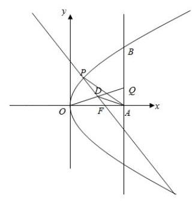

所以 ${y}_{Q} = \frac{{16} - {y}^{2}}{8y}\left( {8 - 2}\right)  = \frac{{48} - 3{y}^{2}}{4y}, Q\left( {8,\frac{{48} - 3{y}^{2}}{4y}}\right)$ ,

由 $\overrightarrow{FP} + \overrightarrow{FQ} = \overrightarrow{FE}$ 得 $E\left( {\frac{{y}^{2}}{8} + 6,\frac{{48} + {y}^{2}}{4y}}\right)$ ,

所以 ${\left( \frac{{48} + {y}^{2}}{4y}\right) }^{2} = 8\left( {\frac{{y}^{2}}{8} + 6}\right)$ ,解得 ${y}^{2} = \frac{16}{5}$ ,

所以存在以 ${FP}\text{ 、 }{FQ}$ 为邻边的矩形 ${FPEQ}$ ,使得点 $E$ 在 $\Gamma$ 上,且 $P\left( {\frac{2}{5},\frac{4\sqrt{5}}{5}}\right)$ .

【例题】4. (2017 上海秋考) 在平面直角坐标系 ${xOy}$ 中,已知椭圆 $\Gamma  : \frac{{x}^{2}}{4} + {y}^{2} = 1, A$ 为 $\Gamma$ 的上顶点, $P$ 为 $\Gamma$ 上异于上、下顶点的动点, $M$ 为 $x$ 轴正半轴上的动点.

(1)若 $P$ 在第一象限，且 $\left| {OP}\right|  = \sqrt{2}$ ，求 $P$ 的坐标；

(2)设 $P\left( {\frac{8}{5},\frac{3}{5}}\right)$ ，若以 $A$ 、 $P$ 、 $M$ 为顶点的三角形是直角三角形，求 $M$ 的横坐标；

(3)若 $\left| {MA}\right|  = \left| {MP}\right|$ ，直线 ${AQ}$ 与 $\Gamma$ 交于另一点 $C$ ，且 $\overrightarrow{AQ} = 2\overrightarrow{AC}$ ， $\overrightarrow{PQ} = 4\overrightarrow{PM}$ ，求直线 ${AQ}$ 的方程.

【解析】(1) 设 $P\left( {x, y}\right) \left( {x > 0, y > 0}\right)$ ,因为椭圆 $\Gamma  : \frac{{x}^{2}}{4} + {y}^{2} = 1, A$ 为 $\Gamma$ 的上顶点,

$P$ 为 $\Gamma$ 上异于上、下顶点的动点, $P$ 在第一象限,且 $\left| {OP}\right|  = \sqrt{2}$ ,

由 $\left\{  \begin{array}{l} \frac{{x}^{2}}{4} + {y}^{2} = 1 \\  {x}^{2} + {y}^{2} = 2 \end{array}\right.$ ,得 $P\left( {\frac{2\sqrt{3}}{3},\frac{\sqrt{6}}{3}}\right)$ .

(2) 设 $M\left( {{x}_{0},0}\right) , A\left( {0,1}\right) , P\left( {\frac{8}{5},\frac{3}{5}}\right)$ ,

若 $\angle P = {90}^{ \circ  }$ ,则 $\overrightarrow{PA} \cdot  \overrightarrow{PM} = 0$ ,即 $\left( {{x}_{0} - \frac{8}{5}, - \frac{3}{5}}\right)  \cdot  \left( {-\frac{8}{5},\frac{2}{5}}\right)  = 0$ ,

所以 $\left( {-\frac{8}{5}}\right) {x}_{0} + \frac{64}{25} - \frac{6}{25} = 0$ ,解得 ${x}_{0} = \frac{29}{20}$ .

若 $\angle M = {90}^{ \circ  }$ ,则 $\overrightarrow{MA} \cdot  \overrightarrow{MP} = 0$ ,即 $\left( {-{x}_{0},1}\right)  \cdot  \left( {\frac{8}{5} - {x}_{0},\frac{3}{5}}\right)  = 0$ ,

所以 ${x}_{0}^{2} - \frac{8}{5}{x}_{0} + \frac{3}{5} = 0$ ,解得 ${x}_{0} = 1$ 或 ${x}_{0} = \frac{3}{5}$ ,

若 $\angle A = {90}^{ \circ  }$ ,则 $M$ 点在 $x$ 轴负半轴,不合题意.

所以点 $M$ 的横坐标为 $\frac{29}{20}$ 或 1 或 $\frac{3}{5}$ .

(3)法一:设 $C\left( {2\cos \alpha ,\sin \alpha }\right)$ ，因为 $\overrightarrow{AQ} = 2\overrightarrow{AC}$ ， $A\left( {0,1}\right)$ ，

所以 $Q\left( {4\cos \alpha ,2\sin \alpha  - 1}\right)$ ,

又设 $P\left( {2\cos \beta ,\sin \beta }\right) , M\left( {{x}_{0},0}\right)$ ,

因为 $\left| {MA}\right|  = \left| {MP}\right|$ ,所以 ${x}_{0}^{2} + 1 = {\left( 2\cos \beta  - {x}_{0}\right) }^{2} + {\left( \sin \beta \right) }^{2}$ ,

整理得 ${x}_{0} = \frac{3}{4}\cos \beta$ ,

因为 $\overrightarrow{PQ} = \left( {4\cos \alpha  - 2\cos \beta ,2\sin \alpha  - \sin \beta  - 1}\right) ,\overrightarrow{PM} = \left( {-\frac{5}{4}\cos \beta , - \sin \beta }\right)$ ,

$\overrightarrow{PQ} = 4\overrightarrow{PM}$ ,所以 $4\cos \alpha  - 2\cos \beta  =  - 5\cos \beta$ ,且 $2\sin \alpha  - \sin \beta  - 1 =  - 4\sin \beta$ ,

所以 $\cos \beta  =  - \frac{4}{3}\cos \alpha$ ,且 $\sin \beta  = \frac{1}{3}\left( {1 - 2\sin \alpha }\right)$ ,

以上两式平方相加,整理得 $3{\left( \sin \alpha \right) }^{2} + \sin \alpha  - 2 = 0$ ,

所以 $\sin \alpha  = \frac{2}{3}$ 或 $\sin \alpha  =  - 1$ (舍去),

此时直线 ${AC}$ 的斜率 ${k}_{AC} =  - \frac{1 - \sin \alpha }{2\cos \alpha } = \frac{\sqrt{5}}{10}$ (负值已舍去),

所以直线 ${AQ}$ 为 $y = \frac{\sqrt{5}}{10}x + 1$ .

法二: 设 $P\left( {{x}_{0},{y}_{0}}\right) , Q\left( {{x}_{Q},{y}_{Q}}\right) , C\left( {{x}_{C},{y}_{C}}\right) , M\left( {m,0}\right) \left( {m > 0}\right)$ .

因为 $P$ 为 $\Gamma$ 上异于上、下顶点的点,所以 $\frac{{x}_{0}^{2}}{4} + {y}_{0}^{2} = 1,{x}_{0} \neq  0$ .

由 $\left| {MA}\right|  = \left| {MP}\right|$ ,得 ${m}^{2} + 1 = {\left( {x}_{0} - m\right) }^{2} + {y}_{0}^{2}$ ,

${m}^{2} + 1 = {x}_{0}^{2} + {m}^{2} - {2m}{x}_{0} + \left( {1 - \frac{{x}_{0}^{2}}{4}}\right)$ ,又 ${x}_{0} \neq  0$ ,解得 $m = \frac{3{x}_{0}}{8}$ ,

则 $M\left( {\frac{3{x}_{0}}{8},0}\right)$ ,又 $m > 0$ ,所以 ${x}_{0} > 0$ .

因为 $\overrightarrow{PQ} = 4\overrightarrow{PM}$ ,所以 $\left( {{x}_{Q} - {x}_{0},{y}_{Q} - {y}_{0}}\right)  = 4\left( {\frac{3{x}_{0}}{8} - {x}_{0}, - {y}_{0}}\right)$ ,

解得 $\left\{  \begin{array}{l} {x}_{\theta } =  - \frac{3{x}_{0}}{2} \\  {y}_{Q} =  - 3{y}_{0} \end{array}\right.$ ,因此 $Q\left( {-\frac{3{x}_{0}}{2}, - 3{y}_{0}}\right)$ ,

由 $\overrightarrow{AQ} = 2\overrightarrow{AC}$ ,得 $C$ 为 ${AQ}$ 中点,所以 $C\left( {-\frac{3{x}_{0}}{4},\frac{1 - 3{y}_{0}}{2}}\right)$ .

因为 $P, C$ 为椭圆上的点,所以 $\left\{  \begin{array}{l} \frac{{x}_{0}^{2}}{4} + {y}_{0}^{2} = 1 \\  \frac{{\left( -\frac{3{x}_{0}}{4}\right) }^{2}}{4} + {\left( \frac{1 - 3{y}_{0}}{2}\right) }^{2} = 1 \end{array}\right.$ ,

解得 $\left\{  \begin{array}{l} {x}_{0} = 0 \\  {y}_{0} = 1 \end{array}\right.$ (舍) 或 $\left\{  \begin{array}{l} {x}_{0} = \frac{8\sqrt{5}}{9} \\  {y}_{0} =  - \frac{1}{9} \end{array}\right.$ ,则 $Q\left( {-\frac{4\sqrt{5}}{3},\frac{1}{3}}\right)$ ,

因此直线 ${AQ}$ 的方程为 $y = \frac{\sqrt{5}}{10}x + 1$ .

法三: 设 $P\left( {{x}_{0},{y}_{0}}\right) , Q\left( {{x}_{Q},{y}_{Q}}\right) , C\left( {{x}_{C},{y}_{C}}\right) , M\left( {m,0}\right) \left( {m > 0}\right)$ .

因为 $\left| {MA}\right|  = \left| {MP}\right|$ ,所以 $M$ 在 ${AP}$ 的垂直平分线上.

因为 ${AP}$ 的中点为 $\left( {\frac{{x}_{0}}{2},\frac{{y}_{0} + 1}{2}}\right) ,{AP}$ 的斜率为 $\frac{{y}_{0} - 1}{{x}_{0}}$ ,

所以 ${AP}$ 的垂直平分线方程为 $y - \frac{{y}_{0} + 1}{2} =  - \frac{1}{\frac{{y}_{0} - 1}{{x}_{0}}}\left( {x - \frac{{x}_{0}}{2}}\right)$ ,

即 $y =  - \frac{{x}_{0}}{{y}_{0} - 1}x + \frac{{x}_{0}^{2} + {y}_{0}^{2} - 1}{2\left( {{y}_{0} - 1}\right) }$ .

又 $M$ 为 $x$ 轴正半轴上的点,所以 $\frac{{x}_{0}^{2} + {y}_{0}^{2} - 1}{2{x}_{0}} = \frac{{x}_{0}^{2} + \left( {1 - \frac{{x}_{0}^{2}}{4}}\right)  - 1}{2{x}_{0}} = \frac{3{x}_{0}}{8}$ ,

又 $m > 0$ ，所以 ${x}_{0} > 0$ ，设直线 ${AQ}$ 的方程为 $y = {kx} + 1$ .

由 $\left\{  \begin{array}{l} \frac{{x}^{2}}{4} + {y}^{2} = 1 \\  y = {kx} + 1 \end{array}\right.$ 得 $\left( {1 + 4{k}^{2}}\right) {x}^{2} + {8kx} = 0$ ,解得 ${x}_{C} =  - \frac{8k}{1 + 4{k}^{2}}$ ,

则 ${y}_{C} = k{x}_{C} + 1 = \frac{1 - 4{k}^{2}}{1 + 4{k}^{2}}$ ,故 $C$ 的坐标为 $\left( {-\frac{8k}{1 + 4{k}^{2}},\frac{1 - 4{k}^{2}}{1 + 4{k}^{2}}}\right)$ .

由 $\overrightarrow{AQ} = 2\overrightarrow{AC}$ ,得 $C$ 为 ${AQ}$ 中点,所以 $Q\left( {-\frac{16k}{1 + 4{k}^{2}},\frac{1 - {12}{k}^{2}}{1 + 4{k}^{2}}}\right)$ .

因为 $\overrightarrow{PQ} = 4\overrightarrow{PM}$ ,所以 $\left( {-\frac{16k}{1 + 4{k}^{2}} - {x}_{0},\frac{1 - {12}{k}^{2}}{1 + 4{k}^{2}} - {y}_{0}}\right)  = 4\left( {\frac{3{x}_{0}}{8} - {x}_{0}, - {y}_{0}}\right)$ ,

解得 $\left\{  \begin{array}{l} {x}_{0} = \frac{32k}{3\left( {1 + 4{k}^{2}}\right) } \\  {y}_{0} = \frac{1 - {12}{k}^{2}}{3\left( {1 + 4{k}^{2}}\right) } \end{array}\right.$ ,因此 $C\left( {\frac{32k}{3\left( {1 + 4{k}^{2}}\right) },\frac{1 - {12}{k}^{2}}{3\left( {1 + 4{k}^{2}}\right) }}\right)$ .

又 ${x}_{0} > 0$ ，所以 $k > 0$ ，因为 $C$ 为椭圆上的点，

所以 $\frac{{\left( \frac{32k}{3\left( {1 + 4{k}^{2}}\right) }\right) }^{2}}{4} + {\left( \frac{1 - {12}{k}^{2}}{3\left( {1 + 4{k}^{2}}\right) }\right) }^{2} = 1$ ，又 $k > 0$ ，解得 $k = \frac{\sqrt{5}}{10}$ ，

因此直线 ${AQ}$ 的方程为 $y = \frac{\sqrt{5}}{10}x + 1$ . 2025 版上海高考真题及模拟训练合集(下册)

## 2. 模拟练习

【练习】1. (2024 届华二) 以坐标原点为对称中心,坐标轴为对称轴的椭圆 $\Gamma$ 过点 $C\left( {0, - 1}\right)$ , $D\left( {-\frac{8}{5}, - \frac{3}{5}}\right)$ .

(1)求椭圆 $\Gamma$ 的方程和离心率.

(2)过点 $C\left( {0, - 1}\right)$ 的直线 $l$ 于椭圆 $\Gamma$ 在第一象限的交点为 $Q$ ，求三角形 ${QCD}$ 的最大面积；

(3)设 $P$ 是椭圆上一点(异于 $C$ 、 $D$ )，直线 ${PC}$ 、 ${PD}$ 与 $x$ 轴分别交于 $M$ 、 $N$ 两点. 在 $x$ 轴上是否存在两点 $A\text{ 、 }B$ ,使得 $\overrightarrow{MB} \cdot  \overrightarrow{NA}$ 是定值？若存在,求出此定值; 若不存在,请说明理由.

【解析】(1) 不妨设椭圆方程为 $p{x}^{2} + q{y}^{2} = 1$ ,

因为该椭圆过点 $C\left( {0, - 1}\right) , D\left( {-\frac{8}{5}, - \frac{3}{5}}\right)$ ,所以 $\left\{  \begin{array}{l} q = 1 \\  \frac{64}{25}p + \frac{9}{25}q = 1 \end{array}\right.$ ,

解得 $q = 1, p = \frac{1}{4}$ ,则椭圆的方程为 $\frac{{x}^{2}}{4} + {y}^{2} = 1$ ;

(2) 直线 ${CD}$ 的方程为 $x + {4y} + 4 = 0$ ,设 $Q\left( {2\cos \theta ,\sin \theta }\right) ,\theta  \in  \left( {0,\frac{\pi }{2}}\right)$ ,

则 $Q$ 到直线 ${CD}$ 的距离 $d = \frac{2\cos \theta  + 4\sin \theta  + 4}{\sqrt{17}} \leq  \frac{2\sqrt{5} + 4}{\sqrt{17}}$ ,

所以三角形 ${QCD}$ 的最大面积为 $\frac{1}{2} \times  \frac{2\sqrt{17}}{5} \times  \frac{2\sqrt{5} + 4}{\sqrt{17}} = \frac{2\sqrt{5} + 4}{5}$ ;

(3) 不妨设 $P\left( {{x}_{0},{y}_{0}}\right) , A\left( {m,0}\right) , B\left( {n,0}\right)$ ,

此时直线 ${PD} : y + \frac{3}{5} = \frac{{y}_{0} + \frac{3}{5}}{{x}_{0} + \frac{8}{5}}\left( {x + \frac{8}{5}}\right)$ ,令 $y = 0$ ,解得 ${x}_{N} = \frac{\frac{3}{5}{x}_{0} - \frac{8}{5}{y}_{0}}{{y}_{0} + \frac{3}{5}}$ ,

直线 ${PC} : y = \frac{{y}_{0} + 1}{{x}_{0}}x - 1$ ,令 $y = 0$ ,解得 ${x}_{M} = \frac{{x}_{0}}{{y}_{0} + 1}$ ,

所以 $\overrightarrow{MB} \cdot  \overrightarrow{NA} = \left( {n - \frac{{x}_{0}}{1 + {y}_{0}}}\right) \left( {m - \frac{\frac{3{x}_{0} - 8{y}_{0}}{5}}{{y}_{0} + \frac{3}{5}}}\right)$

$= \frac{\left( {n{y}_{0} + n - {x}_{0}}\right) \left( {{5m}{y}_{0} + 8{y}_{0} + {3m} - 3{x}_{0}}\right) }{\left( {1 + {y}_{0}}\right) \left( {3 + 5{y}_{0}}\right) },$

若 $\overrightarrow{MB} \cdot  \overrightarrow{NA}$ 是定值,不妨令 ${5m}{y}_{0} + 8{y}_{0} + {3m} =  - {3n}{y}_{0} - {3n}$ ,

因为 ${y}_{0}$ 的值不唯一,所以 ${5m} + 8 =  - {3n},{3m} =  - {3n}$ ,解得 $m =  - 4, n = 4$ ,

则 $\overrightarrow{MB} \cdot  \overrightarrow{NA} = \frac{-3\left\lbrack  {{\left( 4{y}_{0} + 4\right) }^{2} - {x}_{0}^{2}}\right\rbrack  }{\left( {{y}_{0} + 1}\right) \left( {5{y}_{0} + 2}\right) } = \frac{-{12}\left( {5{y}_{0}^{2} + 8{y}_{0} + 3}\right) }{5{y}_{0}^{2} + 8{y}_{0} + 3} =  - {12}$ ,

故存在 $A\left( {-4,0}\right)$ 和 $B\left( {4,0}\right)$ ,使得 $\overrightarrow{MB} \cdot  \overrightarrow{NA}$ 是定值,且定值为 -12 .

【练习】2. (2025 届复附) 已知双曲线 $C : \frac{{x}^{2}}{{a}^{2}} - \frac{{y}^{2}}{{b}^{2}} = 1\left( {a > 0, b > 0}\right)$ 的虚轴长为 4，渐近线方程为 $y = \; \pm  {2x}$

(1)求双曲线 $C$ 的标准方程；

(2)设 $A\left( {m,0}\right)$ ， $P$ 是双曲线上的动点，求 $\left| {PA}\right|$ 的最小值；

(3)过右焦点 $F$ 的直线 $l$ 与双曲线 $C$ 的左、右两支分别交于点 $A$ 、 $B$ ，点 $M$ 是线段 ${AB}$ 的中点，过点 $F$ 且与 $l$ 垂直的直线 ${l}^{\prime }$ 交直线 ${OM}$ 于点 $P$ ，点 $Q$ 满足 $\overrightarrow{PQ} = \overrightarrow{PA} + \overrightarrow{PB}$ ，求四边形 ${PAQB}$ 面积的最小值

【解析】(1) 因为双曲线 $C$ 的虚轴长为 4,渐近线方程为 $y =  \pm  {2x}$ ,

所以 $\left\{  \begin{array}{l} {2b} = 4 \\  \frac{b}{a} = 2 \end{array}\right.$ ,解得 $a = 1, b = 2$ ,则双曲线 $C$ 的标准方程为 ${x}^{2} - \frac{{y}^{2}}{4} = 1$ ;

(2)设 $P\left( {x, y}\right) ,\left| {PA}\right|  = \sqrt{{\left( x - m\right) }^{2} + {y}^{2}} = \sqrt{{\left( x - m\right) }^{2} + 4{x}^{2} - 4}$

$= \sqrt{5{x}^{2} - {2mx} + {m}^{2} - 4}$ ,因为 $x \leq   - 1$ 或 $x \geq  1$ ,

当 $\frac{m}{5} \leq   - 1$ 或 $\frac{m}{5} \geq  1$ ,即 $m \leq   - 5$ 或 $m \geq  5$ 时,

${\left| PA\right| }_{\min } = \sqrt{\frac{{20}\left( {{m}^{2} - 4}\right)  - 4{m}^{2}}{20}} = \sqrt{\frac{4{m}^{2} - {20}}{5}};$

当 $- 1 < \frac{m}{5} \leq  0$ ,即 $- 5 < m \leq  0$ 时, ${\left| PA\right| }_{\min } = \left| {m + 1}\right|  =  - m - 1$ ;

当 $0 < \frac{m}{5} < 1$ ,即 $0 < m < 5$ 时, ${\left| PA\right| }_{\min } = \left| {m - 1}\right|$ ;

所以当 $x = 1$ 时取得最小值 1 ;

(3) 由 (1) 得 $F\left( {\sqrt{5},0}\right)$ ,

不妨设直线 ${AB}$ 的方程为 $x = {my} + \sqrt{5}, A\left( {{x}_{1},{y}_{1}}\right) , B\left( {{x}_{2},{y}_{2}}\right) , M\left( {{x}_{0},{y}_{0}}\right)$ ,

由 $\left\{  \begin{array}{l} x = {my} + \sqrt{5} \\  4{x}^{2} - {y}^{2} = 4 \end{array}\right.$ 得 $\left( {4{m}^{2} - 1}\right) {y}^{2} + 8\sqrt{5}{my} + {16} = 0$ ,此时 $\Delta  = {64}\left( {{m}^{2} + 1}\right)$ ,

由韦达定理得 ${y}_{1} + {y}_{2} =  - \frac{8\sqrt{5}}{4{m}^{2} - 1}$ ,

所以 ${y}_{0} = \frac{{y}_{1} + {y}_{2}}{2} =  - \frac{4\sqrt{5}m}{4{m}^{2} - 1},{x}_{0} = m{y}_{0} + \sqrt{5} =  - \frac{\sqrt{5}}{4{m}^{2} - 1}$ ,

因为 $O\text{ 、 }M\text{ 、 }P$ 三点共线,所以 $\frac{{y}_{0}}{{x}_{0}} = \frac{{y}_{P}}{{x}_{P}} = {4m}$ ①,

因为 ${PF} \bot  {AB}$ ,所以 ${k}_{PF} \cdot  {k}_{AB} =  - 1$ ,即 $\frac{{y}_{P} - 0}{{x}_{P} - \sqrt{5}} \cdot  \left( \frac{1}{m}\right)  =  - 1$ ②,

由①②得 $P\left( {\frac{1}{\sqrt{5}},\frac{4m}{\sqrt{5}}}\right)$ ，因为 $\overrightarrow{PQ} = \overrightarrow{PA} + \overrightarrow{PB}$ ，

所以四边形 ${PAQB}$ 是平行四边形,此时 ${S}_{\text{ 四边形 }{PAQB}} = 2{S}_{\Delta PAB} = {d}_{P - l} \cdot  \left| {AB}\right|$ ,

因为 ${d}_{P - 1} = \frac{\left| \frac{1}{\sqrt{5}} - \frac{4{m}^{2}}{\sqrt{5}} - \sqrt{5}\right| }{\sqrt{1 + {m}^{2}}} = \frac{4}{\sqrt{5}}\sqrt{1 + {m}^{2}}$ ,

$\left| {PQ}\right|  = \sqrt{1 + {m}^{2}} \cdot  \left| {{y}_{1} - {y}_{2}}\right|  = \sqrt{1 + {m}^{2}} \cdot  \frac{8\sqrt{{m}^{2} + 1}}{\left| 4{m}^{2} - 1\right| } = \frac{8\left( {{m}^{2} + 1}\right) }{\left| 4{m}^{2} - 1\right| },$

所以 ${S}_{PAQB} = \frac{4}{\sqrt{5}}\sqrt{1 + {m}^{2}} \cdot  \frac{8\left( {{m}^{2} + 1}\right) }{\left| 4{m}^{2} - 1\right| } = \frac{32}{\sqrt{5}} \cdot  \frac{{\left( {m}^{2} + 1\right) }^{\frac{3}{2}}}{\left| 4{m}^{2} - 1\right| } = \frac{32}{\sqrt{5}} \cdot  \sqrt{\frac{{\left( {m}^{2} + 1\right) }^{3}}{{\left( 4{m}^{2} - 1\right) }^{2}}}$ ,

不妨令 $t = 4{m}^{2} - 1,{m}^{2} = \frac{t + 1}{4}$ ，此时 ${S}_{PAQB} = \frac{4}{\sqrt{5}} \cdot  \sqrt{\frac{{\left( t + 5\right) }^{3}}{{t}^{2}}}$ ，

不妨令 $f\left( t\right)  = \frac{{\left( t + 5\right) }^{3}}{{t}^{2}}$ ，函数定义域为 $\left( {0, + \infty }\right)$ ，

得 ${f}^{\prime }\left( t\right)  = \frac{3{\left( t + 5\right) }^{2} \cdot  {t}^{2} - {2t} \cdot  {\left( t + 5\right) }^{3}}{{t}^{4}} = \frac{{\left( t + 5\right) }^{2}\left( {t - {10}}\right) }{{t}^{3}}$ ,

当 $0 < x < {10}$ 时, ${f}^{\prime }\left( t\right)  < 0, f\left( t\right)$ 单调递减;

当 $x > {10}$ 时, ${f}^{\prime }\left( t\right)  > 0, f\left( t\right)$ 单调递增,

所以当 $x = {10}$ 时,函数 $f\left( t\right)$ 取得最小值,最小值 $f\left( {10}\right)  = \frac{135}{4}$ ,

则 ${\left( {S}_{PABQ}\right) }_{\min } = \frac{4}{\sqrt{5}} \times  \frac{3\sqrt{15}}{2} = 6\sqrt{3}$ ,

当且仅当 $t = {10}$ ,即 $m =  \pm  \frac{\sqrt{11}}{2}$ 时取等号

【练习】3. (2024 届建平)已知 $A$ 、 $B$ 分别是椭圆 $\Gamma  : \frac{{x}^{2}}{9} + \frac{{y}^{2}}{5} = 1$ 的左、右顶点，过点 $P\left( {0, - 3}\right)$ 、斜率为 $k$ 的直线 $l$ 交椭圆 $\Gamma$ 于 $M$ 、 $N$ 两个不同的点.

(1)求椭圆 $\Gamma$ 的焦距和离心率；

(2)若点 $B$ 落在以线段 ${MN}$ 为直径的圆的外部,求 $k$ 的取值范围；

(3)若 $k > 0$ ，设直线 ${AM}$ 、 ${AN}$ 分别交 $y$ 轴于点 $S$ 、 $T$ ， $\overrightarrow{PS} = \lambda \overrightarrow{OP}$ ， $\overrightarrow{PT} = \mu \overrightarrow{OP}$ ，求 $\lambda  + \mu$ 的取值范围.

【解析】(1) 椭圆 $\Gamma$ 的焦距为4,离心率为 $\frac{2}{3}$ .

(2) $B\left( {3,0}\right)$ ，设直线 $l : y = {kx} - 3$ ，设 $M\left( {{x}_{1},{y}_{1}}\right)$ 、 $N\left( {{x}_{2},{y}_{2}}\right)$ ，

由 $\left\{  \begin{matrix} y = {kx} - 3 \\  \frac{{x}^{2}}{9} + \frac{{y}^{2}}{5} = 1 \end{matrix}\right.$ 得 $\left( {5 + 9{k}^{2}}\right) {x}^{2} - {54kx} + {36} = 0$ ,

由 $\Delta  = {\left( {54}k\right) }^{2} - 4 \times  {36} \times  \left( {5 + 9{k}^{2}}\right)  > 0$ 解得 $k > \frac{2}{3}$ 或 $k <  - \frac{2}{3}$ ①;

因为点 $B\left( {3,0}\right)$ 在以线段 ${MN}$ 为直径的圆的外部,所以 $\overrightarrow{BM} \cdot  \overrightarrow{BN} > 0$ ,

又 ${x}_{1} + {x}_{2} = \frac{54k}{5 + 9{k}^{2}},{x}_{1}{x}_{2} = \frac{36}{5 + 9{k}^{2}}$ ,

$\overrightarrow{BM} \cdot  \overrightarrow{BN} = \left( {{x}_{1} - 3,{y}_{1}}\right) \left( {{x}_{2} - 3,{y}_{2}}\right)  = \left( {1 + {k}^{2}}\right) {x}_{1}{x}_{2} - 3\left( {1 + k}\right) \left( {{x}_{1} + {x}_{2}}\right)  + {18} > 0,$

即 $2{k}^{2} - {9k} + 7 > 0$ ,解得 $k < 1$ 或 $k > \frac{7}{2}$ ②;

由①②得 $k \in  \left( {-\infty , - \frac{2}{3}}\right)  \cup  \left( {\frac{2}{3},1}\right)  \cup  \left( {\frac{7}{2}, + \infty }\right)$ .

(3) 设直线 $l : y = {kx} - 3$ ，由 (2) 得 $k > \frac{2}{3}$ ，记 $M\left( {{x}_{1},{y}_{1}}\right)$ 、 $N\left( {{x}_{2},{y}_{2}}\right)$ ，

所以直线 ${AM}$ 的方程是 $y = \frac{{y}_{1}}{{x}_{1} + 3}\left( {x + 3}\right)$ ,

直线 ${AN}$ 的方程是 $y = \frac{{y}_{2}}{{x}_{2} + 3}\left( {x + 3}\right)$ .

令 $x = 0$ ,解得 $y = \frac{3{y}_{1}}{{x}_{1} + 3}$ ,所以点 $S$ 为 $\left( {0,\frac{3{y}_{1}}{{x}_{1} + 3}}\right)$ ,点 $T$ 为 $\left( {0,\frac{3{y}_{2}}{{x}_{2} + 3}}\right)$ ,

所以 $\overrightarrow{PS} = \left( {0,\frac{3{y}_{1}}{{x}_{1} + 3} + 3}\right) ,\overrightarrow{PT} = \left( {0,\frac{3{y}_{2}}{{x}_{2} + 3} + 3}\right) ,\overrightarrow{OP} = \left( {0, - 3}\right)$ .

由 $\overrightarrow{PS} = \lambda \overrightarrow{OP},\overrightarrow{PT} = \mu \overrightarrow{OP}$ ,得 $\frac{3{y}_{1}}{{x}_{1} + 3} + 3 =  - {3\lambda },\frac{3{y}_{2}}{{x}_{2} + 3} + 3 =  - {3\mu }$ ,

所以 $\lambda  + \mu  =  - \left( {\frac{{y}_{1}}{{x}_{1} + 3} + \frac{{y}_{2}}{{x}_{2} + 3} + 2}\right)$ ,

由 (2) 得 ${x}_{1} + {x}_{2} = \frac{54k}{9{k}^{2} + 5},{x}_{1}{x}_{2} = \frac{36}{9{k}^{2} + 5}$ ,

所以 $\lambda  + \mu  =  - \left( {\frac{k{x}_{1} - 3}{{x}_{1} + 3} + \frac{k{x}_{2} - 3}{{x}_{2} + 3} + 2}\right)$

$=  - \left( {\frac{{2k}{x}_{1}{x}_{2} + 3\left( {k - 1}\right) \left( {{x}_{1} + {x}_{2}}\right)  - {18}}{{x}_{1}{x}_{2} + 3\left( {{x}_{1} + {x}_{2}}\right)  + 9} + 2}\right)$

$=  - \left( {\frac{{2k} \cdot  \frac{36}{9{k}^{2} + 5} + 3\left( {k - 1}\right) \left( \frac{54k}{9{k}^{2} + 5}\right)  - {18}}{\frac{36}{9{k}^{2} + 5} + \left( \frac{54k}{9{k}^{2} + 5}\right)  + 9} + 2}\right)  = \frac{10}{9} \times  \frac{1}{k + 1} - 2,$ 因为 $k > \frac{2}{3}$ ,所以 $\frac{10}{9} \times  \frac{1}{k + 1} - 2 \in  \left( {-2, - \frac{4}{3}}\right)$ ,故 $\lambda  + \mu$ 的范围是 $\left( {-2, - \frac{4}{3}}\right)$ .

【练习】4. (2025 届延安) 已知点 $A\left( {a,0}\right)$ (其中 $a > 0$ ), ${P}_{1}\text{ 、 }{P}_{2}\text{ 、 }{P}_{3}$ 是平面直角坐标系上的三点,且 $\left| {A{P}_{1}}\right|$ 、 $\left| {A{P}_{2}}\right| \text{ 、 }\left| {A{P}_{3}}\right|$ 成等差数列,公差为 $d$ .

(1) 若 $a = 1,{P}_{1}$ 坐标为 $\left( {1, - 1}\right) , d = 2$ ,点 ${P}_{3}$ 在直线 ${3x} - y - {18} = 0$ 上时,求点 ${P}_{3}$ 的坐标;

(2)若 ${P}_{1}\text{ 、 }{P}_{2}\text{ 、 }{P}_{3}$ 都在抛物线 ${y}^{2} = {4x}$ 上，点 ${P}_{2}$ 的横坐标为3，且 $a = 1$ ，求证:线段 ${P}_{1}{P}_{3}$ 的垂直平分线与 $x$ 轴的交点为一定点,并求该定点的坐标;

(3) 若 ${P}_{1}\text{ 、 }{P}_{2}\text{ 、 }{P}_{3}$ 都在椭圆 $\frac{{x}^{2}}{25} + \frac{{y}^{2}}{16} = 1$ ,且 $d = 3$ ,求实数 $a$ 的取值范围.

【解析】(1)因为 $\left| {A{P}_{1}}\right| \text{ 、 }\left| {A{P}_{2}}\right| \text{ 、 }\left| {A{P}_{3}}\right|$ 成等差数列,且 $\left| {A{P}_{1}}\right|  = 1, d = 2$ ,

所以 $\left| {A{P}_{3}}\right|  = 5$ ,设 ${P}_{3}\left( {x, y}\right)$ ,

由 $\left\{  \begin{array}{l} {\left( x - 1\right) }^{2} + {y}^{2} = {25} \\  {3x} - y - {18} = 0 \end{array}\right.$ 得 ${x}^{2} - {11x} + {30} = 0$ ,解得 ${x}_{1} = 5,{x}_{2} = 6$ ,

所以 ${P}_{3}$ 的坐标为 $\left( {5, - 3}\right)$ 或 $\left( {6,0}\right)$ ;

(2)因为抛物线方程为 ${y}^{2} = {4x}$ ，所以 $A\left( {1,0}\right)$ 是它的焦点坐标，

点 ${P}_{2}$ 的横坐标为 3,即 $\left| {A{P}_{2}}\right|  = 4$ ,设 ${P}_{1}\left( {{x}_{1},{y}_{1}}\right) ,{P}_{3}\left( {{x}_{3},{y}_{3}}\right)$ ,

则 $\left| {A{P}_{1}}\right|  = {x}_{1} + 1,\left| {A{P}_{3}}\right|  = {x}_{3} + 1,\left| {A{P}_{1}}\right|  + \left| {A{P}_{3}}\right|  = 2\left| {A{P}_{2}}\right|$ ,

所以 ${x}_{1} + {x}_{3} = 2{x}_{2} = 6$ ,

直线 ${P}_{1}{P}_{3}$ 的斜率 $k = \frac{{y}_{3} - {y}_{1}}{{x}_{3} - {x}_{1}} = \frac{4}{{y}_{3} + {y}_{1}}$ ,

则线段 ${P}_{1}{P}_{3}$ 的垂直平分线 $l$ 的斜率 ${k}_{l} =  - \frac{{y}_{3} + {y}_{1}}{4}$ ,

则线段 ${P}_{1}{P}_{3}$ 的垂直平分线 $l$ 的方程为 $y - \frac{{y}_{3} + {y}_{1}}{2} =  - \frac{{y}_{3} + {y}_{1}}{4}\left( {x - 3}\right)$ ,

直线 $l$ 与 $x$ 轴的交点为定点 $\left( {5,0}\right)$ ;

(3) 设 $P\left( {x, y}\right)$ 是椭圆 $\frac{{x}^{2}}{25} + \frac{{y}^{2}}{16} = 1$ 上一点,则 ${y}^{2} = {16}\left( {1 - \frac{{x}^{2}}{25}}\right) , - 5 \leq  x \leq  5$ .

已知 $A\left( {a,0}\right) \left( {a > 0}\right) ,\left| {AP}\right|  = \sqrt{{\left( x - a\right) }^{2} + {y}^{2}} = \sqrt{{\left( x - a\right) }^{2} + {16}\left( {1 - \frac{{x}^{2}}{25}}\right) }$

$\left| {AP}\right|  = \sqrt{{\left( x - a\right) }^{2} + {y}^{2}} = \sqrt{{\left( x - a\right) }^{2} + {16}\left( {1 - \frac{{x}^{2}}{25}}\right) } = \sqrt{{x}^{2} - {2ax} + {a}^{2} + {16} - \frac{{16}{x}^{2}}{25}} = ,$

令 $f\left( x\right)  = \frac{9{x}^{2}}{25} - {2ax} + {a}^{2} + {16}, x \in  \left\lbrack  {-5,5}\right\rbrack$ ,其对称轴为 $x = \frac{25a}{9}$ .

因为 $\left| {A{P}_{1}}\right| ,\left| {A{P}_{2}}\right| ,\left| {A{P}_{3}}\right|$ 成等差数列,公差 $d = 3$ ,

所以 $\left| {AP}\right|$ 的最大值与最小值之差不小于 6 .

① 当 $0 < \frac{25a}{9} \leq  5$ ，即 $0 < a \leq  \frac{9}{5}$ 时，

$f{\left( x\right) }_{\min } = f\left( \frac{25a}{9}\right)  = {a}^{2} + {16} - \frac{{25}{a}^{2}}{9} = {16} - \frac{{16}{a}^{2}}{9},$

$f{\left( x\right) }_{\max } = f\left( {-5}\right)  = 9 + {10a} + {a}^{2} + {16} = {a}^{2} + {10a} + {25},$

所以 $\sqrt{{a}^{2} + {10a} + {25}} - \sqrt{{16} - \frac{{16}{a}^{2}}{9}} \geq  6$ ,所以 $a + 5 - \sqrt{{16} - \frac{{16}{a}^{2}}{9}} \geq  6$ ,

所以 $a - 1 \geq  \sqrt{{16} - \frac{{16}{a}^{2}}{9}}$ ,则有 $a \geq  1$ ,

解得 $a \leq  \frac{9 - {24}\sqrt{6}}{25}$ 或 $a \geq  \frac{9 + {24}\sqrt{6}}{25}$ ,都不符合 $0 < a \leq  \frac{9}{5}$ ,均舍去;

② 当 $\frac{25a}{9} > 5$ ，即 $a > \frac{9}{5}$ 时，

$f{\left( x\right) }_{\min } = f\left( 5\right)  = 9 - {10a} + {a}^{2} + {16} = {a}^{2} - {10a} + {25},$

$f{\left( x\right) }_{\max } = f\left( {-5}\right)  = {a}^{2} + {10a} + {25},$

所以 $\sqrt{{a}^{2} + {10a} + {25}} - \sqrt{{a}^{2} - {10a} + {25}} \geq  6$ ,所以 $a + 5 - \left| {a - 5}\right|  \geq  6$ ,

结合 $a > \frac{9}{5}$ ,得 $a \geq  3$ .

综上,实数 $a$ 的取值范围是 $\lbrack 3, + \infty )$ .

【练习】5. (未来星教研) 已知椭圆 $\Gamma  : \frac{{x}^{2}}{2} + {y}^{2} = 1$ 的右焦点为 $F\left( {{x}_{F},{y}_{F}}\right) , P\left( {{x}_{P},{y}_{P}}\right)$ 为 $\Gamma$ 上一点,过 $P$ 的直线 $l$ 交动直线 $y = m\left( {m > 0}\right)$ 于 $M\left( {{x}_{M}, m}\right)$ .

(1)当 $m = 4$ 且 ${y}_{P} = 1$ 时， $l$ 经过 $F$ ，求 $M$ 的坐标；

(2)已知 ${x}_{F} = {x}_{P}$ ，设直线 $y = m$ 交 $y$ 轴于 $Q$ ，若 $l$ 的倾斜角为 $\frac{\pi }{3}$ 且 $\bigtriangleup  {PMQ}$ 为等腰三角形，求 $m$ 的值;

(3) 已知 $m = 6$ ，若对任意的 $P$ ， $F$ 到 $l$ 的距离始终为 $\sqrt{2}$ ，求 ${x}_{M}$ 的最大值.

【解析】(1)因为 ${y}_{P} = 1$ ,故 ${x}_{P} = 0$ ; 且 $F$ 的坐标为 $\left( {1,0}\right)$

所以可得直线 ${PF}$ 方程为: $y =  - x + 1,2$ 分

代入 $y = 4$ ，可得 ${x}_{M} =  - 3$ ，故 $M$ 的坐标为 $\left( {-3,4}\right)$

(2) 当 ${x}_{P} = {x}_{F}$ 时,可解得: ${y}_{P} =  \pm  \frac{\sqrt{2}}{2}$

情况①:当 ${y}_{P} = \frac{\sqrt{2}}{2}$ 且 $m \in  \left( {1, + \infty }\right)$ ，根据几何关系可得:

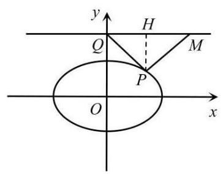

$\angle {PMQ} = {60}^{ \circ  }$ ,

从而可得: $\bigtriangleup {PMQ}$ 是等边三角形,因此可得: ${QH} = {HM} = 1$ ,可得方程: $\tan \frac{\pi }{3} = m - \frac{\sqrt{2}}{2}$ ,

解得: $m = \sqrt{3} + \frac{\sqrt{2}}{2}$

情况②:当 ${y}_{P} = \frac{\sqrt{2}}{2}$ 且 $m \in  (0,1\rbrack$ ，可得: $\angle {PMQ} > {90}^{ \circ  }$ ，当

${\Delta PMQ}$ 是等腰三角形，

只有 ${PM} = {MQ}$ 成立，根据几何关系可得: ${\angle {PMQ}} = {120}^{ \circ  }$ ，从而 ${\angle {PQM}} = {30}^{ \circ  }$ ，

可得方程: $\tan \frac{\pi }{6} = \frac{\sqrt{2}}{2} - m$ ,解得: $m = \frac{\sqrt{2}}{2} - \frac{\sqrt{3}}{3}$ , 2025 版上海高考真题及模拟训练合集(下册)

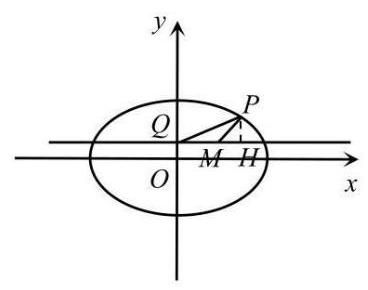

情况③:当 ${y}_{P} =  - \frac{\sqrt{2}}{2}$ 且 $m \in  \left( {0, + \infty }\right)$ ，同情况①解得: $m = \sqrt{3} - \frac{\sqrt{2}}{2}$

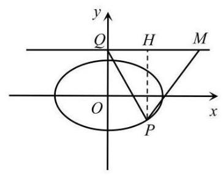

综上, $m = \frac{\sqrt{2}}{2} - \frac{\sqrt{3}}{3}$ 或 $m = \sqrt{3} \pm  \frac{\sqrt{2}}{2}$ .

(3)①当直线 $l$ 的斜率不存在时，直线 $l$ 方程: $x = 1 - \sqrt{2}$ ， ${x}_{M} = 1 - \sqrt{2}$ ，

②当直线 $l$ 的斜率存在时,由于与直线 $y = 6$ 有交点，则斜率不为 0 ，

设直线 $l$ 方程: $y = {kx} + b\left( {k \neq  0}\right)$ ，又因为 $F$ 到 $l$ 的距离为 $\sqrt{2}$ ，

故 $l$ 始终与圆 $\left( {x - 1}\right)  + {y}^{2} = 2$ 相切,设切点为 $N$

因为 $\left\{  \begin{array}{l} y = {kx} + b \\  {\left( x - 1\right) }^{2} + {y}^{2} = 2 \end{array}\right.$ ,可得: $\left( {1 + {k}^{2}}\right) {x}^{2} + \left( {{2kb} - 2}\right) x + {b}^{2} - 1 = 0$ ,

进而可得: $\Delta  = {k}^{2} - {b}^{2} - {2kb} + 2 = 0$

同理 $\left\{  \begin{array}{l} y = {kx} + b \\  \frac{{x}^{2}}{2} + {y}^{2} = 1 \end{array}\right.$ ,可得: $\left( {1 + 2{k}^{2}}\right) {x}^{2} + {4kbx} + 2{b}^{2} - 2 = 0$ ,

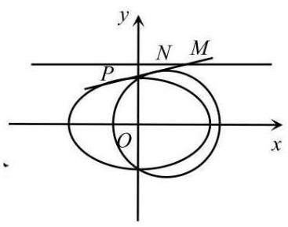

进而可得: $\Delta  = {16}{k}^{2} - 8{b}^{2} + 8 \geq  0$

又因为当 $m = 6$ 时, ${x}_{M} = \frac{6 - b}{k}$ ,

又因为: $\left\{  \begin{array}{l} {k}^{2} - {b}^{2} - {2kb} + 2 = 0 \\  2{k}^{2} - {b}^{2} + 1 \geq  0 \end{array}\right.$ ,

显然: 当 ${x}_{M}$ 为最大值时,有且仅有 ${16}{k}^{2} - 8{b}^{2} + 8 = 0$ 成立 (情况如图所示),

解得: $k = \frac{\sqrt{7}}{7}, b = \frac{3\sqrt{7}}{7}$ (增根已舍),

代入可得: ${x}_{M} = 6\sqrt{7} - 3 > 1 - \sqrt{2}$ ,

综上所述， ${x}_{M}$ 的最大值为 $6\sqrt{7} - 3$

【练习】6. 已知抛物线 $G : {y}^{2} = {8x}$ 的焦点与椭圆 $E : \frac{{x}^{2}}{5} + {y}^{2} = 1$ 的右焦点 $F$ 重合,过点 $F$ 且斜率为 $k$ 的直线 $l$ 交椭圆 $E$ 于 $A$ 、 $B$ 两点,交抛物线 $G$ 于 $M$ 、 $N$ 两点,请问是否存在实常数 $m$ ,使 $\frac{\sqrt{5}}{\left| AB\right| } + \frac{m}{\left| MN\right| }$ 为定值? 若存在,求出 $m$ 的值; 若不存在,说明理由.

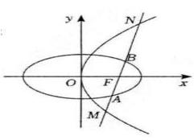

【解析】法一: 设 $A\left( {{x}_{1},{y}_{1}}\right) \text{ 、 }B\left( {{x}_{2},{y}_{2}}\right) \text{ 、 }M\left( {{x}_{3},{y}_{3}}\right) \text{ 、 }N\left( {{x}_{4},{y}_{4}}\right)$ ,

直线 $l$ 的方程 $y = k\left( {x - 2}\right)$ ,由 $\left\{  \begin{array}{l} \frac{{x}^{2}}{5} + {y}^{2} = 1 \\  y = k\left( {x - 2}\right)  \end{array}\right.$ 得 $\left( {1 + 5{k}^{2}}\right) {x}^{2} - {20}{k}^{2}x + {20}{k}^{2} - 5 = 0$ ,

所以 ${x}_{1} + {x}_{2} = \frac{{20}{k}^{2}}{1 + 5{k}^{2}},{x}_{1}{x}_{2} = \frac{{20}{k}^{2} - 5}{1 + 5{k}^{2}}$ ,

所以 $\left| {AB}\right|  = \sqrt{1 + {k}^{2}} \cdot  \sqrt{{\left( {x}_{1} + {x}_{2}\right) }^{2} - 4{x}_{1}{x}_{2}} = \frac{2\sqrt{5}\left( {{k}^{2} + 1}\right) }{1 + 5{k}^{2}}$ ,

由 $\left\{  \begin{array}{l} {y}^{2} = 8 \\  y = k\left( {x - 2}\right)  \end{array}\right.$ ,得 ${k}^{2}{x}^{2} - \left( {4{k}^{2} + 8}\right) x + 4{k}^{2} = 0$ ,

所以 ${x}_{3} + {x}_{4} = \frac{4{k}^{2} + 8}{{k}^{2}},{x}_{3}{x}_{4} = 4$ ,所以 $\left| {MN}\right|  = {x}_{3} + {x}_{4} + 4 = \frac{8\left( {{k}^{2} + 1}\right) }{{k}^{2}}$ ,

所以 $\frac{\sqrt{5}}{\left| AB\right| } + \frac{m}{\left| MN\right| } = \frac{1 + 5{k}^{2}}{2\left( {{k}^{2} + 1}\right) } + \frac{m{k}^{2}}{8\left( {{k}^{2} + 1}\right) } = \frac{\left( {{20} + m}\right) {k}^{2} + 4}{8\left( {{k}^{2} + 1}\right) }$ ,

要使 $\frac{\sqrt{5}}{\left| AB\right| } + \frac{1}{\left| MN\right| }$ 为常数,则 ${20} + m = 4$ ,解得 $m =  - {16}$ ,

故存在 $m =  - {16}$ ，使得 $\frac{\sqrt{5}}{\left| AB\right| } + \frac{1}{\left| MN\right| }$ 为定值 $\frac{1}{2}$ .

法二:直线的参数方程

设直线 $l$ 的方程 $\left\{  \begin{array}{l} x = 2 + t\cos \alpha \\  y = t\sin \alpha  \end{array}\right.$

联立直线 $l$ 与抛物线 $G$ ,得 ${\sin }^{2}\alpha {t}^{2} - 8\cos {\alpha t} - {16} = 0$

所以 $\left| {MN}\right|  = \left| {{t}_{1} - {t}_{2}}\right|  = \frac{8}{{\sin }^{2}\alpha }$

联立直线 $l$ 与椭圆 $E$ ,得 $\left( {4{\sin }^{2}\alpha  + 1}\right) {t}^{2} + 4\cos {\alpha t} - 1 = 0$

所以 $\left| {AB}\right|  = \left| {{t}_{3} - {t}_{4}}\right|  = \frac{2\sqrt{5}}{4{\sin }^{2}\alpha  + 1}$

所以 $\frac{\sqrt{5}}{\left| AB\right| } + \frac{m}{\left| MN\right| } = \frac{4{\sin }^{2}\alpha  + 1}{2} + \frac{m}{8}{\sin }^{2}\alpha  = \left( {2 + \frac{m}{8}}\right) {\sin }^{2}\alpha  + \frac{1}{2}$

故存在 $m =  - {16}$ ,使得 $\frac{\sqrt{5}}{\left| AB\right| } + \frac{1}{\left| MN\right| }$ 为定值 $\frac{1}{2}$ .

【练习】7. (23 奉贤一模) 已知椭圆 $C$ 的中心在原点 $O$ ，且它的一个焦点 $F$ 为 $\left( {\sqrt{3},0}\right)$ . 点 ${A}_{1}$ ， ${A}_{2}$ 分别是椭圆的左、右顶点,点 $B$ 为椭圆的上顶点, ${\Delta OFB}$ 的面积为 $\frac{\sqrt{3}}{2}$ . 点 $M$ 是椭圆 $C$ 上在第一象限内的一个动点.

(1)求椭圆 $C$ 的标准方程；

(2)若把直线 $M{A}_{1}, M{A}_{2}$ 的斜率分别记作 ${k}_{1},{k}_{2}$ ,若 ${k}_{1} + {k}_{2} =  - \frac{3}{4}$ ,求点 $M$ 的坐标;

(3)设直线 $M{A}_{1}$ 与 $y$ 轴交于点 $P$ ，直线 $M{A}_{2}$ 与 $y$ 轴交于点 $Q$ . 令 $\overrightarrow{PB} = \lambda \overrightarrow{BQ}$ ，求实数 $\lambda$ 的取值范围.

【答案】 $\left( 1\right) \frac{{x}^{2}}{4} + \frac{{y}^{2}}{1} = 1;\left( 2\right) M\left( {\frac{6}{5},\frac{4}{5}}\right) ;\left( 3\right) \lambda  \in  \left( {0,1}\right)$

【解析】(1) 由题意得 $\left\{  \begin{array}{l} {a}^{2} - {b}^{2} = 3 \\  \frac{1}{2}{bc} = \frac{\sqrt{3}}{2} \\  c = \sqrt{3} \end{array}\right.$ ,所以 $\left\{  \begin{array}{l} a = 2 \\  b = 1 \end{array}\right.$ ,所以椭圆标准方程为 $\frac{{x}^{2}}{4} + \frac{{y}^{2}}{1} = 1$

(2) 设 $M\left( {{x}_{0},{y}_{0}}\right) ,{A}_{1}\left( {-2,0}\right) ,{A}_{2}\left( {2,0}\right)$ .

$\left\{  \begin{array}{l} \frac{{x}_{0}^{2}}{4} + \frac{{y}_{0}^{2}}{1} = 1 \\  \frac{{y}_{0}}{{x}_{0} + 2} + \frac{{y}_{0}}{{x}_{0} - 2} =  - \frac{3}{4}\text{ ,得 }{y}_{0} = \frac{3\left( {4 - {x}_{0}^{2}}\right) }{8{x}_{0}}\text{ ,解得 }M\left( {\frac{6}{5},\frac{4}{5}}\right) \\  {x}_{0} > 0,{y}_{0} > 0 \end{array}\right.$

(3)法一:直线 $M{A}_{1}$ 的方程为 $y = {k}_{1}\left( {x + 2}\right)$ ，所以 $P\left( {0,2{k}_{1}}\right)$

直线 $M{A}_{2}$ 的方程为 $y = {k}_{2}\left( {x - 2}\right)$ ,所以 $P\left( {0, - 2{k}_{2}}\right)$ ,

$\overrightarrow{PB} = \left( {0,1 - 2{k}_{1}}\right) ,\overrightarrow{BQ} = \left( {0, - 2{k}_{2} - 1}\right) ,$

所以 $\lambda  = \frac{1 - 2{k}_{1}}{-2{k}_{2} - 1}$ ,

因为 ${k}_{1}{k}_{2} = \frac{{y}_{0}}{{x}_{0} + 2} \cdot  \frac{{y}_{0}}{{x}_{0} - 2} = \frac{{y}_{0}^{2}}{{x}_{0}^{2} - 4} =  - \frac{1}{4}$

所以 $\lambda  = \frac{1 - 2{k}_{1}}{-2\frac{1}{-4{k}_{1}} - 1} = 2{k}_{1}$

因为 ${k}_{1} = \frac{{y}_{0}}{{x}_{0} + 2} = \frac{\sqrt{1 - \frac{{x}_{0}^{2}}{4}}}{{x}_{0} + 2} = \frac{1}{2}\sqrt{\frac{2 - {x}_{0}}{2 + {x}_{0}}} = \frac{1}{2}\sqrt{\frac{4}{2 + {x}_{0}} - 1},{x}_{0} \in  \left( {0,2}\right)$ ,

所以 ${k}_{1} \in  \left( {0,\frac{1}{2}}\right)$ ,所以 $\lambda  \in  \left( {0,1}\right)$

法二: (参数方程) 设 $M\left( {2\cos \theta ,\sin \theta }\right)$ ,其中 $\theta  \in  \left( {0,\frac{\pi }{2}}\right) ,{A}_{1}\left( {-2,0}\right) ,{A}_{2}\left( {2,0}\right)$ ,

则 $P\left( {0,\frac{\sin \theta }{\cos \theta  + 1}}\right)$ ,即 $P\left( {0,\tan \frac{\theta }{2}}\right) , Q\left( {0,\frac{1}{\tan \frac{\theta }{2}}}\right)$

$\lambda  = \frac{1 - \tan \frac{\theta }{2}}{\frac{1}{\tan \frac{\theta }{2}} - 1} = \tan \frac{\theta }{2} \in  \left( {0,1}\right)$

【练习】8. (艺扬飞翔) 已知点 $F$ 是抛物线 ${y}^{2} = {4x}$ 的焦点，动点 $P$ 在抛物线上，设直线 $l$ 与抛物线交于 $D\text{ 、 }E$ 两点 $\left( {P\text{ 、 }D\text{ 、 }E\text{ 均不重合 }}\right)$ .)

(1) 若 $l$ 经过点 $F,\left| {DF}\right|  = 3$ ，求 $E$ 点坐标；

(2)若 $\overrightarrow{DF} = \overrightarrow{PE}$ ，证明:直线 ${DE}$ 过定点；

(3)若 $\angle {DPF} = \angle {DEF}$ 且 $\angle {EDP} = \angle {EFP}$ ,四边形 ${DPFE}$ 面积为 $\sqrt{2}$ ，求直线 $l$ 的方程.

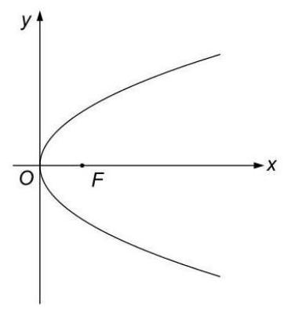

【解析】(1) 由抛物线的几何意义, $D\left( {2, \pm  2\sqrt{2}}\right)$ 时:

设 $E\left( {{b}^{2},{2b}}\right)$ ,当 $D$ 在 $\left( {2,2\sqrt{2}}\right)$ 时:

${DE}$ 方程: $x = \frac{b + \sqrt{2}}{2}y - \sqrt{2}b$ ,解得 $b =  - \frac{1}{\sqrt{2}}$ ,即 $E\left( {\frac{1}{2}, - \sqrt{2}}\right)$

同理, $D\left( {2, - 2\sqrt{2}}\right)$ ,解得 $E\left( {\frac{1}{2},\sqrt{2}}\right)$ ,故 $E$ 点坐标为 $\left( {\frac{1}{2}, \pm  \sqrt{2}}\right)$

(2) 设 $D\left( {{a}^{2},{2a}}\right) , E\left( {{b}^{2},{2b}}\right) , P\left( {{p}^{2},{2p}}\right) ,\left\{  \begin{array}{l} {b}^{2} - {p}^{2} = 1 - {a}^{2} \\  {2b} - {2p} =  - {2a} \end{array}\right.$ ,化简得 $\left\{  \begin{matrix} {a}^{2} + {b}^{2} = 1 + {p}^{2} \\  a + b = p \end{matrix}\right.$ 解得 ${2ab} =$

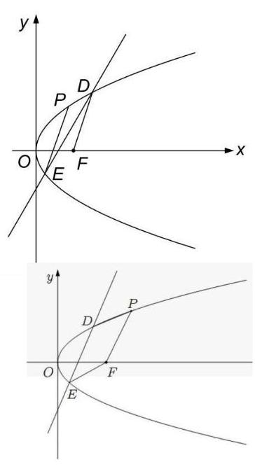

${\left( a + b\right) }^{2} - \left( {{a}^{2} + {b}^{2}}\right)  =  - 1,{ab} =  - \frac{1}{2}$ 而 ${DE}$ 方程: $x = \frac{b + a}{2}y - \; {ab}$ ,故过定点 $\left( {\frac{1}{2},0}\right)$

(3) 设 $D\left( {{a}^{2},{2a}}\right) , E\left( {{b}^{2},{2b}}\right) , P\left( {{p}^{2},{2p}}\right)$ ,由题,四边形 ${DPFE}$ 为平行四边形.

$\left\{  {\begin{matrix} {a}^{2} - {b}^{2} = {p}^{2} - 1 \\  {2a} - {2b} = {2p} \end{matrix}\text{ ,解得 }\left\{  \begin{matrix} a = p - \frac{1}{2p} \\  b =  - \frac{1}{2p} \end{matrix}\right. }\right.$

${S}_{DPFE} = 2{S}_{\bigtriangleup {DFE}} = 2 \cdot  \frac{1}{2} \cdot  \left| {\left( {{y}_{D} - {y}_{E}}\right) \left( {1 + {ab}}\right) }\right|$

$\therefore {S}_{DPFE} = \left| {p + \frac{1}{2p}}\right|  = \sqrt{2}, p =  \pm  \frac{\sqrt{2}}{2}$

$\therefore {DE}$ 方程: $x = \frac{b + a}{2}y - {ab}$ ,解得 $l : y =  \pm  2\sqrt{2}x$ .

【练习】9. (年少有为) 已知抛物线 $\Gamma  : {y}^{2} = {4x}$ ，焦点为 $F$ ， $P$ 为 $x$ 轴负半轴上一点，过 $P$ 作直线 $l$ 分别交 $\Gamma$ 于 $A$ 、 $B$ 不同两点，满足 $A$ 、 $B$ 均在 $x$ 轴上方，且 $B$ 在线段 ${AP}$ 上.

(1)若直线 $l$ 的斜率为 $\frac{1}{2}$ ，且 ${BF} \bot  {PF}$ ，求 $P$ 点坐标；

(2)是否存在直线 $l$ ，使得 $\left| {BF}\right|  = \frac{3}{2}$ ， $\left| {AF}\right|  = 5$ ， ${FA}\bot {FB}$ ？若存在，求出直线 $l$ 的方程；若不存在, 说明理由;

(3) 若存在直线 $l$ 与 $x$ 轴上一点 $Q$ ,使得四边形 ${ABFQ}$ 为等腰梯形,求 $P$ 点横坐标的取值范围.

【解析】 $\left( 1\right) F\left( {1,0}\right)$ . 因为 ${BF} \bot  {PF}$ ,故 ${x}_{B} = {x}_{F} = 1$ ,而 $B$ 在抛物线上,故 $B\left( {1,2}\right)$ . 因为直线 $l$ 的斜率为 $\frac{1}{2}$ ,故直线 $1 : y - 2 = \frac{1}{2}\left( {x - 1}\right)$ . 令 $y = 0$ ,解得 $x =  - 3, P\left( {-3,0}\right)$ .

(2)假设这样的直线 $l$ 存在. 由抛物线定义， $\left| {BF}\right|  = {x}_{B} + 1 = \frac{3}{2}$ ，故 ${x}_{B} = \frac{1}{2}$ ， $B\left( {\frac{1}{2},\sqrt{2}}\right)$ . $\left| {AF}\right| \; = {x}_{A} + 1 = 5$ ,故 ${x}_{A} = 4, A\left( {4,4}\right) .\overrightarrow{FB} = \left( {-\frac{1}{2},\sqrt{2}}\right) ,\overrightarrow{FA} = \left( {3,4}\right)$ ,故 $\overrightarrow{FB} \cdot  \overrightarrow{FA} =  - \frac{3}{2} + 4\sqrt{2} \neq  0$ , 于是 ${FA}$ 与 ${FB}$ 不垂直,矛盾! 故假设不成立,这样的直线 $l$ 不存在.

(3) 设 $P\left( {m,0}\right)$ ,则 $m < 0$ . 设 $A\left( {{a}^{2},{2a}}\right) , B\left( {{b}^{2},{2b}}\right)$ ,则 $a > b > 0$ .

直线 ${AB} : {2x} - \left( {a + b}\right) y + {2ab} = 0$ ,将 $P\left( {m,0}\right)$ 坐标代入得 ${ab} =  - m$ .

因为 ${ABFQ}$ 为等腰梯形,且 ${AB}$ 与 ${FQ}$ 不平行,故 ${BF}//{AQ}$ ,从而 $\angle {PBF} = \angle {PFB},{PB} = {PF}$ .

反之,当 ${PB} = {PF}$ 时,延长 ${PF}$ 至点 $Q$ ,使得 ${FQ} = {BA}$ .

因为 $\frac{PB}{BA} = \frac{PF}{FQ}$ ,故 ${BF}//{AQ}$ ,从而此时 ${ABFQ}$ 为等腰梯形.

因此，题设等价于 ${PB} = {PF}$ .

$1 - m = \sqrt{{\left( {b}^{2} - m\right) }^{2} + 4{b}^{2}}$ ,平方得 ${b}^{4} + \left( {4 - {2m}}\right) {b}^{2} + \left( {{2m} - 1}\right)  = 0$ ,其中 $0 < {b}^{2} <  - m$ . (因为 $\left. {-m = {ab} > {b}^{2}}\right)$

记 ${b}^{2} = t$ ,则关于 $t$ 的方程 ${t}^{2} + \left( {4 - {2m}}\right) t + \left( {{2m} - 1}\right)  = 0$ 有属于 $\left( {0, - m}\right)$ 的解.

记 $f\left( t\right)  = {t}^{2} + \left( {4 - {2m}}\right) t + \left( {{2m} - 1}\right)$ . 因为 $y = f\left( t\right)$ 的图像关于直线 $x = m - 2$ 成轴对称,

$m - 2 < 0$ ,故 $f\left( t\right)$ 在区间 $\left( {0, - m}\right)$ 上严格增,从而 $\left\{  \begin{array}{l} f\left( 0\right)  < 0 \\  f\left( {-m}\right)  > 0 \end{array}\right.$ , $\left\{  \begin{array}{l} {2m} - 1 < 0 \\  3{m}^{2} - {2m} - 1 > 0 \end{array}\right.$ ,

$\left\{  {\begin{array}{l} m < \frac{1}{2} \\  m <  - \frac{1}{3}\text{ 或 }m > 1 \end{array}\text{ ,解得 }m <  - \frac{1}{3}\text{ ,即为所求. }}\right.$

【练习】10. (2024 届复兴) 已知直线 $l$ 与抛物线 ${C}_{1} : {y}^{2} = {2x}$ 交于两点 $A\left( {{x}_{1},{y}_{1}}\right) , B\left( {{x}_{2},{y}_{2}}\right)$ ,与抛物线 ${C}_{2}$ : ${y}^{2} = {4x}$ 交于两点 $C\left( {{x}_{3},{y}_{3}}\right) , D\left( {{x}_{4},{y}_{4}}\right)$ ，其中 $A$ 、 $C$ 在第一象限， $B$ 、 $D$ 在第四象限.

(1)若直线 $l$ 过点 $M\left( {1,0}\right)$ ，且 $\frac{1}{\left| BM\right| } - \frac{1}{\left| AM\right| } = \frac{\sqrt{2}}{2}$ ，求直线 $l$ 的方程；

(2)求证: $\frac{1}{{y}_{1}} + \frac{1}{{y}_{2}} = \frac{1}{{y}_{3}} + \frac{1}{{y}_{4}}$ ;

(3) 设 $\bigtriangleup {AOB}\text{ 、 }\bigtriangleup {COD}$ 的面积分别为 ${S}_{1}\text{ 、 }{S}_{2}\left( {O\text{ 为坐标原点 }}\right)$ ,若 $\left| {AC}\right|  = 2\left| {BD}\right|$ ,求 $\frac{{S}_{1}}{{S}_{2}}$ 的值.

【解析】(1) 显然直线 $l$ 的斜率不为 0,设直线 $l$ 的方程为 $x = {my} + 1$ ,

由 $\left\{  \begin{array}{l} x = {my} + 1 \\  {y}^{2} = {2x} \end{array}\right.$ 得 ${y}^{2} - {2my} - 2 = 0$ ,

得 ${y}_{1} + {y}_{2} = {2m},{y}_{1}{y}_{2} =  - 2$ ,则 $\frac{{y}_{1} + {y}_{2}}{{y}_{1}{y}_{2}} =  - m$ ,

则 $\frac{1}{\left| BM\right| } - \frac{1}{\left| AM\right| } =  - \frac{1}{\sqrt{1 + {m}^{2}}{y}_{2}} - \frac{1}{\sqrt{1 + {m}^{2}} \cdot  {y}_{1}} =  - \frac{1}{\sqrt{1 + {m}^{2}}} \cdot  \left( {\frac{1}{{y}_{2}} + \frac{1}{{y}_{1}}}\right)$

$=  - \frac{1}{\sqrt{1 + {m}^{2}}} \cdot  \frac{{y}_{1} + {y}_{2}}{{y}_{1}{y}_{2}} =  - \frac{1}{\sqrt{1 + {m}^{2}}} \cdot  \left( {-m}\right)  = \frac{m}{\sqrt{1 + {m}^{2}}}$ ,

由题意得 $\frac{m}{\sqrt{1 + {m}^{2}}} = \frac{\sqrt{2}}{2}$ ,整理得 ${m}^{2} - {2m} + 1 = 0$ ,解得 $m = 1$ ,

所以直线 $l$ 的方程为 $x = y + 1$ ,即 $x - y - 1 = 0$ ;

(2)设直线 $l$ 的方程为 $x = {my} + t, t \neq  0$ ，设 $M\left( {t,0}\right)$ ，

由 $\left\{  \begin{array}{l} x = {my} + t \\  {y}^{2} = {2x} \end{array}\right.$ 得 ${y}^{2} - {2my} - {2t} = 0$ ,

得 ${y}_{1} + {y}_{2} = {2m},{y}_{1}{y}_{2} =  - {2t}$ ,所以 $\frac{{y}_{1} + {y}_{2}}{{y}_{1}{y}_{2}} =  - \frac{m}{t}$ ,即 $\frac{1}{{y}_{1}} + \frac{1}{{y}_{2}} =  - \frac{m}{t}$ ,

由 $\left\{  \begin{array}{l} x = {my} + t \\  {y}^{2} = {4x} \end{array}\right.$ 得 ${y}^{2} - {4my} - {4t} = 0,{139}$

得 ${y}_{3} + {y}_{4} = {4m},{y}_{3}{y}_{4} =  - {4t}$ ,所以 $\frac{{y}_{3} + {y}_{4}}{{y}_{3}{y}_{4}} =  - \frac{m}{t}$ ,即 $\frac{1}{{y}_{3}} + \frac{1}{{y}_{4}} =  - \frac{m}{t}$ ,

所以 $\frac{1}{{y}_{1}} + \frac{1}{{y}_{2}} = \frac{1}{{y}_{3}} + \frac{1}{{y}_{4}}$ ;

(3) 由 (2) 得 $\frac{1}{{y}_{1}} - \frac{1}{{y}_{3}} = \frac{1}{{y}_{4}} - \frac{1}{{y}_{2}}$ ,即 $\frac{{y}_{3} - {y}_{1}}{{y}_{1}{y}_{3}} = \frac{{y}_{2} - {y}_{4}}{{y}_{2}{y}_{4}}$ ,

即 $\left| \frac{{y}_{3} - {y}_{1}}{{y}_{2} - {y}_{4}}\right|  = \frac{\left| {y}_{1}{y}_{3}\right| }{\left| {y}_{2}{y}_{4}\right| }$ ,

因为 $\frac{\left| AC\right| }{\left| BD\right| } = 2 = \left| \frac{{y}_{3} - {y}_{1}}{{y}_{2} - {y}_{4}}\right|  = \frac{\left| {y}_{1}{y}_{3}\right| }{\left| {y}_{2}{y}_{4}\right| }$ ,所以 $2 = \frac{\left| {y}_{1} \cdot  \frac{-{4t}}{{y}_{4}}\right| }{\left| {y}_{4} \cdot  \frac{-{2t}}{{y}_{1}}\right| } = \frac{2{y}_{1}^{2}}{{y}_{4}^{2}} = \frac{2{\left| AM\right| }^{2}}{{\left| DM\right| }^{2}}$ ,

所以 ${\left| AM\right| }^{2} = {\left| DM\right| }^{2}$ ,即 $\left| {AM}\right|  = \left| {DM}\right|$ ,得 $M$ 为 ${AD}$ 的中点,

所以 $\left\{  \begin{array}{l} {2t} = {x}_{1} + {x}_{4} \\  {y}_{1} =  - {y}_{4} \end{array}\right.$ ,代入抛物线的方程得 $\left\{  \begin{array}{l} {y}_{4}{}^{2} = 4{x}_{4} = 4\left( {{2t} - {x}_{1}}\right) \\  {y}_{4}{}^{2} = {y}_{1}{}^{2} = 2{x}_{1} \end{array}\right.$ ,

解得 ${y}_{1} = \frac{2\sqrt{6t}}{3},{y}_{2} = \frac{-{2t}}{{y}_{1}} =  - \frac{\sqrt{6t}}{2},{y}_{4} =  - {y}_{1} =  - \frac{2\sqrt{6t}}{3}$ ,

因为 ${y}_{3}{y}_{4} =  - {4t},{y}_{3} = \sqrt{6t}$ ,

所以 $\frac{{S}_{1}}{{S}_{2}} = \frac{\left| AB\right| }{\left| CD\right| } = \frac{\left| {y}_{1} - {y}_{2}\right| }{\left| {y}_{3} - {y}_{4}\right| } = \frac{\left| \frac{2\sqrt{6t}}{3} + \frac{\sqrt{6t}}{2}\right| }{\left| \sqrt{6t} + \frac{2\sqrt{6t}}{3}\right| } = \frac{7}{10}$ .

$\left| {AC}\right|  = 2\left| {BD}\right|  \Leftrightarrow  {y}_{3} - {y}_{1} = 2\left( {{y}_{2} - {y}_{4}}\right)  \Leftrightarrow  {y}_{1} + 2{y}_{2} = {y}_{3} + 2{y}_{4}$

$\Leftrightarrow  {2m} + {y}_{2} = {4m} + {y}_{4}$ ,得 ${y}_{2} - {y}_{4} = {2m}$ ,则 ${y}_{3} - {y}_{1} = {4m}$ ,

$2{y}_{1}^{2} - {4m}{y}_{1} = {y}_{3}^{2} - {4m}{y}_{3} \Leftrightarrow  2{\left( {y}_{3} - 4m\right) }^{2} - {4m}\left( {{y}_{3} - {4m}}\right)  = {y}_{3}^{2} - {4m}{y}_{3}$

$\Leftrightarrow  {y}_{3}^{2} - {16m}{y}_{3} + {48}{m}^{2} = 0$ ,解得 ${y}_{3} = {12m}\left( {\text{ 舍去 }{y}_{3} = {4m}}\right)$ ,

则 ${y}_{1} = {8m},{y}_{2} =  - {6m},{y}_{3} = {12m},{y}_{4} =  - {8m}$ ,故 $\frac{{S}_{1}}{{S}_{2}} = \frac{{y}_{1} - {y}_{2}}{{y}_{3} - {y}_{4}} = \frac{7}{10}$ .
