2025 版上海高考真题及模拟训练合集(下册)

## 口七、立体几何

## 板块一: 基础客观题

## 1. 真题回顾

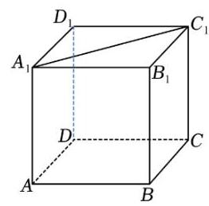

【例题】1. (2023 上海春考) 如图所示, $P$ 是正方体 ${ABCD} - {A}_{1}{B}_{1}{C}_{1}{D}_{1}$ 边 ${A}_{1}{C}_{1}$ 上的动点,下列哪条边与 ${BP}$ 边始终异面 ( )

A. $D{D}_{1}$ B. ${AC}$

C. $A{D}_{1}$ D. ${B}_{1}C$

【答案】 $B$

【解析】当 $P$ 为 ${A}_{1}{C}_{1}$ 中点时, $D{D}_{1}$ 和 ${BP}$ 相交;

当 $P$ 与 ${C}_{1}$ 重合时, $A{D}_{1}$ 和 ${BP}$ 平行;

当 $P$ 与 ${C}_{1}$ 重合时, ${B}_{1}C$ 和 ${BP}$ 相交;

只有 ${AC}$ 与 ${BP}$ 边始终异面,故选 $B$ .

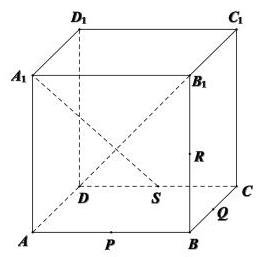

【例题】2. (2022 上海秋考) 如图正方体 ${ABCD} - {A}_{1}{B}_{1}{C}_{1}{D}_{1}$ 中, $P\text{ 、 }Q\text{ 、 }R\text{ 、 }S$ 分别为棱 ${AB}\text{ 、 }{BC}\text{ 、 }{B{B}_{1}}\text{ 、 }{CD}$ 的中点,联结 ${A}_{1}S\text{ 、 }{B}_{1}D$ ,空间任意两点 $M\text{ 、 }N$ ,若线段 ${MN}$ 上不存在点在线段 ${A}_{1}S\text{ 、 }{B}_{1}D$ 上,则称 $M\text{ 、 }N$ 两点可视,下列选项中与点 ${D}_{1}$ 可视的为 ( )

A. 点 $P$ B. 点 $B$

C. 点 $R$ D. 点 $Q$

【答案】 $D$

【解析】 $M\text{ 、 }N$ 两点“可视”的定义就是直线 ${MN}$ 不与 ${A}_{1}S$ 相交,也不与 ${B}_{1}D$ 相交, 易得 ${D}_{1}P$ 与 ${A}_{1}S$ 共面，相交； ${D}_{1}R$ 、 ${D}_{1}B$ 均与 ${B}_{1}D$ 共面，相交； ${D}_{1}Q$ 与 ${A}_{1}S$ 异面，也与 ${B}_{1}D$ 异面，故选 $D$ .

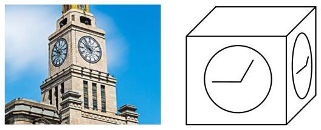

【例题】3. (2022 上海春考) 如图所示, 设上海海关楼的钟楼为正方体,且钟楼的四个侧面均有时钟悬挂. 在 0 点到 12 点中时针与分针的转动中 (包括 0 点, 但不包括 12 点), 相邻两面的时针出现垂直的情况的次数为 ( )

A. 0 B. 2

C. 4 D. 12

【答案】 $B$

【解析】法一:首先，3 点和 9 点，相邻两面的时针显然垂直，

除 3 点和 9 点外, 若存在其他时刻垂直, 以正方体的前面和右边为例,

不妨设两条时针所在直线为 $m$ 和 $n$ ,则 $m \bot  n$ ,显然后边平面下边直线垂直于 $m$ , 故 $m$ 垂直于右边平面,矛盾,故相邻两面的时针出现垂直的情况的次数为 2, 故选 $B$ .

法二:建立空间直角坐标系，把两个平面放在 ${xOz}$ 平面和 ${yOz}$ 平面，

设时刻为 $t$ ，由于每小时时针旋转 $\frac{\pi }{6}$ ，故两个平面内时针所对的坐标分别为

$\left( {-\cos \left( {-\frac{\pi }{6}t}\right) ,0,0,\sin \left( {-\frac{\pi }{6}t}\right) }\right) ,\left( {0, - \cos \left( {-\frac{\pi }{6}t}\right) ,\sin \left( {-\frac{\pi }{6}t}\right) }\right) ,$

若相邻两面的时针出现垂直，则数量积为 0，得 $\sin \left( {-\frac{\pi }{6}t}\right)  = 0$ ,

故 $t = 0$ 或 $t = 6$ (注,这里的 $t$ 是与三角比定义相同的,换算成时间为 3 点和 9 点),

故选 B.

【例题】4. (2021 上海秋考) 已知圆柱的底面圆半径为 1,高为 $2,{AB}$ 为上底面圆的一条直径， $C$ 是下底面圆周上的一个动点，则 $\bigtriangleup  {ABC}$ 的面积的取值范围为___.

【答案】 $\left\lbrack  {2,\sqrt{5}}\right\rbrack$

【解析】如图 1,上底面圆心记为 $O$ ,下底面圆心记为 ${O}^{\prime }$ ,

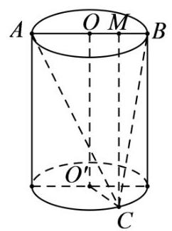

1

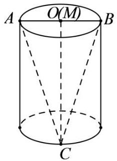

2

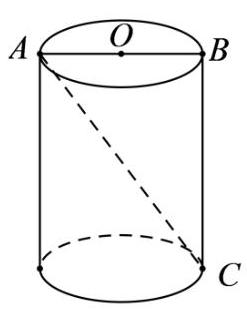

3

连接 ${OC}$ ,过点 $C$ 作 ${CM} \bot  {AB}$ ,垂足为点 $M$ ,则 ${S}_{\Delta ABC} = \frac{1}{2} \times  {AB} \times  {CM}$ ,

${AB}$ 为定值 2,所以 ${S}_{\Delta ABC}$ 的大小随着 ${CM}$ 的长短变化而变化,

如图 2 所示,当点 $M$ 与点 $O$ 重合时, ${CM} = {OC} = \sqrt{{1}^{2} + {2}^{2}} = \sqrt{5}$ ,

此时 ${S}_{\bigtriangleup {ABC}}$ 取得最大值为 $\frac{1}{2} \times  2 \times  \sqrt{5} = \sqrt{5}$ ;

如图 3 所示,当点 $M$ 与点 $B$ 重合, ${CM}$ 取最小值 2,

此时 ${S}_{\bigtriangleup {ABC}}$ 取得最小值为 $\frac{1}{2} \times  2 \times  2 = 2$ .

综上所述， ${S}_{\Delta ABC}$ 的取值范围为 $\left\lbrack  {2,\sqrt{5}}\right\rbrack$ .

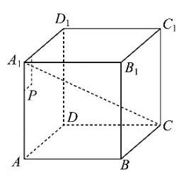

【例题】5. (2020 上海秋考) 在棱长为 10 的正方体 ${ABCD} - {A}_{1}{B}_{1}{C}_{1}{D}_{1}$ 中, $P$ 为左侧面 ${AD}{D}_{1}{A}_{1}$ 上一点,已知点 $P$ 到 ${A}_{1}{D}_{1}$ 的距离为 $3, P$ 到 $A{A}_{1}$ 的距离为 2, 则过点 $P$ 且与 ${A}_{1}C$ 平行的直线交正方体于 $P\text{ 、 }Q$ 两点,则 $Q$ 点所在的平面是 ( )

A. $A{A}_{1}{B}_{1}B$ B. $B{B}_{1}{C}_{1}C$

C. $C{C}_{1}{D}_{1}D$ D. ${ABCD}$

【答案】 $D$

【解析】由点 $P$ 到 ${A}_{1}{D}_{1}$ 的距离为 $3, P$ 到 $A{A}_{1}$ 的距离为 2,

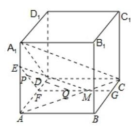

得 $P$ 在 $\bigtriangleup A{A}_{1}D$ 内,过 $P$ 作 ${EF}//{A}_{1}D$ ,且 ${EF} \cap  A{A}_{1}$ 于 $E,{EF} \cap  {AD}$ 于 $F$ , 在平面 ${ABCD}$ 中,过 $F$ 作 ${FG}//{CD}$ ,交 ${BC}$ 于 $G$ ,则平面 ${EFG}//$ 平面 ${A}_{1}{DC}$ .

连接 ${AC}$ 交 ${FG}$ 于 $M$ ,连接 ${EM}$ ,

因为平面 ${EFG}//$ 平面 ${A}_{1}{DC}$ ,平面 ${A}_{1}{AC} \cap$ 平面 ${A}_{1}{DC} = {A}_{1}C$ ,

平面 ${A}_{1}{AC} \cap$ 平面 ${EFM} = {EM}$ ,所以 ${EM}//{A}_{1}C$ .

在 ${\Delta EFM}$ 中,过 $P$ 作 ${PQ}//{EM}$ ,且 ${PQ} \cap  {FM}$ 于 $Q$ ,则 ${PQ}//{A}_{1}C$ .

因为线段 ${FM}$ 在四边形 ${ABCD}$ 内, $Q$ 在线段 ${FM}$ 上,所以 $Q$ 在四边形 ${ABCD}$ 内.

则 $Q$ 点所在的平面是平面 ${ABCD}$ . 故选 $D$ .

【例题】6. (2019 上海春考) 已知平面 $\alpha \text{ 、 }\beta \text{ 、 }\gamma$ 两两垂直,直线 $a\text{ 、 }b\text{ 、 }c$ 满足: $a \subseteq  \alpha , b \subseteq  \beta , c \subseteq  \gamma$ ,则直线 $a\text{ 、 }b\text{ 、 }c$ 不可能满足以下哪种关系 ( )

A. 两两垂直 B. 两两平行 C. 两两相交 D. 两两异面

【答案】 $B$

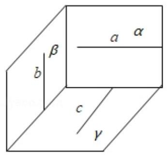

图 1

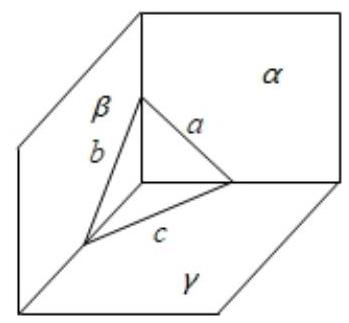

图2

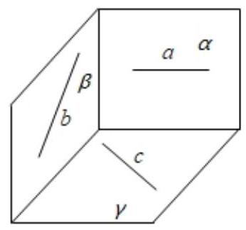

图3

【解析】如图 1,得 $a\text{ 、 }b\text{ 、 }c$ 可能两两垂直; 如图 2,得 $a\text{ 、 }b\text{ 、 }c$ 可能两两相交; 如图 3,得 $a\text{ 、 }b\text{ 、 }c$ 可能两两异面; 故选 $B$ .

【例题】7. (2017 上海春考) 过正方体中心的平面截正方体所得的截面中，不可能的图形是___ (   )

A. 三角形 B. 长方形

C. 对角线不相等的菱形 D. 六边形

【答案】 $A$

【解析】过正方体中心的平面截正方体所得的截面, 至少与正方体的四个面相交, 所以不可能是三角形,故选 $A$ .

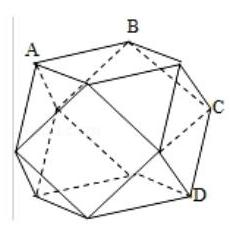

【例题】8. (2011 上海春考) 有一种多面体的饰品,其表面有 6 个正方形和 8 个正三角形组成 (如图)，则 ${AB}$ 与 ${CD}$ 所成的角的大小是___.

【答案】 $\frac{\pi }{3}$

【解析】平移后易得所成夹角为 $\frac{\pi }{3}$ .

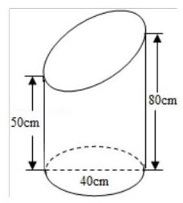

【例题】9. (2010 上海春考) 在如图所示的斜截圆柱中,已知圆柱底面的直径为 40cm，母线长最短 50cm，最长 80cm，则斜截圆柱的侧面面积 $S =$ ___ ${\mathrm{{cm}}}^{2}$ .

【答案】 ${2600\pi }$

【解析】将相同的两个几何体,对接为圆柱,则圆柱的侧面展开, 侧面展开图的面积 $S = \left( {{50} + {80}}\right)  \times  {20\pi } \times  2 \times  \frac{1}{2} = {2600\pi c}{m}^{2}$ .

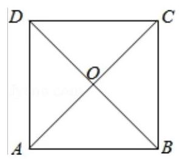

【例题】10. (2010 上海秋考) 如图所示,在边长为4的正方形纸片 ${ABCD}$ 中, ${AC}$ 与 ${BD}$ 相交于 $O$ ,剪去 $\bigtriangleup {AOB}$ ,将剩余部分沿 ${OC}\text{ 、 }{OD}$ 折叠,使 ${OA}$ 、 ${OB}$ 重合,则以 $A\left( B\right) \text{ 、 }C\text{ 、 }D\text{ 、 }O$ 为顶点的四面体的体积为___.

【答案】 $\frac{8\sqrt{2}}{3}$

【解析】翻折后的几何体为底面边长为 4,侧棱长为 $2\sqrt{2}$ 的正三棱锥, 高为 $\frac{2\sqrt{6}}{3}$ 所以该四面体的体积为 $\frac{1}{3} \times  \frac{1}{2} \times  {16} \times  \frac{\sqrt{3}}{2} \times  \frac{2\sqrt{6}}{3} = \; \frac{8\sqrt{2}}{3}$ .

## 2. 模拟练习

【练习】1. 如图,已知点 $A \in$ 平面 $\alpha$ ,点 $O \in  \alpha$ ,直线 $a \subset  \alpha$ ,点 $P \notin  \alpha$ 且 ${PO} \bot  \alpha$ , 则“直线 $a \bot$ 直线 ${OA}$ ” 是 “直线 $a \bot$ 直线 ${PA}$ ” 的 ( )

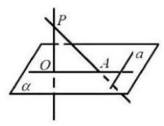

A. 充分不必要条件 B. 必要不充分条件

C. 充要条件 D. 既不充分也不必要条件

【答案】 $C$

【解析】因为 ${PO} \bot  a$ ,所以 ${PO} \bot  a$ ,且 ${PO} \cap  {OA} = O$

则 ${OA} \bot  a \Leftrightarrow  a \bot$ 平面 ${POA} \Leftrightarrow  a \bot  {PA}$ ,

所以“直线 $a \bot$ 直线 ${OA}$ ” 是 “直线 $a \bot$ 直线 ${PA}$ 的充要条件”,故选: $C$

【练习】2. 如图,在正方体 ${ABCD} - {A}_{1}{B}_{1}{C}_{1}{D}_{1}$ 中,点 $M\text{ 、 }N$ 分别在棱 $A{A}_{1}\text{ 、 }C{C}_{1}$ 上, 则“直线 ${MN} \bot$ 直线 ${C}_{1}B$ ” 是 “直线 ${MN} \bot$ 平面 ${C}_{1}{BD}$ ” 的 ( )

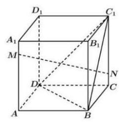

A. 充分非必要条件 B. 必要非充分条件

C. 充要条件 D. 既不充分又不必要条件

【答案】 $C$

【解析】首先必要性是满足的, 由线面垂直的性质定理 (或定义) 易得; 下面说明充分性, 连接 ${AC},{A}_{1}{C}_{1}, A{A}_{1} \bot$ 平面 ${ABCD},{BD} \subset$ 平面 ${ABCD}$ ,则 $A{A}_{1} \bot  {BD}$ ,

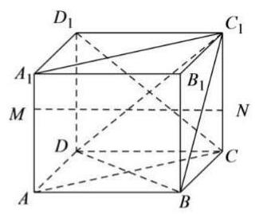

正方形中 ${BD} \bot  {AC},{AC} \cap  A{A}_{1} = A,{AC}, A{A}_{1} \subset$ 平面 ${AC}{C}_{1}{A}_{1}$ ,

则 ${BD} \bot$ 平面 ${AC}{C}_{1}{A}_{1}$ ,

又 ${MN} \subset$ 平面 ${AC}{C}_{1}{A}_{1}$ ,所以 ${BD} \bot  {MN}$ ,

若 ${MN}\bot {B{C}_{1}},{B{C}_{1}} \cap  {BD} = B, B{C}_{1},{BD} \subset$ 平面 ${BD}{C}_{1}$ ，所以 ${MN}\bot$ 平面 ${BD}{C}_{1}$ ，充分性得证. 因此应为充要条件. 故选: $C$ .

【练习】3. 类比平面内“垂直于同条一直线的两条直线互相平行”的性质，可推出空间中有下列结论:

①垂直于同一条直线的两条直线互相平行；

②垂直于同一条直线的两个平面互相平行；

③垂直于同一个平面的两条直线互相平行;

④垂直于同一个平面的两个平面互相平行.

其中正确的是 ( )

A. ①② B. ②③ C. ③④ D. ①④

【答案】 $B$

【解析】垂直于同一条直线的两条直线平行、相交、或异面, ①错误;

垂直于同一个平面的两条直线互相平行, 由直线与平面平行的性质知②正确;

垂直于同一条直线的两个平面互相平行, 由平面平行的判定定理知

垂直于同一个平面的两个平面平行或相交, ④错误;

故选: $B$

【练习】4. 已知直线 $a, b, l$ 和平面 $\alpha ,\beta , a \subset  \alpha , b \subset  \beta ,\alpha  \cap  \beta  = l$ ,且 $\alpha  \bot  \beta$ ;

①若 $a, b$ 异面，则 $a, b$ 至少有一个与 $l$ 相交；

②若 $a, b$ 垂直，则 $a, b$ 至少有一个与 $l$ 垂直；对于以上命题中，所有正确的序号是___

【答案】①②

【解析】若 $a, b$ 与 $l$ 都不相交, $a \subset  \alpha , l \subset  \alpha$ ,则 $a//l$ ,

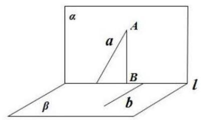

同理 $b//l$ ,故 $a//b$ ,与 $a, b$ 异面矛盾,①正确;

若 $a$ 不垂直 $l, a$ 上取一点 $A$ ,作 ${AB} \bot  l$ 交 $l$ 于 $B,{AB} \bot  l,\alpha  \bot  \beta$ ,

故 ${AB} \bot  \beta , b \subset  \beta$ ,故 ${AB} \bot  b, b \bot  a, a \cap  {AB} = A$ ,

故 $b \bot  \alpha ,\alpha  \bot  \beta , b \subset  \beta$ ,故 $b \bot  l$ ,② 正确.

故答案为:①②.

【练习】5. 下列命题中,正确的是 ( )

A. 三点确定一个平面

B. 垂直于同一直线的两条直线平行

C. 若直线 $l$ 与平面 $\alpha$ 上的无数条直线都垂直，则 $l\bot \alpha$

D. 若 $a\text{ 、 }b\text{ 、 }c$ 是三条直线， $a//b$ 且与 $c$ 都相交，则直线 $a\text{ 、 }b\text{ 、 }c$ 在同一平面上

【答案】 $D$

【解析】 $A$ . 不共线的三点确定一个平面; $B$ . 由墙角模型得显然错误;

C. 必须和所有直线垂直，不是无数条直线垂直，事实上，平面的斜线也和平面内无数条直线垂直 (由三垂直定理易证)；

$D$ . 由平面公理,两条平行直线唯一确定一个平面,

两条相交直线唯一确定一个平面,正确;

故选 $D$ .

【练习】6. (2024 届控江)在正方体 ${ABCD} - {A}_{1}{B}_{1}{C}_{1}{D}_{1}$ 中， $E$ 、 $F$ 分别为棱 $A{A}_{1}$ 、 $C{C}_{1}$ 的中点，则在空间中与三条直线 ${A}_{1}{D}_{1}\text{ 、 }{EF}\text{ 、 }{CD}$ 都相交的直线 ( )

A. 不存在 B. 有且只有两条 C. 有且只有三条 D. 有无数条

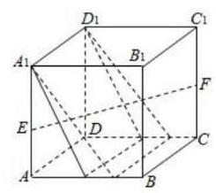

【答案】 $D$

【解析】在 ${EF}$ 上任意取一点 $M$ ,直线 ${A}_{1}{D}_{1}$ 与 $M$ 确定一个平面,

这个平面与 ${CD}$ 有且仅有 1 个交点 $N$ ,

当 $M$ 取不同的位置就确定不同的平面,从而与 ${CD}$ 有不同的交点 $N$ , 而直线 ${MN}$ 与这 3 条异面直线都有交点. 故选 $D$ .

【练习】7. 如图. 空间四边形 ${OABC}$ 中, $\overrightarrow{OA} = \overrightarrow{a},\overrightarrow{OB} = \overrightarrow{b},\overrightarrow{OC} = \overrightarrow{c}$ ,点 $M$ 在 ${OA}$ 上, 且满足 $\overrightarrow{OM} = 2\overrightarrow{MA}$ ,点 $N$ 为 ${BC}$ 的中点,则 $\overrightarrow{MN} =$ ( )

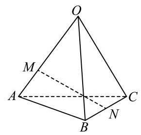

A. $\frac{1}{2}\overrightarrow{a} - \frac{2}{3}\overrightarrow{b} + \frac{1}{2}\overrightarrow{c}$ B. $\frac{2}{3}\overrightarrow{a} + \frac{2}{3}\overrightarrow{b} - \frac{1}{2}\overrightarrow{c}$

C. $\frac{1}{2}\overrightarrow{a} + \frac{1}{2}\overrightarrow{b} - \frac{1}{2}\overrightarrow{c}$ D. $- \frac{2}{3}\overrightarrow{a} + \frac{1}{2}\overrightarrow{b} + \frac{1}{2}\overrightarrow{c}$

【答案】 $D$

【解析】 $\overrightarrow{MN} = \overrightarrow{ON} - \overrightarrow{OM} = \frac{1}{2}\left( {\overrightarrow{OB} + \overrightarrow{OC}}\right)  - \frac{2}{3}\overrightarrow{OA} =  - \frac{2}{3}\overrightarrow{a} + \frac{1}{2}\overrightarrow{b} + \frac{1}{2}\overrightarrow{c}$ . 故选: $D$ .

【练习】8. 用斜二测画法画出的某平面图形的直观图如图所示,边 ${A}^{\prime }{B}^{\prime }$ 与 ${C}^{\prime }{D}^{\prime }$ 平行于 ${x}^{\prime }$ 轴. 已知四边形 ${A}^{\prime }{B}^{\prime }{C}^{\prime }{D}^{\prime }$ 的面积为 $1{\mathrm{\;{cm}}}^{2}$ ，则原平面图形的面积为___ ${\mathrm{{cm}}}^{2}$

2025 版上海高考真题及模拟训练合集(下册)

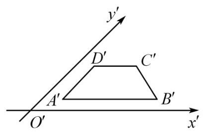

【答案】 $2\sqrt{2}$

【解析】根据题意得 $\angle {B}^{\prime }{A}^{\prime }{D}^{\prime } = {45}^{ \circ  }$ ,原四边形为一个直角梯形,

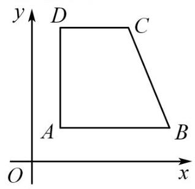

且 ${CD} = {C}^{\prime }{D}^{\prime },{AB} = {A}^{\prime }{B}^{\prime },{AD} = 2{A}^{\prime }{D}^{\prime }$ ,

${S}_{\text{ 梯形 }{A}^{\prime }{B}^{\prime }{C}^{\prime }{D}^{\prime }} = \frac{1}{2}\left( {{A}^{\prime }{B}^{\prime } + {C}^{\prime }{D}^{\prime }}\right)  \cdot  {A}^{\prime }{D}^{\prime }\sin {45}^{ \circ  } = \frac{\sqrt{2}}{4}\left( {{A}^{\prime }{B}^{\prime } + {C}^{\prime }{D}^{\prime }}\right)  \cdot  {A}^{\prime }{D}^{\prime } = 1\left( {\mathrm{\;{cm}}}^{2}\right)$ ,

则 $\left( {{A}^{\prime }{B}^{\prime } + {C}^{\prime }{D}^{\prime }}\right)  \cdot  {A}^{\prime }{D}^{\prime } = 2\sqrt{2}$ ,

所以， ${S}_{\text{ 梯形 }{ABCD}} = \frac{1}{2}\left( {{AB} + {CD}}\right)  \cdot  {AD} = \frac{1}{2}\left( {{A}^{\prime }{B}^{\prime } + {C}^{\prime }{D}^{\prime }}\right)  \cdot  {2{A}^{\prime }{D}^{\prime }} = \left( {{A}^{\prime }{B}^{\prime } + {C}^{\prime }{D}^{\prime }}\right)  \cdot  {{A}^{\prime }{D}^{\prime }} = \; 2\sqrt{2}\left( {\mathrm{\;{cm}}}^{2}\right) .$

故答案为: $2\sqrt{2}$ .

【练习】9. 如图所示，在正三棱柱 ${ABC} - {A}_{1}{B}_{1}{C}_{1}$ 中， ${AB} = 2, A{A}_{1} = 2$ ，由顶点 $B$ 沿棱柱侧面 (经过棱 $A{A}_{1}$ ) 到达顶点 ${C}_{1}$ ,与 $A{A}_{1}$ 的交点记为 $M$ ,则从点 $B$ 经点 $M$ 到 ${C}_{1}$ 的最短路线长为___

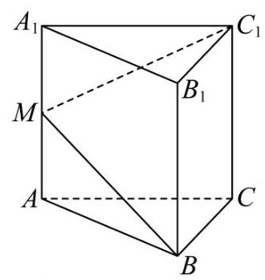

【答案】 $2\sqrt{5}$

【解析】如图,沿侧棱 $B{B}_{1}$ 将正三棱柱的侧面展开

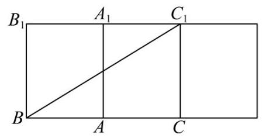

由侧面展开图可知,当 $B, M,{C}_{1}$ 三点共线时,从点 $B$ 经点 $M$ 到 ${C}_{1}$ 的路线最短.

所以最短路线长为 $B{C}_{1} = \sqrt{{4}^{2} + {2}^{2}} = 2\sqrt{5}$ .

【练习】10. 如图,已知正四棱柱 ${ABCD} - {{A}_{1}{B}_{1}{C}_{1}{D}_{1}}$ 的底面边长为 2,高为 3, 则异面直线 $A{A}_{1}$ 与 $B{D}_{1}$ 所成角的大小是___

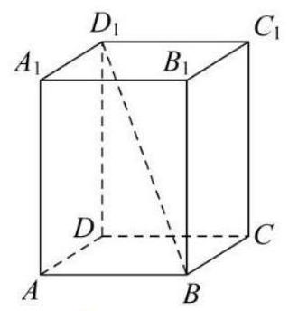

【答案】 $\arctan \frac{2\sqrt{2}}{3}$

【解析】因为 $A{A}_{1}//D{D}_{1}$ ,所以 $\angle D{D}_{1}B$ 异面直线 $A{A}_{1}$ 与 $B{D}_{1}$ 所成的角,

在正四棱柱 ${ABCD} - {A}_{1}{B}_{1}{C}_{1}{D}_{1}$ 的底面边长为 2,高为 3,

所以 $\tan \angle D{D}_{1}B = \frac{BD}{D{D}_{1}} = \frac{2\sqrt{2}}{3}$ ，因为 $\angle D{D}_{1}B \in  \left( {0,\frac{\pi }{2}}\right)$ ，所以 $\angle D{D}_{1}B = \arctan \frac{2\sqrt{2}}{3}$ .

2025 版上海高考真题及模拟训练合集(下册)

## 板块二: 中档客观题

## 1. 真题回顾

【例题】1. (2025 上海春考) 已知 $P$ 是一个圆锥的顶点， ${PA}$ 是母线， ${PA} = 2$ ，该圆锥的底面半径是 1 . $B, C$ 分别在圆锥的底面上，则异面直线 ${PA}$ 与 ${BC}$ 所成角的最小值为___.

【答案】 $\frac{\pi }{3}$

【解析】解法一(空间向量): 以底面圆心 $O$ 为原点建系,则 $\overrightarrow{BC}$ 可为底面任意方向,

易得 $A\left( {-1,0,0}\right) , P\left( {0,0,\sqrt{3}}\right)$ ,设 $\overrightarrow{BC} = \left( {\cos \theta ,\sin \theta ,0}\right) ,\overrightarrow{AP} = \left( {1,0,\sqrt{3}}\right)$ ,

则 $\cos \langle \overrightarrow{AP},\overrightarrow{BC}\rangle  = \frac{\overrightarrow{AP} \cdot  \overrightarrow{BC}}{\left| \overrightarrow{AP}\right|  \cdot  \left| \overrightarrow{BC}\right| } = \frac{\cos \theta }{2} \leq  \frac{1}{2},\therefore \langle \overrightarrow{AP},\overrightarrow{BC}\rangle  \geq  \frac{\pi }{3}$ .

解法二: 依题意可得: 异面直线 ${PA}$ 与 ${BC}$ 所成角的最小值即为直线 ${PA}$ 与底面所成角.

由 ${PA} = 2$ ，底面半径为 1，所以直线 ${PA}$ 与底面所成角为 $\frac{\pi }{3}$ .

【例题】2. (2024 上海秋考) 已知空间直角坐标系 ${Oxyz}$ 中的点集 $\Omega$ ，对任意 ${P}_{1},{P}_{2},{P}_{3} \in  \Omega$ ，均存在不全为零的实数 ${\lambda }_{1},{\lambda }_{2},{\lambda }_{3}$ 满足 ${\lambda }_{1}\overrightarrow{O{P}_{1}} + {\lambda }_{2}\overrightarrow{O{P}_{2}} + {\lambda }_{3}\overrightarrow{O{P}_{3}} = \overrightarrow{0}$ . 已知 $\left( {1,0,0}\right)  \in  \Omega$ ,则 $\left( {0,0,1}\right)  \notin  \Omega$ 的一个充分条件是 ( )

A. $\left( {0,0,0}\right)  \in  \Omega$ B. $\left( {-1,0,0}\right)  \in  \Omega$ C. $\left( {0, - 1,0}\right)  \in  \Omega$ D. $\left( {0,0, - 1}\right)  \in  \Omega$

【答案】 $C$

【解析】对任意 ${P}_{1},{P}_{2},{P}_{3} \in  \Omega$ ,均存在不全为零的实数 ${\lambda }_{1},{\lambda }_{2},{\lambda }_{3}$ 满足

${\lambda }_{1}\overrightarrow{O{P}_{1}} + {\lambda }_{2}\overrightarrow{O{P}_{2}} + {\lambda }_{3}\overrightarrow{O{P}_{3}} = \overrightarrow{0}$ 指的是 $\overrightarrow{O{P}_{1}},\overrightarrow{O{P}_{2}},\overrightarrow{O{P}_{3}}$ 共面,

可以借助空间直角坐标系分析, $\left( {1,0,0}\right)$ 在 $x$ 轴上, $\left( {0,0,1}\right)$ 在 $z$ 轴上,

$\left( {0,0,0}\right)$ 为原点,错误; $\left( {-1,0,0}\right)$ 在 $x$ 轴上,错误; $\left( {0, - 1,0}\right)$ 在 $y$ 轴上,正确;

$\left( {0,0, - 1}\right)$ 在 $z$ 轴上,错误; 故选 $C$ .

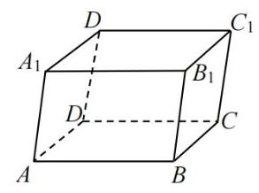

【例题】3. (2024 上海春考) 如图,已知四棱柱 ${ABCD} - {A}_{1}{B}_{1}{C}_{1}{D}_{1}$ 的底面为平行四边形, $\left| \overrightarrow{A{A}_{1}}\right|  = 3,\left| \overrightarrow{BD}\right|  = 4$ ,且 $\overrightarrow{A{B}_{1}} \cdot  \overrightarrow{{B}_{1}{C}_{1}} - \overrightarrow{B{C}_{1}} \cdot  \overrightarrow{DC} = 5$ ,则异面直线 $A{A}_{1}$ 与 ${BD}$ 所成角的大小为___.

【答案】 $\arccos \frac{5}{12}$

【解析】 $\overrightarrow{A{B}_{1}} \cdot  \overrightarrow{{B}_{1}{C}_{1}} - \overrightarrow{B{C}_{1}} \cdot  \overrightarrow{DC}$

$= \left( {\overrightarrow{A{A}_{1}} + \overrightarrow{AB}}\right)  \cdot  \overrightarrow{AD} - \left( {\overrightarrow{AD} + \overrightarrow{A{A}_{1}}}\right)  \cdot  \overrightarrow{AB}$

$= \overrightarrow{A{A}_{1}} \cdot  \overrightarrow{AD} - \overrightarrow{A{A}_{1}} \cdot  \overrightarrow{AB} = \overrightarrow{A{A}_{1}} \cdot  \overrightarrow{BD} = \left| \overrightarrow{A{A}_{1}}\right|  \cdot  \left| \overrightarrow{BD}\right|  \cdot  \cos \theta  = {12}\cos \theta$ ,

所以 $\cos \theta  = \frac{5}{12}$ ,所以直线 $A{A}_{1}$ 与 ${BD}$ 所成角 $\cos \theta  = \frac{5}{12} \Rightarrow  \theta  = \arccos \frac{5}{12}$ .

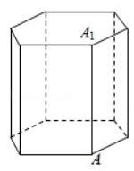

【例题】4. (2018 上海秋考) 《九章算术》中, 称底面为矩形而有一侧棱垂直于底面的四棱锥为阳马，设 $A{A}_{1}$ 是正六棱柱的一条侧棱,如图，若阳马以该正六棱柱的顶点为顶点、以 $A{A}_{1}$ 为底面矩形的一边,则这样的阳马的个数是 ( )

A. 4 B. 8 C. 12 D. 16

【答案】 $D$

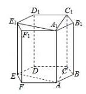

【解析】由正六边形的性质,得 ${D}_{1} - {A}_{1}{AB}{B}_{1},{D}_{1} - {A}_{1}{AF}{F}_{1}$ 满足题意,

而 ${C}_{1}\text{ 、 }{E}_{1}\text{ 、 }C\text{ 、 }D\text{ 、 }E$ ,和 ${D}_{1}$ 一样,有 $2 \times  4 = 8$ ,

当 ${A}_{1}{AC}{C}_{1}$ 为底面矩形,有 4 个满足题意,

当 ${A}_{1}{AE}{E}_{1}$ 为底面矩形,有 4 个满足题意,

故有 $8 + 4 + 4 = {16}$ 个,故选 $D$ .

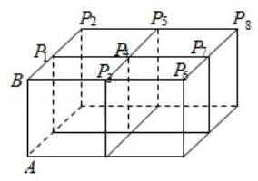

【例题】5. (2014 上海秋考) 如图, 四个棱长为 1 的正方体排成一个正四棱柱, ${AB}$ 是一条侧棱, ${P}_{i}\left( {\mathrm{i} = 1,2,\cdots ,8}\right)$ 是上底面上其余的八个点,则 $\overrightarrow{AB}$ . ${\overrightarrow{AP}}_{i}\left( {\mathrm{i} = 1,2,\cdots ,8}\right)$ 的不同值的个数为 ( )

A. 1 B. 2

C. 3 D. 4

【答案】 $A$

【解析】 $\overrightarrow{A{P}_{i}} = \overrightarrow{AB} + \overrightarrow{B{P}_{i}}$ ,则 $\overrightarrow{AB} \cdot  \overrightarrow{A{P}_{i}} = \overrightarrow{AB}\left( {\overrightarrow{AB} + \overrightarrow{B{P}_{i}}}\right)  = {\left| \overrightarrow{AB}\right| }^{2} + \overrightarrow{AB} \cdot  \overrightarrow{B{P}_{i}}$ ,

因为 $\overrightarrow{AB} \bot  \overrightarrow{B{P}_{i}}$ ,所以 $\overrightarrow{AB} \cdot  \overrightarrow{A{P}_{i}} = {\left| \overrightarrow{AB}\right| }^{2} = 1$ ,

所以 $\overrightarrow{AB} \cdot  \overrightarrow{A{P}_{i}}\left( {\mathrm{i} = 1,2,\cdots ,8}\right)$ 的不同值的个数为 1,故选 $A$ .

【例题】6. (2013 上海秋考) 在 ${xOy}$ 平面上,将两个半圆弧 ${\left( x - 1\right) }^{2} \; + {y}^{2} = 1\left( {x \geq  1}\right)$ 和 ${\left( x - 3\right) }^{2} + {y}^{2} = 1\left( {x \geq  3}\right)$ ,两条直线 $y = 1$ 和 $y =  - 1$ 围成的封闭图形记为 $D$ ,如图中阴影部分,记 $D$ 绕 $y$ 轴旋转一周而成的几何体为 $\Omega$ . 过 $\left( {0, y}\right) \left( {\left| y\right|  \leq  1}\right)$ 作 $\Omega$ 的水平截面,所得截面积为 ${4\pi }\sqrt{1 - {y}^{2}} + {8\pi }$ . 试利用祖暅原理、一个平放的圆柱和一个长方体，得出 $\Omega$ 的体积值为___.

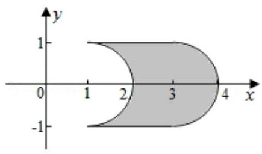

【答案】 $2{\pi }^{2} + {16\pi }$

【解析】因为几何体为 $\Omega$ 的水平截面的截面积为 ${4\pi }\sqrt{1 - {y}^{2}} + {8\pi }$ ,

该截面的截面积由两部分组成，一部分为定值 ${8\pi }$ ，看作是截一个底面积为 ${8\pi }$ ，

高为 2 的长方体得到的，对于 ${4\pi }\sqrt{1 - {y}^{2}}$ ，看作是把一个半径为 1 ，

高为 ${2\pi }$ 的圆柱平放得到的，如图所示，

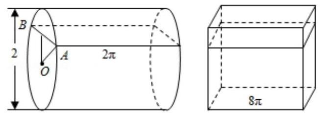

这两个几何体与 $\Omega$ 放在一起，由祖暅原理，每个平行水平面的截面积相等，

故它们的体积相等，即 $\Omega$ 的体积为 $\pi  \cdot  {1}^{2} \cdot  {2\pi } + 2 \cdot  {8\pi } = 2{\pi }^{2} + {16\pi }$ . 2025 版上海高考真题及模拟训练合集(下册)

## 2. 模拟练习

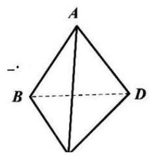

【练习】1. (2024 届华二) 已知四面体 ${ABCD}$ 中, ${AB} = 3,{CD} = 2$ ,则 $\overrightarrow{BC} \cdot  \overrightarrow{AD} - \; \overrightarrow{BD} \cdot  \overrightarrow{AC}$ 的取值范围是___

【答案】 $\left( {-6,6}\right)$

【解析】 $\overrightarrow{BC} \cdot  \overrightarrow{AD} - \overrightarrow{BD} \cdot  \overrightarrow{AC} = \overrightarrow{BC} \cdot  \left( {\overrightarrow{BD} - \overrightarrow{BA}}\right)  - \overrightarrow{BD} \cdot  \left( {\overrightarrow{BC} - \overrightarrow{BA}}\right)$

$= \overrightarrow{BD} \cdot  \overrightarrow{BA} - \overrightarrow{BC} \cdot  \overrightarrow{BA} = \overrightarrow{CD} \cdot  \overrightarrow{BA} \in  \left( {-6,6}\right)$ .

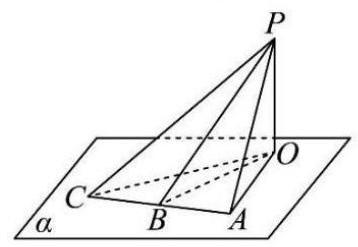

【练习】2. 如图,已知 ${PA}\text{ 、 }{PB}\text{ 、 }{PC}$ 与平面 $\alpha$ 所成角分别为 ${60}^{ \circ  }\text{ 、 }{45}^{ \circ  }\text{ 、 }{30}^{ \circ  }$ , ${PO} \bot$ 平面 $\alpha , O$ 为垂足,又有斜足 $A\text{ 、 }B\text{ 、 }C$ 三点在同一直线上, 且 ${AB} = {BC} = {10}\mathrm{\;{cm}}$ ，则 ${PO}$ 的长等于___.

【答案】 $5\sqrt{6}$

【解析】设 ${PO} = x$ ,则 ${PA} = \frac{2}{\sqrt{3}}x,{PB} = \sqrt{2}x,{PC} = {2x}$ ,

又 ${PB}$ 是 $\bigtriangleup {PAC}$ 底边 ${AC}$ 上的中线,则 $2\overrightarrow{PB} = \overrightarrow{PC} + \overrightarrow{PA},\overrightarrow{AC} = \overrightarrow{AP} \; + \overrightarrow{PC}$ ,

${\left( 2\overrightarrow{PB}\right) }^{2} = {\left( \overrightarrow{PC} + \overrightarrow{PA}\right) }^{2} = {\overrightarrow{PC}}^{2} + 2\overrightarrow{PC} \cdot  \overrightarrow{PA} + {\overrightarrow{PA}}^{2},$

${\left( \overrightarrow{AC}\right) }^{2} = {\left( \overrightarrow{AP} + \overrightarrow{PC}\right) }^{2} = {\overrightarrow{AP}}^{2} + 2\overrightarrow{AP} \cdot  \overrightarrow{PC} + {\overrightarrow{PC}}^{2} = {\overrightarrow{AP}}^{2} - 2\overrightarrow{PA} \cdot  \overrightarrow{PC} + {\overrightarrow{PC}}^{2}$ ,

所以 $4\overrightarrow{PB}{}^{2} + \overrightarrow{AC}{}^{2} = 2\overrightarrow{PC}{}^{2} + 2\overrightarrow{PA}{}^{2}$ ,则 $4\overrightarrow{PB}{}^{2} = 2\overrightarrow{PC}{}^{2} + 2\overrightarrow{PA}{}^{2} - \overrightarrow{AC}{}^{2}$ ,

所以 $8{x}^{2} = 8{x}^{2} + \frac{8}{3}{x}^{2} - {400}$ ,故 $x = 5\sqrt{6}$ ,所以 ${PO} = 5\sqrt{6}$ .

【练习】3. (2024 届曹二) 在棱长为 2 的正方体 ${ABCD} - {A}_{1}{B}_{1}{C}_{1}{D}_{1}$ 中,点 $P$ 在正方体的 12 条棱上 (包括顶点) 运动，则 $\overrightarrow{AC} \cdot  \overrightarrow{BP}$ 的取值范围是___.

【答案】 $\left\lbrack  {-4,4}\right\rbrack$

【解析】以 $D$ 为坐标原点建立空间直角坐标系,

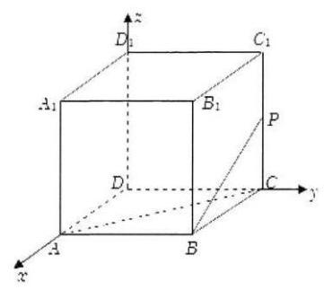

则 $A\left( {2,0,0}\right) , C\left( {0,2,0}\right) , B\left( {2,2,0}\right) ,\overrightarrow{AC} = \left( {-2,2,0}\right)$ ,

$P$ 在正方体的 12 条棱上运动,设 $P\left( {x, y, z}\right)$ ,则 $\overrightarrow{BP} = \; \left( {x - 2, y - 2, z}\right)$ ,

所以 $\overrightarrow{AC} \cdot  \overrightarrow{BP} = 4 - {2x} + {2y} - 4 = {2y} - {2x}$ ,

因为 $\left\{  \begin{array}{l} 0 \leq  x \leq  2 \\  0 \leq  y \leq  2 \end{array}\right.$ ,所以 $- 4 \leq  {2y} - {2x} \leq  4$ ,

当 $x = 2, y = 0$ 时, $\overrightarrow{AC} \cdot  \overrightarrow{BP}$ 取最小值 -4,

当 $x = 0, y = 2$ 时, $\overrightarrow{AC} \cdot  \overrightarrow{BP}$ 取最大值 4,

所以 $\overrightarrow{AC} \cdot  \overrightarrow{BP}$ 的取值范围是 $\left\lbrack  {-4,4}\right\rbrack$ .

【练习】4. (2024 届奉中) 在 $\bigtriangleup  {ABC}$ 中，各个顶点与对边中点连线，相交于一点，定义为三角形的重心 $G$ ,此时易得 $\overrightarrow{AG} = \frac{1}{3}\left( {\overrightarrow{AB} + \overrightarrow{AC}}\right)$ . 类似在三棱锥 $P - {ABC}$ 中,各个顶点分别与对面三角形的重心的连线，相交于一点，定义为三棱在的重心 $G$ . 若设 $\overrightarrow{PA} = \overrightarrow{a}$ ， $\overrightarrow{PB} = \overrightarrow{b}$ ， $\overrightarrow{PC} = \overrightarrow{c}$ ，则 $\overrightarrow{PG} =$ ___(用 $\overrightarrow{a}\text{ 、 }\overrightarrow{b}\text{ 、 }\overrightarrow{c}$ 表示).

【答案】 $\frac{1}{4}\overrightarrow{a} + \frac{1}{4}\overrightarrow{b} + \frac{1}{4}\overrightarrow{c}$

【解析】设点 $D$ 为 $\bigtriangleup  {ABC}$ 的重心，点 $E$ 为 $\bigtriangleup  {PBC}$ 的重心，

$\overrightarrow{PD} = \overrightarrow{PA} + \overrightarrow{AD} = \overrightarrow{PA} + \frac{1}{3}\left( {\overrightarrow{AB} + \overrightarrow{AC}}\right)  = \overrightarrow{PA} + \frac{1}{3}\left( {\overrightarrow{PB} - \overrightarrow{PA} + \overrightarrow{PC} - \overrightarrow{PA}}\right) ,$

$= \frac{1}{3}\overrightarrow{a} + \frac{1}{3}\overrightarrow{b} + \frac{1}{3}\overrightarrow{c},\overrightarrow{AE} = \overrightarrow{AP} + \overrightarrow{PE} =  - \overrightarrow{PA} + \frac{1}{3}\left( {\overrightarrow{PB} + \overrightarrow{PC}}\right)  =  - \overrightarrow{a} + \frac{1}{3}\overrightarrow{b} + \frac{1}{3}\overrightarrow{c}$ ,

设 $\overrightarrow{PG} = \lambda \overrightarrow{PD} = \frac{\lambda }{3}\overrightarrow{a} + \frac{\lambda }{3}\overrightarrow{b} + \frac{\lambda }{3}\overrightarrow{c},\overrightarrow{AG} = \mu \overrightarrow{AE} =  - \mu \overrightarrow{a} + \frac{\mu }{3}\overrightarrow{b} + \frac{\mu }{3}\overrightarrow{c}$ ,

$\overrightarrow{PA} = \overrightarrow{PG} - \overrightarrow{AG}$ ,即 $\overrightarrow{a} = \left( {\frac{\lambda }{3}\overrightarrow{a} + \frac{\lambda }{3}\overrightarrow{b} + \frac{\lambda }{3}\overrightarrow{c}}\right)  - \left( {-\mu \overrightarrow{a} + \frac{\mu }{3}\overrightarrow{b} + \frac{\mu }{3}\overrightarrow{c}}\right)$ ,

故 $\left\{  \begin{array}{l} \frac{\lambda }{3} + \mu  = 1 \\  \lambda  - \mu  = 0 \end{array}\right.$ ,解得 $\lambda  = \mu  = \frac{3}{4}$ ,故 $\overrightarrow{PG} = \frac{1}{4}\overrightarrow{a} + \frac{1}{4}\overrightarrow{b} + \frac{1}{4}\overrightarrow{c}$ .

【练习】5. (2024 届大同) 已知线段 ${AB}$ 长为 4，直线 $l$ 过点 $A$ 且与 ${AB}$ 垂直. 以 $B$ 为圆心，1 为半径的圆绕 $l$ 旋转一周,所得立体记为 $T$ . 以 $A\text{ 、 }B$ 分别为上下底面的圆心为底面半径的圆柱体记为 $U$ (如下图). 则根据祖桓原理, $T$ 与 $U$ 的体积之比为___.

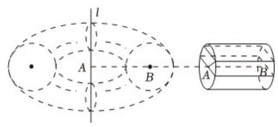

【答案】 $1 : {2\pi }$

【解析】 ${S}_{1} = 2\sqrt{1 - {h}^{2}} \cdot  4 = 8\sqrt{1 - {h}^{2}}$ ,

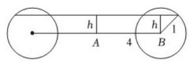

${S}_{2} = \pi {r}_{\text{ 外 }}^{2} - \pi {r}_{\text{ 内 }}^{2}$ ,其中 ${r}_{\text{ 外 }}^{2} = {\left( 4 + \sqrt{1 - {h}^{2}}\right) }^{2},{r}_{\text{ 内 }}^{2} = {\left( 4 - \sqrt{1 - {h}^{2}}\right) }^{2}$ ,

故 ${S}_{2} = {16}\sqrt{1 - {h}^{2}} \cdot  \pi  = {2\pi }{S}_{1}$ ,即 $\frac{{S}_{1}}{{S}_{2}} = \frac{1}{2\pi }$ ,

根据祖暅原理, $T$ 与 $U$ 的体积之比为 $1 : {2\pi }$ .

【练习】6. 在 $\bigtriangleup {ABC}$ 中, ${AB} = 3,{BC} = 4,{AC} = 5, P$ 为 $\bigtriangleup {ABC}$ 内部一动点 (含边界),在空间中,若到点 $P$ 的距离不超过 1 的点的轨迹为 $L$ ，则几何体 $L$ 的体积等于___.

【答案】 $\frac{22\pi }{3} + {12}$

【解析】到动点 $P$ 距离为 1 的点的轨迹所构成的空间体在垂直于平面 ${ABC}$ 的视角下看,

如图所示,其中 ${BCMN}\text{ 、 }{ACJK}\text{ 、 }{ABYQ}$ 区域内的几何体为半圆柱,

${CMJ}\text{ 、 }{BNY}\text{ 、 }{KAQ}$ 区域内的几何体为被两平面截的部分球,

球心分别为 $A\text{ 、 }B\text{ 、 }C,{ABC}$ 区域内的几何体为三棱柱,其高为 2,

因为 ${BCMN}\text{ 、 }{ACJK}\text{ 、 }{ANYQ}$ 为矩形,所以 $\angle {MCB} = {90}^{ \circ  },\angle {ACJ} = {90}^{ \circ  }$ ,

因为 $\angle {MCJ} = {360}^{ \circ  } - \left( {\angle {MCB} + \angle {ACJ}}\right)  - \angle {ACB} = {180}^{ \circ  } - \angle {ACB}$ ,

同理, $\angle {NBY} = {180}^{ \circ  } - \angle {ABC},\angle {KAQ} = {180}^{ \circ  } - \angle {BAC}$ ,

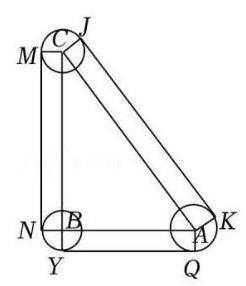

所以 $\angle {KAQ} + \angle {NBY} + \angle {MCT} = 3 \times  {180}^{ \circ  } - \left( {\angle {ABC} + \angle {BAC} + \angle {ACB}}\right)  = \; {360}^{ \circ  }$ ,

所以这三个区域的几何体合成一个完整的半径为 1 的球,

所以 ${V}_{CMT} + {V}_{NBY} + {V}_{KAQ} = \frac{4}{3}\pi  \times  {1}^{3} = \frac{4\pi }{3}\left( {V}_{CMJ}\right.$ 表示 ${CMJ}$ 区域几何体的体积,

其它以此类推),

${V}_{BCMN} + {V}_{ACJK} + {V}_{ABYQ} = \left( {\frac{1}{2} \times  \pi  \times  {1}^{2}}\right)  \times  \left( {3 + 4 + 5}\right)  = {6\pi }$

(其中 $\frac{1}{2} \times  \pi  \times  {1}^{2}$ 表示半圆底面), ${V}_{ABC} = \frac{1}{2} \times  3 \times  4 \times  2 = {12}$ ,

所以几何体 $L$ 的体积等于 $\frac{4\pi }{3} + {6\pi } + {12} = \frac{22\pi }{3} + {12}$ .

【练习】7. 空间给定不共面的 $A$ 、 $B$ 、 $C$ 、 $D$ 四个点，其中任意两点的距离都不相同，考虑具有如下性质的平面 $\alpha  : A\text{ 、 }B\text{ 、 }C\text{ 、 }D$ 中有三个点到 $\alpha$ 的距离相同,另外一个点到 $\alpha$ 的距离是前三个点到 $\alpha$ 的距离的 2 倍, 这样的平面的个数是___.

【答案】 32

【解析】首先取 3 个点相等,不相等的那个点有 4 种取法.

然后分 3 个点到平面 $\alpha$ 的距离相等,有以下 2 种可能性:

①全同侧，这样的平面有 2 个；

②不同侧，必然 2 个点在一侧，另1 个点在一侧，1 个点的取法有 3 种，并且平面

过三角形两个点边上的中位线. 考虑不相等的点与单侧点是否同侧有两种可能,

每种情况下都唯一确定一个平面,有 6 个.

所以共有 8 个.

综上,满足条件的这样的平面共有 $4 \times  8 = {32}$ 个.

## 板块三:压轴客观题

## 1. 真题回顾

【例题】1. (2023 上海春考) 设 $\overrightarrow{OA},\overrightarrow{OB},\overrightarrow{OC}$ 为空间中三组单位向量,且 $\overrightarrow{OA} \bot  \overrightarrow{OB},\overrightarrow{OA} \bot  \overrightarrow{OC},\overrightarrow{OB}$ 与 $\overrightarrow{OC}$ 夹角为 ${60}^{ \circ  }, P$ 为空间任意一点,且 $\left| \overrightarrow{OP}\right|  = 1$ ,满足 $\left| {\overrightarrow{OP} \cdot  \overrightarrow{OC}}\right|  \leq  \left| {\overrightarrow{OP} \cdot  \overrightarrow{OB}}\right|  \leq  \left| {\overrightarrow{OP} \cdot  \overrightarrow{OA}}\right|$ ,则 $\left| {\overrightarrow{OP} \cdot  \overrightarrow{OC}}\right|$ 的最大值为___.

【答案】 $\frac{\sqrt{21}}{7}$

【解析】法一:建立空间直角坐标系, $A\left( {0,0,1}\right) , B\left( {\frac{1}{2},\frac{\sqrt{3}}{2},0}\right) , C(1,0$ ,

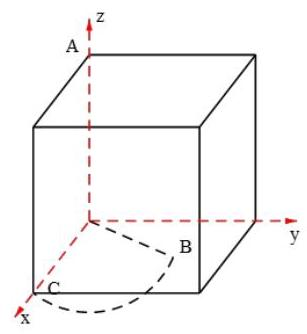

$0)$ ,设 $P\left( {x, y, z}\right)$ ,则 ${x}^{2} + {y}^{2} + {z}^{2} = 1$ ,

因为 $\left| {\overrightarrow{OP} \cdot  \overrightarrow{OC}}\right|  \leq  \left| {\overrightarrow{OP} \cdot  \overrightarrow{OB}}\right|  \leq  \left| {\overrightarrow{OP} \cdot  \overrightarrow{OA}}\right|$ ,

所以 $\left| x\right|  \leq  \left| {\frac{1}{2}x + \frac{\sqrt{3}}{2}y}\right|  \leq  \left| z\right|$ ,

所以 $x \leq  \frac{1}{2}x + \frac{\sqrt{3}}{2}y \leq  z$ ,

所以 $\left\{  \begin{array}{l} y \geq  \frac{1}{\sqrt{3}}x \\  x \leq  \frac{1}{2}x + \frac{\sqrt{3}}{2}y \leq  z \end{array}\right.$ ,当且仅当 $x = \sqrt{3}y = z$ 时取等号;

所以 $1 = {x}^{2} + {y}^{2} + {z}^{2} \geq  {x}^{2} + {\left( \frac{1}{\sqrt{3}}x\right) }^{2} + {x}^{2}$ ,所以 ${x}^{2} \leq  \frac{3}{7}$ ,

所以 ${\left| \overrightarrow{OP} \cdot  \overrightarrow{OC}\right| }_{\max } = \frac{\sqrt{21}}{7}$ .

法二: 由 $\left| {\overrightarrow{OP} \cdot  \overrightarrow{OC}}\right|  \leq  \left| {\overrightarrow{OP} \cdot  \overrightarrow{OB}}\right|  \leq  \left| {\overrightarrow{OP} \cdot  \overrightarrow{OA}}\right|$ ,

得 $\left| {\cos \angle {POC}}\right|  \leq  \left| {\cos \angle {POB}}\right|  \leq  \left| {\cos \angle {POA}}\right|$ ,

由对称性得 $\angle {POA} = \theta  = \angle {POC} \Rightarrow  \cos \theta  = \cos \left( {\frac{\pi }{2} - \theta }\right)  \cdot  \cos {30}^{ \circ  }$

所以 $\tan \theta  = \frac{2}{\sqrt{3}} \Rightarrow  \cos \theta  = \frac{\sqrt{21}}{7} \Rightarrow  {\left| \overrightarrow{OP} \cdot  \overrightarrow{OC}\right| }_{\max } = 1 \times  1 \times  \frac{\sqrt{21}}{7} = \frac{\sqrt{21}}{7}$ .

法三:利用数量积的几何意义

由 $\left| {\overrightarrow{OP} \cdot  \overrightarrow{OC}}\right|  \leq  \left| {\overrightarrow{OP} \cdot  \overrightarrow{OB}}\right|  \leq  \left| {\overrightarrow{OP} \cdot  \overrightarrow{OA}}\right|$ ,则 ${\left| \overrightarrow{OP} \cdot  \overrightarrow{OC}\right| }_{\max } \leq  \left| {\overrightarrow{OP} \cdot  \overrightarrow{OB}}\right|  \leq  \left| {\overrightarrow{OP} \cdot  \overrightarrow{OA}}\right|$ ,

由数量积的几何意义,易得当且仅当 ${OP} \bot$ 面 ${ABC}$ 时取等号,

不妨设点 $O$ 到平面 ${ABC}$ 的距离为 $h$ ，则 ${V}_{O - {ABC}} = {V}_{A - {OBC}}$ ，得 $h = \frac{\sqrt{21}}{7}$ ，

即 ${\left| \overrightarrow{OP} \cdot  \overrightarrow{OC}\right| }_{\max } = h = \frac{\sqrt{21}}{7}$ .

法四:利用三余弦定理求解，

由题意得 $\left| \overrightarrow{OA}\right|  = \left| \overrightarrow{OB}\right|  = \left| \overrightarrow{OC}\right|  = \left| \overrightarrow{OP}\right|  = 1$ ,

不妨设 $< \overrightarrow{OP},\overrightarrow{OA} >  = {\theta }_{1}, < \overrightarrow{OP},\overrightarrow{OB} >  = {\theta }_{2}, < \overrightarrow{OP},\overrightarrow{OC} >  = {\theta }_{3}$ ,

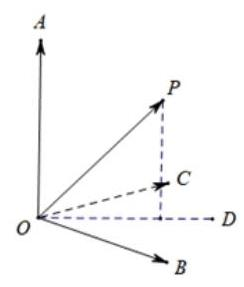

记直线 ${OP}$ 与平面 ${OBC}$ 所成角为 $\theta$ ,

又 $\left| {\overrightarrow{OP} \cdot  \overrightarrow{OC}}\right|  \leq  \left| {\overrightarrow{OP} \cdot  \overrightarrow{OB}}\right|  \leq  \left| {\overrightarrow{OP} \cdot  \overrightarrow{OA}}\right|$ ,可化为 $\left| {\cos {\theta }_{3}}\right|  \leq  \left| {\cos {\theta }_{2}}\right|  \leq  \left| {\cos {\theta }_{1}}\right|$ ,

题目求 $\left| {\overrightarrow{OP} \cdot  \overrightarrow{OC}}\right|$ 的最大值,即是求 $\left| {\cos {\theta }_{3}}\right|$ 的最大值,

即 ${\left| \cos {\theta }_{3}\right| }_{\max } \leq  \left| {\cos {\theta }_{2}}\right|  \leq  \left| {\cos {\theta }_{1}}\right|$ ,下面探索何时取等号,

由三垂线定理得 $\left\{  \begin{array}{l} {\theta }_{1} = {\theta }_{2} = {\theta }_{3} \\  {\theta }_{1} + \theta  = {90}^{ \circ  } \\  \cos {\theta }_{2} = \cos \theta \cos {30}^{ \circ  } \end{array}\right.$ ,解得 $\left| {\cos {\theta }_{3}}\right|  = \frac{\sqrt{21}}{7}$ ,

综上, ${\left| \overrightarrow{OP} \cdot  \overrightarrow{OC}\right| }_{\max } = \frac{\sqrt{21}}{7}$ .

法五:一撸到底+线性规划，

建立空间直角坐标系,设 $B\left( {1,0,0}\right) , A\left( {0,0,1}\right) , C\left( {\frac{1}{2},\frac{\sqrt{3}}{2},0}\right) , P\left( {x, y, z}\right)$ .

所以 $\left| {\overrightarrow{OP} \cdot  \overrightarrow{OC}}\right|  = \left| {\frac{1}{2}x + \frac{\sqrt{3}}{2}y}\right| ,\left| {\overrightarrow{OP} \cdot  \overrightarrow{OB}}\right|  = \left| x\right| ,\left| {\overrightarrow{OP} \cdot  \overrightarrow{OA}}\right|  = \left| z\right|$ ,

当 $x \geq  0$ 时,有 $- x \leq  \frac{1}{2}x + \frac{\sqrt{3}}{2}y \leq  x$ ,得 $- \sqrt{3}x \leq  y \leq  \frac{\sqrt{3}}{3}x$ ;

当 $x < 0$ 时,有 $x \leq  \frac{1}{2}x + \frac{\sqrt{3}}{2}y \leq   - x$ ,得 $\frac{\sqrt{3}}{3}x \leq  y \leq   - \sqrt{3}x$ ;

设 $z = \frac{1}{2}x + \frac{\sqrt{3}}{2}y$ ,即 $y = \frac{2}{\sqrt{3}}z - \frac{x}{\sqrt{3}}$ ,

在边界, $z$ 会有最大值和最小值,且为相反数.

由 $\left\{  \begin{array}{l} 2{x}^{2} + {y}^{2} = 1 \\  y = \frac{\sqrt{3}}{3}x \end{array}\right.$ ,得 $x = \frac{\sqrt{21}}{7}, y = \frac{\sqrt{7}}{7}$ ,所以 ${z}_{E} = \frac{\sqrt{21}}{7}$ ,

所以 $z \in  \left\lbrack  {-\frac{\sqrt{21}}{7},\frac{\sqrt{21}}{7}}\right\rbrack$ ,故 ${z}_{\max } = \frac{\sqrt{21}}{7}$ .

法六:在法五的基础上，利用取等条件对思路一进行优化，可省去线性规划的过程因为 $\left| \overrightarrow{OP}\right|$ .

$\left| \overrightarrow{OC}\right|  \leq  \left| {\overrightarrow{OP} \cdot  \overrightarrow{OB}}\right|  \leq  \left| {\overrightarrow{OP} \cdot  \overrightarrow{OA}}\right| ,$

所以当 $\left| {\overrightarrow{OP} \cdot  \overrightarrow{OC}}\right|$ 取得最大,则必有 $\left| {\overrightarrow{OP} \cdot  \overrightarrow{OC}}\right|  = \left| {\overrightarrow{OP} \cdot  \overrightarrow{OB}}\right|  = \left| {\overrightarrow{OP} \cdot  \overrightarrow{OA}}\right|$ ,

建立空间直角坐标系,设 $B\left( {1,0,0}\right) , A\left( {0,0,1}\right) , C\left( {\frac{1}{2},\frac{\sqrt{3}}{2},0}\right) , P\left( {x, y, z}\right)$ .

所以有 $\left| {\overrightarrow{OP} \cdot  \overrightarrow{OC}}\right|  = \left| {\frac{1}{2}x + \frac{\sqrt{3}}{2}y}\right| ,\left| {\overrightarrow{OP} \cdot  \overrightarrow{OB}}\right|  = \left| x\right| ,\left| {\overrightarrow{OP} \cdot  \overrightarrow{OA}}\right|  = \left| z\right|$ ,

进而有 $\left| {\frac{1}{2}x + \frac{\sqrt{3}}{2}y}\right|  = \left| x\right|  = \left| z\right|$ ①,

由球面的对称性, $P$ 在 ${xOy}$ 面上下是等价的,去上面四个卦限研究;

$P$ 在第一卦限和第三卦限等价,第二卦限和第四卦限等价,

且第一卦限比第二卦限优越,所以最终可以将 $P$ 等价在第一卦限,

故 $x > 0, y > 0, z > 0$ ,

所以有 $\left\{  \begin{array}{l} \frac{1}{2}x + \frac{\sqrt{3}}{2}y = x \\  x = z \\  {x}^{2} + {y}^{2} + {z}^{2} = 1 \end{array}\right.$ ,解得 $\left\{  \begin{array}{l} x = \frac{\sqrt{21}}{7} \\  y = \frac{\sqrt{7}}{7} \end{array}\right.$ ,得 ${\left| \overrightarrow{OP} \cdot  \overrightarrow{OC}\right| }_{\max } = \frac{\sqrt{21}}{7}$ .

法七:利用空间解析几何面的方程，

由 $\left| {\overrightarrow{OP} \cdot  \overrightarrow{OB}}\right|  \leq  \left| {\overrightarrow{OP} \cdot  \overrightarrow{OA}}\right|$ ,得 $P$ 在 $\angle {AOB}$ 的角平分面上侧及含面内,

面的方程为 $x - z = 0$ ;

由 $\left| {{OP} \cdot  \overrightarrow{OC}}\right|  \leq  \left| {\overrightarrow{OP} \cdot  \overrightarrow{OB}}\right|$ ,得 $P$ 在 $\angle {COB}$ 的角平分面左侧及含面内,

面的方程为 $x - \sqrt{3}y = 0$ ;

2025 版上海高考真题及模拟训练合集(下册)

想 $\left| {\overrightarrow{OP} \cdot  \overrightarrow{OC}}\right|$ 取得最大,必有 $\left\{  \begin{array}{l} x - \sqrt{3}y = 0 \\  x = z \end{array}\right.$ ,解得 $\left\{  \begin{array}{l} x = \frac{\sqrt{21}}{7} \\  y = \frac{\sqrt{7}}{7} \\  z = \frac{\sqrt{21}}{7} \end{array}\right.$ ,

得 ${\left| \overrightarrow{OP} \cdot  \overrightarrow{OC}\right| }_{\max } = \frac{\sqrt{21}}{7}$ .

【例题】2. (2023 上海秋考) 已知空间中存在三点 $A\text{ 、 }B\text{ 、 }C$ ,且 ${AB} = {AC} = {BC} = 1$ . 若从空间中再任取不同的两点 (不计顺序), 使得这五点构成一个正四棱锥, 则不同的取法共有___种.

【答案】 9

【解析】法一:

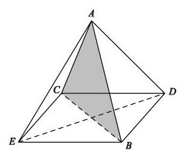

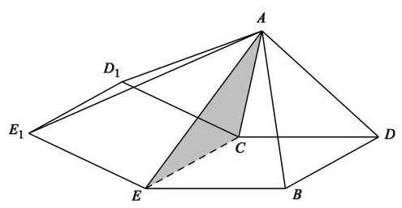

${1}^{ \circ  }$ 若以平面 ${ABC}$ 为正四棱锥的一个侧面时,

在其两侧分别可以作以 ${BC}$ 为一边的正方形 ${BCDE}$ 或 ${BC}{D}_{1}{E}_{1}$ ,

这样的四棱锥共 2 种,

同理,以 ${AB}\text{ 、 }{AC}$ 为底面正方形一边的四棱锥也各有 2 种,

所以,这样的四棱锥共 $2 + 2 + 2 = 6$ 种;

${2}^{ \circ  }$ 若以平面 ${ABC}$ 为正四棱锥的一个对角面时,

此时 ${DE}$ 只能为底面正方形的另一条对角线,

同理, ${AB}\text{ 、 }{AC}$ 为底面正方形一条对角线时, ${DE}$ 的位置情况,也各一种,

这样共 3 种;

综上,满足题意的四棱锥共 $6 + 3 = 9$ 种.

法二:首先， $\bigtriangleup  {ABC}$ 为等边三角形，

则取的两点 $D, E$ 都不可能作为正方形外的顶点,

否则若 $D$ 为顶点,则 $A, B, C, E$ 需要组成正方形,这不可能.

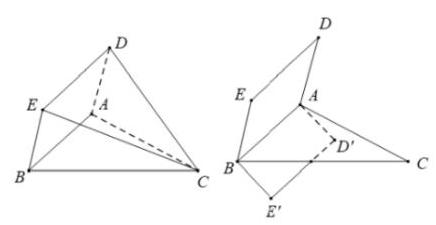

所以只能 $A, B, C$ 作为顶点,下面只需讨论 $C$ 为顶点时即可,

不失一般性,所得结果乘以 3 即为最终结果.

当 $C$ 为顶点时,

① ${AB}$ 为正方形的边，则正方形 ${ABDE}$ 可以

在平面 ${ABC}$ 的斜上方或斜下方,

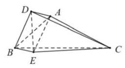

两种情况关于平面 ${ABC}$ 对称，共 2 个；

② ${AB}$ 为正方形的对角线，点 $D$ ， $E$ 出现在 ${AB}$ 的正上方和正下方，

即正方形 ${ADBE} \bot$ 平面 ${ABC}$ ,共 1 个;

综上,共有 $\left( {2 + 1}\right)  \times  3 = 9$ 个.

【例题】3. (2012上海秋考)如图， ${AD}$ 与 ${BC}$ 是四面体 ${ABCD}$ 中互相垂直的棱， ${BC} = 2$ ，若 ${AD} = {2c}$ ，且

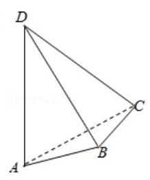

${AB} + {BD} = {AC} + {CD} = {2a}$ ，其中 $a$ 、 $c$ 为常数，则四面体 ${ABCD}$ 的体积的最大

值是___.

【答案】 $\frac{2}{3}c\sqrt{{a}^{2} - {c}^{2} - 1}$

【解析】作 ${BE} \bot  {AD}$ 于 $E$ ,连接 ${CE}$ ,则 ${AD} \bot$ 平面 ${BEC}$ ,所以 ${CE} \bot  {AD}$ ,

由题意得 $B$ 与 $C$ 都是在以 ${AD}$ 为焦点的椭球上,

且 ${BE}\text{ 、 }{CE}$ 都垂直于焦距 ${AD}$ ,

${AB} + {BD} = {AC} + {CD} = {2a}$ ,显然 $\bigtriangleup {ABD} \cong  \bigtriangleup {ACD}$ ,所以 ${BE} = {CE}$ .

取 ${BC}$ 中点 $F$ ，所以 ${EF}\bot {BC},{EF}\bot {AD}$ ，

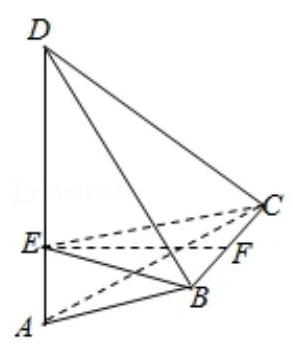

要求四面体 ${ABCD}$ 的体积的最大值，

因为 ${AD}$ 是定值，只需三角形 ${EBC}$ 的面积最大，

因为 ${BC}$ 是定值，所以只需 ${EF}$ 最大即可，

当 $\bigtriangleup {ABD}$ 是等腰三角形时几何体的体积最大,

因为 ${AB} + {BD} = {AC} + {CD} = {2a}$ ，所以 ${AB} = a$ ，

所以 ${EB} = \sqrt{{a}^{2} - {c}^{2}},{EF} = \sqrt{{a}^{2} - {c}^{2} - 1}$ ，

所以几何体的体积为 $\frac{1}{3} \times  2 \times  \sqrt{{a}^{2} - {c}^{2} - 1} \times  {2c} \times  \frac{1}{2} =$

$\frac{2}{3}c\sqrt{{a}^{2} - {c}^{2} - 1}$ 2025 版上海高考真题及模拟训练合集(下册)

## 2. 模拟练习

【练习】1. (2025 届华二) 设 ${A}_{1},{B}_{1},{C}_{1},{D}_{1}$ 分别是四棱锥 $P - {ABCD}$ 侧棱 ${PA},{PB},{PC},{PD}$ 上的点. 给出以下两个命题, 则 ( )

①若 ${ABCD}$ 是平行四边形，但不是菱形，则 ${A}_{1}{B}_{1}{C}_{1}{D}_{1}$ 可能是菱形;

②若 ${ABCD}$ 不是平行四边形,则 ${A}_{1}{B}_{1}{C}_{1}{D}_{1}$ 可能是平行四边形.

A. ①真②真 B. ①真②假 C. ①假②真 D. ①假②假

【答案】 $C$

【解析】对于②, 考虑一个正四棱锥, 然后在他的侧棱的延长线上可以画出一个梯形, 具体做法是: 取 $P{A}_{1} = P{B}_{1} = P{C}_{1} = P{D}_{1}$ ,

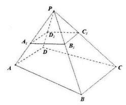

则四棱锥 $P - {A}_{1}{B}_{1}{C}_{1}{D}_{1}$ 为正四棱锥,

然后令 ${PA} = {2P}{A}_{1},{PB} = {2P}{B}_{1},{PC} = {3P}{C}_{1},{PD} = {3P}{D}_{1}$ ,

那么 ${AD}//{BC},{AD} \neq  {BC}$ ,此时 ${ABCD}$ 是梯形,但不是平行四边形;

对于①，如图，四边形 ${ABCD}$ 为平行四边形， ${A}_{1}{B}_{1}{C}_{1}{D}_{1}$ 也为平行四边形，

若平面 ${ABCD}$ 与平面 ${A}_{1}{B}_{1}{C}_{1}{D}_{1}$ 不平行，

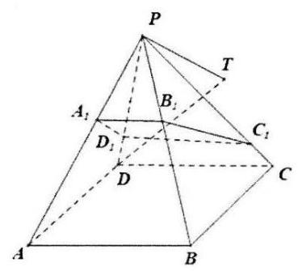

则四边形 ${A}_{1}{B}_{1}{C}_{1}{D}_{1}$ 中必有一边与底面 ${ABCD}$ 相交,

不妨设直线 ${A}_{1}{D}_{1}$ 与底面相交,则直线 ${B}_{1}{C}_{1}$ 也与底面相交,

在平面 ${PAD}$ 中过 $P$ 作 ${A}_{1}{D}_{1}$ 的平行线,交 ${AD}$ 与 $T$ ,则 ${PT}//{B}_{1}{C}_{1}$ ,

而 $P \in$ 平面 ${PBC},{B}_{1}{C}_{1} \subset$ 平面 ${PBC}$ ,故 ${PT} \subset$ 平面 ${PBC}$ ,即 $T \in$ 平面 ${PBC}$ ,

而平面 ${PBC} \cap$ 平面 ${ABCD} = {BC}$ ,故 $T \in  {BC}$ ,而 $T \in  {AD}$ ,

故 ${BC},{AD}$ 相交,这与 ${ABCD}$ 为平行四边形矛盾.

故平面 ${ABCD}//$ 平面 ${A}_{1}{B}_{1}{C}_{1}{D}_{1}$ ,故 $\frac{{A}_{1}{B}_{1}}{AB} = \frac{P{A}_{1}}{PA} = \frac{{A}_{1}{D}_{1}}{AD}$ ,

若四边形 ${A}_{1}{B}_{1}{C}_{1}{D}_{1}$ 为菱形,则 ${A}_{1}{B}_{1} = {A}_{1}{D}_{1}$ ,则 ${AB} = {AD}$ ,

故四边形 ${ABCD}$ 为菱形,故①错误.

故选 $C$ .

【练习】2. (2024 届华二) 设 ${l}_{1}\text{ 、 }{l}_{2}\text{ 、 }{l}_{3}$ 为空间中三条互相平行且两两间的距离分别为4,5,6的直线.

给出下列两个结论: ①存在 ${A}_{i} \in  {l}_{i}\left( {\mathrm{i} = 1,2,3}\right)$ ,使得 $\bigtriangleup {A}_{1}{A}_{2}{A}_{3}$ 是钝角三角形; ②存在 ${A}_{i} \in$

${l}_{i}\left( {\mathrm{i} = 1,2,3}\right)$ ,使得 $\bigtriangleup {A}_{1}{A}_{2}{A}_{3}$ 是等边三角形; 则下列正确的是 ( ) 2025 版上海高考真题及模拟训练合集(下册)

A. ①成立②成立 B. ①成立②不成立

C. ①不成立②成立 D. ①不成立②不成立

【答案】 $A$

【解析】我们不妨先将 $A\text{ 、 }B\text{ 、 }C$ 按如图所示放置.

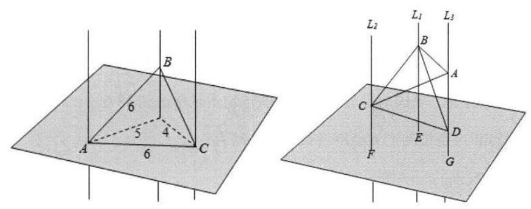

容易看出此时 ${BC} < {AB} = {AC}$ .

现在，我们将 $A$ 和 $B$ 往上移，并且总保持 ${AB} = {AC}$ (这是可以做到的，

只要 $A$ 、 $B$ 的速度满足一定关系)，

而当 $A$ 、 $B$ 移得很高很高时，不难想象 $\bigtriangleup  {ABC}$ 将会变得很扁，

也就是会变成顶角 $A$ “非常钝” 的一个等腰钝角三角形.

于是，在移动过程中，总有一刻，使 $\bigtriangleup  {ABC}$ 成为等边三角形，

亦总有另一刻，使 $\bigtriangleup  {ABC}$ 成为直角三角形 (而且还是等腰的).

这样,就得到①和②都是正确的. 故选 $A$ .

【练习】3. (2026 届复附)光线沿直线 $l$ 以 ${30}^{ \circ  }$ 的入射角 (指入射光线与入射表面法线的夹角) 照射到镜面 $\alpha$ 上的点 $A$ ，反射光线为射线 ${AB}$ ， $l$ 在平面 $\alpha$ 上的射影为 ${l}^{\prime }$ ，现将镜面以 ${l}^{\prime }$ 为轴旋转 ${45}^{ \circ  }$ ，反射光线变为射线 ${AC}$ ，则 $\angle {BAC}$ 的大小为___.

【答案】 $\arccos \frac{1}{4}$

【解析】在长方体中, ${DA}$ 表示入射线,平面 ${EFA}$ 为平面 $\alpha ,{DA}$ 在平面 $\alpha$ 的射影为 ${FA}$ ,因为直线 ${DA}$ 照射到平面 $\alpha$ 的入射角为 ${30}^{ \circ  }$ ,所以 $\angle {DAF} = {60}^{ \circ  }$ .

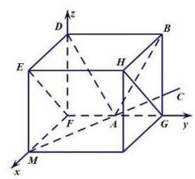

不妨令 ${FD} = {FM} = \sqrt{3},{FA} = 1$ ,

将平面 $\alpha$ 绕 ${FA}$ 轴旋转 ${45}^{ \circ  }$ 得平面 ${EFGH}$ ,

则 $A\left( {0,1,0}\right)$ ,可取 $B\left( {0,2,\sqrt{3}}\right)$ ,

则反射光线 ${AB}$ 的方向向量为 $\overrightarrow{AB} = \left( {0,1,\sqrt{3}}\right)$ .

因为点 $D$ 关于平面 ${EFGH}$ 的对称点为 $M\left( {\sqrt{3},0,0}\right)$ ,

所以反射线 ${AC}$ 的方向向量为 $\overrightarrow{MA} = \left( {-\sqrt{3},1,0}\right)$ ,

所以 $\cos \angle {BAC} = \frac{\overrightarrow{AB} \cdot  \overrightarrow{MA}}{\left| \overrightarrow{AB}\right|  \cdot  \left| \overrightarrow{MA}\right| } = \frac{1}{2 \times  2} = \frac{1}{4}$ ，所以 $\angle {BAC} = \arccos \frac{1}{4}$ .

【练习】4. 已知异面直线 $a\text{ 、 }b$ 所成角为 ${60}^{ \circ  }$ ,直线 ${AB}$ 与 $a\text{ 、 }b$ 均垂直,且垂足分别是点 $A\text{ 、 }B$ ,若动点 $P \in \; a, Q \in  b,\left| {PA}\right|  + \left| {QB}\right|  = m$ ，则线段 ${PQ}$ 中点 $M$ 的轨迹围成的区域的面积是___.

【答案】 $\frac{\sqrt{3}{m}^{2}}{4}$

【解析】设线段 ${AB}$ 的中垂面为 $\alpha$ ,则 $M$ 的轨迹在平面 $\alpha$ 内,

在平面 $\alpha$ 内分别作直线 $a\text{ 、 }b$ 的投影 ${a}^{\prime }\text{ 、 }{b}^{\prime }$ ,则两直线的夹角为 ${60}^{ \circ  }$ ,

设 $A\text{ 、 }B$ 在平面 $\alpha$ 的投影为 $O, P\text{ 、 }Q$ 在平面 $\alpha$ 内的投影分别为 ${P}^{\prime }\text{ 、 }{Q}^{\prime }$ ,

则 $M$ 为 ${P}^{\prime }{Q}^{\prime }$ 的中点，所以 $O{P}^{\prime } = {PA}$ ， $O{Q}^{\prime } = {BQ}$ ，

因为 $\left| {PA}\right|  + \left| {QB}\right|  = m$ ，所以 $O{P}^{\prime } + O{Q}^{\prime } = m$ .

在直线 ${a}^{\prime }\text{ 、 }{b}^{\prime }$ 上分别取点 $E\text{ 、 }F\text{ 、 }G\text{ 、 }H$ 四点,

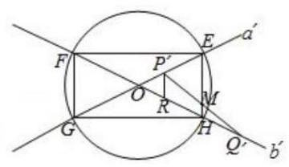

使得 ${OE} = {OF} = {OG} = {OH} = \frac{m}{2}$ ,

因为 ${OE} + {OH} = {O{P}^{\prime }} + {O{Q}^{\prime }} = m$ ，所以 ${{P}^{\prime }E} = {H{Q}^{\prime }}$ ，

过 ${P}^{\prime }$ 作 ${P}^{\prime }R//{EH}$ 交 $O{Q}^{\prime }$ 于 $R$ ,则 ${HR} = {P}^{\prime }E = H{Q}^{\prime }$ ,

所以 ${P}^{\prime }{Q}^{\prime }$ 的中点 $M$ 在 ${EH}$ 上,同理可得 $M$ 在 ${EF}\text{ 、 }{FG}\text{ 、 }{GH}$ 上,所

以 $M$ 的轨迹为矩形 ${EHGH}$ .

因为 $\angle {EOH} = {60}^{ \circ  },{OE} = {OF} = {OG} = {OH} = \frac{m}{2}$ ,

所以 ${S}_{\text{ 矩形 }{EFGH}} = \frac{1}{2} \times  \frac{m}{2} \times  \frac{m}{2} \times  \sin {60}^{ \circ  } \times  2 + \frac{1}{2} \times  \frac{m}{2} \times  \frac{m}{2} \times  \sin {120}^{ \circ  } \times  2 = \frac{\sqrt{3}{m}^{2}}{4}$ .

【练习】5. (2024 届华二) 点 $O$ 是正四面体 ${A}_{1}{A}_{2}{A}_{3}{A}_{4}$ 的中心, $\left| {O{A}_{i}}\right|  = 1\left( {\mathrm{i} = 1,2,3,4}\right)$ .

若 $\overrightarrow{OP} = {\lambda }_{1}\overrightarrow{O{A}_{1}} + {\lambda }_{2}\overrightarrow{O{A}_{2}} + {\lambda }_{3}\overrightarrow{O{A}_{3}} + {\lambda }_{4}\overrightarrow{O{A}_{4}}$ ,其中 $0 \leq  {\lambda }_{i} \leq  1\left( {\mathrm{i} = 1,2,3,4}\right)$ ,则动点 $P$ 扫过的区域的体积为___.

【答案】 $\frac{{16}\sqrt{3}}{9}$

【解析】本题较为复杂,考虑 ${\lambda }_{i}$ 取 0 到 1 的端点值,

考虑两个 ${\lambda }_{i}$ 取 1,其余两个取 0 ; 考虑三个 ${\lambda }_{i}$ 取 1,其余 1 个取 0 ;

把该四面体嵌入正方体中作图，

所求体积为两倍的正方体，计算得 $\frac{{16}\sqrt{3}}{9}$ .

【练习】6. 已知棱长均为 1 的正 $n$ 棱柱有 ${2n}$ 个顶点,从中任取两个顶点作为向量 $\overrightarrow{a}$ 的起点与终点,设底面的一条棱为 ${AB}$ . 若集合 ${A}_{n} = \{ x \mid  x = \overrightarrow{a} \cdot  \overrightarrow{AB}\}$ ,则当 ${A}_{n}$ 中的元素个数最少时, $n$ 的值为 ( )

A. 3 B. 4 C. 6 D. 8

【答案】 $B$

【解析】因为 $\overrightarrow{a}$ 都可以表示成正 $n$ 棱柱底面顶点连线对应向量的和向量,

或底面向量与垂直于底面的向量的和向量,

由数量积的运算律得 $\overrightarrow{a} \cdot  \overrightarrow{AB}$ 可化为底面中任意两顶点连线对应向量与 $\overrightarrow{AB}$ 的

数量积,

再由数量积的几何意义得,当底面所有任意两点连线对应向量在 $\overrightarrow{AB}$ 上投影向量个数最少时,

对应的 $n$ 值即为所求,

显然正方形 ${ABCD}$ 中,取 $\overrightarrow{AB}$ ,其余任意两点连线对应向量在 $\overrightarrow{AB}$ 上的投影向量

只有 $\overrightarrow{0}$ (与 $\overrightarrow{AB}$ 垂直的向量的投影向量),

以及 $\overrightarrow{AB}$ 同向的相等向量或反向的相反向量 $\overrightarrow{BA}$ 两种情况，

则最终 $x$ 的值有 $0, \pm  {\left| AB\right| }^{2} =  \pm  1$ ,此时 $x = 3$ ;

同理, $n = 3$ 时, $x$ 的值为 4 ; 当 $n = 5,6,\cdots \cdots , x$ 的值必然大于 3,

当 ${A}_{n}$ 中的元素个数最少时, $n$ 的值为 4 .

故选 B.

【练习】7. 设四面体 ${ABCD}$ 中,有 $k$ 条棱长为 $a$ ,其余 $6 - k$ 条棱长为 1 .

(1) $k = 1$ 时，求 $a$ 的取值范围；

(2) $k = 2$ 时，求 $a$ 的取值范围.

【解析】(1) 设 ${AB} = a$ ，固定 $\bigtriangleup  {BCD}$ ，让 $\bigtriangleup  {ACD}$ 绕 ${CD}$ 转动，

当 $A$ 接近 $B$ 时， $a$ 接近于 0 ；

当 $\bigtriangleup  {ACD}$ 与 $\bigtriangleup  {BCD}$ 接近于共面时， $a$ 接近于 $\sqrt{3}$ ；

故 $a \in  \left( {0,\sqrt{3}}\right)$ ；

(2)第一种情况，两边在一个三角形内时:

假设 ${AB} = {AC} = a > 0,{DA} = {DB} = {DC} = {BC} = 1$ 时， $E$ 为 $D$ 在底面射影，

由题意得 ${EA} = {EB} = {EC}$ ，假设 ${BC}$ 中点为 $O$ ，连结 ${EO}$ ，

假设 ${EA} = {EC} = x < 1$ ,则 ${EO} = \sqrt{{x}^{2} - \frac{1}{4}},{AO} = x + \sqrt{{x}^{2} - \frac{1}{4}}, A \ll$

$A{O}^{2} + C{O}^{2} = A{C}^{2}$ ,即 ${\left( x + \sqrt{{x}^{2} - \frac{1}{4}}\right) }^{2} + \frac{1}{4} = {a}^{2}$ ,

解得 $\left\{  \begin{array}{l} {a}^{4} = \left( {4{a}^{2} - 1}\right) {x}^{2} \\  4{a}^{2} - 1 > 0 \end{array}\right.$ ,则 $x = \frac{{a}^{2}}{\sqrt{4{a}^{2} - 1}} < 1$ 且 $a > \frac{1}{2}$ ,

即 ${a}^{4} - 4{a}^{2} + 1 < 0$ ,故 $2 - \sqrt{3} < {a}^{2} < 2 + \sqrt{3}$ ,则 $\frac{\sqrt{6} - \sqrt{2}}{2} < a <$

$\frac{\sqrt{6} + \sqrt{2}}{2}$ ,

综上, $\frac{\sqrt{6} - \sqrt{2}}{2} < a < \frac{\sqrt{6} + \sqrt{2}}{2}$ ;

第二种情况，两边不在一个三角形内时:

假设 ${AC} = {BD} = a,{AB} = {AD} = {CB} = {CD} = 1$ ，

发现当等腰三角形两腰的夹角接近 ${0}^{ \circ  }$ 时， $a$ 在减小但总是存在的，故 $a > 0$ ，

假设 ${AC} = {BD} = a,{AB} = {AD} = {CB} = {CD} = 1$ ,取 ${AC}$ 中点 $G$ ,

连接 ${DG}\text{ 、 }{BG}$ ,则 ${DG} = {BG} = \sqrt{1 - \frac{{a}^{2}}{4}}$ ,

由两边之和大于第三边得 $2\sqrt{1 - \frac{{a}^{2}}{4}} > a$ ,解得 $a < \sqrt{2}$ ,故 $a \in \; \left( {0,\sqrt{2}}\right)$ ,

综上, $a \in  \left( {0,\frac{\sqrt{6} + \sqrt{2}}{2}}\right)$ .

## 板块四: 基础主观题

## 1. 真题回顾

【例题】1. (2025 上海春考) 已知三棱锥 $P - {ABC}$ ，平面 ${ABC} \bot$ 平面 ${PAC},{PA} = {AC} = {PC} = 2,{AB} = {BC} = \sqrt{2}.$

(1)设 ${AC}$ 中点为 $O$ ，求证: ${BO}\bot$ 平面 ${PAC}$ ，并求三棱锥 $B - \; {PAO}$ 的体积；

(2) 求二面角 $B - {PC} - A$ 的大小.

【解析】(1) 连 ${PO}$ ,则 ${BO} \bot  {AC}$ .

又 ${PO} \bot  {AC}$ ,所以 $\angle {POB}$ 为 $P - {AC} - B$ 的平面角,即 $\angle {POB} = \; {90}^{ \circ  }$ ,所以 ${BO} \bot  {PO}$ .

又 ${PO} \cap  {AC} = O$ ,所以 ${BO} \bot$ 平面 ${PAC}$ .

易得 ${AO} = 1,{BO} = 1,{PO} = 2 \cdot  \frac{\sqrt{3}}{2} = \sqrt{3}$ ，所以 ${V}_{B - {PAO}} = {V}_{P - {BAO}} = \frac{1}{3} \cdot  \frac{1}{2} \cdot  {AO} \cdot  {BO} \cdot  {PO} = \frac{\sqrt{3}}{6}$ ；

(2) 作 ${OD} \bot  {PC}$ 交 ${PC}$ 于 $D$ ,因为 ${DB}$ 在面 ${PAC}$ 的投影为 ${OD}$ ,

所以 ${BD} \bot  {PC}$ ,即 $\angle {DOB} = {90}^{ \circ  }$ ,所以 $\angle {ODB}$ 为二面角的平面角.

由 ${BO} = 1,{OC} = 1,{OD} = \frac{\sqrt{3}}{2}$ ,所以 $\tan \angle {ODB} = \frac{2\sqrt{3}}{3}$ ,

即二面角 $B = {PC} - A$ 的大小为 $\arctan \frac{2\sqrt{3}}{3}\left( {\arcsin \frac{2\sqrt{7}}{7}/\arccos \frac{\sqrt{21}}{7}}\right)$ .

【例题】2. (2024 上海秋考) 如图, $P - {ABCD}$ 是正四棱锥, $O$ 为底面中心.

(1)设 ${AD} = {3\sqrt{2}},{PA} = 5$ ，将 $\bigtriangleup  {POA}$ 绕 ${PO}$ 旋转一周,求所得旋转体的体积;

(2)设 ${PA} = {AD}, E$ 为棱 ${PD}$ 中点，求直线 ${BD}$ 与平面 ${AEC}$ 所成角的大小.

【解析】(1) 所得旋转体是以 ${OA}$ 为底面半径, ${OP}$ 为高的圆锥,

计算得 ${OA} = 3,{OP} = 4$ ,则所得旋转体的体积 $V = \frac{1}{3}\pi  \times  {3}^{2} \times  4 \; = {12\pi }$ ;

(2)以 $O$ 为原点， ${OB}$ 为 $x$ 轴， ${OC}$ 为 $y$ 轴， ${OP}$ 为 $z$ 轴，

建立空间直角坐标系，不妨设 ${OB} = 2$ ，

则 $B\left( {2,0,0}\right)$ ， $D\left( {-2,0,0}\right)$ ， $A\left( {0, - 2,0}\right)$ ， $C\left( {0,2,0}\right)$ ， $P\left( {0,0,2}\right)$ ， $E\left( {-1,0,1}\right)$ ，

$\overrightarrow{BD} = \left( {-4,0,0}\right) ,\overrightarrow{AC} = \left( {0,4,0}\right) ,\overrightarrow{AE} = \left( {-1,2,1}\right) ,$

设平面 ${AEC}$ 的法向量 $\overrightarrow{n} = \left( {x, y, z}\right)$ ,

则 $\left\{  \begin{array}{l} \overrightarrow{n} \cdot  \overrightarrow{AC} = {4y} = 0 \\  \overrightarrow{n} \cdot  \overrightarrow{AE} =  - x + {2y} + z = 0 \end{array}\right.$ ,令 $x = 1$ ,得 $\overrightarrow{n} = \left( {1,0,1}\right)$ ,

设直线 ${BD}$ 与平面 ${AEC}$ 所成角为 $\theta$ ,则 $\sin \theta  = \frac{\left| \overrightarrow{n} \cdot  \overrightarrow{BD}\right| }{\left| \overrightarrow{n}\right| \left| \overrightarrow{BD}\right| } = \frac{1}{\sqrt{2}} = \frac{\sqrt{2}}{2}$ ,

因为 $\theta  \in  \left\lbrack  {0,\frac{\pi }{2}}\right\rbrack$ ,所以直线 ${BD}$ 与平面 ${AEC}$ 所成角的大小为 $\frac{\pi }{4}$ .

【例题】3. (2024上海春考)如图，已知 ${PA}$ 、 ${PB}$ 、 ${PC}$ 为圆锥三条母线，且 ${AB} = {AC}$ .

(1)证明: ${PA} \bot  {BC}$ ；

(2)若圆锥侧面积为 $\sqrt{3}\pi ,{BC}$ 为底面直径， ${BC} = 2$ ，求二面角 $B - {PA} - C$ 的大小.

【解析】(1) 取 ${BC}$ 中点 $M$ ,连接 ${PM},{AM}$ ,

因为 ${AB} = {AC}$ ，所以 ${AB} = {AC} \Rightarrow  {AM}\bot {BC}$ ，

因为 ${PB} = {PC}$ ，所以 ${PB} = {PC} \Rightarrow  {PM}\bot {BC}$ ，

因为 ${PM} \subset$ 平面 ${PMC} \subset$ Áæ ${PMA},{AM} \subset$ 平面 ${AMC} \subset$ Áæ ${PMA},{PM} \cap  {AM} \; = M$ ,

所以 ${BC} \bot$ 平面 ${BC} \bot$ ̃aePAM,

因为 ${PA} \subset$ 平面 ${PA} \subset$ 入 ${aePAM}$ ,所以 ${PA} \bot  {BC}$ ;

(2)法一:圆锥侧面积 $S = {\pi r} \cdot  l = \sqrt{3}\pi$ ，底面半径 $r = 1$ ，

则母线 $S = {\pi r} \cdot  l = \sqrt{3}\pi , r = 1,\therefore l = \sqrt{3}$ ,

取底面中心 $O$ ,因为 ${PO} \bot$ 平面 ${ABC}$ ,所以 ${ABC},\therefore {PO} = \sqrt{2}$ ,

过点 $O$ 作 ${OH} \bot  {PA}$ 交 ${PA}$ 于点 $H$ ，连接 ${BH}$ ，

由 (1) 和三垂线定理得 ${BH} \bot  {AP}$ ,

所以 $\angle {OHB}$ 即二面角 $B - {PA} - O$ 的平面角,

由等面积法得 ${OH} = \frac{{OA} \cdot  {OP}}{AP} = \frac{\sqrt{6}}{3}$ ，所以 $\tan \angle {OHB} = \frac{OB}{OH} = \frac{\sqrt{6}}{2}$ ，

由对称性 $B - {PA} - C = {2B} - {PA} - O = 2\angle {OHB}$ ,

$\tan 2\angle {OHB} = \frac{\sqrt{6}}{1 - \frac{3}{2}} =  - 2\sqrt{6},$

所以二面角 $B - {PA} - C$ 大小为 $\pi  - \arctan 2\sqrt{6}$ .

法二:作 ${BM}$ 垂直于 ${PA}$ ，垂足为 $M$ ，连接 ${CM}$ ，

由题意得 $\bigtriangleup  {PAB} \cong   \bigtriangleup  {PAC}$ ，故 ${CM}\bot {PA}$ ，

即 $\angle {BMC}$ 为所求二面角的平面角,

在 $\bigtriangleup  {PAB}$ 内，不妨设 ${AB}$ 边上的高为 $h$ ，故 $h = \sqrt{{\sqrt{3}}^{2} - {\left( \frac{\sqrt{2}}{2}\right) }^{2}} = \; \frac{\sqrt{10}}{2}$ ,

由 $\frac{1}{2}h\left| {AB}\right|  = \frac{1}{2}\left| {BM}\right|  \cdot  \left| {PA}\right|$ ,得 ${BM} = {CM} = \frac{\sqrt{15}}{3}$ ,

在 $\bigtriangleup {BCM}$ 中,由余弦定理得 $\cos \angle {BMC} = \frac{{\left( \frac{\sqrt{15}}{3}\right) }^{2} + {\left( \frac{\sqrt{15}}{3}\right) }^{2} - {2}^{2}}{2 \times  \frac{\sqrt{15}}{3} \times  \frac{\sqrt{15}}{3}} =  - \frac{1}{5}$ ,

故二面角 $B - {PA} - C$ 的大小为 $\pi  - \arccos \frac{1}{5}$ .

法三: 取底面中心 $O$ ,以 ${OB}$ 为 $x$ 轴, ${OA}$ 为 $y$ 轴,

${OP}$ 为 $z$ 轴,建立空间直角坐标系,

因为圆锥侧面积为 $\sqrt{3}\pi ,{BC}$ 为底面直径, ${BC} = 2$ ,

所以底面半径为 1,母线长为 $\sqrt{3}$ ,所以 ${PO} = \sqrt{P{A}^{2} - A{O}^{2}} = \sqrt{2}$ ,

则 $P\left( {0,0,\sqrt{2}}\right) , A\left( {0,1,0}\right) , B\left( {1,0, C}\right) , C\left( {-1,0,0}\right)$ ,

故 $\overrightarrow{PA} = \left( {0,1, - \sqrt{2}}\right) ,\overrightarrow{PB} = \left( {1,0, - \sqrt{2}}\right) ,\overrightarrow{PC} = \left( {-1,0, - \sqrt{2}}\right)$ ,

设 ${\overrightarrow{n}}_{1} = \left( {{x}_{1},{y}_{1},{z}_{1}}\right)$ 为面 ${PAB}$ 的法向量,则

$\left\{  {\begin{array}{l} \overrightarrow{{n}_{1}} \cdot  \overrightarrow{PA} = 0 \\  \overrightarrow{{n}_{1}} \cdot  \overrightarrow{PB} = 0 \end{array} \Rightarrow  \left\{  {\begin{array}{l} {y}_{1} - \sqrt{2}{z}_{1} = 0 \\  {x}_{1} - \sqrt{2}{z}_{1} = 0 \end{array},}\right. }\right.$

令 ${x}_{1} = \sqrt{2}$ ,则 ${y}_{1} = \sqrt{2},{z}_{1} = 1$ ,所以 $\overrightarrow{{n}_{1}} = \left( {\sqrt{2},\sqrt{2},1}\right)$ .

设 ${\overrightarrow{n}}_{2} = \left( {{x}_{2},{y}_{2},{z}_{2}}\right)$ 为面 ${PAC}$ 的法向量,则 $\left\{  {\begin{array}{l} {\overrightarrow{n}}_{2} \cdot  \overrightarrow{PA} = 0 \\  {\overrightarrow{n}}_{2} \cdot  \overrightarrow{PC} = 0 \end{array} \Rightarrow  \left\{  \begin{array}{l} {y}_{2} - \sqrt{2}{z}_{2} = 0 \\   - {x}_{2} - \sqrt{2}{z}_{2} = 0 \end{array}\right. }\right.$ ,

令 ${x}_{2} =  - \sqrt{2}$ ,则 ${y}_{2} = \sqrt{2},{z}_{2} = 1$ ,所以 $\overrightarrow{{n}_{2}} = \left( {-\sqrt{2},\sqrt{2},1}\right)$ .

则 $\cos {\overrightarrow{n}}_{1},{\overrightarrow{n}}_{2} = \frac{{\overrightarrow{n}}_{1} \cdot  {\overrightarrow{n}}_{2}}{\left| {\overrightarrow{n}}_{1}\right| \left| {\overrightarrow{n}}_{2}\right| } = \frac{-2 + 2 + 1}{\sqrt{5} \times  \sqrt{5}} =  - \frac{1}{5}$ ,

所以二面角 $B - {PA} - C$ 的大小为 $\pi  - \arccos \frac{1}{5}$ .

【例题】4. (2023 上海春考) 已知三棱锥 $P - {ABC}$ 中， ${PA}\bot$ 平面 ${ABC},{AB}\bot {AC},{PA} = {AB} = 3,{AC} =$ 4, $M$ 为 ${BC}$ 中点，过点 $M$ 分别作平行于平面 ${PAB}$ 的直线交 ${AC}$ 、 ${PC}$ 于点 $E$ 、 $F$ .

(1)求直线 ${PM}$ 与平面 ${ABC}$ 所成角的大小；

(2)证明: ${ME}//$ 平面 ${PAB}$ ，并求直线 ${ME}$ 到平面 ${PAB}$ 的距离.

【解析】(1)连接 ${AM},{PM}$ ,

$\because {PA} \bot$ 平面 ${ABC}$ ,

$\therefore \angle {PMA}$ 为直线 ${PM}$ 与平面 ${ABC}$ 所成的角，

因为 ${PA} = {AB} = 3,{AC} = 4$ ，所以 ${BC} = 5,{AM} = \frac{5}{2},$

所以 ${PA} = {AB} = 3,{AC} = 4 \Rightarrow  {BC} = 5,{AM} = \frac{5}{2}$

$\Rightarrow  \tan \angle {PMA} = \frac{PA}{AM} = \frac{3}{\frac{5}{2}} = \frac{6}{5}$ ，所以 $\frac{3}{\frac{5}{2}} = \frac{6}{5} \Rightarrow  \angle {PMA} = \arctan \frac{6}{5}$ ， $\therefore$ ，

所以直线 ${PM}$ 与平面 ${ABC}$ 所成的角 $\arctan \frac{6}{5}$ .

(2)因为 ${ME}//$ 平面 ${PAB},{ME} \subset$ 平面 ${ABC}$ ，平面 ${ABC} \cap$ 平面 ${PAB} = {AB}$ ，

所以 ${AB} \Rightarrow  {ME}//{AB}$ ，又 $M$ 为 ${BC}$ 中点，所以 $E$ 为 ${AC}$ 中点，

${AE}$ 即为直线 ${ME}$ 到平面 ${PAB}$ 的距离，所以直线 ${ME}$ 到平面 ${PAB}$ 的距离 $= 2$ .

【例题】5. (2023上海秋考)如图，在直四棱柱 ${ABCD} - {A}_{1}{B}_{1}{C}_{1}{D}_{1}$ 中，

${AB}//{DC},{AB} \bot  {AD},{AB} = 2,{AD} = 3,{DC} = 4$ .

(1)求证:直线 ${A}_{1}B//$ 平面 ${DC}{C}_{1}{D}_{1}$ ；

(2)若直四棱柱 ${ABCD} - {A}_{1}{B}_{1}{C}_{1}{D}_{1}$ 的体积为36，

求二面角 ${A}_{1} - {BD} - A$ 的大小.

【解析】法一: (几何法)

(1)取 ${DC}$ 中点 $E$ ，连接 ${DE}$ ， ${AB}//{DC}$ ，即 ${AB}//{DE}$ ，

且 ${AB} = 2,{DC} = 4$ ，所以 ${AB} = {DE}$ ，

所以四边形 ${ABED}$ 为平行四边形,所以 ${AD}//{EB},{AD} = {EB}$ ，

又在直四棱柱 ${ABCD} - {A}_{1}{B}_{1}{C}_{1}{D}_{1}$ 中，所以 ${AD}//{A}_{1}{D}_{1},{AD} = {A}_{1}{D}_{1}$ ，

所以 ${BE} = {A}_{1}{D}_{1}$ 且 ${BE}//{A}_{1}{D}_{1}$ ，所以四边形 ${A}_{1}{BE}{D}_{1}$ 为平行四边形，

所以 ${A}_{1}B//{D}_{1}E$ ,又 ${A}_{1}B \subset$ 平面 ${DC}{C}_{1}D,{D}_{1}E \subset$ 平面 ${DC}{C}_{1}D$ ,

所以 ${A}_{1}B//$ 面 ${DC}{C}_{1}D$ ;

(2) 因为四柱体 ${ABCD} - {A}_{1}{B}_{1}{C}_{1}{D}_{1}$ 的体积为 36,

所以 ${36} = {S}_{ABCD} \cdot  D{D}_{1} = \frac{1}{2}\left( {2 + 4}\right)  \times  3 \cdot  D{D}_{1}$ ,解得 $D{D}_{1} = 4$ ,

过 $A$ 作 ${AF} \bot  {BD}$ 于 $F$ ,连接 ${AF}$ ,则 $\angle {A}_{1}{FA}$ 为二面角的平面角,

计算得 ${BD} = \sqrt{A{B}^{2} + A{D}^{2}} = \sqrt{13}$ ,则 ${AF} = \frac{{AD} \cdot  {AB}}{BD} = \frac{2 \times  3}{\sqrt{13}}$ ,

则 $\tan \angle {A}_{1}{FA} = \frac{A{A}_{1}}{AF} = 4 \div  \frac{6}{\sqrt{13}} = \frac{2\sqrt{13}}{3}$ ,

易得二面角 ${A}_{1} - {BD} - A$ 的平面角为锐角，

所以二面角 ${A}_{1} - {BD} - A$ 的大小为 $\arctan \frac{2\sqrt{13}}{3}$ .

法二:(空间向量)

以 $D$ 为坐标原点, $\overrightarrow{DA}\text{ 、 }\overrightarrow{DC}\text{ 、 }\overrightarrow{D{D}_{1}}$ 的方向分别为 $x, y, z$ 轴的正方向,

建立空间直角坐标系,

(1) ${A}_{1}\left( {3,0,4}\right) , B\left( {3,2,0}\right) , D\left( {0,0,0}\right) , B\left( {3,2,0}\right) ,{A}_{1}\left( {3,0,4}\right)$ ,所以 $\overrightarrow{{A}_{1}B} = \left( {0,2, - 4}\right)$ .

由 ${AD} \bot$ 面 ${CD}{D}_{1}{C}_{1}$ 得 $\overrightarrow{DA}$ 是面 ${CD}{D}_{1}{C}_{1}$ 的一个法向量,

$\overrightarrow{DA} = \left( {3,0,0}\right)$ ,所以 $\overrightarrow{DA} \cdot  \overrightarrow{{A}_{1}B} = 0$ ,所以 $\overrightarrow{{A}_{1}B} \bot  \overrightarrow{DA}$ ,

又 ${A}_{1}B \subset$ 平面 ${DC}{C}_{1}D$ ,所以 $\overrightarrow{DA} \cdot  \overrightarrow{{A}_{1}B} = 0 \Rightarrow  \overrightarrow{{A}_{1}B} \bot  \overrightarrow{DA},\therefore {A}_{1}B//$ 平面 ${DC}{C}_{1}{D}_{1}$ ;

(2) $D\left( {0,0,0}\right)$ ， ${A}_{1}\left( {3,0,4}\right)$ ， $B\left( {3,2,0}\right)$ ，所以 $\overrightarrow{D{A}_{1}} = \left( {3,0,4}\right)$ ， $\overrightarrow{DB} = \left( {3,2,0}\right)$ ，

其中平面 ${ABD}$ 的一个法向量为 $\overrightarrow{D{D}_{1}} = \left( {0,0,4}\right)$ ,

设平面 ${A}_{1}{BD}$ 的一个法向量为 $\overrightarrow{n} = \left( {x, y, z}\right)$ ,则 $\left\{  \begin{array}{l} \overrightarrow{n} \cdot  \overrightarrow{DA} = {3x} + {4z} = 0 \\  \overrightarrow{n} \cdot  \overrightarrow{DB} = {3x} + {2y} = 0 \end{array}\right.$ ,

取 $x = 4$ ，则 $\overrightarrow{n} = \left( {4, - 6, - 3}\right)$ ，设二面角 ${A}_{1} - {BD} - A$ 的大小为 $\theta$ ，

则 $\cos \theta  = \left| {\cos \overrightarrow{n},\overrightarrow{D{D}_{1}}}\right|  = \frac{\left| \overrightarrow{n} \cdot  \overrightarrow{D{D}_{1}}\right| }{\left| \overrightarrow{n}\right|  \cdot  \left| \overrightarrow{D{D}_{1}}\right| } = \frac{12}{4\sqrt{{4}^{2} + {6}^{2} + {3}^{2}}} = \frac{3\sqrt{61}}{61}$ ，

易得二面角 ${A}_{1} - {BD} - A$ 的平面角为锐角,

所以 $\theta  = \arccos \frac{3\sqrt{61}}{61}$ . 2025 版上海高考真题及模拟训练合集(下册)

## 2. 模拟练习

注:用真题简单练习即可, 这个作为大题第一道不会难, 只要牢牢掌握基础

【练习】1. (2022 上海秋考) 如图所示三棱锥,底面为等边 $\bigtriangleup {ABC}, O$ 为 ${AC}$ 中点, ${PO} \bot$ 平面 ${ABC},{AP} = {AC} = 2$ .

(1)求三棱锥 $P - {ABC}$ 的体积;

(2)若 $M$ 为 ${BC}$ 中点，求 ${PM}$ 与平面 ${PAC}$ 所成角的大小.

【解析】(1) 因为 ${PO} \bot$ 平面 ${ABC},{AP} = {AC} = 2$ ,所以 ${PO} = \sqrt{{2}^{2} - {1}^{2}} = \sqrt{3}$ , 所以三棱锥 $P - {ABC}$ 的体积 $V = \frac{1}{3} \cdot  \frac{\sqrt{3}}{4}A{C}^{2} \cdot  {PO} = 1$ ;

(2)法一:取 ${OC}$ 中点 $N$ ，又 $M$ 为 ${BC}$ 中点，所以 ${MN}//{OB}$ ，

在等边三角形 ${ABC}$ 中， ${OB}\bot {AC}$ ，

又 ${PO} \bot$ 平面 ${ABC},{OB} \subset$ 平面 ${ABC}$ ，所以 ${PO} \bot  {OB}$ ，

因为 ${PO} \cap  {AC} = O$ ，所以 ${OB}\bot$ 平面 ${ABC}$ ，所以 ${MN}\bot$ 平面 ${ABC}$ ，

从而 ${PM}$ 与平面 ${PAC}$ 所成角为 $\angle {PMN}$ ,

计算得 ${MN} = \frac{1}{2}{OB} = \frac{\sqrt{3}}{2},{PN} = \sqrt{{\left( \sqrt{3}\right) }^{2} + {\left( \frac{1}{2}\right) }^{2}} = \frac{\sqrt{13}}{2}$ ,

所以 $\tan \angle {PMN} = \frac{MN}{PN} = \frac{\sqrt{3}}{\sqrt{13}} = \frac{\sqrt{39}}{13}$ ，

又 $\angle {PMN}$ 为锐角，所以 $\angle {PMN} = \arctan \frac{\sqrt{39}}{13}$ ，

所以 ${PM}$ 与平面 ${PAC}$ 所成角的大小为 $\arctan \frac{\sqrt{39}}{13}$ .

法二: 以 $O$ 为原点, ${OB}$ 方向为 $x$ 轴正半轴, ${OC}$ 方向为 $y$ 轴正半轴,

${OP}$ 方向为 $z$ 轴正半轴建立空间直角坐标系,

易得平面 ${PAC}$ 的法向量为 $\overrightarrow{n} = \left( {1,0,0}\right)$ ,

又 $M$ 为 ${BC}$ 中点，所以 $P\left( {0,0,\sqrt{3}}\right)$ ， $M\left( {\frac{\sqrt{3}}{2},\frac{1}{2},0}\right)$ ，所以 $\overrightarrow{PM} = \left( {\frac{\sqrt{3}}{2},\frac{1}{2}, - \sqrt{3}}\right)$ ，

设 ${PM}$ 与平面 ${PAC}$ 所成角为 $\theta$ ，则 $\sin \theta  = \frac{\left| \overrightarrow{n} \cdot  \overrightarrow{PM}\right| }{\left| \overrightarrow{n}\right| \left| \overrightarrow{PM}\right| } = \frac{\frac{\sqrt{3}}{2}}{2} = \frac{\sqrt{3}}{4}$ ，

又 $\theta$ 为锐角，所以 ${PM}$ 与平面 ${PAC}$ 所成角的大小为 $\arcsin \frac{\sqrt{3}}{4}$ .

【练习】2. (2022 上海春考) 设有底面半径为 1 的圆柱 $O{O}_{1}, A{A}_{1}$ 为圆柱的母线.

(1)若 $A{A}_{1} = 4$ ，设 $M$ 为 $A{A}_{1}$ 的中点，求直线 $M{O}_{1}$ 与圆柱上底面所成角;

(2)若过 $O{O}_{1}$ 的轴截面为正方形，求圆柱 $O{O}_{1}$ 的侧面积和体积.

【解析】(1) 由圆柱的性质得 $A{A}_{1} \bot$ 圆柱上底面，连接 $M{O}_{1}$ ,

则 $\angle M{O}_{1}{A}_{1}$ 即为直线 $M{O}_{1}$ 与圆柱上底面所成角,

因为 $A{A}_{1} = 4$ ,设 $M$ 为 $A{A}_{1}$ 的中点,所以 $M{A}_{1} = 2$ ,

又 ${O}_{1}{A}_{1} = 1$ ,所以 $\tan \angle M{O}_{1}{A}_{1} = \frac{M{A}_{1}}{{O}_{1}{A}_{1}} = 2$ ,

故直线 $M{O}_{1}$ 与圆柱上底面所成角为 $\arctan 2$ ;

(2)若过 $O{O}_{1}$ 的轴截面为正方形，则母线 $A{A}_{1} = 2$ ，

所以圆柱 $O{O}_{1}$ 的侧面积为 ${2\pi rh} = {4\pi }$ ,体积为 $\pi {r}^{2}h = {2\pi }$ .

【练习】3. (2021 上海秋考) 如图,在长方体 ${ABCD} - {A}_{1}{B}_{1}{C}_{1}{D}_{1}$ 中,已知 ${AB} = {BC} =$ 2, $A{A}_{1} = 3$ .

(1)若 $P$ 是棱 ${A}_{1}{D}_{1}$ 上的动点,求三棱锥 $C - {PAD}$ 的体积;

(2)求直线 $A{B}_{1}$ 与平面 ${AC}{C}_{1}{A}_{1}$ 的夹角大小.

【解析】(1) 如图,在长方体 ${ABCD} - {A}_{1}{B}_{1}{C}_{1}{D}_{1}$ 中,

${V}_{C - {PAD}} = \frac{1}{3}{S}_{\Delta PAD} \cdot  {h}_{C - \text{ 平面 }{PAD}} = \frac{1}{3} \times  \left( {\frac{1}{2} \times  2 \times  3}\right)  \times  2 = 2$ ;

(2) 连接 ${A}_{1}{C}_{1} \cap  {B}_{1}{D}_{1} = O$ ,

因为 ${AB} = {BC}$ ，所以四边形 ${A}_{1}{B}_{1}{C}_{1}{D}_{1}$ 为正方形，则 $O{B}_{1}\bot O{A}_{1}$ ，

又 $A{A}_{1} \bot  O{B}_{1}, O{A}_{1} \cap  A{A}_{1} = {A}_{1}$ ,所以 $O{B}_{1} \bot$ 平面 ${AC}{C}_{1}{A}_{1}$ ,

所以直线 $A{B}_{1}$ 与平面 ${AC}{C}_{1}{A}_{1}$ 所成的角为 $\angle {OA}{B}_{1}$ ,

所以 $\sin \angle {OA}{B}_{1} = \frac{O{B}_{1}}{A{B}_{1}} = \frac{\frac{\sqrt{{2}^{2} + {2}^{2}}}{2}}{\sqrt{{2}^{2} + {3}^{2}}} = \frac{\sqrt{26}}{13}$ .

所以直线 $A{B}_{1}$ 与平面 ${AC}{C}_{1}{A}_{1}$ 所成的角为 $\arcsin \frac{\sqrt{26}}{13}$ .

【练习】4. (2021 上海春考) 四棱锥 $P - {ABCD}$ ，底面为正方形 ${ABCD}$ ，边长为4， $E$ 为 ${AB}$ 中点， ${PE}\bot$ 平面 ${ABCD}$ .

(1)若 $\bigtriangleup  {PAB}$ 为等边三角形，求四棱锥 $P - {ABCD}$ 的体积；

(2)若 ${CD}$ 的中点为 $F$ ， ${PF}$ 与平面 ${ABCD}$ 所成角为 ${45}^{ \circ  }$ ，求 ${PC}$ 与 ${AD}$ 所成角的大小.

【解析】(1)因为 ${\Delta PAB}$ 为等边三角形,且 $E$ 为 ${AB}$ 中点, ${AB} = 4$ ,所以 ${PE} = \; 2\sqrt{3}$ ,

又 ${PE} \bot$ 平面 ${ABCD}$ ,

所以四棱锥 $P - {ABCD}$ 的体积 $V = \frac{1}{3}{PE} \cdot  {S}_{\text{ 正方形 }{ABCD}} = \frac{1}{3} \times  2\sqrt{3 \cdot  4} = \frac{{32}\sqrt{3}}{3}$ .

(2)因为 ${PE} \bot$ 平面 ${ABCD}$ ，

所以 $\angle {PFE}$ 为 ${PF}$ 与平面 ${ABCD}$ 所成角为 ${45}^{ \circ  }$ ,即 $\angle {PFE} = {45}^{ \circ  }$ ,

所以 ${\Delta PEF}$ 为等腰直角三角形,

因为 $E, F$ 分别为 ${AB},{CD}$ 的中点,所以 ${PE} = {FE} = 4$ ,

所以 ${PB} = \sqrt{P{E}^{2} + B{E}^{2}} = {2\sqrt{5}}$ ，

因为 ${AD}//{BC}$ ，所以 $\angle {PCB}$ 或其补角即为 ${PC}$ 与 ${AD}$ 所成角，

因为 ${PE} \bot$ 平面 ${ABCD}$ ,所以 ${PE} \bot  {BC}$ ,

又 ${BC} \bot  {AB},{PE} \cap  {AB} = E,{PE}\text{ 、 }{AB} \subset$ 平面 ${PAB}$ ,

所以 ${BC} \bot$ 平面 ${PAB}$ ,所以 ${BC} \bot  {PB}$ ,

在 Rt ${\Delta PBC}$ 中, $\tan \angle {PCB} = \frac{PB}{BC} = \frac{2\sqrt{5}}{4} = \frac{\sqrt{5}}{2}$ ,

故 ${PC}$ 与 ${AD}$ 所成角的大小为 $\arctan \frac{\sqrt{5}}{2}$ .

【练习】5. (2020 上海春考) 已知四棱锥 $P - {ABCD}$ ，底面 ${ABCD}$ 为正方形，边长为3， ${PD} \bot$ 平面 ${ABCD}$ .

(1)若 ${PC} = 5$ ，求四棱锥 $P - {ABCD}$ 的体积;

(2)若直线 ${AD}$ 与 ${BP}$ 的夹角为 ${60}^{ \circ  }$ ，求 ${PD}$ 的长.

【解析】(1) 因为 ${PD} \bot$ 平面 ${ABCD}$ ,所以 ${PD} \bot  {DC}$ .

因为 ${CD} = 3$ ,所以 ${PC} = 5$ ,所以 ${PD} = 4$ ,

所以 ${V}_{P - {ABCD}} = \frac{1}{3} \times  {3}^{2} \times  4 = {12}$ ,所以四棱锥 $P - {ABCD}$ 的体积为 12 .

(2)因为四边形 ${ABCD}$ 是正方形， ${PD} \bot$ 平面 ${ABCD}$ ，

所以 ${BC} \bot  {PD},{BC} \bot  {CD}$ ,又因为 ${PD} \cap  {CD} = D$ ,

所以 ${BC} \bot$ 平面 ${PCD}$ ,所以 ${BC} \bot  {PC}$ ,

因为异面直线 ${AD}$ 与 ${PB}$ 所成角为 ${60}^{ \circ  },{BC}//{AD}$ ,

在 Rt ${\Delta PBC}$ 中, $\angle {PBC} = {60}^{ \circ  },{BC} = 3$ ,故 ${PC} = 3\sqrt{3}$ ,

在 Rt ${\Delta PDC}$ 中, ${CD} = 3$ ,所以 ${PD} = 3\sqrt{2}$ .

【练习】6. (2020 上海秋考) 已知 ${ABCD}$ 是边长为 1 的正方形，正方形 ${ABCD}$ 绕 ${AB}$ 旋转形成一个圆柱.

(1)求该圆柱的表面积；

(2)正方形 ${ABCD}$ 绕 ${AB}$ 逆时针旋转 $\frac{\pi }{2}$ 至 ${AB}{C}_{1}{D}_{1}$ ，求线段 $C{D}_{1}$ 与平面 ${ABCD}$ 所成的角.

【解析】(1) 该圆柱的表面由上下两个半径为 1 的圆面

和一个长为 ${2\pi }$ 、宽为 1 的矩形组成,

所以 $S = 2 \times  \pi  \times  {1}^{2} + {2\pi } \times  1 = {4\pi }$ .

故该圆柱的表面积为 ${4\pi }$ .

(2)因为正方形 ${AB}{C}_{1}{D}_{1}$ ，所以 $A{D}_{1} \bot  {AB}$ ，

又 $\angle {DA}{D}_{1} = \frac{\pi }{2}$ ,所以 $A{D}_{1} \bot  {AD}$ ,

因为 ${AD} \cap  {AB} = A$ ,且 ${AD}\text{ 、 }{AB} \subset$ 平面 ${ADB}$ ,

所以 $A{D}_{1} \bot$ 平面 ${ADB}$ ,即 ${D}_{1}$ 在面 ${ADB}$ 上的投影为 $A$ ,

连接 $C{D}_{1}$ ,则 $\angle {D}_{1}{CA}$ 即为线段 $C{D}_{1}$ 与平面 ${ABCD}$ 所成的角,

而 $\cos \angle {D}_{1}{CA} = \frac{AC}{C{D}_{1}} = \frac{\sqrt{2}}{\sqrt{3}} = \frac{\sqrt{6}}{3}$ ,

所以线段 $C{D}_{1}$ 与平面 ${ABCD}$ 所成的角为 $\arccos \frac{\sqrt{6}}{3}$ .
