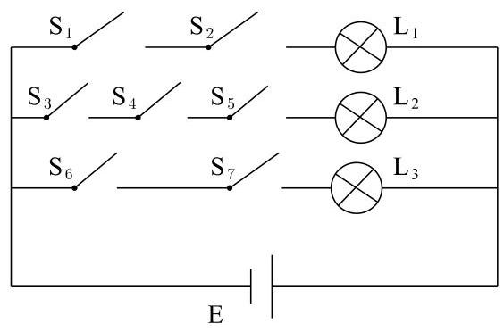
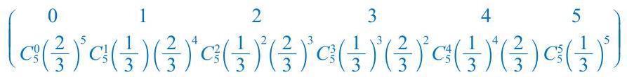
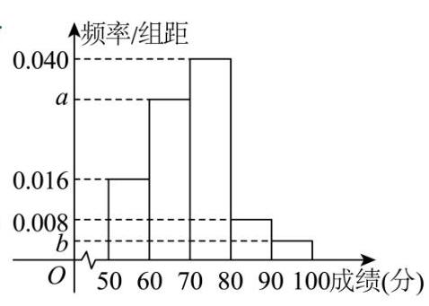

2025 版上海高考真题及模拟训练合集(下册)

## 11 九、概率与统计

板块一:中档客观题

注:考试定位偏中档题，但有些题难度算基础题

## 1. 真题回顾

A、独立性判断

【例题】1. (2025 上海春考) 有一四边形 ${ABCD}$ ,对于其四边 ${AB},{BC},{CD},{DA}$ ,按顺序分别抛掷一枚质量均匀的硬币:如硬币正面朝上，则将其擦去；如硬币反面朝上，则不擦去. 最后，以 $A$ 为起点,沿着尚未擦去的边出发,可以到达 $C$ 点的概率为( ).

A. $\frac{1}{2}$ B. $\frac{7}{16}$ C. $\frac{1}{4}$ D. $\frac{3}{16}$

【答案】 $B$

【解析】法一: 考虑 $\Omega$ ,每个边都有两种情况,共 $\left| \Omega \right|  = {2}^{4} = {16}$ 种.

考虑事件 $M :$ 沿着尚未擦去的边从 $A$ 出发，可以到达 $C$ 点，事件 $M$ 包含三种情况:

①都没擦去，有 1 种；

②又擦去一边，有 4 种；

③ 擦去两边,为 ${AB} * {BC}$ 或 ${AD} * {DC}$ ，有 2 种，所以 $P\left( M\right)  = \frac{\left| M\right| }{\left| \Omega \right| } = \frac{1 + 4 + 2}{16} = \frac{7}{16}$ ，选 $B$ .

法二: 为便于表示,我们将 ${AB},{BC},{CD},{DA}$ 未被擦去分别标记为事件 ${F}_{A},{F}_{B},{F}_{C},{F}_{D}$ ,则有 $P\left( {F}_{A}\right)  = P\left( \overline{{F}_{A}}\right)  = \frac{1}{2},{F}_{B},{F}_{C},{F}_{D}$ 亦是如此,且这四个事件两两相互独立,则最终到达 $C$ 只需 $\left( {{F}_{A} \cap  {F}_{B}}\right)  \cup  \left( {{F}_{C} \cap  {F}_{D}}\right)$ ,接下来的计算可以将所有情况逐一列举开来进行,这里我们不再演示, 我们可以直接采用容斥定理的相关原理来进行计算:

$P\left( {{F}_{A} \cap  {F}_{B}}\right)  = P\left( {F}_{A}\right) P\left( {F}_{B}\right)  = \frac{1}{2} \times  \frac{1}{2} = \frac{1}{4};$

$P\left( {{F}_{C} \cap  {F}_{D}}\right)  = P\left( {F}_{C}\right) P\left( {F}_{D}\right)  = \frac{1}{2} \times  \frac{1}{2} = \frac{1}{4};$

$P\left\lbrack  {\left( {{F}_{A} \cap  {F}_{B}}\right)  \cap  \left( {{F}_{C} \cap  {F}_{D}}\right) }\right\rbrack   = {\left( \frac{1}{2}\right) }^{4} = \frac{1}{16}.$

因此 $P\left\lbrack  {\left( {{F}_{A} \cap  {F}_{B}}\right)  \cup  \left( {{F}_{C} \cap  {F}_{D}}\right) }\right\rbrack   = P\left( {{F}_{A} \cap  {F}_{B}}\right)  + P\left( {{F}_{C} \cap  {F}_{D}}\right)  - P\left( {{F}_{A} \cap  {F}_{B}}\right)  \cap  \left( {{F}_{C} \cap  {F}_{D}}\right)$

$= \frac{1}{4} + \frac{1}{4} - \frac{1}{16} = \frac{7}{16}$ ,选 $B$ .

【例题】2. (2024 上海春考) 现有四个礼品盒, 前三个礼品盒中分别装了一个中国结, 一本书以及一个笔袋，第四个礼品盒中三样均有，现随机抽取一个盒子，事件 $A$ 为抽中的盒子里面有中国结， 事件 $B$ 为抽中的盒子里面有书,事件 $C$ 为抽中的盒子里面有笔袋,则 ( )

A. $A$ 与 $B$ 互斥 B. $A$ 与 $B$ 相互独立 C. $A$ 与 $B \cup  C$ 互斥 D. $A$ 与 $B \cap  C$ 相互独立

【答案】 $B$

【解析】选择礼盒四,则事件 $A, B, C$ 可以同时发生,排除 ${AC}$ 选项;

$P\left( A\right)  = \frac{1}{2}, P\left( B\right)  = \frac{1}{2}, P\left( {A \cap  B}\right)  = \frac{1}{4} = P\left( A\right)  \cdot  P\left( B\right)$ ,故 $B$ 正确；

$P\left( A\right)  = \frac{1}{2}, P\left( {B \cap  C}\right)  = \frac{1}{4}, P\left( {A \cap  \left( {B \cap  C}\right) }\right)  = \frac{1}{4} \neq  P\left( A\right)  \cdot  P\left( {B \cap  C}\right)$ ,故 $D$ 错误;

故选 $B$ . 2025 版上海高考真题及模拟训练合集(下册)

B、概率计算

【例题】1. (2024 上海秋考) 小王参加知识竞赛,题库中 $A$ 组题有 5000 道, $B$ 组题有 4000 道, $C$ 组题有 3000 道,已知小王做对这 3 组题的概率依次为0.92,0.86,0.72,则随机从题库中抽取一道题, 小王做对的概率为___.

【答案】 $\frac{17}{20}$

【解析】 $A, B, C$ 三组题的比例是 $5 : 4 : 3$ ,

小王做对的概率为 $\frac{5}{12} \times  {0.92} + \frac{4}{12} \times  {0.86} + \frac{3}{12} \times  {0.72} = \frac{17}{20}$ .

【例题】2. (2023 上海春考)已知有 4 名男生，6 名女生，从10 人中任选 3 人，则恰有 1 名男生 2 名女生的概率为___.

【答案】 $\frac{1}{2}$

【解析】恰有 1 名男生 2 名女生的概率为 $P = \frac{{C}_{4}^{1} \cdot  {C}_{6}^{2}}{{C}_{10}^{3}} = \frac{1}{2}$ .

【例题】3. (2022上海秋考)为了检测学生的身体素质指标，从游泳类 1 项，球类 3 项，田径类 4 项，共 8 项项目中, 随机抽取 4 项进行检测, 则每一类都被抽到的概率为___.

【答案】 $\frac{3}{7}$

【解析】每一类都被抽到的概率为 $\frac{{C}_{1}^{1}{C}_{3}^{1}{C}_{4}^{2} + {C}_{1}^{1}{C}_{3}^{2}{C}_{4}^{1}}{{C}_{8}^{4}} = \frac{30}{70} = \frac{3}{7}$ .

【例题】4. (2021 上海秋考) 已知花博会有四个不同的场馆 $A\text{ 、 }B\text{ 、 }C\text{ 、 }D$ ，甲、乙两人每人选 2 个去参观， 则他们的选择中，恰有一个馆相同的概率为___.

【答案】 $\frac{2}{3}$

【解析】甲选 2 个去参观,有 ${C}_{4}^{2} = 6$ 种,乙选 2 个去参观,有 ${C}_{4}^{2} = 6$ 种,共有 $6 \times  6 = {36}$ 种,

若甲乙恰有一个馆相同,则选确定相同的馆有 ${C}_{4}^{1} = 4$ 种,

然后从剩余 3 个馆种选 2 个进行排列,有 ${P}_{3}^{2} = 6$ 种,共有 $4 \times  6 = {24}$ 种,

则对应概率 $P = \frac{24}{36} = \frac{2}{3}$ .

【例题】5. (2019 上海秋考)某三位数密码，每位数字可在 0-9 这 10 个数字中任选一个，则该三位数密码中，恰有两位数字相同的概率是___.

【答案】 $\frac{27}{100}$

【解析】法一: (直接法) 某三位数密码锁,每位数字在 $0 - 9$ 数字中选取,

总的基本事件个数为 1000 , 其中恰有两位数字相同的个数为 ${C}_{10}^{1}{C}_{3}^{2}{C}_{9}^{1} = {270}$ ,

则其中恰有两位数字相同的概率是 $\frac{270}{1000} = \frac{27}{100}$ ;

法二:(排除法)某三位数密码锁，每位数字在 $0 - 9$ 数字中选取，

总的基本事件个数为 1000 ,

其中三位数字均不同和全相同的个数为 ${10} \times  9 \times  8 + {10} = {730}$ ,

得其中恰有两位数字相同的概率是 $1 - \frac{730}{1000} = \frac{27}{100}$ .

【例题】6. (2011 上海秋考)随机抽取的 9 位同学中，至少有 2 位同学在同一月份出生的概率为___ (默认每个月的天数相同，结果精确到 0.001) 2025 版上海高考真题及模拟训练合集(下册)

【答案】0.985

【解析】试验发生包含的事件数 ${12}^{9}$ ,

至少有 2 位同学在同一个月出生的对立事件是没有人生日在同一个月,

共有 ${P}_{12}^{9}$ 种结果,所以要求的事件的概率是 $1 - \frac{{P}_{12}^{9}}{{12}^{9}} = 1 - \frac{3850}{248832} \approx  {0.985}$ .

C、统计

【例题】1. (2023 上海秋考) 国内生产总值 (GDP) 是衡量地区经济状况的最佳指标, 根据统计数据显示,某市在 2020 年间经济高质量增长, ${GDP}$ 稳步增长,第一季度和第四季度的 ${GDP}$ 分别为 231 亿元和 242 亿元，且四个季度 ${GDP}$ 的中位数与平均数相等，则 2020 年该市 ${GDP}$ 总额为 ___亿元.

【答案】946

【解析】注意到 ${GDP}$ 稳步增长,设第二季度和第三季度的 ${GDP}$ 分别为 $x, y$ 亿元 $\left( {x < y}\right)$ , 因为四个季度 ${GDP}$ 的中位数与平均数相等,所以 $\frac{x + y}{2} = \frac{1}{4}\left( {{231} + x + y + {242}}\right)$ , 解得 $x + y = {473}$ ，所以 2020 年该市 ${GDP}$ 总额为 ${231} + {242} + {473} = {946}$ 亿元.

【例题】2. (2020 上海秋考) 已知有四个数 $1\text{ 、 }2\text{ 、 }a\text{ 、 }b$ ,这四个数的中位数是 3,平均数是 4,则 ${ab} =$ ___.

【答案】36

【解析】因为四个数的平均数为 4,所以 $a + b = 4 \times  4 - 1 - 2 = {13}$ ,

因为中位数是 3,所以 $\frac{2 + a}{2} = 3$ ,解得 $a = 4$ ,代入上式得 $b = {13} - 4 = 9$ ,

所以 ${ab} = {36}$ .

【例题】3. (2009 上海秋考) 有专业机构认为甲型 ${N}_{1}{H}_{1}$ 流感在一段时间没有发生大规模群体感染的标志为“连续 10 天, 每天新增疑似病例不超过 15 人”. 根据过去 10 天甲、乙、丙、丁四地新增疑似病例数据,一定符合该标志的是 ( )

A. 甲地:总体均值为 3，中位数为 4 B. 乙地:总体均值为 1，总体方差大于 0

C. 丙地:中位数为 2，众数为 3 D. 丁地:总体均值为 5，总体方差为 12

【答案】 $D$

【解析】假设连续 10 天,每天新增疑似病例的人数分别为 ${x}_{1},{x}_{2},{x}_{3},\cdots ,{x}_{10}$ . 并设有一天超过 15 人，不妨设第一天为 16 人，

则方差 ${s}^{2} = \frac{1}{10}\left\lbrack  {{\left( {16} - 5\right) }^{2} + {\left( {x}_{2} - 5\right) }^{2} + {\left( {x}_{3} - 5\right) }^{2} + \cdots  + {\left( {x}_{10} - 5\right) }^{2}}\right\rbrack   > {12}$ ,

说明丁地连续 10 天,每天新增疑似病例的人数都不超过 15 人. 故选 $D$ . 2025 版上海高考真题及模拟训练合集(下册)

## D、期望与方差

【例题】1. (2015 上海秋考) 赌博有陷阱. 某种赌博每局的规则是:赌客先在标记有 1,2,3,4,5 的卡片中随机摸取一张，将卡片上的数字作为其赌金 (单位:元)；随后放回该卡片，再随机摸取两张，将这两张卡片上数字之差的绝对值的 1.4 倍作为其奖金 (单位:元). 若随机变量 ${\xi }_{1}$ 和 ${\xi }_{2}$ 分别表示赌客在一局赌博中的赌金和奖金，则 $E{\xi }_{1} - E{\xi }_{2} =$ ___(元).

【答案】 $\frac{1}{5}$

【解析】赌金的分布列为

<table><tr><td>${\xi }_{1}$</td><td>1</td><td>2</td><td>3</td><td>4</td><td>5</td></tr><tr><td>$P$</td><td>$\frac{1}{5}$</td><td>$\frac{1}{5}$</td><td>$\frac{1}{5}$</td><td>$\frac{1}{5}$</td><td>$\frac{1}{5}$</td></tr></table>

所以 $E{\xi }_{1} = \frac{1}{5}\left( {1 + 2 + 3 + 4 + 5}\right)  = 3$ ,

若两张卡片上数字之差的绝对值为 1 ，

则有 $\left( {1,2}\right) ,\left( {2,3}\right) ,\left( {3,4}\right) ,\left( {4,5}\right) ,4$ 种,

若两张卡片上数字之差的绝对值为 2,则有 $\left( {1,3}\right) ,\left( {2,4}\right) ,\left( {3,5}\right) ,3$ 种,

若两张卡片上数字之差的绝对值为 3 ，则有 $\left( {1,4}\right) ,\left( {2,5}\right) ,2$ 种，

若两张卡片上数字之差的绝对值为 4 , 则有 $\left( {1,5}\right) ,1$ 种,

则 $P\left( {{\xi }_{2} = {1.4}}\right)  = \frac{4}{{C}_{5}^{2}} = \frac{2}{5}, P\left( {{\xi }_{2} = {2.8}}\right)  = \frac{3}{{C}_{5}^{2}} = \frac{3}{10}$ ,

$P\left( {{\xi }_{2} = {4.2}}\right)  = \frac{2}{{C}_{5}^{2}} = \frac{1}{5}, P\left( {{\xi }_{2} = {5.6}}\right)  = \frac{1}{{C}_{5}^{2}} = \frac{1}{10},$

奖金的分布列为

<table><tr><td>${\xi }_{2}$</td><td>1.4</td><td>2.8</td><td>4.2</td><td>5.6</td></tr><tr><td>$P$</td><td>$\frac{2}{5}$</td><td>$\frac{3}{10}$</td><td>$\frac{1}{5}$</td><td>$\frac{1}{10}$</td></tr></table>

所以 $E{\xi }_{2} = {1.4} \times  \left( {\frac{2}{5} \times  1 + \frac{3}{10} \times  2 + \frac{1}{5} \times  3 + \frac{1}{10} \times  4}\right)  = {2.8}$ ,

则 $E{\xi }_{1} - E{\xi }_{2} = 3 - {2.8} = {0.2}$ 元.

【例题】2. (2014 上海秋考) 某游戏的得分为1,2,3,4,5,随机变量 $\xi$ 表示小白玩该游戏的得分,若 $E \; \left( \xi \right)  = {4.2}$ ，则小白得 5 分的概率至少为___.

【答案】 $\frac{1}{5}$

【解析】设小白得 5 分的概率至少为 $x$ ,由题意得小白得1,2,3,4分的概率为 $1 - x$ ,

因为某游戏的得分为1,2,3,4,5,随机变量 $\xi$ 表示小白玩该游戏的得分,

$E\left( \xi \right)  = {4.2}$ ,所以 $4\left( {1 - x}\right)  + {5x} = {4.2}$ ,解得 $x = {0.2}$ .

【例题】3. (2013 上海秋考) 设非零常数 $d$ 是等差数列 ${x}_{1},{x}_{2},\cdots ,{x}_{19}$ 的公差,随机变量 $\xi$ 等可能地取值 ${x}_{1},{x}_{2},\cdots ,{x}_{19}$ ,则方差 ${D\xi } =$ ___.

【答案】 ${30}{d}^{2}$

【解析】由题意得 ${E\xi } = \frac{{x}_{1} + {x}_{2} + \cdots  + {x}_{19}}{19} = \frac{{19}{x}_{1} + \frac{{19} \times  {18}}{2}d}{19} = {x}_{1} + {9d}$ .

所以 ${x}_{n} - {E\xi } = {x}_{1} + \left( {n - 1}\right) d - \left( {{x}_{1} + {9d}}\right)  = \left( {n - {10}}\right) d$ ,

所以 ${D\xi } = \frac{1}{19}\left\lbrack  {{\left( -9d\right) }^{2} + {\left( -8d\right) }^{2} + \cdots  + {\left( -d\right) }^{2} + 0 + {d}^{2} + {\left( 2d\right) }^{2} + \cdots  + {\left( 9d\right) }^{2}}\right\rbrack$

$= \frac{2{d}^{2}}{19}\left( {{1}^{2} + {2}^{2} + \cdots  + {9}^{2}}\right)  = \frac{2{d}^{2}}{19} \times  \frac{9 \times  {10} \times  {19}}{6} = {30}{d}^{2}$ .

【例题】4. (2012 上海秋考) 设 ${10} \leq  {x}_{1} < {x}_{2} < {x}_{3} < {x}_{4} \leq  {10}^{4},{x}_{5} = {10}^{5}$ ,随机变量 ${\xi }_{1}$ 取值 ${x}_{1}\text{ 、 }{x}_{2}\text{ 、 }{x}_{3}\text{ 、 }{x}_{4}\text{ 、 }{x}_{5}$ 的概率均为 0.2,随机变量 ${\xi }_{2}$ 取值 $\frac{{x}_{1} + {x}_{2}}{2}\text{ 、 }\frac{{x}_{2} + {x}_{3}}{2}\text{ 、 }\frac{{x}_{3} + {x}_{4}}{2}\text{ 、 }\frac{{x}_{4} + {x}_{5}}{2}\text{ 、 }\frac{{x}_{5} + {x}_{1}}{2}$ 的概率也均为 0.2,若记 $D{\xi }_{1}\text{ 、 }D{\xi }_{2}$ 分别为 ${\xi }_{1}\text{ 、 }{\xi }_{2}$ 的方差,则 ( )

A. $D{\xi }_{1} > D{\xi }_{2}$ B. $D{\xi }_{1} = D{\xi }_{2}$

C. $D{\xi }_{1} < D{\xi }_{2}$ D. $D{\xi }_{1}$ 与 $D{\xi }_{2}$ 的大小关系与 ${x}_{1}\text{ 、 }{x}_{2}\text{ 、 }{x}_{3}\text{ 、 }{x}_{4}$ 的取值有关

【答案】 $A$

【解析】由随机变量 ${\xi }_{1}\text{ 、 }{\xi }_{2}$ 的取值情况,它们的平均数分别为 $\bar{x} = \frac{1}{5}\left( {{x}_{1} + {x}_{2} + {x}_{3} + {x}_{4} + {x}_{5}}\right)$ ,

$\overline{{x}^{\prime }} = \frac{1}{5}\left( {\frac{{x}_{1} + {x}_{2}}{2} + \frac{{x}_{2} + {x}_{3}}{2} + \frac{{x}_{3} + {x}_{4}}{2} + \frac{{x}_{4} + {x}_{5}}{2} + \frac{{x}_{5} + {x}_{1}}{2}}\right)  = \bar{x}$

且随机变量 ${\xi }_{1}\text{ 、 }{\xi }_{2}$ 的取值的概率都为 0.2,所以有 $D{\xi }_{1} > D{\xi }_{2}$ ,故选 $A$ . 2025 版上海高考真题及模拟训练合集(下册)

## 2. 模拟练习

【练习】1. (2025 届华二) 已知随机事件 $A, B$ . 若 $P\left( A\right)  = \frac{1}{3}, P\left( B\right)  = \frac{1}{4}, P\left( {B \mid  A}\right)  = \frac{2}{3}$ ,则 $P\left( {\bar{A} \mid  B}\right)  =$ 【答案】 $\frac{1}{9}$

【解析】因为随机事件 $A, B$ . 若 $P\left( A\right)  = \frac{1}{3}, P\left( B\right)  = \frac{1}{4}, P\left( {B \mid  A}\right)  = \frac{2}{3}$ ,

则 $P\left( {A \cap  B}\right)  = P\left( {B \mid  A}\right) P\left( A\right)  = \frac{2}{3} \times  \frac{1}{3} = \frac{2}{9}$ ,

所以 $P\left( {\bar{A} \cap  B}\right)  = P\left( B\right)  - P\left( {A \cap  B}\right)  = \frac{1}{36}$ ,所以 $P\left( {\bar{A} \mid  B}\right)  = \frac{P\left( {\bar{A} \cap  B}\right) }{P\left( B\right) } = \frac{\frac{1}{36}}{\frac{1}{4}} = \frac{1}{9}$ .

【练习】2. 给出下列结论: ①一组数据5,7,9,11,12,14,15,16,18,20的第 80 百分位数为 16; ②若随机变量 $X \sim  N\left( {2,{\sigma }^{2}}\right)$ ，且 $P\left( {X > 5}\right)  = {0.2}$ ，则 $P\left( {-1 < X < 5}\right)  = {0.6}$ ；③若将一组数据中的每一个数都加上同一个正数 $x$ ,则其平均数和方差都会发生变化. 其中正确说法的序号为 ___.

【答案】②

【解析】① 这组数据共有 10 个数，由于 ${10} \times  {80}\%  = 8$ ,

所以取第 8 位数和第 9 位数的平均数,即 $\frac{{16} + {18}}{2} = {17}$ ,

则该组数据的第 80 百分位数是 17, 故①是错误的;

②由于随机变量 $X \sim  N\left( {2,{\sigma }^{2}}\right)$ ，得 $P\left( {X > 2}\right)  = {0.5}$ ，

又因为 $P\left( {X > 5}\right)  = {0.2}$ ,所以 $P\left( {2 < X < 5}\right)  = {0.5} - {0.2} = {0.3}$ ,

即 $P\left( {-1 < X < 5}\right)  = 2 \times  P\left( {2 < X < 5}\right)  = 2 \times  {0.3} = {0.6}$ ,故②是正确的;

③一组数据中的每一个数都加上同一个正数，则平均数会发生变化，

并且平均数也是加上这个正数，由于平均数和每一个数都加上同一个正数，

从而导致方差是没有变化的，故③是错误的；

故正确说法的序号为②.

【练习】3. (2024 届七宝) 某商场搞抽奖活动, 将 30 副甲品牌耳机和 20 副乙品牌耳机放入抽奖箱中, 让顾客从中随机抽 1 副, 两个品牌的耳机外包装相同, 耳机的颜色都只有黑色和白色, 记事件 $A =$ “抽到白色耳机”， $B =$ “抽到乙品牌耳机”，若 $P\left( {A \mid  B}\right)  = \frac{3}{4}$ ， $P\left( {B \mid  A}\right)  = \frac{3}{7}$ ，则抽奖箱中甲品牌的黑色耳机有___副.

【答案】 10

【解析】设抽奖箱中甲品牌的黑色耳机有 $x$ 副,则白色耳机有 $\left( {{30} - x}\right)$ 副.

因为 $P\left( {A \mid  B}\right)  = \frac{3}{4}$ ,而乙品牌耳机共有 20 副,

所以乙品牌耳机中白色耳机有 ${20} \times  \frac{3}{4} = {15}$ 副,

于是抽奖箱里共有白色耳机 $\left( {{30} - x}\right)  + {15} = \left( {{45} - x}\right)$ 副,

又 $P\left( {B \mid  A}\right)  = \frac{3}{7}$ ,则 $\frac{15}{{45} - x} = \frac{3}{7}$ ,解得 $x = {10}$ .

【练习】4. (2024 届复附青浦) 意大利数学家斐波那契以兔子繁殖数量为例,引入数列:1,1,2,3,5, $8,\ldots$ 该数列从第三项起,每一项都等于前两项之和,即 ${a}_{n + 2} = {a}_{n + 1} + {a}_{n}\left( {n \in  {N}^{ * }}\right)$ ,故此数列称

为斐波那契数列，又称“兔子数列”. 现在从该数列前 21 项中，按照奇数与偶数这两种类型进行分层抽样抽取 6 项，再从这 6 项中抽出 2 项，则至少含有一项是偶数的概率为___.

【答案】 $\frac{3}{5}$

【解析】由题意得斐波那契数列的前 21 项中是偶数的项的个数为 $\frac{21}{3} = 7$

(提示: 奇数 + 奇数 = 偶数, 奇数 + 偶数 = 奇数, 该示列项的奇偶性以 3 为周期),

是奇数的项的个数为 ${21} - 7 = {14}$ ,所以奇数与偶数的个数之比为 ${14} : 7 = 2 : 1$ ,

所以采用分层抽样抽取 6 项中奇数有 4 项, 偶数有 2 项,

所以从这 6 项中抽出 2 项,至少含有一项是偶数的概率 $P = 1 - \frac{{C}_{4}^{2}}{{C}_{6}^{2}} = \frac{3}{5}$ .

【练习】5. 在一组数3,3,8,11,28中插入两个整数 $m, n$ ,使得新的一组数极差为原来极差的两倍,且众数和中位数保持不变,则 $m + n$ 的最大值为 ( )

A. 57 B. 58 C. 60 D. 61

【答案】 $C$

【解析】若插入两个整数后众数不变,则插入的数可以是“两个都是 3 ”,或是“一个为 3 , 另一个不是 3”, 或是 “两个不等的且不是 8, 11, 28”.

①因为新的一组数极差加倍，所以插入的两个数不可能都是 3；

②因为中位数保持不变，若插入的数“一个为 3，另一个不是 3 ”，则一个为 3，另一个数不小于 8，又因为极差加倍，则另一个数为 53，此时 $m + n = {56}$ ；

③若插入的两个数是不等的且不是 3，8,11,28，且极差为 50，中位数保持不变，

则 $m + n$ 最大的情况是两个数 $\left\{  \begin{array}{l} m = 7 \\  n = {53} \end{array}\right.$ ,

所以, $m + n$ 的最大值为 60,故选: $C$ .

【练习】6. 如果 $\bar{A}\text{ 、 }\bar{B}$ 分别是 $A\text{ 、 }B$ 的对立事件,下列选项中不能判断事件 $A$ 与事件 $B$ 相互独立的是 ( )

A. $P\left( {A \cap  B}\right)  = P\left( A\right)  \cdot  P\left( B\right)$ B. $P\left( {A \cap  \bar{B}}\right)  = P\left( A\right)  \cdot  \left( {1 - P\left( B\right) }\right)$

C. $P\left( {B \mid  A}\right)  = P\left( A\right)$ D. $P\left( {B \mid  A}\right)  = P\left( B\right)$

【答案】 $C$

【解析】对于 $A, P\left( {A \cap  B}\right)  = P\left( A\right)  \cdot  P\left( B\right)$ ,则事件 $A\text{ 、 }B$ 相互独立,符合题意;

对于 $B, P\left( {A \cap  \bar{B}}\right)  = P\left( A\right)  \cdot  \left( {1 - P\left( B\right) }\right)  = P\left( A\right)  \cdot  P\left( \bar{B}\right)$ ,

必有事件 $A\text{ 、 }B$ 相互独立，符合题意；

对于 $C, P\left( {B \mid  A}\right)  = \frac{P\left( {A \cap  B}\right) }{P\left( A\right) } = P\left( A\right)$ ,事件 $A\text{ 、 }B$ 不一定相互独立,不符合题意.

对于 $D, P\left( {B \mid  A}\right)  = \frac{P\left( {A \cap  B}\right) }{P\left( A\right) } = P\left( B\right)$ ,则 $P\left( {A \cap  B}\right)  = P\left( A\right)  \cdot  P\left( B\right)$ ,

必有事件 $A\text{ 、 }B$ 相互独立,符合题意.

故选 $C$

【练习】7. 已知两组数据 ${x}_{1},{x}_{2},{x}_{3},{x}_{4},{x}_{5}$ 和 ${y}_{1},{y}_{2},{y}_{3},{y}_{4},{y}_{5}$ 的中位数、方差均相同,则两组数据合并为一组数据后 ( )

A. 中位数一定不变, 方差可能变大 B. 中位数一定不变, 方差可能变小

C. 中位数可能改变, 方差可能变大 D. 中位数可能改变, 方差可能变小

【答案】 $A$

【解析】对于中位数,不妨设 ${x}_{1} \leq  {x}_{2} \leq  {x}_{3} \leq  {x}_{4} \leq  {x}_{5},{y}_{1} \leq  {y}_{2} \leq  {y}_{3} \leq  {y}_{4} \leq  {y}_{5}$

则两组数据 ${x}_{1},{x}_{2},{x}_{3},{x}_{4},{x}_{5}$ 和 ${y}_{1},{y}_{2},{y}_{3},{y}_{4},{y}_{5}$ 的中位数分别为 ${x}_{3},{y}_{3}$ ,则 ${x}_{3} = {y}_{3}$ , 两组数据合并为一组数据后,则中位数为 $\frac{{x}_{3} + {y}_{3}}{2} = {x}_{3} = {y}_{3}$ ,故中位数一定不变; 对于方差,设 ${x}_{1} \leq  {x}_{2} \leq  {x}_{3} \leq  {x}_{4} \leq  {x}_{5}$ 的平均数为 $\bar{x}$ ,方差为 ${s}_{1}^{2}$ ,

${y}_{1} \leq  {y}_{2} \leq  {y}_{3} \leq  {y}_{4} \leq  {y}_{5}$ 的平均数为 $\bar{y}$ ,方差为 ${s}_{1}^{2}$ ,

则 $\bar{x} = \frac{1}{5}\mathop{\sum }\limits_{{i = 1}}^{5}{x}_{i},{s}_{1}^{2} = \frac{1}{5}\mathop{\sum }\limits_{{i = 1}}^{5}{\left( {x}_{i} - \bar{x}\right) }^{2} = \frac{1}{5}\left( {\mathop{\sum }\limits_{{i = 1}}^{5}{x}_{i}^{2} - 5{\bar{x}}^{2}}\right)$ ,

$\bar{y} = \frac{1}{5}\mathop{\sum }\limits_{{i = 1}}^{5}{y}_{i},{s}_{1}^{2} = \frac{1}{5}\mathop{\sum }\limits_{{i = 1}}^{5}{\left( {y}_{i} - \bar{y}\right) }^{2} = \frac{1}{5}\left( {\mathop{\sum }\limits_{{i = 1}}^{5}{y}_{i}^{2} - 5{\bar{y}}^{2}}\right) ,$

得 $\mathop{\sum }\limits_{{i = 1}}^{5}{x}_{i} = 5\bar{x},\mathop{\sum }\limits_{{i = 1}}^{5}{x}_{i}^{2} = 5\left( {{s}_{1}^{2} + {\bar{x}}^{2}}\right) ,\mathop{\sum }\limits_{{i = 1}}^{5}{y}_{i} = 5\bar{y},\mathop{\sum }\limits_{{i = 1}}^{5}{y}_{i}^{2} = 5\left( {{s}_{1}^{2} + {\bar{y}}^{2}}\right)$ ,

则两组数据合并为一组数据的平均数

$\bar{z} = \frac{1}{10}\left( {\mathop{\sum }\limits_{{i = 1}}^{5}{x}_{i} + \mathop{\sum }\limits_{{i = 1}}^{5}{y}_{i}}\right)  = \frac{1}{10}\left( {5\bar{x} + 5\bar{y}}\right)  = \frac{\bar{x} + \bar{y}}{2},$

方差 ${s}^{2} = \frac{1}{10}\left\lbrack  {\mathop{\sum }\limits_{{i = 1}}^{5}{\left( {x}_{i} - \bar{z}\right) }^{2} + \mathop{\sum }\limits_{{i = 1}}^{5}{\left( {y}_{i} - \bar{z}\right) }^{2}}\right\rbrack   = \frac{1}{10}\left( {\mathop{\sum }\limits_{{i = 1}}^{5}{x}_{i}^{2} + \mathop{\sum }\limits_{{i = 1}}^{5}{y}_{i}^{2} - {10}{\bar{z}}^{2}}\right)$

$= \frac{1}{10}\left\lbrack  {5\left( {{s}_{1}^{2} + {\bar{x}}^{2}}\right)  + 5\left( {{s}_{1}^{2} + {\bar{y}}^{2}}\right)  - {10}{\bar{z}}^{2}}\right\rbrack   = {s}_{1}^{2} + \frac{{\bar{x}}^{2} + {\bar{y}}^{2}}{2} - {z}^{2}$

$= {s}_{1}^{2} + \frac{{\bar{x}}^{2} + {\bar{y}}^{2}}{2} - {\left( \frac{\bar{x} + \bar{y}}{2}\right) }^{2} = {s}_{1}^{2} + \frac{{\left( \bar{x} - \bar{y}\right) }^{2}}{4} \geq  {s}_{1}^{2}$ ,

当且仅当 $\bar{x} = \bar{y}$ 时取等号,故方差可能变大,一定不会变小;

故选 $A$ .

【练习】8. (2023 届复附)在 8 个数形成的集合中，平均数，中位数，唯一的众数和极差都是 8 ，能成为这个集合中的一个元素的最大数是 ( )

A. 14 B. 13 C. 12 D. 11

【答案】 $A$

【解析】直接试试能不能构造出来最大元素是 14 666888814

【练习】9. 某设备的使用年数 $x$ 与所支出的维修总费用 $y$ 的统计数据如下表:

<table><tr><td>使用年数 $x$ (单位:年)</td><td>2</td><td>3</td><td>4</td><td>5</td><td>6</td></tr><tr><td>维修总费用 $y$ (单位:万元)</td><td>1.5</td><td>4.5</td><td>5.5</td><td>6.5</td><td>7.5</td></tr></table>

根据上表可得经验回归方程为 $\widehat{y} = {1.4x} + a$ . 则在 $x = {10}$ 处的预测值为___万元.

【答案】 13.5

【解析】由表格得 $\bar{x} = \frac{1}{5} \times  \left( {2 + 3 + 4 + 5 + 6}\right)  = 4,\bar{y} = \frac{1}{5} \times  \left( {{1.5} + {4.5} + {5.5} + {6.5} + {7.5}}\right)  = {5.1}$ ,

因为回归直线方程为 $\widehat{y} = {1.4x} + a$ ,所以 ${5.1} = {1.4} \times  4 + a$ ,则 $a =  - {0.5}$ ,

即 $\widehat{y} = {1.4x} - {0.5}$ ,当 $x = {10}$ 时, $y = {13.5}$ ,则在 $x = {10}$ 处的预测值为 13.5 万元.

2025 版上海高考真题及模拟训练合集(下册)

【练习】10. 某校积极开展“戏曲进校园”活动，为了解该校各班参加戏曲兴趣小组的人数，从全校随机抽取 5 个班级, 把每个班级参加该小组的人数作为样本数据. 已知样本平均数为 7 , 样本标准差为 2 ，且样本数据互不相等，则该样本数据的极差为 ( )

A. 3 B. 4 C. 5 D. 6

【答案】D

【解析】不妨设该五个班级的样本数据分别为 $a, b, c, d,\mathrm{e}\left( {a < b < c < d < \mathrm{e}}\right)$ ,且 $a, b, c, d,\mathrm{e} \in  {N}^{ * }$ ,

则依题意有 $\left\{  \begin{array}{l} \frac{a + b + c + d + \mathrm{e}}{5} = 7 \\  \sqrt{\frac{{\left( 7 - a\right) }^{2} + {\left( 7 - b\right) }^{2} + {\left( 7 - c\right) }^{2} + {\left( 7 - d\right) }^{2} + {\left( 7 - \mathrm{e}\right) }^{2}}{5}} = 2 \end{array}\right.$ ,

化简得 $a + b + c + d + \mathrm{e} = {35},{\left( a - 7\right) }^{2} + {\left( b - 7\right) }^{2} + {\left( c - 7\right) }^{2} + {\left( d - 7\right) }^{2} + {\left( \mathrm{e} - 7\right) }^{2} = {20}$ ,

易知 $\mathrm{e} \geq  d + 1 \geq  c + 2 \geq  b + 3 \geq  a + 4 \Rightarrow  a + b + c + d + \mathrm{e} \leq  5\mathrm{e} - {10} \Rightarrow  \mathrm{e} \geq  9$ ,

又易知五个数据减 7 的平方数为整数, $a - 7, b - 7, c - 7, d - 7,\mathrm{e} - 7$ 五个数的绝对值不超过 4 ,

当 $\mathrm{e} = {11}$ 时, ${\left( a - 7\right) }^{2} + {\left( b - 7\right) }^{2} + {\left( c - 7\right) }^{2} + {\left( d - 7\right) }^{2} = 4$ ,由数据为整数且均不相同得不成立, 当 $\mathrm{e} = {10}$ 时， ${\left( a - 7\right) }^{2} + {\left( b - 7\right) }^{2} + {\left( c - 7\right) }^{2} + {\left( d - 7\right) }^{2} = {11}$ ，由数据为整数且均不相同得该四个平方数只能为0,1,1,9,则 $a = 4, b = 6, c = 7, d = 8$ ,符合题意,此时极差为 6; 当 $\mathrm{e} = 9$ 时, ${\left( a - 7\right) }^{2} + {\left( b - 7\right) }^{2} + {\left( c - 7\right) }^{2} + {\left( d - 7\right) }^{2} = {16}$ ，由数据为整数且均不相同得不成立；

综上,五组数据的极差为 6,故选: $D$

2025 版上海高考真题及模拟训练合集(下册)

## 板块二: 压轴客观题

注:高考还没考察过,简单练几道难度适合,思想方法契合高考的即可

## 1. 模拟练习

【练习】1. 对于没有重复数据的样本 ${x}_{1},{x}_{2},\cdots ,{x}_{m}$ ,记这 $m$ 个数的第 $k$ 百分位数 ${P}_{k}\left( {1 \leq  k \leq  {99}, k \in  Z}\right)$ . 若 ${P}_{80}$ 不在这组数据中,且在区间 $\left( {{P}_{80},{P}_{90}}\right)$ 中的数据有且只有 5 个,则 $m$ 的所有可能值组成的集合为___.

【答案】50 或 55

【解析】 ${P}_{80}$ 不在这组数据中得 ${0.8}\mathrm{\;m}$ 为整数,而 ${0.8m} \leq  m,{0.9m} \leq  \mathrm{m}$ ,

故 ${x}_{0.8m}$ 必为样本中的数,由大于 ${P}_{80}$ ,小于 ${P}_{90}$ 的数有 5 个,

即 ${x}_{0.8m},{x}_{{0.8m} + 1},{x}_{{0.8m} + 2},{x}_{{0.8m} + 3},{x}_{{0.8m} + 4},{x}_{{0.8m} + 5},{x}_{{0.8m} + 6}$ ,

① 若 ${0.9}\mathrm{\;m}$ 为整数，即 ${x}_{0.8m},{x}_{{0.8m} + 1},{x}_{{0.8m} + 2},{x}_{{0.8m} + 3},{x}_{{0.8m} + 4},{x}_{{0.8m} + 5}\left( { = {x}_{0.9m}}\right) ,{x}_{{0.8m} + 6}$ ，

此时 ${0.9m} = {0.8m} + 5$ ,解得 $m = {50}$ ;

②若 ${0.9m}$ 为小数，则 ${x}_{0.9m}$ 必介于 ${x}_{{0.8m} + 5},{x}_{{0.8m} + 6}$ 之间，

即 ${x}_{0.8m},{x}_{{0.8m} + 1},{x}_{{0.8m} + 2},{x}_{{0.8m} + 3},{x}_{{0.8m} + 4},{x}_{{0.8m} + 5},\left( {x}_{0.9m}\right.$ 不在数据中，仅大小之分 $),{x}_{{0.8m} + 6}$ ，

${0.8m} + 5 < {0.9m} < {0.8m} + 6,$

${50} < m < {60}$ ,而 ${0.8m}$ 为整数,故 $m = {55}$ ;

综上, $m = {50}$ 或 55 .

【练习】2. (2024 届华二) 某抽奖活动中, 参与者面前有四个盲盒, 其中只有一个盒中放着奖品, 另外三个盒子都是空的. 参与者随机选择了其中. 一个盲盒, 然后主持人打开了另一个个, 发现盒子是空的. 此时参与者可以更改选择, 也可以坚持原来的选择. 有以下两个论断:①若主持人事先不知道奖品在哪个盒子，则无论是否更改选择，中奖概率都相同; ②若主持人事先知道奖品在哪个盒子,则更改选择后的中奖概率为 $\frac{3}{8}$ . 那么 ( )

A. ①正确，②错误 B. ①错误，②正确 C. ①②都正确 D. ①②都错误

【答案】 $C$

【解析】①正确，更改后，我们也求无条件概率,

这样就不能限制主持人打开的一定是空盒子了，主持人和参与者都是开盲盒，

改还是不改，当然没有任何区别；

②正确，此时还剩两个盒子，若主持人是从剩余的空盒子中随机打开一个，

则这两个盒子的地位是对等的，既然不更改中奖的概率为 $\frac{1}{4}$ ，

不管参与者如何选，更改后的中奖概率都为 $\frac{1}{2}\left( {1 - \frac{1}{4}}\right)  = \frac{3}{8}$ ；

故选 $C$ .

【练习】3. 将 $1,2,3,\ldots ,{20},{21}$ 共 21 个正整数排成六行,按照第一行 1 个数,第二行 2 个数,... 第六行 6 个数的顺序排列, 则每一行中最大的数都小于其后一行中最大的数的概率是

___.

【答案】 $\frac{4}{315}$

【解析】设 ${x}_{k}\left( {k = 1,2,3,\cdots , n}\right)$ 是从上往下数第 $k$ 行的最大数,

设 ${x}_{1} < {x}_{2} < \cdots  < {x}_{n}$ 的概率为 ${p}_{n}$ .

最大数在第 $n$ 行的概率为 $: \frac{\frac{n}{n\left( {n + 1}\right) }}{2} = \frac{2}{n + 1}$ .

在排好第 $n$ 行后余下的 $\frac{n\left( {n - 1}\right) }{2}$ 个数排在前 $\left( {n - 1}\right)$ 行,符合要求的排列的概率为 ${p}_{n - 1}$ ,

$\therefore {p}_{n} = \frac{2}{n + 1}{p}_{n - 1}$ ,以此类推, ${p}_{n} = \frac{2}{n + 1} \cdot  \frac{2}{n}\cdots  \cdot  \frac{2}{3} \cdot  {p}_{1} = \frac{{2}^{n}}{\left( {n + 1}\right) !}$ .

$\therefore$ 当 $n = 6$ 时, ${p}_{6} = \frac{{2}^{6}}{7!} = \frac{4}{315}$ .

【练习】4. (2026 届复附) 不断地抛掷一枚硬币, 若连续出现 2 次正面向上, 则甲获胜, 游戏结束; 若累计出现 4 次正面向上，且未出现连续 2 次正面向上，则乙获胜，游戏结束；若连续 2 次正面向上和累计 4 次正面向上同时发生了，则甲乙平局，游戏结束. 在没有发生平局的条件下，乙获胜的概率为___.

【答案】 $\frac{1}{7}$

【解析】法一: (理解游戏)真正影响这游戏胜负的只有三个位置, 第一次、第二次、第三次投掷了正面之后，下一个投掷的是正面还是反面；

如果这三个位置是反反反, 那么游戏结束时乙必胜 (因为平局和甲胜已然不可能), 因此乙获胜的概率是 $\frac{1}{8}$ ;

如果这三个位置是反反正,那么是平局,因此平局的概率是 $\frac{1}{8}$

所以在没有发生平局的条件下,乙获胜的概率为 $\frac{\frac{1}{8}}{1 - \frac{1}{8}} = \frac{1}{7}$

法二: (严格论证)设事件 $A =$ 乙获胜, $B =$ 平局,则 $\bar{B} =$ 没有发生平局,

记正面向上为 1 , 反面向上为 0 .

①不断地抛掷一枚硬币，先求事件 $A = \text{ 乙 }$ 获胜的概率. 假设抛掷硬币 $n$ 次，

则事件 $A = \text{ 乙 }$ 获胜,即抛掷最后两次依次为 0,1,前 $n - 2$ 次中恰当 次 1 且互不相邻,

其余 $n - 5$ 次都为 0,即从 $n - 5$ 个 0 形成的 $n - 4$ 空中选出 3 个插入 3 个1,

故共 ${C}_{n - 4}^{3}$ 种方法,由题意得 $n \geq  7, n \in  {N}^{ * }$ ,若不断地抛掷一枚硬币,

则 $P\left( A\right)  = \mathop{\sum }\limits_{{n = 7}}^{\infty }{C}_{n - 4}^{3} \cdot  {\left( \frac{1}{2}\right) }^{n} = \mathop{\sum }\limits_{{k = 3}}^{\infty }{C}_{k}^{3}{\left( \frac{1}{2}\right) }^{k + 4} = {\left( \frac{1}{2}\right) }^{7} \cdot  \mathop{\sum }\limits_{{k = 3}}^{\infty }{C}_{k}^{3}{\left( \frac{1}{2}\right) }^{k - 3}$ ,

设 ${a}_{k} = {C}_{k}^{3}{\left( \frac{1}{2}\right) }^{k - 3} = \frac{k\left( {k - 1}\right) \left( {k - 2}\right) }{6} \cdot  {\left( \frac{1}{2}\right) }^{k - 3}$

$= \left( {\frac{1}{6}{k}^{3} - \frac{1}{2}{k}^{2} + \frac{1}{3}k}\right) {\left( \frac{1}{2}\right) }^{k - 3}, k \geq  3, k \in  {N}^{ * }$ ,

且 ${a}_{k} = \left\lbrack  {-\frac{1}{3}{\left( k + 1\right) }^{3} - \frac{5}{3}\left( {k + 1}\right)  - 2}\right\rbrack   \cdot  {\left( \frac{1}{2}\right) }^{k - 2} - \left( {-\frac{1}{3}{k}^{3} - \frac{5}{3}k - 2}\right)  \cdot  {\left( \frac{1}{2}\right) }^{k - 3}$ ,

设 ${b}_{k} = \left( {-\frac{1}{3}{k}^{3} - \frac{5}{3}k - 2}\right)  \cdot  {\left( \frac{1}{2}\right) }^{k - 3}, k \geq  3, k \in  {N}^{ * }$ ,则 ${a}_{k} = {b}_{k + 1} - {b}_{k}$ ,

记 ${T}_{n} = {a}_{3} + {a}_{4} + \cdots  + {a}_{n}$ ,

所以 ${T}_{n} = \left( {{b}_{4} - {b}_{3}}\right)  + \left( {{b}_{5} - {b}_{4}}\right)  + \cdots  + \left( {{b}_{n + 1} - {b}_{n}}\right)$

$= {b}_{n + 1} - {b}_{3} = \left\lbrack  {-\frac{1}{3}{\left( n + 1\right) }^{3} - \frac{5}{3}\left( {n + 1}\right)  - 2}\right\rbrack   \cdot  {\left( \frac{1}{2}\right) }^{n - 2} - \left( {-\frac{1}{3} \times  {3}^{3} - \frac{5}{3} \times  3 - 2}\right)  \cdot  {\left( \frac{1}{2}\right) }^{3 - 3}$

$= \left\lbrack  {-\frac{1}{3}{\left( n + 1\right) }^{3} - \frac{5}{3}\left( {n + 1}\right)  - 2}\right\rbrack   \cdot  {\left( \frac{1}{2}\right) }^{n - 2} + {16}$ ,

因为 $\mathop{\lim }\limits_{{n \rightarrow  \infty }}\left\lbrack  {-\frac{1}{3}{\left( n + 1\right) }^{3} - \frac{5}{3}\left( {n + 1}\right)  - 2}\right\rbrack   \cdot  {\left( \frac{1}{2}\right) }^{n - 2} = 0$ ,所以 $\mathop{\lim }\limits_{{n \rightarrow  \infty }}{T}_{n} = {16}$ ,

故乙获胜的概率 $P\left( A\right)  = {\left( \frac{1}{2}\right) }^{7} \cdot  \mathop{\sum }\limits_{{k = 3}}^{\infty }{C}_{k}^{3}{\left( \frac{1}{2}\right) }^{k - 3} = {\left( \frac{1}{2}\right) }^{7} \cdot  \mathop{\lim }\limits_{{n \rightarrow  \infty }}{T}_{n} = {\left( \frac{1}{2}\right) }^{7} \times  {16} = \frac{1}{8}$ ;

②不断地抛掷一枚硬币，求事件 $B$ 即平局的概率，假设抛枚硬币 $n$ 次，

则事件 $B$ 即最后三次依次为0,1,1，前 $n - 3$ 次中恰 2 次 1 且互不相邻，

其余 $n - 5$ 次都为 0,即从 $n - 5$ 个 0 形成的 $n - 4$ 空中选出 2 个插入 2 个1,

故共 ${C}_{n - 4}^{2}$ 种方法,由题意得 $n \geq  6, n \in  {N}^{ * }$ ,若不断地抛掷一枚硬币,

则 $P\left( B\right)  = \mathop{\sum }\limits_{{n = 6}}^{\infty }{C}_{n - 4}^{2} \cdot  {\left( \frac{1}{2}\right) }^{n} = \mathop{\sum }\limits_{{k = 2}}^{\infty }{C}_{k}^{2}{\left( \frac{1}{2}\right) }^{k + 4} = {\left( \frac{1}{2}\right) }^{6} \cdot  \mathop{\sum }\limits_{{k = 2}}^{\infty }{C}_{k}^{2}{\left( \frac{1}{2}\right) }^{k - 2}$ ,

设 ${c}_{k} = {C}_{k}^{2}{\left( \frac{1}{2}\right) }^{k - 2} = \frac{k\left( {k - 1}\right) }{2} \cdot  {\left( \frac{1}{2}\right) }^{k - 2} = \left( {\frac{1}{2}{k}^{2} - \frac{1}{2}k}\right) {\left( \frac{1}{2}\right) }^{k - 2}, k \geq  2, k \in  {N}^{ * }$ ,

由 ${c}_{k} = \left\lbrack  {-{\left( k + 1\right) }^{2} - \left( {k + 1}\right)  - 2}\right\rbrack   \cdot  {\left( \frac{1}{2}\right) }^{k - 1} - \left( {-{k}^{2} - k - 2}\right)  \cdot  {\left( \frac{1}{2}\right) }^{k - 2}, k \geq  2, k \in  {N}^{ * }$ ,

设 ${d}_{k} = \left( {-{k}^{2} - k - 2}\right)  \cdot  {\left( \frac{1}{2}\right) }^{k - 2}, k \geq  2, k \in  {N}^{ * }$ ,则 ${c}_{k} = {d}_{k + 1} - {d}_{k}$ ,

记 ${M}_{n} = {c}_{2} + {c}_{3} + \cdots  + {c}_{n}$ ,

所以 ${M}_{n} = \left( {{d}_{3} - {d}_{2}}\right)  + \left( {{d}_{4} - {d}_{3}}\right)  + \cdots  + \left( {{d}_{n + 1} - {d}_{n}}\right)$

$= {d}_{n + 1} - {d}_{2} = \left\lbrack  {-{\left( n + 1\right) }^{3} - \left( {n + 1}\right)  - 2}\right\rbrack   \cdot  {\left( \frac{1}{2}\right) }^{n - 1} - \left( {-{2}^{2} - 2 - 2}\right)  \cdot  {\left( \frac{1}{2}\right) }^{2 - 2}$

$= \left\lbrack  {-{\left( n + 1\right) }^{3} - \left( {n + 1}\right)  - 2}\right\rbrack   \cdot  {\left( \frac{1}{2}\right) }^{n - 1} + 8,$

因为 $\mathop{\lim }\limits_{{n \rightarrow  \infty }}\left\lbrack  {-{\left( n + 1\right) }^{3} - \left( {n + 1}\right)  - 2}\right\rbrack   \cdot  {\left( \frac{1}{2}\right) }^{n - 1} = 0$ ,所以 $\mathop{\lim }\limits_{{n \rightarrow  \infty }}{M}_{n} = 8$ ,

故平局的概率 $P\left( B\right)  = {\left( \frac{1}{2}\right) }^{6} \cdot  \mathop{\lim }\limits_{{n \rightarrow  \infty }}{M}_{n} = {\left( \frac{1}{2}\right) }^{6} \times  8 = \frac{1}{8}$ ;

由条件概率公式得 $P\left( {A \mid  \bar{B}}\right)  = \frac{P\left( A\right) }{1 - P\left( B\right) } = \frac{\frac{1}{8}}{1 - \frac{1}{8}} = \frac{1}{7}$ ,

所以在没有发生平局的条件下,乙获胜的概率为 $\frac{1}{7}$ .

【练习】5. (2025 成都三诊) 如图,在某电路中, ${S}_{i}\left( {\mathrm{i} = 1,2,3,4,5,6,7}\right)$ 为未闭合的开关, ${L}_{j}\left( {j = 1,2,3}\right)$ 是能正常工作的灯泡. 现每次等可能地闭合一个未闭合的开关，直到 7 个开关全部闭合，则 ${L}_{1}$ 最先亮起的概率是___.

【答案】 $\frac{27}{70}$

【解析】 ${L}_{1}$ 最先亮起,可以根据最后亮起的灯分两种情形讨论.

情形一: ${L}_{2}$ 最后亮起.

${L}_{2}$ 最后亮起等价于 ${S}_{3},{S}_{4},{S}_{5}$ 中的某一个开关恰在最后一个闭合,其概率为 $\frac{3}{7}$ . 在此基础上, ${S}_{3},{S}_{4},{S}_{5}$ 中其余两个开关的闭合顺序对开灯顺序没有影响,可以将其剔除,只需考虑 ${S}_{1},{S}_{2}$ , ${S}_{6},{S}_{7}$ 的相对顺序.

现考虑 ${S}_{1},{S}_{2},{S}_{6},{S}_{7}$ 的闭合顺序. 要求 ${L}_{1}$ 先亮,即 ${L}_{3}$ 后亮,这等价于 ${S}_{6}$ 或 ${S}_{7}$ 最后一个亮起,概率为 $\frac{1}{2}$ .

因此， ${L}_{2}$ 最后亮起且 ${L}_{1}$ 最先亮起的概率为 $\frac{3}{7} \times  \frac{1}{2} = \frac{3}{14}$ .

情形二: ${L}_{3}$ 最后亮起.

${L}_{3}$ 最后亮起等价于 ${S}_{6},{S}_{7}$ 中的某一个开关恰在最后一个闭合,其概率为 $\frac{2}{7}$ .

在此基础上， ${S}_{6}$ ， ${S}_{7}$ 中剩下的那个开关的闭合顺序对开灯顺序没有影响，可以将其剔除，只需考虑 ${S}_{1},{S}_{2},{S}_{3},{S}_{4},{S}_{5}$ 的相对顺序.

现考虑 ${S}_{1},{S}_{2},{S}_{3},{S}_{4},{S}_{5}$ 的闭合顺序. 要求 ${L}_{1}$ 先亮,即 ${L}_{2}$ 后亮,这等价于 ${S}_{3},{S}_{4},{S}_{5}$ 中的某一个最后亮起,概率为 $\frac{3}{5}$ .

因此, ${L}_{3}$ 最后亮起且 ${L}_{1}$ 最先亮起的概率为 $\frac{2}{7} \times  \frac{3}{5} = \frac{6}{35}$ .

综上, ${L}_{1}$ 最先亮起的概率为 $\frac{3}{14} + \frac{6}{35} = \frac{27}{70}$ .

备注: 设控制 ${L}_{1},{L}_{2},{L}_{3}$ 的开关数分别为 ${n}_{1},{n}_{2},{n}_{3}$ ,则 ${L}_{1}$ 最先亮起的概率为

$\frac{{n}_{2}}{{n}_{1} + {n}_{2} + {n}_{3}} \cdot  \frac{{n}_{3}}{{n}_{1} + {n}_{3}} + \frac{{n}_{3}}{{n}_{1} + {n}_{2} + {n}_{3}} \cdot  \frac{{n}_{2}}{{n}_{1} + {n}_{2}} = \frac{\left( {2{n}_{1} + {n}_{2} + {n}_{3}}\right) {n}_{2}{n}_{3}}{\left( {{n}_{1} + {n}_{2} + {n}_{3}}\right) \left( {{n}_{1} + {n}_{2}}\right) \left( {{n}_{1} + {n}_{3}}\right) }.$

2025 版上海高考真题及模拟训练合集(下册)

## 板块三: 中档主观题

注:考试定位是第三道大题, 重点知识是条件概率、全概率公式、期望计算、方差计算 (包括概率中的和统计中的)、成对数据统计中的回归方程和卡方检验等,

“冷门知识”是加权方差公式(已考过)、正态分布的标准化(书上有例题,建议复习)、贝叶斯公式(书上打星号，理论上不会考)

## 1. 真题回顾

【例题】1. (2025 上海春考) 甲、乙是两个体育社团的小组, 如下是两组组员身高的茎叶图 (单位: 厘米)，以身高的百位数和十位数作为 “茎” 排列在中间，个位数作为 “ 叶 ” 分列在两边.

(1)求甲、乙两组组员身高的第 60 百分位数；

(2)从甲、乙两组各选取一个组员，求两人身高均在 170 厘米以上的概率；

(3)为使两组人数相同，从甲组中调派一个队员到乙组. 是否存在甲组的一个组员，将他调派至乙组后, 甲、乙两组的平均身高都增大?

<table><tr><td></td><td></td><td></td><td colspan="3">甲队</td><td></td><td colspan="2">乙队</td><td></td><td></td><td></td><td></td><td></td><td></td></tr><tr><td></td><td></td><td></td><td></td><td></td><td></td><td>15</td><td>9</td><td></td><td></td><td></td><td></td><td></td><td></td><td></td></tr><tr><td></td><td>7</td><td>7</td><td>5</td><td>5</td><td>4</td><td>16</td><td>0</td><td>3</td><td>5</td><td>5</td><td>6</td><td>7</td><td>8</td><td>8</td></tr><tr><td>8</td><td>5</td><td>4</td><td>3</td><td>2</td><td>2</td><td>17</td><td>2</td><td></td><td></td><td></td><td></td><td></td><td></td><td></td></tr><tr><td></td><td></td><td></td><td></td><td></td><td>3</td><td>18</td><td></td><td></td><td></td><td></td><td></td><td></td><td></td><td></td></tr></table>

【解析】(1) 甲队: $\mathrm{i} = {12} \times  {60}\%  = {7.2}$ ,所以甲组的第 60 百分位数为第 8 项:173;

乙队: $\mathrm{i} = {10} \times  {60}\%  = 6$ ,所以乙组的第 60 百分位数为第 6 项与 7 项的平均数: $\frac{{166} + {167}}{2} =$ 166.5.

(2)记甲乙两队各选取一名组员，两人身高均 170 厘米以上为事件 $A, P\left( A\right)  = \frac{\left| A\right| }{\left| \Omega \right| } = \frac{{C}_{7}^{1} \cdot  {C}_{1}^{1}}{{C}_{12}^{1} \cdot  {C}_{10}^{1}} \; = \frac{7}{120}$ .

(3) $\bar{x} = {171.25}$ ， $\bar{y} = {165.3}$ ，要使两组平均身高都增大，则从甲组调到乙组的数据 $m$ 需满足 ${165.3} < m < {171.25}$ ,所以把甲组的其中一个 167 调到乙组即可.

【例题】2. (2024 上海秋考) 某地区为调查初中生体育锻炼时长与学业成绩的关系, 从该地区 29000 名初中生中抽取 580 人，得到日均体育锻炼时长 (表中简称“时长”) 与学业成绩的数据如下表所示:

<table><tr><td>时长</td><td>[0, 0.5)</td><td>[0.5,1)</td><td>[1,1.5)</td><td>[1.5,2)</td><td>[2,2.5)</td><td>合计</td></tr><tr><td>优秀</td><td>5</td><td>44</td><td>42</td><td>3</td><td>1</td><td>95</td></tr><tr><td>不优秀</td><td>134</td><td>147</td><td>137</td><td>40</td><td>27</td><td>485</td></tr><tr><td>合计</td><td>139</td><td>191</td><td>179</td><td>43</td><td>28</td><td>580</td></tr></table>

(1)估计该地区 29000 名学生中日均锻炼时长不少于 1 小时的人数；

(2)估计该地区初中生的平均日均锻炼时长(精确到 0.1 小时);

(3)判断是否有 95% 的把握认为该地区初中生学业成绩优秀与日均锻炼时长不少于 1 小时但少于 2 小时有关? 2025 版上海高考真题及模拟训练合集(下册)

<table><tr><td></td><td>$\lbrack 1,2)$</td><td>其他</td><td>合计</td></tr><tr><td>优秀</td><td>$a$</td><td>$b$</td><td>$a + b$</td></tr><tr><td>不优秀</td><td>C</td><td>$d$</td><td>$c + d$</td></tr><tr><td>合计</td><td>$a + c$</td><td>$b + d$</td><td>$a + b + c + d$</td></tr></table>

${\chi }^{2} = \frac{n{\left( ad - bc\right) }^{2}}{\left( {a + b}\right) \left( {a + c}\right) \left( {b + d}\right) \left( {c + d}\right) }$ ,其中 $n = a + b + c + d.$

【解析】(1) 抽取的 580 人中,日均锻炼时长不少于 1 小时的人数为 ${179} + {43} + {28} = {250}$ 人,

所以估计该地区 29000 名学生中日均锻炼时长不少于 1 小时的人数

为 ${29000} \times  \frac{250}{580} = {12500}$ 人;

(2)估计该地区初中生的平均日均锻炼时长

为 $\frac{1}{580}\left\lbrack  {\frac{0.5}{2} \times  {139} + \frac{{0.5} + 1}{2} \times  {191} + \frac{1 + {1.5}}{2} \times  {179} + \frac{{1.5} + 2}{2} \times  {43} + \frac{2 + {2.5}}{2} \times  {28}}\right\rbrack$

$\approx  {0.9}$ 小时;

(3) 列表:

<table><tr><td></td><td>$\lbrack 1,2)$</td><td>其他</td><td>合计</td></tr><tr><td>优秀</td><td>45</td><td>50</td><td>95</td></tr><tr><td>不优秀</td><td>177</td><td>308</td><td>485</td></tr><tr><td>合计</td><td>222</td><td>358</td><td>580</td></tr></table>

提出原假设 ${H}_{0}$ : 该地区初中生学业成绩优秀与日均锻炼时长不少于 1 小时

但少于 2 小时无关,

确定显著性水平 $\alpha  = {0.05}$ ,

${\chi }^{2} = \frac{{580} \times  {\left( {45} \times  {308} - {50} \times  {177}\right) }^{2}}{{95} \times  {485} \times  {222} \times  {358}} \approx  {3.976} > {3.841}$ ,否定原假设,

故有 95% 的把握认为该地区初中生学业成绩优秀与日均锻炼时长

不少于 1 小时但少于 2 小时有关.

【例题】3. (2024上海春考)水果分为一级果和二级果, 共 136 箱, 其中一级果 102 箱, 二级果 34 箱.

(1)随机挑选两箱水果，求恰好一级果和二级果各一箱的概率;

(2)进行分层抽样，共抽 8 箱水果，求一级果和二级果各几箱；

(3)抽取若干箱水果，其中一级果共 120 个，单果质量平均数为 303.45 克，方差为 603.46；二级果 48 个, 单果质量平均数为 240.41 克, 方差为 648.21; 求 168 个水果的方差和平均数, 并预估果园中单果的质量.

【解析】(1)恰好一级果和二级果各一箱的概率 $P = \frac{{C}_{102}^{1} \cdot  {C}_{34}^{1}}{{C}_{136}^{2}} = \frac{17}{45}$ ;

(2)一级果箱数二级果箱数 $= 3 : 1$ ，共抽 8 箱水果，

因此一级果抽取 6 箱, 二级果抽取 2 箱.

(3)设一级果平均质量为 $\bar{x}$ ，二级果质量为 $\bar{y}$ ，总体样本平均质量为 $\bar{z}$ ，

平均值 $\bar{z} = \frac{{120}\bar{x} + {48}\bar{y}}{168} = {285.44}$ ,

方差 ${S}_{x}^{2} = \frac{1}{120}\sum {x}_{i}^{2} - {\left( \bar{x}\right) }^{2} \Rightarrow  \sum {x}_{i}^{2} = {120}\left( {{S}_{x}^{2} + {\left( \bar{x}\right) }^{2}}\right)$ ,

${S}_{y}^{2} = \frac{1}{48}\sum {y}_{i}^{2} - {\left( \bar{y}\right) }^{2} \Rightarrow  \sum {y}_{i}^{2} = {48}\left( {{S}_{y}^{2} + {\left( \bar{y}\right) }^{2}}\right) ,$

${S}_{z}^{2} = \frac{1}{168}\sum {z}_{i}^{2} - {\left( \bar{z}\right) }^{2} = \frac{1}{168}\sum \left( {{x}_{i}^{2} + {y}_{i}^{2}}\right)  - {\left( \bar{z}\right) }^{2} = {1426.46},$

平均质量 $= \frac{{102}\bar{x} + {34}\bar{y}}{136} = {287.69}$ 克.

【例题】4. (2023 上海秋考)2023 年 6 月 7 日, 21 世纪汽车博览会在上海举行. 已知某汽车模型公司共有 25 个汽车模型, 其外观和内饰的颜色分布如下表所示:

<table><tr><td></td><td>红色外观</td><td>蓝色外观</td></tr><tr><td>棕色内饰</td><td>8</td><td>12</td></tr><tr><td>米色内饰</td><td>2</td><td>3</td></tr></table>

(1)若小明从这些模型中随机拿一个模型,记事件 $A$ 为小明取到的模型为红色外观,事件 $B$ 为小明取到的模型有棕色内饰. 求 $P\left( B\right)$ 与 $P\left( {B \mid  A}\right)$ ,并据此判断事件 $A$ 和事件 $B$ 是否独立;

(2)该公司举行了一个抽奖活动，并规定在一次抽奖中，每人可以一次性从这 25 个汽车模型中抽取两个，现有如下假设:

假设1:抽取的两个模型有三种结果:外观和内饰都相同、外观和内饰都不同、外观和内饰有且仅有一个相同;

假设2:按结果的可能性大小，概率越小奖金越高；

假设 3 :该抽奖活动的奖金额分别为:一等奖 600 元、二等奖 300 元、三等奖 150 元.

根据以上假设，设 $X$ 为奖金额，请写出 $X$ 的分布并求出 $X$ 的数学期望.

【解析】(1) 由题意 $P\left( A\right)  = \frac{8 + 2}{25} = \frac{2}{5}, P\left( B\right)  = \frac{2 + 3}{25} = \frac{1}{5}$ ,

事件 $A \cap  B$ ，即取到的汽车模型为红色且内饰为棕色，则 $P\left( {A \cap  B}\right)  = \frac{2}{25}$ ，

所以 $P\left( {B \mid  A}\right)  = \frac{P\left( {A \cap  B}\right) }{P\left( A\right) } = \frac{1}{5}$ ,

因为 $P\left( A\right)  \cdot  P\left( B\right)  = \frac{2}{5} \times  \frac{1}{5} = \frac{2}{25} = P\left( {A \cap  B}\right)$ ,所以事件 $A\text{ 、 }B$ 相互独立;

(2)外观和内饰均为同色的概率 ${P}_{1} = \frac{{C}_{8}^{2} + {C}_{12}^{2} + {C}_{2}^{2} + {C}_{3}^{2}}{{C}_{25}^{2}} = \frac{49}{150}$ ;

外观和内饰都异色的概率 ${P}_{2} = \frac{{C}_{8}^{1}{C}_{3}^{1} + {C}_{12}^{1}{C}_{2}^{1}}{{C}_{25}^{2}} = \frac{4}{25}$ ;

仅外观或仅内饰同色的概率 ${P}_{3} = \frac{{C}_{8}^{1}{C}_{2}^{1} + {C}_{12}^{1}{C}_{3}^{1} + {C}_{8}^{1}{C}_{12}^{1} + {C}_{2}^{1}{C}_{3}^{1}}{{C}_{25}^{2}} = \frac{77}{150}$ ;

所以 ${P}_{2} > {P}_{1} > {P}_{3}$ ,则一等奖对应 ${P}_{2}$ ,二等奖对应 ${P}_{1}$ ,三等奖对应 ${P}_{3}$ ,

所以 $X$ 的分布为 $\left( \begin{matrix} {600} & {300} & {150} \\  \frac{4}{25} & \frac{49}{150} & \frac{77}{150} \end{matrix}\right)$ ,

期望 $E\left\lbrack  X\right\rbrack   = {600} \times  \frac{4}{25} + {300} \times  \frac{49}{150} + {150} \times  \frac{77}{150} = {271}$ (元). 2025 版上海高考真题及模拟训练合集(下册)

## 2. 模拟练习

【练习】1. 在一个抽奖游戏中,主持人从编号为 1,2,3,4 的四个外观相同的空箱子中随机选择一个, 放入一件奖品，再将四个箱子关闭. 主持人知道奖品在哪个箱子里. 游戏规则是:主持人请抽奖人在这四个箱子中选择一个，然后主持人将随机打开其余三个箱子中的一个空箱子，并征询抽奖人是否改变选择. 现有抽奖人甲选择了 2 号箱, 于是主持人先打开了另外三个箱子中的一个空箱子,记为 $X$ 号箱.

(1)求 $X$ 的分布，期望和方差；

(2)若 $X = 1$ ，如果你是抽奖人甲，请问你是坚持选 2 号箱，还是改选 3 号箱？

【解析】(1) 设 ${A}_{1}\text{ 、 }{A}_{2}\text{ 、 }{A}_{3}\text{ 、 }{A}_{4}$ 分别表示1,2,3,4号箱子里有奖品,

设 ${B}_{1}\text{ 、 }{B}_{2}\text{ 、 }{B}_{3}\text{ 、 }{B}_{4}$ 分别表示主持人打开1,2,3,4号箱子,

则 $\Omega  = {A}_{1} \cup  {A}_{2} \cup  {A}_{3} \cup  {A}_{4}$ ,且 ${A}_{1}\text{ 、 }{A}_{2}\text{ 、 }{A}_{3}\text{ 、 }{A}_{4}$ 两两互斥,

由题意得事件 ${A}_{1}\text{ 、 }{A}_{2}\text{ 、 }{A}_{3}\text{ 、 }{A}_{4}$ 的概率都是 $\frac{1}{4}$ ,

$P\left( {{B}_{1} \mid  {A}_{4}}\right)  = \frac{1}{2}, P\left( {{B}_{1} \mid  {A}_{2}}\right)  = \frac{1}{3}, P\left( {{B}_{1} \mid  {A}_{3}}\right)  = \frac{1}{2}, P\left( {{B}_{1} \mid  {A}_{1}}\right)  = 0$ ,

由全概率公式,得 $P\left( {B}_{1}\right)  = \mathop{\sum }\limits_{{i = 1}}^{4}P\left( {A}_{i}\right) P\left( {{B}_{1} \mid  {A}_{i}}\right)  = \frac{1}{4}\left( {\frac{1}{2} + \frac{1}{3} + \frac{1}{2}}\right)  = \frac{1}{3}$ ;

$X = 1,3,4$ ,则 $P\left( {X = 1}\right)  = \frac{1}{3}$ ,同理可得 $P\left( {X = 3}\right)  = P\left( {X = 4}\right)  = \frac{1}{3}$ ,

故 $X$ 的分布为

<table><tr><td>$X$</td><td>1</td><td>3</td><td>4</td></tr><tr><td>$P$</td><td>$\frac{1}{3}$</td><td>$\frac{1}{3}$</td><td>$\frac{1}{3}$</td></tr></table>

所以 $E\left( X\right)  = \frac{1}{3} + 3 \times  \frac{1}{3} + 4 \times  \frac{1}{3} = \frac{8}{3}$ ,

$D\left( X\right)  = {\left( 1 - \frac{8}{3}\right) }^{2} \times  \frac{1}{3} + {\left( 3 - \frac{8}{3}\right) }^{2} \times  \frac{1}{3} + {\left( 4 - \frac{8}{3}\right) }^{2} \times  \frac{1}{3} = \frac{14}{9}$ ,

(2)在主持人打开 1 号箱的条件下， 4 号箱、 2 号箱、 3 号箱里有奖品的概率

分别为 $P\left( {{A}_{4} \mid  {B}_{1}}\right)  = \frac{P\left( {{A}_{4} \cap  {B}_{1}}\right) }{P\left( {B}_{1}\right) } = \frac{P\left( {A}_{4}\right) P\left( {{B}_{1} \mid  {A}_{4}}\right) }{P\left( {B}_{1}\right) } = \frac{3}{8}$ ,

$P\left( {{A}_{2} \mid  {B}_{1}}\right)  = \frac{P\left( {{A}_{2} \cap  {B}_{1}}\right) }{P\left( {B}_{1}\right) } = \frac{P\left( {A}_{2}\right) P\left( {{B}_{1} \mid  {A}_{2}}\right) }{P\left( {B}_{1}\right) } = \frac{1}{4},$

$P\left( {{A}_{3} \mid  {B}_{1}}\right)  = \frac{P\left( {{A}_{3} \cap  {B}_{1}}\right) }{P\left( {B}_{1}\right) } = \frac{P\left( {A}_{3}\right) P\left( {{B}_{1} \mid  {A}_{3}}\right) }{P\left( {B}_{1}\right) } = \frac{3}{8},$

通过概率大小比较, 甲应该改选 4 号或 3 号箱.

【练习】2. (2024 届华二) 余山景区是国家 4A 级景区，其中“佘山天文台”和“佘山圣母大殿”景区的两张名片. 为了合理配置旅游资源,现对己游览“佘山天文台”景区且尚未游览“佘山圣母大殿” 景区的游客进行随机调查, 若不游览 “佘山圣母大殿” 景区记 2 分, 若继续游览 “佘山圣母大殿”景区记4分，假设每位游客选择游览“佘山圣母大殿”景区的概率均为 $\frac{1}{3}$ ，游客之间选择意愿相互独立.

(1)从游客中随机抽取 2 人，记总得分为随机变量 $X$ ，求 $X$ 的数学期望；

(2)(i)记 ${p}_{k}\left( {k \in  {N}^{ * }}\right)$ 表示“从游客中随机抽取 $k$ 人，总分恰为 ${2k}$ 分”的概率，求 $\left\{  {p}_{k}\right\}$ 的前 4 项和;

(ii) 在对游客进行随机问卷调查中,记 ${a}_{n}\left( {n \in  {N}^{ * }}\right)$ 表示 “已调查过的累计得分恰为 ${2n}$ 分” 的概率,探求 ${a}_{n}$ 与 ${a}_{n - 1}\left( {n \geq  2}\right)$ 的关系,并求数列 $\left\{  {a}_{n}\right\}$ 的通项公式.

【解析】(1) 易得 $X$ 的所有取值为4,6,8,

因为每位游客选择游览“天下第一巷”景区的概率均为 $\frac{1}{3}$ ,

游客之间选择意愿相互独立,

此时 $P\left( {X = 4}\right)  = {\left( \frac{2}{3}\right) }^{2} = \frac{4}{9}, P\left( {X = 6}\right)  = {C}_{2}^{1}\left( \frac{1}{3}\right) \left( \frac{2}{3}\right)  = \frac{4}{9}, P\left( {X = 8}\right)  = {\left( \frac{1}{3}\right) }^{2} = \frac{1}{9}$ ,

所以 $E\left( X\right)  = \frac{4}{9} \times  4 + \frac{4}{9} \times  6 + \frac{1}{9} \times  8 = \frac{48}{9} = \frac{16}{3}$ ;

(2)(i)易得“总分恰为 ${2k}$ 分”的概率为 ${\left( \frac{2}{3}\right) }^{k}$ ，

所以数列 $\left\{  {p}_{k}\right\}$ 是以首项为 $\frac{2}{3}$ ，公比为 $\frac{2}{3}$ 的等比数列，

记该数列的前 $n$ 项和为 ${S}_{n}$ ,则 ${S}_{4} = \frac{\frac{2}{3}\left\lbrack  {1 - {\left( \frac{2}{3}\right) }^{4}}\right\rbrack  }{1 - \frac{2}{3}} = \frac{130}{81}$ ;

(ii) 若“已调查过的累计得分恰为 ${2n}$ 分”的概率为 ${a}_{n}$ ,

此时得不到 ${2n}$ 分的情况只有先得 ${2n} - 2$ 分,再得 4 分,

概率为 $\frac{1}{3}{a}_{n - 1}\left( {n \geq  2}\right) ,{a}_{1} = \frac{2}{3}$ ,所以 $1 - {a}_{n} = \frac{1}{3}{a}_{n - 1}$ ,即 ${a}_{n} = 1 - \frac{1}{3}{a}_{n - 1}$ ,

此时 ${a}_{n} - \frac{3}{4} =  - \frac{1}{3}\left( {{a}_{n - 1} - \frac{3}{4}}\right)$ ,

则数列 $\left\{  {{a}_{n} - \frac{3}{4}}\right\}$ 是以 ${a}_{1} - \frac{3}{4} =  - \frac{1}{12}$ 为首项, $- \frac{1}{3}$ 为公比的等比数列,

所以 ${a}_{n} - \frac{3}{4} = \left( {{a}_{1} - \frac{3}{4}}\right)  \cdot  {\left( -\frac{1}{3}\right) }^{n - 1} =  - \frac{1}{12} \cdot  {\left( -\frac{1}{3}\right) }^{n - 1}$ ,故 ${a}_{n} = \frac{3}{4} + \frac{1}{4}{\left( -\frac{1}{3}\right) }^{n}$ .

【练习】3. (2024 届上中) 五月初，某中学举行了“庆祝劳动光荣，共绘五一华章”主题征文活动，旨在通过文字的力量，展现劳动者的风采，传递劳动之美，弘扬劳动精神. 征文筛选由 $A$ 、 $B$ 、 $C$ 三名老师负责. 首先由 $A$ 、 $B$ 两位老师对征文进行初审，若两位老师均审核通过，则征文通过筛选；若均审核不通过，则征文落选；若只有一名老师审核通过，则由老师 $C$ 进行复审，复审合格才能通过筛选. 已知每篇征文通过 $A$ 、 $B$ 、 $C$ 三位老师审核的概率分别为 $\frac{3}{4}$ ， $\frac{4}{5}$ ， $\frac{3}{7}$ ，且各老师的审核互不影响.

(1)已知某篇征文通过筛选，求它经过了复审的概率；

(2)从投稿的征文中抽出 4 篇，设其中通过筛选的篇数为 $X$ ，求 $X$ 的分布和数学期望.

【解析】(1) 设事件 $A = \{ A$ 老师审核通过 $\}$ ,事件 $B = \{ B$ 老师审核通过 $\}$ ,

事件 $C = \{ C$ 老师审核通过 $\}$ ,

事件 $D = \{$ 征文通过筛选 $\}$ ,事件 $E = \{$ 征文经过复审 $\}$ ,

$P\left( D\right)  = P\left( {A \cap  B}\right)  + P\left( {\bar{A} \cap  B \cap  C}\right)  + P\left( {A \cap  \bar{B} \cap  C}\right)$

$= \frac{3}{4} \times  \frac{4}{5} + \frac{1}{4} \times  \frac{4}{5} \times  \frac{3}{7} + \frac{3}{4} \times  \frac{1}{5} \times  \frac{3}{7} = \frac{3}{4}$ ,

$P\left( {D \cap  E}\right)  = \frac{1}{4} \times  \frac{4}{5} \times  \frac{3}{7} + \frac{3}{4} \times  \frac{1}{5} \times  \frac{3}{7} = \frac{3}{20}, P\left( {E \mid  D}\right)  = \frac{P\left( {D \cap  E}\right) }{P\left( D\right) } = \frac{1}{5}.$

( 2 )由题意得 $X \sim  B\left( {4,\frac{3}{4}}\right)$ ，则 $X = 0,1,2,3,4,$ ，

$P\left( {X = 0}\right)  = {C}_{4}^{0}{\left( \frac{1}{4}\right) }^{4} = \frac{1}{256}, P\left( {X = 1}\right)  = {C}_{4}^{1}{\left( \frac{3}{4}\right) }^{1}{\left( \frac{1}{4}\right) }^{3} = \frac{12}{256} = \frac{3}{64},$ 2025 版上海高考真题及模拟训练合集(下册)

$P\left( {X = 2}\right)  = {C}_{4}^{2}{\left( \frac{3}{4}\right) }^{2}{\left( \frac{1}{4}\right) }^{2} = \frac{54}{256} = \frac{27}{128},$

$P\left( {X = 3}\right)  = {C}_{4}^{3}{\left( \frac{3}{4}\right) }^{3}{\left( \frac{1}{4}\right) }^{1} = \frac{108}{256} = \frac{27}{64}, P\left( {X = 4}\right)  = {C}_{4}^{4}{\left( \frac{3}{4}\right) }^{4} = \frac{81}{256},$

$X$ 的分布为 $\left( \begin{matrix} 0 & 1 & 2 & 3 & 4 \\  \frac{1}{256} & \frac{3}{64} & \frac{27}{128} & \frac{27}{64} & \frac{81}{256} \end{matrix}\right)$

$E\left\lbrack  X\right\rbrack   = 4 \times  \frac{3}{4} = 3.$

【练习】4. 为了检查一批零件的质量是否合格, 检查员计划从中依次随机抽取零件检查: 第 $\mathrm{i}$ 次检查抽取 $\mathrm{i}$ 号零件,测量其尺寸 ${y}_{i}$ (单位: 厘米). 检查员共进行了 100 次检查,整理并计算得到如下数据: $\mathop{\sum }\limits_{{i = 1}}^{{100}}{y}_{i} = {52},\mathop{\sum }\limits_{{i = 1}}^{{100}}i{y}_{i} = {2428},\mathop{\sum }\limits_{{i = 1}}^{{100}}{y}_{i}^{2} = {30.18}$ .

(1)这批零件共有 1000 个. 若在抽查过程中，质量合格的零件共有 60 个，估计这批零件中质量合格的零件数量;

(2)若变量 ${y}_{i}$ 与 $\mathrm{i}$ 存在线性关系，记 ${y}_{i} = \widehat{a}\mathrm{i} + \widehat{b}$ ，求回归系数 $\widehat{a}$ 的值；

(3)在抽出的 100 个零件中，检查员计划从中随机抽出 20 个零件进行进一步检查，记抽出的 20 个零件中有 $X$ 对相邻序号的零件. 求 $X$ 的数学期望.

示例:零件序号为“1、2、4、5”与“1、2、3、5”时均恰有 2 对相邻序号的零件.

参考公式:

(1)线性回归方程: $y = \widehat{a}x + \widehat{b}$ ，其中 $\widehat{a} = \frac{\mathop{\sum }\limits_{{i = 1}}^{n}\left( {{x}_{i} - \bar{x}}\right) \left( {{y}_{i} - \bar{y}}\right) }{\mathop{\sum }\limits_{{i = 1}}^{n}{\left( {x}_{i} - \bar{x}\right) }^{2}},\widehat{b} = \bar{y} - \widehat{a}\bar{x}$ .

(2)期望的线性性质: $E\left\lbrack  {\sum {X}_{i}}\right\rbrack   = \sum E\left\lbrack  {X}_{i}\right\rbrack$ ，其中 ${X}_{i}$ 是若干随机变量.

【解析】(1) 因为在这 100 个零件中,合格的零件为 60 个,

所以质量合格的零件所占样本比例为 $\frac{60}{100} = \frac{3}{5}$ ,

而在这 1000 个零件中,质量合格的零件数为 $\frac{3}{5} \times  {1000} = {600}$ (个);

(2) 由 $\widehat{a} = \frac{\mathop{\sum }\limits_{{i = 1}}^{{100}}\left( {{x}_{i} - \bar{x}}\right) \left( {{y}_{i} - \bar{y}}\right) }{\mathop{\sum }\limits_{{i = 1}}^{{100}}{\left( {x}_{i} - \bar{x}\right) }^{2}}$ 得 $\widehat{a} = \frac{\mathop{\sum }\limits_{{i = 1}}^{{100}}{y}_{i}i - {100}\bar{y}\bar{i}}{\mathop{\sum }\limits_{{i = 1}}^{{100}}{i}^{2} - {100}{\bar{i}}^{2}}$ ,

又因为 $\mathop{\sum }\limits_{{i = 1}}^{{100}}{y}_{i} = {52},\mathop{\sum }\limits_{{i = 1}}^{{100}}i{y}_{i} = {2428},\mathop{\sum }\limits_{{i = 1}}^{{100}}{y}_{i}^{2} = {30.18}$ ,

所以 $\bar{y} = \frac{\mathop{\sum }\limits_{{i = 1}}^{{100}}{y}_{i}}{100} = {0.52},\bar{i} = \frac{1 + 2 + \cdots  + {100}}{100} = {50.5}$ ,

所以 $\widehat{a} = \frac{{2428} - {100} \times  {0.52} \times  {50.5}}{{338350} - {100} \times  {\left( {50.5}\right) }^{2}} =  - \frac{6}{2525}$ ;

(3) 用 ${X}_{i}$ 表示抽查的结果,若第 $\mathrm{i}$ 个零件与第 $\mathrm{i} + 1$ 个零件被选中,则记 ${X}_{i} = 1$ ,

若结果是其余情况,记 ${X}_{i} = 0$ ,则 $X = {X}_{1} + {X}_{2} + \cdots  + {X}_{n}$ ,

由线性期望的性质得 $E\left\lbrack  X\right\rbrack   = \mathop{\sum }\limits_{{i = 1}}^{{99}}E\left\lbrack  {X}_{i}\right\rbrack   = \mathop{\sum }\limits_{{i = 1}}^{{99}}P\left( {{X}_{i} = 1}\right)  = {99} \times  \frac{{C}_{98}^{18}}{{C}_{100}^{20}} = {3.8}$ 个.

【练习】5. (2025 届华二) 为了解某一地区电动汽车销售情况, 一机构根据统计数据, 用最小二乘法得

到电动汽车销量 $y$ (单位:万台) 关于年份 $x$ (单位:年) 的线性回归方程: $y = {4.7x} - {9459.2}$ . 已知销量 $y$ 的方差为 ${\sigma }_{y}^{2} = {50.8}$ ,年份 $x$ 的方差为 ${\sigma }_{x}^{2} = 2$ .

(1) 求 $y$ 与 $x$ 的相关系数 (四舍五入到 0.001 )；

(2)该机构还调查了该地区 90 位购车车主的性别与购车种类情况，得到的数据如下表所示: 据此判断男、女车主在购买电动汽车一事上是否有显著差异；

<table><tr><td>性别</td><td>购买非电动汽车</td><td>购买电动汽车</td><td>总计</td></tr><tr><td>男性</td><td>39</td><td>6</td><td>45</td></tr><tr><td>女性</td><td>30</td><td>15</td><td>45</td></tr><tr><td>总计</td><td>69</td><td>21</td><td>90</td></tr></table>

(3)在购买电动汽车的车主中按照性别进行分层抽样抽取 7 人，再从这 7 人中随机抽取 3 人， 记这 3 人中,男性的人数为 $X$ ,求 $X$ 的分布和期望.

附:回归方程系数 $\widehat{a} = \frac{\mathop{\sum }\limits_{{i = 1}}^{n}\left( {{x}_{i} - \bar{x}}\right) \left( {{y}_{i} - \bar{y}}\right) }{\mathop{\sum }\limits_{{i = 1}}^{n}{\left( {x}_{i} - \bar{x}\right) }^{2}}$ ，相关系数 $r = \frac{\mathop{\sum }\limits_{{i = 1}}^{n}\left( {{x}_{i} - \bar{x}}\right) \left( {{y}_{i} - \bar{y}}\right) }{\sqrt{\mathop{\sum }\limits_{{i = 1}}^{n}{\left( {x}_{i} - \bar{x}\right) }^{2}\mathop{\sum }\limits_{{i = 1}}^{n}{\left( {y}_{i} - \bar{y}\right) }^{2}}}$ ； ${\chi }^{2} = \frac{n{\left( ad - bc\right) }^{2}}{\left( {a + b}\right) \left( {c + d}\right) \left( {a + c}\right) \left( {b + d}\right) }, P\left( {{\chi }^{2} \geq  {3.841}}\right)  \approx  {0.05}$ ,其中 $n = a + b + c + d.$

【解析】(1) 由回归方程系数与相关系数的公式, $r = a \cdot  \frac{{\sigma }_{x}}{{\sigma }_{y}} \approx  {0.933}$ .

(2)把车主性别作为一个分类变量，是否购买电动汽车作为另一个分类变量.

提出原假设: 男、女车主在购买电动汽车一事上无显著差异.

确定显著性水平: $\alpha  = {0.05}$ .

计算: ${\chi }^{2} = \frac{{90} \times  {\left( {39} \times  {15} - 6 \times  {30}\right) }^{2}}{{45} \times  {45} \times  {69} \times  {21}} \approx  {5.031}$ .

统计推断: 由 $P\left( {{\chi }^{2} \geq  {3.841}}\right)  \approx  {0.05}$ ,而 ${\chi }^{2} \approx  {5.031} > {3.841}$ ,故否定原假设.

因此,男、女车主在购买电动汽车一事上有显著差异.

(3)由题意得 7 人中有 2 人为男性，5 人为女性.

$X$ 的可能取值为 $0\text{ 、 }1\text{ 、 }2$ .

所以 $X$ 的分布为 $\left( \begin{matrix} 0 & 1 & 2 \\  \frac{2}{7} & \frac{4}{7} & \frac{1}{7} \end{matrix}\right)$ ,进而得到 $X$ 的期望 $E\left\lbrack  X\right\rbrack   = \frac{6}{7}$ .

【注】第 (3) 问也可直接引用超几何分布的结论.

【练习】6. 张先生每周有 5 个工作日，工作日出行采用自驾方式，必经之路上有一个十字路口，直行车道有三条，直行车辆可以随机选择一条车道通行，记事件 $A$ 为 “张先生驾车从左侧直行车道通行”.

(1)某日张先生驾车上班接近路口时，看到自己车前是一辆大货车，遂选择不与大货车从同一车道通行. 记事件 $B$ 为 “大货车从中间直行车道通行”，求 $P\left( {A \cap  B}\right)$ ；

(2)用 $X$ 表示张先生每周工作日出行事件， $A$ 发生的次数，求 $X$ 的分布及期望 $E\left\lbrack  X\right\rbrack$ .

【解析】(1) 法一:由题意得两辆车从直行车道通行这个样本空间中的基本事件共有 ${P}_{3}^{2}$ 个，

事件 $A \cap  B$ 只有 1 个基本事件，

则 $P\left( {A \cap  B}\right)  = \frac{1}{{P}_{3}^{2}} = \frac{1}{6}$ . 6 分

法二: 由题意得,事件 $B$ 的概率为 $P\left( B\right)  = \frac{1}{3}$ ,

事件 $A$ 基于条件 $B$ 的概率为 $P\left( {A \mid  B}\right)  = \frac{1}{2},\cdots$ 4 分

则 $P\left( {A \cap  B}\right)  = P\left( {A \mid  B}\right) P\left( B\right)  = \frac{1}{2} \times  \frac{1}{3} = \frac{1}{6}$ . 6 分

(2)由题意得，事件 4 发生的次数 $X$ 可取 0.1, 2, 3, 4, 5

则 $X$ 的分布为

即 $\left( \begin{matrix} 0 & 1 & 2 & 3 & 4 & 5 \\  {32} & {80} & {80} & {40} & {10} & 1 \\  {32} & {80} & {80} & {243} & {243} & {243} \end{matrix}\right)$ , 4 分

则 $E\left\lbrack  X\right\rbrack   = 1 \times  \frac{80}{243} + 2 \times  \frac{80}{243} + 3 \times  \frac{40}{243} + 4 \times  \frac{10}{243} + 5 \times  \frac{1}{243},\cdots$ 6 分

则所求的 $X$ 的期望 $E\left\lbrack  X\right\rbrack   = \frac{5}{3}$ . 8 分

【练习】7. 在对一些敏感性问题进行统计调查时,会对问卷进行“敏感信息脱敏”设计. 例如调查马路上没什么行驶车辆时是否会有乱穿马路行为，为了消除被调查者的顾虑，使他们能够如实回答问题，对问卷进行了特殊设计以达到 “敏感信息脱敏”效果:调查中设置了两个问题:① 你是否为男生？②你是否有过乱穿马路行为.

调查分两个环节, 第一个环节: 确定回答的问题, 让被调查者从装有 3 个红球, 3 个黑球 (除颜色外完全相同) 的袋子中随机摸取两个球, 摸到同色两球的学生如实回答第一个问题, 摸到异色两球的学生如实回答第二个问题. 第二个环节:填写问卷 (问卷中只有“是”与“否”两个选项). 对问卷进行统计, 有 70 张答案为“是”.

(1)根据以上的调查结果, 利用你所学的知识, 估计该校中学生有乱穿马路行为的概率;

(2)据核实，以上的 300 名学生中有 20 名学生在考试中有乱传马路行为，其中男生 15 人，女生 5 人，试判断是否有 97.5% 的把握认为中学生在考试中有无乱传马路行为与性别有关.

参考公式和数据如下: ${K}^{2} = \frac{n{\left( ad - bc\right) }^{2}}{\left( {a + b}\right) \left( {c + d}\right) \left( {a + c}\right) \left( {b + d}\right) }, n = a + b + c + d$ .

<table><tr><td>$P\left( {{K}^{2} \geq  {k}_{0}}\right)$</td><td>0.15</td><td>0.10</td><td>0.05</td><td>0.025</td><td>0.005</td></tr><tr><td>${k}_{0}$</td><td>2.072</td><td>2.706</td><td>3.841</td><td>5.024</td><td>7.879</td></tr></table>

【解析】(1) 因为摸到同色两球的概率 $P = \frac{{C}_{3}^{2} + {C}_{3}^{2}}{{C}_{6}^{2}} = \frac{2}{5}$ ,

所以回答第一个问题的人数为 ${300} \times  \frac{2}{5} = {120}$ ,回答第二个问题的人数为 180,

因为男女人数相等，是等可能的，

所以回答第一个问题，选择“是”的同学人数为 ${120} \times  \frac{1}{2} = {60}$ ,

则回答第二个问题，选择“是”的同学人数为 10 ，

所以估计中学生在考试中有乱传马路行为的概率为 $\frac{10}{180} = \frac{1}{18}$ ;

(2)2×2 列联表如下: 2025 版上海高考真题及模拟训练合集(下册)

<table><tr><td></td><td>男生</td><td>女生</td><td>合计</td></tr><tr><td>有乱传马路行为</td><td>15</td><td>5</td><td>20</td></tr><tr><td>没有乱传马路行为</td><td>135</td><td>145</td><td>280</td></tr><tr><td>合计</td><td>150</td><td>150</td><td>300</td></tr></table>

因为 ${K}^{2} = \frac{{300} \times  {\left( {15} \times  {145} - 5 \times  {135}\right) }^{2}}{{150} \times  {150} \times  {20} \times  {280}} = \frac{75}{14} \approx  {5.357} > {5.024}$ ,

所以有 97.5% 的把握认为中学生在考试中有无乱传马路行为与性别有关.

【练习】8. 某高中举行了一次知识竞赛. 为了了解本次竞赛成绩情况, 从中抽取了部分学生的成绩作为样本进行统计. 将成绩进行整理后,依次分为五组 $\left( {\lbrack {50},{60}}\right) \text{ 、 }\lbrack {60},{70})\text{ 、 }\lbrack {70},{80})\text{ 、 }\lbrack {80}$ , 90)、[90,100]，其中第 1 组的频率为第 2 组和第 4 组频率的等比中项. 请根据下面的频率分布直方图(如图所示)解决下列问题:

(1) 求 $a$ 、 $b$ 的值；

(2)从样本数据在 $\lbrack {50},{60}),\lbrack {70},{80})$ 两个小组内的学生中，用分层抽样的方法抽取 7 名学生， 再从这 7 名学生中随机选出 2 人，求选出的两人恰好来自不同小组的概率；

(3)某老师在此次竞赛成绩中抽取了 10 名学生的分数: ${x}_{1},{x}_{2},{x}_{3},\cdots ,{x}_{10}$ ，已知这 10 个分数的平均数 $\bar{x} = {88}$ ，方差 ${s}^{2} = {25}$ ，若剔除其中的 95 和 81 两个分数，求剩余 8 个分数的平均数与方差.

【解析】(1) 由 ${0.16}^{2} = {0.08}\left( {10a}\right)$ ,解得 $a = {0.032},\cdots \cdots 2$ 分

又 $\left( {{0.008} + {0.016} + {0.032} + {0.04} + b}\right)  \times  {10} = 1$ ,解得 $b = {0.004},\cdots$

所以 $a = {0.032}, b = {0.004}$ .

(2)按分层抽样法,两层应分别抽取 2 人和 5 人，……6 分

事件 $A$ : “抽到的两位同学来自不同小组”,所以 $P\left( A\right)  = \frac{{C}_{2}^{1}{C}_{5}^{1}}{{C}_{7}^{2}} = \frac{10}{21}\cdots \cdots 8$ 分

(3) 因为 $\bar{x} = {88},{x}_{1} + {x}_{2} + \cdots  + {x}_{10} = {10} \times  {88} = {880}$ ,

所以 ${s}^{2} = \frac{1}{10}\left\lbrack  {{\left( {x}_{1} - \bar{x}\right) }^{2} + {\left( {x}_{2} - \bar{x}\right) }^{2} + \cdots  + {\left( {x}_{10} - \bar{x}\right) }^{2}}\right\rbrack$

$= \frac{1}{10}\left\lbrack  {{x}_{1}^{2} + {x}_{2}^{2} + \cdots  + {x}_{10}^{2} - 2\left( {{x}_{1} + {x}_{2} + \cdots  + {x}_{10}}\right) \bar{x} + {10}{\bar{x}}^{2}}\right\rbrack$

$= \frac{1}{10}\left( {{x}_{1}^{2} + {x}_{2}^{2} + \cdots  + {x}_{10}^{2} - {20}{\bar{x}}^{2} + {10}\bar{x}}\right)  = \frac{1}{10}\left( {{x}_{1}^{2} + {x}_{2}^{2} + \cdots }\right.$

$\left. {+{x}_{10}^{2}}\right)  - {\bar{x}}^{2}$

$= \frac{1}{10}\left( {{x}_{1}^{2} + {x}_{2}^{2} + \cdots  + {x}_{10}^{2}}\right)  - {88}^{2} = {5}^{2}$ ,

所以 ${x}_{1}^{2} + {x}_{2}^{2} + \cdots  + {x}_{10}^{2} = {77690},\cdots \cdots {10}$ 分

剔除其中的 95 和 81 两个数，设剩余 8 个数为 ${x}_{1},{x}_{2} \; {x}_{3},\cdots ,{x}_{8},$

平均数与标准差分别为 $\overline{{x}_{0}},{s}_{0}$ ,

则剩余 8 个数的平均数 $\overline{{x}_{0}} = \frac{{x}_{1} + {x}_{2} + {x}_{3} + \cdots  + {x}_{8}}{8}$

$= \frac{{880} - {95} - {81}}{8} = {88},$

方差 ${s}_{0}^{2} = \frac{1}{8}\left\lbrack  {{\left( {x}_{1} - \overline{{x}_{0}}\right) }^{2} + {\left( {x}_{2} - \overline{{x}_{0}}\right) }^{2} + \cdots  + {\left( {x}_{8} - \overline{{x}_{0}}\right) }^{2}}\right\rbrack$

$$
= \frac{1}{8}\left( {{x}_{1}^{2} + {x}_{2}^{2} + \cdots  + {x}_{8}^{2}}\right)  - {88}^{2} = \frac{1}{8}\left( {{77690} - {95}^{2} - {81}^{2}}\right)  - {88}^{2} = {19}\cdots \cdots {14}
$$

【练习】9. 在传染病学中, 通常把从致病刺激物侵入机体或者对机体发生作用起, 到机体出现反应或开始呈现该疾病对应的相关症状时止的这一阶段称为潜伏期. 一研究团队统计了某地区 1000 名患者的相关信息，得到如下表格:

<table><tr><td>潜伏期(单位:天)</td><td>[0,2]</td><td>(2,4]</td><td>(4,6]</td><td>(6,8]</td><td>(8,10]</td><td>(10,12]</td><td>(12,14]</td></tr><tr><td>人数</td><td>50</td><td>150</td><td>200</td><td>300</td><td>200</td><td>60</td><td>40</td></tr></table>

(1)求这 1000 名患者的潜伏期的样本平均数值 $\bar{x}$ (同一组中的数据用该组区间的中点值作代表, 结果四舍五入为整数);

(2)该传染病的潜伏期受诸多因素的影响，为研究潜伏期与患者年龄的关系，以潜伏期是否超过 8 天为标准进行分层抽样，从上述 1000 名患者中抽取 200 人，得到如下列联表，请将列联表补充完整，并根据列联表判断，能否在犯错误的概率不超过 5% 的前提下，认为潜伏期与患者年龄有关；

<table><tr><td></td><td>潜伏期≤8天</td><td>潜伏期>8天</td><td>总计</td></tr><tr><td>50 岁以上(含 50)</td><td></td><td></td><td>100</td></tr><tr><td>50 岁以下</td><td>65</td><td></td><td></td></tr><tr><td>总计</td><td></td><td></td><td>200</td></tr></table>

(3) 以这 1000 名患者的潜伏期超过 8 天的频率，代替该地区 1 名患者潜伏期超过 8 天的概率， 每名患者的潜伏期是否超过 8 天相互独立. 为了深入研究，该研究团队随机调查了 20 名患者，其中潜伏期超过 8 天的人数最有可能(即概率最大)是多少？

附: ${\chi }^{2} = \frac{n{\left( ad - bc\right) }^{2}}{\left( {a + b}\right) \left( {c + d}\right) \left( {a + c}\right) \left( {b + d}\right) }$ ,其中 $n = a + b + c + d$ .

<table><tr><td>$P\left( {{\chi }^{2} \geq  {k}_{0}}\right)$</td><td>0.05</td><td>0.025</td><td>0.010</td></tr><tr><td>${k}_{0}$</td><td>3.841</td><td>5.024</td><td>6.635</td></tr></table>

【解析】(1) $\bar{x} = 1 \times  \frac{50}{1000} + 3 \times  \frac{150}{1000} + 5 \times  \frac{200}{1000} + 7 \times  \frac{300}{1000} + 9 \times  \frac{200}{1000} + {11} \times  \frac{60}{1000}$

$+ {13} \times  \frac{40}{1000} = \frac{6580}{1000} = {6.58} \approx  7$ (天).

(2) 潜伏期天数在 $\left\lbrack  {0,8}\right\rbrack$ 的频率为 $\frac{{50} + {150} + {200} + {300}}{1000} = {0.7}$ ,

潜伏期天数在 $(8,{14}\rbrack$ 的频率为 0.3 ,

故 200 人中潜伏期在 $\left\lbrack  {0,8}\right\rbrack$ 的有 ${200} \times  {0.7} = {140}$ 人，在 $(8,{14}\rbrack$ 的有 60 人，

补充完整的 $2 \times  2$ 列联表如下:

<table><tr><td></td><td>潜伏期≤8天</td><td>潜伏期>8天</td><td>总计</td></tr><tr><td>50 岁以上(含 50)</td><td>75</td><td>25</td><td>100</td></tr><tr><td>50 岁以下</td><td>65</td><td>35</td><td>100</td></tr><tr><td>总计</td><td>140</td><td>60</td><td>200</td></tr></table>

所以 ${\chi }^{2} = \frac{{200} \times  {\left( {75} \times  {35} - {65} \times  {25}\right) }^{2}}{{100} \times  {100} \times  {140} \times  {60}} = \frac{50}{21} \approx  {2.381} < {3.841}$ ,

故不能在犯错误的概率不超过 5% 的前提下，认为潜伏期与患者年龄有关.

(3)由题意得一名患者潜伏期超过 8 天的概率为 $\frac{300}{1000} = \frac{3}{10}$ ，

设 20 名患者中潜伏期超过 8 天的人数为 $X$ ,则 $X \sim  B\left( {{20},\frac{3}{10}}\right)$ ,

所以 $P\left( {X = k}\right)  = {C}_{20}^{k}{\left( \frac{7}{10}\right) }^{{20} - k}{\left( \frac{3}{10}\right) }^{k}$ ,且 $0 \leq  k \leq  {20}, k \in  N$ ,

由题意得 $\left\{  \begin{array}{ll} P\left( {X = k}\right)  \geq  P & \left( {X = k + 1}\right) \\  P\left( {X = k}\right)  \geq  P & \left( {X = k - 1}\right)  \end{array}\right.$ ,

即 $\left\{  \begin{array}{l} {C}_{20}^{k}{\left( \frac{7}{10}\right) }^{{20} - k}{\left( \frac{3}{10}\right) }^{k} \geq  {C}_{20}^{k + 1}{\left( \frac{7}{10}\right) }^{{19} - k}{\left( \frac{3}{10}\right) }^{k + 1} \\  {C}_{20}^{k}{\left( \frac{7}{10}\right) }^{{20} - k}{\left( \frac{3}{10}\right) }^{k} \geq  {C}_{20}^{k - 1}{\left( \frac{7}{10}\right) }^{{21} - k}{\left( \frac{3}{10}\right) }^{k - 1} \end{array}\right.$ ,化简得 $\left\{  \begin{array}{l} 7\left( {k + 1}\right)  \geq  3\left( {{20} - k}\right) \\  3\left( {{21} - k}\right)  \geq  {7k} \end{array}\right.$ ,

解得 $\frac{53}{10} \leq  k \leq  \frac{63}{10}$ ,故 $k = 6$ ,即潜伏期超过 8 天的人数最有可能是 6 .

【练习】10. 某企业准备把一种新型零件交给甲工厂或乙工厂生产. 经过试生产, 质检人员抽样发现: 甲工厂试生产的一批零件的合格率为 90%，乙工厂试生产的另一批零件的合格率为 96%；若将这两批零件混合放在一起，则合格率为 94%.

(1)从混合放在一起的零件中随机抽取 3 个. 用频率估计概率，记这 3 个零件中来自甲工厂的个数为 $X$ ,求随机变量 $X$ 的分布和期望;

(2)为了争取获得该零件的生产订单，甲工厂提高了生产该零件的质量指标. 已知在甲工厂提高质量指标的条件下, 该企业把零件交给甲工厂生产的概率, 大于在甲工厂不提高质量指标的条件下, 该企业把零件交给甲工厂生产的概率.

用事件 $A$ 表示 “甲工厂提高了生产该零件的质量指标”, 事件 $B$ 表示 “该企业把零件交给甲工厂生产”. 已知 $0 < P\left( B\right)  < 1$ ，求证: $P\left( {A \mid  B}\right)  > P\left( {A \mid  \bar{B}}\right)$ .

【解析】(1) 设来自甲工厂的零件有 $m$ 件,来自乙工厂零件有 $n$ 件.

从混合放在一起的零件中任取一件,

用事件 $C$ 表示“零件是合格品”,事件 $M$ 表示“零件来自甲工厂”,

则 $P\left( C\right)  = P\left( {C \mid  M}\right) P\left( M\right)  + P\left( {C \mid  \bar{M}}\right) P\left( \bar{M}\right)$ 2 分

$= {90}\%  \cdot  \frac{m}{m + n} + {96}\%  \cdot  \frac{n}{m + n} = {94}\%$ ,

解得 $n = {2m}$ ，故 $P\left( M\right)  = \frac{1}{3}$ . 4 分

由题意得随机变量 $X \sim  B\left( {3,\frac{1}{3}}\right)$ ,

得 $X$ 的分布为 $\left( \begin{matrix} 0 & 1 & 2 & 3 \\  \frac{8}{27} & \frac{4}{9} & \frac{2}{9} & \frac{1}{27} \end{matrix}\right)$ , 6 分

$E\left\lbrack  X\right\rbrack   = 3 \times  \frac{1}{3} = 1.$ 8 分

(2)由题意得 $P\left( {B \mid  A}\right)  > P\left( {B \mid  \bar{A}}\right)$ ， 10 分

即 $\frac{P\left( {A \cap  B}\right) }{P\left( A\right) } > \frac{P\left( {\bar{A} \cap  B}\right) }{P\left( \bar{A}\right) }$ ,

由于 $P\left( A\right)  > 0, P\left( \bar{A}\right)  > 0$ ,故 $P\left( {A \cap  B}\right) P\left( \bar{A}\right)  > P\left( {\bar{A} \cap  B}\right) P\left( A\right)$ .

由于 $P\left( \bar{A}\right)  = 1 - P\left( A\right) , P\left( {\bar{A} \cap  B}\right)  = P\left( B\right)  - P\left( {A \cap  B}\right)$ ,

代入上式得 $P\left( {A \cap  B}\right) \left( {1 - P\left( A\right) }\right)  > \left( {P\left( A\right)  - P\left( {A \cap  B}\right) }\right) P\left( A\right)$ ,

整理得 $P\left( {A \cap  B}\right)  > P\left( A\right) P\left( B\right)$ . 12 分

进而有 $P\left( {A \cap  B}\right) \left( {1 - P\left( B\right) }\right)  > \left( {P\left( A\right)  - P\left( {A \cap  B}\right) }\right) P\left( B\right)$ ,

即 $P\left( {A \cap  B}\right) P\left( \bar{B}\right)  > P\left( {A \cap  \bar{B}}\right) P\left( B\right)$ .

由于 $P\left( B\right)  > 0, P\left( \bar{B}\right)  > 0$ ,得 $\frac{P\left( {A \cap  B}\right) }{P\left( B\right) } > \frac{P\left( {A \cap  \bar{B}}\right) }{P\left( \bar{B}\right) }$ ,

即 $P\left( {A \mid  B}\right)  > P\left( {A \mid  \bar{B}}\right)$ . 14 分
