## 10 十、建模与应用题

注: 占的位置应该是 11 题或者 15 题, 其实难度是很低的

## 板块一:中档客观题

## 1. 真题回顾

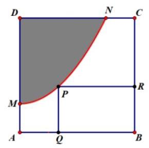

【例题】1. (2025 上海春考) 如图所示,正方形 ${ABCD}$ 是一块边长为 4 的工程用料，阴影部分所示是被腐蚀的区域，其余部分完好. 曲线 ${MN}$ 是以 ${AD}$ 为对称轴的抛物线的一部分, ${MD} = {ND} = 3$ . 工人要从完好的工程原料中截取一块最大的矩形, 则这块矩形原料的面积最大时， ${AQ}$ 的长度是___ (精确到 0.1 ).

【答案】 2.2

【解析】以点 $A$ 为坐标原点,建立平面直角坐标系,则 $M\left( {0,1}\right) , N\left( {3,4}\right)$ . 设抛物线 ${MN}$ 的方程为 $y = a{x}^{2} + 1$ ，将 $N\left( {3,4}\right)$ 代入解得 $a = \frac{1}{3}$ .

设点 $P\left( {x,\frac{1}{3}{x}^{2} + 1}\right)$ ,则 ${PQ} = \frac{1}{3}{x}^{2} + 1,{PR} = 4 - x$ ,

所以矩形 ${BPRQ}$ 的面积 $f\left( x\right)  = {PQ} \cdot  {PR} = \left( {\frac{1}{3}{x}^{2} + 1}\right) \left( {4 - x}\right)  =  - \frac{1}{3}{x}^{3} + \frac{4}{3}{x}^{2} - x + 4$ .

所以 ${f}^{\prime }\left( x\right)  =  - {x}^{2} + \frac{8}{3}x - 1$ ,令 ${f}^{\prime }\left( x\right)  = 0$ ,解得 $x = \frac{4 \pm  \sqrt{7}}{3}$ .

检验可知 $x = \frac{4 + \sqrt{7}}{3}$ 时, $y = f\left( x\right)$ 取得极大值 (最大值),此时 ${AQ} = x = \frac{4 + \sqrt{7}}{3} \approx  {2.2}$ .

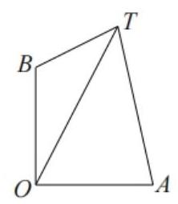

【例题】2. (2024 上海秋考) 海上有灯塔 $O, A, B$ 和船只 $T, A$ 在 $O$ 的正东方向, $B$ 在 $O$ 的正北方向, $A, B$ 到 $O$ 的距离相同, $O, A, T, B$ 按逆时针排列. 若 $\angle {OTA} = {37.0}^{ \circ  },\angle {OTB} = {16.5}^{ \circ  }$ ,则 $\angle {BOT} =$ ___ (精确到 ${0.1}^{ \circ  }$ ).

【答案】 $\angle {BOT} = {7.8}^{ \circ  }$

【解析】设 $\angle {BOT} = \theta ,\angle {AOT} = {90}^{ \circ  } - \theta$ ,

在 $\bigtriangleup {AOT}$ 中,由正弦定理得 $\frac{OT}{\sin A} = \frac{OA}{\sin \angle {OTA}}$ ,即 $\angle {OTA} = {37.0}^{ \circ  },\angle {OTB} = \; {16.5}^{ \circ  }$ ,

在 $\bigtriangleup {BOT}$ 中，由正弦定理得 $\frac{OT}{\sin B} = \frac{OB}{\sin \angle {OTB}}$ ，即 $\frac{OT}{\sin \left( {\theta  + {16.5}^{ \circ  }}\right) } = \frac{OB}{\sin {16.5}^{ \circ  }}$ ，

因为 ${OA} = {OB}$ ,两式相除,得 $\frac{\sin \left( {{90}^{ \circ  } - \theta  + {37.0}^{ \circ  }}\right) }{\sin \left( {\theta  + {16.5}^{ \circ  }}\right) } = \frac{\sin {37.0}^{ \circ  }}{\sin {16.5}^{ \circ  }}\left( *\right)$ ,

所以 $\frac{\cos \theta \cos {37.0}^{ \circ  } + \sin \theta \sin {37.0}^{ \circ  }}{\sin \theta \cos {16.5}^{ \circ  } + \cos \theta \sin {16.5}^{ \circ  }} = \frac{\sin {37.0}^{ \circ  }}{\sin {16.5}^{ \circ  }}$ ,

所以 $\frac{\cos {37.0}^{ \circ  } + \tan \theta \sin {37.0}^{ \circ  }}{\tan \theta \cos {16.5}^{ \circ  } + \sin {16.5}^{ \circ  }} = \frac{\sin {37.0}^{ \circ  }}{\sin {16.5}^{ \circ  }}$ ,

所以 $\cos {37.0}^{ \circ  }\sin {16.5}^{ \circ  } + \tan \theta \sin {37.0}^{ \circ  }\sin {16.5}^{ \circ  }$

$= \tan \theta \sin {37.0}^{ \circ  }\cos {16.5}^{ \circ  } + \sin {37.0}^{ \circ  }\sin {16.5}^{ \circ  }$ ,

所以 $\tan \theta \left( {\sin {37.0}^{ \circ  }\cos {16.5}^{ \circ  } - \sin {37.0}^{ \circ  }\sin {16.5}^{ \circ  }}\right)$

$= \cos {37.0}^{ \circ  }\sin {16.5}^{ \circ  } - \sin {37.0}^{ \circ  }\sin {16.5}^{ \circ  }$ ,

所以 $\tan \theta  = \frac{\cos {37.0}^{ \circ  }\sin {16.5}^{ \circ  } - \sin {37.0}^{ \circ  }\sin {16.5}^{ \circ  }}{\sin {37.0}^{ \circ  }\cos {16.5}^{ \circ  } - \sin {37.0}^{ \circ  }\sin {16.5}^{ \circ  }} = \frac{\cot {37.0}^{ \circ  } - 1}{\cot {16.5}^{ \circ  } - 1}$ ,

由计算器得 $\theta  \approx  {7.8}^{ \circ  }$ .

【注】以上看起来繁琐只是因为把具体化简过程写了出来,事实上,在 $\left( *\right)$ 中,可以直接对角相

2025 版上海高考真题及模拟训练合集(下册)

乘后, 按计算器出近似值.

【例题】3. (2024上海春考)某正方形景区 ${ABCD}$ 边长为 ${1.2}\mathrm{\;{km}}$ ，点 $E$ 距 ${AB}$ 、 ${AD}$ 的距离都为 ${0.2}\mathrm{\;{km}}$ ,点 $F$ 距 ${BC}\text{ 、 }{CD}$ 的距离都为 ${0.4}\mathrm{\;{km}}$ ,现要在景区内建一条圆形交通轨道 (不计宽度),要使轨道经过 $E\text{ 、 }F$ 两点,且与 ${AD}$ 边有一个公共点以便作为出入口，则这条圆形交通轨道的周长为___ (精确到 ${0.01}\mathrm{\;{km}}$ ).

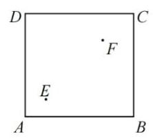

【答案】 2.73km

【解析】以 $A$ 为原点建系, $E\left( {{0.2},{0.2}}\right) , F\left( {{0.8},{0.8}}\right)$ ,

直线 ${EF}$ 中垂线 $y - {0.5} =  - \left( {x - {0.5}}\right)$ ,化简得 $y =  - x + 1$ ,

所以圆心为 $\left( {t, - t + 1}\right)$ ,半径为 $t$ ,且经过 $E, F$ 点,

即 ${\left( t - {0.2}\right) }^{2} + {\left( -t + 1 - {0.2}\right) }^{2} = {t}^{2}$ ,化简得 ${t}^{2} - {2t} + {0.68} = 0$ ,解得 $t = \frac{5 - 2\sqrt{2}}{5}$

所以周长 ${2\pi t} \approx  {2.73}\mathrm{\;{km}}$ .

【例题】4. (2023 上海秋考) 某公园欲建设一段斜坡，假设斜坡底端在水平地面上且坡面笔直，斜坡顶端距水平地面的高度为 4 米,斜坡与水平地面的夹角为 $\theta$ . 已知游客从坡底沿着斜坡每向上走 1 米，消耗的体力为 (1.025 - cos内，若要使游客从斜坡底端走到斜坡顶端所消耗的体力最少，则 $\theta  =$ ___.

【答案】 $\arccos \frac{40}{41}$

【解析】斜坡的长度为 $\frac{4}{\sin \theta }$ ,所以消耗的总体能为 $W = \frac{4\left( {{1.025} - \cos \theta }\right) }{\sin \theta }$ .

法一:(辅助角公式)令 $t = \frac{{1.025} - \cos \theta }{\sin \theta }$ ，即 $t\sin \theta  + \cos \theta  = {1.025}$ ，

所以 $\sqrt{{t}^{2} + 1}\sin \left( {\theta  + \varphi }\right)  = {1.025}$ ,其中 $\tan \varphi  = \frac{1}{t}$ ，

由 $\left| {\sin \left( {\theta  + \varphi }\right) }\right|  \leq  1$ ,得 $\sqrt{{t}^{2} + 1} \geq  {1.025}$ ,解得 $t \geq  {0.225}$ ,即 $t$ 的最小值为 0.225,

此时 $\theta  = \frac{\pi }{2} - \varphi  = \arctan \frac{9}{40}$ .

法二: (利用计算器以及解三角方程) 由 $W = \frac{4\left( {{1.025} - \cos \theta }\right) }{\sin \theta }$ ,

通过计算器得 ${W}_{\min } = {0.9}$ ,所以 ${0.9} = \frac{4\left( {{1.025} - \cos \theta }\right) }{\sin \theta }$ ,

化简得 ${0.9}\sin \theta  + 4\cos \theta  = {4.1}$ ,又因为 ${\sin }^{2}\theta  + {\cos }^{2}\theta  = 1$ ,所以 $\cos \theta  = \frac{40}{41}$ ,即 $\theta  = \arccos \frac{40}{41}$ .

法三: (导数) 由 $W = \frac{4\left( {{1.025} - \cos \theta }\right) }{\sin \theta }$ ,

得 ${W}^{\prime } = 4 \cdot  \frac{{\sin }^{2}\theta  - \cos \theta \left( {{1.025} - \cos \theta }\right) }{{\sin }^{2}\theta } = 4 \cdot  \frac{{1.025} - \cos \theta }{{\sin }^{2}\theta }$ ,

令 ${W}^{\prime } = 0$ 得 $\cos \theta  = \frac{1}{1.025}$ ,

当 $\cos \theta  < \frac{1}{1.025}$ 时，即 $\theta  > \arccos \frac{1}{1.025}$ 时， ${W}^{\prime } > 0$ ，此时 $W$ 严格增；

当 $\cos \theta  > \frac{1}{1.025}$ 时，即 $\theta  < \arccos \frac{1}{1.025}$ 时， ${W}^{\prime } < 0$ ，此时 $W$ 严格减；

所以当 $\theta  = \arccos \frac{1}{1.025} = \arccos \frac{40}{41}$ 时， $W = \frac{4\left( {{1.025} - \cos \theta }\right) }{\sin \theta }$ 取到最小值，

所以 $\theta  = \arccos \frac{40}{41}$ .

法四: (斜率法1) 要使 $W = \frac{4\left( {{1.025} - \cos \theta }\right) }{\sin \theta }$ 最小,即 $\frac{1}{W} = \frac{\sin \theta }{4\left( {{1.025} - \cos \theta }\right) }$ 最大, 也就是 $- \frac{1}{W} = \frac{-\sin \theta }{{4.1} - 4\cos \theta }$ 最小,

这时可看作点 $A\left( {{4.1},0}\right)$ 与点 $P\left( {4\cos \theta ,\sin \theta }\right)$ 两点所成直线斜率的最小值,

点 $P$ 几何意义为椭圆 $\frac{{x}^{2}}{16} + {y}^{2} = 1$ 上的点,由椭圆图像得相切的时候取到最小值,

此时由点 $P$ 得切线 ${PA}$ 的方程为 $\frac{{4x} \cdot  \cos \theta }{16} + \sin \theta  = 1$ ,又因为过点 $A\left( {{4.1},0}\right)$ ,

得 $\frac{4 \cdot  {4.1} \cdot  \cos \theta }{16} + \sin \theta  \cdot  0 = 1$ ,解得 $\cos \theta  = \frac{40}{41},\theta  = \arccos \frac{40}{41}$ ,

所以 $\theta  = \arccos \frac{40}{41}$ .

法五: (斜率法2) 要使 $W = \frac{4\left( {{1.025} - \cos \theta }\right) }{\sin \theta }$ 最小,则 $- \frac{1}{4}W = \frac{\cos \theta  - {1.025}}{\sin \theta }$ 最大,

这时可看作点 $A\left( {0,{1.025}}\right)$ 与点 $P\left( {\sin \theta ,\cos \theta }\right)$ 两点所成直线斜率的最小值,

点 $P\left( {\sin \theta ,\cos \theta }\right)$ 在单位圆上,且 $\angle {POx} = \frac{\pi }{2} - \theta$ ,

由图形得相切的时候取到最小值,此时 $\angle {PAO} = \theta$ ,所以 $\cos \theta  = \frac{1}{1.025} = \frac{40}{41}$ ,

所以 $\theta  = \arccos \frac{40}{41}$ .

法六: (万能公式) 令 $t = \tan \frac{\theta }{2} \in  \left( {-1,1}\right)$ ,则 $\sin \theta  = \frac{2t}{1 + {t}^{2}},\cos \theta  = \frac{1 - {t}^{2}}{1 + {t}^{2}}$ ,

则 $W = \frac{4\left( {{1.025} - \frac{1 - {t}^{2}}{1 + {t}^{2}}}\right) }{\frac{2t}{1 + {t}^{2}}} = 2\left( {{2.025t} + \frac{0.025}{t}}\right)  \geq  4\sqrt{{2.025t} \times  \frac{0.025}{t}} = \frac{9}{10}$ ,

当且仅当 ${2.025t} = \frac{0.025}{t}$ ,即时取等号,此时 $\tan \theta  = \frac{2t}{1 - {t}^{2}} = \frac{9}{40}$ ,即 $\theta  = \arctan \frac{9}{40}$ .

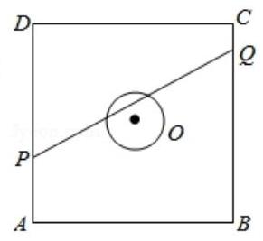

【例题】5. (2018 上海春考)如图，正方形角 ${ABCD}$ 的边长为20米，圆 $O$ 的半径为1米，圆心是正方形的中心，点 $P$ 、 $Q$ 分别在线段 ${AD}$ 、 ${CB}$ 上，若线段 ${PQ}$ 与圆 $O$ 有公共点,则称点 $Q$ 在点 $P$ 的“盲区”中,已知点 $P$ 以 1.5 米/秒的速度从 $A$ 出发向 $D$ 移动. 同时,点 $Q$ 以 1 米/秒的速度从 $C$ 出发向 $B$ 移动，则在点 $P$ 从 $A$ 移动到 $D$ 的过程中，点 $Q$ 在点 $P$ 的盲区中的时长约为___秒(精确到 0.1).

【答案】 4.4

【解析】以 $O$ 为坐标原点,建立如图所示的直角坐标系,

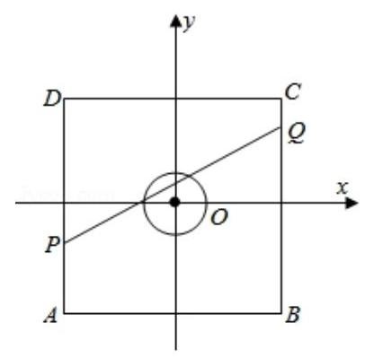

设 $P\left( {-{10}, - {10} + {1.5t}}\right) , Q\left( {{10},{10} - t}\right)$ ,

得直线 ${PQ}$ 的方程为 $y - {10} + t = \frac{{20} - {2.5t}}{20}\left( {x - {10}}\right)$ ,圆 $O$ 的方程为 ${x}^{2} + {y}^{2} = 1$ ,

由直线 ${PQ}$ 与圆 $O$ 有交点,

得 $\frac{\left| \frac{{2.5t} - {20}}{2} - t + {10}\right| }{\sqrt{1 + {\left( \frac{{20} - {2.5t}}{20}\right) }^{2}}} \leq  1$ ,

化为 $3{t}^{2} + {16t} - {128} \leq  0$ ,解得 $0 \leq  t \leq  \frac{8\sqrt{7} - 8}{3}$ ,

即有点 $Q$ 在点 $P$ 的盲区中的时长约为 4.4 秒. 2025 版上海高考真题及模拟训练合集(下册)

## 2. 模拟练习

【练习】1. (2024 届交附) 椭圆具有如下的声学性质:从一个焦点出发的声波经过椭圆反射后会经过另外一个焦点. 有一个具有椭圆形光滑墙壁的建筑，某人站在一个焦点处大喊一声，声音向各个方向传播后经墙壁反射 (不考虑能量损失)，该人先后三次听到了回音，其中第一、二次的回音较弱，第三次的回音较强；记第一、二次听到回音的时间间隔为 $x$ ，第二、三次听到回音的时间间隔为 $y$ ,则椭圆的离心率为 ( )

A. $\frac{x}{{2x} + y}$ B. $\frac{x}{x + {2y}}$ C. $\frac{y}{{2x} + y}$ D. $\frac{y}{x + {2y}}$

【答案】 $B$

【解析】情景还原, ${t}_{1}$ 时刻,刚刚呐喊声音传播为 $0,{t}_{2}$ 时刻听到第一次回声,

声音的路程为 $2\left( {a - c}\right)$ ，即从左交点到左顶点再次回到左焦点，

${t}_{3}$ 时刻，声音的路程为 $2\left( {a + c}\right)$ ，即从左焦点到右顶点，又从右顶点回到左点

${t}_{4}$ 时刻，声音的路程为 ${4a}$ ，即由左焦点反射到右焦点，再反射到左焦点

所以有 $x = {t}_{3} - {t}_{2}$ ,所以 $2\left( {a + c}\right)  - 2\left( {a - c}\right)  = {vx}$ ,

所以有 $y = {t}_{4} - {t}_{3}$ ,所以 ${4a} - 2\left( {a + c}\right)  = {vy}$ ,

接下来处理, ${4c} = {vx},{2a} - {2c} = {vy}$ ,所以 $\frac{a - c}{2c} = \frac{y}{x}$ ,

所以 $\frac{a - c}{c} = \frac{2y}{x}$ ,所以 $\frac{a}{c} - 1 = \frac{2y}{x}$ ,所以 $\frac{a}{c} = \frac{{2y} + x}{x}$ ,即 $\frac{c}{a} = \frac{x}{{2y} + x}$ ,故选 $B$

【练习】2. (2024 届华二) 如图是一款电动自行车用“遮阳神器”的结构示意图，它由三叉形的支架 $O - {ABC}$ 和覆盖在支架上的遮阳布 $\bigtriangleup {ABC}$ 组成. 已知 ${OA} = {1.4}$ 米, ${OB} = {OC} = {0.6}$ 米,且 $\angle {AOB} = \angle {AOC}$ . 为保障行车安全,要求遮阳布的最宽处 ${BC} \leq  1$ 米. 若希望遮阳效果最好 (即 $\bigtriangleup {ABC}$ 的面积最大)，则 $\angle {BOC}$ 的大小约为___ (结果四舍五入精确到 ${1}^{ \circ  }$ ).

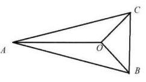

【答案】 ${113}^{ \circ  }$

【解析】若 $O$ 不在平面 ${ABC}$ 上,设 $P$ 为 $O$ 在平面 ${ABC}$ 上的射影.

在 ${PA}\text{ 、 }{PB}\text{ 、 }{PC}$ 的延长线上分别取点 $D\text{ 、 }E\text{ 、 }F$ ,使得 ${PD} = {OA}\text{ 、 }{PE} = {OB}$ 、

${PF} = {OC}$ ，此时， ${S}_{\bigtriangleup {DEF}} > {S}_{\bigtriangleup {ABC}}$ ，故当 $\bigtriangleup  {ABC}$ 的面积最大时， $O$ 必在平面 ${ABC}$ 上.

设 $\angle {BOC} = {2\theta }$ ，则 $2 \times  {0.6}\sin \theta  \leq  1$ ，即 $0 < \theta  \leq  \arcsin \frac{5}{6}$ .

${S}_{\bigtriangleup {ABC}} = \frac{1}{2}\left| {BC}\right| \left( {\left| {OA}\right|  + \left| {OC}\right| \cos \theta }\right)  = {0.6}\sin \theta \left( {{1.4} + {0.6}\cos \theta }\right)$ ,

设 $f\left( \theta \right)  = {0.84}\sin \theta  + {0.18}\sin {2\theta }$ ,

则 ${f}^{\prime }\left( \theta \right)  = {0.84}\cos \theta  + {0.36}\cos {2\theta } = {0.12}\left( {3\cos \theta  - 1}\right) \left( {2\cos \theta  + 3}\right)$ ,

当 $0 < \theta  \leq  \arcsin \frac{5}{6}$ 时, $\cos \theta  \geq  \frac{\sqrt{11}}{6} > \frac{1}{3}$ ,故 ${f}^{\prime }\left( \theta \right)  > 0$ ,函数 $y = f\left( \theta \right)$ 严格增,

因此 $\bigtriangleup {ABC}$ 的面积最大时 $\angle {BOC} = 2\arcsin \frac{5}{6} \approx  {113}^{ \circ  }$ .

【练习】3. (2024 上海三模) 舒腾尺是荷兰数学家舒腾 (1615-1660) 设计的一种作图工具，如图, $O$ 是滑槽 ${AB}$ 的中点，短杆 ${ON}$ 可绕 $O$ 转动，长杆 ${MN}$ 通过 $N$ 处的铰链与 ${ON}$ 连接， ${MN}$ 上的栓子 $D$ 可沿滑槽 ${AB}$ 滑动,当点 $D$ 在滑槽 ${AB}$ 内作往复移动时,带动点 $N$ 绕 $O$ 转动,点 $M$ 也随之而运动,记点 $N$ 的运动轨迹为 ${C}_{1}$ ,点 $M$ 的运动轨迹为 ${C}_{2}$ . 若 ${ON} = {DN} = 1,{MN} = 3$ ,且 ${AB} \geq  4$ ,过 ${C}_{2}$ 上的点 $P$ 向 ${C}_{1}$ 作切线,则切线长的最大值为___ 2025 版上海高考真题及模拟训练合集(下册)

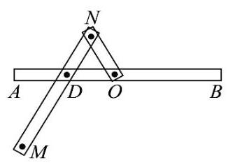

【答案】 $\sqrt{15}$

【解析】如图,以滑槽 ${AB}$ 所在的直线为 $x$ 轴, $O$ 为坐标原点建立平面直角坐标系,

因为 ${ON} = 1$ ,所以点 $N$ 的运动轨迹 ${C}_{1}$ 是以 $O$ 为圆心,1 为半径的圆,

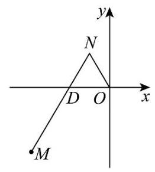

则其方程为 ${x}^{2} + {y}^{2} = 1$ ,

设 $N\left( {\cos \theta ,\sin \theta }\right)$ ,因为 ${ON} = {DN} = 1$ ,所以 $D\left( {2\cos \theta ,0}\right)$ ,

因为 ${MN} = 3$ ,所以 $\overrightarrow{NM} = 3\overrightarrow{ND}$ ,

设 $M\left( {x, y}\right)$ ,则 $\left( {x - \cos \theta , y - \sin \theta }\right)  = 3\left( {\cos \theta , - \sin \theta }\right)$ ,得 $x = 4\cos \theta , y = \; - 2\sin \theta$ ,

所以 $M\left( {4\cos \theta , - 2\sin \theta }\right)$ ,则点 $M$ 的轨迹 ${C}_{2}$ 是椭圆,其方程为 $\frac{{x}^{2}}{16} + \frac{{y}^{2}}{4} =$

1,

设 ${C}_{2}$ 上的点 $P\left( {4\cos \alpha , - 2\sin \alpha }\right)$ ,则

$O{P}^{2} = {16}{\cos }^{2}\alpha  + 4{\sin }^{2}\alpha  = 4 + {12}{\cos }^{2}\alpha  \leq  {16}$ ,

所以切线长为 $\sqrt{O{P}^{2} - 1} \leq  \sqrt{{16} - 1} = \sqrt{15}$ ,

所以切线长的最大值为 $\sqrt{15}$ ,

故答案为: $\sqrt{15}$

【练习】4. (2024 届华二)如图所示，甲工厂位于一直线河岸的岸边 $A$ 处，乙工厂与甲工厂在河的同侧， 且位于离河岸 ${40}\mathrm{\;{km}}$ 的 $B$ 处，河岸边 $D$ 处与 $A$ 处相距 ${50}\mathrm{{km}}$ (其中 ${BD} \bot  {AD}$ )，两家工厂要在此岸边建一个供水站 $C$ ,从供水站到甲工厂和乙工厂的水管费用分别为每千米 ${3a}$ 元和 ${5a}$ 元, 问供水站 $C$ 建在岸边距离 $A$ 处___ $\mathrm{{km}}$ 才能使水管费用最省？

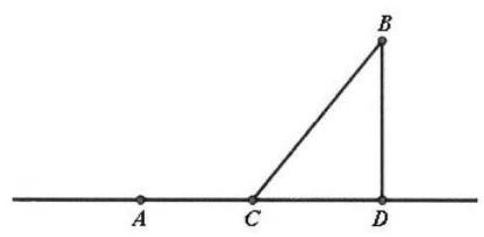

【答案】 20

【解析】由题意得点 $C$ 在线段 ${AD}$ 上才能使水管费用最省,

设 $C$ 点距 $D$ 点 $x\mathrm{\;{km}}$ ,则 ${BD} = {40},{AC} = {50} - x,{BC} = \sqrt{B{D}^{2} + C{D}^{2}} = \sqrt{{x}^{2} + {40}^{2}}$ ;

设水管总费用为 $y$ 元,由题意得 $y = {3a}\left( {{50} - x}\right)  + {5a}\sqrt{{x}^{2} + {40}^{2}}\left( {0 < x < {50}}\right)$ .

其导数为 ${y}^{\prime } =  - {3a} + \frac{5ax}{\sqrt{{x}^{2} + {40}^{2}}}$ .

令 ${y}^{\prime } = 0$ ,解得函数的驻点为 $x = {30}$ .

当 $x \in  \left( {0,{30}}\right)$ 时, ${y}^{\prime } < 0$ ,函数在区间 $\left( {0,{30}}\right)$ 上严格递减;

当 $x \in  \left( {{30},{50}}\right)$ 时, ${y}^{\prime } > 0$ ,函数 $V\left( x\right)$ 在区间 $\left( {{30},{50}}\right)$ 上严格递增.

因此,在区间 $\left( {0,{50}}\right)$ 上, $y$ 只有一个极值点.

2025 版上海高考真题及模拟训练合集(下册)

根据实际问题的意义，函数在 $x = {30}\left( \mathrm{\;{km}}\right)$ 处取得最小值，

此时 ${AC} = {50} - x = {20}\left( \mathrm{\;{km}}\right)$ .

所以,供水站建在 $A\text{ 、 }D$ 之间距甲厂 ${20}\mathrm{\;{km}}$ 处,可使水管费用最省.

2025 版上海高考真题及模拟训练合集(下册)

【练习】5. (2024 届复附)《周髀算经》中“侧影探日行”一文有记载:“即取竹空，径一寸，长八尺，捕影而视之，空正掩目，而日应空之孔.”意为“取竹空这一望筒，当望筒直 $d$ 是一寸，筒长 $t$ 是八尺时 (注:一尺等于十寸)，从筒中搜捕太阳的边缘观察，则筒的内孔正好覆盖太阳，而太阳的外缘恰好填满竹管的内孔.”如图所示， $O$ 为竹空底面圆心，则太阳角 $\angle {AOB}$ 的正切值为( )

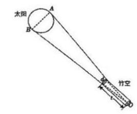

A. $\frac{1}{160}$ B. $\frac{320}{{160}^{2} - 1}$ C. $\frac{1}{80}$ D. $\frac{160}{{80}^{2} - 1}$

【答案】 $B$

【解析】由题意得 $\frac{d}{t} = \frac{1}{80},\tan \frac{\angle {AOB}}{2} = \frac{\frac{d}{2}}{t} = \frac{d}{2t} = \frac{1}{160}$ , 由二倍角的正切公式得 $\tan \angle {AOB} = \frac{2\tan \frac{\angle {AOB}}{2}}{1 - {\tan }^{2}\frac{\angle {AOB}}{2}} = \frac{2 \times  \frac{1}{160}}{1 - {\left( \frac{1}{160}\right) }^{2}} = \frac{320}{{160}^{2} - 1}$ 故选 $B$

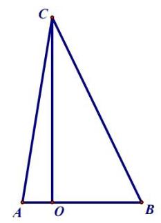

【练习】6. (2025 届格致) 如图,已知点 $C$ 在点 $O$ 的正北方向,点 $A$ 、点 $B$ 分别在点 $O$ 的正西、正东方向,且 $\sin \angle {ACB} = \frac{4}{7},\sin \left( {A - B}\right)  = \frac{2}{7},{AB} = 4$ ,若 $\angle {ACB}$ 为锐角,则 ${OC} =$ ___.

【答案】 $\frac{\sqrt{33} + 3\sqrt{5}}{2}$

【解析】由 $\sin \angle {ACB} = \sin \left( {A + B}\right)  = \frac{4}{7},\sin \left( {A - B}\right)  = \frac{2}{7}$ ,

得 $\sin A\cos B = \frac{3}{7},\cos A\sin B = \frac{1}{7}$ ，所以 $\frac{\tan A}{\tan B} = 3$ ，则 $\frac{OB}{OA} = 3$ ，

又 ${AB} = 4$ ，所以 ${OA} = 1,{OB} = 3$ ，

所以 $\sin A = \frac{OC}{\sqrt{1 + O{C}^{2}}},\cos B = \frac{3}{\sqrt{9 + O{C}^{2}}}$ ，则 $\frac{OC}{\sqrt{1 + O{C}^{2}}} \cdot  \frac{3}{\sqrt{9 + O{C}^{2}}} = \frac{3}{7}$ ，

解得 ${OC} = \frac{\sqrt{33} + 3\sqrt{5}}{2}$ .

2025 版上海高考真题及模拟训练合集(下册)

【练习】7. (2024 届上中) 为解决皮尺长度不够的问题,实验小组利用自行车来测量 $A\text{ 、 }B$ 两点之间的直线距离. 如图，先将自行车前轮置于点 $A$ ，前轮上与点 $A$ 接触的地方标记为点 $C$ ，然后推着自行车沿 ${AB}$ 直线前进 (车身始终保持与地面垂直),直到前轮与点 $B$ 接触. 经观测，在前进过程中，前轮上的标记点 $C$ 与地面接触了 10 次，当前轮与点 $B$ 接触时，标记点 $C$ 在前轮的左上方 (以如图为观察视角),且到地面的垂直高度为 ${0.45}\mathrm{\;m}$ . 已知前轮的半径为 ${0.3}\mathrm{\;m}$ ,则 $A\text{ 、 }B$ 两点之间的距离约为___(计算结果精确到小数点后第二位).

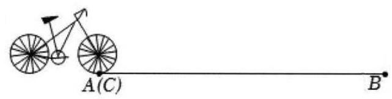

【答案】 ${19.47}\mathrm{\;m}$

【解析】由题意得,前轮转动了 $\left( {{10} + \frac{1}{3}}\right)$ 圈,

故 $A\text{ 、 }B$ 两点之间的距离约为 $\left( {{10} + \frac{1}{3}}\right)  \times  {2\pi } \times  {0.3} = {6.2\pi } \approx  {19.47}\mathrm{\;m}$ .

【练习】8. (2025 届交附) 在一座尖塔的正南方向地面某点 $A$ ,测得塔顶的仰角为 ${30}^{ \circ  }$ ,又在此尖塔北偏东 ${30}^{ \circ  }$ 地面某点 $B$ ,测得塔顶的仰角为 ${45}^{ \circ  }$ ,且 $A\text{ 、 }B$ 两点距离为 $7\mathrm{\;m}$ ,在线段 ${AB}$ 上的点 $C$ 处测得塔顶的仰角为最大，则 $C$ 点到塔底 $O$ 的距离为___ $m$

【答案】 $\frac{\sqrt{3}}{2}$

【解析】设尖塔高为 ${OP}$ ,设 ${OP} = m$ ,

由题意得 $\angle {AOB} = {150}^{ \circ  },\angle {PAO} = {30}^{ \circ  },\angle {PBO} = {45}^{ \circ  }$ ,

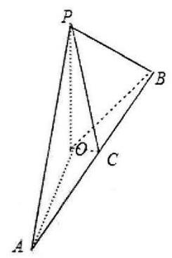

所以 ${OA} = \sqrt{3}m,{OB} = m$ ,

在 $\bigtriangleup {AOB}$ 中,由余弦定理得 $A{B}^{2} = O{A}^{2} + O{B}^{2} - {2OA} \cdot  {OB} \cdot  \cos \angle {AOB}$ ,

所以 ${49} = 3{m}^{2} + {m}^{2} - 2\sqrt{3}m \cdot  m \cdot  \left( {-\frac{\sqrt{3}}{2}}\right)  = 7{m}^{2}$ ,

所以 $m = \sqrt{7}$ ,所以 ${OA} = \sqrt{21},{OB} = \sqrt{7}$ ,

在线段 ${AB}$ 上的点 $C$ 处测得塔顶的仰角为最大,则 $C$ 到 $O$ 的距离最小, 即 ${OC}$ 为 $O$ 到 ${AB}$ 的距离,

作 ${OC} \bot  {AB}, C$ 为垂足,则 ${OC}$ 为所求

由 ${S}_{\bigtriangleup {ABO}} = \frac{1}{2} \times  {OA} \times  {OB} \times  \sin {150}^{ \circ  } = \frac{1}{2} \times  {OC} \times  {AB}$ ,

得 $\frac{1}{2} \times  \sqrt{21} \times  \sqrt{7} \times  \frac{1}{2} = \frac{1}{2} \times  7 \times  {OC}$ ,解得 ${OC} = \frac{\sqrt{3}}{2}$

## 1. 真题回顾

【例题】1. (2020 上海秋考) 在研究某市交通情况时, 道路密度是指该路段上一定时间内通过的车辆数除以时间，车辆密度是该路段一定时间内通过的车辆数除以该路段的长度，

现定义交通流量为 $v = \frac{q}{x}, x$ 为道路密度， $q$ 为车辆密度，

交通流量 $v = f\left( x\right)  = \left\{  \begin{array}{ll} {100} - {135} \cdot  {\left( \frac{1}{3}\right) }^{\frac{80}{x}}, & 0 < x < {40} \\   - k\left( {x - {40}}\right)  + {85}, & {40} \leq  x \leq  {80} \end{array}\right.$ , $k > 0$ .

(1)若交通流量 $v > {95}$ ，求道路密度 $x$ 的取值范围；

(2)已知道路密度 $x = {80}$ 时，测得交通流量 $v = {50}$ ，求车辆密度 $q$ 的最大值.

【解析】(1) 因为 $v = \frac{q}{x}$ ,所以 $v$ 越大， $x$ 越小，

所以 $v = f\left( x\right)$ 是单调递减函数, $k > 0$ ,

当 ${40} \leq  x \leq  {80}$ 时, $v$ 最大为 85,

于是只需令 ${100} - {135} \cdot  {\left( \frac{1}{3}\right) }^{\frac{80}{x}} > {95}$ ,解得 $x < \frac{80}{3}$ ,

故道路密度 $x$ 的取值范围为 $\left( {0,\frac{80}{3}}\right)$ .

(2)把 $x = {80}, v = {50}$ 代入 $v = f\left( x\right)  =  - k\left( {x - {40}}\right)  + {85}$ 中，

得 ${50} =  - k \cdot  {40} + {85}$ ,解得 $k = \frac{7}{8}$ .

所以 $q = {vx} = \left\{  \begin{array}{ll} {100x} - {135} \cdot  {\left( \frac{1}{3}\right) }^{\frac{80}{x}} \cdot  x, & 0 < x < {40} \\   - \frac{7}{8}\left( {x - {40}}\right) x + {85x}, & {40} \leq  x \leq  {80} \end{array}\right.$ ,

① 当 $0 < x < {40}$ 时, $v = {100} - {135} \cdot  {\left( \frac{1}{3}\right) }^{\frac{80}{x}} < {100}, q = {vx} < {100} \times  {40} = {4000}$ .

② 当 ${40} \leq  x \leq  {80}$ 时， $q$ 是关于 $x$ 的二次函数， $q =  - \frac{7}{8}{x}^{2} + {120x}$ ，

对称轴为 $x = \frac{480}{7}$ ，此时 $q$ 有最大值，

为 $- \frac{7}{8} \times  {\left( \frac{480}{7}\right) }^{2} + {120} \times  \frac{480}{7} = \frac{28800}{7} > {4000}$ .

综上所述，车辆密度 $q$ 的最大值为 $\frac{28800}{7}$ .

【例题】2. (2019 上海春考) 改革开放 40 年，我国卫生事业取得巨大成就，卫生总费用增长了数十倍. 卫生总费用包括个人现在支出、社会支出、政府支出，如表为 2012 年 -2015 年我国卫生费用中个人现金支出、社会支出和政府支出的费用 (单位:亿元) 和在卫生总费用中的占比. 2025 版上海高考真题及模拟训练合集(下册)

<table id="cross-table-1"><tr><td rowspan="2">年份</td><td rowspan="2">卫生总费用 (亿元)</td><td colspan="2">个人现金卫生支出</td><td colspan="2">社会卫生支出</td><td colspan="2">政府卫生支出</td></tr><tr><td>绝对数 (亿元)</td><td>占卫生总费用比重 (%)</td><td>绝对数 (亿元)</td><td>占卫生总费用比重 (%)</td><td>绝对数 (亿元)</td><td>占卫生总费用比重 (%)</td></tr><tr><td>2012</td><td>28119.0 0</td><td>9656.32</td><td>34.34</td><td>10030.70</td><td>35.67</td><td>8431.98</td><td>29.99</td></tr><tr></tr><tr><td>2014</td><td>35312.4 0</td><td>11295.41</td><td>31.99</td><td>13437.75</td><td>38.05</td><td>10579.2 3</td><td>29.96</td></tr><tr><td>2015</td><td>40974.6 4</td><td>11992.65</td><td>29.27</td><td>16506.71</td><td>40.29</td><td>12475.2 8</td><td>30.45</td></tr></table>

(数据来源于国家统计年鉴)

(1)指出 2012 年到 2015 年之间我国卫生总费用中个人现金支出占比和社会支出占比的变化趋势:

(2)设 $t = 1$ 表示1978 年，第 $n$ 年卫生总费用与年份 $t$ 之间拟合函数 $f\left( t\right)  = \frac{357876.6053}{1 + {\mathrm{e}}^{{6.4420} - {0.1136t}}}$ 研究函数 $f\left( t\right)$ 的单调性，并预测我国卫生总费用首次超过 12 万亿的年份.

【解析】(1) 由表格数据得个人现金支出占比逐渐减少, 社会支出占比逐渐增多.

(2) 因为 $y = {\mathrm{e}}^{{6.4420} - {0.1136t}}$ 是减函数,且 $y = {\mathrm{e}}^{{6.4420} - {0.1136t}} > 0$ ,

所以 $f\left( t\right)  = \frac{357876.6053}{1 + {\mathrm{e}}^{{6.4420} - {0.1136t}}}$ 在 $N$ 上单调递增,

令 $\frac{357876.6053}{1 + {\mathrm{e}}^{{6.4420} - {0.1136t}}} > {120000}$ ,解得 $t > {50.68}$ ,

所以当 $t \geq  {51}$ 时,我国卫生总费用超过 12 万亿,

所以预测我国到 2028 年我国卫生总费用首次超过 12 万亿.

【例题】3. (2018 上海秋考) 某群体的人均通勤时间, 是指单日内该群体中成员从居住地到工作地的平均用时. 某地上班族 $S$ 中的成员仅以自驾或公交方式通勤. 分析显示: 当 $S$ 中 $x\% (0 < x <$ 100) 的成员自驾时,自驾群体的人均通勤时间为 $f\left( x\right)  = \left\{  \begin{array}{ll} {30}, & 0 < x \leq  {30} \\  {2x} + \frac{1800}{x} - {90}, & {30} < x < {100} \end{array}\right.$ (单位:分钟)，而公交群体的人均通勤时间不受 $x$ 影响，恒为 40 分钟，试根据上述分析结果回答下列问题:

(1)当 $x$ 在什么范围内时,公交群体的人均通勤时间少于自驾群体的人均通勤时间？

(2)求该地上班族 $S$ 的人均通勤时间 $g\left( x\right)$ 的表达式；讨论 $g\left( x\right)$ 的单调性，并说明其实际意义.

【解析】(1) 由题意得当 ${30} < x < {100}$ 时, $f\left( x\right)  = {2x} + \frac{1800}{x} - {90} > {40}$ ,

即 ${x}^{2} - {65x} + {900} > 0$ ,解得 $x < {20}$ 或 $x > {45}$ ,

所以 $x \in  \left( {{45},{100}}\right)$ 时,公交群体的人均通勤时间少于自驾群体的人均通勤时间;

(2) 当 $0 < x \leq  {30}$ 时, $g\left( x\right)  = {30} \cdot  x\%  + {40}\left( {1 - x\% }\right)  = {40} - \frac{x}{10}$ ;

当 ${30} < x < {100}$ 时, $g\left( x\right)  = \left( {{2x} + \frac{1800}{x} - {90}}\right)  \cdot  x\%  + {40}\left( {1 - x\% }\right)$

$= \frac{{x}^{2}}{50} - \frac{13}{10}x + {58}$

所以 $g\left( x\right)  = \left\{  \begin{array}{l} {40} - \frac{x}{10} \\  \frac{{x}^{2}}{50} - \frac{13}{10}x + {58} \end{array}\right.$ ;

当 $0 < x < {32.5}$ 时, $g\left( x\right)$ 单调递减; 当 ${32.5} < x < {100}$ 时, $g\left( x\right)$ 单调递增;

说明该地上班族 $S$ 中有小于 32.5% 的人自驾时，人均通勤时间是递减的；

有大于 32.5% 的人自驾时，人均通勤时间是递增的；

当自驾人数所占比为 32.5% 时,人均通勤时间最少.

【例题】4. (2017 上海秋考) 根据预测,某地第 $n\left( {n \in  {N}^{ * }}\right)$ 个月共享单车的投放量和损失量分别为 ${a}_{n}$ 和 ${b}_{n}$ (单位: 辆),其中 ${a}_{n} = \left\{  {\begin{array}{ll} 5{n}^{4} + {15}, & 1 \leq  n \leq  3 \\   - {10n} + {470}, & n \geq  4 \end{array},{b}_{n} = n + 5}\right.$ ,第 $n$ 个月底的共享单车的保有量是前 $n$ 个月的累计投放量与累计损失量的差.

(1)求该地区第 4 个月底的共享单车的保有量；

(2)已知该地共享单车停放点第 $n$ 个月底的单车容纳量 ${S}_{n} =  - 4{\left( n - {46}\right) }^{2} + {8800}$ (单位:辆). 设在某月底, 共享单车保有量达到最大, 问该保有量是否超出了此时停放点的单车容纳量?

【解析】(1) 因为 ${a}_{n} = \left\{  {\begin{array}{ll} 5{n}^{4} + {15}, & 1 \leq  n \leq  3 \\   - {10n} + {470}, & n \geq  4 \end{array},{b}_{n} = n + 5}\right.$ ,所以 ${a}_{1} = 5 \times  {1}^{4} + {15} = {20}$ ,

${a}_{2} = 5 \times  {2}^{4} + {15} = {95},{a}_{3} = 5 \times  {3}^{4} + {15} = {420},{a}_{4} =  - {10} \times  4 + {470} = {430}$ ,

${b}_{1} = 1 + 5 = 6,{b}_{2} = 2 + 5 = 7,{b}_{3} = 3 + 5 = 8,{b}_{4} = 4 + 5 = 9$ ,

所以前 4 个月共投放单车为 ${a}_{1} + {a}_{2} + {a}_{3} + {a}_{4} = {20} + {95} + {420} + {430} = {965}$ ,

前 4 个月共损失单车为 ${b}_{1} + {b}_{2} + {b}_{3} + {b}_{4} = 6 + 7 + 8 + 9 = {30}$ ,

所以该地区第 4 个月底的共享单车的保有量为 ${965} - {30} = {935}$ .

(2)令 ${a}_{n} \geq  {b}_{n}$ ，显然， $n \leq  3$ 时恒成立，

当 $n \geq  4$ 时，有 $- {10n} + {470} \geq  n + 5$ ，解得 $n \leq  \frac{465}{11}$ ，

所以第 42 个月底, 保有量达到最大.

当 $n \geq  4,\left\{  {a}_{n}\right\}$ 为公差为 -10 的等差数列,而 $\left\{  {b}_{n}\right\}$ 为等差为 1 的等差数列,

所以到第 42 个月底,单车保有量为 $\frac{{a}_{4} + {a}_{42}}{2} \times  {39} + {935} - \frac{{b}_{1} + {b}_{42}}{2} \times  {42}$

$= \frac{{430} + {50}}{2} \times  {39} + {935} - \frac{6 + {47}}{2} \times  {42} = {8782}.$

${S}_{42} =  - 4 \times  {16} + {8800} = {8736}.$

因为 ${8782} > {8736}$ ,所以第 42 个月底单车保有量超过了容纳量.

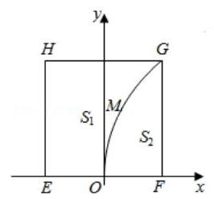

【例题】5. (2016上海秋考)有一块正方形 ${EFGH}$ ， ${EH}$ 所在直线是一条小河，收获的蔬菜可送到 $F$ 点或河边运走. 于是,菜地分别为两个区域 ${S}_{1}$ 和 ${S}_{2}$ , 其中 ${S}_{1}$ 中的蔬菜运到河边较近, ${S}_{2}$ 中的蔬菜运到 $F$ 点较近,而菜地内 ${S}_{1}$ 和 ${S}_{2}$ 的分界线 $C$ 上的点到河边与到 $F$ 点的距离相等,现建立平面直角坐标系,其中原点 $O$ 为 ${EF}$ 的中点,点 $F$ 的坐标为 $\left( {1,0}\right)$ ,如图.

(1)求菜地内的分界线 $C$ 的方程；

(2)菜农从蔬菜运量估计出 ${S}_{1}$ 面积是 ${S}_{2}$ 面积的两倍，由此得到 ${S}_{1}$ 面积的经验值为 $\frac{8}{3}$ . 设 $M$ 是 $C$ 上纵坐标为 1 的点,请计算以 ${EH}$ 为一边,另一边过点 $M$ 的矩形的面积,及五边形 EOMGH 的面积,并判断哪一个更接近于 ${S}_{1}$ 面积的“经验值”.

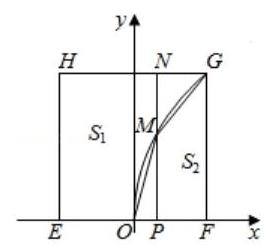

【解析】(1) 设分界线上任意一点为 $\left( {x, y}\right)$ ,由题意得 $\left| {x + 1}\right|  = \sqrt{{\left( x - 1\right) }^{2} + {y}^{2}}$ , 得 $y = 2\sqrt{x}\left( {0 \leq  x \leq  1}\right)$ ,

(2)设 $M\left( {{x}_{0},{y}_{0}}\right)$ ，则 ${y}_{0} = 1$ ，所以 ${x}_{0} = \frac{{y}_{0}^{2}}{4} = \frac{1}{4}$ ，

设所表述的矩形面积为 ${S}_{3}$ ,则 ${S}_{3} = 2 \times  \left( {\frac{1}{4} + 1}\right)  = 2 \times  \frac{5}{4} = \frac{5}{2}$ ,

设五边形 ${EMOGH}$ 的面积为 ${S}_{4}$ ,

则 ${S}_{4} = {S}_{3} - {S}_{\bigtriangleup {OMP}} + {S}_{\bigtriangleup {MGN}} = \frac{5}{2} - \frac{1}{2} \times  \frac{1}{4} \times  1 + \frac{1}{2} \times  \frac{3}{4} \times  1 = \frac{11}{4}$ ,

${S}_{1} - {S}_{3} = \frac{8}{3} - \frac{5}{2} = \frac{1}{6},{S}_{4} - {S}_{1} = \frac{11}{4} - \frac{8}{3} = \frac{1}{12} < \frac{1}{6},$

所以五边形 ${EMOGH}$ 的面积更接近 ${S}_{1}$ 的面积. 2025 版上海高考真题及模拟训练合集(下册)

## 2. 模拟练习

【练习】1. (2023 届上中) 某地打算修建一条公路，但设计路线正好经过一个野生动物迁徙路线，为了保护野生动物, 决定修建高架桥, 为野生动物的迁徙提供安全通道. 若高架桥的两端及两端的桥墩已建好，两端的桥墩相距 1200 米，余下的工程只需要建两端桥墩之间的桥面和桥墩. 经预测，一个桥墩的工程费用为 500 万元，距离为 $x$ 米的相邻两桥墩之间的桥面工程费用为 ${10x}\left\lbrack  {\ln \left( {x + {12}}\right)  - 3}\right\rbrack$ 万元. 假设桥墩等距离分布,所有桥墩都视为点,且不考虑其它因素,记余下工程的费用为 $y$ 万元.

(1)试写出 $y$ 关于 $x$ 的函数关系式;

(2)需新建多少个桥墩才能使 $y$ 最小?

【解析】(1) 需新建桥墩 $\left( {\frac{1200}{x} - 1}\right)$ 个,

所以 $y = {500}\left( {\frac{1200}{x} - 1}\right)  + \frac{1200}{x} \times  {10x}\left\lbrack  {\ln \left( {x + {12}}\right)  - 3}\right\rbrack$

$= \frac{600000}{x} - {500} + {12000}\ln \left( {x + {12}}\right)  - {36000}$

$= {12000}\left\lbrack  {\frac{50}{x} + \ln \left( {x + {12}}\right) }\right\rbrack   - {36500}, x \in  \left( {0,{1200}}\right) ;$

(2) 令 $f\left( x\right)  = \frac{50}{x} + \ln \left( {x + {12}}\right) , x \in  (0,{1200}\rbrack$ ,

${f}^{\prime }\left( x\right)  =  - \frac{50}{{x}^{2}} + \frac{1}{x + {12}} = \frac{{x}^{2} - {50x} - {600}}{{x}^{2}\left( {x + {12}}\right) },$

令 ${f}^{\prime }\left( x\right)  = 0$ ,解得 $x = {60}$ 或 $x =  - {10}$ (舍去),

当 $x \in  \left( {0,{60}}\right)$ 时, ${f}^{\prime }\left( x\right)  < 0$ ,函数 $f\left( x\right)$ 严格减,

当 $x \in  ({60},{1200}\rbrack$ 时, ${f}^{\prime }\left( x\right)  > 0$ ,函数 $f\left( x\right)$ 严格增,

所以 $f{\left( x\right) }_{\min } = f\left( {60}\right)$ ,此时需新建 $\left( {\frac{1200}{60} - 1}\right)  = {19}$ 个桥墩,

所以需新建 19 个桥墩才能使 $y$ 最小.

【练习】2. (2024 届上中) 某商场在促销期间规定:商场内所有商品按标价的 80% 出售，同时，当顾客在该商场内消费满一定金额后, 按如下方案获得相应金额的奖券:

<table><tr><td>消费金额 (元)的范围</td><td>[200, 400)</td><td>[400, 500)</td><td>[500, 700)</td><td>[700, 900)</td><td>...</td></tr><tr><td>获得奖券的金额(元)</td><td>30</td><td>60</td><td>100</td><td>130</td><td>...</td></tr></table>

根据上述促销方法, 顾客在该商场购物可以获得双重优惠, 例如, 购买标价为 400 元的商品, 则消费金额为 320 元,获得的优惠额为: ${400} \times  {0.2} + {30} = {110}$ (元),设购买商品得到的优惠率 $= \frac{\text{ 购买商品获得的优惠额 }}{\text{ 商品的标价 }}$ ，试问:

(1)若购买一件标价为 1000 元的商品，顾客得到的优惠率是多少?

(2)对于标价在 $\left\lbrack  {{500},{800}}\right\rbrack$ (元)内的商品，顾客购买标价为多少元的商品，可得到不小于 $\frac{1}{3}$ 的优惠率?

【解析】(1) 由题意得 $\frac{{1000} \times  {0.2} + {130}}{1000} = {33}\%$ .

故购买一件标价为 1000 元的商品, 顾客得到的优惠率是 33%. 2025 版上海高考真题及模拟训练合集(下册)

(2)设商品的标价为 $x$ 元.

则 ${500} \leq  x \leq  {800}$ ,消费额 ${400} \leq  {0.8x} \leq  {640}$ .

由题意得 $\left( I\right) \left\{  \begin{array}{l} \frac{{0.2x} + {60}}{x} \geq  \frac{1}{3} \\  {400} \leq  {0.8x} \leq  {500} \end{array}\right.$ 或 $\left( {II}\right) \left\{  \begin{array}{l} \frac{{0.2x} + {100}}{x} \geq  \frac{1}{3} \\  {500} \leq  {0.8x} \leq  {64} \end{array}\right.$

不等式组 $\left( I\right)$ 无解,不等式组 $\left( {II}\right)$ 的解为 ${625} \leq  x \leq  {750}$ .

因此，当顾客购买标价在 $\left\lbrack  {{625},{750}}\right\rbrack$ 元内的商品时，可得到不小于 $\frac{1}{3}$ 的优惠率.

【练习】3. 某个体户计划经销 $A\text{ 、 }B$ 两种商品,据调查统计,当投资额为 $x\left( {x \geq  0}\right)$ 万元时,在经销 $A\text{ 、 }B$ 商品中所获得的收益分别为 $f\left( x\right)$ 万元与 $g\left( x\right)$ 万元、其中 $f\left( x\right)  = a\left( {x - 1}\right)  + 2\left( {a > 0}\right) ;g\left( x\right)  = \; 6\ln \left( {x + b}\right) \left( {b > 0}\right)$ . 已知投资额为零时,收益为零.

(1)试求出 $a$ 、 $b$ 的值；

(2)如果该个体户准备投入 5 万元经营这两种商品，请你帮他制定一个资金投入方案，使他能获得最大收益, 并求出其收入的最大值 (精确到 0.1 万元).

【解析】(1) 由问题的实际意义,得 $f\left( 0\right)  = 0, g\left( 0\right)  = 0$ ,即 $\left\{  \begin{array}{l}  - a + 2 = 0 \\  6\ln b = 0 \end{array}\right.$ ,所以 $\left\{  \begin{array}{l} a = 2 \\  b = 1 \end{array}\right.$ ;

(2) 由 (1) 得 $f\left( x\right)  = {2x}, g\left( x\right)  = 6\ln \left( {x + 1}\right)$ ，

设投入 $B$ 商品的资金为 $x$ 万元 $\left( {0 \leq  x \leq  5}\right)$ ，则投入 $A$ 商品的资金为 $5 - x$ 万元，

若所获得的收入为 $s\left( x\right)$ 万元，

则有 $s\left( x\right)  = 2\left( {5 - x}\right)  + 6\ln \left( {x + 1}\right)  = 6\ln \left( {x + 1}\right)  - {2x} + {10}\left( {0 \leq  x \leq  5}\right)$ ,

所以 ${s}^{\prime }\left( x\right)  = \frac{6}{x + 1} - 2$ ,令 ${s}^{\prime }\left( x\right)  = 0$ ,得 $x = 2$ ;

当 $0 \leq  x < 2$ 时, ${s}^{\prime }\left( x\right)  > 0$ ; 当 $2 < x \leq  5$ 时, ${s}^{\prime }\left( x\right)  < 0$ ,

所以 $x = 2$ 是 $s\left( x\right)$ 在区间 $\left\lbrack  {0,5}\right\rbrack$ 上的唯一极大值点,此时 $s\left( x\right)$ 取得最大值:

$s{\left( x\right) }_{\max } = s\left( 2\right)  = 6\ln 3 + 6 \approx  {12.6}$ (万元),此时 $5 - x = 3$ (万元)

答: 该个体户可对 $A$ 商品投入 3 万元,对 $B$ 商品投入 2 万元,

这样可以获得 12.6 万元的最大收益.

【练习】4. (2025 届交附) 某矿物质有 $A\text{ 、 }B$ 两种冶炼方法,若使用 $A$ 方法,所需费用 (单位:千元) 与矿物质的重量 (单位:吨) 的平方成正比，若使用 $B$ 方法，所需费用(单位:千元)与矿物质的重量 (单位: 吨) 成正比,已知用 $A$ 方法冶炼 2 吨、用 $B$ 方法冶炼 1 吨所需的总费用为 14 千元,用 $A$ 方法冶炼 1 吨、用 $B$ 方法冶炼 2 吨所需的总费用也是 14 千元，现有该矿物质共 $m$ 吨 $\left( {m > 0}\right)$ ， 计划用 $A$ 方法冶炼 $x$ 吨 $\left( {0 \leq  x \leq  m}\right)$ ，剩余部分用 $B$ 方法冶炼，所需总费用为 $y$ 千元

(1)建立 $y$ 与 $x$ 的函数关系:

(2)求总费用 $y$ 的最小值，并说明其实际意义

【解析】(1) 设 ${y}_{A} = {k}_{1}{x}_{A}^{2},{y}_{B} = {k}_{2}{x}_{B}$ ,由题意得 $\left\{  {\begin{array}{l} 4{k}_{1} + {k}_{2} = {14} \\  {k}_{1} + 2{k}_{2} = {14} \end{array} \Rightarrow  \left\{  \begin{array}{l} {k}_{1} = 2 \\  {k}_{2} = 6 \end{array}\right. }\right.$ ,

所需总费用 $y = {y}_{A} + {y}_{B} = 2{x}_{A}^{2} + 6{x}_{B} = 2{x}^{2} + 6\left( {m - x}\right)$ ,且 $x \in  \left\lbrack  {0, m}\right\rbrack$ ;

(2) 由 (1) 得 $y = 2\left( {{x}^{2} - {3x}}\right)  + {6m} = 2{\left( x - \frac{3}{2}\right) }^{2} + {6m} - \frac{9}{2}, x \in  \left\lbrack  {0, m}\right\rbrack$ ,

当 $0 < m \leq  \frac{3}{2}$ 时, $x = m$ 时总费用 $y$ 的最小值,即全部用方法 $A$ 冶炼费用最小;

当 $m > \frac{3}{2}$ 时, $x = \frac{3}{2}$ 时总费用 $y$ 的最小值,即 1.5 吨用方法 $A$ ,

剩余的用方法 $B$ ,费用最小

【练习】5. (2025 届交附) 我国某西部地区进行沙漠治理，该地区有土地面积为 1 万平方千米，其中 70% 的面积是沙漠，从今年起，该地区进行绿化改造，每年把上一年沙漠面积的 16% 改造为绿洲,同时上一年绿洲面积的 4% 被沙漠所侵蚀又变成沙漠. 设从今年起第 $n$ 年绿洲面积为 ${a}_{n}$ 万平方千米

(1)求第 $n$ 年绿洲面积 ${a}_{n}$ 与上一年绿洲面积 ${a}_{n - 1}\left( {n \geq  2}\right)$ 的关系;

(2)至少经过几年，绿洲面积可超过 60%？

【解析】(1) 由题意得 ${a}_{n} = \left( {1 - 4\% }\right) {a}_{n - 1} + \left( {1 - {a}_{n - 1}}\right)  \times  {16}\%  = 0$ ,

${96}{a}_{n - 1} + {0.16} - {0.16}{a}_{n - 1} = {0.8}{a}_{n - 1} + {0.16} = \frac{4}{5}{a}_{n - 1} + \frac{4}{25}$ ,

所以 ${a}_{n} = \frac{4}{5}{a}_{n - 1} + \frac{4}{25}$

( 2 )由( 1 )得 ${a}_{n} = \frac{4}{5}{a}_{n - 1} + \frac{4}{25}$ ，所以 ${a}_{n} - \frac{4}{5} = \frac{4}{5}\left( {{a}_{n - 1} - \frac{4}{5}}\right)$ ，

所以 $\left\{  {{a}_{n} - \frac{4}{5}}\right\}$ 是等比数列,则 ${a}_{n} - \frac{4}{5} = \frac{4}{5}\left( {{a}_{n - 1} - \frac{4}{5}}\right)$ ,

又 ${a}_{1} = \frac{3}{10}$ ，所以 ${a}_{1} - \frac{4}{5} =  - \frac{1}{2}$ ，所以 ${a}_{n} - \frac{4}{5} =  - \frac{1}{2}{\left( \frac{4}{5}\right) }^{n - 1}$ ，

即 ${a}_{n} =  - \frac{1}{2}{\left( \frac{4}{5}\right) }^{n - 1} + \frac{4}{5}$

令 ${a}_{n} > \frac{3}{5}$ ,即 ${\left( \frac{4}{5}\right) }^{n - 1} < \frac{2}{5}$ ,两边取常用对数得 $\left( {n - 1}\right) \lg \frac{4}{5} < \lg \frac{2}{5}$ ,

所以 $n - 1 > \frac{\lg \frac{2}{5}}{\lg \frac{4}{5}} = \frac{\lg 2 - \lg 5}{2\lg 2 - \lg 5} = \frac{\lg 2 - \left( {1 - \lg 2}\right) }{2\lg 2 - \left( {1 - \lg 2}\right) } = \frac{2\lg 2 - 1}{3\lg 2 - 1}$

$= \frac{2 \times  {0.301} - 1}{3 \times  {0.301} - 1} = \frac{0.398}{0.097} \approx  {4.1}$ ,所以 $n > {5.1}$ ,

所以至少经过 6 年,绿洲面积可超过 60%

【练习】6. (2025 届交附) “我将来要当一名麦田里的守望者, 有那么一群孩子在一大块麦田里玩, 几千几万的小孩子，附近没有一个大人，我是说，除了我.”《麦田里的守望者》中的主人公霍尔顿将自己的精神生活寄托于那广阔无垠的麦田. 假设霍尔顿在一块平面四边形 ${ABCD}$ 的麦田里成为守望者. 如图所示,为了分割麦田,他将 $B\text{ 、 }D$ 连接,经测量知 ${AB} = {BC} = {CD} = 1,{AD} = 2$ (1)霍尔顿发现无论 ${BD}$ 多长， $2\cos A - \cos C$ 都为一个定值. 请你证明霍尔顿的结论，并求出这个定值;

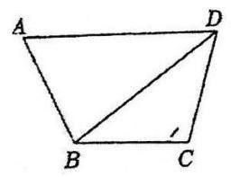

(2)霍尔顿发现小麦的生长和发育与分割土地面积的平方和呈正相关关系. 记 $\bigtriangleup  {ABD}$ 与 $\bigtriangleup {CBD}$ 的面积分别为 ${S}_{1}$ 和 ${S}_{2}$ ，为了更好地规划麦田，请你帮助霍尔顿求出 ${S}_{1}^{2} + {S}_{2}^{2}$ 的最大值

【解析】(1) 在 $\bigtriangleup {ABD}$ 中, $B{D}^{2} = A{D}^{2} + A{B}^{2} - {2AD} \cdot  {AB}\cos A = 5 - 4\cos A$

在 ${\Delta BCD}$ 中, $B{D}^{2} = C{D}^{2} + C{B}^{2} - {2CD} \cdot  {CB}\cos C = 2 - 2\cos C$ ,

所以 $4\cos A - 3 = 2\cos C$ ,则 $2\cos A - \cos C = \frac{3}{2}$ 为定值

(2) ${S}_{1}^{2} + {S}_{2}^{2} = \frac{1}{4}A{B}^{2} \cdot  A{D}^{2} \cdot  {\sin }^{2}A + \frac{1}{4}B{C}^{2} \cdot  C{D}^{2} \cdot  {\sin }^{2}C = {\sin }^{2}A + \frac{1}{4}{\sin }^{2}C$

$= {\sin }^{2}A + \frac{1}{4} - \frac{1}{4}{\cos }^{2}C = \left( {1 - {\cos }^{2}A}\right)  + \frac{1}{4} - \frac{1}{4}{\left( 2\cos A - \frac{3}{2}\right) }^{2}$

$=  - 2{\cos }^{2}A + \frac{3}{2}\cos A + \frac{11}{16}$ ,

因为 $A \in  \left( {0,\pi }\right)$ ,设 $t = \cos A \in  \left( {-1,1}\right)$ ,

则 $y =  - 2{t}^{2} + \frac{3}{2}t + \frac{11}{16} =  - 2{\left( t - \frac{3}{8}\right) }^{2} + \frac{31}{32}, t \in  \left( {-1,1}\right)$ ,

所以,当 $t = \frac{3}{8} \in  \left( {-1,1}\right)$ 时, $y =  - 2{t}^{2} + \frac{3}{2}t + \frac{11}{16}$ 取得最大值 $\frac{31}{32}$ ,

即 $\cos A = \frac{3}{8}$ 时, ${S}_{1}^{2} + {S}_{2}^{2}$ 的最大值为 $\frac{31}{32}$

## 板块三:中档主观题

## 1. 真题回顾

【例题】1. (2023 上海春考) 已知 $S$ 为正比例系数,定义: $S = \frac{{F}_{0}}{{V}_{0}},{F}_{0}$ 为建筑物暴露在空气中的面积 (单位:平方米), ${V}_{0}$ 为建筑物的体积 (单位:立方米).

(1)若有一个圆柱体建筑的底面半径为 $R$ ，高度为 $H$ ，求该建筑体的 $S$ 的值 (用 $R$ 、 $H$ 表示)；

(2)现有一个建筑体，侧面皆垂直于地面，设 $A$ 为底面面积， $L$ 为建筑底面周长. 已知 $f$ 为正比例系数, ${L}^{2}$ 与 $A$ 成正比,定义: $f = \frac{{L}^{2}}{A}$ ,建筑面积即为每一层的底面面积,总建筑面积即为每层建筑面积之和,值为 $T$ .

已知该建筑体推导得出 $S = \sqrt{\frac{f \cdot  n}{T}} + \frac{1}{3n}, n$ 为层数,层高为 3 米,其中 $f = {18}, T = {10000}$ ,试求当取第几层时,该建筑体 $S$ 最小?

【解析】(1) $S = \frac{\pi {R}^{2} + {2\pi RH}}{\pi {R}^{2}H} = \frac{1}{H} + \frac{2}{R}$ ;

(2) $S = \sqrt{\frac{18n}{10000}} + \frac{1}{3n} = \frac{3\sqrt{2} \cdot  \sqrt{n}}{100} + \frac{1}{3n},{S}^{\prime } = \frac{3\sqrt{2}}{{200}\sqrt{n}} - \frac{1}{3{n}^{2}}$ ,

令 ${S}^{\prime } = 0$ ,得 ${S}^{\prime } = 0 \Rightarrow  n = \sqrt[\frac{3}{2}]{\frac{200}{9\sqrt{2}}} \approx  {6.27}$ .

当 $n = 6$ 时, $S = {0.1594}$ ,当 $n = 7$ 时, $S = {0.1598}$ ,

所以当 $n = 6$ 时,建筑体 $S$ 最小.

【例题】2. (2022 上海春考) 为有效塑造城市景观、提升城市环境品质, 上海市正在努力推进新一轮架空线入地工程的建设. 如图是一处要架空线入地的矩形地块 ${ABCD},{AB} = {30m},{AD} = {15m}$ . 为保护 $D$ 处的一棵古树,有关部门划定了以 $D$ 为圆心、 ${DA}$ 为半径的四分之一圆的地块为历史古迹封闭区. 若架空线入线口为 ${AB}$ 边上的点 $E$ ，出线口为 ${CD}$ 边上的点 $F$ ，施工要求 ${EF}$ 与封闭区边界相切， ${EF}$ 右侧的四边形地块 ${BCFE}$ 将作为绿地保护生态区. (计算长度精确到 ${0.1}\mathrm{\;m}$ ,计算面积精确到 ${0.01}{\mathrm{\;m}}^{2}$ ).

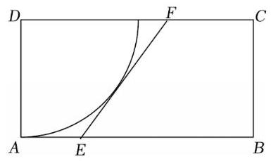

(1)若 $\angle {ADE} = {20}^{ \circ  }$ ，求 ${EF}$ 的长；

(2) 当入线口 $E$ 在 ${AB}$ 上的什么位置时,生态区的面积最大? 最大面积是多少?

【解析】(1) 法一:若 $\angle {ADE} = {20}^{ \circ  }$ ，则 $\angle {AEG} = 2\left( {{90}^{ \circ  } - {20}^{ \circ  }}\right)  = {140}^{ \circ  }$ ，

所以 $\angle {BEF} = {40}^{ \circ  }$ ，所以 ${EF} = \frac{BC}{\sin {40}^{ \circ  }} = \frac{15}{\sin {40}^{ \circ  }} \approx  {23.3}$ 米；

法二:若 $\angle {ADE} = {20}^{ \circ  }$ ，则 $\angle {EDG} = {20}^{ \circ  }$ ， $\angle {GDF} = {50}^{ \circ  }$ ，

所以 ${EF} = {EG} + {GF} = {15}\tan {20}^{ \circ  } + {15}\tan {50}^{ \circ  } \approx  {23.3}$ 米;

(2)法一:设 $\angle {FEH} = \theta$ ， $\theta  \in  \left( {0,\frac{\pi }{2}}\right)$ ，

则 $\angle {DFE} = \theta$ ,且 ${DF} = \frac{DG}{\sin \theta } = \frac{15}{\sin \theta },{EH} = \frac{15}{\tan \theta }$ ,

得 ${CF} = {30} - \frac{15}{\sin \theta },{BE} = \frac{15}{\tan \theta } - \frac{15}{\sin \theta } + {30}$

所以梯形面积 $S = \frac{1}{2}\left( {{30} - \frac{15}{\sin \theta } + \frac{15}{\tan \theta } - \frac{15}{\sin \theta } + {30}}\right)  \cdot  {15}$

$= \frac{15}{2}\left\lbrack  {{60} - {15} \cdot  \frac{2 - \cos \theta }{\sin \theta }}\right\rbrack  ,$

设 $m = \frac{2 - \cos \theta }{\sin \theta }$ ,则 $m\sin \theta  + \cos \theta  = 2$ ,所以 $\sqrt{{m}^{2} + 1}\sin \left( {\theta  + \varphi }\right)  = 2$ ,

所以 $\sin \left( {\theta  + \varphi }\right)  = \frac{2}{\sqrt{{m}^{2} + 1}} \leq  1$ ,得 $m \geq  \sqrt{3}$ ,其中 $\tan \varphi  = \frac{1}{m}$ ,

所以 ${S}_{\max } = \frac{15}{2}\left( {{60} - {15}\sqrt{3}}\right)  \approx  {255.14}$ 平方米,当且仅当 $\theta  = \frac{\pi }{6}$ 时取等号.

此时 ${EH} = \frac{15}{\tan {30}^{ \circ  }} = {15}\sqrt{3},{CF} = {30} - \frac{15}{\sin {30}^{ \circ  }} = 0$ ,

所以 ${AE} = {{30} - {15}\sqrt{3}}$ 米；

法二: 以 $D$ 为原点建系,设切点 $G\left( {{x}_{0},{y}_{0}}\right)$ ,令 $\left\{  {\begin{array}{l} {x}_{0} = {15}\cos \theta \\  {y}_{0} = {15}\sin \theta  \end{array},\theta  \in  \left( {-\frac{\pi }{3},0}\right\rbrack  }\right.$ ,

则切线 ${EF}$ 的方程为 ${x}_{0}x + {y}_{0}y = {15}^{2}$ ,令 $y = 0$ ,得 $x = \frac{{15}^{2}}{{x}_{0}}$ ,

令 $y =  - {15}$ ,得 $x = \frac{{15}^{2} + {15}{y}_{0}}{{x}_{0}}$ ,所以 $E\left( {\frac{{15}^{2} + {15}{y}_{0}}{{x}_{0}}, - {15}}\right) , F\left( {\frac{{15}^{2}}{{x}_{0}},0}\right)$ ,

所以梯形面积 $S = \left( {{60} - \frac{{15}^{2}}{{x}_{0}} - \frac{{15}^{2} + {15}{y}_{0}}{{x}_{0}}}\right)  \cdot  \frac{15}{2} = {450} - \frac{225}{2} \cdot  \frac{{30} + {y}_{0}}{{x}_{0}}$

$= {450} - \frac{225}{2} \cdot  \frac{2 + \sin \theta }{\cos \theta }$ ,

设 $m = \frac{2 + \sin \theta }{\cos \theta }$ ,则 $\sin \theta  - m\cos \theta  =  - 2$ ,所以 $\sqrt{{m}^{2} + 1}\sin \left( {\theta  + \varphi }\right)  =  - 2$ ,

所以 $\sin \left( {\theta  + \varphi }\right)  = \frac{-2}{\sqrt{{m}^{2} + 1}} \geq   - 1$ ,得 $m \geq  \sqrt{3}$ ,其中 $\tan \varphi  =  - m$ ,

所以 ${S}_{\max } = {450} - \frac{225}{2} \cdot  \sqrt{3} \approx  {255.14}$ 平方米,当且仅当 $\theta  =  - \frac{\pi }{6}$ 时取等号.

此时 ${EH} = \frac{15}{{\operatorname{tan30}}^{ \circ  }} = {15}\sqrt{3},{CF} = {30} - \frac{15}{{\operatorname{sin30}}^{ \circ  }} = 0$ ,

所以 ${AE} = {{30} - {15}\sqrt{3}}$ 米；

法三: 设 $\angle {ADE} = \theta$ ，则 ${AE} = {15}\tan \theta$ ，

${DF} = {AE} + \frac{AD}{\tan {2\theta }} = {15}\tan \theta  + \frac{15}{\tan {2\theta }}$

所以梯形面积 $S = \frac{1}{2}\left( {{30} - {15}\tan \theta  + {30} - {15}\tan \theta  - \frac{15}{\tan {2\theta }}}\right)  \cdot  {15}$

$= \frac{15}{2}\left( {{60} - {30}\tan \theta  - \frac{{15}\left( {1 - {\tan }^{2}\theta }\right) }{2\tan \theta }}\right)  = \frac{15}{2}\left\lbrack  {{60} - \frac{15}{2}\left( {3\tan \theta  + \frac{1}{\tan \theta }}\right) }\right\rbrack$

$\leq  \frac{15}{2}\left( {{60} - \frac{15}{2} \cdot  2\sqrt{3}}\right)  \approx  {255.14}$ ,当且仅当 $\theta  = \frac{\pi }{6}$ 时取等号,

此时 ${EH} = \frac{15}{{\operatorname{tan30}}^{ \circ  }} = {15}\sqrt{3},{CF} = {30} - \frac{15}{\sin {30}^{ \circ  }} = 0$ ,

所以 ${AE} = {30} - {{15}\sqrt{3}}$ 米.

【注】上述法一和法二中,涉及 $m = \frac{2 - \cos \theta }{\sin \theta }$ 和 $m = \frac{2 + \sin \theta }{\cos \theta }$ 的计算,除了使用辅助角公式,还可以看成斜率或者使用万能公式去处理, 下面写出详细过程.

对于 $m = \frac{2 - \cos \theta }{\sin \theta }$ ,看成 $P\left( {0,2}\right)$ 和单位圆上的点 $\left( {-\sin \theta ,\cos \theta }\right)$ 连线的斜率,设与单位圆相切的直线为 $y = {kx} + 2$ ,则 $\frac{2}{\sqrt{{k}^{2} + 1}} = 1$ ,所以 $k =  \pm  \sqrt{3}$ ,考虑题目条件,取 $k = \sqrt{3}$ ; 亦可以考虑 ${OP} = 2$ 为两倍的半径,在直角三角形中,由三边关系直接得出相切的斜率 $k = \sqrt{3}$ ;

另外,令 $t = \tan \frac{\theta }{2}$ ,则 $m = \frac{2 - \cos \theta }{\sin \theta } = \frac{2 - \frac{1 - {\tau }^{2}}{1 + {t}^{2}}}{\frac{2t}{1 + {t}^{2}}} = \frac{1 + 3{t}^{2}}{2t} = \frac{1}{2t} + \frac{3t}{2} \geq  \sqrt{3}$ ,当且仅当 $t = \; \frac{\sqrt{3}}{3}$ 时取等号. 对于另一个式子也可以这样处理.

【例题】3. (2021 上海春考)(1)团队在 $O$ 点西侧、东侧 20 千米处设有 $A$ 、 $B$ 两站点,测量距离发现一点 $P$ 满足 $\left| {PA}\right|  - \left| {PB}\right|  = {20}$ 千米,可知 $P$ 在 $A\text{ 、 }B$ 为焦点的双曲线上,以 $O$ 点为原点,东侧为 $x$ 轴正半轴,北侧为 $y$ 轴正半轴,建立平面直角坐标系, $P$ 在北偏东 ${60}^{ \circ  }$ 处,求双曲线标准方程和 $P$ 点坐标.

(2)团队又在南侧、北侧 15 千米处设有 $C$ 、 $D$ 两站点，测量距离发现 $\left| {QA}\right|  - \left| {QB}\right|  = {30}$ 千米， $\left| {QC}\right|  - \left| {QD}\right|  = {10}$ 千米,求 $\left| {OQ}\right|$ (精确到 1 米) 和 $Q$ 点位置 (精确到 1 米, $\left. {1}^{ \circ  }\right)$ .

【解析】(1) 由题意得 $a = {10}, c = {20}$ ,所以 ${b}^{2} = {300}$ ,

所以双曲线的标准方程为 $\frac{{x}^{2}}{100} - \frac{{y}^{2}}{300} = 1$ ,

直线 ${OP} : y = \frac{\sqrt{3}}{3}x$ ,联立双曲线方程,得 $x = \frac{{15}\sqrt{2}}{2}, y = \frac{5\sqrt{6}}{2}$ ,

即点 $P$ 的坐标为 $\left( {\frac{{15}\sqrt{2}}{2},\frac{5\sqrt{6}}{2}}\right)$ .

(2)① $\left| {QA}\right|  - \left| {QB}\right|  = {30}$ ，则 $a = {15}$ ， $c = {20}$ ，所以 ${b}^{2} = {175}$ ，

双曲线方程为 $\frac{{x}^{2}}{225} - \frac{{y}^{2}}{175} = 1$ ;

② $\left| {QC}\right|  - \left| {QD}\right|  = {10}$ ，则 $a = 5$ ， $c = {15}$ ，所以 ${b}^{2} = {200}$ ，

所以双曲线方程为 $\frac{{y}^{2}}{25} - \frac{{x}^{2}}{200} = 1$ ,

两双曲线方程联立，得 $Q\left( {\sqrt{\frac{14400}{47}},\sqrt{\frac{2975}{47}}}\right)$ ，

所以 $\left| {OQ}\right|  \approx  {19}$ 米, $Q$ 点位置北偏东 ${66}^{ \circ  }$ .

【例题】4. (2020 上海春考) 有一条长为 120 米的步行道 ${OA}, A$ 是垃圾投放点 ${\omega }_{1}$ ,若以 $O$ 为原点, ${OA}$ 为 $x$ 轴正半轴建立直角坐标系,设点 $B\left( {x,0}\right)$ ,现要建设另一座垃圾投放点 ${\omega }_{2}\left( {t,0}\right)$ ,函数 ${f}_{t}\left( x\right)$ 表示与 $B$ 点距离最近的垃圾投放点的距离.

(1) 若 $t = {60}$ ，求 ${f}_{60}\left( {10}\right)$ 、 ${f}_{60}\left( {80}\right)$ 、 ${f}_{60}\left( {95}\right)$ 的值，并写出 ${f}_{60}\left( x\right)$ 的函数解析式；

(2)若可以通过 ${f}_{t}\left( x\right)$ 与坐标轴围成的面积来测算扔垃圾的便利程度，面积越小越便利. 问:垃圾投放点 ${\omega }_{2}$ 建在何处才能比建在中点时更加便利?

【解析】(1) 投放点 ${\omega }_{1}\left( {{120},0}\right) ,{\omega }_{2}\left( {{60},0}\right) ,{f}_{60}\left( {10}\right)$ 表示与 $B\left( {{10},0}\right)$ 距离最近的投放点

(即 ${\omega }_{2}$ ) 的距离,所以 ${f}_{60}\left( {10}\right)  = \left| {{60} - {10}}\right|  = {50}$ ,

同理可得, ${f}_{60}\left( {80}\right)  = \left| {{60} - {80}}\right|  = {20},{f}_{60}\left( {95}\right)  = \left| {{120} - {95}}\right|  = {25}$ ,

由题意得 ${f}_{60}\left( x\right)  = \{ \left| {{60} - x}\right| ,\left| {{120} - x}\right| {\} }_{\min }$ ,

则当 $\left| {{60} - x}\right|  \leq  \left| {{120} - x}\right|$ ,即 $x \leq  {90}$ 时, ${f}_{60}\left( x\right)  = \left| {{60} - x}\right|$ ;

当 $\left| {{60} - x}\right|  > \left| {{120} - x}\right|$ ,即 $x > {90}$ 时, ${f}_{60}\left( x\right)  = \left| {{120} - x}\right|$ ;

综上, ${f}_{60}\left( x\right)  = \left\{  \begin{array}{ll} \left| {{60} - x}\right| , & x \leq  {90} \\  \left| {{120} - x}\right| , & x > {90} \end{array}\right.$ ;

(2)由题意得 ${f}_{t}\left( x\right)  = {\left\{  \left| t - x\right| ,\left| {120} - x\right| \right\}  }_{\min }$ ， 2025 版上海高考真题及模拟训练合集(下册)

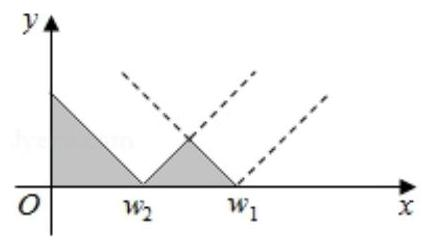

所以 ${f}_{t}\left( x\right)  = \left\{  \begin{array}{l} \left| {t - x}\right| , x \leq  {0.5}\left( {{120} + t}\right) \\  \left| {{120} - x}\right| , x > {0.5}\left( {{120} + t}\right)  \end{array}\right.$ ,

则 ${f}_{t}\left( x\right)$ 与坐标轴围成的面积如阴影部分所示,

所以 $S = \frac{1}{2}{t}^{2} + \frac{1}{4}{\left( {120} - t\right) }^{2} = \frac{3}{4}{t}^{2} - {60t} + {3600}$ ,

由题意得 $S < S\left( {60}\right)$ ,

即 $\frac{3}{4}{t}^{2} - {60t} + {3600} < {2700}$ ,

解得 ${20} < t < {60}$ ,即垃圾投放点 ${\omega }_{2}$ 建在 $\left( {{20},0}\right)$ 与 $\left( {{60},0}\right)$ 之间时,比建在中点时更加便利.

【例题】5. (2018 上海春考) 利用“平行于圆锥母线的平面截圆锥面, 所得截线是抛物线”的几何原理, 某快餐店用两个射灯 (射灯的光锥为圆锥) 在广告牌上投影出其标识, 如图 1 所示, 图 2 是投影射出的抛物线的平面图,图 3 是一个射灯投影的直观图,在图 2 与图 3 中,点 $O\text{ 、 }A\text{ 、 }B$ 在抛物线上, ${OC}$ 是抛物线的对称轴, ${OC} \bot  {AB}$ 于 $C,{AB} = 3$ 米, ${OC} = {4.5}$ 米

(1)求抛物线的焦点到准线的距离

(2)在图 3 中，已知 ${OC}$ 平行于圆锥的母线 ${SD}$ ， ${AB}$ 、 ${DE}$ 是圆锥底面的直径，求圆锥的母线与轴的夹角的大小 (精确到 ${0.01}^{ \circ  }$ )

图1

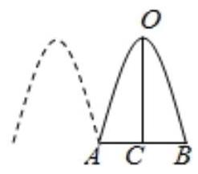

图2

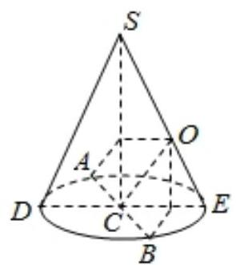

图3

【解析】(1) 在图 2 中,以 $O$ 为原点,以 ${OC}$ 为 $y$ 轴负半轴建立平面直角坐标系,

设抛物线方程为 ${x}^{2} =  - {2py}\left( {p > 0}\right)$ ,由题意得 $B\left( {\frac{3}{2}, - \frac{9}{2}}\right)$ ,

所以 $\frac{9}{4} =  - {2p} \cdot  \left( {-\frac{9}{2}}\right)$ ,解得 $p = \frac{1}{4}$ ,所以抛物线的焦点到准线的距离为 $\frac{1}{4}$ .

(2)在图3中，因为 ${OC}//{SD}$ ，所以 $\frac{OC}{SD} = \frac{CE}{DE} = \frac{1}{2}$ ，所以 ${SD} = {2OC} = 9$ ，

又 ${DC} = \frac{1}{2}{AB} = \frac{3}{2}$ ,所以 $\sin \angle {CSD} = \frac{CD}{SD} = \frac{1}{6}$ .

所以圆锥的母线与轴的夹角为 $\arcsin \frac{1}{6} \approx  {9.59}^{ \circ  }$ . 2025 版上海高考真题及模拟训练合集(下册)

## 2. 模拟练习

【练习】1. (2024 届交附) 高三新教学楼启用后, 从一些教室窗口就能看到殷高路对面居民房平改坡后的屋顶 (如图). 其中 ${AB}$ 是屋脊线, ${MN}$ 是屋檐线, ${ABMN}$ 是屋顶坡面, ${CDE}$ 是一个与水平面垂直的带气窗的竖直面， ${EF}$ 是气窗屋顶的屋脊线且 ${EF}$ 与竖直面 ${CDE}$ 垂直

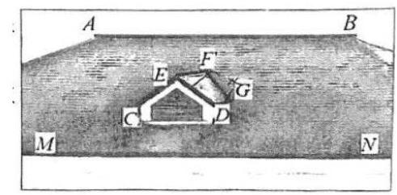

小张和小王对屋顶进行研究，提出了下面一些假设:

①两条屋脊线 ${AB}$ 与 ${EF}$ 互相垂直且都与水平面平行；

②气窗屋顶的两个坡面 ${EFC}$ 与 ${EFGD}$ 互相垂直且与水平面的所成角相等;

③屋顶坡面 ${ABMN}$ 与水平面所成角为 ${30}^{ \circ  }$

(1)小张认为还需假设屋脊线 ${AB}$ 与带气窗的竖直面 ${CDE}$ 是平行关系. 而小李认为前面的假设已经够了，不需要再提出这个假设. 请你判断哪位同学正确？证明你的判断

(2)根据小张和小王的假设，试求气窗屋顶的一个坡面 ${DEF}G$ 与屋顶坡面 ${ABMN}/{\text{ 构 }\text{ 成 }}$ 的阴脊线 ${FG}$ (是平面 ${ABMN}$ 与平面 ${EFGD}$ 的交线) 与水平面所成角的大小. (用反三角函数表示)

【解析】(1) 不需再提假设

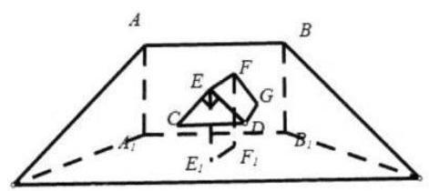

在水平面上分别取 $A, B, E, F$ 的射影 ${A}_{1},{B}_{1},{E}_{1},{F}_{1}$ ,

连接 $A{A}_{1}, B{B}_{1}, E{E}_{1}, F{F}_{1},{A}_{1}{B}_{1},{E}_{1}{F}_{1}$ ,

则 $A, B,{A}_{1},{B}_{1}$ 四点共面，又 ${AB}//$ 水平面，平面 ${AB}{B}_{1}{A}_{1} \cap$ 水平面 $= {A}_{1}{B}_{1}$ ，

则 ${AB}//{A}_{1}{B}_{1}$ ，同理 ${EF}//{E}_{1}{F}_{1}$ ，又 ${EF}\bot {AB}$ ，所以 ${{E}_{1}{F}_{1}}\bot {AB}$ ，

又 $A{A}_{1} \bot$ 水平面， ${E}_{1}{F}_{1} \subset$ 水平面，则 $A{A}_{1} \bot  {E}_{1}{F}_{1}$ ，

$A{A}_{1} \cap  {AB} = A, A{A}_{1},{AB} \subset$ 平面 ${AB}{B}_{1}{A}_{1}$ ,则 ${E}_{1}{F}_{1} \bot$ 平面 ${AB}{B}_{1}{A}_{1}$ ,

即 ${EF} \bot$ 平面 ${AB}{B}_{1}{A}_{1}$ ,又 ${EF} \bot$ 平面 ${CDE}$ ,则平面 ${AB}{B}_{1}{A}_{1}//$ 平面 ${CDE}$ ,

因为 ${AB} \subset$ 平面 ${AB}{B}_{1}{A}_{1}$ ,所以 ${AB}//$ 平面 ${CDE}$

(2)把气窗脱离出来，即三棱柱被斜面截到的部分即多面体 ${ECD} - {FNG}$ ，

则屋顶坡面 ${ABMN}$ 即为平面 ${FNG}$ ，如图，

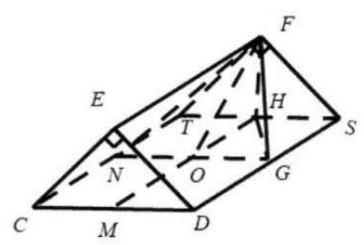

则平面 ${CDST}//$ 水平面，分别取 ${ST}$ ， ${CD}$ 中点 $H$ ， $M$ ，连接 ${HM}$ ，

过 $G$ 作 ${GN}//{CD}$ ,交 ${HM},{CT}$ 于 $O, N$ ,连接 ${FO},{HG}$ ,

则 ${FH} \bot$ 平面 ${CDST},{GN} \subset$ 平面 ${CDST}$ ,则 ${FH} \bot  {GN}$ ,

又 ${CD} \bot  {HM}$ ,即 ${GN} \bot  {HM},{FH} \cap  {HO} = H$ ,

${FH},{HO} \subset$ 平面 ${FHO}$ ,则 ${GN} \bot$ 平面 ${FHO}$ ,

又平面 ${FNG} \cap$ 平面 ${CDST} = {GN}$ ,

则 $\angle {FOH}$ 为屋顶坡面 ${ABMN}$ 与水平面所成角为 ${30}^{ \circ  }$ ,

在 Rt $\bigtriangleup {FHO}$ 中,设 ${FH} = 1$ ,则 ${HO} = \sqrt{3},{FO} = 2$ ,

则在等腰 ${Rt}\bigtriangleup {FHS},{HS} = 1$ ,则 ${OG} = 1$ ,

在 Rt $\bigtriangleup {HOG},{HG} = \sqrt{H{O}^{2} + O{G}^{2}} = 2$ ,

则在 ${Rt}\bigtriangleup {FHG},{FG} = \sqrt{H{G}^{2} + F{H}^{2}} = \sqrt{5}$ ,

又 ${FH} \bot$ 平面 ${CDST}$ ,则 ${HG}$ 为 ${FG}$ 在平面 ${CDST}$ 的射影,

则 $\angle {FGH}$ 为 ${FG}$ 与水平面所成角，则 $\sin \angle {FGH} = \frac{FH}{FG} = \frac{1}{\sqrt{5}} = \frac{\sqrt{5}}{5}$ ，

则 ${FG}$ 与水平面所成角为 $\arcsin \frac{\sqrt{5}}{5}$

【练习】2. (2025 届交附) 仰晖楼有 $A, B$ 两部电梯. 已知电梯每上一层需要 5 秒，电梯在某层楼停留时开门到关门所花时间为 10 秒 (人员均能在电梯开关门时间内完成进出电梯和按楼层等操作).

某天清晨，楼上还没有人，1楼已经有若干人均欲乘坐电梯上楼，目的地分别是 2 到 10 楼.

现两部电梯均恰好在 1 楼 (两部电梯互相独立运行, 可以独立开关门, 在 1 楼按下按钮后将同时打开门),且每部电梯容量足够容纳所有人. 定义 ${T}_{A}\left( {T}_{B}\right)$ 为: 从 $A\left( B\right)$ 电梯开门时刻算起,到电梯内最后一人到达目标楼层后 $A\left( B\right)$ 电梯门关闭为止,所花时间.

记“运输完成时间”: ${T}_{0} = \max \left\{  {{T}_{A},{T}_{B}}\right\}$

(1)若所有人均乘坐一部电梯，求 ${T}_{0}$ ；

(2)为了研究 ${T}_{0}$ 的最小值，我们需要对电梯的“乘坐安排”作出一些合理假设. 例如:假设两部电梯都有人乘坐. 理由: 分开乘坐,比如去 2 层的人都坐电梯 $A$ ,其余人坐电梯 $B$ ,则 ${T}_{A},{T}_{B}$ 均小于 (1) 中 ${T}_{0}$ ，故 “运输完成时间” 也小于 (1) 中 ${T}_{0}$ ，所以要使得 ${T}_{0}$ 最小，

两部电梯一定都有人乘坐. 请你在此基础上再提出 1 至 2 条关于电梯 “乘坐安排”的合理假设, 并简述作出这些假设的理由 (若有多条假设, 请按重要性从高到低写出最重要的两条);

(3) 求出 ${T}_{0}$ 最小值

【解析】(1) 包括 1 楼, 电梯共开关门 10 次数, 上升 9 层,

所以完成运输所花时间为 ${10} \times  {10} + 9 \times  5 = {145}$ 秒;

(2)假设一:目的地为同一层楼的人都坐同一部电梯，

即 $A, B$ 电梯所到楼层不重叠

理由:将目的地为同一层楼的人调整到同一部电梯可以使得其中一部电梯至少节约 10 秒，这样调整后方案的“运输完成时间”必然不大于原方案. 假设二:不妨设 $A$ 电梯到达 10 层，

则可假设 $B$ 电梯停留层数均小于 $A$ 电梯停留层数

理由: 记 $B$ 电梯最高到达 $b\left( {b < {10}}\right)$ 楼,若存在 $A$ 电梯到达 $a$ 楼,

且 $a < b$ 的情况. 两部电梯交换这两层的人，则 ${T}_{A}$ 不变， ${T}_{B}$ 至少减少 5 秒，

新方案“运输完成时间”必然不大于原方案；

(3) 设 $A$ 电梯到达楼层为 $a \sim  {10}$ 层, ${10} \geq  a \geq  3, B$ 电梯到达楼层为 $2 \sim  a - 1$ 层,

${T}_{A} = \left( {{12} - a}\right)  \times  {10} + 9 \times  5 = {165} - {10a},$

${T}_{B} = \left( {a - 1}\right)  \times  {10} + \left( {a - 2}\right)  \times  5 = {15a} - {20},$

${T}_{0} = \max \left\{  {{T}_{A},{T}_{B}}\right\}   = \left\{  \begin{array}{l} {165} - {10a},3 \leq  a \leq  7 \\  {15a} - {20},8 \leq  a \leq  {10} \end{array}\right.$

当 $a = 7$ 时， ${T}_{0}$ 取得最小值 95 秒，

即 $A$ 电梯目的地为 710 层， $B$ 电梯目的地为 2 ~ 6 层

【练习】3. 机器人竞技是继电子竞技之后热门的科技竞技项目，某区为了参加市机器人竞技总决赛， 开展了区内选行场比赛互相独立下表统计的是 $A$ 在近期热身中分别与 $B, C, D$ 三人比赛的情况.

<table><tr><td></td><td>$B$</td><td>$C$</td><td>$D$</td></tr><tr><td>比赛的次数</td><td>12</td><td>10</td><td>15</td></tr><tr><td>$A$ 获胜的次数</td><td>4</td><td>5</td><td>12</td></tr></table>

(1)根据表格中的数据，试估计在区内决赛中 $A$ 至少获胜一场的概率；

(2)根据表格中的数据，请给 $B, C, D$ 三人设计一个出场顺序，使得 $A$ 在这三场比赛中连胜两场的概率最大, 并说明理由.

【解析】(1)由热身赛统计情况,估计 $A$ 与 $B, A$ 与 $C, A$ 与 $D$ 比赛时获胜的概率

分别记为 ${P}_{1},{P}_{2},{P}_{3}$ ,

依据表格中的数据得 ${P}_{1} = \frac{4}{12} = \frac{1}{3},{P}_{2} = \frac{5}{10} = \frac{1}{2},{P}_{3} = \frac{12}{15} = \frac{4}{5}$ , 3 分

记“在区内决赛中 $A$ 至少获胜一场”为事件 $M$ ,

则 $P\left( M\right)  = 1 - P\left( \bar{M}\right)  = 1 - \left( {1 - {P}_{1}}\right) \left( {1 - {P}_{2}}\right) \left( {1 - {P}_{3}}\right)  = 1 - \frac{2}{3} \times  \frac{1}{2} \times  \frac{1}{5} = \frac{14}{15}$ ,

则估计在区内决赛中 $A$ 至少获胜一场的概率为 $\frac{14}{15}$ . 6 分

(2)若 $B$ 在第二位出场，即出场顺序为 ${CBD}$ 或 ${DBC}$ ，

则 $A$ 在这三场比赛中连胜两场的概率为 $\frac{1}{2} \times  \frac{1}{3} \times  \left( {1 - \frac{4}{5}}\right)  + \left( {1 - \frac{1}{2}}\right)  \times  \frac{1}{3} \times  \frac{4}{5} = \frac{1}{6}$

或 $\frac{4}{5} \times  \frac{1}{3} \times  \left( {1 - \frac{1}{2}}\right)  + \left( {1 - \frac{4}{5}}\right)  \times  \frac{1}{3} \times  \frac{1}{2} = \frac{1}{6}$ 2 分

若 $C$ 在第二位出场，即出场顺序为 ${BCD}$ 或 ${DCB}$ ，

则 $A$ 在这三场比赛中连胜两场的概率为

$\frac{1}{3} \times  \frac{1}{2} \times  \left( {1 - \frac{4}{5}}\right)  + \left( {1 - \frac{1}{3}}\right)  \times  \frac{1}{2} \times  \frac{4}{5} = \frac{3}{10}$

或 $\frac{4}{5} \times  \frac{1}{2} \times  \left( {1 - \frac{1}{3}}\right)  + \left( {1 - \frac{4}{5}}\right)  \times  \frac{1}{2} \times  \frac{1}{3} = \frac{3}{10}$ 4 分

若 $D$ 在第二位出场，即出场顺序为 ${BDC}$ 或 ${CDB}$ ,

则 $A$ 在这三场比赛中连胜两场的概率为 $\frac{1}{3} \times  \frac{4}{5} \times  \left( {1 - \frac{1}{2}}\right)  + \left( {1 - \frac{1}{3}}\right)  \times  \frac{1}{2} \times  \frac{4}{5} = \frac{2}{5}$

或 $\frac{1}{2} \times  \frac{4}{5} \times  \left( {1 - \frac{1}{3}}\right)  + \left( {1 - \frac{1}{2}}\right)  \times  \frac{4}{5} \times  \frac{1}{2} = \frac{2}{5}$ 6 分

则当 $B, C, D$ 三人的出场顺序为 ${BDC}$ 或 ${CDB}$ 时,

$A$ 在这三场比赛中连胜两场的概率最大. 8 分

【练习】4. (2024 届交附) 设一个简单几何体的表面积为 $S$ ,体积为 $V$ ,定义系数 $K = \frac{{S}^{3}}{{V}^{2}}$ . 已知球体对应的系数为 ${K}_{0}$ ，定义 $f = \frac{{K}_{0}}{K}$ 为一个几何体的“球形比例系数”

(1)计算正方体和正四面体的“球形比例系数”;

(2)求圆柱体的“球形比例系数”范围

(3)是否存在“球形比例系数”为0.75的简单几何体？若存在，请描述该几何体的基本特征; 若不存在, 说明理由

【解析】 $\left( 1\right) {K}_{0} = \frac{{\left( 4\pi {r}^{2}\right) }^{3}}{{\left( \frac{4}{3}\pi {r}^{3}\right) }^{2}} = {36\pi }$ ,正方体的系数为 ${K}_{1} = \frac{{\left( 6{a}^{2}\right) }^{3}}{{\left( {a}^{3}\right) }^{2}} = {216}$ ,

正四面体的系数为 ${K}_{2} = \frac{{\left( \sqrt{3}{a}^{2}\right) }^{3}}{{\left( \frac{\sqrt{2}}{12}{a}^{3}\right) }^{2}} = {216}\sqrt{3}$

所以,正方体 “球形比例系数” $f = \frac{\pi }{6}$ ,

正四面体的“球形比例系数” $f = \frac{\sqrt{3}\pi }{18}$

(2)设圆柱底面半径为 $r$ ,高为 $h$ ,则全面积为 $S = {2\pi r}\left( {r + h}\right)$ ，体积为 $V = \pi {r}^{2}h$ ，

于是 $K = \frac{{s}^{3}}{{V}^{2}} = {8\pi }\frac{{\left( {r}^{2} + rh\right) }^{3}}{{\left( {r}^{2}h\right) }^{2}} = {8\pi }\frac{{\left( 1 + \frac{h}{r}\right) }^{3}}{{\left( \frac{h}{r}\right) }^{2}}$ ,

设 $x = \frac{\hslash }{r}, f\left( x\right)  = \frac{{\left( 1 + x\right) }^{3}}{{x}^{2}}$ ,则 ${f}^{\prime }\left( x\right)  = \frac{x{\left( 1 + x\right) }^{2}\left( {x - 2}\right) }{{x}^{4}}$

即 $x \in  \left( {0,2}\right)$ 时, $f\left( x\right)$ 单调递减; $x \in  \left( {2, + \infty }\right)$ 时, $f\left( x\right)$ 单调递增,

即 $x = 2, h = {2r}$ 时,圆柱体的系数最小为 $K = {54\pi }$ ,

所以,圆柱体的球形比例系数的值域为 $\left( {0,\frac{2}{3}}\right\rbrack$

(3)考虑圆柱和半球的组合体，底面重合，半径为 $r$ ,圆柱的高为 $h$ ， $x = \frac{h}{r}$ ，

于是组合体的全面积 $S = {3\pi }{r}^{2} + {2\pi rh}$ ,体积 $V = \frac{2}{3}\pi {r}^{3} + \pi {r}^{2}h$

$K = \frac{{S}^{3}}{{V}^{2}} = \frac{{\left( 3\pi {r}^{2} + 2\pi rh\right) }^{3}}{{\left( \frac{2}{3}\pi {r}^{3} + \pi {r}^{2}\hslash \right) }^{2}} = {9\pi }\frac{{\left( 3 + 2x\right) }^{3}}{{\left( 2 + 3x\right) }^{2}}, f\left( x\right)  = \frac{{K}_{0}}{K} = \frac{4{\left( 2 + 3x\right) }^{2}}{{\left( 3 + 2x\right) }^{3}},$

$f\left( 1\right)  = \frac{4}{5} > \frac{3}{4}$ ,而 $f\left( 2\right)  = \frac{256}{343} < \frac{3}{4}$ ,当 $x \approx  {1.95}$ 时, $f\left( {1.95}\right)  \approx  {0.75}\cdots {14}$ 分

故存在球形比例系数为 $\frac{3}{4}$ 的几何体,圆柱和一个半球组合而成,

底面半径相同，圆柱的高约为半径的 1.95 倍

(举例构造几何体不唯一, 如还可以是中间为圆柱, 两头是均为半球的组合体)

(考虑两个半球,中间一个圆柱,底面与半球大圆面重合,设半径为 $r$ ,

圆柱的高为 $h$ ,则组合体的全面积 $S = {4\pi }{r}^{2} + {2\pi rh}$ ,体积 $V = \frac{4}{3}\pi {r}^{3} + \pi {r}^{2}h$ ,

设 $x = \frac{\hslash }{r}, K = \frac{{s}^{3}}{{V}^{2}} = \frac{{\left( 4\pi {r}^{2} + 2\pi r\lambda \right) }^{3}}{{\left( \frac{4}{3}\pi {r}^{3} + \pi {r}^{2}?\right) }^{2}} = {9\pi }\frac{{\left( 4 + 2x\right) }^{3}}{{\left( 4 + 3x\right) }^{2}}, f\left( x\right)  = \frac{{K}_{0}}{K} = \frac{{\left( 4 + 3x\right) }^{2}}{2{\left( 2 + x\right) }^{3}}$ ,

$f\left( 1\right)  \approx  {0.9} > \frac{3}{4}$ ,而 $f\left( 3\right)  \approx  {0.676} < \frac{3}{4}$ ,当 $x \approx  {2.27}$ 时, $f\left( {2.27}\right)  \approx  {0.75})$

【练习】5. (2024 届交附) 某汽车企业由于产品转型不理想, 订单大量减少, 现采取 “减员增效” 中对部分人员实行分流，规定分流人员第一年可以到原单位领取工资的 100%，从第二年起，以后每年只能在原单位按上一年的 $\frac{2}{3}$ 领取工资，该厂根据分流人员的技术特长，计划创办新的经济实体,该经济实体预计第一年属投资阶段,第二年每人可获得 $b$ 元收入,从第三年起每人每年的收入可在上一年的基础上递增 50%,如果某人分流前工资的收入每年 $a$ 元,分流后进入新经济实体,第 $n$ 年的收入为 ${a}_{n}$ 元 (第一年,参与经济体的人员没有收入)

(1)求 $\left\{  {a}_{n}\right\}$ 的通项公式；

(2) 当 $b = \frac{8a}{27}$ 时,这个人哪一年的收入最少? 最少为多少?

(3)当 $b \geq  \frac{3a}{8}$ 时，是否一定可以保证这个人分流一年后的收入永远超过分流前的年收入？

【解析】(1) 由题意得,当 $n = 1$ 时, ${a}_{1} = a$ ,

当 $n \geq  2$ 时, ${a}_{n} = a{\left( \frac{2}{3}\right) }^{n - 1} + b{\left( \frac{3}{2}\right) }^{n - 2}$ ,

所以 ${a}_{n} = \left\{  \begin{array}{ll} a & \left( {n = 1}\right) \\  a{\left( \frac{2}{3}\right) }^{n - 1} + b{\left( \frac{3}{2}\right) }^{n - 2} & \left( {n \geq  2}\right)  \end{array}\right.$

(2)由已知 $b = \frac{8a}{27}$ ，

当 $n \geq  2$ 时， ${a}_{n} = a{\left( \frac{2}{3}\right) }^{n - 1} + \frac{8a}{27}{\left( \frac{3}{2}\right) }^{n - 2} \geq  2{\left\lbrack  a{\left( \frac{2}{3}\right) }^{n - 1} \times  \frac{8a}{27}{\left( \frac{3}{2}\right) }^{n - 2}\right\rbrack  }^{\frac{1}{2}} = \frac{8a}{9}$ ，

要使得上式等号成立,当且仅当 $a{\left( \frac{2}{3}\right) }^{n - 1} = \frac{8a}{27}{\left( \frac{3}{2}\right) }^{n - 2}$ ,

即 ${\left( \frac{2}{3}\right) }^{{2n} - 2} = {\left( \frac{2}{3}\right) }^{4}$ ,解得 $n = 3$ ,

因此这个人第三年收入最少为 $\frac{8a}{9}$ 元

(3) 当 $n \geq  2$ 时, ${a}_{n} = a{\left( \frac{2}{3}\right) }^{n - 1} + b{\left( \frac{3}{2}\right) }^{n - 2} \geq  a{\left( \frac{2}{3}\right) }^{n - 1} + \frac{3a}{8}{\left( \frac{3}{2}\right) }^{n - 2}$

$\geq  2\sqrt{a{\left( \frac{2}{3}\right) }^{n - 1} \times  \frac{3a}{8}{\left( \frac{3}{2}\right) }^{n - 2}} = a$ ,

上述等号成立时,須 $b = \frac{3a}{8}$ 且 $a{\left( \frac{2}{3}\right) }^{n - 1} = \frac{3a}{8}{\left( \frac{3}{2}\right) }^{n - 2}$ ,即 ${\left( \frac{4}{9}\right) }^{n - 1} = \frac{1}{4}$ ,

两边取对数得 $n = 1 + {\log }_{\frac{2}{3}}\frac{1}{2} > 1 + {\log }_{\frac{2}{3}}\frac{2}{3} = 2$ ,因此等号不能取到,

所以当 $b \geq  \frac{3a}{8}$ 时,这个人分流一年后的收入永远超过分流前的年收入

【练习】6. (2024 届上中) 雨天外出虽然有有雨伞, 时常却总免不了淋湿衣袖、裤脚、背包等, 小明想通过数学建模的方法研究如何撑伞可以让淋湿的面积尽量小. 为了简化问题小明做出下列假设:

假设1:在网上查阅了人均身高和肩宽的数据后，小明把人假设为身高、肩宽分别为170 cm、 ${40}\mathrm{\;{cm}}$ 的矩形 “纸片人”；

假设 2: 受风的影响,雨滴下落轨迹视为与水平地面所成角为 ${60}^{ \circ  }$ 的直线;

假设 3: 伞柄 ${OT}$ 长为 ${60}\mathrm{\;{cm}}$ ，可绕矩形 “纸片人”上点 $O$ 旋转;

假设 4: 伞面为被被柄 ${OT}$ 垂直平分的线段 ${AB},{AB} = {120}\mathrm{\;{cm}}$ .

以如图 1 方式撑伞矩形“纸片人”将淋湿“裤脚”；以如图 2 方式撑被矩形“纸片人”将淋湿“头和肩膀”.

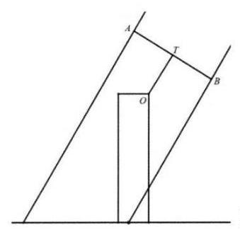

图 1

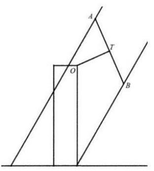

图 2

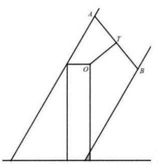

(1)如图 3 在矩形“纸片人”上身恰好不被淋湿时，求其“裤脚”被淋湿 (阴影) 部分的面积 (结果精确到 ${0.1}{\mathrm{\;{cm}}}^{2}$ );

(2)请根据你的生活经验对小明建立的数学模型提两条改进建议(无需求解改进后的模型，如果建议超过两条仅对前两条评分).

【解析】(1) $\frac{PO}{\sin \angle {PAO}} = \frac{AO}{\sin \angle {APO}}$ ,解得 $\sin \angle {PAO} = \frac{\sqrt{6}}{6}$ ,

$\cos \angle {DAB} = \sin \left( {{45}^{ \circ  } + \angle {PAO}}\right)  = \frac{\sqrt{3} + \sqrt{15}}{6}$ .

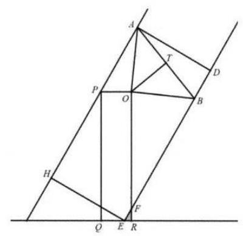

${HE} = {AD} = {AB}\cos \angle {DAB} = {20}\left( {\sqrt{3} + \sqrt{15}}\right) .$

${ER} = \frac{170}{\sqrt{3}} + {40} - {20}\left( {\sqrt{3} + \sqrt{15}}\right) \frac{2}{\sqrt{3}} = \frac{170}{\sqrt{3}} - {40}\sqrt{5}$

${S}_{\bigtriangleup {EFR}} = \frac{\sqrt{3}}{2}E{R}^{2} \approx  {65.7}{\mathrm{\;{cm}}}^{2}.$

(2)参考改进建议:①雨伞不遮挡视线；

②伞面为弧形，改进模型将伞设为一段圆弧；③考虑伞柄可以伸缩；

④人体改进为立体模型；⑤考虑风速、风向；⑥考虑撑伞的省力、稳定等。 只要合理，每条改进建议 2 分.
