## 中档题 6.13

1 较难 填空题

对于定义域为 $D$ 的函数 $\mathrm{f}\left( \mathrm{x}\right)$ ,若存在 ${x}_{1},{x}_{2} \in  D$ 且 ${x}_{1} \neq  {x}_{2}$ ,使得 $f\left( {x}_{1}^{2}\right)  = f\left( {x}_{2}^{2}\right)  = {2f}\left( {{x}_{1} + {x}_{2}}\right)$ ,则称函数 $\mathrm{f}\left( \mathrm{x}\right)$ 具有性质M，若函数 $g\left( x\right)  = \left| {{\log }_{2}x - 1}\right|$ ， $x \in  (0, a\rbrack$ 具有性质M，则实数a的最小值为___.

答案

$\sqrt{2\sqrt{2} + 2}$

解析

设 ${x}_{1} < {x}_{2}$ ,由 $f\left( {x}_{1}^{2}\right)  = f\left( {x}_{2}^{2}\right)$ 可得 ${x}_{1}^{2}{x}_{2}^{2} = 4$ ,结合 ${2f}\left( {{x}_{1} + {x}_{2}}\right)  = \left| {2{\log }_{2}\left( {{x}_{1} + {x}_{2}}\right)  - 2}\right|  = \left| {{\log }_{2}{\left( {x}_{1} + {x}_{2}\right) }^{2} - 2}\right|$ 可得 ${x}_{1}^{4} + 4{x}_{1}^{2} + 4 = 8$ ,进而求得 ${x}_{1},{x}_{2}$ ,由此得解.

解: 设 ${x}_{1} < {x}_{2}$ ,由 $f\left( {x}_{1}^{2}\right)  = f\left( {x}_{2}^{2}\right)$ 得 $\left| {{\log }_{2}{x}_{1}^{2} - 1}\right|  = \left| {{\log }_{2}{x}_{2}^{2} - 1}\right|$ ,

则 $1 - {\log }_{2}{x}_{1}^{2} = {\log }_{2}{x}_{2}^{2} - 1$ ,故 ${\log }_{2}\left( {{x}_{1}^{2}{x}_{2}^{2}}\right)  = 2$ ,

$\therefore {x}_{1}^{2}{x}_{2}^{2} = 4\left( {{x}_{1}^{2} < 2,{x}_{2}^{2} > 2}\right)$ ,

又 ${2f}\left( {{x}_{1} + {x}_{2}}\right)  = \left| {2{\log }_{2}\left( {{x}_{1} + {x}_{2}}\right)  - 2}\right|  = \left| {{\log }_{2}{\left( {x}_{1} + {x}_{2}\right) }^{2} - 2}\right|$ ,

$\therefore {\log }_{2}{\left( {x}_{1} + {x}_{2}\right) }^{2} - 2 = 1 - {\log }_{2}{x}_{1}^{2}$ ,

$\because {x}_{1}^{2} = \frac{4}{{x}_{2}^{2}},\therefore {\log }_{2}\left( {{x}_{1}^{2} + \frac{4}{{x}_{1}^{2}} + 4}\right)  - 2 = 1 - {\log }_{2}{x}_{1}^{2}$ ,

则 ${\log }_{2}\left( {{x}_{1}^{4} + 4{x}_{1}^{2} + 4}\right)  = 3,\therefore {x}_{1}^{4} + 4{x}_{1}^{2} + 4 = 8$ ,

$\therefore {x}_{1} = \sqrt{2\sqrt{2} - 2}$ ,故 ${x}_{2} = \sqrt{2\sqrt{2} + 2}$ ,

$\therefore a \geq  \sqrt{2\sqrt{2} + 2}$ ,则实数 $\mathrm{a}$ 的最小值为 $\sqrt{2\sqrt{2} + 2}$ .

故答案为: $\sqrt{2\sqrt{2} + 2}$ .

2 较难 单选题

在平面直角坐标系 ${xOy}$ 中，将函数 $y = f\left( x\right)$ 的图象绕坐标原点逆时针方向旋转 $\alpha \left( {{0}^{ \circ  } < \alpha  \leq  {90}^{ \circ  }}\right)$ 后，所得到的曲线仍然是某个函数的图象,则称 $y = f\left( x\right)$ 为“ $\alpha$ 旋转函数”. 现有以下4个命题,其中所有的真命题为( ).

①存在“90°旋转函数”；

②“70°旋转函数”一定是“80°旋转函数”；

③若 $g\left( x\right)  = {ax} + \frac{1}{x}$ 为“ ${45}^{ \circ  }$ 旋转函数”，则 $a = 1$ ；

④若 $h\left( x\right)  = \frac{bx}{{\mathrm{e}}^{x}}$ 为“ ${45}^{ \circ  }$ 旋转函数”，则 $- {\mathrm{e}}^{2} \leq  b \leq  0$ .

A. ①③④

B. ①②④

C. ①④

D. ①③

答案

A

解析

对于①，找出函数 $y = x$ ，即可得出结论；对于②，找出反例“倾斜角为 ${10}^{ \circ  }$ 的直线”，即可得出结论；对于③， 利用函数是 “ ${45}^{ \circ  }$ 旋转函数”，得出倾斜角为 ${45}^{ \circ  }$ 的直线 $y = x + c\left( {c \in  \mathrm{R}}\right)$ 与函数 $g\left( x\right)$ 有至多 1 个交点，直曲联立得方程,对参数 $a$ 进行分类讨论,即可得出结论; 对于④,利用函数是 “ ${45}^{ \circ  }$ 旋转函数”,得出 $d = \frac{bx}{{\mathrm{e}}^{x}} - x$ 至多有 1 解,构造函数 $m\left( x\right)  = \frac{bx}{{\mathrm{e}}^{x}} - x$ ,利用单调性得出 ${\mathrm{e}}^{x} + b\left( {x - 1}\right)  \geq  0$ 恒成立,构造函数 $n\left( x\right)  = {\mathrm{e}}^{x} + b\left( {x - 1}\right)$ , 求导利用单调性即可得出参数 $b$ 的取值范围.

由题意,

对于①，如 $y = x$ ，逆时针旋转 ${90}^{ \circ  }$ 后函数为 $y =  - x$ ，故①正确；

对于②，如倾斜角为 ${10}^{ \circ  }$ 的直线，

旋转 ${70}^{ \circ  }$ 后是倾斜角为 ${80}^{ \circ  }$ 函数，旋转 ${80}^{ \circ  }$ 后是垂直于 $x$ 轴的一条直线，不是函数，

$\therefore$ "70°旋转函数"不一定是“80°旋转函数”, ②错误；

对于③，

在 $g\left( x\right)  = {ax} + \frac{1}{x}$ 中，函数为“ ${45}^{ \circ  }$ 旋转函数”，

$\therefore$ 函数逆时针旋转 ${45}^{ \circ  }$ 后,不存在垂直于 $x$ 轴的直线,使得直线与函数有两个及以上交点,

$\therefore$ 不存在倾斜角为 ${45}^{ \circ  }$ 的直线 $y = x + c\left( {c \in  \mathrm{R}}\right)$ ,使其与函数 $g\left( x\right)$ 有两个及以上交点,

即倾斜角为 ${45}^{ \circ  }$ 的直线 $y = x + c\left( {c \in  \mathrm{R}}\right)$ 与函数 $g\left( x\right)$ 有至多1个交点,

直曲联立 $\left\{  \begin{array}{l} g\left( x\right)  = {ax} + \frac{1}{x} \\  y = x + c \end{array}\right.$ ,解得 $\left( {a - 1}\right) {x}^{2} - {cx} + 1 = 0$ ,

当 $a - 1 = 0$ ,即 $a = 1$ 时, $- {cx} + 1 = 0$ ,至多一解,符合题意,

当 $a - 1 \neq  0$ ，即 $a \neq  1$ 时，为一元二次方程， $\Delta  = {c}^{2} - 4\left( {a - 1}\right)$ ，

对 $\forall a$ ,都 $\exists c$ ,使得 $\Delta  > 0$ ,即方程有不止一个解,

故不合题意，舍去，

$\therefore a = 1$ ,③正确；

对于④，

在 $h\left( x\right)  = \frac{bx}{{\mathrm{e}}^{x}}$ 中，函数为 " ${45}^{ \circ  }$ 旋转函数",

$\therefore$ 函数逆时针旋转 ${45}^{ \circ  }$ 后,不存在垂直于 $x$ 轴的直线,使得直线与函数有两个及以上交点,

$\therefore$ 不存在倾斜角为 ${45}^{ \circ  }$ 的直线 $y = x + d\left( {d \in  \mathrm{R}}\right)$ ,使其与函数 $h\left( x\right)$ 有两个及以上交点,

即倾斜角为 ${45}^{ \circ  }$ 的直线 $y = x + d\left( {d \in  \mathrm{R}}\right)$ 与函数 $h\left( x\right)$ 有至多 1 个交点,

$\therefore x + d = \frac{bx}{{\mathrm{e}}^{x}}$ 即 $d = \frac{bx}{{\mathrm{e}}^{x}} - x$ 至多有 1 解,

在 $m\left( x\right)  = \frac{bx}{{\mathrm{e}}^{x}} - x$ 中,函数为单调函数,

${m}^{\prime }\left( x\right)  = \frac{b{\mathrm{e}}^{x} - {bx}{\mathrm{e}}^{x}}{{\mathrm{e}}^{2x}} - 1 = \frac{b\left( {1 - x}\right) }{{\mathrm{e}}^{x}} - 1,$

为使为使函数为单调函数, 其导数需恒为非正或恒为非负,

$\because {m}^{\prime }\left( 1\right)  = \frac{b\left( {1 - 1}\right) }{{\mathrm{e}}^{1}} - 1 =  - 1 < 0,$

$\therefore {m}^{\prime }\left( x\right)  = \frac{b\left( {1 - x}\right) }{{\mathrm{e}}^{x}} - 1 \leq  0$ 恒成立, $m\left( x\right)  = \frac{bx}{{\mathrm{e}}^{x}} - x$ 单调递减,

即 ${\mathrm{e}}^{x} + b\left( {x - 1}\right)  \geq  0$ 恒成立,

当 $b = 0$ 时， ${\mathrm{e}}^{x} > 0$ ，符合题意，

当 $b \neq  0$ 时，

在 $n\left( x\right)  = {\mathrm{e}}^{x} + b\left( {x - 1}\right)$ 中, ${n}^{\prime }\left( x\right)  = {\mathrm{e}}^{x} + b$ ,

当 ${n}^{\prime }\left( x\right)  = 0$ 时,解得 $x = \ln \left( {-b}\right)$ ,

$\therefore b < 0$ ,

当 ${n}^{\prime }\left( x\right)  < 0$ 即 $x < \ln \left( {-b}\right)$ 时，函数单调递减，

当 ${n}^{\prime }\left( x\right)  > 0$ 即 $x > \ln \left( {-b}\right)$ 时，函数单调递增，

$\therefore n\left( x\right)$ 在 $x = \ln \left( {-b}\right)$ 处取得最小值,

$\left\{  {\begin{array}{l} n{\left( x\right) }_{\min } = n\left( {\ln \left( {-b}\right) }\right)  = {\mathrm{e}}^{\ln \left( {-b}\right) } + b\left\lbrack  {\ln \left( {-b}\right)  - 1}\right\rbrack   = b\left\lbrack  {\ln \left( {-b}\right)  - 2}\right\rbrack   \geq  0 \\  b < 0 \end{array},}\right.$

解得: $- {\mathrm{e}}^{2} \leq  b < 0$ ,

综上, $- {\mathrm{e}}^{2} \leq  b \leq  0$ ,④正确.

3 较难 解答题

设正方体 ${ABCD} - {A}_{1}{B}_{1}{C}_{1}{D}_{1}$ 的棱长为 1，记该正方体的8个顶点构成集合 $M$ .

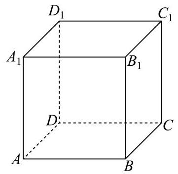

(1)从集合 $M$ 中有放回地随机抽取两个点 $P$ 、 $Q$ ，令随机变量 $X$ 为向量 $\overrightarrow{PQ}$ 模长的平方，求 $X$ 的分布及期望 $E\left( X\right)$ ；

(2)从集合 $M$ 中随机抽取四个不同的点 ${P}_{1}\text{ 、 }{P}_{2}\text{ 、 }{P}_{3}\text{ 、 }{P}_{4}$ ，设事件 $A : \left| \overrightarrow{{P}_{1}{P}_{2}}\right|  = 1$ ，事件 $B : \overrightarrow{{P}_{1}{P}_{2}}//\overrightarrow{{P}_{3}{P}_{4}}$ ，求 $P\left( A\right) \text{ 、 }P\left( B\right)$ 和 $P\left( {A \mid  B}\right)$ .

答案

(1)分布列为

<table><tr><td></td><td>$X$</td><td>0</td><td>1</td><td>2</td><td>3</td></tr><tr><td></td><td>$P$</td><td>1</td><td>3</td><td>3</td><td>1</td></tr></table>

$E\left( X\right)  = \frac{3}{2}$

(2) $P\left( A\right)  = \frac{3}{7}, P\left( B\right)  = \frac{4}{35}, P\left( {A \mid  B}\right)  = \frac{3}{4}$

解析

(1) 由题可知, $M = \left\{  {A, B, C, D,{A}_{1},{B}_{1},{C}_{1},{D}_{1}}\right\}  , X$ 可取0,1,2,3,

则 $P\left( {X = 0}\right)  = \frac{{\mathrm{C}}_{8}^{1}}{{\mathrm{C}}_{8}^{1}{\mathrm{C}}_{8}^{1}} = \frac{1}{8}$ ,

$P\left( {X = 1}\right)  = \frac{{\mathrm{C}}_{8}^{1} \times  3}{{\mathrm{C}}_{8}^{1}{\mathrm{C}}_{8}^{1}} = \frac{3}{8},$

$P\left( {X = 2}\right)  = \frac{{\mathrm{C}}_{8}^{1} \times  3}{{\mathrm{C}}_{8}^{1}{\mathrm{C}}_{8}^{1}} = \frac{3}{8},$

$P\left( {X = 3}\right)  = \frac{{\mathrm{C}}_{8}^{1}}{{\mathrm{C}}_{8}^{1}{\mathrm{C}}_{8}^{1}} = \frac{1}{8},$

则 $X$ 的分布为

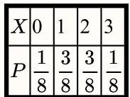

则 $E\left( X\right)  = 0 \times  \frac{1}{8} + 1 \times  \frac{3}{8} + 2 \times  \frac{3}{8} + 3 \times  \frac{1}{8} = \frac{3}{2}$ .

2) 由题可知,满足 $\left| \overrightarrow{{P}_{1}{P}_{2}}\right|  = 1$ 的情况共有 ${12} \times  2 = {24}$ 种 (即12条棱,且 $\overrightarrow{AB}$ 与 $\overrightarrow{BA}$ 不同),

再从剩下6个点中取2个点作为 ${P}_{3},{P}_{4}$ ,由 ${\mathrm{A}}_{6}^{2} = {30}$ 种,

则 $n\left( A\right)  = {24} \times  {30} = {720}$ ,

则 $P\left( A\right)  = \frac{720}{{\mathrm{\;A}}_{8}^{4}} = \frac{3}{7}$ ,

分析满足 $\overrightarrow{{P}_{1}{P}_{2}}//\overrightarrow{{P}_{3}{P}_{4}}$ 的情况: ①若 $\left| \overrightarrow{{P}_{1}{P}_{2}}\right|  = \left| \overrightarrow{{P}_{3}{P}_{4}}\right|  = 1$ ,

先选取正方体的一条棱作为 $\overrightarrow{{P}_{1}{P}_{2}}$ ,共有 ${12} \times  2 = {24}$ 种不同选法,

再从剩下的棱中选取一条棱作为 $\overrightarrow{{P}_{3}{P}_{4}}$ ，共有 $3 \times  2 = 6$ 种不同选法，

所以此种情况共有 ${24} \times  6 = {144}$ 种情况；

②若 $\left| \overrightarrow{{P}_{1}{P}_{2}}\right|  = \left| \overrightarrow{{P}_{3}{P}_{4}}\right|  = \sqrt{2}$ ，若选取 $\overrightarrow{AC}$ 作为 $\overrightarrow{{P}_{1}{P}_{2}}$ ，则 $\overrightarrow{{P}_{3}{P}_{4}}$ 只能是 $\overrightarrow{{A}_{1}{C}_{1}},\overrightarrow{{C}_{1}{A}_{1}}$ ，有2种选法，

因为共有 $6 \times  2 = {12}$ 条面对角线,即 $\overrightarrow{{P}_{1}{P}_{2}}$ 共有 ${12} \times  2 = {24}$ 种情况,

所以此种情况共有 ${24} \times  2 = {48}$ 种情况;

所以 $n\left( B\right)  = {144} + {48} = {192}$ ,

所以 $P\left( B\right)  = \frac{192}{{\mathrm{\;A}}_{8}^{4}} = \frac{4}{35}$ ;

由上述可知, $n\left( {AB}\right)  = {144}$ (即分类①),

所以 $P\left( {A \mid  B}\right)  = \frac{P\left( {AB}\right) }{P\left( B\right) } = \frac{n\left( {AB}\right) }{n\left( B\right) } = \frac{144}{192} = \frac{3}{4}$ .

4 较易 填空题

将函数 $y = \left| x\right|$ 的图象绕原点逆时针方向旋转角 $\alpha \left( {{0}^{ \circ  } < \alpha  < {360}^{ \circ  }}\right)$ ，在 $\alpha$ 的变化过程中，每一个旋转角 $\alpha$ 都对应一条折线,若该折线不是任何函数的图象,则 $\alpha$ 的取值范围为

答案

${45}^{ \circ  } \leq  \alpha  \leq  {135}^{ \circ  }$ 或 ${225}^{ \circ  } \leq  \alpha  \leq  {315}^{ \circ  }$

解析

根据函数的定义，画出函数 $y = \left| x\right|$ 的图象，旋转观察即可求解.

画出函数 $y = \left| x\right|$ 的图象如图，

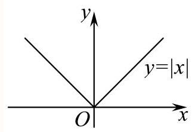

根据函数的定义，可以看出当该函数的图象绕原点逆时针旋转时，

当图象均在二、三象限或一、四象限, 或在坐标轴上时, 其图象就不是函数的图象,

所以旋转角度 $\alpha$ 满足的条件是 ${45}^{ \circ  } \leq  \alpha  \leq  {135}^{ \circ  }$ 或 ${225}^{ \circ  } \leq  \alpha  \leq  {315}^{ \circ  }$ .

故答案为: ${45}^{ \circ  } \leq  \alpha  \leq  {135}^{ \circ  }$ 或 ${225}^{ \circ  } \leq  \alpha  \leq  {315}^{ \circ  }$ .

5 较难 填空题

函数 $f\left( x\right)  = \sqrt{1 - {x}^{2}}, - \frac{1}{2} \leq  x \leq  \frac{1}{2}$ 的图象绕着原点旋转弧度 $\theta \left( {0 \leq  \theta  \leq  \pi }\right)$ ,若得到的图象仍是函数图象,则 $\theta$ 可取值的集合为 .

答案

$\left\lbrack  {0,\frac{\pi }{3}}\right\rbrack   \cup  \left\lbrack  {\frac{2\pi }{3},\pi }\right\rbrack$

解析

先画出 $f\left( x\right)  = \sqrt{1 - {x}^{2}}, - \frac{1}{2} \leq  x \leq  \frac{1}{2}$ 的图象,在旋转过程依据函数的定义可得 $\theta$ 可取值的集合.

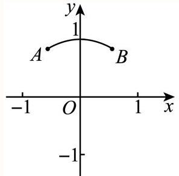

图(1)

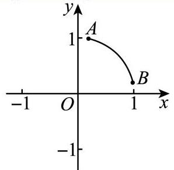

图(2)

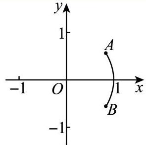

图(3)

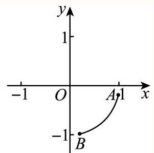

图(4)

$f\left( x\right)$ 的图象为如图(1)所示的一段弧，弧所在的圆的方程为: ${x}^{2} + {y}^{2} = 1$ ，

其中 $A\left( {-\frac{1}{2},\frac{\sqrt{3}}{2}}\right) , B\left( {\frac{1}{2},\frac{\sqrt{3}}{2}}\right)$ .

在图象绕原点旋转的过程中，当 $B$ 从图(1)的位置旋转到 $\left( {1,0}\right)$ ，如图(2)所示，根据函数的定义，在这个旋转过程所得的图形均为函数的图象,故 $0 \leq  \theta  \leq  \frac{\pi }{3}$ .

在图象绕原点旋转的过程中，当 $B$ 从图(2)的 $\left( {1,0}\right)$ 位置旋转到 $x$ 轴下方，而 $A$ 在 $x$ 轴上，如图(3)所示，根据函数的定义，在这个旋转过程所得的图形不是函数的图象，

故 $\frac{\pi }{3} < \theta  < \frac{2\pi }{3}$ 不符合.

在图象绕原点旋转的过程中， $A$ 在 $x$ 轴下方，如图(4)所示，根据函数的定义，在这个旋转过程所得的图形是函数的图象,故 $\frac{2\pi }{3} \leq  \theta  \leq  \pi$ 符合.

故答案为: $\left\lbrack  {0,\frac{\pi }{3}}\right\rbrack   \cup  \left\lbrack  {\frac{2\pi }{3},\pi }\right\rbrack$ .

关键点点睛:在图象旋转的过程中，依据函数的定义来判断是关键.

6 一般 填空题

函数 $f\left( x\right)  = \sqrt{3}x + \frac{1}{x}\left( {x > 0}\right)$ 的图象绕着坐标原点旋转 $\theta \left( {0 < \theta  < {2\pi }}\right)$ 弧度，若仍是函数图象，则 $\theta$ 可取值的集合为

答案

$\left( {0,\frac{\pi }{6}}\right\rbrack  \bigcup \left\lbrack  {\pi ,\frac{7\pi }{6}}\right\rbrack$

解析

根据对勾函数的性质可知函数 $f\left( x\right)  = \sqrt{3}x + \frac{1}{x}\left( {x > 0}\right)$ 的渐近线方程为 $x = 0$ 和 $y = \sqrt{3}x$ , 若仍是函数图像,则函数 $f\left( x\right)$ 的图象与垂直于 $x$ 轴的直线仅有一个交点,结合图象可知

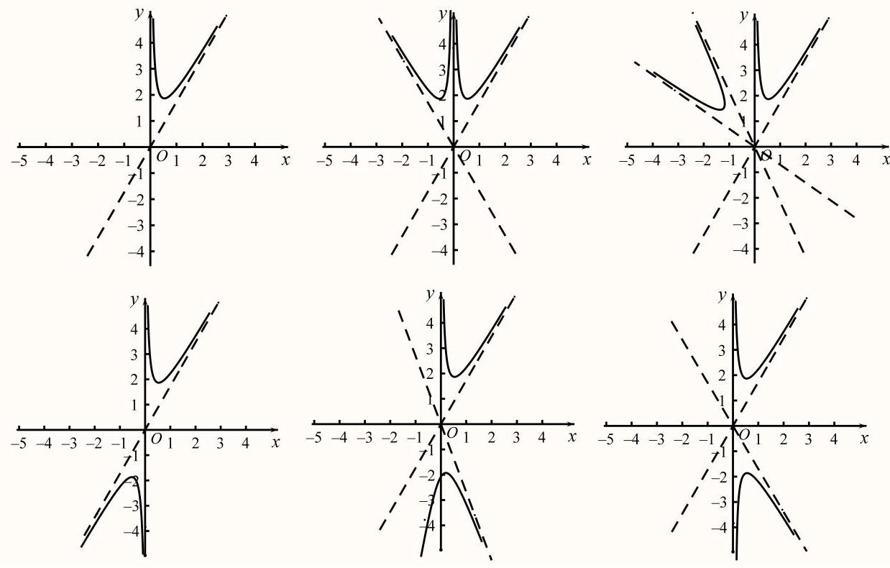

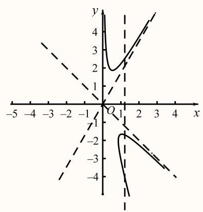

两条渐近线的夹角为 $\frac{\pi }{6}$ ,以两条渐近线为参照,结合函数 $f\left( x\right)  = \sqrt{3}x + \frac{1}{x}$ 为奇函数,可知 $f\left( x\right)  = \sqrt{3}x + \frac{1}{x}\left( {x > 0}\right)$ 时逆时针旋转 $\theta  \in  \left( {0,\frac{\pi }{6}}\right\rbrack   \cup  \left\lbrack  {\pi ,\frac{7\pi }{6}}\right\rbrack$ 时,仍为函数.

故答案为: $\left( {0,\frac{\pi }{6}}\right\rbrack   \cup  \left\lbrack  {\pi ,\frac{7\pi }{6}}\right\rbrack$

本题主要考查对勾函数的性质，函数的概念及函数的奇偶性，属于中档题.

7 一般 填空题

已知 $\alpha  > 0$ ，将函数 $y = \sin x, x \in  \left\lbrack  {0,\pi }\right\rbrack$ 的图像绕坐标原点逆时针方向旋转角 $\theta$ ，得到曲线C. 若对于每一个 $\theta  \in  \left\lbrack  {0,\alpha }\right\rbrack$ . 曲线C都是一个函数的图像，则 $\alpha$ 的最大值为

## 答案

\$\\dfrac\\pi4\\| \\| 45^\\circ\$

解析

利用运动是相对的，函数 $y = \sin x, x \in  \left\lbrack  {0,\pi }\right\rbrack$ 的图像绕坐标原点逆时针方向旋转，可以看作直线 $x = 0$ 绕坐标原点顺时针方向旋转, 再根据函数的定义, 即可求解.

解: 利用运动是相对的,

函数 $y = \sin x, x \in  \left\lbrack  {0,\pi }\right\rbrack$ 的图像绕坐标原点逆时针方向旋转 (左图),

可以看作直线 $x = 0$ 绕坐标原点顺时针方向旋转 (右图),

根据函数的定义，对于定义域内的每一个自变量x，都有唯一确定的 $y$ 与之对应，

即直线 $x = 0$ 绕坐标原点顺时针方向旋转过程中，只能与 $y = \sin x$ 的图像有且只有一个交点，故只需求函数在原点处的切线方程, $k = {\left. {y}^{\prime }\right| }_{x = 0} = \cos 0 = 1$ ,此时切线方程为 $y = x$ ,

故直线 $x = 0$ 最多绕坐标原点顺时针方向旋转 $\frac{\pi }{4}$ ，

则函数 $y = \sin x, x \in  \left\lbrack  {0,\pi }\right\rbrack$ 的图像只能绕坐标原点逆时针方向旋转 $\frac{\pi }{2} - \frac{\pi }{4} = \frac{\pi }{4}$ ,

故 $\alpha$ 的最大值为 $\frac{\pi }{4}$ ，

故答案为: $\frac{\pi }{4}$

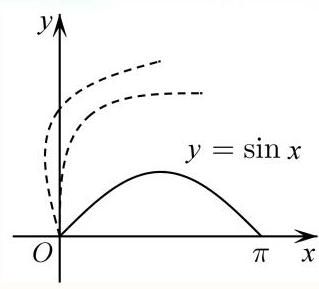

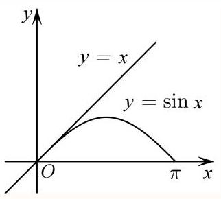

8 一般 填空题

设曲线 $C$ 与函数 $f\left( x\right)  = \frac{\sqrt{3}}{12}{x}^{2}\left( {0 \leq  x \leq  m}\right)$ 的图像关于直线 $y = \sqrt{3}x$ 对称，若曲线 $C$ 仍然为某函数的图像，则实数 $m$ 的取值范围为

答案

$(0,2\rbrack$

解析

设 $l$ 是 $f\left( x\right)  = \frac{\sqrt{3}}{12}{x}^{2}\left( {0 \leq  x \leq  m}\right)$ 在点 $M\left( {m,\frac{\sqrt{3}}{12}{m}^{2}}\right)$ 处的切线，进而根据题意得直线 $l$ 关于 $y = \sqrt{3}x$ 对称后的直线方程必为 $x = a$ ,曲线 $C$ 才能是某函数的图像,进而得 $l$ 的方程为 $l : y = \frac{\sqrt{3}}{3}\left( {x - m}\right)  + \frac{\sqrt{3}}{12}{m}^{2}$ ,再联立方程即可得 $m = 2$ ,进而得答案.

解: 设 $l$ 是 $f\left( x\right)  = \frac{\sqrt{3}}{12}{x}^{2}\left( {0 \leq  x \leq  m}\right)$ 在点 $M\left( {m,\frac{\sqrt{3}}{12}{m}^{2}}\right)$ 处的切线,

因为曲线 $C$ 与函数 $f\left( x\right)  = \frac{\sqrt{3}}{12}{x}^{2}\left( {0 \leq  x \leq  m}\right)$ 的图像关于直线 $y = \sqrt{3}x$ 对称,

所以直线 $l$ 关于 $y = \sqrt{3}x$ 对称后的直线方程必为 $x = a$ ，曲线 $C$ 才能是某函数的图像，

如图所示直线 $y = \sqrt{3}x$ 与 $x = a$ 的角为 $\frac{\pi }{6}$ ，所以 $l$ 的倾斜角为 $\frac{\pi }{6}$ ，

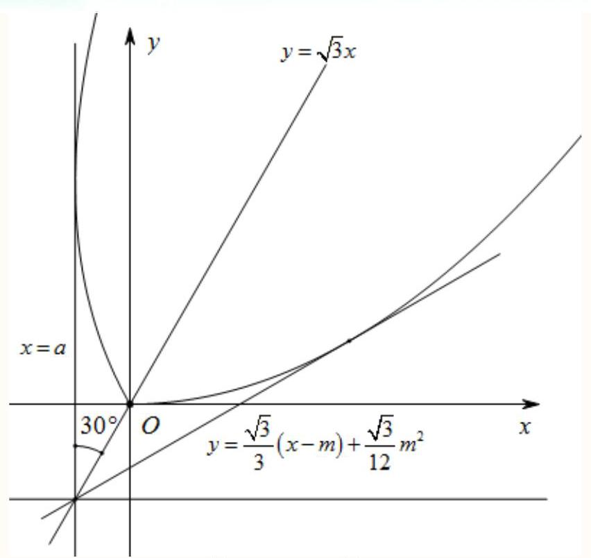

所以 $l$ 的方程为 $l : y = \frac{\sqrt{3}}{3}\left( {x - m}\right)  + \frac{\sqrt{3}}{12}{m}^{2}$

故联立方程得 $\left\{  \begin{array}{l} y = \frac{\sqrt{3}}{3}\left( {x - m}\right)  + \frac{\sqrt{3}}{12}{m}^{2} \\  y = \frac{\sqrt{3}}{12}{x}^{2} \end{array}\right.$ ，即 ${x}^{2} - {4x} + {4m} - {m}^{2} = 0$ ，

所以 $\Delta  = {16} - {16m} + 4{m}^{2} = 0$ ,解得 $m = 2$

所以 $m$ 的取值范围为 $(0,2\rbrack$

故答案为: $(0,2\rbrack$ .

9 较难 填空题

函数 $f\left( x\right)  = \sqrt{1 - {x}^{2}}, - \frac{1}{2} \leq  x \leq  \frac{1}{2}$ 的图象绕着原点顺时针旋转弧度 $\theta \left( {0 \leq  \theta  \leq  \pi }\right)$ ,若得到的图象仍是函数图象, 则 $\theta$ 可取值的集合为

答案

$\left\lbrack  {0,\frac{\pi }{3}}\right\rbrack   \cup  \left\lbrack  {\frac{2\pi }{3},\pi }\right\rbrack$

解析

先画出 $f\left( x\right)  = \sqrt{1 - {x}^{2}}, - \frac{1}{2} \leq  x \leq  \frac{1}{2}$ 的图象,在旋转过程依据函数的定义可得 $\theta$ 可取值的集合.

$f\left( x\right)$ 的图象为如图(1)所示的一段弧，弧所在的圆的方程为: ${x}^{2} + {y}^{2} = 1$ ，

其中 $A\left( {-\frac{1}{2},\frac{\sqrt{3}}{2}}\right) , B\left( {\frac{1}{2},\frac{\sqrt{3}}{2}}\right)$ .

在图象绕原点旋转的过程中，当 $B$ 从图(1)的位置旋转到 $\left( {1,0}\right)$ ，

如图(2)所示，根据函数的定义，在这个旋转过程所得的图形均为函数的图象，故 $0 \leq  \theta  \leq  \frac{\pi }{3}$ .

在图象绕原点旋转的过程中，当 $B$ 从图(2)的 $\left( {1,0}\right)$ 位置旋转到 $x$ 轴下方，而 $A$ 在 $x$ 轴上，如图(3)所示，根据函数的定义，在这个旋转过程所得的图形不是函数的图象，

故 $\frac{\pi }{3} < \theta  < \frac{2\pi }{3}$ 不符合.

在图象绕原点旋转的过程中， $A$ 在 $x$ 轴下方，如图(4)所示，根据函数的定义，在这个旋转过程所得的图形是函数的图象,故 $\frac{2\pi }{3} \leq  \theta  \leq  \pi$ 符合.

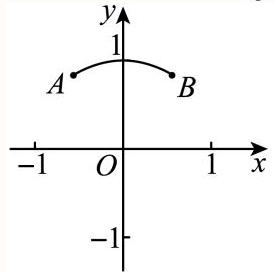

图(1)

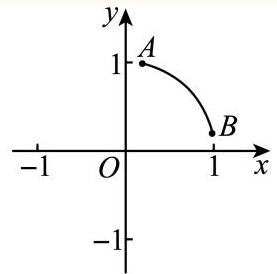

图(2)

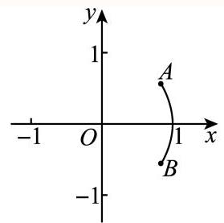

图(3)

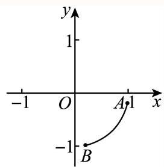

图(4)

故答案为: $\left\lbrack  {0,\frac{\pi }{3}}\right\rbrack   \cup  \left\lbrack  {\frac{2\pi }{3},\pi }\right\rbrack$ .

10 较难 单选题

已知空间直角坐标系中有一正方体，其三组棱分别与 $x$ 轴、 $y$ 轴、 $z$ 轴重合，顶点 $A$ 与坐标原点重合，点 $C$ 是正方体底面中与 $A$ 相对的对角顶点，点 ${C}_{1}$ 在点 $C$ 的正上方. 将正方体绕直线 $A{C}_{1}$ 旋转一周，试问点 $C$ 的运动轨迹会经过几个空间卦限 ( ).

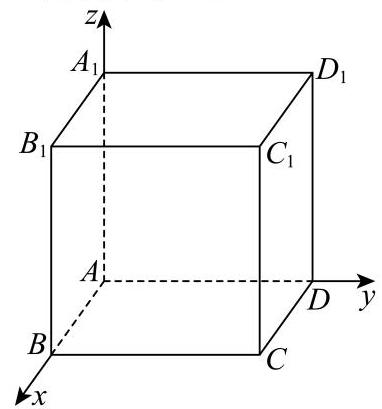

A. 1

B. 3

C. 4

D. 7

答案

A

解析

不妨设正方体的棱长为3,分析可知点 $C$ 的轨迹是以点 $E\left( {2,2,2}\right)$ 为圆心,半径 $r = \sqrt{6}$ 的圆,解法一: 设 $P\left( {x, y, z}\right)$ ,列方程分析点 $C$ 的轨迹与各坐标面的交点即可判断；解法二: 利用补形法,可知点 $C$ 的轨迹即为

$\bigtriangleup  {PQR}$ 的内切圆,即可判断结果.

不妨设正方体的棱长为3,

则 $A\left( {0,0,0}\right) , C\left( {3,3,0}\right) ,{C}_{1}\left( {3,3,3}\right)$ ,

可得 $\overrightarrow{AC} = \left( {3,3,0}\right) ,\overrightarrow{A{C}_{1}} = \left( {3,3,3}\right)$ ，

设点 $C$ 在体对角线 $A{C}_{1}$ 上的投影为 $E,\overrightarrow{AE} = \lambda \overrightarrow{A{C}_{1}} = \left( {{3\lambda },{3\lambda },{3\lambda }}\right) ,\lambda  \in  \left\lbrack  {0,1}\right\rbrack$ ,

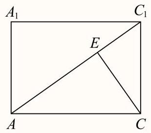

则 $\overrightarrow{CE} = \overrightarrow{AE} - \overrightarrow{AC} = \left( {{3\lambda } - 3,{3\lambda } - 3,{3\lambda }}\right)$ ,

可得 $\overrightarrow{CE} \cdot  \overrightarrow{A{C}_{1}} = {9\lambda } - 9 + {9\lambda } - 9 + {9\lambda } = 0$ ,解得 $\lambda  = \frac{2}{3}$ ,

则 $\overrightarrow{AE} = \left( {2,2,2}\right)$ ,即 $E\left( {2,2,2}\right)$ ,且 ${CE} = \sqrt{6}$ ,

可知点 $C$ 的轨迹是以点 $E\left( {2,2,2}\right)$ 为圆心，半径 $r = \sqrt{6}$ 的圆，

解法一:在点 $C$ 的轨迹任取一点 $P\left( {x, y, z}\right)$ ，则 $\overrightarrow{EP} = \left( {x - 2, y - 2, z - 2}\right)$ ，

则 $\left\{  \begin{array}{l} \overrightarrow{EP} \cdot  \overrightarrow{A{C}_{1}} = 3\left( {x - 2}\right)  + 3\left( {y - 2}\right)  + 3\left( {z - 2}\right)  = 0 \\  \left| \overrightarrow{EP}\right|  = \sqrt{{\left( x - 2\right) }^{2} + {\left( y - 2\right) }^{2} + {\left( z - 2\right) }^{2}} = \sqrt{6} \end{array}\right.$ ,整理可得 $\left\{  \begin{array}{l} x + y + z = 6 \\  {\left( x - 2\right) }^{2} + {\left( y - 2\right) }^{2} + {\left( z - 2\right) }^{2} = 6 \end{array}\right.$ , 令 $z = 0$ 可得 $\left\{  \begin{array}{l} x + y = 6 \\  {\left( x - 2\right) }^{2} + {\left( y - 2\right) }^{2} = 2 \end{array}\right.$ ,解得 $\left\{  \begin{array}{l} x = 3 \\  y = 3 \end{array}\right.$ ,可知点 $C$ 的轨迹与平面 ${xOy}$ 相切, 令 $y = 0$ 可得 $\left\{  \begin{array}{l} x + z = 6 \\  {\left( x - 2\right) }^{2} + {\left( z - 2\right) }^{2} = 2 \end{array}\right.$ ，解得 $\left\{  \begin{array}{l} x = 3 \\  z = 3 \end{array}\right.$ ，可知点 $C$ 的轨迹与平面 ${xOz}$ 相切， 令 $x = 0$ 可得 $\left\{  \begin{array}{l} y + z = 6 \\  {\left( y - 2\right) }^{2} + {\left( z - 2\right) }^{2} = 2 \end{array}\right.$ ，解得 $\left\{  \begin{array}{l} y = 3 \\  z = 3 \end{array}\right.$ ，可知点 $C$ 的轨迹与平面 ${yOz}$ 相切， 所以点 $C$ 的轨迹经过空间中的1个卦限；

解法二: 将正方体补成边长为 6 的正方体, 如图所示:

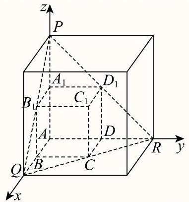

则 $P\left( {0,0,6}\right) , Q\left( {6,0,0}\right) , R\left( {0,6,0}\right)$ ,

可知 $\bigtriangleup  {PQR}$ 为边长为 $6\sqrt{2}$ 的正三角形，且其中心为 $E\left( {2,2,2}\right)$ ，且内切圆半径 $r = \frac{\sqrt{3}}{6} \times  6\sqrt{2} = \sqrt{6}$ ， 即可知点 $C$ 的轨迹即为 $\bigtriangleup  {PQR}$ 的内切圆，所以点 $C$ 的轨迹经过空间中的1个卦限.

11 较难 (填空题有一个油壶，壶身视为圆柱，壶嘴视为直线且不计容积，壶底直径6.4厘米，壶身高16厘米，壶内油液面高12.1厘米，壶嘴长13.4厘米，与壶身夹角为 ${30}^{ \circ  }$ ，壶嘴最低点距壶底3厘米，将壶身向壶嘴方向至少转 度可使油倒出(精确到 ${0.01}^{ \circ  }$ )

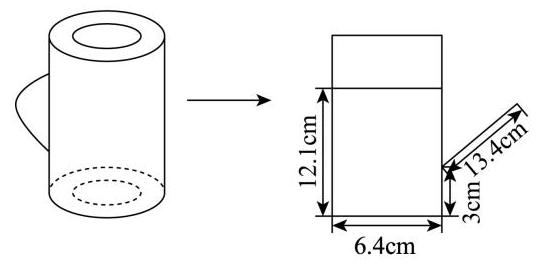

## C 答案

${14.2}^{ \circ  }$

解析

根据题意,结合条件分别表示出 ${EG},{EF}$ ,然后在 $\bigtriangleup  {EGF}$ 中，由正弦定理代入计算，即可得到结果.

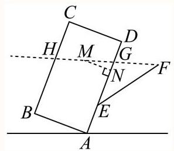

设壶嘴最低点，最高点分别是 $E, F$ ，

图中圆柱轴截面矩形，距离点 $E$ 最近的顶点是点 $A$ ，另外三个顶点分别为 $B, C, D$ ，

当水平液面经过点 $F$ 时，可将油倒出，

设倾斜角为 $\theta$ ,当液面经过点 $D$ 时, $\theta  = \arctan \frac{3.9}{6.4} \approx  {31.36}^{ \circ  }$ ,

先考虑液面不超过点 $D$ ，即 $\theta  \in  \left\lbrack  {0,\arctan \frac{3.9}{6.4}}\right\rbrack$ 的情况，

设液面与 ${AD},{CB}$ 分别交于点 $G, H$ ,

设 ${GH}$ 的中点为 $M$ ，过 $M$ 作 ${AD}$ 的垂线，垂足为 $N$ ，

则 ${MN} = \frac{1}{2}{AB} = {3.2},\angle {GMN} = \theta$ ,所以 ${GN} = {MN}\tan \theta  = {3.2}\tan \theta$ ,

因为 ${AN} = {12.1}$ ，所以 ${GE} = {GN} + {AN} - {AE} = {3.2}\tan \theta  + {9.1}$ ，

因为 $\angle {EGF} = \angle {NMG} + \angle {MNG} = {90}^{ \circ  } + \theta$ ,

所以 $\angle F = {180}^{ \circ  } - \angle {FEG} - \angle {EGF} = {60}^{ \circ  } - \theta$ ,

在 $\bigtriangleup {EGF}$ 中, $\frac{EG}{\sin \angle F} = \frac{EF}{\sin \angle {EGF}}$ ,

即 $\frac{{3.2}\tan \theta  + {9.1}}{\sin \left( {{60}^{ \circ  } + \theta }\right) } = \frac{13.4}{\sin \left( {{90}^{ \circ  } + \theta }\right) } = \frac{13.4}{\cos \theta }$ ,

即 ${3.2}\sin \theta  + {9.1}\cos \theta  = {13.4}\sin \left( {{60}^{ \circ  } + \theta }\right)  = {6.7}\sqrt{3}\cos \theta  - {6.7}\sin \theta$ ,

即 ${99}\sin \theta  = \left( {{67}\sqrt{3} - {91}}\right) \cos \theta$ ,所以 $\tan \theta  = \frac{{67}\sqrt{3} - {91}}{99}$ ,

即 $\theta  = \arctan \frac{{67}\sqrt{3} - {91}}{99} \approx  {14.2}^{ \circ  }$ ,

因为 ${14.2}^{ \circ  } < {31.36}^{ \circ  }$ ,所以至少将油壶倾斜 ${14.2}^{ \circ  }$ 即可将油倒出.

故答案为: ${14.2}^{ \circ  }$

12 较难 单选题

若椭圆 $\frac{{x}^{2}}{m} + \frac{{y}^{2}}{n} = 1\left( {m > n > 0}\right)$ 和双曲线 $\frac{{x}^{2}}{s} - \frac{{y}^{2}}{t} = 1\left( {s, t > 0}\right)$ 有相同的焦点 ${F}_{1},{F}_{2}$ ，离心率分别为 ${e}_{1},{e}_{2}$ ，点 $P$ 是这两条曲线的一个交点，且 $m, n, s, t$ 两两互不相等，则( )

命题①: 从集合 $\{ m, n, s, t\}$ 的子集中随机抽取一个,若该子集的元素值均可知,则可求得 $\left| {P{F}_{1}}\right|  \cdot  \left| {P{F}_{2}}\right|$ 的值的概率为 $\frac{1}{2}$

命题②: 若 ${e}_{1}{e}_{2} < 1$ ,则 $\frac{{e}_{2} - {e}_{1}}{{e}_{1}} \in  \left( {-1,\frac{\sqrt{5} - 1}{2}}\right)$

A. ①②都正确

B. ①②都错误

C. ①正确②错误

D. ①错误②正确

答案

B

解析

根据椭圆与双曲线的定义计算 $\left| {P{F}_{1}}\right|  \cdot  \left| {P{F}_{2}}\right|$ 与 $m, n, s, t$ 之间的关系,根据古典概型可判断①错误,根据题目已知条件代入特殊值可判断②错误.

根据椭圆和双曲线的定义,可设椭圆的长半轴为 ${a}_{1}$ ,短半轴为 ${b}_{1}$ ,双曲线的实半轴为 ${a}_{2}$ ,虚半轴为 ${b}_{2}$ ,两者的半焦距均为 $c$ ;

有 $m = {a}_{1}^{2}, n = {b}_{1}^{2}, s = {a}_{2}^{2}, t = {b}_{2}^{2},{c}^{2} = {a}_{1}^{2} - {b}_{1}^{2} = m - n = {a}_{2}^{2} + {b}_{2}^{2} = s + t$ ,

即 $m - n = s + t$ ,即 $m = n + s + t$ .

对于①，根据定义，在椭圆中，有 $\left| {P{F}_{1}}\right|  + \left| {P{F}_{2}}\right|  = 2{a}_{1}$ ，

在双曲线中有 $\begin{Vmatrix}{P{F}_{1}}\end{Vmatrix} - \left| {P{F}_{2}}\right|  \mid   = 2{a}_{2}$ ,分别平方并相减,

可得 $4\left| {P{F}_{1}}\right|  \cdot  \left| {P{F}_{2}}\right|  = 4{a}_{1}^{2} - 4{a}_{2}^{2} = {4m} - {4s}$ ,即 $\left| {P{F}_{1}}\right|  \cdot  \left| {P{F}_{2}}\right|  = m - s = n + t$ ;

记计算 $\left| {P{F}_{1}}\right|  \cdot  \left| {P{F}_{2}}\right|$ 为事件 $A$ ，

集合 $\{ m, n, s, t\}$ 共有16个子集,其中能计算 $\left| {P{F}_{1}}\right|  \cdot  \left| {P{F}_{2}}\right|$ 的子集包括集合 $\{ m, n, s, t\}$ ,

全部四个有三个元素的子集,集合 $\{ n, t\}$ 和集合 $\{ m, s\}$ ,共 7 个,

根据古典概型公式, $P\left( A\right)  = \frac{7}{16}$ ,可知①错误;

对于②，由 $m = n + s + t$ ，可取 $m = {25}$ ， $n = {21}$ ， $s = 1$ ， $t = 3$ ，此时 ${a}_{1} = 5$ ， ${a}_{2} = 1$ ， $c = 2$ ，计算可得

${e}_{1} = \frac{c}{{a}_{1}} = \frac{2}{5},{e}_{2} = \frac{c}{{a}_{2}} = 2$ ,满足 ${e}_{1}{e}_{2} < 1,\frac{{e}_{2} - {e}_{1}}{{e}_{1}} = \frac{2 - \frac{2}{5}}{\frac{2}{5}} = 4 \notin  \left( {-1,\frac{\sqrt{5} - 1}{2}}\right)$ ,可知②错误.

13 困难 填空题

如图, ${F}_{1}\text{ 、 }{F}_{2}$ 是椭圆 ${C}_{1}$ 与双曲线 ${C}_{2}$ 的公共焦点,点 $A\text{ 、 }B$ 是椭圆 ${C}_{1}$ 与双曲线 ${C}_{2}$ 的两个交点,其中 $A$ 在第一象限, $B$ 在第三象限. 若 $\angle A{F}_{1}B = \frac{3\pi }{4}$ ，则 ${C}_{1}$ 与 ${C}_{2}$ 的离心率之积的最小值为___.

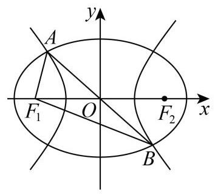

答案

$\frac{\sqrt{2}}{2}\left| {\;\frac{1}{2}\sqrt{2}}\right.$

解析

连接 $A{F}_{2},{F}_{2}B$ ,由椭圆的对称性,得到 $A{F}_{1}B{F}_{2}$ 为平行四边形,且 $\angle {F}_{1}A{F}_{2} = \frac{\pi }{4}$ ,设 $\left| {A{F}_{1}}\right|  = s,\left| {A{F}_{2}}\right|  = t$ ,在

$\bigtriangleup A{F}_{1}{F}_{2}$ 中,利用余弦定理,分别求得 ${st} = \frac{4{b}^{2}}{2 + \sqrt{2}}$ 和 ${st} = \frac{4{n}^{2}}{2 - \sqrt{2}}$ ,列出关系式,化简得到

$\frac{{a}^{2}}{{c}^{2}} + \frac{\left( {3 + 2\sqrt{2}}\right) {m}^{2}}{{c}^{2}} = 4 + 2\sqrt{2}$ ,结合基本不等式和离心率的定义,即可求解.

设椭圆 ${C}_{1}$ 的方程为 $\frac{{x}^{2}}{{a}^{2}} + \frac{{y}^{2}}{{b}^{2}} = 1\left( {a > b > 0}\right)$ ,双曲线 ${C}_{2}$ 的方程为 $\frac{{x}^{2}}{{m}^{2}} - \frac{{y}^{2}}{{n}^{2}} = 1\left( {m > 0, n > 0}\right)$ ,

因为椭圆 ${C}_{1}$ 与双曲线 ${C}_{2}$ 的公共焦点,所以 ${a}^{2} - {b}^{2} = {m}^{2} + {n}^{2} = {c}^{2}$ ,

如图所示,连接 $A{F}_{2},{F}_{2}B$ ,根据椭圆的对称性,可得四边形 $A{F}_{1}B{F}_{2}$ 为平行四边形,

因为 $\angle A{F}_{1}B = \frac{3\pi }{4}$ ,可得 $\angle {F}_{1}A{F}_{2} = \frac{\pi }{4}$ ,设 $\left| {A{F}_{1}}\right|  = s,\left| {A{F}_{2}}\right|  = t$ ,

在 $\bigtriangleup A{F}_{1}{F}_{2}$ 中，由余弦定理得 ${\left| {F}_{1}{F}_{2}\right| }^{2} = {\left| A{F}_{1}\right| }^{2} + {\left| A{F}_{2}\right| }^{2} - 2\left| {A{F}_{1}}\right| \left| {A{F}_{2}}\right| \cos \angle {F}_{1}A{F}_{2}$ ,

由椭圆的定义，可得 $s + t = {2a}$ ，

可得 $4{c}^{2} = {s}^{2} + {t}^{2} - {2st}\cos \frac{\pi }{4} = {s}^{2} + {t}^{2} - \sqrt{2}{st} = {\left( s + t\right) }^{2} - \left( {2 + \sqrt{2}}\right) {st} = 4{a}^{2} - \left( {2 + \sqrt{2}}\right) {st}$ ,

所以 $\left( {2 + \sqrt{2}}\right) {st} = 4{a}^{2} - 4{c}^{2} = 4{b}^{2}$ ,所以 ${st} = \frac{4{b}^{2}}{2 + \sqrt{2}}$ ,

又由双曲线的定义,可得 $t - s = {2m}$ ,

可得 $4{c}^{2} = {s}^{2} + {t}^{2} - {2st}\cos \frac{\pi }{4} = {s}^{2} + {t}^{2} - \sqrt{2}{st} = {\left( t - s\right) }^{2} + \left( {2 - \sqrt{2}}\right) {st} = 4{m}^{2} + \left( {2 - \sqrt{2}}\right) {st}$ ,

所以 $\left( {2 - \sqrt{2}}\right) {st} = 4{c}^{2} - 4{m}^{2} = 4{n}^{2}$ ,所以 ${st} = \frac{4{n}^{2}}{2 - \sqrt{2}}$ ,

所以 $\frac{4{b}^{2}}{2 + \sqrt{2}} = \frac{4{n}^{2}}{2 - \sqrt{2}}$ ,可得 $\frac{{b}^{2}}{2 + \sqrt{2}} = \frac{{n}^{2}}{2 - \sqrt{2}}$ ,即 ${a}^{2} - {c}^{2} = \left( {3 + 2\sqrt{2}}\right) \left( {{c}^{2} - {m}^{2}}\right)$ ,

可得 ${a}^{2} + \left( {3 + 2\sqrt{2}}\right) {m}^{2} = \left( {4 + 2\sqrt{2}}\right) {c}^{2}$ ,所以 $\frac{{a}^{2}}{{c}^{2}} + \frac{\left( {3 + 2\sqrt{2}}\right) {m}^{2}}{{c}^{2}} = 4 + 2\sqrt{2}$ ,

因为 $\frac{{a}^{2}}{{c}^{2}} + \frac{\left( {3 + 2\sqrt{2}}\right) {m}^{2}}{{c}^{2}} \geq  2\sqrt{\frac{{a}^{2}}{{c}^{2}} \cdot  \frac{\left( {3 + 2\sqrt{2}}\right) {m}^{2}}{{c}^{2}}} = 2 \cdot  \frac{a}{c} \cdot  \frac{m}{c}\sqrt{\left( 3 + 2\sqrt{2}\right) }$

$= 2 \times  \frac{2 + \sqrt{2}}{\sqrt{2}} \cdot  \frac{am}{{c}^{2}} = \sqrt{2}\left( {2 + \sqrt{2}}\right)  \cdot  \frac{am}{{c}^{2}}$ ,当且仅当 $a = \left( {\sqrt{2} + 1}\right) m$ 时,等号成立,

所以 $\sqrt{2}\left( {2 + \sqrt{2}}\right)  \cdot  \frac{am}{{c}^{2}} \leq  4 + 2\sqrt{2}$ ,即 $\frac{am}{{c}^{2}} \leq  \sqrt{2}$ ,所以 $\frac{c}{a} \cdot  \frac{c}{m} \geq  \frac{\sqrt{2}}{2}$ ,

所以 ${C}_{1}$ 与 ${C}_{2}$ 的离心率之积的最小值为 $\frac{\sqrt{2}}{2}$ .

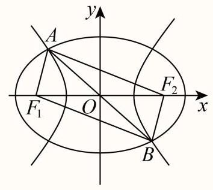

14 较难 填空题

如图, ${F}_{1}\text{ 、 }{F}_{2}$ 是椭圆 ${C}_{1}$ 与双曲线 ${C}_{2}$ 的公共焦点, $A\text{ 、 }B$ 分别是 ${C}_{1}\text{ 、 }{C}_{2}$ 在第二、四象限的交点,若 $\angle A{F}_{1}B = \frac{2\pi }{3}$ , 则 ${C}_{1}$ 与 ${C}_{2}$ 的离心率之积的最小值为

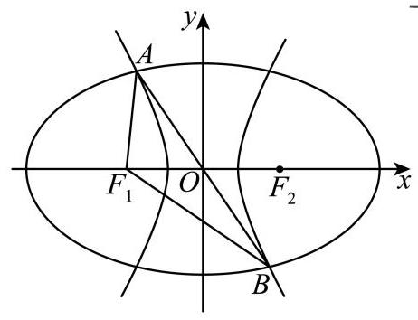

答案

$\frac{\sqrt{3}}{2}$

解析

根据椭圆和双曲线的定义和对称性, 结合三角形面积公式、余弦定理、基本不等式进行求解即可.

设椭圆方程为 $\frac{{x}^{2}}{{a}^{2}} + \frac{{y}^{2}}{{b}^{2}} = 1\left( {a > b > 0}\right) ,{a}^{2} - {b}^{2} = {c}^{2}$ ,

双曲线方程为 $\frac{{x}^{2}}{{m}^{2}} - \frac{{y}^{2}}{{n}^{2}} = 1\left( {m, n > 0}\right) ,{m}^{2} + {n}^{2} = {c}^{2}$ ,

如下图,连接 $A{F}_{2}\text{ 、 }{F}_{2}B$ ,所以 $A{F}_{1}B{F}_{2}$ 为平行四边形,

由 $\angle A{F}_{1}B = \frac{2\pi }{3}$ 得 $\angle {F}_{1}A{F}_{2} = \frac{\pi }{3}$ ,设 $\left| {{F}_{1}A}\right|  = s,\left| {A{F}_{2}}\right|  = t$ ,

在椭圆中，由定义可知: $s + t = {2a}$ ，

由余弦定理可知:

$4{c}^{2} = {s}^{2} + {t}^{2} - {2st}\cos \frac{\pi }{3} \Rightarrow  4{c}^{2} = {s}^{2} + {t}^{2} - {st} = {\left( s + t\right) }^{2} - {3st} \Rightarrow  {st} = \frac{4}{3}{b}^{2},$

S \{\\bigtriangleup \} \{\\fF_\{1\}\}A\{F_\{2\}\}\} = dfrac\{1\}\{2\}\\cdot st\\cdot \\dfrac\{\\sqrt\{3\}\}\{2\}=\\dfrac\{\\sqrt\{3\}\}\{3\}^\{2,

在双曲线中,由定义可知中: $t - s = {2m}$ ,

由余弦定理可知:

$4{c}^{2} = {s}^{2} + {t}^{2} - {2st}\cos \frac{\pi }{3} \Rightarrow  4{c}^{2} = {s}^{2} + {t}^{2} - {st} = {\left( t - s\right) }^{2} + {st} \Rightarrow  {st} = 4{n}^{2}$ ,

S \{\\bigtriangleup \} \{\{F \{1\}\}A\{F \{2\}\}\} = dfrac\{1\}\{2\}\\cdot st\\cdot \\dfrac\{\\sqrt\{3\}\}\{2\}=\\sqrt\{3\}n^\{2\}

所以 ${B}^{ \land  }\{ 2\}$ is bring leup $\} \;\{ \{ F\{ 1\} \} A\{ F\{ 2\} \} \}  =$ dfrac\{\\sqrt\{3\}\}\{3\} ${b}^{ \land  }\{ 2\}  =$ \\sqrt\{3\}n^\{2\}\\Rightarrow

${a}^{2} - {c}^{2} = 3\left( {{c}^{2} - {m}^{2}}\right)  \Rightarrow  \frac{3{m}^{2}}{{c}^{2}} + \frac{{a}^{2}}{{c}^{2}} = 4 \geq  2\sqrt{3}\frac{ma}{{c}^{2}}$ ,当且仅当 $a = \sqrt{3}m$ 时取等号,

所以 $\frac{{c}^{2}}{ma} \geq  \frac{\sqrt{3}}{2}$ ,

所以 ${C}_{1}$ 与 ${C}_{2}$ 的离心率之积的最小值为 $\frac{\sqrt{3}}{2}$ .

故答案为: $\frac{\sqrt{3}}{2}$

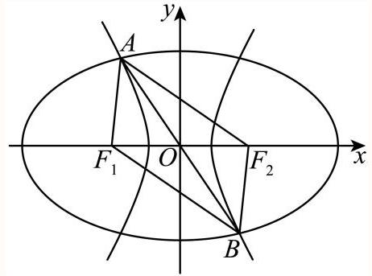

关键点睛:在椭圆和双曲线中利用焦点三角形的面积建立等式是解题的关键.

15 较难 单选题

一个边长为5的正方形被分割成四个不同的小矩形(如图)，现用红蓝两种颜色对小矩形的边进行染色，若要使每个小矩形均有2条红色边和2条蓝色边, 则不同染色的方法数为( )

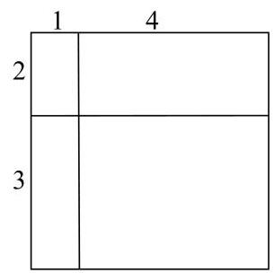

A. 32

B. 48

C. 64

D. 82

## 答案

D

解析

分①②③④四边同色、①②③④只有三边同色另一边不同色和①②③④每两个同色三种情况分别求解即可. 如图所示:

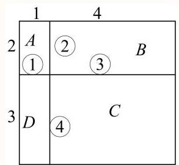

当①②同色时，矩形A另外两边有1种方法染色；

当①②不同色时，矩形A另外两边有2种方法染色；

同理其他区域也一样,

所以: ①②③④四边同色，此时共有 ${\mathrm{C}}_{2}^{1} = 2$ 种;

当①②③④只有三边同色时，另一边与其不同色时，

此时共有 ${\mathrm{C}}_{4}^{3}{\mathrm{\;A}}_{2}^{1} \times  1 \times  1 \times  2 \times  2 = {32}$ 种;

当①②③④每两个同色时，此时共有 ${\mathrm{C}}_{4}^{2}{\mathrm{\;A}}_{2}^{2} \times  1 \times  1 \times  2 \times  2 = {48}$ 种；

综上,共有 $2 + {32} + {48} = {82}$ 种.

16 一般 填空题

某劳动课上，王老师安排甲、乙、丙、丁、戊五名学生到三个不同的教室打扫卫生，每个教室至少安排一名学生， 且甲乙两名学生安排在同一教室打扫，丙丁两名学生不安排在同一教室打扫，则不同的安排方法数是 . (用数字作答)

答案

30

解析

根据分类加法计数原理以及分组分配的求解方法即可求解.

若三个教室的人数分配是 1,1,3 , 则甲乙连同另一个同学一起去一个教室,

剩下两个同学分别去另两个教室,则有 ${\mathrm{C}}_{3}^{1}{\mathrm{C}}_{3}^{1}{\mathrm{A}}_{2}^{2} = {18}$ 种安排方法,

若三个教室的人数分配是 1,2,2 , 则甲乙一起去一个教室, 丙丁分别去另两个教室,

戊去剩下两个教室中的一个，则有 ${\mathrm{C}}_{3}^{1}{\mathrm{\;A}}_{2}^{2}{\mathrm{C}}_{2}^{1} = {12}$ 种安排方法,

故总的方法有 ${18} + {12} = {30}$ .

17 一般 填空题设集合 $A$ 中的元素皆为无重复数字的三位正整数，且元素中任意两者之积皆为偶数，则集合中元素个数的最大值为 ___.

答案

329

解析

由题意可知集合中最多有一个奇数,其余均为偶数.

个位为 0 的无重复数字的三位正整数有 $9 \times  8 = {72}$ (个);

个位为2,4,6,8的无重复数字的三位正整数有 $4 \times  8 \times  8 = {256}$ (个).

所以集合中最多有 ${72} + {256} = {328}$ (个)偶数,再加上一个奇数,则集合中元素个数的最大值为 ${328} + 1 = {329}$ .

18 较难 解答题

如图， $O$ 为坐标原点，椭圆 ${C}_{1} : \frac{{x}^{2}}{{a}^{2}} + \frac{{y}^{2}}{{b}^{2}} = 1\left( {a > b > 0}\right)$ 的左焦点为 $A\left( {-1,0}\right)$ ，双曲线 ${C}_{2} : \frac{{x}^{2}}{{a}^{2}} - \frac{{y}^{2}}{4{b}^{2}} = 1$ 的一条渐近线方程为 ${4x} + \sqrt{5}y = 0$ .

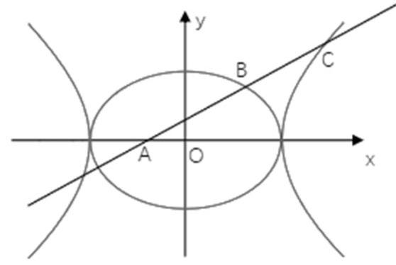

(1) 求椭圆和双曲线的方程.

(2)过点 $A$ 作直线 ${l}_{A}$ 与椭圆在第一象限交于点 $B$ ，与双曲线在第一象限交于点 $C$ . 已知 $B$ 为线段 ${AC}$ 的中点，求点 $B$ 的坐标.

(3)由(2)中过点 $B$ 作直线 ${l}_{B}$ ，已知 ${l}_{B}$ 与 ${C}_{1}\text{ 、 }{C}_{2}$ 共有3个不同的交点，求出 ${l}_{B}$ 所有可能的方程.

② 答案

(1) ${C}_{1} : \frac{{x}^{2}}{5} + \frac{{y}^{2}}{4} = 1;{C}_{2} : \frac{{x}^{2}}{5} - \frac{{y}^{2}}{16} = 1$ ;

(2) $B\left( {1,\frac{4\sqrt{5}}{5}}\right)$ ;

(3) ${l}_{B} : y =  - \frac{\sqrt{5}}{5}x + \sqrt{5};\;{l}_{B} : y =  - \frac{4\sqrt{5}}{5}x + \frac{8\sqrt{5}}{5};\;{l}_{B} : y =  - \frac{6\sqrt{5}}{5}x + 2\sqrt{5};\;{l}_{B} : y = \left( {1 - \frac{\sqrt{5}}{5}}\right) x + \sqrt{5} - 1$

$;\;{l}_{B} : y =  - \left( {1 + \frac{\sqrt{5}}{5}}\right) x + \sqrt{5} + 1;$

解析

1) 由题意得: $\left\{  \begin{array}{l} {a}^{2} - {b}^{2} = 1 \\  \frac{2b}{a} = \frac{4}{\sqrt{5}} \end{array}\right.$ ,解得: $\left\{  \begin{array}{l} a = \sqrt{5} \\  b = 2 \end{array}\right.$ ,

因此可得: ${C}_{1} : \frac{{x}^{2}}{5} + \frac{{y}^{2}}{4} = 1;{C}_{2} : \frac{{x}^{2}}{5} - \frac{{y}^{2}}{16} = 1$ .

(2) 设点 $B$ 的坐标 $B\left( {{x}_{1},{y}_{1}}\right)$ . 由点 $B$ 是线段 ${AC}$ 的中点，可知点 $C$ 的坐标为 $\left( {2{x}_{1} + 1,2{y}_{1}}\right)$ .

将点 $B$ 、点 $C$ 的坐标分别代入椭圆和双曲线的方程: $\left\{  \begin{array}{l} 4{x}_{1}^{2} + 5{y}_{1}^{2} - {20} = 0,\left( 1\right) \\  {16}{\left( 2{x}_{1} + 1\right) }^{2} - {20}{y}_{1}^{2} - {80} = 0,\left( 2\right)  \end{array}\right.$

由(1)得 $5{y}_{1}^{2} = {20} - 4{x}_{1}^{2}$ (3)，将(3)代入(2)得 ${16}{\left( 2{x}_{1} + 1\right) }^{2} - 4\left( {{20} - 4{x}_{1}^{2}}\right)  - {80} = 0$ ，

化简得, ${80}{x}_{1}^{2} + {64}{x}_{1} - {144} = 0$ ,由 ${x}_{1} > 0$ ,得 ${x}_{1} = 1\left( 4\right)$ ,

将(4)代入(3)得 $5{y}_{1}^{2} = {16}$ ，由 ${y}_{1} > 0$ ，计算得 ${y}_{1} = \frac{4\sqrt{5}}{5}$ ，

因此点 $B$ 的坐标为 $B\left( {1,\frac{4\sqrt{5}}{5}}\right)$ .

(3) 设直线 ${l}_{B}$ 的斜率为 $k$ .

①直线与椭圆有一个交点，与双曲线有两个交点.

此时 ${l}_{B}$ 是椭圆的切线,设 ${l}_{B} : y - \frac{4\sqrt{5}}{5} = k\left( {x - 1}\right)$ ,联立椭圆 ${C}_{1} : \frac{{x}^{2}}{5} + \frac{{y}^{2}}{4} = 1$ ,

得 $\left( {4 + 5{k}^{2}}\right) {x}^{2} - \left( {{10}{k}^{2} - 8\sqrt{5}k}\right) x + 5{k}^{2} - 8\sqrt{5}k - 4 = 0$ ,

$\Delta  = {\left( {10}{k}^{2} - 8\sqrt{5}k\right) }^{2} - 4\left( {4 + 5{k}^{2}}\right) \left( {5{k}^{2} - 8\sqrt{5}k - 4}\right)  = 0,$ 得 $k =  - \frac{\sqrt{5}}{5},$

所以椭圆在点 $B\left( {1,\frac{4\sqrt{5}}{5}}\right)$ 的切线方程为 $x + \sqrt{5}y - 5 = 0$ .

联立 $\left\{  \begin{array}{l} x + \sqrt{5}y - 5 = 0 \\  \frac{{x}^{2}}{5} - \frac{{y}^{2}}{16} = 1 \end{array}\right.$ 得, ${15}{y}^{2} - {32}\sqrt{5}y + {64} = 0,\Delta  > 0$ ,与双曲线有 2 个交点,满足条件;

②直线与椭圆有两个交点，与双曲线有一个交点.

将 ${l}_{B} : y = k\left( {x - 1}\right)  + \frac{4\sqrt{5}}{5}$ 代入双曲线 ${C}_{2} : \frac{{x}^{2}}{5} - \frac{{y}^{2}}{16} = 1$ 得, ${16}{x}^{2} - 5{\left( k\left( x - 1\right)  + \frac{4\sqrt{5}}{5}\right) }^{2} - {80} = 0$ ,

化简得 $\left( {{16} - 5{k}^{2}}\right) {x}^{2} + \left( {{10}{k}^{2} - 8\sqrt{5}k}\right) x - 5{k}^{2} + 8\sqrt{5}k - {96} = 0$ ,

若 ${16} - 5{k}^{2} = 0$ ,若 $k = \frac{4}{5}\sqrt{5}$ ,则等式变为 $- {48} = 0$ ,矛盾.

若 $k =  - \frac{4}{5}\sqrt{5}$ ,则等式为一元一次方程,此时直线与双曲线有一个交点.

直线的方程为 $y =  - \frac{4\sqrt{5}}{5}x + \frac{8\sqrt{5}}{5}$ ，且与椭圆有 2 个交点，满足条件；

若 ${16} - 5{k}^{2} \neq  0$ ,令 $\Delta  = 0$ 得, ${1280}{k}^{2} + {512}\sqrt{5}k - {6144} = 0$ ,

可知其中的一个解为 $k = \frac{4}{5}\sqrt{5}$ (舍); 由韦达定理，另一个解为 $k =  - \frac{6}{5}\sqrt{5}$ .

此时直线与双曲线相切，直线的方程为 $y =  - \frac{6\sqrt{5}}{5}x + 2\sqrt{5}$ ，且与椭圆有2个交点，满足条件；

③直线过椭圆与双曲线都相交，但有一个交点重合.

根据椭圆和双曲线的方程,可知椭圆和双曲线交于点 $\left( {-\sqrt{5},0}\right)$ 和点 $\left( {\sqrt{5},0}\right)$ . 分别代入计算,得到直线方

程为 $y = \left( {1 - \frac{\sqrt{5}}{5}}\right) x + \sqrt{5} - 1$ 或 $y =  - \left( {1 + \frac{\sqrt{5}}{5}}\right) x + \sqrt{5} + 1$ .

综上,直线可能的方程为: ${l}_{B} : y =  - \frac{\sqrt{5}}{5}x + \sqrt{5};{l}_{B} : y =  - \frac{4\sqrt{5}}{5}x + \frac{8\sqrt{5}}{5}$ ;

${l}_{B} : y =  - \frac{6\sqrt{5}}{5}x + 2\sqrt{5}\;;{l}_{B} : y = \left( {1 - \frac{\sqrt{5}}{5}}\right) x + \sqrt{5} - 1;{l}_{B} : y =  - \left( {1 + \frac{\sqrt{5}}{5}}\right) x + \sqrt{5} + 1.$

19 一般 解答题

双曲线 ${C}_{1} : \frac{{x}^{2}}{4} - \frac{{y}^{2}}{{b}^{2}} = 1$ ,圆 ${C}_{2} : {x}^{2} + {y}^{2} = 4 + {b}^{2}\left( {b > 0}\right)$ 在第一象限交点为 $A, A\left( {{x}_{A},{y}_{A}}\right)$ ,曲线 $\Gamma \left\{  \begin{array}{ll} \frac{{x}^{2}}{4} - \frac{{y}^{2}}{{b}^{2}} = 1, & \left| x\right|  > {x}_{A} \\  {x}^{2} + {y}^{2} = 4 + {b}^{2}, & \left| x\right|  > {x}_{A} \end{array}\right.$

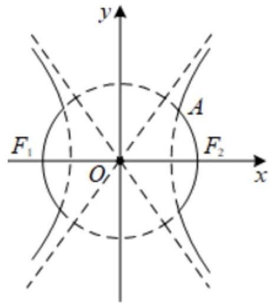

(1) 若 ${x}_{A} = \sqrt{6}$ ,求 $b$ ;

(2)若 $b = \sqrt{5}$ ， ${C}_{2}$ 与 $x$ 轴交点记为 ${F}_{1}$ 、 ${F}_{2}$ ， $P$ 是曲线 $\Gamma$ 上一点，且在第一象限，并满足 $\left| {P{F}_{1}}\right|  = 8$ ，求 $\angle {F}_{1}P{F}_{2}$

(3)过点 $S\left( {0,2 + \frac{{b}^{2}}{2}}\right)$ 且斜率为 $- \frac{b}{2}$ 的直线 $l$ 交曲线 $\Gamma$ 于 $M\text{ 、 }N$ 两点,用 $b$ 的代数式表示 $\overrightarrow{OM} \cdot  \overrightarrow{ON}$ ,并求出 $\overrightarrow{OM} \cdot  \overrightarrow{ON}$ 的取值范围.

答案

(1) 2

(2) $\frac{11}{16}$

(3) $\left( {6 + 2\sqrt{5}, + \infty }\right)$

解析

(1)若 ${x}_{A} = \sqrt{6}$ ，因为点 $A$ 为曲线 ${C}_{1}$ 与曲线 ${C}_{2}$ 的交点，

$\because \left\{  \begin{array}{l} \frac{{x}_{A}{}^{2}}{4} - \frac{{y}^{2}}{{b}^{2}} = 1 \\  {x}_{A}{}^{2} + {y}^{2} = 4 + {b}^{2} \end{array}\right.$ ,解得 $\left\{  \begin{array}{l} y = \sqrt{2} \\  b = 2 \end{array}\right.$

$\therefore b = 2$ .

(2)方法一:由题意易得 ${F}_{1}{F}_{2}$ 为曲线的两焦点，

由双曲线定义知: $\left| {P{F}_{2}}\right|  = \left| {P{F}_{1}}\right|  - {2a}$ ,

$\left| {P{F}_{1}}\right|  = 8,{2a} = 4,\therefore \left| {P{F}_{2}}\right|  = 4$ ,

又 $\because b = \sqrt{5}$ ,

$\therefore \left| {{F}_{1}{F}_{2}}\right|  = 6$ ,

在 $\bigtriangleup P{F}_{1}{F}_{2}$ 中由余弦定理可得:

$\cos \angle {F}_{1}P{F}_{2} = \frac{{\left| P{F}_{1}\right| }^{2} + {\left| P{F}_{2}\right| }^{2} - {\left| {F}_{1}{F}_{2}\right| }^{2}}{2 \cdot  \left| {P{F}_{1}}\right|  \cdot  \left| {P{F}_{2}}\right| } = \frac{11}{16},$

方法二: $\because b = \sqrt{5}$ ,可得 $\left\{  \begin{array}{l} \frac{{x}^{2}}{4} - \frac{{y}^{2}}{5} = 1 \\  {\left( x + 3\right) }^{2} + {y}^{2} = {64} \end{array}\right.$ ,解得 $P\left( {4,\sqrt{15}}\right)$ ,

$\therefore \overrightarrow{P{F}_{1}} = \left( {-7, - \sqrt{15}}\right) ,\overrightarrow{P{F}_{2}} = \left( {-1, - \sqrt{15}}\right)$ ,

$\therefore \cos \left\langle  {\overrightarrow{P{F}_{1}},\overrightarrow{P{F}_{2}}}\right\rangle   = \frac{\overrightarrow{P{F}_{1}} \cdot  \overrightarrow{P{F}_{2}}}{\left| \overrightarrow{P{F}_{1}}\right|  \cdot  \left| \overrightarrow{P{F}_{2}}\right| } = \frac{11}{16}$ .

(3)设直线 $l : y =  - \frac{b}{2}x + \frac{{b}^{2} + 4}{2}$ ，

可得原点 $O$ 到直线 $l$ 的距离 $d = \frac{\left| \frac{{b}^{2} + 4}{2}\right| }{\sqrt{1 + \frac{{b}^{2}}{4}}} = \frac{\left| {b}^{2} + 4\right| }{\sqrt{{b}^{2} + 4}} = \sqrt{{b}^{2} + 4}$ ,

所以直线 $l$ 是圆的切线,切点为 $M$ ,

所以 ${k}_{OM} = \frac{2}{b}$ ,并设 ${l}_{OM} : y = \frac{2}{b}x$ ,与圆 ${x}^{2} + {y}^{2} = 4 + {b}^{2}$ 联立可得 ${x}^{2} + \frac{4}{{b}^{2}}{x}^{2} = 4 + {b}^{2}$ ,

所以得 $x = b, y = 2$ ,即 $M\left( {b,2}\right)$ ,

注意到直线 $l$ 与双曲线得斜率为负得渐近线平行,

所以只有当 ${y}_{A} > 2$ 时,直线 $l$ 才能与曲线 $\Gamma$ 有两个交点,

由 $\left\{  \begin{array}{l} \frac{{x}^{2}}{4} - \frac{{y}^{2}}{{b}^{2}} = 1 \\  {x}_{A}{}^{2} + {y}^{2} = 4 + {b}^{2} \end{array}\right.$ ,得 ${y}_{A}{}^{2} = \frac{{b}^{4}}{a + {b}^{2}}$ ,

所以有 $4 < \frac{{b}^{4}}{4 + {b}^{2}}$ ,解得 ${b}^{2} > 2 + 2\sqrt{5}$ ,或 ${b}^{2} < 2 - 2\sqrt{5}$ (舍),

又因为 $\overrightarrow{OM} \cdot  \overrightarrow{ON}$ 由 $\overrightarrow{ON}$ 在 $\overrightarrow{OM}$ 上的投影可知: $\overrightarrow{OM} \cdot  \overrightarrow{ON} = {b}^{2} + 4$ ,

所以 $\overrightarrow{OM} \cdot  \overrightarrow{ON} = {b}^{2} + 4 > 6 + 2\sqrt{5}$ ,

$\overrightarrow{OM} \cdot  \overrightarrow{ON} \in  \left( {6 + 2\sqrt{5}, + \infty }\right) .$
