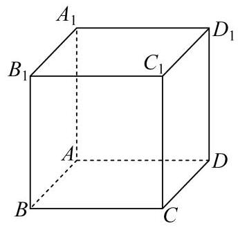
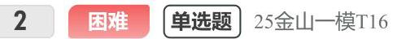
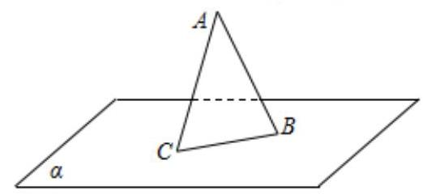

## 填选压轴汇编-zqh

## 解析几何

困难 单选题 上海市青浦区第一中学2024届高三上学期期中数学试题

在平面直角坐标系 ${xOy}$ 中,点 $A\left( {4,0}\right) , B\left( {1,0}\right) , C\left( {-1,0}\right) , D\left( {0,1}\right)$ ,若点 $P$ 满足 $\left| {PA}\right|  = 2\left| {PB}\right|$ ,则 $\left| {PC}\right|  + \frac{1}{2}\left| {PD}\right|$ 的最小值为( ).

A. 2

B. $\frac{\sqrt{15}}{2}$

C. $\frac{\sqrt{17}}{2}$

D. $\frac{\sqrt{5}}{2} + 1$

## 向量复数

1 困难 填空题 25 杨浦一模 T12

已知实数 $a > 0$ , i是虚数单位,设集合 $A = \left\{  {z\left| {z = w + \frac{1}{w},}\right| w \mid   > 1, w \in  \mathbf{C}, z \in  \mathbf{C}}\right\}$ ,集合 $B = \{ z\left| \right| z - 1 + \mathrm{i} \mid   = a, z \in  \mathbf{C}\}$ ，如果 $B \subseteq  A$ ，则 $a$ 的取值范围为 .

2 困难 填空题 25金山一模T12

已知 $\mathrm{O}$ 为坐标原点，向量 $\overrightarrow{OA},\overrightarrow{OB}$ 满足 $\left| \overrightarrow{OA}\right|  + \left| \overrightarrow{OB}\right|  = 8$ ，将 $\overrightarrow{OA}$ 绕点 $\mathrm{O}$ 按逆时针方向旋转 ${90}^{ \circ  }$ ，得到向量 $\overrightarrow{OC}$ . 若 $\overrightarrow{OB} + \overrightarrow{OC} = \left( {-3,3}\right) ,\overrightarrow{i} = \left( {1,0}\right)$ ，则 $\left( {\overrightarrow{OA} + \overrightarrow{OB}}\right)  \cdot  \overrightarrow{i}$ 的最大值为___.

3 较难 单选题 【试卷】上海市杨浦区2024届高三下学期二模质量调研数学试卷

平面上的向量 $\overrightarrow{a}$ 、 $\overrightarrow{b}$ 满足: $\left| \overrightarrow{a}\right|  = 3$ ， $\left| \overrightarrow{b}\right|  = 4$ ， $\overrightarrow{a}\bot \overrightarrow{b}$ . 定义该平面上的向量集合 $A = \left\{  {\overrightarrow{x}\left| \right| \overrightarrow{x} + \overrightarrow{a}\left|  < \right| \overrightarrow{x} + \overrightarrow{b}\mid ,\overrightarrow{x} \cdot  \overrightarrow{a} > \overrightarrow{x} \cdot  \overrightarrow{b}}\right\}$ . 给出如下两个结论:

①对任意 $\overrightarrow{c} \in  A$ ,存在该平面的向量 $\overrightarrow{d} \in  A$ ,满足 $\left| {\overrightarrow{c} - \overrightarrow{d}}\right|  = {0.5}$

②对任意 $\overrightarrow{c} \in  A$ ，存在该平面向量 $\overrightarrow{d} \notin  A$ ，满足 $\left| {\overrightarrow{c} - \overrightarrow{d}}\right|  = {0.5}$

则下面判断正确的为( )

A. ①正确，②错误

B. ①错误，②正确

C. ①正确，②正确

D. ①错误，②错误

4 困难 填空题 25 奉贤一模T12

已知集合 $M = \left\{  {{P}_{0},{P}_{1},{P}_{2},\cdots ,{P}_{n}}\right\}  , n \geq  2, n \in  \mathbf{N}$ 是由函数 $y = \cos x, x \in  \left\lbrack  {0,{2\pi }}\right\rbrack$ 的图象上两两不相同的点构成的点集,集合 $S = \left\{  {a \mid  a = \overrightarrow{O{P}_{0}} \cdot  \overrightarrow{O{P}_{i}}, i = 0,1,2,\cdots , n, n \geq  2, n \in  \mathbf{N}}\right\}$ ,其中 ${P}_{0}\left( {0,1}\right) \text{ 、 }{P}_{1}\left( {\pi , - 1}\right)$ . 若集合 $S$ 中的元素按照从小到大的顺序排列能构成公差为 $d$ 的等差数列，当 $d \in  \left\{  {\frac{1}{2},1}\right\}$ 时，则符合条件的点集 $M$ 的个数为___.

5 困难 ☐☐ 25 青浦一模T12

已知 $A, B, C$ 是单位圆上任意不同三点，则 $\frac{\overrightarrow{AB} \cdot  \overrightarrow{AC}}{\left| \overrightarrow{AB}\right| }$ 的取值范围是___.

## 数列

1 较难 单选题 25 杨浦一模 T16

设无穷数列 $\left\{  {a}_{n}\right\}$ 的前 $n$ 项和为 ${S}_{n}$ ，且对任意的正整数 $n,{a}_{n + 1} = \frac{{S}_{n}}{{a}_{n}}$ ，则 $\mathop{\sum }\limits_{{i = 1}}^{5}{a}_{2i} - \mathop{\sum }\limits_{{i = 1}}^{6}{a}_{{2i} - 1}$ 的值可能为( )

A. -6

B. 0

C. 6

D. 12

2 较难 单选题 25 徐汇一模T16

已知数列 $\left\{  {a}_{n}\right\}$ 的前 $n$ 项和为 ${S}_{n}$ ,设 ${t}_{n} = \frac{{S}_{n}}{n}$ ( $n$ 为正整数). 若存在常数 $c$ ，使得任意两两不相等的正整数 $i, j, k$ ，都有 $\left( {i - j}\right) {t}_{k} + \left( {j - k}\right) {t}_{i} + \left( {k - i}\right) {t}_{j} = c$ ，则称数列 $\left\{  {a}_{n}\right\}$ 为 "轮换均值数列". 现有下列两个命题:①任意等差数列 $\left\{  {a}_{n}\right\}$ 都是 “轮换均值数列”，②存在公比不为1的等比数列 $\left\{  {b}_{n}\right\}$ 是 “轮换均值数列”，则下列说法正确的是( )

A. ①是真命题，②是假命题

B. ①是假命题，②是真命题

C. ①、②都是真命题

D. ①、②都是假命题

3 较难 填空题 25 黄浦一模T12

设常数 $\mathrm{b}$ 为整数，数列 $\left\{  {a}_{n}\right\}$ 的通项公式为 ${a}_{n} = {\left( n + b\right) }^{2} + \frac{b}{2}$ ，若 ${a}_{m} + {a}_{m + 1} + {a}_{m + 2}\left( {m \geq  1, m \in  \mathrm{Z}}\right)$ 的最小值为 -7,则 $\mathrm{b} =$

4 困难 单选题 25 红口一模T16

设数列 $\left\{  {a}_{n}\right\}$ 的前四项分别为 ${a}_{1}\text{ 、 }{a}_{2}\text{ 、 }{a}_{3}\text{ 、 }{a}_{4}$ ,对于以下两个命题,说法正确的是 ( ).

①存在等比数列 $\left\{  {a}_{n}\right\}$ 以及锐角 $\alpha$ ，使 $\left\{  {\sin \alpha ,\cos \alpha ,\tan \alpha }\right\}   = \left\{  {{a}_{1},{a}_{2},{a}_{3}}\right\}$ 成立.

②对任意等差数列 $\left\{  {a}_{n}\right\}$ 以及锐角 $\alpha$ ，均不能使 $\{ \sin \alpha ,\cos \alpha ,\tan \alpha ,\cot \alpha \}  = \left\{  {{a}_{1},{a}_{2},{a}_{3},{a}_{4}}\right\}$ 成立.

A. ①是真命题，②是真命题

B. ①是真命题，②是假命题

C. ①是假命题，②是真命题

D. ①是假命题，②是假命题

5 困难 填空题 25虹口一模T12

已知项数为 10 的数列 $\left\{  {a}_{n}\right\}$ 中任一项均为集合 $\{ x \mid  1 \leq  x \leq  {10}, x \in  \mathbf{N}\}$ 中的元素，且相邻两项满足 ${a}_{n} < {a}_{n + 1} + 3, n = 1,2,\cdots ,9$ . 若 $\left\{  {a}_{n}\right\}$ 中任意两项都不相等，则满足条件的数列 $\left\{  {a}_{n}\right\}$ 有 介 .

6 困难 单选题 25 奉贤一模T16

已知数列 $\left\{  {a}_{n}\right\}$ 不是常数列，前 $n$ 项和为 ${S}_{n}$ ， ${a}_{n} > 0$ . 若对任意正整数 $n$ ，使得 $\left| {{S}_{n} - {a}_{m}}\right|  < {a}_{1}$ ，则称 $\left\{  {a}_{n}\right\}$ 是“可控数列”. 现给出两个命题:

①若各项均为正整数的等差数列 $\left\{  {a}_{n}\right\}$ 满足公差 $d = 3$ ，则 $\left\{  {a}_{n}\right\}$ 是“可控数列”；

②若等比数列 $\left\{  {a}_{n}\right\}$ 是 “可控数列”，则其公比 $q \in  \left( {0,\frac{1}{2}}\right\rbrack$ .

则下列判断正确的是( )

A. ①与②均为真命题

B. ①与②均为假命题

C. ①为假命题，②为真命题

D. ①为真命题，②为假命题

7 蛟难 单选题 25崇明一模T16

已知数列 $\left\{  {a}_{n}\right\}$ ，若存在数列 $\left\{  {b}_{n}\right\}$ 满足对任意正整数 $n$ ，都有 $\left( {{a}_{n} - {b}_{n}}\right) \left( {{a}_{n + 1} - {b}_{n + 1}}\right)  < 0$ ，则称数列 $\left\{  {b}_{n}\right\}$ 是 $\left\{  {a}_{n}\right\}$ 的交错数列.有下列两个命题:①对任意给定的等差数列 $\left\{  {a}_{n}\right\}$ ，不存在等差数列 $\left\{  {b}_{n}\right\}$ ，使得 $\left\{  {b}_{n}\right\}$ 是 $\left\{  {a}_{n}\right\}$ 的交错数列；② 对任意给定的等比数列 $\left\{  {a}_{n}\right\}$ ，都存在等比数列 $\left\{  {b}_{n}\right\}$ ，使得 $\left\{  {b}_{n}\right\}$ 是 $\left\{  {a}_{n}\right\}$ 的交错数列. 下列结论正确的是( )

A. ①与②都是真命题；

B. ①为真命题，②为假命题；

C. ①为假命题，②为真命题；

D. ①与②都是假命题.

8 困难 单选题 25 宝山一模T16

设 $\bigtriangleup {A}_{n}{B}_{n}{C}_{n}$ 的三边长分别为 ${a}_{n}$ 、 ${b}_{n}$ 、 ${c}_{n}$ ，面积为 ${S}_{n}$ ( $n$ 为正整数). 若 ${b}_{1} - {c}_{1} = \frac{1}{2}{a}_{1}$ ，其中 ${c}_{1} > \frac{1}{4}{a}_{1}$ ， ${a}_{n + 1} = {a}_{n}$ , ${b}_{n + 1} = {c}_{n} + \frac{1}{4}{a}_{n},{c}_{n + 1} = {b}_{n} + \frac{1}{4}{a}_{n}$ ,则 ( )

A. $\left\{  {S}_{n}\right\}$ 为严格减数列

B. $\left\{  {S}_{{2n} - 1}\right\}$ 为严格增数列, $\left\{  {S}_{2n}\right\}$ 为严格减数列

C. $\left\{  {S}_{{2n} - 1}\right\}$ 为严格增数列, $\left\{  {S}_{2n}\right\}$ 为严格减数列

D. $\left\{  {S}_{{2n} - 1}\right\}$ 为严格减数列, $\left\{  {S}_{2n}\right\}$ 为严格增数列

9 困难 单选题 25嘉定一模T16

已知数列 $\left\{  {a}_{n}\right\}$ 满足 ${a}_{n + 1} = r{a}_{n}\left( {1 - {a}_{n}}\right) \left( {n = 1,2,3,\cdots }\right) ,{a}_{1} \in  \left( {0,1}\right)$ ,给出以下四个结论:

① $\operatorname{\text{ 当 }}r = 2$ 时，存在有限个 ${a}_{1}$ ，使得对任意正整数 $n$ ，都有 ${a}_{n + 1} > {a}_{n}$

② 当 $r = 2$ 时，存在 ${a}_{1}$ 和正整数 $P$ ，当 $n > P$ 时， ${a}_{n + 1} - {a}_{n} < \frac{1}{2025}$

③ 当 $r = 3$ 时，存在 ${a}_{1}$ 和正整数 $P$ ，当 $n > P$ 时， ${a}_{n + 1} = {a}_{n}$

④ 当 $r =  - 3$ 时，不存在 ${a}_{1}$ ，使得对任意正整数 $n$ ，且 $n \geq  3$ ，都有 ${a}_{n} > 0$

其中正确结论是( ).

A. ①②

B. ②③

C. ③④

D. ②④

10 困难 单选题 25 黄浦一模T16 设函数 $y = f\left( x\right)$ 在区间 $\mathrm{I}$ 上有导函数 $y = {f}^{\prime }\left( x\right)$ ，且 ${f}^{\prime }\left( x\right)  < 0$ 在区间 $\mathrm{I}$ 上恒成立，对任意的 $x \in  I$ ，有 $f\left( x\right)  \in  I$ . 对于各项均不相同的数列 $\left\{  {a}_{n}\right\}  ,{a}_{1} \in  I,{a}_{n + 1} = f\left( {a}_{n}\right)$ ，下列结论正确的是( )

A. 数列 $\left\{  {a}_{{2n} - 1}\right\}$ 与 $\left\{  {a}_{2n}\right\}$ 均是严格增数列

B. 数列 $\left\{  {a}_{{2n} - 1}\right\}$ 与 $\left\{  {a}_{2n}\right\}$ 均是严格减数列

C. 数列 $\left\{  {a}_{{2n} - 1}\right\}$ 与 $\left\{  {a}_{2n}\right\}$ 中的一个是严格增数列,另一个是严格减数列

D. 数列 $\left\{  {a}_{{2n} - 1}\right\}$ 与 $\left\{  {a}_{2n}\right\}$ 均既不是严格增数列也不是严格减数列

## 民主医数

1 困难 填空题 25 徐汇一模T12

已知定义域为 $A = \{ 1,2,3\}$ 的函数 $y = f\left( x\right)$ 的值域也是 $A$ ，所有这样的函数 $y = f\left( x\right)$ 形成全集 $B$ .设非空集合 $C \subseteq  B$ 且元中的每一个函数都是 $C$ 中的两个函数(可以相同)的复合函数，则集合 $C$ 的元素个数的最小值为 ___.

2 困难 单选题 25普陀一模T16

在平面直角坐标系中，将函数 $y = f\left( x\right)$ 的图象绕坐标原点 $O$ 逆时针旋转 $\frac{\pi }{4}$ 后，所得曲线仍然是某个函数的图象，则称函数 $y = f\left( x\right)$ 为“ $\mathbf{R}$ 函数”.对于命题;

①设 $m \in  \mathbf{R}$ ，若函数 $g\left( x\right)  = \left( {m - 1}\right) x + \frac{1}{x}$ 为“ $\mathbf{R}$ 函数”，则 $m > 1$ ；

②设 $k \in  \mathbf{R}$ ，若函数 $h\left( x\right)  = \frac{k\left( {x + 1}\right) }{{\mathrm{e}}^{x}}$ 为“ $\mathbf{R}$ 函数”，则满足条件的 $k$ 的整数值至少有4个.

则下列结论中正确的是( )

A. ①为真②为真

B. ①为真②为假

C. ①为假②为真

D. ①为假②为假

3 困难 单选题 25 浦东一模T16

设函数 $y = F\left( x\right)$ ， $y = G\left( x\right)$ 的定义域均为 $\mathbf{R}$ ，值域分别为 $A$ 、 $B$ ，且 $A \cap  B = \varnothing$ . 若集合S满足以下两个条件:(1) $A \cup  B \subseteq  S$ ；(2) ${\complement }_{S}\left( {A \cup  B}\right)$ 是有限集，则称 $y = F\left( x\right)$ 和 $y = G\left( x\right)$ 是S-互补函数. 给出以下两个命题:①存在函数 $y = f\left( x\right)$ ，使得 $y = {2}^{f\left( x\right) }$ 和 $y = {\log }_{2}f\left( x\right)$ 是 $\lbrack 0,{16}\rbrack$ -互补函数；②存在函数 $y = g\left( x\right)$ ，使得 $y = \sin g\left( x\right)$ 和 $y = \tan g\left( x\right)$ 是 $\lbrack 0, + \infty )$ -互补函数. 则 ( )

A. ①②都是真命题

B. ①是真命题，②是假命题

C. ①是假命题，②是真命题

D. ①②都是假命题

4 困难 填空题 【试卷】上海市闵行区2023-2024学年高一上学期期末学业质量调研数学试卷

将函数 $y = \left| x\right|$ 的图象绕原点逆时针方向旋转角 $\alpha \left( {{0}^{ \circ  } < \alpha  < {360}^{ \circ  }}\right)$ ,在 $\alpha$ 的变化过程中,每一个旋转角 $\alpha$ 都对应一条折线,若该折线不是任何函数的图象,则 $\alpha$ 的取值范围为

5 困难 填空题 【试卷】上海市南洋模范中学2024届高三上学期开学考试数学试题

函数 $f\left( x\right)  = \sqrt{1 - {x}^{2}}, - \frac{1}{2} \leq  x \leq  \frac{1}{2}$ 的图象绕着原点旋转弧度 $\theta \left( {0 \leq  \theta  \leq  \pi }\right)$ ,若得到的图象仍是函数图象,则 $\theta$ 可取值的集合为___.

6 较难 单坐题 25 松江T16

设函数 $y = f\left( x\right)$ 与 $y = g\left( x\right)$ 均是定义在 $\mathbf{R}$ 上的函数，有以下两个命题:①若 $y = f\left( x\right)$ 是周期函数，且是 $\mathbf{R}$ 上的减函数,则函数 $y = f\left( x\right)$ 必为常值函数; ②若对任意的 $\mathrm{a}, b \in  \mathbf{R}$ ,有 $\left| {f\left( a\right)  - f\left( b\right) }\right|  \leq  \left| {g\left( a\right)  - g\left( b\right) }\right|$ 成立,且 $y = g\left( x\right)$ 是 $\mathbf{R}$ 上的增函数，则 $y = f\left( x\right)  - g\left( x\right)$ 是 $\mathbf{R}$ 上的增函数. 则以下选项正确的是( )

A. ①是真命题，②是假命题

B. 两个都是真命题

C. ①是假命题，②是真命题

D. 两个都是假命题

7 较难 单选题 25 青浦一模T16

对于数列 $\left\{  {a}_{n}\right\}$ ，设数列 $\left\{  {a}_{n}\right\}$ 的前 $n$ 项和为 ${S}_{n}$ ，给出下列两个命题:① 存在函数 $y = f\left( x\right)$ ，使得 ${S}_{n} = f\left( {a}_{n}\right)$ ；② 存在函数 $y = g\left( x\right)$ ,使得 $n = g\left( {a}_{n}\right)$ . 则①是②的().

A. 充分不必要条件

B. 必要不充分条件

C. 充要条件

D. 既不充分也不必要条件

8 困难 单选题 25闵行一模T16

已知函数 $y = f\left( x\right)$ 的导函数为 $y = {f}^{\prime }\left( x\right)$ ， $x \in  \mathrm{R}$ ，且 $y = {f}^{\prime }\left( x\right)$ 在R上为严格增函数，关于下列两个命题的判断，说法正确的是 ( )

① " ${x}_{1} > {x}_{2}$ " 是 " $f\left( {{x}_{1} + 1}\right)  + f\left( {x}_{2}\right)  > f\left( {x}_{1}\right)  + f\left( {{x}_{2} + 1}\right)$ "的充要条件;

② “对任意 $x < 0$ 都有 $f\left( x\right)  < f\left( 0\right)$ ”是 “ $y = f\left( x\right)$ 在 $\mathrm{R}$ 上为严格增函数”的充要条件.

A. ①真命题；②假命题

B. ①假命题；②真命题

C. ①真命题；②真命题

D. ①假命题；②假命题

9 困难 填空题 25 长宁一模T12

点P、M、N分别位于正方体 ${ABCD} - {A}^{\prime }{B}^{\prime }{C}^{\prime }{D}^{\prime }$ 的面上， ${AB} = 1$ ，则 $\overrightarrow{PM} \cdot  \overrightarrow{PN}$ 的最小值是 .

10 较难 填空题 25 崇明一模 T12

已知函数 $y = f\left( x\right)$ 的定义域 $D = \{ 1,2,3,4\}$ ，值域 $A = \{ 5,6,7\}$ ，则函数 $y = f\left( x\right)$ 为增函数的概率是___.

## 立体几何

1 困难 填空题 25 闵行一模T12

已知点P在正方体 ${ABCD} - {A}_{1}{B}_{1}{C}_{1}{D}_{1}$ 的表面上，P到三个平面 ${ABCD}$ 、 ${{AD}{D}_{1}}{A}_{1}$ 、 ${{AB}{B}_{1}}{A}_{1}$ 中的两个平面的距离相等，且P到剩下一个平面的距离与P到此正方体的中心的距离相等，则满足条件的点P的个数为___.

已知三棱锥 ${A}_{1} - {A}_{2}{A}_{3}{A}_{4}$ 的侧棱长相等，且侧棱两两垂直. 设 $P$ 为该三棱锥表面(含棱)上异于顶点 ${A}_{1},{A}_{2},{A}_{3},{A}_{4}$ 的点，记 $D = \left\{  {d \mid  d = \left| {P{A}_{i}}\right| , i = 1,2,3,4}\right\}$ . 若集合 $D$ 中有且只有2个元素，则符合条件的点 $P$ 有( )个.

A. 3

B. 6

C. 7

D. 10

如图， ${AB}$ 是平面 $\alpha$ 外固定的斜线段， $B$ 为斜足，若点 $C$ 在平面 $\alpha$ 内运动，且 $\angle {CAB}$ 等于直线 ${AB}$ 与平面 $\alpha$ 所成的角， 则动点 $C$ 的轨迹为( )

A. 圆

B. 椭圆

C. 双曲线

D. 抛物线
