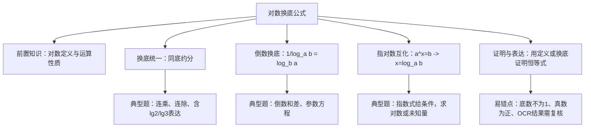

## 对数换底公式的应用与对数式化简证明

## 知识讲解

本讲围绕“对数换底公式”展开，训练学生把不同底数、不同真数的对数式统一到同一个底数下，再进行约分、代换、求值或证明。题源以填空、选择、证明题为主，适合用于高一对数运算复习或阶段测试前专题课。

## 导学说明

学生已经学过对数定义与对数运算性质，但在实际题目中常见问题不是“不会公式”，而是看不出何时换底、换成什么底、换底后如何整体约分。本讲不追求大量公式堆叠，而是建立三个课堂动作：

(1) 看到“不同底数相乘、相除”，优先换成同一底数。

(2) 看到 $\frac{1}{\log_a b}$，立即想到 $\log_b a$。

(3) 看到指数式与对数式混合，先把指数式转成对数式，再统一底数。

## 1. 数学目标

(1) 理解并熟练使用换底公式 $\log_a b=\dfrac{\log_c b}{\log_c a}$，明确条件 $a>0,\ a\ne1,\ b>0,\ c>0,\ c\ne1$。

(2) 能够使用倒数换底、连乘约分、整体代换等方法完成对数式求值。

(3) 能够把对数运算性质用于证明与表达式化简，并注意底数、真数和参数范围限制。

## 2. 课程重难点

(1)重点：换底公式、倒数换底公式 $\log_a b\cdot\log_b a=1$、对数乘除与幂的运算性质。

(2)难点：不同底数混合时选择统一底数；由指数式转化为对数式；含参数时设置整体变量并舍去不合条件的根；证明题中先补充底数和真数条件。

## 3. 考查形式与分值占比

(1)题型：以填空题、选择题为主，也会作为证明题或综合题的局部步骤出现。

(2)占比：常作为中低档题或综合题局部步骤出现，不编造精确分值占比。

## 知识导图

## 教法备注

## 1. 三类知识点

(1)事实性知识：

含义：又叫事实，是指学习者通晓一门学科或解决其中的问题所必须知道的基本要素。

(2)概念性知识：

含义：是一种较为抽象概括的、有组织的知识类型。

(3)程序性知识：

含义：是关于如何做事的知识，通常体现为一系列要遵循的步骤或程序。

(4)三类知识教学步骤：

先补足必要事实和概念，再通过典型例题示范程序，最后用变式题巩固识别与迁移。

## 2. 本切片知识点标签

知识点对数换底公式的应用：程序性知识

【注】换底公式本身属于概念性知识，本讲真正训练的是“看到结构后选择换底、统一、约分或代换”的操作流程，所以归入程序性知识。

## 可知识点:对数换底公式的应用

## 知识笔记

## 1. 核心公式与适用条件

(1) 换底公式：

$$
\log_a b=\frac{\log_c b}{\log_c a}\quad(a>0,\ a\ne1,\ b>0,\ c>0,\ c\ne1).
$$

(2) 倒数换底：

$$
\frac{1}{\log_a b}=\log_b a,\qquad \log_a b\cdot\log_b a=1.
$$

(3) 对数运算性质：

$$
\log_a(MN)=\log_aM+\log_aN,\quad
\log_a\frac{M}{N}=\log_aM-\log_aN,\quad
\log_aM^n=n\log_aM.
$$

其中 $a>0,\ a\ne1,\ M>0,\ N>0$。证明题中这些条件不能省略。

## 2. 核心方法

先看结构：如果式子里出现多个底数的对数相乘或相除，优先换成 $\lg$、$\ln$ 或题目中已有的底数；如果出现 $\frac{1}{\log_a b}$，直接换成 $\log_b a$；如果题目给出 $p^x=q$，先转化为 $x=\log_pq$。换底后不要急着展开，先观察是否能整体约分或设 $t=\log_2a$ 之类的变量。

## 教法备注

知识标签：程序性知识

教学步骤：本讲需要学生能够利用换底统一、倒数换底和指对数互化解决对数式求值与证明问题。该讲知识点建立在已经学习完对数定义、对数运算性质和指数运算性质的基础上，所以教师应先带领学生复习换底公式的适用条件，然后每种结构至少演示一道例题，并配合变式题让学生在操作中学会“先看结构、再统一底数、最后约分或代换”的识别动作，最后进行独立练习。

对应知识层级：操作

### 母题1

#### 教法备注

母题说明：本题考查“换底统一后整体约分”，训练学生处理不同底数对数的和积结构。

计算：

$$
\left(\log_4 3+\log_8 3\right)\left(\log_3 2+\log_9 2\right).
$$

---

答案

$$
\frac54
$$

---

解析

本题中四个对数底数不同，但底数都可写成 $2$ 或 $3$ 的幂，适合统一换到底数 $2,3$ 的对数比值。

$$
\log_4 3=\frac{\lg3}{2\lg2},\quad
\log_8 3=\frac{\lg3}{3\lg2},
$$

所以

$$
\log_4 3+\log_8 3
=\left(\frac12+\frac13\right)\frac{\lg3}{\lg2}
=\frac56\cdot\frac{\lg3}{\lg2}.
$$

又

$$
\log_3 2+\log_9 2
=\frac{\lg2}{\lg3}+\frac{\lg2}{2\lg3}
=\frac32\cdot\frac{\lg2}{\lg3}.
$$

因此

$$
\left(\log_4 3+\log_8 3\right)\left(\log_3 2+\log_9 2\right)
=\frac56\cdot\frac32=\frac54.
$$

#### 教法备注

1.【选题原因】

这道题不是单纯套公式，而是先把“底数是幂”的结构识别出来，再把两组括号分别整理成互为倒数的因子，适合作为换底统一的母题。

2.【错因预设】

(1) 把 $\log_8 3$ 错写成 $\frac{1}{8}\log_2 3$，没有处理底数为幂时的分母倍数。

(2) 两个括号分别化简后急于代小数，丢掉 $\frac{\lg3}{\lg2}$ 与 $\frac{\lg2}{\lg3}$ 的整体约分。

(3) 将 $\log_9 2$ 误认为 $2\log_3 2$，把底数平方与真数平方混淆。

3.【讲法建议】

(1)解法一（换底统一，推荐）

先让学生圈出 $4=2^2,\ 8=2^3,\ 9=3^2$，再统一成 $\frac{\lg3}{\lg2}$ 与 $\frac{\lg2}{\lg3}$ 两个整体，最后约分。课堂板书要强调“底数变成幂，倍数在分母”。

(2)解法二（设元法）

设 $u=\log_2 3$，则 $\log_3 2=\frac1u$，原式化为 $\left(\frac u2+\frac u3\right)\left(\frac1u+\frac1{2u}\right)=\frac54$。该法更短，但需要学生已经熟悉倒数换底。

### 变式题1-1

#### 教法备注

变式说明：与母题同属换底约分，但结构从“和积”变为“商式”，用于检查学生是否会处理分式中的倒数关系。

计算：

$$
\frac{\log_8 9}{\log_2 3}.
$$

答案

$$
\frac23
$$

解析

$$
\frac{\log_8 9}{\log_2 3}
=\frac{\frac{\lg9}{\lg8}}{\frac{\lg3}{\lg2}}
=\frac{2\lg3}{3\lg2}\cdot\frac{\lg2}{\lg3}
=\frac23.
$$

【需复核】原题源解析中该步出现乘以 $\frac{\lg3}{\lg2}$ 的疑似 OCR 或排版错误，正确应为乘以 $\frac{\lg2}{\lg3}$。

### 变式题1-2

#### 教法备注

变式说明：连乘型换底，训练“中间量全部约掉”的观察。

计算：

$$
\log_a b\cdot\log_b c\cdot\log_c a
$$

其中 $a,b,c$ 均为不等于 $1$ 的正数。

答案

$$
1
$$

解析

$$
\log_a b\cdot\log_b c\cdot\log_c a
=\frac{\lg b}{\lg a}\cdot\frac{\lg c}{\lg b}\cdot\frac{\lg a}{\lg c}
=1.
$$

### 变式题1-3

#### 教法备注

变式说明：把题目中的 $\lg2,\lg3$ 作为已知量，训练用常用对数表达新对数。

若 $\lg2=a,\ \lg3=b$，则 $\log_{12}5=$（ ）

A. $\dfrac{1-a}{a+2b}$

B. $\dfrac{a+b}{2a+b}$

C. $\dfrac{1-a}{2a+b}$

D. $\dfrac{a+b}{a+2b}$

答案

C

解析

$$
\lg5=\lg\frac{10}{2}=1-a,\qquad
\lg12=\lg(2^2\cdot3)=2a+b.
$$

所以

$$
\log_{12}5=\frac{\lg5}{\lg12}=\frac{1-a}{2a+b}.
$$

### 母题2

#### 教法备注

母题说明：本题考查“倒数换底 + 设元解方程”，训练含参数对数式的统一变量处理。

已知 $a>1$，且

$$
\frac{1}{\log_a2}-\frac{1}{\log_8a}=2,
$$

则 $a=$ ___。

---

答案

$$
8
$$

---

解析

看到倒数对数，先换底：

$$
\frac{1}{\log_a2}=\log_2a.
$$

又

$$
\log_8a=\frac{\log_2a}{\log_2 8}=\frac{\log_2a}{3},
\quad
\frac{1}{\log_8a}=\frac{3}{\log_2a}.
$$

令 $t=\log_2a$。因为 $a>1$，所以 $t>0$。原式化为

$$
t-\frac3t=2.
$$

两边乘以 $t$：

$$
t^2-3=2t,
$$

即

$$
t^2-2t-3=0.
$$

解得 $t=3$ 或 $t=-1$。由 $t>0$ 舍去 $t=-1$，所以

$$
\log_2a=3,\qquad a=8.
$$

#### 教法备注

1.【选题原因】

本题把倒数换底、换底统一和参数范围结合在一起，能训练学生“先改写结构，再设元，最后检查条件”的完整流程。

2.【错因预设】

(1) 忘记 $\frac{1}{\log_a2}=\log_2a$，直接通分导致式子复杂。

(2) 把 $\log_8a$ 错化为 $3\log_2a$，没有注意底数换底时 $3$ 在分母。

(3) 解出 $t=-1$ 后没有根据 $a>1$ 舍去。

3.【讲法建议】

(1)解法一（倒数换底与设元，推荐）

先让学生把所有 $a$ 的对数都改写成 $\log_2a$，再设 $t=\log_2a$。讲完后追问“为什么 $t>0$”，把范围检查嵌入计算过程。

(2)解法二（统一为自然对数）

可以统一写成 $\ln a,\ln2,\ln8$，但计算不如设 $\log_2a$ 简洁，不建议作为课堂首选。

### 变式题2-1

#### 教法备注

变式说明：同样使用倒数换底，但由指数式给出未知数，需要先完成指对数互化。

已知 $3^x=2,\ y=\log_6 2$，则

$$
\frac1x-\frac1y=
$$

答案

$$
-1
$$

解析

由 $3^x=2$ 得 $x=\log_3 2$。因此

$$
\frac1x-\frac1y
=\frac1{\log_3 2}-\frac1{\log_6 2}
=\log_2 3-\log_2 6
=\log_2\frac36
=\log_2\frac12
=-1.
$$

### 变式题2-2

#### 教法备注

变式说明：指数式共值，训练把未知指数转化为对数后再合并。

已知 $2^a=5^b=m$，且

$$
\frac1a+\frac1b=10,
$$

则 $m=$ ___。

答案

$$
\sqrt[10]{10}
$$

解析

由 $2^a=m,\ 5^b=m$ 得

$$
a=\log_2m,\qquad b=\log_5m.
$$

所以

$$
10=\frac1a+\frac1b
=\frac1{\log_2m}+\frac1{\log_5m}
=\log_m2+\log_m5
=\log_m10.
$$

因此 $m^{10}=10$，即

$$
m=\sqrt[10]{10}.
$$

### 变式题2-3

#### 教法备注

变式说明：与上一题结构相同，但系数改变，训练学生把“倒数之和”识别成同底对数相加。

已知 $3^m=2^n=k$，且

$$
\frac1n+\frac3m=1,
$$

则 $k=$ ___。

答案

$$
54
$$

解析

由 $3^m=k,\ 2^n=k$ 得

$$
m=\log_3k,\qquad n=\log_2k.
$$

若 $k=1$，则 $m=n=0$，不符合题意；故 $k>0,\ k\ne1$。于是

$$
\frac1n+\frac3m
=\log_k2+3\log_k3
=\log_k(2\cdot3^3)
=\log_k54.
$$

由 $\log_k54=1$ 得 $k=54$。

### 母题3

#### 教法备注

母题说明：本题考查对数运算性质的证明，训练学生用对数定义把证明转化为指数运算。

设 $a>0,\ a\ne1,\ M>0,\ N>0,\ n\in\mathbb R$，证明：

$$
\log_a\frac MN=\log_aM-\log_aN,\qquad
\log_aM^n=n\log_aM.
$$

---

答案

证明见解析。

---

解析

证明对数运算性质时，推荐从定义出发。设

$$
M=a^u,\qquad N=a^v,
$$

则

$$
\log_aM=u,\qquad \log_aN=v.
$$

因为

$$
\frac MN=\frac{a^u}{a^v}=a^{u-v},
$$

所以

$$
\log_a\frac MN=u-v=\log_aM-\log_aN.
$$

又因为

$$
M^n=(a^u)^n=a^{un},
$$

所以

$$
\log_aM^n=un=n\log_aM.
$$

#### 教法备注

1.【选题原因】

本题能把“会用公式”推进到“知道公式为什么成立”。证明过程也能反向帮助学生记住乘除和幂的对数运算规律。

2.【错因预设】

(1) 证明时只写“由公式可得”，循环论证，没有回到对数定义。

(2) 忽略 $a>0,\ a\ne1,\ M>0,\ N>0$ 等条件。

(3) 处理 $M^n$ 时把 $n$ 写到真数外但没有说明来自指数运算 $(a^u)^n=a^{un}$。

3.【讲法建议】

(1)解法一（对数定义法，推荐）

先设 $M=a^u,N=a^v$，把问题翻译成指数运算，再回到对数。这个过程适合板书成“对数问题 -> 指数问题 -> 对数结论”。

(2)解法二（换底公式法）

例如

$$
\log_a\frac MN=\frac{\ln M-\ln N}{\ln a}
=\frac{\ln M}{\ln a}-\frac{\ln N}{\ln a}.
$$

该法简洁，但依赖自然对数运算性质，不如定义法适合新课或基础复习。

### 变式题3-1

#### 教法备注

变式说明：证明倒数换底公式，是换底公式最常用的推论。

设 $a,b$ 是两个不等于 $1$ 的正数，求证：

$$
\log_ba=\frac1{\log_ab}.
$$

答案

证明见解析。

解析

由换底公式，

$$
\log_ba=\frac{\log_aa}{\log_ab}=\frac1{\log_ab}.
$$

其中 $a>0,\ a\ne1,\ b>0,\ b\ne1$。

### 变式题3-2

#### 教法备注

变式说明：用换底公式证明乘积恒等式，训练学生把两个对数积拆成同一种对数的比值。

设 $a,b,c,d$ 均为正数，且 $a,c$ 均不为 $1$，求证：

$$
\log_ab\cdot\log_cd=\log_ad\cdot\log_cb.
$$

答案

证明见解析。

解析

由换底公式，

$$
\log_ab\cdot\log_cd
=\frac{\ln b}{\ln a}\cdot\frac{\ln d}{\ln c}
=\frac{\ln d}{\ln a}\cdot\frac{\ln b}{\ln c}
=\log_ad\cdot\log_cb.
$$

## 分层练习

## 基础

1. 计算：

$$
\log_9 16\cdot\log_8 81.
$$

答案

$$
\frac83
$$

解析

$$
\log_9 16\cdot\log_8 81
=\frac{4\lg2}{2\lg3}\cdot\frac{4\lg3}{3\lg2}
=\frac83.
$$

2. 若 $\log_{2026}2025=a$，则 $\log_{2025}2026=$ ___。

答案

$$
\frac1a
$$

解析

由倒数换底公式，

$$
\log_{2025}2026=\frac1{\log_{2026}2025}=\frac1a.
$$

3. 已知 $\log_3 2=a$，用 $a$ 表示 $\log_2 96$。

答案

$$
\frac{5a+1}{a}
$$

解析

因为 $\log_3 2=a$，所以 $\log_2 3=\frac1a$。于是

$$
\log_2 96=\log_2(32\cdot3)=5+\log_2 3=5+\frac1a=\frac{5a+1}{a}.
$$

4. 求值：

$$
\log_8\frac14.
$$

答案

$$
-\frac23
$$

解析

$$
\log_8\frac14=\log_{2^3}2^{-2}=-\frac23.
$$

## 综合

1. 已知 $\log_{15}3=a,\ 15^b=2$，用 $a,b$ 表示 $\log_5 36$。

答案

$$
\frac{2a+2b}{1-a}
$$

解析

由 $a=\log_{15}3,\ b=\log_{15}2$，且 $\log_{15}5=1-a$，所以

$$
\log_5 3=\frac{\log_{15}3}{\log_{15}5}=\frac{a}{1-a},\qquad
\log_5 2=\frac{\log_{15}2}{\log_{15}5}=\frac{b}{1-a}.
$$

因此

$$
\log_5 36=2\log_5 6
=2(\log_5 2+\log_5 3)
=\frac{2a+2b}{1-a}.
$$

2. 已知 $5.4^x=3,\ 0.6^y=3$，求

$$
\frac1x-\frac1y.
$$

答案

$$
2
$$

解析

由题得 $x=\log_{5.4}3,\ y=\log_{0.6}3$。所以

$$
\frac1x-\frac1y
=\log_3 5.4-\log_3 0.6
=\log_3\frac{5.4}{0.6}
=\log_3 9
=2.
$$

3. 已知 $a>b>1>c$，则下列结论一定正确的是（ ）

A. $ac>bc$

B. $b^c<1$

C. $\log_ab+\log_ba>2$

D. $a+c>b$

答案

C

解析

因为 $a>b>1$，所以 $\ln a>\ln b>0$。于是

$$
\log_ab+\log_ba
=\frac{\ln b}{\ln a}+\frac{\ln a}{\ln b}.
$$

两个正数互为倒数且不相等，因此和大于 $2$。等号需要 $a=b$，与 $a>b$ 矛盾，所以 C 正确。

4. 若实数 $0<m<n<1$，实数 $x>1$，则下列不等式正确的是（ ）

A. $m^x<n^x$

B. $x^m>x^n$

C. $\log_xm>\log_xn$

D. $\log_mx<\log_nx$

答案

A

解析

函数 $t^x$ 在 $t>0$ 上单调递增，所以由 $0<m<n<1$ 得 $m^x<n^x$。其余选项分别与指数函数、对数函数单调性或底数在 $(0,1)$ 时的符号关系矛盾。

## 挑战

1. 已知正实数 $x,y$ 满足

$$
\log_2x=\log_{\frac12}y+1,
$$

求 $4^x\cdot2^y$ 的最小值。

答案

$$
16
$$

解析

因为

$$
\log_{\frac12}y=-\log_2y,
$$

所以

$$
\log_2x+\log_2y=1,
$$

即 $xy=2$。又

$$
4^x\cdot2^y=2^{2x+y}.
$$

由 $x>0,y>0,xy=2$，

$$
2x+y\ge2\sqrt{2xy}=4.
$$

当且仅当 $2x=y$，结合 $xy=2$ 得 $x=1,y=2$，等号成立。因此最小值为

$$
2^4=16.
$$

2. 已知 $\log_ab+\log_ba=\frac52,\ a^b=b^a$，且 $b>a>1$，求

$$
\frac1a+\frac1b.
$$

答案

$$
\frac34
$$

解析

令 $t=\log_ab$。由 $b>a>1$ 得 $t>1$。题设化为

$$
t+\frac1t=\frac52,
$$

解得 $t=2$ 或 $t=\frac12$，由 $t>1$ 取 $t=2$。于是 $b=a^2$。

又 $a^b=b^a=(a^2)^a=a^{2a}$，且 $a>1$，所以 $b=2a$。联立 $a^2=2a$ 得 $a=2$，从而 $b=4$。所以

$$
\frac1a+\frac1b=\frac12+\frac14=\frac34.
$$

3. 已知 $A=\log_ax,\ B=\log_ay,\ C=\log_az\ (a>0,\ a\ne1)$，用 $A,B,C$ 表示：

(1) $\log_a(xy^2)$；

(2) $\log_a\dfrac{xy}{\sqrt z}$；

(3) $\log_a(x^2y^2)+\log_a(y\sqrt x)$。

答案

(1) $A+2B$

(2) $A+B-\dfrac12C$

(3) $\dfrac52A+3B$

解析

(1)

$$
\log_a(xy^2)=\log_ax+2\log_ay=A+2B.
$$

(2)

$$
\log_a\frac{xy}{\sqrt z}
=\log_ax+\log_ay-\log_az^{1/2}
=A+B-\frac12C.
$$

【需复核】题源答案处疑似 OCR 错写为 $\frac54A+3B$，与题目和解析不一致。

(3)

$$
\log_a(x^2y^2)+\log_a(y\sqrt x)
=2A+2B+B+\frac12A
=\frac52A+3B.
$$

4. 动物死亡后，体内碳的放射同位素 ${}^{14}\mathrm C$ 的含量每年衰减 $0.012\%$，设死亡时刻 $t=0$ 时含量为 $a$。

(1) 写出含量 $y$ 随时间 $t$ 变化的函数表达式；

(2) 至少经过多少年，${}^{14}\mathrm C$ 的含量才能低于原来的 $90\%$？

答案

(1) $y=a(1-0.012\%)^t$。

(2) 871 年。

解析

(1) 每年剩余比例为 $1-0.012\%=0.99988$，所以

$$
y=a(0.99988)^t.
$$

(2) 由

$$
a(0.99988)^t<0.9a
$$

得

$$
t>\frac{\ln0.9}{\ln0.99988}\approx870.95.
$$

所以至少经过 $871$ 年。

【需复核】题源中“87升年”为疑似 OCR 错误，按计算应为 871 年。
