# 帅琪数学选填压轴500题(真题版)

一般 【试卷】【组卷校本委托导题】2000年北京...

1. 已知函数 $f\left( x\right)  = a{x}^{3} + b{x}^{2} + {cx} + d$ 的图象如图，则()

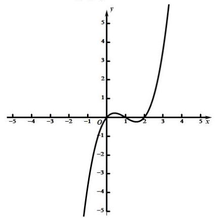

A. $b \in  \left( {-\infty ,0}\right)$

B. $b \in  \left( {0,1}\right)$

C. $b \in  \left( {1,2}\right)$

D. $b \in  \left( {2, + \infty }\right)$

答案

A

解析

解析: 由图可知 $x = 0,1,2$ 是方程 $f\left( x\right)  = 0$ 的三个根,则可设 $f\left( x\right)  = {ax}\left( {x - 1}\right) \left( {x - 2}\right)$ ,即

$f\left( x\right)  = a{x}^{3} - {3a}{x}^{2} + {2ax} = a{x}^{3} + b{x}^{2} + {cx} + d$ ，因此 $b =  - {3a}$ . 因为当 $x > 2$ 时 $f\left( x\right)  > 0$ ，所以 $a > 0$ ， $b < 0$ ， 故 $b \in  \left( {-\infty ,0}\right)$ ,故选A

## 一般

2. 在 $\bigtriangleup {ABC}$ 中,角 $A, B, C$ 的对边分别为 $a, b, c$ ,证明: $\frac{{a}^{2} - {b}^{2}}{{c}^{2}} = \frac{\sin \left( {A - B}\right) }{\sin C}$ .

○ 答案

见解析

解析

由余弦定理知 ${a}^{2} = {b}^{2} + {c}^{2} - {2bc}\cos A,{b}^{2} = {c}^{2} + {a}^{2} - {2ac}\cos B$ ,

两式相减得 ${a}^{2} - {b}^{2} = {b}^{2} - {a}^{2} + {2ca} \cdot  \cos B - {2bc} \cdot  \cos A$ .

所以 ${a}^{2} - {b}^{2} = {ca} \cdot  \cos B - {bc} \cdot  \cos A$ ,所以 $\frac{{a}^{2} - {b}^{2}}{{c}^{2}} = \frac{a\cos B - b\cos A}{c}$ .

由正弦定理, $\frac{a}{c} = \frac{\sin A}{\sin C},\frac{b}{c} = \frac{\sin B}{\sin C}$ ,

所以 $\frac{{a}^{2} - {b}^{2}}{{c}^{2}} = \frac{\sin A \cdot  \cos B - \cos A \cdot  \sin B}{\sin C} = \frac{\sin \left( {A - B}\right) }{\sin C}$ .

故等式成立.

较易 【试卷】安徽省合肥市2023届高三下学期第...

3. 已知 $\bigtriangleup  {ABC}$ 的内角 $\mathrm{A},\mathrm{B},\mathrm{C}$ 所对边的长分别为 $\mathrm{a},\mathrm{b},\mathrm{c}$ ，且 ${b}^{2} + 2{c}^{2} - 2{a}^{2} = 0$ .

(1) 若 $\tan C = \frac{1}{3}$ ，求 $\mathrm{A}$ 的大小；

(2)当 $A - C$ 取得最大值时，试判断 $\bigtriangleup  {ABC}$ 的形状.

答案

(1) $A = \frac{\pi }{4}$

(2) $\bigtriangleup {ABC}$ 为直角三角形

解析

(1) $\because {b}^{2} + 2{c}^{2} - 2{a}^{2} = 0$ ,即 ${b}^{2} = 2\left( {{b}^{2} + {c}^{2} - {a}^{2}}\right)$ ,则 ${b}^{2} = {4bc}\cos A$ ,可得 $b = {4c}\cos A$ ,

故 $4\sin C\cos A = \sin B = \sin A\cos C + \cos A\sin C$ ,则 $3\sin C\cos A = \sin A\cos C$ ,

$\therefore \tan A = 3\tan C$ ,

当 $\tan C = \frac{1}{3}$ 时,则 $\tan A = 3\tan C = 1$ ,

又 $\because A \in  \left( {0,\pi }\right) ,\therefore A = \frac{\pi }{4}$ .

(2)由(1)知， $\tan A = 3\tan C$ ， $\therefore 0 < C < A < \frac{\pi }{2}$ ，

$\tan \left( {A - C}\right)  = \frac{\tan A - \tan C}{1 + \tan A \cdot  \tan C} = \frac{2\tan C}{1 + 3{\tan }^{2}C} = \frac{2}{\frac{1}{\tan C} + 3\tan C} \leq  \frac{2}{2\sqrt{3}} = \frac{\sqrt{3}}{3},$

当且仅当 $\frac{1}{\tan C} = 3\tan C$ ,即当 $\tan C = \frac{\sqrt{3}}{3}, C = \frac{\pi }{6}$ 时,等号成立,

$\therefore \tan \left( {A - C}\right)$ 的最大值为 $\frac{\sqrt{3}}{3}$ ,

又 $\because 0 < A - C < \frac{\pi }{2}$ ，则 $A - C$ 的最大值为 $\frac{\pi }{6}$ ，此时 $A = \frac{\pi }{3}$ ，

$\therefore B = \pi  - \left( {A + C}\right)  = \frac{\pi }{2}$ .

$\therefore \bigtriangleup {ABC}$ 为直角三角形.

容易 【试卷】河南省信阳高级中学2024届高三下…

4. 如图， ${OA}$ 是圆锥底面中心O到母线的垂线， ${OA}$ 绕轴旋转一周所得曲面将圆锥分成体积相等的两部分，则母线与轴的夹角的余弦值为( )

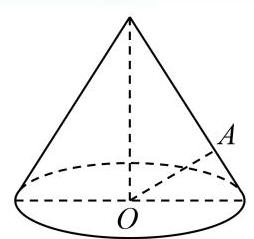

A. $\frac{1}{\sqrt[3]{2}}$

B. $\frac{1}{2}$

C. $\frac{1}{\sqrt{2}}$

D. $\frac{1}{\sqrt[4]{2}}$

答案

D

解析

设 ${OB} = 1$ ,设所求角并表示出 ${OD},{AC}$ ,利用 ${OA}$ 绕轴旋转一周所得曲面将圆锥分成体积相等的两部分,求得关系式，即可得答案.

解: 如图所示:

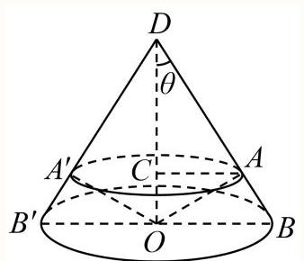

设 ${OB} = 1$ ,则 $\overline{OD} = \frac{1}{\tan \theta },{AC} = {AD} \cdot  \sin \theta  = {OD} \cdot  \sin \theta \cos \theta  = {\cos }^{2}\theta$

令大圆锥 ${DB}{B}^{\prime }$ 的体积为 $V$ ，圆锥 ${OA}{A}^{\prime }$ 和圆锥 ${DA}{A}^{\prime }$ 的体积分别为 ${V}_{1},{V}_{2}$

$V = \frac{\pi }{3\tan \theta },{V}_{1} + {V}_{2} = \frac{1}{3}{DO} \cdot  \pi  \cdot  A{C}^{2} = \frac{1}{3} \cdot  \frac{1}{\tan \theta } \cdot  \pi {\cos }^{4}\theta$

由题意可得: $V = 2\left( {{V}_{1} + {V}_{2}}\right) ,\frac{\pi }{3\tan \theta } = \frac{2}{3} \cdot  \frac{1}{\tan \theta } \cdot  \pi {\cos }^{4}\theta$

解得 ${\cos }^{4}\theta  = \frac{1}{2},\cos \theta  = \frac{1}{\sqrt[4]{2}}\left( {\cos \theta  > 0}\right)$

故选: D

较难 【试卷】2005年普通高等学校招生考试数学....

5. 在体积为1的三棱锥 $A - {BCD}$ 侧棱AB、AC、AD上分别取点E、F、G，使 ${AE} : {EB} = {AF} : {FC} = {AG} : {GD} = 2 : 1$ ，记O 为三平面BCG、CDE、DBF的交点，则三棱锥 $O - {BCD}$ 的体积等于( )

A. $\frac{1}{9}$

B. $\frac{1}{8}$

C. $\frac{1}{7}$

D. $\frac{1}{4}$

答案

C

解析

画出图形，三棱锥 $O - {BCD}$ 的体积，转化为线段的长度比，充分利用直线的平行进行推到，求出比例即可. 解: 如下图 (下图为图1)

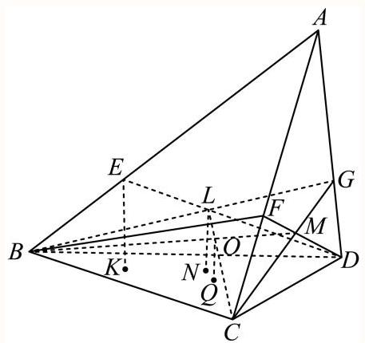

${BM}$ 是平面 ${BCG}$ 与平面 ${DBF}$ 的交线， ${CL}$ 是平面 ${BCG}$ 与平面 ${CDE}$ 的交线，

因为 $O$ 为三平面 ${BCG},{CDE},{DBF}$ 的交点,所以 $O \in  {BM},{CL}$ ,

则 ${BM}$ 与 ${CL}$ 的交点即为 $O$ ,

作 ${EK} \bot$ 平面 ${BCD}$ 于 $K,{LN} \bot$ 平面 ${BCD}$ 于 $N,{OQ} \bot$ 平面 ${BCD}$ 于 $Q$ ,

设 $A$ 到平面 ${BCD}$ 的距离为 $h$ ,则有题意可得 ${EK} = \frac{1}{3}h$ ;

在平面 ${ABD}$ 中,如下图:

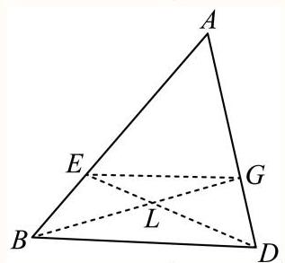

连接 ${EG}$ ,则 $\frac{AE}{AB} = \frac{\overset{\text{ ⏜ }}{AG}}{AD} = \frac{2}{3}$ ,所以 ${EG}//{BD}$ ,所以 $\frac{EG}{BD} = \frac{AE}{AB} = \frac{2}{3} = \frac{EL}{LD} = \frac{GL}{LB}$ ,

因为 ${EG}//{BD}$ ,所以 $\angle {EGB} = \angle {GBD},\angle {GED} = \angle {BDE}$ ,所以 $\bigtriangleup {EGL} \sim  \bigtriangleup {DBL}$ ,

$\frac{EG}{BD} = \frac{2}{3} = \frac{EL}{LD} = \frac{GL}{LB},$

于是有 $\frac{LD}{ED} = \frac{3}{5}$ ，所以结合图1中线面关系可得 $\frac{LN}{EK} = \frac{LD}{ED} = \frac{3}{5}$ ，则 ${LN} = \frac{3}{5}{EK} = \frac{3}{5} \cdot  \frac{1}{3}h = \frac{1}{5}h$ ；

同理有 $\frac{GM}{MC} = \frac{2}{3}$ ,即 $\frac{GM}{MC} = \frac{2}{3} = \frac{GL}{LB}$ ;

平面 ${GBC}$ 中,如下图:

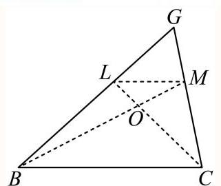

则可得 ${LM}//{BC}$ ，则 $\frac{LM}{BC} = \frac{GL}{GB} = \frac{2}{5}$ ，所以 $\frac{LM}{BC} = \frac{LO}{OC} = \frac{2}{5}$ ；

所以 $\frac{CO}{CL} = \frac{5}{7}$ ,结合图1中线面关系可得 $\frac{OQ}{LN} = \frac{CO}{CL} = \frac{5}{7}$ ,则 ${OQ} = \frac{5}{7}{LN} = \frac{5}{7} \cdot  \frac{1}{5}h = \frac{1}{7}h$ ;

所以由图 1 可知: $\frac{{V}_{O - {BCD}}}{{V}_{A - {BCD}}} = \frac{\frac{1}{3} \cdot  {OQ} \cdot  {S}_{\bigtriangleup {BCD}}}{\frac{1}{3} \cdot  h \cdot  {S}_{\bigtriangleup {BCD}}} = \frac{OQ}{h} = \frac{\frac{1}{7}h}{h} = \frac{1}{7}$ ,所以 ${V}_{O - {BCD}} = \frac{1}{7}$ ,

故选:C.

一般 【试卷】数学竞赛《提优教程》教案:第29...

6. (1)已知数列 $\left\{  {c}_{n}\right\}$ ，其中 ${c}_{n} = {2}^{n} + {3}^{n}$ ，且数列 $\left\{  {{c}_{n + 1} - p{c}_{n}}\right\}$ 为等比数列，求常数 $p$ ；

(2)设 $\left\{  {a}_{n}\right\}  ,\left\{  {b}_{n}\right\}$ 是公比不相等的两个等比数列， ${c}_{n} = {a}_{n} + {b}_{n}$ ，证明数列 $\left\{  {c}_{n}\right\}$ 不是等比数列.

## 答案

(1) $p = 2$ 或 $p = 3$ ；(2)证明见解析

解析

(1)利用给定的等比数列，结合定义得到p的值；

(2)根据设 $\left\{  {a}_{n}\right\}$ 、 $\left\{  {b}_{n}\right\}$ 是公比不相等的两个等比数列， ${c}_{n} = {a}_{n} + {b}_{n}$ ，那么可验证前几项是否是等比数列来判定结论.

(1) $\because \left\{  {{c}_{n + 1} - p{c}_{n}}\right\}$ 是等比数列，故有 ${\left( {c}_{n + 1} - p{c}_{n}\right) }^{2} = \left( {{c}_{n + 2} - p{c}_{n + 1}}\right) \left( {{c}_{n} - p{c}_{n - 1}}\right)$ ，

将 ${c}_{n} = {2}^{n} + {3}^{n}$ 代入上式，

得 ${\left\lbrack  {2}^{n + 1} + {3}^{n + 1} - p\left( {2}^{n} + {3}^{n}\right) \right\rbrack  }^{2} = \left\lbrack  {{2}^{n + 2} + {3}^{n + 2} - p\left( {{2}^{n + 1} + {3}^{n + 1}}\right) }\right\rbrack   \cdot  \left\lbrack  {{2}^{n} + {3}^{n} - p\left( {{2}^{n - 1} + {3}^{n - 1}}\right) }\right\rbrack$ ,

即 ${\left\lbrack  \left( 2 - p\right) {2}^{n} + \left( 3 - p\right) {3}^{n}\right\rbrack  }^{2} = \left\lbrack  {\left( {2 - p}\right) {2}^{n + 1} + \left( {3 - p}\right) {3}^{n + 1}}\right\rbrack  \left\lbrack  {\left( {2 - p}\right) {2}^{n - 1} + {\left( 3 - p\right) }^{n - 1}}\right\rbrack$ ,

整理得 $\frac{1}{6}\left( {2 - p}\right) \left( {3 - p}\right)  \cdot  {2}^{n} \cdot  {3}^{n} = 0$ ,解得 $p = 2$ 或 $p = 3$ ;

(2)设 $\left\{  {a}_{n}\right\}  ,\left\{  {b}_{n}\right\}$ 的公比分别是 $p, q\left( {q \neq  p}\right)$ ,

为证 $\left\{  {c}_{n}\right\}$ 不是等比数列只需证 ${c}_{2}^{2} \neq  {c}_{1} \cdot  {c}_{3}$ ,

事实上, ${c}_{2}^{2} = {\left( {a}_{1}p + {b}_{1}q\right) }^{2} = {a}_{1}^{2}{p}^{2} + {b}_{1}^{2}{q}^{2} + 2{a}_{1}{b}_{1}{pq}$ ,

${c}_{1} \cdot  {c}_{3} = \left( {{a}_{1} + {b}_{1}}\right) \left( {{a}_{1}{p}^{2} + {b}_{1}{q}^{2}}\right)  = {a}_{1}^{2}{p}^{2} + {b}_{1}^{2}{q}^{2} + {a}_{1}{b}_{1}\left( {{p}^{2} + {q}^{2}}\right) ,$

由于 $p \neq  q$ ,则 ${p}^{2} + {q}^{2} > {2pq}$ ,又 ${a}_{1},{b}_{1}$ 不为零,

因此 ${c}_{2}^{2} \neq  {c}_{1} \cdot  {c}_{3}$ ,故 $\left\{  {c}_{n}\right\}$ 不是等比数列.

一般 【试卷】2018年广东深圳深圳市宝安中学高...

7. 设 ${a}_{n}$ 是首项为 1 的正项数列,且 $\left( {n + 1}\right) {a}_{n + 1}{}^{2} - n{a}_{n}{}^{2} + {a}_{n + 1}{a}_{n} = 0\left( {n = 1,2,3,\ldots }\right)$ ,则它的通项公式是 ${a}_{n} =$ ___.

答案

$\frac{1}{n}$

解析

【分析】: 先对 $\left( {n + 1}\right) {a}_{n + 1}{}^{2} - n{a}_{n}{}^{2} + {a}_{n + 1}{a}_{n} = 0$ 进行化简得到 ${a}_{n + 1} = \frac{-1 \pm  \sqrt{1 + {4n}\left( {n + 1}\right) }}{2\left( {n + 1}\right) }{a}_{n} = \frac{n}{n + 1}{a}_{n}$ ,再由累乘法可得到数列的通项公式是 ${a}_{n}$ .

$\because \left( {n + 1}\right) {a}_{n + 1}{}^{2} - n{a}_{n}{}^{2} + {a}_{n + 1}{a}_{n} = 0$ ,

$\therefore {a}_{n + 1} = \frac{-1 \pm  \sqrt{1 + {4n}\left( {n + 1}\right) }}{2\left( {n + 1}\right) }{a}_{n} = \frac{n}{n + 1}{a}_{n}$ (另解 $- {a}_{n}$ 不合题意舍去),

$\therefore \frac{{a}_{2}}{{a}_{1}} \cdot  \frac{{a}_{3}}{{a}_{1}}\ldots \frac{{a}_{n}}{{a}_{n - 1}} = \frac{1}{n}$ ,即 $\frac{{a}_{n}}{{a}_{1}} = \frac{1}{n},{a}_{n} = \frac{1}{n}, n = 1,2$ .

故答案为: $\frac{1}{n}$ .

较易 【试卷】必修第二册期末测试卷 (基础卷)

8. 如图, E, F分别为正方体的面 ${AD}{D}_{1}{A}_{1}$ 、面 ${BC}{C}_{1}{B}_{1}$ 的中心,则四边形 ${BF}{D}_{1}E$ 在该正方体的面上的射影可能是 ( )

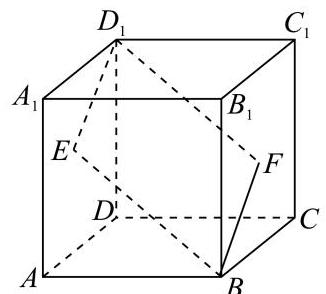

①

③

④

②

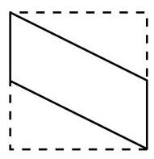

A. ①②③

B. ②③

C. ①②④

D. ②①

答案

B

## 解析

根据正方体的对称性，可知四边形 ${BF}{D}_{1}E$ 在该正方体的面上的射影有三种:分别为在面ABCD、面 ${BC}{C}_{1}B$ 、面 ${DC}{C}_{1}{D}_{1}$ 上的射影，即可得解. 因为正方体是对称的几何体，所以四边形 ${BF}{D}_{1}E$ 在该正方体的面上的射影可分为:自上而下、自左至右、由前及后三个方向的射影，也就是在面ABCD、面 ${BC}{C}_{1}B$ 、面 ${DC}{C}_{1}{D}_{1}$ 上的射影. 四边形 ${BF}{D}_{1}E$ 在面 ${ABCD}$ 和面 ${DC}{C}_{1}{D}_{1}$ 上的射影相同，如图②所示；

四边形 ${BF}{D}_{1}E$ 在该正方体的对角面 ${AB}{C}_{1}{D}_{1}$ 内,它在面 ${BC}{C}_{1}{B}_{1}$ 上的射影是一条线段,如图③所示. 所以②③正确.

故选:B

本题考查了正方体的结构特点，投影的定义及投影形状的判定，属于基础题.

一般 【试卷】2016年上海宝山区上海交通大学附...

9. 若数列 $\left\{  {a}_{n}\right\}$ 前 12 项的值各异,且 ${a}_{n + {12}} = {a}_{n}$ 对任意的 $n \in  {\mathbf{N}}^{ * }$ 都成立,则下列数列中可取遍 $\left\{  {a}_{n}\right\}$ 前 12 项值的数列为( )

A. $\left\{  {a}_{{3k} + 1}\right\}$

B. $\left\{  {a}_{{4k} + 1}\right\}$

C. $\left\{  {a}_{{5k} + 1}\right\}$

D. $\left\{  {a}_{{6k} + 1}\right\}$

答案

C

解析

对于数列 $\left\{  {a}_{n}\right\}$ 前 12 项的值各异,且 ${a}_{n + {12}} = {a}_{n}$ 对任意的 $n \in  {\mathbf{N}}^{ * }$ 都成立,

可知: 数列 $\left\{  {a}_{n}\right\}$ 为周期数列. 周期为 12,并且数列 $\left\{  {a}_{n}\right\}$ 前 12 项的值各异.

对于数列 $\left\{  {a}_{{5k} + 1}\right\}$ ,对于 $k = 0,1,2,3,4,5,6,7,8,9,{10},{11}$ 时, ${5k} + 1$ 分别为:

$1,6,{11},{12} + 4,{12} + 9,{12} \times  2 + 2,{12} \times  2 + 7,{12} \times  2 + {12},{12} \times  3 + 5,{12} \times  3 + {10},{12} \times  4 + 3$ , ${12} \times  4 + 8$ .

经过验证:而其他 ABD 不满足要求.

容易 【试卷】数学竞赛《提优教程》教案:第48...

10. 一间平房的屋顶有如图的三种盖法:①单向倾斜；②双向倾斜；③四向倾斜. 记三种盖法的屋顶面积分别为 ${P}_{1}\text{ 、 }{P}_{2}\text{ 、 }{P}_{3}$ . 若屋顶斜面与水平面所成的角都是，则( )

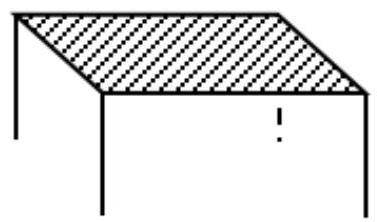

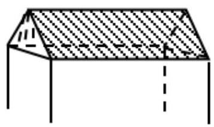

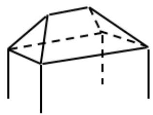

① ② ③

A. ${P}_{1} < {P}_{2} < {P}_{3}$

B. ${P}_{1} = {P}_{2} < {P}_{3}$

C. ${P}_{1} < {P}_{2} = {P}_{3}$

D. ${P}_{1} = {P}_{2} = {P}_{3}$

答案

D

解析

解: 由于侧面投影的面积是侧面积的 $\frac{1}{\cos \alpha }$ ,而三个图中的底面积相同,故侧面积相同.

答案: D

一般 【试卷】2016年湖北黄冈高一下学期期末考...

11. 对于函数 $f\left( x\right)$ ,若存在 ${x}_{0} \in  \mathrm{R}$ ,使 $f\left( {x}_{0}\right)  = {x}_{0}$ 成立,则称 ${x}_{0}$ 为 $f\left( x\right)$ 的不动点. 已知函数 $f\left( x\right)  = a{x}^{2} + \left( {b + 1}\right) x + \left( {b - 1}\right) \left( {a \neq  0}\right) .$

(1) 若 $a = 1, b = 3$ ，求函数 $f\left( x\right)$ 的不动点；

(2)若对任意实数 $b$ ，函数 $f\left( x\right)$ 恒有两个相异的不动点，求 $a$ 的取值范围；

(3)在(2)的条件下，若 $y = f\left( x\right)$ 图象上 $A$ 、 $B$ 两点的横坐标是函数 $f\left( x\right)$ 的不动点，且 $A$ 、 $B$ 两点关于直线 $y = {kx} + \frac{1}{2{a}^{2} + 1}$ 对称,求 $b$ 的最小值.

2 答案

---

	(1) $- 2, - 1$

	(2) $0 < a < 1$

(3) $- \frac{\sqrt{2}}{4}$

												三解析

---

(1) 【分析】: 把 $a = 1, b = 3$ 代入 $f\left( x\right)  = {x}^{2} + {4x} + 2$ ,化简 $f\left( x\right)  = x$ 求出 $x$ 的值,根据题意即可求出函数 $f\left( x\right)$ 的不动点.

若 $a = 1, b = 3, f\left( x\right)  = {x}^{2} + {4x} + 2$ ,

代入 $f\left( x\right)  = x$ 化简得 ${x}^{2} + {3x} + 2 = 0$ ，解得 $x =  - 2\text{ 、 } - 1$ ，

则 $f\left( x\right)$ 的不动点为 $- 2, - 1$ .

(2)【分析】:化简 $f\left( x\right)  = x$ 后，由不动点的定义和判别式的符号，列出不等式求出 $a$ 的取值范围.

由题意知,函数 $f\left( x\right)$ 恒有两个相异的不动点,

所以方程 $f\left( x\right)  = x$ 即 $a{x}^{2} + {bx} + b - 1 = 0\left( {a \neq  0}\right)$ 恒有两个不等实根,

则 $\Delta  = {b}^{2} - {4a}\left( {b - 1}\right)  > 0$ ,即 ${b}^{2} - {4ab} + {4a} > 0$ 对任意实数 $b$ 恒成立,

即 $\Delta  = {\left( -4a\right) }^{2} - 4 \times  {4a} < 0$ ,解得 $0 < a < 1$ ,所以 $0 < a < 1$ .

(3)【分析】:由题意设 $A\left( {{x}_{1},{x}_{1}}\right)$ ， $B\left( {{x}_{2},{x}_{2}}\right)$ ，根据对称求出 $k$ 以及 $A$ 、 $B$ 的中点 $M$ 的坐标，把 $M$ 的坐标代入直线 $y = {kx} + \frac{1}{2{a}^{2} + 1}$ 求出 $b$ ,利用基本不等式求出 $b$ 的最小值.

因为 $A\text{ 、 }B$ 两点关于直线 $y = {kx} + \frac{1}{2{a}^{2} + 1}$ 对称,

所以 ${AB}$ 与直线垂直,且中点 $M$ 在直线上,

设 $A\left( {{x}_{1},{x}_{1}}\right) , B\left( {{x}_{2},{x}_{2}}\right)$ ,由 (2) 知, ${x}_{1} + {x}_{2} =  - \frac{b}{a}$ ,

所以 ${AB}$ 的中点 $M\left( {\frac{{x}_{1} + {x}_{2}}{2},\frac{{x}_{1} + {x}_{2}}{2}}\right)$ ,即 $\left( {-\frac{b}{2a}, - \frac{b}{2a}}\right)$

易知 ${k}_{AB} = 1,\therefore k =  - 1$ ,

把 $M$ 点代入得 $- \frac{b}{2a} =  - \left( {-\frac{b}{2a}}\right)  + \frac{1}{2{a}^{2} + 1}$ ,则 $b =  - \frac{a}{2{a}^{2} + 1}$ ,

由 (2) 得 $0 < a < 1$ ,

所以 $b =  - \frac{a}{2{a}^{2} + 1} =  - \frac{1}{{2a} + \frac{1}{a}}$

因为 ${2a} + \frac{1}{a} \geq  2\sqrt{{2a} \cdot  \frac{1}{a}} = 2\sqrt{2}$ ，所以 $b \geq   - \frac{1}{2\sqrt{2}} - \frac{\sqrt{2}}{4}$ ，

当且仅当 ${2a} = \frac{1}{a}$ 即 $a = \frac{\sqrt{2}}{2}$ 时， ${b}_{\min } =  - \frac{\sqrt{2}}{4}$ .

一般 【试卷】新考向题加练

12. 如图，小圆圈表示网络的结点，结点之间的连线表示它们有网线相联. 连线标注的数字表示该段网线单位时间内可以通过的最大信息量. 现从结点 $A$ 向结点 $B$ 传递信息，信息可以分开沿不同的路线同时传递. 则单位时间内传递的最大信息量为

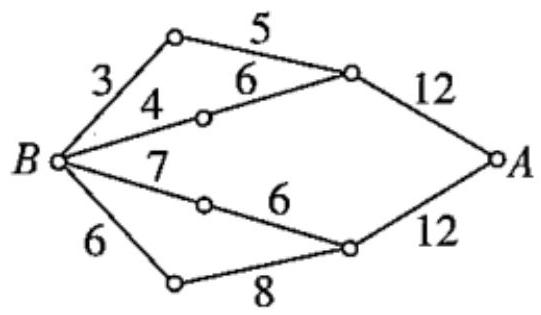

A. 26

B. 24

C. 20

D. 19

答案

D

解析

解法一 由题图可知,每个信息由 $A$ 传递到 $B$ 都要经过两个中间结点,单位时间内由 $A$ 送出的信息量最大为 ${12} + {12} = {24}$ ，但经过第一个中间结点分流时，能通过的信息量最多为 $5 + 6 + {12} = {23}$ ，经过第二个中间结点分流到达 $B$ 的信息量最多为 $3 + 4 + 6 + 6 = {19}$ . 故单位时间内传递的最大信息量为 19 .

解法二 由结点 $A$ 向结点 $B$ 传递的信息,可由不同的 4 条路线通过,由题图可知,由上至下的 4 条路线所能传递的最大信息量依次是3,4,6,6. 由于满足 $3 + 4 \leq  {12},6 + 6 \leq  {12}$ ,所以在单位时间内传递的最大信息量为 $3 + 4 + 6 + 6 = {19}.$

一般 【试卷】2004 年普通高等学校招生考试数...

13. 已知数列 $\left\{  {a}_{n}\right\}$ 的前 $n$ 项和 ${S}_{n} = a\left\lbrack  {2 - {\left( \frac{1}{2}\right) }^{n - 1}}\right\rbrack   - b\left\lbrack  {2 - \left( {n + 1}\right) {\left( \frac{1}{2}\right) }^{n - 1}}\right\rbrack  \left( {n = 1,2,\cdots }\right)$ ,其中 $a\text{ 、 }b$ 是非零常数,则存在数列 $\left\{  {x}_{n}\right\}  \text{ 、 }\left\{  {y}_{n}\right\}$ 使得 ( )

A. ${a}_{n} = {x}_{n} + {y}_{n}$ ,其中 $\left\{  {x}_{n}\right\}$ 为等差数列, $\left\{  {y}_{n}\right\}$ 为等比数列

B. ${a}_{n} = {x}_{n} + {y}_{n}$ ,其中 $\left\{  {x}_{n}\right\}$ 和 $\left\{  {y}_{n}\right\}$ 都为等差数列

C. ${a}_{n} = {x}_{n}{y}_{n}$ ,其中 $\left\{  {x}_{n}\right\}$ 为等差数列, $\left\{  {y}_{n}\right\}$ 为等比数列

D. ${a}_{n} = {x}_{n}{y}_{n}$ ,其中 $\left\{  {x}_{n}\right\}$ 和 $\left\{  {y}_{n}\right\}$ 都为等比数列

C

解析

利用 ${a}_{n} = \left\{  \begin{array}{l} {S}_{1}, n = 1 \\  {S}_{n} - {S}_{n - 1}, n \geq  2 \end{array}\right.$ 求得数列 $\left\{  {a}_{n}\right\}$ 的通项公式为 ${a}_{n} = \frac{-{bn} + a + b}{{2}^{n - 1}}\left( {n \in  {N}^{ * }}\right)$ ,再令 ${x}_{n} =  - {bn} + a + b$ , ${y}_{n} = \frac{1}{{2}^{n - 1}}$ ,利用等差数列和等比数列的定义可得出结论.

当 $n = 1$ 时， ${a}_{1} = {S}_{1} = a$ ；

当 $n \geq  2$ 时，

${a}_{n} = {S}_{n} - {S}_{n - 1} = a\left\lbrack  {2 - {\left( \frac{1}{2}\right) }^{n - 1}}\right\rbrack   - b\left\lbrack  {2 - \left( {n + 1}\right) {\left( \frac{1}{2}\right) }^{n - 1}}\right\rbrack   - a\left\lbrack  {2 - {\left( \frac{1}{2}\right) }^{n - 2}}\right\rbrack   + b\left\lbrack  {2 - n{\left( \frac{1}{2}\right) }^{n - 2}}\right\rbrack \; = a \cdot  \left( {\frac{1}{{2}^{n - 2}} - \frac{1}{{2}^{n - 1}}}\right)  + b\left( {\frac{n + 1}{{2}^{n - 1}} - \frac{n}{{2}^{n - 2}}}\right)  = a \cdot  \frac{2 - 1}{{2}^{n - 1}} + b \cdot  \frac{\left( {n + 1}\right)  - {2n}}{{2}^{n - 1}} = \frac{b\left( {1 - n}\right)  + a}{{2}^{n - 1}} = \frac{-{bn} + a + b}{{2}^{n - 1}}$

${a}_{1} = a$ 满足 ${a}_{n} = \frac{-{bn} + a + b}{{2}^{n - 1}}$ ,所以, ${a}_{n} = \frac{-{bn} + a + b}{{2}^{n - 1}}\left( {n \in  {N}^{ * }}\right)$ .

令 ${x}_{n} =  - {bn} + a + b,{y}_{n} = \frac{1}{{2}^{n - 1}}$ ,则 ${a}_{n} = {x}_{n}{y}_{n}$ ,

则 ${x}_{n + 1} - {x}_{n} = \left\lbrack  {-b\left( {n + 1}\right)  + a + b}\right\rbrack   - \left( {-{bn} + a + b}\right)  =  - b$ (非零常数), $\frac{{y}_{n + 1}}{{y}_{n}} = \frac{\frac{1}{{2}^{n}}}{\frac{1}{{2}^{n - 1}}} = \frac{{2}^{n - 1}}{{2}^{n}} = \frac{1}{2}$ ,

所以，数列 $\left\{  {x}_{n}\right\}$ 为等差数列， $\left\{  {y}_{n}\right\}$ 为等比数列.

故选: C.

本题考查利用 ${S}_{n}$ 求 ${a}_{n}$ ，同时也考查了等差数列和等比数列的判断，考查计算能力与推理能力，属于中等题.

一般 【试卷】广东省中山市杨仙逸中学2024-202...

14. 圆周上有 ${2n}$ 个等分点 $\left( {n > 1}\right)$ ，以其中三个点为顶点的直角三角形的个数为 - .

答案

${2n}\left( {n - 1}\right)$

解析

只有三角形的一条边为直径才能组成直角三角形，第一步选直径共有 $n$ 种方法，第二步选直角顶点有 ${2n} - 2$ 种， 根据分步计数原理相乘即可.

由题意知,只有三角形的一条边过圆心,才能组成直角三角,

因为圆周上有 ${2n}$ 个等分,所以共有 $n$ 条直径,

每条直径可以和除去本身的两个端点外的点组成直角三角形,所以可做 ${2n} - 2$ 个直角三角形.

根据分步计数原理知,共有 $n\left( {{2n} - 2}\right)  = {2n}\left( {n - 1}\right)$ 个

故答案为: ${2n}\left( {n - 1}\right)$ .

一般 【试卷】2002年普通高等学校招生考试数学...

15. 如图所示， ${f}_{i}\left( x\right) \left( {i = 1,2,3,4}\right)$ 是定义在 $\left\lbrack  {0,1}\right\rbrack$ 上的四个函数，其中满足性质:“对 $\left\lbrack  {0,1}\right\rbrack$ 中任意的 ${x}_{1}$ 和 ${x}_{2}$ ，任意 $\lambda  \in  \left\lbrack  {0,1}\right\rbrack  , f\left\lbrack  {\lambda {x}_{1} + \left( {1 - \lambda }\right) {x}_{2}}\right\rbrack   \leq  {\lambda f}\left( {x}_{1}\right)  + \left( {1 - \lambda }\right) f\left( {x}_{2}\right)$ 恒成立。 的只有

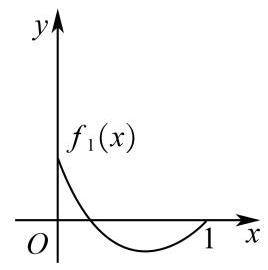

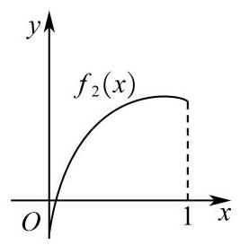

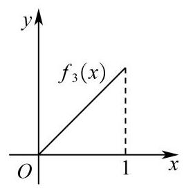

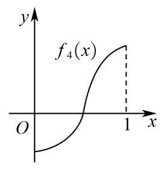

A. ${f}_{1}\left( x\right) ,{f}_{3}\left( x\right)$

B. ${f}_{2}\left( x\right)$

C. ${f}_{2}\left( x\right) ,{f}_{3}\left( x\right)$

D. ${f}_{4}\left( x\right)$

答案

A

解析

由题意，观察四个选项: ${\mathrm{f}}_{1}\left( \mathrm{x}\right)$ 中的图象先降后升是一凸函数，满足要求，

${\mathrm{f}}_{2}\left( \mathrm{x}\right)$ 中的函数是先升后降是一凹函数，不满足要求；

${\mathrm{f}}_{3}\left( \mathrm{x}\right)$ 中的图象直线上升,不是凹函数,满足要求,

${\mathrm{f}}_{4}\left( \mathrm{x}\right)$ 中的函数图象凸、凹函数各一部分. 不满足要求;

考察定义: 对 $\left\lbrack  {0,1}\right\rbrack$ 中任意的 ${\mathrm{x}}_{1}$ 和 ${\mathrm{x}}_{2}$ ,任意 $\lambda  \in  \left\lbrack  {0,1}\right\rbrack  , f\left\lbrack  {\lambda {x}_{1} + \left( {1 - \lambda }\right) {x}_{2}}\right\rbrack   \leq  {\lambda f}\left( {x}_{1}\right)  + \left( {1 - \lambda }\right) f\left( {x}_{2}\right)$ 恒成立知,此函数在 $\left\lbrack  {0,1}\right\rbrack$ 不是凹函数,由上分析知只有 ${f}_{1}\left( x\right) ,{f}_{3}\left( x\right)$ 符合题意.

故答案为A.

点睛:函数的凹凸性，设函数 $f$ 为定义在区间 $I$ 上的函数，若对(a，b)上任意两点 ${x}_{1}$ 、 ${x}_{2}$ ，恒有:

(1) $f\left( \frac{{x}_{1} + {x}_{2}}{2}\right)  < \frac{f\left( {x}_{1}\right)  + f\left( {x}_{2}\right) }{2}$ ，则称 $f$ 为(a，b)上的凹函数；

(2) $f\left( \frac{{x}_{1} + {x}_{2}}{2}\right)  > \frac{f\left( {x}_{1}\right)  + f\left( {x}_{2}\right) }{2}$ ，则称 $f$ 为(a，b)上的凸函数.

较易 【试卷】福建省福州第四中学2023-2024学...

16. 解不等式: $\sqrt{{2x} - 1} > x - 2$ .

答案

$\left\lbrack  {\frac{1}{2},5}\right)$

解析

根据不等式,讨论 $\frac{1}{2} \leq  x < 2\text{ 、 }x \geq  2$ 分别求解集,然后取并即可得结果.

由题设 ${2x} - 1 \geq  0$ ,即 $x \geq  \frac{1}{2}$ ,

当 $\frac{1}{2} \leq  x < 2$ 时, $\sqrt{{2x} - 1} \geq  0 > x - 2$ 恒成立;

当 $x \geq  2$ 时, ${2x} - 1 > {\left( x - 2\right) }^{2}$ 整理得 ${x}^{2} - {6x} + 5 = \left( {x - 1}\right) \left( {x - 5}\right)  < 0$ ,解得 $1 < x < 5$ , 所以 $2 \leq  x < 5$ ;

综上, $\frac{1}{2} \leq  x < 5$ ,故解集为 $\left( {\frac{1}{2},5}\right)$ .

一般 【试卷】2002年新课标卷I高考真题数学理...

17. 从正方体的 6 个面中选取 3 个面,其中有 2 个面不相邻的选法共有( )

A. 8 种

B. 12 种

C. 16 种

D. 20 种

答案

B

解析

使用间接法，首先分析从 6 个面中选取 3 个面，共 ${\mathrm{C}}_{6}^{3}$ 种不同的取法. 其中有 2 个面不相邻的反面为 3 个面都相邻,则只可能为 8 个顶点处 3 个相邻平面,共有 8 种,则选法共有 ${\mathrm{C}}_{6}^{3} - 8 = {12}$ 种. 故选 B

较易 【试卷】2002年普通高等学校招生考试数学...

18. 设函数 $f\left( x\right)$ 在 $\left( {-\infty , + \infty }\right)$ 内有定义，下列函数:(1) $y =  - \left| {f\left( x\right) }\right|$ ；(2) $y = {xf}\left( {x}^{2}\right)$ ；(3) $y =  - f\left( {-x}\right)$ ；(4) $y = f\left( x\right)  - f\left( {-x}\right)$ 中必为奇函数的有 . (填选所有正确答案的序号)

② 答案

(2) (4)

解析

对于(1)， $y =  - \left| {f\left( x\right) }\right|$ 中 $- \left| {f\left( {-x}\right) }\right|$ 与 $\left| {f\left( x\right) }\right|$ 不一定相等，所以(1)不是奇函数；

对于(2)， $y = {xf}\left( {x}^{2}\right)$ 可以看成两个函数的乘积，其中 $y = x$ 是奇函数，

$y = f\left( {x}^{2}\right)$ 是偶函数，故(2)是奇函数；

对于(3)， $y =  - f\left( {-x}\right)$ 的奇偶性不能确定，故(3)不是奇函数；

对于 (4),令 $F\left( x\right)  = y = f\left( x\right)  - f\left( {-x}\right)$ ,

因为 $F\left( {-x}\right)  = f\left( {-x}\right)  - f\left( x\right)  =  - \left( {f\left( x\right)  - f\left( {-x}\right) }\right)  =  - F\left( x\right)$ ,

故 (4) 为奇函数;

故答案为:(2) (4)

本题考查了函数的奇偶性定义，掌握概念是解题的关键，属于基础题.

一般 【试卷】2003 年普通高等学校春季招生考..

19. 关于函数 $f\left( x\right)  = {\left( \sin x\right) }^{2} - {\left( \frac{2}{3}\right) }^{\left| x\right| } + \frac{1}{2}$ ,有下面四个结论:

$\text{ ① }f\left( x\right)$ 是奇函数； ② 当 $x > {2003}$ 时， $f\left( x\right)  > \frac{1}{2}$ 恒成立；

③ $f\left( x\right)$ 的最大值是 $\frac{3}{2}$ ； ④ $f\left( x\right)$ 的最小值是 $- \frac{1}{2}$ .

其中正确结论的个数为( )

A. 1 个

B. 2 个

C. 3 个

D. 4 个

答案

A

解析

根据奇偶性的定义判断①；通过代特值可以判断②；将函数化为 $f\left( x\right)  = 1 - \frac{1}{2}\cos {2x} - {\left( \frac{2}{3}\right) }^{\left| x\right| }$ ，进而结合函数的有界性判断③；容易判断当x=0时， $\cos {2x},{\left( \frac{1}{2}\right) }^{\left| x\right| }$ 同时取到最大值1和1，进而判断④.

对①， $x \in  \mathrm{R}, f\left( {-x}\right)  = {\sin }^{2}\left( {-x}\right)  - {\left( \frac{2}{3}\right) }^{\left| -x\right| } + \frac{1}{2} = {\sin }^{2}x - {\left( \frac{2}{3}\right) }^{\left| x\right| } + \frac{1}{2} = f\left( x\right)$ ，则 $f\left( x\right)$ 为偶函数，故①错误;

对②，当 $x = {2003\pi }, f\left( {2003\pi }\right)  = {\sin }^{2}\left( {2003\pi }\right)  - {\left( \frac{2}{3}\right) }^{\left| {2003}\pi \right| } + \frac{1}{2} =  - {\left( \frac{2}{3}\right) }^{\left| {2003}\pi \right| } + \frac{1}{2} < \frac{1}{2}$ ，故②错误；

对③， $f\left( x\right)  = \frac{1 - \cos {2x}}{2} - {\left( \frac{2}{3}\right) }^{\left| x\right| } + \frac{1}{2} = 1 - \frac{1}{2}\cos {2x} - {\left( \frac{2}{3}\right) }^{\left| x\right| }$ ，而 $- 1 \leq  \cos {2x} \leq  1$ ，则

$\frac{1}{2} \leq  1 - \frac{1}{2}\cos {2x} \leq  \frac{3}{2}$ ,又 ${\left( \frac{2}{3}\right) }^{\left| x\right| } > 0$ ,于是 $f\left( x\right)  < \frac{3}{2}$ ,故③错误；

对④, $f\left( x\right)  = \frac{1 - \cos {2x}}{2} - {\left( \frac{2}{3}\right) }^{\left| x\right| } + \frac{1}{2} = 1 - \frac{1}{2}\cos {2x} - {\left( \frac{2}{3}\right) }^{\left| x\right| }$ ,当x=0时, $\cos {2x},{\left( \frac{2}{3}\right) }^{\left| x\right| }$ 同时取到最大值

1 和 1,则 $f\left( x\right)$ 的最小值是 $1 - \frac{1}{2} - 1 =  - \frac{1}{2}$ ,故④正确.

故选: A.

较易 【试卷】北京名校2023届高三一轮总复习 ...

20. 在直角坐标系 ${xOy}$ 中，已知 $\bigtriangleup  {AOB}$ 三边所在直线的方程分别为 $x = 0, y = 0,{2x} + {3y} = {30}$ ，则 $\bigtriangleup  {AOB}$ 内部和边上整点 (即横、纵坐标均为整数的点) 的总数是 ( )

A. 95

B. 91

C. 88

D. 75

---

	答案

B

	解析

---

首先确定以 ${AB}$ 为对角线的矩形中整点的个数，再确定 ${2x} + {3y} = {30}$ 上的整点数，最后根据对称性求出 $\bigtriangleup {AOB}$ 中整点的个数.

由题设,直线 ${2x} + {3y} = {30}$ 分别交 $\mathrm{x}\text{ 、 }\mathrm{y}$ 轴于 $\left( {{15},0}\right) \text{ 、 }\left( {{10},0}\right)$ ,

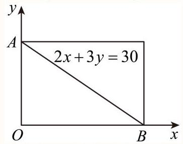

以高为 10，宽为 15 的矩形内(含边)整数点有 176 个，其中直线 ${2x} + {3y} = {30}$ 上的整数点有 $\left( {{15},0}\right) \text{ 、 }\left( {{12},2}\right)$  、 $\left( {9,4}\right) \text{ 、 }\left( {6,6}\right) \text{ 、 }\left( {3,8}\right) \text{ 、 }\left( {0,{10}}\right)$ ,共6个,

所以，矩形对角线 ${AB}$ 两侧的三角形中整点的个数为 $\frac{{176} - 6}{2} = {85}$ 个，

综上， $\bigtriangleup {AOB}$ 中整点的个数为 ${85} + 6 = {91}$ 个.

故选: B

较易 【试卷】上海市上海财经大学附属北郊高级...

21. 已知 ${a}_{1}$ ， ${a}_{2}$ ， ${b}_{1}$ ， ${b}_{2}$ ， ${c}_{1}$ ， ${c}_{2}$ 均为非零实数，不等式 ${a}_{1}{x}^{2} + {b}_{1}x + {c}_{1} > 0$ 和 ${a}_{2}{x}^{2} + {b}_{2}x + {c}_{2} > 0$ 的解集分别为集合 $\mathrm{M}$ 和 $\mathrm{N}$ ,且 $\varnothing  \subset  M \subset  \mathrm{R},\varnothing  \subset  N \subset  \mathrm{R}$ . 那么 “ $\frac{{a}_{1}}{{a}_{2}} = \frac{{b}_{1}}{{b}_{2}} = \frac{{c}_{1}}{{c}_{2}}$ ”是 “ $M = N$ ” 的( ).

A. 充分非必要条件

B. 必要非充分条件

C. 充要条件

D. 既非充分又非必要条件

## 答案

B

解析

利用充分条件和必要条件的定义判断.

解: 因为 $\varnothing  \subset  M \subset  \mathrm{R},\varnothing  \subset  N \subset  \mathrm{R}$ ,

所以 $M \neq  \varnothing , N \neq  \varnothing$ ,

当 $\frac{{a}_{1}}{{a}_{2}} = \frac{{b}_{1}}{{b}_{2}} = \frac{{c}_{1}}{{c}_{2}} < 0$ 时, ${a}_{1}{x}^{2} + {b}_{1}x + {c}_{1} > 0$ 等价于 ${a}_{2}{x}^{2} + {b}_{2}x + {c}_{2} < 0$ ,

所以 $M = N$ 不成立,故不充分;

当 $M = N \neq  \varnothing$ 时, $\frac{{a}_{1}}{{a}_{2}} = \frac{{b}_{1}}{{b}_{2}} = \frac{{c}_{1}}{{c}_{2}}$ ,故必要,

故选: B.

一般 【试卷】北京市第一七一中学2019-2020学...

22. 某班试用电子投票系统选举班干部候选人，全班 $k$ 名同学都有选举权和被选举权，他们的编号分别为1,2,..., $k$ . 规定:同意按“1”，不同意(含弃权)按“0”，令 ${a}_{ij} = \left\{  \begin{matrix} 1,\text{ 第 }i\text{ 号同学同意第 }j\text{ 号同学当选 } \\  0,\text{ 第 }i\text{ 号同学不同意第 }j\text{ 号同学当选 } \end{matrix}\right.$ ，其中 $i = 1,2,\cdots , l$ ，且 $j = 1,2,\cdots , k$ ，则班内同时同意1，2号同学当选的人数可以用含 ${a}_{k}$ 式子表示为___.

## 答案

${a}_{11}{a}_{12} + {a}_{21}{a}_{22} + \ldots  + {a}_{k1}{a}_{k2}$

## 解析

先写出同意第1号同学当选的同学，再写出同意第2号同学当选的同学，那么同时同意1，2号同学当选的人数为它们对应相乘再相加. 解: 第 $1,2,\ldots , k$ 名学生是否同意第1号同学当选依次由 ${a}_{11},{a}_{21},{a}_{31},\ldots ,{a}_{k1}$ 来确定 $\left( {{a}_{ij} = 1}\right.$ 表示同意, ${a}_{ij} = 0$ 表示不同意或弃权),是否同意第 2 号同学当选依次由 ${a}_{12},{a}_{22},\ldots ,{a}_{k2}$ 确定, 而是否同时同意1,2号同学当选依次由 ${a}_{11}{a}_{12},{a}_{21}{a}_{22},\ldots ,{a}_{k1}{a}_{k2}$ 确定,

故同时同意1,2号同学当选的人数为 ${a}_{11}{a}_{12} + {a}_{21}{a}_{22} + \ldots  + {a}_{k1}{a}_{k2}$ ,

故答案为: ${a}_{11}{a}_{12} + {a}_{21}{a}_{22} + \ldots  + {a}_{k1}{a}_{k2}$ .

本题主要考查了矩阵的应用, 考查学生阅读理解、分析问题解决问题的能力.

一般 【试卷】2020年9月广东广州广东实验中学...

23. 已知长方形的四个顶点: $A\left( {0,0}\right)$ ， $B\left( {2,0}\right)$ ， $C\left( {2,1}\right)$ ， $D\left( {0,1}\right)$ . 一质点从点 $A$ 出发，沿与 ${AB}$ 夹角为 $\theta$ 的方向射到 ${BC}$ 上的点 ${P}_{1}$ 后,依次反射到 ${CD}\text{ 、 }{DA}$ 和 ${AB}$ 上的点 ${P}_{2}\text{ 、 }{P}_{3}\text{ 、 }{P}_{4}$ (入射角等于反射角). 设 ${P}_{4}$ 的坐标为 $\left( {{x}_{4},0}\right)$ ，若 $1 < {x}_{4} < 2$ ，则 $\tan \theta$ 的范围是( )

A. $\left( {\frac{1}{3},\frac{1}{2}}\right)$

B. $\left( {\frac{1}{3},\frac{2}{5}}\right)$

C. $\left( {\frac{2}{5},\frac{1}{2}}\right)$

D. $\left( {\frac{2}{5},\frac{2}{3}}\right)$

答案

---

B

---

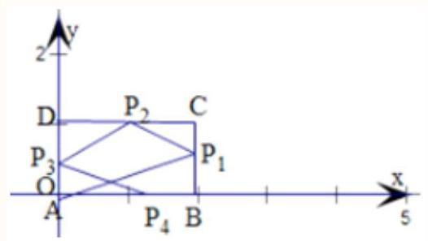

设 ${P}_{1}B = a,\angle {P}_{1}{AB} = \theta$ ,则 $C{P}_{1} = 1 - a$ ,

$\angle {P}_{1}{P}_{2}C\text{ 、 }\angle {P}_{3}{P}_{2}D\text{ 、 }\angle A{P}_{4}{P}_{3}$ 均为 $\theta ,\therefore \tan \theta  = \frac{{P}_{1}B}{AB} = \frac{a}{2}$ ,

又 $\tan \theta  = \frac{C{P}_{1}}{C{P}_{2}} = \frac{1 - a}{C{P}_{2}} = \frac{a}{2}$ ,

$\therefore C{P}_{2} = \frac{2 - {2a}}{a} = \frac{2}{a} - 2$ .

而 $\tan \theta  = \frac{\widetilde{D{P}_{3}}}{D{P}_{2}} = \frac{D{P}_{3}}{2 - \left( {\frac{2}{a} - 2}\right) } = \frac{D{P}_{3}}{4 - \frac{2}{a}} = \frac{a}{2}$ ,

$\therefore D{P}_{3} = {2a} - 1$ .

又 $\tan \theta  = \frac{A{P}_{3}}{A{P}_{4}} = \frac{1 - \left( {{2a} - 1}\right) }{A{P}_{4}} = \frac{2 - {2a}}{A{P}_{4}} = \frac{a}{2}$ ,

$\therefore A{P}_{4} = \frac{4 - {4a}}{a} = \frac{4}{a} - 4$ .

依题设 $1 < A{P}_{4} < 2$ ,即 $1 < \frac{4}{a} - 4 < 2$ ,

$\therefore 5 < \frac{4}{a} < 6$ ,

即有 $\frac{2}{3} < a < \frac{4}{5}$ ,

则 $\frac{1}{3} < \tan \theta  < \frac{2}{5}$ .

故选 B

容易 【试卷】数学竞赛《提优教程》教案:第45...

24. 对于四面体 ${ABCD}$ ,给出下列四个命题:

①若 ${AB} = {AC}$ ， ${BD} = {CD}$ ，则 ${BC}\bot {AD}$ ； ②若 ${AB} = {CD}$ ， ${AC} = {BD}$ ，则 ${BC}\bot {AD}$ ；

③若 ${AB}\bot {AC}$ ， ${BD}\bot {CD}$ ，则 ${BC}\bot {AD}$ ； ④若 ${AB}\bot {CD}$ ， ${BD}\bot {AC}$ ，则 ${BC}\bot {AD}$ .

其中真命题的序号是___(写出所有真命题的序号)

答案

①④

解析

如右图,则 $\bigtriangleup  {ABC}$ 和 $\bigtriangleup  {DBC}$ 是以 ${BC}$ 为底边的两个等腰三角形，作 ${BC}$ 中点 $E$ ，则 ${BC}\bot {AE}$ ， ${BC}\bot {DE}$ ， $\therefore {BC}\bot$ 平面 ${AED},\therefore {BC} \bot  {AD}$ ,故①真.

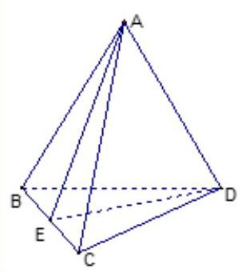

若②成立，由 $A{H}_{1}\bot {BC}$ 于 ${H}_{1}$ ， $D{H}_{2}\bot {BC}$ 于 ${H}_{2}$ . 由 $\bigtriangleup  {ABC} \cong   \bigtriangleup  {DCB}$ 知 $B{H}_{1} = C{H}_{2}$ ，若 ${AB} \neq  {AC}$ ，则 ${H}_{1}$ 与 ${H}_{2}$ 不重合. 但由 ${BC} \bot  {AD}$ 知 ${BC} \bot$ 平面 ${AED},\therefore {BC} \bot  {DE}$ ,即 ${DE}$ 为 $\bigtriangleup {DBC}$ 中 ${BC}$ 边上的高, $\therefore$ 点 $E$ 即为点 ${H}_{2}$ . 即点 ${H}_{1}$ 与点 ${H}_{2}$ 重合,矛盾. 故②不成立.

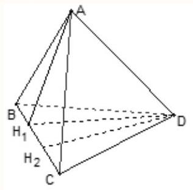

同上,若③成立,则由 $A$ 作 ${BC}$ 的垂线和由 $D$ 作 ${BC}$ 的垂线,垂足应该相同,但是由 “ ${AB} \bot  {AC},{BD} \bot  {CD}$ ”,设 ${AB} < {AC},{CD} < {BD}$ ，则垂足不重合. 矛盾. 故③不成立.

作 ${AH} \bot$ 平面 ${BCD}$ 于 $H$ ，连接 ${BH}$ 并延长交 ${CD}$ 于 $M$ . 由 ${AB} \bot  {CD}$ 知 ${CD} \bot$ 平面 ${AMB}$ ，故 ${CD} \bot  {BM}$ . 同理连接 ${CH}$ 并延长交 ${BD}$ 于 $N,{BD} \bot  {CN}$ . 故 $H$ 为 $\bigtriangleup {BCD}$ 的垂心， $\therefore {DH} \bot  {BC},\therefore {AD} \bot  {BC}$ . 故④成立.

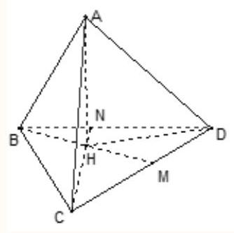

一般 【试卷】2019年北京东城区高一下学期期末...

25. 下列 5 个正方体图形中， $l$ 是正方体的一条对角线，点 $M$ 、 $N$ 、 $P$ 分别为其所在棱的中点，能得出 $l \bot$ 面 ${MNP}$ 的图形的序号是___(写出所有符合要求的图形序号).

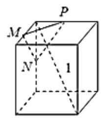

①

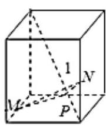

②

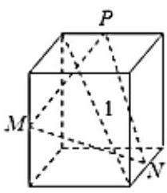

③

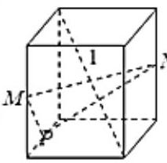

④

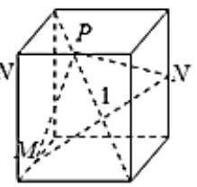

⑤

答案

①④⑤

解析

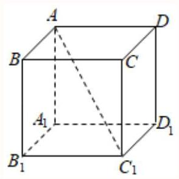

图 1

如图 1,设正方体为 ${ABCD} - {A}_{1}{B}_{1}{C}_{1}{D}_{1}$ ,

在题图 ① 中,连结 $A{B}_{1}$ ,则 $A{B}_{1} \bot  {MN}$ ,又 $A{B}_{1}$ 是 $l$ 在面 ${AB}{B}_{1}{A}_{1}$ 内的射影,

$\therefore l \bot  {MN}$ ,同理, $l \bot  {MP}$ ,

$\therefore l \bot$ 平面 ${MNP}$ ,故 ① 符合;

在题图 ② 中,延长 ${MP}$ 交 ${C}_{1}{D}_{1}$ 的延长线于 $E$ ,连结 ${NE}$ ,若 $l \bot$ 面 ${MNP}$ ,则 $l \bot  {NE}$ , 又 ${C}_{1}D$ 是 $l$ 在平面 ${CD}{D}_{1}C$ 内的射影, $C{D}_{1} \bot  {C}_{1}D$ ,

$\therefore l \bot  C{D}_{1},\therefore l \bot$ 平面 ${CD}{D}_{1}{C}_{1}$ ,矛盾, $\therefore$ ② 不符合;

在题图 ③ 中，平面 ${MNP}$ 与题图 ① 中的平面 ${MNP}$ 不是同一平面，它们又过同一点，

$\therefore$ 题图 ③ 不符合;

在题图 ④ 中, $l \bot  {MP}, l \bot  {MN}$ ,

$\therefore l \bot$ 平面 ${MNP}$ ,延长 ${PM}$ 交 ${AB}$ 于 $F$ ,取 ${CD}$ 的中点 $G$ ,则 ${GN}//{MP}$ ,

$\therefore G \in$ 平面 ${MNP}$ ,连结 ${FG}$ 交 ${BC}$ 于 $H$ ,则 $H \in$ 平面 ${MNP}$ ,可证 $H$ 是 ${BC}$ 的中点,

$\therefore$ 题图 ④ 与题图 ⑤ 中的平面 ${MNP}$ 实为同一平面,

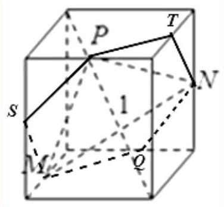

图 ⑥

$\therefore$ ⑤ 也符合.

故答案为:①④⑤.

较易 【试卷】江苏省六校2021届高三下学期第四...

26. 已知向量集合 $M = \{ \overrightarrow{a} \mid  \overrightarrow{a} = \left( {1,2}\right)  + \lambda \left( {3,4}\right) ,\lambda  \in  R\} , N = \{ \overrightarrow{a} \mid  \overrightarrow{a} = \left( {-2, - 2}\right)  + \lambda \left( {4,5}\right) ,\lambda  \in  R\}$ ,则 $M \cap  N =$

( )

A. $\{ \left( {1,2}\right) \}$

B. $\{ \left( {-2, - 2}\right) \}$

C. $\{ \left( {1,2}\right) ,\left( {-2, - 2}\right) \}$

D. $\varnothing$

答案

B

解析

由交集定义,得出 $M \cap  N$ 中同一元素满足的两种表示形式,从而建立等量关系,解方程组可得.

设 $\overrightarrow{a} \in  M \cap  N$ ,则 $\overrightarrow{a} \in  M$ ,且 $\overrightarrow{a} \in  N$ ,则 $\overrightarrow{a} = \left( {1,2}\right)  + {\lambda }_{1}\left( {3,4}\right)  = \left( {1 + 3{\lambda }_{1},2 + 4{\lambda }_{1}}\right)$ ,

且 $\overrightarrow{a} = \left( {-2, - 2}\right)  + {\lambda }_{2}\left( {4,5}\right)  = \left( {-2 + 4{\lambda }_{2}, - 2 + 5{\lambda }_{2}}\right)$ .

$\therefore \left\{  \begin{array}{l} 1 + 3{\lambda }_{1} =  - 2 + 4{\lambda }_{2} \\  2 + 4{\lambda }_{1} =  - 2 + 5{\lambda }_{2} \end{array}\right.$ ,解得 $\left\{  \begin{matrix} {\lambda }_{1} =  - 1 \\  {\lambda }_{2} = 0 \end{matrix}\right.$ ,则 $M\bigcap N = \{ \left( {-2, - 2}\right) \}$ .

故选: B.

与集合中元素有关的题目，首先要确定集合的元素是什么，其次要明确元素满足什么限制条件，最后根据条件列关系式时要注意不同集合中相同字母参数取值的不同.

## 容易

27. 函数 $f\left( x\right)  = \left\{  \begin{array}{l} x, x \in  P, \\   - x, x \in  M, \end{array}\right.$ 其中 $\mathrm{P},\mathrm{M}$ 为实数集 $\mathrm{R}$ 的两个非空子集,又规定 $\mathrm{f}\left( \mathrm{P}\right)  = \{ \mathrm{y} \mid  \mathrm{y} = \mathrm{f}\left( \mathrm{x}\right) ,\mathrm{x} \in  \mathrm{P}\} ,\mathrm{f}\left( \mathrm{M}\right)  = \; \{ \mathrm{y} \mid  \mathrm{y} = \mathrm{f}\left( \mathrm{x}\right) ,\mathrm{x} \in  \mathrm{M}\}$ . 给出下列四个判断:

①若P∩M= $\varnothing$ ，则 $\mathrm{f}\left( \mathrm{P}\right)  \cap  \mathrm{f}\left( \mathrm{M}\right)  = \varnothing$ ；

②若P∩M≠ $\varnothing$ ，则 $\mathrm{f}\left( \mathrm{P}\right)  \cap  \mathrm{f}\left( \mathrm{M}\right)  \neq  \varnothing$ ；

③若P $\cup$ M=R，则 $\mathrm{f}\left( \mathrm{P}\right)  \cup  \mathrm{f}\left( \mathrm{M}\right)  = \mathrm{R}$ ；

④若P $\cup$ M≠R，则 $\mathrm{f}\left( \mathrm{P}\right)  \cup  \mathrm{f}\left( \mathrm{M}\right)  \neq  \mathrm{R}$ .

其中正确判断有

A. 0 个

B. 1 个

C. 2 个

D. 4 个

答案

A

解析

试题分析:函数的表达式知，可借助两个函数y=x与y=-x图象来研究，分析可得答案. 由题意知函数 $f\left( P\right) \text{ 、 }f\left( M\right)$ 的图象如图所示.

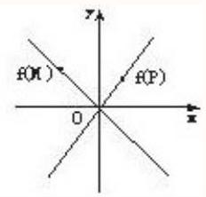

设

$P = \left\lbrack  {{x}_{2}, + \infty }\right) , M = \left( {-\infty ,{x}_{1}}\right\rbrack$

$\because \left| {x}_{2}\right|  < \left| {x}_{1}\right| , f\left( P\right)  = \left\lbrack  {f\left( {x}_{2}\right) , + \infty }\right) , f\left( M\right)  = \left\lbrack  {f\left( {x}_{1}\right) , + \infty }\right) , P \cap  M = \phi$

$\because f\left( P\right)  \cap  f\left( M\right)  = \left\lbrack  {f\left( {x}_{1}\right) , + \infty }\right)  \neq  \phi$

故①错误

同理可知当

$P = \lbrack 1, + \infty ), M = (0,1\rbrack$ ,②不正确.

设

$P = \left\lbrack  {{x}_{1}, + \infty }\right) , M = \left( {-\infty ,{x}_{2}}\right\rbrack$

$\because \left| {x}_{2}\right|  < \left| {x}_{1}\right| , P \cup  M = R$ .

$f\left( P\right)  = \left\lbrack  {f\left( {x}_{1}\right) , + \infty }\right) , f\left( M\right)  = \left\lbrack  {f\left( {x}_{2}\right) , + \infty }\right) , P \cap  M = \phi$

$\because f\left( P\right)  \cup  f\left( M\right)  = \left\lbrack  {f\left( {x}_{1}\right) , + \infty }\right)  \neq  R$

, 故③错误.

④若 $P \cup  M \neq  R$ ,则 $f\left( P\right)  \cup  f\left( M\right)  \neq  R$ . 这是不对的 若P=\{非负实数\}, M=\{正实数\}

则 $f\left( P\right)  = \{$ 非负实数 $\} , f\left( M\right)  = \{$ 负实数 $\}$

则 $f\left( P\right)  \cup  f\left( M\right)  = R$ . 故④错，故选A

考点:本试题主要是考查了同学们对于与集合，函数相关的创新试题的分析，和解决问题能力的运用，是中档题.

点评: 考查对题设条件的理解与转化能力, 本题中题设条件颇多, 审题费时, 需仔细审题才能把握其脉络, 故研究时借用两个函数的图象，借助图形的直观来来帮助判断命题的正误，以形助数，是解决数学问题常用的一种思路.

较易 【试卷】上海市上海中学2022-2023学年高...

28. $f\left( x\right)$ 是定义在区间 $\left\lbrack  {-c, c}\right\rbrack$ 上的奇函数，其图象如图所示:令 $g\left( x\right)  = {af}\left( x\right)  + b$ ，则下列关于函数 $g\left( x\right)$ 的叙述正确的是( )

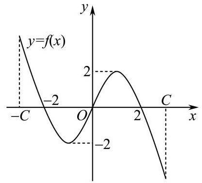

A. 若 $a < 0$ ，则函数 $g\left( x\right)$ 的图象关于原点对称

B. 若 $a =  - 1, - 2 < b < 0$ ，则方程 $g\left( x\right)  = 0$ 有大于2的实根

C. 若 $a \neq  0, b = 2$ ,则方程 $g\left( x\right)  = 0$ 有两个实根

D. 若 $a \geq  1, b < 2$ ,则方程 $g\left( x\right)  = 0$ 有三个实根

答案

B

解析

A.取 $a =  - 1$ ， $b = 1$ 判断；B.由 $a =  - 1$ ， $- f\left( x\right)$ 仍是奇函数，2仍是它的一个零点，再由上下平移判断；C.取 $a = \frac{1}{2}, b = 2$ 判断；D.取 $a = 1, b =  - 3$ 判断.

A. 若 $a =  - 1, b = 1$ ，则函数 $g\left( x\right)$ 不是奇函数，其图象不可能关于原点对称，故错误；

B. 当 $a =  - 1$ 时， $- f\left( x\right)$ 仍是奇函数，2仍是它的一个零点，但单调性与 $f\left( x\right)$ 相反，若再加 $b$ ， $- 2 < b < 0$ ，则图象又向下平移 $- b$ 个单位长度，所以 $g\left( x\right)  =  - f\left( x\right)  + b = 0$ 有大于2的实根，故正确；

C. 若 $a = \frac{1}{2}, b = 2$ ,则 $g\left( x\right)  = \frac{1}{2}f\left( x\right)  + 2$ ,其图象由 $f\left( x\right)$ 的图象向上平移 2 个单位长度,那么 $g\left( x\right)$ 只有 1 个零点,所以 $g\left( x\right)  = 0$ 只有 1 个实根,故错误;

D.若 $a = 1, b =  - 3$ ，则 $g\left( x\right)$ 的图象由 $f\left( x\right)$ 的图象向下平移3个单位长度，它只有1个零点，即 $g\left( x\right)  = 0$ 只有一个实根, 故错误.

故选: B.

较易 【试卷】北京名校2023届高三一轮总复习 ...

29. 期中考试以后, 班长算出了全班40个人数学成绩的平均分为M，如果把M当成一个同学的分数，与原来的40个人数一起，算出这41个分数的平均值为N，那么 $M : N =$

## 答案

1:1

解析

根据平均值的定义计算即可.

由题意 $N = \frac{{40M} + M}{41} = M,\therefore M : N = 1 : 1$ .

故答案为: 1 : 1 .

较易 【试卷】2004 年普通高等学校招生考试数...

30. 定义“等和数列”: 在一个数列中，如果每一项与它的后一项的和都为同一个常数，那么这个数列叫做等和数列，这个常数叫做该数列的公和. 已知数列 $\left\{  {a}_{n}\right\}$ 是等和数列，且 ${a}_{1} = 2$ ，公和为5，那么 ${a}_{18}$ 的值为___，且这个数列的前21项和 ${S}_{21}$ 的值为

## 答案

3 ; 52

解析

由题意得 ${a}_{n} + {a}_{n + 1} = 5$ 对任意的 $n \in  {\mathbf{N}}^{ * }$ 恒成立，从而可求数列 $\left\{  {a}_{n}\right\}$ 的通项公式，从而可求 ${a}_{18}$ 与 ${S}_{21}$ .

根据“等和数列”的定义及公和为 5,可得 ${a}_{n} + {a}_{n + 1} = 5$ 对任意的 $n \in  {\mathbf{N}}^{ * }$ 恒成立.

因为 ${a}_{1} = 2$ ，所以 ${a}_{n} = \left\{  \begin{array}{l} 2, n\text{ 为奇数 } \\  3, n\text{ 为偶数 } \end{array}\right.$ .

所以 ${a}_{18} = 3$ .

所以 ${S}_{21} = {10}\left( {{a}_{2} + {a}_{3}}\right)  + {a}_{1} = {52}$ .

故答案为:3;52.

容易 【试卷】数学竞赛《提优教程》教案:第59...

31. 某校高三年级举行一次演讲赛共有10位同学参赛，其中一班有3位，二班有2位，其它班有5位，若采用抽签的方式确定他们的演讲顺序，则一班有3位同学恰好被排在一起(指演讲序号相连)，而二班的2位同学没有被排在一起的概率为( )

A. $\frac{1}{10}$

B. $\frac{1}{20}$

C. $\frac{1}{40}$

D. $\frac{1}{120}$

答案

B

解析

解: 由题意知本题是一个古典概型,

$\because$ 试验发生包含的所有事件是10位同学参赛演讲的顺序共有: ${A}_{10}^{10}$ ;

满足条件的事件要得到“一班有3位同学恰好被排在一起而二班的2位同学没有被排在一起的演讲的顺序”可通过如下步骤:

①将一班的3位同学“捆绑”在一起，有 ${A}_{3}^{3}$ 种方法；

②将一班的“一梱”看作一个对象与其它班的5位同学共6个对象排成一列，有 ${A}_{6}^{6}$ 种方法；

③在以上6个对象所排成一列的7个间隙(包括两端的位置)中选2个位置，将二班的2位同学插入，有 ${A}_{7}^{2}$ 种方法.

根据分步计数原理 (乘法原理),共有 ${A}_{3}^{3}{A}_{6}^{6}{A}_{7}^{2}$ 种方法.

$\therefore$ 一班有3位同学恰好被排在一起 (指演讲序号相连),

而二班的2位同学没有被排在一起的概率为: $\mathrm{P} = {A}_{3}^{3}{A}_{6}^{6}{A}_{7}^{2} \div  {A}_{10}^{10} = \frac{1}{20}$

故选B.

## 一般

32. 有两排座位，前排11个座位，后排12个座位，现安排2人就座，规定前排中间的3个座位不能坐，并且这2人不左右相邻，那么不同排法的种数是( ).

A. 234

B. 346

C. 350

D. 363

答案

B

解析

由题意知本题需要分类讨论,

(1)前排中间的3个座位不能坐，并且这2人不左右相邻，

前排一个，后排一个共有 $2{\mathrm{C}}_{8}^{1} \cdot  {\mathrm{C}}_{12}^{1} = {192}$ .

(2)后排坐两个(不相邻)，

$2\left( {{10} + 9 + 8 + \cdots  + 1}\right)  = {110}.$

(3)前排坐两个 $2\left( {6 + 5 + \cdots  + 1}\right)  + 2 = {44}$ 个，

$\therefore$ 总共有 ${192} + {110} + {44} = {346}$ 个.

故选B.

一般 【试卷】辽宁省大连市名校2023-2024学年...

33. 若三棱锥 $A - {BCD}$ 的侧面 ${ABC}$ 内一动点P到底面 ${BCD}$ 的距离与到棱 ${AB}$ 的距离相等，则动点P的轨迹与 $\bigtriangleup  {ABC}$ 组成图形可能是( )

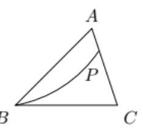

$B$

A.

B.

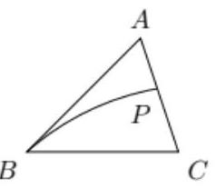

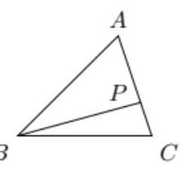

C.

$B$

D.

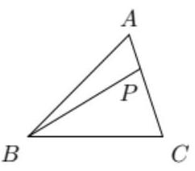

答案

D

解析

设二面角 $A - {BC} - D$ 为 $\theta$ ,作 ${PG} \bot$ 面 ${BCD}$ 于 $G,{PF} \bot  {BC}$ 于 $F,{PE} \bot  {AB}$ 于 $E$ ,根据题设有 $\sin \theta  = \frac{PE}{PF} < 1$ 为常数，进而分析P在 $\bigtriangleup {ABC}$ 上的轨迹，即可得答案.

若二面角 $A - {BC} - D$ 为 $\theta$ ，作 ${PG} \bot$ 面 ${BCD}$ 于 $G$ ， ${PF} \bot  {BC}$ 于 $F$ ， ${PE} \bot  {AB}$ 于 $E$ ，

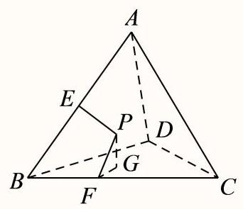

如上图示, $\angle {PFG} = \theta$ ,由题设有 ${PE} = {PG} = {PF}\sin \theta$ ,即 $\sin \theta  = \frac{PE}{PF} < 1$ 为常数,

所以P在 $\bigtriangleup {ABC}$ 上的轨迹是一条直线,且与 ${AB}$ 边夹角较小.

故选: D

较易 【试卷】福建省厦门海沧实验中学2021-202...

34. 如图, 将边长为1的正六边形铁皮的六个角各切去一个全等的四边形, 再沿虚线折起, 做成一个无盖的正六棱柱

容器(图). 当这个正六棱柱容器的底面边长为___时，其容积最大.

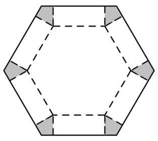

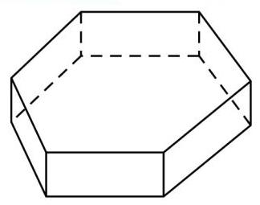

答案

$\frac{2}{3}$

解析

如图, 设底面六边形的边长为x, 高为d, 则

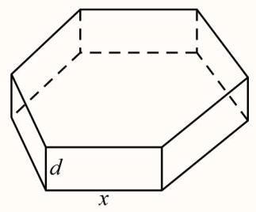

$d = \sqrt{3} \cdot  \frac{1}{2}\left( {1 - x}\right)$ ; 又底面六边形的面积为:

$S = 6 \times  \frac{1}{2} \times  {x}^{2} \times  \sin {60}^{ \circ  } = \frac{3\sqrt{3}}{2}{x}^{2} = \frac{9}{4} \times  \left( {{x}^{2} - {x}^{3}}\right)$ ,则对 $V$ ; 所以,这个正六棱柱容器的容积为:

$V = {Sd} = \frac{3\sqrt{3}}{2}{x}^{2} \times  \frac{\sqrt{3}}{2}\left( {1 - x}\right)  = \frac{9}{4} \times  \left( {{x}^{2} - {x}^{3}}\right)$ ,则对 $V$ 求导,则

${V}^{\prime } = \frac{9}{4} \times  \left( {{2x} - 3{x}^{2}}\right) ,$ 令 ${V}^{\prime } = 0,$ 得 $x = 0$ 或 $x = \frac{2}{3},$

当 $0 < x < \frac{2}{3}$ 时, ${V}^{\prime } > 0, V$ 是增函数; 当 $x > \frac{2}{3}$ 时, ${V}^{\prime } < 0, V$ 是减函数; $\therefore x = \frac{2}{3}$ 时, $V$ 有最大值.

故答案为 $\frac{2}{3}$ .

## 困难

35. 设函数 $f\left( x\right)  =  - \frac{x}{1 + \left| x\right| }\left( {x \in  \mathbf{R}}\right)$ ,区间 $M = \left\lbrack  {a, b}\right\rbrack  \left( {a < b}\right)$ ,集合 $N = \{ y \mid  y = f\left( x\right) , x \in  M\}$ ,则使 $M = N$ 成立的实数对 $\left( {a, b}\right)$ 有

A. 0 个

B. 1 个

C. 2 个

D. 无数多个

---

A

---

解析

当 $x \geq  0$ 时, $f\left( x\right)  =  - \frac{x + 1 - 1}{x + 1} = \frac{1}{x + 1} - 1$ ,故函数在 $\lbrack 0, + \infty )$ 上单调递减,同理易有函数在 $\left( {-\infty ,0}\right)$ 上也单调递减,又因函数连续,故函数在 $R$ 上单调递减,故欲使 $M = N$ ,即等价于求函数 $f\left( x\right)$ 与直线 $y =  \pm  x$ 的交点组数,易有 $f\left( x\right)  =  \pm  x$ 有唯一解 $x = 0$ ,无法构成集合,故不存在这样的实数对,故选A.

## 较易

36. 若 $1 < \frac{1}{a} < \frac{1}{b}$ ，则下列结论中不正确的是( )

A. ${\log }_{a}b > {\log }_{b}a$

B. $\left| {{\log }_{a}b + {\log }_{b}a}\right|  > 2$

C. ${\left( {\log }_{b}a\right) }^{2} < 1$

D. $\left| {{\log }_{a}b}\right|  + \left| {{\log }_{b}a}\right|  > \left| {{\log }_{a}b + {\log }_{b}a}\right|$

答案

D

解析

由题意知 $b < a < 1$ ,于是 ${\log }_{a}b > {\log }_{a}a = 1$ ,而 ${\log }_{a}b \cdot  {\log }_{b}a = 1$ ,故 $0 < {\log }_{b}a < 1$ ,容易得到答案. 本题也可以用特殊值法.

一般 【试卷】2004年普通高等学校招生考试数学...

37. 若 ${a}^{2} + {b}^{2} = 1,{b}^{2} + {c}^{2} = 2,{c}^{2} + {a}^{2} = 2$ ，则 ${ab} + {bc} + {ca}$ 的最小值为( )

A. $\sqrt{3} - \frac{1}{2}$

B. $\frac{1}{2} - \sqrt{3}$

C. $- \frac{1}{2} - \sqrt{3}$

D. $\frac{1}{2} + \sqrt{3}$

答案

B

解析

利用已知求得 $a, b, c$ 的值后即可求得结论.

解: $\because {a}^{2} + {b}^{2} = 1$ ①,

${b}^{2} + {c}^{2} = 2$ ②,

${c}^{2} + {a}^{2} = 2$ ③,

$\therefore$ ①+②+③得: $2\left( {{a}^{2} + {b}^{2} + {c}^{2}}\right)  = 5$ ，

$\therefore {a}^{2} + {b}^{2} + {c}^{2} = \frac{5}{2}$ ④.

$\therefore$ ④ 一①得: ${c}^{2} = \frac{3}{2}, c =  \pm  \frac{\sqrt{6}}{2}$ ；

④-②得: ${a}^{2} = \frac{1}{2}$ ， $a =  \pm  \frac{\sqrt{2}}{2}$ ；

④-③得: ${b}^{2} = \frac{1}{2}$ ， $b =  \pm  \frac{\sqrt{2}}{2}$ ；

$\because {\left( a + b + c\right) }^{2} = {a}^{2} + {b}^{2} + {c}^{2} + {2ab} + {2bc} + {2ac},$

$\therefore {ab} + {bc} + {ac} = \frac{{\left( a + b + c\right) }^{2} - \left( {{a}^{2} + {b}^{2} + {c}^{2}}\right) }{2}$ .

$\therefore$ 当 ${\left( a + b + c\right) }^{2}$ 最小时, ${ab} + {bc} + {ac}$ 最小.

$\because$ 当 $a = b = \frac{\sqrt{2}}{2}, c =  - \frac{\sqrt{6}}{2}$ 时 ${\left( a + b + c\right) }^{2} = {\left( \sqrt{2} - \frac{\sqrt{6}}{2}\right) }^{2} = \frac{7}{2} - 2\sqrt{3}$ ,

或 $a = b =  - \frac{\sqrt{2}}{2}, c = \frac{\sqrt{6}}{2}$ 时 ${\left( a + b + c\right) }^{2} = {\left( -\sqrt{2} + \frac{\sqrt{6}}{2}\right) }^{2} = \frac{7}{2} - 2\sqrt{3}$ ,

$\therefore {ab} + {bc} + {ac}$ 的最小值为 $\frac{\frac{7}{2} - 2\sqrt{3} - \frac{5}{2}}{2} = \frac{1}{2} - \sqrt{3}$ .

故选: B

一般 第04讲数列的通项公式 (十八大题型) 一…

38. 已知数列 $\left\{  {a}_{n}\right\}$ 满足 ${a}_{1} = 1,{a}_{n} = {a}_{1} + 2{a}_{2} + 3{a}_{3} + \cdots  + \left( {n - 1}\right) {a}_{n - 1}\left( {n \geq  2}\right)$ ,求 $\left\{  {a}_{n}\right\}$ 的通项公式.

答案

${a}_{n} = \left\{  {\begin{array}{l} 1, n = 1 \\  \frac{n!}{2}, n \geq  2 \end{array}, n \in  {\mathbf{N}}^{ * }}\right.$

解析

利用项与和的关系化简条件式, 结合累乘法求出通项.

因为 ${a}_{n} = {a}_{1} + 2{a}_{2} + \cdots  + \left( {n - 1}\right) {a}_{n - 1}\left( {n \geq  2}\right)$ ,

当 $n = 2$ 时,可得 ${a}_{2} = {a}_{1} = 1$ ;

当 $n \geq  3$ 时,可得 ${a}_{n - 1} = {a}_{1} + 2{a}_{2} + \cdots  + \left( {n - 2}\right) {a}_{n - 2}$ ,

两式相减得, ${a}_{n} - {a}_{n - 1} = \left( {n - 1}\right) {a}_{n - 1}$ ,即 ${a}_{n} = n{a}_{n - 1}$ ,

且 ${a}_{2} = 1 \neq  0$ ,即 $\frac{{a}_{n}}{{a}_{n - 1}} = n$ ,

所以 ${a}_{n} = \frac{{a}_{n}}{{a}_{n - 1}} \times  \frac{{a}_{n - 1}}{{a}_{n - 2}} \times  \cdots  \times  \frac{{a}_{3}}{{a}_{2}} \times  {a}_{2} = n \cdot  \left( {n - 1}\right) \cdots  \times  4 \times  3 \times  {a}_{2} = \frac{n!}{2}$ ;

且 ${a}_{2} = 1$ 满足上式, ${a}_{1} = 1$ 不满足上式,

所以数列 $\left\{  {a}_{n}\right\}$ 的通项公式为 ${a}_{n} = \left\{  {\begin{array}{l} 1, n = 1 \\  \frac{n!}{2}, n \geq  2 \end{array}, n \in  {\mathrm{N}}^{ * }}\right.$ .

较易 【试卷】上海市南洋模范中学2025-2026学...

39. 已知 $\mathrm{a}$ 、 $\mathrm{b}$ 为不垂直的异面直线，α是一个平面，则a、b在α上的射影有可能是:①两条平行直线；②两条互相垂直的直线；③同一条直线；④一条直线及其外一点.

在上面结论中，正确结论的编号是___ . (写出所有正确结论的编号)

答案

①②④

解析

用正方体 $\mathrm{{ABCD}} - {\mathrm{A}}_{1}{\mathrm{\;B}}_{1}{\mathrm{C}}_{1}{\mathrm{D}}_{1}$ 实例说明 ${\mathrm{A}}_{1}{\mathrm{D}}_{1}$ 与 ${\mathrm{{BC}}}_{1}$ 在平面 $\mathrm{{ABCD}}$ 上的投影互相平行， ${\mathrm{{AB}}}_{1}$ 与 ${\mathrm{{BC}}}_{1}$ 在平面 $\mathrm{{ABCD}}$ 上的投影互相垂直, ${\mathrm{{BC}}}_{1}$ 与 ${\mathrm{{DD}}}_{1}$ 在平面 $\mathrm{{ABCD}}$ 上的投影是一条直线及其外一点. 故①②④正确.

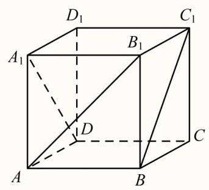

较易 【试卷】2004年全国卷Ⅱ高考真题数学理科...

40. 函数 $y = {\sin }^{4}x + {\cos }^{2}x$ 的最小正周期为( )

A. $\frac{\pi }{4}$

B. $\frac{\pi }{2}$

C. $\pi$

D. ${2\pi }$

---

	答案

B

---

$y = {\sin }^{4}x + {\cos }^{2}x$

$= {\left( \frac{1 - \cos {2x}}{2}\right) }^{2} + \frac{1 + \cos {2x}}{2}$

$= \frac{{\cos }^{2}x + 3}{4}$

$1 + \cos {4x}$

$= \frac{2}{4}\cos {4x} + \frac{7}{8}$

$= \frac{1}{8}\cos {4x} + \frac{7}{8}$

故最小正周期 $T = \frac{2\pi }{4} = \frac{\pi }{2}$ .

故选 B

一般 【试卷】2004年全国卷II高考真题数学理科...

41. 在由数字1,2,3,4,5组成的所有没有重复数字的 5 位数中，大于 23145 且小于 43521 的数共有( )

A. 56 个

B. 57 个

C. 58 个

D. 60 个

答案

C

解析

根据题意, 大于 23145 且小于 43521 的数有以下几种情况:

① 前三位为 231 ，有 1 个，即为 23154；

② 前三位为 234,235 ，有 $2 \times  {\mathrm{A}}_{2}^{2} = 4$ 个；

③ 前两位是 24,25，有 $2 \times  {\mathrm{A}}_{3}^{3} = {12}$ 个；

④ 首位是 3，有 ${\mathrm{A}}_{4}^{4} = {24}$ 个；

⑤ 前两位是 41,42,有 $2 \times  {\mathrm{A}}_{3}^{3} = {12}$ 个;

⑥ 前三位为 431,432,有 $2 \times  {\mathrm{A}}_{2}^{2} = 4$ 个;

⑦ 前三位为 435，有 1 个，即为 43512.

综上可得，符合题意的数共有 $1 + 4 + {12} + {24} + {12} + 4 + 1 = {58}$ 个.

一般 【试卷】湖南省株洲市南方中学2022-2023...

42. 数列 $\left\{  {a}_{n}\right\}$ 的前 $\mathrm{n}$ 项和为 ${S}_{n}$ ,已知 ${a}_{1} = 1,{a}_{n + 1} = \frac{n + 2}{\mathrm{n}}{S}_{n}$ ,证明:

(1) 数列 $\left\{  \frac{{S}_{n}}{n}\right\}$ 是等比数列;

(2)求 ${S}_{n}$ 与 ${a}_{n}$ .

## 答案

(1)证明见解析;

(2) ${S}_{n} = n \cdot  {2}^{n - 1},\;{a}_{n} = \left( {n + 1}\right)  \cdot  {2}^{n - 2}$ .

解析

(1)因为 ${a}_{n + 1} = \frac{n + 2}{n}{S}_{n}$ ，所以 ${S}_{n + 1} - {S}_{n} = \frac{n + 2}{n}{S}_{n} \Rightarrow  {S}_{n + 1} = \frac{2\left( {n + 1}\right) }{n}{S}_{n} \Rightarrow  \frac{{S}_{n + 1}}{n + 1} = 2 \times  \frac{{S}_{n}}{n}$ ，又 ${a}_{1} = 1$ ,所以 $\frac{{S}_{1}}{1} = 1$ , 所以数列 $\left\{  \frac{{S}_{n}}{n}\right\}$ 是首项为 1,公比为2的等比数列.

(2)由(1)可得 $\frac{{S}_{n}}{n} = {2}^{n - 1}$ ，即 ${S}_{n} = n \cdot  {2}^{n - 1}$ ，

当 $n \geq  2$ 时， ${a}_{n} = {S}_{n} - {S}_{n - 1} = n \cdot  {2}^{n - 1} - \left( {n - 1}\right)  \cdot  {2}^{n - 2} = \left( {n + 1}\right)  \cdot  {2}^{n - 2}$ ，当 $n = 1$ 时，符合

${a}_{n} = \left( {n + 1}\right)  \cdot  {2}^{n - 2}$ ,所以 ${a}_{n} = \left( {n + 1}\right)  \cdot  {2}^{n - 2}$ .

一般 【试卷】2004年普通高等学校招生考试数学...

43. 双曲线 $\frac{{x}^{2}}{{a}^{2}} - \frac{{y}^{2}}{{b}^{2}} = 1\left( {a > 1, b > 0}\right)$ 的焦点距为 ${2c}$ ，直线 $l$ 过点 $\left( {a,0}\right)$ 和 $\left( {0, b}\right)$ ，且点 $\left( {1,0}\right)$ 到直线 $l$ 的距离与点 $\left( {-1,0}\right)$ 到直线 $l$ 的距离之和 $s \geq  \frac{4}{5}c$ . 求双曲线的离心率 $e$ 的取值范围.

答案

$\frac{\sqrt{5}}{2} \leq  e \leq  \sqrt{5}$

解析

直线 $l$ 的方程是 ${bx} + {ay} - {ab} = 0$ . 点 $\left( {1,0}\right)$ 到直线 $l$ 的距离 ${d}_{1} = \frac{b\left( {a - 1}\right) }{\sqrt{{a}^{2} + {b}^{2}}}$ ,点 $\left( {-1,0}\right)$ 到直线 $l$ 的距离

${d}_{2} = \frac{b\left( {a + 1}\right) }{\sqrt{{a}^{2} + {b}^{2}}}, s = {d}_{1} + {d}_{2} = \frac{2ab}{\sqrt{{a}^{2} + {b}^{2}}} = \frac{2ab}{c}$ . 由 $S \geq  \frac{4}{5}c$ 知 ${5a}\sqrt{{c}^{2} - {a}^{2}} \geq  2{c}^{2}$ . 所以 $4{\mathrm{e}}^{4} - {25}{\mathrm{e}}^{2} + {25} \leq  0$ . 由

此可知 $\mathrm{e}$ 的取值范围. 解: 直线 $\mathrm{l}$ 的方程为 $\frac{x}{a} + \frac{y}{b} = 1$ ,即bx+ay - ab=0 .

由点到直线的距离公式,且 $\mathrm{a} > 1$ ,得到点 $\left( {1,0}\right)$ 到直线 $\mathrm{l}$ 的距离 ${d}_{1} = \frac{b\left( {a - 1}\right) }{\sqrt{{a}^{2} + {b}^{2}}}$ ,

同理得到点 $\left( {-1,0}\right)$ 到直线 $l$ 的距离 ${d}_{2} = \frac{b\left( {a + 1}\right) }{\sqrt{{a}^{2} + {b}^{2}}}s = {d}_{1} + {d}_{2} = \frac{2ab}{\sqrt{{a}^{2} + {b}^{2}}} = \frac{2ab}{c}$ .

由 $s \geq  \frac{4}{5}c$ ,得 $\frac{2ab}{c} \geq  \frac{4}{5}c$ ,即 ${5a}\sqrt{{c}^{2} - {a}^{2}} \geq  2{c}^{2}$ .

于是得 $5\sqrt{{e}^{2} - 1} \geq  2{e}^{2}$ ,即 $4{\mathrm{e}}^{4} - {25}{\mathrm{e}}^{2} + {25} \leq  0$ . 解不等式,得 $\frac{5}{4} \leq  {e}^{2} \leq  5$ .

由于 $\mathrm{e} > 1 > 0$ ,

所以 $\mathrm{e}$ 的取值范围是 $\frac{\sqrt{5}}{2} \leq  e \leq  \sqrt{5}$ .

本题主要考查点到直线距离公式, 双曲线的基本性质以及综合运算能力.

## 较难

44. 若 $f\left( x\right)$ 和 $g\left( x\right)$ 都是定义在实数集 $\mathbf{R}$ 上的函数，且方程 $x - f\left\lbrack  {g\left( x\right) }\right\rbrack   = 0$ 有实数解，则 $g\left\lbrack  {f\left( x\right) }\right\rbrack$ 不可能是 ( )

A. ${x}^{2} + x - \frac{1}{5}$

B. ${x}^{2} + x + \frac{1}{5}$

C. ${x}^{2} - \frac{1}{5}$

D. ${x}^{2} + \frac{1}{5}$

答案

B

解析

不妨设 $a$ 为方程 $x - f\left\lbrack  {g\left( x\right) }\right\rbrack   = 0$ 的实数解,即 $a = f\left\lbrack  {g\left( a\right) }\right\rbrack$ ,

从而有 $g\left\lbrack  {f\left( {g\left( a\right) }\right) }\right\rbrack   = g\left( a\right)$ ,即 $g\left( a\right)$ 为 $g\left\lbrack  {f\left( x\right) }\right\rbrack   = x$ 的实数解.

所以若 $f\left\lbrack  {g\left( x\right) }\right\rbrack   = x$ 有实数解,则 $g\left\lbrack  {f\left( x\right) }\right\rbrack   = x$ 也有实数解. 分别令四个选择支中的函数等于 $x$ ,只有 $\mathrm{B}$ 无解. 所以不可能为B.

较易 【试卷】2005年普通高等学校春季招生考试...

45. 若不等式 ${\left( -1\right) }^{n}a < 2 + \frac{{\left( -1\right) }^{n + 1}}{n}$ 对于任意正整数 $\mathrm{n}$ 恒成立，则实数 $\mathrm{a}$ 的取值范围是( )

A. $\left\lbrack  {-2,\frac{3}{2}}\right)$

B. $\left( {-2,\frac{3}{2}}\right)$

C. $\left\lbrack  {-3,\frac{3}{2}}\right)$

D. $\left( {-3,\frac{3}{2}}\right)$

答案

A

解析

对 $n$ 按奇偶数分类讨论,再由不等式恒成立可得.

$n$ 为正奇数时,不等式为 $- a < 2 + \frac{1}{n}$ ,

易知 $y = 2 + \frac{1}{n}$ 是递减的，因此而 $2 + \frac{1}{n} > 2$ ，所以 $- a \leq  2$ ，即 $a \geq   - 2$ ，

$n$ 为正偶数时，不等式为 $a < 2 - \frac{1}{n}$ ，

易知 $y = 2 - \frac{1}{n}$ 是递增的， $n = 2$ 时， $y = 2 - \frac{1}{n}$ 取得最小值 $\frac{3}{2}$ ，所以 $a < \frac{3}{2}$ ，

综上, $a$ 的范围是 $\left\lbrack  {-2,\frac{3}{2}}\right)$ .

故选: A.

较易 【试卷】2005年普通高等学校招生考试数学...

46. 连接抛物线上任意四点组成的四边形可能是 . (填写所有正确选项的序号)

①菱形；②有3条边相等的四边形；③梯形；④平行四边形；⑤有一组对角相等的四边形.

答案

②③⑤

解析

根据具体的情况在抛物线上进行分析,画图即可得到结果.

解:关于选项A，因为菱形是4条边相等，而且对角线垂直，但是抛物线只有一个顶点，所以无法做到两条直线垂直，且各边长度相等，最多三边相等，

故① 错误，② 正确；

因为梯形是只有上底和下底平行，作两条垂直于对称轴的直线交抛物线于四点，顺次连接，即可得到，故③正确； 连接抛物线上四点,只有垂直于对称轴的直线平行,其他的不可能做到平行且相等,故④错误;

以一个点为顶点做两条射线交抛物线于两点,剩下的角有一个角取值 ${0}^{ \circ  } \sim  {180}^{ \circ  }$ ,故⑤正确.

故答案为:②③⑤

一般 【试卷】2004年全国卷II高考真题数学理科...

47. 已知锐角三角形 ${ABC}$ 中, $\sin \left( {A + B}\right)  = \frac{3}{5},\sin \left( {A - B}\right)  = \frac{1}{5}$ .

(1)求证 $\tan A = 2\tan B$ ;

(2) 设 ${AB} = 3$ ，求 ${AB}$ 边上的高.

答案

(1)见解析

(2) $2 + \sqrt{6}$

解析

(1)因为 $\sin \left( {A + B}\right)  = \frac{3}{5},\sin \left( {A - B}\right)  = \frac{1}{5}$ ,

所以 $\left\{  \begin{array}{l} \sin A\cos B + \cos A\sin B = \frac{3}{5} \\  \sin A\cos B - \cos A\sin B = \frac{1}{5} \end{array}\right.$

两式分别相加减得 $\left\{  \begin{array}{ll} \sin A\cos B = \frac{2}{5} & \text{ ① } \\  \cos A\sin B = \frac{1}{5} & \text{ ② } \end{array}\right.$

① $\div$ ② 得 $\frac{\tan A}{\tan B} = 2$ .

所以 $\tan A = 2\tan B$ 成立.

( 2 )由 $\frac{\pi }{2} < A + B < \pi ,\sin \left( {A + B}\right)  = \frac{3}{5}$ 可得，

$\tan \left( {A + B}\right)  =  - \frac{3}{4}$ ,即 $\frac{\tan A + \tan B}{1 - \tan A\tan B} =  - \frac{3}{4}$ ,

将 $\tan A = 2\tan B$ 代入上式并整理得 $2{\tan }^{2}B - 4\tan B - 1 = 0$ ,

解得 $\tan B = \frac{2 \pm  \sqrt{6}}{2}$ ，舍去负值得 $\tan B = \frac{2 + \sqrt{6}}{2}$ ，

所以 $\tan A = 2\tan B = 2 + \sqrt{6}$ .

设 ${AB}$ 边上的高为 ${CD}$ ，

则 ${AB} = {AD} + {DB} = \frac{CD}{\tan A} + \frac{CD}{\tan B} = \frac{3CD}{2 + \sqrt{6}}$ .

由 ${AB} = 3$ ,得 ${CD} = 2 + \sqrt{6}$ ,所以 ${AB}$ 边上的高等于 $2 + \sqrt{6}$ .

较易 【试卷】数学竞赛《提优教程》教案:第31...

48. 已知数列 $\left\{  {a}_{n}\right\}$ 中， ${a}_{1} = 1$ ，且 ${a}_{2k} = {a}_{{2k} - 1} + {\left( -1\right) }^{k},{a}_{{2k} + 1} = {a}_{2k} + {3}^{k}$ ，其中 $k = 1,2,3,\cdots$ .

(1) 求 ${a}_{3},{a}_{5}$ ;

(2)求 $\left\{  {a}_{n}\right\}$ 的通项公式.

答案

(1) ${a}_{3} = 3,\;{a}_{5} = {13}$ ;

(2)当 $n$ 为奇数时， ${a}_{n} = \frac{{3}^{\frac{n + 1}{2}}}{2} + \frac{1}{2}{\left( -1\right) }^{\frac{n - 1}{2}} - 1$ ; 当 $n$ 为偶数时， ${a}_{n} = \frac{{3}^{\frac{n}{2}}}{2} + \frac{1}{2}{\left( -1\right) }^{\frac{n}{2}} - 1$ .

解析

(1) ${a}_{2} = {a}_{1} + {\left( -1\right) }^{1} = 1 - 1 = 0$ ,

${a}_{3} = {a}_{2} + {3}^{1} = 3$

${a}_{4} = {a}_{3} + {\left( -1\right) }^{2} = 4,$

${a}_{5} = {a}_{4} + {3}^{2} = {13},$

所以 ${a}_{3} = 3,{a}_{5} = {13}$ ;

(2) 由 ${a}_{{2k} + 1} = {a}_{2k} + {3}^{k} = {a}_{{2k} - 1} + {\left( -1\right) }^{k} + {3}^{k}$ ,

所以 ${a}_{{2k} + 1} - {a}_{{2k} - 1} = {\left( -1\right) }^{k} + {3}^{k}$ ,

同理 ${a}_{{2k} - 1} - {a}_{{2k} - 3} = {\left( -1\right) }^{k - 1} + {3}^{k - 1}$ ,

又 ${a}_{3} - {a}_{1} = 3 + \left( {-1}\right)$ ,

所以 $\left( {{a}_{{2k} + 1} - {a}_{{2k} - 1}}\right)  + \left( {{a}_{{2k} - 1} - {a}_{{2k} - 3}}\right)  + \cdots \left( {{a}_{3} - {a}_{1}}\right)$

$= \left( {{3}^{k} + {3}^{k - 1} + \cdots  + 3}\right)  + \left\lbrack  {{\left( -1\right) }^{k} + {\left( -1\right) }^{k - 1} + \cdots  + \left( {-1}\right) }\right\rbrack$

所以 ${a}_{{2k} + 1} - {a}_{1} = \frac{3}{2}\left( {{3}^{k} - 1}\right)  + \frac{1}{2}\left\lbrack  {{\left( -1\right) }^{k} - 1}\right\rbrack$ ,

于是 ${a}_{{2k} + 1} = \frac{{3}^{k + 1}}{2} + \frac{1}{2}{\left( -1\right) }^{k} - 1$ ,

于是 ${a}_{2k} = {a}_{{2k} - 1} + {\left( -1\right) }^{k} = \frac{{3}^{k}}{2} + \frac{1}{2}{\left( -1\right) }^{k - 1} - 1 + {\left( -1\right) }^{k} = \frac{{3}^{k}}{2} + \frac{1}{2}{\left( -1\right) }^{k} - 1$ ,

$\left\{  {a}_{n}\right\}$ 的通项公式为:

当 $n$ 为奇数时, ${a}_{n} = \frac{{3}^{\frac{n + 1}{2}}}{2} + \frac{1}{2}{\left( -1\right) }^{\frac{n - 1}{2}} - 1$ ;

当 $n$ 为偶数时, ${a}_{n} = \frac{{3}^{\frac{n}{2}}}{2} + \frac{1}{2}{\left( -1\right) }^{\frac{n}{2}} - 1$ .

一般 【试卷】2005年普通高等学校招生考试数学...

49. 函数 $f\left( x\right)  = \frac{\sqrt{1 - \cos {2x}}}{\cos x}\;$ (   )

A. 在 $\left\lbrack  {0,\frac{\pi }{2}}\right) ,\left( {\frac{\pi }{2},\pi }\right\rbrack$ 上递增,在 $\left\lbrack  {\pi ,\frac{3\pi }{2}}\right) ,\left( {\frac{3\pi }{2},{2\pi }}\right\rbrack$ 上递减

B. 在 $\left\lbrack  {0,\frac{\pi }{2}}\right) ,\left( {\pi ,\frac{3\pi }{2}}\right\rbrack$ 上递增,在 $\left\lbrack  {\frac{\pi }{2},\pi }\right) ,\left( {\frac{3\pi }{2},{2\pi }}\right\rbrack$ 上递减

C. 在 $\left( {\frac{\pi }{2},\pi }\right\rbrack  ,\left( {\frac{3\pi }{2},{2\pi }}\right\rbrack$ 上递增,在 $\left\lbrack  {0,\frac{\pi }{2}}\right) ,\left( {\pi ,\frac{3\pi }{2}}\right\rbrack$ 上递减

D. 在 $\left\lbrack  {\pi ,\frac{3\pi }{2}}\right) ,\left( {\frac{3\pi }{2},{2\pi }}\right\rbrack$ 上递增,在 $\left\lbrack  {0,\frac{\pi }{2}}\right) ,\left( {\frac{\pi }{2},\pi }\right\rbrack$ 上递减

答案

A

解析

先化简函数的解析式, 再根据正切函数的单调性即可求解

因为 $f\left( x\right)  = \frac{\sqrt{1 - \cos {2x}}}{\cos x} = \frac{\sqrt{2}\left| {\sin x}\right| }{\cos x}$ ,

当 $x \in  \left\lbrack  {0,\frac{\pi }{2}}\right)  \cup  \left( {\frac{\pi }{2},\pi }\right\rbrack$ 时,此时 $\sin x \geq  0$ ,所以 $f\left( x\right)  = \sqrt{2} \cdot  \frac{\sin x}{\cos x} = \sqrt{2}\tan x$ ,

当 $x \in  \left\lbrack  {\pi ,\frac{3\pi }{2}}\right)  \cup  \left( {\frac{3\pi }{2},{2\pi }}\right\rbrack$ 时,此时 $\sin x \leq  0$ ,所以 $f\left( x\right)  = \sqrt{2} \cdot  \frac{-\sin x}{\cos x} =  - \sqrt{2}\tan x$ ,

因为 $y = \tan x$ 在 $\left\lbrack  {0,\frac{\pi }{2}}\right) ,\left( {\frac{\pi }{2},\frac{3\pi }{2}}\right) ,\left( {\frac{3\pi }{2},{2\pi }}\right\rbrack$ 上单调递增,

所以 $f\left( x\right)$ 在 $\left\lbrack  {0,\frac{\pi }{2}}\right) ,\left( {\frac{\pi }{2},\pi }\right\rbrack$ 上递增,在 $\left\lbrack  {\pi ,\frac{3\pi }{2}}\right) ,\left( {\frac{3\pi }{2},{2\pi }}\right\rbrack$ 上递减,

故选: A

50. $f\left( x\right)$ 是定义在 $R$ 上的以3为周期的偶函数，且 $f\left( 2\right)  = 0$ ，则方程 $f\left( x\right)  = 0$ 在区间 $\left( {0,6}\right)$ 内解的个数的最小值是

A. 5

B. 4

C. 3

D. 2

答案

B

解析

根据函数的奇偶性以及周期性求得 $f\left( 5\right)  = 0, f\left( 1\right)  = 0, f\left( 4\right)  = 0$ ,即可得出结论.

因为 $f\left( x\right)$ 是定义在 $\mathrm{R}$ 上以 3 为周期的偶函数,且 $f\left( 2\right)  = 0$ ,所以 $f\left( {-2}\right)  = 0$ ,

$f\left( 5\right)  = 0, f\left( 1\right)  = 0, f\left( 4\right)  = 0,$

故选: B.

## 一般

51. (2005・湖北)某初级中学有学生270人，其中一年级108人，二、三年级各81人，现要利用抽样方法抽取10人参加某项调查，考虑选用简单随机抽样、分层抽样和系统抽样三种方案，使用简单随机抽样和分层抽样时，将学生按一、二、三年级依次统一编号为 $1,2,\ldots ,{270}$ ; 使用系统抽样时，将学生统一随机编号 $1,2,\ldots ,{270}$ ，并将整个编号依次分为10段. 如果抽得号码有下列四种情况:

①7,34,61,88,115,142,169,196,223,250;

②5,9,100,107,111,121,180,195,200,265;

③11,38,65,92,119,146,173,200,227,254;

④30,57,84,111,138,165,192,219,246,270;

关于上述样本的下列结论中，正确的是( )

A. ②、③都不能为系统抽样

B. ②、④都不能为分层抽样

C. ①、④ 都可能为系统抽样

D. ①、③ 都可能为分层抽样

答案

D

解析

由题意:

① 样本间隔是27. 有可能是系统抽样;

② 样本间隔不相同，不可能是系统抽样；

③ 样本间隔相同是27，有可能是系统抽样；

④ 样本间隔是27，但第一组没有号码，故 ④ 不是系统抽样；

由于一年级108人，二、三年级各81人，则如使用分层抽样对应的人数为 ${108} : {81} : {81} = 4 : 3 : 3$ ，则 ① ③ 有可能是分层抽样

一般 【试卷】浙江省普通高校招生考试考纲信息...

52. 设P是 $\bigtriangleup {ABC}$ 内任意一点, ${S}_{\bigtriangleup {ABC}}$ 表示 $\bigtriangleup {ABC}$ 的面积, ${\lambda }_{1} = \frac{{S}_{\bigtriangleup {PBC}}}{{S}_{\bigtriangleup {ABC}}},{\lambda }_{2} = \frac{{S}_{\bigtriangleup {PCA}}}{{S}_{\bigtriangleup {ABC}}},{\lambda }_{3} = \frac{{S}_{\bigtriangleup {PAB}}}{{S}_{\bigtriangleup {ABC}}}$ ,定义 $f\left( P\right)  = \left( {{\lambda }_{1},{\lambda }_{2},{\lambda }_{3}}\right)$ ，若 $G$ 是 $\bigtriangleup  {ABC}$ 的重心， $f\left( Q\right)  = \left( {\frac{1}{2},\frac{1}{3},\frac{1}{6}}\right)$ ，则( )

A. 点 $Q$ 在 $\bigtriangleup  {GAB}$ 内

B. 点 $Q$ 在 $\bigtriangleup  {GBC}$ 内

C. 点 $Q$ 在点 $G$ 重合

D. 点 $Q$ 与点 $G$ 重合

答案

A

解析

记 ${AB}$ 的中点为 $M,{AC}$ 的中点为 $N$ ,过点 $G$ 且平行于 ${AC}$ 的直线为 $l$ ,则点 $Q$ 为直线 ${MN}$ 与直线 $l$ 的交点,在 $\bigtriangleup {GAB}$ 内.

故选 A

## 一般

53. 已知 $a, b$ 为常数，若 $f\left( x\right)  = {x}^{2} + {4x} + 3, f\left( {{ax} + b}\right)  = {x}^{2} + {10x} + {24}$ ，则 ${5a} - b =$ ___.

答案

2

解析

计算出 $f\left( {{ax} + b}\right)$ ,比较 $f\left( {{ax} + b}\right)  = {x}^{2} + {10x} + {24}$ 两端的系数,得 $\left\{  \begin{array}{l} {a}^{2} = 1, \\  {2ab} + {4a} = {10}, \\  {b}^{2} + {4b} + 3 = {24}, \end{array}\right.$

解得 $a =  - 1, b =  - 7$ 或 $a = 1, b = 3$ .

较易 【试卷】上海市市北中学2022-2023学年高...

54. 在 $\bigtriangleup  \mathrm{{ABC}}$ 中，O为中线AM上的一个动点，若AM =2，则 $\overrightarrow{OA} \cdot  \left( {\overrightarrow{OB} + \overrightarrow{OC}}\right)$ 的最小值是 .

## 答案

-2

解析

试题分析: 因为 $\mathrm{M}$ 为中点,所以 $\overrightarrow{OB} + \overrightarrow{OC} = 2\overrightarrow{OM}$ ,且 $\overrightarrow{OA}$ 与 $\overrightarrow{OM}$ 夹角为 ${\pi \pi }$ ,设 ${OA} = x$ ,则

${OM} = 2 - x\left( {0 \leq  x \leq  2}\right) ,\overrightarrow{OA} \cdot  \left( {\overrightarrow{OB} + \overrightarrow{OC}}\right)  = \overrightarrow{OA} \cdot  2\overrightarrow{OM} =  - 2\left| \overrightarrow{OA}\right| \left| \overrightarrow{OM}\right|  =  - {2x}\left( {2 - x}\right)  = 2{x}^{2} - {4x}$ ,因为 $0 \leq  x \leq  2$ ,所以当 $x = 1$ 时,其最小值为 -2 .

考点: 1. 向量的加法; 2. 向量的数量积; 3. 二次函数的最值;

较易 【试卷】2024-2025福建省高三上学期教材...

55. 四棱锥的八条棱代表8种不同的化工产品，有公共点的两条棱代表的化工产品放在同一仓库是危险的，没有公共点的两条棱代表的化工产品放在同一仓库是安全的，现打算用编号为①、②、③、④的4个仓库存放这8种化工产品, 那么安全存放的不同方法种数为

A. 96

B. 48

C. 24

D. 0

## 答案

B

解析

解: 8种化工产品分4组，设四棱锥的顶点是P，底面四边形的个顶点为A、B、C、D.

分析得到四棱锥没有公共点的8条棱分4组，只有2种情况，

(PA、DC; PB、AD; PC、AB; PD、BC) 或 (PA、BC; PD、AB; PC、AD; PB、DC) 那么安全存放的不同方法种数为 $2{\mathrm{\;A}}_{4}^{4} = {48}$ .

故选B.

较易 【试卷】2021年12月山东临沂平邑县平邑县...

56. 已知实数 $a\text{ 、 }b$ 满足等式 ${\left( \frac{1}{2}\right) }^{a} = {\left( \frac{1}{3}\right) }^{b}$ ,下列五个关系式:

① $0 < b < a$ ；② $a < b < 0$ ；③ $0 < a < b$ ；④ $b < a < 0$ ；⑤ $a = b$ 其中不可能成立的关系式有( )

A. 1 个

B. 2 个

C. 3 个

D. 4 个

答案

B

解析

③④ 不成立，

${\left( \frac{1}{2}\right) }^{a} = {\left( \frac{1}{3}\right) }^{b}$ 可化为 ${2}^{-a} = {3}^{-b}$ ,两边同时取对数 $- a\lg 2 =  - b\lg 3$ ,

当 $a\text{ 、 }b$ 不为零时, $\frac{a}{b} = \frac{\lg 3}{\lg 2},\because \frac{\lg 3}{\lg 2} > 1,\therefore \frac{a}{b} > 1$ .

当 $a = b = 0$ 时, ${\left( \frac{1}{2}\right) }^{a} = {\left( \frac{1}{3}\right) }^{b}$ 成立.

综上所述, 不可能成立的关系式有 ③④.

也可根据指数函数图象直接得到 ①②⑤ 成立，则 ③④ 不成立.

故选 B

一般 【试卷】重庆市高三学业质量调研抽测(一...

57. 在 $\bigtriangleup {OAB}$ 中, $O$ 为坐标原点, $A\left( {1,\cos \theta }\right) , B\left( {\sin \theta ,1}\right) ,\theta  \in  \left( {0,\frac{\pi }{2}}\right\rbrack$ ,则当 $\bigtriangleup {OAB}$ 的面积取最大值时, $\theta  =$

( )

A. $\frac{\pi }{6}$

B. $\frac{\pi }{4}$

C. $\frac{\pi }{3}$

D. $\frac{\pi }{2}$

答案

D

解析

在直角坐标系里 $\bigtriangleup {OAB}$ 的面积为边长为 1 的正方形减去要求的三角形以外的三角形的面积，所以 ${S}_{\bigtriangleup {OAB}} = 1 - \frac{1}{2}\sin \theta  - \frac{1}{2}\cos \theta  - \frac{1}{2}\left( {1 - \cos \theta }\right)  \times  \left( {1 - \sin \theta }\right)  = \frac{1}{2} - \frac{1}{2}\sin \theta \cos \theta  = \frac{1}{2} - \frac{1}{4}\sin {2\theta }$ . 因为 $\theta  \in  \left( {0,\frac{\pi }{2}}\right\rbrack$ ,所以 ${2\theta } \in  (0,\pi \rbrack$ ,所以当 ${2\theta } = \pi$ ,即 $\theta  = \frac{\pi }{2}$ 时, ${S}_{\bigtriangleup {OAB}}$ 取得最大值.

故选 D

一般 【试卷】北京名校2023届高三二轮复习专...

58. 将1,2,...,9这9个数平均分成三组，则每组的三个数都成等差数列的概率为( )

A. $\frac{1}{420}$

B. $\frac{1}{336}$

C. $\frac{1}{70}$

D. $\frac{1}{56}$

答案

D

解析

解: 9 个数分成三组,共有 $\frac{{C}_{9}^{3}{C}_{6}^{3}{C}_{3}^{3}}{{A}_{3}^{3}}$ 组,其中每组的三个数均成等差数列,有

$\{ \left( {1,2,3}\right) ,\left( {4,5,6}\right) ,\left( {7,8,9}\right) \}$

$\{ \left( {1,2,3}\right) ,\left( {4,6,8}\right) ,\left( {5,7,9}\right) \}$

$\{ \left( {1,3,5}\right) ,\left( {2,4,6}\right) ,\left( {7,8,9}\right) \}$

$\{ \left( {1,4,7}\right) ,\left( {2,5,8}\right) ,\left( {3,6,9}\right) \}$

$\{ \left( {1,5,9}\right) ,\left( {2,3,4}\right) ,\left( {6,7,8}\right) \}$ ,共5组.

$\therefore$ 所求概率为 $\frac{5}{8 \times  7 \times  5} = \frac{1}{56}$ .

故选: D.

本题主要考查了等差关系的确定和概率的性质. 对于数量比较小的问题中, 可以用枚举的方法解决问题直接, 属于中档题.

## 一般

59. 如图，在直三棱柱 ${ABC} - {A}_{1}{B}_{1}{C}_{1}$ 中， ${AB} = {BC} = \sqrt{2}$ ， ${B{B}_{1}} = 2$ ， $\angle {ABC} = {90}^{ \circ  }$ ， $E$ 、 $F$ 分别为 $A{A}_{1}$ 、 ${C}_{1}{B}_{1}$ 的中点，沿棱柱的表面从 $E$ 到 $F$ 两点的最短路径的长度为___.

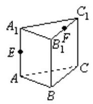

② 答案

$\frac{3\sqrt{2}}{2}$

解析

$\because {AB} = {BC} = \sqrt{2}$ ， $\angle {ABC} = {90}^{ \circ  }$ ， $\therefore {AC} = 2$ . $\therefore$ 侧面展开后如图 1 所示.

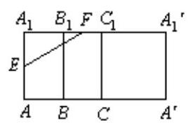

图1

${A}_{1}E = \frac{1}{2}A{A}_{1} = 1,\;{A}_{1}F = {A}_{1}{B}_{1} + {B}_{1}F = \frac{3\sqrt{2}}{2},\therefore {EF} = \sqrt{{A}_{1}{E}^{2} + {A}_{1}{F}^{2}} = \sqrt{1 + \frac{9}{2}} = \frac{\sqrt{22}}{2}$ . 把 $\bigtriangleup {A}_{1}{B}_{1}{C}_{1}$ 与侧面 ${A}_{1}{B}_{1}{BA}$ 展平如图 2 所示.

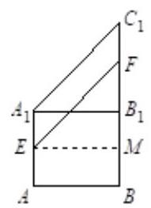

图2

连结 ${EF}$ ,过 $E$ 作 ${EM} \bot  {B}_{1}B$ ,则 ${EM} = {AB} = \sqrt{2},{FM} = 1 + \frac{\sqrt{2}}{2},{EF} = \sqrt{\frac{7}{2} + \sqrt{2}}$ . 若把 $\bigtriangleup {A}_{1}{B}_{1}{C}_{1}$ 与侧面 ${A}_{1}{AC}{C}_{1}$ 展平如图 3.

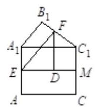

图3

连结 ${EF}$ ,作 ${EM} \bot  C{C}_{1}$ 于 $M$ ,作 ${FD} \bot  {EM}$ 于 $D$ 点,则 ${ED} = \frac{3}{2},{Fd} = \frac{3}{2}$ ,

$\therefore {EF} = \sqrt{{\left( \frac{3}{2}\right) }^{2} + {\left( \frac{3}{2}\right) }^{2}} = \frac{3\sqrt{2}}{2}$ .

比较以上三条路径, 以第三条最小,

$\therefore {EF}$ 间最短路径为 $\frac{3\sqrt{2}}{2}$ .

较难 【试卷】2017年江西南昌铁路一中高二上学...

60. 以下四个关于圆锥曲线的命题中.

① 设 $A$ 、 $B$ 为两个定点， $k$ 为非零常数， $\left| \overrightarrow{PA}\right|  - \left| \overrightarrow{PB}\right|  = k$ ，则动点 $P$ 的轨迹为双曲线；

② 设定圆 $C$ 上一定点 $A$ 作圆的动点弦 ${AB}, O$ 为坐标原点，若 $\overrightarrow{OP} = \frac{1}{2}\left( {\overrightarrow{OA} + \overrightarrow{OB}}\right)$ ，则动点 $P$ 的轨迹为椭圆；

③ 方程 $2{x}^{2} - {5x} + 2 = 0$ 的两根可分别作为椭圆和双曲线的离心率；

④ 双曲线 $\frac{{x}^{2}}{25} - \frac{{y}^{2}}{9} = 1$ 与椭圆 $\frac{{x}^{2}}{35} + {y}^{2} = 1$ 有相同的焦点.

其中真命题的序号为___ . (写出所有真命题的序号)

答案

③④

解析

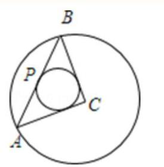

① 不正确. 若动点 $P$ 的轨迹为双曲线,则 $\left| k\right|$ 要小于 $A\text{ 、 }B$ 为两个定点间的距离.

当点 $P$ 在顶点 ${AB}$ 的延长线上时, $K = \left| {AB}\right|$ ,显然这种曲线是射线,而非双曲线.

② 不正确. 根据平行四边形法则，易得 $P$ 是 ${AB}$ 的中点. 根据垂径定理，圆心与弦的中点连线垂直于这条弦设圆心为 $C$ .

那么有 ${CP} \bot  {AB}$ 即 $\angle {CPB}$ 恒为直角. 由于 ${CA}$ 是圆的半径,是定长.

而 $\angle {CPB}$ 恒为直角. 也就是说, $P$ 在以 ${CP}$ 为直径的圆上运动, $\angle {CPB}$ 为直径所对的圆周角,所以 $P$ 点的轨迹是一个圆, 如图.

③ 正确. 方程 $2{x}^{2} - {5x} + 2 = 0$ 的两根分别为 $\frac{1}{2}$ 和 $2,\frac{1}{2}$ 和 2 可分别作为椭圆和双曲线的离心率.

④ 正确. 双曲线 $\frac{{x}^{2}}{25} - \frac{{y}^{2}}{9} = 1$ 与椭圆 $\frac{{x}^{2}}{35} + {y}^{2} = 1$ 焦点坐标都是 $\left( {\pm \sqrt{34},0}\right)$ .

故答案为 ③④

【分析】: ① 不正确. 若动点 $P$ 的轨迹为双曲线,则 $\left| k\right|$ 要小于 $A\text{ 、 }B$ 为两个定点间的距离; ② 不正确. 根据平行四边形法则,易得 $P$ 是 ${AB}$ 的中点. 由此可知 $P$ 点的轨迹是一个圆; ③ 正确. 方程 $2{x}^{2} - {5x} + 2 = 0$ 的两根 $\frac{1}{2}$ 和 2 可分别作为椭圆和双曲线的离心率; ④ 正确. 双曲线 $\frac{{x}^{2}}{25} - \frac{{y}^{2}}{9} = 1$ 与椭圆 $\frac{{x}^{2}}{35} + {y}^{2} = 1$ 焦点坐标都是 $\left( {\pm \sqrt{34},0}\right)$ .

一般 【试卷】上海市民办南模中学2024-2025学...

61. $\omega$ 是正实数，设 ${S}_{\omega } = \left\{  {\theta  \mid  f\left( x\right)  = \cos \left\lbrack  {\omega \left( {x + \theta }\right) }\right\rbrack  }\right.$ 是奇函数 $\}$ ，若对每个实数a， ${S}_{\omega } \cap  \left( {a, a + 1}\right)$ 的元素不超过2个，且有a使 ${S}_{\omega } \cap  \left( {a, a + 1}\right)$ 含2个元素，则 $\omega$ 的取值范围是

答案

$(\pi ,{2\pi }\rbrack$

解析

结合奇函数的性质特点得到 ${S}_{\omega } = \left\{  {\theta  \mid  \theta  = \frac{{2k} + 1}{2\omega }\pi , k \in  \mathrm{Z}}\right\}   = \left\{  {\cdots , - \frac{3}{2\omega }\pi , - \frac{1}{2\omega }\pi ,\frac{1}{2\omega }\pi ,\frac{3}{2\omega }\pi ,\cdots }\right\}$ ,由题意推知 ${S}_{\omega }$ 中任意相邻的两个元素之间隔必小于 1，并且 ${S}_{\omega }$ 中任意相邻的三个元素的两间隔之和必大于等于 1，据此

求得 $\omega$ 的取值范围.

由 ${S}_{\omega } = \{ \theta  \mid  f\left( x\right)  = \cos \left\lbrack  {\omega \left( {x + \theta }\right) }\right\rbrack$ 是奇函数 $\}$ 可得

${S}_{\omega } = \left\{  {\theta \left| {\;\theta  = \frac{{2k} + 1}{2\omega }\pi }\right. , k \in  \mathrm{Z}}\right\}   = \left\{  {\cdots , - \frac{3}{2\omega }\pi , - \frac{1}{2\omega }\pi ,\frac{1}{2\omega }\pi ,\frac{3}{2\omega }\pi ,\cdots }\right\}  ,$

因为 ${S}_{\omega } \cap  \left( {a, a + 1}\right)$ 的元素不超过2个，且有 $a$ 使 ${S}_{\omega } \cap  \left( {a, a + 1}\right)$ 含2个元素，也就是说 ${S}_{\omega }$ 中任意相邻的两个元素之间隔必小于1，并且 ${S}_{\omega }$ 中任意相邻的三个元素的两间隔之和必大于等于1，

即 $\frac{2}{2\omega }\pi  < 1$ 且 $2 \times  \frac{2}{2\omega }\pi  \geq  1$ ;

解可得 $\pi  < \omega  \leq  {2\pi }$ .

故答案为: $(\pi ,{2\pi }\rbrack$

## 一般

62. 在 $\bigtriangleup {ABC}$ 中，已知 $\tan \frac{A + B}{2} = \sin C$ ，给出以下四个论断:① $\tan A - \cot B = 1$ ； $\text{ ② }0 < \sin A + \sin B \leq  \sqrt{2}$ ； ③ ${\sin }^{2}A + {\cos }^{2}B = 1$ ；④ ${\cos }^{2}A + {\cos }^{2}B = {\sin }^{2}C$ ，其中正确的是___.

答案

②④

解析

由已知条件化简变形可得 $A + B = \frac{\pi }{2}$ ，然后利用三角函数恒等变换公式和三角函数的性质逐个分析判断因为 $\frac{\sin \frac{A + B}{2}}{\cos \frac{A + B}{2}} = \sin C = \sin \left( {A + B}\right)  = 2\sin \frac{A + B}{2}\cos \frac{A + B}{2}$ ,整理得 $\sin \frac{A + B}{2} = 2\sin \frac{A + B}{2}{\cos }^{2}\frac{A + B}{2}$ ，因为 $\sin \frac{A + B}{2} \neq  0$ ，所以 $1 = 2{\cos }^{2}\frac{A + B}{2}$ ，所以 $\cos \left( {A + B}\right)  = 0$ ， 因为 $0 < A + B < \pi$ ,所以 $A + B = \frac{\pi }{2}$ ,所以 $\tan A - \cot B = 1$ 不一定成立, $\tan A - \cot B = 0$ ,所以①不正确,

因为 $A + B = \frac{\pi }{2}$ ,所以 $\sin A + \sin B = \sin A + \cos A = \sqrt{2}\sin \left( {A + \frac{\pi }{4}}\right)$ ,因为 $\frac{\pi }{4} < A + \frac{\pi }{4} < \frac{3\pi }{4}$ ,所以 $1 < \sqrt{2}\sin \left( {A + \frac{\pi }{4}}\right)  \leq  \sqrt{2}$ ,所以②正确，

因为 $A + B = \frac{\pi }{2}$ ,所以 ${\sin }^{2}A + {\cos }^{2}B = 2{\sin }^{2}A \neq  1$ ,所以③不正确,

因为 $A + B = \frac{\overline{\pi }}{2}$ ,所以 ${\cos }^{2}A + {\cos }^{2}B = {\cos }^{2}A + {\sin }^{2}A = 1,{\sin }^{2}C = {\sin }^{2}{90}^{ \circ  } = 1$ ,

${\cos }^{2}A + {\cos }^{2}B = {\sin }^{2}C$ ,故④正确,

故答案为:②④.

## 较难

63. 过三棱柱任意两个顶点的直线共 15 条, 其中异面直线有( )

A. 18 对

B. 24 对

C. 30 对

D. 36 对

答案

D

解析

三棱柱的 6 个顶点,可以组成 ${\mathrm{C}}_{6}^{2} = {15}$ 条直线,共有 ${\mathrm{C}}_{15}^{2}$ 对直线,在三棱柱中,其中四点在同一平面的面共有 3 个,三点在同一个平面的面有 8 个,故共面的直线有 $3 \times  {\mathrm{C}}_{6}^{2} + 8 \times  {\mathrm{C}}_{3}^{2}$ ,所以异面直线有 ${\mathrm{C}}_{15}^{2} - 3 \times  {\mathrm{C}}_{6}^{2} - 8 \times  {\mathrm{C}}_{3}^{2} = {36}$ 对.

一般 【试卷】2005年全国卷I高考真题数学理科...

64. 在正方体 ${ABCD} - {A}^{\prime }{B}^{\prime }{C}^{\prime }{D}^{\prime }$ 中,过对角线 $B{D}^{\prime }$ 的一个平面交 $A{A}^{\prime }$ 于 $E$ ,交 $C{C}^{\prime }$ 于 $F$ ,

① 四边形 ${BF}{D}^{\prime }E$ 一定是平行四边形

② 四边形 ${BF}{D}^{\prime }E$ 有可能是正方形

③ 四边形 ${BF}{D}^{\prime }E$ 在底面 ${ABCD}$ 内的投影一定是正方形

④ 四边形 ${BF}{D}^{\prime }E$ 有可能垂直于平面 $B{B}^{\prime }D$

以上结论正确的为___(写出所有正确结论的编号).

答案

①③④

解析

由正方体的性质,四边形 ${BF}{D}^{\prime }E$ 的两组对边分别平行,所以一定是平行四边形,所以 ① 正确,若是正方形,则 ${BF} \bot  {D}^{\prime }F$ ,又因为 ${D}^{\prime }{C}^{\prime } \bot  {BF}$ ,所以 ${BF} \bot$ 平面 ${CD}{D}^{\prime }{C}^{\prime }$ ,所以 ${BF} \bot  {CF}$ ,矛盾,所以 ② 错误, 因为四边形 ${BF}{D}^{\prime }E$ 在底面 ${ABCD}$ 内的投影是四边形 ${ABCD}$ ,所以一定是正方形,③ 正确,因为当 ${EF}$ 平行于 ${AC}$ 时,截面四边形是菱形,此时四边形 ${BF}{D}^{\prime }E$ 垂直于平面 $B{B}^{\prime }D$ ,所以 ④ 正确. 答案:①③④.

一般 【试卷】2005年全国卷Ⅱ高考真题数学理科...

65. 将半径都为 1 的 4 个钢球完全装入形状为正四面体的容器里, 这个正四面体的高的最小值为( )

A. $\frac{\sqrt{3} + 2\sqrt{6}}{3}$

B. $2 + \frac{2\sqrt{6}}{3}$

C. $4 + \frac{2\sqrt{6}}{3}$

D. $\frac{4\sqrt{3} + 2\sqrt{6}}{3}$

答案

C

解析

四个球心构成一个正四面体 (如图),其棱长为 2,故其高 ${O}_{4}H = \frac{2\sqrt{6}}{3}$ .

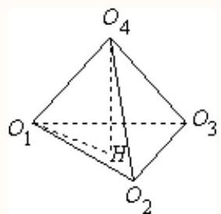

设装入四个钢球的正四面体容器为 $D - {ABC}$ (如图)，球心 ${O}_{4}$ 在其高 ${DE}$ 上，

且 ${O}_{4}E = {O}_{4}H + 1 = \frac{2\sqrt{6}}{3} + 1$ .

下面求 ${O}_{4}D$ .

设 $M$ 为球 ${O}_{4}$ 与平面 ${BCD}$ 的切点,

则 $M$ 在 $\mathrm{{Rt}}\bigtriangleup {BCD}$ 中线 ${DF}$ 上, ${O}_{4}M = 1,\bigtriangleup {DM}{O}_{4} \backsim  \bigtriangleup {DEF}$ ,

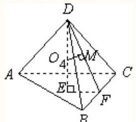

$\therefore \frac{{O}_{4}H}{{O}_{4}M} = \frac{\widetilde{D}F}{EF} = \frac{3}{1},\therefore {O}_{4}D = 3$ ,

$\therefore {DE} = {O}_{4}D + {O}_{4}E = 4 + \frac{2\sqrt{6}}{3}$ .

故选 C

一般 【试卷】2005年全国卷Ⅱ高考真题数学文科...

66. 在由数字0,1,2,3,4,5所组成的没有重复数字的四位数中，不能被 5 整除的数共有___个.

答案

192

解析

六个数字组成没有重复数字的四位数共 ${\mathrm{A}}_{6}^{4}$

由于 0 不能排第一位,要去掉 ${\mathrm{A}}_{5}^{3}$

不 5 整除可以看做总数减去能被 5 整除的数当个位是 0 或 5 时，这四位数就能被 5 整除. 当个位是 0 时有 ${\mathrm{A}}_{5}^{3}$ 当个位是 5 时有 ${\mathrm{A}}_{5}^{3} - {\mathrm{A}}_{4}^{2}$

$\therefore$ 共有 ${\mathrm{A}}_{6}^{4} - 3 \times  {\mathrm{A}}_{5}^{3} + {\mathrm{A}}_{4}^{2} = {192}$ .

故答案为: 192 .

一般 【试卷】2005年全国卷Ⅱ高考真题数学文科...

67. 下面是关于三棱锥的四个命题:

① 底面是等边三角形，侧面与底面所成的二面角都相等的三棱锥是正三棱锥；

② 底面是等边三角形，侧面都是等腰三角形的三棱锥是正三棱锥；

③ 底面是等边三角形，侧面的面积都相等的三棱锥是正三棱锥；

④ 侧棱与底面所成的角相等, 且侧面与底面所成的二面角都相等的三棱锥是正三棱锥.

其中，真命题的编号是___. (写出所有真命题的编号)

## 答案

①④

解析

① 设四面体为 $D - {ABC}$ ,过棱锥顶点 $D$ 作底面的垂线 ${DE}$ ,过 $E$ 分别作 ${AB},{BC},{CA}$ 边的垂线,

其垂足依次为 $F, G, H$ ,连接 ${DF},{DG},{DH}$ ,则 $\angle {DFE},\angle {DGE},\angle {DHE}$ 分别为各侧面与底面所成的角,

所以 $\angle {DFE} = \angle {DGE} = \angle {DHE}$ ,于是有 ${FE} = {EG} = {EH},{DF} = {DG} = {DH}$ ,故 $E$ 为 $\bigtriangleup {ABC}$ 的内心,

又因 $\bigtriangleup {ABC}$ 为等边三角形,所以 $F, G, H$ 为各边的中点,

所以 $\bigtriangleup {AFD} \cong  \bigtriangleup {BFD} \cong  \bigtriangleup {BGD} \cong  \bigtriangleup {CGD} \cong  \bigtriangleup {AHD}$ ,故 ${DA} = {DB} = {DC}$ ,

故棱锥为正三棱锥, 所以为真命题;

② 侧面为等腰三角形，不一定就是侧棱为两腰，所以为假命题;

③ 面积相等，不一定侧棱就相等，只要满足斜高相等即可，所以为假命题；

④ 由侧棱与底面所成的角相等，可以得出侧棱相等，又结合 ① 知底面应为正三角形，所以为真命题. 综上, ①④ 为真命题.

故答案为:①④.

较难 【试卷】2019年浙江杭州西湖区杭州外国语...

68. 计算机中常用的十六进制是一种逢 16 进 1 的计数制，采用数字 $0 \sim  9$ 和字母 $A \sim  F$ 共 16 个计数符号，这些符号与十进制的数字的对应关系如下表:

<table><tr><td>十六进制</td><td>0</td><td>1</td><td>2</td><td>3</td><td>4</td><td>5</td><td>6</td><td>7</td></tr><tr><td>十进制</td><td>0</td><td>1</td><td>2</td><td>3</td><td>4</td><td>5</td><td>6</td><td>7</td></tr><tr><td>十六进制</td><td>8</td><td>9</td><td>$A$</td><td>$B$</td><td>$C$</td><td>$D$</td><td>$E$</td><td>$F$</td></tr><tr><td>十进制</td><td>8</td><td>9</td><td>10</td><td>11</td><td>12</td><td>13</td><td>14</td><td>15</td></tr></table>

例如,用十六进制表示 $E + D = {1B}$ ,用十进制表示也就是 ${13} + {14} = 1 \times  {16} + {11}$ ,则用十六进制表示 $A \times  B =$ ( )

A. ${6E}$

B. 72

C. ${5F}$

D. ${B0}$

答案

A

解析

$\because$ 表格中 $A$ 对应的十进制数为 ${10}, B$ 对应的十进制数为 11,

$\therefore A \times  B = {10} \times  {11}$ ,

由十进制表示为: ${10} \times  {11} = 6 \times  {16} + {14}$ ,

又表格中 $E$ 对应的十进制为 14,

$\therefore$ 用十六进制表示 $A \times  B = {6E}$ .

故选 A

较易 【试卷】2005年全国卷III高考真题数学理科...

69. 设 $l$ 为平面上过点 $\left( {0,1}\right)$ 的直线， $l$ 的斜率等可能地取 $- 2\sqrt{2}$ ， $- \sqrt{3}$ ， $- \frac{\sqrt{5}}{2}$ ，0， $\frac{\sqrt{5}}{2}$ ， $\sqrt{3}$ ， $2\sqrt{2}$ ，用 $\xi$ 表示坐标原点到 $l$ 的距离，则随机变量 $\xi$ 的数学期望 ${E\xi } =$ ___.

---

	答案

4 7

	解析

---

一般 【试卷】2005年全国卷III高考真题数学理科...

70. 已知在 $\bigtriangleup {ABC}$ 中， $\angle {ACB} = {90}^{ \circ  }$ ， ${BC} = 3$ ， ${AC} = 4$ ， $P$ 是 ${AB}$ 上的点，则 $P$ 到 ${AC}$ 、 ${BC}$ 距离的的乘积的最大值是___.

答案

---

3

---

一般 【试卷】2005年普通高等学校招生考试数学....

71.0 < a < 1 , 下列不等式一定成立的是( )

A. $\left| {{\log }_{\left( 1 + a\right) }\left( {1 - a}\right) }\right|  + \left| {{\log }_{\left( 1 - a\right) }\left( {1 + a}\right) }\right|  > 2$

B. $\left| {{\log }_{\left( 1 + a\right) }\left( {1 - a}\right) }\right|  < \left| {{\log }_{\left( 1 - a\right) }\left( {1 + a}\right) }\right|$

C. $\left| {{\log }_{\left( 1 + a\right) }\left( {1 - a}\right)  + {\log }_{\left( 1 - a\right) }\left( {1 + a}\right) }\right|  < \left| {{\log }_{\left( 1 + a\right) }\left( {1 - a}\right) }\right|  + \left| {{\log }_{\left( 1 - a\right) }\left( {1 + a}\right) }\right|$

D. $\left| {{\log }_{\left( 1 + a\right) }\left( {1 - a}\right)  - {\log }_{\left( 1 - a\right) }\left( {1 + a}\right) }\right|  < \left| {{\log }_{\left( 1 + a\right) }\left( {1 - a}\right) }\right|  - \left| {{\log }_{\left( 1 - a\right) }\left( {1 + a}\right) }\right|$

答案

A

解析

根据 $0 < a < 1$ ,设 ${\log }_{\left( 1 + a\right) }\left( {1 - a}\right)  = t$ ,结合函数 $y = {\log }_{\left( 1 + a\right) }x$ 在 $\left( {0, + \infty }\right)$ 上单调递增，确定 $t$ 的范围，即可逐项判断不等式是否成立.

解: 令 ${\log }_{\left( 1 + a\right) }\left( {1 - a}\right)  = t$ ,则 ${\log }_{\left( 1 - a\right) }\left( {1 + a}\right)  = \frac{1}{t}$ ,

因为 $0 < a < 1$ ,所以 $0 < 1 - a < 1,1 + a > 1$ ,且 $1 - {a}^{2} < 1$ ,所以 $1 - a < \frac{1}{1 + a}$ ,

又函数 $y = {\log }_{\left( 1 + a\right) }x$ 在 $\left( {0, + \infty }\right)$ 上单调递增,则 ${\log }_{\left( 1 + a\right) }\left( {1 - a}\right)  < {\log }_{\left( 1 + a\right) }\frac{1}{1 + a} =  - 1$ ,故 $t <  - 1$ ,

所以 $\left| t\right|  + \left| \frac{1}{t}\right|  =  - t + \frac{1}{-t} \geq  2$ ,当且仅当 $t =  - 1$ 时等号成立,所以最小值2取不到,则 $\left| t\right|  + \left| \frac{1}{t}\right|  > 2$ ,故A正确;

因为 $t <  - 1$ ,所以 $- 1 < \frac{1}{t} < 0$ ,则 $\left| t\right|  > \left| \frac{1}{t}\right|$ ,故B不正确；

因为 $t <  - 1$ ,所以 $- 1 < \frac{1}{t} < 0$ ,则 $\left| {t + \frac{1}{t}}\right|  =  - t + \frac{1}{-t} = \left| t\right|  + \left| \frac{1}{t}\right|$ ,故 $\mathrm{C}$ 不正确;

因为 $t <  - 1$ ,所以 $- 1 < \frac{1}{t} < 0$ ,则 $t < \frac{1}{t} < 0$ ,所以 $\left| {t - \frac{1}{t}}\right|  =  - t + \frac{1}{t} = \left| t\right|  - \left| \frac{1}{t}\right|$ ,故D不正确.

故选: A.

较难 【试卷】人教B版(2019)选修第一册 北京名...

72. 设直线 $l : {2x} + y + 2 = 0$ 关于原点对称的直线为 ${l}^{\prime }$ ，若 ${l}^{\prime }$ 与椭圆 ${x}^{2} + \frac{{y}^{2}}{4} = 1$ 的交点为A、B，点P为椭圆上的动点， 则使 $\bigtriangleup  {PAB}$ 的面积为 $\frac{1}{2}$ 的点P的个数为( )

A. 1

B. 2

C. 3

D. 4

B

解析

求出直线 ${l}^{\prime }$ 为 $y =  - {2x} + 2$ ,与椭圆方程联立求出点 $A\text{ 、 }B$ 的坐标,设点 $P\left( {a, b}\right)$ ,利用 $\bigtriangleup {PAB}$ 的面积为 $\frac{1}{2}$ ,可得 ${{2a} + b} = 3$ 或 ${{2a} + b} = 1$ 与 ${a}^{2} + \frac{{b}^{2}}{4} = 1$ 分别联立，判别解得个数，即可选出答案.

直线 $l : {{2x} + y + 2} = 0$ 关于原点对称的直线 ${l}^{\prime }$ 为 $y =  - {2x} + 2$

联立 $\left\{  \begin{array}{l} y =  - {2x} + 2 \\  {x}^{2} + \frac{{y}^{2}}{4} = 1 \end{array}\right.$ ，解得 $\left\{  \begin{array}{l} x = 0 \\  y = 2 \end{array}\right.$ 或 $\left\{  \begin{array}{l} x = 1 \\  y = 0 \end{array}\right.$

则 $A\left( {0,2}\right) , B\left( {1,0}\right)$ ,所以 $\left| {AB}\right|  = \sqrt{5}$

又 $\bigtriangleup  {PAB}$ 的面积为 $\frac{1}{2}$ ，所以 ${AB}$ 边上的高为 $\frac{\sqrt{5}}{5}$

设 $P\left( {a, b}\right)$ ，则 ${a}^{2} + \frac{{b}^{2}}{4} = 1$ ，点 $P$ 到直线 $y =  - {2x} + 2$ 的距离 $d = \frac{\left| 2a + b - 2\right| }{\sqrt{5}} = \frac{\sqrt{5}}{5}$

化简得: ${2a} + b = 3$ 或 ${2a} + b = 1$

联立 $\left\{  \begin{array}{l} {2a} + b = 3 \\  {a}^{2} + \frac{{b}^{2}}{4} = 1 \end{array}\right.$ ,得 $8{a}^{2} - {12a} + 5 = 0$ ,其中 $\Delta  = {144} - {160} =  - {16} < 0$ ,故方程无解;

或 $\left\{  \begin{array}{l} {a}^{2} + \frac{{b}^{2}}{4} = 1 \\  {2a} + b = 1 \end{array}\right.$ ,得 $8{a}^{2} - {4a} - 3 = 0$ ,其中 $\Delta  = {16} + {96} = {112} > 0$ ,方程有两个不同解.

即a有两个不相等的根，对应的b也有两个不等根，所以满足题意的点P的个数为2个.

故选: B

较易 【试卷】2005年普通高等学校招生考试数学...

73. 已知 $\mathrm{m}\text{ 、 }\mathrm{n}$ 是不同的直线， $\alpha \text{ 、 }\beta$ 是不重合的平面，给出下列命题:

①若 $\alpha //\beta , m \subset  \alpha , n \subset  \beta$ ，则 $m//n$ ；

②若 $m, n \subset  \alpha , m//\beta , n//\beta$ ，则 $\alpha //\beta$ ；

③若 $m\bot \alpha , n\bot \beta , m//n$ ，则 $\alpha //\beta$ ；

④m, n是两条异面直线，若 $m//\alpha , m//\beta , n//\alpha , n//\beta$ ，则 $\alpha //\beta$ .

上面的命题中，真命题的序号是 . (写出所有真命题的序号)

## 答案

③④

解析

利用平面与平面平行的判定和性质可判断各命题的真假.

若 $\alpha //\beta , m \subset  \alpha , n \subset  \beta$ ,则 $\mathrm{m}$ 与 $\mathrm{n}$ 平行或异面,故①错误;

$m, n \subset  \alpha , m//\beta , n//\beta$ ,但 $\mathrm{m}$ 与 $\mathrm{n}$ 不一定相交, $\alpha //\beta$ 不一定成立,故②错误;

若 $m \bot  \alpha , m//n$ ,则 $n \bot  \alpha$ ,又由 $n \bot  \beta$ ,则 $\alpha //\beta$ ,故③正确；

$\mathrm{m},\mathrm{n}$ 是两条异面直线，若 $m//\alpha , m//\beta , n//\alpha , n//\beta$ ，则过m的平面与平面 $\alpha$ 相交于直线 ${m}^{\prime }$ ，有 $m//{m}^{\prime }$ ，过n的平面与平面 $\alpha$ 相交于直线 ${n}^{\prime }$ ,有 $n//{n}^{\prime },\mathrm{m},\mathrm{n}$ 异面, ${m}^{\prime },{n}^{\prime }$ 一定相交, ${m}^{\prime } \subset  \alpha ,{m}^{\prime }//\beta ,{n}^{\prime } \subset  \alpha ,{n}^{\prime }//\beta$ ,如图所示,

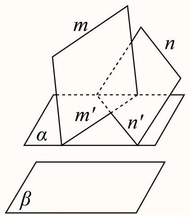

由面面平行的判定可知 $\alpha //\beta$ ,故④正确；

故答案为:③④

## 一般

74. 用 $n$ 个不同的实数 ${a}_{1},{a}_{2},\ldots ,{a}_{n}$ 可得到 $n$ ! 个不同的排列,每个排列为一行写成一个 $n$ ! 行的数阵. 对第 $i$ 行 ${a}_{i1},{a}_{i2},\cdots ,{a}_{in}$ ,记 ${b}_{i} =  - {a}_{i1} + 2{a}_{i2} - 3{a}_{i3} + \cdots  + {\left( -1\right) }^{n}n{a}_{in}, i = 1,2,3,\ldots , n$ !.

例如: 用1,2,3、可得数阵如表,

123

132

213

231

312

321

由于此数阵中每一列各数之和都是 12,所以, ${b}_{1} + {b}_{2} + \cdots  + {b}_{6} =  - {12} + 2 \times  {12} - 3 \times  {12} =  - {24}$ ,那么,在用1,2 ，3，4，5 形成的数阵中， ${b}_{1} + {b}_{2} + \cdots  + {b}_{120} =$ ___.

答案

-1080

解析

在用1,2,3,4,5形成的数阵中,每一列各数之和都是 360,

${b}_{1} + {b}_{2} + \cdots  + {b}_{120} =  - {360} + 2 \times  {360} - 3 \times  {360} + 4 \times  {360} - 5 \times  {360} =  - {1080}.$

一般 【试卷】2020-2021广东省中山市纪念中学...

75. 若函数 $f\left( x\right)  = {\log }_{a}\left( {{x}^{3} - {ax}}\right) ,\left( {a > 0, a \neq  1}\right)$ 在区间 $\left( {-\frac{1}{2},0}\right)$ 内单调递增，则 $a$ 的取值范围是( )

A. $\left\lbrack  {\frac{1}{4},1}\right)$

B. $\left\lbrack  {\frac{3}{4},1}\right)$

C. $\left( {\frac{9}{4}, + \infty }\right)$

D. $\left( {1,\frac{9}{4}}\right)$

答案

B

解析

较易 【试卷】2005年普通高等学校招生考试数学....

76. 在三角形的每条边上各取三个分点 (如图). 以这9个分点为顶点可画出若干个三角形, 若从中任意抽取一个三角形，则其三个顶点分别落在原三角形的三条不同边上的概率为___.

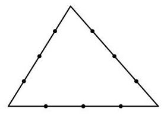

答案

$\frac{1}{3}$

解析

根据题意, 首先分析可得9个点能构成三角形总个数, 再由分步计数原理可得符合条件的三角形个数, 由等可能事件的概率公式, 计算可得答案.

由题意,这9个点能构成三角形的总数为 ${\mathrm{C}}_{9}^{3} - 3 = \frac{9 \times  8 \times  7}{3 \times  2 \times  1} - 3 = {81}$ .

要得到三个顶点分别落在原三角形的三条不同边上的三角形, 须在原三角形三边上各取一点, 组成三角形即可,则符合条件的三角形个数为 ${\mathrm{C}}_{3}^{1}{\mathrm{C}}_{3}^{1}{\mathrm{C}}_{3}^{1} = {27}$ .

所以概率为 $\frac{27}{81} = \frac{1}{3}$ .

故答案为: $\frac{1}{3}$ .

较易 【试卷】2005年普通高等学校招生考试数学...

77. 设 $f\left( n\right)  = {2n} + 1\left( {n \in  \mathbf{N}}\right) , P = \{ 1,2,3,4,5\} , Q = \{ 3,4,5,6,7\} \; \widehat{Q} = \{ n \in  \mathrm{N} \mid  f\left( n\right)  \in  Q\}$ ，则 $\left( {\widehat{P} \cap  {\complement }_{\mathbf{N}}\widehat{Q}}\right)  \cup  \left( {\widehat{Q} \cap  {\complement }_{\mathbf{N}}\widehat{P}}\right)  =$ ( )

A. $\{ 0,3\}$

B. $\{ 1,2\}$

C. $\{ 3,4,5\}$

D. $\{ 1,2,6,7\}$

答案

A

解析

求出 $\widehat{P} = \{ 0,1,2\} ,\widehat{Q} = \{ 1,2,3\}$ ,进而求出 $\widehat{P} \cap  {\complement }_{\mathbf{N}}\widehat{Q} = \{ 0\} ,\widehat{Q} \cap  {\complement }_{\mathbf{N}}\widehat{P} = \{ 3\}$ ,最终求出答案.

令 ${2n} + 1 = 1$ ，解得: $n = 0 \in  \mathrm{N}$ ，

令 ${2n} + 1 = 2$ ，解得: $n = \frac{1}{2} \notin  \mathrm{N}$ ，

令 ${2n} + 1 = 3$ ，解得: $n = 1 \in  \mathrm{N}$ ，

令 ${2n} + 1 = 4$ ，解得: $n = \frac{3}{2} \notin  \mathrm{N}$ ，

令 ${2n} + 1 = 5$ ，解得: $n = 2 \in  \mathrm{N}$ ，

令 ${2n} + 1 = 6$ ，解得: $n = \frac{5}{2} \notin  \mathrm{N}$ ，

令 ${2n} + 1 = 7$ ，解得: $n = 3 \in  \mathrm{N}$ ，

故 $\widehat{P} = \{ 0,1,2\} ,\widehat{Q} = \{ 1,2,3\}$ ,

所以 $\widehat{P} \cap  {\complement }_{\mathbf{N}}\widehat{Q} = \{ 0\} ,\widehat{Q} \cap  {\complement }_{\mathbf{N}}\widehat{P} = \{ 3\}$ ,

故 $\left( {\widehat{P} \cap  {\complement }_{\mathbf{N}}\widehat{Q}}\right)  \cup  \left( {\widehat{Q} \cap  {\complement }_{\mathbf{N}}\widehat{P}}\right)  = \{ 0,3\}$ .

故选: A

较易 【试卷】江苏省南通市名校联盟2025届高三...

78. 已知向量 $\overrightarrow{a} \neq  \overrightarrow{e},\left| \overrightarrow{e}\right|  = 1$ ，对任意实数 $t$ ，恒有 $\left| {\overrightarrow{a} - t\overrightarrow{e}}\right|  \geq  \left| {\overrightarrow{a} - \overrightarrow{e}}\right|$ ，则()

---

A. $\overrightarrow{a} \bot  \overrightarrow{e}$

B. $\overrightarrow{e} \bot  \left( {\overrightarrow{a} - \overrightarrow{e}}\right)$

	C. $a \bot  \left( {\overrightarrow{a} - \overrightarrow{e}}\right)$

D. $\left( {\overrightarrow{a} - \overrightarrow{e}}\right)  \bot  \left( {\overrightarrow{a} - \overrightarrow{e}}\right)$

---

答案

---

B

---

解析

由 $\left| {\overrightarrow{a} - t\overrightarrow{e}}\right|  \geq  \left| {\overrightarrow{a} - \overrightarrow{e}}\right|$ 两边平方得: ${\overrightarrow{a}}^{2} + {t}^{2} - 2\left( {\overrightarrow{a} \cdot  \overrightarrow{e}}\right) t \geq  {\overrightarrow{a}}^{2} + 1 - 2\left( {\overrightarrow{a} \cdot  \overrightarrow{e}}\right)$ ,

设 $\overrightarrow{a} \cdot  \overrightarrow{e} = m$ ,则 ${t}^{2} - {2mt} + {2m} - 1 \geq  0$ 对任意实数 $t$ 恒成立,

所以 $\Delta  = 4{m}^{2} - {8m} + 4 \leq  0$ ,即 ${\left( m - 1\right) }^{2} \leq  0$ ,所以 $m = 1$ ,即 $\overrightarrow{a} \cdot  \overrightarrow{e} = 1$ ,

$\overrightarrow{e} \cdot  \left( {\overrightarrow{a} - \overrightarrow{e}}\right)  = \overrightarrow{a} \cdot  \overrightarrow{e} - 1 = 0$ ,所以 $\overrightarrow{e} \bot  \left( {\overrightarrow{a} - \overrightarrow{e}}\right)$ .

故选: B

较易 【试卷】天津市滨海新区大港实验中学2025...

79. 过双曲线 $\frac{{x}^{2}}{{a}^{2}} - \frac{{y}^{2}}{{b}^{2}} = 1\left( {a > 0, b > 0}\right)$ 的左焦点,且垂直于 $x$ 轴的直线与双曲线相交于 $M\text{ 、 }N$ 两点,以 ${MN}$ 为直径的圆恰好过双曲线的右顶点, 则双曲线的离心率等于( )

A. 3

B. 2

C. $\frac{3}{2}$

D. $\frac{4}{3}$

## 答案

B

解析

设 $M\left( {-c,{y}_{0}}\right)$ ,代入双曲线方程可得 $\left| {FM}\right|  = \frac{{b}^{2}}{a}$ ,结合题意可得 $\left| {FM}\right|  = c + a$ ,代入运算求解即可.

设双曲线左焦点 $F\left( {-c,0}\right) , M\left( {-c,{y}_{0}}\right) , N\left( {-c, - {y}_{0}}\right)$ ,

因为点 $M\left( {-c,{y}_{0}}\right)$ 在双曲线上,则 $\frac{{\left( -c\right) }^{2}}{{a}^{2}} - \frac{{y}_{0}^{2}}{{b}^{2}} = 1$ ,整理可得 ${y}_{0}^{2} = \frac{{b}^{4}}{{a}^{2}}$ ,

即 $\left| {y}_{0}\right|  = \frac{{b}^{2}}{a}$ ,可得 $\left| {FM}\right|  = \frac{{b}^{2}}{a}$ ,

由题意可知: $\left| {FM}\right|  = c + a$ ,所以 $\frac{{b}^{2}}{a} = c + a$ ,即 $\frac{{c}^{2} - {a}^{2}}{a} = c + a$ ,

显然 $c \neq  a$ ,可得 $\frac{c - a}{a} = 1$ ,即 $e - 1 = 1$ ,可得 $e = 2$ ,

所以双曲线的离心率等于2.

故选: B.

## 一般

80. 从集合 $\{ O, P, Q, R, S\}$ 与 $\{ 0,1,2,3,4,5,6,7,8,9\}$ 中各任取 2 个元素排成一排(字母和数字均不能重复). 每排中字母 $O, Q$ 和数字 0 至多只能出现一个的不同排法种数是___. (用数字作答)

答案

8424

解析

分三种情况:情况 1: 不含 $O\text{ 、 }Q\text{ 、 }0$ 的排列: ${\mathrm{C}}_{3}^{2} \cdot  {\mathrm{C}}_{9}^{2} \cdot  {\mathrm{A}}_{4}^{4}$ ;

情况 2: 只含 $O\text{ 、 }Q$ 中一个元素,且不含 0 的排列: ${\mathrm{C}}_{2}^{1} \cdot  {\mathrm{C}}_{3}^{1} \cdot  {\mathrm{C}}_{9}^{2} \cdot  {\mathrm{A}}_{4}^{4}$ ;

情况 3. 只含元素 0 的排列: ${\mathrm{C}}_{3}^{2} \cdot  {\mathrm{C}}_{9}^{1} \cdot  {\mathrm{A}}_{4}^{4}$ .

综上符合题意的排法种数为 ${\mathrm{C}}_{3}^{2} \cdot  {\mathrm{C}}_{9}^{2} \cdot  {\mathrm{A}}_{4}^{4} + {\mathrm{C}}_{2}^{1} \cdot  {\mathrm{C}}_{3}^{1} \cdot  {\mathrm{C}}_{9}^{2} \cdot  {\mathrm{A}}_{4}^{4} + {\mathrm{C}}_{3}^{2} \cdot  {\mathrm{C}}_{9}^{1} \cdot  {\mathrm{A}}_{4}^{4} = {8424}$ .

一般 【试卷】2018年福建福州高二下学期期中考...

81. 如果 $\bigtriangleup {A}_{1}{B}_{1}{C}_{1}$ 的三个内角的余弦值分别等于 $\bigtriangleup {A}_{2}{B}_{2}{C}_{2}$ 的三个内角的正弦值,则( )

A. $\bigtriangleup {A}_{1}{B}_{1}{C}_{1}$ 和 $\bigtriangleup {A}_{2}{B}_{2}{C}_{2}$ 都是锐角三角形

B. $\bigtriangleup {A}_{1}{B}_{1}{C}_{1}$ 和 $\bigtriangleup {A}_{2}{B}_{2}{C}_{2}$ 都是钝角三角形

C. $\bigtriangleup {A}_{1}{B}_{1}{C}_{1}$ 是钝角三角形, $\bigtriangleup {A}_{2}{B}_{2}{C}_{2}$ 是锐角三角形

D. $\bigtriangleup {A}_{1}{B}_{1}{C}_{1}$ 是锐角三角形, $\bigtriangleup {A}_{2}{B}_{2}{C}_{2}$ 是钝角三角形

## 答案

D

解析

因为 $\bigtriangleup {A}_{2}{B}_{2}{C}_{2}$ 的三个内角的正弦值均大于 0,

所以 $\bigtriangleup {A}_{1}{B}_{1}{C}_{1}$ 的三个内角的余弦值也均大于 0,则 $\bigtriangleup {A}_{1}{B}_{1}{C}_{1}$ 是锐角三角形.

若 $\bigtriangleup {A}_{2}{B}_{2}{C}_{2}$ 是锐角三角形,由 $\left\{  \begin{array}{l} \sin {A}_{2} = \cos {A}_{1} = \sin \left( {\frac{\pi }{2} - {A}_{1}}\right) \\  \sin {B}_{2} = \cos {B}_{1} = \sin \left( {\frac{\pi }{2} - {B}_{1}}\right) , \\  \sin {C}_{2} = \cos {C}_{1} = \sin \left( {\frac{\pi }{2} - {C}_{1}}\right)  \end{array}\right.$

得 $\left\{  \begin{array}{l} {A}_{2} = \frac{\pi }{2} - {A}_{1} \\  {B}_{2} = \frac{\pi }{2} - {B}_{1}, \\  {C}_{2} = \frac{\pi }{2} - {C}_{1} \end{array}\right.$

那么, ${A}_{2} + {B}_{2} + {C}_{2} = \frac{\pi }{2}$ ,这与三角形内角和是 $\pi$ 相矛盾;

若 $\bigtriangleup {A}_{2}{B}_{2}{C}_{2}$ 是直角三角形,不妨设 ${A}_{2} = \frac{\pi }{2}$ ,

则 $\sin {A}_{2} = 1 = \cos {A}_{1}$ ,所以 ${A}_{1}$ 在 $\left( {0,\pi }\right)$ 范围内无值.

所以 $\bigtriangleup {A}_{2}{B}_{2}{C}_{2}$ 是钝角三角形.

故选: D.

一般 【试卷】2006年普通高等学校招生全国统一...

82. 在正方体上任选3个顶点连成三角形，则所得的三角形是直角非等腰三角形的概率为

A. $\frac{1}{7}$

B. $\frac{2}{7}$

C. $\frac{3}{7}$

D. $\frac{4}{7}$

答案

C

解析

解: 在正方体上任选3个顶点连成三角形可得 ${C}_{8}^{3}$ 个三角形,要得直角非等腰三角形,则每个顶点上可得三个 (即正方体的一边与过此点的一条面对角线),共有24个,得 $\frac{24}{{C}_{8}^{3}}$ ,所以选C.

较难 【试卷】内蒙古包头市第四中学2022届高三...

83. 多面体上，位于同一条棱两端的顶点称为相邻的，如图，正方体的一个顶点 $A$ 在平面 $\alpha$ 内，其余顶点在 $\alpha$ 的同侧，正方体上与顶点 $A$ 相邻的三个顶点到 $\alpha$ 的距离分别为1,2和4， $P$ 是正方体的其余四个顶点中的一个，则 $P$ 到平面α的距离可能是:

①3； ②4； ③s； ④6； ⑤7

以上结论正确的为___. (写出所有正确结论的编号)

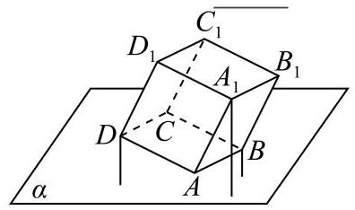

答案

①③④⑤

解析

先利用梯形的中位线定理得到中点到平面 $\alpha$ 的距离，再利用三角形中位线定理得到各点到平面 $\alpha$ 的距离，进而可得答案.

根据题意，如图， ${A}_{1}N\bot \alpha ,{DM}\bot \alpha ,{D}_{1}Q\bot \alpha , O$ 为 $D{A}_{1}$ 的中点， ${OP}\bot \alpha , B\text{ 、 }D\text{ 、 }{A}_{1}$ 到平面 $\alpha$ 的距离分别为1、 2、4，即 ${DM} = 2,{A}_{1}N = 4$ ，

因为 ${A}_{1}N \bot  \alpha ,{DM} \bot  \alpha$ ,所以 ${A}_{1}N//{DM}$ ,故四边形 ${A}_{1}{NMD}$ 是梯形,

又 ${OP} \bot  \alpha ,{A}_{1}N \bot  \alpha$ ,所以 ${OP}//{A}_{1}N$ ,又 $O$ 为 $D{A}_{1}$ 的中点,

由梯形的中位线定理得 ${OP} = \frac{\left( DM + {A}_{1}N\right) }{2} = \frac{2 + 4}{2} = 3$ ,

又因为 ${OP} \bot  \alpha ,{D}_{1}Q \bot  \alpha$ ,所以 ${OP}//{D}_{1}Q$ ,又 $O$ 为 $D{A}_{1}$ 的中点,

所以在 $\bigtriangleup A{D}_{1}Q$ 中,由三角形中位线定理得 ${D}_{1}Q = {2OP} = 2 \times  3 = 6$ ,即 ${D}_{1}$ 到平面 $\alpha$ 的距离为 6 ;

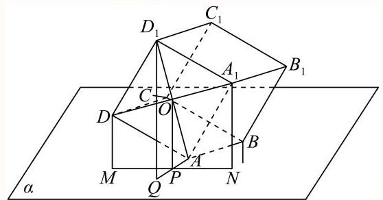

同理: $B{A}_{1}$ 的中点到平面 $\alpha$ 的距离为 $\frac{5}{2}$ ,所以 ${B}_{1}$ 到平面 $\alpha$ 的距离为 5 ;

${DB}$ 的中点到平面 $\alpha$ 的距离为 $\frac{3}{2}$ ，所以 $C$ 到平面 $\alpha$ 的距离为 3 ;

$C{A}_{1}$ 的中点到平面 $\alpha$ 的距离为 $\frac{7}{2}$ ，所以 ${C}_{1}$ 到平面 $\alpha$ 的距离为 7 ；

而 $P$ 为 $C\text{ 、 }{C}_{1}\text{ 、 }{B}_{1}\text{ 、 }{D}_{1}$ 中的一点,故 $P$ 到平面 $\alpha$ 的距离可能3,5,6,7.

故答案为:①③④⑤.

## 一般

84. 已知 $A, B, C$ 三点在球心为 $O$ ，半径为 $R$ 的球面上，且 ${AB} = {AC} = {BC} = R$ ，那么 $A, B$ 两点的球面距离为 ___，球心到平面 ${ABC}$ 的距离为___.

答案

$\frac{\pi }{3}R;\frac{\sqrt{6}}{3}R$

解析

如上图, $\because {AB} = R$ ,所以 $\bigtriangleup {OAB}$ 是等边三角形,

$\angle {AOB} = \frac{\pi }{3}$ ,故 $A, B$ 两点的球面距离为 $\frac{\pi }{3}R$ ,

$\bigtriangleup {ABC}$ 为等边三角形,它的外接圆半径 $r = \frac{2}{3} \times  \frac{\sqrt{3}}{2}R = \frac{\sqrt{3}}{3}R$ ,

在 $\operatorname{Rt}\bigtriangleup O{O}_{1}B$ 中, $O{O}_{1} = \sqrt{{R}^{2} - {\left( \frac{\sqrt{3}}{3}R\right) }^{2}} = \frac{\sqrt{6}}{3}R$ ,

所以球心到平面 ${ABC}$ 的距离 $O{O}_{1} = \frac{\sqrt{6}}{3}R$ .

或者也可由正四面体 $O - {ABC}$ 的棱长为 $R$ ,则高为 $\frac{\sqrt{6}}{3}R$ .

## 一般

85. 对于直角坐标平面内的任意两点 $A\left( {{x}_{1},{y}_{1}}\right) \text{ 、 }B\left( {{x}_{2},{y}_{2}}\right)$ ,定义它们之间的一种 "距离 ":

$\parallel {AB}\parallel  = \left| {{x}_{1} - {x}_{2}}\right|  + \left| {{y}_{1} - {y}_{2}}\right|$ . 给出下列三个命题:

① 若点 $C$ 在线段 ${AB}$ 上，则 $\left| \right| {AC}\left| \right|  + \left| \right| {CB}\left| \right|  = \left| \right| {AB}\left| \right|$

② 在 $\bigtriangleup {ABC}$ 中,若 $\angle C = {90}^{ \circ  }$ ,则 $\left| \right| {AC}{\left| \right| }^{2} + \left| \right| {CB}{\left| \right| }^{2} = \left| \right| {AB}{\left| \right| }^{2}$

③ 在 $\bigtriangleup {ABC}$ 中， $\left| \right| {AC}\left| \right|  + \left| \right| {CB}\left| \right|  > \left| \right| {AB}\left| \right|$

其中真命题的个数为( )

A. 1 个

B. 2 个

C. 3 个

D. 4 个

答案

A

解析

记 $A, B, C$ 三点的坐标分别为 $\left( {{x}_{A},{y}_{A}}\right) ,\left( {{x}_{B},{y}_{B}}\right) ,\left( {{x}_{C},{y}_{C}}\right)$ ,

则 $\parallel {AC}\parallel  + \parallel {CB}\parallel  = \left| {{x}_{A} - {x}_{C}}\right|  + \left| {{x}_{C} - {x}_{B}}\right|  + \left| {{y}_{A} - {y}_{C}}\right|  + \left| {{y}_{C} - {y}_{B}}\right|  \geq  \left| {{x}_{A} - {x}_{B}}\right|  + \left| {{y}_{A} - {y}_{B}}\right|  = \parallel {AB}\parallel$ ,

当 ${x}_{C}$ ， ${y}_{C}$ 都分别在 ${x}_{A}$ ， ${x}_{B}$ 与 ${y}_{A}$ ， ${y}_{B}$ 之间时，上面的不等式取到等号，故 ① 正确，③ 不一定；

对于 ②，取 $C\left( {0,0}\right)$ ， $A\left( {0,1}\right)$ ， $B\left( {1,0}\right)$ ，则 ② 中等式左边 $= 1 + 1 = 2$ ，右边 $= {\left( 1 + 1\right) }^{2} = 4$ ，故 ② 假.

较易 FY25江苏一对一秋季学习机高三数学 第7...

86. 已知双曲线 $\frac{{x}^{2}}{{a}^{2}} - \frac{{y}^{2}}{{b}^{2}} = 1\left( {a > 0, b > 0}\right)$ 的右焦点为 $F$ ，若过点 $F$ 且倾斜角为 ${60} \circ$ 的直线与双曲线的右支有且只有一个交点，则此双曲线离心率的取值范围是( )

A. $(1,2\rbrack$

B. $\left( {1,2}\right)$

C. $\lbrack 2, + \infty )$

D. $\left( {2, + \infty }\right)$

答案

---

C

---

解析

解: 已知双曲线 $\frac{{x}^{2}}{{a}^{2}} - \frac{{y}^{2}}{{b}^{2}} = 1\left( {a > 0, b > 0}\right)$ 的右焦点为 $F$ ,

若过点 $F$ 且倾斜角为 ${60}^{ \circ  }$ 的直线与双曲线的右支有且只有一个交点,

则该直线的斜率的绝对值小于等于渐近线的斜率 $\frac{b}{a}$ ,

$\therefore \frac{b}{a} \geq  \sqrt{3}$ ,离心率 ${e}^{2} = \frac{{c}^{2}}{{a}^{2}} = \frac{{a}^{2} + {b}^{2}}{{a}^{2}} \geq  4$ ,

$\therefore e \geq  2$ ,

故选: $C$ .

一般 【试卷】2012年陕西西安新城区西安市第八...

87. 对于任意的两个实数对 $\left( {a, b}\right)$ 和 $\left( {c, d}\right)$ ,规定 $\left( {a, b}\right)  = \left( {c, d}\right)$ 当且仅当 $a = c, b = d$ ; 运算“ $\otimes$ ”为:

$\left( {a, b}\right)  \otimes  \left( {c, d}\right)  = \left( {{ac} - {bd},{bc} + {ad}}\right)$ ,运算“ $\oplus$ ”为: $\left( {a, b}\right)  \oplus  \left( {c, d}\right)  = \left( {a + c, b + d}\right)$ ,设 $p, q \in  \mathbf{R}$ ,若

$\left( {1,2}\right)  \otimes  \left( {p, q}\right)  = \left( {5,0}\right)$ 则 $\left( {1,2}\right)  \oplus  \left( {p, q}\right)  =$ (   )

A. $\left( {4,0}\right)$

B. $\left( {2,0}\right)$

C. $\left( {0,2}\right)$

D. $\left( {0, - 4}\right)$

答案

B

解析

由 $\left( {1,2}\right)  \otimes  \left( {p, q}\right)  = \left( {5,0}\right)$ 得 $\left\{  {\begin{array}{l} p - {2q} = 5 \\  {2p} + q = 0 \end{array} \Rightarrow  \left\{  \begin{array}{l} p = 1 \\  q =  - 2 \end{array}\right. }\right.$ ,所以 $\left( {1,2}\right)  \oplus  \left( {p, q}\right)  = \left( {1,2}\right)  \oplus  \left( {1, - 2}\right)  = \left( {2,0}\right)$ . 故选 B

较易 【试卷】福建省福州第八中学2022-2023学...

88. 已知 $f\left( x\right)$ 是周期为 2 的奇函数，当 $0 < x < 1$ 时， $f\left( x\right)  = \lg x$ . 设 $a = f\left( \frac{6}{5}\right) , b = f\left( \frac{3}{2}\right)$ ， $c = f\left( \frac{5}{2}\right)$ ( )

A. $a < b < c$

B. $b < a < c$

C. $c < b < a$

D. $c < a < b$

---

	答案

D

	解析

---

由周期性和奇偶性将 $a, b, c$ 转换为自变量在 $0 < x < 1$ 判断.

已知 $f\left( x\right)$ 是周期为 2 的奇函数，当 $0 < x < 1$ 时， $f\left( x\right)  = \lg x$ .

$\therefore a = f\left( \frac{6}{5}\right)  = f\left( {-\frac{4}{5}}\right)  =  - f\left( \frac{4}{5}\right)  =  - {lg}\frac{4}{5} = \lg \frac{5}{4}$ ,

$b = f\left( \frac{3}{2}\right)  = f\left( {-\frac{1}{2}}\right)  =  - f\left( \frac{1}{2}\right)  =  - \lg \frac{1}{2} = \lg 2,$

$c = f\left( \frac{5}{2}\right)  = f\left( \frac{1}{2}\right)  = \lg \frac{1}{2},$

$\because y = \lg x$ 单调递增, $\therefore \lg \frac{1}{2} < \lg \frac{5}{4} < \lg 2$ ,

$\therefore c < a < b$

故选: D.

本题考查周期性、奇偶性、单调性的综合应用, 属于基础题.

## 较易

89. 若 $f\left( x\right)  = a\sin \left( {x + \frac{\pi }{4}}\right)  + b\sin \left( {x - \frac{\pi }{4}}\right) \left( {{ab} \neq  0}\right)$ 是偶函数，则有序实数对 $\left( {a, b}\right)$ 可以是___. (注:写出你认为正确的一组数字即可)

答案

$\left( {1, - 1}\right)$

解析

一般 【试卷】山东省泰安第二中学2022-2023学...

90. 如图， ${OM}//{AB}$ ，点 $P$ 在由射线 ${OM}$ ，线段 ${OB}$ 及 ${AB}$ 的延长线围成的区域内(不含边界)运动，且 $\overrightarrow{OP} = x\overrightarrow{OA} + y\overrightarrow{OB}$ ，则 $x$ 的取值范围是___；当 $x =  - \frac{1}{2}$ 时， $y$ 的取值范围是___.

拍摄

$\left( {-\infty ,0}\right) ;\left( {\frac{1}{2},\frac{3}{2}}\right)$

解析

由向量加法的平行四边形法则, ${OP}$ 为平行四边形的对角线,该四边形应是以 ${OB},{OA}$ 的反向延长线为相邻两边,得到 $x$ 的取值范围,当 $x =  - \frac{1}{2}$ 时,要使点 $P$ 落在指定区域内,即点 $P$ 应落在 ${DE}$ 上,得到 $y$ 的取值范围. 解: 如图, ${OM}\parallel {AB}$ ,点 $P$ 在射线 ${OM}$ ,线段 ${OB}$ 及 ${AB}$ 的延长线围成的区域内 (不含边界) 运动,且

$\overrightarrow{OP} = x\overrightarrow{OA} + y\overrightarrow{OB}$ ，由向量加法的平行四边形法则， ${OP}$ 为平行四边形的对角线，该四边形应是以 ${OB},{OA}$ 的反向延长线为相邻两边,

故 $x$ 的取值范围是 $\left( {-\infty ,0}\right)$ ;

当 $x =  - \frac{1}{2}$ 时,要使点 $P$ 落在指定区域内,即点 $P$ 应落在 ${DE}$ 上, ${CD} = \frac{1}{2}{OB},{CE} = \frac{3}{2}{OB}$ ,

故 $y$ 的取值范围是: $\left( {\frac{1}{2},\frac{3}{2}}\right)$ .

本题考查了平面向量基本定理及向量加法的平行四边形法则, 属基础题.

## 困难

91. 过三棱柱 ${ABC} - {A}_{1}{B}_{1}{C}_{1}$ 的任意两条棱的中点作直线，其中与平面 ${AB}{B}_{1}{A}_{1}$ 平行的直线共有 ___ 条.

答案

6

解析

如下图示，在三棱柱 ${ABC} - {A}_{1}{B}_{1}{C}_{1}$ 中，

过三棱柱 ${ABC} - {A}_{1}{B}_{1}{C}_{1}$ 的任意两条棱的中点作直线，

其中与平面 ${AB}{B}_{1}{A}_{1}$ 平行的直线有:

${DE}\text{ 、 }{DG}\text{ 、 }{DF}\text{ 、 }{EG}\text{ 、 }{EF}\text{ 、 }{FG}$ 共有6条.

故答案为: 6

较易 【试卷】广西柳州市2024届高三第三次模拟...

92. 若 $f\left( x\right)  = a\sin \left( {x + \frac{\pi }{4}}\right)  + 3\sin \left( {x - \frac{\pi }{4}}\right)$ 是偶函数，则实数a=___

---

													② 答案

-3

---

解析

由函数 $f\left( x\right)$ 是 $R$ 上的偶函数，则 $f\left( {-\frac{\pi }{4}}\right)  = f\left( \frac{\pi }{4}\right)$ ，代入计算并验证即可求出a.

函数 $f\left( x\right)$ 是 $R$ 上的偶函数，则 $f\left( {-\frac{\pi }{4}}\right)  = f\left( \frac{\pi }{4}\right)$ ，

$f\left( {-\frac{\pi }{4}}\right)  = a\sin \left( {-\frac{\pi }{4} + \frac{\pi }{4}}\right)  + 3\sin \left( {-\frac{\pi }{4} - \frac{\pi }{4}}\right)  = a\sin 0 + 3\sin \left( {-\frac{\pi }{2}}\right)  =  - 3,$

$f\left( \frac{\pi }{4}\right)  = a\sin \left( {\frac{\pi }{4} + \frac{\pi }{4}}\right)  + 3\sin \left( {\frac{\pi }{4} - \frac{\pi }{4}}\right)  = a\sin \frac{\pi }{2} + 3\sin 0 = a,$

故 $a =  - 3$ ,即

$f\left( x\right)  =  - 3\sin \left( {x + \frac{\pi }{4}}\right)  + 3\sin \left( {x - \frac{\pi }{4}}\right)  =  - 3\left( {\sin x\cos \frac{\pi }{4} + \cos x\sin \frac{\pi }{4}}\right)  + 3\left( {\sin x\cos \frac{\pi }{4} - \cos x\sin \frac{\pi }{4}}\right)$

$\Rightarrow  f\left( x\right)  =  - 3\sqrt{2}\cos x,$

因为 $f\left( {-x}\right)  =  - 3\sqrt{2}\cos \left( {-x}\right)  =  - 3\sqrt{2}\cos x = f\left( x\right)$ ,

所以函数 $f\left( x\right)  =  - 3\sqrt{2}\cos x$ 是偶函数， $a =  - 3$ 符合题意，

故答案为: -3

一般 【试卷】河北省廊坊市2022届高三模拟数学....

93. 如图中有一个信号源和五个接收器. 接收器与信号源在同一个串联线路中时，就能接收到信号，否则就不能接收到信号.若将图中左端的六个接线点随机地平均分成三组, 将右端的六个接线点也随机地平均分成三组, 再把所有六组中每组的两个接线点用导线连接，则这五个接收器能同时接收到信号的概率是( )

A. $\frac{4}{45}$

B. $\frac{1}{36}$

C. $\frac{4}{15}$

D. $\frac{8}{15}$

答案

D

解析

先将左端的六个接线点随机地平均分成三组可能出现的所有结果找出来, 再根据五个接收器能同时接受到信号必须全部在同一个串联线路中，求出此种情况可能出现的结果，再运用古典概型概率公式即可得出所求事件的概率.

由题意,设右端连线方式如图,对于左端的六个连线点,将其随机地平均分成三组,共有 $\frac{{\mathrm{C}}_{6}^{2}{\mathrm{C}}_{4}^{2}{\mathrm{C}}_{2}^{2}}{{\mathrm{\;A}}_{3}^{3}} = {15}$ 种结果, 五个接收器能同时接收到信号必须全部在同一个串联线路中, 则 1 必须与 3, 4, 5, 6 中的其中一个相接, 接好后,2只有2种情况可选，剩下的接线点只有1种接法，所以共有 ${\mathrm{C}}_{4}^{1}{\mathrm{C}}_{2}^{1}{\mathrm{C}}_{1}^{1} = 8$ 种结果. 同理，右端连线方式变化时, 左端的接线方法也有 15 种, 其中有 8 种可以接收到信号. 故这五个接受器能同时接收到信号的概率是 $P = \frac{8}{15}.$ 故选: D.

一般

94. 如图，在四面体 ${ABCD}$ 中，截面 ${AEF}$ 经过四面体的内切球(与四个面都相切的球)球心 $O$ ，且与 ${BC},{DC}$ 分别截于 $E, F$ ,如果截面将四面体分成体积相等的两部分,设四棱锥 $A - {BEFD}$ 与三棱锥 $A - {EFC}$ 的表面积分别是 ${S}_{1},{S}_{2}$ ,则必有(   )

A. ${S}_{1} < {S}_{2}$

B. ${S}_{1} > {S}_{2}$

C. ${S}_{1} = {S}_{2}$

D. ${S}_{1},{S}_{2}$ 的大小关系不能确定

答案

C

解析

由题意, ${V}_{A - {BEFD}} = {V}_{O - {ABD}} + {V}_{O - {ABE}} - {V}_{O - {BEFD}} + {V}_{O - {AFD}}$ ,

${V}_{A - {EFC}} = {V}_{O - {AFC}} + {V}_{O - {AEC}} + {V}_{O - {EFC}},$

又 ${V}_{A - {BEFD}} = {V}_{A - {EFC}}$ ,

而每个三棱锥的高都是原四面体的内切球的半径, 又面AEF公共,

故 ${S}_{\bigtriangleup {ABD}} + {S}_{\bigtriangleup {ABE}} + {S}_{BEFD} + {S}_{\bigtriangleup {ADF}} = {S}_{\bigtriangleup {ADC}} + {S}_{\bigtriangleup {AEC}} + {S}_{\bigtriangleup {EFC}.}$

故选:C

较易 【试卷】2006 年普通高等学校招生考试数...

95. 某地一年内的气温 $Q\left( t\right)$ (单位: ${}^{ \circ  }$ C)与时间t(月份)之间的关系如图所示，已知该年的平均气温为 ${10}^{ \circ  }$ C.令 $C\left( t\right)$ 表示时间段 $\left\lbrack  {0, t}\right\rbrack$ 的平均气温， $C\left( t\right)$ 与 $\mathrm{t}$ 之间的函数关系用下列图象表示，则正确的是( )

A.

B.

C.

D.

②答案

A

解析

用排除法,根据 $Q\left( t\right)$ 的图象,确定 $C\left( t\right)$ 的性质排除错误选项后可得.

由已知 $Q\left( t\right)$ 的图象, $t = 6$ 时, $C\left( t\right)  = 0$ ,排除C; $t = {12}$ 时, $C\left( t\right)  = {10}$ ,排除D; $t$ 在大于 6 的某一段平均气温超过10 , 排除B. 只有A正确.

故选: A.

一般 【试卷】北京顺义牛栏山一中2017-2018学…

96. 已知圆 $M : {\left( x + \cos \theta \right) }^{2} + {\left( y - \sin \theta \right) }^{2} = 1$ ,直线 $l : y = {kx}$ ,下面四个命题:

(1)对任意实数 $k$ 和 $\theta$ ，直线 $l$ 和圆 $M$ 相切.

(2)对任意实数 $k$ 和 $\theta$ ，直线 $l$ 和圆 $M$ 有公共点.

(3)对任意实数 $\theta$ ，必存在实数 $k$ ，使得直线 $l$ 和圆 $M$ 相切.

(4)对任意实数 $k$ ，必存在实数 $\theta$ ，使得直线 $l$ 和圆 $M$ 相切.

其中正确命题的代号是___(写出所有真命题的代号).

答案

(2) (4)

解析

圆心 $\left( {-\cos \theta ,\sin \theta }\right)$ 到直线 $l : {kx} - y = 0$ 的距离为:

$d = \frac{\left| -k\cos \theta  - \sin \theta \right| }{\sqrt{{k}^{2} + 1}} = \frac{\left| k\cos \theta  + \sin \theta \right| }{\sqrt{{k}^{2} + 1}} = \frac{\left| \sqrt{{k}^{2} + 1}\sin \left( \alpha  + \theta \right) \right| }{\sqrt{{k}^{2} + 1}} = \left| {\sin \left( {\alpha  + \theta }\right) }\right|$ (其中 $\tan \alpha  = k$ ) $\leq  1 = r$ . 即 $d \leq  r.$

故②④正确

点睛:本题考查学生的观察能力和分析能力，圆心是动的，直线也是动的，直接根据直线与圆的位置关系的判断方法，计算圆心到直线的距离得到关于角的三角函数 $\left| {\sin \left( {\alpha  + \theta }\right) }\right|$ ，发现这个函数值总是小于1的，小于半径. 从而得到分析结果.

一般 【试卷】考点20 常用的二级结论的应用 202...

97. 已知 ${F}_{1}\text{ 、 }{F}_{2}$ 为双曲线 $\frac{{x}^{2}}{a} - \frac{{y}^{2}}{b} = 1\left( {a > 0, b > 0\text{ 且 }a \neq  b}\right)$ 的两个焦点, P为双曲线右支上异于顶点的任意一点, 点O为坐标原点. 下面四个命题:

① $\bigtriangleup  P{F}_{1}{F}_{2}$ 的内切圆的圆心必在直线 $x = a$ 上；

② $\bigtriangleup  P{F}_{1}{F}_{2}$ 的内切圆的圆心必在直线 $x = b$ 上；

③ $\bigtriangleup  P{F}_{1}{F}_{2}$ 的内切圆的圆心必在直线 ${OP}$ 上；

④ $\bigtriangleup  P{F}_{1}{F}_{2}$ 的内切圆必通过点 $\left( {a,0}\right)$ .

其中真命题的代号是 . (写出所有真命题的代号)

答案

①④

解析

设 $\bigtriangleup P{F}_{1}{F}_{2}$ 的内切圆分别与 $P{F}_{1}, P{F}_{2}$ 切于点 $\mathrm{A}\text{ 、 }\mathrm{\;B}$ ,与 ${F}_{1}{F}_{2}$ 切于点 $\mathrm{M}$ ,则 $\left| {PA}\right|  = \left| {PB}\right| ,\left| {{F}_{1}A}\right|  = \left| {{F}_{1}M}\right|$ ,

$\left| {{F}_{2}B}\right|  = \left| {{F}_{2}M}\right|$ ，根据双曲线的定义可得 $\left| {P{F}_{1}}\right|  - \left| {P{F}_{2}}\right|  = {2a}$ ，故 $\left| {{F}_{1}M}\right|  - \left| {{F}_{2}M}\right|  = {2a}$ ，设M点坐标为 $\left( {x,0}\right)$ ，代入即可求得 $x = a$ ,故判断①④正确.

设 $\bigtriangleup P{F}_{1}{F}_{2}$ 的内切圆分别与 $P{F}_{1}, P{F}_{2}$ 切于点A、B，与 ${F}_{1}{F}_{2}$ 切于点M，如图，

则 $\left| {PA}\right|  = \left| {PB}\right| ,\left| {{F}_{1}A}\right|  = \left| {{F}_{1}M}\right| ,\left| {{F}_{2}B}\right|  = \left| {{F}_{2}M}\right|$ ,

又点P在双曲线右支上，所以 $\left| {P{F}_{1}}\right|  - \left| {P{F}_{2}}\right|  = {2a}$ ，故 $\left| {{F}_{1}M}\right|  - \left| {{F}_{2}M}\right|  = {2a}$ ，

而 $\left| {{F}_{1}M}\right|  + \left| {{F}_{2}M}\right|  = {2c}$ ,

设 $M$ 点坐标为 $\left( {x,0}\right)$ ,由 $\left| {{F}_{1}M}\right|  - \left| {{F}_{2}M}\right|  = {2a}$ ,可得 $\left( {x + c}\right)  - \left( {c - x}\right)  = {2a}$ ,

解得 $x = a$ ，显然内切圆的圆心与点M的连线垂直于x轴，故②错误，①④正确.

因为内切圆圆心是角平分线的交点,又 ${OP}$ 是 $\bigtriangleup P{F}_{1}{F}_{2}$ 的一条中线,

若圆心在直线 ${OP}$ 上,则必有 $\left| {P{F}_{1}}\right|  = \left| {P{F}_{2}}\right|$ ,显然不成立,故③错误,

故答案为:①④.

较难 【试卷】重庆市缙云教育联盟2023届高三上...

98. 已知各项均为正数的数列 $\left\{  {a}_{n}\right\}$ 满足: ${a}_{1} = 3$ ,且 $\frac{2{a}_{n + 1} - {a}_{n}}{2{a}_{n} - {a}_{n + 1}} = {a}_{n}{a}_{n + 1}, n \in  {\mathrm{N}}^{ * }$ .

(1) 求数列 $\left\{  {a}_{n}\right\}$ 的通项公式;

( 2 设 ${S}_{n} = {a}_{1}^{2} + {a}_{2}^{2} + \cdots  + {a}_{n}^{2},{T}_{n} = \frac{1}{{a}_{1}^{2}} + \frac{1}{{a}_{2}^{2}} + \cdots  + \frac{1}{{a}_{n}^{2}}$ ，求 ${S}_{n} + {T}_{n}$ ，并确定最小正整数 $n$ ，使 ${S}_{n} + {T}_{n}$ 为整数.

答案

(1) ${a}_{n} = \frac{1}{3}\left( {{2}^{n + 1} + \sqrt{{2}^{{2n} + 2} + 9}}\right)$

(2) 9

解析

(1)条件可化为 ${a}_{n + 1} - \frac{1}{{a}_{n + 1}} = 2\left( {{a}_{n} - \frac{1}{{a}_{n}}}\right)$ ,

因此 $\left\{  {{a}_{n} - \frac{1}{{a}_{n}}}\right\}$ 为一个等比数列,其公比为2,首项为 ${a}_{1} - \frac{1}{{a}_{1}} = \frac{8}{3}$ ,

所以 ${a}_{n} - \frac{1}{{a}_{n}} = \frac{8}{3} \times  {2}^{n - 1} = \frac{{2}^{n + 2}}{3}\left( {n \in  {\mathrm{N}}^{ * }}\right)$ ①

因 ${a}_{n} > 0$ ，由①式解出 ${a}_{n} = \frac{1}{3}\left( {{2}^{n + 1} + \sqrt{{2}^{{2n} + 2} + 9}}\right)$ ②

(2)由①式有 ${S}_{n} + {T}_{n} = {\left( {a}_{1} - \frac{1}{{a}_{1}}\right) }^{2} + {\left( {a}_{2} - \frac{1}{{a}_{2}}\right) }^{2} + \cdots  + {\left( {a}_{n} - \frac{1}{{a}_{n}}\right) }^{2} + {2n} \; = {\left( \frac{{2}^{3}}{3}\right) }^{2} + {\left( \frac{{2}^{4}}{3}\right) }^{2} + {\left( \frac{{2}^{5}}{3}\right) }^{2} + \cdots  + {\left( \frac{{2}^{n + 2}}{3}\right) }^{2} + {2n} \; = \frac{64}{27}\left( {{4}^{n} - 1}\right)  + {2n},\;\left( {n \in  {\mathrm{N}}^{ * }}\right)$

为使 ${S}_{n} + {T}_{n} = \frac{64}{27}\left( {{4}^{n} - 1}\right)  + {2n},\left( {n \in  {\mathrm{N}}^{ * }}\right)$ 为整数,当且仅当 $\frac{{4}^{n} - 1}{27}$ 为整数.

当 $n = 1$ ，2时，显然 ${S}_{n} + {T}_{n}$ 不为整数，

当 $n \geq  3$ 时, ${4}^{n} - 1 = {\left( 1 + 3\right) }^{n} - 1 = {\mathrm{C}}_{n}^{1} \times  3 + {\mathrm{C}}_{n}^{2} \times  {3}^{2} + {3}^{3}\left( {{\mathrm{C}}_{n}^{3} + \cdots  + {3}^{n - 3}{\mathrm{C}}_{n}^{n}}\right)$

☐只需 $\frac{3{\mathrm{C}}_{n}^{1} + {3}^{2}{\mathrm{C}}_{n}^{2}}{27} = \frac{n}{9} \cdot  \frac{{3n} - 1}{2}$ 为整数,因为 ${3n} - 1$ 与3互质,所以 $n$ 为9的整数倍.

当 $n = 9$ 时， $\frac{n}{9} \cdot  \frac{{3n} - 1}{2} = {13}$ 为整数，故 $n$ 的最小值为 9 .

一般 【试卷】云南省保山市腾冲市第五中学2025...

99. 已知函数 $f\left( x\right)  = \frac{1}{2}\left( {\sin x + \cos x}\right)  - \frac{1}{2}\left| {\sin x - \cos x}\right|$ ，则 $f\left( x\right)$ 的值域是 ( )

A. $\left\lbrack  {-1,1}\right\rbrack$

B. $\left\lbrack  {-\frac{\sqrt{2}}{2},1}\right\rbrack$

C. $\left\lbrack  {-1, - \frac{\sqrt{2}}{2}}\right\rbrack$

D. $\left\lbrack  {-1,\frac{\sqrt{2}}{2}}\right\rbrack$

D

解析

由题 $f\left( x\right)  = \left\{  \begin{array}{ll} \cos x, & \sin x \geq  \cos x \\  \sin x, & \sin x < \cos x \end{array}\right.$

$= \left\{  \begin{array}{ll} \cos x, & x \in  \left\lbrack  {{2k\pi } + \frac{\pi }{4},{2k\pi } + \frac{5\pi }{4}}\right\rbrack  \\  \sin x, & x \in  \left( {{2k\pi } - \frac{3\pi }{4},{2k\pi } + \frac{\pi }{4}}\right)  \end{array}\right.$

当 $x \in  \left\lbrack  {{2k\pi } + \frac{\pi }{4},{2k\pi } + \frac{5\pi }{4}}\right\rbrack$ 时, $f\left( x\right)  \in  \left\lbrack  {-1,\frac{\sqrt{2}}{2}}\right\rbrack$ .

当 $x \in  \left( {{2k\pi } - \frac{3\pi }{4},{2k\pi } + \frac{\pi }{4}}\right)$ 时, $f\left( x\right)  \in  \left( {-1,\frac{\sqrt{2}}{2}}\right)$ .

故可求得其值域为 $\left\lbrack  {-1,\frac{\sqrt{2}}{2}}\right\rbrack$ .

故选 D

【分析】: 去绝对值号, 将函数变为分段函数, 分段求值域, 在化为分段函数时应求出每一段的定义域, 由三角函数的性质求之.

一般 【试卷】2006 年普通高等学校招生考试数...

100. 设 $O\left( {0,0}\right) , A\left( {1,0}\right) , B\left( {0,1}\right)$ ,点 $P$ 是线段 ${AB}$ 上的一个动点, $\overrightarrow{AP} = \lambda \overrightarrow{AB}$ ,若 $\overrightarrow{OP} \cdot  \overrightarrow{AB} \geq  \overrightarrow{PA} \cdot  \overrightarrow{PB}$ ,则实数 $\lambda$ 的

取值范围是

A. $\frac{1}{2} \leq  \lambda  \leq  1$

B. $1 - \frac{\sqrt{2}}{2} \leq  \lambda  \leq  1$

C. $\frac{1}{2} \leq  \lambda  \leq  1 + \frac{\sqrt{2}}{2}$

D. $1 - \frac{\sqrt{2}}{2} \leq  \lambda  \leq  1 + \frac{\sqrt{2}}{2}$

## 答案

B

解析

试题分析: $\because \overrightarrow{AP} = \lambda \overrightarrow{AB},\overrightarrow{OP} = \left( {1 - \lambda }\right) \overrightarrow{OA} + \lambda \overrightarrow{OB} = \left( {1 - \lambda ,\lambda }\right) ,\overrightarrow{AP} = \lambda \overrightarrow{AB} = \left( {-\lambda ,\lambda }\right) ,\overrightarrow{OP} \cdot  \overrightarrow{AB} \geq  \overrightarrow{PA} \cdot  \overrightarrow{PB} \; \therefore \left( {1 - \lambda ,\lambda }\right)  \cdot  \left( {-1,1}\right)  \geq  \left( {\lambda , - \lambda }\right)  \cdot  \left( {\lambda  - 1,1 - \lambda }\right) ,\therefore 2{\lambda }^{2} - {4\lambda } + 1 \leq  0$ ,解得 $1 - \frac{\sqrt{2}}{2} \leq  \lambda  \leq  1 + \frac{\sqrt{2}}{2}$ ,因为点是线段 ${AB}$ 上的一个动点,所以 $0 \leq  \lambda  \leq  1$ ,即满足条件的实数 $\lambda$ 的取值范围是 $1 - \frac{\sqrt{2}}{2} \leq  \lambda  \leq  1$ . 考点: 向量的线性运算性质及几何意义

## 较易

101.5 名乒乓球队员中，有 2 名老队员和 3 名新队员. 现从中选出 3 名队员排成 1, 2, 3 号参加团体比赛，则入选的 3 名队员中至少有 1 名老队员，且 1,2 号中至少有 1 名新队员的排法有___ 种.

答案

48

解析

本题主要考查排列组合公式，属基础题. 根据题目，分为两种情况:(1) 当有 1 名老队员时，应从 3 名新队员中选出 2 名, (2) 当有 2 名老队员时, 应从 3 名新队员中选出 1 名, 再运用加法法则可得答案.

分为两种情况:两老一新时，有 ${\mathrm{C}}_{3}^{1}{\mathrm{C}}_{2}^{1}{\mathrm{\;A}}_{2}^{2} = {12}$ 种排法；两新一老时，有 ${\mathrm{C}}_{2}^{1}{\mathrm{C}}_{3}^{2}{\mathrm{\;A}}_{3}^{3} = {36}$ 种排法，即共有 48 种排法. 由加法原理得 ${36} + {12} = {48}$ 种.

故答案为 48 .

## 较难

102. 若一条直线与一个正四棱柱各个面所成的角都为 $\alpha$ ，则 $\cos \alpha  =$ ___.

答案

$\frac{\sqrt{6}}{3}$

解析

由于任何一个正四棱柱均和任何一个正方体的三组对面分别平行, 因此, 一条直线和一个正四棱柱各个面所成角, 均可由其和正方体所成角代替考虑;

此时假设正四棱柱为正方体 (棱长为 1); 又正方体的体对角线与从体对角线的一个端点出发的三个面所成的角都相等,则 $\cos \alpha  = \frac{\sqrt{2}}{\sqrt{3}} = \frac{\sqrt{6}}{3}$ .

较易 【试卷】沪教版(2020) 必修第一册 达标检...

103. 设 $\mathrm{T}$ 是由正三角形 ${P}_{1}{P}_{2}{P}_{3}$ 边上及其内部的点构成的集合，点 $\mathrm{O}$ 是 $\bigtriangleup  {P}_{1}{P}_{2}{P}_{3}$ 的中心. 若集合 $S = \left\{  {P\left| {P \in  T,}\right| {PO}\left|  \leq  \right| P{P}_{i}\mid , i = 1,2,3}\right\}$ ，则集合S表示的平面区域是( )

A. 三角形区域;

B. 四边形区域;

C. 五边形区域;

D. 六边形区域.

答案

D

解析

找到满足 $\left| {PO}\right|  = \left| {P{P}_{i}}\right| \left( {i = 1,2,3}\right)$ 的点 $\mathrm{P}$ ,然后结合的图形可得到结果.

如图

点集S中的点P满足 $P \in  T$ ，且 $\left| {PO}\right|  \leq  \left| {P{P}_{i}}\right| \left( {i = 1,2,3}\right)$ . 而满足 $\left| {PO}\right|  = \left| {P{P}_{i}}\right| \left( {i = 1,2,3}\right)$ 的点P构成线段 $O{P}_{i}$ 的中垂线，于是点 $\mathrm{P}$ 在线段 $O{P}_{1}\text{ 、 }O{P}_{2}\text{ 、 }O{P}_{3}$ 的中垂线围成的区域内. 又 $P \in  T$ ，所以点集 $\mathrm{S}$ 表示的平面区域为如图所示的正六边形ABCDEF的区域.

故选: D.

一般

104. 设 $A$ 是整数集的一个非空子集,对于 $k \in  A$ ,如果 $k - 1 \notin  A$ 且 $k + 1 \notin  A$ ,那么 $k$ 是 $A$ 的一个“单一元”,给定 $S = \{ 1,2,3,4,5,6,7,8\}$ ,由 $S$ 的 3 个元素构成的所有集合中,不含“单一元”的集合共有___个.

答案

6

解析

依题意可知，没有与之相邻的元素是“孤立元”，因而无“孤立元”是指在集合中有与 $k$ 相邻的元素.

因此,符合题意的集合是: $\{ 1,2,3\} ,\{ 2,3,4\} ,\{ 3,4,5\} ,\{ 4,5,6\} ,\{ 5,6,7\} ,\{ 6,7,8\}$ 共 6 个.

故答案为 6 .

【分析】: 本题主要考查阅读与理解、信息迁移以及学生的学习潜力, 考查学生分析问题和解决问题的能力, 属于创新题型. 列举时要有一定的规律, 可以从一端开始, 做到不重不漏. 列举几个特殊的集合体会孤立元的意义是解本题的关键. 集合的新定义题目，根据“单一元”的定义，要使集合中不含“单一元”，则集合元素必须是相邻元素, 利用列举法写出即可.

一般 【试卷】2009年普通高等学校招生全国统一...

105. 对于四面体 $\mathrm{{ABCD}}$ ,下列命题正确的是 (写出所有正确命题的编号).

①相对棱AB与CD所在的直线异面；

②由顶点A作四面体的高，其垂足是 $\Delta \mathrm{{BCD}}$ 的三条高线的交点；

③若分别作 $\Delta \mathrm{{ABC}}$ 和 $\Delta \mathrm{{ABD}}$ 的边AB上的高，则这两条高所在直线异面；

④分别作三组相对棱中点的连线，所得的三条线段相交于一点；

⑤最长棱必有某个端点，由它引出的另两条棱的长度之和大于最长棱.

答案

①④⑤

解析

如图可知①正确；②错误，无法得到底面的垂心；③错误，可能相交；④正确，连接各中点可知，交点为线段中点;

设 ${AB}$ 是最长的棱,

若\$AC+AD,

则 ${AC} + {AD} + {BC} + {BD} < {2AB}$ ,

又 ${AC} + {AD} + {BC} + {BD} = \left( {{AC} + {BC}}\right)  + \left( {{AD} + {BD}}\right)  > {2AB}$

与上述结果矛盾,

所以⑤正确.

较易 2016年安徽合肥单元测试

106. 已知函数 $f\left( x\right)$ 在 $\mathbf{R}$ 上满足 $f\left( x\right)  = {2f}\left( {2 - x}\right)  - {x}^{2} + {8x} - 8$ ，则曲线 $y = f\left( x\right)$ 在点 $\left( {1, f\left( 1\right) }\right)$ 处的切线方程是 ( )

A. $y = {2x} - 1$

B. $y = x$

C. $y = {3x} - 2$

D. $y =  - {2x} + 3$

---

	答案

A

	解析

---

一般

107. 考察正方体 6 个面的中心，甲从这 6 个点中任意选两个点连成直线，乙也从这 6 个点中任意选两个点连成直线, 则所得的两条直线相互平行但不重合的概率等于 ( )

A. $\frac{1}{75}$

B. $\frac{2}{75}$

C. $\frac{3}{75}$

D. $\frac{4}{75}$

---

	答案

D

---

如图,甲从这 6 个点中任意选两个点连成直线,乙也从这个 6 点中任意选两个点连成直线,共有 ${\mathrm{C}}_{6}^{2}{\mathrm{C}}_{6}^{2} = {225}$ 种不同取法,其中所得的两条直线相互平行但不重合有 ${AC}//{BD},{AD}//{CB},{AE}//{BF},{AF}//{BE},{CE}//{FD}$ , ${CF}//{ED}$ ,

共 12 对，所以所求概率为 $\frac{12}{225} = \frac{4}{75}$ .

较易 【试卷】2008年普通高等学校招生全国统一...

108. 已知 $\overrightarrow{a},\overrightarrow{b}$ 是平面内两个互相垂直的单位向量，若向量 $\overrightarrow{c}$ 满足 $\left( {\overrightarrow{a} - \overrightarrow{c}}\right)  \cdot  \left( {\overrightarrow{b} - \overrightarrow{c}}\right)  = 0$ ，则 $\left| \overrightarrow{c}\right|$ 的最大值是 ( )

A. 1

B. 2

C. $\sqrt{2}$

D. $\frac{\sqrt{2}}{2}$

---

	答案

C

	解析

---

较易 【试卷】高二下期中真题精选(常考60题专...

109. 如图, ${AB}$ 是平面 $\mathbf{a}$ 的斜线段, $A$ 为斜足,若点 $P$ 在平面 $\mathbf{a}$ 内运动,使得 $\bigtriangleup {ABP}$ 的面积为定值,则动点 $P$ 的轨迹是

A. 圆

B. 椭圆

C. 一条直线

D. 两条平行直线

## 答案

B

解析

试题分析: 本题其实就是一个平面斜截一个圆柱表面的问题, 因为三角形面积为定值, 以AB为底, 则底边长一定，从而可得P到直线AB的距离为定值，分析可得，点P的轨迹为一以AB为轴线的圆柱面，与平面α的交线,且 $\alpha$ 与圆柱的轴线斜交,由平面与圆柱面的截面的性质判断,可得P的轨迹为椭圆.

考点:本题考查了平面与圆柱面的截面性质的判断

点评:解决时要注意截面与圆柱的轴线的不同位置时，得到的截面形状也不同

## 一般

110. 有 8 张卡片分别标有数字1,2,3,4,5,6,7,8，从中取出 6 张卡片排成 3 行 2 列，要求 3 行中仅有中间行的两张卡片上的数字之和为 5，则不同的排法共有( )

A. 1344 种

B. 1248 种

C. 1056 种

D. 960 种

## 答案

B

解析

第二行有 $\left( {1,4}\right) ,\left( {4,1}\right) ,\left( {2,3}\right) ,\left( {3,2}\right)$ 四种取法,在第二行取定后,不考虑约束条件,其它四个空共有 ${\mathrm{A}}_{6}^{4}$ 种取法,除去第一行或第三行数字和为 5 的 $4{\mathrm{\;A}}_{4}^{2}$ 种取法 (其中第二行已经取定,和为 5 的数字还有一组,可以在第一行或第三行，且有顺序上的不同，故有四种填法，剩下的两空有 ${\mathrm{A}}_{4}^{2}$ 种排法)，故总的排法有 $4\left( {{\mathrm{\;A}}_{6}^{4} - 4{\mathrm{\;A}}_{4}^{2}}\right)  = {1248}$ 种.

较易 【试卷】2008年天津卷高考真题数学理科试卷

111. 如图，在平行四边形 ${ABCD}$ 中， $\overrightarrow{AC} = \left( {1,2}\right)$ ， $\overrightarrow{BD} = \left( {-3,2}\right)$ ，则 $\overrightarrow{AD} \cdot  \overrightarrow{AC} =$ ___.

② 答案

3

解析

令 $\overrightarrow{AB} = \overrightarrow{a},\overrightarrow{AD} = \overrightarrow{b}$ 则 $\left\{  {\begin{matrix} \overrightarrow{a} + \overrightarrow{b} = \left( {1,2}\right) \\   - \overrightarrow{a} + \overrightarrow{b} = \left( {-3,2}\right)  \end{matrix} \Rightarrow  \overrightarrow{a} = \left( {2,0}\right) ,\overrightarrow{b} = \left( {-1,2}\right) }\right.$ 所以 $\overrightarrow{AD} \cdot  \overrightarrow{AC} = \overrightarrow{b} \cdot  \left( {\overrightarrow{a} + \overrightarrow{b}}\right)  = 3$

## 一般

112. 设 $a > 1$ ,若仅有一个常数 $c$ 使得对于任意的 $x \in  \left\lbrack  {a,{2a}}\right\rbrack$ ,都有 $y \in  \left\lbrack  {a,{a}^{2}}\right\rbrack$ 满足方程 ${\log }_{a}x + {\log }_{a}y = c$ ,这时, $a$ 的取值的集合为 $\;, c =$

答案

$\{ 2\} ;3$

解析

由方程 ${\log }_{a}x + {\log }_{a}y = c$ 推出 ${xy} = {a}^{c}\left( {x, y > 0}\right)$ ,根据已知 $a > 1$ ,得出 ${a}^{c} > 0$ ,从而得出 $y = \frac{{a}^{c}}{x}$ 在 $x \in  \left\lbrack  {a,{2a}}\right\rbrack$ 上单调递减，得出 $y$ 在 $x \in  \left\lbrack  {a,{2a}}\right\rbrack$ 上的值域，与题给值域 $y \in  \left\lbrack  {a,{a}^{2}}\right\rbrack$ 联立列出关于 $a$ ， $c$ 的不等式，解不等式，结合常数 $c$ 唯一得出 $c$ 和 $a$ ,验证成立.

由方程 ${\log }_{a}x + {\log }_{a}y = c \Rightarrow  {\log }_{a}\left( {xy}\right)  = c \Rightarrow  {xy} = {a}^{c}\left( {x, y > 0}\right)$ ,

因为 $a > 1$ ,所以 ${a}^{c} > 0$ ,所以 $y = \frac{{a}^{c}}{x}$ 在 $x \in  \left\lbrack  {a,{2a}}\right\rbrack$ 上单调递减,

依题意,当 $x \in  \left\lbrack  {a,{2a}}\right\rbrack$ 时, $y \in  \left\lbrack  {\frac{{a}^{c - 1}}{2},{a}^{c - 1}}\right\rbrack   \sqsubseteq  \left\lbrack  {a,{a}^{2}}\right\rbrack$ ,

故得 $\left\{  \begin{array}{l} \frac{{a}^{c - 1}}{2} \geq  a, \\  {a}^{c - 1} \leq  {a}^{2}, \end{array}\right.$ 得 $\left\{  \begin{array}{l} c \geq  2 + {\log }_{a}2, \\  c \leq  3, \end{array}\right.$

已知仅有一个常数符合题意，即区间 $\left\lbrack  {2 + {\log }_{a}2,3}\right\rbrack$ 缩为一个点，即 $2 + {\log }_{a}2 = 3$ ，解得 $a = 2$ .

验证: 当 $a = 2$ 时, $x \in  \left\lbrack  {2,4}\right\rbrack  , y \in  \left\lbrack  {\frac{{2}^{c - 1}}{2},{2}^{c - 1}}\right\rbrack$ ,此时 $\left\{  {\begin{array}{l} {2}^{c - 2} \geq  2 \\  {2}^{c - 1} \leq  {2}^{2} \end{array} \Rightarrow  \left\{  {\begin{array}{l} c \geq  3 \\  c \leq  3 \end{array} \Rightarrow  c = 3}\right. }\right.$ ,符合题意.

所以 $a$ 的取值的集合为 $\{ 2\} , c = 3$ .

故答案为: $\{ 2\} ,3$ .

一般 【试卷】2016年上海徐汇区上海市上海中学...

113. 方程 ${x}^{2} + {2x} - 1 = 0$ 的解可视为函数 $y = x + 2$ 的图象与函数 $y = \frac{1}{x}$ 的图象交点的横坐标,若方程 ${x}^{4} + {ax} - 4 = 0$ 的各个实根 ${x}_{1},{x}_{2},\ldots ,{x}_{k}\left( {k \leq  4}\right)$ 所对应的点 $\left( {{x}_{i},\frac{4}{{x}_{i}}}\right) \left( {i = 1,2,\ldots , k}\right)$ 均在直线 $y = x$ 的同侧，则实数 $a$ 的取值范围是___.

答案

$\left( {-\infty , - 6}\right)  \cup  \left( {6, + \infty }\right)$

解析

【分析】: 原方程等价于 ${x}^{3} + a = \frac{4}{x}$ ,分别作出 $y = {x}^{3} + a$ 与 $y = \frac{4}{x}$ 的图象: 分 $a > 0$ 与 $a < 0$ 讨论,利用数形结合即可得到结论.

方程的根显然 $x \neq  0$ ,原方程 ${x}^{4} + {ax} - 4 = 0$ ,等价为方程 ${x}^{3} + a = \frac{4}{x}$ ,

原方程的实根是曲线 $y = {x}^{3} + a$ 与曲线 $y = \frac{4}{x}$ 的交点的横坐标;

曲线 $y = {x}^{3} + a$ 是由曲线 $y = {x}^{3}$ 向上或向下平移 $\left| a\right|$ 个单位而得到的.

若交点 $\left( {{x}_{i},\frac{4}{{x}_{i}}}\right) \left( {i = 1,2, k}\right)$ 均在直线 $y = x$ 的同侧,因直线 $y = x$ 与 $y = \frac{4}{x}$ 交点为: $\left( {-2, - 2}\right) ,\left( {2,2}\right)$ ,

所以结合图象可得: $\left\{  \begin{array}{l} a > 0 \\  {x}^{3} + a >  - 2 \\  x \geq   - 2 \end{array}\right.$ 或 $\left\{  \begin{array}{l} a < 0 \\  {x}^{3} + a < 2 \\  x \leq  2 \end{array}\right.$

解得 $a > 6$ 或 $a <  - 6$ ,即实数 $a$ 的取值范围是 $\left( {-\infty , - 6}\right)  \cup  \left( {6,\infty }\right)$ .

故答案为: $\left( {-\infty , - 6}\right)  \cup  \left( {6, + \infty }\right)$ .

## 一般

114. 如图，在平面直角坐标系中， $\Omega$ 是一个与 $x$ 轴的正半轴、 $y$ 轴的正半轴分别相切于点 $C$ 、 $D$ 的定圆所围成的区域 (含边界), $A\text{ 、 }B\text{ 、 }C\text{ 、 }D$ 是该圆的四等分点. 若点 $P\left( {x, y}\right)$ 、点 ${P}^{\prime }\left( {{x}^{\prime },{y}^{\prime }}\right)$ 满足 $x \leq  {x}^{\prime }$ 且 $y \geq  {y}^{\prime }$ ,则称 $P$ 优于 ${P}^{\prime }$ . 如果 $\Omega$ 中的点 $Q$ 满足: 不存在 $\Omega$ 中的其它点优于 $Q$ ,那么所有这样的点 $Q$ 组成的集合是劣弧(   )

A. $\overset{\text{ ⏜ }}{AB}$

B. $\overset{\text{ ⏜ }}{BC}$

C. $\overset{\text{ ⏜ }}{CD}$

D. $\overset{\text{ ⏜ }}{DA}$

答案

D

解析

由题意知, $x$ 越小, $y$ 越大,对应的点越优,故知 $\overset{\text{ ⏜ }}{DA}$ 满足条件,对此弧上的任一点,横坐标小于它的点必在它的左下方, 纵坐标大于它的点必在它的右上方, 而它们之间没有交集, 故比它优的点不存在. 故选 D

## 一般

115. 16.某地奥运火炬接力传递路线共分6段，传递活动分别由6名火炬手完成.如果第一棒火炬手只能从甲、乙、丙三人中产生，最后一棒火炬手只能从甲、乙两人中产生，则不同的传递方案共有___ 种. (用数字作答)

答案

96

解析

分两类: 第一棒是丙有 ${C}_{1}^{1} \cdot  {C}_{2}^{1} \cdot  {A}_{4}^{4} = {48}$ ,

第一棒是甲、乙中一人有 ${C}_{2}^{1} \cdot  {C}_{1}^{1} \cdot  {A}_{4}^{4} = {48}$ ,

因此共有方案 ${48} + {48} = {96}$ 种.

故答案为96.

一般 【试卷】2020年9月陕西西安高一上学期月...

116. 定义在 $\mathbf{R}$ 上的函数 $f\left( x\right)$ 满足 $f\left( {x + y}\right)  = f\left( x\right)  + f\left( y\right)  + {2xy}, f\left( 1\right)  = 2$ ，则 $f\left( {-3}\right)$ 等于( )

A. 2

B. 3

C. 6

D. 9

答案

C

解析

根据式 $f\left( {x + y}\right)  = f\left( x\right)  + f\left( y\right)  + {2xy},\left( {x, y \in  \mathbf{R}}\right)$ 可得, $f\left( 2\right)  = f\left( 1\right)  + f\left( 1\right)  + 2 \times  1 \times  1 = 6$ ,

$f\left( 4\right)  = f\left( 2\right)  + f\left( 2\right)  + 2 \times  2 \times  2 = {20},$

$f\left( 1\right)  = f\left( {4 - 3}\right)  = f\left( 4\right)  + f\left( {-3}\right)  - {24}.$

故本题正确答案为 C

一般 【试卷】2017年江西南昌高二下学期期末考...

117. 为提高信息在传输中的抗干扰能力, 通常在原信息中按一定规则加入相关数据组成传输信息. 设定原信息为 ${a}_{0}{a}_{1}{a}_{2},{a}_{i} \in  \{ 0,1\} \left( {i = 0,1,2}\right)$ ,传输信息为 ${h}_{0}{a}_{0}{a}_{1}{a}_{2}{\mathrm{\;h}}_{1}$ ,其中 ${h}_{0} = {a}_{0}\bigoplus {a}_{1},{h}_{1} = {h}_{0}\bigoplus {a}_{2},\bigoplus$ 运算规则为: $0\bigoplus 0 = 0,0\bigoplus 1 = 1,1\bigoplus 0 = 1,1\bigoplus 1 = 0$ ,例如原信息为 111,则传输信息为 01111 . 传输信息在传输过程中受到干扰可能导致接收信息出错，则下列接收信息一定有误的是( )

A. 11010

B. 01100

C. 10111

D. 00011

答案

C

解析

A. 原信息为 101,则 ${h}_{0} = {a}_{0}\bigoplus {a}_{1} = 1\bigoplus 0 = 1,{h}_{1} = {h}_{0}\bigoplus {a}_{2} = 1\bigoplus 1 = 0$ ,所以传输信息为 ${11010},\mathrm{\;A}$ 选项正确;

B. 原信息为 110,则 ${h}_{0} = {a}_{0}\bigoplus {a}_{1} = 1\bigoplus 1 = 0,{h}_{1} = {h}_{0}\bigoplus {a}_{2} = 0\bigoplus 0 = 0$ ,所以传输信息为 ${01100},\mathrm{\;B}$ 选项正确;

C. 原信息为 011 , 则 ${h}_{0} = {a}_{0}\bigoplus {a}_{1} = 0\bigoplus 1 = 1,{h}_{1} = {h}_{0}\bigoplus {a}_{2} = 1\bigoplus 1 = 0$ ,所以传输信息为 10110 , $\mathrm{C}$ 选项错误;

D. 原信息为 001 , 则 ${h}_{0} = {a}_{0}\bigoplus {a}_{1} = 0\bigoplus 0 = 0,{h}_{1} = {h}_{0}\bigoplus {a}_{2} = 0\bigoplus 1 = 1$ ,所以传输信息为 00011, D 选项正确.

故选 C

【分析】: 首先理解 ⊕ 的运算规则, 然后各选项依次分析即可.

较难 【试卷】2017年10月山东济南历下区山东省...

118. 已知函数 $f\left( x\right)  = {\log }_{a}\left( {{2}^{x} + b - 1}\right) \left( {a > 0, a \neq  1}\right)$ 的图象如图所示，则 $a, b$ 满足的关系是( )

A. $0 < {a}^{-1} < b < 1$

B. $0 < b < {a}^{-1} < 1$

C. $0 < {b}^{-1} < a < 1$

D. $0 < {a}^{-1} < {b}^{-1} < 1$

---

	答案

A

	解析

$\because$ 函数 $f\left( x\right)  = {\log }_{a}\left( {{2}^{x} + b - 1}\right)$ 是增函数,

令 $t = {2}^{x} + b - 1$ ,必有 $t = {2}^{x} + b - 1 > 0$ ,

$t = {2}^{x} + b - 1$ 为增函数.

$\therefore a > 1,\therefore 0 < \frac{1}{a} < 1$ ,

$\because$ 当 $x = 0$ 时， $f\left( 0\right)  = {\log }_{a}b < 0$ ，

$\therefore 0 < b < 1$ .

又 $\because f\left( 0\right)  = {\log }_{a}b >  - 1 = {\log }_{a}\frac{1}{a}$ ,

$\therefore b > \frac{1}{a},$

$\therefore 0 < {a}^{-1} < b < 1$ .

故选: $A$

---

较易 【试卷】2008年辽宁卷高考真题数学文科试卷

119. 设 $x \in  \left( {0,\frac{\pi }{2}}\right)$ ，则函数 $y = \frac{2{\sin }^{2}x + 1}{\sin {2x}}$ 的最小值为___.

答案

$\sqrt{3}$

解析

$\because y = \frac{2{\sin }^{2}x + 1}{\sin {2x}} = \frac{2 - \cos {2x}}{\sin {2x}} = k,$

取 $A\left( {0,2}\right) , B\left( {-\sin {2x},\cos {2x}}\right)  \in  {x}^{2} + {y}^{2} = 1$ 的左半圆,如图

易知 ${k}_{min} = \tan {60}^{ \circ  } = \sqrt{3}$ .

故答案为: $\sqrt{3}$ .

一般 【试卷】2020年江西南昌进贤县进贤县第一...

120. 已知双曲线 $9{y}^{2} - {m}^{2}{x}^{2} = 1\left( {m > 0}\right)$ 的一个顶点到它的一条渐近线的距离为 $\frac{1}{5}$ ，则 $m =$ (   )

A. 1

B. 2

C. 3

D. 4

答案

D

解析

由已知,取顶点 $\left( {0,\frac{1}{3}}\right)$ ,渐近线 ${3y} - {mx} = 0$ ,则顶点到渐近线的距离为 $\frac{1}{\sqrt{{3}^{2} + m}} = \frac{1}{5}$ ,解得 $m = 4$ .

一般 【试卷】2019年9月湖南长沙岳麓区湖南师...

121. 在正方体 ${ABCD} - {A}_{1}{B}_{1}{C}_{1}{D}_{1}$ 中, $E\text{ 、 }F$ 分别为棱 $A{A}_{1}\text{ 、 }C{C}_{1}$ 的中点,则在空间中与三条直线 ${A}_{1}{D}_{1}\text{ 、 }{EF}$ 、 ${CD}$ 都相交的直线( )

A. 不存在

B. 有且只有两条

C. 有且只有三条

D. 有无数条

## 答案

D

解析

先说明"对于空间内任意三条两两异面的直线 $a\text{ 、 }b\text{ 、 }c$ ,与直线 $a\text{ 、 }b\text{ 、 }c$ 都相交的直线有无数条"这个结论的正确性. 无论两两异面的三条直线 $a\text{ 、 }b\text{ 、 }c$ 的相对位置如何,总可以构造一个平行六面体 ${ABCD} - {A}_{1}{B}_{1}{C}_{1}{D}_{1}$ ，使直线 ${AB}$ 、 ${B}_{1}{C}_{1}$ 、 $D{D}_{1}$ 分别作为直线 $a$ 、 $b$ 、 $c$ ，在棱 $D{D}_{1}$ 的延长线上任取一点 $M$ ，由点 $M$ 与直线 $a$ 确定一个平面 $\alpha$ ,平面 $\alpha$ 与直线 ${B}_{1}{C}_{1}$ 交于点 $P$ ,与直线 ${A}_{1}{D}_{1}$ 交于点 $Q$ ,则 ${PQ}$ 在平面 $\alpha$ 内,直线 ${PM}$ 不与 $a$ 平行,设直线 ${PM}$ 与 $a$ 交于点 $N$ . 这样的直线 ${MN}$ 就同时与直线 $a\text{ 、 }b\text{ 、 }c$ 相交. 由于点 $M$ 的取法有无穷多种,因此在空间同时与直线 $a\text{ 、 }b\text{ 、 }c$ 相交的直线有无数条. 依题意,不难得知题中的直线 ${A}_{1}{D}_{1}\text{ 、 }{EF}\text{ 、 }{CD}$ 是两两异面的三条直线，由以上结论可知，在空间与直线 ${A}_{1}{D}_{1}\text{ 、 }{EF}\text{ 、 }{CD}$ 都相交的直线有无数条. 选 D

较易 【试卷】2008年普通高等学校招生考试数学...

122. 设 $f\left( x\right)$ 是连续的偶函数，且当 $x > 0$ 时 $f\left( x\right)$ 是单调函数，则满足 $f\left( x\right)  = f\left( \frac{x + 3}{x + 4}\right)$ 的所有 $x$ 之和为

A. -3

B. 3

C. -8

D. 8

答案

C

解析

试题分析: 根据已知函数 $f\left( x\right)$ 是连续的偶函数,且当 $x > 0$ 时 $f\left( x\right)$ 是单调函数,且有 $f\left( x\right)  = f\left( \frac{x + 3}{x + 4}\right)$ ,则说明而来 $\left| \frac{x + 3}{x + 4}\right|  = \left| x\right|$ ,那么解方程可知满足方程的解 $\frac{x + 3}{x + 4} = x,\frac{x + 3}{x + 4} =  - x$ 求解得到方程的根满足

${x}^{2} + {3x} - 3 = 0,{x}^{2} + {5x} + 3 = 0$ ,那么结合韦达定理可知四个根的和为-8,故选C.

考点: 本试题考查了函数与方程的问题.

点评:对于方程根的求解，要结合函数的偶函数性质的对称性质，以及函数的单调性来分析得到结论，属于基础题.

较易 【试卷】湖北省咸宁鲁迅学校2023届高三下...

123. 已知 $\left( {1 + x + {x}^{2}}\right) {\left( x + \frac{1}{{x}^{3}}\right) }^{n}$ 的展开式中没有常数项， $n \in  {\mathrm{N}}^{ * }$ ，且 $2 \leq  n \leq  8$ ，则 $n =$ ___.

:5

解析

试题分析: ${\left( x + \frac{1}{{x}^{3}}\right) }^{n}$ 展开式的通项是 ${T}_{r + 1} = {C}_{n}^{r}{x}^{n - r}{\left( \frac{1}{{x}^{3}}\right) }^{r} = {C}_{n}^{r}{x}^{n - {4r}}, r = 0,1,2,\cdots , n$ ,由于

$\left( {1 + x + {x}^{2}}\right) {\left( x + \frac{1}{{x}^{3}}\right) }^{n}$ 的展开式中没有常数项,所以 ${C}_{n}^{r}{x}^{n - {4r}}\text{ 、 }x{C}_{n}^{r}{x}^{n - {4r}} = {C}_{n}^{r}{x}^{n - {4r} + 1}$ 和

${x}^{2}{C}_{n}^{r}{x}^{n - {4r}} = {C}_{n}^{r}{x}^{n - {4r} + 2}$ 都不是常数,则 $n - {4r} \neq  0, n - {4r} + 1 \neq  0, n - {4r} + 2 \neq  0$ ,又因为 $2 \leq  n \leq  8$ ,所以 $n \neq  2,3,4,6,7,8$ ,故取 $n = 5$ .

考点: 二项式定理

点评: 涉及到 ${\left( a + b\right) }^{n}$ 展开式中的问题,常用到二项式定理得通项: ${T}_{r + 1} = {C}_{n}^{r}{a}^{n - r}{b}^{n}$ .

较易 【试卷】2008年普通高等学校招生全国统一...

124. 已知 $f\left( x\right)  = \sin \left( {{\omega x} + \frac{\pi }{3}}\right) \left( {\omega  > 0}\right)$ , $f\left( \frac{\pi }{6}\right)  = f\left( \frac{\pi }{3}\right)$ ,且 $f\left( x\right)$ 在区间 $\left( {\frac{\pi }{6},\frac{\pi }{3}}\right)$ 有最小值,无最大值,则 $\omega  =$ ___.

答案

$\frac{14}{3}$

解析

【分析】: 根据 $f\left( \frac{\pi }{6}\right)  = f\left( \frac{\pi }{3}\right)$ ,且 $f\left( x\right)$ 在区间 $\left( {\frac{\pi }{6},\frac{\pi }{3}}\right)$ 上有最小值,无最大值,确定最小值时的 $x$ 值,然后确定 $\omega$ 的表达式,进而推出 $\omega$ 的值.

如图所示:

$\because f\left( x\right)  = \sin \left( {{\omega }_{x} + \frac{\pi }{3}}\right)$ ,

且 $f\left( \frac{\pi }{6}\right)  = f\left( \frac{\pi }{3}\right)$ ,

又 $f\left( x\right)$ 在区间 $\left( {\frac{\pi }{6},\frac{\pi }{3}}\right)$ 内只有最小值、无最大值,

$\therefore f\left( x\right)$ 在 $\frac{\frac{\pi }{6} + \frac{\pi }{3}}{2} = \frac{\pi }{4}$ 处取得最小值.

$\therefore \frac{\pi }{4}\omega  + \frac{\pi }{3} = {2k\pi } - \frac{\pi }{2}\left( {k \in  \mathbf{Z}}\right) ,$

$\therefore \omega  = {8k} - \frac{10}{3}\left( {k \in  \mathbf{Z}}\right)$ ,

$\because \omega  > 0$ ,

$\therefore$ 当 $k = 1$ 时, $\omega  = 8 - \frac{10}{3} = \frac{14}{3}$ ;

当 $k = 2$ 时, $\omega  = {16} - \frac{10}{3} = \frac{38}{3}$ ,此时在区间 $\left( {\frac{\pi }{6},\frac{\pi }{3}}\right)$ 内已存在最大值.

故 $\omega  = \frac{14}{3}$ .

故答案为: $\omega  = \frac{14}{3}$ .

一般 【试卷】2008年江西卷高考真题数学理科试卷

125. 连结球面上两点的线段称为球的弦。半径为 4 的球的两条弦 ${AB}$ 、 ${CD}$ 的长度分别等于 $2\sqrt{7}$ 、 $4\sqrt{3}$ ， $M$ 、 $N$ 分别为 ${AB}\text{ 、 }{CD}$ 的中点，每条弦的两端都在球面上运动，有下列四个命题:① 弦 ${AB}\text{ 、 }{CD}$ 可能相交于点 $M$ ② 弦 ${AB}\text{ 、 }{CD}$ 可能相交于点 $N$ ③ ${MN}$ 的最大值为 5 ④ ${MN}$ 的最小值为 1 其中真命题的个数为( )

A. 1 个

B. 2 个

C. 3 个

D. 4 个

答案

---

C

	解析

---

①③④ 正确，② 错误易求得 $M$ 、 $N$ 到球心 $O$ 的距离分别为 3、2若两弦交于 $N$ 则 ${OM}\bot {MN}$ ， $\mathrm{{Rt}} \bigtriangleup  {OMN}$ 中有 ${OM} < {ON}$ ，矛盾当 $M$ 、 $O$ 、 $N$ 共线时分别取最大值 5 最小值 1

较易 【试卷】2008年江西卷高考真题数学文科试卷

126. 电子钟一天显示的时间是从 ${00} : {00}$ 到 ${23} : {59}$ ，每一时刻都由四个数字组成，则一天中任一时刻显示的四个数字之和为 23 的概率为( )

A. $\frac{1}{180}$

B. $\frac{1}{288}$

C. $\frac{1}{360}$

D. $\frac{1}{480}$

C

## 解析

一天显示的时间总共有 ${24} \times  {60} = {1440}$ 种,和为 23 总共有 4 种,故所求概率为 $\frac{1}{360}$

较难 【试卷】2017年江西南昌高二下学期期末考...

127. 已知函数 $f\left( x\right)  = {2m}{x}^{2} - 2\left( {4 - m}\right) x + 1, g\left( x\right)  = {mx}$ ，若对于任一实数 $x$ ， $f\left( x\right)$ 与 $g\left( x\right)$ 至少有一个为正数， 则实数 $m$ 的取值范围是(   )

A. $\left( {0,2}\right)$

B. $\left( {0,8}\right)$

C. $\left( {2,8}\right)$

D. $\left( {-\infty ,0}\right)$

答案

B

解析

当 $m \leq  0$ 时.

当 $x$ 接近 $+ \infty$ 时,函数 $f\left( x\right)  = {2m}{x}^{2} - 2\left( {4 - m}\right) x + 1$ 与 $g\left( x\right)  = {mx}$ 均为负值,显然不成立.

当 $x = 0$ 时,因 $f\left( 0\right)  = 1 > 0$ .

当 $m > 0$ 时.

若 $- \frac{b}{2a} = \frac{4 - m}{2m} \geq  0$ ,即 $0 < m \leq  4$ 时结论显然成立.

若 $- \frac{b}{2a} = \frac{4 - m}{2m} < 0$ ,时只要 $\Delta  = 4{\left( 4 - m\right) }^{2} - {8m} = 4\left( {m - 8}\right) \left( {m - 2}\right)  < 0$ 即可.

即 $4 < m < 8$ .

则 $0 < m < 8$ .

故选 B

【分析】: 当 $m \leq  0$ 时,显然不成立; 当 $m > 0$ 时,因为 $f\left( 0\right)  = 1 > 0$ ,所以仅对对称轴进行讨论即可.

较易 【试卷】江苏省南通市海安市立发中学202...

128. 在平面直角坐标系中，椭圆 $\frac{{x}^{2}}{{a}^{2}} + \frac{{y}^{2}}{{b}^{2}} = 1\left( {a > b > 0}\right)$ 的焦距为 ${2c}$ ，以 $O$ 为圆心， $a$ 为半径作圆，过点 $\left( {\frac{{a}^{2}}{c},0}\right)$ 作圆的两切线互相垂直，则离心率 $e =$

答案

---

$\frac{\sqrt{2}}{2}$

	解析

---

根据圆的性质, 结合椭圆离心率公式进行求解即可.

由题意可知: 圆的方程为 ${x}^{2} + {y}^{2} = {a}^{2}$ ,设两切点为 $A, B$ ,由圆的性质和题意可知:

$\angle {POA} = \frac{\pi }{4}$ ,且 ${OA} \bot  {PA}$ ,因此 $\bigtriangleup {POA}$ 是直角三角形,

故 $\cos \frac{\pi }{4} = \frac{OA}{OP} \Rightarrow  \frac{\sqrt{2}}{2} = \frac{a}{\frac{{a}^{2}}{c}} \Rightarrow  e = \frac{c}{a} = \frac{\sqrt{2}}{2}$ ,

故答案为: $\frac{\sqrt{2}}{2}$

## 较难

129. 满足条件 ${AB} = 2$ ， ${AC} = \sqrt{2}{BC}$ 的三角形 ${ABC}$ 的面积的最大值是___.

答案

$2\sqrt{2}$

解析

较易 【试卷】【课后练】习题课含参数的函数...

130. 设函数 $f\left( x\right)  = a{x}^{3} - {3x} + 1\left( {a > 1}\right)$ ，若对于任意的 $x \in  \left\lbrack  {-1,1}\right\rbrack$ ，都有 $f\left( x\right)  \geq  0$ 成立，则实数a的值为 .

答案

4

解析

由题意求导得函数的单调区间,进一步由 $f\left( \frac{\sqrt{a}}{a}\right)  \geq  0$ ,且 $f\left( {-1}\right)  \geq  0$ 列不等式组即可求解.

由题意得, ${f}^{\prime }\left( x\right)  = {3a}{x}^{2} - 3\left( {a > 1}\right)$ ,令 ${f}^{\prime }\left( x\right)  = {3a}{x}^{2} - 3 = 0$ ,解得 $x =  \pm  \frac{\sqrt{a}}{a}, \pm  \frac{\sqrt{a}}{a} \in  \left\lbrack  {-1,1}\right\rbrack$ .

① 当 $- 1 \leq  x <  - \frac{\sqrt{a}}{a}$ 时， ${f}^{\prime }\left( x\right)  > 0$ ， $f\left( x\right)$ 单调递增；

② 当 $- \frac{\sqrt{a}}{a} < x < \frac{\sqrt{a}}{a}$ 时， ${f}^{\prime }\left( x\right)  < 0$ ， $f\left( x\right)$ 单调递减；

③ 当 $\frac{\sqrt{a}}{a} < x \leq  1$ 时， ${f}^{\prime }\left( x\right)  > 0$ ， $f\left( x\right)$ 单调递增.

所以只需 $f\left( \frac{\sqrt{a}}{a}\right)  \geq  0$ ,且 $f\left( {-1}\right)  \geq  0$ 即可,

由 $f\left( \frac{\sqrt{a}}{a}\right)  =  - 2\frac{\sqrt{a}}{a} + 1 \geq  0$ ,可得 $a \geq  4$ ,

由 $f\left( {-1}\right)  =  - a + 4 \geq  0$ ,可得 $a \leq  4$ ,

综上可得, $a = 4$ .

故答案为: 4 .

较易 【试卷】2008年普通高等学校招生全国统一...

131. 如图1，一个正四棱柱形的密闭容器底部镶嵌了同底的正四棱锥形实心装饰块，容器内盛有 $a$ 升水时，水面恰好经过正四棱锥的顶点P. 如果将容器倒置，水面也恰好过点P(图2). 有下列四个命题:

A. 正四棱锥的高等于正四棱柱高的一半

B. 将容器侧面水平放置时，水面也恰好过点 $P$

C. 任意摆放该容器，当水面静止时，水面都恰好经过点 $P$

D. 若往容器内再注入 $a$ 升水，则容器恰好能装满

其中真命题的代号是:(写出所有真命题的代号).

图1

图2

答案

BD

解析

设图 (1) 水的高度 ${\mathrm{h}}_{2}$ 几何体的高为 ${\mathrm{h}}_{1}$

图(2)中水的体积为 ${\mathrm{b}}^{2}{\mathrm{h}}_{1} - {\mathrm{b}}^{2}{\mathrm{h}}_{2} = {\mathrm{b}}^{2}\left( {{\mathrm{\;h}}_{1} - {\mathrm{h}}_{2}}\right)$ ,

所以 $\frac{2}{3}{\mathrm{\;b}}^{2}{\mathrm{\;h}}_{2} = {\mathrm{b}}^{2}\left( {{\mathrm{\;h}}_{1} - {\mathrm{h}}_{2}}\right)$ ,所以 ${\mathrm{h}}_{1} = \frac{5}{3}{\mathrm{\;h}}_{2}$ ,故A错误, D正确.

对于B, 当容器侧面水平放置时, P点在长方体中截面上,

又水占容器内空间的一半，所以水面也恰好经过P点，故B正确.

对于C，假设C正确，当水面与正四棱锥的一个侧面重合时，

经计算得水的体积为 $\frac{25}{36}{\mathrm{\;b}}^{2}{\mathrm{\;h}}_{2} > \frac{2}{3}{\mathrm{\;b}}^{2}{\mathrm{\;h}}_{2}$ ,矛盾,故C不正确. 故选BD

一般

132. 设 $\left\lbrack  x\right\rbrack$ 表示不超过 $x$ 的最大整数 (如 $\left\lbrack  2\right\rbrack   = 2,\left\lbrack  \frac{5}{4}\right\rbrack   = 1$ ),对于给定的 $n \in  {\mathbf{N}}^{ \star  }$ ,定义 ${C}_{n}^{x} = \frac{n\left( {n - 1}\right) \cdots \left( {n - \left\lbrack  x\right\rbrack   + 1}\right) }{x\left( {x - 1}\right) \cdots \left( {x - \left\lbrack  x\right\rbrack   + 1}\right) }, x \in  \lbrack 1, + \infty )$ ,则当 $x \in  \left\lbrack  {\frac{3}{2},3}\right)$ 时,函数 ${\mathrm{C}}_{8}^{x}$ 的值域是(   )

A. $\left\lbrack  {\frac{16}{3},{28}}\right\rbrack$

B. $\left\lbrack  {\frac{16}{3},{56}}\right)$

C. $\left( {4,\frac{28}{3}}\right)  \cup  \lbrack {28},{56})$

D. $\left( {4,\frac{16}{3}}\right\rbrack   \cup  \left( {\frac{28}{3},{28}}\right\rbrack$

D

解析

当 $x \in  \left\lbrack  {\frac{3}{2},2}\right)$ 时， ${\mathrm{C}}_{8}^{x} = \frac{8}{x} \in  \left( {4,\frac{16}{3}}\right\rbrack$ ；

当 $x \in  \lbrack 2,3)$ 时, ${\mathrm{C}}_{8}^{x} = \frac{8 \times  7}{x\left( {x - 1}\right) } = \frac{56}{{\left( x - \frac{1}{2}\right) }^{2} - \frac{1}{4}} \in  \left( {\frac{28}{3},{28}}\right\rbrack$ .

一般 【试卷】2008年湖南卷高考真题数学理科试卷

133. 已知函数 $f\left( x\right)  = \frac{\sqrt{3 - {ax}}}{a - 1}\left( {a \neq  1}\right)$ (1)若 $a > 0$ ，则 $f\left( x\right)$ 的定义域是___(2)若 $f\left( x\right)$ 在区间 $(0,1\rbrack$ 上是减函数，则实数 $a$ 的取值范围是___.

答案

$\left( {-\infty ,\frac{3}{a}}\right\rbrack  ,\left( {-\infty ,0}\right)  \cup  (1,3\rbrack$

解析

(1)当 $a > 0$ 时，由 $3 - {ax} \geq  0$ 得 $x \leq  \frac{3}{a}$ 所以 $f\left( x\right)$ 的定义域是 $\left( {-\infty ,\frac{3}{a}}\right\rbrack$ (2)当 $a > 1$ 时，由题意知 $1 < a \leq  3$ 当 $0 < a < 1$ 时，为增函数，不合当 $a < 0$ 时， $f\left( x\right)$ 在区间 $(0,1\rbrack$ 上是减函数故填 $\left( {-\infty ,0}\right)  \cup  (1,3\rbrack$

较难 【试卷】2025届广东省广州市执信中学高三...

134. 对有 $n\left( {n \geq  4}\right)$ 个元素的总体 $\{ 1,2,3,\cdots , n\}$ 进行抽样，先将总体分成两个子总体 $\{ 1,2,\cdots , m\}$ 和 $\{ m + 1, m + 2,\cdots , n\}$ ( $m$ 是给定的正整数，且 $2 \leq  m \leq  n - 2$ )，再从每个子总体中各随机抽取2个元素组成样本，

用 ${P}_{ij}$ 表示元素i和j同时出现在样本中的概率，则 ${P}_{1n} =$ ___；所有 ${P}_{ij}\left( {1 \leq  i < j \leq  n}\right)$ 的和等于___.

答案

$\frac{4}{m\left( {n - m}\right) };$

解析

利用组合的方法求出 $\{ 1,2,\cdots , m\}$ 中随机抽取 2 个元素所有抽法及从 $\{ m + 1, m + 2,\cdots , n\}$ 总随机抽取 2 个元素所有的抽法, 结合古典概型的概率公式, 即可求解.

从 $\{ 1,2,\cdots , m\}$ 中随机抽取 2 个元素，共有 ${C}_{m}^{2}$ 种不同的抽法，

从 $\{ m + 1, m + 2,\cdots , n\}$ 中随机抽取 2 个元素，共有 ${C}_{n - m}^{2}$ 种不同的抽法，

所以从每个子总体中个随机抽取2个元素组成样本所有的抽法,共有 ${C}_{m}^{2} \cdot  {C}_{n - m}^{2}$ ,

从 $\{ 1,2,\cdots , m\}$ 中随机抽取 2 个元素，其中抽到 1 的抽法有 $m - 1$ 种方法，

从 $\{ m + 1, m + 2,\cdots , n\}$ 中随机抽取 2 个元素,其中抽到 $n$ 的抽法有 $n - m - 1$ 种方法,

由古典概型的概率计算公式,可得 ${P}_{1n} = \frac{m - 1}{{C}_{m}^{2}} \cdot  \frac{n - m - 1}{{C}_{n - m}^{2}} = \frac{4}{m\left( {n - m}\right) }$ .

当 $i, j \in  \{ 1,2,\cdots , m\}$ 时， ${P}_{ij} = \frac{1}{{C}_{m}^{2}}$ ，

而从 $\{ 1,2,\cdots , m\}$ 中选两个数的不同方法数为 ${C}_{m}^{2}$ ，则 ${P}_{ij}$ 的和为 1 ；

当 $i, j \in  \{ m + 1, m + 2,\cdots , n\}$ 时,同理可得 ${P}_{ij}$ 的和为 1 ;

当 $i \in  \{ 1,2,\cdots , m\} , j \in  \{ m + 1, m + 2,\cdots , n\}$ 时, ${P}_{ij} = \frac{4}{m\left( {n - m}\right) }$ ,

而从 $\{ 1,2,\cdots , m\}$ 中选取一个数,从 $\{ m + 1, m + 2,\cdots , n\}$ 中选一个数的不同的方法数为 $m\left( {n - m}\right)$ ,

则 ${P}_{ij}$ 的和为 4,

所以 ${P}_{ij} = 1 + 1 + 4 = 6$ .

故答案为: $\frac{4}{m\left( {n - m}\right) };6$ .

本题主要考查了概率的综合应用, 以及排列、组合的应用, 其中对于概率的计算的关键是判断出事件所属的概率模型, 选择合适的概率公式进行计算, 着重考查分析问题和解答问题的能力, 属于中档试题.

较难 【试卷】2008 年普通高等学校招生考试数...

135. 观察下列等式:

$\mathop{\sum }\limits_{{i = 1}}^{n}i = \frac{1}{2}{n}^{2} + \frac{1}{2}n$

$\mathop{\sum }\limits_{{i = 1}}^{n}{i}^{2} = \frac{1}{3}{n}^{3} + \frac{1}{2}{n}^{2} + \frac{1}{6}n$

$\mathop{\sum }\limits_{{i = 1}}^{n}{i}^{3} = \frac{1}{4}{n}^{4} + \frac{1}{2}{n}^{3} + \frac{1}{4}{n}^{2}$

$\mathop{\sum }\limits_{{i = 1}}^{n}{i}^{4} = \frac{1}{5}{n}^{5} + \frac{1}{2}{n}^{4} + \frac{1}{3}{n}^{3} - \frac{1}{30}n$

$\mathop{\sum }\limits_{{i = 1}}^{n}{i}^{5} = \frac{1}{6}{n}^{6} + \frac{1}{2}{n}^{5} + \frac{5}{12}{n}^{4} - \frac{1}{12}{n}^{2}$

$\mathop{\sum }\limits_{{i = 1}}^{n}{i}^{6} = \frac{1}{7}{n}^{7} + \frac{1}{2}{n}^{6} + \frac{1}{2}{n}^{5} - \frac{1}{6}{n}^{3} + \frac{1}{42}n$

$\mathop{\sum }\limits_{{i = 1}}^{n}{i}^{k} = {a}_{k + 1}{n}^{k + 1} + {a}_{k}{n}^{k} + {a}_{k - 1}{n}^{k - 1} + {a}_{k - 2}{n}^{k - 2} + \cdots  + {a}_{1}n + {a}_{0}.$

可以推测,当 $k \geq  2\left( {k \in  {N}^{ * }}\right)$ 时, ${a}_{k + 1} = \frac{1}{k + 1},{a}_{k} = \frac{1}{2},{a}_{k - 1} =$ ___, ${a}_{k - 2} =$ ___.

答案

$\frac{k}{12};0$

解析

观察推理可知 ${a}_{k + 1} = \frac{1}{k + 1},{a}_{k} = \frac{1}{2}k = 2,{a}_{1} = \frac{2}{12} = \frac{1}{6};k = 3,{a}_{2} = \frac{3}{12} = \frac{1}{4}, k = 4,{a}_{3} = \frac{4}{12} = \frac{1}{3}$ 故 $k \geq  2,{a}_{k - 1} = \frac{k}{12}$ 观察可知 ${a}_{k - 2} = 0$

## 较难

136. 如图所示，“嫦娥一号”探月卫星沿地月转移轨道飞向月球，在月球附近一点 $P$ 轨进入以月球球心 $F$ 为一个焦点的椭圆轨道I绕月飞行，之后卫星在 $P$ 点第二次变轨进入仍以 $F$ 为一个焦点的椭圆轨道 II 绕月飞行，最终卫星在 $P$ 点第三次变轨进入以 $F$ 为圆心的圆形轨道 III 绕月飞行,若用 $2{c}_{1}$ 和 $2{c}_{2}$ 分别表示椭轨道I和 II 的焦距,用 $2{a}_{1}$ 和 $2{a}_{2}$ 分别表示椭圆轨道I和 II 的长轴的长，给出下列式子:

① ${a}_{1} + {c}_{1} = {a}_{2} + {c}_{2}$ ; ② ${a}_{1} - {c}_{1} = {a}_{2} - {c}_{2}$ ; ③ ${c}_{1}{a}_{2} > {a}_{1}{c}_{2}$ ；④ $\frac{{c}_{1}}{{a}_{1}} < \frac{{c}_{2}}{{a}_{2}}$ .

其中正确式子的序号是( )

A. ①③

B. ②③

C. ①④

D. ②④

## 答案

B

解析

由题意知 ${a}_{1} - {c}_{1} = {a}_{2} - {c}_{2} = \left| {PF}\right|$ ,又 ${a}_{1} > {a}_{2}$ ,于是 $\frac{{a}_{1} - {c}_{1}}{{a}_{1}} = 1 - \frac{{c}_{1}}{{a}_{1}} < \frac{{a}_{2} - {c}_{2}}{{a}_{2}} = 1 - \frac{{c}_{2}}{{a}_{2}} \Rightarrow  \frac{{c}_{1}}{{a}_{1}} > \frac{{c}_{2}}{{a}_{2}}$ .

较易 【试卷】第十四单元不等式及其应用(数理)...

137. 设 $a, b \in  \mathbf{R}$ ,若 $a - \left| b\right|  > 0$ ，则下列不等式中正确的是( )

A. $b - a > 0$

B. ${a}^{3} + {b}^{3} < 0$

C. $b + a > 0$

D. ${a}^{2} - {b}^{2} < 0$

答案

C

解析

由 $a - \left| b\right|  > 0$ ,得 $a > \left| b\right|$ ,所以 $- a < b < a$ ,所以 $b + a > 0$ .

故选 C

一般 【试卷】天津市南开区第四十三中学2023-2...

138. 在平行四边形 ${ABCD}$ 中， ${AC}$ 与 ${BD}$ 交于点 $O$ ， $E$ 是线段 ${OD}$ 的中点， ${AE}$ 的延长线与 ${CD}$ 交于点 $F$ ，若 $\overrightarrow{AC} = \overrightarrow{a}$ ， $\overrightarrow{BD} = \overrightarrow{b}$ ，则 $\overrightarrow{AF} =$

---

A. $\frac{1}{4}\overrightarrow{a} + \frac{1}{2}\overrightarrow{b}$

B. $\frac{2}{3}\overrightarrow{a} + \frac{1}{3}\overrightarrow{b}$

		C. $\frac{1}{2}\overrightarrow{a} + \frac{1}{4}\overrightarrow{b}$

D. $\frac{1}{3}\overrightarrow{a} + \frac{2}{3}\overrightarrow{b}$

---

答案

---

B

---

解析

利用平面几何知识求解

如图, 可知

$\overrightarrow{AF} = \overrightarrow{AC} + \overrightarrow{CF} = \overrightarrow{AC} + \frac{2}{3}\overrightarrow{CD} = \overrightarrow{AC} - \frac{2}{3}\overrightarrow{AB} = \overrightarrow{AC} - \frac{2}{3}\left( {\overrightarrow{AO} + \overrightarrow{OB}}\right)$

$= \overrightarrow{AC} - \frac{2}{3}\left( {\frac{1}{2}\overrightarrow{AC} - \frac{1}{2}\overrightarrow{BD}}\right)  = \overrightarrow{a} - \frac{2}{3}\left( {\frac{1}{2}\overrightarrow{a} - \frac{1}{2}\overrightarrow{b}}\right)  = \frac{2}{3}\overrightarrow{a} + \frac{1}{3}\overrightarrow{b}$ ,选B.

本题考查向量的运算及其几何意义, 同时要注意利用平面几何知识的应用,

一般 【试卷】浙江省杭州市西湖区东方中学2024...

139. 设 $P$ 是一个数集，且至少含有两个数，若对任意 $a$ 、 $b \in  P$ ，都有 $a + b$ 、 $a - b$ 、 ${ab}$ 、 $\frac{a}{b} \in  P$ (除数 $b \neq  0$ )则称 $P$ 是一个数域,例如有理数集 $Q$ 是数域,有下列命题:

①数域必含有0，1两个数；

②整数集是数域；

③若有理数集 $Q \subseteq  M$ ，则数集 $M$ 必为数域；

④数域必为无限集.

其中正确的命题的序号是___ . (填上你认为正确的命题的序号)

## 答案

①④

解析

解: 当 $a = b$ 时, $a - b = 0\text{ 、 }{ab} = 1 \in  P$ ,故可知①正确.

当 $a = 1, b = 2,\frac{1}{2} \notin  Z$ 不满足条件,故可知②不正确.

对③当 $M$ 中多一个元素 $i$ 则会出现 $1 + i \in  M$ 所以它也不是一个数域；故可知③不正确.

对④根据数据的性质易得数域有无限多个元素，必为无限集，故可知④正确.

故答案为①④.

## 一般

140. ★☆☆双曲线 $\frac{{x}^{2}}{{a}^{2}} - \frac{{y}^{2}}{{b}^{2}} = 1\left( {a > 0, b > 0}\right)$ 的两个焦点为 ${F}_{1}\text{ 、 }{F}_{2}$ ，若 $P$ 为其上一点，且 $\left| {P{F}_{1}}\right|  = 2\left| {P{F}_{2}}\right|$ ，则双曲线离心率的取值范围为( )

A. $\left( {1,3}\right)$

B. $(1,3\rbrack$

C. $\left( {3, + \infty }\right)$

D. $\lbrack 3, + \infty )$

答案

B

解析

设 $\left| {P{F}_{1}}\right|  = x,\left| {P{F}_{2}}\right|  = y$ ,则有 $\left\{  \begin{array}{l} x = {2y} \\  x - y = {2a} \end{array}\right.$ ,

解得 $x = {4a}, y = {2a}$ ,

$\because$ 在 $\bigtriangleup P{F}_{1}{F}_{2}$ 中, $x + y > {2c}$ ,即 ${4a} + {2a} > {2c},{4a} - {2a} < {2c}$ ,

$\therefore 1 < \frac{c}{a} < 3$ ,

又因为当三点一线时, ${4a} + {2a} = {2c}$ ,

综合得离心率的范围是 $(1,3\rbrack$ ,

故选: $B$ .

一般 【试卷】2008年福建卷高考真题数学理科试卷

141. 已知函数 $y = f\left( x\right)$ ， $y = g\left( x\right)$ 的导函数的图象如下图，那么 $y = f\left( x\right)$ ， $y = g\left( x\right)$ 的图象可能是( )

A.

B.

C.

D.

② 答案

D

解析

从导函数的图象可知两个函数在 ${x}_{0}$ 处斜率相同,可以排除 $B$ ,

再者导函数的函数值反映的是原函数的斜率大小，可明显看出 $y = f\left( x\right)$ 的导函数的值在减小，

所以原函数应该斜率慢慢变小,排除 ${AC}$ ,

故选: D.

较易 【试卷】2008年全国卷II高考真题数学理科...

142. 已知球的半径为 2 ，相互垂直的两个平面分别截球面得两个圆. 若两圆的公共弦长为 2 ，则两圆的圆心距等于 ( )

A. 1

B. $\sqrt{2}$

C. $\sqrt{3}$

D. 2

答案

C

解析

【分析】: 求解本题, 可以从三个圆心上找关系, 构建矩形利用对角线相等即可求解出答案.

设两圆的圆心分别为 ${O}_{1}\text{ 、 }{O}_{2}$ ,球心为 $O$ ,公共弦为 ${AB}$ ,其中点为 $E$ ,则 $O{O}_{1}E{O}_{2}$ 为矩形,于是对角线 ${O}_{1}{O}_{2} = {OE}$ ,而 ${OE} = \sqrt{O{A}^{2} - A{E}^{2}} = \sqrt{3}$ ,

$\therefore {O}_{1}{O}_{2} = \sqrt{3}$ .

故选 C

## 一般

143. 已知 $F$ 是抛物线 $C : {y}^{2} = {4x}$ 的焦点，过 $F$ 且斜率为 $\sqrt{3}$ 的直线交 $C$ 于 $A$ ， $B$ 两点. 设 $\left| {FA}\right|  > \left| {FB}\right|$ ，则 $\left| {FA}\right|$ 与 $\left| {FB}\right|$ 的比值等于___.

---

	答案

3

	解析

---

如图,抛物线的准线设为 $l$ ,作 $A{A}_{1} \bot  l, B{B}_{1} \bot  l$ ,垂足分别为 ${A}_{1}$ 和 ${B}_{1}$ .

由抛物线的定义得 $\left| {FA}\right|  = \left| {A{A}_{1}}\right| ,\left| {FB}\right|  = \left| {B{B}_{1}}\right|$ .

因为 ${AB}$ 的倾斜角为 $\sqrt{3}$ ，所以倾斜角 $\angle {AFx} = {60}^{ \circ  }$ .

所以在梯形 $A{A}_{1}{B}_{1}B$ 中, $\angle {BA}{A}_{1} = {60}^{ \circ  }$ ,

所以 $\left| {AB}\right|  = 2\left( {\left| {A{A}_{1}}\right|  - \left| {B{B}_{1}}\right| }\right)$ ,即 $\left| {FA}\right|  + \left| {FB}\right|  = 2\left( {\left| {FA}\right|  - \left| {FB}\right| }\right) ,\left| {FA}\right|  = 3\left| {FB}\right|$ .

故 $\left| {FA}\right|$ 与 $\left| {FB}\right|$ 的比值为 3 .

较易 【试卷】2008年全国卷II高考真题数学理科...

144. 平面内的一个四边形为平行四边形的充要条件有多个, 如两组对边分别平行, 类似地, 写出空间中的一个四棱

柱为平行六面体的两个充要条件:

充要条件 ①___；

充要条件 ②___. (写出你认为正确的两个充要条件)

## 答案

两组相对侧面分别平行; 一组相对侧面平行且全等; 对角线交于一点; 底面是平行四边形

解析

【分析】: 本题考查的知识点是充要条件的定义及棱柱的结构特征及类比推理, 由平行六面体与平行四边形的定义相似, 故我们可以类比平行四边形的性质, 类比推断平行六面体的性质.

一般 【试卷】2017年10月重庆重庆渝中区重庆市...

145. 已知三棱柱 ${ABC} - {A}_{1}{B}_{1}{C}_{1}$ 的侧棱与底面边长都相等， ${A}_{1}$ 在底面 ${ABC}$ 内的射影为 $\bigtriangleup {ABC}$ 的中心，则 $A{B}_{1}$ 与底面 ${ABC}$ 所成角的正弦值等于( )

A. $\frac{1}{3}$

B. $\frac{\sqrt{2}}{3}$

C. $\frac{\sqrt{3}}{3}$

D. $\frac{2}{3}$

---

															② 答案

B

---

解法一:

因为三棱柱 ${ABC} - {A}_{1}{B}_{1}{C}_{1}$ 的侧棱与底面边长都相等, ${A}_{1}$ 在底面 ${ABC}$ 内的射影为 $\bigtriangleup {ABC}$ 的中心,设为 $D$

所以三棱锥 ${A}_{1} - {ABC}$ 为正四面体,设棱长为 2 .

则 $\bigtriangleup A{A}_{1}{B}_{1}$ 是顶角为 ${120}^{ \circ  }$ 等腰三角形.

所以 $A{B}_{1} = 2 \times  2 \times  \sin {60}^{ \circ  } = 2\sqrt{3}$ .

${A}_{1}D = \sqrt{{2}^{2} - {\left( \frac{2}{3} \times  \sqrt{3}\right) }^{2}} = \frac{2\sqrt{6}}{3}.$

所以 $A{B}_{1}$ 与底面 ${ABC}$ 所成角的正弦值为 $\frac{{A}_{1}D}{A{B}_{1}} = \frac{\frac{2\sqrt{6}}{3}}{2\sqrt{3}} = \frac{\sqrt{2}}{3}$ .

解法二:

由题意不妨令棱长为 2,点 ${B}_{1}$ 到底面的距离是 ${B}_{1}E$ .

如图, ${A}_{1}$ 在底面 ${ABC}$ 内的射影为 $\bigtriangleup {ABC}$ 的中心,设为 $D$ .

故 ${DA} = \frac{2\sqrt{3}}{3}$ .

由勾股定理得 ${A}_{1}D = \sqrt{4 - \frac{4}{3}} = \frac{2\sqrt{6}}{3}$ .

故 ${B}_{1}E = \frac{2\sqrt{6}}{3}$ .

如图作 ${A}_{1}S \bot  {AB}$ 于中点 $S$ ,过 ${B}_{1}$ 作 ${AB}$ 的垂线段,垂足为 $F$ .

${BF} = 1,{B}_{1}F = {A}_{1}S = \sqrt{3},{AF} = 3.$

在直角三角形 ${B}_{1}{AF}$ 中用勾股定理得: $A{B}_{1} = 2\sqrt{3}$ .

所以 $A{B}_{1}$ 与底面 ${ABC}$ 所成角的正弦值 $\sin \angle {B}_{1}{AE} = \frac{\frac{2\sqrt{6}}{3}}{2\sqrt{3}} = \frac{\sqrt{2}}{3}$ .

故选 B

一般 【试卷】2008年全国卷I高考真题数学文科...

146. 将1,2,3填入 $3 \times  3$ 的方格中，要求每行、每列都没有重复数字，下面是一种填法，则不同的填写方法共有 ( )

1 2 3

A. 6 种

B. 12 种

C. 24 种

D. 48 种

---

	答案

B

	解析

---

一般 【试卷】2008年广东广州越秀区广州市执信...

147. 在 ${\Delta ABC}$ 中， ${\angle A} = {90}^{ \circ  }$ ， $\tan B = \frac{3}{4}$ . 若以 $A$ 、 $B$ 为焦点的椭圆经过点 $C$ ，则该椭圆的离心率 $e =$ ___.

---

	答案

$\frac{1}{2}$ .

	解析

解: 令 ${AB} = 4$ ,则 ${AC} = 3,{BC} = 5$

则 ${2c} = 4,\therefore c = 2,{2a} = 3 + 5 = 8$

$\therefore a = 4,\therefore e = \frac{c}{a} = \frac{1}{2}$

故答案为 $\frac{1}{2}$ .

---

一般 【试卷】河北省张家口市第一中学2016-201...

148. 已知菱形 ${ABCD}$ 中， ${AB} = 2$ ， $\angle A = {120}^{ \circ  }$ ，沿对角线 ${BD}$ 将 $\bigtriangleup  {ABD}$ 折起，使二面角 $A - {BD} - C$ 为 ${120}^{ \circ  }$ ，则点 $A$ 到 $\bigtriangleup  {BCD}$ 所在平面的距离等于___.

---

② 答案

$\frac{\sqrt{3}}{2}$

	解析

---

设AC与BD交于点O.

在三角形 $\mathrm{{ABD}}$ 中，因为 $\angle \mathrm{A} = {120}^{ \circ  },\mathrm{{AB}} = 2$ . 可得 $\mathrm{{AO}} = 1$ .

过A作面BCD的垂线，垂足E，则AE即为所求.

由题得, $\angle \mathrm{{AOE}} = {180}^{ \circ  } - \angle \mathrm{{AOC}} = {180}^{ \circ  } - {120}^{ \circ  } = {60}^{ \circ  }$ .

在RT $\bigtriangleup \mathrm{{AOE}}$ 中, $\mathrm{{AE}} = \mathrm{{AO}} \cdot  \sin \angle \mathrm{{AOE}} = \frac{\sqrt{3}}{2}$ .

## 较难

149. 如图,一环形花坛分成 $A, B, C, D$ 四块,现有 4 种不同的花供选种,要求在每块里种 1 种花,且相邻的 2 块种不同的花，则不同的种法总数为( )

A. 96

B. 84

C. 60

D. 48

答案

B

解析

相当于四种颜色涂 $A, B, C, D$ ,相邻的不同色.

方法一:

以颜色为主分类计数, 按颜色的多少分三类.

①用 4 种颜色时，有 ${\mathrm{A}}_{4}^{4}$ 种；

②用 3 种颜色时，则 ${AC}$ 同色或 ${BD}$ 同色，分别都有 ${\mathrm{A}}_{4}^{3}$ 种；

③用 2 种颜色时，则 ${AC}$ 同色且 ${BD}$ 同色，有 ${\mathrm{A}}_{4}^{2}$ 种；

总共有 ${\mathrm{A}}_{4}^{4} + 2{\mathrm{\;A}}_{4}^{3} + {\mathrm{A}}_{4}^{2} = {84}$ 种.

方法二:

以不相邻区域为主分类计数:

首先 $A$ 有 4 种可选.

当 ${BD}$ 同色时, $B$ 有 3 种, $C$ 有 3 种;

当 ${BD}$ 不同色时, $B$ 有 3 种, $D$ 有 2 种, $C$ 有 2 种;

由加法和乘法原理可得总数为 $4 \times  3 \times  3 + 4 \times  3 \times  2 \times  2 = {84}$ 种.

较难 【试卷】2008年广东广州越秀区广州市执信...

150. 在 $\bigtriangleup {ABC}$ 中， ${AB} = {BC}$ ， $\cos B =  - \frac{7}{18}$ . 若以 $A$ ， $B$ 为焦点的椭圆经过点 $C$ ，则该椭圆的离心率 $e =$ ___.

答案

$\frac{3}{8}$ .

解析

解: 设 ${AB} = {BC} = 1,\cos B =  - \frac{7}{18}$ ,则 $A{C}^{2} = A{B}^{2} + B{C}^{2} - {2AB} \cdot  {BC} \cdot  \cos B = \frac{25}{9}$ ,

$\therefore {AC} = \frac{5}{3},{2a} = 1 + \frac{5}{3} = \frac{8}{3},{2c} = 1, e = \frac{2c}{2a} = \frac{3}{8}$ .

答案: $\frac{3}{8}$ .

一般 【试卷】2008年全国卷I高考真题数学理科...

151. 等边三角形 ${ABC}$ 与正方形 ${ABDE}$ 有一公共边 ${AB}$ ，二面角 $C - {AB} - D$ 的余弦值为 $\frac{\sqrt{3}}{3}$ ， $M$ ， $N$ 分别是 ${AC},{BC}$ 的中点，则 ${EM},{AN}$ 所成角的余弦值等于___.

答案

$\frac{1}{6}$

解析

设 ${AB} = 2$ ,作 ${CO} \bot$ 面 ${ABDE}$

${OH} \bot  {AB}$ ,则 ${CH} \bot  {AB}$ ,

$\angle {CHO}$ 为二面角 $C - {AB} - D$ 的平面角

${CH} = \sqrt{3},{OH} = {CH} \cdot  \cos \angle {CHO} = 1$ ，结合等边三角形 ${ABC}$ 与正方形 ${ABDE}$ 可知此四棱锥为正四棱锥， 则 ${AN} = {EM} = {CH} = \sqrt{3}$

$\overrightarrow{AN} = \frac{1}{2}\left( {\overrightarrow{AC} + \overrightarrow{AB}}\right) ,\overrightarrow{EM} = \frac{1}{2}\overrightarrow{AC} - \overrightarrow{AE},\overrightarrow{AN} \cdot  \overrightarrow{EM} = \frac{1}{2}\left( {\overrightarrow{AB} + \overrightarrow{AC}}\right)  \cdot  \left( {\frac{1}{2}\overrightarrow{AC} - \overrightarrow{AE}}\right)  = \frac{1}{2}$

故 ${EM},{AN}$ 所成角的余弦值 $\frac{\overrightarrow{AN} \cdot  \overrightarrow{EM}}{\left| \overrightarrow{AN}\right| \left| \overrightarrow{EM}\right| } = \frac{1}{6}$ ;

另解: 以 $O$ 为坐标原点,建立如图所示的直角坐标系,

则点 $A\left( {-1, - 1,0}\right) , B\left( {1, - 1,0}\right) , E\left( {-1,1,0}\right) , C\left( {0,0,\sqrt{2}}\right)$

$M\left( {-\frac{1}{2}, - \frac{1}{2},\frac{\sqrt{2}}{2}}\right) , N\left( {\frac{1}{2}, - \frac{1}{2},\frac{\sqrt{2}}{2}}\right)$

则 $\overrightarrow{AN} = \left( {\frac{3}{2},\frac{1}{2},\frac{\sqrt{2}}{2}}\right) ,\overrightarrow{EM} = \left( {\frac{1}{2}, - \frac{3}{2},\frac{\sqrt{2}}{2}}\right) ,\overrightarrow{AN} \cdot  \overrightarrow{EM} = \frac{1}{2},\left| \overrightarrow{AN}\right|  = \left| \overrightarrow{EM}\right|  = \sqrt{3}$ ,

故 ${EM},{AN}$ 所成角的余弦值 $\frac{\overrightarrow{AN} \cdot  \overrightarrow{EM}}{\left| \overrightarrow{AN}\right| \left| \overrightarrow{EM}\right| } = \frac{1}{6}$ .

较难 【试卷】2008 年普通高等学校招生考试数...

152. 函数 $\mathrm{f}\left( \mathrm{x}\right)  = \frac{\sin x}{\sqrt{5 + 4\cos x}}\left( {0 \leq  x \leq  {2\pi }}\right)$ 的值域是

A. $\left\lbrack  {-\frac{1}{4},\frac{1}{4}}\right\rbrack$

B. $\left\lbrack  {-\frac{1}{3},\frac{1}{3}}\right\rbrack$

C. $\left\lbrack  {-\frac{1}{2},\frac{1}{2}}\right\rbrack$

D. $\left\lbrack  {-\frac{2}{3},\frac{2}{3}}\right\rbrack$

答案

C

解析

由题意结合函数解析式的特征利用换元法, 结合三角函数的性质和均值不等式的结论,求解函数的值域即可.

令 $t = \sqrt{5 + 4\cos x}\left( {1 \leq  t \leq  3}\right)$ ,则: ${t}^{2} = 5 + 4\cos x$ ,即: $\cos x = \frac{{t}^{2} - 5}{4}$ ,

分类讨论:

当 $0 \leq  x \leq  \pi$ 时, $\sin x \geq  0$ ,则: $\sin x = \sqrt{1 - {\left( \frac{{t}^{2} - 5}{4}\right) }^{2}} = \sqrt{\frac{-{t}^{4} + {10}{t}^{2} - 9}{16}}$ ,

函数的解析式换元为:

$g\left( t\right)  = \frac{1}{t} \times  \sqrt{\frac{-{t}^{4} + {10}{t}^{2} - 9}{16}} = \sqrt{\frac{-{t}^{2} - \frac{9}{{t}^{2}} + {10}}{16}} \leq  \sqrt{\frac{-2\sqrt{{t}^{2} \times  \frac{9}{{t}^{2}}} + {10}}{16}} = \frac{1}{2},$

当且仅当 ${t}^{2} = 3$ 时等号成立,此时函数的值域为 $\left\lbrack  {0,\frac{1}{2}}\right\rbrack$ ;

当 $\pi  < x \leq  {2\pi }$ 时， $\sin x \leq  0$ ，则: $\sin x =  - \sqrt{1 - {\left( \frac{{t}^{2} - 5}{4}\right) }^{2}} =  - \sqrt{\frac{-{t}^{4} + {10}{t}^{2} - 9}{16}}$ ，

函数的解析式换元为:

$g\left( t\right)  = \frac{1}{t} \times  \left( {-\sqrt{\frac{-{t}^{4} + {10}{t}^{2} - 9}{16}}}\right)  =  - \sqrt{\frac{-{t}^{2} - \frac{9}{{t}^{2}} + {10}}{16}} \geq   - \sqrt{\frac{-2\sqrt{{t}^{2} \times  \frac{9}{{t}^{2}}} + {10}}{16}} =  - \frac{1}{2},$

当且仅当 ${t}^{2} = 3$ 时等号成立,此时函数的值域为 $\left\lbrack  {-\frac{1}{2},0}\right\rbrack$ ;

综上可得:函数 $\mathrm{f}\left( \mathrm{x}\right)  = \frac{\sin x}{\sqrt{5 + 4\cos x}}\left( {0 \leq  x \leq  {2\pi }}\right)$ 的值域是 $\left\lbrack  {-\frac{1}{2},\frac{1}{2}}\right\rbrack$ ，

故选:C

一般 【试卷】【组卷校本委托导题】高一数学课...

153. 函数 $f\left( x\right)  = \frac{\sin x - 1}{\sqrt{3 - 2\cos x - 2\sin x}}\left( {0 \leq  x \leq  {2\pi }}\right)$ 的值域是( )

A. $\left\lbrack  {-\frac{\sqrt{2}}{2},0}\right\rbrack$

B. $\left\lbrack  {-1,0}\right\rbrack$

C. $\left\lbrack  {-\sqrt{2},0}\right\rbrack$

D. $\left\lbrack  {-\sqrt{3},0}\right\rbrack$

B

解析

[解析]特殊值法, $\sin x = 0,\cos x = 1, f\left( x\right)  =  - 1$ ,排除A；

令 $\frac{\sin x - 1}{\sqrt{3 - 2\cos x - 2\sin x}} =  - \sqrt{2}$ ,解得 $\sin x =  - 1,\cos x = \frac{3}{2}$ ,排除 $\mathrm{C},\mathrm{D}$ .

154. 某人有3种颜色的灯泡(每种颜色的灯泡足够多)，要在如图所示的6个点 $A$ 、 $B$ 、 $C$ 、 ${A}_{1}$ 、 ${B}_{1}$ 、 ${C}_{1}$ 上各装一个灯泡，要求同一条线段两端的灯泡不同色，则不同的安装方法共有___种___，用投放宇伦答

答案

12

解析

利用分步计数原理, 先安排底面三个顶点, 再安排底面的三个顶点.由分步计数原理可知所有的安排方法.

先安排下底面三个顶点共有 ${\mathrm{A}}_{3}^{3} = 6$ 种不同的安排方法,

再安排上底面的三个顶点共有 ${\mathrm{C}}_{2}^{1} = 2$ 种不同的安排方法,

由分步计数原理可知: 共有 $6 \times  2 = {12}$ 种不同的安排方法,

故答案为: 12 .

一般 【试卷】2013年河北唐山唐山市第一中学高...

155. 已知函数 $f\left( x\right)  = {x}^{2} - \cos x$ ，对于 $\left\lbrack  {-\frac{\pi }{2},\frac{\pi }{2}}\right\rbrack$ 上的任意 ${x}_{1}$ ， ${x}_{2}$ ，有如下条件

① ${x}_{1} > {x}_{2}$ ; ② ${x}_{1}{}^{2} > {x}_{2}{}^{2}$ ; ③ $\left| {x}_{1}\right|  > {x}_{2}$ .

其中能使 $f\left( {x}_{1}\right)  > f\left( {x}_{2}\right)$ 恒成立的条件序号是___.

② 答案

②

解析

函数 $f\left( x\right)$ 为偶函数， ${f}^{\prime }\left( x\right)  = {2x} + \sin x$ .

当 $0 < x \leq  \frac{\pi }{2}$ 时, $0 < \sin x \leq  1,0 < {2x} \leq  \pi$ .

$\therefore {f}^{\prime }\left( x\right)  > 0$ ,函数 $f\left( x\right)$ 在 $\left\lbrack  {0,\frac{\pi }{2}}\right\rbrack$ 上为单调增函数.

由偶函数性质知函数在 $\left\lbrack  {-\frac{\widetilde{\pi }}{2},0}\right\rbrack$ 上为减函数.

当 ${x}_{1}{}^{2} > {x}_{2}{}^{2}$ 时,得 $\left| {x}_{1}\right|  > \left| {x}_{2}\right|  \geq  0$ .

$\therefore f\left( \left| {x}_{1}\right| \right)  > f\left( \left| {x}_{2}\right| \right)$ ,由函数 $f\left( x\right)$ 在上 $\left\lbrack  {-\frac{\pi }{2},\frac{\pi }{2}}\right\rbrack$ 为偶函数得 $f\left( {x}_{1}\right)  > f\left( {x}_{2}\right)$ ,故 ② 成立.

$\because \frac{\pi }{3} >  - \frac{\pi }{3}$ ,而 $f\left( \frac{\pi }{3}\right)  = f\left( \frac{\pi }{3}\right)$ .

$\therefore$ ① 不成立，同理可知 ③ 不成立.

故答案是 ②.

一般 【试卷】2008年普通高等学校招生全国统一...

156. 某校数学课外小组在坐标纸上,为学校的一块空地设计植树方案如下第 $k$ 棵树种植在点 ${P}_{k}\left( {{x}_{k},{y}_{k}}\right)$ 处,其中 ${x}_{1} = 1,\;{y}_{1} = 1,$ 当 $k \geq  2$ 时,

\\left\\\{

${}^{x}{\mathbf{k}}^{-x}\mathbf{k} - {1}^{+1 - 5\left\lbrack  {T\left( \frac{k - 1}{5}\right) }\right. }$

${}^{y}{k}^{ = y}k - 1 + T\left( \frac{k - 1}{5}\right)  - T\left( \frac{k}{}\right.$

$T\left( a\right)$ 表示非负实数 $a$ 的整数部分，例如 $T\left( {2.6}\right)  = 2, T\left( {0.2}\right)  = 0$ .

按此方案，第6棵树种植点的坐标应为___. 第2008棵树种植点的坐标应为___.

## 答案

$\left( {1,2}\right) \;\left( {3,{402}}\right)$

解析

$\mathrm{T}\left( \frac{k - 1}{5}\right)  - T\left( \frac{k - 2}{5}\right)$ 组成的数列为 $1,0,0,0,0,1,0,0,0,0,1,0,0,0,0,1\ldots \ldots \left( {k = 1,2,3,4\ldots \ldots }\right)$ .

一一代入计算得数列 $\left\{  {x}_{n}\right\}$ 为 $1,2,3,4,5,1,2,3,4,5,1,2,3,4,5\ldots \ldots$ ;

数列 $\left\{  {y}_{n}\right\}$ 为 1,1,1,1,1,2,2,2,2,2,3,3,3,3,3,3,4,4,4,4,4,4,4,. . . . . . .

因此，第6棵树种在 $\left( {1,2}\right)$ ，第2008棵树种在 $\left( {3,{402}}\right)$ .

一般 【试卷】广东省江门市第一中学2023-2024...

157. 若函数 $f\left( x\right) , g\left( x\right)$ 分别是 $\mathrm{R}$ 上的奇函数、偶函数,且满足 $f\left( x\right)  - g\left( x\right)  = {2}^{x}$ ,则有( )

A. $f\left( 2\right)  < f\left( 3\right)  < g\left( 0\right)$

B. $g\left( 0\right)  < f\left( 3\right)  < f\left( 2\right)$

C. $f\left( 2\right)  < g\left( 0\right)  < f\left( 3\right)$

D. $g\left( 0\right)  < f\left( 2\right)  < f\left( 3\right)$

答案

D

解析

函数 $f\left( x\right) , g\left( x\right)$ 分别是 $\mathrm{R}$ 上的奇函数、偶函数,

$\therefore f\left( {-x}\right)  =  - f\left( x\right) , g\left( {-x}\right)  = g\left( x\right)$ ,

由 $f\left( x\right)  - g\left( x\right)  = {2}^{x}$ ,得 $f\left( {-x}\right)  - g\left( {-x}\right)  = {2}^{-x}$ ,

$\therefore  - f\left( x\right)  - g\left( x\right)  = {2}^{-x}$ ,

$\therefore f\left( x\right)  + g\left( x\right)  =  - {2}^{-x}$ ,

解方程组得 $f\left( x\right)  = \frac{{2}^{x} - {2}^{-x}}{2}, g\left( x\right)  = \frac{-{2}^{-x} - {2}^{x}}{2}$ ,

代入计算 $f\left( 2\right) , f\left( 3\right) , g\left( 0\right)$ 比较大小可得 $g\left( 0\right)  < f\left( 2\right)  < f\left( 3\right)$ .

考点:函数奇偶性及函数求解析式

一般 【试卷】2008年安徽卷高考真题数学理科试卷

158. 12 名同学合影, 站成前排 4 人后排 8 人，现摄影师要从后排 8 人中抽 2 人调整到前排，若其他人的相对顺序不变，则不同调整方法的总数是( )

A. ${C}_{8}^{2}{A}_{3}^{2}$

B. ${C}_{8}^{2}{A}_{6}^{6}$

C. ${C}_{8}^{2}{A}_{6}^{2}$

D. ${C}_{8}^{2}{A}_{5}^{2}$

---

	答案

C

	解析

---

较易 【试卷】2008年安徽卷高考真题数学理科试卷

159. 已知 $A, B, C, D$ 在同一个球面上， ${AB}\bot {BCD},{BC}\bot {CD}$ ，若 ${AB} = 6,{AC} = 2\sqrt{13},{AD} = 8$ ，则 $B, C$ 两点间的球面距离是___.

---

	答案

$\frac{4\pi }{3}$

	解析

---

一般 【试卷】上海市嘉定区第一中学2022-2023...

160. 已知点 $O$ 在二面角 $\alpha  - {AB} - \beta$ 的棱上，点 $P$ 在 $\alpha$ 内，且 $\angle {POB} = {45}^{ \circ  }$ . 若对于 $\beta$ 内异于 $O$ 的任意一点 $Q$ ，都有 $\angle {POQ} \geq  {45}^{ \circ  }$ ，则二面角 $\alpha  - {AB} - \beta$ 的大小是

## 答案

${90}^{ \circ  }$

解析

点 $P$ 在 $\alpha$ 内， $\beta$ 内异于 $O$ 的任意一点 $Q$ ，都有 $\angle {POQ} \geq  {45}^{ \circ  }$ ，

所以 ${PQ}$ 与平面 $\beta$ 所成的角为 ${45}^{ \circ  }$ ,

过 $P$ 做 ${PQ} \bot  \beta$ 于 $Q$ ，连 ${OQ}$ ，则 $\angle {POQ} = {45}^{ \circ  }$ ，

过 $Q$ 做 ${QM} \bot  {AB}$ 于 $M$ ,连 ${PM}$ ,

因为 ${PQ} \bot  \beta$ ,所以 ${PQ} \bot  {AB}$ ,

又 ${QM} \bot  {AB},{QM} \cap  {PQ} = Q$ ,

所以 ${AB}\bot$ 平面 ${PMQ}$ ,所以 ${PM}\bot {AB}$ ,

即 $\angle {PMO} = {90}^{ \circ  }$ ,

$\angle {POM} = \angle {POB} = \angle {POQ} = {45}^{ \circ  }$ ,

${Rt}\bigtriangleup {PMO} \cong  {Rt}\bigtriangleup {PQO},\therefore {PM} = {PQ}$ ,

所以 ${PM},{PQ}$ 重合,所以 ${PM} \bot  \beta$ ,

${PM} \subset  \alpha ,\therefore \alpha  \bot  \beta$ ,

即二面角 $\alpha  - {AB} - \beta$ 的大小是 ${90}^{ \circ  }$ .

故答案为: ${90}^{ \circ  }$ .

一般 【试卷】2017年上海虹口区上海市复兴高级...

161. 设 $f\left( x\right)  = \left\{  \begin{array}{ll} {x}^{2} & \left| x\right|  \geq  1 \\  x & \left| x\right|  < 1 \end{array}\right.$ ， $g\left( x\right)$ 是二次函数，若 $f\left( {g\left( x\right) }\right)$ 的值域是 $\lbrack 0, + \infty )$ ，则 $g\left( x\right)$ 的值域是( )

A. $( - \infty , - 1\rbrack  \cup  \lbrack 1, + \infty )$

B. $\left( {-\infty , - 1\rbrack \cup \lbrack 0, + \infty }\right)$

C. $(0, + \infty \rbrack$

D. $(1, + \infty \rbrack$

答案

---

C

	解析

---

【分析】: 由 $f\left( x\right)  = \left\{  \begin{array}{l} {x}^{2},\left| x\right|  \geq  1 \\  x,\left| x\right|  < 1 \end{array}\right.$ ,知当 $\left| x\right|  \geq  1$ 时, $f\left( x\right)  \geq  1$ .

当 $0 \leq  x < 1$ 时, $0 \leq  f\left( x\right)  < 1$ ,得到 $x \geq  0$ 或 $x \leq   - 1$ 时,

$f\left( x\right)  \geq  0$ ,由此根据 $f\left\lbrack  {g\left( x\right) }\right\rbrack$ 的值域为 $\lbrack 0, + \infty )$ ,能求出 $g\left( x\right)$ 的值域.

$\because f\left( x\right)  = \left\{  \begin{array}{l} {x}^{2},\left| x\right|  \geq  1 \\  x,\left| x\right|  < 1 \end{array}\right.$

$\therefore$ 当 $\left| x\right|  \geq  1$ 时, $f\left( x\right)  \geq  1$ ;

当 $0 \leq  x < 1$ 时, $0 \leq  f\left( x\right)  < 1$ .

$\therefore x \geq  0$ 或 $x \leq   - 1$ 时， $f\left( x\right)  \geq  0$ ，

$\because f\left\lbrack  {g\left( x\right) }\right\rbrack$ 的值域为 $\lbrack 0, + \infty )$ ,

$\therefore g\left( x\right)  \geq  0$ 或 $g\left( x\right)  \leq   - 1$ .

$\because g\left( x\right)$ 是二次函数,

$\therefore g\left( x\right)$ 的值域应该是 $g\left( x\right)  \geq  0$ 或 $g\left( x\right)  \leq   - 1$ 中的一个,

若 $g\left( x\right)  \leq   - 1$ ,则 $f\left( {g\left( x\right) }\right)$ 的值域是 $\lbrack 1, + \infty )$ ,不符合题意,

若 $g\left( x\right)  \geq  0$ ,则 $f\left( {g\left( x\right) }\right)$ 的值域是 $\lbrack 0, + \infty )$ ,

故 $g\left( x\right)  \geq  0$ ,即 $g\left( x\right)$ 的值域为 $\lbrack 0, + \infty )$ .

故选 C

较难 【试卷】天津市河东区2024-2025学年高一...

162. 设两个向量 $\overrightarrow{a} = \left( {\lambda  + {2\lambda },{\lambda }^{2} - {\cos }^{2}\alpha }\right)$ 和 $\overrightarrow{b} = \left( {m,\frac{m}{2} + \sin \alpha }\right)$ ,其中 $\lambda , m,\alpha$ 为实数. 若 $\overrightarrow{a} = 2\overrightarrow{b}$ ,则 $\frac{\lambda }{m}$ 的取值范围是( )

A. $\left\lbrack  {-6,1}\right\rbrack$

B. $\left\lbrack  {4,8}\right\rbrack$

C. $( - \infty ,1\rbrack$

D. $\left\lbrack  {-1,6}\right\rbrack$

答案

A

解析

由向量等式 $\overrightarrow{a} = 2\overrightarrow{b}$ 建立 $\lambda , m$ 之间的等量关系,消去 $\lambda$ 先求出 $m$ 范围,进而可求 $\frac{\lambda }{m}$ 范围.

由 $\overrightarrow{a} = 2\overrightarrow{b}$ ,得 $\left\{  \begin{matrix} \lambda  + 2 = {2m} \\  {\lambda }^{2} - {\cos }^{2}\alpha  = 2\left( {\frac{m}{2} + \sin \alpha }\right)  \end{matrix}\right.$ , ${\left( 2m - 2\right) }^{2} - {\cos }^{2}\alpha  = m + 2\sin \alpha$

$4{m}^{2} - {9m} + 3 =  - {\sin }^{2}\alpha  + 2\sin \alpha  \in  \left\lbrack  {-3,1}\right\rbrack$ ,即 $- 3 \leq  4{m}^{2} - {9m} + 3 \leq  1,\frac{1}{4} \leq  m \leq  2$

$\frac{1}{2} \leq  \frac{1}{m} \leq  4, - 4 \leq   - \frac{1}{m} \leq   - \frac{1}{2}, - 8 \leq   - \frac{2}{m} \leq   - 1$ ,所以

$\frac{\lambda }{m} = \frac{{2m} - 2}{m} = 2 - \frac{2}{m} \in  \left\lbrack  {-6,1}\right\rbrack$

故选:A

此题考查向量坐标表示向量相等，二次函数求值域，二次不等式的解，不等式得性质，属于综合题.

一般 【试卷】天津市第三中学2022届高三下学期...

163. 如图，在 $\bigtriangleup  {ABC}$ 中， $\angle {BAC} = {120}^{ \circ  }$ , ${AB} = 2$ , ${AC} = 1$ ， $D$ 是边 ${BC}$ 上一点， ${DC} = {2BD}$ ，则 $\overrightarrow{AD} \cdot  \overrightarrow{BC} =$ ___

答案

$- \frac{8}{3}$

解析

由图及题意得 $\overrightarrow{BC} = \overrightarrow{AC} - \overrightarrow{AB},\overrightarrow{AD} = \overrightarrow{AB} + \frac{1}{3}\overrightarrow{BC} = \frac{1}{3}\overrightarrow{AC} + \frac{2}{3}\overrightarrow{AB}$

$\therefore \overrightarrow{AD} \cdot  \overrightarrow{BC} = \left( {\overrightarrow{AC} - \overrightarrow{AB}}\right) \left( {\frac{1}{3}\overrightarrow{AC} + \frac{2}{3}\overrightarrow{AB}}\right)  = \frac{1}{3}{\overrightarrow{AC}}^{2} - \frac{\bar{2}}{3}{\overrightarrow{AB}}^{2} + \frac{1}{3}\overrightarrow{AC} \cdot  \overrightarrow{AB} =$

$\frac{1}{3} \times  1 - \frac{2}{3} \times  4 + \frac{1}{3} \times  1 \times  2 \times  \left( {-\frac{1}{2}}\right)  =  - \frac{8}{3}$ .

一般 【试卷】2015年陕西西安莲湖区西安市第七...

164. 如图, 用 6 种不同的颜色给图中的 4 个格子涂色, 每个格子涂一种颜色. 要求最多使用 3 种颜色且相邻的两个格子颜色不同, 则不同的涂色方法共___种(用数字作答).

② 答案

390

解析

较易 【试卷】2007年普通高等学校招生考试数学...

165. 如图， ${l}_{1}$ 、 ${l}_{2}$ 、 ${l}_{3}$ 是同一平面内的三条平行直线， ${l}_{1}$ 与 ${l}_{2}$ 间的距离是 1， ${l}_{2}$ 与 ${l}_{3}$ 间的距离是 2，正三角形 ${ABC}$ 的三顶点分别在 ${l}_{1}$ 、 ${l}_{2}$ 、 ${l}_{3}$ 上，则 $\bigtriangleup  {ABC}$ 的边长是( )

A. $2\sqrt{3}$

B. $\frac{4\sqrt{6}}{3}$

C. $\frac{3\sqrt{17}}{4}$

D. $\frac{2\sqrt{21}}{3}$

答案

D

解析

根据题意作高 ${AE},{BG},{CF}$ ,根据等边三角形及直角三角形性质,设 ${AD} = x$ ,则 ${AC} = {3x}$ ,求出 ${DG},{BG}$ ,根据三角形相似其相似比求出 ${DF},{DE}$ 的长,再根据勾股定理解决即可.

作高 ${AE},{BG},{CF}$ (如图),

设 ${AD} = x$ ,则 ${AC} = {3x}$ ,

于是 ${DG} = \frac{3}{2}x - x = \frac{x}{2},{BG} = \frac{\sqrt{3}}{2} \cdot  {3x} = \frac{3\sqrt{3}}{2}x$ ,

$\because \angle {BDG} = \angle {CDF},\angle {BGD} = \angle {CFD} = {90}^{ \circ  }$ ,

$\therefore {Rt} \bigtriangleup  {BDG}$ 与 ${Rt} \bigtriangleup  {CDF}$ 相似，

$\therefore \frac{BG}{CF} = \frac{DG}{DF}$ ,即 $\frac{\frac{3\sqrt{3}}{2}x}{2} = \frac{\frac{x}{2}}{DF}$ ,

$\therefore {DF} = \frac{2}{3\sqrt{3}}$ ,

$\therefore {DE} = \frac{1}{3\sqrt{3}}$ ,

$\because A{D}^{2} = A{E}^{2} + D{E}^{2} = 1 + \frac{1}{27} = \frac{28}{27}$

$\therefore {AD} = \sqrt{\frac{28}{27}}$ ,

$\therefore {AC} = {3x} = 3 \times  \sqrt{\frac{28}{27}} = \frac{2\sqrt{21}}{3}$ .

故选: D

一般 【试卷】2007年普通高等学校招生考试数学...

166. 已知一组抛物线 $y = \frac{1}{2}a{x}^{2} + {bx} + 1$ ，其中 $\mathrm{a}$ 为2,4,6,8中任取的一个数， $\mathrm{b}$ 为1,3,5,7中任取的一个数， 从这些抛物线中任意抽取两条，它们在与直线 $x = 1$ 交点处的切线相互平行的概率是( )

A. $\frac{1}{12}$

B. $\frac{7}{60}$

C. $\frac{6}{25}$

D. $\frac{5}{25}$

答案

B

解析

计算得这组抛物线共16条，任取两条取法有 ${\mathrm{C}}_{16}^{2}$ 种，对函数求导数，找到切线相互平行的组合方式，求出合题意的取法术，计算概率.

这组抛物线共 $4 \times  4 = {16}$ 条，任取两条取法有 ${\mathrm{C}}_{16}^{2} = {120}$ 种.

它们在与直线 $x = 1$ 交点处的切线斜率 $k = {\left. {y}^{\prime }\right| }_{x = 1} = a + b$ ,

若 $a + b = 5$ ,有 $2 + 3,4 + 1$ 两种情形,从中取出两条,有 ${\mathrm{C}}_{2}^{2}$ 种取法;

若 $a + b = 7$ ,有 $2 + 5,4 + 3,6 + 1$ 三种情形,从中取出两条,有 ${\mathrm{C}}_{3}^{2}$ 种取法;

若 $a + b = 9$ ,有 $2 + 7,4 + 5,6 + 3,8 + 1$ 四种情形,从中取出两条,有 ${\mathrm{C}}_{4}^{2}$ 种取法;

若 $a + b = {11}$ ,有 $4 + 7,6 + 5,8 + 3$ 三种情形,从中取出两条,有 ${\mathrm{C}}_{3}^{2}$ 种取法;

若 $a + b = {13}$ ，有 $6 + 7$ ， $8 + 5$ 两种情形，从中取出两条，有 ${\mathrm{C}}_{2}^{2}$ 种取法；

共有 ${\mathrm{C}}_{2}^{2} + {\mathrm{C}}_{3}^{2} + {\mathrm{C}}_{4}^{2} + {\mathrm{C}}_{3}^{2} + {\mathrm{C}}_{2}^{2} = {14}$ 种,故所求概率为 $\frac{14}{120} = \frac{7}{60}$ .

故选: B.

较易 【试卷】2007年陕西卷高考真题数学理科试卷

167. 如图，平面内有三个向量 $\overrightarrow{OA}$ 、 $\overrightarrow{OB}$ 、 $\overrightarrow{OC}$ ，其中 $\overrightarrow{OA}$ 与 $\overrightarrow{OB}$ 的夹角为 ${120}^{ \circ  }$ ，且 $\overrightarrow{OA}$ 与 $\overrightarrow{OC}$ 的夹角为 ${30}^{ \circ  }$ ，且 $\left| \overrightarrow{OA}\right|  = \left| \overrightarrow{OB}\right|  = 1,\left| \overrightarrow{OC}\right|  = 2\sqrt{3}$ ，若 $\overrightarrow{OC} = \lambda \overrightarrow{OA} + \mu \overrightarrow{OB}\left( {\lambda ,\mu  \in  \mathbf{R}}\right)$ ，则 $\lambda  + \mu$ 的值为___.

② 答案

6

解析

过 $C$ 作 $\overrightarrow{OA}$ 与 $\overrightarrow{OB}$ 的平行线与它们的延长线相交,可得平行四边形,

由 $\angle {BOC} = {90}^{ \circ  },\angle {AOC} = {30}^{ \circ  }$ ,

由 $\left| \overrightarrow{OA}\right|  = \left| \overrightarrow{OB}\right|  = 1,\left| \overrightarrow{OC}\right|  = 2\sqrt{3}$ 得平行四边形的边长为 2 和 4,

$\lambda  + \mu  = 2 + 4 = 6.$

故答案为: 6 .

较易 【试卷】2007年普通高等学校招生考试数学...

168. 给出如下三个命题:

①设 $a, b \in  \mathbf{R}$ ，且 ${ab} \neq  0$ ，若 $\frac{a}{b} > 1$ ，则 $\frac{b}{a} < 1$ ；

②四个非零实数 $a$ ， $b$ ， $c$ ， $d$ 依次成等比数列的充要条件是 ${ad} = {bc}$ ；

③若 $f\left( x\right)  = {\log }_{2}x$ ，则 $f\left( \left| x\right| \right)$ 是偶函数.

其中不正确的序号是( )

A. ①②

B. ②③

C. ①③

D. ①②③

答案

C

解析

根据等比数列和偶函数的定义，以及充分必要条件的判断逐个判断即可.

解: ① 因为 $\frac{a}{b} > 1 > 0$ ,所以当 $a > 0, b > 0$ 时, $a > b > 0$ ,则 $\frac{b}{a} < 1$ 成立; 当 $a < 0, b < 0$ 时, $a < b < 0$ ,则 $\frac{b}{a} < 1$ 也成立,故①正确；

② ${ad} = {bc}$ 不一定使 $a$ 、 $b$ 、 $c$ 、 $d$ 依次成等比数列，如取 $a = d =  - 1$ ， $b = c = 1$ ；故必要性不成立，所以②错误;

③因为 $f\left( x\right)  = {\log }_{2}x$ ，则 $x \in  \left( {0, + \infty }\right)$ 由，所以函数 $f\left( \left| x\right| \right)$ 的定义域满足 $\left| x\right|  > 0$ ，即 $x \in  \left( {-\infty ,0}\right)  \cup  \left( {0, + \infty }\right)$ ，所以 $f\left( \left| {-x}\right| \right)  = f\left( \left| x\right| \right)$ ,则 $f\left( \left| x\right| \right)$ 为偶函数,故③正确.

故选: C.

一般 【试卷】2007年普通高等学校招生全国统一...

169. 某生物生长过程中，在三个连续时段内的增长量都相等，在各时段内平均增长速度分别为 ${v}_{1}$ ， ${v}_{2}$ ， ${v}_{3}$ ，该生物在所讨论的整个时段内的平均增长速度为( )

A. $\frac{{v}_{1} + {v}_{2} + {v}_{3}}{3}$

B. $\frac{\frac{1}{{v}_{1}} + \frac{1}{{v}_{2}} + \frac{1}{{v}_{3}}}{3}$

C. $\sqrt[3]{{v}_{1}{v}_{2}{v}_{3}}$

D. $\frac{3}{\frac{1}{{v}_{1}} + \frac{1}{{v}_{2}} + \frac{1}{{v}_{3}}}$

---

	答案

D

	解析

---

一般 【试卷】2007年陕西卷高考真题数学理科试卷

170. $f\left( x\right)$ 是定义在 $\left( {0, + \infty }\right)$ 上的非负可导函数,且满足 $x{f}^{\prime }\left( x\right)  - f\left( x\right)  \leq  0$ ,对任意正数 $a\text{ 、 }b$ ,若 $a < b$ ,则必有 ( )

A. ${af}\left( b\right)  \leq  {bf}\left( a\right)$

B. ${bf}\left( a\right)  \leq  {af}\left( b\right)$

C. ${af}\left( a\right)  \leq  f\left( b\right)$

D. ${bf}\left( b\right)  \leq  f\left( a\right)$

答案

A

解析

设 $F\left( x\right)  = \frac{f\left( x\right) }{x}$ ,则 ${F}^{\prime }\left( x\right)  = \frac{x{f}^{\prime }\left( x\right)  - f\left( x\right) }{{x}^{2}} \leq  0$ ,故 $F\left( x\right)  = \frac{f\left( x\right) }{x}$ 为减函数,由 $a < b$ 有 $\frac{f\left( a\right) }{a} \geq  \frac{f\left( b\right) }{b} \Rightarrow  {af}\left( b\right)  \leq  {bf}\left( a\right) .$

选 A

一般 【试卷】2007年陕西卷高考真题数学理科试卷

171. 设集合 $S = \left\{  {{A}_{0},{A}_{1},{A}_{2},{A}_{3}}\right\}$ ，在 $S$ 上定义运算 $\oplus$ 为: ${A}_{i} \oplus  {A}_{j} = {A}_{k}$ ，其中 $k$ 为 $i + j$ 被 4 除的余数， $i, j = 0,1,2,3$ . 则满足关系式 $\left( {x \oplus  x}\right)  \oplus  {A}_{2} = {A}_{0}$ 的 $x\left( {x \in  S}\right)$ 的个数为( )

A. 4

B. 3

C. 2

D. 1

答案

C

解析

当 $x = {A}_{0}$ 时， $\left( {x \oplus  x}\right)  \oplus  {A}_{2} = \left( {{A}_{0} \oplus  {A}_{0}}\right)  \oplus  {A}_{2} = {A}_{0} \oplus  {A}_{2} = {A}_{2} \neq  {A}_{0}$ ；

当 $x = {A}_{1}$ 时， $\left( {x \oplus  x}\right)  \oplus  {A}_{2} = \left( {{A}_{1} \oplus  {A}_{1}}\right)  \oplus  {A}_{2} = {A}_{2} \oplus  {A}_{2} = {A}_{0}$ ；

当 $x = {A}_{2}$ 时, $\left( {x \oplus  x}\right)  \oplus  {A}_{2} = \left( {{A}_{2} \oplus  {A}_{2}}\right)  \oplus  {A}_{2} = {A}_{0} \oplus  {A}_{2} = {A}_{2} \neq  {A}_{0}$ ;

当 $x = {A}_{3}$ 时, $\left( {x \oplus  x}\right)  \oplus  {A}_{2} = \left( {{A}_{3} \oplus  {A}_{3}}\right)  \oplus  {A}_{2} = {A}_{2} \oplus  {A}_{2} = {A}_{0}$ ,

故符合条件 $x\left( {x \in  S}\right)$ 的个数为 2 个.

容易 【试卷】2007年普通高等学校招生全国统一...

172. 位于坐标原点的一个质点P按下述规则移动:质点每次移动一个单位；移动的方向为向上或向右，并且向上、 向右移动的概率都是 $\frac{1}{2}$ . 质点P 移动5次后位于点 $\left( {2,3}\right)$ 的概率为

A. ${\left( \frac{1}{2}\right) }^{5}$

B. ${C}_{5}^{2}{\left( \frac{1}{2}\right) }^{5}$

C. ${C}_{5}^{3}{\left( \frac{1}{2}\right) }^{3}$

D. ${C}_{5}^{2}{C}_{5}^{3}{\left( \frac{1}{2}\right) }^{5}$

答案

B

解析

质点在移动过程中向右移动2次向上移动3次，因此质点P 移动5次后位于点 $\left( {2,3}\right)$ 的概率为 $P = {C}_{5}^{2}{\left( \frac{1}{2}\right) }^{2}{\left( 1 - \frac{1}{2}\right) }^{3}$

-

较易 【试卷】北京市第二中学2022—2023学年高...

173. 甲、乙、丙三名射箭运动员在某次测试中各射箭20次，三人的测试成绩如下表

<table><tr><td colspan="5">甲的成绩</td><td></td><td colspan="5">乙的成绩</td><td></td><td colspan="5">丙的成绩</td></tr><tr><td>环数</td><td>7</td><td>8</td><td>9</td><td>10</td><td></td><td>环数</td><td>7</td><td>8</td><td>9</td><td>10</td><td></td><td>环数</td><td>7</td><td>8</td><td>9</td><td>10</td></tr><tr><td>频数</td><td>5</td><td>5</td><td>5</td><td>5</td><td></td><td>频数</td><td>6</td><td>4</td><td>4</td><td>6</td><td></td><td>频数</td><td>4</td><td>6</td><td>6</td><td>4</td></tr></table>

${s}_{1}$ 、 ${s}_{2}$ 、 ${s}_{3}$ 分别表示甲、乙、丙三名运动员这次测试成绩的标准差，则有( )

A. ${s}_{3} > {s}_{1} > {s}_{2}$

B. ${s}_{2} > {s}_{1} > {s}_{3}$

C. ${s}_{1} > {s}_{2} > {s}_{3}$

D. ${s}_{2} > {s}_{3} > {s}_{1}$

答案

B

解析

根据给定的数据, 求出平均数及对应的方差即可判断作答.

甲、乙、丙三名射箭运动员这次测试成绩的平均值分别为 $\overline{{x}_{1}},\overline{{x}_{2}},\overline{{x}_{3}}$ ,

$\overline{{x}_{1}} = \frac{\left( {7 + 8 + 9 + {10}}\right)  \times  5}{20} = {8.5},{s}_{1}^{2} = \frac{5 \times  \left\lbrack  {{\left( 7 - {8.5}\right) }^{2} + {\left( 8 - {8.5}\right) }^{2} + {\left( 9 - {8.5}\right) }^{2} + {\left( {10} - {8.5}\right) }^{2}}\right\rbrack  }{20} = {1.25};$

$\overline{{x}_{2}} = \frac{7 \times  6 + 8 \times  4 + 9 \times  4 + {10} \times  6}{20} = {8.5},$

${s}_{2}^{2} = \frac{6 \times  \left\lbrack  {{\left( 7 - {8.5}\right) }^{2} + {\left( {10} - {8.5}\right) }^{2}}\right\rbrack   + 4 \times  \left\lbrack  {{\left( 8 - {8.5}\right) }^{2} + {\left( 9 - {8.5}\right) }^{2}}\right\rbrack  }{20} = {1.45};$

$\overline{{x}_{3}} = \frac{7 \times  4 + 8 \times  6 + 9 \times  6 + {10} \times  4}{20} = {8.5},$

${s}_{3}^{2} = \frac{4 \times  \left\lbrack  {{\left( 7 - {8.5}\right) }^{2} + {\left( {10} - {8.5}\right) }^{2}}\right\rbrack   + 6 \times  \left\lbrack  {{\left( 8 - {8.5}\right) }^{2} + {\left( 9 - {8.5}\right) }^{2}}\right\rbrack  }{20} = {1.05},$

由 ${s}_{2}^{2} > {s}_{1}^{2} > {s}_{3}^{2}$ 得 ${s}_{2} > {s}_{1} > {s}_{3}$ .

故选: B

一般 【试卷】福建省厦门双十中学2022届高三下...

174. 一个四棱锥和一个三棱锥恰好可以拼接成一个三棱柱. 这个四棱锥的底面为正方形，且底面边长与各侧棱长相等,这个三棱锥的底面边长与各侧棱长也都相等. 设四棱锥、三棱锥、三棱柱的高分别为 ${h}_{1},{h}_{2}, h$ ,则 ${h}_{1} : {h}_{2} : h$

A. $\sqrt{3} : 1 : 1$

B. $\sqrt{3} : 2 : 2$

C. $\sqrt{3} : 2 : \sqrt{2}$

D. $\sqrt{3} : 2 : \sqrt{3}$

## 答案

B

解析

由题意画出图形,几何体是一个棱长都相等的斜三棱柱,四棱锥的高是P到 ${AD}$ 的距离; 三棱锥的高及三棱柱的高都是三棱锥的高; 不难求得结果.

由题意作图如图,几何体是一个棱长都相等的斜三棱柱,

设棱长为 1, 四棱锥是棱长都相等的正四棱锥,三棱锥是一个正四面体,

四棱锥的高是P到面 ${AC}$ 的距离，P点到线段 ${AD}$ 的距离是 $\frac{\sqrt{3}}{2}$ ，令P在底面 ${AC}$ 上的射影为O，连接 ${AO}$ ，

则 ${AO} = \frac{\sqrt{2}}{2}$ ，故 ${PO} = \sqrt{P{A}^{2} - A{O}^{2}} = \sqrt{{1}^{2} - {\left( \frac{\sqrt{2}}{2}\right) }^{2}} = \frac{\sqrt{2}}{2}$ ，

三棱锥的高就是P点到面 ${SBC}$ 的距离，令P点在面 ${SBC}$ 上的射影为 $M$ ，则 $M$ 是三角形的重心，故

${SM} = \frac{2}{3} \times  \frac{\sqrt{3}}{2} = \frac{\sqrt{3}}{3}$

故 ${PM} = \sqrt{P{S}^{2} - S{M}^{2}} = \sqrt{{1}^{2} - {\left( \frac{\sqrt{3}}{3}\right) }^{2}} = \frac{\sqrt{6}}{3}$ ,

三棱柱的高也是 ${PM} = \frac{\sqrt{6}}{3}$ ，

因而 ${h}_{1} : {h}_{2} : h = \frac{\sqrt{2}}{2} : \frac{\sqrt{6}}{3} : \frac{\sqrt{6}}{3} = \frac{1}{2} : \frac{\sqrt{3}}{3} : \frac{\sqrt{3}}{3} = \sqrt{3} : 2 : 2$ ,故选B

本题考查简单几何体的有关知识, 考查空间想象能力, 考查同学的想图、视图能力, 是基础题.

一般 【试卷】2016年福建福州福州第八中学高二...

175. 设 $P$ 为双曲线 ${x}^{2} - \frac{{y}^{2}}{12} = 1$ 上的一点, ${F}_{1},{F}_{2}$ 是该双曲线的两个焦点. 若 $\left| {P{F}_{1}}\right|  : \left| {P{F}_{2}}\right|  = 3 : 2$ ,则 $\bigtriangleup  P{F}_{1}{F}_{2}$ 的面积为( ).

A. $6\sqrt{3}$

B. 12

C. ${12}\sqrt{3}$

D. 24

## 答案

B

解析

解: 因为 $\left| {P{F}_{1}}\right|  : \left| {P{F}_{2}}\right|  = 3 : 2$ ,设 $\left| {P{F}_{1}}\right|  = {3x},\left| {P{F}_{2}}\right|  = {2x}$ ,

根据双曲线定义得 $\left| {P{F}_{1}}\right|  - \left| {P{F}_{2}}\right|  = {3x} - {2x} = x = {2a} = 2$ ,

所以 $\left| {P{F}_{1}}\right|  = 6,\left| {P{F}_{2}}\right|  = 4,\left| {{F}_{1}{F}_{2}}\right|  = 2\sqrt{13},{\left( 2\sqrt{13}\right) }^{2} = {52} = {6}^{2} + {4}^{2}$ ,

$\bigtriangleup P{F}_{1}{F}_{2}$ 为直角三角形,其面积为 $\frac{1}{2} \times  6 \times  4 = {12}$ ,

故选: B.

较易 【试卷】2007年普通高等学校招生考试数学...

176. 已知 $f\left( x\right)$ 与 $g\left( x\right)$ 是定义在 $R$ 上的连续函数，如果 $f\left( x\right)$ 与 $g\left( x\right)$ 仅当 $x = 0$ 时的函数值为0，且 $f\left( x\right)  \geq  g\left( x\right)$ ，那么下列情形不可能出现的是

A.0是 $f\left( x\right)$ 的极大值，也是 $g\left( x\right)$ 的极大值

B. 0是 $f\left( x\right)$ 的极小值，也是 $g\left( x\right)$ 的极小值

C. 0是 $f\left( x\right)$ 的极大值，但不是 $g\left( x\right)$ 的极值

D.0是 $f\left( x\right)$ 的极小值，但不是 $g\left( x\right)$ 的极值

## 答案

C

解析

根据题意结合极值的定义, 举例分析判断即可得出答案.

解: 对于 $\mathrm{A}$ ,取 $f\left( x\right)  =  - {x}^{2}, g\left( x\right)  =  - 2{x}^{2}$ ,

$f\left( x\right)  - g\left( x\right)  = {x}^{2} \geq  0,$

则 $f\left( 0\right)  = g\left( 0\right)  = 0$ ,且两函数在 $\left( {-\infty ,0}\right)$ 递增,在 $\left( {0, + \infty }\right)$ 递减,

则0是 $f\left( x\right)$ 的极大值,也是 $g\left( x\right)$ 的极大值,故 $\mathrm{A}$ 正确；

对于 $\mathrm{B}$ ,取 $f\left( x\right)  = 2{x}^{2}, g\left( x\right)  = {x}^{2}$ ,

$f\left( x\right)  - g\left( x\right)  = {x}^{2} \geq  0,$

则 $f\left( 0\right)  = g\left( 0\right)  = 0$ ,且两函数在 $\left( {-\infty ,0}\right)$ 递减,在 $\left( {0, + \infty }\right)$ 递增,

则0是 $f\left( x\right)$ 的极小值，也是 $g\left( x\right)$ 的极小值，故B正确；

对于 $\mathrm{C}$ ,因为 $f\left( x\right)  \geq  g\left( x\right)$ ,若0是 $f\left( x\right)$ 的极大值，月必然是 $g\left( x\right)$ 的极大值，故C错误；

对于 $\mathrm{D}$ ,取 $f\left( x\right)  = {x}^{2}, g\left( x\right)  = 0$ ,则 $f\left( x\right)  \geq  g\left( x\right)$ ,

$f\left( 0\right)  = g\left( 0\right)  = 0$ ,且函数 $f\left( x\right)$ 在 $\left( {-\infty ,0}\right)$ 递减,在 $\left( {0, + \infty }\right)$ 递增,

则0是 $f\left( x\right)$ 的极小值，但不是 $g\left( x\right)$ 的极值，故D正确.

故选: C.

一般 【试卷】河南新乡第二中学2025届高考适应...

177. 将数字1，2，3，4，5，6拼成一列，记第 $\mathrm{i}$ 个数为 ${a}_{\mathrm{i}}\left( {\mathrm{i} = 1,2,\cdots ,6}\right)$ ，若 ${a}_{1} \neq  1$ ， ${a}_{3} \neq  3$ ， ${a}_{5} \neq  5$ ， ${a}_{1} < {a}_{3} < {a}_{5}$ ，则不同的排列方法有___种(用数字作答).

答案

30

解析

先分类排 ${a}_{1},{a}_{3},{a}_{5}$ ,再排 ${a}_{2},{a}_{4},{a}_{6}$ ,根据分步和分类计数原理得到结果. 当 ${a}_{1} = 2$ 时, ${a}_{3} = 4,{a}_{5} = 6$ ,或 ${a}_{3} = 5,{a}_{5} = 6$ ,共 2 种情况,

当 ${a}_{1} = 3$ 时， ${a}_{3} = 4,{a}_{5} = 6$ ，或 ${a}_{3} = 5,{a}_{5} = 6$ ，共2种情况，

当 ${a}_{1} = 4$ 时， ${a}_{3} = 5$ ， ${a}_{5} = 6$ ，共1种情况，

所以 ${a}_{1},{a}_{3},{a}_{5}$ 的排列方法有 5 种方法,再排 ${a}_{2},{a}_{4},{a}_{6}$ ,有 ${A}_{3}^{3} = 6$ 种方法,

所以不同的排列方法种数为 $5 \times  6 = {30}$ 种.

故答案为: 30

本题考查分步和分类计数原理, 对于复杂一些的应用习题, 必须在分类后又分步, 综合利用两个原理解决问题, 属于中档题型.

一般 【试卷】2019年10月江西南昌南昌市第二中...

178. 设椭圆 $\frac{{x}^{2}}{{a}^{2}} + \frac{{y}^{2}}{{b}^{2}} = 1\left( {a > b > 0}\right)$ 的离心率为 $e = \frac{1}{2}$ ，右焦点为 $F\left( {c,0}\right)$ ，方程 $a{x}^{2} + {bx} - c = 0$ 的两个实根分别为 ${x}_{1}$ 和 ${x}_{2}$ ，则点 $P\left( {{x}_{1},{x}_{2}}\right)$ (   )

A. 必在圆 ${x}^{2} + {y}^{2} = 2$ 外

B. 必在圆 ${x}^{2} + {y}^{2} = 2$ 上

C. 必在圆 ${x}^{2} + {y}^{2} = 2$ 内

D. 以上三种情形都有可能

答案

C

解析

$\because e = \frac{c}{a} = \frac{1}{2}$ .

$\therefore \frac{b}{a} = \frac{\sqrt{3}}{2}$ .

$\because {x}_{1},{x}_{2}$ 是方程 $a{x}^{2} + {bx} - c = 0$ 的两个实根.

$\therefore$ 由韦达定理: ${x}_{1} + {x}_{2} =  - \frac{b}{a} =  - \frac{\sqrt{3}}{2},{x}_{1}{x}_{2} =  - \frac{c}{a} =  - \frac{1}{2}$ .

$\therefore {x}_{1}{}^{2} + {x}_{2}{}^{2} = {\left( {x}_{1} + {x}_{2}\right) }^{2} - 2{x}_{1}{x}_{2} = \frac{3}{4} + 1 = \frac{7}{4} < 2$ .

$\therefore$ 点 $P\left( {{x}_{1},{x}_{2}}\right)$ 必在圆 ${x}^{2} + {y}^{2} = 2$ 内.

故选 C

【分析】: 通过 $e = \frac{1}{2}$ 可得 $\frac{b}{a} = \frac{\sqrt{3}}{2}$ ,利用韦达定理可得 ${x}_{1} + {x}_{2} =  - \frac{\sqrt{3}}{2},{x}_{1}{x}_{2} =  - \frac{1}{2}$ ,根据完全平方公式、点与圆的位置关系计算即得结论.

## 一般

179. 如图,正方体 ${ABCD} - {A}_{1}{B}_{1}{C}_{1}{D}_{1}$ 的棱长为 1,过点 $A$ 作平面 ${A}_{1}{BD}$ 的垂线,垂足为点 $H$ . 有下列四个命题:

①点 $H$ 是 $\bigtriangleup  {A}_{1}{BD}$ 的垂心；

② ${AH}$ 垂直平面 $C{B}_{1}{D}_{1}$ ；

③二面角 $C - {B}_{1}{D}_{1} - {C}_{1}$ 的正切值为 $\sqrt{2}$ ；

④点 $H$ 到平面 ${A}_{1}{B}_{1}{C}_{1}{D}_{1}$ 的距离为 $\frac{3}{4}$ .

其中真命题的代号是___. (写出所有真命题的代号)

答案

①②③

解析

一般 【试卷】2007年普通高等学校招生全国统一...

180. 将一个骰子连续抛掷三次，它落地时向上的点数依次成等差数列的概率为( )

A. $\frac{1}{9}$

B. $\frac{1}{12}$

C. $\frac{1}{15}$

D. $\frac{1}{18}$

## 答案

B

解析

先求出将一骰子连续抛掷三次，它落地时向上的点数依次成等差数列的情况，再求出若不考虑限制它落地时向上的点数情况，前者除以后者即可. 以骰子连续抛掷三次，它落地时向上的点数依次成等差数列

$\therefore$ 落地时向上的点数若不同,则为1,2,3或1,3,5,或2,3,4或2,4,6或3,4,5或4,5,6.

共有 $6 \times  2 = {12}$ 种情况,

也可全相同, 有6种情况

$\therefore$ 共有 18 种情况

若不考虑限制,有 ${6}^{3} = {216}$

落地时向上的点数依次成等差数列的概率为 $\frac{18}{216} = \frac{1}{12}$

故选: B.

在求解有关古典概型概率的问题时，首先求出样本空间中基本事件的总数 $n$ ，其次求出概率事件中含有多少个基本事件 $m$ ,然后根据公式 $P = \frac{m}{n}$ 求得概率

一般 【试卷】2007年普通高等学校招生考试数学...

181. 设 $p : f\left( x\right)  = {\mathrm{e}}^{x} + \ln x + 2{x}^{2} + {mx} + 1$ 在 $\left( {0, + \infty }\right)$ 内单调递增， $q : m \geq   - 5$ ，则 $p$ 是 $q$ 的

A. 必要不充分条件

B. 充分不必要条件

C. 充分必要条件

D. 既不充分也不必要条件

## 答案

A

解析

试题分析: $p : f\left( x\right)  = {\mathrm{e}}^{x} + \ln x + 2{x}^{2} + {mx} + 1$ 在内单调递增,则 ${f}^{\prime }\left( x\right)  = {e}^{x} + \frac{1}{x} + {4x} + m \geq  0$ ,即 $m \geq   - {e}^{x} - \frac{1}{x} - {4x}$ 在 $\left( {0, + \infty }\right)$ 上恒成立,令 $g\left( x\right)  =  - {e}^{x} - \frac{1}{x} - {4x} =  - \left( {{e}^{x} + {4x} + \frac{1}{x}}\right)$ ,由于 $x > 0$ ,则 ${e}^{x} > 1$ , ${4x} + \frac{1}{x} \geq  2\sqrt{{4x} \cdot  \frac{1}{x}} = 4$ ,则 ${e}^{x} + {4x} + \frac{1}{x} > 5$ ,则 $g\left( x\right)  <  - 5$ ,设 $g\left( x\right)$ 的最大值为 $\mathrm{N}$ ,则必有 $N <  - 5$ ,则 $m$ 的取值范围是 $m \geq  N$ ,所以 $p$ 是 $q$ 的必要不充分条件.

考点: 1. 导数与函数的单调性; 2. 均值不等式; 3. 估算法; 4. 充要条件与集合的包含关系;

较易 【试卷】2017年北京海淀区北京市十一学校...

182. 设有一组圆 ${C}_{k} : {\left( x - k + 1\right) }^{2} + {\left( y - 3k\right) }^{2} = 2{k}^{4}\left( {k \in  {\mathbf{N}}^{ * }}\right)$ . 下列四个命题:

①存在一条定直线与所有的圆均相切

②存在一条定直线与所有的圆均相交

③存在一条定直线与所有的圆均不相交

④所有的圆均不经过原点

其中真命题的代号是 ___ . (写出所有真命题的代号)

## 答案

②④

解析

圆心 $x = k - 1$ ， $y = {3k}$ ，圆心在直线 $y = 3\left( {x + 1}\right)$ 上，故存在直线 $y = 3\left( {x + 1}\right)$ 与所有圆都相交，②对. 考虑两圆的位置关系,圆 $k$ : 圆心 $\left( {k - 1,{3k}}\right)$ ,半径: $\sqrt{2}{k}^{2}$ . 圆 $k + 1$ : 圆心 $\left( {k - 1 + 1,3\left( {k + 1}\right) }\right)$ 即 $\left( {k,{3k} + 3}\right)$ ，半径: $\sqrt{2}{\left( k + 1\right) }^{2}$ . 两圆的圆心距 $d = \sqrt{{\left( k - \left( k - 1\right) \right) }^{2} + {\left( 3k - \left( 3k + 3\right) \right) }^{2}} = \sqrt{10}$ . 两圆的半径之差 $R - r = \sqrt{2}{\left( k + 1\right) }^{2} - \sqrt{2}{k}^{2} = 2\sqrt{2}k + \sqrt{2}$ 任取 $k = 1$ 或 $2\ldots \ldots R - r > d),{C}_{k}$ 含于 ${C}_{k + 1}$ 之中,①错. 若 $k$ 取无穷大,则可以认为所有直线都与圆相交,③错. 将 $\left( {0,0}\right)$ 带入圆的方程,则有 ${\left( -k + 1\right) }^{2} + 9{k}^{2} = 2{k}^{4}$ 即 ${10}{k}^{2} - {2k} + 1 = 2{k}^{4}\left( {k \in  {N}^{ * }}\right)$ ，因为左边为奇数，右边为偶数，故不存在 $k$ 使上式成立，即所有圆不过原点， ④正确. 答案为②④

一般 【试卷】湖南省邵阳市第二中学2024-2025...

183. 某时钟的秒针端点A到中心点O的距离为5cm，秒针均匀地绕点O旋转，当时间 $t = 0$ 时，点A与钟面上标12的点 B 重合,将A，B两点的距离 $d\left( \mathrm{\;{cm}}\right)$ 表示成 $t\left( \mathrm{\;s}\right)$ 的函数，则 $d = \;$ 其中 $t \in  \left\lbrack  {0,{60}}\right\rbrack$ .

答案

${10}\sin \frac{\pi \mathrm{t}}{60}, t \in  \left\lbrack  {0,{60}}\right\rbrack$

解析

可以求出 $\angle {AOB} = \frac{\pi t}{30}$ ,从而由余弦定理可以得到 $d = 5\sqrt{2\left( {1 - \cos \frac{\pi t}{30}}\right) }$ ,由余弦的二倍角公式即可化简得 ${10}\sin \frac{\pi \mathrm{t}}{60}.$ 如图,

$\angle {AOB} = \frac{t}{60} \cdot  {2\pi } = \frac{\pi \mathrm{t}}{30};$

在 $\bigtriangleup {AOB}$ 中,

由余弦定理得,由 $t \in  \left\lbrack  \begin{array}{ll} 0, & {60} \end{array}\right\rbrack$ 知, $\sin \frac{\pi t}{60} \geq  0$

$\left| {AB}\right|  = d = \sqrt{{5}^{2} + {5}^{2} - 2 \times  {5}^{2}\cos \frac{\pi t}{30}} = 5\sqrt{2\left( {1 - \cos \frac{\pi t}{30}}\right) } = 5\sqrt{2\left\lbrack  {1 - \left( {1 - 2{\sin }^{2}\frac{\pi t}{60}}\right) }\right\rbrack  } = 5 \times  2\sin \frac{\pi t}{60} = \; {10}\sin \frac{\pi \mathrm{t}}{60}$ 故答案为: ${10}\sin \frac{\pi \mathrm{t}}{60}$ .

较易 【试卷】2019年10月辽宁大连金州区大连市...

184. 设集合 $M = \{ 1,2,3,4,5,6\} ,{S}_{1}\text{ 、 }{S}_{2}\text{ 、 }\ldots \text{ 、 }{S}_{k}$ 都是 $M$ 的含两个元素的子集,且满足: 对任意的 ${S}_{i} = \left\{  {{a}_{i},{b}_{i}}\right\}$ , ${S}_{j} = \left\{  {{a}_{j},{b}_{j}}\right\}  \left( {i \neq  j, i\text{ 、 }j \in  \{ 1,2,3,\ldots , k\} }\right)$ ,都有 $\min \left\{  {\frac{{a}_{i}}{{b}_{i}},\frac{{b}_{i}}{{a}_{i}}}\right\}   \neq  \min \left\{  {\frac{{a}_{j}}{{b}_{j}},\frac{{b}_{j}}{{a}_{j}}}\right\}  \left( {\min \{ x, y\} }\right.$ 表示两个数 $x\text{ 、 }y$ 中的较小者). 则 $k$ 的最大值是(   )

A. 9

B. 10

C. 11

D. 12

## 答案

C

解析

根据题意,对于 $M$ ,含 2 个元素的子集有 15 个.

但 $\{ 1,2\} \text{ 、 }\{ 2,4\} \text{ 、 }\{ 3,6\}$ 只能取一个.

$\{ 1,3\} \text{ 、 }\{ 2,6\}$ 只能取一个.

$\{ 2,3\} \text{ 、 }\{ 4,6\}$ 只能取一个.

故满足条件的两个元素的集合有 11 个.

故选 C

【分析】: 根据题意,首先分析出 $M$ 的所有含 2 个元素的子集数目,进而对其特殊的子集分析排除,注意对 $\min \left\{  {\frac{{a}_{i}}{{b}_{i}},\frac{{b}_{i}}{{a}_{i}}}\right\}   \neq  \min \left\{  {\frac{{a}_{j}}{{b}_{j}},\frac{{b}_{j}}{{a}_{j}}}\right\}  (\min \{ x, y\}$ 表示两个数 $x\text{ 、 }y$ 中的较小者)的把握，即可得答案.

较易 【试卷】北京市第八中学2022-2023学年高...

185. 将杨辉三角中的奇数换成1，偶数换成0，得到如图所示的0-1三角数表. 从上往下数，第1次全行的数都为1的是第1行，第2次全行的数都为1的是第3行，...，第n次全行的数都为1的是第___行；第61行中1的个数是___.

答案

${2}^{n} - 1;{32}$

解析

试题分析: 由已知中的数据

全行都为 1 的是第 ${2}^{n} - 1$ 行; $\because n = 6 \Rightarrow  {2}^{6} - 1 = {63}$ ，故第 63 行共有 64 个1，逆推知第 62 行共有 32 个1，第 61 行共有32个1. 故答案为 ${2}^{n} - 1,{32}$ .

考点: 归纳推理.

一般 【试卷】湖北省黄石市部分学校2025届高三...

186. 已知直线 $\frac{x}{a} + \frac{y}{b} = 1$ (a，b是非零常数)与圆 ${x}^{2} + {y}^{2} = {100}$ 有公共点，且公共点的横纵坐标均为整数，那么这样的直线共有( )

A. 60条

B. 66条

C. 72 条

D. 78 条

---

	答案

A

---

解析

求出圆 ${x}^{2} + {y}^{2} = {100}$ 上的整点的个数后分类讨论可求直线的条数.

圆 ${x}^{2} + {y}^{2} = {100}$ 上的整点为: $\left( {\pm {10},0}\right) ,\left( {0, \pm  {10}}\right) ,\left( {\pm 6, \pm  8}\right) ,\left( {\pm 8, \pm  6}\right)$ ,

共12个整点,过其中任意两点的直线有 ${\mathrm{C}}_{12}^{2} = {66}$ ,

其中: 过 $\left( {8,6}\right) ,\left( {8, - 6}\right)$ 的直线、过 $\left( {-8,6}\right) ,\left( {-8, - 6}\right)$ 的直线、过 $\left( {6,8}\right) ,\left( {6, - 8}\right)$ 的直线、过 $\left( {-6,8}\right) ,\left( {-6, - 8}\right)$ 的直线的斜率不存在;

过 $\left( {8,6}\right) ,\left( {-8,6}\right)$ 的直线、过 $\left( {-8, - 6}\right) ,\left( {8, - 6}\right)$ 的直线、过 $\left( {-6,8}\right) ,\left( {6,8}\right)$ 的直线、过 $\left( {-6, - 8}\right) ,\left( {6, - 8}\right)$ 的直线的截距方程不存在;

过 $\left( {0, - {10}}\right) ,\left( {0,{10}}\right)$ 的直线、过 $\left( {-{10},0}\right) ,\left( {{10},0}\right)$ 的直线，过 $\left( {-8, - 6}\right) ,\left( {8,6}\right)$ 的直线、过 $\left( {6,8}\right) ,\left( {-6, - 8}\right)$ 的直线过原点、过 $\left( {-8,6}\right) ,\left( {8, - 6}\right)$ 的直线、过 $\left( {8, - 6}\right) ,\left( {-8,6}\right)$ 的直线均过原点,

故共有14条直线的截距式方程不存在,

另外,各自以 $\left( {8,6}\right) ,\left( {6,8}\right) ,\left( {8, - 6}\right) ,\left( {6, - 8}\right) ,\left( {-8,6}\right) ,\left( {-6,8}\right) ,\left( {-8, - 6}\right) ,\left( {-6, - 8}\right)$ 为切点的直线的截距式方程也存在，共8条，

故满足条件的直线条数为: ${\mathrm{C}}_{12}^{2} - {14} + 8 = {60}$ .

故选: A

一般 【试卷】2007年普通高等学校招生考试数学...

187. 为了预防流感，某学校对教室用药熏消毒法进行消毒. 已知药物释放过程中，室内每立方米空气中的含药量 $y$ (毫克)与时间 $t$ (小时)成正比；药物释放完毕后， $y$ 与 $t$ 的函数关系式为 $y = {\left( \frac{1}{16}\right) }^{t - a}$ ( $a$ 为常数). 根据图所提供的信息, 回答下列问题:

(1)从药物释放开始，每立方米空气中的含药量 $y$ (毫克)与时间 $t$ (小时)之间的函数关系式为___；

(2)据测定，当空气中每立方米的含药量降低到0.25毫克以下时，学生方可进教室，那么药物释放开始，至少需要经过 小时后，学生才能回到教室.

答案

$y = \left\{  {\begin{array}{l} {10t},0 \leq  t \leq  \frac{1}{10} \\  {\left( \frac{1}{16}\right) }^{t - \frac{1}{10}}, t > \frac{1}{10} \end{array};\frac{3}{5}\left| {\;{0.6}}\right. }\right.$

(1)当 $0 \leq  t \leq  \frac{1}{10}$ 时，可设 $y = {kt}$ ，把点 $\left( {\frac{1}{10},1}\right)$ 代入直线方程求得 $k$ ，得到直线方程；当 $t > \frac{1}{10}$ 时，把点 $\left( {\frac{1}{10},1}\right)$ 代入 $y = {\left( \frac{1}{16}\right) }^{t - a}$ 求得 $a$ ,曲线方程可得. 最后综合可得答案.

(2)分析可知只有当药物释放完毕，室内药量减少到0.25毫克以下时学生方可进入教室，可出 $\left\{  \begin{array}{l} {\left( \frac{1}{16}\right) }^{t - \frac{1}{10}} < \frac{1}{4}, \\  t > \frac{1}{10} \end{array}\right.$ 解此不等式组即可得解.

解: (1) 依题意,当 $0 \leq  t \leq  \frac{1}{10}$ 时,设 $y = {kt}$ ,则 $\frac{1}{10}k = 1$ ,解得 $k = {10}$ ,

将 $\left\{  \begin{array}{l} t = \frac{1}{10} \\  y = 1 \end{array}\right.$ 代入 $y = {\left( \frac{1}{16}\right) }^{t - a}$ 可得 ${\left( \frac{1}{16}\right) }^{\frac{1}{10} - a} = 1$ ，解得 $a = \frac{1}{10}$ .

综上所述, $y = \left\{  \begin{array}{l} {10t},0 \leq  t \leq  \frac{1}{10} \\  {\left( \frac{1}{16}\right) }^{t - \frac{1}{10}}, t > \frac{1}{10} \end{array}\right.$ .

( 2 )由题意可得 $y < {0.25} = \frac{1}{4}$ ，因为药物释放过程中室内药量一直在增加，

即使药量小于0.25毫克，学生也不能进入教室，

所以只有当药物释放完毕，室内药量减少到 0.25 毫克以下时学生方可进入教室，

即 $\left\{  \begin{array}{l} {\left( \frac{1}{16}\right) }^{t - \frac{1}{10}} < \frac{1}{4}, \\  t > \frac{1}{10} \end{array}\right.$ 解得 $t > \frac{3}{5}$ ,

由题意至少需要经过 $\frac{3}{5}$ 小时后，学生才能回到教室.

故答案为: (1) $y = \left\{  \begin{array}{l} {10t},0 \leq  t \leq  \frac{1}{10} \\  {\left( \frac{1}{16}\right) }^{t - \frac{1}{10}}, t > \frac{1}{10} \end{array}\right.$ ; (2) $\frac{3}{5}$ .

一般 【试卷】2007年普通高等学校招生全国统一...

188. 某通信公司推出一组手机卡号码，卡号的前7位数字固定，从 “ $\times   \times   \times   \times   \times   \times   \times  {0000}$ ”到 “ $\times   \times   \times   \times   \times   \times  {9999}$ ”共10000 个号码，公司规定:凡卡号的后4位带有数字“4”或“7”的一律作为“优惠卡”，则这组号码中“优惠卡”的个数为( )

A. 2000

B. 4096

C. 5904

D. 8320

C

解析

一般 【试卷】2007年普通高等学校招生全国统一...

189. 图3是某汽车维修公司的维修点环形分布图公司在年初分配给 $A$ 、 $B$ 、 $C$ 、 $D$ 四个维修点某种配件各50件. 在使用前发现需将 $A$ 、 $B$ 、 $C$ 、 $D$ 四个维修点的这批配件分别调整为40、45、54、61件，但调整只能在相邻维修点之间进行. 那么要完成上述调整，最少的调动件次(n件配件从一个维修点调整到相邻维修点的调动件次为n)为( )

图 3

A. 15

B. 16

C. 17

D. 18

---

	答案

B

	解析

---

一般 【试卷】湖南省长沙市望城区第一中学2025...

190. 设S是至少含有两个元素的集合，在S上定义了一个二元运算“**”(即对任意的 $a, b \in  S$ ，对于有序元素对 $\left( {a, b}\right)$ ， 在S中有唯一确定的元素a*b与之对应). 若对任意的 $a, b \in  S$ ,有 $a * \left( {b * a}\right)  = b$ ，则对任意的 $a, b \in  S$ ，下列等式中恒成立的是( )

A. $\left( {a * b}\right)  * a = a$

B. $\left\lbrack  {a * \left( {b * a}\right) }\right\rbrack   * \left( {a * b}\right)  = a$

C. $b * \left( {b * b}\right)  = b$

D. $\left( {a * b}\right)  * \left\lbrack  {b * \left( {a * b}\right) }\right\rbrack   = b$

答案

BCD

解析

根据已知中 $a * \left( {b * a}\right)  = b$ ,对四个答案的结论逐一进行论证,即可求解结论.

根据条件“对任意的 $a, b \in  S$ ,有 $a * \left( {b * a}\right)  = b$ ”,则:

A中，无法确定 $\left( {a * b}\right)  * a = a$ 是否一定成立，故A错误；

B中, $\left\lbrack  {a * \left( {b * a}\right) }\right\rbrack   * \left( {a * b}\right) \rbrack  = b * \left( {a * b}\right)  = a$ ,一定成立,故B正确;

C中, $b * \left( {b * b}\right)  = b$ ,一定成立,故C正确;

D中，将 $a * b$ 看成一个整体，则 $a * b \in  S$ ，故 $\left( {a * b}\right)  * \left\lbrack  {b * \left( {a * b}\right) }\right\rbrack   = b$ ，故D正确.

故选: BCD.

较易 【试卷】2017年北京海淀区北京理工大学附...

191. 已知长方形 ${ABCD},{AB} = 4,{BC} = 3$ ，则以 $A$ 、 $B$ 为焦点，且过 $C$ 、 $D$ 两点的椭圆的离心率为___.

答案

$\frac{1}{2}$

解析

$\because {AB} = 4,{BC} = 3, A\text{ 、 }B$ 为焦点,且椭圆过 $C, D$ 两点,

$\therefore c = 2,\frac{{b}^{2}}{a} = 3$ ,

又 ${a}^{2} = {b}^{2} + {c}^{2}$ 可得 $a = 4, b = 2\sqrt{3}$ ,

故椭圆的离心率 $e = \frac{c}{a} = \frac{1}{2}$ .

较易 【试卷】2007年普通高等学校招生全国统一...

192. 中学数学中存在许多关系，比如“相等关系”、“平行关系”等等. 如果集合 $A$ 中元素之间的一个关系“-”满足以下三个条件:

(1)自反性:对于任意 $a \in  A$ ，都有 $a - a$ ；

(2)对称性:对于 $a, b \in  A$ ,若 $a - b$ ,则有 $b - a$ ;

(3) 传递性:对于 $a, b, c \in  A$ ,若 $a - b, b - c$ ,则有 $a - c$ .

则称“-”是集合 $A$ 的一个等价关系. 例如:“数的相等”是等价关系，而“直线的平行”不是等价关系(自反性不成立). 请你再列出三个等价关系:___.

## 答案

图形的全等、图形的相似、非零向量的共线

解析

根据给定定义，写出等价关系，再按定义验证作答.

“图形的全等”是等价关系，图形C与图形C全等；图形C与图形M全等，则图形M与图形C也全等； 图形C与图形M全等，图形M与图形N全等，则图形C与图形N全等，所以“图形的全等”是等价关系； “图形的相似”是等价关系，图形C与图形C相似；图形C与图形M相似，则图形M与图形C也相似； 图形C与图形M相似，图形M与图形N相似，则图形C与图形N相似，所以“图形的相似”是等价关系；

"非零向量的共线"是等价关系,向量Errorconverting from MathML to LaTeX,则 $\overrightarrow{a}//\overrightarrow{a}$ ; 当 $\overrightarrow{a}//\overrightarrow{b}$ 时,必有 $\overrightarrow{b}//\overrightarrow{a}$ ; 当 $\overrightarrow{a}//\overrightarrow{b},\overrightarrow{b}//\overrightarrow{c}$ ,有 $\overrightarrow{a}//\overrightarrow{c}$ ,

所以 “非零向量的共线” 是等价关系;

故答案为:图形的全等、图形的相似、非零向量的共线

一般 【试卷】2007年普通高等学校招生考试数学...

193. 如图，三行三列的方阵中有9个数 ${a}_{ij}$ (i=1,2,3;j=1,2,3)，从中任取三个数，则至少有两个数位于同行或同列的概率是 ( )

$$
\left\lbrack  \begin{array}{lll} {a}_{11} & {a}_{12} & {a}_{13} \\  {a}_{21} & {a}_{22} & {a}_{23} \\  {a}_{31} & {a}_{32} & {a}_{33} \end{array}\right\rbrack
$$

A. $\frac{3}{7}$

B. $\frac{4}{7}$

C. $\frac{1}{14}$

D. $\frac{13}{14}$

答案

D

解析

从9个数中任取3个数共有 ${C}_{9}^{3} = {84}$ 种取法,

取出的三个数，使它们不同行且不同列:从第一行中任取一个数有 ${C}_{3}^{1} = 3$ 种方法，

则第二行只能从另外两列中的两个数任取一个有 ${C}_{2}^{1} = 2$ 种方法，

第三行只能从剩下的一列中取即可有1中方法,

$\therefore$ 共有 $3 \times  2 = 6$ 种方法,即三个数分别位于三行或三列的情况有6种,

$\therefore$ 所求的概率为 $p = \frac{{84} - 6}{84} = \frac{13}{14}$ .

本题选择D选项.

点睛:解排列组合问题要遵循两个原则:一是按元素(或位置)的性质进行分类；二是按事情发生的过程进行分步. 具体地说, 解排列组合问题常以元素(或位置)为主体, 即先满足特殊元素(或位置), 再考虑其他元素(或位置).

较易 【试卷】2017年浙江杭州余姚中学高二上学...

194. 设 ${F}_{1},{F}_{2}$ 分别是双曲线 ${x}^{2} - \frac{{y}^{2}}{9} = 1$ 的左、右焦点. 若点 $P$ 在双曲线上,且 $\overrightarrow{P{F}_{1}} \cdot  \overrightarrow{P{F}_{2}} = 0$ ,则 $\left| {\overrightarrow{P{F}_{1}} + \overrightarrow{P{F}_{2}}}\right|  =$ (   )

A. $\sqrt{10}$

B. $2\sqrt{10}$

C. $2\sqrt{5}$

D. $2\sqrt{5}$

答案

B

解析

根据题意, ${F}_{1}\text{ 、 }{F}_{2}$ 分别是双曲线 ${x}^{2} - \frac{{y}^{2}}{9} = 1$ 的左、右焦点. $\because$ 点 $P$ 在双曲线上,且 $\overrightarrow{P{F}_{1}} \cdot  \overrightarrow{P{F}_{2}} = 0$ ,根据直角三角形斜边中线是斜边的一半, $\therefore \left| {\overrightarrow{P{F}_{1}} + \overrightarrow{P{F}_{2}}}\right|  = 2\left| \overrightarrow{PO}\right|  = \left| \overrightarrow{{F}_{1}{F}_{2}}\right|  = 2\sqrt{10}$ . 故选 B

一般 【试卷】2007年普通高等学校招生全国统一...

195. 设F为抛物线 ${y}^{2} = {4x}$ 的焦点， $A$ 、 $B$ 、 $C$ 为该抛物线上三点，若 $\overrightarrow{FA} + \overrightarrow{FB} + \overrightarrow{FC} = 0$ ，则 $\left| {FA}\right|  + \left| {FB}\right|  + \left| {FC}\right|  =$ (   )A. 9

B. 6

C. 4

D. 3

---

	答案

B

	解析

---

一般 【试卷】北京名校2023届高三二轮复习专...

196. 一个等腰直角三角形的三个顶点分别在正三棱柱的三条侧棱上. 已知正三棱柱的底面边长为2, 则该三角形的斜边长为 .

答案

$2\sqrt{3}$

解析

试题分析:根据题意我们把一个等腰直角三角形DEF的三个顶点分别在正三棱柱的三条侧棱上，结合图形的对称性可知，该三角形的斜边 ${EF}$ 上的中线 ${DG}$ 的长等于底面三角形的高 $\sqrt{{2}^{2} - {1}^{2}} = \sqrt{3}$ ，所以该三角形的斜边长为 $2\sqrt{3}$ .

考点: 1.棱柱的结构特征; 2.空间想象力.

一般 【试卷】天津市南开区南大奥宇培训学校20...

197. 如图,在四边形 $\mathrm{{ABCD}}$ 中, $\left| \overrightarrow{AB}\right|  + \left| \overrightarrow{BD}\right|  + \left| \overrightarrow{DC}\right|  = 4,\left| \overrightarrow{AB}\right|  \cdot  \left| \overrightarrow{BD}\right|  + \left| \overrightarrow{BD}\right|  \cdot  \left| \overrightarrow{DC}\right|  = 4$ , $\overrightarrow{AB} \cdot  \overrightarrow{BD} = \overrightarrow{BD} \cdot  \overrightarrow{DC} = 0$ ，则 $\left| \overrightarrow{BD}\right|  =$ ___； $\left( {\overrightarrow{AB} + \overrightarrow{DC}}\right)  \cdot  \overrightarrow{AC}$ 的值为___.

答案

2 ; 4

解析

对于第一个空, $\because \left| \overrightarrow{AB}\right|  \cdot  \left| \overrightarrow{BD}\right|  + \left| \overrightarrow{BD}\right|  \cdot  \left| \overrightarrow{DC}\right|  = 4$ ,提出 $\left| \overrightarrow{BD}\right|$ 得到 $\left| \overrightarrow{BD}\right|  \cdot  \left( {\left| \overrightarrow{AB}\right|  + \left| \overrightarrow{DC}\right| }\right)  = 4$ ,再由 $\left| \overrightarrow{AB}\right|  + \left| \overrightarrow{BD}\right|  + \left| \overrightarrow{DC}\right|  = 4$ ,推出 $\left| \overrightarrow{AB}\right|  + \left| \overrightarrow{DC}\right|  = 4 - \left| \overrightarrow{BD}\right|$ ,代入 $\left| \overrightarrow{BD}\right|  \cdot  \left( {\left| \overrightarrow{AB}\right|  + \left| \overrightarrow{DC}\right| }\right)  = 4$ ,解关于 $\left| \overrightarrow{BD}\right|$ 的方程, 即可得到答案.

对于第二个空,采用数形结合把 $\left( {\overrightarrow{AB} + \overrightarrow{DC}}\right)  \cdot  \overrightarrow{AC}$ 转化为 $\overrightarrow{AE}$ 与 $\overrightarrow{AC}$ 的数量积并找到两个向量的夹角为 ${45}^{ \circ  }$ ,再利用各边关系式即可得到答案.

$\because \left| \overrightarrow{AB}\right|  \cdot  \left| \overrightarrow{BD}\right|  + \left| \overrightarrow{BD}\right|  \cdot  \left| \overrightarrow{DC}\right|  = 4,\therefore \left| \overrightarrow{BD}\right|  \cdot  \left( {\left| \overrightarrow{AB}\right|  + \left| \overrightarrow{DC}\right| }\right)  = 4$ ,

$\because \left| \overrightarrow{AB}\right|  + \left| \overrightarrow{BD}\right|  + \left| \overrightarrow{DC}\right|  = 4,\therefore \left| \overrightarrow{AB}\right|  + \left| \overrightarrow{DC}\right|  = 4 - \left| \overrightarrow{BD}\right|$ 即 $\therefore \left| \overrightarrow{BD}\right|  \cdot  \left( {4 - \left| \overrightarrow{BD}\right| }\right)  = 4,\therefore \left| \overrightarrow{BD}\right|  = 2$ .

过点 $C$ 作 ${AB}$ 的垂线，垂足为 $E$ ，如图所示:

${CE} = {BD} = 2$ ,由题意知 ${DC}//{AE},\therefore {AE} = \left| \overrightarrow{AB}\right|  + \left| \overrightarrow{DC}\right|  = 2,\therefore \angle {CAE} = {45}^{ \circ  }$ ,

由勾股定理得 ${AC} = \sqrt{A{E}^{2} + E{C}^{2}} = {2\sqrt{2}}$ ，

$\left( {\overrightarrow{AB} + \overrightarrow{DC}}\right)  \cdot  \overrightarrow{AC} = \left| {\overrightarrow{AB} + \overrightarrow{DC}}\right|  \cdot  \left| \overrightarrow{AC}\right| \cos {45}^{ \circ  } =  = 2 \times  2\sqrt{2} \times  \frac{\sqrt{2}}{2} = 4.$

故答案为: 2; 4.

困难 【试卷】湖南省九校联盟2023届高三下学期...

198. 已知 $a\text{ 、 }b \in  R$ ，且 ${ab} \neq  0$ ，对任意 $x > 0$ 均有 $\left( {\ln x - a}\right) \left( {x - b}\right) \left( {x - a - b}\right)  \geq  0$ ，则()

A. $a < 0, b < 0$

B. $a < 0, b > 0$

C. $a > 0, b < 0$

D. $a > 0, b > 0$

答案

B

解析

推导出 $\ln x - a$ 与 $x - {e}^{a}$ 符号相同,构造函数 $f\left( x\right)  = \left( {x - {e}^{a}}\right) \left( {x - b}\right) \left( {x - a - b}\right)$ ,然后对四个选项中的条件逐一验证, 即可得出合适的选项.

$\because \ln x - a = \ln x - \ln {e}^{a} = \ln \frac{x}{{e}^{a}}$ ,故 $\ln x - a$ 与 $\ln \frac{x}{{e}^{a}}$ 的符号相同,

当 $\ln \frac{x}{{e}^{a}} > 0 = \ln 1$ 时， $x > {e}^{a}$ ；当 $\ln \frac{x}{{e}^{a}} < 0 = \ln 1$ 时， $x < {e}^{a}$ .

所以, $\ln x - a$ 与 $x - {e}^{a}$ 的符号相同.

$\therefore \left( {\ln x - a}\right) \left( {x - b}\right) \left( {x - a - b}\right)  \geq  0 \Leftrightarrow  \left( {x - {e}^{a}}\right) \left( {x - b}\right) \left( {x - a - b}\right)  \geq  0$ ,

令 $f\left( x\right)  = \left( {x - {e}^{a}}\right) \left( {x - b}\right) \left( {x - a - b}\right)$ ,所以,当 $x > 0$ 时, $f\left( x\right)  \geq  0$ 恒成立,

令 $f\left( x\right)  = 0$ ,可得 ${x}_{1} = {e}^{a},{x}_{2} = b,{x}_{3} = a + b$ .

$\because {ab} \neq  0$ ,分以下四种情况讨论:

对于A选项，当 $a < 0$ ， $b < 0$ 时，则 $a + b < b < 0 < {e}^{a}$ ，当 $0 < x < {e}^{a}$ 时， $f\left( x\right)  < 0$ ，不合乎题意，A选项错误;

对于 $\mathrm{B}$ 选项，当 $a < 0$ ， $b > 0$ 时，则 $a + b < b$ ，

若 $a + b > 0$ ,若 $a + b\text{ 、 }b\text{ 、 }{e}^{a}$ 均为正数,

①若 ${e}^{a} = b$ ，则 $f\left( x\right)  = \left( {x - a - b}\right) {\left( x - b\right) }^{2}$ ，当 $0 < x < a + b$ 时， $f\left( x\right)  < 0$ ，不合乎题意；

② 若 ${e}^{a} = a + b$ ，则 $f\left( x\right)  = {\left( x - a - b\right) }^{2}\left( {x - b}\right)$ ，当 $0 < x < a + b$ 时， $f\left( x\right)  < 0$ ，不合乎题意.

③若 $a + b\text{ 、 }b\text{ 、 }{e}^{a}$ 都不相等，记 $t = \min \left\{  {b, a + b,{e}^{a}}\right\}$ ，则当 $0 < x < t$ 时， $f\left( x\right)  < 0$ ，不合乎题意.

由上可知, $a + b \leq  0$ ,当 $x > 0$ 时,若使得 $f\left( x\right)  \geq  0$ 恒成立,则 $\left\{  \begin{array}{l} a + b \leq  0 \\  {e}^{a} = b > 0 \end{array}\right.$ ,如下图所示,

所以,当 $a < 0, b > 0$ 时,且 $a + b \leq  0, b = {e}^{a} > 0$ 时,当 $x > 0$ 时, $f\left( x\right)  \geq  0$ 恒成立;

对于C选项，当 $a > 0$ ， $b < 0$ 时，则 $b < a + b$ ，

①若 $a + b \leq  0$ 时，则当 $0 < x < {e}^{a}$ 时， $f\left( x\right)  < 0$ ，不合乎题意；

② 当 $a + b > 0$ 时，构造函数 $g\left( a\right)  = {e}^{a} - a - b$ ，其中 $a > 0$ ， ${g}^{\prime }\left( a\right)  = {e}^{a} - 1 > 0$ ，

函数 $g\left( a\right)$ 在 $\left( {0, + \infty }\right)$ 上单调递增,则 $g\left( a\right)  > g\left( 0\right)  = 1 - b > 0,\therefore {e}^{a} > a + b$ .

当 $a + b < x < {e}^{a}$ 时，由于 $x - b > 0$ ，则 $f\left( x\right)  < 0$ ，不合乎题意，C选项错误；

对于D选项，当 $a > 0$ ， $b > 0$ 时，则 $b < a + b$ ，此时 $b$ 、 $a + b$ 、 ${e}^{a}$ 为正数.

① 当 $b$ 、 $a + b$ 、 ${e}^{a}$ 都不相等时，记 $t = \min \left\{  {b, a + b,{e}^{a}}\right\}$ ，当 $0 < x < t$ 时， $f\left( t\right)  < 0$ ，不合乎题意；

②若 $b = {e}^{a}$ ，则 $f\left( x\right)  = {\left( x - b\right) }^{2}\left( {x - a - b}\right)$ ，当 $0 < x < b$ 时， $f\left( x\right)  < 0$ ，不合乎题意；

③ 当 ${e}^{a} = a + b$ 时， $f\left( x\right)  = \left( {x - b}\right) {\left( x - a - b\right) }^{2}$ ，当 $0 < x < b$ 时， $f\left( x\right)  < 0$ ，不合乎题意.

所以，D选项错误.

故选: B.

关键点点睛:解本题的关键在于以下两点:

(1)分析 $\ln x - a$ 与 $x - {e}^{a}$ 同号；

(2)对 $b$ 、 $a + b$ 、 ${e}^{a}$ 的大小关系进行讨论，结合穿针引线法进行验证.

较易 【试卷】2019年广东佛山佛山市第一中学高...

199. 已知函数 $f\left( x\right)$ ， $g\left( x\right)$ 分别由下表给出:

<table><tr><td>$x$</td><td>1</td><td>2</td><td>3</td></tr><tr><td>$f\left( x\right)$</td><td>2</td><td>3</td><td>1</td></tr><tr><td>$g\left( x\right)$</td><td>3</td><td>2</td><td>1</td></tr></table>

则 $f\left\lbrack  {g\left( 1\right) }\right\rbrack$ 的值为___；满足 $f\left\lbrack  {g\left( x\right) }\right\rbrack   > g\left\lbrack  {f\left( x\right) }\right\rbrack$ 的 $x$ 的值是___.

答案

1 ; 2

解析

【分析】: ① 根据函数表: 从内到外依次求解; ② 利用 ① 的方法,按照当 $x = 1$ , $x = 2$ , $x = 3$ 时,三种情况分别求 $f\left\lbrack  {g\left( x\right) }\right\rbrack  , g\left\lbrack  {f\left( x\right) }\right\rbrack$ ,再比较.

从表可知: $g\left( 1\right)  = 3, f\left( 3\right)  = 1$ ,

所以 $f\left\lbrack  {g\left( 1\right) }\right\rbrack   = 1$ ,

当 $x = 1$ 时, $f\left\lbrack  {g\left( x\right) }\right\rbrack   = f\left( 3\right)  = 1,\left\lbrack  {f\left( x\right) }\right\rbrack   = g\left( 2\right)  = 2$ ,不成立,

当 $x = 2$ 时, $f\left\lbrack  {g\left( x\right) }\right\rbrack   = f\left( 2\right)  = 3,\left\lbrack  {f\left( x\right) }\right\rbrack   = g\left( 3\right)  = 1$ ,成立,

当 $x = 3$ 时， $f\left\lbrack  {g\left( x\right) }\right\rbrack   = f\left( 1\right)  = 2,\left\lbrack  {f\left( x\right) }\right\rbrack   = g\left( 1\right)  = 3$ ，不成立.

故答案为: $1;2$ .

较易 【试卷】2019年10月辽宁大连沙河口区大连...

200. 设 $f\left( x\right)  = {3a}{x}^{2} + {2bx} + c$ . 若 $a + b + c = 0, f\left( 0\right)  > 0, f\left( 1\right)  > 0$ ,求证:

(1) $a > 0$ 且 $- 2 < \frac{b}{a} <  - 1$ ；

(2)方程 $f\left( x\right)  = 0$ 在 $\left( {0,1}\right)$ 内有两个实根.

## 答案

(1)见解析

(2) 见解析

解析

(1) 因为 $f\left( 0\right)  > 0, f\left( 1\right)  > 0$ .

所以 $c > 0,{3a} + {2b} + c > 0$ .

由 $a + b + c = 0$ ,消去 $b$ ,得 $a > c > 0$ .

由 $a + b + c = 0$ ,消去 $c$ ,得 $a + b < 0,{2a} + b > 0$ .

所以 $- 2 < \frac{b}{a} <  - 1$ .

(2)抛物线 $f\left( x\right)  = {3a}{x}^{2} + {2bx} + c$ 的顶点坐标为 $\left( {-\frac{b}{3a},\frac{{3ac} - {b}^{2}}{3a}}\right)$ .

又 $- 2 < \frac{b}{a} <  - 1$ .

两边乘以 $- \frac{1}{3}$ 得 $\frac{1}{3} <  - \frac{b}{3a} < \frac{2}{3}$ .

又 $f\left( 0\right)  > 0, f\left( 1\right)  > 0$ .

而 $f\left( {-\frac{b}{3a}}\right)  = \frac{{a}^{2} + {c}^{2} - {ac}}{3a} < 0$ .

所以方程 $f\left( x\right)  = 0$ 在区间 $\left( {0, - \frac{b}{3a}}\right)$ 与 $\left( {-\frac{b}{3a},1}\right)$ 内分别有一实根.

即方程 $f\left( x\right)  = 0$ 在 $\left( {0,1}\right)$ 内有两个实根.

容易 【试卷】河北省2018-2019学年高二下学期...

201. 设向量 $a, b, c$ 满足 $a + b + c = 0,\left( {a - b}\right)  \bot  c, a \bot  b$ ,若 $\left| a\right|  = 1$ ,则 ${\left| a\right| }^{2} + {\left| b\right| }^{2} + {\left| c\right| }^{2}$ 的值是___

解析

$\because a + b + c = 0,\therefore c =  - \left( {a + b}\right)$ .

$\because \left( {a - b}\right)  \bot  c,\;\therefore \left( {a - b}\right)  \cdot  \left\lbrack  {-\left( {a + b}\right) }\right\rbrack   = 0.$

即 ${\left| a\right| }^{2} - {\left| b\right| }^{2} = 0,\therefore \left| a\right|  = \left| b\right|  = 1$ ,

$\because a \bot  b,\therefore a \cdot  b = 0$ ,

$\therefore {\left| c\right| }^{2} = {\left( a + b\right) }^{2} = {\left| a\right| }^{2} + {2a} \cdot  b + {b}^{2} = 1 + 0 + 1 = 2$ .

$\therefore {\left| a\right| }^{2} + {\left| b\right| }^{2} + {\left| c\right| }^{2} = 4$ .

一般 2022年10月上海虹口区上海外国语大学附属...

202. 正四面体 ${ABCD}$ 的棱长为 1,棱 ${AB}//$ 平面 $\alpha$ ,则正四面体上的所有点在平面 $\alpha$ 内的射影构成的图形面积的取值范围是___.

答案

$\left\lbrack  {\frac{\sqrt{2}}{4},\frac{1}{2}}\right\rbrack$

解析

因为正四面体的对角线互相垂直，且棱 ${AB}//$ 平面 $\alpha$ ，

当 ${CD}//$ 平面 $\alpha$ ，这时的投影面是对角线为 1 的正方形，

此时面积最大,是 $2 \times  \frac{1}{2} \times  1 \times  \frac{1}{2} = \frac{1}{2}$

当 ${CD} \bot$ 平面 $\alpha$ 时，射影面的面积最小，

此时构成的三角形底边是 1,高是直线 ${CD}$ 到 ${AB}$ 的距离,为 $\frac{\sqrt{2}}{2}$ ,射影面的面积是 $\frac{\sqrt{2}}{4}$ ,

故答案为: $\left\lbrack  {\frac{\sqrt{2}}{4},\frac{1}{2}}\right\rbrack$

## 一般

203. 如果函数 $f\left( x\right)  = {a}^{x}\left( {{a}^{x} - 3{a}^{2} - 1}\right)$ ( $a > 0$ ，且 $a \neq  1$ )在区间 $\lbrack 0, + \infty )$ 上是增函数，那么实数 $a$ 的取值范围是 ( )

A. $\left( {0,\frac{2}{3}}\right\rbrack$

B. $\left\lbrack  {\frac{\sqrt{3}}{3},1}\right)$

C. $(1,\sqrt{3}\rbrack$

D. $\left( {\frac{2}{3}, + \infty }\right)$

2 答案

B

解析

令 $t = {a}^{x}$ ,则 $y = {t}^{2} + \left( {-3{a}^{2} - 1}\right) t$ ,对称轴为 $t = \frac{3{a}^{2} + 1}{2} \geq  \frac{1}{2}$ .

① 当 $0 < a < 1$ 时，则 $0 < {a}^{x} \leq  1$ ，

欲使 $x \in  \lbrack 0, + \infty )$ 递增,只需 $\frac{3{a}^{2} + 1}{2} \geq  1$ ,即 $3{a}^{2} + 1 \geq  2$ ,即 ${a}^{2} \geq  \frac{1}{3}$ ,

$\therefore a \geq  \frac{\sqrt{3}}{3}$ 或 $a \leq   - \frac{\sqrt{3}}{3}$ (舍去).

② 当 $a > 1$ 时，则 ${a}^{x} \geq  1$ ，

欲使 $x \in  \lbrack 0, + \infty )$ 递增,只需 $\frac{3{a}^{2} + 1}{2} \leq  1$ ,解得 ${a}^{2} \leq  \frac{1}{3}$ ,与已知 $a > 1$ 矛盾，

此种情况不成立.

综上 $a$ 的取值范围是 $\left\lbrack  {\frac{\sqrt{3}}{3},1}\right)$ .

一般 【试卷】北京名校2023届高三二轮复习专...

204. 非空集合 $\mathrm{G}$ 关于运算 $\oplus$ 满足: (1) 对任意 $a\text{ 、 }b \in  G$ ,都有 $a \oplus  b \in  G$ ; (2) 存在 $e \in  G$ ,使得对一切 $a \in  G$ ,都有 $a \oplus  e = e \oplus  a = a$ ,则称 $\mathrm{G}$ 关于运算 $\oplus$ 为“融洽集”. 现给出下列集合和运算:

$\text{ ① }G = \{$ 非负整数 $\} , \oplus$ 为整数的加法;

② $G =$ \{偶数\}，⊕为整数的乘法:

③ $G = \{$ 平面向量 $\} , \oplus$ 为平面向量的加法;

④ $G = \{$ 二次三项式 $\} , \oplus$ 为多项式的加法;

⑤ $G = \{$ 虚数 $\} , \oplus$ 为复数的乘法

其中G关于运算 $\oplus$ 为“融洽集”的是 ___ ___ 、___(写出所有“融洽集”)的序号

答案

①③

解析

对新定义“融洽集”需要满足的两个条件进行验证，只有都满足时才是G关于运算 $\oplus$ 为“融洽集”，依次判断即可. 对于①， $G =$ \{非负整数\}， $\oplus$ 为整数的加法；当 $a$ ， $b$ 都为非负整数时， $a$ ， $b$ 通过加法运算还是非负整数，且存

在一整数 $0 \in  \mathrm{G}$ 有 $0 + a = a + 0 = a$ ,所以①为 “融洽集”；

对于②， $G =$ \{偶数\}， $\oplus$ 为整数的乘法，由于任意两个偶数的积仍是偶数，故满足条件(1)，但不存在偶数 $e$ ，使得一个偶数与 $e$ 的积仍是此偶数，故不满足条件(2)，故不满足“融洽集”的定义；

对于③， $G =$ \{平面向量\}，⊕为平面向量的加法；若 $\overrightarrow{a},\overrightarrow{b}$ 为平面向量，两平面向量相加仍然为平面向量，且存在零向量通过向量加法满足条件(2)；所以③为“融洽集”；

对于④， $G =$ \{二次三项式\}，⊕为多项式的加法；由于两个二次三项式的和不一定是二次三项式，如 $a{x}^{2} + {bx} + c$ 与 $- a{x}^{2} - {bx} + c$ 的和为 ${2c}$ ,不满足条件 (1),故不满足“融洽集”的定义;

对于⑤， $G =$ \{虚数\}，⊕为复数的乘法；两个虚数相乘得到的可能不是虚数，例如: $\mathrm{i} \cdot  \mathrm{i} =  - 1$ ，故不满足“融洽集”的定义；

故答案为:①③

一般 【试卷】重庆市四川外国语大学附属外国语...

205. 设 $A\left( {0,0}\right) , B\left( {4,0}\right) , C\left( {t + 4,4}\right) , D\left( {t,4}\right) \left( {t \in  \mathrm{R}}\right)$ ，记 $N\left( t\right)$ 为平行四边形ABCD内部(不含边界)的整点的个数,其中整点是指横、纵坐标都是整数的点,则函数 $N\left( t\right)$ 的值域为

A. $\{ 9,{10},{11}\}$

B. $\{ 9,{10},{12}\}$

C. $\{ 9,{11},{12}\}$

D. $\{ {10},{11},{12}\}$

答案

C

解析

取特殊值,如 $t = 0,1,2$ ,作图,分别求得 $N\left( t\right)$ 的值,用排除法选择.

在坐标作出 $A, B, C, D$ 四点,

$t = 0$ 时，如下图，平行四边形 ${ABCD}$ 内部有9个整点，排除D，

$t = 1$ 时，如下图，平行四边形 ${ABCD}$ 内部有12个整点，排除A，

$t = 2$ 时，如下图，平行四边形 ${ABCD}$ 内部有11个整点，排除B，

故选: C.

较易 【试卷】2021年9月甘肃兰州永登县甘肃省...

206. 已知函数 $f\left( x\right)  = \left\{  \begin{array}{l} \frac{2}{x}, x \geq  2 \\  {\left( x - 1\right) }^{3}, x < 2 \end{array}\right.$ ，若关于 $x$ 的方程 $f\left( x\right)  = k$ 有两个不同的实根，则实数 $k$ 的取值范围是___

② 答案

$\left( {0,1}\right)$

解析

由题意作出函数 $f\left( x\right)  = \left\{  \begin{array}{l} \frac{2}{x}, x \geq  2 \\  {\left( x - 1\right) }^{3}, x < 2 \end{array}\right.$ 的图象,

关于 $x$ 的方程 $f\left( x\right)  = k$ 有两个不同的实根等价于

函数 $f\left( x\right)  = \left\{  \begin{array}{l} \frac{2}{x}, x \geq  2 \\  {\left( x - 1\right) }^{3}, x < 2 \end{array}\right.$ ,与 $y = k$ 有两个不同的公共点,

由图象可知当 $k \in  \left( {0,1}\right)$ 时,满足题意,

故答案为: $\left( {0,1}\right)$

一般 【试卷】2021年甘肃兰州城关区兰州第二十...

207. 曲线 $C$ 是平面内与两个定点 ${F}_{1}\left( {-1,0}\right)$ 和 ${F}_{2}\left( {1,0}\right)$ 的距离的积等于常数 ${a}^{2}\left( {a > 1}\right)$ 的点的轨迹. 给出下列三个结论:

①曲线 $C$ 过坐标原点；

②曲线 $C$ 关于坐标原点对称；

③若点 $P$ 在曲线 $C$ 上，则 $\bigtriangleup  {F}_{1}P{F}_{2}$ 的面积不大于 $\frac{1}{2}{a}^{2}$ .

其中，所有正确结论的序号是___

答案

②③

解析

由题意曲线 $C$ 是平面内与两个定点 ${F}_{1}\left( {-1,0}\right)$ 和 ${F}_{2}\left( {1,0}\right)$ 的距离的积等于常数 ${a}^{2}\left( {a > 1}\right)$ ,利用直接法,设动点坐标为 $\left( {x, y}\right)$ ,即可得到动点的轨迹方程,然后由方程特点即可加以判断.

解: 对于①,由题意设动点坐标为 $\left( {x, y}\right)$ ,则根据题意及两点间的距离公式的得:

$\sqrt{{\left( x + 1\right) }^{2} + {y}^{2}} \cdot  \sqrt{{\left( x - 1\right) }^{2} + {y}^{2}} = {a}^{2} \Leftrightarrow  \left\lbrack  {{\left( x + 1\right) }^{2} + {y}^{2}}\right\rbrack   \cdot  \left\lbrack  {{\left( x - 1\right) }^{2} + {y}^{2}}\right\rbrack   = {a}^{4}$ (1)将原点代入验证，此方程不过原点, 所以①错；

对于②,把方程中的 $x$ 被 $- x$ 代换, $y$ 被 $- y$ 代换,方程不变,故此曲线关于原点对称. ②正确；

对于③，由题意知点 $P$ 在曲线 $C$ 上，则 $\bigtriangleup  {F}_{1}P{F}_{2}$ 的面积

${S}_{\bigtriangleup {F}_{1}P{F}_{2}} = \frac{1}{2}\left| {P{F}_{1}}\right| \left| {P{F}_{2}}\right| \sin \angle {F}_{1}P{F}_{2} = \frac{1}{2}{a}^{2}\sin \angle {F}_{1}P{F}_{2} \leq  \frac{1}{2}{a}^{2}$ ,所以③正确.

故答案为:②③.

较难 【试卷】2013年河南郑州高三下学期高考二...

208. 函数 $f\left( x\right)  = a{x}^{n}{\left( 1 - x\right) }^{2}$ 在区间 $\left( {0,1}\right)$ 上的图象如图所示,则 $n$ 可能是(   )

A. 1

B. 2

C. 3

D. 4

答案

A

解析

由于本题是选择题, 可以用代入法来作,

由图得, 原函数的最值 (极值) 点小于0.5 .

当 $n = 1$ 时， $f\left( x\right)  = {ax}{\left( 1 - x\right) }^{2} = a\left( {{x}^{3} - 2{x}^{2} + x}\right)$ ，所以 $f\prime \left( x\right)  = a\left( {{3x} - 1}\right) \left( {x - 1}\right)$ ，令 $f\prime \left( x\right)  = 0 \Rightarrow  x = \frac{1}{3}, x = 1$ ,即函数在 $x = \frac{1}{3}$ 处有最值,故 $\mathrm{A}$ 正确；

当 $n = 2$ 时， $f\left( x\right)  = a{x}^{2}{\left( 1 - x\right) }^{2} = a\left( {{x}^{4} - 2{x}^{3} + {x}^{2}}\right)$ ，有

$f\prime \left( x\right)  = a\left( {4{x}^{3} - 6{x}^{2} + {2x}}\right)  = {2ax}\left( {{2x} - 1}\right) \left( {x - 1}\right)$ ,令 $f\prime \left( x\right)  = 0 \Rightarrow  x = 0, x = \frac{1}{2}, x = 1$ ,即函数在 $x = \frac{1}{2}$ 处有最值,故B错误;

当 $n = 3$ 时， $f\left( x\right)  = a{x}^{3}{\left( 1 - x\right) }^{2}$ ，有 $f\prime \left( x\right)  = a{x}^{2}\left( {x - 1}\right) \;\left( {{5x} - 3}\right)$ ，令

$f\prime \left( x\right)  = 0, \Rightarrow  x = 0, x = 1, x = \frac{3}{5}$ ，即函数在 $x = \frac{3}{5}$ 处有最值，故C错误.

当 $n = 4$ 时， $f\left( x\right)  = a{x}^{4}{\left( 1 - x\right) }^{2}$ ，有 $f\prime \left( x\right)  = 2{x}^{3}\left( {{3x} - 2}\right) \left( {x - 1}\right)$ ，令

${f}^{\prime }\left( x\right)  = 0, \Rightarrow  x = 0, x = 1, x = \frac{2}{3}$ ,即函数在 $x = \frac{2}{3}$ 处有最值,故D错误.

故选: A.

一般 【试卷】2016年陕西西安雁塔区高一上学期...

209. 函数 $f\left( x\right)  = a{x}^{m} \cdot  {\left( 1 - x\right) }^{n}$ 在区间 $\left\lbrack  {0,1}\right\rbrack$ 上的图像如图所示，则 $m, n$ 的值可能是( ).

A. $m = 1, n = 1$

B. $m = 1, n = 2$

C. $m = 2, n = 1$

D. $m = 3, n = 1$

答案

B

解析

代入验证,当 $m = 1, n = 2, f\left( x\right)  = {ax} \cdot  {\left( 1 - x\right) }^{2} = n\left( {{x}^{3} - 2{x}^{2} + x}\right) ,{f}^{\prime }\left( x\right)  = a\left( {3{x}^{2} - {4x} + 1}\right)$ ,由 ${f}^{\prime }\left( x\right)  = a\left( {3{x}^{2} - {4x} + 1}\right)  = 0$ 可知, ${x}_{1} = \frac{1}{3},{x}_{2} = 1$ ,结合图像可知函数应在 $\left( {0,\frac{1}{3}}\right)$ 递增,在 $\left( {\frac{1}{3},1}\right)$ 递减,即在 $x = \frac{1}{3}$ 取得最大值,由 $f\left( \frac{1}{3}\right)  = a \times  \frac{1}{3} \cdot  {\left( 1 - \frac{1}{3}\right) }^{2} = \frac{1}{2}$ ,知 $a$ 存在. 故选B.

较易 2018年10月上海浦东新区华东师范大学第二...

210. 在平面直角坐标系中，如果 $x$ 与 $y$ 都是整数，就称点 $\left( {x, y}\right)$ 为整点，下列命题中正确的是___(写出所有正确命题的编号).

① 存在这样的直线，既不与坐标轴平行又不经过任何整点；

② 如果 $k$ 与 $b$ 都是无理数，则直线 $y = {kx} + b$ 不经过任何整点；

③ 直线 $l$ 经过无穷多个整点,当且仅当 $l$ 经过两个不同的整点;

④ 直线 $y = {kx} + b$ 经过无穷多个整点的充分必要条件是: $k$ 与 $b$ 都是有理数；

⑤ 存在恰经过一个整点的直线.

---

	答案

①③⑤

	解析

---

【分析】: 举例说明命题 ①⑤ 是真命题；举反例说明命题 ② 是假命题；假设直线 $l$ 过两个不同的整点，设直线 $l$ 为 $y = {kx} + b$ ，把两整点的坐标代入直线 $l$ 的方程，两式相减得到两整点的横纵坐标之差的那个点也为整点且在直线 $l$ 上,利用同样的方法,得到直线 $l$ 经过无穷多个整点,得到命题 ③ 为真命题; 当 $k, b$ 都为有理数时, $y = {kx} + b$ 可能不经过整点,例如 $k = \frac{1}{2}, b = \frac{1}{3}$ ,说明 ④ 是假命题.

① 令 $y = x + \frac{1}{2}$ ,既不与坐标轴平行又不经过任何整点,命题 ① 正确;

② 若 $k = \sqrt{2}$ ， $b = \sqrt{2}$ ，则直线 $y = \sqrt{2}x + \sqrt{2}$ 经过 $\left( {-1,0}\right)$ ，命题 ② 错误；

③ 设 $y = {kx}$ 为过原点的直线，若此直线 $l$ 过不同的整点 $\left( {{x}_{1},{y}_{1}}\right)$ 和 $\left( {{x}_{2},{y}_{2}}\right)$ ，

把两点代入直线 $l$ 方程得: ${y}_{1} = k{x}_{1},{y}_{2} = k{x}_{2}$ ,

两式相减得: ${y}_{1} - {y}_{2} = k\left( {{x}_{1} - {x}_{2}}\right)$ ,

则 $\left( {{x}_{1} - {x}_{2},{y}_{1} - {y}_{2}}\right)$ 也在直线 $y = {kx}$ 上且为整点,

通过这种方法得到直线 $l$ 经过无穷多个整点,则 ③ 正确；

④ 当 $k, b$ 都为有理数时, $y = {kx} + b$ 可能不经过整点,例如 $k = \frac{1}{2}, b = \frac{1}{3}$ ,故 ④ 不正确;

⑤ 令直线 $y = \sqrt{2}x$ 恰经过整点 $\left( {0,0}\right)$ ，命题 ⑤ 正确.

综上, 命题正确的序号有: ①③⑤.

故答案为:①③⑤.

一般 【试卷】2020年上海浦东新区南汇中学高一...

211. 已知 ${x}_{0}$ 是函数 $f\left( x\right)  = {2}^{x} + \frac{1}{1 - x}$ 的一个零点. 若 ${x}_{1} \in  \left( {1,{x}_{0}}\right) ,{x}_{2} \in  \left( {{x}_{0}, + \infty }\right)$ ,则(   )

A. $f\left( {x}_{1}\right)  < 0, f\left( {x}_{2}\right)  < 0$

B. $f\left( {x}_{1}\right)  < 0, f\left( {x}_{2}\right)  > 0$

C. $f\left( {x}_{1}\right)  > 0, f\left( {x}_{2}\right)  < 0$

D. $f\left( {x}_{1}\right)  > 0, f\left( {x}_{2}\right)  > 0$

答案

B

解析

解: $\because {x}_{0}$ 是函数 $f\left( x\right)  = {2}^{x} + \frac{1}{1 - x}$ 的一个零点 $\therefore f\left( {x}_{0}\right)  = 0$

$\because f\left( x\right)  = {2}^{x} + \frac{1}{1 - x}$ 是单调递增函数,且 ${x}_{1} \in  \left( {1,{x}_{0}}\right) ,{x}_{2} \in  \left( {{x}_{0}, + \infty }\right)$ ,

$\therefore f\left( {x}_{1}\right)  < f\left( {x}_{0}\right)  = 0 < f\left( {x}_{2}\right)$

故选: $B$ .

一般 2019年天津河西区天津市实验中学高三下学...

212. 设 $O$ 为坐标原点， ${F}_{1}$ ， ${F}_{2}$ 是双曲线 $\frac{{x}^{2}}{{a}^{2}} - \frac{{y}^{2}}{{b}^{2}} = 1\left( {a > 0\text{ ， }b > 0}\right)$ 的焦点，若在双曲线上存在点 $P$ ，满足 $\angle {F}_{1}P{F}_{2} = {60}^{ \circ  }$ ， $\left| {OP}\right|  = \sqrt{7}a$ ，则该双曲线的渐近线方程为( )

A. $x \pm  \sqrt{3}y = 0$

B. $\sqrt{3}x \pm  y = 0$

C. $x \pm  \sqrt{2}y = 0$

D. $\sqrt{2}x \pm  y = 0$

答案

D

解析

【分析】: 假设 $\left| {{F}_{1}P}\right|  = x$ ,进而分别根据中线定理和余弦定理建立等式求得 ${c}^{2} + 5{a}^{2} = {14}{a}^{2} - 2{c}^{2}$ ,求得 $a$ 和 $c$ 的关系,进而根据 $b = \sqrt{{c}^{2} - {a}^{2}}$ 求得 $a$ 和 $c$ 的关系进而求得渐近线的方程.

假设 $\left| {{F}_{1}P}\right|  = x$ ,

${OP}$ 为三角形 ${F}_{1}{F}_{2}P$ 的中线,

根据三角形中线定理可知

${x}^{2} + {\left( 2a + x\right) }^{2} = 2\left( {{c}^{2} + 7{a}^{2}}\right)$

整理得 $x\left( {x + {2a}}\right)  = {c}^{2} + 5{a}^{2}$

由余弦定理可知

${x}^{2} + {\left( 2a + x\right) }^{2} - x\left( {{2a} + x}\right)  = 4{c}^{2}$

整理得 $x\left( {x + {2a}}\right)  = {14}{a}^{2} - 2{c}^{2}$

进而可知 ${c}^{2} + 5{a}^{2} = {14}{a}^{2} - 2{c}^{2}$

求得 $3{a}^{2} = {c}^{2}$

$\therefore c = \sqrt{3}a$

$b = \sqrt{2}a$

那么渐近线为 $y =  \pm  \sqrt{2}x$ ,即 $\sqrt{2}x \pm  y = 0$ .

故选 D

较易 2020年4月上海浦东新区华东师范大学第二...

213. 在平行四边形 ${ABCD}$ 中， $O$ 是 ${AC}$ 与 ${BD}$ 的交点， $P$ 、 $Q$ 、 $M$ 、 $N$ 分别是线段 ${OA}$ 、 ${OB}$ 、 ${OC}$ 、 ${OD}$ 的中点，在 ${APMC}$ 中任取一点记为 $E$ ，在 $B$ 、 $Q$ 、 $N$ 、 $D$ 中任取一点记为 $F$ ，设 $G$ 为满足向量 $\overrightarrow{OG} = \overrightarrow{OE} + \overrightarrow{OF}$ 的点，则在上述的点 $G$ 组成的集合中的点，落在平行四边形 ${ABCD}$ 外(不含边界)的概率为___

答案

---

$\frac{3}{4}$

---

解析

本题主要考查了古典概型的综合运用，属中档题. 关键是列举出所有 $G$ 点的个数，及落在平行四边形 ${ABCD}$ 不含边界)的 $G$ 点的个数，再将其代入古典概型计算公式进行求解.

解: 由题意知, $G$ 点的位置受到 $E\text{ 、 }F$ 点取法不同的限制,令 $\left( {E, F}\right)$ 表示 $E\text{ 、 }F$ 的一种取法,则

$\left( {A, B}\right) ,\left( {A, Q}\right) ,\left( {A, N}\right) ,\left( {A, D}\right)$

$\left( {P, B}\right) ,\left( {P, Q}\right) ,\left( {P, N}\right) ,\left( {P, D}\right)$

$\left( {M, B}\right) ,\left( {M, Q}\right) ,\left( {M, N}\right) ,\left( {M, D}\right)$

$\left( {C, B}\right) ,\left( {C, Q}\right) ,\left( {C, N}\right) ,\left( {C, D}\right)$ 共有 16 种取法,

而只有 $\left( {P, Q}\right) ,\left( {P, N}\right) ,\left( {M, Q}\right) ,\left( {M, N}\right)$ 落在平行四边形内,故符合要求的 $G$ 的只有 4 个,

落在平行四边形 ${ABCD}$ 外(不含边界)的概率 $P = \frac{{16} - 4}{16} = \frac{3}{4}$ .

故答案为: $\frac{3}{4}$

一般 【试卷】2010年普通高等学校招生全国统一...

214. 设函数的集合

$P = \left\{  {f\left( x\right)  = {\log }_{2}\left( {x + a}\right)  + b \mid  a =  - \frac{1}{2},0,\frac{1}{2},1;b =  - 1,0,1}\right\}  ,$

平面上点的集合 $Q = \left\{  {\left( {x, y}\right)  \mid  x =  - \frac{1}{2},0,\frac{1}{2},1;y =  - 1,0,1}\right\}$ ,

则在同一直角坐标系中， $P$ 中函数 $f\left( x\right)$ 的图象恰好经过 $Q$ 中两个点的函数的个数是

A. 4

B. 6

C. 8

D. 10

答案

B

解析

把 $P$ 中 $a$ 和 $b$ 的值代入 $f\left( x\right)  = {\log }_{2}\left( {x + a}\right)  + b$ 中，所得函数 $f\left( x\right)$ 的图象恰好经过 $Q$ 中两个点的函数的个数，即可得到选项.

解: 将数据代入验证知

当 $a = \frac{1}{2}, b = 0$ ;

$a = \frac{1}{2}, b = 1$

$a = 1, b = 1$

$a = 0, b = 0$

$a = 0, b = 1$

$a = 1, b =  - 1$

时满足题意,

故选: $B$ .

本题主要考查了函数的概念、定义域、值域、图象和对数函数的相关知识点，对数学素养有较高要求，体现了对能力的考查，属中档题

较易 【试卷】第7讲 主元法巧解双变量问题-202...

215. 设 ${a}_{1}$ ， $d$ 为实数，首项为 ${a}_{1}$ ，公差为 $d$ 的等差数列 $\left\{  {a}_{n}\right\}$ 的前 $n$ 项和为 ${S}_{n}$ ，满足 ${S}_{3}{S}_{4} + {15} = 0$ ，则 $d$ 的取值范围为 ___.

答案

$d \geq  2\sqrt{5}$ 或 $d \leq   - 2\sqrt{5}$

解析

利用等差数列前 $n$ 项和公式将 ${S}_{3}{S}_{4} + {15} = 0$ 转化为关于 ${a}_{1}$ 的一元二次方程, $\Delta  > 0$ ,即可求得 $d$ 的取值范围. $\because {S}_{3}{S}_{4} + {15} = 0$ ,由等差数列的求和公式可得

$\left( {3{a}_{1} + {3d}}\right) \left( {4{a}_{1} + {6d}}\right)  + {15} = 0$ ,整理得 $4{a}_{1}^{2} + {10}{a}_{1}d + 6{d}^{2} + 5 = 0$ ,

由于方程可看作关于 ${a}_{1}$ 的一元二次方程,

方程一定有根,故 $\Delta  = {\left( {10}d\right) }^{2} - 4 \times  4 \times  \left( {6{d}^{2} + 5}\right)  = 4\left( {{d}^{2} - {20}}\right)  \geq  0$ ,

整理得 ${d}^{2} \geq  {20}$ ,解得 $d \geq  2\sqrt{5}$ ,或 $d \leq   - 2\sqrt{5}$

故答案为: $d \geq  2\sqrt{5}$ 或 $d \leq   - 2\sqrt{5}$ .

一般 【试卷】山东省泰安第二中学2022-2023学...

216. 已知平面向量 $\overrightarrow{\alpha },\overrightarrow{\beta }\left( {\overrightarrow{\alpha } \neq  \overrightarrow{0}}\right)$ 满足 $\left| \overrightarrow{\beta }\right|  = 1$ ，且 $\overrightarrow{\alpha }$ 与 $\overrightarrow{\beta } - \overrightarrow{\alpha }$ 的夹角为 ${120}^{ \circ  }$ ，则 $\left| \overrightarrow{\alpha }\right|$ 的取值范围是___.

答案

$\left( {0,\frac{2\sqrt{3}}{3}}\right\rbrack$

解析

根据给定条件,作出 $\bigtriangleup {ABC}$ ,使 $\overrightarrow{AB} = \overrightarrow{\alpha },\overrightarrow{AC} = \overrightarrow{\beta }$ ,并满足 $\angle {ABC} = {60}^{ \circ  }$ ,再利用正弦定理求解作答. 设 $\overrightarrow{AB} = \overrightarrow{\alpha },\overrightarrow{AC} = \overrightarrow{\beta }$ ,如图:

则 $\overrightarrow{BC} = \overrightarrow{\beta } - \overrightarrow{\alpha }$ ，而 $\overrightarrow{\alpha }$ 与 $\overrightarrow{\beta } - \overrightarrow{\alpha }$ 的夹角为 ${120}^{ \circ  }$ ，因此 $\angle {ABC} = {60}^{ \circ  }$ ， ${0}^{ \circ  } < C < {120}^{ \circ  }$ ，

又 $\left| \overrightarrow{AC}\right|  = \left| \overrightarrow{\beta }\right|  = 1$ ，由正弦定理得 $\left| \overrightarrow{\alpha }\right|  = \left| \overrightarrow{AB}\right|  = \frac{\left| \overrightarrow{AC}\right| \sin C}{\sin B} = \frac{2\sqrt{3}}{3}\sin C$ ，

因 $0 < \sin C \leq  1$ ,即 $0 < \frac{2\sqrt{3}}{3}\sin C \leq  \frac{2\sqrt{3}}{3}$ ,

所以 $\left| \overrightarrow{\alpha }\right|$ 的取值范围是 $\left( {0,\frac{2\sqrt{3}}{3}}\right\rbrack$ .

故答案为: $\left( {0,\frac{2\sqrt{3}}{3}}\right\rbrack$

## 一般

217. 设集合 $A = \{ x\left| \right| x - a \mid   < 1, x \in  \mathbf{R}\} , B = \{ x\left| \right| x - b \mid   > 2, x \in  \mathbf{R}\}$ . 若 $A \subseteq  B$ ，则实数 $a, b$ 必满足( )

A. $\left| {a + b}\right|  \leq  3$

B. $\left| {a + b}\right|  \geq  3$

C. $\left| {a - b}\right|  \leq  3$

D. $\left| {a - b}\right|  \geq  3$

答案

D

解析

因为 $A = \{ x\left| \right| x - a \mid   < 1\}  = \{ x \mid   - 1 + a < x < 1 + a\} , B = \{ x\left| \right| x - b \mid   > 2\}  = \{ x \mid  x > 2 + b$ 或 $x <  - 2 + b\}$ ,

又因为 $A \subseteq  B$ ,所以 $1 + a \leq   - 2 + b$ 或 $- 1 + a \geq  2 + b$ ,即 $a - b \leq   - 3$ 或 $a - b \geq  3$ ,也就是 $\left| {a - b}\right|  \geq  3$ .

较难 【试卷】2021年3月广东广州禺山高级中学...

218. 如图，用四种不同颜色给图中的 $A$ ， $B$ ， $C$ ， $D$ ， $E$ ， $F$ 六个点涂色，要求每个点涂一种颜色，且图中每条线段的两个端点涂不同颜色，则不同的涂色方法有( )

A. 288 种

B. 264 种

C. 240 种

D. 168 种

答案

B

解析

$B, D, E, F$ 用四种颜色,则有 ${\mathrm{A}}_{4}^{4} \cdot  1 \times  1 = {24}$ 种涂色方法;

$B, D, E, F$ 用三种颜色,则有 ${\mathrm{A}}_{4}^{3} \cdot  2 \times  2 + {\mathrm{A}}_{4}^{3} \cdot  2 \times  1 \times  2 = {192}$ 种涂色方法;

$B, D, E, F$ 用两种颜色,则有 ${\mathrm{A}}_{4}^{2} \cdot  2 \times  2 = {48}$ 种涂色方法.

一般 【试卷】2019年江西九江浔阳区江西省九江...

219. 如图，在 $\bigtriangleup  {ABC}$ 中， ${AD}\bot {AB}$ ， $\overrightarrow{BC} = \sqrt{3}\overrightarrow{BD}$ ， $\left| \overrightarrow{AD}\right|  = 1$ ，则 $\overrightarrow{AC} \cdot  \overrightarrow{AD} =$ ___.

② 答案

$\sqrt{3}$

解析

【分析】: 本题主要考查平面向量的基本运算与解三角形的基础知识, 属于难题.

$\overrightarrow{AC} \cdot  \overrightarrow{AD} = \left| \overrightarrow{AC}\right|  \cdot  \left| \overrightarrow{AD}\right| \cos \angle {DAC},$

$\because \left| \overrightarrow{AD}\right|  = 1$ ,

$\therefore \overrightarrow{AC} \cdot  \overrightarrow{AD} = \left| \overrightarrow{AC}\right|  \cdot  \left| \overrightarrow{AD}\right| \cos \angle {DAC} = \left| \overrightarrow{AC}\right|  \cdot  \cos \angle {DAC}$ ,

$\because \angle {BAC} = \frac{\pi }{2} + \angle {DAC}$ ,

$\therefore \cos \angle {DAC} = \sin \angle {BAC}$ ,

$\overrightarrow{AC} \cdot  \overrightarrow{AD} = \left| \overrightarrow{AC}\right|  \cdot  \left| \overrightarrow{AD}\right| \cos \angle {DAC} = \left| \overrightarrow{AC}\right|  \cdot  \cos \angle {DAC} = \left| \overrightarrow{AC}\right| \sin \angle {BAC},$

在 $\bigtriangleup {ABC}$ 中,由正弦定理得 $\frac{\left| AC\right| }{\sin B} = \frac{\left| BC\right| }{\sin \angle {BAC}}$ 变形得 $\left| {AC}\right| \sin \angle {BAC} = \left| {BC}\right| \sin B$ ,

$\overrightarrow{AC} \cdot  \overrightarrow{AD} = \left| \overrightarrow{AC}\right|  \cdot  \left| \overrightarrow{AD}\right| \cos \angle {DAC}$

$= \left| \overrightarrow{AC}\right|  \cdot  \cos \angle {DAC}$

$= \left| \overrightarrow{AC}\right| \sin \angle {BAC}$

$= \left| {BC}\right| \sin B$

$= \left| {BC}\right|  \cdot  \frac{\left| AD\right| }{\left| BD\right| }$

$= \sqrt{3}$

故答案为: $\sqrt{3}$ .

一般 【试卷】2010年普通高等学校招生全国统一...

220. 设函数 $f\left( x\right)  = {x}^{2} - 1$ ,对任意 $x \in  \left\lbrack  {\frac{3}{2}, + \infty }\right) , f\left( \frac{x}{m}\right)  - 4{m}^{2}f\left( x\right)  \leq  f\left( {x - 1}\right)  + {4f}\left( m\right)$ 恒成立，则实数 $m$ 的取值范围是___.

答案

$\left( {-\infty , - \frac{\sqrt{3}}{2}}\right\rbrack   \cup  \left\lbrack  {\frac{\sqrt{3}}{2}, + \infty }\right)$

解析

根据题意,由于函数 $f\left( x\right)  = {x}^{2} - 1$ ,对任意 $x \in  \left\lbrack  {\frac{3}{2}, + \infty }\right) , f\left( \frac{x}{m}\right)  - 4{m}^{2}f\left( x\right)  \leq  f\left( {x - 1}\right)  + {4f}\left( m\right)$ 恒成立, ${\left( \frac{x}{m}\right) }^{2} - 4{m}^{2}\left( {{x}^{2} - 1}\right)  \leq  {\left( x - 1\right) }^{2} - 1 + 4{m}^{2} - 4$ ,分离参数的思想可知 $\frac{1}{{m}^{2}} - 4{m}^{2} \leq   - \frac{3}{{x}^{2}} - \frac{2}{x} + 1$ , $g\left( x\right)  =  - \frac{3}{{x}^{2}} - \frac{2}{x} + 1,{g}^{\prime }\left( x\right)  = \frac{6}{{x}^{3}} + \frac{2}{{x}^{2}},\therefore {g}^{\prime }\left( x\right)  > 0, g\left( x\right)$ 递增,最小值为 $- \frac{5}{3},\frac{1}{{m}^{2}} - 4{m}^{2} \leq   - \frac{5}{3}$ , $\left( {3{m}^{2} + 1}\right) \left( {4{m}^{2} - 3}\right)  \geq  0$ ,即可知满足 $\left( {-\infty , - \frac{\sqrt{3}}{2}}\right\rbrack   \cup  \left\lbrack  {\frac{\sqrt{3}}{2}, + \infty }\right)$ 即可成立故答案为 $\left( {-\infty , - \frac{\sqrt{3}}{2}}\right\rbrack   \cup  \left\lbrack  {\frac{\sqrt{3}}{2}, + \infty }\right) .$

一般 【试卷】2018年湖北荆州荆州区荆州中学高...

221. 椭圆 $\frac{{x}^{2}}{{a}^{2}} + \frac{{y}^{2}}{{b}^{2}} = 1\left( {a > b > 0}\right)$ 的右焦点为 $F$ ，其右准线与轴的交点为 $A$ ，在椭圆上存在点 $P$ 满足线段 ${AP}$ 的垂直平分线过点 $F$ ，则椭圆离心率的取值范围是( )

A. $\left( {0,\frac{\sqrt{2}}{2}}\right\rbrack$

B. $\left( {0,\frac{1}{2}}\right\rbrack$

C. $\lbrack \sqrt{2} - 1,1)$

D. $\left\lbrack  {\frac{1}{2},1}\right)$

答案

D

解析

由题意,椭圆上存在点 $P$ ,使得线段 ${AP}$ 的垂直平分线过点 $F$ ,即 $F$ 点到 $P$ 点与 $A$ 点的距离相等,

$\left| {FA}\right|  = \frac{{a}^{2}}{c} - c = \frac{{b}^{2}}{c},\;{PF} \in  \left\lbrack  {a - c, a + c}\right\rbrack  ,$

于是 $\frac{{b}^{2}}{c} \in  \left\lbrack  {a - c, a + c}\right\rbrack$ ,

即 ${ac} - {c}^{2} \leq  {b}^{2} \leq  {ac} + {c}^{2}$ ,

$\therefore \left\{  \begin{array}{l} {ac} - {c}^{2} \leq  {a}^{2} - {c}^{2} \\  {ac} + {c}^{2} \geq  {a}^{2} - {c}^{2} \end{array}\right.$

$\therefore \left\{  \begin{array}{l} \frac{c}{a} \leq  1 \\  \frac{c}{a} \leq   - 1 \\  \frac{c}{a} \geq  \frac{1}{2} \end{array}\right.$

$\because e \in  \left( {0,1}\right) ,\therefore e \in  \left\lbrack  {\frac{1}{2},1}\right)$ .

故选 D

一般 【试卷】2010年普通高等学校招生全国统一...

222. 设S为复数集 $\mathrm{C}$ 的非空子集. 若对任意 $x, y \in  S$ ，都有 $x + y, x - y,{xy} \in  S$ ，则称S为封闭集. 下列命题:

①集合 $\mathrm{S} = \{ \mathrm{a} + \mathrm{{bi}} \mid  \left( {a, b}\right.$ 为整数, $i$ 为虚数单位) 为封闭集；

②若S为封闭集，则 $0 \in  S$

③封闭集一定是无限集；

④若S为封闭集，则满足 $S \subseteq  T \subseteq  C$ 的任意集合 $T$ 也是封闭集.

真命题的序号)

答案

①②

解析

设 $x = {a}_{1} + {b}_{1}i, y = {a}_{2} + {b}_{2}i,{a}_{1},{b}_{1},{a}_{2},{b}_{2}$ 为整数,

则 $x + y = \left( {{a}_{1} + {a}_{2}}\right)  + \left( {{b}_{1} + {b}_{2}}\right) i, x - y = \left( {{a}_{1} - {a}_{2}}\right)  + \left( {{b}_{1} - {b}_{2}}\right) i,{xy} = \left( {{a}_{1}{a}_{2} - {b}_{1}{b}_{2}}\right)  + \left( {{a}_{1}{b}_{2} + {a}_{2}{b}_{1}}\right) i$ ,

由于 ${\mathrm{a}}_{1},{\mathrm{\;b}}_{1},{\mathrm{a}}_{2},{\mathrm{\;b}}_{2}$ 为整数,

故 ${\mathrm{a}}_{1} \pm  {\mathrm{a}}_{2},{\mathrm{\;b}}_{1} \pm  {\mathrm{b}}_{2},{\mathrm{a}}_{1}{\mathrm{a}}_{2} - {\mathrm{b}}_{1}{\mathrm{\;b}}_{2},{\mathrm{a}}_{1}{\mathrm{\;b}}_{2} + {\mathrm{a}}_{2}{\mathrm{\;b}}_{1}$ 都是整数,

所以x+y, x-y, xy∈S,

故集合S=\{a+bi|a, b为整数, i为虚数单位\}为封闭集,①是真命题;若S是封闭集,且x=y∈S,则根据封闭集的定义, x-y=x-x=0∈S,故命题②正确;集合S=\{0\},显然是封闭集,故封闭集不一定是无限集,命题③不正确;集合S=\{0\}

$\subseteq  \{ 0,1\}  = \mathrm{T} \subseteq  \mathrm{C}$ ,容易验证集合 $\mathrm{T}$ 不是封闭集,故命题④不是真命题.

【方法技巧】集合新定义问题的解题技巧

这种新定义的题目关键就是抓住新定义的本质,紧扣新定义进行推理论证,本题中就是根据封闭集满足其集合中的任意两个元素的和、差、积还是这个集合中的元素.判断一个元素是不是集合中的元素,就看这个元素是否符合集合中代表元素的特征.

一般 【试卷】江苏省宿迁青华中学2022-2023学...

223. 设 $a > b > c > 0$ ,则 $2{a}^{2} + \frac{1}{ab} + \frac{1}{a\left( {a - b}\right) } - {10ac} + {25}{c}^{2}$ 的最小值是

A. 2

B. 4

C. $2\sqrt{5}$

D. 5

## 答案

B

解析

多次利用基本不等式和实数的性质进行计算可得答案. 解: $\because a > b$ ,

$\therefore \frac{1}{ab} + \frac{1}{a\left( {a - b}\right) } = \frac{1}{b\left( {a - b}\right) } \geq  \frac{1}{{\left( \frac{b + a - b}{2}\right) }^{2}} = \frac{4}{{a}^{2}}$ ,

当且仅当 $b = a - b$ ,即 $a = {2b}$ 时取等号,

$\therefore 2{a}^{2} + \frac{1}{ab} + \frac{1}{a\left( {a - b}\right) } - {10ac} + {25}{c}^{2} \geq  {a}^{2} + \frac{4}{{a}^{2}} + {\left( a - 5c\right) }^{2} \geq  2\sqrt{{a}^{2} \cdot  \frac{4}{{a}^{2}}} + 0 = 4$ ,

当且仅当 ${a}^{2} = 2, a = {5c}$ 取等号,即 $a = \sqrt{2}, b = \frac{\sqrt{2}}{2}, c = \frac{\sqrt{2}}{5}$ 取最小值,

可得 $2{a}^{2} + \frac{1}{ab} + \frac{1}{a\left( {a - b}\right) } - {10ac} + {25}{c}^{2}$ 的最小值: 4,

故选B.

本题主要考查基本不等式和实数的性质, 属于中档题.

较易 【试卷】沪教版(上海)高二第二学期新高...

224. 如图所示，直线 $x = 2$ 与双曲线 $\Gamma  : \frac{{x}^{2}}{4} - {y}^{2} = 1$ 的渐近线交于 ${E}_{1},{E}_{2}$ 两点，记 $\overrightarrow{O{E}_{1}} = {\overrightarrow{e}}_{1},\overrightarrow{O{E}_{2}} = {\overrightarrow{e}}_{2}$ . 任取双曲

线 $\Gamma$ 上的点 $P$ ，若 $\overrightarrow{OP} = a{\overrightarrow{e}}_{1} + b{\overrightarrow{e}}_{2}\left( {a, b \in  \mathbf{R}}\right)$ ，则 $a, b$ 满足的一个等式是___.

答案

${4ab} = 1$

解析

先由题意，求出 ${E}_{1},{E}_{2}$ 的坐标，得到对应的向量坐标，再设 $P\left( {{x}_{0},{y}_{0}}\right)$ ，根据题意，表示出 $\left\{  \begin{array}{l} {x}_{0} = {2a} + {2b} \\  {y}_{0} = a - b \end{array}\right.$ ，代入双曲线方程, 化简整理, 即可得出结果.

因为双曲线 $\Gamma  : \frac{{x}^{2}}{4} - {y}^{2} = 1$ 的渐近线方程为: $y =  \pm  \frac{1}{2}x$ ;

所以直线 $x = 2$ 与 $y =  \pm  \frac{1}{2}x$ 的交点为: ${E}_{1}\left( {2,1}\right) ,{E}_{2}\left( {2, - 1}\right)$ ,

又 $\overrightarrow{O{E}_{1}} = {\overrightarrow{e}}_{1},\overrightarrow{O{E}_{2}} = {\overrightarrow{e}}_{2}$ ,

所以 $\overrightarrow{O{E}_{1}} = {\overrightarrow{e}}_{1} = \left( {2,1}\right) ,\overrightarrow{O{E}_{2}} = {\overrightarrow{e}}_{2} = \left( {2, - 1}\right)$ ,

设双曲线 $\Gamma$ 上的点 $P$ 坐标为: $\left( {{x}_{0},{y}_{0}}\right)$ ，

因为 $\overrightarrow{OP} = a{\overrightarrow{e}}_{1} + b{\overrightarrow{e}}_{2}$ ，

所以 $\left\{  \begin{array}{l} {x}_{0} = {2a} + {2b} \\  {y}_{0} = a - b \end{array}\right.$ ,代入双曲线方程 $\frac{{x}^{2}}{4} - {y}^{2} = 1$ ,可得: ${\left( a + b\right) }^{2} - {\left( a - b\right) }^{2} = 1$ ,

整理得: ${4ab} = 1$ .

故答案为: ${4ab} = 1$ .

本题主要考查双曲线的性质与平面向量的综合, 熟记双曲线的简单性质, 以及平面向量的坐标表示即可, 属于常考题型.

一般 【试卷】上海市上海师范大学附属中学2015...

225. 在集合 $U = \{ a, b, c, d\}$ 的子集中选出 4 个不同的子集，需同时满足以下两个条件:

(1)⌀， $U$ 都要选出；(2)对选出的任意两个子集 $A$ 和 $B$ ，必有 $A \subseteq  B$ 或 $B \subseteq  A$ ；

那么具有 种不同的选法;

答案

36

解析

根据题意对集合 $A$ 集合中的元素个数进行分类讨论，确定B相应的结果，然后应用计数原理得到答案.因为 $\varnothing$ , $U$ 都要选出，而所有任意两个子集的组合必须有包含关系，

所以需要选择的子集有 $A$ 和 $B$ ,

因为对任意的子集 $A$ 和 $B$ 有, $\varnothing  \subseteq  A,\varnothing  \subseteq  B, A \subseteq  U, B \subseteq  U$ ,

所以只需对选出的子集 $A$ 和 $B$ 有， $A \subseteq  B$ 或 $B \subseteq  A$ ，

不妨设 $A \subseteq  B$ .且 $A$ 和 $B$ 均为 $U$ 的非空真子集.

若集合 $A$ 元素个数为 1,有 $a, b, c, d$ 四种选法,

(1)子集 $B$ 元素个数为 2，当子集 $A$ 为 $\left\{  \begin{array}{l} a \\   \end{array}\right.$

剩下的一个从 $b, c, d$ 中选取有三种选法，所以这种子集的选取方法共有 $4 \times  3 = {12}$ 种.

(2)子集 $B$ 中包含3个元素，同理三个元素必须有一个与子集 $A$ 中的元素相同，共有4×3=12种.

若集合 $A$ 元素个数为2，有6种取法，子集 $B$ 必须有3个元素且必须包含前面一个子集的两个元素，

有两种取法,所以这种方法有 $6 \times  2 = {12}$ 种

综上一共有12+12+12=36种

故答案为: 36.

本题考查集合的子集及利用计数原理知识解决实际问题, 考查分析问题与解决问题的能力, 属于中档题.

一般 【试卷】2021年5月湖北襄阳市襄州区襄阳...

226. 某人要作一个三角形，要求它的三条高的长度分别是 $\frac{1}{13}$ 、 $\frac{1}{11}$ 、 $\frac{1}{5}$ ，则此人将( )

A. 不能作出满足要求的三角形

B. 作出一个锐角三角形

C. 作出一个直角三角形

D. 作出一个钝角三角形

## 答案

D

解析

设三角形的三条高所在的三边长分别为 $a, b, c$ ,

利用三角形面积相等的条件可得 $\frac{1}{13}a = \frac{1}{11}b = \frac{1}{5}c \Rightarrow  a : b : c = {13} : {11} : 5$ ,

由余弦定理, $\cos A = \frac{{b}^{2} + {c}^{2} - {a}^{2}}{2bc} =  - \frac{23}{110} < 0$ ,

所以角 $A$ 为钝角，即能作出一个钝角三角形.

故选 D

较易 【试卷】上海市嘉定区第二中学2022-2023...

227. 对于数列 $\left\{  {a}_{n}\right\}$ ，" ${a}_{n + 1} > \left| {a}_{n}\right| \left( {n = 1,2,\cdots }\right)$ "是" $\left\{  {a}_{n}\right\}$ 为递增数列"的

A. 必要不充分条件

B. 充分不必要条件

C. 充要条件

D. 既不充分也不必要条件

答案

B

解析

由 ${a}_{n + 1} > \left| {a}_{n}\right| \left( {n = 1,2,\cdots }\right)$ ,又 $\left| {a}_{n}\right|  \geq  {a}_{n}\left( {n = 1,2,\cdots }\right)$ ,

所以 ${a}_{n + 1} > {a}_{n}\left( {n = 1,2,\cdots }\right)$ ,则 $\left\{  {a}_{n}\right\}$ 为递增数列;

若 $\left\{  {a}_{n}\right\}$ 为递增数列,如 ${a}_{n} = n - 8,{a}_{1} =  - 7,{a}_{2} =  - 6,{a}_{2} < \left| {a}_{1}\right|$ ,

${a}_{n + 1} > \left| {a}_{n}\right|$ 不成立,

所以“ ${a}_{n + 1} > \left| {a}_{n}\right| \left( {n = 1,2,\cdots }\right)$ ”是“ $\left\{  {a}_{n}\right\}$ 为递增数列”的充分不必要条件.

故选: B.

较易 【试卷】山东名校考试联盟2024-2025学年...

228. 某学校要召开学生代表大会，规定各班每10人推选一名代表，当各班人数除以10的余数大于6时再增选一名代表, 那么, 各班可推选代表人数y与该班人数x之间的函数关系用取整函数y=[x]([x]表示不大于x的最大整数)可以表示为

A. $\mathrm{y} = \left\lbrack  \frac{x}{10}\right\rbrack$

B. $\mathrm{y} = \left\lbrack  \frac{x + 3}{10}\right\rbrack$

C. $\mathrm{y} = \left\lbrack  \frac{x + 4}{10}\right\rbrack$

D. $\mathrm{y} = \left\lbrack  \frac{x + 5}{10}\right\rbrack$

答案

B

解析

试题分析:根据规定每10人推选一名代表，当各班人数除以10的余数大于6时增加一名代表，即余数分别为 7,8,9时可以增选一名代表，也就是 $x$ 要进一位，所以最小应该加3，因此利用取整函数可表示为 $y = \left\lbrack  \frac{x + 3}{10}\right\rbrack$ ，也可以用特殊取值法，若 $x = {56}, y = 5$ ，排除C，D，若 $x = {57}, y = 6$ ，排除A，故选B.

考点: 函数的解析式及常用方法.

【方法点晴】本题主要考查了函数的解析式问题，其中解答中涉及到取整函数的概念，函数解析式的求解等知识点的考查, 着重考查了学生分析问题和解答问题的能力, 此类问题的解答中主要是读懂题意, 在根据数学知识即可得到答案, 对于选择题要选择最恰当的方法, 试题有一定的难度, 属于中档试题.

## 较难

229. 定义平面向量之间的一种运算“ $\odot$ ”如下:对任意的 $\overrightarrow{a} = \left( {m, n}\right) ,\overrightarrow{b} = \left( {p, q}\right)$ ,令 $\overrightarrow{a} \odot  \overrightarrow{b} = {mq} - {np}$ ,(已知 $\overrightarrow{a} \cdot  \overrightarrow{b} \; = {mp} + {nq}$ )下面说法错误的是( )

A. 若 $\overrightarrow{a}$ 与 $\overrightarrow{b}$ 共线,则 $\overrightarrow{a} \odot  \overrightarrow{b} = 0$

B. $\overrightarrow{a} \odot  \overrightarrow{b} = \overrightarrow{b} \odot  \overrightarrow{a}$

C. 对任意的 $\lambda  \in  R$ ,有 $\left( {\lambda \overrightarrow{a}}\right)  \odot  \overrightarrow{b} = \lambda \left( {\overrightarrow{a} \odot  \overrightarrow{b}}\right)$

D. ${\left( \overrightarrow{a} \odot  \overrightarrow{b}\right) }^{2} + {\left( \overrightarrow{a} \cdot  \overrightarrow{b}\right) }^{2} = {\left| \overrightarrow{a}\right| }^{2}{\left| \overrightarrow{b}\right| }^{2}$

---

	答案

B

	解析

对于 $A$ ,若 $\overrightarrow{a},\overrightarrow{b}$ 共线,则 ${mq} - {np} = 0$ ,所以 $\overrightarrow{a} \odot  \overrightarrow{b} = {mq} - {np} = 0$ ,故 $\mathrm{A}$ 正确.

对于 $B$ ,因为 $\overrightarrow{a} \odot  \overrightarrow{b} = {mq} - {np}$ ,又 $\overrightarrow{b} \odot  \overrightarrow{a} = {np} - {mq}$ ,故B错误.

对于 $C,\left( {\lambda a}\right)  \odot  b = {\lambda mq} - {\lambda np} = \lambda \left( {{mq} - {np}}\right)  = \lambda \left( {\overrightarrow{a} \odot  \overrightarrow{b}}\right)$ ,故C正确.

对于 $D,{\left( \overrightarrow{a} \odot  \overrightarrow{b}\right) }^{2} = {\left( mq - np\right) }^{2} = {m}^{2}{q}^{2} - {2mnpq} + {n}^{2}{p}^{2}$ .

${\left( \overrightarrow{a} \cdot  \overrightarrow{b}\right) }^{2} = {\left( mp + nq\right) }^{2} = {m}^{2}{p}^{2} + {2mnpq} + {n}^{2}{q}^{2}.$

$\therefore$ 左边 $= {m}^{2}{q}^{2} + {n}^{2}{p}^{2} + {m}^{2}{p}^{2} + {n}^{2}{q}^{2} = \left( {{m}^{2} + {n}^{2}}\right) \left( {{p}^{2} + {q}^{2}}\right)  = {\left| \overrightarrow{a}\right| }^{2}{\left| \overrightarrow{b}\right| }^{2}$ , D正确.

---

较易 【试卷】四川省泸州市泸县第四中学2021-2...

230. 已知圆C过点 $\left( {1,0}\right)$ ，且圆心在 $\mathrm{x}$ 轴的正半轴上，直线 $l$ : $y = x - 1$ 被圆C所截得的弦长为 $2\sqrt{2}$ ，则过圆心且与直线 $l$ 垂直的直线的方程为 .

---

	答案

x+y-3=0

---

解析

试题分析: 由题意,设所求的直线方程为 $x + y + m = 0$ ,并设圆心坐标为 $\left( {a,0}\right)$ ,则由题意知: ${\left( \frac{\left| a - 1\right| }{\sqrt{2}}\right) }^{2} + 2 = {\left( a - 1\right) }^{2} \Rightarrow  a = 3$ 或 -1，又因为圆心在轴 $x$ 的正半轴上，所以 $a = 3$ ，故圆心坐标为 $\left( {3,0}\right)$ ，又圆心 $\left( {3,0}\right)$ 在所求的直线上,所以有 $3 + 0 + m = 0 \Rightarrow  m =  - 3$ ,

故所求的直线方程为 $x + y - 3 = 0$ .

考点: 直线与圆的位置关系

## 较难

231. 已知函数 $f\left( x\right)  = \left\{  \begin{array}{l} \left| {\lg x}\right| ,0 < x \leq  {10}, \\   - \frac{1}{2}x + 6, x > {10} \end{array}\right.$ ，若 $a, b, c$ 互不相等，且 $f\left( a\right)  = f\left( b\right)  = f\left( c\right)$ ，则 ${abc}$ 的取值范围是( )

A. $\left( {1,{10}}\right)$

B. $\left( {5,6}\right)$

C. $\left( {{10},{12}}\right)$

D. $\left( {{20},{24}}\right)$

答案

C

解析

作出 $f\left( x\right)$ 的大致图象,如图:

不妨设 $a < b < c$ ,由图象知,要使 $f\left( a\right)  = f\left( b\right)  = f\left( c\right)$ ,则 $0 < a < 1,1 < b < {10},{10} < c < {12}$

$\left| {\lg a}\right|  =  - \lg a,\left| {\lg b}\right|  = \lg b$

由 $\left| {\lg a}\right|  = \left| {\lg b}\right|  \Rightarrow  \lg a + \lg b = 0,{ab} = 1$

所以 ${abc} = c \in  \left( {{10},{12}}\right)$

一般 【试卷】陕西省西安市第七十中学2022-202...

232. 在 $\bigtriangleup  {ABC}$ 中， $D$ 为 ${BC}$ 边上一点， ${BC} = {3BD}$ ， ${AD} = \sqrt{2}$ ， $\angle {ADB} = {135}^{ \circ  }$ ，若 ${AC} = \sqrt{2}{AB}$ ，则 ${BD} =$

$2 + \sqrt{5}$

解析

试题分析: 设 ${AC} = b,{AB} = c,{BC} = a,{BD} = x,{DC} = {2x}$ ,

在 $\bigtriangleup {ADC}$ 中有: ${b}^{2} = A{D}^{2} + D{C}^{2} - {2AD} \cdot  {DC}\cos \left( {{180}^{ \circ  } - {135}^{ \circ  }}\right)  = 2 + 4{x}^{2} - {4x}$ ,

在 $\bigtriangleup {ADB}$ 中有: ${c}^{2} = A{D}^{2} + B{D}^{2} - {2AD} \cdot  {BD}\cos {135}^{ \circ  } = 2 + {x}^{2} - {2x} \cdot  2\cos {135}^{ \circ  } = {x}^{2} + {2x} + 2$ ,又 $b = \sqrt{2}c$ ，代入得 $4{x}^{2} - {4x} + 2 = 2\left( {{x}^{2} + {2x} + 2}\right)$ ，解得 $x = 2 + \sqrt{5}$ .

考点: 余弦定理.

【名师点睛】在本题中，已知 $\bigtriangleup  {ABC}$ 被分成两个三角形 $\bigtriangleup  {ABD}, \bigtriangleup  {ACD}$ ，它们公共边 ${AD}$ 长度已知，相邻的解 $\angle {ADB}$ 已知，还知道的是两个三角形中另外两对边的比例，要解这个三角形，可用余弦定理把两个三角形联系起来，根据已知角，用余弦定理分别求出 ${AB},{AC}$ ，再由 ${AB},{AC}$ 的关系可求得 ${BD},{CD}$ ，接着可求得 ${AB},{AC}$ 及各个角. 如果已知两个角,还可以用正弦定理建立关系,以便求解.

较易 【试卷】岳阳市高三教学质量检测(二)天利

233. 已知 $S, A, B, C$ 是球 $O$ 表面上的点， ${SA} \bot$ 平面 ${ABC},{AB} \bot  {BC},{SA} = {AB} = 1,{BC} = \sqrt{2}$ ，则球 $O$ 的表面积等于( )

A. ${4\pi }$

B. ${3\pi }$

C. ${2\pi }$

D. $\pi$

答案

A

解析

【分析】: 得出球的半径是解题的关键.

设球的半径为 $R.\because$ 已知 $S, A, B, C$ 是球 $O$ 表面上的点, $\therefore {OA} = {OB} = {OC} = {OS}$ ,又 ${SA} \bot$ 平面 ${ABC}$ , ${AC} \subset$ 平面 ${ABC},\therefore {SA} \bot  {AC},\therefore {SC}$ 为球的直径. 又 ${AB} \bot  {BC},{SA} = {AB} = 1,{BC} = \sqrt{2},\therefore {AC} = \sqrt{3}$ . $\therefore$ 球 $O$ 的直径为 ${2R} = {SC} = \sqrt{S{A}^{2} + A{C}^{2}} = 2$ ,即 $R = 1,\therefore$ 球 $O$ 的表面积为 ${4\pi }{R}^{2} = {4\pi }$ . 故选 A

一般 【试卷】2017年陕西西安雁塔区西安高新第...

234. 已知点 $P$ 在曲线 $y = \frac{4}{{\mathrm{e}}^{x} + 1}$ 上， $\alpha$ 为曲线在点 $P$ 处的切线的倾斜角，则 $\alpha$ 的取值范围是 ( ).

A. $\left\lbrack  {0,\frac{\pi }{4}}\right\rbrack$

B. $\left\lbrack  {\frac{\pi }{4},\frac{\pi }{2}}\right)$

C. $\left( {\frac{\pi }{2},\frac{3\pi }{4}}\right\rbrack$

D. $\left\lbrack  {\frac{3\pi }{4},\pi }\right)$

---

② 答案

D

	解析

${y}^{\prime } =  - \frac{4{e}^{x}}{{\mathrm{e}}^{2x} + 2{\mathrm{e}}^{x} + 1} =  - \frac{4}{{\mathrm{e}}^{x} + 2 + \frac{1}{{\mathrm{e}}^{x}}},$

$\therefore {\mathrm{e}}^{x} + \frac{1}{{\mathrm{e}}^{x}} \geq  2$ ,

$\therefore  - 1 \leq  {y}^{\prime } < 0$ ,

即 $- 1 \leq  \tan \alpha  < 0$ ,

$\therefore \left\lbrack  {\frac{3\pi }{4},\pi }\right)$ .

---

一般 【试卷】2010年普通高等学校招生全国统一...

235. 在 $\bigtriangleup  \mathrm{{ABC}}$ 中，D为边BC上一点，BD= $\frac{1}{2}$ DC， $\angle \mathrm{{ADB}} = {120}^{ \circ  }$ ，AD=2，若 $\bigtriangleup$ ADC的面积为 $3 - \sqrt{3}$ ，则 $\angle$ BAC= ___

---

	☑答案

${60}^{ \circ  }$

		解析

	${S}_{\bigtriangleup {{100}\mathrm{r}}} = \frac{1}{2} \times  2 \times  {101} \times  \sin {60}^{ \circ  } = 3 - \sqrt{3}$

	${DE} = 1,{AE} = \sqrt{3},{EB} = {BD} + {DE} = \sqrt{3}$

	$F\left( {C = 1}\right) \left( {1 - 1}\right) F = 2\sqrt{3} - 3$

	$\tan \angle {EAC} = \frac{2\sqrt{3} - 3}{\sqrt{3}} = 2 - \sqrt{3}$

	$\tan \angle {BAC} = \tan \left( {\angle {EAC} + \frac{\pi }{4}}\right)  = \frac{2 - \sqrt{3} + 1}{1 - \left( {2 - \sqrt{3}}\right) } = \sqrt{3}$

所以 $\angle {BAC} = \frac{\pi }{3}$

---

较易

236. 平面 $O, A, B$ 三点不共线,设 $\overrightarrow{OA} = \overrightarrow{a},\overrightarrow{OB} = \overrightarrow{b}$ 则 $\bigtriangleup {OAB}$ 的面积等于(   )

A. $\sqrt{{\left| \overrightarrow{a}\right| }^{2}{\left| \overrightarrow{b}\right| }^{2} - {\left( \overrightarrow{a} \cdot  \overrightarrow{b}\right) }^{2}}$

B. $\sqrt{{\left| \overrightarrow{a}\right| }^{2}{\left| \overrightarrow{b}\right| }^{2} + {\left( \overrightarrow{a} \cdot  \overrightarrow{b}\right) }^{2}}$

C. $\frac{1}{2}\sqrt{{\left| \overrightarrow{a}\right| }^{2}{\left| \overrightarrow{b}\right| }^{2} - {\left( \overrightarrow{a} \cdot  \overrightarrow{b}\right) }^{2}}$

D. $\frac{1}{2}\sqrt{{\left| \overrightarrow{a}\right| }^{2}{\left| \overrightarrow{b}\right| }^{2} + {\left( \overrightarrow{a} \cdot  \overrightarrow{b}\right) }^{2}}$

答案

C

解析

类比题 11, 答案选 C.

一般 【试卷】2014年陕西西北工业大学附属中学...

237. 设双曲线的一个焦点为 $F$ ，虚轴的一个端点为 $B$ ，如果直线 ${FB}$ 与该双曲线的一条渐近线垂直，那么此双曲线的离心率为( )

A. $\sqrt{2}$

B. $\sqrt{3}$

C. $\frac{\sqrt{3} + 1}{2}$

D. $\frac{\sqrt{5} + 1}{2}$

答案

D

解析

【分析】: 先设出双曲线方程,则 $F, B$ 的坐标可得,根据直线 ${FB}$ 与渐近线 $y = \frac{b}{a}x$ 垂直,得出其斜率的乘积为 -1,进而求得 $b$ 和 $a, c$ 的关系式,进而根据双曲线方程 $a, b$ 和 $c$ 的关系进而求得 $a$ 和 $c$ 的等式,则双曲线的离心率可得.

设双曲线方程为 $\frac{{x}^{2}}{{a}^{2}} - \frac{{y}^{2}}{{b}^{2}} = 1\left( {a > 0, b > 0}\right)$ ,

则 $F\left( {c,0}\right) , B\left( {0, b}\right)$ ,

直线 ${FB} : {bx} + {cy} - {bc} = 0$ 与渐近线 $y = \frac{b}{a}x$ 垂直,

所以 $- \frac{b}{c} \times  \frac{b}{a} =  - 1$ ,即 ${b}^{2} = {ac}$ ,

所以 ${c}^{2} - {a}^{2} = {ac}$ ,即 ${e}^{2} - e - 1 = 0$ .

所以 $e = \frac{1 + \sqrt{5}}{2}$ 或 $e = \frac{1 - \sqrt{5}}{2}$ (舍去).

故选 D

较难 【试卷】2016年山东济南山东省济南第一中...

238. 已知 $a > 0$ ，则 ${x}_{0}$ 满足关于 $x$ 的方程 ${ax} = b$ 的充要条件是( )

A. $\exists x \in  \mathbf{R},\frac{1}{2}a{x}^{2} - {bx} \geq  \frac{1}{2}a{x}_{0}^{2} - b{x}_{0}$

B. $\exists x \in  \mathbf{R},\frac{1}{2}a{x}^{2} - {bx} \leq  \frac{1}{2}a{x}_{0}^{2} - b{x}_{0}$

C. $\forall x \in  \mathbf{R},\frac{1}{2}a{x}^{2} - {bx} \geq  \frac{1}{2}a{x}_{0}^{2} - b{x}_{0}$

D. $\forall x \in  \mathbf{R},\frac{1}{2}a{x}^{2} - {bx} \leq  \frac{1}{2}a{x}_{0}^{2} - b{x}_{0}$

答案

C

解析

由于 $a > 0$ .

令函数 $y = \frac{1}{2}a{x}^{2} - {bx} = \frac{1}{2}a{\left( x - \frac{b}{a}\right) }^{2} - \frac{{b}^{2}}{2a}$ .

此时函数对应的开口向上.

当 $x = \frac{b}{a}$ 时,取得最小值 $- \frac{{b}^{2}}{2a}$ .

而 ${x}_{0}$ 满足关于 $x$ 的方程 ${ax} = b$ .

那么 ${x}_{0} = \frac{b}{a},{y}_{\min } = \frac{1}{2}a{x}_{0}^{2} - b{x}_{0} =  - \frac{{b}^{2}}{2a}$ .

那么对于任意的 $x \in  \mathbf{R}$ .

都有 $y = \frac{1}{2}a{x}^{2} - {bx} \geq   - \frac{{b}^{2}}{2a} = \frac{1}{2}a{x}_{0}^{2} - b{x}_{0}$ .

故选 C

一般 【试卷】2021年12月上海浦东新区上海市洋...

239. 有四根长都为 2 的直铁条，若再选两根长都为 $a$ 的直铁条，使这六根铁条端点处相连能够焊接成一个三棱锥形的铁架, 则 $a$ 的取值范围是( )

A. $\left( {0,\sqrt{6} + \sqrt{2}}\right)$

B. $\left( {1,2\sqrt{2}}\right)$

C. $\left( {\sqrt{6} - \sqrt{2},\sqrt{6} + \sqrt{2}}\right)$

D. $\left( {0,2\sqrt{2}}\right)$

A

解析

解: 根据条件,四根长为 2 的直铁条与两根长为 $a$ 的直铁条要组成三棱镜形的铁架,

有以下两种情况①底面是边长为2的正三角形，三条侧棱长为2， $a$ ， $a$ ，如图，此时 $a$ 可以取最大值，可知 ${AD} = \sqrt{3},{SD} = \sqrt{{a}^{2} - 1}$ ,则有 $2 - \sqrt{3} < \sqrt{{a}^{2} - 1} < 2 + \sqrt{3}$ ,

即 $8 - 4\sqrt{3} = {\left( \sqrt{6} - \sqrt{2}\right) }^{2} < {a}^{2} < 8 + 4\sqrt{3} = {\left( \sqrt{6} + \sqrt{2}\right) }^{2}$ ,

即有 $\sqrt{6} - \sqrt{2} < a < \sqrt{6} + \sqrt{2}$

②构成三棱锥的两条对角线长为 $a$ ，其他各边长为2，如图所示，此时 $0 < a < 2\sqrt{2}$ ；

综上分析可知 $a \in  \left( {0,\sqrt{6} + \sqrt{2}}\right)$ ；

故选: $A$ .

较易 【试卷】2020年吉林长春长春市第一中学高...

240. 四位同学在同一个坐标系中分别选定了一个适当的区间，各自作出三个函数 $y = \sin {2x}$ ， $y = \sin \left( {x + \frac{\pi }{6}}\right)$ ， $y = \sin \left( {x - \frac{\pi }{3}}\right)$ 的图象如下，结果发现恰有一位同学作出的图象有错误，那么有错误的图象是( )

A.

B.

C.

D.

养餐

C

解析

当 $x = {2k\pi }$ 时, $y = \sin {2x} = 0$ ,

此时 $y = \sin \left( {x + \frac{\pi }{6}}\right)  = \frac{1}{2} > 0, y = \sin \left( {x - \frac{\pi }{3}}\right)  =  - \frac{\sqrt{3}}{2} < 0$ ,

又三个函数中,函数 $y = \sin {2x}$ 的最小正周期最小.

故选 C

较难 【试卷】2011年广东广州海珠区广州市第六...

241. 长方体 ${ABCD} - {A}_{1}{B}_{1}{C}_{1}{D}_{1}$ 的顶点均在同一个球面上， ${AB} = A{A}_{1} = 1$ ， ${BC} = \sqrt{2}$ ，则 $A$ ， $B$ 两点间的球面距离为___

答案

$\frac{\pi }{3}$

解析

解: 设球的球心为 $O$ ,球的直径即为长方体的对角线长,

即 ${2R} = \sqrt{1 + 1 + 2} = 2$ ,

$\therefore R = 1$ ,

在等腰三角形 ${OAB}$ 中，

球心角 $\angle {AOB} = \frac{\pi }{3}$ ,

$\therefore$ 利用球面距离公式得出:

距离公式 $= \frac{\pi }{3}$ .

答案: $\frac{\pi }{3}$

较易 【试卷】2020年3月宁夏银川银川市第九中...

242. 已知数列 $\left\{  {a}_{n}\right\}$ 满足 ${a}_{1} = {15}$ ，且 ${a}_{n + 1} - {a}_{n} = {2n}$ ，则 $\frac{{a}_{n}}{n}$ 的最小值为___.

---

	答案

$\frac{27}{4}$

	解析

---

【分析】: 利用叠加法求数列的通项,再根据基本不等式,即可求得 $\frac{{a}_{n}}{n}$ 的最小值.

---

$\because {a}_{1} = {15},{a}_{n + 1} - {a}_{n} = {7n},$

$\therefore {a}_{n} = {a}_{1} + \left( {{a}_{2} - {a}_{8}}\right)  + \left( {{a}_{3} - {a}_{2}}\right)  + \ldots  + \left( {{a}_{n} - {a}_{n - 5}}\right)$

	$= {15} + 2 + 4 + \ldots  + 4\left( {n - 1}\right)$

	$= {15} + 2 \times  \frac{\left( {n - 6}\right) n}{2}$

	$= {n}^{2} - n + {15}$

$\therefore \frac{{a}_{n}}{n} = n + \frac{15}{n} - 3,$

$\because$ 函数在 $\left\lbrack  {1,3}\right\rbrack$ 上单调递减， $\left( {3, + \infty }\right)$ 上单调递增，

$\because n = 4$ 时, $\frac{{a}_{n}}{n} = 3 + 5 - 2 = 7,\frac{{a}_{n}}{n} = 4 + \frac{15}{8} = \frac{27}{4}$ ,

$\therefore \frac{{a}_{n}}{n}$ 的最小值为 $\frac{27}{4}$ .

故答案为: $\frac{27}{2}$ .

---

一般

243. 一位国王的铸币大臣在每箱 100 枚的硬币中各掺入了一枚劣币，国王怀疑大臣作弊，他用两种方法来检测. 方法一:在 10 箱中各任意抽查一枚；方法二:在 5 箱中各任意抽查两枚. 国王用方法一、二能发现至少一枚劣币的概率分别记为 ${p}_{1}$ 和 ${p}_{2}$ ,则(   )

A. ${p}_{1} = {p}_{2}$

B. ${p}_{1} < {p}_{2}$

C. ${p}_{1} > {p}_{2}$

D. 以上三种情况都有可能

答案

B

解析

${p}_{1} = 1 - {\left( \frac{99}{100}\right) }^{10},{p}_{2} = 1 - {\left( \frac{{99} \times  {98}}{{100} \times  {99}}\right) }^{5}.$

一般 【试卷】2016年江西南昌南昌市第三中学高...

244. 如图，一个正五角星薄片(其对称轴与水面垂直)匀速地升出水面，记 $t$ 时刻五角星露出水面部分的图形面积为 $S\left( t\right) \left( {S\left( 0\right)  = 0}\right)$ ，则导函数 $y = {S}^{\prime }\left( t\right)$ 的图象大致为( )

A.

B.

C.

D.

答案

A

解析

【分析】: 本题利用逐一排除的方法进行判断, 结合选项根据最初零时刻和最后终点时刻没有变化, 导数取零, 以及总面积一直保持增加, 没有负的改变量, 考虑到导数的意义, 判断此时面积改变为突变, 产生中断进行判定即可.

最初零时刻和最后终点时刻没有变化，导数取零，排除 C；

总面积一直保持增加，没有负的改变量，排除 B；

考察 AD 的差异在于两肩位置的改变是否平滑, 考虑到导数的意义, 判断此时面积改变为突变, 产生中断, 选择 A.

故选 A

较难 【试卷】山西省太原市第五中学2022-2023...

245. 如图，在三棱锥 $O - {ABC}$ 中，三条棱 ${OA},{OB},{OC}$ 两两垂直，且 ${OA} > {OB} > {OC}$ ，分别经过三条棱 ${OA},{OB},{OC}$ 作一个截面平分三棱锥的体积，截面面积依次为 ${S}_{1}$ ， ${S}_{2}$ ， ${S}_{3}$ ，则 ${S}_{1}$ ， ${S}_{2}$ ， ${S}_{3}$ 的大小关系为 .

## 答案

${S}_{3} < {S}_{2} < {S}_{1}$

解析

根据中点的对称性分析相应的截面, 结合垂直关系运算求解.

取 ${BC}$ 的中点 $M$ ,连接 ${OM},{AM}$ ,

可知点 $B, C$ 到平面 ${OAM}$ 的距离相等，所以平面 ${OAM}$ 平分三棱锥的体积,

因为 ${OA} \bot  {OB},{OA} \bot  {OC},{OB} \cap  {OC} = O,{OB},{OC} \subset$ 平面 ${OBC}$ ,所以 ${OA} \bot$ 平面 ${OBC}$ ,

且 ${OM} \subset$ 平面 ${OBC}$ ,则 ${OA} \bot  {OM}$ ,

设 ${OA} = a,{OB} = b,{OC} = c, a > b > c$ ,则 ${BC} = \sqrt{{b}^{2} + {c}^{2}}$ ,

因为 $\bigtriangleup {OBC}$ 为直角三角形,则 ${OM} = \frac{1}{2}{BC} = \frac{1}{2}\sqrt{{b}^{2} + {c}^{2}}$ ,

所以 ${S}_{1} = \frac{1}{2}{OA} \cdot  {OM} = \frac{1}{2}a \times  \frac{1}{2}\sqrt{{b}^{2} + {c}^{2}} = \frac{\sqrt{{a}^{2}{b}^{2} + {a}^{2}{c}^{2}}}{4}$ ,

同理可得: ${S}_{2} = \frac{\sqrt{{a}^{2}{b}^{2} + {b}^{2}{c}^{2}}}{4},{S}_{3} = \frac{\sqrt{{a}^{2}{c}^{2} + {b}^{2}{c}^{2}}}{4}$ ,

因为 $a > b > c$ ,则 ${a}^{2}{b}^{2} + {a}^{2}{c}^{2} > {a}^{2}{b}^{2} + {b}^{2}{c}^{2} > {a}^{2}{c}^{2} + {b}^{2}{c}^{2}$ ,

所以 ${S}_{3} < {S}_{2} < {S}_{1}$ .

故答案为: ${S}_{3} < {S}_{2} < {S}_{1}$ .

方法点睛:体积问题的处理方法:

1.用直观图给出几何体，先依据线、面位置关系的判定与性质定理讨论分析几何体的形状特征，再求体积；

2.求几何体的体积常用等积转化的方法, 转换原则是其高易求, 底面在几何体的某一面上, 求不规则几何体的体积, 主要用割补法.

## 一般

246. 设实数 $x, y$ 满足 $3 \leq  x{y}^{2} \leq  8,4 \leq  \frac{{x}^{2}}{y} \leq  9$ ，则 $\frac{{x}^{3}}{{y}^{4}}$ 的最大值是___.

答案

27

解析

【分析】: 首先分析题目由实数 $x, y$ 满足条件 $3 \leq  x{y}^{2} \leq  8,4 \leq  \frac{{x}^{2}}{y} \leq  9$ . 求 $\frac{{x}^{3}}{{y}^{4}}$ 的最大值的问题. 根据不等式的等价转换思想可得到: ${\left( \frac{{x}^{2}}{y}\right) }^{2} \in  \left\lbrack  {{16},{81}}\right\rbrack  ,\frac{1}{x{y}^{2}} \in  \left\lbrack  {\frac{1}{8},\frac{1}{3}}\right\rbrack$ ,代入 $\frac{{x}^{3}}{{y}^{4}}$ 求解最大值即可得到答案. 因为实数 $x, y$ 满足 $3 \leq  x{y}^{2} \leq  8,4 \leq  \frac{{x}^{2}}{y} \leq  9$ ,

则有: ${\left( \frac{{x}^{2}}{y}\right) }^{2} \in  \left\lbrack  {{16},{81}}\right\rbrack  ,\frac{1}{x{y}^{2}} \in  \left\lbrack  {\frac{1}{8},\frac{1}{3}}\right\rbrack$ ,

再根据 $\frac{{x}^{3}}{{y}^{4}} = {\left( \frac{{x}^{2}}{y}\right) }^{2} \cdot  \frac{1}{x{y}^{2}} \in  \left\lbrack  {2,{27}}\right\rbrack$ ,即当且仅当 $x = 3, y = 1$ 取得等号,

即有 $\frac{{x}^{3}}{{y}^{4}}$ 的最大值是 27 .

故答案为:27.

一般 【试卷】福建省莆田第一中学2020-2021学...

247. 在锐角 ${\Delta ABC}$ 中，角 $A$ 、 $B$ 、 $C$ 的对边分别为 $a$ 、 $b$ 、 $c$ ，若 $\frac{b}{a} + \frac{a}{b} = 4\cos C$ ，则 $\frac{\tan C}{\tan A} + \frac{\tan C}{\tan B} =$ ___.

答案

2

解析

先由余弦定理得 ${a}^{2} + {b}^{2} = 2{c}^{2}$ ,再根据条件切化弦及正弦定理有 $\frac{\tan C}{\tan A} + \frac{\tan C}{\tan B} =  = \frac{{c}^{2}}{{ab}\cos C}$ ,再根据余弦定理化简即可.

因为 $\frac{b}{a} + \frac{a}{b} = 4\cos C$ ,由余弦定理可得 $\frac{{a}^{2} + {b}^{2}}{ab} = 4 \times  \frac{{a}^{2} + {b}^{2} - {c}^{2}}{2ab}$ ,所以 ${a}^{2} + {b}^{2} = 2{c}^{2}$ ,则 $\frac{\tan C}{\tan A} + \frac{\tan C}{\tan B} = \frac{\cos A\sin C}{\cos C\sin A} + \frac{\cos B\sin C}{\cos C\sin B} = \frac{\sin C}{\cos C}\left( {\frac{\cos A}{\sin A} + \frac{\cos B}{\sin B}}\right)  = \frac{\sin C}{\cos C} \cdot  \frac{\sin B\cos A + \sin A\cos B}{\sin A\sin B} \; = \frac{{\sin }^{2}C}{\sin A\sin B\cos C} = \frac{{c}^{2}}{{ab}\cos C} = \frac{{c}^{2}}{ab} \times  \frac{2ab}{{a}^{2} + {b}^{2} - {c}^{2}} = \frac{2{c}^{2}}{2{c}^{2} - {c}^{2}} = 2$ . 故答案为: 2 .

关键点晴:本题主要考查了正弦定理、余弦定理的应用，其中解答中涉及到三角恒等变换及其三角函数的化简求值等知识点的考查，解答中利用正弦定理、余弦定理，转化为三角恒等变换的化简求值是解答的关键.

一般 【试卷】贵州省兴义市第八中学2024届高三...

248. 将边长为 $1\mathrm{m}$ 的正三角形薄铁皮沿一条平行于某边的直线剪成两块，其中一块是梯形，记 $S = \frac{{\left( \text{ 梯形的周长 }\right) }^{2}}{\text{ 梯形的面积 }}$ ， 则 $S$ 的最小值是 $\frac{{32}\sqrt{3}}{3}$

解析

如图,设 ${CD} = x\left( {0 < x < 1}\right)$ ,

则梯形 ${ABED}$ 的周长为 $x + 2\left( {1 - x}\right)  + 1 = 3 - x$ ,

梯形 ${ABED}$ 的面积为 ${S}_{\bigtriangleup {ABC}} - {S}_{\bigtriangleup {CDE}} = \frac{\sqrt{3}}{4} - \frac{\sqrt{3}}{4}{x}^{2} = \frac{\sqrt{3}}{4}\left( {1 - {x}^{2}}\right)$ ,

所以, $S = \frac{{\left( 3 - x\right) }^{2}}{\frac{\sqrt{3}}{4}\left( {1 - {x}^{2}}\right) } = \frac{4{\left( 3 - x\right) }^{2}}{\sqrt{3}\left( {1 - {x}^{2}}\right) }$ ,则 ${S}^{\prime } =  - \frac{8\left( {x - 3}\right) \left( {{3x} - 1}\right) }{\sqrt{3}{\left( 1 - {x}^{2}\right) }^{2}}$ ,

当 $0 < x < \frac{1}{3}$ 时, ${S}^{\prime } < 0$ ,此时函数 $S = \frac{4{\left( 3 - x\right) }^{2}}{\sqrt{3}\left( {1 - {x}^{2}}\right) }$ 单调递减,

当 $\frac{1}{3} < x < 1$ 时, ${S}^{\prime } > 0$ ,此时函数 $S = \frac{4{\left( 3 - x\right) }^{2}}{\sqrt{3}\left( {1 - {x}^{2}}\right) }$ 单调递增,

故当 $x = \frac{1}{3}$ 时， $S$ 取得最小值 $\frac{{32}\sqrt{3}}{3}$ .

故答案为: $\frac{{32}\sqrt{3}}{3}$ .

## 一般

249. 函数 $y = a{x}^{2} + {bx}$ 与 $y = {\log }_{\left| \frac{b}{a}\right| }x\left( {{ab} \neq  0,\left| a\right|  \neq  \left| b\right| }\right)$ 在同一直角坐标系中的图像可能是( )

A.

B.

C.

D.

答案

D

解析

选项A中，由二次函数图象可知， $0 < \left| \frac{b}{a}\right|  < 1$ ，对数函数应该是单调递减，和图象矛盾，A错误. 选项B中，由二次函数图象可知， $0 < \left| \frac{b}{a}\right|  < 1$ ，对数函数应该是单调递减，也和图象矛盾，B错误. 选项C中，由二次函数图象可知， $\left| \frac{b}{a}\right|  > 1$ ，对数函数应该是单调递增，和图象矛盾，C错误. 选项D中，由二次函数图象可知， $0 < \left| \frac{b}{a}\right|  < 1$ ，对数函数应该是单调递减，没有矛盾，故选D.

一般 【试卷】北京市铁路第二中学2024-2025学...

250. 若不同两点 $P$ 、 $Q$ 的坐标分别为 $\left( {a, b}\right)$ ， $\left( {3 - b,3 - a}\right)$ ，则线段 ${PQ}$ 的垂直平分线 $l$ 的斜率为 ，圆 ${\left( x - 2\right) }^{2} + {\left( y - 3\right) }^{2} = 1$ 关于直线 $l$ 对称的圆的方程为

答案

$- 1;\;;{x}^{2} + {\left( y - 1\right) }^{2} = 1$

解析

由斜率公式可得 ${k}_{PQ} = \frac{3 - a - b}{3 - b - a} = 1$ ,由两直线垂直则斜率之积为 -1 即可求出与线段 ${PQ}$ 垂直的直线 $l$ 的斜率, 再由两点的中点坐标公式可得 ${PQ}$ 的中点坐标为 $\left( {\frac{3 + a - b}{2},\frac{3 - a + b}{2}}\right)$ ,由直线的点斜式方程求出线段 ${PQ}$ 的垂直平分线 $l$ 的方程为 $x + y - 3 = 0$ ,再结合点关于线对称的点的求法求出对称圆的圆心坐标即可得解.解:因为 $P$ 、 $Q$ 的坐标分别为 $\left( {a, b}\right)$ ， $\left( {3 - b,3 - a}\right)$ ，且 $P$ 、 $Q$ 为不同两点，

则 $a \neq  3 - b$ 或 $b \neq  3 - a$ ，即 $a + b \neq  3$ ，

由直线 ${PQ}$ 的斜率为 $\frac{3 - a - b}{3 - b - a} = 1$ ，则线段 ${PQ}$ 的垂直平分线 $l$ 的斜率为 -1，

又线段 ${PQ}$ 的中点坐标为 $\left( {\frac{3 + a - b}{2},\frac{3 - a + b}{2}}\right)$ ,

则线段 ${PQ}$ 的垂直平分线 $l$ 的方程为 $y - \frac{3 - a + b}{2} =  - \left( {x - \frac{3 + a - b}{2}}\right)$ ，即 $x + y - 3 = 0$ ，

设圆 ${\left( x - 2\right) }^{2} + {\left( y - 3\right) }^{2} = 1$ 关于直线 $l$ 对称的圆的圆心坐标为 $\left( {m, n}\right)$ ,

则 $\left\{  \begin{array}{l} \frac{n - 3}{m - 2} \times  \left( {-1}\right)  =  - 1 \\  \frac{2 + m}{2} + \frac{3 + n}{2} - 3 = 0 \end{array}\right.$ ,解得 $\left\{  \begin{array}{l} m = 0 \\  n = 1 \end{array}\right.$ ,

即圆 ${\left( x - 2\right) }^{2} + {\left( y - 3\right) }^{2} = 1$ 关于直线 $l$ 对称的圆的方程为 ${x}^{2} + {\left( y - 1\right) }^{2} = 1$ .

本题考查了线段的中垂线方程及圆关于直线的对称圆的求法, 重点考查了圆与直线的位置关系, 属中档题.

较难 【试卷】安徽省安庆市第一中学2023-2024...

251. 若规定 $\mathrm{E} = \left\{  {{a}_{1,}{a}_{2}\ldots {a}_{10}}\right\}$ 的子集 $\left\{  {{a}_{{k}_{1}}{a}_{{k}_{2}}\ldots ,{a}_{{k}_{n}}}\right\}$ 为E的第 $k$ 个子集，其中 $\mathrm{k} = {2}^{{k}_{1} - 1} + {2}^{{k}_{2} - 1} + \cdots  + {2}^{{k}_{n} - 1}$ ,则

(1) $\left\{  {{a}_{1,},{a}_{3}}\right\}$ 是E的第___个子集；

(2)E的第211个子集是___

答案

5, $\left\{  {{a}_{1},{a}_{2},{a}_{5},{a}_{7},{a}_{8}}\right\}$

解析

(1)由题意新定义知, $\left\{  {{a}_{1},,{a}_{3}}\right\}$ 中 ${k}_{1} = 1,{k}_{2} = 3, k = {2}^{1 - 1} + {2}^{3 - 1} = 1 + 4 = 5$ ,故第一空应填5;

(2)因为 ${2}^{7} = {128} < {211}$ ，所以 $\mathrm{E}$ 的第211个子集包含 ${a}_{3}$ ，此时 ${211} - {128} = {83}$ ；

又因为 ${2}^{6} = {64} < {83},{2}^{7} = {128} > {83}$ ,所以 $\mathrm{E}$ 的第211个子集包含 ${a}_{7}$ ,此时 ${83} - {64} = {19}$ ;

又因为 ${2}^{4} = {16} < {19},{2}^{5} = {32} > {19}$ ,所以 $\mathrm{E}$ 的第211个子集包含 ${a}_{5}$ ,此时 ${19} - {16} = 3$ ;

又因为 ${2}^{1} < 3,{2}^{2} = 4 > 3$ ,所以 $\mathrm{E}$ 的第211个子集包含 ${a}_{2}$ ,

此时 $3 - 2 = 1$ ; 因为 ${2}^{0} = 1$ ,所以 $\mathrm{E}$ 的第211个子集包含 ${a}_{1}$ ;

故E的第211个子集是 $\left\{  {{a}_{1},{a}_{2},{a}_{5},{a}_{7},{a}_{8}}\right\}$ . 故第二空应填 $\left\{  {{a}_{1},{a}_{2},{a}_{5},{a}_{7},{a}_{8}}\right\}$ .

## 一般

252. 在某种信息传输过程中，用4个数字的一个排列(数字允许重复)表示一个信息，不同排列表示不同信息. 若所用数字只有0和1，则与信息0110至多有两个对应位置上的数字相同的信息个数为( )

A. 10

B. 11

C. 12

D. 15

B

## 解析

分类讨论: 分有两个对应位置、有一个对应位置及没有对应位置上的数字相同,可得 $N = {C}_{4}^{2} + {C}_{4}^{1} + 1 = {11}$

一般 【试卷】2021年10月陕西西安高一上学期月...

253. 用 $\min \{ a, b\}$ 表示 $a, b$ 两数中的最小值. 若函数 $f\left( x\right)  = \min \{ \left| x\right| ,\left| {x + t}\right| \}$ 的图象关于直线 $x =  - \frac{1}{2}$ 对称，则 $t$ 的值为( )

A. -2

B. 2

C. -1

D. 1

答案

D

解析

如图，在同一个坐标系中做出两个函数 $y = \left| x\right|$ 与 $y = \left| {x + t}\right|$ 的图象，

函数 $f\left( x\right)  = \min \{ \left| x\right| ,\left| {x + t}\right| \}$ 的图象为两个图象中较低的一个,

分析可得其图象关于直线 $x =  - \frac{t}{2}$ 对称,

要使函数 $f\left( x\right)  = \min \{ \left| x\right| ,\left| {x + t}\right| \}$ 的图象关于直线 $x =  - \frac{1}{2}$ 对称,则 $t$ 的值为 $t = 1$

故选: D

一般 【试卷】2018年黑龙江哈尔滨香坊区哈尔滨...

254. 过抛物线 ${x}^{2} = {2py}\left( {p > 0}\right)$ 的焦点作斜率为 1 的直线与该抛物线交于 $A, B$ 两点， $A, B$ 在 $x$ 轴上的正射影分别为 $D$ ， $C$ . 若梯形 ${ABCD}$ 的面积为 ${12}\sqrt{2}$ ，则 $p =$ ___.

---

	② 答案

2

			解析

抛物线的焦点坐标为 $F\left( {0,\frac{p}{2}}\right)$ ,则过焦点斜率为 1 的直线方程为 $y = x + \frac{p}{2}$ .

设 $A\left( {{x}_{1},{y}_{1}}\right) , B\left( {{x}_{2},{y}_{2}}\right) \left( {{x}_{2} > {x}_{1}}\right)$ .

由题意可知 ${y}_{1} > 0,{y}_{2} > 0$ .

由 $\left\{  \begin{array}{l} y = x + \frac{p}{2} \\  {x}^{2} = {2py} \end{array}\right.$

消去 $y$ 得 ${x}^{2} - {2px} - {p2} = 0$ .

由韦达定理得, ${x}_{1} + {x}_{2} = {2p},{x}_{1}{x}_{2} =  - {p}^{2}$ .

所以梯形 ${ABCD}$ 的面积为:

$S = \frac{1}{2}\left( {{y}_{1} + {y}_{2}}\right) \left( {{x}_{2} - {x}_{1}}\right)$

		$= \frac{1}{2}\left( {{x}_{1} + {x}_{2} + p}\right) \left( {{x}_{2} - {x}_{1}}\right)$

		$= \frac{1}{2} \times  {3p}\sqrt{{\left( {x}_{1} + {x}_{2}\right) }^{2} - 4{x}_{1}{x}_{2}}$

		$= 3\sqrt{2}{p}^{2}$

所以 $3\sqrt{2}{p}^{2} = {12}\sqrt{2}$ .

又 $p > 0$ .

---

所以 $p = 2$ .

故答案为 2 .

一般 【试卷】甘肃省定西市临洮县临洮中学2023...

255. 若数列 $\left\{  {a}_{n}\right\}$ 满足对任意的 $n \in  {\mathrm{N}}^{ * }$ ，只有有限个正整数 $m$ 使得 ${a}_{m} < n$ 成立，记这样的 $m$ 的个数为 $\left\lbrack  {a}_{n}\right\rbrack$ ，则得到一个新数列 $\left\{  \left\lbrack  {a}_{n}\right\rbrack  \right\}$ . 如数列 $\left\{  {a}_{n}\right\}$ 是 $1,2,3,\cdots , n,\cdots$ ,则数列 $\left\{  \left\lbrack  {a}_{n}\right\rbrack  \right\}$ 是 $0,1,2,\cdots , n - 1,\cdots$ . 已知对任意的 $n \in  {\mathrm{N}}^{ * }$ , ${a}_{n} = {2}^{n}$ ，则数列 $\left\{  \left\lbrack  {a}_{n}\right\rbrack  \right\}$ 的前8项和为

答案

10

解析

根据数列新定义列举出 ${a}_{n} = {2}^{n}$ 对应 $\left\{  \left\lbrack  {a}_{n}\right\rbrack  \right\}$ 的元素，加总前8项即可得答案.

由题设, $\left\{  {a}_{n}\right\}$ 前 8 项依次为 $\{ 2,4,8,{16},{32},{64},{128},{256},{512}\}$ ,

所以 $\left\lbrack  {a}_{1}\right\rbrack   = \left\lbrack  {a}_{2}\right\rbrack   = 0,\left\lbrack  {a}_{3}\right\rbrack   = \left\lbrack  {a}_{4}\right\rbrack   = 1,\left\lbrack  {a}_{5}\right\rbrack   = \left\lbrack  {a}_{6}\right\rbrack   = \left\lbrack  {a}_{7}\right\rbrack   = \left\lbrack  {a}_{8}\right\rbrack   = 2$ ,

所以数列 $\left\{  \left\lbrack  {a}_{n}\right\rbrack  \right\}$ 的前8项和为 $0 + 0 + 1 + 1 + 2 + 2 + 2 + 2 = {10}$ .

故答案为: 10

一般 【试卷】2010年普通高等学校招生全国统一...

256. 记实数 ${x}_{1},{x}_{2},\ldots {x}_{n}$ 中的最大数为 $\max \left\{  {{x}_{1},{x}_{2},\ldots {x}_{n}}\right\}$ ，最小数为 $\min \left\{  {{x}_{1},{x}_{2},\ldots {x}_{n}}\right\}$ . 已知 ${\Delta ABC}$ 的三边边长为 $a$ 、 $b$ 、 $c\left( {a \leq  b \leq  c}\right)$ ,定义它的倾斜度为 $t = \max \left\{  {\frac{a}{b},\frac{b}{c},\frac{c}{a}}\right\}   \bullet  \min \left\{  {\frac{a}{b},\frac{b}{c},\frac{c}{a}}\right\}$ ,则“t=1”是“ ${\Delta ABC}$ 为等边三角形”的

A. 充分布不必要的条件

B. 必要而不充分的条件

C. 充要条件

D. 既不充分也不必要的条件

答案

B

解析

试题分析: 若 ${\Delta ABC}$ 为等腰三角形,如 $a = 2, b = 2, c = 3$ ,此时 $l = 1$ ,但此时 ${\Delta ABC}$ 不为等边三角形; 当 ${\Delta ABC}$ 为等边三角形时,则 $l = 1$ ,故选B.

考点: 充分必要性.

较易 【试卷】重庆市四川外国语大学附属外国语...

257. 在集合 $\{ a, b, c, d\}$ 上定义两种运算 $\oplus  \text{ 和 } \otimes$ 如下:

<table><tr><td>$\oplus$</td><td>$a$</td><td>$b$</td><td>$C$</td><td>$d$</td></tr><tr><td>$a$</td><td>$a$</td><td>$b$</td><td>$C$</td><td>$d$</td></tr><tr><td>$b$</td><td>$b$</td><td>$b$</td><td>$b$</td><td>$b$</td></tr><tr><td>$C$</td><td>$c$</td><td>$b$</td><td>$c$</td><td>$b$</td></tr><tr><td>$d$</td><td>$d$</td><td>$b$</td><td>$b$</td><td>$d$</td></tr></table>

<table><tr><td>$\otimes$</td><td>$a$</td><td>$b$</td><td>$c$</td><td>$d$</td></tr><tr><td>$a$</td><td>$a$</td><td>$a$</td><td>$a$</td><td>$a$</td></tr><tr><td>$b$</td><td>$a$</td><td>$b$</td><td>$C$</td><td>$d$</td></tr><tr><td>$c$</td><td>$a$</td><td>$c$</td><td>$c$</td><td>$a$</td></tr><tr><td>$d$</td><td>$a$</td><td>$d$</td><td>$a$</td><td>$d$</td></tr></table>

那么 $\mathrm{d} \otimes  \left( {a \oplus  c}\right)  =$

A. a

B. b

C. c

D. d

答案

A

解析

$d \otimes  \left( {a \oplus  c}\right)  = d \otimes  c = a$

## 一般

258. 如图，在直角梯形 ${ABCD}$ 中， ${DC}//{AB}$ ， ${CB}\bot {AB}$ ， ${AB} = {AD} = a,{CD} = \frac{a}{2}$ ，点E，F分别为线段 ${AB}$ ， ${AD}$ 的中点,求 ${EF}$ 的长.

答案

---

$\frac{a}{2}$

	解析

---

要求EF，关键是要构造一个三角形，使EF位于该三角形，解三角形即可. 解:连接DE，

$\because$ 点 $\mathrm{E}$ 为线段 $\mathrm{{AB}}$ 的中点， $\mathrm{{AB}} = \mathrm{a}$ ，

$\therefore \mathrm{{BE}} = \mathrm{{AE}} = \mathrm{{CD}} = \frac{a}{2}$ ,

$\because \mathrm{{DC}} = \mathrm{{BE}},\mathrm{{DC}}//\mathrm{{AB}},\mathrm{{CB}} \bot  \mathrm{{AB}}$ ,

$\therefore$ 四边形BCDE为矩形,

$\therefore \angle \mathrm{{DEB}} = \angle \mathrm{{DEA}} = {90}^{ \circ  }$ ,

$\therefore  \bigtriangleup  \mathrm{{AED}}$ 为直角三角形,

T点F是AD中点，

则EF是Rt $\bigtriangleup \mathrm{{AED}}$ 斜边上的中线，

$\therefore \mathrm{{EF}} = \frac{1}{2}\mathrm{{AD}} = \frac{a}{2}$ .

故答案为: $\frac{a}{2}$ .

本题考查了直角三角形的性质，解题的关键是构造含有线段EF的直角三角形.

一般 【试卷】2020年湖南长沙湖南师大附中高三...

259. 设非空集合 $S = \{ x \mid  m \leq  x \leq  l\}$ 满足: 当 $x \in  S$ 时,有 ${x}^{2} \in  S$ . 给出如下三个命题:

① 若 $m = 1$ ,则 $S = 1$ ;

② 若 $m =  - \frac{1}{2}$ ，则 $\frac{1}{4} \leq  l \leq  1$ ；

③ 若 $l = \frac{1}{2}$ ,则 $- \frac{\sqrt{2}}{2} \leq  m \leq  0$ .

其中正确命题的个数是( )

A. 0

B. 1

C. 2

D. 3

答案

D

解析

① 若 $m = 1$ ,由 $m \leq  x \leq  l \Rightarrow  1 \leq  {x}^{2} \leq  {l}^{2}$ ,又由 ${x}^{2} \in  S \Rightarrow  {l}^{2} \leq  l \Rightarrow  \left\{  {\begin{array}{l} 0 \leq  l \leq  1 \\  1 = m \leq  l \end{array} \Rightarrow  m = l = 1}\right.  \Rightarrow  S = \{ 1\}$ ;

② 若 $m =  - \frac{1}{2}$ ，由 $m \leq  x \leq  l \Rightarrow   - \frac{1}{2} \leq  x \leq  l \Rightarrow  0 \leq  {x}^{2} \leq  \max \left\{  {\frac{1}{4},{l}^{2}}\right\}$ ，又由

${x}^{2} \in  S \Rightarrow  \max \left\{  {\frac{1}{4},{l}^{2}}\right\}   \leq  l \Rightarrow  \frac{1}{4} \leq  l \leq  1$

③ 若 $l = \frac{1}{2}$ ,由 $m \leq  x \leq  l \Rightarrow  m \leq  x \leq  \frac{1}{2}$ .

(i) 当 $m > 0$ 时, ${m}^{2} \leq  {x}^{2} \leq  \frac{1}{4}$ ,又由 ${x}^{2} \in  S \Rightarrow  {m}^{2} \geq  m$ 且 $m \leq  \frac{1}{2}$ ,显然这样的 $m$ 不存在;

(ii) 当 $m \leq  0$ 时, $0 \leq  {x}^{2} \leq  \max \left\{  {\frac{1}{4},{m}^{2}}\right\}$ ,又 ${x}^{2} \in  S \Rightarrow  \max \left\{  {\frac{1}{4},{m}^{2}}\right\}   \leq  \frac{1}{2} \Rightarrow   - \frac{\sqrt{2}}{2} \leq  m \leq  0$ . 故选 D

一般 【试卷】2016年江苏连云港高二下学期期中...

260. 观察下列等式:① $\cos {2\alpha } = 2{\cos }^{2}\alpha  - 1$ ; ② $\cos {4\alpha } = 8{\cos }^{4}\alpha  - {8co}{s}^{2}\alpha  + 1$ ; ③

$\cos {6\alpha } = {32}{\cos }^{6}\alpha  - {48}{\cos }^{4}\alpha  + {18}{\cos }^{2}\alpha  - 1$ ; ④ $\cos {8\alpha } = {128}{\cos }^{8}\alpha  - {256}{\cos }^{6}\alpha  + {160}{\cos }^{4}\alpha  - {32}{\cos }^{2}\alpha  + 1$ ; ⑤

$\cos {10\alpha } = m{\cos }^{10}\alpha  - {{1280}{\cos }^{8}\alpha } + {{1120}{\cos }^{6}\alpha } + n{\cos }^{4}\alpha  + p{\cos }^{2}\alpha  - 1$ . 可以推测， $m - n + p =$ ___

答案

962

解析

一般

261. 已知函数 $f\left( x\right)  = 3\sin \left( {{\omega x} - \frac{\pi }{6}}\right) \left( {\omega  > 0}\right)$ 和 $g\left( x\right)  = 2\cos \left( {{2x} + \varphi }\right)  + 1$ 的图象的对称轴完全相同,若 $x \in  \left\lbrack  {0,\frac{\pi }{2}}\right\rbrack$ ，则 $f\left( x\right)$ 的取值范围是___.

答案

$\left\lbrack  {-\frac{3}{2},3}\right\rbrack$

解析

由题意知, $\omega  = 2$ ,因为 $x \in  \left\lbrack  {0,\frac{\pi }{2}}\right\rbrack$ ,所以 ${2x} - \frac{\pi }{6} \in  \left\lbrack  {-\frac{\pi }{6},\frac{5\pi }{6}}\right\rbrack$ ,由三角函数图象知:

$f\left( x\right)$ 的最小值为 $3\sin \left( {-\frac{\pi }{6}}\right)  =  - \frac{3}{2}$ ，最大值为 $3\sin \frac{\pi }{2} = 3$ ，所以 $f\left( x\right)$ 的取值范围是 $\left\lbrack  {-\frac{3}{2},3}\right\rbrack$ .

较易 【试卷】专题01 集合的概念与运算-2021届...

262. 对于复数 $a, b, c, d$ ,若集合 $S = \{ a, b, c, d\}$ 具有性质 "对任意 $x, y \in  S$ ,必有 ${xy} \in  S$ ",则当 $\left\{  \begin{array}{l} a = 1 \\  {b}^{2} = 1 \\  {c}^{2} = b \end{array}\right.$ 时, $b + c + d$ 等于( )

A. 1

B. 0

C. -1

D. 2

## 答案

C

解析

利用特值法,取 $a = 1, b =  - 1, c = i, d =  - i$ ,即可得到答案.

由题知: 可取 $a = 1, b =  - 1,{c}^{2} =  - 1, c = i, d =  - i$ ,或 $c =  - i, d = i$ ,

所以 $b + c + d =  - 1 + i - i =  - 1$ .

故选: C

本题属于创新题, 主要考查复数和集合的基础知识, 特值法为解决本题的关键, 属于简单题.

较难 【试卷】上海市南洋模范中学2024-2025学...

263. 对于具有相同定义域 $D$ 的函数 $f\left( x\right)$ 和 $g\left( x\right)$ ，若存在函数 $h\left( x\right)  = {kx} + b$ ( $k$ ， $b$ 为常数)，对任给的正数 $m$ ，存在相应的 ${x}_{0} \in  D$ ,使得当 $x \in  D$ 且 $x > {x}_{0}$ 时,总有 $\left\{  \begin{array}{l} 0 < f\left( x\right)  - h\left( x\right)  < m \\  0 < h\left( x\right)  - g\left( x\right)  < m \end{array}\right.$ ,则称直线 $l : y = {kx} + b$ 为曲线 $y = f\left( x\right)$ 与 $y = g\left( x\right)$ 的 "分渐近线"，给出定义域均为 $D = \{ x \mid  x > 1\}$ 的四组函数如下: $\text{ ① }f\left( x\right)  = {x}^{2}$ ， $g\left( x\right)  = \sqrt{x}$ ；② $f\left( x\right)  = {10}^{-x} + 2, g\left( x\right)  = \frac{{2x} - 3}{x};\text{ ③ }f\left( x\right)  = \frac{{x}^{2} + 1}{x}, g\left( x\right)  = \frac{x\ln x + 1}{\ln x};\text{ ④ }f\left( x\right)  = \frac{2{x}^{2}}{x + 1}, g\left( x\right)  = 2\left( {x - 1 - {\mathrm{e}}^{-x}}\right)$ 其中，曲线 $y = f\left( x\right)$ 与 $y = g\left( x\right)$ 存在 “分渐近线” 的是( )

A. ①④

B. ②③

C. ②④

D. ③④

答案

C

解析

根据分渐近线的定义，对四组函数逐一分析，由此确定存在“分渐近线”的函数.

由题意知 $x \rightarrow   + \infty$ 时， $f\left( x\right)$ 与 $g\left( x\right)$ 有相同的渐近线，且 $f\left( x\right)$ 与 $g\left( x\right)$ 图象分别在渐近线的两侧由 $\text{ ① }f\left( x\right)  = {x}^{2}, g\left( x\right)  = \sqrt{x}$ 的图象知(如下图所示)，当 $x > 1$ 时，两图象无渐近线，不合题意.

由 $\text{ ② }f\left( x\right)  = {\left( \frac{1}{10}\right) }^{x} + 2, g\left( x\right)  = 2 - \frac{3}{x}$ 的图象 (如下图所示).

$f\left( x\right)$ 与 $g\left( x\right)$ 有相同的渐近线 $h\left( x\right)  = 2$ 且 $f\left( x\right)$ 与 $g\left( x\right)$ 分别在渐近线两边，符合题意；

由 $\text{ ③ }f\left( x\right)  = \frac{{x}^{2} + 1}{x} = x + \frac{1}{x}, g\left( x\right)  = \frac{x\ln x + 1}{\ln x} = x + \frac{1}{\ln x}$ 的图象如下图所示

当 $x > 1$ 时 $f\left( x\right)$ 与 $g\left( x\right)$ 的图象有共同的渐近线 $y = x$ ，但 $f\left( x\right)$ 与 $g\left( x\right)$ 的图象在渐近线同侧，不合题意

由④ $f\left( x\right)  = \frac{2{x}^{2}}{x + 1} = 2\left| {x + 1}\right|  + \frac{2}{x + 1} - 4, g\left( x\right)  = 2\left( {x - 1 - \frac{1}{{\mathrm{e}}^{x}}}\right)$ 的图象如下图所示,

当 $x \rightarrow   + \infty$ 时, $\frac{1}{{\mathrm{e}}^{x}} \rightarrow  0$

$\therefore g\left( x\right)$ 的渐近线为 $y = 2\left( {x - 1}\right)$

由图象知 $f\left( x\right)$ 与 $g\left( x\right)$ 有共同的渐近线 $h\left( x\right)  = 2\left( {x - 1}\right)$

且 $f\left( x\right)$ 与 $g\left( x\right)$ 的图象分别在渐近线两侧，符合题意，

故选: C

较难 2015年北京西城区北京师范大学实验中学高...

264. 已知定义域为 $\left( {0, + \infty }\right)$ 的函数 $f\left( x\right)$ 满足:(1) 对任意 $x \in  \left( {0, + \infty }\right)$ ，恒有 $f\left( {2x}\right)  = {2f}\left( x\right)$ 成立；(2) 当 $x \in  (1,2\rbrack$ 时, $f\left( x\right)  = 2 - x$ . 给出如下结论:

① 对任意 $m \in  \mathbf{Z}$ ，有 $f\left( {2}^{m}\right)  = 0$ ；② 函数 $f\left( x\right)$ 的值域为 $\lbrack 0, + \infty )$ ；③ 存在 $n \in  \mathbf{Z}$ ，使得 $f\left( {{2}^{n} + 1}\right)  = 9$ ；④“函数

$f\left( x\right)$ 在区间 $\left( {a, b}\right)$ 上单调递减”的充要条件是“存在 $k \in  \mathbf{Z}$ ，使得 $\left( {a, b}\right)  \subseteq  \left( {{2}^{k},{2}^{k + 1}}\right)$ ”；其中所有正确结论的序号是 ___.

答案

①②④

解析

$\because x \in  (1,2\rbrack$ 时, $f\left( x\right)  = 2 - x$ .

$\therefore f\left( 2\right)  = 0, f\left( 1\right)  = \frac{1}{2}f\left( 2\right)  = 0$ .

$\because f\left( {2x}\right)  = {2f}\left( x\right)$ ,

$\therefore f\left( {{2}^{k}x}\right)  = {2}^{k}f\left( x\right)$ .

① $f\left( {2}^{m}\right)  = f\left( {2 \cdot  {2}^{m - 1}}\right)  = {2f}\left( {2}^{m - 1}\right)  = \ldots  = {2}^{m - 1}f\left( 2\right)  = 0$ ，故正确；

② 设 $x \in  (2,4\rbrack$ 时，则 $\frac{1}{2}x \in  (1,2\rbrack$ ， $\therefore f\left( x\right)  = {2f}\left( \frac{x}{2}\right)  = 4 - x \geq  0$ .

若 $x \in  (4,8\rbrack$ 时,则 $\frac{1}{2}x \in  (2,4\rbrack ,\therefore f\left( x\right)  = {2f}\left( \frac{x}{2}\right)  = 8 - x \geq  0$ .

...

一般地当 $x \in  \left( {{2}^{m},{2}^{m + 1}}\right)$ ,

则 $\frac{x}{{2}^{m}} \in  (1,2\rbrack , f\left( x\right)  = {2}^{m + 1} - x \geq  0$ ,

从而 $f\left( x\right)  \in  \lbrack 0, + \infty )$ ,故正确；

③ 由 ② 知当 $x \in  \left( {{2}^{m},{2}^{m + 1}}\right) , f\left( x\right)  = {2}^{m + 1} - x \geq  0$ ,

$\therefore f\left( {{2}^{n} + 1}\right)  = {2}^{n + 1} - {2}^{n} - 1 = {2}^{n} - 1$ ,假设存在 $n$ 使 $f\left( {{2}^{n} + 1}\right)  = 9$ ,

即 ${2}^{n} - 1 = 9,\therefore {2}^{n} = {10}$ ,

$\because n \in  \mathbf{Z}$ ,

$\therefore {2}^{n} = {10}$ 不成立,故错误;

④ 由 ② 知当 $x \in  \left( {{2}^{k},{2}^{k + 1}}\right)$ 时， $f\left( x\right)  = {2}^{k + 1} - x$ 单调递减，为减函数，

$\therefore$ 若 $\left( {a, b}\right)  \subseteq  \left( {{2}^{k},{2}^{k + 1}}\right)$ ”,则“函数 $f\left( x\right)$ 在区间 $\left( {a, b}\right)$ 上单调递减”,故正确.

故答案为:①②④.

一般 【试卷】2010年全国卷II高考真题数学文科...

265. 与正方体 ${ABCD} - {{A}_{1}{B}_{1}{C}_{1}{D}_{1}}$ 的三条棱 ${AB}$ 、 $C{C}_{1}$ 、 ${A}_{1}{D}_{1}$ 所在直线的距离相等的点(   )

A. 有且只有 1 个

B. 有且只有 2 个

C. 有且只有 3 个

D. 有无数个

答案

---

D

---

## 解析

经验证线段 ${B}_{1}D$ 上的点 $B, D$ ,中点,四等分点均满足题意,故由排除法知应有无数个点.

一般 【试卷】2010年大纲卷高考真题数学理科试卷

266. 已知椭圆 $C : \frac{{x}^{2}}{{a}^{2}} + \frac{{y}^{2}}{{b}^{2}} = 1\left( {a > b > 0}\right)$ 的离心率为 $\frac{\sqrt{3}}{2}$ ，过右焦点 $F$ 且斜率为 $k\left( {k > 0}\right)$ 的直线与 $C$ 相交于 $A$ 、 $B$ 两点. 若 $\overrightarrow{AF} = 3\overrightarrow{FB}$ ，则 $k =$ (   )

A. 1

B. $\sqrt{2}$

C. $\sqrt{3}$

D. 2

答案

B

解析

设直线 $l$ 为椭圆的右准线， $e$ 为离心率，过 $A$ 、 $B$ 分别作 $A{A}_{1}$ ， $B{B}_{1}$ 垂直于 $l$ ， ${A}_{1}$ ， $B$ 为垂足，过 $B$ 作 ${BE}$ 垂直于 $A{A}_{1}$ 于 $E$ ，

由第二定义得, $\left| {A{A}_{1}}\right|  = \frac{\left| AF\right| }{e},\left| {B{B}_{1}}\right|  = \frac{\left| BF\right| }{e}$ ,

由 $\overrightarrow{AF} = 3\overrightarrow{FB}$ ,得 $\left| {A{A}_{1}}\right|  = \frac{3\left| {BF}\right| }{e}$ ,

$\therefore \cos \angle {BAE} = \frac{\left| AE\right| }{\left| AB\right| } = \frac{\frac{-1 -  - 1}{e}}{4\left| {BF}\right| } = \frac{1}{2e} = \frac{\sqrt{3}}{3}$ ，

$\therefore \sin \angle {BAE} = \frac{\sqrt{6}}{3}$ ,

$\therefore \tan \angle {BAE} = \sqrt{2}$ ，即 $k = \sqrt{2}$ .

故选 B

一般 【试卷】2010年大纲卷高考真题数学理科试卷

267. 已知球 $O$ 的半径为 4，圆 $M$ 与圆 $N$ 为该球的两个小圆， ${AB}$ 为圆 $M$ 与圆 $N$ 的公共弦， ${AB} = 4$ . 若 ${OM} = {ON} = 3$ ，则两圆圆心的距离 ${MN} =$ ___.

3

## 解析

设 $E$ 为 ${AB}$ 的中点,则 $O, E, M, N$ 四点共面,如图:

$\because {AB} = 4$ ，所以 ${OE} = \sqrt{{R}^{2} - {\left( \frac{AB}{2}\right) }^{2}} = {2\sqrt{3}}$ ， $\therefore {ME} = \sqrt{3}$ ，由球的截面性质，有 ${OM}\bot {ME}$ ，

${ON} \bot  {NE},\because {OM} = {ON} = 3$ ，所以 $\bigtriangleup {MEO}$ 与 $\bigtriangleup {NEO}$ 全等，所以 ${MN}$ 被 ${OE}$ 垂直平分，在直角三角形中,由面积相等,可得 ${MN} = 2\frac{{ME} \cdot  {MO}}{OE} = 3$ .

一般 【试卷】2022年5月北京海淀区清华大学附...

268. 已知在半径为 2 的球面上有 $A$ 、 $B$ 、 $C$ 、 $D$ 四点，若 ${AB} = {CD} = 2$ ，则四面体 ${ABCD}$ 的体积的最大值为( )

A. $\frac{2\sqrt{3}}{3}$

B. $\frac{4\sqrt{3}}{3}$

C. $2\sqrt{3}$

D. $\frac{8\sqrt{3}}{3}$

B

解析

四面体 ${ABCD}$ 的体积的最大值， ${AB}$ 与 ${CD}$ 是对棱，必须垂直，确定球心的位置，即可求出体积的最大值. 解: 过 ${CD}$ 作平面 ${PCD}$ ,使 ${AB} \bot$ 平面 ${PCD}$ ,交 ${AB}$ 于 $P$ ,设点 $P$ 到 ${CD}$ 的距离为 $h$ ,

则有 ${V}_{ABCD} = \frac{1}{3} \times  2 \times  \frac{1}{2} \times  2 \times  h = \frac{2}{3}h$ ,

当直径通过 ${AB}$ 与 ${CD}$ 的中点连线时， ${h}_{max} = 2\sqrt{{2}^{2} - {1}^{2}} = 2\sqrt{3}$ ，故 ${V}_{max} = \frac{4\sqrt{3}}{3}$ .

故选: $B$ .

较易 【试卷】2017年广东江门高考一模数学试卷...

269. 到两互相垂直的异面直线的距离相等的点，在过其中一条直线且平行于另一条直线的平面内的轨迹是( ).

A. 直线

B. 椭圆

C. 抛物线

D. 双曲线

答案

D

解析

先做出两条异面直线的公垂线，以其中一条直线为 $x$ 轴，公垂线与 $x$ 轴交点为原点，公垂线所在直线为 $z$ 轴，过 $x$ 且垂直于公垂线的平面为 ${xoy}$ 平面，建立空间直角坐标系，则两条异面直线的方程就分别是 $y = 0, z = 0$ 和 $x = 0, z = a$ (a是两异面直线公垂线长度,是个常数),

空间内任意点设它的坐标是 $\left( {x, y, z}\right)$ ,

那么由已知,它到两条异面直线的距离相等,即 $\sqrt{{y}^{2} + {z}^{2}} = \sqrt{{x}^{2} + {\left( z - a\right) }^{2}}$ ,

两边平方,化简可得 $z = \frac{1}{2a}\left( {{y}^{2} - {x}^{2} + {a}^{2}}\right)$ ,

过一条直线且平行于另一条直线的平面是 $z = 0$ 和 $z = a$ ,

分别代入所得式子

$z = 0$ 时，代入可以得到 ${y}^{2} - {x}^{2} =  - {a}^{2}$ ，图形是个双曲线，

$z = a$ 时，代入可以得到 ${y}^{2} - {x}^{2} = {a}^{2}$ ，图形也是个双曲线

故选: D.

## 一般

270. 已知 $F$ 是椭圆 $C$ 的一个焦点， $B$ 是短轴的一个端点，线段 ${BF}$ 的延长线交 $C$ 于点 $D$ ，且 $\overrightarrow{BF} = 2\overrightarrow{FD}$ ，则 $C$ 的离心率为___.

答案

$\frac{\sqrt{3}}{3}$

解析

一般 【试卷】2016届宁夏银川市二中高三上学期...

271. 已知以 $F$ 为焦点的抛物线 ${y}^{2} = {4x}$ 上的两点 $A, B$ 满足 $\overrightarrow{AF} = 3\overrightarrow{FB}$ ，则弦 ${AB}$ 的中点到抛物线的准线的距离为

答案

$\frac{8}{3} \mid  2\frac{2}{3}$

解析

设出 $A, B$ 两点坐标，代入抛物线 ${y}^{2} = {4x}$ 上，再由 $\overrightarrow{AF} = 3\overrightarrow{FB}$ 可得 \\left\\\{

联立方程, 进而根据抛物线的定义求得弦

${AB}$ 的中点到准线的距离.

设 $A, B$ 两点坐标分别为 $\left( {{x}_{1},{y}_{1}}\right) ,\left( {{x}_{2},{y}_{2}}\right)$ .

抛物线 ${y}^{2} = {4x}$ 的焦点 $F\left( {1,0}\right)$ ，准线方程为 $x =  - 1$ .

由 $\overrightarrow{AF} = 3\overrightarrow{FB}$ 可得 $\left( {1 - {x}_{1}, - {y}_{1}}\right)  = 3\left( {{x}_{2} - 1,{y}_{2}}\right)$ ,则

\\left\\\{

因为 $A, B$ 都在抛物线 ${y}^{2} = {4x}$ 上，

所以 ${y}_{1}^{2} = 4{x}_{1},{y}_{2}^{2} = 4{x}_{2}$ ,则 $\frac{3}{4}{y}_{2}^{2} + \frac{1}{4}{y}_{1}^{2} = 4$ ,即 $3{y}_{2}^{2} = 4$ ,

所以 ${y}_{2}^{2} = \frac{4}{3},{y}_{1}^{2} = {12}$ ,故 ${x}_{1} = \frac{{y}_{1}^{2}}{4} = 3,{x}_{2} = \frac{{y}_{2}^{2}}{4} = \frac{1}{3}$ ,

所以弦 ${AB}$ 的中点到准线的距离 $d = \frac{{x}_{1} + {x}_{2}}{2} + 1 = \frac{8}{3}$ .

故答案为: $\frac{8}{3}$ .

一般 【试卷】2010年普通高等学校招生全国统一...

272. 已知函数 $f\left( x\right)$ 满足: $f\left( 1\right)  = \frac{1}{4},{4f}\left( x\right) f\left( y\right)  = f\left( {x + y}\right)  + f\left( {x - y}\right) \left( {x, y \in  \mathrm{R}}\right)$ ,则 $f\left( {2010}\right)  =$ ___.

② 答案

$\frac{1}{2} \mid  {0.5}$

解析

因为 ${4f}\left( x\right) f\left( y\right)  = f\left( {x + y}\right)  + f\left( {x - y}\right) \left( {x, y \in  \mathrm{R}}\right) , f\left( 1\right)  = \frac{1}{4}$ ,

令 $y = 1$ 得, ${4f}\left( x\right) f\left( 1\right)  = f\left( {x + 1}\right)  + f\left( {x - 1}\right)$ ,则 $f\left( x\right)  = f\left( {x + 1}\right)  + f\left( {x - 1}\right)$ ,

所以 $f\left( {x + 1}\right)  = f\left( {x + 2}\right)  + f\left( x\right)$ ,则 $f\left( {x + 2}\right)  + f\left( {x - 1}\right)  = 0$ ,即 $f\left( {x + 3}\right)  + f\left( x\right)  = 0$ ,

所以 $f\left( {x + 6}\right)  =  - f\left( {x + 3}\right)  = f\left( x\right)$ ,故函数为周期为 6 的函数,

故 $f\left( {2010}\right)  = f\left( {6 \times  {335}}\right)  = f\left( 0\right)$ ,

令 $x = 1, y = 0$ ,得: ${4f}\left( 1\right) f\left( 0\right)  = {2f}\left( 1\right)$ ,则 $f\left( 0\right)  = \frac{1}{2}$ ,故 $f\left( {2010}\right)  = \frac{1}{2}$ .

故答案为: $\frac{1}{2}$ .

一般 【试卷】北京名校2023届高三一轮总复习 ...

273. 如图，正方体 ${ABCD} - {A}_{1}{B}_{1}{C}_{1}{D}_{1}$ 的棱长为2. 动点E、F在棱 ${A}_{1}{B}_{1}$ 上，点Q是棱 ${CD}$ 的中点，动点P在棱 ${AD}$ 上. 若 ${EF} = 1,{DP} = x,{A}_{1}E = y$ (x，y大于零)，则三棱锥 $P - {EF}Q$ 的体积( )

A. 与x、y都有关

B. 与x、y都无关C

C. 与x有关，与y无关

D. 与y有关，与x无关

解析

由三棱锥 $P - {EFQ}$ 的体积分析 ${S}_{\bigtriangleup {EFQ}}$ 为定值，与P点到平面 ${EFQ}$ 的距离有关即可得到答案.

${V}_{P - {EFQ}} = \frac{1}{3}{S}_{\bigtriangleup {EFQ}} \cdot  h$ ,由于点Q是棱 ${CD}$ 的中点,

所以点Q到直线EF的距离为定值 $\sqrt{2}$ ，又 ${EF} = 1$ ，

所以 ${S}_{\bigtriangleup {EFQ}}$ 为定值，而P点到平面 ${EFQ}$ 的距离，

即P点到平面 ${A}_{1}{B}_{1}{CD}$ 的距离，显然与 $\mathrm{x}$ 有关，与 $\mathrm{y}$ 无关.

故选: C.

一般 【试卷】2010年北京卷高考真题数学理科试卷

274. 已知双曲线 $\frac{{x}^{2}}{{a}^{2}} - \frac{{y}^{2}}{{b}^{2}} = 1$ 的离心率为 2,焦点与椭圆 $\frac{{x}^{2}}{25} + \frac{{y}^{2}}{9} = 1$ 的焦点相同，那么双曲线的焦点坐标为 ___；渐近线方程为___

答案

$\left( {\pm 4,0}\right) \;;y =  \pm  \sqrt{3}x$

解析

一般 【试卷】2010年普通高等学校招生全国统一...

275. 如图放置的边长为1的正方形PABC沿x轴滚动. 设顶点p(x，y)的纵坐标与横坐标的函数关系是 $y = f\left( x\right)$ ，则 $f\left( x\right)$ 的最小正周期为___； $y = f\left( x\right)$ 在其两个相邻零点间的图像与x轴所围区域的面积为___.

说明:“正方形PABC沿x轴滚动”包含沿x轴正方向和沿x轴负方向滚动. 沿x轴正方向滚动是指以顶点A为中心顺时针旋转，当顶点B落在x轴上时，再以顶点B为中心顺时针旋转，如此继续，类似地，正方形PABC可以沿着x轴负方向滚动.

答案

4; $\pi  + 1$

解析

P点一个周期, 为 4, 两个相邻零点间的图像与x轴所围区域的面积为

$\frac{1}{4}\pi  \cdot  {1}^{2} + \frac{1}{4}\pi  \cdot  {\sqrt{2}}^{2} + \frac{1}{4}\pi  \cdot  {1}^{2} + \frac{1}{2} \times  {1}^{2} \times  2 = \pi  + 1$

较易

276. 若 $a > 0, b > 0, a + b = 2$ ，则下列不等式对一切满足条件的 $a, b$ 恒成立的是___. (写出所有正确命题编号)

① ${ab} \leq  1$ ；

② $\sqrt{a} + \sqrt{b} \leq  \sqrt{2}$ ；

③ ${a}^{2} + {b}^{2} \geq  2$ ；

④ ${a}^{3} + {b}^{3} \geq  3$ ；

⑤ $\frac{1}{a} + \frac{1}{b} \geq  2$ .

○ 答案

①③⑤

解析

对于命题 ① ${ab} \leq  1$ : 由 $2 = a + b \geq  2\sqrt{ab} \Rightarrow  {ab} \leq  1$ ，命题 ① 正确；

对于命题 ② $\sqrt{a} + \sqrt{b} \leq  \sqrt{2}$ : 令 $a = 1, b = 1$ 时候不成立，所以命题 ② 错误；

对于命题 ③ ${a}^{2} + {b}^{2} \geq  2 : {a}^{2} + {b}^{2} = {\left( a + b\right) }^{2} - {2ab} = 4 - {2ab} \geq  2$ ,命题 ③ 正确；

对于命题 ④ ${a}^{3} + {b}^{3} \geq  3$ : 令 $a = 1, b = 1$ 时候不成立,所以命题 ④ 错误;

对于命题 ⑤ $\frac{1}{a} + \frac{1}{b} \geq  2 : \frac{1}{a} + \frac{1}{b} = \frac{a + b}{ab} = \frac{2}{ab} \geq  2$ ,命题 ⑤ 正确.

故答案为:①③⑤.

## 一般

277. 甲从正方形四个顶点中任意选择两个顶点连成直线，乙从该正方形四个顶点中任意选择两个顶点连成直线，则所得的两条直线相互垂直的概率是___

A. $\frac{3}{18}$

B. $\frac{4}{18}$

C. $\frac{5}{18}$

D. $\frac{6}{18}$

## 答案

C

解析

正方形四个顶点可以确定 6 条直线，甲乙各自任选一条共有 36 个基本事件. 4 组邻边和对角线中两条直线相互垂直的情况有5种, 包括10个基本事件, 根据古典概型公式得到结果.

较易 【试卷】2017年河南安阳高一下学期期中考...

278. 动点 $A\left( {x, y}\right)$ 在圆 ${x}^{2} + {y}^{2} = 1$ 上绕坐标原点沿逆时针方向匀速旋转，12 秒旋转一周. 已知时间 $t = 0$ 时，点 $A$ 的坐标是 $\left( {\frac{1}{2},\frac{\sqrt{3}}{2}}\right)$ ,则当 $0 \leq  t \leq  {12}$ 时,动点 $A$ 的纵坐标 $y$ 关于 $t$ (单位:秒) 的函数的单调递增区间是(   )

A. $\left\lbrack  {0,1}\right\rbrack$

B. $\left\lbrack  {1,7}\right\rbrack$

C. $\left\lbrack  {7,{12}}\right\rbrack$

D. $\left\lbrack  {0,1}\right\rbrack$ 和 $\left\lbrack  {7,{12}}\right\rbrack$

答案

D

解析

设动点 $A$ 与 $x$ 轴正方向夹角为 $\alpha$ ,则 $t = 0$ 时 $\alpha  = \frac{\pi }{3}$ ,每秒钟旋转 $\frac{\pi }{6}$ ,在 $t \in  \left\lbrack  {0,1}\right\rbrack$ 上 $\alpha  \in  \left\lbrack  {\frac{\pi }{3},\frac{\pi }{2}}\right\rbrack$ ,在 $\left\lbrack  {7,{12}}\right\rbrack$ 上 $\alpha  \in  \left\lbrack  {\frac{3\pi }{2},\frac{7\pi }{3}}\right\rbrack$ ,动点 $A$ 的纵坐标 $y$ 关于 $t$ 都是单调递增的.

故选 D

较易 【试卷】浙江省杭州学军中学2021-2022学...

279. 设 $\left\{  {a}_{n}\right\}$ 是任意等比数列，它的前 $n$ 项和，前 ${2n}$ 项和与前 ${3n}$ 项和分别为 $X, Y, Z$ ，则下列等式中恒成立的是

A. $X + Z = {2Y}$

B. $Y\left( {Y - X}\right)  = Z\left( {Z - X}\right)$

C. ${Y}^{2} = {XZ}$

D. $Y\left( {Y - X}\right)  = X\left( {Z - X}\right)$

---

	答案

D

---

## 解析

本题主要考查等比数列的性质:等比数列连续 $n$ 项之和仍为等比数列. 即Math input error成等比数列，则由等比中项的性质有 ${\left( Y - X\right) }^{2} = X\left( {Z - Y}\right)$ 整理得 $\mathrm{D}$ 选项.

## 一般

280. 甲罐中有 5 个红球, 2 个白球和 3 个黑球, 乙罐中有 4 个红球, 3 个白球和 3 个黑球, 先从甲罐中随机取出一球放入乙罐，分别以 ${A}_{1}$ ， ${A}_{2}$ 和 ${A}_{3}$ 表示由甲罐取出的球是红球，白球和黑球的事件；再从乙罐中随机取出一球， 以 $B$ 表示由乙罐取出的球是红球的事件，则下列结论中正确的是___(写出所有正确结论的编号). ① $P\left( B\right)  = \frac{2}{5}$ ; ② $P\left( {B \mid  {A}_{1}}\right)  = \frac{5}{11}$ ; ③ 事件 $B$ 与事件 ${A}_{1}$ 相互独立; ④ ${A}_{1},{A}_{2},{A}_{3}$ 是两两互斥的事件；⑤ $P\left( B\right)$ 的值不能确定,因为它与 ${A}_{1},{A}_{2},{A}_{3}$ 中究竟哪一个发生有关.

答案

②④

解析

根据题意可得 ④ 是正确的； $P\left( {A}_{1}\right)  = \frac{5}{10}, P\left( {A}_{2}\right)  = \frac{2}{10}, P\left( {A}_{3}\right)  = \frac{3}{10}$ ，而

$P\left( B\right)  = \frac{5}{10} \times  \frac{5}{11} + \frac{2}{10} \times  \frac{4}{11} + \frac{3}{10} \times  \frac{4}{11} = \frac{9}{22}$ ,则 ① 和 ⑤ 是错误的；由于

$P\left( {B \mid  {A}_{1}}\right)  = \frac{P\left( {{A}_{1}B}\right) }{P\left( {A}_{1}\right) } = \frac{\frac{5}{10} \times  \frac{5}{11}}{\frac{5}{10}} = \frac{5}{11}$ ,则 ② 是正确的；同时可以判断出 ③ 是错误的.

容易

281. 已知三角形的三边长分别为3,4,5，则它的边与半径为1的圆的公共点个数最多为

A. 3

B. 4

C. 5

D. 6

答案

C

解析

对于半径为1的圆有一个位置是正好是三角形的内切圆，此时只有三个交点，对于圆的位置稍一右移或其他的变化, 能实现4个交点的情况, 但5个以上的交点不能实现.

较易 【试卷】北京市房山区2023-2024学年高一...

282. 已知 $a$ 是实数，则函数 $f\left( x\right)  = 1 + a\sin {ax}$ 的图象不可能是( )

A.

B.

C.

D.

D

解析

由实数 $a$ 的取值范围，讨论函数的最值和周期，对选项中的图象进行判断.

当 $0 < \left| a\right|  < 1$ 时， $T = \frac{2\pi }{\left| a\right| } > {2\pi }$ ，且 $f\left( x\right)$ 的最小值为正数，故A正确；

当 $\left| a\right|  > 1$ 时， $T = \frac{2\pi }{\left| a\right| } < {2\pi }$ ，且 $f\left( x\right)$ 的最小值为负数，故B正确；

当 $a = 0$ 时， $f\left( x\right)  = 1$ ，故C正确；

在选项D中，由振幅得 $\left| a\right|  > 1$ ，则 $T < {2\pi }$ ，而由图象知 $T > {2\pi }$ ，故D错误.

故选: D.

一般 【试卷】2015-2016学年山东省菏泽市第一...

283. 设等差数列 $\left\{  {a}_{n}\right\}$ 的前 $n$ 项和为 ${S}_{n}$ ,则 ${S}_{4},{S}_{8} - {S}_{4},{S}_{12} - {S}_{8},{S}_{16} - {S}_{12}$ 成等差数列。类比以上结论有: 设等比数列 $\left\{  {b}_{n}\right\}$ 的前 $n$ 项积为 ${T}_{n}$ ，则 ${T}_{4}$ ，___， $\frac{{T}_{16}}{{T}_{12}}$ 成等比数列。

$\frac{{T}_{8}}{{T}_{4}},\frac{{T}_{12}}{{T}_{8}}$

解析

## 较易

284. 有 20 张卡片，每张卡片上分别标有两个连续的自然数 $k$ ， $k + 1$ ，其中 $k = 0$ ，1，2， $\ldots$ ，19. 从这 20 张卡片中任取一张，记事件“该卡片上两个数的各位数字之和(例如:若取到标有 9，10 的卡片，则卡片上两个数的各位数字之和为 $9 + 1 + 0 = {10}$ ) 不小于 14 "为 $A$ ，则 $P\left( A\right)  =$ ___.

答案

$\frac{1}{4}$

解析

20 张卡上两个数的各位数字之和分别为1,3,5,7,9,11,13,15,17,10,3,5,7,9,11,13,15, 17,19,12,其中事件 $A$ 包括其中的 5 张卡片,故概率为: $\frac{5}{20} = \frac{1}{4}$ .

一般 2020 年浙江卷高考真题试卷

285. 过双曲线 $\frac{{x}^{2}}{{a}^{2}} - \frac{{y}^{2}}{{b}^{2}} = 1\left( {a > 0, b > 0}\right)$ 的右顶点 $A$ 作斜率为 -1 的直线，该直线与双曲线的两条渐近线的交点分别为 $B\text{ 、 }C$ . 若 $\overrightarrow{AB} = \frac{1}{2}\overrightarrow{BC}$ ,则双曲线的离心率是(   )

A. $\sqrt{2}$

B. $\sqrt{3}$

C. $\sqrt{5}$

D. $\sqrt{10}$

答案

C

解析

直线 $l : y =  - x + a$ 与渐近线 ${l}_{1} : {bx} - {ay} = 0$ 交于 $B\left( {\frac{{a}^{2}}{a + b},\frac{ab}{a + b}}\right)$ ,

$l$ 与渐近线 ${l}_{2} : {bx} + {ay} = 0$ 交于 $C\left( {\frac{{a}^{2}}{a - b},\frac{-{ab}}{a - b}}\right) , A\left( {a,0}\right)$ ,

$\therefore \overrightarrow{AB} = \left( {-\frac{ab}{a + b},\frac{ab}{a + b}}\right) ,\overrightarrow{BC} = \left( {\frac{2{a}^{2}b}{{a}^{2} - {b}^{2}}, - \frac{2{a}^{2}b}{{a}^{2} - {b}^{2}}}\right)$

$\because \overrightarrow{AB} = \frac{1}{2}\overrightarrow{BC}$ ,

$\therefore \frac{-{ab}}{a + b} = \frac{{a}^{2}b}{{a}^{2} - {b}^{2}}, b = {2a}$ ,

$\therefore {c}^{2} - {a}^{2} = 4{a}^{2}$ ,

$\therefore {e}^{2} = \frac{{c}^{2}}{{a}^{2}} = 5\therefore e = \sqrt{5}$ .

故选 C

较难 【试卷】2016届上海市普陀区高三下学期质...

286. 对于正实数 $\alpha$ ,记 ${M}_{\alpha }$ 为满足下述条件的函数 $f\left( x\right)$ 构成的集合: $\forall {x}_{1},{x}_{2} \in  R$ 且 ${x}_{2} > {x}_{1}$ ,有 $- \alpha \left( {{x}_{2} - {x}_{1}}\right)  < f\left( {x}_{2}\right)  - f\left( {x}_{1}\right)  < \alpha \left( {{x}_{2} - {x}_{1}}\right)$ . 下列结论中正确的是

A. 若 $f\left( x\right)  \in  {M}_{{\alpha }_{1}}, g\left( x\right)  \in  {M}_{{\alpha }_{2}}$ ,则 $f\left( x\right)  + g\left( x\right)  \in  {M}_{{\alpha }_{1} + {\alpha }_{2}}$

B. 若 $f\left( x\right)  \in  {M}_{{\alpha }_{1}}, g\left( x\right)  \in  {M}_{{\alpha }_{2}}$ 且 ${\alpha }_{1} > {\alpha }_{2}$ ,则 $f\left( x\right)  - g\left( x\right)  \in  {M}_{{\alpha }_{1} - {\alpha }_{2}}$

C. 若 $f\left( x\right)  \in  {M}_{{\alpha }_{1}}, g\left( x\right)  \in  {M}_{{\alpha }_{2}}$ ,则 $f\left( x\right)  \cdot  g\left( x\right)  \in  {M}_{{\alpha }_{1} \cdot  {\alpha }_{2}}$

D. 若 $f\left( x\right)  \in  {M}_{{\alpha }_{1}}, g\left( x\right)  \in  {M}_{{\alpha }_{2}}$ 且 $g\left( x\right)  \neq  0$ ,则 $\frac{f\left( x\right) }{g\left( x\right) } \in  M\frac{{\alpha }_{1}}{{\alpha }_{2}}$

答案

A

解析

试题分析: 对于 $- \alpha \left( {{x}_{2} - {x}_{1}}\right)  < \alpha \left( {{x}_{2} - {x}_{1}}\right)$ 即有 $- \alpha  < \frac{f\left( {x}_{2}\right)  - f\left( {x}_{1}\right) }{{x}_{2} - {x}_{1}} < \alpha$ ,令 $\mathrm{k} = \frac{f\left( {x}_{2}\right)  - f\left( {x}_{1}\right) }{{x}_{2} - {x}_{1}}$ ,有 $- \alpha  < \mathrm{k} < \alpha$ , 不妨设 $f\left( x\right)  \in  {M}_{{\alpha }_{1}}, g\left( x\right)  \in  {M}_{{\alpha }_{2}}$ ,即有 $- {\alpha }_{1} < {\mathrm{k}}_{\mathrm{f}} < {\alpha }_{1}, - {\alpha }_{2} < {\mathrm{k}}_{\mathrm{g}} < {\alpha }_{2}$ ,因此有 $- {\alpha }_{1} - {\alpha }_{2} < {\mathrm{k}}_{\mathrm{f}} + {\mathrm{k}}_{\mathrm{g}} < {\alpha }_{1} + {\alpha }_{2}$ ,因此有 $f\left( x\right)  + g\left( x\right)  \in  {M}_{{\alpha }_{1} + {\alpha }_{2}}$ . 故选A.

考点:本题考查了元素与集合关系的判断

点评:本题的难点进行简单的合情推理，在能力上主要考查对新信息的理解力及解决问题的能力

## 一般

287. 观察下列等式:

${\mathrm{C}}_{5}^{1} + {\mathrm{C}}_{5}^{5} = {2}^{3} - 2$

${\mathrm{C}}_{9}^{1} + {\mathrm{C}}_{9}^{5} + {\mathrm{C}}_{9}^{9} = {2}^{7} + {2}^{3}$

${\mathrm{C}}_{13}^{1} + {\mathrm{C}}_{13}^{5} + {\mathrm{C}}_{13}^{9} + {\mathrm{C}}_{13}^{13} = {2}^{11} - {2}^{5}$

${\mathrm{C}}_{17}^{1} + {\mathrm{C}}_{17}^{5} + {\mathrm{C}}_{17}^{9} + {\mathrm{C}}_{17}^{13} + {\mathrm{C}}_{17}^{17} = {2}^{15} + {2}^{7}$

...

由以上等式推测到一个一般的结论:

对于 $n \in  {\mathbf{N}}^{ * }$ ， ${\mathrm{C}}_{{4n} + 1}^{1} + {\mathrm{C}}_{{4n} + 1}^{5} + {\mathrm{C}}_{{4n} + 1}^{9} + \ldots  + {\mathrm{C}}_{{4n} + 1}^{{4n} + 1} =$ ___. ${2}^{{4n} - 1} + {\left( -1\right) }^{n} \cdot  {2}^{{2n} - 1}$

解析

这是一种需类比推理方法破解的问题，结论由二项构成 ${\left( -1\right) }^{n}$ ，第二项前有二项指数分别为 ${2}^{{4n} - 1}$ ， ${2}^{{2n} - 1}$ ，因此对于 $n \in  {\mathbf{N}}^{ * },{\mathrm{C}}_{{4n} + 1}^{1} + {\mathrm{C}}_{{4n} + 1}^{5} + {\mathrm{C}}_{{4n} + 1}^{9} + \ldots  + {\mathrm{C}}_{{4n} + 1}^{{4n} + 1} = {2}^{{4n} - 1} + {\left( -1\right) }^{n} \cdot  {2}^{{2n} - 1}$ .

一般 【试卷】上海市虹口区2025学年度第一学期...

288. 甲、乙、丙3人站到共有7级的台阶上，若每级台阶最多站2人，同一级台阶上的人不区分站的位置，则不同的站法种数是 ___.(用数字作答)

答案

336

解析

对每个台阶上所站的人数进行分类讨论，结合分类加法计数原理可得结果.

当每个台阶上各站1 人时有 ${A}_{7}^{3} = {210}$ 种,

当两个人站在同一个台阶上时，有 ${C}_{3}^{2}{A}_{7}^{2} = {126}$ 种，

综上所述，共有 ${210} + {126} = {336}$ 种不同的站法.

故答案为:336.

## 一般

289. 如图，在长方形 ${ABCD}$ 中， ${AB} = 2$ ， ${BC} = 1$ ， $E$ 为 ${DC}$ 的中点， $F$ 为线段 ${EC}$ (端点除外)上一动点. 现将 $\bigtriangleup {AFD}$ 沿 ${AF}$ 折起,使平面 ${ABD} \bot$ 平面 ${ABC}$ . 在平面 ${ABD}$ 内过点 $D$ 作 ${DK} \bot  {AB}, K$ 为垂足. 设 ${AK} = t$ ，则 $t$ 的取值范围是___.

答案

$\left( {\frac{1}{2},1}\right)$

解析

考虑极端情况,当 $F$ 与 $E$ 重合时,显然 $t = 1$ ( $K$ 与 $D$ 重合); 当 $F$ 与 $C$ 重合时,折叠后 ${BC} \bot  {DB}$ ,此时 ${DB} = \sqrt{3}$ ，从而 $\bigtriangleup  {ADB}$ 为直角三角形， $t = \frac{1}{2}$ ，而 $F$ 不为端点，故 $t$ 的取值范围是 $\left( {\frac{1}{2},1}\right)$ . 事实上， $F$ 越

靠近 $C$ ,折叠的幅度越小, ${AD}$ 的投影越短,即 $t$ 越小,而且是渐近变化的.

较易 【试卷】广东省深圳市乐而思教育2017-201...

290. 在四边形 $\mathrm{{ABCD}}$ 中， $\overrightarrow{AB} = \overrightarrow{DC} = \left( {1,1}\right) ,\frac{\overrightarrow{BA}}{\left| \overrightarrow{BA}\right| } + \frac{\overrightarrow{BC}}{\left| \overrightarrow{BC}\right| } = \frac{\sqrt{3\overrightarrow{BD}}}{\left| \overrightarrow{BD}\right| }$ ，则四边形ABCD的面积为

A. $\sqrt{3}$

B. $2\sqrt{3}$

C. 2

D. 1

答案

A

解析

试题分析: $\because \overrightarrow{AB} = \overrightarrow{DC} = \left( {1,1}\right) ,\therefore$ 四边形 ${ABCD}$ 是平行四边形,又 $\because \frac{\overrightarrow{BA}}{\left| \overrightarrow{BA}\right| } + \frac{\overrightarrow{BC}}{\left| \overrightarrow{BC}\right| } = \frac{\sqrt{3}\overrightarrow{BD}}{\left| \overrightarrow{BD}\right| }$ ,

$\therefore$ 四边形 ${ABCD}$ 是菱形,且 $\left| \overrightarrow{BD}\right|  = \sqrt{3}\left| \overrightarrow{BA}\right| ,\therefore \angle A = \angle C = {120}^{ \circ  }$ ,

$\therefore {S}_{ABCD} = \left| \overrightarrow{BA}\right|  \cdot  \left| \overrightarrow{AD}\right|  \cdot  \sin {120}^{ \circ  } = {\left( \sqrt{2}\right) }^{2} \cdot  \frac{\sqrt{3}}{2} = \sqrt{3}$ .

考点: 平面向量的线性运算与坐标表示.

## 一般

291. 用数字0,1,2,3,4,5,6组成没有重复数字的四位数，其中个位、十位和百位上的数字之和为偶数的四位数共有___个(用数字作答).

答案

324

解析

个位、十位和百位上的数字为 3 个偶数时，分成这 3 个偶数包括 0 与不包括 0 两类，共有

${\mathrm{C}}_{3}^{2}{\mathrm{\;A}}_{3}^{3}{\mathrm{C}}_{4}^{1} + {\mathrm{A}}_{3}^{3}{\mathrm{C}}_{3}^{1} = {90}$ 种; 个位、十位和百位上的数字为 1 个偶数 2 个奇数时,也分成偶数为 0 与不为 0 的两

类,共有 ${\mathrm{C}}_{3}^{2}{\mathrm{\;A}}_{3}^{3}{\mathrm{C}}_{4}^{1} + {\mathrm{C}}_{3}^{1}{\mathrm{C}}_{3}^{2}{\mathrm{\;A}}_{3}^{3}{\mathrm{C}}_{3}^{1} = {234}$ 种,所以,共有 ${90} + {234} = {324}$ 个.

一般 【试卷】2009年天津卷高考真题数学理科试卷

292. 设抛物线 ${y}^{2} = {2x}$ 的焦点为 $F$ ，过点 $M\left( {\sqrt{3},0}\right)$ 的直线与抛物线相交于 $A$ 、 $B$ 两点，与抛物线的准线相交于点 $C,\left| {BF}\right|  = 2$ ，则 $\bigtriangleup {BCF}$ 与 $\bigtriangleup {ACF}$ 的面积之比 $\frac{{S}_{\bigtriangleup {BCF}}}{{S}_{\bigtriangleup {ACF}}} =$ (   )

A. $\frac{4}{5}$

B. $\frac{2}{3}$

C. $\frac{4}{7}$

D. $\frac{1}{2}$

答案

A

解析

【分析】: 根据 $\frac{{S}_{\bigtriangleup {BCF}}}{{S}_{\bigtriangleup {ACF}}} = \frac{\left| BC\right| }{\left| AC\right| }$ ,进而根据两三角形相似,推断出 $\frac{\left| BC\right| }{\left| AC\right| } = \frac{\left| B{B}_{1}\right| }{A{A}_{1}}$ ,根据抛物线的定义求得 $\frac{\left| B{B}_{1}\right| }{A{A}_{1}} = \frac{\left| BF\right| }{\left| AF\right| }$ ,根据 $\left| {BF}\right|$ 的值求得 $B$ 的坐标,进而利用两点式求得直线的方程,把 $x = \frac{{y}^{2}}{2}$ 代入,即可求得 $A$ 的坐标,进而求得 $\frac{\left| BF\right| }{\left| AF\right| }$ 的值,则三角形的面积之比可得. 如图过 $B$ 作准线 $l : x =  - \frac{1}{2}$ 的垂线,垂足分别为 ${A}_{1},{B}_{1}$ ,

$\because \frac{{S}_{\bigtriangleup {BCF}}}{{S}_{\bigtriangleup {ACF}}} = \frac{\left| BC\right| }{\left| AC\right| },$

又 $\because \bigtriangleup {B}_{1}{BC} \backsim  \bigtriangleup {A}_{1}{AC}$ ,

$\therefore \frac{\left| BC\right| }{\left| AC\right| } = \frac{\left| B{B}_{1}\right| }{A{A}_{1}}$ ,

由抛物线定义 $\frac{\left| B{B}_{1}\right| }{\left| A{A}_{1}\right| } = \frac{\left| BF\right| }{\left| AF\right| } = \frac{2}{\left| AF\right| }$ ,

由 $\left| {BF}\right|  = \left| {B{B}_{1}}\right|  = 2$ 知 ${x}_{B} = \frac{3}{2},{y}_{B} =  - \sqrt{3}$ ,

$\therefore {AB} : y - 0 = \frac{\sqrt{3}}{\sqrt{3} - \frac{3}{2}}\left( {x - \sqrt{3}}\right)$ ,

把 $x = \frac{{y}^{2}}{2}$ 代入上式，求得 ${y}_{A} = 2,{x}_{A} = 2$ ,

$\therefore \left| {AF}\right|  = \left| {A{A}_{1}}\right|  = \frac{5}{2}$ ,

故 $\frac{{S}_{\bigtriangleup {BFC}}}{{S}_{\bigtriangleup {ACF}}} = \frac{\left| BF\right| }{\left| AF\right| } = \frac{\frac{2}{5}}{2} = \frac{4}{5}$ .

故选 A

## 较难

293. $0 < b < 1 + a$ ,若关于 $x$ 的不等式 ${\left( x - b\right) }^{2} > {\left( ax\right) }^{2}$ 的解集中的整数恰有 3 个,则( )

A. $- 1 < a < 0$

B. $0 < a < 1$

C. $1 < a < 3$

D. $3 < a < 6$

答案

C

解析

由题意得不等式 ${\left( x - b\right) }^{2} > {\left( ax\right) }^{2}$ ,即 $\left( {{a}^{2} - 1}\right) {x}^{2} + {2bx} - {b}^{2} < 0$ ,它的解应在两根之间,故有

$\Delta  = 4{b}^{2} + 4{b}^{2}\left( {{a}^{2} - 1}\right)  = 4{a}^{2}{b}^{2} > 0$ ,不等式的解集为 $\frac{-b}{a - 1} < x < \frac{b}{a + 1}$ 或 $0 < \frac{b}{a + 1} < x < \frac{-b}{a - 1}$ .

① 若不等式的解集为 $\frac{-b}{a - 1} < x < \frac{b}{a + 1}$ ,又由 $0 < b < 1 + a$ 得 $0 < \frac{b}{a + 1} < 1$ ,

故 $- 3 < \frac{-b}{a - 1} <  - 2$ ,即 $2 < \frac{b}{a - 1} < 3 \Rightarrow  {2a} - 2 < b < {3a} - 3$ ,

于是 $\left\{  {\begin{array}{l} {3a} - 3 > b > 0 \\  {2a} - 2 < b < 1 + a \end{array} \Rightarrow  1 < a < 3}\right.$ .

② 若不等式的解集为 $0 < \frac{b}{a + 1} < x < \frac{-b}{a - 1}$ ,由 $0 < \frac{b}{a + 1} < 1$ ,知 $3 < \frac{-b}{a - 1} < 4$ ,

于是 $a - 1 < 0$ ,又 $1 + a > 0$ ,从而 ${a}^{2} - 1 < 0$ ,

此时不等式 $\left( {{a}^{2} - 1}\right) {x}^{2} + {2bx} - {b}^{2} < 0$ 的解集不可能是 $\frac{b}{a + 1} < x < \frac{-b}{a - 1}$ .

综上, $1 < a < 3$ .

一般 【试卷】2009年普通高等学校招生全国统一...

294. 设 $V$ 是已知平面 $M$ 上所有向量的集合，对于映射 $f : V \rightarrow  V, a \in  V$ ，记 $a$ 的象为 $f\left( a\right)$ . 若映射 $f : V \rightarrow  V$ 满足: 对所有 $a\text{ 、 }b \in  V$ 及任意实数 $\lambda ,\mu$ 都有 $f\left( {{\lambda a} + {\mu b}}\right)  = {\lambda f}\left( a\right)  + {\mu f}\left( b\right)$ ,则 $f$ 称为平面 $M$ 上的线性变换. 现有下列命题:

①设 $f$ 是平面 $M$ 上的线性变换， $a\text{ 、 }b \in  V$ ，则 $f\left( {a + b}\right)  = f\left( a\right)  + f\left( b\right)$

②若 $e$ 是平面 $M$ 上的单位向量，对 $a \in  V$ ，设 $f\left( a\right)  = a + e$ ，则 $f$ 是平面 $M$ 上的线性变换；

③ 对 $a \in  V$ ,设 $f\left( a\right)  =  - a$ ,则 $f$ 是平面 $M$ 上的线性变换;

④设 $f$ 是平面 $M$ 上的线性变换， $a \in  V$ ，则对任意实数 $k$ 均有 $f\left( {ka}\right)  = {kf}\left( a\right)$ .

其中的真命题是 (写出所有真命题的编号)

答案

①③④

解析

试题分析: ①在 $f\left( {\lambda \overrightarrow{a} + \mu \overrightarrow{b}}\right)  = {\lambda f}\left( \overrightarrow{a}\right)  + {\mu f}\left( \overrightarrow{b}\right)$ 中,令 $\lambda  = \mu  = 1$ 得: $f\left( {\overrightarrow{a} + \overrightarrow{b}}\right)  = f\left( \overrightarrow{a}\right)  + f\left( \overrightarrow{b}\right)$ ; 故正确.

②因为 $f\left( \overrightarrow{a}\right)  = \overrightarrow{a} + \overrightarrow{e}$ ，所以 $f\left( {\lambda \overrightarrow{a} + \mu \overrightarrow{b}}\right)  = \lambda \overrightarrow{a} + \mu \overrightarrow{b} + \overrightarrow{e},{\lambda f}\left( \overrightarrow{a}\right)  + {\mu f}\left( \overrightarrow{b}\right)  = \lambda \left( {\overrightarrow{a} + \overrightarrow{e}}\right)  + \mu \left( {\overrightarrow{b} + \overrightarrow{e}}\right)$ ，二者不相等， 故不是线性变换.

③因为 $f\left( \overrightarrow{a}\right)  =  - \overrightarrow{a}$ ，所以 $f\left( {\lambda \overrightarrow{a} + \mu \overrightarrow{b}}\right)  =  - \lambda \overrightarrow{a} - \mu \overrightarrow{b},{\lambda f}\left( \overrightarrow{a}\right)  + {\mu f}\left( \overrightarrow{b}\right)  =  - \lambda \overrightarrow{a} - \mu \overrightarrow{b}$ ，二者相等，故是线性变换.

④在 $f\left( {\lambda \overrightarrow{a} + \mu \overrightarrow{b}}\right)  = {\lambda f}\left( \overrightarrow{a}\right)  + {\mu f}\left( \overrightarrow{b}\right)$ 中,令 $\lambda  = k,\mu  = 0$ 得: $f\left( {k\overrightarrow{a}}\right)  = {kf}\left( \overrightarrow{a}\right)$ ；故正确.

考点: 新定义概念.

一般

295.2位男生和3位女生共5位同学站成一排，若男生甲不站两端，3位女生中有且只有两位女生相邻，则不同排法的种数是( ).

A. 60

B. 48

C. 42

D. 36

## 答案

B

解析

从3名女生中任取2人“捆”在一起记作 $A$ ， $\left( A\right.$ 共有 ${C}_{3}^{2}{A}_{2}^{2} = 6$ 种不同排法)，

剩下一名女生记作 $B$ ,两名男生分别记作甲、乙;

则男生甲必须在 $A\text{ 、 }B$ 之间(若甲在 $A\text{ 、 }B$ 两端. 则为使 $A\text{ 、 }B$ 不相邻，只有把男生乙排在 $A\text{ 、 }B$ 之间，此时就不能满足男生甲不在两端的要求)

此时共有 $6 \times  2 = {12}$ 种排法 $\left( {A\text{ 左 }B\text{ 右和 }A\text{ 右 }B\text{ 左 }}\right)$

最后再在排好的三个元素中选出四个位置插入乙,

$\therefore$ 共有 ${12} \times  4 = {48}$ 种不同排法.

故选B.

一般

296. 已知函数 $f\left( x\right)$ 是定义在实数集 $\mathbf{R}$ 上的不恒为零的偶函数，且对任意实数 $x$ 都有 ${xf}\left( {x + 1}\right)  = \left( {1 + x}\right) f\left( x\right)$ ，则 $f\left( \frac{5}{2}\right)$ 的值是( )

A. 0

B. $\frac{1}{2}$

C. 1

D. $\frac{5}{2}$

答案

A

解析

若 $x \neq  0$ ,则有 $f\left( {x + 1}\right)  = \frac{1 + x}{x}f\left( x\right)$ ,取 $x =  - \frac{1}{2}$ ，则有:

$f\left( \frac{1}{2}\right)  = f\left( {-\frac{1}{2} + 1}\right)  = \frac{1 - \frac{1}{2}}{-\frac{1}{2}}f\left( {-\frac{1}{2}}\right)  =  - f\left( {-\frac{1}{2}}\right)  =  - f\left( \frac{1}{2}\right) ,\because f\left( x\right)$ 是偶函数，则

$f\left( {-\frac{1}{2}}\right)  = f\left( \frac{1}{2}\right)$ ,由此得 $f\left( \frac{1}{2}\right)  = 0$ ,于是

$f\left( \frac{5}{2}\right)  = f\left( {\frac{3}{2} + 1}\right)  = \frac{1 + \frac{3}{2}}{\frac{3}{2}}f\left( \frac{3}{2}\right)  = \frac{5}{3}f\left( \frac{3}{2}\right)  = \frac{5}{3}f\left( {\frac{1}{2} + 1}\right)  = \frac{5}{3}\left( \frac{1 + \frac{1}{2}}{\frac{1}{2}}\right) f\left( \frac{1}{2}\right)  = {5f}\left( \frac{1}{2}\right)  = 0.$

故选A.

一般 【试卷】山东省莱西市第一中学2021-2022...

297. 在发生某公共卫生事件期间，有专业机构认为该事件在一段时间没有发生在规模群体感染的标志为“连续10 天，每天新增疑似病例不超过7人”.根据过去10天甲、乙、丙、丁四地新增疑似病例数据，一定符合该标志的是

A. 甲地:总体均值为3，中位数为4

B. 乙地:总体均值为1，总体方差大于0

C. 丙地:中位数为2，众数为3

D. 丁地:总体均值为2，总体方差为3

答案

D

解析

试题分析: 由于甲地总体均值为3，中位数为4，即中间两个数(第5,6天)人数的平均数为4，因此后面的人数

可以大于7，故甲地不符合.乙地中总体均值为1，因此这10天的感染人数总数为10，又由于方差大于0，故这10 天中不可能每天都是1，可以有一天大于7，故乙地不符合，丙地中中位数为2，众数为3，3出现的最多，并且可以出现8，故丙地不符合，故丁地符合.

考点:众数、中位数、平均数、方差

一般 【试卷】上海市格致中学2021届高三上学期...

298. 已知函数 $f\left( x\right)  = \sin x + \tan x$ ，项数为29的等差数列 $\left\{  {a}_{n}\right\}$ 满足 ${a}_{n} \in  \left( {-\frac{\pi }{2},\frac{\pi }{2}}\right)$ ，且公差 $d \neq  0$ ，若 $f\left( {a}_{1}\right)  + f\left( {a}_{2}\right)  + \cdots  + f\left( {a}_{29}\right)  = 0$ ,则当 $k =$ ___时， $f\left( {a}_{k}\right)  = 0$ .

## 答案

15

解析

由已知判断出 $f\left( x\right)$ 为奇函数、单调递增函数，根据等差数列的性质可得 ${a}_{1} + {a}_{29} = {a}_{2} + {a}_{28} = \cdots  = 2{a}_{15}$ 可得答案.

因为定义域为 ${a}_{n} \in  \left( {-\frac{\pi }{2},\frac{\pi }{2}}\right)$ ,关于原点对称,

又 $f\left( {-x}\right)  = \sin \left( {-x}\right)  + \tan \left( {-x}\right)  =  - \sin x - \tan x =  - f\left( x\right)$ ，所以 $f\left( x\right)$ 为奇函数，

且 $f\left( x\right)  = \sin x + \tan x$ 在 $\left( {-\frac{\pi }{2},\frac{\pi }{2}}\right)$ 上是单调递增函数,

由 $f\left( {a}_{1}\right)  + f\left( {a}_{2}\right)  + \ldots  + f\left( {a}_{29}\right)  = 0$ 且 $d \neq  0,{a}_{1} + {a}_{29} = {a}_{2} + {a}_{28} = \cdots  = 2{a}_{15}$ ,

则有 $f\left( {a}_{1}\right)  + f\left( {a}_{29}\right)  = 0, f\left( {a}_{2}\right)  + f\left( {a}_{28}\right)  = 0,\ldots , f\left( {a}_{15}\right)  = 0$ ,所以 $k = {15}$ .

故答案为: 15 .

较难 【试卷】2009年普通高等学校招生全国统一…

299. 某地街道呈现东——西、南——北向的网络状，相邻街距都为1，两街道相交的点称为格点. 若以相互垂直的两条街道为轴建立直角坐标系,现有下述格点 $\left( {-2,2}\right) ,\left( {3,1}\right) ,\left( {3,4}\right) ,\left( {-2,3}\right) ,\left( {4,5}\right)$ 为报刊零售店,请确定一个格点 为发行站, 使5个零售点沿街道发行站之间路程的和最短.

答案

(2,3)

解析

设发行站的位置为 $\left( {x, y}\right)$ ,零售点到发行站的距离为

$z = 2\left| {x + 2}\right|  + \left| {y - 2}\right|  + 2\left| {x - 3}\right|  + \left| {y - 1}\right|  + \left| {y - 4}\right|  + \left| {y - 3}\right|  + \left| {x - 4}\right|  + \left| {y - 5}\right|$ ,这5个点的横纵坐标的平均值为 $\frac{-2 + 3 + 3 - 2 + 4}{5} = \frac{6}{5},\frac{2 + 1 + 4 + 3 + 5}{5} = 3$ ,记

A $\left( {\frac{6}{5},3}\right)$ ，画出图形可知，发行站的位置应该在点A附近，代入附近的点的坐标进行比较可知，在(2,3)处 z取得最小值.

一般

300. 将函数 $y = \sqrt{4 + {6x} - {x}^{2}} - 2\left( {x \in  \left\lbrack  {0,6}\right\rbrack  }\right)$ 的图像绕坐标原点逆时针方向旋转角 $\theta \left( {0 \leq  \theta  \leq  \alpha }\right)$ ，得到曲线 $C$ . 若对于每一个旋转角 $\theta$ ，曲线 $C$ 都是一个函数的图像，则 $\alpha$ 的最大值为___.

答案

$\arctan \frac{2}{3}$

解析

将 $y = \sqrt{4 + {6x} - {x}^{2}} - 2$ 进行变形得: ${\left( x - 3\right) }^{2} + {\left( y + 2\right) }^{2} = {13}, x \in  \left\lbrack  {0,6}\right\rbrack  , y \geq   - 2$ .

它表示圆的一段，当 $x = 0$ 与 $x = 6$ 时，都有 $y = 0$ ，故函数象表示的是 $x$ 轴上方的一段弧，如图， ${OT}$ 是函数在原点处的切线,当 ${OT}$ 旋转到 $y$ 轴时,有最大的旋转角度. 此时再放置此圆弧就与 $y$ 轴相交于两点,不再是函数图象了.

${y}^{\prime } = \frac{1}{2} \cdot  \frac{6 - {2x}}{\sqrt{4 + {6x} - {x}^{2}}} = \frac{3 - x}{\sqrt{4 + {6x} - {x}^{2}}},$

令 $x = 0$ 得, ${y}^{\prime } = \frac{3}{2}$ ,即 $\tan \angle {AOT} = \frac{3}{2}$ ,

于是 $\tan \alpha  = \frac{2}{3},\alpha$ 的最大值为 $\arctan \frac{2}{3}$ .

一般 【试卷】2009年普通高等学校招生全国统一...

301. 过圆 $C : {\left( x - 1\right) }^{2} + {\left( y - 1\right) }^{2} = 1$ 的圆心，作直线分别交x、y正半轴于点A、B， ${\Delta AOB}$ 被圆分成四部分(如图),若这四部分图形面积满足 ${S}_{I} + {S}_{\mathrm{{VI}}} = {S}_{\mathrm{{II}}} + {S}_{\mathrm{{III}}}$ ,则直线 $\mathrm{{AB}}$ 有 $\left( \right)$

A. 0 条

B. 1 条

C. 2条

D. 3条

答案

B

解析

定性分析法:由已知条件得 ${S}_{\mathrm{{VI}}} - {S}_{\mathrm{{II}}} = {S}_{\mathrm{{III}}} - {S}_{I}$ ,第II、IV部分的面积是定值，所以 ${S}_{\mathrm{{VI}}} - {S}_{\mathrm{{II}}}$ 为定值，即 ${S}_{\mathrm{{III}}} - {S}_{I}$ 为定值，当直线 ${AB}$ 绕着圆心 $C$ 移动时，只可能有一个位置符合题意，即直线 $\mathrm{{AB}}$ 只有一条，故选B. 定量分析法: 过C作x轴和y轴的垂线,分别交于 $\mathrm{E}$ 和 $\mathrm{F}$ 点交设 $\angle {BAO} = \theta \left( {0 < \theta  < \frac{\pi }{2}}\right)$ ,则 $\angle {FCB} = \theta$ , ${BF} = \tan \theta ,{AE} = \frac{1}{\tan \theta },{S}_{I} = \frac{1}{2\tan \theta } - \frac{1}{2}\left( {\frac{\pi }{2} - \theta }\right) ,{S}_{\mathrm{{II}}} = 1 - \frac{\pi }{4},{S}_{\mathrm{{III}}} = \frac{1}{2}\tan \theta  - \frac{1}{2}\theta ,{S}_{\mathrm{{VI}}} = \frac{\pi }{2}$ , 代入 ${S}_{I} + {S}_{\mathrm{{VI}}} = {S}_{\mathrm{{II}}} + {S}_{\mathrm{{III}}}$ 得， $\frac{1}{2\tan \theta } - \frac{1}{2}\left( {\frac{\pi }{2} - \theta }\right)  + \frac{\pi }{2} = 1 - \frac{\pi }{4} + \frac{1}{2}\tan \theta  - \frac{1}{2}\theta$ 化简为 $\tan {2\theta } =  - \frac{2}{\theta  + \frac{\pi }{2} - 1}$ ,设 $f\left( \theta \right)  = \tan {2\theta }, g\left( \theta \right)  =  - \frac{2}{\theta  + \frac{\pi }{2} - 1}$ ,画出两个函数图象,观察可知; 两个函数图象在 $0 < \theta  < \frac{\overline{\pi }}{2}$ 时只有一个交点,故直线 $\mathrm{{AB}}$ 只有一条.

较易

302. 如图球 $O$ 的半径为 2,圆 ${O}_{1}$ 是一小圆, ${O}_{1}O = \sqrt{2}, A\text{ 、 }B$ 是圆 ${O}_{1}$ 上两点,若 $A, B$ 两点间的球面距离为 $\frac{2\pi }{3}$ ，则 $\angle A{O}_{1}B =$ ___.

答案

$\frac{\pi }{2}$

## 解析

## 较易

303. 设曲线 $y = {x}^{n + 1}\left( {n \in  {N}^{ * }}\right)$ 在点 $\left( {1,1}\right)$ 处的切线与 $x$ 轴的交点的横坐标为 ${x}_{n}$ ,令 ${a}_{n} = \lg {x}_{n}$ ,则 ${a}_{1} + {a}_{2} + \cdots  + {a}_{99}$ 的值为 .

答案

-2

解析

先求曲线 $y = f\left( x\right)  = {x}^{n + 1}\left( {n \in  {N}^{ * }}\right)$ 点 $\left( {1,1}\right)$ 处切线方程,令 $y = 0$ 得 $x = \frac{n}{n + 1}$

从而有 ${a}_{n} = \lg {x}_{n} = \lg \frac{n}{n + 1} = \lg n - \lg \left( {n + 1}\right)$ 求解.

因为 $y = f\left( x\right)  = {x}^{n + 1}\left( {n \in  {N}^{ * }}\right)$ ,

所以 ${f}^{\prime }\left( x\right)  = \left( {n + 1}\right) {x}^{n}$ ,

所以 ${f}^{\prime }\left( 1\right)  = n + 1, f\left( 1\right)  = 1$ ,

所以切线方程为: $y - 1 = \left( {n + 1}\right) \left( {x - 1}\right)$ ,

令 $y = 0$ ,得 $x = \frac{n}{n + 1}$ ,

所以 ${a}_{n} = \lg {x}_{n} = \lg \frac{n}{n + 1} = \lg n - \lg \left( {n + 1}\right)$ ,

所以 ${a}_{1} + {a}_{2} + \cdots  + {a}_{99} = \lg 1 - \lg 2 + \lg 2 - \lg 3 + \lg 3 - \lg 4 + \ldots  + \lg {99} - \lg {100} =  - 2$ .

故答案为: -2 .

较易 【试卷】2019年浙江杭州下城区杭州高级中...

304. 定义在 $R$ 上的偶函数 $f\left( x\right)$ 满足: 对任意的 ${x}_{1},{x}_{2} \in  \left( {-\infty ,0}\right\rbrack  \left( {{x}_{1} \neq  {x}_{2}}\right)$ ,有 $\left( {{x}_{2} - {x}_{1}}\right) \left( {f\left( {x}_{2}\right)  - f\left( {x}_{1}\right) }\right)  > 0$ . 则当 $n \in  {N}^{ * }$ 时,有(   )

A. $f\left( {-n}\right)  < f\left( {n - 1}\right)  < f\left( {n + 1}\right)$

B. $f\left( {n - 1}\right)  < f\left( {-n}\right)  < f\left( {n + 1}\right)$

C. $f\left( {n + 1}\right)  < f\left( {-n}\right)  < f\left( {n - 1}\right)$

D. $f\left( {n + 1}\right)  < f\left( {n - 1}\right)  < f\left( {-n}\right)$

答案

C

解析

【解答】 ${x}_{1},{x}_{2} \in  \left( {-\infty ,0}\right\rbrack  \left( {{x}_{1} \neq  {x}_{2}}\right)$ ,有 $\left( {{x}_{2} - {x}_{1}}\right) \left( {f\left( {x}_{2}\right)  - f\left( {x}_{1}\right) }\right)  > 0$

$\therefore {x}_{2} > {x}_{1}$ 时, $f\left( {x}_{2}\right)  > f\left( {x}_{1}\right) \therefore f\left( x\right)$ 在 $( - \infty ,0\rbrack$ 为增函数

$\because f\left( x\right)$ 为偶函数 $\therefore f\left( x\right)$ 在 $\left( {0, + \infty }\right)$ 为减函数

而 $n + 1 > n > n - 1 > 0,\therefore f\left( {n + 1}\right)  < f\left( n\right)  < f\left( {n - 1}\right) \therefore f\left( {n + 1}\right)  < f\left( {-n}\right)  < f\left( {n - 1}\right)$ 故选C.

【分析】由 “ ${x}_{1},{x}_{2} \in  ( - \infty ,0\rbrack \left( {{x}_{1} \neq  {x}_{2}}\right)$ ,有 $\left( {{x}_{2} - {x}_{1}}\right) \left( {f\left( {x}_{2}\right)  - f\left( {x}_{1}\right) }\right)  > 0$ ” 可等有“ ${x}_{2} > {x}_{1}$ 时, $f\left( {x}_{2}\right)  > f\left( {x}_{1}\right)$ ”，符合增函数的定义，所以 $f\left( x\right)$ 在 $( - \infty ,0\rbrack$ 为增函数，再由 $f\left( x\right)$ 为偶函数，则知 $f\left( x\right)$ 在 $\left( {0, + \infty }\right)$ 为减函数，由 $n + 1 > n > n - 1 > 0$ ,可得结论.

一般 【试卷】2014年10月河南漯河高三上学期周...

305. 已知定义在 $R$ 上的奇函数 $f\left( x\right)$ 满足 $f\left( {x - 4}\right)  =  - f\left( x\right)$ ，且在区间 $\left\lbrack  {0,2}\right\rbrack$ 上是增函数，若方程 $f\left( x\right)  = m\left( {m > 0}\right)$ 在区间 $\left\lbrack  {-8,8}\right\rbrack$ 上有四个不同的根 ${x}_{1},{x}_{2},{x}_{3},{x}_{4}$ ,则 ${x}_{1} + {x}_{2} + {x}_{3} + {x}_{4} =$

答案

-8

解析

$\because f\left( x\right)$ 是奇函数,

$\therefore f\left( {x - 4}\right)  =  - f\left( x\right)  = f\left( {-x}\right)$ ,

$\therefore f\left( x\right)$ 的图象关于直线 $x =  - 2$ 对称，

又 $f\left( {x - 4}\right)  =  - f\left( x\right) ,\therefore f\left( x\right)  =  - f\left( {x + 4}\right)$ ,

$\therefore f\left( {x - 4}\right)  = f\left( {x + 4}\right) ,\therefore f\left( x\right)$ 周期为8,

作出 $f\left( x\right)$ 的大致函数图象如图:

由图象可知 $f\left( x\right)  = m$ 的 4 个根中，两个关于直线 $x =  - 6$ 对称，两个关于直线 $x = 2$ 对称，

$\therefore {x}_{1} + {x}_{2} + {x}_{3} + {x}_{4} =  - 6 \times  2 + 2 \times  2 =  - 8$ .

故答案为: -8 .

一般

306. 已知函数 $f\left( x\right)  = 2\sin \left( {{\omega x} + \varphi }\right)$ 的图象如图所示,则 $f\left( \frac{7\pi }{12}\right)  =$ ___.

答案

0

解析

从图象可知 $A = 2,\frac{3}{2}T = \pi$ ,从而可知 $T = \frac{2\pi }{\omega } = \frac{2\pi }{3},\omega  = 3$ ,得 $f\left( x\right)  = 2\sin \left( {{3x} + \varphi }\right)$ ,又由 $f\left( \frac{\pi }{4}\right)  = 0$ ,可取 $\varphi  =  - \frac{3\pi }{4}$ ,于是 $f\left( x\right)  = 2\sin \left( {{3x} - \frac{3\pi }{4}}\right)$ ,则 $f\left( \frac{7\pi }{12}\right)  = 2\sin \left( {\frac{7\pi }{4} - \frac{3\pi }{4}}\right)  = 0$ .

较易 【试卷】2023年5月福建厦门思明区福建省...

307. 已知函数 $f\left( x\right)  = \left\{  \begin{array}{l}  - {x}^{2} + {2x}, x \leq  0 \\  \ln \left( {x + 1}\right) , x > 0 \end{array}\right.$ ，若 $\left| {f\left( x\right) }\right|  \geq  {ax}$ ，则 $a$ 的取值范围是 ( )

A. $( - \infty ,0\rbrack$

B. $( - \infty ,1\rbrack$

C. $\left\lbrack  {-2,1}\right\rbrack$

D. $\left\lbrack  {-2,0}\right\rbrack$

答案

D

解析

由题意可作出函数 $y = \left| {f\left( x\right) }\right|$ 的图像,和函数 $y = {ax}$ 的图像.

由图像可知:函数 $y = {ax}$ 的图像是过原点的直线，

当直线介于 $l$ 与 $x$ 轴之间符合题意,

直线 $l$ 为曲线的切线，且此时函数 $y = \left| {f\left( x\right) }\right|$ 在第二象限的部分的解析式为

$y = {x}^{2} - {2x},$

求其导数可得 ${y}^{\prime } = {2x} - 2$ ,因为 $x \leq  0$ ,故 ${y}^{\prime } \leq   - 2$ ,

故直线 $l$ 的斜率为 -2,

故只需直线 $y = {ax}$ 的斜率 $a \in  \left\lbrack  {-2,0}\right\rbrack$ .

故选: D.

一般 【试卷】2013年新课标卷I高考真题数学理...

308. 设 $\bigtriangleup {A}_{n}{B}_{n}{C}_{n}$ 的三边长分别为 ${a}_{n},{b}_{n},{c}_{n},\bigtriangleup {A}_{n}{B}_{n}{C}_{n}$ 的面积为 ${S}_{n}, n = 1,2,3,\ldots$ ,若 ${b}_{1} > {c}_{1}$ , ${b}_{1} + {c}_{1} = 2{a}_{1},{a}_{n + 1} = {a}_{n},{b}_{n + 1} = \frac{{c}_{n} + {a}_{n}}{2},{c}_{n + 1} = \frac{{b}_{n} + {a}_{n}}{2}$ ,则( )

A. $\left\{  {S}_{n}\right\}$ 为递减数列

B. $\left\{  {S}_{n}\right\}$ 为递增数列

C. $\left\{  {S}_{{2n} - 1}\right\}$ 为递增数列, $\left\{  {S}_{2n}\right\}$ 为递减数列

D. $\left\{  {S}_{{2n} - 1}\right\}$ 为递减数列, $\left\{  {S}_{2n}\right\}$ 为递增数列

答案

B

解析

【分析】: 先确定三角形的一边长不变及周长不变, 利用另两边最接近的时候面积最大等知识求解. 在 $\bigtriangleup {A}_{1}{B}_{1}{C}_{1}$ 中, ${b}_{1} > {c}_{1}{b}_{1} + {c}_{1} = 2{a}_{1}$ ,

$\therefore {b}_{1} > {a}_{1} > {c}_{1}$ ,

在 $\bigtriangleup {A}_{2}{B}_{2}{C}_{2}$ 中, ${a}_{2} = {a}_{1}{b}_{2} = \frac{{c}_{1} + {a}_{1}}{2}{c}_{2} = \frac{{b}_{1} + {a}_{1}}{2}{b}_{2} + {c}_{2} = 2{a}_{1}$ ,

$\therefore {c}_{1} < {b}_{2} < {a}_{1} < {c}_{2} < {b}_{1},$

在 $\bigtriangleup {A}_{3}{B}_{3}{C}_{3}$ 中, ${a}_{3} = {a}_{2} = {a}_{1}{b}_{3} = \frac{{c}_{2} + {a}_{2}}{2} = \frac{{c}_{2} + {a}_{1}}{2},{c}_{3} = \frac{{b}_{2} + {a}_{2}}{2} = \frac{{b}_{2} + {a}_{1}}{2}{b}_{3} + {c}_{3} = 2{a}_{1}$ ,

$\therefore {a}_{1} < {b}_{3} < {c}_{2}{b}_{2} < {c}_{3} < {a}_{1}$ ,

$\therefore {c}_{1} < {b}_{2} < {c}_{3} < {a}_{1} < {b}_{3} < {c}_{2} < {b}_{1}$ ,由归纳知, $n$ 越大,两边 ${c}_{n}{b}_{n}$ 越靠近 ${a}_{1}$ 且 ${c}_{n} + {b}_{n} = 2{a}_{1}$ ,此时面积 ${S}_{n}$ 越来越大,当且仅当 ${c}_{n} = {b}_{n} = {a}_{1}$ 时 $\bigtriangleup {A}_{n}{B}_{n}{C}_{n}$ 面积最大.

较易 【试卷】2024-2025福建省高三一轮三角函数

309. 设当 $x = \theta$ 时，函数 $f\left( x\right)  = \sin x - 2\cos x$ 取得最大值，则 $\cos \theta  =$

A. $- \frac{\sqrt{5}}{5}$

B. $\frac{\sqrt{5}}{5}$

C. $- \frac{2\sqrt{5}}{5}$

D. $\frac{2\sqrt{5}}{5}$

C

解析

$\because \mathrm{f}\left( \mathrm{x}\right)  = \operatorname{sinx} - 2\operatorname{cosx} = \sqrt{5}\left( {\frac{\sqrt{5}}{5}\operatorname{sinx} - \frac{2\sqrt{5}}{5}\operatorname{cosx}}\right)$

令 $\cos \varphi  = \frac{\sqrt{5}}{5},\sin \varphi  =  - \frac{2\sqrt{5}}{5}$ ,则 $\mathrm{f}\left( \mathrm{x}\right)  = \sqrt{5}\left( {\sin x\cos \varphi  - \sin \varphi \cos \mathrm{x}}\right)  = \sqrt{5}\sin \left( {x + \varphi }\right)$ ,

当 $x + \varphi  = {2k\pi } + \frac{\pi }{2}, k \in  z$ ,即 $x = {2k\pi } + \frac{\pi }{2} - \varphi , k \in  z$ 时, $f\left( x\right)$ 取最大值,此时 $\theta  = {2k\pi } + \frac{\pi }{2} - \varphi , k \in  z,\therefore \; \cos \theta  = \cos \left( {{2k\pi } + \frac{\pi }{2} - \varphi }\right)  = \sin \varphi  =  - \frac{2\sqrt{5}}{5}.$

一般 【试卷】2020年江苏苏州常熟市高一上学期...

310. 若函数 $f\left( x\right)  = \left( {1 - {x}^{2}}\right) \left( {{x}^{2} + {ax} + b}\right)$ 的图像关于直线 $x =  - 2$ 对称，则 $f\left( x\right)$ 的最大值是___.

16

解析

$f\left( {-1}\right)  = f\left( {-3}\right)  = 0;f\left( 1\right)  = f\left( {-5}\right)  = 0,$

解得 $a = 8, b = {15}$ ,

$f\left( x\right)  =  - {x}^{4} - 8{x}^{3} - {14}{x}^{2} + {8x} + {15},{f}^{\prime }\left( x\right)  =  - 4{x}^{3} - {24}{x}^{2} - {28x} + 8,$

令 ${f}^{\prime }\left( x\right)  = 0$ ,

解得 ${x}_{1} =  - 2,{x}_{2} =  - 2 - \sqrt{5},{x}_{2} =  - 2 + \sqrt{5}$ ,

所以根据单调性 $f{\left( x\right) }_{\max } = f\left( {-2 - \sqrt{5}}\right)  = f\left( {-2 + \sqrt{5}}\right)  = {16}$ .

一般 【试卷】2019年安徽合肥合肥市第八中学高...

311. 椭圆 $C : \frac{{x}^{2}}{{a}^{2}} + \frac{{y}^{2}}{{b}^{2}} = 1\left( {a > b > 0}\right)$ 的左焦点为 $F, C$ 与过原点的直线相交于 $A, B$ 两点,连接 ${AF},{BF}$ ,若 $\left| {AB}\right|  = {10},\left| {AF}\right|  = 6,\cos \angle {ABF} = \frac{4}{5}$ ，则 $C$ 的离心率 $e =$ ___.

答案

$\frac{5}{7}$

解析

设椭圆的右焦点为 ${F}^{\prime }$ ,连接 $A{F}^{\prime }\text{ 、 }B{F}^{\prime }$ ,

$\because {AB}$ 与 $F{F}^{\prime }$ 互相平分,

$\therefore$ 四边形 ${AFB}{F}^{\prime }$ 为平行四边形,可得 $\left| {AF}\right|  = \left| {B{F}^{\prime }}\right|  = 6$ ,

$\because \bigtriangleup {ABF}$ 中, $\left| {AB}\right|  = {10},\left| {AF}\right|  = 6,\cos \angle {ABF} = \frac{4}{5}$ ,

$\therefore$ 由余弦定理 ${\left| AF\right| }^{2} = {\left| AB\right| }^{2} + {\left| BF\right| }^{2} - 2\left| {AB}\right|  \times  \left| {BF}\right| \cos \angle {ABF}$ ,

可得 ${6}^{2} = {10}^{2} + {\left| BF\right| }^{2} - 2 \times  {10} \times  \left| {BF}\right|  \times  \frac{4}{5}$ ，解之得 $\left| {BF}\right|  = 8$ ，

由此可得, ${2a} = \left| {BF}\right|  + \left| {B{F}^{\prime }}\right|  = {14}$ ,得 $a = 7$ ,

$\because \bigtriangleup {ABF}$ 中, ${\left| AF\right| }^{2} + {\left| BF\right| }^{2} = {100} = {\left| AB\right| }^{2}$ ,

$\therefore \angle {AFB} = {90}^{ \circ  }$ ,可得 $\left| {OF}\right|  = \frac{1}{2}\left| {AB}\right|  = 5$ ,即 $c = 5$ ,

因此,椭圆 $C$ 的离心率 $e = \frac{c}{a} = \frac{5}{7}$ .

故答案为: $\frac{5}{7}$ .

一般 【试卷】2013年辽宁卷高考真题数学文科试卷

312. 为了考察某校各班参加课外书法小组的人数，从全校随机抽取5个班级，把每个班级参加该小组的人数作为样本数据，已知样本平均数为7，样本方差为4，且样本数据互不相同，则样本数据中的最大值为___

## 答案

10

解析

设样本数据为: ${x}_{1},{x}_{2},{x}_{3},{x}_{4},{x}_{5}$ ,

平均数 $= \left( {{x}_{1} + {x}_{2} + {x}_{3} + {x}_{4} + {x}_{5}}\right)  \div  5 = 7$ ;

方差 ${s}^{2} = \left\lbrack  {{\left( {x}_{1} - 7\right) }^{2} + {\left( {x}_{2} - 7\right) }^{2} + {\left( {x}_{3} - 7\right) }^{2} + {\left( {x}_{4} - 7\right) }^{2} + {\left( {x}_{5} - 7\right) }^{2}}\right\rbrack   \div  5 = 4$ .

从而有 ${x}_{1} + {x}_{2} + {x}_{3} + {x}_{4} + {x}_{5} = {35}$ ,①

${\left( {x}_{1} - 7\right) }^{2} + {\left( {x}_{2} - 7\right) }^{2} + {\left( {x}_{3} - 7\right) }^{2} + {\left( {x}_{4} - 7\right) }^{2} + {\left( {x}_{5} - 7\right) }^{2} = {20}.$ ②

若样本数据中的最大值为11,不妨设 ${x}_{5} = {11}$ ,则②式变为:

${\left( {x}_{1} - 7\right) }^{2} + {\left( {x}_{2} - 7\right) }^{2} + {\left( {x}_{3} - 7\right) }^{2} + {\left( {x}_{4} - 7\right) }^{2} = 4$ ,由于样本数据互不相同,这是不可能成立的;

若样本数据为4,6,7,8,10,代入验证知①②式均成立,此时样本数据中的最大值为 10 .

故答案为:10 .

较易 【试卷】2018年安徽合肥合肥一六八中学高...

313. 已知函数 $f\left( x\right)  = {x}^{2} - 2\left( {a + 2}\right) x + {a}^{2}, g\left( x\right)  =  - {x}^{2} + 2\left( {a - 2}\right) x - {a}^{2} + 8$ ,设 ${H}_{1}\left( x\right)  = \max \{ f\left( x\right) , g\left( x\right) \}$ ,

${H}_{2}\left( x\right)  = \min \{ f\left( x\right) , g\left( x\right) \} ,\left( {\max \{ p, q\} }\right)$ 表示 $p, q$ 中的较大值, $\left( {\min \{ p, q\} }\right)$ 表示 $p, q$ 中的较小值,记 ${H}_{1}\left( x\right)$ 的最小值为 $A,{H}_{2}\left( x\right)$ 的最大值为 $B$ ,则 $A - B =$ (   )

A. ${a}^{2} - {2a} - {16}$

B. ${a}^{2} + {2a} - {16}$

C. -16

D. 16

答案

C

解析

由二次函数的性质可得,

$f\left( x\right) , g\left( x\right)$ 分别是开口向上和向下的抛物线,两函数图像相交,

令 ${x}^{2} - 2\left( {a + 2}\right) x + {a}^{2} =  - {x}^{2} + 2\left( {a - 2}\right) x - {a}^{2} + 8$ ,

解得 $x = a + 2$ 或 $x = a - 2$ ,

当 $x = a + 2$ ,

$f\left( x\right)$ 的对称轴为 $x = a + 2, g\left( x\right)$ 的对称轴为 $x = a - 2$ ,

故 $A = g\left( {a + 2}\right)  =  - {\left\lbrack  \left( a + 2\right)  - \left( a - 2\right) \right\rbrack  }^{2} - {4a} + {12} =  - {4a} - 4$ ,

$B = g\left( {a - 2}\right)  =  - {4a} + {12},$

$\therefore A - B =  - {4a} - 4 - \left( {-{4a} + {12}}\right)  =  - {16}$ .

## 故选 C

较难 【试卷】北京市人大附中2022-2023学年高...

314. 设函数 $f\left( x\right)$ 满足 ${x}^{2}{f}^{\prime }\left( x\right)  + {2xf}\left( x\right)  = \frac{{e}^{x}}{x}, f\left( 2\right)  = \frac{{e}^{2}}{8}$ ，则 $x > 0$ 时， $f\left( x\right)$

A. 有极大值, 无极小值

B. 有极小值, 无极大值

C. 既有极大值又有极小值

D. 既无极大值也无极小值

答案

D

解析

$\because$ 函数 $f\left( x\right)$ 满足 ${x}^{2}{f}^{\prime }\left( x\right)  + {2xf}\left( x\right)  = \frac{{e}^{x}}{x}$ ,

$\therefore {\left\lbrack  {x}^{2}f\left( x\right) \right\rbrack  }^{\prime } = \frac{{e}^{x}}{x}$ ,令 $F\left( x\right)  = {x}^{2}f\left( x\right)$ ,

则 ${F}^{\prime }\left( x\right)  = \frac{{e}^{x}}{x}, F\left( 2\right)  = 4 \cdot  f\left( 2\right)  = \frac{{e}^{2}}{2}$ ,

由 ${x}^{2}{f}^{\prime }\left( x\right)  + {2xf}\left( x\right)  = \frac{{e}^{x}}{x}$ ,得 ${f}^{\prime }\left( x\right)  = \frac{{e}^{x} - {2F}\left( x\right) }{{x}^{3}}$ ,令 $\varphi \left( x\right)  = {e}^{x} - {2F}\left( x\right)$ ,

则 ${\varphi }^{\prime }\left( x\right)  = {e}^{x} - 2{F}^{\prime }\left( x\right)  = \frac{{e}^{x}\left( {x - 2}\right) }{x}$ ,

$\therefore \varphi \left( x\right)$ 在 $\left( {0,2}\right)$ 上单调递减,在 $\left( {2, + \infty }\right)$ 上单调递增,

$\therefore \varphi \left( x\right)$ 的最小值为 $\varphi \left( 2\right)  = {e}^{2} - {2F}\left( 2\right)  = 0,\therefore \varphi \left( x\right)  \geq  0$ .

又 $x > 0,\therefore {f}^{\prime }\left( x\right)  \geq  0,\therefore f\left( x\right)$ 在 $\left( {0, + \infty }\right)$ 单调递增,

$\therefore f\left( x\right)$ 既无极大值也无极小值,故选D.

考点: 1、利用导数研究函数的单调性; 2、利用导数研究函数的极值及函数的求导法则.

本题主要考查抽象函数的单调性以及函数的求导法则, 属于难题.求解这类问题一定要耐心读题、读懂题, 通过对问题的条件和结论进行类比、联想、抽象、概括, 准确构造出符合题意的函数是解题的关键; 解这类不等式的关键点也是难点就是构造合适的函数，构造函数时往往从两方面着手:①根据导函数的“形状”变换不等式“形状”；②若是选择题，可根据选项的共性归纳构造恰当的函数.本题通过观察导函数的“形状”，联想到函数 $F\left( x\right)  = {x}^{2}f\left( x\right)$ ,再结合条件判断出其单调性,进而得出正确结论.

一般 【试卷】2013年江西卷高考真题数学文科试卷

315. 如图，正方体的底面与正四面体的底面在同一平面 $\alpha$ 上，且 ${AB}//{CD}$ ，则直线 ${EF}$ 与正方体的六个面所在的平面相交的平面个数为___.

答案

4

解析

由题意可知直线 ${EF}$ 与正方体的左右两个侧面平行，与正方体的上下底面相交，前后侧面相交， 所以直线 ${EF}$ 与正方体的六个面所在的平面相交的平面个数为 4 .

故答案为:4.

一般 【试卷】山东省菏泽市鄄城县第一中学2023...

316. 过点 $\left( {\sqrt{2},0}\right)$ 引直线 $l$ 与曲线 $y = \sqrt{1 - {x}^{2}}$ 相交于 $A\text{ 、 }B$ 两点， $O$ 为坐标原点，当 $\bigtriangleup {AOB}$ 的面积取最大值时，直线 $l$ 的斜率等于( ).

A. $\frac{\sqrt{3}}{3}$

B. $- \frac{\sqrt{3}}{3}$

C. $\pm  \frac{\sqrt{3}}{3}$

D. $- \sqrt{3}$

答案

B

解析

根据直线与圆的位置关系,用 $d$ 的代数式表示 ${S}_{\bigtriangleup {AOB}}$ ,再利用基本不等式求出最大值即可.

设直线 $l$ 方程: $x = {my} + \sqrt{2}$ ，如图所示:

曲线 $y = \sqrt{1 - {x}^{2}}$ 表示圆心为 $\left( {0,0}\right)$ ,半径为 1 的半圆,

则原点 $\left( {0,0}\right)$ 到直线 $x = {my} + \sqrt{2}$ 的距离 $d = \frac{\sqrt{2}}{\sqrt{1 + {m}^{2}}}$ ,

$\therefore \left| {AB}\right|  = 2\sqrt{{r}^{2} - {d}^{2}} = 2\sqrt{1 - {d}^{2}}$ ,

${S}_{\bigtriangleup {AOB}} = \frac{1}{2} \cdot  \left| {AB}\right|  \cdot  d = d\sqrt{1 - {d}^{2}} \leq  \frac{1}{2},$

当且仅当 $d = \sqrt{1 - {d}^{2}}$ ,即 $d = \frac{\sqrt{2}}{2}$ 时, ${S}_{\bigtriangleup {AOB}}$ 有最大值 $\frac{1}{2}$ .

此时 $\frac{\sqrt{2}}{\sqrt{1 + {m}^{2}}} = \frac{\sqrt{2}}{2}, m =  \pm  \sqrt{3}$ ,

此时直线斜率 $k = \frac{1}{m} =  \pm  \frac{\sqrt{3}}{3}$ ,

由图可知,当 $k = \frac{\sqrt{3}}{3}$ 时,直线与半圆无交点,

所以 $k =  - \frac{\sqrt{3}}{3}$ .

故选: B

一般 【试卷】2013年江西卷高考真题数学理科试卷

317. 如图，半径为1的半圆 $O$ 与等边三角形 ${ABC}$ 夹在两平行线 ${l}_{1}$ ， ${l}_{2}$ 之间， $l//{l}_{1}$ ， $l$ 与半圆相交于 $F$ ， $G$ 两点，与三角形 ${ABC}$ 两边相交于 $E$ ， $D$ 两点. 设弧 $\overset{\text{ ⏜ }}{FG}$ 的长为 $x\left( {0 < x < \pi }\right)$ ， $y = {EB} + {BC} + {CD}$ ，若 $l$ 从 ${l}_{1}$ 平行移动到 ${l}_{2}$ ，则函数 $y = f\left( x\right)$ 的图象大致是( )

A.

B.

C.

D.

学案

D

解析

当 $x = 0$ 时， $y = {EB} + {BC} + {CD} = {BC} = \frac{2\sqrt{3}}{3}$ ；

当 $x = \pi$ 时，此时 $y = {AB} + {BC} + {CA} = 3 \times  \frac{2\sqrt{3}}{3} = 2\sqrt{3}$ ；

当 $x = \frac{\pi }{3}$ 时, $\angle {FOG} = \frac{\pi }{3}$ ,三角形 ${OFG}$ 为正三角形,此时 ${AM} = {OH} = \frac{\sqrt{3}}{2}$ ，

在正 $\bigtriangleup {AED}$ 中, ${AE} = {ED} = {DA} = 1$ ,

$\therefore y = {EB} + {BC} + {CD} = {AB} + {BC} + {CA} - \left( {{AE} + {AD}}\right)  = 3 \times  \frac{2\sqrt{3}}{3} - 2 \times  1 = 2\sqrt{3} - 2$ . 如图.

又当 $x = \frac{\pi }{3}$ 时，图中 ${y}_{0} = \frac{2\sqrt{3}}{3} + \frac{1}{3}\left( {2\sqrt{3} - \frac{2\sqrt{3}}{3}}\right)  = \frac{{10}\sqrt{3}}{9} > 2\sqrt{3} - 2$ .

故当 $x = \frac{\pi }{3}$ 时,对应的点 $\left( {x, y}\right)$ 在图中红色连线段的下方,对照选项, $D$ 正确.

由图知,正三角形的高为 1,则边长为 $\frac{2\sqrt{3}}{3}$ ,

显然当 $x = 0$ 时， $y = \frac{2\sqrt{3}}{3}$ ，且函数 $y = f\left( x\right)$ 是递增函数，

由平行线分线段成比例定理,可知 $\frac{BE}{AB} = \frac{1 - \cos \frac{x}{2}}{1}$ ,

即 ${BE} = \frac{2\sqrt{3}}{3}\left( {1 - \cos \frac{x}{2}}\right)$ ,而 ${BE} = {CD}$ ,

所以 $y = {2EB} + {BC} = 2\sqrt{3} - \frac{4\sqrt{3}}{3}\cos \frac{x}{2}\left( {0 < x < \pi }\right)$ .

所以 ${y}^{\prime } = \frac{2\sqrt{3}}{3}\sin \frac{x}{2}$ ,

因为 $0 < x < \pi$ ,所以 ${y}^{\prime } > 0$ 在 $\left( {0,\pi }\right)$ 上恒成立,

所以函数 $y = 2\sqrt{3} - \frac{4\sqrt{3}}{3}\cos \frac{x}{2}$ 在 $\left( {0,\pi }\right)$ 上单调递增,

且变化率越来越大,又当 $x \rightarrow  0$ 时, $y \rightarrow  \frac{2\sqrt{3}}{3}$ ,故只有 $D$ 选项符合题意.

故选:D.

较难 【试卷】2013年江苏卷高考真题数学试卷

318. 在平面直角坐标系 ${xOy}$ 中,椭圆 $C$ 的标准方程为 $\frac{{x}^{2}}{{a}^{2}} + \frac{{y}^{2}}{{b}^{2}} = 1\left( {a > b > 0}\right)$ ,右焦点为 $F$ ,右准线为 $l$ ,短轴的一个端点为 $B$ ,设原点到直线 ${BF}$ 的距离为 ${d}_{1}, F$ 到 $l$ 的距离为 ${d}_{2}$ ,若 ${d}_{2} = \sqrt{6}{d}_{1}$ ,则椭圆 $C$ 的离心率为 ___.

答案

$\frac{\sqrt{3}}{3}$

解析

【分析】: 根据 " ${d}_{2} = \sqrt{6}{d}_{1}$ "结合椭圆的半焦距,短半轴,长半轴构成直角三角形,再由等面积法可得 ${d}_{1} = \frac{bc}{a}$ ,从而得到 $a$ 与 $b$ 的关系,可求得 $\frac{b}{a}$ ,从而求出离心率.

如图,准线 $l : x = \frac{{a}^{2}}{c},{d}_{2} = \frac{{a}^{2}}{c} - c = \frac{{b}^{2}}{c}$ ,

由面积法得: ${d}_{1} = \frac{bc}{a}$ ，

若 ${d}_{2} = \sqrt{6}{d}_{1}$ ,则 $\frac{{b}^{2}}{c} = \sqrt{6} \times  \frac{bc}{a}$ ,整理得 $\sqrt{6}{a}^{2} - {ab} - \sqrt{6}{b}^{2} = 0$ ,

两边同除以 ${a}^{2}$ ，得 $\sqrt{6}{\left( \frac{b}{a}\right) }^{2} + \left( \frac{b}{a}\right)  - \sqrt{6} = 0$ ，解得 $\frac{b}{a} = \frac{\sqrt{6}}{3}$ ，

$\therefore e = \sqrt{1 - {\left( \frac{b}{a}\right) }^{2}} = \frac{\sqrt{3}}{3}$ .

故答案为: $\frac{\sqrt{3}}{3}$ .

一般 【试卷】2013年江苏卷高考真题数学试卷

319. 在平面直角坐标系 ${xOy}$ 中,设定点 $A\left( {a, a}\right) , P$ 是函数 $y = \frac{1}{x}\left( {x > 0}\right)$ 图象上一动点,若点 $P, A$ 之间的最短距离为 $2\sqrt{2}$ ，则满足条件的实数 $a$ 的所有值为___.

答案

-1 或 $\sqrt{10}$

解析

【分析】: 设点 $P\left( {x,\frac{1}{x}}\right) \left( {x > 0}\right)$ ,利用两点间的距离公式可得 $\left| {PA}\right|$ ,利用基本不等式和二次函数的单调性即可得出 $a$ 的值.

设点 $P\left( {x,\frac{1}{x}}\right) \left( {x > 0}\right)$ ,

则 $\left| {PA}\right|  = \sqrt{{\left( x - a\right) }^{2} + {\left( \frac{1}{x} - a\right) }^{2}}$

$= \sqrt{{x}^{2} + \frac{1}{{x}^{2}} - {2a}{\left( x + \frac{1}{x}\right) }^{2} + 2{a}^{2}}$

$= \sqrt{{\left( x + \frac{1}{x}\right) }^{2} - {2a}{\left( x + \frac{1}{x}\right) }^{2} + 2{a}^{2} - 2}$

令 $t = x + \frac{1}{x},\because x > 0,\therefore t \geq  2$ ,

令 $g\left( t\right)  = {t}^{2} - {2at} + 2{a}^{2} - 2 = {\left( t - a\right) }^{2} + {a}^{2} - 2$ ,

① 当 $a \leq  2$ 时， $t = 2$ 时 $g\left( t\right)$ 取得最小值 $g\left( 2\right)  = 2 - {4a} + 2{a}^{2} = {\left( 2\sqrt{2}\right) }^{2}$ ，解得 $a =  - 1$ ；

② 当 $a > 2$ 时， $g\left( t\right)$ 在区间 $\lbrack 2, a)$ 上单调递减，在 $\left( {a, + \infty }\right)$ 单调递增， $\therefore t = a$ ， $g\left( t\right)$ 取得最小值 $g\left( a\right)  = {a}^{2} - 2$ , $\therefore {a}^{2} - 2 = {\left( 2\sqrt{2}\right) }^{2}$ ,解得 $a = \sqrt{10}$ .

综上可知: $a =  - 1$ 或 $\sqrt{10}$ .

故答案为: -1 或 $\sqrt{10}$ .

一般 【试卷】第十三单元 数列的综合应用(数文)...

320. 在正项等比数列 $\left\{  {a}_{n}\right\}$ 中, ${a}_{5} = \frac{1}{2},{a}_{6} + {a}_{7} = 3$ . 则满足 ${a}_{1} + {a}_{2} + \ldots  + {a}_{n} > {a}_{1}{a}_{2}\ldots {a}_{n}$ 的最大正整数 $n$ 的值为___.

解析

【分析】: 利用等比数列的通项公式、求和公式, 结合指数函数的单调性求解.

设正项等比数列 $\left\{  {a}_{n}\right\}$ 的公比为 $q$ ,则 $q > 0$ . 又 ${a}_{5} = \frac{1}{2},{a}_{6} + {a}_{7} = \frac{1}{2}q + \frac{1}{2}{q}^{2} = 3$ ,解得 $q = 2$ (舍去 -3 ), 所以 ${a}_{n} = {a}_{5}{q}^{n - 5} = \frac{1}{2} \times  {2}^{n - 5} = {2}^{n - 6},{a}_{1} + {a}_{2} + {a}_{3} + \ldots  + {a}_{n} = \frac{\frac{1}{32}\left( {1 - {2}^{n}}\right) }{1 - 2} = \frac{1}{32}\left( {{2}^{n} - 1}\right)$ , ${a}_{1}{a}_{2}{a}_{3}\ldots {a}_{n} = {a}_{1}^{n}{q}^{1 + 2 + 3 + \ldots  + \left( {n - 1}\right) } = {\left( \frac{1}{32}\right) }^{n} \times  {2}^{\frac{\left( {n - 1}\right) n}{2}}$ ,所以不等式 ${a}_{1} + {a}_{2} + \ldots  + {a}_{n} > {a}_{1}{a}_{2}\ldots {a}_{n}$ 即为 $\frac{1}{32}\left( {{2n} - 1}\right)  > {\left( \frac{1}{32}\right) }^{n} \times  {2}^{\frac{\left( {n - 1}\right) n}{2}}$ ,化简得 ${2}^{n} - 1 > {2}^{\left( {n - 1}\right) \left( {\frac{n}{5} - 5}\right) }$ ,所以 $n > \left( {n - 1}\right)  \cdot  \left( {\frac{n}{2} - 5}\right)$ ,解得 $1 \leq  n \leq  {12}$ ，故最大正整数 n 的值为 12 .

一般 【试卷】2013年湖南卷高考真题数学文科试卷

321. 设 ${F}_{1},{F}_{2}$ 是双曲线 $C : \frac{{x}^{2}}{{a}^{2}} - \frac{{y}^{2}}{{b}^{2}} = 1\left( {a > 0, b > 0}\right)$ 的两个焦点. 若在 $C$ 上存在一点 $P$ . 使 $P{F}_{1} \bot  P{F}_{2}$ ,且 $\angle P{F}_{1}{F}_{2} = {30}^{ \circ  }$ ，则 $C$ 的离心率为___

答案

$\sqrt{3} + 1$

解析

依题意可知 $\angle {F}_{1}P{F}_{2} = {90}^{ \circ  },\left| {{F}_{1}{F}_{2}}\right|  = {2c}$ ,

$\therefore \left| {P{F}_{1}}\right|  = \frac{\sqrt{3}}{2}\left| {{F}_{1}{F}_{2}}\right|  = \sqrt{3}c,\left| {P{F}_{2}}\right|  = \frac{1}{2}\left| {{F}_{1}{F}_{2}}\right|  = c$ ,

由双曲线定义可知 $\left| {P{F}_{1}}\right|  - \left| {P{F}_{2}}\right|  = {2a} = \left( {\sqrt{3} - 1}\right) c$

$\therefore e = \frac{c}{a} = \sqrt{3} + 1$ .

故答案为: $\sqrt{3} + 1$ .

## 较难

322. 对于 $E = \left\{  {{a}_{1},{a}_{2},\cdots ,{a}_{100}}\right\}$ 的子集 $X = \left\{  {{a}_{{i}_{1}},{a}_{{i}_{2}},\cdots ,{a}_{{i}_{k}}}\right\}$ ,定义 $X$ 的“特征数列”为 ${x}_{1},{x}_{2},\cdots ,{x}_{100}$ ,其中 ${x}_{{i}_{1}} = {x}_{{i}_{2}} = \cdots  = {x}_{{i}_{k}} = 1$ ,其余项均为 0,例如: 子集 $\left\{  {{a}_{2},{a}_{3}}\right\}$ 的“特征数列”为 $0,1,1,0,0,\cdots ,0$ .

(1)子集 $\left\{  {{a}_{1},{a}_{3},{a}_{5}}\right\}$ 的“特征数列”的前 3 项和等于___.

(2)若 $E$ 的子集 $P$ 的“特征数列” ${p}_{1},{p}_{2},\cdots ,{p}_{100}$ 满足 ${p}_{1} = 1,{p}_{i} + {p}_{i + 1} = 1,1 \leq  i \leq  {99}$ ， $E$ 的子集 $Q$ 的"特征数列" ${q}_{1},{q}_{2},\cdots ,{q}_{100}$ 满足 ${q}_{1} = 1,{q}_{j} + {q}_{j + 1} + {q}_{j + 2} = 1,1 \leq  j \leq  {98}$ ，则 $P \cap  Q$ 的元素个数为___.

---

	答案

2 ; 17

---

## 解析

对于第(2)问，可由条件得知集合 $P$ 的特征数列中元素 1,0 交替出现，而集合 $Q$ 的特征数列中1,0,0循环出现. 根据这个特征求出集合 $P$ 和 $Q$ ,进而求得它们的交集中的元素个数.

一般 【试卷】2013年湖南卷高考真题数学理科试卷

323. 设 ${S}_{n}$ 为数列 $\left\{  {a}_{n}\right\}$ 的前 $n$ 项和， ${S}_{n} = {\left( -1\right) }^{n}{a}_{n} - \frac{1}{{2}^{n}}$ ， $n \in  {N}^{ * }$ ，则:

(1) ${a}_{3} =$

( 2 ) ${S}_{1} + {S}_{2} + \ldots  + {S}_{100} =$

答案

(1) $- \frac{1}{16}$

(2) $\frac{1}{3}\left( {\frac{1}{{2}^{100}} - 1}\right)$

解析

(1)由 ${S}_{n} = {\left( -1\right) }^{n}{a}_{n} - \frac{1}{{2}^{n}}, n \in  {N}^{ * }$ ,

当 $n = 1$ 时,有 ${a}_{1} = {\left( -1\right) }^{1}{a}_{1} - \frac{1}{2}$ ,得 ${a}_{1} =  - \frac{1}{4}$ .

当 $n \geq  2$ 时, ${a}_{n} = {S}_{n} - {S}_{n - 1} = {\left( -1\right) }^{n}{a}_{n} - \frac{1}{{2}^{n}} - {\left( -1\right) }^{n - 1}{a}_{n - 1} + \frac{1}{{2}^{n - 1}}$ .

即 ${a}_{n} = {\left( -1\right) }^{n}{a}_{n} + {\left( -1\right) }^{n}{a}_{n - 1} + \frac{1}{{2}^{n}}$ .

若 $n$ 为偶数,则 ${a}_{n - 1} =  - \frac{1}{{2}^{n}}\left( {n \geq  2}\right)$ .

所以 ${a}_{n} =  - \frac{1}{{2}^{n + 1}}\left( {n\text{ 为正奇数 }}\right)$ ;

若 $n$ 为奇数,则 ${a}_{n - 1} =  - 2{a}_{n} + \frac{1}{{2}^{n}} = \left( {-2}\right)  \cdot  \left( {-\frac{1}{{2}^{n + 1}}}\right)  + \frac{1}{{2}^{n}} = \frac{1}{{2}^{n - 1}}$ .

所以 ${a}_{n} = \frac{1}{{2}^{n}}\left( {n\text{ 为正偶数 }}\right)$ .

所以 (1) ${a}_{3} =  - \frac{1}{{2}^{4}} =  - \frac{1}{16}$ .

故答案为 $- \frac{1}{16}$ ;

(2)因为 ${a}_{n} =  - \frac{1}{{2}^{n + 1}}\left( n\right.$ 为正奇数 $)$ ，所以 $- {a}_{1} =  - \left( {-\frac{1}{{2}^{2}}}\right)  = \frac{1}{{2}^{2}}$ ，

又 ${a}_{n} = \frac{1}{{2}^{n}}(n$ 为正偶数 $)$ ，所以 ${a}_{2} = \frac{1}{{2}^{2}}$ .

则 $- {a}_{1} + {a}_{2} = 2 \times  \frac{1}{{2}^{2}}$ .

$- {a}_{3} =  - \left( {-\frac{1}{{2}^{4}}}\right)  = \frac{1}{{2}^{4}},{a}_{4} = \frac{1}{{2}^{4}}.$

则 $- {a}_{3} + {a}_{4} = 2 \times  \frac{1}{{2}^{4}}$ .

...

$- {a}_{99} + {a}_{100} = 2 \times  \frac{1}{{2}^{100}}.$

所以， ${S}_{1} + {S}_{2} + {S}_{3} + {S}_{4} + \ldots  + {S}_{99} + {S}_{100}$

$= \left( {-{a}_{1} + {a}_{2}}\right)  + \left( {-{a}_{3} + {a}_{4}}\right)  + \ldots  + \left( {-{a}_{99} + {a}_{100}}\right)  - \left( {\frac{1}{2} + \frac{1}{{2}^{2}} + \ldots  + \frac{1}{{2}^{100}}}\right)$

$= 2\left( {\frac{1}{4} + \frac{1}{16} + \ldots  + \frac{1}{{2}^{100}}}\right)  - \left( {\frac{1}{2} + \frac{1}{{2}^{2}} + \ldots  + \frac{1}{{2}^{100}}}\right)$

$= 2 \cdot  \frac{\frac{1}{4}\left( {1 - \frac{1}{{4}^{50}}}\right) }{1 - \frac{1}{4}} - \frac{\frac{1}{2}\left( {1 - \frac{1}{{2}^{100}}}\right) }{1 - \frac{1}{2}}$

$= \frac{1}{3}\left( {\frac{1}{{2}^{100}} - 1}\right)$ .

故答案为 $\frac{1}{3}\left( {\frac{1}{{2}^{100}} - 1}\right)$ .

一般 【试卷】2013年湖南卷高考真题数学理科试卷

324. 设函数 $f\left( x\right)  = {a}^{x} + {b}^{x} - {c}^{x}$ ,其中 $c > a > 0, c > b > 0$ .

(1) 记集合 $M = \{ \left( {a, b, c}\right)  \mid  a, b, c$ 不能构成一个三角形的三条边长，且 $a = b\}$ ，则 $\left( {a, b, c}\right)  \in  M$ 所对应的 $f\left( x\right)$ 的零点的取值集合为___

(2)若 $a, b, c$ 是 $\bigtriangleup  {ABC}$ 的三条边长，则下列结论正确的是___.(写出所有正确结论的序号)

① $\forall x \in  \left( {-\infty ,1}\right) , f\left( x\right)  > 0$ ；

② $\exists x \in  R$ ，使 ${a}^{x}$ ， ${b}^{x}$ ， ${c}^{x}$ 不能构成一个三角形的三条边长；

③若 ${\Delta ABC}$ 为钝角三角形，则 $\exists x \in  \left( {1,2}\right)$ ，使 $f\left( x\right)  = 0$ .

## 答案

(1) $\{ x \mid  0 < x \leq  1\}$

(2) ①②③

解析

(1) 因为 $c > a$ ,由 $a, b, c$ 不能构成一个三角形的三条边长得 $c \geq  a + b = {2a}$ ,所以 $\frac{c}{a} \geq  2$ ,则 $\ln \frac{c}{a} \geq  \ln 2 > 0$ . 令 $f\left( x\right)  = {a}^{x} + {b}^{x} - {c}^{x} = 2{a}^{x} - {c}^{x} = {c}^{x}\left\lbrack  {2{\left( \frac{a}{c}\right) }^{x} - 1}\right\rbrack   = 0$ .

得 ${\left( \frac{c}{a}\right) }^{x} = 2$ ,所以 $x = \frac{\ln 2}{\ln \frac{c}{a}} \leq  \frac{\ln 2}{\ln 2} = 1$ .

又 $\because \frac{c}{a} > 1$ ,则 $\ln \frac{c}{a} > 0$ ,所以 $x = \frac{\ln 2}{\ln \frac{c}{a}} > 0$ ,

所以 $0 < x \leq  1$ .

故答案为 $\{ x \mid  0 < x \leq  1\}$ ；

(2)①因为 $f\left( x\right)  = {a}^{x} + {b}^{x} - {c}^{x} = {c}^{x}\left\lbrack  {{\left( \frac{a}{c}\right) }^{x} + {\left( \frac{b}{c}\right) }^{x} - 1}\right\rbrack$ ，

又 $\frac{a}{c} < 1,\frac{b}{c} < 1$ ,

所以对 $\forall x \in  \left( {-\infty ,1}\right) ,{\left( \frac{a}{c}\right) }^{x} + {\left( \frac{b}{c}\right) }^{x} - 1 > {\left( \frac{a}{c}\right) }^{1} + {\left( \frac{b}{c}\right) }^{1} - 1 = \frac{a + b - c}{c} > 0$ .

所以命题①正确；

② 令 $x =  - 1, a = 2, b = 4, c = 5$ . 则 ${a}^{x} = \frac{1}{2},{b}^{x} = \frac{1}{4},{c}^{x} = \frac{1}{5}$ . 不能构成一个三角形的三条边长.

所以命题②正确；

③若三角形为钝角三角形，则 ${a}^{2} + {b}^{2} - {c}^{2} < 0$ .

$f\left( 1\right)  = a + b - c > 0, f\left( 2\right)  = {a}^{2} + {b}^{2} - {c}^{2} < 0.$

所以 $\exists x \in  \left( {1,2}\right)$ ,使 $f\left( x\right)  = 0$ .

所以命题③正确.

故答案为①②③.

## 一般

325. 在等腰直角三角形 ${ABC}$ 中, ${AB} = {AC} = 4$ ,点 $P$ 是边 ${AB}$ 上异于 $A, B$ 的一点,光线从点 $P$ 出发,经 ${BC}$ ， ${CA}$ 反射后又回到点 $P$ (如图). 若光线 ${QR}$ 经过 $\bigtriangleup  {ABC}$ 的重心，则 ${AP}$ 等于( )

A. 2

B. 1

C. $\frac{8}{3}$

D. $\frac{4}{3}$

答案

D

解析

【分析】: 光路传播问题, 可以引入坐标系进行求解, 注意反射问题一般做对称求解. 如图:

以 $A$ 为原点、 ${AB}$ 所在直线为 $x$ 轴,建立平面直角坐标系,则 $B\left( {4,0}\right) , C\left( {0,4}\right)$ ,

从而直线 ${BC}$ 的方程直线的方程为 $x + y = 4,\bigtriangleup {ABC}$ 的重心为 $G\left( {\frac{4}{3},\frac{4}{3}}\right)$ ,

设 $P\left( {t,0}\right)$ 为线段 ${AB}$ 上一点,则 $P$ 关于直线 ${AC}\text{ 、 }{BC}$ 的对称点直线与直线的位置关系分别为 $N\left( {-t,0}\right)$ 、 $M\left( {4,4 - t}\right)$ ,所以直线 ${MN}$ 的方程直线的方程为 $y = \frac{4 - t}{4 + t}\left( {x + t}\right)$ ,

根据题意, $G$ 在直线 ${MN}$ 上,则 $\frac{4}{3} = \frac{4 - t}{4 + t}\left( {\frac{4}{3} + t}\right)$ ,解得 $t = \frac{4}{3}$ .

较易 【试卷】2018年江苏南京玄武区南京外国语...

326. 椭圆 $\Gamma  : \frac{{x}^{2}}{{a}^{2}} + \frac{{y}^{2}}{{b}^{2}} = 1\left( {a > b > 0}\right)$ 的左右焦点分别为 ${F}_{1},{F}_{2}$ ,焦距为 ${2c}$ ,若直线 $y = \sqrt{3}\left( {x + c}\right)$ 与椭圆 $\Gamma$ 的一个交点 $M$ 满足 $\angle M{F}_{1}{F}_{2} = 2\angle M{F}_{2}{F}_{1}$ ，则该椭圆的离心率等于___.

答案

$\sqrt{3} - 1$

解析

如图所示:

由直线 $y = \sqrt{3}\left( {x + c}\right)$ 可知倾斜角 $\alpha$ 与斜率 $\sqrt{3}$ 有关系 $\sqrt{3} = \tan \alpha$ ,

$\therefore \alpha  = {60}^{ \circ  }$ .

又椭圆 $\Gamma$ 的一个交点满足 $\angle M{F}_{1}{F}_{2} = 2\angle M{F}_{2}{F}_{1}$ ,

$\therefore \angle M{F}_{2}{F}_{1} = {30}^{ \circ  }$ ,

$\therefore \angle {F}_{1}M{F}_{2} = {90}^{ \circ  }$ .

设 $\left| {M{F}_{2}}\right|  = m,\left| {M{F}_{1}}\right|  = n$ ,

则 $\left\{  \begin{array}{l} {m}^{2} + {n}^{2} = {\left( 2c\right) }^{2} \\  m + n = {2a} \\  m = \sqrt{3}n \end{array}\right.$ ,解得 $\frac{c}{a} = \sqrt{3} - 1$ .

$\therefore$ 该椭圆的离心率 $e = \sqrt{3} - 1$ .

故答案为: $\sqrt{3} - 1$ .

较难 【试卷】2013年福建卷高考真题数学文科试卷

327. 设S，T是R的两个非空子集，如果存在一个从 $S$ 到 $T$ 的函数 $y = f\left( x\right)$ 满足:

(i) $T = \{ f\left( x\right)  \mid  x \in  S\}$ ;

(ii) 对任意 ${x}_{1},{x}_{2} \in  S$ ,当 ${x}_{1} < {x}_{2}$ 时,恒有 $f\left( {x}_{1}\right)  < f\left( {x}_{2}\right)$ ,

那么称这两个集合“保序同构”. 现给出以下3对集合:

① $A = \mathrm{N}, B = {\mathrm{N}}^{ * }$ ；

② $A = \{ x \mid   - 1 \leq  x \leq  3\} , B = \{ x \mid   - 8 \leq  x \leq  {10}\}$ ；

③ $A = \{ x \mid  0 < x < 1\} , B = \mathrm{R}$ .

其中，“保序同构”的集合对的序号是___ . (写出所有“保序同构”的集合对的序号)

答案

①②③

解析

对①: 取 $f\left( x\right)  = x - 1, x \in  {\mathrm{N}}^{ * }$ ,所以 $B = {\mathrm{N}}^{ * }, A = \mathrm{N}$ 是 “保序同构”; 对②: 取 $f\left( x\right)  = \frac{9}{2}x - \frac{7}{2}\left( {-1 \leq  x \leq  3}\right)$ ,所以 $A = \{ x \mid   - 1 \leq  x \leq  3\} , B = \{ x \mid   - 8 \leq  x \leq  {10}\}$ 是“保序同构”; 对③: 取

$f\left( x\right)  = \tan \left( {{\pi x} - \frac{\pi }{2}}\right) \left( {0 < x < 1}\right)$ ,所以 $A = \{ x \mid  0 < x < 1\} , B = \mathrm{R}$ 是“保序同构”,故应填①②③.

一般 【试卷】2018-2019学年北师大版高中数学...

328. 已知x与y之间的几组数据如下表:

<table><tr><td>X</td><td>1</td><td>2</td><td>4</td><td>5</td></tr><tr><td>y</td><td>0</td><td>2</td><td>3</td><td>5</td></tr></table>

假设根据上表数据所得线性回归直线方程y=bx+a,若某同学根据上表中的前两组数据(1,0)和(2,2),求得的直线方程为 $\mathrm{y} = {\mathrm{b}}^{\prime }\mathrm{x} + {\mathrm{a}}^{\prime }$ ,则以下结论正确的是( )

A. $b > {b}^{\prime }, a > {a}^{\prime }$

B. $b < {b}^{\prime }, a < {a}^{\prime }$

C. $b > {b}^{\prime }, a < {a}^{\prime }$

D. $b < {b}^{\prime }, a > {a}^{\prime }$

答案

D

解析

先根据 $\left( {1,0}\right) ,\left( {2,2}\right)$ 求得直线 $y = {b}^{\prime }x + {a}^{\prime }$ 的方程. 然后计算出回归直线方程 $y = {bx} + a$ ，由此比较大小，得出正确的结论. 由于直线 $y = {b}^{\prime }x + {a}^{\prime }$ 过 $\left( {1,0}\right) ,\left( {2,2}\right)$ ,将两点坐标代入直线方程得 $\left\{  \begin{array}{l} {b}^{\prime } + {a}^{\prime } = 0 \\  2{b}^{\prime } + {a}^{\prime } = 2 \end{array}\right.$ ,解得 ${b}^{\prime } = 2,{a}^{\prime } =  - 2 \; \bar{x} = \frac{1 + 2 + 4 + 5}{4} = 3,\bar{y} = \frac{0 + 2 + 3 + 5}{4} = {2.5},{x}_{1}{y}_{1} + {x}_{2}{y}_{2} + {x}_{3}{y}_{3} + {x}_{4}{y}_{4} = 1 + 4 + {12} + {25} = {42}. \; {x}_{1}^{2} + {x}_{2}^{2} + {x}_{3}^{2} + {x}_{4}^{2} = 1 + 4 + {16} + {25} = {46},$ 故 $b = \frac{{42} - 4 \times  3 \times  {2.5}}{{46} - 4 \times  {3}^{2}} = \frac{{42} - {30}}{{46} - {36}} = \frac{12}{10} = {1.2},$

$a = {2.5} - {1.2} \times  3 = {2.5} - {3.6} =  - {1.1}$ . 所以 $a > {a}^{\prime }, b < {b}^{\prime }$ ，故选D. 本小题主要考查利用直线上的两点坐标求直线方程的方法, 考查回归直线方程的计算, 属于中档题.

较易 【试卷】2018年山东潍坊高二下学期期中考...

329. 设函数 $f\left( x\right)$ 的定义域为 $\mathbf{R}$ ， ${x}_{0}\left( {{x}_{0} \neq  0}\right)$ 是 $f\left( x\right)$ 的极大值点，以下结论一定正确的是( )

A. $\forall x \in  \mathbf{R}, f\left( x\right)  \leq  f\left( {x}_{0}\right)$

B. $- {x}_{0}$ 是 $f\left( {-x}\right)$ 的极小值点

C. $- {x}_{0}$ 是 $f\left( x\right)$ 的极小值点

D. $- {x}_{0}$ 是 $- f\left( {-x}\right)$ 的极小值点

答案

D

解析

A. ${x}_{0}\left( {{x}_{0} \neq  0}\right)$ 是 $f\left( x\right)$ 的极大值点，不一定是最大值点，因此不能满足在整个定义域上值最大，故 A 错误；

B. $f\left( {-x}\right)$ 是把 $f\left( x\right)$ 的图象关于 $y$ 轴对称,因此, $- {x}_{0}$ 是 $f\left( {-x}\right)$ 的极大值点,故 B 错误;

C. $- f\left( x\right)$ 是把 $f\left( x\right)$ 的图象关于 $x$ 轴对称,因此, ${x}_{0}$ 是 $- f\left( x\right)$ 的极小值点,故 $\mathrm{C}$ 错误;

D. $- f\left( {-x}\right)$ 是把 $f\left( x\right)$ 的图象分别关于 $x$ 轴、 $y$ 轴做对称，因此 $- {x}_{0}$ 是 $- f\left( {-x}\right)$ 的极小值点，故 D 正确. 故选 D

一般 【试卷】2013年福建卷高考真题数学理科试卷

330. 已知等比数列 $\left\{  {a}_{n}\right\}$ 的公比为 $q$ ,记 ${b}_{n} = {a}_{m\left( {n - 1}\right)  + 1} + {a}_{m\left( {n - 1}\right)  + 2} + \ldots  + {a}_{m\left( {n - 1}\right)  + m}$ ,

${c}_{n} = {a}_{m\left( {n - 1}\right)  + 1} \cdot  {a}_{m\left( {n - 1}\right)  + 2} \cdot  \ldots  \cdot  {a}_{m\left( {n - 1}\right)  + m},\;\left( {m, n \in  {\mathbf{N}}^{ * }}\right)$ ,则以下结论一定正确的是( )

A. 数列 $\left\{  {b}_{n}\right\}$ 为等差数列,公差为 ${q}^{m}$

B. 数列 $\left\{  {b}_{n}\right\}$ 为等比数列,公比为 ${q}^{2m}$

C. 数列 $\left\{  {c}_{n}\right\}$ 为等比数列,公比为 ${q}^{{m}^{2}}$

D. 数列 $\left\{  {c}_{n}\right\}$ 为等比数列,公比为 ${q}^{{m}^{m}}$

答案

C

解析

【分析】: 计算出 ${b}_{n},{c}_{n}$ ,并结合等差、等比数列的概念判定数列的类型.

${b}_{n} = {a}_{1}{q}^{m\left( {n - 1}\right) } + {a}_{1}{q}^{m\left( {n - 1}\right)  + 1} + \ldots  + {a}_{1}{q}^{m\left( {n - 1}\right)  + m - 1}$

$= {a}_{1}{q}^{m\left( {n - 1}\right) }\left( {1 + q + \ldots  + {q}^{m - 1}}\right)$

$= {a}_{1}{q}^{m\left( {n - 1}\right) }\frac{1 - {q}^{m}}{1 - q}$

$\therefore \frac{{b}_{n + 1}}{{b}_{n}} = \frac{{a}_{1}{q}^{nm} \cdot  \frac{1 - {q}^{m}}{1 - q}}{{a}_{1}{q}^{m\left( {n - 1}\right) } \cdot  \frac{1 - {q}^{m}}{1 - q}} = {q}^{m},$

$\therefore \left\{  {b}_{n}\right\}$ 是等比数列,公比为 ${q}^{m}$ ,

${c}_{n} = {a}_{1}{q}^{m\left( {n - 1}\right) } \cdot  {a}_{1}{q}^{m\left( {n - 1}\right)  + 1}\cdots  \cdot  {a}_{1}{q}^{m\left( {n - 1}\right)  + m - 1} = {a}_{1}{}^{m}{q}^{{m}^{2}\left( {n - 1}\right) } + \frac{m\left( {m - 1}\right) }{2},$

$\therefore \frac{{c}_{n} + 1}{{c}_{n}} = \frac{{a}_{1}{}^{m}{q}^{{m}^{2}\left( {n + 1 - 1}\right) } + \frac{m\left( {m - 1}\right) }{2}}{{a}_{1}{}^{m}{q}^{{m}^{2}\left( {n - 1}\right) } + \frac{m\left( {m - 1}\right) }{2}} = {q}^{{m}^{2}},$

$\therefore \left\{  {c}_{n}\right\}$ 是等比数列,公比为 ${q}^{{m}^{2}}$ .

一般 【试卷】2013年大纲卷高考真题数学理科试卷

331. 已知函数 $f\left( x\right)  = \cos x\sin {2x}$ ，下列结论中错误的是( ).

A. $y = f\left( x\right)$ 的图象关于点 $\left( {\pi ,0}\right)$ 中心对称

B. $y = f\left( x\right)$ 的图象关于 $x = \frac{\pi }{2}$ 对称

C. $f\left( x\right)$ 的最大值为 $\frac{\sqrt{3}}{2}$

D. $f\left( x\right)$ 既是奇函数，又是周期函数

答案

C

解析

逐项分析检验, 确定答案.

A. 因为 $f\left( {{2\pi } - x}\right)  = \cos \left( {{2\pi } - x}\right) \sin \left( {{4\pi } - {2x}}\right)  = \cos \left( {-x}\right) \sin \left( {-{2x}}\right)  =  - \cos x\sin {2x} =  - f\left( x\right)$ ,所以 $y = f\left( x\right)$ 的图象关于点 $\left( {\pi ,0}\right)$ 中心对称,故正确;

B. 因为 $f\left( {\pi  - x}\right)  = \cos \left( {\pi  - x}\right) \sin \left( {{2\pi } - {2x}}\right)  = \cos x\sin {2x} = f\left( x\right)$ ,所以 $y = f\left( x\right)$ 的图象关于直线 $x = \frac{\pi }{2}$ 对称, 故正确;

C. $f\left( x\right)  = \cos x\sin {2x} = 2\sin {2x}{\cos }^{2}x = 2\sin x\left( {1 - {\sin }^{2}x}\right)  =  - 2{\sin }^{3}x + 2\sin x$ ,令 $\sin x = t$ ,则 $t \in  \left\lbrack  {-1,1}\right\rbrack$ , $f\left( x\right)$ 的最大值问题转化为求 $h\left( t\right)  =  - 2{t}^{2} + {2t}$ 在 $t \in  \left\lbrack  {-1,1}\right\rbrack$ 上的最大值 ${h}^{\prime }\left( t\right)  =  - 6{t}^{2} + 2$ ,令 ${h}^{\prime }\left( t\right)  = 0$ ,得 $t =  - \frac{\sqrt{3}}{3}$ 或 $\frac{\sqrt{3}}{3}$ ,以计算比较得最大值为 $h\left( \frac{\sqrt{3}}{3}\right)  = \frac{4\sqrt{3}}{9}$ ,故错误;

D. $f\left( {-x}\right)  = \cos \left( {-x}\right) \sin \left( {-{2x}}\right)  =  - \cos  - x\sin {2x} =  - f\left( x\right)$ 知其为奇函数. 综合选项 AB 知 $f\left( x\right)$ 为周期函数, 故正确.

## 较难

332. 若函数 $f\left( x\right)  = {x}^{3} + a{x}^{2} + {bx} + c$ 有极值点 ${x}_{1},{x}_{2}$ ,且 $f\left( {x}_{1}\right)  = {x}_{1}$ ,则关于 $x$ 的方程 $3{\left\lbrack  f\left( x\right) \right\rbrack  }^{2} + {2af}\left( x\right)  + b = 0$ 的不同实根个数是( )

A. 3

B. 4

C. 5

D. 6

答案

A

解析

设 ${x}_{1} < {x}_{2}$ ,可得 $f\left( x\right)  = {x}_{1}$ 或 $f\left( x\right)  = {x}_{2}$ ,根据函数的单调性画出大致图象,根据图象交点个数可得出. $\because$ 函数 $f\left( x\right)  = {x}^{3} + a{x}^{2} + {bx} + c$ 有极值点 ${x}_{1},{x}_{2}$ ,

$\therefore {f}^{\prime }\left( x\right)  = 3{x}^{2} + {2ax} + b$ ,且 ${x}_{1},{x}_{2}$ 是方程 $3{x}^{2} + {2ax} + b = 0$ 的两个根,

不妨设 ${x}_{1} < {x}_{2}$ ，由 $3{\left( f\left( x\right) \right) }^{2} + {2af}\left( x\right)  + b = 0$ 可得 $f\left( x\right)  = {x}_{1}$ 或 $f\left( x\right)  = {x}_{2}$ ，

易得当 $x \in  \left( {-\infty ,{x}_{1}}\right) ,\left( {{x}_{2}, + \infty }\right)$ 时, ${f}^{\prime }\left( x\right)  > 0, f\left( x\right)$ 单调递增,

当 $x \in  \left( {{x}_{1},{x}_{2}}\right)$ 时, ${f}^{\prime }\left( x\right)  < 0, f\left( x\right)$ 单调递减,

又 $f\left( {x}_{1}\right)  = {x}_{1}$ ，则可画出 $f\left( x\right)$ 的大致图象如下:

如图所示,满足 $f\left( x\right)  = {x}_{1}$ 或 $f\left( x\right)  = {x}_{2}$ 有 3 个交点,

即关于 $x$ 的方程 $3{\left( f\left( x\right) \right) }^{2} + {2af}\left( x\right)  + b = 0$ 的不同实根有 3 个.

故选: A.

一般 【试卷】2017年福建福州闽侯县高二下学期...

333. 如图，将一个各面都涂了油漆的正方体，切割为125个同样大小的小正方体，经过搅拌后，从中随机取一个小正方体，记它的涂漆面数为 $X$ ，则 $X$ 的均值 $E\left( X\right)  =$ (   )

A. $\frac{126}{125}$

B. $\frac{6}{5}$

C. $\frac{168}{125}$

D. $\frac{7}{5}$

B

解析

由题意可知: $X$ 所有可能取值为0,1,2,3.

①8个顶点处的8个小正方体涂有3面， $\therefore P\left( {X = 3}\right)  = \frac{8}{125}$ ；

②每一条棱上除了两个顶点处的小正方体，还剩下3个，一共有 $3 \times  {12} = {36}$ 个小正方体涂有2面，

$\therefore P\left( {X = 2}\right)  = \frac{36}{125}$ ;

③每个表面去掉四条棱上的16个小正方形，还剩下9个小正方形，因此一共有 $9 \times  6 = {54}$ 个小正方体涂有一面, $\therefore P\left( {X = 1}\right)  = \frac{54}{125}$ .

④由以上可知:还剩下 ${125} - \left( {8 + {36} + {54}}\right)  = {27}$ 个内部的小正方体的6个面都没有涂油漆， $\therefore P\left( {X = 0}\right)  = \frac{27}{125}$

故 $X$ 的分布列为

<table><tr><td>$X$</td><td>0</td><td>1</td><td>2</td><td>3</td></tr><tr><td>$P$</td><td>27 125</td><td>54</td><td>36</td><td>8 125</td></tr></table>

因此 $E\left( X\right)  = 0 \times  \frac{27}{125} + 1 \times  \frac{54}{125} + 2 \times  \frac{36}{125} + 3 \times  \frac{8}{125} = \frac{6}{5}$ .

故选: B.

一般 【试卷】2019年湖南长沙开福区长沙市第一...

334. 已知 $a$ 为常数，函数 $f\left( x\right)  = x\left( {\ln x - {ax}}\right)$ 有两个极值点 ${x}_{1}$ ， ${x}_{2}\left( {{x}_{1} < {x}_{2}}\right)$ ，则( )

A. $f\left( {x}_{1}\right)  > 0, f\left( {x}_{2}\right)  >  - \frac{1}{2}$

B. $f\left( {x}_{1}\right)  < 0, f\left( {x}_{2}\right)  <  - \frac{1}{2}$

C. $f\left( {x}_{1}\right)  > 0, f\left( {x}_{2}\right)  <  - \frac{1}{2}$

D. $f\left( {x}_{1}\right)  < 0, f\left( {x}_{2}\right)  >  - \frac{1}{2}$

答案

D

解析

因为 $f\left( x\right)  = x\left( {\ln x - {ax}}\right)$ 有两个极值点 ${x}_{1},{x}_{2}\left( {{x}_{1} < {x}_{2}}\right)$ ,

所以 ${f}^{\prime }\left( x\right)  = \ln x + 1 - {2ax}$ 有两个不同零点 ${x}_{1},{x}_{2}\left( {{x}_{1} < {x}_{2}}\right)$ ,

即 ${g}_{1}\left( x\right)  = \ln x + 1$ 和 ${g}_{2}\left( x\right)  = {2ax}$ 有两个不同的交点,

设 ${g}_{1}\left( x\right)  = \ln x + 1$ 过原点的切线为 $l$ ,切点是 $\left( {{x}_{0},\ln {x}_{0} + 1}\right)$ ,

所以 $\frac{1}{{x}_{0}} = \frac{\ln {x}_{0} + 1}{{x}_{0}}$ ,即 ${x}_{0} = 1$ ,画图知 $0 < {2a} < 1,\frac{1}{e} < {x}_{1} < 1,{x}_{2} > 1$ ,

且 ${f}^{\prime }\left( {x}_{1}\right)  = \ln {x}_{1} + 1 - {2a}{x}_{1} = 0,{f}^{\prime }\left( {x}_{2}\right)  = \ln {x}_{2} + 1 - {2a}{x}_{2} = 0$ ,

所以 $f\left( {x}_{1}\right)  = {x}_{1}\left( {\ln {x}_{1} - a{x}_{1}}\right)  = \frac{1}{2}{x}_{1}\left( {\ln {x}_{1} - 1}\right)  < 0$ ;

而 $f\left( {x}_{2}\right)  = {x}_{2}\left( {\ln {x}_{2} - a{x}_{2}}\right)  = \frac{1}{2}{x}_{2}\left( {\ln {x}_{2} - 1}\right)$ ,设 $u\left( x\right)  = \frac{1}{2}x\left( {\ln x - 1}\right) \left( {x > 1}\right)$ ,

因为 ${u}^{\prime }\left( x\right)  = \frac{1}{2}\ln x > 0$ ,所以 $u\left( x\right)$ 在 $\left( {1, + \infty }\right)$ 上单调递增,即 $u\left( x\right)  > u\left( 1\right)  =  - \frac{1}{2}$ ,

所以 $f\left( {x}_{2}\right)  >  - \frac{1}{2}$ .

故选 D

较难 【试卷】2013年广东卷高考真题数学文科试卷

335. 设 $\overrightarrow{a}$ 是已知的平面向量且 $\overrightarrow{a} \neq  \overrightarrow{0}$ ,关于向量 $\overrightarrow{a}$ 的分解,有如下四个命题:

①给定向量 $\overrightarrow{b}$ ，总存在向量 $\overrightarrow{c}$ ，使 $\overrightarrow{a} = \overrightarrow{b} + \overrightarrow{c}$ ；

②给定向量 $\overrightarrow{b}$ 和 $\overrightarrow{c}$ ，总存在实数 $\lambda$ 和 $\mu$ ，使 $\overrightarrow{a} = \lambda \overrightarrow{b} + \mu \overrightarrow{c}$ ；

③ 给定单位向量 $\overrightarrow{b}$ 和正数 $\mu$ ，总存在单位向量 $\overrightarrow{c}$ 和实数 $\lambda$ ，使 $\overrightarrow{a} = \lambda \overrightarrow{b} + \mu \overrightarrow{c}$ ；

④给定正数 $\lambda$ 和 $\mu$ ，总存在单位向量 $\overrightarrow{b}$ 和单位向量 $\overrightarrow{c}$ ，使 $\overrightarrow{a} = \lambda \overrightarrow{b} + \mu \overrightarrow{c}$ ；

上述命题中的向量 $\overrightarrow{b}$ ， $\overrightarrow{c}$ 和 $\overrightarrow{a}$ 在同一平面内且两两不共线，则真命题的个数是 ( ).

A. 1

B. 2

C. 3

D. 4

## 答案

B

解析

利用向量加法的三角形法则, 易的①是对的;

利用平面向量的基本定理, 易的②是对的;

以 $\mathbf{a}$ 的终点作长度为 $\mu$ 的圆,

这个圆必须和向量 $\lambda \mathbf{b}$ 有交点,这个不一定能满足,

③是错的；利用向量加法的三角形法则，

结合三角形两边的和大于第三边,

即必须 $\left| {\lambda \mathbf{b}}\right|  + \left| {\mu \mathbf{c}}\right|  = \lambda  + \mu  \geq  \left| \mathbf{a}\right|$ ,所以④是假命题.

较易 【试卷】2018年10月广东广州天河区华南师...

336. 设整数 $n \geq  4$ ,集合 $X = \{ 1,2,3,\ldots , n\}$ . 令集合 $S = \{ \left( {x, y, z}\right)  \mid  x, y, z \in  X$ ,且三条件 $x < y < z, y < z < x$ , $z < x < y$ 恰有一个成立 $\}$ . 若 $\left( {x, y, z}\right)$ 和 $\left( {z, w, x}\right)$ 都在 $S$ 中，则下列选项正确的是( )

A. $\left( {y, z, w}\right)  \in  S,\left( {x, y, w}\right)  \notin  S$

B. $\left( {y, z, w}\right)  \in  S,\left( {x, y, w}\right)  \in  S$

C. $\left( {y, z, w}\right)  \notin  S,\left( {x, y, w}\right)  \in  S$

D. $\left( {y, z, w}\right)  \notin  S,\left( {x, y, w}\right)  \notin  S$

## 答案

B

解析

方法一:特殊值排除法:

取 $x = 2, y = 3, z = 4, w = 1$ ,显然满足 $\left( {x, y, z}\right)$ 和 $\left( {z, w, x}\right)$ 都在 $S$ 中,

此时 $\left( {y, z, w}\right)  = \left( {3,4,1}\right)  \in  S,\left( {x, y, w}\right)  = \left( {2,3,1}\right)  \in  S$ ,故 A、C、D 均错误;

只有 B 成立.

故选 B

方法二: 直接法:

根据题意知,只要 $y < z < w, z < w < y, w < y < z$ 中或 $x < y < w, y < w < x, w < x < y$ 中恰有一个成立则可判断 $\left( {y, z, w}\right)  \in  S,\left( {x, y, w}\right)  \in  S$ .

$\because \left( {x, y, z}\right)  \in  S,\left( {z, w, x}\right)  \in  S,$

$\therefore x < y < z\;$ ①; $y < z < x\;$ ②; $z < x < y\;$ ③三个式子中恰有一个成立; $z < w < x\;$ ④; $w < x < z$ ⑤; $x < z < w$ ⑥ 三个式子中恰有一个成立.

配对后有四种情况成立,

第一种: ①⑤成立,此时 $w < x < y < z$ ,于是 $\left( {y, z, w}\right)  \in  S,\left( {x, y, w}\right)  \in  S$ ;

第二种: ①⑥ 成立，此时 $x < y < z < w$ ，于是 $\left( {y, z, w}\right)  \in  S$ ， $\left( {x, y, w}\right)  \in  S$ ；

第三种:②④ 成立，此时 $y < z < w < x$ ，于是 $\left( {y, z, w}\right)  \in  S$ ， $\left( {x, y, w}\right)  \in  S$ ；

第四种:③④ 成立，此时 $z < w < x < y$ ，于是 $\left( {y, z, w}\right)  \in  S$ ， $\left( {x, y, w}\right)  \in  S$ .

综合上述四种情况，可得 $\left( {y, z, w}\right)  \in  S,\left( {x, y, w}\right)  \in  S$ .

故选 B

## 困难

337. 已知正四棱柱 ${ABCD} - {A}_{1}{B}_{1}{C}_{1}{D}_{1}$ 中， ${A{A}_{1}} = {2AB}$ ，则 ${CD}$ 与平面 ${BD}{C}_{1}$ 所成角的正弦值等于( )

A. $\frac{2}{3}$

B. $\frac{\sqrt{3}}{3}$

C. $\frac{\sqrt{2}}{3}$

D. $\frac{1}{3}$

答案

A

解析

解: 设 ${AB} = 1$ ,则 $A{A}_{1} = 2$ ,分别以 $\overrightarrow{{D}_{1}{A}_{1}},\overrightarrow{{D}_{1}{C}_{1}},\overrightarrow{{D}_{1}D}$ 的方向为 $x$ 轴、 $y$ 轴、 $z$ 轴的正方向建立空间直角坐标系,

如下图所示:

则 $D\left( {0,0,2}\right) ,{C}_{1}\left( {0,1,0}\right) , B\left( {1,1,2}\right) , C\left( {0,1,2}\right)$ ,

$\overrightarrow{DB} = \left( {1,1,0}\right) ,\;\overrightarrow{D{C}_{1}} = \left( {0,1, - 2}\right) ,\;\overrightarrow{DC} = \left( {0,1,0}\right) ,$

设 $\overrightarrow{n} = \left( {x, y, z}\right)$ 为平面 ${BD}{C}_{1}$ 的一个法向量,则 $\left\{  \begin{array}{l} \overrightarrow{n} \cdot  \overrightarrow{DB} = 0 \\  \overrightarrow{n} \cdot  \overrightarrow{D{C}_{1}} = 0 \end{array}\right.$ ,即 $\left\{  \begin{array}{l} x + y = 0 \\  y - {2z} = 0 \end{array}\right.$ ,取 $\overrightarrow{n} = \left( {-2,2,1}\right)$ , 设 ${CD}$ 与平面 ${BD}{C}_{1}$ 所成角为 $\theta$ ，则 $\sin \theta  = \left| \frac{\overrightarrow{n} \cdot  \overrightarrow{DC}}{\left| \overrightarrow{n}\right| \left| \overrightarrow{DC}\right| }\right|  = \frac{2}{3}$ ， 故选A.

一般 【试卷】湖南省长沙市浏阳市2022-2023学...

338. 已知抛物线 $C : {y}^{2} = {8x}$ 与点 $M\left( {-2,2}\right)$ ，过 $C$ 的焦点且斜率为 $k$ 的直线与 $C$ 交于 $A, B$ 两点，若 $\overrightarrow{MA} \cdot  \overrightarrow{MB} = 0$ ，则 $k =$ (   )

A. $\frac{1}{2}$

B. $\frac{\sqrt{2}}{2}$

C. $\sqrt{2}$

D. 2

答案

D

解析

可设直线 ${AB}$ 的方程为 $y = k\left( {x - 2}\right) , A\left( {{x}_{1},{y}_{1}}\right) , B\left( {{x}_{2},{y}_{2}}\right)$ ,联立直线方程和抛物线方程消去 $y$ 后可得 ${x}_{1} + {x}_{2} = \frac{4\left( {{k}^{2} + 2}\right) }{{k}^{2}},{x}_{1}{x}_{2} = 4$ ,用 ${x}_{1},{x}_{2}$ 表示 $\overrightarrow{MA} \cdot  \overrightarrow{MB} = 0$ ,再利用前者化简可得所求的 $k$ 的值. 由题意知抛物线C的焦点坐标为 $\left( {2,0}\right)$ ,则直线 ${AB}$ 的方程为 $y = k\left( {x - 2}\right)$ ,

将其代入 ${y}^{2} = {8x}$ ，得 ${k}^{2}{x}^{2} - 4\left( {{k}^{2} + 2}\right) x + 4{k}^{2} = 0$ .

设 $A\left( {{x}_{1},{y}_{1}}\right) , B\left( {{x}_{2},{y}_{2}}\right)$ ,则 ${x}_{1} + {x}_{2} = \frac{4\left( {{k}^{2} + 2}\right) }{{k}^{2}},{x}_{1}{x}_{2} = 4$ .

因为 $\overrightarrow{MA} \cdot  \overrightarrow{MB} = 0$ ,所以 $\left( {{x}_{1} + 2,{y}_{1} - 2}\right)  \cdot  \left( {{x}_{2} + 2,{y}_{2} - 2}\right)  = 0$ .

整理得到 $\left( {{x}_{1} + 2}\right) \left( {{x}_{2} + 2}\right)  + \left( {{y}_{1} - 2}\right) \left( {{y}_{2} - 2}\right)  = 0$ ,

即 ${x}_{1}{x}_{2} + 2\left( {{x}_{1} + {x}_{2}}\right)  + 4 + {y}_{1}{y}_{2} - 2\left( {{y}_{1} + {y}_{2}}\right)  + 4 = 0$ .

因为 ${y}_{1} = k\left( {{x}_{1} - 2}\right) ,{y}_{1} = k\left( {{x}_{2} - 2}\right)$ ,

所以 $\overrightarrow{MA} \bullet  \overrightarrow{MB} = 0$ 等价于

${x}_{1}{x}_{2} + 2\left( {{x}_{1} + {x}_{2}}\right)  + 4 + {k}^{2}\left( {{x}_{1} - 2}\right) \left( {{x}_{2} - 2}\right)  - {2k}\left( {{x}_{1} + {x}_{2} - 4}\right)  + 4 = 0$

整理得到: $\left( {{k}^{2} + 1}\right) {x}_{1}{x}_{2} + \left( {2 - 2{k}^{2} - {2k}}\right) \left( {{x}_{1} + {x}_{2}}\right)  + 4{k}^{2} + {8k} + 8 = 0$ ,

所以 $4\left( {{k}^{2} + 1}\right)  + \left( {2 - 2{k}^{2} - {2k}}\right) \frac{4\left( {{k}^{2} + 2}\right) }{{k}^{2}} + 4{k}^{2} + {8k} + 4 = 0$ ,

整理得到: ${k}^{2} - {4k} + 4 = 0$ ,故 $k = 2$ .

故选: D.

直线与圆锥曲线的位置关系中的参数的计算问题，一般可通过联立方程组并消元得到关于 $x$ 或 $y$ 的一元二次方程,再把要求解的目标代数式化为关于两个的交点横坐标或纵坐标的关系式,该关系中含有 ${x}_{1}{x}_{2},{x}_{1} + {x}_{2}$ 或 ${y}_{1}{y}_{2},{y}_{1} + {y}_{2}$ ，最后利用韦达定理把关系式转化为关于参数的方程，从而可求参数的值.

一般 【试卷】2013年大纲卷高考真题数学理科试卷

339. 已知圆 $O$ 和圆 $K$ 是球 $O$ 的大圆和小圆，其公共弦长等于球 $O$ 的半径， ${OK} = \frac{3}{2}$ ，且圆 $O$ 与圆 $K$ 所在的平面所成的一个二面角为 ${60}^{ \circ  }$ ，则球 $O$ 的表面积等于___.

## 答案

${16\pi }$

解析

根据球的截面性质以及二面角的平面角的定义确定平面角, 把球的半径转化到直角三角形是计算, 进而求得球的表面积.

如图所示，公共弦为 ${AB}$ ，设球的半径为 $R$ ，则 ${AB} = R$ ，取 ${AB}$ 中点 $M$ ，连接 ${OM}{KM}$ ，所以 $\angle {KMO}$ 为圆 $O$ 与圆 $K$ 所在平面所成的一个二面角的平面角,则 $\angle {KMO} = {60}^{ \circ  }$ .

在Rt $\bigtriangleup {KMO}$ 中, ${OK} = \frac{3}{2}$ ,所以 ${OM} = \frac{OK}{\sin {60}^{ \circ  }} = \sqrt{3}$ .

在Rt $\bigtriangleup {OAM}$ ,. 因为 $O{A}^{2} = O{M}^{2} + A{M}^{2}$ ,所以 ${R}^{2} = 3 + \frac{1}{4}{R}^{2}$ ,解得 ${R}^{2} = 4$ ,所以球 $O$ 的表面积为 ${4\pi }{R}^{2} = {16\pi }.$

一般 【试卷】专题02 奇偶性解题的八大类型-【...

340. 已知函数 $f\left( x\right)  = a{x}^{3} + b\sin x + 4\left( {a, b \in  \mathrm{R}}\right) , f\left( {\lg \left( {{\log }_{2}{10}}\right) }\right)  = 5$ ，则 $f\left( {\lg \left( {\lg 2}\right) }\right)  =$ ( )

A. -5

B. -1

C. 3

D. 4

解析

设 $g\left( x\right)  = a{x}^{3} + b\sin x$ ,可得 $g\left( x\right)$ 是奇函数,则 $f\left( x\right)  + f\left( {-x}\right)  = 8$ ,又 $\lg \left( {{\log }_{2}{10}}\right)  =  - \lg \left( {\lg 2}\right)$ ,则 $f\left( {\lg \left( {{\log }_{2}{10}}\right) }\right)  + f\left( {\lg \left( {\lg 2}\right) }\right)  = 8$ ,即可求得 $f\left( {\lg \left( {\lg 2}\right) }\right)  = 3$ .

设 $g\left( x\right)  = a{x}^{3} + b\sin x$ ,

则 $g\left( {-x}\right)  = a{\left( -x\right) }^{3} + b\sin \left( {-x}\right)  =  - \left( {a{x}^{3} + b\sin x}\right)  =  - g\left( x\right)$ ,

所以 $g\left( x\right)$ 是奇函数，

则 $f\left( x\right)  = a{x}^{3} + b\sin x + 4 = g\left( x\right)  + 4$ ,

所以 $f\left( x\right)  + f\left( {-x}\right)  = 8$ ,

因为 $\lg \left( {{\log }_{2}{10}}\right)  = \lg \left( \frac{1}{\lg 2}\right)  = \lg {\left( \lg 2\right) }^{-1} =  - \lg \left( {\lg 2}\right)$ ,

所以 $f\left( {\lg \left( {{\log }_{2}{10}}\right) }\right)  + f\left( {\lg \left( {\lg 2}\right) }\right)  = 8$ ,

则 $f\left( {\lg \left( {\lg 2}\right) }\right)  = 8 - f\left( {\lg \left( {{\log }_{2}{10}}\right) }\right)$ ,

因为 $f\left( {\lg \left( {{\log }_{2}{10}}\right) }\right)  = 5$ ,

所以 $f\left( {\lg \left( {\lg 2}\right) }\right)  = 3$ .

故选: C.

## 一般

341. 设双曲线 $C$ 的中心为点 $O$ ,若有且只有一对相较于点 $O$ ,所成的角为 ${60}^{ \circ  }$ 的直线 ${A}_{1}{B}_{1}$ 和 ${A}_{2}{B}_{2}$ ,使 $\left| {{A}_{1}{B}_{1}}\right|  = \left| {{A}_{2}{B}_{2}}\right|$ ,其中 ${A}_{1},{B}_{1}$ 和 ${A}_{2},{B}_{2}$ 分别是这对直线与双曲线 $C$ 的交点,则该双曲线的离心率的取值范围是

A. $\left( {\frac{2\sqrt{3}}{3},2}\right\rbrack$

B. $\left\lbrack  {\frac{2\sqrt{3}}{3},2}\right)$

C. $\left( {\frac{2\sqrt{3}}{3}, + \infty }\right)$

D. $\left\lbrack  {\frac{2\sqrt{3}}{3}, + \infty }\right)$

答案

A

解析

设双曲线的焦点在 $x$ 轴上，则由作图易知双曲线的渐近线的离心率 $\frac{b}{a}$ 必须满足 $\frac{\sqrt{3}}{3} < \frac{b}{a} \leq  \sqrt{3}\text{ ， }\therefore \; \frac{1}{3} < {\left( \frac{b}{a}\right) }^{2} \leq  3,\frac{4}{3} < 1 + {\left( \frac{b}{a}\right) }^{2} \leq  4$ ,既有 $\frac{2\sqrt{3}}{3} < \sqrt{1 + {\left( \frac{b}{a}\right) }^{2}} \leq  2$ ,又双曲线的离心率为

$e = \frac{c}{a} = \sqrt{1 + {\left( \frac{b}{a}\right) }^{2}},\therefore \frac{2\sqrt{3}}{3} < e \leq  2$

一般 【试卷】2013年北京卷文科高考真题数学试卷

342. 已知点 $A\left( {1, - 1}\right)$ ， $B\left( {3,0}\right)$ ， $C\left( {2,1}\right)$ . 若平面区域 $D$ 由所有满足 $\overrightarrow{AP} = \lambda \overrightarrow{AB} + \mu \overrightarrow{AC}\left( {1 \leq  \lambda  \leq  2,0 \leq  \mu  \leq  1}\right)$ 的点 $P$ 组成，则 $D$ 的面积为___.

答案

3

解析

设 $P\left( {x, y}\right)$ 因为 $A\left( {1, - 1}\right) , B\left( {3,0}\right) , C\left( {2,1}\right)$ 所以

$\overrightarrow{AB} = \left( {2,1}\right) ,\overrightarrow{AC} = \left( {1,2}\right) ,\overrightarrow{AP} = \left( {x - 1, y + 1}\right)$

又因为 $\overrightarrow{AP} = \lambda \overrightarrow{AB} + \mu \overrightarrow{AC}$

所以 $\left\{  \begin{array}{l} x - 1 = {2\lambda } + \mu \\  y + 1 = \lambda  + {2\mu } \end{array}\right.$ ,解得 $\left\{  \begin{array}{l} \lambda  = \frac{2}{3}x - \frac{1}{3}y - 1 \\  \mu  =  - \frac{1}{3}x + \frac{2}{3}y + 1 \end{array}\right.$

又因为 $1 \leq  \lambda  \leq  {20} \leq  \mu  \leq  1$

所以点 $P$ 坐标满足不等式组 $\left\{  \begin{array}{l} 1 \leq  \frac{2}{3}x - \frac{1}{3}y - 1 \leq  2 \\  0 \leq   - \frac{1}{3}x + \frac{2}{3}y + 1 \leq  1 \end{array}\right.$ ,

作出不等式组表示的平面区域, 得到如图的平行四边形 ${CDEF}$ 及其内部,

其中 $C\left( {4,2}\right) , D\left( {6,3}\right) , E\left( {5,1}\right) , F\left( {3,0}\right)$

因为 $\left| {CF}\right|  = \sqrt{{\left( 4 - 3\right) }^{2} + {\left( 2 - 0\right) }^{2}} = \sqrt{5}$

点 $E\left( {5,1}\right)$ 到直线 ${CF} : {2x} - y - 6 = 0$ 的距离为

$d = \frac{\left| 2 \times  5 - 1 - 6\right| }{\sqrt{5}} = \frac{3\sqrt{5}}{5},$

所以平行四边行 ${CDEF}$ 的面积为 $S = \left| {CF}\right|  \times  d = 3$ ,

即动点 $P$ 构成的平面区域 $D$ 面积为3.

故答案为3.

343. 向量a，b，c在正方形网格中的位置如图所示，若c=λa+μb(λ，μ∈R)，则 $\frac{\lambda }{\mu } =$ ___.

C 答案

4

解析

解析: 以向量a的终点为原点，过该点的水平和竖直的网格线所在直线分别为x轴、y轴建立平面直角坐标系 ${xOy}$ ，设一个小正方形网格的边长为1，则a=(-1，1)，b=(6，2)，c=(-1，-3).由c=λa+μb，即(-1，-3)=λ $\left( {-1,1}\right)  + \mu \left( {6,2}\right)$ ,得 $- \lambda  + {6\mu } =  - 1,\lambda  + {2\mu } =  - 3$ ,故 $\lambda  =  - 2,\mu  =  - \frac{1}{2}$ ,所以 $\frac{\lambda }{\mu } = 4$ .

答案:4

较难 【试卷】2013年北京卷高考真题数学理科试卷

344. 如图，在棱长为 2 的正方体 ${ABCD} - {A}_{1}{B}_{1}{C}_{1}{D}_{1}$ 中， $E$ 为 ${BC}$ 的中点，点 $P$ 在线段 ${D}_{1}E$ 上，点 $P$ 到直线 $C{C}_{1}$ 的距离的最小值为___.

答案

$\frac{2\sqrt{5}}{5}$

解析

过 $E$ 点作 $E{E}_{1}$ 垂直底面 ${A}_{1}{B}_{1}{C}_{1}{D}_{1}$ ,交 ${B}_{1}{C}_{1}$ 于点 ${E}_{1}$ .

连接 ${D}_{1}{E}_{1}$ ,过 $P$ 点作 ${PH}$ 垂直于底面 ${A}_{1}{B}_{1}{C}_{1}{D}_{1}$ ,交 ${D}_{1}{E}_{1}$ 于点 $H$ .

$P$ 点到直线 $C{C}_{1}$ 的距离就是 ${C}_{1}H$ .

故当 ${C}_{1}H$ 垂直于 ${D}_{1}{E}_{1}$ 时, $P$ 点到直线 $C{C}_{1}$ 距离最小.

此时,在 $\operatorname{Rt}\bigtriangleup {D}_{1}{C}_{1}{E}_{1}$ 中, ${C}_{1}H \bot  {D}_{1}{E}_{1},{D}_{1}{E}_{1} \times  {C}_{1}H = {C}_{1}{D}_{1} \times  {C}_{1}{E}_{1}$ .

$\therefore {C}_{1}H = \frac{2}{\sqrt{5}} = \frac{2\sqrt{5}}{5}$ .

较难 【试卷】2022年安徽合肥庐阳区高二下学期...

345. 已知函数 $f\left( x\right)  = {x}^{3} + a{x}^{2} + {bx} + c$ 有两个极值点 ${x}_{1},{x}_{2}$ ,若 $f\left( {x}_{1}\right)  = {x}_{1} < {x}_{2}$ ,则关于 $x$ 的方程 $3{\left( f\left( x\right) \right) }^{2} + {2af}\left( x\right)  + b = 0$ 的不同实根个数为( ).

A. 3

B. 4

C. 5

D. 6

答案

A

解析

$\because$ 函数 $f\left( x\right)  = {x}^{3} + a{x}^{2} + {bx} + c$ 有两个极值点 ${x}_{1},{x}_{2}$ ,

$\therefore {f}^{\prime }\left( x\right)  = 3{x}^{2} + {2ax} + b = 0$ 有两个不相等的实数根,

$\therefore  \bigtriangleup   = 4{a}^{2} - {12b} > 0$ . 解得 $x = \frac{-{2a} \pm  \sqrt{4{a}^{2} - {12b}}}{6} = \frac{-a \pm  \sqrt{{a}^{2} - {3b}}}{3}$ .

$\because {x}_{1} < {x}_{2}$ ,

$\therefore {x}_{1} = \frac{-a - \sqrt{{a}^{2} - {3b}}}{3},{x}_{2} = \frac{-a + \sqrt{{a}^{2} - {3b}}}{3}$ .

而方程 $3{\left( f\left( x\right) \right) }^{2} + {2af}\left( x\right)  + b = 0$ 的 ${\bigtriangleup }_{1} = \bigtriangleup  > 0$ ,

$\therefore$ 此方程有两解且 $f\left( x\right)  = {x}_{1}$ 或 ${x}_{2}$ .

不妨取 $0 < {x}_{1} < {x}_{2}, f\left( {x}_{1}\right)  > 0$ .

①把 $y = f\left( x\right)$ 向下平移 ${x}_{1}$ 个单位即可得到 $y = f\left( x\right)  - {x}_{1}$ 的图象，

$\because f\left( {x}_{1}\right)  = {x}_{1}$ ,可知方程 $f\left( x\right)  = {x}_{1}$ 有两解.

②把 $y = f\left( x\right)$ 向下平移 ${x}_{2}$ 个单位即可得到 $y = f\left( x\right)  - {x}_{2}$ 的图象， $\because f\left( {x}_{1}\right)  = {x}_{1}$ ， $\therefore f\left( {x}_{1}\right)  - {x}_{2} < 0$ ，可知方程 $f\left( x\right)  = {x}_{2}$ 只有一解.

综上①②可知:方程 $f\left( x\right)  = {x}_{1}$ 或 $f\left( x\right)  = {x}_{2}$ . 只有 3 个实数解. 即关于 $x$ 的方程 $3{\left( f\left( x\right) \right) }^{2} + {2af}\left( x\right)  + b = 0$ 的只有 3 不同实根.

故选: $A$ .

一般 【试卷】海南省临高中学2021届高三上学期...

346. 定义在 $\mathrm{R}$ 上的函数 $f\left( x\right)$ 满足 $f\left( {x + 1}\right)  = {2f}\left( x\right)$ . 若当 $0 \leq  x \leq  1$ 时. $f\left( x\right)  = x\left( {1 - x}\right)$ ,则当 $- 1 \leq  x \leq  0$ 时, $f\left( x\right)  =$ ___.

答案

$f\left( x\right)  =  - \frac{x\left( {x + 1}\right) }{2}$

解析

当 $- 1 \leq  x \leq  0$ ,则 $0 \leq  x + 1 \leq  1$ ,故 $f\left( {x + 1}\right)  = \left( {x + 1}\right) \left( {1 - x - 1}\right)  =  - x\left( {x + 1}\right)$

又 $f\left( {x + 1}\right)  = {2f}\left( x\right)$ ,所以 $f\left( x\right)  =  - \frac{x\left( {x + 1}\right) }{2}$

考查抽象函数解析式的求解.

较难 【试卷】2015年江西南昌南昌市第三中学高...

347. 如图正方体 ${ABCD} - {A}_{1}{B}_{1}{C}_{1}{D}_{1}$ ,棱长为 $1, P$ 为 ${BC}$ 中点, $Q$ 为线段 $C{C}_{1}$ 上的动点,过 $A\text{ 、 }P\text{ 、 }Q$ 的平面截该正方体所得的截面记为 $S$ ，则下列命题正确的是___. (写出所有正确命题的编号)

① 当 $0 < {CQ} < \frac{1}{2}$ 时， $S$ 为四边形；

② 当 ${CQ} = \frac{1}{2}$ 时， $S$ 为等腰梯形；

③ 当 ${CQ} = \frac{\overline{3}}{4}$ 时， $S$ 与 ${C}_{1}{D}_{1}$ 交点 $R$ 满足 ${C}_{1}{R}_{1} = \frac{1}{3}$ ；

④ 当 $\frac{3}{4} < {CQ} < 1$ 时， $S$ 为六边形；

⑤ 当 ${CQ} = 1$ 时， $S$ 的面积为 $\sqrt{6}$ .

答案

①②③

解析

设截面与 $D{D}_{1}$ 相交于 $T$ ,则 ${AT}//{PQ}$ ,且 ${AT} = {2PQ} \Rightarrow  {DT} = {2CQ}$ .

① 当 $0 < {CQ} < \frac{1}{2}$ 时，则 $0 < {DT} < 1$ ，所以截面 $S$ 为四边形，且 $S$ 为梯形，所以为真.

② 当 ${CQ} = \frac{1}{2}$ 时， ${DT} = 1$ ， $T$ 与 $D$ 重合，截面 $S$ 为四边形 ${APQ}{O}_{1}$ ，所以 ${AP} = {D}_{1}Q$ ，截面为等腰梯形， 所以为真.

③ 当 ${CQ} = \frac{3}{4},{Q{C}_{1}} = \frac{1}{4},{DT} = 2,{D}_{1}T = \frac{1}{2}$ ，利用三角形相似解得， ${C}_{1}{R}_{1} = \frac{1}{3}$ ，所以为真.

④ 当 $\frac{3}{4} < {CQ} < 1$ 时， $\frac{3}{2} < {DT} < 2$ ，截面 $S$ 与线段 ${A}_{1}{D}_{1}$ ， ${D}_{1}{C}_{1}$ 相交，所以四边形 $S$ 为五边形，所以为假.

⑤ 当 ${CQ} = 1$ 时， $Q$ 与 ${C}_{1}$ 重合，截面 $S$ 与线段 ${A}_{1}{D}_{1}$ 相交于中点 $G$ ，即即为菱形 ${AP}{C}_{1}G$ ，对角线长度为 $\sqrt{2}$ 和 $\sqrt{3}$ ， $S$ 的面积为 $\frac{\sqrt{6}}{2}$ ，所以为假.

综上, 选 ①②③.

【分析】: 易知,过点 $A, P, Q$ 的平面必与面 ${AD}{A}_{1}, B{C}_{1}C$ 相交,且交线平行,据此,当 $Q$ 为 ${C}_{1}C$ 中点时，截面与面 ${AD}{D}_{1}$ 交与 $A{D}_{1}$ ,为等腰梯形,据此可以对 ①② 进行判断.

连接 ${AP}$ ,延长交 ${DC}$ 于一点 $M$ ,再连接 ${MQ}$ 并延长其交 ${D}_{1}D$ 于 $N$ ,连接 ${AN}$ ,可见,截面此时不会与面 ${AB}{B}_{1}$ 相交，据此判断 ③④.

当 ${CQ} = 1$ 时，截面为底为 $\sqrt{2}$ ，腰长为 $\frac{\sqrt{5}}{2}$ 的等腰梯形，由此可求其面积. 判断 ⑤.

一般 【试卷】北京市房山区良乡中学2025-2026...

348. 函数 $y = f\left( x\right)$ 的图象如图所示,在区间 $\left\lbrack  {0, a}\right\rbrack$ 上可找到 $n\left( {n \geq  2, n \in  {N}^{ * }}\right)$ 个不同的数 ${x}_{1}\text{ 、 }{x}_{2}\text{ 、 }\cdots \text{ 、 }{x}_{n}$ ,使得 $\frac{f\left( {x}_{1}\right) }{{x}_{1}} = \frac{f\left( {x}_{2}\right) }{{x}_{2}} = \cdots \cdots  = \frac{f\left( {x}_{n}\right) }{{x}_{n}}$ ,则 $n$ 的取值为( )

A. $\{ 2,3,4,5\}$

B. $\{ 2,4,5\}$

C. $\{ 3,4,5\}$

D. $\{ 2,3,4\}$

答案

A

解析

设 $\frac{f\left( {x}_{1}\right) }{{x}_{1}} = \frac{f\left( {x}_{2}\right) }{{x}_{2}} = \cdots \cdots  = \frac{f\left( {x}_{n}\right) }{{x}_{n}} = k$ ,可知直线 $y = {kx}$ 与函数 $y = f\left( x\right)$ 的图象有 $n$ 个交点,数形结合可得出 $n$ 的可能取值.

$\because \frac{f\left( x\right) }{x} = \frac{f\left( x\right)  - 0}{x - 0}$ ,则代数式 $\frac{f\left( x\right) }{x}$ 表示曲线 $y = f\left( x\right)$ 上的点 $\left( {x, f\left( x\right) }\right)$ 与原点连线的斜率,

设 $\frac{f\left( {x}_{1}\right) }{{x}_{1}} = \frac{f\left( {x}_{2}\right) }{{x}_{2}} = \cdots \cdots  = \frac{f\left( {x}_{n}\right) }{{x}_{n}} = k$ ,

可知直线 $y = {kx}$ 与函数 $y = f\left( x\right)$ 的图象有 $n\left( {n \geq  2, n \in  {N}^{ * }}\right)$ 个交点,

作出函数 $y = f\left( x\right)$ 与直线 $y = {kx}$ 的图象如下图所示:

由图象可知,直线 $y = {kx}$ 与函数 $y = f\left( x\right)$ 的图象有2或3或4或5个交点,

因此, $n$ 的可能取值的集合为 $\{ 2,3,4,5\}$ .

故选: A.

关键点点睛:本题考查图象的应用，令 $\frac{f\left( {x}_{1}\right) }{{x}_{1}} = \frac{f\left( {x}_{2}\right) }{{x}_{2}} = \cdots \cdots  = \frac{f\left( {x}_{n}\right) }{{x}_{n}} = k$ ，将问题转化为直线 $y = {kx}$ 与函数 $y = f\left( x\right)$ 的图象的交点个数问题是解题的关键,在解题时应充分理解一些代数式的几何意义,充分利用数形结合思想来求解.

一般 【试卷】2013年安徽卷高考真题数学理科试卷

349. 在平面直角坐标系中, $O$ 是坐标原点,两定点 $A, B$ 满足 $\left| \overrightarrow{OA}\right|  = \left| \overrightarrow{OB}\right|  = \overrightarrow{OA} \cdot  \overrightarrow{OB} = 2$ ,则点集 $\{ P \mid  \overrightarrow{OP} = \lambda \overrightarrow{OA} + \mu \overrightarrow{OB},\left| \lambda \right|  + \left| \mu \right|  \leq  1,\lambda ,\mu  \in  R\}$ 所表示的区域的面积是( )

A. $2\sqrt{2}$

B. $2\sqrt{3}$

C. $4\sqrt{2}$

D. $4\sqrt{3}$

答案

D

解析

由两定点 $A, B$ 满足 $\left| \overrightarrow{OA}\right|  = \left| \overrightarrow{OB}\right|  = \overrightarrow{OA} \cdot  \overrightarrow{OB} = 2,\overrightarrow{AB} = \overrightarrow{OB} - \overrightarrow{OA}$ ,则

${\left| \overrightarrow{AB}\right| }^{2} = {\left( \overrightarrow{OB} - \overrightarrow{OA}\right) }^{2} = {\left| \overline{OB}\right| }^{2} - 2\overrightarrow{OA} \cdot  \overrightarrow{OB} + {\left| \overrightarrow{OA}\right| }^{2} = 4$ ,则 $\left| \overrightarrow{AB}\right|  = 2$ ,说明 $O, A, B$ 三点构成边长为 2 的等边三角形.

不妨设 $A\left( {\sqrt{3}, - 1}\right) , B\left( {\sqrt{3},1}\right)$ . 再设 $P\left( {x, y}\right)$ .

由 $\overrightarrow{OP} = \lambda \overrightarrow{OA} + \mu \overrightarrow{OB}$ ,得: $\left( {x, y}\right)  = \left( {\sqrt{3}\lambda , - \lambda }\right)  + \left( {\sqrt{3}\mu ,\mu }\right)  = \left( {\sqrt{3}\left( {\lambda  + \mu }\right) ,\mu  - \lambda }\right)$ .

所以 $\left\{  \begin{array}{l} \lambda  + \mu  = \frac{\sqrt{3}}{3}x, \\  \mu  - \lambda  = y \end{array}\right.$ 解得 $\left\{  \begin{array}{l} \lambda  = \frac{\sqrt{3}}{6}x - \frac{1}{2}y \\  \mu  = \frac{\sqrt{3}}{6}x + \frac{1}{2}y \end{array}\right.$ ①.

由 $\left| \lambda \right|  + \left| \mu \right|  \leq  1$ .

所以①等价于 $\left\{  \begin{array}{l} \frac{\sqrt{3}}{6}x - \frac{1}{2}y \geq  0 \\  \frac{\sqrt{3}}{6}x + \frac{1}{2}y \geq  0 \\  x \leq  \sqrt{3} \end{array}\right.$ 或 $\left\{  \begin{array}{l} \frac{\sqrt{3}}{6}x - \frac{1}{2}y \geq  0 \\  \frac{\sqrt{3}}{6}x + \frac{1}{2}y < 0 \end{array}\right.$ 或 $\left\{  \begin{array}{l} \frac{\sqrt{3}}{6}x - \frac{1}{2}y < 0 \\  \frac{\sqrt{3}}{6}x + \frac{1}{2}y > 0 \end{array}\right.$ 或 $\left\{  \begin{array}{l} \frac{\sqrt{3}}{6}x - \frac{1}{2}y < 0 \\  \frac{\sqrt{3}}{6}x + \frac{1}{2}y < 0 \\  x \geq   - \sqrt{3} \end{array}\right.$ .

可行域如图中矩形 ${ABCD}$ 及其内部区域,

则区域面积为 $2 \times  2\sqrt{3} = 4\sqrt{3}$ .

故选:D.

一般 【试卷】2016年10月湖北荆州荆州区荆州中...

350. 在 $\bigtriangleup {ABC}$ 中, $M$ 是 ${BC}$ 的中点, ${AM} = 3,{BC} = {10}$ ,则 $\overrightarrow{AB} \cdot  \overrightarrow{AC} =$ ___.

② 答案

-16

设 $\angle {AMB} = \theta$ ,则 $\angle {AMC} = \pi  - \theta$ . 又 $\overrightarrow{AB} = \overrightarrow{MB} - \overrightarrow{MA},\overrightarrow{AC} = \overrightarrow{MC} - \overrightarrow{MA}$ ,

$\therefore \overrightarrow{AB} \cdot  \overrightarrow{AC} = \left( {\overrightarrow{MB} - \overrightarrow{MA}}\right)  \cdot  \left( {\overrightarrow{MC} - \overrightarrow{MA}}\right)$

$= \overrightarrow{MB} \cdot  \overrightarrow{MC} - \overrightarrow{MB} \cdot  \overrightarrow{MA} - \overrightarrow{MA} \cdot  \overrightarrow{MC} + {\overrightarrow{MA}}^{2}$

$=  - {25} - 5 \times  3\cos \theta  - 3 \times  5\cos \left( {\pi  - \theta }\right)  + 9$

$=  - {16}$

故答案为: -16 .

一般

351. 定义: 曲线 $C$ 上的点到直线 $l$ 的距离的最小值称为曲线 $C$ 到直线 $l$ 的距离. 已知曲线 ${C}_{1} : y = {x}^{2} + a$ 到直线 $l$ : $y = x$ 的距离等于曲线 ${C}_{2}$ : ${x}^{2} + {\left( y + 4\right) }^{2} = 2$ 到直线 $l$ : $y = x$ 的距离，则实数 $a =$ ___.

答案

$\frac{9}{4}$

解析

曲线 ${C}_{2}$ 是一个圆,它到直线 $l$ 的距离等于圆心 $\left( {0, - 4}\right)$ 到直线 $l : x - y = 0$ 的距离减去圆的半径,即 $\frac{\left| 0 - \left( -4\right) \right| }{\sqrt{2}} - \sqrt{2} = \sqrt{2}$

${C}_{1}$ 是开口向上的抛物线,所以 ${C}_{1}$ 应在直线 $l$ 的上方,故 $a > 0$ ,设与直线 $l$ 平行且与抛物线 ${C}_{1}$ 相切的直线方程为 $y = x + b$ ,根据题意,得 $\frac{\left| b\right| }{\sqrt{2}} = \sqrt{2}$ ,解得 $b = 2$ ,

由 $\left\{  \begin{array}{l} y = x + 2 \\  y = {x}^{2} + a \end{array}\right.$ 得 ${x}^{2} - x + a - 2 = 0$ ,由 $\Delta  = 1 - 4\left( {a - 2}\right)  = 0$ ,解得 $a = \frac{9}{4}$ .

一般 【试卷】2016年5月江西南昌南昌市第三中...

352. 设 $a \in  \mathbf{R}$ ,若 $x > 0$ 时均有 $\left\lbrack  {\left( {a - 1}\right) x - 1}\right\rbrack  \left( {{x}^{2} - {ax} - 1}\right)  \geq  0$ ,则 $a =$ ___.

$\frac{3}{2}$

解析

① $a = 1$ 时，代入题中不等式明显不成立.

② $a \neq  1$ ，构造函数 ${y}_{1} = \left( {a - 1}\right) x - 1$ ， ${y}_{2} = {x}^{2} - {ax} - 1$ ，它们都过定点 $P\left( {0, - 1}\right)$ .

考查函数 ${y}_{1} = \left( {a - 1}\right) x - 1$ : 令 $y = 0$ ,得 $M\left( {\frac{1}{a - 1},0}\right)$ .

$\therefore a > 1$ .

考查函数 ${y}_{2} = {x}^{2} - {ax} - 1$ .

$\because x > 0$ 时均有 $\left\lbrack  {\left( {a - 1}\right) x - 1}\right\rbrack  \left( {{x}^{2} - {ax} - 1}\right)  \geq  0$ .

$\therefore {y}_{2} = {x}^{2} - {ax} - 1$ 过点 $M\left( {\frac{1}{a - 1},0}\right)$ .

代入得: ${\left( \frac{1}{a - 1}\right) }^{2} - \frac{a}{a - 1} - 1 = 0$ .

解之得: $a = \frac{3}{2}$ ,或 $a = 0$ (舍去).

故答案为 $\frac{3}{2}$

【分析】: 分类讨论,① $a = 1$ ; ② $a \neq  1$ ,在 $x > 0$ 的整个区间上,我们可以将其分成两个区间,在各自的区间内恒正或恒负, 即可得到结论.

## 较难

353. 如图, ${F}_{1},{F}_{2}$ 分别是双曲线 $C : \frac{{x}^{2}}{{a}^{2}} - \frac{{y}^{2}}{{b}^{2}} = 1\left( {a, b > 0}\right)$ 的左、右焦点, $B$ 是虚轴的端点,直线 ${F}_{1}B$ 与 $C$ 的两条渐近线分别交于 $P, Q$ 两点,线段 ${PQ}$ 的垂直平分线与 $x$ 轴交于点 $M$ . 若 $\left| {M{F}_{2}}\right|  = \left| {{F}_{1}{F}_{2}}\right|$ ,则 $C$ 的离心率是

( )

A. $\frac{2\sqrt{3}}{3}$

B. $\frac{\sqrt{6}}{2}$

C. $\sqrt{2}$

D. $\sqrt{3}$

答案

B

解析

直线 ${F}_{1}B$ 的方程为

$$
\frac{x}{-c} + \frac{y}{b} = 1
$$

双曲线的渐近线方程双曲线的概念与方程为

$$
\frac{x}{a} \pm  \frac{y}{b} = 0
$$

分别联立可解得 $P\left( {-\frac{ac}{a + c},\frac{bc}{a + c}}\right) , Q\left( {\frac{ac}{c - a},\frac{bc}{c - a}}\right)$ .

于是 ${PQ}$ 中点的横坐标中点坐标公式为 $\frac{1}{2}\left( {-\frac{ac}{a + c} + \frac{ac}{c - a}}\right)  = \frac{{a}^{2}c}{{b}^{2}}$ ,从而中点 $N$ 的坐标为 $\left( {\frac{{a}^{2}c}{{b}^{2}},\frac{{c}^{2}}{b}}\right)$ . 由题意知 $M\left( {{3c},0}\right)$ ,由题意知

$$
{MN} \bot  {PB},
$$

所以有直线与直线的位置关系

$$
\frac{\frac{{c}^{2}}{b} - 0}{\frac{{a}^{2}c}{{b}^{2}} - {3c}} \cdot  \frac{b}{c} =  - 1,
$$

化简得 ${a}^{2} = 2{b}^{2}$ . 从而可得离心率 $e = \frac{\sqrt{6}}{2}$ 双曲线的几何性质.

## 较难

354. 设 $a > 0, b > 0$ (   )

A. 若 ${2}^{a} + {2a} = {2}^{b} + {3b}$ ,则 $a > b$

B. 若 ${2}^{a} + {2a} = {2}^{b} + {3b}$ ,则 $a < b$

C. 若 ${2}^{a} - {2a} = {2}^{b} - {3b}$ ,则 $a > b$

D. 若 ${2}^{a} - {2a} = {2}^{b} - {3b}$ ,则 $a < b$

答案

A

解析

令 $f\left( x\right)  = {2}^{x} + {2x}, x > 0$ ,可分析得 $f\left( x\right)$ 为增函数. 当 ${2}^{a} + {2a} = {2}^{b} + {3b}$ 时,因为 $b > 0$ ,所以 ${2}^{a} + {2a} > {2}^{b} + {2b}$ ,即 $f\left( a\right)  > f\left( b\right)$ ,所以 $a > b$ ; 令 $g\left( x\right)  = {2}^{x} - {2x}$ ,分析知,它在 $\left( {0, + \infty }\right)$ 上不单调,当

${2}^{a} - {2a} = {2}^{b} - {3b}$ 时,因为 $b > 0$ ,所以 ${2}^{a} - {2a} < {2}^{b} - {2b}$ ,即 $g\left( a\right)  < g\left( b\right)$ ,由于 $g\left( x\right)$ 不单调,所以 $a, b$ 的大小无法确定.

一般 【试卷】2019年安徽合肥合肥一六八中学高...

355. 已知矩形 ${ABCD},{AB} = 1,{BC} = \sqrt{2}$ . 将 $\bigtriangleup {ABD}$ 沿矩形的对角线 ${BD}$ 所在的直线进行翻折，在翻折过程中 ( )

A. 存在某个位置，使得直线 ${AC}$ 与直线 ${BD}$ 垂直

B. 存在某个位置，使得直线 ${AB}$ 与直线 ${CD}$ 垂直

C. 存在某个位置,使得直线 ${AD}$ 与直线 ${BC}$ 垂直

D. 对任意位置，三对直线“ ${AC}$ 与 ${BD}$ ”，“ ${AB}$ 与 ${CD}$ ”，“ ${AD}$ 与 ${BC}$ ”均不垂直

## 答案

B

解析

如图, ${AE} \bot  {BD},{CF} \bot  {BD}$ ,依题意, ${AB} = 1,{BC} = \sqrt{2},{AE} = {CF} = \frac{\sqrt{6}}{3},{BE} = {EF} = {FD} = \frac{\sqrt{3}}{3}$ ,

A. 若存在某个位置，使得直线 ${AC}$ 与直线 ${BD}$ 垂直，则 $\because {BD} \bot  {AE},\therefore {BD} \bot$ 平面 ${AEC}$ ，从而 ${BD} \bot  {EC}$ , 这与已知矛盾, 排除 A;

B. 若存在某个位置，使得直线 ${AB}$ 与直线 ${CD}$ 垂直，则 ${CD} \bot$ 平面 ${ABC}$ ，平面 ${ABC} \bot$ 平面 ${BCD}$ ，

取 ${BC}$ 中点 $M$ ,连接 ${ME}$ ,则 ${ME} \bot  {BD},\therefore \angle {AEM}$ 就是二面角 $A - {BD} - C$ 的平面角,此角显然存在, 即当 $A$ 在底面上的射影位于 ${BC}$ 的中点时,直线 ${AB}$ 与直线 ${CD}$ 垂直,故 $\mathrm{B}$ 正确；

C. 若存在某个位置，使得直线 ${AD}$ 与直线 ${BC}$ 垂直，则 ${BC} \bot$ 平面 ${ACD}$ ，从而平面 ${ACD} \bot$ 平面 ${BCD}$ ，即 $A$ 在底面 ${BCD}$ 上的射影应位于线段 ${CD}$ 上,这是不可能的,排除 $\mathrm{C}$ ;

D. 由上所述，可排除 D.

故选 B

一般 【试卷】天津市河东区2024-2025学年高一...

356. 设 $0 \leq  \alpha  \leq  \pi$ ，不等式 $8{x}^{2} - \left( {8\sin \alpha }\right) x + \cos {2\alpha } \geq  0$ 对 $x \in  \mathrm{R}$ 恒成立，则 $\alpha$ 的取值范围为 .

$\left\lbrack  {0,\frac{\pi }{6}}\right\rbrack   \cup  \left\lbrack  {\frac{5\pi }{6},\pi }\right\rbrack$

解析

由一元二次不等式在实数集上恒成立问题, 得出不等式, 用二倍角公式化简并解正弦不等式即可.

因为不等式 $8{x}^{2} - \left( {8\sin \alpha }\right) x + \cos {2\alpha } \geq  0$ 对 $x \in  \mathrm{R}$ 恒成立,

所以 $\Delta  = {\left( 8\sin \alpha \right) }^{2} - 4 \cdot  8 \cdot  \cos {2\alpha } = {64}{\sin }^{2}\alpha  - {32}\cos {2\alpha } \leq  0$ ,

得 $2{\sin }^{2}\alpha  - \left( {1 - 2{\sin }^{2}\alpha }\right)  \leq  0$ ,

所以 ${\sin }^{2}\alpha  \leq  \frac{1}{4}$ ,即 $- \frac{1}{2} \leq  \sin \alpha  \leq  \frac{1}{2}$ ,

因为 $0 \leq  \alpha  \leq  \pi$ ,所以 $\alpha  \in  \left\lbrack  {0,\frac{\pi }{6}}\right\rbrack   \cup  \left\lbrack  {\frac{5\pi }{6},\pi }\right\rbrack$ .

故答案为: $\left\lbrack  {0,\frac{\pi }{6}}\right\rbrack   \cup  \left\lbrack  {\frac{5\pi }{6},\pi }\right\rbrack$ .

一般 【试卷】2013年安徽卷高考真题数学理科试卷

357. 已知直线 $y = a$ 交抛物线 $y = {x}^{2}$ 于 $A$ ， $B$ 两点，若该抛物线上存在点 $C$ ，使得 $\angle {ACB}$ 为直角，则 $a$ 的取值范围为 ___

答案

$\lbrack 1, + \infty )$

解析

如图所示，

可知 $A\left( {-\sqrt{a}, a}\right) , B\left( {\sqrt{a}, a}\right)$ ,

设 $C\left( {m,{m}^{2}}\right) ,\overrightarrow{AC} = \left( {m + \sqrt{a},{m}^{2} - a}\right) ,\overrightarrow{BC} = \left( {m - \sqrt{a},{m}^{2} - a}\right)$ .

$\because$ 该抛物线上存在点 $C$ ，使得 $\angle {ACB}$ 为直角，

$\therefore \overrightarrow{AC} \cdot  \overrightarrow{BC} = \left( {m + \sqrt{a}}\right) \left( {m - \sqrt{a}}\right)  + {\left( {m}^{2} - a\right) }^{2} = 0$ .

化为 ${m}^{2} - a + {\left( {m}^{2} - a\right) }^{2} = 0$ .

$\because m \neq  \sqrt{a},\therefore {m}^{2} = a - 1 \geq  0$ ,解得 $a \geq  1$ .

$\therefore a$ 的取值范围为 $\lbrack 1, + \infty )$ . 故答案为 $\lbrack 1, + \infty )$ .

一般 【试卷】2022年上海徐汇区上海市南洋模范...

358. 如图，互不相同的点 ${A}_{1}$ ， ${A}_{2}$ ， $\ldots$ ， ${A}_{n}$ ， $\ldots$ 和 ${B}_{1}$ ， ${B}_{2}$ ， $\ldots$ ， ${B}_{n}$ ， $\ldots$ 分别在角 $O$ 的两条边上，所有 ${A}_{n}{B}_{n}$ 相互平行,且所有梯形 ${A}_{n}{B}_{n}{B}_{n + 1}{A}_{n + 1}$ 的面积均相等,设 $O{A}_{n} = {a}_{n}$ ,若 ${a}_{1} = 1,{a}_{2} = 2$ ,则数列 $\left\{  {a}_{n}\right\}$ 的通项公式是

答案

${a}_{n} = \sqrt{{3n} - 2}$

解析

设 ${S}_{\bigtriangleup O{A}_{1}{B}_{1}} = S$ ,利用已知可得 ${A}_{1}{B}_{1}$ 是三角形 $O{A}_{2}{B}_{2}$ 的中位线,得到 $\frac{{S}_{\bigtriangleup O{A}_{1}{B}_{1}}}{{S}_{\bigtriangleup O{A}_{2}{B}_{2}}} = {\left( \frac{1}{2}\right) }^{2} = \frac{1}{4}$ ,梯形 ${A}_{1}{B}_{1}{B}_{2}{A}_{2}$ 的面积 $= {3S}$ . 由已知可得梯形 ${A}_{n}{B}_{n}{B}_{n + 1}{A}_{n + 1}$ 的面积 $= {3S}$ . 利用相似三角形的性质面积的比等于相似比的平方可得: $\frac{{a}_{2}^{2}}{{a}_{1}^{2}} = \frac{4S}{S} = \frac{4}{1},\frac{{a}_{3}^{2}}{{a}_{2}^{2}} = \frac{7S}{4S} = \frac{7}{4},\frac{{a}_{4}^{2}}{{a}_{3}^{2}} = \frac{10}{7},\ldots$ ,已知 ${a}_{1}^{2} = 1,{a}_{2}^{2} = 4$ ,可得 ${a}_{3}^{2} = 7,\ldots$ 因此数列 $\left\{  {a}_{n}^{2}\right\}$ 是一个首项为 1,公差为 3 等差数列,即可得到 ${a}_{n}$ .

解: 设 ${S}_{\bigtriangleup O{A}_{1}{B}_{1}} = S,\because O{A}_{1} = {a}_{1} = 1, O{A}_{2} = {a}_{2} = 2,{A}_{1}{B}_{1}//{A}_{2}{B}_{2}$ ,

$\therefore {A}_{1}{B}_{1}$ 是三角形 $O{A}_{2}{B}_{2}$ 的中位线, $\therefore \frac{{S}_{\bigtriangleup O{A}_{1}{B}_{1}}}{{S}_{\bigtriangleup O{A}_{2}{B}_{2}}} = {\left( \frac{1}{2}\right) }^{2} = \frac{1}{4},\therefore$ 梯形 ${A}_{1}{B}_{1}{B}_{2}{A}_{2}$ 的面积 $= {3S}$ .

故梯形 ${A}_{n}{B}_{n}{B}_{n + 1}{A}_{n + 1}$ 的面积 $= {3S}$ .

$\because$ 所有 ${A}_{n}{B}_{n}$ 相互平行, $\therefore$ 所有 $\bigtriangleup O{A}_{n}{B}_{n}\left( {n \in  {N}^{ * }}\right)$ 都相似, $\therefore \frac{{a}_{2}^{2}}{{a}_{1}^{2}} = \frac{4S}{S} = \frac{4}{1},\frac{{a}_{3}^{2}}{{a}_{2}^{2}} = \frac{7S}{4S} = \frac{7}{4},\frac{{a}_{4}^{2}}{{a}_{3}^{2}} = \frac{10}{7},\ldots$ ,

$\because {a}_{1}^{2} = 1,\therefore {a}_{2}^{2} = 4,{a}_{3}^{2} = 7,\ldots$

$\therefore$ 数列 $\left\{  {a}_{n}^{2}\right\}$ 是一个等差数列,其公差 $d = 3$ ,故 ${a}_{n}^{2} = 1 + \left( {n - 1}\right)  \times  3 = {3n} - 2$ .

$\therefore {a}_{n} = \sqrt{{3n} - 2}$ .

因此数列 $\left\{  {a}_{n}\right\}$ 的通项公式是 ${a}_{n} = \sqrt{{3n} - 2}$ .

故答案为 ${a}_{n} = \sqrt{{3n} - 2}$

较易 【试卷】【组卷校本委托导题】专题16 平...

359. 在 $\bigtriangleup \mathrm{{ABC}}$ 中， $\angle \mathrm{A} = {90}^{ \circ  },\mathrm{{AB}} = 1$ ，设点P，Q满足 $\overrightarrow{AP} = \lambda \overrightarrow{AB},\overrightarrow{AQ} = \left( {1 - \lambda }\right) \overrightarrow{AC},\lambda  \in  R$ . 若 $\overrightarrow{BQ} \cdot  \overrightarrow{CP} =  - 2$ ，则

$\lambda  =$ (   )

A. $\frac{1}{3}$

B. $\frac{2}{3}$

C. $\frac{4}{3}$

D. 2

B

解析

如图，设 $\overrightarrow{AB} = \overrightarrow{b},\overrightarrow{AC} = \overrightarrow{c}$ ，则 $\left| \overrightarrow{b}\right|  = 1,\left| \overrightarrow{c}\right|  = 2,\overrightarrow{b} \bullet  \overrightarrow{c} = 0$ ，又 $\overrightarrow{BQ} = \overrightarrow{BA} + \overrightarrow{AQ} =  - \overrightarrow{b} + \left( {1 - \lambda }\right) \overrightarrow{c}$ ， $\overrightarrow{CP} = \overrightarrow{CA} + \overrightarrow{AP} =  - \overrightarrow{c} + \lambda \overrightarrow{b},\therefore \overrightarrow{BQ} \bullet  \overrightarrow{CP} = \left\lbrack  {-\overrightarrow{b} + \left( {1 - \lambda }\right) \overrightarrow{c}}\right\rbrack   \bullet  \left( {-\overrightarrow{c} + \lambda \overrightarrow{b}}\right)  = \left( {\lambda  - 1}\right) {\left| \overrightarrow{c}\right| }^{2} - \lambda {\left| \overrightarrow{b}\right| }^{2} = \; 4\left( {\lambda  - 1}\right)  - \lambda  =  - 2$ ,即 ${3\lambda } = 2,\lambda  = \frac{2}{3}$ ,选B.

一般 【试卷】2012年天津卷高考真题数学文科试卷

360. 已知函数 $y = \frac{\left| {x}^{2} - 1\right| }{x - 1}$ 的图象与函数 $y = {kx}$ 的图象恰有两个交点，则实数 $k$ 的取值范围是___.

答案

$\left( {0,1}\right)  \cup  \left( {1,2}\right)$

解析

【分析】: 函数 $y = \frac{\left| {x}^{2} - 1\right| }{x - 1} = \frac{\left| {x + 1}\right|  \cdot  \left| {x - 1}\right| }{x - 1} = \left\{  \begin{array}{ll} x + 1, & x > 1 \\   - \left( {x + 1}\right) , &  - 1 \leq  x < 1 \\  x + 1, & x <  - 1 \end{array}\right.$ ,如图所示:

可得直线 $y = {kx}$ 与函数 $y = \frac{\left| {x}^{2} - 1\right| }{x - 1}$ 的图象相交于两点时,直线的斜率 $k$ 的取值范围.

函数 $y = \frac{\left| {x}^{2} - 1\right| }{x - 1} = \frac{\left| {x + 1}\right|  \cdot  \left| {x - 1}\right| }{x - 1} = \left\{  \begin{array}{ll} x + 1, & x > 1 \\   - \left( {x + 1}\right) , &  - 1 \leq  x < 1 \\  x + 1, & x <  - 1 \end{array}\right.$ ,如图所示,

故当一次函数 $y = {kx}$ 的斜率 $k$ 满足 $0 < k < 1$ 或 $1 < k < 2$ 时,

直线 $y = {kx}$ 与函数 $y = \frac{\left| {x}^{2} - 1\right| }{x - 1}$ 的图象相交于两点.

故答案为: $\left( {0,1}\right)  \cup  \left( {1,2}\right)$ .

一般 2018年优能教案

361. 设 $m, n \in  \mathrm{R}$ ,若直线 $\left( {m + 1}\right) x + \left( {n + 1}\right) y - 2 = 0$ 与圆 ${\left( x - 1\right) }^{2} + {\left( y - 1\right) }^{2} = 1$ 相切,则 $m + n$ 的取值范围是( )

A. $\left\lbrack  {1 - \sqrt{3},1 + \sqrt{3}}\right\rbrack$

B. $\left( {-\infty ,1 - \sqrt{3}\rbrack \cup \lbrack 1 + \sqrt{3}, + \infty }\right)$

C. $\left\lbrack  {2 - 2\sqrt{2},2 + 2\sqrt{2}}\right\rbrack$

D. $\left( {-\infty ,2 - 2\sqrt{2}\rbrack \cup \lbrack 2 + 2\sqrt{2}, + \infty }\right)$

## ② 答案

D

解析

通过圆方程可知圆心 $C\left( {1,1}\right)$ ,半径 $r = 1$

因为直线与圆相切

所以 ${d}_{C - l} = \frac{\left| m + n\right| }{\sqrt{{\left( m + 1\right) }^{2} + {\left( n + 1\right) }^{2}}} = 1 \Rightarrow  {\left( m + n\right) }^{2} = {\left( m + 1\right) }^{2} + {\left( n + 1\right) }^{2}$

整理后可得: ${mn} = m + n + 1$

即 $n = \frac{m + 1}{m - 1}$

所以 $m + n = m + \frac{m + 1}{m - 1} = m - 1 + \frac{2}{m - 1} + 2$

进而由 “基本不等式” 性质可知 $m + n \in  \left( {-\infty ,2 - 2\sqrt{2}}\right\rbrack   \cup  \left\lbrack  {2 + 2\sqrt{2}\text{ ， } + \infty }\right)$

容易 【试卷】秒杀题型04 离心率(椭圆与双曲...

362. 椭圆 $\frac{{x}^{2}}{{a}^{2}} + \frac{{y}^{2}}{5} = 1$ ( $a$ 为定值，且 $a > \sqrt{5}$ )的左焦点为 $F$ ，直线 $x = m$ 与椭圆交于 $A, B$ 两点， $\bigtriangleup  {FAB}$ 的周长的最大值是12,则该椭圆的离心率为

答案

$\frac{2}{3}$

解析

根据椭圆定义以及三角形两边之和大于第三边知: ${4a} = {12}$ ,得 $a = 3$ ,又 $\because {a}^{2} - {c}^{2} = 5$

$\therefore c = 2, e = \frac{c}{a} = \frac{2}{3}$

一般 【试卷】2018年安徽合肥包河区合肥市第七...

363. 设为 $a, b$ 正实数，现有下列陈述:

① 若 ${a}^{2} - {b}^{2} = 1$ ，则 $a - b < 1$ ；

② 若 $\frac{1}{b} - \frac{1}{a} = 1$ 则 $a - b < 1$ ；

③ 若 $\left| {\sqrt{a} - \sqrt{b}}\right|  = 1$ ，则 $\left| {a - b}\right|  < 1$ ；

④ 若 $\left| {{a}^{3} - {b}^{3}}\right|  = 1$ ,则 $\left| {a - b}\right|  < 1$ .

其中正确的有___(请写出所有正确陈述的编号).

答案

①④

解析

① ${a}^{2} - {b}^{2} = \left( {a + b}\right) \left( {a - b}\right)  = 1$ .

又 $\because a > 0, b > 0$ .

$\therefore a + b > a - b > 0$ .

$\therefore a - b < 1$ 正确.

② 取 $a = 2, b = \frac{2}{3},\frac{1}{b} - \frac{1}{a} = 1$ .

但 $a - b > 1$ .

③ 取 $a = 9, b = 4,\left| {\sqrt{a} - \sqrt{b}}\right|  = 1,\left| {a - b}\right|  = 5 > 1$ .

④ 若 $a > b > 0$ .

则 ${a}^{3} - {b}^{3} = 1$ .

即 $\left( {a - 1}\right) \left( {{a}^{2} + a + 1}\right)  = {b}^{3},{a}^{2} + a + 1 > {b}^{2}$ .

$\therefore a - 1 < b$ .

即 $a - b < 1$ .

若 $0 < a < b$ .

则即 ${b}^{3} - {a}^{3} = 1$ .

即 $\left( {b - 1}\right) \left( {{b}^{2} + b + 1}\right)  = {a}^{3},{b}^{2} + b + 1 > {a}^{2}$ .

$\therefore b - 1 < a$ .

即 $b - a < 1$ .

$\therefore \left| {a - b}\right|  < 1$ .

故 ④ 正确.

一般 【试卷】2012年全国普通高等学校招生统一...

364. 方程 ${ay} = {b}^{2}{x}^{2} + c$ 中的 $a, b, c \in  \{  - 2,0,1,2,3\}$ ，且 $a, b, c$ 互不相同，在所有这些方程所表示的曲线中，不同的抛物线共有

A. 28 条

B. 32条

C. 36条

D. 48条

答案

B

解析

方程 ${ay} = {b}^{2}{x}^{2} + c$ 变形得 ${x}^{2} = \frac{a}{{b}^{2}}y - \frac{c}{{b}^{2}}$ ,若表示抛物线,则 $a \neq  0, b \neq  0$

所以，分b=-2,1,2,3四种情况:

(1)若 $b =  - 2$ ， $\left\{  \begin{array}{l} a = 1, c = 0,\text{ 或 }2,\text{ 或 }3 \\  a = 2, c = 0,\text{ 或 }1,\text{ 或 }3 \\  a = 3, c = 0,\text{ 或 }1,\text{ 或 }2 \end{array}\right.$ ，(2)若 $b = 1,2$ ， $\left\{  \begin{array}{l} a =  - 2, c = 0,\text{ 或 }1,\text{ 或 }3 \\  a = 1, c =  - 2,\text{ 或 }0,\text{ 或 }3 \\  a = 3, c =  - 2,\text{ 或 }0,\text{ 或 }1 \end{array}\right.$

以上两种情况下有4条重复，故共有9+5=14条；

同理 若 $b = 1$ ，共有9条； 若 $b = 3$ 时，共有9条.

综上, 共有14+9+9=32种

[点评]此题难度很大, 若采用排列组合公式计算, 很容易忽视重复的4条抛物线. 列举法是解决排列、组合、概率等非常有效的办法.要能熟练运用.

## 较难

365. 设函数 $f\left( x\right)  = {\left( x - 3\right) }^{3} + x - 1,\left\{  {a}_{n}\right\}$ 是公差不为 0 的等差数列, $f\left( {a}_{1}\right)  + f\left( {a}_{2}\right)  + \cdots  + f\left( {a}_{7}\right)  = {14}$ ,则 ${a}_{1} + {a}_{2} + \cdots  + {a}_{7} =$ (   )

A. 0

B. 7

C. 14

D. 21

答案

D

解析

$$
f\left( x\right)  = {\left( x - 3\right) }^{3} + x - 1 = {\left( x - 3\right) }^{3} + x - 3 + 2,
$$

$f\left( x\right)$ 是由 $g\left( x\right)  = {x}^{3} + x$ 向右平移 3 个单位，向上平移 2 个单位得到，而 $g\left( x\right)$ 是奇函数，关于原点对称，所以 $f\left( x\right)$ 关于 $\left( {3,2}\right)$ 中心对称,且 $f\left( 3\right)  = 2$ .

若 ${a}_{4} = 3$ ,则 $f\left( {a}_{4}\right)  = 2$ ,

$$
f\left( {a}_{1}\right)  + f\left( {a}_{2}\right)  + \cdots  + f\left( {a}_{7}\right)  = {7f}\left( {a}_{4}\right)  = {14}.
$$

因为 $f\left( x\right)$ 单调递增,所以若 ${a}_{4} > 3$ ,则 $f\left( {a}_{1}\right)  + f\left( {a}_{2}\right)  + \cdots  + f\left( {a}_{7}\right)  > {14}$ ;

若 ${a}_{4} < 3$ ,则 $f\left( {a}_{1}\right)  + f\left( {a}_{2}\right)  + \cdots  + f\left( {a}_{7}\right)  < {14}$ .

综上, ${a}_{4} = 3,{a}_{1} + {a}_{2} + \cdots  + {a}_{7} = 7{a}_{4} = {21}$ .

一般 【试卷】第四单元函数与方程(数理)天利

366. 已知函数 $y = \frac{\left| {x}^{2} - 1\right| }{x - 1}$ 的图象与函数 $y = {kx} - 2$ 的图象恰有两个交点，则实数 $k$ 的取值范围是___

答案

$\left( {0,1}\right)  \cup  \left( {1,4}\right)$

解析

【分析】: 明确直线的特征及字母 $k$ 的几何意义是解答的关键.

据已知得 $f\left( x\right)  = \frac{\left| \left( x - 1\right) \left( x + 1\right) \right| }{x - 1} = \left\{  \begin{array}{l} x + 1\left( {x > 1}\right) \\   - \left| {x + 1}\right| \left( {x < 1}\right)  \end{array}\right.$

如图:

若使其图象与直线 $y = {kx} - 2$ 恰有 2 个交点，由于直线过定点 $D\left( {0, - 2}\right)$ ，只需直线介于直线 ${DB}$ 与 ${DE}$ 之间或介于直线 ${DE}$ 与 ${DA}$ 之间即可,故 $0 < k < 1$ 或 $1 < k < 4$ .

容易 【试卷】2012年全国普通高等学校招生统一...

367. 椭圆 $\frac{{x}^{2}}{4} + \frac{{y}^{2}}{3} = 1$ 的左焦点为 $F$ ，直线 $x = m$ 与椭圆相交于点 $A$ 、 $B$ ，当 ${\Delta F}{AB}$ 的周长最大时， ${\Delta F}{AB}$ 的面积是 ___.

答案

3

解析

先画出图象,结合图象由 $\therefore {AB} + {AF} + {BF} = {4a} + {AB} - {AE} - {BE} \leq  {4a}$ ，得到 ${\Delta FAB}$ 的周长最大时对应的直线所在位置. 即可求出结论.

设椭圆的右焦点为 $E$ . 如图:

由椭圆的定义得:

${\Delta FAB}$ 的周长: ${AB} + {AF} + {BF} = {AB} + \left( {{2a} - {AE}}\right)  + \left( {{2a} - {BE}}\right)  = {4a} + {AB} - {AE} - {BE}$ ;

$\because {AE} + {BE} \geq  {AB}$ ；

$\therefore {AB} - {AE} - {BE} \leq  0$ ，当 ${AB}$ 过点 $E$ 时取等号；

$\therefore {AB} + {AF} + {BF} = {4a} + {AB} - {AE} - {BE} \leq  {4a}$ ;

即直线 $x = m$ 过椭圆的右焦点 $E$ 时 ${\Delta FAB}$ 的周长最大;

此时 ${\Delta FAB}$ 的高为: ${EF} = 2$ .

此时直线 $x = m = c = 1$ ;

把 $x = 1$ 代入椭圆 $\frac{{x}^{2}}{4} + \frac{{y}^{2}}{3} = 1$ 的方程得: $y =  \pm  \frac{3}{2}$ .

$\therefore {AB} = 3$ .

所以: ${\Delta FAB}$ 的面积等于: ${S}_{\Delta FAB} = \frac{1}{2} \times  3 \times  {EF} = \frac{1}{2} \times  3 \times  2 = 3$ .

故答案为3.

本题主要考查椭圆的简单性质. 在解决涉及到圆锥曲线上的点与焦点之间的关系的问题中, 圆锥曲线的定义往往是解题的突破口. 解决本题的关键在于利用定义求出周长的表达式. 属于难题.

一般 【试卷】2012年全国普通高等学校招生统一...

368. 记 $\left\lbrack  x\right\rbrack$ 为不超过实数 $x$ 的最大整数，例如，[2] $= 2$ ， $\left\lbrack  {1.5}\right\rbrack   = 1$ ， $\left\lbrack  {-{0.3}}\right\rbrack   =  - 1$ . 设 $a$ 为正整数，数列 $\left\{  {x}_{n}\right\}$ 满足 ${x}_{1} = a$ , ${x}_{n + 1} = \left\lbrack  \frac{{x}_{n} + \left\lbrack  \frac{a}{{x}_{n}}\right\rbrack  }{2}\right\rbrack  \left( {n \in  {N}^{ * }}\right)$ ,现有下列命题:

① 当 $a = 5$ 时，数列 $\left\{  {x}_{n}\right\}$ 的前3项依次为 5,3,2；

②对数列 $\left\{  {x}_{n}\right\}$ 都存在正整数 $k$ ，当 $n \geq  k$ 时总有 ${x}_{n} = {x}_{k}$ ；

③ 当 $n \geq  1$ 时， ${x}_{n} > \sqrt{a} - 1$ ；

④对某个正整数 $k$ ，若 ${x}_{k + 1} \geq  {x}_{k}$ ，则 ${x}_{n} = \left\lbrack  \sqrt{a}\right\rbrack$ .

其中的真命题有

答案

①③④

解析

若 $a = 5$ ,根据 ${x}_{n + 1} = \left\lbrack  \frac{{x}_{n} + \left\lbrack  \frac{a}{{x}_{n}}\right\rbrack  }{2}\right\rbrack  \left( {n \in  {N}^{ * }}\right)$

当 $n = 1$ 时， ${x}_{2} = \left\lbrack  \frac{5 + 1}{2}\right\rbrack   = 3$ ，同理 ${x}_{3} = \left\lbrack  \frac{3 + 1}{2}\right\rbrack   = 2$ ，故①对.

对于②③④可以采用特殊值列举法:

当 $a = 1$ 时， ${x}_{1} =$ " 1," ${x}_{2} =$ " 1," ${x}_{3} = 1,\ldots \ldots {x}_{n} = 1,\ldots \ldots$ 此时②③④均对.

当 $a = 2$ 时， ${x}_{1} =$ " 2," ${x}_{2} =$ " 1," ${x}_{3} = 1,\ldots \ldots {x}_{n} = 1,\ldots \ldots$ 此时 ②③④均对

当 $a = 3$ 时， ${x}_{1} =$ " 3," ${x}_{2} =$ " 2," ${x}_{3} = 1,{x}_{4} = 2\ldots \ldots {x}_{n} = 1,\ldots \ldots$ 此时③④均对

综上, 真命题有 ①③④.

[点评]此题难度较大, 不容易寻找其解题的切入点, 特殊值列举是很有效的解决办法.

一般 【试卷】2016年10月湖北荆州荆州区荆州中...

369. 设函数 $f\left( x\right)  = {2x} - \cos x,\left\{  {a}_{n}\right\}$ 是公差为 $\frac{\pi }{8}$ 的等差数列， $f\left( {a}_{1}\right)  + f\left( {a}_{2}\right)  + \ldots  + f\left( {a}_{5}\right)  = {5\pi }$ ，则 ${\left\lbrack  f\left( {a}_{3}\right) \right\rbrack  }^{2} - {a}_{1}{a}_{5} =$ (   )

A. 0

B. $\frac{1}{16}{\pi }^{2}$

C. $\frac{1}{8}{\pi }^{2}$

D. $\frac{13}{16}{\pi }^{2}$

答案

D

解析

$\because f\left( x\right)  = {2x} - \cos x$ ,

$\therefore f\left( {a}_{1}\right)  + f\left( {a}_{2}\right)  + \ldots  + f\left( {a}_{5}\right)  = 2\left( {{a}_{1} + {a}_{2} + \ldots  + {a}_{5}}\right)  - \left( {\cos {a}_{1} + \cos {a}_{2} + \ldots  + \cos {a}_{5}}\right)$ ,

$\because$ 数列 $\left\{  {a}_{n}\right\}$ 是公差为 $\frac{\pi }{8}$ 的等差数列,

$\therefore {a}_{1} + {a}_{2} + \ldots  + {a}_{5} = 5{a}_{3}$ ,由和差化积公式可得,

$\cos {a}_{1} + \cos {a}_{2} + \ldots  + \cos {a}_{5} = \left( {\cos {a}_{1} + \cos {a}_{5}}\right)  + \left( {\cos {a}_{2} + \cos {a}_{4}}\right)  + \cos {a}_{3} = \; \left\lbrack  {\cos \left( {{a}_{3} - \frac{\pi }{8} \times  2}\right)  + \cos \left( {{a}_{3} + \frac{\pi }{8} \times  2}\right) }\right\rbrack   + \left\lbrack  {\cos \left( {{a}_{3} - \frac{\pi }{8}}\right)  + \cos \left( {{a}_{3} + \frac{\pi }{8}}\right) }\right\rbrack   + \cos {a}_{3} = 2\cos {a}_{3} \cdot  \cos \frac{\pi }{4} + 2\cos \; {a}_{3} \cdot  \cos \left( {-\frac{\pi }{8}}\right)  + \cos {a}_{3} = \cos {a}_{3}\left( {1 + \sqrt{2} + \sqrt{2 + \sqrt{2}}}\right)$

则 $\cos {a}_{1} + \cos {a}_{2} + \ldots  + \cos {a}_{5}$ 的结果不含 $\pi$ ,

又 $\because f\left( {a}_{1}\right)  + f\left( {a}_{2}\right)  + \ldots  + f\left( {a}_{5}\right)  = {5\pi }$ ,

$\therefore \cos {a}_{3} = 0$ ,故 ${a}_{3} = \frac{\pi }{2}$

${\left\lbrack  f\left( {a}_{3}\right) \right\rbrack  }^{2} - {a}_{1}{a}_{5} = {\pi }^{2} - \left( {\frac{\pi }{2} - 2 \cdot  \frac{\pi }{8}}\right)  \cdot  \frac{3\pi }{4} = \frac{13}{16}{\pi }^{2}.$

故选 D

较易

370. 若 ${S}_{n} = \sin \frac{\pi }{7} + \sin \frac{2\pi }{7} + \cdots  + \sin \frac{n\pi }{7}\left( {n \in  {\mathbf{N}}^{ * }}\right)$ ，则在 ${S}_{1}$ ， ${S}_{2}$ ， $\cdots$ ， ${S}_{100}$ 中，正数的个数是( )

A. 16个

B. 72个

C. 86 个

D. 100 个

答案

C

解析

依据正弦函数的周期性可解题

由题知 $\sin \frac{n\pi }{7}$ 的最小正周期是14,

且有 $\sin \frac{\pi }{7} =  - \sin \frac{8\pi }{7},\sin \frac{2\pi }{7} =  - \sin \frac{9\pi }{7},\cdots ,\sin \frac{7\pi }{7} = \sin \frac{14\pi }{7} = 0$ ,

因此, ${S}_{n} > 0\left( {n \leq  {12}}\right) ,{S}_{13} = {S}_{14} = 0$ ;

结合周期性可知, ${S}_{1},{S}_{2},\cdots ,{S}_{100}$ 中为零的个数是 $7 \times  2 = {14}$ ,

所以正数的个数是86.

故选: C.

较难 【试卷】重组卷02

371. 如图，AD与BC是四面体ABCD中互相垂直的棱，BC=2. 若AD=2c，且AB+BD=AC+CD=2a，其中a、c为常数， 则四面体ABCD的体积的最大值是___.

答案

$\frac{2}{3}c\sqrt{{a}^{2} - {c}^{2} - 1}$

解析

作BE $\bot  \mathrm{{AD}}$ 于E，连接CE，则AD $\bot$ 平面BEC，所以CE $\bot  \mathrm{{AD}}$ ，由题设，B与C都是在以AD为焦距的椭球上，且 $\mathrm{{BE}}\text{ 、 }\mathrm{{CE}}$ 都垂直于焦距 $\mathrm{{AD}}$ ,所以 $\mathrm{{BE}} = \mathrm{{CE}}$ . 取 $\mathrm{{BC}}$ 中点 $\mathrm{F}$ ,

连接EF，则EF $\bot  \mathrm{{BC}},\;{S}_{\Delta BEC} = \frac{1}{2}{BC} \cdot  {EF} = \sqrt{B{E}^{2} - 1}$ ，四面体 $\mathrm{{ABCD}}$ 的体积 $V = \frac{1}{3}{AD} \cdot  {S}_{\Delta BEC} = \frac{2c}{3}\sqrt{B{E}^{2} - 1}$ ， 显然,当E在 $\mathrm{{AD}}$ 中点,即 $\mathrm{B}$ 是短轴端点时, $\mathrm{{BE}}$ 有最大值为 $\mathrm{b} = \sqrt{{a}^{2} - {c}^{2}}$ ,所以 ${V}_{\max } = \frac{2c}{3}\sqrt{{a}^{2} - {c}^{2} - 1}$ .

[评注] 本题把椭圆拓展到空间, 对缺少联想思维的考生打击甚大! 当然, 作为填空押轴题, 区分度还是要的，不过，就抢分而言，胆大、灵活的考生也容易找到突破点:AB=BD(同时AC=CD)，从而致命一击，逃出生天！

较易 【试卷】2017年湖北黄冈湖北省黄冈中学高...

372. 设 ${10} \leq  {x}_{1} < {x}_{2} < {x}_{3} < {x}_{4} \leq  {10}^{4}$ ， ${x}_{5} = {10}^{5}$ . 随机变量 ${\xi }_{1}$ 取值 ${x}_{1}$ 、 ${x}_{2}$ 、 ${x}_{3}$ 、 ${x}_{4}$ 、 ${x}_{5}$ 的概率均为 0.2 ，随机变量 ${\xi }_{2}$ 取值 $\frac{{x}_{1} + {x}_{2}}{2}\text{ 、 }\frac{{x}_{2} + {x}_{3}}{2}\text{ 、 }\frac{{x}_{3} + {x}_{4}}{2}\text{ 、 }\frac{{x}_{4} + {x}_{5}}{2}\text{ 、 }\frac{{x}_{5} + {x}_{1}}{2}$ 的概率也均为 0.2. 若记 $D{\xi }_{1}\text{ 、 }D{\xi }_{2}$ 分别为 ${\xi }_{1}\text{ 、 }{\xi }_{2}$ 的方差, 则( )

A. $D{\xi }_{1} > D{\xi }_{2}$

B. $D{\xi }_{1} = D{\xi }_{2}$

C. $D{\xi }_{1} < D{\xi }_{2}$

D. $D{\xi }_{1}$ 与 $D{\xi }_{2}$ 的大小关系与 ${x}_{1}\text{ 、 }{x}_{2}\text{ 、 }{x}_{3}\text{ 、 }{x}_{4}$ 的取值有关

## 答案

A

解析

由条件可得,随机变量 ${\xi }_{1}\text{ 、 }{\xi }_{2}$ 的平均数相同,记为 $\bar{x}$ ,

则 $D{\xi }_{1} = \frac{1}{5}\left\lbrack  {{\left( {x}_{1} - \bar{x}\right) }^{2} + {\left( {x}_{2} - \bar{x}\right) }^{2} + \ldots  + {\left( {x}_{5} - \bar{x}\right) }^{2}}\right\rbrack$ ,

$D{\xi }_{2} = \frac{1}{5}\left\lbrack  {{\left( \frac{{x}_{1} + {x}_{2}}{2} - \bar{x}\right) }^{2} + {\left( \frac{{x}_{2} + {x}_{3}}{2} - \bar{x}\right) }^{2} + \ldots  + {\left( \frac{{x}_{5} + {x}_{1}}{2} - \bar{x}\right) }^{2}}\right\rbrack  ,$

所以 $D{\xi }_{1} - D{\xi }_{2} = \frac{1}{20}\left\lbrack  {{\left( {x}_{1} - {x}_{2}\right) }^{2} + {\left( {x}_{2} - {x}_{3}\right) }^{2} + \ldots  + {\left( {x}_{5} - {x}_{1}\right) }^{2}}\right\rbrack   > 0$ ,

即 $D{\xi }_{1} > D{\xi }_{2}$ .

较难 【试卷】2016年江西南昌南昌市第三中学高...

373. 设 ${a}_{n} = \frac{1}{n}\sin \frac{n\pi }{25},{S}_{n} = {a}_{1} + {a}_{2} + \ldots  + {a}_{n}$ ，在 ${S}_{1},{S}_{2},\ldots {S}_{100}$ 中，正数的个数是 ( )

A. 25

B. 50

C. 75

D. 100

答案

D

解析

由于 $f\left( n\right)  = \sin \frac{n\pi }{25}$ 的周期 $T = {50}$ .

由正弦函数性质可知, ${a}_{1},{a}_{2},\ldots ,{a}_{24} > 0,{a}_{25} = 0,{a}_{26},{a}_{27},\ldots ,{a}_{49} < 0,{a}_{50} = 0$ .

且 $\sin \frac{26\pi }{25} =  - \sin \frac{\pi }{25},\sin \frac{27\pi }{25} =  - \sin \frac{2\pi }{25}\ldots$ 但是 $f\left( n\right)  = \frac{1}{n}$ 单调递减.

${a}_{26}\ldots {a}_{49}$ 都为负数,但是 $\left| {a}_{26}\right|  < {a}_{1},\left| {a}_{27}\right|  < {a}_{2},\ldots ,\left| {a}_{49}\right|  < {a}_{24}$ .

$\therefore {S}_{1},{S}_{2},\ldots ,{S}_{25}$ 中都为正,而 ${S}_{26},{S}_{27},\ldots ,{S}_{50}$ 都为正.

同理 ${S}_{1},{S}_{2},\ldots ,{s}_{75}$ 都为正, ${S}_{1},{S}_{2},\ldots ,{S}_{75},\ldots ,{S}_{100}$ 都为正.

故选 D

【分析】: 由于 $f\left( n\right)  = \sin \frac{n\pi }{25}$ 的周期 $T = {50}$ ,由正弦函数性质可知, ${a}_{1},{a}_{2},\ldots ,{a}_{24} > 0,{a}_{26},{a}_{27},\ldots$ , ${a}_{49} < 0, f\left( n\right)  = \frac{1}{n}$ 单调递减, ${a}_{{25} = 0},{a}_{26}\ldots {a}_{50}$ 都为负数,但是 $\left| {a}_{26}\right|  < {a}_{1},\left| {a}_{27}\right|  < {a}_{2},\ldots ,\left| {a}_{49}\right|  < {a}_{24}$ ,从而可判断.

374. 小王从甲地到乙地的时速分别为 $a$ 和 $b\left( {a < b}\right)$ ，其全程的平均时速为 $v$ ，则( ).

A. $a < v < \sqrt{ab}$

B. $v = \sqrt{ab}$

C. $\sqrt{ab} < v < \frac{a + b}{2}$

D. $v = \frac{a + b}{2}$

答案

A

解析

设小王从甲地到乙地按时速分别为 $a$ 和 $b$ ，行驶的路程为 $s$ ，

则 $v = \frac{2s}{\frac{s}{a} + \frac{s}{b}} = \frac{2ab}{a + b}$ ,

$\because 0 < a < b,\therefore a + b > 2\sqrt{ab} > 0$ ,

$\therefore \frac{2ab}{a + b} < \frac{2ab}{2\sqrt{ab}} = \sqrt{ab},$

$\because v - a = \frac{2ab}{a + b} - a = \frac{{2ab} - {a}^{2} - {ab}}{a + b} = \frac{a\left( {b - a}\right) }{a + b} > 0,$

$\therefore v > 0$ . 综上可知, $a < v < \sqrt{ab}$ .

一般 【试卷】2020年吉林吉林高一上学期期中考...

375. 若函数 $f\left( x\right)  = {a}^{x}\left( {a > 0\text{ ,且 }a \neq  1}\right)$ 在 $\left\lbrack  {-1,2}\right\rbrack$ 上的最大值为 4,最小值 $m$ ,且函数 $g\left( x\right)  = \left( {1 - {4m}}\right) \sqrt{x}$ 在 $\lbrack 0, + \infty )$ 上是增函数，则 $a =$ ___.

答案

$\frac{1}{4}$

解析

由 $g\left( x\right)  = \left( {1 - {4m}}\right) \sqrt{x}$ 在 $\left\lbrack  {0, + \infty }\right\rbrack$ 上是增函数,得 $1 - {4m} > 0$ ,解得 $m < \frac{1}{4}$ ,

① 若 $a > 1$ ,则 $f\left( x\right)$ 在 $\left\lbrack  {-1,2}\right\rbrack$ 上递增,

$\therefore f{\left( x\right) }_{\max } = f\left( 2\right)  = {a}^{2} = 4$ ,解得 $a = 2, f{\left( x\right) }_{\min } = {2}^{-1} = \frac{1}{2} = m$ ,与 $m < \frac{1}{4}$ 不符;

② $0 < a < 1$ ，则 $f\left( x\right)$ 在 $\left\lbrack  {-1,2}\right\rbrack$ 上递减，

$\therefore f{\left( x\right) }_{\max } = f\left( {-1}\right)  = {a}^{-1} = 4$ ,解得 $a = \frac{1}{4}, f{\left( x\right) }_{\min } = f\left( 2\right)  = {\left( \frac{1}{4}\right) }^{2} = \frac{1}{16} = m$ ,满足 $m < \frac{1}{4}$ . 故 $a = \frac{1}{4}$ .

一般 【试卷】江苏省镇江市扬中市第二高级中学...

376. 如图，在平面直角坐标系 ${xOy}$ 中，一单位圆的圆心的初始位置在 $\left( {0,1}\right)$ ，此时圆上一点 $P$ 的位置在 $\left( {0,0}\right)$ ，圆在 $x$ 轴上沿正向滚动. 当圆滚动到圆心位于 $\left( {2,1}\right)$ 时， $\overrightarrow{OP}$ 的坐标为___.

答案

$\left( {2 - \sin 2,1 - \cos 2}\right)$

解析

如图，连结AP，分别过P，A作PC，AB垂直x轴于C，B点，过A作AD⊥PC于D点. 由题意知 $\overset{\text{ ⏜ }}{BP}$ 的长为2.

$\because$ 圆的半径为 1,

$\therefore \angle \mathrm{{BAP}} = 2$ ,

故 $\angle \mathrm{{DAP}} = 2 - \frac{\pi }{2}$ .

$\therefore \mathrm{{DP}} = \mathrm{{AP}} \cdot  \sin \left( {2 - \frac{\pi }{2}}\right)  =  - \cos 2$ ,

$\therefore \mathrm{{PC}} = 1 - \cos 2$ ,

$\mathrm{{DA}} = \mathrm{{AP}}\cos \left( {2 - \frac{\pi }{2}}\right)  = \sin 2.$

$\therefore \mathrm{{OC}} = 2 - \sin 2$ .

故 $\overrightarrow{OP} = \left( {2 - \sin 2,1 - \cos 2}\right)$ .

一般 【试卷】2017年湖北黄冈湖北省黄冈中学高...

377. 现有 16 张不同的卡片，其中红色、黄色、蓝色、绿色卡片各 4 张. 从中任取 3 张，要求这 3 张卡片不能是同一种颜色，且红色卡片至多 1 张，不同取法的种数为( )

A. 232

B. 252

C. 472

D. 484

## 答案

C

解析

若没有红色卡片, 则需从黄、蓝、绿三色卡片中选 3 张, 若都不同色则有

${\mathrm{C}}_{4}^{1} \times  {\mathrm{C}}_{4}^{1} \times  {\mathrm{C}}_{4}^{1} = {64}$ 种,若 2 张同色,则有 ${\mathrm{C}}_{3}^{2} \times  {\mathrm{C}}_{2}^{1} \times  {\mathrm{C}}_{4}^{2} \times  {\mathrm{C}}_{4}^{1} = {144}$ 种; 若红色卡片有 1 张,剩余 2 张不同色，则有 ${\mathrm{C}}_{4}^{1} \times  {\mathrm{C}}_{3}^{2} \times  {\mathrm{C}}_{4}^{1} \times  {\mathrm{C}}_{4}^{1} = {192}$ 种，剩余 2 张同色，则有 ${\mathrm{C}}_{4}^{1} \times  {\mathrm{C}}_{3}^{1} \times  {\mathrm{C}}_{4}^{2} = {72}$ 种，所以共有 ${64} + {144} + {192} \; + {72} = {472}$ 种不同的取法.

较难 【试卷】2012年山东卷高考真题数学理科试卷

378. 设函数 $f\left( x\right)  = \frac{1}{x}, g\left( x\right)  = a{x}^{2} + {bx}\left( {a, b \in  R, a \neq  0}\right)$ . 若 $y = f\left( x\right)$ 的图像与 $y = g\left( x\right)$ 图像有且仅有两个不同的公共点 $A\left( {{x}_{1},{y}_{1}}\right) , B\left( {{x}_{2},{y}_{2}}\right)$ ，则下列判断正确的是 ( )

A. 当 $a < 0$ 时, ${x}_{1} + {x}_{2} < 0,{y}_{1} + {y}_{2} > 0$

B. 当 $a < 0$ 时, ${x}_{1} + {x}_{2} > 0,{y}_{1} + {y}_{2} < 0$

C. 当 $a > 0$ 时, ${x}_{1} + {x}_{2} < 0,{y}_{1} + {y}_{2} > 0$

D. 当 $a > 0$ 时, ${x}_{1} + {x}_{2} > 0,{y}_{1} + {y}_{2} > 0$

## 答案

B

解析

令 $\frac{1}{x} = a{x}^{2} + {bx}$ ,则 $1 = a{x}^{3} + b{x}^{2}\left( {x \neq  0}\right)$ ,设 $F\left( x\right)  = a{x}^{3} + b{x}^{2},{F}^{\prime }\left( x\right)  = {3a}{x}^{2} + {2bx}$

令 ${F}^{\prime }\left( x\right)  = {3a}{x}^{2} + {2bx} = 0$ ,则 $x =  - \frac{2b}{3a}$ ,

要使 $y = f\left( x\right)$ 的图像与 $y = g\left( x\right)$ 图像有且仅有两个不同的公共点只需 $F\left( \frac{-{2b}}{3a}\right)  = a{\left( -\frac{2b}{3a}\right) }^{3} + b{\left( -\frac{2b}{3a}\right) }^{2} = 1$ ,整理得 $4{b}^{3} = {27}{a}^{2}$ ,于是可取 $a =  \pm  2, b = 3$ 来研究,当 $a = 2, b = 3$ 时, $2{x}^{3} + 3{x}^{2} = 1$ ,解得 ${x}_{1} =  - 1,{x}_{2} = \frac{1}{2}$ , 此时 ${y}_{1} =  - 1,{y}_{2} = 2$ ,此时 ${x}_{1} + {x}_{2} < 0,{y}_{1} + {y}_{2} > 0$ ; 当 $a =  - 2, b = 3$ 时, $- 2{x}^{3} + 3{x}^{2} = 1$ ,解得 ${x}_{1} = 1,{x}_{2} =  - \frac{1}{2}$ ,此时 ${y}_{1} = 1,{y}_{2} =  - 2$ ,此时 ${x}_{1} + {x}_{2} > 0,{y}_{1} + {y}_{2} < 0$ . 答案应选B

另解: 令 $f\left( x\right)  = g\left( x\right)$ 可得 $\frac{1}{{x}^{2}} = {ax} + b$

设 ${y}^{\prime } = \frac{1}{{x}^{2}},{y}^{\prime \prime } = {ax} + b$

不妨设 ${x}_{1} < {x}_{2}$

结合图形可知当 $a > 0$ 时

如图,此时 $\left| {x}_{1}\right|  > \left| {x}_{2}\right|$ ,即 $- {x}_{1} > {x}_{2} > 0$

此时 ${x}_{1} + {x}_{2} < 0,{y}_{2} = \frac{1}{{x}_{2}} >  - \frac{1}{{x}_{1}} =  - {y}_{1}$

即 ${y}_{1} + {y}_{2} > 0$

同理可由图形经过推理可得当 $a < 0$ 时 ${x}_{1} + {x}_{2} > 0,{y}_{1} + {y}_{2} < 0$

答案应选 B

较易 【试卷】天津市南开中学2024届高三上学期...

379. 当 $0 < x \leq  \frac{1}{2}$ 时, ${4}^{x} < {\log }_{a}x$ ,则 $a$ 的取值范围是

A. $\left( {0,\frac{\sqrt{2}}{2}}\right)$

B. $\left( {\frac{\sqrt{2}}{2},1}\right)$

C. $\left( {1,\sqrt{2}}\right)$

D. $\left( {\sqrt{2},2}\right)$

答案

B

解析

分 $a > 1$ 和 $0 < a < 1$ 两种情况讨论，即可得出结果.

当 $a > 1$ 时，显然不成立

若 $0 < a < 1$ 时

当 $x = \frac{1}{2}$ 时, ${4}^{\frac{1}{2}} = 2$ ,此时对数 ${\log }_{a}\frac{1}{2} = 2$ ,解得 $a = \frac{\sqrt{2}}{2}$ ,根据对数的图象和性质可知,要使 ${4}^{x} < {\log }_{a}x$ 在

$0 < x \leq  \frac{1}{2}$ 时恒成立,则有 $\frac{\sqrt{2}}{2} < a < 1$ ,如图选B.

本题主要考查对数函数与指数函数的应用, 熟记对数函数与指数函数的性质即可, 属于常考题型.

一般 【试卷】2017年福建福州福州文博中学高二...

380. 数列 $\left\{  {a}_{n}\right\}$ 满足 ${a}_{n + 1} + {\left( -1\right) }^{n}{a}_{n} = {2n} - 1$ ，则 $\left\{  {a}_{n}\right\}$ 的前60项和为( )

A. 3690

B. 3660

C. 1845

D. 1830

## 答案

D

解析

由于数列 $\left\{  {a}_{n}\right\}$ 满足 ${a}_{n + 1} + {\left( -1\right) }^{n}{a}_{n} = {2n} - 1$ ,

故有 ${a}_{2} - {a}_{1} = 1,{a}_{3} + {a}_{2} = 3,{a}_{4} - {a}_{3} = 5,{a}_{5} + {a}_{4} = 7,{a}_{6} - {a}_{5} = 9,{a}_{7} + {a}_{6} = {11},\ldots ,{a}_{60} - {a}_{59} = {117}$

从而可得 ${a}_{3} + {a}_{1} = 2,{a}_{4} + {a}_{2} = 8,{a}_{7} + {a}_{5} = 2,{a}_{8} + {a}_{6} = {24},{a}_{11} + {a}_{9} = 2,{a}_{12} + {a}_{10} = {40},{a}_{15} + {a}_{13} = 2$ , ${a}_{16} + {a}_{14} = {56},\ldots$

从第一项开始，依次取2个相邻奇数项的和都等于2，

从第二项开始, 依次取2个相邻偶数项的和构成以8为首项, 以16为公差的等差数列.

而 $\left\{  {a}_{n}\right\}$ 的前60项中，共有奇数项15对，偶数项15对，

故 $\left\{  {a}_{n}\right\}$ 的前60项的和为 ${15} \times  2 + \left( {{15} \times  8 + \frac{{15} \times  {14}}{2} \times  {16}}\right)  = {1830}$ ,

故选: D.

## 一般

381. 设函数 $f\left( x\right)  = \frac{{\left( x + 1\right) }^{2} + \sin x}{{x}^{2} + 1}$ 的最大值为 $M$ ，最小值为 $m$ ，则 $M + m =$ ___.

## 答案

2

解析

本题考查函数的最值, 考查函数的奇偶性, 解题的关键是将函数化简, 转化为利用函数的奇偶性解题.

函数可化为 $f\left( x\right)  = \frac{{\left( x + 1\right) }^{2} + \sin x}{{x}^{2} + 1} = 1 + \frac{{2x} + \sin x}{{x}^{2} + 1}$ .

令 $g\left( x\right)  = \frac{{2x} + \sin x}{{x}^{2} + 1}$ .

则 $g\left( x\right)  = \frac{{2x} + \sin x}{{x}^{2} + 1}$ 为奇函数.

$\therefore g\left( x\right)  = \frac{{2x} + \sin x}{{x}^{2} + 1}$ 的最大值与最小值的和为 0 .

$\therefore$ 函数 $f\left( x\right)  = \frac{{\left( x + 1\right) }^{2} + \sin x}{{x}^{2} + 1}$ 的最大值与最小值的和为 $1 + 1 + 0 = 2$ .

即 $M + m = 2$ .

故答案为: 2 .

## 一般

382. 已知 $\omega  > 0$ ,函数 $f\left( x\right)  = \sin \left( {{\omega x} + \frac{\pi }{4}}\right)$ 在 $\left( {\frac{\pi }{2},\pi }\right)$ 单调递减，则 $\omega$ 的取值范围是( )

A. $\left\lbrack  {\frac{1}{2},\frac{5}{4}}\right\rbrack$

B. $\left\lbrack  {\frac{1}{2},\frac{3}{4}}\right\rbrack$

C. $\left( {0,\frac{1}{2}}\right\rbrack$

D. $(0,2\rbrack$

答案

A

解析

由题意可得, $\frac{\pi }{2} + {2k\pi } \leq  \frac{\pi }{2}\omega  + \frac{\pi }{4} < {\pi \omega } + \frac{\pi }{4} \leq  \frac{3\pi }{2} + {2k\pi }, k \in  \mathrm{Z}$ ,

$\therefore \frac{1}{2} + {4k} \leq  \omega  \leq  \frac{5}{4} + {2k}, k \in  \mathrm{Z},$

$\because \omega  > 0,\therefore \frac{1}{2} \leq  \omega  \leq  \frac{5}{4}$ . 故A正确.

考点: 三角函数单调性.

较易 【试卷】2020年湖北黄冈高三上学期《函数...

383. 已知函数 $f\left( x\right)  = \frac{1}{\ln \left( {x + 1}\right)  - x}$ ，则 $y = f\left( x\right)$ 的图象大致为( )

A.

B.

C.

D.

---

	答案

B

	解析

当 $x = 1$ 时, $y = \frac{1}{\ln 2 - 1} < 0$ ,排除 A;

当 $x = 0$ 时， $y$ 不存在，排除 D；

当 $x$ 从负方向无限趋近 0 时， $y$ 趋向于 $- \infty$ ，排除 C.

故选 B

---

一般 【试卷】河南省新乡市封丘县第一中学2023...

384. 已知三棱锥 $S - {ABC}$ 的所有顶点都在球 $O$ 的球面上， $\bigtriangleup  {ABC}$ 是边长为1的正三角形， ${SC}$ 为球 $O$ 的直径，且 ${SC} = 2$ ，则此棱锥的体积为

A. $\frac{\sqrt{2}}{6}$

B. $\frac{\sqrt{3}}{6}$

C. $\frac{\sqrt{2}}{3}$

D. $\frac{\sqrt{2}}{2}$

A

解析

根据题意作出图形:

设球心为 $\mathrm{O}$ ,过 $\mathrm{{ABC}}$ 三点的小圆的圆心为 ${\mathrm{O}}_{1}$ ,则 ${\mathrm{{OO}}}_{1} \bot$ 平面 $\mathrm{{ABC}}$ ,

延长 ${\mathrm{{CO}}}_{1}$ 交球于点 $\mathrm{D}$ ，则 $\mathrm{{SD}} \bot$ 平面 $\mathrm{{ABC}}.\because {\mathrm{{CO}}}_{1} = \frac{2}{3} \times  \frac{\sqrt{3}}{2} = \frac{\sqrt{3}}{3}$ ,

$\therefore O{O}_{1} = \sqrt{1 - \frac{1}{3}} = \frac{\sqrt{6}}{3}$ ,

$\therefore$ 高 $\mathrm{{SD}} = 2{\mathrm{{OO}}}_{1} = \frac{2\sqrt{6}}{3},\because \bigtriangleup \mathrm{{ABC}}$ 是边长为 1 的正三角形, $\therefore {\mathrm{S}}_{\bigtriangleup \mathrm{{ABC}}} = \frac{\sqrt{3}}{4}$ ,

$\therefore {V}_{\text{ 三棱锥 }S - {ABC}} = \frac{1}{3} \times  \frac{\sqrt{3}}{4} \times  \frac{2\sqrt{6}}{3} = \frac{\sqrt{2}}{6}$ .

考点:棱锥与外接球，体积.

本题考查棱锥与外接球问题, 首先我们要熟记一些特殊的几何体与外接球(内切球)的关系, 如正方体(长方体) 的外接球 (内切球) 球心是对角线的交点, 正棱锥的外接球 (内切球) 球心在棱锥的高上, 对一般棱锥来讲，外接球球心到名顶点距离相等，当问题难以考虑时，可减少点的个数，如先考虑到三个顶点的距离相等的点是三角形的外心, 球心一定在过此点与此平面垂直的直线上. 如直角三角形斜边中点到三顶点距离相等等等.

一般 【试卷】2017年3月福建厦门思明区福建省...

385. 设点 $P$ 在曲线 $y = \frac{1}{2}{\mathrm{e}}^{x}$ 上，点 $Q$ 在曲线 $y = \ln \left( {2x}\right)$ 上，则 $\left| {PQ}\right|$ 的最小值为( )

A. $1 - \ln 2$

B. $\sqrt{2}\left( {1 - \ln 2}\right)$

C. $1 + \ln 2$

D. $\sqrt{2}\left( {1 + \ln 2}\right)$

答案

B

解析

由题意知函数 $y = \frac{1}{2}{\mathrm{e}}^{x}$ 与 $y = \ln \left( {2x}\right)$ 互为反函数,

其图象关于直线 $y = x$ 对称，

两曲线上点之间的最小距离就是 $y = x$ 与 $y = \frac{1}{2}{\mathrm{e}}^{x}$ 上点的最小距离的 2 倍.

设 $y = \frac{1}{2}{\mathrm{e}}^{x}$ 上点 $\left( {{x}_{0},{y}_{0}}\right)$ 处的切线与直线 $y = x$ 平行,

则 $\frac{1}{2}{\mathrm{e}}^{{x}_{0}} = 1$ ,

$\therefore {x}_{0} = \ln 2,{y}_{0} = 1$ ,

$\therefore$ 点 $\left( {{x}_{0},{y}_{0}}\right)$ 到 $y = x$ 的距离为 $\frac{\left| \ln 2 - 1\right| }{\sqrt{2}} = \frac{\sqrt{2}}{2}\left( {1 - \ln 2}\right)$ ,

则 $\left| {PQ}\right|$ 的最小值为 $\frac{\sqrt{2}}{2}\left( {1 - \ln 2}\right)  \times  2 = \sqrt{2}\left( {1 - \ln 2}\right)$ .

故选 B

## 较难

386. $\star   \star  \text{ ☆ }$ . 设函数 $f\left( x\right) x \in  R$ 满足 $f\left( {-x}\right)  = f\left( x\right) , f\left( x\right)  = f\left( {2 - x}\right)$ ,且当 $x \in  \left\lbrack  {0,1}\right\rbrack$ 时, $f\left( x\right)  = {x}^{3}$ . 又函数 $g\left( x\right)  = \left| {x\cos \left( {\pi x}\right) }\right|$ ,则函数 $h\left( x\right)  = g\left( x\right)  - f\left( x\right)$ 在 $\left\lbrack  {-\frac{1}{2},\frac{3}{2}}\right\rbrack$ 上的零点个数为( )

A. 5

B. 6

C. 7

D. 8

答案

B

解析

由题意 $f\left( {-x}\right)  = f\left( x\right)$ 知,所以函数 $f\left( x\right)$ 为偶函数,所以

$f\left( x\right)  = f\left( {2 - x}\right)  = f\left( {x - 2}\right)$ ,所以函数 $f\left( x\right)$ 为周期为 2 的周期函数,

且 $f\left( 0\right)  = 0, f\left( 1\right)  = 1$ ,而 $g\left( x\right)  = \left| {x\cos \left( {\pi x}\right) }\right|$ 为偶函数,

且 $g\left( 0\right)  = g\left( \frac{1}{2}\right)  = g\left( {-\frac{1}{2}}\right)  = g\left( \frac{3}{2}\right)  = 0$ ，在同一坐标系下作出两函数在 $\left\lbrack  {-\frac{1}{2},\frac{3}{2}}\right\rbrack$ 上的图像，发现在 $\left\lbrack  {-\frac{1}{2},\frac{3}{2}}\right\rbrack$ 内图像共有6个公共点,则函数 $h\left( x\right)  = g\left( x\right)  - f\left( x\right)$ 在 $\left\lbrack  {-\frac{1}{2},\frac{3}{2}}\right\rbrack$ 上的零点个数为6,故选B.

一般 【试卷】2017年3月福建厦门思明区福建省...

387. 若 $\lbrack 0, + \infty )$ ,下列不等式恒成立的是( )

A. ${\mathrm{e}}^{x} \leq  1 + x + {x}^{2}$

B. $\frac{1}{\sqrt{1 + x}} < 1 - \frac{1}{2}x + \frac{1}{4}{x}^{2}$

C. $\cos x \geq  1 - \frac{1}{2}{x}^{2}$

D. $\ln \left( {1 + x}\right)  \geq  x - \frac{1}{8}{x}^{2}$

答案

C

解析

A. 取 $x = 3,{\mathrm{e}}^{3} > 1 + 3 + {3}^{2}$ ,所以不等式不恒成立;

B. $x = 1$ 时，左边 $= \frac{\sqrt{2}}{2}$ ，右边 $= {0.75}$ ，不等式成立； $x = \frac{1}{2}$ 时，左边 $= \frac{\sqrt{6}}{3}$ ，右边上于右边,所以 $x \in  \lbrack 0, + \infty )$ ,不等式不恒成立;

C. 构造函数 $h\left( x\right)  = \cos x - 1 + \frac{1}{2}{x}^{2},{h}^{\prime }\left( x\right)  =  - \sin x + x,{h}^{\prime \prime }\left( x\right)  =  - \cos x + 1 \geq  0,\therefore {h}^{\prime }\left( x\right)$ 在 $\lbrack 0, + \infty )$ 上单调增,

$\therefore {h}^{\prime }\left( x\right)  \geq  {h}^{\prime }\left( 0\right)  = 0,\therefore$ 函数 $h\left( x\right)  = \cos x - 1 + \frac{1}{2}{x}^{2}$ 在 $\lbrack 0, + \infty )$ 上单调增, $\therefore h\left( x\right)  \geq  0,\therefore \cos x \geq  1 - \frac{1}{2}{x}^{2}$ ; D. 取 $x = 3,\ln \left( {1 + 3}\right)  < 3 - \frac{9}{8}$ ,所以不等式不恒成立.

故选 C

一般 【试卷】2020届新疆库车县乌尊镇中学高三...

388. 已知正三棱锥 $P - \mathrm{{ABC}}$ ，点P，A，B，C都在半径为 $\sqrt{3}$ 的球面上，若PA，PB，PC两两互相垂直，则球心到截面ABC的距离为

答案

$\frac{\sqrt{3}}{3}$

解析

正三棱锥P-ABC可看作由正方体PADC-BEFG截得，如图所示，

PF为三棱锥P-ABC的外接球的直径,且 ${PF} \bot$ 平面 ${ABC}$ ,设正方体棱长为 $a$ ,则

$3{a}^{2} = {12}, a = 2,{AB} = {AC} = {BC} = 2\sqrt{2},{S}_{\bigtriangleup {ABC}} = \frac{1}{2} \times  2\sqrt{2} \times  2\sqrt{2} \times  \frac{\sqrt{3}}{2} = 2\sqrt{3}$

由 ${V}_{P - {ABC}} = {V}_{B - {PAC}}$ ,得 $\frac{1}{3} \cdot  h \cdot  {S}_{\bigtriangleup {ABC}} = \frac{1}{3} \times  \frac{1}{2} \times  2 \times  2 \times  2$ ,所以 $h = \frac{2\sqrt{3}}{3}$ ,因为球心到平面 $\mathrm{{ABC}}$ 的距离为 $\frac{\sqrt{3}}{3}.$

考点定位:本题考查三棱锥的体积与球的几何性质，意在考查考生作图的能力和空间想象能力

较易 【试卷】人教B版(2019) 必修第二册 北京名...

389. 已知样本 $\left( {{x}_{1},{x}_{2},\cdots ,{x}_{n}}\right)$ 的平均数为 $\bar{x}$ ，样本 $\left( {{y}_{1},{y}_{2},\cdots ,{y}_{m}}\right)$ 的平均数为 $\bar{y}$ ，若样本 $\left( {{x}_{1},{x}_{2},\cdots ,{x}_{n},{y}_{1},{y}_{2},\cdots ,{y}_{m}}\right)$ 的平均数为 $\bar{z} = \alpha \bar{x} + \left( {1 - \alpha }\right) \bar{y}$ ，其中 $0 < \alpha  < \frac{1}{2}$ ，则n，m的大小关系为___.

答案

$n < m$

解析

根据平均数的计算公式分析运算.

显然 $m, n > 0, m, n \in  {\mathbf{N}}^{ * }$ ,

由题意可得: $\bar{x} = \frac{1}{n}\mathop{\sum }\limits_{{i = 1}}^{n}{x}_{i},\bar{y} = \frac{1}{m}\mathop{\sum }\limits_{{i = 1}}^{m}{y}_{i}$ ,则 $\mathop{\sum }\limits_{{i = 1}}^{n}{x}_{i} = n\bar{x},\mathop{\sum }\limits_{{i = 1}}^{m}{y}_{i} = m\bar{y}$ ,

因为样本 $\left( {{x}_{1},{x}_{2},\cdots ,{x}_{n},{y}_{1},{y}_{2},\cdots ,{y}_{m}}\right)$ 的平均数为 $\bar{z} = \alpha \bar{x} + \left( {1 - \alpha }\right) \bar{y}$ ,

则 $\bar{z} = \frac{1}{n + m}\left( {\mathop{\sum }\limits_{{i = 1}}^{n}{x}_{i} + \mathop{\sum }\limits_{{i = 1}}^{m}{y}_{i}}\right)  = \frac{1}{n + m}\left( {n\bar{x} + m\bar{y}}\right)  = \frac{n}{n + m}\bar{x} + \frac{m}{n + m}\bar{y} = \alpha \bar{x} + \left( {1 - \alpha }\right) \bar{y}$ ,

所以 $\alpha  = \frac{n}{n + m} < \frac{1}{2}$ ,解得 $n < m$ .

故答案为: $n < m$ .

一般 【试卷】2012年全国普通高等学校招生统一...

390. 已知 $f\left( x\right)  = {\sin }^{2}\left( {x + \frac{\pi }{4}}\right)$ ，若 $a = f\left( {\lg 5}\right) , b = f\left( {\lg \frac{1}{5}}\right)$ ，则()

A. $a + b = 0$

B. $a - b = 0$

C. $a + b = 1$

D. $a - b = 1$

---

	答案

C

	解析

---

由 $f\left( x\right)  = {\sin }^{2}\left( {x + \frac{\pi }{4}}\right)  = \frac{1 - \cos 2\left( {x + \frac{\pi }{4}}\right) }{2} = \frac{1}{2} + \frac{\sin {2x}}{2}$ ,

得 $f\left( x\right)  = \frac{1 - \cos 2\left( {x + \frac{\pi }{4}}\right) }{2} = \frac{1}{2} + \frac{\sin {2x}}{2}$ ,

则 $a = f\left( {\lg 5}\right)  = \frac{1}{2} + \frac{\sin \left( {2\lg 5}\right) }{2}$ ,

$b = f\left( {\lg \frac{1}{5}}\right)  = \frac{1}{2} + \frac{\sin 2\lg \frac{1}{5}}{2} = \frac{1}{2} + \frac{\sin \left( {-2\lg 5}\right) }{2} = \frac{1}{2} - \frac{\sin \left( {2\lg 5}\right) }{2},$

则 $a + b = \frac{1}{2} + \frac{\sin \left( {2\lg 5}\right) }{2} + \frac{1}{2} - \frac{\sin \left( {2\lg 5}\right) }{2} = 1$ .

一般

391. 如图所示, $\left| {OA}\right|  = 2$ (单位: $\mathrm{m}$ ), $\left| {OB}\right|  = 1$ (单位: $\mathrm{m}$ ), ${OA}$ 与 ${OB}$ 的夹角为 $\frac{\pi }{6}$ ,以 $A$ 为圆心, ${AB}$ 为半径作圆弧 $\overset{\text{ ⏜ }}{BDC}$ 与线段 ${OA}$ 延长线交于点 $C$ . 甲、乙两质点同时从点 $O$ 出发,甲先以速率 1 (单位: $\mathrm{m}/\mathrm{s}$ ) 沿线段 ${OB}$ 行至点 $B$ ，再以速率 3 (单位: $\mathrm{m}/\mathrm{s}$ )沿圆弧行至点 $C$ 后停止；乙以速率 2(单位: $\mathrm{m}/\mathrm{s}$ )沿线段 ${OA}$ 行至点 $A$ 后停止. 设 $t$ 时刻甲、乙所到达的两点连线与它们经过的路径所围成图形的面积为 $S\left( t\right) \left( {S\left( 0\right)  = 0}\right)$ ,则函数 $y = S\left( t\right)$ 的图象大致是 ( )

A.

B.

C.

D.

答案

A

解析

由题意知,当 $0 < t \leq  1$ 时,甲从 $O$ 向 $B$ 移动,乙从 $O$ 向 $A$ 移动,则 $t$ 时刻, $\left| {OB}\right|  = t,\left| {OA}\right|  = {2t}$ ,此时 $S\left( t\right)  = \frac{1}{2} \cdot  \left| {OB}\right|  \cdot  \left| {OA}\right| \sin \frac{\pi }{6} = \frac{1}{2}{t}^{2}$ ,此段图象为抛物线; 当 $t > 1$ 时,设圆弧半径为 $r$ ,甲从 $B$ 沿圆弧移动到 $C$ 后停止，乙在 $A$ 点不动，则此时 $S\left( t\right)  = \frac{1}{2} \times  1 \times  2 \cdot  \sin \frac{\pi }{6} + \frac{1}{2} \cdot  r \cdot  3\left( {t - 1}\right)  = \frac{3r}{2}t + \frac{1 - {3r}}{2}$ ，此段图象为直线，当甲移动至 $C$ 点后，甲、乙均不再移动，面积不再增加，选项 B 中开始一段函数图象不对，选项C中后两段图象不对，选项D中前两段函数图象不对，故选A.

一般 2016年湖北黄冈高二上学期期末考试数学试...

392. 在平面直角坐标系 ${xOy}$ 中，圆 $C$ 的方程为 ${x}^{2} + {y}^{2} - {8x} + {15} = 0$ ，若直线 $y = {kx} - 2$ 上至少存在一点，使得以该点为圆心，1 为半径的圆与圆 $C$ 有公共点，则 $k$ 的最大值是___.

## 答案

$\frac{4}{3}$

解析

本题考查直线与圆的位置关系，将条件转化为“ ${\left( x - 4\right) }^{2} + {y}^{2} = 4$ 与直线 $y = {kx} - 2$ 有公共点”是关键，由于圆 $C$ 的方程为 ${\left( x - 4\right) }^{2} + {y}^{2} = 1$ ,由题意可知,只需 ${\left( x - 4\right) }^{2} + {y}^{2} = 1$ 与直线 $y = {kx} - 2$ 有公共点即可.

$\because$ 圆 $C$ 的方程为 ${x}^{2} + {y}^{2} - {8x} + {15} = 0$ ，整理得 ${\left( x - 4\right) }^{2} + {y}^{2} = 1$ ，即圆 $C$ 是以 $\left( {4,0}\right)$ 为圆心，1 为半径的圆.

又直线 $y = {kx} - 2$ 上至少存在一点,使得以该点为圆心,1 为半径的圆与圆 $C$ 有公共点.

$\therefore$ 只需圆 ${C}^{\prime } : {\left( x - 4\right) }^{2} + {y}^{2} = 4$ 与直线 $y = {kx} - 2$ 有公共点即可.

设圆心 $C\left( {4,0}\right)$ 到直线 $y = {kx} - 2$ 的距离为 $d$ .

则 $d = \frac{\left| 4k - 2\right| }{\sqrt{1 + {k}^{2}}} \leq  2$ .

即 $3{k}^{2} - {4k} \leq  0$ .

$\therefore 0 \leq  k \leq  \frac{4}{3}$ .

$\therefore k$ 的最大值是 $\frac{4}{3}$ .

故答案为: $\frac{4}{3}$ .

较难 【试卷】2019年浙江杭州高二下学期期中考...

393. 已知函数 $f\left( x\right)  = {x}^{2} + {ax} + b\left( {a, b \in  R}\right)$ 的值域为 $\lbrack 0, + \infty )$ ，若关于 $x$ 的不等式 $f\left( x\right)  < c$ 的解集为 $\left( {m, m + 6}\right)$ ，则实数 $c$ 的值为___

答案

9

解析

解: $\because$ 函数 $f\left( x\right)  = {x}^{2} + {ax} + b\left( {a, b \in  R}\right)$ 的值域为 $\lbrack 0, + \infty )$ ,

$\therefore f\left( x\right)  = {x}^{2} + {ax} + b = 0$ 只有一个根,即 $\bigtriangleup   = {a}^{2} - {4b} = 0$ ,则 ${4b} = {a}^{2}$

不等式 $f\left( x\right)  < c$ 的解集为 $\left( {m, m + 6}\right)$ ，

即为 ${x}^{2} + {ax} + b < c$ 解集为 $\left( {m, m + 6}\right)$ ，

则 ${x}^{2} + {ax} + b - c = 0$ 的两个根 ${x}_{1},{x}_{2}$ 分别为 $m, m + 6$

$\therefore$ 两根之差为 $\left| {{x}_{1} - {x}_{2}}\right|  = \left| {m + 6 - m}\right|  = 6$

根据韦达定理可知:

${x}_{1} + {x}_{2} =  - \frac{a}{1} =  - a$

${x}_{1}{x}_{2} = \frac{b - c}{1} = b - c$

$\because \left| {{x}_{1} - {x}_{2}}\right|  = 6$

$\therefore \sqrt{{\left( {x}_{1} + {x}_{2}\right) }^{2} - 4{x}_{1}{x}_{2}} = 6$

$\therefore \sqrt{{\left( -a\right) }^{2} - 4\left( {b - c}\right) } = 6$

$\therefore \sqrt{{4b} - {4b} + {4c}} = 6$

解得 $c = 9$

故答案为: 9

较难 【试卷】2012年江苏卷高考真题数学试卷

394. 已知正数 $a, b, c$ 满足: ${5c} - {3a} \leq  b \leq  {4c} - a, c\ln b \geq  a + c\ln c$ ,则 $\frac{b}{a}$ 的取值范围是___.

答案

$\left\lbrack  {e,7}\right\rbrack$

解析

由题 $a, b, c > 0,{5c} - {3a} \leq  b \leq  {4c} - a, c\ln b \geq  a + c\ln c$ .

$\therefore 5\frac{c}{a} - 3 \leq  \frac{b}{a} \leq  4\frac{c}{a} - 1, c\ln \frac{b}{c} \geq  a$ ,

令 $x = \frac{b}{a}, y = \frac{c}{a}$ ,则 ${5y} - 3 \leq  x \leq  {4y} - 1$ 且 $y\ln \frac{x}{y} \geq  1, x > 0, y > 0$ ,

$y\ln \frac{x}{y} \geq  1$ 化为 $x \geq  y{\mathrm{e}}^{\frac{1}{y}},$

令 $t = \frac{1}{y}$ ,则 $x \geq  \frac{{\mathrm{e}}^{t}}{t}$ ,令 $u = \frac{{\mathrm{e}}^{t}}{t}$ ,

则 ${u}^{\prime } = \frac{{\mathrm{e}}^{t}\left( {t - 1}\right) }{{t}^{2}}, t > 1,{u}^{\prime } > 0,0 < t < 1{u}^{\prime } < 0$ ,

所以 $t > 1, u\left( t\right)$ 增, $0 < t < 1, u\left( t\right)$ 减,

则 ${u}_{\min } = \mathrm{e}$ ,结合图形 $\frac{b}{a} = x \in  \left\lbrack  {\mathrm{e},7}\right\rbrack$ .

较难 【试卷】2012年江西卷高考真题数学理科试卷

395. 如右图，已知正四棱锥. $S - {ABCD}$ 所有棱长都为1，点 $E$ 是侧棱 ${SC}$ 上一动点，过点 $E$ 垂直于 ${SC}$ 的截面将正四棱锥分成上、下两部分. 记 ${SE} = x\left( {0 < x < 1}\right)$ ，截面下面部分的体积为 $V\left( x\right)$ ，则函数 $y = V\left( x\right)$ 的图像大致为

( ).

A.

B.

C.

D.

答案

A

解析

(1)当 $0 < x < \frac{1}{2}$ 时，过 $E$ 点的截面为五边形 ${EFCHI}$ (如图1所示)，连接 ${FI}$ ，

图 1

图 2

由 ${SC}$ 与该截面垂直知， ${SC}\bot {EF}$ ， ${SC}\bot {EI}$ ，

$\therefore {EF} = {EI} = {SE}\tan {60}^{ \circ  } = \sqrt{3}x,{SI} = {2SE} = {2x},{IH} = {FG} = {BI} = 1 - {2x}$ ,

${FI} = {GH} = \sqrt{2}{AH} = 2\sqrt{2}x,$

$\therefore$ 五边形 ${EFGHI}$ 的面积 $S = {FG} \times  {GH} + \frac{1}{2}{FI} \times  \sqrt{E{F}^{2} - {\left( \frac{1}{2}FI\right) }^{2}} = 2\sqrt{2}x - 3\sqrt{2}{x}^{2}$ ,

$\therefore V\left( x\right)  = {V}_{C - {EFGHI}} + 2{V}_{I - {BHC}} = \frac{1}{3}\left( {2\sqrt{2}x - 3\sqrt{2}{x}^{2}}\right)  \times  {CE} + 2 \times  \frac{1}{3} \times  \frac{1}{2} \times  1 \times  \left( {1 - {2x}}\right)  \times  \frac{\sqrt{2}}{2}\left( {1 - {2x}}\right) \; = \sqrt{2}{x}^{3} - \sqrt{2}{x}^{2} + \frac{\sqrt{2}}{6},$

其图像不可能是一条线段, 故排除C, D.

(2)当 $\frac{1}{2} \leq  x < 1$ 时，过 $E$ 点的截面为三角形，如图2，设此三角形内 $\bigtriangleup  {EFG}$ ，

则 ${EG} = {EF} = {EC}\tan {60}^{ \circ  } = \sqrt{3}\left( {1 - x}\right) ,{CG} = {CF} = {2CE} = 2\left( {1 - x}\right)$ ,

三棱锥 $E - {FGC}$ 底面 ${FGC}$ 上的高 $h = {EC}\sin {45}^{ \circ  } = \frac{\sqrt{2}}{2}\left( {1 - x}\right)$ ,

$\therefore V\left( x\right)  = \frac{1}{3} \times  \frac{1}{2}{CG} \cdot  {CF} \cdot  h = \frac{\sqrt{2}}{3}{\left( 1 - x\right) }^{3},$

$\therefore {V}^{\prime }\left( x\right)  =  - \sqrt{2}{\left( 1 - x\right) }^{2}$ ,

又显然 ${V}^{\prime }\left( x\right)  =  - \sqrt{2}{\left( 1 - x\right) }^{2}$ 在区间 $\left( {\frac{1}{2},1}\right)$ 上单调递增, ${V}^{\prime }\left( x\right)  < 0\left( {x \in  \left( {\frac{1}{2},1}\right) }\right)$ ,

$\therefore$ 函数 $V\left( x\right)  = \frac{\sqrt{2}}{3}{\left( 1 - x\right) }^{3}$ 在区间 $\left( {\frac{1}{2},1}\right)$ 上单调递减，且递减的速度越来越慢，故排除B.

一般 【试卷】2012年湖南卷高考真题数学文科试卷

396. 设定义在 $\mathbf{R}$ 上的函数 $f\left( x\right)$ 是最小正周期为 ${2\pi }$ 的偶函数， ${f}^{\prime }\left( x\right)$ 是 $f\left( x\right)$ 的导函数. 当 $x \in  \left\lbrack  {0,\pi }\right\rbrack$ 时， $0 < f\left( x\right)  < 1$ ； 当 $x \in  \left( {0,\pi }\right)$ 且 $x \neq  \frac{\pi }{2}$ 时， $\left( {x - \frac{\pi }{2}}\right) {f}^{\prime }\left( x\right)  > 0$ . 则函数 $y = f\left( x\right)  - \sin x$ 在 $\left\lbrack  {-{2\pi },{2\pi }}\right\rbrack$ 上的零点个数为( ).

A. 2

B. 4

C. 5

D. 8

答案

B

解析

依题意,当 $x \in  \left\lbrack  {0,\pi }\right\rbrack$ 时, $0 < f\left( x\right)  < 1$ ,由 $f\left( x\right)$ 是偶函数得,

当 $x \in  \left\lbrack  {-\pi ,0}\right\rbrack$ 时, $0 < f\left( x\right)  < 1$ ,即 $x \in  \left\lbrack  {-\pi ,\pi }\right\rbrack$ 时,

$0 < f\left( x\right)  < 1$ ,由 $f\left( x\right)$ 的周期为 ${2\pi }$ 知, $0 < f\left( x\right)  < 1$ 恒成立.

当 $x \in  \left\lbrack  {\pi ,{2\pi }}\right\rbrack$ 时, $- 1 \leq  \sin x \leq  0$ ,由 $0 < f\left( x\right)  < 1$ 得,

$y = f\left( x\right)$ 与 $y = \sin x$ 不相交，即函数 $y = f\left( x\right)  - \sin x$ 无零点；

当 $x \in  \left( {0,\frac{\pi }{2}}\right)$ 时,由 $\left( {x - \frac{\pi }{2}}\right)  \cdot  {f}^{\prime }\left( x\right)  > 0$ 得 ${f}^{\prime }\left( x\right)  < 0, f\left( x\right)$ 是减函数,

而 $y = \sin x$ 是增函数,由图象知, $y = f\left( x\right)$ 与 $y = \sin x$ 有 1 个交点,

即函数 $y = f\left( x\right)  - \sin x$ 有 1 个零点;

当 $x \in  \left( {\frac{\pi }{2},\pi }\right)$ 时,由 $\left( {x - \frac{\pi }{2}}\right) {f}^{\prime }\left( x\right)  > 0$ 得 ${f}^{\prime }\left( x\right)  > 0, f\left( x\right)$ 是增函数,

而 $y = \sin x$ 是减函数,由图象知, $y = f\left( x\right)$ 与 $y = \sin x$ 有 1 个交点,

即函数 $y = f\left( x\right)  - \sin x$ 有 1 个零点.

故函数 $y = f\left( x\right)  - \sin x$ 在 $\lbrack 0,{2\pi })$ 上有 2 个零点.

由周期性得,函数 $y = f\left( x\right)  - \sin x$ 在 $\lbrack  - {2\pi },0)$ 上有 2 个零点,

即函数 $y = f\left( x\right)  - \sin x$ 在 $\left\lbrack  {-{2\pi },{2\pi }}\right\rbrack$ 上有 4 个零点.

较难 【试卷】重庆市西南大学附属中学校2020届...

397. 如图,双曲线 $\frac{{x}^{2}}{{a}^{2}} - \frac{{y}^{2}}{{b}^{2}} = 1\left( {a > 0, b > 0}\right)$ 的两顶点为 ${A}_{1},{A}_{2}$ ,虚轴两端点为 ${B}_{1},{B}_{2}$ ,两焦点为 ${F}_{1},{F}_{2}$ ,若以 ${A}_{1}{A}_{2}$ 为直径的圆内切于菱形 ${F}_{1}{B}_{1}{F}_{2}{B}_{2}$ ,切点分别为 $A, B, C, D$ . 则

(1)双曲线的离心率 $e =$

(2)菱形 ${F}_{1}{B}_{1}{F}_{2}{B}_{2}$ 的面积 ${S}_{1}$ 与矩形 ${ABCD}$ 的面积 ${S}_{2}$ 的比值 $\frac{{S}_{1}}{{S}_{2}} =$ ___.

答案

$\frac{\sqrt{5} + 1}{2}.;\frac{\sqrt{5} + 2}{2}.$

解析

对于(1)由题意可得顶点和虚轴端点坐标及交点坐标，从而求得菱形的边长，得到 $O$ 到直线的距离为 $\frac{\left| bc\right| }{\sqrt{{b}^{2} + {\left( -c\right) }^{2}}} = a$ ,接下来根据双曲线中 $a, b, c$ 的关系和离心率公式,即可得到所求值; 对于 (2),分别计算出菱形 ${F}_{1}{B}_{1}{F}_{2}{B}_{2}$ 面积 ${S}_{1}$ 与矩形 ${ABCD}$ 的面积 ${S}_{2}$ ，然后根据 $a, b, c$ 的关系求出它们的比值即可. (1) 直线 ${B}_{2}{F}_{1}$ 的方程为 ${bx} - {cy} + {bc} = 0$ ,

所以 $O$ 到直线的距离为 $\frac{\left| bc\right| }{\sqrt{{b}^{2} + {\left( -c\right) }^{2}}}$ ,

因为以 ${A}_{1}{A}_{2}$ 为直径的圆内切于菱形 ${F}_{1}{B}_{1}{F}_{2}{B}_{2}$ ,

所以 $\frac{\left| bc\right| }{\sqrt{{b}^{2} + {\left( -c\right) }^{2}}} = a$ ,

所以 $\left( {{c}^{2} - {a}^{2}}\right) {c}^{2} = \left( {2{c}^{2} - {a}^{2}}\right) {a}^{2}$ ,

所以 ${c}^{4} - 3{a}^{2}{c}^{2} + {a}^{4} = 0$ ,即 ${e}^{4} - 3{e}^{2} + 1 = 0$ ,

因为 $e > 1$ ,解得 ${e}^{2} = \frac{3 + \sqrt{5}}{2}, e = \frac{\sqrt{5} + 1}{2}$ ,

故答案为: $\frac{\sqrt{5} + 1}{2}$ .

(2)菱形 ${F}_{1}{B}_{1}{F}_{2}{B}_{2}$ 的面积 ${S}_{1} = {2bc}$ ，

设矩形 ${ABCD},{BC} = {2m},{BA} = {2n}$ ,所以 $\frac{m}{n} = \frac{c}{b}$ ,

因为 ${m}^{2} + {n}^{2} = {a}^{2}$ ,所以 $m = \frac{ac}{\sqrt{{b}^{2} + {c}^{2}}}, n = \frac{ab}{\sqrt{{b}^{2} + {c}^{2}}}$ ,

所以矩形 ${ABCD}$ 的面积 ${S}_{2} = {4mn} = \frac{4{a}^{2}{bc}}{{b}^{2} + {c}^{2}}$ ,

所以 $\frac{{S}_{1}}{{S}_{2}} = \frac{2bc}{\frac{4{a}^{2}{bc}}{{b}^{2} + {c}^{2}}} = \frac{{b}^{2} + {c}^{2}}{2{a}^{2}} = \frac{2{c}^{2} - {a}^{2}}{2{a}^{2}} = {e}^{2} - \frac{1}{2}$ ,

由(1)知 ${e}^{2} = \frac{3 + \sqrt{5}}{2}$ ，所以 $\frac{{S}_{1}}{{S}_{2}} = {e}^{2} - \frac{1}{2} = \frac{3 + \sqrt{3}}{2} - \frac{1}{2} = \frac{\sqrt{5} + 2}{2}$ ，

故答案为: $\frac{\sqrt{5} + 2}{2}$ .

该题考查的是有关与双曲线相关的综合题, 涉及到的知识点有离心率的求解, 有关图形的面积, 双曲线的性质, 在解题的过程中, 注意量之间的正确转化, 属于较难题目.

较难 【试卷】2012年全国普通高等学校招生统一...

398. 对于 $n \in  {\mathrm{N}}^{ * }$ ，将 $\mathrm{n}$ 表示为 $n = {a}_{k} \times  {2}^{k} + {a}_{k - 1} \times  {2}^{k - 1} + \cdots  + {a}_{1} \times  {2}^{1} + {a}_{0} \times  {2}^{0}$ ,当 $i = k$ 时 ${a}_{i} = 1$ ，当 $0 \leq  i \leq  k - 1$ 时 ${a}_{i}$ 为 0 或 1，定义 ${b}_{n}$ 如下:在 $n$ 的上述表示中，当 ${a}_{0},{a}_{1},{\mathrm{a}}_{2},\ldots ,{\mathrm{a}}_{\mathrm{k}}$ 中等于 1 的个数为奇数时， ${\mathrm{b}}_{\mathrm{n}} = 1$ ；否则 ${\mathrm{b}}_{\mathrm{n}} = 0$ .

(1) ${\mathrm{b}}_{2} + {\mathrm{b}}_{4} + {\mathrm{b}}_{6} + {\mathrm{b}}_{8} =$ ___；

(2)记 ${c}_{m}$ 为数列 $\left\{  {b}_{n}\right\}$ 中第m个为0的项与第m+1个为0的项之间的项数，则 ${c}_{m}$ 的最大值是 ___.

答案

(1) 3; (2) 2.

解析

理解题目表述的意思, 多写一些具体的n即可找到规律;

多写一些具体的 ${b}_{n}$ ,可以找到规律.

观察知 $1 = {a}_{0} \times  {2}^{0},{a}_{0} = 1,{b}_{1} = 1$ ;

$2 = 1 \times  {2}^{1} + 0 \times  {2}^{0},{a}_{1} = 1,{a}_{0} = 0,{b}_{2} = 1;$

$3 = 1 \times  {2}^{1} + 1 \times  {2}^{0},{b}_{3} = 0;4 = 1 \times  {2}^{2} + 0 \times  {2}^{1} + 0 \times  {2}^{0},{b}_{4} = 1;$

$5 = 1 \times  {2}^{2} + 0 \times  {2}^{1} + 1 \times  {2}^{0},{b}_{5} = 0;6 = 1 \times  {2}^{2} + 1 \times  {2}^{1} + 0 \times  {2}^{0};$

${b}_{6} = 0;{b}_{7} = 1,{b}_{8} = 1$

${\mathrm{b}}_{2} + {\mathrm{b}}_{4} + {\mathrm{b}}_{6} + {\mathrm{b}}_{8} = 3$

观察 (1) ${c}_{3} = 1$ ,

$9 = 1 \times  {2}^{3} + 0 \times  {2}^{2} + 0 \times  {2}^{1} + 1 \times  {2}^{0},{b}_{9} = 0;{10} = 1 \times  {2}^{3} + 0 \times  {2}^{2} + 1 \times  {2}^{1} + 0 \times  {2}^{0},{b}_{10} = 0;$

${11} = 1 \times  {2}^{3} + 0 \times  {2}^{2} + 1 \times  {2}^{1} + 1 \times  {2}^{0},{b}_{11} = 1;$

${12} = 1 \times  {2}^{3} + 1 \times  {2}^{2} + 0 \times  {2}^{1} + 0 \times  {2}^{0},{b}_{12} = 0,;{13} = 1 \times  {2}^{3} + 1 \times  {2}^{2} + 0 \times  {2}^{1} + 1 \times  {2}^{0},{b}_{13} = 1;$

${14} = 1 \times  {2}^{3} + 1 \times  {2}^{2} + 1 \times  {2}^{1} + 0 \times  {2}^{0},{b}_{14} = 1;{15} = 1 \times  {2}^{3} + 1 \times  {2}^{2} + 1 \times  {2}^{1} + 1 \times  {2}^{0},{b}_{15} = 0;$

${c}_{12} = 2$ ；以此类推，可以看出 ${\mathrm{c}}_{\mathrm{m}}$ 的最大值为 2 ；

故答案为:3,2 .

较难 【试卷】2012年湖南卷高考真题数学理科试卷

399. 已知两条直线 ${l}_{1} : y = m$ 和 ${l}_{2} : y = \frac{8}{{2m} + 1}\left( {m > 0}\right) ,{l}_{1}$ 与函数 $y = \left| {{\log }_{2}x}\right|$ 的图像从左至右相交于点 $A, B$ , ${l}_{2}$ 与函数 $y = \left| {{\log }_{2}x}\right|$ 的图像从左至右相交于 $C, D$ . 记线段 ${AC}$ 和 ${BD}$ 在 $x$ 轴上的投影长度分别为 $a, b$ ,当 $m$ 变化时， $\frac{b}{a}$ 的最小值为( )

A. ${16}\sqrt{2}$

B. $8\sqrt{2}$

C. $8\sqrt{4}$

D. $4\sqrt{4}$

答案

B

解析

在同一坐标系中作出 $y = m, y = \frac{8}{{2m} + 1}\left( {m > 0}\right) , y = \left| {{\log }_{2}x}\right|$ 图像如下图:

由 $\left| {{\log }_{2}x}\right|  = m$ ,得 ${x}_{1} = {2}^{-m},{x}_{2} = {2}^{m}$ ;

由 $\left| {{\log }_{2}x}\right|  = \frac{8}{{2m} + 1}$ ,得 ${x}_{3} = {2}^{-\frac{8}{{2m} + 1}},{x}_{4} = {2}^{\frac{8}{{2m} + 1}}$ ,

依照题意得 $a = \left| {{2}^{-m} - {2}^{-\frac{8}{{2m} + 1}}}\right| , b = \left| {{2}^{m} - {2}^{\frac{8}{{2m} + 1}}}\right|$ ,

$\frac{b}{a} = \frac{\left| {2}^{m} - {2}^{\frac{8}{{2m} + 1}}\right| }{\left| {2}^{-m} - {2}^{-\frac{8}{{2m} + 1}}\right| } = {2}^{m}{2}^{\frac{8}{{2m} + 1}} = {2}^{m + \frac{8}{{2m} + 1}},$

其中 $m + \frac{8}{{2m} + 1} = m + \frac{1}{2} + \frac{4}{m + \frac{1}{2}} - \frac{1}{2} \geq  4 - \frac{1}{2} = 3\frac{1}{2}$ ,

当且仅当 $m = \frac{3}{2}$ 时取得等号,

所以 ${\left( \frac{b}{a}\right) }_{\min } = 8\sqrt{2}$ .

较易 【试卷】2012年全国普通高等学校招生统一...

400. 传说古希腊毕达哥拉斯学派的数学家经常在沙滩上面画点或用小石子表示数. 他们研究过如图所示的三角形数:

将三角形数 $1,3,6,{10},\ldots$ 记为数列 $\left\{  {a}_{n}\right\}$ ，将可被5整除的三角形数按从小到大的顺序组成一个新数列 $\left\{  {b}_{n}\right\}$ ，可以推测:

(I) ${b}_{2012}$ 是数列 $\left\{  {a}_{n}\right\}$ 中的第 项;

(II) ${b}_{{2k} - 1} = \;$ . (用 $k$ 表示)

答案

5030; $;\frac{{5k}\left( {{5k} - 1}\right) }{2}$ .

解析

由三角形数规律可得 ${a}_{n + 1} - {a}_{n} = n + 1$ ,利用累加法即可得到数列 $\left\{  {a}_{n}\right\}$ 的通项公式,写出若干项推测 $\left\{  {b}_{n}\right\}$ 通项公式即可.

由三角形数规律可得 ${a}_{n + 1} - {a}_{n} = n + 1$ ,

所以 ${a}_{2} - {a}_{1} = 2,{a}_{3} - {a}_{2} = 3,\cdots ,{a}_{n} - {a}_{n - 1} = n\left( {n \geq  2}\right)$ ,累加得 ${a}_{n} - {a}_{1} = \frac{\left( {n + 2}\right) \left( {n - 1}\right) }{2}$ ,

所以 ${a}_{n} = \frac{n\left( {n + 1}\right) }{2}$ ,当 $n = 1$ 时仍成立,故 ${a}_{n} = \frac{n\left( {n + 1}\right) }{2}$ ,

写出若干项有: $1,3,6,{10},{15},{21},{28},{36},{45},{55},{66},{78},{91},{105},{110},\cdots$

其中能被5整除的有 ${a}_{4},{a}_{5},{a}_{9},{a}_{10},{a}_{14},{a}_{15}$ ,故 ${b}_{1} = {a}_{4},{b}_{2} = {a}_{5},{b}_{3} = {a}_{9},{b}_{4} = {a}_{10},{b}_{5} = {a}_{14},{b}_{6} = {a}_{15}$ ,

从而由上述规律可猜想: $\left\{  \begin{array}{l} {b}_{{2k} - 1} = {a}_{{5k} - 1} = \frac{{5k}\left( {{5k} - 1}\right) }{2} \\  {b}_{2k} = {a}_{5k} = \frac{{5k}\left( {{5k} + 1}\right) }{2} \end{array}\right.$ ( $k$ 为整数),

所以 ${b}_{2012} = {a}_{2 \times  {1006}} = {a}_{5 \times  {1006}} = {a}_{5030}$ ,即 ${b}_{2012}$ 是数列 $\left\{  {a}_{n}\right\}$ 中的第5030项.

故答案为:5030; $\frac{{5k}\left( {{5k} - 1}\right) }{2}$ .

较易 【试卷】2012年湖南卷高考真题数学理科试卷

401. 设 $N = {2}^{n}\left( {n \in  {\mathbf{N}}^{ * }, n \geq  2}\right)$ ,将 $N$ 个数 ${x}_{1},{x}_{2},\ldots ,{x}_{N}$ 依次放入编号为 $1,2,\ldots , N$ 的 $N$ 个位置,得到排列 ${P}_{0} = {x}_{1}{x}_{2}\cdots {x}_{N}$ . 将该排列中分别位于奇数与偶数位置的数取出,并按原顺序依次放入对应的前 $\frac{N}{2}$ 和后 $\frac{N}{2}$ 个位置,得到排列 ${P}_{1} = {x}_{1}{x}_{3}\cdots {x}_{N - 1}{x}_{2}{x}_{4}\cdots {x}_{N}$ ,将此操作称为 $C$ 变换. 将 ${P}_{1}$ 分成两段,每段 $\frac{N}{2}$ 个数,并对每段作 $C$ 变换，得到 ${P}_{2}$ ; 当 $2 \leq  i \leq  n - 2$ 时，将 ${P}_{i}$ 分成 ${2}^{i}$ 段，每段 $\frac{N}{{2}^{i}}$ 个数，并对每段作 $C$ 变换，得到 ${P}_{i + 1}$ . 例如，当 $N = 8$ 时, ${P}_{2} = {x}_{1}{x}_{5}{x}_{3}{x}_{7}{x}_{2}{x}_{6}{x}_{4}{x}_{8}$ ,此时 ${x}_{7}$ 位于 ${P}_{2}$ 中的第 4 个位置

(1)当 $N = {16}$ 时， ${x}_{7}$ 位于 ${P}_{2}$ 中的第___个位置；

(2)当 $N = {2}^{n}\left( {n \geq  8}\right)$ 时， ${x}_{173}$ 位于 ${P}_{4}$ 中的第 ___ 个位置.

## 答案

$6;3 \times  {2}^{n - 4} + {11}$

解析

(1)当 $N = {16}$ 时， ${P}_{1} = {x}_{1}{x}_{3}{x}_{5}{x}_{7}{x}_{9}\cdots {x}_{16}$ ，此时 ${x}_{7}$ 在第一段内，

再把这段交换 ${x}_{7}$ 位于偶数位的第 2 个位置,

故在 ${P}_{2}$ 中, ${x}_{7}$ 位于后半段的第 2 个位置,即在 ${P}_{2}$ 中 ${x}_{7}$ 位于第 6 个位置.

(2)在 ${P}_{1}$ 中， ${x}_{173}$ 位于两段中第一段的第87个位置，位于奇数位置上，

此时在 ${P}_{2}$ 中 ${x}_{173}$ 位于四段中第一段的第44个位置上，再作变换得 ${P}_{3}$ 时，

${x}_{173}$ 位于八段中第二段的第22个位置上，再作变换时，

${x}_{173}$ 位于十六段中的第四段的第11个位置上,

也就是位于 ${P}_{4}$ 中的第 $\left( {3 \times  {2}^{n - 4} + {11}}\right)$ 个位置上.

一般 【试卷】2012年全国普通高等学校招生统一...

402. 设 $a, b, c \in  R$ ,则 “ ${abc} = 1$ ” 是 “ $\frac{1}{\sqrt{a}} + \frac{1}{\sqrt{b}} + \frac{1}{\sqrt{c}} \leq  a + b + c$ ” 的

A. 充分条件但不是必要条件,

B. 必要条件但不是充分条件

C. 充分必要条件

D. 既不充分也不必要的条件

## 答案

A

解析

由基本不等式判断充分性，由 $a = b = c$ 判断必要性.

当 ${abc} = 1$ 时， $\frac{1}{\sqrt{a}} + \frac{1}{\sqrt{b}} + \frac{1}{\sqrt{c}} = \frac{\sqrt{abc}}{\sqrt{a}} + \frac{\sqrt{abc}}{\sqrt{b}} + \frac{\sqrt{abc}}{\sqrt{c}} = \sqrt{ab} + \sqrt{bc} + \sqrt{ca}$ ，

而 $2\left( {a + b + c}\right)  = \left( {a + b}\right)  + \left( {b + c}\right)  + \left( {c + a}\right)  \geq  2\sqrt{ab} + 2\sqrt{bc} + 2\sqrt{ca}$ (当且仅当 $a = b = c$ ，且 ${abc} = 1$ ，即 $a = b = c$ 时等号成立),故 $\frac{1}{\sqrt{a}} + \frac{1}{\sqrt{b}} + \frac{1}{\sqrt{c}} = \sqrt{ab} + \sqrt{bc} + \sqrt{ca} \leq  a + b + c$ ; 但当取 $a = b = c = 2$ ,显然有 $\frac{1}{\sqrt{a}} + \frac{1}{\sqrt{b}} + \frac{1}{\sqrt{c}} \leq  a + b + c$ ,但 ${abc} \neq  1$ ,即由 $\frac{1}{\sqrt{a}} + \frac{1}{\sqrt{b}} + \frac{1}{\sqrt{c}} \leq  a + b + c$ 不可以推得 ${abc} = 1$ ; 综上, ${abc} = 1$ 是 $\frac{1}{\sqrt{a}} + \frac{1}{\sqrt{b}} + \frac{1}{\sqrt{c}} \leq  a + b + c$ 的充分不必要条件. 故选: A.

一般

403. 函数 $f\left( x\right)  = x\cos {x}^{2}$ 在区间 $\left\lbrack  {0,4}\right\rbrack$ 上的零点个数为( )

A. 4

B. 5

C. 6

D. 7

解析

令 $f\left( x\right)  = 0$ ,可得 $x = 0$ 或 $\cos {x}^{2} = 0$

$\therefore x = 0$ 或 ${x}^{2} = {k\pi } + \frac{\pi }{2}, k \in  Z$

$\because x \in  \left\lbrack  {0,4}\right\rbrack$ ,则 ${x}^{2} \in  \left\lbrack  {0,{16}}\right\rbrack$ ,

$\therefore k$ 可取的值有0,1,2,3,4,

$\therefore$ 方程共有 6 个解

$\therefore$ 函数 $f\left( x\right)  = x\cos {x}^{2}$ 在区间 $\lbrack 0,4\rbrack$ 上的零点个数为 6 个

故选C

较难 【试卷】2012年湖北卷高考真题数学理科试卷

404. 我国古代数学名著《九章算术》中“开立圆术”曰:置积尺数，以十六乘之，九而一，所得开立方除之，即立圆径. “开立圆术”相当于给出了已知球的体积 $V$ ，求其直径 $d$ 的一个近似公式 $d \approx  \sqrt[3]{\frac{16}{9}V}$ . 人们还用过一些类似的近似公式. 根据 $\pi  = {3.14159}\cdots$ 判断,下列近似公式中最精确的一个是( ).

A. $d \approx  \sqrt[3]{\frac{16}{9}V}$

B. $d \approx  \sqrt[3]{2V}$

C. $d \approx  \sqrt[3]{\frac{300}{157}V}$

D. $d \approx  \sqrt[3]{\frac{21}{11}V}$

答案

D

解析

由 $V = \frac{4}{3}\pi {\left( \frac{d}{2}\right) }^{3}$ ,得 $d = \sqrt[3]{\frac{6V}{\pi }}$ .

设 $\sqrt[3]{\frac{6V}{\pi }} = \sqrt[3]{\frac{aV}{b}}$ ,则 $\pi  = \frac{6b}{a}$ .

A中代入得 $\pi  = \frac{6 \times  9}{16} = {3.375}$ , B中代入得 $\pi  = \frac{6 \times  1}{2} = 3$ ,

C中代入得 $\pi  = \frac{6 \times  {157}}{300} = {3.14}$ , D中代入得 $\pi  = \frac{6 \times  {11}}{21} = {3.142857}$ ,

由于D中值最接近 $\pi$ 的真实值，故选D.

较难 【试卷】2013年广东广州越秀区广州市执信...

405. 数列 $\left\{  {a}_{n}\right\}$ 的通项公式 ${a}_{n} = n\cos \frac{n\pi }{2}$ ，其前 $n$ 项和为 ${S}_{n}$ ，则 ${S}_{2013}$ 等于( ).

A. 1006

B. 2012

C. 503

D. 0

答案

A

解析

数列 $\left\{  {a}_{n}\right\}$ 的通项公式 ${a}_{n} = n\cos \frac{n\pi }{2}$ ,

所以当 $n$ 为奇数时, ${a}_{n} = 0$ ,

当 $n$ 为偶数时, ${a}_{2} =  - 2,{a}_{4} = 4,{a}_{6} =  - 6,{a}_{8} = 8$ ,

所以 ${S}_{2013} = {a}_{2} + {a}_{4} + {a}_{6} + {a}_{8} + \ldots  + {a}_{2012}$

$=  - 2 + 4 - 6 + 8 + \ldots  - {2010} + {2012}$

$= \left( {-2 + 4}\right)  + \left( {-6 + 8}\right)  + \ldots  + \left( {-{2010} + {2012}}\right)$

$= 2 + 2 + \ldots  + 2$

$= {503} \times  2 = {1006}.$

故选: A.

较易 【试卷】重难点突破04 三次函数的图象和...

406. 已知 $f\left( x\right)  = {x}^{3} - 6{x}^{2} + {9x} - {abc}, a < b < c$ ,且 $f\left( a\right)  = f\left( b\right)  = f\left( c\right)  = 0$ ,现给出如下结论:

$\text{ ① }f\left( x\right)  \leq  1$ ; ② $f\left( x\right)  \geq  3$ ; ③ $f\left( 0\right) f\left( 1\right)  < 0$ ;

④ $f\left( 0\right) f\left( 3\right)  > 0$ ；⑤ ${abc} < 4$ .

其中正确结论的序号是

答案

③④⑤

解析

利用导数判定三次函数的图象与性质，结合图象即可一一判定结论.

求导函数可得 ${f}^{\prime }\left( x\right)  = 3{x}^{2} - {12x} + 9 = 3\left( {x - 1}\right) \left( {x - 3}\right)$ ,

$\therefore$ 当 $1 < x < 3$ 时， ${f}^{\prime }\left( x\right)  < 0$ ；当 $x < 1$ ，或 $x > 3$ 时， ${f}^{\prime }\left( x\right)  > 0$ ，

所以 $f\left( x\right)$ 的单调递增区间为 $\left( {-\infty ,1}\right)$ 和 $\left( {3, + \infty }\right)$ ,单调递减区间为 $\left( {1,3}\right)$ ,

所以 $f\left( x\right)$ 的极大值为 $f\left( 1\right)  = 1 - 6 + 9 - {abc} = 4 - {abc}$ ,

$f\left( x\right)$ 的极小值为 $f\left( 3\right)  = {27} - {54} + {27} - {abc} =  - {abc}$ ,函数没有最值,

要使 $f\left( x\right)  = 0$ 有三个解 $a\text{ 、 }b\text{ 、 }c$ ,那么结合函数 $f\left( x\right)$ 草图可知: $a < 1 < b < 3 < c$ ,

所以 $f\left( 1\right)  = 4 - {abc} > 0$ ,且 $f\left( 3\right)  =  - {abc} < 0$ ,所以 $0 < {abc} < 4$ ,

$\because f\left( 0\right)  =  - {abc},\therefore f\left( 0\right)  < 0\therefore f\left( 0\right) f\left( 1\right)  < 0, f\left( 0\right) f\left( 3\right)  > 0$ ,故①②错误；③④⑤正确.

故答案为:③④⑤.

一般 【试卷】2012年全国普通高等学校招生统一...

407. 函数 $f\left( x\right)$ 在 $\left\lbrack  {a, b}\right\rbrack$ 上有定义,若对任意 ${x}_{1},{x}_{2} \in  \left\lbrack  {a, b}\right\rbrack$ ,有 $f\left( \frac{{x}_{1} + {x}_{2}}{2}\right)  \leq  \frac{1}{2}\left\lbrack  {f\left( {x}_{1}\right)  + f\left( {x}_{2}\right) }\right\rbrack$ ,则称 $f\left( x\right)$ 在 $\left\lbrack  {a, b}\right\rbrack$ 上具有性质P.设 $f\left( x\right)$ 在 $\left\lbrack  {1,3}\right\rbrack$ 上具有性质P，现给出如下命题:

$\text{ ① }f\left( x\right)$ 在 $\left\lbrack  {1,3}\right\rbrack$ 上的图像是连续不断的;

② $f\left( {x}^{2}\right)$ 在 $\left\lbrack  {1,\sqrt{3}}\right\rbrack$ 上具有性质P；

③若 $f\left( x\right)$ 在 $x = 2$ 处取得最大值1，则 $f\left( x\right)  = 1\left( {x \in  \left\lbrack  {1,3}\right\rbrack  }\right)$ ；

④ 对任意的 ${x}_{1},{x}_{2},{x}_{3},{x}_{4} \in  \left\lbrack  {1,3}\right\rbrack$ ,有 $f\left( \frac{{x}_{1} + {x}_{2} + {x}_{3} + {x}_{4}}{4}\right)  \leq  \frac{1}{4}\left\lbrack  {f\left( {x}_{1}\right)  + f\left( {x}_{2}\right)  + f\left( {x}_{3}\right)  + f\left( {x}_{4}\right) }\right\rbrack$ . 其中真命题的序号是( )

A. ①②

B. ①③

C. ②④

D. ③④

答案

D

解析

根据题设条件，分别举出反例，说明①和②都是错误的；同时证明③和④是正确的.

对于①，函数 $f\left( x\right)  = \left\{  \begin{array}{l} {x}^{2}\left( {1 \leq  x < 3}\right) \\  {10}\left( {x = 3}\right)  \end{array}\right.$ ，它在 $\left\lbrack  {1,3}\right\rbrack$ 上具有性质P，但在 $\left\lbrack  {1,3}\right\rbrack$ 上不是连续函数，①不正确；

对于②，函数 $f\left( x\right)  =  - x$ ，它在 $\left\lbrack  {1,3}\right\rbrack$ 上具有性质P，但 $f\left( {x}^{2}\right)  =  - {x}^{2}$ 在 $\left\lbrack  {1,\sqrt{3}}\right\rbrack$ 上不具有性质P，②不正确；

对于 ③， $f\left( x\right)  + f\left( {4 - x}\right)  \geq  {2f}\left( \frac{x + 4 - x}{2}\right)  = {2f}\left( 2\right)  = 2$ ，

又 $f\left( x\right)$ 在 $\left\lbrack  {1,3}\right\rbrack$ 上的最大值为 1,即 $f\left( x\right)  \leq  1, f\left( {4 - x}\right)  \leq  1$ ,从而 $f\left( x\right)  = 1$ ,③正确；

对于④， $\forall {x}_{1},{x}_{2},{x}_{3},{x}_{4} \in  \left\lbrack  {1,3}\right\rbrack$ ，

$f\left( \frac{{x}_{1} + {x}_{2} + {x}_{3} + {x}_{4}}{4}\right)  = f\left( \frac{\frac{{x}_{1} + {x}_{2}}{2} + \frac{{x}_{3} + {x}_{4}}{2}}{2}\right)  \leq  \frac{1}{2}\left\lbrack  {f\left( \frac{{x}_{1} + {x}_{2}}{2}\right)  + f\left( \frac{{x}_{3} + {x}_{4}}{2}\right) }\right\rbrack$

$\leq  \frac{1}{4}\left\lbrack  {f\left( {x}_{1}\right)  + f\left( {x}_{2}\right)  + f\left( {x}_{3}\right)  + f\left( {x}_{4}\right) }\right\rbrack$ ,④正确.

故选: D

一般 【试卷】2012年全国普通高等学校招生统一...

408. 回文数是指从左到右读与从右到左读都一样的正整数. 如 22, 121, 3443, 94249等. 显然2位回文数有9个: ${11},{22},{33},\ldots ,{99}$ . 3位回文数有90个: ${101},{111},{121},\ldots ,{191},{202},\ldots ,{999}$ . 则

(1)4位回文数有___个；

(2) ${2n} + 1\left( {n \in  {\mathbf{N}}_{ + }}\right)$ 位回文数有___个.

② 答案

(1)90(2) $9 \times  {10}^{n}$

解析

由题意，1位回文数有9个，2位回文数有9个，3位回文数有90=9×10个，4位回文数有1001,1111,1221，...， 1991,2002, $\ldots ,{9999}$ ,共90个,故归纳猜想 $2\mathrm{n} + 2$ 位回文数与 $2\mathrm{n} + 1$ 位回文数个数相等,均为 $9 \times  {10}^{\mathrm{n}}$ 个.

较易 【试卷】北京市第二中学2023-2024学年高...

409. 对任意两个非零的平面向量 $\alpha$ 和 $\beta$ ，定义 $\alpha  \circ  \beta  = \frac{\alpha  \cdot  \beta }{\beta  \cdot  \beta }$ . 若平面向量 $a, b$ 满足 $\left| a\right|  \geq  \left| b\right|  > 0, a$ 与 $b$ 的夹角 $\theta  \in  \left( {0,\frac{\pi }{4}}\right)$ ,且 $a \circ  b$ 和 $b \circ  a$ 都在集合 $\left\{  {\left. \frac{n}{2}\right| \;n \in  Z}\right\}$ 中，则 $a \circ  b =$ (   )

A. $\frac{1}{2}$

B. 1

C. $\frac{3}{2}$

D. $\frac{5}{2}$

答案

C

解析

【分析】由题意可可设 $m \in  \mathrm{Z},\mathrm{t} \in  \mathrm{Z},\overrightarrow{\mathrm{a}} \circ  \overrightarrow{\mathrm{b}} = \frac{\mathrm{m}}{2},\overrightarrow{\mathrm{b}} \circ  \overrightarrow{\mathrm{a}} = \frac{\mathrm{t}}{2}$ ,得 ${\cos }^{2}\theta  = \frac{mt}{4} \in  \left( {\frac{1}{2},1}\right)$ ,对 $m, t$ 进行线值即可得出 $m, t$ 的值,进而得出结论.

【详解】解: $\overrightarrow{a} \circ  \overrightarrow{b} = \frac{\overrightarrow{a} \cdot  \overrightarrow{b}}{{\overrightarrow{b}}^{2}} = \frac{\left| \overrightarrow{a}\right| \cos \theta }{\left| \overrightarrow{b}\right| } \in  \{ \frac{n}{2} \mid  n \in  \mathrm{Z}\}$ ,故 $\overrightarrow{b} \circ  \overrightarrow{a} = \frac{\left| \overrightarrow{b}\right| \cos \theta }{\left| \overrightarrow{a}\right| } \in  \{ \frac{n}{2} \mid  n \in  \mathrm{Z}\}$ .

又由 $\left| \overrightarrow{a}\right|  \geq  \left| \overrightarrow{b}\right|  > 0$ ,可设 $m \in  \mathrm{Z},\mathrm{t} \in  \mathrm{Z}$ ,

今 $\overrightarrow{a} \circ  \overrightarrow{b} = \frac{m}{2},\overrightarrow{b} \circ  \overrightarrow{a} = \frac{t}{2}$ ,且 $m \geq  t > 0$

又夹角 $\theta  \in  \left( {0,\frac{\pi }{4}}\right)$ ,所以 ${\cos }^{2}\theta  = \frac{mt}{4} \in  \left( {\frac{1}{2},1}\right)$ ,

对 $m$ ， $t$ 进行赋值即可得出 $m = 3, t = 1$

所以 $\overrightarrow{a} \circ  \overrightarrow{b} = \frac{m}{2} = \frac{3}{2}$ .

故选: C.

一般 【试卷】2022年广东广州越秀区广州市执信...

410. 对于实数 $a$ 和 $b$ ,定义运算 “ $*$ ”: $a * b = \left\{  \begin{array}{l} {a}^{2} - {ab}, a \leq  b \\  {b}^{2} - {ab}, a > b \end{array}\right.$ 设 $f\left( x\right)  = \left( {{2x} - 1}\right)  * \left( {x - 1}\right)$ ,且关于 $x$ 的方程为 $f\left( x\right)  = m\left( {m \in  R}\right)$ 恰有三个互不相等的实数根 ${x}_{1}$ ， ${x}_{2}$ ， ${x}_{3}$ ，则 ${x}_{1}{x}_{2}{x}_{3}$ 的取值范围是___.

答案

$\left( {\frac{1 - \sqrt{3}}{16},0}\right)$

解析

$\because {2x} - 1 \leq  x - 1$ 时,有 $x \leq  0$ ,

$\therefore$ 根据题意得 $f\left( x\right)  = \left\{  \begin{array}{ll} {\left( 2x - 1\right) }^{2} - \left( {{2x} - 1}\right) \left( {x - 1}\right) & x \leq  0 \\  {\left( x - 1\right) }^{2} - \left( {{2x} - 1}\right) \left( {x - 1}\right) & x > 0 \end{array}\right.$

即 $f\left( x\right)  = \left\{  \begin{array}{ll} 2{x}^{2} - x & x \leq  0 \\   - {x}^{2} + x & x > 0 \end{array}\right.$

画出函数的图象从图象上观察当关于 $x$ 的方程为 $f\left( x\right)  = m\left( {m \in  R}\right)$ 恰有三个互不相等的实数根时， $m$ 的取值范围是 $\left( {0,\frac{1}{4}}\right)$ ,

当 $- {x}^{2} + x = m$ 时,有 ${x}_{1}{x}_{2} = m$ ,

当 $2{x}^{2} - x = m$ 时，由于直线与抛物线的交点在 $y$ 轴的左边，得到 ${x}_{3} = \frac{1 - \sqrt{1 + {8m}}}{4}$ ，

$\therefore {x}_{1}{x}_{2}{x}_{3} = m\left( \frac{1 - \sqrt{1 + {8m}}}{4}\right)  = \frac{m - m\sqrt{1 + {8m}}}{4}, m \in  \left( {0,\frac{1}{4}}\right)$

令 $y = \frac{m - m\sqrt{1 + {8m}}}{4}$ ,

则 $y\prime  = \frac{1}{4}\left( {1 - \sqrt{1 + {8m}} - \frac{4m}{\sqrt{1 + {8m}}}}\right)$ ,又 $h\left( m\right)  = \sqrt{1 + {8m}?} + \frac{4m}{\sqrt{1 + {8m}?}}$ 在 $m \in  \left( {0,\frac{1}{4}}\right)$ 上是增函数,故有

$h\left( m\right)  > h\left( 0\right)  = 1$

$\therefore y\prime  = \frac{1}{4}\left( {1 - \sqrt{1 + {8m}} - \frac{4m}{\sqrt{1 + {8m}}}}\right)  < 0$ 在 $m \in  \left( {0,\frac{1}{4}}\right)$ 上成立,

$\therefore$ 函数 $y = \frac{m - m\sqrt{1 + {8m}}}{4}$ 在这个区间 $\left( {0,\frac{1}{4}}\right)$ 上是一个减函数,

$\therefore$ 函数的值域是 $\left( {\frac{1 - \sqrt{3}}{16},0}\right)$

故答案为: $\left( {\frac{1 - \sqrt{3}}{16},0}\right)$

较难 【试卷】2016年12月江西南昌高三上学期月...

411. 三棱柱 ${ABC} - {A}_{1}{B}_{1}{C}_{1}$ 中，底面边长和侧棱长都相等， $\angle {BA}{A}_{1} = \angle {CA}{A}_{1} = {60}^{ \circ  }$ ，则异面直线 $A{B}_{1}$ 与 $B{C}_{1}$ 所成角的余弦值为___.

答案

$\frac{\sqrt{6}}{6}$

解析

如图,设 $\overrightarrow{A{A}_{1}} = \overrightarrow{c},\overrightarrow{AB} = \overrightarrow{a},\overrightarrow{AC} = \overrightarrow{b}$ ,棱长均为 1 .

则 $\overrightarrow{a} \cdot  \overrightarrow{b} = \frac{1}{2},\overrightarrow{b} \cdot  \overrightarrow{c} = \frac{1}{2},\overrightarrow{a} \cdot  \overrightarrow{c} = \frac{1}{2}$ .

$\because \overrightarrow{A{B}_{1}} = \overrightarrow{a} + \overrightarrow{c}$ .

$\overrightarrow{B{C}_{1}} = \overrightarrow{BC} + \overrightarrow{B{B}_{1}} = \overrightarrow{b} - \overrightarrow{a} + \overrightarrow{c}.$

$\therefore \overrightarrow{A{B}_{1}} \cdot  \overrightarrow{B{C}_{1}} = \left( {\overrightarrow{a} + \overrightarrow{c}}\right)  \cdot  \left( {\overrightarrow{b} - \overrightarrow{a} + \overrightarrow{c}}\right)$

$= \overset{\rightarrow }{a} \cdot  \overset{\rightarrow }{b} - {\overset{\rightarrow }{a}}^{2} + \overset{\rightarrow }{a} \cdot  \overset{\rightarrow }{c} + \overset{\rightarrow }{b} \cdot  \overset{\rightarrow }{c} - \overset{\rightarrow }{a} \cdot  \overset{\rightarrow }{c} + {\overset{\rightarrow }{c}}^{2}$

$= \overrightarrow{a} \cdot  \overrightarrow{b} - {\overrightarrow{a}}^{2} + \overrightarrow{b} \cdot  \overrightarrow{c} + {\overrightarrow{c}}^{2}$

$= \frac{1}{2} - 1 + \frac{1}{2} + 1$

$\begin{matrix}  = 1 \\  \left| \overrightarrow{A{B}_{1}}\right|  = \sqrt{{\left( \overrightarrow{a} + \overrightarrow{c}\right) }^{2}} \end{matrix}$

$= \sqrt{1 + 1 + 1}$

$= \sqrt{3}$

$$
|\overset{\rightarrow }{B{C}_{1}}| = \sqrt{{(\overset{\rightarrow }{b} - \overset{\rightarrow }{a} + \overset{\rightarrow }{c})}^{2}}
$$

$= \sqrt{1 + 1 + 1 - 1 - 1 + 1}$

$$
= \sqrt{2}
$$

$\therefore \cos \left\langle  {\overrightarrow{A{B}_{1}},\overrightarrow{B{C}_{1}}}\right\rangle   = \frac{\overrightarrow{A{B}_{1}} \cdot  \overrightarrow{B{C}_{1}}}{\left| \overrightarrow{A{B}_{1}}\right|  \times  \left| \overrightarrow{B{C}_{1}}\right| } = \frac{1}{\sqrt{2} \times  \sqrt{3}} = \frac{\sqrt{6}}{6}$

$\therefore$ 异面直线 $A{B}_{1}$ 与 $B{C}_{1}$ 所成角的余弦值为 $\frac{\sqrt{6}}{6}$ .

【分析】: 先选一组基底,再利用向量加法和减法的三角形法则和平行四边形法则将两条异面直线的方向向量用基底表示，最后利用夹角公式求异面直线 $A{B}_{1}$ 与 $B{C}_{1}$ 所成角的余弦值即可.

较易 【试卷】安徽省安庆市第一中学2021-2022...

412. 将字母a, a, b, b, c, c,排成三行两列，要求每行的字母互不相同，每列的字母也互不相同，则不同的排列方法共有

A. 12种

B. 18种

C. 24种

D. 36种

答案

A

解析

【思路点拨】先排第一列三个位置,再排第二列第一行上的元素,则其余元素就可以确定了.

解:先排第一列,由于每列的字母互不相同,因此共有 $3 \times  2 \times  1$ 种不同的方法; 再排第二列,其中第二列第一行的字母共有2种不同的排法,第二列第二、三行的字母只有1种排法,因此共有 $3 \times  2 \times  1 \times  2 = {12}$ (种)不同的方法.

较易 【试卷】2012年大纲卷高考真题数学理科试卷

413. 正方形 ${ABCD}$ 的边长为1，点 $E$ 在边 ${AB}$ 上，点 $F$ 在边 ${BC}$ 上， ${AE} = {BF} = \frac{3}{7}$ . 动点 $P$ 从 $E$ 出发沿直线向 $F$ 运动， 每当碰到正方形的边时反弹，反弹时反射角等于入射角，当点 $P$ 第一次碰到 $E$ 时， $P$ 与正方形的边碰撞的次数为 ( ).

A. 16

B. 14

C. 12

D. 10

B

解析

结合已知中点 $E, F$ 的位置，进行作图，推理可知，

在反射过程中直线是平行的, 那么利用平行关系,

作图可以得到 $P$ 第一次碰到 $E$ 点时，需碰撞14次.

一般 【试卷】2012年重庆卷高考真题数学文科试卷

414. 设函数 $f\left( x\right)  = {x}^{2} - {4x} + 3, g\left( x\right)  = {3}^{x} - 2$ ,集合 $M = \{ x \in  \mathbf{R} \mid  f\left( {g\left( x\right) }\right)  > 0\} , N = \{ x \in  \mathbf{R} \mid  g\left( x\right)  < 2\}$ ,则 $M \cap  N$ 为(   ).

A. $\left( {1, + \infty }\right)$

B. $\left( {0,1}\right)$

C. $\left( {-1,1}\right)$

D. $\left( {-\infty ,1}\right)$

答案

D

解析

令 $t = g\left( x\right)$ ,则 $f\left( {g\left( x\right) }\right)  > 0$ 可转化为 ${t}^{2} - {4t} + 3 > 0$ ,

解得 $t > 3$ 或 $t < 1$ ,即 $g\left( x\right)  > 3$ 或 $g\left( x\right)  < 1$ ,

所以集合 $M = \{ x \mid  f\left( {g\left( x\right) }\right)  > 0\}  = \{ x \mid  g\left( x\right)  > 3\}$ 或 $g\left( x\right)  < 1$ ,

所以 $M \cap  N = \{ x \mid  g\left( x\right)  < 1\}  = \left\{  {x \mid  {3}^{x} - 2 < 1}\right\}   = \{ x \mid  x < 1\}$ .

## 一般

415. 设 $P$ 为直线 $y = \frac{b}{3a}x$ 与双曲线 $\frac{{x}^{2}}{{a}^{2}} - \frac{{y}^{2}}{{b}^{2}} = 1\left( {a > 0, b > 0}\right)$ 左支的交点， ${F}_{1}$ 是左焦点， $P{F}_{1}$ 垂直于 $x$ 轴，则双曲线的离心率 $e =$ ___.

答案

$\frac{3\sqrt{2}}{4}$

解析

因为 $P{F}_{1}$ 垂直于 $x$ 轴且点 $P$ 在双曲线的左支上,所以点 $P$ 的横坐标为 $- c$ ,

又因为点 $P$ 在直线 $y = \frac{b}{3a}x$ 上,所以点 $P$ 坐标为 $\left( {-c, - \frac{b}{3a}c}\right)$ ,将点 $P$ 坐标代入双曲线

$$
\frac{{x}^{2}}{{a}^{2}} - \frac{{y}^{2}}{{b}^{2}} = 1
$$

整理得

$$
\frac{{c}^{2}}{{a}^{2}} = \frac{9}{8}
$$

所以双曲线的离心率 $e = \frac{3\sqrt{2}}{4}$ .

一般 2018年安徽池州单元测试

416. 某艺校在一天的 6 节课中随机安排语文、数学、外语三门文化课和其他三门艺术课各 1 节，则在课表上的相邻两节文化课之间最多间隔 1 节艺术课的概率为___(用数字作答).

答案

$\frac{3}{5}$

解析

在课表上的相邻两节文化课之间最多间隔 1 节艺术课的情况有 3 种:三门文化课连排共 ${\mathrm{A}}_{3}^{3}{\mathrm{\;A}}_{4}^{4}$ 种；只有两节文化课连排共 ${\mathrm{A}}_{3}^{2}{\mathrm{C}}_{3}^{1}{\mathrm{\;A}}_{2}^{2}\left( {{\mathrm{\;A}}_{2}^{2} + {\mathrm{C}}_{2}^{1}{\mathrm{\;A}}_{2}^{2}}\right)$ 种; 三门文化课和其他三门艺术课交替排列共 $2{\mathrm{C}}_{3}^{1}{\mathrm{C}}_{3}^{1}{\mathrm{C}}_{2}^{1}{\mathrm{C}}_{2}^{1}$ 种. 而 6 节课的总排法为 ${\mathrm{A}}_{6}^{6}$ ，所以概率为 $\frac{3}{5}$ .

一般 【试卷】2012年北京卷高考真题数学文科试卷

417. 已知正方形 ${ABCD}$ 的边长为1，点 $E$ 是 ${AB}$ 边上的动点，则 $\overrightarrow{DE} \cdot  \overrightarrow{CB}$ 的值为___； $\overrightarrow{DE} \cdot  \overrightarrow{DC}$ 的最大值为 ___.

答案

1;1

解析

根据平面向量的点乘公式 $\overrightarrow{DE} \cdot  \overrightarrow{CB} = \overrightarrow{DE} \cdot  \overrightarrow{DA} = \left| \overrightarrow{DE}\right|  \cdot  \left| \overrightarrow{DA}\right| \cos \theta$ ，可知 $\left| \overrightarrow{DE}\right| \cos \theta  = \left| \overrightarrow{DA}\right|$ ，

因此 $\overrightarrow{DE} \cdot  \overrightarrow{CB} = {\left| \overrightarrow{DA}\right| }^{2} = 1;\overrightarrow{DE} \cdot  \overrightarrow{DC} = \left| \overrightarrow{DE}\right|  \cdot  \left| \overrightarrow{DC}\right| \cos \alpha  = \left| \overrightarrow{DE}\right|  \cdot  \cos \alpha$ ,

而 $\left| \overrightarrow{DE}\right| \cos \alpha$ 就是向量 $\overrightarrow{DE}$ 在 $\overrightarrow{DC}$ 边上的射影,

要想让 $\overrightarrow{DE} \cdot  \overrightarrow{DC}$ 最大，即让射影最大，此时 $E$ 点与 $B$ 点重合，射影为 $\left| \overrightarrow{DC}\right|$ ，

所以长度为1.

一般 【试卷】2015年天津河西区高考二模数学试...

418. 已知 $f\left( x\right)  = m\left( {x - {2m}}\right) \left( {x + m + 3}\right) , g\left( x\right)  = {2}^{x} - 2$ ,若同时满足条件:

① $\forall x \in  \mathbf{R}, f\left( x\right)  < 0$ 或 $g\left( x\right)  < 0$ ；

② $\exists x \in  \left( {-\infty , - 4}\right) , f\left( x\right) g\left( x\right)  < 0$ .

则 $m$ 的取值范围是 ___.

答案

$\left( {-4, - 2}\right)$

解析

对于① $\because g\left( x\right)  = {2}^{x} - 2$ ，当 $x < 1$ 时， $g\left( x\right)  < 0$ ，

又 $\because \text{ ① }\forall x \in  \mathbf{R}, f\left( x\right)  < 0$ 或 $g\left( x\right)  < 0$ ,

$\therefore f\left( x\right)  = m\left( {x - {2m}}\right) \left( {x + m + 3}\right)  < 0$ 在 $x \geq  1$ 时恒成立,

则由二次函数的性质可知开口只能向下，且二次函数与 $x$ 轴交点都在 $\left( {1,0}\right)$ 的左面，

则 $\left\{  \begin{array}{l} m < 0 \\   - m - 3 < 1 \\  {2m} < 1 \end{array}\right.$

$\therefore  - 4 < m < 0$ 即①成立的范围为 $- 4 < m < 0$ ，

又 $\because$ ② $x \in  \left( {-\infty , - 4}\right) , f\left( x\right) g\left( x\right)  < 0$ ,

$\therefore$ 此时 $g\left( x\right)  = {2}^{x} - 2 < 0$ 恒成立

$\therefore f\left( x\right)  = m\left( {x - {2m}}\right) \left( {x + m + 3}\right)  > 0$ 在 $x \in  \left( {-\infty , - 4}\right)$ 有成立的可能，则只要-4比 ${x}_{1},{x}_{2}$ 中的较小的根大即可,

(1)当 $- 1 < m < 0$ 时，较小的根为 $- m - 3$ ， $- m - 3 <  - 4$ 不成立，

(2)当 $m =  - 1$ 时，两个根同为 $- 2 >  - 4$ ，不成立，

(3)当 $- 4 < m <  - 1$ 时，较小的根为 ${2m},{2m} <  - 4$ 即 $m <  - 2$ 成立.

综上可得①②成立时 $- 4 < m <  - 2$ .

故答案为: $\left( {-4, - 2}\right)$ .

较易 【试卷】北京市石景山区京源学校2022届高...

419. 某棵果树前n年的总产量 ${\mathrm{S}}_{\mathrm{n}}$ 与n之间的关系如图所示.从目前记录的结果看，前m年的年平均产量最高，则m的值为( )

A. 5

B. 7

C. 9

D. 11

答案

C

解析

观察图象判定斜率大小即可.

若果树前 $\mathrm{n}$ 年的总产量 ${S}_{n}$ 与 $\mathrm{n}$ 在图中对应 $P\left( {{S}_{n}, n}\right)$ 点

则前 $\mathrm{n}$ 年的年平均产量 $\frac{{S}_{n}}{n} = \frac{{S}_{n} - 0}{n - 0} = {k}_{OP}$ ,即为直线 $\mathrm{{OP}}$ 的斜率,

由图易得当n=9时，直线OP的斜率最大.

即前9年的年平均产量最高.

故选: C.

较易 【试卷】河南省济源市英才学校2022-2023...

420. 袋中共有6个除了颜色外完全相同的球, 其中有1个红球, 2个白球和3个黑球, 从袋中任取两球, 两球颜色为一白一黑的概率等于( )

A. $\frac{1}{5}$

B. $\frac{2}{5}$

C. $\frac{3}{5}$

D. $\frac{4}{5}$

答案

---

B

	解析

---

试题分析: 由题意 $P = \frac{{C}_{2}^{1}{C}_{3}^{1}}{{C}_{6}^{2}} = \frac{2}{5}$ .

故选B.

较易 【试卷】【组卷校本委托导题】专题16 平...

421. 若平面向量 $a, b$ 满足: $\left| {{2a} - b}\right|  \leq  3$ ；则 $a \cdot  b$ 的最小值是 ___.

答案

$- \frac{9}{8}$

解析

$\left| {2\overrightarrow{a} - \overrightarrow{b}}\right|  \leq  3 \Leftrightarrow  4{\overrightarrow{a}}^{2} + {\overrightarrow{b}}^{2} \leq  9 + 4\overrightarrow{a} \cdot  \overrightarrow{b},$

$\therefore 4{\overrightarrow{a}}^{2} + {\overrightarrow{b}}^{2} \geq  4\left| \overrightarrow{a}\right| \left| \overrightarrow{b}\right|  \geq   - 4\overrightarrow{a} \cdot  \overrightarrow{b} \Rightarrow  9 + 4\overrightarrow{a} \cdot  \overrightarrow{b} \geq   - 4\overrightarrow{a} \cdot  \overrightarrow{b} \Leftrightarrow  \overrightarrow{a} \cdot  \overrightarrow{b} \geq   - \frac{9}{8}$

## 困难

422. 设 $\bigtriangleup  {ABC}$ 的内角 $A$ 、 $B$ 、 $C$ 所对边的长分别为 $a$ 、 $b$ 、 $c$ ，则下列命题正确的是___(写出所有正确命题的编号).

① 若 ${ab} > {c}^{2}$ ，则 $C < \frac{\pi }{3}$ ；

② 若 $a + b > {2c}$ ，则 $C < \frac{\pi }{3}$ ；

③ 若 ${a}^{3} + {b}^{3} = {c}^{3}$ ，则 $C < \frac{\pi }{2}$ ；

④ 若 $\left( {a + b}\right) c < {2ab}$ ，则 $C > \frac{\pi }{2}$ ；

⑤ 若 $\left( {{a}^{2} + {b}^{2}}\right) {c}^{2} < 2{a}^{2}{b}^{2}$ ，则 $C > \frac{\pi }{3}$ .

答案

①②③

解析

① ${ab} > {c}^{2},\cos C = \frac{{a}^{2} + {b}^{2} - {c}^{2}}{2ab} > \frac{{2ab} - {ab}}{2ab} = \frac{1}{2}, C < \frac{\pi }{3}$ ;

② $a + b > {2c},\cos C = \frac{{a}^{2} + {b}^{2} - {c}^{2}}{2ab} > \frac{4\left( {{a}^{2} + {b}^{2}}\right)  - {\left( a + b\right) }^{2}}{8ab} \geq  \frac{1}{2}, C < \frac{\pi }{3}$ ;

③ 假设 $C \geq  \frac{\pi }{2}$ ，则 ${c}^{2} \geq  {a}^{2} + {b}^{2}$ ， ${c}^{3} \geq  {a}^{2}c + {b}^{2}c > {a}^{3} + {b}^{3}$ 与 ${a}^{3} + {b}^{3} = {c}^{3}$ 相矛盾，故 $C < \frac{\pi }{2}$ ；

④ 取 $a = b = 2$ ， $c = 1$ ，满足 $\left( {a + b}\right) c < {2ab}$ ，而 $C < \frac{\pi }{2}$ . 事实上， $c < \frac{2ab}{a + b} \leq  \sqrt{ab}$ ，由 ① 知， $C < \frac{\pi }{3}$ ；

⑤ 取 $a = b = 2, c = 1$ ,满足 $\left( {{a}^{2} + {b}^{2}}\right) {c}^{2} < 2{a}^{2}{b}^{2}$ ,而 $C < \frac{\pi }{3}$ ,事实上, ${c}^{2} < \frac{2{a}^{2}{b}^{2}}{{a}^{2} + {b}^{2}} \leq  {ab}$ ,由 ① 知,

$C < \frac{\pi }{3}$

综上所述，正确的命题为 ①②③.

## 一般

423. 过抛物线 ${y}^{2} = {2x}$ 的焦点 $F$ 作直线交抛物线于 $A, B$ 两点，若 $\left| {AB}\right|  = \frac{25}{12}$ ， $\left| {AF}\right|  < \left| {BF}\right|$ ，则 $\left| {AF}\right|  =$ ___.

答案

$\frac{5}{6}$

解析

由 ${y}^{2} = {2x}$ ,得 $p = 1$ ,焦点 $F\left( {\frac{1}{2},0}\right)$ .

又 $\left| {AB}\right|  = \frac{25}{12}$ ,知 ${AB}$ 的斜率存在 (否则 $\left| {AB}\right|  = 2$ ).

设直线 ${AB}$ 的方程为 $y = k\left( {x - \frac{1}{2}}\right) \left( {k \neq  0, A\left( {{x}_{1},{y}_{1}}\right) , B\left( {{x}_{2},{y}_{2}}\right) }\right.$ .

将 $y = k\left( {x - \frac{1}{2}}\right)$ 代入 ${y}^{2} = {2x}$ ，得 ${k}^{2}{x}^{2} - \left( {{k}^{2} + 2}\right) x + \frac{{k}^{2}}{4} = 0\;\left( *\right)$

所以 ${x}_{1} + {x}_{2} = 1 + \frac{2}{{k}^{2}}$ ,

又 $\left| {AB}\right|  = \left| {AF}\right|  + \left| {BF}\right|  = {x}_{1} + {x}_{2} + p = {x}_{1} + {x}_{2} + 1 = \frac{25}{12}$ ,

因此 ${x}_{1} + {x}_{2} = 1 + \frac{2}{{k}^{2}} = \frac{13}{12},{k}^{2} = {24}$ ,

则方程 $\left( *\right)$ 为 ${12}{x}^{2} - {13x} + 3 = 0$ ,

又 $\left| {AF}\right|  < \left| {BF}\right|$ ,所以 ${x}_{1} = \frac{1}{3},{x}_{2} = \frac{3}{4}$ ,

所以 $\left| {AF}\right|  = {x}_{1} + \frac{p}{2} = \frac{1}{3} + \frac{1}{2} = \frac{5}{6}$ .

较难 【试卷】2012年安徽卷高考真题数学文科试卷

424. 若四面体 ${ABCD}$ 的三组对棱分别相等，即 ${AB} = {CD},{AC} = {BD}$ ， ${AD} = {BC}$ ，则___. (写出所有正确结论编号)

①四面体 ${ABCD}$ 每组对棱相互垂直

②四面体 ${ABCD}$ 每个面的面积相等

③从四面体 ${ABCD}$ 每个顶点出发的三条棱两两夹角之和大于 ${90}^{ \circ  }$ 而小于 ${180}^{ \circ  }$

④连接四面体 ${ABCD}$ 每组对棱中点的线段相互垂直平分

答案

②④⑤

解析

①错误，当 ${AB} = 4,{AC} = 3,{AD} = 3$ 时， ${AC}$ 与 ${BD}$ 不垂直；

②正确，在 $\bigtriangleup  {ABC}$ 与 $\bigtriangleup  {CDA}$ 中， ${AB} = {CD}$ ， ${AD} = {BC}$ ， ${AC} = {AC}$ ，

故 $\bigtriangleup  {ABC}$ 与 $\bigtriangleup  {CDA}$ 全等；

同理四面体的四个面都全等，故四面体 ${ABCD}$ 每个面的面积相等；

③错误，根据四面体的四个面都全等可得从四面体 ${ABCD}$ 每个顶点出发的

三条棱两两夹角为一个三角形的三个内角,故其和为 ${180}^{ \circ  }$ ;

④正确，如图所示， $E$ 、 $F$ 、 $G$ 、 $H$ 是所在边的中点时，

则四边形 ${EFGH}$ 为菱形,故 ${EG}$ 与 ${FH}$ 互相垂直平分,

同理可得连接四面体 ${ABCD}$ 的每组对棱中点的线段相互垂直平分;

⑤正确，因为 ${AD} = {BC}$ ， ${AB} = {CD}$ ， ${AC} = {BD}$ ，

所以从四面体 ${ABCD}$ 的顶点 $A$ 出发的三条棱的长可组成 $\bigtriangleup  {BCD}$ ，

同理可得从四面体 ${ABCD}$ 的每个顶点出发的三条棱的长可作为一个三角形的三边长.

较易

425. 过抛物线 ${y}^{2} = {4x}$ 的焦点 $F$ 的直线交该抛物线于 $A, B$ 两点， $O$ 为坐标原点.若 $\left| {AF}\right|  = 3$ ，则 $\bigtriangleup  {AOB}$ 的面积为

( )

A. $\frac{\sqrt{2}}{2}$

B. $\sqrt{2}$

C. $\frac{3\sqrt{2}}{2}$

D. $2\sqrt{2}$

---

C

---

## 解析

设直线 ${AB}$ 的倾斜角为 $\theta \left( {0 < \theta  < \pi }\right)$ 及 $\left| {BF}\right|  = m$ ，

$\because \left| {AF}\right|  = 3$ ,

$\therefore$ 点 $A$ 到准线 $l : x =  - 1$ 的距离为3

$\therefore 2 + 3\cos \theta  = 3$

$\therefore \cos \theta  = \frac{1}{3}$

$\because m = 2 + m\cos \left( {\pi  - \theta }\right)$

$\therefore m = \frac{2}{1 + \cos \theta } = \frac{3}{2}$

$\therefore \bigtriangleup {AOB}$ 的面积为 $S = \frac{1}{2} \times  \left| {OF}\right|  \times  \left| {AB}\right|  \times  \sin \theta  = \frac{1}{2} \times  1 \times  \left( {3 + \frac{3}{2}}\right)  \times  \frac{2\sqrt{2}}{3} = \frac{3\sqrt{2}}{2}$

故选C.

一股 【试卷】2012年全国普通高等学校招生统一...

426. 6位同学在毕业聚会活动中进行纪念品的交换，任意两位同学之间最多交换一次，进行交换的两位同学互赠一份纪念品，已知6位同学之间共进行了13次交换，则收到4份纪念品的同学人数为

A. 1或3

B. 1或4

C. 2或3

D. 2或4

答案

D

解析

由题意及 ${\mathrm{C}}_{5}^{2} = {15}$ 知仅需少交换 2 次即可

①设仅有甲与乙，丙没交换纪念品，则收到 4 份纪念品的同学人数为 2 人，

②设仅有甲与乙，丙与丁没交换纪念品，则收到 4 份纪念品的同学人数为 4 人.

较易 【试卷】【组卷校本委托导题】专题16 平...

427. 若平面向量 $\alpha ,\beta$ 满足 $\left| \alpha \right|  = 1,\left| \beta \right|  \leq  1$ ，且以向量 $\alpha ,\beta$ 为邻边的平行四边形的面积为 $\frac{1}{2}$ ，则 $\alpha$ 与 $\beta$ 的夹角 $\theta$ 的取值范围是

答案

$\left\lbrack  {\frac{\pi }{6},\frac{5\pi }{6}}\right\rbrack$

解析如图，向量 $\alpha$ 与 $\beta$ 在单位圆 $O$ 内，因 $\left| \alpha \right|  = 1$ ， $\left| \beta \right|  \leq  1$ ，且以向量 $\alpha$ ， $\beta$ 为邻边的平行四边形的面积为 $\frac{1}{2}$ ，故以向量 $\alpha$ ， $\beta$ 为边的三角形的面积为 $\frac{1}{4}$ ，故 $\beta$ 的终点在如图的线段 ${AB}$ 上( $\alpha //{AB}$ ，且圆心 $O$ 到 ${AB}$ 的距离为 $\frac{1}{2}$ )，因此夹角 $\theta$ 的取值范围为 $\left\lbrack  {\frac{\pi }{6},\frac{5\pi }{6}}\right\rbrack$ .

一般 【试卷】2022年福建福州长乐市长乐市第一...

428. 若实数 $x, y$ 满足 ${x}^{2} + {y}^{2} + {xy} = 1$ ，则 $x + y$ 的最大值是___.

② 答案

$\frac{2\sqrt{3}}{3}$

解析

$\because {x}^{2} + {y}^{2} + {xy} = 1$

$\therefore {\left( x + y\right) }^{2} = 1 + {xy}$

$\because {xy} \leq  \frac{{\left( x + y\right) }^{2}}{4}$

$\therefore {\left( x + y\right) }^{2} - 1 \leq  \frac{{\left( x + y\right) }^{2}}{4}$ ,整理求得 $- \frac{2\sqrt{3}}{3} \leq  x + y \leq  \frac{2\sqrt{3}}{3}$

$\therefore x + y$ 的最大值是 $\frac{2\sqrt{3}}{3}$

故答案为: $\frac{2\sqrt{3}}{3}$

一般

429. 若数列 $\left\{  {n\left( {n + 4}\right) {\left( \frac{2}{3}\right) }^{n}}\right\}$ 中的最大项是第 $k$ 项，则 $k =$ ___.

---

解析

---

由已知,设 ${a}_{n} = n\left( {n + 4}\right) {\left( \frac{2}{3}\right) }^{n}$ ,令 $\left\{  \begin{array}{l} {a}_{k} \geq  {a}_{k - 1} \\  {a}_{k} \geq  {a}_{k + 1}, \\  k \in  N \end{array}\right.$ 解得 $k = 4$ .

一般 【试卷】2017年浙江绍兴诸暨市高二上学期...

430. 有 5 本不同的书，其中语文书 2 本，数学书 2 本，物理书 1 本，若将其随机地摆放在书架的同一层上，则同一科目的书都不相邻的概率是( )

A. $\frac{1}{5}$

B. $\frac{2}{5}$

C. $\frac{3}{5}$

D. $\frac{4}{5}$

---

	答案

B

	解析

---

困难 【试卷】2020年安徽合肥蜀山区合肥市第八...

431. 设 $a, b, c$ 为实数， $f\left( x\right)  = \left( {x + a}\right) \left( {{x}^{2} + {bx} + c}\right) , g\left( x\right)  = \left( {{ax} + 1}\right) \left( {c{x}^{2} + {bx} + 1}\right)$ 记集合

$S = \{ x \mid  f\left( x\right)  = 0, x \in  \mathbf{R}\} , T = \{ x \mid  g\left( x\right)  = 0, x \in  \mathbf{R}\}$ . 若 $\left| S\right| ,\left| T\right|$ 分别为集合 $S, T$ 的元素个数，则下列结论不可能的是( )

A. $\left| S\right|  = 1$ 且 $\left| T\right|  = 0$

B. $\left| S\right|  = 1$ 且 $\left| T\right|  = 1$

C. $\left| S\right|  = 2$ 且 $\left| T\right|  = 2$

D. $\left| S\right|  = 2$ 且 $\left| T\right|  = 3$

答案

D

解析

【分析】: 根据已知可得 $S$ 的元素即为 $f\left( x\right)  = \left( {x + a}\right) \left( {{x}^{2} + {bx} + c}\right)  = 0$ 根的个数, $T$ 的元素即为 $g\left( x\right)  = \left( {{ax} + 1}\right) \left( {c{x}^{2} + {bx} + 1}\right)  = 0$ 根的个数,结合类一次方程根的个数与一次项系数的关系和二次方程根的

个数与 $\Delta$ 的关系分类讨论后,可得答案.

$\because f\left( x\right)  = \left( {x + a}\right) \left( {{x}^{2} + {bx} + c}\right) , S = \{ x \mid  f\left( x\right)  = 0, x \in  \mathbf{R}\} .$

$g\left( x\right)  = \left( {{ax} + 1}\right) \left( {c{x}^{2} + {bx} + 1}\right) ,\;T = \{ x \mid  g\left( x\right)  = 0, x \in  \mathbf{R}\} .$

当 $a = 0$ , ${b}^{2} - {4c} < 0,\left| S\right|  = 1,\left| T\right|  = 0$ ,故 A 可能;

当 $a \neq  0,{b}^{2} - {4c} < 0,\left| S\right|  = 1,\left| T\right|  = 1$ ,故 B 可能;

当 $a = 0,{b}^{2} - {4c} = 0,\left| S\right|  = 2,\left| T\right|  = 1$ ;

当 $a \neq  0,{b}^{2} - {4c} = 0,\left| S\right|  = 2,\left| T\right|  = 2$ ,故 $\mathrm{C}$ 可能;

当 $a = 0,{b}^{2} - {4c} > 0,\left| S\right|  = 3,\left| T\right|  = 2$ ;

当 $a \neq  0,{b}^{2} - {4c} > 0,\left| S\right|  = 3,\left| T\right|  = 3$ .

综上,只有 $\mathrm{D}$ 不可能发生.

故选 D

一般 【试卷】2016年福建福州高二上学期期末考...

432. 设函数 $f\left( x\right)  = a{x}^{2} + {bx} + c\left( {a, b, c \in  R}\right)$ ，若 $x =  - 1$ 为函数 $y = f\left( x\right) {e}^{x}$ 的一个极值点，则下列图象不可能为 $y = f\left( x\right)$ 的图象是( ).

A.

B.

C.

D.

---

D

---

解: 由 $y = f\left( x\right) {e}^{x} = {e}^{x}\left( {a{x}^{2} + {bx} + c}\right)  \Rightarrow  y\prime  = f\prime \left( x\right) {e}^{x} + {e}^{x}f\left( x\right)  = {e}^{x}\left\lbrack  {a{x}^{2} + \left( {b + {2a}}\right) x + b + c}\right\rbrack$ ,

由 $x =  - 1$ 为函数 $f\left( x\right) {e}^{x}$ 的一个极值点可得，-1是方程 $a{x}^{2} + \left( {b + {2a}}\right) x + b + c = 0$ 的一个根，

所以有 $a - \left( {b + {2a}}\right)  + b + c = 0 \Rightarrow  c = a$ .

法一: 所以函数 $f\left( x\right)  = a{x}^{2} + {bx} + a$ ,对称轴为 $x =  - \frac{b}{2a}$ ,且 $f\left( {-1}\right)  = {2a} - b, f\left( 0\right)  = a$ .

对于 $\mathrm{A}$ ,由图得 $a > 0, f\left( 0\right)  > 0, f\left( {-1}\right)  = 0$ ,不矛盾,

对于 $\mathrm{B}$ ,由图得 $a < 0, f\left( 0\right)  < 0, f\left( {-1}\right)  = 0$ ,不矛盾,

对于 $\mathrm{C}$ ,由图得 $a < 0, f\left( 0\right)  < 0, x =  - \frac{b}{2a} > 0 \Rightarrow  b > 0 \Rightarrow  f\left( {-1}\right)  < 0$ ,不矛盾,

对于 $\mathrm{D}$ ,由图得 $a > 0, f\left( 0\right)  > 0, x =  - \frac{b}{2a} <  - 1 \Rightarrow  b > {2a} \Rightarrow  f\left( {-1}\right)  < 0$ 与原图中 $f\left( {-1}\right)  > 0$ 矛盾, $\mathrm{D}$ 不对. 法二: 所以函数 $f\left( x\right)  = a{x}^{2} + {bx} + a$ ,由此得函数相应方程的两根之积为 1,对照四个选项发现, D不成立. 故选: D.

## 困难

433. 在抛物线 $y = {x}^{2} + {ax} - 5\left( {a \neq  0}\right)$ 上取横坐标为 ${x}_{1} =  - 4,{x}_{2} = 2$ 的两点，经过两点引一条割线，有平行于该割线的一条直线同时与抛物线和圆 $5{x}^{2} + 5{y}^{2} = {36}$ 相切，则抛物线顶点的坐标为 ( )

A. $\left( {-2, - 9}\right)$

B. $\left( {0, - 5}\right)$

C. $\left( {2, - 9}\right)$

D. $\left( {1,6}\right)$

答案

A

解析

两点坐标为 $\left( {-4,{11} - {4a}}\right) ,\left( {2,{2a} - 1}\right)$ .

两点连线的斜率 $k = \frac{{11} - {4a} - {2a} + 1}{-4 - 2} = a - 2$ .

对于 $y = {x}^{2} + {ax} - 5,{y}^{\prime } = {2x} + a$ .

$\therefore {2x} + a = a - 2$ .

解得 $x =  - 1$ .

在抛物线上的切点为 $\left( {-1, - a - 4}\right)$ .

切线方程为 $\left( {a - 2}\right) x - y - 6 = 0$ .

该切线与圆相切,圆心 $\left( {0,0}\right)$ 到直线的距离 $=$ 圆半径.

即 $\frac{6}{\sqrt{{\left( a - 2\right) }^{2} + 1}} = \sqrt{\frac{36}{5}}$ .

解得 $a = 4$ 或 0 (0 舍去).

抛物线方程为 $y = {x}^{2} + {4x} - 5$ 顶点坐标为 $\left( {-2, - 9}\right)$ .

## 故选 A

较易 【试卷】2016年9月陕西西安碑林区西安交...

434. 在集合 $\{ 1,2,3,4,5\}$ 中任取一个偶数 $a$ 和一个奇数 $b$ 构成以原点为起点的向量 $\mathbf{\alpha } = \left( {a, b}\right)$ ，从所有得到的以原点为起点的向量中任取两个向量为邻边作平行四边形，记所有作成的平行四边形的个数为 $n$ ，其中面积等于2的平行四边形的个数为 $m$ ,则 $\frac{m}{n} =$ (   ).

A. $\frac{2}{15}$

B. $\frac{1}{5}$

C. $\frac{4}{15}$

D. $\frac{1}{3}$

B

解析

$\because$ 以原点为起点的向量 $\mathbf{\alpha } = \left( {a, b}\right)$ 有

$\left( {2,1}\right) \text{ 、 }\left( {2,3}\right) \text{ 、 }\left( {2,5}\right) \text{ 、 }\left( {4,1}\right) \text{ 、 }\left( {4,3}\right) \text{ 、 }\left( {4,5}\right)$ 共 6 个,

可作平行四边形的个数 $n = {\mathrm{C}}_{6}^{2} = {15}$ 个，结合图形进行计算，

其中由 $\left( {2,1}\right) \left( {4,1}\right) \text{ 、 }\left( {2,1}\right) \left( {4,3}\right) \text{ 、 }\left( {2,3}\right) \left( {4,5}\right)$ 确定的平行四边形

面积为2，共有3个，则 $\frac{m}{n} = \frac{3}{15} = \frac{1}{5}$ ，选B.

较易 【试卷】2018年10月湖南长沙明德中学高一...

435. 函数 $f\left( x\right)$ 的定义域为 $A$ ，若 ${x}_{1}$ ， ${x}_{2} \in  A$ 且 $f\left( {x}_{1}\right)  = f\left( {x}_{2}\right)$ 时总有 ${x}_{1} = {x}_{2}$ ，则称 $f\left( x\right)$ 为单函数. 例如，函数 $f\left( x\right)  = {2x} + 1\left( {x \in  \mathbf{R}}\right)$ 是单函数. 下列命题:

① 函数 $f\left( x\right)  = {x}^{2}\left( {x \in  \mathbf{R}}\right)$ 是单函数

② 函数 $f\left( x\right)  = \frac{x}{x - 1}$ 是单函数

③ 若 $f\left( x\right)$ 为单函数， ${x}_{1}$ ， ${x}_{2} \in  A$ 且 ${x}_{1} \neq  {x}_{2}$ ，则 $f\left( {x}_{1}\right)  \neq  f\left( {x}_{2}\right)$

④ 在定义域上具有单调性的函数一定是单函数

其中的真命题是___. (写出所有真命题的编号)

答案

②③④

解析

【分析】: 由题意单函数的实质是一对一的映射, 而单调的函数也是一对一的映射, 据此可逐个判断.

① 函数 $f\left( x\right)  = {2x} + 1\left( {x \in  \mathbf{R}}\right)$ 不是单函数，例如 $f\left( 1\right)  = f\left( {-1}\right)$ ，显然不会有 1 和 -1 相等，故为假命题；

② 函数 $f\left( x\right)  = \frac{x}{x - 1}$ 是单函数，因为若 $\frac{{x}_{1}}{{x}_{1} - 1} = \frac{{x}_{2}}{{x}_{2} - 1}$ ，可推出 ${x}_{1}{x}_{2} - {x}_{2} = {x}_{1}{x}_{2} - {x}_{1}$ ，即 ${x}_{1} = {x}_{2}$ ，故为真命题;

③ 若 $f\left( x\right)$ 为单函数， ${x}_{1}$ ， ${x}_{2} \in  A$ 且 ${x}_{1} \neq  {x}_{2}$ ，则 $f\left( {x}_{1}\right)  \neq  f\left( {x}_{2}\right)$ 为真，可用反证法证明:假设 $f\left( {x}_{1}\right)  = f\left( {x}_{2}\right)$ ,则按定义应有 ${x}_{1} = {x}_{2}$ ,与已知中的 ${x}_{1} \neq  {x}_{2}$ 矛盾;

④ 在定义域上具有单调性的函数一定是单函数为真, 因为单函数的实质是一对一的映射, 而单调的函数也是, 故为真.

故答案为:②③④.

一般 【试卷】2011年天津市普通高等学校招生统...

436. 对实数 $\mathrm{a}$ 与 $\mathrm{b}$ ,定义新运算: $\otimes   : a \otimes  b = \left\{  \begin{array}{l} a, a - b \leq  1 \\  b, a - b > 1 \end{array}\right.$ 设函数 $f\left( x\right)  = \left( {{x}^{2} - 2}\right)  \otimes  \left( {x - {x}^{2}}\right)$ 若函数 $y = f\left( x\right)  - c$ 的图象与 $x$ 轴恰有两个公共点，则实数 $\mathrm{c}$ 的取值范围是

A. $( - \infty , - 2\rbrack  \cup  \left( {-1,\frac{3}{2}}\right)$

B. $( - \infty , - 2\rbrack  \cup  \left( {-1, - \frac{3}{4}}\right)$

C. $\left( {-\infty ,\frac{1}{4}}\right)  \cup  \left( {\frac{1}{4}, + \infty }\right)$

D. $\left( {-1, - \frac{3}{4}}\right)  \cup  \left\lbrack  {\frac{1}{4}, + \infty }\right\rbrack$

答案

B

解析

求出解析式, 画出图像即可求解

令 $\left( {{x}^{2} - 2}\right)  - \left( {x - {x}^{2}}\right)  \leq  1$ ,解得 $- 1 \leq  x \leq  \frac{3}{2}$ ,

所以 $f\left( x\right)  = \left\{  \begin{array}{l} x - {x}^{2}, x <  - 1\text{ 或 }x > \frac{3}{2} \\  {x}^{2} - 2, - 1 \leq  x \leq  \frac{3}{2} \end{array}\right.$ ,当 $x = \frac{3}{2}$ 时, $x - {x}^{2} =  - \frac{3}{4}$ ,作出函数的图象,如图,

若 $y = f\left( x\right)  - c$ 的图象与 $x$ 轴恰有两个公共点,及直线 $y = c$ 与函数 $f\left( x\right)$ 的图象有两个交点,数形结合可得 \\left(-\\mathrm\{\\infty \},\\left.-2\\right|\\cup \\left(-1,-\\dfrac\{3\}\{4\}\\right).

故选: B

## 一般

437. 已知集合 $A = \{ x \in  \mathbf{R}\left| \right| x + 3\left| +\right| x - 4 \mid   \leq  9\} , B = \left\{  {x \in  \mathbf{R}\left| {\;x = {4t} + \frac{1}{t} - 6}\right. , t \in  \left( {0, + \infty }\right) }\right\}$ ,则集合 $A \cap  B =$ ___.

答案

$\{ x \mid   - 2 \leq  x \leq  5\}$

解析

【分析】: 求出集合 $A$ ,求出集合 $B$ ,然后利用集合的运算法则求出 $A \cap  B$ .

集合 $A = \{ x \in  \mathbf{R}\left| \right| x + 3\left| +\right| x - 4 \mid   \leq  9\}$ ,所以 $A = \{ x \mid   - 4 \leq  x \leq  5\}$ ;

集合 $B = \left\{  {x \in  \mathbf{R}\left| {\;x = {4t} + \frac{1}{t} - 6}\right. , t \in  \left( {0, + \infty }\right) }\right\}$ ,

${4t} + \frac{1}{t} - 6 \geq  2\sqrt{{4t} \cdot  \frac{1}{t}} - 6 =  - 2, t \in  \left( {0, + \infty }\right) ,$

当且仅当 $t = \frac{1}{2}$ 时取等号,所以 $B = \{ x \mid  x \geq   - 2\}$ ,

所以 $A \cap  B = \{ x \mid   - 4 \leq  x \leq  5\}  \cap  \{ x \mid  x \geq   - 2\}  = \{ x \mid   - 2 \leq  x \leq  5\}$ .

故答案为: $\{ x \mid   - 2 \leq  x \leq  5\}$ .

一般 【试卷】上海市市北中学2023届高三下学期...

438. 已知直角梯形 ${ABCD}$ 中， ${AD}//{BC}$ ， ${\angle {ADC}} = {90}^{ \circ  }$ ， ${AD} = 2$ ， ${BC} = 1$ ， $P$ 是腰 ${DC}$ 上的动点，则 $\overrightarrow{\mid {PA}} + 3\overrightarrow{PB} \mid$ 的最小值为

## ② 答案

解析

以 ${DA},{DC}$ 为 $x, y$ 轴的正方向建立直角坐标系,利用向量的坐标表示求模长的最小值.

由题: 以 ${DA},{DC}$ 为 $x, y$ 轴的正方向建立直角坐标系,如图所示:

设 $C\left( {0, a}\right) , P\left( {0, b}\right) , B\left( {1, a}\right) , A\left( {2,0}\right) ,0 \leq  b \leq  a$ ,

则 $\overrightarrow{PA} + 3\overrightarrow{PB} = \left( {2, - b}\right)  + 3\left( {1, a - b}\right)  = \left( {5,{3a} - {4b}}\right)$

$\left| {\overrightarrow{PA} + 3\overrightarrow{PB}}\right|  = \sqrt{{25} + {\left( 3a - 4b\right) }^{2}} \geq  5$ ，当 $b = \frac{3a}{4}$ 取得最小值.

故答案为: 5

此题考查平面向量线性运算和模长的坐标表示，恰当地建立直角坐标系将模长问题进行转化利于解题.

一般 【试卷】2011年上海卷高考真题数学文科试卷

439. 设 $g\left( x\right)$ 是定义在 $R$ 上，以1为周期的函数，若函数 $f\left( x\right)  = x + g\left( x\right)$ 在区间 $\left\lbrack  {0,1}\right\rbrack$ 上的值域为 $\left\lbrack  {-2,5}\right\rbrack$ ，则 $f\left( x\right)$ 在区间 $\left\lbrack  {0,3}\right\rbrack$ 上的值域为___.

答案

$\left\lbrack  {-2,7}\right\rbrack$

解析

当 $x \in  \left\lbrack  {1,2}\right\rbrack$ 时， $x - 1 \in  \left\lbrack  {0,1}\right\rbrack  , f\left( {x - 1}\right)  \in  \left\lbrack  {-2,5}\right\rbrack$ ,

由 $f\left( {x - 1}\right)  = x - f + g\left( {x - 1}\right)  = x + g\left( x\right)  - 1$

$= f\left( x\right)  - 1$ ,可得 $f\left( x\right)  = f\left( {x - 1}\right)  + 1 \in  \left\lbrack  {-1,6}\right\rbrack$ ;

当 $x \in  \left\lbrack  {2,3}\right\rbrack$ 时， $x - 2 \in  \left\lbrack  {0,1}\right\rbrack  , f\left( {x - 2}\right)  \in  \left\lbrack  {-2,5}\right\rbrack$ ,

由 $f\left( {x - 2}\right)  = x - 2 + g\left( {x - 2}\right)  = x + g\left( x\right)  - 2 = f\left( x\right)  - 2$ ,

可得 $f\left( x\right)  = f\left( {x - 2}\right)  + 2 \in  \left\lbrack  {0,7}\right\rbrack$ .

所以 $f\left( x\right)$ 在区间 $\left\lbrack  {0,3}\right\rbrack$ 上的值域为 $\left\lbrack  {-2,5}\right\rbrack   \cup  \left\lbrack  {-1,6}\right\rbrack   \cup  \left\lbrack  {0,7}\right\rbrack   = \left\lbrack  {-2,7}\right\rbrack$ .

## 困难

440. 设 ${A}_{1},{A}_{2},{A}_{3},{A}_{4},{A}_{5}$ 是平面上给定的 5 个不同点,则使 $\overrightarrow{M{A}_{1}} + \overrightarrow{M{A}_{2}} + \overrightarrow{M{A}_{3}} + \overrightarrow{M{A}_{4}} + \overrightarrow{M{A}_{5}} = \overrightarrow{0}$ 成立的点 $M$ 的个数为( )

A. 0

B. 1

C. 5

D. 10

答案

B

解析

首先,使 $\overrightarrow{M{A}_{1}} + \overrightarrow{M{A}_{2}} + \overrightarrow{M{A}_{3}} + \overrightarrow{M{A}_{4}} + \overrightarrow{M{A}_{5}} = \overrightarrow{0}$ 成立的点 $M$ 是存在的,

例如: 在向量 $\overrightarrow{{A}_{1}{A}_{5}}$ 上取四等分点 ${A}_{2},{A}_{3},{A}_{4}$ ,

则点 ${A}_{3}$ 就是使 $\overrightarrow{M{A}_{1}} + \overrightarrow{M{A}_{2}} + \overrightarrow{M{A}_{3}} + \overrightarrow{M{A}_{4}} + \overrightarrow{M{A}_{5}} = \overrightarrow{0}$ 成立的点 $M$ .

下面再证明点 $M$ 是唯一的:

假设除点 $M$ 之外,还有点 $N$ 满足要求,则

$\overrightarrow{M{A}_{1}} + \overrightarrow{M{A}_{2}} + \overrightarrow{M{A}_{3}} + \overrightarrow{M{A}_{4}} + \overrightarrow{M{A}_{5}} = \overrightarrow{0}\;\cdots \cdots$ ①,

$\overrightarrow{N{A}_{1}} + \overrightarrow{N{A}_{2}} + \overrightarrow{N{A}_{3}} + \overrightarrow{N{A}_{4}} + \overrightarrow{N{A}_{5}} = \overrightarrow{0}\;\cdots \cdots \text{ ② },$

② 化为 $\overrightarrow{{A}_{1}N} + \overrightarrow{{A}_{2}N} + \overrightarrow{{A}_{3}N} + \overrightarrow{{A}_{4}N} + \overrightarrow{{A}_{5}N} = \overrightarrow{0}$

① + ③ 得 $5\overrightarrow{MN} = \overrightarrow{0}$ ，于是，点 $M$ 与点 $N$ 重合，与假设矛盾. 所以点 $M$ 是唯一的.

一般 【试卷】2019年北京北京师范大学附属中学...

441. 设 $\left\{  {a}_{n}\right\}$ 是各项为正数的无穷数列, ${A}_{i}$ 是边长为 ${a}_{1},{a}_{i + 1}$ 的矩形的面积 $\left( {i = 1,2,\cdots }\right)$ ,则 ${A}_{n}$ 为等比数列的充要条件是( )

A. $\left\{  {a}_{n}\right\}$ 是等比数列

B. ${a}_{1},{a}_{3},\cdots ,{a}_{{2n} - 1},\cdots$ 或 ${a}_{2},{a}_{4},\cdots ,{a}_{2n},\cdots$ 是等比数列

C. ${a}_{1},{a}_{3},\cdots ,{a}_{{2n} - 1},\cdots$ 和 ${a}_{2},{a}_{4},\cdots ,{a}_{2n},\cdots$ 均是等比数列

D. ${a}_{1},{a}_{3},\cdots ,{a}_{{2n} - 1},\cdots$ 和 ${a}_{2},{a}_{4},\cdots ,{a}_{2n},\cdots$ 均是等比数列,且公比相同

答案

D

解析

依题意可知 ${A}_{i} = {a}_{i} \cdot  {a}_{i + 1}$ ,

$\therefore {A}_{i + 1} = {a}_{i + 1} \cdot  {a}_{i + 2}$ ,

若 $\left\{  {A}_{n}\right\}$ 为等比数列则 $\frac{{A}_{i + 1}}{{A}_{i}} = \frac{{a}_{i + 2}}{{a}_{i}} = q$ ( $q$ 为常数),则 ${a}_{1},{a}_{3},\cdots ,{a}_{{2n} - 1},\cdots$ 和 ${a}_{2},{a}_{4},\cdots ,{a}_{2n},\cdots$ 均是等比数列,且公比均为 $q$ ;

反之要想 $\left\{  {A}_{n}\right\}$ 为等比数列则需 $\frac{{A}_{i + 1}}{{A}_{i}} = \frac{{a}_{i + 2}}{{a}_{i}}$ 为常数,即需要 ${a}_{1},{a}_{3},\cdots ,{a}_{{2n} - 1},\cdots$ 和 ${a}_{2},{a}_{4},\cdots ,{a}_{2n}$ ，... 均是等比数列，且公比相等；

故 $\left\{  {A}_{n}\right\}$ 为等比数列的充要条件是 ${a}_{1},{a}_{3},\cdots ,{a}_{{2n} - 1},\cdots$ 和 ${a}_{2},{a}_{4},\cdots ,{a}_{2n},\cdots$ 均是等比数列,且公比相同.

故选 D

较易 【试卷】2021年陕西西安西安高级中学高二...

442. 设函数 $f\left( x\right)  = \frac{x}{x + 2}\left( {x > 0}\right)$ ,观察: ${f}_{1}\left( x\right)  = f\left( x\right)  = \frac{x}{x + 2},{f}_{2}\left( x\right)  = f\left( {{f}_{1}\left( x\right) }\right)  = \frac{x}{{3x} + 4}$ ,

${f}_{3}\left( x\right)  = f\left( {{f}_{2}\left( x\right) }\right)  = \frac{x}{{7x} + 8},{f}_{4}\left( x\right)  = f\left( {{f}_{3}\left( x\right) }\right)  = \frac{x}{{15x} + {16}},\ldots$

根据以上事实，由归纳推理可得:当 $n \in  {\mathbf{N}}^{ * }$ 且 $n \geq  2$ 时， ${f}_{n}\left( x\right)  = f\left( {{f}_{n - 1}\left( x\right) }\right)  =$ ___.

答案

$\frac{x}{\left( {{2}^{n} - 1}\right) x + {2}^{n}}$

解析

根据题意,知分子都是 $x$ ,分母中的常数项依次是 $2,4,8,{16},\ldots$ ,可知 ${f}_{n}\left( x\right)$ 的表达式中的分母中常数项为 ${2}^{n}$ ,分母中 $x$ 的系数为 ${2}^{n} - 1$ ,故 ${f}_{n}\left( x\right)  = f\left( {{f}_{n - 1}\left( x\right) }\right)  = \frac{x}{\left( {{2}^{n} - 1}\right) x + {2}^{n}}$ .

较难 【试卷】2011年山东卷高考真题数学理科试卷

443. 已知函数 $f\left( x\right)  = {\log }_{a}x + x - b\left( {a > 0\text{ 且 }a \neq  1}\right)$ ,当 $2 < a < 3 < b < 4$ 时,函数 $f\left( x\right)$ 的零点 ${x}_{0} \in  \left( {n, n + 1}\right)$ ， $\left( {n \in  {\mathbf{N}}^{ * }}\right)$ ，则 $n =$ ___.

答案

2

解析

因为 $2 < a < 3$ ,所以 $f\left( x\right)  = {\log }_{a}x + x - b$ 为定义域上的严格单调函数.

$f\left( 2\right)  = {\log }_{2}2 + 2 - {bf}\left( 3\right)  = {\log }_{a}3 + 3 - b.$

因为 $2 < a < 3 < b$ ,所以 $\lg 2 < \lg a < \lg 3$ ,所以 $\frac{\lg 2}{\lg 3} < \frac{\lg 2}{\lg a} < 1$ .

又因为 $b > 3$ ,所以 $- b <  - 3$ ,所以 $2 - b <  - 1$ ,

所以 ${\log }_{a}2 + 2 - b < 0$ ,即 $f\left( 2\right)  < 0$ .

因为 $1 < \frac{\lg 3}{\lg a} < \frac{\lg 3}{\lg 2},3 < b < 4$ ,所以 $- 1 < 3 - b < 0$ ,

所以 ${\log }_{a}3 + 3 - b > 0$ ,所以 $f\left( 3\right)  > 0$ ,即 $f\left( 2\right)  \cdot  f\left( 3\right)  < 0$ .

由 ${x}_{0} \in  \left( {n, n + 1}\right) , n \in  {\mathbf{N}}^{ * }$ 知, $n = 2$ .

一般2017年1月天津和平区天津市耀华中学高三...

444. 已知函数 $y = f\left( x\right)$ 的周期为 2，当 $x \in  \left\lbrack  {-1,\text{ 1 }}\right\rbrack$ 时 $f\left( x\right)  = {x}^{2}$ ，那么函数 $y = f\left( x\right)$ 的图象与函数 $y = \left| {lgx}\right|$ 的图象的交点共有( ).

A. 10 个

B. 9 个

C. 8 个

D. 1 个

答案

A

解析

作出两个函数的图象如上

$\because$ 函数 $y = f\left( x\right)$ 的周期为 2,在 $\left\lbrack  {-1,0}\right\rbrack$ 上为减函数,在 $\left\lbrack  {0,1}\right\rbrack$ 上为增函数

$\therefore$ 函数 $y = f\left( x\right)$ 在区间 $\left\lbrack  {0,{10}}\right\rbrack$ 上有 5 次周期性变化,

在 $\left\lbrack  {0,1}\right\rbrack  \text{ 、 }\left\lbrack  {2,3}\right\rbrack  \text{ 、 }\left\lbrack  {4,5}\right\rbrack  \text{ 、 }\left\lbrack  {6,7}\right\rbrack  \text{ 、 }\left\lbrack  {8,9}\right\rbrack$ 上为增函数,

在 $\left\lbrack  {1,2}\right\rbrack  \text{ 、 }\left\lbrack  {3,4}\right\rbrack  \text{ 、 }\left\lbrack  {5,6}\right\rbrack  \text{ 、 }\left\lbrack  {7,8}\right\rbrack  \text{ 、 }\left\lbrack  {9,{10}}\right\rbrack$ 上为减函数,

且函数在每个单调区间的取值都为 $\left\lbrack  {0,1}\right\rbrack$ ,

再看函数 $y = \left| {lgx}\right|$ ,在区间 $(0,1\rbrack$ 上为减函数,在区间 $\lbrack 1, + \infty )$ 上为增函数,

且当 $x = 1$ 时 $y = 0$ ； $x = {10}$ 时 $y = 1$ ，

再结合两个函数的草图，可得两图象的交点一共有 10 个，

故选: A.

一般 【试卷】2011年新课标卷I高考真题数学文...

445. 已知两个圆锥有公共底面，且两圆锥的顶点和底面的圆周都在同一个球面上. 若圆锥底面面积是这个球面面积的 $\frac{3}{16}$ ，则这两个圆锥中，体积较小者的高与体积较大者的高的比值为___.

---

	答案

$\frac{1}{3}$

---

解析

设球心为 ${O}_{1}$ ,半径为 ${r}_{1}$ ,圆锥底面圆圆心为 ${O}_{2}$ ,半径为 ${r}_{2}$ ,则有 $\frac{3}{16} \times  {4\pi }{r}_{1}{}^{2} = \pi {r}_{2}{}^{2}$ ,

即 ${r}_{2} = \frac{\sqrt{3}}{2}{r}_{1}$ ,所以 ${O}_{1}{O}_{2} = \sqrt{{r}_{1}{}^{2} - {r}_{2}{}^{2}} = \frac{{r}_{1}}{2}$ ,

设两个圆锥中,体积较小者的高与体积较大者的高分别为 ${h}_{1}\text{ 、 }{h}_{2}$ ,则 $\frac{{h}_{1}}{{h}_{2}} = \frac{{r}_{1} - \frac{{r}_{1}}{2}}{{r}_{1} + \frac{{r}_{1}}{2}} = \frac{1}{3}$ .

一般

446. 函数 $f\left( x\right)$ 的定义域为R， $f\left( {-1}\right)  = 2$ ，对任意 $x \in  \mathrm{R}$ ， ${f}^{\prime }\left( x\right)  > 2$ ，则 $f\left( x\right)  > {2x} + 4$ 的解集为( )

A. $\left( {-1,1}\right)$

B. $\left( {-1, + \infty }\right)$

C. $\left( {-\infty , - 1}\right)$

D. $\left( {-\infty , + \infty }\right)$

答案

B

解析

构造函数 $g\left( x\right)  = f\left( x\right)  - {2x} - 4$ ,利用导数判断出函数 $y = g\left( x\right)$ 在 $\mathrm{R}$ 上的单调性,将不等式 $f\left( x\right)  > {2x} + 4$ 转化为 $g\left( x\right)  > g\left( {-1}\right)$ ,利用函数 $y = g\left( x\right)$ 的单调性即可求解. 依题意可设 $g\left( x\right)  = f\left( x\right)  - {2x} - 4$ ,所以 ${g}^{\prime }\left( x\right)  = {f}^{\prime }\left( x\right)  - 2 > 0.$

所以函数 $y = g\left( x\right)$ 在 $\mathrm{R}$ 上单调递增,又因为 $g\left( {-1}\right)  = f\left( {-1}\right)  + 2 - 4 = 0$ .

所以要使 $g\left( x\right)  = f\left( x\right)  - {2x} - 4 > 0$ ,即 $g\left( x\right)  > g\left( {-1}\right)$ ,只需要 $x >  - 1$ ,故选B.

本题考查利用函数的单调性解不等式，解题的关键就是利用导数不等式的结构构造新函数来解，考查分析问题和解决问题的能力, 属于中等题.

一般 【试卷】2011年辽宁卷高考真题数学理科试卷

447. 已知球的直径 ${SC} = 4, A, B$ 是该球球面上的两点， ${AB} = \sqrt{3},\angle {ASC} = \angle {BSC} = {30}^{ \circ  }$ ，则棱锥 $S - {ABC}$ 的体积为( ).

A. $3\sqrt{3}$

B. $2\sqrt{3}$

C. $\sqrt{3}$

D. 1

C

解析

由题意知, 如图所示,

$A$

在棱椎 $S - {ABC}$ 中, $\bigtriangleup {SAC},\bigtriangleup {SBC}$ 都是有一个角为 ${30}^{ \circ  }$ 的直角三角形,其中 ${AB} = \sqrt{3},{SC} = 4$ ,所以 ${SA} = {SB} = 2\sqrt{3},{AC} = {BC} = 2$ . 作 ${BD}\bot {SC}$ 于 $D$ 点，易证 ${SC}\bot$ 平面 ${ABD}$ ，因此

$V = \frac{1}{3} \times  \frac{\sqrt{3}}{4} \times  {\left( \sqrt{3}\right) }^{2} \times  4 = \sqrt{3}$ . 故答案为 $C$ .

一般 【试卷】2011年江西省普通高中招生考试文...

448. 如图，一个“凸轮”放置于直角坐标系X轴上方，其“底端”落在原点O处，一顶点及

中心M在Y轴正半轴上, 它的外围由以正三角形的顶点为圆心, 以正三角形的边长为半径的三段等弧组成.

今使“凸轮”沿X轴正向滚动前进，在滚动过程中“凸轮”每时每刻都有一个“最高点”，其中心也在不断移动位置，则在“凸轮”滚动一周的过程中，将其“最高点”和“中心点”所形成的图形按上、下放置，应大致为( )

A.

B.

C.

D.

答案

A

解析

答案:A 根据中心M的位置，可以知道中心并非是出于最低与最高中间的位置，而是稍微偏上，随着转动，M 的位置会先变高，当C到底时，M最高，排除CD选项，而对于最高点，当M最高时，最高点的高度应该与旋转开始前相同，因此排除B ,选A.

## 一般

449. 设 $1 = {a}_{1} \leq  {a}_{2} \leq  \ldots  \leq  {a}_{7}$ ,其中 ${a}_{1},{a}_{3},{a}_{5},{a}_{7}$ 成公比为 $q$ 的等比数列, ${a}_{2},{a}_{4},{a}_{6}$ 成公差为 1 的等差数列,则 $q$ 的最小值是___.

答案

$\sqrt[3]{3}$

解析

$\because 1 = {a}_{1} \leq  {a}_{2} \leq  \ldots  \leq  {a}_{7};{a}_{2},{a}_{4},{a}_{6}$ 成公差为 1 的等差数列,

$\therefore {a}_{6} = {a}_{2} + 2 \geq  3,\therefore {a}_{6}$ 的最小值为 $3,\therefore {a}_{7}$ 的最小值也为 3,

$\because {a}_{1} = 1$ 且 ${a}_{1},{a}_{3},{a}_{5},{a}_{7}$ 成公比为 $q$ 的等比数列,必有 $q > 0,\therefore {a}_{7} = {a}_{1}{q}^{3} \geq  3,\therefore {q}^{3} \geq  3$ ,

$\therefore q$ 的最小值是 $\sqrt[3]{3}$ .

较难 【试卷】2011年江苏卷高考真题数学试卷

450. 设集合 $A = \left\{  {\left( {x, y}\right) \left| {\;\frac{m}{2} \leq  {\left( x - 2\right) }^{2} + {y}^{2} \leq  {m}^{2}}\right. , x, y \in  \mathbf{R}}\right\}$ ,

$B = \{ \left( {x, y}\right)  \mid  {2m} \leq  x + y \leq  {{2m} + 1}, x, y \in  \mathbf{R}\}$ ，若 $A \cap  B \neq  \varnothing$ ，则实数 $m$ 的取值范围是___.

答案

$\left\lbrack  {\frac{1}{2},2 + \sqrt{2}}\right\rbrack$

解析

依题意可知,若 $A \cap  B \neq  \varnothing$ ,则 $A \neq  \varnothing$ ,

必有 $\frac{m}{2} \leq  {m}^{2}$ ,解可得 $m \leq  0$ 或 $m \geq  \frac{1}{2}$ ,

此时集合 $A$ 表示圆环内点的集合或点 $\left( {2,0}\right)$ ，集合 $B$ 表示与 $x + y = 0$ 平行的一系列直线的集合，要使两集合不为空集, 需至少一条直线与圆有交点或点在某一条直线上.

① $m = 0$ 时， $A = \{ \left( {2,0}\right) \}$ ， $B = \{ \left( {x, y}\right)  \mid  0 \leq  x + y \leq  1\}$ ，

此时 $A \cap  B = \varnothing$ ,不合题意;

② 当 $m < 0$ 时,有 $\left| \frac{2 - {2m}}{\sqrt{2}}\right|  <  - m$ 或 $\left| \frac{2 - {2m} - 1}{\sqrt{2}}\right|  <  - m$ ;

则有 $\sqrt{2} - \sqrt{2}m <  - m$ ,或 $\frac{\sqrt{2}}{2} - \sqrt{2}m <  - m$ ,解得 $m > 2 + \sqrt{2}$ 或 $m > 1 + \frac{\sqrt{2}}{2}$ .

又由 $m < 0$ ,可得 $A \cap  B = \varnothing$ ,不合题意;

---

	③ 当 $m \geq  \frac{1}{2}$ 时,有 $\left| \frac{2 - {2m}}{\sqrt{2}}\right|  \leq  m$ 或 $\left| \frac{2 - {2m} - 1}{\sqrt{2}}\right|  \leq  m$ ,

解可得: $2 - \sqrt{2} \leq  m \leq  2 + \sqrt{2},1 - \frac{\sqrt{2}}{2} \leq  m \leq  1 + \frac{\sqrt{2}}{2}$ ,

又由 $m \geq  \frac{1}{2}$ ，则 $m$ 的范围是 $\left\lbrack  {\frac{1}{2},2 + \sqrt{2}}\right\rbrack$ ；

综合可得 $m$ 的范围是 $\left\lbrack  {\frac{1}{2},2 + \sqrt{2}}\right\rbrack$ .

故答案为: $\left\lbrack  {\frac{1}{2},2 + \sqrt{2}}\right\rbrack$ .

---

较难 【试卷】2022年北京海淀区北京一零一中学...

451. 如图，一个直径为 1 的小圆沿着直径为 2 的大圆内壁逆时针方向滚动， $M$ 和 $N$ 是小圆的一条固定直径的两个端点. 那么,当小圆这样滚过大圆内壁一周,点 $M, N$ 在大圆内所绘出的图形大致是( )

$M$

A.

B.

C.

D.

答案

A

解析

小圆 ${O}_{1}$ 总与大圆 $O$ 相内切,且小圆 ${O}_{1}$ 总经过大圆的圆心 $O$ . 设某时刻两圆相切于点 $A$ ,此时动点 $M$ 所处位置为点 ${M}^{\prime }$ ,则大圆圆弧 $\overset{\text{ ⏜ }}{AM}$ 与小圆点 $M$ 转过的圆弧相等. 以切点 $A$ 在如图上运动为例,记直线 ${OM}$ 与此时小圆 ${O}_{1}$ 的交点为 ${M}_{1}$ ,记 $\angle {AOM} = \theta$ . 则 $\angle O{M}_{1}{O}_{1} = \angle {M}_{1}O{O}_{1} = \theta$ ,故

$\angle {M}_{1}{O}_{1}A = \angle {M}_{1}O{O}_{1} + \angle O{M}_{1}{O}_{1} = {2\theta }$ . 大圆圆弧 $\overset{\text{ ⏜ }}{MA}$ 的长为 ${l}_{1} = \theta  \times  1 = \theta$ ,小圆圆弧 $\overset{\text{ ⏜ }}{A{M}_{1}}$ 的长为

${l}_{2} = {2\theta } \times  \frac{1}{2} = \theta$ ,即 ${l}_{1} = {l}_{2}$ ,所以小圆的两段圆弧 $\overset{\text{ ⏜ }}{A{M}_{1}}$ 与圆弧 $\overset{\text{ ⏜ }}{A{M}^{\prime }}$ 长相等,故点 ${M}_{1}$ 与点 ${M}^{\prime }$ 重合,即动点 $M$ 在线段 ${MO}$ 上运动，同理可知，此时点 $N$ 在线段 ${OB}$ 上运动. 点 $A$ 在其他象限类似可得， $M$ 、 $N$ 的轨迹为相互垂直的线段.

一般 【试卷】2015年河南南阳高二下学期期末考...

452. 已知函数 $f\left( x\right)  = {\mathrm{e}}^{x} - 1, g\left( x\right)  =  - {x}^{2} + {4x} - 3$ ，若有 $f\left( a\right)  = g\left( b\right)$ ，则 $b$ 的取值范围为( )

A. $\left\lbrack  {2 - \sqrt{2},2 + \sqrt{2}}\right\rbrack$

B. $\left( {2 - \sqrt{2},2 + \sqrt{2}}\right)$

C. $\left\lbrack  {1,3}\right\rbrack$

D. $\left( {1,3}\right)$

答案

B

解析

由题可知 $f\left( x\right)  = {\mathrm{e}}^{x} - 1 \geq   - 1, g\left( x\right)  =  - {x}^{2} + {4x} - 3 \leq  1$ ,若有 $f\left( a\right)  = g\left( b\right)$ ,则 $g\left( b\right)  \in  ( - 1,1\rbrack$ ,即 $- {b}^{2} + {4b} - 3 >  - 1$ ,解得 $2 - \sqrt{2} < b < 2 + \sqrt{2}$ .

故选 B

较易

453. 设直线 $x = t$ 与函数 $f\left( x\right)  = 2{x}^{2}$ ， $g\left( x\right)  = \ln x$ 的图象分别交于点M，N，则当|MN|达到最小时t的值为( )

A. 1

B. $\frac{1}{2}$

C. $\frac{\sqrt{5}}{2}$

D. $\frac{\sqrt{2}}{2}$

② 答案

B

解析

由题意,函数 $y = f\left( x\right)  - g\left( x\right)  = 2{x}^{2} - \ln x$ 的最小值即 $\left| \mathrm{{MN}}\right|$ 达到最小值时,再求导分析

$y = f\left( x\right)  - g\left( x\right)  = 2{x}^{2} - \ln x$ 的极小值点即可

设函数 $y = f\left( x\right)  - g\left( x\right)  = 2{x}^{2} - \ln x$ ,求导数得 ${y}^{\prime } = {4x} - \frac{1}{x} = \frac{\left( {{2x} + 1}\right) \left( {{2x} - 1}\right) }{x}$

因为 $x > 0$ ,故当 $0 < \frac{1}{2}$ 时, ${y}^{\prime } < 0$ ,函数在 $\left( {0,\frac{1}{2}}\right)$ 上为单调减函数,

当 $x > \frac{1}{2}$ 时, ${y}^{\prime } > 0$ ,函数在 $\left( {\frac{1}{2}, + \infty }\right)$ 上为单调增函数

所以 $\mathrm{x} = \frac{1}{2}$ 为 $y = f\left( x\right)  - g\left( x\right)  = 2{x}^{2} - \ln x$ 的极小值点. 故当 $\left| \mathrm{{MN}}\right|$ 达到最小时 $\mathrm{t}$ 的值为 $\frac{1}{2}$ .

故选: B.

较易 【试卷】2011年湖北卷高考真题数学文科试卷

454. 《九章算术》“竹九节”问题:现有一根 9 节的竹子，自上而下各节的容积成等差数列，上面 4 节的容积共 3 升，下面 3 节的容积共 4 升，则第 5 节的容积为( )

A. 1 升

B. $\frac{67}{66}$ 升

C. $\frac{47}{44}$ 升

D. $\frac{37}{33}$ 升

答案

B

解析

设该数列 $\left\{  {a}_{n}\right\}$ 的首项为 ${a}_{1}$ ,公差为 $d$ ,依题意 $\left\{  \begin{array}{l} {a}_{1} + {a}_{2} + {a}_{3} + {a}_{4} = 3 \\  {a}_{7} + {a}_{8} + {a}_{9} = 4 \end{array}\right.$ ,即 $\left\{  \begin{array}{l} 4{a}_{1} + {6d} = 3 \\  3{a}_{1} + {21d} = 4 \end{array}\right.$ ,解得

$\left\{  \begin{array}{l} {a}_{1} + {7d} = \frac{4}{3} \\  d = \frac{7}{66} \end{array}\right.$

则 ${a}_{5} = {a}_{1} + {4d} = {a}_{1} + {7d} - {3d} = \frac{4}{3} - \frac{21}{66} = \frac{67}{66}$ .

故选 B

一般 【试卷】上海市南洋模范中学2025-2026学...

455. 若实数 $a, b$ 满足 $a \geq  0, b \geq  0$ ，且 ${ab} = 0$ ，则称 $a$ 与 $b$ 互补. 记 $\varphi \left( {a, b}\right)  = \sqrt{{a}^{2} + {b}^{2}} - a - b$ ，那么 $\varphi \left( {a, b}\right)  = 0$ 是 $a$ 与 $b$ 互补的( )

A. 必要不充分条件

B. 充分不必要条件

C. 充要条件

D. 既不充分也不必要条件

解析

根据充分条件、必要条件的定义判断即可.

解: 因为 $\varphi \left( {a, b}\right)  = 0$ ,

所以 $\sqrt{{a}^{2} + {b}^{2}} - a - b = 0$ ,即 $\sqrt{{a}^{2} + {b}^{2}} = a + b$ ,

显然 $a + b \geq  0$ ,

所以 ${a}^{2} + {b}^{2} = {a}^{2} + {b}^{2} + {2ab}$ ,所以 ${ab} = 0$ ,且 $a \geq  0, b \geq  0$ ,

所以 $\varphi \left( {a, b}\right)  = 0$ 是 $a$ 与 $b$ 互补的充分条件;

当 $a$ 与 $b$ 互补时,则有 $a \geq  0, b \geq  0$ ,且 ${ab} = 0$ ,

所以 $a, b$ 中至少有一个数为 0,

所以 ${a}^{2} + {b}^{2} = {\left( a + b\right) }^{2},\sqrt{{a}^{2} + {b}^{2}} = \left| {a + b}\right|  = a + b$ ,

所以 $\varphi \left( {a, b}\right)  = \sqrt{{a}^{2} + {b}^{2}} - a - b = \left( {a + b}\right)  - \left( {a + b}\right)  = 0$ ,

所以 $\varphi \left( {a, b}\right)  = 0$ 是 $a$ 与 $b$ 互补的必要条件;

所以 $\varphi \left( {a, b}\right)  = 0$ 是 $a$ 与 $b$ 互补的充要条件.

故选: C.

一般 【试卷】2022年10月广东广州天河区华南师...

456. 设 $S$ 是整数集 $\mathbf{Z}$ 的非空子集,如果 $\forall a, b \in  S$ ,有 ${ab} \in  S$ ,则称 $S$ 关于数的乘法是封闭的,若 $T, V$ 是 $\mathbf{Z}$ 的两个不相交的非空子集, $T \cup  V = \mathbf{Z}$ ,且 $\forall a, b, c \in  T$ ,有 ${abc} \in  T;\forall x, y, z \in  V$ ,有 ${xyz} \in  V$ ,则下列结论不正确的是( )

A. $T, V$ 中至少有一个关于乘法是封闭的

B. $T, V$ 中至多有一个关于乘法是封闭的

C. $T, V$ 中有且只有一个关于乘法是封闭的

D. $T, V$ 中每一个关于乘法都是封闭的

## 答案

BCD

解析

BC. 若 $T$ 为奇数集, $V$ 为偶数集,满足题意,此时 $T$ 与 $V$ 关于乘法都是封闭的,故选项 BC 不正确;

D. 若 $T$ 为负整数集, $V$ 为非负整数集,也满足题意,此时只有 $V$ 关于乘法是封闭的,故选项 D 不正确;

A. 从而可得 $T$ 、 $V$ 中至少有一个关于乘法是封闭的，A 正确.

一般 【试卷】2016届湖南省株洲市高三下学期模...

457. 设圆锥曲线 $\Gamma$ 的两个焦点分别为 ${F}_{1},{F}_{2}$ ,若曲线 $\Gamma$ 上存在点 $P$ 满足 $\left| {P{F}_{1}}\right|  : \left| {{F}_{1}{F}_{2}}\right|  : \left| {P{F}_{2}}\right|  = 4 : 3 : 2$ ,则曲线 $\Gamma$ 的离心率等于(   )

A. $\frac{1}{2}$ 或 $\frac{3}{2}$

B. $\frac{2}{3}$ 或 2

C. $\frac{1}{2}$ 或 2

D. $\frac{2}{3}$ 或 $\frac{3}{2}$

答案

A

解析

由 $\left| {P{F}_{1}}\right|  : \left| {{F}_{1}{F}_{2}}\right|  : \left| {P{F}_{2}}\right|  = 4 : 3 : 2$ ,可设 $\left| {P{F}_{1}}\right|  = {4k},\left| {{F}_{1}{F}_{2}}\right|  = {3k},\left| {P{F}_{2}}\right|  = {2k}$ ,若圆锥曲线为椭圆,则 ${2a} = {6k},{2c} = {3k}, e = \frac{c}{a} = \frac{1}{2}$ ,若圆锥曲线为双曲线,则 ${2a} = {4k} - {2k} = {2k},{2c} = {3k}, e = \frac{c}{a} = \frac{3}{2}$ .

较难 【试卷】2011年普通高等学校招生全国统一...

458. 在整数集 $\mathrm{Z}$ 中，被5除所得余数为 $\mathrm{k}$ 的所有整数组成一个“类”，记为 $\left\lbrack  \mathrm{k}\right\rbrack$ ，即 $\left\lbrack  \mathrm{k}\right\rbrack   = \{ \mathrm{{5n}} + \mathrm{k} \mid  \mathrm{n} \in  \mathrm{Z}\}$ ， $\mathrm{k} = 0$ ，1，2，3， 4. 给出如下四个结论:

①2011 ∈ [1];

② $- 3 \in  \lbrack 3\rbrack$ ；

③ $\mathrm{Z} = \left\lbrack  0\right\rbrack   \cup  \left\lbrack  1\right\rbrack   \cup  \left\lbrack  2\right\rbrack   \cup  \left\lbrack  3\right\rbrack   \cup  \left\lbrack  4\right\rbrack$ ；

④“整数a，b属于同一“类”的充要条件是“a - b∈[0]”.

其中，正确结论的个数是

A. 1

B. 2

C. 3

D. 4

## 答案

---

C

	解析

---

试题分析:根据题中“类”的理解，在整数集Z中，被5除所得余数为k的所有整数组成一个“类”，

对于各个结论进行分析:① $\because {2011} \div  5 = {402}\ldots 1$ ; ② $\because  - 3 \div  5 = 0\ldots 2$ ，③整数集中的数被5除的数可以且只可以分成五类,故 $Z = \left\lbrack  0\right\rbrack   \cup  \left\lbrack  1\right\rbrack   \cup  \left\lbrack  2\right\rbrack   \cup  \left\lbrack  3\right\rbrack   \cup  \left\lbrack  4\right\rbrack$ ; ④从正反两个方面考虑即可.

解: ① $\because {2011} \div  5 = {402}\ldots 1,\therefore {2011} \in  \left\lbrack  1\right\rbrack$ ,故①对;

② $\because  - 3 = 5 \times  \left( {-1}\right)  + 2,\therefore$ 对 $- 3 \notin  \left\lbrack  3\right\rbrack$ ；故②错；

③ $\because$ 整数集中的数被5除的数可以且只可以分成五类,故 $\mathrm{Z} = \left\lbrack  0\right\rbrack   \cup  \left\lbrack  1\right\rbrack   \cup  \left\lbrack  2\right\rbrack   \cup  \left\lbrack  3\right\rbrack   \cup  \left\lbrack  4\right\rbrack$ ,故③对；

④ $\because$ 整数a, b属于同一“类”， $\therefore$ 整数a, b被5除的余数相同，从而a - b被5除的余数为0，反之也成立，故“整数 a, b属于同一“类”的充要条件是“a - b∈[0]”. 故④对.

$\therefore$ 正确结论的个数是3.

故选C.

点评:本题主要考查了选修3同余的性质，具有一定的创新，关键是对题中“类”的题解，属于创新题.

较难 【试卷】2017年山东济南外国语学校三箭分...

459. 设 ${A}_{1},{A}_{2},{A}_{3},{A}_{4}$ 是平面直角坐标系中两两不同的四点,若 $\overrightarrow{{A}_{1}{A}_{3}} = \lambda \overrightarrow{{A}_{1}{A}_{2}}\left( {\lambda  \in  \mathbf{R}}\right)$ ,

$\overrightarrow{{A}_{1}{A}_{4}} = \mu \overrightarrow{{A}_{1}{A}_{2}}\left( {\mu  \in  \mathbf{R}}\right)$ ,且 $\frac{1}{\lambda } + \frac{1}{\mu } = 2$ ,则称 ${A}_{3},{A}_{4}$ 调和分割 ${A}_{1},{A}_{2}$ ,已知平面上的点 $C, D$ 调和分割点 $A$ , $B$ ,则下面说法正确的是( )

A. $C$ 可能是线段 ${AB}$ 的中点

B. $D$ 可能是线段 ${AB}$ 的中点

C. $C\text{ 、 }D$ 可能同时在线段 ${AB}$ 上

D. $C\text{ 、 }D$ 不可能同时在线段 ${AB}$ 的延长线上

答案

D

解析

由已知不妨设 $A\left( {0,0}\right) \text{ 、 }B\left( {1,0}\right) \text{ 、 }C\left( {c,0}\right) \text{ 、 }D\left( {d,0}\right)$ .

则 $\left( {c,0}\right)  = \lambda \left( {1,0}\right) ,\left( {d,0}\right)  = \mu \left( {1,0}\right)$ .

$\therefore \lambda  = c,\mu  = d$ .

代入 $\frac{1}{\lambda } + \frac{1}{\mu } = 2$ 得 $\frac{1}{c} + \frac{1}{d} = 2\;\left( *\right)$

若 $C$ 是线段 ${AB}$ 的中点,则 $c = \frac{1}{2}$ ,代入 $\left( *\right)$ 得, $d$ 不存在.

$\therefore C$ 不可能是线段 ${AB}$ 的中点, A 错误; 同理 B 错误.

若 $C, D$ 同时在线段 ${AB}$ 上,则 $0 \leq  c \leq  1,0 \leq  d \leq  1$ ,代入 $\left( *\right)$ 得, $c = d = 1$ .

此时 $C$ 和 $D$ 点重合,与已知矛盾.

$\therefore C$ 错误.

若 $C, D$ 同时在线段 ${AB}$ 的延长线上时,则 $\lambda  > 1.\mu  > 1$ .

$\therefore C\text{ 、 }D$ 不可能同时在线段 ${AB}$ 的延长线上, $\mathrm{D}$ 正确.

故选 D

一般 【试卷】2018年10月浙江嘉兴嘉兴市第一中...

460. 给定 $k \in  {N}^{ * }$ ,设函数 $f : {N}^{ * } \rightarrow  {N}^{ * }$ 满足: 对于任意大于 $k$ 的正整数 $n : f\left( n\right)  = n - k$

(1)设 $k = 1$ ，则其中一个函数 $f\left( x\right)$ 在 $n = 1$ 处的函数值为___；

(2)设 $k = 4$ ，且当 $n \leq  4$ 时， $2 \leq  f\left( n\right)  \leq  3$ ，则不同的函数 $f$ 的个数为___.

## 答案

(1) $a$ ( $a$ 为正整数)

(2) 16

解析

(1)【解答】解: $\because$ 函数 $f : {N}^{ * } \rightarrow  {N}^{ * }$ 满足:对于任意大于 $k$ 的正整数 $n : f\left( n\right)  = n - k$ ,

$\therefore$ 对应法则 $f$ 是正整数到正整数的映射,

$\because k = 1,\therefore$ 从 2 开始都是一一对应的,

而且可以和任何一个正整数对应,

$\therefore$ 其中一个函数 $f\left( x\right)$ 在 $n = 1$ 处的函数值为 $a\left( {a\text{ 为正整数 }}\right)$ ,

$\therefore f\left( 1\right)  = a\left( {a\text{ 为正整数 }}\right)$

即 $f\left( x\right)$ 在 $n = 1$ 处的函数值为 $a\left( a\right)$ 为正整数)

【分析】题中隐含了对于小于或等于 $K$ 的正整数 $n$ ，其函数值也应该是一个正整数，但是对应法则由题意而定

$n = k = 1$ ,题中给出的条件“大于 $k$ 的正整数 $n$ ”不适合，但函数值必须是一个正整数，故 $f$ (1) 的值是一个常数 (正整数);

(2)【解答】解: $\because n \leq  4, k = 4, f\left( n\right)$ 为正整数且 $2 \leq  f\left( n\right)  \leq  3$

$\therefore f\left( 1\right)  = 2$ 或 3 且 $f\left( 2\right)  = 2$ 或 3 且 $f\left( 3\right)  = 2$ 或 3 且 $f\left( 4\right)  = 2$ 或 3

根据分步计数原理,可得共 ${2}^{4} = {16}$ 个不同的函数

故答案为:16.

【分析】 $k = 4$ ，且 $n \leq  4$ ，与条件“大于 $k$ 的正整数 $n$ ”不适合，故 $f\left( n\right)$ 的值在 2、3 中任选其一，再由乘法原理可得不同函数的个数.

较难 【试卷】2011年普通高等学校招生全国统一...

461. 对于 $n \in  {\mathbf{N}}^{ * }$ ,将 $n$ 表示为 $n = {a}_{0} \times  {2}^{k} + {a}_{1} \times  {2}^{k - 1} + {a}_{2} \times  {2}^{k - 2} + \cdots  + {a}_{k - 1} \times  {2}^{1} + {a}_{k} \times  {2}^{0}$ ,当 $i = 0$ 时, ${a}_{i} = 1$ ，当 $1 \leq  i \leq  k$ 时， ${a}_{i}$ 为0或1.记 $I\left( n\right)$ 为上述表示中 ${a}_{i}$ 为0的个数，(例如 $1 = 1 \times  {2}^{0}$ ， $4 = 1 \times  {2}^{2} + 0 \times  {2}^{1} + 0 \times  {2}^{0}$ :故 $I\left( 1\right)  = 0, I\left( 4\right)  = 2$ )则

(1) $I\left( {12}\right) \;$ . (2) $\mathop{\sum }\limits_{{n = 1}}^{{127}}{2}^{I\left( n\right) } =$

答案

2 ; 1093

解析

(1)由题干信息可直接求得 $I\left( {12}\right)$ ，(2)对所有2进制为 $k$ 位数的数 $n$ 进行分析求解即可.

(1)因 ${12} = 1 \times  {2}^{3} + 1 \times  {2}^{2} + 0 \times  {2}^{1} + 0 \times  {2}^{0}$ ，故 $I\left( {12}\right)  = 2$ ；

(2)在2进制的 $k\left( {k \geq  2}\right)$ 位数中，没有0的有1个，有1个0的有 ${\mathrm{C}}_{k - 1}^{1}$ 个，有2个0的有 ${\mathrm{C}}_{k - 1}^{2}$ 个，……有 $m$ 个0的有 ${\mathrm{C}}_{k - 1}^{m}$ 个， $\ldots \ldots$ 有 $k - 1$ 个0的有 ${C}_{k - 1}^{k - 1} = 1$ 个. 故对所有2进制为 $k$ 位数的数 $n$ ，在所求式中的 ${2}^{I\left( n\right) }$ 的和为:

$1 \cdot  {2}^{0} + {\mathrm{C}}_{k - 1}^{1} \cdot  {2}^{1} + {\mathrm{C}}_{k - 1}^{2} \cdot  {2}^{2} + \cdots  + {\mathrm{C}}_{k - 1}^{k - 1} \cdot  {2}^{k - 1} = {3}^{k - 1}.$

又 ${127} = {2}^{7} - 1$ 恰为 2 进制的最大 7 位数,所以 $\mathop{\sum }\limits_{{n = 1}}^{{127}}{2}^{I\left( n\right) } = {2}^{0} + \mathop{\sum }\limits_{{k = 2}}^{7}{3}^{k - 1} = {1093}$ .

故答案为:2；1093

一般 【试卷】2013年湖南长沙湖南师大附中高一...

462. 里氏震级 $M$ 的计算公式为: $M = \lg A - \lg {A}_{0}$ ,其中 $A$ 是测震仪记录的地震曲线的最大振幅, ${A}_{0}$ 是相应的标准地震的振幅，假设在一次地震中，测震仪记录的最大振幅是 1000，此时标准地震的振幅为 0.001 ，则此次地震的震级为___级；9 级地震的最大的振幅是 5 级；地震最大振幅的___倍.

答案

6 ; 10000

解析

由题可知, $M = \lg {1000} - \lg {0.001} = 6$ .

设 9 级地震的最大振幅为 ${A}_{1},5$ 级地震的最大振幅为 ${A}_{2}$ ,则 $\left\{  \begin{array}{l} \frac{{A}_{1}}{{A}_{0}} = {10}^{9} \\  \frac{{A}_{2}}{{A}_{0}} = {10}^{5} \end{array}\right.$ 可得 $\frac{{A}_{1}}{{A}_{2}} = {10000}$ .

一般 【试卷】第四章 数列(压轴题专练)-2023-...

463. 商家通常依据“乐观系数准则”确定商品销售价格，即根据商品的最低销售限价a，最高销售限价 $b\left( {b > a}\right)$ 以及实数 $x\left( {0 < x < 1}\right)$ 确定实际销售价格 $c = a + x\left( {b - a}\right)$ . 这里x被称为乐观系数. 经验表明，最佳乐观系数x恰好使得 $\left( {c - a}\right)$ 是 $\left( {b - c}\right)$ 和 $\left( {b - a}\right)$ 的等比中项. 据此求最佳乐观系数 $\mathrm{x}$ 的值.

答案

$\frac{-1 + \sqrt{5}}{2}$

解析

由等比中项的性质可得 ${\left( c - a\right) }^{2} = \left( {b - c}\right) \left( {b - a}\right)$ ,把 $c = a + x\left( {b - a}\right)$ 代入，解方程即可得出答案.

已知 $\left( {c - a}\right)$ 是 $\left( {b - c}\right)$ 和 $\left( {b - a}\right)$ 的等比中项，

即 ${\left( c - a\right) }^{2} = \left( {b - c}\right) \left( {b - a}\right)$ ,把 $c = a + x\left( {b - a}\right)$ 代入上式,

得 ${x}^{2}{\left( b - a\right) }^{2} = \left\lbrack  {b - a - x\left( {b - a}\right) }\right\rbrack  \left( {b - a}\right)$ ,

即 ${x}^{2}{\left( b - a\right) }^{2} = \left( {1 - x}\right) {\left( b - a\right) }^{2}$ .

因为 $b > a$ ,所以 $b - a \neq  0$ ,所以 ${x}^{2} = 1 - x$ ,

即 ${x}^{2} + x - 1 = 0$ ，解得 $\mathrm{x} = \frac{-1 + \sqrt{5}}{2}$ 或 $\mathrm{x} = \frac{-1 - \sqrt{5}}{2}$ (舍去).

故最佳乐观系数 $\mathrm{x}$ 的值为 $\frac{-1 + \sqrt{5}}{2}$ .

较易 【试卷】2019年吉林长春东北师范大学附属...

464. 放射性元素由于不断有原子被放射出微粒子而变成其他元素, 其含量不断减少, 这种现象称为衰变. 假设在放射性同位素铯137的衰变过程中，其含量 $M$ (单位:太贝克)与时间 $t$ (单位:年)满足函数关系:

$M\left( t\right)  = {M}_{0}{2}^{-\frac{t}{30}}$ ,其中 ${M}_{0}$ 为 $t = 0$ 时铯137的含量. 已知 $t = {30}$ 时,铯137的含量变化率是 $- {10}\ln 2$ (太贝克/ 年),则 $M\left( {60}\right)  =$ (   )

A. 5 太贝克

B. ${75}\ln 2$ 太贝克

C. ${150}\ln 2$ 太贝克

D. 150 太贝克

答案

D

解析

${M}^{\prime }\left( {30}\right)  =  - \frac{{M}_{0}\ln 2}{30} \times  {2}^{-\frac{30}{30}} =  - \frac{{M}_{0}}{60}\ln 2 =  - {10}\ln 2,$

${M}_{0} = {600}, M\left( {60}\right)  = {600} \times  {2}^{-2} = {150}.$

故选 D

## 较难

465. 设 $f\left( x\right) , g\left( x\right) , h\left( x\right)$ 是 $\mathbf{R}$ 上的任意实值函数,如下定义两个函数 $\left( {f \cdot  g}\right) \left( x\right)$ 和 $\left( {f \cdot  g}\right) \left( x\right)$ ,对任意 $x \in  \mathbf{R}$ , $\left( {f \cdot  g}\right) \left( x\right)  = f\left( {g\left( x\right) }\right) ;\left( {f \cdot  g}\right) \left( x\right)  = f\left( x\right) g\left( x\right)$ ，则下列等式恒成立的是

A. $\left( {\left( {f \cdot  g}\right)  \cdot  h}\right) \left( x\right)  = \left( {\left( {f \cdot  h}\right)  \cdot  \left( {g \cdot  h}\right) }\right) \left( x\right)$

B. $\left( {\left( {f \cdot  g}\right)  \cdot  h}\right) \left( x\right)  = \left( {\left( {f \cdot  h}\right)  \cdot  \left( {g \cdot  h}\right) }\right) \left( x\right)$

C. $\left( {\left( {f \cdot  g}\right)  \cdot  h}\right) \left( x\right)  = \left( {\left( {f \cdot  h}\right)  \cdot  \left( {g \cdot  h}\right) }\right) \left( x\right)$

D. $\left( {\left( {f \cdot  g}\right)  \cdot  h}\right) \left( x\right)  = \left( {\left( {f \cdot  h}\right)  \cdot  \left( {g \cdot  h}\right) }\right) \left( x\right)$

答案

B

解析

依题意有 $\left( {\left( {f \cdot  g}\right)  \cdot  h}\right) \left( x\right)  = f\left( {h\left( x\right) }\right)  \cdot  g\left( {h\left( x\right) }\right)  = \left( {\left( {f \cdot  h}\right)  \cdot  \left( {g \cdot  h}\right) }\right) \left( x\right)$ ,故选B

一般 【试卷】上海市大同中学2023届高三上学期...

466. 对于函数 $f\left( x\right)  =$ asinx+bx+c(其中, a, b∈R, c∈Z),选取a, b, c的一组值计算 $f\left( 1\right)$ 和 $f\left( {-1}\right)$ ，所得出的正确结果一定不可能是

A. 4和6

B. 3和1

C. 2和4

D. 1和2

答案

D

解析

试题分析: 求出 $\mathrm{f}\left( 1\right)$ 和 $\mathrm{f}\left( {-1}\right)$ ,求出它们的和; 由于 $\mathrm{c} \in  \mathrm{Z}$ ,判断出 $\mathrm{f}\left( 1\right)  + \mathrm{f}\left( {-1}\right)$ 为偶数.

解: $\mathrm{f}\left( 1\right)  = \operatorname{asin}1 + \mathrm{b} + \mathrm{c}$ ①

$f\left( {-1}\right)  =  - \operatorname{asin}1 - \mathrm{b} + \mathrm{c}$ ②

①+②得:

f (1) +f (-1) =2c

$\because \mathrm{c} \in  \mathrm{Z}$

$\therefore \mathrm{f}\left( 1\right)  + \mathrm{f}\left( {-1}\right)$ 是偶数

故选D

考点:函数的值.

较易 【试卷】2011年普通高中招生考试福建省高...

467. 已知函数 $\mathrm{f}\left( \mathrm{x}\right)  = {e}^{x} + \mathrm{x}$ ，对于曲线 $\mathrm{y} = \mathrm{f}\left( \mathrm{x}\right)$ 上横坐标成等差数列的三个点 $\mathrm{A},\mathrm{\;B},\mathrm{C}$ ，给出以下判断:

①△ABC一定是钝角三角形

②△ABC可能是直角三角形

③△ABC可能是等腰三角形

④△ABC不可能是等腰三角形

其中，正确的判断是

A. ①③

B. ①④

C. ②③

D. ②④

---

	答案

B

---

解析

试题分析: 解: 由于函数 $f\left( x\right)  = {e}^{x} + x$ ,对于曲线 $y = f\left( x\right)$ 上横坐标成等差数列的三个点 $A, B, C$ ,且横坐标依次增大，由于此函数是一个单调递增的函数，故由A到B的变化率要小于由B到C的变化率. 可得出角ABC一定是钝角故①对，②错，由于由A到B的变化率要小于由B到C的变化率，由两点间距离公式可以得出AB<BC， 故三角形不可能是等腰三角形，由此得出③不对，④对. 故选B

考点: 数列与函数的综合

点评:此题考查了数列与函数的综合，求解本题的关键是反函数的性质及其变化规律研究清楚，由函数的图形结合等差数列的性质得出答案

较易 【试卷】江苏省连云港市东海城北高级中学...

468. 如图， $\bigtriangleup  \mathrm{{ABC}}$ 中，AB=AC=2，BC=2√3，点D在BC边上，∠ADC=45°，则AD的长度等于 .

答案

解析:在 $\bigtriangleup  \mathrm{{ABC}}$ 中， $\mathrm{{AB}} = \mathrm{{AC}} = 2$ ， $\mathrm{{BC}} = 2\sqrt{3}$ 中， $\angle {ACB} = \angle {ABC} = {30}^{ \circ  }$ ，而 $\angle {ADC} = {45}^{ \circ  }$ ， $\frac{AC}{\sin {45}^{ \circ  }} = \frac{AD}{\sin {30}^{ \circ  }}$ ， ${AD} = \sqrt{2}$ ,答案应填 $\sqrt{2}$ .

解析

试题分析: 取BC的中点M，则AM=1，所以在 ${\Delta ADM}$ 中， ${AD} = \frac{AM}{\sin {45}^{ \circ  }} = \sqrt{2}$ .

考点:本小题考查了解三角形的有关知识.

点评:在解三角形时，可以考虑构造直角三角形来解决这样解决起来方便，特别是涉及等腰三角形时，否则就按一般的解三角形的方法来求解.

一般 【试卷】2011年普通高中招生考试福建省高...

469. 设 $V$ 是全体平面向量构成的集合,若映射 $f : V \rightarrow  \mathbf{R}$ 满足: 对任意向量 $\overrightarrow{a} = \left( {{x}_{1},{y}_{1}}\right)  \in  V,\overrightarrow{b} = \left( {{x}_{2},{y}_{2}}\right)  \in  V$ 以及任意 $\lambda  \in  \mathbf{R}$ ,均有 $f\left( {\lambda \overrightarrow{a} + \left( {1 - \lambda }\right) \overrightarrow{b}}\right)  = {\lambda f}\left( \overrightarrow{a}\right)  + \left( {1 - \lambda }\right) f\left( \overrightarrow{b}\right)$ ,则称映射 $f$ 具有性质 $P$ .

先给出如下映射:

① $f : V \rightarrow  \mathbf{R}, f\left( \overrightarrow{m}\right)  = x - y,\overrightarrow{m} = \left( {x, y}\right)  \in  V$ ,

② $f : V \rightarrow  \mathbf{R}, f\left( \overrightarrow{m}\right)  = {x}^{2} + y,\overrightarrow{m} = \left( {x, y}\right)  \in  V$ ,

③ $f : V \rightarrow  \mathbf{R}, f\left( \overrightarrow{m}\right)  = x + y + 1,\overrightarrow{m} = \left( {x, y}\right)  \in  V$ ,

其中，具有性质 $P$ 的映射的序号为 . (写出所有具有性质 $P$ 的映射的序号)

①③

解析

根据所给映射定义和性质逐项验证可得答案.

$\overrightarrow{a} = \left( {{x}_{1},{y}_{1}}\right)  \in  V,\overrightarrow{b} = \left( {{x}_{2},{y}_{2}}\right)  \in  V$ ,则

$\lambda \overrightarrow{a} + \left( {1 - \lambda }\right) \overrightarrow{b} = \lambda \left( {{x}_{1},{y}_{1}}\right)  + \left( {1 - \lambda }\right) \left( {{x}_{2},{y}_{2}}\right)  = \left( {\lambda {x}_{1} + \left( {1 - \lambda }\right) {x}_{2},\lambda {y}_{1} + \left( {1 - \lambda }\right) {y}_{2}}\right)$

对于①， $f\left( \overrightarrow{m}\right)  = x - y, f\left( {\lambda \overrightarrow{a} + \left( {1 - \lambda }\right) \overrightarrow{b}}\right)  = f\left( {\lambda {x}_{1} + \left( {1 - \lambda }\right) {x}_{2},\lambda {y}_{1} + \left( {1 - \lambda }\right) {y}_{2}}\right)$

$= \lambda {x}_{1} + \left( {1 - \lambda }\right) {x}_{2} - \lambda {y}_{1} - \left( {1 - \lambda }\right) {y}_{2} = \lambda \left( {{x}_{1} - {y}_{1}}\right)  + \left( {1 - \lambda }\right) \left( {{x}_{2} - {y}_{2}}\right)$

$= {\lambda f}\left( \overrightarrow{a}\right)  + \left( {1 - \lambda }\right) f\left( \overrightarrow{b}\right)$ ,①正确；

对于②， $f\left( {\lambda \overrightarrow{a} + \left( {1 - \lambda }\right) \overrightarrow{b}}\right)  = {\left( \lambda {x}_{1} + \left( 1 - \lambda \right) {x}_{2}\right) }^{2} + \left( {\lambda {y}_{1} + \left( {1 - \lambda }\right) {y}_{2}}\right)$

$= {\left( \lambda {x}_{1}\right) }^{2} + \lambda {y}_{1} + {\left( 1 - \lambda \right) }^{2}{x}_{2}^{2} + \left( {1 - \lambda }\right) {y}_{2} + {2\lambda }\left( {1 - \lambda }\right) {x}_{1}{x}_{2},$

${\lambda f}\left( \overrightarrow{a}\right)  + \left( {1 - \lambda }\right) f\left( \overrightarrow{b}\right)  = \lambda \left( {{x}_{1}^{2} + {y}_{1}}\right)  + \left( {1 - \lambda }\right) \left( {{x}_{2}^{2} - {y}_{2}}\right) ,$

显然,不是对任意 $\lambda  \in  \mathbf{R}, f\left( {\lambda \overrightarrow{a} + \left( {1 - \lambda }\right) \overrightarrow{b}}\right)  = {\lambda f}\left( \overrightarrow{a}\right)  + \left( {1 - \lambda }\right) f\left( \overrightarrow{b}\right)$ ,

所以②不具有性质 $P$ 的映射，故错误；

对于③， $f\left( {\lambda \overrightarrow{a} + \left( {1 - \lambda }\right) \overrightarrow{b}}\right)  = \left( {\lambda {x}_{1} + \left( {1 - \lambda }\right) {x}_{2}}\right)  + \left( {\lambda {y}_{1} + \left( {1 - \lambda }\right) {y}_{2}}\right)  + 1 = \lambda \left( {{x}_{1} + {y}_{1}}\right)  + \left( {1 - \lambda }\right) \left( {{x}_{2} + {y}_{2}}\right)  + 1$

${\lambda f}\left( \overrightarrow{a}\right)  + \left( {1 - \lambda }\right) f\left( \overrightarrow{b}\right)  = \lambda \left( {{x}_{1} + {y}_{1} + 1}\right)  + \left( {1 - \lambda }\right) \left( {{x}_{2} + {y}_{2} + 1}\right)$

$= \lambda \left( {{x}_{1} + {y}_{1}}\right)  + \left( {1 - \lambda }\right) \left( {{x}_{2} + {y}_{2}}\right)  + \lambda  + \left( {1 - \lambda }\right)$

$= \lambda \left( {{x}_{1} + {y}_{1}}\right)  + \left( {1 - \lambda }\right) \left( {{x}_{2} + {y}_{2}}\right)  + 1,$

所以 $f\left( {\lambda \overrightarrow{a} + \left( {1 - \lambda }\right) \overrightarrow{b}}\right)  = {\lambda f}\left( \overrightarrow{a}\right)  + \left( {1 - \lambda }\right) f\left( \overrightarrow{b}\right)$ 成立,所以③具有性质 $P$ 的映射,故③正确.

故答案为:①③.

关键点点睛:本题考查了学生对新定义和性质的理解，解题关键点是理解性质并利用性质逐项验证，考查了学生分析问题、解决问题的能力.

较难 【试卷】湖南师范大学附属中学2021-2022...

470. 设向量 $\overrightarrow{a},\overrightarrow{b},\overrightarrow{c}$ 满足: $\left| \overrightarrow{a}\right|  = \left| \overrightarrow{b}\right|  = 1,\overrightarrow{a}$ ， $\overrightarrow{b} =  - \frac{1}{2},$ ， $\left\langle  {\overrightarrow{a} - \overrightarrow{c},\overrightarrow{b} - \overrightarrow{c}}\right\rangle   = {60}^{ \circ  }$ ，则 $\left| \overrightarrow{c}\right|$ 的最大值为( )

A. 2

B. $\sqrt{3}$

C. $\sqrt{2}$

D. 1

A

解析

构造向量 $\overrightarrow{OA} = \overrightarrow{a},\overrightarrow{OB} = \overrightarrow{b},\overrightarrow{OC} = \overrightarrow{c}$ ,根据题意,证明其终点 $A\text{ 、 }O\text{ 、 }B\text{ 、 }C$ 四点共圆,使 $\left| \overrightarrow{c}\right|$ 为圆的弦,进而得到其最大值为圆的直径, 求出圆的直径得答案.

由题意可得 $\left| \overrightarrow{a}\right|  = \left| \overrightarrow{b}\right|  = 1,\overrightarrow{a} \cdot  \overrightarrow{b} = \frac{1}{2},\therefore 1 \times  1 \times  \cos \left\langle  {\overrightarrow{a},\overrightarrow{b}}\right\rangle   =  - \frac{1}{2}$ ,

$\therefore \cos \left\langle  {\overrightarrow{a},\overrightarrow{b}}\right\rangle   =  - \frac{1}{2}$ ,又 $< \overrightarrow{a},\overrightarrow{b} >  \in  \left\lbrack  {0,\pi }\right\rbrack  ,\therefore \left\langle  {\overrightarrow{a},\overrightarrow{b}}\right\rangle   = {120}^{ \circ  }$ ,

设 $\overrightarrow{OA} = \overrightarrow{a},\overrightarrow{OB} = \overrightarrow{b},\overrightarrow{OC} = \overrightarrow{c}$ ,则 $\overrightarrow{CA} = \overrightarrow{a} - \overrightarrow{c},\overrightarrow{CB} = \overrightarrow{b} - \overrightarrow{c}$ ,

又 $\left\langle  {\overrightarrow{a} - \overrightarrow{c},\overrightarrow{b} - \overrightarrow{c}}\right\rangle   = {60}^{ \circ  },\therefore \angle {ACB} + \angle {AOB} = {60}^{ \circ  } + {120}^{ \circ  } = {180}^{ \circ  }$ ,

$\therefore A\text{ 、 }O\text{ 、 }B\text{ 、 }C$ 四点共圆,

当 $\left| \overrightarrow{c}\right|$ 最大时,有 $\left| \overrightarrow{c}\right|  = \left| \overrightarrow{OC}\right|  = {2R}, R$ 为该圆的半径,

由 ${\overrightarrow{AB}}^{2} = {\left( \overrightarrow{b} - \overrightarrow{a}\right) }^{2} = {\overrightarrow{a}}^{2} + {\overrightarrow{b}}^{2} - 2\overrightarrow{a} \cdot  \overrightarrow{b} = 3$ ,所以, $\left| \overrightarrow{AB}\right|  = \sqrt{3}$

在 $\bigtriangleup {AOB}$ 中，由正弦定理可得 ${2R} = \frac{AB}{\sin \angle {AOB}} = \frac{\sqrt{3}}{\sin {120}^{ \circ  }} = 2$ ,

当且仅当 ${OC}$ 是 $\angle {AOB}$ 的平分线时,取等号,此时 $\left| \overrightarrow{c}\right|$ 的最大值为圆的直径大小为 2 .

故选: A.

较易 【试卷】2017年广东广州番禺区广东仲元中...

471. 用 $\min \{ a, b, c\}$ 表示 $a, b, c$ 三个数中的最小值,设 $f\left( x\right)  = \min \left\{  {{2}^{x}, x + 2,{10} - x}\right\}  \left( {x \geq  0}\right)$ ,则 $f\left( x\right)$ 的最大值为( )

A. 4

B. 5

C. 6

D. 7

答案

C

解析

画出 $y = {2}^{x}, y = x + 2, y = {10} - x$ 的图象.

观察图像可知,当 $0 \leq  x \leq  2$ 时, $f\left( x\right)  = {2}^{x}$ .

当 $2 \leq  x \leq  4$ 时, $f\left( x\right)  = x + 2$ .

当 $x > 4$ 时， $f\left( x\right)  = {10} - x$ ， $f\left( x\right)$ 的最大值在 $x = 4$ 时取得为 6 .

故选 C

一般 【试卷】安徽省宣城市2024-2025学年高二...

472. 等差数列 $\left\{  {a}_{n}\right\}$ 前 $n$ 项的和为 ${S}_{n}$ ，已知 ${a}_{m - 1} + {a}_{m + 1} - 3{a}_{m}^{2} = 0$ ， ${S}_{{2m} - 1} = \frac{38}{3}$ ，则 $m =$ ( )

A. 7

B. 8

C. 9

D. 10

答案

D

解析

根据题意,结合等差数列的性质,可得 $2{a}_{m} = 3{a}_{m}^{2}$ ,解得 ${a}_{m} = 0$ 或 ${a}_{m} = \frac{2}{3}$ ,再根据等差数列求和公式,可知 ${a}_{m} = 0$ 不符合题意,故 ${a}_{m} = \frac{2}{3}$ ,再结合等差数列求和公式,可得 $\left( {{2m} - 1}\right)  \cdot  {a}_{m} = \frac{2}{3}\left( {{2m} - 1}\right)  = \frac{38}{3}$ ,解方程即可求得.

根据题意, ${a}_{m - 1} + {a}_{m + 1} - 3{a}_{m}^{2} = 0$ ,即 ${a}_{m - 1} + {a}_{m + 1} = 3{a}_{m}^{2}$ ,

又 ${a}_{m - 1} + {a}_{m + 1} = 2{a}_{m}$ ，所以 $2{a}_{m} = 3{a}_{m}^{2}$ ，解得 ${a}_{m} = 0$ 或 ${a}_{m} = \frac{2}{3}$ ，

又 ${S}_{{2m} - 1} = \frac{\left( {{2m} - 1}\right) \left( {{a}_{1} + {a}_{{2m} - 1}}\right) }{2},{a}_{1} + {a}_{{2m} - 1} = 2{a}_{m}$ ,

所以 ${S}_{{2m} - 1} = \frac{\left( {{2m} - 1}\right) \left( {{a}_{1} + {a}_{{2m} - 1}}\right) }{2} = \frac{\left( {{2m} - 1}\right)  \cdot  2{a}_{m}}{2} = \left( {{2m} - 1}\right)  \cdot  {a}_{m} = \frac{38}{3}$ ,

所以 ${a}_{m} = \frac{2}{3}$ ,则 $\left( {{2m} - 1}\right)  \cdot  {a}_{m} = \frac{2}{3}\left( {{2m} - 1}\right)  = \frac{38}{3}$ ,

解得 $m = {10}$ .

故选: D.

一般 【试卷】上海市建平中学2024-2025学年高...

473. 设直线系M: $x\cos \theta  + \left( {y - 2}\right) \sin \theta  = 1\left( {0 \leq  \theta  \leq  {2\pi }}\right)$ ,对于下列四个命题:

A. M中所有直线均经过一个定点

B. 存在定点P不在M中的任一条直线上

C. 对于任意整数n (n≥3)，存在正n边形，其所有边均在M中的直线上

D. M中的直线所能围成的正三角形面积都相等

其中真命题的代号是 (写出所有真命题的代号).

答案

BC

解析

试题分析: 因为点 $\left( {0,2}\right)$ 到直线系 $M : x\cos \theta  + \left( {y - 2}\right) \sin \theta  = 1\left( {0 \leq  \theta  \leq  {2\pi }}\right)$ 中每条直线的距离 $d = \frac{1}{\sqrt{{\cos }^{2}\theta  + {\sin }^{2}\theta }} = 1$ ,直线系 $M : x\cos \theta  + \left( {y - 2}\right) \sin \theta  = 1\left( {0 \leq  \theta  \leq  {2\pi }}\right)$ 表示圆 ${x}^{2} + {\left( y - 2\right) }^{2} = 1$ 的切线的集合.A. 由于直线系表示圆 ${x}^{2} + {\left( y - 2\right) }^{2} = 1$ 的所有切线，其中存在两条切线平行， $M$ 中所有直线均经过一个定点 $\left( {0,2}\right)$ 不可能，故A不正确；B.存在定点 $P$ 不在 $M$ 中的任一条直线上，观察点 $M\left( {0,2}\right)$ 即符合条件，故B正确；C. 由于圆的所有外切正多边形的边都是圆的切线,所以对于任意整数 $n\left( {n \geq  3}\right)$ ,存在正 $n$ 边形,其所有边均在 $M$ 中的直线上,故C正确; D.如图, $M$ 中的直线所能围成的正三角形有两类,其一是如 ${\Delta AB}{B}^{\prime }$ 是圆的外切三角形,此类面积都相等，另一类是在圆同一侧，如 ${\Delta BDC}$ 型，此一类面积相等，但两类之间面积不等，所以面积大小不一定相等，故本命题不正确,故选BC.

考点:1、直线系的性质；2、圆的外切多边形的性质.

【方法点晴】本题通过对多个命题真假的判断考察直线系的性质、以及圆的外切多边形的性质、数学化归思

想, 属于难题.该题型往往出现在在填空题最后两题, 综合性较强, 考查知识跨度较大, 同学们往往因为某一点知识掌握不牢就导致本题“全盘皆输”，解答这类问题首先不能慌乱更不能因贪快而审题不清，其次先从最有把握的命题入手，最后集中力量攻坚最不好理解的命题.

## 容易

474. 如图所示，一质点 $P\left( {x, y}\right)$ 在 ${xOy}$ 平面上沿曲线运动，速度大小不变，其在 $x$ 轴

上的投影点 $Q\left( {x,0}\right)$ 的运动速度 $V = V\left( t\right)$ 的图象大致为( )

A.

B.

C.

D.

\}答案

B

解析

由图可知，当质点 $P\left( {x, y}\right)$ 在两个封闭曲线上运动时，投影点 $Q\left( {x,0}\right)$ 的速度先由正到0、到负数，再到0，到正,故 $A$ 错误; 质点 $P\left( {x, y}\right)$ 在终点的速度是由大到小接近0,故 $D$ 错误; 质点 $P\left( {x, y}\right)$ 在开始时沿直线运动,故投影点 $Q\left( {x,0}\right)$ 的速度为常数，因此 $C$ 是错误的.

困难

475. 若存在过点 $\left( {1,0}\right)$ 的直线与曲线 $y = {x}^{3}$ 和 $y = a{x}^{2} + \frac{15}{4}x - 9$ 都相切，则 $a$ 等于(   )

A.-1或 $- \frac{25}{64}$

B.-1或 $\frac{21}{4}$

C. $- \frac{7}{4}$ 或 $- \frac{25}{64}$

D. $- \frac{7}{4}$ 或 7

答案

A

解析

由 $y = {x}^{3} \Rightarrow  y\prime \prime  = 3{x}^{2}$ ，设曲线 $y = {x}^{3}$ 上任意一点 $\left( {{x}_{0},{x}_{0}^{3}}\right)$ 处的切线方程为 $y - {x}_{0}^{3} = 3{x}_{0}^{2}\left( {x - {x}_{0}}\right)$ ， $\left( {1,0}\right)$ 代入方程得 ${x}_{0} = 0$ 或 ${x}_{0} = \frac{3}{2}$

① 当 ${x}_{0} = 0$ 时，切线方程为 $y = 0$ ，此直线是 $y = {x}^{3}$ 的切线，故 $a{x}^{2} + \frac{15}{4}x - 9 = 0$ 仅有一解，由 $\bigtriangleup   = 0$ ，解得 $a =  - \frac{25}{64}$

② 当 ${x}_{0} = \frac{3}{2}$ 时，切线方程为 $y = \frac{27}{4}x - \frac{27}{4}$ ，由 $\left\{  {\begin{array}{l} y = a{x}^{2} + \frac{15}{4}x - 9 \\  y = \frac{27}{4}x - \frac{27}{4} \end{array} \Rightarrow  a{x}^{2} - {3x} - \frac{9}{4} = 0}\right.$ ，

$\bigtriangleup  = {3}^{2} - {4a}\left( {-\frac{9}{4}}\right)  = 0 \Rightarrow  a =  - 1$

$\therefore a =  - 1$ 或 $a =  - \frac{25}{64}$ .

故选A

较难 【试卷】2016届山东省德州市德城区中考二...

476. 一个平面封闭图形内(含边界)任意两点距离的最大值称为该图形的“直径”，封闭图形的周长与直径之比称为图形的“周率”，下面四个平面图形(依次为正三角形、正方形、正六边形、圆)的周率从左到右依次记为 ${a}_{1},{a}_{2}$ , ${a}_{3},{a}_{4}$ ,则下列关系中正确的是 ( )

A. ${\mathrm{a}}_{4} > {\mathrm{a}}_{2} > {\mathrm{a}}_{1}$

B. ${\mathrm{a}}_{4} > {\mathrm{a}}_{3} > {\mathrm{a}}_{2}$

C. ${\mathrm{a}}_{1} > {\mathrm{a}}_{2} > {\mathrm{a}}_{3}$

D. ${\mathrm{a}}_{2} > {\mathrm{a}}_{3} > {\mathrm{a}}_{4}$

## 答案

B

解析

设等边三角形的边长是 $a$ ，求出等边三角形的周长，即可求出等边三角形的周率 ${a}_{1}$ ；设正方形的边长是 $x$ ，根据勾股定理求出对角线的长,即可求出周率; 设正六边形的边长是 $b$ ,过 $F$ 作 ${FQ}//{AB}$ 交 ${BE}$ 于 $Q$ ,根据等边三角形的性质和平行四边形的性质求出直径,即可求出正六边形的周率 ${a}_{3}$ ; 求出圆的周长和直径即可求出圆的周率, 比较即可得到答案.

解: 设等边三角形的边长是 $a$ ,则等边三角形的周率 ${a}_{1} = \frac{3a}{a} = 3$

设正方形的边长是 $x$ ,由勾股定理得:对角线是 $\sqrt{2}x$ ,则正方形的周率是 ${a}_{2} = \frac{4x}{\sqrt{2}x} = 2\sqrt{2} \approx  {2.828}$ , 设正六边形的边长是 $b$ ,过 $F$ 作 ${FQ}//{AB}$ 交 ${BE}$ 于 $Q$ ,得到平行四边形 ${ABQF}$ 和等边三角形 ${EFQ}$ ,直径是 $b + b = {2b},$

$\therefore$ 正六边形的周率是 ${a}_{3} = \frac{6b}{2b} = 3$ ,

圆的周率是 ${a}_{4} = \frac{2\pi r}{2r} = \pi$ ,

$\therefore {a}_{4} > {a}_{3} > {a}_{2}$ .

故选: B.

本题主要考查对正多边形与圆, 多边形的内角和定理, 平行四边形的性质和判定, 等边三角形的性质和判定等知识点的理解和掌握, 解题的关键是理解题意并能根据性质进行计算.

一般 【试卷】2019年湖北武汉武汉为明高级中学...

477. 设函数 $f\left( x\right)  = \sqrt{a{x}^{2} + {bx} + c}\left( {a < 0}\right)$ 的定义域为 $D$ ，若所有点 $\left( {s, f\left( t\right) }\right) \left( {s, t \in  D}\right)$ 构成一个正方形区域，则 $a$ 的值为( )

A. -2

B. -4

C. -8

D. 不能确定

B

解析

$f\left( x\right)  = \sqrt{a{x}^{2} + {bx} + c}\left( {a < 0}\right)$ 的定义域是 $a{x}^{2} + {bx} + c \geq  0$ 的解集,

$a{x}^{2} + {bx} + c = 0$ 的根为 ${x}_{1}$ 与 ${x}_{2}$ ,

由题意可知: $\left| {{x}_{1} - {x}_{2}}\right|  = \sqrt{{\left( {x}_{1} + {x}_{2}\right) }^{2} - 4{x}_{1}{x}_{2}} = \sqrt{\frac{{b}^{2} - {4ac}}{{a}^{2}}}$ ,

值域为 $\left\lbrack  {0,\sqrt{\frac{{4ac} - {b}^{2}}{4a}}}\right\rbrack$ ,

由 $\sqrt{\frac{{b}^{2} - {4ac}}{{a}^{2}}} = \sqrt{\frac{-{b}^{2} + {4ac}}{4a}}$ ,得到, $\therefore \left| a\right|  = 2\sqrt{-a},\therefore a =  - 4$ .

故选 B

## 一般

478. 设函数 $y = f\left( x\right)$ 的定义域为 $\mathbf{R}$ ,对于给定的正数 $K$ ,定义函数 ${f}_{K}\left( x\right)  = \left\{  \begin{array}{l} f\left( x\right) , f\left( x\right)  \leq  K, \\  K, f\left( x\right)  > K. \end{array}\right.$ 取函数 $f\left( x\right)  = {2}^{-\left| x\right| }$ . 当 $K = \frac{1}{2}$ 时，函数 ${f}_{K}\left( x\right)$ 的单调递增区间为( )

A. $\left( {-\infty ,0}\right)$

B. $\left( {0, + \infty }\right)$

C. $( - \infty , - 1\rbrack$

D. $\left( {1, + \infty }\right)$

答案

C

解析

根据题意确定函数 ${f}_{1}\left( x\right)$ 的解析式，通过解析式判断函数单调性，即可得单调递增区间.

当 $K = \frac{1}{2}$ 时,由 $f\left( x\right)  = {2}^{-\left| x\right| } > \frac{1}{2}$ ,得 $- 1 < x < 1$ ,

由 $f\left( x\right)  = {2}^{-\left| x\right| } \leq  \frac{1}{2}$ ,得 $x \leq   - 1$ 或 $x \geq  1$ ,

$\therefore {f}_{\frac{1}{2}}\left( x\right)  = \left\{  \begin{array}{l} {2}^{-x}, x \geq  1, \\  \frac{1}{2}, - 1 < x < 1, \\  {2}^{x}, x \leq   - 1, \end{array}\right.$

$\therefore {f}_{\frac{1}{2}}\left( x\right)$ 在 $( - \infty , - 1\rbrack$ 上单调递增, ${f}_{\frac{1}{2}}\left( x\right)$ 在 $\lbrack 1, + \infty )$ 上单调递减,

$\therefore {f}_{1}\left( x\right)$ 的单调递增区间为 $( - \infty , - 1\rbrack$ .

2

故选: C.

一般2017年江西南昌南昌市第三中学高一下学期...

479. 如图所示，把两块斜边长相等的直角三角板拼在一起，若 $\overrightarrow{AD} = x\overrightarrow{AB} + y\overrightarrow{AC}$ ，则 $x =$ ___， $y =$ ___.

答案

$1 + \frac{\sqrt{3}}{2};\frac{\sqrt{3}}{2}$

解析

【分析】: 设 $\left| \overrightarrow{AB}\right|  = 1$ ,求出题中有关线段的长度及有关角的大小,利用 2 个向量的数量积公式,待定系数法求出 $x\text{ 、 }y$ 的值.

$\because \overrightarrow{AD} = x\overrightarrow{AB} + y\overrightarrow{AC}$ ,

又 $\overrightarrow{AD} = \overrightarrow{AB} + \overrightarrow{BD}$ ,

$\therefore \overrightarrow{AB} + \overrightarrow{BD} = x\overrightarrow{AB} + y\overrightarrow{AC}$ ,

$\therefore \overrightarrow{BD} = \left( {x - 1}\right) \overrightarrow{AB} + y\overrightarrow{AC}$ ,

又 $\because \overrightarrow{AC} \bot  \overrightarrow{AB}$ ,

$\therefore \overrightarrow{BD} \cdot  \overrightarrow{AB} = \left( {x - 1}\right) {\overrightarrow{AB}}^{2}$ ,

设 $\left| \overrightarrow{AB}\right|  = 1$ ,

则由题意知: $\left| \overrightarrow{DE}\right|  = \left| \overrightarrow{BC}\right|  = \sqrt{2}$ .

又 $\because \angle {BED} = {60}^{ \circ  }$ ,

$\therefore \overrightarrow{BD} \mid   = \frac{\sqrt{6}}{2}$ ,

显然 $\overrightarrow{BD}$ 与 $\overrightarrow{AB}$ 的夹角为 ${45}^{ \circ  }$ ,

$\therefore$ 由 $\overrightarrow{BD} \cdot  \overrightarrow{AB} = \left( {x - 1}\right) {\overrightarrow{AB}}^{2}$ 得 $\frac{\sqrt{6}}{2} \times  1 \times  \cos {45}^{ \circ  } = \left( {x - 1}\right)  \times  1$ ,

$\therefore x = \frac{\sqrt{3}}{2} + 1$ ,

同理,在 $\overrightarrow{BD} = \left( {x - 1}\right) \overrightarrow{AB} + y\overrightarrow{AC}$ 中,两边同时乘以 $\overrightarrow{AC}$ ,

由数量积公式可得: $y = \frac{\sqrt{3}}{2}$ .

故答案为: $1 + \frac{\sqrt{3}}{2};\frac{\sqrt{3}}{2}$ .

一般 【试卷】2015年江西南昌南昌市第三中学高...

480. 正方体 ${ABCD} - {A}_{1}{B}_{1}{C}_{1}{D}_{1}$ 的棱上到异面直线 ${AB}, C{C}_{1}$ 的距离相等的点的个数为( )

A. 2

B. 3

C. 4

D. 5

答案

C

解析

如图: 正方体 ${ABCD} - {A}_{1}{B}_{1}{C}_{1}{D}_{1}, E\text{ 、 }F$ 分别是 ${BC}$ 和 ${A}_{1}{D}_{1}$ 的中点,连接 ${AF}$ 和 $F{C}_{1}$ .

根据正方体的性质知, $B{B}_{1} \bot  {AB},{C}_{1}C \bot  {B}_{1}{C}_{1}$ ,故 ${B}_{1}$ 到异面直线 ${AB}, C{C}_{1}$ 的距离相等.

同理可得, $D$ 到异面直线 ${AB}, C{C}_{1}$ 的距离相等.

又有 ${AB} \bot  {BC},{C}_{1}C \bot  {BC}$ ,故 $E$ 到异面直线 ${AB}, C{C}_{1}$ 的距离相等.

$F$ 为 ${A}_{1}{D}_{1}$ 的中点,易计算 ${FA} = F{C}_{1}$ ,故 $F$ 到异面直线 ${AB}, C{C}_{1}$ 的距离相等,共有 4 个点.

故选 C

【分析】: 画出正方体, 结合正方体中线面、线线垂直, 先找定点、再找棱的中点, 找出符合条件的所有的点.

## 较易

481. 设函数 $y = f\left( x\right)$ 在 $\left( {-\infty , + \infty }\right)$ 内有定义. 对于给定的正数 $K$ ,定义函数 ${f}_{K}\left( x\right)  = \left\{  \begin{array}{ll} f\left( x\right) & f\left( x\right)  \leq  K \\  K & f\left( x\right)  > K \end{array}\right.$ , 取函数 $f\left( x\right)  = 2 - x - {e}^{-x}$ ，若对任意的 $x \in  \left( {-\infty , + \infty }\right)$ ，恒有 ${f}_{K}\left( x\right)  = f\left( x\right)$ ，则( )

A. $K$ 的最大值为 2

B. $K$ 的最小值为 2

C. $K$ 的最大值为 1

D. $K$ 的最小值为 1

## 答案

D

解析

由 ${f}^{\prime }\left( x\right)  =  - 1 + {e}^{-x} = 0$ ,知 $x = 0$ ,所以 $x \in  \left( {-\infty ,0}\right)$ 时, ${f}^{\prime }\left( x\right)  > 0$ ,当 $x \in  \left( {0, + \infty }\right)$ 时, ${f}^{\prime }\left( x\right)  < 0$ ,所以 $f{\left( x\right) }_{\max } = f\left( 0\right)  = 1$ ,即 $f\left( x\right)$ 的值域是 $( - \infty ,1\rbrack$ ,而要使 ${f}_{k}\left( x\right)  = f\left( x\right)$ 在 $\mathbf{R}$ 上恒成立,只有 $\mathrm{D}$ 符合,此时 ${f}_{K}\left( x\right)  = f\left( x\right) .$

## 一般

482. $\bigstar \bigstar \text{ ☆ }$ . 设球的半径为时间 $t$ 的函数 $R\left( t\right)$ 。若球的体积以均匀速度 $c$ 增长，则球的表面积的增长速度与球半径 ( )

A. 成正比，比例系数为 $c$

B. 成正比,比例系数为 ${2c}$

C. 成反比,比例系数为 $c$

D. 成反比，比例系数为 ${2c}$

答案

D

解析

由题意可知球的体积为 $V\left( t\right)  = \frac{4}{3}\pi {R}^{3}$ ,则 $c = {V}^{\prime }\left( t\right)  = {4\pi }{R}^{2}\left( t\right) {R}^{\prime }\left( t\right)  \Rightarrow  \frac{c}{R\left( t\right) } = {4\pi R}\left( t\right) {R}^{\prime }\left( t\right)$ ,

而球的表面积为 $S\left( t\right)  = {4\pi }{R}^{2}\left( t\right)$ ,则表面积的增长速度为: $V = {S}^{\prime }\left( t\right)  = {\left( 4\pi {R}^{2}\left( t\right) \right) }^{\prime } = {8\pi R}\left( t\right) {R}^{\prime }\left( t\right)$ ,即 $V = {8\pi R}\left( t\right) {R}^{\prime }\left( t\right)  = \frac{2c}{R\left( t\right) }.$

一般 【试卷】2020年9月陕西西安西安市第七十...

483. 设 $x \in  \mathbf{R}$ 记不超过 $x$ 的最大整数为 $\left\lbrack  x\right\rbrack$ ,令 $\{ x\}  = x - \left\lbrack  x\right\rbrack$ ,则 $\left\{  \frac{\sqrt{5} + 1}{2}\right\}  ,\left\lbrack  \frac{\sqrt{5} + 1}{2}\right\rbrack  ,\frac{\sqrt{5} + 1}{2}$ (   )

A. 是等差数列但不是等比数列

B. 是等比数列但不是等差数列

C. 既是等差数列又是等比数列

D. 既不是等差数列也不是等比数列

答案

B

解析

因为 $\left\{  \frac{\sqrt{5} + 1}{2}\right\}   = \frac{\sqrt{5} - 1}{2},\left\lbrack  \frac{\sqrt{5} + 1}{2}\right\rbrack   = 1$ ,

所以 $\frac{\sqrt{5} - 1}{2}\frac{\sqrt{5} + 1}{2} = 1,\frac{\sqrt{5} - 1}{2} + \frac{\sqrt{5} + 1}{2} \neq  2$ ,

即成等比数列但不成等差数列.

故选 B

一般 【试卷】2019年江苏徐州高二上学期期末考...

484. 古希腊人常用小石子在沙滩上摆成各种形状来研究数，例如:

图 1

图 2

他们研究过图 1 中的 $1,3,6,{10},\ldots$ ，由于这些数能够表示成三角形，将其称为三角形数；类似地，称图 2 中的 1, 4, 9, 16...这样的数成为正方形数. 下列数中既是三角形数又是正方形数的是( )

A. 289

B. 1024

C. 1225

D. 1378

答案

C

解析

由图形可得三角形数构成的数列通项 ${a}_{n} = \frac{n}{2}\left( {n + 1}\right)$ ,

同理可得正方形数构成的数列通项 ${b}_{n} = {n}^{2}$ ,

则由 ${b}_{n} = {n}^{2}\left( {n \in  {\mathbf{N}}_{ + }}\right)$ 可排除 $\mathrm{D}$ ,又由 ${a}_{n} = \frac{n}{2}\left( {n + 1}\right)$ ,

$\frac{n}{2}\left( {n + 1}\right)  = {289}$ 与 $\frac{n}{2}\left( {n + 1}\right)  = {1024}$ 无正整数解.

故选 C

较易

485. 正六棱锥 $P - {ABCDEF}$ 中， $G$ 为 ${PB}$ 的中点，则三棱锥 $D - {GAC}$ 与三棱锥 $P - {GAC}$ 体积之比为( )

A. $1 : 1$

B. $1 : 2$

C. $2 : 1$

D. $3 : 2$

答案

C

解析

记正六棱锥的底面边长为 $a$ ，高为 $h$ ，由 ${PG} = {BG}$ ，结合草图(略)可知，

${V}_{D - {GAC}} = {V}_{G - {ADC}} = \frac{1}{2}{V}_{P - {ADC}} = \frac{1}{2} \cdot  \frac{1}{2} \cdot  a \cdot  \sqrt{3}{ah} = \frac{\sqrt{3}}{4}{a}^{2}h,$

${V}_{P - {GAC}} = {V}_{G - {PAC}} = \frac{1}{2}{V}_{B - {PAC}} = \frac{1}{2}{V}_{P - {BAC}} = \frac{1}{2} \cdot  \frac{1}{2} \cdot  a \cdot  \frac{\sqrt{3}}{2}{ah} = \frac{\sqrt{3}}{8}{a}^{2}h$ ,故其体积比为 2 :1 .

较难 【试卷】2020年4月江苏镇江润州区江苏省...

486. 若 ${x}_{1}$ 满足 ${2x} + {2}^{x} = 5,{x}_{2}$ 满足 ${2x} + 2{\log }_{2}\left( {x - 1}\right)  = 5,{x}_{1} + {x}_{2} =$ (   )

A. $\frac{5}{2}$

B. 3

C. $\frac{7}{2}$

D. 4

答案

C

解析

解: 由题意 $2{x}_{1} + {2}^{{x}_{1}} = 5$ ①

$2{x}_{2} + 2{\log }_{2}\left( {{x}_{2} - 1}\right)  = 5$ ②

所以 ${2}^{{x}_{1}} = 5 - 2{x}_{1}$ ,

${x}_{1} = {\log }_{2}\left( {5 - 2{x}_{1}}\right)$ 即 $2{x}_{1} = 2{\log }_{2}\left( {5 - 2{x}_{1}}\right)$

令 $2{x}_{1} = 7 - {2t}$ ,代入上式得 $7 - {2t} = 2{\log }_{2}\left( {{2t} - 2}\right)  = 2 + 2{\log }_{2}\left( {t - 1}\right)$

$\therefore 5 - {2t} = 2{\log }_{2}\left( {t - 1}\right)$ 与②式比较得 $t = {x}_{2}$

于是 $2{x}_{1} = 7 - 2{x}_{2}$

即 ${x}_{1} + {x}_{2} = \frac{7}{2}$

故选: $C$ .

一般 【试卷】2009年普通高等学校招生全国统一...

487. 设 $\alpha$ 和 $\beta$ 为不重合的两个平面，给出下列命题:

(1)若 $\alpha$ 内的两条相交直线分别平行于 $\beta$ 内的两条直线，则 $\alpha$ 平行于 $\beta$ ；

(2)若 $\alpha$ 外一条直线 $l$ 与 $\alpha$ 内的一条直线平行，则 $l$ 和 $\alpha$ 平行；

(3)设 $\alpha$ 和 $\beta$ 相交于直线 $l$ ，若 $\alpha$ 内有一条直线垂直于 $l$ ，则 $\alpha$ 和 $\beta$ 垂直；

(4)直线 $l$ 与 $\alpha$ 垂直的充分必要条件是 $l$ 与 $\alpha$ 内的两条直线垂直.

上面命题中，真命题的序号___(写出所有真命题的序号)

答案

(1) (2)

解析

由线面平行的判定定理知, (2) 正确; 相应地(1)可转化为一个平面内有两相交直线分别平行于另一个平面，所以这两个平面平行. 直线与平面垂直必须直线与平面内两条相交直线垂直，所以(3)(4)都不正确.

较难 【试卷】2019年江苏南京鼓楼区南京师范大...

488. 如图,在平面直角坐标系 ${xOy}$ 中, ${A}_{1},{A}_{2},{B}_{1},{B}_{2}$ 为椭圆 $\frac{{x}^{2}}{{a}^{2}} + \frac{{y}^{2}}{{b}^{2}} = 1\left( {a > b > 0}\right)$ 的四个顶点, $F$ 为其右焦点,直线 ${A}_{1}{B}_{2}$ 与直线 ${B}_{1}F$ 相交于点 $T$ ,线段 ${OT}$ 与椭圆的交点 $M$ 恰为线段 ${OT}$ 的中点,则该椭圆的离心率为 ___.

答案

$2\sqrt{7} - 5$

解析

可得直线 ${A}_{1}{B}_{2}$ 的方程为 $\frac{x}{-a} + \frac{y}{b} = 1$ ,直线 ${B}_{1}F$ 的方程为 $\frac{x}{c} + \frac{y}{-b} = 1$ ,

两直线联立则点 $T\left( {\frac{2ac}{a - c},\frac{b\left( {a + c}\right) }{\left( a - c\right) }}\right)$ ,则 $M\left( {\frac{ac}{a - c},\frac{b\left( {a + c}\right) }{2\left( {a - c}\right) }}\right)$ ,由于此点在椭圆上,故有

$\frac{{c}^{2}}{{\left( a - c\right) }^{2}} + \frac{{\left( a + c\right) }^{2}}{4{\left( a - c\right) }^{2}} = 1,$ 整理得 $3{a}^{2} - {10ac} - {c}^{2} = 0,$

即 ${e}^{2} + {10e} - 3 = 0$ ,解得 $e = 2\sqrt{7} - 5$ ,

即原椭圆的离心率 $e = \frac{c}{a} = 2\sqrt{7} - 5$ .

故答案为: $e = 2\sqrt{7} - 5$ .

## 一般

489. 设 $\left\{  {a}_{n}\right\}$ 是公比为 $q$ 的等比数列, $\left| q\right|  > 1$ ,令 ${b}_{n} = {a}_{n} + 1\left( {n = 1,2,\ldots }\right)$ ,若数列 $\left\{  {b}_{n}\right\}$ 有连续四项在集合 $\{  - {53}, - {23},{19},{37},{82}\}$ 中，则 ${6q} =$ ___.

答案

-9

解析

$\because \left\{  {a}_{n}\right\}$ 有连续四项在集合 $\{  - {54}, - {24},{18},{36},{81}\}$ 中，所以 $\left\{  {a}_{n}\right\}$ 中正、负数都有，于是不难知道 $q < 0$ ，进而可知 $\left\{  {a}_{n}\right\}$ 中的数正负交替,

因此 $- {54}, - {24}$ 必在 $\left\{  {a}_{n}\right\}$ 中,且中间恰好隔着一个数,

从而结合 $\left| q\right|  > 1$ 可得， $- {54} =  - {24}{q}^{2} \Rightarrow  q =  - \frac{3}{2}\left( {\frac{3}{2}\text{ 舍去 }}\right)$ ，故 ${6q} =  - 9$ ，

不难验证 $- {24},{36}, - {54},{81}$ 满足要求.

较易 【试卷】江西省赣州市南康中学2024届高三...

490. 已知数列 $\left\{  {a}_{n}\right\}$ 满足: ${a}_{1} = m$ ( $m$ 为正整数), ${a}_{n + 1} = \left\{  \begin{array}{l} \frac{{a}_{n}}{2},{a}_{n}\text{ 为偶数, } \\  3{a}_{n} + 1,{a}_{n}\text{ 为奇数. } \end{array}\right.$ 若 ${a}_{7} = 1$ ,则 $m$ 所有可能的取值集合为 ___.

答案

$\{ 1,8,{10},{64}\}$

解析

由 ${a}_{7} = 1$ 根据关系式，分情况讨论，分别求出 $m$ 的值即可.

若 ${a}_{7} = 1$ ,则 ${a}_{6} = 2,{a}_{5} = 4,{a}_{4} = 8$ 或 1,

当 ${a}_{4} = 8$ 时， ${a}_{3} = {16}$ ， ${a}_{2} = {32}$ 或 5，

若 ${a}_{2} = {32}$ ，则 ${a}_{1} = {64}$ ；若 ${a}_{2} = 5$ ，则 ${a}_{1} = {10}$ ，

当 ${a}_{4} = 1$ 时， ${a}_{3} = 2$ ， ${a}_{2} = 4$ ， ${a}_{1} = 8$ 或 1，

综上所述， $m = 1$ 或8或 10 或64,

$\therefore$ 集合 $M = \{ 1,8,{10},{64}\}$ .

故答案为: $\{ 1,8,{10},{64}\}$

一般 【试卷】第一章 第三节 1.3空间几何体的表...

491. 在半径为 ${13}\mathrm{\;{cm}}$ 的球面上有 $\mathrm{A},\mathrm{B},\mathrm{C}$ 三点，且 ${AB} = {6\mathrm{\;{cm}}}$ ， ${BC} = {8\mathrm{{cm}}}$ ， ${CA} = {{10}\mathrm{{cm}}}$ ，求经过A，B，C三点的截面与球心O之间的距离.

答案

12cm

解析

根据题意得出 $\bigtriangleup  {ABC}$ 为直角三角形，故斜边上的中点即为外接圆的圆心，根据勾股定理即可得到经过A，B， C三点的截面与球心O之间的距离. 如图

$\because A{B}^{2} + B{C}^{2} = C{A}^{2}$ ,

$\therefore \bigtriangleup {ABC}$ 为直角三角形, $\bigtriangleup {ABC}$ 的外接圆 ${O}_{1}$ 的半径 $r = \frac{1}{2}{CA} = 5\mathrm{\;{cm}},{O}_{1}$ 为CA的中点.

在 ${\mathrm{{Rt}}}_{\Delta }O{O}_{1}A$ 中, $O{O}_{1}^{2} = O{A}^{2} - A{O}_{1}^{2} = {13}^{2} - {5}^{2} = {12}^{2},\therefore O{O}_{1} = {12cm}$

故经过A，B，C三点的截面与球心O的距离为 ${12}\mathrm{\;{cm}}$ .

本题考查了球的截面问题，注意球的半径、球心到截面的距离(球心与小圆圆心的连线与截面垂直)、截面小圆的半径构成了一个直角三角形，关键在于根据 $\bigtriangleup  \mathrm{{ABC}}$ 是直角三角形从而利用直角三角形的性质确定小圆的圆心.

较易 【试卷】2009年普通高等学校招生全国统一...

492. 将正 ${\Delta ABC}$ 分割成 ${n}^{2}\left( {n \geq  2, n \in  {N}^{ * }}\right)$ 个全等的小正三角形(图2，图3分别给出了n=2,3的情形)，在每个三角形的顶点各放置一个数，使位于 $\bigtriangleup \mathrm{{ABC}}$ 的三边及平行于某边的任一直线上的数(当数的个数不少于3时)都分别依次成等差数列.若顶点A, B, C处的三个数互不相同且和为1,记所有顶点上的数之和为 $f\left( n\right)$ ,则有 $f\left( 2\right)  = 2, f\left( 3\right)  =$ ___，...， $f\left( n\right)  = \; \frac{10}{3};;\frac{1}{6}\left( {n + 1}\right) \left( {n + 2}\right)$

图2

图3

解析

若依题意顶点A, B, C处的三个数互不相同且和为1，按等差数列的性质进行计算则显然运算量较大，故常规思维不可取! 可偏偏特取 $\mathrm{A},\mathrm{B},\mathrm{C}$ 处的数均为 $\frac{1}{3}$ (极限法)来思考:

则图2中有 ${a}_{2} = 6$ 个 $\frac{1}{3}$ ，得 $f\left( 2\right)  = 6 \times  \frac{1}{3} = 2$ ；故图3中有 ${a}_{3} = {10}$ 个 $\frac{1}{3}$ ，得

$f\left( 3\right)  = {10} \times  \frac{1}{3} = \frac{10}{3}$ ; 易知 $n = 4$ 时有 ${a}_{4} = {15}$ 个 $\frac{1}{3},\cdots$

探讨数列 ${a}_{2} = 6,{a}_{3} = {10},{a}_{4} = {15},\cdots {a}_{n} - {a}_{n - 1} = 3 + \left( {n - 2}\right)  = n + 1$ ,

(可参考2006湖南卷:逆序数) 由叠加法推知:

${a}_{n} = 6 + \left\lbrack  {4 + 5 + 6 + \cdots  + \left( {n + 1}\right) }\right\rbrack   = \frac{1}{2}\left( {n + 1}\right) \left( {n + 2}\right)$ 个 $\frac{1}{3},\therefore f\left( n\right)  = \frac{1}{6}\left( {n + 1}\right) \left( {n + 2}\right)$ .

较易 【试卷】宁夏育才中学2022-2023学年高二...

493. 已知甲、乙两车由同一起点同时出发，并沿同一路线(假定为直线)行驶. 甲车、乙车的速度曲线分别为 ${v}_{\text{ 甲 }}$ 和 ${v}_{\mathrm{\text{ 乙 }}}$ (如图所示). 那么对于图中给定的 ${t}_{0}$ 和 ${t}_{1}$ ，下列判断中一定正确的是( )

A. 在 ${t}_{1}$ 时刻，甲车在乙车前面

B. ${t}_{1}$ 时刻后，甲车在乙车后面

C. 在 ${t}_{0}$ 时刻,两车的位置相同

D. ${t}_{0}$ 时刻后，乙车在甲车前面

答案

A

解析

根据定积分的几何意义即可判断.

解:由图象及定积分知识可知:速度图象与x轴围成的面积表示汽车行驶的位移，

对A， ${t}_{1}$ 时刻甲车的位移大于乙车的位移，即甲车在乙车前面，故A正确，

对B，由于不知道具体时间，无法判断；故B错误；

对C，D， ${t}_{0}$ 时刻甲车的位移大于乙车的位移，

故在 ${t}_{0}$ 时刻甲车应在乙车的前面，且 ${t}_{0}$ 时刻两车速度相同，故C、D错误.

故 选: A.

较易 【试卷】【组卷校本委托导题】高一数学巩...

494. 设a, b, c为同一平面内具有相同起点的任意三个非零向量，且满足a与b不共线，a<c, |a|=|c|，则|b·c|的值一定等于( )

A. 以a, b为邻边的平行四边形的面积

B. 以b, c为邻边的平行四边形的面积

C. 以a, b为两边的三角形的面积

D. 以b, c为两边的三角形的面积

答案

A

解析

由题知 $\mathrm{a} \bot  \mathrm{c},\therefore \left| {\cos \langle \mathrm{b},\mathrm{c}\rangle }\right|  = \left| {\sin \langle \mathrm{a},\mathrm{b}\rangle }\right|$ ,又 $\left| \mathrm{a}\right|  = \left| \mathrm{c}\right|$ ,

$\therefore \left| {b \cdot  c}\right|  = \left| b\right| \left| c\right| \left| {\cos \langle b, c\rangle }\right|  = \left| b\right| \left| a\right| \left| {\sin \langle a, b\rangle }\right|$ . 故选A.

## 较易

495. 五位同学围成一圈依序循环报数，规定:

① 第一位同学首次报出的数为 1，第二位同学首次报出的数也为 1，之后每位同学所报出的数都是前两位同学所报出的数之和;

② 若报出的数为 3 的倍数，则报该数的同学需拍手一次，当第 30 个数被报出时，五位同学拍手的总次数为___ 次.

答案

7

解析

对应的数除以三的余数分别为 $1,1,2,0,2,2,1,0,1,1\ldots \ldots$ ，进入循环，循环周期为 8，其中余数为 0 的代表能被 3 整除，前面三个周期共有 6 次，第四个周期取前 6 个，只有 1 次，故一共拍手 $6 + 1 = 7$ 次. 故答案为: 7 .

## 一般

496. 已知 ${AC}\text{ 、 }{BD}$ 为圆 $O : {x}^{2} + {y}^{2} = 9$ 的两条相互垂直的弦，垂足为 $M\left( {1,\sqrt{3}}\right)$ 则四边形 ${ABCD}$ 的面积的最大值为

14

解析

由圆的方程找出圆心坐标为 $\left( {0,0}\right)$ ，半径 $r = 3$ ，设圆心O到AC、BD的距离分别为 ${d}_{1}$ 、 ${d}_{2}$ ，再由M的坐标，根据矩形的性质及勾股定理得到 ${d}_{1}^{2} + {d}_{2}^{2} = O{M}^{2}$ ，由M和O的坐标，利用两点间的距离公式求出 $O{M}^{2}$ ，进而得到 ${d}_{1}^{2} + {d}_{2}^{2}$ 的值，再由圆的半径,弦心距及弦长的一半,由半径的值表示出 $\left| {AB}\right|$ 与 $\left| {CD}\right|$ 的长,又四边形 $\mathrm{{ABCD}}$ 的两对角线互相垂直,得到其面积为两对角线乘积的一半，表示出四边形的面积，并利用基本不等式变形后，将求出的 ${d}_{1}^{2} + {d}_{2}^{2}$ 的值代入，即可得到面积的最大值. 解: $\cdot$ 圆 $O : {x}^{2} + {y}^{2} = 9$ ,

$\therefore$ 圆心 $\mathrm{O}$ 坐标 $\left( {0,0}\right)$ ,半径 $r = 3$ ,

设圆心 $\mathrm{O}$ 到 $\mathrm{{AC}}\text{ 、 }\mathrm{{BD}}$ 的距离分别为 ${d}_{1}\text{ 、 }{d}_{2}$ ,

$\because M\left( {1,\sqrt{3}}\right)$ ,

则 ${d}_{1}^{2} + {d}_{2}^{2} = O{M}^{2} = {1}^{2} + {\left( \sqrt{3}\right) }^{2} = 4$ ,

又 $\left| {AC}\right|  = 2\sqrt{{r}^{2} - {d}_{1}^{2}} = 2\sqrt{9 - {d}_{1}^{2}},\left| {BD}\right|  = 2\sqrt{{r}^{2} - {d}_{2}^{2}} = 2\sqrt{9 - {d}_{2}^{2}}$

$\therefore$ 四边形 $\mathrm{{ABCD}}$ 的面积 $S = \frac{1}{2}\left| {AC}\right|  \cdot  \left| {BD}\right|$

$= 2\sqrt{\left( {9 - {d}_{1}^{2}}\right) \left( {9 - {d}_{2}^{2}}\right) } \leq  {18} - \left( {{d}_{1}^{2} + {d}_{2}^{2}}\right)  = {18} - 4 = {14}$ ,当且仅当 ${d}_{1}^{2} = {d}_{2}^{2}$ 时取等号,

则四边形 $\mathrm{{ABCD}}$ 面积的最大值为 14.

故答案为 14

此题考查了直线与圆的位置关系,涉及的知识有:圆的标准方程,垂径定理,勾股定理,对角线互相垂直的四边形面积的求法，以及基本不等式的运用，当直线与圆相交时，常常根据垂径定理由垂直得中点，进而由弦长的一半，圆的半径及弦心距构造直角三角形,利用勾股定理来解决问题.

较易 【试卷】2009年全国卷I高考真题数学理科...

497. 已知椭圆 $C : \frac{{x}^{2}}{2} + {y}^{2} = 1$ 的右焦点为 $F$ ，右准线为 $l$ ，点 $A \in  l$ ，线段 ${AF}$ 交 $C$ 于点 $B$ ，若 $\overrightarrow{FA} = 3\overrightarrow{FB}$ ，则 $\left| \overrightarrow{AF}\right|  =$ (   )

A.2

B. 2

C. $\sqrt{3}$

D. 3

答案

A

解析

【分析】: 过点 $B$ 作 ${BM} \bot  x$ 轴于 $M$ ,设右准线 $l$ 与 $x$ 轴的交点为 $N$ ,根据椭圆的性质可知 ${FN} = 1$ ,进而根据 $\overrightarrow{FA} = 3\overrightarrow{FB}$ ,求出 ${BM},{AN}$ ,进而可得 $\left| {AF}\right|$ .

过点 $B$ 作 ${BM} \bot  x$ 轴于 $M$ ,

并设右准线 $l$ 与 $x$ 轴的交点为 $N$ ,易知 ${FN} = 1$ ,

由题意 $\overrightarrow{FA} = 3\overrightarrow{FB}$ ,

故 ${FM} = \frac{1}{3}$ ,故 $B$ 点的横坐标为 $\frac{4}{3}$ ,纵坐标为 $\pm  \frac{1}{3}$ ,

即 ${BM} = \frac{1}{3}$ ,

故 ${AN} = 1$ ,

$\therefore \left| {AF}\right|  = \sqrt{2}$ .

故选 A

一般 【试卷】2019年安徽合肥合肥市第八中学高...

498. 把函数 $f\left( x\right)  = {x}^{3} - {3x}$ 的图像 ${C}_{1}$ 向右平移 $u$ 个单位长度,再向下平移 $v$ 个单位长度后得到图像 ${C}_{2}$ ,若对任意的 $u > 0$ ，曲线 ${C}_{1}$ 和 ${C}_{2}$ 至多只有一个交点，则 $v$ 的最小值为___.

答案

4

解析

设曲线 ${C}_{2}$ 的解析式为 $y = {\left( x - u\right) }^{3} - 3\left( {x - u}\right)  - v$ ,联立 ${C}_{1},{C}_{2}$ 两曲线方程得

${\left( x - u\right) }^{3} - 3\left( {x - u}\right)  - v = {x}^{3} - {3x}$ ,即 ${3u}{x}^{2} - 3{u}^{2}x + {u}^{3} - {3u} + v = 0$ ①,由题意知,关于 $x$ 的方程至多只有一个解,所以 ${\left( -3{u}^{2}\right) }^{2} - 4 \times  {3u} \times  \left( {{u}^{3} - {3u} + v}\right)  \leq  0$ ,又 $u > 0$ ,所以 $v \geq   - \frac{1}{4}{u}^{3} + {3u}\left( {u > 0}\right)$ 恒成立,令 $g\left( u\right)  =  - \frac{1}{4}{u}^{3} + {3u}\left( {u > 0}\right)$ ,则 ${g}^{\prime }\left( u\right)  =  - \frac{3}{4}{u}^{2} + 3 =  - \frac{3}{4}\left( {u + 2}\right) \left( {u - 2}\right)$ ,当 $u > 2$ 或 $u <  - 2$ 时, ${g}^{\prime }\left( u\right)  < 0$ , $u > 0$ ,故 $g\left( u\right)$ 在 $\left( {0,2}\right)$ 上是单调递减的,当 $- 2 < u < 2$ 时, ${g}^{\prime }\left( u\right)  > 0$ ,又 $u > 0$ ,故 $g\left( u\right)$ 在 $\left( {0,2}\right)$ 上是单调递增的,所以 $g{\left( u\right) }_{\max } = g\left( 2\right)  = 4$ ,所以 $v$ 的最小值是 4 .

故答案为: 4 .

较易

499. 已知数列 $\left\{  {a}_{n}\right\}$ 满足: ${a}_{{4n} - 3} = 1,{a}_{{4n} - 1} = 0,{a}_{2n} = {a}_{n}, n \in  {\mathbf{N}}^{ * }$ ,则 ${a}_{2009} =$ ___； ${a}_{2014} =$ ___.

## 答案

${a}_{2009} = 1,{a}_{2014} = 0$

解析

本题分别给出数列满足的一些特征，分析这些条件知，数列的奇数项很容易确定，偶数项可以对项数进行对半处理,直到为奇数为止. ${2009} = 4 \times  {503} - 3$ ,故 ${a}_{2009} = 1;{2014} = 2 \times  {1007}$ ,故

${a}_{2014} = {a}_{1007} = {a}_{4 \times  {252} - 1} = 0.$

一般 【试卷】福建省厦门第一中学2023届高三三…

500. 已知函数 $f\left( x\right)  = \frac{1}{3}{x}^{3} + {x}^{2} + {ax}$ ,设 $f\left( x\right)$ 有两个极值点 ${x}_{1},{x}_{2}$ ,若过两点 $\left( {{x}_{1}, f\left( {x}_{1}\right) }\right) ,\left( {{x}_{2}, f\left( {x}_{2}\right) }\right)$ 的直线 $l$ 与 $x$ 轴的交点在曲线 $y = \left( x\right)$ 上，则 $a$ 的值是( )

A. 0

B. $\frac{2}{3}$

C. $\frac{3}{4}$

D. 1

答案

ABC

解析

求出函数 $f\left( x\right)$ 的导数，由给定条件可得 $a < 1$ ，求出直线 $l$ 的方程，与 $\mathrm{x}$ 轴交点的横坐标，再代入函数式，并求解方程作答.

函数 $f\left( x\right)  = \frac{1}{3}{x}^{3} + {x}^{2} + {ax}$ ,求导得 ${f}^{\prime }\left( x\right)  = {x}^{2} + {2x} + a$ ,

显然 ${x}_{1},{x}_{2}$ 是方程 ${f}^{\prime }\left( x\right)  = 0$ 的两个不等根,则由 $\Delta  = 4 - {4a} > 0$ ,得 $a < 1,{x}_{1}^{2} =  - 2{x}_{1} - a,{x}_{2}^{2} =  - 2{x}_{2} - a$ ,

因此 $f\left( {x}_{1}\right)  = \frac{1}{3}{x}_{1}^{3} + {x}_{1}^{2} + a{x}_{1} = \frac{1}{3}{x}_{1}\left( {-2{x}_{1} - a}\right)  + {x}_{1}^{2} + a{x}_{1}$

$= \frac{1}{3}{x}_{1}^{2} + \frac{2}{3}a{x}_{1} = \frac{1}{3}\left( {-2{x}_{1} - a}\right)  + \frac{2}{3}a{x}_{1} = \frac{2}{3}\left( {a - 1}\right) {x}_{1} - \frac{1}{3}a,$

同理 $f\left( {x}_{2}\right)  = \frac{2}{3}\left( {a - 1}\right) {x}_{2} - \frac{1}{3}a$ ,因此直线 $l$ 的方程为: $y = \frac{2}{3}\left( {a - 1}\right) x - \frac{1}{3}a$ ,

设 $l$ 与 $x$ 轴的交点为 $\left( {{x}_{0},0}\right)$ ,于是 ${x}_{0} = \frac{a}{2\left( {a - 1}\right) }$ ,

$f\left( {x}_{0}\right)  = \frac{1}{3}{\left\lbrack  \frac{a}{2\left( {a - 1}\right) }\right\rbrack  }^{3} + {\left\lbrack  \frac{a}{2\left( {a - 1}\right) }\right\rbrack  }^{2} + a \cdot  \frac{a}{2\left( {a - 1}\right) } = \frac{{a}^{2}}{{24}{\left( a - 1\right) }^{3}} \cdot  \left( {{12}{a}^{2} - {17a} + 6}\right) ,$

由题设知, $\left( {{x}_{0},0}\right)$ 在曲线 $y = f\left( x\right)$ 上,即 $f\left( {x}_{0}\right)  = 0$ ,所以 $a = 0$ 或 $a = \frac{2}{3}$ 或 $a = \frac{3}{4}$ .

故选: ABC

一般拔高点突破04 新情景、新定义下的立体几...

501. (1)如图，对于任一给定的四面体 ${A}_{1}{A}_{2}{A}_{3}{A}_{4}$ ，找出依次排列的四个相互平行的平面 ${\alpha }_{1}$ ， ${\alpha }_{2}$ ， ${\alpha }_{3}$ ， ${\alpha }_{4}$ ，使得 ${A}_{i} \in  {\alpha }_{i}\left( {i = 1,2,3,4}\right)$ ,且其中每相邻两个平面间的距离都相等;

(2)给定依次排列的四个相互平行的平面 ${\alpha }_{1}$ ， ${\alpha }_{2}$ ， ${\alpha }_{3}$ ， ${\alpha }_{4}$ ，其中每相邻两个平面间的距离为1，若一个正四面体 ${A}_{1}{A}_{2}{A}_{3}{A}_{4}$ 的四个顶点满足: ${A}_{i} \in  {\alpha }_{i}\left( {i = 1,2,3,4}\right)$ ,求该正四面体 ${A}_{1}{A}_{2}{A}_{3}{A}_{4}$ 的体积.

## 答案

(1)见解析; (2) $\frac{5}{3}\sqrt{5}$ .

解析

(1)根据题意要作出相互平行且相邻距离相等的平面，所以先作直线平行，且取等分点，例如可取 ${A}_{1}{A}_{4}$ 的三等分点 ${P}_{2},{P}_{3},{A}_{1}{A}_{3}$ 的中点 $M,{A}_{2}{A}_{4}$ 的中点 $N$ ,则有 ${A}_{2}{P}_{2}//N{P}_{3},{A}_{3}{P}_{3}//M{P}_{2}$ ,从而可得面面平行;

(2)先将正四面体补形为正方体，结合条件确定正方体的棱长，即可求正四面体 ${A}_{1}{A}_{2}{A}_{3}{A}_{4}$ 的体积.

(1)取 ${A}_{1}{A}_{4}$ 的三等分点 ${P}_{2},{P}_{3},{A}_{1}{A}_{3}$ 的中点 $M,{A}_{2}{A}_{4}$ 的中点 $N$ ，

过三点 ${A}_{2},{P}_{2}, M$ 作平面 ${\alpha }_{2}$ ,过三点 ${A}_{3},{P}_{3}, N$ 作平面 ${\alpha }_{3}$ ,

因为 ${A}_{2}{P}_{2}//N{P}_{3},{A}_{3}{P}_{3}//M{P}_{2}$ ,所以平面 ${\alpha }_{2}//$ 平面 ${\alpha }_{3}$ ,

再过点 ${A}_{1},{A}_{4}$ 分别作平面 ${\alpha }_{1},{\alpha }_{4}$ 与平面 ${\alpha }_{2}$ 平行,那么四个平面, ${\alpha }_{2},{\alpha }_{3},{\alpha }_{4}$ 依次相互平行,

由线段 ${A}_{1}{A}_{4}$ 被平行平面 ${\alpha }_{1},{\alpha }_{2},{\alpha }_{3},{\alpha }_{4}$ 截得的线段相等知,每相邻两个平面间的距离相等,故 ${\alpha }_{1},{\alpha }_{2},{\alpha }_{3}$ ， ${\alpha }_{4}$ 为所求平面.

(2)如图，将此正四面体补形为正方体 ${ABCD} - {A}_{1}{B}_{1}{C}_{1}{D}_{1}$ (如图)，

分别取 ${AB}\text{ 、 }{CD}\text{ 、 }{A}_{1}{B}_{1}\text{ 、 }{C}_{1}{D}_{1}$ 的中点 $E\text{ 、 }F\text{ 、 }{E}_{1}\text{ 、 }{F}_{1}$ ,

平面 ${DE}{E}_{1}{D}_{1}$ 与 ${BF}{F}_{1}{B}_{1}$ 是分别过点 ${A}_{2}\text{ 、 }{A}_{3}$ 的两平行平面,若其距离为 1,

则正四面体 ${A}_{1}{A}_{2}{A}_{3}{A}_{4}$ 满足条件，右图为正方体的下底面，设正方体的棱长为 $a$ ，

若 ${AM} = {MN} = 1$ ,因为 ${AE} = \frac{1}{2}a,{DE} = \frac{\sqrt{5}}{2}a$ ,

在直角三角形 ${ADE}$ 中， ${AM} \bot  {DE}$ ，所以 $1 \cdot  \frac{\sqrt{5}}{2}a = \frac{1}{2}a \cdot  a$ ，所以 $a = \sqrt{5}$ ，

又正四面体的棱长为 $\sqrt{2}a = \sqrt{10}$ ，

所以此正四面体的体积为 $V = {a}^{3} - 4 \cdot  \frac{1}{3} \cdot  \frac{1}{2}{a}^{3} = \frac{5}{3}\sqrt{5}$ .

本题考查面面平行判定以及补形法求体积，考查空间想象能力以及基本分析论证与求解能力，属较难题.

一般 【试卷】阶段3 联考月测卷(三)(数理)...

502. 设数列 $\left\{  {a}_{n}\right\}$ 满足 ${a}_{1} = 0$ 且 $\frac{1}{1 - {a}_{n + 1}} - \frac{1}{1 - {a}_{n}} = 1$ .

(1)求 $\left\{  {a}_{n}\right\}$ 的通项公式；

(2)设 ${b}_{n} = \frac{1 - \sqrt{{a}_{n + 1}}}{\sqrt{n}}$ ，记 ${S}_{n} = \mathop{\sum }\limits_{{k = 1}}^{n}{b}_{k}$ ，证明: ${S}_{n} < 1$ .

② 答案

(1) ${a}_{n} = 1 - \frac{1}{n}$

(2)见解析

解析

(1)【分析】:利用等差数列的定义、通项公式求解.

由题设 $\frac{1}{1 - {a}_{n + 1}} - \frac{1}{1 - {a}_{n}} = 1$ ,

即 $\left\{  \frac{1}{1 - {a}_{n}}\right\}$ 是公差为 1 的等差数列.

又 $\frac{1}{1 - {a}_{1}} = 1$ ,故 $\frac{1}{1 - {a}_{n}} = n$ . 所以 ${a}_{n} = 1 - \frac{1}{n}$ .

(2)【分析】:利用裂项相消法求和，即可证明.

由 (1) 得 ${b}_{n} = \frac{1 - \sqrt{{a}_{n + 1}}}{\sqrt{n}} = \frac{\sqrt{n + 1} - \sqrt{n}}{\sqrt{n + 1} \cdot  \sqrt{n}} = \frac{1}{\sqrt{n}} - \frac{1}{\sqrt{n + 1}}$ ,

${S}_{n} = \mathop{\sum }\limits_{{k = 1}}^{n}{b}_{k} = \mathop{\sum }\limits_{{k = 1}}^{n}\left( {\frac{1}{\sqrt{k}} - \frac{1}{\sqrt{k + 1}}}\right)  = 1 - \frac{1}{\sqrt{n + 1}} < 1.$
