## 建模专题-4.28

◆ 求值

较易

1. 某林场为了及时发现火情，设立了两个观测点 $A$ 和 $B$ . 某日两个观测点的林场人员都观测到 $C$ 处出现火情. 在 $A$ 处观测到火情发生在北偏西40°方向，而在 $B$ 处观测到火情在北偏西60°方向. 已知 $B$ 在 $A$ 的正东方向10km处(如图所示),则 $\left| {{BC} - {AC}}\right|  =$ km. (精确到 ${0.1}\mathrm{\;{km}}$ )

## 答案

7.8

解析

根据题意，由正弦定理代入计算，即可得到结果.

由题意可得, ${AB} = {10},\angle {ABC} = {30}^{ \circ  },\angle {CAB} = {130}^{ \circ  }$ ,则 $\angle {ACB} = {20}^{ \circ  }$ ,

在 $\bigtriangleup {ABC}$ 中，由正弦定理可得，

$\frac{AB}{\sin \angle {ACB}} = \frac{AC}{\sin \angle {ABC}} = \frac{BC}{\sin \angle {BAC}},$

即 $\frac{10}{\sin {20}^{ \circ  }} = \frac{AC}{\sin {30}^{ \circ  }} = \frac{BC}{\sin {130}^{ \circ  }}$ ,

所以 ${AC} = \frac{{10}\sin {30}^{ \circ  }}{\sin {20}^{ \circ  }} \approx  {14.6}\mathrm{\;{km}}$ ,

${BC} = \frac{{10}\sin {130}^{ \circ  }}{\sin {20}^{ \circ  }} \approx  {22.4}\mathrm{\;{km}},$

则 $\left| {{BC} - {AC}}\right|  = {22.4} - {14.6} = {7.8}\mathrm{\;{km}}$ .

故答案为:7.8

## 一般

2. 某临海地区为保障游客安全修建了海上救生栈道，如图，线段 ${BC}$ 、 ${CD}$ 是救生栈道的一部分，其中 ${BC} = {300m}$

， ${CD} = {800m}$ ， $B$ 在 $A$ 的北偏东 ${30}^{ \circ  }$ 方向， $C$ 在 $A$ 的正北方向， $D$ 在 $A$ 的北偏西 ${80}^{ \circ  }$ 方向，且 $\angle B = {90}^{ \circ  }$ . 若救生艇在 $A$ 处载上遇险游客需要尽快抵达救生栈道 $B - C - D$ ，则最短距离为 $\;\mathrm{m}$ . (结果精确到 $1\mathrm{\;m}$ )

答案

475

解析

先在 $\bigtriangleup {ABC}$ 中求出AC，再利用正弦定理，在 $\bigtriangleup {ADC}$ 中求出 $\sin D$ ，进而转化到 $\bigtriangleup {ACE}$ 中求解即可. 解: 作 ${AE} \bot  {CD}$ 交于E,由题意可得如图:

$\angle B = {90}^{ \circ  },\angle {CAB} = {30}^{ \circ  },{BC} = {300}\mathrm{\;m},$

所以 ${AB} = \frac{BC}{\tan {30}^{ \circ  }} = \frac{300}{\frac{\sqrt{3}}{3}} = {300}\sqrt{3}\mathrm{\;m}$ ，

${AC} = \frac{BC}{\sin \angle {CAB}} = {600}\mathrm{\;m}$

在 $\bigtriangleup  {ADC}$ 中，由正弦定理可得:

$\frac{CD}{\sin \angle {ACD}} = \frac{AC}{\sin D} \Rightarrow  \sin D = \frac{3\sin {80}^{ \circ  }}{4},$

所以 $\cos \angle {EAD} = \frac{3\sin {80}^{ \circ  }}{4} \approx  {0.735}$ ,

所以 $\sin \angle {EAD} \approx  {0.68}$ ,

$\cos \angle {CAE} = \cos \left( {{80}^{ \circ  } - \angle {EAD}}\right)  \approx  {0.17} \times  {0.735} + {0.98} \times  {0.68} = {0.79135}$ ,

在直角 $\bigtriangleup {ACE}$ 中， ${AE} = {AC} \cdot  \cos \angle {CAE} \Rightarrow  {AE} = {600} \times  {0.79135} \approx  {475}$ ，

故答案为: 475 .

## 一般

3. 已知点B在点C正北方向，点D在点C的正东方向， ${BC} = {CD},$ 存在点A满足 $\angle {BAC} = {16.5}^{ \circ  },\angle {DAC} = {37}^{ \circ  }$ ，则 $\angle {BCA} = \;$ (精确到0.1度)

2 答案

${7.8}^{ \circ  }$

解析

设 $\angle {BCA} = \theta$ ,在 $\bigtriangleup {DCA}$ 和 $\bigtriangleup {BCA}$ 中分 别 利 用 正 弦 定 理 得 到 $\frac{CA}{\sin D} = \frac{CD}{\sin \angle {CAD}}$ , $\frac{CA}{\sin \left( {\theta  + {16.5}^{ \circ  }}\right) } = \frac{CB}{\sin {16.5}^{ \circ  }}$ ,两式相除即可得到答案.

设 $\angle {BCA} = \theta ,\angle {ACD} = {90}^{ \circ  } - \theta$ ,

在 $\bigtriangleup {DCA}$ 中,由正弦定理得 $\frac{CA}{\sin D} = \frac{CD}{\sin \angle {CAD}}$ ,

即 $\frac{CA}{\sin \left\lbrack  {{180}^{ \circ  } - \left( {{90}^{ \circ  } - \theta  + {37.0}^{ \circ  }}\right) }\right\rbrack  } = \frac{CD}{\sin {37.0}^{ \circ  }}$ ,

即 $\frac{CA}{\sin \left( {{90}^{ \circ  } - \theta  + {37.0}^{ \circ  }}\right) } = \frac{CD}{\sin {37.0}^{ \circ  }}$ ①

在 $\bigtriangleup {BCA}$ 中,由正弦定理得 $\frac{CA}{\sin B} = \frac{CB}{\sin \angle {CAB}}$ ,

即 $\frac{CA}{\sin \left\lbrack  {{180}^{ \circ  } - \left( {\theta  + {16.5}^{ \circ  }}\right) }\right\rbrack  } = \frac{CB}{\sin {16.5}^{ \circ  }}$ ，即 $\frac{CA}{\sin \left( {\theta  + {16.5}^{ \circ  }}\right) } = \frac{CB}{\sin {16.5}^{ \circ  }}$ ，②

因为 ${CD} = {CB},\frac{\text{ ② }}{\text{ ① }}$ 得 $\frac{\sin \left( {{90}^{ \circ  } - \theta  + {37.0}^{ \circ  }}\right) }{\sin \left( {\theta  + {16.5}^{ \circ  }}\right) } = \frac{\sin {37.0}^{ \circ  }}{\sin {16.5}^{ \circ  }}$ ，

利用计算器即可得 $\theta  \approx  {7.8}^{ \circ  }$ ,

故答案为: ${7.8}^{ \circ  }$ .

## 一般

4. 如图,某建筑物 ${OP}$ 垂直于地面,从地面点 $A$ 处测得建筑物顶部 $P$ 的仰角为 ${30}^{ \circ  }$ ,从地面点 $B$ 处测得建筑物顶部 $P$ 的仰角为 ${45}^{ \circ  }$ ，已知 $A$ 、 $B$ 相距 100米， $\angle {AOB} = {60}^{ \circ  }$ ，则该建筑物 ${OP}$ 高度约为 米.(保留一位小数)

## 答案

66.4

解析

先在 $\mathrm{{Rt}}\bigtriangleup {AOP}$ 和 $\mathrm{{Rt}}\bigtriangleup {BOP}$ 中，根据仰角分别用建筑物高度 ${OP}$ 表示出 ${OA}$ 和 ${OB}$ ，然后在 $\bigtriangleup {AOB}$ 中利用余弦定理建立关于 ${OP}$ 的方程，最后求解方程得到 ${OP}$ 的值.

在Rt $\bigtriangleup {AOP}$ 中,已知从地面点 $A$ 处测得建筑物顶部 $P$ 的仰角为 ${30}^{ \circ  }$ ,即 $\angle {PAO} = {30}^{ \circ  }$ . 因为 $\tan \angle {PAO} = \frac{OP}{OA}$ , 所以 ${OA} = \frac{OP}{\tan {30}^{ \circ  }} = \sqrt{3}{OP}$ .

在 Rt $\bigtriangleup {BOP}$ 中,从地面点 $B$ 处测得建筑物顶部 $P$ 的仰角为 ${45}^{ \circ  }$ ,即 $\angle {PBO} = {45}^{ \circ  }$ . 因为 $\tan \angle {PBO} = \frac{OP}{OB}$ ,且 $\tan {45}^{ \circ  } = 1$ ,所以 ${OB} = {OP}$ .

在 $\bigtriangleup {AOB}$ 中，已知 ${AB} = {100}$ 米， $\angle {AOB} = {60}^{ \circ  }$ . 根据余弦定理 $A{B}^{2} = O{A}^{2} + O{B}^{2} - 2 \cdot  {OA} \cdot  {OB} \cdot  \cos \angle {AOB}$ ， 将 ${OA} = \sqrt{3}{OP},{OB} = {OP}$ 代入可得:

${100}^{2} = {\left( \sqrt{3}OP\right) }^{2} + O{P}^{2} - 2 \cdot  \sqrt{3}{OP} \cdot  {OP} \cdot  \cos {60}^{ \circ  }$ ,即 ${10000} = \left( {4 - \sqrt{3}}\right) O{P}^{2}$

可得 $O{P}^{2} = \frac{10000}{4 - \sqrt{3}} = \frac{{10000}\left( {4 + \sqrt{3}}\right) }{\left( {4 - \sqrt{3}}\right) \left( {4 + \sqrt{3}}\right) } = \frac{{10000}\left( {4 + \sqrt{3}}\right) }{{16} - 3} = \frac{{10000}\left( {4 + \sqrt{3}}\right) }{13}$ .

则 ${OP} = \sqrt{\frac{{10000}\left( {4 + \sqrt{3}}\right) }{13}} \approx  \sqrt{\frac{{10000}\left( {4 + {1.732}}\right) }{13}} \approx  \sqrt{4409.23} \approx  {66.4}$ .

故答案为: 66.4 .

## 一般

5. 中企联合大厦是奉贤区的第一高楼，是奉贤美奉贤强的一个缩影. 某数学建模兴趣小组的同学们去实地进行测量，经过多次的测量，最终在平行于地面的同一水平面上选取三个点:点 $B$ 、点 $C$ 、点 $O$ 作为测量基点. 设大厦的最高点为 $A$ ,在点 $B$ 处测得点 $A$ 的仰角为 $\angle {ABO} = \theta  = {71.5}^{ \circ  }$ ,在点 $C$ 处测得点 $A$ 的仰角为 $\angle {ACO} = {44}^{ \circ  }$ ,又测得 ${BC} = {221}$ 米， $\angle {BOC} = {119}^{ \circ  }$ ，(见图). 现作出以下几个假设:

①直线 ${AO}$ 垂直于平面 ${OBC}$ ；

②平面 ${OBC}$ 到地面的距离等于测角仪高度，在计算过程中测角仪高度忽略不计；

③其它次要因素等忽略不计. 根据以上信息估算奉贤第一高楼的高度约 米.(结果保留整数)

180

解析

在 $\bigtriangleup {ABO}$ 以及 $\bigtriangleup {ACO}$ 中，根据三角形正弦定理用高度 $h$ 表示 ${BO}$ ， ${CO}$ ，在 $\bigtriangleup {BCO}$ 中，由余弦定理列出等式， 解出 $h$ 即可.

设高度为 $h$ ,在 $\bigtriangleup {ABO}$ 中,根据正弦定理有: $\frac{h}{\sin {71.5}^{ \circ  }} = \frac{BO}{\sin \left( {{90}^{ \circ  } - {71.5}^{ \circ  }}\right) }$ ,即 ${BO} = \tan {18.5}^{ \circ  }h \approx  {0.33h}$ , 在 $\bigtriangleup {ACO}$ 中,根据正弦定理有: $\frac{h}{\sin {44}^{ \circ  }} = \frac{CO}{\sin \left( {{90}^{ \circ  } - {44}^{ \circ  }}\right) }$ ,即 ${CO} = \tan {46}^{ \circ  }h \approx  {1.04h}$ , 由余弦定理可知:

$B{C}^{2} = B{O}^{2} + C{O}^{2} - {2BO} \cdot  {CO}\cos \left( {119}^{ \circ  }\right)  = {0.33}^{2}{h}^{2} + {1.04}^{2}{h}^{2} - 2 \times  {0.33h} \times  {1.04h} \times  \left( {-{0.48}}\right)$

$= {0.11}{h}^{2} + {1.08}{h}^{2} + {0.33}{h}^{2} \approx  {1.5}{h}^{2} = {221}^{2},$

解得: $h \approx  {180}$ .

故答案为: 180

范围

## 一般

1. 公园修建斜坡，假设斜坡起点在水平面上，斜坡与水平面的夹角为θ，斜坡终点距离水平面的垂直高度为4米，游客每走一米消耗的体能为 $\left( {{1.025} - \cos \theta }\right)$ ,要使游客从斜坡底走到斜坡顶端所消耗的总体能最少,则 $\theta  =$

答案

$\arccos \frac{40}{41}$

解析

方法1，根据给定条件，求出斜坡长，列出总体力 $y$ 关于 $\theta$ 的函数，利用导数求解作答.

方法2，根据给定条件，求出斜坡长，列出总体力 $y$ 关于 $\theta$ 的函数，借助辅助角公式求解作答.

方法1: 依题意,斜坡长度 $L = \frac{4}{\sin \theta },\theta  \in  \left( {0,\frac{\pi }{2}}\right)$ ,

因此人沿斜坡到坡顶消耗的总体力 $y = f\left( \theta \right)  = L\left( {{1.025} - \cos \theta }\right)  = \frac{{4.1} - 4\cos \theta }{\sin \theta }$ ,

求导得 ${f}^{\prime }\left( \theta \right)  = \frac{4{\sin }^{2}\theta  - \left( {{4.1} - 4\cos \theta }\right) \cos \theta }{{\sin }^{2}\theta } = \frac{4 - {4.1}\cos \theta }{{\sin }^{2}\theta }$ ,由 ${f}^{\prime }\left( \theta \right)  = 0$ ,得 $\theta  = \arccos \frac{40}{41}$ ,

当 $0 < \theta  < \arccos \frac{40}{41}$ 时， ${f}^{\prime }\left( \theta \right)  < 0$ ，当 $\arccos \frac{40}{41} < \theta  < \frac{\pi }{2}$ 时， ${f}^{\prime }\left( \theta \right)  > 0$ ，

于是函数 $f\left( \theta \right)$ 在 $\left( {0,\arccos \frac{40}{41}}\right)$ 上单调递减，在 $\left( {\arccos \frac{40}{41},\frac{\pi }{2}}\right)$ 上单调递增，

所以当 $\theta  = \arccos \frac{40}{41}$ 时，人上坡消耗的总体力 $f\left( \theta \right)$ 最小.

方法2: 依题意,斜坡长度 $L = \frac{4}{\sin \theta },\theta  \in  \left( {0,\frac{\pi }{2}}\right)$ ,

因此人沿斜坡到坡顶消耗的总体力 $y = L\left( {{1.025} - \cos \theta }\right)  = \frac{{4.1} - 4\cos \theta }{\sin \theta }$ ,

由 $y = \frac{{4.1} - 4\cos \theta }{\sin \theta }$ ,得 $y\sin \theta  + 4\cos \theta  = {4.1}$ ,即 $\sqrt{{y}^{2} + {16}}\sin \left( {\theta  + \varphi }\right)  = {4.1}$ ,其中锐角 $\varphi$ 由

$\left\{  \begin{array}{l} \sin \varphi  = \frac{4}{\sqrt{{y}^{2} + {16}^{2}}} \\  \cos \varphi  = \frac{y}{\sqrt{{y}^{2} + {16}^{2}}} \end{array}\right.$ 确定,

显然 $\sqrt{{y}^{2} + {16}} \geq  {4.1}$ ,而 $y > 0$ ,则 $y \geq  {0.9}$ ,当且仅当 $\sin \left( {\theta  + \varphi }\right)  = 1$ ,即 $\theta  = \frac{\pi }{2} - \varphi$ 时取等号,

此时 $\cos \theta  = \sin \varphi  = \frac{4}{\sqrt{{0.9}^{2} + {16}}} = \frac{40}{41}$ ,即 $\theta  = \arccos \frac{40}{41}$ ,

所以当 $\theta  = \arccos \frac{40}{41}$ 时，人上坡消耗的总体力 $y$ 最小.

故答案为: $\arccos \frac{40}{41}$

## 较难

2. 小虹同学要在边长为10的正方形纸片 ${RSNM}$ 上剪出一个等腰梯形 ${ABCD}$ 的图案，如图所示，腰 ${AB}$ 、 ${CD}$ 与正方形内的抛物线 $\Gamma$ 分别相切于 $E$ 、 $F$ 两点，其中 $\Gamma$ 的顶点 $O$ 为 ${RM}$ 的中点. 若当点 $E$ 到 ${RM}$ 的距离为4.5时， ${EF} = 6$ ，则当等腰梯形 ${ABCD}$ 的面积取到最小值时， ${EF} =$ ___.(结果保留2位小数)

## 答案

6.32

解析

如图建系，设抛物线方程为 ${x}^{2} =  - {2py}, p > 0$ ，根据题意得到 $E\left( {-3, - {4.5}}\right)$ ，将其代入抛物线得到 $p = 1$ ，根据抛物线设 $F\left( {{x}_{0}, - \frac{1}{2}{x}_{0}^{2}}\right) ,{x}_{0} \in  \left( {0,2\sqrt{5}}\right)$ ,利用导数求出 ${k}_{CD} =  - {x}_{0}$ ,设直线 ${CD}$ 的方程为 $y + \frac{1}{2}{x}_{0}^{2} =  - {x}_{0}\left( {x - {x}_{0}}\right)$ ,利用直线 ${CD}$ 的方程求出 ${x}_{D}$ 和 ${x}_{C}$ ,求出 ${S}_{ABCD}$ ,利用基本不等式求最小值即可得解. 如图建系,设抛物线方程为 ${x}^{2} =  - {2py}, p > 0$ ,

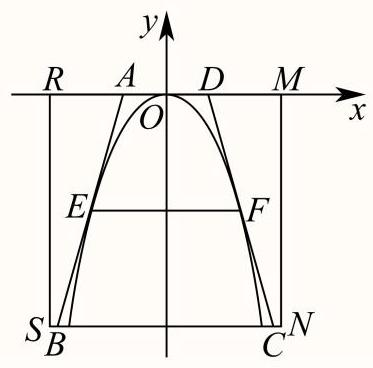

当点 $E$ 到 ${RM}$ 的距离为 4.5 时， ${EF} = 6$ ，

则 $E\left( {-3, - {4.5}}\right)$ ，代入抛物线 ${x}^{2} =  - {2py}, p > 0$ ，解得 $p = 1$ ，

则 ${x}^{2} =  - {2y}$ ,即 $y =  - \frac{1}{2}{x}^{2}$ ,设 $y =  - {10}$ ,则 $x =  \pm  2\sqrt{5}$ ,

设 $F\left( {{x}_{0}, - \frac{1}{2}{x}_{0}^{2}}\right) ,{x}_{0} \in  \left( {0,2\sqrt{5}}\right)$ ,

$\because y =  - \frac{1}{2}{x}^{2},\therefore {y}^{\prime } =  - x,{k}_{CD} =  - {x}_{0}$ ,

则直线 ${CD}$ 的方程为 $y + \frac{1}{2}{x}_{0}^{2} =  - {x}_{0}\left( {x - {x}_{0}}\right)$ ,

令 $y = 0$ ,解得 ${x}_{D} = \frac{1}{2}{x}_{0}$ ,令 $y =  - {10}$ ,解得 ${x}_{C} = \frac{1}{2}{x}_{0} + \frac{10}{{x}_{0}}$ ,

故 ${S}_{ABCD} = 2 \times  \frac{1}{2} \times  \left( {\frac{1}{2}{x}_{0} + \frac{1}{2}{x}_{0} + \frac{10}{{x}_{0}}}\right)  \times  {10} = {10}\left( {{x}_{0} + \frac{10}{{x}_{0}}}\right)  \geq  {20}\sqrt{{x}_{0} \cdot  \frac{10}{{x}_{0}}} = {20}\sqrt{10}$ ,

当且仅当 ${x}_{0} = \frac{10}{{x}_{0}}$ 时,即 ${x}_{0} = \sqrt{10}$ 时,等号成立,

故当 ${x}_{0} = \sqrt{10}$ 时， ${S}_{ABCD}$ 取最小值，此时 ${EF} = 2{x}_{0} = 2\sqrt{10} \approx  {6.32}$ .

故答案为:6.32

## 一般

3. 如图所示，正方形 ${ABCD}$ 是一块边长为4的工程用料，阴影部分所示是被腐蚀的区域，其余部分完好，曲线 ${MN}$ 为以 ${AD}$ 为对称轴的抛物线的一部分， ${DM} = {DN} = 3$ . 工人师傅现要从完好的部分中截取一块矩形原料 ${BQPR}$ ， 当其面积有最大值时， ${AQ}$ 的长为 .

答案

$\frac{4 + \sqrt{7}}{3}$

解析

建立平面直角坐标系如图所示，由已知求出抛物线方程，当 ${AQ} \geq  3$ 时，矩形面积最大时为4，当 $0 < {AQ} < 3$ ,设 ${AQ} = x\left( {0 < x < 3}\right)$ ,即可得到 $S$ 关于 $x$ 的函数式,利用求导判断单调性,即可得到最值.

由题知,以 $A$ 为原点,建立平面直角坐标系,如图,

则 $M\left( {0,1}\right) , N\left( {3,4}\right)$ ,设 ${MN}$ 方程为: $y = a{x}^{2} + b$ ,

所以 $\left\{  \begin{array}{l} 0 + b = 1 \\  {9a} + b = 4 \end{array}\right.$ , $\left\{  \begin{array}{l} a = \frac{1}{3} \\  b = 1 \end{array}\right.$ , ${MN}$ 方程为: $y = \frac{1}{3}{x}^{2} + 1$ ,

令矩形 ${BQPR}$ 面积为 $S$ ，

当 ${AQ} \geq  3$ 时， $S \leq  {S}_{BQNC} = 1 \times  4 = 4$ ，

当 $0 < {AQ} < 3$ ,设 ${AQ} = x\left( {0 < x < 3}\right)$ ,则 $P\left( {x,\frac{1}{3}{x}^{2} + 1}\right)$ ,

所以 $S = \left( {4 - x}\right) \left( {\frac{1}{3}{x}^{2} + 1}\right)  =  - \frac{1}{3}{x}^{3} + \frac{4}{3}{x}^{2} - x + 4$ ,

则 ${S}^{\prime } =  - {x}^{2} + \frac{8}{3}x - 1 =  - {\left( x - \frac{4}{3}\right) }^{2} + \frac{7}{9}$ ,

令 ${S}^{\prime } > 0$ ,则 $\frac{4 - \sqrt{7}}{3} < x < \frac{4 + \sqrt{7}}{3}, S$ 在 $\left( {\frac{4 - \sqrt{7}}{3},\frac{4 + \sqrt{7}}{3}}\right)$ 上递增,

令 ${S}^{\prime } < 0$ ,则 $x > \frac{4 + \sqrt{7}}{3}$ 或 $x < \frac{4 - \sqrt{7}}{3}, S$ 在 $\left( {\frac{4 + \sqrt{7}}{3}, + \infty }\right) ,\left( {-\infty ,\frac{4 - \sqrt{7}}{3}}\right)$ 上递减,

又 $0 < x < 3, S\left( 0\right)  = 4, S\left( \frac{4 + \sqrt{7}}{3}\right)  = \frac{{344} + {14}\sqrt{7}}{81} > 4$ ,

所以当 ${AQ}$ 的长为 $\frac{4 + \sqrt{7}}{3}$ 时,该矩形面积最大.

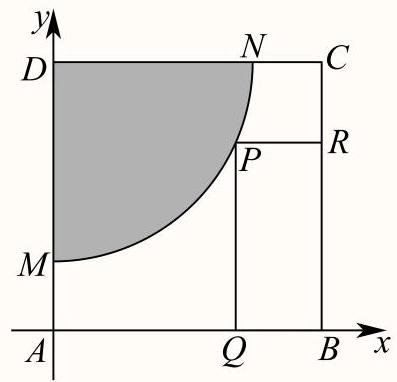

故答案为: $\frac{4 + \sqrt{7}}{3}$

一般

4. 如图，有一块矩形铁皮 ${ABCD}$ ，其中 ${AB} = t$ 米， ${AD} = 4$ 米，其中， $t$ 是一个大于等于4的常数. 阴影部分 ${AMN}$ 是一个半径为3米的扇形. 设这个扇形已经腐蚀不能使用, 但其余部分均完好. 工人师傅想在未被腐蚀的部分截下一块其边落在 ${BC}$ 与 ${CD}$ 上的矩形铁皮 ${PQCR}$ ，使点P在弧 ${MN}$ 上. 设 $\angle {MAP} = \theta \left( {0 \leq  \theta  \leq  \frac{\pi }{2}}\right)$ ，矩形 ${PQCR}$ 的面积为S平方米.

(1)求S关于 $\theta$ 的函数表达式；

(2)当 $t = 4$ 时，求S的最值，并求出当S取得最值时，所对应的 $\sin \theta$ 的值.

答案

(1) $S = \left( {4 - 3\sin \theta }\right) \left( {t - 3\cos \theta }\right) ,\;\left( {0 \leq  \theta  \leq  \frac{\pi }{2}}\right)$ ;

(2) 答案见解析.

解析

(1) 过 $P$ 作 ${PE} \bot  {AB}$ ,垂足为 $E$ ,由题意得: ${PE} = 3\sin \theta ,{AE} = 3\cos \theta$ ,

故 ${PQ} = {AB} - {AE} = t - 3\cos \theta ,{PR} = {AD} - {PE} = 4 - 3\sin \theta$ ,

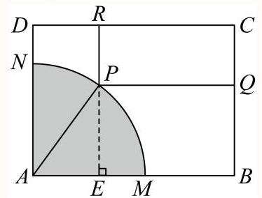

所以矩形 ${PQCR}$ 的面积 $S = {PR} \cdot  {PQ} = \left( {4 - 3\sin \theta }\right) \left( {t - 3\cos \theta }\right) ,\left( {0 \leq  \theta  \leq  \frac{\pi }{2}}\right)$ .

(2) 由(1)及题设知 $S = \left( {4 - 3\sin \theta }\right) \left( {4 - 3\cos \theta }\right)$ ,

故 $S = \left( {4 - 3\sin \theta }\right) \left( {4 - 3\cos \theta }\right)  = {16} - {12}\left( {\sin \theta  + \cos \theta }\right)  + 9\sin \theta \cos \theta$ ,

令 $\sin \theta  + \cos \theta  = m = \sqrt{2}\sin \left( {\theta  + \frac{\pi }{4}}\right) ,0 \leq  \theta  \leq  \frac{\pi }{2}$ ,所以 $m \in  \left\lbrack  {1,\sqrt{2}}\right\rbrack$ ,且 $\sin \theta \cos \theta  = \frac{{m}^{2} - 1}{2}$ ,

$S = {16} - {12m} + \frac{9}{2}\left( {{m}^{2} - 1}\right)  = \frac{9}{2}{\left( m - \frac{4}{3}\right) }^{2} + \frac{7}{2},$

$h\left( m\right)  = \frac{9}{2}{\left( m - \frac{4}{3}\right) }^{2} + \frac{7}{2}$ 在区间 $\left\lbrack  {1,\frac{4}{3}}\right\rbrack$ 上严格减，在区间 $\left\lbrack  {\frac{4}{3},\sqrt{2}}\right\rbrack$ 上严格增，且

$h\left( 1\right)  = 4 > h\left( \sqrt{2}\right)  = \frac{41}{2} - {12}\sqrt{2},$

当 $m = \frac{4}{3}$ ，即 $\sin \theta  + \cos \theta  = \frac{4}{3}$ 时， $S$ 取得最小值 $\frac{7}{2}$ ，

此时 $\sin \theta  + \sqrt{1 - {\sin }^{2}\theta } = \frac{4}{3}$ ，则 $1 - {\sin }^{2}\theta  = {\left( \frac{4}{3} - \sin \theta \right) }^{2}$ ，故 $\sin \theta  = \frac{4 \pm  \sqrt{2}}{6}$ ，

当 $m = 1$ ,即 $\sin \theta  + \cos \theta  = 1$ 时， $S$ 取得最大值 4,

此时 $\sin \theta  + \sqrt{1 - {\sin }^{2}\theta } = 1$ ,则 $1 - {\sin }^{2}\theta  = {\left( 1 - \sin \theta \right) }^{2}$ ,故 $\sin \theta  = 1$ 或 $\sin \theta  = 0$ .

一般

1. 采矿、采石或取土时，常用炸药包进行爆破，部分爆破呈圆锥漏斗形状(如图)，已知圆锥的母线长是炸药包的爆破半径R，它的值是固定的. 当炸药包埋的深度为 可使爆破体积最大.

答案

$\frac{\sqrt{3}}{3}R$

解析

先将圆锥的体积转化为关于深处 $h$ 的关系式，再利用导数与函数性质的关系求得 $V$ 的最大值点，从而得解. 结合图形,可知圆锥的体积为 $V = \frac{1}{3}\pi {r}^{2}h$ ,

又因为 ${R}^{2} = {h}^{2} + {r}^{2}$ ,即 ${r}^{2} = {R}^{2} - {h}^{2}$ ,

所以 $V = \frac{1}{3}\pi \left( {{R}^{2} - {h}^{2}}\right) h = \frac{1}{3}\pi {R}^{2}h - \frac{1}{3}\pi {h}^{3}, h \in  \left( {0, R}\right)$ ,则 ${V}^{\prime } = \frac{1}{3}\pi {R}^{2} - \pi {h}^{2}$ ,

令 ${V}^{\prime } \geq  0$ ,得 $0 < h < \frac{\sqrt{3}}{3}R$ ; 令 ${V}^{\prime } \leq  0$ ,得 $\frac{\sqrt{3}}{3}R < h < R$ ;

所以 $V = \frac{1}{3}\pi {R}^{2}h - \frac{1}{3}\pi {h}^{3}$ 在 $\left( {0,\frac{\sqrt{3}}{3}R}\right)$ 上单调递增,在 $\left( {\frac{\sqrt{3}}{3}R, R}\right)$ 上单调递减,

所以在 $h = \frac{\sqrt{3}}{3}R$ 处 $V = \frac{1}{3}\pi {R}^{2}h - \frac{1}{3}\pi {h}^{3}$ 取得最大值,

所以炸药包要埋在 $\frac{\sqrt{3}}{3}R$ 深处.

故答案为: $\frac{\sqrt{3}}{3}R$ .

## 较难

2. 某建筑公司欲设计一个正四棱锥形纪念碑，要求其顶点位于容积为36π立方米的球形景观灯所在球面上. 考虑到抗风、抗震等结构安全需求，侧棱长度1需满足 $2\sqrt{3} \leq  l \leq  3\sqrt{3}$ . 当纪念碑体积取得最大值时，正四棱锥的侧棱长约为 米(精确到0.01米).

## ② 答案

4.90

解析

由题设可得球的半径为 $r = 3$ ,结合正四棱锥的结构特征及其外接球半径与棱长、底面边长的关系得 ${6h} = {l}^{2}$ , 进而得到纪念碑体积关于 $l$ 的表达式,应用导数求其最大值,并确定对应的侧棱长.

若球的半径为 $r$ ,则 $\frac{4}{3}\pi {r}^{3} = {36\pi }$ ,可得 $r = 3$ ,又 $2\sqrt{3} \leq  l \leq  3\sqrt{3}$ ,

对于正四棱锥,设底面边长为 $a$ ,高为 $h$ ,

则 ${h}^{2} = {l}^{2} - {\left( \frac{\sqrt{2}}{2}a\right) }^{2} = {l}^{2} - \frac{{a}^{2}}{2}$ ,所以 $\frac{{a}^{2}}{2} = {l}^{2} - {h}^{2}$ ,即 ${a}^{2} = 2\left( {{l}^{2} - {h}^{2}}\right)$ ,

又 ${\left( h - r\right) }^{2} + \frac{{a}^{2}}{2} = {r}^{2}$ ，则 $\frac{{a}^{2}}{2} = {6h} - {h}^{2}$ ，故 ${6h} = {l}^{2}$ ，即 $h = \frac{{l}^{2}}{6}$ ，

纪念碑体积 $V = \frac{1}{3}{a}^{2}h = \frac{2}{3} \times  \left( {{l}^{2} - \frac{{l}^{4}}{36}}\right)  \cdot  \frac{{l}^{2}}{6} = \frac{1}{9} \times  \left( {{l}^{4} - \frac{{l}^{6}}{36}}\right)$ ,令 $t = {l}^{2} \in  \left\lbrack  {{12},{27}}\right\rbrack$ ,

对于 $y = {t}^{2} - \frac{{t}^{3}}{36}$ ,则 ${y}^{\prime } = {2t} - \frac{{t}^{2}}{12} = \frac{{24t} - {t}^{2}}{12}$ 在 $t \in  \left\lbrack  {{12},{27}}\right\rbrack$ 上单调递减,

当 ${12} \leq  t < {24}$ 时 ${y}^{\prime } > 0$ ，即 $y = {t}^{2} - \frac{{t}^{3}}{36}$ 在 $\lbrack {12},{24})$ 上单调递增，

当 ${24} < t \leq  {27}$ 时 ${y}^{\prime } < 0$ ，即 $y = {t}^{2} - \frac{{t}^{3}}{36}$ 在 $({24},{27}\rbrack$ 上单调递减，

所以 ${y}_{\max } = {24}^{2} - \frac{{24}^{3}}{36} = {192}$ ，故 ${V}_{\max } = \frac{1}{9} \times  {192} = \frac{64}{3}$ ，此时 $l = 2\sqrt{6} \approx  {4.90}$ 米.

故答案为:4.90

## 一般

3. 将一个半径为1的球形石材加工成一个圆柱形摆件，则该圆柱形摆件侧面积的最大值为 .

答案

${2\pi }$

解析

设圆柱形工件的高为 $\mathrm{h}$ ，底面半径为 $\mathrm{r}$ ，得到圆柱形工件的侧面积为 $S = {2\pi rh}$ ，再结合基本不等式求解侧面积的最大值.

设圆柱形工件的高为 $\mathrm{h}$ ，底面半径为 $\mathrm{r}$ ， $\frac{{h}^{2}}{4} + {r}^{2} = 1$ ，

则圆柱形工件的侧面积为 $S = {2\pi rh} = {2\pi r}\sqrt{4\left( {1 - {r}^{2}}\right) } = {4\pi }\sqrt{{r}^{2}\left( {1 - {r}^{2}}\right) }$ ，

又因为 $1 = {r}^{2} + \left( {1 - {r}^{2}}\right)  \geq  2\sqrt{{r}^{2}\left( {1 - {r}^{2}}\right) }$ ,当且仅当 ${r}^{2} = \left( {1 - {r}^{2}}\right) , r = \frac{\sqrt{2}}{2}$ 时等号成立,

所以 $S = {4\pi }\sqrt{{r}^{2}\left( {1 - {r}^{2}}\right) } \leq  {4\pi } \times  \frac{1}{2} = {2\pi }$ ,

故答案为: ${2\pi }$ .

## 一般

4. 如图，两条足够长且互相垂直的轨道 ${l}_{1},{l}_{2}$ 相交于点 $O$ ，一根长度为 8 的直杆 ${AB}$ 的两端点 $A, B$ 分别在 ${l}_{1},{l}_{2}$ 上滑动( $A, B$ 两点不与 $O$ 点重合，轨道与直杆的宽度等因素均可忽略不计),直杆上的点 $P$ 满足 ${OP} \bot  {AB}$ ，则 $\bigtriangleup  {OAP}$ 面积的取值范围是

## 9 答案

$\left( {0,6\sqrt{3}}\right\rbrack$

解析

令 $\angle {OAB} = x\left( {0 < x < \frac{\pi }{2}}\right)$ ，利用直角三角形边角关系及三角形面积公式求出 $\bigtriangleup  {OAP}$ 的面积函数，再利用导数求出值域即得.

依题意,设 $\angle {OAB} = x\left( {0 < x < \frac{\pi }{2}}\right)$ ,则 ${OA} = {AB}\cos x = 8\cos x,{AP} = {OA}\cos x = 8{\cos }^{2}x$ ,

因此 $\bigtriangleup {OAP}$ 的面积 $f\left( x\right)  = \frac{1}{2}{OA} \cdot  {AP}\sin x = {32}\sin x{\cos }^{3}x,0 < x < \frac{\pi }{2}$ ,

求导得 ${f}^{\prime }\left( x\right)  = {32}\left( {{\cos }^{4}x - 3{\sin }^{2}x{\cos }^{2}x}\right)  = {32}{\cos }^{4}x\left( {1 - 3{\tan }^{2}x}\right)$ ,

当 $0 < x < \frac{\pi }{6}$ 时， ${f}^{\prime }\left( x\right)  > 0$ ，当 $\frac{\pi }{6} < x < \frac{\pi }{2}$ 时， ${f}^{\prime }\left( x\right)  < 0$ ，即函数 $f\left( x\right)$ 在 $\left( {0,\frac{\pi }{6}}\right)$ 上递增，在 $\left( {\frac{\pi }{6},\frac{\pi }{2}}\right)$ 上递减，

因此 $f{\left( x\right) }_{\max } = f\left( \frac{\pi }{6}\right)  = {32} \times  {\left( \frac{\sqrt{3}}{2}\right) }^{3} \times  \frac{1}{2} = 6\sqrt{3}$ ,而 $f\left( 0\right)  = f\left( \frac{\pi }{2}\right)  = 0$ ,则 $0 < f\left( x\right)  \leq  6\sqrt{3}$ ,

所以 $\bigtriangleup {OAP}$ 面积的取值范围是 $\left( {0,6\sqrt{3}}\right\rbrack$ .

故答案为: $\left( {0,6\sqrt{3}}\right\rbrack$

## 一般

5. 如图,某处有一块圆心角为 $\frac{2}{3}\pi$ 的扇形绿地 ${AOB}$ ,扇形的半径为20米, ${AB}$ 是一条原有的人行直路,由于工程建设需要,现要在绿地中建一条直路 ${OC}$ ,以便在图中阴影部分区域分类堆放物料.为了尽量减少对绿地的破坏(不计路宽),则原直路 ${AB}$ 与新直路 ${OC}$ 的交叉点 $D$ 到 $O$ 的距离为 米.

答案

${10}\sqrt{2}$

解析

过点 $O$ 作 ${OH}\bot {AB}$ ，设 $\angle {BOD} = \alpha ,{BD} = m$ ，根据正弦定理求得 $m = \frac{{20}\sin \alpha }{\sin \left( {\alpha  + \frac{\pi }{6}}\right) }$ ，求得阴影的面积为 $S = {200}\left( {\alpha  - \frac{\sin \alpha }{\sin \left( {\alpha  + \frac{\pi }{6}}\right) }}\right)  + {100}\sqrt{3}$ ,令 $f\left( \alpha \right)  = \alpha  - \frac{\sin \alpha }{\sin \left( {\alpha  + \frac{\pi }{6}}\right) }$ ,求得 ${f}^{\prime }\left( \alpha \right)  = 1 - \frac{\frac{1}{2}}{{\sin }^{2}\left( {\alpha  + \frac{\pi }{6}}\right) }$ ,得出函数的单调性,得到 $\alpha  = \frac{\pi }{12}$ 时, $f\left( \alpha \right)$ 取得最小值,结合 $\bigtriangleup {ODH}$ 为等腰直角三角形,即可求解.

过点 $O$ 作 ${OH} \bot  {AB}$ 垂足为 $H$ ,可得 ${OH} = {10},{AB} = {20}\sqrt{3}$ ,

设 $\angle {BOD} = \alpha ,{BD} = m$ ,在 $\bigtriangleup {BOD}$ 中,由正弦定理得 $\frac{m}{\sin \alpha } = \frac{OB}{\sin \angle {ODB}}$ ,

因为 $\sin \angle {ODB} = \sin \left( {\alpha  + \angle {OBD}}\right)  = \sin \left( {\alpha  + \frac{\pi }{6}}\right)$ ,所以 $m = \frac{{20}\sin \alpha }{\sin \left( {\alpha  + \frac{\pi }{6}}\right) }$ ,

又由阴影部分的面积: $S = {S}_{\text{ 扇形 }{OBC}} - {S}_{\bigtriangleup {OBD}} + {S}_{\bigtriangleup {OAD}}$

$= \frac{1}{2}\alpha  \times  {\left( {20}\right) }^{2} - \frac{1}{2}m \times  {10} + \frac{1}{2}\left( {{20}\sqrt{3} - m}\right)  \times  {10} = {200\alpha } + {100}\sqrt{3} - {10m}$

$= {200\alpha } + {100}\sqrt{3} - \frac{{200}\sin \alpha }{\sin \left( {\alpha  + \frac{\pi }{6}}\right) } = {200}\left( {\alpha  - \frac{\sin \alpha }{\sin \left( {\alpha  + \frac{\pi }{6}}\right) }}\right)  + {100}\sqrt{3}$ ,其中 $0 < \alpha  \leq  \frac{\pi }{2},$

令 $f\left( \alpha \right)  = \alpha  - \frac{\sin \alpha }{\sin \left( {\alpha  + \frac{\pi }{6}}\right) },0 < \alpha  \leq  \frac{\pi }{2},$

可得 ${f}^{\prime }\left( \alpha \right)  = 1 - \frac{\cos \alpha \sin \left( {\alpha  + \frac{\pi }{6}}\right)  - \sin x\cos \left( {\alpha  + \frac{\pi }{6}}\right) }{{\sin }^{2}\left( {\alpha  + \frac{\pi }{6}}\right) } = 1 - \frac{\frac{1}{2}}{{\sin }^{2}\left( {\alpha  + \frac{\pi }{6}}\right) }$ ,

令 ${f}^{\prime }\left( \alpha \right)  = 0$ ,可得 $\sin \left( {\alpha  + \frac{\pi }{6}}\right)  = \frac{\sqrt{2}}{2}$ ,解得 $\alpha  = \frac{\pi }{12}$

当 $0 < \alpha  < \frac{\pi }{12}$ 时, ${f}^{\prime }\left( \alpha \right)  < 0$ ; 当 $\frac{\pi }{12} < \alpha  < \frac{\pi }{2}$ 时, ${f}^{\prime }\left( \alpha \right)  > 0$ ,

所以 $f\left( \alpha \right)$ 在 $\left( {0,\frac{\pi }{12}}\right)$ 上单调递减，在 $\left( {\frac{\pi }{12},\frac{\pi }{2}}\right)$ 上单调递增，

当 $\alpha  = \frac{\pi }{12}$ 时,函数 $f\left( \alpha \right)$ 取得最小值,则 $\angle {DOH} = \frac{\pi }{4}$ ,所以 $\bigtriangleup {ODH}$ 为等腰直角三角形,

因为 $\left| {OH}\right|  = {10}$ ,所以 $\left| {OD}\right|  = {10}\sqrt{2}$ .

故答案为:10 $\sqrt{2}$

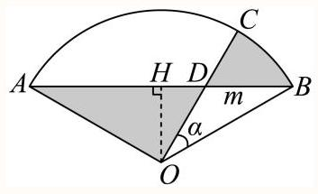

一般

6. 如图， ${l}_{1}$ 、 ${l}_{2}$ 、 ${l}_{3}$ 是同一平面内三条不重合自上而下的平行直线，如果边长为 $a$ 的正三角形 ${ABC}$ 的三顶点分别在 ${l}_{1}$ 、 ${l}_{2}$ 、 ${l}_{3}$ 上，设 ${l}_{1}$ 与 ${l}_{2}$ 的距离为 ${d}_{1}$ ， ${l}_{2}$ 与 ${l}_{3}$ 的距离为 ${d}_{2}$ ，则 ${d}_{1} \cdot  {d}_{2}$ 的最大值___.

② 答案

$\frac{1}{4}{a}^{2}$

设 ${AB}$ 与 ${l}_{1}$ 所成角为 $\theta ,\theta  \in  \left( {0,\frac{\pi }{3}}\right)$ ，即可表示出 ${d}_{1},{d}_{2}$ ，再由三角恒等变换公式将 ${d}_{1} \cdot  {d}_{2}$ 化简，再由正弦函数的性质计算可得.

解: 设 ${AB}$ 与 ${l}_{1}$ 所成角为 $\theta ,\theta  \in  \left( {0,\frac{\pi }{3}}\right)$ ,

则 ${d}_{1} = a\sin \theta ,{d}_{2} = a\sin \left( {\frac{\pi }{3} - \theta }\right)$ ,

所以 ${d}_{1} \cdot  {d}_{2} = {a}^{2}\sin \left( {\frac{\pi }{3} - \theta }\right) \sin \theta  = {a}^{2}\left( {\frac{\sqrt{3}}{2}\cos \theta  - \frac{1}{2}\sin \theta }\right) \sin \theta$

$= {a}^{2}\left( {\frac{\sqrt{3}}{2}\cos \theta \sin \theta  - \frac{1}{2}{\sin }^{2}\theta }\right)$

$= {a}^{2}\left( {\frac{\sqrt{3}}{4}\sin {2\theta } - \frac{1}{2} \cdot  \frac{1 - \cos {2\theta }}{2}}\right)$

$= {a}^{2}\left( {\frac{\sqrt{3}}{4}\sin {2\theta } + \frac{1}{4}\cos {2\theta } - \frac{1}{4}}\right)$

$= {a}^{2}\left\lbrack  {\frac{1}{2}\left( {\frac{\sqrt{3}}{2}\sin {2\theta } + \frac{1}{2}\cos {2\theta }}\right)  - \frac{1}{4}}\right\rbrack$

$= {a}^{2}\left\lbrack  {\frac{1}{2}\sin \left( {{2\theta } + \frac{\pi }{6}}\right)  - \frac{1}{4}}\right\rbrack$

$\because 0 < \theta  < \frac{\pi }{3}$ ,

$\therefore \frac{\pi }{6} < {2\theta } + \frac{\pi }{6} < \frac{5\pi }{6},\therefore {2\theta } + \frac{\pi }{6} = \frac{\pi }{2}$ ,即 $\theta  = \frac{\pi }{6}$ 时, ${\left\lbrack  \sin \left( 2\theta  + \frac{\pi }{6}\right) \right\rbrack  }_{\max } = 1$ ,

即 ${\left( {d}_{1} \cdot  {d}_{2}\right) }_{\max } = \frac{1}{4}{a}^{2}$ .

故答案为: $\frac{1}{4}{a}^{2}$ .

## 一般

7. 如图，某城市公园内有一矩形空地 ${ABCD},{AB} = {300}\mathrm{\;m}$ ， ${AD} = {180}\mathrm{m}$ ，现规划在边 ${AB}$ ， ${CD}$ ， ${DA}$ 上分别取点 $E$ ， $F, G$ ,且满足 ${AE} = {EF},{FG} = {GA},$ 在 $\bigtriangleup {EAG}$ 内建造喷泉瀑布,在 $\bigtriangleup {EFG}$ 内种植花奔,其余区域铺设草坪,并修建栈道 ${EG}$ 作为观光路线(不考虑宽度)，则当 $\sin \angle {AEG} = \;$ 时，栈道 ${EG}$ 最短.

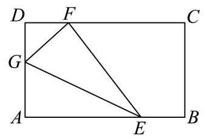

答案

$\frac{\sqrt{3}}{3}$

解析

由题设有 $\operatorname{Rt}\bigtriangleup {EAG} \equiv  \operatorname{Rt}\bigtriangleup {EFG}$ ,设 $\angle {AEG} = \theta \left( {0 < \theta  < \frac{\pi }{2}}\right)$ ,根据图形中边角关系,结合三角函数可得 ${EG} = \frac{90}{\sin \theta \left( {1 - {\sin }^{2}\theta }\right) }$ ，注意 $\sin \theta$ 的范围，进而应用换元法并构造函数，利用导数求最值.

由題意, $\operatorname{Rt}\bigtriangleup {EAG} \equiv  \operatorname{Rt}\bigtriangleup {EFG}$ ,

设 $\angle {AEG} = \theta \left( {0 < \theta  < \frac{\pi }{2}}\right)$ ,则 $\angle {DGF} = \pi  - 2\left( {\frac{\pi }{2} - \theta }\right)  = {2\theta }$ .

在 $\operatorname{Rt}\bigtriangleup {GDF}$ 中 $\cos {2\theta } = \frac{DG}{GF} = \frac{{180} - {AG}}{AG}$ ,得 ${AG} = \frac{180}{\cos {2\theta } + 1} = \frac{90}{{\cos }^{2}\theta }$ ,

则 ${EG} = \frac{AG}{\sin \theta } = \frac{90}{\sin \theta {\cos }^{2}\theta } = \frac{90}{\sin \theta \left( {1 - {\sin }^{2}\theta }\right) }$ .

由于 $\left\{  \begin{matrix} {AG} = \frac{90}{{\cos }^{2}\theta } = {90}\left( {1 + {\tan }^{2}\theta }\right)  \leq  {180} \\  {AE} = \frac{AG}{\tan \theta } = {90}\left( {\tan \theta  + \frac{1}{\tan \theta }}\right)  \leq  {300} \end{matrix}\right.$ ,解得 $\frac{1}{3} \leq  \tan \theta  \leq  1$ .

令 $\sin \theta  = t, t \in  \left\lbrack  {\frac{\sqrt{10}}{10},\frac{\sqrt{2}}{2}}\right\rbrack$ ,则 ${EG} = \frac{90}{t - {t}^{3}}$ .

令 $f\left( t\right)  = t - {t}^{3}$ ,则 ${f}^{\prime }\left( t\right)  = 1 - 3{t}^{2}$ ,

当 ${f}^{\prime }\left( t\right)  > 0$ 时 $t \in  \left\lbrack  {\frac{\sqrt{10}}{10},\frac{\sqrt{3}}{3}}\right)$ ， $f\left( t\right)$ 严格递增；

当 ${f}^{\prime }\left( t\right)  < 0$ 时 $t \in  \left( {\frac{\sqrt{3}}{3},\frac{\sqrt{2}}{2}}\right\rbrack$ ， $f\left( t\right)$ 严格递减；

所以 $t = \sin \theta  = \frac{\sqrt{3}}{3}, f\left( t\right)$ 有最大值，则 $E{G}_{\min } = {135}\sqrt{3}$ .

故答案为: $\frac{\sqrt{3}}{3}$

关键点点睛:关键是要弄清楚图形的关系，运用平面几何知识表示出四边形的面积，再利用换元法特别注意换元后的范围，转化为用导数法求函数的最值问题，进而可以求解.

## 一般

8. 在边长为1的正三角形ABC的边AB、AC上分别取D、E两点，若沿线段DE折叠该三角形时，顶点A恰好落在边BC 上. 则线段AD的长度的最小值为 .

答案

$2\sqrt{3} - 3$

解析

设 $\angle {BAP} = \theta ,{AD} = x$ ，求出 $\angle {BDP}$ 、 ${DP}$ 、 ${BD}$ 关于所设参数的表达式，在 $\bigtriangleup  {BDP}$ 中应用正弦定理求 ${DP}$ ，再根据 $\theta$ 的取值范围求最值.

由题意可得 $A, P$ 两点关于折线 ${DE}$ 对称，连结 ${DP}$ ，

设 $\angle {BAP} = \angle {APD} = \theta ,{AD} = x$ ,

则 $\angle {BDP} = {2\theta },{DP} = x,{BD} = 1 - x$ .

在 $\bigtriangleup {ABC}$ 中, $\angle {APB} = \pi  - \angle {ABP} - \angle {BAP} = \frac{2\pi }{3} - \theta$ .

在 $\bigtriangleup {BDP}$ 中, $\angle {BPD} = \angle {APB} - \angle {APD} = \frac{2\pi }{3} - {2\theta }$ ,

由正弦定理知: $\frac{BD}{\sin \angle {BPD}} = \frac{DP}{\sin \angle {DBP}}$ ,即 $\frac{1 - x}{\sin \left( {\frac{2\pi }{3} - {2\theta }}\right) } = \frac{x}{\sin \frac{\pi }{3}}$ ,

所以 $x = \frac{\sqrt{3}}{2\sin \left( {\frac{2\pi }{3} - {2\theta }}\right)  + \sqrt{3}}$ .

因为 $0 \leq  \theta  \leq  \frac{\pi }{3}$ ,即 $0 \leq  \frac{2\pi }{3} - {2\theta } \leq  \frac{2\pi }{3}$ ,

当 $\frac{2\pi }{3} - {2\theta } = \frac{\pi }{2}$ ,即 $\theta  = \frac{\pi }{12}$ 时, $\sin \left( {\frac{2\pi }{3} - {2\theta }}\right)  = 1$ ,

此时 $x$ 取得最小值 $\frac{\sqrt{3}}{2 + \sqrt{3}} = 2\sqrt{3} - 3$ ,且 $\angle {ADE} = \frac{5\pi }{12}$ .

所以 ${AD}$ 的最小值为 $2\sqrt{3} - 3$ .

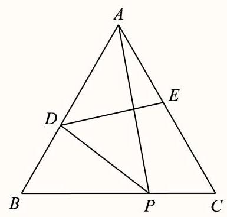

故答案为: $2\sqrt{3} - 3$ .

## 一般

9. 某公园为了美化环境，计划建造一座拱桥DACBE，已知该桥的剖面如图所示，共包括一段圆弧形桥面 $\overset{\text{ ⏜ }}{ACB}$ 和两段长度相等的直线型桥面 $\overset{\text{ ⏜ }}{ACB}$ ,圆弧形桥面 $\overset{\text{ ⏜ }}{ACB}$ 所在圆的半径为4米,圆心 $O$ 在 ${DE}$ 上,且 ${AD}$ 和 ${BE}$ 所在直线与圆 $O$ 分别在连结点 $A$ 和 $B$ 处相切. 已知直线型桥面的修建费用是每米0.4万元，弧形桥面 $\overset{\text{ ⏜ }}{ACB}$ 的修建费用是每米2.5万元，设 $\angle {ADO} = \theta$ ，根据空间限制及桥面坡度的限制， $\theta$ 的范围为 $\arcsin \frac{1}{3} \leq  \theta  \leq  \frac{\pi }{6}$ ，则当桥面修建总费用最低时 $\theta$ 的值为 .

答案

$\arcsin \frac{2}{5}$

解析

根据给定条件，结合弧长公式求出桥面修建总费用的函数关系 $f\left( \theta \right)$ ，再利用导数探讨函数最小值问题.

连接 ${OA},{OB}$ ,依题意, ${OA} \bot  {AD},{OB} \bot  {BE}$ ,则 ${BE} = {AD} = \frac{OA}{\tan \theta } = \frac{4}{\tan \theta }$ ,

$\angle {AOB} = \pi  - \left( {\angle {AOD} + \angle {BOE}}\right)  = \pi  - 2\left( {\frac{\pi }{2} - \theta }\right)  = {2\theta },\overset{\text{ ⏜ }}{ACB}$ 的长度为 ${8\theta }$ ,

则桥面修建总费用 $f\left( \theta \right)  = {0.4} \times  \frac{8}{\tan \theta } + {2.5} \times  {8\theta } = \frac{3.2}{\tan \theta } + {20\theta }$ ， $\arcsin \frac{1}{3} \leq  \theta  \leq  \frac{\pi }{6}$ ，

而 $f\left( \theta \right)  = \frac{{3.2}\cos \theta }{\sin \theta } + {20\theta }$ ,求导得 ${f}^{\prime }\left( \theta \right)  = \frac{{3.2}\left( {-{\sin }^{2}\theta  - {\cos }^{2}\theta }\right) }{{\sin }^{2}\theta } + {20} = {20} - \frac{3.2}{{\sin }^{2}\theta }$ ,

由 $\arcsin \frac{1}{3} \leq  \theta  \leq  \frac{\pi }{6}$ ,得 $\frac{1}{3} \leq  \sin \theta  \leq  \frac{1}{2}$ ,则 $\frac{1}{9} \leq  {\sin }^{2}\theta  \leq  \frac{1}{4}$ ,由 ${f}^{\prime }\left( \theta \right)  = 0$ ,得 $\sin \theta  = \frac{2}{5}$ ,

当 $\frac{1}{3} \leq  \sin \theta  < \frac{2}{5}$ ,即 $\arcsin \frac{1}{3} \leq  \theta  < \arcsin \frac{2}{5}$ 时, ${f}^{\prime }\left( \theta \right)  < 0$ ;

当 $\frac{2}{5} < \sin \theta  \leq  \frac{1}{2}$ ,即 $\arcsin \frac{2}{5} < \theta  \leq  \frac{\pi }{6}$ 时, ${f}^{\prime }\left( \theta \right)  > 0$ ,

因此函数 $f\left( \theta \right)$ 在 $\left\lbrack  {\arcsin \frac{1}{3},\arcsin \frac{2}{5}}\right)$ 上单调递减,在 $\left( {\arcsin \frac{2}{5},\frac{\pi }{6}}\right\rbrack$ 上单调递增,

所以当且仅当 $\theta  = \arcsin \frac{2}{5}$ 时， $f\left( \theta \right)$ 取得最小值，即桥面修建总费用最低.

故答案为: $\arcsin \frac{2}{5}$

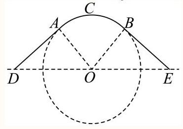

## 巨大题

一般

1. 为了节能环保、节约材料，定义建筑物的“体形系数” $S = \frac{{F}_{0}}{{V}_{0}}$ ，其中 ${F}_{0}$ 为建筑物暴露在空气中的面积(单位:平方米), ${V}_{0}$ 为建筑物的体积 (单位: 立方米).

(1)若有一个圆柱体建筑的底面半径为 $R$ ，高度为 $H$ ，暴露在空气中的部分为上底面和侧面，试求该建筑体的“体形系数” $S$ ; (结果用含 $R$ 、 $H$ 的代数式表示)

(2)定义建筑物的“形状因子”为 $f = \frac{{L}^{2}}{A}$ ，其中 $A$ 为建筑物底面面积， $L$ 为建筑物底面周长，又定义 $T$ 为总建筑面积, 即为每层建筑面积之和 (每层建筑面积为每一层的底面面积). 设n为某宿舍楼的层数, 层高为3米, 则可以推导出该宿舍楼的“体形系数”为 $S = \sqrt{\frac{f \cdot  n}{T}} + \frac{1}{3n}$ . 当 $f = {18}, T = {10000}$ 时，试求当该宿舍楼的层数 $n$ 为多少时，“体形系数” $S$ 最小.

答案

(1) $S = \frac{{2H} + R}{HR}$

(2) $n = 6$

解析

(1)由圆柱体的表面积和体积公式可得: ${F}_{0} = {2\pi RH} + {\pi {R}^{2}}$ ， ${V}_{0} = {\pi {R}^{2}}H$ ， 所以 $S = \frac{{F}_{0}}{{V}_{0}} = \frac{{\pi R}\left( {{2H} + R}\right) }{\pi {R}^{2}H} = \frac{{2H} + R}{HR}$ ;

${}^{\left( 2\right) }$ 由题意可得 $S = \sqrt{\frac{18n}{10000}} + \frac{1}{3n} = \frac{3\sqrt{2n}}{100} + \frac{1}{3n}$ ， $n \in  {\mathbf{N}}^{ * }$ ，

令 $g\left( x\right)  = \frac{3\sqrt{2x}}{100} + \frac{1}{3x}, x \geq  1$ ,

所以 ${g}^{\prime }\left( x\right)  = \frac{3\sqrt{2}}{{200}\sqrt{x}} - \frac{1}{3{x}^{2}} = \frac{9\sqrt{2}{x}^{\frac{3}{2}} - {200}}{{600}{x}^{2}}$ ,

令 ${S}^{\prime } = 0$ ，解得 $x = \sqrt[3]{\frac{20000}{81}} \approx  {6.27}$ ，

所以 $g\left( x\right)$ 在 $\left\lbrack  {1,{6.27}}\right\rbrack$ 单调递减，在 $\lbrack {6.27}, + \infty )$ 单调递增，

所以 $\mathrm{S}$ 的最小值在 $n = 6$ 或 7 取得,

当 $n = 6$ 时， $S = \frac{3\sqrt{2 \times  6}}{100} + \frac{1}{3 \times  6} \approx  {0.31}$ ，

当 $n = 7$ 时， $S = \frac{3\sqrt{2 \times  7}}{100} + \frac{1}{3 \times  7} \approx  {0.16}$ ，

所以在 $n = 6$ 时,该建筑体 $\mathrm{S}$ 最小.

## 一般

2. 为了打造美丽社区，某小区准备将一块由一个半圆和长方形组成的空地进行美化，如图，长方形的边 ${AB}$ 为半圆的直径，O为半圆的圆心， ${AB} = {2AD} = {200}\mathrm{m}$ ，现要将此空地规划出一个等腰三角形区域 ${PMN}$ (底边 ${MN}\bot {CD}$ ) 种植观赏树木，其余区域种植花卉. 设 $\angle {MOB} = \theta ,\theta  \in  \left( {0,\frac{\pi }{2}}\right\rbrack$ .

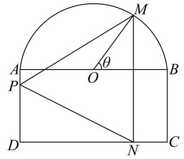

(1) 当 $\theta  = \frac{\pi }{3}$ 时,求 $\bigtriangleup  {PMN}$ 的面积;

(2)求三角形区域 ${PMN}$ 面积的最大值.

## ② 答案

(1) $\left( {{3750}\sqrt{3} + {7500}}\right) {\mathrm{m}}^{2}$

(2) $\left( {{7500} + {5000}\sqrt{2}}\right) {\mathrm{m}}^{2}$

解析

(1)设 ${MN}$ 与 ${AB}$ 相交于点 $E$ ，则 ${ME} = {OM} \cdot  \sin \frac{\pi }{3} = {{100} \times  \frac{\sqrt{3}}{2}} = {{50}\sqrt{3}}$ ，

则 ${MN} = {ME} + {EN} = {50}\sqrt{3} + {100},{AE} = {100} + {100}\cos \frac{\pi }{3} = {150}$ ,

易知 $\left| {AE}\right|$ 等于 $P$ 到 ${MN}$ 的距离，

所以 ${S}_{\bigtriangleup {PMN}} = \frac{1}{2}\left| {MN}\right|  \cdot  \left| {AE}\right|  = \frac{1}{2} \times  \left( {{50}\sqrt{3} + {100}}\right)  \times  {150} = {3750}\sqrt{3} + {7500}\left( {\mathrm{\;m}}^{2}\right)$

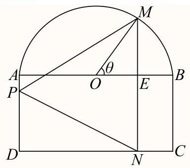

(2) 过点 $P$ 作 ${PF}\bot {MN}$ 于点 $F$ ，则 ${PF} = {AE} = {100} + {100}\cos \theta$ ，

而 ${MN} = {ME} + {EN} = {100} + {100}\sin \theta$ ,

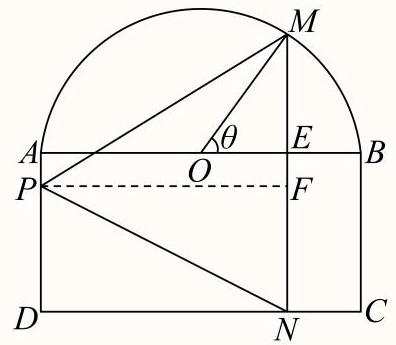

则三角形区域 ${PMN}$ 面积为 $S = \frac{1}{2}\left| {MN}\right|  \cdot  \left| {PF}\right|  = {5000}\left( {1 + \sin \theta }\right) \left( {1 + \cos \theta }\right)$

$= {5000}\left( {1 + \sin \theta  + \cos \theta  + \sin \theta \cos \theta }\right)$ ,

设 $\sin \theta  + \cos \theta  = t$ ,因为 $\theta  \in  \left( {0,\frac{\pi }{2}}\right\rbrack$ ,所以 $\theta  + \frac{\pi }{4} \in  \left( {\frac{\pi }{4},\frac{3\pi }{4}}\right\rbrack$ ,

故 $t = \sin \theta  + \cos \theta  = \sqrt{2}\sin \left( {\theta  + \frac{\pi }{4}}\right)  \in  \left\lbrack  {1,\sqrt{2}}\right\rbrack$ ,而 $\sin \theta \cos \theta  = \frac{{t}^{2} - 1}{2}$ ,

则 $S = {5000}\left( {1 + t + \frac{{t}^{2} - 1}{2}}\right)  = {2500}{\left( t + 1\right) }^{2}$ ,故当 $t = \sqrt{2}$ 时, $S$ 取得最大值,

${S}_{\max } = {2500}{\left( \sqrt{2} + 1\right) }^{2} = {7500} + {5000}\sqrt{2}\left( {\mathrm{\;m}}^{2}\right)$

故三角形区域 ${PMN}$ 面积的最大值为 $\left( {{7500} + {5000}\sqrt{2}}\right) {\mathrm{m}}^{2}$

## 一般

3. 2023年杭州亚运会首次启用机器狗搬运赛场上的运动装备. 如图所示，在某项运动赛事扇形场地 ${OAB}$ 中， $\angle {AOB} = \frac{\pi }{2},{OA} = {500}$ 米,点 $Q$ 是弧 $\overset{\text{ ⏜ }}{AB}$ 的中点, $P$ 为线段 ${OQ}$ 上一点 (不与点 $O, Q$ 重合). 为方便机器狗运输装备,现需在场地中铺设三条轨道 ${PO},{PA},{PB}$ . 记 $\angle {APQ} = \theta$ ,三条轨道的总长度为 $y$ 米.

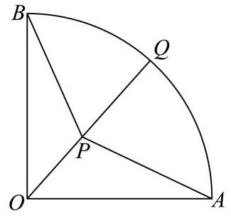

(1) 将 $y$ 表示成 $\theta$ 的函数，并写出 $\theta$ 的取值范围；

(2) 当三条轨道的总长度最小时，求轨道 ${PO}$ 的长.

2 答案

(1) $y = {250}\sqrt{2} \cdot  \frac{2 + \sin \theta  - \cos \theta }{\sin \theta },\;\theta  \in  \left( {\frac{\pi }{4},\frac{5\pi }{8}}\right)$

(2) ${OP} = \frac{250}{3}\left( {3\sqrt{2} - \sqrt{6}}\right)$

解析

(1)因为点 $Q$ 是弧 ${AB}$ 的中点，

由对称性,知 ${PA} = {PB},\angle {AOP} = \angle {BOP} = \frac{\pi }{4}$ ,

又 $\angle {APO} = \pi  - \theta ,\angle {OAP} = \theta  - \frac{\pi }{4},{OA} = {500}$

由正弦定理,得 $\frac{AP}{\sin \frac{\pi }{4}} = \frac{OA}{\sin \left( {\pi  - \theta }\right) } = \frac{OP}{\sin \left( {\theta  - \frac{\pi }{4}}\right) }$ ,

$\therefore {AP} = \frac{{250}\sqrt{2}}{\sin \theta },{OP} = \frac{{500}\sin \left( {\theta  - \frac{\pi }{4}}\right) }{\sin \theta }$ .

$\therefore y = {AP} + {BP} + {OP} = {2AP} + {OP}$

$= \frac{{500}\sqrt{2} + {500}\sin \left( {\theta  - \frac{\pi }{4}}\right) }{\sin \theta } = {250}\sqrt{2} \cdot  \frac{2 + \sin \theta  - \cos \theta }{\sin \theta }$

因为 $\angle {APQ} > \angle {AOP}$ ,所以 $\theta  > \frac{\pi }{4},\angle {AQO} = \angle {OAQ} = \frac{1}{2}\left( {\pi  - \frac{\pi }{4}}\right)  = \frac{3}{8}\pi$ ,

所以 $\theta  \in  \left( {\frac{\pi }{4},\frac{5\pi }{8}}\right)$ .

(2)由(1)得: $y = {250}\sqrt{2} + {250}\sqrt{2} \cdot  \frac{2 - \cos \theta }{\sin \theta }$ ， $\theta  \in  \left( {\frac{\pi }{4},\frac{5\pi }{8}}\right)$ .

因为 $\frac{2 - \cos \theta }{\sin \theta } = \frac{3{\sin }^{2}\frac{\theta }{2} + {\cos }^{2}\frac{\theta }{2}}{2\sin \frac{\theta }{2}\cos \frac{\theta }{2}} = \frac{3}{2}\tan \frac{\theta }{2} + \frac{1}{2\tan \frac{\theta }{2}}$ ,

且 $\frac{\theta }{2} \in  \left( {\frac{\pi }{8},\frac{5\pi }{16}}\right) ,\tan \frac{\theta }{2} > 0$ ,

所以 $\frac{3}{2}\tan \frac{\theta }{2} + \frac{1}{2\tan \frac{\theta }{2}} \geq  2\sqrt{\frac{3}{4}} = \sqrt{3}$ ,

当且仅当 $\frac{3}{2}\tan \frac{\theta }{2} = \frac{1}{2\tan \frac{\theta }{2}}$ ,即 $\theta  = \frac{\pi }{3}$ 时等号成立,

所以 $y = {250}\sqrt{2} + {250}\sqrt{2} \cdot  \frac{\overline{2} - \cos \theta }{\sin \theta } \geq  {250}\sqrt{2} + {250}\sqrt{6}$ ,

即当 $\theta  = \frac{\pi }{3}$ 时,三条轨道的总长度最小,此时 ${OP} = \frac{{500}\sin \left( {\frac{\pi }{3} - \frac{\pi }{4}}\right) }{\sin \frac{\pi }{3}} = \frac{{250}\left( {3\sqrt{2} - \sqrt{6}}\right) }{3}$ .

## 一般

4. 某数学建模小组研究挡雨棚 (图1)，将它抽象为柱体 (图2)，底面 ${ABC}$ 与 ${A}_{1}{B}_{1}{C}_{1}$ 全等且所在平面平行， $\bigtriangleup  {ABC}$ 与 $\bigtriangleup {A}_{1}{B}_{1}{C}_{1}$ 各边表示挡雨棚支架,支架 $A{A}_{1}\text{ 、 }B{B}_{1}\text{ 、 }C{C}_{1}$ 垂直于平面 ${ABC}$ . 雨滴下落方向与外墙(所在平面)所成角为 $\frac{\pi }{6}$ (即 $\angle {AOB} = \frac{\pi }{6}$ )，挡雨棚有效遮挡的区域为矩形 $A{A}_{1}{O}_{1}O$ ( $O$ 、 ${O}_{1}$ 分别在 ${CA}$ 、 ${C}_{1}{A}_{1}$ 延长线上).

图1

图2

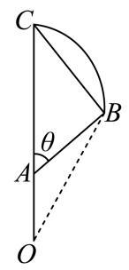

图3

(1)挡雨板(曲面 $B{B}_{1}{C}_{1}C$ )的面积可以视为曲线段 ${BC}$ 与线段 $B{B}_{1}$ 长的乘积. 已知 ${OA} = {1.5}$ 米， ${AC} = {0.3}$ 米， $A{A}_{1} = 2$ 米，小组成员对曲线段 ${BC}$ 有两种假设，分别为:①其为直线段且 $\angle {ACB} = \frac{\pi }{3}$ ；②其为以 $O$ 为圆心的圆弧.请分别计算这两种假设下挡雨板的面积(精确到0.1平方米);

(2)小组拟自制 $\bigtriangleup {ABC}$ 部分的支架用于测试(图3)，其中 ${AC} = {0.6}$ 米， $\angle {ABC} = \frac{\pi }{2}$ ， $\angle {CAB} = \theta$ ，其中 $\frac{\pi }{6} < \theta  < \frac{\pi }{2}$ ,求有效遮挡区域高 ${OA}$ 的最大值.

## 答案

(1)① 1.8平方米② 1.9平方米

(2) 0.3米

解析

(1) ①其为直线段且 $\angle {ACB} = \frac{\pi }{3}$ 时，又 因为 $\angle {AOB} = \frac{\pi }{6}$ ，所以 $\angle {OBC} = \frac{\pi }{2}$ ，

在 Rt $\bigtriangleup {CBO}$ 中, ${BC} = \frac{1}{2}{OC} = \frac{1}{2}\left( {{AO} + {OC}}\right)  = {0.9}$ (米).

所以 $S = {BC} \cdot  B{B}_{1} = {BC} \cdot  A{A}_{1} = {0.9} \times  2 = {1.8}$ (平方米);

②其为以 $O$ 为圆心的圆弧时，此时圆的半径为 ${OA} + {AC} = {1.8}$ (米)，

圆心角 $\angle {AOB} = \frac{\pi }{6}$ ，所以圆弧 ${BC}$ 的长 $l = {1.8} \times  \frac{\pi }{6} = \frac{3\pi }{10}$ ，

所以 $S = l \cdot  B{B}_{1} = l \cdot  A{A}_{1} = 2 \times  \frac{3\pi }{10} \approx  {1.9}$ (平方米)

(2) 由题意, ${AB} = {AC}\cos \theta  = {0.6}\cos \theta ,\angle {ABO} = \theta  - \frac{\pi }{6}$ ,

由正弦定理可得: $\frac{OA}{\sin \left( {\theta  - \frac{\pi }{6}}\right) } = \frac{AB}{\sin \frac{\pi }{6}}$ ,

即 ${OA} = {1.2}\cos \theta \sin \left( {\theta  - \frac{\pi }{6}}\right)  = {1.2}\cos \theta \left( {\frac{\sqrt{3}}{2}\sin \theta  - \frac{1}{2}\cos \theta }\right)  = {1.2}\left( {\frac{\sqrt{3}}{2}\sin \theta \cos \theta  - \frac{1}{2}{\cos }^{2}\theta }\right)$

$= {0.6}\left( {\frac{\sqrt{3}}{2}\sin {2\theta } - \frac{1}{2}\cos {2\theta } - \frac{1}{2}}\right)  = {0.6}\sin \left( {{2\theta } - \frac{\pi }{6}}\right)  - {0.3}$ ,其中 $\frac{\pi }{6} < \theta  < \frac{\pi }{2},$

当 ${2\theta } - \frac{\pi }{6} = \frac{\pi }{2}$ ，即 $\theta  = \frac{\pi }{3}$ 时， $O{A}_{\max } = {0.6} - {0.3} = {0.3}$ (米).

即有效遮挡区域高 ${OA}$ 的最大值为 0.3 米.

5. 如图，某城市小区有一个矩形休闲广场， ${AB} = {20}$ 米，广场的一角是半径为16米的扇形BCE绿化区域，为了使小区居民能够更好的在广场休闲放松，现决定在广场上安置两排休闲椅，其中一排是穿越广场的双人靠背直排椅MN (宽度不计)，点 $M$ 在线段 ${AD}$ 上，并且与曲线 ${CE}$ 相切；另一排为单人弧形椅沿曲线 ${CN}$ (宽度不计)摆放. 已知双人靠背直排椅的造价每米为 ${2a}$ 元，单人弧形椅的造价每米为 $a$ 元，记锐角 $\angle {NBE} = \theta$ ，总造价为 $W$ 元.

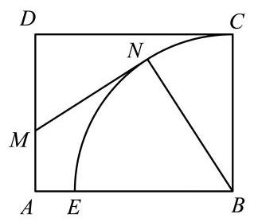

(1) 试将 $W$ 表示为 $\theta$ 的函数 $W\left( \theta \right)$ ，并写出 $\cos \theta$ 的取值范围；

(2)问当 ${AM}$ 的长为多少时，能使总造价 $W$ 最小.

答案

(1) $W\left( \theta \right)  = {8a} \cdot  \frac{5 - 4\cos \theta }{\sin \theta } + {16a} \cdot  \left( {\frac{\pi }{2} - \theta }\right) ,\;\cos \theta  \in  \left( {0,\frac{4}{5}}\right)$

(2) ${AM} = 4\sqrt{3}$ 米

解析

(1) 解: 过 $N$ 作 ${AB}$ 的垂线,垂足为 $F$ ,过 $M$ 作 ${NF}$ 的垂线,垂足为 $G$ ,

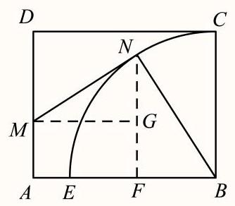

在Rt $\bigtriangleup {BNF}$ 中, ${BF} = {16}\cos \theta$ ,则 ${MG} = {AF} = {20} - {16}\cos \theta$ ,

在Rt $\bigtriangleup {MNG}$ 中, $\angle {MNG} = \theta$ ,则 ${MN} = \frac{{20} - {16}\cos \theta }{\sin \theta }$ ,

由题意易得 ${CN} = {16}\left( {\frac{\pi }{2} - \theta }\right)$ ,

所以 $W\left( \theta \right)  = {2a} \cdot  \frac{{20} - \overline{1}6\cos \theta }{\sin \theta } + a \cdot  {16}\left( {\frac{\pi }{2} - \theta }\right)  = {8a} \cdot  \frac{5 - 4\cos \theta }{\sin \theta } + {16a} \cdot  \left( {\frac{\pi }{2} - \theta }\right)$ ,

$\cos \theta  \in  \left( {0,\frac{4}{5}}\right)$

2) 解: ${W}^{\prime }\left( \theta \right)  = {8a} \cdot  \frac{4 - 5\cos \theta }{{\sin }^{2}\theta } - {16a} = \frac{{8a}\left( {2\cos \theta  - 1}\right) \left( {\cos \theta  - 2}\right) }{{\sin }^{2}\theta }$ ,

令 ${W}^{\prime }\left( \theta \right)  = 0$ ,得 $\cos \theta  = \frac{1}{2}$ ,又 $\theta  \in  \left( {\arccos \frac{4}{5},\frac{\pi }{2}}\right)$ ,所以 $\theta  = \frac{\pi }{3}$ ,

所以当 $\theta  \in  \left( {\arccos \frac{4}{5},\frac{\pi }{3}}\right)$ 时, ${W}^{\prime }\left( \theta \right)  < 0, W\left( \theta \right)$ 单调递减; 当 $\theta  \in  \left( {\frac{\pi }{3},\frac{\pi }{2}}\right)$ 时, ${W}^{\prime }\left( \theta \right)  > 0, W\left( \theta \right)$ 单调递增.

所以当 $\theta  = \frac{\pi }{3}$ 时,总造价 $W$ 最小,最小值为 $\left( {{16}\sqrt{3} + \frac{8\pi }{3}}\right) a$ ,此时 ${MN} = 8\sqrt{3},{NG} = 4\sqrt{3},{NF} = 8\sqrt{3}$

所以当 ${AM} = 4\sqrt{3}$ 米时,能使总造价 $W$ 最小.

## 一般

6. 如下图所示，甲工厂位于一直线河岸的岸边 $A$ 处，乙工厂与甲工厂在河的同侧，且位于离河岸40km的 $B$ 处，河岸边 $D$ 处与 $A$ 处相距 ${50}\mathrm{\;{km}}$ (其中 ${BD}\bot {AD}$ )，两家工厂要在此岸边建一个供水站 $C$ ，从供水站到甲工厂和乙工厂的水管费用分别为每千米3a元和5a元，问供水站C建在岸边距离A处___km才能使水管费用最省？

答案

20

解析

设 $C$ 点距 $D$ 点 $x\mathrm{\;{km}}$ ,得到 $\left| {BD}\right|  = {40},\left| {AC}\right|  = {50} - x$ ,且 $\left| {BC}\right|  = \sqrt{{40}^{2} + {x}^{2}}$ ,再设总的水管费用为 $y$ 元,求得 $y = {3a}\left( {{50} - x}\right)  + {5a}\sqrt{{x}^{2} + {40}^{2}}$ ,利用导数求得函数的单调性与最小值,即可求解.

据题意知,只有点 $C$ 在线段 ${AD}$ 上某一适当位置,才能使总运费最省,

设 $C$ 点距 $D$ 点 $x$ km，如图所示，则 $\left| {BD}\right|  = {40},\left| {AC}\right|  = {50} - x$ ，

所以 $\left| {BC}\right|  = \sqrt{B{D}^{2} + C{D}^{2}} = \sqrt{{40}^{2} + {x}^{2}}$ ,

再设总的水管费用为 $y$ 元，则 $y = {3a}\left( {{50} - x}\right)  + {5a}\sqrt{{x}^{2} + {40}^{2}}\left( {0 < x < {50}}\right)$ ，

可得 ${y}^{\prime } =  - {3a} + \frac{5ax}{\sqrt{{x}^{2} + {40}^{2}}}$ ,令 ${y}^{\prime } = 0$ ,解得 $x = {30}$ ,

当 $x \in  \left( {0,{30}}\right)$ 时, ${y}^{\prime } < 0$ ,函数在 $\left( {0,{30}}\right)$ 上单调递减;

当 $x \in  \left( {{30},{50}}\right)$ 时, ${y}^{\prime } > 0$ ,函数在 $\left( {{30},{50}}\right)$ 上单调递增,

所以,当 $x = {30}$ 时,函数取得极小值,也时最小值,

所以函数在 $x = {30}\mathrm{\;{km}}$ 处取得最小值,此时 $\left| {AC}\right|  = {50} - x\left( \mathrm{\;{km}}\right)$ ,

故供水站 $C$ 建立在 $A, D$ 之间距甲厂 ${20}\mathrm{{km}}$ 处,可使水管费用最省.

故答案为:20

## 一般

7. 如图，折线 $A - B - C$ 为海岸线， ${BD} = {39.2}\mathrm{\;{km}}$ ， $\angle {BDC} = {22}^{ \circ  }$ ， $\angle {CBD} = {78}^{ \circ  }$ ， $\angle {BDA} = {54}^{ \circ  }$ .

(1) 求 ${BC}$ 的长度；

(2)若 ${AB} = {{40}\mathrm{\;{km}}}$ ，求 $D$ 到海岸线 $A - B - C$ 的最短距离. (以上答案都精确到 ${0.001}\mathrm{\;{km}}$ )

答案

(1) 14.911km.

(2) 37.595km.

解析

(1) 在 $\bigtriangleup {BCD}$ 中, ${BD} = {39.2}\mathrm{\;{km}},\angle {BDC} = {22}^{ \circ  },\angle {CBD} = {78}^{ \circ  }$ ,则 $\angle {BCD} = {80}^{ \circ  }$ , 由正弦定理 $\frac{BC}{\sin \angle {BDC}} = \frac{BD}{\sin \angle {BCD}}$ 得: ${BC} = \frac{{BD}\sin \angle {BDC}}{\sin \angle {BCD}} = \frac{{39.2} \times  \sin {22}^{ \circ  }}{\sin {80}^{ \circ  }} = \; \frac{{39.2} \times  {0.3746}}{0.9848} \approx  {14.911}\left( \mathrm{\;{km}}\right) ,$ 所以 ${BC}$ 的长度是 ${14.911}\mathrm{\;{km}}$ .

(2) 在 $\bigtriangleup {ABD}$ 中， $\angle {BDA} = {54}^{ \circ  },{BD} = {39.2}\mathrm{\;{km}},{AB} = {40}\mathrm{\;{km}}$ ， 由正弦定理 $\frac{AB}{\sin \angle {ADB}} = \frac{BD}{\sin \angle {BAD}}$ 得: $\sin \angle {BAD} = \frac{{BD}\sin \angle {ADB}}{AB} = \frac{{39.2} \times  \sin {54}^{ \circ  }}{40} = \; \frac{{39.2} \times  {0.8090}}{40} \approx  {0.7928}$ 于是得 $\angle {BAD} \approx  {52.45}^{ \circ  }$ ，则 $\angle {ABD} = {73.55}^{ \circ  }$ ，过D作 ${DE}\bot {AB}$ 于 $E$ ， ${DF}\bot {BC}$ 于 $F$ ，如图，

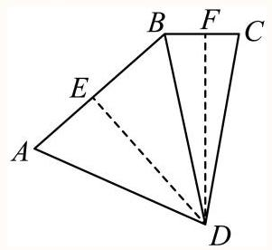

因此, ${DE} = {BD}\sin \angle {ABD} = {39.2} \times  \sin {73.55}^{ \circ  } = {39.2} \times  {0.9591} \approx  {37.595}\left( \mathrm{\;{km}}\right)$ ,

${DF} = {BD}\sin \angle {CBD} = {39.2} \times  \sin {78}^{ \circ  } = {39.2} \times  {0.9781} \approx  {38.343}\left( \mathrm{\;{km}}\right) ,$

显然 ${37.595} < {38.343}$ ,

所以 $D$ 到海岸线 $A - B - C$ 的最短距离是 ${37.595}\mathrm{\;{km}}$ .

## 一般

8. 一块边长为12cm的正三角形薄铁片，按如图所示设计方案，裁剪下三个全等的四边形(每个四边形中有且只有一组对角为直角),然后用余下的部分加工制作成一个底面边长为 $x\mathrm{\;{cm}}$ 的 “无盖” 正三棱柱形容器,容积记为 $V{\mathrm{\;{cm}}}^{3}$ .

(1)若加工人员为了充分利用边角料，考虑在加工过程中，使用裁剪下的三个四边形材料恰好拼接成这个正三棱柱形容器的“顶盖”，求出此时 $x$ 的值；

(2)将 $V$ 表示为 $x$ 的函数，并求 $V$ 的最大值.

答案

(1) 6cm

(2) $V =  - \frac{{x}^{3}}{8} + \frac{3}{2}{x}^{2}, x \in  \left( {0,{12}}\right)$ ，最大值为 ${32}{\mathrm{\;{cm}}}^{3}$

解析

(1)由题意知，剪下的三个四边形是全等四边形，且这三个全等的四边形组成与底面三角形全等三角形， 所以 ${2x} = {12}$ ，解得 $x = 6$ ，即 $x$ 的值为 ${6\mathrm{\;{cm}}}$ ；

(2)结合平面图形数据及三棱柱直观图，求得三棱柱的高为 $h = \frac{\sqrt{3}}{3}\left( {6 - \frac{x}{2}}\right)$ ，

其底面积为 $S = \frac{\sqrt{3}}{4}{x}^{2}{\mathrm{\;{cm}}}^{2}$ ,

所以三棱柱容器的容积为

$V = {Sh} = \frac{\sqrt{3}}{4}{x}^{2} \cdot  \frac{\sqrt{3}}{3}\left( {6 - \frac{x}{2}}\right)  = \frac{{x}^{2}}{4}\left( {6 - \frac{x}{2}}\right)  =  - \frac{{x}^{3}}{8} + \frac{3}{2}{x}^{2}, x \in  \left( {0,{12}}\right) ;$

求导数得 ${V}^{\prime } =  - \frac{3}{8}{x}^{2} + {3x}$ ,令 ${V}^{\prime } = 0$ ,解得 $x = 8$ 或 $x = 0$ (舍去),

所以 $x \in  \left( {0,8}\right)$ 时, ${V}^{\prime }\left( x\right)  > 0, V\left( x\right)$ 单调递增, $x \in  \left( {8,{12}}\right)$ 时, ${V}^{\prime }\left( x\right)  < 0, V\left( x\right)$ 单调递减;

所以 $x = 8$ 时, $V\left( x\right)$ 取得最大值,为 $V\left( 8\right)  =  - \frac{{8}^{3}}{8} + \frac{3}{2} \times  {8}^{2} = {32}$ ,

所以 $V$ 的最大值为 ${32}{\mathrm{\;{cm}}}^{3}$ .

## 一般

9. 某工厂拟建造如图所示的容器 (不计厚度, 长度单位: 米), 其中容器的上端为半球形, 下部为圆柱形, 该容器的体积为 $\frac{160\pi }{3}$ 立方米,且 $l \geq  {6r}$ .假设该容器的建造费用仅与其表面积有关.已知圆柱形部分侧面的建造方米2.25千元，半球形部分以及圆柱底面每平方米建造费用为 $m\left( {m > {2.25}}\right)$ 千元.设该容器的建造费用为 $y$ 千元.

(1)写出 $y$ 关于 $r$ 的函数表达式，并求该函数的定义域；

(2)求该容器的建造费用最小时的 $r$ .

答案

(1) $y = {3\pi }\left( {m - 1}\right) {r}^{2} + \frac{240\pi }{r},\;0 < r \leq  2$

(2)见解析

解析

(1)设该容器的体积为 $V$ ，则 $V = \pi {r}^{2}l + \frac{2}{3}\pi {r}^{3}$ ，

又 $V = \frac{160}{3}\pi ,$ 所以 $l = \frac{160}{3{r}^{2}} - \frac{2}{3}r$

因为 $l \geq  {6r}$ ,所以 $0 < r \leq  2$ .

所以建造费用 $y = {2\pi rl} \times  \frac{9}{4} + {3\pi }{r}^{2}m = {2\pi r}\left( {\frac{160}{3{r}^{2}} - \frac{2}{3}r}\right)  \times  \frac{9}{4} + {3\pi }{r}^{2}m$ ,

因此 $y = {3\pi }\left( {m - 1}\right) {r}^{2} + \frac{240\pi }{r},0 < r \leq  2$ .

(2) 由 (1) 得 ${y}^{\prime } = {6\pi }\left( {m - 1}\right) r - \frac{240\pi }{{r}^{2}} = \frac{{6\pi }\left( {m - 1}\right) }{{r}^{2}}\left( {{r}^{3} - \frac{40}{m - 1}}\right) ,0 < r \leq  2$ . 由于 $m > \frac{9}{4}$ ,所以 $m - 1 > 0$ ,令 ${r}^{3} - \frac{40}{m - 1} = 0$ ,得 $r = \sqrt[3]{\frac{40}{m - 1}}$ . 若 $\sqrt[3]{\frac{40}{m - 1}} < 2$ ,即 $m > 6$ ,当 $r \in  \left( {0,\sqrt[3]{\frac{40}{m - 1}}}\right)$ 时, ${y}^{\prime } < 0, y\left( r\right)$ 为减函数,当 $r \in  \left( {\sqrt[3]{\frac{40}{m - 1}},2}\right)$ 时, ${y}^{\prime } > 0, y\left( r\right)$ 为增函数,此时 $r = \sqrt[3]{\frac{40}{m - 1}}$ 为函数 $y\left( r\right)$ 的极小值点,也是最小值点. 若 $\sqrt[3]{\frac{40}{m - 1}} \geq  2$ ,即 $\frac{9}{4} < m \leq  6$ ,当 $r \in  (0,2\rbrack$ 时, ${y}^{\prime } < 0, y\left( r\right)$ 为减函数,此时 $r = 2$ 是 $y\left( r\right)$ 的最小值点. 综上所述,当 $\frac{9}{4} < m \leq  6$ 时,建造费用最小时 $r = 2$ ; 当 $m > 6$ 时,建造费用最小时 $r = \sqrt[3]{\frac{40}{m - 1}}$ .

## 一般

10. 如图所示， ${AB}$ 为沿海岸的高速路，海岛上码头 $O$ 离高速路最近点 $B$ 的距离是120km，在距离 $B$ 点300km的 $A$ 处有一批药品要尽快送达海岛. 现要用海陆联运的方式运送这批药品,设登船点 $C$ 到 $B$ 的距离为 $x$ ，已知汽车速度为 ${100}\mathrm{\;{km}}/\mathrm{h}$ ，快艇速度为 ${50}\mathrm{\;{km}}/\mathrm{h}$ . (参考数据: $\sqrt{3} \approx  {1.7}$ .)

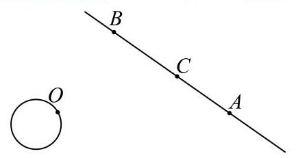

(1)写出运输时间 $t\left( x\right)$ 关于 $x$ 的函数；

(2)当 $C$ 选在何处时运输时间最短？

答案

(1) $t\left( x\right)  = \frac{\sqrt{{14400} + {x}^{2}}}{50} + \frac{{300} - x}{100}\left( {0 \leq  x < {300}}\right)$

(2)当点C选在距B点68km时运输时间最短

解析

(1)

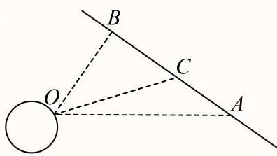

由题意知, ${OB} \bot  {AB}$ ,则 ${OC} = \sqrt{{120}^{2} + {x}^{2}},{AC} = {300} - x$ ,

$\therefore t\left( x\right)  = \frac{\sqrt{{14400} + {x}^{2}}}{50} + \frac{{300} - x}{100}\left( {0 \leq  x < {300}}\right)$ .

${t}^{\prime }\left( x\right)  = \frac{1}{2} \times  \frac{{\left( {120}^{2} + {x}^{2}\right) }^{-\frac{1}{2}} \times  {2x}}{50} - \frac{1}{100} = \frac{x}{{50}\sqrt{{120}^{2} + {x}^{2}}} - \frac{1}{100},$

令 ${t}^{\prime }\left( x\right)  = 0$ ,得 $x = {40}\sqrt{3}$ ,

当 $0 < x < {40}\sqrt{3}$ 时， ${t}^{\prime }\left( x\right)  < 0$ ， $t\left( x\right)$ 单调递减；

当 ${40}\sqrt{3} < x < {300}$ 时， ${t}^{\prime }\left( x\right)  > 0$ ， $t\left( x\right)$ 单调递增，

所以 $x = {40}\sqrt{3} \approx  {68}$ 时， $t\left( x\right)$ 取最小值.

所以当点 $C$ 选在距 $B$ 点 ${68}\mathrm{\;{km}}$ 时运输时间最短.

## 函数相关

## 较难

1. 小李研究数学建模“雨中行”问题，在作出“降雨强度保持不变”、“行走速度保持不变”、“将人体视作一个长方体”等合理假设的前提下, 他设了变量:

<table><tr><td>人的身高</td><td>人体宽度</td><td>人体厚度</td><td>降雨速度</td><td>雨滴密度</td><td>行走距离</td><td>风速</td><td>行走速度</td></tr><tr><td>$h$</td><td>$w$</td><td>$d$</td><td>${v}_{r}$</td><td>$p$</td><td>$D$</td><td>${v}_{w}$</td><td>$v$</td></tr></table>

并构建模型如下:

当人迎风行走时,人体总的淋雨量为 $T = \frac{pwD}{v}\left\lbrack  {d{v}_{r} + h\left( {{v}_{w} + v}\right) }\right\rbrack$ .

根据模型, 小李对“雨中行”作出如下解释:

①若两人结伴迎风行走，则体型较高大魁梧的人淋雨是较大；

②若某人迎风行走，则走得越快淋雨量越小，若背风行走，则走得越慢淋雨量越小；

③若某人迎风行走了10秒，则行走距离越长淋雨量越大.

这些解释合理的个数为( )

A. 0 B. 1 C. 2 D. 3

答案

C

解析

利用作差法可以比较两人淋雨量判断①，结合函数的单调性可判断②③.

①若两人结伴迎风行走，设体型较高大魁梧的人身高为 ${h}_{1}$ ，宽度为 ${w}_{1}$ ，厚度为 ${d}_{1}$ ，另一人身高为 ${h}_{2}$ ，宽度为 ${w}_{2}$ ,厚度为 ${d}_{2}$ ,

则

$\begin{array}{l} {T}_{1} - {T}_{2} = \frac{p{w}_{1}D}{v}\left\lbrack  {{d}_{1}{v}_{r} + {h}_{1}\left( {{v}_{w} + v}\right) }\right\rbrack   - \frac{p{w}_{2}D}{v}\left\lbrack  {{d}_{2}{v}_{r} + {h}_{2}\left( {{v}_{w} + v}\right) }\right\rbrack   = \frac{pD}{v} \\  \left\lbrack  {{v}_{r}\left( {{w}_{1}{d}_{1} - {w}_{2}{d}_{2}}\right)  + \left( {{v}_{w} + v}\right) \left( {{w}_{1}{h}_{1} - {w}_{2}{h}_{2}}\right) }\right\rbrack   \end{array}$

,

又 ${h}_{1} > {h}_{2} > 0,{w}_{1} > {w}_{2} > 0,{d}_{1} > {d}_{2} > 0$ ,

则 ${w}_{1}{d}_{1} > {w}_{2}{d}_{2},{w}_{1}{h}_{1} > {w}_{2}{h}_{2}$ ,

即 ${T}_{1} - {T}_{2} = \frac{pD}{v}\left\lbrack  {{v}_{r}\left( {{w}_{1}{d}_{1} - {w}_{2}{d}_{2}}\right)  + \left( {{v}_{w} + v}\right) \left( {{w}_{1}{h}_{1} - {w}_{2}{h}_{2}}\right) }\right\rbrack   > 0$ ,

即体型较高大魁梧的人淋雨是较大，①正确；

②若某人迎风行走，则 $T = \frac{pwD}{v}\left\lbrack  {d{v}_{r} + h\left( {{v}_{w} + v}\right) }\right\rbrack   = \frac{pwD}{v}\left( {d{v}_{r} + h{v}_{w}}\right)  + {pwDh}$ ，

则 $T$ 随 $v$ 的增大而减小，即走得越快淋雨量越小；

若某人逆风行走,则 $T = \frac{pwD}{v}\left\lbrack  {d{v}_{r} + h\left( {-{v}_{w} + v}\right) }\right\rbrack   = \frac{pwD}{v}\left( {d{v}_{r} - h{v}_{w}}\right)  + {pwDh}$ ,

当 $d{v}_{r} - h{v}_{w} > 0$ 时， $T$ 随 $v$ 的增大而减小，即走得越快淋雨量越小，

当 $d{v}_{r} - h{v}_{w} < 0$ 时，， $T$ 随 $v$ 的增大而减小，即走得越慢淋雨量越小，

当 $d{v}_{r} - h{v}_{w} = 0$ 时，淋雨量与 $v$ 无关，②错误；

③若某人迎风行走了10秒，则 $\frac{D}{v} = {10}$ 为定值，且 $v = \frac{D}{10}$ ，

则 $T = {10pw}\left\lbrack  {d{v}_{r} + h\left( {{v}_{w} + \frac{D}{10}}\right) }\right\rbrack$ ,

所以 $T$ 随 $D$ 的增大而增大,即行走距离越长淋雨量越大,③正确；

综上所述合理的解释有2个,

故选: C.

## 一般

2. 2024年10月30日“神舟十九号”载人飞船发射成功，标志着中国空间站建设进入新阶段. 在飞船竖直升空过程中， 某位记者用照相机在同一位置以同一姿势连续拍照两次. 已知“神舟十九号”飞船船体实际长度为H，且在照片上飞

船船体长度为h，比较两张照片，相对于照片中的同一固定参照物飞船上升了m. 假设该记者连按拍照键间的反应时间为t，并忽略相机曝光时长，若用平均速度估算瞬时速度，则拍照时飞船的瞬时速度为___ . (用含有H、h、 m、t的式子表示)

答案

$\frac{Hm}{ht}$

解析

先求出第二次拍照飞船的实际上升的高度, 再由实际上升的高度除以该记者连按拍照键间的反应时间为t, 即可求出拍照时飞船的瞬时速度.

设第二次拍照飞船的实际上升了 $x$ ,

所以 $\frac{H}{h} = \frac{x}{m}$ ,解得: $x = \frac{Hm}{h}$ ,

所以拍照时飞船的瞬时速度为: $v = \frac{x}{t} = \frac{Hm}{ht}$ .

故答案为: $\frac{Hm}{ht}$ .

一般

3. 若存在实数 $a$ ,使得当 $x \in  \left\lbrack  {0, m}\right\rbrack  \left( {m > 0}\right)$ 时，都有 $\left| {{2x} - 1}\right|  + \left| {{x}^{2} - a}\right|  \leq  4$ ，则实数 $m$ 的最大值为( )

A. 1

B. $\frac{3}{2}$ C. 2

D. $\frac{5}{2}$

答案

C

解析

由各选项知最大值 $m \geq  1$ ,

由 $\left| {{2x} - 1}\right|  \leq  4$ ,解得 $- \frac{3}{2} \leq  x \leq  \frac{5}{2}$ ,这样必须有 $m \leq  \frac{5}{2}$ ,然后不等式变形为

${x}^{2} - 4 + \left| {{2x} - 1}\right|  \leq  a \leq  {x}^{2} + 4 - \left| {{2x} - 1}\right| ,$

记 $f\left( x\right)  = {x}^{2} + 4 - \left| {{2x} - 1}\right| , g\left( x\right)  = {x}^{2} - 4 + \left| {{2x} - 1}\right|$ ,分类讨论去年绝对值符号,可得 $f\left( x\right)$ 的最小值是 3,因此 $g\left( x\right)$ 的最大值性质不大于3,才存在 $a$ 保证不等式恒成立，由最大值 $g\left( m\right)  \leq  3$ 可得 $m$ 的范围，得 $m$ 的最大值. 解: 由各选项知最大值 $m \geq  1$ ,

因为 $\left| {{2x} - 1}\right|  \leq  4$ ，解得 $- \frac{3}{2} \leq  x \leq  \frac{5}{2}$ ，所以 $m \leq  \frac{5}{2}$ .

不等式 $\left| {{2x} - 1}\right|  + \left| {{x}^{2} - a}\right|  \leq  4$ 可化为 ${x}^{2} - 4 + \left| {{2x} - 1}\right|  \leq  a \leq  {x}^{2} + 4 - \left| {{2x} - 1}\right|$ .

设 $f\left( x\right)  = {x}^{2} + 4 - \left| {{2x} - 1}\right| , g\left( x\right)  = {x}^{2} - 4 + \left| {{2x} - 1}\right|$ ,

因为 $f\left( x\right)  = \left\{  \begin{array}{l} {x}^{2} + {2x} + 3\left( {0 \leq  x < \frac{1}{2}}\right) \\  {x}^{2} - {2x} + 5\left( {\frac{1}{2} \leq  x \leq  m}\right)  \end{array}\right.$ 的最小值为 3 ,

所以当 $x \in  \left\lbrack  {0, m}\right\rbrack  \left( {m > 0}\right)$ 时，都有 $g\left( x\right)  \leq  3$ .

若 $x \in  \left\lbrack  {0,\frac{1}{2}}\right\rbrack  , g\left( x\right)  = {x}^{2} - {2x} - 3 \leq   - 3$ ;

若 $x \in  \left\lbrack  {\frac{1}{2}, m}\right\rbrack  , g\left( x\right)  = {x}^{2} + {2x} - 5 \leq  3$ ,所以 ${m}^{2} + {2m} - 8 \leq  0$ ,解得 $m \leq  2$ .

综上, 所求实数 $\mathrm{m}$ 的最大值为2 .

故选: C.

## 困难

4. 已知函数 $f\left( x\right)  = {\mathrm{e}}^{x - 1} - {ax} + a\left( {a > 0}\right)$ ，若 $f\left( x\right)  < 0$ 仅存在唯一整数解，则 $a$ 的取值范围为___▲___.

答案

$\left( {\mathrm{e},\frac{{\mathrm{e}}^{2}}{2}}\right\rbrack$

解析

由题意知,原题等价于函数 $g\left( x\right)  = {\mathrm{e}}^{x - 1}$ 在直线 $h\left( x\right)  = a\left( {x - 1}\right) \left( {a > 0}\right)$ 下方的图象中只有一个点的横坐标为整数, 进而研究函数的图象与性质, 数形结合即可求出结果.

根据题意,令 $g\left( x\right)  = {\mathrm{e}}^{x - 1}, h\left( x\right)  = a\left( {x - 1}\right) \left( {a > 0}\right)$ ,

$f\left( x\right)  < 0$ 仅存在唯一整数解 $\Leftrightarrow  g\left( x\right)$ 的图象在 $h\left( x\right)$ 的图象下方的部分有且只有一个横坐标为整数的点,

当 $h\left( x\right)$ 与 $g\left( x\right)$ 相切时，设切点 $\left( {{x}_{0},{\mathrm{e}}^{{x}_{0} - 1}}\right)$ ，

由于 ${g}^{\prime }\left( x\right)  = {\mathrm{e}}^{x - 1}$ ,故切线斜率 $a = {\mathrm{e}}^{{x}_{0} - 1}$ ,

切线方程为: $y - {\mathrm{e}}^{{x}_{0} - 1} = {\mathrm{e}}^{{x}_{0} - 1}\left( {x - {x}_{0}}\right)$ ,

代入 $\left( {1,0}\right)$ 得 $- {\mathrm{e}}^{{x}_{0} - 1} = {\mathrm{e}}^{{x}_{0} - 1}\left( {1 - {x}_{0}}\right)$ ，解得 ${x}_{0} = 2$ ，此时 $a = \mathrm{e}$ ，切点为 $\left( {2,\mathrm{e}}\right)$ ，

又当 $x \leq  1$ 时， $h\left( x\right)  \leq  0, g\left( x\right)  > 0$ ，

所以符合要求的条件为 $\left\{  \begin{array}{l} g\left( 2\right)  < h\left( 2\right) \\  g\left( 3\right)  \geq  h\left( 3\right)  \end{array}\right.$ ，解得 $\mathrm{e} < a \leq  \frac{{\mathrm{e}}^{2}}{2}$ .

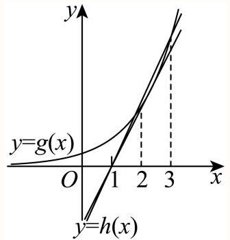

即 $a$ 的取值范围为 $\left( {\mathrm{e},\frac{{\mathrm{e}}^{2}}{2}}\right\rbrack$ .

故答案为: $\left( {\mathrm{e},\frac{{\mathrm{e}}^{2}}{2}}\right\rbrack$

## 一般

5. 如图，现对某景区一长 ${AB} = {600}\mathrm{m}$ ，宽 ${AD} = {360}\mathrm{m}$ 的矩形空地进行建设. 规划在边 ${AB},{AD}$ 上分别取点 $M, N$ 修建人行步道(不考虑宽度)，且满足点 $A$ 关于步道 ${MN}$ 的对称点 $E$ 在边 ${DC}$ 上. 在 $\bigtriangleup  {AMN}$ 内种植花卉，在 $\bigtriangleup  {EMN}$ 内搭建娱乐设施，其余区域规划为露营区，则人行步道 ${MN}$ 的最短距离为 $\;\mathrm{m}$ . (结果精确到 $1\mathrm{\;m}$ )

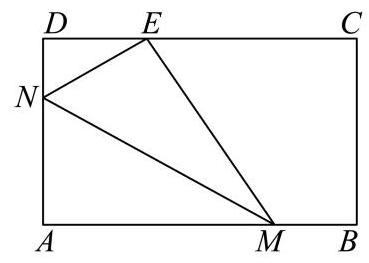

答案

468

解析

由题设有 $\operatorname{Rt}\bigtriangleup {MAN} \equiv  \operatorname{Rt}\bigtriangleup {MEN}$ ,设 $\angle {AMN} = \theta \left( {0 < \theta  < \frac{\pi }{2}}\right)$ ,根据图形中边角关系,结合三角函数可得 ${MN} = \frac{180}{\sin \theta \left( {1 - {\sin }^{2}\theta }\right) }$ ，注意 $\sin \theta$ 的范围，进而应用换元法并构造函数，利用导数求最值.

由题意, $\operatorname{Rt}\bigtriangleup {MAN} \equiv  \operatorname{Rt}\bigtriangleup {MEN}$ ,

设 $\angle {AMN} = \theta \left( {0 < \theta  < \frac{\pi }{2}}\right)$ ,则 $\angle {DNE} = \pi  - 2\left( {\frac{\pi }{2} - \theta }\right)  = {2\theta }$ ,

在 Rt $\bigtriangleup {DEN}$ 中 $\cos {2\theta } = \frac{DN}{NE} = \frac{{360} - {AN}}{AN}$ ,得 ${AN} = \frac{360}{\cos {2\theta } + 1} = \frac{180}{{\cos }^{2}\theta }$ ,

则 ${MN} = \frac{AN}{\sin \theta } = \frac{180}{\sin \theta {\cos }^{2}\theta } = \frac{180}{\sin \theta \left( {1 - {\sin }^{2}\theta }\right) }$ ,

由于 $\left\{  \begin{array}{l} {AN} = \frac{180}{{\cos }^{2}\theta } = {180}\left( {1 + {\tan }^{2}\theta }\right)  \leq  {360} \\  {AM} = \frac{AN}{\tan \theta } = {180}\left( {\tan \theta  + \frac{1}{\tan \theta }}\right)  \leq  {600} \end{array}\right.$ ,解得 $\frac{1}{3} \leq  \tan \theta  \leq  1$ ,

则 ${\tan }^{2}\theta  = \frac{{\sin }^{2}\theta }{{\cos }^{2}\theta } = \frac{{\sin }^{2}\theta }{1 - {\sin }^{2}\theta } \in  \left\lbrack  {\frac{1}{9},1}\right\rbrack$ ,解得 $\frac{\sqrt{10}}{10} \leq  \sin \theta  \leq  \frac{\sqrt{2}}{2}$ ,

令 $\sin \theta  = t, t \in  \left\lbrack  {\frac{\sqrt{10}}{10},\frac{\sqrt{2}}{2}}\right\rbrack$ ,则 ${MN} = \frac{180}{t - {t}^{3}}$ .

令 $f\left( t\right)  = t - {t}^{3}$ ,则 ${f}^{\prime }\left( t\right)  = 1 - 3{t}^{2}$ ,

令 ${f}^{\prime }\left( t\right)  > 0$ ,则 $t \in  \left\lbrack  {\frac{\sqrt{10}}{10},\frac{\sqrt{3}}{3}}\right)$ ,函数 $f\left( t\right)$ 单调递增;

令 ${f}^{\prime }\left( t\right)  < 0$ ,则 $t \in  \left( {\frac{\sqrt{3}}{3},\frac{\sqrt{2}}{2}}\right\rbrack$ ,函数 $f\left( t\right)$ 单调递减;

所以 $f{\left( t\right) }_{\max } = f\left( \frac{\sqrt{3}}{3}\right)  = \frac{2\sqrt{3}}{9}$ ,

所以 $M{N}_{\min } = {270}\sqrt{3} \approx  {468}$ ,

即人行步道 ${MN}$ 的最短距离为 ${468}\mathrm{\;m}$ .

故答案为: 468 .

## 较难

6. 草坪上有一个带有围栏的边长为30m的正三角形活动区域ABC，点 $P$ 在边BC上，且 $\left| {PB}\right|  = 2\left| {PC}\right|$ ，小闵同学在该区域玩耍，他在 $P$ 处放置了一个手电筒，若手电筒发出的光线张角(任两条光线的最大夹角)为 ${60}^{ \circ  }$ ，则手电筒在 ABC内部所能照射到的地面的最大面积为 ${\mathrm{m}}^{2}$

答案

${125}\sqrt{3}$

解析

根据给定信息确定照射面积最大时情况, 再利用正弦定理、三角形面积公式列式, 利用基本不等式求出最大值.

依题意, 要使手电筒在ABC内部所能照射到的地面的面积最大, 则光线必须经过AB、AC边, 如图, 在正 $\bigtriangleup {ABC}$ 中, $\angle {EPF} = \frac{\pi }{3},{BP} = {20},{CP} = {10}$ ,设 $\angle {BPF} = \angle {CEP} = \theta$ ,

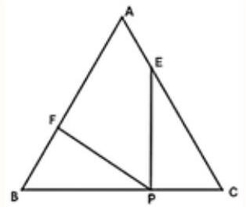

由正弦定理得: $\frac{PC}{\sin \theta } = \frac{CE}{\sin \left( {\frac{2\pi }{3} - \theta }\right) }$ ,则 ${CE} = \frac{{10}\sin \left( {\frac{2\pi }{3} - \theta }\right) }{\sin \theta }$ ,

$\frac{PB}{\sin \left( {\frac{2\pi }{3} - \theta }\right) } = \frac{BF}{\sin \theta }$ ,则 ${BF} = \frac{{20}\sin \theta }{\sin \left( {\frac{2\pi }{3} - \theta }\right) }$ ,

$S = {S}_{\bigtriangleup {ABC}} - {S}_{\bigtriangleup {BPF}} - {S}_{\bigtriangleup {CPE}} = \frac{\sqrt{3}}{4}A{B}^{2} - \frac{1}{2}{BF} \cdot  {BP} \cdot  \sin \frac{\pi }{3} - \frac{1}{2}{CP} \cdot  {CE} \cdot  \sin \frac{\pi }{3}$

$= \frac{\sqrt{3}}{4} \cdot  {30}^{2} - \frac{1}{2} \cdot  \frac{{20}\sin \theta }{\sin \left( {\frac{2\pi }{3} - \theta }\right) } \cdot  {20}\sin \frac{\pi }{3} - \frac{1}{2} \cdot  {10} \cdot  \frac{{10}\sin \left( {\frac{2\pi }{3} - \theta }\right) }{\sin \theta } \cdot  \sin \frac{\pi }{3}$

$= {225}\sqrt{3} - {100}\sqrt{3} \cdot  \frac{\sin \theta }{\sin \left( {\frac{2\pi }{3} - \theta }\right) } - {25}\sqrt{3} \cdot  \frac{\sin \left( {\frac{2\pi }{3} - \theta }\right) }{\sin \theta }$

$= {225}\sqrt{3} - {25}\sqrt{3}\left\lbrack  {\frac{4\sin \theta }{\sin \left( {\frac{2\pi }{3} - \theta }\right) } + \frac{\sin \left( {\frac{2\pi }{3} - \theta }\right) }{\sin \theta }}\right\rbrack   \leq  {125}\sqrt{3},$

当且仅当 $\frac{4\sin \theta }{\sin \left( {\frac{2\pi }{3} - \theta }\right) } = \frac{\sin \left( {\frac{2\pi }{3} - \theta }\right) }{\sin \theta }$ ,即 $\tan \theta  = \frac{\sqrt{3}}{3}$ ,亦即 $\theta  = \frac{\pi }{6}$ 时取等号,

所以手电筒在ABC内部所能照射到的地面的最大面积为 ${125}\sqrt{3}{\mathrm{\;m}}^{2}$ .

故答案为: ${125}\sqrt{3}$

较易

7. 在直角坐标系 ${xOy}$ 中，一个矩形的四个顶点都在椭圆 $C : \frac{{x}^{2}}{4} + \frac{{y}^{2}}{2} = 1$ 上，将该矩形绕 $y$ 轴旋转 ${180}^{ \circ  }$ ，得到一个圆柱体，则该圆柱体的体积最大时，其侧面积为( )

A. $\frac{16\pi }{3}$ B. $\frac{{16}\sqrt{3}\pi }{3}$ C. $\frac{8\pi }{3}$ D. $\frac{{16}\sqrt{6}\pi }{9}$

答案

A

解析

设点 $A\left( {{x}_{0},{y}_{0}}\right)$ 在第一象限，表示出圆柱的底面圆半径和母线长，求得圆柱的体积表达式，利用导数分析得出 ${y}_{0} = \frac{\sqrt{6}}{3}$ 时，圆柱体的体积最大，继而求得其侧面积.

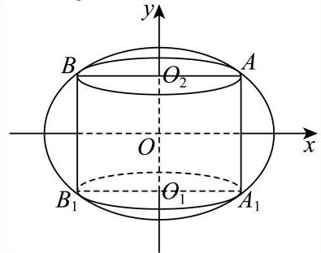

如图,设点 $A\left( {{x}_{0},{y}_{0}}\right)$ 在第一象限,则有 $\frac{{x}_{0}^{2}}{4} + \frac{{y}_{0}^{2}}{2} = 1$ ,且 $0 < {y}_{0} < \sqrt{2}$ .

由椭圆和矩形的对称性,把矩形 $A{A}_{1}{B}_{1}B$ 绕着 $y$ 轴旋转 ${180}^{ \circ  }$ 得圆柱 ${O}_{1}{O}_{2}$ ,

则圆柱的底面圆半径为 $r = {x}_{0}$ ,母线长为 $l = 2{y}_{0}$ ,

于是该圆柱体的体积为: $V = \pi {r}^{2}l = \pi {x}_{0}^{2} \cdot  2{y}_{0} = {2\pi }{y}_{0}{x}_{0}^{2} = {2\pi }{y}_{0} \times  4\left( {1 - \frac{{y}_{0}^{2}}{2}}\right)  =  - {4\pi }{y}_{0}^{3} + {8\pi }{y}_{0}$ ,

将 $V$ 对 ${y}_{0}$ 求导,可得: ${V}^{\prime } =  - {12\pi }{y}_{0}^{2} + {8\pi }$ ,由 ${V}^{\prime } = 0$ 可得 ${y}_{0} = \frac{\sqrt{6}}{3}$ ,

当 $0 < {y}_{0} < \frac{\sqrt{6}}{3}$ 时， ${V}^{\prime } > 0$ ；当 $\frac{\sqrt{6}}{3} < {y}_{0} < \sqrt{2}$ 时， ${V}^{\prime } < 0$ ，

即 $V =  - {4\pi }{y}_{0}^{3} + {8\pi }{y}_{0}$ 在 $\left( {0,\frac{\sqrt{6}}{3}}\right)$ 上单调递增; 在 $\left( {\frac{\sqrt{6}}{3},\sqrt{2}}\right)$ 上单调递减.

故当 ${y}_{0} = \frac{\sqrt{6}}{3}$ 时，圆柱体的体积最大，此时， ${x}_{0} = \frac{2\sqrt{6}}{3}$ .

则圆柱的侧面积为: ${S}_{\text{ 圆柱侧 }} = {2\pi rl} = {2\pi }{x}_{0} \times  2{y}_{0} = {4\pi } \times  \frac{\sqrt{6}}{3} \times  \frac{2\sqrt{6}}{3} = \frac{16\pi }{3}$ .

故选: A.

## 一般

8. 已知函数 $f\left( x\right)  = \left\lbrack  {{\ln }^{2}x - \left( {a + 1}\right) \ln x + 1}\right\rbrack   \cdot  x, a \in  \mathrm{R}$ ,讨论函数 $f\left( x\right)$ 的单调性.

## 答案

答案见解析

解析

先求导得出 ${f}^{\prime }\left( x\right)  = \left( {\ln x - a}\right) \left( {\ln x + 1}\right)$ ,然后解 ${f}^{\prime }\left( x\right)  = 0$ ,得出两根 ${x}_{1},{x}_{2}$ . 然后分 $a =  - 1, a >  - 1, a <  - 1$ 三种情况,比较 ${x}_{1},{x}_{2}$ 的大小关系,根据导函数即可得出答案.

因为 $f\left( x\right)  = \left\lbrack  {{\ln }^{2}x - \left( {a + 1}\right) \ln x + 1}\right\rbrack   \cdot  x$ ,

所以, ${f}^{\prime }\left( x\right)  = \left\lbrack  {\frac{2\ln x}{x} - \frac{a + 1}{x}}\right\rbrack  x + \left\lbrack  {{\ln }^{2}x - \left( {a + 1}\right) \ln x + 1}\right\rbrack   = {\ln }^{2}x + \left( {1 - a}\right) \ln x - a = \left( {\ln x - a}\right) \left( {\ln x + 1}\right)$ 令 ${f}^{\prime }\left( x\right)  = 0$ ,则两根分别为 ${x}_{1} = {\mathrm{e}}^{a},{x}_{2} = \frac{1}{\mathrm{e}}$ .

① 当 $a =  - 1$ 时，此时有 ${x}_{1} = {x}_{2}$ ，

${f}^{\prime }\left( x\right)  = {\left( \ln x + 1\right) }^{2} \geq  0$ 在 $\left( {0, + \infty }\right)$ 恒成立，故 $f\left( x\right)$ 的单调递增区间为 $\left( {0, + \infty }\right)$ ，无单调递减区间；

②当 $a >  - 1$ 时，此时有 ${x}_{1} > {x}_{2}$ .

令 ${f}^{\prime }\left( x\right)  > 0$ ,得 $x < \frac{1}{\mathrm{e}}$ 或 $x > {\mathrm{e}}^{a}$ ,所以 $f\left( x\right)$ 的单调递增区间为 $\left( {0,\frac{1}{\mathrm{e}}}\right) ,\left( {{\mathrm{e}}^{a}, + \infty }\right)$ ;

令 ${f}^{\prime }\left( x\right)  < 0$ ,得 $\frac{1}{\mathrm{e}} < x < {\mathrm{e}}^{a}$ ,所以 $f\left( x\right)$ 的单调递减区间为 $\left( {\frac{1}{\mathrm{e}},{\mathrm{e}}^{a}}\right)$ .

③ 当 $a <  - 1$ 时，此时有 ${x}_{1} < {x}_{2}$ .

令 ${f}^{\prime }\left( x\right)  > 0$ 得 $x < {\mathrm{e}}^{a}$ 或 $x > \frac{1}{\mathrm{e}}$ 时，所以 $f\left( x\right)$ 的单调递增区间为 $\left( {0,{\mathrm{e}}^{a}}\right)$ ， $\left( {\frac{1}{\mathrm{e}}, + \infty }\right)$ ；

令 ${f}^{\prime }\left( x\right)  < 0$ 得 ${\mathrm{e}}^{a} < x < \frac{1}{\mathrm{e}}$ ，所以 $f\left( x\right)$ 的单调递减区间为 $\left( {{\mathrm{e}}^{a},\frac{1}{\mathrm{e}}}\right)$ .

综上所述,当 $a =  - 1$ 时, $f\left( x\right)$ 的单调递增区间为 $\left( {0, + \infty }\right)$ ,无单调递减区间; 当 $a >  - 1$ 时, $f\left( x\right)$ 单调递增区间为 $\left( {0,\frac{1}{\mathrm{e}}}\right) ,\left( {{\mathrm{e}}^{a}, + \infty }\right)$ ,单调递减区间为 $\left( {\frac{1}{\mathrm{e}},{\mathrm{e}}^{a}}\right)$ ; 当 $a <  - 1$ 时, $f\left( x\right)$ 单调递增区间为 $\left( {0,{\mathrm{e}}^{a}}\right) ,\left( {\frac{1}{\mathrm{e}}, + \infty }\right)$ , 单调递减区间为 $\left( {{\mathrm{e}}^{a},\frac{1}{\mathrm{e}}}\right)$ .

## 三角

## 一般

1. 某物流公司为了扩大业务量，计划改造一间高为6米，底面积为24平方米，且背面靠墙的长方体形状的仓库. 因仓库的背面靠墙,无须建造费用,设仓库前面墙体的长为 $x$ 米 $\left( {4 \leq  x \leq  6}\right)$ . 现有甲、乙两支工程队参加竞标，甲队的报价方案为:仓库前面新建墙体每平方米400元，左右两面新建墙体每平方米300元，屋顶和地面以及其他共计

28800元；乙队给出的整体报价为 $\left( {1 + \frac{2}{x}}\right)  \times  {6k} \times  {10}^{4}$ 元( $k > 0$ )，不考虑其他因素，若乙队要确保竞标成功，则实数 $k$ 的取值范围是

答案

$\left( {0,\frac{2}{3}}\right)$

解析

根据题意得甲工程队整体报价,由题意可得 $\left( {1 + \frac{2}{x}}\right)  \times  {6k} \times  {10}^{4} < {2400x} + \frac{86400}{x} + {28800}$ ,孤立参数根据对勾函数的性质确定函数 $y = {24x} + {240} + \frac{384}{x + 2} = {24}\left( {x + 2}\right)  + \frac{384}{x + 2} + {192}$ 单调性从而得最小值即可得实数 $k$ 的取值范围.

若仓库前面墙体的长为 $x$ 米 $\left( {4 \leq  x \leq  6}\right)$ ，则左右两面墙宽度为 $\frac{24}{x}$ ，

则甲工程整体报价为 ${400} \times  {6x} + {300} \times  6 \times  \frac{24}{x} \times  2 + {28800} = {2400x} + \frac{86400}{x} + {28800}$ ,

若乙队要确保竞标成功则 $\left( {1 + \frac{2}{x}}\right)  \times  {6k} \times  {10}^{4} < {2400x} + \frac{86400}{x} + {28800}$ ,

所以 ${6k} \times  {10}^{4} < \frac{{2400x} + \frac{86400}{x} + {28800}}{1 + \frac{2}{x}} = \frac{{24}{x}^{2} + {288x} + {864}}{x + 2} \times  {10}^{2}$ ,则

${6k} \times  {10}^{2} < \frac{{24}{x}^{2} + {288x} + {864}}{x + 2} = \frac{{24x}\left( {x + 2}\right)  + {240}\left( {x + 2}\right)  + {384}}{x + 2} = {24x} + {240} + \frac{384}{x + 2},$

因为 $4 \leq  x \leq  6$ ,所以函数 $y = {24x} + {240} + \frac{384}{x + 2} = {24}\left( {x + 2}\right)  + \frac{384}{x + 2} + {192}$ ,

当且仅当 ${24}\left( {x + 2}\right)  = \frac{384}{x + 2}$ 时，即 $x = 2$ 时，函数有最小值，

所以函数 $y = {24}\left( {x + 2}\right)  + \frac{384}{x + 2} + {192}$ 在 $\left\lbrack  {4,6}\right\rbrack$ 上单调递增,故 ${y}_{\min } = {24} \times  6 + \frac{384}{6} + {192} = {400}$ ,

故 ${6k} \times  {10}^{2} < {400}$ ,则 $k < \frac{2}{3}$ ,所以实数 $k$ 的取值范围是 $\left( {0,\frac{2}{3}}\right)$ .

故答案为: $\left( {0,\frac{2}{3}}\right)$ .

## 一般

2. 申辉中学高一(8)班设计了一个“水滴状”班徽的平面图(如图)，徽章由等腰三角形 ${ABC}$ 及以弦 ${BC}$ 和劣弧 ${BC}$ 所围成的弓形所组成，其中 ${AB} = {AC}$ ，劣弧 ${BC}$ 所在的圆为三角形的外接圆，圆心为 $O$ .

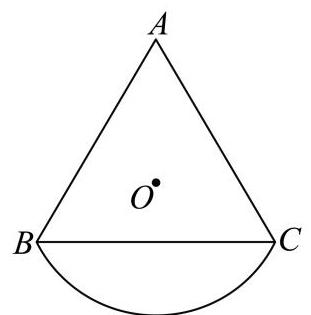

已知 $\angle {BAC} = \theta ,\theta  \in  \left( {0,\frac{\pi }{2}}\right)$ ，外接圆的半径是2，则该图形的面积为___. (用含 $\theta$ 的表达式表示)

## 答案

${4\theta } + 4\sin \theta$

解析

连接 ${OB},{OA},{OC}$ ,求出 ${S}_{\bigtriangleup {AOB}},{S}_{\bigtriangleup {AOC}},{S}_{\text{ 扇形 }{BOC}}$ 可得答案.

连接 ${OB},{OA},{OC}$ ,则 ${OB} = {OA} = {OC} = 2,\angle {BOC} = {2\theta }$ ,

$\angle {AOB} = \angle {AOC} = \frac{{2\pi } - \angle {BOC}}{2} = \pi  - \theta ,$

${S}_{\bigtriangleup {AOB}} = {S}_{\bigtriangleup {AOC}} = \frac{1}{2} \times  2 \times  2\sin \left( {\pi  - \theta }\right)  = 2\sin \theta ,$

${S}_{\text{ 扇形 }{BOC}} = \frac{1}{2} \times  {2\theta } \times  2 \times  2 = {4\theta },$

所以该图形的面积为 ${4\theta } + 4\sin \theta$ .

故答案为: ${4\theta } + 4\sin \theta$ .

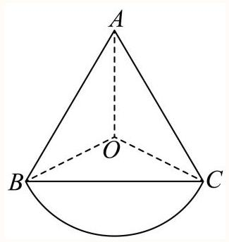

一般

3. 上海市奉贤区奉城镇的古建筑万佛阁(图1)的屋檐下常系挂风铃(图2)，风吹铃动，悦耳清脆，亦称惊鸟铃， 一般一个惊鸟铃由铜铸造而成, 由铃身和铃舌组成, 为了知道一个惊鸟铃的质量, 可以通过计算该惊鸟铃的体积, 然后由物理学知识计算出该惊鸟铃的质量, 因此我们需要作出一些合理的假设:

假设1: 铃身且可近似看作由一个较大的圆锥挖去一个较小的圆锥;

假设2: 两圆锥的轴在同一条直线上;

假设3: 铃身内部有一个挂铃舌的部位的体积忽略不计.

截面图如下 (图3)，其中 ${O}_{1}{O}_{3} = {20}\mathrm{{cm}}$ ， ${O}_{2}{O}_{3} = {18}\mathrm{{cm}}$ ， ${AB} = {16}\mathrm{{cm}}$ ，则制作100个这样的惊鸟铃的铃身至少需要千克铜. (铜的密度为 ${8.9}\mathrm{g}/{\mathrm{{cm}}}^{3}$ )(结果精确到个位)

图1

图2

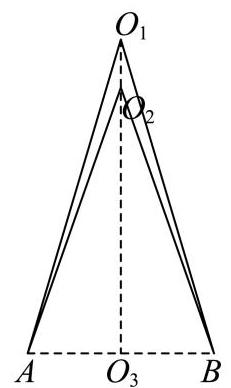

图3

## 答案

120

解析

利用锥体的体积公式可求得结果.

由题意可知，圆锥 ${O}_{1}{O}_{3}$ 的底面半径为 $8\mathrm{{cm}}$ ，高为 ${20}\mathrm{\;{cm}}$ ，

圆锥 ${O}_{2}{O}_{3}$ 的底面半径为 $8\mathrm{\;{cm}}$ ，高为 ${18}\mathrm{\;{cm}}$ ，

因为 ${100} \times  \frac{1}{3} \times  \pi  \times  {8}^{2} \times  \left( {{20} - {18}}\right)  \times  {8.9} \div  {1000} \approx  {119.236}$ ,

所以，制作100个这样的惊鸟铃的铃身至少需要120千克铜.

故答案为:120.

## 一般

4. 一个机器零件的形状是有缺口的圆形铁片，如图中实线部分为裁剪后的形状. 已知这个圆的半径是 ${13}\mathrm{\;{cm}}$ , ${AB} = {8\mathrm{\;{cm}}}$ ， ${BC} = {6\mathrm{\;{cm}}}$ ，且 ${AB}\bot {BC}$ ，则圆心到点B的距离约为___cm。(结果精确到0.1cm)

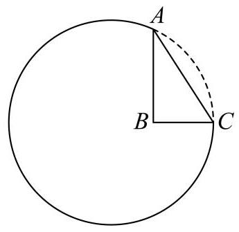

答案

7.3

解析

利用圆的对称性及三角恒等变换、余弦定理计算即可.

如图所示,设圆心为D, ${AC}$ 的中点为E,则 ${AD} = {13}$ ,

由题意易知 ${AC} = \sqrt{A{B}^{2} + B{C}^{2}} = {10} = {2AE}$ ,

则 $\cos \angle {DAC} = \frac{AE}{AD} = \frac{5}{13},\cos \angle {BAC} = \frac{AB}{AC} = \frac{4}{5},\therefore \sin \angle {DAC} = \frac{12}{13},\sin \angle {BAC} = \frac{3}{5}$ ,

所以 $\cos \angle {BAD} = \cos \left( {\angle {DAC} - \angle {BAC}}\right)  = \frac{5}{13} \times  \frac{4}{5} + \frac{12}{13} \times  \frac{3}{5} = \frac{56}{65}$ ,

由余弦定理知 $B{D}^{2} = A{D}^{2} + A{B}^{2} - {2AD} \cdot  {AB} \cdot  \cos \angle {BAD} = {53.8}$ ,

所以 ${BD} \approx  {7.3}\mathrm{\;{cm}}$ .

故答案为: 7.3 .

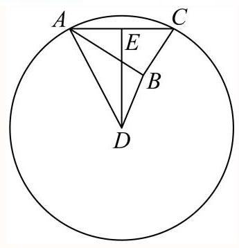

## 较易

5. 如图所示，小明和小宁家都住在东方明珠塔附近的同一幢楼上，小明家在 $A$ 层，小宁家位于小明家正上方的 $B$ 层,已知 ${AB} = a$ .小明在家测得东方明珠塔尖的仰角为 $\alpha$ ,小宁在家测得东方明珠塔尖的仰角为 $\beta$ ,则他俩所住的这幢楼与东方明珠塔之间的距离 $d =$

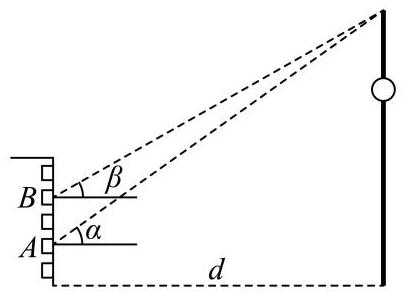

答案

$\overline{\tan \alpha  - \tan \beta }$

解析

根据正切函数的定义得到方程, 解出即可.

分别过点 $A, B$ 作 ${CD}$ 的垂线，垂足分别为 $M, N$ ，

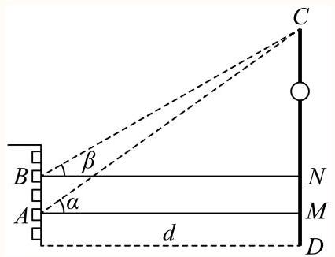

则根据正切函数的定义得 ${CM} = d\tan \alpha ,{CN} = d\tan \beta$ ,

则 ${MN} = {AB} = d\tan \alpha  - d\tan \beta  = a$ ,解得 $d = \frac{a}{\tan \alpha  - \tan \beta }$ .

故答案为: $\frac{a}{\tan \alpha  - \tan \beta }$ .

6. 某海滨浴场平面图是如图所示的半圆，其中 $O$ 是圆心，直径 ${MN}$ 为400米， $P$ 是弧 ${MN}$ 的中点. 一个急救中心 $A$ 在栈桥 ${OP}$ 中点上，计划在弧 ${NP}$ 上设置一个瞭望台 $B$ ，并在 ${AB}$ 间修建浮桥. 已知 $\angle {ABO}$ 越大，瞭望台 $B$ 处的视线范围越大，则 $B$ 处的视线范围最大时， ${AB}$ 的长度为 米. (结果精确到 1 米)

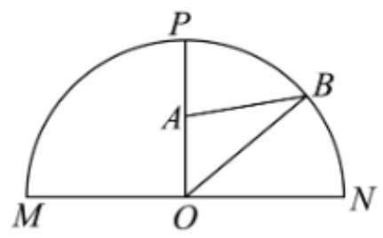

## 学答案

173

解析

令 ${AB} = x,\angle {ABO} = \theta  \in  \left( {0,\frac{\pi }{2}}\right)$ ，在 $\bigtriangleup  {ABO}$ 中应用余弦定理及基本不等式求最值，并确定取值条件，即可得答案.

令 ${AB} = x,\angle {ABO} = \theta  \in  \left( {0,\frac{\pi }{2}}\right)$ ,且 ${OA} = {100},{OB} = {200}$ ,

在 $\bigtriangleup {ABO}$ 中, $\cos \theta  = \frac{{x}^{2} + {200}^{2} - {100}^{2}}{{2x} \times  {200}} = \frac{1}{400} \cdot  \left( {x + \frac{30000}{x}}\right)  \geq  \frac{1}{400} \cdot  2\sqrt{x \cdot  \frac{30000}{x}} = \frac{\sqrt{3}}{2}$ ,

当且仅当 $x = {100}\sqrt{3} \approx  {173}$ 米时， $\cos \theta$ 取最小值，此时 $\angle {ABO} = \theta$ 最大.

故答案为:173

## 一般

7. 如图，某小区内有一块矩形区域 ${ABCD}$ ，其中 ${AB} = {40}$ 米， ${AD} = {20}$ 米，点 $E$ 、 $F$ 分别为 ${AB}$ 、 ${CD}$ 的中点，左右两个扇形区域为花坛 (两个扇形的圆心分别为 $A$ 、 $B$ ，半径均为20米)，其余区域为草坪. 现规划在草坪上修建一个三角形的儿童游乐区，且三角形的一个顶点在线段 ${EF}$ 上，另外两个顶点在线段 ${CD}$ 上，则该游乐区面积的最大值为平方米. (结果保留整数)

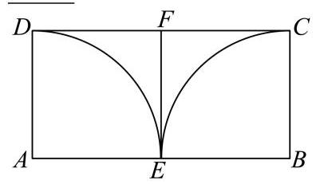

② 答案

137

解析

根据已知条件知,当三角形的两边分别与圆弧相切时,三角形的面积最大,设切点为 $G$ ,

$\angle {MAE} = \theta ,\theta  \in  \left( {0,\frac{\pi }{4}}\right)$ ,由三角形全等得到 $\angle {PAD} = \frac{\pi }{4} - \theta$ ,将三角形面积的表达式用 $\theta$ 表示,从而转化为三角函数，利用换元法转化为基本不等式求最值即可求解.

设游乐区所在的三角形为 $\bigtriangleup  {PQM}$ ， $M$ 在线段 ${EF}$ 上， $P$ ， $Q$ 在线段 ${DC}$ 上，如图所示，

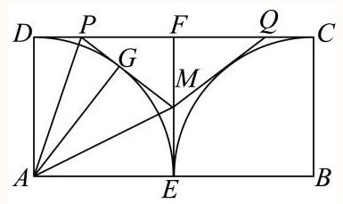

当 ${PM},{QM}$ 分别于圆弧相切时， ${S}_{PQM}$ 取得最大值，

由对称性,只讨论 $\bigtriangleup  {PFM}$ ,

设 ${PM}$ 与圆弧相切于点 $G$ ,连接 ${AG},{AM},{AP}$ ,

设 $\angle {MAE} = \theta ,\theta  \in  \left( {0,\frac{\pi }{4}}\right)$ ，因为 $\bigtriangleup {MAE} \cong  \bigtriangleup {MAG},\bigtriangleup {PAD} \cong  \bigtriangleup {PAG}$ ，

则 $\angle {MAG} = \theta ,\angle {PAD} = \frac{\frac{\pi }{2} - {2\theta }}{2} = \frac{\pi }{4} - \theta$ ,

因为 ${AE} = {EF} = {DF} = {AD} = {20}$ ，所以 ${ME} = {{20}\tan \theta },{MF} = {{20} - {20}\tan \theta }$ ，

${PD} = {20}\tan \left( {\frac{\pi }{4} - \theta }\right) ,{PF} = {20} - {20}\tan \left( {\frac{\pi }{4} - \theta }\right) ,$

所以 ${S}_{PQM} = 2{S}_{PFM} = 2 \times  \frac{1}{2}\left( {{20} - {20}\tan \theta }\right) \left\lbrack  {{20} - {20}\tan \left( {\frac{\pi }{4} - \theta }\right) }\right\rbrack$

$= {400}\left( {1 - \tan \theta }\right) \left( {1 - \frac{\tan \frac{\pi }{4} - \tan \theta }{1 + \tan \frac{\pi }{4} \cdot  \tan \theta }}\right)  = {800} \times  \frac{\tan \theta \left( {1 - \tan \theta }\right) }{1 + \tan \theta },$

因为 $\theta  \in  \left( {0,\frac{\pi }{4}}\right)$ ,所以 $\tan \theta  \in  \left( {0,1}\right)$ ,

令 $t = 1 + \tan \theta  \in  \left( {1,2}\right)$ ,则 $\tan \theta  = t - 1$ ,

则 ${S}_{PQM} = {800} \cdot  \frac{\left( {t - 1}\right) \left( {2 - t}\right) }{t} =  - {800}\left( {t + \frac{2}{t} - 3}\right)  \leq   - {800}\left( {2\sqrt{t \cdot  \frac{2}{t}} - 3}\right)  = {2400} - {1600}\sqrt{2}$ ,

当且仅当 $t = \frac{2}{t}$ ,即 $t = \sqrt{2}$ 时等号成立,

所以 ${\left( {S}_{PQM}\right) }_{\max } = {2400} - {1600}\sqrt{2} \approx  {137}$ 平方米,

即该游乐区面积的最大值为 137 平方米.

故答案为:137.

## 一般

8. 某地要建造一个市民休闲公园长方形 ${ABCD}$ ,如图,边 ${AB} = 2\mathrm{\;{km}}$ ,边 ${AD} = 1\mathrm{\;{km}}$ ,其中区域 ${ADE}$ 开挖成一个人工湖，其他区域为绿化风景区. 经测算，人工湖在公园内的边界是一段圆弧，且 $A$ 、 $D$ 位于圆心 $O$ 的正北方向， $E$ 位于圆心 $O$ 的北偏东 ${60}^{ \circ  }$ 方向. 拟定在圆弧 $P$ 处修建一座渔人码头，供游客湖中泛舟，并在公园的边 ${DC}$ 、 ${CB}$ 开设两个门 $M$ 、 $N$ ，修建步行道 ${PM}$ 、 ${PN}$ 通往渔人码头，且 ${PM}\bot {CD}$ 、 ${PN}\bot {CB}$ ，则步行道 ${PM}$ 、 ${PN}$ 长度之和的最小值是 km. (精确到0.001)

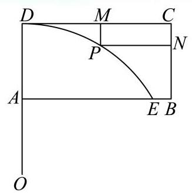

答案

1.172

解析

以 $O$ 为原点建立坐标系,求出圆半径,并设出点 $P$ 的坐标,借助辅助角公式及正弦函数的性质求出最小值. 以点 $O$ 为原点，直线 ${OA}$ 为 $y$ 轴建立平面直角坐标系，连接 ${OE}$ ，

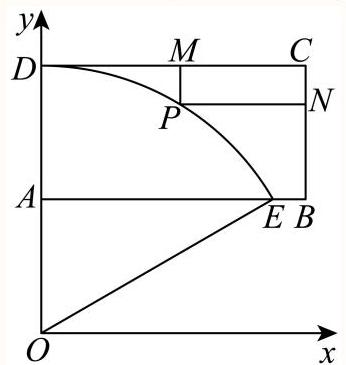

令圆 $O$ 的半径为 $r$ ,则 $r - 1 = r\cos {60}^{ \circ  }$ ,解得 $r = 2$ ,设 $P\left( {2\cos \theta ,2\sin \theta }\right) ,\frac{\pi }{6} \leq  \theta  \leq  \frac{\pi }{2}$ ,

因此 ${PM} + {PN} = 2 - 2\sin \theta  + 2 - 2\cos \theta  = 4 - 2\sqrt{2}\sin \left( {\theta  + \frac{\pi }{4}}\right)  \geq  4 - 2\sqrt{2}$ ,

当且仅当 $\theta  = \frac{\pi }{4}$ 时取等号, $4 - 2\sqrt{2} \approx  {1.172}$

所以步行道 ${PM}$ 、 ${PN}$ 长度之和的最小值是 ${1.172}\mathrm{\;{km}}$ .

故答案为: 1.172

## 一般

9. 徐汇滨江作为2024年上海国际鲜花展的三个主会场之一，吸引了广大市民前往观展并拍照留念.图中的花盆是种植鲜花的常见容器，它可视作两个圆台的组合体，上面圆台的上、下底面直径分别为30cm和26cm，下面圆台的上、 下底面直径分别为 ${24}\mathrm{\;{cm}}$ 和 ${18}\mathrm{\;{cm}}$ ，且两个圆台侧面展开图的圆弧所对的圆心角相等.若上面圆台的高为 $8\mathrm{\;{cm}}$ ，则该花盆上、下两部分母线长的总和为 $\;\mathrm{{cm}}$ .

## 答案

$5\sqrt{17}$

解析

设出圆台的母线长及底面半径,根据圆台的母线长公式 $l = \sqrt{{h}^{2} + {\left( {r}_{1} - {r}_{2}\right) }^{2}}$ 结合条件即得.

设上面圆台的母线长为 ${l}_{1}$ ，上面半径为 ${r}_{1} = {15}\mathrm{\;{cm}}$ ，下半圆半径为 ${r}_{2} = {13}\mathrm{\;{cm}}$ ，高为 $h = 8\mathrm{\;{cm}}$ ，

根据圆台的母线长公式 $l = \sqrt{{h}^{2} + {\left( {r}_{1} - {r}_{2}\right) }^{2}}$ ,带入数值计算得到 ${l}_{1} = \sqrt{{8}^{2} + {\left( {15} - {13}\right) }^{2}} = \sqrt{68} = 2\sqrt{17}\mathrm{\;{cm}}$ ; 设下面圆台的母线长为 ${l}_{2}$ ,上面半径为 ${r}_{3} = {12}\mathrm{\;{cm}}$ ,下半圆半径为 ${r}_{4} = 9\mathrm{\;{cm}}$ ,

由于两个圆台侧面展开图的圆弧所对的圆心角相等,可以得到 $\frac{{r}_{1} - {r}_{2}}{{l}_{1}} = \frac{{r}_{3} - {r}_{4}}{{l}_{2}}$ ,带入数值计算得到 ${l}_{2} = \frac{\left( {{r}_{3} - {r}_{4}}\right) {l}_{1}}{{r}_{1} - {r}_{2}} = \frac{\left( {{12} - 9}\right)  \times  2\sqrt{17}}{{15} - {13}} = 3\sqrt{17}\mathrm{\;{cm}};$

所以该花盆上、下两部分母线长的总和为 $2\sqrt{17} + 3\sqrt{17} = 5\sqrt{17}\mathrm{\;{cm}}$ .

故答案为: $5\sqrt{17}$

## 一般

10. 如图是某公园局部的平面示意图，图中的实线部分(它由线段 ${CE},{DF}$ 与分别以 ${OC},{OD}$ 为直径的半圆弧组成) 表示一条步道.其中的点 $C, D$ 是线段 ${AB}$ 上的动点，点 $\mathrm{O}$ 为线段 ${AB},{CD}$ 的中点，点 $E, F$ 在以 ${AB}$ 为直径的半圆弧上， 且 $\angle {OCE},\angle {ODF}$ 均为直角. 若 ${AB} = 1$ 百米，则此步道的最大长度为 百米.

答案

$\frac{\sqrt{{\pi }^{2} + 4}}{2}$

解析

设半圆步道直径为 $x$ 百米，连接 ${AE},{BE}$ ，借助相似三角形性质用 $x$ 表示 ${CE}$ ，结合对称性求出步道长度关于 $x$ 的函数关系, 利用导数求出最大值即得.

设半圆步道直径为 $x$ 百米,连接 ${AE},{BE}$ ,显然 $\angle {AEB} = {90}^{ \circ  }$ ,

由点 $\mathrm{O}$ 为线段 ${AB},{CD}$ 的中点，得两个半圆步道及直道 ${CE},{DF}$ 都关于过点 $O$ 垂直于 ${AB}$ 的直线对称， 则 ${AC} = \frac{1}{2} - x,{BC} = \frac{1}{2} + x$ ,又 ${CE} \bot  {AB}$ ,则 $\operatorname{Rt} \bigtriangleup  {ACE}\infty \operatorname{Rt} \bigtriangleup  {ECB}$ ,有 $C{E}^{2} = {AC} \cdot  {BC}$ , 即有 ${DF} = {CE} = \sqrt{\frac{1}{4} - {x}^{2}}$ ,因此步道长 $f\left( x\right)  = 2\sqrt{\frac{1}{4} - {x}^{2}} + {\pi x} = \sqrt{1 - 4{x}^{2}} + {\pi x},0 < x < \frac{1}{2}$ , 求导得 ${f}^{\prime }\left( x\right)  =  - \frac{4x}{\sqrt{1 - 4{x}^{2}}} + \pi$ ,由 ${f}^{\prime }\left( x\right)  = 0$ ,得 $x = \frac{\pi }{2\sqrt{{\pi }^{2} + 4}}$ ,

当 $0 < x < \frac{\pi }{2\sqrt{{\pi }^{2} + 4}}$ 时, ${f}^{\prime }\left( x\right)  > 0$ ,函数 $f\left( x\right)$ 递增,当 $\frac{\pi }{2\sqrt{{\pi }^{2} + 4}} < x < \frac{1}{2}$ 时, ${f}^{\prime }\left( x\right)  < 0$ ,函数 $f\left( x\right)$ 递减, 因此当 $x = \frac{\pi }{2\sqrt{{\pi }^{2} + 4}}$ 时， $f{\left( x\right) }_{\max } = \sqrt{1 - 4{\left( \frac{\pi }{2\sqrt{{\pi }^{2} + 4}}\right) }^{2}} + \frac{{\pi }^{2}}{2\sqrt{{\pi }^{2} + 4}} = \frac{\sqrt{{\pi }^{2} + 4}}{2}$ ， 所以步道的最大长度为 $\frac{\sqrt{{\pi }^{2} + 4}}{2}$ 百米.

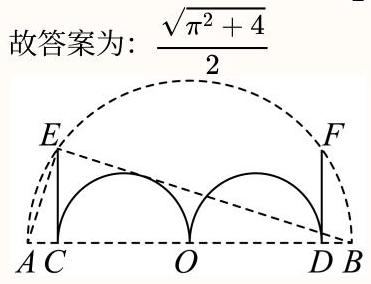

一般

11. 采矿、采石或取土时，常用炸药包进行爆破，部分爆破呈圆锥漏斗形状(如图)，已知圆锥的母线长是炸药包的爆破半径R，若要使爆破体积最大，则炸药包埋的深度为

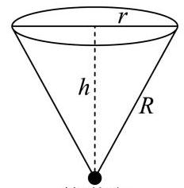

炸药包

答案

$\frac{\sqrt{3}}{3}R$

解析

根据题意,得到 ${r}^{2} = {R}^{2} - {h}^{2}$ ,求得 $V = \frac{1}{3}\pi {R}^{2}h - \frac{1}{3}\pi {h}^{3}, h \in  \left( {0, R}\right)$ ,利用导数求得函数的单调性与最大值点, 即可求解.

由题意,圆锥的体积为 $V = \frac{1}{3}\pi {r}^{2}h$

因为 ${r}^{2} + {h}^{2} = {R}^{2}$ ,可得 ${r}^{2} = {R}^{2} - {h}^{2}$ ,

所以 $V = \frac{1}{3}\pi {r}^{2}h = \frac{1}{3}\pi \left( {{R}^{2} - {h}^{2}}\right) h = \frac{1}{3}\pi {R}^{2}h - \frac{1}{3}\pi {h}^{3}, h \in  \left( {0, R}\right)$ ,

可得 ${V}^{\prime } = \frac{1}{3}\pi {R}^{2} - \pi {h}^{2}, h \in  \left( {0, R}\right)$ ,

令 ${V}^{\prime } > 0$ ,可得 $0 < h < \frac{\sqrt{3}}{3}R$ ; 令 ${V}^{\prime } < 0$ ,可得 $\frac{\sqrt{3}}{3}R < h < R$ ,

所以 $V = \frac{1}{3}\pi {R}^{2}h - \frac{1}{3}\pi {h}^{3}$ 在 $\left( {0,\frac{\sqrt{3}}{3}R}\right)$ 单调递增,在 $\left( {\frac{\sqrt{3}}{3}R, R}\right)$ 单调递减,

所以,当 $h = \frac{\sqrt{3}}{3}R$ 处,函数 $V = \frac{1}{3}\pi {R}^{2}h - \frac{1}{3}\pi {h}^{3}$ 取得极大值,也时最大值,

所以炸药包埋在 $\frac{\sqrt{3}}{3}R$ 深处.

故答案为: $\frac{\sqrt{3}}{3}R$ .

## 。立体几何

容易

1. 著名的古希腊数学家阿基米德一生最为满意的一个数学发现就是“圆柱容球”定理:把一个球放在一个圆柱形的容器中，如果盖上容器的上盖后，球恰好与圆柱的上、下底面和侧面相切(该球也被称为圆柱的内切球)，那么此时圆柱的内切球体积与圆柱体积之比为定值，则该定值为( ).

A. $\frac{1}{2}$ B. $\frac{1}{3}$ C. $\frac{3}{4}$ D. $\frac{2}{3}$

9 答案

D

解析

根据已知条件可得 $l = {2r}$ ,结合圆柱与球的体积公式计算即可.

设圆柱的母线长为l，内切球的半径为r，如图所示，

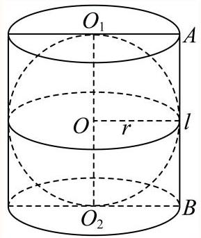

则其轴截面如图所示，

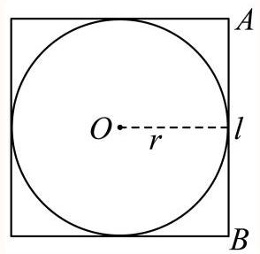

则 $l = {2r}$ ,

所以圆柱的内切球体积为 ${V}_{1} = \frac{4}{3}\pi {r}^{3}$ ,圆柱体积为 ${V}_{2} = {sh} = \pi {r}^{2}l = \pi {r}^{2} \times  {2r} = {2\pi }{r}^{3}$ ,

所以圆柱的内切球体积与圆柱体积之比为 $\frac{{V}_{1}}{{V}_{2}} = \frac{\frac{4}{3}\pi {r}^{3}}{{2\pi }{r}^{3}} = \frac{2}{3}$ .

故选: D.

一般

2. 如图所示，半径 $R = 2$ 的球O中有一内接圆柱，当圆柱的侧面积最大时，球的表面积与圆柱的侧面积之差等于

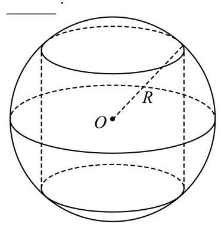

## 答案

${8\pi }$

解析

设出圆柱的上底面半径为r，球的半径与上底面夹角为 $\alpha$ ，求出圆柱的侧面积表达式，由正弦型函数的单调性求出圆柱侧面积的最大值, 求出球的表面积, 即可求得两者的差值.设圆柱的上底面半径为r, 球的半径与上底面夹角为 $\alpha \left( {\alpha  \in  \left( {0,\frac{\pi }{2}}\right) }\right)$ ,则 $r = 2\cos \alpha$ ,圆柱的高为 $h = 4\sin \alpha$ ,圆柱的侧面积为:

$S = {2\pi rh} = {16\pi }\sin \alpha \cos \alpha  = {8\pi }\sin {2\alpha },$

当 ${2\alpha } = \frac{\pi }{2}$ ，即 $\alpha  = \frac{\pi }{4}$ 时， $\sin {2\alpha }$ 取最大值1，圆柱的侧面积取最大值为 ${8\pi }$ ，

所以当圆柱的侧面积最大时,球的表面积与圆柱的侧面积之差为 ${4\pi } \times  {2}^{2} - {8\pi } = {8\pi }$ .

故答案为: ${8\pi }$

本题考查柱体、球体的表面积, 球的内接几何体, 将面积用三角函数表示使计算过程更加简洁, 属于中档题.

## 一般

3. 如果一个球的外切圆锥的高是这个球半径的3倍，那么圆锥侧面积和球的表面积的比值为 .

答案

$\frac{3}{2}$

解析

设球的半径为 $r$ ,则圆锥的高为 ${3r}$ ,取圆锥的轴截面 $\bigtriangleup {ABC}$ ,其中 $A$ 为圆锥的顶点,设球心为 $O$ ,作出图形, 分析可知 $\bigtriangleup {ABC}$ 为等边三角形,求出 ${AB}$ ,利用圆锥的侧面积公式以及球体的表面积公式可求得结果.

设球的半径为 $r$ ,则圆锥的高为 ${3r}$ ,取圆锥的轴截面 $\bigtriangleup {ABC}$ ,其中 $A$ 为圆锥的顶点,

设球心为 $O$ ,如下图所示:

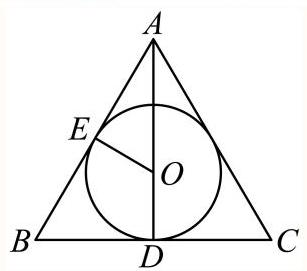

设圆 $O$ 分别切 ${AB}$ 、 ${BC}$ 于点 $E$ 、 $D$ ，则 $D$ 为 ${BC}$ 的中点，

由题意可得 ${OD} = {OE} = r,{AD} = {3r}$ ，则 ${AO} = {AD} - {OD} = {3r} - r = {2r} = {2OE}$ ，

又因为 ${OE}\bot {AB}$ ，所以， ${\angle {BAD}} = \frac{\pi }{6}$ ，同理可得 $\angle {CAD} = \frac{\pi }{6}$ ，所以， $\angle {BAC} = \frac{\pi }{3}$ ，

又因为 ${AB} = {AC}$ ,故 $\bigtriangleup {ABC}$ 为等边三角形,故 ${AB} = \frac{AD}{\sin \frac{\pi }{3}} = \frac{3r}{\frac{\sqrt{3}}{2}} = 2\sqrt{3}r$ ,

所以，圆锥的侧面积为 $\pi  \times  {AB} \times  {BD} = \pi  \times  2\sqrt{3}r \times  \sqrt{3}r = {6\pi }{r}^{2}$ ，

因此,圆锥侧面积和球的表面积的比值为 $\frac{{6\pi }{r}^{2}}{{4\pi }{r}^{2}} = \frac{3}{2}$ .

故答案为: $\frac{3}{2}$ .

## 一般

4. 已知球 $O$ 是三棱锥 $\mathrm{P} - \mathrm{{ABC}}$ 的外接球， $\mathrm{{PA}} = \mathrm{{PB}} = \mathrm{{PC}} = 5\sqrt{2}$ ， $\mathrm{{CA}} = 6$ ， $\mathrm{{AB}} = {10}$ ， $\mathrm{{BC}} = 8$ ，则球 $\mathrm{O}$ 的表面积是

## 答案

${100\pi }$

解析

由题意画出图形,可得底面为直角三角形,设 ${AB}$ 中点为 $D$ ,连接 ${PD}$ ,则三棱锥外接球的球心 $O$ 在 ${PD}$ 上,利用勾股定理求得外接球的半径, 代入球的表面积公式得答案.

解: 如图,

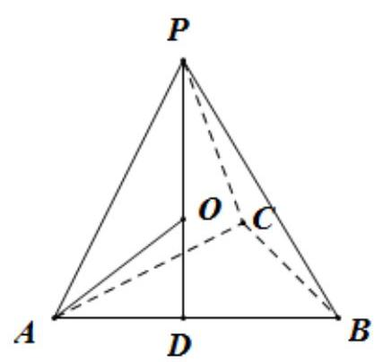

$\because {AB} = {10},{BC} = 8,{AC} = 6,\therefore A{B}^{2} = B{C}^{2} + A{C}^{2}$ ,可得 ${AC} \bot  {BC}$ ,

取 ${AB}$ 的中点 $D$ ，则 $D$ 为三角形 ${ABC}$ 的外心，连接 ${PD}$ ，

$\because {PA} = {PB} = {PC} = 5\sqrt{2},\therefore D$ 为 $P$ 在底面三角形 ${ABC}$ 的射影， ${PD} = \sqrt{A{P}^{2} - A{D}^{2}} = 5$

设三棱锥 $P - {ABC}$ 的外接球的球心为 $O$ ,则 $O$ 在 ${PD}$ 上,

设球 $O$ 的半径为 $R$ ,可得 ${R}^{2} = {5}^{2} + {\left( 5 - R\right) }^{2}$ ,解得 $R = 5$ ,

$\therefore$ 球 $O$ 的表面积为 ${4\pi } \times  {5}^{2} = {100\pi }$ .

故答案为: ${100\pi }$ .

## 一般

5. 如图，在一个轴截面为正三角形的圆锥形容器中注入高为h的水，然后，将一个铁球放入这个圆锥形的容器中， 若水面恰好和球面相切，则这个球的半径为 .

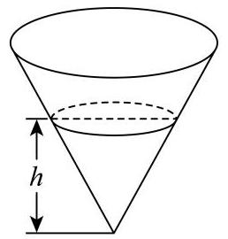

答案

$\frac{\sqrt[3]{225}}{15}h$

解析

根据水的高度以及圆锥形容器的轴截面为等边三角形得到水的体积，设出球的半径表示出球的体积，则根据放球后总体积 $V = {V}_{\text{ 球 }} + {V}_{\text{ 水 }}$ ,得到关于铁球半径 $R$ 的方程,解出即可.

如图,作出圆锥容器的轴截面, $\bigtriangleup {ABS}$ 为正三角形, ${SG} = h,{DG} = \frac{\sqrt{3}}{3}h$ ,故 ${V}_{\text{ 水 }} = \frac{1}{3}\pi  \cdot  D{G}^{2} \cdot  {SG} = \frac{\pi }{9}{h}^{3}$ . 设铁球的半径为 $R$ ,则 ${SO} = {2R},{SF} = {3R}$ ,在 $\operatorname{Rt}\bigtriangleup {FSB}$ 中, ${BF} = {SF}\tan \angle {FSB} = \sqrt{3}R$ .

设放入球后，球与水共占体积为 $V$ ，则 $V = \frac{1}{3}\pi  \cdot  B{F}^{2} \cdot  {SF} = \frac{\pi }{3} \times  {\left( \sqrt{3}R\right) }^{2} \cdot  {3R} = {3\pi }{R}^{3}$ ，

又 ${V}_{\text{ 球 }} = \frac{4\pi }{3}{R}^{3}$ ,依题意有 $V = {V}_{\text{ 球 }} + {V}_{\text{ 水 }}$ ,故 ${3\pi }{R}^{3} = \frac{4\pi }{3}{R}^{3} + \frac{\pi }{9}{h}^{3}$ ,解得 $R = \frac{\sqrt[3]{225}}{15}h$ .

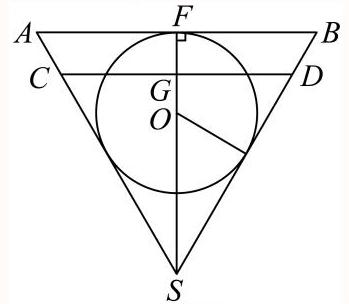

故答案为: $\frac{\sqrt[3]{225}}{15}h$

## 三角大题

一般

1. 汽车转弯时遵循阿克曼转向几何原理，即转向时所有车轮中垂线交于一点，该点称为转向中心:如图1，某汽车四轮中心分别为 $A\text{ 、 }B\text{ 、 }C\text{ 、 }D$ ，向左转向，左前轮转向角为 $\alpha$ ，右前轮转向角为 $\beta$ ，转向中心为 $O$ . 设该汽车左右轮距 ${AB}$ 为 $w$ 米，前后轴距 ${AD}$ 为 $l$ 米.

图1

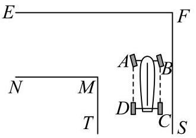

图2

(1) 试用 $w\text{ 、 }l$ 和 $\alpha$ 表示 $\tan \beta$ ；

(2) 如图2，有一直角弯道， $M$ 为内直角顶点， ${EF}$ 为上路边，路宽均为3.5米，汽车行驶其中，左轮 $A\text{ 、 }D$ 与路边 ${FS}$ 相距2米.试依据如下假设，对问题*做出判断，并说明理由.

假设:①转向过程中，左前轮转向角 $\alpha$ 的值始终为 ${30}^{ \circ  }$ ；②设转向中心 $O$ 到路边 ${EF}$ 的距离为 $d$ ，若 ${OB} < d$ 且 ${OM} < {OD}$ ，则汽车可以通过，否则不能通过；③ $w = {1.570}, l = {2.680}$ .问题*:可否选择恰当转向位置，使得汽车通过这一弯道?

## 答案

(1)答案见解析

(2)答案见解析

解析

(1)由已知 $\angle {AOD} = \alpha$ ， $\angle {BOC} = \beta$ ，

所以 ${OD} = \frac{AD}{\tan \alpha } = \frac{l}{\tan \alpha }$ ， ${OC} = {OD} + {DC} = \frac{l}{\tan \alpha } + w$ ，

所以 $\tan \beta  = \frac{BC}{OC} = \frac{l}{\frac{l}{\tan \alpha } + w}$ .

(2)以EF和FS分别为 $x$ 轴和 $y$ 轴建立坐标系，

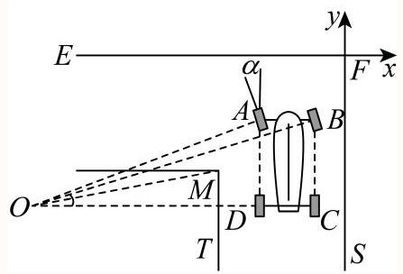

则 $M\left( {-{3.5}, - {3.5}}\right) ,{OD} = \frac{l}{\tan \alpha } = \sqrt{3}l = {4.642},{OB} = \sqrt{{l}^{2} + {\left( \sqrt{3}l + w\right) }^{2}} = {6.766}$ ,

设 $O\left( {a, b}\right) \left( {a < 0, b < 0}\right)$ ,

可得 $a =  - \sqrt{3}l - 2 =  - {6.642}, d =  - b,{OM} = \sqrt{{\left( {3.5} + a\right) }^{2} + {\left( {3.5} + b\right) }^{2}} = \sqrt{{9.872} + {\left( {3.5} + b\right) }^{2}}$ ,

由 ${OM} < {OD}$ ,可得 ${9.872} + {\left( {3.5} + b\right) }^{2} < {21.548}$ ,解得 $- {6.917} < b <  - {0.83}$ ,

由 ${OB} < d$ ,得 $b <  - {6.766}$ ,

所以当 $\$  - {6.917} <  - {6.766}$ \$时, ${OB} < d$ 且 ${OM} < {OD}$ ,此时汽车可以通过弯道.

可知选择恰当转向位置，汽车可以通过弯道.

## 一般

2. 某建筑物内一个水平直角型过道如图所示，两过道的宽度均为3米，有一个水平截面为矩形的设备需要水平通过直角型过道. 若该设备水平截面矩形的宽 ${BC}$ 为 1 米，则该设备能水平通过直角型过道的长 ${AB}$ 不超过 米.

答案

$6\sqrt{2} - 2$

解析

建立平面直角坐标系，利用直线 ${AB}$ 的方程求得设备的长 ${AB}$ 的表达式，再利用均值定理求得 ${AB}$ 的最小值，进而得到该设备能水平通过直角型过道时 ${AB}$ 不超过的值.

分别以 ${OB},{OA}$ 所在直线为 $x, y$ 轴建立平面直角坐标系如图,

则 $M\left( {3,3}\right)$ ,令 $A\left( {0, b}\right) , B\left( {a,0}\right) ,\left( {a > 0, b > 0}\right)$ ,

则直线 ${AB}$ 的方程为 $\frac{x}{a} + \frac{y}{b} = 1$ ,

则 $M$ 在直线 ${AB}$ 的上方，且 $M$ 到直线 ${AB}$ 的距离为 1，

即 $\left\{  \begin{array}{l} \frac{3}{a} + \frac{3}{b} > 1 \\  \frac{\left| \frac{3}{a} + \frac{3}{b} - 1\right| }{\sqrt{\frac{1}{{\left( \frac{1}{a}\right) }^{2}} + {\left( \frac{1}{b}\right) }^{2}}} = 1 \end{array}\right.$ ,则 $\frac{3}{a} + \frac{3}{b} - 1 = \sqrt{{\left( \frac{1}{a}\right) }^{2} + {\left( \frac{1}{b}\right) }^{2}}$ ,

整理得 $\sqrt{{a}^{2} + {b}^{2}} = 3\left( {a + b}\right)  - {ab}$ ,

设 $\left| {AB}\right|  = r,\angle {OAB} = \theta ,\left( {r > 0,\theta  \in  \left\lbrack  {0,\frac{\pi }{2}}\right\rbrack  }\right)$ ,则 $a = r\sin \theta , b = r\cos \theta$ ,

则 $\sqrt{{a}^{2} + {b}^{2}} = 3\left( {a + b}\right)  - {ab}$ 可化为 $r = {3r}\left( {\sin \theta  + \cos \theta }\right)  - {r}^{2}\sin \theta \cos \theta$ ,

令 $t = \sin \theta  + \cos \theta \left( {\theta  \in  \left\lbrack  {0,\frac{\pi }{2}}\right\rbrack  }\right)$ ,则 $t = \sqrt{2}\sin \left( {\theta  + \frac{\pi }{4}}\right)  \in  \left\lbrack  {1,\sqrt{2}}\right\rbrack$ ,则

$r = \frac{3\left( {\sin \theta  + \cos \theta }\right)  - 1}{\sin \theta \cos \theta } = \frac{{3t} - 1}{\frac{{t}^{2} - 1}{2}} = 2 \times  \frac{1}{\frac{\frac{1}{9}{\left( 3t - 1\right) }^{2} + \frac{2}{9}\left( {{3t} - 1}\right)  - \frac{8}{9}}{{3t} - 1}}$

$= \frac{18}{\left( {{3t} - 1}\right)  - \frac{8}{{3t} - 1} + 2}$ ,

由 $t \in  \left\lbrack  {1,\sqrt{2}}\right\rbrack$ ,得 ${3t} - 1 \in  \left\lbrack  {2,3\sqrt{2} - 1}\right\rbrack$ ,

又 $y = x - \frac{8}{x} + 2$ 在 $\left\lbrack  {2,3\sqrt{2} - 1}\right\rbrack$ 上单调递增,

则 $\left( {{3t} - 1}\right)  - \frac{8}{{3t} - 1} + 2 \leq  3\sqrt{2} - 1 - \frac{8}{3\sqrt{2} - 1} + 2 = \frac{9}{3\sqrt{2} - 1}$ ,

则 $\frac{18}{\left( {{3t} - 1}\right)  - \frac{8}{{3t} - 1} + 2} \geq  2\left( {3\sqrt{2} - 1}\right)$ (当且仅当 $t = \sqrt{2}$ 时等号成立)

则该设备能水平通过直角型过道的长 ${AB}$ 不超过 $2\left( {3\sqrt{2} - 1}\right)$ 米

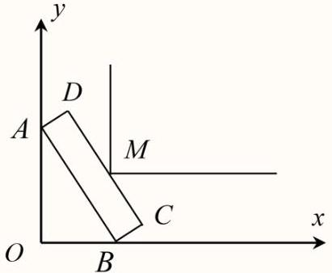

故答案为: $2\left( {3\sqrt{2} - 1}\right)$

## 较难

3. 网络购物行业日益发达，各销售平台通常会配备送货上门服务. 小金正在配送客户购买的电冰箱，并获得了客户所在小区门户以及建筑转角处的平面设计示意图.

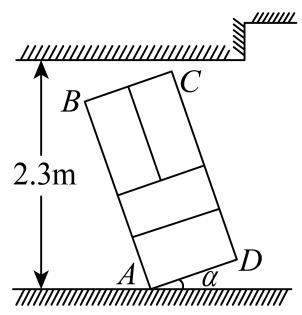

图1

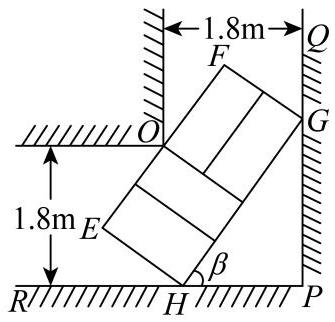

图2

(1)为避免冰箱内部制冷液逆流，要求运送过程中发生倾斜时，外包装的底面与地面的倾斜角 $\alpha$ 不能超过 $\frac{\pi }{4}$ ，且底面至少有两个顶点与地面接触. 外包装看作长方体，如图1所示，记长方体的纵截面为矩形 ${ABCD}$ ， ${AD} = {0.8}\mathrm{\;m}$ ， ${AB} = {2.4}\mathrm{\;m}$ ，而客户家门高度为 2.3 米，其他过道高度足够. 若以倾斜角 $\alpha  = \frac{\pi }{4}$ 的方式进客户家门, 小金能否将冰箱运送入客户家中? 计算并说明理由.

(2)由于客户选择以旧换新服务，小金需要将客户长方体形状的旧冰箱进行回收. 为了省力，小金选择将冰箱水平推运(冰箱背面水平放置于带滚轮的平板车上，平板车长宽均小于冰箱背面). 推运过程中遇到一处直角过道,如图2所示,过道宽为 1.8 米. 记此冰箱水平截面为矩形 ${EFGH},{EH} = {1.2}\mathrm{\;m}$ . 设 $\angle {PHG} = \beta$ ,当冰箱被卡住时(即点 $H$ 、 $G$ 分别在射线 ${PR}$ 、 ${PQ}$ 上，点 $O$ 在线段 ${EF}$ 上)，尝试用 $\beta$ 表示冰箱高度 ${EF}$ 的长，并求出 ${EF}$ 的最小值，最后请帮助小金得出结论:按此种方式推运的旧冰箱，其高度的最大值是多少？(结果精确到 ${0.1}\mathrm{\;m}$ )

## 答案

(1)冰箱能够按要求运送入客户家中，理由见解析；

(2) ${EF}$ 最小值为 $\frac{{18}\sqrt{2} - {12}}{5}$ 米，此情况下能推运冰箱高度的最大值为 2.6米.

解析

(1)过A，D作水平线 ${l}_{1},{l}_{2}$ ，作 ${CF} \bot  {l}_{2},{DE} \bot  {l}_{1}$ 如图，

当倾斜角 $\alpha  = \frac{\pi }{4}$ 时，冰箱倾斜后实际高度(即冰箱最高点到地面的距离)

$h = {DE} + {CF} = {0.8}\sin \frac{\pi }{4} + {2.4}\cos \frac{\pi }{4} = \frac{8\sqrt{2}}{5} < {2.3},$

故冰箱能够按要求运送入客户家中.

(2) 延长 ${EF}$ 与直角走廊的边相交于 $M\text{ 、 }N$ ,

则 ${MN} = {OM} + {ON} = \frac{1.8}{\sin \beta } + \frac{1.8}{\cos \beta },{EM} = \frac{1.2}{\tan \beta },{FN} = {1.2}\tan \beta$ ,

又 ${EF} = {MN} - {ME} - {NF}$ ,

则 ${EF} = \frac{1.8}{\sin \beta } + \frac{1.8}{\cos \beta } - {1.2}\left( {\tan \beta  + \frac{1}{\tan \beta }}\right)  = \frac{{1.8}\left( {\sin \beta  + \cos \beta }\right)  - {1.2}}{\sin \beta \cos \beta },\beta  \in  \left( {0,\frac{\pi }{2}}\right)$ .

设 $t = \sin \beta  + \cos \beta  = \sqrt{2}\sin \left( {\beta  + \frac{\pi }{4}}\right)$ ,

因为 $\beta  \in  \left( {0,\frac{\pi }{2}}\right)$ ,所以 $\beta  + \frac{\pi }{4} \in  \left( {\frac{\pi }{4},\frac{3\pi }{4}}\right)$ ,所以 $t \in  (1,\sqrt{2}\rbrack$ ,

则 ${EF} = \frac{{1.8t} - {1.2}}{\frac{1}{2}\left( {{t}^{2} - 1}\right) } = \frac{6}{5} \cdot  \frac{{3t} - 2}{{t}^{2} - 1}$ ,

再令 $m = {3t} - 2$ ,则 ${EF} = \frac{6}{5} \cdot  \frac{m}{{\left( \frac{m + 2}{3}\right) }^{2} - 1} = \frac{54}{5} \cdot  \frac{1}{m - \frac{5}{m} + 4}, m \in  (1,3\sqrt{2} - 2\rbrack$ ,

易知, $y = m - \frac{5}{m} + 4$ 在 $(1,3\sqrt{2} - 2\rbrack$ 上单调递增,

所以 $y = \frac{54}{5} \cdot  \frac{1}{m - \frac{5}{m} + 4}, m \in  (1,3\sqrt{2} - 2\rbrack$ 单调递减,

故当 $m = 3\sqrt{2} - 2$ ,即 $t = \sqrt{2},\beta  = \frac{\pi }{4}$ 时， ${EF}$ 取得最小值 $\frac{{18}\sqrt{2} - {12}}{5} \approx  {2.69}$ .

由实际意义需向下取, 此情况下能顺利通过过道的冰箱高度的最大值为 2.6 米.

较难

4. 某路口的转弯处受地域限制，设计了一条单向双排直角拐弯车道，平面设计如图所示，每条车道宽为4米，现有一辆大卡车，在里侧车道，其车体水平截面图为矩形ABCD，它的宽AD为2.4米，车厢的左侧直线CD与双车道的分界线相交于 $\mathrm{E}$ 、 $\mathrm{F}$ ,记 $\angle {DAE} = \theta$ .

(1)若大卡车在转弯的某一刻，恰好 $\theta  = \frac{\pi }{6}$ ，且A、B也都在双车道的分界线上，直线CD也恰好过路口边界O，求大卡车的车长AB；

(2)为保证行车安全，在里侧车道转弯时，车体不能越过双车道分界线. 求此大卡车的车长AB的最大值.

3 答案

(1) $\left( {8 - \frac{8\sqrt{3}}{15}}\right)$ 米

(2) $\left( {8\sqrt{2} - \frac{24}{5}}\right)$ 米

解析

(1)如图所示，

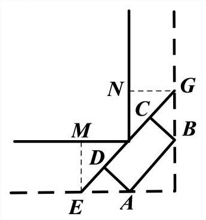

作 ${EM} \bot  {OM}$ ,垂足为 $M$ ,作 ${FN} \bot  {ON}$ ,垂足为 $N$ ,

因为 $\angle {DAE} = \frac{\pi }{6}$ ,所以 $\angle {MEO} = \angle {NOF} = \angle {BFC} = \frac{\pi }{6}$ ,在 $\operatorname{Rt}\bigtriangleup {ADE}$ 中

${ED} = {2.4} \times  \tan \frac{\pi }{6} = \frac{4\sqrt{3}}{5},$

在 Rt $\bigtriangleup {BCF}$ 中, ${CF} = \frac{2.4}{\tan \frac{\pi }{6}} = \frac{{12}\sqrt{3}}{5}$

在 Rt $\bigtriangleup {OME}$ 中, ${OE} = \frac{4}{\cos \frac{\pi }{6}} = \frac{8\sqrt{3}}{3}$ ,在 Rt $\bigtriangleup {ONF}$ 中, ${OF} = \frac{4}{\sin \frac{\pi }{6}} = 8$ ,

所以 ${CD} = {OE} + {OF} - {ED} - {CF} = \frac{8\sqrt{3}}{3} + 8 - \frac{4\sqrt{3}}{5} - \frac{{12}\sqrt{3}}{5} = \left( {8 - \frac{8\sqrt{3}}{15}}\right)$ 米.

( 2 )因为 $\angle {DAE} = \theta$ ，所以 ${OE} = \frac{4}{\cos \theta },{OF} = \frac{4}{\sin \theta },{ED} = {2.4}\tan \theta ,{CF} = \frac{2.4}{\tan \theta }$ ，

所以 ${AB} = {CD} = {OE} + {OF} - {ED} - {CF} = \frac{4}{\cos \theta } + \frac{4}{\sin \theta } - {2.4}\tan \theta  -$

$\frac{2.4}{\tan \theta } = \frac{4\sin \theta  + 4\cos \theta  - {2.4}{\sin }^{2}\theta  - {2.4}{\cos }^{2}\theta }{\sin \theta \cos \theta } = \frac{4\left( {\sin \theta  + \cos \theta }\right)  - {2.4}}{\sin \theta \cos \theta }\left( {0 < \theta  < \frac{\pi }{2}}\right) ,$

令 $\sin \theta  + \cos \theta  = t$ ,则 $t = \sqrt{2}\sin \left( {\theta  + \frac{\pi }{4}}\right)$ ,

因为 $0 < \theta  < \frac{\pi }{2}$ ,所以 $\theta  + \frac{\pi }{4} \in  \left( {\frac{\pi }{4},\frac{3\pi }{4}}\right)$ ,所以 $1 < t \leq  \sqrt{2},\sin \theta \cos \theta  = \frac{{t}^{2} - 1}{2}$ ,

所以 ${AB} = \frac{{4t} - {2.4}}{\frac{{t}^{2} - 1}{2}} = \frac{8\left( {t - \frac{3}{5}}\right) }{{t}^{2} - 1}\left( {1 < t \leq  \sqrt{2}}\right)$ ，

设 $k = t - \frac{3}{5}\left( {\frac{2}{5} < k \leq  \sqrt{2} - \frac{3}{5}}\right)$ ,则 $t = k + \frac{3}{5}$ ,所以 ${AB} = \frac{8k}{{\left( k + \frac{3}{5}\right) }^{2} - 1} = \frac{8}{k - \frac{16}{25k} + \frac{6}{5}}$ ,

易知 $g\left( k\right)  = k - \frac{16}{25k} + \frac{6}{5}$ 在 $\left( {\frac{2}{5},\sqrt{2} - \frac{3}{5}}\right\rbrack$ 上单调递增,且 $g\left( k\right)  > 0$ ,

所以 ${AB} = \frac{8k}{{\left( k + \frac{3}{5}\right) }^{2} - 1} = \frac{8}{k - \frac{16}{25k} + \frac{6}{5}}$ 在 $\left( {\frac{2}{5},\sqrt{2} - \frac{3}{5}}\right\rbrack$ 上单调递减,

所以当 $k = \sqrt{2} - \frac{3}{5}$ ，即 $t = \sqrt{2}$ 时， ${AB}$ 取得最小值 $8\sqrt{2} - \frac{24}{5}$ . 所以最终符合条件的大卡车车长最大值

$\left( {8\sqrt{2} - \frac{24}{5}}\right)$ 米.

## 较难

5. 如图，平面内一条长度为 $d$ 的线段 ${AB}$ 恰好能通过直角拐角，拐角点 $P$ 到 ${Ox}$ 所在直线的距离为1m，到 ${Oy}$ 所在直线的距离为2m，若 ${AB}$ 恰好过 $P$ 点才能通过拐角，则 $d$ 的值约为 m.(结果精确到 ${0.01}\mathrm{m}$ )

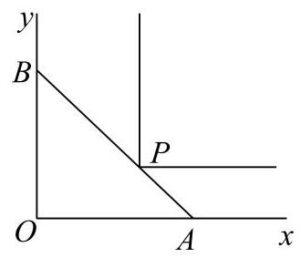

$y$

$P$

$B \; A$

O $x$

## 答案

4.16

解析

由题意可知, $d$ 的值为过点 $P$ 的线段 ${AB}$ 的最小值,设 $\angle {OAB} = \alpha  \in  \left( {0,\frac{\pi }{2}}\right)$ ,则可得 $f\left( \alpha \right)  = {AB} = \frac{1}{\sin \alpha } + \frac{2}{\cos \alpha }$ ，借助导数研究单调性即可得其最小值.

由题意可知, $d$ 的值为过点 $P$ 的线段 ${AB}$ 的最小值,

设 $\angle {OAB} = \alpha  \in  \left( {0,\frac{\pi }{2}}\right)$ ,则有 ${PA} = \frac{1}{\sin \alpha },{PB} = \frac{2}{\cos \alpha }$ ,则 ${AB} = \frac{1}{\sin \alpha } + \frac{2}{\cos \alpha }$ ,

设 $f\left( \alpha \right)  = \frac{1}{\sin \alpha } + \frac{2}{\cos \alpha },\alpha  \in  \left( {0,\frac{\pi }{2}}\right)$ ,

则 ${f}^{\prime }\left( \alpha \right)  = \frac{-\cos \alpha }{{\sin }^{2}\alpha } + \frac{2\sin \alpha }{{\cos }^{2}\alpha } = \frac{-{\cos }^{3}\alpha  + 2{\sin }^{3}\alpha }{{\sin }^{2}\alpha {\cos }^{2}\alpha } = \frac{{\left( \sqrt[3]{2}\sin \alpha \right) }^{3} - {\cos }^{3}\alpha }{{\sin }^{2}\alpha {\cos }^{2}\alpha }$

$= \frac{\left( {\sqrt[3]{2}\sin \alpha  - \cos \alpha }\right) \left( {\sqrt[3]{4}{\sin }^{2}\alpha  + \sqrt[3]{2}\sin \alpha \cos \alpha  + {\cos }^{2}\alpha }\right) }{{\sin }^{2}\alpha {\cos }^{2}\alpha },$

令 ${f}^{\prime }\left( {\alpha }_{0}\right)  = 0$ ,由 $\alpha  \in  \left( {0,\frac{\pi }{2}}\right)$ ,故有 $\sqrt[3]{2}\sin {\alpha }_{0} - \cos {\alpha }_{0} = 0$ ,

有 $\sqrt[3]{4}{\sin }^{2}{\alpha }_{0} = {\cos }^{2}{\alpha }_{0}$ ,即 $\left( {\sqrt[3]{4} + 1}\right) {\sin }^{2}{\alpha }_{0} = 1$ ,

则 $\sin {\alpha }_{0} = \frac{1}{\sqrt{\sqrt[3]{4} + 1}},\cos {\alpha }_{0} = \frac{\sqrt[3]{2}}{\sqrt{\sqrt[3]{4} + 1}}$ ,

当 $\alpha  \in  \left( {0,{\alpha }_{0}}\right)$ 时, ${f}^{\prime }\left( {\alpha }_{0}\right)  < 0$ ,当 $\alpha  \in  \left( {{\alpha }_{0},\frac{\pi }{2}}\right)$ 时, ${f}^{\prime }\left( {\alpha }_{0}\right)  > 0$ ,

$f\left( \alpha \right)$ 在 $\left( {0,{\alpha }_{0}}\right)$ 上单调递减,在 $\left( {{\alpha }_{0},\frac{\pi }{2}}\right)$ 上单调递增,

则 $f\left( \alpha \right)  \geq  f\left( {\alpha }_{0}\right)  = \frac{1}{\sin {\alpha }_{0}} + \frac{2}{\cos {\alpha }_{0}} = \sqrt{\sqrt[3]{4} + 1} + \frac{2\sqrt{\sqrt[3]{4} + 1}}{\sqrt[3]{2}} = {\left( {2}^{\frac{2}{3}} + 1\right) }^{\frac{3}{2}}$ ,

借助计算器可得 $f\left( {\alpha }_{0}\right)  = {\left( {2}^{\frac{2}{3}} + 1\right) }^{\frac{3}{2}} \approx  {4.16}$ .

故答案为:4.16.

关键点点睛:本题关键点构造函数，借助 $f\left( \alpha \right)  = \frac{1}{\sin \alpha } + \frac{2}{\cos \alpha }$ ，求出其在 $\alpha  \in  \left( {0,\frac{\pi }{2}}\right)$ 上的单调性以求其最小值即可得解.

## 一般

6. 嘉定某学习小组开展测量太阳高度角的数学活动. 太阳高度角是指某时刻太阳光线和地平面所成的角. 测量时, 假设太阳光线均为平行的直线, 地面为水平平面. 如图, 两竖直墙面所成的二面角为 ${120}^{ \circ  }$ , 墙的高度均为3米. 在时刻 $t$ ，实地测量得在太阳光线照射下的两面墙在地面的阴影宽度分别为1米、1.5米. 在线查阅嘉定的天文资料，当天的太阳高度角和对应时间的部分数据如表所示，则时刻 $t$ 最可能为( )

<table><tr><td>太阳高度角</td><td>时间</td><td>太阳高度角</td><td>时间</td></tr><tr><td>43.13°</td><td>08:30</td><td>68.53°</td><td>10:30</td></tr><tr><td>49.53°</td><td>09:00</td><td>74.49°</td><td>11:00</td></tr><tr><td>55.93°</td><td>09:30</td><td>79.60°</td><td>11:30</td></tr><tr><td>62.29°</td><td>10:00</td><td>82.00°</td><td>12:00</td></tr></table>

A. 09:00 B. 10:00

答案

B

解析

作出示意图形，在四边形 ${ABCD}$ 中利用正弦定理与余弦定理，算出四边形 ${ABCD}$ 的外接圆直径大小，然后在 Rt $\bigtriangleup {BDE}$ 中利用锐角三角函数定义，算出 $\angle {DBE}$ 的大小，即可得到本题的答案.

如图所示，

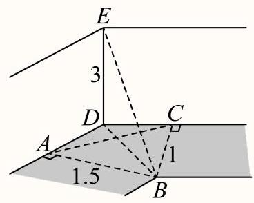

设两竖直墙面的交线为 ${DE}$ ，点 $E$ 被太阳光照射在地面上的影子为点 $B$ ，

点 $A, C$ 分别是点 $B$ 在两条墙脚线上的射影,连接 ${AC},{BD},{BE}$ ,

由题意可知 $\angle {DBE}$ 就是太阳高度角.

$\because$ 四边形 ${ABCD}$ 中, $\angle {BAD} = \angle {BCD} = {90}^{ \circ  },\angle {ADC} = {120}^{ \circ  }$ ,

$\therefore \angle {ABC} = {360}^{ \circ  } - \left( {\angle {BAD} + \angle {BCD} + \angle {ADC}}\right)  = {60}^{ \circ  }$ ,

$\therefore \bigtriangleup {ABC}$ 中, $A{C}^{2} = A{B}^{2} + B{C}^{2} - {2AB} \cdot  {BC}\cos {60}^{ \circ  } = {1.5}^{2} + {1}^{2} - 2 \times  {1.5} \times  1 \times  \frac{1}{2} = {1.75}$ , 可得 ${AC} = \sqrt{1.75} \approx  {1.32}$ ,

$\because$ 四边形 ${ABCD}$ 是圆内接四边形, ${BD}$ 是其外接圆直径,

$\therefore$ 设 $\bigtriangleup {ABC}$ 的外接圆半径为 $R$ ，则 ${BD} = {2R} = \frac{AC}{\sin {60}^{ \circ  }} \approx  {1.53}$ ，

在 Rt $\bigtriangleup {BDE}$ 中， $\tan \angle {DBE} = \frac{ED}{BD} = \frac{3}{1.53} \approx  {1.96}$ ,

所以 $\angle {DBE} = \arctan {1.96} \approx  {63.02}^{ \circ  }$ ,

对照题中表格，可知时刻 $t = {10} : {00}$ 时，太阳高度角为 ${62.29}^{ \circ  }$ ，与 ${63.02}^{ \circ  }$ 最接近.

故选: B.

## 较易

7. 太阳高度角是太阳光线与地面所成的角(即太阳在当地的仰角). 设地球表面某地正午太阳高度角为 $\theta$ ， $\delta$ 为此时太阳直射点纬度， $\varphi$ 为当地纬度值，那么这三个量满足 $\theta  = {90}^{ \circ  } - \left| {\varphi  - \delta }\right|$ . 通州区某校学生科技社团尝试估测通州区当地纬度值( $\varphi$ 取正值)，选择春分当日( $\delta  = {0}^{ \circ  }$ )测算正午太阳高度角. 他们将长度为1米的木杆垂直立于地面， 测量木杆的影长. 分为甲、乙、丙、丁四个小组在同一场地进行, 测量结果如下:

<table><tr><td>组别</td><td>甲组</td><td>乙组</td><td>丙组</td><td>丁组</td></tr><tr><td>木杆影长度(米)</td><td>0.82</td><td>0.80</td><td>0.83</td><td>0.85</td></tr></table>

则四组中对通州区当地纬度估测值最大的一组是( )

A. 甲组 B. 乙组 C. 丙组

答案

D

解析

根据题意得到 $\varphi  = {90}^{ \circ  } - \theta$ ,设木杆的影长为 $m$ ,得到 $\tan \theta  = \frac{1}{m}$ ,根据表格中的数据得到当 $m = {0.85}$ 时, $\theta$ 取得最小值，此时 $\varphi$ 求得最大值，即可求解.

如图所示，地球表面某地正午太阳高度角为 $\theta$ ， $\delta$ 为此时太阳直射点纬度， $\varphi$ 为当地纬度值，那么这三个量满足 $\theta  = {90}^{ \circ  } - \left| {\varphi  - \delta }\right| ,$

当 $\delta  = {0}^{ \circ  }$ 且 $\varphi$ 为正值，可得 $\theta  = {90}^{ \circ  } - \varphi$ ，即 $\varphi  = {90}^{ \circ  } - \theta$ ，

设木杆的影长为 $m$ ,可得 $\tan \theta  = \frac{1}{m}$ ,

因为甲、乙、丙、丁四个小组在同一场地进行，得到影长分别为0.82,0.80,0.83,0.85,

所以当 $m = {0.85}$ 时, $\theta$ 取得最小值,此时 $\varphi$ 求得最大值,

所以四组中对通州区当地纬度估测值最大的一组是丁组.

故选: D.

较易

8. 已知 $\overrightarrow{OA} = \left( {{x}_{1},{y}_{1}}\right) ,\overrightarrow{OB} = \left( {{x}_{2},{y}_{2}}\right)$ ，且 $\overrightarrow{OA}$ 、 $\overrightarrow{OB}$ 不共线，则 $\bigtriangleup  {OAB}$ 的面积为( )

A. $\frac{1}{2}\left| {{x}_{1}{x}_{2} - {y}_{1}{y}_{2}}\right|$ B. $\frac{1}{2}\left| {{x}_{1}{y}_{2} - {x}_{2}{y}_{1}}\right|$ C. $\frac{1}{2}\left| {{x}_{1}{x}_{2} + {y}_{1}{y}_{2}}\right|$ D. $\frac{1}{2}\left| {{x}_{1}{y}_{2} + {x}_{2}{y}_{1}}\right|$

## 答案

B

解析

利用向量的数量积写出其夹角的表达式, 结合同角三角函数的平方式以及三角形的面积公式, 可得答案.

设 $\overrightarrow{OA}$ 与 $\overrightarrow{OB}$ 的夹角为 $\theta$ ,由 $\overrightarrow{OA} \cdot  \overrightarrow{OB} = \left| \overrightarrow{OA}\right| \left| \overrightarrow{OB}\right| \cos \theta$ ,则 $\cos \theta  = \frac{\overrightarrow{OA} \cdot  \overrightarrow{OB}}{\left| \overrightarrow{OA}\right| \left| \overrightarrow{OB}\right| } = \frac{{x}_{1}{x}_{2} + {y}_{1}{y}_{2}}{\sqrt{{x}_{1}^{2} + {y}_{1}^{2}}\sqrt{{x}_{2}^{2} + {y}_{2}^{2}}}$ ,

由 $\sin \theta  = \sqrt{1 - {\cos }^{2}\theta } = \frac{\left| {x}_{1}{y}_{2} - {x}_{2}{y}_{1}\right| }{\sqrt{{x}_{1}^{2} + {y}_{2}^{2}}\sqrt{{x}_{2}^{2} + {y}_{2}^{2}}}$ ,则 ${S}_{\bigtriangleup {ABO}} = \frac{1}{2}\left| \overrightarrow{OA}\right| \left| \overrightarrow{OB}\right| \sin \theta  = \frac{1}{2}\left| {{x}_{1}{y}_{2} - {x}_{2}{y}_{1}}\right|$ . 故选: B.

## 较难

9. 如图所示，已知 $\bigtriangleup  {ABC}$ 满足 ${BC} = 8,{AC} = {3AB}$ ， $P$ 为 $\bigtriangleup  {ABC}$ 所在平面内一点. 定义点集 $D = \left\{  {P\left| {\;\overrightarrow{AP} = {3\lambda }\overrightarrow{AB} + \frac{1 - \lambda }{3}\overrightarrow{AC}}\right. ,\lambda  \in  \mathbf{R}}\right\}$ . 若存在点 ${P}_{0} \in  D$ ,使得对任意 $P \in  D$ ,满足 $\left| \overrightarrow{AP}\right|  \geq  \left| \overrightarrow{A{P}_{0}}\right|$ 恒成立,则 $\left| \overrightarrow{A{P}_{0}}\right|$ 的最大值为

答案

3

解析

延长 ${AB}$ 到 $M$ 满足 $\overrightarrow{AM} = 3\overrightarrow{AB}$ ,取 ${AC}$ 的靠近 $A$ 的三等分点 $N$ ,连接 ${MN}$ ,由向量共线定理得 $P, M, N$ 三点共线,从而 $\left| {A{P}_{0}}\right|$ 表示 $\bigtriangleup {AMN}$ 的边 ${MN}$ 上的高,利用正弦定理求得 $\bigtriangleup {AMN}$ 的面积的最大值,从而可得结论. 延长 ${AB}$ 到 $M$ 满足 $\overrightarrow{AM} = 3\overrightarrow{AB}$ ，取 ${AC}$ 的靠近 $A$ 的三等分点 $N$ ，连接 ${MN}$ ，如图，

$\overrightarrow{AP} = {3\lambda }\overrightarrow{AB} + \frac{1 - \lambda }{3}\overrightarrow{AC} = \lambda  \cdot  3\overrightarrow{AB} + \left( {1 - \lambda }\right) \frac{\overrightarrow{AC}}{3} = \lambda \overrightarrow{AM} + \left( {1 - \lambda }\right) \overrightarrow{AN},$

所以 $P, M, N$ 三点共线,

又存在点 ${P}_{0} \in  D$ ,使得对任意 $P \in  D$ ,满足 $\left| \overrightarrow{AP}\right|  \geq  \left| \overrightarrow{A{P}_{0}}\right|$ 恒成立,则 $A{P}_{0}$ 的长表示 $A$ 到直线 ${MN}$ 的距离,即 $\bigtriangleup {AMN}$ 的边 ${MN}$ 上的高，设 $\left| {A{P}_{0}}\right|  = h$ ，

由 $\left| {AC}\right|  = 3\left| {AB}\right|$ 得 $\left| {AC}\right|  = \left| {AM}\right|$ ， $\left| {AB}\right|  = \left| {AN}\right|$ ， $\angle A$ 公用，因此 $\bigtriangleup {ABC} \cong  \bigtriangleup {ANM}$ ，

所以 $\left| {MN}\right|  = \left| {BC}\right|  = 8$ ,

$\bigtriangleup {AMN}$ 中,设 $\angle {ANM} = \theta$ ,由正弦定理得 $\frac{\left| AM\right| }{\sin \theta } = \frac{\left| AN\right| }{\sin M} = \frac{\left| MN\right| }{\sin A},\angle {MAN}$ 记为角 $A$ , 所以 $\sin \theta  = 3\sin M,\left| {AM}\right|  = \frac{8\sin \theta }{\sin A},\left| {AN}\right|  = \frac{8\sin M}{\sin A}$ , 所以 ${S}_{\bigtriangleup {ABC}} = {S}_{\bigtriangleup {AMN}} = \frac{1}{2}\left| {AM}\right| \left| {AN}\right| \sin A = \frac{{32}\sin \theta \sin M}{\sin A} = \frac{{96}{\sin }^{2}M}{\sin \left( {M + \theta }\right) } \; = \frac{{96}{\sin }^{2}M}{\sin M\cos \theta  + \cos M\sin \theta } = \frac{{96}{\sin }^{2}M}{\sin M\cos \theta  + 3\cos M\sin M} = \frac{{96}\sin M}{\cos \theta  + 3\cos M},$ 若 $\theta$ 不是钝角,则 ${S}_{\bigtriangleup {ABC}} = \frac{{96}\sin M}{\sqrt{1 - {\sin }^{2}\theta } + 3\sqrt{1 - {\sin }^{2}M}} = \frac{{96}\sin M}{\sqrt{1 - 9{\sin }^{2}M} + \sqrt{9 - 9{\sin }^{2}M}},$ 又 $\sin \theta  = 3\sin M \leq  1$ ,所以 $\sin M \leq  \frac{1}{3}$ ,即 $0 < \sin M \leq  \frac{1}{3}$ ,

所以 ${S}_{\bigtriangleup {ABC}} = \frac{96}{\sqrt{\frac{1}{{\sin }^{2}M} - 9} + 3\sqrt{\frac{1}{{\sin }^{2}M} - 1}}$ ,

设 $t = \frac{1}{{\sin }^{2}M}$ ,则 $t \geq  9,{S}_{\bigtriangleup {ABC}} = \frac{96}{\sqrt{t - 9} + 3\sqrt{t - 1}}$ ,它是减函数,

所以 $t = 9$ 时, ${\left( {S}_{\bigtriangleup {ABC}}\right) }_{\max } = 8\sqrt{2}$ ,

若 $\theta$ 是钝角，则

设 $t = \frac{1}{{\sin }^{2}M}$ ,则 $t \geq  9,{S}_{\bigtriangleup {ABC}} = \frac{96}{3\sqrt{t - 1} - \sqrt{t - 9}}$ ,

令 $f\left( t\right)  = 3\sqrt{t - 1} - \sqrt{t - 9}$ ,则 ${f}^{\prime }\left( t\right)  = \frac{3}{2\sqrt{t - 1}} - \frac{1}{2\sqrt{t - 9}} = \frac{3\sqrt{t - 9} - \sqrt{t - 1}}{2\sqrt{\left( {t - 1}\right) \left( {t - 9}\right) }}$ ,

${f}^{\prime }\left( t\right)  = 0 \Rightarrow  t = {10},$

$9 \leq  t < {10}$ 时， ${f}^{\prime }\left( t\right)  < 0$ ， $f\left( t\right)$ 递减， $t > 9$ 时 ${f}^{\prime }\left( t\right)  > 0$ ， $f\left( t\right)$ 递增，

所以 $t = {10}$ 时， $f{\left( t\right) }_{\min } = 8$ ， $\left( {S}_{\bigtriangleup {ABC}}\right)  = {12}$ ，

综上， $\left( {S}_{\bigtriangleup {ABC}}\right)  = {12}$ ，

此时 ${h}_{\max } = \frac{2{S}_{\bigtriangleup {AMN}}}{\left| MN\right| } = 3$ .

故答案为: 3 .

方法点睛:本题考查向量的线性运算，考查三角形的面积，解题方法其一是根据向量共线定理得出 $P$ 点在一条直线, 问题转化为求三角形高的最大值, 从而求三角形面积的最大值, 解题方法其二是利用正弦定理求三角形的面积，本题中注意在用平方关系转化时，需要根据 $\angle {ANM}$ 是否为钝角分类讨论，才能正确求解(本题用海伦公式求三角形的面积方法较简便).

## 一般

10. 某街道规划建一座口袋公园. 如图所示，公园由扇形 ${AOC}$ 区域和三角形 ${COD}$ 区域组成. 其中 $A$ 、 $O$ 、 $D$ 三点共线,扇形半径 ${OA}$ 为 30 米. 规划口袋公园建成后,扇形 ${AOC}$ 区域将作为花草展示区,三角形 ${COD}$ 区域作为亲水平台区, 两个区域的所有边界修建休闲步道.

(1) 若 $\angle {AOC} = \frac{\pi }{3},{OD} = {2OA}$ ，求休闲步道总长(精确到米)；

(2)若 $\angle {ODC} = \frac{\pi }{6}$ ，在前期民意调查时发现，绝大部分街道居民对亲水平台区更感兴趣. 请你根据民意调查情

况,从该区域面积最大或周长最长的视角出发,选择其中一个方案,设计三角形 ${COD}$ 的形状.

## 答案

(1) ${120} + {30}\sqrt{7} + {10\pi }\left( \mathrm{m}\right)$

(2)答案见解析

解析

(1)解:由题意知， ${OA} = {{30}\mathrm{\;m}}$ ，所以 ${OD} = {2OA} = {{60}\mathrm{m}}$ ， ${OC} = {OA} = {{30}\mathrm{m}}$ ， 因为 $\angle {AOC} = \frac{\pi }{3}$ ，所以 $\angle {COD} = \frac{2\pi }{3}$ ， 在 $\bigtriangleup {COD}$ 中，由余弦定理得 $C{D}^{2} = O{C}^{2} + O{D}^{2} - {2OC} \cdot  {OD}\cos \angle {COD} \; = {30}^{2} + {60}^{2} - 2 \times  {30} \times  {60} \times  \cos \frac{2\pi }{3} = {900} + {3600} + 2 \times  {30} \times  {60} \times  \frac{1}{2} = {6300}$ , 所以 ${CD} = {30}\sqrt{7}$ ，又由弧长公式，可得 $\overset{\text{ ⏜ }}{AC}$ 的长 $l = \frac{\pi }{3} \times  {30} = {10\pi }\left( \mathrm{\;m}\right)$ ， 所以总周长为: ${OA} + {OC} +  + {OD} + {CD} + l = {30} + {30} + {60} + {30}\sqrt{7} + {10\pi } = {120} + {30}\sqrt{7} + {10\pi }\left( \mathrm{\;m}\right)$ .

(2)解:若选择面积最小:

设 $\angle {COD} = \theta$ ,因为 $\angle {ODC} = \frac{\pi }{6}$ ,可得 $\angle {OCD} = \frac{5\pi }{6} - \theta$ ,

由正弦定理知 $\frac{OD}{\sin \angle {OCD}} = \frac{CD}{\sin \angle {DOC}} = \frac{OC}{\sin \angle {ODC}} = \frac{30}{\sin \frac{\pi }{6}} = {60}$ ,

所以 ${OD} = {60}\sin \angle {OCD} = {60}\sin \left( {\frac{5\pi }{6} - \theta }\right)  = {30}\cos \theta  + {30}\sqrt{3}\sin \theta$ ，

${DC} = {60}\sin \angle {COD} = {60}\sin \theta ,$

所以 ${S}_{\bigtriangleup {COD}} = \frac{1}{2}{OD} \cdot  {DC}\sin \angle {ODC} = \frac{1}{2}\left( {{30}\cos \theta  + {30}\sqrt{3}\sin \theta }\right)  \cdot  {60}\sin \theta  \times  \frac{1}{2}$

$= {450}\sin \theta \cos \theta  + {450}\sqrt{3}{\sin }^{2}\theta  = {225}\sin {2\theta } + {225}\sqrt{3}\left( {1 - \cos {2\theta }}\right)$

$= {225}\left( {\sin {2\theta } - \sqrt{3}\cos {2\theta }}\right)  + {225}\sqrt{3} = {450} \cdot  \left( {\frac{1}{2}\sin {2\theta } - \frac{\sqrt{3}}{2}\cos {2\theta }}\right)  + {225}\sqrt{3}$

$= {450}\sin \left( {{2\theta } - \frac{\pi }{3}}\right)  + {225}\sqrt{3},$

因为 $0 < \theta  < \frac{5\pi }{6}$ ，所以 $- \frac{\pi }{3} < {2\theta } - \frac{\pi }{3} < \frac{4\pi }{3}$ ，

所以,当 ${2\theta } - \frac{\pi }{3} = \frac{\pi }{2}$ 时,即 $\theta  = \frac{5\pi }{12}$ 时,面积取得最大值,最大值为 ${450} + {225}\sqrt{3}\left( {\mathrm{\;m}}^{2}\right)$ ,

又因为 $\sin \frac{5\pi }{12} = \sin \left( {\frac{\pi }{6} + \frac{\pi }{4}}\right)  = \frac{1}{2} \times  \frac{\sqrt{2}}{2} + \frac{\sqrt{3}}{2} \times  \frac{\sqrt{2}}{2} = \frac{\sqrt{6} + \sqrt{2}}{4}$ ,

$\cos \frac{5\pi }{12} = \cos \left( {\frac{\pi }{6} + \frac{\pi }{4}}\right)  = \frac{\sqrt{3}}{2} \times  \frac{\sqrt{2}}{2} - \frac{1}{2} \times  \frac{\sqrt{2}}{2} = \frac{\sqrt{6} - \sqrt{2}}{4},$

所以 ${OD} = {60}\sin \frac{5\pi }{12} = {15}\left( {\sqrt{6} + \sqrt{2}}\right) ,{DC} = {60}\sin \frac{5\pi }{12} = {15}\left( {\sqrt{6} + \sqrt{2}}\right)$ .

若选择周长最长:

设 $\angle {COD} = \theta$ ,因为 $\angle {ODC} = \frac{\pi }{6}$ ,可得 $\angle {OCD} = \frac{5\pi }{6} - \theta$ ,

由正弦定理知 $\frac{OD}{\sin \angle {OCD}} = \frac{CD}{\sin \angle {DOC}} = \frac{OC}{\sin \angle {ODC}} = \frac{30}{\sin \frac{\pi }{6}} = {60}$ ,

所以 ${OD} = {60}\sin \angle {OCD} = {60}\sin \left( {\frac{5\pi }{6} - \theta }\right)  = {30}\cos \theta  + {30}\sqrt{3}\sin \theta$ ,

${DC} = {60}\sin \angle {COD} = {60}\sin \theta ,$

则 $\bigtriangleup  {COD}$ 的周长为 $L = {OC} + {OD} + {CD} = {30} + {30}\cos \theta  + {30}\sqrt{3}\sin \theta  + {60}\sin \theta$

4\\left[3](left|\\left(\\sqrt\{3\}+2\\right)\\sin \\theta + \\cos \\theta \\right]=30+30\\left|\\sqrt\{8+4\\sqrt\{3\})\\left(\\dfrac \{\\sqrt\{3\}+

$= {30} + {30}\sqrt{8 + 4\sqrt{3}}\sin \left( {\theta  + \varphi }\right)  = {30} + {60}\sqrt{2 + \sqrt{3}}\sin \left( {\theta  + \varphi }\right) ,$

其中 $\tan \varphi  = \frac{1}{\sqrt{3} + 2} = 2 - \sqrt{3}$ ,

因为 $\sin \left( {\theta  + \varphi }\right)$ 的最大值为 1，所以 $\bigtriangleup  {COD}$ 的周长的最大值为

${30} + {60}\sqrt{2 + \sqrt{3}} = {30} + {30}\sqrt{2} \times  \sqrt{{\left( \sqrt{3} + 1\right) }^{2}} = {30} + {30}\sqrt{6} + {30}\sqrt{2},$

即 $\theta  + \varphi  = \frac{\pi }{2}$ 时,即 $\theta  = \frac{\pi }{2} - \varphi$ 时,

所以 $\sin \theta  = \sin \left( {\frac{\pi }{2} - \varphi }\right)  = \cos \varphi  = \frac{\sqrt{3} + 2}{\sqrt{8 + 4\sqrt{3}}} = \frac{\sqrt{2 + \sqrt{3}}}{2} = \frac{\sqrt{6} + \sqrt{2}}{4}$ 时,

$\bigtriangleup  {COD}$ 的周长的最大值为 ${30} + {60}\sqrt{2 + \sqrt{3}}{30} + {30}\sqrt{6} + {30}\sqrt{2}$ .

## 较难

11. 某公园的一个角形区域 ${AOB}$ 如图所示,其中 $\angle {AOB} = \frac{2\pi }{3}$ . 现拟用长度为 100 米的隔离档板 (折线 ${DCE}$ ) 与部分围墙(折线 ${DOE}$ )围成一个花卉育苗区 ${ODCE}$ ，要求满足 ${OD} = {OC} = {OE}$ .

(1)设 $\angle {DOC} = \frac{\pi }{3} + \alpha \left( {-\frac{\pi }{3} < \alpha  < \frac{\pi }{3}}\right)$ ，试用 $\alpha$ 表示 ${OD}$ ；

(2)为使花卉育苗区的面积最大，应如何设计？请说明理由.

② 答案

(1) $\frac{50}{\cos \frac{\alpha }{2}}$

(2) 当 $\angle {DOC} = \angle {EOC} = \frac{\pi }{3},{OD} = {OC} = {OE} = {50}$ 时,花卉育苗区的面积最大,最大为 ${1250}\sqrt{3}$ .

解析

(1) $\because \angle {DOC} = \frac{\pi }{3} + \alpha \left( {-\frac{\pi }{3} < \alpha  < \frac{\pi }{3}}\right) ,\angle {AOB} = \frac{2\pi }{3}$ ,

$\therefore \angle {OCD} = \frac{\pi  - \left( {\frac{\pi }{3} + \alpha }\right) }{2} = \frac{\pi }{3} - \frac{\alpha }{2},\angle {EOC} = \frac{2\pi }{3} - \left( {\frac{\pi }{3} + \alpha }\right)  = \frac{\pi }{3} - \alpha$ ，

$\angle {OCE} = \frac{\pi  - \left( {\frac{\pi }{3} - \alpha }\right) }{2} = \frac{\pi }{3} + \frac{\alpha }{2},$

设 ${OD} = a,{CD} = b$ ,则 ${OE} = a,{CE} = {100} - b$ ,

则 $\frac{a}{\sin \left( {\frac{\pi }{3} - \frac{\alpha }{2}}\right) } = \frac{b}{\sin \left( {\frac{\pi }{3} + \alpha }\right) },\frac{a}{\sin \left( {\frac{\pi }{3} + \frac{\alpha }{2}}\right) } = \frac{{100} - b}{\sin \left( {\frac{\pi }{3} - \alpha }\right) }$ ,

则 $b = \frac{a\sin \left( {\frac{\pi }{3} + \alpha }\right) }{\sin \left( {\frac{\pi }{3} - \frac{\alpha }{2}}\right) }$ ,则 $\frac{a}{\sin \left( {\frac{\pi }{3} + \frac{\alpha }{2}}\right) } = \frac{{100} - \frac{a\sin \left( {\frac{\pi }{3} + \alpha }\right) }{\sin \left( {\frac{\pi }{3} - \frac{\alpha }{2}}\right) }}{\sin \left( {\frac{\pi }{3} - \alpha }\right) }$ ,

即 $\frac{a\sin \left( {\frac{\pi }{3} - \alpha }\right) }{\sin \left( {\frac{\pi }{3} + \frac{\alpha }{2}}\right) } = {100} - \frac{a\sin \left( {\frac{\pi }{3} + \alpha }\right) }{\sin \left( {\frac{\pi }{3} - \frac{\alpha }{2}}\right) }$ ,

即 $\frac{\sin \left( {\frac{\pi }{3} - \alpha }\right) }{\sin \left( {\frac{\pi }{3} + \frac{\alpha }{2}}\right) } + \frac{\sin \left( {\frac{\pi }{3} + \alpha }\right) }{\sin \left( {\frac{\pi }{3} - \frac{\alpha }{2}}\right) } = \frac{100}{a}$

则 $\frac{\sin \frac{\pi }{3}\cos \alpha  - \cos \frac{\pi }{3}\sin \alpha }{\sin \frac{\pi }{3}\cos \frac{\alpha }{2} + \cos \frac{\pi }{3}\sin \frac{\alpha }{2}} + \frac{\sin \frac{\pi }{3}\cos \alpha  + \cos \frac{\pi }{3}\sin \alpha }{\sin \frac{\pi }{3}\cos \frac{\alpha }{2} - \cos \frac{\pi }{3}\sin \frac{\alpha }{2}} = \frac{100}{a}$ ,

则 $\frac{\frac{\sqrt{3}}{2}\cos \alpha  - \frac{1}{2}\sin \alpha }{\frac{\sqrt{3}}{2}\cos \frac{\alpha }{2} + \frac{1}{2}\sin \frac{\alpha }{2}} + \frac{\frac{\sqrt{3}}{2}\cos \alpha  + \frac{1}{2}\sin \alpha }{\frac{\sqrt{3}}{2}\cos \frac{\alpha }{2} - \frac{1}{2}\sin \frac{\alpha }{2}} = \frac{100}{a}$ ,

则

$$
\frac{\left( {\frac{\sqrt{3}}{2}\cos \alpha  - \frac{1}{2}\sin \alpha }\right) \left( {\frac{\sqrt{3}}{2}\cos \frac{\alpha }{2} - \frac{1}{2}\sin \frac{\alpha }{2}}\right) }{\left( {\frac{\sqrt{3}}{2}\cos \frac{\alpha }{2} + \frac{1}{2}\sin \frac{\alpha }{2}}\right) \left( {\frac{\sqrt{3}}{2}\cos \frac{\alpha }{2} - \frac{1}{2}\sin \frac{\alpha }{2}}\right) } + \frac{\left( {\frac{\sqrt{3}}{2}\cos \alpha  + \frac{1}{2}\sin \alpha }\right) \left( {\frac{\sqrt{3}}{2}\cos \frac{\alpha }{2} + \frac{1}{2}\sin \frac{\alpha }{2}}\right) }{\left( {\frac{\sqrt{3}}{2}\cos \frac{\alpha }{2} + \frac{1}{2}\sin \frac{\alpha }{2}}\right) \left( {\frac{\sqrt{3}}{2}\cos \frac{\alpha }{2} - \frac{1}{2}\sin \frac{\alpha }{2}}\right) } =
$$

$\frac{100}{a}$

则

$\frac{\frac{3}{4}\cos \alpha \cos \frac{\alpha }{2} - \frac{\sqrt{3}}{4}\cos \alpha \sin \frac{\alpha }{2} - \frac{\sqrt{3}}{4}\sin \alpha \cos \frac{\alpha }{2} + \frac{1}{4}\sin \alpha \sin \frac{\alpha }{2}}{{\left( \frac{\sqrt{3}}{2}\cos \frac{\alpha }{2}\right) }^{2} - {\left( \frac{1}{2}\sin \frac{\alpha }{2}\right) }^{2}} +$

$\frac{\frac{3}{4}\cos \alpha \cos \frac{\alpha }{2} + \frac{\sqrt{3}}{4}\cos \alpha \sin \frac{\alpha }{2} + \frac{\sqrt{3}}{4}\sin \alpha \cos \frac{\alpha }{2} + \frac{1}{4}\sin \alpha \sin \frac{\alpha }{2}}{{\left( \frac{\sqrt{3}}{2}\cos \frac{\alpha }{2}\right) }^{2} - {\left( \frac{1}{2}\sin \frac{\alpha }{2}\right) }^{2}} = \frac{100}{a}$

则 $\frac{\frac{3}{2}\cos \alpha \cos \frac{\alpha }{2} + \frac{1}{2}\sin \alpha \sin \frac{\alpha }{2}}{\frac{3}{4}{\cos }^{2}\frac{\alpha }{2} - \frac{1}{4}{\sin }^{2}\frac{\alpha }{2}} = \frac{100}{a}$ ,

则 $\frac{\cos \alpha \cos \frac{\alpha }{2} + \frac{1}{2}\left( {\cos \alpha \cos \frac{\alpha }{2} + \sin \alpha \sin \frac{\alpha }{2}}\right) }{\frac{3}{4} \times  \frac{1 + \cos \alpha }{2} - \frac{1}{4} \times  \frac{1 - \cos \alpha }{2}} = \frac{100}{a}$ ,

则 $\frac{\frac{\cos \alpha \cos \frac{\alpha }{2} + \frac{1}{2}\cos \left( {\alpha  - \frac{\alpha }{2}}\right) }{3 + 3\cos \alpha } = \frac{100}{a}}{8}$ ,

则 $\frac{\cos \alpha \cos \frac{\alpha }{2} + \frac{1}{2}\cos \frac{\alpha }{2}}{\frac{3 + 3\cos \alpha  - 1 + \cos \alpha }{8}} = \frac{100}{a}$ ,

则 $\frac{8\cos \frac{\alpha }{2}\left( {\cos \alpha  + \frac{1}{2}}\right) }{2 + 4\cos \alpha } = \frac{100}{a}$ ,

则 $\frac{2\cos \frac{\alpha }{2}\left( {\cos \alpha  + \frac{1}{2}}\right) }{\left( \cos \alpha  + \frac{1}{2}\right) } = \frac{100}{a}$ ,

即 $2\cos \frac{\alpha }{2} = \frac{100}{a}$ ,即 $a = \frac{50}{\cos \frac{\alpha }{2}}$ ,

即 ${OD} = \frac{50}{\cos \frac{\alpha }{2}}$ .

(2) 设 $\angle {DOC} = \frac{\pi }{3} + \alpha \left( {-\frac{\pi }{3} < \alpha  < \frac{\pi }{3}}\right)$ ，

由 (1) 得 ${OD} = {OC} = {OE} = \frac{50}{\cos \frac{\alpha }{2}},\angle {EOC} = \frac{\pi }{3} - \alpha$

则 ${S}_{ODCE} = {S}_{\bigtriangleup {ODC}} + {S}_{\bigtriangleup {OEC}} = \frac{1}{2}{\left( \frac{50}{\cos \frac{\alpha }{2}}\right) }^{2}\sin \left( {\frac{\pi }{3} + \alpha }\right)  + \frac{1}{2}{\left( \frac{50}{\cos \frac{\alpha }{2}}\right) }^{2}\sin \left( {\frac{\pi }{3} - \alpha }\right)$ ,

$= \frac{2500}{\cos \alpha  + 1}\left( {\sin \frac{\pi }{3}\cos \alpha  + \cos \frac{\pi }{3}\sin \alpha  + \sin \frac{\pi }{3}\cos \alpha  - \cos \frac{\pi }{3}\sin \alpha }\right) ,$

$= \frac{2500}{\cos \alpha  + 1}\left( {2\sin \frac{\pi }{3}\cos \alpha }\right) ,$

$= \frac{{2500}\sqrt{3}\cos \alpha }{\cos \alpha  + 1}$

$= \frac{{2500}\sqrt{3}}{1 + \frac{1}{\cos \alpha }}$ ,

$\because  - \frac{\pi }{3} < \alpha  < \frac{\pi }{3},\therefore \cos \alpha  \in  \left( {\frac{1}{2},1}\right\rbrack$ ,

$\therefore \frac{{2500}\sqrt{3}}{1 + \frac{1}{\cos \alpha }} \in  \left( {\frac{{2500}\sqrt{3}}{3},{1250}\sqrt{3}}\right\rbrack$ ,

要使花卉育苗区的面积最大，则 $\cos \alpha  = 1$ ，即 $\alpha  = 0$ ，

故当 $\angle {DOC} = \angle {EOC} = \frac{\pi }{3},{OD} = {OC} = {OE} = {50}$ 时，花卉育苗区的面积最大，最大为 ${1250}\sqrt{3}$ .

## 一般

12. 如图，在直四棱柱 ${ABCD} - {A}_{1}{B}_{1}{C}_{1}{D}_{1}$ 中，底面 ${ABCD}$ 为菱形，且 $\angle {BAD} = {60}^{ \circ  }$ . 若 ${AB} = {A{A}_{1}} = 2$ ，点 $M$ 为棱 $C{C}_{1}$ 的中点，点 $P$ 在 ${A}_{1}B$ 上，则线段 ${PA},{PM}$ 的长度和的最小值为 .

答案

$\sqrt{9 + 2\sqrt{10}}$

解析

取 ${D}_{1}{C}_{1}$ 的中点 $N$ ,连接 ${MN}\text{ 、 }{A}_{1}N\text{ 、 }{BM}\text{ 、 }{D}_{1}C$ ,首先证明 ${A}_{1}B//{MN}$ ,即可 ${A}_{1}\text{ 、 }B\text{ 、 }M\text{ 、 }N$ 四点共面,连接 ${A}_{1}M,{A}_{1}{C}_{1}$ ,求出 $\angle {A}_{1}{BM} = {90}^{ \circ  }$ ,将 $\bigtriangleup {AB}{A}_{1}$ 绕 ${A}_{1}B$ 翻折,使得平面 ${AB}{A}_{1}$ 与平面 ${A}_{1}{BMN}$ 共面,连接 ${AM}$ 交 ${A}_{1}B$ 于点 $P$ ,最后利用余弦定理计算可得.

取 ${D}_{1}{C}_{1}$ 的中点 $N$ ,连接 ${MN}\text{ 、 }{A}_{1}N\text{ 、 }{BM}\text{ 、 }{D}_{1}C$ ,

因为点 $M$ 为棱 $C{C}_{1}$ 的中点,所以 ${MN}//{D}_{1}C$ ,又 ${A}_{1}{D}_{1}//{BC}$ 且 ${A}_{1}{D}_{1} = {BC}$ ,

所以 ${A}_{1}{D}_{1}{CB}$ 为平行四边形,所以 ${A}_{1}B//{D}_{1}C$ ,

所以 ${A}_{1}B//{MN}$ ,即 ${A}_{1}\text{ 、 }B\text{ 、 }M\text{ 、 }N$ 四点共面,连接 ${A}_{1}M,{A}_{1}{C}_{1}$ ,

则 ${A}_{1}B = \sqrt{{2}^{2} + {2}^{2}} = 2\sqrt{2},{BM} = \sqrt{{2}^{2} + {1}^{2}} = \sqrt{5}$ ,

因为底面 ${ABCD}$ 为菱形，且 $\angle {BAD} = {60}^{ \circ  }$ ，所以 $\angle {ADC} = {120}^{ \circ  }$ ，

所以 ${A}_{1}{C}_{1} = \sqrt{{2}^{2} + {2}^{2} - 2 \times  2 \times  2\cos {120}^{ \circ  }} = 2\sqrt{3}$ ,

所以 ${A}_{1}M = \sqrt{{\left( 2\sqrt{3}\right) }^{2} + {1}^{2}} = \sqrt{13}$ ,

所以 ${A}_{1}{B}^{2} + B{M}^{2} = {A}_{1}{M}^{2}$ ,即 ${A}_{1}B \bot  {BM}$ ,所以 $\angle {A}_{1}{BM} = {90}^{ \circ  }$ ,

将 $\bigtriangleup {AB}{A}_{1}$ 绕 ${A}_{1}B$ 翻折，使得平面 ${AB}{A}_{1}$ 与平面 ${A}_{1}{BMN}$ 共面，连接 ${AM}$ 交 ${A}_{1}B$ 于点 $P$ ，

则 ${PA} + {PM} \geq  {AM}$ ,

又 $\angle {ABM} = {135}^{ \circ  }$ ,

在 $\bigtriangleup {ABM}$ 中 $A{M}^{2} = A{B}^{2} + B{M}^{2} - {2AB} \cdot  {BM}\cos \angle {ABM}$ ,

即 $A{M}^{2} = {2}^{2} + {\left( \sqrt{5}\right) }^{2} - 2 \times  2 \times  \sqrt{5} \times  \left( {-\frac{\sqrt{2}}{2}}\right)  = 9 + 2\sqrt{10}$ ,

所以 ${AM} = \sqrt{9 + 2\sqrt{10}}$ ,

即线段 ${PA}\text{ 、 }{PM}$ 的长度和的最小值为 $\sqrt{9 + 2\sqrt{10}}$ .

故答案为: $\sqrt{9 + 2\sqrt{10}}$

お小题

## 一般

1. 小申同学观察发现，生活中有些时候影子可以完全投射在斜面上. 某斜面上有两根长为1米的垂直于水平面放置的杆子，与斜面的接触点分别为A、B，它们在阳光的照射下呈现出影子，阳光可视为平行光:其中一根杆子的影子在水平面上，长度为0.4米；另一根杆子的影子完全在斜面上，长度为0.45米. 则斜面的底角 $\theta  = \;$ . (结果用角度制表示，精确到 ${0.01}^{ \circ  }$ )

答案

${12.58}^{ \circ  }$

解析

先根据在 $A$ 处的旗杆算出阳光和水平面的夹角,然后结合 $B$ 处的旗杆算出斜面角.

如图,在 $A$ 处, $\tan x = \frac{1}{0.4} = {2.5}$ ,在 $B$ 处满足 $\tan \angle {CED} = {2.5}$ ,

(其中 ${ED}//$ 水平面, ${CE}$ 是射过 $B$ 处杆子最高点的光线,光线交斜面于 $E$ ),

故设 ${BD} = y$ ,则 ${ED} = \frac{1 + y}{2.5}$ ,

由勾股定理, ${y}^{2} + {\left( \frac{1 + y}{2.5}\right) }^{2} = {0.45}^{2}$ ,解得 $y \approx  {0.098}$ ,

于是 $\theta  = \arcsin \frac{0.098}{0.45} \approx  {12.58}^{ \circ  }$

故答案为: ${12.58}^{ \circ  }$

2. 如图,要在A和D两地之间修建一条笔直的隧道,现在从B地和C地测量得到: $\angle {DBC} = {24.2}^{ \circ  }$ , $\angle {DCB} = {35.4}^{ \circ  }$ , $\angle {DBA} = {31.6}^{ \circ  },\angle {DCA} = {17.5}^{ \circ  }$ . 试求 $\angle {DAB}$ 以确定隧道AD的方向. (结果精确到 ${0.1}^{ \circ  }$ )

## ② 答案

${52.5}^{ \circ  }$

解析

先设角再分别在三个三角形中应用正弦定理, 相乘后化简求值, 最后结合余切值求角.

由题可得 $\angle {BAC} = {180}^{ \circ  } - {24.2}^{ \circ  } - {35.4}^{ \circ  } - {31.6}^{ \circ  } - {17.5}^{ \circ  } = {73.1}^{ \circ  }$ ,

设 $\angle {DAB} = \theta$ ,则 $\angle {DAC} = {73.1}^{ \circ  } - \theta$ .

由题意,在 $\bigtriangleup {ADC}$ 中, $\frac{AD}{\sin {17.5}^{ \circ  }} = \frac{DC}{\sin \left( {{73.1}^{ \circ  } - \theta }\right) }$ ,

在 $\bigtriangleup {BDC}$ 中， $\frac{DC}{\sin {24.2}^{ \circ  }} = \frac{BD}{\sin {35.4}^{ \circ  }}$ ，

在 $\bigtriangleup {BDA}$ 中， $\frac{BD}{\sin \theta } = \frac{AD}{\sin {31.6}^{ \circ  }}$ ，

将上述三式相乘，得 $\sin  \sim  {17.5}^{ \circ  }\sin  \sim  {24.2}^{ \circ  }\sin  \sim  \theta  = \sin  \sim  \left( {{71.3}^{ \circ  } - \theta }\right) \sin  \sim  {35.4}^{ \circ  }\sin  \sim  {31.6}^{ \circ  }$ ，

从而有 $\sin  \sim  {17.5}^{ \circ  }\sin  \sim  {24.2}^{ \circ  } = \left( {\sin  \sim  {71.3}^{ \circ  }\cot \theta  - \cos  \sim  {71.3}^{ \circ  }}\right) \sin  \sim  {35.4}^{ \circ  }\sin  \sim  {31.6}^{ \circ  }$ ,

得 $\cot \theta  = \left( {\frac{\sin {17.5}^{ \circ  }\sin {24.2}^{ \circ  }}{\sin {35.4}^{ \circ  }\sin {31.6}^{ \circ  }} + \cos {71.3}^{ \circ  }}\right) \frac{1}{\sin {71.3}^{ \circ  }} \approx  {0.7672}$ ,

所以 $\angle {DAB} \approx  \operatorname{arccot}{0.7672} \approx  {52.5}^{ \circ  }$ .

## 较难

3. 10世纪阿拉伯天文学家阿尔·库希设计出一种方案，通过两个观察者异地同时观测同一颗流星来测定流星的高度. 如图，设有两个观察者在地球上A、B两地同时观察到一颗流星S，仰角分别是 $\alpha$ 和 $\beta$ ( ${MA}$ ， ${MB}$ 表示当地的地平线). 设 $\alpha  = {30}^{ \circ  },\beta  = {45}^{ \circ  },\overset{\text{ ⏜ }}{AB} = {500}\mathrm{\;{km}}$ ,地球的半径 $R = {6371}\mathrm{\;{km}}$ ,则流星的高度约为 $\;\mathrm{{km}}$ (精确到 $1\mathrm{\;{km}}$ ).

197

解析

利用正弦定理，结合三角函数恒等变换求解即可.

已知弧长 $l = \overset{\text{ ⏜ }}{AB} = {500}\mathrm{\;{km}}$ ,地球的半径 $R = {6371}\mathrm{\;{km}}$ ,设圆心角为 $\theta$ ,

则 $\theta  = \frac{l}{R} = \frac{500}{6371} \approx  {0.07848}\mathrm{{rad}} \approx  {4.5}^{ \circ  }$ ,

仰角 $\alpha  = {30}^{ \circ  },\beta  = {45}^{ \circ  }$ 是视线与地平线的夹角,而地平线垂直于地球半径,

$\therefore$ 视线与半径的夹角分别为 $\angle {OAS} = {90}^{ \circ  } + {30}^{ \circ  } = {120}^{ \circ  },\angle {OBS} = {90}^{ \circ  } + {45}^{ \circ  } = {135}^{ \circ  }$ ,

$\therefore \angle {ASB} = {360}^{ \circ  } - {120}^{ \circ  } - {135}^{ \circ  } - {4.5}^{ \circ  } = {100.5}^{ \circ  }$ ,

设 $h$ 为流星的高度，则地心到流星的距离 ${OS} = R + h$ ，

在 $\bigtriangleup {OAS}$ 中， $\frac{R + h}{\sin {120}^{ \circ  }} = \frac{R}{\sin \angle {OSA}}$ ①,

在 $\bigtriangleup {OBS}$ 中， $\frac{R + \dot{h}}{\sin {135}^{ \circ  }} = \frac{R}{\sin \angle {OSB}}$ ②,

且 $\angle {ASB} = \angle {OSA} + \angle {OSB} \approx  {100.5}^{ \circ  }$ ③,

设 $k = \frac{R}{R + h}$ ，由①可得 $\sin \angle {OSA} = k \cdot  \sin {120}^{ \circ  } = \frac{\sqrt{3}}{2}k$ ，

由②可得 $\sin \angle {OSB} = k \cdot  \sin {135}^{ \circ  } = \frac{\sqrt{2}}{2}k$ ，

由③可得 ${100.5}^{ \circ  } - \angle {OSA} = \angle {OSB} \Rightarrow  \sin \left( {{100.5}^{ \circ  } - \angle {OSA}}\right)  = \sin \angle {OSB}$ ，

$\therefore \sin {100.5}^{ \circ  }\cos \angle {OSA} - \cos {100.5}^{ \circ  }\sin \angle {OSA} = \frac{\sqrt{2}}{2}k,\because \sin {100.5}^{ \circ  } \approx  {0.983},\cos {100.5}^{ \circ  } \approx   - {0.182}$ ,

$\therefore \cos \angle {OSA} = \sqrt{1 - {\sin }^{2}\angle {OSA}} = \sqrt{1 - \frac{3}{4}{k}^{2}}$ ,

$\therefore {0.983}\sqrt{1 - \frac{3}{4}{k}^{2}} + {0.182} \times  \frac{\sqrt{3}}{2}k = \frac{\sqrt{2}}{2}k$ ,化简得 ${1.0265}{k}^{2} = {0.9664}$ ,解得 $k \approx  {0.97}$ ,

$\therefore {6371} + h = \frac{6371}{0.97} \approx  {6568}$ ,解得 $h \approx  {197}$ .

## 一般

4. 瀑布是庐山的一大奇观，唐代诗人李白曾在《望庐山瀑布中》写道:日照香炉生紫烟，遥看瀑布挂前川，飞流直下三千尺，疑是银河落九天.为了测量某个瀑布的实际高度, 某同学设计了如下测量方案: 沿一段水平山道步行至与瀑布底端在同一水平面时，在此位置测得瀑布顶端的仰角正切值为 $\frac{3}{2}$ ，沿山道继续走 ${20}\mathrm{\;m}$ ，测得瀑布顶端的仰角为 $\frac{\pi }{3}$ . 已知该同学沿山道行进的方向与他第一次望向瀑布底端的方向所成角为 $\frac{\pi }{3}$ .根据这位同学的测量数据，可知该瀑布的高度为___m；若第二次测量后，继续行进的山道有坡度，坡角大小为 $\frac{\pi }{4}$ ，且两段山道位于同一平面内， 若继续沿山道行进 ${20}\sqrt{2}\mathrm{m}$ ，则该同学望向瀑布顶端与底端的视角正切值为___. (此人身高忽略不计)

答案

60 ; 3

解析根据题意画出图形,设高度为 $h$ ,则可表示出 ${AC} = \frac{2}{3}h,{BC} = \frac{\sqrt{3}}{3}h$ ,在 $\bigtriangleup {ABC}$ 中利用余弦定理即可求出 $h$ 的值；由已知数据易知 ${CG} = {CA} = {40}$ ，则 ${EF} = {40}$ ，则可得到 $\tan \angle {DFE} = 1,\tan \angle {CFE} = \frac{1}{2}$ ,再由两角和的正切公式计算出结果.

如图，设瀑布顶端为 $D$ ，底端为 $C$ ，高为 $h$ ，

该同学第一次测量的位置为 $A$ ，第二次测量的位置为 $B$ ，

则 $\tan \angle {DAC} = \frac{3}{2},{AB} = {20},\angle {DBC} = \angle {CAB} = \frac{\pi }{3}$ ,

所以 ${AC} = \frac{2}{3}h,{BC} = \frac{\sqrt{3}}{3}h$ ，

在 $\bigtriangleup {ABC}$ 中由余弦定理可知: $B{C}^{2} = A{C}^{2} + A{B}^{2} - {2AC} \cdot  {AB} \cdot  \cos \angle {CAB}$

即 $\frac{{h}^{2}}{3} = \frac{4}{9}{h}^{2} + {400} - 2 \times  \frac{2}{3}h \times  {20} \times  \frac{1}{2}$ ,

解得: $h = {60}$ ;

如图,两段山道为 ${BF}$ ,过 $F$ 作 ${FE} \bot  {CD}$ 于点 $E$ ,

由题意知: $\angle {FBG} = \frac{\pi }{4},{BF} = {20}\sqrt{2}$ ,

所以 ${BG} = {FG} = {20}$ ，

在 $\bigtriangleup {ABC}$ 中 ${AC} = {40},{BC} = {20}\sqrt{3}$ , ${AB} = {20}$ ,即 $A{B}^{2} + B{C}^{2} = A{C}^{2}$ ,

所以 ${CB}\bot {BG}$ ,

所以 ${CG} = \sqrt{C{B}^{2} + B{G}^{2}} = {40}$ ,

所以 ${EF} = {CG} = {40}$ ，

又 ${EC} = {FG} = {20}$ ,

所以 ${DE} = {40}$ ,

$\tan \angle {DFE} = \frac{DE}{EF} = 1,\tan \angle {CFE} = \frac{CE}{EF} = \frac{1}{2},$

所以 $\tan \angle {DFC} = \tan \left( {\angle {DFE} + \angle {CFE}}\right)  = \frac{\tan \angle {DFE} + \tan \angle {CFE}}{1 - \tan \angle {DFE} \cdot  \tan \angle {CFE}} = \frac{1 + \frac{1}{2}}{1 - \frac{1}{2}} = 3$ .

故答案为: ${60};3$ .

较难

5. 如图所示，水平地面上插有两根杆子 ${AB}$ 和 ${CD},{AB}$ 所在直线垂直于地面且 ${AB} = 2$ 米， ${CD}$ 所在直线与地面斜交. 小明有一把卷尺. 他在某时刻分别测出杆子 ${AB}$ 和 ${CD}$ 在阳光下影子的长度,称为一次操作. 小明可以在白天的不同时刻进行多次操作. 假设阳光为平行光，正午时分 ${AB}$ 的影子长度为 0 . 则下列说法正确的是( )

A. 为求出 ${CD}$ 的长度，小明至少需要进行2次操作 B. 为求出 ${CD}$ 的长度，小明至少需要进行3次操作

C. 为求出 ${CD}$ 的长度，小明至少需要进行4次操作 D. 无论进行多少次操作，小明都不能求出 ${CD}$ 的长度

答案

B

解析

建立坐标系,得到 $\left| {CD}\right|  = \sqrt{{a}^{2} + {b}^{2} + {h}^{2}}$ ,根据条件列出方程 ${n}^{2} = {\left( a + \frac{hm}{2}\right) }^{2} + {b}^{2}$ 其中 $m, n$ 分别已知量, $a, b, h$ 是三个未知量，需要列三元三次方程组才可求解，所以需要测量三次.

设点 $B$ 在地面的影子为 ${B}_{1}$ ，点 $C$ 在地面的影子为 ${C}_{1}$ ，杆子 ${AB}$ 影子的长度为 $m$ ，杆子 ${CD}$ 影子的长度为 $n$ ； 因为 ${AB}$ 垂直于地面，如图以 $A$ 为原点，地面为 ${xoy}$ 平面， $A{B}_{1}$ 为 $x$ 轴， ${AB}$ 为 $z$ 轴建立空间直角坐标系，则 $A\left( {0,0,0}\right) , B\left( {0,0,2}\right) ,{B}_{1}\left( {m,0,0}\right)$ ,设 $D\left( {{x}_{1},{y}_{1},0}\right) , C\left( {{x}_{2},{y}_{2}, h}\right)$ ,其中 $h$ 为 $C$ 到地面的高度.

定义 CD 的水平分量: 令 $a = {x}_{2} - {x}_{1}$ (x方向水平距离), $b = {y}_{2} - {y}_{1}$ (y方向水平距离)

由题可知 $a, b, h$ 为 3 个定值,则 $\left| {CD}\right|  = \sqrt{{a}^{2} + {b}^{2} + {h}^{2}}$

设点 ${C}_{1}\left( {x, y,0}\right)$ ,则 $\overrightarrow{B{B}_{1}} = \left( {m,0, - 2}\right) ,\overrightarrow{C{C}_{1}} = \left( {x - {x}_{2}, y - {y}_{2}, - h}\right)$

由于阳光为平行光,所以 $\overrightarrow{B{B}_{1}}//\overrightarrow{C{C}_{1}}$ ,所以 ${C}_{1}\left( {{x}_{2} + \frac{hm}{2},{y}_{2},0}\right)$ ,

则 $n = \left| {{C}_{1}D}\right|  = \sqrt{{\left( {x}_{2} + \frac{hm}{2} - {x}_{1}\right) }^{2} + {\left( {y}_{2} - {y}_{1}\right) }^{2} + {\left( 0 - 0\right) }^{2}}$

即 ${n}^{2} = {\left( {x}_{2} + \frac{hm}{2} - {x}_{1}\right) }^{2} + {\left( {y}_{2} - {y}_{1}\right) }^{2}$ ,即 ${n}^{2} = {\left( a + \frac{hm}{2}\right) }^{2} + {b}^{2}$ ,

方程 ${n}^{2} = {\left( a + \frac{hm}{2}\right) }^{2} + {b}^{2}$ 中 $a, b, h$ 为 3 个未知数,需要列三个方程才可求解,则需要测量三次.

故选: B

## 较难

6. 如图，某公司要在 $A$ 、 $B$ 两地连线上的定点 $C$ 处建造广告牌 ${CD}$ ，其中 $D$ 为顶端， ${AC}$ 长35米， ${CB}$ 长80米，设 $A\text{ 、 }B$ 在同一水平面上，从 $A$ 和 $B$ 看 $D$ 的仰角分别为 $\alpha$ 和 $\beta$ .

(1)设计中 ${CD}$ 是铅垂方向，若要求 $\alpha  \geq  {2\beta }$ ，问 ${CD}$ 的长至多为多少(结果精确到0.01米)？

(2)施工完成后. ${CD}$ 与铅垂方向有偏差，现在实测得 $\alpha  = {38.12}^{ \circ  },\beta  = {18.45}^{ \circ  }$ ,求 ${CD}$ 的长(结果精确到0.01 米) ?

## 4 答案

(1) $\left| {CD}\right|  \approx  {28.28}$ 米；(2) $\left| {CD}\right|  \approx  {26.93}$ 米.

解析

(1)由题得, $\because \alpha  \geq  {2\beta }$ ,且 $0 < {2\beta } \leq  \alpha  < \frac{\pi }{2},\therefore \tan \alpha  \geq  \tan {2\beta }$

即 $\frac{\left| CD\right| }{35} \geq  \frac{\frac{\left| CD\right| }{40}}{1 - \frac{{\left| CD\right| }^{2}}{6400}}$ ,解得, $\left| {CD}\right|  \leq  {20}\sqrt{2},\therefore \left| {CD}\right|  \approx  {28.28}$ 米

由题得, $\angle {ADB} = {180}^{ \circ  } - {38.12}^{ \circ  } - {18.45}^{ \circ  } = {123.43}^{ \circ  }$ ,

$\because \frac{{35} + {80}}{\sin {123.43}^{ \circ  }} = \frac{\left| AD\right| }{\sin {18.45}^{ \circ  }},\;\therefore \left| {AD}\right|  \approx  {43.61}$ 米

$\because {\left| CD\right| }^{2} = {35}^{2} + {\left| AD\right| }^{2} - 2 \cdot  {35} \cdot  \left| {AD}\right|  \cdot  \cos {38.12}^{ \circ  },\because \left| {CD}\right|  \approx  {26.93}$ 米

## 一般

7. 某海域内有一孤岛，岛四周的海平面(视为平面)上有一浅水区(含边界)，其边界是长轴长为2a，短轴长为2b 的椭圆，已知岛上甲、乙导航灯的海拔高度分别为 ${\mathrm{h}}_{1}$ 、 ${\mathrm{h}}_{2}$ ，且两个导航灯在海平面上的投影恰好落在椭圆的两个焦点上，现有船只经过该海域(船只的大小忽略不计)，在船上测得甲、乙导航灯的仰角分别为 ${\theta }_{1}$ 、 ${\theta }_{2}$ ，那么船只已进入该浅水区的判别条件是___.

答案

$\frac{{h}_{1}}{\tan {\theta }_{1}} + \frac{{h}_{2}}{\tan {\theta }_{2}} \leq  {2a}$

解析

先根据题意分别表示出 $\left| {M{F}_{1}}\right|$ 和 $\left| {M{F}_{2}}\right|$ ,只要令 $\left| {M{F}_{1}}\right|  + \left| {M{F}_{2}}\right|$ 小于或等于椭圆的长轴即可. 依题意,

$\left| {M{F}_{1}}\right|  + \left| {M{F}_{2}}\right|  \leq  {2a} \Rightarrow  \frac{{h}_{1}}{\tan {\theta }_{1}} + \frac{{h}_{2}}{\tan {\theta }_{2}} \leq  {2a}.$

故答案为 $\frac{{h}_{1}}{\tan {\theta }_{1}} + \frac{{h}_{2}}{\tan {\theta }_{2}} \leq  {2a}$ .

本题主要考查了椭圆的应用. 考查了学生运用基础知识解决实际问题的能力

## 导数
