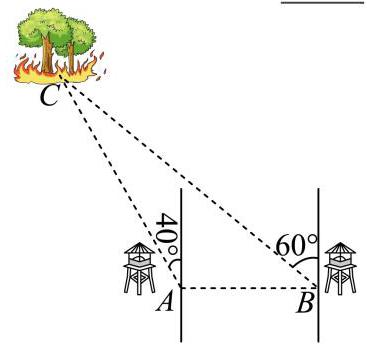
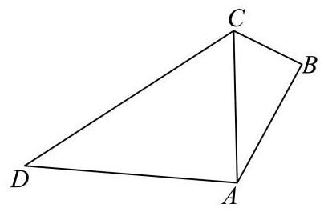
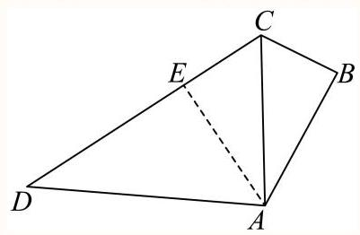
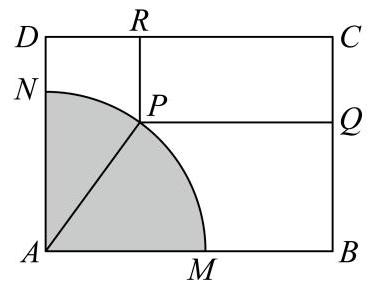
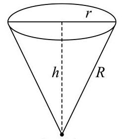

## 数学建模专题：从实际情境到函数最值

## 知识讲解

本专题面向上海高中数学中常见的**实际情境建模题**。课堂主线不是机械刷题，而是训练学生把文字情境转化为几何图形、函数关系和最值问题。材料主要覆盖三角测量、函数最值、几何结构最值三类模型。

### 核心知识点

1. **正弦定理与余弦定理**：解决三角形边角关系问题
2. **三角恒等变换**：化简复杂三角表达式
3. **导数求最值**：利用导数判断函数单调性，求解实际问题中的最优解
4. **几何建模**：将实际问题抽象为几何图形，建立数学模型

---

## 导学说明

## 1. 数学目标

- 掌握正弦定理、余弦定理在实际问题中的应用
- 能够建立实际问题与数学模型之间的联系
- 熟练运用导数方法求解函数最值问题
- 培养数学建模思维，提升解决实际问题的能力

## 2. 课程重难点

(1)重点：会把方位角、仰角、距离、面积、体积、费用等实际量转化为三角形或函数模型；会用正弦定理、余弦定理、导数、基本不等式完成求值或最值。

(2)难点：从复杂图形中选变量，确定变量范围，处理边界、近似、单位和实际意义。

## 3. 考查形式与分值占比

(1)题型：填空题、选择题和解答题均可出现，常作为中档题或综合题局部步骤出现。

(2)占比：建模题不是单独知识点，通常嵌入解三角形、函数导数、解析几何、立体几何等模块中考查，不编造固定百分比。

(3)考查特点：重在建模意识、变量选择、函数关系建立、边界与单位检查。

---

## 知识导图

```
数学建模应用
├── 三角函数建模
│   ├── 正弦定理应用
│   ├── 余弦定理应用
│   └── 三角恒等变换
├── 几何建模
│   ├── 平面几何问题
│   ├── 立体几何问题
│   └── 解析几何问题
└── 最值问题
    ├── 导数法求最值
    ├── 基本不等式
    └── 三角换元法
```

## 教法备注

## 1. 三类知识点

(1)事实性知识：方向角、仰角、正弦定理、余弦定理、导数符号、最值点等需要准确记忆的基本元素。

(2)概念性知识：实际情境中的线段、角度、距离、面积、体积与函数变量之间的对应关系。

(3)程序性知识：读题建模、画图标量、建立函数、确定定义域、求导或用不等式求最值的操作流程。

(4)三类知识教学步骤：先补足事实性公式，再解释模型中变量与量的关系，最后通过母题示范完整建模流程。

## 2. 本切片知识点标签

知识点实际问题中的数学建模：程序性知识

【注】本讲核心不是单个公式，而是把实际问题压缩成三角形、函数或几何最值模型的操作流程。

## 可知识点:实际问题中的数学建模

## 知识笔记

## 1. 建模题的通用解题链条

(1)读题：圈出“已知量、待求量、限制条件、精确度要求”。

(2)画图：把方位角、仰角、距离、切线、折叠、轨迹等信息落到图形上。

(3)设元：优先选择题目中可控制的角、长度或比例作为变量。

(4)建式：把目标量写成关于一个变量的函数，并写清变量范围。

(5)求解：根据函数结构选择正弦定理、余弦定理、导数、基本不等式或辅助角法。

(6)回代：把数学结果翻译回实际问题，检查单位、近似和边界是否合理。

## 2. 本讲三条主线

主线一：解三角形测量模型，典型入口是方位角、仰角、最短距离。

主线二：函数最值模型，典型入口是“总消耗最少、费用最低、面积或体积最大”。

主线三：几何结构最值模型，典型入口是切线、折叠、截取、轨迹、对称与参数范围。

## 教法备注

知识标签：程序性知识

**教学步骤：**
本讲需要学生能够运用正弦定理、余弦定理解决实际问题中的三角形边角关系，掌握导数法求最值的基本方法。该讲知识点建立在已经学习完三角函数、解三角形、导数的基础上，所以教师应先带领学生复习正弦定理、余弦定理的公式，以及导数判断函数单调性的方法，然后每种题型都可以至少演示一道母题，以及部分变式，让学生能够在操作中学会建立数学模型的方法，最后进行独立练习。

**对应知识层级：应用**

---

## 3. 母题与变式题组

### 母题1

#### 母题说明教法备注

**母题说明：** 本题考查正弦定理在实际测量问题中的应用，涉及方位角的理解与转化，训练学生将实际问题转化为三角形问题的能力。

**选题原因：**
（1）题目情境贴近实际（林场火情观测），具有真实性和应用价值
（2）涉及方位角的转化，考查学生对角度概念的理解
（3）正弦定理的直接应用，方法典型，适合作为母题示范

**错因预设：**
（1）方位角理解错误，导致角度计算错误
（2）正弦定理公式记忆错误，边与角的对应关系混淆
（3）计算过程中近似值处理不当，导致最终结果偏差

**讲法建议：**
（1）先引导学生画出方位图，标注已知条件
（2）明确正弦定理的使用条件：已知两角一边或两边一角
（3）强调计算过程中保留足够精度，最后再按要求取近似值

---

**题目：**

某林场为了及时发现火情，设立了两个观测点 $A$ 和 $B$。某日两个观测点的林场人员都观测到 $C$ 处出现火情。在 $A$ 处观测到火情发生在北偏西40°方向，而在 $B$ 处观测到火情在北偏西60°方向。已知 $B$ 在 $A$ 的正东方向10km处（如图所示），则 $|BC - AC| =$ ____ km。（精确到0.1km）



---

**答案：**

7.8

---

**解析：**

根据题意，由正弦定理代入计算，即可得到结果。

由题意可得，$AB = 10$，$\angle ABC = 30°$，$\angle CAB = 130°$，则 $\angle ACB = 20°$。

在 $\triangle ABC$ 中，由正弦定理可得：

$$\frac{AB}{\sin \angle ACB} = \frac{AC}{\sin \angle ABC} = \frac{BC}{\sin \angle BAC}$$

即：

$$\frac{10}{\sin 20°} = \frac{AC}{\sin 30°} = \frac{BC}{\sin 130°}$$

所以：

$$AC = \frac{10 \sin 30°}{\sin 20°} \approx 14.6 \text{ km}$$

$$BC = \frac{10 \sin 130°}{\sin 20°} \approx 22.4 \text{ km}$$

则 $|BC - AC| = 22.4 - 14.6 = 7.8$ km。

故答案为：7.8

---

### 变式题1-1

#### 变式说明教法备注

**变式说明：** 与母题类似，但增加了几何图形的复杂度，需要作辅助线构造直角三角形，考查学生的几何直观和转化能力。

---

**题目：**

某临海地区为保障游客安全修建了海上救生栈道，如图，线段 $BC$、$CD$ 是救生栈道的一部分，其中 $BC = 300$ m，$CD = 800$ m，$B$ 在 $A$ 的北偏东 $30°$ 方向，$C$ 在 $A$ 的正北方向，$D$ 在 $A$ 的北偏西 $80°$ 方向，且 $\angle B = 90°$。若救生艇在 $A$ 处载上遇险游客需要尽快抵达救生栈道 $B-C-D$，则最短距离为 ____ m。（结果精确到1m）



---

**答案：**

475

---

**解析：**

先在 $\triangle ABC$ 中求出 $AC$，再利用正弦定理，在 $\triangle ADC$ 中求出 $\sin D$，进而转化到 $\triangle ACE$ 中求解即可。

解：作 $AE \perp CD$ 交于 $E$，由题意可得如图：



$\angle B = 90°$，$\angle CAB = 30°$，$BC = 300$ m

所以：

$$AB = \frac{BC}{\tan 30°} = \frac{300}{\frac{\sqrt{3}}{3}} = 300\sqrt{3} \text{ m}$$

$$AC = \frac{BC}{\sin \angle CAB} = 600 \text{ m}$$

在 $\triangle ADC$ 中，由正弦定理可得：

$$\frac{CD}{\sin \angle ACD} = \frac{AC}{\sin D} \Rightarrow \sin D = \frac{3\sin 80°}{4}$$

所以 $\cos \angle EAD = \frac{3\sin 80°}{4} \approx 0.735$

所以 $\sin \angle EAD \approx 0.68$

$$\cos \angle CAE = \cos(80° - \angle EAD) \approx 0.17 \times 0.735 + 0.98 \times 0.68 = 0.79135$$

在直角 $\triangle ACE$ 中：

$$AE = AC \cdot \cos \angle CAE \Rightarrow AE = 600 \times 0.79135 \approx 475$$

故答案为：475

---

### 母题2

#### 母题说明教法备注

**母题说明：** 本题考查利用导数求解含三角函数的最值问题，涉及三角恒等变换和导数判断单调性的综合应用。

**选题原因：**
（1）题目情境贴近生活（公园斜坡设计），体现数学的应用价值
（2）综合考查三角函数、导数、最值等多个知识点
（3）方法典型，是导数求最值的经典题型

**错因预设：**
（1）三角恒等变换公式运用错误
（2）导数计算错误，特别是复合函数求导
（3）极值点判断错误，导致最值求解错误

**讲法建议：**
（1）先引导学生建立目标函数，明确变量和常量
（2）强调三角恒等变换的技巧，如辅助角公式的应用
（3）导数求最值时，注意判断极值点两侧的单调性

---

**题目：**

公园修建斜坡，假设斜坡起点在水平面上，斜坡与水平面的夹角为$\theta$，斜坡终点距离水平面的垂直高度为4米，游客每走一米消耗的能量为 $(1.025 - \cos \theta)$，要使游客从斜坡底走到斜坡顶端所消耗的总体能最少，则 $\theta =$ ____。

---

**答案：**

$\arccos \frac{40}{41}$

---

**解析：**

**方法1：** 根据给定条件，求出斜坡长，列出总体力 $y$ 关于 $\theta$ 的函数，利用导数求解作答。

依题意，斜坡长度 $L = \frac{4}{\sin \theta}$，$\theta \in (0, \frac{\pi}{2})$

因此人沿斜坡到坡顶消耗的总体力：

$$y = f(\theta) = L(1.025 - \cos \theta) = \frac{4.1 - 4\cos \theta}{\sin \theta}$$

求导得：

$$f'(\theta) = \frac{4\sin^2\theta - (4.1 - 4\cos \theta)\cos \theta}{\sin^2\theta} = \frac{4 - 4.1\cos \theta}{\sin^2\theta}$$

由 $f'(\theta) = 0$，得 $\theta = \arccos \frac{40}{41}$

当 $0 < \theta < \arccos \frac{40}{41}$ 时，$f'(\theta) < 0$

当 $\arccos \frac{40}{41} < \theta < \frac{\pi}{2}$ 时，$f'(\theta) > 0$

于是函数 $f(\theta)$ 在 $(0, \arccos \frac{40}{41})$ 上单调递减，在 $(\arccos \frac{40}{41}, \frac{\pi}{2})$ 上单调递增。

所以当 $\theta = \arccos \frac{40}{41}$ 时，人上坡消耗的总体力 $f(\theta)$ 最小。

**方法2：** 利用辅助角公式求解

依题意，斜坡长度 $L = \frac{4}{\sin \theta}$，$\theta \in (0, \frac{\pi}{2})$

因此：

$$y = \frac{4.1 - 4\cos \theta}{\sin \theta}$$

由 $y\sin \theta + 4\cos \theta = 4.1$，即 $\sqrt{y^2 + 16}\sin(\theta + \varphi) = 4.1$

显然 $\sqrt{y^2 + 16} \geq 4.1$，而 $y > 0$，则 $y \geq 0.9$

当且仅当 $\sin(\theta + \varphi) = 1$ 时取等号，此时 $\cos \theta = \frac{40}{41}$

即 $\theta = \arccos \frac{40}{41}$

故答案为：$\arccos \frac{40}{41}$

---

### 变式题2-1

#### 变式说明教法备注

**变式说明：** 与母题类似，但将问题转化为几何图形中的最值问题，增加了建模的难度，考查学生的几何直观和建模能力。

---

**题目：**

某建筑公司欲设计一个正四棱锥形纪念碑，要求其顶点位于容积为 $36\pi$ 立方米的球形景观灯所在球面上。考虑到抗风、抗震等结构安全需求，侧棱长度 $l$ 需满足 $2\sqrt{3} \leq l \leq 3\sqrt{3}$。当纪念碑体积取得最大值时，正四棱锥的侧棱长约为 ____ 米。（精确到0.01米）

---

**答案：**

4.90

---

**解析：**

由题设可得球的半径为 $r = 3$，结合正四棱锥的结构特征及其外接球半径与棱长、底面边长的关系得 $6h = l^2$，进而得到纪念碑体积关于 $l$ 的表达式，应用导数求其最大值，并确定对应的侧棱长。

若球的半径为 $r$，则 $\frac{4}{3}\pi r^3 = 36\pi$，可得 $r = 3$

又 $2\sqrt{3} \leq l \leq 3\sqrt{3}$

对于正四棱锥，设底面边长为 $a$，高为 $h$，则：

$$h^2 = l^2 - \left(\frac{\sqrt{2}}{2}a\right)^2 = l^2 - \frac{a^2}{2}$$

所以 $\frac{a^2}{2} = l^2 - h^2$，即 $a^2 = 2(l^2 - h^2)$

又 $(h - r)^2 + \frac{a^2}{2} = r^2$，则 $\frac{a^2}{2} = 6h - h^2$

故 $6h = l^2$，即 $h = \frac{l^2}{6}$

纪念碑体积：

$$V = \frac{1}{3}a^2 h = \frac{2}{3} \times \left(l^2 - \frac{l^4}{36}\right) \cdot \frac{l^2}{6} = \frac{1}{9} \times \left(l^4 - \frac{l^6}{36}\right)$$

令 $t = l^2 \in [12, 27]$

对于 $y = t^2 - \frac{t^3}{36}$，则 $y' = 2t - \frac{t^2}{12} = \frac{24t - t^2}{12}$

在 $t \in [12, 27]$ 上，当 $12 \leq t < 24$ 时 $y' > 0$，当 $24 < t \leq 27$ 时 $y' < 0$

所以 $y_{\max} = 24^2 - \frac{24^3}{36} = 192$

故 $V_{\max} = \frac{1}{9} \times 192 = \frac{64}{3}$，此时 $l = 2\sqrt{6} \approx 4.90$ 米。

故答案为：4.90

---

### 母题3

#### 母题说明教法备注

**母题说明：** 本题考查将实际问题抽象为几何图形，建立数学模型，并利用导数求解最值问题的能力。

**选题原因：**
（1）题目情境新颖（矩形铁皮截取问题），具有较强的建模要求
（2）综合考查几何直观、函数建模、导数求最值等多个能力
（3）涉及参数讨论，考查学生的分类讨论能力

**错因预设：**
（1）几何关系分析错误，导致函数关系建立错误
（2）换元时忽略变量的取值范围
（3）导数计算错误，或极值点判断错误

**讲法建议：**
（1）引导学生画出几何图形，标注已知条件和所求量
（2）建立坐标系，用解析法表示几何关系
（3）换元时注意新变量的取值范围，并在新范围内讨论单调性

---

**题目：**

如图，有一块矩形铁皮 $ABCD$，其中 $AB = t$ 米，$AD = 4$ 米，其中 $t$ 是一个大于等于4的常数。阴影部分 $AMN$ 是一个半径为3米的扇形。设这个扇形已经腐蚀不能使用，但其余部分均完好。工人师傅想在未被腐蚀的部分截下一块其边落在 $BC$ 与 $CD$ 上的矩形铁皮 $PQCR$，使点 $P$ 在弧 $MN$ 上。设 $\angle MAP = \theta$ $(0 \leq \theta \leq \frac{\pi}{2})$，矩形 $PQCR$ 的面积为 $S$ 平方米。



(1) 求 $S$ 关于 $\theta$ 的函数表达式；

(2) 当 $t = 4$ 时，求 $S$ 的最值，并求出当 $S$ 取得最值时，所对应的 $\sin \theta$ 的值。

---

**答案：**

(1) $S = (4 - 3\sin \theta)(t - 3\cos \theta)$，$(0 \leq \theta \leq \frac{\pi}{2})$

(2) 答案见解析

---

**解析：**

**(1)** 过 $P$ 作 $PE \perp AB$，垂足为 $E$，由题意得：$PE = 3\sin \theta$，$AE = 3\cos \theta$

故 $PQ = AB - AE = t - 3\cos \theta$，$PR = AD - PE = 4 - 3\sin \theta$


所以矩形 $PQCR$ 的面积：

$$S = PR \cdot PQ = (4 - 3\sin \theta)(t - 3\cos \theta)，(0 \leq \theta \leq \frac{\pi}{2})$$

**(2)** 由(1)及题设知 $S = (4 - 3\sin \theta)(4 - 3\cos \theta)$

故：

$$S = (4 - 3\sin \theta)(4 - 3\cos \theta) = 16 - 12(\sin \theta + \cos \theta) + 9\sin \theta \cos \theta$$

令 $\sin \theta + \cos \theta = m = \sqrt{2}\sin(\theta + \frac{\pi}{4})$，$0 \leq \theta \leq \frac{\pi}{2}$

所以 $m \in [1, \sqrt{2}]$，且 $\sin \theta \cos \theta = \frac{m^2 - 1}{2}$

$$S = 16 - 12m + \frac{9}{2}(m^2 - 1) = \frac{9}{2}(m - \frac{4}{3})^2 + \frac{7}{2}$$

$h(m) = \frac{9}{2}(m - \frac{4}{3})^2 + \frac{7}{2}$ 在区间 $[1, \frac{4}{3}]$ 上严格减，在区间 $[\frac{4}{3}, \sqrt{2}]$ 上严格增。

且 $h(1) = 4 > h(\sqrt{2}) = \frac{41}{2} - 12\sqrt{2}$

当 $m = \frac{4}{3}$，即 $\sin \theta + \cos \theta = \frac{4}{3}$ 时，$S$ 取得最小值 $\frac{7}{2}$

此时 $\sin \theta + \sqrt{1 - \sin^2\theta} = \frac{4}{3}$，则 $1 - \sin^2\theta = (\frac{4}{3} - \sin \theta)^2$

故 $\sin \theta = \frac{4 \pm \sqrt{2}}{6}$

当 $m = 1$，即 $\sin \theta + \cos \theta = 1$ 时，$S$ 取得最大值 4

此时 $\sin \theta + \sqrt{1 - \sin^2\theta} = 1$，则 $1 - \sin^2\theta = (1 - \sin \theta)^2$

故 $\sin \theta = 1$ 或 $\sin \theta = 0$。

---

## 分层练习

## 基础

1. 将一个半径为1的球形石材加工成一个圆柱形摆件，则该圆柱形摆件侧面积的最大值为 ____。

**答案：** $2\pi$

---

2. 采矿、采石或取土时，常用炸药包进行爆破，部分爆破呈圆锥漏斗形状（如图），已知圆锥的母线长是炸药包的爆破半径 $R$，它的值是固定的。当炸药包埋的深度为 ____ 可使爆破体积最大。



**答案：** $\frac{\sqrt{3}}{3}R$

---

## 综合

3. 如图，两条足够长且互相垂直的轨道 $l_1$、$l_2$ 相交于点 $O$，一根长度为8的直杆 $AB$ 的两端点 $A$、$B$ 分别在 $l_1$、$l_2$ 上滑动（$A$、$B$ 两点不与 $O$ 点重合，轨道与直杆的宽度等因素均可忽略不计），直杆上的点 $P$ 满足 $OP \perp AB$，则 $\triangle OAP$ 面积的取值范围是 ____。


**答案：** $(0, 6\sqrt{3}]$

---

4. 如图，某处有一块圆心角为 $\frac{2}{3}\pi$ 的扇形绿地 $AOB$，扇形的半径为20米，$AB$ 是一条原有的人行直路，由于工程建设需要，现要在绿地中建一条直路 $OC$，以便在图中阴影部分区域分类堆放物料。为了尽量减少对绿地的破坏（不计路宽），则原直路 $AB$ 与新直路 $OC$ 的交叉点 $D$ 到 $O$ 的距离为 ____ 米。


**答案：** $10\sqrt{2}$

---

## 挑战

5. 在边长为1的正三角形 $ABC$ 的边 $AB$、$AC$ 上分别取 $D$、$E$ 两点，若沿线段 $DE$ 折叠该三角形时，顶点 $A$ 恰好落在边 $BC$ 上。则线段 $AD$ 的长度的最小值为 ____。


**答案：** $2\sqrt{3} - 3$

---

6. 某公园为了美化环境，计划建造一座拱桥 $DACBE$，已知该桥的剖面如图所示，共包括一段圆弧形桥面 $\overset{\frown}{ACB}$ 和两段长度相等的直线型桥面 $AD$、$BE$，圆弧形桥面 $\overset{\frown}{ACB}$ 所在圆的半径为4米，圆心 $O$ 在 $DE$ 上，且 $AD$ 和 $BE$ 所在直线与圆 $O$ 分别在连结点 $A$ 和 $B$ 处相切。已知直线型桥面的修建费用是每米0.4万元，弧形桥面 $\overset{\frown}{ACB}$ 的修建费用是每米2.5万元，设 $\angle ADO = \theta$，根据空间限制及桥面坡度的限制，$\theta$ 的范围为 $\arcsin \frac{1}{3} \leq \theta \leq \frac{\pi}{6}$，则当桥面修建总费用最低时 $\theta$ 的值为 ____。


**答案：** $\arcsin \frac{2}{5}$

---

## 课堂收束

### 数学建模解题步骤

1. **审题理解**：仔细阅读题目，理解实际问题的背景和所求目标
2. **建立模型**：将实际问题转化为数学问题，画出几何图形，标注已知条件
3. **选择工具**：根据问题类型选择合适的数学工具（正弦定理、余弦定理、导数等）
4. **求解计算**：运用数学方法求解，注意计算精度和步骤完整性
5. **检验结果**：验证结果是否符合实际意义，单位是否正确

### 导数法求最值要点

1. **建立目标函数**：明确自变量和因变量，建立函数关系式
2. **确定定义域**：根据实际问题的限制条件确定自变量的取值范围
3. **求导找临界点**：计算导数，令导数等于零，找出可能的极值点
4. **判断单调性**：通过导数的正负判断函数的单调性
5. **确定最值**：比较极值点和端点处的函数值，确定最大值或最小值

### 常见错误警示

1. **角度单位混淆**：注意区分角度制和弧度制，计算时保持统一
2. **近似计算误差**：中间计算过程保留足够精度，避免累积误差
3. **定义域遗漏**：实际问题中变量的取值范围往往有限制，求解时不能忽略
4. **极值点判断**：导数为零的点不一定是极值点，需要进一步判断


## 分层练习解析补充

### 基础1解析提示

设圆柱底面半径为 $r$，高为 $h$。由球半径为 $1$ 得 $\frac{h^2}{4}+r^2=1$，侧面积
$S=2\pi rh=4\pi\sqrt{r^2(1-r^2)}.$
由 $r^2+(1-r^2)\ge 2\sqrt{r^2(1-r^2)}$，得 $S\le 2\pi$，等号在 $r^2=\frac12$ 时成立。

### 基础2解析提示

设爆破深度为 $h$，圆锥底面半径为 $r$，母线长为固定值 $R$。由 $r^2=R^2-h^2$，
$V=\frac13\pi r^2h=\frac13\pi(R^2-h^2)h.$
求导得 $V'=\frac13\pi R^2-\pi h^2$，故 $h=\frac{\sqrt3}{3}R$ 时体积最大。

### 综合3解析提示

设 $\angle OAB=x$，$0<x<\frac\pi2$。由 $AB=8$ 得 $OA=8\cos x$，且 $AP=OA\cos x=8\cos^2x$。面积函数
$S=\frac12\cdot OA\cdot AP\sin x=32\sin x\cos^3x.$
求导后可知 $x=\frac\pi6$ 时取最大值 $6\sqrt3$，端点趋近于 $0$，所以范围为 $(0,6\sqrt3]$。

### 综合4解析提示

设 $\angle BOD=\alpha$，先用正弦定理表示 $BD$，再把阴影面积写成关于 $\alpha$ 的函数。求导后最小点满足 $\alpha=\frac\pi{12}$。此时 $\triangle ODH$ 为等腰直角三角形，且 $OH=10$，故 $OD=10\sqrt2$。

### 挑战5解析提示

折叠后 $A$ 与落点 $P$ 关于 $DE$ 对称。设 $\angle BAP=\theta$，$AD=x$，则在 $\triangle BDP$ 中用正弦定理可得
$x=\frac{\sqrt3}{2\sin(\frac{2\pi}{3}-2\theta)+\sqrt3}.$
当 $\frac{2\pi}{3}-2\theta=\frac\pi2$ 时分母最大，故 $AD_{\min}=2\sqrt3-3$。

### 挑战6解析提示

连接 $OA,OB$，由切线关系得 $AD=BE=\frac4{\tan\theta}$，圆弧长度为 $8\theta$。总费用
$f(\theta)=0.4\cdot\frac8{\tan\theta}+2.5\cdot8\theta=\frac{3.2}{\tan\theta}+20\theta.$
求导得 $f'(\theta)=20-\frac{3.2}{\sin^2\theta}$，在给定区间内最低费用对应 $\sin\theta=\frac25$，即 $\theta=\arcsin\frac25$。

---

*整理生成时间：2026年4月28日*
