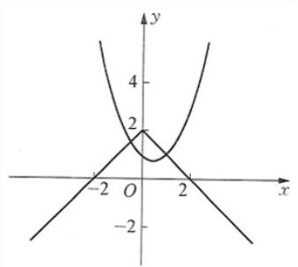
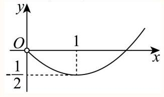
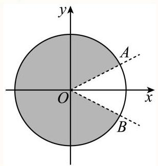
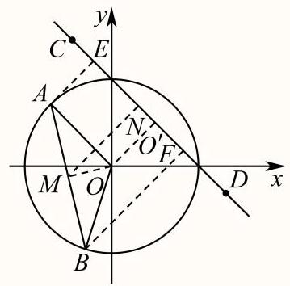
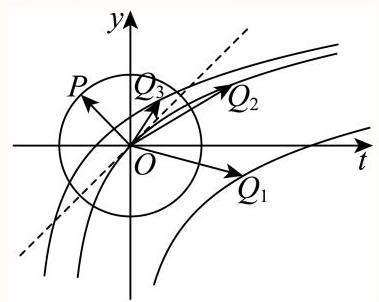

## 第一讲 逻辑词求参问题6.13

恒成立问题: 任意 $x \in  D$ ，都有 $f\left( x\right)  \geq  m$ 恒成立

存在性问题: 存在 $x \in  D$ ，使得 $f\left( x\right)  \geq  m$ 能成立

(1)不等式恒成立与存在性问题的求解方向是:求解函数 $f\left( x\right)$ 的最值

(2)常见问题:

任意 $x \in  D$ ，都有 $f\left( x\right)  \geq  m$ 恒成立 $f{\left( x\right) }_{\min } \geq  m$

任意 $x \in  D$ ，都有 $f\left( x\right)  \leq  m$ 恒成立 $f{\left( x\right) }_{\max } \leq  m$

存在 $x \in  D$ ，使得 $f\left( x\right)  \geq  m$ 能成立 $f{\left( x\right) }_{\max } \geq  m$

存在 $x \in  D$ ，使得 $f\left( x\right)  \leq  m$ 能成立 $f{\left( x\right) }_{\min } \leq  m$

若所给的不等式能通过恒等变形使参数与主元分离于不等式两端，从而问题转化为求主元函数的最值，进而求出参数范围.这种方法本质也还是求最值，但它思路更清晰，操作性更强.一般地有:

(1) $f\left( x\right)  < g\left( a\right)$ (为参数)恒成立 $\Leftrightarrow  g\left( a\right)  > f{\left( x\right) }_{\max }$

(2) $f\left( x\right)  < g\left( a\right)$ (为参数)有解 $\Leftrightarrow  g\left( a\right)  > f{\left( x\right) }_{\min }$

任意 $x \in  {D}_{1}$ ，存在 $y \in  {D}_{2}$ ，都有 $f\left( x\right)  \geq  g\left( y\right)$ 恒成立

(1)双变量恒成立与存在性问题的求解方向是:比较函数 $f\left( x\right)$ 与 $g\left( y\right)$ 的最值

(2)常见问题:

任意 $x \in  {D}_{1}$ ，存在 $y \in  {D}_{2}$ ，有 $f\left( x\right)  \geq  g\left( y\right)$ 成立 $g{\left( y\right) }_{\min } \leq  f{\left( x\right) }_{\min }$ 任意 $x \in  {D}_{1}$ ，存在 $y \in  {D}_{2}$ ，有 $f\left( x\right)  \leq  g\left( y\right)$ 成立 $g{\left( y\right) }_{\max } \geq  f{\left( x\right) }_{\max }$ 任意 $x \in  {D}_{1}$ ，存在 $y \in  {D}_{2}$ ，有 $f\left( x\right)  = g\left( y\right)$ 成立 $g\left( y\right)$ 的值域 $\supseteq  f\left( x\right)$ 的值域

补充概念对于数集 $S$ ,定义:

(1)有界与无界:若存在 $m \in  R$ ,对 $\forall x \in  S$ , $\left| x\right|  \leq  m$ ,称 $S$ 有界; 否则称 $S$ 无界

(2)上界:若存在 $m \in  R$ ，对 $\forall x \in  S$ ， $x \leq  m$ ，称 $m$ 为 $S$ 的一个上界

① 上确界:若 $S$ 的所有上界中存在最小值 ${x}_{0}$ ，则称 ${x}_{0}$ 为 $S$ 的上确界，记作 $\operatorname{Sup}\{ S\}$

② 最大值: 若 $S$ 存在上确界 ${x}_{0}$ ,且 ${x}_{0} \in  S$ ,称 ${x}_{0}$ 为 $S$ 的最大值,记作 $\operatorname{Max}\{ S\}$

(3)下界:若存在 $m \in  R$ ，对 $\forall x \in  S$ ， $x \geq  m$ ，称 $m$ 为 $S$ 的一个下界

① 下确界:若 $S$ 的所有下界中存在最大值 ${x}_{0}$ ，则称 ${x}_{0}$ 为 $S$ 的下确界，记作 $\inf \{ S\}$

② 最小值:若 $S$ 存在下确界 ${x}_{0}$ ，且 ${x}_{0} \in  S$ ，称 ${x}_{0}$ 为 $S$ 的最小值，记作 $\min \{ S\}$

## 变量分离型: 转化为等价条件后求解

(1) $\forall x \in  \left\lbrack  {a, b}\right\rbrack  , k > f\left( x\right)  \Leftrightarrow  k > \operatorname{Max}\{ f\}$ ; 若 $\operatorname{Max}\{ f\}$ 不存在,则 $k \geq  \operatorname{Sup}\{ f\}$

(2) $\exists x \in  \left\lbrack  {a, b}\right\rbrack  , k > f\left( x\right)  \Leftrightarrow  k > \inf \{ f\}$

(3) $\forall {x}_{1} \in  \left\lbrack  {a, b}\right\rbrack  ,\forall {x}_{2} \in  \left\lbrack  {c, d}\right\rbrack  , f\left( {x}_{1}\right)  > g\left( {x}_{2}\right)  \Leftrightarrow  \min \{ f\}  > \operatorname{Max}\{ g\}$

(3) $\exists {x}_{1} \in  \left\lbrack  {a, b}\right\rbrack  ,\exists {x}_{2} \in  \left\lbrack  {c, d}\right\rbrack  , f\left( {x}_{1}\right)  > g\left( {x}_{2}\right)  \Leftrightarrow  \operatorname{Max}\{ f\}  > \min \{ g\}$

(4) $\forall {x}_{1} \in  \left\lbrack  {a, b}\right\rbrack  ,\exists {x}_{2} \in  \left\lbrack  {c, d}\right\rbrack  , f\left( {x}_{1}\right)  > g\left( {x}_{2}\right)  \Leftrightarrow  \min \{ f\}  > \min \{ g\}$

(5) $\exists {x}_{1} \in  \left\lbrack  {a, b}\right\rbrack  ,\forall {x}_{2} \in  \left\lbrack  {c, d}\right\rbrack  , f\left( {x}_{1}\right)  > g\left( {x}_{2}\right)  \Leftrightarrow  \operatorname{Max}\{ f\}  > \operatorname{Max}\{ g\}$

(6) $\exists {x}_{1} \in  \left\lbrack  {a, b}\right\rbrack  ,\exists {x}_{2} \in  \left\lbrack  {c, d}\right\rbrack  , f\left( {x}_{1}\right)  = g\left( {x}_{2}\right)  \Leftrightarrow  {A}_{f} \cap  {A}_{g} \neq  \varnothing$

(7) $\forall {x}_{1} \in  \left\lbrack  {a, b}\right\rbrack  ,\exists {x}_{2} \in  \left\lbrack  {c, d}\right\rbrack  , f\left( {x}_{1}\right)  = g\left( {x}_{2}\right)  \Leftrightarrow  {A}_{f} \subseteq  {A}_{g}$

## 单变量

1 较易 填空题

已知关于 $x$ 的不等式组 $1 \leq  k{x}^{2} + {2x} + k \leq  2$ 有唯一实数解,则实数 $k$ 的取值集合是

② 答案

$\left\{  {\frac{1 - \sqrt{5}}{2},1 + \sqrt{2}}\right\}$

解析

根据不等式 $a{x}^{2} + {bx} + c \leq  M\left( {a < 0}\right)$ 有唯一实数解 $\Leftrightarrow$ 最大值 $\frac{{4ac} - {b}^{2}}{4a} = M$ ; 不等式 $a{x}^{2} + {bx} + c \leq  M\left( {a > 0}\right)$ 有唯一实数解 $\Leftrightarrow$ 最小值 $\frac{{4ac} - {b}^{2}}{4a} = M$ 可以判断实数 $k$ 的取值，故本题关键是要对参数 $k$ 进行分类讨论，以确定不等式的类型, 在各种情况中分别解答后, 综合结论即得最终结果.

解: 若 $k = 0$ ,不等式组 $1 \leq  k{x}^{2} + {2x} + k \leq  2$ 可化为: $1 \leq  {2x} \leq  2$ ,不满足条件

若 $k > 0$ ,则若不等式组 $1 \leq  k{x}^{2} + {2x} + k \leq  2,\frac{4{k}^{2} - 4}{4k} = 2$ 时,满足条件

解得: $k = 1 + \sqrt{2}$

若 $k < 0$ ,则若不等式组 $1 \leq  k{x}^{2} + {2x} + k \leq  2,\frac{4{k}^{2} - 4}{4k} = 1$ 时,满足条件

解得: $k = \frac{1 - \sqrt{5}}{2}$

故答案为: $\left\{  {\frac{1 - \sqrt{5}}{2},1 + \sqrt{2}}\right\}$

本题考查一元二次不等式的解法, 考查分类讨论思想, 属于基础题.

2 一般 填空题

已知函数 $f\left( x\right)  =  - {x}^{2} + x + m + 2$ ，若关于 $x$ 的不等式 $f\left( x\right)  \geq  \left| x\right|$ 的解集中有且仅有1个整数，则实数 $m$ 的取值范围为___.

分答案

$\lbrack  - 2, - 1)$

解析

$f\left( x\right)  \geq  \left| x\right|  \Leftrightarrow  2 - \left| x\right|  \geq  {x}^{2} - x - m.$

令 $g\left( x\right)  = 2 - \left| x\right| , h\left( x\right)  = {x}^{2} - x - m$ ,

在同一直角坐标系内作出两个函数的图象,

由图象可知,整数解为 $x = 0$ ,故 $\left\{  \begin{array}{l} f\left( 0\right)  \geq  0 - 0 - m \\  f\left( 1\right)  < 1 - 1 - m \end{array}\right.$ ,

解得 $- 2 \leq  m <  - 1$ .

故答案为:[-2,-1).

3 一般 填空题

已知函数 $f\left( x\right)  = \left| {x - a}\right|  + \frac{4}{x} + a$ ，若当 $x \in  \left\lbrack  {1,4}\right\rbrack$ 时， $f\left( x\right)  \leq  5$ 恒成立，则实数 $a$ 的取值范围是___.

答案

$( - \infty ,1\rbrack$

解析

当 $a \leq  1$ 时， $f\left( x\right)  = x - a + \frac{4}{x} + a = x + \frac{4}{x}$ ，可得当 $x \in  \left\lbrack  {1,4}\right\rbrack$ 时， $4 \leq  f\left( x\right)  \leq  5$ ，符合题意；

当 $1 < 4$ 时，\$fleft(x \\right)=\\left\\\{\\begin\{align\} &2a-x+\\dfrac\{4\}\{x\}, l\\lex，则 $f\left( 1\right)  = 3 + {2a} > 5$ ，不符合题意;

当 $a \geq  4$ 时， $f\left( x\right)  = {2a} - x + \frac{4}{x}$ ，此时 $f\left( 1\right)  = 3 + {2a} \geq  {11}$ ，不符合题意，

综上, $a$ 的取值范围是 $( - \infty ,1\rbrack$ .

故答案为: $( - \infty ,1\rbrack$ .

本题考查函数不等式的恒成立问题，解题的关键是对 $a$ 分段讨论求解.

4 一般解答题

若 $f\left( x\right)  = {\log }_{a}x\left( {a > 0, a \neq  1}\right)$ .

(1) $y = f\left( x\right)$ 过 $\left( {4,2}\right)$ ，求 $f\left( {{2x} - 2}\right)  < f\left( x\right)$ 的解集；

( 2 )存在 $x$ 使得 $f\left( {x + 1}\right)$ 、 $f\left( {ax}\right)$ 、 $f\left( {x + 2}\right)$ 成等差数列，求 $a$ 的取值范围.

## 答案

(1) $\{ x \mid  1 < x < 2\}$

(2) $a > 1$

解析

(1)因为 $y = f\left( x\right)$ 的图象过 $\left( {4,2}\right)$ ，故 ${\log }_{a}4 = 2$ ，故 ${a}^{2} = 4$ 即 $a = 2$ (负的舍去)，

而 $f\left( x\right)  = {\log }_{2}x$ 在 $\left( {0, + \infty }\right)$ 上为增函数，故 $f\left( {{2x} - 2}\right)  < f\left( x\right)$ ，

故 $0 < {2x} - 2 < x$ 即 $1 < x < 2$ ,

故 $f\left( {{2x} - 2}\right)  < f\left( x\right)$ 的解集为 $\{ x \mid  1 < x < 2\}$ .

( 2 )因为存在 $x$ 使得 $f\left( {x + 1}\right)$ 、 $f\left( {ax}\right)$ 、 $f\left( {x + 2}\right)$ 成等差数列，

故 ${2f}\left( {ax}\right)  = f\left( {x + 1}\right)  + f\left( {x + 2}\right)$ 有解,故 $2{\log }_{a}\left( {ax}\right)  = {\log }_{a}\left( {x + 1}\right)  + {\log }_{a}\left( {x + 2}\right)$ ,

因为 $a > 0, a \neq  1$ ,故 $x > 0$ ,故 ${a}^{2}{x}^{2} = \left( {x + 1}\right) \left( {x + 2}\right)$ 在 $\left( {0, + \infty }\right)$ 上有解,

由 ${a}^{2} = \frac{{x}^{2} + {3x} + 2}{{x}^{2}} = 1 + \frac{3}{x} + \frac{2}{{x}^{2}} = 2{\left( \frac{1}{x} + \frac{3}{4}\right) }^{2} - \frac{1}{8}$ 在 $\left( {0, + \infty }\right)$ 上有解,

令 $t = \frac{1}{x} \in  \left( {0, + \infty }\right)$ ,而 $y = 2{\left( t + \frac{3}{4}\right) }^{2} - \frac{1}{8}$ 在 $\left( {0, + \infty }\right)$ 上的值域为 $\left( {1, + \infty }\right)$ ,

故 ${a}^{2} > 1$ 即 $a > 1$ .

5 一般 解答题

已知函数 $y = f\left( x\right)$ 的表达式为 $f\left( x\right)  = {2}^{x}, x \in  \mathbf{R}$ .

(1) 解不等式: ${\log }_{2}\left\lbrack  {f\left( x\right)  - 1}\right\rbrack   + {\log }_{2}\left\lbrack  {f\left( x\right) }\right\rbrack   \leq  1$ ;

(2)若存在实数 ${x}_{0} \in  \left\lbrack  {0,\frac{\pi }{2}}\right\rbrack$ ，使得 $f\left( {m\sin {x}_{0}}\right) , f\left( {2 + \sin 2{x}_{0}}\right) , f\left( {m\cos {x}_{0}}\right)$ 成等比数列，求实数 $m$ 的最小值.

## ② 答案

(1) $\{ x \mid  0 < x \leq  1\}$

(2) 4

解析

(1)由已知代入可得不等式: ${\log }_{2}\left( {{2}^{x} - 1}\right)  + {\log }_{2}{2}^{x} \leq  1 \Leftrightarrow  {\log }_{2}\left( {{2}^{x} - 1}\right) {2}^{x} \leq  {\log }_{2}2$ ,

根据对数函数的单调性可得: $\left( {{2}^{x} - 1}\right) {2}^{x} \leq  2$ 且 ${2}^{x} - 1 > 0$ ,

则 ${\left( {2}^{x}\right) }^{2} - {2}^{x} - 2 \leq  0 \Leftrightarrow  \left( {{2}^{x} - 2}\right) \left( {{2}^{x} + 1}\right)  \leq  0$ 且 $x > 0$ ,

解得: $\{ x \mid  0 < x \leq  1\}$

(2)由已知可得:

${2}^{m\sin {x}_{0}} \cdot  {2}^{m\cos {x}_{0}} = {\left( {2}^{2 + \sin 2{x}_{0}}\right) }^{2} \Leftrightarrow  {2}^{m\sin {x}_{0} + m\cos {x}_{0}} = {2}^{4 + 2\sin 2{x}_{0}} \Leftrightarrow  m\sin {x}_{0} + m\cos {x}_{0} = 4 + 2\sin 2{x}_{0}$

则 $m = \frac{4 + 2\sin 2{x}_{0}}{\sin {x}_{0} + \cos {x}_{0}} = 2\frac{1 + \sin 2{x}_{0} + 1}{\sin {x}_{0} + \cos {x}_{0}} = 2\frac{{\left( \sin {x}_{0} + \cos {x}_{0}\right) }^{2} + 1}{\sin {x}_{0} + \cos {x}_{0}}$

$m = 2\left( {\sin {x}_{0} + \cos {x}_{0} + \frac{1}{\sin {x}_{0} + \cos {x}_{0}}}\right)$

令 $t = \sin {x}_{0} + \cos {x}_{0} = \sqrt{2}\sin \left( {{x}_{0} + \frac{\pi }{4}}\right)$ ,

因为 ${x}_{0} \in  \left\lbrack  {0,\frac{\pi }{2}}\right\rbrack$ ,所以 ${x}_{0} + \frac{\pi }{4} \in  \left\lbrack  {\frac{\pi }{4},\frac{3\pi }{4}}\right\rbrack$ ,即 $\sin \left( {{x}_{0} + \frac{\pi }{4}}\right)  \in  \left\lbrack  {\frac{\sqrt{2}}{2},1}\right\rbrack$ ,

则 $t = \sqrt{2}\sin \left( {{x}_{0} + \frac{\pi }{4}}\right)  \in  \left\lbrack  {1,\sqrt{2}}\right\rbrack$ ,

此时 $y = t + \frac{1}{t}$ 在 $t \in  \left\lbrack  {1,\sqrt{2}}\right\rbrack$ 上单调递增,则 $y \in  \left\lbrack  {2,\frac{3\sqrt{2}}{2}}\right\rbrack$ ,

要使得等式 $m = 2\left( {\sin {x}_{0} + \cos {x}_{0} + \frac{1}{\sin {x}_{0} + \cos {x}_{0}}}\right)$ ,则 $m \in  \left\lbrack  {4,3\sqrt{2}}\right\rbrack$ ,

故 $m$ 的最小值为 4 .

6 较易 解答题

已知函数 $y = f\left( x\right)$ ，其中 $f\left( x\right)  = {\log }_{2}x$ .

(1) 解关于 $x$ 的不等式 $f\left( {{3x} - 2}\right)  < f\left( {{2x} + 1}\right)$ ；

(2)若存在唯一的实数 ${x}_{0}$ ，使得 $f\left( {x}_{0}\right) , f\left( {{x}_{0} - a}\right) , f\left( 2\right)$ 依次成等差数列，求实数 $a$ 的取值范围.

9 答案

(1) $x \in  \left( {\frac{2}{3},3}\right)$

(2) $a \in  \left\{  {-\frac{1}{2}}\right\}   \cup  \lbrack 0, + \infty )$

解析

(1)由函数 $f\left( x\right)  = {\log }_{2}x$ 在 $\left( {0, + \infty }\right)$ 单调递增，

所以 $0 < {3x} - 2 < {2x} + 1 \Rightarrow  x \in  \left( {\frac{2}{3},3}\right)$

(2) 原问题等价于关于 $x$ 的方程 ${\log }_{2}x + 1 = 2{\log }_{2}\left( {x - a}\right)$ 恰有一个实数解，求实数 $a$ 的取值范围.

即 $\frac{1}{2}{\log }_{2}\left( {2x}\right)  = {\log }_{2}\left( {x - a}\right)$ 在 $x \in  \left( {0, + \infty }\right)$ 上恰有一个实数解.

等价于 $\sqrt{2x} = x - a$ 在 $x \in  \left( {0, + \infty }\right)$ 上恰有一个实数解.

$\Leftrightarrow  a = x - \sqrt{2x}$ 在 $x \in  \left( {0, + \infty }\right)$ 上恰有一个实数解.

令 $\sqrt{2x} = t\left( {t > 0}\right)$ ,则 $a = \frac{1}{2}{t}^{2} - t$ 在 $t \in  \left( {0, + \infty }\right)$ 上恰有一个实数解.

画出关于 $t$ 的二次函数在 $t \in  \left( {0, + \infty }\right)$ 上的图像可知, $a \in  \left\{  {-\frac{1}{2}}\right\}   \cup  \lbrack 0, + \infty )$ 时只有一个交点; $\therefore a \in  \left\{  {-\frac{1}{2}}\right\}   \cup  \lbrack 0, + \infty )$ .

7 一般 解答题

已知 $f\left( x\right)  = \left\{  \begin{array}{l} {x}^{2} - {ax}, x \geq  0 \\  x + \frac{1}{x}, x < 0 \end{array}\right.$

(1) 若 $a = 1$ ，求函数 $y = f\left( x\right)$ 的值域；

( 2 若存在 $\varphi  \in  \left( {0,\frac{\pi }{4}}\right)$ ，使得 $f\left( {\sin \varphi }\right)  = f\left( {\cos \varphi }\right)$ ，求实数 $a$ 的取值范围.

2 答案

(1) $\left( {-\infty , - 2\rbrack  \cup  \left\lbrack  {-\frac{1}{4}}\right. , + \infty }\right)$ ；

(2) $\left( {1,\sqrt{2}}\right)$ .

解析

(1)当 $a = 1$ 时，函数 $f\left( x\right)  = \left\{  \begin{array}{l} {x}^{2} - x, x \geq  0 \\  x + \frac{1}{x}, x < 0 \end{array}\right.$ ，

当 $x \geq  0$ 时, $f\left( x\right)  = {x}^{2} - x = {\left( x - \frac{1}{2}\right) }^{2} - \frac{1}{4} \geq   - \frac{1}{4}$ ,当且仅当 $x = \frac{1}{2}$ 时取等号,

当 $x < 0$ 时, $f\left( x\right)  = x + \frac{1}{x}$ 在 $( - \infty , - 1\rbrack$ 上单调递增,在 $\lbrack  - 1,0)$ 上单调递减, $f\left( x\right)  \leq  f\left( {-1}\right)  =  - 2$ ,

所以函数 $y = f\left( x\right)$ 的值域是 $( - \infty , - 2\rbrack  \cup  \left\lbrack  {-\frac{1}{4}, + \infty }\right)$ .

(2) 当 $\varphi  \in  \left( {0,\frac{\pi }{4}}\right)$ 时， $\sin \varphi  > 0,\cos \varphi  > 0$ ，由 $f\left( {\sin \varphi }\right)  = f\left( {\cos \varphi }\right)$ ，得 $f\left( x\right)  = {x}^{2} - {ax}$ ， 则 ${\sin }^{2}\varphi  - a\sin \varphi  = {\cos }^{2}\varphi  - a\cos \varphi$ ,整理得 $a = \sin \varphi  + \cos \varphi  = \sqrt{2}\sin \left( {\varphi  + \frac{\pi }{4}}\right)$ , 而 $\varphi  + \frac{\pi }{4} \in  \left( {\frac{\pi }{4},\frac{\pi }{2}}\right) ,\sin \left( {\varphi  + \frac{\pi }{4}}\right)  \in  \left( {\frac{\sqrt{2}}{2},1}\right)$ ,因此 $a \in  \left( {1,\sqrt{2}}\right)$ , 所以实数 $a$ 的取值范围 $\left( {1,\sqrt{2}}\right)$ .

## 多变量

1 一般 填空题

已知 $a > 0$ ，函数 $f\left( x\right)  = \frac{x}{1 + {x}^{2}}, g\left( x\right)  = x - \frac{a}{3}$ ，若对任意 ${x}_{1} \in  \left\lbrack  {-a, a}\right\rbrack$ ，总存在 ${x}_{2} \in  \left\lbrack  {-a, a}\right\rbrack$ ，使得 $f\left( {x}_{2}\right)  \geq  g\left( {x}_{1}\right)$ ， 则 $\mathrm{a}$ 的最大值为

答案

$\frac{\sqrt{2}}{2}$

解析

利用 $f\left( x\right)  \geq  g{\left( x\right) }_{\max }$ 在 $\left\lbrack  {-a, a}\right\rbrack$ 有解可求 $\mathrm{a}$ 的最大值.

因为对任意 ${x}_{1} \in  \left\lbrack  {-a, a}\right\rbrack$ ,总存在 ${x}_{2} \in  \left\lbrack  {-a, a}\right\rbrack$ ,使得 $f\left( {x}_{2}\right)  \geq  g\left( {x}_{1}\right)$ ,

所以存在 ${x}_{2} \in  \left\lbrack  {-a, a}\right\rbrack$ ,使得 $f\left( {x}_{2}\right)  \geq  g{\left( x\right) }_{\max } = \frac{2}{3}a$ ,

故 $\frac{x}{1 + {x}^{2}} \geq  \frac{2}{3}a$ 在 $\left\lbrack  {-a, a}\right\rbrack$ 上有解,即 ${2a}{x}^{2} - {3x} + {2a} \leq  0$ 在 $\left\lbrack  {-a, a}\right\rbrack$ 上有解,

设 $h\left( x\right)  = {2a}{x}^{2} - {3x} + {2a}$ ,其对称轴为 $x = \frac{3}{4a}$ ,

若 $\$  \smallsetminus  \operatorname{dfrac}\{ 3\} \{ {4a}\}$ 即 $a > \frac{\sqrt{3}}{2}$ 时，此时 $\Delta  = 9 - {16}{a}^{2} < 0$ ，故 ${2a}{x}^{2} - {3x} + {2a} \leq  0$ 不成立；

若 $\frac{3}{4a} \geq  a$ 即 $\$ 0$ ,此时需 $h{\left( x\right) }_{\min } \leq  0$ 即 $h\left( a\right)  \leq  0$ ,

故\$\\left\{\\begin\{align\} & 0, 故\$0,

故 $a$ 的最大值为 $\frac{\sqrt{2}}{2}$ .

故答案为: $\frac{\sqrt{2}}{2}$ .

2 一般单选题

已知 $f\left( x\right)  = 3\sin x + 2$ ，对任意的 ${x}_{1} \in  \left\lbrack  {0,\frac{\pi }{2}}\right\rbrack$ ，都存在 ${x}_{2} \in  \left\lbrack  {0,\frac{\pi }{2}}\right\rbrack$ ，使得 $f\left( {x}_{1}\right)  = {2f}\left( {{x}_{2} + \theta }\right)  + 2$ 成立，则下列选项中， $\theta$ 可能的值是( )

A. $\frac{3\pi }{5}$

B. $\frac{4\pi }{5}$

C. $\frac{6\pi }{5}$

D. $\frac{7\pi }{5}$

## 答案

B

解析

由题意可知, ${x}_{1} \in  \left\lbrack  {0,\frac{\pi }{2}}\right\rbrack$ ,即 $\sin {x}_{1} \in  \left\lbrack  {0,1}\right\rbrack$ ,可得 $f\left( {x}_{1}\right)  \in  \left\lbrack  {2,5}\right\rbrack$ ,将存在任意的 ${x}_{1} \in  \left\lbrack  {0,\frac{\pi }{2}}\right\rbrack$ ,都存在任意的 ${x}_{1} \in  \left\lbrack  {0,\frac{\pi }{2}}\right\rbrack$ ,都存在 ${x}_{2} \in  \left\lbrack  {0,\frac{\pi }{2}}\right\rbrack$ ,使得 $f\left( x\right)  = {2f}\left( {x + \theta }\right)  + 2$ 成立,转化为 $f{\left( {x}_{2} + \theta \right) }_{\min } \leq  0, f{\left( {x}_{2} + \theta \right) }_{\max } \geq  \frac{3}{2}$ ,又由 $f\left( x\right)  = 3\sin x + 2$ ,可得 $\sin {\left( {x}_{2} + \theta \right) }_{\min } \leq   - \frac{2}{3},\sin {\left( {x}_{2} + \theta \right) }_{\max } \geq   - \frac{1}{6}$ ,再将选项中的值,依次代入验证,即可求解.

解: $\because {x}_{1} \in  \left\lbrack  {0,\frac{\pi }{2}}\right\rbrack$ ,

$\therefore \sin {x}_{1} \in  \left\lbrack  {0,1}\right\rbrack$ ,

$\therefore f\left( {x}_{1}\right)  \in  \left\lbrack  {2,5}\right\rbrack$ ,

$\because$ 都存在 ${x}_{2} \in  \left\lbrack  {0,\frac{\pi }{2}}\right\rbrack$ ,使得 $f\left( x\right)  = {2f}\left( {x + \theta }\right)  + 2$ 成立,

$\therefore f{\left( {x}_{2} + \theta \right) }_{\min } \leq  0, f{\left( {x}_{2} + \theta \right) }_{\max } \geq  \frac{3}{2},$

$\because f\left( x\right)  = 3\sin x + 2$ ,

$\therefore \sin {\left( {x}_{2} + \theta \right) }_{\min } \leq   - \frac{2}{3},\sin {\left( {x}_{2} + \theta \right) }_{\max } \geq   - \frac{1}{6}$ ,

$y = \sin x$ 在 $x \in  \left\lbrack  {\frac{\pi }{2},\frac{3\pi }{2}}\right\rbrack$ 上单调递减,

当 $\theta  = \frac{3\pi }{5}$ 时, ${x}_{2} + \theta  \in  \left\lbrack  {\frac{3\pi }{5},\frac{11\pi }{10}}\right\rbrack$ ,

$\therefore \sin \left( {{x}_{2} + \theta }\right)  = \sin \frac{11\pi }{10} > \sin \frac{7\pi }{6} =  - \frac{1}{2}$ ,故A选项错误,

当 $\theta  = \frac{4\pi }{5}$ 时， ${x}_{2} + \theta  \in  \left\lbrack  {\frac{4\pi }{5},\frac{13\pi }{10}}\right\rbrack$ ，

$\therefore \sin {\left( {x}_{2} + \theta \right) }_{\min } = \sin \frac{13\pi }{10} < \sin \frac{5\pi }{4} =  - \frac{\sqrt{2}}{2} <  - \frac{2}{3}$ ,

$\sin {\left( {x}_{2} + \theta \right) }_{\max } = \sin \frac{4\pi }{5} > 0$ ,故B选项正确,

当 $\theta  = \frac{6\pi }{5}$ 时, ${x}_{2} + \theta  \in  \left\lbrack  {\frac{6\pi }{5},\frac{17\pi }{10}}\right\rbrack$ ,

$\sin {\left( {x}_{2} + \theta \right) }_{\max } = \sin \frac{6\pi }{5} < \sin \frac{13\pi }{12} = \frac{\sqrt{2} - \sqrt{6}}{4} <  - \frac{1}{6}$ ,故C选项错误,

当 $\theta  = \frac{7\pi }{5}$ 时, ${x}_{2} + \theta  \in  \left\lbrack  {\frac{7\pi }{5},\frac{19\pi }{10}}\right\rbrack$ ,

$\sin {\left( {x}_{2} + \theta \right) }_{\max } = \sin \frac{19\pi }{10} < \sin \frac{23\pi }{12} = \frac{\sqrt{2} - \sqrt{6}}{4} <  - \frac{1}{6}$ ,故D选项错误.

故选: B.

3 一般 单选题

设函数 $f\left( x\right)  = \sin \left( {x - \frac{\pi }{6}}\right)$ ，若对于任意的 ${x}_{1} \in  \left\lbrack  {-\frac{5\pi }{6}, - \frac{\pi }{2}}\right\rbrack$ ，在区间 $\left\lbrack  {0, m}\right\rbrack$ 上总存在唯一确定的 ${x}_{2}$ ，使得 $f\left( {x}_{1}\right)  + f\left( {x}_{2}\right)  = 0$ ，则 $m$ 的最小值为( )

A. $\frac{\pi }{3}$

B. $\frac{\pi }{6}$

C. $\frac{\pi }{2}$

D. $\frac{5\pi }{6}$

答案

C

解析

由正弦函数图象及其单调性可得, $f\left( {x}_{1}\right)  \in  \left\lbrack  {-\frac{\sqrt{3}}{2},0}\right\rbrack$ ,由三角函数的最值可得,在区间 $\left\lbrack  {0, m}\right\rbrack$ 上总存在唯一确定的 ${x}_{2}$ ,使得 $f\left( {x}_{1}\right)  + f\left( {x}_{2}\right)  = 0$ ,则在区间 $\left\lbrack  {0, m}\right\rbrack$ 上总存在唯一确定的 ${x}_{2}$ ,使得 $f\left( {x}_{2}\right)  \in  \left\lbrack  {0,\frac{\sqrt{3}}{2}}\right\rbrack$ ,由函数 $f\left( x\right)$ 在区间 $\left\lbrack  {0,\frac{2\pi }{3}}\right\rbrack$ 上为增函数,值域为 $\left\lbrack  {-\frac{1}{2},1}\right\rbrack  , f\left( \frac{\pi }{2}\right)  = \sin \frac{\pi }{3} = \frac{\sqrt{3}}{2}$ ,即可求出 $m$ 的最小值. 因为 $f\left( x\right)  = \sin \left( {x - \frac{\pi }{6}}\right)$ , ${x}_{1} \in  \left\lbrack  {-\frac{5\pi }{6}, - \frac{\pi }{2}}\right\rbrack$

所以 ${x}_{1} - \frac{\pi }{6} \in  \left\lbrack  {-\pi , - \frac{2\pi }{3}}\right\rbrack$ ,可得 $f\left( {x}_{1}\right)  \in  \left\lbrack  {-\frac{\sqrt{3}}{2},0}\right\rbrack$ ,

因为在区间 $\left\lbrack  {0, m}\right\rbrack$ 上总存在唯一确定的 ${x}_{2}$ ,使得 $f\left( {x}_{1}\right)  + f\left( {x}_{2}\right)  = 0$ ,

所以在区间 $\left\lbrack  {0, m}\right\rbrack$ 上总存在唯一确定的 ${x}_{2}$ ,使得 $f\left( {x}_{2}\right)  \in  \left\lbrack  {0,\frac{\sqrt{3}}{2}}\right\rbrack$ ,

由函数 $f\left( x\right)$ 在区间 $\left\lbrack  {0,\frac{2\pi }{3}}\right\rbrack$ 上为增函数,值域为 $\left\lbrack  {-\frac{1}{2},1}\right\rbrack$ ,

又 $f\left( \frac{\pi }{2}\right)  = \sin \frac{\pi }{3} = \frac{\sqrt{3}}{2}$ ,即 $m \geq  \frac{\pi }{2}$ ,

所以 $m$ 的最小值为 $\frac{\pi }{2}$ .

故选: C

本题考查正弦函数的图象和单调性及最值;根据正弦函数的单调性及最值得出在区间 $\left\lbrack  {0, m}\right\rbrack$ 上总存在唯一确定的 ${x}_{2}$ ,使得 $f\left( {x}_{2}\right)  \in  \left\lbrack  {0,\frac{\sqrt{3}}{2}}\right\rbrack$ 是求解本题的关键;属于中档题.

4 一般 填空题

设实数 $\omega  > 0$ ,若 $f\left( x\right)  = \sin {\omega x}$ 满足对任意 ${x}_{1} \in  \left\lbrack  {0,\pi }\right\rbrack$ ,都存在 ${x}_{2} \in  \left\lbrack  {\pi ,{2\pi }}\right\rbrack$ ,使得 $f\left( {x}_{1}\right)  + f\left( {x}_{2}\right)  = 0$ 成立,则 $\omega$ 的最小值是

答案

$\frac{3}{4} \mid  {0.75}$

解析

先证明 $\omega  \geq  \frac{3}{4}$ ,再说明 $\omega  = \frac{3}{4}$ 满足条件,即可得到 $\omega$ 的最小值是 $\frac{3}{4}$ .

假设 $0 < \omega  < \frac{1}{2}$ ，则由 ${\omega \pi } \in  \left( {0,\frac{\pi }{2}}\right)$ 可知 $\sin \left( {\omega \pi }\right)  > 0$ ，取 ${x}_{1} = \pi$ ，则对任意 ${x}_{2} \in  \left\lbrack  {\pi ,{2\pi }}\right\rbrack$ ，由于 $\omega {x}_{2} \in  \left\lbrack  {0,\pi }\right\rbrack$ ，故 $\sin \omega {x}_{2} \geq  0$ ,从而 $f\left( {x}_{1}\right)  + f\left( {x}_{2}\right)  = \sin \omega {x}_{1} + \sin \omega {x}_{2} \geq  \sin \omega {x}_{1} = \sin \left( {\omega \pi }\right)  > 0$ ,不满足条件,矛盾;

假设 $\frac{1}{2} \leq  \omega  < \frac{3}{4}$ ,取 ${x}_{1} = \frac{\pi }{2\omega } \in  \left\lbrack  {0,\pi }\right\rbrack$ ,则对任意 ${x}_{2} \in  \left\lbrack  {\pi ,{2\pi }}\right\rbrack$ ,由于 $\frac{\pi }{2} \leq  \omega {x}_{2} < \frac{3\pi }{2}$ ,故 $\sin \omega {x}_{2} >  - 1$ ,从而 $f\left( {x}_{1}\right)  + f\left( {x}_{2}\right)  = \sin \omega {x}_{1} + \sin \omega {x}_{2} > \sin \omega {x}_{1} - 1 = \sin \frac{\pi }{2} - 1 = 0$ ,不满足条件,矛盾;

以上结果表明必有 $\omega  \geq  \frac{3}{4}$ ，而当 $\omega  = \frac{3}{4}$ 时，对任意 ${x}_{1} \in  \left\lbrack  {0,\pi }\right\rbrack$ ，由 $\frac{3}{4}{x}_{1} \in  \left\lbrack  {0,\frac{3\pi }{4}}\right\rbrack$ 可知 $\sin \frac{3}{4}{x}_{1} \in  \left\lbrack  {0,1}\right\rbrack$ ，故 $- 1 \leq   - \sin \frac{3}{4}{x}_{1} \leq  0$

而 $\sin \left( {\frac{3}{4} \cdot  \pi }\right)  > 0,\sin \left( {\frac{3}{4} \cdot  {2\pi }}\right)  =  - 1$ ,所以一定存在 ${x}_{2} \in  \left\lbrack  {\pi ,{2\pi }}\right\rbrack$ ,使得 $\sin \frac{3}{4}{x}_{2} =  - \sin \frac{3}{4}{x}_{1}$ ,即

$f\left( {x}_{1}\right)  + f\left( {x}_{2}\right)  = \sin \frac{3}{4}{x}_{1} + \sin \frac{3}{4}{x}_{2} = 0$ ,满足条件.

综上, $\omega$ 的最小值是 $\frac{3}{4}$ .

故答案为: $\frac{3}{4}$ .

5 一般 填空题

已知函数 $f\left( x\right)  = 3 \cdot  {2}^{x} + 2$ ，对于任意的 ${x}_{1} \in  \left\lbrack  {0,1}\right\rbrack$ ，都存在 ${x}_{2} \in  \left\lbrack  {0,1}\right\rbrack$ ，使得 $f\left( {x}_{1}\right)  + \frac{3}{2}f\left( {{x}_{2} + m}\right)  = {20}$ 成立，则实数 $m$ 的取值范围为

$\left\lbrack  {{\log }_{2}\frac{4}{3},1}\right\rbrack$

解析

根据 ${x}_{1} \in  \left\lbrack  {0,1}\right\rbrack$ 求出 $f\left( {x}_{1}\right)  \in  \left\lbrack  {5,8}\right\rbrack$ ,进而得到 $8 \leq  f\left( {{x}_{2} + m}\right)  \leq  {10}$ ,即 $3 \times  {2}^{{x}_{2} + m} + 2 \in  \left\lbrack  {8,{10}}\right\rbrack$ ,由函数单调性得到 $3 \times  {2}^{{x}_{2} + m} + 2 \in  \left\lbrack  {3 \times  {2}^{m} + 2,3 \times  {2}^{1 + m} + 2}\right\rbrack$ ,由题干条件得到 $\left\lbrack  {8,{10}}\right\rbrack   \subseteq  \left\lbrack  {3 \times  {2}^{m} + 2,3 \times  {2}^{1 + m} + 2}\right\rbrack$ ,列出不等式组, 求出答案.

${x}_{1} \in  \left\lbrack  {0,1}\right\rbrack  ,$ 故 $f\left( {x}_{1}\right)  \in  \left\lbrack  {3 + 2,3 \times  2 + 2}\right\rbrack   = \left\lbrack  {5,8}\right\rbrack  ,$

故 $f\left( {x}_{1}\right)  = {20} - \frac{3}{2}f\left( {{x}_{2} + m}\right)  \in  \left\lbrack  {5,8}\right\rbrack$ ,解得: $8 \leq  f\left( {{x}_{2} + m}\right)  \leq  {10}$ ,

即 $3 \times  {2}^{{x}_{2} + m} + 2 \in  \left\lbrack  {8,{10}}\right\rbrack$ ,

因为 ${x}_{2} \in  \left\lbrack  {0,1}\right\rbrack$ ,所以 $3 \times  {2}^{{x}_{2} + m} + 2 \in  \left\lbrack  {3 \times  {2}^{m} + 2,3 \times  {2}^{1 + m} + 2}\right\rbrack$ ,

要想保证对于任意的 ${x}_{1} \in  \left\lbrack  {0,1}\right\rbrack$ ,都存在 ${x}_{2} \in  \left\lbrack  {0,1}\right\rbrack$ ,使得 $f\left( {x}_{1}\right)  + \frac{3}{2}f\left( {{x}_{2} + m}\right)  = {20}$ 成立,

需要满足 $\left\lbrack  {8,{10}}\right\rbrack   \subseteq  \left\lbrack  {3 \times  {2}^{m} + 2,3 \times  {2}^{1 + m} + 2}\right\rbrack$ ,

所以 $\left\{  \begin{array}{l} 3 \times  {2}^{m} + 2 \leq  8 \\  3 \times  {2}^{1 + m} + 2 \geq  {10} \end{array}\right.$ ,解得: $\left\{  \begin{array}{l} m \leq  1 \\  m \geq  {\log }_{2}\frac{4}{3} \end{array}\right.$ ,

故 $m \in  \left\lbrack  {{\log }_{2}\frac{4}{3},1}\right\rbrack$ .

故答案为: $\left\lbrack  {{\log }_{2}\frac{4}{3},1}\right\rbrack$

6 一般 填空题

已知函数 $f\left( x\right)  = x + \frac{4}{x} - 1$ ，若存在 ${x}_{1},{x}_{2},\ldots$ ， ${x}_{n} \in  \left\lbrack  {\frac{1}{4},4}\right\rbrack$ ，使得 $f\left( {x}_{1}\right)  + f\left( {x}_{2}\right)  + \ldots  + f\left( {x}_{n - 1}\right)  = f\left( {x}_{n}\right)$ ，则正整数 $n$ 的最大值是

答案

6

解析

由题意得 $f\left( x\right)  = x + \frac{4}{x} - 1 \in  \left\lbrack  {3,{15}\frac{1}{4}}\right\rbrack$ . 故 $n$ 尽可能大时的情形为 $3 + 3 + 3 + 3 + 3\frac{1}{4} = {15}\frac{1}{4}$ ,此时 $n = 6$ .

7 较难 填空题

已知函数 $y = f\left( x\right)$ ，其中 $f\left( x\right)  = \left| {\frac{{2}^{x + 1}}{{2}^{x} + {2}^{-x}} - 1 - a}\right|$ ，存在实数 ${x}_{1}$ 、 ${x}_{2}$ 、 $\cdots$ 、 ${x}_{n}$ 使得 $\mathop{\sum }\limits_{{i = 1}}^{{n - 1}}f\left( {x}_{i}\right)  = f\left( {x}_{n}\right)$ 成立. 若正整数 $n$ 的最大值为 8 ，则实数 $a$ 的取值范围是 $\left( {-\frac{4}{3}, - \frac{9}{7}}\right\rbrack   \cup  \left\lbrack  {\frac{9}{7},\frac{4}{3}}\right)$

解析

设 $g\left( x\right)  = \frac{{2}^{x + 1}}{{2}^{x} + {2}^{-x}} - 1$ ,得到 $- 1 - a < g\left( x\right)  - a < 1 - a$ ,然后分类讨论 $a$ 的范围,解出即可.

设 $g\left( x\right)  = \frac{{2}^{x + 1}}{{2}^{x} + {2}^{-x}} - 1 = 1 - \frac{2}{{\left( {2}^{x}\right) }^{2} + 1}$ ,

因为 ${\left( {2}^{x}\right) }^{2} > 0$ ,则 ${\left( {2}^{x}\right) }^{2} + 1 > 1$ ,所以 $- 1 < g\left( x\right)  < 1$ ,

则 $- 1 - a < g\left( x\right)  - a < 1 - a$ ,

当 $0 \leq  a \leq  1$ 时， $- 1 - a \leq   - 1,0 \leq  1 - a \leq  1$ ，

则 $0 \leq  f\left( x\right)  \leq  a + 1$ ,显然存在任意正整数 $n$ 使得 $\mathop{\sum }\limits_{{i = 1}}^{{n - 1}}f\left( {x}_{i}\right)  = f\left( {x}_{n}\right)$ 成立;

当 $a > 1$ 时， $- 1 - a < 1 - a < 0, a - 1 < f\left( x\right)  < a + 1$ ，

要使得正整数 $n$ 的最大值为8,则 $\left\{  \begin{array}{l} 7\left( {a - 1}\right)  < a + 1 \\  8\left( {a - 1}\right)  \geq  a + 1 \end{array}\right.$ ,解得 $\frac{9}{7} \leq  a < \frac{4}{3}$ ;

当 $- 1 \leq  a < 0$ 时， $- 1 <  - 1 - a \leq  0,1 - a > 1$ ，则 $0 \leq  f\left( x\right)  < 1 - a$ ，

显然存在任意正整数 $n$ 使得 $\mathop{\sum }\limits_{{i = 1}}^{{n - 1}}f\left( {x}_{i}\right)  = f\left( {x}_{n}\right)$ 成立;

当 $a <  - 1$ 时, $0 <  - 1 - a < 1 - a$ ,则 $- 1 - a < f\left( x\right)  < 1 - a$ ,

要使得正整数 $n$ 的最大值为 8,则 $\left\{  \begin{array}{l}  - 7\left( {a + 1}\right)  < 1 - a \\   - 8\left( {a + 1}\right)  \geq  1 - a \end{array}\right.$ ,解得 $- \frac{4}{3} < a \leq   - \frac{9}{7}$ .

综上所述，实数 $a$ 的取值范围是 $\left( {-\frac{4}{3}, - \frac{9}{7}}\right\rbrack   \cup  \left\lbrack  {\frac{9}{7},\frac{4}{3}}\right)$ .

故答案为: $\left( {-\frac{4}{3}, - \frac{9}{7}}\right\rbrack   \cup  \left\lbrack  {\frac{9}{7},\frac{4}{3}}\right)$ .

8 较难 单选题

设函数 $f\left( x\right)  = {x}^{2} - \left( {{k}^{2} + 3}\right) x + 7$ ， $\left( {k \in  \mathbf{R}}\right)$ ，已知对于任意的 $k \in  \left\lbrack  {0,2}\right\rbrack$ ，若 ${x}_{1}$ ， ${x}_{2}$ 满足 ${x}_{1} \in  \left\lbrack  {k, k + a}\right\rbrack$ ， ${x}_{2} \in  \left\lbrack  {k + {2a}, k + {4a}}\right\rbrack$ ,有 $f\left( {x}_{1}\right)  \geq  f\left( {x}_{2}\right)$ ,则正实数 $a$ 的最大值为( )

A. $\frac{2}{5}$

B. 2

C. $\frac{5}{2}$

D. 1

答案

A

解析

根据题意可得 ${x}_{1}^{2} - \left( {{k}^{2} + 3}\right) {x}_{1} + 7 \geq  {x}_{2}^{2} - \left( {{k}^{2} + 3}\right) {x}_{2} + 7$ ,等价于 ${x}_{1} + {x}_{2} - \left( {{k}^{2} + 3}\right)  \leq  0$ ,又因为 ${x}_{1} + {x}_{2} \leq  {2k} + {5a}$ ，则 ${k}^{2} + 3 \geq  {2k} + {5a}$ 恒成立，即 ${5a} \leq  {\left( {k}^{2} - {2k} + 3\right) }_{\min }$ ， $k \in  \left\lbrack  {0,2}\right\rbrack$ ，再结合二次函数性质， 即可求解.

由题意得 ${x}_{1},{x}_{2}$ 满足 ${x}_{1} \in  \left\lbrack  {k, k + a}\right\rbrack  ,{x}_{2} \in  \left\lbrack  {k + {2a}, k + {4a}}\right\rbrack$ ,有 $f\left( {x}_{1}\right)  \geq  f\left( {x}_{2}\right)$ ,

则 ${x}_{1}^{2} - \left( {{k}^{2} + 3}\right) {x}_{1} + 7 \geq  {x}_{2}^{2} - \left( {{k}^{2} + 3}\right) {x}_{2} + 7$ ,

化简得 $\left( {{x}_{1} - {x}_{2}}\right) \left\lbrack  {{x}_{1} + {x}_{2} - \left( {{k}^{2} + 3}\right) }\right\rbrack   \geq  0$ ,

又因为 $k + a > k$ ，则 $a > 0$ ，所以 ${x}_{1} < {x}_{2}$ ，

所以 ${x}_{1} + {x}_{2} - \left( {{k}^{2} + 3}\right)  \leq  0$ ,即 ${x}_{1} + {x}_{2} \leq  {k}^{2} + 3$ ,

又因为 ${x}_{1} + {x}_{2} \leq  {2k} + {5a}$ ，

所以 ${k}^{2} + 3 \geq  {2k} + {5a}$ 恒成立,即 ${5a} \leq  {\left( {k}^{2} - 2k + 3\right) }_{\min }, k \in  \left\lbrack  {0,2}\right\rbrack$ ,

对于函数 $g\left( k\right)  = {k}^{2} - {2k} + 3 = {\left( k - 1\right) }^{2} + 2, k \in  \left\lbrack  {0,2}\right\rbrack$ ,

当 $k = 1$ 时， $g\left( k\right)$ 有最小值 $g\left( 1\right)  = 2$ ，即 ${5a} \leq  2$ ，则 $a \leq  \frac{2}{5}$ ，故A正确.

故选: A.

方法点睛: 本题主要是应用等价转化法将 $f\left( {x}_{1}\right)  \geq  f\left( {x}_{2}\right)$ 转化为 ${x}_{1} + {x}_{2} \leq  {k}^{2} + 3$ ,再结合为 ${x}_{1} + {x}_{2} \leq  {2k} + {5a}$ ,即等价于即 ${5a} \leq  {\left( {k}^{2} - 2k + 3\right) }_{\min }, k \in  \left\lbrack  {0,2}\right\rbrack$ 恒成立,即可求解.

9 较易 填空题

记 $\max \{ a, b\}  = \left\{  \begin{array}{l} a, a \geq  b \\  b, a < b \end{array}\right.$ ，设 $M = \max \left\{  {\left| {x - {y}^{2} + 4}\right| ,\left| {2{y}^{2} - x + 8}\right| }\right\}$ ，若对一切实数 $x, y, M \geq  {m}^{2} - {2m}$ 都成立， 则实数 $m$ 的取值范围是

答案

$\left\lbrack  {1 - \sqrt{7},1 + \sqrt{7}}\right\rbrack$

解析

根据题意对一切实数 $x, y, M \geq  {m}^{2} - {2m}$ 都成立,则利用定义求出 $M$ 的最小值,然后解出不等式即可.

因为 $M = \max \left\{  {\left| {x - {y}^{2} + 4}\right| ,\left| {2{y}^{2} - x + 8}\right| }\right\}$ ,

所以 $M \geq  \left| {x - {y}^{2} + 4}\right| , M \geq  \left| {2{y}^{2} - x + 8}\right|$ ,

所以 ${2M} \geq  \left| {x - {y}^{2} + 4}\right|  + \left| {2{y}^{2} - x + 8}\right|  \geq  \left| {{y}^{2} + {12}}\right|  \geq  {12}$ ,即 $M \geq  6$ ,

当 $\left( {x - {y}^{2} + 4}\right)  \cdot  \left( {2{y}^{2} - x + 8}\right)  \geq  0$ 时取等号,即 $M$ 的最小值为 6,

因为对一切实数 $x, y, M \geq  {m}^{2} - {2m}$ 恒成立,

所以 ${m}^{2} - {2m} \leq  6$ ,

解得 $1 - \sqrt{7} \leq  m \leq  1 + \sqrt{7}$ ,

因此实数 $m$ 的取值范围是 $\left\lbrack  {1 - \sqrt{7},1 + \sqrt{7}}\right\rbrack$ ,

故答案为: $\left\lbrack  {1 - \sqrt{7},1 + \sqrt{7}}\right\rbrack$

10 较难 填空题

对开区间 $I = \left( {a, b}\right)$ ，定义 $\left| I\right|  = b - a$ ，当实数集合 $M$ 为 $n$ 段( $n$ 为正整数)互不相交的开区间 ${I}_{1}\text{ 、 }{I}_{2}\text{ 、 }\cdots \text{ 、 }{I}_{n}$ 的并集时,定义 $\left| M\right|  = \mathop{\sum }\limits_{{k = 1}}^{n}\left| {I}_{k}\right|$ ,若对任意上述形式的 $\left( {0,{2\pi }}\right)$ 的子集 $A$ ,总存在 $k \in  \mathrm{Z}$ ,使得 $\left| {A}_{k}\right|  \geq  \lambda \left| A\right|$ ,其中 ${A}_{k} = \left\{  {x\left| {x \in  A,}\right| \tan \left( {x + \frac{k\pi }{4}}\right)  \mid   < \sqrt{2} - 1}\right\}$ ，则 $\lambda$ 的最大值为___.

答案

$\frac{1}{4} \mid  {0.25}$

解析

利用三角函数的公式和性质解不等式 $\left| {\tan \left( {x + \frac{k\pi }{4}}\right) }\right|  < \sqrt{2} - 1$ ,再结合任意和存在把不等式问题转化成最值问题, 求出最值即可得解.

不等式 $\left| {\tan \left( {x + \frac{k\pi }{4}}\right) }\right|  < \sqrt{2} - 1$ 平方可得

${\tan }^{2}$  $\left( {x + \frac{k\pi }{4}}\right)  < 3 - 2\sqrt{2}\Rightarrow \frac{1 - \cos \left( {{2x} + \frac{k\pi }{2}}\right) }{1 + \cos \left( {{2x} + \frac{k\pi }{2}}\right) } < 3 - 2\sqrt{2}\Rightarrow \cos$  $\left( {{2x} + \frac{k\pi }{2}}\right)  > \frac{\sqrt{2}}{2}$

解得\$-\\dfrac \{\\pi \}\{8\}+m\\pi

设集合\$B=\\left\\\{x\\left|0<2\\pi,\\left|\\tan \\left(x+\\dfrac\{k\\pi\}\{4\}\\right)\\right)\\right|\\right.<\\sqrt\{2\}-1\\right\\\}\$, 发现对任意 $k \in  \mathbf{Z},\left| B\right|  = \frac{\pi }{2}$ ,

根据题意知，当 $\lambda  \leq  0$ ， $\left| {A}_{k}\right|  \geq  \lambda \left| A\right|$ 恒成立；

当 $\lambda  > 0$ 时，因为对任意的 $\left( {0,{2\pi }}\right)$ 的子集 $A$ 不等式都成立，所以让 $\left| {A}_{k}\right|$ 大于等于 $\lambda \left| A\right|$ 的最大值，即 $\left| {A}_{k}\right|  \geq  {2\pi \lambda }$ ， 又因为总存在 $k \in  \mathrm{Z}$ ,使 $\left| {A}_{k}\right|  \geq  \lambda \left| A\right|$ ,所以让 $\left| {A}_{k}\right|$ 的最大值大于等于 $\lambda \left| A\right|$ ,即 $\frac{\pi }{2} \geq  \lambda \left| A\right|$ ; 正好 $\lambda \left| A\right|$ 取最大值时， $\left| {A}_{k}\right|$ 也取得最大值，所以 $\frac{\pi }{2} \geq  {2\pi }\lambda$ ，解得 $\lambda  \leq  \frac{1}{4}$ ；

综上所述 $\lambda  \leq  \frac{1}{4}$ ， $\lambda$ 最大值为 $\frac{1}{4}$ .

故答案为: $\frac{1}{4}$ .

恒成立和存在问题的解题思路:

① $f\left( x\right)  > a$ 恒成立，则 $f{\left( x\right) }_{\min } > a$ ；存在，则 $f{\left( x\right) }_{\max } > a$ ；

②\$f\\left( x \\right)恒成立，则\$f\{\{\\left( x \\right)\}_\{\\max \}\}; 存在，则\$f\{\{\\left( x \\right)\}_\{\\min \}\}.

11 较难 填空题

已知 $\theta  > 0$ ，存在实数 $\varphi$ ，使得对任意 $n \in  N * ,\cos \left( {{n\theta } + \varphi }\right)  < \frac{\sqrt{3}}{2}$ ，则 $\theta$ 的最小值是___.

答案

$\frac{2\pi }{5}$

解析

利用单位圆确定 ${n\theta } + \varphi$ 的取值范围，再根据题给条件分析 $\theta$ 的最值即可得出结论.

解: 在单位圆中分析,由题意可得 ${n\theta } + \varphi$ 的终边要落在图中阴影部分区域(其中 $\angle {AOx} = \angle {BOx} = \frac{\pi }{6}$ ),如图,

由于 $\forall n \in  N * ,\cos \left( {{n\theta } + \varphi }\right)  < \frac{\sqrt{3}}{2}$ 恒成立,且 $\varphi$ 为常数

$\therefore {2k\pi } + \frac{\pi }{6} < {n\theta } + \varphi  < {2k\pi } + \frac{11\pi }{6},\therefore \left( {-\frac{\pi }{6},\frac{\pi }{6}}\right)$ 位于连续两终边之间

① $\operatorname{\text{ 当 }}{2\pi }$ 为 $\theta$ 的正整数倍时，连续两终边间的间隔长度为 $\theta$ ，

$\therefore \theta  > \frac{\pi }{6} - \left( {-\frac{\pi }{6}}\right)  = \frac{\pi }{3}$ ,取 ${2\pi } = {k\theta }, k \in  {Z}^{ * }$ ,此时, $\theta  = \frac{2\pi }{k}$

即, $\frac{2\pi }{k} > \frac{\pi }{3}\text{ ， }\therefore k \leq  5$ ,当 $k = 5$ 时 $\theta$ 取得最小值, ${\theta }_{\text{ min }} = \frac{2\pi }{5}$ .

② 当 ${2\pi }$ 不为 $\theta$ 的正整数倍时，可设 ${2\pi } = {m\theta } + p$ ， $\left( {m \in  N*,\left| p\right|  < \frac{\pi }{5}}\right)$

这里的 $\left| p\right|  < \frac{\pi }{5}$ 是根据 ①中的 $\theta$ 的最小值 $\frac{2\pi }{5}$ 推导出,这里只考虑 $\theta  \in  \left( {0,\frac{2\pi }{5}}\right)$ 情况.

$\theta  = \frac{2\pi }{5}$ 时, ${2\pi } = {m\theta } + p$ ,满足 ${2\pi }$ 不为 $\theta$ 的正整数倍时, $\left| p\right|  = \frac{\pi }{5}$ .

所以 $\theta  \in  \left( {0,\frac{2\pi }{5}}\right)$ 时, $\left| p\right|  < \frac{\pi }{5}$

由 ${2\pi } = {m\theta } + p$ 得: $\theta  = \frac{{2\pi } - p}{m}$ ,此时, ${n\theta } + \varphi  = \frac{n}{m} \cdot  {2\pi } - \frac{n}{m} \cdot  p + \varphi$

$\because \left| p\right|  < \frac{\pi }{5},\;\therefore$ 当 $\frac{n}{m}$ 为正整数时， $\varphi  - \frac{n}{m} \cdot  p$ 连续两终边间的间隔长度小于 $\frac{\pi }{5}$

所以必定存在正整数使得 $\varphi  - \frac{n}{m} \cdot  p$ 的终边落在区间 $\left( {-\frac{\pi }{6},\frac{\pi }{6}}\right)$ 上，此时不符合题意.

综上, $\theta$ 的最小值为 $\frac{2\pi }{5}$ .

故答案为: $\frac{2\pi }{5}$

12 一般慎空题

已知向量 $\overrightarrow{e}$ 的模长为1，平面向量 $\overrightarrow{m},\overrightarrow{n}$ 满足: $\left| {\overrightarrow{m} - 2\overrightarrow{e}}\right|  = 2,\left| {\overrightarrow{n} - \overrightarrow{e}}\right|  = 1$ ，则 $\overrightarrow{m} \cdot  \overrightarrow{n}$ 的取值范围是 .

答案

$\left\lbrack  {-1,8}\right\rbrack$

解析

由题意知: 不妨设 $\overrightarrow{e} = \left( {1,0}\right) ,\overrightarrow{m} = \left( {x, y}\right) ,\overrightarrow{n} = \left( {a, b}\right)$ ,

则根据条件可得:

${\left( x - 2\right) }^{2} + {y}^{2} = 4,{\left( a - 1\right) }^{2} + {b}^{2} = 1,$

根据柯西不等式得:

$\overrightarrow{m} \cdot  \overrightarrow{n} = {ax} + {by} = \left( {a - 1}\right) x + {by} + x$

因为 $\left| {\left( {a - 1}\right) x + {by}}\right|  \leq  \sqrt{{\left( a - 1\right) }^{2} + {b}^{2}} \cdot  \sqrt{{x}^{2} + {y}^{2}} = \sqrt{4x}$ ,

$\left( {a - 1}\right) x + {by} + x \leq  \sqrt{4x} + x,\;x - \sqrt{4x} \leq  \left( {a - 1}\right) x + {by} + x,$

当且仅当 ${bx} = \left( {a - 1}\right) y$ 时取等号;

令 $t = \sqrt{4x}$ ,则 $t + \frac{{t}^{2}}{4} = \frac{1}{4}{\left( t + 2\right) }^{2} - 1$ ,又 ${\left( x - 2\right) }^{2} + {y}^{2} = 4$ ,则 $0 \leq  x \leq  4$ ,

所以 $t \in  \left\lbrack  {0,4}\right\rbrack$ ,当 $t = 4$ 时, ${\left\lbrack  \frac{1}{4}{\left( t + 2\right) }^{2} - 1\right\rbrack  }_{\max } = 8$ ,即 $\overrightarrow{m} \cdot  \overrightarrow{n} \leq  8$ ;

$\frac{{t}^{2}}{4} - t = \frac{1}{4}{\left( t - 2\right) }^{2} - 1,$ 而 $t \in  \left\lbrack  {0,4}\right\rbrack$ ,所以当 $t = 2$ 时, ${\left\lbrack  \frac{1}{4}{\left( t - 2\right) }^{2} - 1\right\rbrack  }_{\min } =  - 1$ ,即 $\overrightarrow{m} \cdot  \overrightarrow{n} \geq   - 1$ ,故 $\overrightarrow{m} \cdot  \overrightarrow{n}$ 的取值范围是 $\left\lbrack  {-1,8}\right\rbrack$ .

关键点睛: 设 $\overrightarrow{e} = \left( {1,0}\right) ,\overrightarrow{m} = \left( {x, y}\right) ,\overrightarrow{n} = \left( {a, b}\right)$ ,则根据条件可得: ${\left( x - 2\right) }^{2} + {y}^{2} = 4$ ,

${\left( a - 1\right) }^{2} + {b}^{2} = 1$ ，利用柯西不等式和换元法把问题转化为求二次函数的最值问题是解决本题的关键.

13 较难 填空题

已知函数 $f\left( x\right)  = \left| {\frac{1}{x} + \left( {1 - a}\right) x - b}\right|$ ,若对任意实数 $a, b$ ,总存在实数 ${x}_{0} \in  \left\lbrack  {\frac{1}{2},2}\right\rbrack$ 使不等式 $f\left( {x}_{0}\right)  \geq  m$ 成立,则实数 $m$ 的取值范围是

答案

$\left( {-\infty ,\frac{1}{4}}\right\rbrack$

解析

首先设 $f\left( x\right)$ 在 $\left\lbrack  {\frac{1}{2},2}\right\rbrack$ 上的最大值为 $M\left( {a, b}\right)$ ,因为存在实数 ${x}_{0} \in  \left\lbrack  {\frac{1}{2},2}\right\rbrack$ 使不等式 $f\left( {x}_{0}\right)  \geq  m$ ,所以

$m \leq  f{\left( x\right) }_{\max } = M\left( {a, b}\right)$ ,又由对任意实数 $a, b, m \leq  M\left( {a, b}\right)$ 恒成立,所以可以得到 $m \leq  M{\left( a, b\right) }_{\min }$ ,所以只需求 $M\left( {a, b}\right)$ 的最小值即可求出实数 $m$ 的取值范围.

$\because f\left( x\right)  = \left| {\frac{1}{x} + \left( {1 - a}\right) x - b}\right|  = \left| {\frac{1}{x} + x - {ax} - b}\right|$ ,

$\therefore f\left( x\right)$ 在 $\left\lbrack  {\frac{1}{2},2}\right\rbrack$ 上的最大值为 $M\left( {a, b}\right)$ ,

可得 $M\left( {a, b}\right)  \geq  f\left( 2\right)  = \left| {2 + \frac{1}{2} - {2a} - b}\right|$ ,

$M\left( {a, b}\right)  \geq  f\left( \frac{1}{2}\right)  = \left| {\frac{1}{2} + 2 - \frac{1}{2}a - b}\right| ,$

$M\left( {a, b}\right)  \geq  f\left( 1\right)  = \left| {1 + 1 - a - b}\right|  = \left| {2 - a - b}\right| ,$

可得 $\frac{1}{3}M\left( {a, b}\right)  + \frac{2}{3}M\left( {a, b}\right)  + M\left( {a, b}\right)  \geq  \left| {\frac{5}{6} - \frac{2}{3}a - \frac{1}{3}b}\right|  + \left| {\frac{5}{3} - \frac{1}{3}a - \frac{2}{3}b}\right|  + \left| {2 - a - b}\right|$

$\geq  \left| {\frac{5}{6} - \frac{2}{3}a - \frac{1}{3}b + \frac{5}{3} - \frac{1}{3}a - \frac{2}{3}b - 2 + a + b}\right|  = \frac{1}{2},$

即 ${2M}\left( {a, b}\right)  \geq  \frac{1}{2},\therefore M\left( {a, b}\right)  \geq  \frac{1}{4}$ ,

$\because$ 存在实数 ${x}_{0} \in  \left\lbrack  {\frac{1}{2},2}\right\rbrack$ 使不等式 $f\left( {x}_{0}\right)  \geq  m$ ,所以 $m \leq  f{\left( x\right) }_{\max } = M\left( {a, b}\right)$ ,

又由对任意实数 $a, b, m \leq  M\left( {a, b}\right)$ 恒成立,

$\therefore m \leq  M{\left( a, b\right) }_{\min } = \frac{1}{4}$ .

故答案为: $\left( {-\infty ,\frac{1}{4}}\right\rbrack$ .

对于恒成立问题，常用到以下两个结论:

(1) $a > f\left( x\right)$ 恒成立 $\Leftrightarrow  a > f{\left( x\right) }_{\max }$ ；

(2)Sa恒成立\$a.

1 一般 填空题

在平面直角坐标系 ${xOy}$ 中，起点为坐标原点的向量 $\overrightarrow{a}\text{ 、 }\overrightarrow{b}$ 满足 $\left| \overrightarrow{a}\right|  = \left| \overrightarrow{b}\right|  = 1$ ，且 $\overrightarrow{a} \cdot  \overrightarrow{b} =  - \frac{1}{2}$ ， $\overrightarrow{c} = \left( {m,1 - m}\right)$ ， $\overrightarrow{d} = \left( {n,1 - n}\right) \left( {m, n \in  \mathbf{R}}\right)$ 。若存在向量 $\overrightarrow{a}\text{ 、 }\overrightarrow{b}$ ，对于任意实数 $m$ ， $n$ ，不等式 $\left| {\overrightarrow{a} - \overrightarrow{c}}\right|  + \left| {\overline{\overrightarrow{b}} - \overrightarrow{d}}\right|  \geq  T$ 成立，则实数 $T$ 的最大值为 0

答案

$1 + \sqrt{2}$

解析

由 $\left| {\overrightarrow{a} - \overrightarrow{c}}\right|  + \left| {\overrightarrow{b} - \overrightarrow{d}}\right|  \geq  T$ 转化为求 $\left| {\overrightarrow{a} - \overrightarrow{c}}\right|  + \left| {\overrightarrow{b} - \overrightarrow{d}}\right|$ 的最小值,转化为求 $\left| {AE}\right|  + \left| {BF}\right|$ 的最大值,再由梯形中位线转化为求 $\left| {MN}\right|$ 的最大值得解. 设 $\overrightarrow{a} = \overrightarrow{OA},\overrightarrow{b} = \overrightarrow{OB},\overrightarrow{c} = \overrightarrow{OC},\overrightarrow{d} = \overrightarrow{OD}$ ,则点 $A\text{ 、 }B$ 在单位圆上,点 $C\text{ 、 }D$ 在直线 $x + y - 1 = 0$ 上, $\overrightarrow{a},\overrightarrow{b}$ 的夹角为 $\frac{2\pi }{3}$ . 如图所示.

根据 $m\text{ 、 }n$ 的任意性,即求点 $A\text{ 、 }B$ 到直线 $x + y - 1 = 0$ 距离之和的最小值, 即 $\left| {AE}\right|  + \left| {BF}\right|$ (点 $E\text{ 、 }F$ 分别是点 $A\text{ 、 }B$ 在直线 $x + y - 1 = 0$ 上的射影点)； 同时根据 $\overrightarrow{a},\overrightarrow{b}$ 的存在性,问题转化为求 $\left| {AE}\right|  + \left| {AF}\right|$ 的最大值。

设 ${AB}$ 的中点为 $M$ ,设点 $M\text{ 、 }O$ 在直线 $x + y - 1 = 0$ 上射影点分别为 $N\text{ 、 }{O}^{\prime }$ ,

则 $\left| {AE}\right|  + \left| {BF}\right|  = 2\left| {MN}\right|  \leq  2\left( {\left| {MO}\right|  + \left| {O{O}^{\prime }}\right| }\right)  = 2\left( {\frac{1}{2} + \frac{\sqrt{2}}{2}}\right)  = 1 + \sqrt{2}$ ,

当且仅当点 $M\text{ 、 }O\text{ 、 }{O}^{\prime }$ 依次在一条直线上时,等号成立。

所以 $T \leq  1 + \sqrt{2}$ ,即所求实数 $T$ 的最大值是 $1 + \sqrt{2}$ 。

故答案为: $1 + \sqrt{2}$

关键点睛:把向量模长最值转化为点到直线的距离.

2 较难 填空题

已知 $k \in  \mathbf{R}$ ，存在 $\theta  \in  \mathbf{R}$ ，当 $x \in  \left( {0, + \infty }\right)$ 时，都有 $\cos \theta \left( {x - k}\right)  + \sin \theta \left( {\ln x - 1 + k}\right)  < 0$ ，则 $k$ 的取值范围是___

答案

$\left( {-\infty ,1}\right)$

解析

令 $P\left( {\cos \theta ,\sin \theta }\right) , Q\left( {t,\ln \left( {t + k}\right)  - 1 + k}\right)$ ,得 $\overrightarrow{OP} \cdot  \overrightarrow{OQ} = t\cos \theta  + \sin \theta \left( {\ln \left( {t + k}\right)  - 1 + k}\right)  < 0$ ,故点 $P$ 在圆心为原点的单位圆上,点 $Q$ 在函数 $f\left( t\right)  = \ln \left( {t + k}\right)  - 1 + k$ ,转化为向量 $\overrightarrow{OP}$ 与 $\overrightarrow{OQ}$ 的夹角大于 $\frac{\pi }{2}$ 即可.

令 $x - k = t \in  \left( {-k, + \infty }\right)$ ,故 $x = t + k$ ,故原不等式可化为: $t\cos \theta  + \sin \theta \left( {\ln \left( {t + k}\right)  - 1 + k}\right)  < 0$ ,

令 $P\left( {\cos \theta ,\sin \theta }\right) , Q\left( {t,\ln \left( {t + k}\right)  - 1 + k}\right)$ ,得 $\overrightarrow{OP} \cdot  \overrightarrow{OQ} = t\cos \theta  + \sin \theta \left( {\ln \left( {t + k}\right)  - 1 + k}\right)  < 0$ ,

故点 $P$ 在圆心为原点的单位圆上，点 $Q$ 在函数 $f\left( t\right)  = \ln \left( {t + k}\right)  - 1 + k$ ，

作出大致图象如下:

故不等式的几何意义是:向量 $\overrightarrow{OP}$ 与 $\overrightarrow{OQ}$ 的夹角大于 $\frac{\pi }{2}$ ，

设 $m\left( x\right)  = \ln x - x + 1,$ ,

则当 $x > 1$ 时， ${m}^{\prime }\left( x\right)  = \frac{1}{x} - 1 < 0, m\left( x\right)$ 单调递减，当 $0 < x < 1$ 时， ${m}^{\prime }\left( x\right)  > 0, m\left( x\right)$ 单调递增，故当 $m\left( x\right)  \leq  m\left( 1\right)  = 0$ ,故 $\ln x \leq  x - 1$ ,当且仅当 $x = 1$ 时取等号,故 $x \geq  1 + \ln x$

故 $k = 1$ 时，函数 $f\left( t\right)$ 与直线 $y = t$ 恰好相切，切点为原点，

易知存在 $\theta  \in  \mathbf{R}$ ,在 $k < 1$ 时使得 $t\cos \theta  + \sin \theta \left( {\ln \left( {t + k}\right)  - 1 + k}\right)  < 0$ 恒成立,

当 $k \geq  1$ 时,不存在一个给定的 $\theta  \in  \mathbf{R}$ ,使得 $t\cos \theta  + \sin \theta \left( {\ln \left( {t + k}\right)  - 1 + k}\right)  < 0$ 恒成立,

综上, $k$ 的取值范围是 $\left( {-\infty ,1}\right)$ .

故答案为: $\left( {-\infty ,1}\right)$ .

有结论点睛: 常用的不等式: $\sin x < x < \tan x\left( {0 < x < \frac{\pi }{2}}\right) ,\ln \left( {x + 1}\right)  < x\left( {x > 0}\right)$ ,

$\ln x \leq  x - 1 \leq  {x}^{2} - x\left( {x > 0}\right) ,{\mathrm{e}}^{x} \geq  x + 1,{\mathrm{e}}^{x} \geq  \mathrm{e}x > x\left( {x > 0}\right) ,{\mathrm{e}}^{x} > {x}^{2}\left( {x > 0}\right) .$

3 较难 填空题

已知函数 $f\left( x\right)  = \sin x$ ,若存在 ${x}_{1},{x}_{2},\cdots ,{x}_{m}$ 满足 $0 \leq  {x}_{1} < {x}_{2} < \cdots  < {x}_{m} \leq  {6\pi }$ ,且

$\left| {f\left( {x}_{1}\right)  - f\left( {x}_{2}\right) }\right|  + \left| {f\left( {x}_{2}\right)  - f\left( {x}_{3}\right) }\right|  + \cdots  + \left| {f\left( {x}_{m - 1}\right)  - f\left( {x}_{m}\right) }\right|  = {12}\left( {m \geq  2, m \in  {\mathrm{N}}^{ * }}\right)$ ，则 $m$ 的最小值为___.

答案

8

解析

因为 $f\left( x\right)  = \sin x$ ,所以 $\left| {f\left( {x}_{m}\right)  - f\left( {x}_{n}\right) }\right|  \leq  f{\left( x\right) }_{\max } - f{\left( x\right) }_{\min } = 2$ ,因此要使得满足条件

$\left| {f\left( {x}_{1}\right)  - f\left( {x}_{2}\right) }\right|  + \left| {f\left( {x}_{2}\right)  - f\left( {x}_{3}\right) }\right|  + \cdots  + \left| {f\left( {x}_{n - 1}\right)  - f\left( {x}_{n}\right) }\right|  = {12}$ 的 $m$ 最小，须取

${x}_{1} = 0,{x}_{2} = \frac{\pi }{2},{x}_{3} = \frac{3\pi }{2},{x}_{4} = \frac{5\pi }{2},{x}_{5} = \frac{7\pi }{2},{x}_{6} = \frac{9\pi }{2},{x}_{7} = \frac{11\pi }{2},{x}_{8} = {6\pi }$ ,即 $m = 8$ .

考点: 三角函数性质

5

已知定义域为 $D$ 的函数 $y = f\left( x\right) , y = {f}^{\prime }\left( x\right)$ 为其导函数,若对任意 $x \in  D$ 都有 $f\left( x\right) {f}^{\prime }\left( x\right)  \leq  f\left( x\right)$ 恒成立,则称函数 $y = f\left( x\right)$ 为 $\mu$ 函数.

(1) (1)判断函数 $f\left( x\right)  = \sin x$ 与 $g\left( x\right)  = \ln x$ 是否为 $\mu$ 函数，并说明理由;

(2)(2)是否存在非零实数 $a$ 使得 $f\left( x\right)  = \frac{a\left( {x - 1}\right) }{{e}^{x}}$ 为 $\mu$ 函数，若存在，求出 $a$ 的值，并求出零点处的切线方程；若不存在， 说明理由;

(3) (3)若定义域为 $\mathbf{R}$ 的 $\mu$ 函数 $y = f\left( x\right)$ 有且仅有 2026 个零点,求函数 $y = f\left( x\right)$ 的极小值点的个数的最小值.

4 较难 解答题

已知定义域为 $\mathrm{R}$ 的函数 $y = f\left( x\right) , y = {f}^{\prime }\left( x\right)$ 为其导函数，若对任意 $x \in  \mathrm{R}$ 都有 $f\left( x\right) {f}^{\prime }\left( x\right)  \geq  f\left( x\right)$ 恒成立，则称函数 $y = f\left( x\right)$ 为“导大”函数.

(1) 判断函数 $f\left( x\right)  = x + b$ 是否为“导大”函数，并说明理由；

(2)若“导大”函数 $y = f\left( x\right)$ 有零点，且有最大值，求函数 $y = f\left( x\right)$ 的最大值；

(3)若“导大”函数 $y = f\left( x\right)$ 有且仅有2026个零点，求函数 $y = f\left( x\right)$ 的极大值点的个数的最小值.

## 答案

(1)是，理由见解析

(2) 0

(3) 2025

解析

(1)已知 $f\left( x\right)  = x + b$ . 对 $f\left( x\right)$ 求导得 ${f}^{\prime }\left( x\right)  = {\left( x + b\right) }^{\prime } = 1$ .

将 $f\left( x\right)  = x + b,{f}^{\prime }\left( x\right)  = 1$ 代入 $f\left( x\right) {f}^{\prime }\left( x\right)  \geq  f\left( x\right)$ 中，得 $\left( {x + b}\right)  \times  1 \geq  x + b$ ，即 $x + b \geq  x + b$ ，此式恒成立,因此函数 $f\left( x\right)  = x + b$ 是“导大”函数.

(2) 因为 $f\left( x\right)$ 是“导大”函数，所以 $f\left( x\right) {f}^{\prime }\left( x\right)  \geq  f\left( x\right)$ 恒成立，

设 $f\left( x\right)$ 在 ${x}_{0}$ 处取得最大值，因为函数定义域为 $\mathrm{R}$ ，故 ${x}_{0}$ 为极大值点，则 ${f}^{\prime }\left( {x}_{0}\right)  = 0$ ，

所以 $f\left( {x}_{0}\right)  \cdot  0 \geq  f\left( {x}_{0}\right)$ ,即 $f\left( {x}_{0}\right)  \leq  0$ ,

又由 $f\left( x\right)$ 有零点,可得 $f\left( {x}_{0}\right)  \geq  0$ ,所以 $f\left( {x}_{0}\right)  = 0$ ,即函数 $y = f\left( x\right)$ 的最大值为 0 .

(3) 设 $f\left( x\right)$ 的 2026 个零点由小到大分别为 ${x}_{1},{x}_{2},\cdots ,{x}_{2026}$ ,由题设 $f\left( x\right)$ 为可导函数,

故 $f\left( x\right)$ 为连续不间断函数且光滑,

则在两个相邻的零点之间, $f\left( x\right)  > 0$ 恒成立或 $f\left( x\right)  < 0$ 恒成立,

故在两个相邻的零点之间之间 ${f}^{\prime }\left( x\right)  > 1$ 恒成立或 ${f}^{\prime }\left( x\right)  < 1$ 恒成立,

若在 $\left( {{x}_{i},{x}_{i + 1}}\right)$ 上 ${f}^{\prime }\left( x\right)  > 1$ ,则 $f\left( x\right)$ 在 $\left( {{x}_{i},{x}_{i + 1}}\right)$ 上为增函数,

因为 $f\left( x\right)$ 为连续可导函数,故 $f\left( x\right)$ 在 $\left\lbrack  {{x}_{i},{x}_{i + 1}}\right\rbrack$ 上为连续可导增函数,

与 $f\left( x\right)$ 在 $\left\lbrack  {{x}_{i},{x}_{i + 1}}\right\rbrack$ 上有两个不同的零点矛盾,故 $f\left( x\right)  > 0$ 不能成立,

故两个相邻的零点之间之间 $f\left( x\right)  < 0$ 恒成立且 ${f}^{\prime }\left( x\right)  < 1$ .

当 $x < {x}_{1}$ 时,若 $f\left( x\right)  < 0$ ,则 ${x}_{1}$ 也为极大值点;

若 $f\left( x\right)  > 0$ ,则 ${f}^{\prime }\left( x\right)  > 1$ ,故 $f\left( x\right)$ 在 $\left( {-\infty ,{x}_{1}}\right)$ 上为增函数,故 $f\left( x\right)  < f\left( {x}_{1}\right)  = 0$

故 $f\left( x\right)$ 在每个零点 ${x}_{i}$ 的附近 (除该零点外) 都有 $f\left( x\right)  < 0 = f\left( {x}_{i}\right)$ ,矛盾,

综上, ${x}_{1}$ 必为极大值点.

当 $x > {x}_{2026}$ 时,若 $f\left( x\right)  < 0$ ,则 ${x}_{2026}$ 也为极大值点;

当 $f\left( x\right)  > 0$ ,则 ${f}^{\prime }\left( x\right)  > 1$ ,此时 $f\left( x\right)$ 在 $\left( {{x}_{2026}, + \infty }\right)$ 为增函数,

故此时 ${x}_{2026}$ 不为极大值点,综上 $f\left( x\right)$ 极大值点至少为 2025 .

${E}_{f, g} = \{ t|t = f\left( x\right)  - g\left( x\right) .x \in  D\}$

$f\left( x\right)  = {e}^{x}\;g\left( x\right)  = {b}_{1}\left( {x - p}\right)  + q\;E\left( {-p + \left( {0, + \infty }\right) }\right) \;E - p \in$

## 21. (本题满分 18 分，第 1 小题满分 4 分，第 2 小题满分 6 分，第 3 小题满分 8 分).

已知函数 $f\left( x\right)$ 的定义域为 $D$ ,记集合 ${A}_{f\left( x\right) } = \{ x \mid  f\left( x\right)  \geq  {kx} + m, x \in  D\} \left( {k, m \in  R}\right)$ .

(1)若 $k = 1, m =  - 1, f\left( x\right)  = {x}^{2} + {ax}$ ，且 ${A}_{f\left( x\right) } = R$ ，求实数 $a$ 的取值范围；

(2)若 $f\left( x\right)  = {e}^{z} - 1\text{ 、 }g\left( x\right)  = \ln \left( {x + 1}\right)$ ，是否存在同一组 $k\text{ 、 }m$ 使得 ${A}_{f\left( x\right) } = R$ 且 ${A}_{g\left( x\right) }$ 为单元素集?

(3)若 $f\left( x\right)$ 的定义域为 $R$ ，函数 $f\left( x\right)$ 的图象是一条连续不间断的曲线， $f\left( x\right)$ 的导函数 ${f}^{\prime }\left( x\right)$ 是 $R$ 上的严格减函数,证明: “ ${A}_{f\left( x\right) } = \{ t\}$ ”是“ $y = f\left( x\right)$ 在点 $P\left( {t, f\left( t\right) }\right)$ 处的切线方程为 $y = {kx} + m$ ”的充要条件.

5 较难 解答题

已知函数 $f\left( x\right)$ 的定义域为 $\mathbf{R}$ ,记集合 $A = \{ x \mid  f\left( x\right)  \geq  {kx} + m\} \left( {k, m \in  \mathbf{R}}\right)$ .

(1) 若 $k = 1, m =  - 1, f\left( x\right)  = {x}^{2} + {ax}$ ，且 $A = \mathbf{R}$ ，求实数 $a$ 的取值范围；

(2)若 $f\left( x\right)  = \left\{  \begin{array}{ll}  - x{\mathrm{e}}^{x}, & x \leq  0 \\  \frac{\ln x}{x}, & x > 0 \end{array}\right.$ ，是否存在 $k, m$ 使得 $A$ 中恰有两个元素？

(3)若函数 $f\left( x\right)$ 的图象是一条连续不间断的曲线，且 $f\left( x\right)$ 的导函数 ${f}^{\prime }\left( x\right)$ 是 $\mathbf{R}$ 上的减函数，证明:“ $A = \{ t\}$ ”是“ $y = f\left( x\right)$ 在点 $P\left( {t, f\left( t\right) }\right)$ 处的切线方程为 $y = {kx} + m$ ”的充要条件.

(1) $- 1 \leq  a \leq  3$

(2) 存在

(3) 证明见解析

解析

(1) 当 $k = 1, m =  - 1, f\left( x\right)  = {x}^{2} + {ax}$ 时,不等式 $f\left( x\right)  \geq  {kx} + m \Leftrightarrow  {x}^{2} + {ax} \geq  x - 1 \Leftrightarrow  {x}^{2} + \left( {a - 1}\right) x + 1 \geq  0$ ,

依题意, $A = \left\{  {x \mid  {x}^{2} + \left( {a - 1}\right) x + 1 \geq  0}\right\}   = R$ ,

则 $\Delta  = {\left( a - 1\right) }^{2} - 4 \leq  0$ ,解得 $- 1 \leq  a \leq  3$ ,

所以实数 $a$ 的取值范围是 $- 1 \leq  a \leq  3$ ；

(2) 当 $x \leq  0$ 时， $f\left( x\right)  =  - x{\mathrm{e}}^{x}$ ，求导得 ${f}^{\prime }\left( x\right)  =  - \left( {x + 1}\right) {e}^{x}$ ，

当 $x <  - 1$ 时， ${f}^{\prime }\left( x\right)  > 0$ ，当 $- 1 < x < 0$ 时， ${f}^{\prime }\left( x\right)  < 0$ ，

函数 $f\left( x\right)$ 在 $\left( {-\infty , - 1}\right)$ 上递增，在 $( - 1,0\rbrack$ 上递减，

所以 $f{\left( x\right) }_{\text{ 极大值 }} = f\left( {-1}\right)  = \frac{1}{\mathrm{e}}$ ,

当 $x > 0$ 时, $f\left( x\right)  = \frac{\ln x}{x}$ ,求导得 ${f}^{\prime }\left( x\right)  = \frac{1 - \ln x}{{x}^{2}}$ ,

当 $0 < x < \mathrm{e}$ 时, ${f}^{\prime }\left( x\right)  > 0$ ,当 $x > \mathrm{e}$ 时, ${f}^{\prime }\left( x\right)  < 0$ ,

函数 $f\left( x\right)$ 在 $\left( {0,\mathrm{e}}\right)$ 上递增,在 $\left( {\mathrm{e}, + \infty }\right)$ 上递减,所以 $f{\left( x\right) }_{\text{ 极大值 }} = f\left( \mathrm{e}\right)  = \frac{1}{\mathrm{e}}$ ,

因此函数 $f\left( x\right)$ 在 $x =  - 1$ 和 $x = \mathrm{e}$ 处取得最大值 $\frac{1}{\mathrm{e}}$ ,不等式 $f\left( x\right)  \geq  \frac{1}{\mathrm{e}}$ 的解集为 $\{  - 1,\mathrm{e}\}$ ,

取 $k = 0, m = \frac{1}{\mathrm{e}}$ ,集合 $A = \{ x \mid  f\left( x\right)  \geq  {kx} + m\}  = \{  - 1,\mathrm{e}\}$ ,

所以存在 $k = 0, m = \frac{1}{\mathrm{e}}$ ,使得 $A$ 中恰有两个元素;

(3) 记 $g\left( x\right)  = f\left( x\right)  - \left( {{kx} + m}\right)$ ,求导得 ${g}^{\prime }\left( x\right)  = {f}^{\prime }\left( x\right)  - k$ ,

由 ${f}^{\prime }\left( x\right)$ 是 $\mathrm{R}$ 上的减函数,得函数 ${g}^{\prime }\left( x\right)$ 在 $\mathrm{R}$ 上单调递减,

证必要性: 由 $y = f\left( x\right)$ 在点 $P\left( {t, f\left( t\right) }\right)$ 处的切线方程为 $y = {kx} + m$ ,得 $\left\{  \begin{array}{l} f\left( t\right)  = {kt} + m \\  {f}^{\prime }\left( t\right)  = k \end{array}\right.$ ,

即 $\left\{  \begin{array}{l} g\left( t\right)  = 0 \\  {g}^{\prime }\left( t\right)  = 0 \end{array}\right.$ ,

当 $x < t$ 时， ${g}^{\prime }\left( x\right)  > 0$ ，函数 $g\left( x\right)$ 在 $\left( {-\infty , t}\right)$ 上单调递增， $g\left( x\right)  < g\left( t\right)  = 0$ ；

当 $x > t$ 时， ${g}^{\prime }\left( x\right)  < 0$ ，函数 $g\left( x\right)$ 在 $\left( {-\infty , t}\right)$ 上单调递减， $g\left( x\right)  < g\left( t\right)  = 0$ ；

因此 $g\left( x\right)  = f\left( x\right)  - \left( {{kx} + m}\right)  \geq  0$ 的解集为 $\{ t\}$ ,即 $A = \{ t\}$ ;

证充分性: 若 $A = \{ t\}$ ,则当 $x \neq  t$ 时, $g\left( x\right)  < 0, g\left( t\right)  = f\left( t\right)  - \left( {{kt} + m}\right)  \geq  0$ ,

由函数 $f\left( x\right)$ 的图象是一条连续不间断的曲线,得 $g\left( t\right)  = f\left( t\right)  - \left( {{kt} + m}\right)  = 0$ ,

且在 $x = t$ 的附近其他自变量(除 $t$ 外)对应的函数值都小于 $g\left( t\right)$ ,

即函数 $g\left( x\right)$ 在 $x = t$ 处取得极大值，于是 ${g}^{\prime }\left( t\right)  = {f}^{\prime }\left( t\right)  - k = 0$ ，

因此曲线 $f\left( x\right)$ 在点 $P\left( {t, f\left( t\right) }\right)$ 处的切线方程为 $y = {f}^{\prime }\left( t\right) \left( {x - t}\right)  + f\left( t\right)$ ，即 $y = {kx} + m$ ，

所以直线 $y = {kx} + m$ 是曲线 $f\left( x\right)$ 在点 $P\left( {t, f\left( t\right) }\right)$ 处的切线，

综上,“ $A = \{ t\}$ ”是“ $y = f\left( x\right)$ 在点 $P\left( {t, f\left( t\right) }\right)$ 处的切线方程为 $y = {kx} + m$ ”的充要条件.
