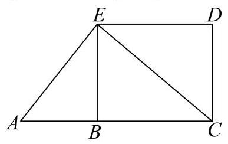

## 数列难题汇编 7.22

姓名:___

1 较难 单选题

设数列 $\left\{  {a}_{n}\right\}$ 满足 ${a}_{n} = \sin \left( \frac{n\pi }{3}\right)  + {\left( -1\right) }^{n}\cos \left( \frac{n\pi }{4}\right)$ ,记其前 $\mathrm{n}$ 项和为 ${S}_{n}$ ,前 $\mathrm{n}$ 项积为 ${T}_{n}$ . 则下列结论正确的是( )

A. 数列 $\left\{  {S}_{n}\right\}$ 和数列 $\left\{  {T}_{n}\right\}$ 均不是周期数列

B. 数列 $\left\{  {S}_{n}\right\}$ 是周期数列,数列 $\left\{  {T}_{n}\right\}$ 不是周期数列

C. 数列 $\left\{  {S}_{n}\right\}$ 不是周期数列,数列 $\left\{  {T}_{n}\right\}$ 是周期数列

D. 数列 $\left\{  {S}_{n}\right\}$ 和数列 $\left\{  {T}_{n}\right\}$ 均为周期数列

2 较难 单选题

数列 $\left\{  {a}_{n}\right\}$ 是等差数列,周期数列 $\left\{  {b}_{n}\right\}$ 满足 ${b}_{n} = \cos \left( {a}_{n}\right)$ ,若集合 $X = \left\{  {x \mid  x = {b}_{n}}\right.$ , n是正整数 $\}$ 中恰有三个元素，则数列 $\left\{  {b}_{n}\right\}$ 的周期 $\mathrm{T}$ 的取值不可能是( )

A. 4

B. 5

C. 6

D. 7

3 困难 单选题

设 $A$ 是由 $k$ 个二次函数组成的集合，对于连续的正整数 $1,2,3,\cdots ,{2025}$ ，存在二次函数

$y = {f}_{i}\left( x\right)  \in  A\left( {1 \leq  i \leq  {2025}, i \in  \mathbf{Z}, y = {f}_{i}\left( x\right) \text{ 可重复 }}\right)$ ,使得 ${f}_{1}\left( 1\right) ,{f}_{2}\left( 2\right) ,{f}_{3}\left( 3\right) ,\cdots ,{f}_{2025}\left( {2025}\right)$ 是等差数列，则 $k$ 的最小可能值是( ).

A. 507

B. 1013

C. 1519

D. 2025

4 一般 填空题

已知数列 $\left\{  {a}_{n}\right\}$ 是公差为 2 的等差数列，数列 $\lg {a}_{1},\lg {a}_{k},\lg {a}_{7}$ 也为等差数列，且 $k \in  \{ 3,4,5\}$ ，则 ${a}_{1} =$

5 较难 单选题

已知等差数列 $\left\{  {a}_{n}\right\}$ 的公差不为零, ${S}_{n}$ 为其前 $n$ 项和,存在正整数 $k$ 满足 ${S}_{k} = 0$ ,有两个命题:

命题①: 设数列公差 $d$ ,则 $d \cdot  {S}_{1} < 0$ .

命题②: $i\text{ 、 }j$ 均是小于 $k$ 的正整数，则 ${S}_{i} \cdot  {S}_{j} = {S}_{k - i}{S}_{k - j}.$

以上判断正确的是( )

A. 命题①②都是真命题

B. 命题①是真命题，命题②是假命题

C. 命题①②都是假命题

D. 命题①是假命题，命题②是真命题

6 一般 填空题

设 $\left\{  {a}_{n}\right\}$ 为等差数列,其前 $n$ 项和为 ${S}_{n}$ ,若 $\left( {{S}_{8} - {S}_{7}}\right) \left( {{S}_{9} - {S}_{7}}\right)  < 0$ ,则满足 ${S}_{m}{S}_{m + 1} < 0$ 的正整数 $m =$ ___.

7 一般 填空题

已知数列 $\left\{  {a}_{n}\right\}$ 为等差数列,数列 $\left\{  {b}_{n}\right\}$ 为等比数列,且 ${a}_{1} = {b}_{1} = 1,{a}_{2} = {b}_{2} = t$ ,若 ${a}_{6} + {b}_{6} > {38}$ , 则实数 $t$ 的取值范围为___.

8 一般 镇空题

由若干个多边形所覆盖的区域,称为这些多边形的并集,例如图中,梯形 ${ACDE}$ 是 $\bigtriangleup  {ACE}$ 与矩形 ${BCDE}$ 的并集.已知 $n$ 是正整数，在平面直角坐标系 ${xOy}$ 中，直线 ${l}_{n}$ 的方程为 $y =  - {2}^{n}x + n$ ，若直线 ${l}_{n}$ 交 $x$ 轴于点 ${A}_{n}$ ，交 $y$ 轴于点 ${B}_{n}$ ，则 $\bigtriangleup  {A}_{1}O{B}_{1}, \bigtriangleup  {A}_{2}O{B}_{2},\cdots , \bigtriangleup  {A}_{10}O{B}_{10}$ 的并集，其面积为___.

9 较易 填空题

已知数列 $\left\{  {a}_{n}\right\}$ 满足 ${a}_{1} + 2{a}_{2} + 3{a}_{3} + \cdots  + n{a}_{n} = n\left( {n + 2}\right)$ ，则 ${a}_{66} =$ ___.

10 较易 填空题

已知无穷数列 $\overline{\left\{  {a}_{n}\right\}  \text{ 满足 }}{a}_{n + 1} = \frac{1}{2}{a}_{n}$ ( $n$ 为正整数),且 ${a}_{1} = 2$ ,则 $\mathop{\sum }\limits_{{i = 1}}^{{+\infty }}{a}_{i} =$ ___.

11 困难 填空题

数列 $A : {a}_{1},{a}_{2},\cdots ,{a}_{100}$ 满足: ${a}_{i} \in  \mathbf{N}\left( {1 \leq  i \leq  {100}}\right)$ ,且 $1 = {a}_{1} < {a}_{2} < \cdots  < {a}_{100} = {2025}$ ,记集合 $M\left( A\right)  = \left\{  {\left( {{b}_{1},{b}_{2},\cdots ,{b}_{100}}\right)  \mid  {b}_{1} = 1,{b}_{100} = {2025},{b}_{i} = {a}_{i - 1} + 1\text{ 或 }{b}_{i} = {a}_{i + 1} - 1, i = 2,3,\cdots ,{99}}\right\}$ . 若数列 $A$ 满足:对任意 $\left( {{b}_{1},{b}_{2},\cdots ,{b}_{100}}\right)  \in  M\left( A\right)$ ，均有 ${b}_{1} < {b}_{2} < \cdots  < {b}_{100}$ ，则称数列 $A$ 是“好的”，“好的”数列 $A$ 的个数为___.

12 困难 填空题

设 $M = \{ x \mid  1 \leq  x \leq  {20}, x \in  \mathbf{N}\}$ . 数列 $\left\{  {a}_{n}\right\}$ 满足下列条件: ${a}_{1} = 1,{a}_{20} = 5,{a}_{k + 1} - {a}_{k} \in  \{ 0,1\}$ ,且对任意的 $i, j \in  M$ ，都存在 $m, n \in  M$ 使得 ${a}_{i} + {a}_{j} = {a}_{m} + {a}_{n}$ ，其中 $i, j, m, n$ 互不相等，则数列 $\left\{  {a}_{n}\right\}$ 的前20项和的最大值是___.

13 一般 单选题

若数列 $\left\{  {a}_{n}\right\}$ 同时满足如下条件:(i) $\left\{  {a}_{n}\right\}$ 是无穷数列；(ii) $\left\{  {a}_{n}\right\}$ 是递增数列；(iii) 存在正数M，使得对任意的 $n \in  {\mathbf{N}}^{ * }$ ，都有 $\left\{  {a}_{n}\right\}$ 的前 $\mathrm{n}$ 项的和 ${S}_{n} \in  \left\lbrack  {-M, M}\right\rbrack$ ，则称 $\left\{  {a}_{n}\right\}$ 具有性质P. 关于如下结论: ①存在等差数列具有性质P; ②存在等比数列具有性质P. 其中正确的说法是 ( )

A. ①和②均正确

B. ①和②均错误

C. ①正确，②错误

D. ①错误，②正确

14 一般 单选题

从等差数列: $1\text{ 、 }2\text{ 、 }3\text{ 、 }\cdots \text{ 、 }{1000}$ 中取出若干数字按先后顺序构成数列 $\left\{  {a}_{n}\right\}$ . 第一次取出数字“1”, 然后从取出的“1”开始往后数2个数的 ${a}_{2}$ ，再取出往后数到3的数 ${a}_{3},\cdots$ ，以此类推，如果某次取出的是数字“ ${a}_{k}$ ”，则下一次从取出的“ ${a}_{k}$ ”开始往后数 $k + 1$ 个数，再取出数到 $k + 1$ 的数字“ ${a}_{k + 1}$ ”；当往后数的数字个数小于“ $k + 1$ ”时，结束取数. 那么 $\left\{  {a}_{n}\right\}$ 的最后一项是( )

A. 6

B. 990

C. 999

D. 1000

15 困难 单选题

对任意正整数 $n$ ,数列 $\left\{  {a}_{n}\right\}$ 满足 ${a}_{n + 1} - {a}_{n} > 1$ ,则称该数列为“增长”数列.

命题1: 存在 ${a}_{1} =  - 1$ 的等差数列 $\left\{  {a}_{n}\right\}$ 为 “增长”数列,且满足其 $n$ 前项和 ${S}_{n} < \frac{{n}^{2} - {2n}}{2}$ .

命题2: 存在各项均为正整数的等比数列 $\left\{  {a}_{n}\right\}$ 为“增长”数列且 $\left\{  \frac{{a}_{n}}{2}\right\}$ 不是“增长”数列,使得 $\left\{  \frac{{a}_{n + 1}}{n + 1}\right\}$ 为“增长”数列. ( )

A. ①是真命题，②是真命题

B. ①是真命题，②是假命题

C. ①是假命题，②是真命题

D. ①是假命题，②是假命题

16 较难 单选题

已知数列 $\left\{  {a}_{n}\right\}$ ，若存在数列 $\left\{  {b}_{n}\right\}$ 满足对任意正整数 $n$ ,都有 $\left( {{a}_{n} - {b}_{n}}\right) \left( {{a}_{n + 1} - {b}_{n + 1}}\right)  < 0$ ,则称数列 $\left\{  {b}_{n}\right\}$ 是 $\left\{  {a}_{n}\right\}$ 的交错数列. 有下列两个命题:①对任意给定的等差数列 $\left\{  {a}_{n}\right\}$ ，不存在等差数列 $\left\{  {b}_{n}\right\}$ ， 使得 $\left\{  {b}_{n}\right\}$ 是 $\left\{  {a}_{n}\right\}$ 的交错数列; ②对任意给定的等比数列 $\left\{  {a}_{n}\right\}$ ，都存在等比数列 $\left\{  {b}_{n}\right\}$ ，使得 $\left\{  {b}_{n}\right\}$ 是 $\left\{  {a}_{n}\right\}$ 的交错数列. 下列结论正确的是 ( )

A. ①与②都是真命题；

B. ①为真命题，②为假命题；

C. ①为假命题，②为真命题；

D. ①与②都是假命题.

17 一般 单选题

数列 $\left\{  {a}_{n}\right\}$ 为严格增数列,且对任意的正整数 $n$ ,都有 $\frac{{a}_{n + 1}}{n + 1} \geq  \frac{{a}_{n}}{n}$ ,则称数列 $\left\{  {a}_{n}\right\}$ 满足“性质 $\Omega$ ”.

①存在等差数列 $\left\{  {a}_{n}\right\}$ 满足“性质 $\Omega$ ”；

②任意等比数列 $\left\{  {a}_{n}\right\}$ ，若首项 ${a}_{1} > 0$ ，则 $\left\{  {a}_{n}\right\}$ 满足“性质 $\Omega$ ”；

下列选项中正确的是( )

A. ①是真命题，②是真命题；

B. ①是真命题，②是假命题；

C. ①是假命题，②是真命题；

D. ①是假命题，②是假命题.

18 较难 单选题

若数列 $\left\{  {a}_{n}\right\}$ 满足 ${a}_{n + 1} = {\log }_{m}{a}_{n}\left( {m > 1\text{ 且 }m \in  \mathbf{Z}}\right)$ ，则称数列 $\left\{  {a}_{n}\right\}$ 为“对数 $m$ 底数列”. 已知正项数列 $\left\{  {a}_{n}\right\}$ 是“对数2底数列”且 ${a}_{5} = 1$ ，则当 $n \geq  2$ 且 $n \in  {\mathbf{N}}^{ * }$ 时， $\frac{{4}^{{a}_{2} + {a}_{3} + \cdots  + {a}_{n}}}{{a}_{2}^{2} \cdot  \ldots  \cdot  {a}_{n - 1}^{2}} =$ ( )

A. ${2}^{12}$

B. ${2}^{16}$

C. ${2}^{32}$

D. ${2}^{64}$

19 较难 单选题

将正整数 $1 \sim  {10}$ 按一定次序排列得到排列 ${a}_{1},{a}_{2},\cdots ,{a}_{10}$ ,若排列 ${a}_{1},{a}_{2},\cdots ,{a}_{10}$ 中的任意一项 ${a}_{i}\left( {1 \leq  i \leq  {10}}\right)$ 都满足: $- 1 \leq  {a}_{i} - i \leq  1$ ，则满足题意的排列 ${a}_{1}$ ， ${a}_{2}$ ， $\cdots$ ， ${a}_{10}$ 的个数为( )

A. 36

B. 55

C. 89

D. 144

20 较难 填空题

已知数列 $\left\{  {a}_{n}\right\}$ 满足: ${a}_{1} = 0$ ,对任意的正整数 $n$ 均有 ${a}_{n} - {a}_{n - 1} \in  \{ 1,2\}$ ,若存在正整数 $k\left( {1 \leq  k \leq  9}\right)$ ，使得所有数列 $\left\{  {a}_{n}\right\}$ 均满足 ${a}_{1} + {a}_{2} + \cdots  + {a}_{k} \leq  {a}_{k + 1} + {a}_{k + 2} + \cdots  + {a}_{10}$ ，则 $k$ 的最大值为___.

21 困难 填空题

已知数列 $\left\{  {a}_{n}\right\}$ ， ${a}_{1} = 1$ ， ${a}_{n} \in  \{ 1, - 1\}$ ， $\left( {n \geq  2}\right)$ ，并且前 $n$ 项的和 ${S}_{n}$ 满足:

①存在小于1013的正整数 $t$ ，使得 ${S}_{{2t} + 1} =  - 1$ ；

②对任意的正整数 $k$ 和 $m$ ，都有 $\left| {{S}_{2m} - {S}_{{2k} - 1}}\right|  \leq  1$ .

则满足以上条件的数列 $\left\{  {S}_{n}\right\}  \left( {1 \leq  n \leq  {2025}}\right)$ 共有___个.
