## 目录

模型一:倍长中线 ..4

模型二:截长补短模型 .5

模型三:手拉手模型 (全等) ..6

三角形 .6

手拉手模型 (正方形) .7

模型四:构造手拉手模型(较难，上海考卷中出题率不高，属于拓展模型) .9

模型五:角平分线相关模型 .10

模型六:婆罗摩笈多模型(“你的中线我的高”模型) 13

模型七:两定一动异侧型 .16

模型八:两定一动同侧型 .17

模型八:双动点问题 (作两次对称) 18

模型九:动线段问题 (造桥选址) 19

模型十:垂线段最短 .21

模型十一:相对运动，平移型将军饮马 .21

模型十二:相对运动或构造平行四边形 .22

模型十三:费马点求最值 (较难) 29

模型十四:垂美四边形模型 .31

模型十五: 正方形半角模型 .33

模型十六:矩形折叠模型 .34

模型十七:中点四边形模型 .36

模型十八:A 字模型 .38

模型十九:正 8 字模型 .39

模型二十:反 8 字模型 (两组相似，四点共圆) .39

模型二十一:三角形中矩形模型 .40

模型二十二:山字型 (三平行结构) .41

模型二十三:射影定理模型(直角三角形和斜边上的高) .41

模型二十四:母子相似模型 .42

模型二十五:一线三等角模型 .42

1.同侧一线三等角 .42

2.异侧一线三等角 .43

.44

模型二十六:旋转相似模型(手拉手) .44

模型二十七:十字架模型 .45

模型二十八:对角互补模型 .47

模型二十九:燕尾模型 .47

模型三十:双垂模型 .48

模型三十一:半角模型 .48

模型三十二:构造二倍角模型 .51

模型三十三:三四五模型 ..52

模型三十四:黄金三角形矩形模型 .53

## 模型一:倍长中线

## (一) 基本模型

<table><tr><td rowspan="2">[失效外部图片：bo_d7p0g4k91nqc7385hisg_3.jpg]</td><td>已知:在△ABC 中，AD 是 BC 边上的中线，   方法:延长 AD 到点 E，使 ED = AD，连接 BE.</td></tr><tr><td>结论 1: $\bigtriangleup \mathrm{{ACD}} \cong  \bigtriangleup \mathrm{{EBD}}$ .</td></tr><tr><td rowspan="2">[失效外部图片：bo_d7p0g4k91nqc7385hisg_3.jpg]</td><td>已知:在△ABC 中，点 D 是 BC 边的中点，点 E 是 AB 边上一点，   方法: 连接 ED，延长 ED 到点 F，使 DF = DE，连接 CF.</td></tr><tr><td>结论 2:△BDE≅△CDF.</td></tr><tr><td rowspan="2">[失效外部图片：bo_d7p0g4k91nqc7385hisg_3.jpg]</td><td>已知:在△ABC 中，点 D 是 BC 边的中点，   方法:作 CE⊥AD 于 E, BF⊥AD 于 F,</td></tr><tr><td>结论 3: 易证: $\bigtriangleup \mathrm{{CDE}} \cong  \bigtriangleup \mathrm{{BDF}}$ (SAS)</td></tr></table>

## (二) 结论推导

结论 1: $\bigtriangleup \mathrm{{ACD}} \cong  \bigtriangleup \mathrm{{EBD}}$ .

证明: $\because \mathrm{{AD}}$ 是 $\mathrm{{BC}}$ 边上的中线, $\therefore \mathrm{{CD}} = \mathrm{{BD}}$ .

---

$\because \angle \mathrm{{ADC}} = \angle \mathrm{{EDB}},\mathrm{{AD}} = \mathrm{{ED}}$ ,

	$\therefore \bigtriangleup \mathrm{{ACD}} \cong  \bigtriangleup \mathrm{{EBD}}$ .

---

结论 2: $\bigtriangleup \mathrm{{BDE}} \cong  \bigtriangleup \mathrm{{CDF}}$ .

证明: $\because$ 点 $D$ 是 ${BC}$ 边的中点， $\therefore {BD} = {CD}$ .

$\because \angle {BDE} = \angle {CDF},{DE} = {DF},\therefore \bigtriangleup {BDE} \cong  \bigtriangleup {CDF}$ .

## (三) 模型总结

遇到中点或中线，则考虑使用“倍长中线模型”，即延长中线，使所延长部分与中线相等，然后连接相应的顶点，构造出全等三角形.

## 模型二:截长补短模型

## (一) 基础模型 1:

<table><tr><td>方法</td><td>截长法</td><td>补短法</td></tr><tr><td>条件</td><td colspan="2">在 $\bigtriangleup {ABC}$ 中 ${AD}$ 平分 $\angle {BAC},\angle C = 2\angle B$ ,求证: ${AB} = {AC} + {CD}$</td></tr><tr><td>图示</td><td>[失效外部图片：bo_d7p0g4k91nqc7385hisg_4.jpg]</td><td>[失效外部图片：bo_d7p0g4k91nqc7385hisg_4.jpg]</td></tr><tr><td>方法</td><td>在 ${AB}$ 上截取 ${AE} = {AC}$ ,连接 ${DE}$</td><td>延长 AC 到点 E，使 CD=CE，连接 DE</td></tr><tr><td>结论</td><td>${\Delta ACD} \cong  {\Delta AED}$ △DEB是等腰三角形</td><td>${\Delta ABD} \cong  {\Delta AED}$   △CDE是等腰三角形</td></tr></table>

【总结】

(1)“截长补短法”是初中几何题中一种添加辅助线的方法，也是把几何题化难为易的一种靠略，截长就是在长边上截取一条线段与某一短边相等，补短就是通过延长或旋转等方式使两条短边拼合到一起，从而解决问题.

(2)截长或补短后，如果出现的全等三角形或特殊三角形能推动证明，那么辅助线是成功的，否则，就应该换一个截长或补短的方式，甚至换一种解题思路.

## 模型三:手拉手模型 (全等)

## 三角形

<table><tr><td rowspan="2">[失效外部图片：bo_d7p0g4k91nqc7385hisg_5.jpg]</td><td>已知:在△ABC和△ADE 中，AB = AC，AD = AE， $\angle {BAC} = \angle {DAE}$ ,连接 BD, CE 相交于 $O$ ,连接 OA.</td></tr><tr><td>结论 1: $\bigtriangleup {ABD} \cong  \bigtriangleup {ACE},{BD} = {CE}$ ,   结论 2: $\angle {BOC} = \angle {BAC}$ ,   结论 3: OA 平分 $\angle {BOE}$ .</td></tr></table>

## (二) 结论推导

结论 1: $\bigtriangleup \mathrm{{ABD}} \cong  \bigtriangleup \mathrm{{ACE}},\mathrm{{BD}} = \mathrm{{CE}}$ .

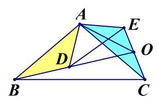

证明: $\because \angle \mathrm{{BAC}} = \angle \mathrm{{DAE}}$ ,

$\therefore \angle \mathrm{{BAD}} = \angle \mathrm{{CAE}}$ .

$\because \mathrm{{AB}} = \mathrm{{AC}},\mathrm{{AD}} = \mathrm{{AE}}$ ,

$\therefore  \bigtriangleup  \mathrm{{ABD}} \cong   \bigtriangleup  \mathrm{{ACE}}$ ，

$\therefore \mathrm{{BD}} = \mathrm{{CE}}$ .

结论 2: $\angle \mathrm{{BOC}} = \angle \mathrm{{BAC}}$ .

证明: 设 $\mathrm{{OB}}$ 与 $\mathrm{{AC}}$ 相交于点 $\mathrm{F}$ .

$\because  \bigtriangleup  \mathrm{{ABD}} \cong   \bigtriangleup  \mathrm{{ACE}}$ ，

$\therefore \angle \mathrm{{ABD}} = \angle \mathrm{{ACE}}$ .

$\because \angle \mathrm{{AFB}} = \angle \mathrm{{OFC}}$ ,

$\therefore \angle \mathrm{{BOC}} = \angle \mathrm{{BAC}}$ .

结论 3: OA 平分 $\angle \mathrm{{BOE}}$ .

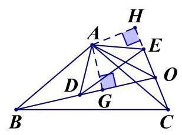

证明: 过点 $\mathrm{A}$ 分别做 $\mathrm{{BD}},\mathrm{{CE}}$ 的垂线,垂足为 $\mathrm{G},\mathrm{H}$ .

$\because \bigtriangleup \mathrm{{ABD}} \cong  \bigtriangleup \mathrm{{ACE}},\therefore {\mathrm{S}}_{\bigtriangleup \mathrm{{ABD}}} = {\mathrm{S}}_{\bigtriangleup \mathrm{{ACE}}}$ ,

$\therefore \frac{1}{2}{BD} \cdot  {AG} = \frac{1}{2}{CE} \cdot  {AH}$ .

$\because \mathrm{{BD}} = \mathrm{{CE}},\therefore \mathrm{{AG}} = \mathrm{{AH}}$ ,

$\therefore$ OA 平分 $\angle$ BOE.

## (三)解题技巧

如果题目中出现两个等腰三角形，可以考虑连接对应的顶点，用旋转全等模型； 如果只出现一个等腰三角形，可以用旋转的方法构造旋转全等.

手拉手模型 (正方形)

已知:正方形 ABCD 与正方形 BEFG 有公共点 B，连接 AG、CE 交于 H，连接 BH

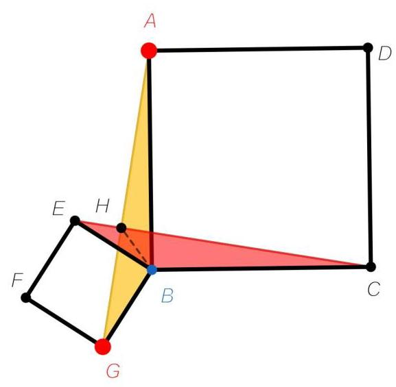

结论:

---

(1) $\mathrm{{AG}} = \mathrm{{CE}}$

(2) $\mathrm{{CE}} \bot  \mathrm{{AG}},\angle \mathrm{{CHG}} = {90}^{ \circ  }$

(3) BH 平分 $\angle \mathrm{{CHG}}$

---

模型四:构造手拉手模型(较难，上海考卷中出题率不高，属于拓展

模型)

<table><tr><td colspan="4">旋转 60 度模型</td></tr><tr><td rowspan="4">等边三角形</td><td rowspan="2">点在内部</td><td rowspan="2">[失效外部图片：bo_d7p0g4k91nqc7385hisg_8.jpg]</td><td>做法:将△ABD 绕点 A 逆时针旋转 ${60}^{ \circ  }$ ,   得到等边△AED，连接 DE</td></tr><tr><td>结论: $\bigtriangleup  \mathrm{{DEC}}$ 的三条边长就是 AD， BD, CD.</td></tr><tr><td rowspan="2">点在外部   $\angle \mathrm{{BDC}} = {120}^{ \circ  }$</td><td rowspan="2">[失效外部图片：bo_d7p0g4k91nqc7385hisg_8.jpg]</td><td>做法:将△ACD 绕点 A 逆时针旋转 ${60}^{ \circ  }$ ,   得到等边△DEC，连接 DE.</td></tr><tr><td>结论: ${AD} = {BD} + {CD}$ .</td></tr><tr><td rowspan="4">等腰直角三角形</td><td rowspan="2">点 $\mathrm{D}$ 在 $\bigtriangleup \mathrm{{ABC}}$ 内部</td><td rowspan="2">[失效外部图片：bo_d7p0g4k91nqc7385hisg_8.jpg]</td><td>做法:将△ABD 绕点 A 逆时针旋转 ${90}^{ \circ  }$ ,   得到等腰直角△AED，连接 DE.</td></tr><tr><td>结论: $\bigtriangleup \mathrm{{DEC}}$ 的三条边长就是 $\sqrt{2}\mathrm{{AD}}$ , BD, CD.</td></tr><tr><td rowspan="2">点 D 在外部 $\angle \mathrm{{BDC}} = {90}^{ \circ  }$</td><td rowspan="2">[失效外部图片：bo_d7p0g4k91nqc7385hisg_8.jpg]</td><td>做法:将△ACD 绕点 A 逆时针旋转 ${60}^{ \circ  }$ ,   得到等边△AEC，连接 DE.</td></tr><tr><td>结论: $\sqrt{2}{AD} = {BD} + {CD}$</td></tr></table>

## 模型五:角平分线相关模型

## (一) 尺规作角平分线 (SSS)

第一步:在纸上画一个角，作为要被平分的角 $\angle \mathrm{{AOB}}$ 。

第二步:以角的顶点 O 为圆心，任意长度为半径画圆弧，交角的两边 OA、OB 于 C、D 两点。

第三步:以 C 为圆心，大于 OC 且小于 OD(或反之)长度为半径画圆弧。

第四步:以 D 为圆心，与第三步相同的半径画圆弧。

第五步:两圆弧交于 $\mathrm{E}$ 点，连接顶点 $\mathrm{O}$ 和 $\mathrm{E}$ ， $\mathrm{{OE}}$ 即为 $\angle \mathrm{{AOB}}$ 的平分线。

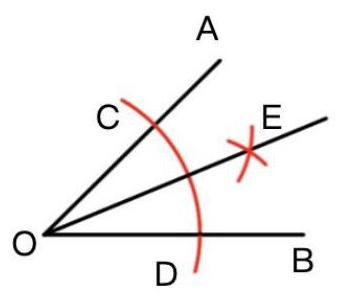

## (二) 、角平分线常见模型及辅助线作法

(1)过角平分线上的点作角两边的垂线，构造全等三角形

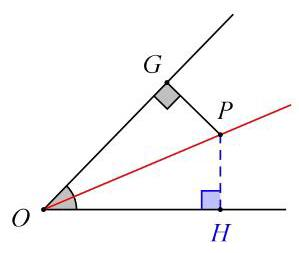

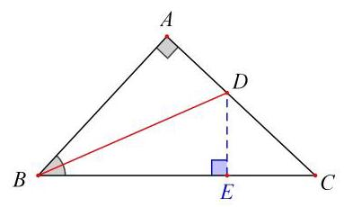

(2)角平分线上任意一点作角平分线的垂线，构造全等三角形.(即角平分线+ 垂线得等腰三角形)

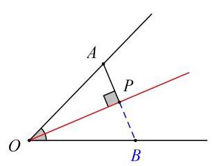

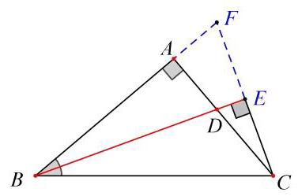

(3)角平分线+平行线得等腰三角形

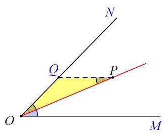

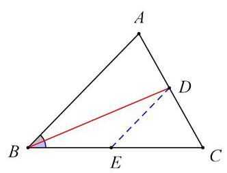

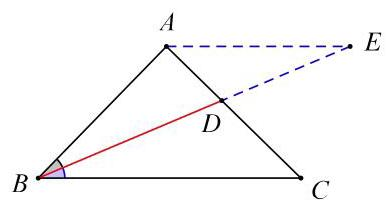

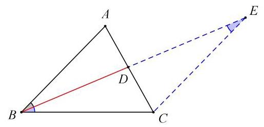

(4)截取构造对称全等(截长补短)

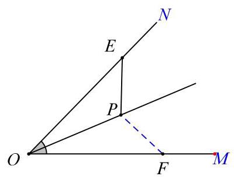

$\mathrm{{AB}}\parallel \mathrm{{CD}} \Rightarrow  \mathrm{{AB}} + \mathrm{{CD}} = \mathrm{{BC}}$

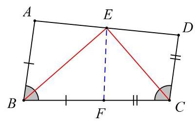

(5)角平分线分线段成比例: $\frac{AB}{AC} = \frac{BD}{CD}$ ；(常用二级结论，属于拓展知识，使用时需要证明)

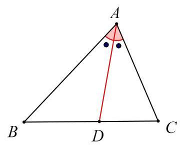

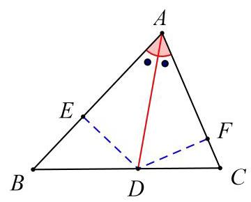

简证: $\because \frac{{S}_{\bigtriangleup {ABD}}}{{S}_{\bigtriangleup {ACD}}} = \frac{BD}{CD},{DE} = {DF}\;\therefore \frac{{S}_{\bigtriangleup {ABD}}}{{S}_{\bigtriangleup {ACD}}} = \frac{AB}{AC},\therefore \frac{AB}{AC} = \frac{BD}{CD}$

(6)旁心:三角形的一条内角平分线与其他两个角的外角平分线交于一点

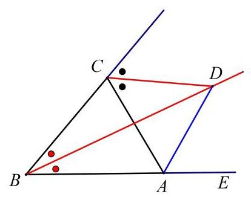

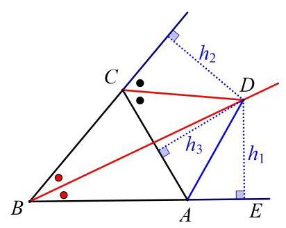

结论:AD 平分 $\angle \mathrm{{CAD}}$ 。

模型六:婆罗摩笈多模型(“你的中线我的高”模型)

<table><tr><td>题目特征</td><td>共直角顶点的正方形或等腰直角三角形，出现垂直.</td><td>共直角顶点的正方形或等腰直角三角形，出现中点.</td></tr><tr><td>条件</td><td>四边形 ABCD、CEFG 为正方形，连接 BE、DG，I、C、H 三点共线，CH ⊥ BE</td><td>四边形 ABCD、CEFG 为正方形，连接 BE、DG，I、C、H三点共线，点 I 为 DG 中点</td></tr><tr><td>图示</td><td>[失效外部图片：bo_d7p0g4k91nqc7385hisg_12.jpg]</td><td>[失效外部图片：bo_d7p0g4k91nqc7385hisg_12.jpg]</td></tr><tr><td>作法</td><td>分别过点 D、G 作 DM ⊥ CI 与点 M， NG ⊥ CI 于点 N</td><td>延长 IC 到点 P，使 PI = IC，连接 PG</td></tr><tr><td>结论</td><td>① $\mathrm{{DI}} = \mathrm{{IG}}$ (知垂直得中点)   ② ${S}_{\Delta EBC} = {S}_{\Delta DCG}$   ③ $\mathrm{{BE}} = 2\mathrm{{IC}}$</td><td>①CH⊥BE(知中点得垂直)   ②BE = 2IC   ③ ${S}_{\Delta EBC} = {S}_{\Delta DCG}$</td></tr></table>

如图， $\bigtriangleup  \mathrm{{ABC}}$ 和 $\bigtriangleup  \mathrm{{DBE}}$ 是等腰直角三角形，连接 $\mathrm{{AD}},\mathrm{{CE}},\mathrm{M},\mathrm{N}$ 分别在 $\mathrm{{AD}}$ ， CE 上，且 MN 经过点 B

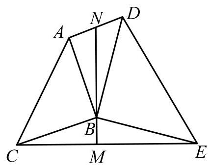

【性质 1: 垂直得中点】若 ${MN}\bot {CE}$ ，则:

①点 N 是 AD 的中点，

---

② ${S}_{\Delta CBE} = {S}_{\Delta ABD}$ ，

	③CE = 2BN.

---

【性质 2: 中点得垂直】若点 $\mathrm{N}$ 是 $\mathrm{{AD}}$ 的中点，则: MN $\bot$ CE.

【证明】如图，(知中点得垂直，倍长中线)

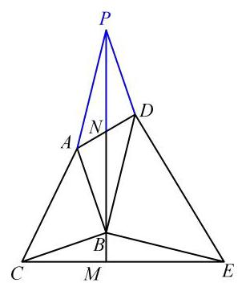

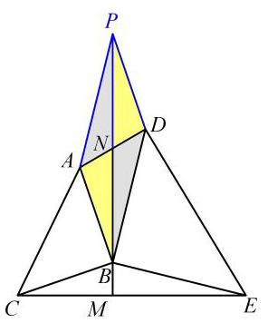

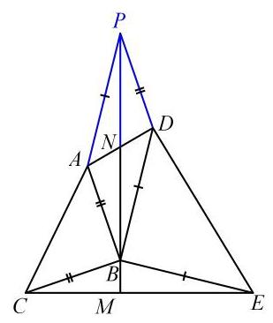

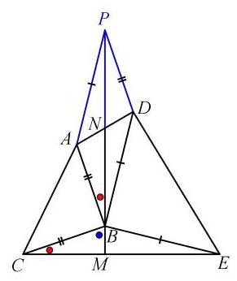

证明: 延长 ${BN}$ 至点 $P$ ,使 ${BN} = {PN}$ ,连结 ${PN}$ ,

易证: $\bigtriangleup  \mathrm{{PAD}} \cong  \mathrm{{BDA}},\therefore \mathrm{{BC}} = \mathrm{{PD}},\mathrm{{BE}} = \mathrm{{PA}}$

$\because \mathrm{{PA}}//\mathrm{{BD}}$ ,

$\therefore \angle \mathrm{{PAB}} + \angle \mathrm{{ABD}} = {180}^{ \circ  }$ ,

又 $\because \angle \mathrm{{ABC}} = \angle \mathrm{{DBE}} = {90}^{ \circ  }$

$\therefore \angle \mathrm{{CBE}} + \angle \mathrm{{ABD}} = {180}^{ \circ  }$ ,

$\therefore \angle \mathrm{{CBE}} = \angle \mathrm{{PAB}}$ ,

---

易证: $\bigtriangleup \mathrm{{CBE}} \cong  \bigtriangleup \mathrm{{PAB}}$ ,

	$\therefore \angle \mathrm{{BCM}} = \angle \mathrm{{ABN}}$ ,

		$\because \angle \mathrm{{ABN}} + \angle \mathrm{{CBM}} = {90}^{ \circ  }$

		$\therefore \angle \mathrm{{BCM}} + \angle \mathrm{{CBM}} = {90}^{ \circ  }$

		$\therefore \angle \mathrm{{BMC}} = {90}^{ \circ  }$

---

## 模型七:两定一动异侧型

## 1. 在直线 $l$ 上求一点 $P$ ，使 ${PA} + {PB}$ 最小

连接 ${AB}$ ，与1交点即为 $P$ ，两点之间线段最短 ${PA} + {PB}$ 最小值为 ${AB}$

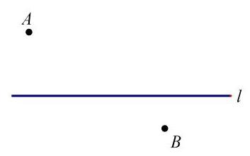

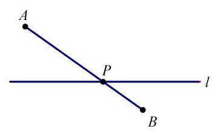

## 2. 在直线 $l$ 上求一点 $P$ ，使 $\left| {{PA} - {PB}}\right|$ 最大

作 $B$ 关于直线 $l$ 的对称点 ${B}^{\prime } \Rightarrow  {PB} = P{B}^{\prime },\left| {{PA} - {PB}}\right|  = \left| {{PA} - P{B}^{\prime }}\right|$

原理:三角形两边之和大于第三边，连接 $A{B}^{\prime }$ ，在 $\bigtriangleup  A{B}^{\prime }P$ 中 $\left| {{PA} - P{B}^{\prime }}\right|  \leq  A{B}^{\prime }$

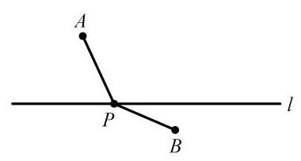

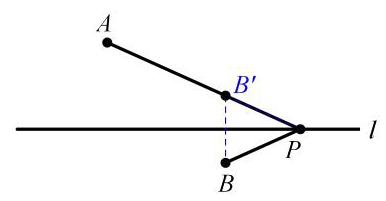

## 模型八:两定一动同侧型

## 3. 在直线 $\mathrm{l}$ 上求一点 $\mathrm{P}$ ，使 $\mathrm{{PA}} + \mathrm{{PB}}$ 最小(将军饮马)

作 $B$ 关于1的对称点 ${B}^{\prime } \Rightarrow  {PB} = P{B}^{\prime }$ ，则 ${PA} + {PB} = {PA} + P{B}^{\prime }$ ，当 $A, P,{B}^{\prime }$ 共线时取最小，原理:两点之间线段最短，即 PA + PB 最小值为 AB'

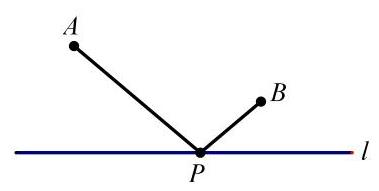

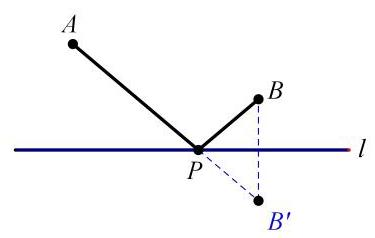

## 4. 在直线 $l$ 上求一点 $P$ ，使 $\left| {{PA} - {PB}}\right|$ 最大

连接 ${AB}$ ，当 $A, B, P$ 共线时取最大

原理:三角形两边之和大于第三边，在 $\bigtriangleup  \mathrm{A{B}^{\prime }P}$ 中， $\left| {{PA} - P{B}^{\prime }}\right|  \leq  A{B}^{\prime }$

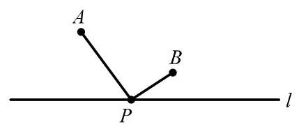

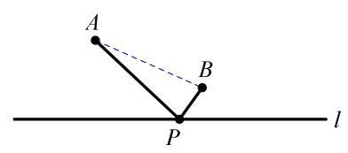

## 模型八:双动点问题(作两次对称)

## 5. 在直线 ${l}_{1},{l}_{2}$ 上分别求点 $M, N$ ，使 $\bigtriangleup {PMN}$ 周长最小

分别作点 $P$ 关于两直线的对称点 $P$ ’和 $P$ "， ${PM} = P$ ’M， ${PN} = P$ "N，

原理:两点之间线段最短， ${P}^{\prime }$ ， ${P}^{\prime \prime }$ ，与两直线交点即为 $M$ ， $N$ ，则 ${AM} + {MN} + {PN}$ 的最小值为线段 ${P}^{\prime }{P}^{\prime \prime }$ 的长

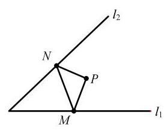

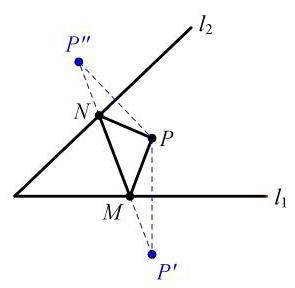

6. P，Q 为定点，在直线 ${l}_{1}$ ， ${l}_{2}$ 上分别求点 $\mathrm{M}$ ， $\mathrm{N}$ ，使四边形 PQMN 周长最小分别作点 $\mathrm{P}$ ， $\mathrm{Q}$ 关于直线 ${l}_{1}\text{ ， }{l}_{2}$ 的对称点 $\mathrm{P}$ ， $\mathrm{P}$ 和 $\mathrm{Q}$ ′， $\mathrm{{PM}} = \mathrm{P}$ ′M， $\mathrm{{QN}} = \mathrm{Q}$ ′N

原理:两点之间线段最短，连接 P'Q'，与两直线交点即为 M，N，则 PM + MN + QN 的最小值为线段 P'Q'的长，周长最小值为 P'Q'+ PQ

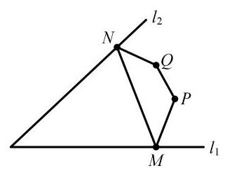

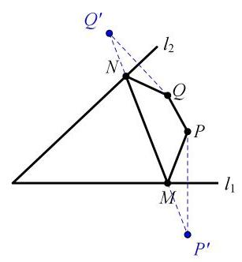

## 7. A, B 分别为 ${l}_{1},{l}_{2}$ 上的定点, M, N 分别为 ${l}_{1},{l}_{2}$ 上的动点,求 ${AN} + {MN} + {BM}$ 最小值

分别作 $A, B$ 关于 ${l}_{1},{l}_{2}$ 的对称点 ${A}^{\prime },{B}^{\prime }$ ，则 ${AN} = {A}^{\prime }N,{BM} = {B}^{\prime }M,{A}^{\prime }{B}^{\prime }$ 即所求

原理:两点之间距离最短， ${\mathrm{A}}^{\prime }$ ， $\mathrm{N}$ ， $\mathrm{M}$ ， ${\mathrm{B}}^{\prime }$ 共线时取最小，则 $\mathrm{{AN}} + \mathrm{{MN}} + \mathrm{{BM}} = \; {\mathrm{A}}^{\prime }\mathrm{N} + \mathrm{{MN}} + {\mathrm{B}}^{\prime }\mathrm{M} \leq  {\mathrm{A}}^{\prime }{\mathrm{B}}^{\prime }$

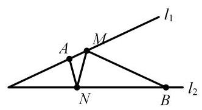

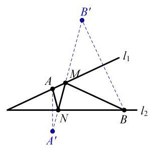

## 模型九:动线段问题(造桥选址)

8. 直线 $m//n$ ，在 $m, n$ 上分别求点 $M\text{ ， }N$ ，使 ${MN}\bot m$  ， 且 ${AM} + {MN} + {BN}$ 的最小值

将点 B 向上平移 MN 的长度单位得 B′，连接 B′M，当 AB′M 共线时有最小值原理: 通过构造平行四边形转换成普通将军饮马, AM + MN + BN = AM + MN + $\mathrm{B} \cdot  \mathrm{M} \leq  \mathrm{A}{\mathrm{B}}^{\prime } + \mathrm{{MN}}$

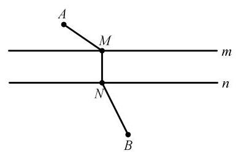

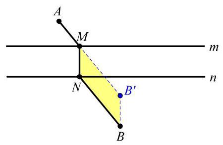

9. 在直线 $l$ 上求两点 $M, N\left( {M\text{ 在左 }}\right)$ 且 ${MN} = a$ ，求 ${AM} + {MN} + {BN}$ 的最小值

将 $B$ 点向左移动 $a$ 个单位长度，再作 ${B}^{\prime }$ 关于直线 $l$ 的对称点 ${B}^{\prime \prime }$ ，当 ${A{B}^{\prime \prime }M}$ 共线有最小值

原理: 通过平移构造平行四边 $B{B}^{\prime }{MN} \Rightarrow  {BN} = {B}^{\prime }M = {B}^{\prime \prime }M$ ,

${AM} + {MN} + {BN} = {AM} + {MN} + {B}^{\prime \prime }M \leq  A{B}^{\prime \prime }$

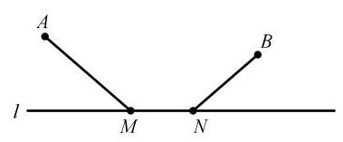

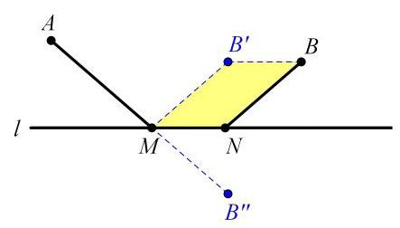

## 模型十:垂线段最短

## 10. 在直线 ${l}_{1},{l}_{2}$ 上分别求点 $\mathbf{A},\mathbf{B}$ ，使 $\mathbf{{PB}} + \mathbf{{AB}}$ 最小

问题解决: 作 $P$ 关于 ${l}_{2}$ 的对称点 ${P}^{\prime }$ ,作 ${P}^{\prime }A \bot  {l}_{1}$ 于 $\mathrm{A}$ ,交 ${l}_{2}$ 于 $\mathrm{B},{P}^{\prime }A$ 即所求原理:点到直线，垂线段最短， ${PB} + {AB} = {{P}^{\prime }B} + {AB} \leq  {P}^{\prime }A$

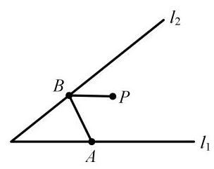

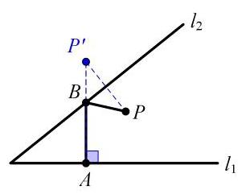

## 模型十一:相对运动，平移型将军饮马

11. 在直线 $l$ 上求两点 $M, N\left( {M\text{ 在左 }}\right)$ 且 ${MN} = a$ ，求 ${AM} + {AN}$ 的最小值

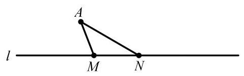

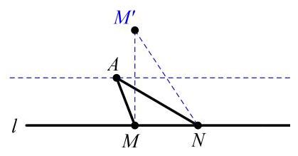

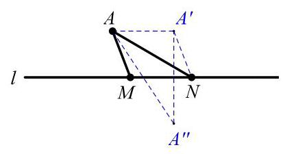

## 模型十二:相对运动或构造平行四边形

策略一:相对运动思想

过点 A 作 MN 的平行线，相对 MN，点 A 在该平行线上运动，则可转化为普通饮马问题

策略二:构造平行四边形等量代换，参考在直线 1 上求两点 M，N(M 在左) 且 $\mathrm{{MN}} = \mathrm{a}$ ,求 ${AM} + {MN} + {BN}$ 的最小值

## 七、化斜为直，斜大于直

12. 已知: ${AD}$ 是 ${Rt}\bigtriangleup {ABC}$ 斜边上的高

(1)求 $\frac{AD}{BC}$ 的最大值；(2)若 ${AD} = 2$ ，求 ${BC}$ 的最大值

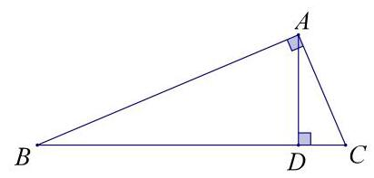

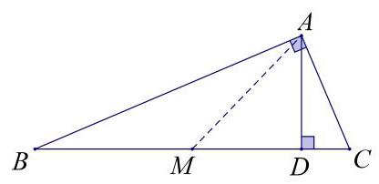

取 $\mathrm{{BC}}$ 中点 $\mathrm{M}$ ，(1)则 $\frac{AD}{BC} \leq  \frac{AM}{BC} = \frac{1}{2}$ ； (2) ${BC} = {2AM} \leq  {2AD} = 4$

## 八、瓜豆轨迹，手拉手藏轨迹(较难)

## 13. 如图，点 $\mathrm{P}$ 在直线 $\mathrm{{BC}}$ 上运动，将点 $\mathrm{P}$ 绕定点 $\mathrm{A}$ 逆时针旋转 ${90}^{ \circ  }$ ，得到点 $\mathrm{Q}$ ， 求 $\mathrm{Q}$ 点轨迹?

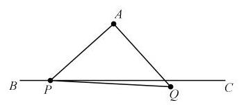

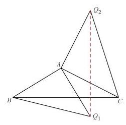

当 AP 与 AQ 夹角固定且 AP:AQ 为定值的话，P、Q 轨迹是同一种图形. 当确定

轨迹是线段的时候，可以任取两个时刻的 Q 点的位置，连线即可，比如 Q 点的起始位置和终点位置，连接即得 Q 点轨迹线段.

原理:由手拉手可知 $\bigtriangleup {ABC} \cong  \bigtriangleup A{Q}_{1}{Q}_{2}$ ，故 $\angle A{Q}_{2}{Q}_{1} = \angle {ACB}$ ，故 Q 点轨迹为直线

瓜豆模型拓展

初中阶段如遇求轨迹长度仅有 2 种类型: “直线型”和“圆弧型” (两种类型中还会涉及点往返探究“往返型”)，对于两大类型该如何断定，通常老师会让学生画图寻找 3 处以上的点来确定轨迹类型进而求出答案，对于填空选择题而言不外乎是个好方法，但如果要进行说理很多考生难以解释清楚

## 瓜豆原理模型解释:

定角定比，主从联动

一个主动点，一个从动点(根据某种约束条件，跟着主动点动)，当主动点运动时，从动点的轨迹相同.

## 只要满足:

1、两“动”，一“定”

则两动点的运动轨迹是相似的，运动轨迹长度的比和它们到定点的距离比相同。 2、两动点与定点的连线夹角是定角

3、两动点到定点的距离比值是定值

【例题】如图，D、E 是边长为 4 的等边三角形 ABC 上的中点，P 为中线 AD 上的动点，把线段 PC 绕 C 点逆时针旋转 60°，得到 P’，EP’的最小值

【分析】

(1)点 P’运动的轨迹是直线，可以通过 P 在 A，D 时，即始末位置时 P’对应的位置得到直线轨迹，对于选填题，可找出从动点的始末位置，从而快速定位轨迹， 若要说理则需要构造手拉手证明.

(2)点 P’的运动长度和点 P 的运动长度相同，因为点 P’与点 P 到定点 C 的距离相等，则有运动路径长度相等，若要说理则同样需要构造手拉手结构，通过全等证明.

(3)构造手拉手模型，以旋转中心 C 为顶点进行构造，其实只要再找一组对应的主从点即可，简单来说就是从 P 点的轨迹即线段 AD 中再找一个点进行与 P 点类似的的旋转，比如把线段 AD 中的点 A 绕 C 点逆时针旋转 ${60}^{ \circ  }$ ，即为点 B， 连接 BP’即可得到一组手拉手模型，虽然前面说是任意点，但一般来说我们选择一个特殊位置的点进行旋转后的点位置也是比较容易确定的，比如说点 D 进行旋转也是比较方便.

(4)分析 $\angle {CAP}$ 和 $\angle {CBP}$ ’,由全等可知 $\angle {CAP} = \angle {CBP}$ ’，因为 $B$ 为定点，所以得到 P'轨迹为直线 BP'

(5)点 P 和点 P'轨迹的夹角和旋转角的关系，不难得出本题主动点与从动点轨迹的夹角等于旋转角，要注意的是如果旋转角是钝角，那么主动点与从动点轨迹的夹角等于旋转角的补角。

(6) 前面提到，如果是选填题，可以通过找从动点的始末位置快速定位轨迹线段，或者通过构造手拉手，通过全等或相似得出相等角然后得出轨迹，这两种方法都是先找出从动点 P'的轨迹，再作垂线段并求出垂线段的长得到最小值，此外，还可以对关键点进行旋转来构造手拉手模型，从而代换所求线段，构造如下.

将点 EC 绕点 C 顺时针旋转 60°，构造手拉手模型(SAS 全等型)，从而得到 P'E $= \mathrm{{PG}}$ ，最小值即为点 $\mathrm{G}$ 到 $\mathrm{{AD}}$ 的距离.

要注意的是因为要代换 P’E，所以 E 点的旋转方式应该是从 P’→P，所以是顺时针旋转，求轨迹时的旋转方式则是 P→P’，注意区分.

【解析】

## 策略一:找从动点轨迹

连接 ${BP}$ ',

由旋转可得， ${CP} = {CP}$ ’， $\angle P$ ’ ${CP} = {60}^{ \circ  }$ ，

$\because \bigtriangleup \mathrm{{ABC}}$ 是等边三角形，

$\therefore \mathrm{{AC}} = \mathrm{{BC}},\angle \mathrm{{ACB}} = {60}^{ \circ  }$ ,

$\therefore \angle \mathrm{{ACB}} = \angle \mathrm{{PCP}}$ ,

$\therefore \bigtriangleup \mathrm{{ACP}} \cong  \bigtriangleup \mathrm{{BCP}}$ ’ (SAS),

$\therefore \angle \mathrm{{CBP}}$ ’ $= \angle \mathrm{{CAP}}$ ,

$\because$ 边长为 4 的等边三角形 ${ABC}$ 中，P 是对称轴 AD 上的一个动点，

$\therefore \angle \mathrm{{CAP}} = {30}^{ \circ  },\mathrm{{BD}} = 2$ ,

$\therefore \angle \mathrm{{CBP}}$ ’ $= {30}^{ \circ  }$ ,

即点 $\mathrm{P}$ ’的运动轨迹为直线 $\mathrm{{BP}}$ ’,

$\therefore$ 当 D P’ $\bot$ B P’时，EP’最短，

此时， $\mathrm{{EP}}$ ’ $= \frac{1}{2}\mathrm{{BD}} + \mathrm{{ED}} = \frac{1}{2} \times  2 + 2 = 3$

$\therefore$ EP’的最小值是 3

## 策略二:反向旋转关键点构造手拉手代换所求线段

将点 E 绕 C 点顺时针旋转 60° 得到点 G，连接 PG，CG，EP’

由旋转可得 $\mathrm{{EC}} = \mathrm{{CG}},\mathrm{{CP}} = \mathrm{{CP}},\angle \mathrm{P}$ ’ $\mathrm{{CP}} = {60}^{ \circ  },\angle \mathrm{{ECG}} = {60}^{ \circ  }$ ,

$\therefore \bigtriangleup \mathrm{{ECG}}$ 是等边三角形， $\mathrm{{EG}} = 2$

$\because \angle \mathrm{{PCP}}$ ’ $= \angle \mathrm{{ECG}}$

$\therefore \angle \mathrm{{PCG}} = \angle \mathrm{{ECP}}$ ,

$\therefore \bigtriangleup \mathrm{{GCP}} \cong  \bigtriangleup \mathrm{{ECP}}$ ’ (SAS),

$\therefore \mathrm{{EP}}$ ’ $= \mathrm{{GP}}$ ,

过点 $\mathrm{G}$ 作 $\mathrm{{AD}}$ 的垂线 $\mathrm{{GH}}$ 垂足为 $\mathrm{H},\mathrm{{GH}}$ 即为所求.

$\because \angle \mathrm{{GEC}} = \angle \mathrm{{ACD}}$

$\therefore \mathrm{{HE}}//\mathrm{{DC}}$

$\because \angle \mathrm{{GHD}} = \angle \mathrm{{ADC}}$

$\therefore \mathrm{{HG}}//\mathrm{{DC}}$

故 G，E，H 三点共线，则有 HE//DC

又 E 是 AC 中点，分线段成比例可知 H 是 AD 中点

$\therefore \mathrm{{HE}} = \frac{1}{2}{DC} = 1$

$E{P}^{\prime } = {GP} = {HE} + {EG} = 2 + 1 = 3$

$\therefore$ EP’的最小值是 3

总共提到了 3 种处理方式:

1.找始末，定轨迹

2.在轨迹上找一点旋转，构造手拉手模型，再通过角度相等得到从动点轨迹.

3. 反向旋转相关定点，构造手拉手模型，代换所求线段，即逆向构造.

## 模型十三:费马点求最值 (较难)

如图△ABC所有的内角都小于 120 度，在△ABC 内部有一点 P，连接 PA、PB、 PC,

当 ${PA} + {PB} + {PC}$ 的值最小时，求此时 $\angle \mathrm{{APB}}$ 与 $\angle \mathrm{{APC}}$ 的度数.

【问题处理】如图 1，将 $\bigtriangleup  \mathrm{{ACP}}$ 绕着点 C 顺时针旋转 60 度得到 $\bigtriangleup$ A'CP'，则 $\bigtriangleup \mathrm{{ACP}} \cong  \bigtriangleup \mathrm{A}$ ’ $\mathrm{{CP}}$ ’, $\mathrm{{CP}} = \mathrm{{CP}}$ ’, $\mathrm{{AP}} = \mathrm{A}$ ’ $\mathrm{P}$ ’, $\mathrm{\text{ 又 }}\because \angle \mathrm{{PCP}}$ ’ $= {60}^{ \circ  }$ , $\therefore \bigtriangleup \mathrm{{PCP}}$ ’是等边三角形， $\therefore$ PP’ $=$ PC, PA+PB+PC $=$ P’A’+PB+PP’,

如图 2,当且仅当点 $B\text{ 、 }P\text{ 、 }P\text{ 、 }A$ ’共线时, ${PA} + {PB} + {PC}$ 最小,最小值为 $A$ ’B, 此时 $\angle \mathrm{{BPC}} = \angle \mathrm{{APC}} = \angle \mathrm{{APB}} = {120}^{ \circ  }$

图1

图2

【问题归纳】如费马点就是到三角形的三个顶点的距离之和最小的点. 费马点结论:

① 对于一个各角不超过 ${120}^{ \circ  }$ 的三角形，费马点是对各边的张角都是 ${120}^{ \circ  }$ 的点， 所以三角形的费马点也叫三角形的等角中心；

② 对于有一个角超过 120°的三角形，费马点就是这个内角的顶点.

【如何作费马点】如图 3, 连接 AA', 我们发现△ACA'为等边三角形，点 P 在 A'B 上，同理，我们可以得到等边 $\bigtriangleup  \mathrm{{BAB}}$ ’，点 P 也在 CB’上，因此，我们可以以 $\bigtriangleup  \mathrm{{ABC}}$ 三角形任意两边为边向外构造等边三角形，相应连线的交点即为费马点。(最大角小于 120°时)

图3

模型十四:垂美四边形模型

模型介绍:对角线互相垂直的四边形为垂美四边形

已知:四边形 $\mathrm{{ABCD}}$ 中， $\mathrm{{AC}} \bot  \mathrm{{BD}}$

结论:

(1) ${\mathrm{{AB}}}^{2} + {\mathrm{{DC}}}^{2} = {\mathrm{{AD}}}^{2} + {\mathrm{{BC}}}^{2}$

(2) $\mathrm{S}$ 垂美四边形 $\mathrm{{ABCD}} = 1/2 \cdot  \mathrm{{AC}} \cdot  \mathrm{{BD}}$

已知:矩形 ${ABCD}$ 中，P 为 CD 边上一点，连接 ${AP}$ 、 ${BP}$

结论: ${\mathrm{{DP}}}^{2} + {\mathrm{{BP}}}^{2} = {\mathrm{{AP}}}^{2} + {\mathrm{{PC}}}^{2}$

已知:矩形 ${ABCD}$ 中，P 为矩形内部任意一点，连接 ${AP}$ 、 ${BP}$ 、 ${CP}$ 、 ${DP}$

结论: ${\mathrm{{AP}}}^{2} + {\mathrm{{PC}}}^{2} = {\mathrm{{DP}}}^{2} + {\mathrm{{BP}}}^{2}$

## 模型十五: 正方形半角模型

模型介绍:正方形的一个顶点引出夹角为 ${45}^{ \circ  }$ 的两条射线，连结它们与该顶点的两对边的交点构成

已知:正方形 ABCD 中，E、F 分别是 BC、CD 上的点， $\angle {EAF} = {45}^{ \circ  }$ ，AE、AF 分别与 BD 相交于点 O、P

结论:

(1) EF = BE + DF

(2) AE 平分 $\angle {BEF},{AF}$ 平分 $\angle {DFE}$

(3) C△CEF = 2 倍正方形边长

(4) S△ABE + S△ADF = S△AEF

(5) $\mathrm{{AB}} = \mathrm{{AG}} = \mathrm{{AD}}$ (过点 $\mathrm{A}$ 作 $\mathrm{{AG}} \bot  \mathrm{{EF}}$ ，垂足为点 $\mathrm{G}$ )

(6) ${\mathrm{{OP}}}^{2} = {\mathrm{{OB}}}^{2} + {\mathrm{{OD}}}^{2}$

(7)若点 E 为 BC 中点，则点 F 为 CD 三等分点

## 模型十六:矩形折叠模型

模型介绍:翻折问题属于图形变换，注意隐含条件思路:

1. 翻折前后图形全等，对应线段和角相等

2. 矩形翻折形成直角三角形，可用勾股定理计算

3. 翻折前后轴对称，对应点连线被折痕垂直平分

4. 折痕平分翻折形成的两个角

沿矩形对角线翻折

已知:矩形 ${ABCD}$ 中，以 ${BD}$ 为折痕翻折 $\bigtriangleup {ABD}$ ，点 $A$ 对应点 ${A}^{\prime }$ 结论:

(1) $\bigtriangleup \mathrm{{ABD}} \cong  \bigtriangleup {\mathrm{A}}^{\prime }\mathrm{{BD}}$

(2) $\bigtriangleup {\mathrm{A}}^{\prime }\mathrm{{BE}} \cong  \bigtriangleup \mathrm{{CDE}}$ (AAS)

(3)折痕 BD 垂直平分 AA′

(4)△BDE 为等腰三角形

## 模型十七:中点四边形模型

模型介绍:顺次连接四边形各边中点组成的四边形，也称瓦里尼翁平行四边形

已知:四边形 $\mathrm{{ABCD}}$ 中，E、F、G、H为各边中点

结论:

(1)中点四边形一定是平行四边形

(2)对角线相等 $\rightarrow$ 中点四边形为菱形

(3)对角线垂直 $\rightarrow$ 中点四边形为矩形

(4)对角线相等且垂直 $\rightarrow$ 中点四边形为正方形

## 模型十八:A 字模型

正 A 型

已知:在 $\bigtriangleup  \mathrm{{ABC}}$ 中，点 D，E 分别在 AB，AC 上，且 DE || BC

结论: $\bigtriangleup  \mathrm{{ADE}} \backsim   \bigtriangleup  \mathrm{{ABC}}$ ， $\frac{AD}{AB} = \frac{AE}{AC} = \frac{DE}{BC}$ . (共线的边之比相等)

斜 $\mathrm{A}$ 型

已知:在 $\bigtriangleup  \mathrm{{ABC}}$ 中，点 $\mathrm{D}$ ， $\mathrm{E}$ 分别在 $\mathrm{{AB}}$ ， $\mathrm{{AC}}$ 上，且 $\mathrm{{DE}}$ // $\mathrm{{BC}}$

结论: $\frac{AD}{AC} = \frac{AE}{AB} = \frac{DE}{BC}$ . (共线的边之积相等)

## 构造 A 字模型

遇到线段上的比例端点可以考虑作平行线构造构造 A 字模型

## 模型十九:正 8 字模型

正 8 字

已知:AC 与 BD 相交于点 O，AB || CD.

结论: $\bigtriangleup \mathrm{{OAB}} \backsim  \bigtriangleup \mathrm{{OCD}}$ ， $\frac{OA}{OC} = \frac{OB}{OD} = \frac{AB}{CD}$ (共线的边之比相等).

## 构造 8 字模型

遇到三角形或平行四边形边上的比例端点时可以考虑作平行线构

模型二十:反 8 字模型 (两组相似，四点共圆)

性质一:如右图， $\angle \mathrm{A} = \angle \mathrm{D} \Leftrightarrow   \bigtriangleup  \mathrm{{AOB}} \backsim   \bigtriangleup  \mathrm{{DOC}} \Leftrightarrow$

$\frac{AB}{CD} = \frac{OA}{OD} = \frac{OB}{OC}$

性质二: 如右图, $\left\{  \begin{array}{l} \angle {AOD} = \angle {BOC} \\  \frac{OA}{OD} = \frac{OB}{OC} \Rightarrow  \frac{OA}{OB} = \frac{OD}{OC} \end{array}\right. \;\bigtriangleup \mathrm{{AOD}} \backsim  \bigtriangleup \mathrm{{BOC}}$ (由第一组相似推出

第二组相似)

## 模型二十一:三角形中矩形模型

三角形的内接矩形:四个顶点都在三角形边上的矩形.

若四边形 DEFG 为矩形，则: ${\bigtriangleup {AEF}}{ \sim  }_{\bigtriangleup }{ABC} \Rightarrow  \frac{AI}{AH} = \frac{EF}{BC}$

特别地,

(1)当四边形 DEFG 为正方形时，若假设其边长为 $\mathrm{a}$ ，则: $\frac{AI}{AH} = \frac{EF}{BC} \Rightarrow  \frac{{AH} - a}{AH} = \frac{a}{BC} \Rightarrow  a = \frac{{AH} \cdot  {BC}}{{AH} + {BC}}$

(2)当 EF 为三角形的中位线时，矩形 DEFG 的面积最大，最大值为 ${S}_{DEFG} = \frac{1}{2}{S}_{\bigtriangleup {ABC}}$ (3) $\frac{{S}_{\bigtriangleup {AEF}}}{{S}_{\bigtriangleup {BDE}} + {S}_{\bigtriangleup {CGF}}} = {\left( \frac{AE}{BE}\right) }^{2}$

证明: 把 $\bigtriangleup  \mathrm{{FGC}}$ 向左平移至 $\bigtriangleup  {ED}{C}^{\prime }$ ,则 $\bigtriangleup  {AEF} \sim   \bigtriangleup  {EB}{C}^{\prime },\therefore \frac{{S}_{\bigtriangleup {AEF}}}{{S}_{\bigtriangleup {BDE}} + {S}_{\bigtriangleup {CGF}}} = {\left( \frac{AE}{BE}\right) }^{2}$

模型二十二:山字型 (三平行结构)

<table><tr><td rowspan="2">倒数型相似 AB || EF || CD</td><td>示意图</td><td>结论</td></tr><tr><td>[失效外部图片：bo_d7p0g4k91nqc7385hisg_40.jpg]</td><td>$\frac{1}{EF} = \frac{1}{AB} + \frac{1}{CD} \; \frac{1}{{S}_{\bigtriangleup {ABC}}} + \frac{1}{{S}_{\bigtriangleup {BCD}}} = \frac{1}{{S}_{\bigtriangleup {BCF}}}$</td></tr></table>

## 模型二十三:射影定理模型 (直角三角形和斜边上的高)

如图，直角三角形被斜边上的高分成的两个直角三角形与原三角形相似，即 $\bigtriangleup \; \mathrm{{ACD}} \sim  \mathrm{{ABC}} \sim  \mathrm{{ACBD}}$ . 常见的结论有: ${\mathrm{{CA}}}^{2} = \mathrm{{AD}} \cdot  \mathrm{{AB}},{\mathrm{{BC}}}^{2} = \mathrm{{BD}} \cdot  \mathrm{{BA}},{\mathrm{{CD}}}^{2} = \mathrm{{DA}} \cdot  \mathrm{{DB}}$ (均满足: (公共边) ${}^{2}$ = 共线的边之积)

补充:(1)正方形、长方形中经常会出现射影定理模型(十字架模型)，如图， A, B, E, G四点组成射影定理模型.

(2)在圆中也会出现射影定理模型.

## 模型二十四:母子相似模型

(一) 基本模型

<table><tr><td rowspan="2">[失效外部图片：bo_d7p0g4k91nqc7385hisg_41.jpg]</td><td>已知:在 $\bigtriangleup  \mathrm{{ABC}}$ 中，点 $\mathrm{D}$ 在 $\mathrm{{AB}}$ 上， $\angle \mathrm{{ACD}} = \angle \mathrm{B}$ 或 $\angle \; \mathrm{{ADC}} = \angle \mathrm{{ACB}}$ .</td></tr><tr><td>结论: $\bigtriangleup  \mathrm{{ACD}} \backsim   \bigtriangleup  \mathrm{{ABC}}$ ,   $\frac{AD}{AC} = \frac{AC}{AB} = \frac{CD}{BC},\mathrm{{AC}}2 = \mathrm{{AD}} \cdot  \mathrm{{AB}}$ . (公共边) ${}^{2} =$ 共线的边之积</td></tr></table>

(二) 结论推导

结论: $\bigtriangleup  \mathrm{{ACD}} \backsim   \bigtriangleup  \mathrm{{ABC}},\frac{AD}{AC} = \frac{AC}{AB} = \frac{CD}{BC},\mathrm{{AC}}2 = \mathrm{{AD}} \cdot  \mathrm{{AB}}$ .

证明: $\because \angle \mathrm{{ACD}} = \angle \mathrm{B}$ 或 $\angle \mathrm{{ADC}} = \angle \mathrm{{ACB}},\angle \mathrm{{CAD}} = \angle \mathrm{{BAC}}$ ,

$\therefore \bigtriangleup \mathrm{{ACD}} \backsim  \bigtriangleup \mathrm{{ABC}},\therefore \frac{AD}{AC} = \frac{AC}{AB} = \frac{CD}{BC},\therefore \mathrm{{AC}}2 = \mathrm{{AD}} \cdot  \mathrm{{AB}}$ .

母子相似模型也叫共边共角相似模型.

(三)解题技巧

如果在三角形中有一个公共角和一条公共边，则考虑使用母子相似模型，得到公共边的平方等于两条线段的乘积.

## 模型二十五:一线三等角模型

1.同侧一线三等角

条件:两个三角形在直线同侧，点 P 在线段 AB 上， $\angle 1 = \angle 2 = \angle 3$ 。

结论: $\bigtriangleup  \mathrm{{CAP}} \backsim   \bigtriangleup  \mathrm{{PBD}}$

A $P$ B

A $P$

2.异侧一线三等角

条件:两个三角形在直线异侧，点 $\mathrm{P}$ 在线段 $\mathrm{{AB}}$ 的延长线上， $\angle 1 = \angle 2 = \angle 3(\angle 1,\angle 2$ 居两边， $\angle 3$ 跨中间)

结论: ${\Delta CAP} \backsim  {\Delta PBD}$

## I 一线三等角模型

一线三等角模型:如上图，这三个等角，可以是锐角、可以是直角或钝角，结论均成立。

已知:∠CAB=∠CPD=∠DBA 求证:∠ACP=△BPD

证明: $\because \angle {CPB}$ 是 $\bigtriangleup  {ACP}$ 的外角, $\therefore \angle {CPB} = \angle 1 + \angle C$ ,即 $\angle 2 + \angle {BPD} = \angle 1 + \angle C$ ,又 $\because \; \angle 1 = \angle 2,\therefore \angle {BPD} = \angle C$ 。 $\because \angle 1 = \angle 3,\therefore \bigtriangleup {CAP} \backsim  \bigtriangleup {PBD}$ 。

## II 一线三等角模型的拓展

如下图，点 $\mathrm{P}$ 在线段 $\mathrm{{AB}}$ 上，连接 $\mathrm{{CD}}$ ，若点 $\mathrm{P}$ 是线段 $\mathrm{{AB}}$ 中点或 $\mathrm{{CD}}$ 且 $\mathrm{{AB}}$ ， 则 $\bigtriangleup  \mathrm{{ACP}} \backsim   \bigtriangleup  \mathrm{{BPD}} \backsim   \bigtriangleup  \mathrm{{PCD}}$ (反之亦成立)。

(1)已知:如图①， $\angle \mathrm{{CAB}} = \angle \mathrm{{CPD}} = \angle \mathrm{{DBA}}$ 且 $\mathrm{P}$ 是线段 $\mathrm{{AB}}$ 中点，求证: $\Delta \; \mathrm{{ACP}} \backsim  \Delta \mathrm{{BPD}} \backsim  \Delta \mathrm{{PCD}}$

(2)已知:如图②， $\angle {CAB} = \angle {CPD} = \angle {DBA}$ 且 ${CDH}.\mathrm{{AB}}$ ，求证: $\bigtriangleup  {ACP} \backsim   \bigtriangleup  {BPD} \backsim$

图①

图②

模型二十六:旋转相似模型(手拉手)

<table><tr><td rowspan="2">[失效外部图片：bo_d7p0g4k91nqc7385hisg_43.jpg]</td><td>已知:在 $\bigtriangleup  {ABC}$ 中，点D，E 分别在 AB，AC 上，且 DE IIBC, 将 $\bigtriangleup  \mathrm{{ADE}}$ 绕点 $\mathrm{A}$ 旋转.</td></tr><tr><td>结论: ${\bigtriangleup {ABD}} \backsim  {\bigtriangleup {ACE}}$ .</td></tr></table>

(二)结论推导

结论: $\bigtriangleup \mathrm{{ABD}} \backsim  \bigtriangleup \mathrm{{ACE}}$ .

证明: $\because \mathrm{{DE}}$ II $\mathrm{{BC}},\therefore \angle \mathrm{{ADE}} = \angle \mathrm{{ABC}},\angle \mathrm{{AED}} = \angle \mathrm{{ACB}}$ ,

$\therefore \bigtriangleup \mathrm{{ADE}} \backsim  \bigtriangleup \mathrm{{ABC}},\therefore \frac{AD}{AE} = \frac{AB}{\frac{AC}{AC}}$ .

$\because \angle \mathrm{{BAD}} = \angle \mathrm{{CAE}},\therefore \bigtriangleup \mathrm{{ABD}} \backsim  \bigtriangleup \mathrm{{ACE}}$ .

## (三)解题技巧

如果图形中出现共顶点、顶角相等、有旋转时，可以考虑用旋转相似模型；如果图形中没有出现共顶点、顶角相等，也没有旋转时，可以通过作辅助线构造旋转相似. 在旋转相似模型中，有一对三角形相似，可以推出另一对三角形相似，再结合已知条件求解.

模型二十七:十字架模型

【正方形内的十字架结构】垂直相等，相等 垂直

## 【十字结构在矩形中】

如图，在矩形 ${ABCD}$ 中， ${AB} = m$ ， ${AD} = n$ ，在 ${AD}$ 上有一点 $E$ ，若 ${CE} \bot  {BD}$ ， 则 $\frac{CE}{BD} = \frac{CD}{BC} = \frac{m}{n}$ ，即 $\mathrm{{CE}}$ 和 $\mathrm{{BD}}$ 之比等于矩形邻边之比

一般情况时，也满足(注意 E，F，G，H 四点的位置不能在同一条边上)

【十字结构在直角三角形中】

我们知道直角三角形是可以看成是连接矩形对角线后分成的图形，如图，补成矩形 ACBH，延长 CE 交 AH 于点 G

【十字结构在其他四边形中】:补成长方形即可

如图，把边长为 ${AB} = 2\sqrt{2}$ ， ${BC} = 4$ 且 $\angle B = {45}^{ \circ  }$ 的平行四边形 ABCD 对折，使点 $\mathrm{B}$ 和 $\mathrm{D}$ 重合，求折痕 $\mathrm{{MN}}$ 的长

如图，若 ${BA} = {BC} = 6,{DA} = {DC} = 8,\angle {BAD} = {90}^{ \circ  }$ . DE $\bot  {CF}$ ，请求出 DE:CF 的值

## 模型二十八:对角互补模型

【模型解读】四边形或多边形构成的几何图形中，相对的角互补。该题型常用到的辅助线主要是顶定点向两边做垂线，从而证明两个三角形相似。

$A$

$F$

$D$

$B$

$O \; G \; E$

$\bigtriangleup {FDC}$

$A$

$C$

$D$

0

$E \; {FB}$

$\bigtriangleup {DOC}$ DC AEFC

模型二十九:燕尾模型

①△ADE∽△ACB (斜 A)

②△ADC∽△AEB (燕尾)

③△DOB∽△EOC (斜八)

④ $\bigtriangleup  \mathrm{{DOE}} \backsim   \bigtriangleup  \mathrm{{BOC}}$ (斜八)

燕尾与斜 A，斜八互推，都是用的 SAS 加导边

模型三十:双垂模型

双高模型:可谓“相似成灾”

---

共有 8 组相似!

①Rt△BOM∽Rt△BFN∽Rt△CFM∽Rt△CON;

②△BCM∽△OFM (蝴蝶相似必成队)

③△NOF(> ANCB(反 A 型)

---

## 模型三十一:半角模型

(一) 基本模型

$\tan {22.5}^{ \circ  } = \frac{1}{1 + \sqrt{2}} = \sqrt{2} - 1;\tan {67.5}^{ \circ  } = \sqrt{2} + 1$

$\tan {15}^{ \circ  } = \frac{1}{\sqrt{3} + 2};\tan {75}^{ \circ  } = 2 + \sqrt{3}$

## (二)复杂模型

<table><tr><td colspan="3">半角模型</td></tr><tr><td rowspan="2">等边三角形含半角</td><td rowspan="2">[失效外部图片：bo_d7p0g4k91nqc7385hisg_48.jpg]</td><td>已知:△ABC是等边三角形，D 为 △ABC 外一点，   $\angle {BDC} = {120}^{ \circ  },{BD} = {CD}$ ，点 $E, F$ 分别在 ${AB},{AC}$ 上，   $\angle \mathrm{{EDF}} = {60}^{ \circ  }$ .</td></tr><tr><td>结论 1: EF = BE + CF,   $\angle {DEB} = \angle {DEF},\angle {DFC} = \angle {DFE}$ .</td></tr><tr><td rowspan="2">正方形含半角</td><td rowspan="2">[失效外部图片：bo_d7p0g4k91nqc7385hisg_48.jpg]</td><td>已知:四边形 ABCD 是正方形，点 E，F 分别在 BC，CD 上，∠EAF = 45°.</td></tr><tr><td>结论 2: EF = BE + DF， $\angle {AEB} = \angle {AEF},\angle {AFD} = \angle {AFE}$ .</td></tr><tr><td rowspan="2">等腰直角三角形含半角</td><td rowspan="2">[失效外部图片：bo_d7p0g4k91nqc7385hisg_48.jpg]</td><td>已知:△ABC是等腰直角三角形，∠BAC = ${90}^{ \circ  }$ ,   点D，E 在 BC 上， $\angle \mathrm{{DAE}} = {45}^{ \circ  }$ .</td></tr><tr><td>结论 3: ${\mathrm{{DE}}}^{2} = {\mathrm{{BD}}}^{2} + {\mathrm{{CE}}}^{2}$ .</td></tr></table>

(二) 结论推导

结论 1: ${EF} = {BE} + {CF},\angle {DEB} = \angle {DEF},\angle {DFC} = \angle {DFE}$ .

证明:延长 ${AC}$ 到点 $G$ ，使 ${CG} = {BE}$ ，连接 ${DG}$ .

$\because \bigtriangleup {ABC}$ 是等边三角形， $\therefore \angle {ABC} = \angle {ACB} = {60}^{ \circ  }$ .

$\because \angle {BDC} = {120}^{ \circ  },{BD} = {CD},\therefore \angle {DBC} = \angle {DCB} = {30}^{ \circ  }$ ,

$\therefore \angle {DBE} = \angle {DCF} = {90}^{ \circ  },\therefore \angle {DBE} = \angle {DCG} = {90}^{ \circ  }$ ,

$\therefore \bigtriangleup \mathrm{{BDE}} \cong  \bigtriangleup \mathrm{{CDG}},\therefore \mathrm{{DE}} = \mathrm{{DG}},\angle \mathrm{{DEB}} = \angle \mathrm{G},\angle \mathrm{{BDE}} = \angle \mathrm{{CDG}}$ .

$\because \angle \mathrm{{EDF}} = {60}^{ \circ  },\therefore \angle \mathrm{{BDE}} + \angle \mathrm{{CDF}} = {60}^{ \circ  }$ ,

$\therefore \angle \mathrm{{CDG}} + \angle \mathrm{{CDF}} = {60}^{ \circ  }$ ，即 $\angle \mathrm{{GDF}} = {60}^{ \circ  }$ .

$\because {DF} = {DF},\therefore \bigtriangleup {DEF} \cong  \bigtriangleup {DGF},\therefore {EF} = {FG},\angle {DEF} = \angle G,\angle {DFC} = \angle {DFE}$ .

$\therefore \angle {DEB} = \angle {DEF}.\because {FG} = {CG} + {CF},\therefore {EF} = {BE} + {CF}$ .

结论 2: ${EF} = {BE} + {DF}$ ,

$\angle {AEB} = \angle {AEF},\angle {AFD} = \angle {AFE}.$

证明: 延长 ${CB}$ 到点 $G$ ,使 ${BG} = {DF}$ ,连接 ${AG}$ .

$\because$ 正方形 ${ABCD},\therefore \angle {ABG} = \angle D = {90}^{ \circ  },{AB} = {AD}$ ,

$\therefore \bigtriangleup \mathrm{{ABG}} \cong  \bigtriangleup \mathrm{{ADF}},\therefore \mathrm{{AG}} = \mathrm{{AF}},\angle \mathrm{G} = \angle \mathrm{{AFD}},\angle \mathrm{{BAG}} = \angle \mathrm{{DAF}}$ .

$\because \angle \mathrm{{EAF}} = {45}^{ \circ  },\therefore \angle \mathrm{{BAE}} + \angle \mathrm{{DAF}} = {45}^{ \circ  },\therefore \angle \mathrm{{BAE}} + \angle \mathrm{{BAG}} = {45}^{ \circ  }$ ,

即 $\angle \mathrm{{EAG}} = {45}^{ \circ  }$ .

$\because {AE} = {AE},\therefore \bigtriangleup {AEF} \cong  \bigtriangleup {AEG},\therefore {EF} = {EG},\angle {AEB} = \angle {AEF},\angle {AFE} = \angle G$ .

$\therefore \angle {AFD} = \angle {AFE}.\because {EG} = {BE} + {BG},\therefore {EF} = {BE} + {DF}$ .

结论 3: ${\mathrm{{DE}}}^{2} = {\mathrm{{BD}}}^{2} + {\mathrm{{CE}}}^{2}$ .

证明:将 $\bigtriangleup  \mathrm{{ABD}}$ 绕点 A 逆时针旋转 ${90}^{ \circ  }$ 到 $\bigtriangleup  \mathrm{{ACF}}$ ，连接 EF.

$\because \bigtriangleup {ABC}$ 是等腰直角三角形， $\angle {BAC} = {90}^{ \circ  }$ ，

$\therefore \angle B = \angle {ACB} = {45}^{ \circ  },\therefore \angle {ACF} = \angle B = {45}^{ \circ  }$ ,

$\therefore \angle \mathrm{{ECF}} = {90}^{ \circ  },\therefore {\mathrm{{EF}}}^{2} = {\mathrm{{CF}}}^{2} + {\mathrm{{CE}}}^{2} = {\mathrm{{BD}}}^{2} + {\mathrm{{CE}}}^{2}$ ,

$\because \angle \mathrm{{DAE}} = {45}^{ \circ  },\therefore \angle \mathrm{{BAD}} + \angle \mathrm{{CAE}} = {45}^{ \circ  }$ ,

$\therefore \angle \mathrm{{CAF}} + \angle \mathrm{{CAE}} = {45}^{ \circ  }$ ，即 $\angle \mathrm{{FAE}} = {45}^{ \circ  }$ .

$\because \mathrm{{AE}} = \mathrm{{AE}},\therefore \bigtriangleup \mathrm{{AEF}} \cong  \bigtriangleup \mathrm{{AED}},\therefore \mathrm{{EF}} = \mathrm{{DE}},\therefore {\mathrm{{DE}}}^{2} = {\mathrm{{BD}}}^{2} + {\mathrm{{CE}}}^{2}$ .

## (三)解题技巧

对于半角模型，一般情况下都需要做辅助线(延长或旋转)，构造全等，通过等量代换得到相关的结论.

模型三十二:构造二倍角模型

做法:延长长直角边，使其长度与原 ${2\alpha }$ 三角形的斜边长相等斜长边构造等腰三角形，底角为 $\alpha$ 。

解图:根据不同题干给出的条件，借助勾股定理求未知边。

已知三角形 JKI 是等腰直角三角形， $\tan \alpha  = \frac{1}{2}$ ， 则过点 $L$ 向对边 ${JK}$ 作垂线，垂足为 $M$ ，可推 ${LM} = {MK} = \frac{\sqrt{2}}{2},{JM} = \frac{3\sqrt{2}}{2},$

所以 $\tan \beta  = \frac{LM}{KM} = \frac{1}{3}$ ，故 $\alpha  + \beta  = {45}^{ \circ  }$ 。

模型三十四:黄金三角形矩形模型

<table><tr><td>名称</td><td>定义</td><td>核心性质</td><td>关键公式</td></tr><tr><td>黄金三角形</td><td>顶角为 ${36}^{ \circ  }$ ，底角为 ${72}^{ \circ  }$ 的等腰三角形。    [失效外部图片：bo_d7p0g4k91nqc7385hisg_52.jpg]</td><td>1.等腰三角形，顶角 36°，底角 72° 2. 底与腰的长度比等于黄金比</td><td>廣 $= \frac{\sqrt{5} - 1}{2} \approx  {0.618}$</td></tr><tr><td>黄金矩形</td><td>宽与长的比等于黄金比的矩形。    [失效外部图片：bo_d7p0g4k91nqc7385hisg_52.jpg]</td><td>1.从黄金矩形中切去一个最大的正方形，剩下的小矩形仍然是黄金矩形 2. 可以无限分割， 不断得到更小的黄金矩形</td><td>$\frac{\text{ 宽 }}{\text{ 长 }} = \frac{\sqrt{5} - 1}{2} \approx  {0.618}$</td></tr></table>
