研发切片模板-锥体的结构特征

## 知识讲解

## 导导学说明

## 1. 教学目标

2. 课程重难点

3. 考查形式与分值占比

## 知识导图

知识点:锥体的结构特征

## 日报评笔记

棱锥的结构特征

棱锥的分类及特征

圆锥的结构特征

圆锥的分类及特征

台体的结构特征

台体的分类及特征

## 3 教法备注

知识标签:程序性知识

教学步骤:

对应知识层级:操作

## 母题1

---

## 3 教法备注

---

棱锥的概念

一个棱锥的各棱长都相等，那么这个棱锥一定不是( )

A. 三棱锥

B. 四棱锥

C. 五棱锥

D. 六棱锥

答案

---

D

---

解析

设每个等边三角形的边长为 $r$ ,正六棱锥的高为 $h$ ,正六棱锥的侧棱长为 $l$ ,由正六棱锥的结构特征结合勾股定理可得 ${h}^{2} + {r}^{2} = {l}^{2}$ ，进而可以得出结论.

正六棱锥的底面是个正六边形,正六边形共由6个等边三角形构成,设每个等边三角形的边长为 $r$ ,正六棱锥的高为 $h$ ，正六棱锥的侧棱长为 $l$ ，由正六棱锥的高 $h$ 、底面的半径 $r$ 、侧棱长 $l$ 构成直角三角形得， ${h}^{2} + {r}^{2} = {l}^{2}$ ，故侧棱长 $l$ 和底面正六边形的边长 $r$ 不可能相等.

故选: D.

## 变式题1-1

---

1

---

下列命题:

①底面是正多边形的棱锥是正棱锥；

②各侧棱的长都相等的棱锥是正棱锥;

③各侧面是全等的等腰三角形的棱锥是正棱锥.

其中真命题的个数是( )

A. 0

B. 1

C. 2

D. 3

答案

A

解析

由正棱锥满足的条件即可判断.

是正棱锥必须满足两个条件:(1)底面是正多边形(2)过顶点作底面垂线，垂足为底面正多边形中心，即侧面是全等的等腰三角形.

对于①，底面是正多边形的棱锥，但侧面不是全等的等腰三角形时不满足条件(2)，故错误；

对于②，比如一个四棱锥满足各侧棱的长都相等，但其底面可以为矩形，此时不满足条件(1)，故错误；

对于③，比如一个四棱锥满足各侧面是全等的等腰三角形，但其底面可以为菱形，此时不满足条件(1)，故错误.

故选: A

2

下面是关于三棱锥的四个命题，其中真命题的编号是( )

①底面是等边三角形，侧面与底面所成的二面角都相等的三棱锥是正三棱锥；

②底面是等边三角形，侧面都是等腰三角形的三棱锥是正三棱锥；

③底面是等边三角形，侧面的面积都相等的三棱锥是正三棱锥；

④侧棱与底面所成的角相等，且侧面与底面所成的二面角都相等的三棱锥是正三棱锥.

A. ①②

B. ①④

C. ②③

D. ①③

## 答案

B

## 解析

①底面是等边三角形，侧面与底面所成的二面角都相等，

可得底面中心等于是棱锥顶点在底面的射影，故①正确；

②三条侧棱中仅有一条不与底面边长相等，侧面都是等腰三角形，三棱锥不是正三棱锥，故②错误；

③底面是等边三角形，侧面的面积都相等，说明顶点到底面三边的距离(斜高)相等，

根据射影长的关系, 可以得到顶点在底面的射影 (垂足) 到底面三边所在直线的距离也相等,

由于在底面所在的平面内, 到底面三边所在直线的距离相等的点有 4 个:

内心 (本题的中心) 1 个、旁心 3 个，因此不能保证三棱锥是正三棱锥，故③错误；

④侧棱与底面所成的角相等，可得顶点在底面的射影为底面的外心，

又侧面与底面所成的二面角都相等, 得顶点在底面的射影为底面的内心,

则底面为等边三角形, 进一步可得三棱锥是正三棱锥, 故④正确.

故选: $B$

变式题1-2

北京大兴国际机场的显著特点之一是各种弯曲空间的运用. 刻画空间的弯曲性是几何研究的重要内容. 用曲率刻画空间弯曲性,规定: 多面体顶点的曲率等于 ${2\pi }$ 与多面体在该点的面角之和的差 (多面体的面的内角叫做多面体的面角, 角度用弧度制), 多面体面上非顶点的曲率均为零, 多面体的总曲率等于该多面体各顶点的曲率之和, 例如: 正四面体在每个顶点有 3 个面角,每个面角是 $\frac{\pi }{3}$ ,所以正四面体在各顶点的曲率为 ${2\pi } - 3 \times  \frac{\pi }{3} = \pi$ ,故其总曲率为 ${4\pi }$ ，则五棱锥的总曲率为

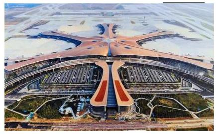

答案

${4\pi }$

解析

由题意可知, 五棱锥的总曲率等于五棱锥各顶点的曲率之和, 可以从整个多面体的角度考虑, 所有顶点相关的面角就是多面体的所有多边形表面的内角的集合,

由图可知五棱锥有6个顶点，6个面，其中5个三角形，1个五边形，

所以五棱锥的表面内角和由5个为三角形, 1 个为五边形组成,

所以面角和为 ${5\pi } + {3\pi } = {8\pi }$ ,故总曲率为 $6 \times  {2\pi } - {8\pi } = {4\pi }$ .

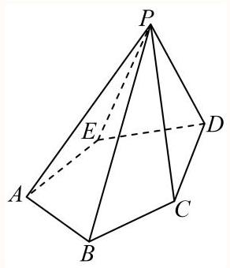

故答案为: ${4\pi }$ .

## 母题2

以下四个命题中，所有真命题的序号为___. ①三角形(及其内部)绕其一边所在的直线旋转一周所形成的几何体叫圆锥；②正棱柱的侧棱垂直于底面；③棱锥的各侧棱和底面所成的角相等；④圆锥的轴截面一定是等腰三角形.

答案

②④

## 解析

根据几何体的结构特征及性质判断各个命题的真假即可.

①以直角三角形的一条直角边为轴，将三角形旋转一周所得几何体为圆锥，而其它三角形所得为组合体，故 ①错误；

②底面为正多边形的直棱柱叫正棱柱，故侧棱垂直于底面，故②正确；

③正棱锥的各侧棱与底面所成角相等，而不是所有棱锥各侧棱和底面所成的角相等，故③错误；

④圆锥轴截面有两条边对应圆锥的母线，第三条边为底面直径，故一定为等腰三角形，故④正确.

所以真命题有②④.

故答案为:②④.

## 变式题2-1

下列命题正确的是( )

A. 以直角三角形的一直角边为轴旋转所形成的旋转体是圆锥

B. 以直角梯形的一腰为轴旋转所形成的旋转体是圆台

C. 圆柱、圆锥、圆台都有两个底面

D. 圆锥的侧面展开图为扇形, 这个扇形所在圆的半径等于圆锥底面圆的半径

答案

A

解析

根据圆锥、圆柱、圆台的特点判断各选项即可.

对于A，根据圆锥的特点，以直角三角形的一直角边为轴旋转所形成的旋转体是圆锥，故A正确；

对于B，以直角梯形的直角腰为轴旋转所得的旋转体才是圆台，故B错误；

对于C，圆柱、圆台都有两个底面，而圆锥只有一个底面，故C错误；

对于D，圆锥的侧面展开图为扇形，此扇形所在圆的半径等于圆锥的母线长，故D错误.

故选: A.

## 变式题2-2

下列关于棱锥、棱台的说法正确的有( )

①由五个面围成的多面体只能是四棱锥; ②仅有两个面互相平行的五面体是棱台; ③两个底面平行且相似，其余各面都是梯形的多面体是棱台; ④有两个面互相平行, 其余四个面都是等腰梯形的六面体是棱台.

A. 0 个

B. 1 个

C. 2 个

D. 3 个

答案

A

解析

对于①，由五个面围成的多面体可能是三棱柱，①错误；

对于②，仅有两个面互相平行的五面体可以是三棱柱，②错误；

对于③④，棱台的侧棱延长线必须交于一点，③④错误.

所以下列关于棱锥、棱台的说法正确的有0个.

## 母题 3

下列说法中，正确的个数为

(1)有一个面是多边形，其余各面都是三角形的几何体是棱锥；

(2)有两个面互相平行，其余四个面都是等腰梯形的六面体是棱台；

(3)底面是等边三角形，侧面都是等腰三角形的三棱锥是正三棱锥；

(4)棱锥的侧棱长与底面多边形的边长相等，则此棱锥可能是正六棱锥.

答案

0

解析

根据棱锥的概念可判断 (1); 根据棱台的概念可判断 (2); 根据正三棱锥的概念可判断 (3); 根据正六棱锥的侧棱长一定大于底面边长可判断(4).

对于(1)，棱锥的定义是:有一个面是多边形，其余各面都是有一个公共顶点的三角形，由这些面所围成的几何体叫做棱锥, 故错误;

对于(2)，有两个面互相平行，其余四个面都是等腰梯形的六面体不一定是棱台，只有当四个等腰梯形的腰延长后交于一点时, 这个六面体才是棱台, 如图1, 侧棱延长线可能不交于一点, 故错误;

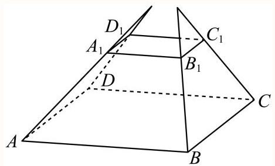

图1

对于(3)，底面是等边三角形，侧面都是等腰三角形的三棱锥不一定是正三棱锥，只有当三棱锥的顶点在底面的射影是底面中心时, 才是正三棱锥, 不一定是正三棱锥, 故错误;

对于(4)，因为正六棱锥的底面是正六边形，侧棱在底面内的射影与底面边长相等，所以正六棱锥的侧棱长一定大于底面边长, 故错误.

故答案为: 0 .

## 变式题3-1

显然, 通过延长圆台的任意一条母线都可以使它们交于一点, 从而得到一个圆锥. 如图, 这样的几何体是否也可以通过延长棱的方法得到一个棱锥?

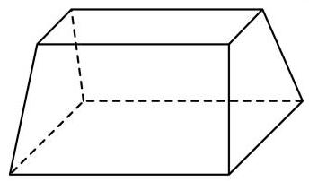

答案

不可以

解析

选定底面，延长侧棱看是否相交于一点，结合棱锥的定义可得.

由棱锥的定义, 有一个面是多边形, 其余各面都是有一个公共顶点的三角形,

由这些面所围成的多面体叫做棱锥,

任意选定一个底面，该几何体的各“侧棱”的延长线不能相交于同一点，

故通过延长棱的方法得不到一个棱锥.

(据此, 也可以判断该几何体不是一个棱台, 延长棱台的侧棱则可以得到一个棱锥.)

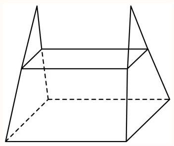

## 变式题3-2

三棱台的各个面所在的平面，将空间划分为___个区域.

---

22

	解析

---

利用三棱台的结构特征, 分类求出划分的区域数即得.

三棱台的3个侧面所在平面两两相交, 且所得3条交线共点, 这3个平面将空间分成8个区域,

一个底面将其所在的7个区域分成两半，另一个底面将其所在的7个区域分成两半，

所以三棱台的各个面所在的平面,将空间划分的区域个数为 $8 + 7 + 7 = {22}$ .

故答案为: 22

## 分层练习

お基础

如图所示，观察四个几何体，其中判断错误的是( )

A.

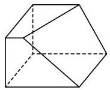

不是棱台

B.

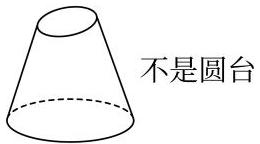

C.

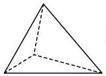

不是棱锥

D.

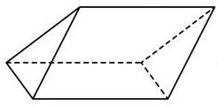

是棱柱

学研究

C

解析

利用几何体的定义解题.A.根据棱台的定义可知几何体不是棱台, 所以A是正确的;

B. 根据圆台的定义可知几何体不是圆台，所以B是正确的；

C. 根据棱锥的定义可知几何体是棱锥, 所以C是错误的;

D. 根据棱柱的定义可知几何体是棱柱, 所以D是正确的.

故答案为C

本题主要考查棱锥、棱柱、圆台、棱台的定义, 意在考查学生对这些知识的掌握水平和分析推理能力.

通过延长圆台的任意一条母线都可以使它们交于一点, 从而得到一个圆锥. 如图, 这样的几何体是否也可以通过延长棱的方法得到一个棱锥？(请从“可以”、“不一定”、“不可以”里面选一个填入)

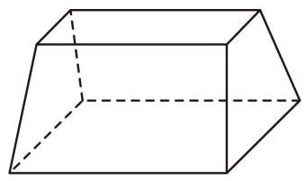

答案

不可以

解析

根据题意, 利用棱台的定义即可判断.

如图, 将该几何体的四条侧棱延长, 没有能够交于同一点.

因此, 虽然该几何体的上下底面平行,

但它仍然不是棱台, 四条侧棱所在直线不能交于同一点.

综上所述, 这样的几何体不可以通过延长棱的方法得到一个棱锥.

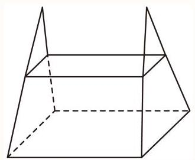

故答案为:不可以.

3

下列命题中正确的是( )

A. 正四棱锥的侧面都是正三角形

B. 直四棱柱是长方体

C. 以直角三角形的一边所在直线为旋转轴, 其余两边旋转一周形成的面所围成的旋转体为圆锥

D. 用平行于圆锥底面的平面截圆锥, 截面与底面之间的部分是圆台

答案

D

解析

由正四棱锥, 直四棱柱, 圆锥, 圆台结构特征结合题意可得答案.

对于A，正四棱锥的侧面不一定是正三角形，可能是等腰三角形，故A错误；

对于B，若直四棱柱的上下底面不是矩形，则不一定是长方体，故B错误；

对于C，以直角三角形的直角边所在直线为旋转轴，其余两边旋转一周形成的面所围成的旋转体为圆锥，故C 错误;

对于D，由圆台定义可得用平行于圆锥底面的平面截圆锥，截面与底面之间的部分是圆台，故D正确.

故选: D

4

底面是正多边形的棱锥是正棱锥.

## 答案

错误

解析

根据正棱锥的定义可知错误.

正棱锥的定义: 底面时正多边形, 并且顶点在底面的投影是底面的中心, 这样的棱锥成为正棱锥.

故答案为:错误.

## 综合

1

命题A: 底面为正三角形，且顶点在底面的射影为底面中心的三棱锥是正三棱锥，命题A的等价命题B可以是:底面为正三角形，且的三棱锥是正三棱锥.

## 答案

侧棱相等或侧棱与底面所成角相等

## 解析

根据正三棱锥的定义即可得到答案.

根据正三棱锥的定义可知.

①若三棱锥的三条侧棱相等，则顶点在底面的射影是底面的外心，因为底面为正三角形，所以外心也是底面三角形的中心，所以此时三棱锥是正三棱锥.

②若三棱锥的三条侧棱与底面所成角相等，所以顶点在底面的射影是底面三角形的外心，因为底面为正三角形, 所以外心也是底面三角形的中心, 此时三棱锥是正三棱锥.

故答案为:侧棱相等或侧棱与底面所成角相等.

2

如图, ${ABCD} - {{A}_{1}{B}_{1}{C}_{1}{D}_{1}}$ 是正四棱台,则下列各组直线中属于异面直线的是 ( ).

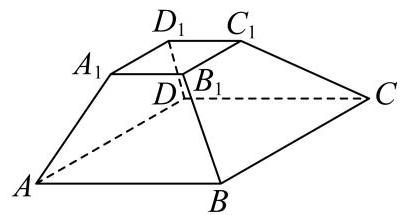

A. ${AB}$ 和 ${C}_{1}{D}_{1}$ ;

B. $A{A}_{1}$ 和 $C{C}_{1}$ ;

C. $B{D}_{1}$ 和 ${B}_{1}D$ ;

D. ${A}_{1}{D}_{1}$ 和 ${AB}$ .

答案

D

解析

根据棱台的性质及直线与直线的位置关系即可判断.

因为 ${ABCD} - {A}_{1}{B}_{1}{C}_{1}{D}_{1}$ 是正四棱台,所以 ${AB}//{A}_{1}{B}_{1}//{C}_{1}{D}_{1}$ ,故A错误,

侧棱延长交于一点,所以 $A{A}_{1}$ 与 $C{C}_{1}$ 相交,故B错误,

同理 $B{B}_{1}$ 与 $D{D}_{1}$ 也相交,所以 $B,{B}_{1},{D}_{1}, D$ 四点共面,所以 $B{D}_{1}$ 与 ${B}_{1}D$ 相交,故 $C$ 错误,

${A}_{1}{D}_{1}$ 与 ${AB}$ 是异面直线,故 $\mathrm{D}$ 正确.

故选: D

3

将下列平面图形沿等边三角形的边折起，不能折成如图所示几何体的是( ).

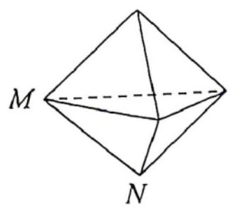

A.

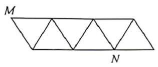

B.

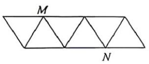

C.

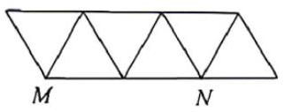

D.

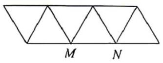

答案

B

解析

【答案】B 【详解】该几何体上的点 $M, X$ 是一条棱的两端点.对于A., C., D.项，在折叠时，这两点会被带到几何体的两个不同顶点，所有面可以无重叠地闭合，形成完整的双三棱锥. 而对于B.，折叠后，点 $M$ 和点 $N$ 是相对的两个顶点.

4

如图，给定一个正方体形状的土豆块，只切一刀，可以得到下面哪些类型的多面体？(找出可能的结果，并将序号填在横线上)

①四面体；②四棱锥；③四棱柱；④五棱锥；⑤五棱柱；⑥六棱锥；⑦七面体.

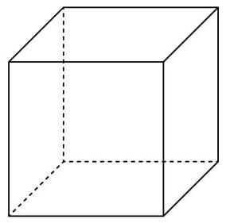

答案

①③⑤⑦

解析

结合正方体的性质逐一作图, 可能出现①③⑤⑦这四种情况.

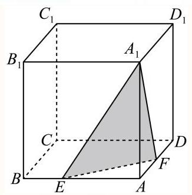

如图,平面 ${A}_{1}{EF}$ 截正方体,可得到四面体 ${A}_{1} - {AEF}$ ;

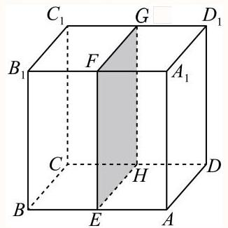

如图,平面 ${EFGH}$ 截正方体,可得到四棱柱 ${ADHE} - {A}_{1}{D}_{1}{GF}$ ;

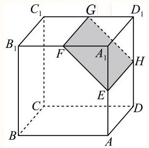

如图,平面 ${EFGH}$ 截正方体,可得到五棱柱 ${AB}{B}_{1}{FE} - {DC}{C}_{1}{GH}$ ,也是七面体.

故答案为:①③⑤⑦.
