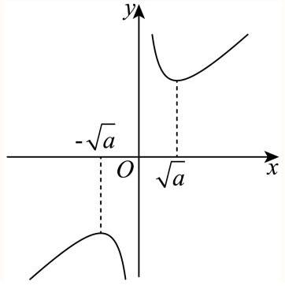

## 研发切片模板 5.19 单调性的应用

## 知识讲解

## 导学说明

## 1. 教学目标

(1)识记函数单调性的定义、常见函数的单调区间，以及“单调性把函数值大小转化为自变量大小”的基本规则

(2)能够利用单调性完成比大小、解不等式、求参数范围，并能处理定义域、奇偶性、对称性、分段函数和复合函数中的限制条件

## 2. 课程重难点

(1)重点:会判断常见函数在指定区间上的单调性，会把 $f(u)>f(v)$、$f(u)<f(v)$ 转化为 $u$ 与 $v$ 的大小关系

(2)难点:单调区间不是全定义域时，要先把自变量转到同一单调区间；抽象函数题要同时处理定义域、奇偶性、对称性和端点衔接

## 3. 考查形式与分值占比

(1)题型:选择题、填空题为主，解答题中常与二次函数、对数函数、指数函数、分段函数、抽象函数结合考查

(2)占比:在函数章节和不等式题中高频出现，单独考查约 3%到 5%，综合题中常作为转化工具出现

## 知识导图

## 知识点:利用单调性解决问题

## 知识笔记

## 1. 单调性的常见结论

(1)增函数

若函数 $f\left( x\right)$ 在区间 $I$ 上严格增，则对任意 ${x}_{1},{x}_{2} \in I$，当 ${x}_{1} < {x}_{2}$ 时，有 $f\left( {x}_{1}\right) < f\left( {x}_{2}\right)$。

反过来，在同一单调区间内，$f\left( u\right) > f\left( v\right)$ 可转化为 $u > v$。

(2)减函数

若函数 $f\left( x\right)$ 在区间 $I$ 上严格减，则对任意 ${x}_{1},{x}_{2} \in I$，当 ${x}_{1} < {x}_{2}$ 时，有 $f\left( {x}_{1}\right) > f\left( {x}_{2}\right)$。

反过来，在同一单调区间内，$f\left( u\right) > f\left( v\right)$ 可转化为 $u < v$。

(3)定义域限制

利用单调性解题前，必须先保证 $u,v$ 都在函数定义域内，并且落在同一个单调区间内。对数题尤其要先列真数大于 0。

(4)对称性与单调性结合

若图象关于直线 $x = a$ 对称，则 $f\left( x\right) = f\left( 2a - x\right)$。比大小时，先把自变量通过对称性转到已知单调区间，再比较。

(5)奇偶性与单调性结合

若 $f\left( x\right)$ 是奇函数，则 $-f\left( x\right) = f\left( -x\right)$。遇到 $f(A)+f(B)<0$，常转化为 $f(A)<f(-B)$，再用单调性去掉 $f$。

## 2. 常见题型和处理步骤

(1)利用单调性比大小

步骤:先把所有函数值写成 $f\left( u\right)$ 的形式，再确认 $u$ 都在同一单调区间，最后按单调性比较自变量。

关键提醒:有对称条件时，先对称变换；有对数形式时，先化成同底对数，底数大于 1 时真数越大函数值越大。

(2)利用单调性求参

步骤:先找函数本身的单调分界点，再让题目要求的区间落在对应单调区间内。

二次函数常看对称轴。若 $f\left( x\right) = {x}^{2} - 2mx + 1$，对称轴为 $x = m$，在 $\lbrack m,+\infty )$ 上递增。若要求它在 $\lbrack 2,+\infty )$ 上递增，就要 $m \leq 2$。

分段函数求参要同时管三件事:每一段内部单调、两段单调方向一致、分界点处函数值衔接不破坏整体单调。

(3)利用单调性解不等式

步骤:先判断外层函数是增还是减，再把 $f\left( u\right)>f\left( v\right)$ 转成 $u>v$ 或 $u<v$，最后联立定义域条件。

增函数: $f\left( u\right)>f\left( v\right) \Leftrightarrow u>v$。

减函数: $f\left( u\right)>f\left( v\right) \Leftrightarrow u<v$。

(4)复合函数单调性

复合函数看“外层”和“内层”。同增异减:外层和内层同向，则复合函数增；外层和内层反向，则复合函数减。

对数复合题要先看底数。若 $a>1$，$\log_a x$ 递增；若 $0<a<1$，$\log_a x$ 递减。

## 3. 易错提醒

(1)只比较函数值，不管自变量是否在定义域内。

(2)只看函数“整体图像”，忘记题目要求的是指定区间。

(3)减函数去掉 $f$ 时，不等号方向忘记反向。

(4)分段函数只检查每一段，忘记检查分界点两侧函数值。

(5)奇函数题中，$-f(B)$ 要改写成 $f(-B)$，不能直接把负号丢掉。

## ○ 教法备注

知识标签:程序性知识

教学步骤:本讲先用“同区间、看单调、比自变量”建立基本判断框架。母题 1 讲利用单调性比大小，变式 1-1 加入二次式自变量比较，变式 1-2 要求先判断具体函数的单调性。母题 2 讲已知单调性求参数，变式 2-1 换成对勾函数，变式 2-2 换成分段函数，变式 2-3 转化为恒成立问题。母题 3 讲利用单调性解不等式，变式 3-1 强调定义域限制，变式 3-2 加入奇偶性转化。课堂上每题都要追问三句:函数在哪个区间单调，自变量是否都在这个区间，增减性决定不等号方向怎么变。

对应知识层级:操作

## 母题 1

## ○ 教法备注

母题说明:利用单调性比大小。

母题与变式关系链:母题 1 的核心是“先把自变量转到已知单调区间，再比较函数值”。变式 1-1 保留“比大小”目标，但自变量变成 ${a}^{2}-a+1$，重点从对称转化迁移到代数变形比较；变式 1-2 仍是比大小，但要先判断二次函数的单调结构，再比较函数值，难度从“已知单调性”提升到“先判单调性”。

1.【选题原因】

本题把单调性、对称性、对数运算放在一起，能训练学生先处理自变量，再使用单调性。它不是直接比较 $f$ 的三个值，而是先把 ${\log}_{3}2$ 通过关于 $x=1$ 的对称性转到 $\lbrack 1,+\infty )$ 上。

2.【错因预设】

(1)直接比较 ${\log}_{3}2$、$-{\log}_{\sqrt{3}}\frac{1}{2}$、$3$，没有把它们统一到已知单调区间；

(2)不会用对称性 $f\left( x\right)=f\left( 2-x\right)$ 处理 $a$；

(3)对数换底和化同底出错，尤其是 $-{\log}_{\sqrt{3}}\frac{1}{2}=2{\log}_{3}2$。

3.【讲法建议】

先让学生标出已知单调区间 $\lbrack 1,+\infty )$。凡是不在这个区间的自变量，先想办法转进去。再把三个自变量都写成以 3 为底的对数，比较真数大小。最后用严格增函数传递函数值大小。

一般 单选题 【试卷】上海市上海中学 2025-2026 学年高一上学期期末数学试题

已知定义域为 $\mathbf{R}$ 的函数 $y = f\left( x\right)$ 在 $\lbrack 1, + \infty )$ 上严格增，且其图象关于直线 $x = 1$ 对称. 令 $a = f\left( {{\log }_{3}2}\right)$ ， $b = f\left( {-{\log }_{\sqrt{3}}\frac{1}{2}}\right) , c = f\left( 3\right)$ . 这三个数的大小关系为( ).

A. $c > b > a$

B. $b > c > a$

C. $c > a > b$

D. $b > a > c$

答案

C

解析

利用对数运算及对称性把 $a, b, c$ 的自变量都转化到区间 $\lbrack 1, + \infty )$ 上,然后利用单调性可得答案.

$a = f\left( {{\log }_{3}2}\right)$ ,其中 ${\log }_{3}2 < 1$ ,由于函数 $y = f\left( x\right)$ 关于直线 $x = 1$ 对称,故有 $f\left( x\right)  = f\left( {2 - x}\right)$ ,

$a = f\left( {{\log }_{3}2}\right)  = f\left( {2 - {\log }_{3}2}\right)  = f\left( {{\log }_{3}{3}^{2} - {\log }_{3}2}\right)  = f\left( {{\log }_{3}\frac{9}{2}}\right) ,$

$b = f\left( {-{\log }_{\sqrt{3}}\frac{1}{2}}\right)  = f\left( {2{\log }_{3}2}\right)  = f\left( {{\log }_{3}4}\right) ,$

$c = f\left( 3\right)  = f\left( {{\log }_{3}{3}^{3}}\right)  = f\left( {{\log }_{3}{27}}\right) ,$

因为底数 $3 > 1$ ,所以 $y = {\log }_{3}x$ 在 $\left( {0, + \infty }\right)$ 上单调递增,

所以 ${\log }_{3}{27} > {\log }_{3}\frac{9}{2} > {\log }_{3}4 > {\log }_{3}3 = 1$ ,

又因为函数 $y = f\left( x\right)$ 在 $\lbrack 1, + \infty )$ 上严格增,

所以 $f\left( {{\log }_{3}{27}}\right)  > f\left( {{\log }_{3}\frac{9}{2}}\right)  > f\left( {{\log }_{3}4}\right)$ ,

所以 $c > a > b$ .

故选: C

## 变式题 1-1

## ○ 教法备注

变式说明:利用单调性比大小。相比母题，本题不需要对称转化，关键是先证明 ${a}^{2}-a+1>\frac{1}{2}$，再利用 $f\left( x\right)$ 在 $\left( 0,+\infty\right)$ 上单调递减，函数值大小与自变量大小相反。

较易 填空题 扰卷】人教 B 版(2019) 必修第一册 过关斩将 第三章 3.1.2 函数的单调性 第 2 课时 函数单调性的综合应用

函数 $f\left( x\right)$ 在 $\left( {0, + \infty }\right)$ 上单调递减，那么 $f\left( {{a}^{2} - a + 1}\right)$ 与 $f\left( \frac{1}{2}\right)$ 的大小关系是\_\_\_.

答案

$f\left( {a}^{2}-a+1\right) < f\left( \frac{1}{2}\right)$

解析

比较自变量的大小,根据单调性可得结果.解: $\because {a}^{2} - a + 1 = {\left( a - \frac{1}{2}\right) }^{2} + \frac{3}{4} > \frac{1}{2}$ ,

又 $\because f\left( x\right)$ 在 $\left( {0, + \infty }\right)$ 上单调递减,

$\therefore f\left( {a}^{2}-a+1\right) < f\left( \frac{1}{2}\right)$.

本题考查利用单调性比较大小, 考查学生的变形能力, 属于基础题.

## 变式题 1-2

## ○ 教法备注

变式说明:比大小，先判断单调性。相比母题，本题没有直接给出抽象函数的单调性，而是给出具体二次函数 $f\left( x\right)={x}^{2}-2x$，要先配方为 ${\left( x-1\right)}^{2}-1$，再用“离对称轴越远，函数值越大”比较。

较易 (填空题) 【试卷】【课堂例】5.2.4 函数的单调性(2)课堂例题 沪教版(2020)必修第一册 第 5 章 函数的概念、性... 若函数 $f\left( x\right)  = {x}^{2} - {2x}$ ，则 $f\left( 1\right)$ 、 $f\left( {-1}\right)$ 、 $f\left( \sqrt{3}\right)$ 之间的大小关系为\_\_\_.

2 答案

$f\left( {-1}\right) > f\left( \sqrt{3}\right) > f\left( 1\right)$

解析

结合二次函数开口和对称轴, 判断自变量与对称轴距离, 进而判断大小.

因为 $f\left( x\right)  = {x}^{2} - {2x} = {\left( x - 1\right) }^{2} - 1$ ,因为 $f\left( x\right)$ 开口向上,所以 $f\left( 1\right)$ 最小,又 $\left| {-1 - 1}\right|  = 2,\left| {\sqrt{3} - 1}\right|  \in  \left( {0,1}\right)$ , 所以 $f\left( {-1}\right)  > f\left( \sqrt{3}\right) > f\left( 1\right)$.

故答案为:$f\left( {-1}\right) > f\left( \sqrt{3}\right) > f\left( 1\right)$

## 变式题 1-3

## 母题 2

## ○ 教法备注

母题说明:利用单调性求参数。

母题与变式关系链:母题 2 用二次函数对称轴解决“指定区间上单调”问题，是求参的基础模型。变式 2-1 把二次函数换成对勾函数，核心仍是让指定区间落在对应单调区间内；变式 2-2 换成分段函数，除了每段单调，还要检查分界点衔接；变式 2-3 换成 $x^{2}+\frac{a}{x}$，从图像判断升级为按单调性定义构造恒成立条件。

1.【选题原因】

本题是“已知单调性求参”的入口题。二次函数 $y={x}^{2}-2mx+1$ 的对称轴是 $x=m$，开口向上，在 $\lbrack m,+\infty )$ 上递增。题目要求 $\lbrack 2,+\infty )$ 上递增，本质就是让 $m$ 不超过 2。

2.【错因预设】

(1)把“在 $\lbrack 2,+\infty )$ 上递增”误解成“只要 $x=2$ 之后某一段递增即可”，没有抓住整个区间；

(2)二次函数对称轴写错，把 $x=m$ 写成 $x=2m$ 或 $x=-m$；

(3)区间包含关系方向写反，把 $m \leq 2$ 写成 $m \geq 2$。

3.【讲法建议】

先画开口向上的二次函数草图，标出对称轴 $x=m$。说明递增区间是 $\lbrack m,+\infty )$。要让 $\lbrack 2,+\infty )$ 整段都在递增区间里，只能让对称轴在 2 的左侧或正好在 2 处，所以 $m\leq 2$。

较易 填空题 【试卷】上海市浦东新区 2024-2025 学年高一上学期期末教学质量检测数学试卷

如果函数 $y = {x}^{2} - {2mx} + 1$ 在区间 $\lbrack 2, + \infty )$ 上是严格增函数，那么实数 $m$ 的取值范围为

答案

$( - \infty ,2\rbrack$

解析

由二次函数的性质得解.

由二次函数的性质，可知函数 $y = {x}^{2} - {2mx} + 1$ 在区间 $\lbrack m, + \infty )$ 上是严格增函数,

所以 $\lbrack 2, + \infty ) \subseteq  \lbrack m, + \infty )$ ,即 $m \leq  2$ ,

故答案为: $( - \infty ,2\rbrack$

## 变式题 2-1

## ○ 教法备注

变式说明:已知单调性求参，更换函数模型。相比母题的二次函数，本题是对勾函数 $y=x+\frac{a+1}{x}$，要抓住它在 $(0,\sqrt{a+1}\rbrack$ 上递减，在 $\lbrack \sqrt{a+1},+\infty )$ 上递增；要求 $(0,2\rbrack$ 上严格减，就要 $\sqrt{a+1}\geq 2$。

较易 填空题 【试卷】【课堂练】5.2.2 函数的单调性(一)随堂练习-沪教版(2020)必修第一册第 5 章 函数的概念、性... 已知函数 $y = x + \frac{a + 1}{x}\left( {a > 0}\right)$ 在区间 $(0,2\rbrack$ 上是严格减函数，则实数 a 的取值范围是\_\_\_.

答案

$\lbrack 3, + \infty )$

解析

根据 $y = x + \frac{a}{x}\left( {a > 0}\right)$ 的图像性质即可求解.

形如 $y = x + \frac{a}{x}\left( {a > 0}\right)$ 的图像如图所示:

所以 $y = x + \frac{a + 1}{x}\left( {a > 0}\right)$ 在 $x = \frac{a + 1}{x}$

即 $x = \sqrt{a + 1}$ 时取得最小值

因为 $y = x + \frac{a + 1}{x}$ 在 $(0,2\rbrack$ 严格减函数,

所以 $\sqrt{a + 1} \geq  2$ 时符合题意,即 $a \geq  3$ .

故答案为: $\lbrack 3, + \infty )$

## 变式题 2-2

## ○ 教法备注

变式说明:已知单调性求参，换成分段函数。相比母题只看一个对称轴，本题要同时检查三件事:右段一次函数递减，左段二次函数在 $x<2$ 上递减，且分界点 $x=2$ 左侧函数值不低于右侧函数值，避免整体单调性在拼接处断掉。

较易 单选题 2024 辽宁省朝阳市建平县实验中学高一上期中

函数 $f\left( x\right)  = \left\{  \begin{array}{l} \left( {-a - 5}\right) x - 2, x \geq  2 \\  {x}^{2} + 2\left( {a - 1}\right) x - {3a}, x < 2 \end{array}\right.$ ,若对任意 ${x}_{1},{x}_{2} \in  \mathrm{R}\left( {{x}_{1} \neq  {x}_{2}}\right)$ ,都有 $\frac{f\left( {x}_{1}\right)  - f\left( {x}_{2}\right) }{{x}_{1} - {x}_{2}} < 0$ 成立,则实数 $a$ 的取值范围为( )

A. $\left\lbrack  {-4, - 1}\right\rbrack$

B. $\left\lbrack  {-4, - 2}\right\rbrack$

C. $( - 5, - 1\rbrack$

D. $\left\lbrack  {-5, - 4}\right\rbrack$

答案

A

解析

利用函数单调性的变形式即可判断函数单调性, 然后根据分段函数的性质即可求解.

因为对任意 ${x}_{1},{x}_{2} \in  \mathrm{R}\left( {{x}_{1} \neq  {x}_{2}}\right)$ ,都有 $\frac{f\left( {x}_{1}\right)  - f\left( {x}_{2}\right) }{{x}_{1} - {x}_{2}} < 0$ 成立,

可得 $f\left( x\right)$ 在 $\mathrm{R}$ 上是单调递减的,

则 $\left\{  \begin{array}{l}  - a - 5 < 0 \\   - \left( {a - 1}\right)  \geq  2 \\  {2}^{2} + 2\left( {a - 1}\right)  \times  2 - {3a} \geq  \left( {-a - 5}\right)  \times  2 - 2 \end{array}\right.$ ,解得 $- 4 \leq  a \leq   - 1$ .

故选: A

## 变式题 2-3

## ○ 教法备注

变式说明:已知单调性求参，转化为恒成立问题。相比母题直接看二次函数单调区间，本题用定义处理:对任意 ${x}_{2}>{x}_{1}\geq 2$，把 $f\left( {x}_{1}\right)-f\left( {x}_{2}\right)<0$ 化成关于 $a$ 的恒成立条件。

一般 解答题】【试卷】2010 年 10 月江西九江浔阳区九江二中(同文中学)高一上学期月考数学试卷

已知函数 $f\left( x\right)  = {x}^{2} + \frac{a}{x}\left( {x \neq  0, a \in  \mathbf{R}}\right)$ .

若 $f\left( x\right)$ 在区间 $\lbrack 2, + \infty )$ 是增函数,求实数 $a$ 的取值范围.

答案

$a \leq  {16}$

解析

【分析】: 根据 $f\left( x\right)$ 在区间 $\lbrack 2, + \infty )$ 是增函数,结合函数单调性的定义,可得当 ${x}_{2} > {x}_{1} \geq  2$ ,

$f\left( {x}_{1}\right)  - f\left( {x}_{2}\right)  < 0$ ,由此构造关于 $a$ 的不等式,解不等式可得实数 $a$ 的取值范围.

设 ${x}_{2} > {x}_{1} \geq  2, f\left( {x}_{1}\right)  - f\left( {x}_{2}\right)  = {x}_{1}^{2} + \frac{a}{{x}_{1}} - {x}_{2}^{2} + \frac{a}{{x}_{2}} = \frac{{x}_{1} - {x}_{2}}{{x}_{1}{x}_{2}}\left\lbrack  {{x}_{1}{x}_{2}\left( {{x}_{1}{x}_{2}}\right)  - a}\right\rbrack$ ,

由 ${x}_{2} > {x}_{1} \geq  2$ 得 ${x}_{1}{x}_{2}\left( {{x}_{1} + {x}_{2}}\right)  > {16},{x}_{1} - {x}_{2} < 0,{x}_{1}{x}_{2} > 0$ .

要使 $f\left( x\right)$ 在区间 $\lbrack 2, + \infty )$ 是增函数只需 $f\left( {x}_{1}\right)  - f\left( {x}_{2}\right)  < 0$ ,即 ${x}_{1}{x}_{2}\left( {{x}_{1} + {x}_{2}}\right)  - a > 0$ 恒成立,则 $a \leq  {16}$ . 另解(导数法): ${f}^{\prime }\left( x\right)  = {2x} - \frac{a}{{x}^{2}}$ ,要使 $f\left( x\right)$ 在区间 $\lbrack 2, + \infty )$ 是增函数,只需当 $x \geq  2$ 时, ${f}^{\prime }\left( x\right)  \geq  0$ 恒成立, 即 ${2x} - \frac{a}{{x}^{2}} \geq  0$ ,则 $a \leq  2{x}^{3} \in  \lbrack {16}, + \infty )$ 恒成立,故当 $a \leq  {16}$ 时, $f\left( x\right)$ 在区间 $\lbrack 2, + \infty )$ 是增函数.

## 母题 3

## ○ 教法备注

母题说明:利用单调性解不等式。

母题与变式关系链:母题 3 用具体函数 $f\left( x\right)={x}^{4}+x$ 在 $\left( 0,+\infty\right)$ 上递增，把 ${x}^{4}+x>2$ 转化为 $f\left( x\right)>f\left( 1\right)$，再得到 $x>1$。变式 3-1 换成对数不等式，重点是定义域限制；变式 3-2 换成抽象奇函数，重点是先用奇偶性把 $f(A)+f(B)<0$ 改写成 $f(A)<f(-B)$，再用单调性去掉 $f$。

1.【选题原因】

本题用函数观点解代数不等式，能让学生看到单调性的真正作用:不用硬解高次不等式，而是构造递增函数，把函数值比较转化为自变量比较。

2.【错因预设】

(1)直接因式分解 ${x}^{4}+x-2$，计算复杂且容易跑偏；

(2)没有注意题目要求在 $\left( 0,+\infty\right)$ 上解不等式；

(3)知道函数递增，但不会把右边 $2$ 写成 $f\left( 1\right)$。

3.【讲法建议】

先定义 $f\left( x\right)={x}^{4}+x$，说明它在 $\left( 0,+\infty\right)$ 上递增。再指出 $2=f\left( 1\right)$，所以 ${x}^{4}+x>2$ 就是 $f\left( x\right)>f\left( 1\right)$，由递增性得到 $x>1$。

例 6 用函数的观点在区间 $\left( {0, + \infty }\right)$ 上解不等式 ${x}^{4} + x > 2$ .

## 变式题 3-1

## ○ 教法备注

变式说明:根据单调性解不等式，重点是定义域。相比母题，本题外层函数是 $\ln x$，在 $\left( 0,+\infty\right)$ 上递增，所以可把 $\ln\left( x+2\right)>\ln\left( 5-2x\right)$ 转成 $x+2>5-2x$，但必须同时列 $x+2>0$ 和 $5-2x>0$。

较易 填空题 【试卷】上海市上海交通大学附属中学 2025-2026 学年高一上学期期中考试数学试题

不等式 $\ln \left( {x + 2}\right)  > \ln \left( {5 - {2x}}\right)$ 的解集为

答案

$\left( {1,\frac{5}{2}}\right)$

解析

【分析】根据对数函数单调性求解.

【详解】因为函数 $y = \ln x$ 在 $\left( {0, + \infty }\right)$ 单调递增,且 $\ln \left( {x + 2}\right)  > \ln \left( {5 - {2x}}\right)$ ,

所以 $\left\{  \begin{array}{l} x + 2 > 5 - {2x} \\  x + 2 > 0 \\  5 - {2x} > 0 \end{array}\right.$ ,即 $\left\{  \begin{array}{l} x > 1 \\  x >  - 2 \\  x < \frac{5}{2} \end{array}\right.$ ,解得 $1 < x < \frac{5}{2}$ ,

所以不等式的解集为 $\left( {1,\frac{5}{2}}\right)$ .

故答案为: $\left( {1,\frac{5}{2}}\right)$ .

## 变式题 3-2

## ○ 教法备注

变式说明:根据单调性解不等式，同时考查奇偶性。相比母题直接去掉 $f$，本题要先用奇函数把 $f\left( {{a}^{2}-2}\right)+f\left( {{3a}-2}\right)<0$ 改写成 $f\left( {{a}^{2}-2}\right)<f\left( 2-3a\right)$，再利用严格递减得到自变量反向不等式，并联立定义域。

较易 填空题 【试卷】上海市进才中学 2022-2023 学年高一上学期期末数学试题

已知 $y = f\left( x\right)$ 是定义域为 $\left( {-3,3}\right)$ 上的奇函数，且 $f\left( x\right)$ 在 $\left( {-3,3}\right)$ 上严格递减，若 $f\left( {{a}^{2} - 2}\right)  + f\left( {{3a} - 2}\right)  < 0$ 成立，则实数 a 的范围是

答案

$\left( {1,\frac{5}{3}}\right)$

解析

根据函数是奇函数，把不等式 $f\left( {{a}^{2} - 2}\right)  + f\left( {{3a} - 2}\right)  < 0$ 变形，再利用函数的单调性，化抽象不等式为具体不等式, 解之即可.

解: $\because$ 奇函数 $f\left( x\right)$ 且 $f\left( {{a}^{2} - 2}\right)  + f\left( {{3a} - 2}\right)  < 0$ ,

$\therefore f\left( {{a}^{2} - 2}\right)  <  - f\left( {{3a} - 2}\right)  = f\left( {2 - {3a}}\right)$ ,

$\because f\left( x\right)$ 在 $\left( {-3,3}\right)$ 上单调递减,

$\therefore \left\{  \begin{array}{l}  - 3 < {a}^{2} - 2 < 3 \\   - 3 < {3a} - 2 < 3 \\  {a}^{2} - 2 > 2 - {3a} \end{array}\right.$ ,解得: $1 < \frac{5}{3}$ ,

$\therefore$ 实数 $a$ 的取值范围为 $\left( {1,\frac{5}{3}}\right)$ .

故答案为: $\left( {1,\frac{5}{3}}\right)$

## 分层练习

## 基础

1 较易 解答题 【试卷】第一章 函数的基本概念和性质 专题五 函数的单调性 微点 4 函数的单调性 (四) 【培优版】 已知函数 $y = x + \frac{a}{x}\left( {a \in  \mathbf{R}}\right)$ 在 $\lbrack 2, + \infty )$ 上是增函数，求 $a$ 的取值范围.

答案

$( - \infty ,4\rbrack$

解析

根据 $a = 0\text{ 、 }a < 0\text{ 、 }a > 0$ 进行分类讨论: $a = 0$ 和 $a < 0$ 时可直接判断, $a > 0$ 时根据对勾函数的单调性分析求解.

当 $a = 0$ 时， $y = x$ 是 $\mathrm{R}$ 上的增函数，符合题意；

当 $a < 0$ 时， $y = x$ ， $y = \frac{a}{x}$ 均为 $\lbrack 2, + \infty )$ 上的增函数，符合题意；

当 $a > 0$ 时， $y = x + \frac{a}{x}$ 在 $(0,\sqrt{a}\rbrack$ 上是减函数，在 $\lbrack \sqrt{a}, + \infty )$ 上是增函数，

要使函数在 $\lbrack 2, + \infty )$ 上单调递增，则有 $\sqrt{a} \leq  2,\therefore 0 < a \leq  4$ .

综上所述， $a$ 的取值范围是 $( - \infty ,4\rbrack$ .

2 较易 单选题] [试卷] 河南省周口市郸城县优质 2022-2023 学年高一上学期第二次月考数学试题

函数 $f\left( x\right)$ 在 $\left( {-\infty , + \infty }\right)$ 上单调递减，若 $f\left( 1\right)  =  - 1$ ， $f\left( {-1}\right)  = 1$ ，则满足 $- 1 \leq  f\left( {x - 2}\right)  \leq  1$ 的 x 的取值范围是( )

A. $\left\lbrack  {-2,2}\right\rbrack$

B. $\left\lbrack  {-1,1}\right\rbrack$

C. $\left\lbrack  {1,3}\right\rbrack$

D. $\left\lbrack  {0,4}\right\rbrack$

答案

C

解析

利用函数的单调性可得到不等式, 求解即可.

因为函数 $f\left( x\right)$ 为 $\left( {-\infty , + \infty }\right)$ 上单调递减，

则 $- 1 \leq  f\left( {x - 2}\right)  \leq  1$ 可变形为 $f\left( 1\right)  \leq  f\left( {x - 2}\right)  \leq  f\left( {-1}\right)$ ,

则 $- 1 \leq  x - 2 \leq  1$ ,

解得 $1 \leq  x \leq  3$ ,

所以 $x$ 的取值范围为 $\left\lbrack  {1,3}\right\rbrack$ ,

故选: $\mathrm{C}$

## 3 较易 单选题

函数 $f\left( x\right)$ 是定义在 $\left( {0, + \infty }\right)$ 上的增函数，且 $f\left( {2m}\right)  > f\left( {9 - m}\right)$ ，则实数 $m$ 的取值范围是( )

A. $\left( {3, + \infty }\right)$

B. $\left( {0,3}\right)$

C. $\left( {3,9}\right)$

D. $\left( {9, + \infty }\right)$

答案

C

解析

$\because$ 函数 $f\left( x\right)$ 在 $\left( {0, + \infty }\right)$ 上为增函数，且 $f\left( {2m}\right)  > f\left( {9 - m}\right)$ ，

$\therefore$ 根据增函数性质有不等式:

${2m} > 9 - m,$

解得:

${2m} + m > 9 \Rightarrow  {3m} > 9 \Rightarrow  m > 3$ 。

同时，函数定义域要求:

${2m} > 0 \Rightarrow  m > 0,$

$9 - m > 0 \Rightarrow  m < 9$ 。

将上述条件联立:解得 $3 < m < 9$ 。

$\therefore$ 实数 $m$ 的取值范围是 $\left( {3,9}\right)$ 。

## 综合

1 较易 填空题 2026 上海市上海市民立中学高一上期末

若函数 $f\left( x\right)  = {x}^{2} - {ax} + 1$ 在区间 $( - \infty ,1\rbrack$ 上是严格递减函数，则实数 $a$ 的取值范围为

---

    答案

$a \geq  2$

---

解析

由 $f\left( x\right)  = {x}^{2} - {ax} + 1 = {\left( x - \frac{a}{2}\right) }^{2} - \frac{{a}^{2}}{4} + 1$ ,可得二次函数的对称轴为 $x = \frac{a}{2}$ ,

又因为 $f\left( x\right)$ 在区间 $( - \infty ,1\rbrack$ 上是严格递减函数，所以 $\frac{a}{2} \geq  1$ ，解得 $a \geq  2$ .

2 一般 填空题 【试卷】山东省枣庄市第三中学 2018 届高三一调模拟考试数学(文)试题若函数 $f\left( x\right)  = \left\{  \begin{matrix} \left( {a - 1}\right) x - {2a}, x < 2, \\  {\log }_{a}x, x \geq  2 \end{matrix}\right.$ 在 $R$ 上单调递减，则实数 $a$ 的取值范围是 \_\_\_.

\} 答案

$\left\lbrack  {\frac{\sqrt{2}}{2},1}\right)$

解析

根据题意,由函数的单调性的性质可得 $\left\{  \begin{array}{l} a - 1 < 0 \\  0 < 1 \\  {\log }_{a}2 \leq  2\left( {a - 1}\right)  - {2a} \end{array}\right.$ ,解可得 $a$ 的取值范围,即可得答案. 由题意得,因为函数 $f\left( x\right)  = \left\{  \begin{matrix} \left( {a - 1}\right) x - {2a}, x < 2, \\  {\log }_{a}x, x \geq  2 \end{matrix}\right.$ 在 $R$ 上单调递减,则 $\left\{  \begin{array}{l} a - 1 < 0 \\  0 < 1 \\  {\log }_{a}2 \leq  2\left( {a - 1}\right)  - {2a} \end{array}\right.$ . $\therefore \frac{\sqrt{2}}{2} \leq  a < 1$

$\therefore$ 实数 $a$ 的取值范围是 $\left\lbrack  {\frac{\sqrt{2}}{2},1}\right)$ .

故答案为 $\left\lbrack  {\frac{\sqrt{2}}{2},1}\right)$ .

本题主要考查分段函数的解析式及单调性, 属于中档题.分段函数的单调性是分段函数性质中的难点, 也是高考命题热点, 要正确解答这种题型, 必须熟悉各段函数本身的性质, 在此基础上, 不但要求各段函数的单调性一致, 最主要的也是最容易遗忘的是, 要使分界点两函数的单调性与整体保持一致.

3 一般 填空题 【试卷】【全国百强校】贵州省贵阳市第一中学 2018-2019 学年高二下学期期中考试数学试题

已知函数 $y = {\log }_{\frac{1}{2}}\left( {{x}^{2} - {ax} + a}\right)$ 在区间 $\left( {2, + \infty }\right)$ 上是减函数，则实数 $a$ 的取值范围是\_\_\_.

答案

$a \leq  4$

解析

试题分析: 由题意得,根据复合函数的单调性法则可知,内层函数 $g\left( x\right)  = {x}^{2} - {ax} + a$ 在 $\left( {2, + \infty }\right)$ 上是单调增函数且 $g{\left( x\right) }_{\min } > 0$ ,即 $\frac{a}{2} \leq  2$ 且 $\mathrm{g}\left( 2\right)  \geq  0$ ,综合可得 $a \leq  4$ .

考点: 1.对数函数的性质; 2.复合函数的单调性法则; 3.二次函数的单调性.

本题主要考查的是对数函数的性质, 复合函数的单调性法则, 二次函数的单调性, 属于基础题, 此类题目主要是要弄明白复合函数的单调性法则——同增异减原则，外层函数为减函数，要复合函数为减函数，内层函数 $g\left( x\right)  = {x}^{2} - {ax} + a$ 在 $\lbrack 2, + \infty )$ 上必须为单调增函数,那么对称轴一定在 2 的左侧,即 $\frac{a}{2} \leq  2$ ,同时易错的地方就是不考虑对数的真数要大于 0 , 所以复合函数的单调性法则的正确运用是解这类题的关键.

4 较易 填空题 【试卷】第 13 讲 函数的单调性 9 种常见题型 (2) -【同步题型讲义】(人教 A 版 2019 必修第一册) 若 $f\left( x\right)  = k{x}^{2} - {4x} - 8$ 是 $\left\lbrack  {5,{20}}\right\rbrack$ 上的严格减函数. 则实数 $k$ 的取值范围是

答案

$k \leq  \frac{1}{10}$

解析

当 $k = 0$ 时, $f\left( x\right)  =  - {4x} - 8$ 符合题意,当 $k \neq  0$ 时,求出对称轴,由二次函数的性质可得 $\left\{  \begin{array}{l} k > 0 \\  \frac{2}{k} \geq  {20} \end{array}\right.$ 或 $\left\{  \begin{array}{l} k < 0 \\  \frac{2}{k} \leq  5 \end{array}\right.$ 即可求解.

当 $k = 0$ 时， $f\left( x\right)  =  - {4x} - 8$ 在 $\left\lbrack  {5,{20}}\right\rbrack$ 上单调递减，所以 $k = 0$ 符合题意；

当 $k \neq  0$ 时， $f\left( x\right)  = k{x}^{2} - {4x} - 8$ 对称轴为 $x = \frac{2}{k}$ ，

若 $f\left( x\right)  = k{x}^{2} - {4x} - 8$ 是 $\left\lbrack  {5,{20}}\right\rbrack$ 上的严格减函数,

则 $\left\{  \begin{array}{l} k > 0 \\  \frac{2}{k} \geq  {20} \end{array}\right.$ 或 $\left\{  \begin{array}{l} k < 0 \\  \frac{2}{k} \leq  5 \end{array}\right.$ ,可得 $0 < k \leq \frac{1}{10}$ 或 $k < 0$ ,

综上所述: 实数 $k$ 的取值范围是 $k \leq  \frac{1}{10}$ ,

故答案为: $k \leq  \frac{1}{10}$ .

5 一般 单选题 2024 广东省梅州市广东梅县东山中学高三上月考

函数 $f\left( x\right)  = {\log }_{a}\left( {x\left| {x - a}\right|  - 1}\right)$ 在 $\left\lbrack  {1,2}\right\rbrack$ 上单调递增，则实数 $\mathrm{a}$ 的取值范围是( )

A. $\left( {2, + \infty }\right)$

B. $\left( {0,1}\right)  \cup  \left( {2, + \infty }\right)$

C. $\lbrack 4, + \infty )$

D. $\left( {0,1}\right)  \cup  \lbrack 4, + \infty )$

② 答案

解析

根据对数函数与复合函数的单调性, 可得内函数的单调性, 利用其最值以及二次函数单调性, 建立不等式, 可得答案.

令 $u = x\left| {x - a}\right|  - 1$ ,则 $y = {\log }_{a}u$ .

当 $a > 1$ 时, $y = {\log }_{a}u$ 在 $\left( {0, + \infty }\right)$ 上单调递增,

则由复合函数的单调性可知 $u = x\left| {x - a}\right|  - 1$ 在 $\left\lbrack  {1,2}\right\rbrack$ 上单调递增,

且 $u = x\left| {x - a}\right|  - 1 > 0$ 在 $\left\lbrack  {1,2}\right\rbrack$ 上恒成立,

所以 ${u}_{\min } = \left| {1 - a}\right|  - 1 > 0$ ,解得 $a > 2$ 或 $a < 0$ (舍去).

所以 $u = x\left| {x - a}\right|  - 1 = x\left( {a - x}\right)  - 1 =  - {x}^{2} + {ax} - 1$ 在 $\left\lbrack  {1,2}\right\rbrack$ 上单调递增,

则 $\frac{a}{2} \geq  2$ ,解得 $a \geq  4$ .

当 $0 < a < 1$ 时, $y = {\log }_{a}u$ 在 $\left( {0, + \infty }\right)$ 上单调递减,

则由复合函数的单调性可知 $u = x\left| {x - a}\right|  - 1$ 在 $\left\lbrack  {1,2}\right\rbrack$ 上单调递减,

且 $u = x\left| {x - a}\right|  - 1 > 0$ 在 $\left\lbrack  {1,2}\right\rbrack$ 上恒成立,

所以 ${u}_{\min } = 2\left| {2 - a}\right|  - 1 > 0$ ,解得 $a < \frac{3}{2}$ 或 $a > \frac{5}{2}$ (舍去).

所以 $u = x\left| {x - a}\right|  - 1 = x\left( {x - a}\right)  - 1 = {x}^{2} - {ax} - 1$ 在 $\left\lbrack  {1,2}\right\rbrack$ 上单调递减,

则 $\frac{a}{2} \geq  2$ ,解得 $a \geq  4$ ,与 $0 < a < 1$ 矛盾.

综上所述， $a \in  \lbrack 4, + \infty )$ .

故选: C.

6 一般 单选题 2026 陕西省西安市西安市西光中学高一上期末

设函数 $f\left( x\right)  = {2}^{x\left( {x - a}\right) }$ 在区间 $\left( {0,1}\right)$ 上单调递减，则 $a$ 的取值范围是( )

A. $( - \infty , - 2\rbrack$

B. $\lbrack  - 2,0)$

C. $\left( {0,2}\right)$

D. $\lbrack 2, + \infty )$

答案

D

解析

利用指数型复合函数单调性，判断列式计算作答.

函数 $y = {2}^{x}$ 在 $\mathrm{R}$ 上单调递增，而函数 $f\left( x\right)  = {2}^{x\left( {x - a}\right) }$ 在区间 $\left( {0,1}\right)$ 上单调递减，

则有函数 $y = x\left( {x - a}\right)  = {\left( x - \frac{a}{2}\right) }^{2} - \frac{{a}^{2}}{4}$ 在区间 $\left( {0,1}\right)$ 上单调递减，因此 $\frac{a}{2} \geq  1$ ，解得 $a \geq  2$ ，

所以 $a$ 的取值范围是 $\lbrack 2, + \infty )$ .

故选:D

7 一般 填空题 2026 上海市上海市延安中学高二下期中

已知函数 $f\left( x\right)  =  - {2x} - {x}^{3}$ ，则不等式 $f\left( {3 - {x}^{2}}\right)  > f\left( {{2x} - 5}\right)$ 的解集为\_\_\_.

答案

$\left( {-\infty , - 4}\right)  \cup  \left( {2, + \infty }\right)$

解析

因为 $y =  - {2x}, y =  - {x}^{3}$ 在 $\mathrm{R}$ 上均为减函数,所以 $f\left( x\right)  =  - {2x} - {x}^{3}$ 在 $\mathrm{R}$ 上为减函数.

所以不等式 $f\left( {3 - {x}^{2}}\right)  > f\left( {{2x} - 5}\right)$ 等价于 $3 - {x}^{2} < {2x} - 5$ ,

整理得 ${x}^{2} + {2x} - 8 > 0$ ,解得 $x <  - 4$ 或 $x > 2$ .

故该不等式的解集为 $\left( {-\infty , - 4}\right)  \cup  \left( {2, + \infty }\right)$ .

8 一般 单选题 Ki. 若 2020 届福建连城县第一中学高三 4 月模拟考试数学(理)试题已知 $f\left( x\right)  = \frac{{e}^{x} - 1}{{e}^{x} + a}$ 是定义在 $R$ 上的奇函数，则不等式 $f\left( {x - 3}\right)  < f\left( {9 - {x}^{2}}\right)$ 的解集为( )

A. $\left( {-2,6}\right)$

B. $\left( {-6,2}\right)$

C. $\left( {-4,3}\right)$

D. $\left( {-3,4}\right)$

答案

C

解析

因为 $f\left( x\right)  = \frac{{e}^{x} - 1}{{e}^{x} + a}$ 是定义在 $R$ 上的奇函数,所以 $f\left( 1\right)  + f\left( {-1}\right)  = 0$ ,

即 $\frac{e - 1}{e + a} + \frac{\frac{1}{e} - 1}{\frac{1}{e} + a} = 0$ ,解得 $a = 1$ ,即 $f\left( x\right)  = \frac{{e}^{x} - 1}{{e}^{x} + 1} = 1 - \frac{2}{{e}^{x} + 1}$ ,

易知 $f\left( x\right)$ 在 $R$ 上为增函数.

又 $f\left( x - 3\right) < f\left( 9 - {x}^{2}\right)$，所以 $x - 3 < 9 - {x}^{2}$ ，解得 $-4 < x < 3$.

故选: C.

本题考查了函数单调性和奇偶性的应用, 考查了一元二次不等式的解法, 属于中档题.

## 挑战

一般 单选题 青浦区 2025-2026 学年第一学期高一数学期末

已知函数 $y = f\left( x\right)$ 的定义域为 $\mathrm{D},{\mathrm{x}}_{1},{\mathrm{x}}_{2} \in  \mathrm{D}$ .

命题 $p$ : 若当 $f\left( {x}_{1}\right)  + f\left( {x}_{2}\right)  = 0$ 时,都有 ${x}_{1} + {x}_{2} = 0$ ,则函数 $y = f\left( x\right)$ 是 $\mathrm{D}$ 上的奇函数.

命题 $q$ : 若当 $f\left( {x}_{1}\right)  < f\left( {x}_{2}\right)$ 时,都有 ${x}_{1} < {x}_{2}$ ,则函数 $y = f\left( x\right)$ 是 $\mathrm{D}$ 上的增函数.

下列说法正确的是( )

A. $p\text{ 、 }q$ 都是真命题

B. $p$ 是真命题, $q$ 是假命题

C. $p$ 是假命题， $q$ 是真命题

D. $p\text{ 、 }q$ 都是假命题

答案

C

解析

根据题意, 结合函数奇偶性与单调性的定义及判定方法, 即可求解.

对于命题 $p$ ,令函数 $f\left( x\right)  = \left\{  \begin{array}{l} {x}^{2}, x \in  \left( {-\infty , - 1}\right)  \cup  \left( {1, + \infty }\right) \\  x, x \in  \left\lbrack  {-1,1}\right\rbrack   \end{array}\right.$ ,

满足当 $f\left( {x}_{1}\right)  + f\left( {x}_{2}\right)  = 0$ 时,都有 ${x}_{1} + {x}_{2} = 0$ ,但函数 $y = f\left( x\right)$ 不是 $\mathrm{R}$ 上的奇函数;

所以命题 $p$ 为假命题,

对于命题 $q$ ,假设 $f\left( x\right)$ 不是 $D$ 上的增函数,则存在 ${x}_{1}\text{ 、 }{x}_{2} \in  D$ 且 ${x}_{1} < {x}_{2}$ ,使得 $f\left( {x}_{1}\right)  > f\left( {x}_{2}\right)$ ,由已知得此时应有 ${x}_{1} > {x}_{2}$ ,与 ${x}_{1} < {x}_{2}$ 矛盾,故假设不成立, $\therefore$ 命题 $q$ 为真命题。

故选 C.
