研发切片模板立体几何中的最短距离问题

## 知识讲解

## 导学说明

## 1. 教学目标

2. 课程重难点

3. 考查形式与分值占比

## 知识导图

可知识点:空间几何中的最短距离问题

## ＥＵ 知识笔记

(1)模型介绍(2)变式说明

## 3 教法备注

知识标签: 程序性知识

教学步骤:

对应知识层级:操作

## 母题1

已知长方体 ${ABCD} - {A}_{1}{B}_{1}{C}_{1}{D}_{1}$ 的三条棱长分别为3cm、2cm、1cm，求表面有一只蜘蛛从A爬行到 ${C}_{1}$ 的最短距离.

② 答案

$3\sqrt{2}\mathrm{{cm}}$

解析

将长方体按照三个位置展开，由两点间线段最短，结合勾股定理即可求得三种情况下的距离，比较大小即可得最短距离.

根据题意, 将长方体按照三种不同方式展开, 如下图所示:

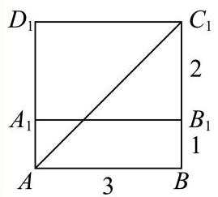

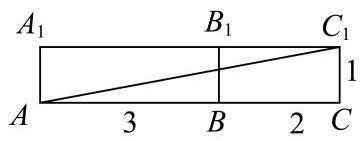

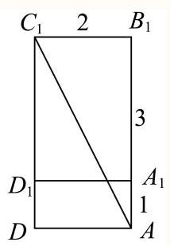

结合长方体的三种展开图,求得 $A{C}_{1}$ 的长分别是 $\sqrt{9 + 9} = 3\sqrt{2},\sqrt{{25} + 1} = \sqrt{26},\sqrt{4 + {16}} = 2\sqrt{5}$ , 所以最小值是 $3\sqrt{2}\mathrm{\;{cm}}$ .

## 变式题1-1

如图，已知正三棱柱 ${ABC} - {A}_{1}{B}_{1}{C}_{1}$ 的底面边长为1cm，高为5cm，一质点自 $A$ 点出发，沿着三棱柱的侧面绕行两周到达 ${A}_{1}$ 点的最短路线的长为 ( )

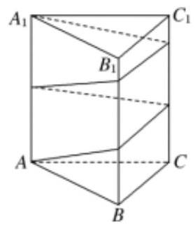

A. 12

B. 13

C. $\sqrt{61}$

D. 15

---

	答案

C

	解析

---

由条件将三棱柱的侧面展开，根据两点间距离最短求最小值.

将正三棱柱 ${ABC} - {A}_{1}{B}_{1}{C}_{1}$ 沿侧棱展开，再拼接一次，其侧面展开图如图所示，

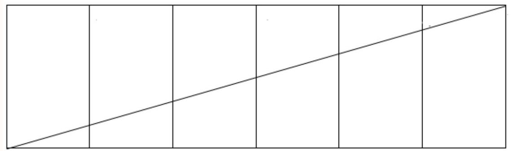

在展开图中,最短距离是六个矩形对角线的连线的长度,也即为三棱柱的侧面上所求距离的最小值.

由已知求得矩形的长等于 $6 \times  1 = 6$ ,宽等于 5,由勾股定理 $d = \sqrt{{6}^{2} + {5}^{2}} = \sqrt{61}$ .

故选:C.

本题考查空间几何体中的最短距离问题，重点考查空间想象能力，属于重点题型，本题的难点空间想象，需展开成6个矩形.

## 变式题1-2

有一个圆锥形铅垂, 其底面直径为10cm, 母线长为15cm. P是铅垂底面圆周上一点, 则关于下列命题:①铅垂的侧面积为150 ${\mathrm{{cm}}}^{2}$ ；②一只蚂蚁从P点出发沿铅垂侧面爬行一周、最终又回到P点的最短路径的长度为 ${15}\sqrt{3}\mathrm{{cm}}$ . 其中正确的判断是( )

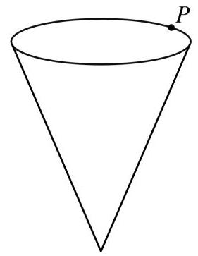

A. ①②都正确

B. ①正确、②错误

C. ①错误、②正确

答案

C

解析

根据圆锥的侧面展开图为扇形,由扇形的面积公式计算即可判断①,在展开图中可知沿着 $P{P}^{\prime }$ 爬行即为最短路径, 计算即可判断②.

$\because$ 直径为10cm,母线长为15cm.

$\therefore$ 底面圆周长为 $l = {\pi d} = {10\pi }\mathrm{{cm}}$ .

将其侧面展开后得到扇形半径为 $R = {15}\mathrm{\;{cm}}$ ，弧长为 ${10\pi }\mathrm{{cm}}$ ，则扇形面积为 $S = \frac{1}{2}{lR} = \frac{1}{2} \times  {10\pi } \times  {15} = {75\pi } \; {\mathrm{{cm}}}^{2}$ ,①错误.

将其侧面展开，则爬行最短距离为 $P{P}^{\prime }$ ，由弧长公式得展开后扇形弧度数为 $\angle {PA}{P}^{\prime } = \frac{10\pi }{15} = \frac{2}{3}\pi$ ，作 ${AB}\bot P{P}^{\prime }$ , $\angle {P}^{\prime }{AB} = \angle {PAB} = \frac{\pi }{3}$ ,又 ${AP} = A{P}^{\prime } = {15}$ ,

${BP} = B{P}^{\prime } = {15} \times  \sin \frac{\pi }{3} = \frac{15}{2}\sqrt{3},$

$P{P}^{\prime } = {BP} + B{P}^{\prime } = \frac{15}{2}\sqrt{3} + \frac{15}{2}\sqrt{3} = {15}\sqrt{3}\mathrm{\;{cm}},$ ② 正确.

故选: $\mathrm{C}$

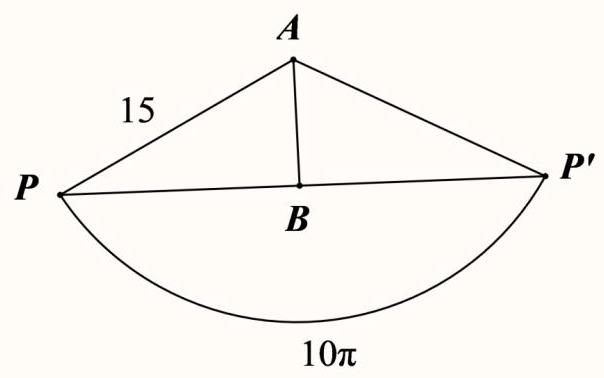

## 变式题1-3

如图是一座山的示意图，山呈圆锥形，圆锥的底面半径为10公里，母线长为40公里， $B$ 是母线 ${SA}$ 上一点，且 ${AB} = {10}$ 公里.为了发展旅游业，要建设一条最短的从 $A$ 绕山一周到 $B$ 的观光铁路.这条铁路从 $A$ 出发后首先上坡，随后下坡，则上坡段铁路的长度为 公里.

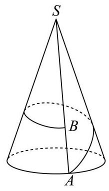

答案

32

解析

先展开圆锥的侧面，确定观光铁路路线，再根据实际意义确定下坡段的铁路路线，最后解三角形得结果. 沿母线 ${SA}$ 将圆锥的侧面展开，如图:

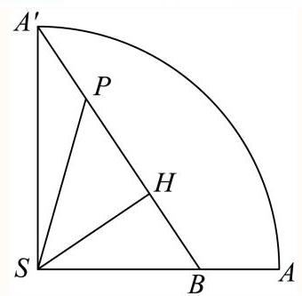

记 $P$ 为 ${A}^{\prime }B$ 上的任意一点,作 ${SH} \bot  {A}^{\prime }B$ ,垂足为 $H$ ,连接 ${SP}$ ,

由 $\widehat{{A}^{\prime }}A$ 的长为 ${20\pi }$ ,得 $\angle {A}^{\prime }{SA} = \frac{20\pi }{40} = \frac{\pi }{2}$ ,由两点间线段最短,知观光铁路为图中线段 ${A}^{\prime }B$ ,

而 ${SB} = {40} - {10} = {30}$ ,则 ${A}^{\prime }B = \sqrt{{A}^{\prime }{S}^{2} + S{B}^{2}} = \sqrt{{40}^{2} + {30}^{2}} = {50}$ ,

上坡即 $P$ 到山顶 $S$ 的距离 ${PS}$ 越来越小,下坡即 $P$ 到山顶 $S$ 的距离 ${PS}$ 越来越大,

因此上坡段的铁路,即图中的线段 ${A}^{\prime }H$ ,由 $\operatorname{Rt}\bigtriangleup S{A}^{\prime }B \sim  \operatorname{Rt}\bigtriangleup H{A}^{\prime }S$ ,得 ${A}^{\prime }H = \frac{S{A}^{\prime 2}}{{A}^{\prime }B} = \frac{{40}^{2}}{50} = {32}$ .

故答案为: 32

关键点点睛:作出圆锥侧面展开图，确定铁路对应线段是解决问题的关键.

## 母题2

如图，在长方体 ${ABCD} - {A}_{1}{B}_{1}{C}_{1}{D}_{1}$ 中， ${AB} = {AD} = 1$ ， $A{A}_{1} = 2\sqrt{2}$ ，点 $E$ 为 ${AB}$ 上的动点，则 ${D}_{1}E + {CE}$ 的最小值为 .

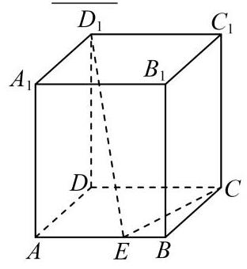

答案

$\sqrt{17}$

解析

将 ${ABCD}$ 绕 ${AB}$ 翻折到与 ${AB}{C}_{1}{D}_{1}$ 共面，作出平面图形，连接 $C{D}_{1}$ ，则线段 $C{D}_{1}$ 即为 ${D}_{1}E + {CE}$ 的最小值，再由勾股定理计算可得.

将 ${ABCD}$ 绕 ${AB}$ 翻折到与 ${AB}{C}_{1}{D}_{1}$ 共面，平面图形如下所示.

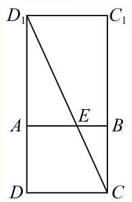

连接 $C{D}_{1}$ (平面图形中)，则 $C{D}_{1}$ 的长度即为 ${D}_{1}E + {CE}$ 的最小值，

因为 ${AB} = {AD} = 1,{A{A}_{1}} = 2\sqrt{2}$ ，所以 ${A{D}_{1}} = \sqrt{{1}^{2} + {\left( 2\sqrt{2}\right) }^{2}} = 3$ ，

所以 $D{D}_{1} = 4$ ，所以 $C{D}_{1} = \sqrt{{1}^{2} + {4}^{2}} = \sqrt{17}$ ，

所以 ${D}_{1}E + {CE}$ 的最小值为 $\sqrt{17}$ .

故答案为: $\sqrt{17}$

## 变式题2-1

正方体 $\mathrm{{ABCD}} - {\mathrm{A}}_{1}{\mathrm{B}}_{1}{\mathrm{C}}_{1}{\mathrm{D}}_{1}$ 的棱长为 $2,\mathrm{P}$ 是面对角线 ${\mathrm{{BC}}}_{1}$ 上一动点， $\mathrm{Q}$ 是底面 $\mathrm{{ABCD}}$ 上一动点，则 ${\mathrm{D}}_{1}\mathrm{P} + \mathrm{{PQ}}$ 的最小值为 ___.

答案

$2 + \sqrt{2} \mid  \sqrt{2} + 2$

解析

对多个动点的问题，一般采用剪开侧面或者翻折后，展开为平面图形，通过共线或特殊位置关系得到.把 $\bigtriangleup {CB}{C}_{1}$ 沿BC ${}_{1}$ 上转 ${90}^{ \circ  }$ ，与平面BC ${}_{1}{\mathrm{D}}_{1}$ 共面，由 ${\mathrm{D}}_{1}$ 向BC作垂线，垂足即为所求的Q点，连结 ${D}_{1}Q$ ，交 $B{C}_{1}$ 于P 点, ${D}_{1}Q$ 即为最小值.

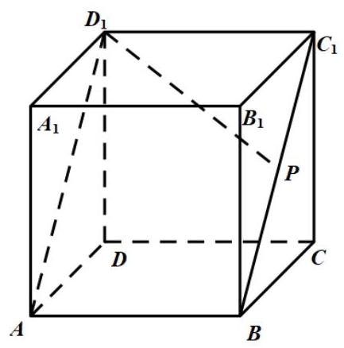

图1

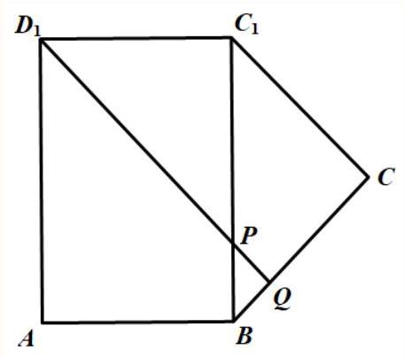

图2

如图2，把 $\bigtriangleup  {CB}{C}_{1}$ 沿BC ${}_{1}$ 上转 ${90}^{ \circ  }$ ，与平面BC ${}_{1}{\text{ D }}_{1}$ 共面，当 ${D}_{1}Q\bot {BC}$ 时， ${D}_{1}P + {PQ} = {D}_{1}Q$ 最小， $P{D}_{1} = 2\sqrt{2}$ , $\;{PQ} = 2\left( \frac{\sqrt{2} - 1}{\sqrt{2}}\right)  = 2 - \sqrt{2}$ ,

所以 ${\mathrm{D}}_{1}\mathrm{P} + \mathrm{{PQ}}$ 的最小值为 $2 + \sqrt{2}$ ,

故答案为: $2 + \sqrt{2}$ .

## 变式题2-2

如图，在直四棱柱 ${ABCD} - {A}_{1}{B}_{1}{C}_{1}{D}_{1}$ 中，底面 ${ABCD}$ 为菱形，且 $\angle {BAD} = {60}^{ \circ  }.$ 若 ${AB} = {A{A}_{1}} = 2$ ，点 $M$ 为棱 $C{C}_{1}$ 的中点，点 $P$ 在 ${A}_{1}B$ 上，则线段 ${PA},{PM}$ 的长度和的最小值为

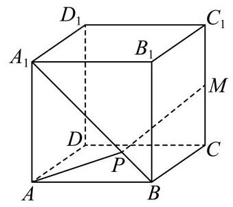

答案

$\sqrt{9 + 2\sqrt{10}}$

解析

取 ${D}_{1}{C}_{1}$ 的中点 $N$ ，连接 ${MN}$ 、 ${A}_{1}N$ 、 ${BM}$ 、 ${D}_{1}C$ ，首先证明 ${A}_{1}B//{MN}$ ，即可 ${A}_{1}$ 、 $B$ 、 $M$ 、 $N$ 四点共面，连接 ${A}_{1}M,{A}_{1}{C}_{1}$ ,求出 $\angle {A}_{1}{BM} = {90}^{ \circ  }$ ,将 $\bigtriangleup {AB}{A}_{1}$ 绕 ${A}_{1}B$ 翻折,使得平面 ${AB}{A}_{1}$ 与平面 ${A}_{1}{BMN}$ 共面,连接 ${AM}$ 交 ${A}_{1}B$ 于点 $P$ ，最后利用余弦定理计算可得.

取 ${D}_{1}{C}_{1}$ 的中点 $N$ ,连接 ${MN}\text{ 、 }{A}_{1}N\text{ 、 }{BM}\text{ 、 }{D}_{1}C$ ,

因为点 $M$ 为棱 $C{C}_{1}$ 的中点，所以 ${MN}//{{D}_{1}C}$ ，又 ${A}_{1}{D}_{1}//{BC}$ 且 ${A}_{1}{D}_{1} = {BC}$ ，

所以 ${A}_{1}{D}_{1}{CB}$ 为平行四边形，所以 ${A}_{1}B//{D}_{1}C$ ，

所以 ${A}_{1}B//{MN}$ ,即 ${A}_{1}\text{ 、 }B\text{ 、 }M\text{ 、 }N$ 四点共面，连接 ${A}_{1}M,{A}_{1}{C}_{1}$ ,

则 ${A}_{1}B = \sqrt{{2}^{2} + {2}^{2}} = 2\sqrt{2},{BM} = \sqrt{{2}^{2} + {1}^{2}} = \sqrt{5}$ ,

因为底面 ${ABCD}$ 为菱形,且 $\angle {BAD} = {60}^{ \circ  }$ ,所以 $\angle {ADC} = {120}^{ \circ  }$ ,

所以 ${A}_{1}{C}_{1} = \sqrt{{2}^{2} + {2}^{2} - 2 \times  2 \times  2\cos {120}^{ \circ  }} = 2\sqrt{3}$ ,

所以 ${A}_{1}M = \sqrt{{\left( 2\sqrt{3}\right) }^{2} + {1}^{2}} = \sqrt{13}$ ,

所以 ${A}_{1}{B}^{2} + B{M}^{2} = {A}_{1}{M}^{2}$ ,即 ${A}_{1}B \bot  {BM}$ ,所以 $\angle {A}_{1}{BM} = {90}^{ \circ  }$ ,

将 $\bigtriangleup {AB}{A}_{1}$ 绕 ${A}_{1}B$ 翻折，使得平面 ${AB}{A}_{1}$ 与平面 ${A}_{1}{BMN}$ 共面，连接 ${AM}$ 交 ${A}_{1}B$ 于点 $P$ ，

则 ${PA} + {PM} \geq  {AM}$ ,

又 $\angle {ABM} = {135}^{ \circ  }$ ,

在 $\bigtriangleup {ABM}$ 中 $A{M}^{2} = A{B}^{2} + B{M}^{2} - {2AB} \cdot  {BM}\cos \angle {ABM}$ ,

即 $A{M}^{2} = {2}^{2} + {\left( \sqrt{5}\right) }^{2} - 2 \times  2 \times  \sqrt{5} \times  \left( {-\frac{\sqrt{2}}{2}}\right)  = 9 + 2\sqrt{10}$ ,

所以 ${AM} = \sqrt{9 + 2\sqrt{10}}$ ，

即线段 ${PA}\text{ 、 }{PM}$ 的长度和的最小值为 $\sqrt{9 + 2\sqrt{10}}$ .

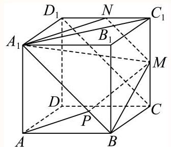

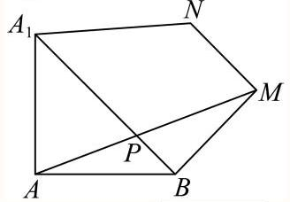

故答案为: $\sqrt{9 + 2\sqrt{10}}$

## 分层练习

韩基础

1

如图是一块长、宽、高分别为 $6\mathrm{\;{cm}}$ 、 $4\mathrm{\;{cm}}$ 、 $3\mathrm{\;{cm}}$ 的长方体木块，一只蚂蚁要从长方体木块的一个顶点 $A$ 处，沿着长方体的表面到长方体上和 $A$ 相对的顶点 $B$ 处吃食物，那么它需要爬行的最短路径的长是( )

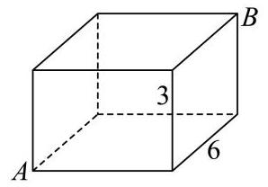

A. $\sqrt{85}\mathrm{\;{cm}}$

B. $\sqrt{97}\mathrm{\;{cm}}$

C. $\sqrt{109}\mathrm{\;{cm}}$

D. $\left( {3 + 2\sqrt{13}}\right) \mathrm{{cm}}$

答案

A

解析

展开可能走过的长方体平面, 由两点之间线段最短求出各个最短距离比较即可求解.

第一种情况:把我们所看到的前面和上面组成一个平面,

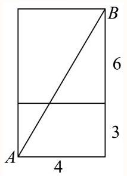

则这个长方形的长和宽分别是9和 4,

则所走的最短线段是 $\sqrt{{4}^{2} + {9}^{2}} = \sqrt{97}$ ;

第二种情况:把我们看到的左面与上面组成一个长方形，

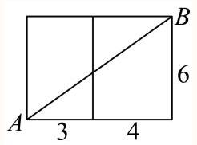

则这个长方形的长和宽分别是7和6,

所以走的最短线段是 $\sqrt{{7}^{2} + {6}^{2}} = \sqrt{85}$ ;

第三种情况:把我们所看到的前面和右面组成一个长方形,

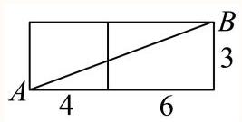

则这个长方形的长和宽分别是 10 和 3 ，

所以走的最短线段是 $\sqrt{{3}^{2} + {10}^{2}} = \sqrt{109}$ ;

三种情况比较而言, 第二种情况最短.

故选: A.

2

有一个圆锥形漏斗，其底面直径是10cm，母线长为20cm，在漏斗口的点 $P$ 处用一根绳子将漏斗挂在墙面上，当绳子的长度最短时, 可以紧紧地箍住漏斗, 不会上下滑动, 求此时绳子的长度.

答案

${20}\sqrt{2}\mathrm{\;{cm}}$

解析

由圆锥的展开图可知,绳子是线段 $P{P}_{1}$ 时,绳子长度最短,根据扇形弧长公式可求圆心角,从而可求弦 $P{P}_{1}$ 的长度.

底面直径是 10,则底面圆周长 $L = {\pi d} = {10\pi }$ ,

即圆锥的展开图(如下图所示)中，弧 $\overset{\text{ ⏜ }}{P{P}_{1}}$ 的长度为 ${10\pi }$ ,

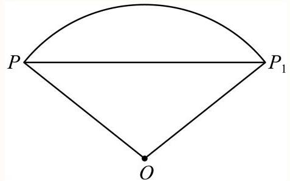

母线 ${OP} = {20}\mathrm{\;{cm}}$ ,故圆心角 $\angle {PO}{P}_{1} = \frac{10\pi }{20} = \frac{\pi }{2}$ ,

当绳子是线段 $P{P}_{1}$ 时，绳子长度最短，

在Rt $\bigtriangleup {PO}{P}_{1}$ 中, $P{P}_{1} = \sqrt{{20}^{2} + {20}^{2}} = {20}\sqrt{2}$ .

故绳子的长度为 ${20}\sqrt{2}\mathrm{\;{cm}}$ .

已知正三棱柱 ${ABC} - {A}_{1}{B}_{1}{C}_{1}$ 的底面边长为 1，高为 8，一质点自 $A$ 点出发，沿着三棱柱的侧面绕行一周到达 ${A}_{1}$ 点的最短路线的长为

答案

$\sqrt{73}$

解析

利用正棱柱的侧面展开图可知所求最短距离为 $A{A}_{1}{}^{\prime }$ ,利用勾股定理可求得结果.正三棱柱 ${ABC} - {A}_{1}{B}_{1}{C}_{1}$ 的侧面展开图如下图所示:

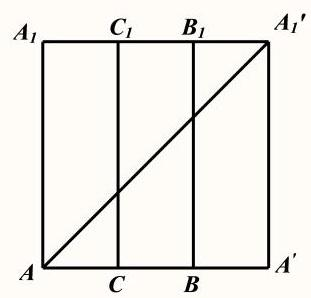

则 $A{A}^{\prime } = 3, A{A}_{1} = {A}^{\prime }{A}_{1}{}^{\prime } = 8$

则质点绕行一周的最短距离为 $A{A}_{1}{}^{\prime }$ 的长度,则 $A{A}^{\prime } = \sqrt{9 + {64}} = \sqrt{73}$

$\therefore$ 所求最短距离为 $\sqrt{73}$

故答案为 $\sqrt{73}$

本题考查最短距离的求解问题, 关键是明确此类问题是通过侧面展开图, 利用两点之间线段最短来求得结果.

## 综合

1

已知二面角 $\alpha  - l - \beta$ 的平面角是 ${120}^{ \circ  }$ ，在面 $\alpha$ 内， ${AB}\bot l$ 于 $B$ ， ${AB} = 2$ ，在面 $\beta$ 内， ${CD}\bot l$ 于 $D$ ， ${CD} = 3$ ， ${BD} = 1$ ， $M$ 是棱 $l$ 上的一个动点，则 ${AM} + {CM}$ 的最小值是 .

## 答案

$\sqrt{26}$

解析

将二面角 $\alpha  - l - \beta$ 平摊开来，在平面内根据两点之间线段最短求解.

将二面角 $\alpha  - l - \beta$ 平摊开来，即为如下图形，

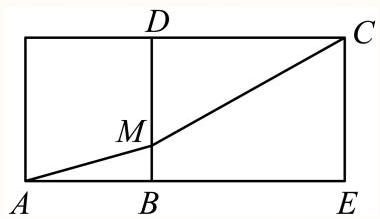

当 $A, M, C$ 在一条直线上时 ${AM} + {CM}$ 有最小值,

最小值为对角线 ${AC}$ ,

因为 ${AE} = 2 + 3 = 5,{CE} = {BD} = 1$ ，所以 ${AC} = \sqrt{A{E}^{2} + C{E}^{2}} = \sqrt{26}$ ，

故答案为: $\sqrt{26}$ .

2

如图所示，已知正方体 ${ABCD} - {A}_{1}{B}_{1}{C}_{1}{D}_{1}$ 的棱长为 $2, P$ 为面对角线 $A{B}_{1}$ 上的动点， $E$ 为 ${C}_{1}{D}_{1}$ 中点，则 $P{A}_{1} + {PE}$ 的最小值为

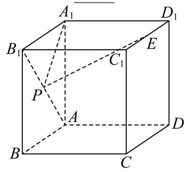

## 答案

$\sqrt{13}$

解析

建立空间直角坐标系,表示各点坐标,计算线段长,根据点 $P$ 的位置作 $\bigtriangleup A{B}_{1}{A}_{1}$ 和 $\bigtriangleup A{B}_{1}E$ 的展开图,问题转化为求 ${A}_{1}E$ 的长,利用余弦定理分析特征即可得到结果.

由题意得, $\bigtriangleup A{A}_{1}{B}_{1}$ 为等腰直角三角形, ${A}_{1}{B}_{1} = {A}_{1}A = 2, A{B}_{1} = 2\sqrt{2}$ .

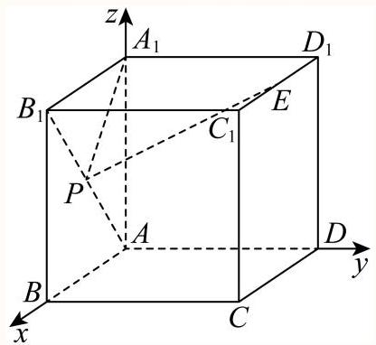

如图,以 $A$ 为原点建立空间直角坐标系,则 $A\left( {0,0,0}\right) ,{B}_{1}\left( {2,0,2}\right) , E\left( {1,2,2}\right)$ ,

$\therefore {AE} = \sqrt{{1}^{2} + {2}^{2} + {2}^{2}} = 3,{B}_{1}E = \sqrt{{\left( 2 - 1\right) }^{2} + {\left( 0 - 2\right) }^{2} + {\left( 2 - 2\right) }^{2}} = \sqrt{5}$ .

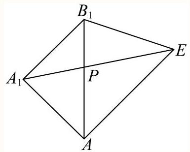

如图，作 $\bigtriangleup  A{B}_{1}{A}_{1}$ 和 $\bigtriangleup  A{B}_{1}E$ 的展开图，当 ${A}_{1}, P, E$ 三点共线时， $P{A}_{1} + {PE}$ 有最小值，最小值为 ${A}_{1}E$ 的长. 在 $\bigtriangleup A{B}_{1}E$ 中，由余弦定理得， $\cos \angle {B}_{1}{AE} = \frac{A{B}_{1}^{2} + A{E}^{2} - {B}_{1}{E}^{2}}{{2A}{B}_{1} \cdot  {AE}} = \frac{{\left( 2\sqrt{2}\right) }^{2} + {3}^{2} - {\left( \sqrt{5}\right) }^{2}}{2 \times  2\sqrt{2} \times  3} = \frac{\sqrt{2}}{2}$ ， 由 $\angle {B}_{1}{AE} \in  \left( {0,\pi }\right)$ 得, $\angle {B}_{1}{AE} = \frac{\pi }{4}$ , $\because \angle {B}_{1}A{A}_{1} = \frac{\pi }{4},\;\therefore \angle {A}_{1}{AE} = \frac{\pi }{2}$ , $\therefore {A}_{1}E = \sqrt{A{A}_{1}^{2} + A{E}^{2}} = \sqrt{{2}^{2} + {3}^{2}} = \sqrt{13}$ ，即 $P{A}_{1} + {PE}$ 的最小值为 $\sqrt{13}$ . 故答案为: $\sqrt{13}$ .

## 挑战
