## 祖暅原理与旋转体体积

## 知识讲解

## 导学说明

本讲围绕祖暅原理组织一组体积计算题。学生不需要先学积分，也可以通过“同高处截面积相等”把不规则几何体转化为圆柱、圆锥、球、长方体或它们的差。课堂主线不是背结论，而是训练学生看到几何体后能主动问：

(1) 截面应当怎么取？

(2) 截面面积能否化成熟悉表达式？

(3) 这个表达式对应哪一个标准几何体的截面积？

## 1. 数学目标

(1) 理解祖暅原理的现代表述：夹在两个平行平面之间的两个等高几何体，被平行于这两个平面的任意平面所截，若截面面积总相等，则体积相等。

(2) 能够用水平截面法计算半球、椭球、抛物体、环体、旋转区域等几何体的体积。

(3) 能够把“截面面积表达式”匹配到圆柱、圆锥、球、长方体或组合体，完成体积转化。

(4) 能够在含参数题中通过截面面积建立等量关系，并反推参数或离心率。

## 2. 课程重难点

(1) 重点：祖暅原理的适用条件；水平截面面积的计算；圆柱减圆锥、圆环、组合体的体积转化。

(2) 难点：旋转体截面半径的确定；圆环外半径、内半径的区分；由截面面积表达式反向构造标准几何体；含参数题中的恒等化简。

## 3. 考查形式与分值占比

(1) 题型：以填空题、选择题为主，也可作为立体几何或解析几何解答题中的局部步骤。

(2) 占比：常作为上海高中数学立体几何、解析几何、数学文化题中的中高档题或综合题局部步骤出现，不宜编造固定分值比例。

## 知识导图

\begin{methodmap}
\maprow{前置}{柱锥球体积、圆环面积、曲线方程}
\maprow{定截面}{取与底面平行的截面；旋转体多取水平截面}
\maprow{算面积}{把截面半径写成高度 $h$ 或 $y$ 的函数，得到 $S(h)$}
\maprow{配模型}{圆柱减圆锥、圆环、球、长方体或组合体}
\maprow{落答案}{由体积相等或体积成比例完成计算与参数关系}
\end{methodmap}

## 教法备注

## 1. 三类知识点

(1) 事实性知识：

祖暅原理的文字表述；圆柱、圆锥、球、长方体的体积公式；圆环面积公式。

(2) 概念性知识：

“幂”指同一高度处的截面面积，“势”指高；祖暅原理本质上比较的是一族平行截面面积。

(3) 程序性知识：

用祖暅原理解题的三步：定截面、算面积、配模型。

(4) 三类知识教学步骤：

先用半球体积推导补足事实和概念，再用椭球、圆环、双曲线旋转体示范程序，最后用含参数与组合体练习巩固迁移。

## 2. 本切片知识点标签

知识点祖暅原理与等截面体积转化：程序性知识

【注】祖暅原理的表述是事实性知识；“等截面面积推出等体积”的理解是概念性知识；真正用于做题的“定截面、算面积、配模型”是程序性知识。

## 可知识点:祖暅原理与等截面体积转化

## 知识笔记

## 1. 祖暅原理

祖暅原理可表述为：

夹在两个平行平面之间的两个几何体，被平行于这两个平面的任意平面所截，如果截得的两个截面面积总相等，那么这两个几何体的体积相等。

若任意等高截面面积恒成比例 $S_1:S_2=k:1$，则对应体积也满足 $V_1:V_2=k:1$。

## 2. 解题三步

(1) 定截面：通常取与底面平行的截面；旋转体常取水平截面，截面多为圆或圆环。

(2) 算面积：把截面半径写成高度 $h$ 或 $y$ 的函数，再写出 $S(h)$。

(3) 配模型：把 $S(h)$ 识别为圆柱、圆锥、球、长方体或组合体在同高处的截面积。

## 3. 高频截面模型

(1) 半球与“圆柱挖圆锥”：

半径为 $R$ 的半球在距底面 $d$ 处的截面面积为

$$
S=\pi(R^2-d^2).
$$

半径、高均为 $R$ 的圆柱挖去同底同高圆锥后，在同高处的圆环面积也为

$$
\pi R^2-\pi d^2=\pi(R^2-d^2).
$$

(2) 椭球：

椭圆 $\frac{x^2}{b^2}+\frac{y^2}{a^2}=1$ 绕 $y$ 轴旋转所得椭球的体积为

$$
V=\frac{4\pi}{3}ab^2.
$$

这里 $a$ 是旋转轴方向半轴，$b$ 是截面圆半径方向半轴。

(3) 圆环截面：

若旋转区域在高度 $y$ 处的外半径为 $R(y)$，内半径为 $r(y)$，则截面面积为

$$
S(y)=\pi\left(R^2(y)-r^2(y)\right).
$$

这一式子经常化简成常数、一次式、平方式，再匹配圆柱、长方体或圆锥。

## 教法备注

知识标签：程序性知识

教学步骤：本讲需要学生能够利用祖暅原理解决旋转体与组合体体积问题。该讲知识点建立在已经学习完柱锥球体积、解析几何曲线方程、圆环面积的基础上，所以教师应先带领学生复习“同高截面面积”的含义，然后用半球或椭球演示圆柱减圆锥模型，再用圆环截面题训练半径识别，最后进行独立练习。

对应知识层级：操作

\begin{problemblock}{母题1}

\notelabel{母题说明教法备注}

母题说明：本题考查“椭圆绕轴旋转形成椭球”的祖暅构造，训练学生把椭圆截面面积配成“圆柱减圆锥”的识别动作。

课本中介绍了应用祖暅原理推导棱锥体积公式的做法。祖暅原理也可用来求旋转体的体积。现介绍祖暅原理求球体体积公式的做法：可构造一个底面半径和高都与球半径相等的圆柱，然后在圆柱内挖去一个以圆柱下底面圆心为顶点，圆柱上底面为底面的圆锥，用这样一个几何体与半球应用祖暅原理，即可求得球的体积公式。请研究和理解球的体积公式求法的基础上，解答以下问题：

已知椭圆的标准方程为 $\frac{x^2}{4}+\frac{y^2}{25}=1$，将此椭圆绕 $y$ 轴旋转一周后，得一橄榄状的几何体，其体积等于____。

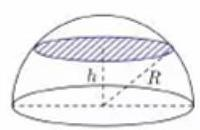

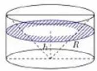

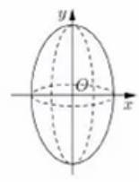

\answerlabel

$$
\frac{80\pi}{3}
$$

\analysislabel

先看结构：椭圆绕 $y$ 轴旋转，截面是圆；$y$ 轴方向半轴为 $5$，截面圆最大半径为 $2$。

构造一个底面半径为 $2$、高为 $5$ 的圆柱，再在圆柱中挖去一个同底同高的圆锥。半椭球与“圆柱挖圆锥”在等高处截面面积相等。

所以整个椭球体积为

$$
V=2\left(\pi\cdot 2^2\cdot 5-\frac13\pi\cdot 2^2\cdot 5\right)
=\frac{80\pi}{3}.
$$

\notelabel{教法备注}

1.【选题原因】

本题是祖暅原理最标准的迁移：从半球推广到椭球。它能帮助学生形成“只要截面面积形如 $\pi b^2(1-\frac{y^2}{a^2})$，就可以找圆柱减圆锥”的固定识别。

2.【错因预设】

(1) 把旋转轴方向半轴和截面半径方向半轴混淆，写成 $\frac{4\pi}{3}a^2b$。

(2) 只算半椭球体积，漏乘 $2$。

(3) 构造圆锥时半径、高对应错位，导致圆锥体积错误。

3.【讲法建议】

(1)解法（等截面构造，推荐）

先画出半椭球与圆柱挖圆锥，强调“同一高度 $h$ 处截面面积相等”。课堂上不必一开始背椭球体积公式，而应先让学生说出圆柱体积和圆锥体积。

\begin{supplementbox}
补充说明：在学生已经理解构造后，可再归纳椭球体积公式 $V=\frac{4\pi}{3}ab^2$，其中 $a$ 是旋转轴方向半轴，$b$ 是垂直旋转轴方向半轴。
\end{supplementbox}

\end{problemblock}

\begin{problemblock}{变式题1-1}

\notelabel{变式说明教法备注}

变式说明：同样是椭球体积，但从选择题中训练“半轴识别 + 体积公式”的快速计算。

祖暅原理用现代语言可描述为：夹在两个平行平面之间的两个几何体，被平行于这两个平面的任意平面所截，如果截得的两个截面的面积总相等，那么这两个几何体的体积相等。

现将椭圆 $\frac{x^2}{16}+\frac{y^2}{36}=1$ 绕 $y$ 轴旋转一周后得到椭球，类比计算球的体积的方法，运用祖暅原理可求得该椭球的体积为（ ）

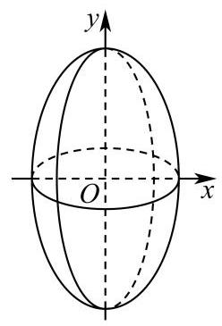

A. $32\pi$

B. $64\pi$

C. $128\pi$

D. $256\pi$

\answerlabel

C

\analysislabel

椭圆绕 $y$ 轴旋转，旋转轴方向半轴为 $6$，截面圆最大半径为 $4$，所以

$$
V=\frac{4\pi}{3}\cdot 6\cdot 4^2=128\pi.
$$

\end{problemblock}

\begin{problemblock}{变式题1-2}

\notelabel{变式说明教法备注}

变式说明：由椭球体积进一步迁移到“椭球减球”，训练体积割补。

在 $xOy$ 平面上，将一段圆弧 $C:x^2+y^2=1(x\ge 0)$ 和一段椭圆弧 $\Gamma:\frac{x^2}{2}+y^2=1(x\ge 0)$ 围成的封闭图形记为 $D$，记 $D$ 绕 $y$ 轴旋转一周而成的封闭几何体为 $\Omega$。过 $(0,y)(|y|<1)$ 作 $\Omega$ 的水平截面，利用祖暅原理和一个球，得出旋转体 $\Omega$ 的体积值为____。

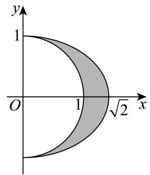

\answerlabel

$$
\frac{4\pi}{3}
$$

\analysislabel

椭圆 $\frac{x^2}{2}+y^2=1$ 绕 $y$ 轴旋转，旋转轴方向半轴为 $1$，截面圆最大半径为 $\sqrt2$，所得椭球体积为

$$
\frac{4\pi}{3}\cdot 1\cdot(\sqrt2)^2=\frac{8\pi}{3}.
$$

圆 $x^2+y^2=1$ 绕 $y$ 轴旋转所得球体积为 $\frac{4\pi}{3}$。

所以夹在两者之间的旋转体体积为

$$
\frac{8\pi}{3}-\frac{4\pi}{3}=\frac{4\pi}{3}.
$$

\end{problemblock}

\begin{problemblock}{母题2}

\notelabel{母题说明教法备注}

母题说明：本题考查“圆环截面面积化成圆锥截面面积”，训练学生从 $S(t)$ 反向构造标准几何体。

早在公元 5 世纪，我国数学家祖暅就提出：“幂势既同，则积不容异”。如图，抛物线 $C$ 的方程为 $y=x^2$，过点 $(1,0)$ 作抛物线 $C$ 的切线 $l$（$l$ 的斜率不为 0），将抛物线 $C$、直线 $l$ 及 $x$ 轴围成的阴影部分绕 $y$ 轴旋转一周，所得的几何体记作 $\Omega$，利用祖暅原理，可得出几何体 $\Omega$ 的体积为____。

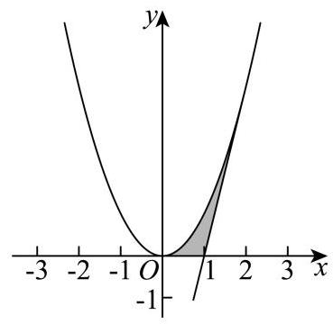

\answerlabel

$$
\frac{4\pi}{3}
$$

\analysislabel

设切线方程为 $x=ky+1$。代入 $y=x^2$ 得

$$
kx^2-x+1=0.
$$

切线对应判别式为 $0$，所以

$$
1-4k=0,\quad k=\frac14.
$$

故切线方程为

$$
x=\frac14y+1.
$$

取高度为 $t(0\le t\le 4)$ 的水平截面，外半径为

$$
r_1=1+\frac{t}{4},
$$

内半径为

$$
r_2=\sqrt t.
$$

截面圆环面积为

$$
S(t)=\pi(r_1^2-r_2^2)
=\pi\left[\left(1+\frac{t}{4}\right)^2-t\right]
=\pi\left(1-\frac{t}{4}\right)^2.
$$

这正是底面半径为 $1$、高为 $4$ 的圆锥在距底面 $t$ 处的截面面积，所以

$$
V_\Omega=\frac13\pi\cdot 1^2\cdot 4=\frac{4\pi}{3}.
$$

\notelabel{教法备注}

1.【选题原因】

本题不只是算切线，还要求把圆环面积化成一个平方式，并看出它对应圆锥的截面。它适合作为“反向配模型”的母题。

2.【错因预设】

(1) 切线方程设成 $y=kx+b$ 后代数更繁，容易丢掉“过 $(1,0)$”。

(2) 圆环外半径写错，把 $1+\frac{t}{4}$ 误写为 $1-\frac{t}{4}$。

(3) 高度范围误写成 $0\le t\le 1$，实际切点高度为 $4$。

3.【讲法建议】

(1)解法（截面面积配圆锥，推荐）

先完成切线方程，再让学生单独化简 $S(t)$。关键讲法是：“看到 $\pi(1-\frac{t}{4})^2$，要想到圆锥从底面往上截，半径线性变小。”

\begin{supplementbox}
补充说明：可说明祖暅原理本质上与“截面积沿高度累加”一致，但本讲不要求用积分计算。
\end{supplementbox}

\end{problemblock}

\begin{problemblock}{变式题2-1}

\notelabel{变式说明教法备注}

变式说明：截面面积直接给成“圆柱 + 长方体”的组合表达式，训练从面积表达式拆模型。

在 $xOy$ 平面上，将两个半圆弧 $(x-1)^2+y^2=1(x\ge 1)$ 和 $(x-3)^2+y^2=1(x\ge 3)$、两条直线 $y=1$ 和 $y=-1$ 围成的封闭图形记为 $D$。记 $D$ 绕 $y$ 轴旋转一周而成的几何体为 $\Omega$。过 $(0,y)(|y|\le 1)$ 作 $\Omega$ 的水平截面，所得截面面积为 $4\pi\sqrt{1-y^2}+8\pi$，试利用祖暅原理、一个平放的圆柱和一个长方体，得出 $\Omega$ 的体积值为____。

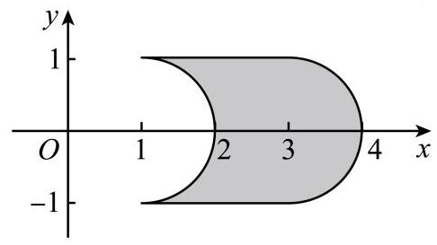

\answerlabel

$$
2\pi^2+16\pi
$$

\analysislabel

截面面积拆成两部分：

$$
4\pi\sqrt{1-y^2}+8\pi.
$$

其中 $4\pi\sqrt{1-y^2}$ 可对应一个半径为 $1$、高为 $2\pi$ 的平放圆柱在高度 $y$ 处的截面积；$8\pi$ 对应一个底面积为 $8\pi$、高为 $2$ 的长方体。

所以

$$
V_\Omega=\pi\cdot1^2\cdot2\pi+2\cdot8\pi=2\pi^2+16\pi.
$$

\end{problemblock}

\begin{problemblock}{变式题2-2}

\notelabel{变式说明教法备注}

变式说明：双曲线与渐近线围成区域旋转后，截面面积化为常数，直接转化为圆柱。

在 $xOy$ 平面上，将双曲线的一支 $\frac{x^2}{9}-\frac{y^2}{16}=1(x>0)$ 及其渐近线 $y=\frac43x$ 和直线 $y=0,y=4$ 围成的封闭图形记为 $D$。记 $D$ 绕 $y$ 轴旋转一周所得的几何体为 $\Omega$。过 $(0,y)(0\le y\le 4)$ 作 $\Omega$ 的水平截面，计算截面面积，利用祖暅原理得出 $\Omega$ 体积为____。

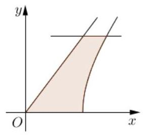

\answerlabel

$$
36\pi
$$

\analysislabel

令水平高度为 $a(0\le a\le 4)$。

渐近线 $y=\frac43x$ 上对应点的横坐标为

$$
x_1=\frac34a.
$$

双曲线 $\frac{x^2}{9}-\frac{y^2}{16}=1$ 上对应右支点的横坐标为

$$
x_2=\frac34\sqrt{a^2+16}.
$$

旋转后水平截面为圆环，面积为

$$
S=\pi(x_2^2-x_1^2)
=\pi\left[\frac{9}{16}(a^2+16)-\frac{9}{16}a^2\right]
=9\pi.
$$

截面面积恒为 $9\pi$，高为 $4$，所以

$$
V_\Omega=9\pi\cdot4=36\pi.
$$

\end{problemblock}

\begin{problemblock}{母题3}

\notelabel{母题说明教法备注}

母题说明：本题考查非旋转实体的祖暅构造，训练学生把帐篷截面面积配成“正四棱柱减正四棱锥”。

我国南北朝时期的数学家祖暅在计算球的体积时，提出了祖暅原理：“幂势既同，则积不容异”。图 1 是一种“四脚帐篷”的示意图，其中曲线 $AOC$ 和 $BOD$ 均是以 $2$ 为半径的半圆，平面 $AOC$ 和平面 $BOD$ 均垂直于平面 $ABCD$，用任意平行于帐篷底面 $ABCD$ 的平面截帐篷，所得截面四边形均为正方形。类比利用祖暅原理求半球体积的计算方法，可以构造一个与帐篷同底等高的正四棱柱和一个倒放的同底等高的正四棱锥，从而求得该帐篷的体积为____。

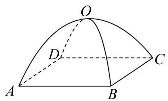

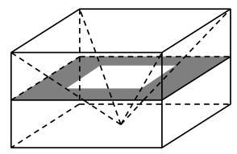

\answerlabel

$$
\frac{32}{3}
$$

\analysislabel

设截面到底面的距离为 $h(0\le h\le2)$。帐篷中对应截面为正方形，其边长可由半圆关系得到：

$$
\text{边长}=\sqrt2\sqrt{4-h^2}.
$$

所以截面面积为

$$
S_1=2(4-h^2)=8-2h^2.
$$

构造同底同高的正四棱柱，底面正方形边长为 $2\sqrt2$，高为 $2$，柱截面面积恒为

$$
8.
$$

倒放正四棱锥在高度 $h$ 处的截面正方形边长为 $\sqrt2h$，面积为

$$
2h^2.
$$

所以“正四棱柱减正四棱锥”的截面面积为

$$
8-2h^2,
$$

与帐篷截面面积相等。由祖暅原理，

$$
V_{\text{帐篷}}
=V_{\text{正四棱柱}}-V_{\text{正四棱锥}}
=(2\sqrt2)^2\cdot2-\frac13(2\sqrt2)^2\cdot2
=\frac{32}{3}.
$$

\notelabel{教法备注}

1.【选题原因】

这道题能打破学生“祖暅原理只用于球和旋转体”的误解。它强调只要平行截面面积能匹配，非旋转实体也能用祖暅原理。

2.【错因预设】

(1) 把截面正方形边长误认为 $2\sqrt{4-h^2}$，忽略了对角线与边长的关系。

(2) 正四棱锥截面边长随高度线性变化，但学生会误写为 $2h$。

(3) 只算正四棱柱体积，忘记减去正四棱锥。

3.【讲法建议】

(1)解法（截面匹配，推荐）

先让学生分别算帐篷截面面积、正四棱柱截面面积、正四棱锥截面面积。最后再把它们合成 $8-2h^2$。

\begin{supplementbox}
补充说明：可类比“半球 = 圆柱 - 圆锥”的截面逻辑，帮助学生建立“原几何体 = 大模型 - 小模型”的思路。
\end{supplementbox}

\end{problemblock}

\begin{problemblock}{变式题3-1}

\notelabel{变式说明教法备注}

变式说明：把抛物线旋转形成抛物体，训练学生用圆柱的一半来表达体积。

已知抛物线 $x^2=2py(p>0)$，以 $y$ 轴为旋转轴将抛物线旋转半周，得到一个旋转抛物面。设 $x$ 轴绕 $y$ 轴旋转所成的平面为 $\alpha$。$\beta$ 为平行于平面 $\alpha$ 且到 $\alpha$ 的距离为 $h$ 的平面，记平面 $\beta$ 与旋转抛物面所围成的几何体为 $\Omega$。以 $\Omega$ 的上底面作一个高为 $h$ 的圆柱体，利用祖暅原理可求得 $\Omega$ 的体积为____。

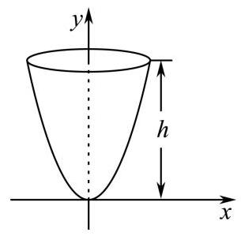

\answerlabel

$$
\pi ph^2
$$

\analysislabel

在高度 $h$ 处，抛物线 $x^2=2py$ 给出上底半径平方为 $2ph$。对应圆柱体积为

$$
V_{\text{圆柱}}=\pi(2ph)\cdot h=2\pi ph^2.
$$

由祖暅构造可知抛物体 $\Omega$ 与圆柱体积的一半相等，所以

$$
V_\Omega=\frac12V_{\text{圆柱}}=\pi ph^2.
$$

\end{problemblock}

\begin{problemblock}{母题4}

\notelabel{母题说明教法备注}

母题说明：本题考查截面面积成固定比例时体积也成固定比例，训练学生从截面比直接推出体积比。

我国古代数学家祖暅求几何体的体积时，提出一个原理：幂势既同，则积不容异。这个定理的推广是：夹在两个平行平面间的几何体，被平行于这两个平面的平面所截，若截得两个截面面积比为 $k$，则两个几何体的体积比也为 $k$。

已知线段 $AB$ 长为 $4$，直线 $l$ 过点 $A$ 且与 $AB$ 垂直，以 $B$ 为圆心、以 $1$ 为半径的圆绕 $l$ 旋转一周，得到环体 $M$；以 $A,B$ 分别为上下底面的圆心，以 $1$ 为上下底面半径的圆柱体 $N$。过 $AB$ 且与 $l$ 垂直的平面为 $\beta$，平面 $\alpha//\beta$，且距离为 $h$。若平面 $\alpha$ 截圆柱体 $N$ 所得截面面积为 $S_1$，平面 $\alpha$ 截环体 $M$ 所得截面面积为 $S_2$，则 $\frac{S_1}{S_2}=$____，环体 $M$ 体积为____。

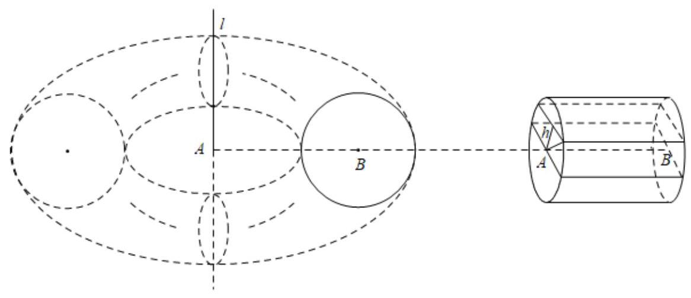

\answerlabel

$$
\frac{1}{2\pi},\quad 8\pi^2
$$

\analysislabel

平面 $\alpha$ 截圆柱体 $N$，得到长为 $4$、宽为 $2\sqrt{1-h^2}$ 的矩形，所以

$$
S_1=8\sqrt{1-h^2}.
$$

平面 $\alpha$ 截环体 $M$，得到圆环。其外半径、内半径分别满足

$$
r_{\text{外}}=4+\sqrt{1-h^2},\quad r_{\text{内}}=4-\sqrt{1-h^2}.
$$

所以

$$
S_2=\pi\left[(4+\sqrt{1-h^2})^2-(4-\sqrt{1-h^2})^2\right]
=16\pi\sqrt{1-h^2}.
$$

因此

$$
\frac{S_1}{S_2}=\frac{1}{2\pi}.
$$

由祖暅原理的比例推广，

$$
V_M=2\pi V_N=2\pi\cdot(\pi\cdot1^2\cdot4)=8\pi^2.
$$

\notelabel{教法备注}

1.【选题原因】

这道题把“截面面积相等”推广为“截面面积成比例”。它能训练学生不用硬算环体体积，而是用截面比把复杂体积转到圆柱体积。

2.【错因预设】

(1) 圆环面积展开时不会用平方差，导致化简复杂。

(2) 把 $S_1:S_2$ 与 $V_M:V_N$ 的方向弄反。

(3) 忘记圆柱 $N$ 的高是 $AB=4$。

3.【讲法建议】

(1)解法（截面比，推荐）

先算 $S_1,S_2$，再强调：每个高度处 $S_2=2\pi S_1$，所以整体体积也满足 $V_M=2\pi V_N$。

\begin{supplementbox}
补充说明：可在最后指出该题结论与环体体积公式一致，但课堂主线仍应放在祖暅原理的比例推广。
\end{supplementbox}

\end{problemblock}

\begin{problemblock}{变式题4-1}

\notelabel{变式说明教法备注}

变式说明：含参数双曲线旋转体，截面面积化为常数后建立参数关系，训练“面积恒定 + 离心率”综合。

《九章算术》中记载了我国古代数学家祖暅在计算球的体积时使用的一个原理：“幂势既同，则积不容异”。已知双曲线

$$
WINDOWS_DRIVE/frac{x^2}{a^2}-\frac{y^2}{b^2}=1(a>0,b>0),
$$

若双曲线右焦点到渐近线的距离记为 $d$，双曲线 $C$ 的两条渐近线与直线 $y=1,y=-1$ 以及双曲线 $C$ 的右支围成的图形绕 $y$ 轴旋转一周所得几何体的体积为 $\sqrt2dc\pi$（其中 $c^2=a^2+b^2$），则双曲线的离心率为（ ）

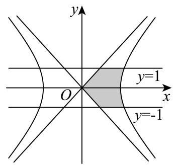

A. $\sqrt2$

B. $2$

C. $\sqrt3$

D. $\frac{2\sqrt3}{3}$

\answerlabel

A

\analysislabel

令水平高度为 $m(-1\le m\le1)$，截面为圆环。

渐近线 $y=\frac{b}{a}x$ 对应半径为

$$
r_1=\frac{am}{b}.
$$

双曲线右支对应外半径为

$$
r_2=\frac{a\sqrt{m^2+b^2}}{b}.
$$

截面面积为

$$
S=\pi(r_2^2-r_1^2)
=\pi\left(\frac{a^2(m^2+b^2)}{b^2}-\frac{a^2m^2}{b^2}\right)
=\pi a^2.
$$

高为 $2$，所以体积为

$$
V=2\pi a^2.
$$

右焦点到渐近线距离为 $d=b$，由题意

$$
2\pi a^2=\sqrt2bc\pi.
$$

平方并整理：

$$
4a^4=2b^2c^2.
$$

又 $b^2=c^2-a^2$，所以

$$
2a^4=c^2(c^2-a^2),
$$

解得 $c^2=2a^2$，于是

$$
e=\frac ca=\sqrt2.
$$

\end{problemblock}

## 分层练习

## 基础

1

写出祖暅原理的内容，并画出用祖暅原理推导半球体积时构造出的几何体，需交代主要线段的长度，可适当用文字说明。

\answerlabel

祖暅原理：夹在两个平行平面之间的两个几何体，被平行于这两个平面的任意平面所截，如果截得的两个截面面积总相等，那么这两个几何体的体积相等。

半球体积构造：半径为 $R$ 的半球，与“底面半径为 $R$、高为 $R$ 的圆柱挖去同底同高圆锥”作比较。距底面 $d$ 处，半球截面面积为 $\pi(R^2-d^2)$，圆柱挖圆锥截面圆环面积也为 $\pi(R^2-d^2)$，所以两者体积相等。

\analysislabel

本题重点不在计算，而在说清“任意平行截面面积相等”。画图时必须标出半径 $R$、高度 $R$、截面距离 $d$，否则只写结论不完整。

2

已知椭圆 $\frac{x^2}{16}+\frac{y^2}{36}=1$ 绕 $y$ 轴旋转一周所得椭球体积为____。

\answerlabel

$$
128\pi
$$

\analysislabel

旋转轴方向半轴为 $6$，截面圆最大半径为 $4$，所以

$$
V=\frac{4\pi}{3}\cdot6\cdot4^2=128\pi.
$$

## 综合

1

如图，有一个半径为 $15$ 的半球，过球心 $O$ 作底面的垂线 $l$，$l$ 上一点 $O_1$ 满足 $O_1O=12$，过 $O_1$ 作平行于底面的截面将半球分成两个几何体，其中较大部分的体积为____。

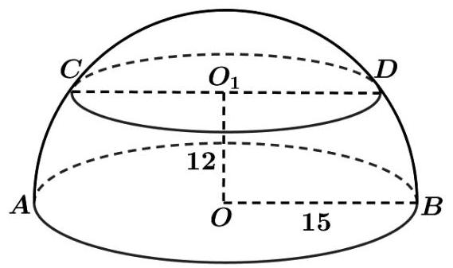

\answerlabel

$$
2124\pi
$$

\analysislabel

半球总体积为

$$
V_{\text{半球}}=\frac23\pi\cdot15^3=2250\pi.
$$

截面以上是高为 $3$ 的球冠。用球冠体积公式

$$
V_{\text{球冠}}=\frac{\pi h^2(3R-h)}{3}
$$

得

$$
V_{\text{球冠}}=\frac{\pi\cdot3^2(45-3)}{3}=126\pi.
$$

较大部分体积为

$$
2250\pi-126\pi=2124\pi.
$$

2

已知抛物线 $x^2=2py(p>0)$，以 $y$ 轴为旋转轴得到旋转抛物面。平面 $y=h$ 与旋转抛物面围成几何体 $\Omega$，求 $\Omega$ 的体积。

\answerlabel

$$
\pi ph^2
$$

\analysislabel

高度 $h$ 处半径平方为 $2ph$，同底同高圆柱体积为

$$
\pi(2ph)\cdot h=2\pi ph^2.
$$

抛物体体积为对应圆柱体积的一半，所以

$$
V_\Omega=\pi ph^2.
$$

## 挑战

1

设双曲线

$$
\frac{x^2}{a^2}-\frac{y^2}{b^2}=1
$$

的右支与渐近线围成的区域绕 $y$ 轴旋转。若在每个高度处的圆环截面面积恒为 $\pi a^2$，且整体体积满足

$$
V=\sqrt2bc\pi,\quad c^2=a^2+b^2,
$$

求离心率 $e$。

\answerlabel

$$
\sqrt2
$$

\analysislabel

高度范围为 $[-1,1]$，所以由祖暅原理得

$$
V=2\pi a^2.
$$

由题意

$$
2\pi a^2=\sqrt2bc\pi.
$$

平方：

$$
4a^4=2b^2c^2.
$$

代入 $b^2=c^2-a^2$：

$$
2a^4=c^2(c^2-a^2).
$$

令 $u=\frac{c^2}{a^2}$，则

$$
2=u(u-1),
$$

解得 $u=2$，所以

$$
e=\frac ca=\sqrt2.
$$

2

判断题：凡是旋转体体积题，都可以直接套用椭球体积公式 $V=\frac{4\pi}{3}ab^2$。

\answerlabel

错误。

\analysislabel

椭球体积公式只适用于椭圆绕某一轴旋转形成的椭球。抛物线旋转、双曲线与渐近线围成区域旋转、圆弧与椭圆弧之间区域旋转，都要先算截面面积，再判断能否转化为圆柱、圆锥、球或组合体。
