祖恒原理

姓名:___ 1

我国南北朝时期的数学家祖暅在计算球的体积时，提出了祖暅原理:“幂势既同，则积不容异”，这里的“幂”指水平截面的面积，“势”指高，这句话的意思是:两个等高的几何体若在所有等高处的水平截面的面积相等, 则这两个几何体体积相等, 利用祖暅原理可以将半球的体积转化为与其同底等高的圆柱和圆锥的体积之差, 图1是一种“四脚帐篷”的示意图, 其中曲线 ${AOC}$ 和 ${BOD}$ 均是以 2 为半径的半圆,平面 ${AOC}$ 和平面 ${BOD}$ 均垂直于平面 ${ABCD}$ ,用任意平行于帐篷底面 ${ABCD}$ 的平面截帐篷，所得截面四边形均为正方形. 类比利用祖暅原理求半球的体积的计算方法，可以构造一个与帐篷同底等高的正四棱柱和一个倒放的同底等高的正四棱锥 (如图2)，从而求得该帐篷的体积为 ___.

图 1

图 2

答案

$\frac{32}{3} \mid  {10}\frac{2}{3}$

解析

先证明等高处的水平截面截两个几何体的截面的面积相等, 由祖暅原理知帐篷体积为正四棱柱的体积减去正四棱锥的体积, 计算即可.

设截面与底面的距离为 $h$ ,在帐篷中的截面为 ${A}^{\prime }{B}^{\prime }{C}^{\prime }{D}^{\prime }$ ,

设底面中心为 $O$ ,截面 ${A}^{\prime }{B}^{\prime }{C}^{\prime }{D}^{\prime }$ 中心为 ${O}^{\prime }$ ,则 $O{C}^{\prime } = 2,{O}^{\prime }{C}^{\prime } = \sqrt{4 - {h}^{2}}$ ,

所以 ${B}^{\prime }{C}^{\prime } = \sqrt{2}\sqrt{4 - {h}^{2}}$ ,所以截面为 ${A}^{\prime }{B}^{\prime }{C}^{\prime }{D}^{\prime }$ 的面积为 $2\left( {4 - {h}^{2}}\right)$ .

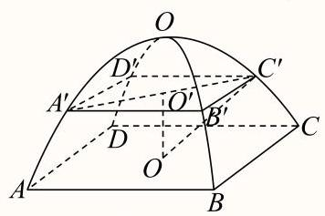

图 1

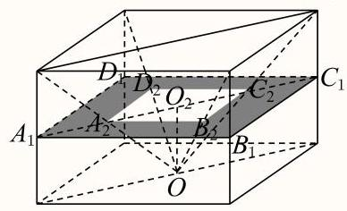

图 2

设截面截正四棱柱得四边形为 ${A}_{1}{B}_{1}{C}_{1}{D}_{1}$ ,截正四棱锥得四边形为 ${A}_{2}{B}_{2}{C}_{2}{D}_{2}$ ,

底面中心 $O$ 与截面 ${A}_{2}{B}_{2}{C}_{2}{D}_{2}$ 中心 ${O}_{2}$ 之间的距离为 $O{O}_{2} = h$ ,

在正四棱柱中，底面正方形边长为 $2\sqrt{2}$ ，高为 $2,{AO} = 2$ ，

所以 $\angle {AO}{A}_{2} = \angle {CO}{C}_{2} = {45}^{ \circ  }$ ,所以 $\angle {A}_{2}O{C}_{2} = {90}^{ \circ  },\bigtriangleup {A}_{2}O{C}_{2}$ 为等腰直角三角形,

所以 ${A}_{2}{C}_{2} = {2h}$ ,所以四边形 ${A}_{2}{B}_{2}{C}_{2}{D}_{2}$ 边长为 $\sqrt{2}h$ ,

所以四边形 ${A}_{2}{B}_{2}{C}_{2}{D}_{2}$ 面积为 $2{h}^{2}$ ，

所以图2中阴影部分的面积为 ${S}_{{A}_{1}{B}_{1}{C}_{1}{D}_{1}} - {S}_{{A}_{2}{B}_{2}{C}_{2}{D}_{2}} = 8 - 2{h}^{2}$ ,与截面 ${A}^{\prime }{B}^{\prime }{C}^{\prime }{D}^{\prime }$ 面积相等, 由祖暅原理知帐篷体积为正四棱柱的体积减去正四棱锥的体积，

即 ${V}_{\text{ 帐篷 }} = {V}_{\text{ 正四棱柱 }} - {V}_{\text{ 正四棱锥 }} = {\left( 2\sqrt{2}\right) }^{2} \times  2 - \frac{1}{3} \times  {\left( 2\sqrt{2}\right) }^{2} \times  2 = \frac{32}{3}$ .

故答案为: $\frac{32}{3}$

2

课本中介绍了应用祖暅原理推导棱锥体积公式的做法. 祖暅原理也可用来求旋转体的体积. 现介绍祖暅原理求球体体积公式的做法:可构造一个底面半径和高都与球半径相等的圆柱，然后在圆柱内挖去一个以圆柱下底面圆心为顶点，圆柱上底面为底面的圆锥，用这样一个几何体与半球应用祖暅原理 (图 1), 即可求得球的体积公式. 请研究和理解球的体积公式求法的基础上, 解答以下问题: 已知椭圆的标准方程为 $\frac{{x}^{2}}{4} + \frac{{y}^{2}}{25} = 1$ ,将此椭圆绕 $y$ 轴旋转一周后,得一橄榄状的几何体 (图 2)，其体积等于___.

图1

图2

答案

$\frac{80\pi }{3}$

解析

椭圆的长半轴为 5，短半轴为 2，现构造一个底面半径为 2，高为 5 的圆柱，然后再圆柱内挖去一个以圆柱下底面圆心为顶点, 圆柱上底面为底面的圆锥, 根据祖暅原理得出椭球的体积为 $V = 2\left( {{V}_{1} - {V}_{2}}\right)  = 2\left( {\pi  \times  {2}^{2} \times  5 - \frac{1}{3} \times  \pi  \times  {2}^{2} \times  5}\right)  = \frac{80\pi }{3}$

3

已知抛物线 ${x}^{2} = {2py}\left( {p > 0}\right)$ ，以 $y$ 轴为旋转轴将抛物线旋转半周，得到一个旋转抛物面. 设 $x$ 轴绕 $y$ 轴旋转所成的平面为 $\alpha$ . $\beta$ 为平行于平面 $\alpha$ 且到 $\alpha$ 的距离为 $h$ 的平面，记平面 $\beta$ 与旋转抛物面所围成的几何体为 $\Omega$ (如图),以 $\Omega$ 的上底面作一个高为 $h$ 的圆柱体 (如图),利用祖暅原理可求得 $\Omega$ 的体积为 ___.

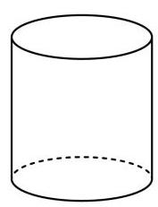

## ✓答案

${\pi p}{h}^{2}$

解析

如图, 构造图形, 说明任意截面截两个几何体, 截面面积相等, 再根据祖暅原理求体积. 如图, 从圆柱体中截取抛物体 $\Omega$ , (右图), 抛物体倒置, (左图), 这是抛物线方程是 ${x}^{2} =  - {2py}$ ,深色截面到底面的距离为 ${h}_{1}$ ,

右图圆环的面积 $S = \pi  \cdot  {O}_{1}{A}^{2} - \pi  \cdot  {O}_{1}{B}^{2} = \pi  \cdot  {2ph} - \pi  \cdot  {2p}{h}_{1} = \pi  \cdot  {2p}\left( {h - {h}_{1}}\right)$ ,

左图圆 $O$ 的面积 ${S}^{\prime } = \pi  \cdot  O{P}^{2} = \pi  \cdot  {2p}\left( {{h}_{1} - h}\right)$ ,故 $S = {S}^{\prime }$ ,

由祖搄原理可知，这两个几何体的体积相等，故抛物体的体积Ω

$V = \frac{1}{2}{V}_{\text{ 圆柱 }} = \frac{1}{2}\pi  \cdot  {2ph} \cdot  h = {\pi p}{h}^{2}.$

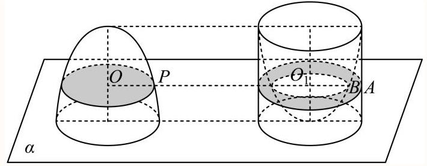

故答案为: ${\pi p}{h}^{2}$

4

早在公元5世纪，我国数学家祖暅就提出:“幂势既同，则积不容异”. 如图，抛物线C的方程为 $y = {x}^{2}$ ，过点 $\left( {1,0}\right)$ 作抛物线C的切线l(1的斜率不为0)，将抛物线C、直线l及x轴围成的阴影部分绕y轴旋转一周，所得的几何体记作 $\Omega$ ，利用祖暅原理，可得出几何体 $\Omega$ 的体积为___.

答案

$\frac{4\pi }{3} \mid  \frac{4}{3}\pi$

解析

根据题意,切线方程为 $x = \frac{1}{4}y + 1,\Omega$ 的水平截面为圆环,外半径为 $1 + \frac{t}{4}$ ,内半径为 $\sqrt{t}$ ,故

截面面积 $S = {\left( 1 - \frac{t}{4}\right) }^{2}\pi \left( {0 \leq  t \leq  1}\right)$ ,利用祖暅原理,可以构造一个下底面半径为 1,高为 4 的圆锥. $\Omega$ 与圆锥的体积相等,直接用圆锥的体积公式求 $\mathrm{V}$ .

设切线方程为 $x = {ky} + 1$ ,代入 $y = {x}^{2}$ ,得 $k{x}^{2} - x + 1 = 0$ ,由 $\Delta  = 1 - {4k} = 0$ ,得 $k = \frac{1}{4}$ ,

故切线方程为 $x = \frac{1}{4}y + 1$ ，且切点坐标为 $\left( {2,4}\right)$

过点 $\left( {0,\mathrm{t}}\right) \left( {0 \leq  \mathrm{t} \leq  1}\right)$ 作 $\Omega$ 的水平截面，截面为圆环，

当 $y = t$ 时,代入 $x = \frac{1}{4}y + 1$ 得截面圆环外半径 ${x}_{1} = \frac{1}{4}t + 1$ ,

当 $y = t$ 时,代入 $y = {x}^{2}$ 得截面圆环内半径 ${r}_{2} = \sqrt{t}$ ,截面圆环面积为 $\pi \left( {{r}_{1}^{2} - {r}_{2}^{2}}\right)  = \pi \left( {\frac{{t}^{2}}{16} + \frac{t}{2} + 1 - t}\right)  = {\left( 1 - \frac{t}{4}\right) }^{2}\pi .$

为了截出面积为 ${\left( 1 - \frac{t}{4}\right) }^{2}\pi$ 的图形,可以构造一个下底面半径为 1,高为4的圆锥 ${PO}$ , 圆锥及其轴截面如下图: 其中 ${OA} = 1,{OP} = 4$ ,

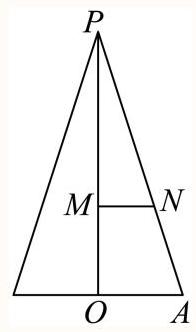

在距离底面为 $\mathrm{t}$ 的 $M$ 处作底面的平行截面,设此时截面半径为 ${\mathrm{r}}_{0}$ ,

$\frac{{r}_{0}}{OA} = \frac{{OP} - {OM}}{OP}$ ,即 $\frac{{r}_{0}}{1} = \frac{4 - t}{4}$ ,解得 ${r}_{0} = 1 - \frac{t}{4}$ ,

此截面的面积为 ${\left( 1 - \frac{t}{4}\right) }^{2}\pi$ ,与截面圆环面积相同,

圆锥体积为 $\frac{1}{3} \times  \pi  \times  {1}^{2} \times  4 = \frac{4\pi }{3}$ ，所以 $\Omega$ 的体积为 $\frac{4\pi }{3}$ .

故答案为: $\frac{4\pi }{3}$ .

5

我国古代数学家祖暅求几何体的体积时，提出一个原理:幂势即同，则积不容异. 意思是:夹在两个平行平面之间的两个等高的几何体被平行于这两个面的平面去截, 若截面积相等, 则两个几何体的体积相等, 这个定理的推广是: 夹在两个平行平面间的几何体, 被平行于这两个平面的平面所截，若截得两个截面面积比为 $k$ ，则两个几何体的体积比也为 $k.$ 已知线段 ${AB}$ 长为4，直线 $l$ 过点 $A$ 且与 ${AB}$ 垂直，以 $B$ 为圆心，以 1 为半径的圆绕 $l$ 旋转一周，得到环体 $M$ ；以 $A$ ， $B$ 分别为上下底面的圆心，以1为上下底面半径的圆柱体 $N$ ；过 ${AB}$ 且与 $l$ 垂直的平面为 $\beta$ ，平面 $\alpha //\beta$ ，且距离为 $h$ ，若平面 $\alpha$ 截圆柱体 $N$ 所得截面面积为 ${S}_{1}$ ，平面 $\alpha$ 截环体 $M$ 所得截面面积为 ${S}_{2}$ ，则 $\frac{{S}_{1}}{{S}_{2}} =$ ___，环体 $M$ 体积为___.

答案

$\frac{1}{2\pi };8{\pi }^{2}$

解析

画出示意图,可得 ${S}_{1} = 2\sqrt{1 - {h}^{2}} \cdot  4 = 8\sqrt{1 - {h}^{2}},{S}_{2} = \pi {r}_{\text{ 外 }}^{2} - \pi {r}_{\text{ 内 }}^{2}$ ,

其中 ${r}_{\text{ 外 }}^{2} = {\left( 4 + \sqrt{1 - {h}^{2}}\right) }^{2},{r}_{\text{ 内 }}^{2} = {\left( 4 - \sqrt{1 - {h}^{2}}\right) }^{2}$ ,

故 ${S}_{2} = {16}\sqrt{1 - {h}^{2}} \cdot  \pi  = {2\pi }{S}_{1}$ ,即 $\frac{{S}_{1}}{{S}_{2}} = \frac{1}{2\pi }$ ,

环体 $M$ 体积为 ${2\pi }{V}_{\text{ 柱 }} = {2\pi } \cdot  {4\pi } = 8{\pi }^{2}$ .

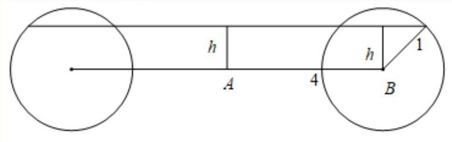

6

在 ${xOy}$ 平面上，将两个半圆弧 ${\left( x - 1\right) }^{2} + {y}^{2} = 1\left( {x \geq  1}\right)$ 和 ${\left( x - 3\right) }^{2} + {y}^{2} = 1\left( {x \geq  3}\right)$ 、两条直线 $y = 1$ 和 $y =  - 1$ 围成的封闭图形记为D，如图中阴影部分. 记D绕y轴旋转一周而成的几何体为Ω，过 $\left( {0, y}\right) \left( {\left| y\right|  \leq  1}\right)$ 作 $\Omega$ 的水平截面，所得截面面积为 ${4\pi }\sqrt{1 - {y}^{2}} + {8\pi }$ ，试利用祖暅原理、一个平放的圆柱和一个长方体，得出 $\Omega$ 的体积值为___

答案 $\pi  \cdot  {1}^{2} \cdot  {2\pi } + 2 \cdot  {8\pi } = 2{\pi }^{2} + {16\pi }$

解析

根据提示,一个半径为1,高为 ${2\pi }$ 的圆柱平放,一个高为2,底面面积 ${8\pi }$ 的长方体,这两个几何体与 $\Omega$ 放在一起,根据祖暅原理,每个平行水平面的截面面积都相等,故它们的体积相等, 即 $\Omega$ 的体积值为 $\pi  \cdot  {1}^{2} \cdot  {2\pi } + 2 \cdot  {8\pi } = 2{\pi }^{2} + {16\pi }$ .

【考点定位】考查旋转体组合体体积的计算, 重点考查空间想象能力, 属难题.

在 ${xOy}$ 平面上,将一段圆弧 $C : {x}^{2} + {y}^{2} = 1\left( {x \geq  0}\right)$ 和一段椭圆弧 $\Gamma  : \frac{{x}^{2}}{2} + {y}^{2} = 1\left( {x \geq  0}\right)$ 围成的封闭图形记为 $D$ ,如图中阴影部分所示,

记 $D$ 绕 $y$ 轴旋转一周而成的封闭几何体为 $\Omega$ ，过 $\left( {0, y}\right)$ ( $\left| y\right|  < 1$ )作 $\Omega$ 的水平截面，利用祖暅原理和一个球，得出旋转体 $\Omega$ 的体积值为___.

答案

$\frac{4}{3}\pi  \mid  \frac{4\pi }{3}$

解析

先根据祖暅原理得出椭球的体积，然后结合球的体积公式求出旋转体的体积即可.

椭圆 $\frac{{x}^{2}}{{a}^{2}} + \frac{{y}^{2}}{{b}^{2}} = 1\left( {a > b > 0}\right)$ 所围成的椭圆面绕其长轴旋转一周后得椭球体,

椭圆的长半轴为 $a$ ,短半轴为 $b$ ,构造一个底面半径为 $b$ ,高为 $a$ 的圆柱,

把半椭球与圆柱放在同一个平面 $\alpha$ 上(如图)，

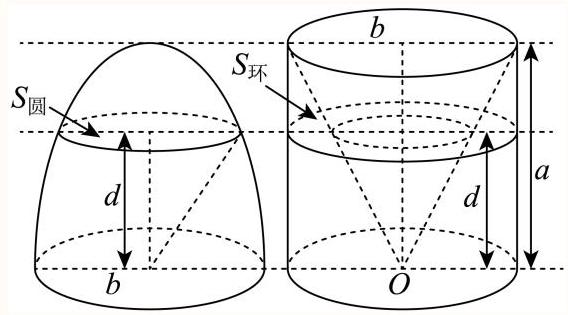

在圆柱内挖去一个以圆柱下底面圆心为顶点, 圆柱上底面为底面的圆锥,

即挖去的圆锥底面半径为 $b$ ,高为 $a$ ; 在半椭球截面圆的面积 $\pi \frac{{b}^{2}}{{a}^{2}}\left( {{a}^{2} - {d}^{2}}\right)$ ,

在圆柱内圆环的面积为 $\pi {b}^{2} - \pi \frac{{b}^{2}}{{a}^{2}}{d}^{2} = \pi \frac{{b}^{2}}{{a}^{2}}\left( {{a}^{2} - {d}^{2}}\right)$ ,

所以距离平面 $\alpha$ 为 $d$ 的平面截取两个几何体的平面面积相等,

根据祖暅原理得出椭球体的体积为:

$V = 2\left( {{V}_{\text{ 圆柱 }} - {V}_{\text{ 圆锥 }}}\right)  = 2\left( {\pi  \cdot  {b}^{2} \cdot  a - \frac{1}{3}\pi  \cdot  {b}^{2} \cdot  a}\right)  = \frac{4\pi }{3}a{b}^{2},$

同理:

椭圆 $\frac{{x}^{2}}{{a}^{2}} + \frac{{y}^{2}}{{b}^{2}} = 1\left( {a > b > 0}\right)$ 所围成的椭圆面绕其短轴旋转一周后得到的椭球体的体积为 $V = \frac{4\pi }{3}{a}^{2}b$

所以椭圆弧 $\Gamma  : \frac{{x}^{2}}{2} + {y}^{2} = 1\left( {x \geq  0}\right)$ 旋转而成的椭球体的体积为 $\frac{4}{3}\pi  \times  2 \times  1 = \frac{8}{3}\pi$ ,

而圆弧 $C : {x}^{2} + {y}^{2} = 1\left( {x \geq  0}\right)$ 旋转而成的球的体积为 $\frac{4}{3}\pi  \times  {1}^{3} = \frac{4}{3}\pi$ ，

由题意，旋转体 $\Omega$ 的体积是椭球体的体积减去球的体积，所以旋转体 $\Omega$ 的体积为

$\frac{8}{3}\pi  - \frac{4}{3}\pi  = \frac{4}{3}\pi$

故答案为: $\frac{4}{3}\pi$

关键点点睛:本题解题的关键是读懂题意，构建圆柱，根据祖暅原理得到椭球的体积，从而利用体积割补法求解旋转体的体积.

8

沪版必修第三册教材中用了较多的篇幅来介绍立体几何中的定理及其证明过程, 力求培养同学们的空间想象能力和逻辑推理能力.

(1)写出“异面直线判定定理”的内容并证明该定理；

(2)表述出祖暅原理的内容，并画出用祖暅原理推导半球体积时构造出的几何体(需交代主要线段的长度, 可适当用文字说明) .

## 答案

(1)答案见解析

(2)答案见解析

## 解析

(1)异面直线判定定理:经过平面外一点和平面内一点的直线，和平面内不经过该点的直线是异面直线.

证明过程:

已知: 点 $A, B \in$ 直线 $m$ ,点 $A$ 在平面 $\alpha$ 外, $B \in  \alpha$ ,直线 $n \subset  \alpha$ ,且 $B \in  n$ ,

求证: 直线 $m, n$ 为异面直线.

假设直线 $m, n$ 在平面 $\beta$ 内,

则点 $B$ 和直线 $n$ 都在平面 $\beta$ 内，

而点 $B$ 和直线 $n$ 都在平面 $\alpha$ 内，

由于经过直线和直线外一点有且只有一个平面，

所以 $\alpha ,\beta$ 重合，

从而直线 $m$ 在平面 $\alpha$ 内,这与已知条件矛盾,

所以直线 $m, n$ 为异面直线.

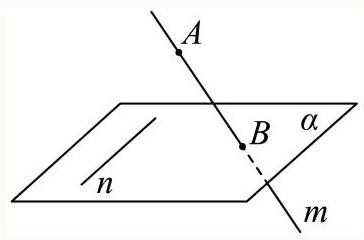

(2)祖暅原理:夹在两个平面之间的两个几何体，被平行于这两个平面的任意平面所截，如果截得的两个截面的面积总相等，那么这两个几何体的体积相等.

如图所示,图①几何体的为半径为 $R$ 的半球,

图②几何体为底面半径和高都为 $R$ 的圆柱中挖掉了一个圆锥，

设与平面 $\alpha$ 平行且距离为 $d$ 的平面 $\beta$ 截两个几何体得到两个截面,

则图②与图①截面面积相等的图形是圆环 (如阴影部分),

在图①中，设截面圆的圆心为 ${O}_{1}$ ，易得截面圆 ${O}_{1}$ 的面积为 $\pi \left( {{R}^{2} - {d}^{2}}\right)$ ，

在图②中，截面截圆锥得到的小圆的半径为 $d$ ，

所以圆环的面积为 $\pi \left( {{R}^{2} - {d}^{2}}\right)$ ,所以截得的截面的面积相等,

则图②几何体的体积即为图①半球的体积.

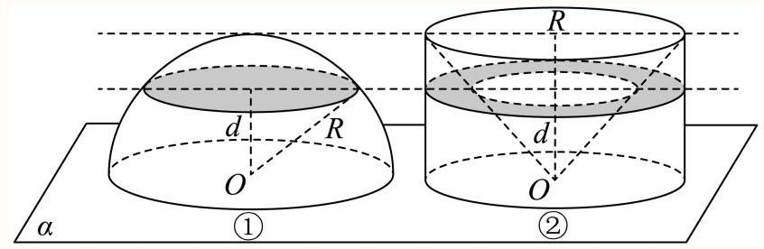

9

如图,有一个半径为 15 的半球,过球心 $O$ 作底面的垂线 $l, l$ 上一点 ${O}_{1}$ 满足 ${O}_{1}O = {12}$ ,过 ${O}_{1}$ 作平行于底面的截面将半球分成两个几何体，其中较大部分的体积为___.

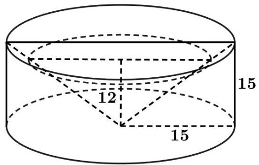

答案

${2124\pi }$

解析

利用祖暅原理计算出截面以上部分的体积, 再利用半球的体积减去截面以上部分的体积可得结果.

设截面以上部分的体积为 ${V}_{1}$ ,截面以下部分的体积为 ${V}_{2}$ ,

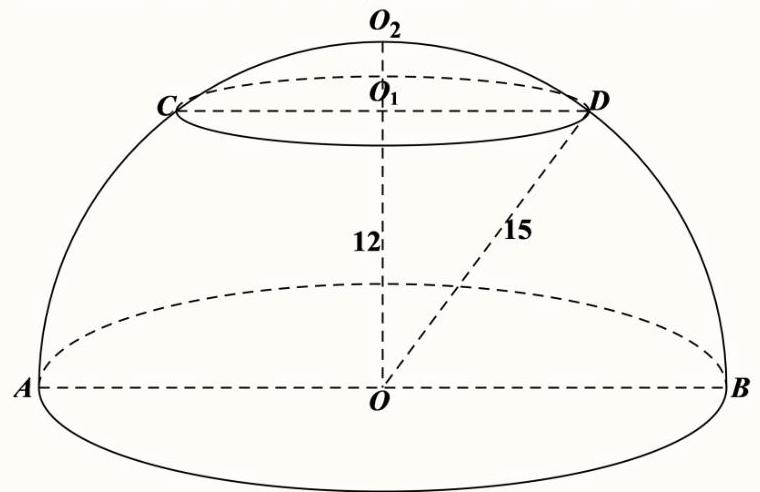

设 $r = {O}_{1}D, R = {OB} = {OD} = {15}$ ,则 $h = O{O}_{1} = {12},{O}_{1}{O}_{2} = {15} - {12} = 3$ ,

将 ${O}_{1}{O}_{2}$ 进行 $n$ 等分,过这些等分点作平行于底面的平面,将截面以上部分切割成 $n$ 层,

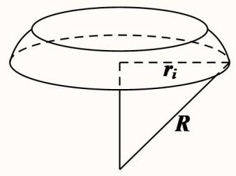

每一层都是近似于圆柱形状的“小圆柱”,

这些“小圆片”的体积之和即为 ${V}_{1}$ ,

由于“小圆片”近似于圆柱形状，所以它的体积也近似于相应圆柱的体积，

它的高就是“小圆片”的厚度 $\frac{3}{n}$ ，底面就是“小圆片”的下底面，

由勾股定理可知第 $i$ 层(由下向上数)“小圆片”的下底面半径为

${r}_{i} = \sqrt{{15}^{2} - {\left\lbrack  {12} + \frac{3\left( {i - 1}\right) }{n}\right\rbrack  }^{2}} = \sqrt{{81} - \frac{{72}\left( {i - 1}\right) }{n} - \frac{9{\left( i - 1\right) }^{2}}{{n}^{2}}},$

于是,第 $i$ 层 “小圆片” 的体积为 ${V}_{i} \approx  \pi {r}_{i}^{2} \cdot  \frac{3}{n} = \pi  \times  \left\lbrack  {{81} - \frac{{72}\left( {i - 1}\right) }{n} - \frac{9{\left( i - 1\right) }^{2}}{{n}^{2}}}\right\rbrack   \times  \frac{3}{n}$ ,

所以, ${V}_{1} \approx  {243\pi } - \frac{216\pi }{{n}^{2}}\left\lbrack  {0 + 1 + 2 + \cdots  + \left( {n - 1}\right) }\right\rbrack   - \frac{27\pi }{{n}^{3}}\left\lbrack  {{0}^{2} + {1}^{2} + {2}^{2} + \cdots  + {\left( n - 1\right) }^{2}}\right\rbrack$

$= {243\pi } - \frac{216\pi }{{n}^{2}} \cdot  \frac{n\left( {n - 1}\right) }{2} - \frac{27\pi }{{n}^{3}} \cdot  \frac{n\left( {n - 1}\right) \left( {{2n} - 1}\right) }{6}$

$= {243\pi } - {108\pi }\left( {1 - \frac{1}{n}}\right)  - \frac{9\pi }{2} \cdot  \left( {2 - \frac{3}{n} + \frac{1}{{n}^{2}}}\right) ,$

所以， ${V}_{1} \approx  {243\pi } - {108\pi } - {9\pi } = {126\pi }$ ，

故 ${V}_{2} = \frac{2}{3}\pi  \times  {15}^{3} - {V}_{1} = {2124\pi }$ .

故答案为:2124π.

理用现代语言可描述为:夹在两个平行平面之间的两个几何体，被平行于这两个平面的任意平面所截，如果截得的两个截面的面积总相等，那么这两个几何体的体积相等. 现将椭圆 $\frac{{x}^{2}}{16} + \frac{{y}^{2}}{36} = 1$ 绕 $y$ 轴旋转一周后得到如图所示的椭球,类比计算球的体积的方法,运用祖暅原理可求得该椭球的体积为( )

A. ${32\pi }$

B. ${64\pi }$

C. ${128\pi }$

D. ${256\pi }$

答案

C

解析

构造一个底面半径为4，高为6的圆柱，通过计算可得高相等时截面面积相等，根据祖暅原理可得橄榄球形几何体的体积的一半等于圆柱的体积减去圆锥的体积.

椭圆 $\frac{{x}^{2}}{16} + \frac{{y}^{2}}{36} = 1$ 的焦点在 $y$ 轴上,长半轴长为 6,短半轴长为 4,

构造一个底面半径为 4，高为6的圆柱，在圆柱中挖去一个以圆柱下底面圆心为顶点，

圆柱上底面为底面的圆锥后得到一新几何体,

当平行于底面的截面与圆锥顶点距离为 $h\left( {0 \leq  h \leq  6}\right)$ 时,设小圆锥底面半径为 $r$ ,

则 $\frac{h}{6} = \frac{r}{4}$ ,即 $r = \frac{2}{3}h$ ,故新几何体的截面面积为 ${16\pi } - \frac{4}{9}\pi {h}^{2}$ ,

把 $y = h$ 代入 $\frac{{x}^{2}}{16} + \frac{{y}^{2}}{36} = 1$ ，即 $\frac{{x}^{2}}{16} + \frac{{h}^{2}}{36} = 1$ ，解得 ${x}^{2} = {16}\left( {1 - \frac{{h}^{2}}{36}}\right)  = {16} - \frac{4}{9}{h}^{2}$ ，

故半椭球的截面面积为 $\pi {x}^{2} = {16\pi } - \frac{4}{9}\pi {h}^{2}$ ,

由祖暅原理，可得椭球的体积为:

$V = 2\left( {V\text{ 圆柱 } - V\text{ 圆锥 }}\right.$

Grigghh)2\\text\{2\\textbf\\left(16\\pi\\times 6-\\dfrac\{1\}\{3\}\\times 16\\pi \\times

故选: C.

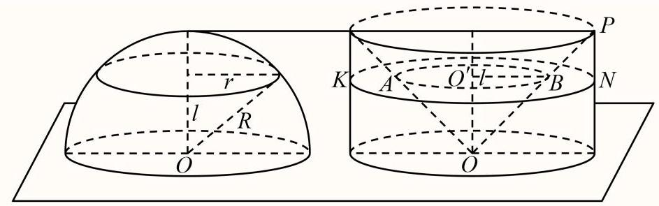

关键点点睛: 理解祖暅原理是解决本题的关键.

11

《九章算术》中记载了我国古代数学家祖暅在计算球的体积时使用的一个原理: “幂势既同，则积不容异”，此即祖暅原理，其含义为:两个同高的几何体，如在等高处的截面的面积恒相等，则它们的体积相等. 已知双曲线 $C : \frac{{x}^{2}}{{a}^{2}} - \frac{{y}^{2}}{{b}^{2}} = 1\left( {a > 0, b > 0}\right)$ ,若双曲线右焦点到渐近线的距离记为 $d$ , 双曲线 $C$ 的两条渐近线与直线 $y = 1, y =  - 1$ 以及双曲线 $C$ 的右支围成的图形 (如图中阴影部分所示) 绕 $y$ 轴旋转一周所得几何体的体积为 $\sqrt{2}{dc\pi }$ (其中 ${c}^{2} = {a}^{2} + {b}^{2}$ )，则双曲线的离心率为( )

A. $\sqrt{2}$

B. 2

C. $\sqrt{3}$

D. $\frac{2\sqrt{3}}{3}$

答案

A

解析

先利用方程组求出直线与渐近线交点坐标, 从而求出截面积, 再利题设所给信息建立等量关系, 构造关于离心率的齐次式, 从而求出结果.

令 $y = m\left( {-1 \leq  m \leq  1}\right)$ ,可得截面为一个圆环.

由 $\left\{  \begin{array}{l} y = m \\  y = \frac{b}{a}x \end{array}\right.$ 可得 $x = \frac{am}{b}$ ;

由 $\left\{  \begin{array}{l} y = m \\  {b}^{2}{x}^{2} - {a}^{2}{y}^{2} = {a}^{2}{b}^{2} \end{array}\right.$ ,解得 $x =  \pm  \frac{a\sqrt{{m}^{2} + {b}^{2}}}{b}$ .

所以截面的面积为 $\pi \left( {{a}^{2} + \frac{{a}^{2}{m}^{2}}{{b}^{2}} - \frac{{a}^{2}{m}^{2}}{{b}^{2}}}\right)  = \pi {a}^{2}$ ,

由对称性和祖暅原理可得所得几何体的体积为 ${2\pi }{a}^{2} = \sqrt{2}{dc\pi } = \sqrt{2}{\pi bc}$ ,

即有 $4{a}^{4} = 2{b}^{2}{c}^{2}$ ,

即有 $2{a}^{4} = {c}^{2}\left( {{c}^{2} - {a}^{2}}\right)$ ,

解得 ${c}^{2} = 2{a}^{2}$ ,

所以 $e = \frac{c}{a} = \sqrt{2}$ .

故选: A.

12

在 ${xOy}$ 平面上,将双曲线的一支 $\frac{{x}^{2}}{9} - \frac{{y}^{2}}{16} = 1\left( {x > 0}\right)$ 及其渐近线 $y = \frac{4}{3}x$ 和直线 $y = 0\text{ 、 }y = 4$ 围成的封闭图形记为 $D$ ，如图中阴影部分，记 $D$ 绕 $y$ 轴旋转一周所得的几何体为 $\Omega$ ，过 $\left( {0, y}\right) \left( {0 \leq  y \leq  4}\right)$ 作 $\Omega$ 的水平截面，计算截面面积，利用祖暅原理得出Ω体积为___

## 答案

${36\pi }$ .

解析

分析:由已知中过 $\left( {0, y}\right) \left( {0 \leq  y \leq  4}\right)$ 作 $\Omega$ 的水平截面，计算截面面积，利用祖暅原理得出 $\Omega$ 的体积.

详解: 在 $\mathrm{{xOy}}$ 平面上,将双曲线的一支 $\frac{{x}^{2}}{9} - \frac{{y}^{2}}{16} = 1\left( {x > 0}\right)$ 及其渐近线 $y = \frac{4}{3}x$ 和直线 $\mathrm{y} = 0$ , y=4围成的封闭图形记为D，如图中阴影部分.

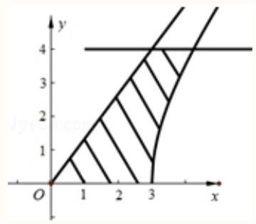

则直线y=a与渐近线 $y = \frac{4}{3}x$ 交于一点 $\mathrm{A}\left( {\frac{3}{4}a,\mathrm{a}}\right)$ 点，与双曲线的一支 $\frac{{x}^{2}}{9} - \frac{{y}^{2}}{16} = 1\left( {x > 0}\right)$ 交于 $\mathrm{B}\left( {\frac{3}{4}\sqrt{{16} + {\mathrm{a}}^{2}}}\right.$ , a) 点,

记D绕y轴旋转一周所得的几何体为 $\Omega$ .

过 $\left( {0, y}\right) \left( {0 \leq  y \leq  4}\right)$ 作 $\Omega$ 的水平截面,

则截面面积 $S = \left\lbrack  {{\left( \frac{3}{4}\sqrt{{a}^{2} + {16}}\right) }^{2} - {\left( \frac{3}{4}\right) }^{2}}\right\rbrack  \pi  = {9\pi }$ ,

利用祖暅原理得 $\Omega$ 的体积相当于底面面积为 ${9\pi }$ 高为4的圆柱的体积，

$\therefore \Omega$ 的体积 $V = {9\pi } \times  4 = {36\pi }$ ,

故答案为 ${36\pi }$

点睛:本题考查的知识点是类比推理, 其中利用祖暅原理将不规则几何体的体积转化为底面面积为9π高为4的圆柱的体积，是解答的关键. 祖暅原理也可以成为中国的积分，将图形的横截面的面积在体高上积分，得到几何体的体积.
