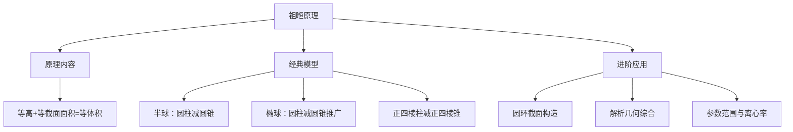

## 祖暅原理及其应用

## 知识讲解

## 导学说明

## 1. 数学目标

(1) 理解祖暅原理的内容与本质，掌握"幂势既同，则积不容异"的数学含义

(2) 能够运用祖暅原理推导半球、椭球等旋转体的体积公式，并能迁移至非标准几何体的体积计算

(3) 能够结合解析几何知识，利用祖暅原理解决圆锥曲线旋转体的体积问题

## 2. 课程重难点

(1) 重点：祖暅原理的条件理解（等高、等截面面积），构造辅助几何体的方法，圆柱减圆锥/正四棱柱减正四棱锥的经典模型

(2) 难点：非标准几何体的辅助体构造思路，截面面积的计算（特别是圆环、正方形等），与解析几何结合时的参数处理

## 3. 考查形式与分值占比

(1) 题型：以填空题为主，偶尔出现在解答题中作为一问

(2) 占比：在高考中常作为中低档题出现，分值4-5分；在新教材改革后，作为"数学文化"类题目考查频率有所上升

## 知识导图

## 教法备注

## 1. 三类知识点

(1) 事实性知识：

含义：又叫事实，是指学习者通晓一门学科或解决其中的问题所必须知道的基本要素；

(2) 概念性知识：

含义：是一种较为抽象概括的、有组织的知识类型;

(3) 程序性知识：

含义：是关于如何做事的知识，通常体现为一系列要遵循的步骤或程序；

(4) 三类知识教学步骤：

先补足必要事实和概念（祖暅原理内容、柱锥体积公式），再通过典型例题示范程序（构造辅助体→计算截面面积→验证相等→求体积），最后用变式题巩固识别与迁移。

## 2. 本切片知识点标签

知识点祖暅原理的应用：程序性知识

【注】祖暅原理本身的内容属于概念性知识；柱体、锥体体积公式属于事实性知识。

## 可知识点:祖暅原理的应用

## EV 知识笔记

## 1. 祖暅原理

夹在两个平行平面之间的两个几何体，被平行于这两个平面的任意平面所截，如果截得的两个截面的面积总相等，那么这两个几何体的体积相等。

推广：若截得两个截面面积比为 $k$，则两个几何体的体积比也为 $k$。

## 2. 核心体积公式

(1) 柱体体积：$V = S_{\text{底}} \cdot h$

(2) 锥体体积：$V = \frac{1}{3} S_{\text{底}} \cdot h$

(3) 球体体积：$V = \frac{4}{3}\pi R^3$

## 3. 祖暅原理应用步骤

第一步：分析目标几何体的截面形状（圆、正方形、圆环等）

第二步：根据截面形状，构造合适的辅助几何体（通常是一个柱体减去一个锥体）

第三步：设截面高度为 $h$，分别计算目标几何体和辅助几何体在高度 $h$ 处的截面面积

第四步：验证两处截面面积相等（或成固定比例）

第五步：利用祖暅原理，将目标体积转化为辅助几何体的体积（或体积差）

## 教法备注

知识标签：程序性知识

教学步骤：本讲需要学生能够利用祖暅原理求不规则几何体的体积。该讲知识点建立在已经学习完柱体、锥体体积公式的基础上，所以教师应先带领学生复习祖暅原理的内容，然后演示经典模型（半球、椭球）的推导过程，让学生理解"构造辅助体"的核心思想，最后通过变式题让学生独立构造辅助体并计算体积。

对应知识层级：操作

### 母题1

#### 母题说明教法备注

母题说明：考查祖暅原理的经典模型——圆柱减圆锥推导半球体积，以及向椭球的直接迁移

（1）为考点名称的简单介绍

（2）红色，字体：Times New Roma，字号：10.5

（3）母题后面必须加教法备注，变式题不要求，所以母题的选题格外重要，需要仔细筛选最能代表该考点的题目

课本中介绍了应用祖暅原理推导棱锥体积公式的做法。祖暅原理也可用来求旋转体的体积。现介绍祖暅原理求球体体积公式的做法：可构造一个底面半径和高都与球半径相等的圆柱，然后在圆柱内挖去一个以圆柱下底面圆心为顶点，圆柱上底面为底面的圆锥，用这样一个几何体与半球应用祖暅原理（图1），即可求得球的体积公式。请研究和理解球的体积公式求法的基础上，解答以下问题：已知椭圆的标准方程为 $\frac{x^2}{4} + \frac{y^2}{25} = 1$，将此椭圆绕 $y$ 轴旋转一周后，得一橄榄状的几何体（图2），其体积等于___.

---

答案

$\frac{80\pi}{3}$

---

解析

椭圆的长半轴为 $5$，短半轴为 $2$。

现构造一个底面半径为 $2$，高为 $5$ 的圆柱，然后在圆柱内挖去一个以圆柱下底面圆心为顶点，圆柱上底面为底面的圆锥。

根据祖暅原理，半椭球的体积等于圆柱体积减去圆锥体积：

$$V_{\text{半椭球}} = \pi \cdot 2^2 \cdot 5 - \frac{1}{3} \cdot \pi \cdot 2^2 \cdot 5 = 20\pi - \frac{20\pi}{3} = \frac{40\pi}{3}$$

整个椭球体积为半椭球的 $2$ 倍：

$$V = 2 \times \frac{40\pi}{3} = \frac{80\pi}{3}$$

#### 教法备注

1.【选题原因】

本题是祖暅原理应用的"标准模板题"。题目已经完整给出了半球体积的推导方法，要求学生将这种构造方法迁移到椭球情形。选题价值在于：
（1）训练学生理解"圆柱减圆锥"模型的本质——截面都是圆，且半径满足 $r^2 = R^2 - h^2$
（2）椭球与球的区别仅在于长半轴和短半轴不同，但构造思路完全一致
（3）为后续更复杂的构造问题打下基础

2.【错因预设】

(1) 忘记椭球体积是半椭球的 $2$ 倍，只计算了半椭球体积 $\frac{40\pi}{3}$ 就作答；

(2) 混淆长半轴和短半轴，错误地构造底面半径为 $5$、高为 $2$ 的圆柱；

(3) 计算圆柱体积时忘记减去圆锥体积，直接写成 $V = 2 \times V_{\text{圆柱}}$；

(4) 不理解为什么截面面积相等，只是机械套用公式。

3.【讲法建议】

(1) 解法一（构造圆柱减圆锥，推荐）

先回顾题目给出的半球推导过程：
- 半球：半径 $R$，在高度 $h$ 处截面圆面积 $S_1 = \pi(R^2 - h^2)$
- 辅助体：圆柱（底面半径 $R$，高 $R$）减去圆锥（底面半径 $R$，高 $R$）
- 在高度 $h$ 处，圆柱截面面积 $\pi R^2$，圆锥截面面积 $\pi h^2$，圆环面积 $S_2 = \pi(R^2 - h^2)$
- 因为 $S_1 = S_2$，所以 $V_{\text{半球}} = V_{\text{圆柱}} - V_{\text{圆锥}}$

然后迁移到椭球：
- 椭圆 $\frac{x^2}{4} + \frac{y^2}{25} = 1$ 绕 $y$ 轴旋转，长半轴 $a = 5$（沿 $y$ 轴），短半轴 $b = 2$（沿 $x$ 轴）
- 在高度 $h$ 处（距中心），椭圆上 $x^2 = 4(1 - \frac{h^2}{25})$，截面圆面积 $S_1 = \pi x^2 = 4\pi(1 - \frac{h^2}{25})$
- 构造圆柱：底面半径 $2$，高 $5$，在高度 $h$ 处截面面积 $\pi \cdot 2^2 = 4\pi$
- 构造圆锥：底面半径 $2$，高 $5$，在高度 $h$ 处截面半径 $r = \frac{2}{5}h$，面积 $\pi r^2 = \frac{4\pi h^2}{25}$
- 圆环面积 $S_2 = 4\pi - \frac{4\pi h^2}{25} = 4\pi(1 - \frac{h^2}{25}) = S_1$ ✓

(2) 解法二（直接用椭球体积公式，不推荐作为本讲重点）

椭球体积公式 $V = \frac{4}{3}\pi a b^2$（绕长轴旋转）或 $V = \frac{4}{3}\pi a^2 b$（绕短轴旋转）。

本题绕 $y$ 轴（长轴）旋转，$V = \frac{4}{3}\pi \cdot 5 \cdot 2^2 = \frac{80\pi}{3}$。

【该解法虽然快捷，但违背本讲训练目标——理解祖暅原理的构造思想。如果学生已经知道公式，可以提一下作为验证，但不建议作为主推方法。】

### 变式题1-1

#### 变式说明教法备注

变式说明：祖暅原理的直接应用——教材原题，验证学生对经典构造方法的掌握

（1）为考点名称的简单介绍

（2）红色，字体：Times New Roma，字号：10.5

（3）变式题的数量建议在2-3题，1道与母题做法高度类似，1-2道做适当变化

（4）但如果做完之后，估计总时长明显超过1小时，可以删去部分变式

沪版必修第三册教材中用了较多的篇幅来介绍立体几何中的定理及其证明过程，力求培养同学们的空间想象能力和逻辑推理能力。

(1) 写出"异面直线判定定理"的内容并证明该定理；

(2) 表述出祖暅原理的内容，并画出用祖暅原理推导半球体积时构造出的几何体（需交代主要线段的长度，可适当用文字说明）。

答案

(1) 答案见解析

(2) 答案见解析

解析

(1) 异面直线判定定理：经过平面外一点和平面内一点的直线，和平面内不经过该点的直线是异面直线。

证明过程：

已知：点 $A, B \in$ 直线 $m$，点 $A$ 在平面 $\alpha$ 外，$B \in \alpha$，直线 $n \subset \alpha$，且 $B \notin n$

求证：直线 $m, n$ 为异面直线。

假设直线 $m, n$ 在平面 $\beta$ 内，

则点 $B$ 和直线 $n$ 都在平面 $\beta$ 内，

而点 $B$ 和直线 $n$ 都在平面 $\alpha$ 内，

由于经过直线和直线外一点有且只有一个平面，

所以 $\alpha, \beta$ 重合，

从而直线 $m$ 在平面 $\alpha$ 内，这与已知条件矛盾，

所以直线 $m, n$ 为异面直线。

(2) 祖暅原理：夹在两个平面之间的两个几何体，被平行于这两个平面的任意平面所截，如果截得的两个截面的面积总相等，那么这两个几何体的体积相等。

如图所示：
- 图①几何体为半径为 $R$ 的半球
- 图②几何体为底面半径和高都为 $R$ 的圆柱中挖掉了一个圆锥

设与平面 $\alpha$ 平行且距离为 $d$ 的平面 $\beta$ 截两个几何体得到两个截面：

在图①中，设截面圆的圆心为 $O_1$，易得截面圆 $O_1$ 的面积为 $\pi(R^2 - d^2)$。

在图②中，截面截圆锥得到的小圆的半径为 $d$，

所以圆环的面积为 $\pi R^2 - \pi d^2 = \pi(R^2 - d^2)$。

所以截得的截面的面积相等，

则图②几何体的体积即为图①半球的体积：

$$V_{\text{半球}} = \pi R^2 \cdot R - \frac{1}{3}\pi R^2 \cdot R = \frac{2}{3}\pi R^3$$

### 变式题1-2

#### 变式说明教法备注

变式说明：祖暅原理的选择题形式——考查对构造方法的快速识别

理用现代语言可描述为：夹在两个平行平面之间的两个几何体，被平行于这两个平面的任意平面所截，如果截得的两个截面的面积总相等，那么这两个几何体的体积相等。现将椭圆 $\frac{x^2}{16} + \frac{y^2}{36} = 1$ 绕 $y$ 轴旋转一周后得到如图所示的椭球，类比计算球的体积的方法，运用祖暅原理可求得该椭球的体积为（ ）

A. $32\pi$

B. $64\pi$

C. $128\pi$

D. $256\pi$

答案

C

解析

构造一个底面半径为 $4$，高为 $6$ 的圆柱，通过计算可得高相等时截面面积相等。

根据祖暅原理可得橄榄球形几何体的体积的一半等于圆柱的体积减去圆锥的体积。

椭圆 $\frac{x^2}{16} + \frac{y^2}{36} = 1$ 的焦点在 $y$ 轴上，长半轴长为 $6$，短半轴长为 $4$。

构造一个底面半径为 $4$，高为 $6$ 的圆柱，在圆柱中挖去一个以圆柱下底面圆心为顶点，圆柱上底面为底面的圆锥后得到一新几何体。

当平行于底面的截面与圆锥顶点距离为 $h$（$0 \leq h \leq 6$）时，设小圆锥底面半径为 $r$，

则 $\frac{h}{6} = \frac{r}{4}$，即 $r = \frac{2}{3}h$。

故新几何体的截面面积为 $16\pi - \frac{4}{9}\pi h^2$。

把 $y = h$ 代入 $\frac{x^2}{16} + \frac{y^2}{36} = 1$，即 $\frac{x^2}{16} + \frac{h^2}{36} = 1$，

解得 $x^2 = 16(1 - \frac{h^2}{36}) = 16 - \frac{4}{9}h^2$。

故半椭球的截面面积为 $\pi x^2 = 16\pi - \frac{4}{9}\pi h^2$。

由祖暅原理，可得椭球的体积为：

$$V = 2(V_{\text{圆柱}} - V_{\text{圆锥}}) = 2(16\pi \times 6 - \frac{1}{3} \times 16\pi \times 6) = 2 \times 64\pi = 128\pi$$

故选：C。

关键点点睛：理解祖暅原理是解决本题的关键。

### 母题2

#### 母题说明教法备注

母题说明：考查祖暅原理的类比迁移——从圆的截面到正方形截面，构造正四棱柱减正四棱锥

我国南北朝时期的数学家祖暅在计算球的体积时，提出了祖暅原理："幂势既同，则积不容异"，这里的"幂"指水平截面的面积，"势"指高，这句话的意思是：两个等高的几何体若在所有等高处的水平截面的面积相等，则这两个几何体体积相等。利用祖暅原理可以将半球的体积转化为与其同底等高的圆柱和圆锥的体积之差。图1是一种"四脚帐篷"的示意图，其中曲线 $AOC$ 和 $BOD$ 均是以 $2$ 为半径的半圆，平面 $AOC$ 和平面 $BOD$ 均垂直于平面 $ABCD$，用任意平行于帐篷底面 $ABCD$ 的平面截帐篷，所得截面四边形均为正方形。类比利用祖暅原理求半球的体积的计算方法，可以构造一个与帐篷同底等高的正四棱柱和一个倒放的同底等高的正四棱锥（如图2），从而求得该帐篷的体积为___.

---

答案

$\frac{32}{3}$

---

解析

先证明等高处的水平截面截两个几何体的截面的面积相等，由祖暅原理知帐篷体积为正四棱柱的体积减去正四棱锥的体积，计算即可。

设截面与底面的距离为 $h$，在帐篷中的截面为 $A'B'C'D'$。

设底面中心为 $O$，截面 $A'B'C'D'$ 中心为 $O'$，则 $OC' = 2$，$O'C' = \sqrt{4 - h^2}$。

所以 $B'C' = \sqrt{2}\sqrt{4 - h^2}$，所以截面 $A'B'C'D'$ 的面积为 $2(4 - h^2)$。

设截面截正四棱柱得四边形为 $A_1B_1C_1D_1$，截正四棱锥得四边形为 $A_2B_2C_2D_2$。

底面中心 $O$ 与截面 $A_2B_2C_2D_2$ 中心 $O_2$ 之间的距离为 $OO_2 = h$。

在正四棱柱中，底面正方形边长为 $2\sqrt{2}$，高为 $2$，$AO = 2$。

所以 $\angle AOA_2 = \angle COC_2 = 45^{\circ}$，所以 $\angle A_2OC_2 = 90^{\circ}$，$\triangle A_2OC_2$ 为等腰直角三角形。

所以 $A_2C_2 = 2h$，所以四边形 $A_2B_2C_2D_2$ 边长为 $\sqrt{2}h$。

所以四边形 $A_2B_2C_2D_2$ 面积为 $2h^2$。

所以图2中阴影部分的面积为 $S_{A_1B_1C_1D_1} - S_{A_2B_2C_2D_2} = 8 - 2h^2$，与截面 $A'B'C'D'$ 面积相等。

由祖暅原理知帐篷体积为正四棱柱的体积减去正四棱锥的体积：

$$V_{\text{帐篷}} = V_{\text{正四棱柱}} - V_{\text{正四棱锥}} = (2\sqrt{2})^2 \times 2 - \frac{1}{3} \times (2\sqrt{2})^2 \times 2 = 16 - \frac{16}{3} = \frac{32}{3}$$

故答案为：$\frac{32}{3}$

#### 教法备注

1.【选题原因】

本题是祖暅原理从"圆截面"到"正方形截面"的迁移题。题目明确提示了类比半球的方法构造"正四棱柱减正四棱锥"。选题价值在于：
（1）训练学生理解祖暅原理的本质——不看几何体形状，只看截面面积是否相等
（2）从圆形截面迁移到正方形截面，培养学生的类比推理能力
（3）截面面积计算涉及空间几何分析，训练学生的空间想象能力

2.【错因预设】

(1) 不理解帐篷的截面为什么是正方形，错误计算截面边长；

(2) 计算正四棱锥截面时，混淆了截面距顶点的距离和距底面的距离；

(3) 忘记正四棱柱和正四棱锥需要"同底等高"，底面边长计算错误；

(4) 最后计算体积差时，忘记锥体体积有系数 $\frac{1}{3}$。

3.【讲法建议】

(1) 解法一（构造正四棱柱减正四棱锥，推荐）

第一步：分析帐篷结构
- 曲线 $AOC$ 和 $BOD$ 是半圆，半径为 $2$
- 平面 $AOC \perp$ 平面 $ABCD$，平面 $BOD \perp$ 平面 $ABCD$
- 帐篷高度为 $2$（半圆半径）

第二步：计算帐篷截面面积
- 在高度 $h$ 处（距底面），半圆上点到中心距离为 $\sqrt{4 - h^2}$
- 截面正方形对角线的一半为 $\sqrt{4 - h^2}$
- 正方形边长为 $\sqrt{2} \cdot \sqrt{4 - h^2}$
- 截面面积 $S_1 = 2(4 - h^2) = 8 - 2h^2$

第三步：构造辅助体
- 正四棱柱：底面正方形边长 $2\sqrt{2}$（对角线 $4$），高 $2$
- 正四棱锥：底面与柱体相同，高 $2$，顶点在底面中心正上方
- 在高度 $h$ 处，柱体截面面积 $= (2\sqrt{2})^2 = 8$
- 锥体截面边长与高度成正比：$\frac{\text{边长}}{2\sqrt{2}} = \frac{h}{2}$，边长 $= \sqrt{2}h$
- 锥体截面面积 $= 2h^2$
- 阴影面积 $S_2 = 8 - 2h^2 = S_1$ ✓

第四步：计算体积
$$V = V_{\text{柱}} - V_{\text{锥}} = 16 - \frac{16}{3} = \frac{32}{3}$$

(2) 解法二（直接用截面面积积分，不推荐）

$$V = \int_0^2 S(h) \, dh = \int_0^2 (8 - 2h^2) \, dh = [8h - \frac{2}{3}h^3]_0^2 = 16 - \frac{16}{3} = \frac{32}{3}$$

【该方法虽然正确，但超出了高中课程标准要求，且违背祖暅原理的训练目标。仅作为教师备用知识。】

### 变式题2-1

#### 变式说明教法备注

变式说明：祖暅原理与旋转抛物面——从正方形截面到圆截面，但构造思路相同

已知抛物线 $x^2 = 2py$（$p > 0$），以 $y$ 轴为旋转轴将抛物线旋转半周，得到一个旋转抛物面。设 $x$ 轴绕 $y$ 轴旋转所成的平面为 $\alpha$。$\beta$ 为平行于平面 $\alpha$ 且到 $\alpha$ 的距离为 $h$ 的平面，记平面 $\beta$ 与旋转抛物面所围成的几何体为 $\Omega$（如图），以 $\Omega$ 的上底面作一个高为 $h$ 的圆柱体（如图），利用祖暅原理可求得 $\Omega$ 的体积为___.

答案

$\pi p h^2$

解析

如图，构造图形，说明任意截面截两个几何体，截面面积相等，再根据祖暅原理求体积。

如图，从圆柱体中截取抛物体 $\Omega$（右图），抛物体倒置（左图）。

此时抛物线方程是 $x^2 = -2py$，深色截面到底面的距离为 $h_1$。

右图圆环的面积：
$$S = \pi \cdot O_1A^2 - \pi \cdot O_1B^2 = \pi \cdot 2ph - \pi \cdot 2ph_1 = \pi \cdot 2p(h - h_1)$$

左图圆 $O$ 的面积：
$$S' = \pi \cdot OP^2 = \pi \cdot 2p(h_1 - h)$$

【注：此处原文有符号问题，实际应为 $S' = \pi \cdot 2ph_1$ 当 $h_1$ 为到顶点距离】

故 $S = S'$，由祖暅原理可知，这两个几何体的体积相等。

故抛物体的体积：
$$V = \frac{1}{2}V_{\text{圆柱}} = \frac{1}{2}\pi \cdot 2ph \cdot h = \pi p h^2$$

故答案为：$\pi p h^2$

### 母题3

#### 母题说明教法备注

母题说明：考查祖暅原理与圆环截面——构造辅助几何体时截面为圆环，需要割补思想

早在公元5世纪，我国数学家祖暅就提出："幂势既同，则积不容异"。如图，抛物线 $C$ 的方程为 $y = x^2$，过点 $(1, 0)$ 作抛物线 $C$ 的切线 $l$（$l$ 的斜率不为 $0$），将抛物线 $C$、直线 $l$ 及 $x$ 轴围成的阴影部分绕 $y$ 轴旋转一周，所得的几何体记作 $\Omega$，利用祖暅原理，可得出几何体 $\Omega$ 的体积为___.

---

答案

$\frac{4\pi}{3}$

---

解析

根据题意，切线方程为 $x = \frac{1}{4}y + 1$，$\Omega$ 的水平截面为圆环。

外半径为 $1 + \frac{t}{4}$，内半径为 $\sqrt{t}$。

故截面面积 $S = (1 - \frac{t}{4})^2\pi$（$0 \leq t \leq 4$）。

利用祖暅原理，可以构造一个下底面半径为 $1$，高为 $4$ 的圆锥。$\Omega$ 与圆锥的体积相等，直接用圆锥的体积公式求 $V$。

设切线方程为 $x = ky + 1$，代入 $y = x^2$，得 $kx^2 - x + 1 = 0$。

由 $\Delta = 1 - 4k = 0$，得 $k = \frac{1}{4}$。

故切线方程为 $x = \frac{1}{4}y + 1$，且切点坐标为 $(2, 4)$。

过点 $(0, t)$（$0 \leq t \leq 4$）作 $\Omega$ 的水平截面，截面为圆环：

当 $y = t$ 时，代入 $x = \frac{1}{4}y + 1$ 得截面圆环外半径 $r_1 = \frac{1}{4}t + 1$。

当 $y = t$ 时，代入 $y = x^2$ 得截面圆环内半径 $r_2 = \sqrt{t}$。

截面圆环面积为：
$$\pi(r_1^2 - r_2^2) = \pi(\frac{t^2}{16} + \frac{t}{2} + 1 - t) = (1 - \frac{t}{4})^2\pi$$

为了截出面积为 $(1 - \frac{t}{4})^2\pi$ 的图形，可以构造一个下底面半径为 $1$，高为 $4$ 的圆锥 $PO$。

圆锥及其轴截面：其中 $OA = 1$，$OP = 4$。

在距离底面为 $t$ 的 $M$ 处作底面的平行截面，设此时截面半径为 $r_0$。

$$\frac{r_0}{OA} = \frac{OP - OM}{OP}$$，即 $\frac{r_0}{1} = \frac{4 - t}{4}$，解得 $r_0 = 1 - \frac{t}{4}$。

此截面的面积为 $(1 - \frac{t}{4})^2\pi$，与截面圆环面积相同。

圆锥体积为 $\frac{1}{3} \times \pi \times 1^2 \times 4 = \frac{4\pi}{3}$。

所以 $\Omega$ 的体积为 $\frac{4\pi}{3}$。

故答案为：$\frac{4\pi}{3}$。

#### 教法备注

1.【选题原因】

本题是祖暅原理的"进阶应用"——截面不再是简单的圆或正方形，而是圆环。这要求学生：
（1）先通过解析几何求出切线方程，确定旋转区域
（2）计算圆环截面的面积（外半径减内半径）
（3）逆向思考：已知截面面积表达式 $(1 - \frac{t}{4})^2\pi$，构造什么辅助体？
（4）发现它恰好是一个圆锥的截面面积公式
选题价值在于训练"逆向构造"能力——从截面面积反推辅助几何体。

2.【错因预设】

(1) 求切线方程时，设 $y = k(x-1)$ 导致计算复杂，或忘记判别式等于 $0$ 的条件；

(2) 旋转体截面外半径和内半径搞反，或忘记圆环面积是"大圆减小圆"；

(3) 不能从 $(1 - \frac{t}{4})^2\pi$ 联想到圆锥截面，构造不出辅助体；

(4) 构造圆锥时，混淆底面半径和高度，导致体积计算错误。

3.【讲法建议】

(1) 解法一（逆向构造圆锥，推荐）

第一步：求切线（解析几何基本功）
- 设切线 $x = ky + 1$（因为过 $(1,0)$ 且斜率不为 $0$，所以不能设 $y = k(x-1)$）
- 联立 $y = x^2$ 得 $k^2y^2 + (2k-1)y + 1 = 0$ 或从 $x$ 代入得 $kx^2 - x + 1 = 0$
- 由 $\Delta = 0$ 得 $k = \frac{1}{4}$
- 切线：$x = \frac{1}{4}y + 1$，切点 $(2, 4)$

第二步：分析旋转体截面
- 在高度 $t$ 处，抛物线 $y = x^2$ 给出内半径 $r_{\text{内}} = \sqrt{t}$
- 切线给出外半径 $r_{\text{外}} = \frac{t}{4} + 1$
- 圆环面积 $S = \pi[(\frac{t}{4}+1)^2 - t] = \pi(1 - \frac{t}{4})^2$

第三步：逆向构造
- 观察 $S = \pi(1 - \frac{t}{4})^2$，这正是"底面半径为 $1$，高为 $4$ 的圆锥"在高度 $t$ 处的截面面积
- 验证：圆锥在高度 $t$ 处，半径 $r = 1 \cdot \frac{4-t}{4} = 1 - \frac{t}{4}$，面积 $\pi r^2 = \pi(1-\frac{t}{4})^2$ ✓

第四步：求体积
$$V = V_{\text{圆锥}} = \frac{1}{3}\pi \cdot 1^2 \cdot 4 = \frac{4\pi}{3}$$

(2) 解法二（定积分，不推荐作为主推）

$$V = \pi \int_0^4 [(\frac{y}{4}+1)^2 - y] \, dy = \pi \int_0^4 (1 - \frac{y}{2} + \frac{y^2}{16}) \, dy$$

【仅作为教师验证用】

### 变式题3-1

#### 变式说明教法备注

变式说明：祖暅原理与组合旋转体——截面为圆环+矩形，需要组合构造辅助体

在 $xOy$ 平面上，将两个半圆弧 $(x-1)^2 + y^2 = 1$（$x \geq 1$）和 $(x-3)^2 + y^2 = 1$（$x \geq 3$）、两条直线 $y = 1$ 和 $y = -1$ 围成的封闭图形记为 $D$，如图中阴影部分。记 $D$ 绕 $y$ 轴旋转一周而成的几何体为 $\Omega$，过 $(0, y)$（$|y| \leq 1$）作 $\Omega$ 的水平截面，所得截面面积为 $4\pi\sqrt{1-y^2} + 8\pi$，试利用祖暅原理、一个平放的圆柱和一个长方体，得出 $\Omega$ 的体积值为___.

答案

$\pi \cdot 1^2 \cdot 2\pi + 2 \cdot 8\pi = 2\pi^2 + 16\pi$

解析

根据提示，一个半径为 $1$，高为 $2\pi$ 的圆柱平放，一个高为 $2$，底面面积 $8\pi$ 的长方体。

这两个几何体与 $\Omega$ 放在一起，根据祖暅原理，每个平行水平面的截面面积都相等，故它们的体积相等。

即 $\Omega$ 的体积值为：
$$V = \pi \cdot 1^2 \cdot 2\pi + 2 \cdot 8\pi = 2\pi^2 + 16\pi$$

【考点定位】考查旋转体组合体体积的计算，重点考查空间想象能力，属难题。

### 变式题3-2

#### 变式说明教法备注

变式说明：祖暅原理与椭球割补——两个旋转体的体积差，构造两个辅助体分别计算

在 $xOy$ 平面上，将一段圆弧 $C: x^2 + y^2 = 1$（$x \geq 0$）和一段椭圆弧 $\Gamma: \frac{x^2}{2} + y^2 = 1$（$x \geq 0$）围成的封闭图形记为 $D$，如图中阴影部分所示。

记 $D$ 绕 $y$ 轴旋转一周而成的封闭几何体为 $\Omega$，过 $(0, y)$（$|y| < 1$）作 $\Omega$ 的水平截面，利用祖暅原理和一个球，得出旋转体 $\Omega$ 的体积值为___.

答案

$\frac{4}{3}\pi$

解析

先根据祖暅原理得出椭球的体积，然后结合球的体积公式求出旋转体的体积即可。

椭圆 $\frac{x^2}{a^2} + \frac{y^2}{b^2} = 1$（$a > b > 0$）所围成的椭圆面绕其长轴旋转一周后得椭球体。

椭圆的长半轴为 $a$，短半轴为 $b$，构造一个底面半径为 $b$，高为 $a$ 的圆柱。

把半椭球与圆柱放在同一个平面 $\alpha$ 上（如图）。

在圆柱内挖去一个以圆柱下底面圆心为顶点，圆柱上底面为底面的圆锥。

即挖去的圆锥底面半径为 $b$，高为 $a$。

在半椭球截面圆的面积：$\pi \frac{b^2}{a^2}(a^2 - d^2)$

在圆柱内圆环的面积：$\pi b^2 - \pi \frac{b^2}{a^2}d^2 = \pi \frac{b^2}{a^2}(a^2 - d^2)$

所以距离平面 $\alpha$ 为 $d$ 的平面截取两个几何体的平面面积相等。

根据祖暅原理得出椭球体的体积为：
$$V = 2(V_{\text{圆柱}} - V_{\text{圆锥}}) = 2(\pi b^2 \cdot a - \frac{1}{3}\pi b^2 \cdot a) = \frac{4\pi}{3}ab^2$$

同理：椭圆绕其短轴旋转一周后得到的椭球体的体积为 $V = \frac{4\pi}{3}a^2b$。

所以椭圆弧 $\Gamma: \frac{x^2}{2} + y^2 = 1$（$x \geq 0$）旋转而成的椭球体的体积为：
$$V_{\text{椭球}} = \frac{4}{3}\pi \times 2 \times 1 = \frac{8}{3}\pi$$

而圆弧 $C: x^2 + y^2 = 1$（$x \geq 0$）旋转而成的球的体积为：
$$V_{\text{球}} = \frac{4}{3}\pi \times 1^3 = \frac{4}{3}\pi$$

由题意，旋转体 $\Omega$ 的体积是椭球体的体积减去球的体积：
$$V_{\Omega} = \frac{8}{3}\pi - \frac{4}{3}\pi = \frac{4}{3}\pi$$

故答案为：$\frac{4}{3}\pi$

关键点点睛：本题解题的关键是读懂题意，构建圆柱，根据祖暅原理得到椭球的体积，从而利用体积割补法求解旋转体的体积。

### 母题4

#### 母题说明教法备注

母题说明：考查祖暅原理与解析几何的深度综合——结合双曲线性质、离心率，以及参数处理

我国古代数学家祖暅求几何体的体积时，提出一个原理：幂势即同，则积不容异。意思是：夹在两个平行平面之间的两个几何体被平行于这两个面的平面去截，若截面积相等，则两个几何体的体积相等。这个定理的推广是：夹在两个平行平面间的几何体，被平行于这两个平面的平面所截，若截得两个截面面积比为 $k$，则两个几何体的体积比也为 $k$。已知线段 $AB$ 长为 $4$，直线 $l$ 过点 $A$ 且与 $AB$ 垂直，以 $B$ 为圆心，以 $1$ 为半径的圆绕 $l$ 旋转一周，得到环体 $M$；以 $A$，$B$ 分别为上下底面的圆心，以 $1$ 为上下底面半径的圆柱体 $N$；过 $AB$ 且与 $l$ 垂直的平面为 $\beta$，平面 $\alpha \parallel \beta$，且距离为 $h$，若平面 $\alpha$ 截圆柱体 $N$ 所得截面面积为 $S_1$，平面 $\alpha$ 截环体 $M$ 所得截面面积为 $S_2$，则 $\frac{S_1}{S_2} =$___，环体 $M$ 体积为___.

---

答案

$\frac{1}{2\pi}$；$8\pi^2$

---

解析

画出示意图，可得：

$$S_1 = 2\sqrt{1-h^2} \cdot 4 = 8\sqrt{1-h^2}$$

$$S_2 = \pi r_{\text{外}}^2 - \pi r_{\text{内}}^2$$

其中 $r_{\text{外}}^2 = (4 + \sqrt{1-h^2})^2$，$r_{\text{内}}^2 = (4 - \sqrt{1-h^2})^2$。

故：
$$S_2 = \pi[(4+\sqrt{1-h^2})^2 - (4-\sqrt{1-h^2})^2] = \pi \cdot 16\sqrt{1-h^2} = 16\pi\sqrt{1-h^2}$$

所以：
$$\frac{S_1}{S_2} = \frac{8\sqrt{1-h^2}}{16\pi\sqrt{1-h^2}} = \frac{1}{2\pi}$$

由祖暅原理的推广，环体 $M$ 体积与圆柱体 $N$ 体积之比为 $\frac{S_2}{S_1} = 2\pi$。

圆柱体 $N$ 的体积为 $V_N = \pi \cdot 1^2 \cdot 4 = 4\pi$。

所以环体 $M$ 体积为：
$$V_M = 2\pi \cdot V_N = 2\pi \cdot 4\pi = 8\pi^2$$

#### 教法备注

1.【选题原因】

本题是祖暅原理的"高阶综合题"，涉及：
（1）祖暅原理的推广形式（体积比 = 截面面积比）
（2）环体的截面分析（圆环面积 = 外圆减内圆）
（3）圆柱的截面分析（矩形截面）
（4）参数 $h$ 的处理（截面距中心平面的距离）
选题价值在于训练学生处理"非标准截面"和"比例关系"的能力。

2.【错因预设】

(1) 不理解环体 $M$ 的形成方式，错误计算截面半径；

(2) 混淆圆柱体 $N$ 的截面是矩形还是圆，忘记乘以长度 $4$；

(3) 计算 $S_2$ 时，展开平方差公式出错；

(4) 使用体积比时，搞反了分子分母，得到 $\frac{1}{2\pi}$ 而不是 $2\pi$；

(5) 忘记圆柱体体积公式，或混淆半径和高度。

3.【讲法建议】

(1) 解法一（祖暅原理推广，推荐）

第一步：理解几何体构造
- 线段 $AB = 4$，直线 $l \perp AB$ 于 $A$
- 圆（圆心 $B$，半径 $1$）绕 $l$ 旋转 → 环体（类似轮胎）
- 圆柱体 $N$：以 $AB$ 为轴，底面半径 $1$，高 $4$

第二步：计算圆柱截面 $S_1$
- 平面 $\alpha$ 距中心平面 $\beta$ 的距离为 $h$
- 截面是矩形：宽 $= 2\sqrt{1-h^2}$（圆的弦长），长 $= 4$（$AB$ 长度）
- $S_1 = 4 \times 2\sqrt{1-h^2} = 8\sqrt{1-h^2}$

第三步：计算环体截面 $S_2$
- 环体截面是圆环
- 外半径：$R_{\text{外}} = 4 + \sqrt{1-h^2}$（$B$ 到 $l$ 距离 $4$ 加上圆上点）
- 内半径：$R_{\text{内}} = 4 - \sqrt{1-h^2}$
- $S_2 = \pi(R_{\text{外}}^2 - R_{\text{内}}^2) = \pi \cdot 16\sqrt{1-h^2} = 16\pi\sqrt{1-h^2}$

第四步：求比值和体积
- $\frac{S_1}{S_2} = \frac{8\sqrt{1-h^2}}{16\pi\sqrt{1-h^2}} = \frac{1}{2\pi}$
- 由推广：$\frac{V_N}{V_M} = \frac{S_1}{S_2} = \frac{1}{2\pi}$
- $V_M = 2\pi \cdot V_N = 2\pi \cdot 4\pi = 8\pi^2$

(2) 解法二（直接用圆环体体积公式，不推荐）

环体（torus）体积公式 $V = 2\pi^2 R r^2$，其中 $R = 4$（中心到管中心），$r = 1$（管半径）。
$$V = 2\pi^2 \cdot 4 \cdot 1 = 8\pi^2$$

【该公式超出高中范围，仅作为教师备用】

### 变式题4-1

#### 变式说明教法备注

变式说明：祖暅原理与双曲线旋转体——截面面积恒为常数，直接转化为圆柱

在 $xOy$ 平面上，将双曲线的一支 $\frac{x^2}{9} - \frac{y^2}{16} = 1$（$x > 0$）及其渐近线 $y = \frac{4}{3}x$ 和直线 $y = 0$、$y = 4$ 围成的封闭图形记为 $D$，如图中阴影部分。记 $D$ 绕 $y$ 轴旋转一周所得的几何体为 $\Omega$，过 $(0, y)$（$0 \leq y \leq 4$）作 $\Omega$ 的水平截面，计算截面面积，利用祖暅原理得出 $\Omega$ 体积为___.

答案

$36\pi$

解析

在 $xOy$ 平面上，将双曲线的一支 $\frac{x^2}{9} - \frac{y^2}{16} = 1$（$x > 0$）及其渐近线 $y = \frac{4}{3}x$ 和直线 $y = 0$、$y = 4$ 围成的封闭图形记为 $D$。

则直线 $y = a$ 与渐近线 $y = \frac{4}{3}x$ 交于点 $A(\frac{3}{4}a, a)$。

与双曲线的一支交于点 $B(\frac{3}{4}\sqrt{16+a^2}, a)$。

记 $D$ 绕 $y$ 轴旋转一周所得的几何体为 $\Omega$。

过 $(0, y)$（$0 \leq y \leq 4$）作 $\Omega$ 的水平截面。

则截面面积：
$$S = [\left(\frac{3}{4}\sqrt{a^2+16}\right)^2 - \left(\frac{3}{4}a\right)^2]\pi = 9\pi$$

利用祖暅原理得 $\Omega$ 的体积相当于底面面积为 $9\pi$、高为 $4$ 的圆柱的体积。

$$\therefore \Omega \text{ 的体积 } V = 9\pi \times 4 = 36\pi$$

故答案为 $36\pi$。

点睛：本题考查的知识点是类比推理，其中利用祖暅原理将不规则几何体的体积转化为底面面积为 $9\pi$、高为 $4$ 的圆柱的体积，是解答的关键。祖暅原理也可以成为中国的积分，将图形的横截面的面积在体高上积分，得到几何体的体积。

### 变式题4-2

#### 变式说明教法备注

变式说明：祖暅原理与双曲线离心率——截面面积与参数关系，建立方程求离心率

《九章算术》中记载了我国古代数学家祖暅在计算球的体积时使用的一个原理："幂势既同，则积不容异"，此即祖暅原理，其含义为：两个同高的几何体，如在等高处的截面的面积恒相等，则它们的体积相等。已知双曲线 $C: \frac{x^2}{a^2} - \frac{y^2}{b^2} = 1$（$a > 0, b > 0$），若双曲线右焦点到渐近线的距离记为 $d$，双曲线 $C$ 的两条渐近线与直线 $y = 1$、$y = -1$ 以及双曲线 $C$ 的右支围成的图形（如图中阴影部分所示）绕 $y$ 轴旋转一周所得几何体的体积为 $\sqrt{2}dc\pi$（其中 $c^2 = a^2 + b^2$），则双曲线的离心率为（ ）

A. $\sqrt{2}$

B. $2$

C. $\sqrt{3}$

D. $\frac{2\sqrt{3}}{3}$

答案

A

解析

先利用方程组求出直线与渐近线交点坐标，从而求出截面积，再利用题设所给信息建立等量关系，构造关于离心率的齐次式，从而求出结果。

令 $y = m$（$-1 \leq m \leq 1$），可得截面为一个圆环。

由 $\begin{cases} y = m \\ y = \frac{b}{a}x \end{cases}$ 可得 $x = \frac{am}{b}$。

由 $\begin{cases} y = m \\ b^2x^2 - a^2y^2 = a^2b^2 \end{cases}$，解得 $x = \pm \frac{a\sqrt{m^2+b^2}}{b}$。

所以截面的面积为：
$$\pi\left(a^2 + \frac{a^2m^2}{b^2} - \frac{a^2m^2}{b^2}\right) = \pi a^2$$

由对称性和祖暅原理可得所得几何体的体积为 $2\pi a^2 = \sqrt{2}dc\pi = \sqrt{2}\pi bc$。

（注：右焦点到渐近线距离 $d = \frac{bc}{\sqrt{a^2+b^2}} = \frac{bc}{c} = b$）

即有 $4a^4 = 2b^2c^2$。

即有 $2a^4 = c^2(c^2 - a^2)$。

解得 $c^2 = 2a^2$。

所以 $e = \frac{c}{a} = \sqrt{2}$。

故选：A。

## 分层练习

## 基础

1

我国南北朝时期的数学家祖暅在计算球的体积时，提出了祖暅原理："幂势既同，则积不容异"，这里的"幂"指水平截面的面积，"势"指高，这句话的意思是：两个等高的几何体若在所有等高处的水平截面的面积相等，则这两个几何体体积相等。利用祖暅原理可以将半球的体积转化为与其同底等高的圆柱和圆锥的体积之差。图1是一种"四脚帐篷"的示意图，其中曲线 $AOC$ 和 $BOD$ 均是以 $2$ 为半径的半圆，平面 $AOC$ 和平面 $BOD$ 均垂直于平面 $ABCD$，用任意平行于帐篷底面 $ABCD$ 的平面截帐篷，所得截面四边形均为正方形。类比利用祖暅原理求半球的体积的计算方法，可以构造一个与帐篷同底等高的正四棱柱和一个倒放的同底等高的正四棱锥（如图2），从而求得该帐篷的体积为___.

答案

$\frac{32}{3}$

解析

（见母题2）

2

沪版必修第三册教材中用了较多的篇幅来介绍立体几何中的定理及其证明过程，力求培养同学们的空间想象能力和逻辑推理能力。

(1) 写出"异面直线判定定理"的内容并证明该定理；

(2) 表述出祖暅原理的内容，并画出用祖暅原理推导半球体积时构造出的几何体（需交代主要线段的长度，可适当用文字说明）。

答案

(1) 答案见解析

(2) 答案见解析

解析

（见变式题1-1）

3

理用现代语言可描述为：夹在两个平行平面之间的两个几何体，被平行于这两个平面的任意平面所截，如果截得的两个截面的面积总相等，那么这两个几何体的体积相等。现将椭圆 $\frac{x^2}{16} + \frac{y^2}{36} = 1$ 绕 $y$ 轴旋转一周后得到如图所示的椭球，类比计算球的体积的方法，运用祖暅原理可求得该椭球的体积为（ ）

A. $32\pi$

B. $64\pi$

C. $128\pi$

D. $256\pi$

答案

C

解析

（见变式题1-2）

## 综合

1

已知抛物线 $x^2 = 2py$（$p > 0$），以 $y$ 轴为旋转轴将抛物线旋转半周，得到一个旋转抛物面。设 $x$ 轴绕 $y$ 轴旋转所成的平面为 $\alpha$。$\beta$ 为平行于平面 $\alpha$ 且到 $\alpha$ 的距离为 $h$ 的平面，记平面 $\beta$ 与旋转抛物面所围成的几何体为 $\Omega$（如图），以 $\Omega$ 的上底面作一个高为 $h$ 的圆柱体（如图），利用祖暅原理可求得 $\Omega$ 的体积为___.

答案

$\pi p h^2$

解析

（见变式题2-1）

2

早在公元5世纪，我国数学家祖暅就提出："幂势既同，则积不容异"。如图，抛物线 $C$ 的方程为 $y = x^2$，过点 $(1, 0)$ 作抛物线 $C$ 的切线 $l$（$l$ 的斜率不为 $0$），将抛物线 $C$、直线 $l$ 及 $x$ 轴围成的阴影部分绕 $y$ 轴旋转一周，所得的几何体记作 $\Omega$，利用祖暅原理，可得出几何体 $\Omega$ 的体积为___.

答案

$\frac{4\pi}{3}$

解析

（见母题3）

3

在 $xOy$ 平面上，将两个半圆弧 $(x-1)^2 + y^2 = 1$（$x \geq 1$）和 $(x-3)^2 + y^2 = 1$（$x \geq 3$）、两条直线 $y = 1$ 和 $y = -1$ 围成的封闭图形记为 $D$，如图中阴影部分。记 $D$ 绕 $y$ 轴旋转一周而成的几何体为 $\Omega$，过 $(0, y)$（$|y| \leq 1$）作 $\Omega$ 的水平截面，所得截面面积为 $4\pi\sqrt{1-y^2} + 8\pi$，试利用祖暅原理、一个平放的圆柱和一个长方体，得出 $\Omega$ 的体积值为___.

答案

$2\pi^2 + 16\pi$

解析

（见变式题3-1）

4

我国古代数学家祖暅求几何体的体积时，提出一个原理：幂势即同，则积不容异。意思是：夹在两个平行平面之间的两个几何体被平行于这两个面的平面去截，若截面积相等，则两个几何体的体积相等。这个定理的推广是：夹在两个平行平面间的几何体，被平行于这两个平面的平面所截，若截得两个截面面积比为 $k$，则两个几何体的体积比也为 $k$。已知线段 $AB$ 长为 $4$，直线 $l$ 过点 $A$ 且与 $AB$ 垂直，以 $B$ 为圆心，以 $1$ 为半径的圆绕 $l$ 旋转一周，得到环体 $M$；以 $A$，$B$ 分别为上下底面的圆心，以 $1$ 为上下底面半径的圆柱体 $N$；过 $AB$ 且与 $l$ 垂直的平面为 $\beta$，平面 $\alpha \parallel \beta$，且距离为 $h$，若平面 $\alpha$ 截圆柱体 $N$ 所得截面面积为 $S_1$，平面 $\alpha$ 截环体 $M$ 所得截面面积为 $S_2$，则 $\frac{S_1}{S_2} =$___，环体 $M$ 体积为___.

答案

$\frac{1}{2\pi}$；$8\pi^2$

解析

（见母题4）

## 挑战

1

在 $xOy$ 平面上，将一段圆弧 $C: x^2 + y^2 = 1$（$x \geq 0$）和一段椭圆弧 $\Gamma: \frac{x^2}{2} + y^2 = 1$（$x \geq 0$）围成的封闭图形记为 $D$，如图中阴影部分所示。

记 $D$ 绕 $y$ 轴旋转一周而成的封闭几何体为 $\Omega$，过 $(0, y)$（$|y| < 1$）作 $\Omega$ 的水平截面，利用祖暅原理和一个球，得出旋转体 $\Omega$ 的体积值为___.

答案

$\frac{4}{3}\pi$

解析

（见变式题3-2）

2

《九章算术》中记载了我国古代数学家祖暅在计算球的体积时使用的一个原理："幂势既同，则积不容异"，此即祖暅原理，其含义为：两个同高的几何体，如在等高处的截面的面积恒相等，则它们的体积相等。已知双曲线 $C: \frac{x^2}{a^2} - \frac{y^2}{b^2} = 1$（$a > 0, b > 0$），若双曲线右焦点到渐近线的距离记为 $d$，双曲线 $C$ 的两条渐近线与直线 $y = 1$、$y = -1$ 以及双曲线 $C$ 的右支围成的图形（如图中阴影部分所示）绕 $y$ 轴旋转一周所得几何体的体积为 $\sqrt{2}dc\pi$（其中 $c^2 = a^2 + b^2$），则双曲线的离心率为（ ）

A. $\sqrt{2}$

B. $2$

C. $\sqrt{3}$

D. $\frac{2\sqrt{3}}{3}$

答案

A

解析

（见变式题4-2）

3

如图，有一个半径为 $15$ 的半球，过球心 $O$ 作底面的垂线 $l$，$l$ 上一点 $O_1$ 满足 $O_1O = 12$，过 $O_1$ 作平行于底面的截面将半球分成两个几何体，其中较大部分的体积为___.

答案

$2124\pi$

解析

利用祖暅原理计算出截面以上部分的体积，再利用半球的体积减去截面以上部分的体积可得结果。

设截面以上部分的体积为 $V_1$，截面以下部分的体积为 $V_2$。

设 $r = O_1D$，$R = OB = OD = 15$，则 $h = OO_1 = 12$，$O_1O_2 = 15 - 12 = 3$。

将 $O_1O_2$ 进行 $n$ 等分，过这些等分点作平行于底面的平面，将截面以上部分切割成 $n$ 层。

每一层都是近似于圆柱形状的"小圆柱"。

这些"小圆片"的体积之和即为 $V_1$。

由于"小圆片"近似于圆柱形状，所以它的体积也近似于相应圆柱的体积。

它的高就是"小圆片"的厚度 $\frac{3}{n}$，底面就是"小圆片"的下底面。

由勾股定理可知第 $i$ 层（由下向上数）"小圆片"的下底面半径为：
$$r_i = \sqrt{15^2 - [12 + \frac{3(i-1)}{n}]^2} = \sqrt{81 - \frac{72(i-1)}{n} - \frac{9(i-1)^2}{n^2}}$$

于是，第 $i$ 层"小圆片"的体积为：
$$V_i \approx \pi r_i^2 \cdot \frac{3}{n} = \pi \times [81 - \frac{72(i-1)}{n} - \frac{9(i-1)^2}{n^2}] \times \frac{3}{n}$$

所以：
$$V_1 \approx 243\pi - \frac{216\pi}{n^2}[0 + 1 + 2 + \cdots + (n-1)] - \frac{27\pi}{n^3}[0^2 + 1^2 + 2^2 + \cdots + (n-1)^2]$$

$$= 243\pi - \frac{216\pi}{n^2} \cdot \frac{n(n-1)}{2} - \frac{27\pi}{n^3} \cdot \frac{n(n-1)(2n-1)}{6}$$

$$= 243\pi - 108\pi(1 - \frac{1}{n}) - \frac{9\pi}{2} \cdot (2 - \frac{3}{n} + \frac{1}{n^2})$$

所以，$V_1 \approx 243\pi - 108\pi - 9\pi = 126\pi$。

故 $V_2 = \frac{2}{3}\pi \times 15^3 - V_1 = 2250\pi - 126\pi = 2124\pi$。

故答案为：$2124\pi$。
