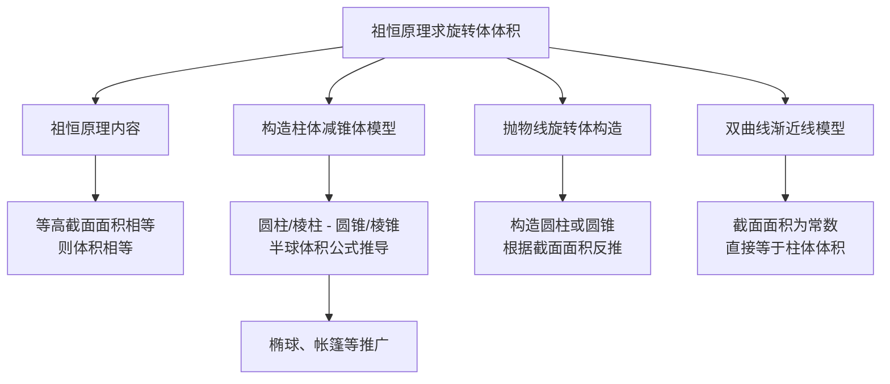

## 祖恒原理求旋转体体积

## 知识讲解

## 导学说明

## 1. 数学目标

(1)理解祖恒原理的内容及几何意义，明确"幂势既同，则积不容异"的核心思想

(2)能够运用祖恒原理，通过构造参考几何体（圆柱/棱柱减圆锥/棱锥等）求解旋转体体积

(3)能够处理抛物线、双曲线等圆锥曲线旋转形成的几何体体积问题，并能迁移至上海高考填选压轴题

## 2. 课程重难点

(1)重点:掌握祖恒原理的构造方法——"等高截面面积相等则体积相等"，熟练构造圆柱(或棱柱)减去圆锥(或棱锥)的参考体

(2)难点:非标准旋转体的构造思路（如何根据截面面积表达式反推参考几何体）、双曲线渐近线模型的特殊处理、截面面积计算中的代数变形

## 3. 考查形式与分值占比

(1)题型:以填空题为主，偶有选择题和解答题局部步骤

(2)占比:在高考中常作为中高档填空题出现（第9-11题位置），分值4-5分；在模考中属特色考点，考查频率中等

## 知识导图

## 教法备注

## 1. 三类知识点

(1)事实性知识:

含义:又叫事实，是指学习者通晓一门学科或解决其中的问题所必须知道的基本要素。

(2)概念性知识:

含义:是一种较为抽象概括的、有组织的知识类型。

(3)程序性知识:

含义:是关于如何做事的知识，通常体现为一系列要遵循的步骤或程序。

(4)三类知识教学步骤:

先补足必要事实和概念（祖恒原理内容、旋转体概念），再通过典型例题示范构造程序，最后用变式题巩固识别与迁移。

## 2. 本切片知识点标签

知识点祖恒原理求旋转体体积:程序性知识

【注】祖恒原理本身及旋转体定义属于概念性知识；圆柱、圆锥体积公式属于事实性知识。

## 可知识点:祖恒原理求旋转体体积

## EV 知识笔记

## 1. 祖恒原理

祖恒原理（又名"幂势既同，则积不容异"）：夹在两个平行平面之间的两个几何体，被平行于这两个平面的任意平面所截，如果截得的两个截面的面积总相等，那么这两个几何体的体积相等。

推广形式：若截面面积之比恒为 $k$，则两几何体体积之比也为 $k$。

## 2. 核心构造方法

**方法框架——"三步构造法"：**

**第一步：求截面面积。** 设截面与底面距离为 $h$，求出待求几何体在高度 $h$ 处的水平截面面积 $S(h)$。

**第二步：匹配参考体。** 根据 $S(h)$ 的表达式，构造一个已知体积公式的参考几何体，使其在同一高度处的截面面积也为 $S(h)$。常见匹配模式：
- $S(h) = \pi(R^2 - h^2)$ 或类似形式 → 构造**圆柱减圆锥**
- $S(h) = \text{常数}$ → 构造**柱体**
- $S(h) = \pi(r_1^2 - r_2^2)$（圆环）→ 构造**圆柱减圆柱**或**圆柱减圆锥**

**第三步：计算体积。** 由祖恒原理，$V = V_{\text{参考体}}$。

## 3. 重要公式

- 圆柱体积：$V = \pi r^2 h$
- 圆锥体积：$V = \frac{1}{3}\pi r^2 h$
- 棱柱体积：$V = S_{\text{底}} \cdot h$
- 棱锥体积：$V = \frac{1}{3} S_{\text{底}} \cdot h$
- 球体积：$V = \frac{4}{3}\pi R^3$
- 椭球体积（绕长轴旋转）：$V = \frac{4\pi}{3} a b^2$（$a$ 为长半轴，$b$ 为短半轴）

## 教法备注

知识标签：程序性知识

教学步骤：本讲需要学生能够利用祖恒原理构造参考几何体求解旋转体体积。该讲知识点建立在已经学习完圆柱、圆锥、球体积公式的基础上，所以教师应先带领学生回顾祖恒原理内容及半球体积的经典推导（圆柱减圆锥模型），然后每种构造方法都可以至少演示一道例题，以及部分变式，让学生能够在操作中学会"截面面积分析→参考体构造→体积计算"的核心程序，最后进行独立练习。

对应知识层级：操作

### 母题1

#### 母题说明教法备注

母题说明：考查祖恒原理的经典应用——构造"圆柱减圆锥"模型求椭球体积，训练学生识别椭圆旋转体的构造模式。

课本中介绍了应用祖恒原理推导棱锥体积公式的做法。祖恒原理也可用来求旋转体的体积。现介绍祖恒原理求球体体积公式的做法：可构造一个底面半径和高都与球半径相等的圆柱，然后在圆柱内挖去一个以圆柱下底面圆心为顶点，圆柱上底面为底面的圆锥，用这样一个几何体与半球应用祖恒原理（图1），即可求得球的体积公式。请研究和理解球的体积公式求法的基础上，解答以下问题：已知椭圆的标准方程为 $\frac{x^2}{4} + \frac{y^2}{25} = 1$，将此椭圆绕 $y$ 轴旋转一周后，得一橄榄状的几何体（图2），其体积等于___。

---

答案

$\frac{80\pi}{3}$

---

解析

**方法选择：** 类比球体积的推导方法，构造"圆柱减圆锥"参考体，利用祖恒原理求解。

椭圆的长半轴为 $a = 5$（在 $y$ 轴上），短半轴为 $b = 2$（在 $x$ 轴上）。

现构造一个底面半径为 $b = 2$，高为 $a = 5$ 的圆柱，然后在圆柱内挖去一个以圆柱下底面圆心为顶点、圆柱上底面为底面的圆锥。

**第一步：验证截面面积相等。**

对于半椭球（$0 \leq y \leq 5$），在高度 $h$ 处（距底面距离为 $h$），截面为圆，由椭圆方程：

$$\frac{x^2}{4} + \frac{h^2}{25} = 1 \Rightarrow x^2 = 4\left(1 - \frac{h^2}{25}\right)$$

截面面积：$S_1 = \pi x^2 = 4\pi\left(1 - \frac{h^2}{25}\right) = 4\pi - \frac{4\pi h^2}{25}$

对于参考体（圆柱减圆锥），圆柱半径为 $2$，高为 $5$；圆锥底面半径为 $2$，高为 $5$。

在高度 $h$ 处，圆锥截面半径 $r$ 满足：$\frac{r}{2} = \frac{h}{5}$，即 $r = \frac{2h}{5}$。

圆环面积：$S_2 = \pi \cdot 2^2 - \pi r^2 = 4\pi - \pi \cdot \frac{4h^2}{25} = 4\pi - \frac{4\pi h^2}{25}$

所以 $S_1 = S_2$，由祖恒原理，半椭球体积等于参考体体积。

**第二步：计算体积。**

$$V_{\text{半椭球}} = V_{\text{圆柱}} - V_{\text{圆锥}} = \pi \cdot 2^2 \cdot 5 - \frac{1}{3} \pi \cdot 2^2 \cdot 5 = 20\pi - \frac{20\pi}{3} = \frac{40\pi}{3}$$

整个椭球体积：$V = 2 \times \frac{40\pi}{3} = \frac{80\pi}{3}$

故答案为：$\frac{80\pi}{3}$

#### 教法备注

1.【选题原因】

本题是祖恒原理应用中最经典的模型——"椭球体积"，直接类比教材中球体积的推导方法（圆柱减圆锥）。选题意在：

(1)帮助学生巩固教材经典模型，建立"椭圆绕轴旋转 → 构造圆柱减圆锥"的条件反射；

(2)训练学生识别长半轴、短半轴与构造参数（圆柱底面半径、高）的对应关系；

(3)为后续更复杂的构造问题奠定方法基础。

2.【错因预设】

(1)混淆长半轴和短半轴，错误地将圆柱底面半径取为 $5$、高取为 $2$，导致构造失败；

(2)忘记椭球是"两个半椭球"，只计算半椭球体积 $\frac{40\pi}{3}$ 就作为最终答案；

(3)在计算圆锥截面半径时，比例关系写反，如写成 $\frac{r}{2} = \frac{5-h}{5}$，导致截面面积计算错误；

(4)不理解为什么要"挖去圆锥"，试图直接找与椭球全等的几何体，陷入思维僵局。

3.【讲法建议】

(1)解法一（构造圆柱减圆锥，推荐）

**课堂讲法流程：**

① 先回顾教材：球体积推导中，为什么构造"圆柱减圆锥"？（因为半球截面面积 $S = \pi(R^2 - d^2)$，恰好等于圆柱截面面积减圆锥截面面积）

② 类比到椭球：椭圆 $\frac{x^2}{b^2} + \frac{y^2}{a^2} = 1$ 绕 $y$ 轴旋转，半椭球截面面积 $S = \pi b^2\left(1 - \frac{h^2}{a^2}\right) = \pi b^2 - \pi\frac{b^2}{a^2}h^2$，恰好等于"底面半径为 $b$、高为 $a$ 的圆柱"减去"底面半径为 $b$、高为 $a$ 的圆锥"的截面面积。

③ 强调对应关系：短半轴 $b$ → 圆柱/圆锥底面半径；长半轴 $a$ → 圆柱/圆锥的高。

(2)解法二（直接用椭球体积公式）

若学生已掌握椭球体积公式 $V = \frac{4\pi}{3}ab^2$（绕长轴旋转），可直接代入 $a = 5, b = 2$ 得 $V = \frac{4\pi}{3} \times 5 \times 4 = \frac{80\pi}{3}$。

【此法快捷，但需记忆公式，且不能体现祖恒原理的思想方法。建议在掌握祖恒原理构造法后，作为速算技巧补充】

### 变式题1-1

#### 变式说明教法备注

变式说明：母题的同方法迁移题，将"圆柱减圆锥"模型拓展到"正四棱柱减正四棱锥"，考查学生的类比迁移能力。

我国南北朝时期的数学家祖暅在计算球的体积时，提出了祖暅原理："幂势既同，则积不容异"，这里的"幂"指水平截面的面积，"势"指高，这句话的意思是：两个等高的几何体若在所有等高处的水平截面的面积相等，则这两个几何体体积相等。利用祖恒原理可以将半球的体积转化为与其同底等高的圆柱和圆锥的体积之差。图1是一种"四脚帐篷"的示意图，其中曲线 $AOC$ 和 $BOD$ 均是以 $2$ 为半径的半圆，平面 $AOC$ 和平面 $BOD$ 均垂直于平面 $ABCD$，用任意平行于帐篷底面 $ABCD$ 的平面截帐篷，所得截面四边形均为正方形。类比利用祖恒原理求半球的体积的计算方法，可以构造一个与帐篷同底等高的正四棱柱和一个倒放的同底等高的正四棱锥（如图2），从而求得该帐篷的体积为___。

---

答案

$\frac{32}{3}$

---

解析

**方法选择：** 类比半球体积推导，先证明等高处的水平截面面积相等，再由祖恒原理将帐篷体积转化为正四棱柱体积减去正四棱锥体积。

**第一步：求帐篷的截面面积。**

设截面与底面的距离为 $h$，在帐篷中的截面为 $A'B'C'D'$。

设底面中心为 $O$，截面 $A'B'C'D'$ 中心为 $O'$，则 $OC' = 2$，$O'C' = \sqrt{4 - h^2}$。

所以 $B'C' = \sqrt{2}\sqrt{4 - h^2}$，截面 $A'B'C'D'$ 的面积为 $2(4 - h^2)$。

**第二步：求参考体的截面面积。**

设截面截正四棱柱得四边形为 $A_1B_1C_1D_1$，截正四棱锥得四边形为 $A_2B_2C_2D_2$。

底面中心 $O$ 与截面 $A_2B_2C_2D_2$ 中心 $O_2$ 之间的距离为 $OO_2 = h$。

在正四棱柱中，底面正方形边长为 $2\sqrt{2}$，高为 $2$，$AO = 2$。

所以 $\angle AOA_2 = \angle COC_2 = 45°$，$\angle A_2OC_2 = 90°$，$\triangle A_2OC_2$ 为等腰直角三角形。

所以 $A_2C_2 = 2h$，四边形 $A_2B_2C_2D_2$ 边长为 $\sqrt{2}h$。

四边形 $A_2B_2C_2D_2$ 面积为 $2h^2$。

阴影部分（正四棱柱减正四棱锥）的截面面积为：

$$S = S_{A_1B_1C_1D_1} - S_{A_2B_2C_2D_2} = (2\sqrt{2})^2 - 2h^2 = 8 - 2h^2 = 2(4 - h^2)$$

与帐篷截面面积相等。

**第三步：由祖恒原理计算体积。**

$$V_{\text{帐篷}} = V_{\text{正四棱柱}} - V_{\text{正四棱锥}} = (2\sqrt{2})^2 \times 2 - \frac{1}{3} \times (2\sqrt{2})^2 \times 2 = 16 - \frac{16}{3} = \frac{32}{3}$$

故答案为：$\frac{32}{3}$

### 变式题1-2

#### 变式说明教法备注

变式说明：母题的同方法快速应用题，以选择题形式出现，考查学生对"构造圆柱减圆锥"模型的熟练度。

祖暅原理用现代语言可描述为：夹在两个平行平面之间的两个几何体，被平行于这两个平面的任意平面所截，如果截得的两个截面的面积总相等，那么这两个几何体的体积相等。现将椭圆 $\frac{x^2}{16} + \frac{y^2}{36} = 1$ 绕 $y$ 轴旋转一周后得到如图所示的椭球，类比计算球的体积的方法，运用祖暅原理可求得该椭球的体积为（ ）

A. $32\pi$  B. $64\pi$  C. $128\pi$  D. $256\pi$

---

答案

C

---

解析

**方法选择：** 直接套用母题方法，构造底面半径为短半轴、高为长半轴的圆柱，挖去同底同高的圆锥。

椭圆 $\frac{x^2}{16} + \frac{y^2}{36} = 1$ 的焦点在 $y$ 轴上，长半轴长为 $a = 6$，短半轴长为 $b = 4$。

构造一个底面半径为 $4$，高为 $6$ 的圆柱，在圆柱中挖去一个以圆柱下底面圆心为顶点、圆柱上底面为底面的圆锥后得到一新几何体。

**验证截面面积：**

当平行于底面的截面与圆锥顶点距离为 $h$（$0 \leq h \leq 6$）时，设小圆锥底面半径为 $r$。

由相似：$\frac{h}{6} = \frac{r}{4}$，即 $r = \frac{2}{3}h$。

新几何体（圆柱减圆锥）的截面面积为：$16\pi - \frac{4}{9}\pi h^2$。

半椭球在高度 $h$ 处的截面：把 $y = h$ 代入椭圆方程，$\frac{x^2}{16} + \frac{h^2}{36} = 1$，解得 $x^2 = 16\left(1 - \frac{h^2}{36}\right) = 16 - \frac{4}{9}h^2$。

截面面积：$\pi x^2 = 16\pi - \frac{4}{9}\pi h^2$，与参考体相等。

**计算体积：**

$$V = 2(V_{\text{圆柱}} - V_{\text{圆锥}}) = 2\left(\pi \cdot 4^2 \cdot 6 - \frac{1}{3} \cdot \pi \cdot 4^2 \cdot 6\right) = 2\left(96\pi - 32\pi\right) = 128\pi$$

故选：C

### 母题2

#### 母题说明教法备注

母题说明：考查抛物线旋转体的祖恒原理应用——根据截面面积表达式反推参考几何体（圆锥），训练学生的逆向构造能力。

早在公元5世纪，我国数学家祖暅求几何体的体积时，提出一个原理：幂势既同，则积不容异。如图，抛物线 $C$ 的方程为 $y = x^2$，过点 $(1, 0)$ 作抛物线 $C$ 的切线 $l$（$l$ 的斜率不为 $0$），将抛物线 $C$、直线 $l$ 及 $x$ 轴围成的阴影部分绕 $y$ 轴旋转一周，所得的几何体记作 $\Omega$，利用祖恒原理，可得出几何体 $\Omega$ 的体积为___。

---

答案

$\frac{4\pi}{3}$

---

解析

**方法选择：** 先求旋转体的水平截面面积（圆环），再根据截面面积的结构特征构造参考几何体（圆锥），最后用祖恒原理求体积。

**第一步：求切线方程。**

设切线方程为 $x = ky + 1$（因为过点 $(1, 0)$ 且斜率不为 $0$，所以不写成 $y = k(x-1)$ 的形式，便于后续绕 $y$ 轴旋转的处理）。

代入 $y = x^2$：$y = (ky + 1)^2 = k^2y^2 + 2ky + 1$

整理：$k^2y^2 + (2k - 1)y + 1 = 0$

由相切条件 $\Delta = 0$：$(2k - 1)^2 - 4k^2 = 0$，即 $4k^2 - 4k + 1 - 4k^2 = 0$，解得 $k = \frac{1}{4}$。

切线方程为：$x = \frac{1}{4}y + 1$，切点坐标为 $(2, 4)$。

**第二步：求旋转体的截面面积。**

过点 $(0, t)$（$0 \leq t \leq 4$）作 $\Omega$ 的水平截面，截面为圆环。

外半径：将 $y = t$ 代入切线方程 $x = \frac{1}{4}y + 1$，得 $r_1 = \frac{t}{4} + 1$。

内半径：将 $y = t$ 代入抛物线 $y = x^2$，得 $r_2 = \sqrt{t}$（取 $x > 0$）。

截面圆环面积：

$$S = \pi(r_1^2 - r_2^2) = \pi\left[\left(\frac{t}{4} + 1\right)^2 - t\right] = \pi\left(\frac{t^2}{16} + \frac{t}{2} + 1 - t\right) = \pi\left(1 - \frac{t}{4}\right)^2$$

**第三步：构造参考几何体。**

为了得到截面面积为 $\pi\left(1 - \frac{t}{4}\right)^2$ 的几何体，构造一个下底面半径为 $1$、高为 $4$ 的圆锥 $PO$。

在距离底面为 $t$ 处作底面的平行截面，设截面半径为 $r_0$。

由相似：$\frac{r_0}{1} = \frac{4 - t}{4}$，即 $r_0 = 1 - \frac{t}{4}$。

截面面积为：$\pi r_0^2 = \pi\left(1 - \frac{t}{4}\right)^2$，与圆环面积相同。

**第四步：由祖恒原理求体积。**

$$V_\Omega = V_{\text{圆锥}} = \frac{1}{3} \times \pi \times 1^2 \times 4 = \frac{4\pi}{3}$$

故答案为：$\frac{4\pi}{3}$

#### 教法备注

1.【选题原因】

本题是祖恒原理应用中"逆向构造"的典型代表。与母题1（直接套用圆柱减圆锥模式）不同，本题需要先计算截面面积、分析其代数结构，再"反推"参考几何体。选题意在：

(1)培养学生"从截面面积表达式识别几何体"的逆向思维能力；

(2)强化抛物线切线与旋转体结合的处理技巧；

(3)展示祖恒原理的灵活性——参考体不一定是"柱减锥"，也可能是单个圆锥。

2.【错因预设】

(1)切线方程设成 $y = k(x-1)$，绕 $y$ 轴旋转后处理麻烦，或无法正确求出切线；

(2)计算截面圆环面积时，忘记减去内圆面积，误将外圆面积当作截面面积；

(3)得到 $S = \pi\left(1 - \frac{t}{4}\right)^2$ 后，无法识别这是"圆锥截面面积"的特征，不知构造何种参考体；

(4)构造圆锥时，底面半径和高取错，如取底面半径为 $2$、高为 $4$ 等；

(5)混淆 $t$ 的取值范围，错误认为圆锥高为 $1$ 或其他值。

3.【讲法建议】

(1)解法一（逆向构造圆锥，推荐）

**课堂讲法流程：**

① 先带学生计算截面面积，得到 $S = \pi\left(1 - \frac{t}{4}\right)^2$ 后，停下来分析结构：这是一个"完全平方"形式，$\pi \times (\text{关于 } t \text{ 的一次式})^2$，联想到圆锥的截面面积公式 $\pi r^2 = \pi \left[r_0\left(1 - \frac{h}{H}\right)\right]^2$。

② 对比系数：$1 - \frac{t}{4}$ 对应 $1 - \frac{h}{H}$，所以圆锥高 $H = 4$；底面半径 $r_0 = 1$（当 $t = 0$ 时，截面面积等于底面积）。

③ 强调"从代数结构反推几何形状"的思维方法。

(2)解法二（直接用定积分——若学生已学）

$$V = \pi \int_0^4 \left[\left(\frac{y}{4} + 1\right)^2 - y\right] dy = \pi \int_0^4 \left(1 - \frac{y}{4}\right)^2 dy = \pi \cdot \frac{4}{3} = \frac{4\pi}{3}$$

【祖恒原理的本质就是积分的离散化思想，可在讲完后简要提及，帮助学生建立古今方法的联系】

### 变式题2-1

#### 变式说明教法备注

变式说明：母题的同方法迁移题，将"抛物线切线围成区域"改为"旋转抛物面与平面围成区域"，参考体变为圆柱的一半，考查学生的灵活调整能力。

已知抛物线 $x^2 = 2py$（$p > 0$），以 $y$ 轴为旋转轴将抛物线旋转半周，得到一个旋转抛物面。设 $x$ 轴绕 $y$ 轴旋转所成的平面为 $\alpha$。$\beta$ 为平行于平面 $\alpha$ 且到 $\alpha$ 的距离为 $h$ 的平面，记平面 $\beta$ 与旋转抛物面所围成的几何体为 $\Omega$（如图）。以 $\Omega$ 的上底面作一个高为 $h$ 的圆柱体（如图），利用祖恒原理可求得 $\Omega$ 的体积为___。

---

答案

$\pi p h^2$

---

解析

**方法选择：** 构造圆柱的一半（或利用圆柱减圆台），通过祖恒原理将抛物面体积转化为易求体积。

**第一步：构造图形并求截面面积。**

将抛物体 $\Omega$ 倒置（顶点朝上）。设深色截面到底面的距离为 $h_1$。

**右图（圆柱中截取抛物体）：**

圆柱底面半径为 $\sqrt{2ph}$（由 $x^2 = 2ph$ 得 $x = \sqrt{2ph}$），高为 $h$。

在高度 $h_1$ 处（从底面往上），圆环的外半径为 $\sqrt{2ph}$（圆柱底面半径），内半径由抛物线方程 $x^2 = 2ph_1$ 得 $\sqrt{2ph_1}$。

圆环面积：$S = \pi \cdot (2ph) - \pi \cdot (2ph_1) = 2\pi p(h - h_1)$。

**左图（倒置的抛物体）：**

在高度 $h_1$ 处（从顶点往下，即到顶点的距离为 $h - h_1$），截面圆半径满足 $x^2 = 2p(h - h_1)$。

圆面积：$S' = \pi \cdot 2p(h - h_1) = 2\pi p(h - h_1)$。

所以 $S = S'$。

**第二步：由祖恒原理求体积。**

由祖恒原理，抛物体 $\Omega$ 的体积等于圆柱体积的一半：

$$V = \frac{1}{2} V_{\text{圆柱}} = \frac{1}{2} \cdot \pi \cdot 2ph \cdot h = \pi p h^2$$

故答案为：$\pi p h^2$

### 母题3

#### 母题说明教法备注

母题说明：考查双曲线与渐近线围成区域的旋转体体积，核心识别点是"截面面积为常数"，直接转化为柱体体积。

在 $xOy$ 平面上，将双曲线的一支 $\frac{x^2}{9} - \frac{y^2}{16} = 1$（$x > 0$）及其渐近线 $y = \frac{4}{3}x$ 和直线 $y = 0$、$y = 4$ 围成的封闭图形记为 $D$，如图中阴影部分。记 $D$ 绕 $y$ 轴旋转一周所得的几何体为 $\Omega$，过 $(0, y)$（$0 \leq y \leq 4$）作 $\Omega$ 的水平截面，计算截面面积，利用祖恒原理得出 $\Omega$ 体积为___。

---

答案

$36\pi$

---

解析

**方法选择：** 计算旋转体的水平截面面积，发现其为常数，直接由祖恒原理转化为圆柱体积。

**第一步：求边界交点。**

直线 $y = a$（$0 \leq a \leq 4$）与渐近线 $y = \frac{4}{3}x$ 交于点 $A\left(\frac{3a}{4}, a\right)$。

直线 $y = a$ 与双曲线 $\frac{x^2}{9} - \frac{y^2}{16} = 1$（$x > 0$）交于点：

$$\frac{x^2}{9} = 1 + \frac{a^2}{16} \Rightarrow x = \frac{3}{4}\sqrt{16 + a^2}$$

即 $B\left(\frac{3}{4}\sqrt{16 + a^2}, a\right)$。

**第二步：求截面面积。**

旋转体 $\Omega$ 在高度 $y = a$ 处的水平截面为圆环，外半径为 $x_B = \frac{3}{4}\sqrt{16 + a^2}$，内半径为 $x_A = \frac{3a}{4}$。

截面面积：

$$S = \pi(x_B^2 - x_A^2) = \pi\left[\frac{9}{16}(16 + a^2) - \frac{9a^2}{16}\right] = \pi\left[9 + \frac{9a^2}{16} - \frac{9a^2}{16}\right] = 9\pi$$

**关键发现：** 截面面积 $S = 9\pi$ 为**常数**，与高度 $a$ 无关！

**第三步：由祖恒原理求体积。**

截面面积为常数 $9\pi$，相当于一个底面积为 $9\pi$、高为 $4$ 的圆柱。

由祖恒原理：$V = 9\pi \times 4 = 36\pi$。

故答案为：$36\pi$

#### 教法备注

1.【选题原因】

本题是祖恒原理应用中的"特殊模型"——截面面积为常数。与母题1、2的"构造柱减锥"不同，本题在计算截面面积时，$a^2$ 项恰好抵消，得到一个常数。选题意在：

(1)展示祖恒原理的另一类应用场景——截面面积为常数时，直接对应柱体；

(2)培养学生"先算截面面积、再观察结构"的解题习惯，而不是先入为主地套公式；

(3)揭示双曲线渐近线模型的优美性质：双曲线与渐近线之间的"渐近区域"绕轴旋转后，截面面积恒为常数。

2.【错因预设】

(1)计算 $x_B^2 - x_A^2$ 时，展开错误，如忘记平方或符号错误，导致 $a^2$ 项没有抵消；

(2)发现截面面积是常数后，不理解其几何意义，不知下一步如何处理；

(3)将"底面积为 $9\pi$、高为 $4$"错误理解为"半径为 $9$、高为 $4$"或其他错误组合；

(4)混淆内半径和外半径，将截面面积算成 $\pi(x_A^2 - x_B^2)$ 导致负值；

(5)误以为需要构造复杂的参考体，忽略了"常数截面 = 柱体"这一简单对应。

3.【讲法建议】

(1)解法一（截面面积分析法，推荐）

**课堂讲法流程：**

① 带学生一步一步计算 $x_A$ 和 $x_B$，强调渐近线和双曲线方程的联立求解。

② 计算 $x_B^2 - x_A^2$ 时，让学生先不要急着算具体数值，而是保留代数式：$x_B^2 = \frac{9}{16}(16 + a^2)$，$x_A^2 = \frac{9a^2}{16}$。

③ 相减后惊喜发现 $a^2$ 项抵消！引导学生体会"这种抵消不是偶然，而是双曲线渐近线模型的本质特征"。

④ 结论：常数截面面积 → 柱体 → $V = S_{\text{截面}} \times h$。

(2)解法二（直接用旋转体体积差）

分别计算渐近线旋转形成的圆锥体积和双曲线旋转形成的双曲面体积，再相减。

$$V_{\text{圆锥}} = \frac{1}{3}\pi \cdot 3^2 \cdot 4 = 12\pi, \quad V_{\text{双曲面}} = \text{(需用积分或公式)}$$

【此法过于复杂，不推荐，仅作对比说明祖恒原理的优越性】

### 变式题3-1

#### 变式说明教法备注

变式说明：母题的同模型反问题，给出体积条件反求双曲线离心率，考查学生的逆向思维和代数运算能力。

我国古代数学家祖暅求几何体的体积时，提出一个原理：幂势既同，则积不容异。已知双曲线 $C: \frac{x^2}{a^2} - \frac{y^2}{b^2} = 1$（$a > 0, b > 0$），若双曲线右焦点到渐近线的距离记为 $d$，双曲线 $C$ 的两条渐近线与直线 $y = 1$、$y = -1$ 以及双曲线 $C$ 的右支围成的图形（如图中阴影部分所示）绕 $y$ 轴旋转一周所得几何体的体积为 $\sqrt{2}dc\pi$（其中 $c^2 = a^2 + b^2$），则双曲线的离心率为（ ）

A. $\sqrt{2}$  B. $2$  C. $\sqrt{3}$  D. $\frac{2\sqrt{3}}{3}$

---

答案

A

---

解析

**方法选择：** 先利用母题3的方法求出旋转体体积（截面面积为常数），再结合已知条件建立关于离心率的方程。

**第一步：求截面面积。**

令 $y = m$（$-1 \leq m \leq 1$），截面为圆环。

渐近线 $y = \frac{b}{a}x$ 与 $y = m$ 交于 $x = \frac{am}{b}$。

双曲线 $\frac{x^2}{a^2} - \frac{y^2}{b^2} = 1$ 与 $y = m$ 交于：

$$x^2 = a^2\left(1 + \frac{m^2}{b^2}\right) = \frac{a^2(b^2 + m^2)}{b^2}$$

即 $x = \frac{a\sqrt{b^2 + m^2}}{b}$（取右支 $x > 0$）。

截面面积：

$$S = \pi\left[\frac{a^2(b^2 + m^2)}{b^2} - \frac{a^2m^2}{b^2}\right] = \pi \cdot \frac{a^2b^2}{b^2} = \pi a^2$$

**关键发现：** 截面面积为常数 $\pi a^2$！

**第二步：求旋转体体积。**

由对称性和祖恒原理，所得几何体的体积为：

$$V = 2 \times \pi a^2 \times 1 = 2\pi a^2$$

（因子 $2$ 是因为 $y \in [-1, 1]$，上下对称）

**第三步：建立方程求离心率。**

已知 $V = \sqrt{2}dc\pi$，且双曲线右焦点到渐近线的距离 $d = \frac{bc}{\sqrt{a^2 + b^2}} = \frac{bc}{c} = b$。

所以：$2\pi a^2 = \sqrt{2} \cdot b \cdot c \cdot \pi = \sqrt{2}\pi bc$

即 $2a^2 = \sqrt{2}bc$，平方得 $4a^4 = 2b^2c^2$，即 $2a^4 = b^2c^2$。

由 $b^2 = c^2 - a^2$：

$$2a^4 = (c^2 - a^2)c^2 = c^4 - a^2c^2$$

整理：$c^4 - a^2c^2 - 2a^4 = 0$

令 $t = \frac{c^2}{a^2}$（即 $t = e^2$）：$t^2 - t - 2 = 0$，解得 $t = 2$ 或 $t = -1$（舍去）。

所以 $e^2 = 2$，$e = \sqrt{2}$。

故选：A

## 分层练习

## 基础

1

（教材回顾题）沪版必修第三册教材中用了较多的篇幅来介绍立体几何中的定理及其证明过程，力求培养同学们的空间想象能力和逻辑推理能力。

(1) 写出"异面直线判定定理"的内容并证明该定理；

(2) 表述出祖暅原理的内容，并画出用祖暅原理推导半球体积时构造出的几何体（需交代主要线段的长度，可适当用文字说明）。

---

答案

(1) 见解析

(2) 见解析

---

解析

(1) **异面直线判定定理：** 经过平面外一点和平面内一点的直线，和平面内不经过该点的直线是异面直线。

**证明：**

已知：点 $A, B \in$ 直线 $m$，点 $A$ 在平面 $\alpha$ 外，$B \in \alpha$，直线 $n \subset \alpha$，且 $B \in n$。

求证：直线 $m, n$ 为异面直线。

假设直线 $m, n$ 在平面 $\beta$ 内，则点 $B$ 和直线 $n$ 都在平面 $\beta$ 内。

而点 $B$ 和直线 $n$ 都在平面 $\alpha$ 内。

由于经过直线和直线外一点有且只有一个平面，所以 $\alpha, \beta$ 重合。

从而直线 $m$ 在平面 $\alpha$ 内，这与已知条件矛盾。

所以直线 $m, n$ 为异面直线。

(2) **祖暅原理：** 夹在两个平面之间的两个几何体，被平行于这两个平面的任意平面所截，如果截得的两个截面的面积总相等，那么这两个几何体的体积相等。

**半球体积推导构造：**

- 图①：半径为 $R$ 的半球。
- 图②：底面半径和高都为 $R$ 的圆柱中挖掉一个圆锥（圆锥以圆柱下底面圆心为顶点，圆柱上底面为底面）。

设与平面 $\alpha$ 平行且距离为 $d$ 的平面 $\beta$ 截两个几何体：

- 图①中，截面圆面积为 $\pi(R^2 - d^2)$。
- 图②中，圆环面积为 $\pi R^2 - \pi d^2 = \pi(R^2 - d^2)$。

截得的截面面积相等，所以半球体积等于圆柱减圆锥的体积：

$$V_{\text{半球}} = \pi R^3 - \frac{1}{3}\pi R^3 = \frac{2}{3}\pi R^3$$

## 综合

1

我国古代数学家祖暅求几何体的体积时，提出一个原理：幂势既同，则积不容异。已知线段 $AB$ 长为 $4$，直线 $l$ 过点 $A$ 且与 $AB$ 垂直，以 $B$ 为圆心，以 $1$ 为半径的圆绕 $l$ 旋转一周，得到环体 $M$；以 $A, B$ 分别为上下底面的圆心，以 $1$ 为上下底面半径的圆柱体 $N$；过 $AB$ 且与 $l$ 垂直的平面为 $\beta$，平面 $\alpha \parallel \beta$，且距离为 $h$。若平面 $\alpha$ 截圆柱体 $N$ 所得截面面积为 $S_1$，平面 $\alpha$ 截环体 $M$ 所得截面面积为 $S_2$，则 $\frac{S_1}{S_2} =$___，环体 $M$ 体积为___。

---

答案

$\frac{1}{2\pi}$；$8\pi^2$

---

解析

**第一步：求圆柱截面面积 $S_1$。**

圆柱 $N$ 的底面半径为 $1$，高为 $4$。

在距离底面为 $h$ 处（$0 \leq h \leq 1$，考虑截面在圆柱内部），截面为矩形。

矩形的一边长为圆柱的高方向：$2\sqrt{1 - h^2}$（圆截面的弦长）。

另一边长为 $AB = 4$。

所以 $S_1 = 2\sqrt{1 - h^2} \cdot 4 = 8\sqrt{1 - h^2}$。

**第二步：求环体截面面积 $S_2$。**

环体 $M$ 是圆绕轴 $l$ 旋转形成的圆环面（torus）。

在距离轴 $l$ 为 $h$ 处，截面为两个圆的圆环。

外半径：$r_{\text{外}} = 4 + \sqrt{1 - h^2}$（圆心 $B$ 到轴 $l$ 的距离为 $4$，加上圆上点到 $B$ 的距离）。

内半径：$r_{\text{内}} = 4 - \sqrt{1 - h^2}$。

圆环面积：

$$S_2 = \pi(r_{\text{外}}^2 - r_{\text{内}}^2) = \pi\left[(4 + \sqrt{1-h^2})^2 - (4 - \sqrt{1-h^2})^2\right]$$

$$= \pi \cdot 16\sqrt{1-h^2} = 16\pi\sqrt{1-h^2}$$

**第三步：求比值和体积。**

$$\frac{S_1}{S_2} = \frac{8\sqrt{1-h^2}}{16\pi\sqrt{1-h^2}} = \frac{1}{2\pi}$$

由祖恒原理的推广形式（截面面积比为 $k$，则体积比也为 $k$）：

$$\frac{V_N}{V_M} = \frac{1}{2\pi} \Rightarrow V_M = 2\pi \cdot V_N = 2\pi \cdot (\pi \cdot 1^2 \cdot 4) = 8\pi^2$$

故答案为：$\frac{1}{2\pi}$；$8\pi^2$

2

在 $xOy$ 平面上，将一段圆弧 $C: x^2 + y^2 = 1$（$x \geq 0$）和一段椭圆弧 $\Gamma: \frac{x^2}{2} + y^2 = 1$（$x \geq 0$）围成的封闭图形记为 $D$，如图中阴影部分所示。记 $D$ 绕 $y$ 轴旋转一周而成的封闭几何体为 $\Omega$，过 $(0, y)$（$|y| < 1$）作 $\Omega$ 的水平截面，利用祖恒原理和一个球，得出旋转体 $\Omega$ 的体积值为___。

---

答案

$\frac{4\pi}{3}$

---

解析

**方法选择：** 分别求出椭圆弧旋转形成的椭球体积和圆弧旋转形成的球体积，再相减。

**第一步：求椭球体积。**

椭圆 $\frac{x^2}{2} + y^2 = 1$ 中，$a = \sqrt{2}$（长半轴，在 $x$ 轴），$b = 1$（短半轴，在 $y$ 轴）。

绕 $y$ 轴旋转，长轴在旋转轴的垂直方向，所以用公式 $V = \frac{4\pi}{3}a^2b$：

$$V_{\text{椭球}} = \frac{4\pi}{3} \cdot (\sqrt{2})^2 \cdot 1 = \frac{8\pi}{3}$$

**第二步：求球体积。**

圆弧 $C: x^2 + y^2 = 1$（$x \geq 0$）绕 $y$ 轴旋转形成半球，再对称得到整球：

$$V_{\text{球}} = \frac{4\pi}{3} \cdot 1^3 = \frac{4\pi}{3}$$

**第三步：求旋转体 $\Omega$ 体积。**

由题意，$D$ 是椭圆弧与圆弧之间的区域，所以旋转体 $\Omega$ 的体积为椭球体积减去球体积：

$$V_\Omega = \frac{8\pi}{3} - \frac{4\pi}{3} = \frac{4\pi}{3}$$

故答案为：$\frac{4\pi}{3}$

3

如图，有一个半径为 $15$ 的半球，过球心 $O$ 作底面的垂线 $l$，$l$ 上一点 $O_1$ 满足 $O_1O = 12$，过 $O_1$ 作平行于底面的截面将半球分成两个几何体，其中较大部分的体积为___。

---

答案

$2124\pi$

---

解析

**方法选择：** 利用祖恒原理计算出截面以上部分（小头）的体积，再用半球总体积减去小头体积得到较大部分体积。

**第一步：分析几何关系。**

设截面以上部分（小圆台状）的体积为 $V_1$，截面以下部分（较大部分）的体积为 $V_2$。

$R = 15$，$h = OO_1 = 12$，所以 $O_1O_2 = 15 - 12 = 3$（截面以上部分的高度）。

**第二步：用祖恒原理（或积分思想）求 $V_1$。**

将 $O_1O_2 = 3$ 进行 $n$ 等分，过等分点作平行于底面的平面，将截面以上部分切割成 $n$ 层"小圆片"。

第 $i$ 层（由下向上数）的底面半径：

$$r_i = \sqrt{15^2 - \left[12 + \frac{3(i-1)}{n}\right]^2} = \sqrt{81 - \frac{72(i-1)}{n} - \frac{9(i-1)^2}{n^2}}$$

第 $i$ 层体积近似：$V_i \approx \pi r_i^2 \cdot \frac{3}{n}$

求和：

$$V_1 \approx \sum_{i=1}^{n} \pi\left[81 - \frac{72(i-1)}{n} - \frac{9(i-1)^2}{n^2}\right] \cdot \frac{3}{n}$$

$$= 243\pi - \frac{216\pi}{n^2} \cdot \frac{n(n-1)}{2} - \frac{27\pi}{n^3} \cdot \frac{n(n-1)(2n-1)}{6}$$

取极限 $n \to \infty$：

$$V_1 = 243\pi - 108\pi - 9\pi = 126\pi$$

**第三步：求较大部分体积。**

半球总体积：$V_{\text{半球}} = \frac{2}{3}\pi \cdot 15^3 = 2250\pi$

$$V_2 = V_{\text{半球}} - V_1 = 2250\pi - 126\pi = 2124\pi$$

故答案为：$2124\pi$

## 挑战

1

在 $xOy$ 平面上，将两个半圆弧 $(x-1)^2 + y^2 = 1$（$x \geq 1$）和 $(x-3)^2 + y^2 = 1$（$x \geq 3$）、两条直线 $y = 1$ 和 $y = -1$ 围成的封闭图形记为 $D$，如图中阴影部分。记 $D$ 绕 $y$ 轴旋转一周而成的几何体为 $\Omega$，过 $(0, y)$（$|y| \leq 1$）作 $\Omega$ 的水平截面，所得截面面积为 $4\pi\sqrt{1-y^2} + 8\pi$，试利用祖恒原理、一个平放的圆柱和一个长方体，得出 $\Omega$ 的体积值为___。

---

答案

$2\pi^2 + 16\pi$

---

解析

**方法选择：** 根据提示，将截面面积拆分为两部分，分别对应平放圆柱和长方体的截面面积。

**分析截面面积结构：**

$$S(y) = 4\pi\sqrt{1-y^2} + 8\pi$$

- 第一部分 $4\pi\sqrt{1-y^2}$：令 $y = \cos\theta$，则 $\sqrt{1-y^2} = \sin\theta$，这部分与圆的方程相关。
- 第二部分 $8\pi$：常数，与高度 $y$ 无关。

**构造参考体：**

**参考体一：平放的圆柱**

一个半径为 $1$、高为 $2\pi$ 的圆柱平放（轴线水平）。

在高度 $y$ 处（$-1 \leq y \leq 1$），截面为矩形，矩形的一边为圆柱的轴截面弦长 $2\sqrt{1-y^2}$，另一边为圆柱的高 $2\pi$。

截面面积：$S_1 = 2\sqrt{1-y^2} \cdot 2\pi = 4\pi\sqrt{1-y^2}$。

**参考体二：长方体**

一个高为 $2$（$y$ 从 $-1$ 到 $1$）、底面面积为 $8\pi$ 的长方体。

在任意高度 $y$ 处，截面面积恒为 $S_2 = 8\pi$。

**由祖恒原理：**

$\Omega$ 的体积等于平放圆柱体积加上长方体体积：

$$V = \pi \cdot 1^2 \cdot 2\pi + 2 \cdot 8\pi = 2\pi^2 + 16\pi$$

故答案为：$2\pi^2 + 16\pi$
