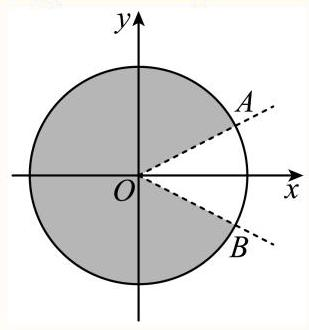

范 -数列姓名:___
1 较难 (填空题) 专题08 活用三角函数的图象与性质 (6大核心考点) (讲义)
已知 $\theta  > 0$ ,存在实数 $\varphi$ ,使得对任意 $n \in  N * ,\cos \left( {{n\theta } + \varphi }\right)  < \frac{\sqrt{3}}{2}$ ,则 $\theta$ 的最小值是___.
答案
$\frac{2\pi }{5}$
解析
利用单位圆确定 ${n\theta } + \varphi$ 的取值范围，再根据题给条件分析 $\theta$ 的最值即可得出结论. 解: 在单位圆中分析,由题意可得 ${n\theta } + \varphi$ 的终边要落在图中阴影部分区域(其中 \\angle AOx=\\angle BOx=\\dfrac\{\\pi \} \{6\}\\right)，如图,

由于 $\forall n \in  N * ,\cos \left( {{n\theta } + \varphi }\right)  < \frac{\sqrt{3}}{2}$ 恒成立,且 $\varphi$ 为常数
$\therefore {2k\pi } + \frac{\pi }{6} < {n\theta } + \varphi  < {2k\pi } + \frac{11\pi }{6},\therefore \left( {-\frac{\pi }{6},\frac{\pi }{6}}\right)$ 位于连续两终边之间
① 当 ${2\pi }$ 为 $\theta$ 的正整数倍时，连续两终边间的间隔长度为 $\theta$ ，
$\therefore \theta  > \frac{\pi }{6} - \left( {-\frac{\pi }{6}}\right)  = \frac{\pi }{3}$ ,取 ${2\pi } = {k\theta }, k \in  {Z}^{ * }$ ,此时, $\theta  = \frac{2\pi }{k}$
即, $\frac{2\pi }{k} > \frac{\pi }{3}\text{ ， }\therefore k \leq  5$ ,当 $k = 5$ 时 $\theta$ 取得最小值, ${\theta }_{\min } = \frac{2\pi }{5}$ .
② 当 ${2\pi }$ 不为 $\theta$ 的正整数倍时,可设 ${2\pi } = {m\theta } + p$ ， $\left( {m \in  N * ,\left| p\right|  < \frac{\pi }{5}}\right)$
这里的 $\left| p\right|  < \frac{\pi }{5}$ 是根据 ①中的 $\theta$ 的最小值 $\frac{2\pi }{5}$ 推导出,这里只考虑 $\theta  \in  \left( {0,\frac{2\pi }{5}}\right)$ 情况.
$\theta  = \frac{2\pi }{5}$ 时, ${2\pi } = {m\theta } + p$ ,满足 ${2\pi }$ 不为 $\theta$ 的正整数倍时, $\left| p\right|  = \frac{\pi }{5}$ .
所以 $\theta  \in  \left( {0,\frac{2\pi }{5}}\right)$ 时, $\left| p\right|  < \frac{\pi }{5}$
由 ${2\pi } = {m\theta } + p$ 得: $\theta  = \frac{{2\pi } - p}{m}$ ,此时,
n\\\\theta +\\varphi =\\dfrac\{n\}\{m\}\\cdot 2\\pi -\\dfrac\{\\mathit\{n\}\}\{\\mathit\{m\}\}\\mathit\{\\cdot \}p+\\\\Varphi
$\because \left| p\right|  < \frac{\pi }{5},\;\therefore$ 当 $\frac{n}{m}$ 为正整数时, $\varphi  - \frac{n}{m} \cdot  p$ 连续两终边间的间隔长度小于 $\frac{\pi }{5}$
所以必定存在正整数使得 $\varphi  - \frac{n}{m} \cdot  p$ 的终边落在区间 $\left( {-\frac{\pi }{6},\frac{\pi }{6}}\right)$ 上,此时不符合题意.
综上, $\theta$ 的最小值为 $\frac{2\pi }{5}$ .
故答案为: $\frac{2\pi }{5}$

2 较难 单选题 2025届上海市崇明区高三二模数学试题
数列 $\left\{  {a}_{n}\right\}$ 是等差数列,周期数列 $\left\{  {b}_{n}\right\}$ 满足 ${b}_{n} = \cos \left( {a}_{n}\right)$ ,若集合 $X = \left\{  {x \mid  x = {b}_{n}}\right.$ , n是正整数 $\}$ 中恰有三个元素，则数列 $\left\{  {b}_{n}\right\}$ 的周期 $\mathrm{T}$ 的取值不可能是( )
A. 4
B. 5
C. 6
D. 7
答案
D
解析
现根据等差数列的通项公式和周期数列的定义,得到 $d = \frac{2\pi }{T}$ ,然后对选项逐一分析即可.
${b}_{n + T} = {b}_{n} \Rightarrow  \cos \left( {a}_{n + T}\right)  = \cos \left( {a}_{n}\right) ,$
取 ${a}_{n + T} = {a}_{n} + {2\pi }$ ,则公差 $d = \frac{2\pi }{T}$ ,
当 $T = 4$ ,是 $d = \frac{2\pi }{4} = \frac{\pi }{2}$ ,此时角度序列为: ${a}_{1},{a}_{1} + \frac{\pi }{2},{a}_{1} + \pi ,{a}_{1} + \frac{3\pi }{2}$ ,
取 ${a}_{1} = 0$ ,则对应的余弦值为 $1,0, - 1,0$ ,此时 $X = \{ 1,0, - 1\}$ ,三个元素合题意;
当 $T = 5$ ,是 $d = \frac{2\pi }{5}$ ,此时角度序列为: ${a}_{1},{a}_{1} + \frac{2\pi }{5},{a}_{1} + \frac{4\pi }{5},{a}_{1} + \frac{6\pi }{5},{a}_{1} + \frac{8\pi }{5}$ ,
取 ${a}_{1} = 0$ ，则对应的余弦值为 $1,\cos \frac{2\pi }{5},\cos \frac{4\pi }{5},\cos \frac{6\pi }{5},\cos \frac{8\pi }{5}$ ，
又 $\cos \frac{4\pi }{5} = \cos \frac{6\pi }{5},\cos \frac{8\pi }{5} = \cos \frac{2\pi }{5}$ ,此时 $X$ 也是三个元素,合题意;
当 $T = 6$ ,是 $d = \frac{2\pi }{6} = \frac{\pi }{3}$ ,此时角度序列为: ${a}_{1},{a}_{1} + \frac{\pi }{3},{a}_{1} + \frac{2\pi }{3},{a}_{1} + \pi ,{a}_{1} + \frac{4\pi }{3},{a}_{1} + \frac{5\pi }{3}$
取 ${a}_{1} = \frac{\pi }{6}$ ，则对应的余弦值为 $\frac{\sqrt{3}}{2},0, - \frac{\sqrt{3}}{2}, - \frac{\sqrt{3}}{2},0,\frac{\sqrt{3}}{2}$ ，此时 $X$ 也是三个元素，合题意；
当 $T = 7$ ,是 $d = \frac{2\pi }{7}$ ,此时角度序列为:
${a}_{1},{a}_{1} + \frac{2\pi }{7},{a}_{1} + \frac{4\pi }{7},{a}_{1} + \frac{6\pi }{7},{a}_{1} + \frac{8\pi }{7},{a}_{1} + \frac{10\pi }{7},{a}_{1} + \frac{12\pi }{7},$
由于7是质数,角度间隔 $\frac{2\pi }{7}$ 无法分解为更小的对称单元,余弦值的对称性不足以将 7 个不同角度映射为3个不同值,
故选: D.

3 较难 填空题 上海市向明中学2019-2020学年高一下学期期中数学试题
已知等差数列 $\left\{  {a}_{n}\right\}$ 的公差 $d \in  (0,\pi \rbrack$ ，数列 $\left\{  {b}_{n}\right\}$ 满足 ${b}_{n} = \sin \left( {a}_{n}\right)$ ，集合 $S = \left\{  {x \mid  x = {b}_{n}, n \in  {N}^{ * }}\right\}$ ，若 ${a}_{1} = \frac{\pi }{2}$ ，集合 $S$ 中恰好有两个元素，则 $d =$
答案
$\pi$ 或 $\frac{2\pi }{3}$
解析
计算 ${b}_{1} = 1,{b}_{2} = \cos d \neq  1$ ,讨论 ${b}_{3} = 1$ 和 ${b}_{3} = \cos d$ 两种情况,计算得到 $d$ 的值,再验证得到答案.根据题意: ${b}_{1} = \sin \left( {a}_{1}\right)  = \sin \frac{\pi }{2} = 1,{b}_{2} = \sin \left( {{a}_{1} + d}\right)  = \sin \left( {\frac{\pi }{2} + d}\right)  = \cos d$ , $d \in  (0,\pi \rbrack$ ,故 ${b}_{2} = \cos d \neq  1,{b}_{3} = \sin \left( {\frac{\pi }{2} + {2d}}\right)  = \cos {2d}$ ,
当 ${b}_{3} = \cos {2d} = 1$ 时, $d \in  (0,\pi \rbrack$ ,故 $d = \pi$ ;
当 ${b}_{3} = \cos {2d} = \cos d$ 时,即 $2{\cos }^{2}d - \cos d - 1 = 0$ ,解得 $\cos d = 1$ (舍去) 或 $\cos d =  - \frac{1}{2}$ ,
$d \in  (0,\pi \rbrack$ ,故 $d = \frac{2\pi }{3}$ .
${b}_{n} = \sin \left( {a}_{n}\right)  = \sin \left( {\frac{\pi }{2} + \left( {n - 1}\right) d}\right)  = \cos \left( {n - 1}\right) d,$
当 $d = \pi$ 时， ${b}_{n} = \cos \left\lbrack  {\left( {n - 1}\right) \pi }\right\rbrack$ ，此时 $S = \left\{  {x \mid  x = {b}_{n}, n \in  {N}^{ * }}\right\}   = \{ 0,1\}$ ，满足条件；
当 $d = \frac{2\pi }{3}$ 时, ${b}_{n} = \cos \left\lbrack  {\frac{2}{3}\left( {n - 1}\right) \pi }\right\rbrack$ ,此时 $S = \left\{  {x \mid  x = {b}_{n}, n \in  {N}^{ * }}\right\}   = \left\{  {1, - \frac{1}{2}}\right\}$ ,满足条件.
综上所述: $d = \pi$ 或 $d = \frac{2\pi }{3}$ .
故答案为: $\pi$ 或 $\frac{2\pi }{3}$ .
本题考查了根据三角函数的值域求参数，等差数列，集合的元素，意在考查学生的计算能力和综合应用能力.

4 一般 单选题) 上海市七宝中学2023届高三5月第一次模拟练习数学试题
已知 $\left\{  {a}_{n}\right\}$ 是等差数列， ${b}_{n} = \sin \left( {a}_{n}\right)$ ，且存在正整数 $t$ ，使得对任意的正整数 $n$ 都有 ${b}_{n + t} = {b}_{n}$ . 若集合 $S = \left\{  {x \mid  x = {b}_{n}, n \in  {\mathrm{N}}^{ * }}\right\}$ 中只含有 4 个元素,则 $t$ 的取值不可能是( )
A. 4
B. 5
C. 6
D. 7
## 答案
B
解析
根据 $\left\{  {a}_{n}\right\}$ 为等差数列,写出通项,根据题意列出 ${b}_{n},{a}_{n}$ 之间的关系,进而找到两个数列基本量之间的关系,分别就 $t = 4, t = 5, t = 6, t = 7$ 四种情况讨论,选出符合题意的值,进而判断选项即可.
解: 设等差数列 $\left\{  {a}_{n}\right\}$ 首项为 ${a}_{1}$ ,公差为 $d$ ,则 ${a}_{n} = {a}_{1} + \left( {n - 1}\right) d,{b}_{n} = \sin \left( {a}_{n}\right)$ ,
由题知,存在正整数 $t$ ,使得 ${b}_{n + t} = {b}_{n}, n \in  {\mathrm{N}}^{ * }$ ,
若集合 $\left\{  {x \mid  x = {b}_{n}, n \in  {\mathrm{N}}^{ * }}\right\}$ 有 4 个不同元素，则 $t \geq  4$ ，
当 $t = 4$ 时， ${b}_{n + 4} = {b}_{n}$ ，即 $\sin \left( {a}_{n + 4}\right)  = \sin \left( {a}_{n}\right)$ ，即 $\sin \left( {{a}_{n} + {4d}}\right)  = \sin \left( {{a}_{n} + {2k\pi }}\right) , k \in  \mathrm{Z}$ ， 所以 ${a}_{n} + {4d} = {a}_{n} + {2k\pi }$ ,或 ${a}_{n} + {4d} + {a}_{n} + {2k\pi } = \pi , k \in  \mathrm{Z}$ ,
因为 $\left\{  {a}_{n}\right\}$ 是等差数列,各项均唯一,所以 ${a}_{n} + {4d} + {a}_{n} + {2k\pi } = \pi , k \in  \mathrm{Z}$ 舍去,
故解得 $d = \frac{k\pi }{2}, k \in  \mathrm{Z}$ ,取 $k = 1$ 时, $d = \frac{\pi }{2}$ ,
此时在单位圆上的4等分点可取到4个不同的正弦值,
即集合 $S = \left\{  {x \mid  x = {b}_{n}, n \in  {\mathrm{N}}^{ * }}\right\}$ 可取 4 个元素,
当 $t = 5$ 时, ${b}_{n + 5} = {b}_{n}$ ,即 $\sin \left( {a}_{n + 5}\right)  = \sin \left( {a}_{n}\right)$ ,即 $\sin \left( {{a}_{n} + {5d}}\right)  = \sin \left( {{a}_{n} + {2k\pi }}\right) , k \in  \mathrm{Z}$ ,
所以 ${a}_{n} + {5d} = {a}_{n} + {2k\pi }$ ,或 ${a}_{n} + {5d} + {a}_{n} + {2k\pi } = \pi , k \in  \mathrm{Z}$ ,(舍),
故解得 $d = \frac{2k\pi }{5}, k \in  \mathrm{Z}$ ,此时在单位圆上的 5 等分点,
取到的 $\frac{2\pi }{5},\frac{4\pi }{5},\frac{6\pi }{5},\frac{8\pi }{5},\frac{10\pi }{5}$ ,不可能取到 4 个不同的正弦值,故不成立,
同理可得当 $t = 6, t = 7$ 时,集合 $S = \left\{  {x \mid  x = {b}_{n}, n \in  {\mathrm{N}}^{ * }}\right\}$ 可取 4 个元素.
故选: B
思路点睛:该题考查集合间的基本关系，属于难题，关于新定义集合的思路有:
(1)根据题意，先写出几项，找出规律；
(2)找到新集合和旧集合之间的关系；
(3)分情况讨论，结合题意，找出适合的答案即可.
5 困难 解答题 上海市普陀区2024届高考一模数学试题
若存在常数 $t$ ,使得数列 $\left\{  {a}_{n}\right\}$ 满足 ${a}_{n + 1} - {a}_{1}{a}_{2}{a}_{3}\cdots {a}_{n} = t\left( {n \geq  1, n \in  \mathbf{N}}\right)$ ,则称数列 $\left\{  {a}_{n}\right\}$ 为“ $H\left( t\right)$ 数列”.
(1) 判断数列:1，2，3，8，49是否为“ $H\left( 1\right)$ 数列”，并说明理由；
(2)若数列 $\left\{  {a}_{n}\right\}$ 是首项为2的“ $H\left( t\right)$ 数列”，数列 $\left\{  {b}_{n}\right\}$ 是等比数列，且 $\left\{  {a}_{n}\right\}$ 与 $\left\{  {b}_{n}\right\}$ 满足
$\mathop{\sum }\limits_{{i = 1}}^{n}{a}_{i}^{2} = {a}_{1}{a}_{2}{a}_{3}\cdots {a}_{n} + {\log }_{2}{b}_{n}$ ,求 $t$ 的值和数列 $\left\{  {b}_{n}\right\}$ 的通项公式;
(3)若数列 $\left\{  {a}_{n}\right\}$ 是“ $H\left( t\right)$ 数列”， ${S}_{n}$ 为数列 $\left\{  {a}_{n}\right\}$ 的前 $n$ 项和， ${a}_{1} > 1$ ， $t > 0$ ，试比较 $\ln {a}_{n}$ 与 ${a}_{n} - 1$ 的大小，并证明 $t > {S}_{n + 1} - {S}_{n} - {\mathrm{e}}^{{S}_{n} - n}$ .
## 答案
(1)不是“ $H$ (1)”数列
(2) $t =  - 1,\;{b}_{n} = {2}^{n + 1}$
(3) $\ln {a}_{n} < {a}_{n} - 1$ ，证明见解析
解析
(1)根据“ $H\left( t\right)$ 数列”的定义，则 $t = 1$ ，故 ${a}_{n + 1} - {a}_{1}{a}_{2}{a}_{3}\cdots {a}_{n} = 1$ ，
因为 ${a}_{2} - {a}_{1} = 1$ 成立， ${a}_{3} - {a}_{2}{a}_{1} = 1$ 成立， ${a}_{4} - {a}_{3}{a}_{2}{a}_{1} = 8 - 1 \times  2 \times  3 = 8 - 6 = 2 \neq  1$ 不成立,
所以1,2,3,8,49不是“ $H\left( 1\right)$ 数列”.
(2)由 $\left\{  {a}_{n}\right\}$ 是首项为2的“ $H\left( t\right)$ 数列”，则 ${a}_{2} = 2 + t$ ， ${a}_{3} = {3t} + 4$ ，
由 $\left\{  {b}_{n}\right\}$ 是等比数列,设公比为 $q$ ,
由 $\mathop{\sum }\limits_{{i = 1}}^{n}{a}_{i}^{2} = {a}_{1}{a}_{2}{a}_{3}\cdots {a}_{n} + {\log }_{2}{b}_{n}$ ,
则 $\mathop{\sum }\limits_{{i = 1}}^{{n + 1}}{a}_{i}^{2} = {a}_{1}{a}_{2}{a}_{3}\cdots {a}_{n}{a}_{n + 1} + {\log }_{2}{b}_{n + 1}$ ,
两式作差可得 ${a}_{n + 1}^{2} = {a}_{1}{a}_{2}{a}_{3}\cdots {a}_{n}\left( {{a}_{n + 1} - 1}\right)  + {\log }_{2}{b}_{n + 1} - {\log }_{2}{b}_{n}$ ,
即 ${a}_{n + 1}^{2} = {a}_{1}{a}_{2}{a}_{3}\cdots {a}_{n}\left( {{a}_{n + 1} - 1}\right)  + {\log }_{2}q$
由 $\left\{  {a}_{n}\right\}$ 是 “ $H\left( t\right)$ 数列”,则 ${a}_{n + 1} - {a}_{1}{a}_{2}{a}_{3}\cdots {a}_{n} = t$ ,对于 $n \geq  1, n \in  \mathbf{N}$ 恒成立,
所以 ${a}_{n + 1}^{2} = \left( {{a}_{n + 1} - t}\right) \left( {{a}_{n + 1} - 1}\right)  + {\log }_{2}q$ ,
即 $\left( {t + 1}\right) {a}_{n + 1} = t + {\log }_{2}{b}_{n + 1} - {\log }_{2}{b}_{n}$ 对于 $n \geq  1, n \in  \mathbf{N}$ 恒成立,
则 $\left\{  \begin{array}{l} \left( {t + 1}\right) {a}_{2} - t = {\log }_{2}q \\  \left( {t + 1}\right) {a}_{3} - t = {\log }_{2}q \end{array}\right.$ ,即 $\left\{  \begin{array}{l} \left( {t + 1}\right) \left( {2 + t}\right)  - t = {\log }_{2}q \\  \left( {t + 1}\right) \left( {{3t} + 4}\right)  - t = {\log }_{2}q \end{array}\right.$ ,
解得, $t =  - 1, q = 2$ ,
又由 ${a}_{1} = 2,{a}_{1}^{2} = {a}_{1} + {\log }_{2}{b}_{1}$ ,则 ${b}_{1} = 4$ ,即 ${b}_{n} = {2}^{n + 1}$
故所求的 $t =  - 1$ ，数列 $\left\{  {b}_{n}\right\}$ 的通项公式 ${b}_{n} = {2}^{n + 1}$
(3)设函数 $f\left( x\right)  = \ln x - x + 1$ ,则 ${f}^{\prime }\left( x\right)  = \frac{1}{x} - 1$ ,令 ${f}^{\prime }\left( x\right)  = 0$ ,
解得 $x = 1$ ,当 $x > 1$ 时, ${f}^{\prime }\left( x\right)  < 0$ ,
则 $f\left( x\right)  = \ln x - x + 1$ 在区间 $\left( {1, + \infty }\right)$ 单调递减，
且 $f\left( 1\right)  = \ln 1 - 1 + 1 = 0$ ,
又由 $\left\{  {a}_{n}\right\}$ 是 “ $H\left( t\right)$ 数列”,
即 ${a}_{n + 1} - {a}_{1}{a}_{2}{a}_{3}\cdots {a}_{n} = t$ ,对于 $n \geq  1, n \in  \mathbf{N}$ 恒成立,
因为 ${a}_{1} > 1, t > 0$ ,则 ${a}_{2} = {a}_{1} + t > 1$ ,
再结合 ${a}_{1} > 1, t > 0,{a}_{2} > 1$ ,
反复利用 ${a}_{n + 1} = {a}_{1}{a}_{2}{a}_{3}\cdots {a}_{n} + t$ ,
可得对于任意的 $n \geq  1, n \in  \mathbf{N},{a}_{n} > 1$ ,
则 $f\left( {a}_{n}\right)  < f\left( 1\right)  = 0$ ,
即 $\ln {a}_{n} - {a}_{n} + 1 < 0$ ,则 $\ln {a}_{n} < {a}_{n} - 1$ ,
即 $\ln {a}_{1} < {a}_{1} - 1,\ln {a}_{2} < {a}_{2} - 1,\cdots ,\ln {a}_{n} < {a}_{n} - 1$ ,
相加可得 $\ln {a}_{1} + \ln {a}_{2} + \cdots  + \ln {a}_{n} < {a}_{1} + {a}_{2} + \cdots  + {a}_{n} - n$ ,
则 $\ln \left( {{a}_{1}{a}_{2}\cdots {a}_{n}}\right)  < {S}_{n} - n$ ,
又因为 $y = \ln x$ 在 $x \in  \left( {0, + \infty }\right)$ 上单调递增,
所以 ${a}_{1}{a}_{2}\cdots {a}_{n} < {\mathrm{e}}^{{S}_{n} - n}$ ,
又 ${a}_{n + 1} - {a}_{1}{a}_{2}{a}_{3}\cdots {a}_{n} = t$ ,所以 ${a}_{n + 1} - t < {\mathrm{e}}^{{S}_{n} - n}$ ,
即 ${S}_{n + 1} - {S}_{n} - t < {\mathrm{e}}^{{S}_{n} - n}$ ,
故 $t > {S}_{n + 1} - {S}_{n} - {\mathrm{e}}^{{S}_{n} - n}$ .
