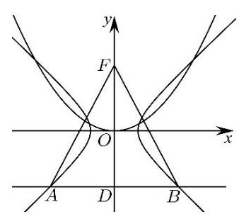
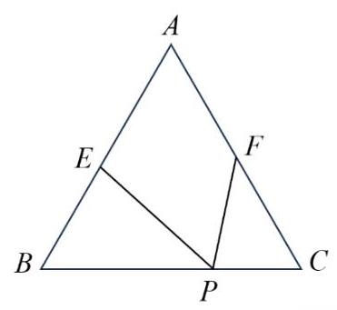
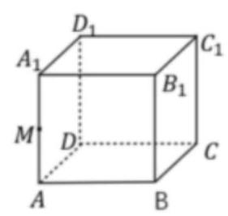
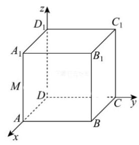
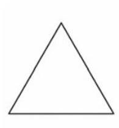
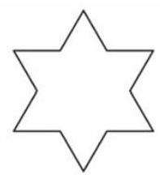
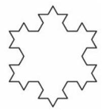
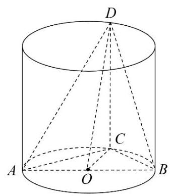
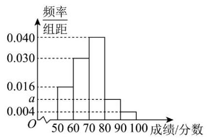
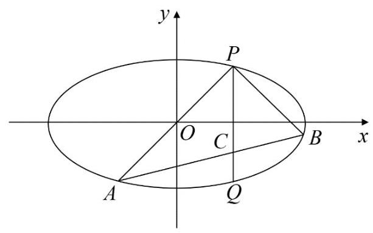

# 2026 年上海高考模拟卷一

命题人:郭燕标 审核人:

2026.4

## 一、填空题(本大题共有 12 题，满分 54 分，第 1~6 题每题 4 分，第 7~12 题每题 5 分)

1. 已知集合 $A = \left\{  {x\left| \right| x \mid   \leq  1}\right\}  , B = \left\{  {y\left| {\;y = {2}^{x}}\right. , x \in  \mathbf{R}}\right\}$ ，则 $A \cap  B =$ ___.

【答案: $(0,1\rbrack$ 】

2. 函数 $y = 2\cos \left( {{2x} + \frac{\pi }{3}}\right)  - 1$ 的最小正周期为___.

【答案: $\pi$ 】

3. 某数学老师记录了班上 8 名同学的数学考试成绩, 得到如下数据: 90, 98, 100, 108, 111, 116, 120, 125.则这组数据的 75%分位数是___.

【答案:118】

4. 若事件 $A$ 与事件 $B$ 独立，且 $P\left( {A \mid  B}\right)  = \frac{1}{3}$ ，则 $P\left( \bar{A}\right)  =$ ___.

【答案: $\frac{2}{3}$ 】

5. 已知 $2 - \mathrm{i}$ 是关于 $x$ 的方程 ${x}^{2} + {px} + q = 0$ 的一个根,其中 $p, q \in  \mathbf{R}$ ,则 $p + q =$ ___.

【答案:1】

6. 根据下表中的数据得到线性回归方程为 $\widehat{y} =  - {4x} + a$ ，则可以预测，当 $x = {12}$ 时， $y$ 的值为___.

<table><tr><td>$x$</td><td>4</td><td>5</td><td>6</td><td>7</td><td>8</td><td>9</td></tr><tr><td>$y$</td><td>90</td><td>84</td><td>83</td><td>80</td><td>75</td><td>68</td></tr></table>

【答案:58】

7. 等比数列 $\left\{  {a}_{n}\right\}$ 的各项均为正数,其前 $n$ 项和为 ${S}_{n}$ ,且 ${a}_{1},{a}_{3},{S}_{3}$ 成等差数列,则数列 $\left\{  {a}_{n}\right\}$ 的公比为___.

【答案:2】

8. 已知 $\overrightarrow{a} = \left( {1,\sqrt{2}}\right)$ ，若向量 $\overrightarrow{b}$ 满足 $\left( {\overrightarrow{a} + \overrightarrow{b}}\right) \bot \overrightarrow{a}$ ，则 $\overrightarrow{b}$ 在 $\overrightarrow{a}$ 方向上的投影向量的坐标为___.

【答案: $\left( {-1, - \sqrt{2}}\right)$ 】

【解析:根据数量积的运算律求得 $\overrightarrow{a} \cdot  \overrightarrow{b}$ ，根据投影向量的概念，即可求得答案. 由题意知 $\left( {\overrightarrow{a} + \overrightarrow{b}}\right)  \bot  \overrightarrow{a}$ ，故

$\left( {\overrightarrow{a} + \overrightarrow{b}}\right)  \cdot  \overrightarrow{a} = 0$ ，所以 ${\overrightarrow{a}}^{2} + \overrightarrow{a} \cdot  \overrightarrow{b} = 0$ ，而 $\overrightarrow{a} = \left( {1,\sqrt{2}}\right)$ ，则 $\left| \overrightarrow{a}\right|  = \sqrt{{1}^{2} + {\left( \sqrt{2}\right) }^{2}} = \sqrt{3}$ ，故 $\overrightarrow{a} \cdot  \overrightarrow{b} =  - {\overrightarrow{a}}^{2} =  - 3$ ， 则 $\overrightarrow{b}$ 在 $\overrightarrow{a}$ 方向上的投影向量为 $\frac{\overrightarrow{a} \cdot  \overrightarrow{b}}{\left| \overrightarrow{a}\right| } \cdot  \frac{\overrightarrow{a}}{\left| \overrightarrow{a}\right| } = \frac{-3}{\sqrt{3}} \cdot  \frac{\left( 1,\sqrt{2}\right) }{\sqrt{3}} = \left( {-1, - \sqrt{2}}\right)$ ,即 $\overrightarrow{b}$ 在 $\overrightarrow{a}$ 方向上的投影向量的坐标为 $\left( {-1, - \sqrt{2}}\right)$ ，故答案为: $\left( {-1, - \sqrt{2}}\right)$ . 】

9. 某劳动课上，王老师安排甲、乙、丙、丁、戊五名学生到三个不同的教室打扫卫生，每个教室至少安排一名学生, 且甲乙两名学生安排在同一教室打扫, 丙丁两名学生不安排在同一教室打扫, 则不同的安排方法数是___.

【答案:30】

【解析:若三个教室的人数分配是 1,1,3 , 则甲乙连同另一个同学一起去一个教室, 剩下两个同学分别去另两个教室，则有 ${\mathrm{C}}_{3}^{1}{\mathrm{C}}_{3}^{1}{\mathrm{P}}_{2}^{2} = {18}$ 种安排方法；若三个教室的人数分配是1,2,2，则甲乙一起去一个教室，丙丁分别去另两个教室,戊去剩下两个教室中的一个,则有 ${\mathrm{C}}_{3}^{1}{\mathrm{P}}_{2}^{2}{\mathrm{C}}_{2}^{1} = {12}$ 种安排方法. 故总的方法有 ${18} + {12} = {30}.$ 】

10. 抛物线 ${x}^{2} = {2py}\left( {p > 0}\right)$ 的焦点为 $F$ ,其准线与双曲线 $\frac{{x}^{2}}{3} - \frac{{y}^{2}}{3} = 1$ 相交于 $A\text{ 、 }B$ 两点,若 $\bigtriangleup {ABF}$ 为等边三角形，则 $p =$ ___.

【答案:6】

【解析:设抛物线的准线与 $y$ 轴交于点 $\mathrm{D}$ ,等边三角形 ${ABF}$ 中,可得点 $\mathrm{B}$ 的坐标代入双曲线方程可得答案. 设抛物线的准线与 $\mathrm{y}$ 轴交于点 $\mathrm{D}$ ,如图,等边三角形 ${ABF}$ 中, $\left| {DF}\right|  = p,\left| {BD}\right|  = \frac{\sqrt{3}}{3}p$ ,所以点 $\mathrm{B}$ 的坐标为 $\left( {\frac{\sqrt{3}}{3}p, - \frac{p}{2}}\right)$ ,又点 $\mathrm{B}$ 在双曲线上,故 $\frac{\frac{{p}^{2}}{3}}{3} - \frac{\frac{{p}^{2}}{4}}{3} = 1$ ,解得 $p = 6$ ,故答案为: 6 .】

11. 草坪上有一个带有围栏的边长为 ${30}\mathrm{\;m}$ 的正三角形活动区域 $\mathrm{{ABC}}$ , 点 $P$ 在边 ${BC}$ 上,且 $\left| {PB}\right|  = 2\left| {PC}\right|$ ,小明在该区域玩耍,他在 $P$ 处放置了一个手电筒, 若手电筒发出的光线张角 (任两条光线的最大夹角) 为 ${60}^{ \circ  }$ (如图所示,射线 ${PE}$ 和 ${PF}$ 分别与 ${AB}$ 和 ${AC}$ 交于 $E$ 、

$F$ 两点, $\angle {EPF} = {60}^{ \circ  }$ ),则手电筒在 $\mathrm{{ABC}}$ 内部所能照射到的地面区域 ${AEPF}$ 的最大面积为___ ${\mathrm{m}}^{2}$ .

【答案: ${125}\sqrt{3}$ 】

【解析:在正 $\bigtriangleup {ABC}$ 中， $\angle {EPF} = \frac{\pi }{3},{BP} = {20},{CP} = {10}$ ，设 $\angle {BPE} = \angle {CFP} = \theta$ ，

由正弦定理得: $\frac{PB}{\sin \left( {\frac{2\pi }{3} - \theta }\right) } = \frac{BE}{\sin \theta }$ ，则 ${BE} = \frac{{20}\sin \theta }{\sin \left( {\frac{2\pi }{3} - \theta }\right) }$ ，

$\frac{PC}{\sin \theta } = \frac{CF}{\sin \left( {\frac{2\pi }{3} - \theta }\right) }$ ,则 ${CF} = \frac{{10}\sin \left( {\frac{2\pi }{3} - \theta }\right) }{\sin \theta }$ ,

$S = {S}_{\bigtriangleup {ABC}} - {S}_{\bigtriangleup {BPE}} - {S}_{\bigtriangleup {CPF}} = \frac{\sqrt{3}}{4}A{B}^{2} - \frac{1}{2}{BE} \cdot  {BP} \cdot  \sin \frac{\pi }{3} - \frac{1}{2}{CP} \cdot  {CF} \cdot  \sin \frac{\pi }{3}$

$= \frac{\sqrt{3}}{4} \cdot  {30}^{2} - \frac{1}{2} \cdot  \frac{{20}\sin \theta }{\sin \left( {\frac{2\pi }{3} - \theta }\right) } \cdot  {20}\sin \frac{\pi }{3} - \frac{1}{2} \cdot  {10} \cdot  \frac{{10}\sin \left( {\frac{2\pi }{3} - \theta }\right) }{\sin \theta } \cdot  \sin \frac{\pi }{3}$

$= {225}\sqrt{3} - {100}\sqrt{3} \cdot  \frac{\sin \theta }{\sin \left( {\frac{2\pi }{3} - \theta }\right) } - {25}\sqrt{3} \cdot  \frac{\sin \left( {\frac{2\pi }{3} - \theta }\right) }{\sin \theta }$

$= {225}\sqrt{3} - {25}\sqrt{3}\left\lbrack  {\frac{4\sin \theta }{\sin \left( {\frac{2\pi }{3} - \theta }\right) } + \frac{\sin \left( {\frac{2\pi }{3} - \theta }\right) }{\sin \theta }}\right\rbrack   \leq  {125}\sqrt{3}$

当且仅当 $\frac{4\sin \theta }{\sin \left( {\frac{2\pi }{3} - \theta }\right) } = \frac{\sin \left( {\frac{2\pi }{3} - \theta }\right) }{\sin \theta }$ ,即 $\tan \theta  = \frac{\sqrt{3}}{3}$ ,亦即 $\theta  = \frac{\pi }{6}$ 时取等号,

所以手电筒在 ABC 内部所能照射到的地面的最大面积为 ${125}\sqrt{3}{\mathrm{\;m}}^{2}$ . 故答案为: ${125}\sqrt{3}$ . 】

12. 在某人工智能图像处理系统中,原始图像尺寸 $x$ 经过函数 $y = {\log }_{a}\left( {x - b}\right)  + c$ 变换为目标尺寸 $y$ ; 同时

系统存在一个逆向变换函数 $y = {a}^{x - c} + b$ ,能将目标尺寸还原为原始尺寸. 在某次测试中,系统日志记录了三个尺寸对: $\left( {1,4}\right) ,\left( {2,3}\right) ,\left( {2,4}\right)$ . 若每个尺寸对 $\left( {x, y}\right)$ 可能来自正向变换 (原始尺寸 $\rightarrow$ 目标尺寸) 或逆向变换(目标尺寸 → 原始尺寸)，则 $a + b + c$ 的最小值为___.

【答案: $\frac{9}{2}$ 】

【解析:因为函数 $y = {\log }_{a}\left( {x - b}\right)  + c$ 与 $y = {a}^{x - c} + b$ 均为单调函数,

所以三个尺寸对 $\left( {1,4}\right) ,\left( {2,3}\right) ,\left( {2,4}\right)$ 中,

$\left( {1,4}\right) ,\left( {2,3}\right)$ 来自同一个变换函数, $\left( {2,4}\right)$ 来自另一个变换函数.

若 $\left( {1,4}\right) ,\left( {2,3}\right)$ 来自正向变换函数, $\left( {2,4}\right)$ 来自逆向变换函数,

则 $\left\{  \begin{array}{l} 4 = {\log }_{a}\left( {1 - b}\right)  + c \\  3 = {\log }_{a}\left( {2 - b}\right)  + c \\  4 = {a}^{2 - c} + b \end{array}\right.$

由 $4 = {\log }_{a}\left( {1 - b}\right)  + c$ 和 $3 = {\log }_{a}\left( {2 - b}\right)  + c$ 两式相减得 $1 = {\log }_{a}\frac{1 - b}{2 - b}$ ,即 $a = \frac{1 - b}{2 - b}$ ,

所以 $4 - b = {a}^{2 - c} = {a}^{{\log }_{a}\left( {1 - b}\right)  - 2} = \left( {1 - b}\right)  \cdot  \frac{1}{{a}^{2}} = \left( {1 - b}\right)  \cdot  \frac{{\left( 2 - b\right) }^{2}}{{\left( 1 - b\right) }^{2}}$ ,

化简得 $\left( {4 - b}\right) \left( {1 - b}\right)  = {\left( 2 - b\right) }^{2}$ ,解得 $b = 0$ ,则 $a = \frac{1}{2}, c = 4$ ,所以 $a + b + c = \frac{9}{2}$ .

若 $\left( {1,4}\right) ,\left( {2,3}\right)$ 来自逆向变换函数， $\left( {2,4}\right)$ 来自正向变换函数，

则 $\left\{  \begin{array}{l} 4 = {a}^{1 - c} + b \\  3 = {a}^{2 - c} + b \\  4 = {\log }_{a}\left( {2 - b}\right)  + c \end{array}\right.$

由 $4 = {a}^{1 - c} + b$ 和 $3 = {a}^{2 - c} + b$ 两式相减得 ${a}^{1 - c} - {a}^{2 - c} = 1$ ,即 ${a}^{1 - c}\left( {1 - a}\right)  = 1$ ,

因为 ${a}^{1 - c} > 0$ ,故 $1 - a > 0$ ,即 $0 < a < 1$ ,所以 $1 - c = {\log }_{a}\frac{1}{1 - a}$ ,即 $c = {\log }_{a}a\left( {1 - a}\right)$ ,

由 $4 = {\log }_{a}\left( {2 - b}\right)  + c$ ,得 $4 = {\log }_{a}\left( {{a}^{1 - c} - 2}\right)  + {\log }_{a}a\left( {1 - a}\right)$ ,

所以 $4 = {\log }_{a}\left( {\frac{1}{1 - a} - 2}\right)  + {\log }_{a}a\left( {1 - a}\right)$ ,化简得 ${a}^{3} = {2a} - 1$ ,即 $\left( {a - 1}\right) \left( {{a}^{2} + a + 1}\right)  = 2\left( {a - 1}\right)$ ,

所以 ${a}^{2} + a - 1 = 0$ ,又 $0 < a < 1$ ,解得 $a = \frac{\sqrt{5} - 1}{2}$ ,

所以 $b = 4 - {a}^{1 - c} = 4 - \frac{1}{1 - a} = 4 - \frac{1}{1 - \frac{\sqrt{5} - 1}{2}} = \frac{5 - \sqrt{5}}{2}$ ,

$c = 1 + {\log }_{a}\left( {1 - a}\right)  = 1 + {\log }_{\frac{\sqrt{5} - 1}{2}}\frac{3 - \sqrt{5}}{2} = 1 + {\log }_{\frac{\sqrt{5} - 1}{2}}{\left( \frac{\sqrt{5} - 1}{2}\right) }^{2} = 3$ ,

所以 $a + b + c = \frac{\sqrt{5} - 1}{2} + \frac{5 - \sqrt{5}}{2} + 3 = 5$ .

综上, $a + b + c$ 的最小值为 $\frac{9}{2}$ .]

## 二、选择题(本大题共有 4 题，满分 18 分，第 13-14 题每题 4 分，第 15-16 题每题 5 分)

13. 已知 $a, b$ 为异面直线，则过空间一点 $A$ 且与 $a, b$ 都平行的平面有( )

A. 0 个 B. 1 个 C. 0 个或 1 个 D. 无数个

【答案: C】

14. " $\left| {a - 1}\right|  < 1$ 且 $\left| {b - 1}\right|  < 1$ "是" $\left| {a - b}\right|  < 2$ "的( )

A. 充分不必要条件 B. 必要不充分条件

C. 充要条件 D. 既不充分也不必要条件

【答案: A】

【解析:当 $\left| {a - 1}\right|  < 1$ 且 $\left| {b - 1}\right|  < 1$ 时， $\left| {a - b}\right|  = \left| {\left( {a - 1}\right)  - \left( {b - 1}\right) }\right|  \leq  \left| {a - 1}\right|  + \left| {b - 1}\right|  < 2$ ，即 $\left| {a - b}\right|  < 2$ ，所以 $\left| {a - 1}\right|  < 1$ 且 $\left| {b - 1}\right|  < 1$ 能推出 $\left| {a - b}\right|  < 2$ ,

反过来,当 $\left| {a - b}\right|  < 2$ ,说明 $a$ 与 $b$ 的距离小于 2,但 $a\text{ 、 }b$ 与 1 的距离可以大于或等于 1,所以

$\left| {a - b}\right|  < 2$ 不能推出 $\left| {a - 1}\right|  < 1$ 且 $\left| {b - 1}\right|  < 1$ ，所以 " $\left| {a - 1}\right|  < 1$ 且 $\left| {b - 1}\right|  < 1$ " 是 " $\left| {a - b}\right|  < 2$ " 的充分非必要条件. 故选: A】

15. 如图，在棱长为 4 的正方体 ${ABCD} - {A}_{1}{B}_{1}{C}_{1}{D}_{1}$ 中， $M$ 为棱 ${A}_{1}A$ 的中点，点 $Q$ 在上底面正方形 ${A}_{1}{B}_{1}{C}_{1}{D}_{1}$ (含边界) 内运动,满足 $\overline{QC} \cdot  \overline{QM} = 4$ ,则点 $Q$ 的轨迹长度为( )

A. $\frac{\pi }{2}$ B. $\pi$ C. ${2\pi }$ D. ${4\pi }$

【答案:D】

【解析:如图,以点 $D$ 为坐标原点, ${DA},{DC}, D{D}_{1}$ 分别为 $x, y, z$ 轴,建立空间直角坐标系,则

$M\left( {4,0,2}\right) , C\left( {0,4,0}\right)$ ,设 $Q\left( {x, y,4}\right) , x, y \in  \left\lbrack  {0,4}\right\rbrack$ ,所以

$\overrightarrow{QC} = \left( {-x,4 - y, - 4}\right) ,\overrightarrow{QM} = \left( {4 - x, - y, - 2}\right)$ ,由 $\overrightarrow{QC} \cdot  \overrightarrow{QM} = 4$ ,得

$- x\left( {4 - x}\right)  - y\left( {4 - y}\right)  + 8 = 4$ ,整理得 ${\left( x - 2\right) }^{2} + {\left( y - 2\right) }^{2} = 4$ ,所以点 $Q$ 的轨迹是以点 $\left( {2,2,4}\right)$ 为圆心，2 为半径的圆，此圆在正方形内部，所以点 $Q$ 的轨迹长度为 $2 \times  {2\pi } = {4\pi }$ . 故选:D】

16. 如图, 将一个边长为 1 的正三角形的每条边三等分, 以中间一段为边向外作正三角形, 并擦去中间这一段,如此继续下去得到的曲线称为科克雪花曲线. 将下面的图形依次记作 ${M}_{1},{M}_{2},{M}_{3},\cdots ,{M}_{n},\cdots$ . 设 ${M}_{n}$ 的周长为 ${L}_{n}$ ，面积为 ${A}_{n}$ ，则下列说法正确的个数是( )

${M}_{1}$

${M}_{2}$

${M}_{3}$

...

① ${L}_{n}$ 与 ${A}_{n}$ 都随着 $n$ 的增大而增大 ② $\left\{  {L}_{n}\right\}$ 与 $\left\{  {A}_{n}\right\}$ 都是等比数列

③存在正实数 $L$ ，使得 ${L}_{n} \leq  L$

④ ${A}_{n} < \frac{2\sqrt{3}}{5}$

A. 1 B. 2 C. 3 D. 4

【答案: B】

【解析:设 ${M}_{n}$ 中的边数 ${N}_{n}$ ，每条边的长度 ${T}_{n}$ . 显然 ${N}_{n} = 3 \cdot  {4}^{n - 1},{T}_{n} = {\left( \frac{1}{3}\right) }^{n - 1}$

${L}_{n} = {N}_{n} \cdot  {T}_{n} = 3 \cdot  {\left( \frac{4}{3}\right) }^{n - 1} \cdot  {A}_{n} = \frac{2\sqrt{3}}{5} - \frac{3\sqrt{3}}{20} \cdot  {\left( \frac{4}{9}\right) }^{n - 1}.$

${A}_{1} = \frac{\sqrt{3}}{4}$ ,当由 ${M}_{n - 1}$ 生成 ${M}_{n}$ 时,在 ${M}_{n - 1}$ 的每一条边上多了一个面积为 ${T}_{n}^{2}{A}_{1}$ 的小等边三角形, 这些小等边三角形的面积之和为 ${N}_{n - 1}{T}_{n}^{2}{A}_{1}$ ,其中 ${A}_{1}$ 的面积为 $\frac{\sqrt{3}}{4}$ ,于是得到科克雪花曲线面积的递推公式:

$$
{A}_{n} = {A}_{n - 1} + {N}_{n - 1}{T}_{n}^{2}{A}_{1}
$$

$$
= {A}_{n - 2} + {N}_{n - 2}{T}_{n - 1}^{2}{A}_{1} + {N}_{n - 1}{T}_{n}^{2}{A}_{1}
$$

...

$$
= {A}_{1}\left( {1 + {N}_{1}{T}_{2}^{2} + {N}_{2}{T}_{3}^{2} + \cdots  + {N}_{n - 1}{T}_{n}^{2}}\right) .
$$

把 ${N}_{1} = 3,{T}_{1} = 1,{T}_{n} = {\left( \frac{1}{3}\right) }^{n - 1},{N}_{n} = 3 \cdot  {4}^{n - 1}, n \geq  2$ 代入上式,经化简得

$$
{A}_{n} = \frac{3}{4}\left\lbrack  {\frac{4}{3} + \frac{4}{9} + {\left( \frac{4}{9}\right) }^{2} + \cdots  + {\left( \frac{4}{9}\right) }^{n - 1}}\right\rbrack  {A}_{1}
$$

$$
= \frac{3}{4}\left\lbrack  {1 + \frac{4}{9} + {\left( \frac{4}{9}\right) }^{2} + \cdots  + {\left( \frac{4}{9}\right) }^{n - 1} + \frac{1}{3}}\right\rbrack  {A}_{1}
$$

$$
= \frac{3}{4}\left\{  {\frac{9}{5}\left\lbrack  {1 - {\left( \frac{4}{9}\right) }^{n}}\right\rbrack   + \frac{1}{3}}\right\}  {A}_{1}
$$

$$
= \frac{2\sqrt{3}}{5} - \frac{3\sqrt{3}}{20}{\left( \frac{4}{9}\right) }^{n - 1}\text{ . }
$$

显然①④正确，②③错误. 故选 B.】

## 三、解答题(本大题共有 5 题，满分 78 分)解答下列各题必须在答题纸的相应位置写出必要的步骤.

## 17. (本题满分 14 分，第 1 小题满分 7 分，第 2 小题满分 7 分)

如图，在圆柱中， $O$ 为下底面圆心， ${AB}$ 为下底面圆 $O$ 的一条直径， ${CD}$ 为圆柱的一条母线，且 $C$ 为 ${AB}$ 的中点.

(1) 求证: 平面 ${ABD} \bot$ 平面 ${OCD}$ ;

(2)若圆柱的侧面积为 ${4\pi }$ ，二面角 $C - {AB} - D$ 的大小为 $\arctan 2$ ，求出以 ${CD}$ 为旋转轴,将三角形 ${ABD}$ 绕 ${CD}$ 旋转一周所形成的几何体的体积.

【答案:(1)证明: $\because {CD}$ 为圆柱的一条母线， $\therefore {CD} \bot$ 平面 ${ABC}$ ，

$\because {AB} \subset$ 平面 ${ABC},\therefore {CD} \bot  {AB}$ ；

又 $\because C$ 为 ${AB}$ 的中点， $\therefore {CO} \bot  {AB}$ ，

又 $\because {CO}\text{ 、 }{CD} \subset$ 平面 ${OCD}$ ,且 ${CO} \cap  {CD} = C,\therefore {AB} \bot$ 平面 ${OCD}$ ;

又 $\because {AB} \subset$ 平面 ${ABD}$ , $\therefore$ 平面 ${ABD} \bot$ 平面 ${OCD}$ .

(2)设圆柱的底面半径为 $r$ ，高为 $h$ .

$\because$ 圆柱的侧面积为 ${4\pi }\text{ ， }\therefore {2\pi rh} = {4\pi }$ ，则 ${rh} = 2\cdots \cdots$ ①；

又 $\because$ 二面角 $C - {AB} - D$ 的大小为 $\arctan 2$ ,由 (1) 可知, $\angle {COD}$ 为二面角 $C - {AB} - D$ 的平面角,

$\therefore \tan \angle {COD} = 2$ ，即 $\frac{h}{r} = 2\cdots \cdots$ ②；由①②可得 $r = 1, h = 2$ ， $\therefore {CO} = 1,{CD} = 2,{AC} = \sqrt{2}$ .

$\because$ 三角形 ${ABD}$ 绕 ${CD}$ 旋转一周所形成的几何体的体积,可以看成三角形 ${ACD}$ 与三角形 ${OCD}$ 分别以 ${CD}$ 为旋转轴旋转一周所形成的两个圆锥的体积之差,

$\therefore$ 该几何体的体积 $V = \frac{1}{3}\pi  \cdot  {\left( \sqrt{2}\right) }^{2} \cdot  2 - \frac{1}{3}\pi  \cdot  {1}^{2} \cdot  2 = \frac{2\pi }{3}$ . 】

## 18. (本题满分 14 分, 第 1 小题满分 6 分, 第 2 小题满分 8 分)

已知常数 $a > 1$ ，函数 $f\left( x\right)  = {\log }_{a}\left( {x + b}\right)  - {\log }_{a}\left( {-x + b}\right)$ ，其中 $b > 0$ ，

(1)函数 $y = f\left( x\right)$ 是否为奇函数，若是请证明；若不是，请说明理由.

(2)若 $b = 1$ ，且 $f\left( {1 - a}\right)  + f\left( {1 - {a}^{2}}\right)  < 0$ ，求实数 $a$ 的取值范围.

【答案:(1)由 $\left\{  \begin{array}{l} x + b > 0 \\   - x + b > 0 \end{array}\right.$ 得 $- b < x < b$ ，所以 $f\left( x\right)$ 的定义域是 $\left( {-b, b}\right)$ ，该区间关于原点对称. $f\left( {-x}\right)  = {\log }_{a}\left( {-x + b}\right)  - {\log }_{a}\left( {x + b}\right)  =  - \left\lbrack  {{\log }_{a}\left( {x + b}\right)  - {\log }_{a}\left( {-x + b}\right) }\right\rbrack   =  - f\left( x\right)$ ,故函数 $y = f\left( x\right)$ 是奇函数.

(2)当 $b = 1$ 时， $f\left( x\right)  = {\log }_{a}\left( {x + 1}\right)  - {\log }_{a}\left( {-x + 1}\right)$ ， $x \in  \left( {-1,1}\right)$ .

$\because a > 1,\therefore y = {\log }_{a}\left( {x + 1}\right)$ 为严格增函数, $y = {\log }_{a}\left( {-x + 1}\right)$ 为严格减函数,

$\therefore f\left( x\right)  = {\log }_{a}\left( {x + 1}\right)  - {\log }_{a}\left( {-x + 1}\right)$ 为严格增函数.

$\because y = f\left( x\right)$ 是奇函数,由 $f\left( {1 - a}\right)  + f\left( {1 - {a}^{2}}\right)  < 0$ 可得 $f\left( {1 - a}\right)  <  - f\left( {1 - {a}^{2}}\right)  = f\left( {{a}^{2} - 1}\right)$ , 再由 $y = f\left( x\right)$ 的单调性和定义域可得 $- 1 < 1 - a < {a}^{2} - 1 < 1$ ,解得 $1 < a < \sqrt{2}$ .

$\therefore$ 实数 $a$ 的取值范围是 $\left( {1,\sqrt{2}}\right)$ . 】

## 19. (本题满分 14 分，第 1 小题满分 4 分，第 2 小题满分 5 分，第 3 小题满分 5 分，)

某市为提升学生们的数学素养，举办了一场 " 数学文化素养知识大赛 " ，已知共有 10000 名学生参加了比赛, 现从参加比赛的全体学生中随机抽取 100 人的成绩作为样本, 得到如下频率分布直方图:

(1)若规定成绩较高的前 30% 的学生获奖，请求出 $a$ 的值并估计获奖学生的最低分数线；

(2)现从成绩位于 $\lbrack {60},{90})$ 的样本中，按分层随机抽样的方法选取 8 人，再从这 8 人中随机选取 2 人，设这 2 人中成绩落在 $\lbrack {60},{70})$ 内的人数为 $X$ ,求 $X$ 的分布列;

(3)由频率分布直方图可认为该市全体参赛学生的成绩 $Z$ 服从正态分布 $N\left( {\mu ,{\sigma }^{2}}\right)$ ，其中 $\mu$ 可近似为样本中的 100 名学生初赛成绩的平均值 (同一组数据用该组区间的中点值代替),且 ${\sigma }^{2} \approx  {225}$ . 从该市所有参赛学生中任取一人，试估计该生的成绩高于 85.6 分的概率(精确到 0.0001).

[参考数据: 若 $Z \sim  N\left( {0,1}\right)$ ,则 $P\left( {\left| Z\right|  \leq  1}\right)  \approx  {0.6827}, P\left( {\left| Z\right|  \leq  2}\right)  \approx  {0.9545}, P\left( {\left| Z\right|  \leq  3}\right)  \approx  {0.9973}\rbrack$ .]

【答案:(1)由频率分布直方图易知， $\left( {{0.040} + {0.030} + {0.016} + a + {0.004}}\right)  \times  {10} = 1$ ，解得 $a = {0.010}$ ， 由图知 $\left\lbrack  {{90},{100}}\right\rbrack$ 的频率为 0.04, $\left\lbrack  {{80},{100}}\right\rbrack$ 的频率为 ${0.1} + {0.04} = {0.14}$ , $\left\lbrack  {{70},{100}}\right\rbrack$ 的频率为 0.54,

$\therefore$ 获奖学生最低分数线落在 $\lbrack {70},{80})$ 内,不妨设为 $x$ ,则 $\left( {{80} - x}\right)  \times  {0.04} + {0.04} + {0.1} = {0.3}$ ,解得 $x = {76}$ , $\therefore$ 估计获奖学生的最低分数线为 76 分.

(2)由图可知 $\lbrack {60},{70}),\lbrack {70},{80})$ 与 $\lbrack {80},{90})$ 的频率之比是 ${0.3} : {0.4} : {0.1} = 3 : 4 : 1$ ，

根据分层随机抽样的方法可知,在 $\lbrack {60},{70})$ 内抽取 3 人，在 $\lbrack {70},{80})$ 内抽取 4 人，在 $\lbrack {80},{90})$ 内抽取 1

人. 则 $X$ 的可能取值为0,1,2,

易知 $P\left( {X = 0}\right)  = \frac{{\mathrm{C}}_{5}^{2}}{{\mathrm{C}}_{8}^{2}} = \frac{5}{14}, P\left( {X = 1}\right)  = \frac{{\mathrm{C}}_{5}^{1}{\mathrm{C}}_{3}^{1}}{{\mathrm{C}}_{8}^{2}} = \frac{15}{28}, P\left( {X = 2}\right)  = \frac{{\mathrm{C}}_{3}^{2}}{{\mathrm{C}}_{8}^{2}} = \frac{3}{28}$ ,

$\therefore X$ 的分布为 $\left( \begin{matrix} 0 & 1 & 2 \\  \frac{5}{14} & \frac{15}{28} & \frac{3}{28} \end{matrix}\right)$ .

(3)易知平均值为 $x = {55} \times  {0.16} + {65} \times  {0.3} + {75} \times  {0.4} + {85} \times  {0.1} + {95} \times  {0.04} = {70.6}$ ，即可得 $\mu  = {70.6}$ ,又因为 ${\sigma }^{2} \approx  {225}$ ,所以 $\sigma  \approx  {15}$ . 由 $Z = \frac{X - \mu }{\sigma }$ 得,

当 $X > {85.6}$ 时, $Z = \frac{X - {70.6}}{15} > \frac{{85.6} - {70.6}}{15} = 1$ ,

$\therefore P\left( {X > {85.6}}\right)  = P\left( {Z > 1}\right)  = \frac{1 - P\left( {\left| Z\right|  \leq  1}\right) }{2} \approx  \frac{1 - {0.6827}}{2} \approx  {0.1587}$ .

$\therefore$ 该生的成绩高于 85.6 分的概率约为 0.1587.】

## 20. (本题满分 18 分，第 1 小题满分 4 分，第 2 小题满分 6 分，第 3 小题满分 8 分)

已知椭圆 $\Gamma$ 的方程为 $\frac{{x}^{2}}{{a}^{2}} + \frac{{y}^{2}}{{b}^{2}} = 1\left( {a > b > 0}\right) ,{F}_{1}\text{ 、 }{F}_{2}$ 为左右焦点, $P$ 为椭圆 $\Gamma$ 上的一点.

(1)若 $\left| {P{F}_{1}}\right|$ 的最大值为 $2 + \sqrt{3}$ ，最小值为 $2 - \sqrt{3}$ ，求椭圆 $\Gamma$ 的方程；

(2)若 $\left| {\overrightarrow{PF}{}_{1} + \overrightarrow{PF}{}_{2}}\right|  = 2\sqrt{2}b$ ，且 $\angle {F}_{1}P{F}_{2} = \frac{\pi }{3}$ ，求椭圆 $\Gamma$ 的离心率；

(3) 在 (1) 的条件下,若点 $P$ 在第一象限内, $P$ 关于原点的对称点为 $A$ ,关于 $x$ 轴的对称点为 $Q$ ,点 $C$ 满足 $\overrightarrow{PC} = 3\overrightarrow{CQ}$ ,若直线 ${AC}$ 与椭圆的另一个交点为 $B$ ,试判断直线 ${PA}$ 与直线 ${PB}$ 是否相互垂直? 并证明结论.

【答案:(1) $\left| {P{F}_{1}}\right|$ 的最大值为 $a + c = 2 + \sqrt{3}$ ，最小值为 $a - c = 2 - \sqrt{3}$ ，所以 $a = 2, c = \sqrt{3}$ ，则 $b = 1$ ， 所以椭圆 $\Gamma$ 的方程为 $\frac{{x}^{2}}{4} + {y}^{2} = 1$ .

(2)设 $\left| {P{F}_{1}}\right|  = m,\left| {P{F}_{2}}\right|  = n$ ，由椭圆定义可得 $m + n = {2a}$ ，两边平方可得 ${m}^{2} + {n}^{2} + {2mn} = 4{a}^{2}$①

由 $\angle {F}_{1}P{F}_{2} = \frac{\pi }{3},\left| {\overrightarrow{P{F}_{1}} + \overrightarrow{P{F}_{2}}}\right|  = 2\sqrt{2}b$ ,可得 ${m}^{2} + {n}^{2} + {mn} = 8{b}^{2}$②

在 $\bigtriangleup {F}_{1}P{F}_{2}$ 中,由余弦定理可得 ${m}^{2} + {n}^{2} - {mn} = 4{c}^{2}$③

由②③可得 $\left\{  \begin{array}{l} {m}^{2} + {n}^{2} = 4{b}^{2} + 2{c}^{2}, \\  {2mn} = 8{b}^{2} - 4{c}^{2}, \end{array}\right.$ 代入①式可得 $2{a}^{2} = 6{b}^{2} - {c}^{2}$ ，

又因为 ${b}^{2} = {a}^{2} - {c}^{2}$ ,代入上整理可得 $\frac{{c}^{2}}{{a}^{2}} = \frac{4}{7}$ ,所以离心率 $e = \frac{2\sqrt{7}}{7}$ .

(3)直线 ${PA}$ 与直线 ${PB}$ 相互垂直，证明如下:

设 $P\left( {{x}_{1},{y}_{1}}\right) , B\left( {{x}_{2},{y}_{2}}\right)$ ,则 $A\left( {-{x}_{1}, - {y}_{1}}\right) , Q\left( {{x}_{1}, - {y}_{1}}\right)$ ,

因为 $\overrightarrow{PC} = 3\overrightarrow{CQ}$ ,所以 $C\left( {{x}_{1}, - \frac{{y}_{1}}{2}}\right)$ .

设 ${PA}$ 的斜率为 ${k}_{1},{PB}$ 的斜率为 ${k}_{2},{AB}$ 的斜率为 ${k}_{3}$ , ${k}_{1} = \frac{{y}_{1}}{{x}_{1}},{k}_{2} = \frac{{y}_{2} - {y}_{1}}{{x}_{2} - {x}_{1}},{k}_{3} = \frac{{y}_{2} + {y}_{1}}{{x}_{2} + {x}_{1}},$

因为 ${k}_{3} = {k}_{AC} = \frac{{y}_{1}}{4{x}_{1}}$ ,所以 ${k}_{1} = 4{k}_{3}$ ;

又因为 ${k}_{2} \cdot  {k}_{3} = \frac{{y}_{2} - {y}_{1}}{{x}_{2} - {x}_{1}} \cdot  \frac{{y}_{2} + {y}_{1}}{{x}_{2} + {x}_{1}} = \frac{{y}_{2}^{2} - {y}_{1}^{2}}{{x}_{2}^{2} - {x}_{1}^{2}} = \frac{\left( {1 - \frac{{x}_{2}^{2}}{4}}\right)  - \left( {1 - \frac{{x}_{1}^{2}}{4}}\right) }{{x}_{2}^{2} - {x}_{1}^{2}} =  - \frac{1}{4}$ ,所以 ${k}_{2} =  - \frac{1}{4{k}_{3}}$ ;

因为 ${k}_{1} \cdot  {k}_{2} = 4{k}_{3} \cdot  \left( {-\frac{1}{4{k}_{3}}}\right)  =  - 1$ ,所以直线 ${PA}$ 与直线 ${PB}$ 相互垂直. 】

## 21. (本题满分 18 分, 第 1 小题满分 4 分, 第 2 小题满分 6 分, 第 3 小题满分 8 分)

已知定义域为 $D$ 的函数 $y = f\left( x\right) , y = {f}^{\prime }\left( x\right)$ 为其导函数,若对任意 $x \in  D$ 都有 $f\left( x\right) {f}^{\prime }\left( x\right)  \leq  f\left( x\right)$ 恒成立,则称函数 $y = f\left( x\right)$ 为 $\mu$ 函数.

(1)判断函数 $f\left( x\right)  = \sin x$ 与 $g\left( x\right)  = \ln x$ 是否为 $\mu$ 函数，并说明理由;

(2)是否存在非零实数 $a$ 使得 $f\left( x\right)  = \frac{a\left( {x - 1}\right) }{{e}^{x}}$ 为 $\mu$ 函数,若存在,求出 $a$ 的值,并求出零点处的切线方程; 若不存在,说明理由;

(3)若定义域为 $\mathbf{R}$ 的 $\mu$ 函数 $y = f\left( x\right)$ 有且仅有 2026 个零点,求函数 $y = f\left( x\right)$ 的极小值点的个数的最小值.

【答案: $\left( 1\right) f\left( x\right)  = \sin x$ 不是 $\mu$ 函数,理由: $f\left( {-\frac{\pi }{2}}\right)  =  - 1,{f}^{\prime }\left( {-\frac{\pi }{2}}\right)  = 0, f\left( {-\frac{\pi }{2}}\right)  \cdot  {f}^{\prime }\left( {-\frac{\pi }{2}}\right)  > f\left( {-\frac{\pi }{2}}\right)$ , 所以 $f\left( x\right)  = \sin x$ 不是 $\mu$ 函数;

$g\left( x\right)  = \ln x$ 是 $\mu$ 函数,理由: $g\left( x\right) \left( {{g}^{\prime }\left( x\right)  - 1}\right)  = \ln x \cdot  \frac{1 - x}{x} \leq  0$ ,

所以 $g\left( x\right) {g}^{\prime }\left( x\right)  \leq  g\left( x\right)$ ,所以 $g\left( x\right)  = \ln x$ 是 $\mu$ 函数.

(2) ${f}^{\prime }\left( x\right)  = \frac{a\left( {2 - x}\right) }{{e}^{x}}$ ，令 ${f}^{\prime }\left( x\right)  = 0$ ，则 $x = 2$ .

若 $f\left( x\right)  = \frac{a\left( {x - 1}\right) }{{e}^{x}}$ 为 $\mu$ 函数,满足 $f\left( 2\right) {f}^{\prime }\left( 2\right)  \leq  f\left( 2\right)$ ,即 $f\left( 2\right)  \geq  0$ ,所以 $a \geq  0$ ,

又因为 $a \neq  0$ ,所以 $a > 0$ ;

当 $x < 1$ 时， $f\left( x\right)  < 0,{f}^{\prime }\left( x\right)  \geq  1$ ；当 $x > 1$ 时， $f\left( x\right)  > 0,{f}^{\prime }\left( x\right)  \leq  1$ ；

设 $h\left( x\right)  = {f}^{\prime }\left( x\right)  = \frac{a\left( {2 - x}\right) }{{e}^{x}}$ ,则 ${h}^{\prime }\left( x\right)  = \frac{a\left( {x - 3}\right) }{{e}^{x}}$ ,

当 $x \in  \left( {-\infty ,3}\right)$ 时, ${h}^{\prime }\left( x\right)  < 0$ ,所以 $h\left( x\right)$ 在 $\left( {-\infty ,3}\right)$ 上为严格减函数,

又因为 $h\left( x\right)$ ,当 $x < 1$ 时, $h\left( x\right)  \geq  1$ ,当 $x > 1$ 时, $h\left( x\right)  \leq  1$ ,所以 $h\left( 1\right)  = 1$ ,即 $\frac{a}{e} = 1, a = e$ .

因为 $y = f\left( x\right)$ 的零点为 1,所以切线方程为 $y = x - 1$ .

综上, $a$ 的值为 $e$ ,零点处的切线方程为 $y = x - 1$ 。

(3)设 $y = f\left( x\right)$ 的零点为 ${x}_{i}\left( {i = 1,2,3,\cdots ,{2026}}\right)$ ，且 ${x}_{1} < {x}_{2} < \cdots  < {x}_{2026}$ .

当 $x \in  \left( {{x}_{k},{x}_{k + 1}}\right) \left( {k = 1,2,3,\cdots ,{2025}}\right)$ 时, $f\left( x\right)  > 0$ 或 $f\left( x\right)  < 0$ .

因为相邻两个零点之间必然存在极值点,设 ${x}_{0} \in  \left( {{x}_{k},{x}_{k + 1}}\right) ,{f}^{\prime }\left( {x}_{0}\right)  = 0$ ,由 $f\left( {x}_{0}\right) {f}^{\prime }\left( {x}_{0}\right)  \leq  f\left( {x}_{0}\right)$ 可得 $f\left( {x}_{0}\right)  \geq  0$ ,所以当 $x \in  \left( {{x}_{k},{x}_{k + 1}}\right)$ 时, $f\left( x\right)  > 0$ ;

当 $x \in  \left( {{x}_{k},{x}_{k + 2}}\right) \left( {k = 1,2,3,\cdots ,{2024}}\right)$ 时, $f\left( x\right)  \geq  0$ ,当且仅当 $x = {x}_{k + 1}$ 时, $f\left( {x}_{k + 1}\right)  = 0$ ,所以 ${x}_{2},{x}_{3},\cdots ,{x}_{2025}$ 均为 $y = f\left( x\right)$ 的极小值点.

当 $x \in  \left( {{x}_{2026}, + \infty }\right)$ 时, $f\left( x\right)  > 0$ 或 $f\left( x\right)  < 0$ .

假设 $f\left( x\right)  < 0$ ,则 ${f}^{\prime }\left( x\right)  \geq  1, y = f\left( x\right)$ 在 $\left( {{x}_{2026}, + \infty }\right)$ 上严格增,则 $f\left( x\right)  > f\left( {x}_{2026}\right)  = 0$ ,矛盾.

所以 $f\left( x\right)  > 0$ ,所以 ${x}_{2026}$ 为 $y = f\left( x\right)$ 的极小值点.

当 $x \in  \left( {-\infty ,{x}_{1}}\right)$ 时,若 $f\left( x\right)  < 0$ ,则 ${f}^{\prime }\left( x\right)  \geq  1, y = f\left( x\right)$ 在 $\left( {-\infty ,{x}_{1}}\right)$ 上严格增,则 $f\left( x\right)  < f\left( {x}_{1}\right)  = 0$ ,满足条件,此时 ${x}_{1}$ 不是极小值点.

综上,函数 $y = f\left( x\right)$ 的极小值点的个数的最小值为 2025. 】
