# 2026 年上海高考模拟卷二

命题人:李小龙 审核人:

2026.4

## 一、填空题(本大题共有 12 题, 满分 54 分, 第 1<6 题每题 4 分, 第 7~12 题每题 5 分)

1. 若集合 $A = \{ 1,2,3,4,5,6\} , B = \left( {2,6}\right)$ ，则 $A \cap  B =$ ___.

【答案: $\{ 3,4,5\}$ 】

2. 函数 $f\left( x\right)  = \ln \frac{4 - x}{x - 1}$ 的定义域为___.

【答案: $\left( {1,4}\right)$ 】

3. 若幂函数 $y = {x}^{a}$ 的图像经过点 $\left( {\sqrt{3},9\sqrt{3}}\right)$ ，则实数 $a =$ ___.

【答案:5】

4. 已知 $\alpha$ 为第二象限角，且 $\sin \alpha  = \frac{\sqrt{3}}{3}$ ，则 $\tan \alpha  =$ ___.

【答案: $- \frac{\sqrt{2}}{2}$ 】

5. ${\left( 2x - \frac{1}{2}\right) }^{7}$ 的展开式中，含 ${x}^{3}$ 项的系数为___.

【答案: $\frac{35}{2}$ 】

6. 已知等比数列 $\left\{  {a}_{n}\right\}$ 是正项数列,前 $n$ 项和为 ${S}_{n}$ ,若 ${a}_{3} = 4,{S}_{3} = {28}$ ,则公比 $q =$ ___. 【答案: $\frac{1}{2}$ 】

7. 已知正数 $x$ 、 $y$ 满足 $x + \frac{1}{4y} = 2$ ，则 $\frac{x}{y}$ 的最大值是___.

【答案:4】

8. 2026 年是上海迪士尼开园十周年，“七宝”是迪士尼创造的 7 位角色，在十周年庆典上，米奇、米妮 2 位角色和“七宝”需要先后亮相，要求火爆的“玲娜贝儿”和“星黛露”必须相邻亮相，则亮相顺序的情况种数为___.

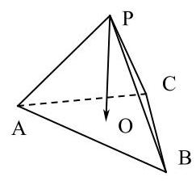

9. 在正三棱锥 $P - {ABC}$ 中, $O$ 是 $\bigtriangleup {ABC}$ 的中心, ${PA} = {AB} = 2\sqrt{3}$ ,则 $\overrightarrow{PO} \cdot  \left( {\overrightarrow{PA} + \overrightarrow{PB}}\right)  =$ ___.

【答案:16】

10. 若复数 ${z}_{1}$ 满足 $\left| {{z}_{1} + 2}\right|  - \left| {{z}_{1} - 2}\right|  = 2$ ,复数 ${z}_{2}$ 满足 $\left| {z}_{2}\right|  = \left| {{z}_{2} + 3 - \sqrt{3}i}\right|$ ,则 $\left| {{z}_{1} - {z}_{2}}\right|$ 的取值范围为 ___.

【答案: $\left( {\sqrt{3}, + \infty }\right)$ 】

【解析】由 $\left| {{z}_{1} + 2}\right|  - \left| {{z}_{1} - 2}\right|  = 2$ 的意义为 ${z}_{1}$ 到 $\left( {-2,0}\right)$ 的距离 $- {z}_{1}$ 到 $\left( {2,0}\right)$ 的距离 $= 2$ ,

满足双曲线定义,但只有一支,转化为方程为: ${x}^{2} - \frac{{y}^{2}}{3} = 1\left( {x \geq  1}\right)$ ;

由 $\left| {z}_{2}\right|  = \left| {{z}_{2} + 3 - \sqrt{3}i}\right|$ 的意义为 ${z}_{2}$ 到原点的距离 $= {z}_{2}$ 到 $\left( {-3,\sqrt{3}}\right)$ 的距离; 即为该两点的垂直平分线转化方程为: $y = \sqrt{3}x + 2\sqrt{3}$ ;

最后 $\left| {{z}_{1} - {z}_{2}}\right|$ 的意义为 ${z}_{1}$ 到 ${z}_{2}$ 的距离， $y = \sqrt{3}x + 2\sqrt{3}$ 与双曲线渐近线平行，所有无限靠近 $\sqrt{3}$ ， 距离可以无限远,所以 $\left| {{z}_{1} - {z}_{2}}\right|$ 的范围为 $\left( {\sqrt{3}, + \infty }\right)$

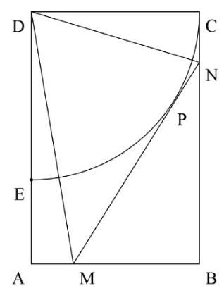

11. 某公园有一个矩形地块 ${ABCD}$ ,其中 ${AB}$ 为 2 米, ${AD}$ 长 3 米, $E$ 在线段 ${AD}$ 上,地块的一角是水塘,其水塘边缘曲线 ${EC}$ 是以 $D$ 为圆心,以 ${CD}$ 为半径的圆的一部分。现要经过曲线 ${EC}$ 上某一点 $P$ (异于 $E\text{ 、 }C$ 两点)铺设一条直线隔离带 ${MN}$ ,点 $M\text{ 、 }N$ 分别在边 ${AB}\text{ 、 }{BC}$ 上,隔离带占地面积忽略不计且恰好穿过水塘边界,经测量 ${BN} = {2.4}$ 米,求此时 $\angle {MDN} =$ ___. (精确到 ${0.01}^{ \circ  }$ )

【答案: ${65.38}^{ \circ  }$ 】

【解析】连接 $\mathrm{D}P$ ,由题意 $\mathrm{{MN}}$ 与圆弧相切,易得 ${NP} = {CN} = {0.6}$ ,所以

$$
\tan \angle {NDP} = \frac{NP}{DP} = \frac{0.6}{2} = {0.3}
$$

又有 $\angle {MNB} = 2\angle {NDP},\tan \angle {MNB} = \tan 2\angle {NDP} = \frac{2\tan \angle {NDP}}{1 - {\left( \tan \angle NDP\right) }^{2}} = \frac{60}{91} = \frac{MB}{NB}$ ;

${MB} = {2.4} \cdot  \frac{60}{91} = \frac{144}{91},{MN} = \sqrt{M{B}^{2} + N{B}^{2}} = \frac{1308}{455},{PM} = {MN} - {0.6} = \frac{207}{91}$

$\tan \angle {MDP} = \frac{MP}{DP} = \frac{207}{182}$

所以 $\angle {MDN} = \arctan {0.3} + \arctan \left( \frac{207}{182}\right)  = {65.3764}^{ \circ  } \approx  {65.38}^{ \circ  }$

12. 已知各项均为正整数的数列 $\left\{  {a}_{n}\right\}$ 中， ${a}_{1} = {2024}$ ， ${a}_{2} < {2024}$ ，且对任意正整数 $k$ ，两个 3 项数列 ${a}_{k}$ 、 ${a}_{k + 1}$ 、 ${a}_{k + 2}$ 与 ${a}_{k}$ 、 ${a}_{k + 1}$ 、 $- {a}_{k + 2}$ 中恰有一个为等差数列. 若 ${a}_{m + k} = {a}_{m}$ 对一切正整数 $k$ 成立，则 $m$ 的最小值为___.

【答案:4】

【解析】由已知, $m \geq  2$ ,

①若 $m = 2$ ，则 ${a}_{2} = {a}_{3} = \cdots$ ，

因为对任意正整数 $k$ ,两个 3 项数列 ${a}_{k}$ 、 ${a}_{k + 1}$ 、 ${a}_{k + 2}$ 与 ${a}_{k}$ 、 ${a}_{k + 1}$ 、 $- {a}_{k + 2}$ 中恰有一个为等差数列，

所以 ${a}_{1} = 2{a}_{2} - {a}_{3} = {a}_{2}$ 或 ${a}_{1} = 2{a}_{2} + {a}_{3} = 3{a}_{2}$ ,

若 ${a}_{1} = {a}_{2}$ ,则与 ${a}_{2} < {2024}$ 矛盾;

若 ${a}_{1} = 3{a}_{2}$ ,则 ${a}_{2} = \frac{2024}{3} \notin  \mathrm{Z}$ ,均不符合题意,故 $m \neq  2$ ;

②若 $m = 3$ ，则 ${a}_{3} = {a}_{4} = \cdots$ ，与①同理，可得 ${a}_{2} = 2{a}_{3} - {a}_{4} = {a}_{3}$ 或 ${a}_{2} = 2{a}_{3} + {a}_{4} = 3{a}_{3}$ ，

由①分析知 ${a}_{2} \neq  {a}_{3}$ ，故考虑 ${a}_{2} = 3{a}_{3}$ ，同理 ${a}_{1} = 2{a}_{2} - {a}_{3} = 5{a}_{3}$ 或 ${a}_{1} = 2{a}_{2} + {a}_{3} = 7{a}_{3}$ ，

由于 2024 不能被 5 整除且不能被 7 整除,故均不符合题意,即 $m \neq  3$ ;

③若 $m = 4$ ，则 ${a}_{4} = {a}_{5} = \cdots$ ，与①同理，可得 ${a}_{3} = 2{a}_{4} - {a}_{5} = {a}_{4}$ 或 ${a}_{3} = 2{a}_{4} + {a}_{5} = 3{a}_{4}$ ，

由②知， ${a}_{3} \neq  {a}_{4}$ ，故考虑 ${a}_{3} = 3{a}_{4}$ ，同理， ${a}_{2} = 2{a}_{3} - {a}_{4} = 5{a}_{4}$ 或 ${a}_{2} = 2{a}_{3} + {a}_{4} = 7{a}_{4}$ ，

若 ${a}_{2} = 5{a}_{4}$ ,则 ${a}_{1} = 2{a}_{2} - {a}_{3} = 7{a}_{4}$ 或 ${a}_{1} = 2{a}_{2} + {a}_{3} = {13}{a}_{4}$ ,因 2024 不能被 7 和 13 整除,故 ${a}_{2} = 5{a}_{4}$ 不成立;

若 ${a}_{2} = 7{a}_{4}$ ,同理, ${a}_{1} = 2{a}_{2} - {a}_{3} = {11}{a}_{4}$ 或 ${a}_{1} = 2{a}_{2} + {a}_{3} = {17}{a}_{4}$ ,

由 2024 能被 11 整除不能被 17 整除,故 ${a}_{2} = 7{a}_{4}$ 且 ${a}_{1} = {11}{a}_{4}$ 符合题意.

故 $m = 4$ ，此时数列 $\left\{  {a}_{n}\right\}$ 为 2024,1288,552,184,184, $\cdots$ .

故答案为: 4 .

## 二、选择题(本大题共有 4 题，满分 18 分，第 13、14 题每题 4 分，第 15、16 题每题 5 分)每题有且只有 一个正确选项. 考生应在答题纸的相应位置，将代表正确选项的小方格涂黑.

13. 以下散点图, 相关系数最小的是 ( )

A.

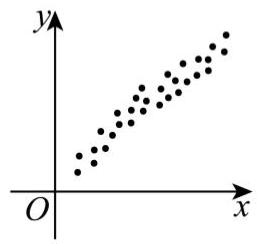

【答案: $C$ 】

B.

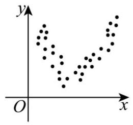

C.

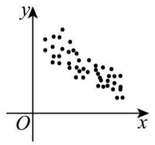

D.

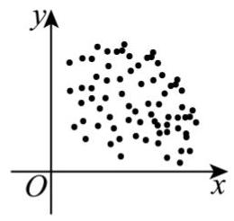

14. 向量 $\overrightarrow{a}$ 、 $\overrightarrow{b}$ 不平行，则“存在两个非零常数 $\lambda$ 、 $\mu$ ，使 $\overrightarrow{c} = \lambda \overrightarrow{a} + \mu \overrightarrow{b}$ ”是“ $\overrightarrow{a}$ 、 $\overrightarrow{b}$ 、 $\overrightarrow{c}$ 共面”的( )

A. 充分非必要条件 B. 必要非充分条件

C. 充要条件 D. 既非充分又非必要条件

【答案: $A$ 】

15. 已知集合 $M = \{ \left( {x, y}\right)  \mid  y = f\left( x\right) \}$ ,若对于任意 $\left( {x, y}\right)  \in  M$ ,总存在与之相应的 $\left( {{x}^{\prime },{y}^{\prime }}\right)  \in  M$ (其中 $\left. {x \neq  {x}^{\prime }}\right)$ ,使得 $\left| {x{x}^{\prime } + y{y}^{\prime }}\right|  = \sqrt{{x}^{2} + {y}^{2}} \cdot  \sqrt{{\left( {x}^{\prime }\right) }^{2} + {\left( {y}^{\prime }\right) }^{2}}$ 成立,则称集合 $M$ 是 “ $\Omega$ 集合”. 下列选项为 “ $\Omega$ 集合” 的是( )

A. $M = \left\{  {\left( {x, y}\right) \left| {\;y = \frac{1}{x}}\right. , x > 0}\right\}$ B. $M = \left\{  {\left( {x, y}\right)  \mid  y = {\mathrm{e}}^{x} - 2}\right\}$

C. $M = \{ \left( {x, y}\right)  \mid  y = \cos x + 1\}$ D. $M = \left\{  {\left( {x, y}\right)  \mid  y = {x}^{3}}\right\}$

【答案: $D$ 】

【解析】根据新定义,设 $A\left( {x, y}\right) , B\left( {{x}^{\prime },{y}^{\prime }}\right)$ ,化简 $\left| {x{x}^{\prime } + y{y}^{\prime }}\right|  = \sqrt{{x}^{2} + {y}^{2}} \cdot  \sqrt{{\left( {x}^{\prime }\right) }^{2} + {\left( {y}^{\prime }\right) }^{2}}$ , 得 ${x}^{2}{y}^{\prime 2} + {x}^{\prime 2}{y}^{2} = {2x}{x}^{\prime }y{y}^{\prime }$ 恒成立,

由基本不等式可知 ${x}^{2}{y}^{\prime 2} + {x}^{\prime 2}{y}^{2} \geq  {2x}{x}^{\prime }y{y}^{\prime }$ ,当且仅当 $x{y}^{\prime } = {x}^{\prime }y$ 时取 “=”,

即当 $x{y}^{\prime } - {x}^{\prime }y = 0$ 时, ${x}^{2}{y}^{\prime 2} + {x}^{\prime 2}{y}^{2} = {2x}{x}^{\prime }y{y}^{\prime }$ 恒成立,

故 $\overrightarrow{OA}//\overrightarrow{OB}$ ,即过原点的直线 ${AB}$ 与曲线 $f\left( x\right)$ 相交有两个不同的交点,

A 选项: 由图可知,过原点的直线 ${AB}$ 与曲线 $f\left( x\right)  = \frac{1}{x},\left( {x > 0}\right)$ 相交只有一个交点,故不是 “ $\Omega$ 集合”;

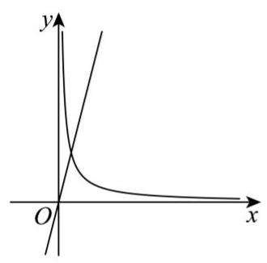

B 选项: 如图,当过原点的直线 ${AB}$ 斜率小于零时与 $f\left( x\right)  = {e}^{x} - 2$ 曲线相交只有一个交点,故不是 “ $\Omega$ 集合”;

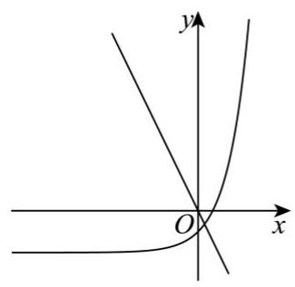

C 选项: 如图,当过原点的直线 ${AB}$ 斜率大于 1 时与 $f\left( x\right)  = \cos x$ 曲线相交只有一个交点,故不是 “ $\Omega$ 集合”;

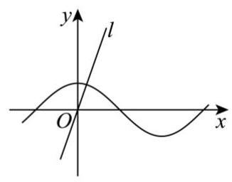

D 选项: 如图,当过原点的直线 ${AB}$ 与 $f\left( x\right)  = {x}^{3}$ 曲线相交都有两个不同的交点,故是 “ $\Omega$ 集合”;

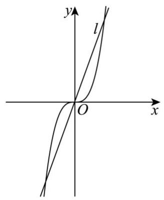

故选: D.

16. 设函数 $y = f\left( x\right)$ 的定义域为 $R$ ,给出下列命题:

(1)若对任意 $x \in  R$ ，均有 $\left| {f\left( x\right) }\right|  = 1$ ，则 $f\left( x\right)$ 一定不是奇函数；

(2)若对任意 $x \in  R$ ，均有 $\left| {f\left( {-x}\right)  = }\right| f\left( x\right) |$ ，则 $f\left( x\right)$ 为奇函数或偶函数；

(3)若对任意 $x \in  R$ ，均有 $f\left( {-x}\right)  = \left| {f\left( x\right) }\right|$ ，则 $f\left( x\right)$ 必为偶函数；

(4)若对任意 $x \in  R$ ，均有 $\left| {f\left( {-x}\right) }\right|  = \left| {f\left( x\right) }\right|$ ，且 $f\left( x\right)$ 为 $R$ 上严格增函数，则 $f\left( x\right)$ 必为奇函数. 其中为假命题的个数是( )

A. 0 B. 1 C. 2 D. 3

【答案: $B$ 】

【详解】对于①,对任意 $x \in  \mathrm{R}$ ,均有 $\left| {f\left( x\right) }\right|  = 1$ ,则 $\left| {f\left( 0\right) }\right|  = 1$ ,

但奇函数中 $f\left( 0\right)  = 0$ ,矛盾,所以 $f\left( x\right)$ 一定不是奇函数,① 正确;

对于 ②， $\left| {f\left( {-x}\right) }\right|  = \left| {f\left( x\right) }\right|$ 等价于 $\left\lbrack  {f\left( x\right)  - f\left( {-x}\right) }\right\rbrack  \left\lbrack  {f\left( x\right)  + f\left( {-x}\right) }\right\rbrack   = 0$ ，

若 $x \in  \left\lbrack  {-1,1}\right\rbrack$ 时满足 $f\left( x\right)  - f\left( {-x}\right)  = 0$ ,

$x \in  \left( {-\infty , - 1}\right)  \cup  \left( {1, + \infty }\right)$ 时满足 $f\left( x\right)  + f\left( {-x}\right)  = 0$ ,

则函数在 $x \in  \mathrm{R}$ 上为非奇非偶函数,② 错误;

对于③，对任意 $x \in  \mathrm{R}$ ，

均有 $f\left( {-x}\right)  = \left| {f\left( x\right) }\right|$ ，则 $f\left( x\right)  = \left| {f\left( {-x}\right) }\right|  = \left| {f\left( x\right) }\right|$ ，

所以 $f\left( {-x}\right)  = \left| {f\left( x\right) }\right|  = f\left( x\right)$ ,所以函数必为偶函数,③ 正确；

对于④,当 $x > 0$ 时,

$\left| {f\left( {-x}\right) }\right|  = \left| {f\left( x\right) }\right|$ 等价于 $\left\lbrack  {f\left( x\right)  - f\left( {-x}\right) }\right\rbrack  \left\lbrack  {f\left( x\right)  + f\left( {-x}\right) }\right\rbrack   = 0$ ,

又因为 $f\left( x\right)$ 为 $\mathbf{R}$ 上严格增函数,所以 $f\left( x\right)  > f\left( {-x}\right)$ ,则 $f\left( x\right)  - f\left( {-x}\right)  \neq  0$ ,

所以 $f\left( x\right)  + f\left( {-x}\right)  = 0$ ,所以 $f\left( x\right)$ 必为奇函数,④正确,

故答案为: $B$ .

## 三、解答题(本大题共有 5 题，满分 78 分)解答下列各题必须在答题纸的相应位置写出必要的步骤.

## 17. (本题满分 14 分，第 1 小题满分 6 分，第 2 小题满分 8 分).

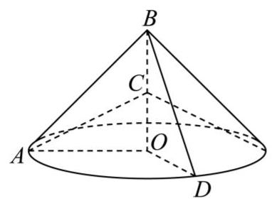

如图,等腰 $\operatorname{Rt}\bigtriangleup {AOB},{OA} = {OB} = 2$ ,点 $C$ 是 ${OB}$ 的中点, $\bigtriangleup {AOB}$ 绕 ${BO}$ 所在的边逆时针旋转至 $\bigtriangleup {BOD},\angle {AOD} = \frac{2\pi }{3}$ .

(1)求 $\bigtriangleup  {AOB}$ 逆时针旋转至 $\bigtriangleup  {BOD}$ 所得旋转体的体积 $V$ 和表面积 $S$ ；

(2)求直线 ${AC}$ 与平面 ${BOD}$ 所成角的大小.

【答案】 $\left( 1\right) V = \frac{8}{9}\pi ;S = \frac{4\sqrt{2} + 4}{3}\pi  + 4;\left( 2\right) \arcsin \frac{\sqrt{15}}{5}$

【分析】(1) 由题意旋转体的体积为圆锥体积的 $\frac{1}{3}$ ,利用公式计算即可;

表面由两个直角三角形，一个 $\frac{1}{3}$ 底面圆和 $\frac{1}{3}$ 侧面组成，分别计算相加即可;

(2)建立空间直角坐标系，利用法向量解决线面角即可.

【详解】(1)由题意旋转体的体积为圆锥体积的 $\frac{1}{3}$ ,

所以 $V = \frac{1}{3} \times  \frac{1}{3} \times  \pi  \times  {2}^{2} \times  2 = \frac{8}{9}\pi$ ;

表面由两个直角三角形,一个 $\frac{1}{3}$ 底面圆和 $\frac{1}{3}$ 侧面组成,

$S = \frac{1}{3} \times  \pi  \times  2 \times  2\sqrt{2} + \frac{1}{3} \times  \pi  \times  {2}^{2} + 2 \times  \frac{1}{2} \times  2 \times  2$

$= \frac{4\sqrt{2} + 4}{3}\pi  + 4$

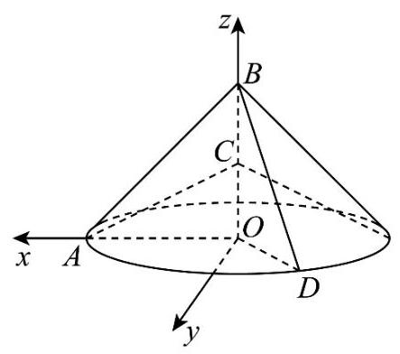

(2)建立如图所示的空间直角坐标系则:

$A\left( {2,0,0}\right) ,\;C\left( {0,0,1}\right) ,\;B\left( {0,0,2}\right) ,\;D\left( {-1,\sqrt{3},0}\right) ,$

则 $\overrightarrow{AC} = \left( {-2,0,1}\right) ,\overrightarrow{OB} = \left( {0,0,2}\right) ,\overrightarrow{OD} = \left( {-1,\sqrt{3},0}\right)$ ,

设平面 ${BOD}$ 的法向量为 $\overrightarrow{n} = \left( {x, y, z}\right)$ ,

则, $\left\{  {\begin{array}{l} \overrightarrow{n} \cdot  \overrightarrow{OB} = 0 \\  \overrightarrow{n} \cdot  \overrightarrow{OD} = 0 \end{array} \Rightarrow  \left\{  \begin{array}{l} {2z} = 0 \\   - x + \sqrt{3}y = 0 \end{array}\right. }\right.$

令 $y = 1$ ,得 $\overrightarrow{n} = \left( {\sqrt{3},1,0}\right)$ ,

设直线 ${AC}$ 与平面 ${BOD}$ 所成角为 $\theta$ ,

则 $\sin \theta  = \frac{\left| \overrightarrow{AC} \cdot  \overrightarrow{n}\right| }{\left| \overrightarrow{AC}\right| \left| \overrightarrow{n}\right| } = \frac{2\sqrt{3}}{\sqrt{5} \cdot  2} = \frac{\sqrt{15}}{5}$ ,

所以直线 ${AC}$ 与平面 ${BOD}$ 所成角的大小为 $\arcsin \frac{\sqrt{15}}{5}$ .

## 18. (本题满分 14 分，第 1 小题满分 6 分，第 2 小题满分 8 分).

冰壶是一项充满魅力的冰上运动，运动员需要进行体力和智力的双重博弈. 2025 年冰壶世锦赛上，由王芮带队的中国女队时隔 14 年再夺世锦赛铜牌.本次世锦赛分为循环赛和附加赛，循环赛上每支队伍需要与其余 12 支队伍各交手一次, 按胜场数排名取前 6 名进入附加赛.

(1)以下是中国女队在世锦赛循环赛上投掷的 ${DSC}$ 数据(单位:cm)，请求出本次 ${DSC}$ 数据的平均值以

及估计百分之 40 位数. (结果精确至 ${0.1}\mathrm{\;{cm}}$ )

(2)循环赛过半，由于 ${DSC}$ 数据不够理想，中国女队只能依靠胜负情况突出重围.中国女队号称 “强队炸

<table><tr><td>40.8</td><td>42.1</td><td>33.3</td><td>39.4</td><td>16.6</td><td>57.5</td></tr><tr><td>17.9</td><td>21.0</td><td>9.3</td><td>8.4</td><td>8.8</td><td>12.0</td></tr></table>

弹，弱队福音 “ 即与每支队伍比赛获胜概率均等，为了估计中国女队循环赛出线形式，给出以下假设:

假设 1: 已知比过的 6 场比赛中, 中国女队 3 胜 3 负;

假设 2: 在循环赛上,中国女队与剩余每支队伍比赛获胜概率均为 $\frac{2}{3}$ ,每场比赛之间胜负情况互不影响;

假设 3: 规定胜出 7 场以及 7 场以上为“确定突围”、胜出 5-6 场为“还有机会”、其余情况为“基本无望”；

假设 4: 令出线形式为随机变量 $X$ ,"确定突围"记为 1、"还有机会"记为 0、"基本无望"记为 -1 .

请计算随机变量 $X$ 的分布列以及数学期望.

【答案 (1) 平均值 $\bar{x} \approx  {25.6}{}^{ \circ  }\mathrm{m}$ ; 估计百分之 40 位数 $= {16.6}{}^{ \circ  }\mathrm{m}$ ;

(2) $X \sim  \left( \begin{matrix}  - 1 & 0 & 1 \\  \frac{13}{729} & \frac{220}{729} & \frac{496}{729} \end{matrix}\right) ;E\left\lbrack  X\right\rbrack   = \frac{161}{243}$ ;

【解析】

(1) $\bar{x} = \frac{{40.8} + {42.1} + {33.3} + {39.4} + {16.6} + {57.5} + {17.9} + {21.0} + {9.3} + {8.4} + {8.8} + {12.0}}{12} \approx  {25.6}\mathrm{\;{cm}}$

(不写单位扣 1 分)

数据个数为 12 个,估计百分 40 位数即 ${12} \cdot  {40}\%  = {4.8}$ ;

故取从小到大排的第 5 位,即 ${16.6}\mathrm{\;{cm}}$ (不写单位扣 1 分)

(2)由题意， $X$ 可能取值为-1,0,1

$P\left( {X =  - 1}\right)  = {C}_{6}^{0}{\left( \frac{1}{3}\right) }^{6} + {C}_{6}^{1}{\left( \frac{2}{3}\right) }^{1}{\left( \frac{1}{3}\right) }^{5} = \frac{13}{729};$

$P\left( {X = 0}\right)  = {C}_{8}^{2}{\left( \frac{2}{3}\right) }^{2}{\left( \frac{1}{3}\right) }^{4} + {C}_{6}^{6}{\left( \frac{2}{3}\right) }^{3}{\left( \frac{1}{3}\right) }^{3} = \frac{220}{729};$

$P\left( {X = 1}\right)  = {C}_{6}^{4}{\left( \frac{2}{3}\right) }^{4}{\left( \frac{1}{3}\right) }^{2} + {C}_{6}^{5}{\left( \frac{2}{3}\right) }^{5}{\left( \frac{1}{3}\right) }^{1} + {C}_{6}^{6}{\left( \frac{2}{3}\right) }^{6} = \frac{496}{729};$

所以 $X$ 的分布列为: $X \sim  \left( \begin{matrix}  - 1 & 0 & 1 \\  \frac{13}{729} & \frac{220}{729} & \frac{496}{729} \end{matrix}\right)$

$E\left\lbrack  X\right\rbrack   =  - 1 \cdot  \frac{13}{729} + 0 \cdot  \frac{13}{729} + 1 \cdot  \frac{496}{729} = \frac{161}{243}$

## 19. (本题满分 14 分, 第 1 小题满分 6 分, 第 2 小题满分 8 分).

已知 $f\left( x\right)  = \frac{1}{{\log }_{2}\left( {x - a}\right) }$ .

(1)若函数 $y = f\left( x\right)$ 经过点 $\left( {1,\frac{1}{2}}\right)$ ，求 $a$ 的值，并求 $f\left( x\right)$ 的定义域；

(2)已知 $g\left( x\right)  = {\log }_{2}\left( {\frac{1}{x} - 2}\right)$ ,若方程 $g\left( x\right)  = \frac{1}{f\left( x\right) }$ 有解，求 $a$ 的取值范围.

【答案】(1) $a =  - 3,\left\{  {x \mid  x >  - 3}\right.$ 且 $x \neq   - 2\}$

(2) $a \in  \left( {-\infty , - \frac{2}{3}}\right)  \cup  \left( {-\frac{2}{3},\frac{1}{2}}\right)$ 。

【解析】 $\left( 1\right) f\left( 1\right)  = \frac{1}{{\log }_{2}\left( {1 - a}\right) } = \frac{1}{2}$ ,

$\therefore 1 - a = 4$ ,解得 $a =  - 3$ ,则 $f\left( x\right)  = \frac{1}{{\log }_{2}\left( {x + 3}\right) }$ ,

$\therefore \left\{  \begin{array}{l} x + 3 > 0 \\  {\log }_{2}\left( {x + 3}\right)  \neq  0 \end{array}\right.$ ,解得 $x >  - 3$ 且 $x \neq   - 2$ ,

故 $f\left( x\right)$ 的定义域为 $\{ x \mid  x >  - 3$ 且 $x \neq   - 2\}$ ;

(2) $g\left( x\right)  = \frac{1}{f\left( x\right) }$ ，即 ${\log }_{2}\left( {\frac{1}{x} - 2}\right)  = {\log }_{2}\left( {x - a}\right)$ ，

又 $y = {\log }_{2}x$ 为定义在 $\left( {0, + \infty }\right)$ 上的递增函数,

$\therefore \left\{  \begin{array}{l} \frac{1}{x} - 2 > 0 \\  x - a > 0 \\  \frac{1}{x} - 2 = x - a \\  x - a \neq  1 \end{array}\right.$ ,即 $a = x - \frac{1}{x} + 2, x \Rightarrow  \left\{  \begin{array}{l} 0 < x < \frac{1}{2} \\  x > a \\  x \neq  a + 1 \end{array}\right.$ (定义域不写且不扣点合计扣 4 分)

所以方程 $g\left( x\right)  = \frac{1}{f\left( x\right) }$ 有解 $\Leftrightarrow  a = x - \frac{1}{x} + 2, x \Rightarrow  \left\{  \begin{array}{l} 0 < x < \frac{1}{2} \\  x > a \\  x \neq  a + 1 \end{array}\right.$ 有解,

又 $y = x, y =  - \frac{1}{x}$ 在 $\left( {0, + \infty }\right)$ 上为增函数,

所以 $y = x - \frac{1}{x} + 2$ 在 $\left( {0, + \infty }\right)$ 上单调递增,

$\therefore$ 当 $a \geq  \frac{1}{2},\left\{  \begin{array}{l} \frac{1}{x} - 2 > 0 \\  x - a > 0 \end{array}\right.$ 无解,不符合题意,

当 $0 < a < \frac{1}{2}$ 时, $\left\{  \begin{array}{l} \frac{1}{x} - 2 > 0 \\  x - a > 0 \end{array}\right.$ 的解为 $a < x < \frac{1}{2}$ ,

所以 $y = x - \frac{1}{x} + 2$ 在 $\left( {a,\frac{1}{2}}\right)$ 的值域为 $\left( {a - \frac{1}{a} + 2,\frac{1}{2}}\right)$ ,

$\because 0 < a < \frac{1}{2}$ 时, $a - \frac{1}{a} + 2 < a$ ,且 $\frac{1}{2} > a,?.a \in  \left( {a - \frac{1}{a} + 2,\frac{1}{2}}\right)$ ,

即 $0 < a < \frac{1}{2}$ 符合题意,

当 $a \leq  0$ 时, $\left\{  \begin{array}{l} \frac{1}{x} - 2 > 0 \\  x - a > 0 \end{array}\right.$ 的解为 $0 < x < \frac{1}{2}$ ,

所以 $y = x - \frac{1}{x} + 2$ 在 $\left( {0,\frac{1}{2}}\right)$ 的值域为 $\left( {-\infty ,\frac{1}{2}}\right)$ ,则 $a \leq  0$ 符合题意,

综上, $a < \frac{1}{2}$ ,(前置写出定义域才给 12 分,否则这个答案只给 10 分)

又 $x \neq  a + 1$ ,将 $x = a + 1$ 作为方程的根代入得此时 $a =  - \frac{2}{3}$ ,故舍掉;

综上: $a \in  \left( {-\infty , - \frac{2}{3}}\right)  \cup  \left( {-\frac{2}{3},\frac{1}{2}}\right)$

## 20. (本题满分 18 分, 第 1 小题满分 4 分, 第 2 小题满分 6 分, 第 3 小题满分 8 分).

已知椭圆 $\Gamma  : {x}^{2} + \frac{{y}^{2}}{{b}^{2}} = 1\left( {0 < b < 1}\right)$ 的左、右焦点为 ${F}_{1}\text{ 、 }{F}_{2}$

(1)若椭圆 $\Gamma$ 经过点 $\left( {\frac{1}{2},\frac{1}{2}}\right)$ ，求此椭圆 $\Gamma$ 的焦距和离心率；

(2)若以 $O$ 为顶点， ${F}_{2}$ 为焦点作抛物线交椭圆 $\Gamma$ 于 $P$ ，且 $\angle {P{F}_{1}{F}_{2}} = {45}^{ \circ  }$ ，求抛物线的准线方程；

(3)若 ${F}_{1}\left( {-\frac{1}{2},0}\right)$ ，经过 ${F}_{1}$ 的直线 ${l}_{1}$ 与椭圆相交于 $A$ 、 $B$ 两点(B在 $A$ 上方)，作 $A$ 关于 $y$ 轴的对称点 ${A}^{\prime }$ ， 连接 ${A}^{\prime }B$ 得直线 ${l}_{2}$ ; 直线 ${l}_{2}$ 交直线 $x = 2$ 于 $H\left( {2, y}\right)$ 点，若 $\left| y\right|  \geq  3$ ，求 ${l}_{1}$ 的斜率取值范围.

【答案】 $\left( 1\right) \left| {{F}_{1}{F}_{2}}\right|  = {2c} = \frac{2\sqrt{6}}{3};e = \frac{\sqrt{6}}{3} +$

(2) $x = 1 - \sqrt{2};\left( 3\right) k \in  \left( {-\infty ,0}\right)  \cup  \left( {0,\frac{3}{4}}\right\rbrack$

【解析】(1) 将点 $\left( {\frac{1}{2},\frac{1}{2}}\right)$ 代入椭圆方程 ${x}^{2} + \frac{{y}^{2}}{{b}^{2}} = 1 \Rightarrow  {b}^{2} = \frac{1}{3}$ ;

又 ${c}^{2} = {a}^{2} - {b}^{2} = 1 - \frac{1}{3} = \frac{2}{3} \Rightarrow  c = \frac{\sqrt{6}}{3} +$

故焦距 ${2c} = \frac{2\sqrt{6}}{3}$ ,离心率 $e = \frac{c}{a} = \frac{\sqrt{6}}{3}$

(2) ${F}_{1}\left( {-c,0}\right)$ 、 ${F}_{2}\left( {c,0}\right)$ ，则抛物线 ${y}^{2} = {4cx}$ ，

直 $P{F}_{1} : y = x + c$ ,联立方程组 $\left\{  \begin{array}{l} {y}^{2} = {4cx} \\  y = x + c \end{array}\right.$ ,解得 $x = c, y = {2c}$ ,

所以点 $P$ 的坐标为 $\left( {c,{2c}}\right)$ ,所以 $P{F}_{2} \bot  {F}_{1}{F}_{2}$ ,又 $P{F}_{2} = {F}_{2}{F}_{1} = {2c}$ ,所以 $P{F}_{1} = 2\sqrt{2}c$

所以 $P{F}_{1} = 2\sqrt{2}c$ ,所以 $P{F}_{1} + P{F}_{2} = \left( {2 + 2\sqrt{2}}\right) c = {2a} = 2$ ,

则 $c = \sqrt{2} - 1$ ,

所以抛物线的准线方程为: $x =  - c = 1 - \sqrt{2}$ ,。

(3) ${F}_{1}\left( {-\frac{1}{2},0}\right)  \Rightarrow  c = \frac{1}{2},{b}^{2} = \frac{3}{4}$ ，即椭圆方程为 ${x}^{2} + \frac{4{y}^{2}}{3} = 1$ ；

设点 $A\left( {{x}_{1},{y}_{1}}\right) , B\left( {{x}_{2},{y}_{2}}\right) ,{A}^{\prime }\left( {-{x}_{1},{y}_{1}}\right)$

故 ${A}^{\prime }B$ 的斜率为 ${k}_{{A}^{\prime }B} = \frac{{y}_{2} - {y}_{1}}{{x}_{2} + {x}_{1}},{A}^{\prime }B$ 的方程为 $y = \frac{{y}_{2} - {y}_{1}}{{x}_{2} + {x}_{1}}\left( {x + {x}_{1}}\right)  + {y}_{1}$ ;

令 $x = 2, y = \frac{{y}_{2} - {y}_{1}}{{x}_{2} + {x}_{1}}\left( {2 + {x}_{1}}\right)  + {y}_{1} = \frac{2\left( {{y}_{2} - {y}_{1}}\right)  + {x}_{1}{y}_{2} - {x}_{1}{y}_{1} + {x}_{2}{y}_{1} + {x}_{1}{y}_{1}}{{x}_{2} + {x}_{1}} = \frac{2\left( {{y}_{2} - {y}_{1}}\right)  + {x}_{1}{y}_{2} + {x}_{2}{y}_{1}}{{x}_{2} + {x}_{1}}$ ;

设 $\mathrm{{AB}}$ 的方程为 $x = {my} - \frac{1}{2};y = \frac{2\left( {{y}_{2} - {y}_{1}}\right)  + {2m}{y}_{1}{y}_{2} - \frac{1}{2}\left( {{y}_{2} + {y}_{1}}\right) }{m\left( {{y}_{2} + {y}_{1}}\right)  - 1}$ ;

联立椭圆与直线 ${AB} : \left\{  {\begin{array}{l} {x}^{2} + \frac{4{y}^{2}}{3} = 1 \\  x = {my} - \frac{1}{2} \end{array} \Rightarrow  \left( {3{m}^{2} + 4}\right) {y}^{2} - {3my} - \frac{9}{4} = 0}\right.$ ;

$\Rightarrow  \left\{  \begin{array}{l} {y}_{1} + {y}_{2} = \frac{3m}{3{m}^{2} + 4} \\  {y}_{1}{y}_{2} = \frac{-\frac{9}{4}}{3{m}^{2} + 4} \end{array}\right.$ , ${y}_{2} > {y}_{1}$

所以 ${y}_{2} - {y}_{1} = \sqrt{{\left( {y}_{1} + {y}_{2}\right) }^{2} - 4{y}_{1}{y}_{2}} = \sqrt{\frac{9{m}^{2} + 9\left( {3{m}^{2} + 4}\right) }{{\left( 3{m}^{2} + 4\right) }^{2}}} = \sqrt{\frac{{36}{m}^{2} + {36}}{{\left( 3{m}^{2} + 4\right) }^{2}}}$ ;

$y = \frac{2\left( {{y}_{2} - {y}_{1}}\right)  + {2m}{y}_{1}{y}_{2} - \frac{1}{2}\left( {{y}_{2} + {y}_{1}}\right) }{m\left( {{y}_{2} + {y}_{1}}\right)  - 1} = \frac{{12}\sqrt{{m}^{2} + 1} - \frac{9}{2}m - \frac{3}{2}m}{3{m}^{2} - 3{m}^{2} - 4} = \frac{{12}\sqrt{{m}^{2} + 1} - {6m}}{-4} =  - 3\sqrt{{m}^{2} + 1} + \frac{3}{2}m < 0$

$\left| y\right|  \geq  3 \Rightarrow   - 3\sqrt{{m}^{2} + 1} + \frac{3}{2}m \leq   - 3$

$\sqrt{{m}^{2} + 1} - \frac{1}{2}m \geq  1 \Rightarrow  m \in  ( - \infty ,0\rbrack  \cup  \left\lbrack  {\frac{4}{3}, + \infty }\right)  \Rightarrow  k \in  \left( {-\infty ,0}\right)  \cup  \left( {0,\frac{3}{4}}\right\rbrack$

当 $k = 0$ ,显然不成立.

综上 $k \in  \left( {-\infty ,0}\right)  \cup  \left( {0,\frac{3}{4}}\right\rbrack$

21. (本题满分 18 分, 第 1 小题满分 4 分, 第 2 小题满分 6 分, 第 3 小题满分 8 分).

已知函数 $f\left( x\right)$ 的定义域为 $D$ ,记集合 ${A}_{f\left( x\right) } = \left\{  {x \mid  f\left( x\right)  \geq  {kx} + m, x \in  D}\right\}  \left( {k, m \in  R}\right)$ .

(1)若 $k = 1, m =  - 1, f\left( x\right)  = {x}^{2} + {ax}$ ，且 ${A}_{f\left( x\right) } = R$ ，求实数 $a$ 的取值范围；

(2)若 $f\left( x\right)  = {e}^{z} - 1\text{ 、 }g\left( x\right)  = \ln \left( {x + 1}\right)$ ，是否存在同一组 $k\text{ 、 }m$ 使得 ${A}_{f\left( x\right) } = R$ 且 ${A}_{g\left( x\right) }$ 为单元素集?

(3)若 $f\left( x\right)$ 的定义域为 $R$ ，函数 $f\left( x\right)$ 的图象是一条连续不间断的曲线， $f\left( x\right)$ 的导函数 ${f}^{\prime }\left( x\right)$ 是 $R$ 上的严格减函数,证明: " ${A}_{f\left( x\right) } = \{ t\}$ "是 " $y = f\left( x\right)$ 在点 $P\left( {t, f\left( t\right) }\right)$ 处的切线方程为 $y = {kx} + m$ "的充要条件.

【答案】( 1 ) $1 \leq  a \leq  3$ ，

(2)存在 $k = 1, m = 0$

(3)证明见解析

【解析】(1) 根据给定条件,利用一元二次不等式的解集为 $R$ 求出范围;

(3)记 $g\left( x\right)  = f\left( x\right)  - \left( {{kx} + m}\right)$ ，由切线方程得 $\left\{  \begin{array}{l} f\left( t\right)  = {kt} + m \\  {f}^{\prime }\left( t\right)  = k \end{array}\right.$ ，再由单调性求出 $A$ 证得必要性；由 $A = \{ t\}$ ,得当 $x \neq  t$ 时 $g\left( x\right)  < 0, g\left( t\right)  = f\left( t\right)  - \left( {{kt} + m}\right)  \geq  0$ ,结合函数极大值的意义求出切线斜率及切线方程证得充分性即可.

(1)当 $k = 1, m =  - 1, f\left( x\right)  = {x}^{2} + {ax}$ 时，不等式 $f\left( x\right)  \geq  {kx} + m \Leftrightarrow  {x}^{2} + {ax} \geq  x - 1 \Leftrightarrow  {x}^{2} + \left( {a - 1}\right) x + 1 \geq  0$ ， 依题意, $A = \left\{  {x\left| {\;{x}^{2} + \left( {a - 1}\right) x + 1 \geq  0}\right. }\right\}   = R$ ,

则 $\Delta  = {\left( a - 1\right) }^{2} - 4 \leq  0$ ,解得 $- 1 \leq  a \leq  3$ ,

所以实数 $a$ 的取值范围是 $- 1 \leq  a \leq  3$ ;

(2) $f\left( 0\right)  = g\left( 0\right)  = 0$ ，若 ${A}_{f\left( x\right) } = R$ 且 ${A}_{g\left( x\right) }$ 为单元素集

则 $f\left( 0\right)  \geq  m \Rightarrow  g\left( 0\right)  \geq  m \Rightarrow  {A}_{g\left( a\right) } = \{ 0\}$ ，

构造 $G\left( x\right)  = g\left( x\right)  - {kx} - m;F\left( x\right)  = f\left( x\right)  - {kx} - {m}_{\mathrm{i}}$

${A}_{g\left( x\right) } = \{ 0\}  \Rightarrow  G\left( x\right)$ 的最大值为 $G\left( 0\right)  \geq  0$ ,故 $G\left( x\right)$ 在定义域内存在极值点

${G}^{\prime }\left( x\right)  = \frac{1}{x + 1} - k = 0 \Rightarrow  x = \frac{1}{k} - 1\left( {k > 0}\right)$

当 $x \in  \left( {-1,\frac{1}{k} - 1}\right)$ 时, ${G}^{\prime }\left( x\right)  > 0, G\left( x\right)$ 严格增; 当 $x \in  \left( {\frac{1}{k} - 1, + \infty }\right)$ 时, ${G}^{\prime }\left( x\right)  < 0, G\left( x\right)$ 严格减;

$G\left( x\right)$ 的最大值 $G\left( {\frac{1}{k} - 1}\right)$ 且唯一; 所以 $\frac{1}{k} - 1 = 0 \Rightarrow  k = 1$ ,

若 $G\left( 0\right)  > 0$ ,又 $x \rightarrow   - 1, G\left( x\right)  \rightarrow   - \infty$ ,存在 ${x}_{0} \in  \left( {-1,0}\right)$ ,使得 $G\left( {x}_{0}\right)  = 0$ ,与 ${A}_{g\left( x\right) }$ 为单元素集矛盾;

故 $G\left( 0\right)  = 0 \Rightarrow  m = 0$ ;

下验证 $k = 1, m = 0$ 时, $F\left( x\right)  \geq  0$ 的解集为 $R$

$$
{F}^{\prime }\left( x\right)  = {e}^{\varpi } - 1 = 0 \Rightarrow  x = 0;
$$

当 $x \in  \left( {-\infty ,0}\right)$ 时, ${F}^{\prime }\left( x\right)  < 0, F\left( x\right)$ 严格减; 当 $x \in  \left( {0, + \infty }\right)$ 时, ${F}^{\prime }\left( x\right)  > 0, F\left( x\right)$ 严格增;

$F\left( x\right)$ 的最小值为 $F\left( 0\right)  = 0 \Rightarrow  F\left( x\right)  \geq  0$ 的解集为 $R$ 。

所以存在 $k = 1, m = 0$ ,使得 ${A}_{f\left( x\right) } = R$ 且 ${A}_{g\left( x\right) }$ 为单元素集;

(3)记 $g\left( x\right)  = f\left( x\right)  - \left( {{kx} + m}\right)$ ，求导得 ${g}^{\prime }\left( x\right)  = {f}^{\prime }\left( x\right)  - k$ ，

由 ${f}^{\prime }\left( x\right)$ 是 $R$ 上的严格减函数,得函数 ${g}^{\prime }\left( x\right)$ 在 $R$ 上严格递减,

证必要性: 由 $y = f\left( x\right)$ 在点 $P\left( {t, f\left( t\right) }\right)$ 处的切线方程为 $y = {kx} + m$ ,得 $\left\{  \begin{array}{l} f\left( t\right)  = {kt} + m \\  {f}^{\prime }\left( t\right)  = k \end{array}\right.$ , 即 $\left\{  \begin{array}{l} g\left( t\right)  = 0 \\  {g}^{\prime }\left( t\right)  = {0}^{\prime } \end{array}\right.$

当 $x < t$ 时, ${g}^{\prime }\left( x\right)  > 0$ ,函数 $g\left( x\right)$ 严格递增, $g\left( x\right)  < g\left( t\right)  = 0$ ;

当 $x > t$ 时, ${g}^{\prime }\left( x\right)  < 0$ ,函数 $g\left( x\right)$ 严格递减, $g\left( x\right)  < g\left( t\right)  = 0$ ;

因此 $g\left( x\right)  = f\left( x\right)  - \left( {{kx} + m}\right)  \geq  0$ 的解集为 $\{ t\}$ ,即 ${A}_{f\left( x\right) } = \{ t\}$ ;

证充分性: 若 ${A}_{f\left( x\right) } = \{ t\}$ ,则当 $x \neq  t$ 时, $g\left( x\right)  < 0, g\left( t\right)  = f\left( t\right)  - \left( {{kt} + m}\right)  \geq  0$ ,

由函数 $f\left( x\right)$ 的图象是一条连续不间断的曲线，得 $g\left( t\right)  = f\left( t\right)  - \left( {{kt} + m}\right)  = 0$ ，

且在 $x = t$ 的附近其他自变量 (除 $t$ 外) 对应的函数值都小于 $g\left( t\right)$ ,

即函数 $g\left( x\right)$ 在 $x = t$ 处取得极大值,于是 ${g}^{\prime }\left( t\right)  = {f}^{\prime }\left( t\right)  - k = 0$ ,

因此曲线 $f\left( x\right)$ 在点 $P\left( {t, f\left( t\right) }\right)$ 处的切线方程为 $y = {f}^{\prime }\left( t\right) \left( {x - t}\right)  + f\left( t\right)$ ,即 $y = {kx} + m$ ,

所以直线 $y = {kx} + m$ 是曲线 $f\left( x\right)$ 在点 $P\left( {t, f\left( t\right) }\right)$ 处的切线,

综上," ${A}_{f\left( x\right) } = \{ t\}$ " 是 " $y = f\left( x\right)$ 在点 $P\left( {t, f\left( t\right) }\right)$ 处的切线方程为 $y = {kx} + m$ " 的充要条件.
