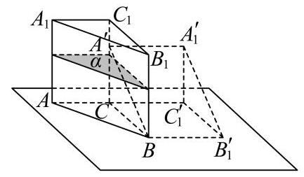
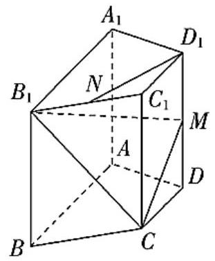

## 2026上海高考数学新东方预测卷(三)

(本试卷满分150分，考试时间120min)

己一、填空题(本大题共有12题，其中1-6题每题满分4分，7-12题每题满分5分，共计54分)

已知集合 $A = \{ x \in  \mathbf{Z}\left| {0 \leq  x < 3\} }\right. , B = \{ x \in  \mathbf{Z}\left| \right| x \mid   < 3\}$ ，则 $A \cup  B =$ ___.

2

不等式 $\frac{x - 2}{{2x} - 1} \leq   - 1$ 的解集为___.

3

函数 $f\left( x\right)  = 2{\sin }^{2}x + \sin x \cdot  \cos x + 1$ 的最小正周期为

4

复数 $Z = \left( {{a}^{2} + {3a} - {10}}\right)  + \left( {{a}^{2} - 4}\right) i$ 为纯虚数，则实数 $a$ 的值为___.

5

已知随机变量X服从正态分布 $N\left( {2,{\sigma }^{2}}\right)$ ，且 $P\left( {2 < X \leq  {2.5}}\right)  = {0.36}$ ，则 $P\left( {X > {2.5}}\right)  =$

6

已知 $\bigtriangleup  {ABC}$ 为等腰三角形，且 $\sin A = 2\sin B$ ，则 $\cos B =$

7

已知 ${\left( 1 - 2x\right) }^{n}$ 的展开式中，唯有 ${x}^{3}$ 的二项式系数最大，则 ${\left( 1 - 2x\right) }^{n}$ 的系数和为___.

8

记 ${S}_{n}$ 为等比数列 $\left\{  {a}_{n}\right\}$ 的前 $n$ 项和，若 ${S}_{4} = {10},{S}_{8} = {50}$ ，则 ${S}_{16} =$

9

我国河流旅游资源非常丰富，夏季到景点漂流是很多家庭的最佳避暑选择，某家庭共6个人，包括4个大人，2个小孩，计划去贵州漂流.景点现有3只不同的船只可供他们选择使用，每船最多可乘3人，为了安全起见，小孩必须要大人陪同，则不同的乘船方式共有___种___

若空间向量 $\overrightarrow{a}\text{ 、 }\overrightarrow{b}\text{ 、 }\overrightarrow{c}\text{ 、 }\overrightarrow{d}$ 均为单位向量，满足 $\overrightarrow{a} + 2\overrightarrow{b} + 3\overrightarrow{c} = \left( {2\text{ ， }\sqrt{7}\text{ ， }5}\right)$ ，则 $\left( {3\overrightarrow{a} + 2\overrightarrow{b} + \overrightarrow{c}}\right)  \cdot  \overrightarrow{d}$ 的取值范围为 ___.

11

设向量 $\overrightarrow{a} = \left( {{x}_{1},{y}_{1}}\right) ,\overrightarrow{b} = \left( {{x}_{2},{y}_{2}}\right)$ ，记 $\overrightarrow{a} \star  \overrightarrow{b} = {x}_{1}{x}_{2} - {y}_{1}{y}_{2}.$ 若点 ${A}_{1}\text{ 、 }{A}_{2}\text{ 、 }{A}_{3}$ 为圆 $C : {x}^{2} + {y}^{2} + {4x} - {2y} = 0$ 上任意三点，且满足 ${A}_{1}{A}_{2} \bot  {A}_{2}{A}_{3}$ ，则 $\left| {\overrightarrow{O{A}_{1}} \star  \overrightarrow{O{A}_{2}} + \overrightarrow{O{A}_{2}} \star  \overrightarrow{O{A}_{3}}}\right|$ 的取值范围是___.

12

在一个封闭的直三棱柱容器 ${ABC} - {A}_{1}{B}_{1}{C}_{1}$ 内装有高度为 3 的水，如图所示，底面处于水平状态. 记水面为 $\alpha ,{AC} = 3,{BC} = 4,\angle {ACB} = {90}^{ \circ  },{A{A}_{1}} = 4$ . 现以 ${BC}$ 所在的直线为旋转轴，将容器缓慢地顺时针旋转( $A$ 点开始离开桌面)，直到侧面 ${BC}{C}_{1}{B}_{1}$ 水平，过程中始终保持水面 $\alpha$ 处于水平状态. 则在旋转过程中，当水面 $\alpha$ 的形状为梯形时，水面 $\alpha$ 与侧面 ${AC}{C}_{1}{A}_{1}$ 的交线的中点到直线 $A{A}_{1}$ 的距离 $s$ 的最大值为___. (用含有 ${h}_{0}$ 的式子表达.)

二二、选择题(本大题共有4题，其中1-2题每题满分4分，3-4题满分5分，共计18分) 1

已知一组数据 ${x}_{1},{x}_{2},\cdots ,{x}_{k}$ 的平均数为 $a$ ，方差为 $b$ ，则数据 $4{x}_{1} - 3,4{x}_{2} - 3,\cdots ,4{x}_{k} - 3$ 的( )

A. 平均数为 ${4a}$ B. 平均数为 ${16a} - 3$ C. 方差为 ${16}{b}^{2}$ D. 方差为 ${16b}$

2

椭圆 $C : \frac{{x}^{2}}{{a}^{2}} + \frac{{y}^{2}}{{b}^{2}} = 1\left( {a > b > 0}\right)$ 的左焦点为 $F$ ，点 $P$ 是C上一点， $\left| {PF}\right|$ 的最小值为 1 ，最大值为 3 ，则 $C$ 的离心率为( )

A. $\frac{1}{3}$ B. $\frac{1}{2}$ C. $\frac{\sqrt{3}}{3}$ D. 3

3

已知函数 $f\left( x\right)$ 满足 $f\left( 1\right)  = 2$ ，且对任取 $x \in  \mathbf{R}$ ， $f\left( {x + 1}\right)  = 1 - \frac{1}{f\left( x\right) }$ ，则满足 $\mathop{\sum }\limits_{{i = 1}}^{n}f\left( i\right)  \leq  {1015}$ 的正整数 $n$ 的最大值为( )

A. 2026 B. 2027 C. 2028 D. 2029

无穷数列 $\left\{  {a}_{n}\right\}$ 满足如下条件① $\sin {a}_{n + 1} = \cos {a}_{n}$ ; ② $\left| {{a}_{n + 1} - {a}_{n}}\right|  \leq  \frac{\pi }{2}$ ; ③任取 $i \neq  j\left( {i, j \in  \mathbf{N}, N \geq  1}\right) ,{a}_{i} \neq  {a}_{j}$ . 则下列说法正确的是( )

A. 若 ${a}_{1} = 0$ ，则满足条件的单调数列 $\left\{  {a}_{n}\right\}$ 有且只有2个

B. 对于任意给定的 ${a}_{1}$ ，满足条件的单调数列 $\left\{  {a}_{n}\right\}$ 有且只有1个

C. 存在 ${a}_{1}$ 使得满足条件的数列 $\left\{  {a}_{n}\right\}$ 有且只有1个

D. 存在无数个 ${a}_{1}$ 使得满足条件的数列 $\left\{  {a}_{n}\right\}$ 有且只有1个，且此时数列 $\left\{  {a}_{n}\right\}$ 一定是单调数列

三 三、解答题(本大题共有5题，第1-3题每题满分14分，第4-5题每题满分18分，共计78分)

已知函数 $f\left( x\right)  = 1 - \frac{6}{{a}^{x + 1} + a}\left( {a > 0, a \neq  1}\right)$ 是定义在R上的奇函数.

(1)求实数 $a$ 的值；

(2)若不等式 ${tf}\left( x\right)  \geq  {3}^{x} - 3$ 在 $x \in  \left\lbrack  {1,2}\right\rbrack$ 上恒成立，求实数 $t$ 的取值范围.

如图，已知直四棱柱 ${ABCD} - {A}_{1}{B}_{1}{C}_{1}{D}_{1}$ 中， ${AD}\bot {AB}$ ， ${AB}//{CD}$ ， $A{A}_{1} = 2$ ， ${AB} = {2AD} = 2$ ， ${DC} = 1$ ，N是 ${B}_{1}{C}_{1}$ 的中点， $\mathrm{M}$ 是 $D{D}_{1}$ 的中点.

(1)求证: ${D}_{1}N//$ 平面 $C{B}_{1}M$ ；

(2)求三棱锥 $N - C{B}_{1}M$ 的体积.

经调查发现，年龄(单位:岁)在[10, 60]上的旅游者为中国乡村旅游的“目标客群”为了充分了解此群体的旅游意愿，随机调查了“目标客群”中的300名旅游者，统计他们的年龄，得到如下统计表:

<table><tr><td>组名</td><td>A</td><td>B</td><td>C</td><td>D</td><td>E</td></tr><tr><td>年龄</td><td>$\lbrack {10},{20})$</td><td>$\lbrack {20},{30})$</td><td>$\lbrack {30},{40})$</td><td>$\lbrack {40},{50})$</td><td>[50,60]</td></tr><tr><td>人数</td><td>20</td><td>120</td><td>100</td><td>40</td><td>20</td></tr></table>

(1)用分层随机抽样的方法，从上面5组“目标客群”中随机抽取15人，应从C组和E组分别抽到多少人？

(2)从(1)抽出的15人中随机抽取4人，记抽到C组的人数为 ${X}_{1}$ ，E组的人数为 ${X}_{2}$ . 设 $X = \left| {{X}_{1} - {X}_{2}}\right|$ ，求 $X$ 的分布列和期望;

(3)年龄在 $\lbrack {20},{40})$ 上的旅游者称为中国乡村旅游的“主流客群”. 若把样本中“主流客群”的频率作为所有“目标客群”中“主流客群”的概率，则从所有“目标客群”中随机抽取20人，“主流客群”中最有可能被抽到多少人？

已知抛物线 $C : {y}^{2} = {2px}\left( {p > 0}\right)$ 的焦点 $F$ 是椭圆 $E : \frac{{x}^{2}}{4} + {y}^{2} = 1$ 的一个顶点.

(1)求抛物线 $C$ 的标准方程；

(2)若直线 $l$ 与 $C$ 交于M，N两点，且点 $Q\left( {2,2}\right)$ 为线段MN的中点，求 $\bigtriangleup  {OMN}$ 的面积.

(3)若直线 $l$ 过点 $F$ ，且与 $C$ 交于A，B两点与 $y$ 轴交于 $D$ 点，满足 $\overrightarrow{DA} = \lambda \overrightarrow{AF},\overrightarrow{DF} = \mu \overrightarrow{FB}\left( {\lambda  > 0,\mu  > 0}\right)$ ，试探究λ 与 $\mu$ 的关系.

定义:如果函数 $y = f\left( x\right)$ 和 $y = g\left( x\right)$ 的图象上分别存在点M和N关于 $x$ 轴对称，则称函数 $y = f\left( x\right)$ 和 $y = g\left( x\right)$ 具有 $C$ 关系.

(1)判断函数 $f\left( x\right)  = {4}^{x} - 8$ 和 $g\left( x\right)  = {2}^{x + 1}$ 是否具有 $C$ 关系；

(2)若函数 $f\left( x\right)  = \ln x - {ax} - 1$ 和 $g\left( x\right)  = 1 - {x}^{2}$ 不具有 $C$ 关系，求 $a$ 的取值范围；

(3)若函数 $f\left( x\right)  = x\left( {{\mathrm{e}}^{x} - 1}\right)$ 和 $g\left( x\right)  = x + m\sin x\left( {m < 0}\right)$ 在区间 $\left( {0,\pi }\right)$ 上具有C关系，求m的取值范围.
