## 建模突破:实战应用篇 (18题)

## 建模应用

## 考点1:变量函数与抽象模型

1

2024年10月30日“神舟十九号”载人飞船发射成功，标志着中国空间站建设进入新阶段. 在飞船竖直升空过程中，某位记者用照相机在同一位置以同一姿势连续拍照两次. 已知“神舟十九号”飞船船体实际长度为H，且在照片上飞船船体长度为h，比较两张照片，相对于照片中的同一固定参照物飞船上升了m. 假设该记者连按拍照键间的反应时间为t，并忽略相机曝光时长，若用平均速度估算瞬时速度，则拍照时飞船的瞬时速度为___ . (用含有H、h、 m、t的式子表示)

2

小李研究数学建模“雨中行”问题，在作出“降雨强度保持不变”、“行走速度保持不变”、“将人体视作一个长方体”等合理假设的前提下，他设了变量:

<table><tr><td>人的身高</td><td>人体宽度</td><td>人体厚度</td><td>降雨速度</td><td>雨滴密度</td><td>行走距离</td><td>风速</td><td>行走速度</td></tr><tr><td>$h$</td><td>$w$</td><td>$d$</td><td>${v}_{r}$</td><td>$p$</td><td>$D$</td><td>${v}_{w}$</td><td>$v$</td></tr></table>

并构建模型如下:

当人迎风行走时，人体总的淋雨量为 $T = \frac{pwD}{v}\left\lbrack  {d{v}_{r} + h\left( {{v}_{w} + v}\right) }\right\rbrack$ .

根据模型，小李对“雨中行”作出如下解释:

①若两人结伴迎风行走，则体型较高大魁梧的人淋雨是较大；

②若某人迎风行走，则走得越快淋雨量越小，若背风行走，则走得越慢淋雨量越小；

③若某人迎风行走了10秒，则行走距离越长淋雨量越大.

这些解释合理的个数为( )

A. 0 B. 1 C. 2 D. 3

在研究“人在雨中行走，如何让被淋雨的程度尽可能低”时，可以将人体视为一个长方体.如图，长方体 $E$ 在雨中沿面 $P$ (面积为 $S$ ) 的垂直方向作匀速移动，速度为 $v\left( {v > 0}\right)$ ，雨速沿 $E$ 移动方向的分速度为 $c\left( {c \in  \mathbf{R}}\right) .E$ 移动时单位时间内的淋雨量包括两部分:① $P$ 或 $P$ 的平行面(只有一个面淋雨)的淋雨量，假设其值与 $\left| {v - c}\right|  \cdot  S$ 成正比，比例系数为 $\frac{1}{10}$ ; ②其它面的淋雨量之和，其值为 $\frac{1}{2}$ ，记移动距离为d，y为 $E$ 移动过程中的总淋雨量.

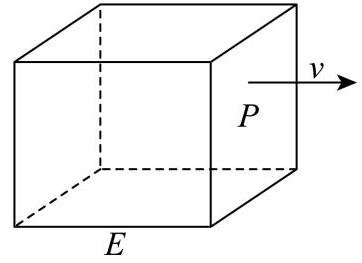

(1)求总淋雨量 $y$ 的表达式(用含有v、d、S、c的表达式表示)；

(2)已知 $d = {100}$ 且 $S = {1.5}$ ，设 $0 < v \leq  {10},0 < c \leq  5$ ，试根据 $c$ 的不同取值范围，确定移动速度 $v$ ，使总淋雨量 $y$ 最少.

## 考点2: 观测测量与定位求值

如图所示，小明和小宁家都住在东方明珠塔附近的同一幢楼上，小明家在A层，小宁家位于小明家正上方的B层， 已知 ${AB} = a$ .小明在家测得东方明珠塔尖的仰角为 $\alpha$ ，小宁在家测得东方明珠塔尖的仰角为 $\beta$ ，则他俩所住的这幢楼与东方明珠塔之间的距离 $d =$

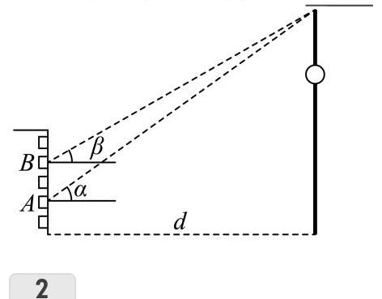

某林场为了及时发现火情，设立了两个观测点 $A$ 和 $B$ . 某日两个观测点的林场人员都观测到 $C$ 处出现火情. 在 $A$ 处观测到火情发生在北偏西40°方向，而在 $B$ 处观测到火情在北偏西60°方向. 已知 $B$ 在 $A$ 的正东方向10km处(如图所示) ，则 $\left| {{BC} - {AC}}\right|  =$ km.(精确到 ${0.1}\mathrm{\;{km}}$ )

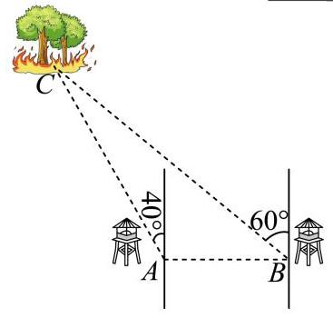

3

如图，要在A和D两地之间修建一条笔直的隧道，现在从B地和C地测量得到: $\angle {DBC} = {24.2}^{ \circ  }$ ， $\angle {DCB} = {35.4}^{ \circ  }$ ， $\angle {DBA} = {31.6}^{ \circ  }$ ， $\angle {DCA} = {17.5}^{ \circ  }$ . 试求 $\angle {DAB}$ 以确定隧道AD的方向. (结果精确到 ${0.1}^{ \circ  }$ )

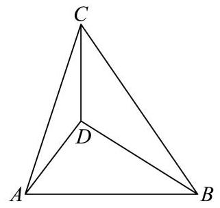

已知点B在点C正北方向，点D在点C的正东方向， ${BC} = {CD}$ ,存在点A满足 $\angle {BAC} = {16.5}^{ \circ  },\angle {DAC} = {37}^{ \circ  }$ ，则 $\angle {BCA} = \;$ (精确到0.1度)

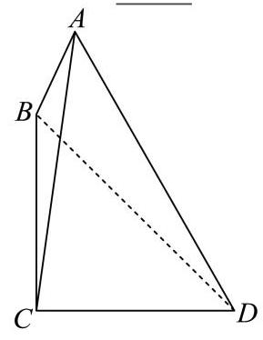

中企联合大厦是奉贤区的第一高楼，是奉贤美奉贤强的一个缩影. 某数学建模兴趣小组的同学们去实地进行测量， 经过多次的测量，最终在平行于地面的同一水平面上选取三个点:点 $B$ 、点 $C$ 、点 $O$ 作为测量基点. 设大厦的最高点为 $A$ ，在点 $B$ 处测得点 $A$ 的仰角为 $\angle {ABO} = \theta  = {71.5}^{ \circ  }$ ，在点 $C$ 处测得点 $A$ 的仰角为 $\angle {ACO} = {44}^{ \circ  }$ ，又测得 ${BC} = {221}$ 米, $\angle {BOC} = {119}^{ \circ  }$ ,(见图). 现作出以下几个假设:

①直线 ${AO}$ 垂直于平面 ${OBC}$ ；

②平面 ${OBC}$ 到地面的距离等于测角仪高度，在计算过程中测角仪高度忽略不计；

③其它次要因素等忽略不计. 根据以上信息估算奉贤第一高楼的高度约 米. (结果保留整数)

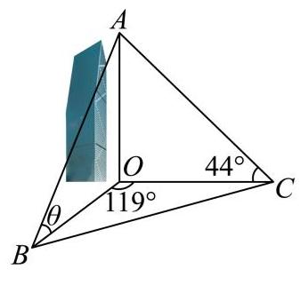

小申同学观察发现，生活中有些时候影子可以完全投射在斜面上. 某斜面上有两根长为 1 米的垂直于水平面放置的杆子，与斜面的接触点分别为 $A$ 、 $B$ ，它们在阳光的照射下呈现出影子，阳光可视为平行光:其中一根杆子的影子在水平面上，长度为 0.4 米；另一根杆子的影子完全在斜面上，长度为 0.45 米. 则斜面的底角 $\theta  = \;$ (结果用角度制表示，精确到 ${0.01}^{ \circ  }$ )

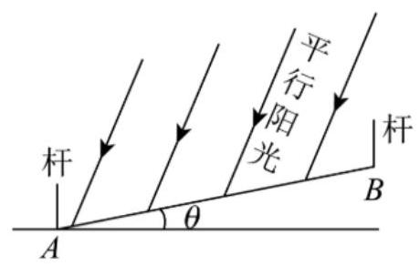

油纸伞是中国传统工艺品，使用历史已有1000多年.以手工削制的竹条做伞架，以涂刷天然防水桐油的皮棉纸做伞面.油纸伞是世界上最早的雨伞，纯手工制成，全部取材于天然，是中国古人智慧的结晶.在某市开展的油纸伞文化艺术节中，某油纸伞撑开后摆放在户外展览场地上，如图所示，该伞的伞沿是一个半径为1的圆，圆心到伞柄底端的距离为1，阳光照射油纸丛在地面上形成了一个椭圆形的影子，此时阳光照射方向与地面的夹角为75°，若伞柄底端正好位于该椭圆的左焦点位置，则该椭圆的长轴长为( )

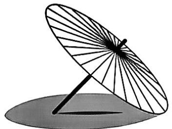

A. $\frac{3\sqrt{2} - \sqrt{6}}{2}$

B. $\frac{\sqrt{6} - \sqrt{2}}{2}$

C. $3\sqrt{2} - \sqrt{6}$

D. $\sqrt{6} - \sqrt{2}$

8

嘉定某学习小组开展测量太阳高度角的数学活动. 太阳高度角是指某时刻太阳光线和地平面所成的角. 测量时，假设太阳光线均为平行的直线，地面为水平平面. 如图，两竖直墙面所成的二面角为 ${120}^{ \circ  }$ ，墙的高度均为3米. 在时刻 $t$ ，实地测量得在太阳光线照射下的两面墙在地面的阴影宽度分别为1米、1.5米. 在线查阅嘉定的天文资料，当天的太阳高度角和对应时间的部分数据如表所示，则时刻 $t$ 最可能为( )

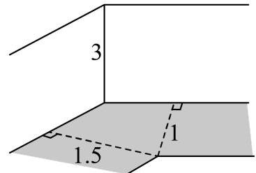

<table><tr><td>太阳高度角</td><td>时间</td><td>太阳高度角</td><td>时间</td></tr><tr><td>${43.13}^{ \circ  }$</td><td>08:30</td><td>68.53°</td><td>10:30</td></tr><tr><td>${49.53}^{ \circ  }$</td><td>09:00</td><td>74.49°</td><td>11:00</td></tr><tr><td>${55.93}^{ \circ  }$</td><td>09:30</td><td>79.60°</td><td>11:30</td></tr><tr><td>${62.29}^{ \circ  }$</td><td>10:00</td><td>82.00°</td><td>12:00</td></tr></table>

A. 09:00 B. 10:00 C. 11:00

如图所示，水平地面上插有两根杆子 ${AB}$ 和 ${CD},{AB}$ 所在直线垂直于地面且 ${AB} = 2$ 米， ${CD}$ 所在直线与地面斜交.小明有一把卷尺.他在某时刻分别测出杆子 ${AB}$ 和 ${CD}$ 在阳光下影子的长度，称为一次操作.小明可以在白天的不同时刻进行多次操作.假设阳光为平行光，正午时分 ${AB}$ 的影子长度为0.则下列说法正确的是( )

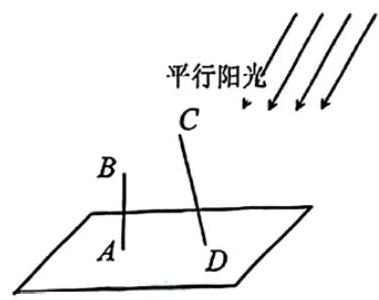

A. 为求出 ${CD}$ 的长度，小明至少需要进行2次操作 B. 为求出 ${CD}$ 的长度，小明至少需要进行3次操作

C. 为求出 ${CD}$ 的长度，小明至少需要进行4次操作 D. 无论进行多少次操作，小明都不能求出 ${CD}$ 的长度

10

一个机器零件的形状是有缺口的圆形铁片，如图中实线部分为裁剪后的形状. 已知这个圆的半径是 ${10}\mathrm{\;{cm}}$ ， ${AB} = {8\mathrm{\;{cm}}}$ ， ${BC} = {6\mathrm{\;{cm}}}$ ，且 ${AB}\bot {BC}$ ，则圆心到点B的距离约为 $\;\mathrm{{cm}}$ . (结果精确到 ${0.1}\mathrm{\;{cm}}$ )

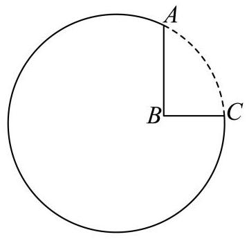

11

正方形草地 ${ABCD}$ 边长 ${1.2}, E$ 到 ${AB},{AD}$ 距离为 ${0.2}, F$ 到 ${BC},{CD}$ 距离为0.4，有个圆形通道经过 $E, F$ ，且经过 ${AD}$ 上一点，求圆形通道的周长___(精确到0.01)

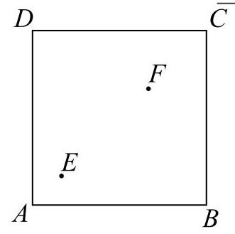

12

如图，正方形ABCD的边长为20米，圆O的半径为1米，圆心足正方形的中心，点P、Q分别在线段AD、CB上，若线段PQ与圆O有公共点，则称点Q在点P的“盲区”中. 已知点P以1.5米/秒的速度从A出发向D移动，同时，点Q以1米/秒的速度从C出发向B移动，则点P从A移动到D的过程中，点Q在点P的育区中的时长约为 秒(精确到0.1)

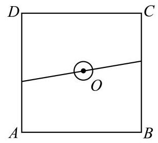

## 考点3: 最值问题

1

公园修建斜坡，假设斜坡起点在水平面上，斜坡与水平面的夹角为θ，斜坡终点距离水平面的垂直高度为4米，游客每走一米消耗的体能为 $\left( {{1.025} - {cos\theta }}\right)$ ，要使游客从斜坡底走到斜坡顶端所消耗的总体能最少，则 $\theta  = \;$ .

2

如图，有一块矩形铁皮ABCD，其中 ${AB} = {AD} = 4$ 米，阴影部分 ${AMN}$ 是一个半径为3米的扇形. 这个扇形已经腐蚀不能使用，但其余部分均完好. 工人师傅想在未被腐蚀的部分截下一块其边落在 ${BC}$ 与 ${CD}$ 上的矩形铁皮 ${PQCR}$ ，使点 $P$ 在弧 ${MN}$ 上. 设 $\angle {MAP} = \theta \left( {0 \leq  \theta  \leq  \frac{\pi }{2}}\right)$ ，矩形 ${PQCR}$ 的面积为 $S$ 平方米. 则当 $S$ 取最大值时， $\sin {2\theta } =$

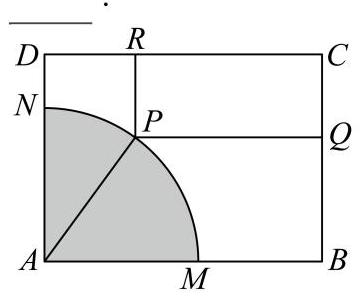

草坪上有一个带有围栏的边长为30m的正三角形活动区域ABC，点 $P$ 在边BC上，且 $\left| {PB}\right|  = 2\left| {PC}\right|$ ，小闵同学在该区域玩耍，他在 $P$ 处放置了一个手电筒，若手电筒发出的光线张角(任两条光线的最大夹角)为 ${60}^{ \circ  }$ ，则手电筒在 ABC内部所能照射到的地面的最大面积为 ${\mathrm{m}}^{2}$
