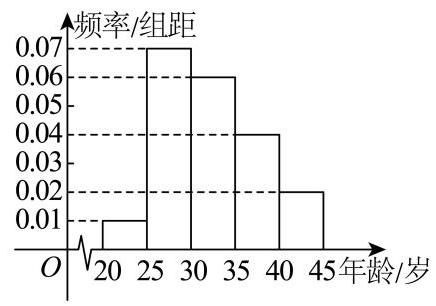
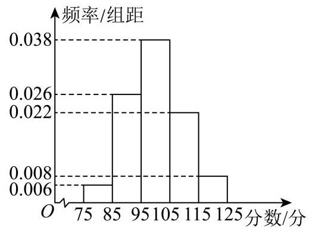
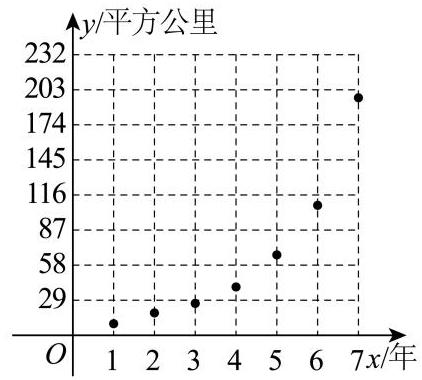

## 概率决胜:数理统计篇 (16题)

## 概率篇

## 考点1:事件关系

1

容器中盛有5个白乒乓球和3个黄乒乓球.

(1)“从8个球中任意取出1个，取出的是白球”与“从剩下的7个球中任意取出1个，取出的还是白球”这两个事件是否相互独立? 为什么?

(2)“从8个球中任意取出1个，取出的是白球”与“把取出的1个白球放回容器，再从容器中任意取出1个，取出的是黄球”这两个事件是否相互独立？为什么？

已知某大学数学专业二年级的学生中，是否有自主创业打算的情况如下表所示.

<table><tr><td></td><td>男生/人</td><td>女生/人</td></tr><tr><td>有自主创业打算</td><td>16</td><td>15</td></tr><tr><td>无自主创业打算</td><td>64</td><td>60</td></tr></table>

从这些学生中随机抽取一人:

(1)若已知抽到的人是女生，求她有自主创业打算的概率；

(2)判断“抽到的人是女生”与“抽到的人有自主创业打算”是否独立.

## 考点2:常见概率公式及概率计算

1

某电商研究中心为剖析国潮消费趋势，随机调查了该平台50名男性用户和50名女性用户，统计其对“国潮服饰类产品”的购买意愿(经常购买/不常购买)，得到如下列联表:

<table><tr><td></td><td>经常购买</td><td>不常购买</td></tr><tr><td>男性用户</td><td>40</td><td>10</td></tr><tr><td>女性用户</td><td>30</td><td>20</td></tr></table>

(1)从该平台的用户中任选一人，A表示事件“选到的人不常购买国潮服饰类产品”，B表示事件“选到的人为女性用户”，利用该调查数据，给出 $P\left( {B \mid  A}\right)$ ， $P\left( {B \mid  \bar{A}}\right)$ 的估计值.

为研究某校高三年级学生的身高是否与性别有关，现从学生群体中，随机测量了50名学生的身高，然后按“身高低于170cm"与“身高不低于170cm"分成两组，统计整理各组人数如下列联表(单位:人).

<table><tr><td rowspan="2">性别</td><td colspan="2">身高</td><td rowspan="2">合计</td></tr><tr><td>低于170cm</td><td>不低于170cm</td></tr><tr><td>男</td><td>8</td><td>24</td><td>32</td></tr><tr><td>女</td><td>12</td><td>6</td><td>18</td></tr><tr><td>合计</td><td>20</td><td>30</td><td>50</td></tr></table>

(1)依据 $\alpha  = {0.005}$ 的独立性检验，能否认为该学校高三年级学生的身高与性别有关联？

(2)若从男生样本和女生样本中各选取一人，求两名学生身高不在同一组的概率.

附: ${\chi }^{2} = \frac{n{\left( ad - bc\right) }^{2}}{\left( {a + b}\right) \left( {c + d}\right) \left( {a + c}\right) \left( {b + d}\right) }$ ,其中 $n = a + b + c + d$ .

<table><tr><td>$\alpha$</td><td>0.1</td><td>0.05</td><td>0.01</td><td>0.005</td></tr><tr><td>${x}_{\alpha }$</td><td>2.706</td><td>3.841</td><td>6.635</td><td>7.879</td></tr></table>

春节期间某商场举行购物抽奖活动，活动设置了两种抽奖方式(方式一和方式二)，规则如下:凡在商场消费满 200元的顾客都可以通过掷一枚质地均匀的骰子来确定抽奖方式，若掷出5点或6点，则采用方式一抽奖，否则采用方式二抽奖. 活动期间顾客甲在该商场多次购物，其中有3次购物消费满200元，均参与抽奖活动.

(1) 求顾客甲在3次抽奖中恰有2次采用方式一抽奖的概率;

(2) 方式一:从装有4个红球，6个白球(所有球除颜色外完全相同)的箱子中随机摸一个球，摸到红球即为中奖；方式二:“大转盘”，中奖的概率为 $\frac{1}{3}$ . 求顾客甲抽奖一次中奖的概率.

## * 考点3:随机变量的期望与方差

某次考试的多项选择题，每题4个选项中正确选项有2个或3个，得分规则如下:若正确选项有2个，只选1个且为正确选项得3分，2个且都为正确选项得6分，否则得0分；若正确选项有3个，只选1个且为正确选项得2分，选2个且都为正确选项得4分，选3个且都为正确选项得6分，否则得0分. 学生甲对其中的一道多项选择题完全不会，该题恰有2 个正确选项的概率为 $p\left( {0 < p < 1}\right)$ ，记 $X$ 为甲随机选择1个选项的得分， $Y$ 为甲随机选择2个选项的得分，

(1) 若 $p = \frac{2}{3}$ ，求 $P\left( {X \geq  2}\right)$ ；

(2)求 $X$ 的概率分布列和数学期望；

(3)证明:当且仅当 $0 < p < \frac{1}{2}$ 时， $E\left( X\right)  < E\left( Y\right)$ .

## 考点4:常见分布

1

某奶茶品牌为了解消费者对奶茶甜度的偏好情况，随机抽取了100名顾客进行甜度测试(分数越高表示越偏好甜味)、统计结果显示，所有顾客的甜度偏好分数均分布在区间 $\left\lbrack  {4,{10}}\right\rbrack$ 内，具体数据见下表:

<table><tr><td>甜度偏好分数</td><td>$\lbrack 4,5)$</td><td>$\lbrack 5,6)$</td><td>$\lbrack 6,7)$</td><td>$\lbrack 7,8)$</td><td>$\lbrack 8,9)$</td><td>$\left\lbrack  {9,{10}}\right\rbrack$</td></tr><tr><td>人数</td><td>10</td><td>25</td><td>20</td><td>30</td><td>10</td><td>5</td></tr></table>

(1)估计该品牌奶茶消费者的平均甜度偏好分数(同一组数据用该区间的中点值作代表)；

(2)在这100名顾客中，用分层抽样的方法从甜度偏好分数在 $\lbrack 6,7)$ 、 $\lbrack 7,8)$ 这两组中共抽取5人. 再从这5人中随机抽取3人，记 $X$ 为3人中甜度偏好分数在 $\lbrack 7,8)$ 的人数，求 $X$ 的分布、期望和方差；

某厂质检员对该厂生产的零件进行质检.若第一次检测到某件零件不合格，则判断该零件不合格；若第一次检测到某件零件合格，则进行第二次检测，若第二次检测该零件也合格，则判断该零件合格，否则为不合格.若零件合格，则获利10元；若零件不合格，则亏损20元.已知每件该零件第一次检测合格的概率为 $\frac{5}{6}$ ，第二次检测合格的概率为 $\frac{9}{10}$ ，且每件零件是否合格相互独立.

(1)求检测3件该零件，至少有2件合格的概率；

(2)已知一箱中有4件该零件，记这箱零件总获利 $X$ 元，求 $X$ 的分布列与期望.

一个袋子中有12个大小相同的球，其中有4个红球、8个绿球，分别采用有放回和不放回的方式从中随机抽取3个球，设采用有放回方式抽取时抽到红球的个数为 $X$ ，采用不放回方式抽取时抽到红球的个数为 $Y$ .

(1) 求 $X = 2$ 的概率;

(2) 求Y的分布列与数学期望.

鄂尔多斯市装备制造基地的某企业生产一种零部件，其质量指标 $X$ 介于 $\left\lbrack  {{19.7},{20.3}}\right\rbrack$ 的为优品. 技术改造前，其质量指标 $X \sim  N\left( {{20},{0.3}^{2}}\right)$ ; 技术改造后，其质量指标 $X \sim  N\left( {{20},{0.15}^{2}}\right)$ . 如果生产该零部件的控制系统中有超过一半的元件正常工作，则系统就能正常工作. 系统正常工作的概率称为系统的可靠性. 已知该系统中每个元件正常工作的概率都是 $p\left( {0 < p < 1}\right)$ ，且各个元件能否正常工作相互独立.

若 $X \sim  N\left( {\mu ,{\sigma }^{2}}\right)$ ,则 $P\left( {\mu  - \sigma  \leq  X \leq  \mu  + \sigma }\right)  \approx  {0.6827}, P\left( {\mu  - {2\sigma } \leq  X \leq  \mu  + {2\sigma }}\right)  \approx  {0.9545}$ .

(1) 求该企业生产的这种零部件在技术改造后与技术改造前的优品率之差;

(2)若控制系统原有3个元件，计算该系统的可靠性；若该系统增加一个元件，判断其可靠性有何变化，

## 统计篇

## 考点5:统计图表与统计估计

“十五五规划”是中共中央关于制定国民经济和社会发展第十五个五年规划. 成都市为了解市民对“十五五规划”的认知程度，对不同年龄、不同职业的市民举办了一次“十五五规划”知识竞赛，满分为100分(90分及以上为认知程度高)，现从参赛者中抽取了x人，按年龄大小分成5组，第一组: $\lbrack {20},{25})$ ，第二组: $\lbrack {25},{30})$ ，第三组: $\lbrack {30},{35})$ ，第四组: $\lbrack {35},{40})$ ，第五组: $\lbrack {40},{45}\rbrack$ ，得到如图所示的频率分布直方图，已知第一组有6人，从该市大学生、军人、医务人员、工人、个体户五种人群中用分层抽样的方法依次抽取6人，42人，36人，24人，12人，分别记为1 $\sim  5$ 组， 从这5个按年龄分的组和5个按职业分的组中每组各选派1人参加“十五五规划”知识竞赛，分别代表相应组的成绩， 年龄组中 $1 \sim  5$ 组的成绩分别为93,96,97,94,90，职业组中 $1 \sim  5$ 组的成绩分别为93,98,94,95,900

(1)求抽取的x人的年龄的中位数(结果保留整数)；

(2)分别求5个年龄组和5个职业组成绩的平均数和方差，并以上述数据为依据，评价5个年龄组和5个职业组对“十五五规划”的认知程度.

## 考点6:简单随机抽样

为了促进学生健康成长和全面发展，某省教育厅发出《关于保障中小学生每天综合体育活动时间不低于两小时的通知》(下称“通知”). 接到通知后，光明中学对该校高一、高二、高三三个年级的学生，用分层抽样方法随机抽查得出部分同学五天内的综合体育活动时间，数据如下表(单位:小时)，五天内的综合体育活动时间不低于10小时的可认为达到“通知”要求.

<table><tr><td>高一年级 10 12.5 9.5 9 11</td></tr><tr><td>高二年级 7.5 8 8.5 10 9.5 11 12</td></tr><tr><td>高三年级 7 4.5 6 5 7.5 10.5 11 12.5</td></tr></table>

已知高一学生有600人，试估计高一、高二、高三各有多少学生每天的综合体育活动时间没有达到“通知”要求；

## 考点7: 分层方差的计算

某市为提高市民对文明城市创建的认识，举办了“创建文明城市”知识竞赛，从所有答卷中随机抽取100份作为样本，将样本的成绩分成 $\lbrack {75},{85})$ ， $\lbrack {85},{95})$ ， $\lbrack {95},{105})$ ， $\lbrack {105},{115})$ ， $\left\lbrack  {{115},{125}}\right\rbrack$ 这五组，得到如图所示的频率分布直方图.

(1)估计样本成绩的平均数及方差；(同一组中的数据用该组区间的中点值作为代表)

(2)已知落在 $\lbrack {75},{85})$ 内的平均成绩是80分，方差是4分，落在 $\lbrack {85},{95})$ 内的平均成绩是88分，方差是6分，求两组成绩合并后的平均数 $\bar{z}$ 和方差 ${s}^{2}$ .

附:设两组数据的样本量、样本平均数和样本方差分别为m， ${\bar{x}}_{1}$ ， ${s}_{1}^{2}$ ；n， ${\bar{x}}_{2}$ ， ${s}_{2}^{2}$ ，记两组数据总体的样本平均数为 $\bar{w}$ ,则总体样本方差 ${s}^{2} = \frac{m}{m + n}\left\lbrack  {{s}_{1}^{2} + {\left( \overline{{x}_{1}} - \bar{w}\right) }^{2}}\right\rbrack   + \frac{n}{m + n}\left\lbrack  {{s}_{2}^{2} + {\left( \overline{{x}_{2}} - \bar{w}\right) }^{2}}\right\rbrack$ .

## 考点8: 一元线性回归分析

水体富营养化导致藻类大量繁殖，以2017年中国太湖蓝藻爆发为例:5月初监测发现湖体中蓝藻细胞密度为每升50 万个，随着气温升高至25-30°C且氮磷营养盐浓度超标(总磷浓度达 ${0.15}\mathrm{{mg}}/\mathrm{L}$ )，蓝藻进入增长期.5月10日细胞密度增至每升200万个，5月15日突破每升800万个，5月20日达到每升3200万个，形成面积超150平方公里的绿色水华带.此次爆发导致湖区溶解氧骤降至 $2\mathrm{{mg}}/\mathrm{L}$ 以下，大量鱼类死亡，自来水厂被迫停产、所以对水资源的保护刻不容缓，现对某区域的藻类面积y(单位:平方公里)与时间x(单位:年)的关系，进行监测，得到如下数据:

<table><tr><td>x/年</td><td>1</td><td>2</td><td>3</td><td>4</td><td>5</td><td>6</td><td>7</td></tr><tr><td>y/平方公里</td><td>6</td><td>11</td><td>21</td><td>34</td><td>66</td><td>101</td><td>196</td></tr></table>

根据以上数据，绘制成如图所示的散点图:

观察散点图，两个变量不具有线性相关关系，现考虑用对数函数模型 $y = a + b\ln x$ 和指数函数模型 $y = c \cdot  {d}^{x}$ 分别对两个变量的关系进行拟合.

(1)根据散点图判断 $y = a + b\ln x$ 与 $y = c \cdot  {d}^{x}$ (a，b，c，d均为常数)哪一个更适合作为藻类面积y(单位:平方公里) 与时间x (单位:年) 的关系的回归方程类型 (给出判断即可，不必说明理由)；

(2)根据(1)的判断结果及表中的数据，求出y关于x的回归方程；

(3)若不及时保护水质，当第八年检测时，请估计藻类面积为多少平方公里.

参考数据:

<table><tr><td>y</td><td>$\bar{v}$</td><td>$\mathop{\sum }\limits_{{i = 1}}^{7}{x}_{i}{y}_{i}$</td><td>$\mathop{\sum }\limits_{{i = 1}}^{7}{x}_{i}{v}_{i}$</td><td>${10}^{0.54}$</td></tr><tr><td>62.14</td><td>1.54</td><td>2535</td><td>50.12</td><td>3.47</td></tr></table>

其中 ${v}_{i} = \lg {y}_{i},\bar{v} = \frac{1}{7}\mathop{\sum }\limits_{{i = 1}}^{7}{v}_{i}$

参考公式:对于一组数据 $\left( {{u}_{1},{v}_{1}}\right)$ ， $\left( {{u}_{2},{v}_{2}}\right)$ ， $\ldots \left( {{u}_{n},{v}_{n}}\right)$ ，其回归直线 $\widehat{\nu } = \widehat{\beta }u + \widehat{\alpha }$ 的斜率和截距的最小二乘估计公式分别为 $\widehat{\beta } = \frac{\mathop{\sum }\limits_{{i = 1}}^{n}{u}_{i}{v}_{i} - n\bar{u}\bar{v}}{\mathop{\sum }\limits_{{i = 1}}^{n}{u}_{i}^{2} - n{\bar{u}}^{2}},\widehat{\alpha } = \bar{v} - \widehat{\beta }\bar{u}$ .

## 考点9:独立性检验

1

某学校开展阅读兴趣调查，随机采访男生、女生各50人，每人从文学类书籍和科普类书籍中选择最喜欢的一类，喜欢文学类书籍的归为甲组，喜欢科普类书籍的归为乙组.调查发现:甲组成员共46人，其中男生16人.

(1)根据以上数据，填空下述 $2 \times  2$ 列联表:

<table><tr><td></td><td>甲组</td><td>乙组</td><td>合计</td></tr><tr><td>男生</td><td></td><td></td><td></td></tr><tr><td>女生</td><td></td><td></td><td></td></tr><tr><td>合计</td><td></td><td></td><td></td></tr></table>

(2)依据小概率值 $\alpha  = {0.01}$ 的独立性检验，分析学生喜欢文学类还是科普类书籍是否与性别有关；

参考公式: ${\chi }^{2} = \frac{n{\left( ad - bc\right) }^{2}}{\left( {a + b}\right) \left( {c + d}\right) \left( {a + c}\right) \left( {b + d}\right) }, n = a + b + c + d$ .

参考数据:

<table><tr><td>$\alpha$</td><td>0.1</td><td>0.05</td><td>0.01</td><td>0.005</td><td>0.001</td></tr><tr><td>${x}_{\alpha }$</td><td>2.706</td><td>3.841</td><td>6.635</td><td>7.841</td><td>10.828</td></tr></table>

国民体质是国家和社会发展的重要基础. 为贯彻落实《“健康中国2030”规划纲要》《体育强国建设纲要》，2025年国家体育总局开展了第六次全国国民体质监测工作，旨在提高国民体质和健康水平，促进国家经济建设和社会发展. 《国民体质测定标准(2023年修订)》将体质情况综合评级为优秀、良好、合格和不合格四个等级. 某地区为了解国民体质情况是否与爱好运动有关，从该地区体质达到“合格”及以上的人群中随机抽取了200人进行问卷调查，得到如下列联表:

<table><tr><td>体质情况组别</td><td>合格</td><td>良好及以上</td><td>合计</td></tr><tr><td>爱好运动</td><td>80</td><td>$b$</td><td>150</td></tr><tr><td>不爱好运动</td><td>$c$</td><td>10</td><td></td></tr><tr><td>合计</td><td></td><td></td><td>200</td></tr></table>

(1)求 $b, c$ 的值，并依据小概率值 $\alpha  = {0.01}$ 的独立性检验，分析体质情况是否与爱好运动有关

附: ${\chi }^{2} = \frac{n{\left( ad - bc\right) }^{2}}{\left( {a + b}\right) \left( {c + d}\right) \left( {a + c}\right) \left( {b + d}\right) }$ ，其中 $n = a + b + c + d$ .

<table><tr><td>$\alpha$</td><td>0.1</td><td>0.01</td><td>0.001</td></tr><tr><td>${x}_{\alpha }$</td><td>2.706</td><td>6.635</td><td>10.828</td></tr></table>
