## 立体破界:空间几何篇 (15题)

## 立体几何与空间向量

考点1:线面关系和面面关系的证明

1

如图，在平行四边形 ${ABCM}$ 中， ${AB} = {AC} = 3$ ， $\angle {ACM} = {90}^{ \circ  }$ ，以 ${AC}$ 为折痕将 ${ACM}$ 折起，使点 $M$ 到达点 $D$ 的位置，且 ${AB}\bot {DA}$ .

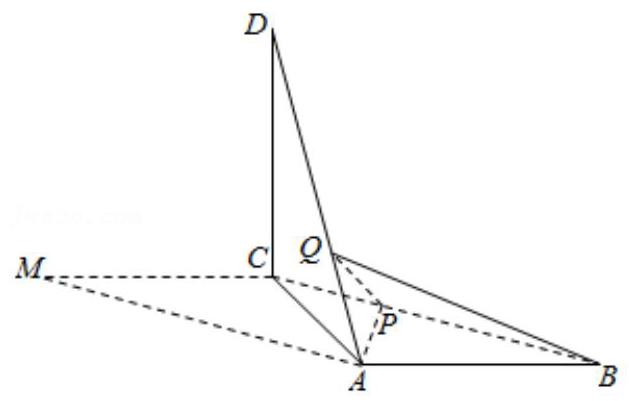

(1) 证明:平面 ${ACD}\bot$ 平面 ${ABC}$ ；

(2) $Q$ 为线段 ${AD}$ 上一点， $P$ 为线段 ${BC}$ 上一点，且 ${BP} = {DQ} = \frac{2}{3}{DA}$ ，求三棱锥 $Q - {ABP}$ 的体积.

如图，P是圆锥的顶点，O是底面圆心，AB是底面直径，且 ${AB} = 2$ .

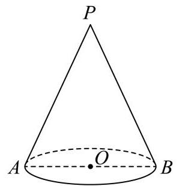

(1)若直线PA与圆锥底面的所成角为 $\frac{\pi }{3}$ ，求圆锥的侧面积；

(2)已知Q是母线PA的中点，点C、D在底面圆周上，且弧AC的长为 $\frac{\pi }{3}$ ， ${CD}//{AB}$ . 设点M在线段OC上，证明: 直线 ${QM}//$ 平面 $\mathrm{{PBD}}$ .

## 考点2: 异面直线所成角

如图，在三棱锥 $A - {BCD}$ 中，平面 ${ABD}\bot$ 平面 ${BCD},{AB} = {AD}, O$ 为 ${BD}$ 的中点.

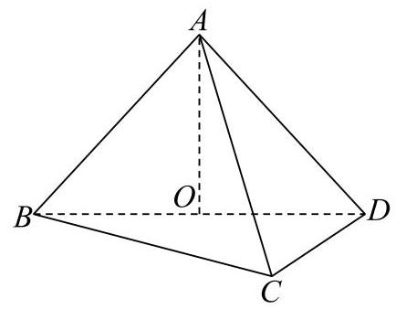

(1) 求证: ${AO} \bot  {CD}$ ;

(2)若 ${BD}\bot {DC},{BD} = {DC},{AO} = {BO}$ ，求异面直线 ${BC}$ 与 ${AD}$ 所成的角的大小.

## 考点3:线面角

如图，在四棱锥 $P - {ABCD}$ 中，底面 ${ABCD}$ 是边长为 $a$ 的正方形，侧面 ${PAD}\bot$ 底面 ${ABCD}$ ，且 ${PA} = {PD} = \frac{\sqrt{2}}{2}a$ ， 设 $E, F$ 分别为 ${PC},{BD}$ 的中点.

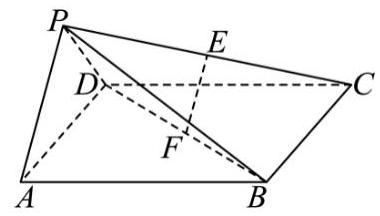

(1) 证明:直线 ${EF}//$ 平面 ${PAD}$ ；

(2)求直线PB与平面 ${ABCD}$ 所成的角的正切值.

## ${\mathcal{A}}_{i}$ 考点4: 点 (平面) 到平面的距离

如图，四棱锥 $P - {ABCD}$ 中， ${PA}\bot$ 平面 ${ABCD}$ ， ${AB}//{CD}$ ， ${PA} = {AB} = {AD} = 2$ ， ${CD} = 1$ ， $\angle {ADC} = {90}^{ \circ  }$ ，E，F 分别为 ${PB},{AB}$ 的中点.

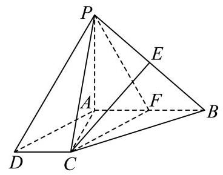

(1) 求证:CE II平面PAD；

(2)求点B到平面PCF的距离.

已知 ${AB}\bot {AC}$ ， ${PA}\bot$ 平面 ${ABC}$ ， ${PA} = {AB} = 3$ ， ${AC} = 4$ ，点 $M$ 为 ${PC}$ 的中点，过点 $M$ 分别作平行于平面 ${PAB}$ 的直线交 ${AC}$ 、 ${BC}$ 于点 $E$ 、 $F$ .

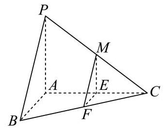

(1)证明:平面 ${PAC}\bot$ 平面 ${PAB}$ ；

(2)证明:平面 ${MEF}//$ 平面 ${PAB}$ ，并求平面 ${MEF}$ 到平面 ${PAB}$ 的距离.

## 考点5: 二面角

如图1所示的是等腰梯形 ${ABCD}$ ， ${AB}//{DC}$ ， ${AB} = {2DC} = 4$ ， $\angle {ABC} = \frac{\pi }{3}$ ，DE⊥AB于E点，现将△ ${ADE}$ 沿直线 DE折起到 $\bigtriangleup  {PDE}$ 的位置，形成一个四棱锥 $P - {EBCD}$ ，如图2所示.

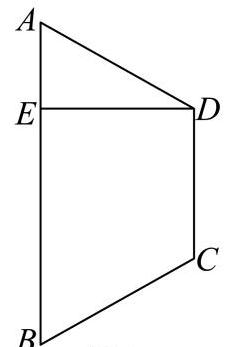

图1

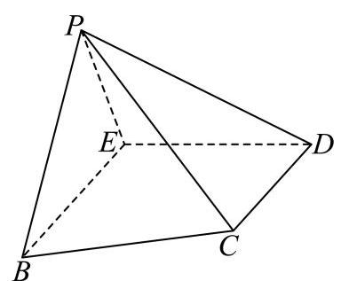

图2

(1) 若 ${PC} = 2\sqrt{2}$ ，求证:PE⊥平面 ${EBCD}$ ；

(2)在(1)的条件下，若点P，E，C，D四点在一个球的球面上，求此球的表面积与体积；

(3)若直线PE与平面 ${EBCD}$ 所成的角为 $\frac{\pi }{3}$ ，求二面角 $P - {BC} - E$ 的大小.

如图，直三棱柱 ${ABC} - {A}_{1}{B}_{1}{C}_{1}$ 的体积为4， $\bigtriangleup  {A}_{1}{BC}$ 的面积为2√2.

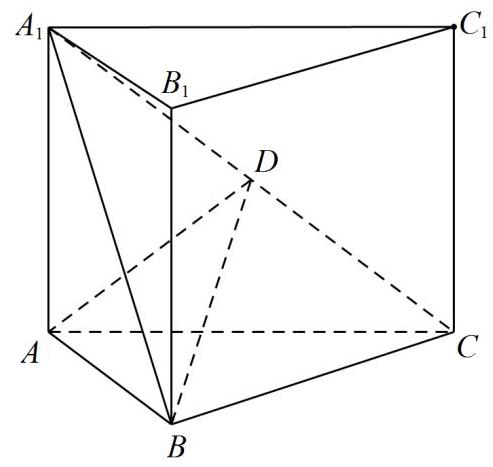

(1) 求A到平面 ${A}_{1}{BC}$ 的距离；

(2)设D为 ${A}_{1}C$ 的中点， $A{A}_{1} = {AB}$ ，平面 ${A}_{1}{BC}\bot$ 平面 ${AB}{B}_{1}{A}_{1}$ ，求二面角 $A - {BD} - C$ 的正弦值.

## 考点6: 棱台圆台

如图，在四棱台 ${ABCD} - {EFGH}$ 中，底面 ${ABCD}$ 是菱形，平面 ${CDHG}\bot$ 平面 ${ABCD}$ ， ${CG} = {GH} = {HD} = 1$ ， ${BD} = {CD} = 2$ .

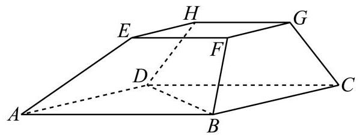

(1)求证: ${CD}\bot {BF}$ ；

(2)求四棱台 ${ABCD} - {EFGH}$ 的体积.

如图， ${ABCD} - {A}_{1}{B}_{1}{C}_{1}{D}_{1}$ 是一块正四棱台形铁料，上、下底面的边长分别为20cm和40cm，高30cm.

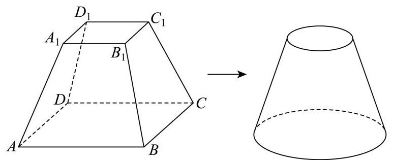

(1)求正四棱台 ${ABCD} - {A}_{1}{B}_{1}{C}_{1}{D}_{1}$ 的侧面 ${BC}{C}_{1}{B}_{1}$ 与底面 ${ABCD}$ 所成二面角的大小；

(2) 现削去部分铁料(不计损耗)，将原正四棱台打磨为一个圆台，使得该圆台的上、下底面分别为原正四棱台上、下底面正方形的内切圆及其内部. 求削去部分与原正四棱台的体积之比.

## 考点7: 空间线段点的存在性问题

如图，已知平面四边形 ${ABCP}$ 中， $D$ 为 ${PA}$ 的中点， ${PA}\bot {AB}$ ， ${CD}//{AB}$ ，且 ${PA} = {CD} = {2AB} = 4$ . 将此平面四边形 ${ABCP}$ 沿 ${CD}$ 折成直二面角 $P - {DC} - B$ ，连接 ${PA}$ 、 ${PB}$ ，设 ${PB}$ 中点为 $E$ .

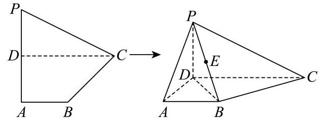

(1)求直线 ${AB}$ 与平面 ${PBC}$ 所成角的正弦值；

(2)在线段 ${BD}$ 上是否存在一点 $F$ ，使得 ${EF}\bot$ 平面 ${PBC}$ ？若存在，请求出 $\frac{DF}{DB}$ 的值；若不存在，请说明理由.

如图，四棱锥 $P - {ABCD}$ 的底面是边长为4的菱形， $\angle {ABC} = \frac{\pi }{3}$ ， ${PA}\bot {PD}$ ， ${PA} = 2$ ， ${PC} = 4$ ， $M$ 是 ${AD}$ 的中点.

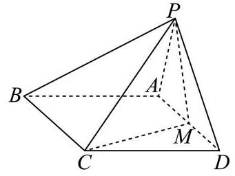

(1) 证明: ${PA} \bot  {CM}$ ;

(2)若点 $N$ 为线段 ${AP}$ 上动点，是否存在这样的点 $N$ ，使得直线 ${CN}$ 与平面 ${PBC}$ 所成角的正弦值为 $\frac{\sqrt{15}}{5}$ ？若存在， 求出点 $N$ 的位置；若不存在，请说明理由.

## 。 考点8: 古代几何体 (鳖臑、阳马、堑堵)

如图，在四棱锥 $P - {ABCD}$ 中，PA⊥平面 ${ABCD}$ ， ${PA} = {AC} = 2,{BC} = 1$ ， ${AB} = \sqrt{3}$ .

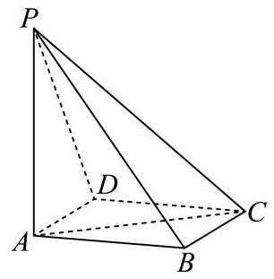

(1) 若AD//平面PBC，证明: ${AD}\bot {PB}$ ；

(2) 在我国古代数学典籍《九章算术》中，记载了一种特殊的三棱锥——鳖臑，其四个面均为直角三角形，找出本题图中的一个鳖臑，并计算它的体积和表面积.

《九章算术》是我国古代数学名著,它在几何学中的研究比西方早1000多年,在《九章算术》中,将底面为直角三角形, 且侧棱垂直于底面的三棱柱称为堑堵(qian du);阳马指底面为矩形,一侧棱垂直于底面的四棱锥,鳖膈(bie nao)指四个面均为直角三角形的四面体.如图在堑堵 ${ABC} - {A}_{1}{B}_{1}{C}_{1}$ 中, ${AB} \bot  {AC}$ .

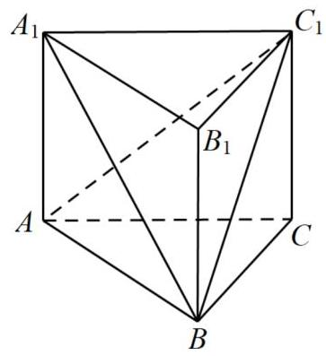

(1)求证:四棱锥 $B - {A}_{1}{AC}{C}_{1}$ 为阳马;

(2)若 ${C}_{1}C = {BC} = 2$ ,当鳖膈 ${C}_{1} - {ABC}$ 体积最大时,求锐二面角 $C - {A}_{1}B - {C}_{1}$ 的余弦值.

## 考点9:三余弦 (最小角) 定理

已知P是一个圆锥的顶点， ${PA}$ 是母线， ${PA} = 2$ ，该圆锥的底面半径是1. B、C分别在圆锥的底面上，则异面直线 ${PA}$ 与 ${BC}$ 所成角的最小值为
