# 2025 学年第二学期期中 高三年级数学学科教学质量监测试卷

考生注意:

1.本试卷共 21 题，满分 150 分，考试时间 120 分钟；

2.本试卷包括试题卷和答题纸两部分，答题纸另页，正反面；

3.在本试题卷上答题无效，必须在答题纸上的规定位置按照要求答题；

4.可使用符合规定的计算器答题.

## 一、填空题 (本大题共有 12 题, 满分 54 分, 第 16 题每题 4 分, 第 7~12 题每题 5 分, 要求在答题纸相应题序的空格内直接填写结果, 每个空格填对得分, 否则 一律得零分).

1. 已知集合 $A = \{ 0,3\} , B = \{ 0,4\}$ ，则 $A \cup  B =$ ___.

2. 已知 $\cos a = \frac{1}{3}$ ，则 $\cos {2a} =$ ___.

3. 已知 $i$ 是虚数单位，且复数 $z$ 满足 $\left( {1 + i}\right) z = 2$ ，则 $\left| z\right|  =$ ___.

4. 若 $\overrightarrow{n} = \left( {1,2}\right)$ 是直线 $l : {ax} + y - 1 = 0$ 的一个法向量，则实数 $a$ 的值为___.

5. 将边长为 2 的正方形绕其一边旋转一周，所得几何体的体积为___.

6. 已知随机变量 $X \sim  N\left( {2,{\sigma }^{2}}\right)$ ，且 $P\left( {X \geq  3}\right)  = \frac{1}{5}$ ，那么 $P\left( {X \leq  1}\right)  =$ ___.

7. 设 $a, b > 0, a + \frac{1}{2b} = 1$ ，则 ${2b} + \frac{1}{a}$ 的最小值为___.

8. 若函数 $y = f\left( x\right)$ 是定义在 $\mathbf{R}$ 上的奇函数,且当 $x \geq  0$ 时, $f\left( x\right)  = {x}^{2} - {2x} + a\left( {a \in  \mathbf{R}}\right)$ , 则 $f\left( {-1}\right)$ 的值为___.

9. 若 ${\left( 1 + x\right) }^{4}{\left( 2 - x\right) }^{5} = {a}_{0} + {a}_{1}x + {a}_{2}{x}^{2} + \cdots  + {a}_{9}{x}^{9}$ ，则 ${a}_{2} =$ ___.

10. 如图，平行四边形 ${ABCD}$ 中， ${AB} = 6,{AD} = 2, F$ 是 ${BC}$ 的中点， $G$ 、 $E$ 是 ${DC}$ 的三等分点,若 $\overrightarrow{AE} \cdot  \overrightarrow{FG} =  - {15}$ ,则 $\angle {BAD} =$ ___.

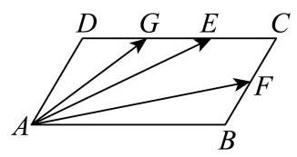

11. 已知点 $P\text{ 、 }Q$ 分别是椭圆 $\frac{{x}^{2}}{9} + \frac{{y}^{2}}{5} = 1$ 和圆 ${\left( x - 2\right) }^{2} + {y}^{2} = 1$ 上的两个动点,且点 $A\left( {2,1}\right)$ ，则 $\left| {PA}\right|  + \left| {PQ}\right|$ 的最大值为___.

12. 已知集合 $A = \{ x \mid  1 \leq  x \leq  n, x \in  \mathbf{Z}\} , S \subseteq  A$ ，当 $a\text{ 、 }b \in  S$ 且 $a \neq  b$ 时，都有 $\left| {a - b}\right|  > 2$ ，若满足条件的集合 $\mathrm{S}$ 至少有 100 个，则正整数 $n$ 的最小值是___.

## 二、选择题 (本大题共有 4 题, 满分 18 分, 第 13~14 题每题 4 分, 第 15~16 题每 题 5 分, 每题都给出四个结论, 其中有且仅有一个结论是正确的, 必须把答题纸 上相应题序内的正确结论代号涂黑, 选对得相应满分, 否则一律得零分) .

13. 两个变量 $x$ 与 $y$ 之间的回归方程 ( )

A. 表示 $x$ 与 $y$ 之间的函数关系; B. 表示 $x$ 与 $y$ 之间的不确定关系;

C. 反映 $x$ 与 $y$ 之间的真实关系; D. 是反映 $x$ 与 $y$ 之间的真实关系的一种最佳拟合.

14. 在 ${ABC}$ 中， $A, B$ 均为锐角，设甲: $\sin A < \sin C$ ；乙: ${ABC}$ 是钝角三角形，则甲是乙的 ( )

A. 充要条件 B. 充分不必要条件

C. 必要不充分条件 D. 既不充分也不必要条件

15. 如图，正方体 ${ABCD} - {A}_{1}{B}_{1}{C}_{1}{D}_{1}$ 的棱长为 1，任作平面 $a$ 与对角线 $A{C}_{1}$ 垂直，使平面 $a$ 与正方体的六条棱都有公共点.记截面 ${PQRSWE}$ 的面积为S，截面周长为 $L$ ，则有( )

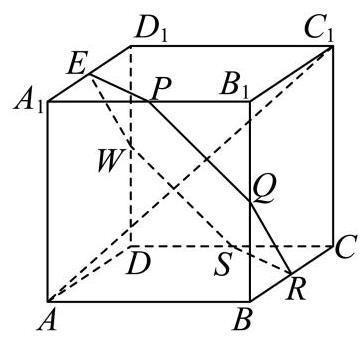

A. $\mathrm{S}$ 为定值， $L$ 为定值

B. $\mathrm{S}$ 为定值， $L$ 不为定值

C. $\mathrm{S}$ 不为定值， $L$ 为定值

D. $\mathrm{S}$ 不为定值， $L$ 不为定值

16. 设正项数列 $\left\{  {a}_{n}\right\}$ 的首项 ${a}_{1} = 1$ ,前 $n$ 项和为 ${S}_{n}$ ,若对任意的正整数 $n$ 都有 $A \geq  \frac{{a}_{n + 1}}{{S}_{n}}$ , 其中 $A\widehat{1}\mathbf{R}$ ，则称 $\left\{  {a}_{n}\right\}$ 是 “ $A$ -数列”. 下列结论中错误的是( )

A. 若 $\left\{  {a}_{n}\right\}$ 是公差为 2 的等差数列，则 $\left\{  {a}_{n}\right\}$ 是 “3 - 数列”；

B. 若 $\left\{  {a}_{n}\right\}$ 是 “ 2 - 数列”，则 $\left\{  {a}_{n}\right\}$ 可能为常数列:

C. 若 $\left\{  {a}_{n}\right\}$ 是 “ 2 - 数列”，则不存在正整数 $n \geq  2$ ，满足 ${a}_{n} > 2 \cdot  {3}^{n - 2}$ ；

D. 对任意 $1 < p < q$ ,若 ${a}_{n} = \frac{1}{2}\left( {{p}^{n - 1} + {q}^{n - 1}}\right)$ ,且满足 $1 + A \geq  q$ ,则 $\left\{  {a}_{n}\right\}$ 是 “ $A -$ 数列”.

## 三、解答题 (本大题共有 5 题, 满分 78 分, 解答下列各题必须在答题纸的规定区 域(对应的题号)内写出必要的步骤).

17. 如图，在四棱锥 $P - {ABCD}$ 中， ${ABCD}$ 是边长为 1 的正方形， ${PA}\bot$ 平面 ${ABCD}$ ， $E$ 是 ${PA}$ 的中点.

(1)求证: ${BD} \bot$ 平面 ${PAC}$ ；

(2)若直线 ${BE}$ 与平面 ${PAC}$ 所成角的正弦值为 $\frac{\sqrt{10}}{5}$ ，求三棱锥 $B - {PCD}$ 的体积.

18. 已知 $f\left( x\right)  = {\log }_{a}x, g\left( x\right)  = 2{\log }_{a}\left( {{2x} + t - 2}\right) ,\left( {a > 0, a \neq  1, t \in  \mathbf{R}}\right)$ .

(1) 若 $f\left( 1\right)  = g\left( 2\right)$ ，求 $t$ 的值；

(2)当 $x \in  \left\lbrack  {1,4}\right\rbrack$ 时 $f\left( x\right)  \geq  g\left( x\right)$ 恒成立，求 $t$ 的取值范围.

19. 为调查大学数学专业的学生对中华优秀传统文化的了解情况，现对某大学的数学专业学生进行抽样调查.已知被调查的男、女生人数均为 ${20n}$ ( $n$ 为正整数),得到以下 $2 \times  2$ 列联表:

(1)调查结果显示有 97.5% 的把握认为该校学生对中华优秀传统文化的了解与性别有关， 但没有 99% 的把握认为该校学生对中华优秀传统文化的了解与性别有关，求 $n$ 的值；

(2)当 $n = 4$ 时，采用分层抽样的方式在“了解中华优秀传统文化”的学生中抽取 10 人.

①从这 10 人中随机抽取 3 人进行第二次调查，在第二次调查中，已知至少有 2 名女生被抽到，求抽到男生的概率；

②在“不了解中华优秀传统文化”的男生中再随机抽取 $m\left( {m \in  \mathbf{N}}\right)$ 人，然后从这 ${10} + m$ 人中随机抽取 2 人. 用随机变量 $X$ 表示抽到 “了解中华优秀传统文化”的女生人数,若随机变量 $X$ 的数学期望值不小于 $\frac{1}{2}$ ,求 $m$ 的最大值.

<table><tr><td></td><td>男生</td><td>女生</td><td>合计</td></tr><tr><td>了解</td><td></td><td>10n</td><td></td></tr><tr><td>不了解</td><td>5n</td><td></td><td></td></tr><tr><td>合计</td><td></td><td></td><td></td></tr></table>

参考公式: ${\chi }^{2} = \frac{n{\left( ad - bc\right) }^{2}}{\left( {a + b}\right) \left( {c + d}\right) \left( {a + c}\right) \left( {b + d}\right) }$ ,其中 $n = a + b + c + d$ .

参考数据:

<table><tr><td>$P\left( {{\chi }^{2} \geq  k}\right)$</td><td>0.05</td><td>0.025</td><td>0.010</td><td>0.005</td></tr><tr><td>$k$</td><td>3.841</td><td>5.024</td><td>6.635</td><td>7.879</td></tr></table>

20. 将以坐标原点为顶点,以 $x$ 轴为对称轴,并经过点 $P\left( {1,1}\right)$ 的抛物线记为 $C$ . 作两条直线分别与抛物线 $C$ 相交于点 $A\left( {{x}_{1},{y}_{1}}\right) \text{ 、 }B\left( {{x}_{2},{y}_{2}}\right)$ ,设 ${PA}\text{ 、 }{PB}$ 的斜率分别为 ${k}_{PA}\text{ 、 }{k}_{PB}$ ,且满足 ${k}_{PA} + {k}_{PB} = 0.$

(1)求抛物线 $C$ 的标准方程；

(2)证明:直线 ${AB}$ 的斜率 ${k}_{AB} =  - \frac{1}{2}$ ；

(3)若直线 ${AB}$ 在 $y$ 轴上的截距 $b \in  \left\lbrack  {0,1}\right\rbrack$ ，求 $\bigtriangleup  {ABP}$ 面积的最大值.

21. 已知 $y = f\left( x\right)$ 和 $y = g\left( x\right)$ 均为定义在 $\mathbf{R}$ 上的可导函数,且函数 $y = f\left( x\right)$ 满足: ${f}_{1}\left( x\right)  = f\left( x\right) ,{f}_{n + 1}\left( x\right)  = {f}_{n}^{\prime }\left( x\right) \;\left( {n\text{ 是正整数 }}\right) .$

(1)若 $f\left( x\right)  = {\mathrm{e}}^{ax} + b\cos x$ 满足 ${f}_{3}\left( x\right)  = {f}_{1}\left( x\right)$ ，求实数 $a$ 、 $b$ 的值；

(2)设数列 $\left\{  {a}_{n}\right\}$ 是无穷数列，若 $f\left( x\right)  = x - \cos x$ ，且 ${a}_{1} = a,{a}_{n + 1} = {f}_{2}\left( {a}_{n}\right)$ ，是否存在实数 $a$ ,使得 $\left\{  {a}_{n}\right\}$ 是常数列,请说明理由:

(3) 若 $y = {f}_{n}\left( x\right) \left( {n \leq  2}\right)$ 是定义域上的增函数,函数 $y = g\left( x\right)$ 是周期函数,且存在 ${x}_{0} \in  \mathbf{R}$ 对任意实数 $x$ ,都有 $g\left( {x}_{0}\right)  \geq  g\left( x\right)  > 0$ ,求证: “ ${f}_{n}\left( x\right)  = 0\left( {n \geq  3}\right)$ 恒成立”的充要条件是 “ $y = {f}_{2}\left( x\right)  \cdot  g\left( x\right)$ 是周期函数”. 参考答案及其解析:

1、【答案】 $\{ 0,3,4\}$

【解析】

【详解】因为集合 $A = \{ 0,3\} , B = \{ 0,4\}$ ,所以 $A \cup  B = \{ 0,3,4\}$ .

2. 已知 $\cos a = \frac{1}{3}$ ，则 $\cos {2a} =$ ___.

【答案】 $- \frac{7}{9}$

【解析】

【详解】 $\because \cos a = \frac{1}{3}$

$\therefore \cos {2a} = 2{\left( \cos a\right) }^{2} - 1 = 2 \times  \frac{1}{9} - 1 =  - \frac{7}{9}$

3. 已知 $i$ 是虚数单位，且复数 $z$ 满足 $\left( {1 + i}\right) z = 2$ ，则 $\left| z\right|  =$ ___.

【答案】 $\sqrt{2}$ ；

【解析】

【详解】解: 由题意可知: $z = \frac{2}{1 + \mathrm{i}}$ ,则 $\left| z\right|  = \frac{\left| 2\right| }{\left| 1 + i\right| } = \frac{2}{\sqrt{2}} = \sqrt{2}$ .

4. 若 $\overrightarrow{n} = \left( {1,2}\right)$ 是直线 $l : {ax} + y - 1 = 0$ 的一个法向量，则实数 $a$ 的值为___.

【答案】 $\frac{1}{2}\# \# {0.5}$

【解析】

【分析】利用直线一般式的法向量形式, 结合已知法向量与该法向量平行的性质列比例式求解 $a$ 的值.

【详解】已知直线 $l$ 的方程为 ${ax} + y - 1 = 0$ ,

根据直线一般式 ${Ax} + {By} + C = 0$ 的法向量性质, $l$ 的法向量可表示为 $\left( {a,1}\right)$ ,

因为 $\overrightarrow{n} = \left( {1,2}\right)$ 是 $l$ 的一个法向量,故 $\left( {a,1}\right)$ 与 $\left( {1,2}\right)$ 平行,

由向量平行的坐标关系得: ${2a} = 1 \times  1$ ，解得 $a = \frac{1}{2}$ .

【点睛】本题考查直线法向量的概念和向量平行的坐标运算, 记住直线一般式 ${Ax} + {By} + C = 0$ 的法向量为 $\left( {A, B}\right)$ 可快速解题.

5. 将边长为 2 的正方形绕其一边旋转一周，所得几何体的体积为___.

【答案】 ${8\pi }$

【解析】

【详解】边长为 2 的正方形绕其一边旋转一周, 得到的几何体为圆柱, 则圆柱的体积为 $V = \pi  \times  {2}^{2} \times  2 = {8\pi }$ ,故填 ${8\pi }$ .

6. 已知随机变量 $X \sim  N\left( {2,{\sigma }^{2}}\right)$ ，且 $P\left( {X \geq  3}\right)  = \frac{1}{5}$ ，那么 $P\left( {X \leq  1}\right)  =$ ___.

【答案】 $\frac{1}{5}$

【解析】

【详解】由 $X \sim  N\left( {2,{\sigma }^{2}}\right)$ 可知,正态曲线关于直线 $x = 2$ 对称.

因为 1 和 3 关于 $x = 2$ 对称,所以 $P\left( {X \leq  1}\right)  = P\left( {X \geq  3}\right)$ .

已知 $P\left( {X \geq  3}\right)  = \frac{1}{5}$ ，故 $P\left( {X \leq  1}\right)  = \frac{1}{5}$ .

7. 设 $a, b > 0, a + \frac{1}{2b} = 1$ ，则 ${2b} + \frac{1}{a}$ 的最小值为___.

【答案】 4

【解析】

【分析】根据给定条件, 利用基本不等式“1”的妙用求出最小值.

【详解】由 $a, b > 0, a + \frac{1}{2b} = 1$ ,得 ${2b} + \frac{1}{a} = \left( {{2b} + \frac{1}{a}}\right) \left( {a + \frac{1}{2b}}\right)  = 2 + {2ab} + \frac{1}{2ab} \; \geq  2 + 2\sqrt{{2ab} \cdot  \frac{1}{2ab}} = 4$ ,当且仅当 ${2ab} = 1$ 时取等号,

所以当 $a = \frac{1}{2}, b = 1$ 时, ${2b} + \frac{1}{a}$ 取得最小值 4 .

故答案为:4

8. 若函数 $y = f\left( x\right)$ 是定义在 $\mathbf{R}$ 上的奇函数,且当 $x \geq  0$ 时, $f\left( x\right)  = {x}^{2} - {2x} + a\left( {a \in  \mathbf{R}}\right)$ , 则 $f\left( {-1}\right)$ 的值为___.

【答案】 1

【解析】

【分析】利用函数奇偶性分析求解即可.

【详解】因为函数 $y = f\left( x\right)$ 是定义在 $\mathbf{R}$ 上的奇函数,所以 $f\left( {-x}\right)  =  - f\left( x\right)$ 且 $f\left( 0\right)  = 0$ , 当 $x \geq  0$ 时, $f\left( x\right)  = {x}^{2} - {2x} + a\left( {a \in  \mathbf{R}}\right)$ ,

所以 $f\left( 0\right)  = {0}^{2} - 2 \times  0 + a = 0$ ,解得: $a = 0$ ,

所以当 $x \geq  0$ 时, $f\left( x\right)  = {x}^{2} - {2x}$ ,所以 $f\left( {-1}\right)  =  - f\left( 1\right)  =  - \left( {{1}^{2} - 2 \times  1}\right)  = 1$ .

9. 若 ${\left( 1 + x\right) }^{4}{\left( 2 - x\right) }^{5} = {a}_{0} + {a}_{1}x + {a}_{2}{x}^{2} + \cdots  + {a}_{9}{x}^{9}$ ,则 ${a}_{2} =$

【答案】-48

【解析】

【分析】利用二项展开式的通项公式,得 ${\left( 1 + x\right) }^{4}{\left( 2 - x\right) }^{5}$ 的展开式的通项为 ${T}_{r + 1}{M}_{t + 1} = {\left( -1\right) }^{t}{2}^{5 - t}{\mathrm{C}}_{4}^{r}{\mathrm{C}}_{5}^{t}{x}^{r + t},0 \leq  r \leq  4,0 \leq  t \leq  5$ ,令 $r + t = 2$ 进行求解.

【详解】因为 ${\left( 1 + x\right) }^{4}$ 的二项展开式的通项公式为 ${T}_{r + 1} = {\mathrm{C}}_{4}^{r}{1}^{4 - r}{x}^{r} = {\mathrm{C}}_{4}^{r}{x}^{r},0 \leq  r \leq  4$ ,

${\left( 2 - x\right) }^{5}$ 的二项展开式的通项公式为 ${M}_{t + 1} = {\mathrm{C}}_{5}^{t}{2}^{5 - t}{\left( -x\right) }^{t} = {\left( -1\right) }^{t}{2}^{5 - t}{\mathrm{C}}_{5}^{t}{x}^{t},0 \leq  t \leq  5$ ,

则 ${\left( 1 + x\right) }^{4}{\left( 2 - x\right) }^{5}$ 的展开式的通项为 ${\left( -1\right) }^{t}{2}^{5 - t}{\mathrm{C}}_{4}^{r}{\mathrm{C}}_{5}^{t}{x}^{r + t},0 \leq  r \leq  4,0 \leq  t \leq  5$ ,

令 $r + t = 2$ ,则 $r = 0, t = 2, r = 1, t = 1$ 或 $r = 2, t = 0$ ,

所以 ${a}_{2} = {\left( -1\right) }^{2}{2}^{3}{\mathrm{C}}_{4}^{0}{\mathrm{C}}_{5}^{2} + {\left( -1\right) }^{1}{2}^{4}{\mathrm{C}}_{4}^{1}{\mathrm{C}}_{5}^{1} + {\left( -1\right) }^{0}{2}^{5}{\mathrm{C}}_{4}^{2}{\mathrm{C}}_{5}^{0} = {80} - {320} + {192} =  - {48}$ .

10. 如图，平行四边形 ${ABCD}$ 中， ${AB} = 6,{AD} = 2, F$ 是 ${BC}$ 的中点， $G$ 、 $E$ 是 ${DC}$ 的三等分点,若 $\overrightarrow{AE} \cdot  \overrightarrow{FG} =  - {15}$ ,则 $\angle {BAD} =$ ___.

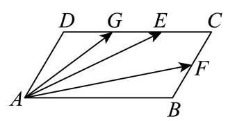

【答案】 $\arccos \frac{1}{4}$

【解析】

【分析】以 $\overrightarrow{AB}$ 、 $\overrightarrow{AD}$ 为基底将目标向量线性表示,通过向量数量积运算建立关于 $\cos \angle {BAD}$ 的方程, 求解得到角度.

【详解】 $\overrightarrow{AE} = \overrightarrow{AD} + \overrightarrow{DE} = \overrightarrow{AD} + \frac{2}{3}\overrightarrow{AB}$ ,

$\overrightarrow{FG} = \overrightarrow{AG} - \overrightarrow{AF} = \overrightarrow{AD} + \overrightarrow{DG} - \overrightarrow{AB} - \overrightarrow{BF} = \overrightarrow{AD} + \frac{1}{3}\overrightarrow{AB} - \overrightarrow{AB} - \frac{1}{2}\overrightarrow{AD} = \frac{1}{2}\overrightarrow{AD} - \frac{2}{3}\overrightarrow{AB}$ ,

所以 $\overrightarrow{AE} \cdot  \overrightarrow{FG} = \left( {\overrightarrow{AD} + \frac{2}{3}\overrightarrow{AB}}\right)  \cdot  \left( {\frac{1}{2}\overrightarrow{AD} - \frac{2}{3}\overrightarrow{AB}}\right)  = \frac{1}{2}{\overrightarrow{AD}}^{2} - \frac{4}{9}{\overrightarrow{AB}}^{2} - \frac{1}{3}\overrightarrow{AB} \cdot  \overrightarrow{AD}$

$= \frac{1}{2} \times  4 - \frac{4}{9} \times  {36} - \frac{1}{3}\overrightarrow{AB} \cdot  \overrightarrow{AD} =  - {14} - \frac{1}{3}\overrightarrow{AB} \cdot  \overrightarrow{AD}$ ,又 $\overrightarrow{AE} \cdot  \overrightarrow{FG} =  - {15}$ ,

所以 $- {14} - \frac{1}{3}\overrightarrow{AB} \cdot  \overrightarrow{AD} =  - {15}$ ,解得 $\overrightarrow{AB} \cdot  \overrightarrow{AD} = 3$ ,

所以 $\cos \angle {BAD} = \frac{\overrightarrow{AB} \cdot  \overrightarrow{AD}}{\left| \overrightarrow{AB}\right|  \cdot  \left| \overrightarrow{AD}\right| } = \frac{3}{6 \times  2} = \frac{1}{4}$ ，所以 $\angle {BAD} = \arccos \frac{1}{4}$ .

11. 已知点 $P\text{ 、 }Q$ 分别是椭圆 $\frac{{x}^{2}}{9} + \frac{{y}^{2}}{5} = 1$ 和圆 ${\left( x - 2\right) }^{2} + {y}^{2} = 1$ 上的两个动点,且点 $A\left( {2,1}\right)$ ，则 $\left| {PA}\right|  + \left| {PQ}\right|$ 的最大值为___.

【答案】 $7 + \sqrt{17}$ ## $\sqrt{17} + 7$

【解析】

【分析】根据给定条件,利用椭圆的定义将所求最大值转化为求值 $5 + \left| {PA}\right|  - \left| {P{F}^{\prime }}\right|$ 的最大值, 再结合圆的性质求解.

【详解】因为 $F\left( {2,0}\right)$ 为椭圆 $\frac{{x}^{2}}{9} + \frac{{y}^{2}}{5} = 1$ 的右焦点,设其左焦点为 ${F}^{\prime }\left( {-2,0}\right)$ ,

圆 ${\left( x - 2\right) }^{2} + {y}^{2} = 1$ 的圆心 $C\left( {2,0}\right)$ ,半径 $r = 1$ ,由椭圆的定义得 $\left| {PF}\right|  = 6 - \left| {P{F}^{\prime }}\right|$ ,

则 $\left| {PQ}\right|  + \left| {PA}\right|  \leq  \left| {PF}\right|  + 1 + \left| {PA}\right|  = 6 - \left| {P{F}^{\prime }}\right|  + 1 + \left| {PA}\right|  = 7 + \left| {PA}\right|  - \left| {P{F}^{\prime }}\right|$ ,

而 $\left| {PA}\right|  - \left| {P{F}^{\prime }}\right|  \leq  \left| {A{F}^{\prime }}\right|  = \sqrt{{16} + 1} = \sqrt{17}$ ,当且仅当点 $P$ 在直线 $A{F}^{\prime }$ 上时取等号, 所以当 $P$ 是线段 $A{F}^{\prime }$ 延长线与椭圆的交点、 $Q$ 是线段 ${PF}$ 延长线与圆的交点时, $\left| {PA}\right|  + \left| {PQ}\right|$ 取得最大值 $7 + \sqrt{17}$ .

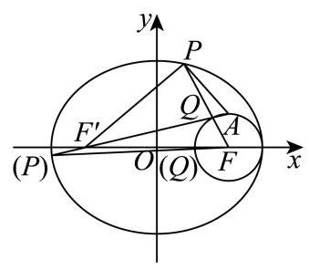

12. 已知集合 $A = \{ x \mid  1 \leq  x \leq  n, x \in  \mathbf{Z}\} , S \subseteq  A$ ，当 $a\text{ 、 }b \in  S$ 且 $a \neq  b$ 时，都有 $\left| {a - b}\right|  > 2$ ，若满足条件的集合 $\mathrm{S}$ 至少有 100 个，则正整数 $n$ 的最小值是___.

【答案】 12

【解析】

【分析】设 $f\left( n\right)$ 表示集合 $\{ 1,2,3,\cdots , n\}$ 中,满足要求的集合 $\mathrm{S}$ 的个数,得到 $f\left( n\right)  = f\left( {n - 1}\right)  + f\left( {n - 3}\right)$ ,从而求出答案.

【详解】设 $A = \{ 1,2,3,\cdots , n\} , S \subseteq  A$ ,当 $a\text{ 、 }b \in  S$ 且 $a \neq  b$ 时,都有 $\left| {a - b}\right|  > 2$ ,

设 $f\left( n\right)$ 表示集合 $\{ 1,2,3,\cdots , n\}$ 中，满足要求的集合 $\mathrm{S}$ 的个数，

若 $\mathrm{S}$ 中无 $n$ ,则有 $f\left( {n - 1}\right)$ 个集合满足要求,

若 $\mathrm{S}$ 中有 $n$ ,要想满足要求,则 $\mathrm{S}$ 中无 $n - 1, n - 2$ ,故有 $f\left( {n - 3}\right)$ 个集合满足要求,

所以 $f\left( n\right)  = f\left( {n - 1}\right)  + f\left( {n - 3}\right)$ ,

当 $n = 1$ 时， $A = \{ 1\}$ ，故 $S = \varnothing ,\{ 1\}$ ，即 $f\left( 1\right)  = 2$ ，

当 $n = 2$ 时， $A = \{ 1,2\}$ ，故 $S = \varnothing ,\{ 1\} ,\{ 2\}$ ，即 $f\left( 2\right)  = 3$ ，

当 $n = 3$ 时， $A = \{ 1,2,3\}$ ，故 $S = \varnothing ,\{ 1\} ,\{ 2\} ,\{ 3\}$ ，即 $f\left( 3\right)  = 4$ ，

故 $f\left( 4\right)  = f\left( 3\right)  + f\left( 1\right)  = 4 + 2 = 6, f\left( 5\right)  = f\left( 4\right)  + f\left( 2\right)  = 6 + 3 = 9$ ,

$f\left( 6\right)  = f\left( 5\right)  + f\left( 3\right)  = 9 + 4 = {13},\;f\left( 7\right)  = f\left( 6\right)  + f\left( 4\right)  = {13} + 6 = {19},$

$f\left( 8\right)  = f\left( 7\right)  + f\left( 5\right)  = {19} + 9 = {28}, f\left( 9\right)  = f\left( 8\right)  + f\left( 6\right)  = {28} + {13} = {41},$

$f\left( {10}\right)  = f\left( 9\right)  + f\left( 7\right)  = {41} + {19} = {60},\;f\left( {11}\right)  = f\left( {10}\right)  + f\left( 8\right)  = {60} + {28} = {88},$

$f\left( {12}\right)  = f\left( {11}\right)  + f\left( 9\right)  = {88} + {41} = {129} > {100},$

故正整数 $n$ 的最小值为 12 .

## 二、选择题 (本大题共有 4 题, 满分 18 分, 第 13~14 题每题 4 分, 第 15~16 题每 题 5 分, 每题都给出四个结论, 其中有且仅有一个结论是正确的, 必须把答题纸 上相应题序内的正确结论代号涂黑, 选对得相应满分, 否则一律得零分)

13. 两个变量 $x$ 与 $y$ 之间的回归方程 ( )

A. 表示 $x$ 与 $y$ 之间的函数关系; B. 表示 $x$ 与 $y$ 之间的不确定关系;

C. 反映 $x$ 与 $y$ 之间的真实关系; D. 是反映 $x$ 与 $y$ 之间的真实关系的一

种最佳拟合.

【答案】D

【解析】

【分析】根据回归直线方程的定义, 结合选项, 即可求解.

【详解】根据回归方程的定义，可得两个变量 $x$ 与 $y$ 之间的回归方程是反映 $x$ 与 $y$ 之间的真实关系的一种最佳拟合.

故选: D.

14. 在 ${ABC}$ 中， $A, B$ 均为锐角，设甲: $\sin A < \sin C$ ；Z: ${ABC}$ 是钝角三角形，则甲是乙的( )

A. 充要条件 B. 充分不必要条件

C. 必要不充分条件 D. 既不充分也不必要条件

【答案】C

【解析】

【分析】举反例否定充分性, 利用正弦定理并结合题意证明必要性即可.

【详解】对于充分性,设 $A = \frac{\pi }{4}, C = \frac{\pi }{3}$ ,显然满足甲,

此时 $B = \frac{5\pi }{12},\;{ABC}$ 不是钝角三角形,故充分性不成立;

对于必要性,若 ${ABC}$ 是钝角三角形,则 $C > \frac{\pi }{2}$ ,则 $a < c$ ,

由正弦定理可知 $\sin A < \sin C$ ,则必要性成立,

即甲是乙的必要不充分条件, 故 C 正确.

故选:C

15. 如图，正方体 ${ABCD} - {A}_{1}{B}_{1}{C}_{1}{D}_{1}$ 的棱长为 1，任作平面 $a$ 与对角线 $A{C}_{1}$ 垂直，使平面 $a$ 与正方体的六条棱都有公共点.记截面 ${PQRSWE}$ 的面积为 $\mathrm{S}$ ，截面周长为 $L$ ，则有( )

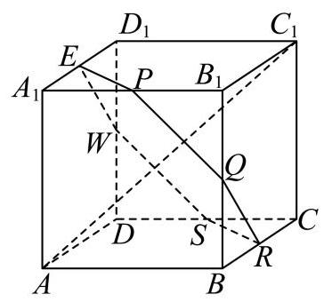

A. $\mathrm{S}$ 为定值， $L$ 为定值

B. $\mathrm{S}$ 为定值， $L$ 不为定值

C. $\mathrm{S}$ 不为定值， $L$ 为定值

D. $\mathrm{S}$ 不为定值， $L$ 不为定值

【答案】C

【解析】

【分析】判断周长和面积是否为定值, 先判断截面各边之间的数量关系和位置关系, 将立体问题平面化求解即可.

【详解】如图所示,

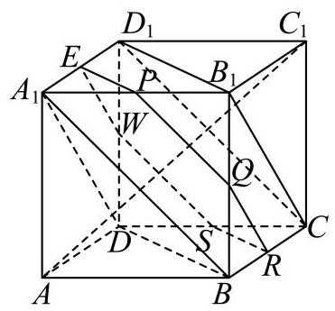

连接 ${B}_{1}{D}_{1},{B}_{1}C,{D}_{1}C$ ,易知平面 ${B}_{1}{D}_{1}C$ 与对角线 $A{C}_{1}$ 垂直,

又平面 $a$ 与对角线 $A{C}_{1}$ 垂直,所以平面 $a//$ 平面 ${B}_{1}{D}_{1}C$ ;

同理连接 ${A}_{1}B,{A}_{1}D,{BD}$ ,易知平面 ${A}_{1}{BD}$ 与对角线 $A{C}_{1}$ 垂直,

又平面 $a$ 与对角线 $A{C}_{1}$ 垂直，所以平面 $a//$ 平面 ${A}_{1}{BD}$ ；

又平面 $a \cap$ 平面 ${AB}{B}_{1}{A}_{1} = {PQ}$ ,平面 ${A}_{1}{BD} \cap$ 平面 ${AB}{B}_{1}{A}_{1} = {A}_{1}B$

从而可得 ${A}_{1}B//{PQ}$ ,同理可得 ${WS}//C{D}_{1}$ ,又 ${A}_{1}B//C{D}_{1}$ ,所以 ${WS}//{PQ}$ ,

同理可得 ${SR}//{EP}//{BD},{QR}//{EW}//{B}_{1}C$ , 将截面 ${PQRSWE}$ 各边展开如图:

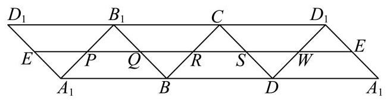

由平行关系知, ${PQRSWE}$ 的周长等于 $3\sqrt{2}$ 为定值;

由平行关系知, ${PQRSWE}$ 的形状为六边形,各边夹角为 ${120}^{ \circ  }$ ,且相邻两边之和为 $\sqrt{2}$ ,

设 ${PQ} = x$ ,则 ${QR} = \sqrt{2} - x$ ,则 ${PQRSWE}$ 的面积

$S = 2 \times  \frac{\sqrt{3}}{4} \times  {\left( \sqrt{2}\right) }^{2} - \frac{\sqrt{3}}{4}{x}^{2} - \frac{\sqrt{3}}{4}{\left( \sqrt{2} - x\right) }^{2} =  - \frac{\sqrt{3}}{2}{x}^{2} + \frac{\sqrt{6}}{2}x + \frac{\sqrt{3}}{2}$ ,

从而可知 $\mathrm{S}$ 是关于 $x$ 的二次函数,不为定值.

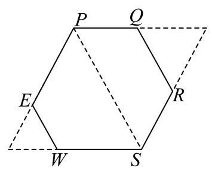

16. 设正项数列 $\left\{  {a}_{n}\right\}$ 的首项 ${a}_{1} = 1$ ,前 $n$ 项和为 ${S}_{n}$ ,若对任意的正整数 $n$ 都有 $A \geq  \frac{{a}_{n + 1}}{{S}_{n}}$ , 其中 $A\widehat{1}\mathbf{R}$ ,则称 $\left\{  {a}_{n}\right\}$ 是 “ $A$ -数列”. 下列结论中错误的是 ( )

A. 若 $\left\{  {a}_{n}\right\}$ 是公差为 2 的等差数列，则 $\left\{  {a}_{n}\right\}$ 是 “3 - 数列”；

B. 若 $\left\{  {a}_{n}\right\}$ 是 “ 2 - 数列”，则 $\left\{  {a}_{n}\right\}$ 可能为常数列:

C. 若 $\left\{  {a}_{n}\right\}$ 是 “ 2 - 数列”，则不存在正整数 $n \geq  2$ ，满足 ${a}_{n} > 2 \cdot  {3}^{n - 2}$ ；

D. 对任意 $1 < p < q$ ,若 ${a}_{n} = \frac{1}{2}\left( {{p}^{n - 1} + {q}^{n - 1}}\right)$ ，且满足 $1 + A \geq  q$ ，则 $\left\{  {a}_{n}\right\}$ 是 “ $A -$ 数列”.

【答案】D

【解析】

【分析】根据“ $A$ -数列”的定义可判断 $\mathrm{A}$ ；取常数数列，判断 $\mathrm{B}$ 即可；根据“ $A$ -数列”满足的条件可得出相应不等式 ${S}_{n + 1} \leq  3{S}_{n}$ ,可推出 ${S}_{n} \leq  {3}^{n - 1}$ ,即可判断 $\mathrm{C}$ ; 举出反例可判断 $\mathrm{D}$ .

【详解】对于 $\mathrm{A}$ ,若 $\left\{  {a}_{n}\right\}$ 是首项为 1 、公差为 2 的等差数列,则 ${a}_{n} = {2n} - 1$ ,

前 $n$ 项和 ${S}_{n} = \frac{n\left( {1 + {2n} - 1}\right) }{2} = {n}^{2}$ ,

$3{S}_{n} - {a}_{n + 1} = 3{n}^{2} - \left( {{2n} + 1}\right)  = \left( {{3n} + 1}\right) \left( {n - 1}\right)  \geq  0\left( {n = 1\text{ 时等号成立 }}\right)$ ,

所以 $3 \geq  \frac{{a}_{n + 1}}{{S}_{n}}$ ,即 $\left\{  {a}_{n}\right\}$ 是 “ $3 -$ 数列”，故 $\mathrm{A}$ 正确；

对于 $\mathrm{B}$ ,当 ${a}_{n} = 1$ 时, ${S}_{n} = n,2 \geq  \frac{{a}_{n + 1}}{{S}_{n}} = \frac{1}{n}$ 成立,

即 $\left\{  {a}_{n}\right\}$ 是 “ $2 -$ 数列” 时, $\left\{  {a}_{n}\right\}$ 可能为常数列,故 $\mathrm{B}$ 正确;

对于 $\mathrm{C}$ ,若 $\left\{  {a}_{n}\right\}$ 是 “ $2 -$ 数列”,则 ${a}_{n + 1} \leq  2{S}_{n}$ ,且 ${S}_{1} = 1$ ,

所以 ${S}_{n + 1} = {S}_{n} + {a}_{n + 1} \leq  {S}_{n} + 2{S}_{n} = 3{S}_{n}$ ,

则 ${S}_{n} \leq  3{S}_{n - 1} \leq  {3}^{2}{S}_{n - 2} \leq  \ldots  \leq  {3}^{n - 1}{S}_{1}$ ,

故 ${S}_{n} \leq  {3}^{n - 1}$ ,由题意知当 $n \geq  2,{a}_{n} \leq  2{S}_{n - 1}$ ,

结合 ${S}_{n - 1} \leq  {3}^{n - 2}$ ,得 ${a}_{n} \leq  2 \cdot  {3}^{n - 2}$ ,

因此不存在 $n \geq  2$ 使 ${a}_{n} > 2 \cdot  {3}^{n - 2}$ ，C 正确；

对于 $\mathrm{D}$ ,取 $p = 2, q = 3, A = 2\left( {\text{ 满足 }1 + A = q = 3}\right)$ ,

则 ${a}_{2} = \frac{1}{2}\left( {2 + 3}\right)  = \frac{5}{2},{S}_{1} = 1$ ,而 $\frac{5}{2} > 2 \times  1$ ,所以 $\frac{{a}_{2}}{{S}_{1}} \leq  A$ 不成立,

因此 “ $1 + A \geq  q$ ” 不足以保证 $\left\{  {a}_{n}\right\}$ 是 “ $A$ -数列”, D 错误.

## 三、解答题 (本大题共有 5 题, 满分 78 分, 解答下列各题必须在答题纸的规定区 域(对应的题号)内写出必要的步骤).

17. 如图，在四棱锥 $P - {ABCD}$ 中， ${ABCD}$ 是边长为 1 的正方形， ${PA} \bot$ 平面 ${ABCD}$ ， $E$ 是 ${PA}$ 的中点.

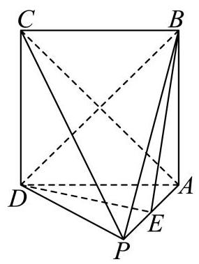

(1)求证: ${BD}\bot$ 平面 ${PAC}$ ；

(2)若直线 ${BE}$ 与平面 ${PAC}$ 所成角的正弦值为 $\frac{\sqrt{10}}{5}$ ，求三棱锥 $B - {PCD}$ 的体积.

【答案】(1)证明见解析

(2) $\frac{1}{6}$

【解析】

【分析】(1) 利用线面垂直判定定理,通过证明 ${BD}$ 垂直于平面 ${PAC}$ 内的两条相交直线 ${PA}$ 和 ${AC}$ ,从而证得 ${BD} \bot$ 平面 ${PAC}$ ;

(2)建立空间直角坐标系，求出直线方向向量与平面法向量，利用线面角的正弦值公式列方程,求解得到 ${PA}$ 的长度,再由棱锥体积公式得解.

【小问 1 详解】

如图,连接 ${AC},{BD}$ 交于点 $O$ ,可得点 $O$ 是 ${AC}$ 的中点,

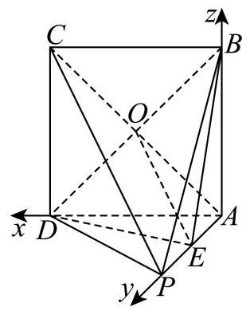

因为四边形 ${ABCD}$ 是边长为 1 的正方形,所以 ${AC} \bot  {BD}$ ,

又因为 ${PA} \bot$ 平面 ${ABCD},{BD} \subset$ 平面 ${ABCD}$ ,

所以 ${PA} \bot  {BD}$ ,

由 ${PA} \cap  {AC} = A,{PA},{AC} \subset$ 平面 ${PAC}$ ,

得 ${BD} \bot$ 平面 ${PAC}$ ;

【小问 2 详解】

设 ${PA} = b\;\left( {b > 0}\right)$ ,

以 $A$ 为原点， ${AD}$ 为 $x$ 轴， ${AP}$ 为 $y$ 轴， ${AB}$ 为 $z$ 轴，建立空间直角坐标系，

则 $A\left( {0,0,0}\right)$ ， $D\left( {1,0,0}\right)$ ， $P\left( {0, b,0}\right)$ ， $B\left( {0,0,1}\right)$ ， $C\left( {1,0,1}\right)$ ， $E\left( {0,\frac{b}{2},0}\right)$ ，

$\overrightarrow{BE} = \left( {0,\frac{b}{2}, - 1}\right) ,\overrightarrow{AP} = \left( {0, b,0}\right) ,\overrightarrow{PC} = \left( {1, - b,1}\right) ,$

设平面 ${PAC}$ 的一个法向量为 $\overrightarrow{n} = \left( {x, y, z}\right)$ ,

则 $\left\{  \begin{array}{l} \overrightarrow{n} \cdot  \overrightarrow{PC} = x - {by} + z = 0 \\  \overrightarrow{n} \cdot  \overrightarrow{AP} = {by} = 0 \end{array}\right.$ ,令 $x = 1$ ,可取 $\overrightarrow{n} = \left( {1,0, - 1}\right)$ ,

设直线 ${BE}$ 与平面 ${PAC}$ 所成角为 $\theta$ ，

则 $\sin \theta  = \frac{\left| \overrightarrow{BE} \cdot  \overrightarrow{n}\right| }{\left| \overrightarrow{BE}\right|  \cdot  \left| \overrightarrow{n}\right| } = \frac{\left| 0 \times  1 + \frac{b}{2} \times  0 + \left( -1\right)  \cdot  \left( -1\right) \right| }{\sqrt{2} \cdot  \sqrt{\frac{{b}^{2}}{4} + 1}} = \frac{1}{\sqrt{\frac{{b}^{2}}{2} + 2}} = \frac{\sqrt{10}}{5}$ ,

整理可得 ${b}^{2} = 1$ ,解得 $b = 1$ 或 $b =  - 1$ (舍去),即 ${PA} = 1$ ,

故 ${V}_{B - {PCD}} = {V}_{P - {BCD}} = \frac{1}{3} \cdot  {S}_{\bigtriangleup {BCD}} \cdot  {PA} = \frac{1}{3} \times  \frac{1}{2} \times  {1}^{2} \times  1 = \frac{1}{6}$ .

18. 已知 $f\left( x\right)  = {\log }_{a}x, g\left( x\right)  = 2{\log }_{a}\left( {{2x} + t - 2}\right) ,\left( {a > 0, a \neq  1, t \in  \mathbf{R}}\right)$ .

(1)若 $f\left( 1\right)  = g\left( 2\right)$ ，求 $t$ 的值；

(2)当 $x \in  \left\lbrack  {1,4}\right\rbrack$ 时 $f\left( x\right)  \geq  g\left( x\right)$ 恒成立，求 $t$ 的取值范围.

【答案】(1) $t =  - 1$

(2)当 $a > 1$ 时无解; 当 $0 < a < 1$ 时 $t \in  \lbrack 1, + \infty )$

【解析】

【分析】(1) 由 $f\left( 1\right)  = g\left( 2\right)$ 直接代入结合对数函数单调性解得 $t =  - 1$ .

(2)通过对底数 $a$ 分类讨论，利用对数函数单调性转化不等式，分离参数后求函数最值， 再结合真数范围确定 $t$ 的取值

【小问 1 详解】

已知 $f\left( x\right)  = {\log }_{a}x, g\left( x\right)  = 2{\log }_{a}\left( {{2x} + t - 2}\right) \left( {a > 0, a \neq  1, t \in  R}\right)$ .

由 $f\left( 1\right)  = g\left( 2\right)$ ,代入得: ${\log }_{a}1 = 2{\log }_{a}\left( {2 \times  2 + t - 2}\right)$ .

因为 ${\log }_{a}1 = 0$ ,所以 $2{\log }_{a}\left( {t + 2}\right)  = 0$ ,即 ${\log }_{a}\left( {t + 2}\right)  = 0$ ,得 $t + 2 = 1$ ,解得 $t =  - 1$ .

【小问 2 详解】

由 $f\left( x\right)  \geq  g\left( x\right)$ 得 ${\log }_{a}x \geq  2{\log }_{a}\left( {{2x} + t - 2}\right)$ .

当 $a > 1$ 时, ${\log }_{a}x$ 单调递增,不等式等价于 $x \geq  {\left( 2x + t - 2\right) }^{2}$ ,且真数 ${2x} + t - 2 > 0$ .

即 ${\left( 2x + t - 2\right) }^{2} \leq  x$ ,且 ${2x} + t - 2 > 0$ 对 $x \in  \left\lbrack  {1,4}\right\rbrack$ 恒成立.

由 ${\left( 2x + t - 2\right) }^{2} \leq  x$ 得 $- \sqrt{x} \leq  {2x} + t - 2 \leq  \sqrt{x}$ .

结合 ${2x} + t - 2 > 0$ 得 $0 < {2x} + t - 2 \leq  \sqrt{x}$ .

故 $t \leq  \sqrt{x} - {2x} + 2$ 且 $t > 2 - {2x}$ 对 $x \in  \left\lbrack  {1,4}\right\rbrack$ 恒成立.

令 $h\left( x\right)  = \sqrt{x} - {2x} + 2, x \in  \left\lbrack  {1,4}\right\rbrack$ .

令 $\sqrt{x} = u$ ,由 $x \in  \left\lbrack  {1,4}\right\rbrack$ ,得 $u \in  \left\lbrack  {1,2}\right\rbrack$ ,且 $x = {u}^{2}$ .

于是 $h\left( x\right)  = u - 2{u}^{2} + 2 =  - 2{u}^{2} + u + 2$ .

这是关于 $u$ 的二次函数,开口向下,对称轴为 $u =  - \frac{1}{2 \times  \left( {-2}\right) } = \frac{1}{4}$ .

对称轴 $u = \frac{1}{4}$ 在区间 $\left\lbrack  {1,2}\right\rbrack$ 的左侧,因此函数 $- 2{u}^{2} + u + 2$ 在 $u \in  \left\lbrack  {1,2}\right\rbrack$ 上单调递减。 又 $u = \sqrt{x}$ 在 $\left\lbrack  {1,4}\right\rbrack$ 上单调递增,根据 “同增异减” 可得 $h\left( x\right)$ 在 $x \in  \left\lbrack  {1,4}\right\rbrack$ 上单调递减.

所以 $h{\left( x\right) }_{\min } = h\left( 4\right)  = 2 - 8 + 2 =  - 4, h{\left( x\right) }_{\max } = h\left( 1\right)  = 1 - 2 + 2 = 1$ .

故 $t \leq  h{\left( x\right) }_{\min } =  - 4$ 又 $t > 2 - {2x}$ 对一切 $x \in  \left\lbrack  {1,4}\right\rbrack$ 恒成立.

则 $t$ 需大于 $2 - {2x}$ 在 $\left\lbrack  {1,4}\right\rbrack$ 上最大值即 $t > 0$ .

因为 $t \leq   - 4$ 与 $t > 0$ 不能同时成立. 故 $a > 1$ 时无解.

当 $0 < a < 1$ 时, ${\log }_{a}x$ 单调递减,不等式等价于 $x \leq  {\left( 2x + t - 2\right) }^{2}$ ,且真数

${2x} + t - 2 > 0$ .

即 ${\left( 2x + t - 2\right) }^{2} \geq  x$ ,且 ${2x} + t - 2 > 0$ 对 $x \in  \left\lbrack  {1,4}\right\rbrack$ 恒成立.

由 ${\left( 2x + t - 2\right) }^{2} \geq  x$ 得 ${2x} + t - 2 \leq   - \sqrt{x}$ 或 ${2x} + t - 2 \geq  \sqrt{x}$ . 结合 ${2x} + t - 2 > 0$ ,只需 ${2x} + t - 2 \geq  \sqrt{x}$ 恒成立.

故 $t \geq  \sqrt{x} - {2x} + 2$ 对 $x \in  \left\lbrack  {1,4}\right\rbrack$ 恒成立. 由上述分析知 $h\left( x\right)  = \sqrt{x} - {2x} + 2$ 在 $\left\lbrack  {1,4}\right\rbrack$ 上最大值为 $h\left( 1\right)  = 1$ ,所以 $t \geq  1$ .

又需 ${2x} + t - 2 > 0$ 对 $x \in  \left\lbrack  {1,4}\right\rbrack$ 恒成立,即 $t > 2 - {2x}$ ,右边最大值为 0,所以 $t > 0$ , 结合 $t \geq  1$ 得 $t \geq  1$ .

综上所述， $t$ 的取值范围是 $\lbrack 1, + \infty )$ .

19. 为调查大学数学专业的学生对中华优秀传统文化的了解情况, 现对某大学的数学专业学生进行抽样调查.已知被调查的男、女生人数均为 ${20n}$ ( $n$ 为正整数),得到以下 $2 \times  2$ 列联表:

(1)调查结果显示有 97.5% 的把握认为该校学生对中华优秀传统文化的了解与性别有关， 但没有 99% 的把握认为该校学生对中华优秀传统文化的了解与性别有关，求 $n$ 的值；

(2)当 $n = 4$ 时，采用分层抽样的方式在“了解中华优秀传统文化”的学生中抽取 10 人.

①从这 10 人中随机抽取 3 人进行第二次调查，在第二次调查中，已知至少有 2 名女生被抽到, 求抽到男生的概率;

②在“不了解中华优秀传统文化”的男生中再随机抽取 $m\left( {m \in  \mathbf{N}}\right)$ 人，然后从这 ${10} + m$ 人中随机抽取 2 人. 用随机变量 $X$ 表示抽到 “了解中华优秀传统文化”的女生人数，若随机变量 $X$ 的数学期望值不小于 $\frac{1}{2}$ ,求 $m$ 的最大值.

<table><tr><td></td><td>男生</td><td>女生</td><td>合计</td></tr><tr><td>了解</td><td></td><td>10n</td><td></td></tr><tr><td>不了解</td><td>5n</td><td></td><td></td></tr><tr><td>合计</td><td></td><td></td><td></td></tr></table>

参考公式: ${\chi }^{2} = \frac{n{\left( ad - bc\right) }^{2}}{\left( {a + b}\right) \left( {c + d}\right) \left( {a + c}\right) \left( {b + d}\right) }$ ,其中 $n = a + b + c + d$ .

参考数据:

<table><tr><td>$P\left( {{\chi }^{2} \geq  k}\right)$</td><td>0.05</td><td>0.025</td><td>0.010</td><td>0.005</td></tr><tr><td>$k$</td><td>3.841</td><td>5.024</td><td>6.635</td><td>7.879</td></tr></table>

【答案】(1) $n = 2$

(2) $\frac{9}{10}$ ；② 6

【解析】

【分析】(1) 完善 $2 \times  2$ 列联表,根据 ${K}^{2}$ 的计算可得出关于 $n$ 的等式,即可解得正整数 $n$ 的值, 结合临界值表可得出结论;

(2)①分析可知，抽取的这 10 男生的人数为 6 女生的人数为 4 ，利用条件概率公式可求得所求事件的概率;

②随机变量 $X$ 的取值为: 0,1,2,求出期望再解不等式.

【小问 1 详解】

被调查的男女生人数均为 ${20n}\left( {n \in  {\mathbf{N}}^{ * }}\right)$ ,其中男生中不了解的有 ${5n}$ ,则了解的有 ${15n}$ , 其中女生中了解的有 ${10n}$ ,则不了解的有 ${10n}$ ,

则可得 $2 \times  2$ 列联表如下所示:

<table><tr><td></td><td>男生</td><td>女生</td><td>合计</td></tr><tr><td>了解</td><td>15n</td><td>10n</td><td>25n</td></tr><tr><td>不了解</td><td>5n</td><td>10n</td><td>15n</td></tr><tr><td>合计</td><td>20n</td><td>20n</td><td>40n</td></tr></table>

因 ${K}^{2} = \frac{{40n} \times  {\left( {15}n \times  {10}n - 5n \times  {10}n\right) }^{2}}{{20n} \times  {20n} \times  {25n} \times  {15n}} = \frac{8n}{3}$ ,

由题意,可知 ${5.024} < \frac{8n}{3} < {6.635}$ ,又 $n \in  {\mathrm{N}}^{ * }$ ,可得 $n = 2$ ;

【小问 2 详解】

① 当 $n = 4$ 时,了解中华优秀传统文化的男生有 60 人，女生有 40 人，

则采用分层抽样时, 在男生中抽取 6 人，女生中抽取 4 人，

再从这 10 人中随机抽取 3 人进行第二次调查,

记 “至少有 2 名女生被抽到” 为事件 $A$ ，“抽到男生”为事件 $B$ ，

则 $P\left( {B \mid  A}\right)  = \frac{n\left( {AB}\right) }{n\left( A\right) } = \frac{{\mathrm{C}}_{4}^{2}{\mathrm{C}}_{6}^{1}}{{\mathrm{C}}_{4}^{2}{\mathrm{C}}_{6}^{1} + {\mathrm{C}}_{4}^{3}} = \frac{36}{{36} + 4} = \frac{9}{10}$ ;

②根据题意可知这 ${10} + m$ 人中有 4 人是了解中华优秀传统文化的女生，

随机抽取 2 人，随机变量 $X$ 的取值为0,1,2，

$$
P\left( {X = 0}\right)  = \frac{{\mathrm{C}}_{6 + m}^{2}}{{\mathrm{C}}_{{10} + m}^{2}} = \frac{\left( {6 + m}\right) \left( {5 + m}\right) }{\left( {{10} + m}\right) \left( {9 + m}\right) },
$$

$$
P\left( {X = 1}\right)  = \frac{{\mathrm{C}}_{6 + m}^{1}{\mathrm{C}}_{4}^{1}}{{\mathrm{C}}_{{10} + m}^{2}} = \frac{2 \times  4\left( {6 + m}\right) }{\left( {{10} + m}\right) \left( {9 + m}\right) } = \frac{8\left( {6 + m}\right) }{\left( {{10} + m}\right) \left( {9 + m}\right) },
$$

$$
P\left( {X = 2}\right)  = \frac{{\mathrm{C}}_{4}^{2}}{{\mathrm{C}}_{{10} + m}^{2}} = \frac{2 \times  6}{\left( {{10} + m}\right) \left( {9 + m}\right) } = \frac{12}{\left( {{10} + m}\right) \left( {9 + m}\right) },
$$

则

$$
E\left( X\right)  = 0 \times  \frac{\left( {6 + m}\right) \left( {5 + m}\right) }{\left( {{10} + m}\right) \left( {9 + m}\right) } + 1 \times  \frac{8\left( {6 + m}\right) }{\left( {{10} + m}\right) \left( {9 + m}\right) } + 2 \times  \frac{12}{\left( {{10} + m}\right) \left( {9 + m}\right) } = \frac{8\left( {9 + m}\right) }{\left( {{10} + m}\right) \left( {9 + m}\right) } = \frac{8}{{10} + m}
$$

依题意,由 $\frac{8}{{10} + m} \geq  \frac{1}{2}$ ,解得 $m \leq  6$ ,

所以 $m$ 的最大值为 6 .

20. 将以坐标原点为顶点,以 $x$ 轴为对称轴,并经过点 $P\left( {1,1}\right)$ 的抛物线记为 $C$ . 作两条直线分别与抛物线 $C$ 相交于点 $A\left( {{x}_{1},{y}_{1}}\right)$ 、 $B\left( {{x}_{2},{y}_{2}}\right)$ ，设 ${PA}$ 、 ${PB}$ 的斜率分别为 ${k}_{PA}$ 、 ${k}_{PB}$ ，且满足 ${k}_{PA} + {k}_{PB} = 0.$

(1)求抛物线 $C$ 的标准方程；

(2)证明:直线 ${AB}$ 的斜率 ${k}_{AB} =  - \frac{1}{2}$ ；

(3)若直线 ${AB}$ 在 $y$ 轴上的截距 $b \in  \left\lbrack  {0,1}\right\rbrack$ ，求 $\bigtriangleup  {ABP}$ 面积的最大值.

【答案】(1) ${y}^{2} = x$ ； (2) 证明见解析;

(3) $\frac{{16}\sqrt{3}}{9}$ .

【解析】

【分析】(1) 待定系数法设出抛物线的表达式,代入点 $P$ 的坐标求解即可;

(2)联立 ${PA}\text{ 、 }{PB}$ 与抛物线方程，求出 $A\text{ 、 }B$ 的坐标，利用斜率公式求解即可；

(3)用含 $b$ 的式子表示弦长 $\left| {AB}\right|$ 及点 $P$ 到直线 ${AB}$ 的距离，进而表示 $\bigtriangleup  {ABP}$ 面积，利用函数求最值即可.

【小问 1 详解】

由题意,设所求抛物线 $C$ 的方程为: ${y}^{2} = {mx}$ ,

点 $P\left( {1,1}\right)$ 代入抛物线 $C$ 的方程得: $m = 1$ ,

所以抛物线 $C$ 的标准方程为: ${y}^{2} = x$ .

【小问 2 详解】

由题意直线 ${PA}$ 的方程可设为 $y - 1 = {k}_{PA}\left( {x - 1}\right)$ ,

联立 $\left\{  \begin{array}{l} y - 1 = {k}_{PA}\left( {x - 1}\right) \\  {y}^{2} = x \end{array}\right.$ ,代入化简得 ${k}_{PA}{y}^{2} - y + 1 - {k}_{PA} = 0$ ,

由题意 $\Delta  > 0$ ,从而 ${y}_{1} \times  {y}_{P} = \frac{1 - {k}_{PA}}{{k}_{PA}}$ ,即 ${y}_{1} = \frac{1 - {k}_{PA}}{{k}_{PA}}$ ,

从而 ${x}_{1} = {y}_{1}^{2} = {\left( \frac{1 - {k}_{PA}}{{k}_{PA}}\right) }^{2}$ ,即 $A\left( {{\left( \frac{1 - {k}_{PA}}{{k}_{PA}}\right) }^{2},\frac{1 - {k}_{PA}}{{k}_{PA}}}\right)$ ;

同理可得 ${y}_{2} = \frac{1 - {k}_{PB}}{{k}_{PB}}, B\left( {{\left( \frac{1 - {k}_{PB}}{{k}_{PB}}\right) }^{2},\frac{1 - {k}_{PB}}{{k}_{PB}}}\right)$ ,

${y}_{1} + {y}_{2} = \frac{1 - {k}_{PA}}{{k}_{PA}} + \frac{1 - {k}_{PB}}{{k}_{PB}} = \frac{1}{{k}_{PA}} - 1 + \frac{1}{{k}_{PB}} - 1 = \frac{{k}_{PA} + {k}_{PB}}{{k}_{PA} \cdot  {k}_{PB}} - 2,$

又 ${k}_{PA} + {k}_{PB} = 0$ ，所以 ${y}_{1} + {y}_{2} = \frac{{k}_{PA} + {k}_{PB}}{{k}_{PA} \cdot  {k}_{PB}} - 2 =  - 2$ ，

所以 ${k}_{AB} = \frac{{y}_{1} - {y}_{2}}{{x}_{1} - {x}_{2}} = \frac{{y}_{1} - {y}_{2}}{{y}_{1}^{2} - {y}_{2}^{2}} = \frac{{y}_{1} - {y}_{2}}{\left( {{y}_{1} - {y}_{2}}\right) \left( {{y}_{1} + {y}_{2}}\right) } = \frac{1}{{y}_{1} + {y}_{2}} =  - \frac{1}{2}$ .

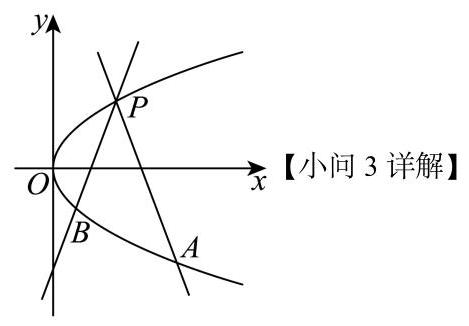

由(2)可知 ${k}_{AB} =  - \frac{1}{2}$ ，

设直线 ${AB}$ 的表达式为 $y =  - \frac{1}{2}x + b$ ,即 $x + {2y} - {2b} = 0$

联立 $\left\{  \begin{array}{l} {y}^{2} = x \\  x + {2y} - {2b} = 0 \end{array}\right.$ ,代入化简整理得: ${y}^{2} + {2y} - {2b} = 0$ ,

由 $b \in  \left\lbrack  {0,1}\right\rbrack$ 故 $\Delta  = {2}^{2} - 4 \times  1 \times  \left( {-{2b}}\right)  = 4 + {8b} > 0$ ,

从而 ${y}_{1} + {y}_{2} =  - 2,{y}_{1}{y}_{2} =  - {2b}$ ,

$\left| {AB}\right|  = \sqrt{1 + {\left( \frac{1}{{k}_{AB}}\right) }^{2}}\left| {{y}_{1} - {y}_{2}}\right|  = \sqrt{5} \times  \sqrt{{\left( {y}_{1} + {y}_{2}\right) }^{2} - 4{y}_{1}{y}_{2}} = \sqrt{{20} + {40b}}$

点 $P$ 到直线 ${AB}$ 的距离 $d = \frac{\left| 1 + 2 \times  1 - 2b\right| }{\sqrt{{1}^{2} + {2}^{2}}} = \frac{\left| 3 - 2b\right| }{\sqrt{5}}$ ，

${S}_{\bigtriangleup {ABP}} = \frac{1}{2}\left| {AB}\right|  \cdot  d = \frac{1}{2} \times  \sqrt{{20} + {40b}} \times  \frac{\left| 3 - 2b\right| }{\sqrt{5}} = \left( {3 - {2b}}\right) \sqrt{1 + {2b}},$

令 $t = \sqrt{1 + {2b}}$ ,则 $t \in  \left\lbrack  {1,\sqrt{3}}\right\rbrack  ,{S}_{\bigtriangleup {ABP}} = \left( {4 - {t}^{2}}\right) t = {4t} - {t}^{3}$ ,

设 $h\left( t\right)  = {4t} - {t}^{3}$ ,则 ${h}^{\prime }\left( t\right)  = 4 - 3{t}^{2}$ , 令 ${h}^{\prime }\left( t\right)  = 0$ ,解得 $t = \frac{2}{\sqrt{3}} = \frac{2\sqrt{3}}{3}$ (负值舍去)

则当 $t \in  \left\lbrack  {1,\frac{2\sqrt{3}}{3}}\right\rbrack$ 时, ${h}^{\prime }\left( t\right)  > 0, h\left( t\right)  = {4t} - {t}^{3}$ 单调递增;

当 $t \in  \left\lbrack  {\frac{2\sqrt{3}}{3},\sqrt{3}}\right\rbrack$ 时, ${h}^{\prime }\left( t\right)  < 0, h\left( t\right)  = {4t} - {t}^{3}$ 单调递减;

从而 $h{\left( t\right) }_{\max } = 4 \times  \frac{2\sqrt{3}}{3} - {\left( \frac{2\sqrt{3}}{3}\right) }^{3} = \frac{16}{9}\sqrt{3}$ ,

即 $\bigtriangleup  {ABP}$ 面积的最大值为 $\frac{16}{9}\sqrt{3}$ .

21. 已知 $y = f\left( x\right)$ 和 $y = g\left( x\right)$ 均为定义在 $\mathbf{R}$ 上的可导函数,且函数 $y = f\left( x\right)$ 满足: ${f}_{1}\left( x\right)  = f\left( x\right) ,{f}_{n + 1}\left( x\right)  = {f}_{n}^{\prime }\left( x\right) \;\left( {n\text{ 是正整数 }}\right) .$

(1)若 $f\left( x\right)  = {\mathrm{e}}^{ax} + b\cos x$ 满足 ${f}_{3}\left( x\right)  = {f}_{1}\left( x\right)$ ，求实数 $a$ 、 $b$ 的值；

(2)设数列 $\left\{  {a}_{n}\right\}$ 是无穷数列，若 $f\left( x\right)  = x - \cos x$ ，且 ${a}_{1} = a,{a}_{n + 1} = {f}_{2}\left( {a}_{n}\right)$ ，是否存在实数 $a$ ,使得 $\left\{  {a}_{n}\right\}$ 是常数列,请说明理由:

(3) 若 $y = {f}_{n}\left( x\right) \left( {n \leq  2}\right)$ 是定义域上的增函数,函数 $y = g\left( x\right)$ 是周期函数,且存在 ${x}_{0} \in  \mathbf{R}$ 对任意实数 $x$ ,都有 $g\left( {x}_{0}\right)  \geq  g\left( x\right)  > 0$ ,求证: “ ${f}_{n}\left( x\right)  = 0\left( {n \geq  3}\right)$ 恒成立”的充要条件是 “ $y = {f}_{2}\left( x\right)  \cdot  g\left( x\right)$ 是周期函数”.

【答案】(1) $\left\{  \begin{array}{l} a = 1 \\  b = 0 \end{array}\right.$ 或 $\left\{  \begin{array}{l} a =  - 1 \\  b = 0 \end{array}\right.$

(2)存在，证明见解析

(3)证明见解析

【解析】

【分析】(1) 先根据已知条件求出 ${f}_{1}\left( x\right) ,{f}_{2}\left( x\right) ,{f}_{3}\left( x\right)$ ,再结合 ${f}_{1}\left( x\right)  = {f}_{3}\left( x\right)$ 列方程组即可求出;

(2)先求出 ${f}_{2}\left( x\right)$ ，再根据 ${a}_{n + 1} = {f}_{2}\left( {a}_{n}\right)$ 得到 ${a}_{n + 1}$ 与 ${a}_{n}$ 的关系，然后假设 $\left\{  {a}_{n}\right\}$ 是常数列， 即可求出实数 $a$ ；

(3)先根据已知条件得到 ${f}_{n}\left( x\right)$ 的性质，再分别证明充分性和必要性.

【小问 1 详解】

对 $f\left( x\right)  = {f}_{1}\left( x\right)  = {e}^{ax} + b\cos x$ 求导 ${f}_{2}\left( x\right)  = {f}_{1}^{\prime }\left( x\right)  = a{e}^{ax} - b\sin x$ ,

${f}_{3}\left( x\right)  = {f}_{2}^{\prime }\left( x\right)  = {a}^{2}{e}^{ax} - b\cos x,$

$\because {f}_{3}\left( x\right)  = {f}_{1}\left( x\right) ,\;\therefore {a}^{2}{\mathrm{e}}^{ax} - b\cos x = {\mathrm{e}}^{ax} + b\cos x$ ,

则 $\left\{  \begin{array}{l} {a}^{2} = 1 \\  b =  - b \end{array}\right.$ ,解得 $\left\{  \begin{array}{l} a = 1 \\  b = 0 \end{array}\right.$ 或 $\left\{  \begin{array}{l} a =  - 1 \\  b = 0 \end{array}\right.$ .

【小问 2 详解】

已知 ${f}_{1}\left( x\right)  = f\left( x\right)  = x - \cos x$ ,则 ${f}_{2}\left( x\right)  = {f}_{1}^{\prime }\left( x\right)  = 1 + \sin x$ ,

故 ${a}_{n + 1} = 1 + \sin {a}_{n}$ ,

若 $\left\{  {a}_{n}\right\}$ 是常数列,则 ${a}_{n} = {a}_{1} = a$ ,

则 $a = 1 + \sin a$ ,即 $a - 1 - \sin a = 0$ ,

令 $F\left( a\right)  = a - 1 - \sin a$ ,则 ${F}^{\prime }\left( a\right)  = 1 - \cos a \geq  0$ ,即 $F\left( a\right)$ 在 $\mathbf{R}$ 上单调递增,

又 $F\left( 0\right)  = 0 - 1 - \sin 0 =  - 1 < 0, F\left( \pi \right)  = \pi  - 1 - \sin \pi  = \pi  - 1 > 0$ ,

且 $F\left( a\right)$ 是连续函数，由零点存在性定理可得，

存在唯一的 ${a}_{0} \in  \left( {0,\pi }\right)$ ,使得 $F\left( {a}_{0}\right)  = 0$ ,即 ${a}_{0} = 1 + \sin {a}_{0}$ ,

故当 $a = {a}_{0}$ 时， $\left\{  {a}_{n}\right\}$ 是常数列，

综上,存在实数 $a$ 使得 $\left\{  {a}_{n}\right\}$ 是常数列.

【小问 3 详解】

证明充分性:

若 ${f}_{n}\left( x\right)  = 0\left( {n \geq  3}\right)$ 恒成立,

则 ${f}_{3}\left( x\right)  = {f}_{2}^{\prime }\left( x\right)  = 0$ ,故 ${f}_{2}\left( x\right)  = k$ ( $k$ 为常数),

则 ${f}_{2}\left( x\right)  = {f}_{1}^{\prime }\left( x\right)  = k$ ,则 ${f}_{1}\left( x\right)  = {kx} + c$ ( $c$ 为常数),

$\because y = {f}_{n}\left( x\right) \left( {n \leq  2}\right)$ 是定义域上的增函数,

$\therefore {f}_{2}\left( x\right)$ 是增函数, $\therefore k \geq  0$ ,

又函数 $y = g\left( x\right)$ 是周期函数,设其周期为 $T$ ,即 $g\left( {x + T}\right)  = g\left( x\right)$ ,

而 ${f}_{2}\left( {x + T}\right)  = {f}_{2}\left( x\right)  = k \geq  0$ ,故 ${f}_{2}\left( {x + T}\right)  \cdot  g\left( {x + T}\right)  = {f}_{2}\left( x\right)  \cdot  g\left( x\right)$ ,

即 $y = {f}_{2}\left( x\right)  \cdot  g\left( x\right)$ 是周期函数,周期也为 $T$ .

证明必要性:

设 $h\left( x\right)  = {f}_{2}\left( x\right)  \cdot  g\left( x\right)$ ,设 $h\left( x\right)$ 的一个正周期为 ${T}_{h}, g\left( x\right)$ 的一个正周期为 ${T}_{g}$ .

由题意,存在 ${x}_{0} \in  \mathbf{R}$ 对任意实数 $x$ ,都有 $g\left( {x}_{0}\right)  \geq  g\left( x\right)  > 0$ ,

则 $g\left( x\right)$ 有最大值 $g\left( {x}_{0}\right)$ ,记 $M = g\left( {x}_{0}\right) , M \geq  g\left( x\right)  > 0$ .

记集合 $A = \left\{  {x \mid  x = {x}_{0} + k{T}_{g}, k \in  \mathbf{Z}}\right\}$ ，由 ${T}_{g}$ 为 $g\left( x\right)$ 的一个正周期，

则对任意的 $x \in  A$ ，均有 $g\left( x\right)  = g\left( {{x}_{0} + k{T}_{g}}\right)  = g\left( {x}_{0}\right)  = M$ .

下面用反证法证明 ${f}_{2}\left( x\right)$ 是常值函数.

假设 ${f}_{2}\left( x\right)$ 不是常值函数,则存在实数 ${x}_{1} \neq  {x}_{2},{f}_{2}\left( {x}_{1}\right)  \neq  {f}_{2}\left( {x}_{2}\right)$ ,

不妨假设 ${x}_{1} < {x}_{2}$ ,又由已知 ${f}_{2}\left( x\right)$ 是增函数,可得 ${f}_{2}\left( {x}_{1}\right)  \leq  {f}_{2}\left( {x}_{2}\right)$ ,

又因为 ${f}_{1}\left( x\right)$ 是 $\mathbf{R}$ 上的增函数,所以 ${f}_{2}\left( x\right)  = {f}_{1}^{\prime }\left( x\right)  \geq  0$ ,则 ${f}_{2}\left( {x}_{2}\right)  \geq  {f}_{2}\left( {x}_{1}\right)  \geq  0$ ;

可在集合 $A$ 中取一个元素 $a$ ,满足 $a > {x}_{2}$ ,且 $g\left( a\right)  = M$ ,

再取足够大的正整数 $n$ ,使得 $a - n{T}_{h} < {x}_{1} < {x}_{2} < a$ ,

则 $0 \leq  {f}_{2}\left( {a - n{T}_{h}}\right)  \leq  {f}_{2}\left( {x}_{1}\right)  \leq  {f}_{2}\left( {x}_{2}\right)  \leq  {f}_{2}\left( a\right)$ ,则 ${f}_{2}\left( a\right)  \geq  {f}_{2}\left( {a - n{T}_{h}}\right)  \geq  0$ ,

由 ${T}_{h}$ 的 $h\left( x\right)$ 的一个正周期,则 $h\left( {a - n{T}_{h}}\right)  = h\left( a\right)$ ,

即 ${f}_{2}\left( {a - n{T}_{h}}\right) g\left( {a - n{T}_{h}}\right)  = {f}_{2}\left( a\right) g\left( a\right)$ ,即 ${f}_{2}\left( {a - n{T}_{h}}\right) g\left( {a - n{T}_{h}}\right)  = M{f}_{2}\left( a\right)$ ①,

由 ${f}_{2}\left( x\right)$ 是 $\mathbf{R}$ 上的增函数,则 ${f}_{2}\left( a\right)  \geq  {f}_{2}\left( {a - n{T}_{h}}\right)  \geq  0$ ,

若 ${f}_{2}\left( a\right)  > {f}_{2}\left( {a - n{T}_{h}}\right)$ ,又由 $M \geq  g\left( {a - n{T}_{h}}\right)  > 0$ ,

可得 $M{f}_{2}\left( a\right)  > {f}_{2}\left( {a - n{T}_{h}}\right) g\left( {a - n{T}_{h}}\right)  \geq  0$ ,这与①式矛盾,

故 ${f}_{2}\left( a\right)  = {f}_{2}\left( {a - n{T}_{h}}\right)  \geq  0$ ,又由 ${f}_{2}\left( x\right)$ 是 $\mathbf{R}$ 上可导 (必连续) 的增函数,

所以对任意 $x \in  \left\lbrack  {a - n{T}_{h}, a}\right\rbrack  ,{f}_{2}\left( x\right)  = {f}_{2}\left( a\right)$ .

由 $a - n{T}_{h} < {x}_{1} < {x}_{2} < a$ ,则任意 $x \in  \left\lbrack  {{x}_{1},{x}_{2}}\right\rbrack  ,{f}_{2}\left( x\right)  = {f}_{2}\left( a\right)$ ;

则 ${x}_{1} \neq  {x}_{2},{f}_{2}\left( {x}_{1}\right)  = {f}_{2}\left( {x}_{2}\right)  = {f}_{2}\left( a\right)$ ,这与 ${f}_{2}\left( {x}_{1}\right)  \neq  {f}_{2}\left( {x}_{2}\right)$ 矛盾,

故假设不成立, $f\left( x\right)$ 是常值函数,且 ${f}_{2}\left( x\right)  = {f}_{2}\left( a\right)$ .

故 ${f}_{3}\left( x\right)  = {f}_{2}^{\prime }\left( x\right)  = 0,{f}_{4}\left( x\right)  = {f}_{3}^{\prime }\left( x\right)  = 0,\cdots ,{f}_{n}\left( x\right)  = 0\left( {n \geq  3}\right)$

$\therefore {f}_{n}\left( x\right)  = 0\left( {n \geq  3}\right)$ 恒成立,必要性证毕.

综上,“ ${f}_{n}\left( x\right)  = 0\left( {n \geq  3}\right)$ 恒成立”的充要条件是 “ $y = {f}_{2}\left( x\right)  \cdot  g\left( x\right)$ 是周期函数”.
