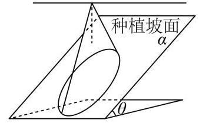
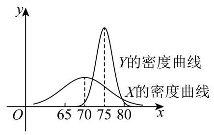
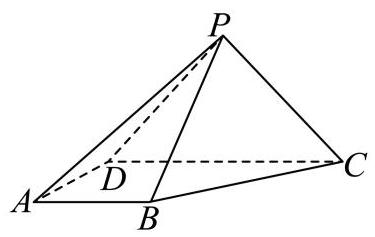
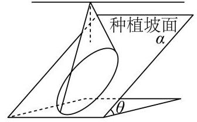
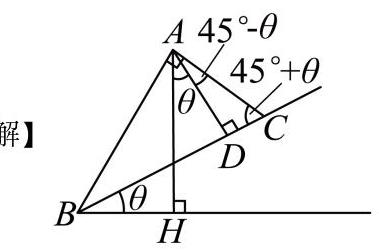
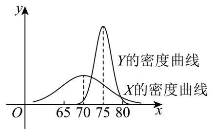
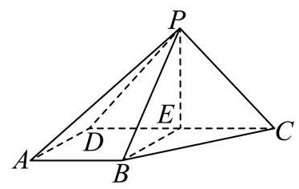
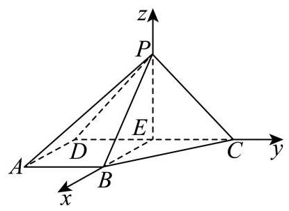

# 2025 学年第二学期学习能力诊断卷 高三数学试卷

2026.4

(考试时间 120 分钟 满分 150 分)

考生注意:

1.每位考生应同时收到试卷和答题卷两份材料，答卷前，在答题卷上填写姓名、 考号等相关信息.

2.所有作答务必填涂在答题卷上与试卷题号对应的区域，不得错位，在试卷上作答一律不得分.

## 3. 用 2B 铅笔作答选择题，用黑色字迹钢笔、水笔或圆珠笔作答非选择题.

## 一、填空题 (本大题共有 12 题, 满分 54 分, 第 1-6 题每题 4 分, 第 7-12 题每题

5 分) 考生应在答题纸的相应位置直接填写结果,

1. 不等式 $\frac{1}{x - 2} > 0$ 的解集为___.

2. 函数 $y = {2}^{x} - 1$ 的零点是___.

3. 计算: $\mathop{\sum }\limits_{{i = 1}}^{{+\infty }}\frac{1}{{2}^{i}} =$ ___.

4. 若函数 $y = f\left( x\right)$ 在 $x = {x}_{0}$ 处的切线方程为 $y = {2x} - 1$ ,则 $\mathop{\lim }\limits_{{h \rightarrow  0}}\frac{f\left( {{x}_{0} + h}\right)  - f\left( {x}_{0}\right) }{h} =$

5. 若幂函数 $y = {x}^{a}$ 在区间 $\left( {0, + \infty }\right)$ 上是严格减函数，则实数 $a$ 的取值范围是___.

6. 若 $\tan \left( {a - \beta }\right)  = \frac{2}{3},\tan \beta  = 1$ ，则 $\tan a =$ ___.

7. 若 ${\left( x + \frac{1}{x}\right) }^{n}$ 的二项展开式中，第 5 项为常数项，则 $n =$ ___.

8. 已知向量 $\overrightarrow{a}\text{ 、 }\overrightarrow{b}$ ，其中 $\left| \overrightarrow{b}\right|  = 3$ ， $\overrightarrow{a}$ 在 $\overrightarrow{b}$ 方向上的投影向量是 $\frac{2}{9}\overrightarrow{b}$ ，则 $\overrightarrow{a} \cdot  \overrightarrow{b} =$ ___.

9. 已知实数 ${a}_{1}$ 、 ${a}_{2}$ 、 ${a}_{3}$ 、 ${a}_{4}$ 、 ${a}_{5}$ 满足

$\left\{  {x \mid  \left( {x - {a}_{1}}\right) \left( {x - {a}_{2}}\right) \left( {x - {a}_{3}}\right) \left( {x - {a}_{4}}\right) \left( {x - {a}_{5}}\right)  = 0}\right\}   = \{ 1,2,3,4\}$ ,则 ${a}_{1}\text{ 、 }{a}_{2}\text{ 、 }{a}_{3}\text{ 、 }{a}_{4}\text{ 、 }{a}_{5}$ 的方差的最大值为___.

10. 设 $A, B$ 是一个随机试验中的两个事件,且 $P\left( B\right)  = \frac{1}{3}, P\left( {\bar{B} \mid  A}\right)  = \frac{3}{5}, P\left( {\bar{B} \mid  \bar{A}}\right)  = \frac{9}{10}$ ,则 $P\left( A\right)  =$ ___.

11. 已知复数 ${w}_{1},{w}_{2}$ 满足 $\overline{{w}_{1}} - \overline{{w}_{2}} = \frac{4}{{w}_{1} - {w}_{2}}$ ,记满足 $\left| {z - {w}_{i}}\right|  \in  \left\lbrack  {1,3}\right\rbrack  \left( {i = 1,2}\right)$ 的复数 $z$ 组成的集合为 $A$ . 若 ${z}_{1} \in  A$ 且 ${z}_{2} \in  A$ ，则 $\left| {{z}_{1} - {z}_{2}}\right|$ 的取值范围是___.

12. 如图为一架农业无人机沿固定航线匀速飞行，并在某时刻向下喷洒农药的示意图. 将种植坡面视为坡角为 $\theta$ 的平面，航线视为直线，无人机视为航线上的点，无人机在任意时刻喷洒农药的雾滴形成的形状均为以铅垂线为轴、母线与轴夹角为 ${45}^{ \circ  }$ 的圆锥及其内部. 若无人机飞行的海拔高度恒定，航线与种植坡面平行且距离为 3 米，假设无人机飞行时农药喷洒不间断且不受风速影响；则飞行过程中会在种植坡面上形成一条宽为 $L\left( \theta \right)$ 米的“农药条带”，当 ${0}^{ \circ  } \leq  \theta  \leq  {15}^{ \circ  }$ 时， $L\left( \theta \right)$ 的最大值为___. (结果精确到 0.01 )

航线 无人机

## 二、选择题 (本大题共有 4 题, 满分 18 分, 第 13-14 题每题 4 分, 第 15-16 题每 题 5 分) 每题有且只有一个正确选项.考生应在答题纸的相应位置, 将代表正确 选项的小方格涂黑.

13. 已知 $a\text{ 、 }b \in  \mathbf{R}$ ，则 “ $\ln a > \ln b$ ” 是 “ ${\mathrm{e}}^{a - b} > 1$ ” 的( )

A. 充分非必要条件 B. 必要非充分条件

C. 充要条件 D. 既非充分又非必要条件

14. 已知甲、乙两班在某次数学测验中成绩近似服从正态分布,甲班成绩 $X \sim  N\left( {{\mu }_{1},{\sigma }_{1}{}^{2}}\right)$ , 乙班成绩 $Y \sim  N\left( {{\mu }_{2},{\sigma }_{2}{}^{2}}\right)$ ,其密度曲线如图所示,则有( )

A. ${\mu }_{1} < {\mu }_{2}$ 且 ${\sigma }_{1} < {\sigma }_{2}$

B. ${\mu }_{1} > {\mu }_{2}$ 且 ${\sigma }_{1} > {\sigma }_{2}$

C. $P\left( {X \leq  {70}}\right)  = P\left( {Y \geq  {75}}\right)$

D. $P\left( {X \geq  {75}}\right)  > P\left( {Y \geq  {75}}\right)$

15. 设 $\omega  > 0$ ,函数 $y = \frac{\sqrt{3}}{2}\cos {\omega x} + \frac{1}{2}\sin {\omega x}$ 在区间 $\left( {\frac{\pi }{2},\pi }\right)$ 上没有最大值和最小值,则 $\omega$ 的取值范围为( )

A. $\left( {0,\frac{1}{2}}\right\rbrack$ B. $\left\lbrack  {\frac{1}{3},\frac{1}{2}}\right\rbrack$ C. $\left( {0,\frac{1}{6}}\right\rbrack   \cup  \left\lbrack  {\frac{1}{3},\frac{7}{6}}\right\rbrack  \;$ D.

$\left( {0,\frac{1}{6}}\right\rbrack   \cup  \left\lbrack  {\frac{1}{3},\frac{1}{2}}\right\rbrack$

16. 设 $m \in  \mathbf{R}$ . 定义点 $P\left( {m,\frac{1}{2}m - 1}\right)$ 的 $t -$ 相伴集合为 ${A}_{P - t} = \{ \left( {x, y}\right) \parallel x - m \mid   \leq  t$ 且 $\left. {\left| {y - \left( {\frac{1}{2}m - 1}\right) }\right|  \leq  t}\right\}$ ,其中 $t$ 为正实数. 给出以下两个命题:

① 若 $m = 0$ ，则其 1-相伴集合 ${A}_{P - 1}$ 所对应平面图形的面积为 2;

② 设 ${t}_{0} > 0$ ，若对任意实数 $m$ 及任意 $t \leq  {t}_{0}$ ，集合 ${A}_{P - t}$ 所对应平面图形与抛物线 ${x}^{2} = {2y}$ 均无公共点,则 ${t}_{0} < \frac{7}{12}$ .

则正确的选项是 ( )

A. ①是真命题，②是真命题 B. ①是假命题，②是假命题

C. ①是真命题，②是假命题 D. ①是假命题，②是真命题

## 三、解答题 (本大题共有 5 题, 满分 78 分) 解答下列各题必须在答题纸的相应位

## 置写出必要的步骤;

17. 如图，在四棱锥 $P - {ABCD}$ 中， $\bigtriangleup  {PCD}$ 为等边三角形，底面 ${ABCD}$ 为直角梯形， ${AB}//{CD},{CD} \bot  {AD},{CD} = 4,{AB} = {AD} = 2$ .

(1)求证: ${PB}\bot {CD}$ ；

(2)若四棱锥 $P - {ABCD}$ 的体积为 $4\sqrt{3}$ ，求直线 ${PD}$ 与平面 ${PBC}$ 所成角的大小.

18. 为落实《全民健身条例》，某区体育局对本区居民的健身场所选择偏好进行调研. 数据显示，居民主要选择商业健身场馆(如健身房、体育中心)和社区公共运动场(如小区健身点、 街心公园) 两类场所.为了解年龄因素是否影响健身场所的选择, 研究人员将成年居民分为青壮年组 (≥18 岁且 < 40 岁) 和中老年组 (≥40 岁), 从该区随机抽取 170 名成年居民进行调查,得到如下不完整的 $2 \times  2$ 列联表:

<table><tr><td></td><td>青壮年</td><td>中老年</td><td>合计</td></tr><tr><td>商业健身场馆</td><td>60</td><td></td><td></td></tr><tr><td>社区公共运动场</td><td></td><td>50</td><td></td></tr><tr><td>合计</td><td>80</td><td></td><td>170</td></tr></table>

(1)请补充 $2 \times  2$ 列联表，并根据表中数据判断能否有 95% 的把握认为年龄与居民健身场所的选择有关;

(2)用分层抽样的方式从选择社区公共运动场的居民中抽取 14 个人，再从 14 个人中随机抽取 7 个人，用随机变量 $X$ 表示这 7 个人中中老年与青壮年人数之差的绝对值，求 $X$ 的分布和数学期望.

参考公式及数据: ${\chi }^{2} = \frac{n{\left( ad - bc\right) }^{2}}{\left( {a + b}\right) \left( {c + d}\right) \left( {a + c}\right) \left( {b + d}\right) }$ ,其中 $n = a + b + c + d$ .

<table><tr><td>$P\left( {{\chi }^{2} \geq  {\chi }_{0}}\right)$</td><td>0.1</td><td>0.05</td><td>0.025</td><td>0.01</td><td>0.005</td><td>0.001</td></tr><tr><td>${\chi }_{0}$</td><td>2.706</td><td>3.841</td><td>5.024</td><td>6.635</td><td>7.879</td><td>10.828</td></tr></table>

19. 已知函数 $y = f\left( x\right)$ ,其中 $f\left( x\right)  = \frac{{2a} - 1 + g\left( x\right) }{a - g\left( x\right) }, a \in  \mathbf{R}$ 且 $a > 0$ .

(1)设 $g\left( x\right)  = {2}^{x}$ ，写出函数 $y = f\left( x\right)$ 的定义域，并判断是否存在正数 $a$ ，使得函数 $y = f\left( x\right)$ 为奇函数,说明理由;

(2)设 $g\left( x\right)  = {\log }_{2}x$ . 若关于 $x$ 的方程 $f\left( x\right)  = g\left( x\right)$ 的解集为单元素集合,求正数 $a$ 的值.

20. 已知无穷数列 $\left\{  {\lambda }_{n}\right\}$ 为严格增数列,且 ${\lambda }_{n} > 0$ . 双曲线 ${C}_{n}$ 的方程为 ${x}^{2} - {y}^{2} = {\lambda }_{n}{}^{2},{A}_{n}\text{ 、 }{B}_{n}$ 为双曲线 ${C}_{n}$ 上两个不同的动点,其中 ${A}_{n}$ 在双曲线 ${C}_{n}$ 的右支上.

(1)若 ${\lambda }_{1} = 1$ ，求双曲线 ${C}_{1}$ 的渐近线方程和焦点坐标；

(2)若 ${\lambda }_{1} = 1,{\lambda }_{2} = 2$ ，且点 $T\left( {t,0}\right)$ 为线段 ${A}_{1}{A}_{2}$ 的中点，求实数 $t$ 的取值范围；

(3)已知直线 ${A}_{n}{B}_{n}$ 过双曲线 ${C}_{n + 1}$ 的右顶点. 若 ${B}_{n}$ 在双曲线 ${C}_{n}$ 的右支上，则称弦 ${A}_{n}{B}_{n}$ 为双曲线 ${C}_{n}$ 的“同支弦”，否则称其为双曲线 ${C}_{n}$ 的“异支弦”. 是否存在等差数列 $\left\{  {\lambda }_{n}\right\}$ ，使得对于任意正整数 $n$ ,双曲线 ${C}_{n}$ “同支弦”弦长的最小值均大于双曲线 ${C}_{n}$ “异支弦”弦长的最小值? 若存在,请求出数列 $\left\{  {\lambda }_{n}\right\}$ 的通项公式; 若不存在,请说明理由.

21. 已知函数 $y = f\left( x\right)$ 与函数 $y = g\left( x\right)$ 的定义域均为 $\mathbf{R}$ ,且在 $\mathbf{R}$ 上的导函数分别为 ${f}^{\prime }\left( x\right)$ 和 ${g}^{\prime }\left( x\right)$ . 若存在常数 $k$ ,使得对任意实数 $x,{g}^{\prime }\left( x\right)  \geq  k \cdot  \left| {{f}^{\prime }\left( x\right) }\right|$ 恒成立,则称 $y = g\left( x\right)$ 是 $y = f\left( x\right)$ 的“ $k$ -调整函数”，并称 $k$ 为调整系数.

(1)设 $f\left( x\right)  = \cos x, g\left( x\right)  = {2x}$ . 求证: $y = g\left( x\right)$ 是 $y = f\left( x\right)$ 的“2-调整函数”；

(2) 设 $f\left( x\right)  = {x}^{2}, g\left( x\right)  = {\mathrm{e}}^{x} + {bx}$ . 若存在实数 $b \in  \left\lbrack  {-2, - 1}\right\rbrack$ ，使得 $y = g\left( x\right)$ 是 $y = f\left( x\right)$ 的 “ $k$ -调整函数”，求调整系数 $k$ 的取值范围；

(3) 已知 $y = g\left( x\right)$ 是 $y = f\left( x\right)$ 的“1-调整函数”，函数 $y = g\left( x\right)$ 的值域是一个闭区间，记作集合 $P$ ，函数 $y = f\left( x\right)$ 的值域记作集合 $Q$ . 若 $P \subseteq  Q$ ，判断 $y = f\left( x\right)  - g\left( x\right)$ 是否一定是常值函数，并说明理由. 参考答案及解析:

1、【答案】 $\left( {2, + \infty }\right) \# \# \{ x \mid  x > 2\}$

【解析】

【详解】因为 $\frac{1}{x - 2} > 0$ ,所以 $x - 2 > 0$ ,即 $x > 2$ ,所以解集为 $\left( {2, + \infty }\right)$

2. 函数 $y = {2}^{x} - 1$ 的零点是___.

【答案】0

【解析】

【详解】令 $y = {2}^{x} - 1 = 0$ ,即 ${2}^{x} = 1$ ,解得 $x = 0$ ,

所以函数 $y = {2}^{x} - 1$ 的零点是 0 .

3. 计算: $\mathop{\sum }\limits_{{i = 1}}^{{+\infty }}\frac{1}{{2}^{i}} =$ ___.

【答案】 1

【解析】

【分析】根据无穷等比数列的求和公式直接即可求出答案.

【详解】 $\mathop{\sum }\limits_{{i = 1}}^{{+\infty }}\frac{1}{{2}^{i}} = \frac{\frac{1}{2}}{1 - \frac{1}{2}} = 1$ .

故答案为:1.

4. 若函数 $y = f\left( x\right)$ 在 $x = {x}_{0}$ 处的切线方程为 $y = {2x} - 1$ ,则 $\mathop{\lim }\limits_{{h \rightarrow  0}}\frac{f\left( {{x}_{0} + h}\right)  - f\left( {x}_{0}\right) }{h} =$ ___.

【答案】 2

【解析】

【详解】根据导数的定义,函数 $y = f\left( x\right)$ 在 $x = {x}_{0}$ 处的导数为: ${f}^{\prime }\left( {x}_{0}\right)  = \mathop{\lim }\limits_{{h \rightarrow  0}}\frac{f\left( {{x}_{0} + h}\right)  - f\left( {x}_{0}\right) }{h},$

根据导数的几何意义, 就是函数在该点处切线的斜率,

因为 $y = f\left( x\right)$ 在 $x = {x}_{0}$ 处的切线方程为 $y = {2x} - 1$ ,所以切线斜率为 2, 所以 $\mathop{\lim }\limits_{{h \rightarrow  0}}\frac{f\left( {{x}_{0} + h}\right)  - f\left( {x}_{0}\right) }{h} = 2$ .

5. 若幂函数 $y = {x}^{a}$ 在区间 $\left( {0, + \infty }\right)$ 上是严格减函数，则实数 $a$ 的取值范围是___.

【答案】 $\left( {-\infty ,0}\right)$

【解析】

【分析】由幂函数的性质进行求解即可.

【详解】因为幂函数 $y = {x}^{a}$ 在区间 $\left( {0, + \infty }\right)$ 上是严格减函数,

所以 $a < 0$ ,

故答案为: $\left( {-\infty ,0}\right)$

6. 若 $\tan \left( {a - \beta }\right)  = \frac{2}{3},\tan \beta  = 1$ ，则 $\tan a =$ ___.

【答案】 5

【解析】

【详解】由 $\tan \left( {a - \beta }\right)  = \frac{2}{3},\tan \beta  = 1$ ,

则 $\tan a = \tan \left\lbrack  {\left( {a - \beta }\right)  + \beta }\right\rbrack   = \frac{\tan \left( {a - \beta }\right)  + \tan \beta }{1 - \tan \left( {a - \beta }\right) \tan \beta } = \frac{\frac{2}{3} + 1}{1 - \frac{2}{3} \times  1} = 5$ .

7. 若 ${\left( x + \frac{1}{x}\right) }^{n}$ 的二项展开式中，第 5 项为常数项，则 $n =$ ___.

【答案】 8

【解析】

【分析】利用二项展开式通项以及已知条件可得出关于 $n$ 的等式,即可得解.

【详解】根据二项式定理, ${\left( x + \frac{1}{x}\right) }^{n}$ 其展开式的第 $k + 1$ 项通项为:

${T}_{k + 1} = {\mathrm{C}}_{n}^{k}{x}^{n - k}{\left( \frac{1}{x}\right) }^{k} = {\mathrm{C}}_{n}^{k}{x}^{n - {2k}}, k = 0,1,\cdots , n$

当 $k = 4$ 时，第 5 项为 ${T}_{5} = {\mathrm{C}}_{n}^{4}{x}^{n - 8}$ 为常数，

则 $n - 8 = 0$ , 解得: $n = 8$ .

8. 已知向量 $\overrightarrow{a}\text{ 、 }\overrightarrow{b}$ ，其中 $\left| \overrightarrow{b}\right|  = 3$ ， $\overrightarrow{a}$ 在 $\overrightarrow{b}$ 方向上的投影向量是 $\frac{2}{9}\overrightarrow{b}$ ，则 $\overrightarrow{a} \cdot  \overrightarrow{b} =$ ___.

【答案】 2

【解析】

【详解】因为 $\overrightarrow{a}$ 在 $\overrightarrow{b}$ 方向上的投影向量是 $\frac{\overrightarrow{a} \cdot  \overrightarrow{b}}{\left| \overrightarrow{b}\right| }\frac{\overrightarrow{b}}{\left| \overrightarrow{b}\right| } = \frac{2}{9}\overrightarrow{b}$ ，且 $\left| \overrightarrow{b}\right|  = 3$ ，所以 $\overrightarrow{a} \cdot  \overrightarrow{b} = 2$

9. 已知实数 ${a}_{1}\text{ 、 }{a}_{2}\text{ 、 }{a}_{3}\text{ 、 }{a}_{4}\text{ 、 }{a}_{5}$ 满足

$\left\{  {x \mid  \left( {x - {a}_{1}}\right) \left( {x - {a}_{2}}\right) \left( {x - {a}_{3}}\right) \left( {x - {a}_{4}}\right) \left( {x - {a}_{5}}\right)  = 0}\right\}   = \{ 1,2,3,4\}$ ,则 ${a}_{1}\text{ 、 }{a}_{2}\text{ 、 }{a}_{3}\text{ 、 }{a}_{4}\text{ 、 }{a}_{5}$ 的方差的最大值为___.

【答案】 $\frac{34}{25}$

【解析】

【详解】设 ${a}_{1}\text{ 、 }{a}_{2}\text{ 、 }{a}_{3}\text{ 、 }{a}_{4}\text{ 、 }{a}_{5}$ 分别对应 $1,2,3,4, t,\left( {t = 1,2,3,4}\right)$ .

则 $\bar{a} = \frac{{10} + t}{5} = 2 + \frac{t}{5}$ ,

所以 ${a}_{1}\text{ 、 }{a}_{2}\text{ 、 }{a}_{3}\text{ 、 }{a}_{4}\text{ 、 }{a}_{5}$ 的方差为:

${s}^{2} = \frac{1}{5}\left\lbrack  {{\left( 1 - \bar{a}\right) }^{2} + {\left( 2 - \bar{a}\right) }^{2} + {\left( 3 - \bar{a}\right) }^{2} + {\left( 4 - \bar{a}\right) }^{2} + {\left( t - \bar{a}\right) }^{2}}\right\rbrack$

$= \frac{1}{5}\left\lbrack  {{\left( -1 - \frac{t}{5}\right) }^{2} + {\left( -\frac{t}{5}\right) }^{2} + {\left( 1 - \frac{t}{5}\right) }^{2} + {\left( 2 - \frac{t}{5}\right) }^{2} + {\left( \frac{4t}{5} - 2\right) }^{2}}\right\rbrack$

$= \frac{2}{25}\left( {2{t}^{2} - {10t} + {25}}\right)$

因为函数 $f\left( x\right)  = 2{x}^{2} - {10x} + {25}$ 在 $\left( {0,\frac{5}{2}}\right)$ 上单调递减,在 $\left( {\frac{5}{2},4}\right)$ 上单调递增,

且 $f\left( 1\right)  = f\left( 4\right)  = {17}$ .

所以当 $t = 1$ 或 4 时,该组数据的方差相等,且取得最大值,为 $\frac{2}{25} \times  {17} = \frac{34}{25}$ .

所以该组数据方差的最大值为: $\frac{34}{25}$ .

10. 设 $A, B$ 是一个随机试验中的两个事件,且 $P\left( B\right)  = \frac{1}{3}, P\left( {\bar{B} \mid  A}\right)  = \frac{3}{5}, P\left( {\bar{B} \mid  \bar{A}}\right)  = \frac{9}{10}$ ,则 $P\left( A\right)  =$

【答案】 $\frac{7}{9}$

【解析】

【分析】根据给定的条件, 利用对立事件的概率公式, 以及全概率公式, 列出方程, 即可求解.

【详解】由 $P\left( {\bar{B} \mid  A}\right)  = \frac{3}{5}, P\left( {\bar{B} \mid  \bar{A}}\right)  = \frac{9}{10}$ ,可得 $P\left( {B \mid  A}\right)  = \frac{2}{5}, P\left( {B \mid  \bar{A}}\right)  = \frac{1}{10}$ ,且 $P\left( B\right)  = \frac{1}{3}$ , 则 $P\left( B\right)  = P\left( A\right) P\left( {B \mid  A}\right)  + P\left( \bar{A}\right) P\left( {B \mid  \bar{A}}\right)$ ,可得 $\frac{1}{3} = P\left( A\right)  \times  \frac{2}{5} + P\left( \bar{A}\right)  \times  \frac{1}{10}$ , 即 $\frac{1}{3} = P\left( A\right)  \times  \frac{2}{5} + \left\lbrack  {1 - P\left( A\right) }\right\rbrack   \times  \frac{1}{10} = \frac{3}{10}P\left( A\right)  + \frac{1}{10}$ ,可得 $P\left( A\right)  = \frac{7}{9}$ .

11. 已知复数 ${w}_{1},{w}_{2}$ 满足 $\overline{{w}_{1}} - \overline{{w}_{2}} = \frac{4}{{w}_{1} - {w}_{2}}$ ,记满足 $\left| {z - {w}_{i}}\right|  \in  \left\lbrack  {1,3}\right\rbrack  \left( {i = 1,2}\right)$ 的复数 $z$ 组成的集合为 $A$ . 若 ${z}_{1} \in  A$ 且 ${z}_{2} \in  A$ ，则 $\left| {{z}_{1} - {z}_{2}}\right|$ 的取值范围是___.

【答案】 $\left\lbrack  {0,8}\right\rbrack$

【解析】

【分析】先对已知条件 $\overline{{w}_{1}} - \overline{{w}_{2}} = \frac{4}{{w}_{1} - {w}_{2}}$ 进行化简,得出 $\left| {{w}_{1} - {w}_{2}}\right|$ 的值,再根据 $\left| {z - {w}_{i}}\right|  \in  \left\lbrack  {1,3}\right\rbrack$ 确定集合 $A$ 中元素的轨迹,最后分析 ${z}_{1} \in  A$ 且 ${z}_{2} \in  A$ 时 $\left| {{z}_{1} - {z}_{2}}\right|$ 的取值范围.

【详解】 $\because \overline{{w}_{1}} - \overline{{w}_{2}} = \frac{4}{{w}_{1} - {w}_{2}},\therefore \overline{{w}_{1} - {w}_{2}} = \frac{4}{{w}_{1} - {w}_{2}}$ .

设 ${w}_{1} - {w}_{2} = m$ ,则 $\bar{m} = \frac{4}{m}$ ,即 $m\bar{m} = 4,\therefore {\left| m\right| }^{2} = 4,\therefore \left| m\right|  = \left| {{w}_{1} - {w}_{2}}\right|  = 2$ .

已知 $\left| {z - {w}_{i}}\right|  \in  \left\lbrack  {1,3}\right\rbrack$ ，根据复数模的几何意义， $\left| {z - {w}_{i}}\right|$ 表示复数 $z$ 所对应的点 $Z$ 到复数 ${w}_{i}$ 所对应的点 ${W}_{i}$ 的距离, $\therefore$ 集合 $A$ 中的元素 $z$ 对应的点 $Z$ 的轨迹是以 ${W}_{1},{W}_{2}$ 为圆心,半径分别在 $\left\lbrack  {1,3}\right\rbrack$ 范围内的圆环上的点.

记 ${W}_{1},{W}_{2}$ 的距离为 $d = \left| {{w}_{1} - {w}_{2}}\right|  = 2$ .

当 ${z}_{1},{z}_{2}$ 分别在以 ${W}_{1},{W}_{2}$ 为圆心,半径为 1 的圆上时, $\left| {{z}_{1} - {z}_{2}}\right|$ 的最小值为

$d - \left( {1 + 1}\right)  = 2 - 2 = 0.$

当 ${z}_{1},{z}_{2}$ 分别在以 ${W}_{1},{W}_{2}$ 为圆心,半径为 3 的圆上时, $\left| {{z}_{1} - {z}_{2}}\right|$ 的最大值为 $d + \left( {3 + 3}\right)  = 2 + 6 = 8.$

$\therefore \left| {{z}_{1} - {z}_{2}}\right|$ 的取值范围是 $\left\lbrack  {0,8}\right\rbrack$ .

12. 如图为一架农业无人机沿固定航线匀速飞行，并在某时刻向下喷洒农药的示意图. 将种植坡面视为坡角为 $\theta$ 的平面，航线视为直线，无人机视为航线上的点，无人机在任意时刻喷洒农药的雾滴形成的形状均为以铅垂线为轴、母线与轴夹角为 ${45}^{ \circ  }$ 的圆锥及其内部. 若无人机飞行的海拔高度恒定，航线与种植坡面平行且距离为 3 米，假设无人机飞行时农药喷洒不间断且不受风速影响；则飞行过程中会在种植坡面上形成一条宽为 $L\left( \theta \right)$ 米的“农药条带”. 当 ${0}^{ \circ  } \leq  \theta  \leq  {15}^{ \circ  }$ 时， $L\left( \theta \right)$ 的最大值为___. (结果精确到 0.01 )

航线 无人机

【答案】6.93

【解析】

作垂直于无人机航线与平面 $a$ 的平面，与无人机航线交于点 $A$ ,与平面 $a$ 交于直线 ${BC}$ , 线段 ${BC}$ 的长为农药条带的宽度, ${BH}$ 为水平线

作 ${AD} \bot  {BC}$ 于 $D,{AD} \bot  {BH}$ 于 $H$ ,由坡角为 $\theta$ 易得 $\angle {HAD} = \theta$ ,

由题意得 $\angle {BAH} = \angle {CAH} = {45}^{ \circ  },\angle {BAC} = {90}^{ \circ  },{AD} = 3$ ,

则 $\angle {CAD} = {45}^{ \circ  } - \theta ,\angle {DCA} = {45}^{ \circ  } + \theta$ ,

所以 ${AC} = \frac{AD}{\cos \angle {CAD}} = \frac{3}{\cos \left( {{45}^{ \circ  } - \theta }\right) }$ ，

${BC} = \frac{AC}{\cos \angle {ACD}} = \frac{3}{\cos \left( {{45}^{ \circ  } - \theta }\right) \cos \left( {{45}^{ \circ  } + \theta }\right) } = \frac{3}{\sin \left( {{45}^{ \circ  } + \theta }\right) \cos \left( {{45}^{ \circ  } + \theta }\right) }$

$= \frac{6}{\sin \left( {{90}^{ \circ  } + {2\theta }}\right) } = \frac{6}{\cos {2\theta }},$

因为 ${0}^{ \circ  } \leq  \theta  \leq  {15}^{ \circ  }$ ,所以 ${0}^{ \circ  } \leq  {2\theta } \leq  {30}^{ \circ  },\frac{\sqrt{3}}{2} \leq  \cos {2\theta } \leq  1$ ,

$B{C}_{\max } = \frac{6}{\frac{\sqrt{3}}{2}} = 4\sqrt{3} \approx  {6.93}.$

## 二、选择题 (本大题共有 4 题, 满分 18 分, 第 13-14 题每题 4 分, 第 15-16 题每 题 5 分) 每题有且只有一个正确选项.考生应在答题纸的相应位置, 将代表正确 选项的小方格涂黑.

13. 已知 $a$ 、 $b \in  \mathbf{R}$ ，则 “ $\ln a > \ln b$ ” 是 “ ${\mathrm{e}}^{a - b} > 1$ ” 的( )

A. 充分非必要条件 B. 必要非充分条件

C. 充要条件 D. 既非充分又非必要条件

【答案】A

【解析】

【详解】 $\ln a > \ln b$ 等价于 $a > b > 0,{\mathrm{e}}^{a - b} > 1$ 等价于 $a > b$ ,

$a > b > 0$ 可以推出 $a > b$ ,但 $a > b$ 无法推出 $a > b > 0$ ,因为还存在 $0 > a > b$ 这种可能性, 所以“ $\ln a > \ln b$ ” 是 “ ${\mathrm{e}}^{a - b} > 1$ ” 的充分不必要条件.

14. 已知甲、乙两班在某次数学测验中成绩近似服从正态分布,甲班成绩 $X \sim  N\left( {{\mu }_{1},{\sigma }_{1}^{2}}\right)$ , 乙班成绩 $Y \sim  N\left( {{\mu }_{2},{\sigma }_{2}^{2}}\right)$ ,其密度曲线如图所示,则有(   )

A. ${\mu }_{1} < {\mu }_{2}$ 且 ${\sigma }_{1} < {\sigma }_{2}$

B. ${\mu }_{1} > {\mu }_{2}$ 且 ${\sigma }_{1} > {\sigma }_{2}$

C. $P\left( {X \leq  {70}}\right)  = P\left( {Y \geq  {75}}\right)$

D. $P\left( {X \geq  {75}}\right)  > P\left( {Y \geq  {75}}\right)$

【答案】 $\mathrm{C}$

【解析】

【详解】正态密度曲线关于 $x = \mu$ 对称,对称轴位置对应均值 $\mu$ ; 且 $\sigma$ 越大,曲线越矮胖, $\sigma$ 越小曲线越瘦高

从图中可知: $X$ 的对称轴为 $x = {70}, Y$ 的对称轴为 $x = {75}$ ,因此 ${\mu }_{1} = {70} < {\mu }_{2} = {75};X$ 曲线更矮胖,因此 ${\sigma }_{1} > {\sigma }_{2}$ ,故选项 $\mathrm{A}\text{ 、 }\mathrm{\;B}$ 错误;

由正态分布的对称性: $P\left( {X \leq  {\mu }_{1}}\right)  = P\left( {X \leq  {70}}\right)  = {0.5}, P\left( {Y \geq  {\mu }_{2}}\right)  = P\left( {Y \geq  {75}}\right)  = {0.5}$ , $C$ 正确;

$P\left( {Y \geq  {75}}\right)  = {0.5}$ ,而 ${\mu }_{1} = {70} < {75}$ ,所以 $P\left( {X \geq  {75}}\right)  < {0.5}$ ,因此

$P\left( {X \geq  {75}}\right)  < P\left( {Y \geq  {75}}\right)$ , D 错误

15. 设 $\omega  > 0$ ,函数 $y = \frac{\sqrt{3}}{2}\cos {\omega x} + \frac{1}{2}\sin {\omega x}$ 在区间 $\left( {\frac{\pi }{2},\pi }\right)$ 上没有最大值和最小值,则 $\omega$ 的取值范围为( )

A. $\left( {0,\frac{1}{2}}\right\rbrack$ B. $\left\lbrack  {\frac{1}{3},\frac{1}{2}}\right\rbrack$ C. $\left( {0,\frac{1}{6}}\right\rbrack   \cup  \left\lbrack  {\frac{1}{3},\frac{7}{6}}\right\rbrack  \;$ D.

$\left( {0,\frac{1}{6}}\right\rbrack   \cup  \left\lbrack  {\frac{1}{3},\frac{1}{2}}\right\rbrack$

【答案】C

【解析】

【详解】因为 $y = \frac{\sqrt{3}}{2}\cos {\omega x} + \frac{1}{2}\sin {\omega x} = \sin \left( {{\omega x} + \frac{\pi }{3}}\right)$ ,

由 $\frac{\pi }{2} < x < \pi ,\omega  > 0 \Rightarrow  \frac{\omega \pi }{2} + \frac{\pi }{3} < {\omega x} + \frac{\pi }{3} < {\omega \pi } + \frac{\pi }{3}$ .

因为函数 $y = \sin \left( {{\omega x} + \frac{\pi }{3}}\right)$ 在 $\left( {\frac{\pi }{2},\pi }\right)$ 上没有最大值和最小值,

所以函数的半个周期的区间长度不小于 $\frac{\pi }{2}$ ,即 $\frac{\pi }{\omega } \geq  \frac{\pi }{2} \Rightarrow  0 < \omega  \leq  2$ .

结合正弦函数性质，则有 $0 < \frac{\omega \pi }{2} + \frac{\pi }{3} < {\omega \pi } + \frac{\pi }{3} \leq  \frac{\pi }{2}$ 或 $\frac{\pi }{2} \leq  \frac{\omega \pi }{2} + \frac{\pi }{3} < {\omega \pi } + \frac{\pi }{3} \leq  \frac{3\pi }{2}$ ，

解得 $0 < \omega  \leq  \frac{1}{6}$ 或 $\frac{1}{3} \leq  \omega  \leq  \frac{7}{6}$ . 即 $\omega$ 的取值范围为: $\left( {0,\frac{1}{6}}\right\rbrack   \cup  \left\lbrack  {\frac{1}{3},\frac{7}{6}}\right\rbrack$ .

16. 设 $m \in  \mathbf{R}$ . 定义点 $P\left( {m,\frac{1}{2}m - 1}\right)$ 的 $t$ -相伴集合为 ${A}_{P - t} = \{ \left( {x, y}\right) \} \left| \right| x - m \mid   \leq  t$ 且 $\left. {\left| {y - \left( {\frac{1}{2}m - 1}\right) }\right|  \leq  t}\right\}$ ,其中 $t$ 为正实数. 给出以下两个命题:

①若 $m = 0$ ，则其 1-相伴集合 ${A}_{P - 1}$ 所对应平面图形的面积为 2;

② 设 ${t}_{0} > 0$ ,若对任意实数 $m$ 及任意 $t \leq  {t}_{0}$ ,集合 ${A}_{P - t}$ 所对应平面图形与抛物线 ${x}^{2} = {2y}$ 均无公共点,则 ${t}_{0} < \frac{7}{12}$ .

则正确的选项是 ( )

A. ①是真命题，②是真命题 B. ①是假命题，②是假命题

C. ①是真命题，②是假命题 D. ①是假命题，②是真命题

【答案】D

【解析】

【分析】对于①，先判断出相伴集合的对应平面图形为正方形，即可得到面积；对于②，根据无交点的限制得出正方形的点应满足 $y < \frac{1}{2}{x}^{2}$ ,然后对不同的自变量范围分类讨论,综合得到 $t$ 的范围,进而得到 ${t}_{0}$ 的范围.

【详解】根据定义点 $P$ 的 $t$ -相伴集合即为以 $P$ 为中心的边长为 ${2t}$ 的正方形,

若 $m = 0$ ,则其 1- 相伴集合 ${A}_{P - 1}$ 对应平面图形的面积为 ${2}^{2} = 4$ ,①是假命题;

集合 ${A}_{P - t}$ 对应一系列正方形,它们与抛物线 ${x}^{2} = {2y}$ 即 $y = \frac{1}{2}{x}^{2}$ 均无公共点,

则意味着这些正方形都在抛物线下方即正方形内的点均满足 $y < \frac{1}{2}{x}^{2}$ ,对每一个正方形内的点,

有 ${y}_{\max } = \frac{1}{2}m - 1 + t$ ,则需满足 $\forall x \in  \left\lbrack  {m - t, m + t}\right\rbrack$ ,有 $\frac{1}{2}{x}^{2} > \frac{1}{2}m - 1 + t$ ,

设 $f\left( x\right)  = \frac{1}{2}{x}^{2}, f\left( x\right)$ 在 $\left\lbrack  {m - t, m + t}\right\rbrack$ 上的最小值记为 $h\left( m\right)$ ,

当 $m > t$ 时, $h\left( m\right)  = f\left( {m - t}\right)  = \frac{1}{2}{\left( m - t\right) }^{2}$ ,此时应有 $\frac{1}{2}{\left( m - t\right) }^{2} > \frac{1}{2}m - 1 + t$ ,

设 $u = m - t$ ,则 $u > 0$ ,不等式变为 $\frac{1}{2}{u}^{2} > \frac{1}{2}\left( {u + t}\right)  - 1 + t$ 即 $\frac{1}{2}{u}^{2} - \frac{1}{2}u + 1 - \frac{3}{2}t > 0$ , 令 $g\left( u\right)  = \frac{1}{2}{u}^{2} - \frac{1}{2}u + 1 - \frac{3}{2}t$ ,则 $g{\left( u\right) }_{\min } = g\left( \frac{1}{2}\right)  = \frac{1}{8} - \frac{1}{4} + 1 - \frac{3}{2}t = \frac{7}{8} - \frac{3}{2}t > 0$ ,所以 $t < \frac{7}{12}$

当 $- t < m \leq  t$ 时, $h\left( m\right)  = f\left( 0\right)  = 0$ ,此时应有 $0 > \frac{1}{2}m - 1 + t$ ,以 $m$ 为变量,

$\frac{1}{2}m - 1 + t$ 的最大值为 $\frac{1}{2}t - 1 + t = \frac{3}{2}t - 1 < 0$ ,所以 $t < \frac{2}{3}$ ;

当 $m \leq   - t$ 时, $h\left( m\right)  = f\left( {m + t}\right)  = \frac{1}{2}{\left( m + t\right) }^{2}$ ,此时应有 $\frac{1}{2}{\left( m + t\right) }^{2} > \frac{1}{2}m - 1 + t$ ,

设 $v = m + t$ ,则 $v \leq  0$ ,不等式变为 $\frac{1}{2}{v}^{2} > \frac{1}{2}\left( {v - t}\right)  - 1 + t$ 即 $\frac{1}{2}{v}^{2} - \frac{1}{2}v + 1 - \frac{1}{2}t > 0$ ,

令 $p\left( v\right)  = \frac{1}{2}{v}^{2} - \frac{1}{2}v + 1 - \frac{1}{2}t$ ,则 $p{\left( v\right) }_{\min } = p\left( 0\right)  = 1 - \frac{1}{2}t > 0$ ,所以 $t < 2$ ,

综上所述 $t < \frac{7}{12}$ ，要使对任意实数 $m$ 及任意 $t \leq  {t}_{0}$ 均满足无交点条件，则 ${t}_{0} < \frac{7}{12}$ ，②是真命题.

## 三、解答题 (本大题共有 5 题, 满分 78 分) 解答下列各题必须在答题纸的相应位 置写出必要的步骤;

17. 如图,在四棱锥 $P - {ABCD}$ 中, $\bigtriangleup {PCD}$ 为等边三角形,底面 ${ABCD}$ 为直角梯形, ${AB}//{CD},{CD} \bot  {AD},{CD} = 4,{AB} = {AD} = 2$ .

(1)求证: ${PB} \bot  {CD}$ ；

(2)若四棱锥 $P - {ABCD}$ 的体积为 $4\sqrt{3}$ ，求直线 ${PD}$ 与平面 ${PBC}$ 所成角的大小.

【答案】(1) 证明见解析

(2) $\arcsin \frac{\sqrt{21}}{7}$

【解析】

【分析】(1) 取 ${CD}$ 的中点 $E$ ,利用等边三角形性质和直角梯形的性质证明 ${CD} \bot$ 面 ${PBE}$ ,

进而证明 ${PB} \bot  {CD}$ ;

(2)首先利用体积公式求出四棱锥的高，结合几何特征得到 ${PE}\bot$ 面 ${ABCD}$ ，然后建立空间直角坐标系, 求出面的法向量, 利用向量夹角公式求出线面角的正弦值.

【小问 1 详解】

取 ${CD}$ 的中点 $E$ ,连接 ${PE},{BE}$ ,

因为 ${AB}//{CD},{CD} = {2AB} = 4$ ，

则 ${DE} = {AB} = 2$ ，所以四边形 ${ABED}$ 是平行四边形，

又 ${CD} \bot  {AD}$ ，四边形 ${ABED}$ 是矩形，

所以 ${BE} \bot  {CD}$ ,

$\bigtriangleup {PCD}$ 为等边三角形, $E$ 为 ${CD}$ 的中点,

所以 ${PE} \bot  {CD}$ ,

${BE} \cap  {PE} = E,{BE},{PE} \subset$ 平面 ${PBE}$ ,

所以 ${CD} \bot$ 平面 ${PBE}$ ,

${PB} \subset$ 平面 ${PBE}$ ,所以 ${CD} \bot  {PB}$ .

【小问 2 详解】

梯形 ${ABCD}$ 的面积为 $\frac{1}{2}\left( {2 + 4}\right)  \times  2 = 6$ ,

设四棱锥 $P - {ABCD}$ 的高为 $h$ ,体积为 $\frac{1}{3} \times  6 \times  h = 4\sqrt{3}$ ,

得 $h = 2\sqrt{3} = {PE}$ ,

所以 ${PE} \bot$ 平面 ${ABCD}$ ,

以 ${EB},{EC},{EP}$ 所在直线分别为 $x$ 轴、 $y$ 轴、 $z$ 轴建立空间直角坐标系 $E - {xyz}$ ,

$B\left( {2,0,0}\right) ,\;C\left( {0,2,0}\right) ,\;D\left( {0, - 2,0}\right) ,\;P\left( {0,0,2\sqrt{3}}\right) ,$

设面 ${PBC}$ 的法向量为 $\mathbf{n} = \left( {x, y, z}\right)$ ，

$\overrightarrow{PB} = \left( {2,0, - 2\sqrt{3}}\right) ,\overrightarrow{BC} = \left( {-2,2,0}\right)$ ,

$\left\{  {\begin{array}{l} \overrightarrow{n} \cdot  \overrightarrow{PB} = 0 \\  \overrightarrow{n} \cdot  \overrightarrow{BC} = 0 \end{array},\left\{  {\begin{array}{l} {2x} - 2\sqrt{3}z = 0 \\   - {2x} + {2y} = 0 \end{array},}\right. }\right.$

取 $z = 1, x = \sqrt{3}, y = \sqrt{3}$ ,

则 $n = \left( {\sqrt{3},\sqrt{3},1}\right) ,\overrightarrow{PD} = \left( {0, - 2, - 2\sqrt{3}}\right)$ ,

设直线 ${PD}$ 与平面 ${PBC}$ 所成角为 $\theta$ ,

$\sin \theta  = \left| {\cos \overrightarrow{PD},\overrightarrow{n}}\right|  = \frac{\left| \overrightarrow{PD} \cdot  \overrightarrow{n}\right| }{\left| \overrightarrow{PD}\right| \left| \overrightarrow{n}\right| } = \frac{4\sqrt{3}}{4 \times  \sqrt{7}} = \frac{\sqrt{21}}{7}.$

直线 ${PD}$ 与平面 ${PBC}$ 所成角的大小为 $\arcsin \frac{\sqrt{21}}{7}$ .

18. 为落实《全民健身条例》，某区体育局对本区居民的健身场所选择偏好进行调研. 数据显示, 居民主要选择商业健身场馆 (如健身房、体育中心) 和社区公共运动场 (如小区健身点、 街心公园)两类场所.为了解年龄因素是否影响健身场所的选择，研究人员将成年居民分为青壮年组(≥18岁且＜40岁)和中老年组(≥40岁)，从该区随机抽取 170 名成年居民进行调查,得到如下不完整的 $2 \times  2$ 列联表:

<table><tr><td></td><td>青壮年</td><td>中老年</td><td>合计</td></tr><tr><td>商业健身场馆</td><td>60</td><td></td><td></td></tr><tr><td>社区公共运动场</td><td></td><td>50</td><td></td></tr><tr><td>合计</td><td>80</td><td></td><td>170</td></tr></table>

(1)请补充 $2 \times  2$ 列联表，并根据表中数据判断能否有 95% 的把握认为年龄与居民健身场所的选择有关;

(2)用分层抽样的方式从选择社区公共运动场的居民中抽取 14 个人，再从 14 个人中随机

抽取 7 个人，用随机变量 $X$ 表示这 7 个人中中老年与青壮年人数之差的绝对值，求 $X$ 的分布和数学期望.

参考公式及数据: ${\chi }^{2} = \frac{n{\left( ad - bc\right) }^{2}}{\left( {a + b}\right) \left( {c + d}\right) \left( {a + c}\right) \left( {b + d}\right) }$ ,其中 $n = a + b + c + d$ .

<table><tr><td>$P\left( {{\chi }^{2} \geq  {\chi }_{0}}\right)$</td><td>0.1</td><td>0.05</td><td>0.025</td><td>0.01</td><td>0.005</td><td>0.001</td></tr><tr><td>${\chi }_{0}$</td><td>2.706</td><td>3.841</td><td>5.024</td><td>6.635</td><td>7.879</td><td>10.828</td></tr></table>

【答案】(1) 列联表见解析, 有 95%的把握认为年龄与健身场所选择有关

(2) $X$ 的分布见解析，数学期望为 $\frac{439}{143}$ (或约 3.07)

【解析】

【分析】(1) 先补全 2×2 列联表, 再代入卡方独立性检验公式计算统计量, 与 95% 置信度临界值比较, 判断年龄与健身场所选择是否有关联;

(2)先按分层抽样确定抽取的青壮、中老年人数，再用超几何分布计算随机变量 X 的各取值概率, 列出分布列并代入期望公式求数学期望.

【小问 1 详解】

根据已知数据计算空缺值,得到完整 $2 \times  2$ 列联表如下:

<table><tr><td></td><td>青壮年</td><td>中老年</td><td>合计</td></tr><tr><td>商业健身场馆</td><td>60</td><td>40</td><td>100</td></tr><tr><td>社区公共运动场</td><td>20</td><td>50</td><td>70</td></tr><tr><td>合计</td><td>80</td><td>90</td><td>170</td></tr></table>

${\chi }^{2} = \frac{{170}{\left( {60} \times  {50} - {40} \times  {20}\right) }^{2}}{{100} \times  {70} \times  {80} \times  {90}} = \frac{{170} \times  {\left( {3000} - {800}\right) }^{2}}{50400000} = \frac{{170} \times  {48400000}}{50400000} \approx  {16.33}$ 因为 16.33 > 3.841 ,

因此有 95%的把握认为年龄与居民健身场所的选择有关.

【小问 2 详解】

选择社区公共运动场的居民共 70 人，其中青壮年 20 人、中老年 50 人，抽样比为 $\frac{14}{70} = \frac{1}{5}$ , 因此抽取的样本中青壮年人数: ${20} \times  \frac{1}{5} = 4$ ,中老年人数: ${50} \times  \frac{1}{5} = {10}$ .

设抽取的 7 人中中老年人数为 $m$ ，则青壮年人数为 $7 - m$ ， $X = \left| {m - \left( {7 - m}\right) }\right|  = \left| {{2m} - 7}\right|$ .

因为青壮年共 4 人，故 $7 - m \leq  4$ ，解得 $m \geq  3$ ，又 $m \leq  7$ ，

因此 $m = 3,4,5,6,7$ ,对应 $X$ 的可能取值为1,3,5,7.

总情况数为 ${\mathrm{C}}_{14}^{7} = {3432}$ ,

$X = 1$ (对应 $m = 3$ 或 $m = 4$ ) 时, $P\left( {X = 1}\right)  = \frac{{\mathrm{C}}_{10}^{3}{\mathrm{C}}_{4}^{4} + {\mathrm{C}}_{10}^{4}{\mathrm{C}}_{4}^{3}}{{\mathrm{C}}_{14}^{7}} = \frac{{120} + {840}}{3432} = \frac{960}{3432} = \frac{40}{143}$ ,

$X = 3$ (对应 $m = 5$ ) 时, $P\left( {X = 3}\right)  = \frac{{\mathrm{C}}_{10}^{5}{\mathrm{C}}_{4}^{2}}{{\mathrm{C}}_{14}^{7}} = \frac{1512}{3432} = \frac{63}{143}$ ,

$X = 5$ (对应 $m = 6$ ) 时, $P\left( {X = 5}\right)  = \frac{{\mathrm{C}}_{10}^{6}{\mathrm{C}}_{4}^{1}}{{\mathrm{C}}_{14}^{7}} = \frac{840}{3432} = \frac{35}{143}$ ,

$X = 7$ (对应 $m = 7$ ) 时, $P\left( {X = 7}\right)  = \frac{{\mathrm{C}}_{10}^{7}{\mathrm{C}}_{4}^{0}}{{\mathrm{C}}_{14}^{7}} = \frac{120}{3432} = \frac{5}{143}$ ,

因此, $X$ 的分布列为:

<table><tr><td>$X$</td><td>1</td><td>3</td><td>5</td><td>7</td></tr><tr><td>$P$</td><td>40</td><td>63</td><td>35 143</td><td>5 143</td></tr></table>

所以 $E\left( X\right)  = 1 \times  \frac{40}{143} + 3 \times  \frac{63}{143} + 5 \times  \frac{35}{143} + 7 \times  \frac{5}{143} = \frac{439}{143} \approx  {3.07}$

19. 已知函数 $y = f\left( x\right)$ ,其中 $f\left( x\right)  = \frac{{2a} - 1 + g\left( x\right) }{a - g\left( x\right) }, a \in  \mathbf{R}$ 且 $a > 0$ .

(1)设 $g\left( x\right)  = {2}^{x}$ ，写出函数 $y = f\left( x\right)$ 的定义域，并判断是否存在正数 $a$ ，使得函数 $y = f\left( x\right)$ 为奇函数,说明理由;

(2)设 $g\left( x\right)  = {\log }_{2}x$ . 若关于 $x$ 的方程 $f\left( x\right)  = g\left( x\right)$ 的解集为单元素集合，求正数 $a$ 的值.

【答案】(1) $\left\{  {x \mid  x \neq  {\log }_{2}a}\right\}  , a = 1$ ;

(2) $a = \frac{1}{3}$ 或 $a = 5 - 2\sqrt{5}$ 或 $a = 5 + 2\sqrt{5}$

【解析】

【分析】(1) 由分母不等于 0 解出定义域,由奇函数的定义域关于原点对称求出 $a$ 的值,再利用奇函数的定义检验即可;

(2)令 $t = {\log }_{2}x$ ，则原命题可等价于方程 ${t}^{2} + \left( {1 - a}\right) t + {2a} - 1 = 0, t \neq  a$ 的解集为单元素集合,分一元二次方程有两相等实根且不等于 $a$ 与一元二次方程有两不相等实根且有一个根等于 $a$ ,分别求出 $a$ 的值即可.

【小问 1 详解】

由题意知: $f\left( x\right)  = \frac{{2a} - 1 + {2}^{x}}{a - {2}^{x}}, a > 0$ ,

分母不等于 0 得: $a - {2}^{x} \neq  0$ ,

解得: $x \neq  {\log }_{2}a$ ,

所以函数 $y = f\left( x\right)$ 的定义域为 $\{ x \mid  x \neq  {\log }_{2}a\}$ ,

要使函数 $y = f\left( x\right)$ 为奇函数,则定义域关于原点对称,

则 ${\log }_{2}a = 0$ ,解得 $a = 1$ ,

当 $a = 1$ 时， $f\left( x\right)  = \frac{1 + {2}^{x}}{1 - {2}^{x}}$ ，定义域为 $\{ x \mid  x \neq  0\}$ ，

此时 $f\left( {-x}\right)  = \frac{1 + {2}^{-x}}{1 - {2}^{-x}} = \frac{{2}^{x} + 1}{{2}^{x} - 1} =  - f\left( x\right)$ ,满足奇函数的定义,

所以存在正数 $a = 1$ ,使得函数 $y = f\left( x\right)$ 为奇函数.

【小问 2 详解】

由题意知: $f\left( x\right)  = \frac{{2a} - 1 + {\log }_{2}x}{a - {\log }_{2}x}, a > 0$ ,

则 $f\left( x\right)  = g\left( x\right)$ 等价于 $\frac{{2a} - 1 + {\log }_{2}x}{a - {\log }_{2}x} = {\log }_{2}x$ ,其中 $x > 0$ 且 $x \neq  {2}^{a}$ ,

化简得: ${\left( {\log }_{2}x\right) }^{2} + \left( {1 - a}\right) {\log }_{2}x + {2a} - 1 = 0$ ,

令 $t = {\log }_{2}x, t \neq  a$ ,

原命题等价于: ${t}^{2} + \left( {1 - a}\right) t + {2a} - 1 = 0, t \neq  a$ 的解集为单元素集合,

① 方程有两相等实根，且不等于 $a$ ，

所以 $\Delta  = {\left( 1 - a\right) }^{2} - 4\left( {{2a} - 1}\right)  = 0$ ,

化简得: ${a}^{2} - {10a} + 5 = 0 \Rightarrow  {\left( a - 5\right) }^{2} = {20}$ ,

解得: $a = 5 \pm  2\sqrt{5}$ ，

验证根是否等于 $a$ ,

当 $a = 5 + 2\sqrt{5}$ 时,根 $t =  - \frac{1 - a}{2} = 2 + \sqrt{5} \neq  a$ ,满足题意,

当 $a = 5 - 2\sqrt{5}$ 时,根 $t =  - \frac{1 - a}{2} = 2 - \sqrt{5} \neq  a$ ,满足题意,

② 方程有两不等实根，且其中一个根为 $a$ ，

则将 $t = a$ 代入方程: ${a}^{2} + \left( {1 - a}\right) a + {2a} - 1 = 0 \Rightarrow  {3a} - 1 = 0 \Rightarrow  a = \frac{1}{3}$ ，

当 $a = \frac{1}{3}$ 时，此时方程为 ${t}^{2} + \frac{2}{3}t - \frac{1}{3} = 0 \Rightarrow  3{t}^{2} + {2t} - 1 = 0 \Rightarrow  \left( {{3t} - 1}\right) \left( {t + 1}\right)  = 0$ ，

解得: $t = \frac{1}{3}$ (舍)或 $t =  - 1$ ，满足题意.

综上所述: 正数 $a$ 的取值为 $a = \frac{1}{3}$ 或 $a = 5 - 2\sqrt{5}$ 或 $a = 5 + 2\sqrt{5}$ .

20. 已知无穷数列 $\left\{  {\lambda }_{n}\right\}$ 为严格增数列,且 ${\lambda }_{n} > 0$ . 双曲线 ${C}_{n}$ 的方程为 ${x}^{2} - {y}^{2} = {\lambda }_{n}{}^{2},{A}_{n}\text{ 、 }{B}_{n}$ 为双曲线 ${C}_{n}$ 上两个不同的动点,其中 ${A}_{n}$ 在双曲线 ${C}_{n}$ 的右支上.

(1)若 ${\lambda }_{1} = 1$ ，求双曲线 ${C}_{1}$ 的渐近线方程和焦点坐标；

(2)若 ${\lambda }_{1} = 1,{\lambda }_{2} = 2$ ，且点 $T\left( {t,0}\right)$ 为线段 ${A}_{1}{A}_{2}$ 的中点，求实数 $t$ 的取值范围；

(3)已知直线 ${A}_{n}{B}_{n}$ 过双曲线 ${C}_{n + 1}$ 的右顶点. 若 ${B}_{n}$ 在双曲线 ${C}_{n}$ 的右支上，则称弦 ${A}_{n}{B}_{n}$ 为双曲线 ${C}_{n}$ 的“同支弦”,否则称其为双曲线 ${C}_{n}$ 的“异支弦”. 是否存在等差数列 $\left\{  {\lambda }_{n}\right\}$ ,使得对于任意正整数 $n$ ,双曲线 ${C}_{n}$ “同支弦”弦长的最小值均大于双曲线 ${C}_{n}$ “异支弦”弦长的最小值? 若存在,请求出数列 $\left\{  {\lambda }_{n}\right\}$ 的通项公式; 若不存在,请说明理由.

【答案】(1) 渐近线方程 $y =  \pm  x$ ; 焦点坐标为 $\left( {\pm \sqrt{2},0}\right)$ .

(2) $\left\lbrack  {\frac{3}{2}, + \infty }\right)$

(3)不存在，理由见解析

【解析】

【分析】(1) 根据双曲线的标准方程求出 $a, b, c$ 的值,进而得到渐近线方程和焦点坐标.

(2)先设出 ${A}_{1},{A}_{2}$ 的坐标，再根据中点坐标公式得到 $t$ 关于 ${x}_{1},{x}_{2}$ 的表达式，最后结合双曲线的性质求出 $t$ 的取值范围.

(3)先设出直线 ${A}_{n}{B}_{n}$ 的方程，然后分别联立直线与双曲线 ${C}_{n},{C}_{n + 1}$ 的方程，求出 “同支弦” 和“异支弦”弦长的表达式，再根据条件列出不等式，进而判断是否存在满足条件的等差数列 $\left\{  {\lambda }_{n}\right\}$ .

【小问 1 详解】

当 ${\lambda }_{1} = 1$ 时,双曲线 ${C}_{1}$ 的方程为 ${x}^{2} - {y}^{2} = 1$ ,此时 $a = b = 1$ .

根据双曲线渐近线方程 $y =  \pm  \frac{b}{a}x$ 可得 $y =  \pm  x$ .

根据 ${c}^{2} = {a}^{2} + {b}^{2}$ 可得 $c = \sqrt{1 + 1} = \sqrt{2}$ ,焦点在 $x$ 轴上,所以焦点坐标为 $\left( {\pm \sqrt{2},0}\right)$ .

【小问 2 详解】

设 ${A}_{1}\left( {{x}_{1},{y}_{1}}\right) ,{A}_{2}\left( {{x}_{2},{y}_{2}}\right)$ ,因为 ${A}_{1}$ 在双曲线 ${C}_{1} : {x}^{2} - {y}^{2} = 1$ 的右支上,所以 ${x}_{1} \geq  1$ .

${A}_{2}$ 在双曲线 ${C}_{2} : {x}^{2} - {y}^{2} = 4$ 的右支上,所以 ${x}_{2} \geq  2$ .

已知点 $T\left( {t,0}\right)$ 为线段 ${A}_{1}{A}_{2}$ 的中点,根据中点坐标公式可得 $t = \frac{{x}_{1} + {x}_{2}}{2}$ .

因为 ${x}_{1} \geq  1,{x}_{2} \geq  2$ ,所以 ${x}_{1} + {x}_{2} \geq  3$ ,则 $t = \frac{{x}_{1} + {x}_{2}}{2} \geq  \frac{3}{2}$ .

即实数 $t$ 的取值范围是 $\left\lbrack  {\frac{3}{2}, + \infty }\right)$ .

【小问 3 详解】

${C}_{n}$ 的右顶点为 $\left( {{\lambda }_{n},0}\right)$ .

若直线 ${A}_{n}{B}_{n}$ 的斜率为 0,此时 ${A}_{n}\left( {{\lambda }_{n},0}\right) ,{B}_{n}\left( {-{\lambda }_{n},0}\right) ,{A}_{n}{B}_{n}$ 为异支弦, $\left| {{A}_{n}{B}_{n}}\right|  = 2{\lambda }_{n}$ . 若直线 ${A}_{n}{B}_{n}$ 的斜率不为 0,设直线 ${A}_{n}{B}_{n}$ 的方程为 $x = {ty} + {\lambda }_{n + 1}$ ,代入 ${x}^{2} - {y}^{2} = {\lambda }_{n}^{2}$ ,

得 $\left( {{t}^{2} - 1}\right) {y}^{2} + {2t}{\lambda }_{n + 1}y + {\lambda }_{n + 1}^{2} - {\lambda }_{n}^{2} = 0$ .

当 ${t}^{2} - 1 \neq  0$ 时, $\Delta  = 4{t}^{2}{\lambda }_{n + 1}^{2} - 4\left( {{t}^{2} - 1}\right) \left( {{\lambda }_{n + 1}^{2} - {\lambda }_{n}^{2}}\right)  = 4\left( {{t}^{2}{\lambda }_{n}^{2} + {\lambda }_{n + 1}^{2} - {\lambda }_{n}^{2}}\right)  > 0$

设 ${A}_{n}\left( {{x}_{1},{y}_{1}}\right) ,{B}_{n}\left( {{x}_{2},{y}_{2}}\right)$ ,则 ${y}_{1}{y}_{2} = \frac{{\lambda }_{n + 1}^{2} - {\lambda }_{n}^{2}}{{t}^{2} - 1}$

${\left| {A}_{n}{B}_{n}\right| }^{2} = \left( {{t}^{2} + 1}\right) {\left( {y}_{1} - {y}_{2}\right) }^{2} = \left( {{t}^{2} + 1}\right) \frac{4\left( {{t}^{2}{\lambda }_{n}^{2} + {\lambda }_{n + 1}^{2} - {\lambda }_{n}^{2}}\right) }{{\left( {t}^{2} - 1\right) }^{2}}.$

设 ${t}^{2} - 1 = a$ ,则 ${\left| {A}_{n}{B}_{n}\right| }^{2} = \frac{4\left( {a + 2}\right) \left( {a{\lambda }_{n}^{2} + {\lambda }_{n + 1}^{2}}\right) }{{a}^{2}} = 4\left( {{\lambda }_{n}^{2} + \frac{{\lambda }_{n + 1}^{2} + 2{\lambda }_{n}^{2}}{a} + \frac{2{\lambda }_{n + 1}^{2}}{{a}^{2}}}\right)$ .

当 ${A}_{n}{B}_{n}$ 为异支弦时, ${y}_{1}{y}_{2} > 0$ ,所以 ${t}^{2} - 1 > 0$ ,即 $a > 0$ .

所以 ${\left| {A}_{n}{B}_{n}\right| }^{2} > 4{\lambda }_{n}^{2} \Rightarrow  \left| {{A}_{n}{B}_{n}}\right|  > 2{\lambda }_{n}$ ,所以异支弦最小值为 $2{\lambda }_{n}$ .

当 ${A}_{n}{B}_{n}$ 为同支弦时, ${y}_{1}{y}_{2} < 0 \Rightarrow  a = {t}^{2} - 1 \in  \lbrack  - 1,0) \Rightarrow  \frac{1}{a} \leq   - 1$ .

因为 $- \frac{{\lambda }_{n + 1}^{2} + 2{\lambda }_{n}^{2}}{4{\lambda }_{n + 1}^{2}} >  - 1$ ,所以 ${\left| {A}_{n}{B}_{n}\right| }^{2} \geq  4\left( {{\lambda }_{n}^{2} - \left( {{\lambda }_{n + 1}^{2} + 2{\lambda }_{n}^{2}}\right)  + 2{\lambda }_{n + 1}^{2}}\right)  = 4\left( {{\lambda }_{n + 1}^{2} - {\lambda }_{n}^{2}}\right)$ .

所以同支弦长最小值为 $2\sqrt{{\lambda }_{n + 1}^{2} - {\lambda }_{n}^{2}}$ ,由已知 $2\sqrt{{\lambda }_{n + 1}^{2} - {\lambda }_{n}^{2}} > 2{\lambda }_{n}$ ,所以 ${\lambda }_{n + 1} > \sqrt{2}{\lambda }_{n}$ .

若 $\left\{  {\lambda }_{n}\right\}$ 是等差数列,设公差为 $d > 0$ ,则一定存在一个充分大的 $n$ ,使 $\left( {\sqrt{2} - 1}\right) {\lambda }_{n} > d$ .

此时 $\sqrt{2}{\lambda }_{n} > {\lambda }_{n} + d = {\lambda }_{n + 1}$ ,不合题意,所以不存在这样的等差数列 $\left\{  {\lambda }_{n}\right\}$ .

21. 已知函数 $y = f\left( x\right)$ 与函数 $y = g\left( x\right)$ 的定义域均为 $\mathbf{R}$ ,且在 $\mathbf{R}$ 上的导函数分别为 ${f}^{\prime }\left( x\right)$ 和 ${g}^{\prime }\left( x\right)$ . 若存在常数 $k$ ,使得对任意实数 $x,{g}^{\prime }\left( x\right)  \geq  k \cdot  \left| {{f}^{\prime }\left( x\right) }\right|$ 恒成立,则称 $y = g\left( x\right)$ 是 $y = f\left( x\right)$ 的“ $k$ -调整函数”，并称 $k$ 为调整系数.

(1) 设 $f\left( x\right)  = \cos x, g\left( x\right)  = {2x}$ . 求证: $y = g\left( x\right)$ 是 $y = f\left( x\right)$ 的 “2-调整函数”;

(2)设 $f\left( x\right)  = {x}^{2}, g\left( x\right)  = {\mathrm{e}}^{x} + {bx}$ . 若存在实数 $b \in  \left\lbrack  {-2, - 1}\right\rbrack$ ，使得 $y = g\left( x\right)$ 是 $y = f\left( x\right)$ 的 " $k$ -调整函数"，求调整系数 $k$ 的取值范围；

(3)已知 $y = g\left( x\right)$ 是 $y = f\left( x\right)$ 的“1-调整函数”，函数 $y = g\left( x\right)$ 的值域是一个闭区间，记作集合 $P$ ,函数 $y = f\left( x\right)$ 的值域记作集合 $Q$ . 若 $P \subseteq  Q$ ,判断 $y = f\left( x\right)  - g\left( x\right)$ 是否一定是常值函数，并说明理由.

【答案】(1) 证明见解析

(2) $\left( {-\infty , - \frac{1}{2}}\right\rbrack$

(3)不一定，举出反例即可

【解析】

【分析】(1) 对 $f\left( x\right) , g\left( x\right)$ 分别求导,并根据 $y = g\left( x\right)$ 是 $y = f\left( x\right)$ 的“ $k$ -调整函数”的定义判断即可;

(2)对 $f\left( x\right) , g\left( x\right)$ 分别求导，根据 $y = g\left( x\right)$ 是 $y = f\left( x\right)$ 的“ $k$ -调整函数”的定义，得 ${\mathrm{e}}^{x} - 1 \geq  {2k}\left| x\right|$ 恒成立, $x = 0$ 时显然成立; 当 $x < 0$ 时,设 $h\left( x\right)  = {\mathrm{e}}^{x} + {2kx} - 1, x < 0$ ,利用导数,分 $k >  - \frac{1}{2}$ 和 $k \leq   - \frac{1}{2}$ 两种情况分析,可得 $k \leq   - \frac{1}{2}$ . 并分析此时 $x > 0$ 时,满足题意, 即可确定 $k$ 的取值范围;

(3)对题意所述函数举出实例说明 $y = f\left( x\right)  - g\left( x\right)$ 不一定是常值函数即可.

【小问 1 详解】

因为 $f\left( x\right)  = \cos x, g\left( x\right)  = {2x}$ ,

所以 ${f}^{\prime }\left( x\right)  =  - \sin x,{g}^{\prime }\left( x\right)  = 2$ .

所以 $2 \cdot  \left| {{f}^{\prime }\left( x\right) }\right|  = 2\left| {-\sin x}\right|  \leq  2 = {g}^{\prime }\left( x\right)$

所以 $y = g\left( x\right)$ 是 $y = f\left( x\right)$ 的 “2-调整函数”;

【小问 2 详解】

由 $f\left( x\right)  = {x}^{2}, g\left( x\right)  = {\mathrm{e}}^{x} + {bx}$ ,得 ${f}^{\prime }\left( x\right)  = {2x},{g}^{\prime }\left( x\right)  = {\mathrm{e}}^{x} + b$ .

由于 $y = g\left( x\right)$ 是 $y = f\left( x\right)$ 的 “ $k$ -调整函数”,那么存在常数 $k$ ,使得 ${g}^{\prime }\left( x\right)  \geq  k \cdot  \left| {{f}^{\prime }\left( x\right) }\right|$ 恒成立,

即 ${\mathrm{e}}^{x} + b \geq  k\left| {2x}\right|  = {2k}\left| x\right|$ ,即 $b \geq  {2k}\left| x\right|  - {\mathrm{e}}^{x}$ .

因为存在实数 $b \in  \left\lbrack  {-2, - 1}\right\rbrack$ ,满足上式,所以 $- 1 \geq  {2k}\left| x\right|  - {\mathrm{e}}^{x}$ ,即 ${\mathrm{e}}^{x} - 1 \geq  {2k}\left| x\right|$ .

1)若 $x = 0$ ,则 ${\mathrm{e}}^{x} - 1 \geq  {2k}\left| x\right|$ 成立;

2)若 $x < 0$ ,则 ${2k}\left| x\right|  \leq  {\mathrm{e}}^{x} - 1 < 0$ ,所以 $k < 0$ ,且 ${\mathrm{e}}^{x} + {2kx} - 1 \geq  0$ .

设 $h\left( x\right)  = {\mathrm{e}}^{x} + {2kx} - 1, x < 0$ ,则 ${h}^{\prime }\left( x\right)  = {\mathrm{e}}^{x} + {2k}$ 在 $\left( {-\infty ,0}\right)$ 单调递增.

当 $- \frac{1}{2} < k < 0$ 时,因为 ${h}^{\prime }\left( 0\right)  = 1 + {2k} > 0$ ,

所以存在 $\exists \delta  < 0$ ,当 $x \in  \left( {\delta ,0}\right)$ 时, ${h}^{\prime }\left( x\right)  > 0, h\left( x\right)$ 单调递增,

所以当 $x \in  \left( {\delta ,0}\right)$ 时, $h\left( x\right)  < h\left( 0\right)  = 0$ ,不满足题意;

当 $k <  - \frac{1}{2}$ 时, ${2k} <  - 1,0 < {\mathrm{e}}^{x} < 1$ ,所以 ${h}^{\prime }\left( x\right)  < 0, h\left( x\right)$ 在 $\left( {-\infty ,0}\right)$ 上单调递减,

所以 $h\left( x\right)  > h\left( 0\right)  = 0$ 恒成立.

3)当 $k \leq   - \frac{1}{2}$ 时，对 $\forall x > 0,{\mathrm{e}}^{x} - 1 > 0 > {2k}\left| x\right|$ 恒成立.

综上,调整系数 $k$ 的取值范围是 $\left( {-\infty , - \frac{1}{2}}\right\rbrack$ .

【小问 3 详解】

$y = f\left( x\right)  - g\left( x\right)$ 不一定是常值函数.

例: 令 $f\left( x\right)  = \left\{  \begin{matrix} 1, x \leq   - \frac{\pi }{2} \\   - \sin x, - \frac{\pi }{2} < x < \frac{\pi }{2} \\   - 1, x \geq  \frac{\pi }{2} \end{matrix}\right. , g\left( x\right)  = \left\{  \begin{matrix}  - 1, x \leq   - \frac{\pi }{2} \\  \sin x, - \frac{\pi }{2} < x < \frac{\pi }{2} \\  1, x \geq  \frac{\pi }{2} \end{matrix}\right.$ ,

${f}^{\prime }\left( x\right)  = \left\{  {\begin{aligned} 0, & x \leq   - \frac{\pi }{2} \\   - \cos x, &  - \frac{\pi }{2} < x < \frac{\pi }{2} \\  0, & x \geq  \frac{\pi }{2} \end{aligned},{g}^{\prime }\left( x\right)  = \begin{cases} 0, & x \leq   - \frac{\pi }{2} \\  \cos x, &  - \frac{\pi }{2} < x < \frac{\pi }{2}. \\  0, & x \geq  \frac{\pi }{2} \end{cases}}\right.$

此时函数 $y = g\left( x\right)$ 的值域是一个闭区间,为集合 $P = \left\lbrack  {-1,1}\right\rbrack$ ,函数 $y = f\left( x\right)$ 的值域为集合 $Q = \left\lbrack  {-1,1}\right\rbrack$ ,满足 $P \subseteq  Q$ .

又 ${g}^{\prime }\left( x\right)  = \left| {{f}^{\prime }\left( x\right) }\right|$ ,满足对任意实数 $x,{g}^{\prime }\left( x\right)  \geq  \left| {{f}^{\prime }\left( x\right) }\right|$ 恒成立,即满足 $y = g\left( x\right)$ 是 $y = f\left( x\right)$ 的 “1 – 调整函数”,

此时 $y = f\left( x\right)  - g\left( x\right)$ 不是常值函数.
