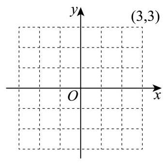

6. 某大型管线网的局部呈网格结构，如图建立平面直角坐标系，一小型机器人沿管线移动执行巡检任务，在某次巡检的路径中经过了点: $\left( {-3, - 2}\right)$ 、 $\left( {-2, m}\right)$ 、 $\left( {-1, - 2}\right)$ 、 $\left( {0, - 1}\right)$ 、 $\left( {1,0}\right) \text{ 、 }\left( {2,1}\right) \text{ 、 }\left( {3,2}\right)$ ,若该机器人经过的点的纵坐标 $y$ 关于横坐标 $x$ 的一元线性回归方程是 $y = \frac{11}{14}x - \frac{5}{7}$ ，则 $m$ 的值为___.

---

## 参考答案与解析

6. 某大型管线网的局部呈网格结构, 如图建立平面直角坐标系, 一小型机器人沿管线移动执行巡检任务，在某次巡检的路径中经过了点: $\left( {-3, - 2}\right)$ 、 $\left( {-2, m}\right)$ 、 $\left( {-1, - 2}\right)$ 、 $\left( {0, - 1}\right)$ 、 $\left( {1,0}\right) \text{ 、 }\left( {2,1}\right) \text{ 、 }\left( {3,2}\right)$ ,若该机器人经过的点的纵坐标 $y$ 关于横坐标 $x$ 的一元线性回归方程是 $y = \frac{11}{14}x - \frac{5}{7}$ ，则 $m$ 的值为___.

【答案】-3

【解析】

【分析】求出样本的中心点 $\left( {\bar{x},\bar{y}}\right)$ ,根据一元线性回归方程必经过中心点即可求解.

【详解】根据题意, 机器人经过的 7 个点的横坐标分别为 $- 3, - 2, - 1,0,1,2,3$ ,

其平均值为 $\bar{x} = \frac{-3 - 2 - 1 + 0 + 1 + 2 + 3}{7} = 0$ ,

7 个点的纵坐标分别为 $- 2, m, - 2, - 1,0,1,2$ ,其平均值为

$\bar{y} = \frac{-2 + m - 2 - 1 + 1 + 2}{7} = \frac{m - 2}{7},$

又因为这些点的一元线性回归方程是 $y = \frac{11}{14}x - \frac{5}{7}$ ,必过点 $\left( {\bar{x},\bar{y}}\right)$ ,

代入得 $\frac{m - 2}{7} = \frac{11}{14} \times  0 - \frac{5}{7} \Rightarrow  m =  - 3$ ，即 $m$ 的值为 -3 .
