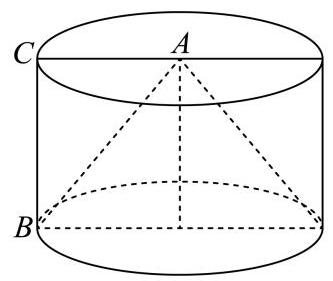

8. 在 ${ABC}$ 中, $\angle {ACB} = \frac{\pi }{2},{AC} = 1$ ,过点 $A$ 作直线 $l//{BC}$ ,将 ${ABC}$ 绕直线 $l$ 旋转一周所得到的几何体记为 $\Omega$ ，若 $\Omega$ 的体积是 $\frac{4}{3}\pi$ ，则 $\Omega$ 的表面积为___.

---

## 参考答案与解析

8. 在 ${ABC}$ 中, $\angle {ACB} = \frac{\pi }{2},{AC} = 1$ ,过点 $A$ 作直线 $l//{BC}$ ,将 ${ABC}$ 绕直线 $l$ 旋转一周所得到的几何体记为 $\Omega$ ,若 $\Omega$ 的体积是 $\frac{4}{3}\pi$ ,则 $\Omega$ 的表面积为___.

【答案】 $\left( {5 + \sqrt{5}}\right) \pi$

【解析】

【分析】将 $\bigtriangleup {ABC}$ 绕直线 $l$ 旋转一周,生成的几何体 $\Omega$ 是一个大圆柱挖去一个小圆锥的组合体, 利用圆柱与圆锥的体积以及表面积公式求解即可.

【详解】 $\bigtriangleup  {ABC}$ 为直角三角形， $\angle {ACB} = \frac{\pi }{2}$ ， ${AC} = 1$ ，直线 $l//{BC}$ 且过点 $A$ ，

设 ${BC} = h$ ,所以斜边 ${AB} = \sqrt{A{C}^{2} + B{C}^{2}} = \sqrt{{1}^{2} + {h}^{2}} = \sqrt{1 + {h}^{2}}$ ,

将 $\bigtriangleup  {ABC}$ 绕直线 $l$ 旋转一周，生成的几何体 $\Omega$ 是一个大圆柱挖去一个小圆锥的组合体，

所以圆柱上底面半径 $R = {AC} = 1$ ,高 $h$ ,

被挖去的圆锥的底面半径 $r = 1$ ,高与圆柱相同,即 $h$ ,

则圆柱体积: ${V}_{\text{ 圆柱 }} = \pi {R}^{2}h = \pi  \cdot  {1}^{2} \cdot  h = {\pi h}$ ,

圆锥体积: ${V}_{\text{ 圆锥 }} = \frac{1}{3}\pi {r}^{2}h = \frac{1}{3}\pi  \cdot  {1}^{2} \cdot  h = \frac{1}{3}{\pi h}$ ,

所以组合体体积: $V = {V}_{\text{ 圆柱 }} - {V}_{\text{ 圆锥 }} = {\pi h} - \frac{1}{3}{\pi h} = \frac{2}{3}{\pi h}$ ,

则 $\frac{2}{3}{\pi h} = \frac{4}{3}\pi \text{ � }h = 2$ ,即 ${BC} = 2$ ,所以 ${AB} = \sqrt{{1}^{2} + {2}^{2}} = \sqrt{5}$ ,

几何体 $\Omega$ 的表面积由三部分构成:

圆柱的侧面积: ${S}_{\text{ 柱侧 }} = {2\pi Rh} = {2\pi } \cdot  1 \cdot  2 = {4\pi }$ ,

圆柱的上底面面积: ${S}_{\text{ 上底 }} = \pi {R}^{2} = \pi  \cdot  {1}^{2} = \pi$ ,

圆锥的侧面积: 圆锥母线长为 ${AB} = \sqrt{5}\;,\;{S}_{\text{ 锥侧 }} = {\pi rl} = \pi  \cdot  1 \cdot  \sqrt{5} = \sqrt{5}\pi$ ,

所以总表面积: ${S}_{\text{ 总 }} = {S}_{\text{ 柱侧 }} + {S}_{\text{ 上底 }} + {S}_{\text{ 锥侧 }} = {4\pi } + \pi  + \sqrt{5}\pi  = \left( {5 + \sqrt{5}}\right) \pi$ .

