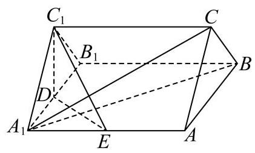

17. 如图，在正三棱柱 ${ABC} - {A}_{1}{B}_{1}{C}_{1}$ 中， $D$ 、 $E$ 分别是棱 ${A}_{1}{B}_{1}$ 、 ${A}_{1}A$ 的中点，且 ${A}_{1}A = {A}_{1}{B}_{1} = 2.$

(1)求证:直线 ${A}_{1}B \bot$ 平面 ${C}_{1}{DE}$ ；

(2)求点 $A$ 到平面 ${A}_{1}{CB}$ 的距离.

---

## 参考答案与解析

17. 如图，在正三棱柱 ${ABC} - {A}_{1}{B}_{1}{C}_{1}$ 中， $D$ 、 $E$ 分别是棱 ${A}_{1}{B}_{1}$ 、 ${A}_{1}A$ 的中点，且

$$
{A}_{1}A = {A}_{1}{B}_{1} = 2
$$

(1)求证:直线 ${A}_{1}B \bot$ 平面 ${C}_{1}{DE}$ ；

(2)求点 $A$ 到平面 ${A}_{1}{CB}$ 的距离.

【答案】(1)证明见解析

(2) $\frac{2\sqrt{21}}{7}$

【解析】

【分析】(1) 根据正三棱柱的结构可判断四边形 ${AB}{B}_{1}{A}_{1}$ 的形状,进行面面垂直、线面垂直、 线线垂直之间的转化; (2) 根据三棱锥 $C - {AB}{A}_{1}$ 的体积相等可求距离，也可利用空间向量求解距离问题.

【小问 1 详解】

如图 1,连接 $A{B}_{1}$ ,

图1

由正三棱柱的结构特征可知,

在正三棱柱 ${ABC} - {{A}_{1}{B}_{1}{C}_{1}}$ 中 $\bigtriangleup  {A}_{1}{B}_{1}{C}_{1}$ 是正三角形，侧面均为矩形， $B{B}_{1} \bot$ 平面 ${A}_{1}{B}_{1}{C}_{1}$ . 因为 $D$ 是棱 ${A}_{1}{B}_{1}$ 的中点,所以 ${C}_{1}D \bot  {A}_{1}{B}_{1}$ ,

因为 $B{B}_{1} \subset$ 平面 ${AB}{B}_{1}{A}_{1}$ ,所以平面 ${A}_{1}{B}_{1}{C}_{1} \bot$ 平面 ${AB}{B}_{1}{A}_{1}$ .

又平面 ${A}_{1}{B}_{1}{C}_{1}\mathrm{Q}$ 平面 ${AB}{B}_{1}{A}_{1} = {A}_{1}{B}_{1}$ ，所以 ${C}_{1}D \bot$ 平面 ${AB}{B}_{1}{A}_{1}$ .

又 ${A}_{1}B \subset$ 平面 ${AB}{B}_{1}{A}_{1}$ ，所以 ${C}_{1}D \bot  {A}_{1}B$ .

因为 ${A}_{1}A = {A}_{1}{B}_{1} = 2$ ,所以矩形 ${AB}{B}_{1}{A}_{1}$ 为正方形,所以 $A{B}_{1} \bot  {A}_{1}B$ ,

又 ${DE}//A{B}_{1}$ ,所以 ${DE} \bot  {A}_{1}B$ ,

因为 ${C}_{1}D,{DE} \subset$ 平面 ${C}_{1}{DE},{C}_{1}D \cap  {DE} = D$ ,所以直线 ${A}_{1}B \bot$ 平面 ${C}_{1}{DE}$ .

【小问 2 详解】

方法一: 设点 $A$ 到平面 ${A}_{1}{CB}$ 的距离为 $h$ ,

因为 $C{C}_{1}//$ 平面 ${AB}{B}_{1}{A}_{1}$ ，所以 $C,{C}_{1}$ 到平面 ${AB}{B}_{1}{A}_{1}$ 的距离相等，都为 ${C}_{1}D = \sqrt{3}$ .

由 (1) 知,侧面均为正方形,所以 ${S}_{\bigtriangleup {A}_{1}{AB}} = \frac{1}{2} \times  2 \times  2 = 2,{A}_{1}C = {A}_{1}B = 2\sqrt{2}$ ,

又 ${BC} = 2$ ，所以 $\bigtriangleup  {A}_{1}{BC}$ 为等腰三角形，所以

${S}_{\bigtriangleup {A}_{1}{BC}} = \frac{1}{2}{BC} \cdot  \sqrt{{A}_{1}{C}^{2} - {\left( \frac{BC}{2}\right) }^{2}} = \frac{1}{2} \times  2 \times  \sqrt{7} = \sqrt{7}$ .

又 ${V}_{C - {A}_{1}{AB}} = {V}_{A - {A}_{1}{CB}}$ ,即 $\frac{1}{3}{S}_{\bigtriangleup {A}_{1}{AB}} \times  \sqrt{3} = \frac{1}{3}{S}_{\bigtriangleup {A}_{1}{BC}}h$ ,

所以 $\frac{1}{3} \times  2 \times  \sqrt{3} = \frac{1}{3} \times  \sqrt{7}h$ ,解得 $h = \frac{2\sqrt{21}}{7}$ ,即点 $A$ 到平面 ${A}_{1}{CB}$ 的距离为 $\frac{2\sqrt{21}}{7}$ .

方法二: 取 ${AB}$ 的中点 $F$ ,连接 ${DF}$ ,由 (1) 可知 $D{A}_{1},{DF}, D{C}_{1}$ 两两互相垂直, 所以以 D 为原点, 建立如图 2 所示的空间直角坐标系,

图2

则 ${A}_{1}\left( {1,0,0}\right) , A\left( {1,2,0}\right) , B\left( {-1,2,0}\right) , C\left( {0,2,\sqrt{3}}\right)$ ,

所以 $\overrightarrow{{A}_{1}A} = \left( {0,2,0}\right) ,\overrightarrow{{A}_{1}B} = \left( {-2,2,0}\right) ,\overrightarrow{{A}_{1}C} = \left( {-1,2,\sqrt{3}}\right)$ ,

设平面 ${A}_{1}{CB}$ 的法向量为 $\overrightarrow{n} = \left( {x, y, z}\right)$ ,

则 $\left\{  \begin{array}{l} \overrightarrow{n} \cdot  \overrightarrow{{A}_{1}B} = 0 \\  \overrightarrow{n} \cdot  \overrightarrow{{A}_{1}C} = 0 \end{array}\right.$ ,即 $\left\{  \begin{array}{l}  - {2x} + {2y} = 0 \\   - x + {2y} + \sqrt{3}z = 0 \end{array}\right.$ ,令 $x = 1$ ,则 $y = 1, z =  - \frac{\sqrt{3}}{3}$ ,

即 $\overrightarrow{n} = \left( {1,1, - \frac{\sqrt{3}}{3}}\right)$ ,所以点 $A$ 到平面 ${A}_{1}{CB}$ 的距离为 $\left| \frac{\overrightarrow{n} \cdot  \overrightarrow{{A}_{1}A}}{\left| \overrightarrow{n}\right| }\right|  = \frac{2}{\sqrt{\frac{7}{3}}} = \frac{2\sqrt{21}}{7}$ .
