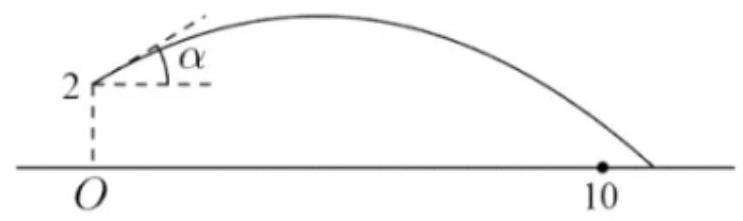
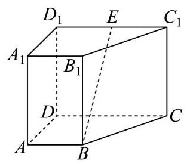
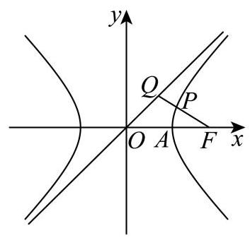
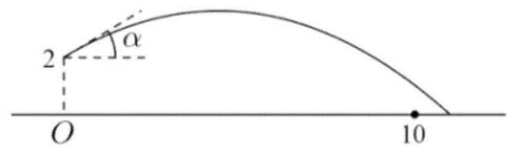
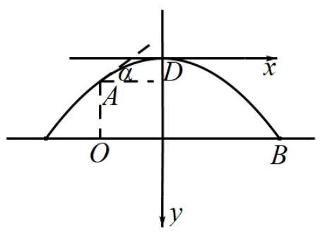
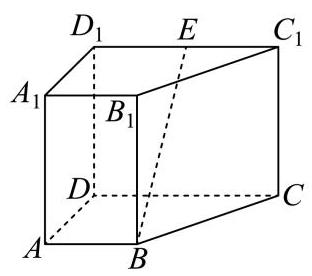
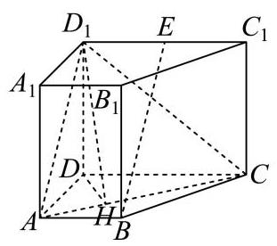
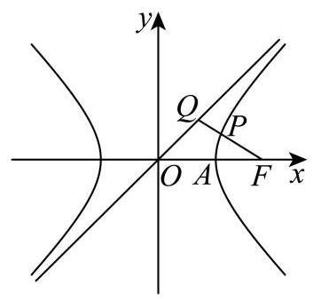
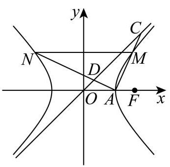

# 杨浦区 2025 学年度第二学期高三年级模拟质量调研 数学学科

2026.4

考生注意:1.答卷前，考生务必在答题纸写上姓名、考号，并将核对后的条形码贴在指定位置上.

## 2.本试卷共有 21 道题, 满分 150 分, 考试时间 120 分钟.

## 一、填空题(本大题满分 54 分)本大题共有 12 题，1-6 每题 4 分，7-12 每题 5 分.考生应在答题纸相应编号的空格内直接填写结果

1. 设全集 $U = \{ x \mid  1 \leq  x \leq  6, x \in  \mathbf{Z}\} , B = \{ 1,2\}$ ，用列举法表示 ${\eth }_{U}B =$ ___.

2. 计算 $\mathop{\sum }\limits_{{i = 1}}^{n}\left( {{2i} - 1}\right)  =$ ___.

3. 若幂函数 $y = {x}^{a}$ 的图像经过点 $\left( {\sqrt{3},3\sqrt{3}}\right)$ ，则实数 $a =$ ___.

4. 在 ${\left( x + \frac{2}{x}\right) }^{6}$ 的二项展开式中，常数项的值为___.

5. 设正实数 $a, b$ 满足 $a + b = 3$ ，则 ${a}^{2} + {b}^{2}$ 的最小值为___.

6. 不等式 ${3}^{x} + {\log }_{2}x < 3$ 的解集为___.

7. 已知圆锥的底面半径为 1,体积为 $\frac{\sqrt{3}\pi }{3}$ ,则该圆锥的侧面积为___.

8. 直线 $l : \left( {a - 3}\right) x + \left( {{2a} + 1}\right) y - 3 = 0$ 的一个法向量是 $\overrightarrow{n} = \left( {3,2}\right)$ ，则实数 $a =$ ___.

9. 已知随机变量 $X$ 服从二项分布 $B\left( {{90}, p}\right)$ ，若 $E\left\lbrack  X\right\rbrack   = {30}$ ，则 $D\left\lbrack  X\right\rbrack   =$ ___.

10. 设集合 $A = \{ z\parallel z + 1 \mid   = \left| {z - a}\right| , z \in  \mathbf{C}\} , B = \{ z\parallel z \mid   = 1, z \in  \mathbf{C}\}$ ，若 $A \cap  B \neq  \varnothing$ ，则实数 $a$ 的取值范围是___.

11. 掷实心球时，将轨迹视为抛物线的一部分，设实心球离手位置在起掷点 $O$ 正上方 2 米, 出手角度 $a$ 即抛物线在该处切线与水平地面所成角,如图所示. 已知实心球轨迹最高点距离地面 3 米,若要成绩不小于 10 米 (实心球落地点到起掷点的距离),则出手角度 $a$ 的最大值为___. (精确到 ${0.1}^{ \circ  }$ ).

12. 记 $\overrightarrow{{a}_{1}},\overrightarrow{{a}_{2}}\ldots ,\overrightarrow{{a}_{m}}$ 是空间中的 $m\left( {m \in  \mathbf{N}, m \geq  1}\right)$ 个不同的非零向量,满足: ①其中任意向量在其它向量方向上的投影均为其本身或零向量; ②其中任意三个向量 $\overrightarrow{{a}_{i}}\text{ 、 }\overrightarrow{{a}_{j}}\text{ 、 }\overrightarrow{{a}_{k}}$ 均不能使 $\frac{1}{\left| \overrightarrow{{a}_{k}}\right| }\overrightarrow{{a}_{k}} = \frac{1}{2}\left( {\frac{1}{\left| \overrightarrow{{a}_{i}}\right| }\overrightarrow{{a}_{i}} + \frac{1}{\left| \overrightarrow{{a}_{j}}\right| }\overrightarrow{{a}_{j}}}\right)$ 成立，则 $m$ 的最大值为___.

## 二、选择题 (本题共有 4 题, 满分 18 分, 13.14 每题 4 分, 15、16 每题 5 分) 每题有且只有一个正确选项, 考生应在答题纸的相应位置, 将代表正确选项的小 方格涂黑.

13. 设 $a > b$ ，下列不等式中恒成立的是( )

A. $\frac{1}{a} < \frac{1}{b}$ B. ${a}^{2} > {b}^{2}$ C. ${a}^{3} > {b}^{3}$ D. $\left| a\right|  > \left| b\right|$

14. 事件 $A\text{ 、 }B$ 相互独立,若 $P\left( A\right)  = \frac{1}{2}, P\left( B\right)  = \frac{1}{3}$ ,则 $A$ 与 $\bar{B}$ 同时发生的概率为 ( ) .

A. 0

B. $\frac{1}{6}$ C. $\frac{5}{6}$ D. $\frac{1}{3}$

15. 已知函数 $y = f\left( x\right)$ 和 $y = g\left( x\right)$ 的定义域都为 $\mathbf{R}$ 且都存在导函数. 若 $y = f\left( x\right)$ 和 $y = g\left( x\right)$ 的零点均有且仅有 $x = 0$ ,且当 $x \neq  0$ 时恒有 $f\left( x\right)  < g\left( x\right)$ ,则下列情形中不可能的是 ( ) .

A. 0 是 $y = f\left( x\right)$ 的极大值点,也是 $y = g\left( x\right)$ 的极大值点

B. 0 是 $y = f\left( x\right)$ 的极小值点,也是 $y = g\left( x\right)$ 的极小值点

C. 0 是 $y = f\left( x\right)$ 的极大值点,也是 $y = g\left( x\right)$ 的极小值点

D. 0是 $y = f\left( x\right)$ 的极小值点,也是 $y = g\left( x\right)$ 的极大值点

16. 已知数列 $\left\{  {a}_{n}\right\}$ ,给出以下定义: 若存在常数 $k > 0$ ,对于任意的 $n \in  {\mathbf{N}}^{ * }$ ,都有 ${a}_{n + 2} - {a}_{n + 1} \geq  k\left( {{a}_{n + 1} - {a}_{n}}\right)$ ,则称数列 $\left\{  {a}_{n}\right\}$ 为 “ $k$ -加速数列”,现给出下列命题:

①若 ${a}_{n} = \frac{1}{n}$ ，则对任意 $k > 0$ ，数列 $\left\{  {a}_{n}\right\}$ 都不是 “ $k$ -加速数列”；

②若数列 $\left\{  {a}_{n}\right\}$ 是 “1 - 加速数列”，且 ${a}_{n} \in  \mathbf{Z}$ ， ${a}_{1} = {a}_{2026} = {2026}$ ，则数列 $\left\{  {a}_{n}\right\}$ 存在最小项； ③若数列 $\left\{  {a}_{n}\right\}$ 是 “2 -加速数列”，且 ${a}_{1} = 1,{a}_{2} = 2$ ，则存在 $M > 0$ ，使得 $\left| {a}_{n}\right|  < M$ ； ④正数列 $\left\{  {a}_{n}\right\}$ 是等比数列且公比 $q \neq  1$ ，则 $\left\{  {a}_{n}\right\}$ 是 “ $k$ -加速数列” 的充要条件是 $k = 1$ . 其中正确的命题是( )

A. ①②③ B. ② C. ②④ D. ③④

## 三、解答题 (本大题满分 78 分) 本大题共 5 题, 解答下列各题必须在答题纸相 应编号的规定区域内写出必要的步骤.

17. 一次考试后，数学兴趣小组分析某班级考试成绩. 该班级共 40 人，将得分由高到低平均分为四组, 第一组 (均分最高的一组) 的数据为 141、140、138、134、133、133、133、132、132、132.

(1)求第一组的得分的均值与中位数；

(2)若从第一组中等可能的选取 2 名学生，求 2 人得分都在 135 分以上的概率；

(3)兴趣小组考察某客观题的得分情况. 将前 15 名学生作为高分组，后 25 名学生作为非高分组; 前 15 名学生中 13 人答对该题，后 25 名学生中 16 人答对该题.据此，填写表格，并判断是否有 95%的把握认为答对该题与进入高分组有关？

附: ${\chi }^{2} = \frac{n{\left( ad - bc\right) }^{2}}{\left( {a + b}\right) \left( {c + d}\right) \left( {a + c}\right) \left( {b + d}\right) }P\left( {{\chi }^{2} \geq  {6.635}}\right)  \approx  {0.01}, P\left( {{\chi }^{2} \geq  {5.024}}\right)  \approx  {0.025}$ , $P\left( {{\chi }^{2} \geq  {3.841}}\right)  \approx  {0.05},\;P\left( {{\chi }^{2} \geq  {2.706}}\right)  \approx  {0.1}.$

<table><tr><td></td><td>高分组</td><td>非高分组</td><td>总计</td></tr><tr><td>某客观题答对</td><td></td><td></td><td></td></tr><tr><td>某客观题答错</td><td></td><td></td><td></td></tr><tr><td>总计</td><td></td><td></td><td></td></tr></table>

18. 如图，在直四棱柱 ${ABCD} - {A}_{1}{B}_{1}{C}_{1}{D}_{1}$ 中， ${AB}//{CD}$ ， ${AD} \bot  {CD}$ ， ${AB} = 2$ ， ${AD} = 3$ ， ${CD} = 4$ .

(1)设 $E$ 是 ${C}_{1}{D}_{1}$ 的中点，求证: ${BE}//$ 平面 $A{A}_{1}{D}_{1}D$ ；

(2)若直四棱柱 ${ABCD} - {A}_{1}{B}_{1}{C}_{1}{D}_{1}$ 的体积为 36，求平面 ${D}_{1}{AC}$ 与平面 ${ABCD}$ 所成的锐二面角的大小.

19. 已知函数 $f\left( x\right)  = 2\sin {\omega x}$ (常数 $\omega  > 0$ ).

(1) 若 $\omega  = 1$ ,在 ${ABC}$ 中,角 $A\text{ 、 }B\text{ 、 }C$ 的对边分别为 $a\text{ 、 }b\text{ 、 }c$ . 若 $f\left( {A + \frac{\pi }{2}}\right)  =  - 1, a = \sqrt{3}b$ , 求角 $B$ 的大小；

( 2 )若 $y = f\left( x\right)$ 的最小正周期为 $\pi$ ，将其图像向左平移 $\frac{\pi }{12}$ 个单位，再向上平移 $h\left( {h > 0}\right)$ 个单位得到函数 $y = g\left( x\right)$ 的图像. 当 $x \in  \left\lbrack  {0,\frac{\pi }{2}}\right\rbrack$ 时恒有 $g\left( x\right)  > 0$ ,求 $h$ 的取值范围.

20. 已知 $A\text{ 、 }F$ 分别是双曲线 $\Gamma  : {x}^{2} - {y}^{2} = \lambda$ (常数 $\lambda  > 0$ ) 的右顶点和右焦点,记 $\Gamma$ 过一、 三象限的渐近线为 ${l}_{0}$ .

( 1 )求双曲线 $\Gamma$ 的离心率和渐近线 ${l}_{0}$ 的方程；

(2)设 $\lambda  = 2$ ， $Q$ 是 ${l}_{0}$ 上一点，若线段 ${FQ}$ 的中点 $P$ 在双曲线 $\Gamma$ 上，求点 $Q$ 的坐标；

(3)设 $\lambda  = 1$ ，过 $A$ 作两条相互垂直的直线与双曲线 $\Gamma$ 交于 $M$ 、 $N$ 两点(M在第一象限)， 若直线 ${AM}$ 、 ${AN}$ 分别与 ${l}_{0}$ 交于 $C$ 、 $D$ 两点，且 $\bigtriangleup  {AMN}$ 与 $\bigtriangleup  {ACD}$ 的面积之比为 2，求直线 ${AM}$ 的方程.

21. 设函数 $y = f\left( x\right)$ 的定义域为 $D$ ,值域 $A \subseteq  \left\lbrack  {-1,1}\right\rbrack$ . 若 ${x}_{1},{x}_{2} \in  D$ 且满足 $f\left( {x}_{1}\right)  + f\left( {x}_{2}\right)  = f\left( {{x}_{1} + {x}_{2}}\right)$ ,则称 ${X}_{1}$ 与 ${x}_{2}$ 构成 “函数 $y = f\left( x\right)$ 的线性对”.

(1)若 $f\left( x\right)  = \cos x$ ，判断 $\frac{\pi }{3}$ 与 $\pi$ 是否构成函数 $y = f\left( x\right)$ 的线性对，并说明理由；

( 2 )若 $f\left( x\right)  = {2}^{x} - \frac{1}{2}, D = \left( {-\infty ,0}\right)$ . 若对于任意 ${x}_{1} \in  \left( {-\infty , a}\right)$ (常数 $a \leq  0$ )，都存在 ${x}_{2} \in  D$ ,使得 ${x}_{1}$ 与 ${x}_{2}$ 构成函数 $y = f\left( x\right)$ 的线性对,求 $a$ 的取值范围;

(3)函数 $y = f\left( x\right)$ 是定义在 $\mathbf{R}$ 上的奇函数，且满足:若 ${x}_{1}$ 与 ${x}_{2}$ 构成函数 $y = f\left( x\right)$ 的线性对,则 ${X}_{1}$ 与 $- {x}_{2}$ 也构成函数 $y = f\left( x\right)$ 的线性对. 求证: 对任意 $x \in  \mathbf{R}, f\left( x\right)  = 0$ . 参考答案及解析:

1、【答案】 $\{ 3,4,5,6\}$

【解析】

【分析】由集合的补集运算结合集合的表示法即可求解.

【详解】由题意得 $U = \{ 1,2,3,4,5,6\}$ ,则 ${\partial }_{J}B = \{ 3,4,5,6\}$ .

2. 计算 $\mathop{\sum }\limits_{{i = 1}}^{n}\left( {{2i} - 1}\right)  =$ ___.

【答案】 ${n}^{2}$

【解析】

【详解】 $\mathop{\sum }\limits_{{i = 1}}^{n}\left( {{2i} - 1}\right)  = 1 + 3 + 5 + \cdots  + \left( {{2n} - 1}\right)$

$= \frac{\left\lbrack  {1 + \left( {{2n} - 1}\right) }\right\rbrack  n}{2} = {n}^{2}$ .

3. 若幂函数 $y = {x}^{a}$ 的图像经过点 $\left( {\sqrt{3},3\sqrt{3}}\right)$ ，则实数 $a =$ ___.

【答案】 3

【解析】

【详解】代入 $\left( {\sqrt{3},3\sqrt{3}}\right)$ ，即 $3\sqrt{3} = {\left( \sqrt{3}\right) }^{a}$ ，解得 $a = 3$ .

4. 在 ${\left( x + \frac{2}{x}\right) }^{6}$ 的二项展开式中，常数项的值为___.

【答案】160

【解析】

【分析】利用二项式定理展开式求解即可.

【详解】由二项式定理可知 ${\left( x + \frac{2}{x}\right) }^{6}$ 展开式通项为 ${T}_{k + 1} = {\mathrm{C}}_{6}^{k}{x}^{6 - k}{\left( \frac{2}{x}\right) }^{k} = {\mathrm{C}}_{6}^{k}{2}^{k}{x}^{6 - {2k}}$ ,

令 $6 - {2k} = 0$ ,得 $k = 3$ ,此时 ${T}_{4} = {\mathrm{C}}_{6}^{3}{2}^{3}{x}^{0} = {160}$ .

所以常数值为 160 .

5. 设正实数 $a, b$ 满足 $a + b = 3$ ，则 ${a}^{2} + {b}^{2}$ 的最小值为___.

【答案】 $\frac{9}{2}$ ## 4.5

【解析】

【分析】根据题意,得到 ${a}^{2} + {b}^{2} = {\left( a + b\right) }^{2} - {2ab}$ ,结合基本不等式,即可求解.

【详解】因为正实数 $a, b$ 满足 $a + b = 3$ ,

可得 ${a}^{2} + {b}^{2} = {\left( a + b\right) }^{2} - {2ab} \geq  {\left( a + b\right) }^{2} - 2 \times  {\left( \frac{a + b}{2}\right) }^{2} = 9 - 2 \times  \frac{9}{4} = \frac{9}{2}$ ,

当且仅当 $a = b = \frac{3}{2}$ 时,等号成立,所以 ${a}^{2} + {b}^{2}$ 的最小值为 $\frac{9}{2}$ .

6. 不等式 ${3}^{x} + {\log }_{2}x < 3$ 的解集为___.

【答案】(0,1)

【解析】

【详解】令 $f\left( x\right)  = {3}^{x} + {\log }_{2}x$ ,定义域为 $\left( {0, + \infty }\right)$ ,

函数 $y = {3}^{x}$ 和 $y = {\log }_{2}x$ 在 $\left( {0, + \infty }\right)$ 上均为增函数,

所以函数 $f\left( x\right)  = {3}^{x} + {\log }_{2}x$ 在 $\left( {0, + \infty }\right)$ 上为增函数,

又 $f\left( 1\right)  = {3}^{1} + {\log }_{2}1 = 3$ ，则 ${3}^{x} + {\log }_{2}x < 3 \Leftrightarrow  f\left( x\right)  < f\left( 1\right)$ ，

所以不等式 ${3}^{x} + {\log }_{2}x < 3$ 的解集为 $\left( {0,1}\right)$ .

7. 已知圆锥的底面半径为 1，体积为 $\frac{\sqrt{3}\pi }{3}$ ，则该圆锥的侧面积为___.

【答案】 ${2\pi }$

【解析】

【分析】先由题干条件计算圆锥的高, 再求圆锥的母线, 进而可求圆锥的侧面积.

【详解】由题得圆锥底面积 ${S}_{\text{ 底 }} = \pi {R}^{2} = \pi$ ,体积 $V = \frac{1}{3}{Sh} = \frac{1}{3}{\pi h} = \frac{\sqrt{3}\pi }{3}$ ,解得 $h = \sqrt{3}$ , 母线长 $l = \sqrt{{R}^{2} + {h}^{2}} = \sqrt{1 + 3} = 2$ ,故圆锥侧面积 ${S}_{\text{ 侧 }} = {\pi Rl} = {2\pi }$ .

故答案为: ${2\pi }$ .

8. 直线 $l : \left( {a - 3}\right) x + \left( {{2a} + 1}\right) y - 3 = 0$ 的一个法向量是 $\overrightarrow{n} = \left( {3,2}\right)$ ，则实数 $a =$ ___. 【答案】 $- \frac{9}{4}$

【解析】

【详解】易知直线 $l : \left( {a - 3}\right) x + \left( {{2a} + 1}\right) y - 3 = 0$ 的一个法向量可以表示为 $\left( {a - 3,{2a} + 1}\right)$ , 又直线 $l$ 的一个法向量是 $\overrightarrow{n} = \left( {3,2}\right)$ ,所以两向量共线,

根据向量共线的坐标表示得 $2\left( {a - 3}\right)  - 3\left( {{2a} + 1}\right)  = 0$ ,解得 $a =  - \frac{9}{4}$ .

9. 已知随机变量 $X$ 服从二项分布 $B\left( {{90}, p}\right)$ ，若 $E\left\lbrack  X\right\rbrack   = {30}$ ，则 $D\left\lbrack  X\right\rbrack   =$ ___.

【答案】 20

【解析】

【分析】借助二项分布的期望与方差公式计算即可得.

【详解】 $E\left\lbrack  X\right\rbrack   = {90p} = {30}$ ,则 $p = \frac{1}{3}$ ,则 $D\left\lbrack  X\right\rbrack   = {90} \times  \frac{1}{3} \times  \left( {1 - \frac{1}{3}}\right)  = {20}$ .

10. 设集合 $A = \left\{  {z\begin{Vmatrix}{z + 1}\end{Vmatrix} = \left| {z - a}\right| , z \in  \mathbf{C}}\right\}  , B = \left\{  {z\begin{Vmatrix}z\end{Vmatrix} = 1, z \in  \mathbf{C}}\right\}$ ,若 $A \cap  B \neq  \varnothing$ ,则实数 $a$ 的取值范围是___.

【答案】 $\left\lbrack  {-1,3}\right\rbrack$

【解析】

【分析】由 $\left| {z + 1}\right|  = \left| {z - a}\right|$ 知 $z$ 到 $\left( {-1,0}\right)$ 与 $\left( {a,0}\right)$ 距离相等,其轨迹是这两点的垂直平分线, $B = \{ z\parallel z \mid   = 1, z \in  \mathbf{C}\}$ 表示的轨迹是一个单位圆,两者有交点,等价于原点到直线的距离不大于 1,通过计算可得实数 $a$ 的取值范围.

【详解】集合 $A = \left\{  {z\begin{Vmatrix}{z + 1}\end{Vmatrix} = \left| {z - a}\right| , z \in  \mathbf{C}}\right\}$ ,由 $\left| {z + 1}\right|  = \left| {z - a}\right|$ ,即 $z$ 到 $\left( {-1,0}\right)$ 与 $\left( {a,0}\right)$ 距离相等,

即 $z$ 的轨迹为 $\left( {-1,0}\right)$ 与 $\left( {a,0}\right)$ 两点连线的垂直平分线,

设 $z = x + y\mathrm{i}$ ,所以 $\left| {x + 1 + y\mathrm{i}}\right|  = \left| {x - a - y\mathrm{i}}\right|$ ,所以 ${\left( x + 1\right) }^{2} + {y}^{2} = {\left( x - a\right) }^{2} + {y}^{2}$ ,化简得 $2\left( {a + 1}\right) x = {a}^{2} - 1,$

若 $a =  - 1$ ,等式化为 $0 = 0$ ,任何 $z$ 都满足,此时 $A$ 为整个复平面,满足 $A \cap  B \neq  \varnothing$ ;

若 $a \neq   - 1$ ,则 $x = \frac{a - 1}{2}$ ,即 $z$ 的轨迹为直线 $x = \frac{a - 1}{2}, B = \{ z\parallel z \mid   = 1, z \in  \mathbf{C}\}$ 表示的为圆: ${x}^{2} + {y}^{2} = 1$

$A \cap  B \neq  \varnothing$ 即直线 $x = \frac{a - 1}{2}$ 与圆 ${x}^{2} + {y}^{2} = 1$ 有交点，所以 $\left| \frac{a - 1}{2}\right|  \leq  1$ ，解得 $- 1 \leq  a \leq  3$ ，所以实数 $a$ 的取值范围是 $\left\lbrack  {-1,3}\right\rbrack$ .

11. 掷实心球时，将轨迹视为抛物线的一部分，设实心球离手位置在起掷点 $O$ 正上方 2 米, 出手角度 $a$ 即抛物线在该处切线与水平地面所成角，如图所示. 已知实心球轨迹最高点距离地面 3 米,若要成绩不小于 10 米 (实心球落地点到起掷点的距离),则出手角度 $a$ 的最大值为___. (精确到 ${0.1}^{ \circ  }$ ).

【答案】 ${28.7}^{ \circ  }$

【解析】

【分析】建立平面直角坐标系,设抛物线方程 $y = a{x}^{2}$ ,利用已知点坐标结合已知条件,求出 $a$ 的范围; 对抛物线方程求导得到斜率表达式,结合条件得到 $\tan a$ ,进而求出 $a$ 即可.

【详解】

以最高点 $D$ 为坐标原点,以水平向右为 $x$ 轴正方向,以竖直向下为 $y$ 轴正方向,建立平面直角坐标系,

设抛物线方程为 $f\left( x\right)  = a{x}^{2}\left( {a > 0}\right)$ .

则 $A\left( {-\sqrt{\frac{1}{a}},1}\right) , B\left( {\sqrt{\frac{3}{a}},3}\right)$ .

由题意得 $\sqrt{\frac{3}{a}} - \left( {-\sqrt{\frac{1}{a}}}\right)  \geq  {10}$ ,即 $\frac{1 + \sqrt{3}}{\sqrt{a}} \geq  {10}$ ,所以 $a \leq  {\left( \frac{1 + \sqrt{3}}{10}\right) }^{2}$ ,取 $a = {\left( \frac{1 + \sqrt{3}}{10}\right) }^{2}$ .

又 ${f}^{\prime }\left( x\right)  = {2ax}$ ,则 ${f}^{\prime }\left( {-\sqrt{\frac{1}{a}}}\right)  = {2a}\left( {-\sqrt{\frac{1}{a}}}\right)  =  - 2\sqrt{a}$ .

易知 $a$ 为锐角,所以 $\tan a = 2 \times  \frac{1 + \sqrt{3}}{10} = \frac{1 + \sqrt{3}}{5}$ ,

所以 $a = \arctan \frac{1 + \sqrt{3}}{5} \approx  {28.7}^{ \circ  }$ .

故出手角度 $a$ 的最大值为 ${28.7}^{ \circ  }$ .

12. 记 $\overrightarrow{{a}_{1}},\overrightarrow{{a}_{2}}\ldots ,\overrightarrow{{a}_{m}}$ 是空间中的 $m\left( {m \in  \mathbf{N}, m \geq  1}\right)$ 个不同的非零向量,满足: ①其中任意向量在其它向量方向上的投影均为其本身或零向量; ②其中任意三个向量 $\overrightarrow{{a}_{i}}\text{ 、 }\overrightarrow{{a}_{j}}\text{ 、 }\overrightarrow{{a}_{k}}$ 均不能使 $\frac{1}{\left| \overrightarrow{{a}_{k}}\right| }\overrightarrow{{a}_{k}} = \frac{1}{2}\left( {\frac{1}{\left| \overrightarrow{{a}_{i}}\right| }\overrightarrow{{a}_{i}} + \frac{1}{\left| \overrightarrow{{a}_{j}}\right| }\overrightarrow{{a}_{j}}}\right)$ 成立，则 $m$ 的最大值为___.

【答案】 12

【解析】

【分析】根据已知条件利用向量投影、共线性质结合条件①②分析即可得.

【详解】设 $\overrightarrow{{a}_{i}},\overrightarrow{{a}_{j}}$ 是这 $m$ 个向量中的任意两个向量,

根据投影的定义，向量 $\overrightarrow{{a}_{i}}$ 在向量 $\overrightarrow{{a}_{j}}$ 方向上的投影为: $\frac{\overrightarrow{{a}_{i}} \cdot  \overrightarrow{{a}_{j}}}{\left| \overrightarrow{{a}_{j}}\right| } \cdot  \frac{\overrightarrow{{a}_{j}}}{\left| \overrightarrow{{a}_{j}}\right| } = \frac{\overrightarrow{{a}_{i}} \cdot  \overrightarrow{{a}_{j}}}{{\left| \overrightarrow{{a}_{j}}\right| }^{2}} \cdot  \overrightarrow{{a}_{j}}$ ,

由条件①可知, $\frac{\overrightarrow{{a}_{i}} \cdot  \overrightarrow{{a}_{j}}}{{\left| \overrightarrow{{a}_{j}}\right| }^{2}} \cdot  \overrightarrow{{a}_{j}} = \overrightarrow{{a}_{i}}$ 或 $\frac{\overrightarrow{{a}_{i}} \cdot  \overrightarrow{{a}_{j}}}{{\left| \overrightarrow{{a}_{j}}\right| }^{2}} \cdot  \overrightarrow{{a}_{j}} = \overrightarrow{0}$ ,

当 $\frac{\overrightarrow{{a}_{i}} \cdot  \overrightarrow{{a}_{j}}}{{\left| \overrightarrow{{a}_{j}}\right| }^{2}} \cdot  \overrightarrow{{a}_{j}} = \overrightarrow{{a}_{i}}$ 时,向量 $\overrightarrow{{a}_{i}},\overrightarrow{{a}_{j}}$ 共线,当 $\frac{\overrightarrow{{a}_{i}} \cdot  \overrightarrow{{a}_{j}}}{{\left| \overrightarrow{{a}_{j}}\right| }^{2}} \cdot  \overrightarrow{{a}_{j}} = \overrightarrow{0}$ 时,向量 $\overrightarrow{{a}_{i}},\overrightarrow{{a}_{j}}$ 垂直;

$\frac{1}{\left| \overrightarrow{{a}_{k}}\right| }\overrightarrow{{a}_{k}},\frac{1}{\left| \overrightarrow{{a}_{i}}\right| }\overrightarrow{{a}_{i}},\frac{1}{\left| \overrightarrow{{a}_{j}}\right| }\overrightarrow{{a}_{j}}$ 表示三个单位向量,

当 $\overrightarrow{{a}_{i}}\text{ 、 }\overrightarrow{{a}_{j}}$ 不同向时, $\cos \overrightarrow{{a}_{i}},\overrightarrow{{a}_{j}} \neq  1$ ,

则 ${\left( \frac{1}{\left| \overrightarrow{{a}_{i}}\right| }\overrightarrow{{a}_{i}} + \frac{1}{\left| \overrightarrow{{a}_{j}}\right| }\overrightarrow{{a}_{j}}\right) }^{2} = \sqrt{2 + 2\cos \overrightarrow{{a}_{i}},\overrightarrow{{a}_{j}}} \neq  2$ ,

则 $\frac{1}{2}\left| \left( {\frac{1}{\left| \overrightarrow{{\alpha }_{i}}\right| }\overrightarrow{{\alpha }_{i}} + \frac{1}{\left| \overrightarrow{{\alpha }_{j}}\right| }\overrightarrow{{\alpha }_{j}}}\right) \right|  \neq  1$ ,又 $\left| {\frac{1}{\left| \overrightarrow{{\alpha }_{k}}\right| }\overrightarrow{{\alpha }_{k}}}\right|  = 1$ ,

故不符合 $\frac{1}{\left| \overrightarrow{{a}_{k}}\right| }\overrightarrow{{a}_{k}} = \frac{1}{2}\left( {\frac{1}{\left| \overrightarrow{{a}_{i}}\right| }\overrightarrow{{a}_{i}} + \frac{1}{\left| \overrightarrow{{a}_{j}}\right| }\overrightarrow{{a}_{j}}}\right)$ ,

则 $\overrightarrow{{a}_{i}}\text{ 、 }\overrightarrow{{a}_{j}}$ 同向，则由 $\frac{1}{\left| \overrightarrow{{a}_{k}}\right| }\overrightarrow{{a}_{k}} = \frac{1}{2}\left( {\frac{1}{\left| \overrightarrow{{a}_{i}}\right| }\overrightarrow{{a}_{i}} + \frac{1}{\left| \overrightarrow{{a}_{j}}\right| }\overrightarrow{{a}_{j}}}\right)$ ,可得 $\overrightarrow{{a}_{k}}\text{ 、 }\overrightarrow{{a}_{i}}\text{ 、 }\overrightarrow{{a}_{j}}$ 同向，

由其中任意三个向量 $\overrightarrow{{a}_{i}}\text{ 、 }\overrightarrow{{a}_{j}}\text{ 、 }\overrightarrow{{a}_{k}}$ 均不能使 $\frac{1}{\left| \overrightarrow{{a}_{k}}\right| }\overrightarrow{{a}_{k}} = \frac{1}{2}\left( {\frac{1}{\left| \overrightarrow{{a}_{i}}\right| }\overrightarrow{{a}_{i}} + \frac{1}{\left| \overrightarrow{{a}_{j}}\right| }\overrightarrow{{a}_{j}}}\right)$ 成立,

则其中任意三个向量 $\overrightarrow{{a}_{k}}$ 、 $\overrightarrow{{a}_{i}}$ 、 $\overrightarrow{{a}_{j}}$ 不同向，即同一方向最多两个不等向量；

故结合①②可得:这些向量中任意两个向量要么共线，要么垂直，且同一方向最多两个不等向量,

例如可取空间中三个两两互相垂直的单位向量 $\overrightarrow{{e}_{1}},\overrightarrow{{e}_{2}},\overrightarrow{{e}_{3}}$ 及其相反向量 $- \overrightarrow{{e}_{1}}, - \overrightarrow{{e}_{2}}, - \overrightarrow{{e}_{3}}$ ,

再取 $2\overrightarrow{{e}_{1}},2\overrightarrow{{e}_{2}},2\overrightarrow{{e}_{3}}, - 2\overrightarrow{{e}_{1}}, - 2\overrightarrow{{e}_{2}}, - 2\overrightarrow{{e}_{3}}$ ,这 12 个不同向量满足条件①②;

若存在第 13 个向量 $\overrightarrow{{a}_{13}}$ ,则 $\overrightarrow{{a}_{13}}$ 必须与另外 12 个向量中的任一共线或垂直,

由于已有的向量中包含三个互相垂直的方向,

则 $\overrightarrow{{a}_{13}}$ 必须与其中一个向量共线才能符合要求,

但此时任一方向都有两不同向量,故不存在 $\overrightarrow{{a}_{13}}$ 符合题意,

所以满足条件的 $m$ 的最大值为 12 .

## 二、选择题 (本题共有 4 题, 满分 18 分, 13.14 每题 4 分, 15、16 每题 5 分) 每题有且只有一个正确选项, 考生应在答题纸的相应位置, 将代表正确选项的小 方格涂黑。

13. 设 $a > b$ ，下列不等式中恒成立的是( )

A. $\frac{1}{a} < \frac{1}{b}$ B. ${a}^{2} > {b}^{2}$ C. ${a}^{3} > {b}^{3}$ D.

$\left| a\right|  > \left| b\right|$

【答案】C

【解析】

【详解】对于 $\mathrm{A},\mathrm{B},\mathrm{D}$ ,若 $a > b$ ,可设 $a = 1, b =  - 2$ ,此时 $\frac{1}{a} > \frac{1}{b}$ ,故 $\mathrm{A}$ 不符合题意; 此时 ${a}^{2} = 1,{b}^{2} = 4$ ,得到 ${a}^{2} < {b}^{2}$ ,故 $\mathrm{B}$ 不符合题意;

此时 $\left| \mathbf{b}\right|  = 2$ ,得到 $\left| a\right|  < \left| b\right|$ ,故 $\mathrm{D}$ 不符合题意;

对于 $\mathrm{C}$ ,因为 $y = {x}^{3}$ 在 $\mathbf{R}$ 上单调递增,

所以 $a > b$ ,一定有 ${a}^{3} > {b}^{3}$ 成立,故 $\mathrm{C}$ 符合题意.

14. 事件 $A$ 、 $B$ 相互独立，若 $P\left( A\right)  = \frac{1}{2}$ ， $P\left( B\right)  = \frac{1}{3}$ ，则 $A$ 与 $\bar{B}$ 同时发生的概率为( ).

A. 0

B. $\frac{1}{6}$ C. $\frac{5}{6}$ D. $\frac{1}{3}$

【答案】D

【解析】

【分析】根据独立事件和对立事件概率公式求解即可.

【详解】事件 $A\text{ 、 }B$ 相互独立,则事件 $A\text{ 、 }\bar{B}$ 也相互独立.

事件 $\bar{B}$ 发生的概率为 $P\left( \bar{B}\right)  = 1 - P\left( B\right)  = 1 - \frac{1}{3} = \frac{2}{3}$ .

则 $A$ 与 $\bar{B}$ 同时发生的概率为 $P\left( {A\bar{B}}\right)  = P\left( A\right) P\left( \bar{B}\right)  = \frac{1}{2} \times  \frac{2}{3} = \frac{1}{3}$ .

15. 已知函数 $y = f\left( x\right)$ 和 $y = g\left( x\right)$ 的定义域都为 $\mathbf{R}$ 且都存在导函数. 若 $y = f\left( x\right)$ 和 $y = g\left( x\right)$ 的零点均有且仅有 $x = 0$ ,且当 $x \neq  0$ 时恒有 $f\left( x\right)  < g\left( x\right)$ ,则下列情形中不可能的是 ( ) .

A. 0 是 $y = f\left( x\right)$ 的极大值点,也是 $y = g\left( x\right)$ 的极大值点

B. 0 是 $y = f\left( x\right)$ 的极小值点,也是 $y = g\left( x\right)$ 的极小值点

C. 0 是 $y = f\left( x\right)$ 的极大值点,也是 $y = g\left( x\right)$ 的极小值点

D. 0 是 $y = f\left( x\right)$ 的极小值点,也是 $y = g\left( x\right)$ 的极大值点

【答案】D

【解析】

【详解】对 $\mathrm{A}$ ,若取 $f\left( x\right)  =  - {x}^{2}, g\left( x\right)  =  - \frac{1}{2}{x}^{2}$ ,两个函数的零点只有 $x = 0, x \neq  0$ 时恒有 $- {x}^{2} <  - \frac{1}{2}{x}^{2}$ ,且 $x = 0$ 是两个函数的极大值点,故 $\mathrm{A}$ 可能;

对 $\mathrm{B}$ ,若取 $f\left( x\right)  = {x}^{2}, g\left( x\right)  = 2{x}^{2}$ ,两个函数的零点只有 $x = 0, x \neq  0$ 时 ${x}^{2} < 2{x}^{2}$ ,且 $x = 0$ 是两个函数的极小值点,故 $\mathrm{B}$ 可能;

对 $\mathrm{C}, f\left( x\right)  =  - {x}^{2}, g\left( x\right)  = {x}^{2}$ ,两个函数的零点只有 $x = 0, x \neq  0$ 时, $- {x}^{2} < {x}^{2}$ 且 $x = 0$ 是 $y = f\left( x\right)$ 的极大值点,也是 $y = g\left( x\right)$ 的极小值点,故 $\mathrm{C}$ 可能;

对 $\mathrm{D}$ ,若 $x = 0$ 是 $f\left( x\right)$ 的极小值点,结合 $f\left( 0\right)  = 0$ 且只有 $x = 0$ 是零点,可知对任意 $x \neq  0$ , $f\left( x\right)  > 0$

又若 $x = 0$ 是 $g\left( x\right)$ 的极大值点,结合 $g\left( 0\right)  = 0$ 且只有 $x = 0$ 是零点,可知对任意 $x \neq  0$ , $g\left( x\right)  < 0$ ;

此时必有 $f\left( x\right)  > 0 > g\left( x\right)$ ,即 $f\left( x\right)  > g\left( x\right)$ ,与题设 $x \neq  0$ 时 $f\left( x\right)  < g\left( x\right)$ 不符,故 $\mathrm{D}$ 不可能.

16. 已知数列 $\left\{  {a}_{n}\right\}$ ,给出以下定义: 若存在常数 $k > 0$ ,对于任意的 $n \in  {\mathbf{N}}^{ * }$ ,都有 ${a}_{n + 2} - {a}_{n + 1} \geq  k\left( {{a}_{n + 1} - {a}_{n}}\right)$ ,则称数列 $\left\{  {a}_{n}\right\}$ 为 “ $k$ -加速数列”,现给出下列命题:

①若 ${a}_{n} = \frac{1}{n}$ ，则对任意 $k > 0$ ，数列 $\left\{  {a}_{n}\right\}$ 都不是 “ $k$ -加速数列”；

②若数列 $\left\{  {a}_{n}\right\}$ 是 “1-加速数列”，且 ${a}_{n} \in  \mathbf{Z}$ ， ${a}_{1} = {a}_{2026} = {2026}$ ，则数列 $\left\{  {a}_{n}\right\}$ 存在最小项； ③若数列 $\left\{  {a}_{n}\right\}$ 是 “2 -加速数列”，且 ${a}_{1} = 1,{a}_{2} = 2$ ，则存在 $M > 0$ ，使得 $\left| {a}_{n}\right|  < M$ ； ④正数列 $\left\{  {a}_{n}\right\}$ 是等比数列且公比 $q \neq  1$ ，则 $\left\{  {a}_{n}\right\}$ 是 “ $k$ -加速数列” 的充要条件是 $k = 1$ . 其中正确的命题是( )

A. ①②③ B. ② C. ②④ D. ③④

【答案】B

【解析】

【分析】根据 “ $k$ -加速数列” 结合数列性质,等比数列概念及前 $n$ 项和公式依次判断即可.

【详解】令 ${b}_{n} = {a}_{n + 1} - {a}_{n}$ ,由题意可得常数 $k > 0$ ,对于任意的 $n \in  {\mathbf{N}}^{ * }$ ,都有 ${b}_{n + 1} \geq  k{b}_{n}$ 成立,

对于①， ${b}_{n} = {a}_{n + 1} - {a}_{n} = \frac{1}{n + 1} - \frac{1}{n} =  - \frac{1}{n\left( {n + 1}\right) }$ ， ${b}_{n + 1} = \frac{1}{n + 2} - \frac{1}{n + 1} =  - \frac{1}{\left( {n + 1}\right) \left( {n + 2}\right) }$ ，

因为 $n \in  {\mathbf{N}}^{ * }$ ,所以 $\left( {n + 1}\right) \left( {n + 2}\right)  > n\left( {n + 1}\right)  > 0$ ,

所以 $\frac{{b}_{n + 1}}{{b}_{n}} \leq  k$ 成立,即 $k \geq  \frac{n}{n + 2} = \frac{1}{1 + \frac{2}{n}}$ ,

因为 $\frac{1}{1 + \frac{2}{n}} \in  \left( {\frac{1}{3},1}\right)$ ,所以存在 $k > 0$ ,使得 ${b}_{n + 1} \geq  k{b}_{n}$ 成立,即数列 $\left\{  {a}_{n}\right\}$ 都是 “ $k$ -加速数列”, 故①错误；

对于②，若数列 $\left\{  {a}_{n}\right\}$ 是 “1-加速数列”，则 ${b}_{n + 1} \geq  {b}_{n}$ ，

所以数列 $\left\{  {b}_{n}\right\}$ 是常数列或单调递增数列,

因为 $\mathop{\sum }\limits_{{i = 1}}^{{2025}}{b}_{n} = {a}_{2} - {a}_{1} + {a}_{3} - {a}_{2} + {a}_{4} - {a}_{3} + \cdots  + {a}_{2026} - {a}_{2025} = {a}_{2026} - {a}_{1} = 0$ ,

若 ${b}_{n} = 0$ ,满足题意,即数列 $\left\{  {a}_{n}\right\}$ 是常数列, ${a}_{n} = {2026}$ ,

若数列 $\left\{  {b}_{n}\right\}$ 单调递增,则必有 ${b}_{1} < 0,{b}_{2025} > 0$ ,

即数列 $\left\{  {a}_{n}\right\}$ 先单调递减,后单调递增,故数列 $\left\{  {a}_{n}\right\}$ 存在最小项,故②正确；

对于③，若数列 $\left\{  {a}_{n}\right\}$ 是 “2-加速数列”，则 ${b}_{n + 1} \geq  2{b}_{n}$ ，且 ${b}_{1} = {a}_{2} - {a}_{1} = 1$ ，

则 ${b}_{n} \geq  2{b}_{n - 1} \geq  {2}^{2}{b}_{n - 2} \geq  {2}^{3}{b}_{n - 3} \geq  \cdots  \geq  {2}^{n - 1}{b}_{1}$ ,

所以 ${a}_{n} - {a}_{1} = \mathop{\sum }\limits_{{i = 1}}^{{n - 1}}{b}_{n} \geq  {2}^{n - 1} - 1$ ,即 ${a}_{n} \geq  {2}^{n - 1}$ ,

当 $n \rightarrow   + \infty$ 时, ${a}_{n} \rightarrow   + \infty$ ,所以不存在 $M > 0$ ,使得 $\left| {a}_{n}\right|  < M$ ,故③错误;

对于④,若正数列 $\left\{  {a}_{n}\right\}$ 是等比数列,则 ${b}_{n + 1} \geq  k{b}_{n} \Rightarrow  q\left( {{a}_{n + 1} - {a}_{n}}\right)  \geq  k\left( {{a}_{n + 1} - {a}_{n}}\right)$ ,

若 $q > 1$ ,则 ${b}_{n} > 0$ ,不等式 ${b}_{n + 1} \geq  k{b}_{n}$ ,等价于 $k \leq  q$ ,

只要 $k \leq  q$ ,数列 $\left\{  {a}_{n}\right\}$ 是 “ $k$ -加速数列”;

若 $0 < q < 1$ ,则 ${b}_{n} < 0$ ,不等式 ${b}_{n + 1} \geq  k{b}_{n}$ ,等价于 $k \geq  q$ ,

只要 $k \geq  q$ ，数列 $\left\{  {a}_{n}\right\}$ 是 “ $k$ -加速数列”；

所以 $\left\{  {a}_{n}\right\}$ 是 “ $k$ -加速数列” 的充要条件不是 $k = 1$ ,故④错误;

综上所述: 正确的命题是②.

## 三、解答题 (本大题满分 78 分) 本大题共 5 题, 解答下列各题必须在答题纸相 应编号的规定区域内写出必要的步骤.

17. 一次考试后, 数学兴趣小组分析某班级考试成绩. 该班级共 40 人，将得分由高到低平均分为四组, 第一组 (均分最高的一组) 的数据为 141、140、138、134、133、133、133、132、132、132.

(1)求第一组的得分的均值与中位数；

(2)若从第一组中等可能的选取 2 名学生，求 2 人得分都在 135 分以上的概率；

(3)兴趣小组考察某客观题的得分情况. 将前 15 名学生作为高分组，后 25 名学生作为非高分组; 前 15 名学生中 13 人答对该题，后 25 名学生中 16 人答对该题.据此，填写表格，并判断是否有 95%的把握认为答对该题与进入高分组有关？

附: ${\chi }^{2} = \frac{n{\left( ad - bc\right) }^{2}}{\left( {a + b}\right) \left( {c + d}\right) \left( {a + c}\right) \left( {b + d}\right) }P\left( {{\chi }^{2} \geq  {6.635}}\right)  \approx  {0.01}, P\left( {{\chi }^{2} \geq  {5.024}}\right)  \approx  {0.025}$ , $P\left( {{\chi }^{2} \geq  {3.841}}\right)  \approx  {0.05},\;P\left( {{\chi }^{2} \geq  {2.706}}\right)  \approx  {0.1}.$

<table><tr><td></td><td>高分组</td><td>非高分组</td><td>总计</td></tr><tr><td>某客观题答对</td><td></td><td></td><td></td></tr><tr><td>某客观题答错</td><td></td><td></td><td></td></tr><tr><td>总计</td><td></td><td></td><td></td></tr></table>

【答案】(1) 均值为134.8 , 中位数为133 ;

(2) $P = \frac{1}{15}$

(3)答案见解析，没有 95%的把握认为答对该题与进入高分组有关.

【解析】

【分析】(1) 利用平均数和中位数的概念即可求解;

(2)利用古典概型及组合数即可求解概率;

(3)利用独立性检验规则即可求解.

【小问 1 详解】

第一组共 10 个数据的均值为:

$\bar{x} = \frac{{141} + {140} + {138} + {134} + {133} + {133} + {133} + {132} + {132} + {132}}{10} = \frac{1348}{10} = {134.8}$ ,

第一组共 10 个数据按从低到高排序:132、132、132、133、133、133、134、138、140、141， 中位数为第 5、6 个数的平均值，即 $\frac{{133} + {133}}{2} = {133}$ ，

所以第一组的得分均值为 134.8 , 中位数为 133 ;

【小问 2 详解】

第一组中,得分在 135 分以上的共有 3 人,从 10 人中任选 2 人:

总选法数: ${\mathrm{C}}_{10}^{2} = {45}$ ,

两人都在 135 分以上的选法数: ${\mathrm{C}}_{3}^{2} = 3$ ,

所以 2 人得分都在 135 分以上的概率为: $P = \frac{3}{45} = \frac{1}{15}$ ;

【小问 3 详解】

根据题意填写列联表:

<table><tr><td></td><td>高分组</td><td>非高分组</td><td>总计</td></tr><tr><td>答对</td><td>13</td><td>16</td><td>29</td></tr><tr><td>答错</td><td>2</td><td>9</td><td>11</td></tr><tr><td>总计</td><td>15</td><td>25</td><td>40</td></tr></table>

零假设: 认为答对该题与进入高分组无关,

计算卡方: ${\chi }^{2} = \frac{{40} \times  {\left( {13} \times  9 - 2 \times  {16}\right) }^{2}}{{15} \times  {25} \times  {11} \times  {29}} \approx  {2.416} < {3.841}$

根据独立性检验规则, 可知没有 95%的把握认为答对该题与进入高分组有关.

18. 如图,在直四棱柱 ${ABCD} - {A}_{1}{B}_{1}{C}_{1}{D}_{1}$ 中， ${AB}//{CD}$ ， ${AD} \bot  {CD}$ ， ${AB} = 2$ ， ${AD} = 3$ ， ${CD} = 4$ .

(1)设 $E$ 是 ${C}_{1}{D}_{1}$ 的中点，求证: ${BE}//$ 平面 $A{A}_{1}{D}_{1}D$ ；

(2)若直四棱柱 ${ABCD} - {A}_{1}{B}_{1}{C}_{1}{D}_{1}$ 的体积为36，求平面 ${D}_{1}{AC}$ 与平面 ${ABCD}$ 所成的锐二面角的大小.

【答案】(1) 证明见解析

(2) $\arctan \frac{5}{3}$

【解析】

【分析】(1) 通过证明 ${BE}//{A{D}_{1}}$ ，得证 ${BE}//$ 平面 $A{A}_{1}{D}_{1}D$ ；

(2)过 $D$ 作 ${DH}\bot {AC}$ ，则 $\angle {D}_{1}{HD}$ 即为所求，利用直角三角形的性质计算出 ${\tan \angle {D}_{1}}{HD}$ 即可.

【小问 1 详解】

连接 $A{D}_{1}$ ，直四棱柱 ${ABCD} - {A}_{1}{B}_{1}{C}_{1}{D}_{1}$ 中， ${D}_{1}E//{DC}//{AB}$ ， ${D}_{1}{C}_{1} = {DC}$ ，

$E$ 是 ${C}_{1}{D}_{1}$ 的中点， ${D}_{1}E = \frac{1}{2}{DC} = 2$ ，则 ${D}_{1}E = {AB}$ ，所以 $A{D}_{1}{EB}$ 为平行四边形，

则有 ${BE}//A{D}_{1}$ ,又 ${BE} \text{ ⊄ }$ 平面 $A{A}_{1}{D}_{1}D, A{D}_{1} \subset$ 平面 $A{A}_{1}{D}_{1}D$ ,

所以 ${BE}//$ 平面 $A{A}_{1}{D}_{1}D$ ;

【小问 2 详解】

梯形 ${ABCD}$ 的面积 $S = \frac{1}{2} \times  \left( {2 + 4}\right)  \times  3 = 9$ ，

${V}_{{ABCD} - {A}_{1}{B}_{1}{C}_{1}{D}_{1}} = S \cdot  A{A}_{1} = {36}$ ，则 $A{A}_{1} = 4$ ，

过 $D$ 作 ${DH} \bot  {AC}$ ,交 ${AC}$ 于 $H$ ,连接 ${D}_{1}H$ ,

直四棱柱 ${ABCD} - {A}_{1}{B}_{1}{C}_{1}{D}_{1}$ 中, $D{D}_{1} \bot$ 平面 ${ABCD}$ ,则 ${DH}$ 为 ${D}_{1}H$ 在平面 ${ABCD}$ 内的射影,

由 ${DH} \bot  {AC}$ ,有 ${D}_{1}H \bot  {AC}$ ,所以 $\angle {D}_{1}{HD}$ 即为所求,

$\operatorname{Rt}\bigtriangleup {ACD}$ 中, ${AD} = 3,{CD} = 4$ ,有 ${AC} = 5$ ,又 ${AC} \cdot  {DH} = {AD} \cdot  {CD}$ ,则 ${DH} = \frac{12}{5}$ , $\tan \angle {D}_{1}{HD} = \frac{1}{DH} = \frac{{A}_{1}}{DH} = \frac{4}{\frac{12}{5}} = \frac{5}{3}$ ,所以锐角 $\angle {D}_{1}{HD} = \arctan \frac{5}{3}$ .

19. 已知函数 $f\left( x\right)  = 2\sin {\omega x}$ (常数 $\omega  > 0$ ).

(1)若 $\omega  = 1$ ，在 ${ABC}$ 中，角 $A$ 、 $B$ 、 $C$ 的对边分别为 $a$ 、 $b$ 、 $c$ . 若 $f\left( {A + \frac{\pi }{2}}\right)  =  - 1$ ， $a = \sqrt{3}b$ ， 求角 $B$ 的大小；

( 2 )若 $y = f\left( x\right)$ 的最小正周期为 $\pi$ ，将其图像向左平移 $\frac{\pi }{12}$ 个单位，再向上平移 $h\left( {h > 0}\right)$ 个单位得到函数 $y = g\left( x\right)$ 的图像. 当 $x \in  \left\lbrack  {0,\frac{\pi }{2}}\right\rbrack$ 时恒有 $g\left( x\right)  > 0$ ,求 $h$ 的取值范围.

【答案】(1) $B = \frac{\pi }{6}$

(2) $\left( {1, + \infty }\right)$

【解析】

【分析】(1) 利用函数解析式由 $f\left( {A + \frac{\pi }{2}}\right)  =  - 1$ ,求出角 $A$ ,再由 $a = \sqrt{3}b$ ,利用正弦定理求出 $\sin B$ ,可得角 $B$ 的大小;

( 2 )由函数图象的变换，求出 $g\left( x\right)$ 解析式，由 $x \in  \left\lbrack  {0,\frac{\pi }{2}}\right\rbrack$ 时 $g{\left( x\right) }_{\min } > 0$ ，求出 $h$ 的取值范围.

【小问 1 详解】

$\omega  = 1$ 时,函数 $f\left( x\right)  = 2\sin x, f\left( {A + \frac{\pi }{2}}\right)  = 2\sin \left( {A + \frac{\pi }{2}}\right)  = 2\cos A =  - 1,\cos A =  - \frac{1}{2}$ ,

${ABC}$ 中, $A \in  \left( {0,\pi }\right)$ ,所以 $A = \frac{2\pi }{3},\sin A = \frac{\sqrt{3}}{2}$

$a = \sqrt{3}b$ ,由正弦定理可得 $\sin A = \sqrt{3}\sin B,\sin B = \frac{1}{2}$ ,

由 $B \in  \left( {0,\frac{\pi }{3}}\right)$ ,所以 $B = \frac{\pi }{6}$ .

【小问 2 详解】

函数 $f\left( x\right)  = 2\sin {\omega x}$ (常数 $\omega  > 0$ ), $y = f\left( x\right)$ 的最小正周期为 $\pi$ ,

所以 $T = \frac{2\pi }{\omega } = \pi$ ,得 $\omega  = 2$ ,即 $f\left( x\right)  = 2\sin {2x}$ ,

所以 $g\left( x\right)  = 2\sin 2\left( {x + \frac{\pi }{12}}\right)  + h = 2\sin \left( {{2x} + \frac{\pi }{6}}\right)  + h$ ,

$x \in  \left\lbrack  {0,\frac{\pi }{2}}\right\rbrack$ 时, ${2x} + \frac{\pi }{6} \in  \left\lbrack  {\frac{\pi }{6},\frac{7\pi }{6}}\right\rbrack$ ,则有 $2\sin \left( {{2x} + \frac{\pi }{6}}\right)  \in  \left\lbrack  {-1,2}\right\rbrack$ ,此时

$g\left( x\right)  \in  \left\lbrack  {-1 + h,2 + h}\right\rbrack  ,$

当 $x \in  \left\lbrack  {0,\frac{\pi }{2}}\right\rbrack$ 时恒有 $g\left( x\right)  > 0$ ,则有 $- 1 + h > 0$ ,解得 $h > 1$ ,

所以 $h$ 的取值范围为 $\left( {1, + \infty }\right)$ .

20. 已知 $A\text{ 、 }F$ 分别是双曲线 $\Gamma  : {x}^{2} - {y}^{2} = \lambda$ (常数 $\lambda  > 0$ ) 的右顶点和右焦点,记 $\Gamma$ 过一、 三象限的渐近线为 ${l}_{0}$ .

(1)求双曲线 $\Gamma$ 的离心率和渐近线 ${l}_{0}$ 的方程；

(2)设 $\lambda  = 2$ ， $Q$ 是 ${l}_{0}$ 上一点，若线段 ${FQ}$ 的中点 $P$ 在双曲线 $\Gamma$ 上，求点 $Q$ 的坐标；

(3)设 $\lambda  = 1$ ，过 $A$ 作两条相互垂直的直线与双曲线 $\Gamma$ 交于 $M$ 、 $N$ 两点( $M$ 在第一象限)，

若直线 ${AM}\text{ 、 }{AN}$ 分别与 ${l}_{0}$ 交于 $C\text{ 、 }D$ 两点,且 $\bigtriangleup  {AMN}$ 与 $\bigtriangleup  {ACD}$ 的面积之比为 2,求直线 ${AM}$ 的方程.

【答案】(1) $e = \sqrt{2};y = x$

(2) $\left( {1,1}\right)$

(3) $x - \left( {\sqrt{2} - 1}\right) y - 1 = 0$

【解析】

【分析】(1) 借助离心率定义与渐近线定义计算即可得;

(2)设 $Q\left( {m, m}\right)$ ，结合中点公式可表示出 $P$ 点坐标，代入双曲线方程计算即可得；

(3)设出直线 ${AM}$ 的方程，联立曲线可得点 $M$ 坐标，联立渐近线方程可得点 $C$ 坐标，利用直线 ${AM}$ 、 ${AN}$ 的关系计算可得点 $N$ 、点 $D$ 坐标，再利用面积公式计算即可得解.

【小问 1 详解】

由 ${x}^{2} - {y}^{2} = \lambda$ 可得 $\frac{{x}^{2}}{\lambda } - \frac{{y}^{2}}{\lambda } = 1$ ,则 $a = b = \sqrt{\lambda }$ ,则 $c = \sqrt{{a}^{2} + {b}^{2}} = \sqrt{2\lambda }$ ,

故双曲线 $\Gamma$ 的离心率 $e = \frac{c}{a} = \frac{\sqrt{2\lambda }}{\sqrt{\lambda }} = \sqrt{2}$ ,

渐近线 ${l}_{0}$ 的方程为 $y = \frac{b}{a}x = \frac{\sqrt{\lambda }}{\sqrt{\lambda }}x = x$ ;

【小问 2 详解】

由 $\lambda  = 2$ ,则双曲线方程为 $\frac{{x}^{2}}{2} - \frac{{y}^{2}}{2} = 1, F\left( {2,0}\right)$ ,设 $Q\left( {m, m}\right)$ ,

则线段 ${FQ}$ 的中点 $P$ 的坐标为 $\left( {\frac{2 + m}{2},\frac{m}{2}}\right)$ ,

有 $\frac{{\left( \frac{2 + m}{2}\right) }^{2}}{2} - \frac{{\left( \frac{m}{2}\right) }^{2}}{2} = 1$ ,解得 $m = 1$ ,故点 $Q$ 的坐标为 $\left( {1,1}\right)$ ;

【小问 3 详解】

由 $\lambda  = 1$ ,则双曲线方程为 ${x}^{2} - {y}^{2} = 1, A\left( {1,0}\right) \text{ 、 }F\left( {\sqrt{2},0}\right)$ ,

由题意可得直线 ${AM}$ 斜率存在且不为 0,

设直线 ${AM}$ 的方程为 $x = {ty} + 1$ ,则直线 ${AN}$ 的方程为 $x =  - \frac{1}{t}y + 1$ ,

$\left\{  \begin{array}{l} x = {ty} + 1 \\  {x}^{2} - {y}^{2} = 1 \end{array}\right.$ ,解得 $\left\{  \begin{array}{l} x = 1 \\  y = 0 \end{array}\right.$ 或 $\left\{  \begin{array}{l} x = \frac{-{t}^{2} - 1}{{t}^{2} - 1} \\  y = \frac{-{2t}}{{t}^{2} - 1} \end{array}\right.$ ,则 $M\left( {\frac{-{t}^{2} - 1}{{t}^{2} - 1},\frac{-{2t}}{{t}^{2} - 1}}\right)$ ,

由 $M$ 在第一象限,则 $\left\{  \begin{array}{l} \frac{-{t}^{2} - 1}{{t}^{2} - 1} > 0 \\  \frac{-{2t}}{{t}^{2} - 1} > 0 \end{array}\right.$ ,解得 $0 < t < 1$ ,

$\left\{  {\begin{array}{l} x = {ty} + 1 \\  y = x \end{array},\text{ 解得 }\left\{  {\begin{array}{l} x = \frac{1}{1 - t} \\  y = \frac{1}{1 - t} \end{array},\text{ 即 }C\left( {\frac{1}{1 - t},\frac{1}{1 - t}}\right) ,}\right. }\right.$

则 $N\left( {\frac{-{\left( -\frac{1}{t}\right) }^{2} - 1}{{\left( -\frac{1}{t}\right) }^{2} - 1},\frac{-2\left( {-\frac{1}{t}}\right) }{{\left( -\frac{1}{t}\right) }^{2} - 1}}\right)$ ,即 $N\left( {\frac{-1 - {t}^{2}}{1 - {t}^{2}},\frac{2t}{1 - {t}^{2}}}\right)$ ,

$D\left( {\frac{1}{1 - \left( {-\frac{1}{t}}\right) },\frac{1}{1 - \left( {-\frac{1}{t}}\right) }}\right)$ ,即 $D\left( {\frac{t}{t + 1},\frac{t}{t + 1}}\right)$ ,

$\frac{{S}_{\bigtriangleup {AMN}}}{{S}_{\bigtriangleup {ACD}}} = \frac{\frac{1}{2} \cdot  \left| {AM}\right|  \cdot  \left| {AN}\right| }{\frac{1}{2} \cdot  \left| {AC}\right|  \cdot  \left| {AD}\right| } = \frac{\left| {AM}\right|  \cdot  \left| {AN}\right| }{\left| {AC}\right|  \cdot  \left| {AD}\right| } = \frac{\left| AM\right| }{\left| AC\right| } \cdot  \frac{\left| AN\right| }{\left| AD\right| } = \left| \frac{{y}_{M}}{{y}_{C}}\right|  \cdot  \left| \frac{{y}_{N}}{{y}_{D}}\right|$

$= \left| \frac{\frac{-{2t}}{{t}^{2} - 1}}{\frac{1}{1 - t}}\right|  \cdot  \left| \frac{\frac{2t}{1 - {t}^{2}}}{\frac{t}{t + 1}}\right|  = \left| \frac{2t}{t + 1}\right|  \cdot  \left| \frac{2}{1 - t}\right|  = \frac{4t}{1 - {t}^{2}} = 2$ ,

即 ${t}^{2} + {2t} - 1 = 0$ ,则 $t =  - 1 \pm  \sqrt{2}$ ,又 $0 < t < 1$ ,故 $t = \sqrt{2} - 1$ ,

即直线 ${AM}$ 的方程为 $x = \left( {\sqrt{2} - 1}\right) y + 1$ ,整理得 $x - \left( {\sqrt{2} - 1}\right) y - 1 = 0$ .

21. 设函数 $y = f\left( x\right)$ 的定义域为 $D$ ,值域 $A \subseteq  \left\lbrack  {-1,1}\right\rbrack$ . 若 ${x}_{1},{x}_{2} \in  D$ 且满足 $f\left( {x}_{1}\right)  + f\left( {x}_{2}\right)  = f\left( {{x}_{1} + {x}_{2}}\right)$ ,则称 ${x}_{1}$ 与 ${x}_{2}$ 构成 “函数 $y = f\left( x\right)$ 的线性对”.

(1)若 $f\left( x\right)  = \cos x$ ，判断 $\frac{\pi }{3}$ 与 $\pi$ 是否构成函数 $y = f\left( x\right)$ 的线性对，并说明理由；

( 2 )若 $f\left( x\right)  = {2}^{x} - \frac{1}{2}, D = \left( {-\infty ,0}\right)$ . 若对于任意 ${x}_{1} \in  \left( {-\infty , a}\right)$ (常数 $a \leq  0$ )，都存在 ${x}_{2} \in  D$ ,使得 ${x}_{1}$ 与 ${x}_{2}$ 构成函数 $y = f\left( x\right)$ 的线性对,求 $a$ 的取值范围;

(3)函数 $y = f\left( x\right)$ 是定义在 $\mathbf{R}$ 上的奇函数，且满足:若 ${x}_{1}$ 与 ${x}_{2}$ 构成函数 $y = f\left( x\right)$ 的线性对,则 ${X}_{1}$ 与 $- {x}_{2}$ 也构成函数 $y = f\left( x\right)$ 的线性对. 求证: 对任意 $x \in  \mathbf{R}, f\left( x\right)  = 0$ .

【答案】(1) 是, 理由见解析;

(2) $( - \infty , - 1\rbrack$ ；

(3)证明见解析

【解析】

【分析】利用赋值即可求证;

利用分离变量求值域, 即可求得参数范围;

利用恒等式变形, 结合值域分析, 即可得证.

【小问 1 详解】

因为 $f\left( \frac{\pi }{3}\right)  + f\left( \pi \right)  = \cos \frac{\pi }{3} + \cos \pi  = \frac{1}{2} - 1 =  - \frac{1}{2}, f\left( {\frac{\pi }{3} + \pi }\right)  = \cos \frac{4\pi }{3} =  - \frac{1}{2}$ ,

所以 $f\left( \frac{\pi }{3}\right)  + f\left( \pi \right)  = f\left( {\frac{\pi }{3} + \pi }\right)$ ,满足值域 $A \subseteq  \left\lbrack  {-1,1}\right\rbrack$ 且 $f\left( {x}_{1}\right)  + f\left( {x}_{2}\right)  = f\left( {{x}_{1} + {x}_{2}}\right)$ , 即 $\frac{\pi }{3}$ 与 $\pi$ 是构成函数 $y = f\left( x\right)$ 的线性对;

【小问 2 详解】

由题意, ${x}_{1} \in  \left( {-\infty , a}\right) ,{x}_{2} \in  \left( {-\infty ,0}\right)$ ,需满足 $f\left( {x}_{1}\right)  + f\left( {x}_{2}\right)  = f\left( {{x}_{1} + {x}_{2}}\right)$ ,

代入 $f\left( x\right)  = {2}^{x} - \frac{1}{2}$ 整理

得: $\left( {{2}^{{x}_{1}} - \frac{1}{2}}\right)  + \left( {{2}^{{x}_{2}} - \frac{1}{2}}\right)  = {2}^{{x}_{1} + {x}_{2}} - \frac{1}{2} \Rightarrow  {2}^{{x}_{2}}\left( {1 - {2}^{{x}_{1}}}\right)  = \frac{1}{2} - {2}^{{x}_{1}} \Rightarrow  {2}^{{x}_{2}} = \frac{\frac{1}{2} - {2}^{{x}_{1}}}{1 - {2}^{{x}_{1}}}$ ,

因为 ${x}_{2} < 0$ ,所以要求 $0 < {2}^{{x}_{2}} < 1$ ,

又 ${x}_{1} < a \leq  0$ ，故 ${2}^{{x}_{1}} \in  \left( {0,1}\right)$ ，由等式可得:

$0 < \frac{\frac{1}{2} - {2}^{{x}_{1}}}{1 - {2}^{{x}_{1}}} < 1 \Rightarrow  \frac{1}{2} - {2}^{{x}_{1}} > 0 \Rightarrow  {2}^{{x}_{1}} < \frac{1}{2} \Rightarrow  {x}_{1} <  - 1$ ,

对任意 ${x}_{1} \in  \left( {-\infty , a}\right)$ 都存在满足条件的 ${x}_{2}$ ,故 $a \leq   - 1$ ,

所以 $a$ 的取值范围 $( - \infty , - 1\rbrack$ ;

【小问 3 详解】

由 $f\left( x\right)$ 是 $\mathbf{R}$ 上的奇函数,可得 $f\left( 0\right)  = 0, f\left( {-x}\right)  =  - f\left( x\right)$ ;

则 $f\left( x\right)  + f\left( {-x}\right)  = f\left( {x + \left( {-x}\right) }\right)$ ,即 $x, - x$ 是线性对,

由 ${x}_{1},{x}_{2}$ 是线性对,则 ${x}_{1}, - {x}_{2}$ 也是线性对,可得 $x, x$ 也是线性对,

所以有 $f\left( x\right)  + f\left( x\right)  = f\left( {x + x}\right)  \Rightarrow  {2f}\left( x\right)  = f\left( {2x}\right)$ ,

因为 $f\left( x\right)$ 定义在 $\mathbf{R}$ 上,所以通过迭代可得:

${2}^{n}f\left( x\right)  = {2}^{n - 1}f\left( {2x}\right)  = {2}^{n - 2}f\left( {{2}^{2}x}\right)  = \cdots  = f\left( {{2}^{n}x}\right) ,$

又由题设大前提, $f\left( x\right)$ 的值域 $A \subseteq  \left\lbrack  {-1,1}\right\rbrack$ ,

若值域内存在正数 $a$ ,必存在 $n \in  \mathbf{N}$ ,使得 ${2}^{n}a > 1$ ,

此时 ${2}^{n}f\left( x\right)  > 1$ ,而 $f\left( {{2}^{n}x}\right)  \in  \left\lbrack  {-1,1}\right\rbrack$ ,显然 ${2}^{n}f\left( x\right)  \neq  f\left( {{2}^{n}x}\right)$ ,

即值域内不存在正数 $a$ ；

若值域内存在负数 $a$ ,必存在 $n \in  \mathbf{N}$ ,使得 ${2}^{n}a <  - 1$ ,

此时 ${2}^{n}f\left( x\right)  <  - 1$ ,而 $f\left( {{2}^{n}x}\right)  \in  \left\lbrack  {-1,1}\right\rbrack$ ,显然 ${2}^{n}f\left( x\right)  \neq  f\left( {{2}^{n}x}\right)$ ,

即值域不存在负数 $a$ ,

因此对任意 $x \in  \mathbf{R}, f\left( x\right)  = 0$ ,问题得证.
