# 松江区 2025 学年高三总复习阶段模拟练习 高三数学

(满分 150 分, 完卷时间 120 分钟)

2026.04

学生注意:

1.本练习设练习卷和答题纸两部分，练习卷包括题目与答题要求，所有答题必须涂 (选择题) 或写 (非选择题) 在答题纸上, 做在练习卷上一律不得分.

2. 答题前，务必在答题纸上填写学校、班级、姓名和学生编号.

## 3. 答题纸与练习卷在题目编号上是一一对应的，答题时应特别注意，不能错位. 一、填空题 (本大题共有 12 题, 满分 54 分, 第 16 题每题 4 分, 第 712 题每题 5 分)

1. 已知集合 $A = \{ x \mid  x\rangle 0\} , B = \{  - 1,0,1,2\}$ ，则 $A \cap  B$ 等于___.

【答案】 $\{ 1,2\}$

【解析】

【详解】试题分析: $A \cap  B = \{ x \mid  x > 0\}  \cap  \{  - 1,0,1,2\}  = \{ 1,2\}$

考点: 集合运算

【方法点睛】

1.用描述法表示集合，首先要弄清集合中代表元素的含义，再看元素的限制条件，明确集合类型, 是数集、点集还是其他的集合.

2. 求集合的交、并、补时，一般先化简集合，再由交、并、补的定义求解.

3. 在进行集合的运算时要尽可能地借助 Venn 图和数轴使抽象问题直观化. 一般地，集合元素离散时用 Venn 图表示；集合元素连续时用数轴表示，用数轴表示时要注意端点值的取舍.

2. 不等式 $\left| {3 - x}\right|  < 1$ 的解集为___.

【答案】 $\left( {2,4}\right)$

【解析】

【详解】 $\left| {3 - x}\right|  < 1 \Leftrightarrow   - 1 < 3 - x < 1$ ,解得 $2 < x < 4$ ,

所以不等式 $\left| {3 - x}\right|  < 1$ 的解集为 $\left( {2,4}\right)$ .

3. 已知复数 $z$ 满足 $\left( {1 + \mathrm{i}}\right)  \cdot  z = 1 - \mathrm{i}$ (其中 $\mathrm{i}$ 为虚数单位), 则 $z \cdot  \bar{z} =$ ___.

【答案】 1

【解析】

【分析】根据题意,利用复数的运算法则,求得 $z =  - \mathrm{i}$ ,得到 $\bar{z} = \mathrm{i}$ ,进而得到答案.

【详解】由复数 $z$ 满足 $\left( {1 + \mathrm{i}}\right)  \cdot  z = 1 - \mathrm{i}$ ,可得 $z = \frac{1 - \mathrm{i}}{1 + \mathrm{i}} = \frac{{\left( 1 - \mathrm{i}\right) }^{2}}{\left( {1 + \mathrm{i}}\right) \left( {1 - \mathrm{i}}\right) } = \frac{-2\mathrm{i}}{2} =  - \mathrm{i}$ ,

则 $\bar{z} = \mathrm{i}$ ,所以 $z \cdot  \bar{z} =  - \mathrm{i} \cdot  \mathrm{i} =  - {\mathrm{i}}^{2} = 1$ .

4. 已知抛物线 ${y}^{2} = {2px}\left( {p > 0}\right)$ 的准线恰好平分圆 ${\left( x + 2\right) }^{2} + {\left( y + 1\right) }^{2} = 1$ 的周长，则该抛物线的焦点坐标为___.

【答案】 $\left( {2,0}\right)$

【解析】

【分析】根据抛物线的准线经过圆心求出 $p$ 值,进而求出抛物线的焦点坐标.

【详解】因为抛物线 ${y}^{2} = {2px}\left( {p > 0}\right)$ 的准线恰好平分圆 ${\left( x + 2\right) }^{2} + {\left( y + 1\right) }^{2} = 1$ 的周长,

即直线 $x =  - \frac{p}{2}$ 经过圆心 $\left( {-2, - 1}\right)$ ，所以 $- 2 =  - \frac{p}{2}$ .

解得 $p = 4$ ,所以抛物线方程为 ${y}^{2} = {8x}$ .

所以该抛物线的焦点坐标为 $\left( {2,0}\right)$ .

5. 若 $\overrightarrow{a}$ 、 $\overrightarrow{b}$ 都是单位向量， $\overrightarrow{a} \cdot  \overrightarrow{b} = 0$ ，则向量 $\overrightarrow{b}$ 与 $\overrightarrow{a} - \overrightarrow{b}$ 的夹角大小为___.

【答案】 $\frac{3\pi }{4}$

【解析】

【详解】 $\overrightarrow{a},\overrightarrow{b}$ 都是单位向量,故 $\left| \overrightarrow{a}\right|  = \left| \overrightarrow{b}\right|  = 1$ ,且 $\overrightarrow{a} \cdot  \overrightarrow{b} = 0$ ,

设夹角为 $\theta ,\theta  \in  \left\lbrack  {0,\pi }\right\rbrack$ ,

$\overrightarrow{b} \cdot  \left( {\overrightarrow{a} - \overrightarrow{b}}\right)  = \overrightarrow{a} \cdot  \overrightarrow{b} - {\left| \overrightarrow{b}\right| }^{2} = {0 - 1}^{2} =  - 1$ ,

$\left| {\overrightarrow{a} - \overrightarrow{b}}\right|  = \sqrt{{\left| \overrightarrow{a} - \overrightarrow{b}\right| }^{2}} = \sqrt{{\left| \overrightarrow{a}\right| }^{2} - 2\overrightarrow{a} \cdot  \overrightarrow{b} + {\left| \overrightarrow{b}\right| }^{2}} = \sqrt{1 - 0 + 1} = \sqrt{2},$

$\cos \theta  = \frac{\overrightarrow{b} \cdot  \left( {\overrightarrow{a} - \overrightarrow{b}}\right) }{\left| \overrightarrow{b}\right|  \cdot  \left| {\overrightarrow{a} - \overrightarrow{b}}\right| } = \frac{-1}{1 \times  \sqrt{2}} =  - \frac{\sqrt{2}}{2},$

又 $\theta  \in  \left\lbrack  {0,\pi }\right\rbrack$ ,故 $\theta  = \frac{3\pi }{4}$ .

6. 已知等比数列 $\left\{  {a}_{n}\right\}$ 的前 $n$ 项和为 ${S}_{n}$ ，且 ${a}_{2} = 3,{a}_{5} = {81}$ . 若 ${S}_{n} = {40}$ ，则 $n =$ ___.

【答案】 4

【解析】

【分析】由题意列方程求出等比数列 $\left\{  {a}_{n}\right\}$ 的公比,再根据前 $n$ 项和求解,即得答案.

【详解】设等比数列 $\left\{  {a}_{n}\right\}$ 的公比为 $q$ ,由 ${a}_{2} = 3,{a}_{5} = {81}$ ,得 ${a}_{1}q = 3,{a}_{1}{q}^{4} = {81}$ ,

则 ${q}^{3} = {27},\therefore q = 3$ ,则 ${a}_{1} = 1$ ,

由 ${S}_{n} = {40}$ 得 $\frac{1 \times  \left( {1 - {3}^{n}}\right) }{1 - 3} = {40}$ ,解得 $n = 4$ ,

故答案为: 4

7. 已知函数 $f\left( x\right)  = \left\{  \begin{matrix} {3}^{x} - a, x \geq  0 \\  b - {\left( \frac{1}{3}\right) }^{x}, x < 0 \end{matrix}\right.$ 为奇函数，则 $a + b$ 的值为___.

【答案】 2

【解析】

【分析】根据题意,得到 $f\left( 0\right)  = 0$ ,求得 $a = 1$ ,再由 $f\left( {-1}\right)  =  - f\left( 1\right)$ ,求得 $b = 1$ ,即可求解.

【详解】由函数 $f\left( x\right)  = \left\{  \begin{matrix} {3}^{x} - a, x \geq  0 \\  b - {\left( \frac{1}{3}\right) }^{x}, x < 0 \end{matrix}\right.$ 为奇函数,可得 $f\left( 0\right)  = 0$ ,即 ${3}^{0} - a = 0$ ,解得 $a = 1$ ,

又由 $f\left( {-1}\right)  =  - f\left( 1\right)$ ,可得 $b - {\left( \frac{1}{3}\right) }^{-1} =  - \left( {{3}^{1} - 1}\right)$ ,即 $b - 3 =  - 2$ ,解得 $b = 1$ ,

当 $a = 1, b = 1$ 时,函数 $f\left( x\right)  = \left\{  \begin{matrix} {3}^{x} - 1, x \geq  0 \\  1 - {\left( \frac{1}{3}\right) }^{x}, x < 0 \end{matrix}\right.$ ,

当 $x > 0$ 时, $- x < 0, f\left( {-x}\right)  = 1 - {3}^{x} =  - \left( {{3}^{x} - 1}\right)  =  - f\left( x\right)$ ,

当 $x < 0$ 时, $- x > 0, f\left( {-x}\right)  = {3}^{-x} - 1 =  - \left( {1 - {3}^{-x}}\right)  =  - f\left( x\right)$ ,且 $f\left( 0\right)  = 0$ ,

所以函数 $y = f\left( x\right)$ 为奇函数,符合题意,所以 $a + b = 1 + 1 = 2$ .

8. 若 ${\left( 3 - 2x\right) }^{6} = {a}_{0} + {a}_{1}x + {a}_{2}{x}^{2} + \cdots  + {a}_{6}{x}^{6}$ ，则 ${a}_{1} + 2{a}_{2} + 3{a}_{3} + \cdots  + 6{a}_{6} =$ ___.

【答案】 -12

【解析】

【详解】将原式左右两侧同时求导,得 $- {12}{\left( 3 - 2x\right) }^{5} = {a}_{1} + 2{a}_{2}x + \cdots  + 6{a}_{6}{x}^{5}$ , 令 $x = 1$ ,则 ${a}_{1} + 2{a}_{2} + 3{a}_{3} + \cdots  + 6{a}_{6} =  - {12}$ .

9. 已知函数 $y = {\log }_{a}\left( {x + 2}\right)  + 1\left( {a > 0\text{ 且 }a \neq  1}\right)$ 的图像过定点 $\left( {s, t}\right)$ ，正实数 $m$ 、 $n$ 满足 ${nt} - {ms} = 1$ ，则 $\frac{1}{m} + \frac{3}{n}$ 的最小值为___.

【答案】 $4 + 2\sqrt{3}$

【解析】

【分析】由对数函数性质确定 $s =  - 1, t = 1$ ,进而得到 $m + n = 1$ ,再结合基本不等式即可求解.

【详解】当 $x + 2 = 1$ 时, $y = 1$ ,所以函数 $y = {\log }_{a}\left( {x + 2}\right)  + 1$ 的图象过定点 $\left( {-1,1}\right)$ ,

所以 $s =  - 1, t = 1$ ,代入 ${nt} - {ms} = 1$ 得 $m + n = 1$ .

所以 $\frac{1}{m} + \frac{3}{n} = \left( {m + n}\right) \left( {\frac{1}{m} + \frac{3}{n}}\right)  = 1 + \frac{n}{m} + \frac{3m}{n} + 3 \geq  4 + 2\sqrt{\frac{n}{m} \cdot  \frac{3m}{n}} = 4 + 2\sqrt{3}$ ,

当且仅当 $\frac{n}{m} = \frac{3m}{n}$ 时等号成立,即 $m = \frac{\sqrt{3} - 1}{2}, n = \frac{3 - \sqrt{3}}{2}$ 时等号成立.

10. 在四棱柱 ${ABCD} - {A}_{1}{B}_{1}{C}_{1}{D}_{1}$ 中，底面 ${ABCD}$ 为平行四边形， $\left| \overrightarrow{A{A}_{1}}\right|  = 2$ ，异面直线 $A{A}_{1}$ 与 ${BD}$ 的夹角为 $\arccos \frac{2}{5},\overrightarrow{AD} \cdot  \overrightarrow{D{C}_{1}} - \overrightarrow{AB} \cdot  \overrightarrow{B{C}_{1}} = 4$ ，则 $\left| \overrightarrow{B{D}_{1}}\right|  =$ ___.

【答案】 $\sqrt{37}$

【解析】

【分析】利用向量的运算法则将已知条件进行转化,进而求出 $\left| \overrightarrow{B{D}_{1}}\right|$ .

【详解】在四棱柱 ${ABCD} - {A}_{1}{B}_{1}{C}_{1}{D}_{1}$ 中,

$\overrightarrow{D{C}_{1}} = \overrightarrow{DC} + \overrightarrow{C{C}_{1}} = \overrightarrow{AB} + \overrightarrow{A{A}_{1}},\overrightarrow{B{C}_{1}} = \overrightarrow{BC} + \overrightarrow{C{C}_{1}} = \overrightarrow{AD} + \overrightarrow{A{A}_{1}}$ .

则 $\overrightarrow{AD} \cdot  \overrightarrow{D{C}_{1}} - \overrightarrow{AB} \cdot  \overrightarrow{B{C}_{1}} = \overrightarrow{AD} \cdot  \left( {\overrightarrow{AB} + \overrightarrow{A{A}_{1}}}\right)  - \overrightarrow{AB} \cdot  \left( {\overrightarrow{AD} + \overrightarrow{A{A}_{1}}}\right)$ .

根据向量乘法分配律展开可得:

$\overrightarrow{AD} \cdot  \overrightarrow{AB} + \overrightarrow{AD} \cdot  \overrightarrow{A{A}_{1}} - \overrightarrow{AB} \cdot  \overrightarrow{AD} - \overrightarrow{AB} \cdot  \overrightarrow{A{A}_{1}} = \overrightarrow{AD} \cdot  \overrightarrow{A{A}_{1}} - \overrightarrow{AB} \cdot  \overrightarrow{A{A}_{1}} = \left( {\overrightarrow{AD} - \overrightarrow{AB}}\right)  \cdot  \overrightarrow{A{A}_{1}}$ .

因为 $\overrightarrow{AD} - \overrightarrow{AB} = \overrightarrow{BD}$ ,所以 $\left( {\overrightarrow{AD} - \overrightarrow{AB}}\right)  \cdot  \overrightarrow{A{A}_{1}} = \overrightarrow{BD} \cdot  \overrightarrow{A{A}_{1}}$ .

已知 $\overrightarrow{AD} \cdot  \overrightarrow{D{C}_{1}} - \overrightarrow{AB} \cdot  \overrightarrow{B{C}_{1}} = 4$ ，即 $\overrightarrow{BD} \cdot  \overrightarrow{A{A}_{1}} = 4$ .

又已知异面直线 $A{A}_{1}$ 与 ${BD}$ 的夹角为 $\arccos \frac{2}{5}$ ，且 $\left| \overrightarrow{A{A}_{1}}\right|  = 2$ ，

设 $\overrightarrow{BD}$ 与 $\overrightarrow{A{A}_{1}}$ 的夹角为 $\theta$ ，则 $\cos \theta  = \frac{2}{5}$ .

根据向量点积公式 $\overrightarrow{a} \cdot  \overrightarrow{b} = \left| \overrightarrow{a}\right| \left| \overrightarrow{b}\right| \cos \theta$ ，可得 $\overrightarrow{BD} \cdot  \overrightarrow{A{A}_{1}} = \left| \overrightarrow{BD}\right| \left| \overrightarrow{A{A}_{1}}\right| \cos \theta$ ，

即 $4 = \left| \overrightarrow{BD}\right|  \times  2 \times  \frac{2}{5}$ ，解得 $\left| \overrightarrow{BD}\right|  = 5$ .

因为 $\overrightarrow{B{D}_{1}} = \overrightarrow{BD} + \overrightarrow{D{D}_{1}} = \overrightarrow{BD} + \overrightarrow{A{A}_{1}}$ ,根据向量模长公式可得

${\left| \overrightarrow{B{D}_{1}}\right| }^{2} = {\left( \overrightarrow{BD} + \overrightarrow{A{A}_{1}}\right) }^{2} = {\overrightarrow{BD}}^{2} + 2\overrightarrow{BD} \cdot  \overrightarrow{A{A}_{1}} + {\overrightarrow{A{A}_{1}}}^{2}$ .

将 $\left| \overrightarrow{BD}\right|  = 5,\overrightarrow{BD} \cdot  \overrightarrow{A{A}_{1}} = 4,\left| \overrightarrow{A{A}_{1}}\right|  = 2$ 代入上式可得 ${\left| \overrightarrow{B{D}_{1}}\right| }^{2} = {5}^{2} + 2 \times  4 + {2}^{2} = {25} + 8 + 4 = {37}$ . 所以 $\left| \overrightarrow{B{D}_{1}}\right|  = \sqrt{37}$ .

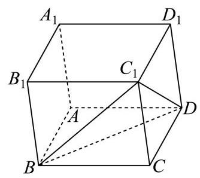

11. 如图,某公园划出一块平整的三角形草地 ${ABC}$ ,在边 ${BC}$ 上设置一个观景点 $D$ ,点 $D$ 到顶点 $C$ 的距离为 2 百米, ${AD}$ 平分 $\angle {BAC}$ ,边 ${AB}$ 和 ${AD}$ 的长度都为 3 百米. 现需要沿着三角形草地 ${ABC}$ 的边安装一圈灯带，则该灯带的长度为___百米.

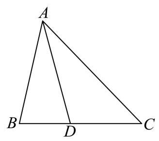

【答案】 $\frac{21}{2}$

【解析】

【分析】设 ${AC} = x,{BD} = y$ ,由角平分线定理以及 $\cos \angle {ADB} + \cos \angle {ADC} = 0$ 列方程组求解即可.

【详解】设 ${AC} = x,{BD} = y$ ,

由角平分线定理得, $\frac{AB}{AC} = \frac{BD}{CD}$ ,即 $\frac{3}{x} = \frac{y}{2}$ ,得 ${xy} = 6$ ,

因为 $\angle {ADB} + \angle {ADC} = \pi$ ,

所以 $\cos \angle {ADB} + \cos \angle {ADC} = \frac{A{D}^{2} + B{D}^{2} - A{B}^{2}}{{2AD} \cdot  {BD}} + \frac{A{D}^{2} + C{D}^{2} - A{C}^{2}}{{2AD} \cdot  {CD}} \; = \frac{9 + {y}^{2} - 9}{6y} + \frac{9 + 4 - {x}^{2}}{12} = \frac{{13} - {x}^{2} + {2y}}{12} = 0$ ,

得 ${13} - {x}^{2} + {2y} = 0$ ,则 ${x}^{3} - {13x} - {12} = 0$ ,则 $\left( {x + 1}\right) \left( {x + 3}\right) \left( {x - 4}\right)  = 0$ ,

得 $x = 4, y = \frac{3}{2}$ ,

则该灯带的长度为 ${AB} + {AC} + {BC} = 3 + x + y + 2 = \frac{21}{2}$ .

12. 记号 $\max \{ a, b\}$ 表示 $a\text{ 、 }b$ 中取较大的数,如 $\max \{ 1,2\}  = 2$ . 在平面直角坐标系中,定义 $d\left( {A, B}\right)  = \max \left\{  {\left| {{x}_{1} - {x}_{2}}\right| ,\left| {{y}_{1} - {y}_{2}}\right| }\right\}$ 为两点 $A\left( {{x}_{1},{y}_{1}}\right) \text{ 、 }B\left( {{x}_{2},{y}_{2}}\right)$ 的 “切比雪夫距离”. 已知点 $O$ 为坐标原点,点 $C$ 在圆 ${\left( x - 1\right) }^{2} + {\left( y - 1\right) }^{2} = 1$ 上,点 $A$ 在直线 ${3x} + {4y} - {10} = 0$ 上, 则 $d\left( {C, A}\right)  + d\left( {C, O}\right)$ 的最小值为___.

【答案】 $\frac{10}{7}$

【解析】

【分析】先利用几何直观判断 $d\left( {C, A}\right)$ 取最小值的情形,再结合 $d\left( {C, O}\right)$ 构造出需要优化的目标函数，最后通过分类讨论得到最小值.

【详解】设点 $C\left( {x, y}\right)$ ,与点 $C$ 的切比雪夫距离为 $R$ 的点构成了一个以点 $C$ 为中心,边长为 ${2R}$ 的正方形,

要让 $R$ 最小,直线应经过正方形的右上角或左下角,即 $\left( {x - R, y - R}\right)$ 或 $\left( {x + R, y + R}\right)$ ,

代入直线方程可得 $3\left( {x - R}\right)  + 4\left( {y - R}\right)  - {10} = 0$ 或 $3\left( {x + R}\right)  + 4\left( {y + R}\right)  - {10} = 0$ ,

于是有 ${R}_{\min } = \frac{\left| 3x + 4y - {10}\right| }{3 + 4}$ ,即 $d\left( {C, A}\right)$ 的最小值为 $\frac{\left| 3x + 4y - {10}\right| }{7}$ ,

由圆的圆心为 $\left( {1,1}\right)$ 且半径为 1 可知圆在第一象限,所以有 $x \geq  0, y \geq  0$ ,

则 $d\left( {C, O}\right)  = \max \{ \left| {x - 0}\right| ,\left| {y - 0}\right| \}  = \max \{ x, y\}$ ,

因此需要优化的目标函数为 $f\left( {x, y}\right)  = \frac{\left| 3x + 4y - {10}\right| }{7} + \max \{ x, y\}$ ,下面分类讨论,

当 ${3x} + {4y} \leq  {10}$ 且 $x \geq  y$ 时, $f\left( {x, y}\right)  = \frac{{10} - {3x} - {4y}}{7} + x = \frac{{10} + 4\left( {x - y}\right) }{7} \geq  \frac{10}{7}$ ,

当 ${3x} + {4y} \leq  {10}$ 且 $x \leq  y$ 时, $f\left( {x, y}\right)  = \frac{{10} - {3x} - {4y}}{7} + y = \frac{{10} + 3\left( {y - x}\right) }{7} \geq  \frac{10}{7}$ ,

即当 ${3x} + {4y} \leq  {10}$ 时 $f\left( {x, y}\right)  \geq  \frac{10}{7}$ ,当且仅当 $x = y$ 时取等号,

当 $x = y$ 时,联立 $x = y$ 和圆的方程得到 ${\left( x - 1\right) }^{2} + {\left( x - 1\right) }^{2} = 1$ ,解得 $x = y = 1 \pm  \frac{\sqrt{2}}{2}$ ,

取较小的一组解 $x = y = 1 - \frac{\sqrt{2}}{2}$ 进行验算得 ${3x} + {4y} = 7\left( {1 - \frac{\sqrt{2}}{2}}\right)  < {10}$ ,符合前提条件;

当 ${3x} + {4y} > {10}$ 时, $x \leq  \frac{10}{7}$ 和 $y \leq  \frac{10}{7}$ 不可能同时成立(否则

${3x} + {4y} \leq  3 \times  \frac{10}{7} + 4 \times  \frac{10}{7} = {10}),$

因此必定有 $\max \{ x, y\}  > \frac{10}{7}$ ,所以 $f\left( {x, y}\right)  = \frac{{3x} + {4y} - {10}}{7} + \max \{ x, y\}  > 0 + \frac{10}{7} = \frac{10}{7}$ ,

综上所述， $f\left( {x, y}\right)$ 的最小值也即 $d\left( {C, A}\right)  + d\left( {C, O}\right)$ 的最小值为 $\frac{10}{7}$ .

【点睛】目标函数优化问题一定要注意计算出来的最值能否取得.

## 二、选择题 (本大题共有 4 题, 满分 18 分, 第 13-14 题每题 4 分, 第 15-16 题每

## 题 5 分) 每题有且只有一个正确答案, 考生应在答题纸的相应位置上, 将所选答 案的代号涂黑.

13. 若实数 $a$ 、 $b$ 满足 ${a}^{2} > {b}^{2}$ ，则下列不等式恒成立的是( )

A. $a > b > 0$ B. $a > 0 > b$

C. $a > \left| b\right|$ D. $\left| a\right|  > \left| b\right|$

14. 一个袋中有大小与质地完全相同的红、黄、蓝三个球, 从袋中依次随机不放回地摸出两个球，记“第一次取到红球”为事件 $A$ ，“第二次取到黄球”为事件 $B$ ，则( )

A. $A, B$ 相互独立

B. $P\left( B\right)  = \frac{1}{2}$

C. $P\left( {A \mid  B}\right)  = \frac{1}{2}$ D. $P\left( \bar{A}\right)  = \frac{1}{2}$

15. 在平面直角坐标系中,如果将函数 $y = f\left( x\right)$ 的图象绕坐标原点逆时针旋转 $a$ 弧度后, 所得曲线仍然是某个函数的图象,那么称函数 $y = f\left( x\right)$ 为 “ $a$ 旋转函数”. 若函数 $y = {ax} - \frac{1}{x}$ 为 “ $\frac{\pi }{4}$ 旋转函数”，则 $a$ 的值为( )

A. -1 B. 0 C. 1 D. 2

16. 已知数列 $\left\{  {a}_{n}\right\}$ 满足 ${a}_{n + 1} = 2{a}_{n}^{2} - 1\left( {n\text{ 为正整数 }}\right)$ ,关于数列 $\left\{  {a}_{n}\right\}$ 有以下两个命题: ①若 $1 < {a}_{3} < \frac{17}{8}$ ,则 ${a}_{1}$ 的取值范围是 $\left( {1,\frac{3\sqrt{2}}{4}}\right)$ ; ②若 ${a}_{1} + {a}_{3} = 0$ ,则 ${a}_{1}$ 的所有可能取值的个数是 4 个. 则以下选项正确的是 ( )

A. ①是真命题，②是假命题 B. ①是假命题，②是真命题

C. 两个都是真命题 D. 两个都是假命题

## 三、解答题 (本大题满分 78 分) 本大题共有 5 题, 解答下列各题必须在答题纸相 应编号的规定区域内写出必要的步骤.

17. 在如图所示的多面体中,已知四边形 ${ABCD}$ 是菱形, $\angle {ABC} = {60}^{ \circ  },{FA} \bot$ 平面 ${ABCD},{ED} \bot$ 平面 ${ABCD},{AB} = {FA} = {2ED} = 2$ ，点 $G$ 为线段 ${AF}$ 的中点.

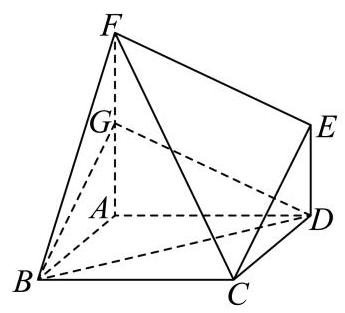

(1)求证:平面 ${BDG}//$ 平面 ${CEF}$ ；

(2)求直线 ${BC}$ 与平面 ${BDG}$ 所成角的正弦值.

18. 已知函数 $y = f\left( x\right)$ 的表达式为 $f\left( x\right)  = \frac{\sqrt{3}}{2}\sin {2x} + {\cos }^{2}x$ .

(1)若将函数 $y = f\left( x\right)$ 的图像向右平移 $\varphi \left( {\varphi  > 0}\right)$ 个单位长度，得到函数 $y = g\left( x\right)$ 的图像关于直线 $x = \frac{\pi }{6}$ 对称,求 $\varphi$ 的最小值;

( 2 )若函数 $y = f\left( x\right)$ 在区间 $\left( {-\frac{\pi }{12}, m}\right)$ 上恰有 2 个极值点和 2 个零点，求实数 $m$ 的取值范围.

19. 质监部门从某超市销售的甲、乙两种食用油中各随机抽取 100 桶检测某项质量指标, 由检测结果得到如下的频率分布直方图:

(甲)

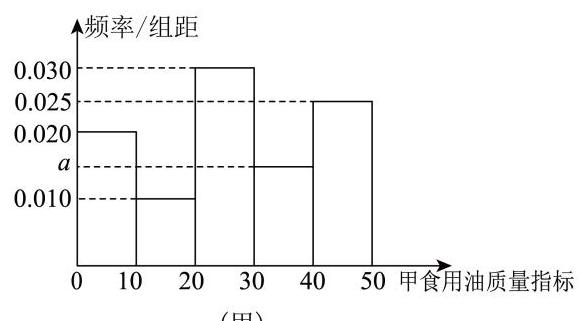

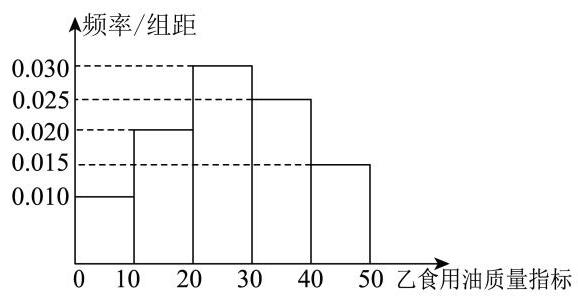

(乙)

(1)写出频率分布直方图(甲)中网的值；记甲、乙两种食用油 100 桶样本的质量指标的方差分别为 ${S}_{\mathrm{\text{ 甲 }}}^{2}$ 、 ${S}_{\mathrm{\text{ 乙 }}}^{2}$ ，试比较 ${S}_{\mathrm{\text{ 甲 }}}^{2}$ 与 ${S}_{\mathrm{\text{ 乙 }}}^{2}$ 的大小(只要求写出结果)；

(2)在甲、乙两种食用油中各随机抽取 1 桶，用频率估计概率，求恰有 1 桶的质量指标大于 10 且小于 40 的概率;

(3)由频率分布直方图可以认为，乙种食用油的质量指标值 $Z$ 服从正态分布 $N\left( {\mu ,{\sigma }^{2}}\right)$ . 其

中 $\mu$ 近似为样本平均数 $\bar{x},{\sigma }^{2}$ 近似为样本方差 ${s}^{2}$ ,现从乙种食用油中随机抽取 10 桶,设 $X$ 表示质量指标值位于 $\left( {{26.50},{38.45}}\right)$ 的桶数,求 $X$ 的数学期望. (结果保留两位小数)

注: ①同一组数据用该区间的中点值作代表; ②若 $Z \sim  N\left( {\mu ,{\sigma }^{2}}\right)$ ,则

$P\left( {\mu  - \sigma  < Z < \mu  + \sigma }\right)  = {0.6826}, P\left( {\mu  - {2\sigma } < Z < \mu  + {2\sigma }}\right)  = {0.9545}$

20. 已知椭圆 $\Gamma  : \frac{{x}^{2}}{{a}^{2}} + \frac{{y}^{2}}{3} = 1\left( {a > 0}\right)$ 的左焦点为 $F\left( {-1,0}\right)$ ,过点 $Q\left( {-4,0}\right)$ 作斜率不为 0 的直线 $l$ 与椭圆 $\Gamma$ 交于 $M, N$ 两点.

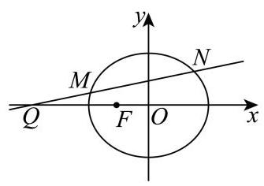

(1)求椭圆下的离心率；

(2)设直线 ${MF}\text{ 、 }{NF}$ 的斜率分别为 ${k}_{1},{k}_{2}$ ，求 ${k}_{1} + {k}_{2}$ 的值；

(3)若点 $E$ 满足 $\left| {EM}\right|  = \left| {EN}\right|  = \left| {EF}\right|$ ，点 $D$ 在椭圆上， ${MD} \bot  x$ 轴，探究直线 ${EF}$ 与直线 ${DQ}$ 的斜率之积是否为定值？若为定值，请求出该值；若不为定值，请说明理由.

21. 若函数 $y = M\left( x\right) \text{ 、 }y = N\left( x\right)$ 在区间 $I$ 上满足 $\left| {M\left( x\right) }\right|  \leq  N\left( x\right)$ ,则称函数 $y = N\left( x\right)$ 为 $y = M\left( x\right)$ 在区间 $I$ 上的绝对值上界函数. 设定义在 $\mathbf{R}$ 上的函数 $y = f\left( x\right) \text{ 、 }y = g\left( x\right)$ 的导数为 $y = {f}^{\prime }\left( x\right) \text{ 、 }y = {g}^{\prime }\left( x\right)$ .

(1)判断函数 $y = x$ 是不是函数 $y = \sin x$ 在区间 $\left\lbrack  {0,\pi }\right\rbrack$ 上的绝对值上界函数，并说明理由;

(2)若函数 $y = {g}^{\prime }\left( x\right)$ 为 $y = {f}^{\prime }\left( x\right)$ 在 $\mathbf{R}$ 上的绝对值上界函数，求证:对任意 $h > 0$ ，都有 $\left| {f\left( {x + \text{ � }}\right)  - f\left( x\right) }\right|  \leq  g\left( {x + \text{ � }}\right)  - g\left( x\right) ;$

(3)若函数 $y = {g}^{\prime }\left( x\right)$ 为 $y = {f}^{\prime }\left( x\right)$ 在 $\mathbf{R}$ 上的绝对值上界函数，实数 $a, b\left( {a < b}\right)$ 满足 $g{\left( x\right) }_{\min } = g\left( a\right)  = f\left( a\right) , g{\left( x\right) }_{\max } = g\left( b\right)  = f\left( b\right)$ ,确定 $f\left( {x}_{0}\right) , g\left( {x}_{0}\right)$ 在 ${x}_{0} \in  \mathbf{R}$ 时的大小关系 $\left( {g{\left( x\right) }_{\min }\text{ 、 }g{\left( x\right) }_{\max }}\right.$ 分别表示函数 $y = g\left( x\right)$ 的最小值和最大值) 参考答案及解析:

1、【答案】 $\{ 1,2\}$

【解析】

【详解】试题分析: $A \cap  B = \{ x \mid  x > 0\}  \cap  \{  - 1,0,1,2\}  = \{ 1,2\}$

考点: 集合运算

【方法点睛】

1. 用描述法表示集合，首先要弄清集合中代表元素的含义，再看元素的限制条件，明确集合类型, 是数集、点集还是其他的集合.

2. 求集合的交、并、补时，一般先化简集合，再由交、并、补的定义求解.

3. 在进行集合的运算时要尽可能地借助 Venn 图和数轴使抽象问题直观化. 一般地，集合元素离散时用 Venn 图表示；集合元素连续时用数轴表示，用数轴表示时要注意端点值的取舍.

2. 不等式 $\left| {3 - x}\right|  < 1$ 的解集为___.

【答案】 $\left( {2,4}\right)$

【解析】

【详解】 $\left| {3 - x}\right|  < 1 \Leftrightarrow   - 1 < 3 - x < 1$ ，解得 $2 < x < 4$ ，

所以不等式 $\left| {3 - x}\right|  < 1$ 的解集为 $\left( {2,4}\right)$ .

3. 已知复数 $z$ 满足 $\left( {1 + \mathrm{i}}\right)  \cdot  z = 1 - \mathrm{i}$ (其中 $\mathrm{i}$ 为虚数单位),则 $z \cdot  \bar{z} =$ ___.

【答案】 1

【解析】

【分析】根据题意,利用复数的运算法则,求得 $z =  - \mathrm{i}$ ,得到 $\bar{z} = \mathrm{i}$ ,进而得到答案.

【详解】由复数 $z$ 满足 $\left( {1 + \mathrm{i}}\right)  \cdot  z = 1 - \mathrm{i}$ ,可得 $z = \frac{1 - \mathrm{i}}{1 + \mathrm{i}} = \frac{{\left( 1 - \mathrm{i}\right) }^{2}}{\left( {1 + \mathrm{i}}\right) \left( {1 - \mathrm{i}}\right) } = \frac{-2\mathrm{i}}{2} =  - \mathrm{i}$ , 则 $\bar{z} = \mathrm{i}$ ,所以 $z \cdot  \bar{z} =  - \mathrm{i} \cdot  \mathrm{i} =  - {\mathrm{i}}^{2} = 1$ .

4. 已知抛物线 ${y}^{2} = {2px}\left( {p > 0}\right)$ 的准线恰好平分圆 ${\left( x + 2\right) }^{2} + {\left( y + 1\right) }^{2} = 1$ 的周长，则该抛物线的焦点坐标为___.

【答案】 $\left( {2,0}\right)$

【解析】

【分析】根据抛物线的准线经过圆心求出 $p$ 值,进而求出抛物线的焦点坐标.

【详解】因为抛物线 ${y}^{2} = {2px}\left( {p > 0}\right)$ 的准线恰好平分圆 ${\left( x + 2\right) }^{2} + {\left( y + 1\right) }^{2} = 1$ 的周长, 即直线 $x =  - \frac{p}{2}$ 经过圆心 $\left( {-2, - 1}\right)$ ，所以 $- 2 =  - \frac{p}{2}$ .

解得 $p = 4$ ,所以抛物线方程为 ${y}^{2} = {8x}$ .

所以该抛物线的焦点坐标为 $\left( {2,0}\right)$ .

5. 若 $\overrightarrow{a}$ 、 $\overrightarrow{b}$ 都是单位向量， $\overrightarrow{a} \cdot  \overrightarrow{b} = 0$ ，则向量 $\overrightarrow{b}$ 与 $\overrightarrow{a} - \overrightarrow{b}$ 的夹角大小为___.

【答案】 $\frac{3\pi }{4}$

【解析】

【详解】 $\overrightarrow{a},\overrightarrow{b}$ 都是单位向量,故 $\left| \overrightarrow{a}\right|  = \left| \overrightarrow{b}\right|  = 1$ ,且 $\overrightarrow{a} \cdot  \overrightarrow{b} = 0$ ,

设夹角为 $\theta ,\theta  \in  \left\lbrack  {0,\pi }\right\rbrack$ ,

$\overrightarrow{b} \cdot  \left( {\overrightarrow{a} - \overrightarrow{b}}\right)  = \overrightarrow{a} \cdot  \overrightarrow{b} - {\left| \overrightarrow{b}\right| }^{2} = {0 - 1}^{2} =  - 1,$

$\left| {\overrightarrow{a} - \overrightarrow{b}}\right|  = \sqrt{{\left| \overrightarrow{a} - \overrightarrow{b}\right| }^{2}} = \sqrt{{\left| \overrightarrow{a}\right| }^{2} - 2\overrightarrow{a} \cdot  \overrightarrow{b} + {\left| \overrightarrow{b}\right| }^{2}} = \sqrt{1 - 0 + 1} = \sqrt{2},$

$\cos \theta  = \frac{\overrightarrow{b} \cdot  \left( {\overrightarrow{a} - \overrightarrow{b}}\right) }{\left| \overrightarrow{b}\right|  \cdot  \left| {\overrightarrow{a} - \overrightarrow{b}}\right| } = \frac{-1}{1 \times  \sqrt{2}} =  - \frac{\sqrt{2}}{2},$

又 $\theta  \in  \left\lbrack  {0,\pi }\right\rbrack$ ,故 $\theta  = \frac{3\pi }{4}$ .

6. 已知等比数列 $\left\{  {a}_{n}\right\}$ 的前 $n$ 项和为 ${S}_{n}$ ，且 ${a}_{2} = 3,{a}_{5} = {81}$ . 若 ${S}_{n} = {40}$ ，则 $n =$ ___.

【答案】 4

【解析】

【分析】由题意列方程求出等比数列 $\left\{  {a}_{n}\right\}$ 的公比,再根据前 $n$ 项和求解,即得答案.

【详解】设等比数列 $\left\{  {a}_{n}\right\}$ 的公比为 $q$ ,由 ${a}_{2} = 3,{a}_{5} = {81}$ ,得 ${a}_{1}q = 3,{a}_{1}{q}^{4} = {81}$ ,

则 ${q}^{3} = {27},\therefore q = 3$ ,则 ${a}_{1} = 1$ ,

由 ${S}_{n} = {40}$ 得 $\frac{1 \times  \left( {1 - {3}^{n}}\right) }{1 - 3} = {40}$ ,解得 $n = 4$ ,

故答案为:4

7. 已知函数 $f\left( x\right)  = \left\{  \begin{matrix} {3}^{x} - a, x \geq  0 \\  b - {\left( \frac{1}{3}\right) }^{x}, x < 0 \end{matrix}\right.$ 为奇函数，则 $a + b$ 的值为___.

【答案】 2

【解析】

【分析】根据题意,得到 $f\left( 0\right)  = 0$ ,求得 $a = 1$ ,再由 $f\left( {-1}\right)  =  - f\left( 1\right)$ ,求得 $b = 1$ ,即可求解.

【详解】由函数 $f\left( x\right)  = \left\{  \begin{matrix} {3}^{x} - a, x \geq  0 \\  b - {\left( \frac{1}{3}\right) }^{x}, x < 0 \end{matrix}\right.$ 为奇函数,可得 $f\left( 0\right)  = 0$ ,即 ${3}^{0} - a = 0$ ,解得 $a = 1$ ,

又由 $f\left( {-1}\right)  =  - f\left( 1\right)$ ,可得 $b - {\left( \frac{1}{3}\right) }^{-1} =  - \left( {{3}^{1} - 1}\right)$ ,即 $b - 3 =  - 2$ ,解得 $b = 1$ ,

当 $a = 1, b = 1$ 时,函数 $f\left( x\right)  = \left\{  \begin{matrix} {3}^{x} - 1, x \geq  0 \\  1 - {\left( \frac{1}{3}\right) }^{x}, x < 0 \end{matrix}\right.$ ,

当 $x > 0$ 时, $- x < 0, f\left( {-x}\right)  = 1 - {3}^{x} =  - \left( {{3}^{x} - 1}\right)  =  - f\left( x\right)$ ,

当 $x < 0$ 时, $- x > 0, f\left( {-x}\right)  = {3}^{-x} - 1 =  - \left( {1 - {3}^{-x}}\right)  =  - f\left( x\right)$ ,且 $f\left( 0\right)  = 0$ ,

所以函数 $y = f\left( x\right)$ 为奇函数,符合题意,所以 $a + b = 1 + 1 = 2$ .

8. 若 ${\left( 3 - 2x\right) }^{6} = {a}_{0} + {a}_{1}x + {a}_{2}{x}^{2} + \cdots  + {a}_{6}{x}^{6}$ ，则 ${a}_{1} + 2{a}_{2} + 3{a}_{3} + \cdots  + 6{a}_{6} =$ ___.

【答案】 -12

【解析】

【详解】将原式左右两侧同时求导,得 $- {12}{\left( 3 - 2x\right) }^{5} = {a}_{1} + 2{a}_{2}x + \cdots  + 6{a}_{6}{x}^{5}$ , 令 $x = 1$ ,则 ${a}_{1} + 2{a}_{2} + 3{a}_{3} + \cdots  + 6{a}_{6} =  - {12}$ .

9. 已知函数 $y = {\log }_{a}\left( {x + 2}\right)  + 1\left( {a > 0\text{ 且 }a \neq  1}\right)$ 的图像过定点 $\left( {s, t}\right)$ ，正实数 $m\text{ 、 }n$ 满足 ${nt} - {ms} = 1$ ，则 $\frac{1}{m} + \frac{3}{n}$ 的最小值为___.

【答案】 $4 + 2\sqrt{3}$

【解析】

【分析】由对数函数性质确定 $s =  - 1, t = 1$ ,进而得到 $m + n = 1$ ,再结合基本不等式即可求解.

【详解】当 $x + 2 = 1$ 时, $y = 1$ ,所以函数 $y = {\log }_{a}\left( {x + 2}\right)  + 1$ 的图象过定点 $\left( {-1,1}\right)$ ,

所以 $s =  - 1, t = 1$ ,代入 ${nt} - {ms} = 1$ 得 $m + n = 1$ .

所以 $\frac{1}{m} + \frac{3}{n} = \left( {m + n}\right) \left( {\frac{1}{m} + \frac{3}{n}}\right)  = 1 + \frac{n}{m} + \frac{3m}{n} + 3 \geq  4 + 2\sqrt{\frac{n}{m} \cdot  \frac{3m}{n}} = 4 + 2\sqrt{3}$ ,

当且仅当 $\frac{n}{m} = \frac{3m}{n}$ 时等号成立,即 $m = \frac{\sqrt{3} - 1}{2}, n = \frac{3 - \sqrt{3}}{2}$ 时等号成立.

10. 在四棱柱 ${ABCD} - {A}_{1}{B}_{1}{C}_{1}{D}_{1}$ 中，底面 ${ABCD}$ 为平行四边形， $\left| \overrightarrow{A{A}_{1}}\right|  = 2$ ，异面直线 $A{A}_{1}$ 与 ${BD}$ 的夹角为 $\arccos \frac{2}{5},\overrightarrow{AD} \cdot  \overrightarrow{D{C}_{1}} - \overrightarrow{AB} \cdot  \overrightarrow{B{C}_{1}} = 4$ ，则 $\left| \overrightarrow{B{D}_{1}}\right|  =$ ___.

【答案】 $\sqrt{37}$

【解析】

【分析】利用向量的运算法则将已知条件进行转化,进而求出 $\left| \overrightarrow{B{D}_{1}}\right|$ .

【详解】在四棱柱 ${ABCD} - {A}_{1}{B}_{1}{C}_{1}{D}_{1}$ 中,

$\overrightarrow{D{C}_{1}} = \overrightarrow{DC} + \overrightarrow{C{C}_{1}} = \overrightarrow{AB} + \overrightarrow{A{A}_{1}},\overrightarrow{B{C}_{1}} = \overrightarrow{BC} + \overrightarrow{C{C}_{1}} = \overrightarrow{AD} + \overrightarrow{A{A}_{1}}$ .

则 $\overrightarrow{AD} \cdot  \overrightarrow{D{C}_{1}} - \overrightarrow{AB} \cdot  \overrightarrow{B{C}_{1}} = \overrightarrow{AD} \cdot  \left( {\overrightarrow{AB} + \overrightarrow{A{A}_{1}}}\right)  - \overrightarrow{AB} \cdot  \left( {\overrightarrow{AD} + \overrightarrow{A{A}_{1}}}\right)$ .

根据向量乘法分配律展开可得:

$\overrightarrow{AD} \cdot  \overrightarrow{AB} + \overrightarrow{AD} \cdot  \overrightarrow{A{A}_{1}} - \overrightarrow{AB} \cdot  \overrightarrow{AD} - \overrightarrow{AB} \cdot  \overrightarrow{A{A}_{1}} = \overrightarrow{AD} \cdot  \overrightarrow{A{A}_{1}} - \overrightarrow{AB} \cdot  \overrightarrow{A{A}_{1}} = \left( {\overrightarrow{AD} - \overrightarrow{AB}}\right)  \cdot  \overrightarrow{A{A}_{1}}$ .

因为 $\overrightarrow{AD} - \overrightarrow{AB} = \overrightarrow{BD}$ ,所以 $\left( {\overrightarrow{AD} - \overrightarrow{AB}}\right)  \cdot  \overrightarrow{A{A}_{1}} = \overrightarrow{BD} \cdot  \overrightarrow{A{A}_{1}}$ .

已知 $\overrightarrow{AD} \cdot  \overrightarrow{D{C}_{1}} - \overrightarrow{AB} \cdot  \overrightarrow{B{C}_{1}} = 4$ ，即 $\overrightarrow{BD} \cdot  \overrightarrow{A{A}_{1}} = 4$ .

又已知异面直线 $A{A}_{1}$ 与 ${BD}$ 的夹角为 $\arccos \frac{2}{5}$ ，且 $\left| \overrightarrow{A{A}_{1}}\right|  = 2$ ，

设 $\overrightarrow{BD}$ 与 $\overrightarrow{A{A}_{1}}$ 的夹角为 $\theta$ ，则 $\cos \theta  = \frac{2}{5}$ .

根据向量点积公式 $\overrightarrow{a} \cdot  \overrightarrow{b} = \left| \overrightarrow{a}\right| \left| \overrightarrow{b}\right| \cos \theta$ ,可得 $\overrightarrow{BD} \cdot  \overrightarrow{A{A}_{1}} = \left| \overrightarrow{BD}\right| \left| \overrightarrow{A{A}_{1}}\right| \cos \theta$ ,

即 $4 = \left| \overrightarrow{BD}\right|  \times  2 \times  \frac{2}{5}$ ，解得 $\left| \overrightarrow{BD}\right|  = 5$ .

因为 $\overrightarrow{B{D}_{1}} = \overrightarrow{BD} + \overrightarrow{D{D}_{1}} = \overrightarrow{BD} + \overrightarrow{A{A}_{1}}$ ,根据向量模长公式可得

${\left| \overrightarrow{B{D}_{1}}\right| }^{2} = {\left( \overrightarrow{BD} + \overrightarrow{A{A}_{1}}\right) }^{2} = {\overrightarrow{BD}}^{2} + 2\overrightarrow{BD} \cdot  \overrightarrow{A{A}_{1}} + {\overrightarrow{A{A}_{1}}}^{2}.$

将 $\left| \overrightarrow{BD}\right|  = 5,\overrightarrow{BD} \cdot  \overrightarrow{A{A}_{1}} = 4,\left| \overrightarrow{A{A}_{1}}\right|  = 2$ 代入上式可得 ${\left| \overrightarrow{B{D}_{1}}\right| }^{2} = {5}^{2} + 2 \times  4 + {2}^{2} = {25} + 8 + 4 = {37}$ . 所以 $\left| \overrightarrow{B{D}_{1}}\right|  = \sqrt{37}$ .

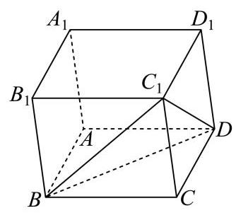

11. 如图,某公园划出一块平整的三角形草地 ${ABC}$ ,在边 ${BC}$ 上设置一个观景点 $D$ ,点 $D$ 到顶点 $C$ 的距离为 2 百米, ${AD}$ 平分 $\angle {BAC}$ ,边 ${AB}$ 和 ${AD}$ 的长度都为 3 百米. 现需要沿着三角形草地 ${ABC}$ 的边安装一圈灯带，则该灯带的长度为___百米.

【答案】 $\frac{21}{2}$

【解析】

【分析】设 ${AC} = x,{BD} = y$ ,由角平分线定理以及 $\cos \angle {ADB} + \cos \angle {ADC} = 0$ 列方程组求解即可.

【详解】设 ${AC} = x,{BD} = y$ ,

由角平分线定理得， $\frac{AB}{AC} = \frac{BD}{CD}$ ，即 $\frac{3}{x} = \frac{y}{2}$ ，得 ${xy} = 6$ ，

因为 $\angle {ADB} + \angle {ADC} = \pi$ ，

所以 $\cos \angle {ADB} + \cos \angle {ADC} = \frac{A{D}^{2} + B{D}^{2} - A{B}^{2}}{{2AD} \cdot  {BD}} + \frac{A{D}^{2} + C{D}^{2} - A{C}^{2}}{{2AD} \cdot  {CD}} \; = \frac{9 + {y}^{2} - 9}{6y} + \frac{9 + 4 - {x}^{2}}{12} = \frac{{13} - {x}^{2} + {2y}}{12} = 0,$

得 ${13} - {x}^{2} + {2y} = 0$ ,则 ${x}^{3} - {13x} - {12} = 0$ ,则 $\left( {x + 1}\right) \left( {x + 3}\right) \left( {x - 4}\right)  = 0$ ,

得 $x = 4,\;y = \frac{3}{2}$ ,

则该灯带的长度为 ${AB} + {AC} + {BC} = 3 + x + y + 2 = \frac{21}{2}$ .

12. 记号 $\max \{ a, b\}$ 表示 $a\text{ 、 }b$ 中取较大的数,如 $\max \{ 1,2\}  = 2$ . 在平面直角坐标系中,定义 $d\left( {A, B}\right)  = \max \left\{  {\left| {{x}_{1} - {x}_{2}}\right| ,\left| {{y}_{1} - {y}_{2}}\right| }\right\}$ 为两点 $A\left( {{x}_{1},{y}_{1}}\right) \text{ 、 }B\left( {{x}_{2},{y}_{2}}\right)$ 的 “切比雪夫距离”. 已知点 $O$ 为坐标原点,点 $C$ 在圆 ${\left( x - 1\right) }^{2} + {\left( y - 1\right) }^{2} = 1$ 上,点 $A$ 在直线 ${3x} + {4y} - {10} = 0$ 上, 则 $d\left( {C, A}\right)  + d\left( {C, O}\right)$ 的最小值为___.

【答案】 $\frac{10}{7}$

【解析】

【分析】先利用几何直观判断 $d\left( {C, A}\right)$ 取最小值的情形,再结合 $d\left( {C, O}\right)$ 构造出需要优化的目标函数，最后通过分类讨论得到最小值.

【详解】设点 $C\left( {x, y}\right)$ ,与点 $C$ 的切比雪夫距离为 $R$ 的点构成了一个以点 $C$ 为中心,边长为 ${2R}$ 的正方形,

要让 $R$ 最小,直线应经过正方形的右上角或左下角,即 $\left( {x - R, y - R}\right)$ 或 $\left( {x + R, y + R}\right)$ ,

代入直线方程可得 $3\left( {x - R}\right)  + 4\left( {y - R}\right)  - {10} = 0$ 或 $3\left( {x + R}\right)  + 4\left( {y + R}\right)  - {10} = 0$ ,

于是有 ${R}_{\min } = \frac{\left| 3x + 4y - {10}\right| }{3 + 4}$ ,即 $d\left( {C, A}\right)$ 的最小值为 $\frac{\left| 3x + 4y - {10}\right| }{7}$ ,

由圆的圆心为 $\left( {1,1}\right)$ 且半径为 1 可知圆在第一象限,所以有 $x \geq  0, y \geq  0$ ,

则 $d\left( {C, O}\right)  = \max \{ \left| {x - 0}\right| ,\left| {y - 0}\right| \}  = \max \{ x, y\}$ ,

因此需要优化的目标函数为 $f\left( {x, y}\right)  = \frac{\left| 3x + 4y - {10}\right| }{7} + \max \{ x, y\}$ ,下面分类讨论,

当 ${3x} + {4y} \leq  {10}$ 且 $x \geq  y$ 时, $f\left( {x, y}\right)  = \frac{{10} - {3x} - {4y}}{7} + x = \frac{{10} + 4\left( {x - y}\right) }{7} \geq  \frac{10}{7}$ ,

当 ${3x} + {4y} \leq  {10}$ 且 $x \leq  y$ 时, $f\left( {x, y}\right)  = \frac{{10} - {3x} - {4y}}{7} + y = \frac{{10} + 3\left( {y - x}\right) }{7} \geq  \frac{10}{7}$ ,

即当 ${3x} + {4y} \leq  {10}$ 时 $f\left( {x, y}\right)  \geq  \frac{10}{7}$ ，当且仅当 $x = y$ 时取等号，

当 $x = y$ 时,联立 $x = y$ 和圆的方程得到 ${\left( x - 1\right) }^{2} + {\left( x - 1\right) }^{2} = 1$ ,解得 $x = y = 1 \pm  \frac{\sqrt{2}}{2}$ ,

取较小的一组解 $x = y = 1 - \frac{\sqrt{2}}{2}$ 进行验算得 ${3x} + {4y} = 7\left( {1 - \frac{\sqrt{2}}{2}}\right)  < {10}$ ,符合前提条件;

当 ${3x} + {4y} > {10}$ 时, $x \leq  \frac{10}{7}$ 和 $y \leq  \frac{10}{7}$ 不可能同时成立(否则

${3x} + {4y} \leq  3 \times  \frac{10}{7} + 4 \times  \frac{10}{7} = {10}$ ),

因此必定有 $\max \{ x, y\}  > \frac{10}{7}$ ,所以 $f\left( {x, y}\right)  = \frac{{3x} + {4y} - {10}}{7} + \max \{ x, y\}  > 0 + \frac{10}{7} = \frac{10}{7}$ ,

综上所述， $f\left( {x, y}\right)$ 的最小值也即 $d\left( {C, A}\right)  + d\left( {C, O}\right)$ 的最小值为 $\frac{10}{7}$ .

【点睛】目标函数优化问题一定要注意计算出来的最值能否取得.

## 二、选择题 (本大题共有 4 题, 满分 18 分, 第 13-14 题每题 4 分, 第 15-16 题每 题 5 分) 每题有且只有一个正确答案, 考生应在答题纸的相应位置上, 将所选答 案的代号涂黑.

13. 若实数 $a\text{ 、 }b$ 满足 ${a}^{2} > {b}^{2}$ ,则下列不等式恒成立的是 ( )

A. $a > b > 0$ B. $a > 0 > b$

C. $a > \left| b\right|$ D. $\left| a\right|  > \left| b\right|$

【答案】D

【解析】

【详解】对于 $\mathrm{{ABC}}$ ,当 $a =  - 2, b =  - 1$ 时,满足 ${a}^{2} > {b}^{2}$ ,此时 $a < b < 0, a < \left| b\right|$ ,故 A 错误，B 错误，C 错误；

对于 $\mathrm{D}$ ,因为 ${a}^{2} > {b}^{2} \Leftrightarrow  {\left| a\right| }^{2} > {\left| b\right| }^{2} \Leftrightarrow  \left| a\right|  > \left| b\right|$ ,故 $\mathrm{D}$ 正确.

14. 一个袋中有大小与质地完全相同的红、黄、蓝三个球, 从袋中依次随机不放回地摸出两个球，记“第一次取到红球”为事件 $A$ ，“第二次取到黄球”为事件 $B$ ，则( )

A. $A, B$ 相互独立

B. $P\left( B\right)  = \frac{1}{2}$

C. $P\left( {A \mid  B}\right)  = \frac{1}{2}$ D. $P\left( \bar{A}\right)  = \frac{1}{2}$

【答案】C

【解析】

【分析】根据给定条件,利用相互独立事件的定义判断 $\mathrm{A}$ ; 利用条件概率公式,结合古典概率计算判断 $\mathrm{{BCD}}$ .

【详解】对于 $\mathrm{A}, P\left( A\right)  = \frac{1}{3}, P\left( B\right)  = \frac{1}{3}, P\left( {AB}\right)  = \frac{1}{6}, P\left( {AB}\right)  \neq  P\left( A\right) P\left( B\right) , A, B$ 不独立, A 错误;

对于 $\mathrm{B}, P\left( B\right)  = \frac{2}{3} \times  \frac{1}{2} = \frac{1}{3},\mathrm{\;B}$ 错误;

对于 $\mathrm{C}, P\left( {AB}\right)  = \frac{1}{3} \times  \frac{1}{2} = \frac{1}{6}, P\left( {A \mid  B}\right)  = \frac{P\left( {AB}\right) }{P\left( B\right) } = \frac{\frac{1}{6}}{\frac{1}{3}} = \frac{1}{2},\mathrm{C}$ 正确;

对于 $\mathrm{D}, P\left( A\right)  = \frac{1}{3}$ ,则 $P\left( \bar{A}\right)  = \frac{2}{3},\mathrm{D}$ 错误.

15. 在平面直角坐标系中,如果将函数 $y = f\left( x\right)$ 的图象绕坐标原点逆时针旋转 $a$ 弧度后, 所得曲线仍然是某个函数的图象,那么称函数 $y = f\left( x\right)$ 为“ $a$ 旋转函数”. 若函数 $y = {ax} - \frac{1}{x}$ 为“ $\frac{\pi }{4}$ 旋转函数”，则 $a$ 的值为( )

A. -1 B. 0 C. 1 D. 2

【答案】C

【解析】

【分析】等价转化为 $h\left( x\right)  = \left( {a - 1}\right) x - \frac{1}{x}$ 的任意函数值有且仅有一个自变量与之对应,分类讨论参数并结合对勾函数的性质分析 $h\left( x\right)$ 性质,即可得.

【详解】因为函数 $y = {ax} - \frac{1}{x}$ 为 “ $\frac{\pi }{4}$ 旋转函数”,且定义域为 $\{ x \mid  x \neq  0\}$ ,

旋转后曲线仍是某个函数图象,意味着这个函数对于任意一个横坐标 $x$ ,至多只有一个 $y$ 与之对应,

由于旋转了整个曲线,等价于原始曲线在旋转后没有两个点具有相同的 $x$ 坐标,

所以关于 $x$ 的方程 ${ax} - \frac{1}{x} = x + t$ 对任意的 $t \in  \mathbf{R}$ 至多只有一个解,

所以方程 $\left( {a - 1}\right) x - \frac{1}{x} = t$ 至多只有一个解,

即曲线 $h\left( x\right)  = \left( {a - 1}\right) x - \frac{1}{x}$ 与直线 $y = t$ 至多只有一个交点,

只需 $h\left( x\right)  = \left( {a - 1}\right) x - \frac{1}{x}$ 的任意函数值有且仅有一个自变量与之对应 (单射函数),

当 $a > 1$ 时, $h\left( x\right)  = \left( {a - 1}\right) x - \frac{1}{x}$ 在 $\left( {-\infty ,0}\right) ,\left( {0, + \infty }\right)$ 上都单调递增,且值域都为 $\mathbf{R}$ ,

此时 $h\left( x\right)$ 与 $y = t$ 恒有两个交点,不合题意;

当 $a = 1$ 时, $h\left( x\right)  =  - \frac{1}{x}$ 在 $\left( {-\infty ,0}\right) ,\left( {0, + \infty }\right)$ 上都单调递增,值域分别为 $\left( {0, + \infty }\right) ,\left( {-\infty ,0}\right)$ ,

此时 $h\left( x\right)$ 与 $y = t$ 至多有一个交点,符合题意;

当 $a < 1$ 时, $h\left( x\right)  = \left( {1 - a}\right) \left( {-x}\right)  + \left( {-\frac{1}{x}}\right)  =  - \left\lbrack  {\left( {1 - a}\right) x + \frac{1}{x}}\right\rbrack$ ,

若 $x \in  \left( {-\infty ,0}\right)$ 时,则 $\left( {1 - a}\right) \left( {-x}\right)  + \left( {-\frac{1}{x}}\right)  \geq  2\sqrt{\left( {1 - a}\right) \left( {-x}\right)  \cdot  \left( {-\frac{1}{x}}\right) } = 2\sqrt{1 - a}$ ,

当且仅当 $\left( {1 - a}\right) \left( {-x}\right)  =  - \frac{1}{x}$ ,即 $x =  - \frac{1}{\sqrt{1 - a}}$ 时取等号,

所以 $h\left( x\right)$ 在 $\left( {-\infty , - \frac{1}{\sqrt{1 - a}}}\right)$ 上单调递减,在 $\left( {-\frac{1}{\sqrt{1 - a}},0}\right)$ 上单调递增,

若 $x \in  \left( {0, + \infty }\right)$ 时,则 $- \left\lbrack  {\left( {1 - a}\right) x + \frac{1}{x}}\right\rbrack   \leq   - 2\sqrt{\left( {1 - a}\right) x \cdot  \frac{1}{x}} =  - 2\sqrt{1 - a}$ ,

当且仅当 $\left( {1 - a}\right) x = \frac{1}{x}$ ,即 $x = \frac{1}{\sqrt{1 - a}}$ 时取等号,

所以 $h\left( x\right)$ 在 $\left( {0,\frac{1}{\sqrt{1 - a}}}\right)$ 上单调递增,在 $\left( {\frac{1}{\sqrt{1 - a}}, + \infty }\right)$ 上单调递减,

此时 $h\left( x\right)$ 与 $y = t$ 的交点可能有0,1,2个,不合题意,

综上 $a = 1$ .

16. 已知数列 $\left\{  {a}_{n}\right\}$ 满足 ${a}_{n + 1} = 2{a}_{n}^{2} - 1\;(n$ 为正整数),关于数列 $\left\{  {a}_{n}\right\}$ 有以下两个命题: ①若 $1 < {a}_{3} < \frac{17}{8}$ ,则 ${a}_{1}$ 的取值范围是 $\left( {1,\frac{3\sqrt{2}}{4}}\right)$ ; ②若 ${a}_{1} + {a}_{3} = 0$ ,则 ${a}_{1}$ 的所有可能取值的个数

是 4 个. 则以下选项正确的是( )

A. ①是真命题，②是假命题 B. ①是假命题，②是真命题

C. 两个都是真命题 D. 两个都是假命题

【答案】B

【解析】

【分析】根据数列 $\left\{  {a}_{n}\right\}$ 的递推关系式确定 ${a}_{2},{a}_{3}$ 与 ${a}_{1},{a}_{2}$ 的等式关系,结合不等式的性质由 $1 < {a}_{3} < \frac{17}{8}$ 确定 ${a}_{2}$ 的范围,从而得 ${a}_{1}$ 的取值范围即可判断①; 确定 ${a}_{1},{a}_{3}$ 的等式关系求解一元高次方程的根从而得 ${a}_{1}$ 的所有可能取值，即可判断②.

【详解】因为 ${a}_{n + 1} = 2{a}_{n}^{2} - 1$ ,所以 ${a}_{n + 1} + 1 = 2{a}_{n}^{2} \geq  0$ ,则 ${a}_{n + 1} \geq   - 1\left( {n\text{ 为正整数 }}\right)$ , 对于①因为 ${a}_{3} = 2{a}_{2}^{2} - 1$ ，若 $1 < {a}_{3} < \frac{17}{8}$ ，则 $1 < 2{a}_{2}^{2} - 1 < \frac{17}{8}$ ，解得 $1 < {a}_{2} < \frac{5}{4}$ 或 $- \frac{5}{4} < {a}_{2} <  - 1$ (舍),

又 ${a}_{2} = 2{a}_{1}^{2} - 1$ ，则 $1 < 2{a}_{1}^{2} - 1 < \frac{5}{4}$ ，解得 $1 < {a}_{1} < \frac{3\sqrt{2}}{4}$ 或 $- \frac{3\sqrt{2}}{4} < {a}_{1} <  - 1$ ，故①是假命题； ②因为 ${a}_{2} = 2{a}_{1}^{2} - 1,{a}_{3} = 2{a}_{2}^{2} - 1$ ,所以 ${a}_{3} = 8{a}_{1}^{4} - 8{a}_{1}^{2} + 1$ , 若 ${a}_{1} + {a}_{3} = 0$ ,则 $8{a}_{1}^{4} - 8{a}_{1}^{2} + {a}_{1} + 1 = 0$ ,整理得 $\left( {4{a}_{1}^{2} - 2{a}_{1} - 1}\right) \left( {2{a}_{1} - 1}\right) \left( {{a}_{1} + 1}\right)  = 0$ , 解得 ${a}_{1} =  - 1,{a}_{1} = \frac{1}{2},{a}_{1} = \frac{1 + \sqrt{5}}{4},{a}_{1} = \frac{1 - \sqrt{5}}{4}$ ,则 ${a}_{1}$ 的所有可能取值的个数是 4 个,故②是真命题.

## 三、解答题 (本大题满分 78 分) 本大题共有 5 题, 解答下列各题必须在答题纸相 应编号的规定区域内写出必要的步骤.

17. 在如图所示的多面体中,已知四边形 ${ABCD}$ 是菱形, $\angle {ABC} = {60}^{ \circ  },{FA} \bot$ 平面 ${ABCD},{ED} \bot$ 平面 ${ABCD},{AB} = {FA} = {2ED} = 2$ ,点 $G$ 为线段 ${AF}$ 的中点.

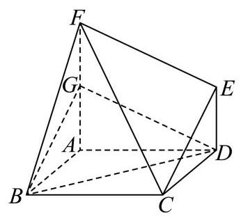

(1)求证:平面 ${BDG}//$ 平面 ${CEF}$ ；

(2)求直线 ${BC}$ 与平面 ${BDG}$ 所成角的正弦值.

【答案】(1)证明见解析

(2) $\frac{\sqrt{2}}{4}$

【解析】

【分析】(1)连接 ${AC}$ 与 ${BD}$ ,相交于点 $O$ ,连接 ${OG},{DG}$ ,分别证明 ${OG}//{CF},{DG}//{EF}$ , 再由面面平行判定定理即可得证;

(2)以 $A$ 为坐标原点建立空间直角坐标系，确定直线 ${BC}$ 的方向向量与平面 ${BDG}$ 的法向量， 根据线面夹角的坐标运算求解即可.

【小问 1 详解】

连接 ${AC}$ 与 ${BD}$ ,相交于点 $O$ ,连接 ${OG},{DG}$ ,

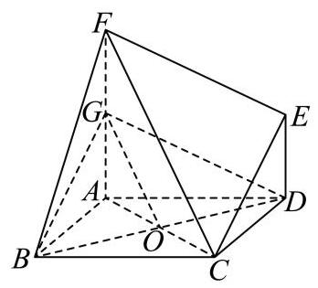

因为菱形 ${ABCD}$ ,所以点 $O$ 是 ${AC}$ 的中点,

所以 ${OG}//{CF}$ ,

又 ${OG} \text{ ⊄ }$ 平面 ${CEF},{FC} \subset$ 平面 ${CEF}$ ,

所以 ${OG}//$ 平面 ${CEF}$ ,

因为 ${FA} \bot$ 平面 ${ABCD},{ED} \bot$ 平面 ${ABCD}$ ,

所以 ${FA}//{DE}$ ,

又 ${FA} = {2ED} = 2,{FA} = {2FG}$ ,所以四边形 ${DEFG}$ 是平行四边形,

所以 ${DG}//{EF}$ ，

又 ${DG} \text{ ⊄ }$ 平面 ${CEF},{EF} \subset$ 平面 ${CEF}$ ,

所以 ${DG}//$ 平面 ${CEF}$ ,

因为 ${OG} \cap  {DG} = G,{OG}\text{ 、 }{DG} \subset$ 平面 ${BDG}$ ,

所以平面 ${BDG}//$ 平面 ${CEF}$ ;

【小问 2 详解】

取 ${BC}$ 的中点 $M$ ,连接 ${AM}$ ,

因为 $\angle {ABC} = {60}^{ \circ  }$ ,四边形 ${ABCD}$ 是菱形,

所以 ${ABC}$ 是等边三角形,则 ${AM} \bot  {BC}$ ,

则建立以 $A$ 为原点,以 ${AM}\text{ 、 }{AD}\text{ 、 }{AF}$ 所在直线分别为 $x$ 轴、 $y$ 轴、 $z$ 轴的空间直角坐标系 $A - {xyz}$ ,如图所示:

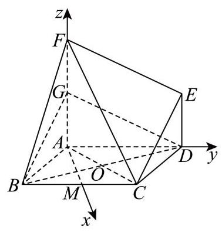

则 $B\left( {\sqrt{3}, - 1,0}\right) , C\left( {\sqrt{3},1,0}\right) , D\left( {0,2,0}\right) , G\left( {0,0,1}\right)$ ,

所以 $\overrightarrow{BC} = \left( {0,2,0}\right) ,\overrightarrow{BD} = \left( {-\sqrt{3},3,0}\right) ,\overrightarrow{DG} = \left( {0, - 2,1}\right)$ ,

设平面 ${BDG}$ 的法向量为 $\overrightarrow{n} = \left( {x, y, z}\right)$ ,

则 $\left\{  {\begin{array}{l} \overrightarrow{n} \cdot  \overrightarrow{BD} =  - \sqrt{3}x + {3y} = 0 \\  \overrightarrow{n} \cdot  \overrightarrow{DG} =  - {2y} + z = 0 \end{array} \Rightarrow  \left\{  \begin{array}{l} x = \sqrt{3}y \\  z = {2y} \end{array}\right. }\right.$ ,取 $y = 1$ ,则 $x = \sqrt{3}, z = 2$ ,所以 $\overrightarrow{n} = \left( {\sqrt{3},1,2}\right)$ ,

所以 $\cos \langle \overrightarrow{BC},\overrightarrow{n}\rangle  = \frac{\overrightarrow{BC} \cdot  \overrightarrow{n}}{\left| \overrightarrow{BC}\right|  \cdot  \left| \overrightarrow{n}\right| } = \frac{2}{2 \times  2\sqrt{2}} = \frac{\sqrt{2}}{4}$ ,

直线 ${BC}$ 与平面 ${BDG}$ 所成角的正弦值为 $\frac{\sqrt{2}}{4}$ .

18. 已知函数 $y = f\left( x\right)$ 的表达式为 $f\left( x\right)  = \frac{\sqrt{3}}{2}\sin {2x} + {\cos }^{2}x$ .

(1) 若将函数 $y = f\left( x\right)$ 的图像向右平移 $\varphi \left( {\varphi  > 0}\right)$ 个单位长度,得到函数 $y = g\left( x\right)$ 的图像关于直线 $x = \frac{\pi }{6}$ 对称,求 $\varphi$ 的最小值;

( 2 )若函数 $y = f\left( x\right)$ 在区间 $\left( {-\frac{\pi }{12}, m}\right)$ 上恰有 2 个极值点和 2 个零点，求实数 $m$ 的取值范围.

【答案】(1) $\frac{\pi }{2}$

(2) $m \in  \left( {\frac{5\pi }{6},\frac{7\pi }{6}}\right\rbrack$

【解析】

【分析】(1) 利用辅助角公式, 结合平移变换和三角函数的对称性即可求解;

(2)利用相位整体思想，分析正弦函数的极值点和零点情况，即可确定动区间的范围，从而可求得参数范围.

【小问 1 详解】

由 $f\left( x\right)  = \frac{\sqrt{3}}{2}\sin {2x} + {\cos }^{2}x = \frac{\sqrt{3}}{2}\sin {2x} + \frac{1}{2}\cos {2x} + \frac{1}{2} = \sin \left( {{2x} + \frac{\pi }{6}}\right)  + \frac{1}{2}$ ,

当函数 $f\left( x\right)$ 右移 $\varphi$ 个单位得 $g\left( x\right)$ ,

则 $g\left( x\right)  = f\left( {x - \varphi }\right)  = \sin \left\lbrack  {2\left( {x - \varphi }\right)  + \frac{\pi }{6}}\right\rbrack   + \frac{1}{2} = \sin \left( {{2x} - {2\varphi } + \frac{\pi }{6}}\right)  + \frac{1}{2}$ ,

由 $g\left( x\right)$ 关于 $x = \frac{\pi }{6}$ 对称,可得: $2 \cdot  \frac{\pi }{6} - {2\varphi } + \frac{\pi }{6} = {k\pi } + \frac{\pi }{2},\left( {k \in  \mathrm{Z}}\right)$ ,

整理得: $\varphi  =  - \frac{k\pi }{2}, k \in  \mathrm{Z}$ ,又 $\varphi  > 0$ ,取 $k =  - 1$ 得最小正数 $\varphi  = \frac{\pi }{2}$ ,

即 $\varphi$ 的最小值为 $\frac{\pi }{2}$ ;

【小问 2 详解】

由 (1) 可得: $f\left( x\right)  = \sin \left( {{2x} + \frac{\pi }{6}}\right)  + \frac{1}{2}$ ,

当 $x \in  \left( {-\frac{\pi }{12}, m}\right)$ ,令 $t = {2x} + \frac{\pi }{6} \in  \left( {0,{2m} + \frac{\pi }{6}}\right)$ ,

再由 $y = \sin t + \frac{1}{2}$ 的零点满足: $t = \frac{7\pi }{6} + {2k\pi }$ 或 $t = \frac{11\pi }{6} + {2k\pi }, k \in  \mathrm{Z}$ ,

不妨取 $k = 0$ ,可得两个正数零点是 $t = \frac{7\pi }{6}$ 或 $t = \frac{11\pi }{6}$ ,依次增大的第三个正数零点是 $t = \frac{19\pi }{6}$

再由 $y = \sin t + \frac{1}{2}$ 的极值点满足: $t = \frac{\pi }{2} + {k\pi }, k \in  \mathrm{Z}$ ,

同理可得两个正数极值点是 $t = \frac{\pi }{2}, t = \frac{3\pi }{2}$ ,依次增大的第三个正数极值点是 $t = \frac{5\pi }{2}$ ,

所以函数 $y = f\left( x\right)$ 在区间 $\left( {-\frac{\pi }{12}, m}\right)$ 上恰有 2 个极值点和 2 个零点,

即满足在 $\left( {0,{2m} + \frac{\pi }{6}}\right)$ 内取到 $t = \frac{7\pi }{6}, t = \frac{11\pi }{6}, t = \frac{\pi }{2}, t = \frac{3\pi }{2}$ ,不能取到 $t = \frac{19\pi }{6}$ 和 $t = \frac{5\pi }{2}$

则 $\frac{11\pi }{6} < {2m} + \frac{\pi }{6} \leq  \frac{15\pi }{6} \Rightarrow  \frac{5\pi }{6} < m \leq  \frac{7\pi }{6}$ ，

即所求实数 $m$ 的取值范围 $m \in  \left( {\frac{5\pi }{6},\frac{7\pi }{6}}\right\rbrack$ .

19. 质监部门从某超市销售的甲、乙两种食用油中各随机抽取 100 桶检测某项质量指标, 由检测结果得到如下的频率分布直方图:

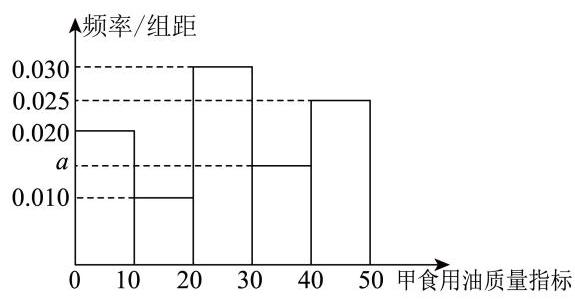

(甲)

(乙)

(1)写出频率分布直方图(甲)中 $a$ 的值；记甲、乙两种食用油 100 桶样本的质量指标的方差分别为 ${S}_{\text{ 甲 }}^{2}\text{ 、 }{S}_{\text{ 乙 }}^{2}$ ,试比较 ${S}_{\text{ 甲 }}^{2}$ 与 ${S}_{\text{ 乙 }}^{2}$ 的大小 (只要求写出结果);

(2)在甲、乙两种食用油中各随机抽取 1 桶，用频率估计概率，求恰有 1 桶的质量指标大于 10 且小于 40 的概率;

(3)由频率分布直方图可以认为，乙种食用油的质量指标值 $Z$ 服从正态分布 $N\left( {\mu ,{\sigma }^{2}}\right)$ . 其中 $\mu$ 近似为样本平均数 $\bar{x},{\sigma }^{2}$ 近似为样本方差 ${s}^{2}$ ,现从乙种食用油中随机抽取 10 桶,设 $X$

表示质量指标值位于 $\left( {{26.50},{38.45}}\right)$ 的桶数,求 $X$ 的数学期望. (结果保留两位小数)

注: ① 同一组数据用该区间的中点值作代表; ② 若 $Z \sim  N\left( {\mu ,{\sigma }^{2}}\right)$ ,则

$P\left( {\mu  - \sigma  < Z < \mu  + \sigma }\right)  = {0.6826}, P\left( {\mu  - {2\sigma } < Z < \mu  + {2\sigma }}\right)  = {0.9545}$

【答案】(1) $a = {0.015},{S}_{\text{ 甲 }}^{2} > {S}_{\text{ 乙 }}^{2}$

(2) 0.475

(3) 3.41

【解析】

【分析】(1) 根据矩形的面积和等于 1 列出关于 $a$ 的方程,进而求出 $a$ 的值,再根据频率分布直方图中甲、乙食用油样本质量指标的波动程度, 进而比较方差大小.

(2)分别求出在甲、乙两种食用油中抽取 1 桶，其质量指标位于(10,40)的概率，然后求出恰有 1 桶食用油指标位于 $\left( {{10},{40}}\right)$ 的概率.

(3)先根据频率分布直方图求出 $\bar{x},{\sigma }^{2}$ ，然后求出从乙种食用油中随机抽取 1 桶，其质量指标位于(26.50,38.45)的概率，最后根据二项分布的期望公式 $E\left( X\right)  = {np}$ 计算 $X$ 的数学期望.

【小问 1 详解】

由题意 ${10} \times  \left( {{0.020} + {0.010} + {0.030} + a + {0.025}}\right)  = 1$ ,解得 $a = {0.015}$ .

由频率分布直方图可得 ${S}_{\text{ 甲 }}^{2} > {S}_{\text{ 乙 }}^{2}$ .

【小问 2 详解】

记事件 $A$ : 在甲种食用油中抽取 1 桶，其质量指标大于 10 且小于 40 .

记事件 $B$ : 在乙种食用油中抽取 1 桶，其质量指标大于 10 且小于 40 .

记事件 $C$ : 在甲、乙两种食用油中各随机抽取 1 桶，恰有 1 桶其质量指标大于 10 且小于 40 .

则 $P\left( A\right)  = {0.1} + {0.3} + {0.15} = {0.55}, P\left( B\right)  = {0.2} + {0.3} + {0.25} = {0.75}$ .

$\therefore P\left( C\right)  = P\left( A\right) P\left( \bar{B}\right)  + P\left( \bar{A}\right) P\left( B\right)  = {0.55} \times  {0.25} + {0.45} \times  {0.75} = {0.475}$ .

【小问 3 详解】

由题意 $\bar{x} = 5 \times  {0.1} + {15} \times  {0.2} + {25} \times  {0.3} + {35} \times  {0.25} + {45} \times  {0.15} = {26.5}$ .

${s}^{2} = {\left( {26.5} - 5\right) }^{2} \times  {0.1} + {\left( {26.5} - {15}\right) }^{2} \times  {0.2} + {\left( {26.5} - {25}\right) }^{2} \times  {0.3} + {\left( {26.5} - {35}\right) }^{2} \times  {0.25} + {\left( {26.5} - {45}\right) }^{2} \times  {0.15} = {142}.$

$\therefore Z \sim  N\left( {{26.5},{142.75}}\right)$ ,又 $\sigma  = \sqrt{142.75} \approx  {11.95}$ .

$\therefore P\left( {{26.5} - {11.95} < Z < {26.5} + {11.95}}\right)  = {0.6826},\therefore P\left( {{26.5} < Z < {26.5} + {11.95}}\right)  = {0.3413}$ 现从乙种食用油中随机抽取 10 桶，其质量指标位于(26.50,38.45)的概率为 0.3413 .

$\therefore X \sim  B\left( {{10},{0.3413}}\right) ,\therefore E\left( X\right)  = {10} \times  {0.3413} = {3.413} \approx  {3.41}$

20. 已知椭圆 $\Gamma  : \frac{{x}^{2}}{{a}^{2}} + \frac{{y}^{2}}{3} = 1\left( {a > 0}\right)$ 的左焦点为 $F\left( {-1,0}\right)$ ,过点 $Q\left( {-4,0}\right)$ 作斜率不为 0 的直线 $l$ 与椭圆 $\Gamma$ 交于 $M, N$ 两点.

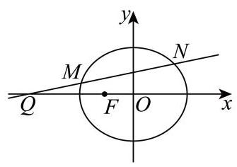

(1)求椭圆 $\Gamma$ 的离心率；

(2)设直线 ${MF}\text{ 、 }{NF}$ 的斜率分别为 ${k}_{1},{k}_{2}$ ，求 ${k}_{1} + {k}_{2}$ 的值；

(3)若点 $E$ 满足 $\left| {EM}\right|  = \left| {EN}\right|  = \left| {EF}\right|$ ，点 $D$ 在椭圆上， ${MD} \bot  x$ 轴，探究直线 ${EF}$ 与直线 ${DQ}$ 的斜率之积是否为定值？若为定值，请求出该值；若不为定值，请说明理由.

【答案】(1) $\frac{1}{2}$

(2) 0 (3) 是, -1

【解析】

【分析】(1) 根据已知确定椭圆参数, 即可求离心率;

(2)设直线 $l : y = k\left( {x + 4}\right) , k \neq  0, M\left( {{x}_{1},{y}_{1}}\right) , N\left( {{x}_{2},{y}_{2}}\right)$ ,联立椭圆方程并应用韦达定理, 代入 ${k}_{1} + {k}_{2} = k\left( {2 + \frac{3}{{x}_{1} + 1} + \frac{3}{{x}_{2} + 1}}\right)$ 化简即可得;

(3)由题设 $E$ 为 $\bigtriangleup  {MNF}$ 的外心，由 $M\left( {{x}_{1},{y}_{1}}\right)$ ，从而有 $D\left( {{x}_{1}, - {y}_{1}}\right)$ ，得 ${k}_{DQ} =  - k$ ，设出三角形外接圆的方程 ${x}^{2} + {y}^{2} + {D}^{\prime }x + {E}^{\prime }y + {F}^{\prime } = 0$ ,联立 $l : y = k\left( {x + 4}\right)$ 整理得一元二次方程,

其与(2)中方程同解得到等比例关系求得 ${E}^{\prime } =  - \frac{3}{k\left( {3 + 4{k}^{2}}\right) },{D}^{\prime } = \frac{8{k}^{2} + 3}{3 + 4{k}^{2}}$ ,进而确定 $E$ 坐标并求得 ${k}_{EF} = \frac{1}{k}$ ,即可得结论.

【小问 1 详解】

由题设 $c = 1,{b}^{2} = 3$ ,则 ${a}^{2} = {b}^{2} + {c}^{2} = 4 \Rightarrow  a = 2$ ,离心率为 $e = \frac{c}{a} = \frac{1}{2}$ ;

【小问 2 详解】

由 (1) 知, $\Gamma  : \frac{{x}^{2}}{4} + \frac{{y}^{2}}{3} = 1$ ,即 $3{x}^{2} + 4{y}^{2} = {12}$ ,

设直线 $l : y = k\left( {x + 4}\right) , k \neq  0, M\left( {{x}_{1},{y}_{1}}\right) , N\left( {{x}_{2},{y}_{2}}\right)$ ,

联立得 $\left( {3 + 4{k}^{2}}\right) {x}^{2} + {32}{k}^{2}x + {64}{k}^{2} - {12} = 0$ ,则 ${x}_{1} + {x}_{2} =  - \frac{{32}{k}^{2}}{3 + 4{k}^{2}},{x}_{1}{x}_{2} = \frac{{64}{k}^{2} - {12}}{3 + 4{k}^{2}}$ ,

${k}_{1} + {k}_{2} = \frac{{y}_{1}}{{x}_{1} + 1} + \frac{{y}_{2}}{{x}_{2} + 1} = \frac{k\left( {{x}_{1} + 4}\right) }{{x}_{1} + 1} + \frac{k\left( {{x}_{2} + 4}\right) }{{x}_{2} + 1} = k\left( {2 + \frac{3}{{x}_{1} + 1} + \frac{3}{{x}_{2} + 1}}\right) ,$

$\frac{3}{{x}_{1} + 1} + \frac{3}{{x}_{2} + 1} = \frac{3\left( {{x}_{1} + {x}_{2} + 2}\right) }{{x}_{1}{x}_{2} + {x}_{1} + {x}_{2} + 1} = \frac{2 - 8{k}^{2}}{4{k}^{2} - 1} =  - 2,$

所以 ${k}_{1} + {k}_{2} = k\left( {2 - 2}\right)  = 0$ ；

【小问 3 详解】

由 $\left| {EM}\right|  = \left| {EN}\right|  = \left| {EF}\right|$ ,则 $E$ 为 $\bigtriangleup {MNF}$ 的外心,

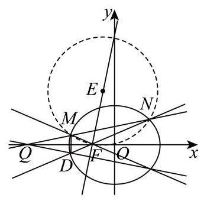

由 $M\left( {{x}_{1},{y}_{1}}\right)$ ,根据对称性知 $D\left( {{x}_{1}, - {y}_{1}}\right)$ ,则 ${k}_{DQ} = \frac{-{y}_{1}}{{x}_{1} + 4} =  - k$ ,

设过 $M, N, F$ 的圆为 ${x}^{2} + {y}^{2} + {D}^{\prime }x + {E}^{\prime }y + {F}^{\prime } = 0$ ,

过 $F\left( {-1,0}\right)$ 得, $1 - {D}^{\prime } + {F}^{\prime } = 0 \Rightarrow  {F}^{\prime } = {D}^{\prime } - 1$ ,

联立圆与直线 $l : y = k\left( {x + 4}\right)$ ,整理得

$\left( {1 + {k}^{2}}\right) {x}^{2} + \left( {8{k}^{2} + {D}^{\prime } + {E}^{\prime }k}\right) x + {16}{k}^{2} + 4{E}^{\prime }k + {D}^{\prime } - 1 = 0,$

上述方程与 $\left( {3 + 4{k}^{2}}\right) {x}^{2} + {32}{k}^{2}x + {64}{k}^{2} - {12} = 0$ 有同解,

所以 $\frac{1 + {k}^{2}}{3 + 4{k}^{2}} = \frac{8{k}^{2} + {D}^{\prime } + {E}^{\prime }k}{{32}{k}^{2}} = \frac{{16}{k}^{2} + 4{E}^{\prime }k + {D}^{\prime } - 1}{{64}{k}^{2} - {12}}$ ,可得

${E}^{\prime } =  - \frac{3}{k\left( {3 + 4{k}^{2}}\right) },{D}^{\prime } = \frac{8{k}^{2} + 3}{3 + 4{k}^{2}},$

外心 $E\left( {-\frac{{D}^{\prime }}{2}, - \frac{{E}^{\prime }}{2}}\right)$ ,则 ${k}_{EF} = \frac{-\frac{{E}^{\prime }}{2}}{-\frac{{D}^{\prime }}{2} + 1} = \frac{{E}^{\prime }}{{D}^{\prime } - 2} = \frac{-\frac{3}{k\left( {3 + 4{k}^{2}}\right) }}{\frac{8{k}^{2} + 3}{3 + 4{k}^{2}} - 2} = \frac{-\frac{3}{k}}{8{k}^{2} + 3 - 6 - 8{k}^{2}} = \frac{1}{k}$ , 所以 ${k}_{EF}{k}_{DQ} = \frac{1}{k} \cdot  \left( {-k}\right)  =  - 1$ 为定值.

21. 若函数 $y = M\left( x\right) \text{ 、 }y = N\left( x\right)$ 在区间 $I$ 上满足 $\left| {M\left( x\right) }\right|  \leq  N\left( x\right)$ ,则称函数 $y = N\left( x\right)$ 为 $y = M\left( x\right)$ 在区间 $I$ 上的绝对值上界函数. 设定义在 $\mathbf{R}$ 上的函数 $y = f\left( x\right) \text{ 、 }y = g\left( x\right)$ 的导数为 $y = {f}^{\prime }\left( x\right) \text{ 、 }y = {g}^{\prime }\left( x\right)$ .

(1)判断函数 $y = x$ 是不是函数 $y = \sin x$ 在区间 $\left\lbrack  {0,\pi }\right\rbrack$ 上的绝对值上界函数，并说明理由;

(2)若函数 $y = {g}^{\prime }\left( x\right)$ 为 $y = {f}^{\prime }\left( x\right)$ 在 $\mathbf{R}$ 上的绝对值上界函数，求证:对任意 $h > 0$ ，都有 $\left| {f\left( {x + \nabla }\right)  - f\left( x\right) }\right|  \leq  g\left( {x + \nabla }\right)  - g\left( x\right) ;$

(3)若函数 $y = {g}^{\prime }\left( x\right)$ 为 $y = {f}^{\prime }\left( x\right)$ 在 $\mathbf{R}$ 上的绝对值上界函数，实数 $a, b\left( {a < b}\right)$ 满足 $g{\left( x\right) }_{\min } = g\left( a\right)  = f\left( a\right) , g{\left( x\right) }_{\max } = g\left( b\right)  = f\left( b\right)$ ,确定 $f\left( {x}_{0}\right) , g\left( {x}_{0}\right)$ 在 ${x}_{0} \in  \mathbf{R}$ 时的大小关系 $\left( {g{\left( x\right) }_{\min }\text{ 、 }g{\left( x\right) }_{\max }}\right.$ 分别表示函数 $y = g\left( x\right)$ 的最小值和最大值)

【答案】(1) 是,证明见解析

(2)证明见解析(3) $\forall {x}_{0} \in  \mathbf{R}, f\left( {x}_{0}\right)  = g\left( {x}_{0}\right)$

【解析】

【分析】(1) 通过构造函数证明在 $\left\lbrack  {0,\pi }\right\rbrack$ 上 $x \geq  \sin x$ 即可得到结论;

(2)将原不等式转化为两个不等式，构造两个辅助函数并求导，结合绝对值上界函数的定义判断它们的单调性, 最后利用单调性导出结论;

(3)先判断出 $g\left( x\right)$ 在 $\mathbf{R}$ 上单调不减，然后根据最值信息得到 $g\left( x\right)$ 在 $x < a$ 和 $x > b$ 时均为常数,再利用 $f\left( x\right)$ 和 $g\left( x\right)$ 的约束关系得到此时 $f\left( x\right)$ 也为常数,对于 $a \leq  x \leq  b$ 时的情况,则通过构造 $f\left( x\right)$ 和 $g\left( x\right)$ 的差,并利用其单调性以及端点值相等得到其为常数,综合所有情况即可得结论.

【小问 1 详解】

在 $\left\lbrack  {0,\pi }\right\rbrack$ 上, $\left| {\sin x}\right|  = \sin x$ ,设 $h\left( x\right)  = x - \sin x$ ,求导得 ${h}^{\prime }\left( x\right)  = 1 - \cos x$ ,

当 $x \in  \left\lbrack  {0,\pi }\right\rbrack$ 时, $\cos x \leq  1$ ,故 ${h}^{\prime }\left( x\right)  \geq  0$ ,故 $h\left( x\right)$ 在 $\left\lbrack  {0,\pi }\right\rbrack$ 上单调递增,因此 $h\left( x\right)  \geq  h\left( 0\right)  = 0$ , 即 $x \geq  \sin x = \left| {\sin x}\right|$ ,满足定义,所以 $y = x$ 是 $y = \sin x$ 在该区间上的绝对值上界函数.

【小问 2 详解】

$\left| {f\left( {x + h}\right)  - f\left( x\right) }\right|  \leq  g\left( {x + h}\right)  - g\left( x\right)$ 成立,

等价于 $f\left( {x + h}\right)  - f\left( x\right)  \leq  g\left( {x + h}\right)  - g\left( x\right)$ 和 $- \left( {f\left( {x + h}\right)  - f\left( x\right) }\right)  \leq  g\left( {x + h}\right)  - g\left( x\right)$ 同时成立,

设 $H\left( x\right)  = g\left( x\right)  - f\left( x\right) , P\left( x\right)  = g\left( x\right)  + f\left( x\right)$ ,由题设可知 $\left| {{f}^{\prime }\left( x\right) }\right|  \leq  {g}^{\prime }\left( x\right)$ 即 $- {g}^{\prime }\left( x\right)  \leq  {f}^{\prime }\left( x\right)  \leq  {g}^{\prime }\left( x\right)$

由此可得 ${H}^{\prime }\left( x\right)  = {g}^{\prime }\left( x\right)  - {f}^{\prime }\left( x\right)  \geq  0,{P}^{\prime }\left( x\right)  = {g}^{\prime }\left( x\right)  + {f}^{\prime }\left( x\right)  \geq  0$ ,所以 $H\left( x\right)$ 和 $P\left( x\right)$ 在 $\mathbf{R}$ 上都单调不减,

所以 $\forall h > 0$ ,有 $x + h > x$ ,则 $H\left( {x + h}\right)  \geq  H\left( x\right)$ ,

也即 $g\left( {x + h}\right)  - f\left( {x + h}\right)  \geq  g\left( x\right)  - f\left( x\right)$ 成立,

整理得 $f\left( {x + h}\right)  - f\left( x\right)  \leq  g\left( {x + h}\right)  - g\left( x\right)$ .

同理 $P\left( {x + h}\right)  \geq  P\left( x\right)$ 也即 $g\left( {x + h}\right)  + f\left( {x + h}\right)  \geq  g\left( x\right)  + f\left( x\right)$ 成立,

整理得 $- \left( {f\left( {x + h}\right)  - f\left( x\right) }\right)  \leq  g\left( {x + h}\right)  - g\left( x\right)$ ,于是原不等式得证.

【小问 3 详解】

结论: $\forall {x}_{0} \in  \mathbf{R}, f\left( {x}_{0}\right)  = g\left( {x}_{0}\right)$ ,证明如下:

由题设可知 $\forall x \in  \mathbf{R},\left| {{f}^{\prime }\left( x\right) }\right|  \leq  {g}^{\prime }\left( x\right)$ ,因此 ${g}^{\prime }\left( x\right)  \geq  0, g\left( x\right)$ 在 $\mathbf{R}$ 上单调不减,

那么当 $x < a$ 时 $g\left( x\right)  \leq  g\left( a\right)$ ,但是 $g{\left( x\right) }_{\min } = g\left( a\right)$ ,所以 $g\left( x\right)  = g\left( a\right)$ 即为常数,

所以 ${g}^{\prime }\left( x\right)  = 0$ ,又根据 $\left| {{f}^{\prime }\left( x\right) }\right|  \leq  {g}^{\prime }\left( x\right)$ ,必有 ${f}^{\prime }\left( x\right)  = 0$ ,所以

$f\left( x\right)  = f\left( a\right)  = g\left( a\right)  = g\left( x\right) ;$

当 $x > b$ 时 $g\left( x\right)  \geq  g\left( b\right)$ ,但是 $g{\left( x\right) }_{\max } = g\left( b\right)$ ,所以 $g\left( x\right)  = g\left( b\right)$ 即为常数,同理可得 $f\left( x\right)  = f\left( b\right)  = g\left( b\right)  = g\left( x\right) ;$

当 $a \leq  x \leq  b$ 时,利用 (2) 中构造的 $H\left( x\right)$ ,因为 $H\left( x\right)$ 单调不减,

又 $H\left( a\right)  = g\left( a\right)  - f\left( a\right)  = 0, H\left( b\right)  = g\left( b\right)  - f\left( b\right)  = 0$ ,

所以 $H\left( x\right)  = 0$ 也即 $f\left( x\right)  = g\left( x\right)$ 在 $\left\lbrack  {a, b}\right\rbrack$ 上恒成立,

综上所述, $\forall {x}_{0} \in  \mathbf{R}, f\left( {x}_{0}\right)  = g\left( {x}_{0}\right)$ .
