## 2025 学年第二学期高三数学教学质量调研试卷

考生注意:

1. 答题前，务必在答题纸上将姓名、学校、班级等信息填写清楚，并贴好条形码.

2.解答试卷必须在答题纸规定的相应位置书写，超出答题纸规定位置或写在试卷、草稿纸上的答案一律不予评分.

3.本试卷共有 21 道试题, 满分 150 分, 考试时间 120 分钟.

## 一、填空题(本大题共有 12 题，满分 54 分，第 1~6 题每题 4 分，第 7~12 题 每题 5 分) 考生应在答题纸的相应位置直接填写结果.

1. 已知集合 $A = \{ 1,2,3\} , B = \left( {2, + \infty }\right)$ ，则 $A \cap  B =$ ___.

2. 已知正实数 $a\text{ 、 }b$ 满足 ${ab} = 1$ ，则 $a + {4b}$ 的最小值等于___.

3. 已知向量 $\overrightarrow{a} = \left( {x,2,3}\right)$ ， $\overrightarrow{b} = \left( {2, y,6}\right)$ ，若 $\overrightarrow{a}\bot \overrightarrow{b}$ ，则实数 $x + y =$ ___.

4. 在 ${\left( 1 + x\right) }^{6}$ 的展开式中，含 ${x}^{3}$ 项的系数为___.

5. 函数 $y = \sin x, x \in  \left\lbrack  {-\frac{\pi }{2},\frac{3\pi }{4}}\right\rbrack$ 的值域为___.

## 6. 已知随机变量 $X$ 的分布为

<table><tr><td>$X$</td><td>0</td><td>1</td><td>2</td></tr><tr><td>$P$</td><td>0.4</td><td>0.2</td><td>0.4</td></tr></table>

则 $X$ 的期望为___.

7. 设等比数列 $\left\{  {a}_{n}\right\}$ 的前 $n$ 项和为 ${S}_{n}$ ,若 ${S}_{2} = 3,{S}_{4} = {15}$ ,则 ${S}_{6} =$ ___.

8. 在 ${ABC}$ 中， $D$ 是 ${BC}$ 的中点， $\left| \overrightarrow{AD}\right|  = 4$ ， $\left| \overrightarrow{BC}\right|  = 6$ ，则 $\overrightarrow{AB} \cdot  \overrightarrow{AC} =$ ___.

9. 将 4 个不同的小球依次随机投入 3 个篮子中，每个篮子不空的概率为___(用分数表示) .

10. 已知复数 $z$ 满足: $\left| z\right|  = 1$ ，且 $\left| {z - \mathrm{i}}\right|  \leq  1$ ，则 $\left| {z\mathrm{i} - 1}\right|$ 的最小值为___.

11. 如图，某画框内摆放着三个矩形工艺品，它们的长均为 50cm，宽均为 10cm. 点 $A$ 、 $B$ 、

$C\text{ 、 }D$ 在同一条直线上,点 $F$ 在边 ${BE}$ 上,点 $I$ 在边 ${GH}$ 上,测得 $B\text{ 、 }C$ 两点间距离为 ${10}\mathrm{\;{cm}}$ . 为了使 $\angle {BFC} = \angle {HID}$ ，则 $C$ 、 $D$ 两点间距离为___ $\mathrm{{cm}}$ . (精确到 ${0.1}\mathrm{\;{cm}}$ )

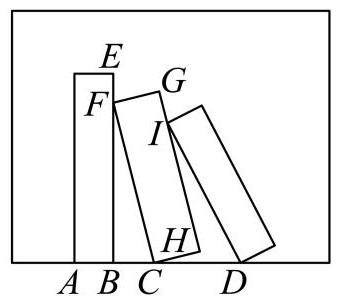

12. 等腰 ${ABC}$ 的三个顶点均在椭圆 $\Gamma  : \frac{{x}^{2}}{2026} + {y}^{2} = 1$ 上，且 $A\text{ 、 }B\text{ 、 }C$ 中有且仅有两个点是椭圆 $\Gamma$ 的顶点，则满足条件的 ${ABC}$ 共有___个.

## 二、选择题 (本大题共有 4 题, 满分 18 分, 第 13、14 题每题 4 分, 第 15、16 题每题 5 分) 每题有且只有一个正确选项.考生应在答题纸的相应位置, 将代表 正确选项的小方格涂黑.

13. 下列函数中既是奇函数又是增函数的是( )

A. $y = {x}^{2}$ B. $y = {x}^{3}$ C. $y = {2}^{x}$ D. $y = \lg x$

14. 对于随机事件 $A\text{ 、 }B,$ “ $P\left( A\right)  = P\left( {A \mid  B}\right)$ ”是“ $A\text{ 、 }B$ 互相独立”的( )条件.

A. 充分非必要 B. 必要非充分 C. 充要 D. 非充分

非必要

15. 将下列平面图形沿等边三角形的边折起，不能折成如图所示几何体的是( ).

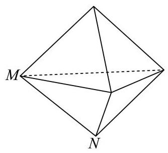

A.

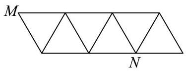

B.

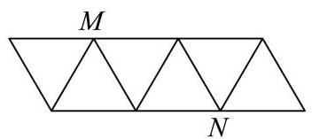

D.

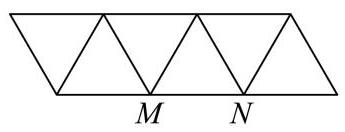

C.

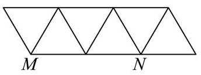

16. 已知 $f\left( x\right)  = \left( {1 - a}\right) x + a\sin x$ .

① 存在 $a \in  \left( {0,1}\right)$ ,使得函数 $y = f\left( x\right)$ 在 $\mathbf{R}$ 上严格增;

②对于任意 $a \in  \left( {0,1}\right)$ ,直线 $y = \left( {1 - a}\right) x + a$ 与曲线 $y = f\left( x\right)$ 都相切且有无数个切点,每个切点的横坐标都不是函数 $y = f\left( x\right)$ 的极值点.

对于以上两个结论, 下列判断正确的是 ( )

A. ①正确，②错误； B. ①错误，②正确；

C. ①正确，②正确； D. ①错误，②错误.

## 三、解答题 (本大题共有 5 题, 满分 78 分) 解答下列各题必须在答题纸的相应 位置写出必要的步骤.

17. 一次校内常规体检后，数学建模活动小组学生随机抽取了 10 名学生体重数据(单位: kg): 55, 58, 62, 74, 88, 68, 54, 52, 56, 86.

(1)求该组数据的极差和第 25 百分位数；

(2)依据体检数据，求得这 10 名学生体重 $y$ (单位: $\mathrm{{kg}}$ )关于身高 $x$ (单位: $\mathrm{{cm}}$ )的回归方程为 $y = {2.3x} + b$ ,已知这 10 名学生身高 (单位:cm) 的平均数为 176.3,求 $b$ 的值(精确到 0.1)

(3)体重(kg)与身高(m)平方的比称为体重指标，体重指标不低于 28.0 称为肥胖，为了解该校学生肥胖是否与性别有关,从已获得数据中随机抽样得到了如下 $2 \times  2$ 列联表.

<table><tr><td rowspan="2"></td><td colspan="2">男生</td><td colspan="2">女生</td><td rowspan="2">总计</td></tr><tr><td>观察值</td><td>预期值</td><td>观察值</td><td>预期值</td></tr><tr><td>不肥胖</td><td>99</td><td></td><td></td><td></td><td>168</td></tr><tr><td>肥胖</td><td></td><td></td><td>$m$</td><td></td><td></td></tr><tr><td>总计</td><td>120</td><td></td><td></td><td></td><td>200</td></tr></table>

求表中 $m$ 的值. 已知零假设为:肥胖与性别无关，计算男生肥胖人数的预期值(精确到 0.1).

18. 如图， $P$ 是圆锥顶点， $O$ 是底面圆心，点 $A$ 、 $B$ 在底面圆周上， ${OA}\bot {OB}$ ， ${OA} = {OB} = 1$ .

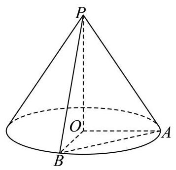

(1)若圆锥的侧面积为 ${2\pi }$ ，求圆锥的体积；

(2)若直线 ${PA}$ 与平面 ${POB}$ 所成角为 30，求二面角 $P - {AB} - O$ 的平面角的正切值

19. 已知 $f\left( x\right)  = {\log }_{a}x$ (其中 $a > 0, a \neq  1$ ).

(1)若函数 $y = f\left( x\right)$ 的图象过点 $\left( {2, - 1}\right)$ ，求不等式 $f\left( {{2x} - 1}\right)  > f\left( {x + 1}\right)$ 的解集；

( 2 )若恰有两个不同的实数 $x$ ，使得 $f\left( x\right)$ ， $f\left( {x - m}\right)$ ， $f\left( 4\right)$ 成等差数列，求实数 $m$ 的取值范围.

20. 双曲线 $\Gamma  : \frac{{x}^{2}}{3} - \frac{{y}^{2}}{{b}^{2}} = 1\left( {b > 0}\right)$ 经过点 $P\left( {2,1}\right)$ ，不垂直 $x$ 轴的直线与 $\Gamma$ 交于不同于 $P$ 的 $A$ 、 $B$ 两点，直线 ${PA}$ 、 ${PB}$ 分别与 $y$ 轴交于点 $M$ 、 $N$ .

(1)求 $\Gamma$ 的离心率；

(2)设直线 ${PA}$ 与 $x$ 轴交于点 $Q$ ，且 $\overrightarrow{MQ} = 2\overrightarrow{QP}$ ，求点 $A$ 的横坐标；

(3) 若 $M$ 、 $N$ 关于原点对称，证明:直线 ${AB}$ 经过定点.

21. 设函数 $y = f\left( x\right)$ 定义域为 $I$ ,区间 $D \subseteq  I$ ,记函数 $y = f\left( x\right)$ 在区间 $D$ 上的最大值为 ${M}_{f}\left( D\right)$ ,最小值为 ${m}_{f}\left( D\right)$ .

(1)设 $f\left( x\right)  = {\mathrm{e}}^{x} - {ax}$ ， $D = \left( {-1,1}\right)$ ，若 ${m}_{f}\left( D\right)  = f\left( 0\right)$ ，求实数 $a$ 的值；

(2)设 $f\left( x\right)  = {x}^{3} - 3{x}^{2}, D = \left\lbrack  {t, t + 2}\right\rbrack$ ，若 ${M}_{f}\left( D\right)  - {m}_{f}\left( D\right)  = 4$ ，且 $- 1 \leq  t \leq  1$ ，求 $t$ 的值;

(3)已知 $f\left( 0\right)  = 0, f\left( 1\right)  = 1$ ，且对任意闭区间 $D \subseteq  \left\lbrack  {0,1}\right\rbrack$ ， ${M}_{f}\left( D\right)$ 与 ${m}_{f}\left( D\right)$ 均存在. 求证: “ $y = f\left( x\right)$ 在区间 $\left\lbrack  {0,1}\right\rbrack$ 上严格增”的充要条件是“对于任意闭区间 ${D}_{1}\text{ 、 }{D}_{2} \subseteq  \left\lbrack  {0,1}\right\rbrack$ , 当 ${M}_{f}\left( {D}_{1}\right)  = {M}_{f}\left( {D}_{2}\right)$ ,且 ${m}_{f}\left( {D}_{1}\right)  = {m}_{f}\left( {D}_{2}\right)$ 时,均有 ${D}_{1} = {D}_{2}$ ." 参考答案及解析:

1、【答案】(3)

【解析】

【详解】集合 $A = \{ 1,2,3\} , B = \left( {2, + \infty }\right)$ ,则 $A \cap  B = \{ 3\}$ .

2. 已知正实数 $a\text{ 、 }b$ 满足 ${ab} = 1$ ，则 $a + {4b}$ 的最小值等于___.

【答案】 4

【解析】

【分析】直接利用基本不等式计算得到答案.

【详解】 $a + {4b} \geq  2\sqrt{4ab} = 2\sqrt{4} = 4$ ,当 $a = {4b}$ ,即 $a = 2, b = \frac{1}{2}$ 时等号成立,

则 $a + {4b}$ 的最小值为 4 .

故答案为:4.

3. 已知向量 $\overrightarrow{a} = \left( {x,2,3}\right) ,\overrightarrow{b} = \left( {2, y,6}\right)$ ，若 $\overrightarrow{a}\bot \overrightarrow{b}$ ，则实数 $x + y =$ ___.

【答案】 -9

【解析】

【详解】因为 $\overrightarrow{a} = \left( {x,2,3}\right) ,\overrightarrow{b} = \left( {2, y,6}\right)$ ,又 $\overrightarrow{a} \bot  \overrightarrow{b}$ ,

所以 $\overrightarrow{a} \cdot  \overrightarrow{b} = {2x} + {2y} + 3 \times  6 = 0$ ,

则 $x + y =  - 9$ .

4. 在 ${\left( 1 + x\right) }^{6}$ 的展开式中，含 ${x}^{3}$ 项的系数为___.

【答案】 20

【解析】

【分析】利用二项展开式通项,令 $x$ 的指数为 3,求出参数的值,再代入通项可得出 ${x}^{3}$ 项的系数.

【详解】二项式 ${\left( 1 + x\right) }^{6}$ 展开式的通项为 ${C}_{6}^{k} \cdot  {1}^{6 - k} \cdot  {x}^{k} = {C}_{6}^{k} \cdot  {x}^{k}$ ,

令 $k = 3$ ,因此,在 ${\left( 1 + x\right) }^{6}$ 的展开式中,含 ${x}^{3}$ 项的系数为 ${C}_{6}^{3} = {20}$ ,故答案为 20 .

【点睛】本题考查利用二项式通项求指定项的系数, 考查运算求解能力, 属于基础题.

5. 函数 $y = \sin x, x \in  \left\lbrack  {-\frac{\pi }{2},\frac{3\pi }{4}}\right\rbrack$ 的值域为___.

【答案】 $\left\lbrack  {-1,1}\right\rbrack$

【解析】

【分析】直接根据正弦函数的单调性判断函数的最大值及最小值, 进而可得函数值域.

【详解】因为 $x \in  \left\lbrack  {-\frac{\pi }{2},\frac{3\pi }{4}}\right\rbrack$ ,由正弦函数的性质得: 函数 $y = \sin x$ 在 $\left\lbrack  {-\frac{\pi }{2},\frac{\pi }{2}}\right\rbrack$ 上单调递增,在 $\left( {\frac{\pi }{2},\frac{3\pi }{4}}\right\rbrack$ 上单调递减,

当 $x =  - \frac{\pi }{2}$ 时,函数有最小值 ${y}_{\min } =  - 1$ ,当 $x = \frac{\pi }{2}$ 时,函数有最大值 ${y}_{\max } = 1$ .

所以函数在 $\left\lbrack  {-\frac{\pi }{2},\frac{3\pi }{4}}\right\rbrack$ 上值域为 $\left\lbrack  {-1,1}\right\rbrack$ .

## 6. 已知随机变量 $X$ 的分布为

<table><tr><td>$X$</td><td>0</td><td>1</td><td>2</td></tr><tr><td>$P$</td><td>0.4</td><td>0.2</td><td>0.4</td></tr></table>

则 $X$ 的期望为___.

【答案】 1

【解析】

【分析】直接根据分布列求离散型随机变量的期望可得.

【详解】因为随机变量 $X$ 的分布为

<table><tr><td>$X$</td><td>0</td><td>1</td><td>2</td></tr><tr><td>$P$</td><td>0.4</td><td>0.2</td><td>0.4</td></tr></table>

所以 $E\left( X\right)  = 0 \times  {0.4} + 1 \times  {0.2} + 2 \times  {0.4} = 1$ .

7. 设等比数列 $\left\{  {a}_{n}\right\}$ 的前 $n$ 项和为 ${S}_{n}$ ,若 ${S}_{2} = 3,{S}_{4} = {15}$ ,则 ${S}_{6} =$ ___

【答案】63

【解析】

【详解】因为等比数列 $\left\{  {a}_{n}\right\}$ ,所以 ${S}_{2},{S}_{4} - {S}_{2},{S}_{6} - {S}_{4}$ 也成等比数列,即

$3\left( {{S}_{6} - {15}}\right)  = {144},{S}_{6} = {63}$ ,填 63 .

8. 在 ${ABC}$ 中， $D$ 是 ${BC}$ 的中点， $\left| \overrightarrow{AD}\right|  = 4$ ， $\left| \overrightarrow{BC}\right|  = 6$ ，则 $\overrightarrow{AB} \cdot  \overrightarrow{AC} =$ ___.

【答案】 7

【解析】

【详解】因为在 ${ABC}$ 中, $D$ 是 ${BC}$ 的中点,所以 $\overrightarrow{AB} + \overrightarrow{AC} = 2\overrightarrow{AD}$ ,所以

${\overrightarrow{AB}}^{2} + {\overrightarrow{AC}}^{2} + 2\overrightarrow{AB} \cdot  \overrightarrow{AC} = 4{\overrightarrow{AD}}^{2} = {64}$ .

又 $\left| \overrightarrow{BC}\right|  = 6$ ,所以 $\left| {\overrightarrow{AC} - \overrightarrow{AB}}\right|  = 6$ ,所以 ${\overrightarrow{AB}}^{2} + {\overrightarrow{AC}}^{2} - 2\overrightarrow{AB} \cdot  \overrightarrow{AC} = {36}$ .

所以 $4\overrightarrow{AB} \cdot  \overrightarrow{AC} = {28},\overrightarrow{AB} \cdot  \overrightarrow{AC} = 7$ .

9. 将 4 个不同的小球依次随机投入 3 个篮子中，每个篮子不空的概率为___(用分数表示) .

【答案】 $\frac{4}{9}$

【解析】

【分析】利用分组分配法与古典概型概率公式计算即得.

【详解】4 个不同的小球依次随机投入 3 个篮子, 每个小球均有 3 种投法, 故总投法数为 ${3}^{4} = {81}$ 种;

要求每个篮子不空，需使其中一个篮子放 2 个球，另两个篮子各放 1 个球，故有投法数为 ${\mathrm{C}}_{4}^{2}{\mathrm{\;A}}_{3}^{3} = {36}$ 种.

由古典概型概率公式,可得概率为: $\frac{{\mathrm{C}}_{4}^{2}{\mathrm{\;A}}_{3}^{3}}{{3}^{4}} = \frac{36}{81} = \frac{4}{9}$ .

10. 已知复数 $z$ 满足: $\left| z\right|  = 1$ ，且 $\left| {z - \mathrm{i}}\right|  \leq  1$ ，则 $\left| {z\mathrm{i} - 1}\right|$ 的最小值为___.

【答案】 $\sqrt{3}$

【解析】

【分析】设 $z = a + b\mathrm{i}, a \in  \mathbf{R}, b \in  \mathbf{R}$ ,由题意易得 ${a}^{2} + {b}^{2} = 1,\frac{1}{2} \leq  b \leq  1$ ,表示出 $\left| {z\mathrm{i} - 1}\right|$ 即可求出答案.

【详解】设 $z = a + b\mathrm{i}, a \in  \mathbf{R}, b \in  \mathbf{R}$ ,

则 $\left| z\right|  = \sqrt{{a}^{2} + {b}^{2}} = 1 \Rightarrow  {a}^{2} + {b}^{2} = 1$ ,

$\left| {z - \mathrm{i}}\right|  = \left| {a + \left( {b - 1}\right) \mathrm{i}}\right|  = \sqrt{{a}^{2} + {\left( b - 1\right) }^{2}} \leq  1 \Rightarrow  {a}^{2} + {\left( b - 1\right) }^{2} \leq  1$

化简得: ${a}^{2} + {b}^{2} - {2b} + 1 \leq  1 \Rightarrow  \frac{1}{2} \leq  b \leq  1$ ,

$\left| {z\mathrm{i} - 1}\right|  = \left| {a\mathrm{i} - b - 1}\right|  = \sqrt{{\left( -b - 1\right) }^{2} + {a}^{2}} = \sqrt{{a}^{2} + {b}^{2} + {2b} + 1} = \sqrt{{2b} + 2}$ ,

又 $\frac{1}{2} \leq  b \leq  1$

所以 $3 \leq  {2b} + 2 \leq  4$

所以 $\sqrt{3} \leq  \sqrt{{2b} + 2} \leq  2$

所以 $\left| {z\mathrm{i} - 1}\right|$ 的最小值为 $\sqrt{3}$ .

11. 如图，某画框内摆放着三个矩形工艺品，它们的长均为 50cm，宽均为 10cm. 点 $A$ 、 $B$ 、 $C\text{ 、 }D$ 在同一条直线上,点 $F$ 在边 ${BE}$ 上,点 $I$ 在边 ${GH}$ 上,测得 $B\text{ 、 }C$ 两点间距离为 ${10}\mathrm{\;{cm}}$ . 为了使 $\angle {BFC} = \angle {HID}$ ，则 $C$ 、 $D$ 两点间距离为___ $\mathrm{{cm}}$ . (精确到 ${0.1}\mathrm{\;{cm}}$ )

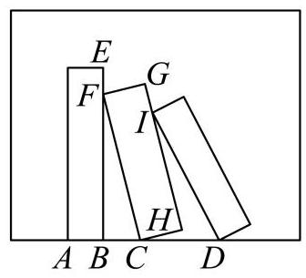

【答案】 20.4

【解析】

【分析】在 ${\mathrm{{Rt}}}_{ \bigtriangleup  }{FBC}$ 中，分别求得 $\sin \angle {FCB},\sin \angle {BFC}$ ,再利用三角形相似及正弦定理可求解.

【详解】 ${\mathrm{{Rt}}}_{ \bigtriangleup  }{FBC}$ 中， ${FC} = {50},{BC} = {10}$ ，所以 ${FB} = \sqrt{{FC}^{2} - {BC}^{2}} = {20}\sqrt{6}$ .

所以 $\sin \angle {FCB} = \frac{{20}\sqrt{6}}{50} = \frac{2\sqrt{6}}{5},\sin \angle {BFC} = \frac{BC}{CF} = \frac{1}{5}$ .

延长 ${GH}$ ，交 ${CD}$ 于点 $P$ ，则 $\bigtriangleup  {FBC}$ 与 $\bigtriangleup  {CHP}$ 相似，所以 $\angle {HPC} = {FCB}$ .

所以 $\sin \angle {HPC} = \sin \angle {FCB} = \frac{2\sqrt{6}}{5}$ ,所以 $\frac{CH}{CP} = \frac{2\sqrt{6}}{5}$ ,

所以 ${CP} = \frac{CH}{\frac{2\sqrt{6}}{5}} = \frac{10}{\frac{2\sqrt{6}}{5}} = \frac{{25}\sqrt{6}}{6}$ .

$\bigtriangleup  {IPD}$ 中，由正弦定理得 $\frac{ID}{\sin \angle {IPD}} = \frac{PD}{\sin \angle {PID}}$ ，即 $\frac{50}{\sin \angle {HPC}} = \frac{PD}{\sin \angle {BFC}}$ ，

所以 ${PD} = \frac{{50} \times  \frac{1}{5}}{\frac{2\sqrt{6}}{5}} = \frac{{25}\sqrt{6}}{6}$ .

所以 ${CD} = {CP} + {PD} = \frac{{25}\sqrt{6}}{3} \approx  {20.4}$

所以 $C$ 、 $D$ 两点间距离为 ${20.4}\mathrm{\;{cm}}$ .

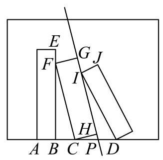

12. 等腰 ${ABC}$ 的三个顶点均在椭圆 $\Gamma  : \frac{{x}^{2}}{2026} + {y}^{2} = 1$ 上，且 $A\text{ 、 }B\text{ 、 }C$ 中有且仅有两个点是椭圆 $\Gamma$ 的顶点，则满足条件的 ${ABC}$ 共有___个.

【答案】 20

【解析】

【详解】如图所示:

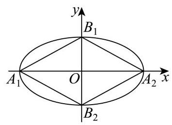

由题意可得 ${A}_{1}\left( {-\sqrt{2026},0}\right) ,{A}_{2}\left( {\sqrt{2026},0}\right) ,{B}_{1}\left( {0,1}\right) ,{B}_{2}\left( {0, - 1}\right)$ ,

以 ${A}_{1}{B}_{1}$ 或 ${A}_{1}{B}_{2}$ 或 ${A}_{2}{B}_{1}$ 或 ${A}_{2}{B}_{2}$ 为等腰三角形的底边,

在两侧可各作一个等腰三角形,共有 $4 \times  2 = 8$ 个;

以 ${A}_{1}{B}_{1}$ 或 ${A}_{1}{B}_{2}$ 或 ${A}_{2}{B}_{1}$ 或 ${A}_{2}{B}_{2}$ 为等腰三角形的腰,

则 $\left| {{A}_{1}{B}_{1}}\right|  = \sqrt{{2026} + 1} = \sqrt{2027}$ ,

设另一点为 $P\left( {x, y}\right)$ ，

若 $\left| {P{B}_{1}}\right|  = \left| {{A}_{1}{B}_{1}}\right|$ ,

即 ${x}^{2} + {\left( y - 1\right) }^{2} = {2027}$ ,

由 $\left\{  \begin{array}{l} {x}^{2} + {\left( y - 1\right) }^{2} = {2027} \\  \frac{{x}^{2}}{2026} + {y}^{2} = 1 \end{array}\right.$ ,解得 $y =  - \frac{2}{2025} \in  \left( {-1,1}\right)$ ,符合题意; (舍去 $y = 0$ );

同理,若 $\left| {P{A}_{2}}\right|  = \left| {{A}_{2}{B}_{1}}\right|$ ,

即 ${\left( x - \sqrt{2026}\right) }^{2} + {y}^{2} = {2027}$ ,

由 $\left\{  \begin{array}{l} {\left( x - \sqrt{2026}\right) }^{2} + {y}^{2} = {2027} \\  \frac{{x}^{2}}{2026} + {y}^{2} = 1 \end{array}\right.$ ，解得 $x = \frac{{405} + \sqrt{2026}}{2025} > \sqrt{2026}$ ，不符题意；

故只能 $\left| {P{B}_{1}}\right|  = \left| {{A}_{1}{B}_{1}}\right|$ ,

这样的点关于 $y$ 轴对称,共有 2 个,

故共有 $4 \times  2 = 8$ 个;

以 ${B}_{1}{B}_{2}$ 为腰,

因为 $\left| {{B}_{1}{B}_{2}}\right|  = 2$ ,

设另一点为 $P\left( {x, y}\right)$ ，

若 $\left| {P{B}_{1}}\right|  = \left| {{B}_{1}{B}_{2}}\right|  = 2$ ,

即 ${x}^{2} + {\left( y - 1\right) }^{2} = 4$ ,

由 $\left\{  \begin{array}{l} {x}^{2} + {\left( y - 1\right) }^{2} = 4 \\  \frac{{x}^{2}}{2026} + {y}^{2} = 1 \end{array}\right.$ ,解得 $y = \frac{2023}{2025} \in  \left( {-1,1}\right)$ ,

同理若 $\left| {P{B}_{2}}\right|  = \left| {{B}_{1}{B}_{2}}\right|  = 2$ ,

即 ${x}^{2} + {\left( y + 1\right) }^{2} = 4$ ,

由 $\left\{  \begin{array}{l} {x}^{2} + {\left( y + 1\right) }^{2} = 4 \\  \frac{{x}^{2}}{2026} + {y}^{2} = 1 \end{array}\right.$ ，解得 $y =  - \frac{2023}{2025} \in  \left( {-1,1}\right)$ ，

这样的点关于 $y$ 轴对称，共有 4 个；

若 ${A}_{1}{A}_{2},{B}_{1}{B}_{2}$ 为底,则三角形中有三个点是椭圆 $\Gamma$ 的顶点,不合题意;

综上,共有 $8 + 8 + 4 = {20}$ 个这样的等腰三角形.

## 二、选择题 (本大题共有 4 题, 满分 18 分, 第 13、14 题每题 4 分, 第 15、16 题每题 5 分) 每题有且只有一个正确选项.考生应在答题纸的相应位置, 将代表 正确选项的小方格涂黑.

13. 下列函数中既是奇函数又是增函数的是( )

A. $y = {x}^{2}$ B. $y = {x}^{3}$ C. $y = {2}^{x}$ D.

$y = \lg x$

【答案】B

【解析】

【分析】逐一分析四个选项的奇偶性和单调性即可得出答案.

【详解】A 选项,因为 $y = {x}^{2}$ 是偶函数,且在 $\left( {-\infty ,0}\right)$ 上递减,故 A 错误;

B 选项,因为 $y = {x}^{3}$ 是奇函数,在 $R$ 上是增函数,故 B 正确;

$\mathrm{C}$ 选项,因为 $y = {2}^{x}$ 是非奇非偶函数,故 $\mathrm{C}$ 错误;

D 选项，因为函数 $y = \lg x$ 的定义域为 $\left( {0, + \infty }\right)$ ，不关于原点对称，所以函数 $y = \lg x$ 不具有奇偶性，故 D 错误.

故选: B.

14. 对于随机事件 $A\text{ 、 }B$ ，“ $P\left( A\right)  = P\left( {A \mid  B}\right)$ ”是“ $A\text{ 、 }B$ 互相独立”的( )条件.

A. 充分非必要 B. 必要非充分 C. 充要 D. 非充分

非必要

【答案】C

【解析】

【分析】根据条件概率公式、独立事件的定义及充分条件、必要条件的定义判断即可.

【详解】因为 $P\left( {A \mid  B}\right)  = \frac{P\left( {AB}\right) }{P\left( B\right) }$ ,又 $P\left( A\right)  = P\left( {A \mid  B}\right)$ ,所以 $P\left( A\right)  = \frac{P\left( {AB}\right) }{P\left( B\right) }$ ,

从而有 $P\left( {AB}\right)  = P\left( A\right) P\left( B\right)$ ,所以 $A\text{ 、 }B$ 互相独立,充分性成立;

当 $A\text{ 、 }B$ 互相独立时,则 $P\left( {AB}\right)  = P\left( A\right) P\left( B\right)$ ,所以 $P\left( A\right)  = \frac{P\left( {AB}\right) }{P\left( B\right) } = P\left( {A \mid  B}\right)$ ,必要性成立.

综上,“ $P\left( A\right)  = P\left( {A \mid  B}\right)$ ” 是“ $A\text{ 、 }B$ 互相独立”的充要条件.

15. 将下列平面图形沿等边三角形的边折起，不能折成如图所示几何体的是( ).

A.

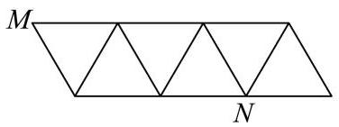

B.

D.

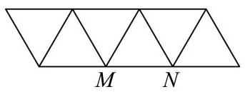

C.

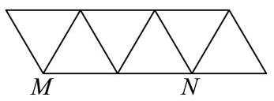

【答案】B

【解析】

【详解】该几何体上的点 $M, N$ 是一条棱的两端点.对于 $\mathrm{A},\mathrm{B},\mathrm{D}$ 项，在折叠时，这两点会被带到几何体的两个不同顶点, 所有面可以无重叠地闭合, 形成完整的双三棱锥.

而对于 $\mathrm{B}$ ,折叠后,点 $M$ 和点 $N$ 是相对的两个顶点.

16. 已知 $f\left( x\right)  = \left( {1 - a}\right) x + a\sin x$ .

①存在 $a \in  \left( {0,1}\right)$ ，使得函数 $y = f\left( x\right)$ 在 $\mathbf{R}$ 上严格增；

②对于任意 $a \in  \left( {0,1}\right)$ ,直线 $y = \left( {1 - a}\right) x + a$ 与曲线 $y = f\left( x\right)$ 都相切且有无数个切点,每个切点的横坐标都不是函数 $y = f\left( x\right)$ 的极值点.

对于以上两个结论, 下列判断正确的是 ( )

A. ①正确，②错误； B. ①错误，②正确；

C. ①正确，②正确； D. ①错误，②错误.

【答案】C

【解析】

【分析】利用导数的正负分析单调性, 利用导数的几何意义来求切线斜率即可得到判断.

【详解】对 $f\left( x\right)  = \left( {1 - a}\right) x + a\sin x$ 求导得: ${f}^{\prime }\left( x\right)  = \left( {1 - a}\right)  + a\cos x = 1 - a\left( {1 - \cos x}\right)$ 因为 $1 - \cos x \in  \left\lbrack  {0,2}\right\rbrack$ ,对 $a \in  \left( {0,1}\right) ,{f}^{\prime }\left( x\right)$ 的最小值为 $1 - {2a}$ ,

若取 $a = \frac{1}{3} \in  \left( {0,1}\right)$ ,则 $1 - {2a} = \frac{1}{3} > 0$ ,即 ${f}^{\prime }\left( x\right)  > 0$ 对任意 $x \in  \mathrm{R}$ 恒成立,

此时 $f\left( x\right)$ 在 $\mathrm{R}$ 上严格递增,结论①正确；

设直线 $y = \left( {1 - a}\right) x + a$ 与曲线的切点为 $\left( {{x}_{0}, f\left( {x}_{0}\right) }\right)$ ,

切线斜率等于直线斜率: ${f}^{\prime }\left( {x}_{0}\right)  = 1 - a$ ,

代入导数得 $1 - a + a\cos {x}_{0} = 1 - a \Rightarrow  a\cos {x}_{0} = 0$ ,

因为 $a \in  \left( {0,1}\right)$ ,故 $a \neq  0$ ,得 $\cos {x}_{0} = 0$ ,

切点同时在曲线和直线上: $f\left( {x}_{0}\right)  = \left( {1 - a}\right) {x}_{0} + a\sin {x}_{0} = \left( {1 - a}\right) {x}_{0} + a$ ,

得 $\sin {x}_{0} = 1$ ,同时满足 $\left\{  \begin{array}{l} \cos {x}_{0} = 0 \\  \sin {x}_{0} = 1 \end{array}\right.$ 的解为 ${x}_{0} = \frac{\pi }{2} + {2k\pi }\left( {k \in  \mathrm{Z}}\right)$ ,

对任意 $a \in  \left( {0,1}\right)$ ,都有无数个这样的切点,因此直线恒与曲线相切且有无数切点,

当 ${x}_{0} = \frac{\pi }{2} + {2k\pi }\left( {k \in  \mathrm{Z}}\right)$ 时, ${f}^{\prime }\left( {x}_{0}\right)  = \left( {1 - a}\right)  + a\cos {x}_{0} = 1 - a \neq  0$ ,

所以每个切点的横坐标都不是函数 $y = f\left( x\right)$ 的极值点,故结论②正确.

## 三、解答题 (本大题共有 5 题, 满分 78 分) 解答下列各题必须在答题纸的相应 位置写出必要的步骤.

17. 一次校内常规体检后，数学建模活动小组学生随机抽取了 10 名学生体重数据(单位: kg): 55, 58, 62, 74, 88, 68, 54, 52, 56, 86.

(1)求该组数据的极差和第 25 百分位数；

(2)依据体检数据，求得这 10 名学生体重 $y$ (单位: $\mathrm{{kg}}$ )关于身高 $x$ (单位: $\mathrm{{cm}}$ )的回归

方程为 $y = {2.3x} + b$ ,已知这 10 名学生身高 (单位:cm) 的平均数为 176.3,求 $b$ 的值 (精确到 0.1)

(3)体重(kg)与身高(m)平方的比称为体重指标，体重指标不低于 28.0 称为肥胖，为了解该校学生肥胖是否与性别有关，从已获得数据中随机抽样得到了如下 $2 \times  2$ 列联表.

<table><tr><td rowspan="2"></td><td colspan="2">男生</td><td colspan="2">女生</td><td rowspan="2">总计</td></tr><tr><td>观察值</td><td>预期值</td><td>观察值</td><td>预期值</td></tr><tr><td>不肥胖</td><td>99</td><td></td><td></td><td></td><td>168</td></tr><tr><td>肥胖</td><td></td><td></td><td>$m$</td><td></td><td></td></tr><tr><td>总计</td><td>120</td><td></td><td></td><td></td><td>200</td></tr></table>

求表中 $m$ 的值. 已知零假设为:肥胖与性别无关，计算男生肥胖人数的预期值(精确到 0.1).

【答案】(1) 36;55

(2) -340.2

(3) 11; 19.2

【解析】

【分析】(1) 先将数据从小到大排列, 进而最大值减最小值可得极差, 利用求百分位数步骤可得第 25 百分位数;

(2)先求 $\bar{y} = {65.3}$ ，将 $\left( {\bar{x},\bar{y}}\right)$ 代入回归方程可求 $b \approx   - {340.2}$ ；

(3)根据列联表的性质可得 $m = {11}$ ，因肥胖与性别无关，故 $E = {120} \times  \frac{{200} - {168}}{200} = {19.2}$ .

【小问 1 详解】

将数据从小到大排列:52, 54, 55, 56, 58, 62, 68, 74, 86, 88,

故极差 $R = {88} - {52} = {36}$ ,

因 ${10} \times  {25}\%  = {2.5}$ 不为整数,故第 25 百分位数是第三个数为 55 .

【小问 2 详解】

$$
\bar{y} = \frac{{52} + {54} + {55} + {56} + {58} + {62} + {68} + {74} + {86} + {88}}{10} = {65.3},
$$

因回归方程为 $y = {2.3x} + b$ 过样本中心点 $\left( {\bar{x},\bar{y}}\right)$ ,故 ${65.3} = {2.3} \times  {176.3} + b$ ,

得 $b = {65.3} - {2.3} \times  {176.3} \approx   - {340.2}$

【小问 3 详解】

由列联表的性质,女生不肥胖人数为 ${168} - {99} = {69}$ ,女生人数总计 ${200} - {120} = {80}$ ,

所以 $m = {80} - {69} = {11}$ ,

男生肥胖的预期值 $E = {120} \times  \frac{{200} - {168}}{200} = {19.2}$ .

18. 如图, $P$ 是圆锥顶点, $O$ 是底面圆心,点 $A\text{ 、 }B$ 在底面圆周上, ${OA} \bot  {OB},{OA} = {OB} = 1$ .

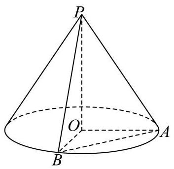

(1)若圆锥的侧面积为 ${2\pi }$ ，求圆锥的体积；

(2)若直线 ${PA}$ 与平面 ${POB}$ 所成角为 30 ，求二面角 $P - {AB} - O$ 的平面角的正切值 【答案】(1) $\frac{\sqrt{3}}{3}\pi$

(2) $\sqrt{6}$

【解析】

【分析】(1) 根据条件求圆锥的高, 再求体积;

(2)首先根据线面角求 ${PO}$ ,再根据垂直关系,构造二面角的平面角,即可求解.

【小问 1 详解】

设圆锥的底面半径为 $r$ ,母线为 $l, r = 1$ ,

圆锥的侧面积 $s = {\pi rl} = {\pi l} = {2\pi }$ ,所以 $l = 2$ ,

则圆锥的高 $h = \sqrt{{l}^{2} - {r}^{2}} = \sqrt{3}$ ,

则圆锥的体积 $V = \frac{1}{3}\pi {r}^{2}h = \frac{1}{3}\pi  \cdot  \sqrt{3} = \frac{\sqrt{3}}{3}\pi$ ;

【小问 2 详解】

因为 ${PO} \bot$ 平面 ${OAB},{OA} \subset$ 平面 ${OAB}$ ,

所以 ${PO} \bot  {OA}$ ,又因为 ${OA} \bot  {OB},{PO} \cap  {OB} = O,{PO},{OB} \subset$ 平面 ${POB}$ ,

所以 ${OA} \bot$ 平面 ${POB}$ ,则 ${PA}$ 与平面 ${POB}$ 所成角为 $\angle {APO}$ ,所以 $\angle {APO} = {30}^{ \circ  }$ , 又因为 ${OA} = 1$ ,所以 ${PO} = \sqrt{3}$ ,取 ${AB}$ 的中点 $M$ ,连结 ${OM},{PM}$ ,

因为 ${OA} = {OB},{PA} = {PB}$ ,

所以 ${OM}\bot {AB}$ ， ${PM}\bot {AB}$ ， $\angle {PMO}$ 为二面角 $P - {AB} - O$ 的平面角，

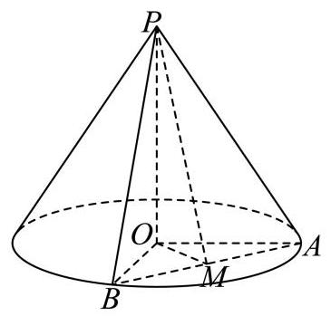

因为 ${OA} = {OB} = 1,{OA} \bot  {OB}$ ,

所以 ${OM} = \frac{1}{2}{AB} = \frac{\sqrt{2}}{2},\tan \angle {PMO} = \frac{PO}{OM} = \sqrt{6}$ ,

所以二面角 $P - {AB} - O$ 的平面角的正切值为 $\sqrt{6}$ .

19. 已知 $f\left( x\right)  = {\log }_{a}x$ (其中 $a > 0, a \neq  1$ ).

(1)若函数 $y = f\left( x\right)$ 的图象过点 $\left( {2, - 1}\right)$ ，求不等式 $f\left( {{2x} - 1}\right)  > f\left( {x + 1}\right)$ 的解集；

( 2 )若恰有两个不同的实数 $x$ ，使得 $f\left( x\right)$ ， $f\left( {x - m}\right)$ ， $f\left( 4\right)$ 成等差数列，求实数 $m$ 的取值范围.

【答案】(1) $\left( {\frac{1}{2},2}\right)$

(2) $\left( {-1,0}\right)$

【解析】

【分析】(1) 代入点坐标后求得函数的解析式, 根据其单调性和定义域解不等式即可;

(2)先根据等差数列得方程 ${x}^{2} - \left( {{2m} + 4}\right) x + {m}^{2} = 0$ 有两个不同的实数根，且两根都大于 $\max \{ 0, m\}$ ,进而对 $m$ 讨论,结合二次函数根的分布理论可得.

【小问 1 详解】

将 $\left( {2, - 1}\right)$ 代入 $f\left( x\right)  = {\log }_{a}x$ ,可得 ${\log }_{a}2 =  - 1$ ,得 $a = \frac{1}{2}$ ,

故 $f\left( x\right)  = {\log }_{\frac{1}{2}}x$ ,该对数函数为定义在 $\left( {0, + \infty }\right)$ 上的减函数,

故由 $f\left( {{2x} - 1}\right)  > f\left( {x + 1}\right)$ 可得 $0 < {2x} - 1 < x + 1$ ,解得 $\frac{1}{2} < x < 2$ ,

故不等式 $f\left( {{2x} - 1}\right)  > f\left( {x + 1}\right)$ 的解集为 $\left( {\frac{1}{2},2}\right)$

【小问 2 详解】

由已知可得 ${2f}\left( {x - m}\right)  = f\left( x\right)  + f\left( 4\right)$ ,

即 $2{\log }_{a}\left( {x - m}\right)  = {\log }_{a}x + {\log }_{a}4$ ,故 $x > \max \{ 0, m\}$ ,

整理可得 ${\log }_{a}{\left( x - m\right) }^{2} = {\log }_{a}\left( {4x}\right)$ ,故 ${\left( x - m\right) }^{2} = {4x}$ ,得 ${x}^{2} - \left( {{2m} + 4}\right) x + {m}^{2} = 0$ ,

由题意可知方程 ${x}^{2} - \left( {{2m} + 4}\right) x + {m}^{2} = 0$ 有两个不同的实数根，且两根都大于 $\max \{ 0, m\}$ ，

设 $g\left( x\right)  = {x}^{2} - \left( {{2m} + 4}\right) x + {m}^{2}$ ,

当 $m \leq  0$ 时, $\max \{ 0, m\}  = 0$ ,即函数 $g\left( x\right)$ 在区间 $\left( {0, + \infty }\right)$ 上有两个零点,

故 $\left\{  \begin{array}{l} {\left( 2m + 4\right) }^{2} - 4{m}^{2} > 0 \\  \frac{{2m} + 4}{2} > 0 \\  g\left( 0\right)  = {m}^{2} > 0 \end{array}\right.$ ,解得 $- 1 < m < 0$ ,

当 $m > 0$ 时, $\max \{ 0, m\}  = m$ ,即函数 $g\left( x\right)$ 在区间 $\left( {m, + \infty }\right)$ 上有两个零点,

故 $\left\{  \begin{array}{l} {\left( 2m + 4\right) }^{2} - 4{m}^{2} > 0 \\  \frac{{2m} + 4}{2} > m \\  g\left( m\right)  = {m}^{2} - m\left( {{2m} + 4}\right)  + {m}^{2} > 0 \end{array}\right.$ ,不等式无解,

综上可得实数 $m$ 的取值范围为 $\left( {-1,0}\right)$

20. 双曲线 $\Gamma  : \frac{{x}^{2}}{3} - \frac{{y}^{2}}{{b}^{2}} = 1\left( {b > 0}\right)$ 经过点 $P\left( {2,1}\right)$ ,不垂直 $x$ 轴的直线与 $\Gamma$ 交于不同于 $P$ 的 $A\text{ 、 }B$ 两点,直线 ${PA}\text{ 、 }{PB}$ 分别与 $y$ 轴交于点 $M\text{ 、 }N$ .

(1)求 $\Gamma$ 的离心率；

(2)设直线 ${PA}$ 与 $x$ 轴交于点 $Q$ ，且 $\overrightarrow{MQ} = 2\overrightarrow{QP}$ ，求点 $A$ 的横坐标；

(3)若 $M$ 、 $N$ 关于原点对称，证明:直线 ${AB}$ 经过定点.

【答案】(1) $e = \sqrt{2}$

(2) $\frac{14}{5}$

(3)证明见解析

【解析】

【分析】(1) 将点的坐标代入双曲线方程求得 ${b}^{2} = 3$ ,进而利用公式可得离心率;

(2)设出点的坐标，利用坐标运算，结合向量关系，联立求解即可；

(3)先求得 ${k}_{PA} + {k}_{PB} = 1$ ，设直线 ${AB} : y = {kx} + s$ ，与双曲线方程联立 ${x}^{2} - {y}^{2} = 3$ ，由韦达定理得 $s = 1 - {2k}$ ,即可求解定点.

【小问 1 详解】

将 $P\left( {2,1}\right)$ 代入双曲线方程 $\frac{{x}^{2}}{3} - \frac{{y}^{2}}{{b}^{2}} = 1\left( {b > 0}\right)$ 可得: $\frac{4}{3} - \frac{1}{{b}^{2}} = 1 \Rightarrow  {b}^{2} = 3$ ,

因为双曲线中 ${a}^{2} = 3$ ,所以 ${c}^{2} = {a}^{2} + {b}^{2} = 6$ ,

即离心率: $e = \frac{c}{a} = \frac{\sqrt{6}}{\sqrt{3}} = \sqrt{2}$ ;

【小问 2 详解】

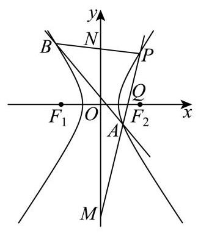

设 $A\left( {{x}_{1},{y}_{1}}\right)$ ,直线 ${PA}$ 方程为 $y - 1 = \frac{{y}_{1} - 1}{{x}_{1} - 2}\left( {x - 2}\right)$ ,

令 $x = 0$ ,得 $y = \frac{-2{y}_{1} + 2}{{x}_{1} - 2} + 1 = \frac{{x}_{1} - 2{y}_{1}}{{x}_{1} - 2}$ ,即可知 $M\left( {0,\frac{{x}_{1} - 2{y}_{1}}{{x}_{1} - 2}}\right)$ ,

令 $y = 0$ ,得 $- 1 = \frac{{y}_{1} - 1}{{x}_{1} - 2}\left( {x - 2}\right)  \Rightarrow  x = 2 - \frac{{x}_{1} - 2}{{y}_{1} - 1} = \frac{2{y}_{1} - {x}_{1}}{{y}_{1} - 1}$ ,即可知 $Q\left( {\frac{2{y}_{1} - {x}_{1}}{{y}_{1} - 1},0}\right)$ ,

由 $\overrightarrow{MQ} = 2\overrightarrow{QP}$ ,可得: $\left( {\frac{2{y}_{1} - {x}_{1}}{{y}_{1} - 1}, - \frac{{x}_{1} - 2{y}_{1}}{{x}_{1} - 2}}\right)  = 2\left( {2 - \frac{2{y}_{1} - {x}_{1}}{{y}_{1} - 1},1}\right)$ ,

则由纵坐标对应相等可得 $- \frac{{x}_{1} - 2{y}_{1}}{{x}_{1} - 2} = 2 \Rightarrow  {y}_{1} = \frac{3{x}_{1} - 4}{2}$ ,

由 (1) 知双曲线化简为 ${x}^{2} - {y}^{2} = 3$ ,代入得 ${x}_{1}^{2} - {\left( \frac{3{x}_{1} - 4}{2}\right) }^{2} = 3 \Rightarrow  5{x}_{1}^{2} - {24}{x}_{1} + {28} = 0$ ,

解得 ${x}_{1} = \frac{14}{5}$ 或 ${x}_{1} = 2$ (因为此时与点 $P$ 重合故舍去),即 ${x}_{1} = \frac{14}{5}$ ;

【小问 3 详解】

设 $M\left( {0, m}\right)$ ,由 $M, N$ 关于原点对称得 $N\left( {0, - m}\right)$ ,

计算得直线 ${PA},{PB}$ 的斜率可得 ${k}_{PA} = \frac{1 + m}{2},{k}_{PB} = \frac{1 - m}{2}$ ,

所以有 ${k}_{PA} + {k}_{PB} = \frac{1 - m}{2} + \frac{1 + m}{2} = 1$ ,

设直线 ${AB} : y = {kx} + s$ ,联立 ${x}^{2} - {y}^{2} = 3$ ,

可得: ${x}^{2} - {\left( kx + s\right) }^{2} = 3 \Rightarrow  \left( {1 - {k}^{2}}\right) {x}^{2} - {2ksx} - {s}^{2} - 3 = 0$ ,

设 $A\left( {{x}_{A},{y}_{A}}\right) , B\left( {{x}_{B},{y}_{B}}\right)$ ,

由韦达定理得 ${x}_{A} + {x}_{B} = \frac{2ks}{1 - {k}^{2}},{x}_{A}{x}_{B} =  - \frac{{s}^{2} + 3}{1 - {k}^{2}}$ ,

由 ${k}_{PA} + {k}_{PB} = 1$ ,可得: $\frac{{y}_{A} - 1}{{x}_{A} - 2} + \frac{{y}_{B} - 1}{{x}_{B} - 2} = 1 \Rightarrow  \frac{k{x}_{A} + s - 1}{{x}_{A} - 2} + \frac{k{x}_{B} + s - 1}{{x}_{B} - 2} = 1$ ,

整理得: $\left( {k{x}_{A} + s - 1}\right) \left( {{x}_{B} - 2}\right)  + \left( {k{x}_{B} + s - 1}\right) \left( {{x}_{A} - 2}\right)  = \left( {{x}_{A} - 2}\right) \left( {{x}_{B} - 2}\right)$ ,

所以 ${2k}{x}_{A}{x}_{B} + \left( {s - 1 - {2k}}\right) \left( {{x}_{A} + {x}_{B}}\right)  - 4\left( {s - 1}\right)  = {x}_{A}{x}_{B} - 2\left( {{x}_{A} + {x}_{B}}\right)  + 4$ ,

所以 $\left( {{2k} - 1}\right) {x}_{A}{x}_{B} + \left( {s + 1 - {2k}}\right) \left( {{x}_{A} + {x}_{B}}\right)  - {4s} = 0$ ,

代入韦达定理可得: $\left( {{2k} - 1}\right) \left( {-\frac{{s}^{2} + 3}{1 - {k}^{2}}}\right)  + \left( {s + 1 - {2k}}\right) \frac{2ks}{1 - {k}^{2}} - {4s} = 0$ ,

所以 $- \left( {{2k} - 1}\right) \left( {{s}^{2} + 3}\right)  + \left( {s + 1 - {2k}}\right) {2ks} - {4s}\left( {1 - {k}^{2}}\right)  = 0$ ,

所以 $- {2k}{s}^{2} - {6k} + {s}^{2} + 3 + {2k}{s}^{2} + {2ks} - 4{k}^{2}s - {4s} + 4{k}^{2}s = 0$ ,

所以 $- {6k} + {s}^{2} + 3 + {2ks} - {4s} = 0$ ,

所以 ${2k}\left( {s - 3}\right)  + \left( {s - 3}\right) \left( {s - 1}\right)  = 0 \Rightarrow  \left( {s - 3}\right) \left( {{2k} + s - 1}\right)  = 0$ ,则 $s = 3$ 或 $s = 1 - {2k}$ , 当 $s = 1 - {2k}$ 时,直线 ${AB} : y = {kx} + 1 - {2k} = k\left( {x - 2}\right)  + 1$ 恒过点 $P\left( {2,1}\right)$ ,不符合题意, 故 $s = 3$ ,此时直线 ${AB} : y = {kx} + 3$ 恒过点 $\left( {0,3}\right)$ .

21. 设函数 $y = f\left( x\right)$ 定义域为 $I$ ,区间 $D \subseteq  I$ ,记函数 $y = f\left( x\right)$ 在区间 $D$ 上的最大值为 ${M}_{f}\left( D\right)$ ,最小值为 ${m}_{f}\left( D\right)$ .

(1)设 $f\left( x\right)  = {\mathrm{e}}^{x} - {ax}$ ， $D = \left( {-1,1}\right)$ ，若 ${m}_{f}\left( D\right)  = f\left( 0\right)$ ，求实数 $a$ 的值；

(2)设 $f\left( x\right)  = {x}^{3} - 3{x}^{2}, D = \left\lbrack  {t, t + 2}\right\rbrack$ ，若 ${M}_{f}\left( D\right)  - {m}_{f}\left( D\right)  = 4$ ，且 $- 1 \leq  t \leq  1$ ，求 $t$ 的值;

(3)已知 $f\left( 0\right)  = 0$ ， $f\left( 1\right)  = 1$ ，且对任意闭区间 $D \subseteq  \left\lbrack  {0,1}\right\rbrack$ ， ${M}_{f}\left( D\right)$ 与 ${m}_{f}\left( D\right)$ 均存在. 求证: “ $y = f\left( x\right)$ 在区间 $\left\lbrack  {0,1}\right\rbrack$ 上严格增”的充要条件是 “对于任意闭区间 ${D}_{1}\text{ 、 }{D}_{2} \subseteq  \left\lbrack  {0,1}\right\rbrack$ , 当 ${M}_{f}\left( {D}_{1}\right)  = {M}_{f}\left( {D}_{2}\right)$ ,且 ${m}_{f}\left( {D}_{1}\right)  = {m}_{f}\left( {D}_{2}\right)$ 时,均有 ${D}_{1} = {D}_{2}$ ."

【答案】(1) 1

(2) $t =  - 1$ 或 $t = 0$ 或 $t = 1$

(3) 证明见解析

【解析】

【分析】(1) 讨论 $y = f\left( x\right)$ 在区间 $\left( {-1,1}\right)$ 上的单调性,则可找到其最小值,即可求出答案;

(2)讨论 $- 1 \leq  t < 0, t = 0,0 < t \leq  1$ ，分别求出 ${M}_{f}\left( D\right)$ 、 ${m}_{f}\left( D\right)$ ，即可求出答案；

(3)必要性直接证明即可，利用反证法再证明充分性.

【小问 1 详解】

由题意知函数 $f\left( x\right)  = {\mathrm{e}}^{x} - {ax}$ ,在区间 $\left( {-1,1}\right)$ 上的最小值为 $f\left( 0\right)$ ,

由题意得 ${f}^{\prime }\left( x\right)  = {\mathrm{e}}^{x} - a,\;x \in  \left( {-1,1}\right)$

① 当 $a \leq  \frac{1}{\mathrm{e}}$ 时， ${f}^{\prime }\left( x\right)  = {\mathrm{e}}^{x} - a > 0$ 恒成立，

$y = f\left( x\right)$ 在区间 $\left( {-1,1}\right)$ 上单调递增,无最小值,不满足题意;

② 当 $\frac{1}{\mathrm{e}} < a < \mathrm{e}$ 时,当 $x \in  \left( {-1,\ln a}\right)$ 时， ${f}^{\prime }\left( x\right)  = {\mathrm{e}}^{x} - a < 0$ ，

$y = f\left( x\right)$ 在区间 $\left( {-1,\ln a}\right)$ 上单调递减，

当 $x \in  \left( {\ln a,1}\right)$ 时， ${f}^{\prime }\left( x\right)  = {\mathrm{e}}^{x} - a > 0$ ，

此时 $y = f\left( x\right)$ 在区间 $\left( {\ln a,1}\right)$ 上单调递增,

此时 $\ln a = 0 \Rightarrow  a = 1$ ,满足题意;

③ 当 $a \geq  \mathrm{e}$ 时， ${f}^{\prime }\left( x\right)  = {\mathrm{e}}^{x} - a < 0$ 恒成立，

$y = f\left( x\right)$ 在区间 $\left( {-1,1}\right)$ 上单调递减,无最小值,不满足题意;

综上所述， $a = 1$ .

【小问 2 详解】

由题意得 ${f}^{\prime }\left( x\right)  = 3{x}^{2} - {6x} = {3x}\left( {x - 2}\right)$ ,

当 $x < 0$ 或 $x > 2$ 时, ${f}^{\prime }\left( x\right)  > 0$ ,函数 $y = f\left( x\right)$ 单调递增,

当 $0 < x < 2$ 时, ${f}^{\prime }\left( x\right)  < 0$ ,函数 $y = f\left( x\right)$ 单调递减,

又 $f\left( {-1}\right)  =  - 4, f\left( 0\right)  = 0, f\left( 2\right)  =  - 4, f\left( 3\right)  = 0$ ,

① 当 $- 1 \leq  t < 0$ 时， $y = f\left( x\right)$ 在区间 $\lbrack t,0)$ 上单调递增，在区间 $\left\lbrack  {0, t + 2}\right\rbrack$ 上单调递减，

此时 ${M}_{f}\left( D\right)  = f\left( 0\right)  = 0,{m}_{f}\left( D\right)  = \min \{ f\left( t\right) , f\left( {t + 2}\right) \}  =  - 4$ ,

因为 $- 1 \leq  t < 0$ ,所以 $1 \leq  t + 2 < 2$ ,

又 $y = f\left( x\right)$ 在区间 $\left\lbrack  {1,2}\right\rbrack$ 上单调递减,即 $f\left( {t + 2}\right)  > f\left( 2\right)  =  - 4$ ,

所以 $f\left( t\right)  =  - 4$ ,故 $t =  - 1$ ;

② 当 $t = 0$ 时， $y = f\left( x\right)$ 在区间 $\left\lbrack  {0,2}\right\rbrack$ 上单调递减，

此时 ${M}_{f}\left( D\right)  = f\left( 0\right)  = 0,{m}_{f}\left( D\right)  = f\left( 2\right)  =  - 4$ ,满足 ${M}_{f}\left( D\right)  - {m}_{f}\left( D\right)  = 4$ ;

③ 当 $0 < t \leq  1$ 时， $y = f\left( x\right)$ 在区间 $\lbrack t,2)$ 上单调递减，在区间 $\left\lbrack  {2, t + 2}\right\rbrack$ 上单调递增，

此时 ${m}_{f}\left( D\right)  = f\left( 2\right)  =  - 4,{M}_{f}\left( D\right)  = \max \{ f\left( t\right) , f\left( {t + 2}\right) \}  = 0$ ,

因为 $0 < t \leq  1, y = f\left( x\right)$ 在区间 $\left\lbrack  {0,1}\right\rbrack$ 上单调递减,

所以 $f\left( t\right)  < f\left( 0\right)  = 0$ ,则 $f\left( {t + 2}\right)  = 0$ ,得到 $t + 2 = 3$ ,解得 $t = 1$ ,

综上所述: $t =  - 1$ 或 $t = 0$ 或 $t = 1$ .

【小问 3 详解】

必要性: 若 $y = f\left( x\right)$ 在区间 $\left\lbrack  {0,1}\right\rbrack$ 上严格增,

设 ${D}_{1} = \left\lbrack  {a, b}\right\rbrack   \subseteq  \left\lbrack  {0,1}\right\rbrack  , a < b,{D}_{2} = \left\lbrack  {c, d}\right\rbrack   \subseteq  \left\lbrack  {0,1}\right\rbrack  , c < d$ ,

因为 $y = f\left( x\right)$ 在区间 $\left\lbrack  {0,1}\right\rbrack$ 上严格增,

所以 ${M}_{f}\left( {D}_{1}\right)  = f\left( b\right) ,{m}_{f}\left( {D}_{1}\right)  = f\left( a\right) ,{M}_{f}\left( {D}_{2}\right)  = f\left( d\right) ,{m}_{f}\left( {D}_{2}\right)  = f\left( c\right)$ ,

又 ${M}_{f}\left( {D}_{1}\right)  = {M}_{f}\left( {D}_{2}\right) ,{m}_{f}\left( {D}_{1}\right)  = {m}_{f}\left( {D}_{2}\right)$ ,

所以 $b = d, a = c$ ,又 $y = f\left( x\right)$ 在区间 $\left\lbrack  {0,1}\right\rbrack$ 上严格增,

所以 ${D}_{1} = {D}_{2}$ ,必要性成立;

充分性: 假设 $y = f\left( x\right)$ 在 $\left\lbrack  {0,1}\right\rbrack$ 上不严格增,

则存在 $0 \leq  {x}_{1} < {x}_{2} \leq  1$ ,使得 $f{\left( {x}_{1}\right) }^{3}f\left( {x}_{2}\right)$ ,

令 ${D}_{1} = \left\lbrack  {{x}_{1},{x}_{2}}\right\rbrack$ ,设 $M = {M}_{f}\left( {D}_{1}\right) , m = {m}_{f}\left( {D}_{1}\right)$ ,

由函数 $y = f\left( x\right)$ 在区间 $\left\lbrack  {0,1}\right\rbrack$ 连续,

所以必存在 $c, d \in  \left\lbrack  {{x}_{1},{x}_{2}}\right\rbrack$ ,使得 $f\left( c\right)  = M, f\left( d\right)  = m$ ,

令 ${D}_{2} = \left\lbrack  {\min \left( {c, d}\right) ,\max \left( {c, d}\right) }\right\rbrack$ ,则 ${M}_{f}\left( {D}_{2}\right)  = M,{m}_{f}\left( {D}_{2}\right)  = m$ ,

由于 $f{\left( {x}_{1}\right) }^{3}f\left( {x}_{2}\right)$ ,函数 $y = f\left( x\right)$ 在区间 $\left\lbrack  {{x}_{1},{x}_{2}}\right\rbrack$ 上不可能是严格增函数,

若函数 $y = f\left( x\right)$ 在区间 $\left\lbrack  {{x}_{1},{x}_{2}}\right\rbrack$ 上为常数,可取 ${D}_{2} = \left\lbrack  {{x}_{1},{x}_{1} + \frac{{x}_{2} - {x}_{1}}{2}}\right\rbrack$ ,

则 ${D}_{1} \neq  {D}_{2}$ ,与题设矛盾; 若函数 $y = f\left( x\right)$ 在区间 $\left\lbrack  {{x}_{1},{x}_{2}}\right\rbrack$ 上不为常数,

则其最大值与最小值不可能同时在两个端点 ${x}_{1},{x}_{2}$ 取到,

故 ${D}_{2}$ 是 ${D}_{1}$ 的真子集,即 ${D}_{1} \neq  {D}_{2}$ 与题设矛盾.

因此假设不成立, $y = f\left( x\right)$ 在 $\left\lbrack  {0,1}\right\rbrack$ 上严格增,充分性成立.

综上所述: “ $y = f\left( x\right)$ 在区间 $\left\lbrack  {0,1}\right\rbrack$ 上严格增”的充要条件是“对于任意闭区间 ${D}_{1}$ 、

${D}_{2} \subseteq  \left\lbrack  {0,1}\right\rbrack$

当 ${M}_{f}\left( {D}_{1}\right)  = {M}_{f}\left( {D}_{2}\right)$ ,且 ${m}_{f}\left( {D}_{1}\right)  = {m}_{f}\left( {D}_{2}\right)$ 时,均有 ${D}_{1} = {D}_{2}$ ."
