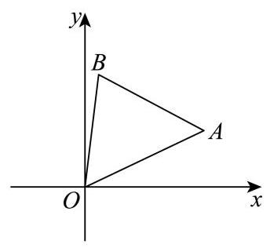

12. 定义:平面内图形 $\Gamma$ 上的所有点在直线 $l$ 上的射影所组成的图形称为 $\Gamma$ 在 $l$ 上的射影. 若存在边长为 $m$ 的正三角形在正方形的四条边所在直线上的射影长度之和为 4,则 $m$ 的取值范围为___.

## 二、选择题 (本大题共有 4 题, 满分 18 分, 第 13-14 题每题 4 分, 第 15-16 题每 题 5 分) 每题有且只有一个正确选项.考生应在答题纸的相应位置, 将代表正确 选项的小方格涂黑.

---

## 参考答案与解析

12. 定义: 平面内图形 $\Gamma$ 上的所有点在直线 $l$ 上的射影所组成的图形称为 $\Gamma$ 在 $l$ 上的射影. 若存在边长为 $m$ 的正三角形在正方形的四条边所在直线上的射影长度之和为 4,则 $m$ 的取值范围为___.

【答案】 $\left\lbrack  {\sqrt{6} - \sqrt{2},8 - 4\sqrt{3}}\right\rbrack$

【解析】

【分析】根据题意,转化为正三角形 ${OAB}$ 在 $x$ 轴、 $y$ 轴上投影之和的两倍,设 ${OA}$ 与 $x$ 轴正半轴的夹角为 $a$ ,正三角形在正方形的四条边所在直线上的射影长度之和为 $M$ ,分 $a \in  \left\lbrack  {0,\frac{\pi }{6}}\right\rbrack  \text{ 、 }a \in  \left( {\frac{\pi }{6},\frac{\pi }{3}}\right\rbrack  \text{ 、 }a \in  \left( {\frac{\pi }{3},\frac{\pi }{2}}\right\rbrack$ 三种情况分别计算 $M$ 的最值,再列不等式求解即可.

【详解】解: 根据题意,正三角形在正方形的四条边所在直线上的射影长度之和,

等价于正三角形 ${OAB}$ 在 $x$ 轴、 $y$ 轴上投影之和的两倍,

设 ${OA}$ 与 $x$ 轴正半轴的夹角为 $a$ ,

正三角形在正方形的四条边所在直线上的射影长度之和为 $M$ ,

则 $A\left( {m\cos a, m\sin a}\right) , B\left( {m\cos \left( {a + \frac{\pi }{3}}\right) , m\sin \left( {a + \frac{\pi }{3}}\right) }\right)$ ,

当 $a \in  \left\lbrack  {0,\frac{\pi }{6}}\right\rbrack$ 时，正三角形 ${OAB}$ 在 $x$ 轴、 $y$ 轴上投影分别为 $m\cos a\text{ 、 }m\sin \left( {a + \frac{\pi }{3}}\right)$ ,

则 $M = {2m}\cos a + {2m}\sin \left( {a + \frac{\pi }{3}}\right)  = {2m}\left\lbrack  {\cos a + \sin \left( {a + \frac{\pi }{3}}\right) }\right\rbrack$

$= {2m}\left\lbrack  {\cos a + \cos \left( {\frac{\pi }{6} - a}\right) }\right\rbrack   = {4m}\cos \frac{\pi }{12}\cos \left( {a - \frac{\pi }{12}}\right)$ ,

$\therefore a = 0$ 或 $a = \frac{\pi }{6}$ 时, $M$ 取得最小值 $\left( {2 + \sqrt{3}}\right) m$ ,

$a = \frac{\pi }{12}$ 时, $M$ 取得最大值为 ${4m}\cos \frac{\pi }{12} = \left( {\sqrt{6} + \sqrt{2}}\right) m$ ;

当 $a \in  \left( {\frac{\pi }{6},\frac{\pi }{3}}\right\rbrack$ 时,正三角形 ${OAB}$ 在 $x$ 轴、 $y$ 轴上投影分别为 $m\cos a - m\cos \left( {a + \frac{\pi }{3}}\right)$ 、 $m\sin \left( {a + \frac{\pi }{3}}\right)$

$M = {2m}\cos a - {2m}\cos \left( {a + \frac{\pi }{3}}\right)  + {2m}\sin \left( {a + \frac{\pi }{3}}\right)$

$= {2m}\cos a - m\cos a + \sqrt{3}m\sin a + m\sin a + \sqrt{3}m\cos a$

$= \left( {\sqrt{3} + 1}\right) m\left( {\sin a + \cos a}\right)$

$= \left( {\sqrt{6} + \sqrt{2}}\right) \sin \left( {a + \frac{\pi }{4}}\right) ,$

当 $a = \frac{\pi }{3}$ 时， $M$ 取得最小值 $\left( {2 + \sqrt{3}}\right) m$ ，当 $a = \frac{\pi }{4}$ 时， $M$ 取得最大值为 $\left( {\sqrt{6} + \sqrt{2}}\right) m$ ； $a \in  \left( {\frac{\pi }{3},\frac{\pi }{2}}\right\rbrack$ 时,正三角形 ${OAB}$ 在 $x$ 轴、 $y$ 轴上投影分别为 $m\cos a - m\cos \left( {a + \frac{\pi }{3}}\right)$ 、

$m\sin a$ ,

$$
M = {2m}\cos a - {2m}\cos \left( {a + \frac{\pi }{3}}\right)  + {2m}\sin a
$$

$$
= {2m}\cos a - m\cos a + \sqrt{3}m\sin a + {2m}\sin a
$$

$$
= m\cos a + \left( {2 + \sqrt{3}}\right) m\sin a
$$

$$
= \left( {\sqrt{6} + \sqrt{2}}\right) m\left( {\frac{\sqrt{6} - \sqrt{2}}{4}\cos a + \frac{\sqrt{6} + \sqrt{2}}{4}\sin a}\right)
$$

$$
= \left( {\sqrt{6} + \sqrt{2}}\right) m\sin \left( {a + \frac{\pi }{12}}\right)
$$

当 $a = \frac{\pi }{2}$ 时， $M$ 取得最小值 $\left( {2 + \sqrt{3}}\right) m$ ，当 $a = \frac{5\pi }{12}$ 时， $M$ 取得最大值为 $\left( {\sqrt{6} + \sqrt{2}}\right) m$ ； 由对称性可证,其它象限最值情况一样,

综上, $M$ 的最小值为 $\left( {2 + \sqrt{3}}\right) m$ ,最大值为 $\left( {\sqrt{6} + \sqrt{2}}\right) m$ ,

$\therefore \left\{  \begin{array}{l} \left( {2 + \sqrt{3}}\right) m \leq  4 \\  \left( {\sqrt{6} + \sqrt{2}}\right) m \geq  4 \end{array}\right.$ ,解得 $\sqrt{6} - \sqrt{2} \leq  m \leq  8 - 4\sqrt{3}$ ,

则 $m$ 的取值范围为 $\left\lbrack  {\sqrt{6} - \sqrt{2},8 - 4\sqrt{3}}\right\rbrack$ .

## 二、选择题 (本大题共有 4 题, 满分 18 分, 第 13-14 题每题 4 分, 第 15-16 题每 题 5 分) 每题有且只有一个正确选项.考生应在答题纸的相应位置, 将代表正确 选项的小方格涂黑.
