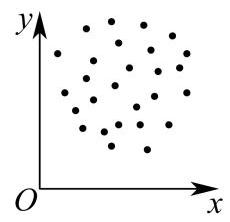
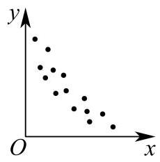
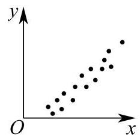
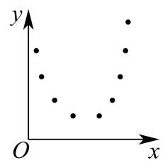
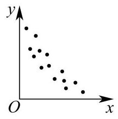
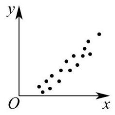

13. 以下是由变量 $x$ 与 $y$ 所绘制的散点图,则它们的线性相关程度较高且正相关的是 ( )

A.

B.

C.

D.

---

## 参考答案与解析

13. 以下是由变量 $x$ 与 $y$ 所绘制的散点图,则它们的线性相关程度较高且正相关的是 ( )

A.

B.

C.

D.

【答案】D

【解析】

【详解】对于 A: 散点杂乱无章，无规律可言，看不出两个变量有什么相关性；故 A 错误； 对于 B: 两个变量不具有线性相关性, 故 B 错误;

对于 C: 两个变量之间的关系为负相关关系; 故 C 错误;

对于 D: 两个变量之间的关系为正相关关系, 且散点图中的点分布在一条直线附近, 线性相关程度较高; 故 D 正确.
