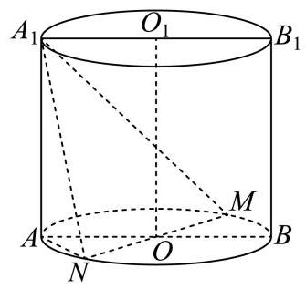
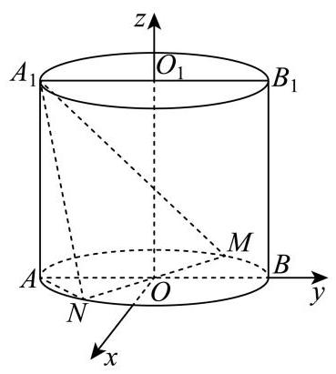

18. 如图,圆柱 $O{O}_{1}$ 的轴截面 ${AB}{B}_{1}{A}_{1}$ 是边长为 4 的正方形, ${MN}$ 为底面圆 $O$ 的一条直径, 且 $\angle {BOM} = \frac{\pi }{3}$ .

(1)求异面直线 ${A}_{1}N$ 与 $B{B}_{1}$ 所成角的大小(用反三角表示)；

(2)求点 $A$ 到平面 ${A}_{1}{MN}$ 的距离.

---

## 参考答案与解析

18. 如图,圆柱 $O{O}_{1}$ 的轴截面 ${AB}{B}_{1}{A}_{1}$ 是边长为 4 的正方形, ${MN}$ 为底面圆 $O$ 的一条直径,

且 $\angle {BOM} = \frac{\pi }{3}$ .

(1)求异面直线 ${A}_{1}N$ 与 $B{B}_{1}$ 所成角的大小(用反三角表示)；

(2)求点 $A$ 到平面 ${A}_{1}{MN}$ 的距离.

【答案】(1) $\arccos \frac{2\sqrt{5}}{5}$

(2) $\frac{4\sqrt{57}}{19}$

【解析】

【分析】(1) 建立空间直角坐标系, 把异面直线所成角转化为两条异面直线的方向向量的夹角求解

(2)通过(1)空间直角坐标系利用向量运算求点到平面距离

【小问 1 详解】

根据题意建立以底面圆心 $O$ 为原点, ${AB}$ 所在直线为 $y$ 轴, $O{O}_{1}$ 所在直线为 $z$ 轴,垂直于 ${AB}$ 方向为 $x$ 轴的空间直角坐标系,

则 $A\left( {0, - 2,0}\right) , B\left( {0,2,0}\right) ,{A}_{1}\left( {0, - 2,4}\right) ,{B}_{1}\left( {0,2,4}\right) , O\left( {0,0,0}\right) ,{O}_{1}\left( {0,0,4}\right)$

因为 $\angle {BOM} = \frac{\pi }{3}$ ，所以 $M\left( {-{\sqrt{3},1},0}\right)$ ， $N\left( {\sqrt{3}, - 1,0}\right)$

所以 $\overrightarrow{{A}_{1}N} = \left( {\sqrt{3}, - 1, - 4}\right) ,\overrightarrow{B{B}_{1}} = \left( {0,0,4}\right) ,\overrightarrow{{A}_{1}N} \cdot  \overrightarrow{B{B}_{1}} =  - {16}$ ，

$\left| \overrightarrow{{A}_{1}N}\right|  = \sqrt{{\left( \sqrt{3}\right) }^{2} + {\left( -1\right) }^{2} + {\left( -4\right) }^{2}} = \sqrt{20} = 2\sqrt{5},\left| \overrightarrow{B{B}_{1}}\right|  = 4$

设异面直线所成角为 $\theta$ ，则 $\cos \theta  = \frac{\left| \overrightarrow{{A}_{1}N} \cdot  \overrightarrow{B{B}_{1}}\right| }{\left| \overrightarrow{{A}_{1}N}\right|  \cdot  \left| \overrightarrow{B{B}_{1}}\right| } = \frac{16}{2\sqrt{5} \times  4} = \frac{2\sqrt{5}}{5}$ 所以异面直线 ${A}_{1}N$ 与 $B{B}_{1}$ 所成角为 $\arccos \frac{2\sqrt{5}}{5}$

【小问 2 详解】

$\overrightarrow{{A}_{1}M} = \left( {-\sqrt{3},3, - 4}\right) ,\overrightarrow{{A}_{1}N} = \left( {\sqrt{3},1, - 4}\right) ,\overrightarrow{NA} = \left( {-\sqrt{3}, - 1,0}\right) ,$

设平面 ${A}_{1}{MN}$ 的法向量为 $\overrightarrow{n} = \left( {x, y, z}\right)$ ,

则由 $\overrightarrow{{A}_{1}M} \cdot  \overrightarrow{n} = 0,\overrightarrow{{A}_{1}N} \cdot  \overrightarrow{n} = 0$ ,得 $\left\{  \begin{matrix}  - \sqrt{3}x + {3y} - {4z} = 0 \\  \sqrt{3}x + y - {4z} = 0 \end{matrix}\right.$ ,令 $y = 2$ ,则 $z = 1, x = \frac{2\sqrt{3}}{3}$ 所以 $\overrightarrow{n} = \left( {\frac{2\sqrt{3}}{3},2,1}\right)$

设点 $A$ 到平面 ${A}_{1}{MN}$ 的距离为 $d$ ,则 $d = \frac{\left| \overrightarrow{NA} \cdot  \overrightarrow{n}\right| }{\left| \overrightarrow{n}\right| } = \frac{\left| \left( -\sqrt{3}, - 1,0\right)  \cdot  \left( \frac{2\sqrt{3}}{3},2,1\right) \right| }{\sqrt{{\left( \frac{2\sqrt{3}}{3}\right) }^{2} + {2}^{2} + {1}^{2}}} = \frac{4\sqrt{57}}{19}$

