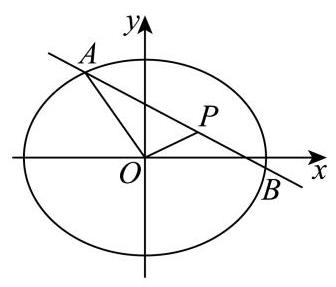

20. 已知椭圆 $\Gamma  : \frac{{x}^{2}}{{a}^{2}} + \frac{{y}^{2}}{{b}^{2}} = 1\left( {a > b > 0}\right)$ 的焦距为 $4\sqrt{3}$ ，离心率为 $\frac{\sqrt{3}}{2}$ ，过点 $P\left( {2,1}\right)$ 的直线交椭圆于点 $A$ 、 $B$ .

(1)求Γ的方程；

(2)记 $\bigtriangleup  {OAP}$ 的面积为S，求证: $S \leq  2\sqrt{2}$ ；

(3)求 $\left| {PA}\right|  \cdot  \left| {PB}\right|$ 的最大值与最小值，并写出取最大值与最小值时直线 ${AB}$ 的方程.

---

## 参考答案与解析

20. 已知椭圆 $\Gamma  : \frac{{x}^{2}}{{a}^{2}} + \frac{{y}^{2}}{{b}^{2}} = 1\left( {a > b > 0}\right)$ 的焦距为 $4\sqrt{3}$ ，离心率为 $\frac{\sqrt{3}}{2}$ ，过点 $P\left( {2,1}\right)$ 的直线交椭圆于点 $A$ 、 $B$ .

(1)求Γ的方程；

(2)记 $\bigtriangleup  {OAP}$ 的面积为S，求证: $S \leq  2\sqrt{2}$ ；

(3)求 $\left| {PA}\right|  \cdot  \left| {PB}\right|$ 的最大值与最小值，并写出取最大值与最小值时直线 ${AB}$ 的方程.

【答案】(1) $\frac{{x}^{2}}{16} + \frac{{y}^{2}}{4} = 1\;$ (2) 证明见解析

(3) 最大值 8 ，直线方程 $y = 1$ ；最小值 2 ，直线方程 $x = 2$

【解析】

【分析】(1) 根据椭圆已知的焦距和离心率求出参数 $a, b$ ,代入椭圆标准方程得到结果;

(2)将 $S$ 表示为 $A$ 点坐标的线性式，结合椭圆方程的参数形式，利用余弦函数的值域证明结论;

(3)设过点 $P$ 的直线参数方程，利用参数 $t$ 的几何意义将 $\left| {PA}\right|  \cdot  \left| {PB}\right|$ 转化为 $\left| {{t}_{1}{t}_{2}}\right|$ ，结合韦达定理得到表达式后求最值.

【小问 1 详解】

由题意得 ${2c} = 4\sqrt{3}$ ,故 $c = 2\sqrt{3}$ ,结合离心率 $e = \frac{c}{a} = \frac{\sqrt{3}}{2}$ 得 $a = 4$ .

由椭圆关系 ${b}^{2} = {a}^{2} - {c}^{2} = {16} - {12} = 4$ ,因此椭圆 $\Gamma$ 的方程为: $\frac{{x}^{2}}{16} + \frac{{y}^{2}}{4} = 1$ ;

【小问 2 详解】

设 $A\left( {{x}_{1},{y}_{1}}\right)$ ,因为 $P\left( {2,1}\right) , O\left( {0,0}\right)$ ,所以直线 ${OP} : y = \frac{1}{2}x$ ,即 $x - {2y} = 0$ ,

所以点 $A$ 到直线 ${OP}$ 的距离 $d = \frac{\left| {x}_{1} - 2{y}_{1}\right| }{\sqrt{{1}^{2} + {2}^{2}}} = \frac{\left| {x}_{1} - 2{y}_{1}\right| }{\sqrt{5}}$ ,又 $\left| {OP}\right|  = \sqrt{{1}^{2} + {2}^{2}} = \sqrt{5}$ ,

所以 $S = \frac{1}{2}\left| {OP}\right|  \cdot  d = \frac{1}{2} \times  \sqrt{5} \times  \frac{\left| {x}_{1} - 2{y}_{1}\right| }{\sqrt{5}} = \frac{1}{2}\left| {{x}_{1} - 2{y}_{1}}\right|$

由 $A$ 在椭圆上得 ${\left( \frac{{x}_{1}}{4}\right) }^{2} + {\left( \frac{{y}_{1}}{2}\right) }^{2} = 1$ ,所以可设 ${x}_{1} = 4\cos \theta ,{y}_{1} = 2\sin \theta$ ,

所以 ${x}_{1} - 2{y}_{1} = 4\cos \theta  - 4\sin \theta  = 4\sqrt{2}\cos \left( {\theta  + \frac{\pi }{4}}\right)$ ,

因此 $S = \frac{1}{2}\left| {{x}_{1} - 2{y}_{1}}\right|  = \frac{1}{2} \times  4\sqrt{2}\left| {\cos \left( {\theta  + \frac{\pi }{4}}\right) }\right|  \leq  \frac{1}{2} \times  4\sqrt{2} = 2\sqrt{2}$ ,得证.

【小问 3 详解】

设过 $P\left( {2,1}\right)$ 的直线 ${AB}$ 参数方程为 $\left\{  \begin{array}{l} x = 2 + t\cos a \\  y = 1 + t\sin a \end{array}\right.$ ( $t$ 为参数),

代入椭圆方程整理得: $\left( {{\cos }^{2}a + 4{\sin }^{2}a}\right) {t}^{2} + \left( {4\cos a + 8\sin a}\right) t - 8 = 0$ ，

由参数 $t$ 的几何意义得 $\left| {PA}\right|  \cdot  \left| {PB}\right|  = \left| {{t}_{1}{t}_{2}}\right|$ ,

结合韦达定理得: $\left| {PA}\right|  \cdot  \left| {PB}\right|  = \left| \frac{-8}{{\cos }^{2}a + 4{\sin }^{2}a}\right|  = \frac{8}{1 + 3{\sin }^{2}a}$ ,

斜率存在时,设斜率为 $k = \tan a$ ,化简得 $\left| {PA}\right|  \cdot  \left| {PB}\right|  = 2 + \frac{6}{1 + 4{k}^{2}}$ ,

由 ${k}^{2} \geq  0$ 得:当 $k = 0$ 时， $\left| {PA}\right|  \cdot  \left| {PB}\right|$ 取得最大值 8，对应直线方程为 $y = 1$ ；

当直线斜率不存在时,直线为 $x = 2$ ,此时 $\left| {PA}\right|  \cdot  \left| {PB}\right|  = 2$ ,为最小值.

综上, $\left| {PA}\right|  \cdot  \left| {PB}\right|$ 的最大值为 8,对应直线方程为 $y = 1$ ; 最小值为 2,对应直线方程为 $x = 2$

